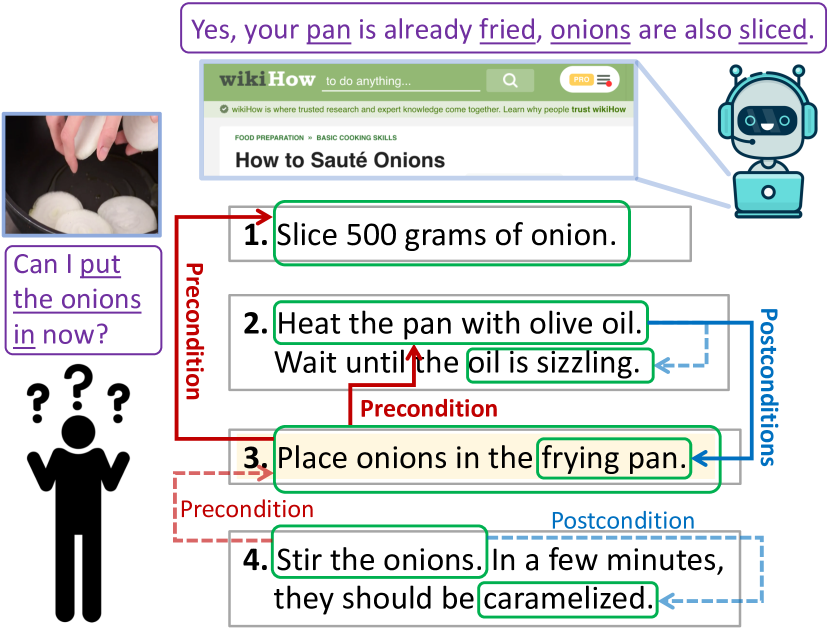
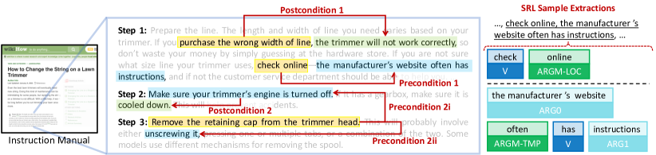
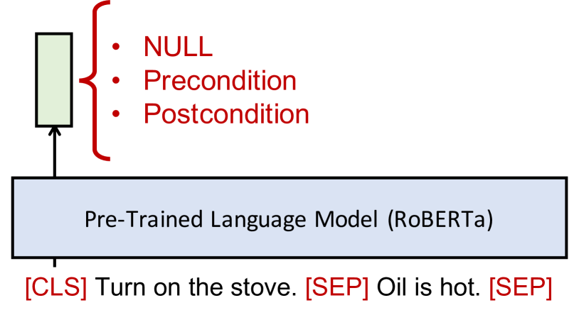
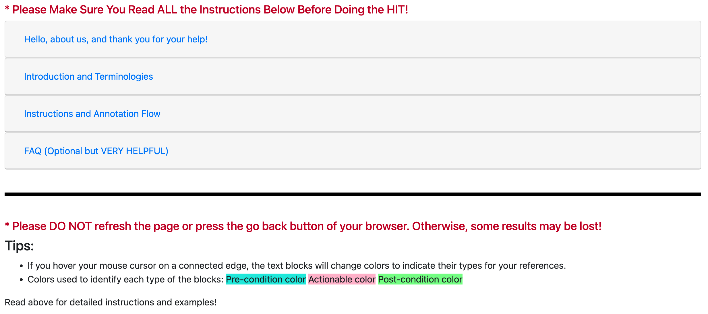

# Learning Action Conditions from Instructional Manuals 
for Instruction Understanding

###### Abstract

The ability to infer pre- and postconditions of an action is vital for comprehending complex instructions, and is essential for applications such as autonomous instruction-guided agents and assistive AI that supports humans to perform physical tasks. In this work, we propose a task dubbed action condition inference, and collecting a high-quality, human annotated dataset of preconditions and postconditions of actions in instructional manuals. We propose a weakly supervised approach to automatically construct large-scale training instances from online instructional manuals, and curate a densely human-annotated and validated dataset to study how well the current NLP models can infer action-condition dependencies in the instruction texts. We design two types of models differ by whether contextualized and global information is leveraged, as well as various combinations of heuristics to construct the weak supervisions. Our experimental results show a >20% F1-score improvement with considering the entire instruction contexts and a > 6% F1-score benefit with the proposed heuristics.    

## 1 Introduction

When accomplishing complex tasks (e.g. making a gourmet dish) composed of multiple action steps, instructional manuals are often referred to as the important and useful guidelines. To follow the instructed actions, it is crucial to ensure the current situation fulfills all the necessary preconditions, i.e. prerequisites to be met, before taking a particular action. Similarly, it is essential to infer the postconditions, the effect supposed to be caused after performing such an action, to make sure the execution of the action is successful and as expected.  

[FIGURE S1.F1.g1]

Figure 1: 
The Action Condition Inference Task:
We propose a task that probes models’ ability to infer both preconditions and postconditions of an action from instructional manuals. It has wide applications to e.g. assistive AI and task-solving robots.
∗Original instructions are rephrased for simplicity in this illustration.
[/FIGURE]

[FIGURE S1.F2.g1]

Figure 2: 
Terminologies:
(Left) We show a few exemplaractionableswith their associatedpreconditionsandpostconditions.
Notice that an actionable can have multiple pre- or postconditions and they can span across different instruction steps.
For simplicity we do not show an exhausted set of text segments of interests, i.e. in the actual dataset there might be more.
(Right) we show one sample SRL extractions which correspond to one of the action-condition dependency linkages on the left.
[/FIGURE]

For autonomous agents or assistant AI that aids humans to accomplish certain tasks, understanding these conditions enables the agent to make correct judgements on whether to proceed to the next action, as well as evaluating the successfulness of a particular executed action. As exemplified in Figure [1](#S1.F1 "Figure 1 ‣ 1 Introduction ‣ Learning Action Conditions from Instructional Manuals for Instruction Understanding"), before performing the action “place onions" in step 3, both “heat the pan" (step 2) and “slice onions" (step 1) have to be successfully accomplished, and hence should be regarded as preconditions of step 3. On the other hand, after executing “stir onions" (step 4), its desired outcome, “caramelized", should be recognized as the postcondition in order to assess the completion of the execution. These action and its pre/postcondition dependencies are prevalent in instructional texts and can be inferred by comprehending the instruction texts. To this end, we propose the action condition inference task on instructional manuals, where a dependency graph is induced as in Figure [1](#S1.F1 "Figure 1 ‣ 1 Introduction ‣ Learning Action Conditions from Instructional Manuals for Instruction Understanding") to denote the pre- and postconditions of actions.  

We consider two popular online instructional manuals, WikiHow [Hadley et al.](#bib.bib11)  and Instructables.com [ins](#bib.bib1) , to study the current NLP models’ capabilities of performing the proposed action condition inference task. As there is no densely annotated dataset for the complex pre- and postcondition dependency structures of actions, we collect comprehensive human annotations on a subset of 650 samples. This allows us to benchmark models in either a zero-shot setting where no annotated data is used for training, or a low-resource setting with a limited amount of annotated training data.  

We also design heuristics to automatically construct weakly supervised training data. Specifically, we consider the following heuristics: (1) Key entity tracing: We hypothesize that if the same entity (including resolved co-references) is mentioned in two instruction descriptions, there is likely a dependency between them. (2) Keywords: Certain keywords, such as the word before in the description “do X before doing Y", can often imply the condition dependencies. (3) Temporal reasoning: While conditional events are naturally temporally grounded (e.g. preconditions should occur prior to an action), the narrated order of events may not be consistent with their actual temporal order. We thus adopt a temporal relation resolution module Han et al. ([2021b](#bib.bib14)) to alleviate such an issue.  

To benchmark the proposed task, we consider two types of models, one only takes a pair of input descriptions and predicts their relation without other contexts, and the other takes the entire instruction paragraphs into account to leverage contextualized global information. It is shown that weak supervisions can benefit learning with limited labeled data in many NLP tasks Plank and Agić ([2018](#bib.bib27)); Hedderich et al. ([2020](#bib.bib15)), thus we also propose different ways to combine annotated and unlabelled data to further improve the model performance.  

We evaluate the models on a held-out test-set of the annotated data, where we observe the contextualized models outperform the non-contextualized counterparts by a large margin (> 20% F1-score), and that our proposed heuristics further improve the contextualized models significantly (> 6% F1-score) on the low-resource setting. In addition, we conduct ablation studies on the designed heuristics to assess their respective contributions to provide more in-depth analysis of the nature of both our task and the utilized instructions.  

Our key contributions are three-fold: (1) We propose the action-condition inference task and create a densely human-annotated dataset to spur research on structural instruction comprehensions. (2) We design heuristics utilizing entity tracing, keywords, and temporal common sense to construct effective large-scale weak supervisions. (3) We benchmark model performance on the proposed task to shed lights on future research in this direction.    

## 2 Terminologies and Problem Definition

Our goal is to learn to infer the knowledge of action-condition dependencies in real-world task-oriented instructional manuals. We first describe the terminologies used throughout the paper:  

Actionable refers to a phrase that a person can follow and execute in the real world (yellow colored phrases in Figure [2](#S1.F2 "Figure 2 ‣ 1 Introduction ‣ Learning Action Conditions from Instructional Manuals for Instruction Understanding")). We also consider negated actions (e.g. do not …) or actions warned to avoid (e.g. if you purchase the wrong…) as they likely also carry useful knowledge regarding the tasks.111In actual annotations workers are asked to single out the actual actionable phrases so we can extract knowledge such as purchase the wrong line $\rightarrow$ trimmer will not work correctly.  

Precondition concerns the prerequisites to be met for an actionable to be executable, which can be a status, a condition, and/or another prior actionable (blue colored phrases in Figure [2](#S1.F2 "Figure 2 ‣ 1 Introduction ‣ Learning Action Conditions from Instructional Manuals for Instruction Understanding")). It is worth noting that humans can omit explicitly writing out certain condition statements because of their triviality as long as the actions inducing them are mentioned (e.g. heat the pan $\rightarrow$ pan is heated, the latter can often be omitted). We thus generalize the conventional formulation of precondition used in planning languages such as STRIPS Fikes and Nilsson ([1971](#bib.bib9)), i.e. sets of statements evaluated to true/false, to a phrase that is either a passive condition statement or an actionable that induces the prerequisite conditions, as inspired by Linden ([1994](#bib.bib20)).  

Postcondition is defined as the outcome caused by the execution of an actionable, which often involves status changes of certain objects (or the actor itself) or certain effects emerged to the surroundings or world state (green colored phrases in Figure [2](#S1.F2 "Figure 2 ‣ 1 Introduction ‣ Learning Action Conditions from Instructional Manuals for Instruction Understanding")).  

Text segment is the term we will use to refer to a textual segment of interest, which can be one of the: {actionable, precondition, postcondition} statements, throughout the rest of the paper.  

In reality, a valid actionable phrase should have both precondition and postcondition dependencies, as a real-world executable action will always have certain prerequisites to meet and outcomes caused. However, we do not enforce this in this work as conditions can occasionally be omitted by the authors of human written instructions.  

Problem Formulation. Given an input instructional manual and some text segments of interest extracted from it, a model is asked to predict the directed relation between a pair of segments, where the relation should be one of the followings: NULL (no relation), precondition, or postcondition.  

## 3 Datasets and Human Annotations

We are interested in understanding the current NLP models’ capability on inferring the action-condition dependencies in instructional manuals. To this end, we consider two popular online instruction resources, WikiHow and Instructables.com, both consist of articles composed of multiple steps with their detailed step descriptions, to support our investigation. For WikiHow, we use the provided dataset from Wu et al. ([2022](#bib.bib36)); for Instructables, we scrape the contents directly from their website.  

As densely annotating large-scale instruction sources for the desired dependencies can be extremely expensive and laborious, we propose to train the models via a weakly supervised method utilizing a few designed heuristics to construct large-scale training data automatically, and then finetune the models with limited human annotated instructions to further improve the performance. For this purpose as well as performing a more grounded evaluation, we collect comprehensive human annotations primarily on a selected subset in each dataset to serve as our annotated-set, and particularly the subsets used to evaluate the models as the annotated-test-set.222Following Wu et al. ([2022](#bib.bib36)), we first choose from physical categories and then sample a manually inspected subset. In total, our densely annotated-set has 500 samples in WikiHow and 150333Instructables tend to have noisier and more free-formed texts so we manually sub-sample a smaller high quality subset. samples in Instructables. In Section [6.2](#S6.SS2 "6.2 Experimental Setups ‣ 6 Experiments and Analysis ‣ Learning Action Conditions from Instructional Manuals for Instruction Understanding"), we will describe how the annotated-set is split to facilitate the low-resource training. We also collect the human performance on the annotated-test-set to gauge the human upper bound of our proposed task. More dataset details are in Append. Sec. [A](#A1 "Appendix A Details of The Datasets ‣ Learning Action Conditions from Instructional Manuals for Instruction Understanding").  

[TABLE S3.T1]

<table class="ltx_tabular ltx_guessed_headers ltx_align_middle">
<thead class="ltx_thead">
<tr class="ltx_tr">
<th class="ltx_td ltx_align_center ltx_align_middle ltx_th ltx_th_column ltx_border_r ltx_border_tt">Heuristics</th>
<th class="ltx_td ltx_align_center ltx_th ltx_th_column ltx_border_r ltx_border_tt">Examples</th>
<th class="ltx_td ltx_align_center ltx_align_middle ltx_th ltx_th_column ltx_border_tt">Descriptions</th>
</tr>
</thead>
<tbody class="ltx_tbody">
<tr class="ltx_tr">
<td class="ltx_td ltx_align_justify ltx_align_middle ltx_border_r ltx_border_t">

Entity-Tracing &amp; Coref.

</td>
<td class="ltx_td ltx_align_center ltx_border_r ltx_border_t"></td>
<td class="ltx_td ltx_align_justify ltx_align_middle ltx_border_t">

The shared entities are pan and onions (linked via co-references to them).

</td>
</tr>
<tr class="ltx_tr">
<td class="ltx_td ltx_align_justify ltx_align_middle ltx_border_r ltx_border_t">

Keywords

</td>
<td class="ltx_td ltx_align_center ltx_border_r ltx_border_t"></td>
<td class="ltx_td ltx_align_justify ltx_align_middle ltx_border_t">

Keywords are used to link the segments they separate. If the keyword is at the beginning (2nd example), the (1st) comma is used to segment the sentences.

</td>
</tr>
<tr class="ltx_tr">
<td class="ltx_td ltx_align_justify ltx_align_middle ltx_border_r ltx_border_t">

Postcondition

</td>
<td class="ltx_td ltx_align_center ltx_border_r ltx_border_t"></td>
<td class="ltx_td ltx_align_justify ltx_align_middle ltx_border_t">

Certain linguistic hints (e.g. SRL tags) are utilized to propose plausible (and likely) postcondition text segments.

</td>
</tr>
<tr class="ltx_tr">
<td class="ltx_td ltx_align_justify ltx_align_middle ltx_border_bb ltx_border_r ltx_border_t">

Temporal

</td>
<td class="ltx_td ltx_align_center ltx_border_bb ltx_border_r ltx_border_t"></td>
<td class="ltx_td ltx_align_justify ltx_align_middle ltx_border_bb ltx_border_t">

The action prying should occur prior to stepping, but these two segments are reversely narrated in the contexts.

</td>
</tr>
</tbody>
</table>

Table 1: 
Sample Linking Heuristics: For each of the applied heuristics we show one or two exemplar use cases and their detailed descriptions. The color schemes are the same as Figure [2](#S1.F2 "Figure 2 ‣ 1 Introduction ‣ Learning Action Conditions from Instructional Manuals for Instruction Understanding").
[/TABLE]

### 3.1 Annotations and Task Specifications

Dataset Structure. The basic structure of the data we desire to construct features two main components: (1) text segments, which encompass the main action/condition descriptions as indicated in Section [2](#S2 "2 Terminologies and Problem Definition ‣ Learning Action Conditions from Instructional Manuals for Instruction Understanding"), and (2) linkage, a directed relational link connecting a pair of text segments.  

Annotation Process. We conduct the annotated-set construction via Amazon Mechanical Turk (MTurk). Each MTurk worker is prompted with a multi-step instructional manual with its intended goal, where the annotation process consists of three main steps: (1) Text segments highlighting: To facilitate this step (as well as postulating the text segments of interest for automatically constructing weak-supervision data in Section [4](#S4 "4 Training With Weak Supervision ‣ Learning Action Conditions from Instructional Manuals for Instruction Understanding")), we pre-highlight several text segments extracted by semantic role labelling (SRL) for workers to choose from444We simply connect SRL arguments to form a contiguous text segment if there is discontinuity among the arguments., however, they can also freely annotate (highlight by cursor) their more desirable segments. (2) Linking: We encourage the workers to annotate all the possible segments of interest, and then they are asked to connect certain pairs of segments that are likely to have dependencies with a directed edge. (3) Labelling: Finally, each directed edge drawn will need to be labelled as either a pre- or postcondition (NULL relations do not need to be explicitly annotated). More details are in Append. Sec. [B](#A2 "Appendix B Details of Human Annotations ‣ Learning Action Conditions from Instructional Manuals for Instruction Understanding").  

Since the agreements among workers on both text segments and condition linkages are sufficiently high555The mean inter-annotator agreements (IAAs) for (segments, linkages) are (0.90, 0.57) and (0.88, 0.58) for WikiHow and Instructables. See Append. Sec. [B.1](#A2.SS1 "B.1 Inter-Annotator Agreements (IAAs) ‣ Appendix B Details of Human Annotations ‣ Learning Action Conditions from Instructional Manuals for Instruction Understanding") for more details., our final human annotated-set retain the majority voted segments and linkages.  

Variants of Tasks. Although proper machine extraction of the text segments of interest (especially for actionables) as a span-based prediction can be a valid and interesting task666Roughly 58% of the time workers directly use the SRL-proposed segments, we thus presume the SRL heuristic is sufficiently reliable, while further refinements can be made., in this paper, we mainly focus on the linkage prediction (including their labels) assuming that these text segments are given, and leave the overall system, i.e. end-to-end text segment extraction and linkage prediction, as the future work. Our proposed task and the associated annotated-set can be approached by a zero-shot or low-resource setting: the former involves no training on any of the annotated data and a heuristically constructed training set can be utilized (Section [4](#S4 "4 Training With Weak Supervision ‣ Learning Action Conditions from Instructional Manuals for Instruction Understanding")), while the latter allows models to be finetuned on a limited annotated-subset (Section [5.3](#S5.SS3 "5.3 Learning ‣ 5 Models ‣ Learning Action Conditions from Instructional Manuals for Instruction Understanding")).  

## 4 Training With Weak Supervision

As mentioned in Section [3](#S3 "3 Datasets and Human Annotations ‣ Learning Action Conditions from Instructional Manuals for Instruction Understanding"), our proposed task can be approached via a zero-shot setting, where the vast amount of un-annotated instruction data can be transformed into useful training resource (same dataset structure as described in Section [3.1](#S3.SS1 "3.1 Annotations and Task Specifications ‣ 3 Datasets and Human Annotations ‣ Learning Action Conditions from Instructional Manuals for Instruction Understanding")). Moreover, it is proven that in many low-resource NLP tasks, constructing a much larger heuristic-based weakly supervised data can be rather beneficial Plank and Agić ([2018](#bib.bib27)); Nidhi et al. ([2018](#bib.bib25)).  

### 4.1 Linking Heuristics

The goal of incorporating certain heuristics is to perform rule-based determination of the linkage (i.e. the action-condition dependency) between text segments within an article. We mainly consider heuristics that are widely applicable to all kinds of instructional data, as long as they share similar (step-by-step) written style. There are four types of heuristics incorporated: (1) Keywords: certain keywords are hypothesized to show strong implication of conditions such as if, before, after; (2) Key entity tracing: text segments that share the same key entities are likely indicating dependencies; (3) Co-reference resolution technique is adopted to supplement (2); (4) Event temporal relations: we incorporate temporal resolution technique to handle scenarios when narrative order does not align with the actual temporal order of the events.  

Without access to human refinements (Section [3.1](#S3.SS1 "3.1 Annotations and Task Specifications ‣ 3 Datasets and Human Annotations ‣ Learning Action Conditions from Instructional Manuals for Instruction Understanding")), we leverage SRL to postulate all the segments of interests to construct the weakly-supervised set.  

#### 4.1.1 Keywords

In Table [2](#S4.T2 "Table 2 ‣ 4.2.1 Incorporating Temporal Relations ‣ 4.2 Linking Algorithm ‣ 4 Training With Weak Supervision ‣ Learning Action Conditions from Instructional Manuals for Instruction Understanding") we list the major keywords that are considered in this work. As illustrated in the second row of Table [1](#S3.T1 "Table 1 ‣ 3 Datasets and Human Annotations ‣ Learning Action Conditions from Instructional Manuals for Instruction Understanding"), keywords are utilized so as the text segments separated with respect to them can be properly linked. Different keywords and their positions within sentences (or paragraphs) can lead to different directions of the linkages, e.g. before and after are two keywords that intuitively can lead to different directions if they are placed at non-beginning positions. We follow the rules listed in Table [2](#S4.T2 "Table 2 ‣ 4.2.1 Incorporating Temporal Relations ‣ 4.2 Linking Algorithm ‣ 4 Training With Weak Supervision ‣ Learning Action Conditions from Instructional Manuals for Instruction Understanding") to decide the directions.  

#### 4.1.2 Key Entity Tracing

It is intuitive to assume that if the two text segments mention the same entity, a dependency between them likely exists, and hence a trace of the same mentioned entity can postulate potential linkages. As exemplified in the first row of Table [1](#S3.T1 "Table 1 ‣ 3 Datasets and Human Annotations ‣ Learning Action Conditions from Instructional Manuals for Instruction Understanding"), that heating the pan being a necessary precondition to placing onions in the pan can be inferred by the shared mention “pan”. We adopt two ways to propose the candidate entities: (1) We extract all the noun phrases within the SRL segments (mostly ARG-tags), (2) Inspired by Bosselut et al. ([2018](#bib.bib2)), a model is learned to predict potential entities involved that are not explicitly mentioned (e.g. fry the chicken may imply a pan is involved) in the context (more details see Append. Sec. [C.1.3](#A3.SS1.SSS3 "C.1.3 Key Entity Tracing ‣ C.1 More on Heuristics ‣ Appendix C Modelling Details ‣ Learning Action Conditions from Instructional Manuals for Instruction Understanding")).  

Co-References. Humans often use pronouns to refer to the same entity to alternate the mentions in articles, as exemplified by the mentions onions and them, in the first row of Table [1](#S3.T1 "Table 1 ‣ 3 Datasets and Human Annotations ‣ Learning Action Conditions from Instructional Manuals for Instruction Understanding"). Therefore, a straightforward augmentation to the aforementioned entity tracing is incorporating co-references of certain entities. We utilize a co-reference resolution model Lee et al. ([2018](#bib.bib19)) to propose possible co-referred terms of extracted entities of each segment within the same step description (we do not consider cross-step co-references for simplicity).  

### 4.2 Linking Algorithm

After applying the aforementioned linking heuristics, each text segment, denoted as $a_{i}$, can have $M$ linked segments: {$a^{l_{i}}_{1},...,a^{l_{i}}_{M}$}. For linkages that are traced by entity mentions (and co-references), their directions always start from priorly narrated segments to the later ones, while linkages determined by the keywords follow Table [2](#S4.T2 "Table 2 ‣ 4.2.1 Incorporating Temporal Relations ‣ 4.2 Linking Algorithm ‣ 4 Training With Weak Supervision ‣ Learning Action Conditions from Instructional Manuals for Instruction Understanding") for deciding their directions. However, the text segments that are narrated too much distant away from $a_{i}$ are less likely to have direct dependencies. We therefore truncate the linked segments by ensuring any $a^{l_{i}}_{j}$ is narrated no more than “$S$ step” ahead of $a_{i}$, where $S$ is empirically chosen to be $2$ in this work.  

#### 4.2.1 Incorporating Temporal Relations

As hinted in Section [2](#S2 "2 Terminologies and Problem Definition ‣ Learning Action Conditions from Instructional Manuals for Instruction Understanding"), the conditions with respect to an actionable imply their temporal relations. As previously mentioned, the direction of an entity-trace-induced linkage is determined by the narrated order of text segments within contexts, however, in circumstances such as the fourth row in Table [1](#S3.T1 "Table 1 ‣ 3 Datasets and Human Annotations ‣ Learning Action Conditions from Instructional Manuals for Instruction Understanding"), the narrative order can be inconsistent with the actual temporal order of the associated events. To alleviate such inconsistency, we apply an event temporal relation prediction model Han et al. ([2021b](#bib.bib14)) to fix the linkage directions.777These do not include linkages decided by the keywords. The utilized model predicts temporal relations888Relations are one of: {BEFORE, AFTER, VAGUE}. of each pair of event triggers (extracted by SRL, i.e. verbs/predicates), and then we invert the direction of an entity-trace-induced linkage, $a^{l_{i}}_{j}$ $\rightarrow$ $a_{i}$, if their predicted temporal relation is opposite to their narrated order.  

[TABLE S4.T2]

<table class="ltx_tabular ltx_guessed_headers ltx_align_middle">
<thead class="ltx_thead">
<tr class="ltx_tr">
<th class="ltx_td ltx_align_center ltx_align_middle ltx_th ltx_th_column ltx_border_r ltx_border_tt">Keywords</th>
<th class="ltx_td ltx_align_center ltx_th ltx_th_column ltx_border_tt">Begin.</th>
<th class="ltx_td ltx_align_center ltx_th ltx_th_column ltx_border_tt">Within Sent.</th>
</tr>
</thead>
<tbody class="ltx_tbody">
<tr class="ltx_tr">
<td class="ltx_td ltx_align_justify ltx_align_middle ltx_border_r ltx_border_t">

before,
until,
in order to,
so

</td>
<td class="ltx_td ltx_align_center ltx_border_t"><math class="ltx_Math"><semantics><mo>⟵</mo><annotation-xml><ci>⟵</ci></annotation-xml><annotation>\longleftarrow</annotation></semantics></math></td>
<td class="ltx_td ltx_align_center ltx_border_t"><math class="ltx_Math"><semantics><mo>⟶</mo><annotation-xml><ci>⟶</ci></annotation-xml><annotation>\longrightarrow</annotation></semantics></math></td>
</tr>
<tr class="ltx_tr">
<td class="ltx_td ltx_align_justify ltx_align_middle ltx_border_r ltx_border_t">

requires

</td>
<td class="ltx_td ltx_align_center ltx_border_t">—</td>
<td class="ltx_td ltx_align_center ltx_border_t"><math class="ltx_Math"><semantics><mo>⟵</mo><annotation-xml><ci>⟵</ci></annotation-xml><annotation>\longleftarrow</annotation></semantics></math></td>
</tr>
<tr class="ltx_tr">
<td class="ltx_td ltx_align_justify ltx_align_middle ltx_border_bb ltx_border_r ltx_border_t">

after,
once,
if

</td>
<td class="ltx_td ltx_align_center ltx_border_bb ltx_border_t"><math class="ltx_Math"><semantics><mo>⟶</mo><annotation-xml><ci>⟶</ci></annotation-xml><annotation>\longrightarrow</annotation></semantics></math></td>
<td class="ltx_td ltx_align_center ltx_border_bb ltx_border_t"><math class="ltx_Math"><semantics><mo>⟵</mo><annotation-xml><ci>⟵</ci></annotation-xml><annotation>\longleftarrow</annotation></semantics></math></td>
</tr>
</tbody>
</table>

Table 2: 
Keywords used for deciding a linkage: If a keyword is at the beginning of a sentence, we use the (first) comma of that sentence to separate it to two segments and link them accordingly, while the keyword itself is used as the separator otherwise. The segments are then either refined with SRL or kept as they are if SRL does not detect a valid verb.
[/TABLE]

[FIGURE S4.F3.sf1.g1]

(a) Non-Contextualized Model
[/FIGURE]

#### 4.2.2 Labelling The Linkages

It is rather straightforward to label precondition linkages as a simple heuristic can be used: for a given segment, any segments that linked to the current one that are either narrated or temporally prior to it are plausible candidates for being preconditions. For determining postconditions, where they are mostly descriptions of status (changes), we therefore make use of certain linguistic cues that likely indicate human written status, e.g. the water will be frozen and the oil is sizzling. Specifically, we consider: (1) be-verbs followed by present-progressive tenses if the subject is an entity, and (2) segments whose SRL tags start with ARGM as exemplified in Table [1](#S3.T1 "Table 1 ‣ 3 Datasets and Human Annotations ‣ Learning Action Conditions from Instructional Manuals for Instruction Understanding").  

## 5 Models

To benchmark the proposed task, we mainly consider two types of models: (1) Non-contextualized pairwise prediction model takes only the two text segments of interest at a time and make the trinary (directed) relation predictions, i.e. NULL, precondition, and postcondition; (2) Contextualized model also makes the relation prediction for every pair of input segments, but the model takes as inputs the whole instruction paragraphs so the contexts of the segments are preserved. The two models are both based off pretrained language models, and the relation prediction modules are multi-layer perceptrons (MLPs) added on top of the language models’ outputs. Cross-entropy loss is used for training.  

### 5.1 Non-Contextualized Pairwise Model

For the non-contextualized model, we feed the two text segments of interest, $a_{i}$ and $a_{j}$, to the language model similar to the next sentence prediction objective in BERT Devlin et al. ([2019](#bib.bib6)) (i.e. the order of the segments matters, which will be considered in determining their relations), as illustrated in Figure [3(a)](#S4.F3.sf1 "Figure 3(a) ‣ Figure 3 ‣ 4.2.1 Incorporating Temporal Relations ‣ 4.2 Linking Algorithm ‣ 4 Training With Weak Supervision ‣ Learning Action Conditions from Instructional Manuals for Instruction Understanding"). Similar to BERT, the [CLS] representation is fed to an MLP to predict the relation.  

### 5.2 Contextualized Model

The architecture of the contextualized model is as depicted in Figure [3(b)](#S4.F3.sf2 "Figure 3(b) ‣ Figure 3 ‣ 4.2.1 Incorporating Temporal Relations ‣ 4.2 Linking Algorithm ‣ 4 Training With Weak Supervision ‣ Learning Action Conditions from Instructional Manuals for Instruction Understanding"). Denote the tokens of the instruction text as $\{t_{i}\}$ and the tokens of $i$-th text segment of interest (either automatically extracted by SRL or annotated by humans) as $\{a_{ij}\}$. A special start and end of segment token, <a> and </a>, is wrapped around each text segment and hence the input tokens become: "$t_{1},...,t_{k},\texttt{<a>}\ a_{i1},a_{i2},...,a_{iK}\ \texttt{</a>},...$". The contextualized segment representation is then obtained by applying a mean pooling over the language model output representations of each of its tokens, i.e. denote the output representation of $a_{ij}$ as $\textbf{o}(a_{ij})$, the segment representation of $\textbf{o}(a_{i})$ is $AvgPool(\sum_{j=1}^{K}\textbf{o}(a_{ij}))$. To determine the relation between segment $i$ and $j$, we feed their ordered concatenated representation, $concat(\textbf{o}(a_{i}),\textbf{o}(a_{j}))$, to an MLP for the relation prediction.  

### 5.3 Learning

Multi-Staged Training. For different variants of our proposed task (Section [3.1](#S3.SS1 "3.1 Annotations and Task Specifications ‣ 3 Datasets and Human Annotations ‣ Learning Action Conditions from Instructional Manuals for Instruction Understanding")), we can utilize different combinations of the heuristically constructed dataset and the annotated-train-set. For the low-resource setting, our models can thus undergo a multi-staged training where they are firstly trained on the constructed training set, and then finetuned on the annotated-set. Furthermore, following the self-training paradigm Xie et al. ([2020](#bib.bib37)); Du et al. ([2021](#bib.bib7)), the previously obtained models can be utilized to construct pseudo supervisions by augmenting their predictions to (and sometimes correcting) the heuristically constructed data to learn a more robust prior to be finetuned on the annotated-set.  

Label Balancing. It is obvious that most of the relations between randomly sampled pairs of text segments will be NULL, and hence the training labels are therefore imbalanced. To overcome such an issue, we downsample the negative samples when training the models. Specifically, we fill each training mini-batch with equal amount of positive (relations are not NULL) and negative pairs, where the negatives are constructed by either inverting the positive pairs or replacing one of the segment with another randomly sampled one within the same article that has no relation to the remaining segment.  

## 6 Experiments and Analysis

Our experiments seek to answer these questions: (1) How well can the models and humans perform on the proposed task? (2) Is instructional context information important for action condition inference? (3) Are the proposed heuristics and the second-stage self-training effective?  

[TABLE S6.T3]

<table class="ltx_tabular ltx_align_middle">
<tbody class="ltx_tbody">
<tr class="ltx_tr">
<td class="ltx_td ltx_align_center ltx_border_r ltx_border_tt">WikiHow Annotated-Test-Set</td>
<td class="ltx_td ltx_align_center ltx_border_r ltx_border_tt">Precondition</td>
<td class="ltx_td ltx_align_center ltx_border_tt">Postcondition</td>
</tr>
<tr class="ltx_tr">
<td class="ltx_td ltx_align_center">Model Type</td>
<td class="ltx_td ltx_align_center">Heuristics</td>
<td class="ltx_td ltx_align_center">Finetuned</td>
<td class="ltx_td ltx_align_center ltx_border_r">Self</td>
<td class="ltx_td ltx_align_center">Prec.</td>
<td class="ltx_td ltx_align_center">Recall</td>
<td class="ltx_td ltx_align_center ltx_border_r">F-1</td>
<td class="ltx_td ltx_align_center">Prec.</td>
<td class="ltx_td ltx_align_center">Recall</td>
<td class="ltx_td ltx_align_center">F-1</td>
</tr>
<tr class="ltx_tr">
<td class="ltx_td ltx_align_center ltx_border_t">Pairwise</td>
<td class="ltx_td ltx_align_right ltx_border_t">All</td>
<td class="ltx_td ltx_align_center ltx_border_t">Y</td>
<td class="ltx_td ltx_align_center ltx_border_r ltx_border_t">N</td>
<td class="ltx_td ltx_align_center ltx_border_t">8.21</td>
<td class="ltx_td ltx_align_center ltx_border_t">79.52</td>
<td class="ltx_td ltx_align_center ltx_border_r ltx_border_t">14.32</td>
<td class="ltx_td ltx_align_center ltx_border_t">15.43</td>
<td class="ltx_td ltx_align_center ltx_border_t">44.99</td>
<td class="ltx_td ltx_align_center ltx_border_t">20.56</td>
</tr>
<tr class="ltx_tr">
<td class="ltx_td ltx_align_right">All</td>
<td class="ltx_td ltx_align_center">Y</td>
<td class="ltx_td ltx_align_center ltx_border_r">Y</td>
<td class="ltx_td ltx_align_center">8.56</td>
<td class="ltx_td ltx_align_center">81.19</td>
<td class="ltx_td ltx_align_center ltx_border_r">14.91</td>
<td class="ltx_td ltx_align_center">26.53</td>
<td class="ltx_td ltx_align_center">65.95</td>
<td class="ltx_td ltx_align_center">34.31</td>
</tr>
<tr class="ltx_tr">
<td class="ltx_td ltx_align_center ltx_border_t">Contextualized</td>
<td class="ltx_td ltx_align_right ltx_border_t">No Heuristics</td>
<td class="ltx_td ltx_align_center ltx_border_t">Y</td>
<td class="ltx_td ltx_align_center ltx_border_r ltx_border_t">N</td>
<td class="ltx_td ltx_align_center ltx_border_t">34.01</td>
<td class="ltx_td ltx_align_center ltx_border_t">58.33</td>
<td class="ltx_td ltx_align_center ltx_border_r ltx_border_t">39.27</td>
<td class="ltx_td ltx_align_center ltx_border_t">34.44</td>
<td class="ltx_td ltx_align_center ltx_border_t">43.15</td>
<td class="ltx_td ltx_align_center ltx_border_t">36.79</td>
</tr>
<tr class="ltx_tr">
<td class="ltx_td ltx_align_right">No Heuristics</td>
<td class="ltx_td ltx_align_center">Y</td>
<td class="ltx_td ltx_align_center ltx_border_r">Y</td>
<td class="ltx_td ltx_align_center">42.26</td>
<td class="ltx_td ltx_align_center">58.45</td>
<td class="ltx_td ltx_align_center ltx_border_r">45.41</td>
<td class="ltx_td ltx_align_center">40.99</td>
<td class="ltx_td ltx_align_center">46.51</td>
<td class="ltx_td ltx_align_center">42.32</td>
</tr>
<tr class="ltx_tr">
<td class="ltx_td ltx_align_right ltx_border_t">All</td>
<td class="ltx_td ltx_align_center ltx_border_t">N</td>
<td class="ltx_td ltx_align_center ltx_border_r ltx_border_t">N</td>
<td class="ltx_td ltx_align_center ltx_border_t">10.69</td>
<td class="ltx_td ltx_align_center ltx_border_t">34.79</td>
<td class="ltx_td ltx_align_center ltx_border_r ltx_border_t">15.05</td>
<td class="ltx_td ltx_align_center ltx_border_t">10.34</td>
<td class="ltx_td ltx_align_center ltx_border_t">11.88</td>
<td class="ltx_td ltx_align_center ltx_border_t">10.49</td>
</tr>
<tr class="ltx_tr">
<td class="ltx_td ltx_align_right">– temporal – coref. - keywords</td>
<td class="ltx_td ltx_align_center">Y</td>
<td class="ltx_td ltx_align_center ltx_border_r">N</td>
<td class="ltx_td ltx_align_center">45.60</td>
<td class="ltx_td ltx_align_center">61.22</td>
<td class="ltx_td ltx_align_center ltx_border_r">48.59</td>
<td class="ltx_td ltx_align_center">43.71</td>
<td class="ltx_td ltx_align_center">47.56</td>
<td class="ltx_td ltx_align_center">44.35</td>
</tr>
<tr class="ltx_tr">
<td class="ltx_td ltx_align_right">– temporal – coref.</td>
<td class="ltx_td ltx_align_center">Y</td>
<td class="ltx_td ltx_align_center ltx_border_r">N</td>
<td class="ltx_td ltx_align_center">43.43</td>
<td class="ltx_td ltx_align_center">64.43</td>
<td class="ltx_td ltx_align_center ltx_border_r">48.04</td>
<td class="ltx_td ltx_align_center">46.27</td>
<td class="ltx_td ltx_align_center">51.27</td>
<td class="ltx_td ltx_align_center">47.22</td>
</tr>
<tr class="ltx_tr">
<td class="ltx_td ltx_align_right">– temporal</td>
<td class="ltx_td ltx_align_center">Y</td>
<td class="ltx_td ltx_align_center ltx_border_r">N</td>
<td class="ltx_td ltx_align_center">45.83</td>
<td class="ltx_td ltx_align_center">62.48</td>
<td class="ltx_td ltx_align_center ltx_border_r">49.17</td>
<td class="ltx_td ltx_align_center">47.72</td>
<td class="ltx_td ltx_align_center">52.70</td>
<td class="ltx_td ltx_align_center">48.81</td>
</tr>
<tr class="ltx_tr">
<td class="ltx_td ltx_align_right">All</td>
<td class="ltx_td ltx_align_center">Y</td>
<td class="ltx_td ltx_align_center ltx_border_r">N</td>
<td class="ltx_td ltx_align_center">47.92</td>
<td class="ltx_td ltx_align_center">64.63</td>
<td class="ltx_td ltx_align_center ltx_border_r">51.38</td>
<td class="ltx_td ltx_align_center">51.15</td>
<td class="ltx_td ltx_align_center">57.64</td>
<td class="ltx_td ltx_align_center">52.59</td>
</tr>
<tr class="ltx_tr">
<td class="ltx_td"></td>
<td class="ltx_td ltx_align_right">All</td>
<td class="ltx_td ltx_align_center">Y</td>
<td class="ltx_td ltx_align_center ltx_border_r">Y</td>
<td class="ltx_td ltx_align_center">49.42</td>
<td class="ltx_td ltx_align_center">68.40</td>
<td class="ltx_td ltx_align_center ltx_border_r">53.51</td>
<td class="ltx_td ltx_align_center">52.39</td>
<td class="ltx_td ltx_align_center">57.35</td>
<td class="ltx_td ltx_align_center">53.42</td>
</tr>
<tr class="ltx_tr">
<td class="ltx_td ltx_align_center ltx_border_bb ltx_border_t">Human</td>
<td class="ltx_td ltx_align_center ltx_border_bb ltx_border_t">—</td>
<td class="ltx_td ltx_align_center ltx_border_bb ltx_border_t">—</td>
<td class="ltx_td ltx_align_center ltx_border_bb ltx_border_r ltx_border_t">—</td>
<td class="ltx_td ltx_align_center ltx_border_bb ltx_border_t">83.91</td>
<td class="ltx_td ltx_align_center ltx_border_bb ltx_border_t">83.86</td>
<td class="ltx_td ltx_align_center ltx_border_bb ltx_border_r ltx_border_t">83.55</td>
<td class="ltx_td ltx_align_center ltx_border_bb ltx_border_t">77.39</td>
<td class="ltx_td ltx_align_center ltx_border_bb ltx_border_t">84.81</td>
<td class="ltx_td ltx_align_center ltx_border_bb ltx_border_t">78.81</td>
</tr>
</tbody>
</table>

<table class="ltx_tabular ltx_align_middle">
<tbody class="ltx_tbody">
<tr class="ltx_tr">
<td class="ltx_td ltx_align_center ltx_border_r ltx_border_tt">Instructables.com Annotated-Test-Set</td>
<td class="ltx_td ltx_align_center ltx_border_r ltx_border_tt">Precondition</td>
<td class="ltx_td ltx_align_center ltx_border_tt">Postcondition</td>
</tr>
<tr class="ltx_tr">
<td class="ltx_td ltx_align_center">Model Type</td>
<td class="ltx_td ltx_align_center">Heuristics</td>
<td class="ltx_td ltx_align_center">Finetuned</td>
<td class="ltx_td ltx_align_center ltx_border_r">Self</td>
<td class="ltx_td ltx_align_center">Prec.</td>
<td class="ltx_td ltx_align_center">Recall</td>
<td class="ltx_td ltx_align_center ltx_border_r">F-1</td>
<td class="ltx_td ltx_align_center">Prec.</td>
<td class="ltx_td ltx_align_center">Recall</td>
<td class="ltx_td ltx_align_center">F-1</td>
</tr>
<tr class="ltx_tr">
<td class="ltx_td ltx_align_center ltx_border_t">Pairwise</td>
<td class="ltx_td ltx_align_right ltx_border_t">All</td>
<td class="ltx_td ltx_align_center ltx_border_t">Y</td>
<td class="ltx_td ltx_align_center ltx_border_r ltx_border_t">Y</td>
<td class="ltx_td ltx_align_center ltx_border_t">6.64</td>
<td class="ltx_td ltx_align_center ltx_border_t">67.13</td>
<td class="ltx_td ltx_align_center ltx_border_r ltx_border_t">11.54</td>
<td class="ltx_td ltx_align_center ltx_border_t">24.53</td>
<td class="ltx_td ltx_align_center ltx_border_t">61.93</td>
<td class="ltx_td ltx_align_center ltx_border_t">31.78</td>
</tr>
<tr class="ltx_tr">
<td class="ltx_td ltx_align_center ltx_border_t">Contextualized</td>
<td class="ltx_td ltx_align_right ltx_border_t">No Heuristics</td>
<td class="ltx_td ltx_align_center ltx_border_t">Y</td>
<td class="ltx_td ltx_align_center ltx_border_r ltx_border_t">N</td>
<td class="ltx_td ltx_align_center ltx_border_t">26.93</td>
<td class="ltx_td ltx_align_center ltx_border_t">53.43</td>
<td class="ltx_td ltx_align_center ltx_border_r ltx_border_t">32.92</td>
<td class="ltx_td ltx_align_center ltx_border_t">32.16</td>
<td class="ltx_td ltx_align_center ltx_border_t">41.39</td>
<td class="ltx_td ltx_align_center ltx_border_t">34.42</td>
</tr>
<tr class="ltx_tr">
<td class="ltx_td ltx_align_right">No Heuristics</td>
<td class="ltx_td ltx_align_center">Y</td>
<td class="ltx_td ltx_align_center ltx_border_r">Y</td>
<td class="ltx_td ltx_align_center">38.16</td>
<td class="ltx_td ltx_align_center">55.77</td>
<td class="ltx_td ltx_align_center ltx_border_r">42.23</td>
<td class="ltx_td ltx_align_center">42.57</td>
<td class="ltx_td ltx_align_center">48.00</td>
<td class="ltx_td ltx_align_center">44.07</td>
</tr>
<tr class="ltx_tr">
<td class="ltx_td ltx_align_right ltx_border_t">– temporal – coref. - keywords</td>
<td class="ltx_td ltx_align_center ltx_border_t">Y</td>
<td class="ltx_td ltx_align_center ltx_border_r ltx_border_t">N</td>
<td class="ltx_td ltx_align_center ltx_border_t">39.35</td>
<td class="ltx_td ltx_align_center ltx_border_t">57.03</td>
<td class="ltx_td ltx_align_center ltx_border_r ltx_border_t">43.49</td>
<td class="ltx_td ltx_align_center ltx_border_t">38.45</td>
<td class="ltx_td ltx_align_center ltx_border_t">42.96</td>
<td class="ltx_td ltx_align_center ltx_border_t">39.39</td>
</tr>
<tr class="ltx_tr">
<td class="ltx_td ltx_align_right">– temporal – coref.</td>
<td class="ltx_td ltx_align_center">Y</td>
<td class="ltx_td ltx_align_center ltx_border_r">N</td>
<td class="ltx_td ltx_align_center">37.06</td>
<td class="ltx_td ltx_align_center">59.95</td>
<td class="ltx_td ltx_align_center ltx_border_r">42.56</td>
<td class="ltx_td ltx_align_center">38.41</td>
<td class="ltx_td ltx_align_center">44.54</td>
<td class="ltx_td ltx_align_center">39.83</td>
</tr>
<tr class="ltx_tr">
<td class="ltx_td ltx_align_right">– temporal</td>
<td class="ltx_td ltx_align_center">Y</td>
<td class="ltx_td ltx_align_center ltx_border_r">N</td>
<td class="ltx_td ltx_align_center">39.39</td>
<td class="ltx_td ltx_align_center">59.53</td>
<td class="ltx_td ltx_align_center ltx_border_r">44.23</td>
<td class="ltx_td ltx_align_center">46.81</td>
<td class="ltx_td ltx_align_center">52.15</td>
<td class="ltx_td ltx_align_center">48.23</td>
</tr>
<tr class="ltx_tr">
<td class="ltx_td ltx_align_right">All</td>
<td class="ltx_td ltx_align_center">Y</td>
<td class="ltx_td ltx_align_center ltx_border_r">N</td>
<td class="ltx_td ltx_align_center">40.70</td>
<td class="ltx_td ltx_align_center">58.97</td>
<td class="ltx_td ltx_align_center ltx_border_r">45.17</td>
<td class="ltx_td ltx_align_center">47.92</td>
<td class="ltx_td ltx_align_center">56.51</td>
<td class="ltx_td ltx_align_center">50.06</td>
</tr>
<tr class="ltx_tr">
<td class="ltx_td"></td>
<td class="ltx_td ltx_align_right">All</td>
<td class="ltx_td ltx_align_center">Y</td>
<td class="ltx_td ltx_align_center ltx_border_r">Y</td>
<td class="ltx_td ltx_align_center">43.81</td>
<td class="ltx_td ltx_align_center">62.71</td>
<td class="ltx_td ltx_align_center ltx_border_r">48.34</td>
<td class="ltx_td ltx_align_center">53.41</td>
<td class="ltx_td ltx_align_center">60.51</td>
<td class="ltx_td ltx_align_center">55.17</td>
</tr>
<tr class="ltx_tr">
<td class="ltx_td ltx_align_center ltx_border_bb ltx_border_t">Human</td>
<td class="ltx_td ltx_align_center ltx_border_bb ltx_border_t">—</td>
<td class="ltx_td ltx_align_center ltx_border_bb ltx_border_t">—</td>
<td class="ltx_td ltx_align_center ltx_border_bb ltx_border_r ltx_border_t">—</td>
<td class="ltx_td ltx_align_center ltx_border_bb ltx_border_t">84.74</td>
<td class="ltx_td ltx_align_center ltx_border_bb ltx_border_t">81.32</td>
<td class="ltx_td ltx_align_center ltx_border_bb ltx_border_r ltx_border_t">82.78</td>
<td class="ltx_td ltx_align_center ltx_border_bb ltx_border_t">71.90</td>
<td class="ltx_td ltx_align_center ltx_border_bb ltx_border_t">82.51</td>
<td class="ltx_td ltx_align_center ltx_border_bb ltx_border_t">75.53</td>
</tr>
</tbody>
</table>

Table 3: 
Annotated-test-set performance: The best performance is achieved by applying all of the proposed heuristics and undergoing the two-stage training: finetuned on the annotated-train-set first and then perform the self-training. We also report ablation studies on the designed heuristics, where ∗ – indicates exclusion. Note that for the Instructables.com, both the Finetuned and the Self-training are done on the WikiHow training set and a zero-shot transfer is performed.
[/TABLE]

[TABLE S6.T4]

<table class="ltx_tabular ltx_guessed_headers ltx_align_middle">
<thead class="ltx_thead">
<tr class="ltx_tr">
<th class="ltx_td ltx_align_center ltx_th ltx_th_column ltx_th_row ltx_border_r ltx_border_tt">Train</th>
<th class="ltx_td ltx_align_center ltx_th ltx_th_column ltx_border_r ltx_border_tt">Precondition</th>
<th class="ltx_td ltx_align_center ltx_th ltx_th_column ltx_border_tt">Postcondition</th>
</tr>
<tr class="ltx_tr">
<th class="ltx_td ltx_align_center ltx_th ltx_th_column">Prec.</th>
<th class="ltx_td ltx_align_center ltx_th ltx_th_column">Recall</th>
<th class="ltx_td ltx_align_center ltx_th ltx_th_column ltx_border_r">F-1</th>
<th class="ltx_td ltx_align_center ltx_th ltx_th_column">Prec.</th>
<th class="ltx_td ltx_align_center ltx_th ltx_th_column">Recall</th>
<th class="ltx_td ltx_align_center ltx_th ltx_th_column">F-1</th>
</tr>
</thead>
<tbody class="ltx_tbody">
<tr class="ltx_tr">
<th class="ltx_td ltx_align_center ltx_th ltx_th_row ltx_border_r ltx_border_t">10%</th>
<td class="ltx_td ltx_align_center ltx_border_t">41.34</td>
<td class="ltx_td ltx_align_center ltx_border_t">61.71</td>
<td class="ltx_td ltx_align_center ltx_border_r ltx_border_t">46.06</td>
<td class="ltx_td ltx_align_center ltx_border_t">45.24</td>
<td class="ltx_td ltx_align_center ltx_border_t">55.56</td>
<td class="ltx_td ltx_align_center ltx_border_t">47.95</td>
</tr>
<tr class="ltx_tr">
<th class="ltx_td ltx_align_center ltx_th ltx_th_row ltx_border_r">20%</th>
<td class="ltx_td ltx_align_center">45.60</td>
<td class="ltx_td ltx_align_center">67.55</td>
<td class="ltx_td ltx_align_center ltx_border_r">50.78</td>
<td class="ltx_td ltx_align_center">49.30</td>
<td class="ltx_td ltx_align_center">58.02</td>
<td class="ltx_td ltx_align_center">51.62</td>
</tr>
<tr class="ltx_tr">
<th class="ltx_td ltx_align_center ltx_th ltx_th_row ltx_border_r">30%</th>
<td class="ltx_td ltx_align_center">57.38</td>
<td class="ltx_td ltx_align_center">64.46</td>
<td class="ltx_td ltx_align_center ltx_border_r">57.53</td>
<td class="ltx_td ltx_align_center">50.49</td>
<td class="ltx_td ltx_align_center">54.57</td>
<td class="ltx_td ltx_align_center">51.09</td>
</tr>
<tr class="ltx_tr">
<th class="ltx_td ltx_align_center ltx_th ltx_th_row ltx_border_r">40%</th>
<td class="ltx_td ltx_align_center">49.61</td>
<td class="ltx_td ltx_align_center">73.09</td>
<td class="ltx_td ltx_align_center ltx_border_r">55.14</td>
<td class="ltx_td ltx_align_center">50.45</td>
<td class="ltx_td ltx_align_center">57.77</td>
<td class="ltx_td ltx_align_center">52.27</td>
</tr>
<tr class="ltx_tr">
<th class="ltx_td ltx_align_center ltx_th ltx_th_row ltx_border_r">50%</th>
<td class="ltx_td ltx_align_center">54.27</td>
<td class="ltx_td ltx_align_center">70.89</td>
<td class="ltx_td ltx_align_center ltx_border_r">57.84</td>
<td class="ltx_td ltx_align_center">51.35</td>
<td class="ltx_td ltx_align_center">55.85</td>
<td class="ltx_td ltx_align_center">52.23</td>
</tr>
<tr class="ltx_tr">
<th class="ltx_td ltx_align_center ltx_th ltx_th_row ltx_border_bb ltx_border_r">60%</th>
<td class="ltx_td ltx_align_center ltx_border_bb">53.21</td>
<td class="ltx_td ltx_align_center ltx_border_bb">69.36</td>
<td class="ltx_td ltx_align_center ltx_border_bb ltx_border_r">56.42</td>
<td class="ltx_td ltx_align_center ltx_border_bb">53.68</td>
<td class="ltx_td ltx_align_center ltx_border_bb">58.09</td>
<td class="ltx_td ltx_align_center ltx_border_bb">54.46</td>
</tr>
</tbody>
</table>

Table 4: 
Varying annotated-train-set size: on WikiHow (test-set size is fixed at 30%).
We use the (best) model trained with all the proposed heuristics and the self-training paradigm.
[/TABLE]

### 6.1 Training and Implementation Details

For both non-contextualized and contextualized models, we adopt the pretrained RoBERTa (-large) language model Liu et al. ([2019](#bib.bib21)) as the base model. All the linguistic features, i.e. SRL Shi and Lin ([2019](#bib.bib31)), co-references, POS-tags, are extracted using models implemented by AllenNLP Gardner et al. ([2017](#bib.bib10)). We truncate the input texts at maximum length of 500 while ensuring all the text segments within this length is preserved completely.  

### 6.2 Experimental Setups

Data Splits. The primary benchmark of WikiHow annotated-set is partitioned into train (30%), development (10%), and test (60%) set, respectively, which gives 150, 50, and 300 data samples, to fulfill the low-resource setting. As Instructables.com tend to have much noisier instruction text, we mainly consider the Instructables annotated-set on a zero-shot setting where we hypothesize the models trained on WikiHow can be well-transferred. For the training conducted on the heuristically constructed training sets, including the second-stage self-training, we use held-out development sets split from their respective data and select the checkpoints around the convergence evaluated against them to be finetuned later on.  

Evaluation Metrics. We ask the models to predict the relations on every pair of text segments in a given instruction, and compute the average precision (Prec.), recall, and F-1 scores with respect to the precondition and postcondition labels respectively, across the entire test-set.  

### 6.3 Experimental Results

#### 6.3.1 Main Results

Table [3](#S6.T3 "Table 3 ‣ 6 Experiments and Analysis ‣ Learning Action Conditions from Instructional Manuals for Instruction Understanding") upper half summarizes both the human and model performance on our standard split (30% train, 60% test) of WikiHow annotated-set. Contextualized model obviously outperforms the non-contextualized counterpart by a large margin. Significant improvements on both pre- and postcondition inferences can be noticed when heuristically constructed data is utilized, especially when no second-stage self-training is involved. The best performance is achieved by applying all the heuristics we design, and can be further improved by augmenting the constructed weakly-supervised dataset with pseudo supervisions. Similar performance trends can be observed in Table [3](#S6.T3 "Table 3 ‣ 6 Experiments and Analysis ‣ Learning Action Conditions from Instructional Manuals for Instruction Understanding") lower half where a zero-shot transfer from models trained on WikiHow data to Instructables is conducted. In either datasets, there are still large gaps between the best model and human performance (>20% F1-score).  

Heuristics Ablations. Table [3](#S6.T3 "Table 3 ‣ 6 Experiments and Analysis ‣ Learning Action Conditions from Instructional Manuals for Instruction Understanding") also features ablation studies on the designed heuristics. One can observe that keyword are mostly effective on inferring the postconditions, and co-references are significantly beneficial in the Instructables data, which can hypothetically be attributed to the writing style of these two datasets (i.e. authors of Instructables could be using co-referred terms much more). Temporal relation resolution is consistently helpful across pre- and postconditions as well as datasets, suggesting only relying on narrated orders could degenerate the performance.  

Error Analysis. Our (best) model performs well on linkages that share some similarities to the designed heuristics, which is expected, but can sometimes overfit to certain heuristic concepts, e.g. erroneously predicting “use a sharp blade to cut …” as a precondition to “look for a blade” (entity tracing) in a food preparation context. Another representative error can be attributed to causal understanding, which is currently not handled by our heuristics and can be an interesting future work, e.g. not able to predict “decrease the pedal resistance” having a precondition “body start leaning to the sides” (this example is extracted from segments not link-able even via the keyword heuristic) in a biking context.  

#### 6.3.2 The Effect of Training Set Size

Table [3](#S6.T3 "Table 3 ‣ 6 Experiments and Analysis ‣ Learning Action Conditions from Instructional Manuals for Instruction Understanding") shows that with a little amount of data for training, our models can perform significantly better than the zero-shot setting. This arouses a question – how would the performance change with respect to the training set size, i.e. do we just need more data? To quantify the effect of training size on model performance, we conduct an experiment where we vary the sample size in the training set while fixing the development (10%) and test (30%) set for consistency consideration. We use the best settings in Table [3](#S6.T3 "Table 3 ‣ 6 Experiments and Analysis ‣ Learning Action Conditions from Instructional Manuals for Instruction Understanding"), i.e. with all the heuristics applied and the two-staged self-training adopted, for this study. The results are reported in Table [4](#S6.T4 "Table 4 ‣ 6 Experiments and Analysis ‣ Learning Action Conditions from Instructional Manuals for Instruction Understanding"). We can observe a plateau in performance when the training set size is approaching 60%, implying that simply keep adding more training samples does not necessarily yield significant improvements.  

## 7 Related Works

Procedural Text Understanding. Uncovering knowledge in texts that specifically features procedural structure has drawn many attentions, including aspects of tracking entity state changes Branavan et al. ([2012](#bib.bib3)); Bosselut et al. ([2018](#bib.bib2)); Mishra et al. ([2018](#bib.bib24)); Tandon et al. ([2020](#bib.bib34)), incorporating common sense or constraints Tandon et al. ([2018](#bib.bib32)); Du et al. ([2019](#bib.bib8)), procedure-centric question answering (QA) Tandon et al. ([2019](#bib.bib33)), and structural parsing or generations Malmaud et al. ([2014](#bib.bib23)); Zellers et al. ([2021](#bib.bib38)). Clark et al. ([2018](#bib.bib4)) leverages VerbNet Schuler ([2005](#bib.bib30)) with if-then constructed rules, one of the keywords we also utilize, to determine object-state postconditions for answering state-related reading comprehension questions. In addition, some prior works also specifically formulate precondition understanding as multiple choice QA for event triggers (verbs) Kwon et al. ([2020](#bib.bib18)) and common sense phrases Qasemi et al. ([2021](#bib.bib28)). We hope our work on inferring action-condition dependencies, an essential knowledge especially for understanding task-procedures, from long instruction texts, can help advancing the goal of more comprehensive procedural text understanding.  

Drawing dependencies among procedure steps has been explored in Dalvi et al. ([2019](#bib.bib5)); Sakaguchi et al. ([2021](#bib.bib29)), however, their procedures come from manually synthesized short paragraphs. Our work, on the other hand, aims at inferring diverse dependency knowledge directly from more complex real-world and task-solving-oriented instructional manuals, enabling the condition dependencies to go beyond inter-step and narrative order boundaries.  

Event Relation Extraction. Our work is also inspired by document-level event relation extraction Han et al. ([2019](#bib.bib13), [2021a](#bib.bib12)); Huang et al. ([2021](#bib.bib16)); Ma et al. ([2021](#bib.bib22)). Specifically, certain works also adopt weak supervisions to learn event temporal relations Zhou et al. ([2020](#bib.bib40), [2021](#bib.bib41)); Han et al. ([2021b](#bib.bib14)).  

## 8 Conclusions

In this work we propose a task on inferring action and (pre/post)condition dependencies on real-world online instructional manuals. We formulate the problem in both zero-shot and low-resource settings, where several heuristics are designed to construct an effective large-scale weakly supervised data. While the proposed heuristics and the two-staged training leads to significant performance improvements, the results still highlight significant gaps below human performance (> 20% F1-score).  

We provide insights and the collected resources to spur relevant research, and suggest the following future works: (1) As our data also features the span-annotations of the text segments, end-to-end proposing actionables, conditions, and their relations can be a next-step. (2) The knowledge of the world states implied by the text descriptions as well as external knowledge of the entities can be augmented into our heuristics. (3) Equipping models with causal common sense could be beneficial.  

## 9 Limitations

Our work (currently) has the following limitations: (1) We currently do not deal with end-to-end actionable and condition-dependency inferring. While this work focuses on predicting the relation linkages, we look forward to actualizing a more comprehensive system in the future that can also predict proper actionable (and condition) text segments that can be evaluated against with our human annotations as well. (2) The current system is only trained on unimodal (text-only) and English instruction resources. Multilingual and multimodal versions of our work could be as well an interesting future endeavors to make. (3) In this work, we mostly consider instructions from physical works. While certain conditions and actions can still be defined within more social domain of data (e.g. a precondition to being a good person might be cultivating good habits). As a result, we can not really guarantee the performance of our models when applied to data from these less physical-oriented domains.  

## 10 Ethics and Broader Impacts

We hereby acknowledge that all of the co-authors of this work are aware of the provided ACM Code of Ethics and honor the code of conduct. This work is mainly about inferring pre- and postconditions of a given action item in an instructional manual. The followings give the aspects of both our ethical considerations and our potential impacts to the community.  

Dataset. We collect the human annotation of the ground truth condition-action dependencies via Amazon Mechanical Turk (MTurk) and ensure that all the personal information of the workers involved (e.g., usernames, emails, urls, demographic information, etc.) is discarded in our dataset. Although we aim at providing a test set that is agreed upon from various people examining the instructions, there might still be unintended biases within the judgements, we make efforts on reducing these biases by collecting diverse set of instructions in order to arrive at a better general consensus on our task.  

This research has been reviewed by the IRB board and granted the status of an IRB exempt. The detailed annotation process (pay per amount of work, guidelines) is included in the appendix; and overall, we ensure our pay per task is above the the annotator’s local minimum wage (approximately $15 USD / Hour). We primarily consider English speaking regions for our annotations as the task requires certain level of English proficiency.  

Techniques. We benchmark the proposed condition-inferring task with the state-of-the-art large-scale pretrained language models and our proposed training paradigms. As commonsense and task procedure understanding are of our main focus, we do not anticipate production of harmful outputs, especially towards vulnerable populations, after training (and evaluating) models on our proposed task.  

## References

* (1)   [instructables.com](https://www.instructables.com). 
* Bosselut et al. (2018)  Antoine Bosselut, Omer Levy, Ari Holtzman, Corin Ennis, Dieter Fox, and Yejin Choi. 2018.   Simulating action dynamics with neural process networks.   In *International Conference on Learning Representations (ICLR)*. 
* Branavan et al. (2012)  S.R.K. Branavan, Nate Kushman, Tao Lei, and Regina Barzilay. 2012.   Learning high-level planning from text.   In *Association for Computational Linguistics (ACL)*. 
* Clark et al. (2018)  Peter Clark, Bhavana Dalvi, and Niket Tandon. 2018.   What happened? leveraging verbnet to predict the effects of actions in procedural text.   *arXiv preprint arXiv:1804.05435*. 
* Dalvi et al. (2019)  Bhavana Dalvi, Niket Tandon, Antoine Bosselut, Wen-tau Yih, and Peter Clark. 2019.   Everything happens for a reason: Discovering the purpose of actions in procedural text.   In *Empirical Methods in Natural Language Processing (EMNLP)*, pages 4496–4505. 
* Devlin et al. (2019)  Jacob Devlin, Ming-Wei Chang, Kenton Lee, and Kristina Toutanova. 2019.   Bert: Pre-training of deep bidirectional transformers for language understanding.   In *North American Chapter of the Association for Computational Linguistics (NAACL-HLT)*, pages 4171–4186. 
* Du et al. (2021)  Jingfei Du, Edouard Grave, Beliz Gunel, Vishrav Chaudhary, Onur Celebi, Michael Auli, Ves Stoyanov, and Alexis Conneau. 2021.   Self-training improves pre-training for natural language understanding.   In *North American Chapter of the Association for Computational Linguistics (NAACL-HLT)*. 
* Du et al. (2019)  Xinya Du, Bhavana Dalvi Mishra, Niket Tandon, Antoine Bosselut, Wen-tau Yih, Peter Clark, and Claire Cardie. 2019.   Be consistent! improving procedural text comprehension using label consistency.   In *North American Chapter of the Association for Computational Linguistics (NAACL-HLT)*. 
* Fikes and Nilsson (1971)  Richard E Fikes and Nils J Nilsson. 1971.   Strips: A new approach to the application of theorem proving to problem solving.   In *Artificial intelligence*, volume 2, pages 189–208. Elsevier. 
* Gardner et al. (2017)  Matt Gardner, Joel Grus, Mark Neumann, Oyvind Tafjord, Pradeep Dasigi, Nelson F. Liu, Matthew Peters, Michael Schmitz, and Luke S. Zettlemoyer. 2017.   [Allennlp: A deep semantic natural language processing platform](http://arxiv.org/abs/arXiv:1803.07640). 
* (11)  Chris Hadley, Katiana Uyemura, Kyle Hall, Kira Jan, Sean Volavong, and Natalie Harrington.   [Wikihow](https://www.wikihow.com/Main-Page). 
* Han et al. (2021a)  Rujun Han, I-Hung Hsu, Jiao Sun, Julia Baylon, Qiang Ning, Dan Roth, and Nanyun Peng. 2021a.   Ester: A machine reading comprehension dataset for event semantic relation reasoning.   In *The 2021 Conference on Empirical Methods in Natural Language Processing (EMNLP)*. 
* Han et al. (2019)  Rujun Han, Qiang Ning, and Nanyun Peng. 2019.   Joint event and temporal relation extraction with shared representations and structured prediction.   In *2019 Conference on Empirical Methods in Natural Language Processing (EMNLP)*. 
* Han et al. (2021b)  Rujun Han, Xiang Ren, and Nanyun Peng. 2021b.   Econet: Effective continual pretraining of language models for event temporal reasoning.   In *Empirical Methods in Natural Language Processing (EMNLP)*. 
* Hedderich et al. (2020)  Michael A Hedderich, David Adelani, Dawei Zhu, Jesujoba Alabi, Udia Markus, and Dietrich Klakow. 2020.   Transfer learning and distant supervision for multilingual transformer models: A study on african languages.   In *Empirical Methods in Natural Language Processing (EMNLP)*. 
* Huang et al. (2021)  Kung-Hsiang Huang, Sam Tang, and Nanyun Peng. 2021.   Document-level entity-based extraction as template generation.   In *The 2021 Conference on Empirical Methods in Natural Language Processing (EMNLP)*. 
* Kingma and Ba (2015)  Diederik P Kingma and Jimmy Ba. 2015.   Adam: A method for stochastic optimization.   In *International Conference on Learning Representations (ICLR)*. 
* Kwon et al. (2020)  Heeyoung Kwon, Mahnaz Koupaee, Pratyush Singh, Gargi Sawhney, Anmol Shukla, Keerthi Kumar Kallur, Nathanael Chambers, and Niranjan Balasubramanian. 2020.   Modeling preconditions in text with a crowd-sourced dataset.   In *Empirical Methods in Natural Language Processing (EMNLP)*. 
* Lee et al. (2018)  Kenton Lee, Luheng He, and L. Zettlemoyer. 2018.   Higher-order coreference resolution with coarse-to-fine inference.   In *North American Chapter of the Association for Computational Linguistics (NAACL-HLT)*. 
* Linden (1994)  Keith Vander Linden. 1994.   Generating precondition expressions in instructional text.   In *Association for Computational Linguistics (ACL)*. 
* Liu et al. (2019)  Yinhan Liu, Myle Ott, Naman Goyal, Jingfei Du, Mandar Joshi, Danqi Chen, Omer Levy, Mike Lewis, Luke Zettlemoyer, and Veselin Stoyanov. 2019.   Roberta: A robustly optimized bert pretraining approach.   *arXiv preprint arXiv:1907.11692*. 
* Ma et al. (2021)  Mingyu Derek Ma, Jiao Sun, Mu Yang, Kung-Hsiang Huang, Nuan Wen, Shikhar Singh, Rujun Han, and Nanyun Peng. 2021.   Eventplus: A temporal event understanding pipeline.   In *2021 Annual Conference of the North American Chapter of the Association for Computational Linguistics (NAACL), Demonstrations Track*. 
* Malmaud et al. (2014)  Jonathan Malmaud, Earl Wagner, Nancy Chang, and Kevin Murphy. 2014.   Cooking with semantics.   In *Proceedings of the ACL 2014 Workshop on Semantic Parsing*, pages 33–38. 
* Mishra et al. (2018)  Bhavana Dalvi Mishra, Lifu Huang, Niket Tandon, Wen-tau Yih, and Peter Clark. 2018.   Tracking state changes in procedural text: a challenge dataset and models for process paragraph comprehension.   In *North American Chapter of the Association for Computational Linguistics (NAACL-HLT)*. 
* Nidhi et al. (2018)  Aldrian Obaja Muis Naoki Otani Nidhi, Vyas Ruochen Xu, and Yiming Yang Teruko Mitamura Eduard Hovy. 2018.   Low-resource cross-lingual event type detection in documents via distant supervision with minimal effort.   In *International Conference on Computational Linguistics (COLING)*. 
* Ning et al. (2018)  Qiang Ning, Hao Wu, and Dan Roth. 2018.   A multi-axis annotation scheme for event temporal relations.   In *Association for Computational Linguistics (ACL)*. 
* Plank and Agić (2018)  Barbara Plank and Željko Agić. 2018.   Distant supervision from disparate sources for low-resource part-of-speech tagging.   In *Empirical Methods in Natural Language Processing (EMNLP)*. 
* Qasemi et al. (2021)  Ehsan Qasemi, Filip Ilievski, Muhao Chen, and Pedro Szekely. 2021.   Corequisite: Circumstantial preconditions of common sense knowledge.   In *West Coast NLP Summit (WeCNLP)*. 
* Sakaguchi et al. (2021)  Keisuke Sakaguchi, Chandra Bhagavatula, Ronan Le Bras, Niket Tandon, Peter Clark, and Yejin Choi. 2021.   proScript: Partially ordered scripts generation.   In *Findings of the Association for Computational Linguistics: EMNLP 2021*. 
* Schuler (2005)  Karin Kipper Schuler. 2005.   *VerbNet: A broad-coverage, comprehensive verb lexicon*.   University of Pennsylvania. 
* Shi and Lin (2019)  Peng Shi and Jimmy Lin. 2019.   Simple bert models for relation extraction and semantic role labeling.   *ArXiv*, abs/1904.05255. 
* Tandon et al. (2018)  Niket Tandon, Bhavana Dalvi Mishra, Joel Grus, Wen-tau Yih, Antoine Bosselut, and Peter Clark. 2018.   Reasoning about actions and state changes by injecting commonsense knowledge.   In *Empirical Methods in Natural Language Processing (EMNLP)*. 
* Tandon et al. (2019)  Niket Tandon, Bhavana Dalvi Mishra, Keisuke Sakaguchi, Antoine Bosselut, and Peter Clark. 2019.   Wiqa: A dataset for" what if…" reasoning over procedural text.   In *Empirical Methods in Natural Language Processing (EMNLP)*. 
* Tandon et al. (2020)  Niket Tandon, Keisuke Sakaguchi, Bhavana Dalvi, Dheeraj Rajagopal, Peter Clark, Michal Guerquin, Kyle Richardson, and Eduard Hovy. 2020.   A dataset for tracking entities in open domain procedural text.   In *Empirical Methods in Natural Language Processing (EMNLP)*, pages 6408–6417. 
* Wolf et al. (2020)  Thomas Wolf, Lysandre Debut, Victor Sanh, Julien Chaumond, Clement Delangue, Anthony Moi, Pierric Cistac, Tim Rault, Rémi Louf, Morgan Funtowicz, Joe Davison, Sam Shleifer, Patrick von Platen, Clara Ma, Yacine Jernite, Julien Plu, Canwen Xu, Teven Le Scao, Sylvain Gugger, Mariama Drame, Quentin Lhoest, and Alexander M. Rush. 2020.   Transformers: State-of-the-art natural language processing.   In *Proceedings of the 2020 Conference on Empirical Methods in Natural Language Processing: System Demonstrations*, pages 38–45, Online. Association for Computational Linguistics. 
* Wu et al. (2022)  Te-Lin Wu, Alex Spangher, Pegah Alipoormolabashi, Marjorie Freedman, Ralph Weischedel, and Nanyun Peng. 2022.   Understanding multimodal procedural knowledge by sequencing multimodal instructional manuals.   In *Association for Computational Linguistics (ACL)*. 
* Xie et al. (2020)  Qizhe Xie, Minh-Thang Luong, Eduard Hovy, and Quoc V Le. 2020.   Self-training with noisy student improves imagenet classification.   In *Proceedings of the IEEE/CVF conference on computer vision and pattern recognition*, pages 10687–10698. 
* Zellers et al. (2021)  Rowan Zellers, Ari Holtzman, Matthew Peters, Roozbeh Mottaghi, Aniruddha Kembhavi, Ali Farhadi, and Yejin Choi. 2021.   Piglet: Language grounding through neuro-symbolic interaction in a 3d world.   In *Association for Computational Linguistics (ACL)*. 
* Zhang et al. (2020)  Li Zhang, Qing Lyu, and Chris Callison-Burch. 2020.   Reasoning about goals, steps, and temporal ordering with WikiHow.   In *Empirical Methods in Natural Language Processing (EMNLP)*, pages 4630–4639. 
* Zhou et al. (2020)  Ben Zhou, Qiang Ning, Daniel Khashabi, and Dan Roth. 2020.   Temporal common sense acquisition with minimal supervision.   In *Association for Computational Linguistics (ACL)*. 
* Zhou et al. (2021)  Ben Zhou, Kyle Richardson, Qiang Ning, Tushar Khot, Ashish Sabharwal, and Dan Roth. 2021.   Temporal reasoning on implicit events from distant supervision.   In *North American Chapter of the Association for Computational Linguistics (NAACL-HLT)*. 
* Zhou et al. (2019)  Yilun Zhou, Julie Shah, and Steven Schockaert. 2019.   Learning household task knowledge from WikiHow descriptions.   In *Proceedings of the 5th Workshop on Semantic Deep Learning (SemDeep-5)*, pages 50–56, Macau, China. Association for Computational Linguistics. 

## Appendix A Details of The Datasets

Resource-wise our work utilizes online instructional manuals (e.g. WikiHow) following many existing works Zhou et al. ([2019](#bib.bib42)); Zhang et al. ([2020](#bib.bib39)); Wu et al. ([2022](#bib.bib36)), specifically, the large-scale WikiHow training data is provided by Wu et al. ([2022](#bib.bib36)), while we scrape the Instructables.com data on our own.  

We report the essential statistics of the annotated-sets in Table [5](#A2.T5 "Table 5 ‣ Appendix B Details of Human Annotations ‣ Learning Action Conditions from Instructional Manuals for Instruction Understanding"). Each unique URL of WikiHow can have different multi-step sections, and we denote each unique section as a unique article in our dataset; while for Instructables.com, each URL only maps to a single section. As a result, for WikiHow we firstly manually select a set of URLs that are judged featuring high quality (i.e. articles consisting clear instructed actions, and contain not so much non-meaningful or unhelpful monologues from the writer) instructions and then sample one or two sections from each of the URLs to construct our annotated-set. The statistics of the datasets used to construct the large-scale weakly supervised WikiHow training set can be found in Section 3 of Wu et al. ([2022](#bib.bib36)), where we use their provided WikiHow training samples that are mostly from physical categories.  

∗Our densely annotated datasets and relevant tools will be made public upon paper acceptance.  

### A.1 Dataset Splits

The whole annotated Instructables.com data samples are used as an evaluating set so we do not need to explicitly split them. For WikiHow, we split mainly with respect to the URLs to ensure that no articles (i.e. sections) from the same URL are put into different data splits, so as to prevent model exploiting the writing style and knowledge from the same URL of articles on WikiHow. The splitting on the URL-level is as well a random split.  

## Appendix B Details of Human Annotations

[TABLE A2.T5]

<figure class="ltx_table ltx_figure_panel">

<table class="ltx_tabular ltx_align_middle">
<tbody class="ltx_tbody">
<tr class="ltx_tr">
<td class="ltx_td ltx_align_center ltx_border_tt">Type</td>
<td class="ltx_td ltx_align_center ltx_border_tt">Counts</td>
</tr>
<tr class="ltx_tr">
<td class="ltx_td ltx_align_center ltx_border_t">Total Unique Articles</td>
<td class="ltx_td ltx_align_center ltx_border_t">500</td>
</tr>
<tr class="ltx_tr">
<td class="ltx_td ltx_align_center">Total Unique URLs</td>
<td class="ltx_td ltx_align_center">326</td>
</tr>
<tr class="ltx_tr">
<td class="ltx_td ltx_align_center">Annot.-Train / Annot.-Test</td>
<td class="ltx_td ltx_align_center">200 / 300</td>
</tr>
<tr class="ltx_tr">
<td class="ltx_td ltx_align_center">Type-Token Ratio</td>
<td class="ltx_td ltx_align_center">9799 / 173920 = 0.06</td>
</tr>
<tr class="ltx_tr">
<td class="ltx_td ltx_align_center">Pre-/Postcondition Ratio</td>
<td class="ltx_td ltx_align_center">16457 / 2839 = 5.80</td>
</tr>
<tr class="ltx_tr">
<td class="ltx_td ltx_align_center ltx_border_tt">Type</td>
<td class="ltx_td ltx_align_center ltx_border_tt">Mean</td>
<td class="ltx_td ltx_align_center ltx_border_tt">Std</td>
<td class="ltx_td ltx_align_center ltx_border_tt">Min</td>
<td class="ltx_td ltx_align_center ltx_border_tt">Max</td>
</tr>
<tr class="ltx_tr">
<td class="ltx_td ltx_align_left ltx_border_t">Tokens in a Step Text</td>
<td class="ltx_td ltx_align_right ltx_border_t">67.67</td>
<td class="ltx_td ltx_align_right ltx_border_t">23.77</td>
<td class="ltx_td ltx_align_right ltx_border_t">2</td>
<td class="ltx_td ltx_align_right ltx_border_t">161</td>
</tr>
<tr class="ltx_tr">
<td class="ltx_td ltx_align_left">Sentences in a Step Text</td>
<td class="ltx_td ltx_align_right">4.20</td>
<td class="ltx_td ltx_align_right">1.00</td>
<td class="ltx_td ltx_align_right">1</td>
<td class="ltx_td ltx_align_right">6</td>
</tr>
<tr class="ltx_tr">
<td class="ltx_td ltx_align_left">Tokens in an article</td>
<td class="ltx_td ltx_align_right">319.12</td>
<td class="ltx_td ltx_align_right">91.71</td>
<td class="ltx_td ltx_align_right">96</td>
<td class="ltx_td ltx_align_right">631</td>
</tr>
<tr class="ltx_tr">
<td class="ltx_td ltx_align_left ltx_border_bb">Sentences in an article</td>
<td class="ltx_td ltx_align_right ltx_border_bb">19.81</td>
<td class="ltx_td ltx_align_right ltx_border_bb">4.03</td>
<td class="ltx_td ltx_align_right ltx_border_bb">11</td>
<td class="ltx_td ltx_align_right ltx_border_bb">28</td>
</tr>
</tbody>
</table>

<figcaption class="ltx_caption ltx_centering">(a) WikiHow</figcaption>
</figure>

<figure class="ltx_table ltx_figure_panel">

<table class="ltx_tabular ltx_align_middle">
<tbody class="ltx_tbody">
<tr class="ltx_tr">
<td class="ltx_td ltx_align_center ltx_border_tt">Type</td>
<td class="ltx_td ltx_align_center ltx_border_tt">Counts</td>
</tr>
<tr class="ltx_tr">
<td class="ltx_td ltx_align_center ltx_border_t">Total Unique Articles</td>
<td class="ltx_td ltx_align_center ltx_border_t">150</td>
</tr>
<tr class="ltx_tr">
<td class="ltx_td ltx_align_center">Total Unique URLs</td>
<td class="ltx_td ltx_align_center">150</td>
</tr>
<tr class="ltx_tr">
<td class="ltx_td ltx_align_center">Annot.-Train / Annot.-Test</td>
<td class="ltx_td ltx_align_center">0 / 150</td>
</tr>
<tr class="ltx_tr">
<td class="ltx_td ltx_align_center">Type-Token Ratio</td>
<td class="ltx_td ltx_align_center">5580 / 60150 = 0.09</td>
</tr>
<tr class="ltx_tr">
<td class="ltx_td ltx_align_center">Pre-/Postcondition Ratio</td>
<td class="ltx_td ltx_align_center">5157 / 698 = 7.39</td>
</tr>
<tr class="ltx_tr">
<td class="ltx_td ltx_align_center ltx_border_tt">Type</td>
<td class="ltx_td ltx_align_center ltx_border_tt">Mean</td>
<td class="ltx_td ltx_align_center ltx_border_tt">Std</td>
<td class="ltx_td ltx_align_center ltx_border_tt">Min</td>
<td class="ltx_td ltx_align_center ltx_border_tt">Max</td>
</tr>
<tr class="ltx_tr">
<td class="ltx_td ltx_align_left ltx_border_t">Tokens in a Step Text</td>
<td class="ltx_td ltx_align_right ltx_border_t">64.75</td>
<td class="ltx_td ltx_align_right ltx_border_t">42.57</td>
<td class="ltx_td ltx_align_right ltx_border_t">2</td>
<td class="ltx_td ltx_align_right ltx_border_t">234</td>
</tr>
<tr class="ltx_tr">
<td class="ltx_td ltx_align_left">Sentences in a Step Text</td>
<td class="ltx_td ltx_align_right">4.27</td>
<td class="ltx_td ltx_align_right">2.73</td>
<td class="ltx_td ltx_align_right">1</td>
<td class="ltx_td ltx_align_right">17</td>
</tr>
<tr class="ltx_tr">
<td class="ltx_td ltx_align_left">Tokens in an article</td>
<td class="ltx_td ltx_align_right">333.3</td>
<td class="ltx_td ltx_align_right">143.22</td>
<td class="ltx_td ltx_align_right">124</td>
<td class="ltx_td ltx_align_right">877</td>
</tr>
<tr class="ltx_tr">
<td class="ltx_td ltx_align_left ltx_border_bb">Sentences in an article</td>
<td class="ltx_td ltx_align_right ltx_border_bb">21.98</td>
<td class="ltx_td ltx_align_right ltx_border_bb">9.47</td>
<td class="ltx_td ltx_align_right ltx_border_bb">10</td>
<td class="ltx_td ltx_align_right ltx_border_bb">50</td>
</tr>
</tbody>
</table>

<figcaption class="ltx_caption ltx_centering">(b) Instructables.com</figcaption>
</figure>

(a) WikiHow
[/TABLE]

### B.1 Inter-Annotator Agreements (IAAs)

There are two types of inter-annotator agreements (IAAs) we compute: (1) IAA on text segments and (2) IAA on linkages, and we describe the details of their computations in this section.  

IAA on Text Segments. For each worker-highlighted text segment, either coming from directly clicking the pre-highlighted segments or their own creations, we compute the percentage of the overlapping of the tokens between segments annotated by different workers. If this percentage is > 60% of each segment in comparison, we denote these two segments are aligned. Concretely, for all the unique segments of the same article, annotated by different workers, we can postulate a segment dictionary where the aligned segments from different worker annotations are combined into the same ones. And hence each worker’s annotation can be viewed as a binary existence of each of the items in such a segment dictionary, where we can compute the Cohen’s Kappa inter-annotator agreement scores on every pair of annotators to derive the averaged IAA scores.  

IAA on Linkages. Similar to the construction of a segment dictionary, we also construct a linkage dictionary where every link has a head segment pointing to the tail segment, with both of the segments coming from an item in the segment dictionary. We thus can also treat the annotation of the linkages across different worker annotations as a binary existence and perform similar inter-annotator agreement computations.  

The resulting IAAs for each dataset and annotation types are reported in Section [3.1](#S3.SS1 "3.1 Annotations and Task Specifications ‣ 3 Datasets and Human Annotations ‣ Learning Action Conditions from Instructional Manuals for Instruction Understanding").  

### B.2 Annotation Process

We adopt Amazon Mechanical Turk (MTurk) to publish and collect our annotations, whwere each of the annotation in the MTurk is called a Human Intelligence Task (HIT). As shown in Figure [14(a)](#A4.T14.st1 "Table 14(a) ‣ Figure 4 ‣ Appendix D Releases & Codes ‣ Learning Action Conditions from Instructional Manuals for Instruction Understanding"), on the top of each HIT we have a detailed description of the task’s introduction, terminologies, and instructions. For the terms we define, such as actionables and pre-/postconditions, we also illustrate them with detailed examples. To make it easier for workers to quickly understand our tasks, we provide a video version explaining important concepts and the basic operations. We also set up a Frequently Asked Question (FAQ) section and constantly update such section with some questions gathered from the workers.  

Figure [14(b)](#A4.T14.st2 "Table 14(b) ‣ Figure 4 ‣ Appendix D Releases & Codes ‣ Learning Action Conditions from Instructional Manuals for Instruction Understanding") shows the layout of the annotation panel. A few statements are pre-highlighted in grey and each of them is clickable. These statements are automatically pre-selected using the SRL heuristics described in Section [3.1](#S3.SS1 "3.1 Annotations and Task Specifications ‣ 3 Datasets and Human Annotations ‣ Learning Action Conditions from Instructional Manuals for Instruction Understanding"), which are supposed to cover as much potential actionables and pre-/postconditions as possible. Workers can either simply click the pre-highlighted statements or redo the selection to get their more desired segments. The clicked or selected statements will pop up to the right panel as the text-blocks. For the convenience to manage the page layout, each text-block is dragable and can be moved anywhere within the panel. The workers then should examine with their intelligence and common sense to connect text-blocks (two at a time) by right clicking one of them to start a directed linkage (which ends at another text-block) and choose a proper dependency label for that particular drawn linkage.  

Since our annotation task can be rather complicated, we would like our workers to fully understand the requirements before proceeding to the actual annotation. All annotators are expected to pass three qualification rounds, each consisting of 5 HITs, before being selected as an official annotator. 15 HITs are annotated internally in advance as the standard answers to be used to judge the qualification round qualities. We calculate the IAAs of each annotator against our standard answers to measure their performance in our task. In each round, only the best performers move on to the next. At the end of each round, we email annotators to explain the questions they asked or some of the more commonly made mistakes shared across multiple workers. In total, over 60 workers participated in our task, and 10 of them passed the qualification rounds. We estimate the time required to complete each of our HITs to be 10-15 minutes, and adjust our pay rate to $2.5 and $3 USD for the qualification and the actual production rounds, respectively. This roughly equates to a $15 to $18 USD per hour wage, which is above the local minimum wage for the workers. We also ensure that each of our data samples in the official rounds is annotated by at least two different good workers.  

[TABLE A2.T6]

<table class="ltx_tabular ltx_guessed_headers ltx_align_middle">
<thead class="ltx_thead">
<tr class="ltx_tr">
<th class="ltx_td ltx_align_left ltx_th ltx_th_column ltx_th_row ltx_border_r ltx_border_tt">Confidence Level</th>
<th class="ltx_td ltx_align_right ltx_th ltx_th_column ltx_border_tt">WikiHow</th>
<th class="ltx_td ltx_align_right ltx_th ltx_th_column ltx_border_tt">Instructables.com</th>
</tr>
</thead>
<tbody class="ltx_tbody">
<tr class="ltx_tr">
<th class="ltx_td ltx_align_left ltx_th ltx_th_row ltx_border_r ltx_border_t">5 (Very)</th>
<td class="ltx_td ltx_align_right ltx_border_t">27.27</td>
<td class="ltx_td ltx_align_right ltx_border_t">16.33</td>
</tr>
<tr class="ltx_tr">
<th class="ltx_td ltx_align_left ltx_th ltx_th_row ltx_border_r">4 (Fairly)</th>
<td class="ltx_td ltx_align_right">27.11</td>
<td class="ltx_td ltx_align_right">23.47</td>
</tr>
<tr class="ltx_tr">
<th class="ltx_td ltx_align_left ltx_th ltx_th_row ltx_border_r">3 (Moderately)</th>
<td class="ltx_td ltx_align_right">28.25</td>
<td class="ltx_td ltx_align_right">22.95</td>
</tr>
<tr class="ltx_tr">
<th class="ltx_td ltx_align_left ltx_th ltx_th_row ltx_border_r">2 (Somewhat)</th>
<td class="ltx_td ltx_align_right">16.23</td>
<td class="ltx_td ltx_align_right">29.10</td>
</tr>
<tr class="ltx_tr">
<th class="ltx_td ltx_align_left ltx_th ltx_th_row ltx_border_bb ltx_border_r">1 (Not-At-All)</th>
<td class="ltx_td ltx_align_right ltx_border_bb">1.14</td>
<td class="ltx_td ltx_align_right ltx_border_bb">8.16</td>
</tr>
</tbody>
</table>

Table 6: Confidence-Level Statistics (%): In WikiHow, majority (> 80%) of the annotators indicate at least > 3 (Moderately) confidence level. As for Instructables.com, it has lower confidence level as the articles tend to be more free-formed and noisy, however, there are still more than 60% of the time workers report confidence levels at least moderately.
[/TABLE]

Confidence Levels. We compute the averaged percentage of confidence levels reported by the workers in Table [6](#A2.T6 "Table 6 ‣ B.2 Annotation Process ‣ Appendix B Details of Human Annotations ‣ Learning Action Conditions from Instructional Manuals for Instruction Understanding"). Note that majority of the workers indicate a moderately or fairly confidence levels, implying they are sufficiently confident about their annotations. We also see feedback from workers that some of them rarely use strong words such as very to indicate their confidence levels, and hence the resulted statistics of their confidences could be a bit biased towards the medium.  

Human Performance. We randomly select 100 samples from the WikiHow annotated-test-set and 50 samples from the Instructables.com annotated-test-set for computing the human performance. The allowed inputs are exactly the same as what models take, i.e. given all the instruction paragraph as context and highlighted (postulated text segment boxes) text segments of interests, workers are asked to predict the relations among such segments so as to induce a complete dependency graph. For each sample, we collect inputs from two different workers, and ensure that the workers are not the ones that give the original annotations of the action-condition dependencies. The human performance is then computed by taking the averaged metrics similar to the models on the given samples.  

## Appendix C Modelling Details

### C.1 More on Heuristics

#### C.1.1 Linking Algorithm

In Section [4.2](#S4.SS2 "4.2 Linking Algorithm ‣ 4 Training With Weak Supervision ‣ Learning Action Conditions from Instructional Manuals for Instruction Understanding") we mention that a maximum distance of $2$ steps between linked segments is imposed to filter out possible non-dependent conditions. While this still can potentially include many not-so-much depended text segments, our goal is to exploit the generalization ability of large-scale pretrained language models to recognize segments that are most probable conditions by including as much as heuristically proposed linkages as possible, which is empirically proven effective. A better strategy on making such a design choice of maximum allowed step-wise distance is left as a future work.  

#### C.1.2 Keywords

About 3% of the entire un-annotated data have sentences containing the keywords we use in this work (Table [2](#S4.T2 "Table 2 ‣ 4.2.1 Incorporating Temporal Relations ‣ 4.2 Linking Algorithm ‣ 4 Training With Weak Supervision ‣ Learning Action Conditions from Instructional Manuals for Instruction Understanding")). Despite the relatively small amount compared to other heuristics, they are quite effective judging from the results reported in Table [3](#S6.T3 "Table 3 ‣ 6 Experiments and Analysis ‣ Learning Action Conditions from Instructional Manuals for Instruction Understanding").  

#### C.1.3 Key Entity Tracing

For the key entity tracing heuristic described in Section [4.1.2](#S4.SS1.SSS2 "4.1.2 Key Entity Tracing ‣ 4.1 Linking Heuristics ‣ 4 Training With Weak Supervision ‣ Learning Action Conditions from Instructional Manuals for Instruction Understanding"), as long as two segments share at least one mentioned entity, they can be linked (i.e. traced by the shared entity). We do not constraint the number of key entities within a segment, so there can be more than one being used to conduct the tracing.  

Constructing Entity Prediction Datasets. As mentioned in Section [4.1.2](#S4.SS1.SSS2 "4.1.2 Key Entity Tracing ‣ 4.1 Linking Heuristics ‣ 4 Training With Weak Supervision ‣ Learning Action Conditions from Instructional Manuals for Instruction Understanding"), one way to postulate the key entities is via constructing a predictive model for outputting potentially involved entities. To do so, we firstly construct an entity vocabulary by extracting all the noun phrases within each SRL extracted segments of the entire un-annotated-set articles. To prevent from obtaining a too much large vocabulary as well as improbable entities, we only retain entities (without lemmatization) that appear with > $5$ occurrences in at least one article.  

We then train a language model (based on RoBERTa-large as well) where the output is the multi-label multi-class classification results on the predicted entities. When predicting the key entities for a given segment, we further constraint the predictions to be within the local vocabulary (more than $5$ occurrences) within the article such segment belongs to. This model is inspired by the entity selector module proposed in Bosselut et al. ([2018](#bib.bib2)) while we only consider single step statements. We verify the performance of the learned model on the dataset provided by Bosselut et al. ([2018](#bib.bib2)) (the entity selection task), where our model can achieve roughly 60% on F-1 metric, indicating the trained model is sufficiently reliable.  

#### C.1.4 Temporal Relations

We use the temporal relation resolution model from Han et al. ([2021b](#bib.bib14)) that is trained on various temporal relation datasets such as MATRES Ning et al. ([2018](#bib.bib26)). We train the model on three different random seeds and make them produce a consensus prediction, i.e. unless all of the models jointly predict a specific relation (BEFORE or AFTER), otherwise the relation will be regarded as VAGUE.  

### C.2 Development Set Performance

We select the model checkpoints to be evaluated using the held-out development split (annotated-dev-set). We also report the performance on this annotated-dev-set in Table [7](#A3.T7 "Table 7 ‣ C.2 Development Set Performance ‣ Appendix C Modelling Details ‣ Learning Action Conditions from Instructional Manuals for Instruction Understanding").  

[TABLE A3.T7]

<table class="ltx_tabular ltx_align_middle">
<tbody class="ltx_tbody">
<tr class="ltx_tr">
<td class="ltx_td ltx_align_center ltx_border_r ltx_border_tt">WikiHow Annotated-Dev-Set</td>
<td class="ltx_td ltx_align_center ltx_border_r ltx_border_tt">Precondition</td>
<td class="ltx_td ltx_align_center ltx_border_tt">Postcondition</td>
</tr>
<tr class="ltx_tr">
<td class="ltx_td ltx_align_center">Model Type</td>
<td class="ltx_td ltx_align_center">Heuristics</td>
<td class="ltx_td ltx_align_center">Finetuned</td>
<td class="ltx_td ltx_align_center ltx_border_r">Self</td>
<td class="ltx_td ltx_align_center">Prec.</td>
<td class="ltx_td ltx_align_center">Recall</td>
<td class="ltx_td ltx_align_center ltx_border_r">F-1</td>
<td class="ltx_td ltx_align_center">Prec.</td>
<td class="ltx_td ltx_align_center">Recall</td>
<td class="ltx_td ltx_align_center">F-1</td>
</tr>
<tr class="ltx_tr">
<td class="ltx_td ltx_align_center ltx_border_t">Pairwise</td>
<td class="ltx_td ltx_align_right ltx_border_t">All</td>
<td class="ltx_td ltx_align_center ltx_border_t">Y</td>
<td class="ltx_td ltx_align_center ltx_border_r ltx_border_t">Y</td>
<td class="ltx_td ltx_align_center ltx_border_t">8.22</td>
<td class="ltx_td ltx_align_center ltx_border_t">74.77</td>
<td class="ltx_td ltx_align_center ltx_border_r ltx_border_t">14.00</td>
<td class="ltx_td ltx_align_center ltx_border_t">19.70</td>
<td class="ltx_td ltx_align_center ltx_border_t">69.94</td>
<td class="ltx_td ltx_align_center ltx_border_t">28.36</td>
</tr>
<tr class="ltx_tr">
<td class="ltx_td ltx_align_center ltx_border_t">Contextualized</td>
<td class="ltx_td ltx_align_right ltx_border_t">No Heuristics</td>
<td class="ltx_td ltx_align_center ltx_border_t">Y</td>
<td class="ltx_td ltx_align_center ltx_border_r ltx_border_t">N</td>
<td class="ltx_td ltx_align_center ltx_border_t">29.96</td>
<td class="ltx_td ltx_align_center ltx_border_t">56.91</td>
<td class="ltx_td ltx_align_center ltx_border_r ltx_border_t">35.41</td>
<td class="ltx_td ltx_align_center ltx_border_t">30.28</td>
<td class="ltx_td ltx_align_center ltx_border_t">39.10</td>
<td class="ltx_td ltx_align_center ltx_border_t">32.03</td>
</tr>
<tr class="ltx_tr">
<td class="ltx_td ltx_align_right">No Heuristics</td>
<td class="ltx_td ltx_align_center">Y</td>
<td class="ltx_td ltx_align_center ltx_border_r">Y</td>
<td class="ltx_td ltx_align_center">40.09</td>
<td class="ltx_td ltx_align_center">57.60</td>
<td class="ltx_td ltx_align_center ltx_border_r">43.20</td>
<td class="ltx_td ltx_align_center">41.10</td>
<td class="ltx_td ltx_align_center">48.59</td>
<td class="ltx_td ltx_align_center">42.53</td>
</tr>
<tr class="ltx_tr">
<td class="ltx_td ltx_align_right ltx_border_t">All</td>
<td class="ltx_td ltx_align_center ltx_border_t">N</td>
<td class="ltx_td ltx_align_center ltx_border_r ltx_border_t">N</td>
<td class="ltx_td ltx_align_center ltx_border_t">9.59</td>
<td class="ltx_td ltx_align_center ltx_border_t">32.69</td>
<td class="ltx_td ltx_align_center ltx_border_r ltx_border_t">13.35</td>
<td class="ltx_td ltx_align_center ltx_border_t">7.48</td>
<td class="ltx_td ltx_align_center ltx_border_t">9.26</td>
<td class="ltx_td ltx_align_center ltx_border_t">7.81</td>
</tr>
<tr class="ltx_tr">
<td class="ltx_td ltx_align_right">– temporal – coref. - keywords</td>
<td class="ltx_td ltx_align_center">Y</td>
<td class="ltx_td ltx_align_center ltx_border_r">N</td>
<td class="ltx_td ltx_align_center">43.59</td>
<td class="ltx_td ltx_align_center">58.74</td>
<td class="ltx_td ltx_align_center ltx_border_r">45.95</td>
<td class="ltx_td ltx_align_center">39.33</td>
<td class="ltx_td ltx_align_center">44.45</td>
<td class="ltx_td ltx_align_center">40.64</td>
</tr>
<tr class="ltx_tr">
<td class="ltx_td ltx_align_right">– temporal – coref.</td>
<td class="ltx_td ltx_align_center">Y</td>
<td class="ltx_td ltx_align_center ltx_border_r">N</td>
<td class="ltx_td ltx_align_center">38.43</td>
<td class="ltx_td ltx_align_center">60.48</td>
<td class="ltx_td ltx_align_center ltx_border_r">42.83</td>
<td class="ltx_td ltx_align_center">39.72</td>
<td class="ltx_td ltx_align_center">47.80</td>
<td class="ltx_td ltx_align_center">41.92</td>
</tr>
<tr class="ltx_tr">
<td class="ltx_td ltx_align_right">– temporal</td>
<td class="ltx_td ltx_align_center">Y</td>
<td class="ltx_td ltx_align_center ltx_border_r">N</td>
<td class="ltx_td ltx_align_center">41.19</td>
<td class="ltx_td ltx_align_center">57.06</td>
<td class="ltx_td ltx_align_center ltx_border_r">43.92</td>
<td class="ltx_td ltx_align_center">47.63</td>
<td class="ltx_td ltx_align_center">54.69</td>
<td class="ltx_td ltx_align_center">48.91</td>
</tr>
<tr class="ltx_tr">
<td class="ltx_td ltx_align_right">All</td>
<td class="ltx_td ltx_align_center">Y</td>
<td class="ltx_td ltx_align_center ltx_border_r">N</td>
<td class="ltx_td ltx_align_center">45.05</td>
<td class="ltx_td ltx_align_center">59.59</td>
<td class="ltx_td ltx_align_center ltx_border_r">47.35</td>
<td class="ltx_td ltx_align_center">45.65</td>
<td class="ltx_td ltx_align_center">50.35</td>
<td class="ltx_td ltx_align_center">46.42</td>
</tr>
<tr class="ltx_tr">
<td class="ltx_td ltx_border_bb"></td>
<td class="ltx_td ltx_align_right ltx_border_bb">All</td>
<td class="ltx_td ltx_align_center ltx_border_bb">Y</td>
<td class="ltx_td ltx_align_center ltx_border_bb ltx_border_r">Y</td>
<td class="ltx_td ltx_align_center ltx_border_bb">44.93</td>
<td class="ltx_td ltx_align_center ltx_border_bb">65.25</td>
<td class="ltx_td ltx_align_center ltx_border_bb ltx_border_r">49.12</td>
<td class="ltx_td ltx_align_center ltx_border_bb">46.06</td>
<td class="ltx_td ltx_align_center ltx_border_bb">52.04</td>
<td class="ltx_td ltx_align_center ltx_border_bb">47.21</td>
</tr>
</tbody>
</table>

Table 7: 
Annotated-dev-set performance on WikiHow: Similar to Table [3](#S6.T3 "Table 3 ‣ 6 Experiments and Analysis ‣ Learning Action Conditions from Instructional Manuals for Instruction Understanding"), we report the development set performance on the WikiHow dataset (Instructables.com does not have the development set as we are conducting a zero-shot transfer).
[/TABLE]

[TABLE A3.T8]

<table class="ltx_tabular ltx_guessed_headers ltx_align_middle">
<thead class="ltx_thead">
<tr class="ltx_tr">
<th class="ltx_td ltx_align_center ltx_th ltx_th_column ltx_th_row ltx_border_r ltx_border_tt">Train</th>
<th class="ltx_td ltx_align_center ltx_th ltx_th_column ltx_border_r ltx_border_tt">Precondition</th>
<th class="ltx_td ltx_align_center ltx_th ltx_th_column ltx_border_tt">Postcondition</th>
</tr>
<tr class="ltx_tr">
<th class="ltx_td ltx_align_center ltx_th ltx_th_column">Prec.</th>
<th class="ltx_td ltx_align_center ltx_th ltx_th_column">Recall</th>
<th class="ltx_td ltx_align_center ltx_th ltx_th_column ltx_border_r">F-1</th>
<th class="ltx_td ltx_align_center ltx_th ltx_th_column">Prec.</th>
<th class="ltx_td ltx_align_center ltx_th ltx_th_column">Recall</th>
<th class="ltx_td ltx_align_center ltx_th ltx_th_column">F-1</th>
</tr>
</thead>
<tbody class="ltx_tbody">
<tr class="ltx_tr">
<th class="ltx_td ltx_align_center ltx_th ltx_th_row ltx_border_r ltx_border_t">10%</th>
<td class="ltx_td ltx_align_center ltx_border_t">33.44</td>
<td class="ltx_td ltx_align_center ltx_border_t">56.41</td>
<td class="ltx_td ltx_align_center ltx_border_r ltx_border_t">38.69</td>
<td class="ltx_td ltx_align_center ltx_border_t">42.37</td>
<td class="ltx_td ltx_align_center ltx_border_t">53.86</td>
<td class="ltx_td ltx_align_center ltx_border_t">45.25</td>
</tr>
<tr class="ltx_tr">
<th class="ltx_td ltx_align_center ltx_th ltx_th_row ltx_border_r">20%</th>
<td class="ltx_td ltx_align_center">35.05</td>
<td class="ltx_td ltx_align_center">60.97</td>
<td class="ltx_td ltx_align_center ltx_border_r">40.86</td>
<td class="ltx_td ltx_align_center">40.76</td>
<td class="ltx_td ltx_align_center">51.35</td>
<td class="ltx_td ltx_align_center">43.19</td>
</tr>
<tr class="ltx_tr">
<th class="ltx_td ltx_align_center ltx_th ltx_th_row ltx_border_r">30%</th>
<td class="ltx_td ltx_align_center">44.57</td>
<td class="ltx_td ltx_align_center">60.19</td>
<td class="ltx_td ltx_align_center ltx_border_r">47.68</td>
<td class="ltx_td ltx_align_center">43.00</td>
<td class="ltx_td ltx_align_center">47.26</td>
<td class="ltx_td ltx_align_center">43.83</td>
</tr>
<tr class="ltx_tr">
<th class="ltx_td ltx_align_center ltx_th ltx_th_row ltx_border_r">40%</th>
<td class="ltx_td ltx_align_center">39.38</td>
<td class="ltx_td ltx_align_center">72.23</td>
<td class="ltx_td ltx_align_center ltx_border_r">46.63</td>
<td class="ltx_td ltx_align_center">45.51</td>
<td class="ltx_td ltx_align_center">54.27</td>
<td class="ltx_td ltx_align_center">47.57</td>
</tr>
<tr class="ltx_tr">
<th class="ltx_td ltx_align_center ltx_th ltx_th_row ltx_border_r">50%</th>
<td class="ltx_td ltx_align_center">40.97</td>
<td class="ltx_td ltx_align_center">69.70</td>
<td class="ltx_td ltx_align_center ltx_border_r">47.24</td>
<td class="ltx_td ltx_align_center">49.15</td>
<td class="ltx_td ltx_align_center">59.04</td>
<td class="ltx_td ltx_align_center">51.76</td>
</tr>
<tr class="ltx_tr">
<th class="ltx_td ltx_align_center ltx_th ltx_th_row ltx_border_bb ltx_border_r">60%</th>
<td class="ltx_td ltx_align_center ltx_border_bb">46.99</td>
<td class="ltx_td ltx_align_center ltx_border_bb">71.14</td>
<td class="ltx_td ltx_align_center ltx_border_bb ltx_border_r">52.27</td>
<td class="ltx_td ltx_align_center ltx_border_bb">48.80</td>
<td class="ltx_td ltx_align_center ltx_border_bb">56.51</td>
<td class="ltx_td ltx_align_center ltx_border_bb">50.74</td>
</tr>
</tbody>
</table>

Table 8: 
Varying annotated-train-set size without weakly supervised training: on WikiHow (test-set size is fixed at 30%).
The model used in this experiment is without training on any of the heuristically constructed dataset, but we apply the self-training paradigm.
[/TABLE]

[TABLE A3.T9]

<table class="ltx_tabular ltx_guessed_headers ltx_align_middle">
<thead class="ltx_thead">
<tr class="ltx_tr">
<th class="ltx_td ltx_align_center ltx_th ltx_th_column ltx_th_row ltx_border_r ltx_border_tt">Train</th>
<th class="ltx_td ltx_align_center ltx_th ltx_th_column ltx_border_r ltx_border_tt">Precondition</th>
<th class="ltx_td ltx_align_center ltx_th ltx_th_column ltx_border_tt">Postcondition</th>
</tr>
<tr class="ltx_tr">
<th class="ltx_td ltx_align_center ltx_th ltx_th_column">Prec.</th>
<th class="ltx_td ltx_align_center ltx_th ltx_th_column">Recall</th>
<th class="ltx_td ltx_align_center ltx_th ltx_th_column ltx_border_r">F-1</th>
<th class="ltx_td ltx_align_center ltx_th ltx_th_column">Prec.</th>
<th class="ltx_td ltx_align_center ltx_th ltx_th_column">Recall</th>
<th class="ltx_td ltx_align_center ltx_th ltx_th_column">F-1</th>
</tr>
</thead>
<tbody class="ltx_tbody">
<tr class="ltx_tr">
<th class="ltx_td ltx_align_center ltx_th ltx_th_row ltx_border_r ltx_border_t">10%</th>
<td class="ltx_td ltx_align_center ltx_border_t">32.25</td>
<td class="ltx_td ltx_align_center ltx_border_t">50.50</td>
<td class="ltx_td ltx_align_center ltx_border_r ltx_border_t">36.36</td>
<td class="ltx_td ltx_align_center ltx_border_t">41.37</td>
<td class="ltx_td ltx_align_center ltx_border_t">51.37</td>
<td class="ltx_td ltx_align_center ltx_border_t">44.03</td>
</tr>
<tr class="ltx_tr">
<th class="ltx_td ltx_align_center ltx_th ltx_th_row ltx_border_r">20%</th>
<td class="ltx_td ltx_align_center">35.95</td>
<td class="ltx_td ltx_align_center">56.99</td>
<td class="ltx_td ltx_align_center ltx_border_r">40.89</td>
<td class="ltx_td ltx_align_center">48.77</td>
<td class="ltx_td ltx_align_center">60.10</td>
<td class="ltx_td ltx_align_center">51.86</td>
</tr>
<tr class="ltx_tr">
<th class="ltx_td ltx_align_center ltx_th ltx_th_row ltx_border_r">40%</th>
<td class="ltx_td ltx_align_center">39.62</td>
<td class="ltx_td ltx_align_center">64.19</td>
<td class="ltx_td ltx_align_center ltx_border_r">45.77</td>
<td class="ltx_td ltx_align_center">48.83</td>
<td class="ltx_td ltx_align_center">60.30</td>
<td class="ltx_td ltx_align_center">52.08</td>
</tr>
<tr class="ltx_tr">
<th class="ltx_td ltx_align_center ltx_th ltx_th_row ltx_border_r">50%</th>
<td class="ltx_td ltx_align_center">57.38</td>
<td class="ltx_td ltx_align_center">64.46</td>
<td class="ltx_td ltx_align_center ltx_border_r">57.53</td>
<td class="ltx_td ltx_align_center">50.49</td>
<td class="ltx_td ltx_align_center">54.57</td>
<td class="ltx_td ltx_align_center">51.09</td>
</tr>
<tr class="ltx_tr">
<th class="ltx_td ltx_align_center ltx_th ltx_th_row ltx_border_r">60%</th>
<td class="ltx_td ltx_align_center">45.62</td>
<td class="ltx_td ltx_align_center">61.02</td>
<td class="ltx_td ltx_align_center ltx_border_r">49.06</td>
<td class="ltx_td ltx_align_center">55.00</td>
<td class="ltx_td ltx_align_center">65.04</td>
<td class="ltx_td ltx_align_center">57.54</td>
</tr>
<tr class="ltx_tr">
<th class="ltx_td ltx_align_center ltx_th ltx_th_row ltx_border_r ltx_border_t">10%</th>
<td class="ltx_td ltx_align_center ltx_border_t">27.50</td>
<td class="ltx_td ltx_align_center ltx_border_t">50.32</td>
<td class="ltx_td ltx_align_center ltx_border_r ltx_border_t">32.74</td>
<td class="ltx_td ltx_align_center ltx_border_t">34.99</td>
<td class="ltx_td ltx_align_center ltx_border_t">47.66</td>
<td class="ltx_td ltx_align_center ltx_border_t">38.18</td>
</tr>
<tr class="ltx_tr">
<th class="ltx_td ltx_align_center ltx_th ltx_th_row ltx_border_r">20%</th>
<td class="ltx_td ltx_align_center">26.86</td>
<td class="ltx_td ltx_align_center">51.73</td>
<td class="ltx_td ltx_align_center ltx_border_r">32.34</td>
<td class="ltx_td ltx_align_center">40.31</td>
<td class="ltx_td ltx_align_center">52.89</td>
<td class="ltx_td ltx_align_center">43.43</td>
</tr>
<tr class="ltx_tr">
<th class="ltx_td ltx_align_center ltx_th ltx_th_row ltx_border_r">40%</th>
<td class="ltx_td ltx_align_center">30.58</td>
<td class="ltx_td ltx_align_center">64.38</td>
<td class="ltx_td ltx_align_center ltx_border_r">38.16</td>
<td class="ltx_td ltx_align_center">44.78</td>
<td class="ltx_td ltx_align_center">60.86</td>
<td class="ltx_td ltx_align_center">49.28</td>
</tr>
<tr class="ltx_tr">
<th class="ltx_td ltx_align_center ltx_th ltx_th_row ltx_border_r">50%</th>
<td class="ltx_td ltx_align_center">39.65</td>
<td class="ltx_td ltx_align_center">63.28</td>
<td class="ltx_td ltx_align_center ltx_border_r">45.41</td>
<td class="ltx_td ltx_align_center">50.96</td>
<td class="ltx_td ltx_align_center">59.98</td>
<td class="ltx_td ltx_align_center">53.54</td>
</tr>
<tr class="ltx_tr">
<th class="ltx_td ltx_align_center ltx_th ltx_th_row ltx_border_bb ltx_border_r">60%</th>
<td class="ltx_td ltx_align_center ltx_border_bb">39.90</td>
<td class="ltx_td ltx_align_center ltx_border_bb">65.68</td>
<td class="ltx_td ltx_align_center ltx_border_bb ltx_border_r">45.95</td>
<td class="ltx_td ltx_align_center ltx_border_bb">49.64</td>
<td class="ltx_td ltx_align_center ltx_border_bb">58.83</td>
<td class="ltx_td ltx_align_center ltx_border_bb">51.97</td>
</tr>
</tbody>
</table>

Table 9: 
Varying annotated-train-set size: on Instructables.com (test-set size is fixed at 100%).
Note that here the train-set size is from WikiHow annotated-set, and the 30% is basically Table [3](#S6.T3 "Table 3 ‣ 6 Experiments and Analysis ‣ Learning Action Conditions from Instructional Manuals for Instruction Understanding").
The upper half is with models that utilize both the heuristically constructed dataset and the self-training paradigm, while the lower half is with models that do not use any weak supervisions.
[/TABLE]

[TABLE A3.T10]

<table class="ltx_tabular ltx_guessed_headers ltx_align_middle">
<thead class="ltx_thead">
<tr class="ltx_tr">
<th class="ltx_td ltx_align_center ltx_th ltx_th_column ltx_th_row ltx_border_r ltx_border_tt">Train</th>
<th class="ltx_td ltx_align_center ltx_th ltx_th_column ltx_border_r ltx_border_tt">Precondition</th>
<th class="ltx_td ltx_align_center ltx_th ltx_th_column ltx_border_tt">Postcondition</th>
</tr>
<tr class="ltx_tr">
<th class="ltx_td ltx_align_center ltx_th ltx_th_column">Prec.</th>
<th class="ltx_td ltx_align_center ltx_th ltx_th_column">Recall</th>
<th class="ltx_td ltx_align_center ltx_th ltx_th_column ltx_border_r">F-1</th>
<th class="ltx_td ltx_align_center ltx_th ltx_th_column">Prec.</th>
<th class="ltx_td ltx_align_center ltx_th ltx_th_column">Recall</th>
<th class="ltx_td ltx_align_center ltx_th ltx_th_column">F-1</th>
</tr>
</thead>
<tbody class="ltx_tbody">
<tr class="ltx_tr">
<th class="ltx_td ltx_align_center ltx_th ltx_th_row ltx_border_r ltx_border_t">10%</th>
<td class="ltx_td ltx_align_center ltx_border_t">39.77</td>
<td class="ltx_td ltx_align_center ltx_border_t">61.58</td>
<td class="ltx_td ltx_align_center ltx_border_r ltx_border_t">44.65</td>
<td class="ltx_td ltx_align_center ltx_border_t">45.76</td>
<td class="ltx_td ltx_align_center ltx_border_t">53.42</td>
<td class="ltx_td ltx_align_center ltx_border_t">47.57</td>
</tr>
<tr class="ltx_tr">
<th class="ltx_td ltx_align_center ltx_th ltx_th_row ltx_border_r">20%</th>
<td class="ltx_td ltx_align_center">42.75</td>
<td class="ltx_td ltx_align_center">64.32</td>
<td class="ltx_td ltx_align_center ltx_border_r">47.40</td>
<td class="ltx_td ltx_align_center">47.97</td>
<td class="ltx_td ltx_align_center">56.99</td>
<td class="ltx_td ltx_align_center">50.21</td>
</tr>
<tr class="ltx_tr">
<th class="ltx_td ltx_align_center ltx_th ltx_th_row ltx_border_r">30%</th>
<td class="ltx_td ltx_align_center">52.37</td>
<td class="ltx_td ltx_align_center">64.59</td>
<td class="ltx_td ltx_align_center ltx_border_r">54.43</td>
<td class="ltx_td ltx_align_center">50.70</td>
<td class="ltx_td ltx_align_center">55.93</td>
<td class="ltx_td ltx_align_center">51.87</td>
</tr>
<tr class="ltx_tr">
<th class="ltx_td ltx_align_center ltx_th ltx_th_row ltx_border_r">40%</th>
<td class="ltx_td ltx_align_center">43.77</td>
<td class="ltx_td ltx_align_center">68.58</td>
<td class="ltx_td ltx_align_center ltx_border_r">49.28</td>
<td class="ltx_td ltx_align_center">45.47</td>
<td class="ltx_td ltx_align_center">53.78</td>
<td class="ltx_td ltx_align_center">47.48</td>
</tr>
<tr class="ltx_tr">
<th class="ltx_td ltx_align_center ltx_th ltx_th_row ltx_border_r">50%</th>
<td class="ltx_td ltx_align_center">51.98</td>
<td class="ltx_td ltx_align_center">67.29</td>
<td class="ltx_td ltx_align_center ltx_border_r">54.94</td>
<td class="ltx_td ltx_align_center">50.45</td>
<td class="ltx_td ltx_align_center">54.84</td>
<td class="ltx_td ltx_align_center">51.21</td>
</tr>
<tr class="ltx_tr">
<th class="ltx_td ltx_align_center ltx_th ltx_th_row ltx_border_r">60%</th>
<td class="ltx_td ltx_align_center">47.96</td>
<td class="ltx_td ltx_align_center">69.77</td>
<td class="ltx_td ltx_align_center ltx_border_r">52.61</td>
<td class="ltx_td ltx_align_center">47.81</td>
<td class="ltx_td ltx_align_center">52.27</td>
<td class="ltx_td ltx_align_center">48.77</td>
</tr>
<tr class="ltx_tr">
<th class="ltx_td ltx_align_center ltx_th ltx_th_row ltx_border_r ltx_border_t">10%</th>
<td class="ltx_td ltx_align_center ltx_border_t">26.37</td>
<td class="ltx_td ltx_align_center ltx_border_t">51.61</td>
<td class="ltx_td ltx_align_center ltx_border_r ltx_border_t">31.80</td>
<td class="ltx_td ltx_align_center ltx_border_t">31.52</td>
<td class="ltx_td ltx_align_center ltx_border_t">47.68</td>
<td class="ltx_td ltx_align_center ltx_border_t">35.33</td>
</tr>
<tr class="ltx_tr">
<th class="ltx_td ltx_align_center ltx_th ltx_th_row ltx_border_r">20%</th>
<td class="ltx_td ltx_align_center">28.62</td>
<td class="ltx_td ltx_align_center">56.40</td>
<td class="ltx_td ltx_align_center ltx_border_r">34.53</td>
<td class="ltx_td ltx_align_center">33.68</td>
<td class="ltx_td ltx_align_center">48.10</td>
<td class="ltx_td ltx_align_center">37.30</td>
</tr>
<tr class="ltx_tr">
<th class="ltx_td ltx_align_center ltx_th ltx_th_row ltx_border_r">30%</th>
<td class="ltx_td ltx_align_center">37.20</td>
<td class="ltx_td ltx_align_center">60.09</td>
<td class="ltx_td ltx_align_center ltx_border_r">42.32</td>
<td class="ltx_td ltx_align_center">37.44</td>
<td class="ltx_td ltx_align_center">45.52</td>
<td class="ltx_td ltx_align_center">39.39</td>
</tr>
<tr class="ltx_tr">
<th class="ltx_td ltx_align_center ltx_th ltx_th_row ltx_border_r">40%</th>
<td class="ltx_td ltx_align_center">32.74</td>
<td class="ltx_td ltx_align_center">68.97</td>
<td class="ltx_td ltx_align_center ltx_border_r">40.57</td>
<td class="ltx_td ltx_align_center">36.33</td>
<td class="ltx_td ltx_align_center">47.00</td>
<td class="ltx_td ltx_align_center">39.00</td>
</tr>
<tr class="ltx_tr">
<th class="ltx_td ltx_align_center ltx_th ltx_th_row ltx_border_r">50%</th>
<td class="ltx_td ltx_align_center">40.30</td>
<td class="ltx_td ltx_align_center">65.62</td>
<td class="ltx_td ltx_align_center ltx_border_r">45.94</td>
<td class="ltx_td ltx_align_center">44.86</td>
<td class="ltx_td ltx_align_center">53.36</td>
<td class="ltx_td ltx_align_center">46.85</td>
</tr>
<tr class="ltx_tr">
<th class="ltx_td ltx_align_center ltx_th ltx_th_row ltx_border_bb ltx_border_r">60%</th>
<td class="ltx_td ltx_align_center ltx_border_bb">38.80</td>
<td class="ltx_td ltx_align_center ltx_border_bb">68.16</td>
<td class="ltx_td ltx_align_center ltx_border_bb ltx_border_r">45.27</td>
<td class="ltx_td ltx_align_center ltx_border_bb">42.03</td>
<td class="ltx_td ltx_align_center ltx_border_bb">51.96</td>
<td class="ltx_td ltx_align_center ltx_border_bb">44.43</td>
</tr>
</tbody>
</table>

Table 10: 
Varying annotated-train-set size: on WikiHow (test-set size is fixed at 30%).
The upper half is with models that utilize the heuristically constructed dataset, while the lower half is with models that do not use any weak supervisions. Both upper and lower halves do not undergo any second-stage self-training.
[/TABLE]

[TABLE A3.T11]

<table class="ltx_tabular ltx_guessed_headers ltx_align_middle">
<thead class="ltx_thead">
<tr class="ltx_tr">
<th class="ltx_td ltx_align_center ltx_th ltx_th_column ltx_th_row ltx_border_r ltx_border_tt">Train</th>
<th class="ltx_td ltx_align_center ltx_th ltx_th_column ltx_border_r ltx_border_tt">Precondition</th>
<th class="ltx_td ltx_align_center ltx_th ltx_th_column ltx_border_tt">Postcondition</th>
</tr>
<tr class="ltx_tr">
<th class="ltx_td ltx_align_center ltx_th ltx_th_column">Prec.</th>
<th class="ltx_td ltx_align_center ltx_th ltx_th_column">Recall</th>
<th class="ltx_td ltx_align_center ltx_th ltx_th_column ltx_border_r">F-1</th>
<th class="ltx_td ltx_align_center ltx_th ltx_th_column">Prec.</th>
<th class="ltx_td ltx_align_center ltx_th ltx_th_column">Recall</th>
<th class="ltx_td ltx_align_center ltx_th ltx_th_column">F-1</th>
</tr>
</thead>
<tbody class="ltx_tbody">
<tr class="ltx_tr">
<th class="ltx_td ltx_align_center ltx_th ltx_th_row ltx_border_r ltx_border_t">10%</th>
<td class="ltx_td ltx_align_center ltx_border_t">29.59</td>
<td class="ltx_td ltx_align_center ltx_border_t">52.25</td>
<td class="ltx_td ltx_align_center ltx_border_r ltx_border_t">34.76</td>
<td class="ltx_td ltx_align_center ltx_border_t">40.31</td>
<td class="ltx_td ltx_align_center ltx_border_t">50.26</td>
<td class="ltx_td ltx_align_center ltx_border_t">42.92</td>
</tr>
<tr class="ltx_tr">
<th class="ltx_td ltx_align_center ltx_th ltx_th_row ltx_border_r">20%</th>
<td class="ltx_td ltx_align_center">31.46</td>
<td class="ltx_td ltx_align_center">53.34</td>
<td class="ltx_td ltx_align_center ltx_border_r">36.37</td>
<td class="ltx_td ltx_align_center">44.11</td>
<td class="ltx_td ltx_align_center">55.32</td>
<td class="ltx_td ltx_align_center">46.94</td>
</tr>
<tr class="ltx_tr">
<th class="ltx_td ltx_align_center ltx_th ltx_th_row ltx_border_r">40%</th>
<td class="ltx_td ltx_align_center">34.02</td>
<td class="ltx_td ltx_align_center">60.66</td>
<td class="ltx_td ltx_align_center ltx_border_r">40.20</td>
<td class="ltx_td ltx_align_center">43.62</td>
<td class="ltx_td ltx_align_center">51.56</td>
<td class="ltx_td ltx_align_center">45.43</td>
</tr>
<tr class="ltx_tr">
<th class="ltx_td ltx_align_center ltx_th ltx_th_row ltx_border_r">50%</th>
<td class="ltx_td ltx_align_center">42.57</td>
<td class="ltx_td ltx_align_center">59.24</td>
<td class="ltx_td ltx_align_center ltx_border_r">46.38</td>
<td class="ltx_td ltx_align_center">49.83</td>
<td class="ltx_td ltx_align_center">57.26</td>
<td class="ltx_td ltx_align_center">51.77</td>
</tr>
<tr class="ltx_tr">
<th class="ltx_td ltx_align_center ltx_th ltx_th_row ltx_border_r">60%</th>
<td class="ltx_td ltx_align_center">37.69</td>
<td class="ltx_td ltx_align_center">61.36</td>
<td class="ltx_td ltx_align_center ltx_border_r">43.34</td>
<td class="ltx_td ltx_align_center">48.49</td>
<td class="ltx_td ltx_align_center">54.29</td>
<td class="ltx_td ltx_align_center">49.70</td>
</tr>
<tr class="ltx_tr">
<th class="ltx_td ltx_align_center ltx_th ltx_th_row ltx_border_r ltx_border_t">10%</th>
<td class="ltx_td ltx_align_center ltx_border_t">18.44</td>
<td class="ltx_td ltx_align_center ltx_border_t">41.85</td>
<td class="ltx_td ltx_align_center ltx_border_r ltx_border_t">23.20</td>
<td class="ltx_td ltx_align_center ltx_border_t">21.97</td>
<td class="ltx_td ltx_align_center ltx_border_t">39.08</td>
<td class="ltx_td ltx_align_center ltx_border_t">26.02</td>
</tr>
<tr class="ltx_tr">
<th class="ltx_td ltx_align_center ltx_th ltx_th_row ltx_border_r">20%</th>
<td class="ltx_td ltx_align_center">20.91</td>
<td class="ltx_td ltx_align_center">48.63</td>
<td class="ltx_td ltx_align_center ltx_border_r">26.52</td>
<td class="ltx_td ltx_align_center">28.93</td>
<td class="ltx_td ltx_align_center">44.85</td>
<td class="ltx_td ltx_align_center">32.98</td>
</tr>
<tr class="ltx_tr">
<th class="ltx_td ltx_align_center ltx_th ltx_th_row ltx_border_r">40%</th>
<td class="ltx_td ltx_align_center">23.89</td>
<td class="ltx_td ltx_align_center">61.51</td>
<td class="ltx_td ltx_align_center ltx_border_r">31.59</td>
<td class="ltx_td ltx_align_center">36.43</td>
<td class="ltx_td ltx_align_center">51.98</td>
<td class="ltx_td ltx_align_center">40.50</td>
</tr>
<tr class="ltx_tr">
<th class="ltx_td ltx_align_center ltx_th ltx_th_row ltx_border_r">50%</th>
<td class="ltx_td ltx_align_center">30.56</td>
<td class="ltx_td ltx_align_center">58.10</td>
<td class="ltx_td ltx_align_center ltx_border_r">36.90</td>
<td class="ltx_td ltx_align_center">41.35</td>
<td class="ltx_td ltx_align_center">54.48</td>
<td class="ltx_td ltx_align_center">44.95</td>
</tr>
<tr class="ltx_tr">
<th class="ltx_td ltx_align_center ltx_th ltx_th_row ltx_border_bb ltx_border_r">60%</th>
<td class="ltx_td ltx_align_center ltx_border_bb">28.59</td>
<td class="ltx_td ltx_align_center ltx_border_bb">60.24</td>
<td class="ltx_td ltx_align_center ltx_border_bb ltx_border_r">35.52</td>
<td class="ltx_td ltx_align_center ltx_border_bb">40.06</td>
<td class="ltx_td ltx_align_center ltx_border_bb">53.41</td>
<td class="ltx_td ltx_align_center ltx_border_bb">43.20</td>
</tr>
</tbody>
</table>

Table 11: 
Varying annotated-train-set size: on Instructables.com (test-set size is fixed at 100%).
The structure of this table is similar to that of Table [10](#A3.T10 "Table 10 ‣ C.2 Development Set Performance ‣ Appendix C Modelling Details ‣ Learning Action Conditions from Instructional Manuals for Instruction Understanding"), i.e. no self-training is conducted.
[/TABLE]

### C.3 More Results on Train-Set Size Varying

Table [8](#A3.T8 "Table 8 ‣ C.2 Development Set Performance ‣ Appendix C Modelling Details ‣ Learning Action Conditions from Instructional Manuals for Instruction Understanding") is a similar experiment as Table [4](#S6.T4 "Table 4 ‣ 6 Experiments and Analysis ‣ Learning Action Conditions from Instructional Manuals for Instruction Understanding") but here we conduct the experiments with the models that do not utilize the weakly supervised data constructed with the proposed heuristics at all. One can observe that similar trends hold that a plateau can be noticed when the training set size is approaching 60%. Compared to Table [4](#S6.T4 "Table 4 ‣ 6 Experiments and Analysis ‣ Learning Action Conditions from Instructional Manuals for Instruction Understanding"), we can also observe that the smaller the train-set size is, the larger gaps shown between the models with and without utilizing the heuristically constructed data. This can further imply the effectiveness of our heuristics to construct meaningful data for the action-condition dependency inferring task. The models with heuristics, if compared at the same train-set size respectively, significantly outperforms every model counterparts that do not utilize the heuristics.  

Table [9](#A3.T9 "Table 9 ‣ C.2 Development Set Performance ‣ Appendix C Modelling Details ‣ Learning Action Conditions from Instructional Manuals for Instruction Understanding") reports similar experiments but in the Instructables.com annotated-test-set. Note that we perform a direct zero-shot transfer from the WikiHow annotated-train-set, so the test-set size is always 100% for the Instructables.  

Finally, both [Tables 10](#A3.T10 "In C.2 Development Set Performance ‣ Appendix C Modelling Details ‣ Learning Action Conditions from Instructional Manuals for Instruction Understanding") and [11](#A3.T11 "Table 11 ‣ C.2 Development Set Performance ‣ Appendix C Modelling Details ‣ Learning Action Conditions from Instructional Manuals for Instruction Understanding") report the same experiments, however, this time the second-stage self-training is not applied. It is worth noting that the self-training is indeed effective throughout all the train-set-size and across different datasets and model variants, however, the trends of model performance hitting a saturation point when the train-set size increases still hold.  

### C.4 Training & Implementation Details

[TABLE A3.T12]

<table class="ltx_tabular ltx_guessed_headers ltx_align_middle">
<thead class="ltx_thead">
<tr class="ltx_tr">
<th class="ltx_td ltx_align_center ltx_th ltx_th_column ltx_border_tt">Models</th>
<th class="ltx_td ltx_align_center ltx_th ltx_th_column ltx_border_tt">Batch Size</th>
<th class="ltx_td ltx_align_center ltx_th ltx_th_column ltx_border_tt">Initial LR</th>
<th class="ltx_td ltx_align_center ltx_th ltx_th_column ltx_border_tt"># Training Epochs</th>
<th class="ltx_td ltx_align_center ltx_th ltx_th_column ltx_border_tt">Gradient Accu-</th>
<th class="ltx_td ltx_align_center ltx_th ltx_th_column ltx_border_tt"># Params</th>
</tr>
<tr class="ltx_tr">
<th class="ltx_td ltx_align_center ltx_th ltx_th_column">mulation Steps</th>
</tr>
</thead>
<tbody class="ltx_tbody">
<tr class="ltx_tr">
<td class="ltx_td ltx_align_center ltx_border_t">Non-contextualized</td>
<td class="ltx_td ltx_align_center ltx_border_t">8</td>
<td class="ltx_td ltx_align_center ltx_border_t"><math class="ltx_Math"><semantics><mrow><mn>1</mn><mo>×</mo><msup><mn>10</mn><mrow><mo>−</mo><mn>5</mn></mrow></msup></mrow><annotation-xml><apply><times></times><cn>1</cn><apply><csymbol>superscript</csymbol><cn>10</cn><apply><minus></minus><cn>5</cn></apply></apply></apply></annotation-xml><annotation>1\times 10^{-5}</annotation></semantics></math></td>
<td class="ltx_td ltx_align_center ltx_border_t">15</td>
<td class="ltx_td ltx_align_center ltx_border_t">1</td>
<td class="ltx_td ltx_align_center ltx_border_t">355M</td>
</tr>
<tr class="ltx_tr">
<td class="ltx_td ltx_align_center ltx_border_bb">Contextualized</td>
<td class="ltx_td ltx_align_center ltx_border_bb">4</td>
<td class="ltx_td ltx_align_center ltx_border_bb"><math class="ltx_Math"><semantics><mrow><mn>1</mn><mo>×</mo><msup><mn>10</mn><mrow><mo>−</mo><mn>5</mn></mrow></msup></mrow><annotation-xml><apply><times></times><cn>1</cn><apply><csymbol>superscript</csymbol><cn>10</cn><apply><minus></minus><cn>5</cn></apply></apply></apply></annotation-xml><annotation>1\times 10^{-5}</annotation></semantics></math></td>
<td class="ltx_td ltx_align_center ltx_border_bb">15</td>
<td class="ltx_td ltx_align_center ltx_border_bb">1</td>
<td class="ltx_td ltx_align_center ltx_border_bb">372M</td>
</tr>
</tbody>
</table>

Table 12: Hyperparameters in this work: Initial LR denotes the initial learning rate. All the models are trained with Adam optimizers Kingma and Ba ([2015](#bib.bib17)). We include number of learnable parameters of each model in the column of # params.
[/TABLE]

[TABLE A3.T13]

<table class="ltx_tabular ltx_centering ltx_guessed_headers ltx_align_middle">
<thead class="ltx_thead">
<tr class="ltx_tr">
<th class="ltx_td ltx_align_center ltx_th ltx_th_column ltx_border_tt">Type</th>
<th class="ltx_td ltx_align_center ltx_th ltx_th_column ltx_border_tt">Batch Size</th>
<th class="ltx_td ltx_align_center ltx_th ltx_th_column ltx_border_tt">Initial LR</th>
<th class="ltx_td ltx_align_center ltx_th ltx_th_column ltx_border_tt"># Training Epochs</th>
<th class="ltx_td ltx_align_center ltx_th ltx_th_column ltx_border_tt">Gradient Accumulation Steps</th>
</tr>
</thead>
<tbody class="ltx_tbody">
<tr class="ltx_tr">
<td class="ltx_td ltx_align_center ltx_border_t">Bound (lower–upper)</td>
<td class="ltx_td ltx_align_center ltx_border_t">2–8</td>
<td class="ltx_td ltx_align_center ltx_border_t">
<math class="ltx_Math"><semantics><mrow><mn>1</mn><mo>×</mo><msup><mn>10</mn><mrow><mo>−</mo><mn>5</mn></mrow></msup></mrow><annotation-xml><apply><times></times><cn>1</cn><apply><csymbol>superscript</csymbol><cn>10</cn><apply><minus></minus><cn>5</cn></apply></apply></apply></annotation-xml><annotation>1\times 10^{-5}</annotation></semantics></math>–<math class="ltx_Math"><semantics><mrow><mn>1</mn><mo>×</mo><msup><mn>10</mn><mrow><mo>−</mo><mn>6</mn></mrow></msup></mrow><annotation-xml><apply><times></times><cn>1</cn><apply><csymbol>superscript</csymbol><cn>10</cn><apply><minus></minus><cn>6</cn></apply></apply></apply></annotation-xml><annotation>1\times 10^{-6}</annotation></semantics></math>
</td>
<td class="ltx_td ltx_align_center ltx_border_t">5–15</td>
<td class="ltx_td ltx_align_center ltx_border_t">1</td>
</tr>
<tr class="ltx_tr">
<td class="ltx_td ltx_align_center ltx_border_bb ltx_border_t">Number of Trials</td>
<td class="ltx_td ltx_align_center ltx_border_bb ltx_border_t">2–4</td>
<td class="ltx_td ltx_align_center ltx_border_bb ltx_border_t">2–3</td>
<td class="ltx_td ltx_align_center ltx_border_bb ltx_border_t">2–4</td>
<td class="ltx_td ltx_align_center ltx_border_bb ltx_border_t">1</td>
</tr>
</tbody>
</table>

Table 13: Search bounds for the hyperparameters of all the models.
[/TABLE]

Training Details. The maximum of 500 token length described in Section [6.1](#S6.SS1 "6.1 Training and Implementation Details ‣ 6 Experiments and Analysis ‣ Learning Action Conditions from Instructional Manuals for Instruction Understanding") is sufficient for most of the data in the annotated-test-sets, as evident in Table [5](#A2.T5 "Table 5 ‣ Appendix B Details of Human Annotations ‣ Learning Action Conditions from Instructional Manuals for Instruction Understanding"). All the models in this work are trained on a single Nvidia A100 GPU999https://www.nvidia.com/en-us/data-center/a100/ on a Ubuntu 20.04.2 operating system. The hyperparameters for each model are manually tuned against different datasets, and the checkpoints used for testing are selected by the best performing ones on the held-out development sets in their respective datasets.  

Implementation Details. The implementations of the transformer-based models are extended from the HuggingFace101010https://github.com/huggingface/transformers code base Wolf et al. ([2020](#bib.bib35)), and our entire code-base is implemented in PyTorch.111111https://pytorch.org/  

### C.5 Hyperparameters

We train our models until performance convergence is observed on the heuristically constructed dataset. The training time for the weakly supervised learning is roughly 6-8 hours. For all the finetuning that involves our annotated-sets, we train the models for roughly 10-15 epochs for all the model variants, where the training time varies from 1-2 hours. We list all the hyperparameters used in Table [12](#A3.T12 "Table 12 ‣ C.4 Training & Implementation Details ‣ Appendix C Modelling Details ‣ Learning Action Conditions from Instructional Manuals for Instruction Understanding"). The basic hyperparameters such as learning rate, batch size, and gradient accumulation steps are kept consistent for all kinds of training in this work, including training on the weakly supervised data, finetuning on the annotated-sets, as well as during the second-stage self-training. We also include the search bounds and number of trials in Table [13](#A3.T13 "Table 13 ‣ C.4 Training & Implementation Details ‣ Appendix C Modelling Details ‣ Learning Action Conditions from Instructional Manuals for Instruction Understanding"), that all of our models adopt the same search bounds and ranges of trials.  

## Appendix D Releases & Codes

The comprehensive human-annotated datasets, including both on WikiHow and Instructables.com will be released upon acceptance, along with a clearly stated documentation for usages. We plan to also release the codes (a snippet of our codes are included as a .zip file during the reviewing period) for processing the datasets as well as the implementation of our models and proposed training methods. We hope that by sharing the essential resources, our work can incentivize more interests into research on procedural understanding that specifically targets condition and action dependencies and their applications to autonomous task-solving agents and assistant AI that guides humans throughout accomplishing complex tasks.  

[FIGURE A4.T14.st1.g1]

(a) Human Annotation Instruction
[/FIGURE]

