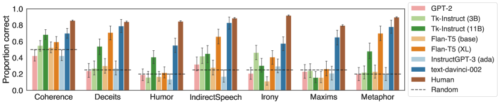
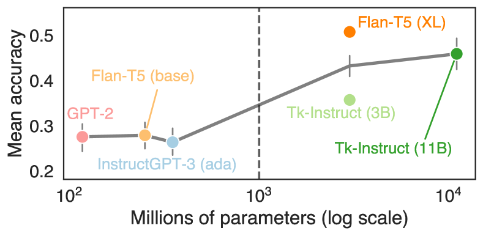
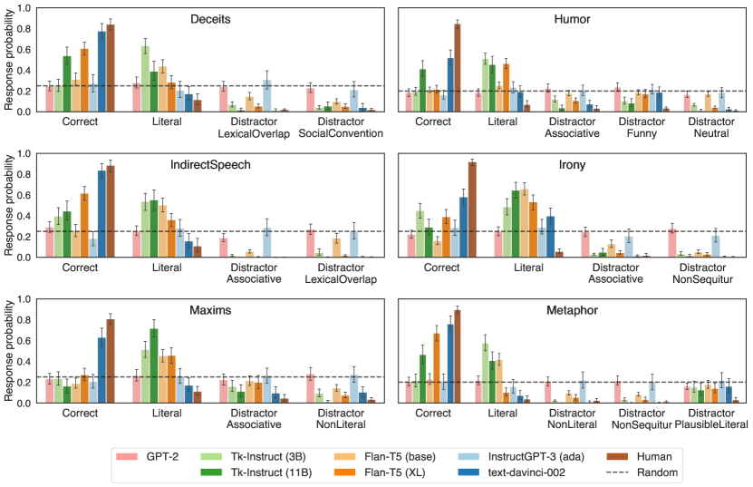
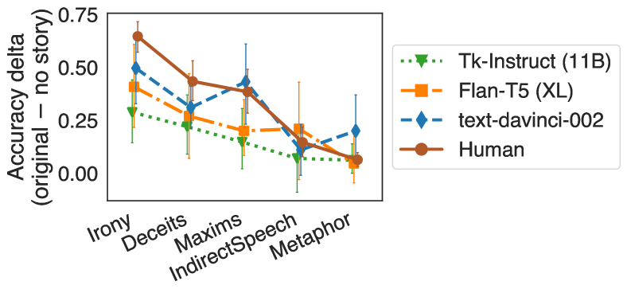
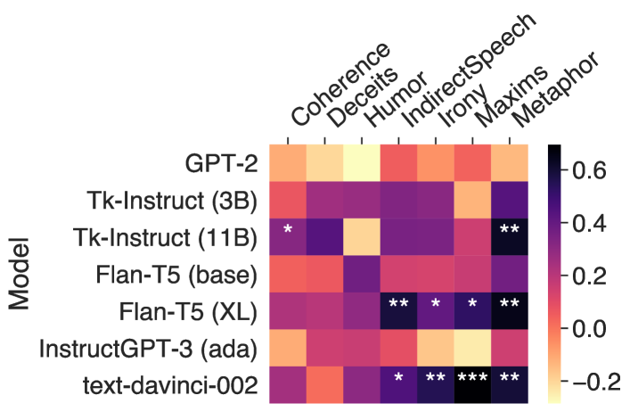
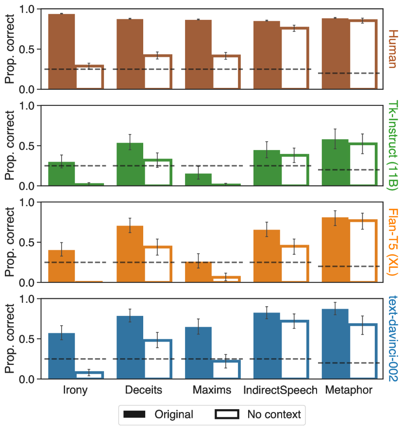
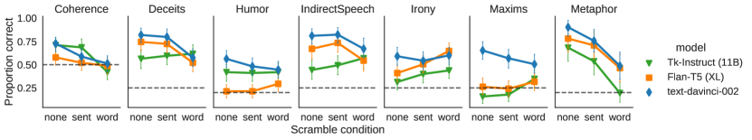

# A fine-grained comparison of pragmatic language understanding
in humans and language models

###### Abstract

Pragmatics and non-literal language understanding are essential to human communication, and present a long-standing challenge for artificial language models. We perform a fine-grained comparison of language models and humans on seven pragmatic phenomena, using zero-shot prompting on an expert-curated set of English materials. We ask whether models (1) select pragmatic interpretations of speaker utterances, (2) make similar error patterns as humans, and (3) use similar linguistic cues as humans to solve the tasks. We find that the largest models achieve high accuracy and match human error patterns: within incorrect responses, models favor literal interpretations over heuristic-based distractors. We also find preliminary evidence that models and humans are sensitive to similar linguistic cues. Our results suggest that pragmatic behaviors can emerge in models without explicitly constructed representations of mental states. However, models tend to struggle with phenomena relying on social expectation violations. Code and data: <https://github.com/jennhu/lm-pragmatics>  

## 1 Introduction

Non-literal language understanding is an essential part of communication. For example, in everyday conversations, humans readily comprehend the non-literal meanings of metaphors (*My new coworker is a block of ice*), polite deceits (*I love the gift*), indirect requests (*It’s a bit cold in this room*), and irony (*Classy pajamas, dude!*). These phenomena fall under the broad label of pragmatics, which encompasses the aspects of meaning that go beyond the literal semantics of what is said (Horn, [1972](#bib.bib42); Grice, [1975](#bib.bib38); Yule, [1996](#bib.bib98); Levinson, [2000](#bib.bib55)).  

A long-standing challenge for NLP is to build models that capture human pragmatic behaviors. The remarkable abilities of modern language models (LMs) have triggered a recent effort to investigate whether such models capture pragmatic meaning, both through philosophical arguments (Bisk et al., [2020](#bib.bib13); Bender and Koller, [2020](#bib.bib9); Potts, [2020](#bib.bib69); Michael, [2020](#bib.bib64)) and empirical evaluations (Jeretic et al., [2020](#bib.bib46); Zheng et al., [2021](#bib.bib100); Tong et al., [2021](#bib.bib86); Liu et al., [2022](#bib.bib59); Ruis et al., [2022](#bib.bib75); Stowe et al., [2022](#bib.bib83)). However, prior empirical studies have primarily evaluated LMs based on a binary distinction between pragmatic and non-pragmatic responses, providing limited insights into models’ weaknesses. A model could fail to reach the target pragmatic interpretation in multiple ways – for example, by preferring a literal interpretation, or by preferring a non-literal interpretation that violates certain social norms. Understanding these error patterns can suggest specific directions for improving the models, and foreshadow where pragmatics might go awry in user-facing settings (e.g., Saygin and Cicekli, [2002](#bib.bib78); Dombi et al., [2022](#bib.bib29); Kreiss et al., [2022](#bib.bib51)).  

From a cognitive perspective, understanding the pragmatic abilities of LMs could also offer insights into humans. Human pragmatic language comprehension involves a variety of mechanisms, such as basic language processing, knowledge of cultural and social norms (Trosborg, [2010](#bib.bib87)), and reasoning about speakers’ mental states (Brennan et al., [2010](#bib.bib16); Enrici et al., [2019](#bib.bib30); Rubio-Fernandez, [2021](#bib.bib73)). However, it remains an open question when language understanding relies on explicit mentalizing – which may be cognitively effortful – versus lower-cost heuristics (e.g., Butterfill and Apperly, [2013](#bib.bib19); Heyes, [2014](#bib.bib41)). Because LMs lack explicit, symbolic representations of mental states, they can serve as a tool for investigating whether pragmatic competence can arise without full-blown mentalizing (e.g., belief updates in the Rational Speech Act framework; Frank and Goodman, [2012](#bib.bib34)).  

In this paper, we perform a fine-grained comparison of humans and LMs on pragmatic language understanding tasks. Adopting the approach of targeted linguistic evaluation (e.g., Linzen et al., [2016](#bib.bib58); Futrell et al., [2019](#bib.bib36); Hu et al., [2020](#bib.bib44)), our analysis serves two goals: assessing the pragmatic capabilities of modern LMs, and revealing whether pragmatic behaviors emerge without explicitly constructed mental representations. Our test materials are a set of English multiple-choice questions curated by expert researchers (Floyd et al., [In prep](#bib.bib31)), covering seven diverse pragmatic phenomena. We use zero-shot prompting to evaluate models with varying sizes and training objectives: GPT-2 (Radford et al., [2019](#bib.bib71)), T$k$-Instruct (Wang et al., [2022](#bib.bib91)), Flan-T5 (Chung et al., [2022](#bib.bib23)), and InstructGPT (Ouyang et al., [2022](#bib.bib68)).  

Through model analyses and human experiments, we investigate the following questions: (1) Do models recover the hypothesized pragmatic interpretation of speaker utterances? (2) When models do not select the target response, what errors do they make – and how do these error patterns compare to those of humans? (3) Do models and humans use similar cues to arrive at pragmatic interpretations? We find that Flan-T5 (XL) and OpenAI’s text-davinci-002 achieve high accuracy and mirror the distribution of responses selected by humans. When these models are incorrect, they tend to select the incorrect literal (or straightforward) answer instead of distractors based on low-level heuristics. We also find preliminary evidence that models and humans are sensitive to similar linguistic cues. Our results suggest that some pragmatic behaviors emerge in models without explicitly constructed representations of agents’ mental states. However, models perform poorly on humor, irony, and conversational maxims, suggesting a difficulty with social conventions and expectations.  

## 2 Related work

Prior work has evaluated LMs’ ability to recognize non-literal interpretations of linguistic input, such as scalar implicature (Jeretic et al., [2020](#bib.bib46); Schuster et al., [2020](#bib.bib79); Li et al., [2021](#bib.bib56)) or figurative language (Tong et al., [2021](#bib.bib86); Liu et al., [2022](#bib.bib59); Gu et al., [2022](#bib.bib39); Stowe et al., [2022](#bib.bib83)). In a broad-scale evaluation, Zheng et al. ([2021](#bib.bib100)) test five types of implicatures arising from [Grice](#bib.bib38)’s ([1975](#bib.bib38)) conversational maxims, and evaluate their models after training on the task. In our work, we consider Gricean implicatures as one of seven phenomena, and we evaluate pre-trained LMs without fine-tuning on our tasks.  

Similar to our work, Ruis et al. ([2022](#bib.bib75)) also use prompting to evaluate LMs on pragmatic interpretation tasks. They formulate implicature tests as sentences ending with “yes” or “no” (e.g., “Esther asked “Can you come to my party on Friday?” and Juan responded “I have to work”, which means no.”). A model is considered pragmatic if it assigns higher probability to the token that makes the sentence consistent with an implicature. In our work, models must select from multiple interpretations, enabling a detailed error analysis and comparison to humans. [Ruis et al.](#bib.bib75)’s materials also focus on indirect question answering as an implicature trigger, whereas we consider a broader range of pragmatic phenomena and utterance types.  

Since pragmatic language understanding often draws upon knowledge of social relations, our tasks are conceptually related to benchmarks for evaluating social commonsense (e.g., Sap et al., [2019](#bib.bib77); Zadeh et al., [2019](#bib.bib99)). These evaluations focus on the interpretation of actions and events, whereas we focus on the interpretation of speaker utterances. Another hypothesized component of pragmatics is Theory of Mind (ToM; Leslie et al., [2004](#bib.bib54); Apperly, [2011](#bib.bib4)), or the ability to reason about others’ mental states. Benchmarks for evaluating ToM in models (e.g., Nematzadeh et al., [2018](#bib.bib66); Le et al., [2019](#bib.bib53); Sap et al., [2022](#bib.bib76)) primarily focus on false-belief tasks (Baron-Cohen et al., [1985](#bib.bib8)), which assess whether a model can represent the beliefs of another agent that are factually incorrect but consistent with that agent’s observations. LMs have been shown to succeed on some ToM tests (Kosinski, [2023](#bib.bib50)) while failing on others (Sap et al., [2022](#bib.bib76); Ullman, [2023](#bib.bib88)).  

## 3 Evaluation materials

### 3.1 Overview of stimuli

[TABLE S3.T1]

<table class="ltx_tabular ltx_centering ltx_align_middle">
<tr class="ltx_tr">
<td class="ltx_td ltx_align_justify ltx_align_top ltx_border_tt">

Task

</td>
<td class="ltx_td ltx_align_justify ltx_align_top ltx_border_tt">

Example query

</td>
<td class="ltx_td ltx_align_justify ltx_align_top ltx_border_tt">

Example answer options

</td>
</tr>
<tr class="ltx_tr">
<td class="ltx_td ltx_align_justify ltx_align_top ltx_border_t">

Deceits

</td>
<td class="ltx_td ltx_align_justify ltx_align_top ltx_border_t">

Henry is sitting at his desk and watching TV, and reluctantly switches off the TV with the remote control and picks up a textbook. Shortly after, his mother comes in the room and asks, "What have you been doing up here?" Henry responds: "Reading." Why has Henry responded in such a way?

</td>
<td class="ltx_td ltx_align_justify ltx_align_top ltx_border_t">

1.

<svg class="ltx_picture"><g><g><path></path></g><g><foreignobject>Correct</foreignobject></g></g></svg>
 He does not want to get into trouble for not studying.

2.

<svg class="ltx_picture"><g><g><path></path></g><g><foreignobject>Literal</foreignobject></g></g></svg>
 He has been reading for some time.

3.

<svg class="ltx_picture"><g><g><path></path></g><g><foreignobject>DistractorLexicalOverlap</foreignobject></g></g></svg>
 He does not want to offend his mom by not reading the books that she gave him.

4.

<svg class="ltx_picture"><g><g><path></path></g><g><foreignobject>DistractorSocialConvention</foreignobject></g></g></svg>
 He wants his mom to believe that he has been watching TV.

</td>
</tr>
<tr class="ltx_tr">
<td class="ltx_td ltx_align_justify ltx_align_top ltx_border_t">

Indirect speech

</td>
<td class="ltx_td ltx_align_justify ltx_align_top ltx_border_t">

Nate is about to leave the house. His wife points at a full bag of garbage and asks: "Are you going out?" What might she be trying to convey?

</td>
<td class="ltx_td ltx_align_justify ltx_align_top ltx_border_t">

1.

<svg class="ltx_picture"><g><g><path></path></g><g><foreignobject>Correct</foreignobject></g></g></svg>
 She wants Nate to take the garbage out.

2.

<svg class="ltx_picture"><g><g><path></path></g><g><foreignobject>Literal</foreignobject></g></g></svg>
 She wants to know Nate’s plans.

3.

<svg class="ltx_picture"><g><g><path></path></g><g><foreignobject>DistractorAssociative</foreignobject></g></g></svg>
 She wants Nate to bring his friends over.

4.

<svg class="ltx_picture"><g><g><path></path></g><g><foreignobject>DistractorLexicalOverlap</foreignobject></g></g></svg>
 She wants Nate to spend more time with the family.

</td>
</tr>
<tr class="ltx_tr">
<td class="ltx_td ltx_align_justify ltx_align_top ltx_border_t">

Irony

</td>
<td class="ltx_td ltx_align_justify ltx_align_top ltx_border_t">

It is a holiday. Stefan and Kim are sitting in the backseat of the car. They are fighting all the time. Their father says: "Oh, it is so pleasant here." What did the father want to convey?

</td>
<td class="ltx_td ltx_align_justify ltx_align_top ltx_border_t">

1.

<svg class="ltx_picture"><g><g><path></path></g><g><foreignobject>Correct</foreignobject></g></g></svg>
 He does not want to listen to his kids’ arguments.

2.

<svg class="ltx_picture"><g><g><path></path></g><g><foreignobject>Literal</foreignobject></g></g></svg>
 He enjoys listening to his kids fighting.

3.

<svg class="ltx_picture"><g><g><path></path></g><g><foreignobject>DistractorAssociative</foreignobject></g></g></svg>
 AC gives them some needed cool.

4.

<svg class="ltx_picture"><g><g><path></path></g><g><foreignobject>DistractorNonSequitur</foreignobject></g></g></svg>
 He remembers about his wife’s birthday.

</td>
</tr>
<tr class="ltx_tr">
<td class="ltx_td ltx_align_justify ltx_align_top ltx_border_t">

Maxims

</td>
<td class="ltx_td ltx_align_justify ltx_align_top ltx_border_t">

Leslie and Jane are chatting at a coffee shop. Leslie asks, "Who was that man that I saw you with last night?" Jane responds, "The latte is unbelievable here." Why has Jane responded like this?

</td>
<td class="ltx_td ltx_align_justify ltx_align_top ltx_border_t">

1.

<svg class="ltx_picture"><g><g><path></path></g><g><foreignobject>Correct</foreignobject></g></g></svg>
 She does not want to discuss the topic that Leslie has raised.

2.

<svg class="ltx_picture"><g><g><path></path></g><g><foreignobject>Literal</foreignobject></g></g></svg>
 She thinks that it is the best latte in the town.

3.

<svg class="ltx_picture"><g><g><path></path></g><g><foreignobject>DistractorAssociative</foreignobject></g></g></svg>
 The man who Leslie saw makes unbelievable lattes.

4.

<svg class="ltx_picture"><g><g><path></path></g><g><foreignobject>DistractorNonLiteral</foreignobject></g></g></svg>
 A coffee break is not a good time to discuss men.

</td>
</tr>
<tr class="ltx_tr">
<td class="ltx_td ltx_align_justify ltx_align_top ltx_border_t">

Metaphor

</td>
<td class="ltx_td ltx_align_justify ltx_align_top ltx_border_t">

Andrew and Bob were discussing the investment company where Andrew works. Bob said: “The investors are squirrels collecting nuts.” What does Bob mean?

</td>
<td class="ltx_td ltx_align_justify ltx_align_top ltx_border_t">

1.

<svg class="ltx_picture"><g><g><path></path></g><g><foreignobject>Correct</foreignobject></g></g></svg>
 They buy stocks hoping for future profit.

2.

<svg class="ltx_picture"><g><g><path></path></g><g><foreignobject>Literal</foreignobject></g></g></svg>
 Squirrels were hired to work in the company.

3.

<svg class="ltx_picture"><g><g><path></path></g><g><foreignobject>DistractorNonLiteral</foreignobject></g></g></svg>
 The investors dress and eat well.

4.

<svg class="ltx_picture"><g><g><path></path></g><g><foreignobject>DistractorNonSequitur</foreignobject></g></g></svg>
 Bob is allergic to nuts.

5.

<svg class="ltx_picture"><g><g><path></path></g><g><foreignobject>DistractorPlausibleLiteral</foreignobject></g></g></svg>
 The investors enjoy picking nuts as much as squirrels do.

</td>
</tr>
<tr class="ltx_tr">
<td class="ltx_td ltx_align_justify ltx_align_top ltx_border_t">

Humor

</td>
<td class="ltx_td ltx_align_justify ltx_align_top ltx_border_t">

Martha walked into a pastry shop. After surveying all the pastries, she decided on a chocolate pie. "I’ll take that one," Martha said to the attendant, "the whole thing." "Shall I cut it into four or eight pieces?" the attendant asked.

</td>
<td class="ltx_td ltx_align_justify ltx_align_top ltx_border_t">

1.

<svg class="ltx_picture"><g><g><path></path></g><g><foreignobject>Correct</foreignobject></g></g></svg>
 Martha said, "Four pieces, please; I’m on a diet."

2.

<svg class="ltx_picture"><g><g><path></path></g><g><foreignobject>Literal</foreignobject></g></g></svg>
 Martha said: "Well, there are five people for dessert tonight, so eight pieces will be about right."

3.

<svg class="ltx_picture"><g><g><path></path></g><g><foreignobject>DistractorAssociative</foreignobject></g></g></svg>
 Martha said, "You make the most delicious sweet rolls in town."

4.

<svg class="ltx_picture"><g><g><path></path></g><g><foreignobject>DistractorFunny</foreignobject></g></g></svg>
 Then the attendant squirted whipped cream in Martha’s face.

5.

<svg class="ltx_picture"><g><g><path></path></g><g><foreignobject>DistractorNeutral</foreignobject></g></g></svg>
 Martha said, "My leg is hurting so much."

</td>
</tr>
<tr class="ltx_tr">
<td class="ltx_td ltx_align_justify ltx_align_top ltx_border_bb ltx_border_t">

Coherence

</td>
<td class="ltx_td ltx_align_justify ltx_align_top ltx_border_bb ltx_border_t">

Mary’s exam was about to start. Her palms were sweaty.

</td>
<td class="ltx_td ltx_align_justify ltx_align_top ltx_border_bb ltx_border_t">

1.

<svg class="ltx_picture"><g><g><path></path></g><g><foreignobject>Correct</foreignobject></g></g></svg>
 Coherent

2.

<svg class="ltx_picture"><g><g><path></path></g><g><foreignobject>Incorrect</foreignobject></g></g></svg>
 Incoherent

</td>
</tr>
</table>

Table 1: Sample item from each task in our evaluation. All items are originally curated by Floyd et al. ([In prep](#bib.bib31)).
[/TABLE]

Our evaluation materials are taken from [Floyd et al.](#bib.bib31)’s ([In prep](#bib.bib31)) experiments,111Materials can be found at <https://osf.io/6abgk/?view_only=42d448e3d0b14ecf8b87908b3a618672>. covering seven phenomena. Each item is a multiple choice question, with answer options representing different types of interpretation strategies. For most of the tasks, the question has three parts: a short story context (1-3 sentences), an utterance by one of the characters, and a question about what the character intended to convey.222The exceptions are Humor and Coherence. [Table 1](#S3.T1 "In 3.1 Overview of stimuli ‣ 3 Evaluation materials ‣ A fine-grained comparison of pragmatic language understanding in humans and language models") shows an example item for each task, with annotated answer options.   Green  labels indicate the target pragmatic interpretation.333We refer to these answer options as “Correct” throughout the paper. However, these answers are only “correct” in the sense of a normative evaluation. We acknowledge the wide variation in individual humans’ abilities and tendencies to use non-literal language, which is not captured in our analyses. We thank an anonymous reviewer for highlighting this point.  Blue  labels indicate the literal interpretation.   Red  labels indicate incorrect non-literal interpretations, which are based on heuristics such as lexical similarity to the story, thus serving as distractor options.  

Each task has 20-40 items, which were manually curated by expert researchers to cover a broad range of non-literal phenomena and elicit individual differences among humans. The stimuli were not specifically designed to require Theory of Mind reasoning (ToM). However, behavioral and neural evidence suggests that many of the tested phenomena rely on mentalizing processes. In [Section 3.2](#S3.SS2 "3.2 Tested phenomena ‣ 3 Evaluation materials ‣ A fine-grained comparison of pragmatic language understanding in humans and language models"), we briefly describe the role of ToM for each tested phenomenon, and how LMs’ training corpora may provide linguistic cues to perform the tasks.  

### 3.2 Tested phenomena

##### Deceits.

Humans produce polite deceits (“white lies”) in the service of social and personal relationships (e.g., Camden et al., [1984](#bib.bib20)). Behavioral studies in young children suggest that understanding white lies requires interpretive ToM, or the ability to allow different minds to interpret the same information in different ways (Hsu and Cheung, [2013](#bib.bib43)). Furthermore, the tendency to produce white lies is linked to emotional understanding abilities, (Demedardi et al., [2021](#bib.bib27)), and moral judgments about white lies are linked to second-order false-belief understanding (Vendetti et al., [2019](#bib.bib90)).  

The Deceits task presents a story with a white lie, and asks why the speaker has used this utterance. The underlying intentions behind polite deceits are rarely explicitly explained in text. As a result, it is unlikely that LMs learn a direct connection between the utterance and the speaker’s intention during training on static texts. However, instances of polite deceits in text corpora may be accompanied by descriptions of characters’ emotional states, which may indicate that speakers’ intentions differ from what is literally conveyed by their utterance. This highlights the importance of context in interpreting deceits, which we return to in [Section 5.3.1](#S5.SS3.SSS1 "5.3.1 The role of context ‣ 5.3 Are models and humans sensitive to similar linguistic cues? ‣ 5 Results ‣ A fine-grained comparison of pragmatic language understanding in humans and language models").  

##### Indirect speech.

Humans often use language in a performative sense, such as indirectly requesting an action from other individuals (e.g., Austin, [1975](#bib.bib6); Searle, [1975](#bib.bib80)). Indirect or polite speech comprehension has been captured by Rational Speech Act (RSA; Frank and Goodman, [2012](#bib.bib34)) models, which characterize listeners as performing Bayesian inference about a speaker who chooses utterances based on a tradeoff between epistemic and social utility (Brown and Levinson, [1987](#bib.bib17); Yoon et al., [2016](#bib.bib96), [2020](#bib.bib97); Lumer and Buschmeier, [2022](#bib.bib60)).  

The IndirectSpeech task presents a story with an indirect request, and asks what the speaker intends to convey. Like deceits, it’s unlikely that indirect speech acts are explained in text data. However, indirect requests may be followed by descriptions of the completion of the implied request – for example, that someone closed a window after hearing the utterance “It’s cold in here”. Therefore, models may learn relationships between the utterances and desired outcomes through linguistic experience.  

##### Irony.

Humans use irony to convey the opposite of the semantic content of their utterance (Booth, [1974](#bib.bib15); Wilson and Sperber, [1992](#bib.bib94); Attardo, [2000](#bib.bib5); Wilson and Sperber, [2012](#bib.bib93)). As such, irony has long been hypothesized to rely on social reasoning and perspective-taking (e.g., Happé, [1993](#bib.bib40); Andrés-Roqueta and Katsos, [2017](#bib.bib3)). Indeed, human irony comprehension behaviors are captured by Bayesian reasoning models that take into account speakers’ affective goals (Kao and Goodman, [2014](#bib.bib48)). In addition, neuroimaging studies suggest that irony interpretation relies on brain regions that are implicated in classic ToM tasks (Spotorno et al., [2012](#bib.bib82)).  

The Irony task presents a story with an ironic statement, and asks what the character intends to convey. While ironic statements are also rarely explained in text, models could leverage accompanying cues such as descriptions of characters’ emotional states or a mismatch in sentiment.  

##### Maxims of conversation.

Grice ([1975](#bib.bib38)) proposes that communication follows a set of *maxims*: be truthful; be relevant; be clear, brief, and orderly; and say as much as needed, and no more. A prevailing theory is that listeners derive implicatures by expecting speakers to be cooperative (i.e., abide by the maxims) and reasoning about speakers’ beliefs and goals. Indeed, there is extensive evidence for RSA models capturing these implicatures, such as those arising from the maxims of *quantity* (Potts et al., [2016](#bib.bib70); Frank et al., [2018](#bib.bib33); Degen, [2023](#bib.bib26)) and *manner* (Bergen et al., [2016](#bib.bib10); Franke and Jäger, [2016](#bib.bib35); Tessler and Franke, [2018](#bib.bib85)).  

The Maxims task presents a story with a character flouting one of Grice’s maxims, and asks why the character has responded in such a way. Based on linguistic input, it may be easy for LMs to recognize when a speaker is flouting a maxim – for example, if an utterance is particularly long, features an uncommon syntactic construction, or diverges semantically from the context. However, it is unclear whether LMs will be able to recover the speaker’s underlying intentions.  

##### Metaphor.

Metaphors (Lakoff and Johnson, [1980](#bib.bib52)) are used to draw comparisons between entities in a non-literal sense. Metaphor understanding has been hypothesized to require mentalizing (Happé, [1993](#bib.bib40)), and fine-grained metaphor comprehension behaviors are captured by RSA models where listeners and speakers reason about each others’ beliefs and goals (Kao et al., [2014](#bib.bib47)).  

The Metaphor task presents a story with a metaphor, and asks what the speaker intends to convey. For models, the challenges of metaphor comprehension include accessing world knowledge and forming abstract relationships between domains. However, it is possible that the relevant properties of the entities under comparison could emerge through linguistic experience.  

##### Humor.

Humor is one of the most distinctive aspects of human conversation, reflecting communicative goals with complex social function (Veatch, [1998](#bib.bib89); Martin and Ford, [2018](#bib.bib62)). Neuroimaging studies suggest that joke understanding is supported by regions in the ToM brain network (Kline Struhl et al., [2018](#bib.bib49)). Behavioral tests also reveal associations between ToM and humor abilities (Aykan and Nalçacı, [2018](#bib.bib7); Bischetti et al., [2019](#bib.bib12)).  

The Humor task presents a joke and asks which punchline makes the joke the funniest.444Unlike the other tasks, there is no speaker utterance. Some theories argue that humor is triggered by linguistic incongruency effects (e.g., Deckers and Kizer, [1975](#bib.bib25)), which might be straightforward for LMs to detect. Recent work has also shown that LMs can explain certain jokes (Chowdhery et al., [2022](#bib.bib22)). However, some of [Floyd et al.](#bib.bib31)’s Humor items require complex world knowledge – for example, that slicing a pie into four versus eight pieces does not change the total amount of pie (see [Table 1](#S3.T1 "In 3.1 Overview of stimuli ‣ 3 Evaluation materials ‣ A fine-grained comparison of pragmatic language understanding in humans and language models")). As such, selecting the funniest punchline is a nontrivial task.  

##### Coherence inferences.

Humans also make pragmatic inferences beyond the sentence level – for example, by assuming that consecutive sentences form a logical or sequential relationship. Moss and Schunn ([2015](#bib.bib65)) and Jacoby and Fedorenko ([2020](#bib.bib45)) find that constructing these discourse relationships loads on regions of the ToM brain network, suggesting a role of ToM in coherence inferences.  

The Coherence task presents a pair of sentences, and asks whether the pair forms a coherent story.555This task differs from the others in that there is no speaker utterance, and the answer options are identical across items (“Coherent” or “Incoherent”). We assume that LMs’ training data, which consists of naturalistic text, is primarily coherent. Therefore, we expect LMs to be able to distinguish between coherent and incoherent sentence pairs (for an in-depth study, see Beyer et al., [2021](#bib.bib11)).  

## 4 Experiments

### 4.1 Evaluation paradigm

Our evaluation paradigm uses *zero-shot prompting*. Prompting can easily be adapted to all of our seven tasks, allowing us to compare performance across tasks within a model. Prompting also allows us to present models with inputs that are nearly identical to the stimuli seen by humans in [Floyd et al.](#bib.bib31)’s experiments, whereas other methods would require converting the stimuli into task-specific formats. We choose zero-shot prompts in order to evaluate the knowledge that emerges through training, and not through in-context adaptation to the task.  

##### Prompt structure.

Each prompt consists of two parts: task instructions, and a query. The instructions are nearly identical to the instructions presented to humans in [Floyd et al.](#bib.bib31)’s experiments, prepended with the keyword “Task:”. The only other modification is that the original instructions had a final sentence of “Please answer as quickly as possible”, which we replaced with a sentence like “The answer options are 1, 2, 3, or 4”.666The exact answer options changed according to the task.  

For all tasks except Humor, the query consists of the scenario (prepended with keyword “Scenario:”) and question, and then the numbered answer options (prepended with “Options:”).777For the Humor task, the joke is prepended with “Joke:”, and the answer options are prepended with “Punchlines:”. The prompt concludes with the keyword “Answer:”. Full example prompts are given in [Appendix A](#A1 "Appendix A Example prompts ‣ A fine-grained comparison of pragmatic language understanding in humans and language models").  

##### Evaluation.

To evaluate a model on a given item, we feed the prompt to the model, and measure the model’s probability distribution over tokens conditioned on the prompt. We compare the probabilities of each answer token (e.g., “1”, “2”, “3”, or “4”) under this distribution. The model is considered correct on a given item if it assigns highest probability to the correct answer token, among all the possible answer tokens for that item.  

We generated 5 versions of each item by randomizing the order of answer options. This was done to control for the base probabilities of the answer tokens. Since we do not analyze generated text, the model results themselves are deterministic.  

[TABLE S4.T2]

<table class="ltx_tabular ltx_centering ltx_align_middle">
<tr class="ltx_tr">
<td class="ltx_td ltx_align_left ltx_border_tt">Model</td>
<td class="ltx_td ltx_align_right ltx_border_tt"># parameters</td>
<td class="ltx_td ltx_align_center ltx_border_tt">Training</td>
</tr>
<tr class="ltx_tr">
<td class="ltx_td ltx_align_left ltx_border_t">GPT-2</td>
<td class="ltx_td ltx_align_right ltx_border_t">117M</td>
<td class="ltx_td ltx_align_center ltx_border_t">Autoregressive LM</td>
</tr>
<tr class="ltx_tr">
<td class="ltx_td ltx_align_left">Tk-Instruct (3B)</td>
<td class="ltx_td ltx_align_right">3B</td>
<td class="ltx_td ltx_align_center">Multitask</td>
</tr>
<tr class="ltx_tr">
<td class="ltx_td ltx_align_left">Tk-Instruct (11B)</td>
<td class="ltx_td ltx_align_right">11B</td>
<td class="ltx_td ltx_align_center">Multitask</td>
</tr>
<tr class="ltx_tr">
<td class="ltx_td ltx_align_left">Flan-T5 (base)</td>
<td class="ltx_td ltx_align_right">250M</td>
<td class="ltx_td ltx_align_center">Multitask</td>
</tr>
<tr class="ltx_tr">
<td class="ltx_td ltx_align_left">Flan-T5 (XL)</td>
<td class="ltx_td ltx_align_right">3B</td>
<td class="ltx_td ltx_align_center">Multitask</td>
</tr>
<tr class="ltx_tr">
<td class="ltx_td ltx_align_left">InstructGPT-3 (ada)</td>
<td class="ltx_td ltx_align_right">350M (est.)</td>
<td class="ltx_td ltx_align_center">Multitask, human feedback</td>
</tr>
<tr class="ltx_tr">
<td class="ltx_td ltx_align_left ltx_border_bb">text-davinci-002</td>
<td class="ltx_td ltx_align_right ltx_border_bb">Unknown</td>
<td class="ltx_td ltx_align_center ltx_border_bb">FeedME</td>
</tr>
</table>

Table 2: Models tested in our experiments.
[/TABLE]

[FIGURE S4.F1.g1]

Figure 1: Accuracy for each task. Error bars denote 95% CI. Dashed line indicates task-specific random baseline.
[/FIGURE]

[FIGURE S4.F2.g1]

Figure 2: Mean accuracy vs. millions of parameters. Vertical dashed line indicates 1 billion parameters. text-davinci-002 was excluded from this analysis, as the number of parameters is unknown.
[/FIGURE]

### 4.2 Models

We test seven models across four model families, summarized in [Table 2](#S4.T2 "In Evaluation. ‣ 4.1 Evaluation paradigm ‣ 4 Experiments ‣ A fine-grained comparison of pragmatic language understanding in humans and language models").888All non-OpenAI models were accessed via Huggingface (Wolf et al., [2020](#bib.bib95)) and run on a single NVIDIA A100 GPU. As a baseline, we first test a base GPT-2 model (117M parameters; Radford et al., [2019](#bib.bib71)), which is trained on an autoregressive language modeling objective.  

Second, we test a set of models which are based on T5 (Raffel et al., [2020](#bib.bib72)) and instruction-finetuned on a diverse collection of tasks (Wei et al., [2022](#bib.bib92)). This set of models consists of two T$k$-Instruct models (3B and 11B; Wang et al., [2022](#bib.bib91)), which were fine-tuned on 1.6K tasks, and two Flan-T5 models (base: 250M parameters; XL: 3B parameters; Chung et al., [2022](#bib.bib23)), which were fine-tuned on 1.8K tasks. The fine-tuning tasks cover a wide range of categories, such as commonsense reasoning, translation, mathematics, and programming.  

Finally, we test two InstructGPT-based models (Ouyang et al., [2022](#bib.bib68)) via the OpenAI API: text-ada-001 (350M parameters), which we refer to as InstructGPT-3 (ada); and text-davinci-002, which comes from the GPT-3.5 family of models.999Parameter estimates come from <https://blog.eleuther.ai/gpt3-model-sizes/>. Although the size of text-davinci-002 is unknown, we assume that it is larger than InstructGPT-3 (ada).,101010The OpenAI model results might not be reproducible, but timestamps of API calls can be found in [Appendix B](#A2 "Appendix B Timestamps of OpenAI model queries ‣ A fine-grained comparison of pragmatic language understanding in humans and language models"). These models are fine-tuned to follow instructions and align with human feedback.  

We compare models to a baseline from 374 humans, collected by Floyd et al. ([In prep](#bib.bib31)). Their experiments presented multiple choice questions to humans in nearly identical format to our prompts.  

## 5 Results

We now return to the three questions posed in the Introduction, in each of the following subsections.  

[FIGURE S5.F3.g1]

Figure 3: Response distributions across models and humans. Answer options for each task are shown on the x-axis. For models, y-axis denotes probability assigned to each answer option. For humans, y-axis denotes empirical frequency of each answer option being selected. Error bars denote 95% CI. Dashed line indicates random baseline.
[/FIGURE]

### 5.1 Do models choose the target pragmatic interpretation?

[Figure 1](#S4.F1 "In Evaluation. ‣ 4.1 Evaluation paradigm ‣ 4 Experiments ‣ A fine-grained comparison of pragmatic language understanding in humans and language models") shows the proportion of trials where models and humans select the pragmatic answer. The smallest models (GPT-2, Flan-T5 (base), InstructGPT-3 (ada)) fail to perform above chance. The largest models (T$k$-Instruct (11B), Flan-T5 (XL), text-davinci-002) perform above chance on all tasks (except T$k$-Instruct (11B) on Maxims), and in some cases near human-level. Overall, models perform worst at the Humor, Irony, and Maxims tasks. Interestingly, these phenomena involve speakers violating listeners’ expectations in some way: producing a funny punchline to a mundane story (Humor), stating the direct opposite of the speaker’s belief (Irony), or disobeying one of the assumed rules of conversation (Maxims). It may be that models fail to represent certain social expectations that are maintained by human listeners.  

Next, we investigated the relationship between model size and accuracy. [Figure 2](#S4.F2 "In Evaluation. ‣ 4.1 Evaluation paradigm ‣ 4 Experiments ‣ A fine-grained comparison of pragmatic language understanding in humans and language models") shows the mean accuracy achieved by each model (averaged across tasks) vs. millions of parameters. The line and error bars denote the mean and 95% CIs, while points represent individual models. We find a coarse effect of model size: there is a stark jump in accuracy after 1B parameters (dashed line). However, model size does not fully explain variance in accuracy: all models with $<$1B parameters achieve similar accuracy, and Flan-T5 (XL) outperforms T$k$-Instruct (3B), despite both having 3B parameters.  

### 5.2 Do models and humans make similar types of errors?

Recall from [Section 3](#S3 "3 Evaluation materials ‣ A fine-grained comparison of pragmatic language understanding in humans and language models") that each item has a set of answer options that correspond to different strategies ([Table 1](#S3.T1 "In 3.1 Overview of stimuli ‣ 3 Evaluation materials ‣ A fine-grained comparison of pragmatic language understanding in humans and language models")).111111The exception is Coherence, which is excluded here. In addition to the target pragmatic answer (Correct), each item also has a plausible but unlikely literal answer (Literal), as well as distractors based on lexical overlap or semantic associations (Distractor\*). For each item, we computed the human empirical distribution over answer choices, and compared it to models’ probability assigned to the answer tokens (e.g., “1”, “2”, “3”, and “4”).  

[Figure 3](#S5.F3 "In 5 Results ‣ A fine-grained comparison of pragmatic language understanding in humans and language models") shows the answer distributions for each task. Across tasks, humans primarily select the Correct option, occasionally the Literal option, and rarely the distractors. We find a similar pattern for text-davinci-002, although the model is more likely to select the Literal option in general. The other large models (T$k$-Instruct (11B), Flan-T5 (XL)) also generally assign highest probability to the Correct and Literal options, although the distribution looks less human-like. The next-largest models (T$k$-Instruct (3B), Flan-T5 (base)) prefer the Literal option, and the remaining models (GPT-2, InstructGPT-3 (ada)) are at chance. These results show that larger models consistently identify the literal interpretation of an utterance, suggesting that their pragmatic failures are unlikely to be explained by a failure to represent basic semantic meaning (for our test materials).  

However, even high-performing models occasionally do select the distractor answers, revealing interesting behaviors. For example, in the Metaphor task, text-davinci-002 and Flan-T5 (XL) prefer the DistractorPlausibleLiteral option – which is a figurative reading of the utterance – over the Literal option – which is completely non-figurative. Similarly, in the Humor task, text-davinci-002 is much more likely to select the DistractorFunny option over the other (non-humorous) distractors. This suggests a coarse sensitivity to humor, even if the model selects the human-preferred punchline only 55% of the time (see [Figure 1](#S4.F1 "In Evaluation. ‣ 4.1 Evaluation paradigm ‣ 4 Experiments ‣ A fine-grained comparison of pragmatic language understanding in humans and language models")). We take this analysis to illustrate the value of looking beyond binary pragmatic/non-pragmatic response distinctions, and using controlled distractor items to evaluate models’ abilities (e.g., McCoy et al., [2019](#bib.bib63)).  

### 5.3 Are models and humans sensitive to similar linguistic cues?

Having found qualitatively similar response patterns between humans and models, we now ask *how* models and humans arrive at pragmatic interpretations, and whether they use similar types of information. We begin with a broad evaluation of the extent to which models and humans rely on linguistic context ([Section 5.3.1](#S5.SS3.SSS1 "5.3.1 The role of context ‣ 5.3 Are models and humans sensitive to similar linguistic cues? ‣ 5 Results ‣ A fine-grained comparison of pragmatic language understanding in humans and language models")). We then take a more granular approach and ask whether model and human performance is correlated at the item level – i.e., if models and humans exhibit similar sensitivity to the cues that make a non-literal interpretation more or less likely ([Section 5.3.3](#S5.SS3.SSS3 "5.3.3 Item-level alignment ‣ 5.3 Are models and humans sensitive to similar linguistic cues? ‣ 5 Results ‣ A fine-grained comparison of pragmatic language understanding in humans and language models")).  

#### 5.3.1 The role of context

Many cues for enriched language understanding come from the context in which the speaker makes their utterance. However, some aspects of non-literal comprehension might arise given the utterance in isolation, while others are highly sensitive to specific contextual details (e.g., Levinson, [2000](#bib.bib55)). Therefore, we expect that the degree to which humans rely on context to select non-literal interpretations will vary across the tested tasks.  

To investigate this variation, we created a new set of stimuli by removing the context stories, leaving only the speaker utterance and final question (e.g., *Dan says, “The dog knocked it over.” Why has Dan responded in such a way?*).121212This manipulation is not compatible with the Humor and Coherence tasks, so they are excluded from this analysis. We re-ran the human experiment on 30 participants, following the protocols of Floyd et al. ([In prep](#bib.bib31))’s original experiment using the no-context modified materials.131313Details can be found in [Section C.1](#A3.SS1 "C.1 Details of human experiments ‣ Appendix C No-context analysis ‣ A fine-grained comparison of pragmatic language understanding in humans and language models"). We also re-ran the three models that achieved highest accuracy on the original items: T$k$-Instruct (11B), Flan-T5 (XL), and text-davinci-002.  

[Figure 4](#S5.F4 "In 5.3.1 The role of context ‣ 5.3 Are models and humans sensitive to similar linguistic cues? ‣ 5 Results ‣ A fine-grained comparison of pragmatic language understanding in humans and language models") shows the mean accuracy difference on the original versus no-context versions of each item.141414See [Figure 6](#A3.F6 "In Procedure. ‣ C.1 Details of human experiments ‣ Appendix C No-context analysis ‣ A fine-grained comparison of pragmatic language understanding in humans and language models") in [Section C.2](#A3.SS2 "C.2 Raw accuracy scores ‣ Appendix C No-context analysis ‣ A fine-grained comparison of pragmatic language understanding in humans and language models") for comparison of raw accuracy scores on the original and no-context items. We find that models and humans exhibit a similar qualitative pattern: removing the story leads to the largest degradation for Irony, followed by Deceits and Maxims. This aligns with our intuitions, because in these cases, speakers’ utterances can be interpreted either literally or as the complete opposite, based on the specific social situation (e.g., “It is so pleasant here”). In contrast, there are smaller degradations for IndirectSpeech and Metaphor. This suggests that some indirect requests are conventionalized (e.g., “I am getting cold”), although their interpretations may be facilitated by context (e.g., Gibbs, [1979](#bib.bib37)). Similarly, this suggests that metaphor interpretation may draw more upon global knowledge than local context.  

[FIGURE S5.F4.g1]

Figure 4: Mean by-item difference in accuracy once story context was removed.
[/FIGURE]

#### 5.3.2 Scrambling

Next, we tested whether models rely on syntactic and discourse-level information from the context, or whether they can perform the tasks when ordering cues are removed. We constructed two scrambled versions of each item by randomizing the order of sentences and words. In both versions, the instructions, final question (e.g., *Why has Dan responded in such a way?*), and answer options were unmodified and remained in their original positions. Again, we only tested the best-performing models on these items.  

We found that models maintain reasonable performance for most tasks, with the notable exception of Metaphor ([Figure 7](#A3.F7 "In Procedure. ‣ C.1 Details of human experiments ‣ Appendix C No-context analysis ‣ A fine-grained comparison of pragmatic language understanding in humans and language models"); [Appendix D](#A4 "Appendix D Sentence- and word-level scrambling ‣ A fine-grained comparison of pragmatic language understanding in humans and language models")). This robustness to scrambling accords with prior evidence that models often rely on lexical information without human-like compositionality (e.g., Dasgupta et al., [2018](#bib.bib24); Nie et al., [2019](#bib.bib67); McCoy et al., [2019](#bib.bib63)). We expect that scrambling, especially at the word-level, would likely disrupt human performance, but this remains an open empirical question. We leave an investigation of human performance to future work.  

#### 5.3.3 Item-level alignment

Up to this point, we analyzed differences across phenomena by averaging over items. However, there is also variance *within* each phenomenon in the types of cues that suggest how the utterances should be interpreted. For example, some items contain explicit descriptions of characters’ emotional states (e.g., “Sarah becomes angry”). If models and humans leverage these cues in similar ways, then we would expect to see correlations between model and human performance at the item level.  

[FIGURE S5.F5.g1]

Figure 5: Pearson correlation coefficients between by-item human accuracy and model probability of the correct answer. Cells are marked with significance codes.
[/FIGURE]

For each task and model, we compute the Pearson correlation between by-item mean accuracy achieved by humans and by-item mean probability that models assigned to the correct answer ([Figure 5](#S5.F5 "In 5.3.3 Item-level alignment ‣ 5.3 Are models and humans sensitive to similar linguistic cues? ‣ 5 Results ‣ A fine-grained comparison of pragmatic language understanding in humans and language models")). In general, the larger models (T$k$-Instruct (11B), Flan-T5 (XL), text-davinci-002) are better aligned with humans, and the strongest correlations occur for IndirectSpeech, Irony, Maxims, and Metaphor. This suggests that for those tasks, models and humans are similarly sensitive to cues that make a non-literal interpretation likely.  

## 6 Discussion

We used an expert-curated set of materials (Floyd et al., [In prep](#bib.bib31)) to compare LMs and humans on seven pragmatic phenomena. We found that Flan-T5 (XL) and text-davinci-002 achieve high accuracy and match human error patterns: within incorrect responses, these models tend to select the literal interpretation of an utterance over heuristic-based distractors. We also found preliminary evidence that LMs and humans are sensitive to similar linguistic cues: model and human accuracy scores correlate at the item level for several tasks, and degrade in similar ways when context is removed.  

Our results suggest that language models can consistently select the pragmatic interpretation of a speaker’s utterance – but how? The models tested in our experiments reflect a variety of learning processes through which pragmatic knowledge could emerge. GPT-2 is trained to learn the distribution of linguistic forms; the T$k$-Instruct and Flan-T5 models are pre-trained on a denoising task and fine-tuned on thousands of instruction-based tasks; and the OpenAI models receive signal from human feedback. Our experiments are not designed to tease apart the contributions of these training procedures to models’ behaviors. Therefore, we do not intend to make strong claims about the mechanisms by which models learn pragmatics.  

A shared feature of our tested models is the lack of explicitly constructed mental state representations. In this sense, our results are potentially compatible with two hypotheses. One possibility is that the models do not have an ability that can be considered an analog of Theory of Mind (ToM). This view is supported by evidence that language models perform poorly on social commonsense and false-belief tasks (Sap et al., [2022](#bib.bib76)), and are remarkably brittle to small perturbations of classic tests (Ullman, [2023](#bib.bib88)). If models truly lack ToM, then their pragmatic behaviors might be explained by inferences based on low-level linguistic cues. Taken a step further, this finding could potentially suggest that certain human pragmatic behaviors arise through inferences based on language statistics, with no need for mental state representations.  

A second possibility is that models do have a heuristic version of ToM, which is not explicitly engineered but instead emerges as a by-product of optimizing for other objectives (such as linguistic prediction). Since language contains many descriptions of agents’ beliefs, emotions, and desires, it may be beneficial – perhaps even necessary – to induce representations of these mental states in order to learn a generative model of linguistic forms. Indeed, Andreas ([2022](#bib.bib2)) argues that whereas language models have no explicit representation of communicative intents, they can infer approximate representations of the mental states of the agents that produce a given linguistic context. If this hypothesis is true, however, it would still remain unclear whether ToM is *necessary* to support the pragmatic behaviors tested in our evaluation materials.  

Our experiments do not differentiate between these two hypotheses. However, fine-grained behavioral evaluations – such as those presented in this work – are important for revealing models’ capabilities and weaknesses, and offer a first step toward understanding how pragmatic behaviors can be supported. A promising direction for future work is to test models with a wider range of training objectives, or even new architectures, such as distinct language and social reasoning modules (see Mahowald et al., [2023](#bib.bib61)). In addition, although there is evidence for the role of mentalizing in our tested pragmatic phenomena (see [Section 3.1](#S3.SS1 "3.1 Overview of stimuli ‣ 3 Evaluation materials ‣ A fine-grained comparison of pragmatic language understanding in humans and language models")), one limitation of our stimuli is that they were not specifically designed to require ToM. New datasets that perform targeted manipulations of ToM alongside tests of language comprehension could help reveal how linguistic experience and ToM jointly support pragmatic behaviors.  

## Acknowledgments

We would like to thank the anonymous reviewers as well as Roger Levy, Christopher Potts, and Josh Tenenbaum for their constructive feedback. We also thank Quinn Langford for help with coding details of the stimuli. This work was in part supported by a grant from the Simons Foundation to the Simons Center for the Social Brain at MIT. J.H. is supported by an NSF Graduate Research Fellowship (#1745302) and an NSF Doctoral Dissertation Research Improvement Grant (BCS-2116918). S.F. is funded by the NSF SPRF (#2105136). E.F. was additionally supported by NIH award R01-DC016950 and by research funds from the McGovern Institute for Brain Research and the Department of Brain and Cognitive Sciences.  

## Limitations

We note several methodological limitations with our experiments. First, since the evaluation materials were manually crafted, there is a rather small number of items (compared to the size of automatically generated NLP benchmarks). Small evaluation sets can introduce issues of statistical power (Card et al., [2020](#bib.bib21)) and introduce bias based on lexical items. We feel this is not a major concern, because (1) our materials are validated by expert researchers; (2) models can be directly compared to humans in [Floyd et al.](#bib.bib31)’s experiments; and (3) in practice, there is enough signal to distinguish between the tested models.  

Second, we only evaluate models on English-language materials, and some of the tasks were designed based on norms of communication and social interaction in Western cultures. As pragmatics can vary widely across language and cultures (Li, [2012](#bib.bib57); Rubio-Fernandez and Jara-Ettinger, [2020](#bib.bib74); Floyd, [2021](#bib.bib32); Brown et al., [2021](#bib.bib18); Dideriksen et al., [2022](#bib.bib28)), an important direction for future work is to evaluate pragmatics beyond English (Ameka and Terkourafi, [2019](#bib.bib1); Blasi et al., [2022](#bib.bib14)).  

Third, aside from the OpenAI API models, we were only able to test models with $\leq$11B parameters due to limited computational resources. Models with parameter sizes between 11B and the size of text-davinci-002 could exhibit qualitatively different behaviors.  

Finally, we emphasize that it is impossible to predict how models will respond to an arbitrary input. Therefore, we caution against extrapolating from our results and expecting that models will behave “pragmatically” in downstream applications. This is especially true for models behind the OpenAI API, and text-davinci-002 in particular, for which very little is publicly known about the training protocol.  

## Ethics statement

Language technologies have the potential to cause harm at the individual and societal levels. Large language models (LLMs), which are typically trained on vast amounts of internet text, have been shown to perpetuate stereotypes based on gender, race, and sexual orientation. Applications using LLMs could reinforce systematic discrimination and amplify existing socioeconomic inequities. For example, LLMs could perpetuate social biases by assisting with hiring decisions or legal rulings.  

The remarkable fluency of LLM-generated text also poses risks for the general public. LLMs have long been used to generate text that is difficult to distinguish from human-written text, raising concerns about detecting fake news and misinformation. Recently, LLMs have been used to synthesize knowledge – for example, by answering scientific questions (Taylor et al., [2022](#bib.bib84)) or acting as search engines (Shah and Bender, [2022](#bib.bib81)). Using LLMs as knowledge-providers could tremendously impact the nature of human collaboration and work, raising the need for model transparency and explainability.  

## References

* Ameka and Terkourafi (2019)  Felix K. Ameka and Marina Terkourafi. 2019.   [What if…? Imagining non-Western perspectives on pragmatic theory and practice](https://doi.org/https://doi.org/10.1016/j.pragma.2019.04.001).   *Journal of Pragmatics*, 145:72–82. 
* Andreas (2022)  Jacob Andreas. 2022.   [Language Models as Agent Models](https://aclanthology.org/2022.findings-emnlp.423).   In *Findings of the Association for Computational Linguistics: EMNLP 2022*, pages 5769–5779, Abu Dhabi, United Arab Emirates. Association for Computational Linguistics. 
* Andrés-Roqueta and Katsos (2017)  Clara Andrés-Roqueta and Napoleon Katsos. 2017.   [The Contribution of Grammar, Vocabulary and Theory of Mind in Pragmatic Language Competence in Children with Autistic Spectrum Disorders](https://doi.org/10.3389/fpsyg.2017.00996).   *Frontiers in Psychology*, 8. 
* Apperly (2011)  Ian Apperly. 2011.   *Mindreaders: The cognitive basis of "Theory of Mind"*.   Psychology Press, New York. 
* Attardo (2000)  Salvatore Attardo. 2000.   [Irony as relevant inappropriateness](https://doi.org/10.1016/S0378-2166(99)00070-3).   *Journal of Pragmatics*, 32(6):793–826. 
* Austin (1975)  John L. Austin. 1975.   *How to do things with words*. 
* Aykan and Nalçacı (2018)  Simge Aykan and Erhan Nalçacı. 2018.   [Assessing Theory of Mind by Humor: The Humor Comprehension and Appreciation Test (ToM-HCAT)](https://doi.org/10.3389/fpsyg.2018.01470).   *Frontiers in Psychology*, 9. 
* Baron-Cohen et al. (1985)  Simon Baron-Cohen, Alan M. Leslie, and Uta Frith. 1985.   [Does the autistic child have a “theory of mind”?](https://doi.org/10.1016/0010-0277(85)90022-8)  *Cognition*, 21(1):37–46. 
* Bender and Koller (2020)  Emily M. Bender and Alexander Koller. 2020.   [Climbing towards NLU: On Meaning, Form, and Understanding in the Age of Data](https://doi.org/10.18653/v1/2020.acl-main.463).   In *Proceedings of the 58th Annual Meeting of the Association for Computational Linguistics*, pages 5185–5198, Online. Association for Computational Linguistics. 
* Bergen et al. (2016)  Leon Bergen, Roger Levy, and Noah D. Goodman. 2016.   Pragmatic reasoning through semantic inference.   *Semantics and Pragmatics*, 9. 
* Beyer et al. (2021)  Anne Beyer, Sharid Loáiciga, and David Schlangen. 2021.   [Is Incoherence Surprising? Targeted Evaluation of Coherence Prediction from Language Models](https://doi.org/10.18653/v1/2021.naacl-main.328).   In *Proceedings of the 2021 Conference of the North American Chapter of the Association for Computational Linguistics: Human Language Technologies*, pages 4164–4173, Online. Association for Computational Linguistics. 
* Bischetti et al. (2019)  Luca Bischetti, Irene Ceccato, Serena Lecce, Elena Cavallini, and Valentina Bambini. 2019.   [Pragmatics and theory of mind in older adults’ humor comprehension](https://doi.org/10.1007/s12144-019-00295-w).   *Current Psychology*. 
* Bisk et al. (2020)  Yonatan Bisk, Ari Holtzman, Jesse Thomason, Jacob Andreas, Yoshua Bengio, Joyce Chai, Mirella Lapata, Angeliki Lazaridou, Jonathan May, Aleksandr Nisnevich, Nicolas Pinto, and Joseph Turian. 2020.   [Experience Grounds Language](https://doi.org/10.18653/v1/2020.emnlp-main.703).   In *Proceedings of the 2020 Conference on Empirical Methods in Natural Language Processing (EMNLP)*, pages 8718–8735, Online. Association for Computational Linguistics. 
* Blasi et al. (2022)  Damián E. Blasi, Joseph Henrich, Evangelia Adamou, David Kemmerer, and Asifa Majid. 2022.   [Over-reliance on English hinders cognitive science](https://doi.org/10.1016/j.tics.2022.09.015).   *Trends in Cognitive Sciences*, 26(12):1153–1170.   Publisher: Elsevier. 
* Booth (1974)  W.C. Booth. 1974.   [*A Rhetoric of Irony*](https://books.google.com/books?id=jbgufPEUD6QC).   Literature/Criticism - The University of Chicago Press. University of Chicago Press. 
* Brennan et al. (2010)  Susan E. Brennan, Alexia Galati, and Anna K. Kuhlen. 2010.   [Two Minds, One Dialog: Coordinating Speaking and Understanding](https://doi.org/10.1016/S0079-7421(10)53008-1).   In Brian H. Ross, editor, *Psychology of Learning and Motivation*, volume 53, pages 301–344. Academic Press. 
* Brown and Levinson (1987)  Penelope Brown and Stephen C. Levinson. 1987.   *Politeness: Some Universals in Language Usage*.   Cambridge University Press. 
* Brown et al. (2021)  Penelope Brown, Mark A. Sicoli, and Olivier Le Guen. 2021.   [Cross-speaker repetition and epistemic stance in Tzeltal, Yucatec, and Zapotec conversations](https://doi.org/https://doi.org/10.1016/j.pragma.2021.07.005).   *Journal of Pragmatics*, 183:256–272. 
* Butterfill and Apperly (2013)  Stephen A. Butterfill and Ian A. Apperly. 2013.   [How to Construct a Minimal Theory of Mind](https://doi.org/10.1111/mila.12036).   *Mind & Language*, 28(5):606–637.   Publisher: John Wiley & Sons, Ltd. 
* Camden et al. (1984)  Carl Camden, Michael T. Motley, and Ann Wilson. 1984.   [White lies in interpersonal communication: A taxonomy and preliminary investigation of social motivations](https://doi.org/10.1080/10570318409374167).   *Western Journal of Speech Communication*, 48(4):309–325.   Publisher: Routledge. 
* Card et al. (2020)  Dallas Card, Peter Henderson, Urvashi Khandelwal, Robin Jia, Kyle Mahowald, and Dan Jurafsky. 2020.   [With Little Power Comes Great Responsibility](https://doi.org/10.18653/v1/2020.emnlp-main.745).   In *Proceedings of the 2020 Conference on Empirical Methods in Natural Language Processing (EMNLP)*, pages 9263–9274, Online. Association for Computational Linguistics. 
* Chowdhery et al. (2022)  Aakanksha Chowdhery, Sharan Narang, Jacob Devlin, Maarten Bosma, Gaurav Mishra, Adam Roberts, Paul Barham, Hyung Won Chung, Charles Sutton, Sebastian Gehrmann, Parker Schuh, Kensen Shi, Sasha Tsvyashchenko, Joshua Maynez, Abhishek Rao, Parker Barnes, Yi Tay, Noam Shazeer, Vinodkumar Prabhakaran, Emily Reif, Nan Du, Ben Hutchinson, Reiner Pope, James Bradbury, Jacob Austin, Michael Isard, Guy Gur-Ari, Pengcheng Yin, Toju Duke, Anselm Levskaya, Sanjay Ghemawat, Sunipa Dev, Henryk Michalewski, Xavier Garcia, Vedant Misra, Kevin Robinson, Liam Fedus, Denny Zhou, Daphne Ippolito, David Luan, Hyeontaek Lim, Barret Zoph, Alexander Spiridonov, Ryan Sepassi, David Dohan, Shivani Agrawal, Mark Omernick, Andrew M. Dai, Thanumalayan Sankaranarayana Pillai, Marie Pellat, Aitor Lewkowycz, Erica Moreira, Rewon Child, Oleksandr Polozov, Katherine Lee, Zongwei Zhou, Xuezhi Wang, Brennan Saeta, Mark Diaz, Orhan Firat, Michele Catasta, Jason Wei, Kathy Meier-Hellstern, Douglas Eck, Jeff Dean, Slav Petrov, and Noah Fiedel. 2022.   [PaLM: Scaling Language Modeling with Pathways](https://arxiv.org/abs/2204.02311).   arXiv preprint. 
* Chung et al. (2022)  Hyung Won Chung, Le Hou, Shayne Longpre, Barret Zoph, Yi Tay, William Fedus, Eric Li, Xuezhi Wang, Mostafa Dehghani, Siddhartha Brahma, Albert Webson, Shixiang Shane Gu, Zhuyun Dai, Mirac Suzgun, Xinyun Chen, Aakanksha Chowdhery, Sharan Narang, Gaurav Mishra, Adams Yu, Vincent Zhao, Yanping Huang, Andrew Dai, Hongkun Yu, Slav Petrov, Ed H. Chi, Jeff Dean, Jacob Devlin, Adam Roberts, Denny Zhou, Quoc V. Le, and Jason Wei. 2022.   [Scaling Instruction-Finetuned Language Models](https://arxiv.org/abs/2210.11416).   arXiv preprint. 
* Dasgupta et al. (2018)  Ishita Dasgupta, Demi Guo, Andreas Stuhlmüller, Samuel J. Gershman, and Noah D. Goodman. 2018.   [Evaluating Compositionality in Sentence Embeddings](https://arxiv.org/abs/1802.04302).   In *Proceedings of the Cognitive Science Society*. 
* Deckers and Kizer (1975)  Lambert Deckers and Philip Kizer. 1975.   [Humor and the Incongruity Hypothesis](https://doi.org/10.1080/00223980.1975.9915778).   *The Journal of Psychology*, 90(2):215–218. 
* Degen (2023)  Judith Degen. 2023.   [The Rational Speech Act Framework](https://doi.org/10.1146/annurev-linguistics-031220-010811).   *Annual Review of Linguistics*, 9(1):519–540. 
* Demedardi et al. (2021)  Marie-Julie Demedardi, Claire Brechet, Edouard Gentaz, and Catherine Monnier. 2021.   [Prosocial lying in children between 4 and 11 years of age: The role of emotional understanding and empathy](https://doi.org/10.1016/j.jecp.2020.105045).   *Journal of Experimental Child Psychology*, 203:105045. 
* Dideriksen et al. (2022)  Christina Dideriksen, Morten H Christiansen, Mark Dingemanse, Malte Højmark-Bertelsen, Christer Johansson, Kristian Tylén, and Riccardo Fusaroli. 2022.   [Language specific constraints on conversation: Evidence from Danish and Norwegian](https://doi.org/10.31234/osf.io/t3s6c).   PsyArXiv preprint. 
* Dombi et al. (2022)  Judit Dombi, Tetyana Sydorenko, and Veronika Timpe-Laughlin. 2022.   [Common ground, cooperation, and recipient design in human-computer interactions](https://doi.org/10.1016/j.pragma.2022.03.001).   *Journal of Pragmatics*, 193:4–20. 
* Enrici et al. (2019)  Ivan Enrici, Bruno G. Bara, and Mauro Adenzato. 2019.   [Theory of Mind, pragmatics and the brain: Converging evidence for the role of intention processing as a core feature of human communication](https://doi.org/https://doi.org/10.1075/pc.19010.enr).   *Pragmatics & Cognition*, 26(1):5–38. 
* Floyd et al. (In prep)  Sammy Floyd, Olessia Jouravlev, Zachary Mineroff, Leon Bergen, Evelina Fedorenko, and Edward Gibson. In prep.   Deciphering the structure of pragmatics: A large-scale individual differences investigation. 
* Floyd (2021)  Simeon Floyd. 2021.   [Conversation and Culture](https://doi.org/10.1146/annurev-anthro-101819-110158).   *Annual Review of Anthropology*, 50(1):219–240.   Publisher: Annual Reviews. 
* Frank et al. (2018)  Michael C Frank, Andrés Goméz Emilsson, Benjamin Peloquin, Noah D. Goodman, and Christopher Potts. 2018.   [Rational speech act models of pragmatic reasoning in reference games](https://psyarxiv.com/f9y6b).   PsyArXiv preprint. 
* Frank and Goodman (2012)  Michael C. Frank and Noah D. Goodman. 2012.   [Predicting Pragmatic Reasoning in Language Games](https://doi.org/10.1126/science.1218633).   *Science*, 336(6084):998–998. 
* Franke and Jäger (2016)  Michael Franke and Gerhard Jäger. 2016.   [Probabilistic pragmatics, or why Bayes’ rule is probably important for pragmatics](https://doi.org/doi:10.1515/zfs-2016-0002).   *Zeitschrift für Sprachwissenschaft*, 35(1):3–44. 
* Futrell et al. (2019)  Richard Futrell, Ethan Wilcox, Takashi Morita, Peng Qian, Miguel Ballesteros, and Roger Levy. 2019.   [Neural language models as psycholinguistic subjects: Representations of syntactic state](https://doi.org/10.18653/v1/N19-1004).   In *Proceedings of the 2019 Conference of the North American Chapter of the Association for Computational Linguistics: Human Language Technologies, Volume 1 (Long and Short Papers)*, pages 32–42, Minneapolis, Minnesota. Association for Computational Linguistics. 
* Gibbs (1979)  Raymond W. Gibbs. 1979.   [Contextual effects in understanding indirect requests](https://doi.org/10.1080/01638537909544450).   *Discourse Processes*, 2(1):1–10.   Publisher: Routledge. 
* Grice (1975)  Herbert P. Grice. 1975.   [Logic and Conversation](http://www.ucl.ac.uk/ls/studypacks/Grice-Logic.pdf).   In Peter Cole and Jerry L. Morgan, editors, *Syntax and Semantics: Speech Acts*, volume 3, pages 41–58. Academic Press. 
* Gu et al. (2022)  Yuling Gu, Yao Fu, Valentina Pyatkin, Ian Magnusson, Bhavana Dalvi Mishra, and Peter Clark. 2022.   [Just-DREAM-about-it: Figurative Language Understanding with DREAM-FLUTE](https://aclanthology.org/2022.flp-1.12).   In *Proceedings of the 3rd Workshop on Figurative Language Processing (FLP)*, pages 84–93, Abu Dhabi, United Arab Emirates (Hybrid). Association for Computational Linguistics. 
* Happé (1993)  Francesca G.E. Happé. 1993.   [Communicative competence and theory of mind in autism: A test of relevance theory](https://doi.org/10.1016/0010-0277(93)90026-R).   *Cognition*, 48(2):101–119. 
* Heyes (2014)  Cecilia Heyes. 2014.   [Submentalizing: I Am Not Really Reading Your Mind](https://doi.org/10.1177/1745691613518076).   *Perspectives on Psychological Science*, 9(2):131–143. 
* Horn (1972)  Laurence R. Horn. 1972.   [*On the semantic properties of logical operators in English*](https://linguistics.ucla.edu/images/stories/Horn.1972.pdf).   PhD Thesis, University of California Los Angeles. 
* Hsu and Cheung (2013)  Yik Kwan Hsu and Him Cheung. 2013.   [Two mentalizing capacities and the understanding of two types of lie telling in children](https://doi.org/10.1037/a0031128).   *Developmental Psychology*, 49:1650–1659. 
* Hu et al. (2020)  Jennifer Hu, Jon Gauthier, Peng Qian, Ethan Wilcox, and Roger Levy. 2020.   [A Systematic Assessment of Syntactic Generalization in Neural Language Models](https://doi.org/10.18653/v1/2020.acl-main.158).   In *Proceedings of the 58th Annual Meeting of the Association for Computational Linguistics*, pages 1725–1744, Online. Association for Computational Linguistics. 
* Jacoby and Fedorenko (2020)  Nir Jacoby and Evelina Fedorenko. 2020.   [Discourse-level comprehension engages medial frontal Theory of Mind brain regions even for expository texts](https://doi.org/10.1080/23273798.2018.1525494).   *Language, Cognition and Neuroscience*, 35(6):780–796. 
* Jeretic et al. (2020)  Paloma Jeretic, Alex Warstadt, Suvrat Bhooshan, and Adina Williams. 2020.   [Are Natural Language Inference Models IMPPRESsive? Learning IMPlicature and PRESupposition](https://doi.org/10.18653/v1/2020.acl-main.768).   In *Proceedings of the 58th Annual Meeting of the Association for Computational Linguistics*, pages 8690–8705, Online. Association for Computational Linguistics. 
* Kao et al. (2014)  Justine T. Kao, Leon Bergen, and Noah D. Goodman. 2014.   [Formalizing the Pragmatics of Metaphor Understanding](https://escholarship.org/uc/item/09h3p4cz).   In *Proceedings of the 36th Annual Meeting of the Cognitive Science Society*. 
* Kao and Goodman (2014)  Justine T. Kao and Noah D. Goodman. 2014.   [Let’s talk (ironically) about the weather: Modeling verbal irony](https://cocolab.stanford.edu/papers/KaoEtAl2015-Cogsci.pdf).   In *Proceedings of the 36th Annual Meeting of the Cognitive Science Society*. 
* Kline Struhl et al. (2018)  Melissa Kline Struhl, Jeanne Gallée, Zuzanna Balewski, and Evelina Fedorenko. 2018.   [Understanding jokes draws most heavily on the Theory of Mind brain network](https://psyarxiv.com/h2nyx).   PsyArXiv preprint. 
* Kosinski (2023)  Michal Kosinski. 2023.   [Theory of Mind May Have Spontaneously Emerged in Large Language Models](https://arxiv.org/abs/2302.02083).   arXiv preprint. 
* Kreiss et al. (2022)  Elisa Kreiss, Fei Fang, Noah Goodman, and Christopher Potts. 2022.   [Concadia: Towards image-based text generation with a purpose](https://aclanthology.org/2022.emnlp-main.308).   In *Proceedings of the 2022 Conference on Empirical Methods in Natural Language Processing*, pages 4667–4684, Abu Dhabi, United Arab Emirates. Association for Computational Linguistics. 
* Lakoff and Johnson (1980)  G. Lakoff and M. Johnson. 1980.   [*Metaphors We Live By*](https://press.uchicago.edu/ucp/books/book/chicago/M/bo3637992.html).   University of Chicago Press. 
* Le et al. (2019)  Matthew Le, Y-Lan Boureau, and Maximilian Nickel. 2019.   [Revisiting the Evaluation of Theory of Mind through Question Answering](https://doi.org/10.18653/v1/D19-1598).   In *Proceedings of the 2019 Conference on Empirical Methods in Natural Language Processing and the 9th International Joint Conference on Natural Language Processing (EMNLP-IJCNLP)*, pages 5872–5877, Hong Kong, China. Association for Computational Linguistics. 
* Leslie et al. (2004)  Alan M. Leslie, Ori Friedman, and Tim P. German. 2004.   [Core mechanisms in ‘theory of mind’](https://doi.org/10.1016/j.tics.2004.10.001).   *Trends in Cognitive Sciences*, 8(12):528–533. 
* Levinson (2000)  Stephen Levinson. 2000.   *Presumptive meaning: The theory of generalized conversational implicature*.   MIT Press. 
* Li et al. (2021)  Elissa Li, Sebastian Schuster, and Judith Degen. 2021.   [Predicting Scalar Inferences From "Or" to "Not Both" Using Neural Sentence Encoders](https://doi.org/10.7275/xr01-a852).   In *Proceedings of the Society for Computation in Linguistics*, volume 4. 
* Li (2012)  Jin Li. 2012.   [*Cultural Foundations of Learning: East and West*](https://doi.org/10.1017/CBO9781139028400).   Cambridge University Press, Cambridge. 
* Linzen et al. (2016)  Tal Linzen, Emmanuel Dupoux, and Yoav Goldberg. 2016.   [Assessing the Ability of LSTMs to Learn Syntax-Sensitive Dependencies](https://doi.org/10.1162/tacl_a_00115).   *Transactions of the Association for Computational Linguistics*, 4:521–535.   Place: Cambridge, MA Publisher: MIT Press. 
* Liu et al. (2022)  Emmy Liu, Chenxuan Cui, Kenneth Zheng, and Graham Neubig. 2022.   [Testing the Ability of Language Models to Interpret Figurative Language](https://doi.org/10.18653/v1/2022.naacl-main.330).   In *Proceedings of the 2022 Conference of the North American Chapter of the Association for Computational Linguistics: Human Language Technologies*, pages 4437–4452, Seattle, United States. Association for Computational Linguistics. 
* Lumer and Buschmeier (2022)  Eleonore Lumer and Hendrik Buschmeier. 2022.   [Modeling Social Influences on Indirectness in a Rational Speech Act Approach to Politeness](https://escholarship.org/uc/item/7qg325fr).   In *Proceedings of the 44th Annual Conference of the Cognitive Science Society*. 
* Mahowald et al. (2023)  Kyle Mahowald, Anna A. Ivanova, Idan A. Blank, Nancy Kanwisher, Joshua B. Tenenbaum, and Evelina Fedorenko. 2023.   [Dissociating language and thought in large language models: A cognitive perspective](https://arxiv.org/abs/2301.06627).   arXiv preprint. 
* Martin and Ford (2018)  R.A. Martin and T. Ford. 2018.   *The Psychology of Humor: An Integrative Approach*.   Academic Press. 
* McCoy et al. (2019)  Tom McCoy, Ellie Pavlick, and Tal Linzen. 2019.   [Right for the Wrong Reasons: Diagnosing Syntactic Heuristics in Natural Language Inference](https://doi.org/10.18653/v1/P19-1334).   In *Proceedings of the 57th Annual Meeting of the Association for Computational Linguistics*, pages 3428–3448, Florence, Italy. Association for Computational Linguistics. 
* Michael (2020)  Julian Michael. 2020.   [To Dissect an Octopus: Making Sense of the Form/Meaning Debate](https://julianmichael.org/blog/2020/07/23/to-dissect-an-octopus.html). 
* Moss and Schunn (2015)  Jarrod Moss and Christian D. Schunn. 2015.   [Comprehension through explanation as the interaction of the brain’s coherence and cognitive control networks](https://doi.org/10.3389/fnhum.2015.00562).   *Frontiers in Human Neuroscience*, 9. 
* Nematzadeh et al. (2018)  Aida Nematzadeh, Kaylee Burns, Erin Grant, Alison Gopnik, and Tom Griffiths. 2018.   [Evaluating Theory of Mind in Question Answering](https://doi.org/10.18653/v1/D18-1261).   In *Proceedings of the 2018 Conference on Empirical Methods in Natural Language Processing*, pages 2392–2400, Brussels, Belgium. Association for Computational Linguistics. 
* Nie et al. (2019)  Yixin Nie, Yicheng Wang, and Mohit Bansal. 2019.   [Analyzing Compositionality-Sensitivity of NLI Models](https://doi.org/10.1609/aaai.v33i01.33016867).   *Proceedings of the AAAI Conference on Artificial Intelligence*, 33(01):6867–6874. 
* Ouyang et al. (2022)  Long Ouyang, Jeff Wu, Xu Jiang, Diogo Almeida, Carroll L. Wainwright, Pamela Mishkin, Chong Zhang, Sandhini Agarwal, Katarina Slama, Alex Ray, John Schulman, Jacob Hilton, Fraser Kelton, Luke Miller, Maddie Simens, Amanda Askell, Peter Welinder, Paul Christiano, Jan Leike, and Ryan Lowe. 2022.   [Training language models to follow instructions with human feedback](https://doi.org/10.48550/ARXIV.2203.02155). 
* Potts (2020)  Christopher Potts. 2020.   [Is it possible for language models to achieve language understanding?](https://chrisgpotts.medium.com/is-it-possible-for-language-models-to-achieve-language-understanding-81df45082ee2) 
* Potts et al. (2016)  Christopher Potts, Daniel Lassiter, Roger Levy, and Michael C. Frank. 2016.   [Embedded Implicatures as Pragmatic Inferences under Compositional Lexical Uncertainty](https://doi.org/10.1093/jos/ffv012).   *Journal of Semantics*, 33(4):755–802. 
* Radford et al. (2019)  Alec Radford, Jeff Wu, Rewon Child, David Luan, Dario Amodei, and Ilya Sutskever. 2019.   [Language Models are Unsupervised Multitask Learners](https://d4mucfpksywv.cloudfront.net/better-language-models/language-models.pdf). 
* Raffel et al. (2020)  Colin Raffel, Noam Shazeer, Adam Roberts, Katherine Lee, Sharan Narang, Michael Matena, Yanqi Zhou, Wei Li, and Peter J. Liu. 2020.   [Exploring the Limits of Transfer Learning with a Unified Text-to-Text Transformer](http://jmlr.org/papers/v21/20-074.html).   *Journal of Machine Learning Research*, 21(140):1–67. 
* Rubio-Fernandez (2021)  Paula Rubio-Fernandez. 2021.   [Pragmatic markers: the missing link between language and Theory of Mind](https://doi.org/10.1007/s11229-020-02768-z).   *Synthese*, 199(1):1125–1158. 
* Rubio-Fernandez and Jara-Ettinger (2020)  Paula Rubio-Fernandez and Julian Jara-Ettinger. 2020.   [Incrementality and efficiency shape pragmatics across languages](https://doi.org/10.1073/pnas.1922067117).   *Proceedings of the National Academy of Sciences*, 117(24):13399–13404. 
* Ruis et al. (2022)  Laura Ruis, Akbir Khan, Stella Biderman, Sara Hooker, Tim Rocktäschel, and Edward Grefenstette. 2022.   [Large language models are not zero-shot communicators](https://arxiv.org/abs/2210.14986).   arXiv preprint. 
* Sap et al. (2022)  Maarten Sap, Ronan Le Bras, Daniel Fried, and Yejin Choi. 2022.   [Neural Theory-of-Mind? On the Limits of Social Intelligence in Large LMs](https://aclanthology.org/2022.emnlp-main.248).   In *Proceedings of the 2022 Conference on Empirical Methods in Natural Language Processing*, pages 3762–3780, Abu Dhabi, United Arab Emirates. Association for Computational Linguistics. 
* Sap et al. (2019)  Maarten Sap, Hannah Rashkin, Derek Chen, Ronan Le Bras, and Yejin Choi. 2019.   [Social IQa: Commonsense Reasoning about Social Interactions](https://doi.org/10.18653/v1/D19-1454).   In *Proceedings of the 2019 Conference on Empirical Methods in Natural Language Processing and the 9th International Joint Conference on Natural Language Processing (EMNLP-IJCNLP)*, pages 4463–4473, Hong Kong, China. Association for Computational Linguistics. 
* Saygin and Cicekli (2002)  Ayse Pinar Saygin and Ilyas Cicekli. 2002.   [Pragmatics in human-computer conversations](https://doi.org/10.1016/S0378-2166(02)80001-7).   *Journal of Pragmatics*, 34(3):227–258. 
* Schuster et al. (2020)  Sebastian Schuster, Yuxing Chen, and Judith Degen. 2020.   [Harnessing the linguistic signal to predict scalar inferences](https://doi.org/10.18653/v1/2020.acl-main.479).   In *Proceedings of the 58th Annual Meeting of the Association for Computational Linguistics*, pages 5387–5403, Online. Association for Computational Linguistics. 
* Searle (1975)  John R. Searle. 1975.   [Indirect Speech Acts](https://doi.org/10.1163/9789004368811_004).   In *Speech Acts*, pages 59–82. Brill, Leiden, The Netherlands. 
* Shah and Bender (2022)  Chirag Shah and Emily M. Bender. 2022.   [Situating Search](https://doi.org/10.1145/3498366.3505816).   In *ACM SIGIR Conference on Human Information Interaction and Retrieval*, CHIIR ’22, pages 221–232, New York, NY, USA. Association for Computing Machinery.   Event-place: Regensburg, Germany. 
* Spotorno et al. (2012)  Nicola Spotorno, Eric Koun, Jérôme Prado, Jean-Baptiste Van Der Henst, and Ira A. Noveck. 2012.   [Neural evidence that utterance-processing entails mentalizing: The case of irony](https://doi.org/10.1016/j.neuroimage.2012.06.046).   *NeuroImage*, 63(1):25–39. 
* Stowe et al. (2022)  Kevin Stowe, Prasetya Utama, and Iryna Gurevych. 2022.   [IMPLI: Investigating NLI Models’ Performance on Figurative Language](https://doi.org/10.18653/v1/2022.acl-long.369).   In *Proceedings of the 60th Annual Meeting of the Association for Computational Linguistics (Volume 1: Long Papers)*, pages 5375–5388, Dublin, Ireland. Association for Computational Linguistics. 
* Taylor et al. (2022)  Ross Taylor, Marcin Kardas, Guillem Cucurull, Thomas Scialom, Anthony Hartshorn, Elvis Saravia, Andrew Poulton, Viktor Kerkez, and Robert Stojnic. 2022.   [Galactica: A Large Language Model for Science](https://arxiv.org/abs/2211.09085).   arXiv preprint. 
* Tessler and Franke (2018)  Michael Henry Tessler and Michael Franke. 2018.   [Not unreasonable: Carving vague dimensions with contraries and contradictions](https://cogsci.mindmodeling.org/2018/papers/0219/index.html).   In *Proceedings of the 40th Annual Conference of the Cognitive Science Society*. 
* Tong et al. (2021)  Xiaoyu Tong, Ekaterina Shutova, and Martha Lewis. 2021.   [Recent advances in neural metaphor processing: A linguistic, cognitive and social perspective](https://doi.org/10.18653/v1/2021.naacl-main.372).   In *Proceedings of the 2021 Conference of the North American Chapter of the Association for Computational Linguistics: Human Language Technologies*, pages 4673–4686, Online. Association for Computational Linguistics. 
* Trosborg (2010)  Anna Trosborg, editor. 2010.   [*Pragmatics across Languages and Cultures*](https://doi.org/doi:10.1515/9783110214444).   De Gruyter Mouton. 
* Ullman (2023)  Tomer Ullman. 2023.   [Large Language Models Fail on Trivial Alterations to Theory-of-Mind Tasks](https://arxiv.org/abs/2302.08399).   arXiv preprint. 
* Veatch (1998)  Thomas C. Veatch. 1998.   [A theory of humor](https://doi.org/doi:10.1515/humr.1998.11.2.161).   *Humor*, 11(2):161–216. 
* Vendetti et al. (2019)  Corrie Vendetti, Deepthi Kamawar, and Katherine E. Andrews. 2019.   [Theory of mind and preschoolers’ understanding of misdeed and politeness lies](https://doi.org/10.1037/dev0000666).   *Developmental Psychology*, 55(4):823–834. 
* Wang et al. (2022)  Yizhong Wang, Swaroop Mishra, Pegah Alipoormolabashi, Yeganeh Kordi, Amirreza Mirzaei, Atharva Naik, Arjun Ashok, Arut Selvan Dhanasekaran, Anjana Arunkumar, David Stap, Eshaan Pathak, Giannis Karamanolakis, Haizhi Lai, Ishan Purohit, Ishani Mondal, Jacob Anderson, Kirby Kuznia, Krima Doshi, Kuntal Kumar Pal, Maitreya Patel, Mehrad Moradshahi, Mihir Parmar, Mirali Purohit, Neeraj Varshney, Phani Rohitha Kaza, Pulkit Verma, Ravsehaj Singh Puri, Rushang Karia, Savan Doshi, Shailaja Keyur Sampat, Siddhartha Mishra, Sujan Reddy A, Sumanta Patro, Tanay Dixit, and Xudong Shen. 2022.   [Super-NaturalInstructions: Generalization via Declarative Instructions on 1600+ NLP Tasks](https://aclanthology.org/2022.emnlp-main.340).   In *Proceedings of the 2022 Conference on Empirical Methods in Natural Language Processing*, pages 5085–5109, Abu Dhabi, United Arab Emirates. Association for Computational Linguistics. 
* Wei et al. (2022)  Jason Wei, Maarten Bosma, Vincent Zhao, Kelvin Guu, Adams Wei Yu, Brian Lester, Nan Du, Andrew M. Dai, and Quoc V. Le. 2022.   [Finetuned Language Models are Zero-Shot Learners](https://openreview.net/forum?id=gEZrGCozdqR).   In *International Conference on Learning Representations*. 
* Wilson and Sperber (2012)  D. Wilson and D. Sperber. 2012.   [*Meaning and Relevance*](https://books.google.com/books?id=wDTtW0L-P-MC).   Cambridge University Press. 
* Wilson and Sperber (1992)  Deirdre Wilson and Dan Sperber. 1992.   [On verbal irony](https://doi.org/10.1016/0024-3841(92)90025-E).   *Lingua*, 87(1):53–76. 
* Wolf et al. (2020)  Thomas Wolf, Lysandre Debut, Victor Sanh, Julien Chaumond, Clement Delangue, Anthony Moi, Pierric Cistac, Tim Rault, Remi Louf, Morgan Funtowicz, Joe Davison, Sam Shleifer, Patrick von Platen, Clara Ma, Yacine Jernite, Julien Plu, Canwen Xu, Teven Le Scao, Sylvain Gugger, Mariama Drame, Quentin Lhoest, and Alexander Rush. 2020.   [Transformers: State-of-the-Art Natural Language Processing](https://doi.org/10.18653/v1/2020.emnlp-demos.6).   In *Proceedings of the 2020 Conference on Empirical Methods in Natural Language Processing: System Demonstrations*, pages 38–45, Online. Association for Computational Linguistics. 
* Yoon et al. (2016)  Erica J. Yoon, Michael Henry Tessler, Noah D. Goodman, and Michael C. Frank. 2016.   [Talking with tact: Polite language as a balance between informativity and kindness](https://cogsci.mindmodeling.org/2016/papers/0477/index.html).   In *Proceedings of the Annual Meeting of the Cognitive Science Society*. 
* Yoon et al. (2020)  Erica J. Yoon, Michael Henry Tessler, Noah D. Goodman, and Michael C. Frank. 2020.   [Polite Speech Emerges From Competing Social Goals](https://doi.org/10.1162/opmi_a_00035).   *Open Mind*, 4:71–87. 
* Yule (1996)  George Yule. 1996.   *Pragmatics*, 1 edition.   Oxford Introduction to Language Study. Oxford University Press. 
* Zadeh et al. (2019)  Amir Zadeh, Michael Chan, Paul Pu Liang, Edmund Tong, and Louis-Philippe Morency. 2019.   [Social-IQ: A Question Answering Benchmark for Artificial Social Intelligence](https://doi.org/10.1109/CVPR.2019.00901).   In *2019 IEEE/CVF Conference on Computer Vision and Pattern Recognition (CVPR)*, pages 8799–8809. 
* Zheng et al. (2021)  Zilong Zheng, Shuwen Qiu, Lifeng Fan, Yixin Zhu, and Song-Chun Zhu. 2021.   [GRICE: A Grammar-based Dataset for Recovering Implicature and Conversational rEasoning](https://doi.org/10.18653/v1/2021.findings-acl.182).   In *Findings of the Association for Computational Linguistics: ACL-IJCNLP 2021*, pages 2074–2085, Online. Association for Computational Linguistics. 

## Appendix A Example prompts

This section contains example prompts for each task in our experiments. See [Section 3](#S3 "3 Evaluation materials ‣ A fine-grained comparison of pragmatic language understanding in humans and language models") and [Table 1](#S3.T1 "In 3.1 Overview of stimuli ‣ 3 Evaluation materials ‣ A fine-grained comparison of pragmatic language understanding in humans and language models") for details on the materials, and [Section 4.1](#S4.SS1 "4.1 Evaluation paradigm ‣ 4 Experiments ‣ A fine-grained comparison of pragmatic language understanding in humans and language models") for discussion of how prompts were constructed.  

### A.1 Deceits

Task: You will read short stories that describe two characters interacting with each other. Each story will be followed by a multiple-choice question. Read each story and choose the best answer to each question. Your task is to decide why the character in the story responds in a certain way. The answer options are 1, 2, 3, or 4.  

Scenario: Henry is sitting at his desk and watching TV, and reluctantly switches off the TV with the remote control and picks up a textbook. Shortly after, his mother comes in the room and asks, "What have you been doing up here?" Henry responds: "Reading." Why has Henry responded in such a way?  

Options:  

1) He has been reading for some time.  

2) He does not want to offend his mom by not reading the books that she gave him.  

3) He does not want to get into trouble for not studying.  

4) He wants his mom to believe that he has been watching TV.  

Answer:  

### A.2 IndirectSpeech

Task: You will read short stories that describe everyday situations. Each story will be followed by a multiple-choice question. Read each story and choose the best answer. Your task is to decide what the character in the story is trying to convey. The answer options are 1, 2, 3, or 4.  

Scenario: Nate is about to leave the house. His wife points at a full bag of garbage and asks: "Are you going out?" What might she be trying to convey?  

Options:  

1) She wants Nate to spend more time with the family.  

2) She wants to know Nate’s plans.  

3) She wants Nate to take the garbage out.  

4) She wants Nate to bring his friends over.  

Answer:  

### A.3 Irony

Task: You will read short stories that describe everyday situations. Each story will be followed by a multiple-choice question. Read each story and choose the best answer. Your task is to decide what the character in the story is trying to convey. The answer options are 1, 2, 3, or 4.   

Scenario: It is a holiday. Stefan and Kim are sitting in the backseat of the car. They are fighting all the time. Their father says: "Oh, it is so pleasant here." What did the father want to convey?  

Options:  

1) He enjoys listening to his kids fighting.  

2) He remembers about his wife’s birthday.  

3) He does not want to listen to his kids’ arguments.  

4) AC gives them some needed cool.  

Answer:  

### A.4 Maxims

Task: You will read short stories that describe everyday situations. Each story will be followed by a multiple-choice question. Read each story and choose the best answer. Your task is to decide why the character in the story responds in a certain way. The answer options are 1, 2, 3, or 4.  

Scenario: Leslie and Jane are chatting at a coffee shop. Leslie asks, "Who was that man that I saw you with last night?" Jane responds, "The latte is unbelievable here." Why has Jane responded like this?  

Options:  

1) She does not want to discuss the topic that Leslie has raised.  

2) The man who Leslie saw makes unbelievable lattes.  

3) She thinks that it is the best latte in the town.  

4) A coffee break is not a good time to discuss men.  

Answer:  

### A.5 Metaphor

Task: You will read short stories that describe everyday situations. Each story will be followed by a multiple-choice question. Read each story and choose the best answer to each question. The answer options are 1, 2, 3, 4, or 5.  

Scenario: Andrew and Bob were discussing the investment company where Andrew works. Bob said: "The investors are squirrels collecting nuts." What does Bob mean?  

Options:  

1) The investors dress and eat well.  

2) Squirrels were hired to work in the company.  

3) Bob is allergic to nuts.  

4) They buy stocks hoping for future profit.  

5) The investors enjoy picking nuts as much as squirrels do.  

Answer:  

### A.6 Humor

Task: You will read jokes that are missing their punch lines. A punch line is a funny line that finishes the joke. Each joke will be followed by five possible endings. Please choose the ending that makes the joke funny. The answer options are 1, 2, 3, 4, or 5.  

Joke: Martha walked into a pastry shop. After surveying all the pastries, she decided on a chocolate pie. "I’ll take that one," Martha said to the attendant, "the whole thing." "Shall I cut it into four or eight pieces?" the attendant asked.  

Punchlines:  

1) Martha said, "My leg is hurting so much."  

2) Martha said, "Four pieces, please; I’m on a diet."  

3) Martha said: "Well, there are five people for dessert tonight, so eight pieces will be about right."  

4) Then the attendant squirted whipped cream in Martha’s face.  

5) Martha said, "You make the most delicious sweet rolls in town."  

Answer:  

### A.7 Coherence

Task: You will read pairs of sentences. Reach each pair and decide whether they form a coherent story. The answer options are 1 or 2.  

Scenario: Cleo brushed against a table with a vase on it. She decided to study harder to catch up.  

Options:  

1) Incoherent  

2) Coherent  

Answer:  

## Appendix B Timestamps of OpenAI model queries

[Table 3](#A2.T3 "In Appendix B Timestamps of OpenAI model queries ‣ A fine-grained comparison of pragmatic language understanding in humans and language models") shows timestamps of requests sent to the OpenAI API.  

[TABLE A2.T3]

<table class="ltx_tabular ltx_centering ltx_align_middle">
<tr class="ltx_tr">
<td class="ltx_td ltx_align_center ltx_border_tt">Model</td>
<td class="ltx_td ltx_align_center ltx_border_tt">Phenomenon</td>
<td class="ltx_td ltx_align_center ltx_border_tt">Timestamp</td>
</tr>
<tr class="ltx_tr">
<td class="ltx_td ltx_align_center ltx_border_t">text-ada-001</td>
<td class="ltx_td ltx_align_center ltx_border_t">Coherence</td>
<td class="ltx_td ltx_align_center ltx_border_t">2022-10-11 12:28 -0400</td>
</tr>
<tr class="ltx_tr">
<td class="ltx_td ltx_align_center">text-ada-001</td>
<td class="ltx_td ltx_align_center">Deceits</td>
<td class="ltx_td ltx_align_center">2022-10-11 12:28 -0400</td>
</tr>
<tr class="ltx_tr">
<td class="ltx_td ltx_align_center">text-ada-001</td>
<td class="ltx_td ltx_align_center">IndirectSpeech</td>
<td class="ltx_td ltx_align_center">2022-10-11 12:28 -0400</td>
</tr>
<tr class="ltx_tr">
<td class="ltx_td ltx_align_center">text-ada-001</td>
<td class="ltx_td ltx_align_center">Irony</td>
<td class="ltx_td ltx_align_center">2022-10-11 12:28 -0400</td>
</tr>
<tr class="ltx_tr">
<td class="ltx_td ltx_align_center">text-ada-001</td>
<td class="ltx_td ltx_align_center">Humor</td>
<td class="ltx_td ltx_align_center">2022-10-11 12:28 -0400</td>
</tr>
<tr class="ltx_tr">
<td class="ltx_td ltx_align_center">text-ada-001</td>
<td class="ltx_td ltx_align_center">Maxims</td>
<td class="ltx_td ltx_align_center">2022-10-11 12:29 -0400</td>
</tr>
<tr class="ltx_tr">
<td class="ltx_td ltx_align_center">text-ada-001</td>
<td class="ltx_td ltx_align_center">Metaphor</td>
<td class="ltx_td ltx_align_center">2022-10-11 12:29 -0400</td>
</tr>
<tr class="ltx_tr">
<td class="ltx_td ltx_align_center ltx_border_t">text-davinci-002</td>
<td class="ltx_td ltx_align_center ltx_border_t">Coherence</td>
<td class="ltx_td ltx_align_center ltx_border_t">2022-10-11 11:56 -0400</td>
</tr>
<tr class="ltx_tr">
<td class="ltx_td ltx_align_center">text-davinci-002</td>
<td class="ltx_td ltx_align_center">Deceits</td>
<td class="ltx_td ltx_align_center">2022-10-11 11:55 -0400</td>
</tr>
<tr class="ltx_tr">
<td class="ltx_td ltx_align_center">text-davinci-002</td>
<td class="ltx_td ltx_align_center">IndirectSpeech</td>
<td class="ltx_td ltx_align_center">2022-10-11 11:55 -0400</td>
</tr>
<tr class="ltx_tr">
<td class="ltx_td ltx_align_center">text-davinci-002</td>
<td class="ltx_td ltx_align_center">Irony</td>
<td class="ltx_td ltx_align_center">2022-10-11 11:54 -0400</td>
</tr>
<tr class="ltx_tr">
<td class="ltx_td ltx_align_center">text-davinci-002</td>
<td class="ltx_td ltx_align_center">Humor</td>
<td class="ltx_td ltx_align_center">2022-10-11 11:53 -0400</td>
</tr>
<tr class="ltx_tr">
<td class="ltx_td ltx_align_center">text-davinci-002</td>
<td class="ltx_td ltx_align_center">Maxims</td>
<td class="ltx_td ltx_align_center">2022-10-11 11:56 -0400</td>
</tr>
<tr class="ltx_tr">
<td class="ltx_td ltx_align_center ltx_border_bb">text-davinci-002</td>
<td class="ltx_td ltx_align_center ltx_border_bb">Metaphor</td>
<td class="ltx_td ltx_align_center ltx_border_bb">2022-10-11 11:57 -0400</td>
</tr>
</table>

Table 3: Timestamps of OpenAI API model queries.
[/TABLE]

## Appendix C No-context analysis

### C.1 Details of human experiments

Below, we discuss details of the no-context human experiments described in [Section 5.3.1](#S5.SS3.SSS1 "5.3.1 The role of context ‣ 5.3 Are models and humans sensitive to similar linguistic cues? ‣ 5 Results ‣ A fine-grained comparison of pragmatic language understanding in humans and language models"). This study was approved by the Institutional Review Board at the home institution of the authors (protocol 2010000243).  

##### Participants.

We collected data from 30 participants using Amazon.com’s Mechanical Turk. All participants were recruited from IP addresses in the US, Canada, and other English-speaking countries and passed a brief English proficiency task to participate. We pre-screened participants using a qualification task in which they were asked to perform 10 simple sentence completions, which were judged for basic levels of coherence and grammaticality. Participants were paid 7 USD for completing the study, which took around 20 minutes to complete. The resulting hourly rate was around 21 USD, which is well above federal minimum wage in the United States.  

##### Procedure.

Participants completed these tests during one individual testing session. After giving informed consent, which included assurance of anonymity, participants were shown instructions and a training trial, in which they were told they would be answering questions about a character in a short interaction. They then saw 105 trials (similar to those described in [Appendix A](#A1 "Appendix A Example prompts ‣ A fine-grained comparison of pragmatic language understanding in humans and language models")), without the scenario context. For example:      

Bob said: "The investors are squirrels collecting nuts." What does Bob mean?  

1) The investors dress and eat well.  

2) Squirrels were hired to work in the company.  

3) Bob is allergic to nuts.  

4) They buy stocks hoping for future profit.  

5) The investors enjoy picking nuts as much as squirrels do.       

Items were presented within blocks according to their phenomenon, as in [Floyd et al.](#bib.bib31)’s ([In prep](#bib.bib31)) original experiments. Blocks and items were presented in a random order.  

[FIGURE A3.F6.g1]

Figure 6: Proportion of items where humans and models select the correct pragmatic answer, on both original (shaded bars) and no-context (empty bars) versions.
[/FIGURE]

[FIGURE A3.F7.g1]

Figure 7: Model performance across scrambling conditions (none $=$ original, unmodified items). Error bars denote 95% CI. Dashed line indicates random baseline.
[/FIGURE]

### C.2 Raw accuracy scores

[Figure 6](#A3.F6 "In Procedure. ‣ C.1 Details of human experiments ‣ Appendix C No-context analysis ‣ A fine-grained comparison of pragmatic language understanding in humans and language models") shows accuracy scores achieved by humans and the three best-performing models on the original (shaded bars) and no-context (empty bars) versions of the test items.  

## Appendix D Sentence- and word-level scrambling

[Figure 7](#A3.F7 "In Procedure. ‣ C.1 Details of human experiments ‣ Appendix C No-context analysis ‣ A fine-grained comparison of pragmatic language understanding in humans and language models") shows accuracy scores achieved by the three best-performing models on each task, across three scrambling conditions: none (original, unmodified items), sentence-level, and word-level. Example prompts are provided below.  

### D.1 Sentence-level scrambled prompt

Task: You will read short stories that describe two characters interacting with each other. Each story will be followed by a multiple-choice question. Read each story and choose the best answer to each question. Your task is to decide why the character in the story responds in a certain way. The answer options are 1, 2, 3, or 4.  

Scenario: Dan says,"The dog knocked it over." The vase falls down on the floor and breaks. He brushes against his mother’s vase. When Dan’s mother comes home, she asks Dan: "What happened to my vase?" Dan is playing in the living room. Why has Dan responded in such a way?  

Options:  

1) Dan does not want his mom to be angry with him for breaking the vase.  

2) Dan finds this vase ugly and wants to get rid of it.  

3) Dan wants his mom to know that he knocked it over.  

4) Dan thinks that the dog has knocked over the vase.  

Answer:  

### D.2 Word-level scrambled prompt

Task: You will read short stories that describe two characters interacting with each other. Each story will be followed by a multiple-choice question. Read each story and choose the best answer to each question. Your task is to decide why the character in the story responds in a certain way. The answer options are 1, 2, 3, or 4.  

Scenario: to happened Dan "The against in it she comes "What living Dan the vase floor on down The Dan: He dog my brushes vase?" mother When falls breaks. vase. and playing room. his asks knocked says, home, over." the mother’s is Dan’s Why has Dan responded in such a way?  

Options:  

1) Dan does not want his mom to be angry with him for breaking the vase.  

2) Dan finds this vase ugly and wants to get rid of it.  

3) Dan wants his mom to know that he knocked it over.  

4) Dan thinks that the dog has knocked over the vase.  

Answer:  

