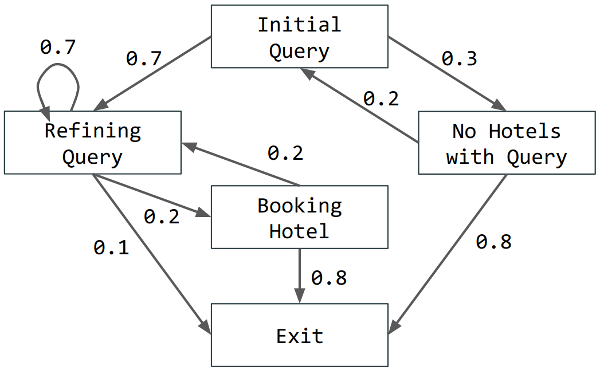
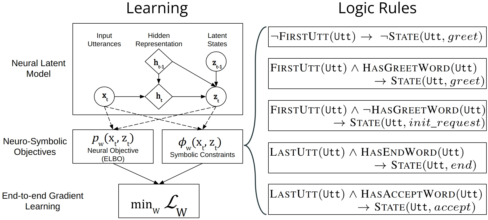
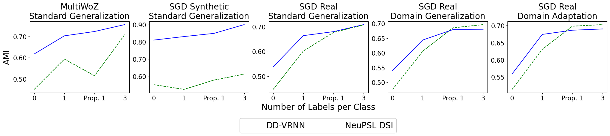
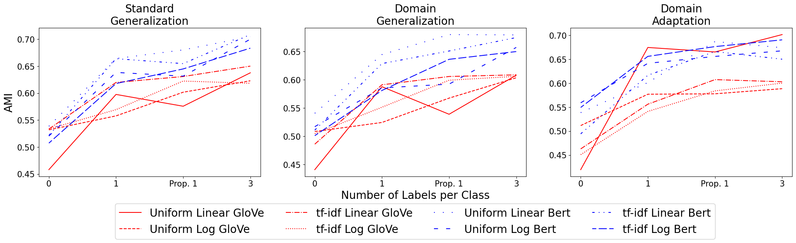
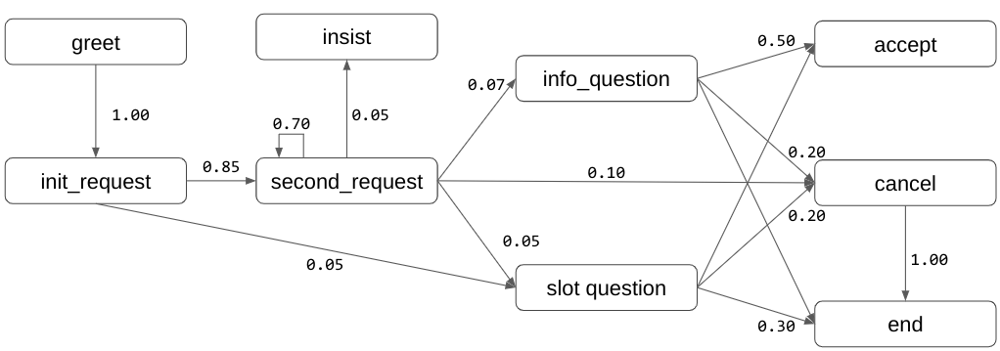
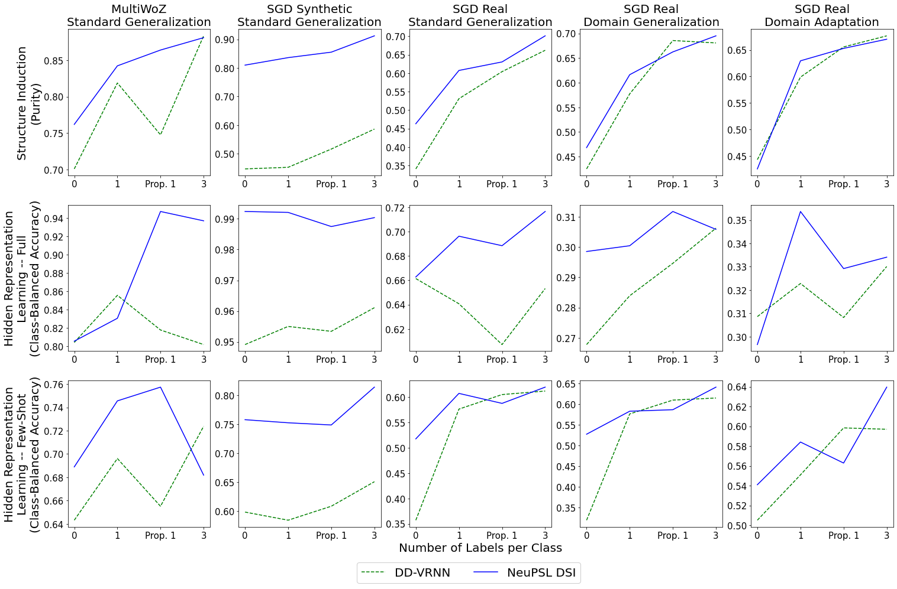
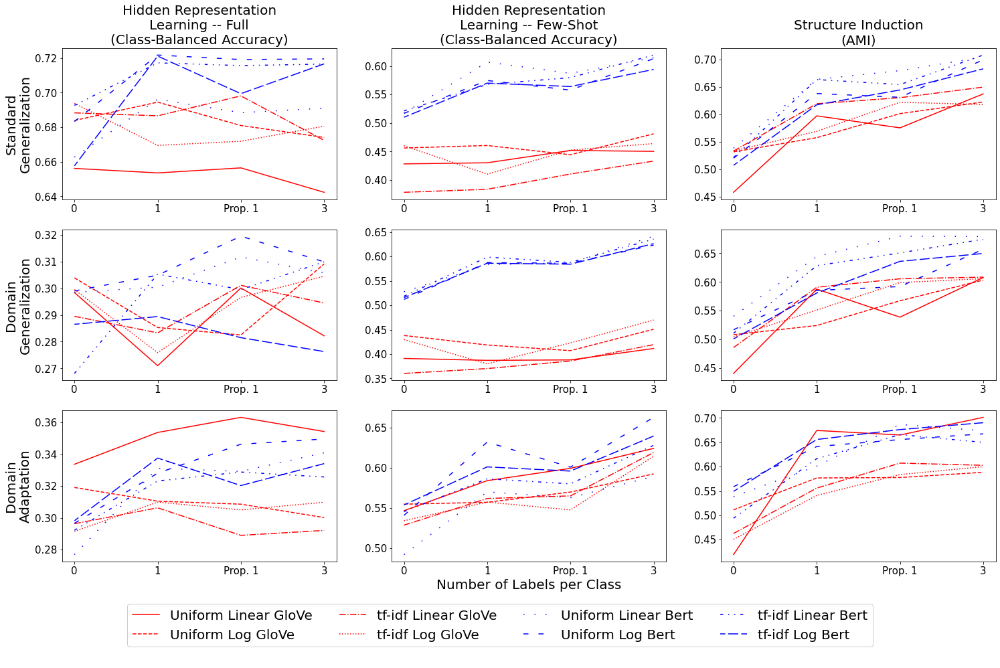
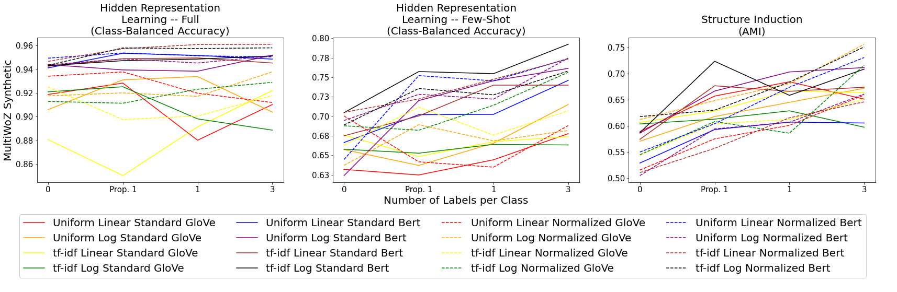
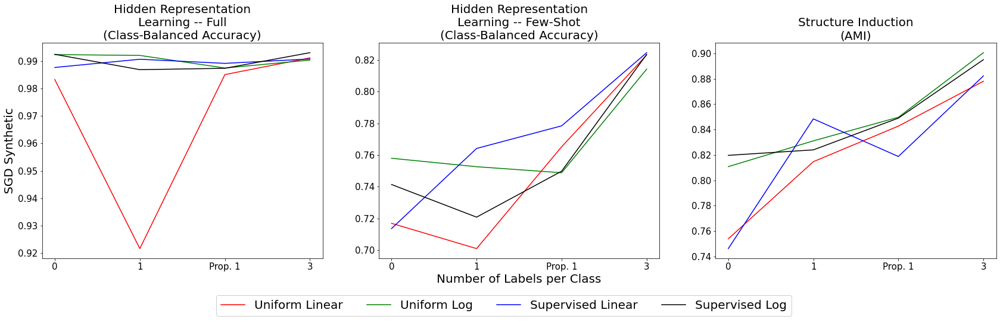
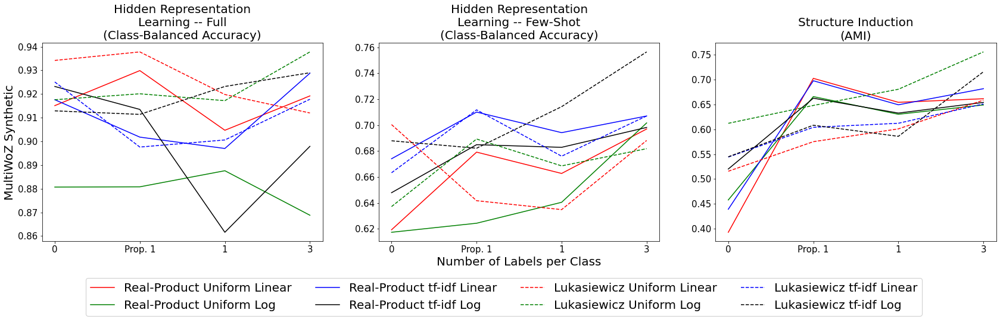

# Using Domain Knowledge to Guide Dialog 
Structure Induction via Neural Probabilistic Soft Logic

###### Abstract

Dialog Structure Induction (DSI) is the task of inferring the latent dialog structure (i.e., a set of dialog states and their temporal transitions) of a given goal-oriented dialog. It is a critical component for modern dialog system design and discourse analysis. Existing DSI approaches are often purely data-driven, deploy models that infer latent states without access to domain knowledge, underperform when the training corpus is limited/noisy, or have difficulty when test dialogs exhibit distributional shifts from the training domain. This work explores a neural-symbolic approach as a potential solution to these problems. We introduce Neural Probabilistic Soft Logic Dialogue Structure Induction (NeuPSL DSI), a principled approach that injects symbolic knowledge into the latent space of a generative neural model. We conduct a thorough empirical investigation on the effect of NeuPSL DSI learning on hidden representation quality, few-shot learning, and out-of-domain generalization performance. Over three dialog structure induction datasets and across unsupervised and semi-supervised settings for standard and cross-domain generalization, the injection of symbolic knowledge using NeuPSL DSI provides a consistent boost in performance over the canonical baselines.  

[FIGURE S0.F1.g1]

Figure 1: 
Example dialog structure for the goal-oriented task booking a hotel.
[/FIGURE]

## 1 Introduction

The seamless integration of prior domain knowledge into the neural learning of language structure has been an open challenge in the machine learning and natural language processing communities. In this work, we inject symbolic knowledge into the neural learning process of a two-party dialog structure induction (DSI) task (Zhai and Williams, [2014](#bib.bib48); Shi et al., [2019](#bib.bib39)). This task aims to learn a graph, known as the dialog structure, capturing the potential flow of states occurring in a dialog dataset for a specific task-oriented domain, e.g., Figure [1](#S0.F1 "Figure 1 ‣ Using Domain Knowledge to Guide Dialog Structure Induction via Neural Probabilistic Soft Logic") represents a possible dialog structure for the goal-oriented task of booking a hotel. Nodes in the dialog structure represent conversational topics or dialog acts that abstract the intent of individual utterances, and edges represent transitions between dialog acts over successive turns of the dialog.  

Similar to the motivation described in Shi et al. ([2019](#bib.bib39)), previous work in DSI has been split between supervised and unsupervised methods. In particular, traditional supervised methods Jurafsky ([1997](#bib.bib22)) relied on dialog structure hand-crafted by human domain experts. Unfortunately, this process is labor-intensive and, in most situations, does not generalize easily to new domains. Therefore, recent work attempts to overcome this limitation by studying unsupervised DSI; e.g., hidden Markov models Chotimongkol ([2008](#bib.bib7)); lan Ritter et al. ([2010](#bib.bib27)); Zhai and Williams ([2014](#bib.bib48)) and more recently Variational Recurrent Neural Networks (VRNN) Chung et al. ([2015](#bib.bib8)); Shi et al. ([2019](#bib.bib39)). However, being purely data-driven, these approaches have difficulty with limited/noisy data and cannot easily exploit domain-specific or domain-independent constraints on dialog that may be readily provided by human experts (e.g., Greet utterances are typically made in the first couple of turns).  

In this work, we propose Neural Probabilistic Soft Logic Dialogue Structure Induction (NeuPSL DSI). This practical neuro-symbolic approach improves the quality of learned dialog structure by infusing domain knowledge into the end-to-end, gradient-based learning of a neural model. We leverage Probabilistic Soft Logic (PSL), a well-studied soft logic formalism, to express domain knowledge as soft rules in succinct and interpretable first-order logic statements that can be incorporated easily into differentiable learning (Bach et al., [2017](#bib.bib1); Pryor et al., [2023](#bib.bib34)). This leads to a simple method for knowledge injection with minimal change to the SGD-based training pipeline of an existing neural generative model.  

Our key contributions are: 1) We propose NeuPSL DSI, which introduces a novel smooth relaxation of PSL constraints tailored to ensure a rich gradient signal during back-propagation; 2) We evaluate NeuPSL DSI over synthetic and realistic dialog datasets under three settings: standard generalization, domain generalization, and domain adaptation. We show quantitatively that injecting domain knowledge provides a boost over unsupervised and few-shot methods; and 3) We comprehensively investigate the effect of soft logic-augmented learning on different aspects of the learned neural model by examining its quality in representation learning and structure induction.  

## 2 Related Work

Dialog Structure Induction (DSI) refers to the task of inferring latent states of a dialog without full supervision of the state labels. Earlier work focus on building advanced clustering methods, e.g., topic models, HMM, GMM (Zhai and Williams, [2014](#bib.bib48)), which are later combined with pre-trained or task-specific neural representations (Nath and Kubba, [2021](#bib.bib32); Lv et al., [2021](#bib.bib28); Qiu et al., [2022](#bib.bib35)). Another line of work focuses on inferring latent states using neural generative models, most notably Direct-Discrete Variational Recurrent Neural Networks (DD-VRNN) (Shi et al., [2019](#bib.bib39)), with later improvements including BERT encoder (Chen et al., [2021](#bib.bib6)), GNN-based latent-space model (Sun et al., [2021](#bib.bib40); Xu et al., [2021](#bib.bib46)), structured-attention decoder (Qiu et al., [2020](#bib.bib36)), and database query modeling (Hudeček and Dušek, [2022](#bib.bib21)). Finally, Zhang et al. ([2020](#bib.bib49)); Wu et al. ([2020](#bib.bib44)) explored DSI in a semi-supervised and few-shot learning context. No work has explored DSI with domain knowledge as weak supervision or conducted a comprehensive evaluation of model performance across different generalization settings (i.e., unsupervised, few-shot, domain generalization, and domain adaptation).  

A related field of work, Neuro-Symbolic computing (NeSy), is an active area of research that aims to incorporate logic-based reasoning with neural computation. This field contains a plethora of different neural symbolic methods and techniques. The methods that closely relate to our line of work seek to enforce constraints on the output of a neural network Hu et al. ([2016](#bib.bib20)); Donadello et al. ([2017](#bib.bib16)); Diligenti et al. ([2017](#bib.bib15)); Mehta et al. ([2018](#bib.bib30)); Xu et al. ([2018](#bib.bib45)); Nandwani et al. ([2019](#bib.bib31)). For a more in-depth introduction, we refer the reader to these excellent recent surveys: [Besold et al.](#bib.bib4) ([2017](#bib.bib4)) and [De Raedt et al.](#bib.bib12) ([2020](#bib.bib12)). These methods, although powerful, are either: specific to the domain they work in, do not use the same soft logic formulation, have not been designed for unsupervised systems, or have not been used for dialog structure induction.  

Finally, our method is most closely related to the novel NeSy approaches of Neural Probabilistic Soft Logic (NeuPSL) Pryor et al. ([2023](#bib.bib34)), DeepProbLog (DPL) Manhaeve et al. ([2021](#bib.bib29)), and Logic Tensor Networks (LTNs) Badreddine et al. ([2022](#bib.bib3)). LTNs instantiate a model which forwards neural network predictions into functions representing symbolic relations with real-valued or fuzzy logic semantics, and DeepProbLog uses the output of a neural network to specify probabilities of events. The mathematical formulation of LTNs and DPL differs from our underlying soft logic distribution. NeuPSL unites state-of-the-art symbolic reasoning with the low-level perception of deep neural networks through Probabilistic Soft Logic (PSL). Our method uses a NeuPSL formulation; however, we introduce a novel variation to the soft logic formulation, develop theory for unsupervised tasks, introduce the whole system in Tensorflow, and apply it to dialog structure induction.  

## 3 Background

Our neuro-symbolic approach to dialog structure induction combines the principled formulation of probabilistic soft logic (PSL) rules with a neural generative model. In this work, we use the state-of-the-art Direct-Discrete Variational Recurrent Neural Network (DD-VRNN) as the base model (Shi et al., [2019](#bib.bib39)). We start by introducing the syntax and semantics for DD-VRNN and PSL.  

[FIGURE S3.F2.g1]

Figure 2: 
The high-level pipeline of the NeuPSL DSI  learning procedure.
[/FIGURE]

### 3.1 Direct Discrete Variational Recurrent Neural Networks

A Direct Discrete Variational Recurrent Neural Networks (DD-VRNN) Shi et al. ([2019](#bib.bib39)) is an expansion to the popular Variational Recurrent Neural Networks (VRNN) Chung et al. ([2015](#bib.bib8)), which constructs a sequence of VAEs and associates them with states of an RNN. The main difference between the DD-VRNN and a traditional VRNN is the priors of the latent states $z_{t}$. They directly model the influence of $z_{t-1}$ on $z_{t}$, which models the transitions between different latent (i.e., dialog) states. To fit the prior into the variational inference framework, an approximation of $p(z_{t}|x_{<t},z_{<t})$ is made which changes the distribution to $p(z_{t}|z_{t-1})$:  

|  | $\displaystyle p(x_{\leq T},z_{\leq T})$ | $\displaystyle=\prod_{t=1}^{T}p(x_{t}|z_{\leq t},x_{<t})p(z_{t}|x_{<t},z_{t-1})$ |  |
| --- | --- | --- | --- |
|  |  | $\displaystyle\approx\prod_{t=1}^{T}p(x_{t}|z_{\leq t},x_{<t})p(z_{t}|z_{t-1})$ |  | (1) |
| --- | --- | --- | --- | --- |

$z_{t}$ is modeled as $z_{t}\sim softmax(\phi_{\tau}^{prior}(z_{t-1}))$ for a feature extraction neural network for the prior $\phi_{\tau}^{prior}$. Lastly, the objective function used in the DD-VRNN is a timestep-wise variational lower bound Chung et al. ([2015](#bib.bib8)) augmented with a bag-of-word (BOW) loss and Batch Prior Regularization (BPR) Zhao et al. ([2017](#bib.bib51), [2018](#bib.bib50)), i.e.:  

|  | $\displaystyle\mathcal{L}_{VRNN}=\mathbb{E}_{q(z\leq T|x\leq T)}[\log p(x_{t}|z_{\leq t},x_{<t})+$ |  |
| --- | --- | --- |
|  | $\displaystyle\sum_{t=1}^{T}-KL(q(z_{t}|x_{\leq t},z_{<t})||p(z_{t}|x_{<t},z_{<t}))]$ |  | (2) |
| --- | --- | --- | --- |

so that the full objective function is  

|  | $\displaystyle\mathcal{L}_{DD-VRNN}=\mathcal{L}_{VRNN}+\lambda*\mathcal{L}_{bow}$ |  | (3) |
| --- | --- | --- | --- |

where $\lambda$ is a tunable weight and $\mathcal{L}_{bow}$ is the BOW loss. For further details on $\mathcal{L}_{bow}$ see Section [4.3](#S4.SS3 "4.3 Stronger control of posterior collapse via weighted bag of words ‣ 4 Neural Probabilistic Soft Logic Dialogue Structure Induction ‣ Using Domain Knowledge to Guide Dialog Structure Induction via Neural Probabilistic Soft Logic") and [Shi et al.](#bib.bib39) ([2019](#bib.bib39)). To expand this to a semi-supervised domain, the objective is augmented as:  

|  | $\displaystyle\mathcal{L}_{DD-VRNN}=$ |  |
| --- | --- | --- |
|  | $\displaystyle\hskip 14.22636pt\mathcal{L}_{VRNN}+\lambda*\mathcal{L}_{bow}+\mathcal{L}_{supervised}$ |  | (4) |
| --- | --- | --- | --- |

where $\mathcal{L}_{supervised}$ is the loss between the labels and predictions, e.g., cross-entropy.  

### 3.2 Probabilistic Soft Logic

This work introduces soft constraints in a declarative fashion, similar to Probabilistic Soft Logic (PSL). PSL is a declarative statistical relational learning (SRL) framework for defining a particular probabilistic graphical model, known as a hinge-loss Markov random field (HL-MRF) Bach et al. ([2017](#bib.bib1)). PSL models relational dependencies and structural constraints using first-order logical rules, referred to as templates, with arguments known as atoms. For example, the statement “the first utterance in a dialog is likely to belong to the greet state" can be expressed as:  

|  | $\displaystyle\textsc{FirstUtt}(\texttt{U})\rightarrow\textsc{State}(\texttt{U},greet)$ |  | (5) |
| --- | --- | --- | --- |

Where ($\textsc{FirstUtt}(\texttt{U})$, $\textsc{State}(\texttt{U},greet)$) are the atoms (i.e., atomic boolean statements) indicating, respectively, whether an utterance U is the first utterance of the dialog, or if it belongs to the state greet. The atoms in a PSL rule are *grounded* by replacing the free variables (such as U above) with concrete instances from a domain of interest (e.g., the concrete utterance ’Hello!’); we call these the *grounded atoms*. The observed variables and target/decision variables of the probabilistic model correspond to ground atoms constructed from the domain, e.g., $\textsc{FirstUtt}(^{\prime}Hello!^{\prime})$ may be an observed variable and $\textsc{State}(^{\prime}Hello!^{\prime},greet)$ may be a target variable.  

PSL performs inference over soft logic constraints by allowing the originally Boolean-valued atoms to take continuous truth values in the interval $[0,1]$. Using this relaxation, PSL replaces logical operations with a form of soft logic called Lukasiewicz logic Klir and Yuan ([1995](#bib.bib25)):  

|  | $\displaystyle A\wedge B$ | $\displaystyle=max(0.0,A\texttt{+}B-1.0)$ |  |
| --- | --- | --- | --- |
|  | $\displaystyle A\vee B$ | $\displaystyle=min(1.0,A\texttt{+}B)$ |  |
| --- | --- | --- | --- |
|  | $\displaystyle\neg A$ | $\displaystyle=1.0-A$ |  | (6) |
| --- | --- | --- | --- | --- |

where $A$ and $B$ represent either ground atoms or logical expressions over atoms and take values in $[0,1]$. For example, PSL will convert the statement from Equation [5](#S3.E5 "In 3.2 Probabilistic Soft Logic ‣ 3 Background ‣ Using Domain Knowledge to Guide Dialog Structure Induction via Neural Probabilistic Soft Logic"), into the following:  

|  | $\displaystyle min\{1,~{}$ | $\displaystyle 1-\textsc{FirstUtt}(\texttt{U})\texttt{+}\textsc{State}(\texttt{U},greet))\}$ |  | (7) |
| --- | --- | --- | --- | --- |

since $A\rightarrow B\equiv\neg A\vee B$. In this way, we can create a collection of functions $\{\ell_{i}\}_{i=1}^{m}$, called templates, that map data to $[0,1]$. Using the templates, PSL defines a conditional probability density function over the unobserved random variables $\mathbf{y}$ given the observed data $\mathbf{x}$ known as the Hinge-Loss Markov Random Field (HL-MRF):  

|  | $\displaystyle P(\mathbf{y}|\mathbf{x})\propto exp(-\sum_{i=1}^{m}\lambda_{i}\cdot\phi_{i}(\mathbf{y},\mathbf{x}))$ |  | (8) |
| --- | --- | --- | --- |

Here $\lambda_{i}$ is a non-negative weight and $\phi_{i}$ a potential function based on the templates:  

|  | $\displaystyle\phi_{i}(\mathbf{y},\mathbf{x})=max\{0,\ell_{i}(\mathbf{y},\mathbf{x})\}$ |  | (9) |
| --- | --- | --- | --- |

Then, inference for the model predictions $\mathbf{y}$ proceeds by Maximum A Posterior (MAP) estimation, i.e., by maximizing the objective function $P(\mathbf{y}|\mathbf{x})$ (eq. [8](#S3.E8 "In 3.2 Probabilistic Soft Logic ‣ 3 Background ‣ Using Domain Knowledge to Guide Dialog Structure Induction via Neural Probabilistic Soft Logic")) with respect to $\mathbf{y}$.  

## 4 Neural Probabilistic Soft Logic Dialogue Structure Induction

In this section, we describe our approach to integrating domain knowledge and neural network-based dialog structure induction. Our approach integrates an unsupervised neural generative model with dialog rules using soft constraints. We refer to our approach as Neural Probabilistic Soft Logic Dialogue Structure Induction  (NeuPSL DSI). In the following, we define the dialog structure learning problem, describe how to integrate the neural and symbolic losses, and highlight essential model components that address optimization and representation-learning challenges under gradient-based neuro-symbolic learning.  

##### Problem Formulation

Given a goal-oriented dialog corpus $\mathcal{D}$, we consider the DSI problem of learning a graph $G$ underlying the corpus. More formally, a *dialog structure* is defined as a directed graph $G=(S,P)$, where $S=\{s_{1},\dots,s_{m}\}$ encodes a set of dialog states, and $P$ a probability distribution $p(s_{t}|s_{<t})$ representing the likelihood of transition between states (see Figure [1](#S0.F1 "Figure 1 ‣ Using Domain Knowledge to Guide Dialog Structure Induction via Neural Probabilistic Soft Logic") for an example). Given the underlying dialog structure $G$, a dialog $d_{i}=\{x_{1},\dots,x_{T}\}\in\mathcal{D}$ is a temporally-ordered set of utterances $x_{t}$. Assume $x_{t}$ is defined according to an utterance distribution conditional on past history $p(x_{t}|s_{\leq t},x_{<t})$, and the state $s_{t}$ is defined according to $p(s_{t}|s_{<t})$. Given a dialog corpus $\mathcal{D}=\{d_{i}\}_{i=1}^{n}$, the task of DSI is to learn a directed graphical model $G=(S,P)$ as close to the underlying graph as possible.  

### 4.1 Integrating Neural and Symbolic Learning under NeuPSL DSI

We now introduce how the NeuPSL DSI approach formally integrates the DD-VRNN with the soft symbolic constraints to allow for end-to-end gradient training. To begin, we define the relaxation of the symbolic constraints to be the same as described in Section [3.2](#S3.SS2 "3.2 Probabilistic Soft Logic ‣ 3 Background ‣ Using Domain Knowledge to Guide Dialog Structure Induction via Neural Probabilistic Soft Logic"). With this relaxation, we can build upon the foundations developed by [Pryor et al.](#bib.bib34) ([2023](#bib.bib34)) on Neural Probabilistic Soft Logic (NeuPSL) by augmenting the standard unsupervised DD-VRNN loss with a constraint loss. Figure [2](#S3.F2 "Figure 2 ‣ 3 Background ‣ Using Domain Knowledge to Guide Dialog Structure Induction via Neural Probabilistic Soft Logic") provides a graphical representation of this integration of the DD-VRNN and the symbolic constraints. Intuitively, NeuPSL DSI can be described in three parts: instantiation, inference, and learning.  

Instantiation of a NeuPSL DSI model uses a set of first-order logic templates to create a set of potentials that define a loss used for learning and evaluation. Let $p_{\textbf{w}}$ be the DD-VRNN’s predictive function of latent states with hidden parameters $\mathbf{w}$ and input utterances $\mathbf{x}_{vrnn}$. The output of this function, defined as $p_{\textbf{w}}(\mathbf{x}_{vrnn})$, will be the probability distribution representing the likelihood of each latent class for a given utterance. Given a first-order symbolic rule $\ell_{i}(\mathbf{y},\mathbf{x})$, where $\mathbf{y}=p_{\textbf{w}}(\mathbf{x}_{vrnn})$ is the decision variable representing the latent state prediction from the neural model, and $\mathbf{x}$ represents the symbolic observations not incorporated in the neural features $\mathbf{x}_{vrnn}$, NeuPSL DSI instantiates a set of deep hinge-loss potentials of the form:  

|  | $\displaystyle\phi_{\textbf{w},i}(\mathbf{x}_{vrnn},\mathbf{x})=\max(0,\ell_{i}(p_{\textbf{w}}(\mathbf{x}_{vrnn}),\mathbf{x}))$ |  | (10) |
| --- | --- | --- | --- |

For example, in reference to Equation [7](#S3.E7 "In 3.2 Probabilistic Soft Logic ‣ 3 Background ‣ Using Domain Knowledge to Guide Dialog Structure Induction via Neural Probabilistic Soft Logic"), the decision variable $\mathbf{y}=p_{\textbf{w}}(\mathbf{x}_{vrnn})$ is associated with the $\textsc{State}(\mathbf{x},greet)$ random variables, leading to:  

|  | $\displaystyle\ell_{i}$ | $\displaystyle(p_{\textbf{w}}(\mathbf{x}_{vrnn}),\mathbf{x})=$ |  |
| --- | --- | --- | --- |
|  |  | $\displaystyle min\{1,1-\textsc{FirstUtt}(\texttt{U})+p_{\textbf{w}}(\mathbf{x}_{vrnn})\}$ |  | (11) |
| --- | --- | --- | --- | --- |

With the instantiated model described above, the NeuPSL DSI inference objective is broken into a neural inference objective and a symbolic inference objective. The neural inference objective is computed by evaluating the DD-VRNN model predictions with respect to the standard loss function for DSI. Given the deep hinge-loss potentials $\{\phi_{\textbf{w},i}\}_{i=1}^{m}$, the symbolic inference objective is the HL-MRF likelihood (Equation [8](#S3.E8 "In 3.2 Probabilistic Soft Logic ‣ 3 Background ‣ Using Domain Knowledge to Guide Dialog Structure Induction via Neural Probabilistic Soft Logic")) evaluated at the decision variables $\mathbf{y}=p_{\textbf{w}}(\mathbf{x}_{vrnn})$:  

|  | $\displaystyle P_{\textbf{w}}(\mathbf{y}|$ | $\displaystyle\mathbf{x}_{vrnn},\mathbf{x},\mathbf{\lambda})=$ |  | (12) |
| --- | --- | --- | --- | --- |
|  |  | $\displaystyle exp\big{(}-\sum_{i=1}^{m}\lambda_{i}\cdot\phi_{\textbf{w},i}(\mathbf{x}_{vrnn},\mathbf{x})\big{)}$ |  |
| --- | --- | --- | --- |

Under the NeuPSL DSI, the decision variables $\mathbf{y}=p_{\textbf{w}}(\mathbf{x}_{vrnn})$ are implicitly controlled by neural network weights w, therefore the conventional MAP inference in symbolic learning for decision variables $\mathbf{y}^{*}=\operatorname*{arg\,min}_{\mathbf{y}}P(\mathbf{y}|\mathbf{x}_{vrnn},\mathbf{x},\mathbf{\lambda})$ can be done simply via neural weight minimization $\operatorname*{arg\,min}_{\mathbf{w}}P_{\textbf{w}}(\mathbf{y}|\mathbf{x}_{vrnn},\mathbf{x},\mathbf{\lambda})$. As a result, NeuPSL DSI learning minimizes a constrained optimization objective:  

|  | $\displaystyle\mathbf{w}^{*}=\operatorname*{arg\,min}_{\mathbf{w}}\Big{[}\mathcal{L}_{DD-VRNN}+\mathcal{L}_{constraint}\Big{]}$ |  | (13) |
| --- | --- | --- | --- |

where we define the constraint loss to be the log-likelihood of the HL-MRF distribution ([4.1](#S4.Ex7 "4.1 Integrating Neural and Symbolic Learning under NeuPSL DSI ‣ 4 Neural Probabilistic Soft Logic Dialogue Structure Induction ‣ Using Domain Knowledge to Guide Dialog Structure Induction via Neural Probabilistic Soft Logic")):  

|  | $\displaystyle\mathcal{L}_{Constraint}=-logP_{\textbf{w}}(\mathbf{y}|\mathbf{x}_{vrnn},\mathbf{x},\mathbf{\lambda}).$ |  | (14) |
| --- | --- | --- | --- |

### 4.2 Improving soft logic constraints for gradient learning

The straightforward linear soft constraints used by the classic Lukasiewicz relaxation fail to pass back gradients with a magnitude and instead pass back a direction (e.g., $\pm 1$). Formally, the gradient of a potential $\phi_{\textbf{w}}(\mathbf{x}_{vrnn},\mathbf{x})=\max(0,\ell(p_{\textbf{w}}(\mathbf{x}_{vrnn}),\mathbf{x}))$ with respect to w is:  

|  | $\displaystyle\frac{\partial}{\partial\textbf{w}}\phi_{\textbf{w}}$ | $\displaystyle=\frac{\partial}{\partial\textbf{w}}\ell(p_{\textbf{w}},\mathbf{x})\cdot 1_{\phi_{\textbf{w}}>0}$ |  |
| --- | --- | --- | --- |
|  |  | $\displaystyle=\Big{[}\frac{\partial}{\partial p_{\mathbf{w}}}\ell(p_{\textbf{w}},\mathbf{x})\Big{]}\cdot\frac{\partial}{\partial\textbf{w}}p_{\textbf{w}}\cdot 1_{\phi_{\textbf{w}}>0}$ |  | (15) |
| --- | --- | --- | --- | --- |

Here $\ell(p_{\textbf{w}},\mathbf{x})=a\cdot p_{\textbf{w}}(\mathbf{x}_{vrnn})+b$ where $a,b\in\mathbb{R}$ and $p_{\textbf{w}}(\mathbf{x}_{vrnn})\in[0,1]$, which leads to the gradient $\frac{\partial}{\partial p_{\mathbf{w}}}\ell(p_{\textbf{w}},\mathbf{x})=a$. Observing the three Lukasiewicz operations described in Section [3.2](#S3.SS2 "3.2 Probabilistic Soft Logic ‣ 3 Background ‣ Using Domain Knowledge to Guide Dialog Structure Induction via Neural Probabilistic Soft Logic"), it is clear that $a$ will always result in $\pm 1$ unless there are multiple $p_{\textbf{w}}(\mathbf{x}_{vrnn})$ per constraint.  

As a result, this classic soft relaxation leads to a naive, non-smooth gradient:  

|  | $\displaystyle\frac{\partial}{\partial\textbf{w}}\phi_{\textbf{w}}=\Big{[}a1_{\phi_{\textbf{w}}>0}\Big{]}\cdot\frac{\partial}{\partial\textbf{w}}p_{\textbf{w}}$ |  | (16) |
| --- | --- | --- | --- |

that is mostly consists of the predictive probability gradient $\frac{\partial}{\partial\textbf{w}}p_{\textbf{w}}$. It barely informs the model of the degree to which $p_{\textbf{w}}$ satisfies the symbolic constraint $\phi_{\textbf{w}}$ (other than the non-smooth step function $1_{\phi_{\textbf{w}}>0}$), thereby creating challenges in gradient-based learning.  

In this work, we propose a novel log-based relaxation that provides smoother and more informative gradient information for the symbolic constraints:  

|  | $\displaystyle\psi_{\textbf{w}}(\mathbf{x})$ | $\displaystyle=\log\big{(}\phi_{\textbf{w}}(\mathbf{x}_{vrnn},\mathbf{x})\big{)}$ |  | (17) |
| --- | --- | --- | --- | --- |
|  |  | $\displaystyle=\hskip 0.56917pt\log\big{(}\max(0,\ell(p_{\textbf{w}}(\mathbf{x}_{vrnn}),\mathbf{x}))\big{)}$ |  |
| --- | --- | --- | --- |

This seemingly simple transformation brings a non-trivial change to the gradient behavior:  

|  | $\displaystyle\frac{\partial}{\partial\textbf{w}}\psi_{\textbf{w}}$ | $\displaystyle=\frac{1}{\phi_{\textbf{w}}}\cdot\frac{\partial}{\partial\textbf{w}}\phi_{\textbf{w}}$ |  | (18) |
| --- | --- | --- | --- | --- |
|  |  | $\displaystyle=\Big{[}\frac{a}{\phi_{\textbf{w}}}1_{\phi_{\textbf{w}}>0}\Big{]}\cdot\frac{\partial}{\partial\textbf{w}}p_{\textbf{w}}$ |  |
| --- | --- | --- | --- |

As shown, the gradient from the symbolic constraint now contains a new term $\frac{1}{\phi_{\textbf{w}}}$. It informs the model of the degree to which the model prediction satisfies the symbolic constraint $\ell$ so that it is no longer a discrete step function with respect to $\phi_{\textbf{w}}$. As a result, when the satisfaction of a rule $\phi_{\textbf{w}}$ is non-negative but low (i.e., uncertain), the gradient magnitude will be high, and when the satisfaction of the rule is high, the gradient magnitude will be low. In this way, the gradient of the symbolic constraint terms $\phi_{i}$ now guides the neural model to more efficiently focus on learning the challenging examples that don’t obey the existing symbolic rules. This leads to more effective collaboration between the neural and the symbolic components during model learning and empirically leads to improved generalization performance (Section [5](#S5 "5 Experimental Evaluation ‣ Using Domain Knowledge to Guide Dialog Structure Induction via Neural Probabilistic Soft Logic")).  

### 4.3 Stronger control of posterior collapse via weighted bag of words

It is essential to avoid a collapsed VRNN solution, where the model puts all of its predictions in just a handful of states. This problem has been referred to as the vanishing latent variable problem Zhao et al. ([2017](#bib.bib51)). [Zhao et al.](#bib.bib51) ([2017](#bib.bib51)) address this by introducing a bag-of-word (BOW) loss to VRNN modeling which requires a network to predict the bag-of-words in response $x$. They separate $x$ into two variables: $x_{o}$ (word order) and $x_{bow}$ (no word order), with the assumption that they are conditionally independent given $z$ and $c$:  

|  | $\displaystyle p(x,z|c)=p(x_{o}|z,c)p(x_{bow}|z,c)p(z|c).$ |  | (19) |
| --- | --- | --- | --- |

Here, $c$ is the dialog history: the preceding utterances, conversational floor (1 if the utterance is from the same speaker and 0 otherwise), and meta-features (e.g., the topic). Let $f$ be the output of a multilayer perception with parameters $z,x$, where $f\in\mathbb{R}^{V}$ with $V$ the vocabulary size. Then the BOW probability is defined as $\log p(x_{bow}|z,c)=\log\prod_{t=1}^{|x|}\dfrac{e^{f_{x_{t}}}}{\sum_{j}^{V}e^{f_{j}}}$, where $|x|$ is the length of $x$ and $x_{t}$ is the word index of the $t_{th}$ word in $x$.  

To impose robust regularization against the posterior collapse, we use a tf-idf-based re-weighting scheme using the tf-idf weights computed from the training corpus. Intuitively, this re-weighting scheme helps the model focus on reconstructing non-generic terms that are unique to each dialog state, which encourages the model to “pull" the sentences from different dialog states further apart in its representations space to minimize the weighted BOW loss better. In comparison, a model under the uniformly-weighted BOW loss may be distracted by reconstructing the high-prevalence terms (e.g., "what is," "can I," and "when") that are shared by all dialog states. As a result, we specify the tf-idf weighted BOW probability as:  

|  | $\displaystyle\log p(x_{bow}|z,c)=\log\prod_{t=1}^{|x|}\dfrac{w_{x_{i}}e^{f_{x_{t}}}}{\sum_{j}^{V}e^{f_{j}}},$ |  | (20) |
| --- | --- | --- | --- |

where $w_{x_{t}}=\dfrac{(1-\alpha)}{N}+\alpha w_{x_{t}}^{\prime}$, $N$ is the corpus size, $w_{x_{t}}^{\prime}$ is the tf-idf word weight for the $x_{t}$ index, and $\alpha$ is a hyperparameter. In Section [5](#S5 "5 Experimental Evaluation ‣ Using Domain Knowledge to Guide Dialog Structure Induction via Neural Probabilistic Soft Logic"), we explore how this alteration affects the performance and observe if the PSL constraints still provide a boost.  

[TABLE S4.T1]

<table class="ltx_tabular ltx_guessed_headers ltx_align_middle">
<tbody class="ltx_tbody">
<tr class="ltx_tr">
<th class="ltx_td ltx_align_center ltx_th ltx_th_row ltx_border_tt">Dataset</th>
<th class="ltx_td ltx_align_center ltx_th ltx_th_row ltx_border_tt">Setting</th>
<th class="ltx_td ltx_align_center ltx_th ltx_th_row ltx_border_rr ltx_border_tt">Method</th>
<td class="ltx_td ltx_align_center ltx_border_tt">Hidden Representation Learning</td>
<td class="ltx_td ltx_align_center ltx_border_tt">Structure Induction</td>
</tr>
<tr class="ltx_tr">
<td class="ltx_td ltx_align_center">Full</td>
<td class="ltx_td ltx_align_center ltx_border_r">Few-Shot</td>
</tr>
<tr class="ltx_tr">
<td class="ltx_td ltx_align_center">( Class-Balanced Accuracy )</td>
<td class="ltx_td ltx_align_center ltx_border_r">( Class-Balanced Accuracy )</td>
<td class="ltx_td ltx_align_center">( AMI )</td>
</tr>
<tr class="ltx_tr">
<th class="ltx_td ltx_align_center ltx_th ltx_th_row ltx_border_t">MultiWoZ</th>
<th class="ltx_td ltx_align_center ltx_th ltx_th_row ltx_border_t">

Standard
Generalization
</th>
<th class="ltx_td ltx_align_center ltx_th ltx_th_row ltx_border_rr ltx_border_t">DD-VRNN</th>
<td class="ltx_td ltx_align_center ltx_border_t">0.804 ± 0.037</td>
<td class="ltx_td ltx_align_center ltx_border_r ltx_border_t">0.643 ± 0.038</td>
<td class="ltx_td ltx_align_center ltx_border_t">0.451 ± 0.042</td>
</tr>
<tr class="ltx_tr">
<th class="ltx_td ltx_align_center ltx_th ltx_th_row ltx_border_rr">NeuPSL DSI</th>
<td class="ltx_td ltx_align_center">0.806 ± 0.051</td>
<td class="ltx_td ltx_align_center ltx_border_r">0.689 ± 0.038</td>
<td class="ltx_td ltx_align_center">0.618 ± 0.028</td>
</tr>
<tr class="ltx_tr">
<th class="ltx_td ltx_align_center ltx_th ltx_th_row ltx_border_t">

SGD
Synthetic
</th>
<th class="ltx_td ltx_align_center ltx_th ltx_th_row ltx_border_t">

Standard
Generalization
</th>
<th class="ltx_td ltx_align_center ltx_th ltx_th_row ltx_border_rr ltx_border_t">DD-VRNN</th>
<td class="ltx_td ltx_align_center ltx_border_t">0.949 ± 0.005</td>
<td class="ltx_td ltx_align_center ltx_border_r ltx_border_t">0.598 ± 0.019</td>
<td class="ltx_td ltx_align_center ltx_border_t">0.553 ± 0.017</td>
</tr>
<tr class="ltx_tr">
<th class="ltx_td ltx_align_center ltx_th ltx_th_row ltx_border_rr">NeuPSL DSI</th>
<td class="ltx_td ltx_align_center">0.941 ± 0.009</td>
<td class="ltx_td ltx_align_center ltx_border_r">0.765 ± 0.012</td>
<td class="ltx_td ltx_align_center">0.826 ± 0.006</td>
</tr>
<tr class="ltx_tr">
<th class="ltx_td ltx_align_center ltx_th ltx_th_row ltx_border_bb ltx_border_t">

SGD
Real
</th>
<th class="ltx_td ltx_align_center ltx_th ltx_th_row ltx_border_t">

Standard
Generalization
</th>
<th class="ltx_td ltx_align_center ltx_th ltx_th_row ltx_border_rr ltx_border_t">DD-VRNN</th>
<td class="ltx_td ltx_align_center ltx_border_t">0.661 ± 0.015</td>
<td class="ltx_td ltx_align_center ltx_border_r ltx_border_t">0.357 ± 0.015</td>
<td class="ltx_td ltx_align_center ltx_border_t">0.448 ± 0.019</td>
</tr>
<tr class="ltx_tr">
<th class="ltx_td ltx_align_center ltx_th ltx_th_row ltx_border_rr">NeuPSL DSI</th>
<td class="ltx_td ltx_align_center">0.663 ± 0.015</td>
<td class="ltx_td ltx_align_center ltx_border_r">0.517 ± 0.021</td>
<td class="ltx_td ltx_align_center">0.539 ± 0.048</td>
</tr>
<tr class="ltx_tr">
<th class="ltx_td ltx_align_center ltx_th ltx_th_row ltx_border_t">

Domain
Generalization
</th>
<th class="ltx_td ltx_align_center ltx_th ltx_th_row ltx_border_rr ltx_border_t">DD-VRNN</th>
<td class="ltx_td ltx_align_center ltx_border_t">0.268 ± 0.012</td>
<td class="ltx_td ltx_align_center ltx_border_r ltx_border_t">0.320 ± 0.029</td>
<td class="ltx_td ltx_align_center ltx_border_t">0.476 ± 0.029</td>
</tr>
<tr class="ltx_tr">
<th class="ltx_td ltx_align_center ltx_th ltx_th_row ltx_border_rr">NeuPSL DSI</th>
<td class="ltx_td ltx_align_center">0.299 ± 0.009</td>
<td class="ltx_td ltx_align_center ltx_border_r">0.528 ± 0.026</td>
<td class="ltx_td ltx_align_center">0.541 ± 0.036</td>
</tr>
<tr class="ltx_tr">
<th class="ltx_td ltx_align_center ltx_th ltx_th_row ltx_border_bb ltx_border_t">

Domain
Adaptation
</th>
<th class="ltx_td ltx_align_center ltx_th ltx_th_row ltx_border_rr ltx_border_t">DD-VRNN</th>
<td class="ltx_td ltx_align_center ltx_border_t">0.308 ± 0.011</td>
<td class="ltx_td ltx_align_center ltx_border_r ltx_border_t">0.505 ± 0.015</td>
<td class="ltx_td ltx_align_center ltx_border_t">0.514 ± 0.028</td>
</tr>
<tr class="ltx_tr">
<th class="ltx_td ltx_align_center ltx_th ltx_th_row ltx_border_bb ltx_border_rr">NeuPSL DSI</th>
<td class="ltx_td ltx_align_center ltx_border_bb">0.297 ± 0.025</td>
<td class="ltx_td ltx_align_center ltx_border_bb ltx_border_r">0.541 ± 0.023</td>
<td class="ltx_td ltx_align_center ltx_border_bb">0.559 ± 0.045</td>
</tr>
</tbody>
</table>

Table 1: 
Test set performance on all datasets. All reported results are averaged over 10 splits. The highest-performing methods per dataset and learning setting are bolded. A random baseline has AMI zero and class-balanced accuracy equal to inverse class size (all less than 10%, see Appendix Tables [4](#A4.T4 "Table 4 ‣ Purity - ‣ D.1 Evaluation Metrics ‣ Appendix D Extended Experimental Evaluation ‣ Using Domain Knowledge to Guide Dialog Structure Induction via Neural Probabilistic Soft Logic"), [5](#A4.T5 "Table 5 ‣ D.2 Main Results ‣ Appendix D Extended Experimental Evaluation ‣ Using Domain Knowledge to Guide Dialog Structure Induction via Neural Probabilistic Soft Logic"), [7](#A4.T7 "Table 7 ‣ D.4 Additional Experiments ‣ Appendix D Extended Experimental Evaluation ‣ Using Domain Knowledge to Guide Dialog Structure Induction via Neural Probabilistic Soft Logic")).
[/TABLE]

[FIGURE S4.F3.g1]

Figure 3: 
Average AMI for MultiWoZ, SGD Synthetic, and SGD Real (Standard Generalization, Domain Generalization, and Domain Adaptation) on three constrained few-shot settings: 1-shot, proportional 1-shot, and 3-shot.
Hidden representation learning graphs are included in the Appendix.
[/FIGURE]

## 5 Experimental Evaluation

We evaluate the performance of NeuPSL DSI on three task-oriented dialog corpuses in both unsupervised and highly constrained semi-supervised settings. Further, we provide an extensive ablation on different aspects of the learned neural model. We investigate the following questions: Q1) How does NeuPSL DSI perform in an unsupervised setting when soft constraints are incorporated into the loss? Q2) When introducing few-shot labels to DD-VRNN training, do soft constraints provide a boost? Q3) How do design choices such as log relaxation and re-weighted bag-of-words loss (introduced in Section [4.2](#S4.SS2 "4.2 Improving soft logic constraints for gradient learning ‣ 4 Neural Probabilistic Soft Logic Dialogue Structure Induction ‣ Using Domain Knowledge to Guide Dialog Structure Induction via Neural Probabilistic Soft Logic")-[4.3](#S4.SS3 "4.3 Stronger control of posterior collapse via weighted bag of words ‣ 4 Neural Probabilistic Soft Logic Dialogue Structure Induction ‣ Using Domain Knowledge to Guide Dialog Structure Induction via Neural Probabilistic Soft Logic")) impact performance?  

##### Datasets

These questions are explored using three goal-oriented dialog datasets: MultiWoZ 2.1 synthetic Campagna et al. ([2020](#bib.bib5)) and two versions of the Schema Guided Dialog (SGD) dataset; SGD-synthetic (where the utterance is generated by a template-based dialog simulator) and SGD-real (which replaces the machine-generated utterances of SGD-synthetic with its human-paraphrased counterparts) (Rastogi et al., [2020](#bib.bib37)). For the SGD-real dataset, we evaluate over three unique data settings, standard generalization (train and test over the same domain), domain generalization (train and test over different domains), and domain adaptation (train on (potentially labeled) data from the training domain and unlabeled data from the test domain, and test on evaluation data from the test domain). Appendix [C](#A3 "Appendix C Datasets ‣ Using Domain Knowledge to Guide Dialog Structure Induction via Neural Probabilistic Soft Logic") describes further details.  

##### Constraints

In the synthetic MultiWoZ setting, we introduce a set of 11 structural domain agnostic dialog rules. An example of one of these rules can be seen in Equation [5](#S3.E5 "In 3.2 Probabilistic Soft Logic ‣ 3 Background ‣ Using Domain Knowledge to Guide Dialog Structure Induction via Neural Probabilistic Soft Logic"). These rules are introduced to represent general facts about dialogs, with the goal of showing how the incorporation of a few expert-designed rules can drastically improve generalization performance. For SGD settings, we introduce a single dialog rule that encodes the concept that dialog acts should contain utterances with correlated tokens, e.g., utterances containing ’hello’ are likely to belong to the greet state. This rule is designed to show the potential boost in performance a model can achieve from a simple source of prior information. Appendix [C](#A3 "Appendix C Datasets ‣ Using Domain Knowledge to Guide Dialog Structure Induction via Neural Probabilistic Soft Logic") contains further details.  

##### Metrics and Methodology

The experimental evaluation examines two aspects: correctness of the learned latent dialog structure and quality of the learned hidden representation.  

Structure Induction. To evaluate the model’s ability to correctly learn the latent dialog structure, we adapt the Adjusted Mutual Information (AMI) metric from clustering literature (see Appendix [D.1](#A4.SS1 "D.1 Evaluation Metrics ‣ Appendix D Extended Experimental Evaluation ‣ Using Domain Knowledge to Guide Dialog Structure Induction via Neural Probabilistic Soft Logic") for details). AMI allows for a comparison between ground truth labels111These labels were only used for final evaluation, not for training or hyperparameter tuning. (e.g., "greet", "initial request", etc.) and latent state predictions (e.g., $State_{1},\cdot\cdot\cdot,State_{k}$).  

Representation Learning. A standard technique for evaluating the quality of unsupervised representation is linear probing, i.e., train a lightweight linear *probing* model on top of the frozen learned representation, and evaluate the linear model’s generalization performance for supervised tasks Tenney et al. ([2019](#bib.bib41)). To evaluate the quality of the learned DD-VRNN, we train a supervised linear classifier on top of input features extracted from the penultimate layer of the DD-VRNN. We evaluate with both full supervision and few-shot supervision. Full supervision averages the class-balanced accuracy of two separate models that classify dialog acts (e.g., "greet", "initial request", etc.) and domains ("hotel", "restaurant", etc.) respectively. Few-shot averages the class-balanced accuracy of models classifying dialog acts with 1-shot, 5-shot, and 10-shot settings.  

[TABLE S5.T2]

<table class="ltx_tabular ltx_guessed_headers ltx_align_middle">
<thead class="ltx_thead">
<tr class="ltx_tr">
<th class="ltx_td ltx_align_center ltx_th ltx_th_column ltx_border_r ltx_border_tt">Setting</th>
<th class="ltx_td ltx_align_center ltx_th ltx_th_column ltx_border_tt">

Bag-of-Words
Weights
</th>
<th class="ltx_td ltx_align_center ltx_th ltx_th_column ltx_border_tt">

Constraint
Loss
</th>
<th class="ltx_td ltx_align_center ltx_th ltx_th_column ltx_border_rr ltx_border_tt">Embedding</th>
<th class="ltx_td ltx_align_center ltx_th ltx_th_column ltx_border_tt">Hidden Representation Learning</th>
<th class="ltx_td ltx_align_center ltx_th ltx_th_column ltx_border_tt">Structure Induction</th>
</tr>
<tr class="ltx_tr">
<th class="ltx_td ltx_align_center ltx_th ltx_th_column">Full</th>
<th class="ltx_td ltx_align_center ltx_th ltx_th_column ltx_border_r">Few-Shot</th>
</tr>
<tr class="ltx_tr">
<th class="ltx_td ltx_align_center ltx_th ltx_th_column">( Class Balanced Accuracy )</th>
<th class="ltx_td ltx_align_center ltx_th ltx_th_column ltx_border_r">( Class Balanced Accuracy )</th>
<th class="ltx_td ltx_align_center ltx_th ltx_th_column">( AMI )</th>
</tr>
</thead>
<tbody class="ltx_tbody">
<tr class="ltx_tr">
<td class="ltx_td ltx_align_center ltx_border_r ltx_border_t">

Standard
Generalization
</td>
<td class="ltx_td ltx_align_center ltx_border_t">Uniform</td>
<td class="ltx_td ltx_align_center ltx_border_t">Linear</td>
<td class="ltx_td ltx_align_center ltx_border_rr ltx_border_t">Bert</td>
<td class="ltx_td ltx_align_center ltx_border_t">0.588 ± 0.016</td>
<td class="ltx_td ltx_align_center ltx_border_r ltx_border_t">0.517 ± 0.021</td>
<td class="ltx_td ltx_align_center ltx_border_t">0.539 ± 0.048</td>
</tr>
<tr class="ltx_tr">
<td class="ltx_td ltx_align_center">Uniform</td>
<td class="ltx_td ltx_align_center">Linear</td>
<td class="ltx_td ltx_align_center ltx_border_rr">GloVe</td>
<td class="ltx_td ltx_align_center">0.620 ± 0.023</td>
<td class="ltx_td ltx_align_center ltx_border_r">0.428 ± 0.021</td>
<td class="ltx_td ltx_align_center">0.458 ± 0.024</td>
</tr>
<tr class="ltx_tr">
<td class="ltx_td ltx_align_center">Uniform</td>
<td class="ltx_td ltx_align_center">Log</td>
<td class="ltx_td ltx_align_center ltx_border_rr">Bert</td>
<td class="ltx_td ltx_align_center">0.600 ± 0.022</td>
<td class="ltx_td ltx_align_center ltx_border_r">0.517 ± 0.023</td>
<td class="ltx_td ltx_align_center">0.520 ± 0.033</td>
</tr>
<tr class="ltx_tr">
<td class="ltx_td ltx_align_center">Uniform</td>
<td class="ltx_td ltx_align_center">Log</td>
<td class="ltx_td ltx_align_center ltx_border_rr">GloVe</td>
<td class="ltx_td ltx_align_center">0.650 ± 0.011</td>
<td class="ltx_td ltx_align_center ltx_border_r">0.456 ± 0.014</td>
<td class="ltx_td ltx_align_center">0.532 ± 0.009</td>
</tr>
<tr class="ltx_tr">
<td class="ltx_td ltx_align_center">tf-idf</td>
<td class="ltx_td ltx_align_center">Linear</td>
<td class="ltx_td ltx_align_center ltx_border_rr">Bert</td>
<td class="ltx_td ltx_align_center">0.573 ± 0.022</td>
<td class="ltx_td ltx_align_center ltx_border_r">0.521 ± 0.018</td>
<td class="ltx_td ltx_align_center">0.522 ± 0.024</td>
</tr>
<tr class="ltx_tr">
<td class="ltx_td ltx_align_center">tf-idf</td>
<td class="ltx_td ltx_align_center">Linear</td>
<td class="ltx_td ltx_align_center ltx_border_rr">GloVe</td>
<td class="ltx_td ltx_align_center">0.595 ± 0.014</td>
<td class="ltx_td ltx_align_center ltx_border_r">0.379 ± 0.015</td>
<td class="ltx_td ltx_align_center">0.533 ± 0.048</td>
</tr>
<tr class="ltx_tr">
<td class="ltx_td ltx_align_center">tf-idf</td>
<td class="ltx_td ltx_align_center">Log</td>
<td class="ltx_td ltx_align_center ltx_border_rr">Bert</td>
<td class="ltx_td ltx_align_center">0.578 ± 0.021</td>
<td class="ltx_td ltx_align_center ltx_border_r">0.510 ± 0.022</td>
<td class="ltx_td ltx_align_center">0.507 ± 0.060</td>
</tr>
<tr class="ltx_tr">
<td class="ltx_td ltx_align_center">tf-idf</td>
<td class="ltx_td ltx_align_center">Log</td>
<td class="ltx_td ltx_align_center ltx_border_rr">GloVe</td>
<td class="ltx_td ltx_align_center">0.653 ± 0.014</td>
<td class="ltx_td ltx_align_center ltx_border_r">0.460 ± 0.009</td>
<td class="ltx_td ltx_align_center">0.534 ± 0.033</td>
</tr>
<tr class="ltx_tr">
<td class="ltx_td ltx_align_center ltx_border_r ltx_border_t">

Domain
Generalization
</td>
<td class="ltx_td ltx_align_center ltx_border_t">Uniform</td>
<td class="ltx_td ltx_align_center ltx_border_t">Linear</td>
<td class="ltx_td ltx_align_center ltx_border_rr ltx_border_t">Bert</td>
<td class="ltx_td ltx_align_center ltx_border_t">0.597 ± 0.018</td>
<td class="ltx_td ltx_align_center ltx_border_r ltx_border_t">0.528 ± 0.026</td>
<td class="ltx_td ltx_align_center ltx_border_t">0.541 ± 0.036</td>
</tr>
<tr class="ltx_tr">
<td class="ltx_td ltx_align_center">Uniform</td>
<td class="ltx_td ltx_align_center">Linear</td>
<td class="ltx_td ltx_align_center ltx_border_rr">GloVe</td>
<td class="ltx_td ltx_align_center">0.597 ± 0.012</td>
<td class="ltx_td ltx_align_center ltx_border_r">0.391 ± 0.018</td>
<td class="ltx_td ltx_align_center">0.441 ± 0.030</td>
</tr>
<tr class="ltx_tr">
<td class="ltx_td ltx_align_center">Uniform</td>
<td class="ltx_td ltx_align_center">Log</td>
<td class="ltx_td ltx_align_center ltx_border_rr">Bert</td>
<td class="ltx_td ltx_align_center">0.598 ± 0.032</td>
<td class="ltx_td ltx_align_center ltx_border_r">0.512 ± 0.021</td>
<td class="ltx_td ltx_align_center">0.517 ± 0.036</td>
</tr>
<tr class="ltx_tr">
<td class="ltx_td ltx_align_center">Uniform</td>
<td class="ltx_td ltx_align_center">Log</td>
<td class="ltx_td ltx_align_center ltx_border_rr">GloVe</td>
<td class="ltx_td ltx_align_center">0.608 ± 0.014</td>
<td class="ltx_td ltx_align_center ltx_border_r">0.438 ± 0.017</td>
<td class="ltx_td ltx_align_center">0.508 ± 0.006</td>
</tr>
<tr class="ltx_tr">
<td class="ltx_td ltx_align_center">tf-idf</td>
<td class="ltx_td ltx_align_center">Linear</td>
<td class="ltx_td ltx_align_center ltx_border_rr">Bert</td>
<td class="ltx_td ltx_align_center">0.536 ± 0.026</td>
<td class="ltx_td ltx_align_center ltx_border_r">0.518 ± 0.034</td>
<td class="ltx_td ltx_align_center">0.511 ± 0.018</td>
</tr>
<tr class="ltx_tr">
<td class="ltx_td ltx_align_center">tf-idf</td>
<td class="ltx_td ltx_align_center">Linear</td>
<td class="ltx_td ltx_align_center ltx_border_rr">GloVe</td>
<td class="ltx_td ltx_align_center">0.579 ± 0.033</td>
<td class="ltx_td ltx_align_center ltx_border_r">0.360 ± 0.016</td>
<td class="ltx_td ltx_align_center">0.486 ± 0.057</td>
</tr>
<tr class="ltx_tr">
<td class="ltx_td ltx_align_center">tf-idf</td>
<td class="ltx_td ltx_align_center">Log</td>
<td class="ltx_td ltx_align_center ltx_border_rr">Bert</td>
<td class="ltx_td ltx_align_center">0.573 ± 0.018</td>
<td class="ltx_td ltx_align_center ltx_border_r">0.516 ± 0.035</td>
<td class="ltx_td ltx_align_center">0.501 ± 0.064</td>
</tr>
<tr class="ltx_tr">
<td class="ltx_td ltx_align_center">tf-idf</td>
<td class="ltx_td ltx_align_center">Log</td>
<td class="ltx_td ltx_align_center ltx_border_rr">GloVe</td>
<td class="ltx_td ltx_align_center">0.599 ± 0.025</td>
<td class="ltx_td ltx_align_center ltx_border_r">0.430 ± 0.020</td>
<td class="ltx_td ltx_align_center">0.505 ± 0.005</td>
</tr>
<tr class="ltx_tr">
<td class="ltx_td ltx_align_center ltx_border_bb ltx_border_r ltx_border_t">

Domain
Adaptation
</td>
<td class="ltx_td ltx_align_center ltx_border_t">Uniform</td>
<td class="ltx_td ltx_align_center ltx_border_t">Linear</td>
<td class="ltx_td ltx_align_center ltx_border_rr ltx_border_t">Bert</td>
<td class="ltx_td ltx_align_center ltx_border_t">0.554 ± 0.135</td>
<td class="ltx_td ltx_align_center ltx_border_r ltx_border_t">0.492 ± 0.124</td>
<td class="ltx_td ltx_align_center ltx_border_t">0.538 ± 0.107</td>
</tr>
<tr class="ltx_tr">
<td class="ltx_td ltx_align_center">Uniform</td>
<td class="ltx_td ltx_align_center">Linear</td>
<td class="ltx_td ltx_align_center ltx_border_rr">GloVe</td>
<td class="ltx_td ltx_align_center">0.667 ± 0.022</td>
<td class="ltx_td ltx_align_center ltx_border_r">0.547 ± 0.025</td>
<td class="ltx_td ltx_align_center">0.419 ± 0.073</td>
</tr>
<tr class="ltx_tr">
<td class="ltx_td ltx_align_center">Uniform</td>
<td class="ltx_td ltx_align_center">Log</td>
<td class="ltx_td ltx_align_center ltx_border_rr">Bert</td>
<td class="ltx_td ltx_align_center">0.593 ± 0.049</td>
<td class="ltx_td ltx_align_center ltx_border_r">0.541 ± 0.023</td>
<td class="ltx_td ltx_align_center">0.559 ± 0.045</td>
</tr>
<tr class="ltx_tr">
<td class="ltx_td ltx_align_center">Uniform</td>
<td class="ltx_td ltx_align_center">Log</td>
<td class="ltx_td ltx_align_center ltx_border_rr">GloVe</td>
<td class="ltx_td ltx_align_center">0.638 ± 0.024</td>
<td class="ltx_td ltx_align_center ltx_border_r">0.555 ± 0.022</td>
<td class="ltx_td ltx_align_center">0.511 ± 0.045</td>
</tr>
<tr class="ltx_tr">
<td class="ltx_td ltx_align_center">tf-idf</td>
<td class="ltx_td ltx_align_center">Linear</td>
<td class="ltx_td ltx_align_center ltx_border_rr">Bert</td>
<td class="ltx_td ltx_align_center">0.584 ± 0.035</td>
<td class="ltx_td ltx_align_center ltx_border_r">0.546 ± 0.023</td>
<td class="ltx_td ltx_align_center">0.494 ± 0.033</td>
</tr>
<tr class="ltx_tr">
<td class="ltx_td ltx_align_center">tf-idf</td>
<td class="ltx_td ltx_align_center">Linear</td>
<td class="ltx_td ltx_align_center ltx_border_rr">GloVe</td>
<td class="ltx_td ltx_align_center">0.593 ± 0.039</td>
<td class="ltx_td ltx_align_center ltx_border_r">0.529 ± 0.022</td>
<td class="ltx_td ltx_align_center">0.463 ± 0.041</td>
</tr>
<tr class="ltx_tr">
<td class="ltx_td ltx_align_center">tf-idf</td>
<td class="ltx_td ltx_align_center">Log</td>
<td class="ltx_td ltx_align_center ltx_border_rr">Bert</td>
<td class="ltx_td ltx_align_center">0.597 ± 0.034</td>
<td class="ltx_td ltx_align_center ltx_border_r">0.554 ± 0.025</td>
<td class="ltx_td ltx_align_center">0.549 ± 0.038</td>
</tr>
<tr class="ltx_tr">
<td class="ltx_td ltx_align_center ltx_border_bb">tf-idf</td>
<td class="ltx_td ltx_align_center ltx_border_bb">Log</td>
<td class="ltx_td ltx_align_center ltx_border_bb ltx_border_rr">GloVe</td>
<td class="ltx_td ltx_align_center ltx_border_bb">0.583 ± 0.029</td>
<td class="ltx_td ltx_align_center ltx_border_bb ltx_border_r">0.534 ± 0.027</td>
<td class="ltx_td ltx_align_center ltx_border_bb">0.451 ± 0.044</td>
</tr>
</tbody>
</table>

Table 2: 
Average performance for SGD real (Standard Generalization, Domain Generalization, and Domain Adaptation) over eight model settings (uniform/tf-idf bag-of-words weights, linear/log constraint loss, and BERT/GloVe embedding).
The highest-performing settings are highlighted in bold.
[/TABLE]

### 5.1 Main Results

Table [1](#S4.T1 "Table 1 ‣ 4.3 Stronger control of posterior collapse via weighted bag of words ‣ 4 Neural Probabilistic Soft Logic Dialogue Structure Induction ‣ Using Domain Knowledge to Guide Dialog Structure Induction via Neural Probabilistic Soft Logic") summarizes the results of NeuPSL DSI and DD-VRNN in strictly unsupervised settings. NeuPSL DSI outperforms the strictly data-driven DD-VRNN on AMI by 4%-27% depending on the setting while maintaining or improving the hidden representation quality. To reiterate, this improvement is achieved without supervision in the form of labels, but rather a few selected structural constraints. Comparing AMI performance on SGD-real across different settings (standard generalization v.s. domain generalization/adaptation), we see the NeuPSL DSI consistently improves over DD-VRNN, albeit with the advantage slightly diminished in the non-standard generalization settings.  

To further understand how the constraints affect the model, we examine three highly constrained few-shot settings (1-shot, 3-shot, and proportional 1-shot) trained using the loss described in Equation [4](#S3.E4 "In 3.1 Direct Discrete Variational Recurrent Neural Networks ‣ 3 Background ‣ Using Domain Knowledge to Guide Dialog Structure Induction via Neural Probabilistic Soft Logic"). The 1-shot and 3-shot settings are given one and three labels per class, while proportional 1-shot is provided the same number of labels as 1-shot with the distribution of labels proportional to the class size (classes below 1% are not provided labels). The results in Figure [3](#S4.F3 "Figure 3 ‣ 4.3 Stronger control of posterior collapse via weighted bag of words ‣ 4 Neural Probabilistic Soft Logic Dialogue Structure Induction ‣ Using Domain Knowledge to Guide Dialog Structure Induction via Neural Probabilistic Soft Logic") show that in all settings, the introduction of labels improves performance. This demonstrates that the soft constraints do not overpower learning but enable a trade-off between generalizing to priors and learning over labels. In the SGD settings, however, as the number of labels increases, the pure data-driven approach performs as well or better than NeuPSL DSI.  

[FIGURE S5.F4.g1]

Figure 4: 
Average AMI performance for SGD Real (Standard Generalization, Domain Generalization, and Domain Adaptation)
on three highly constrained few-shot settings: 1 shot, proportional 1 shot, and 3 shot.
[/FIGURE]

### 5.2 Ablation Study

We provide an ablation on the SGD real dataset over three major method axes: parameterization of the constraint loss (linear v.s. log constraint loss, Section [4.2](#S4.SS2 "4.2 Improving soft logic constraints for gradient learning ‣ 4 Neural Probabilistic Soft Logic Dialogue Structure Induction ‣ Using Domain Knowledge to Guide Dialog Structure Induction via Neural Probabilistic Soft Logic")), weighting scheme for the bag-of-words loss (uniform v.s. tf-idf weights, Section [4.3](#S4.SS3 "4.3 Stronger control of posterior collapse via weighted bag of words ‣ 4 Neural Probabilistic Soft Logic Dialogue Structure Induction ‣ Using Domain Knowledge to Guide Dialog Structure Induction via Neural Probabilistic Soft Logic")), and the choice of underlying utterance embedding (BERT Devlin et al. ([2019](#bib.bib13)) v.s. GloVe Pennington et al. ([2014](#bib.bib33))) leading to a total of $2^{3}=8$ settings (Appendix [D.3](#A4.SS3 "D.3 Ablation Results ‣ Appendix D Extended Experimental Evaluation ‣ Using Domain Knowledge to Guide Dialog Structure Induction via Neural Probabilistic Soft Logic") presents a further analysis for the MultiWoZ and SGD Synthetic datasets). Table [2](#S5.T2 "Table 2 ‣ Metrics and Methodology ‣ 5 Experimental Evaluation ‣ Using Domain Knowledge to Guide Dialog Structure Induction via Neural Probabilistic Soft Logic") summarizes the results for the SGD data set. Highlighted in bold are the highest-performing setting or methods within a standard deviation of the highest-performing setting. For structure induction, using a BERT embedding and uniform bag-of-words-weights generally produces the best AMI performance, while there is no significant difference between linear and log constraints. However, when examining the hidden representation it is clear that the log relaxation outperforms or performs as well as its linear counterpart. Additionally, Figure [4](#S5.F4 "Figure 4 ‣ 5.1 Main Results ‣ 5 Experimental Evaluation ‣ Using Domain Knowledge to Guide Dialog Structure Induction via Neural Probabilistic Soft Logic") summarizes the few-shot training results for the SGD data settings when training with 1-shot, proportional 1-shot, and 3-shots. We see three methods generally on top in performance: uniform-log-bert, tf-idf-linear-bert, and uniform-linear-bert. There seems to be no clear winner between uniform/tf-idf and linear/log; however, all three of these settings use BERT embeddings.  

## 6 Discussion and Conclusions

This paper introduces NeuPSL DSI, a novel neuro-symbolic learning framework that uses differentiable symbolic knowledge to guide latent dialog structure learning. Through extensive empirical evaluations, we illustrate how the injection of just a few domain knowledge rules significantly improves both correctness and hidden representation quality in this challenging unsupervised NLP task.  

While NeuPSL DSI sees outstanding success in the unsupervised settings, the introduction of additional labels highlights a potential limitation of NeuPSL DSI. If the domain knowledge introduced is weak or noisy (as in the SGD setting), when the model is provided with more substantial evidence, this additional noisy supervision can, at times, hurt generalization. Therefore, enabling models to perform weight learning, where the model adaptively weights the importance of symbolic rules as stronger evidence is introduced, is an interesting future direction (Karamanolakis et al., [2021](#bib.bib24)).  

## Acknowledgments

This work was partially supported by the National Science Foundation grant CCF-2023495.  

## References

* Bach et al. (2017)  Stephen Bach, Matthias Broecheler, Bert Huang, and Lise Getoor. 2017.   Hinge-loss Markov random fields and probabilistic soft logic.   *JMLR*, 18(1):1–67. 
* Bader and Hitzler (2005)  Sebastian Bader and Pascal Hitzler. 2005.   Dimensions of neural-symbolic integration - A structured survey.   *arXiv*. 
* Badreddine et al. (2022)  Samy Badreddine, Artur d’Avila Garcez, Luciano Serafini, and Michael Spranger. 2022.   Logic tensor networks.   *AI*, 303(4):103649. 
* Besold et al. (2017)  Tarek R. Besold, Artur S. d’Avila Garcez, Sebastian Bader, Howard Bowman, Pedro M. Domingos, Pascal Hitzler, Kai-Uwe Kühnberger, Luís C. Lamb, Daniel Lowd, Priscila Machado Vieira Lima, Leo de Penning, Gadi Pinkas, Hoifung Poon, and Gerson Zaverucha. 2017.   Neural-symbolic learning and reasoning: A survey and interpretation.   *arXiv*. 
* Campagna et al. (2020)  Giovanni Campagna, Agata Foryciarz, Mehrad Moradshahi, and Monica S. Lam. 2020.   Zero-shot transfer learning with synthesized data for multi-domain dialogue state tracking.   In *Association for Computational Linguistics (ACL)*. 
* Chen et al. (2021)  Bingkun Chen, Shaobing Dai, Shenghua Zheng, Lei Liao, and Yang Li. 2021.   Dsbert: Unsupervised dialogue structure learning with bert.   *arXiv preprint arXiv:2111.04933*. 
* Chotimongkol (2008)  Ananlada Chotimongkol. 2008.   *Learning the Structure of Task-Oriented Conversations from the Corpus of In-Domain Dialogs*.   Ph.D. thesis, Carnegie Mellon University, Institute for Language Technologies. 
* Chung et al. (2015)  Junyoung Chung, Kyle Kastner, Laurent Dinh, Kratarth Goel, Aaron C. Courville, and Yoshua Bengio. 2015.   A recurrent latent variable model for sequential data.   In *Neural Information Processing Systems (NeurIPS)*. 
* d’Avila Garcez et al. (2019)  Artur d’Avila Garcez, Marco Gori, Luís C. Lamb, Luciano Serafini, Michael Spranger, and Son N. Tran. 2019.   Neural-symbolic computing: An effective methodology for principled integration of machine learning and reasoning.   *Journal of Applied Logics*, 6(4):611–632. 
* d’Avila Garcez et al. (2002)  Artur S. d’Avila Garcez, Krysia Broda, and Dov M. Gabbay. 2002.   *Neural-Symbolic Learning Systems: Foundations and Applications*.   Springer. 
* d’Avila Garcez et al. (2009)  Artur S. d’Avila Garcez, Luís C. Lamb, and Dov M. Gabbay. 2009.   *Neural-Symbolic Cognitive Reasoning*.   Springer. 
* De Raedt et al. (2020)  Luc De Raedt, Sebastijan Dumančić, Robin Manhaeve, and Giuseppe Marra. 2020.   From statistical relational to neuro-symbolic artificial intelligence.   In *IJCAI*. 
* Devlin et al. (2019)  Jacob Devlin, Ming-Wei Chang, Kenton Lee, and Kristina Toutanova. 2019.   [BERT: Pre-training of deep bidirectional transformers for language understanding](https://doi.org/10.18653/v1/N19-1423).   In *Proceedings of the 2019 Conference of the North American Chapter of the Association for Computational Linguistics: Human Language Technologies, Volume 1 (Long and Short Papers)*, pages 4171–4186, Minneapolis, Minnesota. Association for Computational Linguistics. 
* Diligenti et al. (2016)  Michelangelo Diligenti, Marco Gori, and Vincenzo Scoca. 2016.   Learning efficiently in semantic based regularization.   In *ECML*. 
* Diligenti et al. (2017)  Michelangelo Diligenti, Soumali Roychowdhury, and Marco Gori. 2017.   Integrating prior knowledge into deep learning.   In *ICMLA*. 
* Donadello et al. (2017)  Ivan Donadello, Luciano Serafini, and Artur S. d’Avila Garcez. 2017.   Logic tensor networks for semantic image interpretation.   In *IJCAI*. 
* Eric et al. (2019)  Mihail Eric, Rahul Goel, Shachi Paul, Abhishek Sethi, Sanchit Agarwal, Shuyang Gao, Adarsh Kumar, Anuj Kumar Goyal, Peter Ku, and Dilek Hakkani-Tür. 2019.   Multiwoz 2.1: A consolidated multi-domain dialogue dataset with state corrections and state tracking baselines.   In *Language Resources and Evaluation Conference (LREC)*. 
* Evans and Grefenstette (2018)  Richard Evans and Edward Grefenstette. 2018.   Learning explanatory rules from noisy data.   *JAIR*, 61:1–64. 
* Hochreiter and Schmidhuber (1997)  Sepp Hochreiter and Jürgen Schmidhuber. 1997.   Long short-term memory.   *Neural Computation*, 9(8):1735–1780. 
* Hu et al. (2016)  Zhiting Hu, Xuezhe Ma, Zhengzhong Liu, Eduard Hovy, and Eric Xing. 2016.   Harnessing deep neural networks with logic rules.   In *Proceedings of the 54th Annual Meeting of the Association for Computational Linguistics (Volume 1: Long Papers)*, pages 2410–2420. 
* Hudeček and Dušek (2022)  Vojtěch Hudeček and Ondřej Dušek. 2022.   Learning interpretable latent dialogue actions with less supervision.   *arXiv preprint arXiv:2209.11128*. 
* Jurafsky (1997)  Dan Jurafsky. 1997.   Switchboard swbd-damsl shallow-discourse-function annotation coders manual.   *Institute of Cognitive Science Technical Report*. 
* Kale and Rastogi (2020)  Mihir Kale and Abhinav Rastogi. 2020.   [Template guided text generation for task-oriented dialogue](https://doi.org/10.18653/v1/2020.emnlp-main.527).   In *Proceedings of the 2020 Conference on Empirical Methods in Natural Language Processing (EMNLP)*, pages 6505–6520, Online. Association for Computational Linguistics. 
* Karamanolakis et al. (2021)  Giannis Karamanolakis, Subhabrata Mukherjee, Guoqing Zheng, and Ahmed Hassan. 2021.   Self-training with weak supervision.   In *Proceedings of the 2021 Conference of the North American Chapter of the Association for Computational Linguistics: Human Language Technologies*, pages 845–863. 
* Klir and Yuan (1995)  George J. Klir and Bo Yuan. 1995.   *Fuzzy Sets and Fuzzy Logic - Theory and Applications*.   Prentice Hall. 
* Lamb et al. (2020)  Luís C. Lamb, Artur d’Avila Garcez, Marco Gori, Marcelo O. R. Prates, Pedro H. C. Avelar, and Moshe Y. Vardi. 2020.   Graph neural networks meet neural-symbolic computing: A survey and perspective.   In *IJCAI*. 
* lan Ritter et al. (2010)  lan Ritter, Colin Cherry, and Bill Dolan. 2010.   Unsupervised modeling of twitter conversations.   In *Association for Computational Linguistics (ACL)*. 
* Lv et al. (2021)  Chenxu Lv, Hengtong Lu, Shuyu Lei, Huixing Jiang, Wei Wu, Caixia Yuan, and Xiaojie Wang. 2021.   Task-oriented clustering for dialogues.   In *Findings of the Association for Computational Linguistics: EMNLP 2021*, pages 4338–4347. 
* Manhaeve et al. (2021)  Robin Manhaeve, Sebastijan Dumančić, Angelika Kimmig, Thomas Demeester, and Luc De Raedt. 2021.   Neural probabilistic logic programming in DeepProbLog.   *AI*, 298:103504. 
* Mehta et al. (2018)  Sanket Vaibhav Mehta, Jay Yoon Lee, and Jaime Carbonell. 2018.   Towards semi-supervised learning for deep semantic role labeling.   In *EMNLP*. 
* Nandwani et al. (2019)  Yatin Nandwani, Abhishek Pathak, and Parag Singla. 2019.   A primal dual formulation for deep learning with constraints.   In *NeurIPS*. 
* Nath and Kubba (2021)  Apurba Nath and Aayush Kubba. 2021.   Tscan: Dialog structure discovery using scan, adaptation of scan to text data.   *Engineering and Applied Sciences*, 6(5):82. 
* Pennington et al. (2014)  Jeffrey Pennington, Richard Socher, and Christopher D. Manning. 2014.   Glove: Global vectors for word representation.   In *Empirical Methods in Natural Language Processing (EMNLP)*. 
* Pryor et al. (2023)  Connor Pryor, Charles Dickens, Eriq Augustine, Alon Albalak, William Yang Wang, and Lise Getoor. 2023.   Neupsl: Neural probabilistic soft logic.   In *IJCAI*. 
* Qiu et al. (2022)  Liang Qiu, Chien-Sheng Wu, Wenhao Liu, and Caiming Xiong. 2022.   Structure extraction in task-oriented dialogues with slot clustering.   *arXiv preprint arXiv:2203.00073*. 
* Qiu et al. (2020)  Liang Qiu, Yizhou Zhao, Weiyan Shi, Yuan Liang, Feng Shi, Tao Yuan, Zhou Yu, and Song-chun Zhu. 2020.   Structured attention for unsupervised dialogue structure induction.   In *Proceedings of the 2020 Conference on Empirical Methods in Natural Language Processing (EMNLP)*, pages 1889–1899. 
* Rastogi et al. (2020)  Abhinav Rastogi, Xiaoxue Zang, Srinivas Sunkara, Raghav Gupta, and Pranav Khaitan. 2020.   Towards scalable multi-domain conversational agents: The schema-guided dialogue dataset.   In *Proceedings of the AAAI Conference on Artificial Intelligence*, volume 34, pages 8689–8696. 
* Serafini and d’Avila Garcez (2016)  Luciano Serafini and Artur S. d’Avila Garcez. 2016.   Learning and reasoning with logic tensor networks.   In *AI\*IA*. 
* Shi et al. (2019)  Weiyan Shi, Tiancheng Zhao, and Zhou Yu. 2019.   Unsupervised dialog structure learning.   In *Association for Computational Linguistics (ACL)*. 
* Sun et al. (2021)  Yajing Sun, Yong Shan, Chengguang Tang, Yue Hu, Yinpei Dai, Jing Yu, Jian Sun, Fei Huang, and Luo Si. 2021.   Unsupervised learning of deterministic dialogue structure with edge-enhanced graph auto-encoder.   In *Proceedings of the AAAI Conference on Artificial Intelligence*, volume 35, pages 13869–13877. 
* Tenney et al. (2019)  Ian Tenney, Patrick Xia, Berlin Chen, Alex Wang, Adam Poliak, R Thomas McCoy, Najoung Kim, Benjamin Van Durme, Samuel R. Bowman, Dipanjan Das, and Ellie Pavlick. 2019.   [What do you learn from context? probing for sentence structure in contextualized word representations](https://doi.org/10.48550/ARXIV.1905.06316). 
* van Krieken et al. (2022)  Emile van Krieken, Erman Acar, and Frank van Harmelen. 2022.   Analyzing differentiable fuzzy logic operators.   *Artificial Intelligence*, 302:103602. 
* Vinh et al. (2010)  Nguyen Xuan Vinh, Julien Epps, and James Bailey. 2010.   Information theoretic measures for clusterings comparison: Variants, properties, normalization and correction for chance.   *Journal of Machine Learning Research (JMLR)*, 11(95):2837–2854. 
* Wu et al. (2020)  Chien-Sheng Wu, Steven CH Hoi, and Caiming Xiong. 2020.   Improving limited labeled dialogue state tracking with self-supervision.   In *Findings of the Association for Computational Linguistics: EMNLP 2020*, pages 4462–4472. 
* Xu et al. (2018)  Jingyi Xu, Zilu Zhang, Tal Friedman, Yitao Liang, and Guy Van den Broeck. 2018.   A semantic loss function for deep learning with symbolic knowledge.   In *ICML*. 
* Xu et al. (2021)  Jun Xu, Zeyang Lei, Haifeng Wang, Zheng-Yu Niu, Hua Wu, and Wanxiang Che. 2021.   Discovering dialog structure graph for coherent dialog generation.   In *Proceedings of the 59th Annual Meeting of the Association for Computational Linguistics and the 11th International Joint Conference on Natural Language Processing (Volume 1: Long Papers)*, pages 1726–1739. 
* Yang et al. (2017)  Fan Yang, Zhilin Yang, and William W. Cohen. 2017.   Differentiable learning of logical rules for knowledge base reasoning.   In *NeurIPS*. 
* Zhai and Williams (2014)  Ke Zhai and Jason D. Williams. 2014.   Discovering latent structure in task-oriented dialogues.   In *Association for Computational Linguistics (ACL)*. 
* Zhang et al. (2020)  Yichi Zhang, Zhijian Ou, Min Hu, and Junlan Feng. 2020.   A probabilistic end-to-end task-oriented dialog model with latent belief states towards semi-supervised learning.   In *Proceedings of the 2020 Conference on Empirical Methods in Natural Language Processing (EMNLP)*, pages 9207–9219. 
* Zhao et al. (2018)  Tiancheng Zhao, Kyusong Lee, and Maxine Eskénazi. 2018.   Unsupervised discrete sentence representation learning for interpretable neural dialog generation.   In *Association for Computational Linguistics (ACL)*. 
* Zhao et al. (2017)  Tiancheng Zhao, Ran Zhao, and Maxine Eskénazi. 2017.   Learning discourse-level diversity for neural dialog models using conditional variational autoencoders.   In *Association for Computational Linguistics (ACL)*. 

[FIGURE A0.F5]

      # Token Constraint     $\displaystyle w_{1}:\textsc{HasWord}(\texttt{Utt},\texttt{Class})\rightarrow\textsc{State}(\texttt{Utt},\texttt{Class})$      

Figure 5: SGD Structure Induction Constraint Model
[/FIGURE]

## Appendix A Model Details

This section provides additional details on the NeuPSL DSI models for the Multi-WoZ and SGD settings. Throughout these subsections, we cover the symbolic constraints and the hyperparameters used. All unspecified values for the constraints or the DD-VRNN model were left at their default values. The code is under the Apache 2.0 license.  

### A.1 SGD Constraints

The NeuPSL DSI model uses a single constraint for all SGD settings (synthetic, standard, domain generalization, and domain adaptation). Figure [5](#A0.F5 "Figure 5 ‣ Using Domain Knowledge to Guide Dialog Structure Induction via Neural Probabilistic Soft Logic") provides an overview of the constraint, which contains the following two predicates:  

* $\textsc{State}(\texttt{Utt},\texttt{Class})$    The State continuous valued predicate is the probability that an utterance, identified by the argument Utt, belongs to a dialog state, identified by the argument Class. For instance, the utterance $hello\ world\ !$ for the $greet$ dialog state would create a predicate with a value between zero and one, i.e., $\textsc{State}(hello\ world\ !greet)=0.7$. 
* $\textsc{HasWord}(\texttt{Utt},\texttt{Class})$    The HasWord binary predicate indicates if an utterance, identified by the argument Utt, contains a known token for a particular class, identified by the argument Class. For instance if a known token associated with the $greet$ class is $hello$, then the utterance $hello\ world\ !$ would create a predicate with value one, i.e. $\textsc{HasWord}(hello\ world\ !,greet)=1$. 

This token constraint encodes the prior knowledge that utterances’ are likely to belong to dialog states when an utterance contains tokens representing that state. For example, if a known token associated with the $greet$ class is $hello$, then the utterance $hello\ world\ !$ is likely to belong to the $greet$ state. The primary purpose of incorporating this constraint into the model is to show how even a small amount of prior knowledge can aid predictions. To get the set of tokens associated with each state, we trained a supervised linear classifier where the input is an utterance, and the label is the class. After training, every token is individually run through the trained model to get a set of logits over each class. These logits represent the relative importance that each token has over every class. Sparsity is introduced to this set of logits, leaving only the top 0.1% of values and replacing the others with zeros. This sparsity reduces the set of 261,651 logits to 262 non-zero logits.  

[FIGURE A1.F6]

      # Dialog Start     $\displaystyle w_{1}:\neg\textsc{FirstUtt}(\texttt{Utt})\rightarrow\ \neg\textsc{State}(\texttt{Utt},greet)$     $\displaystyle w_{2}:\textsc{FirstUtt}(\texttt{Utt})\wedge\textsc{HasGreetWord}(\texttt{Utt})\rightarrow\textsc{State}(\texttt{Utt},greet)$     $\displaystyle w_{3}:\textsc{FirstUtt}(\texttt{Utt})\wedge\neg\textsc{HasGreetWord}(\texttt{Utt})\rightarrow\textsc{State}(\texttt{Utt},init\_request)$     # Dialog Middle     $\displaystyle w_{4}:\textsc{PrevUtt}(\texttt{Utt1},\texttt{Utt2})\wedge\textsc{State}(\texttt{Utt2},greet)\rightarrow\textsc{State}(\texttt{Utt1},init\_request)$     $\displaystyle w_{5}:\textsc{PrevUtt}(\texttt{Utt1},\texttt{Utt2})\wedge\neg\textsc{State}(\texttt{Utt2},greet)\rightarrow\neg\textsc{State}(\texttt{Utt1},init\_request)$     $\displaystyle w_{6}:\textsc{PrevUtt}(\texttt{Utt1},\texttt{Utt2})\wedge\textsc{State}(\texttt{Utt2},init\_request)\rightarrow\textsc{State}(\texttt{Utt1},second\_request)$     $\displaystyle w_{7}:\textsc{PrevUtt}(\texttt{Utt1},\texttt{Utt2})\wedge\textsc{State}(\texttt{Utt2},second\_request)\wedge\textsc{HasInfoQuestionWord}(\texttt{Utt1})\rightarrow\textsc{State}(\texttt{Utt1},info\_question)$     $\displaystyle w_{8}:\textsc{PrevUtt}(\texttt{Utt1},\texttt{Utt2})\wedge\textsc{State}(\texttt{Utt2},second\_request)\wedge\textsc{HasSlotQuestionWord}(\texttt{Utt1})\rightarrow\textsc{State}(\texttt{Utt1},slot\_question)$     $\displaystyle w_{9}:\textsc{PrevUtt}(\texttt{Utt1},\texttt{Utt2})\wedge\textsc{State}(\texttt{Utt2},end)\wedge\textsc{HasCancelWord}(\texttt{Utt1})\rightarrow\textsc{State}(\texttt{Utt1},cancel)$     # Dialog End     $\displaystyle w_{10}:\textsc{LastUtt}(\texttt{Utt})\wedge\textsc{HasEndWord}(\texttt{Utt})\rightarrow\textsc{State}(\texttt{Utt},end)$     $\displaystyle w_{11}:\textsc{LastUtt}(\texttt{Utt})\wedge\textsc{HasAcceptWord}(\texttt{Utt})\rightarrow\textsc{State}(\texttt{Utt},accept)$     $\displaystyle w_{12}:\textsc{LastUtt}(\texttt{Utt})\wedge\textsc{HasInsistWord}(\texttt{Utt})\rightarrow\textsc{State}(\texttt{Utt},insist)$      

Figure 6: MultiWoZ Structure Induction Constraint Model
[/FIGURE]

### A.2 Multi-WoZ Constraints

The NeuPSL DSI model for the Multi-WoZ setting uses a set of dialog constraints, which can be broken into dialog start, middle, and end. Figure [6](#A1.F6 "Figure 6 ‣ A.1 SGD Constraints ‣ Appendix A Model Details ‣ Using Domain Knowledge to Guide Dialog Structure Induction via Neural Probabilistic Soft Logic") provides an overview of the constraints, which contains the following 11 predicates:  

* $\textsc{State}(\texttt{Utt},\texttt{Class})$    The State continuous valued predicate is the probability that an utterance, identified by the argument Utt, belongs to a dialog state, identified by the argument Class. For instance, the utterance $hello\ world\ !$ for the $greet$ dialog state would create a predicate with a value between zero and one, i.e., $\textsc{State}(hello\ world\ !greet)=0.7$. 
* $\textsc{FirstUtt}(\texttt{Utt})$    The FirstUtt binary predicate indicates if an utterance, identified by the argument Utt, is the first utterance in a dialog. 
* $\textsc{LastUtt}(\texttt{Utt})$    The LastUtt binary predicate indicates if an utterance, identified by the argument Utt, is the last utterance in a dialog. 
* $\textsc{PrevUtt}(\texttt{Utt1, Utt2})$    The PrevUtt binary predicate indicates if an utterance, identified by the argument Utt2, is the previous utterance in a dialog of another utterance, identified by the argument Utt1. 
* $\textsc{HasGreetWord}(\texttt{Utt})$    The HasGreetWord binary predicate indicates if an utterance, identified by the argument Utt, contains a known token for the greet class. The list of known greet words is $[^{\prime}hello^{\prime},^{\prime}hi^{\prime}]$. 
* $\textsc{HasInfoQuestionWord}(\texttt{Utt})$    The HasInfoQuestionWord binary predicate indicates if an utterance, identified by the argument Utt, contains a known token for the info question class. The list of known info question words is $[^{\prime}address^{\prime},^{\prime}phone^{\prime}]$. 
* $\textsc{HasSlotQuestionWord}(\texttt{Utt})$    The HasSlotQuestionWord binary predicate indicates if an utterance, identified by the argument Utt, contains a known token for the slot question class. The list of known slot question words is $[^{\prime}what^{\prime},^{\prime}?^{\prime}]$. 
* $\textsc{HasInsistWord}(\texttt{Utt})$    The HasInsistWord binary predicate indicates if an utterance, identified by the argument Utt, contains a known token for the insist class. The list of known insist words is $[^{\prime}sure^{\prime},^{\prime}no^{\prime}]$. 
* $\textsc{HasCancelWord}(\texttt{Utt})$    The HasCancelWord binary predicate indicates if an utterance, identified by the argument Utt, contains a known token for the cancel class. The list of known cancel words is $[^{\prime}no^{\prime}]$. 
* $\textsc{HasAcceptWord}(\texttt{Utt})$    The HasAcceptWord binary predicate indicates if an utterance, identified by the argument Utt, contains a known token for the accept class. The list of known accept words is $[^{\prime}yes^{\prime},^{\prime}great^{\prime}]$. 
* $\textsc{HasEndWord}(\texttt{Utt})$    The HasEndWord binary predicate indicates if an utterance, identified by the argument Utt, contains a known token for the end class. The list of known end words is $[^{\prime}thank^{\prime},^{\prime}thanks^{\prime}]$. 

The dialog start constraints take advantage of the inherent structure built into the beginning of task-oriented dialogs. In the same order as the dialog start rules in Figure [6](#A1.F6 "Figure 6 ‣ A.1 SGD Constraints ‣ Appendix A Model Details ‣ Using Domain Knowledge to Guide Dialog Structure Induction via Neural Probabilistic Soft Logic"): 1) If the first turn utterance does not contain a known greet word, then it does not belong to the $greet$ state. 2) If the first turn utterance contains a known greet word, then it belongs to the $greet$ state. 3) If the first turn utterance does not contain a known greet word, then it belongs to the $initial\ request$ state.  

The dialog middle constraints exploit the temporal dependencies within the middle of a dialog. In the same order as the dialog middle rules in Figure [6](#A1.F6 "Figure 6 ‣ A.1 SGD Constraints ‣ Appendix A Model Details ‣ Using Domain Knowledge to Guide Dialog Structure Induction via Neural Probabilistic Soft Logic"): 1) If the previous utterance belongs to the $greet$ state, then the current utterance belongs to the $initial\ request$ state. 2) If the previous utterance does not belong to the $greet$ state, then the current utterance does not belong to the $initial\ request$ state. 3) If the previous utterance belongs to the $initial\ request$ state, then the current utterance belongs to the $second\ request$ state. 4) If the previous utterance belongs to the $second\ request$ state and it has a known info question token, then the current utterance belongs to the $info\ question$ state. 5) If the previous utterance belongs to the $second\ request$ state and it has a known slot question token, then the current utterance belongs to the $slot\ question$ state. 4) If the previous utterance belongs to the $end$ state and it has a known cancel token, then the current utterance belongs to the $cancel$ state.  

The dialog end constraints take advantage of the inherent structure built into the end of task-oriented dialogs. In the same order as the dialog end rules in Figure [6](#A1.F6 "Figure 6 ‣ A.1 SGD Constraints ‣ Appendix A Model Details ‣ Using Domain Knowledge to Guide Dialog Structure Induction via Neural Probabilistic Soft Logic"): 1) If the last turn utterance contains a known end word, then it belongs to the $end$ state. 2) If the last turn utterance contains a known accept word, then it belongs to the $accept$ state. 3) If the last turn utterance contains a known insist word, then it belongs to the $insist$ state.  

[FIGURE A1.F7.g1]

Figure 7: 
Ground truth dialog structure used to generate the MultiWoZ 2.1 dataset.
The transition graph shows transitions over 0.05%.
[/FIGURE]

## Appendix B Additional Model Details

### B.1 Symbolic-rule Normalization in the Multi-class Setting

In the multi-class setting (e.g., multiple latent states), some soft logic operation on the model probability $p_{\textbf{w}}$ will lead to a probability that no longer normalizes to 1. For example, the negation operation on the probability vector $p_{\textbf{w}}$ will lead to $!p_{\textbf{w}}=1-p_{\textbf{w}}$; then in the multi-class setting, the norm of $!p_{\textbf{w}}$ is $\sum_{i}^{|C|}(1-p_{i})=|C|-1>1$, where $|C|$ is the number of classes. To address the above concern, we re-normalize after every soft logic operation:  

|  | $\displaystyle f_{\mathbf{w}}(\mathbf{y},\mathbf{x})=f_{\mathbf{w}}(\mathbf{y},\mathbf{x})/||f_{\mathbf{w}}$ | $\displaystyle(\mathbf{y},\mathbf{x})||,$ |  |
| --- | --- | --- | --- |

where $f_{\mathbf{w}}(\mathbf{y},\mathbf{x})$ is the output of a soft logical operation.  

### B.2 Model Hyperparameters

The DD-VRNN uses an LSTM Hochreiter and Schmidhuber ([1997](#bib.bib19)) with 200-400 units for the RNNs, and fully-connected highly flexible feature extraction functions with a dropout of 0.4 for the input x, the latent vector z, the prior, the encoder and the decoder. The input to the DD-VRNN is the utterances with a 300-dimension word embedding created using a GloVe embedding Pennington et al. ([2014](#bib.bib33)) and a Bert embedding (Devlin et al., [2019](#bib.bib13)). The maximum utterance word length was set to 40, the maximum length of a dialog was set to 10, and the tunable weight, $\gamma$ (Equation [3](#S3.E3 "In 3.1 Direct Discrete Variational Recurrent Neural Networks ‣ 3 Background ‣ Using Domain Knowledge to Guide Dialog Structure Induction via Neural Probabilistic Soft Logic")), was set to 0.1. The total number of parameters is 26,033,659 for the model with GloVe embedding and 135,368,227 with Bert embedding. The experiments are run in Google TPU V4, and the total GPU hours for all finetuning are 326 GPU hours.  

## Appendix C Datasets

This section provides additional information on the SGD, SGD synthetic, and MultiWoZ 2.1 synthetic datasets.  

### C.1 SGD

The Schema-Guided Dialog (SGD) Rastogi et al. ([2020](#bib.bib37)) is a task-oriented conversation dataset involving interactions with services and APIs covering 20 domains. There are overlapping functionalities over many APIs, but their interfaces differ. One conversion may involve multiple domains. The train set contains conversions from 16 domains, with four held-out domains only present in test sets. This gives 34,308 in-domain and 5,441 out-of-domain test examples. To evaluate the model’s generalization, we evaluate the model performance on both test sets. In specific, we establish three different evaluation protocols.  

* SGD Standard Generalization We train the model using the SGD train set and evaluate it on the in-domain test set. 
* SGD Domain Generalization We train the model using the SGD train set and evaluate it on the out-of-domain test set. 
* SGD Domain Adaptation We train the model using the SGD train set and label-wiped in-domain and out-of-domain test sets and evaluate it on the out-of-domain test set. 

### C.2 SGD Synthetic

Using the template-based generator from the SGD developers Kale and Rastogi ([2020](#bib.bib23)), we generate 10,800 synthetic dialogs using the same APIs and dialog states as the official SGD data. We split the examples with 75% train and 25% test. The schema-guided generator code is under Apache 2.0 license: https://github.com/google-research/task-oriented-dialogue/blob/main/LICENSE.  

[TABLE A3.T3]

<table class="ltx_tabular ltx_guessed_headers ltx_align_middle">
<thead class="ltx_thead">
<tr class="ltx_tr">
<th class="ltx_td ltx_align_center ltx_th ltx_th_column ltx_th_row ltx_border_tt">Metric</th>
<th class="ltx_td ltx_align_center ltx_th ltx_th_column ltx_th_row ltx_border_r ltx_border_tt">Method</th>
<th class="ltx_td ltx_align_center ltx_th ltx_th_column ltx_border_r ltx_border_tt">SGD</th>
<th class="ltx_td ltx_align_center ltx_th ltx_th_column ltx_border_r ltx_border_tt">SGD Synthetic</th>
<th class="ltx_td ltx_align_center ltx_th ltx_th_column ltx_border_tt">MultiWoZ</th>
</tr>
<tr class="ltx_tr">
<th class="ltx_td ltx_align_center ltx_th ltx_th_column">Standard</th>
<th class="ltx_td ltx_align_center ltx_th ltx_th_column">Domain Generalization</th>
<th class="ltx_td ltx_align_center ltx_th ltx_th_column ltx_border_r">Domain Adaptation</th>
</tr>
</thead>
<tbody class="ltx_tbody">
<tr class="ltx_tr">
<th class="ltx_td ltx_align_center ltx_th ltx_th_row ltx_border_bb ltx_border_t">Purity</th>
<th class="ltx_td ltx_align_center ltx_th ltx_th_row ltx_border_r ltx_border_t">Random</th>
<td class="ltx_td ltx_align_center ltx_border_t">0.098 ± 0.000</td>
<td class="ltx_td ltx_align_center ltx_border_t">0.098 ± 0.000</td>
<td class="ltx_td ltx_align_center ltx_border_r ltx_border_t">0.098 ± 0.000</td>
<td class="ltx_td ltx_align_center ltx_border_r ltx_border_t">0.094 ± 0.001</td>
<td class="ltx_td ltx_align_center ltx_border_t">0.480 ± 0.000</td>
</tr>
<tr class="ltx_tr">
<th class="ltx_td ltx_align_center ltx_th ltx_th_row ltx_border_r">DD-VRNN</th>
<td class="ltx_td ltx_align_center">0.341 ± 0.019</td>
<td class="ltx_td ltx_align_center">0.425 ± 0.016</td>
<td class="ltx_td ltx_align_center ltx_border_r">0.443 ± 0.015</td>
<td class="ltx_td ltx_align_center ltx_border_r">0.447 ± 0.024</td>
<td class="ltx_td ltx_align_center">0.701 ± 0.042</td>
</tr>
<tr class="ltx_tr">
<th class="ltx_td ltx_align_center ltx_th ltx_th_row ltx_border_bb ltx_border_r">NeuPSL DSI</th>
<td class="ltx_td ltx_align_center ltx_border_bb">0.463 ± 0.039</td>
<td class="ltx_td ltx_align_center ltx_border_bb">0.468 ± 0.039</td>
<td class="ltx_td ltx_align_center ltx_border_bb ltx_border_r">0.425 ± 0.056</td>
<td class="ltx_td ltx_align_center ltx_border_bb ltx_border_r">0.810 ± 0.005</td>
<td class="ltx_td ltx_align_center ltx_border_bb">0.762 ± 0.015</td>
</tr>
</tbody>
</table>

Table 3: Test set performance on MultiWoZ Synthetic, SGD, and SGD Synthetic. These values correlate with the results reported in Table [1](#S4.T1 "Table 1 ‣ 4.3 Stronger control of posterior collapse via weighted bag of words ‣ 4 Neural Probabilistic Soft Logic Dialogue Structure Induction ‣ Using Domain Knowledge to Guide Dialog Structure Induction via Neural Probabilistic Soft Logic").
[/TABLE]

### C.3 MulitWoZ 2.1 Synthetic

MultiWoZ 2.1 synthetic Campagna et al. ([2020](#bib.bib5)) is a multi-domain goal-oriented dataset covering five domains (Attraction, Hotel, Restaurant, Taxi, and Train) and nine dialog acts ($greet$, $initial\ request$, $second\ request$, $insist$, $info\ question$, $slot\ question$, $accept$, $cancel$, and $end$). Following [Campagna et al.](#bib.bib5) ([2020](#bib.bib5)), we generate $10^{4}$ synthetic dialogs from a known ground-truth dialog structure. Figure [7](#A1.F7 "Figure 7 ‣ A.2 Multi-WoZ Constraints ‣ Appendix A Model Details ‣ Using Domain Knowledge to Guide Dialog Structure Induction via Neural Probabilistic Soft Logic") provides an overview of the ground truth dialog structure, which is based on the original MultiWoz 2.1 dataset Eric et al. ([2019](#bib.bib17)), used through the generative process. These $10^{4}$ synthetic dialogs are randomly sampled without replacement to create ten splits with 80% train, 10% test, and 10% validation. The MultiWoZ 2.1 synthetic code is under the MIT License: https://github.com/stanford-oval/zero-shot-multiwoz-acl2020. The MultiWoZ 2.1 code uses genie under the MIT License: https://github.com/stanford-oval/genie-k8s/blob/master/LICENSE.  

[FIGURE A3.F8.g1]

Figure 8: 
Average Purity and Class Balanced Accuracy on MultiWoZ Synthetic, SGD, and SGD Synthetic for varying amounts of supervision. These values correlate with the results reported in Figure [3](#S4.F3 "Figure 3 ‣ 4.3 Stronger control of posterior collapse via weighted bag of words ‣ 4 Neural Probabilistic Soft Logic Dialogue Structure Induction ‣ Using Domain Knowledge to Guide Dialog Structure Induction via Neural Probabilistic Soft Logic").
[/FIGURE]

## Appendix D Extended Experimental Evaluation

In this section, we provide extended experimental evaluations on the NeuPSL DSI models for all settings. We split the extended evaluation into evaluation metrics, main results, ablation results, and additional experiments. Details describing changes to the models are provided in each subsection.  

### D.1 Evaluation Metrics

##### Adjusted Mutual Information (AMI) -

AMI evaluates dialog structure prediction by evaluating the correctness of the dialog state assignments. Let $U^{*}=\{U^{*}_{1},\dots,U^{*}_{C^{*}}\}$ be the ground-truth assignment of dialog states for all utterances in the corpus, and $U=\{U_{1},\dots,U_{C}\}$ be the predicted assignment of dialog states based on the learned dialog structure model. $U^{*}$ and $U$ are not directly comparable because they draw from different base sets of states ($U*$ from the ground truth set of states and $U$ from the collection of states induced by the DD-VRNN) that may even have different cardinalities. We address this problem using Adjusted Mutual Information (AMI), a metric developed initially to compare unsupervised clustering algorithms. Intuitively, AMI treats each assignment as a probability distribution over states and uses Mutual Information to measure their similarity, adjusting for the fact that larger clusters tend to have higher MI. AMI is defined as follows:  

|  | $\displaystyle AMI$ | $\displaystyle(U,U^{*})=$ |  |
| --- | --- | --- | --- |
|  |  | $\displaystyle\dfrac{MI(U,U^{*})-\mathbb{E}(MI(U,U^{*}))}{Avg(H(U),H(U^{*}))-\mathbb{E}(MI(U,U^{*}))}$ |  |
| --- | --- | --- | --- |

Where $MI(U,U^{*})$ is the mutual information score, $\mathbb{E}(MI(U,U^{*}))$ is the expected mutual information over all possible assignments, and $Avg(H(U),H(U^{*}))$ is the average entropy of the two clusters (Vinh et al., [2010](#bib.bib43)).  

##### Purity -

Let $U^{*}=\{U^{*}_{1},\dots,U^{*}_{C^{*}}\}$ be the ground-truth assignment of dialog states for all utterances in the corpus, and $U=\{U_{1},\dots,U_{C}\}$ be the predicted assignment of dialog states based on the learned dialog structure model. Each cluster is assigned to the class which is most frequent in the cluster. This assignment then calculates accuracy by summing together the total correct of each cluster and dividing by the total number of clusters. Purity is defined as follows:  

|  | $\displaystyle Purity$ | $\displaystyle(U,U^{*})=\frac{1}{N}\sum_{k=1}^{K}Count(U,U^{*},A_{k})$ |  |
| --- | --- | --- | --- |

where $K$ is the number of unique clusters predicted, $N$ is the total number of predicted utterances, $A_{k}$ is the most frequent underlying ground truth in cluster $k$, and $Count(U,U^{*},A_{k})$ is the total number of correctly labeled utterances within that assigned cluster.  

[TABLE A4.T4]

<table class="ltx_tabular ltx_guessed_headers ltx_align_middle">
<thead class="ltx_thead">
<tr class="ltx_tr">
<th class="ltx_td ltx_align_center ltx_th ltx_th_column ltx_border_tt">

Bag-of-Words
Weights
</th>
<th class="ltx_td ltx_align_center ltx_th ltx_th_column ltx_border_tt">

Constraint
Loss
</th>
<th class="ltx_td ltx_align_center ltx_th ltx_th_column ltx_border_tt">

Constraints
Normalized
</th>
<th class="ltx_td ltx_align_center ltx_th ltx_th_column ltx_border_r ltx_border_tt">Embedding</th>
<th class="ltx_td ltx_align_center ltx_th ltx_th_column ltx_border_tt">Hidden Representation Learning</th>
<th class="ltx_td ltx_align_center ltx_th ltx_th_column ltx_border_tt">Structure Induction</th>
</tr>
<tr class="ltx_tr">
<th class="ltx_td ltx_align_center ltx_th ltx_th_column">Full</th>
<th class="ltx_td ltx_align_center ltx_th ltx_th_column ltx_border_r">Few-Shot</th>
</tr>
<tr class="ltx_tr">
<th class="ltx_td ltx_align_center ltx_th ltx_th_column">( Class Balanced Accuracy )</th>
<th class="ltx_td ltx_align_center ltx_th ltx_th_column ltx_border_r">( Class Balanced Accuracy )</th>
<th class="ltx_td ltx_align_center ltx_th ltx_th_column">( AMI )</th>
</tr>
<tr class="ltx_tr">
<th class="ltx_td ltx_align_center ltx_th ltx_th_column ltx_border_r ltx_border_t">Random</th>
<th class="ltx_td ltx_align_center ltx_th ltx_th_column ltx_border_t">0.111 ± 0.007</th>
<th class="ltx_td ltx_align_center ltx_th ltx_th_column ltx_border_r ltx_border_t">0.111 ± 0.007</th>
<th class="ltx_td ltx_align_center ltx_th ltx_th_column ltx_border_t">0.000 ± 0.000</th>
</tr>
</thead>
<tbody class="ltx_tbody">
<tr class="ltx_tr">
<td class="ltx_td ltx_align_center ltx_border_t">Uniform</td>
<td class="ltx_td ltx_align_center ltx_border_t">Linear</td>
<td class="ltx_td ltx_align_center ltx_border_t">Standard</td>
<td class="ltx_td ltx_align_center ltx_border_r ltx_border_t">Bert</td>
<td class="ltx_td ltx_align_center ltx_border_t">0.941 ± 0.010</td>
<td class="ltx_td ltx_align_center ltx_border_r ltx_border_t">0.667 ± 0.030</td>
<td class="ltx_td ltx_align_center ltx_border_t">0.529 ± 0.040</td>
</tr>
<tr class="ltx_tr">
<td class="ltx_td ltx_align_center">Uniform</td>
<td class="ltx_td ltx_align_center">Linear</td>
<td class="ltx_td ltx_align_center">Standard</td>
<td class="ltx_td ltx_align_center ltx_border_r">GloVe</td>
<td class="ltx_td ltx_align_center">0.919 ± 0.015</td>
<td class="ltx_td ltx_align_center ltx_border_r">0.672 ± 0.060</td>
<td class="ltx_td ltx_align_center">0.589 ± 0.050</td>
</tr>
<tr class="ltx_tr">
<td class="ltx_td ltx_align_center">Uniform</td>
<td class="ltx_td ltx_align_center">Linear</td>
<td class="ltx_td ltx_align_center">Normalized</td>
<td class="ltx_td ltx_align_center ltx_border_r">Bert</td>
<td class="ltx_td ltx_align_center">0.949 ± 0.008</td>
<td class="ltx_td ltx_align_center ltx_border_r">0.645 ± 0.028</td>
<td class="ltx_td ltx_align_center">0.550 ± 0.018</td>
</tr>
<tr class="ltx_tr">
<td class="ltx_td ltx_align_center">Uniform</td>
<td class="ltx_td ltx_align_center">Linear</td>
<td class="ltx_td ltx_align_center">Normalized</td>
<td class="ltx_td ltx_align_center ltx_border_r">GloVe</td>
<td class="ltx_td ltx_align_center">0.934 ± 0.009</td>
<td class="ltx_td ltx_align_center ltx_border_r">0.748 ± 0.057</td>
<td class="ltx_td ltx_align_center">0.516 ± 0.010</td>
</tr>
<tr class="ltx_tr">
<td class="ltx_td ltx_align_center">Uniform</td>
<td class="ltx_td ltx_align_center">Log</td>
<td class="ltx_td ltx_align_center">Standard</td>
<td class="ltx_td ltx_align_center ltx_border_r">Bert</td>
<td class="ltx_td ltx_align_center">0.944 ± 0.005</td>
<td class="ltx_td ltx_align_center ltx_border_r">0.624 ± 0.039</td>
<td class="ltx_td ltx_align_center">0.586 ± 0.038</td>
</tr>
<tr class="ltx_tr">
<td class="ltx_td ltx_align_center">Uniform</td>
<td class="ltx_td ltx_align_center">Log</td>
<td class="ltx_td ltx_align_center">Standard</td>
<td class="ltx_td ltx_align_center ltx_border_r">GloVe</td>
<td class="ltx_td ltx_align_center">0.906 ± 0.008</td>
<td class="ltx_td ltx_align_center ltx_border_r">0.711 ± 0.050</td>
<td class="ltx_td ltx_align_center">0.571 ± 0.011</td>
</tr>
<tr class="ltx_tr">
<td class="ltx_td ltx_align_center">Uniform</td>
<td class="ltx_td ltx_align_center">Log</td>
<td class="ltx_td ltx_align_center">Normalized</td>
<td class="ltx_td ltx_align_center ltx_border_r">Bert</td>
<td class="ltx_td ltx_align_center">0.944 ± 0.006</td>
<td class="ltx_td ltx_align_center ltx_border_r">0.695 ± 0.027</td>
<td class="ltx_td ltx_align_center">0.505 ± 0.029</td>
</tr>
<tr class="ltx_tr">
<td class="ltx_td ltx_align_center">Uniform</td>
<td class="ltx_td ltx_align_center">Log</td>
<td class="ltx_td ltx_align_center">Normalized</td>
<td class="ltx_td ltx_align_center ltx_border_r">GloVe</td>
<td class="ltx_td ltx_align_center">0.918 ± 0.023</td>
<td class="ltx_td ltx_align_center ltx_border_r">0.680 ± 0.057</td>
<td class="ltx_td ltx_align_center">0.612 ± 0.081</td>
</tr>
<tr class="ltx_tr">
<td class="ltx_td ltx_align_center">tf-idf</td>
<td class="ltx_td ltx_align_center">Linear</td>
<td class="ltx_td ltx_align_center">Standard</td>
<td class="ltx_td ltx_align_center ltx_border_r">Bert</td>
<td class="ltx_td ltx_align_center">0.943 ± 0.010</td>
<td class="ltx_td ltx_align_center ltx_border_r">0.675 ± 0.035</td>
<td class="ltx_td ltx_align_center">0.574 ± 0.064</td>
</tr>
<tr class="ltx_tr">
<td class="ltx_td ltx_align_center">tf-idf</td>
<td class="ltx_td ltx_align_center">Linear</td>
<td class="ltx_td ltx_align_center">Standard</td>
<td class="ltx_td ltx_align_center ltx_border_r">GloVe</td>
<td class="ltx_td ltx_align_center">0.881 ± 0.016</td>
<td class="ltx_td ltx_align_center ltx_border_r">0.744 ± 0.052</td>
<td class="ltx_td ltx_align_center">0.607 ± 0.061</td>
</tr>
<tr class="ltx_tr">
<td class="ltx_td ltx_align_center">tf-idf</td>
<td class="ltx_td ltx_align_center">Linear</td>
<td class="ltx_td ltx_align_center">Normalized</td>
<td class="ltx_td ltx_align_center ltx_border_r">Bert</td>
<td class="ltx_td ltx_align_center">0.947 ± 0.021</td>
<td class="ltx_td ltx_align_center ltx_border_r">0.705 ± 0.021</td>
<td class="ltx_td ltx_align_center">0.511 ± 0.027</td>
</tr>
<tr class="ltx_tr">
<td class="ltx_td ltx_align_center">tf-idf</td>
<td class="ltx_td ltx_align_center">Linear</td>
<td class="ltx_td ltx_align_center">Normalized</td>
<td class="ltx_td ltx_align_center ltx_border_r">GloVe</td>
<td class="ltx_td ltx_align_center">0.925 ± 0.013</td>
<td class="ltx_td ltx_align_center ltx_border_r">0.721 ± 0.051</td>
<td class="ltx_td ltx_align_center">0.544 ± 0.039</td>
</tr>
<tr class="ltx_tr">
<td class="ltx_td ltx_align_center">tf-idf</td>
<td class="ltx_td ltx_align_center">Log</td>
<td class="ltx_td ltx_align_center">Standard</td>
<td class="ltx_td ltx_align_center ltx_border_r">Bert</td>
<td class="ltx_td ltx_align_center">0.943 ± 0.007</td>
<td class="ltx_td ltx_align_center ltx_border_r">0.705 ± 0.030</td>
<td class="ltx_td ltx_align_center">0.587 ± 0.027</td>
</tr>
<tr class="ltx_tr">
<td class="ltx_td ltx_align_center">tf-idf</td>
<td class="ltx_td ltx_align_center">Log</td>
<td class="ltx_td ltx_align_center">Standard</td>
<td class="ltx_td ltx_align_center ltx_border_r">GloVe</td>
<td class="ltx_td ltx_align_center">0.921 ± 0.016</td>
<td class="ltx_td ltx_align_center ltx_border_r">0.747 ± 0.042</td>
<td class="ltx_td ltx_align_center">0.604 ± 0.012</td>
</tr>
<tr class="ltx_tr">
<td class="ltx_td ltx_align_center">tf-idf</td>
<td class="ltx_td ltx_align_center">Log</td>
<td class="ltx_td ltx_align_center">Normalized</td>
<td class="ltx_td ltx_align_center ltx_border_r">Bert</td>
<td class="ltx_td ltx_align_center">0.943 ± 0.005</td>
<td class="ltx_td ltx_align_center ltx_border_r">0.689 ± 0.038</td>
<td class="ltx_td ltx_align_center">0.618 ± 0.028</td>
</tr>
<tr class="ltx_tr">
<td class="ltx_td ltx_align_center ltx_border_bb">tf-idf</td>
<td class="ltx_td ltx_align_center ltx_border_bb">Log</td>
<td class="ltx_td ltx_align_center ltx_border_bb">Normalized</td>
<td class="ltx_td ltx_align_center ltx_border_bb ltx_border_r">GloVe</td>
<td class="ltx_td ltx_align_center ltx_border_bb">0.913 ± 0.015</td>
<td class="ltx_td ltx_align_center ltx_border_bb ltx_border_r">0.762 ± 0.070</td>
<td class="ltx_td ltx_align_center ltx_border_bb">0.545 ± 0.053</td>
</tr>
</tbody>
</table>

Table 4: Test set performance on MultiWoZ Synthetic data setting.
[/TABLE]

### D.2 Main Results

[TABLE A4.T5]

<table class="ltx_tabular ltx_guessed_headers ltx_align_middle">
<tbody class="ltx_tbody">
<tr class="ltx_tr">
<th class="ltx_td ltx_align_center ltx_th ltx_th_row ltx_border_tt">

Bag-of-Words
Weights
</th>
<th class="ltx_td ltx_align_center ltx_th ltx_th_row ltx_border_r ltx_border_tt">

Constraint
Loss
</th>
<td class="ltx_td ltx_align_center ltx_border_tt">Hidden Representation Learning</td>
<td class="ltx_td ltx_align_center ltx_border_tt">Structure Induction</td>
</tr>
<tr class="ltx_tr">
<td class="ltx_td ltx_align_center">Full</td>
<td class="ltx_td ltx_align_center ltx_border_r">Few-Shot</td>
</tr>
<tr class="ltx_tr">
<td class="ltx_td ltx_align_center">( Class Balanced Accuracy )</td>
<td class="ltx_td ltx_align_center ltx_border_r">( Class Balanced Accuracy )</td>
<td class="ltx_td ltx_align_center">( AMI )</td>
</tr>
<tr class="ltx_tr">
<th class="ltx_td ltx_align_center ltx_th ltx_th_row ltx_border_r ltx_border_t">Random</th>
<td class="ltx_td ltx_align_center ltx_border_t">0.026 ± 0.001</td>
<td class="ltx_td ltx_align_center ltx_border_r ltx_border_t">0.026 ± 0.001</td>
<td class="ltx_td ltx_align_center ltx_border_t">0.000 ± 0.000</td>
</tr>
<tr class="ltx_tr">
<th class="ltx_td ltx_align_center ltx_th ltx_th_row ltx_border_t">Uniform</th>
<th class="ltx_td ltx_align_center ltx_th ltx_th_row ltx_border_r ltx_border_t">Linear</th>
<td class="ltx_td ltx_align_center ltx_border_t">0.983 ± 0.003</td>
<td class="ltx_td ltx_align_center ltx_border_r ltx_border_t">0.717 ± 0.021</td>
<td class="ltx_td ltx_align_center ltx_border_t">0.754 ± 0.032</td>
</tr>
<tr class="ltx_tr">
<th class="ltx_td ltx_align_center ltx_th ltx_th_row">Uniform</th>
<th class="ltx_td ltx_align_center ltx_th ltx_th_row ltx_border_r">Log</th>
<td class="ltx_td ltx_align_center">0.992 ± 0.003</td>
<td class="ltx_td ltx_align_center ltx_border_r">0.758 ± 0.015</td>
<td class="ltx_td ltx_align_center">0.811 ± 0.005</td>
</tr>
<tr class="ltx_tr">
<th class="ltx_td ltx_align_center ltx_th ltx_th_row">Supervised</th>
<th class="ltx_td ltx_align_center ltx_th ltx_th_row ltx_border_r">Linear</th>
<td class="ltx_td ltx_align_center">0.988 ± 0.004</td>
<td class="ltx_td ltx_align_center ltx_border_r">0.714 ± 0.021</td>
<td class="ltx_td ltx_align_center">0.746 ± 0.035</td>
</tr>
<tr class="ltx_tr">
<th class="ltx_td ltx_align_center ltx_th ltx_th_row ltx_border_bb">Supervised</th>
<th class="ltx_td ltx_align_center ltx_th ltx_th_row ltx_border_bb ltx_border_r">Log</th>
<td class="ltx_td ltx_align_center ltx_border_bb">0.993 ± 0.004</td>
<td class="ltx_td ltx_align_center ltx_border_bb ltx_border_r">0.741 ± 0.019</td>
<td class="ltx_td ltx_align_center ltx_border_bb">0.820 ± 0.005</td>
</tr>
</tbody>
</table>

Table 5: Test set performance on SGD Synthetic data setting.
[/TABLE]

[FIGURE A4.F9.g1]

Figure 9: 
Average performance for SGD Real (Standard Generalization, Domain Generalization, and Domain Adaptation) on three highly constrained few-shot settings: 1-shot, proportional 1-shot, and 3-shot. Results are split into Hidden Representation Learning with class-balanced accuracy and Structure Induction with adjusted mutual information.
[/FIGURE]

[FIGURE A4.F10.g1]

Figure 10: 
Average performance for MultiWoZ Synthetic on three highly constrained few-shot settings: 1-shot, proportional 1-shot, and 3-shot.
Results are split into Hidden Representation Learning with class-balanced accuracy and Structure Induction with adjusted mutual information.
[/FIGURE]

[FIGURE A4.F11.g1]

Figure 11: 
Average performance for SGD Synthetic on three highly constrained few-shot settings: 1-shot, proportional 1-shot, and 3-shot.
Results are split into Hidden Representation Learning with class-balanced accuracy and Structure Induction with adjusted mutual information.
[/FIGURE]

This section provides additional experimental results for the structure induction and hidden representation learning performance. Table [3](#A3.T3 "Table 3 ‣ C.2 SGD Synthetic ‣ Appendix C Datasets ‣ Using Domain Knowledge to Guide Dialog Structure Induction via Neural Probabilistic Soft Logic") summarizes the extended evaluation of the main results for the NeuPSL DSI model and DD-VRNN baseline on an additional metric: purity. These values correlate with the reported results in Table [1](#S4.T1 "Table 1 ‣ 4.3 Stronger control of posterior collapse via weighted bag of words ‣ 4 Neural Probabilistic Soft Logic Dialogue Structure Induction ‣ Using Domain Knowledge to Guide Dialog Structure Induction via Neural Probabilistic Soft Logic"), i.e., these are not the best-performing results but are calculated using the model that produced the best AMI results. Purity follows a similar trend as AMI, where NeuPSL DSI outperforms the DD-VRNN in most settings. In addition, Figure [8](#A3.F8 "Figure 8 ‣ C.3 MulitWoZ 2.1 Synthetic ‣ Appendix C Datasets ‣ Using Domain Knowledge to Guide Dialog Structure Induction via Neural Probabilistic Soft Logic") summarizes the few-shot results for purity and each hidden representation setting (full and few-shot). Similar to the AMI, the introduction of labels improves performance across all settings.  

[TABLE A4.T6]

<table class="ltx_tabular ltx_guessed_headers ltx_align_middle">
<thead class="ltx_thead">
<tr class="ltx_tr">
<th class="ltx_td ltx_align_center ltx_th ltx_th_column ltx_th_row ltx_border_tt">Non-Zero</th>
<th class="ltx_td ltx_align_center ltx_th ltx_th_column ltx_th_row ltx_border_r ltx_border_tt">Non-Zero</th>
<th class="ltx_td ltx_align_center ltx_th ltx_th_column ltx_border_tt">Hidden Representation Learning</th>
<th class="ltx_td ltx_align_center ltx_th ltx_th_column ltx_border_tt">Structure Induction</th>
</tr>
<tr class="ltx_tr">
<th class="ltx_td ltx_align_center ltx_th ltx_th_column ltx_th_row">Word Weight</th>
<th class="ltx_td ltx_align_center ltx_th ltx_th_column ltx_th_row ltx_border_r">Word Weight</th>
<th class="ltx_td ltx_align_center ltx_th ltx_th_column">Full</th>
<th class="ltx_td ltx_align_center ltx_th ltx_th_column ltx_border_r">Few-Shot</th>
</tr>
<tr class="ltx_tr">
<th class="ltx_td ltx_align_center ltx_th ltx_th_column ltx_th_row">Percentage</th>
<th class="ltx_td ltx_align_center ltx_th ltx_th_column ltx_th_row ltx_border_r">Count</th>
<th class="ltx_td ltx_align_center ltx_th ltx_th_column">( Class Balanced Accuracy )</th>
<th class="ltx_td ltx_align_center ltx_th ltx_th_column ltx_border_r">( Class Balanced Accuracy )</th>
<th class="ltx_td ltx_align_center ltx_th ltx_th_column">( AMI )</th>
</tr>
</thead>
<tbody class="ltx_tbody">
<tr class="ltx_tr">
<th class="ltx_td ltx_align_center ltx_th ltx_th_row ltx_border_t">100.00%</th>
<th class="ltx_td ltx_align_center ltx_th ltx_th_row ltx_border_r ltx_border_t">261651</th>
<td class="ltx_td ltx_align_center ltx_border_t">0.9997 ± 0.0006</td>
<td class="ltx_td ltx_align_center ltx_border_r ltx_border_t">0.9527 ± 0.0083</td>
<td class="ltx_td ltx_align_center ltx_border_t">0.9999 ± 0.0001</td>
</tr>
<tr class="ltx_tr">
<th class="ltx_td ltx_align_center ltx_th ltx_th_row">3.25%</th>
<th class="ltx_td ltx_align_center ltx_th ltx_th_row ltx_border_r">8499</th>
<td class="ltx_td ltx_align_center">0.9995 ± 0.0005</td>
<td class="ltx_td ltx_align_center ltx_border_r">0.9636 ± 0.0028</td>
<td class="ltx_td ltx_align_center">0.9962 ± 0.0006</td>
</tr>
<tr class="ltx_tr">
<th class="ltx_td ltx_align_center ltx_th ltx_th_row">0.92%</th>
<th class="ltx_td ltx_align_center ltx_th ltx_th_row ltx_border_r">2418</th>
<td class="ltx_td ltx_align_center">0.9995 ± 0.0002</td>
<td class="ltx_td ltx_align_center ltx_border_r">0.9475 ± 0.0074</td>
<td class="ltx_td ltx_align_center">0.9616 ± 0.0010</td>
</tr>
<tr class="ltx_tr">
<th class="ltx_td ltx_align_center ltx_th ltx_th_row">0.42%</th>
<th class="ltx_td ltx_align_center ltx_th ltx_th_row ltx_border_r">1111</th>
<td class="ltx_td ltx_align_center">0.9955 ± 0.0010</td>
<td class="ltx_td ltx_align_center ltx_border_r">0.9213 ± 0.0053</td>
<td class="ltx_td ltx_align_center">0.9450 ± 0.0020</td>
</tr>
<tr class="ltx_tr">
<th class="ltx_td ltx_align_center ltx_th ltx_th_row">0.19%</th>
<th class="ltx_td ltx_align_center ltx_th ltx_th_row ltx_border_r">504</th>
<td class="ltx_td ltx_align_center">0.9954 ± 0.0016</td>
<td class="ltx_td ltx_align_center ltx_border_r">0.8591 ± 0.0082</td>
<td class="ltx_td ltx_align_center">0.7954 ± 0.0018</td>
</tr>
<tr class="ltx_tr">
<th class="ltx_td ltx_align_center ltx_th ltx_th_row">0.10%</th>
<th class="ltx_td ltx_align_center ltx_th ltx_th_row ltx_border_r">262</th>
<td class="ltx_td ltx_align_center">0.9904 ± 0.0025</td>
<td class="ltx_td ltx_align_center ltx_border_r">0.8241 ± 0.0243</td>
<td class="ltx_td ltx_align_center">0.8071 ± 0.0056</td>
</tr>
<tr class="ltx_tr">
<th class="ltx_td ltx_align_center ltx_th ltx_th_row">0.02%</th>
<th class="ltx_td ltx_align_center ltx_th ltx_th_row ltx_border_r">54</th>
<td class="ltx_td ltx_align_center">0.9848 ± 0.0019</td>
<td class="ltx_td ltx_align_center ltx_border_r">0.8193 ± 0.0111</td>
<td class="ltx_td ltx_align_center">0.6607 ± 0.0014</td>
</tr>
<tr class="ltx_tr">
<th class="ltx_td ltx_align_center ltx_th ltx_th_row ltx_border_bb">0.00%</th>
<th class="ltx_td ltx_align_center ltx_th ltx_th_row ltx_border_bb ltx_border_r">0</th>
<td class="ltx_td ltx_align_center ltx_border_bb">0.9443 ± 0.0107</td>
<td class="ltx_td ltx_align_center ltx_border_bb ltx_border_r">0.7283 ± 0.0127</td>
<td class="ltx_td ltx_align_center ltx_border_bb">0.5527 ± 0.0171</td>
</tr>
</tbody>
</table>

Table 6: Test set performance on the SGD Synthetic data setting over varying sparsity in the token weights.
[/TABLE]

### D.3 Ablation Results

This section provides an extended ablation for the SGD real setting and full ablations for the SGD synthetic and MultiWoZ datasets. Each ablation analysis studies structure induction and hidden representation learning (Section [5](#S5.SS0.SSS0.Px3 "Metrics and Methodology ‣ 5 Experimental Evaluation ‣ Using Domain Knowledge to Guide Dialog Structure Induction via Neural Probabilistic Soft Logic")) over various neural settings.  

Table [4](#A4.T4 "Table 4 ‣ Purity - ‣ D.1 Evaluation Metrics ‣ Appendix D Extended Experimental Evaluation ‣ Using Domain Knowledge to Guide Dialog Structure Induction via Neural Probabilistic Soft Logic") summarizes the unsupervised results for the MulitWoZ data setting over four major method axes: parameterization of the constraint loss (linear v.s. log constraint loss, Section [4.2](#S4.SS2 "4.2 Improving soft logic constraints for gradient learning ‣ 4 Neural Probabilistic Soft Logic Dialogue Structure Induction ‣ Using Domain Knowledge to Guide Dialog Structure Induction via Neural Probabilistic Soft Logic")), weighting scheme for the bag-of-words loss (uniform v.s. tf-idf weights, Section [4.3](#S4.SS3 "4.3 Stronger control of posterior collapse via weighted bag of words ‣ 4 Neural Probabilistic Soft Logic Dialogue Structure Induction ‣ Using Domain Knowledge to Guide Dialog Structure Induction via Neural Probabilistic Soft Logic")), constraint normalization (standard v.s. normalized, Section [B.1](#A2.SS1 "B.1 Symbolic-rule Normalization in the Multi-class Setting ‣ Appendix B Additional Model Details ‣ Using Domain Knowledge to Guide Dialog Structure Induction via Neural Probabilistic Soft Logic")), and the choice of underlying utterance embedding (BERT Devlin et al. ([2019](#bib.bib13)) v.s. GloVe Pennington et al. ([2014](#bib.bib33))) leading to a total of $2^{4}=16$ settings.  

Table [5](#A4.T5 "Table 5 ‣ D.2 Main Results ‣ Appendix D Extended Experimental Evaluation ‣ Using Domain Knowledge to Guide Dialog Structure Induction via Neural Probabilistic Soft Logic") summarizes the unsupervised results for the SGD synthetic data setting over two major method axes: parameterization of the constraint loss (linear v.s. log constraint loss, Section [4.2](#S4.SS2 "4.2 Improving soft logic constraints for gradient learning ‣ 4 Neural Probabilistic Soft Logic Dialogue Structure Induction ‣ Using Domain Knowledge to Guide Dialog Structure Induction via Neural Probabilistic Soft Logic")), and weighting scheme for the bag-of-words loss (uniform v.s. tf-idf weights, Section [4.3](#S4.SS3 "4.3 Stronger control of posterior collapse via weighted bag of words ‣ 4 Neural Probabilistic Soft Logic Dialogue Structure Induction ‣ Using Domain Knowledge to Guide Dialog Structure Induction via Neural Probabilistic Soft Logic")) leading to a total of $2^{2}=4$ settings.  

Figure [9](#A4.F9 "Figure 9 ‣ D.2 Main Results ‣ Appendix D Extended Experimental Evaluation ‣ Using Domain Knowledge to Guide Dialog Structure Induction via Neural Probabilistic Soft Logic"), Figure [10](#A4.F10 "Figure 10 ‣ D.2 Main Results ‣ Appendix D Extended Experimental Evaluation ‣ Using Domain Knowledge to Guide Dialog Structure Induction via Neural Probabilistic Soft Logic"), and Figure [11](#A4.F11 "Figure 11 ‣ D.2 Main Results ‣ Appendix D Extended Experimental Evaluation ‣ Using Domain Knowledge to Guide Dialog Structure Induction via Neural Probabilistic Soft Logic") summarize the few-shot training results for the MultiWoZ, SGD synthetic, and SGD real (Standard Generalization, Domain Generalization, and Domain Adaptation) data settings when training with 1 shot, proportional 1 shot, and 3 shots.  

### D.4 Additional Experiments

Throughout this section, we provide additional dialog structure experiments to understand further when injecting common-sense knowledge as structural constraints is beneficial. The additional experiments are broken into 1) A study of the sparsity introduced into the tokens in the SGD synthetic setting and 2) An exploration of an alternative soft logic formulation.  

[TABLE A4.T7]

<table class="ltx_tabular ltx_guessed_headers ltx_align_middle">
<thead class="ltx_thead">
<tr class="ltx_tr">
<th class="ltx_td ltx_align_center ltx_th ltx_th_column ltx_th_row ltx_border_tt">Soft Logic</th>
<th class="ltx_td ltx_align_center ltx_th ltx_th_column ltx_th_row ltx_border_tt">

Bag-of-Words
Weights
</th>
<th class="ltx_td ltx_align_center ltx_th ltx_th_column ltx_th_row ltx_border_r ltx_border_tt">

Constraint
Loss
</th>
<th class="ltx_td ltx_align_center ltx_th ltx_th_column ltx_border_tt">Hidden Representation Learning</th>
<th class="ltx_td ltx_align_center ltx_th ltx_th_column ltx_border_tt">Structure Induction</th>
</tr>
<tr class="ltx_tr">
<th class="ltx_td ltx_align_center ltx_th ltx_th_column">Full</th>
<th class="ltx_td ltx_align_center ltx_th ltx_th_column ltx_border_r">Few-Shot</th>
</tr>
<tr class="ltx_tr">
<th class="ltx_td ltx_align_center ltx_th ltx_th_column">( Class Balanced Accuracy )</th>
<th class="ltx_td ltx_align_center ltx_th ltx_th_column ltx_border_r">( Class Balanced Accuracy )</th>
<th class="ltx_td ltx_align_center ltx_th ltx_th_column">( AMI )</th>
</tr>
<tr class="ltx_tr">
<th class="ltx_td ltx_align_center ltx_th ltx_th_column ltx_th_row ltx_border_r ltx_border_t">Random</th>
<th class="ltx_td ltx_align_center ltx_th ltx_th_column ltx_border_t">0.0261 ± 0.0013</th>
<th class="ltx_td ltx_align_center ltx_th ltx_th_column ltx_border_r ltx_border_t">0.0261 ± 0.0013</th>
<th class="ltx_td ltx_align_center ltx_th ltx_th_column ltx_border_t">0.0000 ± 0.0004</th>
</tr>
</thead>
<tbody class="ltx_tbody">
<tr class="ltx_tr">
<th class="ltx_td ltx_align_center ltx_th ltx_th_row ltx_border_t">Lukasiewicz</th>
<th class="ltx_td ltx_align_center ltx_th ltx_th_row ltx_border_t">Uniform</th>
<th class="ltx_td ltx_align_center ltx_th ltx_th_row ltx_border_r ltx_border_t">Linear</th>
<td class="ltx_td ltx_align_center ltx_border_t">0.9188 ± 0.0150</td>
<td class="ltx_td ltx_align_center ltx_border_r ltx_border_t">0.6320 ± 0.0290</td>
<td class="ltx_td ltx_align_center ltx_border_t">0.5892 ± 0.0496</td>
</tr>
<tr class="ltx_tr">
<th class="ltx_td ltx_align_center ltx_th ltx_th_row">Uniform</th>
<th class="ltx_td ltx_align_center ltx_th ltx_th_row ltx_border_r">Log</th>
<td class="ltx_td ltx_align_center">0.9060 ± 0.0083</td>
<td class="ltx_td ltx_align_center ltx_border_r">0.6574 ± 0.0184</td>
<td class="ltx_td ltx_align_center">0.5707 ± 0.0105</td>
</tr>
<tr class="ltx_tr">
<th class="ltx_td ltx_align_center ltx_th ltx_th_row">tf-idf</th>
<th class="ltx_td ltx_align_center ltx_th ltx_th_row ltx_border_r">Linear</th>
<td class="ltx_td ltx_align_center">0.8807 ± 0.0164</td>
<td class="ltx_td ltx_align_center ltx_border_r">0.6761 ± 0.0289</td>
<td class="ltx_td ltx_align_center">0.6066 ± 0.0605</td>
</tr>
<tr class="ltx_tr">
<th class="ltx_td ltx_align_center ltx_th ltx_th_row">tf-idf</th>
<th class="ltx_td ltx_align_center ltx_th ltx_th_row ltx_border_r">Log</th>
<td class="ltx_td ltx_align_center">0.9210 ± 0.0160</td>
<td class="ltx_td ltx_align_center ltx_border_r">0.6579 ± 0.0204</td>
<td class="ltx_td ltx_align_center">0.6037 ± 0.0120</td>
</tr>
<tr class="ltx_tr">
<th class="ltx_td ltx_align_center ltx_th ltx_th_row ltx_border_bb ltx_border_t">Product Real</th>
<th class="ltx_td ltx_align_center ltx_th ltx_th_row ltx_border_t">Uniform</th>
<th class="ltx_td ltx_align_center ltx_th ltx_th_row ltx_border_r ltx_border_t">Linear</th>
<td class="ltx_td ltx_align_center ltx_border_t">0.9151 ± 0.0566</td>
<td class="ltx_td ltx_align_center ltx_border_r ltx_border_t">0.6194 ± 0.0529</td>
<td class="ltx_td ltx_align_center ltx_border_t">0.3928 ± 0.1881</td>
</tr>
<tr class="ltx_tr">
<th class="ltx_td ltx_align_center ltx_th ltx_th_row">Uniform</th>
<th class="ltx_td ltx_align_center ltx_th ltx_th_row ltx_border_r">Log</th>
<td class="ltx_td ltx_align_center">0.8807 ± 0.0502</td>
<td class="ltx_td ltx_align_center ltx_border_r">0.6174 ± 0.0525</td>
<td class="ltx_td ltx_align_center">0.4579 ± 0.1897</td>
</tr>
<tr class="ltx_tr">
<th class="ltx_td ltx_align_center ltx_th ltx_th_row">tf-idf</th>
<th class="ltx_td ltx_align_center ltx_th ltx_th_row ltx_border_r">Linear</th>
<td class="ltx_td ltx_align_center">0.9176 ± 0.0369</td>
<td class="ltx_td ltx_align_center ltx_border_r">0.6741 ± 0.0411</td>
<td class="ltx_td ltx_align_center">0.4392 ± 0.1903</td>
</tr>
<tr class="ltx_tr">
<th class="ltx_td ltx_align_center ltx_th ltx_th_row ltx_border_bb">tf-idf</th>
<th class="ltx_td ltx_align_center ltx_th ltx_th_row ltx_border_bb ltx_border_r">Log</th>
<td class="ltx_td ltx_align_center ltx_border_bb">0.9232 ± 0.0147</td>
<td class="ltx_td ltx_align_center ltx_border_bb ltx_border_r">0.6479 ± 0.0367</td>
<td class="ltx_td ltx_align_center ltx_border_bb">0.5202 ± 0.0455</td>
</tr>
</tbody>
</table>

Table 7: Test set AMI and standard deviation on MulitWoZ data set on two soft logic relaxations.
[/TABLE]

[FIGURE A4.F12.g1]

Figure 12: 
Average performance for MultiWoZ Synthetic for two soft logic relaxations (Real-Product and Lukasiewicz) on three highly constrained few-shot settings: 1-shot, proportional 1-shot, and 3-shot.
Results are split into Hidden Representation Learning with class-balanced accuracy and Structure Induction with adjusted mutual information.
[/FIGURE]

#### D.4.1 Sparsity

In this experiment, we explore varying the sparsity introduced to the token weights, as described in Appendix [A.1](#A1.SS1 "A.1 SGD Constraints ‣ Appendix A Model Details ‣ Using Domain Knowledge to Guide Dialog Structure Induction via Neural Probabilistic Soft Logic"). Table [6](#A4.T6 "Table 6 ‣ D.2 Main Results ‣ Appendix D Extended Experimental Evaluation ‣ Using Domain Knowledge to Guide Dialog Structure Induction via Neural Probabilistic Soft Logic") shows the performance for the hidden representation and structure induction tasks. When the percent of non-zero word weights is 100.00%, this implies the model is trained on full supervision, while the non-zero word weights at 0.00% represent the unsupervised DD-VRNN results. Surprisingly, we see substantial improvement in all data settings. Even when the non-zero word weight percentage is 0.02%, resulting in 54 non-zero weights, we still see approximately a 20% improvement to the AMI. Note 54 non-zero weights are equivalent to about two identifiable tokens per class.  

## Appendix E Alternative Soft Logic Approximations

This work is highly related to the active field of neuro-symbolic computing (NeSy) (d’Avila Garcez et al., [2002](#bib.bib10); Bader and Hitzler, [2005](#bib.bib2); d’Avila Garcez et al., [2009](#bib.bib11); Serafini and d’Avila Garcez, [2016](#bib.bib38); Besold et al., [2017](#bib.bib4); Donadello et al., [2017](#bib.bib16); Yang et al., [2017](#bib.bib47); Evans and Grefenstette, [2018](#bib.bib18); Manhaeve et al., [2021](#bib.bib29); d’Avila Garcez et al., [2019](#bib.bib9); De Raedt et al., [2020](#bib.bib12); Lamb et al., [2020](#bib.bib26); Badreddine et al., [2022](#bib.bib3)). NeSy methods aim to incorporate logic-based reasoning with neural networks. As such, various principled soft/fuzzy logic formulations have shown to work quite well as knowledge used within the loss of a NeSy approach (van Krieken et al., [2022](#bib.bib42); Diligenti et al., [2016](#bib.bib14); Badreddine et al., [2022](#bib.bib3); Manhaeve et al., [2021](#bib.bib29)). While this work primarily focuses on using Lukasiewicz logic Klir and Yuan ([1995](#bib.bib25)), we are interested in how different soft/fuzzy logic formulations affect the learning process. We, therefore, explore an alternative soft logic formulation, Product Real logic, which is used in another principled NeSy framework called Logic Tensor Networks (Badreddine et al., [2022](#bib.bib3)). Similar to the Lukasiewicz logic, Product Real logic approximates logical clauses with linear inequalities:  

|  | $\displaystyle A\wedge B$ | $\displaystyle=A*B$ |  |
| --- | --- | --- | --- |
|  | $\displaystyle A\vee B$ | $\displaystyle=A+B-A*B$ |  |
| --- | --- | --- | --- |
|  | $\displaystyle\neg A$ | $\displaystyle=1.0-A$ |  |
| --- | --- | --- | --- |

where $A$ and $B$ are either ground atoms or logical expressions over atoms. In either case, they have values between [0,1].  

Table [7](#A4.T7 "Table 7 ‣ D.4 Additional Experiments ‣ Appendix D Extended Experimental Evaluation ‣ Using Domain Knowledge to Guide Dialog Structure Induction via Neural Probabilistic Soft Logic") summarizes the unsupervised results for the MulitWoZ data setting over three major method axes: the soft logic approximation (Lukasiewicz v.s. Product Real), parameterization of the constraint loss (linear v.s. log constraint loss, Section [4.2](#S4.SS2 "4.2 Improving soft logic constraints for gradient learning ‣ 4 Neural Probabilistic Soft Logic Dialogue Structure Induction ‣ Using Domain Knowledge to Guide Dialog Structure Induction via Neural Probabilistic Soft Logic")), and weighting scheme for the bag-of-words loss (uniform v.s. tf-idf weights, Section [4.3](#S4.SS3 "4.3 Stronger control of posterior collapse via weighted bag of words ‣ 4 Neural Probabilistic Soft Logic Dialogue Structure Induction ‣ Using Domain Knowledge to Guide Dialog Structure Induction via Neural Probabilistic Soft Logic")) leading to a total of $2^{3}=8$ settings. Surprisingly, in structure induction, Lukasiewicz logic outperformed Product Real logic by over 7%. Though interestingly, the hidden representation learning performance was roughly equivalent between the two soft logic formulations. These findings highlight the importance of selecting the appropriate soft/fuzzy logic formulation for a given problem. Further investigation into different soft logic formulations would be an interesting direction for future research to gain a more comprehensive understanding of their potential applications.  

Figure [12](#A4.F12 "Figure 12 ‣ D.4 Additional Experiments ‣ Appendix D Extended Experimental Evaluation ‣ Using Domain Knowledge to Guide Dialog Structure Induction via Neural Probabilistic Soft Logic") summarizes the few-shot training results for the MultiWoZ synthetic data settings when training with 1 shot, proportional 1 shot, and 3 shots. Noticeably, the Product Real logic closes the gap with the introduction of labels. However, the Lukasiewicz logic still has an edge when observing the largest semi-supervised setting.  

