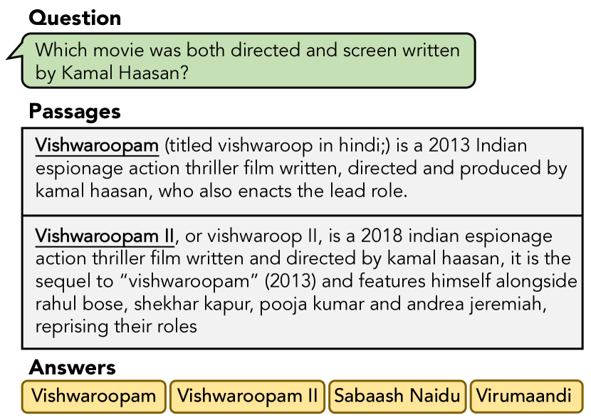
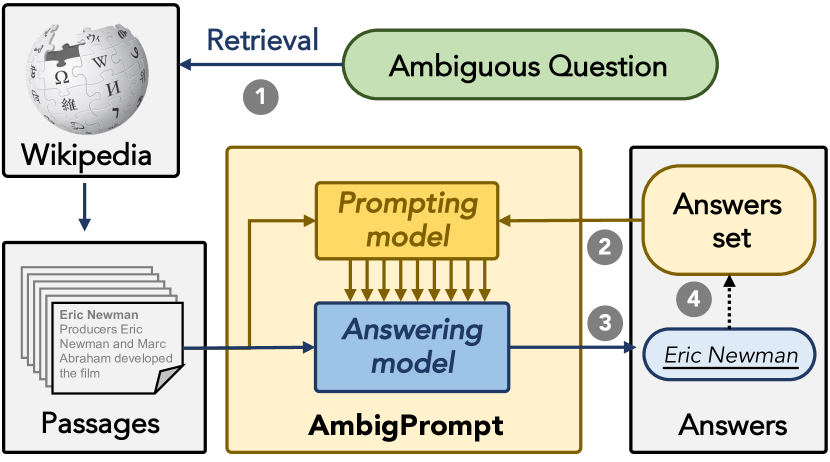
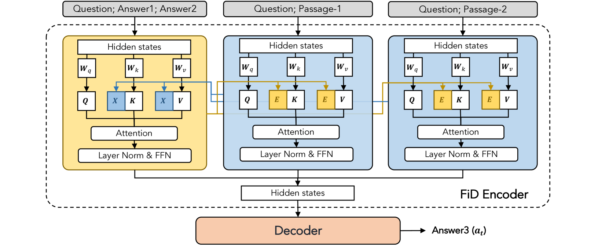
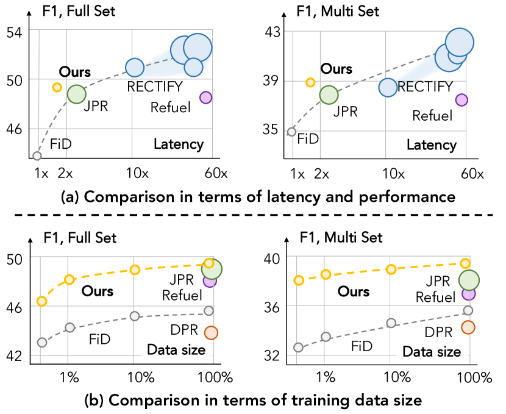
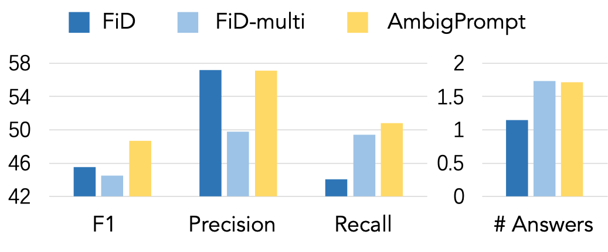

# Answering Ambiguous Questions via Iterative Prompting

###### Abstract

In open-domain question answering, due to the ambiguity of questions, multiple plausible answers may exist. To provide feasible answers to an ambiguous question, one approach is to directly predict all valid answers, but this can struggle with balancing relevance and diversity. An alternative is to gather candidate answers and aggregate them, but this method can be computationally costly and may neglect dependencies among answers. In this paper, we present *AmbigPrompt* to address the imperfections of existing approaches to answering ambiguous questions. Specifically, we integrate an answering model with a prompting model in an iterative manner. The prompting model adaptively tracks the reading process and progressively triggers the answering model to compose distinct and relevant answers. Additionally, we develop a task-specific post-pretraining approach for both the answering model and the prompting model, which greatly improves the performance of our framework. Empirical studies on two commonly-used open benchmarks show that AmbigPrompt achieves state-of-the-art or competitive results while using less memory and having a lower inference latency than competing approaches. Additionally, AmbigPrompt also performs well in low-resource settings. The code are available at: <https://github.com/sunnweiwei/AmbigPrompt>.  

## 1 Introduction

Recent years have witnessed substantial advances in open-domain question answering (QA) systems (Karpukhin et al., [2021](#bib.bib13); Lewis et al., [2020](#bib.bib19); Izacard and Grave, [2021b](#bib.bib11)), which aim to find the answer for the given question from a large knowledge corpus (Chen et al., [2017](#bib.bib4)). While a dominating scenario is the single-answer QA setting, i.e., only one exact answer is required for a given question (Karpukhin et al., [2021](#bib.bib13)), this work focuses on the more realistic scenario of *Multi-answer QA*, where multiple plausible answers are associated with a user-issued question (Min et al., [2020](#bib.bib26)), given that questions posed by humans are often open-ended and ambiguous.111The task of this paper primarily focuses on the occurrence of multiple answers resulting from different interpretations caused by question ambiguity. However, it’s worth to note that question ambiguity is just one factor contributing to the presence of multiple answers. In this study, we adhere to the conceptual definition of Min et al. ([2020](#bib.bib26)).  

[FIGURE S1.F1.g1]

Figure 1: An example of an open-domain question, a subset of its evidential Wikipedia passages and multiple answers they lead to.
[/FIGURE]

A natural approach for answering ambiguous open-domain questions would be to fine-tune a pre-trained answer generation model, e.g., T5 (Raffel et al., [2020](#bib.bib30)), using supervised data of the form (evidential passages, question, all plausible answers) (Min et al., [2020](#bib.bib26), [2021](#bib.bib25)). However, this approach often leads to sub-optimal solutions since it requires the model to balance the relevance and diversity of the generated multiple answers within a single-round decoding procedure, which is non-trivial. To manage the relevance-diversity trade-off, another approach is to decompose multi-answer QA into candidate answer prediction and answer post-processing. This typically requires a high-capacity model with billions of parameters to construct candidate answers and sophisticated answer aggregation pipelines to obtain the final results (Shao and Huang, [2022](#bib.bib33); Gao et al., [2021b](#bib.bib7)), incurring high computational costs. In addition, this approach suffers from the dilemma of having to predict diverse candidate answers before knowing which answer has been predicted, which is unnatural and intricate. For example, in Figure [1](#S1.F1 "Figure 1 ‣ 1 Introduction ‣ Answering Ambiguous Questions via Iterative Prompting"), given the question “*Which movie was both directed and screenwritten by Kamal Haasan?*,” with the existence of the answer *Vishwaroopam*, the model excludes its eponymous translation version *Vishwaroop* and deduces that *Vishwaroopam II* is another potential answer.  

When facing an ambiguous question, people are capable of providing multiple valid answers by introspectively composing new content on the basis of what has already been devised, usually in an iterative manner. Inspired by this observation, in this paper, we conceptualize AmbigPrompt as an approach to mimic this mechanism by iteratively guiding the answering model with a lightweight prompting model. As shown in Figure [2](#S1.F2 "Figure 2 ‣ 1 Introduction ‣ Answering Ambiguous Questions via Iterative Prompting"), this prompting model steers the answering model to progressively generate valid answers whose content the prompting model will then condition on for the next-round prompt construction. Essentially, our proposed framework comprises two key components: (i) an encoder-decoder *answering model* and (ii) an interleaving answer-conditional *prompting model*. By conditioning on preceding generated contents, the proposed framework introspectively perceives which answer has been predicted before updating the hidden activation for the generation of subsequent answers. Furthermore, we devise a task-adaptive post-pretraining strategy, in which pseudo multi-QA training instances are constructed to facilitate the training of the proposed framework.   

We carry out extensive experiments on the AmbigQA (Min et al., [2020](#bib.bib26)) and WebQSP (tau Yih et al., [2016](#bib.bib37)) datasets. The results demonstrate that AmbigPrompt attains superior performance despite having a significantly smaller parameter scale, 14 times less than state-of-the-art models. Furthermore, as a lightweight approach, AmbigPrompt improves the answer relevance and diversity with a tiny fraction of the memory footprint and inference latency of competing approaches. Notably, AmbigPrompt achieves the best performance in the low-resource setting. The effectiveness of the proposed method is also verified by ablation experiments and analytical experiments.   

In summary, this paper makes the following contributions:   (i) We propose AmbigPrompt, which tackles ambiguous question answering by iterative prompting.  (ii) We propose an interleaving answer-conditional prompting model to generate meaningful continuous prompts.  (iii) Experiments on multi-QA datasets verify the effectiveness of the proposed approach.    

[FIGURE S1.F2.g1]

Figure 2: Given the retrieved passages, AmbigPrompt alternates between (2) generating prompts based on previous answers, (3) generating a new answer using a question-answering model, and (4) appending the new answer to the answers set. Note that steps (2) and (3) operate in an interleaving way.
[/FIGURE]

## 2 Preliminaries

### 2.1 Problem formalization

Formally, given an open-domain question $q$, a multi-answer question answering (QA) model is required to make use of (multiple pieces of) evidence from a large-scale text corpus $\Omega$ (e.g., Wikipedia) to find multiple plausible answers $\mathcal{A}=\{a_{1},a_{2},\ldots,a_{n}\}$, where $a_{i}$ denotes one answer and we suppose there are $n$ answers. The QA model aims to infer $p(\mathcal{A}|q,\Omega)$. In open-domain QA, the QA model typically follows a two-step pipeline, comprising *passage retrieval* and *answer generation*. In the passage retrieval step, a retrieval model $p(\mathcal{C}|q,\Omega)$ retrieves $m$ evidence passages $\mathcal{C}=\{c_{1},c_{2},\ldots,c_{m}\}$ according to the question $q$ from $\Omega$. In the answer generation step, an answering model $p(\mathcal{A}|q,\mathcal{C})$ reads the evidential passages and finds the answers to the question.  

### 2.2 Answering model

We use Fusion-in-Decoder (FiD) as a basic single-answer answering model (Izacard and Grave, [2021b](#bib.bib11)). In particular, FiD has an encoder-decoder architecture. FiD first concatenates each retrieved passage with the question with a [SEP] token:  

|  | $$X=\{x_{1},x_{2},\ldots,x_{m}\},\ x_{i}=q\text{{[SEP]}}c_{i}$$ |  | (1) |
| --- | --- | --- | --- |

where we use $X$ to denote the concatenated sequence. Then, for each $x_{i}$, the FiD encoder $\operatorname{Enc}$ encodes it to $\mathbf{x}_{i}$:  

|  | $$\mathbf{X}=\operatorname{Cat}(\{\mathbf{x}_{1},\mathbf{x}_{2},\ldots,\mathbf{x}_{m}\}),\ \mathbf{x}_{i}=\operatorname{Enc}(x_{i})$$ |  | (2) |
| --- | --- | --- | --- |

where $\operatorname{Cat}$ denotes a concatenation function. Finally, the decoder $\operatorname{Dec}$ attends to the representations of all passages and generates an answer $a$:  

|  | $$p(a|q,\mathcal{C})=\operatorname{Dec}(\mathbf{X})$$ |  | (3) |
| --- | --- | --- | --- |

### 2.3 Prompt-tuning

Prompt-tuning adapts pre-trained transformer models to downstream tasks by optimizing continuous prompting vectors (Li and Liang, [2021](#bib.bib20); Liu et al., [2022](#bib.bib22)). Suppose $x$ is the input sequence of the model, we denote $Q(x)^{j}$, $K(x)^{j}$, $V(x)^{j}$ as the query, key, and value representations of $x$ in the $j$-th attention layer in the transformer encoder. Prompt-tuning prepends learnable prompting vectors $\mathbf{E}^{j}$ to $K(x)^{j}$ and $V(x)^{j}$ to modify the attention distribution as well as the output $\mathbf{x}^{j}$ of the $j$-th layer as follows:  

|  | $$\begin{split}\mathbf{x}^{j}=\operatorname{Attn}(Q(x)^{j},&\operatorname{Cat}(\mathbf{E}^{j},K(x)^{j}),\\ &\operatorname{Cat}(\mathbf{E}^{j},V(x)^{j})),\end{split}$$ |  | (4) |
| --- | --- | --- | --- |

where $\mathbf{x}^{j}$ denotes the output of layer $j$, $\operatorname{Attn}(\cdot)$ represents the attention operation in the transformer, and $\operatorname{Cat}(\cdot)$ is the concatenation function.  

## 3 AmbigPrompt

Conventionally, the question answering model generates the desired answer given the input context in a single pass (Izacard and Grave, [2021b](#bib.bib11)). While it suffices to tackle the single-answer QA scenario, managing ambiguous questions with multiple answers can be more nuanced – the answering model is required to balance the relevance and diversity of the generated answers in a single pass, and precisely modeling dependencies among the answers can be non-trivial. In this paper, we propose AmbigPrompt, a question-answering model that answers ambiguous questions via iterative prompting, inferring more accurate answers progressively. Figure [2](#S1.F2 "Figure 2 ‣ 1 Introduction ‣ Answering Ambiguous Questions via Iterative Prompting") gives an overview of the proposed method.  

Overall, AmbigPrompt decomposes the generation of answers $\mathcal{A}$ into multiple steps instead of one single pass, i.e.,  

|  | $$p(\mathcal{A}|q,\mathcal{C})=\prod_{t=1}^{n}p(a_{t}|\phi(a_{<t}),q,\mathcal{C}),$$ |  | (5) |
| --- | --- | --- | --- |

where $a_{<t}$ denotes the set of answers that have been generated at time $t$, and $\phi(\cdot)$ denotes a prompting model that generates prompt vectors for answer generation at the $t$-th step. The prompting model shares parameters with the answering model, allowing for seamless integration. AmbigPrompt iteratively composes a new answer $a_{t}$, conceiving the prompt of previous answers, i.e., $\phi(a_{<t})$, and appends $a_{t}$ to the answers set, till all feasible answers are found.  

The proposed framework is optimized in a two-stage manner: *task-adaptive post-pretraining* and *prompt-based tuning*. In the former stage, the model is trained on a large synthesized multi-answer QA dataset, while in the latter stage, the model is tuned on the annotated multi-answer QA dataset. We first detail the prompting model (§[3.1](#S3.SS1 "3.1 Retrospective prompting mechanism for answer generation ‣ 3 AmbigPrompt ‣ Answering Ambiguous Questions via Iterative Prompting")) and the iterative question answering procedure (§[3.2](#S3.SS2 "3.2 Answering ambiguous questions via iterative prompting ‣ 3 AmbigPrompt ‣ Answering Ambiguous Questions via Iterative Prompting")), and then introduce the optimization scheme (§[3.3](#S3.SS3 "3.3 Optimization ‣ 3 AmbigPrompt ‣ Answering Ambiguous Questions via Iterative Prompting")).  

[FIGURE S3.F3.g1]

Figure 3: Details of the retrospective prompting mechanism. The prompting model produces the prompt vectors $\mathbf{E}$ by cross-attending the contextual representation $\mathbf{X}$. And the answering model predicts a new answer $a_{t}$ using the prompt $\mathbf{E}$. The prompting and answering models operate in an interleaving manner.
[/FIGURE]

### 3.1 Retrospective prompting mechanism for answer generation

To capture intricate dependencies among answers, we devise an interleaving answer-conditional prompting model $\phi(a_{<t})$, which generates the prompt vector $\mathbf{E}=\phi(a_{<t})$ conditioned on antecedent generated answers $a_{<t}$, as depicted in Figure [3](#S3.F3 "Figure 3 ‣ 3 AmbigPrompt ‣ Answering Ambiguous Questions via Iterative Prompting"). Specifically, the prompting model $\phi$ is a transformer encoder that shares the same parameters with the encoder of the answering model. $\phi$ processes the $a_{<t}$ in three steps:  

1. Templating answers. First, $a_{<t}$ is transformed into a text sequence $e=\mathcal{T}(a_{<t})$ using a template $\mathcal{T}$. Here we use semicolons to splice answers. 
2. Generating prompts. Then, given the answer sequence $e$ and context $X$ (i.e., the concatenated question and passages in Eq. [1](#S2.E1 "In 2.2 Answering model ‣ 2 Preliminaries ‣ Answering Ambiguous Questions via Iterative Prompting")), the prompting model $\phi$ computes the hidden activations $\mathbf{E}^{j}$ of each layer $j$ via cross-attending the contextual representation $\mathbf{X}^{j-1}$:      |  | $$\begin{split}\mathbf{E}^{j}=\operatorname{Attn}(Q(e)^{j},&\operatorname{Cat}(K(e)^{j},\mathbf{X}^{j-1}),\\ &\operatorname{Cat}(V(e)^{j},\mathbf{X}^{j-1})),\end{split}$$ |  | (6) | | --- | --- | --- | --- |   where $Q(e)^{j}$, $K(e)^{j}$, and $V(e)^{j}$ denote the query, key, and value representations of $e$ in the $j$-th attention layer in the prompting model; $\mathbf{X}^{j-1}{=}\operatorname{Cat}(\{\mathbf{x}_{1}^{j-1},\mathbf{x}_{2}^{j-1},\ldots,\mathbf{x}_{m}^{j-1}\})$ denotes the concatenated context representations of the $(j{-}1)$-th layer in the answering model. We write $\mathbf{E}$ for the last layer output of the prompting model. 
3. Prompting answering model. Finally, the generated prompt $\mathbf{E}^{j}$ is prepended to the attention layer of the encoder $\operatorname{Enc}$ of the answering model as in Eq. [4](#S2.E4 "In 2.3 Prompt-tuning ‣ 2 Preliminaries ‣ Answering Ambiguous Questions via Iterative Prompting"). Meanwhile, the decoder $\operatorname{Dec}$ of answering model attends to $\operatorname{Cat}(\mathbf{E},\mathbf{X})$ and generates the target answer $a_{t}$:      |  | $$p(a_{t}|\phi(a_{<t}),q,\mathcal{C})=\operatorname{Dec}(\operatorname{Cat}(\mathbf{E},\mathbf{X})).$$ |  | (7) | | --- | --- | --- | --- | 

Capturing long-range dependencies among derived answers via a retrospective prompting mechanism enables the answering model to compose new contents grounding on what has already been devised, and thus the model is able to strike a good relevance-diversity balance for answering ambiguous questions.  

### 3.2 Answering ambiguous questions via iterative prompting

Given the input context, i.e., the question and retrieved evidential passages, AmbigPrompt iteratively performs attention operations over the input context and the generated answers, addressing the answer generation and prompt construction interactively. The key is to pass the attention activations between the prompting model and answering model so that they can inspect each other’s internal states and make harmonious predictions. Specifically, we start from an empty answer set and progressively append newly generated answers to it. As depicted in Figure [2](#S1.F2 "Figure 2 ‣ 1 Introduction ‣ Answering Ambiguous Questions via Iterative Prompting"), in each iteration, we first use the previously generated answer sequence to obtain the introspective prompts, and then interwoven the resultant prompting vectors into the answering model to predict the next answer. Our algorithm terminates if the model reaches the [EOI] token.  

### 3.3 Optimization

To enhance the pre-training model towards multi-answer QA, one straightforward approach is to leverage a question-answering dataset such as NQ (Kwiatkowski et al., [2019](#bib.bib15)) for domain-adaptive pre-training (Min et al., [2021](#bib.bib25)). However, the effectiveness of such a trivial approach is limited to the inherent defect of the one-pass prediction process; that is, the lack of the modeling capability of the interactions between answer generation and answer perception, which is critical to achieving superior performance in multi-QA scenarios. To explicitly align the pre-training objective to task-specific preferences, we further propose to conduct task-adaptive post-pretraining on pseudo multi-answer QA dataset, and then finetune the proposed model using the task data.  

#### Task-adaptive post-pretraining.

We first pre-train the model on NQ, in which only one answer $\mathcal{A}=\{a_{1}\}$ is labeled for each question $q$. To explicitly characterize the pretraining stage as the efforts for finding which part of preceding answers to interact with regarding the input context, we construct the pseudo multi-answer dataset $\hat{\mathcal{A}}$ for post-pretraining the proposed framework to mimic the iterative question answering process. Specifically, we first train an *auxiliary reader* $g(a|q,c_{i})$, which learns to find an answer from the passage $c_{i}$ given a question $q$. Then, we use this auxiliary reader to generate a pseudo answer for each retrieved passage in $\mathcal{C}$:  

|  | $$\hat{\mathcal{A}}=\{\hat{a}\mid\forall i\in[1,m],\hat{a}\sim g(a|q,c_{i})\},$$ |  | (8) |
| --- | --- | --- | --- |

where $\hat{\mathcal{A}}$ denotes the pseudo-answer set of $q$.  

Then, we aggregate the generated answers to construct the previously known answers $a_{<t}$ in Eq. [5](#S3.E5 "In 3 AmbigPrompt ‣ Answering Ambiguous Questions via Iterative Prompting"). In particular, we randomly sample $t$ answers from $\hat{\mathcal{A}}$ and filter out those that are equivalent to the ground-truth answer $a_{1}$; we denote the sampled set as $\hat{a}_{<t}$. With the pseudo answers, we define the post-pretraining objective as:  

|  | $$\mathcal{L}_{\text{Pre}}=-\log p(a_{1}|\phi(\hat{a}_{<t}),q,\mathcal{C}),$$ |  | (9) |
| --- | --- | --- | --- |

where the number of answers in $\hat{a}_{<t}$, i.e., $t$, is sampled from a Bernoulli distribution.  

#### Prompt-based fine-tuning.

We fine-tune the pre-trained model on downstream multi-answer QA datasets. Specifically, in multi-answer QA, $n$ answers $\mathcal{A}=\{a_{1},a_{2},\ldots,a_{n}\}$ corresponding to a question $q$ are provided. The model is tuned by the following objective:  

|  | $$\mathcal{L}_{\text{FT}}=-\log p(a_{t}|\phi(a_{<t}),q,\mathcal{C}),$$ |  | (10) |
| --- | --- | --- | --- |

where $t\in[1,n]$ is sampled from a Bernoulli distribution. Since $\mathcal{A}$ is unordered, we shuffle $\mathcal{A}$ when constructing the $a_{<t}$ and $a_{t}$ to improve the robustness. Besides, we explicitly optimize the model to generate [EOI] to stop the iteration. Specifically, we define a parameter $\alpha\sim\mathcal{U}(0,1)$ and a threshold $\lambda$, which controls the propensity of generating [EOI]. If $\alpha<\lambda$, we replace the $a_{t}$ and $a_{<t}$ as [EOI] and $\mathcal{A}$, respectively.  

## 4 Experimental Setup

### 4.1 Datasets

We evaluate AmbigPrompt on the AmbigQA (Min et al., [2020](#bib.bib26)) and WebQSP (tau Yih et al., [2016](#bib.bib37)) datasets. AmbigQA: AmbigQA is constructed to address the ambiguity of questions in open-domain QA. It samples 14,042 questions from NQ-Open (Kwiatkowski et al., [2019](#bib.bib15)), and asks annotators to search for, navigate and read multiple Wikipedia pages to find as many answers as possible. WebQSP: WebQSP consists of questions from Google Suggest API, originally from Berant et al. ([2013](#bib.bib1)). The answer is a set of distinct entities in Freebase; we use the modified versions by Min et al. ([2021](#bib.bib25)), which recasts WebQSP as textual question answering based on Wikipedia.  

The statistical details of these two datasets and NQ are shown in Table [1](#S4.T1 "Table 1 ‣ 4.1 Datasets ‣ 4 Experimental Setup ‣ Answering Ambiguous Questions via Iterative Prompting").  

[TABLE S4.T1]

<table class="ltx_tabular ltx_guessed_headers ltx_align_middle">
<thead class="ltx_thead">
<tr class="ltx_tr">
<th class="ltx_td ltx_th ltx_th_row ltx_border_tt"></th>
<th class="ltx_td ltx_align_right ltx_th ltx_th_column ltx_border_tt">NQ</th>
<th class="ltx_td ltx_align_right ltx_th ltx_th_column ltx_border_tt">AmbigQA</th>
<th class="ltx_td ltx_align_right ltx_th ltx_th_column ltx_border_tt">WebQSP</th>
</tr>
</thead>
<tbody class="ltx_tbody">
<tr class="ltx_tr">
<th class="ltx_td ltx_align_left ltx_th ltx_th_row ltx_border_t">Training size</th>
<td class="ltx_td ltx_align_right ltx_border_t">307,373</td>
<td class="ltx_td ltx_align_right ltx_border_t">10,036</td>
<td class="ltx_td ltx_align_right ltx_border_t">2,752</td>
</tr>
<tr class="ltx_tr">
<th class="ltx_td ltx_align_left ltx_th ltx_th_row">Validation size</th>
<td class="ltx_td ltx_align_right">6,000</td>
<td class="ltx_td ltx_align_right">2,002</td>
<td class="ltx_td ltx_align_right">245</td>
</tr>
<tr class="ltx_tr">
<th class="ltx_td ltx_align_left ltx_th ltx_th_row">Test size</th>
<td class="ltx_td ltx_align_right">6,000</td>
<td class="ltx_td ltx_align_right">2,004</td>
<td class="ltx_td ltx_align_right">1,582</td>
</tr>
<tr class="ltx_tr">
<th class="ltx_td ltx_align_left ltx_th ltx_th_row">Mean # Answers</th>
<td class="ltx_td ltx_align_right">1.0</td>
<td class="ltx_td ltx_align_right">2.2</td>
<td class="ltx_td ltx_align_right">22.6</td>
</tr>
<tr class="ltx_tr">
<th class="ltx_td ltx_align_left ltx_th ltx_th_row ltx_border_bb">Median # Answers</th>
<td class="ltx_td ltx_align_right ltx_border_bb">1.0</td>
<td class="ltx_td ltx_align_right ltx_border_bb">2.0</td>
<td class="ltx_td ltx_align_right ltx_border_bb">1.0</td>
</tr>
</tbody>
</table>

Table 1: Data statistics of NQ, AmbigQA, and WebQSP.
[/TABLE]

### 4.2 Evaluation metrics

Following previous studies (Min et al., [2020](#bib.bib26)), we adopt F1 as the evaluation metric, which measures the precision and recall between the ground-truth answers and the predicted answers. The test set is further divided into two subsets: *full* and *multi*. The *full* subset evaluates the model on all the questions in the test set, while the *multi* subset evaluates the model on the questions with multiple answers (i.e., $n>1$). To assess the computational efficiency of various approaches, we also report the number of parameters, average latency, and peak memory usage during model inference. All the models are tested on the same device. We estimate the latency and memory usage of those baselines without public code using randomly initialized models since these metrics are independent of their parameters given a fixed number of encoded tokens and decoding length.  

[TABLE S4.T2]

<table class="ltx_tabular ltx_centering ltx_align_middle">
<tbody class="ltx_tbody">
<tr class="ltx_tr">
<td class="ltx_td ltx_align_left ltx_border_tt">Methods</td>
<td class="ltx_td ltx_align_center ltx_border_tt">AmbigQA</td>
<td class="ltx_td ltx_align_center ltx_border_tt">WebQSP</td>
<td class="ltx_td ltx_align_center ltx_border_tt">#Params</td>
<td class="ltx_td ltx_align_center ltx_border_tt">Latency</td>
<td class="ltx_td ltx_align_center ltx_border_tt">Memory</td>
</tr>
<tr class="ltx_tr">
<td class="ltx_td ltx_align_right ltx_border_t">Full</td>
<td class="ltx_td ltx_align_right ltx_border_t">Multi</td>
<td class="ltx_td ltx_align_right ltx_border_t">Full</td>
<td class="ltx_td ltx_align_right ltx_border_t">Multi</td>
</tr>
<tr class="ltx_tr">
<td class="ltx_td ltx_align_left ltx_border_t"><em class="ltx_emph ltx_font_italic">High-capacity baselines</em></td>
<td class="ltx_td ltx_border_t"></td>
</tr>
<tr class="ltx_tr">
<td class="ltx_td ltx_align_left">JPR† <cite class="ltx_cite ltx_citemacro_citep">(Min et al., <a class="ltx_ref">2021</a>)</cite>
</td>
<td class="ltx_td ltx_align_right">48.5</td>
<td class="ltx_td ltx_align_right">37.6</td>
<td class="ltx_td ltx_align_right">53.1</td>
<td class="ltx_td ltx_align_right">47.2</td>
<td class="ltx_td ltx_align_right">3B</td>
<td class="ltx_td ltx_align_right"><math class="ltx_math_unparsed"><semantics><mrow><mn>8.7</mn><mo>×</mo></mrow><annotation>8.7\times</annotation></semantics></math></td>
<td class="ltx_td ltx_align_right">0.88s</td>
<td class="ltx_td ltx_align_right"><math class="ltx_math_unparsed"><semantics><mrow><mn>2.3</mn><mo>×</mo></mrow><annotation>2.3\times</annotation></semantics></math></td>
<td class="ltx_td ltx_align_right">14GB</td>
<td class="ltx_td ltx_nopad_r ltx_align_right"><math class="ltx_math_unparsed"><semantics><mrow><mn>3.5</mn><mo>×</mo></mrow><annotation>3.5\times</annotation></semantics></math></td>
</tr>
<tr class="ltx_tr">
<td class="ltx_td ltx_align_left">RECTIFY† <cite class="ltx_cite ltx_citemacro_citep">(Shao and Huang, <a class="ltx_ref">2022</a>)</cite>
</td>
<td class="ltx_td ltx_align_right">52.1</td>
<td class="ltx_td ltx_align_right">41.6</td>
<td class="ltx_td ltx_align_right">55.8</td>
<td class="ltx_td ltx_align_right">48.8</td>
<td class="ltx_td ltx_align_right">6B</td>
<td class="ltx_td ltx_align_right"><math class="ltx_math_unparsed"><semantics><mrow><mn>17.4</mn><mo>×</mo></mrow><annotation>17.4\times</annotation></semantics></math></td>
<td class="ltx_td ltx_align_right">19.72s</td>
<td class="ltx_td ltx_align_right"><math class="ltx_math_unparsed"><semantics><mrow><mn>51.3</mn><mo>×</mo></mrow><annotation>51.3\times</annotation></semantics></math></td>
<td class="ltx_td ltx_align_right">14GB</td>
<td class="ltx_td ltx_nopad_r ltx_align_right"><math class="ltx_math_unparsed"><semantics><mrow><mn>3.5</mn><mo>×</mo></mrow><annotation>3.5\times</annotation></semantics></math></td>
</tr>
<tr class="ltx_tr">
<td class="ltx_td ltx_align_left ltx_border_t"><em class="ltx_emph ltx_font_italic">Comparable low-capacity baselines</em></td>
<td class="ltx_td ltx_border_t"></td>
</tr>
<tr class="ltx_tr">
<td class="ltx_td ltx_align_left">DPR <cite class="ltx_cite ltx_citemacro_citep">(Karpukhin et al., <a class="ltx_ref">2021</a>)</cite>
</td>
<td class="ltx_td ltx_align_right">38.9</td>
<td class="ltx_td ltx_align_right">29.9</td>
<td class="ltx_td ltx_align_right">44.7</td>
<td class="ltx_td ltx_align_right">35.5</td>
<td class="ltx_td ltx_align_right">345M</td>
<td class="ltx_td ltx_align_right"><math class="ltx_math_unparsed"><semantics><mrow><mn>1.0</mn><mo>×</mo></mrow><annotation>1.0\times</annotation></semantics></math></td>
<td class="ltx_td ltx_align_right">0.37s</td>
<td class="ltx_td ltx_align_right"><math class="ltx_math_unparsed"><semantics><mrow><mn>1.0</mn><mo>×</mo></mrow><annotation>1.0\times</annotation></semantics></math></td>
<td class="ltx_td ltx_align_right">4GB</td>
<td class="ltx_td ltx_nopad_r ltx_align_right"><math class="ltx_math_unparsed"><semantics><mrow><mn>1.0</mn><mo>×</mo></mrow><annotation>1.0\times</annotation></semantics></math></td>
</tr>
<tr class="ltx_tr">
<td class="ltx_td ltx_align_left">SpanSeqGen <cite class="ltx_cite ltx_citemacro_citep">(Min et al., <a class="ltx_ref">2020</a>)</cite>
</td>
<td class="ltx_td ltx_align_right">39.7</td>
<td class="ltx_td ltx_align_right">29.3</td>
<td class="ltx_td ltx_align_right">48.8</td>
<td class="ltx_td ltx_align_right">36.1</td>
<td class="ltx_td ltx_align_right">400M</td>
<td class="ltx_td ltx_align_right"><math class="ltx_math_unparsed"><semantics><mrow><mn>1.2</mn><mo>×</mo></mrow><annotation>1.2\times</annotation></semantics></math></td>
<td class="ltx_td ltx_align_right">  0.49s</td>
<td class="ltx_td ltx_align_right"><math class="ltx_math_unparsed"><semantics><mrow><mn>1.3</mn><mo>×</mo></mrow><annotation>1.3\times</annotation></semantics></math></td>
<td class="ltx_td ltx_align_right">5GB</td>
<td class="ltx_td ltx_nopad_r ltx_align_right"><math class="ltx_math_unparsed"><semantics><mrow><mn>1.3</mn><mo>×</mo></mrow><annotation>1.3\times</annotation></semantics></math></td>
</tr>
<tr class="ltx_tr">
<td class="ltx_td ltx_align_left">FiD-Base <cite class="ltx_cite ltx_citemacro_citep">(Izacard and Grave, <a class="ltx_ref">2021b</a>)</cite>
</td>
<td class="ltx_td ltx_align_right">45.5</td>
<td class="ltx_td ltx_align_right">35.8</td>
<td class="ltx_td ltx_align_right">52.6</td>
<td class="ltx_td ltx_align_right">46.3</td>
<td class="ltx_td ltx_align_right">220M</td>
<td class="ltx_td ltx_align_right"><math class="ltx_math_unparsed"><semantics><mrow><mn>0.6</mn><mo>×</mo></mrow><annotation>0.6\times</annotation></semantics></math></td>
<td class="ltx_td ltx_align_right">0.38s</td>
<td class="ltx_td ltx_align_right"><math class="ltx_math_unparsed"><semantics><mrow><mn>1.0</mn><mo>×</mo></mrow><annotation>1.0\times</annotation></semantics></math></td>
<td class="ltx_td ltx_align_right">4GB</td>
<td class="ltx_td ltx_nopad_r ltx_align_right"><math class="ltx_math_unparsed"><semantics><mrow><mn>1.0</mn><mo>×</mo></mrow><annotation>1.0\times</annotation></semantics></math></td>
</tr>
<tr class="ltx_tr">
<td class="ltx_td ltx_align_left">Refuel† <cite class="ltx_cite ltx_citemacro_citep">(Gao et al., <a class="ltx_ref">2021b</a>)</cite>
</td>
<td class="ltx_td ltx_align_right">48.3</td>
<td class="ltx_td ltx_align_right">37.3</td>
<td class="ltx_td ltx_align_right">–</td>
<td class="ltx_td ltx_align_right">–</td>
<td class="ltx_td ltx_align_right">400M</td>
<td class="ltx_td ltx_align_right"><math class="ltx_math_unparsed"><semantics><mrow><mn>1.2</mn><mo>×</mo></mrow><annotation>1.2\times</annotation></semantics></math></td>
<td class="ltx_td ltx_align_right">22.19s</td>
<td class="ltx_td ltx_align_right"><math class="ltx_math_unparsed"><semantics><mrow><mn>58.6</mn><mo>×</mo></mrow><annotation>58.6\times</annotation></semantics></math></td>
<td class="ltx_td ltx_align_right">8GB</td>
<td class="ltx_td ltx_nopad_r ltx_align_right"><math class="ltx_math_unparsed"><semantics><mrow><mn>2.0</mn><mo>×</mo></mrow><annotation>2.0\times</annotation></semantics></math></td>
</tr>
<tr class="ltx_tr">
<td class="ltx_td ltx_align_left ltx_border_bb ltx_border_t">AmbigPrompt</td>
<td class="ltx_td ltx_align_right ltx_border_bb ltx_border_t">48.7</td>
<td class="ltx_td ltx_align_right ltx_border_bb ltx_border_t">38.8</td>
<td class="ltx_td ltx_align_right ltx_border_bb ltx_border_t">53.2</td>
<td class="ltx_td ltx_align_right ltx_border_bb ltx_border_t">47.9</td>
<td class="ltx_td ltx_align_right ltx_border_bb ltx_border_t">220M</td>
<td class="ltx_td ltx_align_right ltx_border_bb ltx_border_t"><math class="ltx_math_unparsed"><semantics><mrow><mn>0.6</mn><mo>×</mo></mrow><annotation>0.6\times</annotation></semantics></math></td>
<td class="ltx_td ltx_align_right ltx_border_bb ltx_border_t">0.68s</td>
<td class="ltx_td ltx_align_right ltx_border_bb ltx_border_t"><math class="ltx_math_unparsed"><semantics><mrow><mn>1.8</mn><mo>×</mo></mrow><annotation>1.8\times</annotation></semantics></math></td>
<td class="ltx_td ltx_align_right ltx_border_bb ltx_border_t">4GB</td>
<td class="ltx_td ltx_nopad_r ltx_align_right ltx_border_bb ltx_border_t"><math class="ltx_math_unparsed"><semantics><mrow><mn>1.0</mn><mo>×</mo></mrow><annotation>1.0\times</annotation></semantics></math></td>
</tr>
</tbody>
</table>

Table 2: Results on AmbigQA dev and WebQSP test in terms of effectiveness and efficiency. Full and Multi denote the full set and multi-answer set, respectively. The reported value is F1. Methods with † have no publicly available codes; therefore, we estimate the latency and memory footprint with randomly initialized parameters.
We divide baselines into two groups:
(i) *high-capacity baselines* that use significantly larger models than AmbigPrompt, and
(ii) *comparable low-capacity baselines* that use a low-capacity model like AmbigPrompt and can be reasonably compared with AmbigPrompt.
Boldface indicates best performance among comparable baselines.
[/TABLE]

### 4.3 Baselines

The following models are adopted as baselines: DPR (Karpukhin et al., [2021](#bib.bib13)): A dual-encoder is trained using contrastive loss for passage retrieval, and a BERT-based reader is used for answer extraction. SpanSeqGen (Min et al., [2020](#bib.bib26)): DPR reranks the passages, and a BART-based generator is used for answer generation. FiD (Izacard and Grave, [2021b](#bib.bib11)): The retrieved passages are encoded by a T5 encoder independently, and the representations are then concatenated and fed into the T5 Decoder to generate answers. Refuel (Gao et al., [2021b](#bib.bib7)): A question disambiguation module is proposed to generate disambiguated questions. The disambiguated questions are then used to find more answers. JPR (Min et al., [2021](#bib.bib25)): JPR is a passage reranker that reranks the passages using an autoregressive model. With the additional reranking stage, JPR selects ten diverse passages from 100 retrieved passages and uses a T5-3B FiD answering model to compose answers in one pass. RECTIFY (Shao and Huang, [2022](#bib.bib33)): RECTIFY proposes the recall-then-verify framework, which separates the reasoning process of each answer. An answering model operates on each passage to recall surplus answers. Then, a sophisticated verifier based on T5-3B FiD verifies each answer with an aggregation module.  

We divide the baseline models into two categories depending on the number of parameters of the models: (i) *high-capacity baselines* that use large models with billions of parameters, while requiring more computational resources and memory; (ii) *comparable low-capacity baselines* that use low-capacity models with a similar number of parameters and computational effort as AmbigPrompt, which can be reasonably compared with AmbigPrompt.  

### 4.4 Implementation details

We choose T5-Base (Raffel et al., [2020](#bib.bib30)) as the backbone of the answering model. Regarding the passage retrieval model, we fine-tune the pre-trained model from Gao and Callan ([2021](#bib.bib5)) on the NQ dataset (See Appendix [C](#A3 "Appendix C Retrieval results ‣ Answering Ambiguous Questions via Iterative Prompting") for details). The retrieval corpus is the English Wikipedia on 12/20/2018, and the documents are split into chunks with 100 words following Karpukhin et al. ([2021](#bib.bib13)). We set $m{=}100$, $\lambda{=}0.5$, the batch size to $32$, and the model is trained using the AdamW optimizer (Loshchilov and Hutter, [2017](#bib.bib24)) with a constant learning rate of $5e{-}5$. We train the model up to 5k steps on on 4 V100-16G GPUs and choose the hyperparameters and checkpoints on the validation set.222Since we test on the AmbigQA dev set, we slice about 1k examples in the AmbigQA training set as the validation set.  

## 5 Experimental Results

### 5.1 Main results

Table [2](#S4.T2 "Table 2 ‣ 4.2 Evaluation metrics ‣ 4 Experimental Setup ‣ Answering Ambiguous Questions via Iterative Prompting") reports the evaluation results on AmbigQA and WebQSP. Based on the results, we have three main observations.  

First, AmbigPrompt achieves comparable performance to the state-of-the-art. Specifically, AmbigPrompt obtains 48.7 F1 on the *full* test set and 38.8 F1 on the *multi* test set, which exceeds all baselines except RECTIFY. The improvements are particularly significant on the *multi* test set; AmbigPrompt improves 1.2% over JPR and 1.5% over Refuel. Besides, compared with FiD, which concatenates all the answers in $\mathcal{A}$ with [SEP] and generates them in one pass, the proposed method, which benefits from the iterative design and answer-conditional prompting mechanism, achieves 3% and 5% improvements on *full* and *multi* of AmbigQA. Similar results can also be observed on WebQSP.  

Second, AmbigPrompt uses fewer resources compared to previous high-capacity models. AmbigPrompt uses a lightweight model with 220M parameters. Still, AmbigPrompt achieves superior performance compared to the high-capacity models, e.g., JPR, that use 3B parameters. The state-of-the-art model RECTIFY uses 6B parameters (3B for the answering model and 3B for the verifier), which is $27\times$ as much as ours, significantly increasing the training and inference overhead. Similar results are witnessed in terms of latency. In particular, RECTIFY is $29\times$ slower than our model due to the heavy design of the answering model and verifier. Refuel’s iterative passage retrieval and clarifying question generation procedure results in a $32.6\times$ latency compared with our approach. Finally, the comparison of peak memory usage also confirms our approach’s lightweight nature. The lightweight design allows our approach to be adapted to academically accessible devices and reduces the carbon footprint for model training and deployment.  

Third, we find that AmbigPrompt achieves a better resource-performance balance. In Figure [4](#S5.F4 "Figure 4 ‣ 5.1 Main results ‣ 5 Experimental Results ‣ Answering Ambiguous Questions via Iterative Prompting") (a), we display the existing methods under the speed-performance coordinate system. Note that we place RECTIFY with different sizes (i.e., latency) on the diagram according to Shao and Huang ([2022](#bib.bib33)). AmbigPrompt improves the optimal latency-performance curve (the dashed lines), especially on the multi-answer test set, demonstrating the effectiveness of our approach in answering ambiguous questions.  

[FIGURE S5.F4.g1]

Figure 4: (a) Latency (in log scale) versus performance (F1) on AmbigQA full dev and multi dev. The size of the circle indicates the number of parameters of these models. (b) Dataset size (in %) versus performance (F1) on AmbigQA full dev and multi dev.
[/FIGURE]

### 5.2 Low-resource setting

Figure [4](#S5.F4 "Figure 4 ‣ 5.1 Main results ‣ 5 Experimental Results ‣ Answering Ambiguous Questions via Iterative Prompting") (b) shows the results under different training data sizes to investigate the effectiveness of the proposed method in the low-resource setting. The proposed method achieves favorable results for different data sizes. Remarkably, AmbigPrompt achieves promising performance with little data, surpassing the fully supervised high-capacity model JPR on a multi-answer test set. This result suggests that the proposed prompting mechanism can better elicit the capabilities of the pre-trained model and effectively adapt the model trained on single-answer QA data to multi-answer scenarios.   

[TABLE S5.T3]

<table class="ltx_tabular ltx_guessed_headers ltx_align_middle">
<tbody class="ltx_tbody">
<tr class="ltx_tr">
<th class="ltx_td ltx_align_left ltx_th ltx_th_row ltx_border_tt">Methods</th>
<td class="ltx_td ltx_align_center ltx_border_tt">AmbigQA</td>
<td class="ltx_td ltx_align_center ltx_border_tt">WebQSP</td>
</tr>
<tr class="ltx_tr">
<td class="ltx_td ltx_align_center ltx_border_t">Full</td>
<td class="ltx_td ltx_align_center ltx_border_t">Multi</td>
<td class="ltx_td ltx_align_center ltx_border_t">Full</td>
<td class="ltx_td ltx_nopad_r ltx_align_center ltx_border_t">Multi</td>
</tr>
<tr class="ltx_tr">
<th class="ltx_td ltx_align_left ltx_th ltx_th_row ltx_border_t">AmbigPrompt</th>
<td class="ltx_td ltx_align_center ltx_border_t">48.7</td>
<td class="ltx_td ltx_align_center ltx_border_t">38.8</td>
<td class="ltx_td ltx_align_center ltx_border_t">53.3</td>
<td class="ltx_td ltx_nopad_r ltx_align_center ltx_border_t">46.7</td>
</tr>
<tr class="ltx_tr">
<th class="ltx_td ltx_align_left ltx_th ltx_th_row ltx_border_t">- w/o task-adaptive pre-training</th>
<td class="ltx_td ltx_align_center ltx_border_t">42.8</td>
<td class="ltx_td ltx_align_center ltx_border_t">32.7</td>
<td class="ltx_td ltx_align_center ltx_border_t">42.5</td>
<td class="ltx_td ltx_nopad_r ltx_align_center ltx_border_t">38.7</td>
</tr>
<tr class="ltx_tr">
<th class="ltx_td ltx_align_left ltx_th ltx_th_row">- w/o prompting model</th>
<td class="ltx_td ltx_align_center">46.0</td>
<td class="ltx_td ltx_align_center">34.3</td>
<td class="ltx_td ltx_align_center">49.7</td>
<td class="ltx_td ltx_nopad_r ltx_align_center">44.6</td>
</tr>
<tr class="ltx_tr">
<th class="ltx_td ltx_align_left ltx_th ltx_th_row ltx_border_bb">- w/o interleaving prompting</th>
<td class="ltx_td ltx_align_center ltx_border_bb">47.8</td>
<td class="ltx_td ltx_align_center ltx_border_bb">36.9</td>
<td class="ltx_td ltx_align_center ltx_border_bb">50.9</td>
<td class="ltx_td ltx_nopad_r ltx_align_center ltx_border_bb">45.4</td>
</tr>
</tbody>
</table>

Table 3: Ablation study. The base model is compared with several ablative variants on two datasets.
[/TABLE]

### 5.3 Ablation study

To understand the contribution of each component of AmbigPrompt, we conduct an ablation study. The results are listed in Table [3](#S5.T3 "Table 3 ‣ 5.2 Low-resource setting ‣ 5 Experimental Results ‣ Answering Ambiguous Questions via Iterative Prompting"). The compared variants and the findings are:   

W/o task-adaptive pre-training. The models are trained only on multi-QA data with $\mathcal{L}_{PT}$. A notable performance decline can be seen. This observation suggests that task-adaptive pre-training is an important contributor to the model’s performance since the size of multi-answer QA data is small.  

W/o prompting model. We remove the prompting model in this variant and instantiate the learnable prompt vector to each step $t$ separately, like Liu et al. ([2021a](#bib.bib21)). The performance drops by about 3% and 4% on the two datasets, respectively. The results verify the effectiveness of the proposed answer-conditional prompting mechanism.  

W/o interleaving prompting. We remove the interaction mechanism between the prompting model and answering model, i.e., the FiD encoder encodes the $e$ and $X$ independently without cross-attention. The results drop by about 2% and 2% on two datasets, respectively, which reveals that enabling the answering model to generate new answers conditioned on the introspective prompts effectively improves the model’s performance.  

### 5.4 Analytical experiments

Conceptually, our proposed framework AmbigPrompt equips the FiD model with the ability to progressively compose the answers using retrospective prompts, i.e., iterative prompt learning. To further analyze the capability of such an iterative prompt learning approach in managing the relevance-diversity trade-off, we present the F1, precision, recall, and average answer numbers of AmbigPrompt and FiD model variants in Figure [5](#S5.F5 "Figure 5 ‣ 5.4 Analytical experiments ‣ 5 Experimental Results ‣ Answering Ambiguous Questions via Iterative Prompting"). In particular, FiD-multi denotes a variant of FiD in which we reduce the generation probability of the end-of-sequence token </s> to ensure that the number of generated answers is approximately the same as AmbigPrompt. We see that FiD-multi obtains comparable recall but gets significantly lower precision. In contrast, AmbigPrompt generates more answers than FiD without sacrificing precision, indicating that the designed iterative prompting mechanism induces the model with a superior ability to manage the trade-off between relevancy and diversity for ambiguous question answering.  

[FIGURE S5.F5.g1]

Figure 5: The F1, Precision, Recall, and the average number of answers (#Answers) of AmbigPrompt and FiD model variants on AmbigQA dev.
[/FIGURE]

## 6 Related work

### 6.1 Ambiguous question answering

In open-domain QA, given a question about any topic, the model finds the answer from a large knowledge corpus (Chen et al., [2017](#bib.bib4)). Typically, a retrieval model and an answering model are employed. The two modules can be trained separately (Karpukhin et al., [2021](#bib.bib13); Izacard and Grave, [2021b](#bib.bib11); Qu et al., [2021](#bib.bib29)) or jointly (Lee et al., [2022](#bib.bib16); Lewis et al., [2020](#bib.bib19); Izacard and Grave, [2021a](#bib.bib10)). Ambiguity is inherent to open-domain QA; especially when exploring new topics, it can be difficult to ask questions that have a single, unambiguous answer (Min et al., [2020](#bib.bib26); Rubin et al., [2022](#bib.bib31)). Min et al. ([2020](#bib.bib26)) identify the challenge of *multi-answer QA* and collect the dataset AmbigQA. Based on that, Min et al. ([2021](#bib.bib25)) propose an autoregressive passage reranking model JPR, which reranks the top-retrieved passages and improves their diversity. Gao et al. ([2021b](#bib.bib7)) propose a round-trip prediction approach, where clarification questions are generated and fed back into the model to find more answers. Shao and Huang ([2022](#bib.bib33)) propose a recall-and-verify framework, where surplus answers are generated first, and a verifier model then determines each candidate answer. Compared with existing methods, we propose a lightweight yet effective approach to answering ambiguous questions by iterative prompting.  

### 6.2 Prompt-based learning

Prompt-based learning has received much attention recently (Liu et al., [2021a](#bib.bib21)). Existing studies on prompt-based learning mainly focus on discrete and continuous prompts. The former designs text-based prompts (Jiang et al., [2020](#bib.bib12); Gao et al., [2021a](#bib.bib6); Schick and Schütze, [2021](#bib.bib32)), while the latter prepend a learnable prompt vector to word embeddings (Lester et al., [2021](#bib.bib18); Liu et al., [2021b](#bib.bib23)) or attention layers (Li and Liang, [2021](#bib.bib20); Liu et al., [2022](#bib.bib22)). Prompt-based learning has demonstrated advantages in low-parameter tuning (He et al., [2022](#bib.bib8)) and few-shot/zero-shot performance (Brown et al., [2020](#bib.bib2); Wei et al., [2022a](#bib.bib39)). We propose an iterative prompting method for multi-answer QA based on answer-conditional continuous prompts.  

### 6.3 Iterative generation

Iterative generation (a.k.a. progressive generation) aims to decompose a challenging generation task into multiple steps and progressively produce the target sequence. Iterative generation has been applied to the tasks of machine translation (Lee et al., [2018](#bib.bib17)), controllable text generation (Casas et al., [2020](#bib.bib3); Zhang et al., [2020](#bib.bib43)), storytelling (Hua and Wang, [2020](#bib.bib9); Tan et al., [2021](#bib.bib36)), data-to-text (Kasner and Dusek, [2020](#bib.bib14)), etc. Recently, Wang et al. ([2022](#bib.bib38)) introduced an iterative prompting framework to progressively elicit knowledge from language models for commonsense reasoning and multi-hop question answering tasks (Qi et al., [2019](#bib.bib28); Xiong et al., [2021](#bib.bib41)). Compared to existing work, we propose an answer-conditional prompting model and an effective task-specific pre-training scheme for multi-answer QA.  

## 7 Conclusions

In this paper, we have proposed AmbigPrompt for multi-answer QA. AmbigPrompt is a simple yet effective model that answers ambiguous questions by iterative prompting. We have proposed an answer-conditional prompting model for prompt generation, and a task-adaptive post-pretraining scheme for model training. Extensive experiments suggest that AmbigPrompt achieves comparable performance as high-capacity models and achieves the best results in a low-resource setting.  

## Limitations

The limitations of this paper include the absence of experiments on large language models. Previous studies have shown that using high-capacity pre-trained language models can significantly improve the accuracy of answers but also entails an increase in computational overhead. Due to (academic) limitations of computational resources, this paper employs a low-capacity T5 model for experiments. Our experiments have suggested that the proposed iterative prompting method that works with the low-capacity model can achieve comparable results with baseline methods equipping with large models.  

In future work, we would like to scale up the proposed model to improve the model’s performance.  Recent research on large language models (LLMs) has shown that they can learn from few examples and reason well. We believe that it is worth exploring ways to enhance the prompting of LLMs to improve their completeness when responding to ambiguous questions and reduce model hallucination in generation (OpenAI, [2023](#bib.bib27); Zhao et al., [2023](#bib.bib44); Sun et al., [2023](#bib.bib35)). Another direction worth exploring in the future is the application in low-resource scenarios, such as low-resource languages. Low-resources in our study are characterized by limited multi-answer-QA annotations, which aims to examine how data size impacts model performance. Other low-resource languages may behave differently with less training data and large models (Xue et al., [2020](#bib.bib42); Sun et al., [2021](#bib.bib34)). Besides, we would like to explore more effective prompting methods, such as chain-of-thought prompting (Wei et al., [2022b](#bib.bib40)).  

## Ethics Statement

The paper has proposed a question-answering model, which is intended to answer factoid open-domain questions. The model-predicted answers still have a considerable amount of misinformation. Besides, the proposed models rely on pre-trained question-answering models, which are trained on large-scale web data that is known to contain biased or discriminatory content.  

## Acknowledgements

This work was supported by the National Key R&D Program of China with grant No. 2020YFB1406704, the Natural Science Foundation of China (62272274, 61972234, 62072279, 62102234, 62202271), the Natural Science Foundation of Shandong Province (ZR2022QF004), the Key Scientific and Technological Innovation Program of Shandong Province (2019JZZY010129), the Fundamental Research Funds of Shandong University, the Hybrid Intelligence Center, a 10-year program funded by the Dutch Ministry of Education, Culture and Science through the Netherlands Organization for Scientific Research, <https://hybrid-intelligence-centre.nl>.  

All content represents the opinion of the authors, which is not necessarily shared or endorsed by their respective employers and/or sponsors.  

## References

* Berant et al. (2013)  Jonathan Berant, Andrew K. Chou, Roy Frostig, and Percy Liang. 2013.   Semantic parsing on freebase from question-answer pairs.   In *EMNLP*. 
* Brown et al. (2020)  Tom B. Brown, Benjamin Mann, Nick Ryder, Melanie Subbiah, Jared Kaplan, Prafulla Dhariwal, Arvind Neelakantan, Pranav Shyam, Girish Sastry, Amanda Askell, Sandhini Agarwal, Ariel Herbert-Voss, Gretchen Krueger, T. J. Henighan, Rewon Child, Aditya Ramesh, Daniel M. Ziegler, Jeff Wu, Clemens Winter, Christopher Hesse, Mark Chen, Eric Sigler, Mateusz Litwin, Scott Gray, Benjamin Chess, Jack Clark, Christopher Berner, Sam McCandlish, Alec Radford, Ilya Sutskever, and Dario Amodei. 2020.   Language models are few-shot learners.   In *NeurIPS*. 
* Casas et al. (2020)  Noe Casas, José A. R. Fonollosa, and Marta Ruiz Costa-jussà. 2020.   Syntax-driven iterative expansion language models for controllable text generation.   In *SPNLP*. 
* Chen et al. (2017)  Danqi Chen, Adam Fisch, Jason Weston, and Antoine Bordes. 2017.   Reading wikipedia to answer open-domain questions.   In *ACL*. 
* Gao and Callan (2021)  Luyu Gao and Jamie Callan. 2021.   Unsupervised corpus aware language model pre-training for dense passage retrieval.   In *ACL*. 
* Gao et al. (2021a)  Tianyu Gao, Adam Fisch, and Danqi Chen. 2021a.   Making pre-trained language models better few-shot learners.   In *ACL*. 
* Gao et al. (2021b)  Yifan Gao, Henghui Zhu, Patrick Ng, Cícero Nogueira dos Santos, Zhiguo Wang, Feng Nan, Dejiao Zhang, Ramesh Nallapati, Andrew O. Arnold, and Bing Xiang. 2021b.   Answering ambiguous questions through generative evidence fusion and round-trip prediction.   In *ACL*. 
* He et al. (2022)  Junxian He, Chunting Zhou, Xuezhe Ma, Taylor Berg-Kirkpatrick, and Graham Neubig. 2022.   Towards a unified view of parameter-efficient transfer learning.   In *ICLR*. 
* Hua and Wang (2020)  Xinyu Hua and Lu Wang. 2020.   Pair: Planning and iterative refinement in pre-trained transformers for long text generation.   In *EMNLP*. 
* Izacard and Grave (2021a)  Gautier Izacard and Edouard Grave. 2021a.   Distilling knowledge from reader to retriever for question answering.   In *ICLR*. 
* Izacard and Grave (2021b)  Gautier Izacard and Edouard Grave. 2021b.   Leveraging passage retrieval with generative models for open domain question answering.   In *EACL*. 
* Jiang et al. (2020)  Zhengbao Jiang, Frank F. Xu, J. Araki, and Graham Neubig. 2020.   How can we know what language models know?   *TACL*, 8:423–438. 
* Karpukhin et al. (2021)  Vladimir Karpukhin, Barlas Oğuz, Sewon Min, Patrick Lewis, Ledell Yu Wu, Sergey Edunov, Danqi Chen, and Wen tau Yih. 2021.   Dense passage retrieval for open-domain question answering.   In *NAACL*. 
* Kasner and Dusek (2020)  Zdeněk Kasner and Ondrej Dusek. 2020.   Data-to-text generation with iterative text editing.   In *INLG*. 
* Kwiatkowski et al. (2019)  Tom Kwiatkowski, Jennimaria Palomaki, Olivia Redfield, Michael Collins, Ankur P. Parikh, Chris Alberti, Danielle Epstein, Illia Polosukhin, Jacob Devlin, Kenton Lee, Kristina Toutanova, Llion Jones, Matthew Kelcey, Ming-Wei Chang, Andrew M. Dai, Jakob Uszkoreit, Quoc V. Le, and Slav Petrov. 2019.   Natural questions: A benchmark for question answering research.   *TACL*, 7:453–466. 
* Lee et al. (2022)  Haejun Lee, Akhil Kedia, Jongwon Lee, Ashwin Paranjape, Christopher D. Manning, and Kyoung-Gu Woo. 2022.   You only need one model for open-domain question answering.   In *EMNLP*. 
* Lee et al. (2018)  Jason Lee, Elman Mansimov, and Kyunghyun Cho. 2018.   Deterministic non-autoregressive neural sequence modeling by iterative refinement.   In *EMNLP*. 
* Lester et al. (2021)  Brian Lester, Rami Al-Rfou, and Noah Constant. 2021.   The power of scale for parameter-efficient prompt tuning.   In *EMNLP*. 
* Lewis et al. (2020)  Patrick Lewis, Ethan Perez, Aleksandara Piktus, Fabio Petroni, Vladimir Karpukhin, Naman Goyal, Heinrich Kuttler, Mike Lewis, Wen tau Yih, Tim Rocktäschel, Sebastian Riedel, and Douwe Kiela. 2020.   Retrieval-augmented generation for knowledge-intensive nlp tasks.   In *NeurIPS*. 
* Li and Liang (2021)  Xiang Lisa Li and Percy Liang. 2021.   Prefix-tuning: Optimizing continuous prompts for generation.   In *ACL*. 
* Liu et al. (2021a)  Pengfei Liu, Weizhe Yuan, Jinlan Fu, Zhengbao Jiang, Hiroaki Hayashi, and Graham Neubig. 2021a.   Pre-train, prompt, and predict: A systematic survey of prompting methods in natural language processing.   *arXiv preprint arXiv:2107.13586*. 
* Liu et al. (2022)  Xiao Liu, Kaixuan Ji, Yicheng Fu, Zhengxiao Du, Zhilin Yang, and Jie Tang. 2022.   P-tuning v2: Prompt tuning can be comparable to fine-tuning universally across scales and tasks.   In *ACL*. 
* Liu et al. (2021b)  Xiao Liu, Yanan Zheng, Zhengxiao Du, Ming Ding, Yujie Qian, Zhilin Yang, and Jie Tang. 2021b.   GPT understands, too.   *arXiv preprint arXiv:2103.10385*. 
* Loshchilov and Hutter (2017)  Ilya Loshchilov and Frank Hutter. 2017.   Decoupled weight decay regularization.   In *ICLR*. 
* Min et al. (2021)  Sewon Min, Kenton Lee, Ming-Wei Chang, Kristina Toutanova, and Hannaneh Hajishirzi. 2021.   Joint passage ranking for diverse multi-answer retrieval.   In *EMNLP*. 
* Min et al. (2020)  Sewon Min, Julian Michael, Hannaneh Hajishirzi, and Luke Zettlemoyer. 2020.   Ambigqa: Answering ambiguous open-domain questions.   In *EMNLP*. 
* OpenAI (2023)  OpenAI. 2023.   GPT-4 technical report.   *arXiv preprint arXiv:2303.08774*. 
* Qi et al. (2019)  Peng Qi, Xiaowen Lin, Leo Mehr, Zijian Wang, and Christopher D. Manning. 2019.   Answering complex open-domain questions through iterative query generation.   In *EMNLP*. 
* Qu et al. (2021)  Yingqi Qu, Yuchen Ding, Jing Liu, Kai Liu, Ruiyang Ren, Xin Zhao, Daxiang Dong, Hua Wu, and Haifeng Wang. 2021.   Rocketqa: An optimized training approach to dense passage retrieval for open-domain question answering.   In *NAACL*. 
* Raffel et al. (2020)  Colin Raffel, Noam M. Shazeer, Adam Roberts, Katherine Lee, Sharan Narang, Michael Matena, Yanqi Zhou, Wei Li, and Peter J. Liu. 2020.   Exploring the limits of transfer learning with a unified text-to-text transformer.   *JMLR*. 
* Rubin et al. (2022)  Samuel J. Rubin, Ori Yoran, Tomer Wolfson, Jonathan Herzig, and Jonathan Berant. 2022.   QAMPARI: An open-domain question answering benchmark for questions with many answers from multiple paragraphs.   *arXiv preprint arXiv:2205.12665*. 
* Schick and Schütze (2021)  Timo Schick and Hinrich Schütze. 2021.   It’s not just size that matters: Small language models are also few-shot learners.   In *NAACL*. 
* Shao and Huang (2022)  Zhihong Shao and Minlie Huang. 2022.   Answering open-domain multi-answer questions via a recall-then-verify framework.   In *ACL*. 
* Sun et al. (2021)  Weiwei Sun, Chuan Meng, Qi Meng, Zhaochun Ren, Pengjie Ren, Zhumin Chen, and Maarten de Rijke. 2021.   Conversations powered by cross-lingual knowledge.   In *SIGIR*. 
* Sun et al. (2023)  Weiwei Sun, Zhengliang Shi, Shen Gao, Pengjie Ren, Maarten de Rijke, and Zhaochun Ren. 2023.   Contrastive learning reduces hallucination in conversations.   In *AAAI*. 
* Tan et al. (2021)  Bowen Tan, Zichao Yang, Maruan Al-Shedivat, Eric P. Xing, and Zhiting Hu. 2021.   Progressive generation of long text with pretrained language models.   In *NAACL*. 
* tau Yih et al. (2016)  Wen tau Yih, Matthew Richardson, Christopher Meek, Ming-Wei Chang, and Jina Suh. 2016.   The value of semantic parse labeling for knowledge base question answering.   In *ACL*. 
* Wang et al. (2022)  Boshi Wang, Xiang Deng, and Huan Sun. 2022.   Shepherd pre-trained language models to develop a train of thought: An iterative prompting approach.   In *EMNLP*. 
* Wei et al. (2022a)  Jason Wei, Maarten Bosma, Vincent Zhao, Kelvin Guu, Adams Wei Yu, Brian Lester, Nan Du, Andrew M. Dai, and Quoc V. Le. 2022a.   Finetuned language models are zero-shot learners.   In *ICLR*. 
* Wei et al. (2022b)  Jason Wei, Xuezhi Wang, Dale Schuurmans, Maarten Bosma, Ed Huai hsin Chi, F. Xia, Quoc Le, and Denny Zhou. 2022b.   Chain of thought prompting elicits reasoning in large language models.   In *NeurIPS*. 
* Xiong et al. (2021)  Wenhan Xiong, Xiang Lorraine Li, Srini Iyer, Jingfei Du, Patrick Lewis, William Yang Wang, Yashar Mehdad, Wen tau Yih, Sebastian Riedel, Douwe Kiela, and Barlas Oğuz. 2021.   Answering complex open-domain questions with multi-hop dense retrieval.   In *ICLR*. 
* Xue et al. (2020)  Linting Xue, Noah Constant, Adam Roberts, Mihir Kale, Rami Al-Rfou, Aditya Siddhant, Aditya Barua, and Colin Raffel. 2020.   mt5: A massively multilingual pre-trained text-to-text transformer.   In *NAACL*. 
* Zhang et al. (2020)  Yizhe Zhang, Guoyin Wang, Chunyuan Li, Zhe Gan, Chris Brockett, and Bill Dolan. 2020.   Pointer: Constrained progressive text generation via insertion-based generative pre-training.   In *EMNLP*. 
* Zhao et al. (2023)  Wayne Xin Zhao, Kun Zhou, Junyi Li, Tianyi Tang, Xiaolei Wang, Yupeng Hou, Yingqian Min, Beichen Zhang, Junjie Zhang, Zican Dong, Yifan Du, Chen Yang, Yushuo Chen, Zhipeng Chen, Jinhao Jiang, Ruiyang Ren, Yifan Li, Xinyu Tang, Zikang Liu, Peiyu Liu, Jian-Yun Nie, and Ji-Rong Wen. 2023.   A survey of large language models.   *arXiv preprint arXiv:2303.18223*. 

## Appendix A Results on NQ

Table [4](#A1.T4 "Table 4 ‣ Appendix A Results on NQ ‣ Answering Ambiguous Questions via Iterative Prompting") lists the exact match (EM) score of the baselines and AmbigPrompt on single-answer QA benchmark, NQ-Open test. We see that the high-capacity models (e.g., JPR), which benefit from large language models like T5-3B, achieve better EM score. However, in the multi-answer QA task, the models need to focus not only on the precision of answers, but also on the diversity of answers (i.e., recall rate). In AmbigQA, we can see that the proposed model outperforms JPR, indicating its superior ability to recall multiple feasible answers.  

[TABLE A1.T4]

<table class="ltx_tabular ltx_centering ltx_guessed_headers ltx_align_middle">
<tbody class="ltx_tbody">
<tr class="ltx_tr">
<th class="ltx_td ltx_align_left ltx_th ltx_th_row ltx_border_tt">Method</th>
<td class="ltx_td ltx_align_center ltx_border_tt">#Params</td>
<td class="ltx_td ltx_align_center ltx_border_tt">EM</td>
</tr>
<tr class="ltx_tr">
<th class="ltx_td ltx_align_left ltx_th ltx_th_row ltx_border_t">JPR <cite class="ltx_cite ltx_citemacro_citep">(Min et al., <a class="ltx_ref">2021</a>)</cite>
</th>
<td class="ltx_td ltx_align_center ltx_border_t">3B</td>
<td class="ltx_td ltx_align_center ltx_border_t">54.5</td>
</tr>
<tr class="ltx_tr">
<th class="ltx_td ltx_align_left ltx_th ltx_th_row">RECTIFY <cite class="ltx_cite ltx_citemacro_citep">(Shao and Huang, <a class="ltx_ref">2022</a>)</cite>
</th>
<td class="ltx_td ltx_align_center">6B</td>
<td class="ltx_td ltx_align_center">54.8</td>
</tr>
<tr class="ltx_tr">
<th class="ltx_td ltx_align_left ltx_th ltx_th_row ltx_border_t">DPR <cite class="ltx_cite ltx_citemacro_citep">(Karpukhin et al., <a class="ltx_ref">2021</a>)</cite>
</th>
<td class="ltx_td ltx_align_center ltx_border_t">345M</td>
<td class="ltx_td ltx_align_center ltx_border_t">41.5</td>
</tr>
<tr class="ltx_tr">
<th class="ltx_td ltx_align_left ltx_th ltx_th_row">SpnSeqGen <cite class="ltx_cite ltx_citemacro_citep">(Min et al., <a class="ltx_ref">2020</a>)</cite>
</th>
<td class="ltx_td ltx_align_center">400M</td>
<td class="ltx_td ltx_align_center">45.0</td>
</tr>
<tr class="ltx_tr">
<th class="ltx_td ltx_align_left ltx_th ltx_th_row">FiD-Base <cite class="ltx_cite ltx_citemacro_citep">(Izacard and Grave, <a class="ltx_ref">2021b</a>)</cite>
</th>
<td class="ltx_td ltx_align_center">220M</td>
<td class="ltx_td ltx_align_center">48.2</td>
</tr>
<tr class="ltx_tr">
<th class="ltx_td ltx_align_left ltx_th ltx_th_row">FiD-Large <cite class="ltx_cite ltx_citemacro_citep">(Izacard and Grave, <a class="ltx_ref">2021b</a>)</cite>
</th>
<td class="ltx_td ltx_align_center">700M</td>
<td class="ltx_td ltx_align_center">51.4</td>
</tr>
<tr class="ltx_tr">
<th class="ltx_td ltx_align_left ltx_th ltx_th_row"><cite class="ltx_cite ltx_citemacro_citet">Izacard2020DistillingKF</cite></th>
<td class="ltx_td ltx_align_center">220M</td>
<td class="ltx_td ltx_align_center">49.6</td>
</tr>
<tr class="ltx_tr">
<th class="ltx_td ltx_align_left ltx_th ltx_th_row">Refuel <cite class="ltx_cite ltx_citemacro_citep">(Gao et al., <a class="ltx_ref">2021b</a>)</cite>
</th>
<td class="ltx_td ltx_align_center">400M</td>
<td class="ltx_td ltx_align_center">48.9</td>
</tr>
<tr class="ltx_tr">
<th class="ltx_td ltx_align_left ltx_th ltx_th_row ltx_border_bb ltx_border_t">AmbigPrompt</th>
<td class="ltx_td ltx_align_center ltx_border_bb ltx_border_t">220M</td>
<td class="ltx_td ltx_align_center ltx_border_bb ltx_border_t">49.2</td>
</tr>
</tbody>
</table>

Table 4: Model size and EM score on NQ test.
[/TABLE]

## Appendix B Zero-shot evaluation on AmbigQA

We also test the proposed model and baselines on AmbigQA in zero-shot setting following Min et al. ([2020](#bib.bib26)). In zero-shot evaluation, the models are trained using partial supervision only (i.e., single-answer NQ-Open (Kwiatkowski et al., [2019](#bib.bib15))), and are evaluated on multi-answer data AmbigQA. This setting provides a practical application where only single-answer datasets are available. Note that the zero-shot evaluation on AmbigQA allows the model to tune some hyper-parameters (e.g., threshold of generation probability (Min et al., [2020](#bib.bib26))) using development data, which may make the setting not zero-shot in the strictest sense.  

The compared models are (1) DPR and SpanSeqGen, in which the models trained on NQ-Open are adopted to predict multiple answers via a thresholding strategy (Min et al., [2020](#bib.bib26)). (2) FiD with various decoding methods, in which FiD trained on NQ-Open produces multiple answers through (a) Nucleus sampling with $\{p{=}0.8,t{=}0.8\}$; (b) Top-k sampling with $\{k{=}40,t{=}0.8\}$; and (c) Diverse beam search with $\{b{=}3,t{=}0.8,\textit{diversity\_penalty}{=}0.5\}$. We also evaluate FiD with greedy decoding that generates one answer for each question as the default setting of FiD. (3) AmbigPrompt, in which the FiD answering model prompted by our proposed answer-conditional prompting model is trained on NQ-Open with our task-adaptive post-pretraining method and produces multiple answers through iterative prompting.  

The results are listed in Table [5](#A2.T5 "Table 5 ‣ Appendix B Zero-shot evaluation on AmbigQA ‣ Answering Ambiguous Questions via Iterative Prompting"). FiD series outperform DPR and SpanSeqGen as they utilize more passages that potentially cover more feasible answers. FiD with nucleus sampling obtains the best results among different decoding methods. AmbigPrompt achieves the best zero-shot performance on AmbigQA and also outperforms high-capacity supervised baselines JPR on the multi-answer subset.  

[TABLE A2.T5]

<table class="ltx_tabular ltx_centering ltx_guessed_headers ltx_align_middle">
<tbody class="ltx_tbody">
<tr class="ltx_tr">
<th class="ltx_td ltx_align_left ltx_th ltx_th_row ltx_border_tt">Methods</th>
<td class="ltx_td ltx_align_center ltx_border_tt">Full</td>
<td class="ltx_td ltx_align_center ltx_border_tt">Multi</td>
</tr>
<tr class="ltx_tr">
<th class="ltx_td ltx_align_left ltx_th ltx_th_row ltx_border_t">DPR</th>
<td class="ltx_td ltx_align_center ltx_border_t">35.2</td>
<td class="ltx_td ltx_align_center ltx_border_t">26.5</td>
</tr>
<tr class="ltx_tr">
<th class="ltx_td ltx_align_left ltx_th ltx_th_row">SpanSeqGen</th>
<td class="ltx_td ltx_align_center">36.4</td>
<td class="ltx_td ltx_align_center">24.8</td>
</tr>
<tr class="ltx_tr">
<th class="ltx_td ltx_align_left ltx_th ltx_th_row ltx_border_t">FiD</th>
<td class="ltx_td ltx_align_center ltx_border_t">43.7</td>
<td class="ltx_td ltx_align_center ltx_border_t">33.5</td>
</tr>
<tr class="ltx_tr">
<th class="ltx_td ltx_align_left ltx_th ltx_th_row">- nucleus sampling</th>
<td class="ltx_td ltx_align_center">45.7</td>
<td class="ltx_td ltx_align_center">36.7</td>
</tr>
<tr class="ltx_tr">
<th class="ltx_td ltx_align_left ltx_th ltx_th_row">- top-k sampling</th>
<td class="ltx_td ltx_align_center">42.6</td>
<td class="ltx_td ltx_align_center">34.7</td>
</tr>
<tr class="ltx_tr">
<th class="ltx_td ltx_align_left ltx_th ltx_th_row">- diverse beam search</th>
<td class="ltx_td ltx_align_center">45.2</td>
<td class="ltx_td ltx_align_center">36.1</td>
</tr>
<tr class="ltx_tr">
<th class="ltx_td ltx_align_left ltx_th ltx_th_row ltx_border_bb ltx_border_t">AmbigPrompt</th>
<td class="ltx_td ltx_align_center ltx_border_bb ltx_border_t">46.5</td>
<td class="ltx_td ltx_align_center ltx_border_bb ltx_border_t">37.9</td>
</tr>
</tbody>
</table>

Table 5: Zero-shot evaluation results on AmbigQA.
[/TABLE]

## Appendix C Retrieval results

We train the dense retrieval model on NQ-Open using in-batch negatives with batch size 64. The retrieval model is initialized from CoCondenser (Gao and Callan, [2021](#bib.bib5)). Our retrieval corpus is the English Wikipedia from 12/20/2018. Table [6](#A3.T6 "Table 6 ‣ Appendix C Retrieval results ‣ Answering Ambiguous Questions via Iterative Prompting") lists the retrieval results on NQ-Open and AmbigQA. In NQ-Open, we use Recall@k (R@k for short) as the metric, which considers retrieval to be successful if at least one answer is included in the top-k ranked passages. In AmbigQA, we use MRecall@k (MR@k for short) as the metric, which considers retrieval to be successful if all answers or at least k answers in the answer set $\mathcal{A}$ are covered by the top-k ranked passages. From the results, we see that our retrieval model achieves comparable results against baseline retrieval models, but underperforms reranking models such as KPR and MonoT5.  

[TABLE A3.T6]

<table class="ltx_tabular ltx_centering ltx_guessed_headers ltx_align_middle">
<tbody class="ltx_tbody">
<tr class="ltx_tr">
<th class="ltx_td ltx_align_left ltx_th ltx_th_row ltx_border_tt">NQ-Open</th>
<td class="ltx_td ltx_align_center ltx_border_tt">R@1</td>
<td class="ltx_td ltx_align_center ltx_border_tt">R@5</td>
<td class="ltx_td ltx_align_center ltx_border_tt">R@10</td>
<td class="ltx_td ltx_align_center ltx_border_tt">R@100</td>
</tr>
<tr class="ltx_tr">
<th class="ltx_td ltx_align_left ltx_th ltx_th_row ltx_border_t">DPR</th>
<td class="ltx_td ltx_align_center ltx_border_t">43.1</td>
<td class="ltx_td ltx_align_center ltx_border_t">68.5</td>
<td class="ltx_td ltx_align_center ltx_border_t">76.4</td>
<td class="ltx_td ltx_align_center ltx_border_t">87.9</td>
</tr>
<tr class="ltx_tr">
<th class="ltx_td ltx_align_left ltx_th ltx_th_row">RECTIFY</th>
<td class="ltx_td ltx_align_center">-</td>
<td class="ltx_td ltx_align_center">73.8</td>
<td class="ltx_td ltx_align_center">-</td>
<td class="ltx_td ltx_align_center">89.3</td>
</tr>
<tr class="ltx_tr">
<th class="ltx_td ltx_align_left ltx_th ltx_th_row">Ours</th>
<td class="ltx_td ltx_align_center">50.9</td>
<td class="ltx_td ltx_align_center">72.2</td>
<td class="ltx_td ltx_align_center">78.2</td>
<td class="ltx_td ltx_align_center">88.2</td>
</tr>
<tr class="ltx_tr">
<th class="ltx_td ltx_align_left ltx_th ltx_th_row ltx_border_t">AmbigQA</th>
<td class="ltx_td ltx_align_center ltx_border_t">MR@1</td>
<td class="ltx_td ltx_align_center ltx_border_t">MR@5</td>
<td class="ltx_td ltx_align_center ltx_border_t">MR@10</td>
<td class="ltx_td ltx_align_center ltx_border_t">-</td>
</tr>
<tr class="ltx_tr">
<th class="ltx_td ltx_align_left ltx_th ltx_th_row ltx_border_t">DPR</th>
<td class="ltx_td ltx_align_center ltx_border_t">-</td>
<td class="ltx_td ltx_align_center ltx_border_t">55.2</td>
<td class="ltx_td ltx_align_center ltx_border_t">59.3</td>
<td class="ltx_td ltx_align_center ltx_border_t">-</td>
</tr>
<tr class="ltx_tr">
<th class="ltx_td ltx_align_left ltx_th ltx_th_row">RECTIFY</th>
<td class="ltx_td ltx_align_center">-</td>
<td class="ltx_td ltx_align_center">53.2</td>
<td class="ltx_td ltx_align_center">60.0</td>
<td class="ltx_td ltx_align_center">-</td>
</tr>
<tr class="ltx_tr">
<th class="ltx_td ltx_align_left ltx_th ltx_th_row">MonoT5†
</th>
<td class="ltx_td ltx_align_center">-</td>
<td class="ltx_td ltx_align_center">63.4</td>
<td class="ltx_td ltx_align_center">65.8</td>
<td class="ltx_td ltx_align_center">-</td>
</tr>
<tr class="ltx_tr">
<th class="ltx_td ltx_align_left ltx_th ltx_th_row">JPR†
</th>
<td class="ltx_td ltx_align_center">-</td>
<td class="ltx_td ltx_align_center">64.8</td>
<td class="ltx_td ltx_align_center">67.1</td>
<td class="ltx_td ltx_align_center">-</td>
</tr>
<tr class="ltx_tr">
<th class="ltx_td ltx_align_left ltx_th ltx_th_row ltx_border_bb">Ours</th>
<td class="ltx_td ltx_align_center ltx_border_bb">61.7</td>
<td class="ltx_td ltx_align_center ltx_border_bb">56.4</td>
<td class="ltx_td ltx_align_center ltx_border_bb">62.6</td>
<td class="ltx_td ltx_align_center ltx_border_bb">-</td>
</tr>
</tbody>
</table>

Table 6: Retrieval results on NQ-Open test and AmbigQA dev. † denotes reranking model.
[/TABLE]

## Appendix D Case study

We present some examples in Table [7](#A4.T7 "Table 7 ‣ Appendix D Case study ‣ Answering Ambiguous Questions via Iterative Prompting") and Table [8](#A4.T8 "Table 8 ‣ Appendix D Case study ‣ Answering Ambiguous Questions via Iterative Prompting").  

[TABLE A4.T7]

<table class="ltx_tabular ltx_centering ltx_guessed_headers ltx_align_middle">
<thead class="ltx_thead">
<tr class="ltx_tr">
<th class="ltx_td ltx_align_right ltx_th ltx_th_column ltx_th_row ltx_border_tt">Question</th>
<th class="ltx_td ltx_nopad_r ltx_align_justify ltx_align_top ltx_th ltx_th_column ltx_border_tt">

Who holds the record for most passing yards in a season?

</th>
</tr>
</thead>
<tbody class="ltx_tbody">
<tr class="ltx_tr">
<th class="ltx_td ltx_align_right ltx_th ltx_th_row ltx_border_t">Passages</th>
<td class="ltx_td ltx_nopad_r ltx_align_justify ltx_align_top ltx_border_t">

Associated Press NFL Offensive Player of the Year Award | Marino’s 5,084 yards stood as the record for 27 years before being broken by Drew Brees in 2011, who won that season’s award. In turn, 2013 winner Peyton Manning set league single-season records for passing yards (5,477) and passing touchdowns (55). […]

</td>
</tr>
<tr class="ltx_tr">
<th class="ltx_td ltx_align_right ltx_th ltx_th_row ltx_border_t">FiD</th>
<td class="ltx_td ltx_nopad_r ltx_align_justify ltx_align_top ltx_border_t">

drew brees, peyton manning

</td>
</tr>
<tr class="ltx_tr">
<th class="ltx_td ltx_align_right ltx_th ltx_th_row">Ours</th>
<td class="ltx_td ltx_nopad_r ltx_align_justify ltx_align_top">

drew brees, dan marino, peyton manning

</td>
</tr>
<tr class="ltx_tr">
<th class="ltx_td ltx_align_right ltx_th ltx_th_row ltx_border_bb">Human</th>
<td class="ltx_td ltx_nopad_r ltx_align_justify ltx_align_top ltx_border_bb">

Peyton Manning, Drew Brees, Dan Marino

</td>
</tr>
</tbody>
</table>

Table 7: An example on AmbigQA dev shows that the proposed method AmbigPrompt finds all valid answers.
[/TABLE]

[TABLE A4.T8]

<table class="ltx_tabular ltx_centering ltx_guessed_headers ltx_align_middle">
<thead class="ltx_thead">
<tr class="ltx_tr">
<th class="ltx_td ltx_align_right ltx_th ltx_th_column ltx_th_row ltx_border_tt">Question</th>
<th class="ltx_td ltx_nopad_r ltx_align_justify ltx_align_top ltx_th ltx_th_column ltx_border_tt">

Who was the bond girl in you only live twice?

</th>
</tr>
</thead>
<tbody class="ltx_tbody">
<tr class="ltx_tr">
<th class="ltx_td ltx_align_right ltx_th ltx_th_row ltx_border_t">Passages</th>
<td class="ltx_td ltx_nopad_r ltx_align_justify ltx_align_top ltx_border_t">

Severine | She had also categorized Aki and Kissy Suzuki, both from "You Only Live Twice" (1967), as falling into this trope. She supported this assessment by pointing to the characterś lack of agency and impact on "Skyfall"ś main narrative, and summed up Sévérine as "one of the most disempowered, pitiful, and tragic women in the Bond film franchise". […]

</td>
</tr>
<tr class="ltx_tr">
<td class="ltx_td ltx_nopad_r ltx_align_justify ltx_align_top">

You Only Live Twice (film) | Sean Connery’s then-wife Diane Cilento performed the swimming scenes for at least five Japanese actresses, including Mie Hama. Martial arts expert Donn F. Draeger provided martial arts training, […]

</td>
</tr>
<tr class="ltx_tr">
<th class="ltx_td ltx_align_right ltx_th ltx_th_row ltx_border_t">FiD</th>
<td class="ltx_td ltx_nopad_r ltx_align_justify ltx_align_top ltx_border_t">

akiko wakabayashi

</td>
</tr>
<tr class="ltx_tr">
<th class="ltx_td ltx_align_right ltx_th ltx_th_row">Ours</th>
<td class="ltx_td ltx_nopad_r ltx_align_justify ltx_align_top">

aki, kissy suzuki, yasuko nagazumi, akiko wakabayashi

</td>
</tr>
<tr class="ltx_tr">
<th class="ltx_td ltx_align_right ltx_th ltx_th_row ltx_border_bb">Human</th>
<td class="ltx_td ltx_nopad_r ltx_align_justify ltx_align_top ltx_border_bb">

Aki, Akiko Wakabayashi, Kissy Suzuki, Mie Hama

</td>
</tr>
</tbody>
</table>

Table 8: An example on AmbigQA dev shows that AmbigPrompt finds more valid answers than FiD.
[/TABLE]

