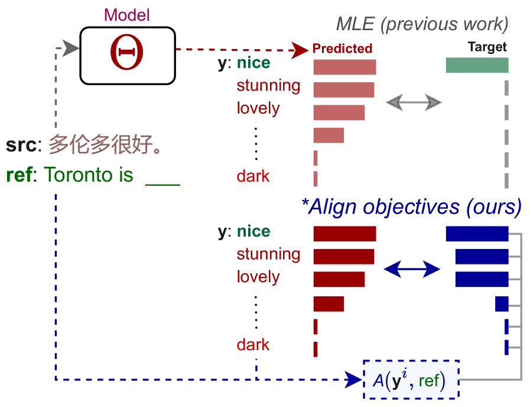
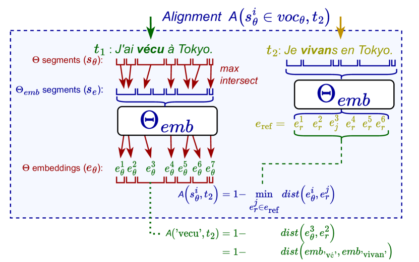
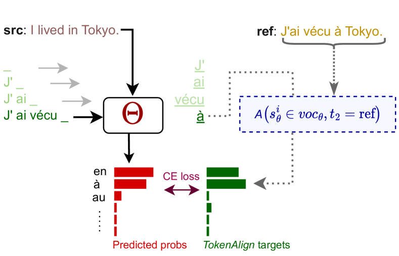
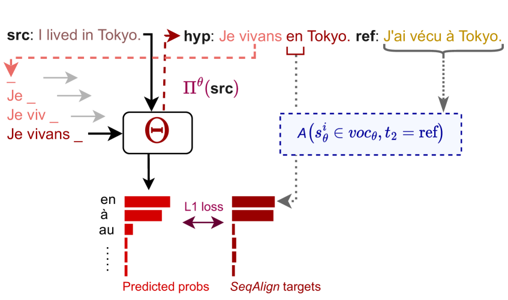
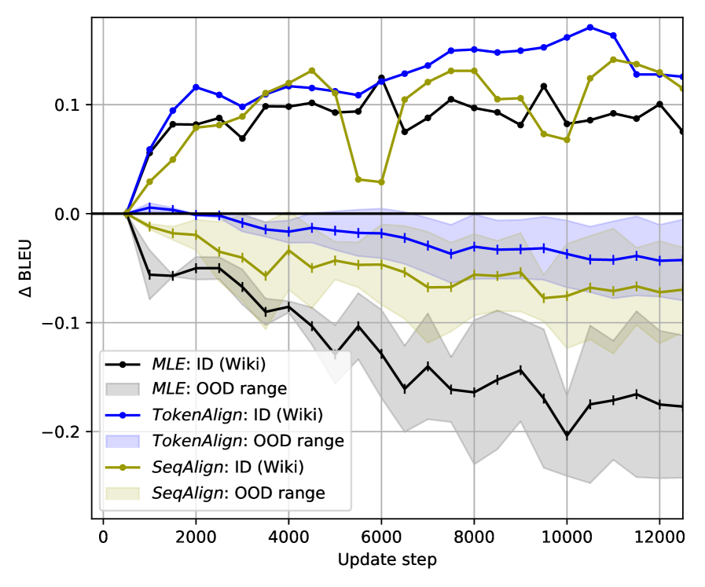
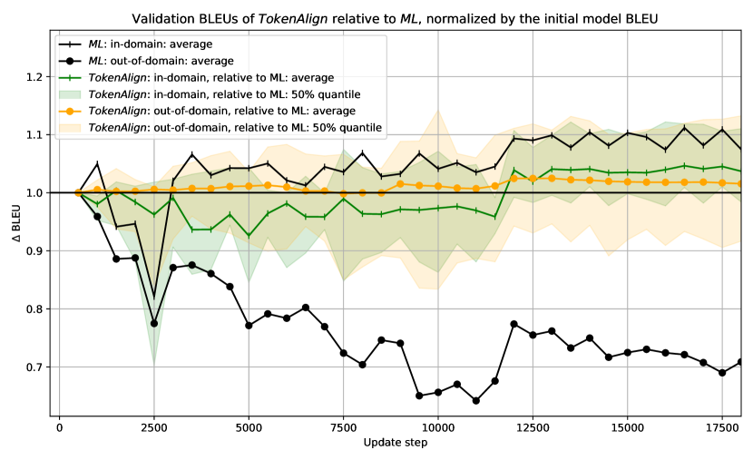

# Soft Alignment Objectives for Robust Adaptation of Language Generation

###### Abstract

Domain adaptation allows generative language models to address specific flaws caused by the domain shift of their application. However, the traditional adaptation by further training on in-domain data rapidly weakens the model’s ability to generalize to other domains, making the open-ended deployments of the adapted models prone to errors. This work introduces novel training objectives built upon a semantic similarity of the predicted tokens to the reference.  

Our results show that (1) avoiding the common assumption of a single correct prediction by constructing the training target from tokens’ semantic similarity can largely mitigate catastrophic forgetting of adaptation, while (2) preserving the adaptation in-domain quality, (3) with negligible additions to compute costs. In the broader context, the objectives grounded in a continuous token similarity pioneer the exploration of the middle ground between the efficient but naïve exact-match token-level objectives and expressive but computationally- and resource-intensive sequential objectives.  

\*\*footnotetext: Corresponding author: stefanik.m@mail.muni.cz

## 1 Introduction

Large language models (LLMs) based on instances of encoder-decoder architecture Neyshabur et al. ([2015](#bib.bib25)) provide a strong standard for generative applications of NLP, such as summarization or machine translation, mainly thanks to their outstanding ability to fluently model language. These models might face issues with adequacy of the generated text Ustaszewski ([2019](#bib.bib43)) when applied in data domain(s) different from the training domain, but such errors can be partially mitigated using domain adaptation Saunders ([2021](#bib.bib33)).  

Identically to the pre-training phase, the adaptation is commonly carried out using Maximum Likelihood Estimation (MLE) objective with teacher forcing Bahdanau et al. ([2015](#bib.bib1)). The popularity of this approach can be rightfully attributed to its outstanding data and computing efficiency. However, model adaptation using MLE notoriously comes for a price of over-specialization to the target domain, also referred to as catastrophic forgetting Goodfellow et al. ([2014](#bib.bib15)), characterized by a continuous decay of model performance on the inputs from the other domains than the adaptation domain.  

We hypothesize that catastrophic forgetting might be related to MLE’s naïve single-truth assumption, penalizing models’ uncertainty over the possibly valid predictions, such as the synonyms. In domain adaptation, a repeated penalization of possibly valid tokens that are uncommon in the adapted domain might drive the model to unlearn the original features robust to meaning-invariant formulations.  

[FIGURE S1.F1.1.1.g1]

Figure 1: Soft alignment objectives (\*Align) replace the single-truth assumption of Maximum Likelihood Estimation (MLE) objective by constructing target distribution using Alignment A based on the mutual similarity of token representations. We show that learning to model ambiguity in prediction can largely mitigate the loss of generalization in adaptation.
[/FIGURE]

We propose to counteract the single-truth assumption of MLE by constructing targets that respect mutual tokens’ similarity through the alignment of output tokens to the reference (Figure [1](#S1.F1 "Figure 1 ‣ 1 Introduction ‣ Soft Alignment Objectives for Robust Adaptation of Language Generation")). Consequentially, the expected target distribution is spread over the tokens that can be accurately aligned to the reference, based on the representations provided by a domain-agnostic embedding model. We find that using such objectives in domain adaptation can eliminate a major portion of model performance loss on out-of-domain (OOD), caused by the adaptation techniques while reaching comparable or higher qualitative gains on the adapted domain.  

Our main contributions are the following. (i) We present a framework for training generative language models with an alternative training signal based on token similarity provided by an arbitrary embedding model. A similar methodology can be applied for more robust training and adaptation of any language model. (ii) We introduce efficient and accurate training objectives that alleviate catastrophic forgetting of low-resource domain adaptation in NMT without losing adaptation quality. (iii) We further investigate the covariates that impact the robustness of generative LLM. Among others, we find that a more robust model can be obtained merely by exposing a generative model to its own predictions during the training.  

This paper is structured as follows. Section [2](#S2 "2 Background ‣ Soft Alignment Objectives for Robust Adaptation of Language Generation") surveys and compares our work to the existing work in training and adapting robust generative LLMs. Section [3](#S3 "3 Soft Alignment Objectives ‣ Soft Alignment Objectives for Robust Adaptation of Language Generation") introduces two main objectives that we experiment with: TokenAlign and SeqAlign. Section [4](#S4 "4 Experiments ‣ Soft Alignment Objectives for Robust Adaptation of Language Generation") describes our experimental methodology and ablation analyses and Section [5](#S5 "5 Results ‣ Soft Alignment Objectives for Robust Adaptation of Language Generation") summarizes our findings, highlighting the broader implications.  

## 2 Background

Language generation is the modus operandi for a wide set of problems requiring an open-ended sequence of tokens as the answer. Machine translation is the representative of this group that we focus on, but other tasks such as summarization Lewis et al. ([2020](#bib.bib21)), vision captioning Wang et al. ([2022](#bib.bib47)), question answering (Raffel et al., [2020](#bib.bib29)) or in-context learning Sanh et al. ([2021](#bib.bib31)) are also applications of the described framework.  

In the commonly-used auto-regressive generation, for each pair of input and reference sequence of tokens $X_{j}$ and $Y_{j}$, a language model $\Theta(Y_{j,i}|X_{j},Y_{j,1..i-1})$ is trained to generate output sequence by maximizing the probability of generating the $i$-th token $y_{ji}=\operatorname*{arg\,max}(\Theta(X_{j},Y_{j,1..i-1}))$ matching the reference $Y_{ji}$ while minimizing the probability of generating other tokens of the vocabulary, conditionally to the input text $X_{j}$ and previous reference tokens $Y_{j,1..i-1}$:  

|  | $$\max p(y_{ji}=Y_{ji}|X_{j},Y_{j,1..i-1},\Theta)$$ |  | (1) |
| --- | --- | --- | --- |

This objective is implemented in the commonly-used Maximum Likelihood Estimation (MLE) objective, which minimizes a cross-entropy (CE) of the predicted distribution of $\Theta(X_{j},Y_{j,1..i-1})$ to the expected distribution, which is a one-hot encoding $E_{ji}$ of the true reference token $Y_{ji}$ over the model vocabulary:  

|  | $$\mathcal{L}_{\textit{MLE}}(\Theta)=\min\left(\!-\log\frac{\exp(\Theta(X_{j},Y_{j,1..i-1}))}{\exp(E_{ji})}\!\right)$$ |  | (2) |
| --- | --- | --- | --- |

This objective is commonly used both for training (Bahdanau et al., [2016](#bib.bib2); Vaswani et al., [2017](#bib.bib45)) and adaptation (Servan et al., [2016](#bib.bib34); Saunders, [2021](#bib.bib33)) of generative LLMs.  

While the adaptation brings benefits in modelling domain-specific terminology Sato et al. ([2020](#bib.bib32)), or in avoiding inadequate generation artefacts such as repetitions or hallucinations Etchegoyhen et al. ([2018](#bib.bib13)), it comes at a price of generalization to other domains; the adapted models improve on the adapted domain but gradually perform worse on other domains.  

Previous work in domain adaptation presents methods addressing the mitigation of catastrophic forgetting. Chu et al. ([2017](#bib.bib6)) enhance model robustness by mixing the pre-training and adaptation samples in continuous training, assuming that the full pre-training dataset is available, which is commonly not the case. Thompson et al. ([2019](#bib.bib39)) regularize the training objective with Fischer Information Matrix. Dakwale and Monz ([2017](#bib.bib8)) also use the regularization in training, instead based on the predictions of the original model. Similarly, Freitag and Al-Onaizan ([2016](#bib.bib14)) use the ensemble of the original and trained model in prediction. In this line, we experiment with the ensemble approach using Transformers but find it underperforms other methods in low-resource adaptation.  

Han et al. ([2021](#bib.bib16)) find that using parameter-efficient fine-tuning methods, such as using Adapters (Houlsby et al., [2019](#bib.bib17)) can increase the robustness of the adapted model. Previous work also applied Adapters in the fine-tuning of generative LLMs (Cooper Stickland et al., [2021](#bib.bib7); Lai et al., [2022](#bib.bib20)), but do not evaluate the distributional robustness of the final models; Therefore, we include Adapters as another baseline, but find it also struggling in lower-resource cases, due to the random initialisation of its bottleneck representations. We find that this problem can be avoided using LoRA Hu et al. ([2022](#bib.bib18)), which instantiates tuned parameters as additions to attention matrices initialised close to zero values, therefore commencing the adaptation with the originally-performing model.  

Another problem of MLE is referred to as exposure bias: while in the teacher-forced training, the model’s $i$-th prediction $\Theta(X_{j})_{i}$ is conditioned by the correctly-generated previous tokens from the reference $Y_{j,1..i-1}$, in practice, the model conditions its predictions on its own outputs $\Theta(X_{j})_{1..i-1}$. We speculate that this discrepancy might be magnified under a domain shift where the model can not learn to follow references in a generation.  

Exposure bias was addressed by sequential objectives, such as Minimum Risk Training (MRT) (Ranzato et al., [2016](#bib.bib30)) that optimize the model by the evaluation of complete output sequence Yang et al. ([2018](#bib.bib50)); Wang and Sennrich ([2020](#bib.bib46)); Mi et al. ([2020](#bib.bib23)); Unanue et al. ([2021](#bib.bib42)). Apart from the specifics of Reinforcement learning, such as fragility to the optimization settings Pineau et al. ([2021](#bib.bib27)), these methods are also more resource-demanding as they require a sequence of predictions for a single update, limiting their applicability in low-resource adaptation. Previous work of Choshen et al. ([2020](#bib.bib5)) also shows that gains of sequential methods in adaptation might be similar to a random training signal. Inspired by this finding, we also assess the gains and OOD robustness of our methods against a random-feedback sequential baseline (§[4.3](#S4.SS3 "4.3 Ablation Experiments ‣ 4 Experiments ‣ Soft Alignment Objectives for Robust Adaptation of Language Generation")).  

Closer to us, previous work uses alternative training signal based on comparing model hypotheses to the reference. Xu et al. ([2019](#bib.bib49)) build soft alignment between fully-generated hypotheses based on hidden states of bidirectional LSTM encoder-decoder and weigh the predicted probability distribution by such alignment in the training objective. Similarly, Lu et al. ([2020](#bib.bib22)) complement MLE and sentence-level objective with the objective minimizing a dot-product of the best-matching hidden representations of tokens of a hypothesis and a reference. Chen et al. ([2019](#bib.bib4)) and later Zhang et al. ([2020a](#bib.bib51)) introduce the matching scheme that uses the Optimal transport cost (Kusner et al., [2015](#bib.bib19)) of the embeddings of reference to the hypothesis as their objective loss.  

Referenced work reaches improvements in conventional high-resource training scenarios, whereas our goal is to propose a method for training robust generative models for challenging low-resource settings. This also motivates a primary difference in the design of our methods; That is, to use domain-agnostic representations for constructing training targets, instead of the model’s own representations, which are subject of over-specialization in adaptation.  

## 3 Soft Alignment Objectives

This section describes the details of alignment-based objectives111The implementation of all new objectives is available at:    <https://github.com/MIR-MU/softalign_objectives> that we introduce in this work.  

### 3.1 Token Alignment

[FIGURE S3.F2.1.1.g1]

Figure 2: Token alignment mechanism represents subwords $s_{\Theta}$ of the trained model $\Theta$ with embeddings of a robust, static model $\Theta_{\textit{emb}}$. Using these representations, we define Alignment of any $\Theta$’s subword $s_{\Theta}^{i}$ to another text $t_{2}$ through a minimal distance of their embeddings given by the robust embedding model $\Theta_{\textit{emb}}$.
[/FIGURE]

Our goal is to circumvent the single-truth assumption of MLE with targets respecting the mutual tokens’ similarity. Since the representations of the trained models are affected by catastrophic forgetting, we propose to use an alternative, domain-agnostic representation model ($\Theta_{\textit{emb}}$) to provide the token representations, i.e. embeddings.  

However, as the vocabularies of the fine-tuned model $\Theta$ and $\Theta_{\textit{emb}}$ are not aligned, to train with representations of a different $\Theta_{\textit{emb}}$, we need to match each subword (token) of the trained model ($s_{\Theta}^{i}$) with a subword of the embedding model ($s_{e}^{j}$) having a representation $e^{j}\in\Theta_{\textit{emb}}(t)$; (i) We tokenize input text $t_{1}$ using both $\Theta$’s and $\Theta_{\textit{emb}}$’s tokenizers, obtaining subwords $s_{\Theta}$ and $s_{e}$ respectively. (ii) Then, we compute the character-level positional spans of both subwords lists $s_{\Theta}$ and $s_{e}$. Finally, we (iii) match each model subword $s_{\Theta}^{i}\in s_{\Theta}$ with embedding subword $s_{e}^{j}\in\Theta_{\textit{emb}}$ such that $s_{e}^{j}$ has the largest positional overlap with $s_{\Theta}^{i}$. As a result, each $\Theta$’s subword $s_{\Theta}^{i}$ gets assigned an embedding $e_{\Theta}^{i}=e_{r}^{k}$ of $\Theta_{\textit{emb}}$, as visualized in Figure [2](#S3.F2 "Figure 2 ‣ 3.1 Token Alignment ‣ 3 Soft Alignment Objectives ‣ Soft Alignment Objectives for Robust Adaptation of Language Generation").  

Having $\Theta$’s subwords’ representations from a robust embedding model $\Theta_{\textit{emb}}$, we finally define an Alignment $\mathcal{A}$ of any subword $s_{\Theta}^{i}\in\Theta$ to another text $t_{2}$ as:  

|  | $$\mathcal{A}(s_{\Theta}^{i},t_{2})=1-\min_{e_{r}^{j}\in\Theta_{\textit{emb}}(t_{2})}\textit{dist}(e_{\Theta}^{i},e_{r}^{j})$$ |  | (3) |
| --- | --- | --- | --- |

where dist is any distance measure defined for the chosen embedding system. In our experiments, we use standard Euclidean distance as the measure. We provide a more detailed description and complexity analysis of the Alignment algorithm $\mathcal{A}$ in Appendix [C](#A3 "Appendix C Details of Alignment Algorithm ‣ Soft Alignment Objectives for Robust Adaptation of Language Generation").  

### 3.2 TokenAlign Objective

[FIGURE S3.F3.1.1.g1]

Figure 3: TokenAlign objective replaces one-hot targets of MLE with token Alignments A based on a similarity between the embeddings of the candidate and reference tokens (§[3.1](#S3.SS1 "3.1 Token Alignment ‣ 3 Soft Alignment Objectives ‣ Soft Alignment Objectives for Robust Adaptation of Language Generation")), encouraging the trained model $\Theta$ to respect the ambiguity of prediction, instead of eliminating it.
[/FIGURE]

TokenAlign is designed as a minimal adjustment to MLE (Eq. ([2](#S2.E2 "In 2 Background ‣ Soft Alignment Objectives for Robust Adaptation of Language Generation"))) using the alignment A as the target of each candidate token of $\Theta$’s vocabulary. Instead of penalisation, this encourages the model to up-weight predictions that do not match the reference token, but still can be accurately matched to the reference text (Figure [3](#S3.F3 "Figure 3 ‣ 3.2 TokenAlign Objective ‣ 3 Soft Alignment Objectives ‣ Soft Alignment Objectives for Robust Adaptation of Language Generation")):  

|  | $$\!\!\!\!\mathcal{L}_{\textit{TAlign}}(\Theta)=\min\!\left(\!\!-\log\frac{\exp(\Theta(X_{j},Y_{j,1..i-1}))}{\exp(\mathcal{A}(\textit{voc}_{\Theta},Y_{j}))}\!\right)$$ |  | (4) |
| --- | --- | --- | --- |

where $\textit{voc}_{\Theta}$ is the vocabulary of $\Theta$, and $\mathcal{A}(s_{\Theta}^{1..|\Theta|},Y_{j})$ are the alignments for each token of the vocabulary ($s_{\Theta}^{i}$) to the reference text $Y_{j}$. Note that none of $\mathcal{A}$’s components is updated in training.  

Relying on the same training approach as with the conventional MLE objective, TokenAlign presents an alternative of the MLE of similar data and compute efficiency (compared in Appendix [B](#A2 "Appendix B Computational Requirements ‣ Soft Alignment Objectives for Robust Adaptation of Language Generation")). However, TokenAlign still does not address the exposure bias as the model $\Theta$ is only updated conditionally to the previous reference tokens $Y_{1..i-1}$ as the prefixes, rather than its own outputs.  

### 3.3 SeqAlign Objective

[FIGURE S3.F4.1.1.g1]

Figure 4: SeqAlign objective further replaces the reference prefixes in the training with $\Theta$’s own-generated hypotheses. This additionally adapts the model to condition the predictions based on its own outputs, instead of the reference.
[/FIGURE]

Alignment $\mathcal{A}$ allows us to assess $\Theta$’s prediction quality on a token level, but without dependence on the exact ordering of reference tokens. Thus, we no longer need to keep the prefixes synchronized with reference and can construct targets for an arbitrary prefix. Hence, instead of taking prediction prefixes from reference $Y_{j}$, SeqAlign constructs the prefixes from the hypothesis generated by the trained model $\Theta$ itself (Fig. [4](#S3.F4 "Figure 4 ‣ 3.3 SeqAlign Objective ‣ 3 Soft Alignment Objectives ‣ Soft Alignment Objectives for Robust Adaptation of Language Generation")).  

We create the self-generated hypothesis by using $\Theta$’s outputs as a probability distribution and construct a generation strategy $\Pi^{\Theta}$ that samples next token(s) from this distribution. A desideratum of such generation strategy (compared to a greedy search) is that the prefixes of generated hypotheses are diverse but still realistically likely to occur during $\Theta$’s generation.  

Additionally, instead of generating a single hypothesis for each input, we can obtain a set of hypotheses $\hat{Y}_{j}\sim\Pi^{\Theta}(X_{j})$ that can be used by SeqAlign to condition the updates of $\Theta$. The sampling generation strategy is inspired by the previous work, using sampling to construct full hypotheses (Neubig, [2016](#bib.bib24); Shen et al., [2017](#bib.bib35); Edunov et al., [2018](#bib.bib12)).  

Identically to TokenAlign, SeqAlign associates all the vocabulary tokens $\textit{voc}_{\Theta}$ with their alignment quality $\mathcal{A}(s_{\Theta}^{1..|\Theta|},Y_{j})$ and uses the alignment as target distribution. However, motivated by the empirical results, instead of the Cross-Entropy, we minimise absolute distance ($L1$) as SeqAlign’s training objective:  

|  | $\displaystyle\!\mathcal{L}_{\textit{SAlign}}(\Theta)$ | $\displaystyle\!=\!\min\!\left(\Theta(X_{j},\hat{Y}_{j,1..i-1})-\mathcal{A}(\textit{voc}_{\Theta},\!Y_{j})\right)$ |  | (5) |
| --- | --- | --- | --- | --- |
|  | $\displaystyle\text{where }\hat{Y}_{j}$ | $\displaystyle\sim\Pi^{\Theta}(X_{j})$ |  |

Note that we further analyse the impact of the loss formulation in the ablation in Section [4.3](#S4.SS3.SSS0.Px3 "Impact of the loss formulation ‣ 4.3 Ablation Experiments ‣ 4 Experiments ‣ Soft Alignment Objectives for Robust Adaptation of Language Generation").  

### 3.4 Embeddings Contextualization

Computing alignment $\mathcal{A}$ using context-insensitive embedding model $\Theta_{\textit{emb}}$, such as GloVe Pennington et al. ([2014](#bib.bib26)) or FastText (Bojanowski et al., [2017](#bib.bib3)) requires no further adjustments. However, using more expressive context-sensitive embedding models, such as BERT (Devlin et al., [2018](#bib.bib10)) for computing $\mathcal{A}$ as a target for any possible output token faces the following issues.  

(i) Inference of representations on the fly within the training process is expensive. Consider an example of obtaining contextual representations for each possible next token in generating a 10-token hypothesis, requiring $10^{|\Theta|}$ inferences of $\Theta_{\textit{emb}}$, where $|\Theta|$ is a size of the vocabulary of $\Theta$, commonly in ranges of 30,000–50,000 tokens.  

(ii) A full context required to infer bidirectional contextual embeddings remains incomplete throughout the generation. The embeddings could be inferred within a synthetic context or using a unidirectional embedding model instead, but we find that both these approaches significantly alter tokens’ pairwise distances.  

In the SeqAlign objective, we address these issues by embedding only the top-$n$ highest-scored tokens of $\Theta$ in each prediction step (denoted $\Theta^{\uparrow n}$). By fixing $n=3$, we need to infer the contextual embeddings of only $\sum_{k=1}^{K}3|\Pi_{k}(X_{j})|$ of the highest-scored tokens for each sampled hypothesis $\Pi_{k}(X_{j})$. In our experiments, we also keep the number of sampled hypotheses $K$ fixed to $K=10$ and we do not adjust $\Theta$ by the scores of the tokens other than the top ones. As the context, we use the complete hypothesis from which the token $s_{\Theta}^{i}\in\Theta^{\uparrow n}$ is sampled. Therefore, the targets $\mathcal{A}$ for our distance-based objectives are adjusted to:  

|  | $$\mathcal{A^{\prime}}(s_{\Theta}^{i},t_{2})=\begin{cases}\mathcal{A}(s_{\Theta}^{i},t_{2})&\text{if }s_{\Theta}^{i}\in\Theta^{\uparrow n}\\ 0&\text{otherwise}\end{cases}$$ |  | (6) |
| --- | --- | --- | --- |

In TokenAlign, which requires embeddings of all tokens of the vocabulary, we address the computational overhead in a decontextualization process. We obtain the decontextualized embedding $e^{i}$ for each subword $s_{e}^{i}$ as an average of the contextualized embeddings corresponding to all the occurrences of $s_{e}^{i}$ in the texts of the training domain $X$:  

|  | $$e_{\textit{dec}}^{i}=\frac{1}{\text{\#}s_{e}^{i}}\sum_{\begin{subarray}{c}X_{j}\in X;\,s_{e}^{i}\in X_{j}\end{subarray}}\!\!\!\!\!\!\!\!\!\Theta_{\textit{emb}}(X_{j})^{i}$$ |  | (7) |
| --- | --- | --- | --- |

where #$s_{e}^{i}$ is the number of occurrences of a subword $s_{e}^{i}$ in $X$.  

While such a process also causes qualitative decay of the contextual representations, it has been shown that decontextualized representations still outperform context-agnostic (FastText) embeddings in machine translation evaluation Štefánik et al. ([2021](#bib.bib37)). Despite that, we quantify the impact of decontextualization as one of our ablations (§[4.3](#S4.SS3 "4.3 Ablation Experiments ‣ 4 Experiments ‣ Soft Alignment Objectives for Robust Adaptation of Language Generation")).  

Throughout all our experiments, we use the embeddings of multilingual BERT model Devlin et al. ([2019](#bib.bib11)) as $\Theta_{\textit{emb}}$, extracted from the 9-th hidden layer, motivated by the previous work of Zhang et al. ([2020b](#bib.bib52)) showing this model to best correlate with a human evaluation of generative LLMs.  

## 4 Experiments

We evaluate the impact of the proposed training objectives in the domain adaptation experiments in machine translation, where the distributional robustness in adaptation may bring well-measurable benefits. We compare our results with the adaptation using the commonly-used MLE objective (§[2](#S2 "2 Background ‣ Soft Alignment Objectives for Robust Adaptation of Language Generation")), and selected parameter-efficient methods shown to mitigate forgetting. We use the novel objectives as the weighted complements of the MLE objective (Eq. ([2](#S2.E2 "In 2 Background ‣ Soft Alignment Objectives for Robust Adaptation of Language Generation"))), aiming to extend the modelled space of the problem complexity:  

|  | $$\mathcal{L}_{\textit{*Align}}(\Theta)=\mathcal{L}_{\textit{MLE}}(\Theta)+\alpha\cdot\mathcal{L}_{\textit{NewObj}}(\Theta)$$ |  | (8) |
| --- | --- | --- | --- |

### 4.1 Datasets

We choose the data configurations of our experiments to allow the reader to extrapolate trends and conclusions invariant to the following covariates.  

Domains. To assess the distributional robustness of the models, we train and evaluate among all pairs of these OPUS domains (Tiedemann, [2012](#bib.bib40)): Wikimedia, OpenSubtitles, Bible, TEDTalks, DGT/Law and EMEA/Medical. We choose the set of domains that reflects both minor (Wikimedia → OpenSubtitles) and major (EMEA/Medical → Bible) domain shifts between the training and evaluation. Our selection reflects on real-world settings where practitioners commonly adapt a general-purpose model to a specialized domain such as law or medicine, but need to keep an operational level of quality on any input.  

Data size. We focus on the applications where the size of parallel corpora available for adaptation range from very low-resource (50,000 aligned sentences, Bible) to medium-resource (5,100,000 sentences, DGT/Law).  

Language pairs. Our evaluated language pairs are: Estonian → English, German → English English → Czech, English → Ukrainian, English → German and English → Chinese. We pick the English-centric pairs in order to maximize the number of out-of-domain evaluation sources for the adapted language pair. Our settings cover target languages of Latin, Cyrillic, and Chinese alphabets.  

### 4.2 Experimental Setup

#### Data configuration

As the OPUS sources do not contain standard splits, we split the data into train-validation-test. We first de-duplicate the samples and draw 500 validation and 1,000 test samples from each domain.  

#### Training

We perform the adaptations from the bilingual Transformer-base models of Vaswani et al. ([2017](#bib.bib45)) using the checkpoints of Tiedemann and Thottingal ([2020](#bib.bib41)) pre-trained for a translation of the corresponding language pair on a mixture of OPUS sources.  

We perform a hyperparameter search over the parameters of learning rate, objectives weights $\alpha$, and objective-specific batch size. We detail the values and ranges of this search in Appendix [A](#A1 "Appendix A Hyperparameters ‣ Soft Alignment Objectives for Robust Adaptation of Language Generation").  

After fixing the objectives’ parameters, we set up the experiments to closely resemble the traditional training process; We run each experiment until early-stopping by in-domain validation BLEU, with the patience of 20 evaluations, i.e., 10,000 updates and evaluate the model with the best validation score for testing. If the model does not improve over the first 10,000 updates, we evaluate the resulting model after the 10,000 updates.  

We implement our experiments using Adaptor library (Štefánik et al., [2022](#bib.bib36)), allowing the release of all our experiments in a transparent and self-containing form.222All our experiments can be reproduced by running a single line of code; refer to the Section <experiments> in <https://github.com/MIR-MU/softalign_objectives>  

#### Evaluation

To discourage the effect of the random variance in the performance of the trained model, we report all test scores as the average of the performance in the interval of 5 preceding and 5 succeeding checkpoints, resulting in a single, average test evaluation for each domain.  

We collect evaluations of BLEU in the default settings of SacreBLEU Post ([2018](#bib.bib28)), obtaining a single (average) evaluation of in-domain (ID) BLEU and a set of corresponding evaluations for all listed domains other than the in-domain (OOD). Given the availability of the sources, this results in four OOD evaluations for all pairs except (en→ukr) and (en→zh) with the datasets for two OOD evaluations.  

To enable mutual comparability, we finally normalize both ID and OOD results by the performance of the initial checkpoint and report the change of performance in percentage. We report a single scalar value, or an interval in a form <mean$\pm$range covering all results>.  

#### Baselines

In addition to MLE, we compare the proposed methods to four existing methods reported to enhance LLMs’robustness. (i) Label smoothing Szegedy et al. ([2016](#bib.bib38)) with $\alpha=0.1$ used widely also for training MT models distributes a constant portion of expected probability among all possible predictions. (ii) Adapters Houlsby et al. ([2019](#bib.bib17)) freezes pre-trained model parameters and fine-tunes a small set of newly-initialized bottleneck parameters. Instead, (iii) LoRA avoids Adapters’ issue of breaking the model in the initial training phase by initializing the new parameters that are trained as an addition to the model’s original, frozen parameters. (iv) We also implement and evaluate the Ensemble approach of Freitag and Al-Onaizan ([2016](#bib.bib14)), but find this approach unable to bring adaptation gains in either of our relatively low-resource adaptation cases. We detail the settings of our baselines in Appendix [A](#A1 "Appendix A Hyperparameters ‣ Soft Alignment Objectives for Robust Adaptation of Language Generation").  

[TABLE S4.T1]

<table class="ltx_tabular ltx_guessed_headers ltx_align_middle">
<tbody class="ltx_tbody">
<tr class="ltx_tr">
<th class="ltx_td ltx_th ltx_th_row ltx_border_tt"></th>
<th class="ltx_td ltx_align_left ltx_th ltx_th_row ltx_border_tt">
<math class="ltx_Math"><semantics><mi>Δ</mi><annotation-xml><ci>Δ</ci></annotation-xml><annotation>\!\!\Delta</annotation></semantics></math> BLEU</th>
<td class="ltx_td ltx_align_left ltx_border_tt">
<table class="ltx_tabular ltx_align_middle">
<tr class="ltx_tr">
<td class="ltx_td ltx_nopad_r ltx_align_left">Bible</td>
</tr>
<tr class="ltx_tr">
<td class="ltx_td ltx_nopad_r ltx_align_left">(de→en)</td>
</tr>
</table>
</td>
<td class="ltx_td ltx_align_left ltx_border_tt">
<table class="ltx_tabular ltx_align_middle">
<tr class="ltx_tr">
<td class="ltx_td ltx_nopad_r ltx_align_left">TEDTalks</td>
</tr>
<tr class="ltx_tr">
<td class="ltx_td ltx_nopad_r ltx_align_left">(en→zh)</td>
</tr>
</table>
</td>
<td class="ltx_td ltx_align_left ltx_border_tt">
<table class="ltx_tabular ltx_align_middle">
<tr class="ltx_tr">
<td class="ltx_td ltx_nopad_r ltx_align_left">Opensubs</td>
</tr>
<tr class="ltx_tr">
<td class="ltx_td ltx_nopad_r ltx_align_left">(en→ukr)</td>
</tr>
</table>
</td>
<td class="ltx_td ltx_align_left ltx_border_tt">
<table class="ltx_tabular ltx_align_middle">
<tr class="ltx_tr">
<td class="ltx_td ltx_nopad_r ltx_align_left">Wiki</td>
</tr>
<tr class="ltx_tr">
<td class="ltx_td ltx_nopad_r ltx_align_left">(en→cze)</td>
</tr>
</table>
</td>
<td class="ltx_td ltx_align_left ltx_border_tt">
<table class="ltx_tabular ltx_align_middle">
<tr class="ltx_tr">
<td class="ltx_td ltx_nopad_r ltx_align_left">Medical/EMEA</td>
</tr>
<tr class="ltx_tr">
<td class="ltx_td ltx_nopad_r ltx_align_left">(est→en)</td>
</tr>
</table>
</td>
<td class="ltx_td ltx_align_left ltx_border_tt">
<table class="ltx_tabular ltx_align_middle">
<tr class="ltx_tr">
<td class="ltx_td ltx_nopad_r ltx_align_left">Law/DGT</td>
</tr>
<tr class="ltx_tr">
<td class="ltx_td ltx_nopad_r ltx_align_left">(en→de)</td>
</tr>
</table>
</td>
<td class="ltx_td ltx_align_left ltx_border_tt">
<table class="ltx_tabular ltx_align_middle">
<tr class="ltx_tr">
<td class="ltx_td ltx_nopad_r ltx_align_center">Average</td>
</tr>
<tr class="ltx_tr">
<td class="ltx_td ltx_nopad_r ltx_align_center"> (BLEU)</td>
</tr>
</table>
</td>
<td class="ltx_td ltx_align_left ltx_border_tt">
<table class="ltx_tabular ltx_align_middle">
<tr class="ltx_tr">
<td class="ltx_td ltx_nopad_r ltx_align_center">​​​​Average
</td>
</tr>
<tr class="ltx_tr">
<td class="ltx_td ltx_nopad_r ltx_align_center">​​(BERTScr)</td>
</tr>
</table>
</td>
</tr>
<tr class="ltx_tr">
<th class="ltx_td ltx_nopad_r ltx_th ltx_th_row"></th>
<th class="ltx_td ltx_nopad_l ltx_th ltx_th_row"></th>
<td class="ltx_td ltx_align_left">62,000 pairs</td>
<td class="ltx_td ltx_align_left">155,000 pairs</td>
<td class="ltx_td ltx_align_left">877,000 pairs</td>
<td class="ltx_td ltx_align_left">1,003,000 pairs</td>
<td class="ltx_td ltx_align_left">1,021,000 pairs</td>
<td class="ltx_td ltx_align_left">5,105,000 pairs</td>
<td class="ltx_td"></td>
<td class="ltx_td"></td>
</tr>
<tr class="ltx_tr">
<th class="ltx_td ltx_nopad_r ltx_align_center ltx_th ltx_th_row ltx_border_t">Orig. BLEU</th>
<th class="ltx_td ltx_nopad_l ltx_th ltx_th_row ltx_border_t"></th>
<td class="ltx_td ltx_align_left ltx_border_t"><math class="ltx_Math"><semantics><mn>21.89</mn><annotation-xml><cn>21.89</cn></annotation-xml><annotation>21.89</annotation></semantics></math></td>
<td class="ltx_td ltx_align_left ltx_border_t"><math class="ltx_Math"><semantics><mn>29.01</mn><annotation-xml><cn>29.01</cn></annotation-xml><annotation>29.01</annotation></semantics></math></td>
<td class="ltx_td ltx_align_left ltx_border_t"><math class="ltx_Math"><semantics><mn>26.12</mn><annotation-xml><cn>26.12</cn></annotation-xml><annotation>26.12</annotation></semantics></math></td>
<td class="ltx_td ltx_align_left ltx_border_t"><math class="ltx_Math"><semantics><mn>34.04</mn><annotation-xml><cn>34.04</cn></annotation-xml><annotation>34.04</annotation></semantics></math></td>
<td class="ltx_td ltx_align_left ltx_border_t"><math class="ltx_Math"><semantics><mn>54.85</mn><annotation-xml><cn>54.85</cn></annotation-xml><annotation>54.85</annotation></semantics></math></td>
<td class="ltx_td ltx_align_left ltx_border_t"><math class="ltx_Math"><semantics><mn>33.56</mn><annotation-xml><cn>33.56</cn></annotation-xml><annotation>33.56</annotation></semantics></math></td>
<td class="ltx_td ltx_border_t"></td>
<td class="ltx_td ltx_border_t"></td>
</tr>
<tr class="ltx_tr">
<th class="ltx_td ltx_nopad_r ltx_align_center ltx_th ltx_th_row ltx_border_t">MLE</th>
<th class="ltx_td ltx_nopad_l ltx_align_right ltx_th ltx_th_row ltx_border_t">ID</th>
<td class="ltx_td ltx_align_left ltx_border_t"><math class="ltx_Math"><semantics><mrow><mo>−</mo><mrow><mn>  8</mn><mo>%</mo></mrow></mrow><annotation-xml><apply><minus></minus><apply><csymbol>percent</csymbol><cn>8</cn></apply></apply></annotation-xml><annotation>\boldmath-\,\ 8\%</annotation></semantics></math></td>
<td class="ltx_td ltx_align_left ltx_border_t"><math class="ltx_Math"><semantics><mrow><mo>+</mo><mrow><mn>  7</mn><mo>%</mo></mrow></mrow><annotation-xml><apply><plus></plus><apply><csymbol>percent</csymbol><cn>7</cn></apply></apply></annotation-xml><annotation>\boldmath+\,\ 7\%</annotation></semantics></math></td>
<td class="ltx_td ltx_align_left ltx_border_t"><math class="ltx_Math"><semantics><mrow><mo>+</mo><mrow><mn>  4</mn><mo>%</mo></mrow></mrow><annotation-xml><apply><plus></plus><apply><csymbol>percent</csymbol><cn>4</cn></apply></apply></annotation-xml><annotation>+\ \,4\%</annotation></semantics></math></td>
<td class="ltx_td ltx_align_left ltx_border_t"><math class="ltx_Math"><semantics><mrow><mo>+</mo><mrow><mn>  9</mn><mo>%</mo></mrow></mrow><annotation-xml><apply><plus></plus><apply><csymbol>percent</csymbol><cn>9</cn></apply></apply></annotation-xml><annotation>+\,\ 9\%</annotation></semantics></math></td>
<td class="ltx_td ltx_align_left ltx_border_t"><math class="ltx_Math"><semantics><mrow><mo>+</mo><mrow><mn>38</mn><mo>%</mo></mrow></mrow><annotation-xml><apply><plus></plus><apply><csymbol>percent</csymbol><cn>38</cn></apply></apply></annotation-xml><annotation>+38\%</annotation></semantics></math></td>
<td class="ltx_td ltx_align_left ltx_border_t"><math class="ltx_Math"><semantics><mrow><mo>−</mo><mrow><mn>  1</mn><mo>%</mo></mrow></mrow><annotation-xml><apply><minus></minus><apply><csymbol>percent</csymbol><cn>1</cn></apply></apply></annotation-xml><annotation>-\,\ 1\%</annotation></semantics></math></td>
<td class="ltx_td ltx_align_left ltx_border_t"><math class="ltx_Math"><semantics><mrow><mo>+</mo><mtext class="ltx_mathvariant_bold">8.31%</mtext></mrow><annotation-xml><apply><plus></plus><ci><mtext class="ltx_mathvariant_bold">8.31%</mtext></ci></apply></annotation-xml><annotation>+\,\ \textbf{8.31\%}</annotation></semantics></math></td>
<td class="ltx_td ltx_nopad_r ltx_align_left ltx_border_t"><math class="ltx_Math"><semantics><mrow><mo>+</mo><mrow><mn>  9.19</mn><mo>​</mo><mi>‰</mi></mrow></mrow><annotation-xml><apply><plus></plus><apply><times></times><cn>9.19</cn><ci>‰</ci></apply></apply></annotation-xml><annotation>+\,\ 9.19\permil</annotation></semantics></math></td>
</tr>
<tr class="ltx_tr">
<th class="ltx_td ltx_nopad_r ltx_align_center ltx_th ltx_th_row"><cite class="ltx_cite ltx_citemacro_cite">Bahdanau et al. (<a class="ltx_ref">2015</a>)</cite></th>
<th class="ltx_td ltx_nopad_l ltx_align_right ltx_th ltx_th_row">OOD</th>
<td class="ltx_td ltx_align_left"><math class="ltx_Math"><semantics><mrow><mrow><mo>−</mo><mrow><mn>53</mn><mo>%</mo></mrow></mrow><mo>±</mo><mrow><mn>36</mn><mo>%</mo></mrow></mrow><annotation-xml><apply><csymbol>plus-or-minus</csymbol><apply><minus></minus><apply><csymbol>percent</csymbol><cn>53</cn></apply></apply><apply><csymbol>percent</csymbol><cn>36</cn></apply></apply></annotation-xml><annotation>-53\%\pm 36\%</annotation></semantics></math></td>
<td class="ltx_td ltx_align_left"><math class="ltx_Math"><semantics><mrow><mrow><mo>−</mo><mrow><mn>23</mn><mo>%</mo></mrow></mrow><mo>±</mo><mrow><mn>23</mn><mo>%</mo></mrow></mrow><annotation-xml><apply><csymbol>plus-or-minus</csymbol><apply><minus></minus><apply><csymbol>percent</csymbol><cn>23</cn></apply></apply><apply><csymbol>percent</csymbol><cn>23</cn></apply></apply></annotation-xml><annotation>-23\%\pm 23\%</annotation></semantics></math></td>
<td class="ltx_td ltx_align_left"><math class="ltx_Math"><semantics><mrow><mrow><mo>−</mo><mrow><mn>15</mn><mo>%</mo></mrow></mrow><mo>±</mo><mrow><mn>9</mn><mo>%</mo></mrow></mrow><annotation-xml><apply><csymbol>plus-or-minus</csymbol><apply><minus></minus><apply><csymbol>percent</csymbol><cn>15</cn></apply></apply><apply><csymbol>percent</csymbol><cn>9</cn></apply></apply></annotation-xml><annotation>-15\%\pm 9\%</annotation></semantics></math></td>
<td class="ltx_td ltx_align_left"><math class="ltx_Math"><semantics><mrow><mrow><mo>−</mo><mrow><mn>15</mn><mo>%</mo></mrow></mrow><mo>±</mo><mrow><mn>5</mn><mo>%</mo></mrow></mrow><annotation-xml><apply><csymbol>plus-or-minus</csymbol><apply><minus></minus><apply><csymbol>percent</csymbol><cn>15</cn></apply></apply><apply><csymbol>percent</csymbol><cn>5</cn></apply></apply></annotation-xml><annotation>-15\%\pm 5\%</annotation></semantics></math></td>
<td class="ltx_td ltx_align_left"><math class="ltx_Math"><semantics><mrow><mrow><mo>−</mo><mrow><mn>35</mn><mo>%</mo></mrow></mrow><mo>±</mo><mrow><mn>10</mn><mo>%</mo></mrow></mrow><annotation-xml><apply><csymbol>plus-or-minus</csymbol><apply><minus></minus><apply><csymbol>percent</csymbol><cn>35</cn></apply></apply><apply><csymbol>percent</csymbol><cn>10</cn></apply></apply></annotation-xml><annotation>-35\%\pm 10\%</annotation></semantics></math></td>
<td class="ltx_td ltx_align_left"><math class="ltx_Math"><semantics><mrow><mrow><mo>−</mo><mrow><mn>19</mn><mo>%</mo></mrow></mrow><mo>±</mo><mrow><mn>11</mn><mo>%</mo></mrow></mrow><annotation-xml><apply><csymbol>plus-or-minus</csymbol><apply><minus></minus><apply><csymbol>percent</csymbol><cn>19</cn></apply></apply><apply><csymbol>percent</csymbol><cn>11</cn></apply></apply></annotation-xml><annotation>-19\%\pm 11\%</annotation></semantics></math></td>
<td class="ltx_td ltx_align_left"><math class="ltx_Math"><semantics><mrow><mo>−</mo><mrow><mn>26.87</mn><mo>%</mo></mrow></mrow><annotation-xml><apply><minus></minus><apply><csymbol>percent</csymbol><cn>26.87</cn></apply></apply></annotation-xml><annotation>-26.87\%</annotation></semantics></math></td>
<td class="ltx_td ltx_nopad_r ltx_align_left"><math class="ltx_Math"><semantics><mrow><mo>−</mo><mrow><mn>37.34</mn><mo>​</mo><mi>‰</mi></mrow></mrow><annotation-xml><apply><minus></minus><apply><times></times><cn>37.34</cn><ci>‰</ci></apply></apply></annotation-xml><annotation>-37.34\permil</annotation></semantics></math></td>
</tr>
<tr class="ltx_tr">
<th class="ltx_td ltx_nopad_r ltx_align_center ltx_th ltx_th_row">
MLE + Smoothing
</th>
<th class="ltx_td ltx_nopad_l ltx_align_right ltx_th ltx_th_row">ID</th>
<td class="ltx_td ltx_align_left"><math class="ltx_Math"><semantics><mrow><mo>−</mo><mrow><mn>  6</mn><mo>%</mo></mrow></mrow><annotation-xml><apply><minus></minus><apply><csymbol>percent</csymbol><cn>6</cn></apply></apply></annotation-xml><annotation>-\,\ 6\%</annotation></semantics></math></td>
<td class="ltx_td ltx_align_left"><math class="ltx_Math"><semantics><mrow><mo>+</mo><mrow><mtext class="ltx_mathvariant_bold">30</mtext><mo>%</mo></mrow></mrow><annotation-xml><apply><plus></plus><apply><csymbol>percent</csymbol><ci><mtext class="ltx_mathvariant_bold">30</mtext></ci></apply></apply></annotation-xml><annotation>+\textbf{30}\%</annotation></semantics></math></td>
<td class="ltx_td ltx_align_left"><math class="ltx_Math"><semantics><mrow><mo>−</mo><mrow><mn>  6</mn><mo>%</mo></mrow></mrow><annotation-xml><apply><minus></minus><apply><csymbol>percent</csymbol><cn>6</cn></apply></apply></annotation-xml><annotation>-\ \,6\%</annotation></semantics></math></td>
<td class="ltx_td ltx_align_left"><math class="ltx_Math"><semantics><mrow><mo>+</mo><mrow><mn>  9</mn><mo>%</mo></mrow></mrow><annotation-xml><apply><plus></plus><apply><csymbol>percent</csymbol><cn>9</cn></apply></apply></annotation-xml><annotation>+\,\ 9\%</annotation></semantics></math></td>
<td class="ltx_td ltx_align_left"><math class="ltx_Math"><semantics><mrow><mo>+</mo><mrow><mn>17</mn><mo>%</mo></mrow></mrow><annotation-xml><apply><plus></plus><apply><csymbol>percent</csymbol><cn>17</cn></apply></apply></annotation-xml><annotation>+17\%</annotation></semantics></math></td>
<td class="ltx_td ltx_align_left"><math class="ltx_Math"><semantics><mrow><mo>+</mo><mrow><mn>  0</mn><mo>%</mo></mrow></mrow><annotation-xml><apply><plus></plus><apply><csymbol>percent</csymbol><cn>  0</cn></apply></apply></annotation-xml><annotation>+\,\ 0\%</annotation></semantics></math></td>
<td class="ltx_td ltx_align_left"><math class="ltx_Math"><semantics><mrow><mo>+</mo><mrow><mn>  7.43</mn><mo>%</mo></mrow></mrow><annotation-xml><apply><plus></plus><apply><csymbol>percent</csymbol><cn>7.43</cn></apply></apply></annotation-xml><annotation>+\,\ 7.43\%</annotation></semantics></math></td>
<td class="ltx_td ltx_nopad_r ltx_align_left"><math class="ltx_Math"><semantics><mrow><mo>+</mo><mrow><mn>  3.77</mn><mo>​</mo><mi>‰</mi></mrow></mrow><annotation-xml><apply><plus></plus><apply><times></times><cn>3.77</cn><ci>‰</ci></apply></apply></annotation-xml><annotation>+\ \,3.77\permil</annotation></semantics></math></td>
</tr>
<tr class="ltx_tr">
<th class="ltx_td ltx_nopad_r ltx_align_center ltx_th ltx_th_row"><cite class="ltx_cite ltx_citemacro_cite">Szegedy et al. (<a class="ltx_ref">2016</a>)</cite></th>
<th class="ltx_td ltx_nopad_l ltx_align_right ltx_th ltx_th_row">OOD</th>
<td class="ltx_td ltx_align_left"><math class="ltx_Math"><semantics><mrow><mrow><mo>−</mo><mrow><mn>85</mn><mo>%</mo></mrow></mrow><mo>±</mo><mrow><mn>31</mn><mo>%</mo></mrow></mrow><annotation-xml><apply><csymbol>plus-or-minus</csymbol><apply><minus></minus><apply><csymbol>percent</csymbol><cn>85</cn></apply></apply><apply><csymbol>percent</csymbol><cn>31</cn></apply></apply></annotation-xml><annotation>-85\%\pm 31\%</annotation></semantics></math></td>
<td class="ltx_td ltx_align_left"><math class="ltx_Math"><semantics><mrow><mrow><mo>−</mo><mrow><mn>39</mn><mo>%</mo></mrow></mrow><mo>±</mo><mrow><mn>26</mn><mo>%</mo></mrow></mrow><annotation-xml><apply><csymbol>plus-or-minus</csymbol><apply><minus></minus><apply><csymbol>percent</csymbol><cn>39</cn></apply></apply><apply><csymbol>percent</csymbol><cn>26</cn></apply></apply></annotation-xml><annotation>-39\%\pm 26\%</annotation></semantics></math></td>
<td class="ltx_td ltx_align_left"><math class="ltx_Math"><semantics><mrow><mrow><mo>−</mo><mrow><mn>25</mn><mo>%</mo></mrow></mrow><mo>±</mo><mrow><mn>9</mn><mo>%</mo></mrow></mrow><annotation-xml><apply><csymbol>plus-or-minus</csymbol><apply><minus></minus><apply><csymbol>percent</csymbol><cn>25</cn></apply></apply><apply><csymbol>percent</csymbol><cn>9</cn></apply></apply></annotation-xml><annotation>-25\%\pm 9\%</annotation></semantics></math></td>
<td class="ltx_td ltx_align_left"><math class="ltx_Math"><semantics><mrow><mrow><mo>−</mo><mrow><mn>13</mn><mo>%</mo></mrow></mrow><mo>±</mo><mrow><mn>22</mn><mo>%</mo></mrow></mrow><annotation-xml><apply><csymbol>plus-or-minus</csymbol><apply><minus></minus><apply><csymbol>percent</csymbol><cn>13</cn></apply></apply><apply><csymbol>percent</csymbol><cn>22</cn></apply></apply></annotation-xml><annotation>-13\%\pm 22\%</annotation></semantics></math></td>
<td class="ltx_td ltx_align_left"><math class="ltx_Math"><semantics><mrow><mrow><mo>−</mo><mrow><mn>49</mn><mo>%</mo></mrow></mrow><mo>±</mo><mrow><mn>16</mn><mo>%</mo></mrow></mrow><annotation-xml><apply><csymbol>plus-or-minus</csymbol><apply><minus></minus><apply><csymbol>percent</csymbol><cn>49</cn></apply></apply><apply><csymbol>percent</csymbol><cn>16</cn></apply></apply></annotation-xml><annotation>-49\%\pm 16\%</annotation></semantics></math></td>
<td class="ltx_td ltx_align_left"><math class="ltx_Math"><semantics><mrow><mrow><mo>−</mo><mrow><mn>27</mn><mo>%</mo></mrow></mrow><mo>±</mo><mrow><mn>26</mn><mo>%</mo></mrow></mrow><annotation-xml><apply><csymbol>plus-or-minus</csymbol><apply><minus></minus><apply><csymbol>percent</csymbol><cn>27</cn></apply></apply><apply><csymbol>percent</csymbol><cn>26</cn></apply></apply></annotation-xml><annotation>-27\%\pm 26\%</annotation></semantics></math></td>
<td class="ltx_td ltx_align_left"><math class="ltx_Math"><semantics><mrow><mo>−</mo><mrow><mn>41.86</mn><mo>%</mo></mrow></mrow><annotation-xml><apply><minus></minus><apply><csymbol>percent</csymbol><cn>41.86</cn></apply></apply></annotation-xml><annotation>-41.86\%</annotation></semantics></math></td>
<td class="ltx_td ltx_nopad_r ltx_align_left"><math class="ltx_Math"><semantics><mrow><mo>−</mo><mrow><mn>54.13</mn><mo>​</mo><mi>‰</mi></mrow></mrow><annotation-xml><apply><minus></minus><apply><times></times><cn>54.13</cn><ci>‰</ci></apply></apply></annotation-xml><annotation>-54.13\permil</annotation></semantics></math></td>
</tr>
<tr class="ltx_tr">
<th class="ltx_td ltx_nopad_r ltx_align_center ltx_th ltx_th_row">Adapters</th>
<th class="ltx_td ltx_nopad_l ltx_align_right ltx_th ltx_th_row">ID</th>
<td class="ltx_td ltx_align_left"><math class="ltx_Math"><semantics><mrow><mo>−</mo><mrow><mtext class="ltx_mathvariant_bold">5</mtext><mo>%</mo></mrow></mrow><annotation-xml><apply><minus></minus><apply><csymbol>percent</csymbol><ci><mtext class="ltx_mathvariant_bold">5</mtext></ci></apply></apply></annotation-xml><annotation>-\,\ \textbf{5}\%</annotation></semantics></math></td>
<td class="ltx_td ltx_align_left"><math class="ltx_Math"><semantics><mrow><mo>−</mo><mrow><mn>27</mn><mo>%</mo></mrow></mrow><annotation-xml><apply><minus></minus><apply><csymbol>percent</csymbol><cn>27</cn></apply></apply></annotation-xml><annotation>\boldmath-27\%</annotation></semantics></math></td>
<td class="ltx_td ltx_align_left"><math class="ltx_Math"><semantics><mrow><mo>−</mo><mrow><mn>14</mn><mo>%</mo></mrow></mrow><annotation-xml><apply><minus></minus><apply><csymbol>percent</csymbol><cn>14</cn></apply></apply></annotation-xml><annotation>-14\%</annotation></semantics></math></td>
<td class="ltx_td ltx_align_left"><math class="ltx_Math"><semantics><mrow><mo>+</mo><mrow><mn>  1</mn><mo>%</mo></mrow></mrow><annotation-xml><apply><plus></plus><apply><csymbol>percent</csymbol><cn>1</cn></apply></apply></annotation-xml><annotation>+\,\ 1\%</annotation></semantics></math></td>
<td class="ltx_td ltx_align_left"><math class="ltx_Math"><semantics><mrow><mo>+</mo><mrow><mn>13</mn><mo>%</mo></mrow></mrow><annotation-xml><apply><plus></plus><apply><csymbol>percent</csymbol><cn>13</cn></apply></apply></annotation-xml><annotation>+13\%</annotation></semantics></math></td>
<td class="ltx_td ltx_align_left"><math class="ltx_Math"><semantics><mrow><mo>−</mo><mrow><mn>  0</mn><mo>%</mo></mrow></mrow><annotation-xml><apply><minus></minus><apply><csymbol>percent</csymbol><cn>  0</cn></apply></apply></annotation-xml><annotation>-\,\ 0\%</annotation></semantics></math></td>
<td class="ltx_td ltx_align_left"><math class="ltx_Math"><semantics><mrow><mo>−</mo><mrow><mn>  5.41</mn><mo>%</mo></mrow></mrow><annotation-xml><apply><minus></minus><apply><csymbol>percent</csymbol><cn>5.41</cn></apply></apply></annotation-xml><annotation>-\,\ 5.41\%</annotation></semantics></math></td>
<td class="ltx_td ltx_nopad_r ltx_align_left"><math class="ltx_Math"><semantics><mrow><mo>−</mo><mrow><mn>15.23</mn><mo>​</mo><mi>‰</mi></mrow></mrow><annotation-xml><apply><minus></minus><apply><times></times><cn>15.23</cn><ci>‰</ci></apply></apply></annotation-xml><annotation>-15.23\permil</annotation></semantics></math></td>
</tr>
<tr class="ltx_tr">
<th class="ltx_td ltx_nopad_r ltx_align_center ltx_th ltx_th_row"><cite class="ltx_cite ltx_citemacro_cite">Houlsby et al. (<a class="ltx_ref">2019</a>)</cite></th>
<th class="ltx_td ltx_nopad_l ltx_align_right ltx_th ltx_th_row">OOD</th>
<td class="ltx_td ltx_align_left"><math class="ltx_Math"><semantics><mrow><mrow><mo>−</mo><mrow><mn>91</mn><mo>%</mo></mrow></mrow><mo>±</mo><mrow><mn>20</mn><mo>%</mo></mrow></mrow><annotation-xml><apply><csymbol>plus-or-minus</csymbol><apply><minus></minus><apply><csymbol>percent</csymbol><cn>91</cn></apply></apply><apply><csymbol>percent</csymbol><cn>20</cn></apply></apply></annotation-xml><annotation>-91\%\pm 20\%</annotation></semantics></math></td>
<td class="ltx_td ltx_align_left"><math class="ltx_Math"><semantics><mrow><mrow><mo>−</mo><mrow><mn>80</mn><mo>%</mo></mrow></mrow><mo>±</mo><mrow><mn>2</mn><mo>%</mo></mrow></mrow><annotation-xml><apply><csymbol>plus-or-minus</csymbol><apply><minus></minus><apply><csymbol>percent</csymbol><cn>80</cn></apply></apply><apply><csymbol>percent</csymbol><cn>2</cn></apply></apply></annotation-xml><annotation>-80\%\pm 2\%</annotation></semantics></math></td>
<td class="ltx_td ltx_align_left"><math class="ltx_Math"><semantics><mrow><mrow><mo>−</mo><mrow><mn>53</mn><mo>%</mo></mrow></mrow><mo>±</mo><mrow><mn>9</mn><mo>%</mo></mrow></mrow><annotation-xml><apply><csymbol>plus-or-minus</csymbol><apply><minus></minus><apply><csymbol>percent</csymbol><cn>53</cn></apply></apply><apply><csymbol>percent</csymbol><cn>9</cn></apply></apply></annotation-xml><annotation>-53\%\pm 9\%</annotation></semantics></math></td>
<td class="ltx_td ltx_align_left"><math class="ltx_Math"><semantics><mrow><mrow><mo>−</mo><mrow><mn>46</mn><mo>%</mo></mrow></mrow><mo>±</mo><mrow><mn>25</mn><mo>%</mo></mrow></mrow><annotation-xml><apply><csymbol>plus-or-minus</csymbol><apply><minus></minus><apply><csymbol>percent</csymbol><cn>46</cn></apply></apply><apply><csymbol>percent</csymbol><cn>25</cn></apply></apply></annotation-xml><annotation>-46\%\pm 25\%</annotation></semantics></math></td>
<td class="ltx_td ltx_align_left"><math class="ltx_Math"><semantics><mrow><mrow><mo>−</mo><mrow><mn>77</mn><mo>%</mo></mrow></mrow><mo>±</mo><mrow><mn>19</mn><mo>%</mo></mrow></mrow><annotation-xml><apply><csymbol>plus-or-minus</csymbol><apply><minus></minus><apply><csymbol>percent</csymbol><cn>77</cn></apply></apply><apply><csymbol>percent</csymbol><cn>19</cn></apply></apply></annotation-xml><annotation>-77\%\pm 19\%</annotation></semantics></math></td>
<td class="ltx_td ltx_align_left"><math class="ltx_Math"><semantics><mrow><mrow><mo>−</mo><mrow><mn>45</mn><mo>%</mo></mrow></mrow><mo>±</mo><mrow><mn>43</mn><mo>%</mo></mrow></mrow><annotation-xml><apply><csymbol>plus-or-minus</csymbol><apply><minus></minus><apply><csymbol>percent</csymbol><cn>45</cn></apply></apply><apply><csymbol>percent</csymbol><cn>43</cn></apply></apply></annotation-xml><annotation>-45\%\pm 43\%</annotation></semantics></math></td>
<td class="ltx_td ltx_align_left"><math class="ltx_Math"><semantics><mrow><mo>−</mo><mrow><mn>65.39</mn><mo>%</mo></mrow></mrow><annotation-xml><apply><minus></minus><apply><csymbol>percent</csymbol><cn>65.39</cn></apply></apply></annotation-xml><annotation>-65.39\%</annotation></semantics></math></td>
<td class="ltx_td ltx_nopad_r ltx_align_left"><math class="ltx_Math"><semantics><mrow><mo>−</mo><mrow><mn>94.97</mn><mo>​</mo><mi>‰</mi></mrow></mrow><annotation-xml><apply><minus></minus><apply><times></times><cn>94.97</cn><ci>‰</ci></apply></apply></annotation-xml><annotation>-94.97\permil</annotation></semantics></math></td>
</tr>
<tr class="ltx_tr">
<th class="ltx_td ltx_nopad_r ltx_align_center ltx_th ltx_th_row">LoRA</th>
<th class="ltx_td ltx_nopad_l ltx_align_right ltx_th ltx_th_row">ID</th>
<td class="ltx_td ltx_align_left"><math class="ltx_Math"><semantics><mrow><mo>−</mo><mrow><mn>  8</mn><mo>%</mo></mrow></mrow><annotation-xml><apply><minus></minus><apply><csymbol>percent</csymbol><cn>8</cn></apply></apply></annotation-xml><annotation>\boldmath-\,\ 8\%</annotation></semantics></math></td>
<td class="ltx_td ltx_align_left"><math class="ltx_Math"><semantics><mrow><mo>+</mo><mrow><mn>  2</mn><mo>%</mo></mrow></mrow><annotation-xml><apply><plus></plus><apply><csymbol>percent</csymbol><cn>2</cn></apply></apply></annotation-xml><annotation>\boldmath+\,\ 2\%</annotation></semantics></math></td>
<td class="ltx_td ltx_align_left"><math class="ltx_Math"><semantics><mrow><mo>+</mo><mrow><mn>  2</mn><mo>%</mo></mrow></mrow><annotation-xml><apply><plus></plus><apply><csymbol>percent</csymbol><cn>2</cn></apply></apply></annotation-xml><annotation>+\ \,2\%</annotation></semantics></math></td>
<td class="ltx_td ltx_align_left"><math class="ltx_Math"><semantics><mrow><mo>+</mo><mtext class="ltx_mathvariant_bold">14%</mtext></mrow><annotation-xml><apply><plus></plus><ci><mtext class="ltx_mathvariant_bold">14%</mtext></ci></apply></annotation-xml><annotation>+\textbf{14\%}</annotation></semantics></math></td>
<td class="ltx_td ltx_align_left"><math class="ltx_Math"><semantics><mrow><mo>+</mo><mrow><mn>  8</mn><mo>%</mo></mrow></mrow><annotation-xml><apply><plus></plus><apply><csymbol>percent</csymbol><cn>8</cn></apply></apply></annotation-xml><annotation>+\ \,8\%</annotation></semantics></math></td>
<td class="ltx_td ltx_align_left"><math class="ltx_Math"><semantics><mrow><mo>+</mo><mrow><mn>  6</mn><mo>%</mo></mrow></mrow><annotation-xml><apply><plus></plus><apply><csymbol>percent</csymbol><cn>6</cn></apply></apply></annotation-xml><annotation>+\,\ 6\%</annotation></semantics></math></td>
<td class="ltx_td ltx_align_left"><math class="ltx_Math"><semantics><mrow><mo>+</mo><mrow><mn>  3.98</mn><mo>%</mo></mrow></mrow><annotation-xml><apply><plus></plus><apply><csymbol>percent</csymbol><cn>3.98</cn></apply></apply></annotation-xml><annotation>+\,\ 3.98\%</annotation></semantics></math></td>
<td class="ltx_td ltx_nopad_r ltx_align_left"><math class="ltx_Math"><semantics><mrow><mo>+</mo><mrow><mn>  5.85</mn><mo>​</mo><mi>‰</mi></mrow></mrow><annotation-xml><apply><plus></plus><apply><times></times><cn>5.85</cn><ci>‰</ci></apply></apply></annotation-xml><annotation>+\ \,5.85\permil</annotation></semantics></math></td>
</tr>
<tr class="ltx_tr">
<th class="ltx_td ltx_nopad_r ltx_align_center ltx_th ltx_th_row"><cite class="ltx_cite ltx_citemacro_cite">Hu et al. (<a class="ltx_ref">2022</a>)</cite></th>
<th class="ltx_td ltx_nopad_l ltx_align_right ltx_th ltx_th_row">OOD</th>
<td class="ltx_td ltx_align_left"><math class="ltx_Math"><semantics><mrow><mrow><mo>−</mo><mrow><mn>  7</mn><mo>%</mo></mrow></mrow><mo>±</mo><mrow><mn>7</mn><mo>%</mo></mrow></mrow><annotation-xml><apply><csymbol>plus-or-minus</csymbol><apply><minus></minus><apply><csymbol>percent</csymbol><cn>7</cn></apply></apply><apply><csymbol>percent</csymbol><cn>7</cn></apply></apply></annotation-xml><annotation>-\ \,7\%\pm 7\%</annotation></semantics></math></td>
<td class="ltx_td ltx_align_left"><math class="ltx_Math"><semantics><mrow><mrow><mo>−</mo><mrow><mn>21</mn><mo>%</mo></mrow></mrow><mo>±</mo><mrow><mn>20</mn><mo>%</mo></mrow></mrow><annotation-xml><apply><csymbol>plus-or-minus</csymbol><apply><minus></minus><apply><csymbol>percent</csymbol><cn>21</cn></apply></apply><apply><csymbol>percent</csymbol><cn>20</cn></apply></apply></annotation-xml><annotation>-21\%\pm 20\%</annotation></semantics></math></td>
<td class="ltx_td ltx_align_left"><math class="ltx_Math"><semantics><mrow><mrow><mo>−</mo><mtext class="ltx_mathvariant_bold">1%</mtext></mrow><mo>±</mo><mrow><mn>1</mn><mo>%</mo></mrow></mrow><annotation-xml><apply><csymbol>plus-or-minus</csymbol><apply><minus></minus><ci><mtext class="ltx_mathvariant_bold">1%</mtext></ci></apply><apply><csymbol>percent</csymbol><cn>1</cn></apply></apply></annotation-xml><annotation>-\ \,\textbf{1\%}\pm 1\%</annotation></semantics></math></td>
<td class="ltx_td ltx_align_left"><math class="ltx_Math"><semantics><mrow><mrow><mo>−</mo><mrow><mn>7</mn><mo>%</mo></mrow></mrow><mo>±</mo><mrow><mn>5</mn><mo>%</mo></mrow></mrow><annotation-xml><apply><csymbol>plus-or-minus</csymbol><apply><minus></minus><apply><csymbol>percent</csymbol><cn>7</cn></apply></apply><apply><csymbol>percent</csymbol><cn>5</cn></apply></apply></annotation-xml><annotation>\ \,-7\%\pm 5\%</annotation></semantics></math></td>
<td class="ltx_td ltx_align_left"><math class="ltx_Math"><semantics><mrow><mrow><mo>−</mo><mrow><mn>  4</mn><mo>%</mo></mrow></mrow><mo>±</mo><mrow><mn>11</mn><mo>%</mo></mrow></mrow><annotation-xml><apply><csymbol>plus-or-minus</csymbol><apply><minus></minus><apply><csymbol>percent</csymbol><cn>4</cn></apply></apply><apply><csymbol>percent</csymbol><cn>11</cn></apply></apply></annotation-xml><annotation>-\ \,4\%\pm 11\%</annotation></semantics></math></td>
<td class="ltx_td ltx_align_left"><math class="ltx_Math"><semantics><mrow><mrow><mo>+</mo><mrow><mn>2</mn><mo>%</mo></mrow></mrow><mo>±</mo><mrow><mn>14</mn><mo>%</mo></mrow></mrow><annotation-xml><apply><csymbol>plus-or-minus</csymbol><apply><plus></plus><apply><csymbol>percent</csymbol><cn>2</cn></apply></apply><apply><csymbol>percent</csymbol><cn>14</cn></apply></apply></annotation-xml><annotation>\,\ +2\%\pm 14\%</annotation></semantics></math></td>
<td class="ltx_td ltx_align_left"><math class="ltx_Math"><semantics><mrow><mo>−</mo><mrow><mn>  5.15</mn><mo>%</mo></mrow></mrow><annotation-xml><apply><minus></minus><apply><csymbol>percent</csymbol><cn>5.15</cn></apply></apply></annotation-xml><annotation>-\,\ 5.15\%</annotation></semantics></math></td>
<td class="ltx_td ltx_nopad_r ltx_align_left"><math class="ltx_Math"><semantics><mrow><mo>−</mo><mrow><mn>  3.78</mn><mo>​</mo><mi>‰</mi></mrow></mrow><annotation-xml><apply><minus></minus><apply><times></times><cn>3.78</cn><ci>‰</ci></apply></apply></annotation-xml><annotation>-\ \,3.78\permil</annotation></semantics></math></td>
</tr>
<tr class="ltx_tr">
<th class="ltx_td ltx_nopad_r ltx_align_center ltx_th ltx_th_row ltx_border_t">TokenAlign</th>
<th class="ltx_td ltx_nopad_l ltx_align_right ltx_th ltx_th_row ltx_border_t">ID</th>
<td class="ltx_td ltx_align_left ltx_border_t"><math class="ltx_Math"><semantics><mrow><mo>−</mo><mrow><mn>21</mn><mo>%</mo></mrow></mrow><annotation-xml><apply><minus></minus><apply><csymbol>percent</csymbol><cn>21</cn></apply></apply></annotation-xml><annotation>-21\%</annotation></semantics></math></td>
<td class="ltx_td ltx_align_left ltx_border_t"><math class="ltx_Math"><semantics><mrow><mo>+</mo><mrow><mn>  2</mn><mo>%</mo></mrow></mrow><annotation-xml><apply><plus></plus><apply><csymbol>percent</csymbol><cn>2</cn></apply></apply></annotation-xml><annotation>+\ \,2\%</annotation></semantics></math></td>
<td class="ltx_td ltx_align_left ltx_border_t"><math class="ltx_Math"><semantics><mrow><mo>+</mo><mtext class="ltx_mathvariant_bold">8%</mtext></mrow><annotation-xml><apply><plus></plus><ci><mtext class="ltx_mathvariant_bold">8%</mtext></ci></apply></annotation-xml><annotation>+\,\ \textbf{8\%}</annotation></semantics></math></td>
<td class="ltx_td ltx_align_left ltx_border_t"><math class="ltx_Math"><semantics><mrow><mo>+</mo><mrow><mn>12</mn><mo>%</mo></mrow></mrow><annotation-xml><apply><plus></plus><apply><csymbol>percent</csymbol><cn>12</cn></apply></apply></annotation-xml><annotation>\boldmath+12\%</annotation></semantics></math></td>
<td class="ltx_td ltx_align_left ltx_border_t"><math class="ltx_Math"><semantics><mrow><mo>+</mo><mtext class="ltx_mathvariant_bold">45%</mtext></mrow><annotation-xml><apply><plus></plus><ci><mtext class="ltx_mathvariant_bold">45%</mtext></ci></apply></annotation-xml><annotation>+\textbf{45\%}</annotation></semantics></math></td>
<td class="ltx_td ltx_align_left ltx_border_t"><math class="ltx_Math"><semantics><mrow><mo>+</mo><mrow><mn>  1</mn><mo>%</mo></mrow></mrow><annotation-xml><apply><plus></plus><apply><csymbol>percent</csymbol><cn>1</cn></apply></apply></annotation-xml><annotation>+\,\ 1\%</annotation></semantics></math></td>
<td class="ltx_td ltx_align_left ltx_border_t"><math class="ltx_Math"><semantics><mrow><mo>+</mo><mrow><mn>  8.17</mn><mo>%</mo></mrow></mrow><annotation-xml><apply><plus></plus><apply><csymbol>percent</csymbol><cn>8.17</cn></apply></apply></annotation-xml><annotation>+\,\ 8.17\%</annotation></semantics></math></td>
<td class="ltx_td ltx_nopad_r ltx_align_left ltx_border_t"><math class="ltx_Math"><semantics><mrow><mo>+</mo><mrow><mn>  6.83</mn><mo>​</mo><mi>‰</mi></mrow></mrow><annotation-xml><apply><plus></plus><apply><times></times><cn>6.83</cn><ci>‰</ci></apply></apply></annotation-xml><annotation>+\ \,6.83\permil</annotation></semantics></math></td>
</tr>
<tr class="ltx_tr">
<th class="ltx_td ltx_nopad_r ltx_align_center ltx_th ltx_th_row">(ours)</th>
<th class="ltx_td ltx_nopad_l ltx_align_right ltx_th ltx_th_row">OOD</th>
<td class="ltx_td ltx_align_left"><math class="ltx_Math"><semantics><mrow><mrow><mo>−</mo><mrow><mn>  2</mn><mo>%</mo></mrow></mrow><mo>±</mo><mrow><mn>1</mn><mo>%</mo></mrow></mrow><annotation-xml><apply><csymbol>plus-or-minus</csymbol><apply><minus></minus><apply><csymbol>percent</csymbol><cn>2</cn></apply></apply><apply><csymbol>percent</csymbol><cn>1</cn></apply></apply></annotation-xml><annotation>-\,\ 2\%\pm 1\%</annotation></semantics></math></td>
<td class="ltx_td ltx_align_left">
<math class="ltx_Math"><semantics><mrow><mrow><mo>−</mo><mtext class="ltx_mathvariant_bold">10%</mtext></mrow><mo>±</mo><mn>12</mn></mrow><annotation-xml><apply><csymbol>plus-or-minus</csymbol><apply><minus></minus><ci><mtext class="ltx_mathvariant_bold">10%</mtext></ci></apply><cn>12</cn></apply></annotation-xml><annotation>-\textbf{10\%}\pm\!12</annotation></semantics></math>%</td>
<td class="ltx_td ltx_align_left"><math class="ltx_Math"><semantics><mrow><mrow><mo>−</mo><mtext class="ltx_mathvariant_bold">1%</mtext></mrow><mo>±</mo><mrow><mn>1</mn><mo>%</mo></mrow></mrow><annotation-xml><apply><csymbol>plus-or-minus</csymbol><apply><minus></minus><ci><mtext class="ltx_mathvariant_bold">1%</mtext></ci></apply><apply><csymbol>percent</csymbol><cn>1</cn></apply></apply></annotation-xml><annotation>-\,\ \textbf{1\%}\pm\!1\%</annotation></semantics></math></td>
<td class="ltx_td ltx_align_left"><math class="ltx_Math"><semantics><mrow><mrow><mo>−</mo><mtext class="ltx_mathvariant_bold">6%</mtext></mrow><mo>±</mo><mrow><mn>6</mn><mo>%</mo></mrow></mrow><annotation-xml><apply><csymbol>plus-or-minus</csymbol><apply><minus></minus><ci><mtext class="ltx_mathvariant_bold">6%</mtext></ci></apply><apply><csymbol>percent</csymbol><cn>6</cn></apply></apply></annotation-xml><annotation>-\,\ \textbf{6\%}\pm\!6\%</annotation></semantics></math></td>
<td class="ltx_td ltx_align_left"><math class="ltx_Math"><semantics><mrow><mrow><mo>−</mo><mrow><mn>  6</mn><mo>%</mo></mrow></mrow><mo>±</mo><mrow><mn>  7</mn><mo>%</mo></mrow></mrow><annotation-xml><apply><csymbol>plus-or-minus</csymbol><apply><minus></minus><apply><csymbol>percent</csymbol><cn>6</cn></apply></apply><apply><csymbol>percent</csymbol><cn>7</cn></apply></apply></annotation-xml><annotation>-\,\ 6\%\,\pm\,\ 7\%</annotation></semantics></math></td>
<td class="ltx_td ltx_align_left"><math class="ltx_Math"><semantics><mrow><mrow><mo>+</mo><mtext class="ltx_mathvariant_bold">6%</mtext></mrow><mo>±</mo><mrow><mn>20</mn><mo>%</mo></mrow></mrow><annotation-xml><apply><csymbol>plus-or-minus</csymbol><apply><plus></plus><ci><mtext class="ltx_mathvariant_bold">6%</mtext></ci></apply><apply><csymbol>percent</csymbol><cn>20</cn></apply></apply></annotation-xml><annotation>+\ \,\textbf{6\%}\pm\!20\%</annotation></semantics></math></td>
<td class="ltx_td ltx_align_left"><math class="ltx_Math"><semantics><mrow><mo>−</mo><mrow><mn>  3.25</mn><mo>%</mo></mrow></mrow><annotation-xml><apply><minus></minus><apply><csymbol>percent</csymbol><cn>3.25</cn></apply></apply></annotation-xml><annotation>-\,\ 3.25\%</annotation></semantics></math></td>
<td class="ltx_td ltx_nopad_r ltx_align_left"><math class="ltx_Math"><semantics><mrow><mo>−</mo><mrow><mtext class="ltx_mathvariant_bold">0.98</mtext><mo>​</mo><mi>‰</mi></mrow></mrow><annotation-xml><apply><minus></minus><apply><times></times><ci><mtext class="ltx_mathvariant_bold">0.98</mtext></ci><ci>‰</ci></apply></apply></annotation-xml><annotation>-\ \,\textbf{0.98}\permil</annotation></semantics></math></td>
</tr>
<tr class="ltx_tr">
<th class="ltx_td ltx_nopad_r ltx_align_center ltx_th ltx_th_row">SeqAlign</th>
<th class="ltx_td ltx_nopad_l ltx_align_right ltx_th ltx_th_row">ID</th>
<td class="ltx_td ltx_align_left"><math class="ltx_Math"><semantics><mrow><mo>−</mo><mrow><mn>23</mn><mo>%</mo></mrow></mrow><annotation-xml><apply><minus></minus><apply><csymbol>percent</csymbol><cn>23</cn></apply></apply></annotation-xml><annotation>-23\%</annotation></semantics></math></td>
<td class="ltx_td ltx_align_left"><math class="ltx_Math"><semantics><mrow><mo>+</mo><mrow><mn>  7</mn><mo>%</mo></mrow></mrow><annotation-xml><apply><plus></plus><apply><csymbol>percent</csymbol><cn>7</cn></apply></apply></annotation-xml><annotation>\boldmath+\,\ 7\%</annotation></semantics></math></td>
<td class="ltx_td ltx_align_left"><math class="ltx_Math"><semantics><mrow><mo>−</mo><mrow><mn>  8</mn><mo>%</mo></mrow></mrow><annotation-xml><apply><minus></minus><apply><csymbol>percent</csymbol><cn>8</cn></apply></apply></annotation-xml><annotation>-\,\ 8\%</annotation></semantics></math></td>
<td class="ltx_td ltx_align_left"><math class="ltx_Math"><semantics><mrow><mo>+</mo><mrow><mn>  8</mn><mo>%</mo></mrow></mrow><annotation-xml><apply><plus></plus><apply><csymbol>percent</csymbol><cn>8</cn></apply></apply></annotation-xml><annotation>+\,\ 8\%</annotation></semantics></math></td>
<td class="ltx_td ltx_align_left"><math class="ltx_Math"><semantics><mrow><mo>+</mo><mrow><mn>31</mn><mo>%</mo></mrow></mrow><annotation-xml><apply><plus></plus><apply><csymbol>percent</csymbol><cn>31</cn></apply></apply></annotation-xml><annotation>+31\%</annotation></semantics></math></td>
<td class="ltx_td ltx_align_left"><math class="ltx_Math"><semantics><mrow><mo>+</mo><mtext class="ltx_mathvariant_bold">7%</mtext></mrow><annotation-xml><apply><plus></plus><ci><mtext class="ltx_mathvariant_bold">7%</mtext></ci></apply></annotation-xml><annotation>+\ \,\textbf{7\%}</annotation></semantics></math></td>
<td class="ltx_td ltx_align_left"><math class="ltx_Math"><semantics><mrow><mo>+</mo><mrow><mn>  3.67</mn><mo>%</mo></mrow></mrow><annotation-xml><apply><plus></plus><apply><csymbol>percent</csymbol><cn>3.67</cn></apply></apply></annotation-xml><annotation>+\,\ 3.67\%</annotation></semantics></math></td>
<td class="ltx_td ltx_nopad_r ltx_align_left"><math class="ltx_Math"><semantics><mrow><mo>+</mo><mtext class="ltx_mathvariant_bold">15.46‰</mtext></mrow><annotation-xml><apply><plus></plus><ci><mtext class="ltx_mathvariant_bold">15.46‰</mtext></ci></apply></annotation-xml><annotation>+\textbf{15.46\permil}</annotation></semantics></math></td>
</tr>
<tr class="ltx_tr">
<th class="ltx_td ltx_nopad_r ltx_align_center ltx_th ltx_th_row ltx_border_bb">(ours)</th>
<th class="ltx_td ltx_nopad_l ltx_align_right ltx_th ltx_th_row ltx_border_bb">OOD</th>
<td class="ltx_td ltx_align_left ltx_border_bb"><math class="ltx_Math"><semantics><mrow><mrow><mo>−</mo><mrow><mtext class="ltx_mathvariant_bold">1</mtext><mo>%</mo></mrow></mrow><mo>±</mo><mrow><mn>1</mn><mo>%</mo></mrow></mrow><annotation-xml><apply><csymbol>plus-or-minus</csymbol><apply><minus></minus><apply><csymbol>percent</csymbol><ci><mtext class="ltx_mathvariant_bold">1</mtext></ci></apply></apply><apply><csymbol>percent</csymbol><cn>1</cn></apply></apply></annotation-xml><annotation>-\,\ \textbf{1}\%\pm\!1\%</annotation></semantics></math></td>
<td class="ltx_td ltx_align_left ltx_border_bb"><math class="ltx_Math"><semantics><mrow><mrow><mo>−</mo><mrow><mn>20</mn><mo>%</mo></mrow></mrow><mo>±</mo><mrow><mn>22</mn><mo>%</mo></mrow></mrow><annotation-xml><apply><csymbol>plus-or-minus</csymbol><apply><minus></minus><apply><csymbol>percent</csymbol><cn>20</cn></apply></apply><apply><csymbol>percent</csymbol><cn>22</cn></apply></apply></annotation-xml><annotation>-20\%\pm 22\%</annotation></semantics></math></td>
<td class="ltx_td ltx_align_left ltx_border_bb"><math class="ltx_Math"><semantics><mrow><mrow><mo>−</mo><mrow><mn>  2</mn><mo>%</mo></mrow></mrow><mo>±</mo><mrow><mn>3</mn><mo>%</mo></mrow></mrow><annotation-xml><apply><csymbol>plus-or-minus</csymbol><apply><minus></minus><apply><csymbol>percent</csymbol><cn>2</cn></apply></apply><apply><csymbol>percent</csymbol><cn>3</cn></apply></apply></annotation-xml><annotation>-\,\ 2\%\pm 3\%</annotation></semantics></math></td>
<td class="ltx_td ltx_align_left ltx_border_bb"><math class="ltx_Math"><semantics><mrow><mrow><mo>−</mo><mrow><mn>12</mn><mo>%</mo></mrow></mrow><mo>±</mo><mrow><mn>5</mn><mo>%</mo></mrow></mrow><annotation-xml><apply><csymbol>plus-or-minus</csymbol><apply><minus></minus><apply><csymbol>percent</csymbol><cn>12</cn></apply></apply><apply><csymbol>percent</csymbol><cn>5</cn></apply></apply></annotation-xml><annotation>-12\%\pm 5\%</annotation></semantics></math></td>
<td class="ltx_td ltx_align_left ltx_border_bb"><math class="ltx_Math"><semantics><mrow><mrow><mo>−</mo><mtext class="ltx_mathvariant_bold">1%</mtext></mrow><mo>±</mo><mrow><mn>2</mn><mo>%</mo></mrow></mrow><annotation-xml><apply><csymbol>plus-or-minus</csymbol><apply><minus></minus><ci><mtext class="ltx_mathvariant_bold">1%</mtext></ci></apply><apply><csymbol>percent</csymbol><cn>2</cn></apply></apply></annotation-xml><annotation>-\,\ \textbf{1\%}\pm 2\%</annotation></semantics></math></td>
<td class="ltx_td ltx_align_left ltx_border_bb"><math class="ltx_Math"><semantics><mrow><mrow><mo>+</mo><mrow><mn>  3</mn><mo>%</mo></mrow></mrow><mo>±</mo><mrow><mn>13</mn><mo>%</mo></mrow></mrow><annotation-xml><apply><csymbol>plus-or-minus</csymbol><apply><plus></plus><apply><csymbol>percent</csymbol><cn>3</cn></apply></apply><apply><csymbol>percent</csymbol><cn>13</cn></apply></apply></annotation-xml><annotation>+\,\ 3\%\pm 13\%</annotation></semantics></math></td>
<td class="ltx_td ltx_align_left ltx_border_bb"><math class="ltx_Math"><semantics><mrow><mo>−</mo><mtext class="ltx_mathvariant_bold">1.44%</mtext></mrow><annotation-xml><apply><minus></minus><ci><mtext class="ltx_mathvariant_bold">1.44%</mtext></ci></apply></annotation-xml><annotation>-\,\ \textbf{1.44\%}</annotation></semantics></math></td>
<td class="ltx_td ltx_nopad_r ltx_align_left ltx_border_bb"><math class="ltx_Math"><semantics><mrow><mo>−</mo><mrow><mn>  1.53</mn><mo>​</mo><mi>‰</mi></mrow></mrow><annotation-xml><apply><minus></minus><apply><times></times><cn>1.53</cn><ci>‰</ci></apply></apply></annotation-xml><annotation>-\,\ 1.53\permil</annotation></semantics></math></td>
</tr>
</tbody>
</table>

Table 1: Evaluation of adaptation quality and robustness:
A change of BLEU score relative to the original model, when adapting pre-trained Transformer on the titled domain, as measured on a held-out set of the training domain (in-domain, ID) and other listed domains available for the same language pair (out-of-domain, OOD). Bold denotes the best Average ID and OOD results, and per-domain results, where adaptation brings ID improvements. The results are evaluated using SacreBLEU Post ([2018](#bib.bib28)) and BERTScore Zhang et al. ([2020b](#bib.bib52)).
[/TABLE]

### 4.3 Ablation Experiments

In a set of additional experiments, we estimate the impact of the crucial components of the soft alignment objectives on adaptation accuracy and robustness. While these assessments provide an ablation study verifying our design decisions, they also assess the impact of different design aspects on the robustness of generative language models.  

#### Impact of teacher forcing

Teacher forcing, i.e. replacing the model’s own outputs with the preceding tokens of the reference (§[2](#S2 "2 Background ‣ Soft Alignment Objectives for Robust Adaptation of Language Generation")) circumvents the problem of aligning the model’s generated output to the reference. We suspect that the discrepancy between the training and generation can be magnified under the distribution shift and hence, can be one of the causes of the catastrophic forgetting.  

To assess the impact of teacher forcing on robustness, we design an objective that uses the model’s generated outputs as prefixes, but contrary to SeqAlign, it provides non-informative training signal. We implement the experiment by replacing the SeqAlign’s alignment $\mathcal{A}$ (in Eq. ([5](#S3.E5 "In 3.3 SeqAlign Objective ‣ 3 Soft Alignment Objectives ‣ Soft Alignment Objectives for Robust Adaptation of Language Generation"))) with randomly-generated alignment $A_{\textit{rand}}$ as target:  

|  | $$\mathcal{L}_{\textit{SRand}}(\Theta)=\min\!\left[\Theta(X_{j},\hat{Y}_{j,1..i-1})-\mathcal{A}_{\textit{rand}}\right]$$ |  | (9) |
| --- | --- | --- | --- |

Additionally to the assessment of the impact of teacher forcing removal, this experiment also quantifies the importance of the embedding-based training signal of SeqAlign.  

#### Impact of decontextualization

While the TokenAlign utilize the decontextualized grounding embeddings (§[4.3](#S4.SS3.SSS0.Px2 "Impact of decontextualization ‣ 4.3 Ablation Experiments ‣ 4 Experiments ‣ Soft Alignment Objectives for Robust Adaptation of Language Generation")), the decontextualization likely affects the quality of target distribution. However, as we discussed in Section [3.4](#S3.SS4 "3.4 Embeddings Contextualization ‣ 3 Soft Alignment Objectives ‣ Soft Alignment Objectives for Robust Adaptation of Language Generation"), it is not computationally feasible to simply infer the contextualized embeddings for each candidate token of the generated hypotheses. Hence, to compare the contextualized and decontextualized versions of the same system, we adjust the SeqAlign’s alignment $\mathcal{A^{\prime}}$ (Eq. ([6](#S3.E6 "In 3.4 Embeddings Contextualization ‣ 3 Soft Alignment Objectives ‣ Soft Alignment Objectives for Robust Adaptation of Language Generation"))) to utilize the decontextualized embeddings (Eq. ([7](#S3.E7 "In 3.4 Embeddings Contextualization ‣ 3 Soft Alignment Objectives ‣ Soft Alignment Objectives for Robust Adaptation of Language Generation"))) instead of the contextualized ones:  

|  | $\displaystyle\mathcal{L}_{\textit{SeqAlign-dec}{}}(\Theta)$ | $\displaystyle=\mathcal{L}_{\textit{Seq\-Align}{}}(\Theta,\mathcal{A^{\prime}}_{\mathit{dec}})$ |  | (10) |
| --- | --- | --- | --- | --- |
|  | $\displaystyle\mathcal{A^{\prime}}_{\mathit{dec}}(s_{\Theta}^{i},t_{2})$ | $\displaystyle=\!\!\!\min_{e_{\mathit{dec}}^{j}\in\Theta_{\mathit{dec}}(t_{2})}\textsc{D}(e_{\mathit{dec}}^{i},e_{\mathit{dec}}^{j})$ |  |

All other parameters of SeqAlign remain unchanged, as described in Section [4.2](#S4.SS2 "4.2 Experimental Setup ‣ 4 Experiments ‣ Soft Alignment Objectives for Robust Adaptation of Language Generation").  

#### Impact of the loss formulation

Following the previous work on sequential objectives (§[2](#S2 "2 Background ‣ Soft Alignment Objectives for Robust Adaptation of Language Generation")), SeqAlign utilize the distance-based loss, but since we use token-level alignment, similarly to standard MLE, we could also formulate the objective using Cross Entropy (CE).  

This ablation evaluates the impact of the loss formulation by introducing an analogous objective to SeqAlign-dec (Eq. ([10](#S4.E10 "In Impact of decontextualization ‣ 4.3 Ablation Experiments ‣ 4 Experiments ‣ Soft Alignment Objectives for Robust Adaptation of Language Generation"))), but utilizing the CE loss instead of $L1$ distance:  

|  | $$\mathcal{L}_{\textit{SCE}}(\Theta)\!=\min\!\left(\!\!-\log\!\frac{\!\exp(\Theta(X_{j},\Pi_{1..i-1}^{\Theta}\!(X_{j})))}{\exp(\mathcal{A}_{\textit{dec}}(\textit{voc}_{\Theta},\!Y_{j}))}\!\right)$$ |  | (11) |
| --- | --- | --- | --- |

We sample the prefixes from the model’s own hypotheses using the same generation strategy $\Pi^{\Theta}$ as in other sequential objectives. We use the decontextualized objective as the reference to avoid the overhead of inference of contextual embeddings for the full vocabulary.  

## 5 Results

Table [1](#S4.T1 "Table 1 ‣ Baselines ‣ 4.2 Experimental Setup ‣ 4 Experiments ‣ Soft Alignment Objectives for Robust Adaptation of Language Generation") compares the results of adaptation using a selection of baseline methods and our two main objectives: TokenAlign and SeqAlign, as trained on a selected domain and evaluated on a held-out set of the same domain (ID) and other domains (OOD). The domains are ordered by ascending size of the training data. Table [2](#S5.T2 "Table 2 ‣ 5 Results ‣ Soft Alignment Objectives for Robust Adaptation of Language Generation") additionally includes the objectives from our Ablation experiments. More detailed, per-domain ablations results can be found in Table [6](#A4.T6 "Figure 6 ‣ Appendix D Detailed Results of Ablation Objectives ‣ Soft Alignment Objectives for Robust Adaptation of Language Generation") in Appendix [D](#A4 "Appendix D Detailed Results of Ablation Objectives ‣ Soft Alignment Objectives for Robust Adaptation of Language Generation").  

Alignment-based objectives improve robustness; Both TokenAlign and SeqAlign consistently improve the model robustness (OOD) over the MLE in all the evaluated cases and on average deliver more robust models compared to all other methods. In addition, comparing TokenAlign to instances of MLE, we also see the advances in the adaptation quality (ID), in four out of five cases where MLE is able to deliver any ID improvements. In OOD evaluations, SeqAlign is slightly more robust than TokenAlign, presenting a more robust, yet also technically more complex alternative.  

[TABLE S5.T2]

<table class="ltx_tabular ltx_guessed_headers ltx_align_middle">
<thead class="ltx_thead">
<tr class="ltx_tr">
<th class="ltx_td ltx_align_right ltx_th ltx_th_column ltx_th_row ltx_border_tt">
<math class="ltx_Math"><semantics><mi>Δ</mi><annotation-xml><ci>Δ</ci></annotation-xml><annotation>\Delta</annotation></semantics></math>BLEU:</th>
<th class="ltx_td ltx_align_center ltx_th ltx_th_column ltx_border_tt">ID</th>
<th class="ltx_td ltx_align_center ltx_th ltx_th_column ltx_border_tt">OOD</th>
</tr>
</thead>
<tbody class="ltx_tbody">
<tr class="ltx_tr">
<th class="ltx_td ltx_align_left ltx_th ltx_th_row ltx_border_t">0. MLE
</th>
<td class="ltx_td ltx_align_left ltx_border_t"><math class="ltx_Math"><semantics><mrow><mrow><mo>+</mo><mrow><mn>  8</mn><mo>%</mo></mrow></mrow><mo>±</mo><mrow><mn>31</mn><mo>%</mo></mrow></mrow><annotation-xml><apply><csymbol>plus-or-minus</csymbol><apply><plus></plus><apply><csymbol>percent</csymbol><cn>8</cn></apply></apply><apply><csymbol>percent</csymbol><cn>31</cn></apply></apply></annotation-xml><annotation>+\,\ 8\%\pm 31\%</annotation></semantics></math></td>
<td class="ltx_td ltx_align_left ltx_border_t"><math class="ltx_Math"><semantics><mrow><mrow><mo>−</mo><mrow><mn>27</mn><mo>%</mo></mrow></mrow><mo>±</mo><mrow><mn>29</mn><mo>%</mo></mrow></mrow><annotation-xml><apply><csymbol>plus-or-minus</csymbol><apply><minus></minus><apply><csymbol>percent</csymbol><cn>27</cn></apply></apply><apply><csymbol>percent</csymbol><cn>29</cn></apply></apply></annotation-xml><annotation>-27\%\pm 29\%</annotation></semantics></math></td>
</tr>
<tr class="ltx_tr">
<th class="ltx_td ltx_align_left ltx_th ltx_th_row">1. TokenAlign
</th>
<td class="ltx_td ltx_align_left"><math class="ltx_Math"><semantics><mrow><mrow><mo>+</mo><mrow><mn>  8</mn><mo>%</mo></mrow></mrow><mo>±</mo><mrow><mn>30</mn><mo>%</mo></mrow></mrow><annotation-xml><apply><csymbol>plus-or-minus</csymbol><apply><plus></plus><apply><csymbol>percent</csymbol><cn>8</cn></apply></apply><apply><csymbol>percent</csymbol><cn>30</cn></apply></apply></annotation-xml><annotation>+\ \,8\%\pm 30\%</annotation></semantics></math></td>
<td class="ltx_td ltx_align_left"><math class="ltx_Math"><semantics><mrow><mrow><mo>−</mo><mrow><mn>  3</mn><mo>%</mo></mrow></mrow><mo>±</mo><mrow><mn>  9</mn><mo>%</mo></mrow></mrow><annotation-xml><apply><csymbol>plus-or-minus</csymbol><apply><minus></minus><apply><csymbol>percent</csymbol><cn>3</cn></apply></apply><apply><csymbol>percent</csymbol><cn>9</cn></apply></apply></annotation-xml><annotation>-\ \,3\%\pm\ \,9\%</annotation></semantics></math></td>
</tr>
<tr class="ltx_tr">
<th class="ltx_td ltx_align_left ltx_th ltx_th_row">2. SeqAlign
</th>
<td class="ltx_td ltx_align_left"><math class="ltx_Math"><semantics><mrow><mrow><mo>+</mo><mrow><mn>  3</mn><mo>%</mo></mrow></mrow><mo>±</mo><mrow><mn>27</mn><mo>%</mo></mrow></mrow><annotation-xml><apply><csymbol>plus-or-minus</csymbol><apply><plus></plus><apply><csymbol>percent</csymbol><cn>3</cn></apply></apply><apply><csymbol>percent</csymbol><cn>27</cn></apply></apply></annotation-xml><annotation>+\,\ 3\%\pm 27\%</annotation></semantics></math></td>
<td class="ltx_td ltx_align_left"><math class="ltx_Math"><semantics><mrow><mrow><mo>−</mo><mrow><mn>  1</mn><mo>%</mo></mrow></mrow><mo>±</mo><mrow><mn>  8</mn><mo>%</mo></mrow></mrow><annotation-xml><apply><csymbol>plus-or-minus</csymbol><apply><minus></minus><apply><csymbol>percent</csymbol><cn>1</cn></apply></apply><apply><csymbol>percent</csymbol><cn>8</cn></apply></apply></annotation-xml><annotation>-\ \,1\%\pm\ \,8\%</annotation></semantics></math></td>
</tr>
<tr class="ltx_tr">
<th class="ltx_td ltx_align_left ltx_th ltx_th_row ltx_border_t">3. SRand
</th>
<td class="ltx_td ltx_align_left ltx_border_t"><math class="ltx_Math"><semantics><mrow><mrow><mo>+</mo><mrow><mn>  3</mn><mo>%</mo></mrow></mrow><mo>±</mo><mrow><mn>31</mn><mo>%</mo></mrow></mrow><annotation-xml><apply><csymbol>plus-or-minus</csymbol><apply><plus></plus><apply><csymbol>percent</csymbol><cn>3</cn></apply></apply><apply><csymbol>percent</csymbol><cn>31</cn></apply></apply></annotation-xml><annotation>+\,\ 3\%\pm 31\%</annotation></semantics></math></td>
<td class="ltx_td ltx_align_left ltx_border_t"><math class="ltx_Math"><semantics><mrow><mrow><mo>−</mo><mrow><mn>  6</mn><mo>%</mo></mrow></mrow><mo>±</mo><mrow><mn>  5</mn><mo>%</mo></mrow></mrow><annotation-xml><apply><csymbol>plus-or-minus</csymbol><apply><minus></minus><apply><csymbol>percent</csymbol><cn>6</cn></apply></apply><apply><csymbol>percent</csymbol><cn>5</cn></apply></apply></annotation-xml><annotation>-\,\ 6\%\pm\ \,5\%</annotation></semantics></math></td>
</tr>
<tr class="ltx_tr">
<th class="ltx_td ltx_align_left ltx_th ltx_th_row">4. SeqAlign-dec
</th>
<td class="ltx_td ltx_align_left"><math class="ltx_Math"><semantics><mrow><mrow><mo>+</mo><mrow><mn>  5</mn><mo>%</mo></mrow></mrow><mo>±</mo><mrow><mn>31</mn><mo>%</mo></mrow></mrow><annotation-xml><apply><csymbol>plus-or-minus</csymbol><apply><plus></plus><apply><csymbol>percent</csymbol><cn>5</cn></apply></apply><apply><csymbol>percent</csymbol><cn>31</cn></apply></apply></annotation-xml><annotation>+\,\ 5\%\pm 31\%</annotation></semantics></math></td>
<td class="ltx_td ltx_align_left"><math class="ltx_Math"><semantics><mrow><mrow><mo>−</mo><mrow><mn>  6</mn><mo>%</mo></mrow></mrow><mo>±</mo><mrow><mn>27</mn><mo>%</mo></mrow></mrow><annotation-xml><apply><csymbol>plus-or-minus</csymbol><apply><minus></minus><apply><csymbol>percent</csymbol><cn>6</cn></apply></apply><apply><csymbol>percent</csymbol><cn>27</cn></apply></apply></annotation-xml><annotation>-\,\ 6\%\pm 27\%</annotation></semantics></math></td>
</tr>
<tr class="ltx_tr">
<th class="ltx_td ltx_align_left ltx_th ltx_th_row ltx_border_bb">5. SeqAlign-CE
</th>
<td class="ltx_td ltx_align_left ltx_border_bb"><math class="ltx_Math"><semantics><mrow><mrow><mo>+</mo><mrow><mn>  4</mn><mo>%</mo></mrow></mrow><mo>±</mo><mrow><mn>32</mn><mo>%</mo></mrow></mrow><annotation-xml><apply><csymbol>plus-or-minus</csymbol><apply><plus></plus><apply><csymbol>percent</csymbol><cn>4</cn></apply></apply><apply><csymbol>percent</csymbol><cn>32</cn></apply></apply></annotation-xml><annotation>+\,\ 4\%\pm 32\%</annotation></semantics></math></td>
<td class="ltx_td ltx_align_left ltx_border_bb"><math class="ltx_Math"><semantics><mrow><mrow><mo>−</mo><mrow><mn>17</mn><mo>%</mo></mrow></mrow><mo>±</mo><mrow><mn>44</mn><mo>%</mo></mrow></mrow><annotation-xml><apply><csymbol>plus-or-minus</csymbol><apply><minus></minus><apply><csymbol>percent</csymbol><cn>17</cn></apply></apply><apply><csymbol>percent</csymbol><cn>44</cn></apply></apply></annotation-xml><annotation>-17\%\pm 44\%</annotation></semantics></math></td>
</tr>
</tbody>
</table>

Table 2: Results of Ablation experiments: Average change of BLEU scores relative to the original model, when adapting the Transformer-base model with a given objective.
The intervals cover the averages of 6 in-domain and 20 out-of-domain evaluations (§[4.2](#S4.SS2 "4.2 Experimental Setup ‣ 4 Experiments ‣ Soft Alignment Objectives for Robust Adaptation of Language Generation")).
[/TABLE]

While the average results confirm our main hypothesis that circumventing MLE’s assumption of a single-truth prediction can improve the model’s distributional robustness, we see a large variance in the performance of our methods similar to MLE. The in-domain results of SeqAlign also dispute our assumption that self-generation of prefixes could compensate for the scarcity of natural in-domain data; SeqAlign’s ID performance on the two smallest domains is inferior to both MLE instances, while it is very efficient in the higher-resource Law/DGT.  

Avoiding teacher-forcing improves robustness; A comparison of the results of SRand and MLE in Table [2](#S5.T2 "Table 2 ‣ 5 Results ‣ Soft Alignment Objectives for Robust Adaptation of Language Generation") shows that the mere exposition of the model to its own hypotheses reduces the forgetting of MLE by 77% in average ($-27\%\rightarrow-6\%$). However, constructing the non-informative targets for self-generated inputs also causes a decay in adaptation quality ($+8\%\rightarrow+3\%$).  

Alignment-based targets complement avoiding teacher-forcing; Robustness improvements of SeqAlign over SRand (Table [2](#S5.T2 "Table 2 ‣ 5 Results ‣ Soft Alignment Objectives for Robust Adaptation of Language Generation")) might be attributed to the semantically-grounded Alignment targets (§[3.1](#S3.SS1 "3.1 Token Alignment ‣ 3 Soft Alignment Objectives ‣ Soft Alignment Objectives for Robust Adaptation of Language Generation")). While the aggregate in-domain results of SeqAlign and SRand in Table [2](#S5.T2 "Table 2 ‣ 5 Results ‣ Soft Alignment Objectives for Robust Adaptation of Language Generation") are very close, the per-domain results (Table [6](#A4.T6 "Figure 6 ‣ Appendix D Detailed Results of Ablation Objectives ‣ Soft Alignment Objectives for Robust Adaptation of Language Generation") in Appendix [D](#A4 "Appendix D Detailed Results of Ablation Objectives ‣ Soft Alignment Objectives for Robust Adaptation of Language Generation")) reveal that their results vary over domains and the suggested ID tie of SRand to SeqAlign is largely attributed to SRand’s better results on Bible, where both objectives fail to improve ID nevertheless.  

Decontextualization does not carry a large qualitative drop; Both objectives grounding their targets in decontextualized embeddings (TokenAlign and SeqAlign-dec) show relatively good average results on both ID and OOD (Table [2](#S5.T2 "Table 2 ‣ 5 Results ‣ Soft Alignment Objectives for Robust Adaptation of Language Generation")), but TokenAlign is the only method reaching adaptation accuracy comparable to MLE in average. A comparison of SeqAlign to its decontextualized instance (SeqAlign-dec) specifically evaluates the impact of decontextualization, in the settings of absolute distance loss and no teacher forcing. We see that while the decontextualization leads to a larger loss in the robustness ($-1\%\rightarrow-6\%$), SeqAlign-dec slightly outperforms SeqAlign on the in-domain ($+3\%\rightarrow+5\%$). Per-domain results (Table [6](#A4.T6 "Figure 6 ‣ Appendix D Detailed Results of Ablation Objectives ‣ Soft Alignment Objectives for Robust Adaptation of Language Generation") in Appendix [D](#A4 "Appendix D Detailed Results of Ablation Objectives ‣ Soft Alignment Objectives for Robust Adaptation of Language Generation")) show that this is attributed mainly to the superior adaptation performance of SeqAlign-dec in the low-resource Opensubs (en→ukr) case, suggesting that the embeddings’ averaging within decontextualization (§[4.3](#S4.SS3.SSS0.Px2 "Impact of decontextualization ‣ 4.3 Ablation Experiments ‣ 4 Experiments ‣ Soft Alignment Objectives for Robust Adaptation of Language Generation")) works well also with small amounts of texts.  

Loss formulation impacts model robustness; A comparison of SeqAlign-dec and SeqAlign-CE in Table [2](#S5.T2 "Table 2 ‣ 5 Results ‣ Soft Alignment Objectives for Robust Adaptation of Language Generation") assesses the impact of changing objectives’ loss formulation from $L1$ to Cross Entropy (CE). We see that changing a distance-based loss to CE causes a significant drop in OOD robustness ($-6\%\rightarrow-17\%$), comparable to the drop of the traditional MLE, also built upon CE loss ($-21\%$). However, the superior OOD performance of CE-based TokenAlign contradicts that CE loss itself could be a pivotal cause of catastrophic forgetting.  

## 6 Conclusion

Our work sets out to explore the alternatives between the efficient yet naïve MLE objective and expressive but resource-demanding sequential objectives, by building the training signal from the semantic token representations. We build an alignment mechanism applicable with an arbitrary representation model and propose objectives that utilize a domain-agnostic embedding model as its target. We find that using semantically-grounded targets in adaptation persists robustness of the model much better than other methods, without compromises in in-domain performance.  

We additionally explore the impact of selected design choices on the robustness of generative LLMs in the ablation experiments. Among others, we find that a major part of the model’s robustness can be persisted merely by including the model’s own outputs among the inputs, attributing a part of adaptation forgetting to exposure bias. Future work might also build upon the qualitative assessment of the impact of decontextualization, resolving the computational overhead of applying the contextualized embeddings in dynamic contexts.  

We look forward to future work that will explore the potential of applying semantically-grounded objectives in a more robust and data-efficient training of LLMs for many other applications, including the pre-training stages.  

While our experiments do not evaluate such settings, we note that our methods complement the model-centric ones, including recent parameter-efficient training strategies (Valipour et al., [2023](#bib.bib44); Dettmers et al., [2023](#bib.bib9)). Given the encouraging results of LoRA (Table [1](#S4.T1 "Table 1 ‣ Baselines ‣ 4.2 Experimental Setup ‣ 4 Experiments ‣ Soft Alignment Objectives for Robust Adaptation of Language Generation")), we believe that future work combining parameter-efficient methods with semantically-grounded objectives like ours can mitigate forgetting of domain and task adaptation even further.  

## Limitations

We experiment with a range of adaptation domains that we draw systematically to capture the covariates enumerated in Section [4.1](#S4.SS1 "4.1 Datasets ‣ 4 Experiments ‣ Soft Alignment Objectives for Robust Adaptation of Language Generation"). However, future work should acknowledge that these are not all the covariates responsible for the success of adaptation and the robustness of the final model. Following is the non-exhaustive list of possible covariates that we do not control in this work. (i) the adapted model size, (ii) the size of pre-training data, (iii) pre-training configuration parameters, but also (iv) the broad variance of adapted language pair(s); (v) the variance of mutual similarity of languages within the pair, and hence (vi) the difficulty of training the translation model.  

The evaluation of our experiments did not consider the effect of randomness of the training process. Despite the fact that our experiments were run with a fixed random seed and initial value, making our results deterministically reproducible, the variance of the results among the experiments of different random seeds was not investigated due to the related infrastructural costs. However, all our results are aggregated over a larger set of checkpoints and/or domains, ranging from 10 (IDs in Table [1](#S4.T1 "Table 1 ‣ Baselines ‣ 4.2 Experimental Setup ‣ 4 Experiments ‣ Soft Alignment Objectives for Robust Adaptation of Language Generation")) to 720 (OODs in Table [2](#S5.T2 "Table 2 ‣ 5 Results ‣ Soft Alignment Objectives for Robust Adaptation of Language Generation")), as described in Section [4.2](#S4.SS2 "4.2 Experimental Setup ‣ 4 Experiments ‣ Soft Alignment Objectives for Robust Adaptation of Language Generation").  

The alignment scheme proposed in Section [3.1](#S3.SS1 "3.1 Token Alignment ‣ 3 Soft Alignment Objectives ‣ Soft Alignment Objectives for Robust Adaptation of Language Generation") might have blind spots; for instance, in the cases utilizing decontextualized embeddings, where both the hypothesis and reference contain multiple occurrences of the same word, the alignment scheme will make the prediction of the same target token equally good, regardless of the position. In future work, this imperfection could be addressed by using the Optimal transport algorithm (Kusner et al., [2015](#bib.bib19)) within the Alignment, similarly to Zhang et al. ([2020a](#bib.bib51)).  

### Acknowledgements

We thank the anonymous reviewers of our work for providing us with qualified feedback that significantly shaped the resulting form of this paper.  

We acknowledge the Centre for Biomedical Image Analysis at Masaryk University supported by MEYS CR (LM2018129 and CZ.02.1.01/0.0/0.0/18\_046/0016045 Czech-BioImaging) for their support in obtaining the results presented in this paper.  

## References

* Bahdanau et al. (2015)  Dzmitry Bahdanau, Kyunghyun Cho, and Yoshua Bengio. 2015.   [Neural Machine Translation by Jointly Learning to Align and Translate](http://arxiv.org/abs/1409.0473).   In *3rd International Conference on Learning Representations, ICLR 2015*, San Diego, USA. 
* Bahdanau et al. (2016)  Dzmitry Bahdanau, Kyunghyun Cho, and Yoshua Bengio. 2016.   [Neural Machine Translation by Jointly Learning to Align and Translate](http://arxiv.org/abs/1409.0473).   ArXiv:1409.0473v7. 
* Bojanowski et al. (2017)  Piotr Bojanowski, Edouard Grave, Armand Joulin, and Tomas Mikolov. 2017.   [Enriching Word Vectors with Subword Information](https://aclanthology.org/Q17-1010.pdf).   *Transactions of the ACL*, 5:135–146. 
* Chen et al. (2019)  Liqun Chen, Yizhe Zhang, Ruiyi Zhang, Chenyang Tao, Zhe Gan, Haichao Zhang, Bai Li, Dinghan Shen, Changyou Chen, and Lawrence Carin. 2019.   [Improving Sequence-to-Sequence Learning via Optimal Transport](https://doi.org/10.48550/ARXIV.1901.06283).   *ArXiv*, abs/1901.06283. 
* Choshen et al. (2020)  Leshem Choshen, Lior Fox, Zohar Aizenbud, and Omri Abend. 2020.   [On the weaknesses of reinforcement learning for neural machine translation](https://openreview.net/forum?id=H1eCw3EKvH).   In *8th International Conference on Learning Representations, ICLR 2020, Addis Ababa, Ethiopia, April 26-30, 2020*. OpenReview.net. 
* Chu et al. (2017)  Chenhui Chu, Raj Dabre, and Sadao Kurohashi. 2017.   [An Empirical Comparison of Domain Adaptation Methods for Neural Machine Translation](https://doi.org/10.18653/v1/P17-2061).   In *Proceedings of the 55th Annual Meeting of the ACL (Volume 2: Short Papers)*, pages 385–391, Vancouver, Canada. ACL. 
* Cooper Stickland et al. (2021)  Asa Cooper Stickland, Alexandre Berard, and Vassilina Nikoulina. 2021.   [Multilingual domain adaptation for NMT: Decoupling language and domain information with adapters](https://aclanthology.org/2021.wmt-1.64).   In *Proceedings of the Sixth Conference on Machine Translation*, pages 578–598, Online. ACL. 
* Dakwale and Monz (2017)  Praveen Dakwale and Christof Monz. 2017.   [Fine-Tuning for Neural Machine Translation with Limited Degradation across In- and Out-of-Domain Data](https://staff.science.uva.nl/c.monz/ltl/publications/mtsummit2017.pdf).   In *Proceedings of the XVI Machine Translation Summit (Vol. 1: Research Track)*, pages 156–169, Nagoya, Japan. 
* Dettmers et al. (2023)  Tim Dettmers, Artidoro Pagnoni, Ari Holtzman, and Luke Zettlemoyer. 2023.   [QLoRA: Efficient Finetuning of Quantized LLMs](https://doi.org/10.48550/arXiv.2305.14314). 
* Devlin et al. (2018)  Jacob Devlin, Ming-Wei Chang, Kenton Lee, and Kristina Toutanova. 2018.   [BERT: Pre-training of deep bidirectional transformers for language understanding](https://doi.org/10.48550/arXiv.1810.04805).   *CoRR*, abs/1810.04805v2. 
* Devlin et al. (2019)  Jacob Devlin, Ming-Wei Chang, Kenton Lee, and Kristina Toutanova. 2019.   [BERT: Pre-training of Deep Bidirectional Transformers for Language Understanding](https://doi.org/10.18653/v1/N19-1423).   In *Proc. of the 2019 Conference of the NAACL: Human Language Technologies*, pages 4171–4186, Minneapolis, USA. ACL. 
* Edunov et al. (2018)  Sergey Edunov, Myle Ott, Michael Auli, David Grangier, and Marc’Aurelio Ranzato. 2018.   [Classical Structured Prediction Losses for Sequence to Sequence Learning](https://doi.org/10.18653/v1/N18-1033).   In *Proceedings of the 2018 Conference of the NAACL: Human Language Technologies, Volume 1 (Long Papers)*, pages 355–364, New Orleans, Louisiana. ACL. 
* Etchegoyhen et al. (2018)  Thierry Etchegoyhen, Anna Fernández Torné, Andoni Azpeitia, Eva Martínez Garcia, and Anna Matamala. 2018.   [Evaluating Domain Adaptation for Machine Translation Across Scenarios](https://aclanthology.org/L18-1002).   In *Proceedings of the Eleventh International Conference on Language Resources and Evaluation (LREC 2018)*, Miyazaki, Japan. ELRA. 
* Freitag and Al-Onaizan (2016)  Markus Freitag and Yaser Al-Onaizan. 2016.   [Fast Domain Adaptation for Neural Machine Translation](https://doi.org/10.48550/ARXIV.1612.06897).   *ArXiv*. 
* Goodfellow et al. (2014)  Ian J. Goodfellow, Mehdi Mirza, Xia Da, Aaron C. Courville, and Yoshua Bengio. 2014.   [An Empirical Investigation of Catastrophic Forgeting in Gradient-Based Neural Networks](https://doi.org/10.48550/ARXIV.1312.6211).   *CoRR*, abs/1312.6211. 
* Han et al. (2021)  Wenjuan Han, Bo Pang, and Ying Nian Wu. 2021.   [Robust Transfer Learning with Pretrained Language Models through Adapters](https://doi.org/10.18653/v1/2021.acl-short.108).   In *Proceedings of the 59th Annual Meeting of the ACL and the 11th International Joint Conference on Natural Language Processing (Volume 2: Short Papers)*, pages 854–861, Online. ACL. 
* Houlsby et al. (2019)  Neil Houlsby, Andrei Giurgiu, Stanislaw Jastrzebski, Bruna Morrone, Quentin De Laroussilhe, Andrea Gesmundo, Mona Attariyan, and Sylvain Gelly. 2019.   [Parameter-efficient transfer learning for NLP](https://proceedings.mlr.press/v97/houlsby19a.html).   In *Proceedings of the 36th International Conference on Machine Learning*, volume 97 of *Proceedings of Machine Learning Research*, pages 2790–2799. PMLR. 
* Hu et al. (2022)  Edward J. Hu, Yelong Shen, Phillip Wallis, Zeyuan Allen-Zhu, Yuanzhi Li, Shean Wang, Lu Wang, and Weizhu Chen. 2022.   [LoRA: Low-Rank Adaptation of Large Language Models](https://openreview.net/forum?id=nZeVKeeFYf9).   In *International Conference on Learning Representations*. 
* Kusner et al. (2015)  Matt Kusner, Yu Sun, Nicholas Kolkin, and Kilian Weinberger. 2015.   [From Word Embeddings To Document Distances](http://proceedings.mlr.press/v37/kusnerb15.html).   In *Proc. of International Conference on Machine Learning*, volume 37, pages 957–966, Lille, France. PMLR. 
* Lai et al. (2022)  Wen Lai, Alexandra Chronopoulou, and Alexander Fraser. 2022.   [$m^{4}$Adapter: Multilingual Multi-Domain Adaptation for Machine Translation with a Meta-Adapter](https://doi.org/10.18653/v1/2022.findings-emnlp.1).   In *Findings of the ACL: EMNLP 2022*, Abu Dhabi, United Arab Emirates. ACL. 
* Lewis et al. (2020)  Mike Lewis, Yinhan Liu, Naman Goyal, Marjan Ghazvininejad, Abdelrahman Mohamed, Omer Levy, Veselin Stoyanov, and Luke Zettlemoyer. 2020.   [BART: Denoising Sequence-to-Sequence Pre-training for Natural Language Generation, Translation, and Comprehension](https://aclanthology.org/2020.acl-main.703.pdf).   In *Proc. of the 58th Annual Meeting of the ACL*, pages 7871–7880. 
* Lu et al. (2020)  Wenjie Lu, Leiying Zhou, Gongshen Liu, and Quanhai Zhang. 2020.   [A mixed learning objective for neural machine translation](https://aclanthology.org/2020.ccl-1.90).   In *Proceedings of the 19th Chinese National Conference on Computational Linguistics*, pages 974–983, Haikou, China. Chinese Information Processing Society of China. 
* Mi et al. (2020)  Chenggang Mi, Lei Xie, and Yanning Zhang. 2020.   [Improving Adversarial Neural Machine Translation for Morphologically Rich Language](https://doi.org/10.1109/TETCI.2019.2960546).   *IEEE Transactions on Emerging Topics in Computational Intelligence*, 4(4):417–426. 
* Neubig (2016)  Graham Neubig. 2016.   [Lexicons and Minimum Risk Training for Neural Machine Translation: NAIST-CMU at WAT 2016](https://aclanthology.org/W16-4610).   In *Proceedings of the 3rd Workshop on Asian Translation (WAT2016)*, pages 119–125, Osaka, Japan. The COLING 2016 Organizing Committee. 
* Neyshabur et al. (2015)  Behnam Neyshabur, Ryota Tomioka, and Nathan Srebro. 2015.   [In Search of the Real Inductive Bias: On the Role of Implicit Regularization in Deep Learning](http://arxiv.org/abs/1412.6614).   ArXiv:1412.6614. 
* Pennington et al. (2014)  Jeffrey Pennington, Richard Socher, and Christopher Manning. 2014.   [GloVe: Global vectors for word representation](https://doi.org/10.3115/v1/D14-1162).   In *Proceedings of the EMNLP*, pages 1532–1543, Doha, Qatar. ACL. 
* Pineau et al. (2021)  Joelle Pineau, Philippe Vincent-Lamarre, Koustuv Sinha, Vincent Lariviere, Alina Beygelzimer, Florence d’Alche Buc, Emily Fox, and Hugo Larochelle. 2021.   [Improving Reproducibility in Machine Learning Research (A Report from the NeurIPS 2019 Reproducibility Program)](http://jmlr.org/papers/v22/20-303.html).   *Journal of Machine Learning Research*, 22(164):1–20. 
* Post (2018)  Matt Post. 2018.   [A Call for Clarity in Reporting BLEU Scores](https://www.aclweb.org/anthology/W18-6319).   In *Proceedings of the Third Conference on Machine Translation: Research Papers*, pages 186–191, Belgium, Brussels. ACL. 
* Raffel et al. (2020)  Colin Raffel, Noam Shazeer, Adam Roberts, Katherine Lee, Sharan Narang, Michael Matena, Yanqi Zhou, Wei Li, and Peter J. Liu. 2020.   [Exploring the limits of transfer learning with a unified text-to-text transformer](http://jmlr.org/papers/v21/20-074.html).   *Journal of Machine Learning Research*, 21(146):1–67. 
* Ranzato et al. (2016)  Marc’Aurelio Ranzato, Sumit Chopra, Michael Auli, and Wojciech Zaremba. 2016.   [Sequence Level Training with Recurrent Neural Networks](https://arxiv.org/abs/1511.06732).   In *4th International Conference on Learning Representations, ICLR 2016, San Juan, Puerto Rico, May 2–4, 2016, Conference Track Proceedings*. 
* Sanh et al. (2021)  Victor Sanh, Thomas Wolf, Yonatan Belinkov, and Alexander M. Rush. 2021.   [Learning from others’ mistakes: Avoiding dataset biases without modeling them](https://arxiv.org/abs/2012.01300v1).   *CoRR*, abs/2012.01300v1. 
* Sato et al. (2020)  Shoetsu Sato, Jin Sakuma, Naoki Yoshinaga, Masashi Toyoda, and Masaru Kitsuregawa. 2020.   [Vocabulary Adaptation for Domain Adaptation in Neural Machine Translation](https://doi.org/10.18653/v1/2020.findings-emnlp.381).   In *Findings of the ACL: EMNLP 2020*, pages 4269–4279. ACL. 
* Saunders (2021)  Danielle Saunders. 2021.   [Domain Adaptation and Multi-Domain Adaptation for Neural Machine Translation: A Survey](https://doi.org/10.48550/arXiv.2104.06951).   *CoRR*, abs/2104.06951. 
* Servan et al. (2016)  Christophe Servan, Josep Maria Crego, and Jean Senellart. 2016.   [Domain specialization: a post-training domain adaptation for Neural Machine Translation](https://doi.org/10.48550/ARXIV.1612.06141).   *ArXiv*, abs/1612.06141. 
* Shen et al. (2017)  Shiqi Shen, Yang Liu, and Maosong Sun. 2017.   [Optimizing Non-Decomposable Evaluation Metrics for Neural Machine Translation](https://doi.org/10.1007/s11390-017-1760-9).   *Journal of Computer Science and Technology*, 32:796–804. 
* Štefánik et al. (2022)  Michal Štefánik, Vít Novotný, Nikola Groverová, and Petr Sojka. 2022.   [Adaptor: Objective-Centric Adaptation Framework for Language Models](https://doi.org/10.18653/v1/2022.acl-demo.26).   In *Proceedings of the 60th Annual Meeting of the ACL: System Demonstrations*, pages 261–269, Dublin, Ireland. ACL. 
* Štefánik et al. (2021)  Michal Štefánik, Vít Novotný, and Petr Sojka. 2021.   [Regressive ensemble for machine translation quality evaluation](https://aclanthology.org/2021.wmt-1.112).   In *Proceedings of the Sixth Conference on Machine Translation*, pages 1041–1048. ACL. 
* Szegedy et al. (2016)  Christian Szegedy, V. Vanhoucke, S. Ioffe, Jonathon Shlens, and Z. Wojna. 2016.   [Rethinking the Inception Architecture for Computer Vision](https://doi.org/10.1109/CVPR.2016.308).   In *IEEE Conf. CVPR*, pages 2818–2826, Los Alamitos, USA. IEEE. 
* Thompson et al. (2019)  Brian Thompson, Jeremy Gwinnup, Huda Khayrallah, Kevin Duh, and Philipp Koehn. 2019.   [Overcoming Catastrophic Forgetting During Domain Adaptation of Neural Machine Translation](https://doi.org/10.18653/v1/N19-1209).   In *Proceedings of the 2019 Conference of the NAACL: Human Language Technologies, Volume 1 (Long and Short Papers)*, pages 2062–2068, Minneapolis, Minnesota. ACL. 
* Tiedemann (2012)  Jörg Tiedemann. 2012.   [Parallel Data, Tools and Interfaces in OPUS](http://www.lrec-conf.org/proceedings/lrec2012/pdf/463_Paper.pdf).   In *Proc. of the Eighth International Conf. LREC*, pages 2214–2218, Istanbul, Turkey. ELRA. 
* Tiedemann and Thottingal (2020)  Jörg Tiedemann and Santhosh Thottingal. 2020.   [OPUS-MT – building open translation services for the world](https://aclanthology.org/2020.eamt-1.61).   In *Proceedings of the 22nd Annual Conference of the European Association for Machine Translation*, pages 479–480, Lisboa, Portugal. EAMT. 
* Unanue et al. (2021)  Inigo Jauregi Unanue, Jacob Parnell, and Massimo Piccardi. 2021.   [BERTTune: Fine-Tuning Neural Machine Translation with BERTScore](https://doi.org/10.18653/v1/2021.acl-short.115).   In *Proceedings of the 59th Annual Meeting of the ACL and the 11th IJCNL, Volume 2: Short Papers*, pages 915–924. ACL. 
* Ustaszewski (2019)  Michael Ustaszewski. 2019.   [Exploring Adequacy Errors in Neural Machine Translation with the Help of Cross-Language Aligned Word Embeddings](https://doi.org/10.26615/issn.2683-0078.2019_015).   In *Proceedings of the Human-Informed Translation and Interpreting Technology Workshop (HiT-IT 2019)*, pages 122–128, Varna, Bulgaria. Incoma Ltd., Shoumen, Bulgaria. 
* Valipour et al. (2023)  Mojtaba Valipour, Mehdi Rezagholizadeh, Ivan Kobyzev, and Ali Ghodsi. 2023.   [DyLoRA: Parameter-efficient tuning of pre-trained models using dynamic search-free low-rank adaptation](https://aclanthology.org/2023.eacl-main.239).   In *Proceedings of the 17th Conference of the European Chapter of the ACL*, pages 3274–3287, Dubrovnik, Croatia. ACL. 
* Vaswani et al. (2017)  Ashish Vaswani, Noam Shazeer, Niki Parmar, Jakob Uszkoreit, Llion Jones, Aidan N. Gomez, Łukasz Kaiser, and Illia Polosukhin. 2017.   [Attention is All You Need](https://proceedings.neurips.cc/paper/2017/file/3f5ee243547dee91fbd053c1c4a845aa-Paper.pdf).   In *Proc. of the 31st NIPS conference*, volume 30 of *NIPS ’17*, pages 6000–6010, Red Hook, NY, USA. Curran Associates Inc. 
* Wang and Sennrich (2020)  Chaojun Wang and Rico Sennrich. 2020.   [On Exposure Bias, Hallucination and Domain Shift in Neural Machine Translation](https://doi.org/10.18653/v1/2020.acl-main.326).   In *Proceedings of the 58th Annual Meeting of the ACL*, pages 3544–3552. ACL. 
* Wang et al. (2022)  Yiyu Wang, Jungang Xu, and Yingfei Sun. 2022.   [End-to-End Transformer Based Model for Image Captioning](https://doi.org/10.48550/ARXIV.2203.15350). 
* Wolf et al. (2020)  Thomas Wolf, Lysandre Debut, Victor Sanh, Julien Chaumond, Clement Delangue, Anthony Moi, Pierric Cistac, Tim Rault, Remi Louf, Morgan Funtowicz, Joe Davison, Sam Shleifer, Patrick von Platen, Clara Ma, Yacine Jernite, Julien Plu, Canwen Xu, Teven Le Scao, Sylvain Gugger, Mariama Drame, Quentin Lhoest, and Alexander Rush. 2020.   [Transformers: State-of-the-Art Natural Language Processing](https://doi.org/10.18653/v1/2020.emnlp-demos.6).   In *Proc. of the 2020 Conf. EMNLP: System Demonstrations*, pages 38–45. ACL. 
* Xu et al. (2019)  Weijia Xu, Xing Niu, and Marine Carpuat. 2019.   [Differentiable Sampling with Flexible Reference Word Order for Neural Machine Translation](https://doi.org/10.18653/v1/N19-1207).   In *Proceedings of the 2019 Conference of the NAACL: Human Language Technologies, Volume 1 (Long and Short Papers)*, pages 2047–2053, Minneapolis, Minnesota. ACL. 
* Yang et al. (2018)  Zhen Yang, Wei Chen, Feng Wang, and Bo Xu. 2018.   [Improving Neural Machine Translation with Conditional Sequence Generative Adversarial Nets](https://doi.org/10.18653/v1/N18-1122).   In *Proceedings of the 2018 Conference of the NAACL: Human Language Technologies, Volume 1 (Long Papers)*, pages 1346–1355, New Orleans, Louisiana. ACL. 
* Zhang et al. (2020a)  Ruiyi Zhang, Changyou Chen, Xinyuan Zhang, Ke Bai, and Lawrence Carin. 2020a.   [Semantic Matching for Sequence-to-Sequence Learning](https://doi.org/10.18653/v1/2020.findings-emnlp.21).   In *Findings of the ACL: EMNLP 2020*, pages 212–222. ACL. 
* Zhang et al. (2020b)  Tianyi Zhang, Varsha Kishore, Felix Wu, Kilian Q. Weinberger, and Yoav Artzi. 2020b.   [BERTScore: Evaluating Text Generation with BERT](https://openreview.net/forum?id=SkeHuCVFDr).   In *Proc. of International Conference on Learning Representations*. 

## Appendix A Hyperparameters

For each of the evaluated objectives, we perform a hyperparameter search independently over the selected parameters in the denoted range, based on the best in-domain validation BLEU reached in the adaptation to Wikimedia domain.  

(1) learning rate: ranging from $2\cdot 10^{-7}$ to $2\cdot 10^{-4}$, with step 10. (2) objectives ratio $\alpha$ (Eq. ([8](#S4.E8 "In 4 Experiments ‣ Soft Alignment Objectives for Robust Adaptation of Language Generation"))): we manually set the weight of the additional objective such that the loss values for both components of the final loss are approximately balanced, based the first 10 valuations. We do not perform further tuning and use the same weights over all experiments. (3) Batch size: For ML experiments, we fix the effective batch size to $60$, we pick the optimal batch size for TokenAlign and SeqAlign objectives over $[1,5,10,20]$.  

Other parameters that we adjust and remain fixed over the experiments are the following: $\textbf{warmup\ steps}=1,000$, LR schedule as constant decay. Distance-based objectives including SeqAlign introduce two new parameters: (i) $K$: a number of the sampled hypotheses and (ii) $n$: a number of most-likely tokens to align. To keep the computation time feasible, we do not perform further tuning and set these parameters to $K=10$ and $n=3$ over all the experiments. All other parameters can be retrieved from the defaults of TrainingArguments of Transformers Wolf et al. ([2020](#bib.bib48)), version 4.10.2.  

We treat the optimized hyperparameters as independent; hence we optimize each variable separately. Our configuration results in experimenting with 9 hyperparameter search runs for each objective, including MLE baseline.  

We also tune selected parameters of Adapters and LoRA implementations based on their original papers: (i) A compressed representation size ratio $\frac{t}{h}$ to model hidden state size $h$ is chosen from $t\in[2,4,16,32]$, (ii) a learning rate is chosen from $\text{LR}\in[2\cdot 10^{-3},2\cdot 10^{-4},2\cdot 10^{-5}]$. We pick as optimal $h=32$, $h=16$ and $\text{LR}=2\cdot 10^{-4}$, $\text{LR}=2\cdot 10^{-5}$ for Adapters and LoRA, respectively.  

## Appendix B Computational Requirements

We performed the adaptation of each of the proposed objectives on a server with a single NVidia Tesla A100, 80 GB of graphic memory, 512 GB of RAM and 64-core processor (AMD EPYC 7702P). We also tested to train all our experiments using lower configuration using a single NVidia Tesla T4, 16 GB of graphic memory, 20 GB of RAM, and a single core of Intel(R) Xeon(R) processor.  

We benchmark the running times of the time-demanding parts of the adaptation process in the first-mentioned configuration. We find that the proposed decontextualization process required by TokenAlign, SeqAlign-CE and SeqAlign-dec takes in these settings between 50 minutes on the smallest domain to 25 hours on the largest domain. Table [3](#A2.T3 "Table 3 ‣ Appendix B Computational Requirements ‣ Soft Alignment Objectives for Robust Adaptation of Language Generation") shows the average speed of updates and the number of steps that each of the designed objectives requires to converge. Further details on our methodology are described in Section [4.2](#S4.SS2 "4.2 Experimental Setup ‣ 4 Experiments ‣ Soft Alignment Objectives for Robust Adaptation of Language Generation").  

[TABLE A2.T3]

<table class="ltx_tabular ltx_guessed_headers ltx_align_middle">
<thead class="ltx_thead">
<tr class="ltx_tr">
<th class="ltx_td ltx_nopad_r ltx_align_left ltx_th ltx_th_column ltx_th_row ltx_border_tt">Objective</th>
<th class="ltx_td ltx_nopad_l ltx_align_center ltx_th ltx_th_column ltx_border_tt">Updates / hour</th>
<th class="ltx_td ltx_nopad_r ltx_align_center ltx_th ltx_th_column ltx_border_tt">Updates to converge</th>
</tr>
<tr class="ltx_tr">
<th class="ltx_td ltx_nopad_r ltx_align_left ltx_th ltx_th_column ltx_th_row ltx_border_t">MLE</th>
<th class="ltx_td ltx_nopad_l ltx_align_center ltx_th ltx_th_column ltx_border_t">451</th>
<th class="ltx_td ltx_nopad_r ltx_align_center ltx_th ltx_th_column ltx_border_t">15,500</th>
</tr>
</thead>
<tbody class="ltx_tbody">
<tr class="ltx_tr">
<th class="ltx_td ltx_nopad_r ltx_align_left ltx_th ltx_th_row ltx_border_t">TokenAlign</th>
<td class="ltx_td ltx_nopad_l ltx_align_center ltx_border_t">404</td>
<td class="ltx_td ltx_nopad_r ltx_align_center ltx_border_t">24,000</td>
</tr>
<tr class="ltx_tr">
<th class="ltx_td ltx_nopad_r ltx_align_left ltx_th ltx_th_row">SeqAlign</th>
<td class="ltx_td ltx_nopad_l ltx_align_center">287</td>
<td class="ltx_td ltx_nopad_r ltx_align_center">11,875</td>
</tr>
<tr class="ltx_tr">
<th class="ltx_td ltx_nopad_r ltx_align_left ltx_th ltx_th_row">SRand</th>
<td class="ltx_td ltx_nopad_l ltx_align_center">152</td>
<td class="ltx_td ltx_nopad_r ltx_align_center">10,100</td>
</tr>
<tr class="ltx_tr">
<th class="ltx_td ltx_nopad_r ltx_align_left ltx_th ltx_th_row">SeqAlign-dec</th>
<td class="ltx_td ltx_nopad_l ltx_align_center">295</td>
<td class="ltx_td ltx_nopad_r ltx_align_center">
07,500</td>
</tr>
<tr class="ltx_tr">
<th class="ltx_td ltx_nopad_r ltx_align_left ltx_th ltx_th_row ltx_border_bb">SeqAlign-CE</th>
<td class="ltx_td ltx_nopad_l ltx_align_center ltx_border_bb">585</td>
<td class="ltx_td ltx_nopad_r ltx_align_center ltx_border_bb">23,740</td>
</tr>
</tbody>
</table>

Table 3: Adaptation speed: Average number of updates per hour and average number of updates to converge that we measure over objectives in our experiments.
[/TABLE]

## Appendix C Details of Alignment Algorithm

Algorithm [1](#algorithm1 "In Appendix C Details of Alignment Algorithm ‣ Soft Alignment Objectives for Robust Adaptation of Language Generation") describes the alignment procedure that we propose to obtain grounding embeddings for the tokens of the trained model.  

Our approach first aligns the model and embeddings vocabulary; Given a text $t$, we obtain two ordered sequences of textual subwords (tokens): grounding embeddings tokens $s_{e}(t)$ and model tokens $s_{\Theta}(t)$. We obtain the model grounding embeddings $e_{\Theta}^{i}$ of each model subword $s_{\Theta}^{i}\in s_{\Theta}(t)$ to each grounding subword $s_{e,i}\in s_{\Theta}(t)$ by (i) assigning the coverage intervals of $t$ to each model and embedding subword $s_{\Theta}(t)$ and $s_{e}(t)$, and (ii) for each model subword $s_{\Theta}^{i}\in s_{\Theta}(t)$, searching for the subword $s^{i}_{e}(t)$ with largest intersection of the covering intervals $|s_{\Theta}^{i}\cap s_{e}^{j}|$.  

[FIGURE algorithm1]

proc *$\textit{align\_to\_grounding}({s_{\Theta}},{s_{e}})$:*  

      foreach *$i\in 1..|{s_{\Theta}}|$* do

            
while *$|{s_{\Theta}^{i}}\cap{s_{e}^{j}}|>{best\_cov}\ $* do

                  
${pair\!s_{i}}\leftarrow j$
  
${best\_cov}\leftarrow|{s_{\Theta}^{i}}\cap{s_{e}^{j}}|$
  
$j\leftarrow j+1$

            

      return *${pair\!s}$*

Algorithm 1 Ability to pair each model token $s_{\Theta}^{i}$ with the best-matching grounding subword $s_{e}^{j}$ allows us to use alignment grounded in domain-agnostic representations.
Relying on the consistent ranking of the aligned sequences, the grounding alignment algorithm requires at most $(|s_{\Theta}|+|s_{e}|)$ steps to finish.
[/FIGURE]

[FIGURE A3.F5.1.1.g1]

Figure 5: In-domain (ID) and out-of-domain (OOD) change of the original BLEU in domain adaptation of a translation model using MLE and the two introduced objectives: TokenAlign and SeqAlign. Adaptation of Transformer-base model on Wikipedia, evaluated on a held-out set of the adapted domain (in-domain, ID) and a variety of out-of-domain (OOD) datasets (§[4.2](#S4.SS2 "4.2 Experimental Setup ‣ 4 Experiments ‣ Soft Alignment Objectives for Robust Adaptation of Language Generation")).
[/FIGURE]

## Appendix D Detailed Results of Ablation Objectives

[TABLE A4.T6]

<table class="ltx_tabular ltx_guessed_headers ltx_align_middle">
<tbody class="ltx_tbody">
<tr class="ltx_tr">
<th class="ltx_td ltx_th ltx_th_row ltx_border_tt"></th>
<th class="ltx_td ltx_align_left ltx_th ltx_th_row ltx_border_tt">
<math class="ltx_Math"><semantics><mi>Δ</mi><annotation-xml><ci>Δ</ci></annotation-xml><annotation>\Delta</annotation></semantics></math> BLEU</th>
<td class="ltx_td ltx_align_left ltx_border_tt">
<table class="ltx_tabular ltx_align_middle">
<tr class="ltx_tr">
<td class="ltx_td ltx_nopad_r ltx_align_left">Bible</td>
</tr>
<tr class="ltx_tr">
<td class="ltx_td ltx_nopad_r ltx_align_left">(de→en)</td>
</tr>
</table>
</td>
<td class="ltx_td ltx_align_left ltx_border_tt">
<table class="ltx_tabular ltx_align_middle">
<tr class="ltx_tr">
<td class="ltx_td ltx_nopad_r ltx_align_left">Opensubs</td>
</tr>
<tr class="ltx_tr">
<td class="ltx_td ltx_nopad_r ltx_align_left">(en→ukr)</td>
</tr>
</table>
</td>
<td class="ltx_td ltx_align_left ltx_border_tt">
<table class="ltx_tabular ltx_align_middle">
<tr class="ltx_tr">
<td class="ltx_td ltx_nopad_r ltx_align_left">Wiki</td>
</tr>
<tr class="ltx_tr">
<td class="ltx_td ltx_nopad_r ltx_align_left">(en→cze)</td>
</tr>
</table>
</td>
<td class="ltx_td ltx_align_left ltx_border_tt">
<table class="ltx_tabular ltx_align_middle">
<tr class="ltx_tr">
<td class="ltx_td ltx_nopad_r ltx_align_left">Medical/EMEA</td>
</tr>
<tr class="ltx_tr">
<td class="ltx_td ltx_nopad_r ltx_align_left">(est→en)</td>
</tr>
</table>
</td>
<td class="ltx_td ltx_align_left ltx_border_tt">
<table class="ltx_tabular ltx_align_middle">
<tr class="ltx_tr">
<td class="ltx_td ltx_nopad_r ltx_align_left">Law/DGT</td>
</tr>
<tr class="ltx_tr">
<td class="ltx_td ltx_nopad_r ltx_align_left">(en→de)</td>
</tr>
</table>
</td>
</tr>
<tr class="ltx_tr">
<th class="ltx_td ltx_th ltx_th_row"></th>
<th class="ltx_td ltx_th ltx_th_row"></th>
<td class="ltx_td ltx_align_left">50,000 pairs</td>
<td class="ltx_td ltx_align_left">80,000 pairs</td>
<td class="ltx_td ltx_align_left">100,000 pairs</td>
<td class="ltx_td ltx_align_left">300,000 pairs</td>
<td class="ltx_td ltx_nopad_r ltx_align_left">5,100,000 pairs</td>
</tr>
<tr class="ltx_tr">
<th class="ltx_td ltx_align_right ltx_th ltx_th_row ltx_border_t">Orig. BLEU</th>
<th class="ltx_td ltx_th ltx_th_row ltx_border_t"></th>
<td class="ltx_td ltx_align_left ltx_border_t"><math class="ltx_Math"><semantics><mn>21.89</mn><annotation-xml><cn>21.89</cn></annotation-xml><annotation>21.89</annotation></semantics></math></td>
<td class="ltx_td ltx_align_left ltx_border_t"><math class="ltx_Math"><semantics><mn>26.12</mn><annotation-xml><cn>26.12</cn></annotation-xml><annotation>26.12</annotation></semantics></math></td>
<td class="ltx_td ltx_align_left ltx_border_t"><math class="ltx_Math"><semantics><mn>34.04</mn><annotation-xml><cn>34.04</cn></annotation-xml><annotation>34.04</annotation></semantics></math></td>
<td class="ltx_td ltx_align_left ltx_border_t"><math class="ltx_Math"><semantics><mn>54.85</mn><annotation-xml><cn>54.85</cn></annotation-xml><annotation>54.85</annotation></semantics></math></td>
<td class="ltx_td ltx_nopad_r ltx_align_left ltx_border_t"><math class="ltx_Math"><semantics><mn>33.56</mn><annotation-xml><cn>33.56</cn></annotation-xml><annotation>33.56</annotation></semantics></math></td>
</tr>
<tr class="ltx_tr">
<th class="ltx_td ltx_align_right ltx_th ltx_th_row ltx_border_t">MLE</th>
<th class="ltx_td ltx_align_right ltx_th ltx_th_row ltx_border_t">ID</th>
<td class="ltx_td ltx_align_left ltx_border_t"><math class="ltx_Math"><semantics><mrow><mo>−</mo><mrow><mn>  8</mn><mo>%</mo></mrow></mrow><annotation-xml><apply><minus></minus><apply><csymbol>percent</csymbol><cn>8</cn></apply></apply></annotation-xml><annotation>-\,\ 8\%</annotation></semantics></math></td>
<td class="ltx_td ltx_align_left ltx_border_t"><math class="ltx_Math"><semantics><mrow><mo>+</mo><mrow><mn>  4</mn><mo>%</mo></mrow></mrow><annotation-xml><apply><plus></plus><apply><csymbol>percent</csymbol><cn>4</cn></apply></apply></annotation-xml><annotation>+\,\ 4\%</annotation></semantics></math></td>
<td class="ltx_td ltx_align_left ltx_border_t"><math class="ltx_Math"><semantics><mrow><mo>+</mo><mrow><mn>9</mn><mo>%</mo></mrow></mrow><annotation-xml><apply><plus></plus><apply><csymbol>percent</csymbol><cn>9</cn></apply></apply></annotation-xml><annotation>\,\ +9\%</annotation></semantics></math></td>
<td class="ltx_td ltx_align_left ltx_border_t"><math class="ltx_Math"><semantics><mrow><mo>+</mo><mrow><mn>38</mn><mo>%</mo></mrow></mrow><annotation-xml><apply><plus></plus><apply><csymbol>percent</csymbol><cn>38</cn></apply></apply></annotation-xml><annotation>+38\%</annotation></semantics></math></td>
<td class="ltx_td ltx_nopad_r ltx_align_left ltx_border_t"><math class="ltx_Math"><semantics><mrow><mo>−</mo><mrow><mn>  1</mn><mo>%</mo></mrow></mrow><annotation-xml><apply><minus></minus><apply><csymbol>percent</csymbol><cn>1</cn></apply></apply></annotation-xml><annotation>-\,\ 1\%</annotation></semantics></math></td>
</tr>
<tr class="ltx_tr">
<th class="ltx_td ltx_th ltx_th_row"></th>
<th class="ltx_td ltx_align_right ltx_th ltx_th_row">OOD</th>
<td class="ltx_td ltx_align_left"><math class="ltx_Math"><semantics><mrow><mrow><mo>−</mo><mrow><mn>53</mn><mo>%</mo></mrow></mrow><mo>±</mo><mrow><mn>36</mn><mo>%</mo></mrow></mrow><annotation-xml><apply><csymbol>plus-or-minus</csymbol><apply><minus></minus><apply><csymbol>percent</csymbol><cn>53</cn></apply></apply><apply><csymbol>percent</csymbol><cn>36</cn></apply></apply></annotation-xml><annotation>-53\%\pm 36\%</annotation></semantics></math></td>
<td class="ltx_td ltx_align_left"><math class="ltx_Math"><semantics><mrow><mrow><mo>−</mo><mrow><mn>15</mn><mo>%</mo></mrow></mrow><mo>±</mo><mrow><mn>9</mn><mo>%</mo></mrow></mrow><annotation-xml><apply><csymbol>plus-or-minus</csymbol><apply><minus></minus><apply><csymbol>percent</csymbol><cn>15</cn></apply></apply><apply><csymbol>percent</csymbol><cn>9</cn></apply></apply></annotation-xml><annotation>-15\%\pm 9\%</annotation></semantics></math></td>
<td class="ltx_td ltx_align_left"><math class="ltx_Math"><semantics><mrow><mrow><mo>−</mo><mrow><mn>15</mn><mo>%</mo></mrow></mrow><mo>±</mo><mrow><mn>5</mn><mo>%</mo></mrow></mrow><annotation-xml><apply><csymbol>plus-or-minus</csymbol><apply><minus></minus><apply><csymbol>percent</csymbol><cn>15</cn></apply></apply><apply><csymbol>percent</csymbol><cn>5</cn></apply></apply></annotation-xml><annotation>-15\%\pm 5\%</annotation></semantics></math></td>
<td class="ltx_td ltx_align_left"><math class="ltx_Math"><semantics><mrow><mrow><mo>−</mo><mrow><mn>35</mn><mo>%</mo></mrow></mrow><mo>±</mo><mrow><mn>10</mn><mo>%</mo></mrow></mrow><annotation-xml><apply><csymbol>plus-or-minus</csymbol><apply><minus></minus><apply><csymbol>percent</csymbol><cn>35</cn></apply></apply><apply><csymbol>percent</csymbol><cn>10</cn></apply></apply></annotation-xml><annotation>-35\%\pm 10\%</annotation></semantics></math></td>
<td class="ltx_td ltx_nopad_r ltx_align_left"><math class="ltx_Math"><semantics><mrow><mrow><mo>−</mo><mrow><mn>19</mn><mo>%</mo></mrow></mrow><mo>±</mo><mrow><mn>11</mn><mo>%</mo></mrow></mrow><annotation-xml><apply><csymbol>plus-or-minus</csymbol><apply><minus></minus><apply><csymbol>percent</csymbol><cn>19</cn></apply></apply><apply><csymbol>percent</csymbol><cn>11</cn></apply></apply></annotation-xml><annotation>-19\%\pm 11\%</annotation></semantics></math></td>
</tr>
<tr class="ltx_tr">
<th class="ltx_td ltx_align_right ltx_th ltx_th_row ltx_border_t">TokenAlign</th>
<th class="ltx_td ltx_align_right ltx_th ltx_th_row ltx_border_t">ID</th>
<td class="ltx_td ltx_align_left ltx_border_t"><math class="ltx_Math"><semantics><mrow><mo>−</mo><mrow><mn>21</mn><mo>%</mo></mrow></mrow><annotation-xml><apply><minus></minus><apply><csymbol>percent</csymbol><cn>21</cn></apply></apply></annotation-xml><annotation>-21\%</annotation></semantics></math></td>
<td class="ltx_td ltx_align_left ltx_border_t"><math class="ltx_Math"><semantics><mrow><mo>+</mo><mrow><mn>  8</mn><mo>%</mo></mrow></mrow><annotation-xml><apply><plus></plus><apply><csymbol>percent</csymbol><cn>8</cn></apply></apply></annotation-xml><annotation>+\,\ 8\%</annotation></semantics></math></td>
<td class="ltx_td ltx_align_left ltx_border_t"><math class="ltx_Math"><semantics><mrow><mo class="ltx_mathvariant_bold">+</mo><mrow><mn>𝟏𝟐</mn><mo class="ltx_mathvariant_bold">%</mo></mrow></mrow><annotation-xml><apply><plus></plus><apply><csymbol>percent</csymbol><cn>12</cn></apply></apply></annotation-xml><annotation>\boldsymbol{+12\%}</annotation></semantics></math></td>
<td class="ltx_td ltx_align_left ltx_border_t"><math class="ltx_Math"><semantics><mrow><mo class="ltx_mathvariant_bold">+</mo><mrow><mn>𝟒𝟓</mn><mo class="ltx_mathvariant_bold">%</mo></mrow></mrow><annotation-xml><apply><plus></plus><apply><csymbol>percent</csymbol><cn>45</cn></apply></apply></annotation-xml><annotation>\boldsymbol{+45\%}</annotation></semantics></math></td>
<td class="ltx_td ltx_nopad_r ltx_align_left ltx_border_t"><math class="ltx_Math"><semantics><mrow><mo>+</mo><mrow><mn>  1</mn><mo>%</mo></mrow></mrow><annotation-xml><apply><plus></plus><apply><csymbol>percent</csymbol><cn>1</cn></apply></apply></annotation-xml><annotation>+\,\ 1\%</annotation></semantics></math></td>
</tr>
<tr class="ltx_tr">
<th class="ltx_td ltx_th ltx_th_row"></th>
<th class="ltx_td ltx_align_right ltx_th ltx_th_row">OOD</th>
<td class="ltx_td ltx_align_left"><math class="ltx_Math"><semantics><mrow><mrow><mo>−</mo><mrow><mn>  2</mn><mo>%</mo></mrow></mrow><mo>±</mo><mrow><mn>1</mn><mo>%</mo></mrow></mrow><annotation-xml><apply><csymbol>plus-or-minus</csymbol><apply><minus></minus><apply><csymbol>percent</csymbol><cn>2</cn></apply></apply><apply><csymbol>percent</csymbol><cn>1</cn></apply></apply></annotation-xml><annotation>-\,\ 2\%\pm 1\%</annotation></semantics></math></td>
<td class="ltx_td ltx_align_left"><math class="ltx_Math"><semantics><mrow><mrow><mo class="ltx_mathvariant_bold">−</mo><mrow><mn class="ltx_mathvariant_bold">  1</mn><mo class="ltx_mathvariant_bold">%</mo></mrow></mrow><mo class="ltx_mathvariant_bold">±</mo><mrow><mn>𝟏</mn><mo class="ltx_mathvariant_bold">%</mo></mrow></mrow><annotation-xml><apply><csymbol>plus-or-minus</csymbol><apply><minus></minus><apply><csymbol>percent</csymbol><cn>1</cn></apply></apply><apply><csymbol>percent</csymbol><cn>1</cn></apply></apply></annotation-xml><annotation>\boldsymbol{-\,\ 1\%\pm 1\%}</annotation></semantics></math></td>
<td class="ltx_td ltx_align_left"><math class="ltx_Math"><semantics><mrow><mrow><mo class="ltx_mathvariant_bold">−</mo><mrow><mn class="ltx_mathvariant_bold">  6</mn><mo class="ltx_mathvariant_bold">%</mo></mrow></mrow><mo class="ltx_mathvariant_bold">±</mo><mrow><mn>𝟔</mn><mo class="ltx_mathvariant_bold">%</mo></mrow></mrow><annotation-xml><apply><csymbol>plus-or-minus</csymbol><apply><minus></minus><apply><csymbol>percent</csymbol><cn>6</cn></apply></apply><apply><csymbol>percent</csymbol><cn>6</cn></apply></apply></annotation-xml><annotation>\boldsymbol{-\,\ 6\%\pm 6\%}</annotation></semantics></math></td>
<td class="ltx_td ltx_align_left"><math class="ltx_Math"><semantics><mrow><mrow><mo>−</mo><mrow><mn>  6</mn><mo>%</mo></mrow></mrow><mo>±</mo><mrow><mn>7</mn><mo>%</mo></mrow></mrow><annotation-xml><apply><csymbol>plus-or-minus</csymbol><apply><minus></minus><apply><csymbol>percent</csymbol><cn>6</cn></apply></apply><apply><csymbol>percent</csymbol><cn>7</cn></apply></apply></annotation-xml><annotation>-\,\ 6\%\pm 7\%</annotation></semantics></math></td>
<td class="ltx_td ltx_nopad_r ltx_align_left"><math class="ltx_Math"><semantics><mrow><mrow><mo class="ltx_mathvariant_bold">+</mo><mrow><mn class="ltx_mathvariant_bold">  6</mn><mo class="ltx_mathvariant_bold">%</mo></mrow></mrow><mo class="ltx_mathvariant_bold">±</mo><mrow><mn>𝟐𝟎</mn><mo class="ltx_mathvariant_bold">%</mo></mrow></mrow><annotation-xml><apply><csymbol>plus-or-minus</csymbol><apply><plus></plus><apply><csymbol>percent</csymbol><cn>6</cn></apply></apply><apply><csymbol>percent</csymbol><cn>20</cn></apply></apply></annotation-xml><annotation>\boldsymbol{+\,\ 6\%\pm 20\%}</annotation></semantics></math></td>
</tr>
<tr class="ltx_tr">
<th class="ltx_td ltx_align_right ltx_th ltx_th_row ltx_border_t">SeqAlign</th>
<th class="ltx_td ltx_align_right ltx_th ltx_th_row ltx_border_t">ID</th>
<td class="ltx_td ltx_align_left ltx_border_t"><math class="ltx_Math"><semantics><mrow><mo>−</mo><mrow><mn>23</mn><mo>%</mo></mrow></mrow><annotation-xml><apply><minus></minus><apply><csymbol>percent</csymbol><cn>23</cn></apply></apply></annotation-xml><annotation>-23\%</annotation></semantics></math></td>
<td class="ltx_td ltx_align_left ltx_border_t"><math class="ltx_Math"><semantics><mrow><mo>−</mo><mrow><mn>  8</mn><mo>%</mo></mrow></mrow><annotation-xml><apply><minus></minus><apply><csymbol>percent</csymbol><cn>8</cn></apply></apply></annotation-xml><annotation>-\,\ 8\%</annotation></semantics></math></td>
<td class="ltx_td ltx_align_left ltx_border_t"><math class="ltx_Math"><semantics><mrow><mo>+</mo><mrow><mn>  8</mn><mo>%</mo></mrow></mrow><annotation-xml><apply><plus></plus><apply><csymbol>percent</csymbol><cn>8</cn></apply></apply></annotation-xml><annotation>+\,\ 8\%</annotation></semantics></math></td>
<td class="ltx_td ltx_align_left ltx_border_t"><math class="ltx_Math"><semantics><mrow><mo>+</mo><mrow><mn>31</mn><mo>%</mo></mrow></mrow><annotation-xml><apply><plus></plus><apply><csymbol>percent</csymbol><cn>31</cn></apply></apply></annotation-xml><annotation>+31\%</annotation></semantics></math></td>
<td class="ltx_td ltx_nopad_r ltx_align_left ltx_border_t"><math class="ltx_Math"><semantics><mrow><mo class="ltx_mathvariant_bold">+</mo><mrow><mn class="ltx_mathvariant_bold">  7</mn><mo class="ltx_mathvariant_bold">%</mo></mrow></mrow><annotation-xml><apply><plus></plus><apply><csymbol>percent</csymbol><cn>7</cn></apply></apply></annotation-xml><annotation>\boldsymbol{+\,\ 7\%}</annotation></semantics></math></td>
</tr>
<tr class="ltx_tr">
<th class="ltx_td ltx_th ltx_th_row"></th>
<th class="ltx_td ltx_align_right ltx_th ltx_th_row">OOD</th>
<td class="ltx_td ltx_align_left"><math class="ltx_Math"><semantics><mrow><mrow><mo class="ltx_mathvariant_bold">−</mo><mrow><mn class="ltx_mathvariant_bold">  1</mn><mo class="ltx_mathvariant_bold">%</mo></mrow></mrow><mo class="ltx_mathvariant_bold">±</mo><mrow><mn>𝟏</mn><mo class="ltx_mathvariant_bold">%</mo></mrow></mrow><annotation-xml><apply><csymbol>plus-or-minus</csymbol><apply><minus></minus><apply><csymbol>percent</csymbol><cn>1</cn></apply></apply><apply><csymbol>percent</csymbol><cn>1</cn></apply></apply></annotation-xml><annotation>\boldsymbol{-\,\ 1\%\pm 1\%}</annotation></semantics></math></td>
<td class="ltx_td ltx_align_left"><math class="ltx_Math"><semantics><mrow><mrow><mo>−</mo><mrow><mn>  2</mn><mo>%</mo></mrow></mrow><mo>±</mo><mrow><mn>3</mn><mo>%</mo></mrow></mrow><annotation-xml><apply><csymbol>plus-or-minus</csymbol><apply><minus></minus><apply><csymbol>percent</csymbol><cn>2</cn></apply></apply><apply><csymbol>percent</csymbol><cn>3</cn></apply></apply></annotation-xml><annotation>-\,\ 2\%\pm 3\%</annotation></semantics></math></td>
<td class="ltx_td ltx_align_left"><math class="ltx_Math"><semantics><mrow><mrow><mo>−</mo><mrow><mn>12</mn><mo>%</mo></mrow></mrow><mo>±</mo><mrow><mn>5</mn><mo>%</mo></mrow></mrow><annotation-xml><apply><csymbol>plus-or-minus</csymbol><apply><minus></minus><apply><csymbol>percent</csymbol><cn>12</cn></apply></apply><apply><csymbol>percent</csymbol><cn>5</cn></apply></apply></annotation-xml><annotation>-12\%\pm 5\%</annotation></semantics></math></td>
<td class="ltx_td ltx_align_left"><math class="ltx_Math"><semantics><mrow><mrow><mo class="ltx_mathvariant_bold">−</mo><mrow><mn class="ltx_mathvariant_bold">  1</mn><mo class="ltx_mathvariant_bold">%</mo></mrow></mrow><mo class="ltx_mathvariant_bold">±</mo><mrow><mn>𝟐</mn><mo class="ltx_mathvariant_bold">%</mo></mrow></mrow><annotation-xml><apply><csymbol>plus-or-minus</csymbol><apply><minus></minus><apply><csymbol>percent</csymbol><cn>1</cn></apply></apply><apply><csymbol>percent</csymbol><cn>2</cn></apply></apply></annotation-xml><annotation>\boldsymbol{-\,\ 1\%\pm 2\%}</annotation></semantics></math></td>
<td class="ltx_td ltx_nopad_r ltx_align_left"><math class="ltx_Math"><semantics><mrow><mrow><mo>+</mo><mrow><mn>  3</mn><mo>%</mo></mrow></mrow><mo>±</mo><mrow><mn>13</mn><mo>%</mo></mrow></mrow><annotation-xml><apply><csymbol>plus-or-minus</csymbol><apply><plus></plus><apply><csymbol>percent</csymbol><cn>3</cn></apply></apply><apply><csymbol>percent</csymbol><cn>13</cn></apply></apply></annotation-xml><annotation>+\,\ 3\%\pm 13\%</annotation></semantics></math></td>
</tr>
<tr class="ltx_tr">
<th class="ltx_td ltx_align_right ltx_th ltx_th_row ltx_border_t">SRand</th>
<th class="ltx_td ltx_align_right ltx_th ltx_th_row ltx_border_t">ID</th>
<td class="ltx_td ltx_align_left ltx_border_t"><math class="ltx_Math"><semantics><mrow><mo>−</mo><mrow><mn>14</mn><mo>%</mo></mrow></mrow><annotation-xml><apply><minus></minus><apply><csymbol>percent</csymbol><cn>14</cn></apply></apply></annotation-xml><annotation>-14\%</annotation></semantics></math></td>
<td class="ltx_td ltx_align_left ltx_border_t"><math class="ltx_Math"><semantics><mrow><mo>−</mo><mrow><mn>  7</mn><mo>%</mo></mrow></mrow><annotation-xml><apply><minus></minus><apply><csymbol>percent</csymbol><cn>7</cn></apply></apply></annotation-xml><annotation>-\,\ 7\%</annotation></semantics></math></td>
<td class="ltx_td ltx_align_left ltx_border_t"><math class="ltx_Math"><semantics><mrow><mo>+</mo><mrow><mn>  8</mn><mo>%</mo></mrow></mrow><annotation-xml><apply><plus></plus><apply><csymbol>percent</csymbol><cn>8</cn></apply></apply></annotation-xml><annotation>+\,\ 8\%</annotation></semantics></math></td>
<td class="ltx_td ltx_align_left ltx_border_t"><math class="ltx_Math"><semantics><mrow><mo>+</mo><mrow><mn>34</mn><mo>%</mo></mrow></mrow><annotation-xml><apply><plus></plus><apply><csymbol>percent</csymbol><cn>34</cn></apply></apply></annotation-xml><annotation>+34\%</annotation></semantics></math></td>
<td class="ltx_td ltx_nopad_r ltx_align_left ltx_border_t"><math class="ltx_Math"><semantics><mrow><mo>−</mo><mrow><mn>  7</mn><mo>%</mo></mrow></mrow><annotation-xml><apply><minus></minus><apply><csymbol>percent</csymbol><cn>7</cn></apply></apply></annotation-xml><annotation>-\,\ 7\%</annotation></semantics></math></td>
</tr>
<tr class="ltx_tr">
<th class="ltx_td ltx_th ltx_th_row"></th>
<th class="ltx_td ltx_align_right ltx_th ltx_th_row">OOD</th>
<td class="ltx_td ltx_align_left"><math class="ltx_Math"><semantics><mrow><mrow><mo>−</mo><mrow><mn>  8</mn><mo>%</mo></mrow></mrow><mo>±</mo><mrow><mn>2</mn><mo>%</mo></mrow></mrow><annotation-xml><apply><csymbol>plus-or-minus</csymbol><apply><minus></minus><apply><csymbol>percent</csymbol><cn>8</cn></apply></apply><apply><csymbol>percent</csymbol><cn>2</cn></apply></apply></annotation-xml><annotation>-\,\ 8\%\pm 2\%</annotation></semantics></math></td>
<td class="ltx_td ltx_align_left"><math class="ltx_Math"><semantics><mrow><mrow><mo>−</mo><mrow><mn>  3</mn><mo>%</mo></mrow></mrow><mo>±</mo><mrow><mn>3</mn><mo>%</mo></mrow></mrow><annotation-xml><apply><csymbol>plus-or-minus</csymbol><apply><minus></minus><apply><csymbol>percent</csymbol><cn>3</cn></apply></apply><apply><csymbol>percent</csymbol><cn>3</cn></apply></apply></annotation-xml><annotation>-\,\ 3\%\pm 3\%</annotation></semantics></math></td>
<td class="ltx_td ltx_align_left"><math class="ltx_Math"><semantics><mrow><mrow><mo>−</mo><mrow><mn>  9</mn><mo>%</mo></mrow></mrow><mo>±</mo><mrow><mn>3</mn><mo>%</mo></mrow></mrow><annotation-xml><apply><csymbol>plus-or-minus</csymbol><apply><minus></minus><apply><csymbol>percent</csymbol><cn>9</cn></apply></apply><apply><csymbol>percent</csymbol><cn>3</cn></apply></apply></annotation-xml><annotation>-\,\ 9\%\pm 3\%</annotation></semantics></math></td>
<td class="ltx_td ltx_align_left"><math class="ltx_Math"><semantics><mrow><mrow><mo>−</mo><mrow><mn>  7</mn><mo>%</mo></mrow></mrow><mo>±</mo><mrow><mn>5</mn><mo>%</mo></mrow></mrow><annotation-xml><apply><csymbol>plus-or-minus</csymbol><apply><minus></minus><apply><csymbol>percent</csymbol><cn>7</cn></apply></apply><apply><csymbol>percent</csymbol><cn>5</cn></apply></apply></annotation-xml><annotation>-\,\ 7\%\pm 5\%</annotation></semantics></math></td>
<td class="ltx_td ltx_nopad_r ltx_align_left"><math class="ltx_Math"><semantics><mrow><mrow><mo>−</mo><mrow><mn>  7</mn><mo>%</mo></mrow></mrow><mo>±</mo><mrow><mn>5</mn><mo>%</mo></mrow></mrow><annotation-xml><apply><csymbol>plus-or-minus</csymbol><apply><minus></minus><apply><csymbol>percent</csymbol><cn>7</cn></apply></apply><apply><csymbol>percent</csymbol><cn>5</cn></apply></apply></annotation-xml><annotation>-\,\ 7\%\pm 5\%</annotation></semantics></math></td>
</tr>
<tr class="ltx_tr">
<th class="ltx_td ltx_align_right ltx_th ltx_th_row ltx_border_t">SeqAlign-dec</th>
<th class="ltx_td ltx_align_right ltx_th ltx_th_row ltx_border_t">ID</th>
<td class="ltx_td ltx_align_left ltx_border_t"><math class="ltx_Math"><semantics><mrow><mo>−</mo><mrow><mn>26</mn><mo>%</mo></mrow></mrow><annotation-xml><apply><minus></minus><apply><csymbol>percent</csymbol><cn>26</cn></apply></apply></annotation-xml><annotation>-26\%</annotation></semantics></math></td>
<td class="ltx_td ltx_align_left ltx_border_t"><math class="ltx_Math"><semantics><mrow><mo class="ltx_mathvariant_bold">+</mo><mrow><mn>𝟏𝟏</mn><mo class="ltx_mathvariant_bold">%</mo></mrow></mrow><annotation-xml><apply><plus></plus><apply><csymbol>percent</csymbol><cn>11</cn></apply></apply></annotation-xml><annotation>\boldsymbol{+11\%}</annotation></semantics></math></td>
<td class="ltx_td ltx_align_left ltx_border_t"><math class="ltx_Math"><semantics><mrow><mo>+</mo><mrow><mn>  5</mn><mo>%</mo></mrow></mrow><annotation-xml><apply><plus></plus><apply><csymbol>percent</csymbol><cn>5</cn></apply></apply></annotation-xml><annotation>+\,\ 5\%</annotation></semantics></math></td>
<td class="ltx_td ltx_align_left ltx_border_t"><math class="ltx_Math"><semantics><mrow><mo>+</mo><mrow><mn>35</mn><mo>%</mo></mrow></mrow><annotation-xml><apply><plus></plus><apply><csymbol>percent</csymbol><cn>35</cn></apply></apply></annotation-xml><annotation>+35\%</annotation></semantics></math></td>
<td class="ltx_td ltx_nopad_r ltx_align_left ltx_border_t"><math class="ltx_Math"><semantics><mrow><mo>+</mo><mrow><mn>  2</mn><mo>%</mo></mrow></mrow><annotation-xml><apply><plus></plus><apply><csymbol>percent</csymbol><cn>2</cn></apply></apply></annotation-xml><annotation>+\,\ 2\%</annotation></semantics></math></td>
</tr>
<tr class="ltx_tr">
<th class="ltx_td ltx_th ltx_th_row"></th>
<th class="ltx_td ltx_align_right ltx_th ltx_th_row">OOD</th>
<td class="ltx_td ltx_align_left"><math class="ltx_Math"><semantics><mrow><mrow><mo>−</mo><mrow><mn>13</mn><mo>%</mo></mrow></mrow><mo>±</mo><mrow><mn>8</mn><mo>%</mo></mrow></mrow><annotation-xml><apply><csymbol>plus-or-minus</csymbol><apply><minus></minus><apply><csymbol>percent</csymbol><cn>13</cn></apply></apply><apply><csymbol>percent</csymbol><cn>8</cn></apply></apply></annotation-xml><annotation>-13\%\pm 8\%</annotation></semantics></math></td>
<td class="ltx_td ltx_align_left"><math class="ltx_Math"><semantics><mrow><mrow><mo>−</mo><mrow><mn>  1</mn><mo>%</mo></mrow></mrow><mo>±</mo><mrow><mn>1</mn><mo>%</mo></mrow></mrow><annotation-xml><apply><csymbol>plus-or-minus</csymbol><apply><minus></minus><apply><csymbol>percent</csymbol><cn>1</cn></apply></apply><apply><csymbol>percent</csymbol><cn>1</cn></apply></apply></annotation-xml><annotation>-\,\ 1\%\pm 1\%</annotation></semantics></math></td>
<td class="ltx_td ltx_align_left"><math class="ltx_Math"><semantics><mrow><mrow><mo>−</mo><mrow><mn>11</mn><mo>%</mo></mrow></mrow><mo>±</mo><mrow><mn>19</mn><mo>%</mo></mrow></mrow><annotation-xml><apply><csymbol>plus-or-minus</csymbol><apply><minus></minus><apply><csymbol>percent</csymbol><cn>11</cn></apply></apply><apply><csymbol>percent</csymbol><cn>19</cn></apply></apply></annotation-xml><annotation>-11\%\pm 19\%</annotation></semantics></math></td>
<td class="ltx_td ltx_align_left"><math class="ltx_Math"><semantics><mrow><mrow><mo>−</mo><mrow><mn>12</mn><mo>%</mo></mrow></mrow><mo>±</mo><mrow><mn>7</mn><mo>%</mo></mrow></mrow><annotation-xml><apply><csymbol>plus-or-minus</csymbol><apply><minus></minus><apply><csymbol>percent</csymbol><cn>12</cn></apply></apply><apply><csymbol>percent</csymbol><cn>7</cn></apply></apply></annotation-xml><annotation>-12\%\pm 7\%</annotation></semantics></math></td>
<td class="ltx_td ltx_nopad_r ltx_align_left"><math class="ltx_Math"><semantics><mrow><mrow><mo>+</mo><mrow><mn>  4</mn><mo>%</mo></mrow></mrow><mo>±</mo><mrow><mn>17</mn><mo>%</mo></mrow></mrow><annotation-xml><apply><csymbol>plus-or-minus</csymbol><apply><plus></plus><apply><csymbol>percent</csymbol><cn>4</cn></apply></apply><apply><csymbol>percent</csymbol><cn>17</cn></apply></apply></annotation-xml><annotation>+\,\ 4\%\pm 17\%</annotation></semantics></math></td>
</tr>
<tr class="ltx_tr">
<th class="ltx_td ltx_align_right ltx_th ltx_th_row ltx_border_t">SeqAlign-CE</th>
<th class="ltx_td ltx_align_right ltx_th ltx_th_row ltx_border_t">ID</th>
<td class="ltx_td ltx_align_left ltx_border_t"><math class="ltx_Math"><semantics><mrow><mo class="ltx_mathvariant_bold">+</mo><mrow><mn class="ltx_mathvariant_bold">  8</mn><mo class="ltx_mathvariant_bold">%</mo></mrow></mrow><annotation-xml><apply><plus></plus><apply><csymbol>percent</csymbol><cn>8</cn></apply></apply></annotation-xml><annotation>\boldsymbol{+\,\ 8\%}</annotation></semantics></math></td>
<td class="ltx_td ltx_align_left ltx_border_t"><math class="ltx_Math"><semantics><mrow><mo>+</mo><mrow><mn>  9</mn><mo>%</mo></mrow></mrow><annotation-xml><apply><plus></plus><apply><csymbol>percent</csymbol><cn>9</cn></apply></apply></annotation-xml><annotation>+\,\ 9\%</annotation></semantics></math></td>
<td class="ltx_td ltx_align_left ltx_border_t"><math class="ltx_Math"><semantics><mrow><mo>+</mo><mrow><mn>11</mn><mo>%</mo></mrow></mrow><annotation-xml><apply><plus></plus><apply><csymbol>percent</csymbol><cn>11</cn></apply></apply></annotation-xml><annotation>+11\%</annotation></semantics></math></td>
<td class="ltx_td ltx_align_left ltx_border_t"><math class="ltx_Math"><semantics><mrow><mo>+</mo><mrow><mn>  1</mn><mo>%</mo></mrow></mrow><annotation-xml><apply><plus></plus><apply><csymbol>percent</csymbol><cn>1</cn></apply></apply></annotation-xml><annotation>+\,\ 1\%</annotation></semantics></math></td>
<td class="ltx_td ltx_nopad_r ltx_align_left ltx_border_t"><math class="ltx_Math"><semantics><mrow><mo>−</mo><mrow><mn>11</mn><mo>%</mo></mrow></mrow><annotation-xml><apply><minus></minus><apply><csymbol>percent</csymbol><cn>11</cn></apply></apply></annotation-xml><annotation>-11\%</annotation></semantics></math></td>
</tr>
<tr class="ltx_tr">
<th class="ltx_td ltx_th ltx_th_row ltx_border_bb"></th>
<th class="ltx_td ltx_align_right ltx_th ltx_th_row ltx_border_bb">OOD</th>
<td class="ltx_td ltx_align_left ltx_border_bb"><math class="ltx_Math"><semantics><mrow><mrow><mo>−</mo><mrow><mn>78</mn><mo>%</mo></mrow></mrow><mo>±</mo><mrow><mn>9</mn><mo>%</mo></mrow></mrow><annotation-xml><apply><csymbol>plus-or-minus</csymbol><apply><minus></minus><apply><csymbol>percent</csymbol><cn>78</cn></apply></apply><apply><csymbol>percent</csymbol><cn>9</cn></apply></apply></annotation-xml><annotation>-78\%\pm 9\%</annotation></semantics></math></td>
<td class="ltx_td ltx_align_left ltx_border_bb"><math class="ltx_Math"><semantics><mrow><mrow><mo>−</mo><mrow><mn>32</mn><mo>%</mo></mrow></mrow><mo>±</mo><mrow><mn>1</mn><mo>%</mo></mrow></mrow><annotation-xml><apply><csymbol>plus-or-minus</csymbol><apply><minus></minus><apply><csymbol>percent</csymbol><cn>32</cn></apply></apply><apply><csymbol>percent</csymbol><cn>1</cn></apply></apply></annotation-xml><annotation>-32\%\pm 1\%</annotation></semantics></math></td>
<td class="ltx_td ltx_align_left ltx_border_bb"><math class="ltx_Math"><semantics><mrow><mrow><mo>−</mo><mrow><mn>12</mn><mo>%</mo></mrow></mrow><mo>±</mo><mrow><mn>5</mn><mo>%</mo></mrow></mrow><annotation-xml><apply><csymbol>plus-or-minus</csymbol><apply><minus></minus><apply><csymbol>percent</csymbol><cn>12</cn></apply></apply><apply><csymbol>percent</csymbol><cn>5</cn></apply></apply></annotation-xml><annotation>-12\%\pm 5\%</annotation></semantics></math></td>
<td class="ltx_td ltx_align_left ltx_border_bb"><math class="ltx_Math"><semantics><mrow><mrow><mo>−</mo><mrow><mn>  1</mn><mo>%</mo></mrow></mrow><mo>±</mo><mrow><mn>2</mn><mo>%</mo></mrow></mrow><annotation-xml><apply><csymbol>plus-or-minus</csymbol><apply><minus></minus><apply><csymbol>percent</csymbol><cn>1</cn></apply></apply><apply><csymbol>percent</csymbol><cn>2</cn></apply></apply></annotation-xml><annotation>-\,\ 1\%\pm 2\%</annotation></semantics></math></td>
<td class="ltx_td ltx_nopad_r ltx_align_left ltx_border_bb"><math class="ltx_Math"><semantics><mrow><mrow><mo>−</mo><mrow><mn>14</mn><mo>%</mo></mrow></mrow><mo>±</mo><mrow><mn>13</mn><mo>%</mo></mrow></mrow><annotation-xml><apply><csymbol>plus-or-minus</csymbol><apply><minus></minus><apply><csymbol>percent</csymbol><cn>14</cn></apply></apply><apply><csymbol>percent</csymbol><cn>13</cn></apply></apply></annotation-xml><annotation>-14\%\pm 13\%</annotation></semantics></math></td>
</tr>
</tbody>
</table>

Table 4: Evaluation of adaptation quality and robustness over all designed objectives:
A change of BLEU score relative to the original model, when adapting pre-trained Transformer-base on a selected domain, as measured on a test set of the training domain (in-domain, ID) and out-of-domain (OOD).
The aggregates over all domains are listed in Table [2](#S5.T2 "Table 2 ‣ 5 Results ‣ Soft Alignment Objectives for Robust Adaptation of Language Generation").
[/TABLE]

Table [6](#A4.T6 "Figure 6 ‣ Appendix D Detailed Results of Ablation Objectives ‣ Soft Alignment Objectives for Robust Adaptation of Language Generation") shows a comparison of all objectives over all evaluated domains, providing a finer-grained report of results presented in Table [2](#S5.T2 "Table 2 ‣ 5 Results ‣ Soft Alignment Objectives for Robust Adaptation of Language Generation"). Note that in order to eliminate the effect of different scaling of BLEU evaluations in character-segmented BLEU results, we exclude the (en→zh) pair from the ablations. The methodology of results collections is described in Section [4.2](#S4.SS2 "4.2 Experimental Setup ‣ 4 Experiments ‣ Soft Alignment Objectives for Robust Adaptation of Language Generation"). The discussion including these results is present in Section [5](#S5 "5 Results ‣ Soft Alignment Objectives for Robust Adaptation of Language Generation").  

## Appendix E Training Validation Reports

We report and compare the change of validation BLEU of our two main objectives, relative to the MLE objective over the course of our experiments and overview the results in Figures [6](#A4.T6 "Figure 6 ‣ Appendix D Detailed Results of Ablation Objectives ‣ Soft Alignment Objectives for Robust Adaptation of Language Generation") and [7](#A5.F7 "Figure 7 ‣ Appendix E Training Validation Reports ‣ Soft Alignment Objectives for Robust Adaptation of Language Generation") for SeqAlign and TokenAlign objective, respectively. A comparison of all three objectives is in Figure [5](#A3.F5 "Figure 5 ‣ Appendix C Details of Alignment Algorithm ‣ Soft Alignment Objectives for Robust Adaptation of Language Generation").  

The plots aggregate 5 training logs and their corresponding out-of-domain logs into the in-domain and out-of-domain reports, for easy comparability with MLE, both in-domain and out-of-domain BLEUs of MLE are averaged and paired with the corresponding BLEUs of the inspected objective over the shared evaluation domain. Finally, the plots of the inspected objective consist of 50% quantile intervals and the average of BLEU relative to both the MLE BLEU and initial model performance. Note that while the relative distances of MLE to the corresponding plots of the other objective always correspond, some training runs are terminated in the course of the plotted steps, explaining some sudden performance gains in the plot.  

While the performance decay of MLE by the time of early-stopping by in-domain BLEU is close to linear, TokenAlign on average maintains none, or minimal decays of the out-of-domain performance, although the variance of the initial decay significantly varies over domains. This trend implies that the early-stopping strategy based on in-domain performance does not significantly decay the robustness results and favors the deployment of TokenAlign in situations where no validation out-of-domain data is present.  

The robustness of the model trained using SeqAlign behaves differently and the initial robustness decay is more significant. However, the decay soon diverges from MLE and noticeably, after the 5,000-th step all the robustness evaluations of SeqAlign report robustness gains over MLE.  

Although we restrain from drawing conclusions based exclusively on these plots, the comparisons suggest that while the decay of robustness of MLE training is continuous, in the case of soft objectives, the decay gradually slows, while the model incrementally reaches potential in-domain gains similar to MLE.  

[FIGURE A5.F7.1.g1]

Figure 7: Comparison of validation BLEU of MLE and TokenAlign objective as reported over the training on 5 different domains and 20 corresponding out-of-distribution domains until in-domain early-stopping. See Figure [6](#A4.T6 "Figure 6 ‣ Appendix D Detailed Results of Ablation Objectives ‣ Soft Alignment Objectives for Robust Adaptation of Language Generation") and Appendix [E](#A5 "Appendix E Training Validation Reports ‣ Soft Alignment Objectives for Robust Adaptation of Language Generation") for further description.
[/FIGURE]

