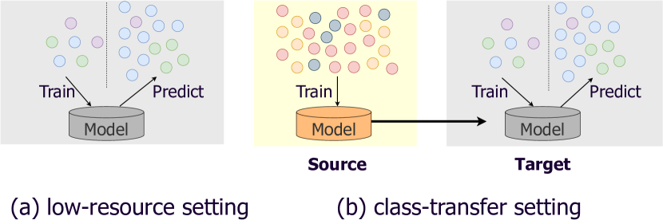
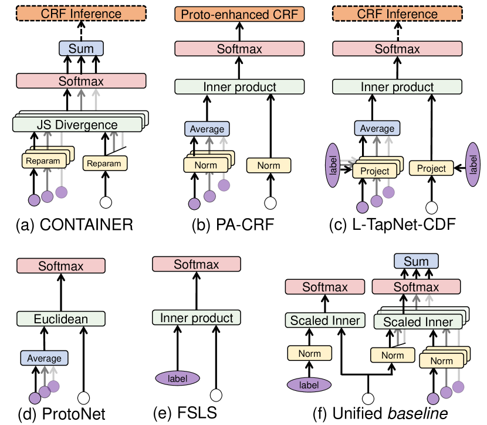
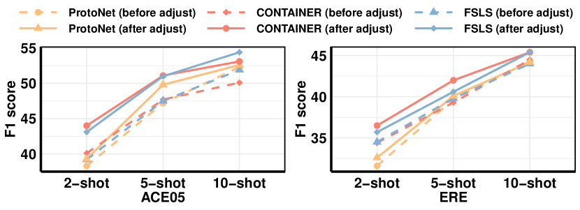
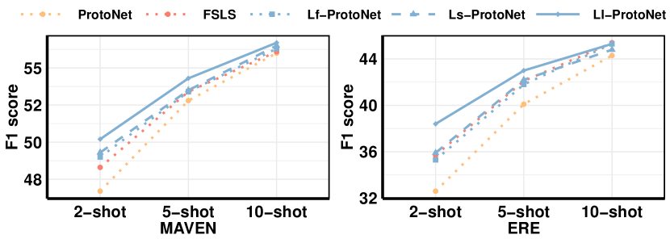
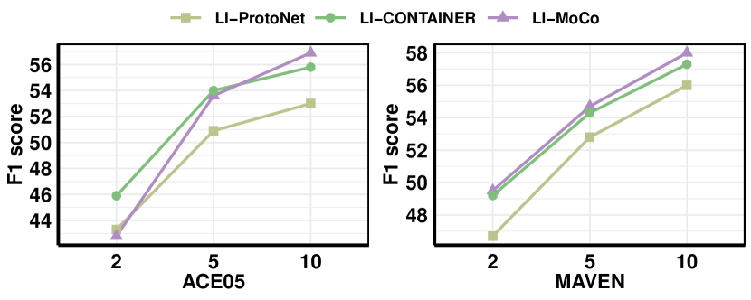
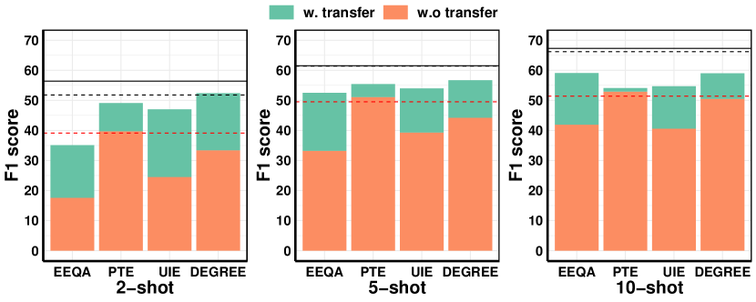
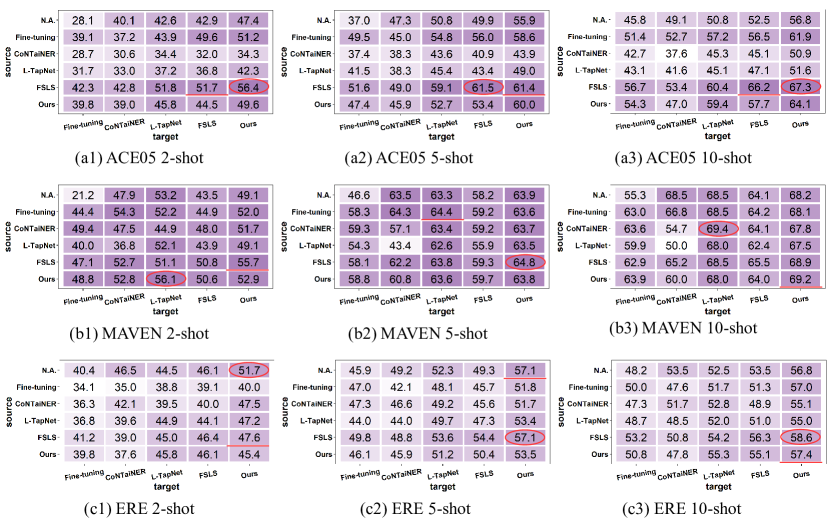
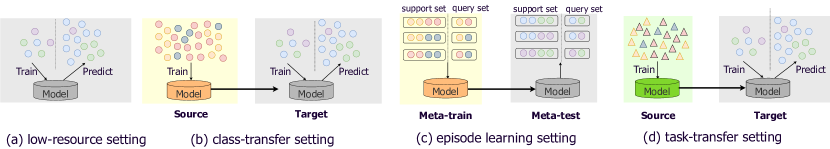
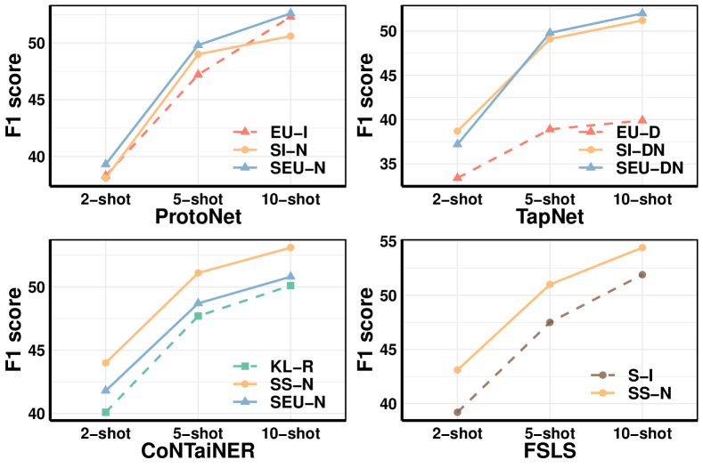
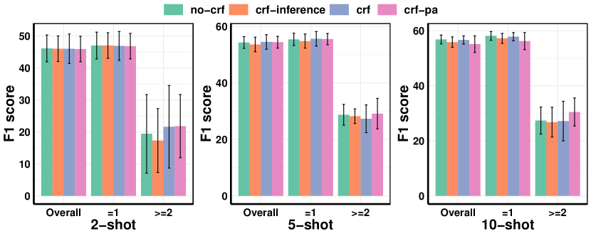

# Few-shot Event Detection: An Empirical Study and a Unified View

###### Abstract

Few-shot event detection (ED) has been widely studied, while this brings noticeable discrepancies, e.g., various motivations, tasks, and experimental settings, that hinder the understanding of models for future progress. This paper presents a thorough empirical study, a unified view of ED models, and a better unified baseline. For fair evaluation, we compare 12 representative methods on three datasets, which are roughly grouped into prompt-based and prototype-based models for detailed analysis. Experiments consistently demonstrate that prompt-based methods, including ChatGPT, still significantly trail prototype-based methods in terms of overall performance. To investigate their superior performance, we break down their design elements along several dimensions and build a unified framework on prototype-based methods. Under such unified view, each prototype-method can be viewed a combination of different modules from these design elements. We further combine all advantageous modules and propose a simple yet effective baseline, which outperforms existing methods by a large margin (e.g., $2.7\%$ $F1$ gains under low-resource setting). 111Our code will be publicly available at https://github.com/mayubo2333/fewshot\_ED.  

22footnotetext: Corresponding Author.

## 1 Introduction

Event Detection (ED) is the task of identifying event triggers and types in texts. For example, given “Cash-strapped Vivendi wants to sell Universal Studios”, it is to classify the word “sell” into a TransferOwnership event. ED is a fundamental step in various tasks such as successive event-centric information extraction Huang et al. ([2022](#bib.bib25)); Ma et al. ([2022b](#bib.bib46)); Chen et al. ([2022](#bib.bib5)), knowledge systems Li et al. ([2020](#bib.bib33)); Wen et al. ([2021](#bib.bib59)), story generation Li et al. ([2022a](#bib.bib35)), etc. However, the annotation of event instances is costly and labor-consuming, which motivates the research on improving ED with limited labeled samples, i.e., the few-shot ED task.  

Extensive studies have been carried out on few-shot ED. Nevertheless, there are noticeable discrepancies among existing methods from three aspects. (1) Motivation (Figure [1](#S1.F1 "Figure 1 ‣ 1 Introduction ‣ Few-shot Event Detection: An Empirical Study and a Unified View")): Some methods focus on model’s generalization ability that learns to classify with only a few samples Li et al. ([2022b](#bib.bib36)). Some other methods improve the transferability, by introducing additional data, that adapts a well-trained model on the preexisting schema to a new schema using a few samples Lu et al. ([2021](#bib.bib41)). There are also methods considering both abilities Liu et al. ([2020](#bib.bib38)); Hsu et al. ([2022](#bib.bib23)). (2) Task setting: Even focusing on the same ability, methods might adopt different task settings for training and evaluation. For example, there are at least three settings for transferability: episode learning (EL, Deng et al. [2020](#bib.bib10); Cong et al. [2021](#bib.bib8)), class-transfer (CT, Hsu et al. [2022](#bib.bib23)) and task-transfer (TT, Lyu et al. [2021](#bib.bib43); Lu et al. [2022](#bib.bib42)). (3) Experimental Setting: Even focusing on the same task setting, their experiments may vary in different sample sources (e.g., a subset of datasets, annotation guidelines, or external corpus) and sample numbers (shot-number or sample-ratio). Table [1](#S1.T1 "Table 1 ‣ 1 Introduction ‣ Few-shot Event Detection: An Empirical Study and a Unified View") provides a detailed comparison of representative methods.  

[TABLE S1.T1]

<table class="ltx_tabular ltx_centering ltx_guessed_headers ltx_align_middle">
<tbody class="ltx_tbody">
<tr class="ltx_tr">
<th class="ltx_td ltx_th ltx_th_row ltx_border_tt"></th>
<th class="ltx_td ltx_align_left ltx_th ltx_th_row ltx_border_r ltx_border_tt">Method</th>
<td class="ltx_td ltx_align_center ltx_border_r ltx_border_tt">Task setting</td>
<td class="ltx_td ltx_align_center ltx_border_tt">Experimental setting</td>
</tr>
<tr class="ltx_tr">
<th class="ltx_td ltx_th ltx_th_row"></th>
<th class="ltx_td ltx_th ltx_th_row ltx_border_r"></th>
<td class="ltx_td ltx_align_center">LR</td>
<td class="ltx_td ltx_align_center">EL</td>
<td class="ltx_td ltx_align_center">CT</td>
<td class="ltx_td ltx_align_center ltx_border_r">TT</td>
<td class="ltx_td ltx_align_center">Dataset</td>
<td class="ltx_td ltx_align_center">Sample Number</td>
<td class="ltx_td ltx_align_center">Sample Source</td>
</tr>
<tr class="ltx_tr">
<th class="ltx_td ltx_align_left ltx_th ltx_th_row ltx_border_t">

Prototype-based

</th>
<th class="ltx_td ltx_align_left ltx_th ltx_th_row ltx_border_r ltx_border_t">

Seed-based <cite class="ltx_cite ltx_citemacro_cite">Bronstein et al. (<a class="ltx_ref">2015</a>)</cite>

</th>
<td class="ltx_td ltx_border_t"></td>
<td class="ltx_td ltx_border_t"></td>
<td class="ltx_td ltx_align_center ltx_border_t">✓</td>
<td class="ltx_td ltx_border_r ltx_border_t"></td>
<td class="ltx_td ltx_align_center ltx_border_t">ACE</td>
<td class="ltx_td ltx_align_center ltx_border_t">30</td>
<td class="ltx_td ltx_align_center ltx_border_t">Guidelines</td>
</tr>
<tr class="ltx_tr">
<th class="ltx_td ltx_align_left ltx_th ltx_th_row ltx_border_r">

MSEP <cite class="ltx_cite ltx_citemacro_cite">Peng et al. (<a class="ltx_ref">2016</a>)</cite>

</th>
<td class="ltx_td ltx_align_center">✓</td>
<td class="ltx_td"></td>
<td class="ltx_td ltx_align_center">✓</td>
<td class="ltx_td ltx_border_r"></td>
<td class="ltx_td ltx_align_center">ACE</td>
<td class="ltx_td ltx_align_center">0</td>
<td class="ltx_td ltx_align_center">Guidelines</td>
</tr>
<tr class="ltx_tr">
<th class="ltx_td ltx_align_left ltx_th ltx_th_row ltx_border_r">

ZSL <cite class="ltx_cite ltx_citemacro_cite">Huang et al. (<a class="ltx_ref">2018</a>)</cite>

</th>
<td class="ltx_td"></td>
<td class="ltx_td"></td>
<td class="ltx_td ltx_align_center">✓</td>
<td class="ltx_td ltx_border_r"></td>
<td class="ltx_td ltx_align_center">ACE</td>
<td class="ltx_td ltx_align_center">0</td>
<td class="ltx_td ltx_align_center">Datasets</td>
</tr>
<tr class="ltx_tr">
<th class="ltx_td ltx_align_left ltx_th ltx_th_row ltx_border_r">

DMBPN <cite class="ltx_cite ltx_citemacro_cite">Deng et al. (<a class="ltx_ref">2020</a>)</cite>

</th>
<td class="ltx_td"></td>
<td class="ltx_td ltx_align_center">✓</td>
<td class="ltx_td"></td>
<td class="ltx_td ltx_border_r"></td>
<td class="ltx_td ltx_align_center">FewEvent</td>
<td class="ltx_td ltx_align_center">{5,10,15}-shot</td>
<td class="ltx_td ltx_align_center">Datasets</td>
</tr>
<tr class="ltx_tr">
<th class="ltx_td ltx_align_left ltx_th ltx_th_row ltx_border_r">

OntoED <cite class="ltx_cite ltx_citemacro_cite">Deng et al. (<a class="ltx_ref">2021</a>)</cite>

</th>
<td class="ltx_td ltx_align_center">✓</td>
<td class="ltx_td"></td>
<td class="ltx_td ltx_align_center">✓</td>
<td class="ltx_td ltx_border_r"></td>
<td class="ltx_td ltx_align_center">MAVEN / FewEvent</td>
<td class="ltx_td ltx_align_center">{0,1,5,10,15,20}%</td>
<td class="ltx_td ltx_align_center">Datasets</td>
</tr>
<tr class="ltx_tr">
<th class="ltx_td ltx_align_left ltx_th ltx_th_row ltx_border_r">

Zhang’s <cite class="ltx_cite ltx_citemacro_cite">Zhang et al. (<a class="ltx_ref">2021</a>)</cite>

</th>
<td class="ltx_td ltx_align_center">✓</td>
<td class="ltx_td"></td>
<td class="ltx_td"></td>
<td class="ltx_td ltx_border_r"></td>
<td class="ltx_td ltx_align_center">ACE</td>
<td class="ltx_td ltx_align_center">0</td>
<td class="ltx_td ltx_align_center">Corpus</td>
</tr>
<tr class="ltx_tr">
<th class="ltx_td ltx_align_left ltx_th ltx_th_row ltx_border_r">

PA-CRF <cite class="ltx_cite ltx_citemacro_cite">Cong et al. (<a class="ltx_ref">2021</a>)</cite>

</th>
<td class="ltx_td"></td>
<td class="ltx_td ltx_align_center">✓</td>
<td class="ltx_td"></td>
<td class="ltx_td ltx_border_r"></td>
<td class="ltx_td ltx_align_center">FewEvent</td>
<td class="ltx_td ltx_align_center">{5,10}-shot</td>
<td class="ltx_td ltx_align_center">Datasets</td>
</tr>
<tr class="ltx_tr">
<th class="ltx_td ltx_align_left ltx_th ltx_th_row ltx_border_r">

ProAcT <cite class="ltx_cite ltx_citemacro_cite">Lai et al. (<a class="ltx_ref">2021</a>)</cite>

</th>
<td class="ltx_td"></td>
<td class="ltx_td ltx_align_center">✓</td>
<td class="ltx_td"></td>
<td class="ltx_td ltx_border_r"></td>
<td class="ltx_td ltx_align_center">ACE / FewEvent / RAMS</td>
<td class="ltx_td ltx_align_center">{5,10}-shot</td>
<td class="ltx_td ltx_align_center">Datasets</td>
</tr>
<tr class="ltx_tr">
<th class="ltx_td ltx_align_left ltx_th ltx_th_row ltx_border_r">

CausalED <cite class="ltx_cite ltx_citemacro_cite">Chen et al. (<a class="ltx_ref">2021</a>)</cite>

</th>
<td class="ltx_td"></td>
<td class="ltx_td ltx_align_center">✓</td>
<td class="ltx_td"></td>
<td class="ltx_td ltx_border_r"></td>
<td class="ltx_td ltx_align_center">ACE / MAVEN / ERE</td>
<td class="ltx_td ltx_align_center">5-shot</td>
<td class="ltx_td ltx_align_center">Datasets</td>
</tr>
<tr class="ltx_tr">
<th class="ltx_td ltx_align_left ltx_th ltx_th_row ltx_border_r">

Yu’s <cite class="ltx_cite ltx_citemacro_cite">Yu et al. (<a class="ltx_ref">2022</a>)</cite>

</th>
<td class="ltx_td ltx_align_center">✓</td>
<td class="ltx_td"></td>
<td class="ltx_td"></td>
<td class="ltx_td ltx_border_r"></td>
<td class="ltx_td ltx_align_center">ACE</td>
<td class="ltx_td ltx_align_center">176</td>
<td class="ltx_td ltx_align_center">Guidelines + Corpus</td>
</tr>
<tr class="ltx_tr">
<th class="ltx_td ltx_th ltx_th_row"></th>
<th class="ltx_td ltx_align_left ltx_th ltx_th_row ltx_border_r">

ZED <cite class="ltx_cite ltx_citemacro_cite">Zhang et al. (<a class="ltx_ref">2022a</a>)</cite>

</th>
<td class="ltx_td ltx_align_center">✓</td>
<td class="ltx_td"></td>
<td class="ltx_td"></td>
<td class="ltx_td ltx_border_r"></td>
<td class="ltx_td ltx_align_center">MAVEN</td>
<td class="ltx_td ltx_align_center">0</td>
<td class="ltx_td ltx_align_center">Corpus</td>
</tr>
<tr class="ltx_tr">
<th class="ltx_td ltx_th ltx_th_row"></th>
<th class="ltx_td ltx_align_left ltx_th ltx_th_row ltx_border_r">

HCL-TAT <cite class="ltx_cite ltx_citemacro_cite">Zhang et al. (<a class="ltx_ref">2022b</a>)</cite>

</th>
<td class="ltx_td"></td>
<td class="ltx_td ltx_align_center">✓</td>
<td class="ltx_td"></td>
<td class="ltx_td ltx_border_r"></td>
<td class="ltx_td ltx_align_center">FewEvent</td>
<td class="ltx_td ltx_align_center">{5,10}-shot</td>
<td class="ltx_td ltx_align_center">Datasets</td>
</tr>
<tr class="ltx_tr">
<th class="ltx_td ltx_th ltx_th_row"></th>
<th class="ltx_td ltx_align_left ltx_th ltx_th_row ltx_border_r">

KE-PN <cite class="ltx_cite ltx_citemacro_cite">Zhao et al. (<a class="ltx_ref">2022</a>)</cite>

</th>
<td class="ltx_td"></td>
<td class="ltx_td ltx_align_center">✓</td>
<td class="ltx_td"></td>
<td class="ltx_td ltx_border_r"></td>
<td class="ltx_td ltx_align_center">ACE / MAVEN / FewEvent</td>
<td class="ltx_td ltx_align_center">{1,5}-shot</td>
<td class="ltx_td ltx_align_center">Datasets</td>
</tr>
<tr class="ltx_tr">
<th class="ltx_td ltx_align_left ltx_th ltx_th_row ltx_border_bb ltx_border_t">

Prompt-based

</th>
<th class="ltx_td ltx_align_left ltx_th ltx_th_row ltx_border_r ltx_border_t">

EERC <cite class="ltx_cite ltx_citemacro_cite">Liu et al. (<a class="ltx_ref">2020</a>)</cite>

</th>
<td class="ltx_td ltx_align_center ltx_border_t">✓</td>
<td class="ltx_td ltx_border_t"></td>
<td class="ltx_td ltx_align_center ltx_border_t">✓</td>
<td class="ltx_td ltx_align_center ltx_border_r ltx_border_t">✓</td>
<td class="ltx_td ltx_align_center ltx_border_t">ACE</td>
<td class="ltx_td ltx_align_center ltx_border_t">{0,1,5,10,20}%</td>
<td class="ltx_td ltx_align_center ltx_border_t">Datasets</td>
</tr>
<tr class="ltx_tr">
<th class="ltx_td ltx_align_left ltx_th ltx_th_row ltx_border_r">

FSQA <cite class="ltx_cite ltx_citemacro_cite">Feng et al. (<a class="ltx_ref">2020</a>)</cite>

</th>
<td class="ltx_td ltx_align_center">✓</td>
<td class="ltx_td"></td>
<td class="ltx_td"></td>
<td class="ltx_td ltx_align_center ltx_border_r">✓</td>
<td class="ltx_td ltx_align_center">ACE</td>
<td class="ltx_td ltx_align_center">{0,1,3,5,7,9}-shot</td>
<td class="ltx_td ltx_align_center">Datasets</td>
</tr>
<tr class="ltx_tr">
<th class="ltx_td ltx_align_left ltx_th ltx_th_row ltx_border_r">

EDTE <cite class="ltx_cite ltx_citemacro_cite">Lyu et al. (<a class="ltx_ref">2021</a>)</cite>

</th>
<td class="ltx_td"></td>
<td class="ltx_td"></td>
<td class="ltx_td"></td>
<td class="ltx_td ltx_align_center ltx_border_r">✓</td>
<td class="ltx_td ltx_align_center">ACE / ERE</td>
<td class="ltx_td ltx_align_center">0</td>
<td class="ltx_td ltx_align_center">-</td>
</tr>
<tr class="ltx_tr">
<th class="ltx_td ltx_align_left ltx_th ltx_th_row ltx_border_r">

Text2Event <cite class="ltx_cite ltx_citemacro_cite">Lu et al. (<a class="ltx_ref">2021</a>)</cite>

</th>
<td class="ltx_td"></td>
<td class="ltx_td"></td>
<td class="ltx_td ltx_align_center">✓</td>
<td class="ltx_td ltx_border_r"></td>
<td class="ltx_td ltx_align_center">ACE / ERE</td>
<td class="ltx_td ltx_align_center">{1,5,25}%</td>
<td class="ltx_td ltx_align_center">Datasets</td>
</tr>
<tr class="ltx_tr">
<th class="ltx_td ltx_align_left ltx_th ltx_th_row ltx_border_r">

UIE <cite class="ltx_cite ltx_citemacro_cite">Lu et al. (<a class="ltx_ref">2022</a>)</cite>

</th>
<td class="ltx_td ltx_align_center">✓</td>
<td class="ltx_td"></td>
<td class="ltx_td ltx_align_center">✓</td>
<td class="ltx_td ltx_border_r"></td>
<td class="ltx_td ltx_align_center">ACE / CASIE</td>
<td class="ltx_td ltx_align_center">{1,5,10}-shot/%</td>
<td class="ltx_td ltx_align_center">Datasets</td>
</tr>
<tr class="ltx_tr">
<th class="ltx_td ltx_align_left ltx_th ltx_th_row ltx_border_r">

DEGREE <cite class="ltx_cite ltx_citemacro_cite">Hsu et al. (<a class="ltx_ref">2022</a>)</cite>

</th>
<td class="ltx_td ltx_align_center">✓</td>
<td class="ltx_td"></td>
<td class="ltx_td ltx_align_center">✓</td>
<td class="ltx_td ltx_border_r"></td>
<td class="ltx_td ltx_align_center">ACE / ERE</td>
<td class="ltx_td ltx_align_center">{0,1,5,10}-shot</td>
<td class="ltx_td ltx_align_center">Datasets</td>
</tr>
<tr class="ltx_tr">
<th class="ltx_td ltx_align_left ltx_th ltx_th_row ltx_border_bb ltx_border_r">

PILED <cite class="ltx_cite ltx_citemacro_cite">Li et al. (<a class="ltx_ref">2022b</a>)</cite>

</th>
<td class="ltx_td ltx_align_center ltx_border_bb">✓</td>
<td class="ltx_td ltx_align_center ltx_border_bb">✓</td>
<td class="ltx_td ltx_border_bb"></td>
<td class="ltx_td ltx_border_bb ltx_border_r"></td>
<td class="ltx_td ltx_align_center ltx_border_bb">ACE / MAVEN / FewEvent</td>
<td class="ltx_td ltx_align_center ltx_border_bb">{5,10}-shot</td>
<td class="ltx_td ltx_align_center ltx_border_bb">Datasets</td>
</tr>
</tbody>
</table>

Table 1: 
Noticeable discrepancies among existing few-shot ED methods. Explanations of task settings can be found in Section [2.1](#S2.SS1 "2.1 Few-shot ED task settings ‣ 2 Preliminary ‣ Few-shot Event Detection: An Empirical Study and a Unified View"), which also refer to different motivations: LR for generalization, EL, CT, and TT for transfer abilities. Dataset indicates the datasets on which the training and/or evaluation is conducted. Sample Number refers to the number of labeled samples used. Sample Source refers to where training samples come from. Guidelines: example sentences from annotation guidelines. Datasets: subsets of full datasets. Corpus: (unlabeled) external corpus.
[/TABLE]

[FIGURE S1.F1.g1]

Figure 1: 
Task settings to access Generalization (a) and Transferability (b). Colors denote event types.
[/FIGURE]

In this paper, we argue the importance of a unified setting for a better understanding of few-shot ED. First, based on exhaustive background investigation on ED and similar tasks (e.g., NER), we conduct an empirical study of twelve SOTA methods under two practical settings: low-resource setting for generalization ability and class-transfer setting for transferability. We roughly classify the existing methods into two groups: prototype-based models to learn event-type representations and proximity measurement for prediction and prompt-based models that convert ED into a familiar task of Pre-trained Language Models (PLMs).  

The second contribution is a unified view of prototype-based methods to investigate their superior performance. Instead of picking up the best-performing method as in conventional empirical studies, we take one step further. We break down the design elements along several dimensions, e.g., the source of prototypes, the aggregation form of prototypes, etc. From this perspective, five prototype-based methods on which we conduct experiment are instances of distinct modules from these elements. And third, through analyzing each effective design element, we propose a simple yet effective unified baseline that combines all advantageous elements of existing methods. Experiments validate an average $2.7\%$ $F1$ gains under low-resource setting and the best performance under class-transfer setting. Our analysis also provides many valuable insights for future research.  

## 2 Preliminary

Event detection (ED) is usually formulated as either a span classification task or a sequence labeling task, depending on whether candidate event spans are provided as inputs. We brief the sequence labeling paradigm here because the two paradigms can be easily converted to each other.  

Given a dataset $\mathcal{D}$ annotated with schema $E$ (the set of event types) and a sentence $X=[x_{1},...,x_{N}]^{T}\in\mathcal{D}$, where $x_{i}$ is the $i$-th word and $N$ the length of this sentence, ED aims to assign a label $y_{i}\in\left(E\cup\{\texttt{N.A.}\}\right)$ for each $x_{i}$ in $X$. Here N.A. refers to either none events or events beyond pre-defined types $E$. We say that word $x_{i}$ triggering an event $y_{i}$ if $y_{i}\in E$.  

### 2.1 Few-shot ED task settings

We categorize few-shot ED settings to four cases: low-resource (LR), class-transfer (CT), episode learning (EL) and task-transfer (TT). Low-resource setting assesses the generalization ability of few-shot ED methods, while the other three settings are for transferability. We adopt LR and CT in our empirical study towards practical scenarios. More details can be found in Appendix [A.1](#A1.SS1 "A.1 Taxonomy of task settings ‣ Appendix A Related Work ‣ Few-shot Event Detection: An Empirical Study and a Unified View").  

Low-resource setting assumes access to a dataset $\mathcal{D}=(\mathcal{D}_{train},\mathcal{D}_{dev},\mathcal{D}_{test})$ annotated with a label set $E$, where $|\mathcal{D}_{dev}|\leq|\mathcal{D}_{train}|\ll|\mathcal{D}_{test}|$. It assesses the generalization ability of models by (1) utilizing only few samples during training, and (2) evaluating on the real and rich test dataset.  

Class-transfer setting assumes access to a source dataset $\mathcal{D}^{(S)}$ with a preexisting schema $E^{(S)}$ and a target dataset $\mathcal{D}^{(T)}$ with a new schema $E^{(T)}$. Note that $D^{(S)}$ and $D^{(T)}$, $E^{(S)}$ and $E^{(T)}$ contain disjoint sentences and event types, respectively. $\mathcal{D}^{(S)}$ contains abundant samples, while $\mathcal{D}^{(T)}$ is the low-resource setting dataset described above. Models under this setting are expected to be pre-trained on $\mathcal{D}^{(S)}$ then further trained and evaluated on $\mathcal{D}^{(T)}$.  

### 2.2 Category of existing methods

We roughly group existing few-shot ED methods into two classes: prompt-based methods and prototype-based methods. More details are introduced in Appendix [A.2](#A1.SS2 "A.2 Taxonomy of methods ‣ Appendix A Related Work ‣ Few-shot Event Detection: An Empirical Study and a Unified View").  

Prompt-based methods leverage the rich language knowledge in PLMs by converting downstream tasks to the task with which PLMs are more familiar. Such format conversion narrows the gap between pre-training and downstream tasks and benefits knowledge induction in PLMs with limited annotations. Specifically, few-shot ED can be converted to machine reading comprehension (MRC, Du and Cardie [2020](#bib.bib15); Liu et al. [2020](#bib.bib38); Feng et al. [2020](#bib.bib16)), natural language inference (NLI, Lyu et al. [2021](#bib.bib43)), conditional generation (CG, Paolini et al. [2021](#bib.bib48); Lu et al. [2021](#bib.bib41), [2022](#bib.bib42); Hsu et al. [2022](#bib.bib23)), and the cloze task Li et al. ([2022b](#bib.bib36)). We give examples of these prompts in Table [6](#A2.T6 "Table 6 ‣ B.3 Existing methods ‣ Appendix B Datasets and Models ‣ Few-shot Event Detection: An Empirical Study and a Unified View").  

Prototype-based methods predict an event type for each word/span mention by measuring its representation proximity to prototypes. Here we define prototypes in a generalized format — it is an embedding that represents some event type. For example, Prototypical Network (ProtoNet, Snell et al. [2017](#bib.bib56)) and its variants Lai et al. ([2020a](#bib.bib30), [b](#bib.bib31)); Deng et al. ([2020](#bib.bib10), [2021](#bib.bib11)); Cong et al. ([2021](#bib.bib8)); Lai et al. ([2021](#bib.bib29)) construct prototypes via a subset of sample mentions. In addition to event mentions, a line of work leverage related knowledge to learn or enhance prototypes’ representation, including AMR graphs Huang et al. ([2018](#bib.bib26)), event-event relations Deng et al. ([2021](#bib.bib11)), definitions Shen et al. ([2021](#bib.bib55)) and FrameNet Zhao et al. ([2022](#bib.bib68)). Zhang et al. ([2022b](#bib.bib67)) recently introduce contrastive learning Hadsell et al. ([2006](#bib.bib20)) in few-shot ED task. Such method also determines the event by measuring the distances with other samples and aggregates these distances to evaluate an overall distance to each event type. Therefore we view it as a generalized format of prototype-based methods as well.  

For comprehensiveness, we also include competitive methods from similar tasks, *i.e.,* Named Entity Recognition and Slot Tagging, which are highly adaptable to ED. Such expansion enriches the categorization and enables us to build a unified view in Section [3](#S3 "3 A Prototype-based Unified View ‣ Few-shot Event Detection: An Empirical Study and a Unified View"). For instance, some methods Hou et al. ([2020](#bib.bib22)); Ma et al. ([2022a](#bib.bib44)) leverage label semantics to enhance or directly construct the prototypes. Others Das et al. ([2022](#bib.bib9)) leverage contrastive learning for better prototype representations.  

## 3 A Prototype-based Unified View

[FIGURE S3.F2.g1]

Figure 2: The architectures of five existing prototype-based methods and the unified baseline. Given event mention $x$ and event type $y$, each sub-figure depicts how to compute the $\text{logits}(y|x)$. White circles: representation of predicted event $h_{x}$. Purple circles: representation of prototypes $h_{c_{y}}$ ($c_{y}\in\mathcal{C}_{y}$). Yellow modules: transfer functions. Green modules: distance functions. Blue modules: aggregation form. Orange modules: CRF modules. Dashed lines in (a) and (c) represent that their CRFs are only used during inference.
[/FIGURE]

[TABLE S3.T2]

<table class="ltx_tabular ltx_centering ltx_guessed_headers ltx_align_middle">
<thead class="ltx_thead">
<tr class="ltx_tr">
<th class="ltx_td ltx_align_left ltx_th ltx_th_column ltx_border_r ltx_border_tt">Method</th>
<th class="ltx_td ltx_align_center ltx_th ltx_th_column ltx_border_tt">Prototype <math class="ltx_Math"><semantics><msub><mi class="ltx_font_mathcaligraphic">𝒞</mi><mi>y</mi></msub><annotation-xml><apply><csymbol>subscript</csymbol><ci>𝒞</ci><ci>𝑦</ci></apply></annotation-xml><annotation>\mathcal{C}_{y}</annotation></semantics></math>
</th>
<th class="ltx_td ltx_align_center ltx_th ltx_th_column ltx_border_tt">Aggregation</th>
<th class="ltx_td ltx_align_center ltx_th ltx_th_column ltx_border_tt">Distance <math class="ltx_Math"><semantics><mrow><mi>d</mi><mo>​</mo><mrow><mo>(</mo><mi>u</mi><mo>,</mo><mi>v</mi><mo>)</mo></mrow></mrow><annotation-xml><apply><times></times><ci>𝑑</ci><interval><ci>𝑢</ci><ci>𝑣</ci></interval></apply></annotation-xml><annotation>d(u,v)</annotation></semantics></math>
</th>
<th class="ltx_td ltx_align_center ltx_th ltx_th_column ltx_border_tt">Transfer <math class="ltx_Math"><semantics><mrow><mi>f</mi><mo>​</mo><mrow><mo>(</mo><mi>h</mi><mo>)</mo></mrow></mrow><annotation-xml><apply><times></times><ci>𝑓</ci><ci>ℎ</ci></apply></annotation-xml><annotation>f(h)</annotation></semantics></math>
</th>
<th class="ltx_td ltx_align_center ltx_th ltx_th_column ltx_border_tt">CRF Module</th>
</tr>
</thead>
<tbody class="ltx_tbody">
<tr class="ltx_tr">
<td class="ltx_td ltx_align_left ltx_border_r ltx_border_t">ProtoNet <cite class="ltx_cite ltx_citemacro_cite">Snell et al. (<a class="ltx_ref">2017</a>)</cite>
</td>
<td class="ltx_td ltx_align_center ltx_border_t">Event mentions</td>
<td class="ltx_td ltx_align_center ltx_border_t">feature</td>
<td class="ltx_td ltx_align_center ltx_border_t"><math class="ltx_Math"><semantics><msub><mrow><mo>‖</mo><mrow><mi>u</mi><mo>−</mo><mi>v</mi></mrow><mo>‖</mo></mrow><mn>2</mn></msub><annotation-xml><apply><csymbol>subscript</csymbol><apply><csymbol>norm</csymbol><apply><minus></minus><ci>𝑢</ci><ci>𝑣</ci></apply></apply><cn>2</cn></apply></annotation-xml><annotation>||u-v||_{2}</annotation></semantics></math></td>
<td class="ltx_td ltx_align_center ltx_border_t"><math class="ltx_Math"><semantics><mi>h</mi><annotation-xml><ci>ℎ</ci></annotation-xml><annotation>h</annotation></semantics></math></td>
<td class="ltx_td ltx_align_center ltx_border_t"><math class="ltx_Math"><semantics><mo>−</mo><annotation-xml><minus></minus></annotation-xml><annotation>-</annotation></semantics></math></td>
</tr>
<tr class="ltx_tr">
<td class="ltx_td ltx_align_left ltx_border_r">L-TapNet-CDT <cite class="ltx_cite ltx_citemacro_cite">Hou et al. (<a class="ltx_ref">2020</a>)</cite>
</td>
<td class="ltx_td ltx_align_center">Both</td>
<td class="ltx_td ltx_align_center">feature</td>
<td class="ltx_td ltx_align_center"><math class="ltx_Math"><semantics><mrow><mo>−</mo><mrow><mrow><msup><mi>u</mi><mi>T</mi></msup><mo>​</mo><mi>v</mi></mrow><mo>/</mo><mi>τ</mi></mrow></mrow><annotation-xml><apply><minus></minus><apply><divide></divide><apply><times></times><apply><csymbol>superscript</csymbol><ci>𝑢</ci><ci>𝑇</ci></apply><ci>𝑣</ci></apply><ci>𝜏</ci></apply></apply></annotation-xml><annotation>-u^{T}v/\tau</annotation></semantics></math></td>
<td class="ltx_td ltx_align_center"><math class="ltx_Math"><semantics><mrow><mi class="ltx_font_mathcaligraphic">ℳ</mi><mo>​</mo><mfrac><mi>h</mi><mrow><mo>‖</mo><mi>h</mi><mo>‖</mo></mrow></mfrac></mrow><annotation-xml><apply><times></times><ci>ℳ</ci><apply><divide></divide><ci>ℎ</ci><apply><csymbol>norm</csymbol><ci>ℎ</ci></apply></apply></apply></annotation-xml><annotation>\mathcal{M}\frac{h}{||h||}</annotation></semantics></math></td>
<td class="ltx_td ltx_align_center">CRF-Inference</td>
</tr>
<tr class="ltx_tr">
<td class="ltx_td ltx_align_left ltx_border_r">PA-CRF <cite class="ltx_cite ltx_citemacro_cite">Cong et al. (<a class="ltx_ref">2021</a>)</cite>
</td>
<td class="ltx_td ltx_align_center">Event mentions</td>
<td class="ltx_td ltx_align_center">feature</td>
<td class="ltx_td ltx_align_center"><math class="ltx_Math"><semantics><mrow><mo>−</mo><mrow><msup><mi>u</mi><mi>T</mi></msup><mo>​</mo><mi>v</mi></mrow></mrow><annotation-xml><apply><minus></minus><apply><times></times><apply><csymbol>superscript</csymbol><ci>𝑢</ci><ci>𝑇</ci></apply><ci>𝑣</ci></apply></apply></annotation-xml><annotation>-u^{T}v</annotation></semantics></math></td>
<td class="ltx_td ltx_align_center"><math class="ltx_Math"><semantics><mfrac><mi>h</mi><mrow><mo>‖</mo><mi>h</mi><mo>‖</mo></mrow></mfrac><annotation-xml><apply><divide></divide><ci>ℎ</ci><apply><csymbol>norm</csymbol><ci>ℎ</ci></apply></apply></annotation-xml><annotation>\frac{h}{||h||}</annotation></semantics></math></td>
<td class="ltx_td ltx_align_center">CRF-PA</td>
</tr>
<tr class="ltx_tr">
<td class="ltx_td ltx_align_left ltx_border_r">CONTAINER <cite class="ltx_cite ltx_citemacro_cite">Das et al. (<a class="ltx_ref">2022</a>)</cite>
</td>
<td class="ltx_td ltx_align_center">Event mentions</td>
<td class="ltx_td ltx_align_center">score</td>
<td class="ltx_td ltx_align_center"><math class="ltx_math_unparsed"><semantics><mrow><mtext>JSD</mtext><mrow><mo>(</mo><mi>u</mi><mo>|</mo><mo>|</mo><mi>v</mi><mo>)</mo></mrow></mrow><annotation>\text{JSD}(u||v)</annotation></semantics></math></td>
<td class="ltx_td ltx_align_center"><math class="ltx_Math"><semantics><mrow><mi class="ltx_font_mathcaligraphic">𝒩</mi><mo>​</mo><mrow><mo>(</mo><mrow><mi>μ</mi><mo>​</mo><mrow><mo>(</mo><mi>h</mi><mo>)</mo></mrow></mrow><mo>,</mo><mrow><mi>Σ</mi><mo>​</mo><mrow><mo>(</mo><mi>h</mi><mo>)</mo></mrow></mrow><mo>)</mo></mrow></mrow><annotation-xml><apply><times></times><ci>𝒩</ci><interval><apply><times></times><ci>𝜇</ci><ci>ℎ</ci></apply><apply><times></times><ci>Σ</ci><ci>ℎ</ci></apply></interval></apply></annotation-xml><annotation>\mathcal{N}(\mu(h),\Sigma(h))</annotation></semantics></math></td>
<td class="ltx_td ltx_align_center">CRF-Inference</td>
</tr>
<tr class="ltx_tr">
<td class="ltx_td ltx_align_left ltx_border_r">FSLS <cite class="ltx_cite ltx_citemacro_cite">Ma et al. (<a class="ltx_ref">2022a</a>)</cite>
</td>
<td class="ltx_td ltx_align_center">Label name</td>
<td class="ltx_td ltx_align_center"><math class="ltx_Math"><semantics><mo>−</mo><annotation-xml><minus></minus></annotation-xml><annotation>-</annotation></semantics></math></td>
<td class="ltx_td ltx_align_center"><math class="ltx_Math"><semantics><mrow><mo>−</mo><mrow><msup><mi>u</mi><mi>T</mi></msup><mo>​</mo><mi>v</mi></mrow></mrow><annotation-xml><apply><minus></minus><apply><times></times><apply><csymbol>superscript</csymbol><ci>𝑢</ci><ci>𝑇</ci></apply><ci>𝑣</ci></apply></apply></annotation-xml><annotation>-u^{T}v</annotation></semantics></math></td>
<td class="ltx_td ltx_align_center"><math class="ltx_Math"><semantics><mi>h</mi><annotation-xml><ci>ℎ</ci></annotation-xml><annotation>h</annotation></semantics></math></td>
<td class="ltx_td ltx_align_center"><math class="ltx_Math"><semantics><mo>−</mo><annotation-xml><minus></minus></annotation-xml><annotation>-</annotation></semantics></math></td>
</tr>
<tr class="ltx_tr">
<td class="ltx_td ltx_align_left ltx_border_bb ltx_border_r ltx_border_t">Unified Baseline (Ours)</td>
<td class="ltx_td ltx_align_center ltx_border_bb ltx_border_t">Both</td>
<td class="ltx_td ltx_align_center ltx_border_bb ltx_border_t">score + loss</td>
<td class="ltx_td ltx_align_center ltx_border_bb ltx_border_t"><math class="ltx_Math"><semantics><mrow><mo>−</mo><mrow><mrow><msup><mi>u</mi><mi>T</mi></msup><mo>​</mo><mi>v</mi></mrow><mo>/</mo><mi>τ</mi></mrow></mrow><annotation-xml><apply><minus></minus><apply><divide></divide><apply><times></times><apply><csymbol>superscript</csymbol><ci>𝑢</ci><ci>𝑇</ci></apply><ci>𝑣</ci></apply><ci>𝜏</ci></apply></apply></annotation-xml><annotation>-u^{T}v/\tau</annotation></semantics></math></td>
<td class="ltx_td ltx_align_center ltx_border_bb ltx_border_t"><math class="ltx_Math"><semantics><mfrac><mi>h</mi><mrow><mo>‖</mo><mi>h</mi><mo>‖</mo></mrow></mfrac><annotation-xml><apply><divide></divide><ci>ℎ</ci><apply><csymbol>norm</csymbol><ci>ℎ</ci></apply></apply></annotation-xml><annotation>\frac{h}{||h||}</annotation></semantics></math></td>
<td class="ltx_td ltx_align_center ltx_border_bb ltx_border_t"><math class="ltx_Math"><semantics><mo>−</mo><annotation-xml><minus></minus></annotation-xml><annotation>-</annotation></semantics></math></td>
</tr>
</tbody>
</table>

Table 2: Decomposing five prototype-based methods and unified baseline along design elements. "Both" in column 1 means both event mentions and label names for $y$ are prototype sources. JSD: Jensen–Shannon divergence. $\mathcal{M}$: Projection matrix in TapNet. $\mathcal{N}(\mu(h),\Sigma(h))$: Gaussian distribution with mean $\mu(h)$ and covariance matrix $\Sigma(h)$.
[/TABLE]

Due to the superior performance (Sections [5](#S5 "5 Results: Low-resource Learning ‣ Few-shot Event Detection: An Empirical Study and a Unified View") and [6](#S6 "6 Results: Class-transfer Learning ‣ Few-shot Event Detection: An Empirical Study and a Unified View")), we zoom into prototype-based methods to provide a unified view towards a better understanding. We observe that they share lots of similar components. As shown in Table [2](#S3.T2 "Table 2 ‣ 3 A Prototype-based Unified View ‣ Few-shot Event Detection: An Empirical Study and a Unified View") and Figure [2](#S3.F2 "Figure 2 ‣ 3 A Prototype-based Unified View ‣ Few-shot Event Detection: An Empirical Study and a Unified View"), we decompose prototype-based methods into 5 design elements: prototype source, transfer function, distance function, aggregation form, and CRF module. This unified view enables us to compare choices in each design element directly. By aggregating the effective choices, we end with a Unified Baseline.  

Formally, given an event mention $x$, prototype-based methods predict the likelihood $p(y|x)$ from $\text{logits}(y|x)$ for each $y\in(E\cup\{\texttt{N.A.}\})$  

|  | $$p(y|x)=\text{Softmax}_{y\sim(E\cup\{\texttt{N.A.\}})}\text{logits}(y|x)$$ |  |
| --- | --- | --- |

The general framework is as follows. Denote the PLM’s output representation of event mention $x$ and data $c_{y}$ in prototype source $\mathcal{C}_{y}$ as $h_{x}$ and $h_{c_{y}}$ respectively, where $h\in R^{m}$ and $m$ is the dimension of PLM’s hidden space. The first step is to convert $h_{x}$ and $h_{c_{y}}$ to appropriate representations via a transfer function $f(\cdot)$. Then the methods maintain either a single or multiple prototypes $c_{y}$’s for each event type, determined by the adopted aggregation form. Third, the distance between $f(h_{x})$ and $f(h_{c_{y}})$ (single prototype) or $f(h_{c_{y}})$’s (multiple prototypes) is computed via a distance function $d(\cdot,\cdot)$ to learn the proximity scores, *i.e.,* $\text{logits}(y|x)$. Finally, an optional CRF module is used to adjust $\text{logits}(y|x)$ for $x$ in the same sentence to model their label dependencies. For inference, we adopt nearest neighbor classification by assigning the sample with nearest event type in $\cup_{y\in(E\cup\{\texttt{N.A.\}})}\mathcal{C}_{y}$ , *i.e.,*  

|  | $$\hat{y}_{x}=\operatorname*{argmin}_{y\in(E\cup\{\texttt{N.A.\}})}\min_{c_{y}\in\mathcal{C}_{y}}d(f(h_{x}),f(h_{c_{y}}))$$ |  |
| --- | --- | --- |

Next, we detail the five design elements:  

Prototype source $\mathcal{C}_{y}$ (purple circles in Figure [2](#S3.F2 "Figure 2 ‣ 3 A Prototype-based Unified View ‣ Few-shot Event Detection: An Empirical Study and a Unified View"), same below) indicates a set about the source of data / information for constructing the prototypes. There are mainly two types of sources:  

(1) event mentions (purple circle without words): ProtoNet and its variants in Figure [2](#S3.F2 "Figure 2 ‣ 3 A Prototype-based Unified View ‣ Few-shot Event Detection: An Empirical Study and a Unified View")(b),(c),(d) additionally split a support set $\mathcal{S}_{y}$ from training data as prototype source, while contrastive learning methods in Figure [2](#S3.F2 "Figure 2 ‣ 3 A Prototype-based Unified View ‣ Few-shot Event Detection: An Empirical Study and a Unified View")(a) view every annotated mention as the source (except the query one).  

(2) Label semantics (purple ellipses with words): Sometimes, the label name $l_{y}$ is utilized as the source to enhance or directly construct the prototypes. For example, FSLS in Figure [2](#S3.F2 "Figure 2 ‣ 3 A Prototype-based Unified View ‣ Few-shot Event Detection: An Empirical Study and a Unified View")(e) views the text representation of type names as prototypes, while L-TapNet-CDT in Figure [2](#S3.F2 "Figure 2 ‣ 3 A Prototype-based Unified View ‣ Few-shot Event Detection: An Empirical Study and a Unified View")(c) utilizes both the above kinds of prototype sources.  

Transfer function $f:R^{m}\rightarrow R^{n}$ (yellow modules) transfers PLM outputs into the distance space for prototype proximity measurement. Widely used transfer functions include normalization in Figure [2](#S3.F2 "Figure 2 ‣ 3 A Prototype-based Unified View ‣ Few-shot Event Detection: An Empirical Study and a Unified View")(b), down-projection in Figure [2](#S3.F2 "Figure 2 ‣ 3 A Prototype-based Unified View ‣ Few-shot Event Detection: An Empirical Study and a Unified View")(c), reparameterization in Figure [2](#S3.F2 "Figure 2 ‣ 3 A Prototype-based Unified View ‣ Few-shot Event Detection: An Empirical Study and a Unified View")(a), or an identity function.  

Distance function $d:R^{n}\times R^{n}\rightarrow R_{+}$ (green modules) measures the distance of two transferred representations within the same embedded space. Common distance functions are euclidean distance in Figure [2](#S3.F2 "Figure 2 ‣ 3 A Prototype-based Unified View ‣ Few-shot Event Detection: An Empirical Study and a Unified View")(d) and negative cosine similarity in Figure [2](#S3.F2 "Figure 2 ‣ 3 A Prototype-based Unified View ‣ Few-shot Event Detection: An Empirical Study and a Unified View")(b),(c),(e).  

Aggregation form (blue modules) describes how to compute $\text{logits}(y|x)$ based on a single or multiple prototype sources. Aggregation may happen at three levels.  

(1) feature-level: ProtoNet and its variants in Figure [2](#S3.F2 "Figure 2 ‣ 3 A Prototype-based Unified View ‣ Few-shot Event Detection: An Empirical Study and a Unified View")(b),(c),(d) aims to construct a single prototype $h_{\bar{c}_{y}}$ for each event type $y$ by merging various features, which ease the calculation $\text{logits}(y|x)=-d(f(h_{x}),f(h_{\bar{c}_{y}}))$.  

(2) score-level: CONTAINER in Figure [2](#S3.F2 "Figure 2 ‣ 3 A Prototype-based Unified View ‣ Few-shot Event Detection: An Empirical Study and a Unified View")(a) views each data as a prototype (they have multiple prototypes for each type $y$) and computes the distance $d(f(h_{x}),f(h_{c_{y}}))$ for each $c_{y}\in\mathcal{C}_{y}$. These distances are then merged to obtain $\text{logits}(y|x)$.  

(3) loss-level: Such form has multiple parallel branches $b$ for each mention $x$. Each branch has its own $\text{ logits}^{(b)}(y|x)$ and is optimized with different loss components during training. Thus it could be viewed as a multi-task learning format. See unified baseline in Figure [2](#S3.F2 "Figure 2 ‣ 3 A Prototype-based Unified View ‣ Few-shot Event Detection: An Empirical Study and a Unified View")(f).  

CRF module (orange modules) adjusts predictions within the same sentence by explicitly considering the label dependencies between sequential inputs. The vanilla CRF Lafferty et al. ([2001](#bib.bib28)) and its variants in Figure [2](#S3.F2 "Figure 2 ‣ 3 A Prototype-based Unified View ‣ Few-shot Event Detection: An Empirical Study and a Unified View")(a),(b),(c) post additional constraints into few-shot learning.  

## 4 Experimental setup

### 4.1 Few-shot datasets and Evaluation

Dataset source. We utilize ACE05 Doddington et al. ([2004](#bib.bib14)), MAVEN Wang et al. ([2020](#bib.bib58)) and ERE Song et al. ([2015](#bib.bib57)) to construct few-shot ED datasets in this empirical study. Detailed statistics about these three datasets are in Appendix [B.1](#A2.SS1 "B.1 Full dataset ‣ Appendix B Datasets and Models ‣ Few-shot Event Detection: An Empirical Study and a Unified View").  

Low-resource setting. We adopt $K$-shot sampling strategy to construct few-shot datasets for the low-resource setting, i.e., sampling $K_{train}$ and $K_{dev}$ samples per event type to construct the train and dev sets, respectively.222Recent systematic research on few-shot NLP tasks Perez et al. ([2021](#bib.bib50)) is of opposition to introducing an additional dev set for few-shot learning. We agree with their opinion but choose to keep a very small dev set mainly for feasibility consideration. Given the number of experiments in our empirical study, it is infeasible to conduct cross-validation on every single train set for hyperparameter search. We set three $(K_{train},K_{dev})$ in our evaluation: (2, 1), (5, 2) and (10, 2). We follow Yang and Katiyar ([2020](#bib.bib61)) taking a greedy sampling algorithm to approximately select $K$ samples for each event type. See Appendix [B.2](#A2.SS2 "B.2 Dataset construction ‣ Appendix B Datasets and Models ‣ Few-shot Event Detection: An Empirical Study and a Unified View") for details and the statistics of the sampled few-shot datasets. We inherit the original test set as $\mathcal{D}_{test}$.  

Class-transfer setting. The few-shot datasets are curated in two sub-steps: (1) Dividing both event types and sentences in the original dataset into two disjoint parts, named source dataset and target dataset pool, respectively. (2) Sampling few-shot samples from the target dataset pool to construct target dataset. The same sampling algorithm as in low-resource setting is used. Then we have the source dataset and the sampled target dataset. See Appendix [B.2](#A2.SS2 "B.2 Dataset construction ‣ Appendix B Datasets and Models ‣ Few-shot Event Detection: An Empirical Study and a Unified View") for details and the statistics of the sampled few-shot datasets.  

Evaluation Metric We use micro-$F1$ score as the evaluation metric. To reduce the random fluctuation, the reported values of each setting are the averaged score and sample standard deviation, of results w.r.t 10 sampled few-shot datasets.  

### 4.2 Evaluated methods

We evaluate 12 representative methods, including vanilla fine-tuning, in-context learning, 5 prompt-based and 5 prototype-based methods. These methods are detailed in Appendix [B.3](#A2.SS3 "B.3 Existing methods ‣ Appendix B Datasets and Models ‣ Few-shot Event Detection: An Empirical Study and a Unified View").  

Fine-tuning To validate the effectiveness of few-shot methods, we fine-tune a supervised classifier for comparison as a trivial baseline.  

In-context learning To validate few-shot ED tasks still not well-solved in the era of Large Language Models (LLMs), we design such baseline instructing LLMs to detect event triggers by the means of in-context learning (ICL).  

Prompt-based (1) EEQA (QA-based, Du and Cardie [2020](#bib.bib15)), (2) EETE (NLI-based, Lyu et al. [2021](#bib.bib43)), (3) PTE (cloze task, Schick and Schütze [2021](#bib.bib54)), (4) UIE (generation, Lu et al. [2022](#bib.bib42)) and (5) DEGREE (generation, Hsu et al. [2022](#bib.bib23)).  

Prototype-based (1) ProtoNet Snell et al. ([2017](#bib.bib56)), (2) L-TapNet-CDT Hou et al. ([2020](#bib.bib22)), (3) PA-CRF Cong et al. ([2021](#bib.bib8)), (4) CONTAINER Das et al. ([2022](#bib.bib9)) and (5) FSLS Ma et al. ([2022a](#bib.bib44)). See Table [2](#S3.T2 "Table 2 ‣ 3 A Prototype-based Unified View ‣ Few-shot Event Detection: An Empirical Study and a Unified View") and Figure [2](#S3.F2 "Figure 2 ‣ 3 A Prototype-based Unified View ‣ Few-shot Event Detection: An Empirical Study and a Unified View") for more details.  

### 4.3 Implementation details

We unify PLMs in each method as much as possible for a fair comparison in our empirical study. Specifically, we use RoBERTa-base Liu et al. ([2019](#bib.bib39)) for all prototype-based methods and three non-generation prompt-based methods. However, we keep the method’s original PLM for two prompt-based methods with generation prompt, UIE (T5-base, Raffel et al. [2020](#bib.bib52)) and DEGREE (BART-large, Lewis et al. [2020](#bib.bib32)). We observe their performance collapses with smaller PLMs. Regarding ICL method, we use ChatGPT (gpt-3.5-turbo-0301) as the language model. See more details in Appendix [B.4](#A2.SS4 "B.4 Implementation Details ‣ Appendix B Datasets and Models ‣ Few-shot Event Detection: An Empirical Study and a Unified View").  

## 5 Results: Low-resource Learning

[TABLE S5.T3]

<table class="ltx_tabular ltx_centering ltx_guessed_headers ltx_align_middle">
<tbody class="ltx_tbody">
<tr class="ltx_tr">
<th class="ltx_td ltx_align_center ltx_th ltx_th_row ltx_border_r ltx_border_tt">Method</th>
<td class="ltx_td ltx_align_center ltx_border_r ltx_border_tt">ACE05</td>
<td class="ltx_td ltx_align_center ltx_border_r ltx_border_tt">MAVEN</td>
<td class="ltx_td ltx_align_center ltx_border_tt">ERE</td>
</tr>
<tr class="ltx_tr">
<th class="ltx_td ltx_th ltx_th_row"></th>
<th class="ltx_td ltx_th ltx_th_row ltx_border_r"></th>
<td class="ltx_td ltx_align_center">2-shot</td>
<td class="ltx_td ltx_align_center">5-shot</td>
<td class="ltx_td ltx_align_center ltx_border_r">10-shot</td>
<td class="ltx_td ltx_align_center">2-shot</td>
<td class="ltx_td ltx_align_center">5-shot</td>
<td class="ltx_td ltx_align_center ltx_border_r">10-shot</td>
<td class="ltx_td ltx_align_center">2-shot</td>
<td class="ltx_td ltx_align_center">5-shot</td>
<td class="ltx_td ltx_nopad_r ltx_align_center">10-shot</td>
</tr>
<tr class="ltx_tr">
<th class="ltx_td ltx_align_center ltx_th ltx_th_row ltx_border_r ltx_border_t">Fine-tuning</th>
<td class="ltx_td ltx_align_center ltx_border_t">
<math class="ltx_Math"><semantics><mn>33.3</mn><annotation-xml><cn>33.3</cn></annotation-xml><annotation>33.3</annotation></semantics></math><math class="ltx_Math"><semantics><mrow><mo>(</mo><mn>4.4</mn><mo>)</mo></mrow><annotation-xml><cn>4.4</cn></annotation-xml><annotation>(4.4)</annotation></semantics></math>
</td>
<td class="ltx_td ltx_align_center ltx_border_t">
<math class="ltx_Math"><semantics><mn>42.5</mn><annotation-xml><cn>42.5</cn></annotation-xml><annotation>42.5</annotation></semantics></math><math class="ltx_Math"><semantics><mrow><mo>(</mo><mn>4.6</mn><mo>)</mo></mrow><annotation-xml><cn>4.6</cn></annotation-xml><annotation>(4.6)</annotation></semantics></math>
</td>
<td class="ltx_td ltx_align_center ltx_border_r ltx_border_t">
<math class="ltx_Math"><semantics><mn>48.2</mn><annotation-xml><cn>48.2</cn></annotation-xml><annotation>48.2</annotation></semantics></math><math class="ltx_Math"><semantics><mrow><mo>(</mo><mn>1.5</mn><mo>)</mo></mrow><annotation-xml><cn>1.5</cn></annotation-xml><annotation>(1.5)</annotation></semantics></math>
</td>
<td class="ltx_td ltx_align_center ltx_border_t">
<math class="ltx_Math"><semantics><mn>40.8</mn><annotation-xml><cn>40.8</cn></annotation-xml><annotation>40.8</annotation></semantics></math><math class="ltx_Math"><semantics><mrow><mo>(</mo><mn>4.7</mn><mo>)</mo></mrow><annotation-xml><cn>4.7</cn></annotation-xml><annotation>(4.7)</annotation></semantics></math>
</td>
<td class="ltx_td ltx_align_center ltx_border_t">
<math class="ltx_Math"><semantics><mn>52.1</mn><annotation-xml><cn>52.1</cn></annotation-xml><annotation>52.1</annotation></semantics></math><math class="ltx_Math"><semantics><mrow><mo>(</mo><mn>0.7</mn><mo>)</mo></mrow><annotation-xml><cn>0.7</cn></annotation-xml><annotation>(0.7)</annotation></semantics></math>
</td>
<td class="ltx_td ltx_align_center ltx_border_r ltx_border_t">
<math class="ltx_Math"><semantics><mn>55.7</mn><annotation-xml><cn>55.7</cn></annotation-xml><annotation>55.7</annotation></semantics></math><math class="ltx_Math"><semantics><mrow><mo>(</mo><mn>0.2</mn><mo>)</mo></mrow><annotation-xml><cn>0.2</cn></annotation-xml><annotation>(0.2)</annotation></semantics></math>
</td>
<td class="ltx_td ltx_align_center ltx_border_t">
<math class="ltx_Math"><semantics><mn>32.9</mn><annotation-xml><cn>32.9</cn></annotation-xml><annotation>32.9</annotation></semantics></math><math class="ltx_Math"><semantics><mrow><mo>(</mo><mn>2.1</mn><mo>)</mo></mrow><annotation-xml><cn>2.1</cn></annotation-xml><annotation>(2.1)</annotation></semantics></math>
</td>
<td class="ltx_td ltx_align_center ltx_border_t">
<math class="ltx_Math"><semantics><mn>39.8</mn><annotation-xml><cn>39.8</cn></annotation-xml><annotation>39.8</annotation></semantics></math><math class="ltx_Math"><semantics><mrow><mo>(</mo><mn>2.9</mn><mo>)</mo></mrow><annotation-xml><cn>2.9</cn></annotation-xml><annotation>(2.9)</annotation></semantics></math>
</td>
<td class="ltx_td ltx_nopad_r ltx_align_center ltx_border_t">
<math class="ltx_Math"><semantics><mn>43.6</mn><annotation-xml><cn>43.6</cn></annotation-xml><annotation>43.6</annotation></semantics></math><math class="ltx_Math"><semantics><mrow><mo>(</mo><mn>1.7</mn><mo>)</mo></mrow><annotation-xml><cn>1.7</cn></annotation-xml><annotation>(1.7)</annotation></semantics></math>
</td>
</tr>
<tr class="ltx_tr">
<th class="ltx_td ltx_align_center ltx_th ltx_th_row ltx_border_r">In-context Learning</th>
<td class="ltx_td ltx_align_center">
<math class="ltx_Math"><semantics><mn>38.9</mn><annotation-xml><cn>38.9</cn></annotation-xml><annotation>38.9</annotation></semantics></math><math class="ltx_Math"><semantics><mrow><mo>(</mo><mn>3.0</mn><mo>)</mo></mrow><annotation-xml><cn>3.0</cn></annotation-xml><annotation>(3.0)</annotation></semantics></math>
</td>
<td class="ltx_td ltx_align_center">
<math class="ltx_Math"><semantics><mn>34.3</mn><annotation-xml><cn>34.3</cn></annotation-xml><annotation>34.3</annotation></semantics></math><math class="ltx_Math"><semantics><mrow><mo>(</mo><mn>1.2</mn><mo>)</mo></mrow><annotation-xml><cn>1.2</cn></annotation-xml><annotation>(1.2)</annotation></semantics></math>
</td>
<td class="ltx_td ltx_align_center ltx_border_r">
<math class="ltx_Math"><semantics><mn>36.7</mn><annotation-xml><cn>36.7</cn></annotation-xml><annotation>36.7</annotation></semantics></math><math class="ltx_Math"><semantics><mrow><mo>(</mo><mn>0.8</mn><mo>)</mo></mrow><annotation-xml><cn>0.8</cn></annotation-xml><annotation>(0.8)</annotation></semantics></math>
</td>
<td class="ltx_td ltx_align_center">
<math class="ltx_Math"><semantics><mn>22.1</mn><annotation-xml><cn>22.1</cn></annotation-xml><annotation>22.1</annotation></semantics></math><math class="ltx_Math"><semantics><mrow><mo>(</mo><mn>1.0</mn><mo>)</mo></mrow><annotation-xml><cn>1.0</cn></annotation-xml><annotation>(1.0)</annotation></semantics></math>
</td>
<td class="ltx_td ltx_align_center">
<math class="ltx_Math"><semantics><mn>22.7</mn><annotation-xml><cn>22.7</cn></annotation-xml><annotation>22.7</annotation></semantics></math><math class="ltx_Math"><semantics><mrow><mo>(</mo><mn>0.3</mn><mo>)</mo></mrow><annotation-xml><cn>0.3</cn></annotation-xml><annotation>(0.3)</annotation></semantics></math>
</td>
<td class="ltx_td ltx_align_center ltx_border_r">
<math class="ltx_Math"><semantics><mn>23.9</mn><annotation-xml><cn>23.9</cn></annotation-xml><annotation>23.9</annotation></semantics></math><math class="ltx_Math"><semantics><mrow><mo>(</mo><mn>0.7</mn><mo>)</mo></mrow><annotation-xml><cn>0.7</cn></annotation-xml><annotation>(0.7)</annotation></semantics></math>
</td>
<td class="ltx_td ltx_align_center">
<math class="ltx_Math"><semantics><mn>24.2</mn><annotation-xml><cn>24.2</cn></annotation-xml><annotation>24.2</annotation></semantics></math><math class="ltx_Math"><semantics><mrow><mo>(</mo><mn>3.3</mn><mo>)</mo></mrow><annotation-xml><cn>3.3</cn></annotation-xml><annotation>(3.3)</annotation></semantics></math>
</td>
<td class="ltx_td ltx_align_center">
<math class="ltx_Math"><semantics><mn>26.0</mn><annotation-xml><cn>26.0</cn></annotation-xml><annotation>26.0</annotation></semantics></math><math class="ltx_Math"><semantics><mrow><mo>(</mo><mn>0.7</mn><mo>)</mo></mrow><annotation-xml><cn>0.7</cn></annotation-xml><annotation>(0.7)</annotation></semantics></math>
</td>
<td class="ltx_td ltx_nopad_r ltx_align_center">
<math class="ltx_Math"><semantics><mn>25.5</mn><annotation-xml><cn>25.5</cn></annotation-xml><annotation>25.5</annotation></semantics></math><math class="ltx_Math"><semantics><mrow><mo>(</mo><mn>1.7</mn><mo>)</mo></mrow><annotation-xml><cn>1.7</cn></annotation-xml><annotation>(1.7)</annotation></semantics></math>
</td>
</tr>
<tr class="ltx_tr">
<th class="ltx_td ltx_align_left ltx_th ltx_th_row ltx_border_t">

Prompt-based

</th>
<th class="ltx_td ltx_align_left ltx_th ltx_th_row ltx_border_r ltx_border_t">EEQA</th>
<td class="ltx_td ltx_align_center ltx_border_t">
<math class="ltx_Math"><semantics><mn>24.1</mn><annotation-xml><cn>24.1</cn></annotation-xml><annotation>24.1</annotation></semantics></math><math class="ltx_Math"><semantics><mrow><mo>(</mo><mn>12.2</mn><mo>)</mo></mrow><annotation-xml><cn>12.2</cn></annotation-xml><annotation>(12.2)</annotation></semantics></math>
</td>
<td class="ltx_td ltx_align_center ltx_border_t">
<math class="ltx_Math"><semantics><mn>43.1</mn><annotation-xml><cn>43.1</cn></annotation-xml><annotation>43.1</annotation></semantics></math><math class="ltx_Math"><semantics><mrow><mo>(</mo><mn>2.7</mn><mo>)</mo></mrow><annotation-xml><cn>2.7</cn></annotation-xml><annotation>(2.7)</annotation></semantics></math>
</td>
<td class="ltx_td ltx_align_center ltx_border_r ltx_border_t">
<math class="ltx_Math"><semantics><mn>48.3</mn><annotation-xml><cn>48.3</cn></annotation-xml><annotation>48.3</annotation></semantics></math> <math class="ltx_Math"><semantics><mrow><mo>(</mo><mn>2.4</mn><mo>)</mo></mrow><annotation-xml><cn>2.4</cn></annotation-xml><annotation>(2.4)</annotation></semantics></math>
</td>
<td class="ltx_td ltx_align_center ltx_border_t">
<math class="ltx_Math"><semantics><mn>33.4</mn><annotation-xml><cn>33.4</cn></annotation-xml><annotation>33.4</annotation></semantics></math><math class="ltx_Math"><semantics><mrow><mo>(</mo><mn>9.2</mn><mo>)</mo></mrow><annotation-xml><cn>9.2</cn></annotation-xml><annotation>(9.2)</annotation></semantics></math>
</td>
<td class="ltx_td ltx_align_center ltx_border_t">
<math class="ltx_Math"><semantics><mn>48.1</mn><annotation-xml><cn>48.1</cn></annotation-xml><annotation>48.1</annotation></semantics></math><math class="ltx_Math"><semantics><mrow><mo>(</mo><mn>0.9</mn><mo>)</mo></mrow><annotation-xml><cn>0.9</cn></annotation-xml><annotation>(0.9)</annotation></semantics></math>
</td>
<td class="ltx_td ltx_align_center ltx_border_r ltx_border_t">
<math class="ltx_Math"><semantics><mn>52.5</mn><annotation-xml><cn>52.5</cn></annotation-xml><annotation>52.5</annotation></semantics></math><math class="ltx_Math"><semantics><mrow><mo>(</mo><mn>0.5</mn><mo>)</mo></mrow><annotation-xml><cn>0.5</cn></annotation-xml><annotation>(0.5)</annotation></semantics></math>
</td>
<td class="ltx_td ltx_align_center ltx_border_t">
<math class="ltx_Math"><semantics><mn>13.7</mn><annotation-xml><cn>13.7</cn></annotation-xml><annotation>13.7</annotation></semantics></math><math class="ltx_Math"><semantics><mrow><mo>(</mo><mn>8.6</mn><mo>)</mo></mrow><annotation-xml><cn>8.6</cn></annotation-xml><annotation>(8.6)</annotation></semantics></math>
</td>
<td class="ltx_td ltx_align_center ltx_border_t">
<math class="ltx_Math"><semantics><mn>34.4</mn><annotation-xml><cn>34.4</cn></annotation-xml><annotation>34.4</annotation></semantics></math><math class="ltx_Math"><semantics><mrow><mo>(</mo><mn>1.7</mn><mo>)</mo></mrow><annotation-xml><cn>1.7</cn></annotation-xml><annotation>(1.7)</annotation></semantics></math>
</td>
<td class="ltx_td ltx_nopad_r ltx_align_center ltx_border_t">
<math class="ltx_Math"><semantics><mn>39.8</mn><annotation-xml><cn>39.8</cn></annotation-xml><annotation>39.8</annotation></semantics></math><math class="ltx_Math"><semantics><mrow><mo>(</mo><mn>2.4</mn><mo>)</mo></mrow><annotation-xml><cn>2.4</cn></annotation-xml><annotation>(2.4)</annotation></semantics></math>
</td>
</tr>
<tr class="ltx_tr">
<th class="ltx_td ltx_align_left ltx_th ltx_th_row ltx_border_r">EETE</th>
<td class="ltx_td ltx_align_center">
<math class="ltx_Math"><semantics><mn>15.7</mn><annotation-xml><cn>15.7</cn></annotation-xml><annotation>15.7</annotation></semantics></math><math class="ltx_Math"><semantics><mrow><mo>(</mo><mn>0.6</mn><mo>)</mo></mrow><annotation-xml><cn>0.6</cn></annotation-xml><annotation>(0.6)</annotation></semantics></math>
</td>
<td class="ltx_td ltx_align_center">
<math class="ltx_Math"><semantics><mn>19.1</mn><annotation-xml><cn>19.1</cn></annotation-xml><annotation>19.1</annotation></semantics></math><math class="ltx_Math"><semantics><mrow><mo>(</mo><mn>0.3</mn><mo>)</mo></mrow><annotation-xml><cn>0.3</cn></annotation-xml><annotation>(0.3)</annotation></semantics></math>
</td>
<td class="ltx_td ltx_align_center ltx_border_r">
<math class="ltx_Math"><semantics><mn>21.4</mn><annotation-xml><cn>21.4</cn></annotation-xml><annotation>21.4</annotation></semantics></math><math class="ltx_Math"><semantics><mrow><mo>(</mo><mn>0.2</mn><mo>)</mo></mrow><annotation-xml><cn>0.2</cn></annotation-xml><annotation>(0.2)</annotation></semantics></math>
</td>
<td class="ltx_td ltx_align_center">
<math class="ltx_Math"><semantics><mn>28.9</mn><annotation-xml><cn>28.9</cn></annotation-xml><annotation>28.9</annotation></semantics></math><math class="ltx_Math"><semantics><mrow><mo>(</mo><mn>4.3</mn><mo>)</mo></mrow><annotation-xml><cn>4.3</cn></annotation-xml><annotation>(4.3)</annotation></semantics></math>
</td>
<td class="ltx_td ltx_align_center">
<math class="ltx_Math"><semantics><mn>30.6</mn><annotation-xml><cn>30.6</cn></annotation-xml><annotation>30.6</annotation></semantics></math><math class="ltx_Math"><semantics><mrow><mo>(</mo><mn>1.3</mn><mo>)</mo></mrow><annotation-xml><cn>1.3</cn></annotation-xml><annotation>(1.3)</annotation></semantics></math>
</td>
<td class="ltx_td ltx_align_center ltx_border_r">
<math class="ltx_Math"><semantics><mn>32.5</mn><annotation-xml><cn>32.5</cn></annotation-xml><annotation>32.5</annotation></semantics></math><math class="ltx_Math"><semantics><mrow><mo>(</mo><mn>1.1</mn><mo>)</mo></mrow><annotation-xml><cn>1.1</cn></annotation-xml><annotation>(1.1)</annotation></semantics></math>
</td>
<td class="ltx_td ltx_align_center">
<math class="ltx_Math"><semantics><mn>10.6</mn><annotation-xml><cn>10.6</cn></annotation-xml><annotation>10.6</annotation></semantics></math><math class="ltx_Math"><semantics><mrow><mo>(</mo><mn>2.3</mn><mo>)</mo></mrow><annotation-xml><cn>2.3</cn></annotation-xml><annotation>(2.3)</annotation></semantics></math>
</td>
<td class="ltx_td ltx_align_center">
<math class="ltx_Math"><semantics><mn>12.8</mn><annotation-xml><cn>12.8</cn></annotation-xml><annotation>12.8</annotation></semantics></math><math class="ltx_Math"><semantics><mrow><mo>(</mo><mn>2.2</mn><mo>)</mo></mrow><annotation-xml><cn>2.2</cn></annotation-xml><annotation>(2.2)</annotation></semantics></math>
</td>
<td class="ltx_td ltx_nopad_r ltx_align_center">
<math class="ltx_Math"><semantics><mn>13.7</mn><annotation-xml><cn>13.7</cn></annotation-xml><annotation>13.7</annotation></semantics></math><math class="ltx_Math"><semantics><mrow><mo>(</mo><mn>2.8</mn><mo>)</mo></mrow><annotation-xml><cn>2.8</cn></annotation-xml><annotation>(2.8)</annotation></semantics></math>
</td>
</tr>
<tr class="ltx_tr">
<th class="ltx_td ltx_align_left ltx_th ltx_th_row ltx_border_r">PTE</th>
<td class="ltx_td ltx_align_center">
<math class="ltx_Math"><semantics><mn>38.4</mn><annotation-xml><cn>38.4</cn></annotation-xml><annotation>38.4</annotation></semantics></math><math class="ltx_Math"><semantics><mrow><mo>(</mo><mn>4.2</mn><mo>)</mo></mrow><annotation-xml><cn>4.2</cn></annotation-xml><annotation>(4.2)</annotation></semantics></math>
</td>
<td class="ltx_td ltx_align_center">
<math class="ltx_Math"><semantics><mn>42.6</mn><annotation-xml><cn>42.6</cn></annotation-xml><annotation>42.6</annotation></semantics></math><math class="ltx_Math"><semantics><mrow><mo>(</mo><mn>7.2</mn><mo>)</mo></mrow><annotation-xml><cn>7.2</cn></annotation-xml><annotation>(7.2)</annotation></semantics></math>
</td>
<td class="ltx_td ltx_align_center ltx_border_r">
<math class="ltx_Math"><semantics><mn>49.8</mn><annotation-xml><cn>49.8</cn></annotation-xml><annotation>49.8</annotation></semantics></math><math class="ltx_Math"><semantics><mrow><mo>(</mo><mn>1.9</mn><mo>)</mo></mrow><annotation-xml><cn>1.9</cn></annotation-xml><annotation>(1.9)</annotation></semantics></math>
</td>
<td class="ltx_td ltx_align_center">
<math class="ltx_Math"><semantics><mn>41.3</mn><annotation-xml><cn>41.3</cn></annotation-xml><annotation>41.3</annotation></semantics></math><math class="ltx_Math"><semantics><mrow><mo>(</mo><mn>1.4</mn><mo>)</mo></mrow><annotation-xml><cn>1.4</cn></annotation-xml><annotation>(1.4)</annotation></semantics></math>
</td>
<td class="ltx_td ltx_align_center">
<math class="ltx_Math"><semantics><mn>46.0</mn><annotation-xml><cn>46.0</cn></annotation-xml><annotation>46.0</annotation></semantics></math><math class="ltx_Math"><semantics><mrow><mo>(</mo><mn>0.6</mn><mo>)</mo></mrow><annotation-xml><cn>0.6</cn></annotation-xml><annotation>(0.6)</annotation></semantics></math>
</td>
<td class="ltx_td ltx_align_center ltx_border_r">
<math class="ltx_Math"><semantics><mn>49.5</mn><annotation-xml><cn>49.5</cn></annotation-xml><annotation>49.5</annotation></semantics></math><math class="ltx_Math"><semantics><mrow><mo>(</mo><mn>0.6</mn><mo>)</mo></mrow><annotation-xml><cn>0.6</cn></annotation-xml><annotation>(0.6)</annotation></semantics></math>
</td>
<td class="ltx_td ltx_align_center">
<math class="ltx_Math"><semantics><mn>33.4</mn><annotation-xml><cn>33.4</cn></annotation-xml><annotation>33.4</annotation></semantics></math><math class="ltx_Math"><semantics><mrow><mo>(</mo><mn>2.8</mn><mo>)</mo></mrow><annotation-xml><cn>2.8</cn></annotation-xml><annotation>(2.8)</annotation></semantics></math>
</td>
<td class="ltx_td ltx_align_center">
<math class="ltx_Math"><semantics><mn>36.9</mn><annotation-xml><cn>36.9</cn></annotation-xml><annotation>36.9</annotation></semantics></math><math class="ltx_Math"><semantics><mrow><mo>(</mo><mn>1.3</mn><mo>)</mo></mrow><annotation-xml><cn>1.3</cn></annotation-xml><annotation>(1.3)</annotation></semantics></math>
</td>
<td class="ltx_td ltx_nopad_r ltx_align_center">
<math class="ltx_Math"><semantics><mn>37.0</mn><annotation-xml><cn>37.0</cn></annotation-xml><annotation>37.0</annotation></semantics></math><math class="ltx_Math"><semantics><mrow><mo>(</mo><mn>1.8</mn><mo>)</mo></mrow><annotation-xml><cn>1.8</cn></annotation-xml><annotation>(1.8)</annotation></semantics></math>
</td>
</tr>
<tr class="ltx_tr">
<th class="ltx_td ltx_align_left ltx_th ltx_th_row ltx_border_r">UIE</th>
<td class="ltx_td ltx_align_center">
<math class="ltx_Math"><semantics><mn>29.3</mn><annotation-xml><cn>29.3</cn></annotation-xml><annotation>29.3</annotation></semantics></math><math class="ltx_Math"><semantics><mrow><mo>(</mo><mn>2.9</mn><mo>)</mo></mrow><annotation-xml><cn>2.9</cn></annotation-xml><annotation>(2.9)</annotation></semantics></math>
</td>
<td class="ltx_td ltx_align_center">
<math class="ltx_Math"><semantics><mn>38.3</mn><annotation-xml><cn>38.3</cn></annotation-xml><annotation>38.3</annotation></semantics></math><math class="ltx_Math"><semantics><mrow><mo>(</mo><mn>4.2</mn><mo>)</mo></mrow><annotation-xml><cn>4.2</cn></annotation-xml><annotation>(4.2)</annotation></semantics></math>
</td>
<td class="ltx_td ltx_align_center ltx_border_r">
<math class="ltx_Math"><semantics><mn>43.4</mn><annotation-xml><cn>43.4</cn></annotation-xml><annotation>43.4</annotation></semantics></math><math class="ltx_Math"><semantics><mrow><mo>(</mo><mn>3.5</mn><mo>)</mo></mrow><annotation-xml><cn>3.5</cn></annotation-xml><annotation>(3.5)</annotation></semantics></math>
</td>
<td class="ltx_td ltx_align_center">
<math class="ltx_Math"><semantics><mn>33.7</mn><annotation-xml><cn>33.7</cn></annotation-xml><annotation>33.7</annotation></semantics></math><math class="ltx_Math"><semantics><mrow><mo>(</mo><mn>1.4</mn><mo>)</mo></mrow><annotation-xml><cn>1.4</cn></annotation-xml><annotation>(1.4)</annotation></semantics></math>
</td>
<td class="ltx_td ltx_align_center">
<math class="ltx_Math"><semantics><mn>44.4</mn><annotation-xml><cn>44.4</cn></annotation-xml><annotation>44.4</annotation></semantics></math><math class="ltx_Math"><semantics><mrow><mo>(</mo><mn>0.3</mn><mo>)</mo></mrow><annotation-xml><cn>0.3</cn></annotation-xml><annotation>(0.3)</annotation></semantics></math>
</td>
<td class="ltx_td ltx_align_center ltx_border_r">
<math class="ltx_Math"><semantics><mn>50.5</mn><annotation-xml><cn>50.5</cn></annotation-xml><annotation>50.5</annotation></semantics></math><math class="ltx_Math"><semantics><mrow><mo>(</mo><mn>0.5</mn><mo>)</mo></mrow><annotation-xml><cn>0.5</cn></annotation-xml><annotation>(0.5)</annotation></semantics></math>
</td>
<td class="ltx_td ltx_align_center">
<math class="ltx_Math"><semantics><mn>19.7</mn><annotation-xml><cn>19.7</cn></annotation-xml><annotation>19.7</annotation></semantics></math><math class="ltx_Math"><semantics><mrow><mo>(</mo><mn>1.5</mn><mo>)</mo></mrow><annotation-xml><cn>1.5</cn></annotation-xml><annotation>(1.5)</annotation></semantics></math>
</td>
<td class="ltx_td ltx_align_center">
<math class="ltx_Math"><semantics><mn>30.8</mn><annotation-xml><cn>30.8</cn></annotation-xml><annotation>30.8</annotation></semantics></math><math class="ltx_Math"><semantics><mrow><mo>(</mo><mn>1.9</mn><mo>)</mo></mrow><annotation-xml><cn>1.9</cn></annotation-xml><annotation>(1.9)</annotation></semantics></math>
</td>
<td class="ltx_td ltx_nopad_r ltx_align_center">
<math class="ltx_Math"><semantics><mn>34.1</mn><annotation-xml><cn>34.1</cn></annotation-xml><annotation>34.1</annotation></semantics></math><math class="ltx_Math"><semantics><mrow><mo>(</mo><mn>1.6</mn><mo>)</mo></mrow><annotation-xml><cn>1.6</cn></annotation-xml><annotation>(1.6)</annotation></semantics></math>
</td>
</tr>
<tr class="ltx_tr">
<th class="ltx_td ltx_align_left ltx_th ltx_th_row ltx_border_r">DEGREE</th>
<td class="ltx_td ltx_align_center">
<math class="ltx_Math"><semantics><mn>40.0</mn><annotation-xml><cn>40.0</cn></annotation-xml><annotation>40.0</annotation></semantics></math><math class="ltx_Math"><semantics><mrow><mo>(</mo><mn>2.9</mn><mo>)</mo></mrow><annotation-xml><cn>2.9</cn></annotation-xml><annotation>(2.9)</annotation></semantics></math>
</td>
<td class="ltx_td ltx_align_center">
<math class="ltx_Math"><semantics><mn>45.5</mn><annotation-xml><cn>45.5</cn></annotation-xml><annotation>45.5</annotation></semantics></math><math class="ltx_Math"><semantics><mrow><mo>(</mo><mn>3.2</mn><mo>)</mo></mrow><annotation-xml><cn>3.2</cn></annotation-xml><annotation>(3.2)</annotation></semantics></math>
</td>
<td class="ltx_td ltx_align_center ltx_border_r">
<math class="ltx_Math"><semantics><mn>48.5</mn><annotation-xml><cn>48.5</cn></annotation-xml><annotation>48.5</annotation></semantics></math><math class="ltx_Math"><semantics><mrow><mo>(</mo><mn>2.1</mn><mo>)</mo></mrow><annotation-xml><cn>2.1</cn></annotation-xml><annotation>(2.1)</annotation></semantics></math>
</td>
<td class="ltx_td ltx_align_center">
<math class="ltx_Math"><semantics><mn>43.3</mn><annotation-xml><cn>43.3</cn></annotation-xml><annotation>43.3</annotation></semantics></math><math class="ltx_Math"><semantics><mrow><mo>(</mo><mn>1.0</mn><mo>)</mo></mrow><annotation-xml><cn>1.0</cn></annotation-xml><annotation>(1.0)</annotation></semantics></math>
</td>
<td class="ltx_td ltx_align_center">
<math class="ltx_Math"><semantics><mn>43.4</mn><annotation-xml><cn>43.4</cn></annotation-xml><annotation>43.4</annotation></semantics></math><math class="ltx_Math"><semantics><mrow><mo>(</mo><mn>5.9</mn><mo>)</mo></mrow><annotation-xml><cn>5.9</cn></annotation-xml><annotation>(5.9)</annotation></semantics></math>
</td>
<td class="ltx_td ltx_align_center ltx_border_r">
<math class="ltx_Math"><semantics><mn>45.5</mn><annotation-xml><cn>45.5</cn></annotation-xml><annotation>45.5</annotation></semantics></math><math class="ltx_Math"><semantics><mrow><mo>(</mo><mn>4.3</mn><mo>)</mo></mrow><annotation-xml><cn>4.3</cn></annotation-xml><annotation>(4.3)</annotation></semantics></math>
</td>
<td class="ltx_td ltx_align_center">
<math class="ltx_Math"><semantics><mn>31.3</mn><annotation-xml><cn>31.3</cn></annotation-xml><annotation>31.3</annotation></semantics></math><math class="ltx_Math"><semantics><mrow><mo>(</mo><mn>3.1</mn><mo>)</mo></mrow><annotation-xml><cn>3.1</cn></annotation-xml><annotation>(3.1)</annotation></semantics></math>
</td>
<td class="ltx_td ltx_align_center">
<math class="ltx_Math"><semantics><mn>36.0</mn><annotation-xml><cn>36.0</cn></annotation-xml><annotation>36.0</annotation></semantics></math><math class="ltx_Math"><semantics><mrow><mo>(</mo><mn>4.6</mn><mo>)</mo></mrow><annotation-xml><cn>4.6</cn></annotation-xml><annotation>(4.6)</annotation></semantics></math>
</td>
<td class="ltx_td ltx_nopad_r ltx_align_center">
<math class="ltx_Math"><semantics><mn>40.7</mn><annotation-xml><cn>40.7</cn></annotation-xml><annotation>40.7</annotation></semantics></math><math class="ltx_Math"><semantics><mrow><mo>(</mo><mn>2.2</mn><mo>)</mo></mrow><annotation-xml><cn>2.2</cn></annotation-xml><annotation>(2.2)</annotation></semantics></math>
</td>
</tr>
<tr class="ltx_tr">
<th class="ltx_td ltx_align_left ltx_th ltx_th_row ltx_border_t">

Prototype-bsd

</th>
<th class="ltx_td ltx_align_left ltx_th ltx_th_row ltx_border_r ltx_border_t">ProtoNet</th>
<td class="ltx_td ltx_align_center ltx_border_t">
<math class="ltx_Math"><semantics><mn>38.3</mn><annotation-xml><cn>38.3</cn></annotation-xml><annotation>38.3</annotation></semantics></math><math class="ltx_Math"><semantics><mrow><mo>(</mo><mn>5.0</mn><mo>)</mo></mrow><annotation-xml><cn>5.0</cn></annotation-xml><annotation>(5.0)</annotation></semantics></math>
</td>
<td class="ltx_td ltx_align_center ltx_border_t">
<math class="ltx_Math"><semantics><mn>47.2</mn><annotation-xml><cn>47.2</cn></annotation-xml><annotation>47.2</annotation></semantics></math><math class="ltx_Math"><semantics><mrow><mo>(</mo><mn>3.9</mn><mo>)</mo></mrow><annotation-xml><cn>3.9</cn></annotation-xml><annotation>(3.9)</annotation></semantics></math>
</td>
<td class="ltx_td ltx_align_center ltx_border_r ltx_border_t">
<math class="ltx_Math"><semantics><mn>52.3</mn><annotation-xml><cn>52.3</cn></annotation-xml><annotation>52.3</annotation></semantics></math><math class="ltx_Math"><semantics><mrow><mo>(</mo><mn>2.4</mn><mo>)</mo></mrow><annotation-xml><cn>2.4</cn></annotation-xml><annotation>(2.4)</annotation></semantics></math>
</td>
<td class="ltx_td ltx_align_center ltx_border_t">
<math class="ltx_Math"><semantics><mn>44.5</mn><annotation-xml><cn>44.5</cn></annotation-xml><annotation>44.5</annotation></semantics></math><math class="ltx_Math"><semantics><mrow><mo>(</mo><mn>2.2</mn><mo>)</mo></mrow><annotation-xml><cn>2.2</cn></annotation-xml><annotation>(2.2)</annotation></semantics></math>
</td>
<td class="ltx_td ltx_align_center ltx_border_t">
<math class="ltx_Math"><semantics><mn>51.7</mn><annotation-xml><cn>51.7</cn></annotation-xml><annotation>51.7</annotation></semantics></math><math class="ltx_Math"><semantics><mrow><mo>(</mo><mn>0.6</mn><mo>)</mo></mrow><annotation-xml><cn>0.6</cn></annotation-xml><annotation>(0.6)</annotation></semantics></math>
</td>
<td class="ltx_td ltx_align_center ltx_border_r ltx_border_t">
<math class="ltx_Math"><semantics><mn>55.4</mn><annotation-xml><cn>55.4</cn></annotation-xml><annotation>55.4</annotation></semantics></math><math class="ltx_Math"><semantics><mrow><mo>(</mo><mn>0.2</mn><mo>)</mo></mrow><annotation-xml><cn>0.2</cn></annotation-xml><annotation>(0.2)</annotation></semantics></math>
</td>
<td class="ltx_td ltx_align_center ltx_border_t">
<math class="ltx_Math"><semantics><mn>31.6</mn><annotation-xml><cn>31.6</cn></annotation-xml><annotation>31.6</annotation></semantics></math><math class="ltx_Math"><semantics><mrow><mo>(</mo><mn>2.7</mn><mo>)</mo></mrow><annotation-xml><cn>2.7</cn></annotation-xml><annotation>(2.7)</annotation></semantics></math>
</td>
<td class="ltx_td ltx_align_center ltx_border_t">
<math class="ltx_Math"><semantics><mn>39.7</mn><annotation-xml><cn>39.7</cn></annotation-xml><annotation>39.7</annotation></semantics></math><math class="ltx_Math"><semantics><mrow><mo>(</mo><mn>2.4</mn><mo>)</mo></mrow><annotation-xml><cn>2.4</cn></annotation-xml><annotation>(2.4)</annotation></semantics></math>
</td>
<td class="ltx_td ltx_nopad_r ltx_align_center ltx_border_t">
<math class="ltx_Math"><semantics><mn>44.3</mn><annotation-xml><cn>44.3</cn></annotation-xml><annotation>44.3</annotation></semantics></math><math class="ltx_Math"><semantics><mrow><mo>(</mo><mn>2.3</mn><mo>)</mo></mrow><annotation-xml><cn>2.3</cn></annotation-xml><annotation>(2.3)</annotation></semantics></math>
</td>
</tr>
<tr class="ltx_tr">
<th class="ltx_td ltx_align_left ltx_th ltx_th_row ltx_border_r">PA-CRF</th>
<td class="ltx_td ltx_align_center">
<math class="ltx_Math"><semantics><mn>34.9</mn><annotation-xml><cn>34.9</cn></annotation-xml><annotation>34.9</annotation></semantics></math><math class="ltx_Math"><semantics><mrow><mo>(</mo><mn>7.2</mn><mo>)</mo></mrow><annotation-xml><cn>7.2</cn></annotation-xml><annotation>(7.2)</annotation></semantics></math>
</td>
<td class="ltx_td ltx_align_center">
<math class="ltx_Math"><semantics><mn>48.1</mn><annotation-xml><cn>48.1</cn></annotation-xml><annotation>48.1</annotation></semantics></math><math class="ltx_Math"><semantics><mrow><mo>(</mo><mn>3.9</mn><mo>)</mo></mrow><annotation-xml><cn>3.9</cn></annotation-xml><annotation>(3.9)</annotation></semantics></math>
</td>
<td class="ltx_td ltx_align_center ltx_border_r">
<math class="ltx_Math"><semantics><mn>51.7</mn><annotation-xml><cn>51.7</cn></annotation-xml><annotation>51.7</annotation></semantics></math><math class="ltx_Math"><semantics><mrow><mo>(</mo><mn>2.6</mn><mo>)</mo></mrow><annotation-xml><cn>2.6</cn></annotation-xml><annotation>(2.6)</annotation></semantics></math>
</td>
<td class="ltx_td ltx_align_center">
<math class="ltx_Math"><semantics><mn>44.8</mn><annotation-xml><cn>44.8</cn></annotation-xml><annotation>44.8</annotation></semantics></math><math class="ltx_Math"><semantics><mrow><mo>(</mo><mn>2.2</mn><mo>)</mo></mrow><annotation-xml><cn>2.2</cn></annotation-xml><annotation>(2.2)</annotation></semantics></math>
</td>
<td class="ltx_td ltx_align_center">
<math class="ltx_Math"><semantics><mn>51.8</mn><annotation-xml><cn>51.8</cn></annotation-xml><annotation>51.8</annotation></semantics></math><math class="ltx_Math"><semantics><mrow><mo>(</mo><mn>1.0</mn><mo>)</mo></mrow><annotation-xml><cn>1.0</cn></annotation-xml><annotation>(1.0)</annotation></semantics></math>
</td>
<td class="ltx_td ltx_align_center ltx_border_r">
<math class="ltx_Math"><semantics><mn>55.3</mn><annotation-xml><cn>55.3</cn></annotation-xml><annotation>55.3</annotation></semantics></math><math class="ltx_Math"><semantics><mrow><mo>(</mo><mn>0.4</mn><mo>)</mo></mrow><annotation-xml><cn>0.4</cn></annotation-xml><annotation>(0.4)</annotation></semantics></math>
</td>
<td class="ltx_td ltx_align_center">
<math class="ltx_Math"><semantics><mn>30.6</mn><annotation-xml><cn>30.6</cn></annotation-xml><annotation>30.6</annotation></semantics></math><math class="ltx_Math"><semantics><mrow><mo>(</mo><mn>2.8</mn><mo>)</mo></mrow><annotation-xml><cn>2.8</cn></annotation-xml><annotation>(2.8)</annotation></semantics></math>
</td>
<td class="ltx_td ltx_align_center">
<math class="ltx_Math"><semantics><mn>38.0</mn><annotation-xml><cn>38.0</cn></annotation-xml><annotation>38.0</annotation></semantics></math><math class="ltx_Math"><semantics><mrow><mo>(</mo><mn>3.9</mn><mo>)</mo></mrow><annotation-xml><cn>3.9</cn></annotation-xml><annotation>(3.9)</annotation></semantics></math>
</td>
<td class="ltx_td ltx_nopad_r ltx_align_center">
<math class="ltx_Math"><semantics><mn>40.4</mn><annotation-xml><cn>40.4</cn></annotation-xml><annotation>40.4</annotation></semantics></math><math class="ltx_Math"><semantics><mrow><mo>(</mo><mn>2.0</mn><mo>)</mo></mrow><annotation-xml><cn>2.0</cn></annotation-xml><annotation>(2.0)</annotation></semantics></math>
</td>
</tr>
<tr class="ltx_tr">
<th class="ltx_td ltx_align_left ltx_th ltx_th_row ltx_border_r">L-TapNet-CDT</th>
<td class="ltx_td ltx_align_center">
<math class="ltx_Math"><semantics><munder><mn>43.2</mn><mo>¯</mo></munder><annotation-xml><apply><ci>¯</ci><cn>43.2</cn></apply></annotation-xml><annotation>\underline{43.2}</annotation></semantics></math><math class="ltx_Math"><semantics><mrow><mo>(</mo><mn>3.8</mn><mo>)</mo></mrow><annotation-xml><cn>3.8</cn></annotation-xml><annotation>(3.8)</annotation></semantics></math>
</td>
<td class="ltx_td ltx_align_center">
<math class="ltx_Math"><semantics><munder><mn>49.8</mn><mo>¯</mo></munder><annotation-xml><apply><ci>¯</ci><cn>49.8</cn></apply></annotation-xml><annotation>\underline{49.8}</annotation></semantics></math><math class="ltx_Math"><semantics><mrow><mo>(</mo><mn>2.9</mn><mo>)</mo></mrow><annotation-xml><cn>2.9</cn></annotation-xml><annotation>(2.9)</annotation></semantics></math>
</td>
<td class="ltx_td ltx_align_center ltx_border_r">
<math class="ltx_Math"><semantics><munder><mn>53.5</mn><mo>¯</mo></munder><annotation-xml><apply><ci>¯</ci><cn>53.5</cn></apply></annotation-xml><annotation>\underline{53.5}</annotation></semantics></math><math class="ltx_Math"><semantics><mrow><mo>(</mo><mn>3.4</mn><mo>)</mo></mrow><annotation-xml><cn>3.4</cn></annotation-xml><annotation>(3.4)</annotation></semantics></math>
</td>
<td class="ltx_td ltx_align_center">
<math class="ltx_Math"><semantics><munder><mn>48.6</mn><mo>¯</mo></munder><annotation-xml><apply><ci>¯</ci><cn>48.6</cn></apply></annotation-xml><annotation>\underline{48.6}</annotation></semantics></math><math class="ltx_Math"><semantics><mrow><mo>(</mo><mn>1.2</mn><mo>)</mo></mrow><annotation-xml><cn>1.2</cn></annotation-xml><annotation>(1.2)</annotation></semantics></math>
</td>
<td class="ltx_td ltx_align_center">
<math class="ltx_Math"><semantics><munder><mn>53.2</mn><mo>¯</mo></munder><annotation-xml><apply><ci>¯</ci><cn>53.2</cn></apply></annotation-xml><annotation>\underline{53.2}</annotation></semantics></math><math class="ltx_Math"><semantics><mrow><mo>(</mo><mn>0.4</mn><mo>)</mo></mrow><annotation-xml><cn>0.4</cn></annotation-xml><annotation>(0.4)</annotation></semantics></math>
</td>
<td class="ltx_td ltx_align_center ltx_border_r">
<math class="ltx_Math"><semantics><mn>56.1</mn><annotation-xml><cn>56.1</cn></annotation-xml><annotation>{56.1}</annotation></semantics></math><math class="ltx_Math"><semantics><mrow><mo>(</mo><mn>0.9</mn><mo>)</mo></mrow><annotation-xml><cn>0.9</cn></annotation-xml><annotation>(0.9)</annotation></semantics></math>
</td>
<td class="ltx_td ltx_align_center">
<math class="ltx_Math"><semantics><munder><mn>35.6</mn><mo>¯</mo></munder><annotation-xml><apply><ci>¯</ci><cn>35.6</cn></apply></annotation-xml><annotation>\underline{35.6}</annotation></semantics></math><math class="ltx_Math"><semantics><mrow><mo>(</mo><mn>2.6</mn><mo>)</mo></mrow><annotation-xml><cn>2.6</cn></annotation-xml><annotation>(2.6)</annotation></semantics></math>
</td>
<td class="ltx_td ltx_align_center">
<math class="ltx_Math"><semantics><munder><mn>42.7</mn><mo>¯</mo></munder><annotation-xml><apply><ci>¯</ci><cn>42.7</cn></apply></annotation-xml><annotation>\underline{42.7}</annotation></semantics></math><math class="ltx_Math"><semantics><mrow><mo>(</mo><mn>1.7</mn><mo>)</mo></mrow><annotation-xml><cn>1.7</cn></annotation-xml><annotation>(1.7)</annotation></semantics></math>
</td>
<td class="ltx_td ltx_nopad_r ltx_align_center">
<math class="ltx_Math"><semantics><munder><mn>45.1</mn><mo>¯</mo></munder><annotation-xml><apply><ci>¯</ci><cn>45.1</cn></apply></annotation-xml><annotation>\underline{45.1}</annotation></semantics></math><math class="ltx_Math"><semantics><mrow><mo>(</mo><mn>3.2</mn><mo>)</mo></mrow><annotation-xml><cn>3.2</cn></annotation-xml><annotation>(3.2)</annotation></semantics></math>
</td>
</tr>
<tr class="ltx_tr">
<th class="ltx_td ltx_align_left ltx_th ltx_th_row ltx_border_r">CONTAINER</th>
<td class="ltx_td ltx_align_center">
<math class="ltx_Math"><semantics><mn>40.1</mn><annotation-xml><cn>40.1</cn></annotation-xml><annotation>{40.1}</annotation></semantics></math><math class="ltx_Math"><semantics><mrow><mo>(</mo><mn>3.8</mn><mo>)</mo></mrow><annotation-xml><cn>3.8</cn></annotation-xml><annotation>(3.8)</annotation></semantics></math>
</td>
<td class="ltx_td ltx_align_center">
<math class="ltx_Math"><semantics><mn>47.7</mn><annotation-xml><cn>47.7</cn></annotation-xml><annotation>{47.7}</annotation></semantics></math><math class="ltx_Math"><semantics><mrow><mo>(</mo><mn>3.3</mn><mo>)</mo></mrow><annotation-xml><cn>3.3</cn></annotation-xml><annotation>(3.3)</annotation></semantics></math>
</td>
<td class="ltx_td ltx_align_center ltx_border_r">
<math class="ltx_Math"><semantics><mn>50.1</mn><annotation-xml><cn>50.1</cn></annotation-xml><annotation>{50.1}</annotation></semantics></math><math class="ltx_Math"><semantics><mrow><mo>(</mo><mn>1.8</mn><mo>)</mo></mrow><annotation-xml><cn>1.8</cn></annotation-xml><annotation>(1.8)</annotation></semantics></math>
</td>
<td class="ltx_td ltx_align_center">
<math class="ltx_Math"><semantics><mn>44.2</mn><annotation-xml><cn>44.2</cn></annotation-xml><annotation>44.2</annotation></semantics></math><math class="ltx_Math"><semantics><mrow><mo>(</mo><mn>1.4</mn><mo>)</mo></mrow><annotation-xml><cn>1.4</cn></annotation-xml><annotation>(1.4)</annotation></semantics></math>
</td>
<td class="ltx_td ltx_align_center">
<math class="ltx_Math"><semantics><mn>50.8</mn><annotation-xml><cn>50.8</cn></annotation-xml><annotation>50.8</annotation></semantics></math><math class="ltx_Math"><semantics><mrow><mo>(</mo><mn>0.9</mn><mo>)</mo></mrow><annotation-xml><cn>0.9</cn></annotation-xml><annotation>(0.9)</annotation></semantics></math>
</td>
<td class="ltx_td ltx_align_center ltx_border_r">
<math class="ltx_Math"><semantics><mn>52.9</mn><annotation-xml><cn>52.9</cn></annotation-xml><annotation>52.9</annotation></semantics></math><math class="ltx_Math"><semantics><mrow><mo>(</mo><mn>0.3</mn><mo>)</mo></mrow><annotation-xml><cn>0.3</cn></annotation-xml><annotation>(0.3)</annotation></semantics></math>
</td>
<td class="ltx_td ltx_align_center">
<math class="ltx_Math"><semantics><mn>34.4</mn><annotation-xml><cn>34.4</cn></annotation-xml><annotation>34.4</annotation></semantics></math><math class="ltx_Math"><semantics><mrow><mo>(</mo><mn>3.6</mn><mo>)</mo></mrow><annotation-xml><cn>3.6</cn></annotation-xml><annotation>(3.6)</annotation></semantics></math>
</td>
<td class="ltx_td ltx_align_center">
<math class="ltx_Math"><semantics><mn>39.3</mn><annotation-xml><cn>39.3</cn></annotation-xml><annotation>39.3</annotation></semantics></math><math class="ltx_Math"><semantics><mrow><mo>(</mo><mn>1.9</mn><mo>)</mo></mrow><annotation-xml><cn>1.9</cn></annotation-xml><annotation>(1.9)</annotation></semantics></math>
</td>
<td class="ltx_td ltx_nopad_r ltx_align_center">
<math class="ltx_Math"><semantics><mn>44.5</mn><annotation-xml><cn>44.5</cn></annotation-xml><annotation>44.5</annotation></semantics></math><math class="ltx_Math"><semantics><mrow><mo>(</mo><mn>2.3</mn><mo>)</mo></mrow><annotation-xml><cn>2.3</cn></annotation-xml><annotation>(2.3)</annotation></semantics></math>
</td>
</tr>
<tr class="ltx_tr">
<th class="ltx_td ltx_align_left ltx_th ltx_th_row ltx_border_r">FSLS</th>
<td class="ltx_td ltx_align_center">
<math class="ltx_Math"><semantics><mn>39.2</mn><annotation-xml><cn>39.2</cn></annotation-xml><annotation>39.2</annotation></semantics></math><math class="ltx_Math"><semantics><mrow><mo>(</mo><mn>3.4</mn><mo>)</mo></mrow><annotation-xml><cn>3.4</cn></annotation-xml><annotation>(3.4)</annotation></semantics></math>
</td>
<td class="ltx_td ltx_align_center">
<math class="ltx_Math"><semantics><mn>47.5</mn><annotation-xml><cn>47.5</cn></annotation-xml><annotation>47.5</annotation></semantics></math><math class="ltx_Math"><semantics><mrow><mo>(</mo><mn>3.2</mn><mo>)</mo></mrow><annotation-xml><cn>3.2</cn></annotation-xml><annotation>(3.2)</annotation></semantics></math>
</td>
<td class="ltx_td ltx_align_center ltx_border_r">
<math class="ltx_Math"><semantics><mn>51.9</mn><annotation-xml><cn>51.9</cn></annotation-xml><annotation>51.9</annotation></semantics></math><math class="ltx_Math"><semantics><mrow><mo>(</mo><mn>1.7</mn><mo>)</mo></mrow><annotation-xml><cn>1.7</cn></annotation-xml><annotation>(1.7)</annotation></semantics></math>
</td>
<td class="ltx_td ltx_align_center">
<math class="ltx_Math"><semantics><mn>46.7</mn><annotation-xml><cn>46.7</cn></annotation-xml><annotation>46.7</annotation></semantics></math><math class="ltx_Math"><semantics><mrow><mo>(</mo><mn>1.2</mn><mo>)</mo></mrow><annotation-xml><cn>1.2</cn></annotation-xml><annotation>(1.2)</annotation></semantics></math>
</td>
<td class="ltx_td ltx_align_center">
<math class="ltx_Math"><semantics><mn>51.5</mn><annotation-xml><cn>51.5</cn></annotation-xml><annotation>51.5</annotation></semantics></math><math class="ltx_Math"><semantics><mrow><mo>(</mo><mn>0.5</mn><mo>)</mo></mrow><annotation-xml><cn>0.5</cn></annotation-xml><annotation>(0.5)</annotation></semantics></math>
</td>
<td class="ltx_td ltx_align_center ltx_border_r">
<math class="ltx_Math"><semantics><munder><mn>56.2</mn><mo>¯</mo></munder><annotation-xml><apply><ci>¯</ci><cn>56.2</cn></apply></annotation-xml><annotation>\underline{56.2}</annotation></semantics></math><math class="ltx_Math"><semantics><mrow><mo>(</mo><mn>0.2</mn><mo>)</mo></mrow><annotation-xml><cn>0.2</cn></annotation-xml><annotation>(0.2)</annotation></semantics></math>
</td>
<td class="ltx_td ltx_align_center">
<math class="ltx_Math"><semantics><mn>34.5</mn><annotation-xml><cn>34.5</cn></annotation-xml><annotation>34.5</annotation></semantics></math><math class="ltx_Math"><semantics><mrow><mo>(</mo><mn>3.1</mn><mo>)</mo></mrow><annotation-xml><cn>3.1</cn></annotation-xml><annotation>(3.1)</annotation></semantics></math>
</td>
<td class="ltx_td ltx_align_center">
<math class="ltx_Math"><semantics><mn>39.8</mn><annotation-xml><cn>39.8</cn></annotation-xml><annotation>39.8</annotation></semantics></math><math class="ltx_Math"><semantics><mrow><mo>(</mo><mn>2.5</mn><mo>)</mo></mrow><annotation-xml><cn>2.5</cn></annotation-xml><annotation>(2.5)</annotation></semantics></math>
</td>
<td class="ltx_td ltx_nopad_r ltx_align_center">
<math class="ltx_Math"><semantics><mn>44.0</mn><annotation-xml><cn>44.0</cn></annotation-xml><annotation>44.0</annotation></semantics></math><math class="ltx_Math"><semantics><mrow><mo>(</mo><mn>2.0</mn><mo>)</mo></mrow><annotation-xml><cn>2.0</cn></annotation-xml><annotation>(2.0)</annotation></semantics></math>
</td>
</tr>
<tr class="ltx_tr">
<th class="ltx_td ltx_align_center ltx_th ltx_th_row ltx_border_bb ltx_border_r ltx_border_t">Unified Baseline</th>
<td class="ltx_td ltx_align_center ltx_border_bb ltx_border_t">
46.0<math class="ltx_Math"><semantics><mrow><mo>(</mo><mn>4.6</mn><mo>)</mo></mrow><annotation-xml><cn>4.6</cn></annotation-xml><annotation>(4.6)</annotation></semantics></math>
</td>
<td class="ltx_td ltx_align_center ltx_border_bb ltx_border_t">
54.4<math class="ltx_Math"><semantics><mrow><mo>(</mo><mn>2.6</mn><mo>)</mo></mrow><annotation-xml><cn>2.6</cn></annotation-xml><annotation>(2.6)</annotation></semantics></math>
</td>
<td class="ltx_td ltx_align_center ltx_border_bb ltx_border_r ltx_border_t">
56.7<math class="ltx_Math"><semantics><mrow><mo>(</mo><mn>1.5</mn><mo>)</mo></mrow><annotation-xml><cn>1.5</cn></annotation-xml><annotation>(1.5)</annotation></semantics></math>
</td>
<td class="ltx_td ltx_align_center ltx_border_bb ltx_border_t">
49.5<math class="ltx_Math"><semantics><mrow><mo>(</mo><mn>1.7</mn><mo>)</mo></mrow><annotation-xml><cn>1.7</cn></annotation-xml><annotation>(1.7)</annotation></semantics></math>
</td>
<td class="ltx_td ltx_align_center ltx_border_bb ltx_border_t">
54.7<math class="ltx_Math"><semantics><mrow><mo>(</mo><mn>0.8</mn><mo>)</mo></mrow><annotation-xml><cn>0.8</cn></annotation-xml><annotation>(0.8)</annotation></semantics></math>
</td>
<td class="ltx_td ltx_align_center ltx_border_bb ltx_border_r ltx_border_t">
57.8<math class="ltx_Math"><semantics><mrow><mo>(</mo><mn>1.2</mn><mo>)</mo></mrow><annotation-xml><cn>1.2</cn></annotation-xml><annotation>(1.2)</annotation></semantics></math>
</td>
<td class="ltx_td ltx_align_center ltx_border_bb ltx_border_t">
38.8<math class="ltx_Math"><semantics><mrow><mo>(</mo><mn>2.4</mn><mo>)</mo></mrow><annotation-xml><cn>2.4</cn></annotation-xml><annotation>(2.4)</annotation></semantics></math>
</td>
<td class="ltx_td ltx_align_center ltx_border_bb ltx_border_t">
45.5<math class="ltx_Math"><semantics><mrow><mo>(</mo><mn>2.8</mn><mo>)</mo></mrow><annotation-xml><cn>2.8</cn></annotation-xml><annotation>(2.8)</annotation></semantics></math>
</td>
<td class="ltx_td ltx_nopad_r ltx_align_center ltx_border_bb ltx_border_t">
48.4<math class="ltx_Math"><semantics><mrow><mo>(</mo><mn>2.6</mn><mo>)</mo></mrow><annotation-xml><cn>2.6</cn></annotation-xml><annotation>(2.6)</annotation></semantics></math>
</td>
</tr>
</tbody>
</table>

Table 3: 
Overall results of fine-tuning method, 10 existing few-shot ED methods, and the unified baseline under low-resource setting. The best results are in bold face and the second best are underlined. The results are averaged over 10 repeated experiments, and sample standard deviations are in the round bracket. The standard deviations are derived from different sampling few-shot datasets instead of random seeds. Thus high standard deviation values do not mean that no significant difference among these methods.
[/TABLE]

### 5.1 Overall comparison

We first overview the results of the 12 methods under the low-resource setting in Table [3](#S5.T3 "Table 3 ‣ 5 Results: Low-resource Learning ‣ Few-shot Event Detection: An Empirical Study and a Unified View").  

Fine-tuning. Despite its simpleness, fine-tuning achieves acceptable performance. In particular, it is even comparable to the strongest existing methods on MAVEN dataset, only being $1.1\%$ and $0.5\%$ less under 5-shot and 10-shot settings. One possible reason that fine-tuning is good on MAVEN is that MAVEN has 168 event types, much larger than others. When the absolute number of samples is relatively large, PLMs might capture implicit interactions among different event types, even though the samples per event type are limited. When the sample number is scarce, however, fine-tuning is much poorer than existing competitive methods (see ACE05). Thus, we validate the necessity and progress of existing few-shot methods.  

In-context learning. We find the performance of ICL-based methods lags far behind that of tuning-required methods, though the backbone of ICL approach (ChatGPT) is much larger than other PLMs (<1B). A series of recent work Ma et al. ([2023](#bib.bib45)); Gao et al. ([2023](#bib.bib18)); Zhan et al. ([2023](#bib.bib64)) observe the similar results as ours 333We refer readers to Ma et al. ([2023](#bib.bib45)) for a more detailed discussion on why ICL approaches stumble across few-shot ED tasks.. Thus we validate few-shot ED tasks could not be solved smoothly by cutting-edge LLMs and deserves further exploration.  

Prompt-based methods. Prompt-based methods deliver much poorer results than expected, even compared to fine-tuning, especially when the sample number is extremely scarce. It shows designing effective prompts for ED tasks with very limited annotations is still challenging or even impossible. We speculate it is due to the natural gap between ED tasks and pre-training tasks in PLMs.  

Among prompt-based methods, PTE and DEGREE achieve relatively robust performance under all settings. DEGREE is advantageous when the sample size is small, but it cannot well handle a dataset with many event types like MAVEN. When sample sizes are relatively large, EEQA shows competitive performance as well.  

### 5.2 Prototype-based methods

Since prototype-based methods have overall better results, we zoom into the design elements to search for effective choices based on the unified view.  

Transfer function, Distance function, and CRF. We compare combinations of transfer and distance functions and four variants of CRF modules in Appendices [C.1](#A3.SS1 "C.1 Transfer function and Distance function ‣ Appendix C Low-resource Setting-Extended ‣ Few-shot Event Detection: An Empirical Study and a Unified View") and [C.2](#A3.SS2 "C.2 CRF module ‣ Appendix C Low-resource Setting-Extended ‣ Few-shot Event Detection: An Empirical Study and a Unified View"). We make two findings: (1) A scaled coefficient in the distance function achieves better performance with the normalization transfer function. (2) There is no significant difference between models with or without CRF modules. Based on these findings, we observe a significant improvement in five existing methods by simply substituting their $d$ and $f$ for more appropriate choices, see Figure [3](#S5.F3 "Figure 3 ‣ 5.2 Prototype-based methods ‣ 5 Results: Low-resource Learning ‣ Few-shot Event Detection: An Empirical Study and a Unified View") and Appendix [C.1](#A3.SS1 "C.1 Transfer function and Distance function ‣ Appendix C Low-resource Setting-Extended ‣ Few-shot Event Detection: An Empirical Study and a Unified View"). We would use these new transfer and distance functions in further analysis and discussion.  

[FIGURE S5.F3.g1]

Figure 3: Results of existing methods before (dashed lines) and after (solid lines) adjustment that substitute their transfer and distance functions to appropriate ones. See full results in Table [8](#A3.T8 "Table 8 ‣ C.1 Transfer function and Distance function ‣ Appendix C Low-resource Setting-Extended ‣ Few-shot Event Detection: An Empirical Study and a Unified View").
[/FIGURE]

Prototype Source. We explore whether label semantic and event mentions are complementary prototype sources, i.e., whether utilizing both achieves better performance than either one. We choose ProtoNet and FSLS as base models which contain only a single kind of prototype source (mentions or labels). Then we combine the two models using three aggregating forms mentioned in Section [3](#S3 "3 A Prototype-based Unified View ‣ Few-shot Event Detection: An Empirical Study and a Unified View") and show their results in Figure [4](#S5.F4 "Figure 4 ‣ 5.2 Prototype-based methods ‣ 5 Results: Low-resource Learning ‣ Few-shot Event Detection: An Empirical Study and a Unified View"). Observe that: (1) leveraging label semantics and mentions as prototype sources simultaneously improve the performance under almost all settings, and (2) merging the two kinds of sources at loss level is the best choice among three aggregation alternatives.  

[FIGURE S5.F4.g1]

Figure 4: Results of three approaches aggregating label semantics and event mentions on MAVEN and ERE few-shot datasets. Lf: feature-level. Ls: score-level. Ll: loss-level. See full results in Table [9](#A3.T9 "Table 9 ‣ C.3 Prototype source ‣ Appendix C Low-resource Setting-Extended ‣ Few-shot Event Detection: An Empirical Study and a Unified View").
[/FIGURE]

Contrastive or Prototypical Learning. Next, we investigate the effectiveness of contrastive learning (CL, see CONTAINER) and prototypical learning (PL, see ProtoNet and its variants) for event mentions. We compare three label-enhanced (since we have validated the benefits of label semantics) methods aggregating event mentions with different approaches. (1) Ll-ProtoNet: the strongest method utilizing PL in last part. (2) Ll-CONTAINER: the method utilizing in-batch CL as CONTAINER does. (3) Ll-MoCo: the method utilizing CL with MoCo setting He et al. ([2020](#bib.bib21)). The in-batch CL and MoCo CL are detailed in Appendix [C.4](#A3.SS4 "C.4 Contrastive Learning ‣ Appendix C Low-resource Setting-Extended ‣ Few-shot Event Detection: An Empirical Study and a Unified View").  

Figure [5](#S5.F5 "Figure 5 ‣ 5.2 Prototype-based methods ‣ 5 Results: Low-resource Learning ‣ Few-shot Event Detection: An Empirical Study and a Unified View") suggests CL-based methods outperform Ll-ProtoNet. There are two possible reasons: (1) CL has higher sample efficiency since every two samples interact during training. PL, however, further splits samples into support and query set during training; samples within the same set are not interacted with each other. (2) CL adopts score-level aggregation while PL adopts feature-level aggregation. We find the former also slightly outperforms the latter in Figure [4](#S5.F4 "Figure 4 ‣ 5.2 Prototype-based methods ‣ 5 Results: Low-resource Learning ‣ Few-shot Event Detection: An Empirical Study and a Unified View"). We also observe that MoCo CL usually has a better performance than in-batch CL when there exists complicated event types (see MAVEN), or when the sample number is relatively large (see ACE 10-shot). We provide a more detailed explanation in Appendix [C.4](#A3.SS4 "C.4 Contrastive Learning ‣ Appendix C Low-resource Setting-Extended ‣ Few-shot Event Detection: An Empirical Study and a Unified View").  

[FIGURE S5.F5.1.1.g1]

Figure 5: Results of (label-enhanced) PL and CL methods on ACE05 and MAVEN few-shot datasets. See full results on three datasets in Table [10](#A3.T10 "Table 10 ‣ C.4 Contrastive Learning ‣ Appendix C Low-resource Setting-Extended ‣ Few-shot Event Detection: An Empirical Study and a Unified View").
[/FIGURE]

### 5.3 The unified baseline

Here is a summary of the findings: (1) Scaled euclidean or cosine similarity as distance measure with normalized transfer benefits existing methods. (2) CRF modules show no improvement in performance. (3) Label semantic and event mentions are complementary prototype sources, and aggregating them at loss-level is the best choice. (4) As for the branch of event mentions, CL is more advantageous than PL for few-shot ED tasks. (5) MoCo CL performs better when there are a good number of sentences, otherwise in-batch CL is better.  

Based on these findings, we develop a simple but effective unified baseline as follows. We utilize both label semantic and event mentions as prototype sources and aggregate two types of sources at loss-level. Specifically, we assign two branches with their own losses for label semantic and event mentions respectively. Both two branches adopt scaled cosine similarity $d_{\tau}(u,v)=-\frac{u^{T}v}{\tau}$ as distance measure and normalization $f(h)=h/\|h\|_{2}$ as transfer function. We do not add CRF modules.  

For label semantic branch, we follow FSLS and set the embeddings of event name as prototypes. Here $h_{x}$ and $h_{e_{y}}$ represent the PLM representation of event mention $x$ and label name $e_{y}$, respectively.  

|  | $\displaystyle e_{y}$ | $\displaystyle=\text{Event\_name}(y)$ |  |
| --- | --- | --- | --- |
|  | $\displaystyle\text{logits}^{(l)}(y|x)$ | $\displaystyle=-d_{\tau}(f(h_{x}),f(h_{e_{y}}))$ |  |
| --- | --- | --- | --- |

For event mention branch, we adopt CL which aggregates prototype sources (event mentions) at score-level. If the total sentence number in train set is smaller than 128, we take in-batch CL (CONTAINER) strategy as below:  

|  | $\displaystyle\text{logits}^{(m)}(y|x)=\sum_{x^{\prime}\in\mathcal{S}_{y}(x)}\frac{-d(f(h_{x}),f(h_{x^{\prime}}))}{|\mathcal{S}_{y}(x)|}$ |  |
| --- | --- | --- |

$\mathcal{S}_{y}(x)=\{x^{\prime}|(x^{\prime},y^{\prime})\in D,y^{\prime}=y,x^{\prime}\neq x\}$ is the set of all other mentions with the same label. If the total sentence number in train set is larger than 128, we instead take MoCo CL maintaining a queue for $\mathcal{S}_{y}(x)$ and a momentum encoder.  

We then calculate the losses of these two branches and merge them for joint optimization:  

|  | $\displaystyle p^{(l/m)}(y|x)$ | $\displaystyle=\text{Softmax}_{y}[\text{logits}^{(l/m)}(y|x)]$ |  |
| --- | --- | --- | --- |
|  | $\displaystyle L^{(l/m)}(y|x)$ | $\displaystyle=-\sum_{(x,y)}y\text{log}(p^{(l/m)}(y|x))$ |  |
| --- | --- | --- | --- |
|  | $\displaystyle L$ | $\displaystyle=L^{(l)}+L^{(m)}$ |  |
| --- | --- | --- | --- |

The diagram of the unified baseline is illustrated in Figure [2](#S3.F2 "Figure 2 ‣ 3 A Prototype-based Unified View ‣ Few-shot Event Detection: An Empirical Study and a Unified View")(f) and its performance is shown in Table [3](#S5.T3 "Table 3 ‣ 5 Results: Low-resource Learning ‣ Few-shot Event Detection: An Empirical Study and a Unified View"). Clearly, unified baseline outperforms all existing methods significantly, 2.7$\%$ $F$1 gains on average, under all low-resource settings.  

## 6 Results: Class-transfer Learning

In this section, we evaluate existing methods and the unified baseline under class-transfer setting. Here we do not consider in-context learning because previous expetiments show it still lags far from both prompt- and prototype-based methods.  

### 6.1 Prompt-based methods

We first focus on 4 existing prompt-based methods and explore whether they could smoothly transfer event knowledge from a preexisting (source) schema to a new (target) schema. We show results in Figure [6](#S6.F6 "Figure 6 ‣ 6.1 Prompt-based methods ‣ 6 Results: Class-transfer Learning ‣ Few-shot Event Detection: An Empirical Study and a Unified View") and Appendix [D.1](#A4.SS1 "D.1 Prompt-based methods ‣ Appendix D Class-transfer Setting-Extended ‣ Few-shot Event Detection: An Empirical Study and a Unified View"). The findings are summarized as follows. (1) The transfer of knowledge from source event types to target event types facilitates the model prediction under most scenarios. It verifies that an appropriate prompt usually benefits inducing the knowledge learned in PLMs. (2) However, such improvement gradually fades with the increase of sample number from either source or target schema. For example, the 5-shot v.s 10-shot performance for PTE and UIE are highly comparable. We speculate these prompts act more like a catalyst: they mainly teach model how to induce knowledge from PLMs themselves rather than learn new knowledge from samples. Thus the performance is at a standstill once the sample number exceeds some threshold. (3) Overall, the performance of prompt-based methods remains inferior to prototype-based methods in class-transfer setting (see black lines in Figure [6](#S6.F6 "Figure 6 ‣ 6.1 Prompt-based methods ‣ 6 Results: Class-transfer Learning ‣ Few-shot Event Detection: An Empirical Study and a Unified View")). Since similar results are observed in low-resource settings as well, we conclude that prototype-based methods are better few-shot ED task solver.  

[FIGURE S6.F6.sf1.g1]

(a) ACE05
[/FIGURE]

### 6.2 Prototype-based methods

[FIGURE S6.F7.g1]

Figure 7: 
Class-transfer results of fine-tuning methods and four prototype-based methods on three datasets. For each matrix, row and column represent the source and target models, respectively. For example, the value in top-left corners of every matrix means the performance when directly finetuning a model in target dataset (source: N.A. / target: Fine-tuning).
Each value is the results averaged over 10 repeated experiments. See full results in Table [12](#A4.T12 "Table 12 ‣ D.2 Prototype-based methods ‣ Appendix D Class-transfer Setting-Extended ‣ Few-shot Event Detection: An Empirical Study and a Unified View").
[/FIGURE]

We further explore the transfer ability of existing prototype-based methods and unified baseline444Transfer and distance functions in all methods are substituted to appropriate ones and CRF modules are removed.. Thanks to the unified view, we conduct a more thorough experiment that enumerates all possible combinations of models used in the source and target domain, to assess if the generalization ability affects transferability. That is, the parameters in PLMs will be shared from source to target model. We show results in Figure [7](#S6.F7 "Figure 7 ‣ 6.2 Prototype-based methods ‣ 6 Results: Class-transfer Learning ‣ Few-shot Event Detection: An Empirical Study and a Unified View") and Appendix [D.2](#A4.SS2 "D.2 Prototype-based methods ‣ Appendix D Class-transfer Setting-Extended ‣ Few-shot Event Detection: An Empirical Study and a Unified View").  

1. Is transfer learning effective for prototype-based methods? It depends on the dataset (compare the first row with other rows in each column). For ACE05 and MAVEN datasets, the overall answer is yes. Contrary to our expectation, transfer learning affects most target models on ERE dataset negatively, especially for 2- and 5-shot settings.  

2. Do prototype-based methods perform better than simple fine-tuning? It depends on whether fine-tuning the source or target model. When fine-tuning a source model (row 2), it sometimes achieves comparable even better performance than the prototype-based methods (last 4 rows). When fine-tuning a target model (column 1), however, the performance drops significantly. Thus, we speculate that powerful prototype-based methods are more necessary in target domain than source domain.  

3. Is the choice of prototype-based methods important? Yes. When we select inappropriate prototype-based methods, they could achieve worse performance than simple fine-tuning and sometimes even worse than models without class transfer. For example, CONTAINER and L-TapNet are inappropriate source model for ACE05 dataset.  

4. Do the same source and target models benefit the event-related knowledge transfer? No. The figures show the best model combinations often deviate from the diagonals. It indicates that different source and target models sometimes achieve better results.  

5. Is there a source-target combination performing well on all settings? Strictly speaking, the answer is No. Nevertheless, we find that adopting FSLS as the source model and our unified baseline as the target model is more likely to achieve competitive (best or second best) performance among all alternatives. It indicates that (1) the quality of different combinations show kinds of tendency though no consistent conclusion could be drawn. (2) a model with moderate inductive bias (like FSLS) might be better for the source dataset with abundant samples. Then our unified baseline could play a role during the target stage with limited samples.  

## 7 Conclusion

We have conducted a comprehensive empirical study comparing 12 representative methods under unified low-resource and class-transfer settings. For systematic analysis, we proposed a unified framework of promising prototype-based methods. Based on it, we presented a simple and effective baseline that outperforms all existing methods significantly under low-resource setting, and is an ideal choice as the target model under class-transfer setting. In the future, we aim to explore how to leverage unlabeled corpus for few-shot ED tasks, such as data augmentation, weakly-supervised learning, and self-training.  

## Acknowlegement

This study is supported under the RIE2020 Industry Alignment Fund – Industry Collaboration Projects (IAF-ICP) Funding Initiative, the Singapore Ministry of Education (MOE) Academic Research Fund (AcRF) Tier 1 grant, as well as cash and in-kind contribution from the industry partner(s).  

## Limitations

We compare 12 representative methods, present a unified view on existing prototype-based methods, and propose a competitive unified baseline by combining the advantageous modules of these methods. We test all methods, including the unified baseline, on three commonly-used English datasets using various experimental settings and achieve consistent results. However we acknowledge the potential disproportionality of our experiments in terms of language, domain, schema type and data scarcity extent. Therefore, for future work, we aim to conduct our empirical studies on more diverse event-detection (ED) datasets.  

We are fortunate to witness the rapid development of Large Language Models (LLMs Brown et al. [2020b](#bib.bib3); Ouyang et al. [2022](#bib.bib47); Chung et al. [2022](#bib.bib7)) in recent times. In our work, we set in-context learning as a baseline and evaluate the performance of LLMs on few-shot ED tasks. We find current LLMs still face challenges in dealing with Information Extraction (IE) tasks that require structured outputs Qin et al. ([2023](#bib.bib51)); Josifoski et al. ([2023](#bib.bib27)). However, we acknowledge the ICL approach adopted here is relatively simple. We do not work hard to find the optimal prompt format, demonstration selection strategy, etc., to reach the upper bounds of LLMs’ performance. We view how to leverage the power of LLMs on ED tasks as an open problem and leave it for future work.  

In this work, we focus more on the model aspect of few-shot ED tasks rather than data aspect. In other words, we assume having and only having access to a small set of labeled instances. In the future, we plan to explore how to utilize annotation guidelines, unlabeled corpus and external structured knowledge to improve few-shot ED tasks.  

## References

* Bronstein et al. (2015)  Ofer Bronstein, Ido Dagan, Qi Li, Heng Ji, and Anette Frank. 2015.   [Seed-based event trigger labeling: How far can event descriptions get us?](https://doi.org/10.3115/v1/P15-2061)  In *Proceedings of the 53rd Annual Meeting of the Association for Computational Linguistics and the 7th International Joint Conference on Natural Language Processing (Volume 2: Short Papers)*, pages 372–376, Beijing, China. Association for Computational Linguistics. 
* Brown et al. (2020a)  Tom Brown, Benjamin Mann, Nick Ryder, Melanie Subbiah, Jared D Kaplan, Prafulla Dhariwal, Arvind Neelakantan, Pranav Shyam, Girish Sastry, Amanda Askell, Sandhini Agarwal, Ariel Herbert-Voss, Gretchen Krueger, Tom Henighan, Rewon Child, Aditya Ramesh, Daniel Ziegler, Jeffrey Wu, Clemens Winter, Chris Hesse, Mark Chen, Eric Sigler, Mateusz Litwin, Scott Gray, Benjamin Chess, Jack Clark, Christopher Berner, Sam McCandlish, Alec Radford, Ilya Sutskever, and Dario Amodei. 2020a.   [Language models are few-shot learners](https://proceedings.neurips.cc/paper/2020/file/1457c0d6bfcb4967418bfb8ac142f64a-Paper.pdf).   In *Advances in Neural Information Processing Systems*. 
* Brown et al. (2020b)  Tom B. Brown, Benjamin Mann, Nick Ryder, Melanie Subbiah, Jared Kaplan, Prafulla Dhariwal, Arvind Neelakantan, Pranav Shyam, Girish Sastry, Amanda Askell, Sandhini Agarwal, Ariel Herbert-Voss, Gretchen Krueger, Tom Henighan, Rewon Child, Aditya Ramesh, Daniel M. Ziegler, Jeffrey Wu, Clemens Winter, Christopher Hesse, Mark Chen, Eric Sigler, Mateusz Litwin, Scott Gray, Benjamin Chess, Jack Clark, Christopher Berner, Sam McCandlish, Alec Radford, Ilya Sutskever, and Dario Amodei. 2020b.   Language models are few-shot learners.   In *Proceedings of the 34th International Conference on Neural Information Processing Systems*, NIPS’20, Red Hook, NY, USA. Curran Associates Inc. 
* Chen et al. (2021)  Jiawei Chen, Hongyu Lin, Xianpei Han, and Le Sun. 2021.   [Honey or poison? solving the trigger curse in few-shot event detection via causal intervention](https://doi.org/10.18653/v1/2021.emnlp-main.637).   In *Proceedings of the 2021 Conference on Empirical Methods in Natural Language Processing*, pages 8078–8088, Online and Punta Cana, Dominican Republic. Association for Computational Linguistics. 
* Chen et al. (2022)  Meiqi Chen, Yixin Cao, Kunquan Deng, Mukai Li, Kun Wang, Jing Shao, and Yan Zhang. 2022.   [ERGO: Event relational graph transformer for document-level event causality identification](https://aclanthology.org/2022.coling-1.185).   In *Proceedings of the 29th International Conference on Computational Linguistics*, pages 2118–2128, Gyeongju, Republic of Korea. International Committee on Computational Linguistics. 
* Chen et al. (2020)  Ting Chen, Simon Kornblith, Mohammad Norouzi, and Geoffrey Hinton. 2020.   A simple framework for contrastive learning of visual representations.   ICML’20. 
* Chung et al. (2022)  Hyung Won Chung, Le Hou, Shayne Longpre, Barret Zoph, Yi Tay, William Fedus, Yunxuan Li, Xuezhi Wang, Mostafa Dehghani, Siddhartha Brahma, Albert Webson, Shixiang Shane Gu, Zhuyun Dai, Mirac Suzgun, Xinyun Chen, Aakanksha Chowdhery, Alex Castro-Ros, Marie Pellat, Kevin Robinson, Dasha Valter, Sharan Narang, Gaurav Mishra, Adams Yu, Vincent Zhao, Yanping Huang, Andrew Dai, Hongkun Yu, Slav Petrov, Ed H. Chi, Jeff Dean, Jacob Devlin, Adam Roberts, Denny Zhou, Quoc V. Le, and Jason Wei. 2022.   [Scaling instruction-finetuned language models](https://doi.org/10.48550/ARXIV.2210.11416). 
* Cong et al. (2021)  Xin Cong, Shiyao Cui, Bowen Yu, Tingwen Liu, Wang Yubin, and Bin Wang. 2021.   [Few-Shot Event Detection with Prototypical Amortized Conditional Random Field](https://doi.org/10.18653/v1/2021.findings-acl.3).   In *Findings of the Association for Computational Linguistics: ACL-IJCNLP 2021*, pages 28–40, Online. Association for Computational Linguistics. 
* Das et al. (2022)  Sarkar Snigdha Sarathi Das, Arzoo Katiyar, Rebecca Passonneau, and Rui Zhang. 2022.   [CONTaiNER: Few-shot named entity recognition via contrastive learning](https://doi.org/10.18653/v1/2022.acl-long.439).   In *Proceedings of the 60th Annual Meeting of the Association for Computational Linguistics (Volume 1: Long Papers)*, pages 6338–6353, Dublin, Ireland. Association for Computational Linguistics. 
* Deng et al. (2020)  Shumin Deng, Ningyu Zhang, Jiaojian Kang, Yichi Zhang, Wei Zhang, and Huajun Chen. 2020.   [Meta-learning with dynamic-memory-based prototypical network for few-shot event detection](https://doi.org/10.1145/3336191.3371796).   In *Proceedings of the 13th International Conference on Web Search and Data Mining*. ACM. 
* Deng et al. (2021)  Shumin Deng, Ningyu Zhang, Luoqiu Li, Chen Hui, Tou Huaixiao, Mosha Chen, Fei Huang, and Huajun Chen. 2021.   [OntoED: Low-resource event detection with ontology embedding](https://doi.org/10.18653/v1/2021.acl-long.220).   In *Proceedings of the 59th Annual Meeting of the Association for Computational Linguistics and the 11th International Joint Conference on Natural Language Processing (Volume 1: Long Papers)*, pages 2828–2839, Online. Association for Computational Linguistics. 
* Devlin et al. (2019)  Jacob Devlin, Ming-Wei Chang, Kenton Lee, and Kristina Toutanova. 2019.   [BERT: Pre-training of deep bidirectional transformers for language understanding](https://doi.org/10.18653/v1/N19-1423).   In *Proceedings of the 2019 Conference of the North American Chapter of the Association for Computational Linguistics: Human Language Technologies, Volume 1 (Long and Short Papers)*, pages 4171–4186, Minneapolis, Minnesota. Association for Computational Linguistics. 
* Ding et al. (2022)  Ning Ding, Shengding Hu, Weilin Zhao, Yulin Chen, Zhiyuan Liu, Haitao Zheng, and Maosong Sun. 2022.   [OpenPrompt: An open-source framework for prompt-learning](https://doi.org/10.18653/v1/2022.acl-demo.10).   In *Proceedings of the 60th Annual Meeting of the Association for Computational Linguistics: System Demonstrations*, pages 105–113, Dublin, Ireland. Association for Computational Linguistics. 
* Doddington et al. (2004)  George Doddington, Alexis Mitchell, Mark Przybocki, Lance Ramshaw, Stephanie Strassel, and Ralph Weischedel. 2004.   [The automatic content extraction (ACE) program – tasks, data, and evaluation](http://www.lrec-conf.org/proceedings/lrec2004/pdf/5.pdf).   In *Proceedings of the Fourth International Conference on Language Resources and Evaluation (LREC’04)*, Lisbon, Portugal. European Language Resources Association (ELRA). 
* Du and Cardie (2020)  Xinya Du and Claire Cardie. 2020.   [Event extraction by answering (almost) natural questions](https://doi.org/10.18653/v1/2020.emnlp-main.49).   In *Proceedings of the 2020 Conference on Empirical Methods in Natural Language Processing (EMNLP)*, pages 671–683, Online. Association for Computational Linguistics. 
* Feng et al. (2020)  Rui Feng, Jie Yuan, and Chao Zhang. 2020.   [Probing and fine-tuning reading comprehension models for few-shot event extraction](http://arxiv.org/abs/2010.11325).   *CoRR*, abs/2010.11325. 
* Fritzler et al. (2019)  Alexander Fritzler, Varvara Logacheva, and Maksim Kretov. 2019.   Few-shot classification in named entity recognition task.   New York, NY, USA. Association for Computing Machinery. 
* Gao et al. (2023)  Jun Gao, Huan Zhao, Changlong Yu, and Ruifeng Xu. 2023.   [Exploring the feasibility of chatgpt for event extraction](https://doi.org/10.48550/ARXIV.2303.03836). 
* Gao et al. (2021)  Tianyu Gao, Xingcheng Yao, and Danqi Chen. 2021.   [SimCSE: Simple contrastive learning of sentence embeddings](https://doi.org/10.18653/v1/2021.emnlp-main.552).   In *Proceedings of the 2021 Conference on Empirical Methods in Natural Language Processing*, pages 6894–6910, Online and Punta Cana, Dominican Republic. Association for Computational Linguistics. 
* Hadsell et al. (2006)  R. Hadsell, S. Chopra, and Y. LeCun. 2006.   Dimensionality reduction by learning an invariant mapping.   In *2006 IEEE Computer Society Conference on Computer Vision and Pattern Recognition (CVPR’06)*. 
* He et al. (2020)  Kaiming He, Haoqi Fan, Yuxin Wu, Saining Xie, and Ross Girshick. 2020.   [Momentum contrast for unsupervised visual representation learning](https://doi.org/10.1109/CVPR42600.2020.00975).   In *2020 IEEE/CVF Conference on Computer Vision and Pattern Recognition (CVPR)*, pages 9726–9735. 
* Hou et al. (2020)  Yutai Hou, Wanxiang Che, Yongkui Lai, Zhihan Zhou, Yijia Liu, Han Liu, and Ting Liu. 2020.   [Few-shot slot tagging with collapsed dependency transfer and label-enhanced task-adaptive projection network](https://doi.org/10.18653/v1/2020.acl-main.128).   In *Proceedings of the 58th Annual Meeting of the Association for Computational Linguistics*, pages 1381–1393, Online. Association for Computational Linguistics. 
* Hsu et al. (2022)  I-Hung Hsu, Kuan-Hao Huang, Elizabeth Boschee, Scott Miller, Prem Natarajan, Kai-Wei Chang, and Nanyun Peng. 2022.   [DEGREE: A data-efficient generation-based event extraction model](https://doi.org/10.18653/v1/2022.naacl-main.138).   In *Proceedings of the 2022 Conference of the North American Chapter of the Association for Computational Linguistics: Human Language Technologies*, pages 1890–1908, Seattle, United States. Association for Computational Linguistics. 
* Huang et al. (2021)  Jiaxin Huang, Chunyuan Li, Krishan Subudhi, Damien Jose, Shobana Balakrishnan, Weizhu Chen, Baolin Peng, Jianfeng Gao, and Jiawei Han. 2021.   [Few-shot named entity recognition: An empirical baseline study](https://doi.org/10.18653/v1/2021.emnlp-main.813).   In *Proceedings of the 2021 Conference on Empirical Methods in Natural Language Processing*, pages 10408–10423, Online and Punta Cana, Dominican Republic. Association for Computational Linguistics. 
* Huang et al. (2022)  Kuan-Hao Huang, I-Hung Hsu, Prem Natarajan, Kai-Wei Chang, and Nanyun Peng. 2022.   [Multilingual generative language models for zero-shot cross-lingual event argument extraction](https://doi.org/10.18653/v1/2022.acl-long.317).   In *Proceedings of the 60th Annual Meeting of the Association for Computational Linguistics (Volume 1: Long Papers)*, pages 4633–4646, Dublin, Ireland. Association for Computational Linguistics. 
* Huang et al. (2018)  Lifu Huang, Heng Ji, Kyunghyun Cho, Ido Dagan, Sebastian Riedel, and Clare Voss. 2018.   [Zero-shot transfer learning for event extraction](https://doi.org/10.18653/v1/P18-1201).   In *Proceedings of the 56th Annual Meeting of the Association for Computational Linguistics (Volume 1: Long Papers)*, pages 2160–2170, Melbourne, Australia. Association for Computational Linguistics. 
* Josifoski et al. (2023)  Martin Josifoski, Marija Sakota, Maxime Peyrard, and Robert West. 2023.   [Exploiting asymmetry for synthetic training data generation: Synthie and the case of information extraction](https://doi.org/10.48550/ARXIV.2303.04132). 
* Lafferty et al. (2001)  John D. Lafferty, Andrew McCallum, and Fernando C. N. Pereira. 2001.   Conditional random fields: Probabilistic models for segmenting and labeling sequence data.   In *Proceedings of the Eighteenth International Conference on Machine Learning*. 
* Lai et al. (2021)  Viet Lai, Franck Dernoncourt, and Thien Huu Nguyen. 2021.   [Learning prototype representations across few-shot tasks for event detection](https://doi.org/10.18653/v1/2021.emnlp-main.427).   In *Proceedings of the 2021 Conference on Empirical Methods in Natural Language Processing*, pages 5270–5277, Online and Punta Cana, Dominican Republic. Association for Computational Linguistics. 
* Lai et al. (2020a)  Viet Dac Lai, Franck Dernoncourt, and Thien Huu Nguyen. 2020a.   Exploiting the matching information in the support set for few shot event classification.   In *Advances in Knowledge Discovery and Data Mining: 24th Pacific-Asia Conference, PAKDD 2020.* 
* Lai et al. (2020b)  Viet Dac Lai, Thien Huu Nguyen, and Franck Dernoncourt. 2020b.   [Extensively matching for few-shot learning event detection](https://doi.org/10.18653/v1/2020.nuse-1.5).   In *Proceedings of the First Joint Workshop on Narrative Understanding, Storylines, and Events*, pages 38–45, Online. Association for Computational Linguistics. 
* Lewis et al. (2020)  Mike Lewis, Yinhan Liu, Naman Goyal, Marjan Ghazvininejad, Abdelrahman Mohamed, Omer Levy, Veselin Stoyanov, and Luke Zettlemoyer. 2020.   [BART: Denoising sequence-to-sequence pre-training for natural language generation, translation, and comprehension](https://doi.org/10.18653/v1/2020.acl-main.703).   In *Proceedings of the 58th Annual Meeting of the Association for Computational Linguistics*, pages 7871–7880, Online. Association for Computational Linguistics. 
* Li et al. (2020)  Manling Li, Alireza Zareian, Ying Lin, Xiaoman Pan, Spencer Whitehead, Brian Chen, Bo Wu, Heng Ji, Shih-Fu Chang, Clare Voss, Daniel Napierski, and Marjorie Freedman. 2020.   [GAIA: A fine-grained multimedia knowledge extraction system](https://doi.org/10.18653/v1/2020.acl-demos.11).   In *Proceedings of the 58th Annual Meeting of the Association for Computational Linguistics: System Demonstrations*, pages 77–86, Online. Association for Computational Linguistics. 
* Li et al. (2013)  Qi Li, Heng Ji, and Liang Huang. 2013.   [Joint event extraction via structured prediction with global features](https://aclanthology.org/P13-1008).   In *Proceedings of the 51st Annual Meeting of the Association for Computational Linguistics (Volume 1: Long Papers)*, pages 73–82, Sofia, Bulgaria. Association for Computational Linguistics. 
* Li et al. (2022a)  Qintong Li, Piji Li, Wei Bi, Zhaochun Ren, Yuxuan Lai, and Lingpeng Kong. 2022a.   [Event transition planning for open-ended text generation](https://doi.org/10.18653/v1/2022.findings-acl.269).   In *Findings of the Association for Computational Linguistics: ACL 2022*, pages 3412–3426, Dublin, Ireland. Association for Computational Linguistics. 
* Li et al. (2022b)  Sha Li, Liyuan Liu, Yiqing Xie, Heng Ji, and Jiawei Han. 2022b.   [Piled: An identify-and-localize framework for few-shot event detection](https://doi.org/10.48550/ARXIV.2202.07615). 
* Lin et al. (2020)  Ying Lin, Heng Ji, Fei Huang, and Lingfei Wu. 2020.   [A joint neural model for information extraction with global features](https://doi.org/10.18653/v1/2020.acl-main.713).   In *Proceedings of the 58th Annual Meeting of the Association for Computational Linguistics*, pages 7999–8009, Online. Association for Computational Linguistics. 
* Liu et al. (2020)  Jian Liu, Yubo Chen, Kang Liu, Wei Bi, and Xiaojiang Liu. 2020.   [Event extraction as machine reading comprehension](https://doi.org/10.18653/v1/2020.emnlp-main.128).   In *Proceedings of the 2020 Conference on Empirical Methods in Natural Language Processing (EMNLP)*, pages 1641–1651, Online. Association for Computational Linguistics. 
* Liu et al. (2019)  Yinhan Liu, Myle Ott, Naman Goyal, Jingfei Du, Mandar Joshi, Danqi Chen, Omer Levy, Mike Lewis, Luke Zettlemoyer, and Veselin Stoyanov. 2019.   [Roberta: A robustly optimized bert pretraining approach](https://doi.org/10.48550/ARXIV.1907.11692). 
* Loshchilov and Hutter (2017)  Ilya Loshchilov and Frank Hutter. 2017.   Decoupled weight decay regularization.   In *International Conference on Learning Representations*. 
* Lu et al. (2021)  Yaojie Lu, Hongyu Lin, Jin Xu, Xianpei Han, Jialong Tang, Annan Li, Le Sun, Meng Liao, and Shaoyi Chen. 2021.   [Text2Event: Controllable sequence-to-structure generation for end-to-end event extraction](https://doi.org/10.18653/v1/2021.acl-long.217).   In *Proceedings of the 59th Annual Meeting of the Association for Computational Linguistics and the 11th International Joint Conference on Natural Language Processing (Volume 1: Long Papers)*, pages 2795–2806, Online. Association for Computational Linguistics. 
* Lu et al. (2022)  Yaojie Lu, Qing Liu, Dai Dai, Xinyan Xiao, Hongyu Lin, Xianpei Han, Le Sun, and Hua Wu. 2022.   [Unified structure generation for universal information extraction](https://doi.org/10.18653/v1/2022.acl-long.395).   In *Proceedings of the 60th Annual Meeting of the Association for Computational Linguistics (Volume 1: Long Papers)*, pages 5755–5772, Dublin, Ireland. Association for Computational Linguistics. 
* Lyu et al. (2021)  Qing Lyu, Hongming Zhang, Elior Sulem, and Dan Roth. 2021.   [Zero-shot event extraction via transfer learning: Challenges and insights](https://doi.org/10.18653/v1/2021.acl-short.42).   In *Proceedings of the 59th Annual Meeting of the Association for Computational Linguistics and the 11th International Joint Conference on Natural Language Processing (Volume 2: Short Papers)*, pages 322–332, Online. Association for Computational Linguistics. 
* Ma et al. (2022a)  Jie Ma, Miguel Ballesteros, Srikanth Doss, Rishita Anubhai, Sunil Mallya, Yaser Al-Onaizan, and Dan Roth. 2022a.   [Label semantics for few shot named entity recognition](https://doi.org/10.18653/v1/2022.findings-acl.155).   In *Findings of the Association for Computational Linguistics: ACL 2022*, pages 1956–1971, Dublin, Ireland. Association for Computational Linguistics. 
* Ma et al. (2023)  Yubo Ma, Yixin Cao, YongChing Hong, and Aixin Sun. 2023.   [Large language model is not a good few-shot information extractor, but a good reranker for hard samples!](http://arxiv.org/abs/2303.08559) 
* Ma et al. (2022b)  Yubo Ma, Zehao Wang, Yixin Cao, Mukai Li, Meiqi Chen, Kun Wang, and Jing Shao. 2022b.   [Prompt for extraction? PAIE: Prompting argument interaction for event argument extraction](https://doi.org/10.18653/v1/2022.acl-long.466).   In *Proceedings of the 60th Annual Meeting of the Association for Computational Linguistics (Volume 1: Long Papers)*, pages 6759–6774, Dublin, Ireland. Association for Computational Linguistics. 
* Ouyang et al. (2022)  Long Ouyang, Jeff Wu, Xu Jiang, Diogo Almeida, Carroll L. Wainwright, Pamela Mishkin, Chong Zhang, Sandhini Agarwal, Katarina Slama, Alex Ray, John Schulman, Jacob Hilton, Fraser Kelton, Luke Miller, Maddie Simens, Amanda Askell, Peter Welinder, Paul Christiano, Jan Leike, and Ryan Lowe. 2022.   [Training language models to follow instructions with human feedback](https://doi.org/10.48550/ARXIV.2203.02155). 
* Paolini et al. (2021)  Giovanni Paolini, Ben Athiwaratkun, Jason Krone, Jie Ma, Alessandro Achille, Rishita Anubhai, Cicero Nogueira dos Santos, Bing Xiang, and Stefano Soatto. 2021.   [Structured prediction as translation between augmented natural languages](https://doi.org/10.48550/ARXIV.2101.05779). 
* Peng et al. (2016)  Haoruo Peng, Yangqiu Song, and Dan Roth. 2016.   [Event detection and co-reference with minimal supervision](https://doi.org/10.18653/v1/D16-1038).   In *Proceedings of the 2016 Conference on Empirical Methods in Natural Language Processing*, pages 392–402, Austin, Texas. Association for Computational Linguistics. 
* Perez et al. (2021)  Ethan Perez, Douwe Kiela, and Kyunghyun Cho. 2021.   [True few-shot learning with language models](https://proceedings.neurips.cc/paper/2021/file/5c04925674920eb58467fb52ce4ef728-Paper.pdf).   In *Advances in Neural Information Processing Systems*, volume 34, pages 11054–11070. 
* Qin et al. (2023)  Chengwei Qin, Aston Zhang, Zhuosheng Zhang, Jiaao Chen, Michihiro Yasunaga, and Diyi Yang. 2023.   [Is chatgpt a general-purpose natural language processing task solver?](https://doi.org/10.48550/ARXIV.2302.06476) 
* Raffel et al. (2020)  Colin Raffel, Noam Shazeer, Adam Roberts, Katherine Lee, Sharan Narang, Michael Matena, Yanqi Zhou, Wei Li, and Peter J. Liu. 2020.   [Exploring the limits of transfer learning with a unified text-to-text transformer](http://jmlr.org/papers/v21/20-074.html).   *Journal of Machine Learning Research*. 
* Rajpurkar et al. (2018)  Pranav Rajpurkar, Robin Jia, and Percy Liang. 2018.   [Know what you don’t know: Unanswerable questions for SQuAD](https://doi.org/10.18653/v1/P18-2124).   In *Proceedings of the 56th Annual Meeting of the Association for Computational Linguistics (Volume 2: Short Papers)*, pages 784–789, Melbourne, Australia. Association for Computational Linguistics. 
* Schick and Schütze (2021)  Timo Schick and Hinrich Schütze. 2021.   [It’s not just size that matters: Small language models are also few-shot learners](https://doi.org/10.18653/v1/2021.naacl-main.185).   In *Proceedings of the 2021 Conference of the North American Chapter of the Association for Computational Linguistics: Human Language Technologies*, pages 2339–2352, Online. Association for Computational Linguistics. 
* Shen et al. (2021)  Shirong Shen, Tongtong Wu, Guilin Qi, Yuan-Fang Li, Gholamreza Haffari, and Sheng Bi. 2021.   [Adaptive knowledge-enhanced Bayesian meta-learning for few-shot event detection](https://doi.org/10.18653/v1/2021.findings-acl.214).   In *Findings of the Association for Computational Linguistics: ACL-IJCNLP 2021*, pages 2417–2429, Online. Association for Computational Linguistics. 
* Snell et al. (2017)  Jake Snell, Kevin Swersky, and Richard Zemel. 2017.   Prototypical networks for few-shot learning.   In *Proceedings of the 31st International Conference on Neural Information Processing Systems*, NIPS’17, page 4080–4090, Red Hook, NY, USA. 
* Song et al. (2015)  Zhiyi Song, Ann Bies, Stephanie Strassel, Tom Riese, Justin Mott, Joe Ellis, Jonathan Wright, Seth Kulick, Neville Ryant, and Xiaoyi Ma. 2015.   [From light to rich ERE: Annotation of entities, relations, and events](https://doi.org/10.3115/v1/W15-0812).   In *Proceedings of the The 3rd Workshop on EVENTS: Definition, Detection, Coreference, and Representation*, pages 89–98, Denver, Colorado. Association for Computational Linguistics. 
* Wang et al. (2020)  Xiaozhi Wang, Ziqi Wang, Xu Han, Wangyi Jiang, Rong Han, Zhiyuan Liu, Juanzi Li, Peng Li, Yankai Lin, and Jie Zhou. 2020.   [MAVEN: A Massive General Domain Event Detection Dataset](https://doi.org/10.18653/v1/2020.emnlp-main.129).   In *Proceedings of the 2020 Conference on Empirical Methods in Natural Language Processing (EMNLP)*, pages 1652–1671, Online. Association for Computational Linguistics. 
* Wen et al. (2021)  Haoyang Wen, Ying Lin, Tuan Lai, Xiaoman Pan, Sha Li, Xudong Lin, Ben Zhou, Manling Li, Haoyu Wang, Hongming Zhang, Xiaodong Yu, Alexander Dong, Zhenhailong Wang, Yi Fung, Piyush Mishra, Qing Lyu, Dídac Surís, Brian Chen, Susan Windisch Brown, Martha Palmer, Chris Callison-Burch, Carl Vondrick, Jiawei Han, Dan Roth, Shih-Fu Chang, and Heng Ji. 2021.   [RESIN: A dockerized schema-guided cross-document cross-lingual cross-media information extraction and event tracking system](https://doi.org/10.18653/v1/2021.naacl-demos.16).   In *Proceedings of the 2021 Conference of the North American Chapter of the Association for Computational Linguistics: Human Language Technologies: Demonstrations*, pages 133–143, Online. Association for Computational Linguistics. 
* Williams et al. (2018)  Adina Williams, Nikita Nangia, and Samuel Bowman. 2018.   [A broad-coverage challenge corpus for sentence understanding through inference](https://doi.org/10.18653/v1/N18-1101).   In *Proceedings of the 2018 Conference of the North American Chapter of the Association for Computational Linguistics: Human Language Technologies, Volume 1 (Long Papers)*, pages 1112–1122, New Orleans, Louisiana. Association for Computational Linguistics. 
* Yang and Katiyar (2020)  Yi Yang and Arzoo Katiyar. 2020.   [Simple and effective few-shot named entity recognition with structured nearest neighbor learning](https://doi.org/10.18653/v1/2020.emnlp-main.516).   In *Proceedings of the 2020 Conference on Empirical Methods in Natural Language Processing (EMNLP)*, pages 6365–6375, Online. Association for Computational Linguistics. 
* Yoon et al. (2019)  Sung Whan Yoon, Jun Seo, and Jaekyun Moon. 2019.   TapNet: Neural network augmented with task-adaptive projection for few-shot learning.   In *Proceedings of the 36th International Conference on Machine Learning*. 
* Yu et al. (2022)  Pengfei Yu, Zixuan Zhang, Clare Voss, Jonathan May, and Heng Ji. 2022.   [Building an event extractor with only a few examples](https://doi.org/10.18653/v1/2022.deeplo-1.11).   In *Proceedings of the Third Workshop on Deep Learning for Low-Resource Natural Language Processing*, pages 102–109, Hybrid. Association for Computational Linguistics. 
* Zhan et al. (2023)  Qiusi Zhan, Sha Li, Kathryn Conger, Martha Palmer, Heng Ji, and Jiawei Han. 2023.   [Glen: General-purpose event detection for thousands of types](http://arxiv.org/abs/2303.09093). 
* Zhang et al. (2021)  Hongming Zhang, Haoyu Wang, and Dan Roth. 2021.   [Zero-shot Label-aware Event Trigger and Argument Classification](https://doi.org/10.18653/v1/2021.findings-acl.114).   In *Findings of the Association for Computational Linguistics: ACL-IJCNLP 2021*, pages 1331–1340, Online. Association for Computational Linguistics. 
* Zhang et al. (2022a)  Hongming Zhang, Wenlin Yao, and Dong Yu. 2022a.   [Efficient zero-shot event extraction with context-definition alignment](https://aclanthology.org/2022.findings-emnlp.531).   In *Findings of the Association for Computational Linguistics: EMNLP 2022*, pages 7169–7179, Abu Dhabi, United Arab Emirates. Association for Computational Linguistics. 
* Zhang et al. (2022b)  Ruihan Zhang, Wei Wei, Xian-Ling Mao, Rui Fang, and Dangyang Chen. 2022b.   [HCL-TAT: A hybrid contrastive learning method for few-shot event detection with task-adaptive threshold](https://aclanthology.org/2022.findings-emnlp.130).   In *Findings of the Association for Computational Linguistics: EMNLP 2022*, pages 1808–1819, Abu Dhabi, United Arab Emirates. Association for Computational Linguistics. 
* Zhao et al. (2022)  Kailin Zhao, Xiaolong Jin, Long Bai, Jiafeng Guo, and Xueqi Cheng. 2022.   [Knowledge-enhanced self-supervised prototypical network for few-shot event detection](https://aclanthology.org/2022.findings-emnlp.467).   In *Findings of the Association for Computational Linguistics: EMNLP 2022*, pages 6266–6275, Abu Dhabi, United Arab Emirates. Association for Computational Linguistics. 

## Appendix A Related Work

### A.1 Taxonomy of task settings

Various solutions have been proposed to improve the generalization and transfer abilities of few-shot ED methods. There exists a bottleneck: the models adopt very different tasks and experimental settings. We categorize existing task settings to four cases as shown in Figure [8](#A1.F8 "Figure 8 ‣ A.1 Taxonomy of task settings ‣ Appendix A Related Work ‣ Few-shot Event Detection: An Empirical Study and a Unified View"): low-resource (LR), class transfer (CL), episode learning (EL), and task transfer (TT) settings. LR is used to evaluate the generalization ability, learning rapidly with only few examples in target domain. The other settings (CL, EL, and TT) evaluate the transfer ability, adapting a model trained with a preexisting schema with abundant samples, to a new (target) schema with only few examples. Based on the pros and cons presented here, we adopt the low-resource and class transfer settings in our empirical study.  

[FIGURE A1.F8.g1]

Figure 8: Four few-shot settings summarized from previous work. Different colors represent different event types. Different shapes represent samples with different tasks.
[/FIGURE]

1. Low-resource setting assesses the generalization ability of models by (1) utilizing only few samples during training, (2) evaluating on the real and rich test dataset. Conventionally, the few-shot $|\mathcal{D}_{train}|$ and $|\mathcal{D}_{dev}|$ are downsampled from a full dataset by two main strategies: (1) $K$-shot sampling which picks out $K$ samples for each event type, or (2) ratio sampling which picks out partial sentences with a fixed ratio. We view both sampling strategies as reasonable and adopt $K$-shot sampling in this work.  

The surging development of PLMs makes training with only few (or even zero) examples possible, and achieves acceptable performance Devlin et al. ([2019](#bib.bib12)); Raffel et al. ([2020](#bib.bib52)); Brown et al. ([2020a](#bib.bib2)). Accordingly, a series of prompt-based methods Du and Cardie ([2020](#bib.bib15)); Liu et al. ([2020](#bib.bib38)); Feng et al. ([2020](#bib.bib16)); Paolini et al. ([2021](#bib.bib48)); Lu et al. ([2021](#bib.bib41)); Deng et al. ([2021](#bib.bib11)); Hsu et al. ([2022](#bib.bib23)); Li et al. ([2022b](#bib.bib36)) adopt such setting to train and evaluate their models.  

2. Class transfer setting assesses the transferability of a model by providing abundant samples in the source (preexisting) schema and scarce samples in target (new) schema. It trains a classifier in source schema and then transfers such classifier to the target schema with only few examples.  

Such setting has been applied since an early stage Bronstein et al. ([2015](#bib.bib1)); Peng et al. ([2016](#bib.bib49)); Zhang et al. ([2021](#bib.bib65)), and is often used together with low-resource setting to additionally evaluate transferability of the models Paolini et al. ([2021](#bib.bib48)); Lu et al. ([2021](#bib.bib41)); Hsu et al. ([2022](#bib.bib23)).  

3. Episode learning setting is a classical few-shot setting. It has two phases, meta-training and meta-testing, each of which consists of multiple episodes. Each episode is a few-shot problem with its own train (support) and test (query) sets and event-type classes. Since the sets in each episode are sampled uniformly having $K$ different classes and each class having $N$ instances, episode learning is also known as $N$-way-$K$-shot classification.  

Many existing few-shot ED methods adopt this setting Lai et al. ([2020a](#bib.bib30), [b](#bib.bib31)); Deng et al. ([2020](#bib.bib10)); Cong et al. ([2021](#bib.bib8)); Lai et al. ([2021](#bib.bib29)); Chen et al. ([2021](#bib.bib4)); Zhang et al. ([2022b](#bib.bib67)); Zhao et al. ([2022](#bib.bib68)). However, we argue that episode learning assumes an unrealistic scenario. First, during the meta-training stage, a large number of episodes is needed, for example, 20,000 in Cong et al. ([2021](#bib.bib8)). Though the label sets of meta-training and meta-testing stages are disjoint, class transfer setting is more reasonable when there are many samples in another schema. Second, tasks with episode learning are evaluated by the performance on samples of the test (query) set in the meta-testing phase. The test sets are sampled uniformly, leading to a significant discrepancy with the true data distribution in many NLP tasks. The absence of sentences without any events further leads to distribution distortion. Further, each episode contains samples with only $K$ different classes, where $K$ is usually much smaller than the event types in the target schema. All these factors may lead to an overestimation on the ability of few-shot learning systems. For above reasons, we do not consider this setting in our experiments.  

4. Task transfer setting is very similar to class transfer. The main difference is that it relaxes the constraint in source phase, from the same task with different schema to different tasks.555Generally speaking, all methods using PLMs belong to this setting in which the source task is exactly the pre-training task of PLMs, masked- or next-word prediction. In this work, we limit the discussion of task transfer to which the source task is another downstream task rather than the general pre-training task in PLMs. The development of this setting also heavily relies on the success of PLMs. Liu et al. ([2020](#bib.bib38)), Feng et al. ([2020](#bib.bib16)) and Lyu et al. ([2021](#bib.bib43)) leverage model pre-trained with SQuAD 2.0 (QA dataset,  Rajpurkar et al. [2018](#bib.bib53)) or MNLI (NLI dataset,  Williams et al. [2018](#bib.bib60)) to improve the performance of zero-/few-shot ED models. Paolini et al. ([2021](#bib.bib48)) and Lu et al. ([2022](#bib.bib42)) recently construct unified generation frameworks on multiple IE tasks. Their experiments also reveal that pre-training on these tasks benefits few-shot ED. Though task transfer setting is reasonable and promising, we do not include this setting out of its extreme diversity and complexity. That is, there are (1) too many candidate tasks as pre-training tasks, and (2) too many optional datasets for each pre-training task. Thus it is almost infeasible to conduct a comprehensive empirical study on task transfer setting.  

### A.2 Taxonomy of methods

We categorize existing methods to two main classes, prompt-based methods and prototype-based methods, and list them in Table [1](#S1.T1 "Table 1 ‣ 1 Introduction ‣ Few-shot Event Detection: An Empirical Study and a Unified View"). Here we give a detailed introduction of existing methods. Note that in our empirical study, we also include some methods which are originally developed for similar few-shot tasks but can be easily adapted to ED. We leave a special subsection for them.  

Few-shot ED methods. Due to the prohibitively cost for labeling amounts of event mentions, few-shot ED is a long-standing topic in event-related research community. The proposed solutions are mainly in two branches. The first branch, prototype-based 666Different from other sections, here we adopt a chronological order and firstly introduce prototype-based methods. methods, is a classical approach on few-shot learning. It defines a single or multiple prototypes for each event type representing the label-wise properties. It then learns the embedding representation of each sample via shortening the distance from its corresponding prototypes given a distance/similarity metric. Bronstein et al. ([2015](#bib.bib1)) and Peng et al. ([2016](#bib.bib49)) leverage the seed instances in annotation guideline and mine the lexical/semantic features of trigger words to obtain the prototypes. Zhang et al. ([2021](#bib.bib65)) inherit such paradigm and define prototypes as the average contextualized embeddings of the related trigger words weakly labeled in external corpus. With the help AMR Parsing, Huang et al. ([2018](#bib.bib26)) additionally consider the graph structures of preexisting schema as prototypes, and encode AMR graph representation of each event mention as representations. Deng et al. ([2020](#bib.bib10)) introduces Dynamic Memory Network (DMN), while Lai et al. ([2020a](#bib.bib30)) and Lai et al. ([2021](#bib.bib29)) introduce two different auxiliary losses improving intra-/inter-consistency of different episodes to facilitate their prototype representations. Deng et al. ([2021](#bib.bib11)) further consider the relations among events to constrain the prototypes and benefit both rare and new events. Cong et al. ([2021](#bib.bib8)) amortize CRF module by modeling the transition probabilities of different event types with their prototypes. Chen et al. ([2021](#bib.bib4)) leverage causal inference and intervene on context via backdoor adjustment during training to reduce overfitting of trigger words for more robust prototypes. Recently, Zhang et al. ([2022a](#bib.bib66)) and Zhang et al. ([2022b](#bib.bib67)) introduce contrastive learning into few-shot ED task and their proposed methods actually could be viewed as generalized prototype-based methods with multiple prototypes rather than one.  

The other branch, prompting methods, is made possible with the surge of development in PLMs. Given a specific task, prompting methods map the task format to a new format with which the PLMs are more familiar, such as masked word prediction Schick and Schütze ([2021](#bib.bib54)) and sequence generation Raffel et al. ([2020](#bib.bib52)); Brown et al. ([2020a](#bib.bib2)). Such format conversion narrows down the gaps between pre-training tasks and downstream tasks, which is beneficial for inducing learned knowledge from PLMs with limited annotations. As for event detection (and many other IE tasks), however, it is not trivial to design a smooth format conversion. One simple idea is leveraging one single template to prompt both event types and their triggers simultaneously Paolini et al. ([2021](#bib.bib48)); Lu et al. ([2021](#bib.bib41)). However, such prompting methods show performance far from satisfactory, especially when they are not enhanced by two-stage pre-training and redundant hinting prefix Lu et al. ([2022](#bib.bib42)). Another natural idea is enumerating all legal spans and querying the PLMs whether each span belongs to any class, or vice versa Hsu et al. ([2022](#bib.bib23)). A major limitation here is the prohibitively time complexity, particularly when there are many event types. Combining the merits of prompting methods and conventional fine-tuning methods is another solution. Du and Cardie ([2020](#bib.bib15)) and Liu et al. ([2020](#bib.bib38)) use QA/MRC format to prompt the location of trigger words, while still predicting their event types via an additional linear head. Lyu et al. ([2021](#bib.bib43)) first segment one sentence into several clauses and view the predicates of clauses as trigger candidates. Then they leverage NLI format to query the event types of these candidates. Recently, Li et al. ([2022b](#bib.bib36)) propose a strategy combining Pattern-Exploiting Training (PET, Schick and Schütze [2021](#bib.bib54)) and CRF module. Initially, they conduct sentence-level event detection determining whether one sentence contains any event types or not. For each identified event type, they further use a linear chain CRF to locate the trigger word.  

Few-shot NER/ST methods. There are several models which are originally designed for similar tasks like Named Entity Recognition (NER) and Slot Tagging (ST) but could be applied to ED task.  

Similar to ED methods, one classical paradigm in NER is utilizing ProtoNet Snell et al. ([2017](#bib.bib56)) and its variants to learn one representative prototypes for each class type with only few examples. Fritzler et al. ([2019](#bib.bib17)) firstly combine ProtoNet and CRF module to solve NER tasks. Hou et al. ([2020](#bib.bib22)) propose L-TapNet-CDT, which enhances TapNet Yoon et al. ([2019](#bib.bib62)), a variant of ProtoNet, with textual label names and achieves great performance among several ST tasks. Both methods construct prototypes by computing the average embeddings of several sampled examples (support set). Yang and Katiyar ([2020](#bib.bib61)) propose a simpler algorithm, leveraging supervised classifier learned in preexisting schema as feature extractor and adopting nearest neighbors classification during inference, and show competitive performance in class transfer setting for few-shot NER task. Das et al. ([2022](#bib.bib9)) introduce contrastive learning into few-shot NER task. Ma et al. ([2022a](#bib.bib44)) recently developed a simple but effective method on few-shot NER by constructing prototypes only with their labels.  

## Appendix B Datasets and Models

We curate few-shot datasets used in this emprical study from three full and commonly-used datasets: ACE05 Doddington et al. ([2004](#bib.bib14)), MAVEN Wang et al. ([2020](#bib.bib58)) and ERE Song et al. ([2015](#bib.bib57)).  

### B.1 Full dataset

ACE05 is a joint information extraction dataset, with annotations of entities, relations, and events. We only use its event annotation for ED task. It contains 599 English documents and 33 event types in total. We split documents in ACE05 following previous work Li et al. ([2013](#bib.bib34)) to construct train and test dataset respectively. MAVEN is a newly-built large-scale ED dataset with 4480 documents and 168 event types. We use the official split for MAVEN dataset. ERE is another joint information extraction dataset having a similar scale as ACE05 (458 documents, 38 event types). We follow the preprocessing procedure in Lin et al. ([2020](#bib.bib37)). Table [4](#A2.T4 "Table 4 ‣ B.1 Full dataset ‣ Appendix B Datasets and Models ‣ Few-shot Event Detection: An Empirical Study and a Unified View") reports detailed statistics of the three datasets.  

ED could be viewed as either a span classification or a sequence labeling task. In our work, we adopt span classification paradigm for MAVEN dataset since it provides official spans for candidate triggers (including negative samples). For the other two datasets, we follow sequence labeling paradigm to predict the event type word by word.  

[TABLE A2.T4]

<table class="ltx_tabular ltx_centering ltx_guessed_headers ltx_align_middle">
<thead class="ltx_thead">
<tr class="ltx_tr">
<th class="ltx_td ltx_align_center ltx_th ltx_th_column ltx_th_row ltx_border_r ltx_border_tt">Dataset</th>
<th class="ltx_td ltx_align_right ltx_th ltx_th_column ltx_border_tt">ACE05</th>
<th class="ltx_td ltx_align_right ltx_th ltx_th_column ltx_border_tt">MAVEN</th>
<th class="ltx_td ltx_align_right ltx_th ltx_th_column ltx_border_tt">ERE</th>
</tr>
<tr class="ltx_tr">
<th class="ltx_td ltx_align_center ltx_th ltx_th_column ltx_th_row ltx_border_r ltx_border_t">#Event type</th>
<th class="ltx_td ltx_align_right ltx_th ltx_th_column ltx_border_t">33</th>
<th class="ltx_td ltx_align_right ltx_th ltx_th_column ltx_border_t">168</th>
<th class="ltx_td ltx_align_right ltx_th ltx_th_column ltx_border_t">38</th>
</tr>
</thead>
<tbody class="ltx_tbody">
<tr class="ltx_tr">
<th class="ltx_td ltx_align_left ltx_th ltx_th_row ltx_border_t">#Sents</th>
<th class="ltx_td ltx_align_left ltx_th ltx_th_row ltx_border_r ltx_border_t">Train</th>
<td class="ltx_td ltx_align_right ltx_border_t">14,024</td>
<td class="ltx_td ltx_align_right ltx_border_t">32,360</td>
<td class="ltx_td ltx_align_right ltx_border_t">14,736</td>
</tr>
<tr class="ltx_tr">
<th class="ltx_td ltx_align_left ltx_th ltx_th_row ltx_border_r">Test</th>
<td class="ltx_td ltx_align_right">728</td>
<td class="ltx_td ltx_align_right">8,035</td>
<td class="ltx_td ltx_align_right">1,163</td>
</tr>
<tr class="ltx_tr">
<th class="ltx_td ltx_align_left ltx_th ltx_th_row ltx_border_bb ltx_border_t">#Mentions</th>
<th class="ltx_td ltx_align_left ltx_th ltx_th_row ltx_border_r ltx_border_t">Train</th>
<td class="ltx_td ltx_align_right ltx_border_t">5,349</td>
<td class="ltx_td ltx_align_right ltx_border_t">77,993</td>
<td class="ltx_td ltx_align_right ltx_border_t">6,208</td>
</tr>
<tr class="ltx_tr">
<th class="ltx_td ltx_align_left ltx_th ltx_th_row ltx_border_bb ltx_border_r">Test</th>
<td class="ltx_td ltx_align_right ltx_border_bb">424</td>
<td class="ltx_td ltx_align_right ltx_border_bb">18,904</td>
<td class="ltx_td ltx_align_right ltx_border_bb">551</td>
</tr>
</tbody>
</table>

Table 4: Statistics of three full ED datasets.
[/TABLE]

### B.2 Dataset construction

This section introduces how we construct few-shot datasets from the three full ED datasets.  

Low-resource setting. We downsample sentences from original full training dataset to construct $\mathcal{D}_{train}$ and $\mathcal{D}_{dev}$, and inherit the original test set as the unified $\mathcal{D}_{test}$. For $\mathcal{D}_{train}$ and $\mathcal{D}_{dev}$, we adopt $K$-shot sampling strategy that each event type has (at least) $K$ samples. Since our sampling is at sentence-level and each sentence could have multiple events, the sampling is NP-complete777The Subset Sum Problem, a classical NP-complete problem, can be reduced to this sampling problem. and unlikely to find a practical solution satisfying exactly $K$ samples for each event type. Therefore, we follow Yang and Katiyar ([2020](#bib.bib61)) and Ma et al. ([2022a](#bib.bib44)) and adopt a greedy sampling algorithm to select sentences, as shown in Alg. [1](#alg1 "Algorithm 1 ‣ B.2 Dataset construction ‣ Appendix B Datasets and Models ‣ Few-shot Event Detection: An Empirical Study and a Unified View"). Note that the actual sample number of each event type can be larger than $K$ under this sampling strategy. The statistics of the curated datasets are listed in Table [5](#A2.T5 "Table 5 ‣ B.2 Dataset construction ‣ Appendix B Datasets and Models ‣ Few-shot Event Detection: An Empirical Study and a Unified View") (top).  

[ALGORITHM alg1]

1:shot number $K$, original full dataset $\mathcal{D}=\{(\mathbf{X},\mathbf{Y})\}$ tagged with label set $E$

2:Sort $E$ based on their frequencies in $\{\mathbf{Y}\}$ as an ascending order

3:$S\leftarrow\phi$, $\text{Counter}\leftarrow\text{dict}()$

4:for $y\in E$ do

5:     $\text{Counter}(y)\leftarrow 0$

6:end for

7:for $y\in E$ do

8:     while $\text{Counter}(y)<K$ do

9:         Sample $(\mathbf{X},\mathbf{Y})\in\mathcal{D}$ s.t.$\exists j,y_{j}=y$

10:         $\mathcal{D}\leftarrow\mathcal{D}\backslash(\mathbf{X},\mathbf{Y})$

11:         Update Counter (not only $y$ but all event types in $\mathbf{Y}$)

12:     end while

13:end for

14:for $s\in\mathcal{S}$ do

15:     $\mathcal{S}\leftarrow\mathcal{S}\backslash s$ and update Counter

16:     if $\exists y\in E$, s.t. $\text{Counter}(y)<K$ then

17:         $\mathcal{S}\leftarrow\mathcal{S}\bigcup s$

18:     end if

19:end for

20:return $\mathcal{S}$

Algorithm 1  Greedy Sampling
[/ALGORITHM]

[TABLE A2.T5]

<table class="ltx_tabular ltx_centering ltx_figure_panel ltx_guessed_headers ltx_align_middle">
<thead class="ltx_thead">
<tr class="ltx_tr">
<th class="ltx_td ltx_align_center ltx_th ltx_th_column ltx_th_row ltx_border_r ltx_border_tt">Low-resource</th>
<th class="ltx_td ltx_align_center ltx_th ltx_th_column ltx_th_row ltx_border_tt"># Labels</th>
<th class="ltx_td ltx_align_right ltx_th ltx_th_column ltx_border_tt"># Sent</th>
<th class="ltx_td ltx_align_right ltx_th ltx_th_column ltx_border_tt"># Event</th>
<th class="ltx_td ltx_align_right ltx_th ltx_th_column ltx_border_tt"># Avg shot</th>
</tr>
</thead>
<tbody class="ltx_tbody">
<tr class="ltx_tr">
<th class="ltx_td ltx_align_center ltx_th ltx_th_row ltx_border_t">ACE05</th>
<th class="ltx_td ltx_align_center ltx_th ltx_th_row ltx_border_r ltx_border_t">2-shot</th>
<th class="ltx_td ltx_align_center ltx_th ltx_th_row ltx_border_t">33</th>
<td class="ltx_td ltx_align_right ltx_border_t">47.7</td>
<td class="ltx_td ltx_align_right ltx_border_t">76.4</td>
<td class="ltx_td ltx_align_right ltx_border_t">2.32</td>
</tr>
<tr class="ltx_tr">
<th class="ltx_td ltx_align_center ltx_th ltx_th_row ltx_border_r">5-shot</th>
<td class="ltx_td ltx_align_right">110.7</td>
<td class="ltx_td ltx_align_right">172.2</td>
<td class="ltx_td ltx_align_right">5.22</td>
</tr>
<tr class="ltx_tr">
<th class="ltx_td ltx_align_center ltx_th ltx_th_row ltx_border_r">10-shot</th>
<td class="ltx_td ltx_align_right">211.5</td>
<td class="ltx_td ltx_align_right">317.5</td>
<td class="ltx_td ltx_align_right">9.62</td>
</tr>
<tr class="ltx_tr">
<th class="ltx_td ltx_align_center ltx_th ltx_th_row ltx_border_t">MAVEN</th>
<th class="ltx_td ltx_align_center ltx_th ltx_th_row ltx_border_r ltx_border_t">2-shot</th>
<th class="ltx_td ltx_align_center ltx_th ltx_th_row ltx_border_t">168</th>
<td class="ltx_td ltx_align_right ltx_border_t">152.6</td>
<td class="ltx_td ltx_align_right ltx_border_t">530.1</td>
<td class="ltx_td ltx_align_right ltx_border_t">3.16</td>
</tr>
<tr class="ltx_tr">
<th class="ltx_td ltx_align_center ltx_th ltx_th_row ltx_border_r">5-shot</th>
<td class="ltx_td ltx_align_right">359.6</td>
<td class="ltx_td ltx_align_right">1226.3</td>
<td class="ltx_td ltx_align_right">7.30</td>
</tr>
<tr class="ltx_tr">
<th class="ltx_td ltx_align_center ltx_th ltx_th_row ltx_border_r">10-shot</th>
<td class="ltx_td ltx_align_right">705.1</td>
<td class="ltx_td ltx_align_right">2329.2</td>
<td class="ltx_td ltx_align_right">13.86</td>
</tr>
<tr class="ltx_tr">
<th class="ltx_td ltx_align_center ltx_th ltx_th_row ltx_border_bb ltx_border_t">ERE</th>
<th class="ltx_td ltx_align_center ltx_th ltx_th_row ltx_border_r ltx_border_t">2-shot</th>
<th class="ltx_td ltx_align_center ltx_th ltx_th_row ltx_border_bb ltx_border_t">38</th>
<td class="ltx_td ltx_align_right ltx_border_t">43.6</td>
<td class="ltx_td ltx_align_right ltx_border_t">108.9</td>
<td class="ltx_td ltx_align_right ltx_border_t">2.87</td>
</tr>
<tr class="ltx_tr">
<th class="ltx_td ltx_align_center ltx_th ltx_th_row ltx_border_r">5-shot</th>
<td class="ltx_td ltx_align_right">102.5</td>
<td class="ltx_td ltx_align_right">249.9</td>
<td class="ltx_td ltx_align_right">6.58</td>
</tr>
<tr class="ltx_tr">
<th class="ltx_td ltx_align_center ltx_th ltx_th_row ltx_border_bb ltx_border_r">10-shot</th>
<td class="ltx_td ltx_align_right ltx_border_bb">197.1</td>
<td class="ltx_td ltx_align_right ltx_border_bb">472.3</td>
<td class="ltx_td ltx_align_right ltx_border_bb">12.43</td>
</tr>
</tbody>
</table>

<table class="ltx_tabular ltx_centering ltx_figure_panel ltx_guessed_headers ltx_align_middle">
<thead class="ltx_thead">
<tr class="ltx_tr">
<th class="ltx_td ltx_align_center ltx_th ltx_th_column ltx_th_row ltx_border_r ltx_border_tt">Class-transfer</th>
<th class="ltx_td ltx_align_center ltx_th ltx_th_column ltx_th_row ltx_border_tt"># Labels</th>
<th class="ltx_td ltx_align_right ltx_th ltx_th_column ltx_border_tt"># Sent</th>
<th class="ltx_td ltx_align_right ltx_th ltx_th_column ltx_border_tt"># Event</th>
<th class="ltx_td ltx_align_right ltx_th ltx_th_column ltx_border_tt"># Avg shot</th>
</tr>
</thead>
<tbody class="ltx_tbody">
<tr class="ltx_tr">
<th class="ltx_td ltx_align_center ltx_th ltx_th_row ltx_border_t">ACE05</th>
<th class="ltx_td ltx_align_center ltx_th ltx_th_row ltx_border_r ltx_border_t">2-shot</th>
<th class="ltx_td ltx_align_center ltx_th ltx_th_row ltx_border_t">23</th>
<td class="ltx_td ltx_align_right ltx_border_t">37.1</td>
<td class="ltx_td ltx_align_right ltx_border_t">50.2</td>
<td class="ltx_td ltx_align_right ltx_border_t">2.18</td>
</tr>
<tr class="ltx_tr">
<th class="ltx_td ltx_align_center ltx_th ltx_th_row ltx_border_r">5-shot</th>
<td class="ltx_td ltx_align_right">84.6</td>
<td class="ltx_td ltx_align_right">113.0</td>
<td class="ltx_td ltx_align_right">4.91</td>
</tr>
<tr class="ltx_tr">
<th class="ltx_td ltx_align_center ltx_th ltx_th_row ltx_border_r">10-shot</th>
<td class="ltx_td ltx_align_right">159.8</td>
<td class="ltx_td ltx_align_right">209.9</td>
<td class="ltx_td ltx_align_right">9.13</td>
</tr>
<tr class="ltx_tr">
<th class="ltx_td ltx_align_center ltx_th ltx_th_row ltx_border_t">MAVEN</th>
<th class="ltx_td ltx_align_center ltx_th ltx_th_row ltx_border_r ltx_border_t">2-shot</th>
<th class="ltx_td ltx_align_center ltx_th ltx_th_row ltx_border_t">48</th>
<td class="ltx_td ltx_align_right ltx_border_t">84.3</td>
<td class="ltx_td ltx_align_right ltx_border_t">97.4</td>
<td class="ltx_td ltx_align_right ltx_border_t">2.03</td>
</tr>
<tr class="ltx_tr">
<th class="ltx_td ltx_align_center ltx_th ltx_th_row ltx_border_r">5-shot</th>
<td class="ltx_td ltx_align_right">211.3</td>
<td class="ltx_td ltx_align_right">236.6</td>
<td class="ltx_td ltx_align_right">4.93</td>
</tr>
<tr class="ltx_tr">
<th class="ltx_td ltx_align_center ltx_th ltx_th_row ltx_border_r">10-shot</th>
<td class="ltx_td ltx_align_right">417.3</td>
<td class="ltx_td ltx_align_right">453.6</td>
<td class="ltx_td ltx_align_right">9.45</td>
</tr>
<tr class="ltx_tr">
<th class="ltx_td ltx_align_center ltx_th ltx_th_row ltx_border_bb ltx_border_t">ERE</th>
<th class="ltx_td ltx_align_center ltx_th ltx_th_row ltx_border_r ltx_border_t">2-shot</th>
<th class="ltx_td ltx_align_center ltx_th ltx_th_row ltx_border_bb ltx_border_t">28</th>
<td class="ltx_td ltx_align_right ltx_border_t">39.7</td>
<td class="ltx_td ltx_align_right ltx_border_t">66.1</td>
<td class="ltx_td ltx_align_right ltx_border_t">2.36</td>
</tr>
<tr class="ltx_tr">
<th class="ltx_td ltx_align_center ltx_th ltx_th_row ltx_border_r">5-shot</th>
<td class="ltx_td ltx_align_right">95.0</td>
<td class="ltx_td ltx_align_right">153.5</td>
<td class="ltx_td ltx_align_right">5.48</td>
</tr>
<tr class="ltx_tr">
<th class="ltx_td ltx_align_center ltx_th ltx_th_row ltx_border_bb ltx_border_r">10-shot</th>
<td class="ltx_td ltx_align_right ltx_border_bb">182.5</td>
<td class="ltx_td ltx_align_right ltx_border_bb">291.0</td>
<td class="ltx_td ltx_align_right ltx_border_bb">10.39</td>
</tr>
</tbody>
</table>

Table 5: The statistics of curated datasets for few-shot ED tasks. Top: Low-resource setting. Bottom: Class transfer setting. We set different random seeds and generate 10 few-shot sets for each setting. We report their average statistics.
[/TABLE]

Class-Transfer setting This setting has a more complicated curation process, and roughly consists of two sub-steps: (1) Dividing both event types and sentences in the original dataset into two disjoint parts named source dataset and target dataset pool. (2) Using the entire source dataset, and selecting few-shot samples from the target pool to construct target set.  

For step (1), we follow Huang et al. ([2018](#bib.bib26)) and Chen et al. ([2021](#bib.bib4)) to pick out the most frequent 10, 120, and 10 event types from ACE05, MAVEN and ERE dataset respectively, as $E^{(S)}$. The remaining types are $E^{(T)}$. Then we take sentences containing any annotations in $E^{(T)}$ to $D^{(T)}_{full}$ for enriching the sampling pool of target dataset as much as possible,  

|  | $$D^{(T)}_{full}=\{(\boldsymbol{X},R(\boldsymbol{Y};E^{(S)}))|(\boldsymbol{X},\boldsymbol{Y})\in D,\exists y_{j}\in E^{(T)}\}$$ |  |
| --- | --- | --- |

where $R(\boldsymbol{Y};E^{(S)}$ represents the relabeling operation that substituting any $y_{j}\in E^{(S)})$ to N.A. to avoid information leakage. The remaining sentences are collected as $D^{(S)}$.  

|  | $$D^{(S)}=\{(\boldsymbol{X},R(\boldsymbol{Y};E^{(T)}))|(\boldsymbol{X},\boldsymbol{Y})\notin D^{(T)}_{full}\}$$ |  |
| --- | --- | --- |

For step (2), we adopt the same strategy as low-resource setting to sample $K$-shot $D_{train}^{(T)}$ and $D_{dev}^{(T)}$ from target sampling pool $D^{(T)}_{full}$. Statistics of curated datasets are summarized in Table [5](#A2.T5 "Table 5 ‣ B.2 Dataset construction ‣ Appendix B Datasets and Models ‣ Few-shot Event Detection: An Empirical Study and a Unified View") (bottom).  

### B.3 Existing methods

We conduct our empirical study on twelve representative existing methods. Besides vanilla fine-tuning and in-context learning, five of them are prompt-based and the other five are prototype-based.  

1. Prompt-based methods leverage the rich knowledge in PLMs by converting specific downstream tasks to the formats that PLMs are more familiar with. We give examples about prompt format of the five prompt-based methods in Table [6](#A2.T6 "Table 6 ‣ B.3 Existing methods ‣ Appendix B Datasets and Models ‣ Few-shot Event Detection: An Empirical Study and a Unified View").  

EEQA/EERC Du and Cardie ([2020](#bib.bib15)); Liu et al. ([2020](#bib.bib38)): a QA/MRC-based method which first extracts the trigger word with a natural language query then classifies its type with an additional classifier.  

EDTE Lyu et al. ([2021](#bib.bib43)): a NLI-based method which enumerates all event types and judges whether a clause is entailed by any event. The clause is obtained by SRL processing and the trigger candidate is the predicate of each clause.  

PTE Schick and Schütze ([2021](#bib.bib54)): a cloze-style prompt method which enumerates each word in the sentence and predicts whether it is the trigger of any event type.  

UIE Lu et al. ([2022](#bib.bib42)): a generation based method that takes in a sentence and outputs a filled universal template, indicating the trigger words and their event types in the sentence.  

DEGREE Hsu et al. ([2022](#bib.bib23)): also adopts a generation paradigm but it enumerates all event types by designing type-specific template, and outputs related triggers (if have).  

[TABLE A2.T6]

<table class="ltx_tabular ltx_centering ltx_align_middle">
<tbody class="ltx_tbody">
<tr class="ltx_tr">
<td class="ltx_td ltx_align_center ltx_border_r ltx_border_tt">Method</td>
<td class="ltx_td ltx_align_center ltx_border_r ltx_border_tt">Prompt Input</td>
<td class="ltx_td ltx_align_center ltx_border_tt">Output</td>
</tr>
<tr class="ltx_tr">
<td class="ltx_td ltx_align_center ltx_border_r ltx_border_t">EEQA <cite class="ltx_cite ltx_citemacro_cite">Du and Cardie (<a class="ltx_ref">2020</a>)</cite>
</td>
<td class="ltx_td ltx_align_center ltx_border_r ltx_border_t">
X. What is the trigger in the event?</td>
<td class="ltx_td ltx_align_center ltx_border_t">formed.</td>
</tr>
<tr class="ltx_tr">
<td class="ltx_td ltx_align_center ltx_border_r ltx_border_t">

EDTE
 <cite class="ltx_cite ltx_citemacro_cite">Lyu et al. (<a class="ltx_ref">2021</a>)</cite>
</td>
<td class="ltx_td ltx_align_center ltx_border_r ltx_border_t">Premise: X. Hypothesis: This text is about a Start-Org event.</td>
<td class="ltx_td ltx_align_center ltx_border_t">Yes.</td>
</tr>
<tr class="ltx_tr">
<td class="ltx_td ltx_align_center ltx_border_r"><math class="ltx_Math"><semantics><mi>⋯</mi><annotation-xml><ci>⋯</ci></annotation-xml><annotation>\cdots</annotation></semantics></math></td>
<td class="ltx_td ltx_align_center"><math class="ltx_Math"><semantics><mi>⋯</mi><annotation-xml><ci>⋯</ci></annotation-xml><annotation>\cdots</annotation></semantics></math></td>
</tr>
<tr class="ltx_tr">
<td class="ltx_td ltx_align_center ltx_border_r">Premise: X. Hypothesis: This text is about an Attack event.</td>
<td class="ltx_td ltx_align_center">No.</td>
</tr>
<tr class="ltx_tr">
<td class="ltx_td ltx_align_center ltx_border_r ltx_border_t">

PTE
 <cite class="ltx_cite ltx_citemacro_cite">Schick and Schütze (<a class="ltx_ref">2021</a>)</cite>
</td>
<td class="ltx_td ltx_align_center ltx_border_r ltx_border_t">
X. The word formed triggers a/an [MASK] event.</td>
<td class="ltx_td ltx_align_center ltx_border_t">Start-Org</td>
</tr>
<tr class="ltx_tr">
<td class="ltx_td ltx_align_center ltx_border_r"><math class="ltx_Math"><semantics><mi>⋯</mi><annotation-xml><ci>⋯</ci></annotation-xml><annotation>\cdots</annotation></semantics></math></td>
<td class="ltx_td ltx_align_center"><math class="ltx_Math"><semantics><mi>⋯</mi><annotation-xml><ci>⋯</ci></annotation-xml><annotation>\cdots</annotation></semantics></math></td>
</tr>
<tr class="ltx_tr">
<td class="ltx_td ltx_align_center ltx_border_r">
X. The word current triggers a/an [MASK] event.</td>
<td class="ltx_td ltx_align_center">N.A.</td>
</tr>
<tr class="ltx_tr">
<td class="ltx_td ltx_align_center ltx_border_r ltx_border_t">UIE <cite class="ltx_cite ltx_citemacro_cite">Lu et al. (<a class="ltx_ref">2022</a>)</cite>
</td>
<td class="ltx_td ltx_align_center ltx_border_r ltx_border_t">
&lt;spot&gt; Start-org &lt;spot&gt; Attack &lt;spot&gt; … &lt;spot&gt;. X.</td>
<td class="ltx_td ltx_align_center ltx_border_t">(Start-Org: formed)</td>
</tr>
<tr class="ltx_tr">
<td class="ltx_td ltx_align_center ltx_border_bb ltx_border_r ltx_border_t">

DEGREE
 <cite class="ltx_cite ltx_citemacro_cite">Hsu et al. (<a class="ltx_ref">2022</a>)</cite>
</td>
<td class="ltx_td ltx_align_center ltx_border_r ltx_border_t">
X. DESCRIPTION(Start-Org). Event trigger is [MASK].</td>
<td class="ltx_td ltx_align_center ltx_border_t">Event trigger is formed</td>
</tr>
<tr class="ltx_tr">
<td class="ltx_td ltx_align_center ltx_border_r"><math class="ltx_Math"><semantics><mi>⋯</mi><annotation-xml><ci>⋯</ci></annotation-xml><annotation>\cdots</annotation></semantics></math></td>
<td class="ltx_td ltx_align_center"><math class="ltx_Math"><semantics><mi>⋯</mi><annotation-xml><ci>⋯</ci></annotation-xml><annotation>\cdots</annotation></semantics></math></td>
</tr>
<tr class="ltx_tr">
<td class="ltx_td ltx_align_center ltx_border_bb ltx_border_r">
X. DESCRIPTION(Attack). Event trigger is [MASK].</td>
<td class="ltx_td ltx_align_center ltx_border_bb">Event trigger is N.A.</td>
</tr>
</tbody>
</table>

Table 6: Prompt examples for different methods based on a sentence example X: The current government was formed in October 2000, in which the word formed triggering an Start-Org event. The underline part in UIE prompt is their designed Structured Schema Instructor (SSI), and the DESCRIPTION($y$) in DEGREE prompt is a description about event type $y\in E$ written in natural languages. We refer readers for their original paper in details.
[/TABLE]

2. Prototype-based methods predict an event type for each word or span by measuring the representation proximity between the samples and the prototypes for each event type.  

Prototypical Network Snell et al. ([2017](#bib.bib56)): a classical prototype-based method originally developed for episode learning. Huang et al. ([2021](#bib.bib24)) adapt it to low-resource setting via further splitting the training set into support set $\mathcal{S}_{y}$ and query set $\mathcal{Q}_{y}$. The prototype $\bar{c}_{y}$ of each event type is constructed by averaged PLM representations of samples in $\mathcal{S}_{y}$.  

|  | $$h_{\bar{c}_{y}}=\frac{1}{\mathcal{S}_{y}}\sum_{s\in\mathcal{S}_{y}}h_{s}$$ |  |
| --- | --- | --- |

For samples $x$ in $\mathcal{Q}_{y}$ during training, or in the test set during inference, $\text{logits}(y|x)$ is defined as the negative euclidean distance between $h(x)$ and $\bar{c}_{y}$.  

|  | $$\text{logits}(y|x)=-||h_{x}-h_{\bar{c}_{y}}||_{2}$$ |  |
| --- | --- | --- |

L-TapNet-CDT Hou et al. ([2020](#bib.bib22)): a ProtoNet-variant method with three main improvements: (1) it introduces TapNet, a variant of ProtoNet. TapNet’s main difference from ProtoNet lies in a projection space $\mathcal{M}$ analytically constructed. The distance is computed in the subspace spanned by $\mathcal{M}$.  

|  | $$\text{logits}(y|x)=-||\mathcal{M}(h_{x}-h_{\bar{c}_{y}})||_{2}$$ |  |
| --- | --- | --- |

(2) the basis in column space of $\mathcal{M}^{\perp}$ is aligned with label semantic, thus $\mathcal{M}(E)$ is label-enhanced. (3) a collapsed dependency transfer (CDT) module is used solely during inference stage to scale the event-type score.  

|  | $$\text{logits}(y|x)\leftarrow\text{logits}(y|x)+\text{TRANS}(y)$$ |  |
| --- | --- | --- |

PA-CRF Cong et al. ([2021](#bib.bib8)): a ProtoNet-variant method with a CRF module as well. Different from CDT, however, the transition scores are approximated between event types based on the their prototypes and learned during training.  

FSLS Ma et al. ([2022a](#bib.bib44)): a recently proposed few-shot NER method that generalizes well to ED task. The prototype of each event type is not constructed from support set $\mathcal{S}_{y}$ but from the label semantic, i.e. the PLM representation of the label name.  

|  |  | $\displaystyle e_{y}=\text{Event\_name}(y)$ |  |
| --- | --- | --- | --- |
|  |  | $\displaystyle\text{logits}(y|x)=h_{x}^{T}h_{e_{y}}$ |  |
| --- | --- | --- | --- |

CONTAINER Das et al. ([2022](#bib.bib9)): a contrastive learning approach. We view it as a generalized Prototype-based method since both of their motivations are to pull together the representations of samples with same event types. Different from ProtoNet, there is no explicit division between support set and query set during training process. Instead each sample acts as query and other samples as support samples. For example, given sample $x$ with event type $e$, its special supported set can be viewed as:  

|  | $$\mathcal{S}_{y}(x)=\{x^{\prime}|(x^{\prime},y^{\prime})\in D,y^{\prime}=y,x^{\prime}\neq x\}$$ |  |
| --- | --- | --- |

Then its score related to $e$ is calculated as the average distance with samples in $\mathcal{S}_{y}(x)$.  

|  | $$\text{logits}(y|x)=\sum_{x^{\prime}\in\mathcal{S}_{y}(x)}\frac{-d(f(h_{x}),f(h_{x^{\prime}}))}{|\mathcal{S}_{y}(x)|}$$ |  |
| --- | --- | --- |

### B.4 Implementation Details

For all methods, we initialize their pre-trained weights and further train them using Huggingface library.888https://huggingface.co/ Each experiment is run on single NVIDIA-V100 GPU, and the final reported performance for each setting (e.g., ACE 2-shot) is the averaged result w.r.t ten distinct few-shot training datasets which are sampled with different random seeds. We further detail the implementation of all methods.  

1. In-context learning  

Instruction
User Assume you are an event-instance annotator. Given a sentence, you need to (1) identify the word or phrase triggering the event in the sentence, and (2) classify its event type. The possible event types are listed as below: Transport, Attack, Injure, …
ChatGPT Yes, I understand.
User Please note that your annotation results must follow such format: “Answer: ([Event\_1], [Trigger\_1]) <SEP> ([Event\_2], [Trigger\_2]) <SEP> …”. If you do not find any event in this sentence, just output “Answer: No events found.”
ChatGPT No problem. Let’s start!
———————————————————–
Demonstration
User Sentence: He ’s retired with the US Army.
ChatGPT Answer: (End-Position, retired)
User Sentence: I wouldn’t be surprised if this Arroyo character (who was killed by police as he tried to flee) had a serious criminal past but has been allowed to walk free due to our lax judicial process.
ChatGPT Answer: (Die, killed) <SEP> (Acquit, walk free)
User Sentence: Granting a local sheik power to set up an administrative committee representing the groups in the region.
ChatGPT Answer: No events found.
———————————————————–
Question
User Hariri submitted his resignation during a 10-minute meeting with the head of state at the Baabda presidential palace, outside the capital.

We use ChatGPT (gpt-3.5-turbo-0301) provided by OpenAI APIs 999https://platform.openai.com/docs/api-reference for in-context learning. The prompt simulates and records the chatting history between the user and the model. We show one example as above. The prompt consists of three parts: (1) the instruction telling LLMs the task purposes and input-output formats, (2) the demonstration showcasing several input-output pairs to teach LLMs the task and (3) the input of test instance. We feed the prompt into LLMs and expect them to generate extracted answers. Specifically, we set the temperature as 0 and maximum output token as 128. We make all samples in few-shot train set as demonstration samples if their total length is smaller than the maximum input token length (4096). Otherwise we retrieve similar demonstration samples for each test instance to fill up the input prompt. The similarity between two instances are measured from their embeddings Gao et al. ([2021](#bib.bib19)). For MAVEN dataset, we further sample a test subset, with 1000 instances, from the original one for our evaluation.  

2. Prompt-based methods We keep all other hyperparameters the same as in their original papers, except learning rates and epochs. We grid-search best learning rates in [1e-5, 2e-5, 5e-5, 1e-4] for each setting. As for epochs, we find the range of appropriate epochsis highly affected by the prompt format. Therefore we search for epochs method by method without a unified range.  

EEQA Du and Cardie ([2020](#bib.bib15)): We use their original code101010https://github.com/xinyadu/eeqa and train it on our datasets.  

EDTE Lyu et al. ([2021](#bib.bib43)): We use their original code111111https://github.com/veronica320/Zeroshot-Event-Extraction and train it on our datasets.  

PTE Schick and Schütze ([2021](#bib.bib54)): We implement this method on OpenPrompt Ding et al. ([2022](#bib.bib13)).  

UIE Lu et al. ([2022](#bib.bib42)): We use their original code121212https://github.com/universal-ie/UIE and train it on our datasets.  

DEGREE Hsu et al. ([2022](#bib.bib23)): We reproduce this method based on their original code131313https://github.com/PlusLabNLP/DEGREE and train it on our datasets. And we drop event keywords not occurring in few-shot training dataset from prompt to avoid information leakage.  

3. Prototype-base methods We build a codebase based on the unified view. We then implement these methods directly on the unified framework, by having different choices for each design element. To ensure the correctness of our codebase, we also compare between results obtained from our implementation and original code for each method, and find they achieving similar performance on few-shot ED datasets.  

For all methods (including unified baseline), we train them with the AdamW Loshchilov and Hutter ([2017](#bib.bib40)) optimizer with linear scheduler and 0.1 warmup step. We set weight-decay coefficient as 1e-5 and maximum gradient norms as 1.0. We add a 128-long window centering on the trigger words and only encode the words within the window; in other words, the maximum encoding sequence length is 128. The batch size is set as 128, and training steps as 200 if the transfer function is scaled (see Section [5.2](#S5.SS2 "5.2 Prototype-based methods ‣ 5 Results: Low-resource Learning ‣ Few-shot Event Detection: An Empirical Study and a Unified View")) otherwise 500. We grid-search best learning rates in [1e-5, 2e-5, 5e-5, 1e-4] for each setting. For ProtoNet and its variants, we further split the sentences into support set and query set. The number in support set $K_{S}$ and query set $K_{Q}$ are (1, 1) for 2-shot settings, (2, 3) for 5-shot settings. The split strategy is (2, 8) for 10-shot dataset constructed from MAVEN and (5, 5) for others. For methods adopting MoCo-CL setting (also see Section [5.2](#S5.SS2 "5.2 Prototype-based methods ‣ 5 Results: Low-resource Learning ‣ Few-shot Event Detection: An Empirical Study and a Unified View")), we maintain a queue storing sample representations with length 2048 for ACE/ERE 2-shot settings and 8192 for others. For methods adopting CRF, we follow default hyperparameters about CRF in their original papers. For methods adopting scaled transfer functions, we grid search the scaled coefficient $\tau$ in [0.1, 0.2, 0.3].  

## Appendix C Low-resource Setting-Extended

### C.1 Transfer function and Distance function

We consider several combinations about distance and transfer functions listed in Table [7](#A3.T7 "Table 7 ‣ C.1 Transfer function and Distance function ‣ Appendix C Low-resource Setting-Extended ‣ Few-shot Event Detection: An Empirical Study and a Unified View"). We choose cosine similarity (S), negative euclidean distance (EU) and their scaled version (SS/SEU) as distance functions. And we pick out identify (I), down-projection (D) and their normalization version (N/DN) as transfer function. We additionally consider the KL-reparameterization combination (KL-R) used in CONTAINER.  

[TABLE A3.T7]

<table class="ltx_tabular ltx_centering ltx_guessed_headers ltx_align_middle">
<thead class="ltx_thead">
<tr class="ltx_tr">
<th class="ltx_td ltx_align_left ltx_th ltx_th_column ltx_th_row ltx_border_r ltx_border_tt">Distance function</th>
<th class="ltx_td ltx_nopad_r ltx_align_center ltx_th ltx_th_column ltx_border_tt"><math class="ltx_Math"><semantics><mrow><mi>d</mi><mo>​</mo><mrow><mo>(</mo><mi>u</mi><mo>,</mo><mi>v</mi><mo>)</mo></mrow></mrow><annotation-xml><apply><times></times><ci>𝑑</ci><interval><ci>𝑢</ci><ci>𝑣</ci></interval></apply></annotation-xml><annotation>d(u,v)</annotation></semantics></math></th>
</tr>
</thead>
<tbody class="ltx_tbody">
<tr class="ltx_tr">
<th class="ltx_td ltx_align_left ltx_th ltx_th_row ltx_border_r ltx_border_t">Cosine similarity (S)</th>
<td class="ltx_td ltx_nopad_r ltx_align_center ltx_border_t"><math class="ltx_Math"><semantics><mrow><msup><mi>u</mi><mi>T</mi></msup><mo>​</mo><mi>v</mi></mrow><annotation-xml><apply><times></times><apply><csymbol>superscript</csymbol><ci>𝑢</ci><ci>𝑇</ci></apply><ci>𝑣</ci></apply></annotation-xml><annotation>u^{T}v</annotation></semantics></math></td>
</tr>
<tr class="ltx_tr">
<th class="ltx_td ltx_align_left ltx_th ltx_th_row ltx_border_r">Scaled cosine similarity (SS)</th>
<td class="ltx_td ltx_nopad_r ltx_align_center"><math class="ltx_Math"><semantics><mrow><mrow><msup><mi>u</mi><mi>T</mi></msup><mo>​</mo><mi>v</mi></mrow><mo>/</mo><mi>τ</mi></mrow><annotation-xml><apply><divide></divide><apply><times></times><apply><csymbol>superscript</csymbol><ci>𝑢</ci><ci>𝑇</ci></apply><ci>𝑣</ci></apply><ci>𝜏</ci></apply></annotation-xml><annotation>u^{T}v/\tau</annotation></semantics></math></td>
</tr>
<tr class="ltx_tr">
<th class="ltx_td ltx_align_left ltx_th ltx_th_row ltx_border_r">JS Divergence (KL)</th>
<td class="ltx_td ltx_nopad_r ltx_align_center"><math class="ltx_math_unparsed"><semantics><mrow><mtext>JSD</mtext><mrow><mo>(</mo><mi>u</mi><mo>|</mo><mo>|</mo><mi>v</mi><mo>)</mo></mrow></mrow><annotation>\text{JSD}(u||v)</annotation></semantics></math></td>
</tr>
<tr class="ltx_tr">
<th class="ltx_td ltx_align_left ltx_th ltx_th_row ltx_border_r">Euclidean distance (EU)</th>
<td class="ltx_td ltx_nopad_r ltx_align_center"><math class="ltx_Math"><semantics><mrow><mo>−</mo><msub><mrow><mo>‖</mo><mrow><mi>u</mi><mo>−</mo><mi>v</mi></mrow><mo>‖</mo></mrow><mn>2</mn></msub></mrow><annotation-xml><apply><minus></minus><apply><csymbol>subscript</csymbol><apply><csymbol>norm</csymbol><apply><minus></minus><ci>𝑢</ci><ci>𝑣</ci></apply></apply><cn>2</cn></apply></apply></annotation-xml><annotation>-||u-v||_{2}</annotation></semantics></math></td>
</tr>
<tr class="ltx_tr">
<th class="ltx_td ltx_align_left ltx_th ltx_th_row ltx_border_r">Scaled euclidean distance (SEU)</th>
<td class="ltx_td ltx_nopad_r ltx_align_center"><math class="ltx_Math"><semantics><mrow><mo>−</mo><mrow><msub><mrow><mo>‖</mo><mrow><mi>u</mi><mo>−</mo><mi>v</mi></mrow><mo>‖</mo></mrow><mn>2</mn></msub><mo>/</mo><mi>τ</mi></mrow></mrow><annotation-xml><apply><minus></minus><apply><divide></divide><apply><csymbol>subscript</csymbol><apply><csymbol>norm</csymbol><apply><minus></minus><ci>𝑢</ci><ci>𝑣</ci></apply></apply><cn>2</cn></apply><ci>𝜏</ci></apply></apply></annotation-xml><annotation>-||u-v||_{2}/\tau</annotation></semantics></math></td>
</tr>
<tr class="ltx_tr">
<th class="ltx_td ltx_align_left ltx_th ltx_th_row ltx_border_r ltx_border_tt">Transfer function</th>
<td class="ltx_td ltx_nopad_r ltx_align_center ltx_border_tt"><math class="ltx_Math"><semantics><mrow><mi>f</mi><mo>​</mo><mrow><mo>(</mo><mi>h</mi><mo>)</mo></mrow></mrow><annotation-xml><apply><times></times><ci>𝑓</ci><ci>ℎ</ci></apply></annotation-xml><annotation>f(h)</annotation></semantics></math></td>
</tr>
<tr class="ltx_tr">
<th class="ltx_td ltx_align_left ltx_th ltx_th_row ltx_border_r ltx_border_t">Identify (I)</th>
<td class="ltx_td ltx_nopad_r ltx_align_center ltx_border_t"><math class="ltx_Math"><semantics><mi>h</mi><annotation-xml><ci>ℎ</ci></annotation-xml><annotation>h</annotation></semantics></math></td>
</tr>
<tr class="ltx_tr">
<th class="ltx_td ltx_align_left ltx_th ltx_th_row ltx_border_r">Down-projection (D)</th>
<td class="ltx_td ltx_nopad_r ltx_align_center"><math class="ltx_Math"><semantics><mrow><mi class="ltx_font_mathcaligraphic">ℳ</mi><mo>​</mo><mi>h</mi></mrow><annotation-xml><apply><times></times><ci>ℳ</ci><ci>ℎ</ci></apply></annotation-xml><annotation>\mathcal{M}h</annotation></semantics></math></td>
</tr>
<tr class="ltx_tr">
<th class="ltx_td ltx_align_left ltx_th ltx_th_row ltx_border_r">Reparameterization (R)</th>
<td class="ltx_td ltx_nopad_r ltx_align_center"><math class="ltx_Math"><semantics><mrow><mi class="ltx_font_mathcaligraphic">𝒩</mi><mo>​</mo><mrow><mo>(</mo><mrow><mi>μ</mi><mo>​</mo><mrow><mo>(</mo><mi>h</mi><mo>)</mo></mrow></mrow><mo>,</mo><mrow><mi>Σ</mi><mo>​</mo><mrow><mo>(</mo><mi>h</mi><mo>)</mo></mrow></mrow><mo>)</mo></mrow></mrow><annotation-xml><apply><times></times><ci>𝒩</ci><interval><apply><times></times><ci>𝜇</ci><ci>ℎ</ci></apply><apply><times></times><ci>Σ</ci><ci>ℎ</ci></apply></interval></apply></annotation-xml><annotation>\mathcal{N}(\mu(h),\Sigma(h))</annotation></semantics></math></td>
</tr>
<tr class="ltx_tr">
<th class="ltx_td ltx_align_left ltx_th ltx_th_row ltx_border_r">Normalization (N)</th>
<td class="ltx_td ltx_nopad_r ltx_align_center"><math class="ltx_Math"><semantics><mrow><mi>h</mi><mo>/</mo><mrow><mo>‖</mo><mi>h</mi><mo>‖</mo></mrow></mrow><annotation-xml><apply><divide></divide><ci>ℎ</ci><apply><csymbol>norm</csymbol><ci>ℎ</ci></apply></apply></annotation-xml><annotation>h/||h||</annotation></semantics></math></td>
</tr>
<tr class="ltx_tr">
<th class="ltx_td ltx_align_left ltx_th ltx_th_row ltx_border_bb ltx_border_r">Down-projection + Normalization (DN)</th>
<td class="ltx_td ltx_nopad_r ltx_align_center ltx_border_bb"><math class="ltx_Math"><semantics><mrow><mrow><mi class="ltx_font_mathcaligraphic">ℳ</mi><mo>​</mo><mi>h</mi></mrow><mo>/</mo><mrow><mo>‖</mo><mi>h</mi><mo>‖</mo></mrow></mrow><annotation-xml><apply><divide></divide><apply><times></times><ci>ℳ</ci><ci>ℎ</ci></apply><apply><csymbol>norm</csymbol><ci>ℎ</ci></apply></apply></annotation-xml><annotation>\mathcal{M}h/||h||</annotation></semantics></math></td>
</tr>
</tbody>
</table>

Table 7: Variants on distance function $d(u,v)$ (top) and transfer function $f(h)$ (bottom).
[/TABLE]

We conduct experiments with four existing prototype-based methods141414We degrade L-TapNet-CDT to TapNet, and do not include PA-CRF here, because CRF and label-enhancement are not the factors considered in this subsection. by only changing their transfer and distance functions. We illustrate their results on ACE dataset in Figure [9](#A3.F9 "Figure 9 ‣ C.2 CRF module ‣ Appendix C Low-resource Setting-Extended ‣ Few-shot Event Detection: An Empirical Study and a Unified View"). (1) From comparison about performance in ProtoNet and TapNet, we find TapNet, i.e., the down-projection transfer, shows no significant improvement on few-shot ED tasks. (2) A scaled coefficient in distance function achieves strong performance with normalization transfer function, while the performance collapses (failing to converge) without normalization. (3) For ProtoNet and TapNet, scaled euclidean distance (SEU) is a better choice for distance function, while other methods prefer scaled cosine similarity (SS). Based on the findings above, we substitute $d$ and $f$ to the most appropriate for all existing methods and observe a significant improvement on all three datasets, as shown in Table [8](#A3.T8 "Table 8 ‣ C.1 Transfer function and Distance function ‣ Appendix C Low-resource Setting-Extended ‣ Few-shot Event Detection: An Empirical Study and a Unified View").  

[TABLE A3.T8]

<table class="ltx_tabular ltx_centering ltx_guessed_headers ltx_align_middle">
<thead class="ltx_thead">
<tr class="ltx_tr">
<th class="ltx_td ltx_align_center ltx_th ltx_th_column ltx_th_row ltx_border_r ltx_border_tt">Methods</th>
<th class="ltx_td ltx_align_center ltx_th ltx_th_column ltx_border_r ltx_border_tt">ACE05</th>
<th class="ltx_td ltx_align_center ltx_th ltx_th_column ltx_border_r ltx_border_tt">MAVEN</th>
<th class="ltx_td ltx_align_center ltx_th ltx_th_column ltx_border_tt">ERE</th>
</tr>
<tr class="ltx_tr">
<th class="ltx_td ltx_th ltx_th_column ltx_th_row"></th>
<th class="ltx_td ltx_th ltx_th_column ltx_th_row ltx_border_r"></th>
<th class="ltx_td ltx_align_center ltx_th ltx_th_column">2-shot</th>
<th class="ltx_td ltx_align_center ltx_th ltx_th_column">5-shot</th>
<th class="ltx_td ltx_align_center ltx_th ltx_th_column ltx_border_r">10-shot</th>
<th class="ltx_td ltx_align_center ltx_th ltx_th_column">2-shot</th>
<th class="ltx_td ltx_align_center ltx_th ltx_th_column">5-shot</th>
<th class="ltx_td ltx_align_center ltx_th ltx_th_column ltx_border_r">10-shot</th>
<th class="ltx_td ltx_align_center ltx_th ltx_th_column">2-shot</th>
<th class="ltx_td ltx_align_center ltx_th ltx_th_column">5-shot</th>
<th class="ltx_td ltx_align_center ltx_th ltx_th_column">10-shot</th>
</tr>
</thead>
<tbody class="ltx_tbody">
<tr class="ltx_tr">
<th class="ltx_td ltx_align_left ltx_th ltx_th_row ltx_border_t">ProtoNet</th>
<th class="ltx_td ltx_align_left ltx_th ltx_th_row ltx_border_r ltx_border_t">w/o adjust</th>
<td class="ltx_td ltx_align_center ltx_border_t">
<math class="ltx_Math"><semantics><mn>38.3</mn><annotation-xml><cn>38.3</cn></annotation-xml><annotation>38.3</annotation></semantics></math><math class="ltx_Math"><semantics><mrow><mo>(</mo><mn>5.0</mn><mo>)</mo></mrow><annotation-xml><cn>5.0</cn></annotation-xml><annotation>(5.0)</annotation></semantics></math>
</td>
<td class="ltx_td ltx_align_center ltx_border_t">
<math class="ltx_Math"><semantics><mn>47.2</mn><annotation-xml><cn>47.2</cn></annotation-xml><annotation>47.2</annotation></semantics></math><math class="ltx_Math"><semantics><mrow><mo>(</mo><mn>3.9</mn><mo>)</mo></mrow><annotation-xml><cn>3.9</cn></annotation-xml><annotation>(3.9)</annotation></semantics></math>
</td>
<td class="ltx_td ltx_align_center ltx_border_r ltx_border_t">
<math class="ltx_Math"><semantics><mn>52.3</mn><annotation-xml><cn>52.3</cn></annotation-xml><annotation>52.3</annotation></semantics></math><math class="ltx_Math"><semantics><mrow><mo>(</mo><mn>2.4</mn><mo>)</mo></mrow><annotation-xml><cn>2.4</cn></annotation-xml><annotation>(2.4)</annotation></semantics></math>
</td>
<td class="ltx_td ltx_align_center ltx_border_t">
<math class="ltx_Math"><semantics><mn>44.5</mn><annotation-xml><cn>44.5</cn></annotation-xml><annotation>44.5</annotation></semantics></math><math class="ltx_Math"><semantics><mrow><mo>(</mo><mn>2.2</mn><mo>)</mo></mrow><annotation-xml><cn>2.2</cn></annotation-xml><annotation>(2.2)</annotation></semantics></math>
</td>
<td class="ltx_td ltx_align_center ltx_border_t">
<math class="ltx_Math"><semantics><mn>51.7</mn><annotation-xml><cn>51.7</cn></annotation-xml><annotation>51.7</annotation></semantics></math><math class="ltx_Math"><semantics><mrow><mo>(</mo><mn>0.6</mn><mo>)</mo></mrow><annotation-xml><cn>0.6</cn></annotation-xml><annotation>(0.6)</annotation></semantics></math>
</td>
<td class="ltx_td ltx_align_center ltx_border_r ltx_border_t">
<math class="ltx_Math"><semantics><mn>55.4</mn><annotation-xml><cn>55.4</cn></annotation-xml><annotation>55.4</annotation></semantics></math><math class="ltx_Math"><semantics><mrow><mo>(</mo><mn>0.2</mn><mo>)</mo></mrow><annotation-xml><cn>0.2</cn></annotation-xml><annotation>(0.2)</annotation></semantics></math>
</td>
<td class="ltx_td ltx_align_center ltx_border_t">
<math class="ltx_Math"><semantics><mn>31.6</mn><annotation-xml><cn>31.6</cn></annotation-xml><annotation>31.6</annotation></semantics></math><math class="ltx_Math"><semantics><mrow><mo>(</mo><mn>2.7</mn><mo>)</mo></mrow><annotation-xml><cn>2.7</cn></annotation-xml><annotation>(2.7)</annotation></semantics></math>
</td>
<td class="ltx_td ltx_align_center ltx_border_t">
<math class="ltx_Math"><semantics><mn>39.7</mn><annotation-xml><cn>39.7</cn></annotation-xml><annotation>39.7</annotation></semantics></math><math class="ltx_Math"><semantics><mrow><mo>(</mo><mn>2.4</mn><mo>)</mo></mrow><annotation-xml><cn>2.4</cn></annotation-xml><annotation>(2.4)</annotation></semantics></math>
</td>
<td class="ltx_td ltx_align_center ltx_border_t">
44.3<math class="ltx_Math"><semantics><mrow><mo>(</mo><mn>2.3</mn><mo>)</mo></mrow><annotation-xml><cn>2.3</cn></annotation-xml><annotation>(2.3)</annotation></semantics></math>
</td>
</tr>
<tr class="ltx_tr">
<th class="ltx_td ltx_align_left ltx_th ltx_th_row ltx_border_r">w/ adjust</th>
<td class="ltx_td ltx_align_center">
39.3<math class="ltx_Math"><semantics><mrow><mo>(</mo><mn>4.6</mn><mo>)</mo></mrow><annotation-xml><cn>4.6</cn></annotation-xml><annotation>(4.6)</annotation></semantics></math>
</td>
<td class="ltx_td ltx_align_center">
49.8<math class="ltx_Math"><semantics><mrow><mo>(</mo><mn>4.3</mn><mo>)</mo></mrow><annotation-xml><cn>4.3</cn></annotation-xml><annotation>(4.3)</annotation></semantics></math>
</td>
<td class="ltx_td ltx_align_center ltx_border_r">
52.6<math class="ltx_Math"><semantics><mrow><mo>(</mo><mn>1.9</mn><mo>)</mo></mrow><annotation-xml><cn>1.9</cn></annotation-xml><annotation>(1.9)</annotation></semantics></math>
</td>
<td class="ltx_td ltx_align_center">
46.7<math class="ltx_Math"><semantics><mrow><mo>(</mo><mn>1.6</mn><mo>)</mo></mrow><annotation-xml><cn>1.6</cn></annotation-xml><annotation>(1.6)</annotation></semantics></math>
</td>
<td class="ltx_td ltx_align_center">
52.8<math class="ltx_Math"><semantics><mrow><mo>(</mo><mn>0.6</mn><mo>)</mo></mrow><annotation-xml><cn>0.6</cn></annotation-xml><annotation>(0.6)</annotation></semantics></math>
</td>
<td class="ltx_td ltx_align_center ltx_border_r">
56.5<math class="ltx_Math"><semantics><mrow><mo>(</mo><mn>0.6</mn><mo>)</mo></mrow><annotation-xml><cn>0.6</cn></annotation-xml><annotation>(0.6)</annotation></semantics></math>
</td>
<td class="ltx_td ltx_align_center">
32.6<math class="ltx_Math"><semantics><mrow><mo>(</mo><mn>3.0</mn><mo>)</mo></mrow><annotation-xml><cn>3.0</cn></annotation-xml><annotation>(3.0)</annotation></semantics></math>
</td>
<td class="ltx_td ltx_align_center">
40.1<math class="ltx_Math"><semantics><mrow><mo>(</mo><mn>1.9</mn><mo>)</mo></mrow><annotation-xml><cn>1.9</cn></annotation-xml><annotation>(1.9)</annotation></semantics></math>
</td>
<td class="ltx_td ltx_align_center">
<math class="ltx_Math"><semantics><mn>44.2</mn><annotation-xml><cn>44.2</cn></annotation-xml><annotation>{44.2}</annotation></semantics></math><math class="ltx_Math"><semantics><mrow><mo>(</mo><mn>1.9</mn><mo>)</mo></mrow><annotation-xml><cn>1.9</cn></annotation-xml><annotation>(1.9)</annotation></semantics></math>
</td>
</tr>
<tr class="ltx_tr">
<th class="ltx_td ltx_align_left ltx_th ltx_th_row ltx_border_t">TapNet</th>
<th class="ltx_td ltx_align_left ltx_th ltx_th_row ltx_border_r ltx_border_t">w/o adjust</th>
<td class="ltx_td ltx_align_center ltx_border_t">
38.7<math class="ltx_Math"><semantics><mrow><mo>(</mo><mn>4.3</mn><mo>)</mo></mrow><annotation-xml><cn>4.3</cn></annotation-xml><annotation>(4.3)</annotation></semantics></math>
</td>
<td class="ltx_td ltx_align_center ltx_border_t">
<math class="ltx_Math"><semantics><mn>49.1</mn><annotation-xml><cn>49.1</cn></annotation-xml><annotation>{49.1}</annotation></semantics></math><math class="ltx_Math"><semantics><mrow><mo>(</mo><mn>4.5</mn><mo>)</mo></mrow><annotation-xml><cn>4.5</cn></annotation-xml><annotation>(4.5)</annotation></semantics></math>
</td>
<td class="ltx_td ltx_align_center ltx_border_r ltx_border_t">
<math class="ltx_Math"><semantics><mn>51.2</mn><annotation-xml><cn>51.2</cn></annotation-xml><annotation>{51.2}</annotation></semantics></math><math class="ltx_Math"><semantics><mrow><mo>(</mo><mn>1.7</mn><mo>)</mo></mrow><annotation-xml><cn>1.7</cn></annotation-xml><annotation>(1.7)</annotation></semantics></math>
</td>
<td class="ltx_td ltx_align_center ltx_border_t">
<math class="ltx_Math"><semantics><mn>45.7</mn><annotation-xml><cn>45.7</cn></annotation-xml><annotation>{45.7}</annotation></semantics></math><math class="ltx_Math"><semantics><mrow><mo>(</mo><mn>1.8</mn><mo>)</mo></mrow><annotation-xml><cn>1.8</cn></annotation-xml><annotation>(1.8)</annotation></semantics></math>
</td>
<td class="ltx_td ltx_align_center ltx_border_t">
<math class="ltx_Math"><semantics><mn>51.7</mn><annotation-xml><cn>51.7</cn></annotation-xml><annotation>{51.7}</annotation></semantics></math><math class="ltx_Math"><semantics><mrow><mo>(</mo><mn>1.1</mn><mo>)</mo></mrow><annotation-xml><cn>1.1</cn></annotation-xml><annotation>(1.1)</annotation></semantics></math>
</td>
<td class="ltx_td ltx_align_center ltx_border_r ltx_border_t">
<math class="ltx_Math"><semantics><mn>55.0</mn><annotation-xml><cn>55.0</cn></annotation-xml><annotation>{55.0}</annotation></semantics></math><math class="ltx_Math"><semantics><mrow><mo>(</mo><mn>0.7</mn><mo>)</mo></mrow><annotation-xml><cn>0.7</cn></annotation-xml><annotation>(0.7)</annotation></semantics></math>
</td>
<td class="ltx_td ltx_align_center ltx_border_t">
<math class="ltx_Math"><semantics><mn>35.3</mn><annotation-xml><cn>35.3</cn></annotation-xml><annotation>{35.3}</annotation></semantics></math><math class="ltx_Math"><semantics><mrow><mo>(</mo><mn>3.8</mn><mo>)</mo></mrow><annotation-xml><cn>3.8</cn></annotation-xml><annotation>(3.8)</annotation></semantics></math>
</td>
<td class="ltx_td ltx_align_center ltx_border_t">
<math class="ltx_Math"><semantics><mn>40.2</mn><annotation-xml><cn>40.2</cn></annotation-xml><annotation>{40.2}</annotation></semantics></math><math class="ltx_Math"><semantics><mrow><mo>(</mo><mn>2.5</mn><mo>)</mo></mrow><annotation-xml><cn>2.5</cn></annotation-xml><annotation>(2.5)</annotation></semantics></math>
</td>
<td class="ltx_td ltx_align_center ltx_border_t">
<math class="ltx_Math"><semantics><mn>44.7</mn><annotation-xml><cn>44.7</cn></annotation-xml><annotation>{44.7}</annotation></semantics></math><math class="ltx_Math"><semantics><mrow><mo>(</mo><mn>2.9</mn><mo>)</mo></mrow><annotation-xml><cn>2.9</cn></annotation-xml><annotation>(2.9)</annotation></semantics></math>
</td>
</tr>
<tr class="ltx_tr">
<th class="ltx_td ltx_align_left ltx_th ltx_th_row ltx_border_r">w/ adjust</th>
<td class="ltx_td ltx_align_center">
<math class="ltx_Math"><semantics><mn>37.2</mn><annotation-xml><cn>37.2</cn></annotation-xml><annotation>{37.2}</annotation></semantics></math><math class="ltx_Math"><semantics><mrow><mo>(</mo><mn>5.6</mn><mo>)</mo></mrow><annotation-xml><cn>5.6</cn></annotation-xml><annotation>(5.6)</annotation></semantics></math>
</td>
<td class="ltx_td ltx_align_center">
49.8<math class="ltx_Math"><semantics><mrow><mo>(</mo><mn>3.1</mn><mo>)</mo></mrow><annotation-xml><cn>3.1</cn></annotation-xml><annotation>(3.1)</annotation></semantics></math>
</td>
<td class="ltx_td ltx_align_center ltx_border_r">
52.0<math class="ltx_Math"><semantics><mrow><mo>(</mo><mn>1.9</mn><mo>)</mo></mrow><annotation-xml><cn>1.9</cn></annotation-xml><annotation>(1.9)</annotation></semantics></math>
</td>
<td class="ltx_td ltx_align_center">
46.1<math class="ltx_Math"><semantics><mrow><mo>(</mo><mn>1.9</mn><mo>)</mo></mrow><annotation-xml><cn>1.9</cn></annotation-xml><annotation>(1.9)</annotation></semantics></math>
</td>
<td class="ltx_td ltx_align_center">
51.9<math class="ltx_Math"><semantics><mrow><mo>(</mo><mn>0.6</mn><mo>)</mo></mrow><annotation-xml><cn>0.6</cn></annotation-xml><annotation>(0.6)</annotation></semantics></math>
</td>
<td class="ltx_td ltx_align_center ltx_border_r">
<math class="ltx_Math"><semantics><mn>55.0</mn><annotation-xml><cn>55.0</cn></annotation-xml><annotation>{55.0}</annotation></semantics></math><math class="ltx_Math"><semantics><mrow><mo>(</mo><mn>0.6</mn><mo>)</mo></mrow><annotation-xml><cn>0.6</cn></annotation-xml><annotation>(0.6)</annotation></semantics></math>
</td>
<td class="ltx_td ltx_align_center">
37.0<math class="ltx_Math"><semantics><mrow><mo>(</mo><mn>4.0</mn><mo>)</mo></mrow><annotation-xml><cn>4.0</cn></annotation-xml><annotation>(4.0)</annotation></semantics></math>
</td>
<td class="ltx_td ltx_align_center">
43.4<math class="ltx_Math"><semantics><mrow><mo>(</mo><mn>1.9</mn><mo>)</mo></mrow><annotation-xml><cn>1.9</cn></annotation-xml><annotation>(1.9)</annotation></semantics></math>
</td>
<td class="ltx_td ltx_align_center">
46.4<math class="ltx_Math"><semantics><mrow><mo>(</mo><mn>2.9</mn><mo>)</mo></mrow><annotation-xml><cn>2.9</cn></annotation-xml><annotation>(2.9)</annotation></semantics></math>
</td>
</tr>
<tr class="ltx_tr">
<th class="ltx_td ltx_align_left ltx_th ltx_th_row ltx_border_t">CONTAINER</th>
<th class="ltx_td ltx_align_left ltx_th ltx_th_row ltx_border_r ltx_border_t">w/o adjust</th>
<td class="ltx_td ltx_align_center ltx_border_t">
<math class="ltx_Math"><semantics><mn>40.1</mn><annotation-xml><cn>40.1</cn></annotation-xml><annotation>{40.1}</annotation></semantics></math><math class="ltx_Math"><semantics><mrow><mo>(</mo><mn>3.8</mn><mo>)</mo></mrow><annotation-xml><cn>3.8</cn></annotation-xml><annotation>(3.8)</annotation></semantics></math>
</td>
<td class="ltx_td ltx_align_center ltx_border_t">
<math class="ltx_Math"><semantics><mn>47.7</mn><annotation-xml><cn>47.7</cn></annotation-xml><annotation>{47.7}</annotation></semantics></math><math class="ltx_Math"><semantics><mrow><mo>(</mo><mn>3.3</mn><mo>)</mo></mrow><annotation-xml><cn>3.3</cn></annotation-xml><annotation>(3.3)</annotation></semantics></math>
</td>
<td class="ltx_td ltx_align_center ltx_border_r ltx_border_t">
<math class="ltx_Math"><semantics><mn>50.1</mn><annotation-xml><cn>50.1</cn></annotation-xml><annotation>{50.1}</annotation></semantics></math><math class="ltx_Math"><semantics><mrow><mo>(</mo><mn>1.8</mn><mo>)</mo></mrow><annotation-xml><cn>1.8</cn></annotation-xml><annotation>(1.8)</annotation></semantics></math>
</td>
<td class="ltx_td ltx_align_center ltx_border_t">
<math class="ltx_Math"><semantics><mn>44.2</mn><annotation-xml><cn>44.2</cn></annotation-xml><annotation>44.2</annotation></semantics></math><math class="ltx_Math"><semantics><mrow><mo>(</mo><mn>1.4</mn><mo>)</mo></mrow><annotation-xml><cn>1.4</cn></annotation-xml><annotation>(1.4)</annotation></semantics></math>
</td>
<td class="ltx_td ltx_align_center ltx_border_t">
<math class="ltx_Math"><semantics><mn>50.8</mn><annotation-xml><cn>50.8</cn></annotation-xml><annotation>50.8</annotation></semantics></math><math class="ltx_Math"><semantics><mrow><mo>(</mo><mn>0.9</mn><mo>)</mo></mrow><annotation-xml><cn>0.9</cn></annotation-xml><annotation>(0.9)</annotation></semantics></math>
</td>
<td class="ltx_td ltx_align_center ltx_border_r ltx_border_t">
<math class="ltx_Math"><semantics><mn>52.9</mn><annotation-xml><cn>52.9</cn></annotation-xml><annotation>52.9</annotation></semantics></math><math class="ltx_Math"><semantics><mrow><mo>(</mo><mn>0.3</mn><mo>)</mo></mrow><annotation-xml><cn>0.3</cn></annotation-xml><annotation>(0.3)</annotation></semantics></math>
</td>
<td class="ltx_td ltx_align_center ltx_border_t">
<math class="ltx_Math"><semantics><mn>34.4</mn><annotation-xml><cn>34.4</cn></annotation-xml><annotation>34.4</annotation></semantics></math><math class="ltx_Math"><semantics><mrow><mo>(</mo><mn>3.6</mn><mo>)</mo></mrow><annotation-xml><cn>3.6</cn></annotation-xml><annotation>(3.6)</annotation></semantics></math>
</td>
<td class="ltx_td ltx_align_center ltx_border_t">
<math class="ltx_Math"><semantics><mn>39.3</mn><annotation-xml><cn>39.3</cn></annotation-xml><annotation>39.3</annotation></semantics></math><math class="ltx_Math"><semantics><mrow><mo>(</mo><mn>1.9</mn><mo>)</mo></mrow><annotation-xml><cn>1.9</cn></annotation-xml><annotation>(1.9)</annotation></semantics></math>
</td>
<td class="ltx_td ltx_align_center ltx_border_t">
<math class="ltx_Math"><semantics><mn>44.5</mn><annotation-xml><cn>44.5</cn></annotation-xml><annotation>44.5</annotation></semantics></math><math class="ltx_Math"><semantics><mrow><mo>(</mo><mn>2.3</mn><mo>)</mo></mrow><annotation-xml><cn>2.3</cn></annotation-xml><annotation>(2.3)</annotation></semantics></math>
</td>
</tr>
<tr class="ltx_tr">
<th class="ltx_td ltx_align_left ltx_th ltx_th_row ltx_border_r">w/ adjust</th>
<td class="ltx_td ltx_align_center">
44.0<math class="ltx_Math"><semantics><mrow><mo>(</mo><mn>3.2</mn><mo>)</mo></mrow><annotation-xml><cn>3.2</cn></annotation-xml><annotation>(3.2)</annotation></semantics></math>
</td>
<td class="ltx_td ltx_align_center">
51.1<math class="ltx_Math"><semantics><mrow><mo>(</mo><mn>1.1</mn><mo>)</mo></mrow><annotation-xml><cn>1.1</cn></annotation-xml><annotation>(1.1)</annotation></semantics></math>
</td>
<td class="ltx_td ltx_align_center ltx_border_r">
53.1<math class="ltx_Math"><semantics><mrow><mo>(</mo><mn>1.8</mn><mo>)</mo></mrow><annotation-xml><cn>1.8</cn></annotation-xml><annotation>(1.8)</annotation></semantics></math>
</td>
<td class="ltx_td ltx_align_center">
44.6<math class="ltx_Math"><semantics><mrow><mo>(</mo><mn>1.7</mn><mo>)</mo></mrow><annotation-xml><cn>1.7</cn></annotation-xml><annotation>(1.7)</annotation></semantics></math>
</td>
<td class="ltx_td ltx_align_center">
52.1<math class="ltx_Math"><semantics><mrow><mo>(</mo><mn>0.5</mn><mo>)</mo></mrow><annotation-xml><cn>0.5</cn></annotation-xml><annotation>(0.5)</annotation></semantics></math>
</td>
<td class="ltx_td ltx_align_center ltx_border_r">
55.1<math class="ltx_Math"><semantics><mrow><mo>(</mo><mn>0.4</mn><mo>)</mo></mrow><annotation-xml><cn>0.4</cn></annotation-xml><annotation>(0.4)</annotation></semantics></math>
</td>
<td class="ltx_td ltx_align_center">
36.5<math class="ltx_Math"><semantics><mrow><mo>(</mo><mn>4.1</mn><mo>)</mo></mrow><annotation-xml><cn>4.1</cn></annotation-xml><annotation>(4.1)</annotation></semantics></math>
</td>
<td class="ltx_td ltx_align_center">
42.0<math class="ltx_Math"><semantics><mrow><mo>(</mo><mn>1.9</mn><mo>)</mo></mrow><annotation-xml><cn>1.9</cn></annotation-xml><annotation>(1.9)</annotation></semantics></math>
</td>
<td class="ltx_td ltx_align_center">
45.4<math class="ltx_Math"><semantics><mrow><mo>(</mo><mn>1.5</mn><mo>)</mo></mrow><annotation-xml><cn>1.5</cn></annotation-xml><annotation>(1.5)</annotation></semantics></math>
</td>
</tr>
<tr class="ltx_tr">
<th class="ltx_td ltx_align_left ltx_th ltx_th_row ltx_border_bb ltx_border_t">FSLS</th>
<th class="ltx_td ltx_align_left ltx_th ltx_th_row ltx_border_r ltx_border_t">w/o adjust</th>
<td class="ltx_td ltx_align_center ltx_border_t">
<math class="ltx_Math"><semantics><mn>39.2</mn><annotation-xml><cn>39.2</cn></annotation-xml><annotation>39.2</annotation></semantics></math><math class="ltx_Math"><semantics><mrow><mo>(</mo><mn>3.4</mn><mo>)</mo></mrow><annotation-xml><cn>3.4</cn></annotation-xml><annotation>(3.4)</annotation></semantics></math>
</td>
<td class="ltx_td ltx_align_center ltx_border_t">
<math class="ltx_Math"><semantics><mn>47.5</mn><annotation-xml><cn>47.5</cn></annotation-xml><annotation>47.5</annotation></semantics></math><math class="ltx_Math"><semantics><mrow><mo>(</mo><mn>3.2</mn><mo>)</mo></mrow><annotation-xml><cn>3.2</cn></annotation-xml><annotation>(3.2)</annotation></semantics></math>
</td>
<td class="ltx_td ltx_align_center ltx_border_r ltx_border_t">
<math class="ltx_Math"><semantics><mn>51.9</mn><annotation-xml><cn>51.9</cn></annotation-xml><annotation>51.9</annotation></semantics></math><math class="ltx_Math"><semantics><mrow><mo>(</mo><mn>1.7</mn><mo>)</mo></mrow><annotation-xml><cn>1.7</cn></annotation-xml><annotation>(1.7)</annotation></semantics></math>
</td>
<td class="ltx_td ltx_align_center ltx_border_t">
<math class="ltx_Math"><semantics><mn>46.7</mn><annotation-xml><cn>46.7</cn></annotation-xml><annotation>46.7</annotation></semantics></math><math class="ltx_Math"><semantics><mrow><mo>(</mo><mn>1.2</mn><mo>)</mo></mrow><annotation-xml><cn>1.2</cn></annotation-xml><annotation>(1.2)</annotation></semantics></math>
</td>
<td class="ltx_td ltx_align_center ltx_border_t">
<math class="ltx_Math"><semantics><mn>51.5</mn><annotation-xml><cn>51.5</cn></annotation-xml><annotation>51.5</annotation></semantics></math><math class="ltx_Math"><semantics><mrow><mo>(</mo><mn>0.5</mn><mo>)</mo></mrow><annotation-xml><cn>0.5</cn></annotation-xml><annotation>(0.5)</annotation></semantics></math>
</td>
<td class="ltx_td ltx_align_center ltx_border_r ltx_border_t">
56.2<math class="ltx_Math"><semantics><mrow><mo>(</mo><mn>0.2</mn><mo>)</mo></mrow><annotation-xml><cn>0.2</cn></annotation-xml><annotation>(0.2)</annotation></semantics></math>
</td>
<td class="ltx_td ltx_align_center ltx_border_t">
<math class="ltx_Math"><semantics><mn>34.5</mn><annotation-xml><cn>34.5</cn></annotation-xml><annotation>34.5</annotation></semantics></math><math class="ltx_Math"><semantics><mrow><mo>(</mo><mn>3.1</mn><mo>)</mo></mrow><annotation-xml><cn>3.1</cn></annotation-xml><annotation>(3.1)</annotation></semantics></math>
</td>
<td class="ltx_td ltx_align_center ltx_border_t">
<math class="ltx_Math"><semantics><mn>39.8</mn><annotation-xml><cn>39.8</cn></annotation-xml><annotation>39.8</annotation></semantics></math><math class="ltx_Math"><semantics><mrow><mo>(</mo><mn>2.5</mn><mo>)</mo></mrow><annotation-xml><cn>2.5</cn></annotation-xml><annotation>(2.5)</annotation></semantics></math>
</td>
<td class="ltx_td ltx_align_center ltx_border_t">
<math class="ltx_Math"><semantics><mn>44.0</mn><annotation-xml><cn>44.0</cn></annotation-xml><annotation>44.0</annotation></semantics></math><math class="ltx_Math"><semantics><mrow><mo>(</mo><mn>2.0</mn><mo>)</mo></mrow><annotation-xml><cn>2.0</cn></annotation-xml><annotation>(2.0)</annotation></semantics></math>
</td>
</tr>
<tr class="ltx_tr">
<th class="ltx_td ltx_align_left ltx_th ltx_th_row ltx_border_bb ltx_border_r">w/ adjust</th>
<td class="ltx_td ltx_align_center ltx_border_bb">
43.1<math class="ltx_Math"><semantics><mrow><mo>(</mo><mn>3.4</mn><mo>)</mo></mrow><annotation-xml><cn>3.4</cn></annotation-xml><annotation>(3.4)</annotation></semantics></math>
</td>
<td class="ltx_td ltx_align_center ltx_border_bb">
51.0<math class="ltx_Math"><semantics><mrow><mo>(</mo><mn>2.4</mn><mo>)</mo></mrow><annotation-xml><cn>2.4</cn></annotation-xml><annotation>(2.4)</annotation></semantics></math>
</td>
<td class="ltx_td ltx_align_center ltx_border_bb ltx_border_r">
54.4<math class="ltx_Math"><semantics><mrow><mo>(</mo><mn>1.5</mn><mo>)</mo></mrow><annotation-xml><cn>1.5</cn></annotation-xml><annotation>(1.5)</annotation></semantics></math>
</td>
<td class="ltx_td ltx_align_center ltx_border_bb">
48.3<math class="ltx_Math"><semantics><mrow><mo>(</mo><mn>1.6</mn><mo>)</mo></mrow><annotation-xml><cn>1.6</cn></annotation-xml><annotation>(1.6)</annotation></semantics></math>
</td>
<td class="ltx_td ltx_align_center ltx_border_bb">
53.4<math class="ltx_Math"><semantics><mrow><mo>(</mo><mn>1.6</mn><mo>)</mo></mrow><annotation-xml><cn>1.6</cn></annotation-xml><annotation>(1.6)</annotation></semantics></math>
</td>
<td class="ltx_td ltx_align_center ltx_border_bb ltx_border_r">
<math class="ltx_Math"><semantics><mn>56.1</mn><annotation-xml><cn>56.1</cn></annotation-xml><annotation>{56.1}</annotation></semantics></math><math class="ltx_Math"><semantics><mrow><mo>(</mo><mn>0.7</mn><mo>)</mo></mrow><annotation-xml><cn>0.7</cn></annotation-xml><annotation>(0.7)</annotation></semantics></math>
</td>
<td class="ltx_td ltx_align_center ltx_border_bb">
35.7<math class="ltx_Math"><semantics><mrow><mo>(</mo><mn>2.1</mn><mo>)</mo></mrow><annotation-xml><cn>2.1</cn></annotation-xml><annotation>(2.1)</annotation></semantics></math>
</td>
<td class="ltx_td ltx_align_center ltx_border_bb">
40.6<math class="ltx_Math"><semantics><mrow><mo>(</mo><mn>2.4</mn><mo>)</mo></mrow><annotation-xml><cn>2.4</cn></annotation-xml><annotation>(2.4)</annotation></semantics></math>
</td>
<td class="ltx_td ltx_align_center ltx_border_bb">
45.4<math class="ltx_Math"><semantics><mrow><mo>(</mo><mn>1.7</mn><mo>)</mo></mrow><annotation-xml><cn>1.7</cn></annotation-xml><annotation>(1.7)</annotation></semantics></math>
</td>
</tr>
</tbody>
</table>

Table 8: Performance comparison of methods w/ and w/o adjustment on distance function $d$ and transfer function $f$. The most appropriate distance functions are scaled euclidean distance (SEU) for ProtoNet and TapNet and scaled cosine similarity (SS) for other two. The most appropriate transfer function is normalization (N) for all four existing methods. The results are averaged among 10 repeated experiments and sample standard deviations are in round brackets. We highlight the better one for each method w/ and w/o adjustment.
[/TABLE]

### C.2 CRF module

We explore whether CRF improves the performance of few-shot ED task. Based on Ll-MoCo model we developed in Section [5.2](#S5.SS2 "5.2 Prototype-based methods ‣ 5 Results: Low-resource Learning ‣ Few-shot Event Detection: An Empirical Study and a Unified View"), we conduct experiment with three different CRF variants, CDT (CRF inference Hou et al. [2020](#bib.bib22)), vanilla CRF Lafferty et al. ([2001](#bib.bib28)) and PA-CRF Cong et al. ([2021](#bib.bib8)), on ACE05 and MAVEN datasets. Their results are in Figure [10](#A3.F10 "Figure 10 ‣ C.3 Prototype source ‣ Appendix C Low-resource Setting-Extended ‣ Few-shot Event Detection: An Empirical Study and a Unified View"). It shows different CRF variants achieve similar result compared with model without CRF, while a trained CRF (and its prototype-enhanced variant) slightly benefits multiple-word triggers when the sample is extremely scarce (see ACE05 2-shot). These results are inconsistent with other similar sequence labeling tasks such as NER or slot tagging, in which CRF usually significantly improves model performance. We speculate it is due to that the pattern of triggers in ED task is relatively simple. To validate such assumption, we count all triggers in ACE05 and MAVEN datasets. We find that above $96\%$ of triggers are single words, and most of the remaining triggers are verb phrases Thus the explicit modeling of transfer dependency among different event types is somewhat not very meaningful under few-shot ED task. Hence, we drop CRF module in the unified baseline.  

[FIGURE A3.F9.g1]

Figure 9: Performance of different $(d,f)$ combinations on ACE05.
[/FIGURE]

### C.3 Prototype source

We discuss the benefit of combining two kinds of prototype sources in Section [5.2](#S5.SS2 "5.2 Prototype-based methods ‣ 5 Results: Low-resource Learning ‣ Few-shot Event Detection: An Empirical Study and a Unified View"), i.e., label semantic and event mentions, and show some results in Figure [4](#S5.F4 "Figure 4 ‣ 5.2 Prototype-based methods ‣ 5 Results: Low-resource Learning ‣ Few-shot Event Detection: An Empirical Study and a Unified View"). Here we list full results on all three datasets in Table [9](#A3.T9 "Table 9 ‣ C.3 Prototype source ‣ Appendix C Low-resource Setting-Extended ‣ Few-shot Event Detection: An Empirical Study and a Unified View"). The results further validate our claims: (1) leveraging both label semantics and mentions as prototype sources improve performance under almost all settings. (2) Merging the two kinds of sources at the loss-level is the best choice among the three aggregation alternatives.  

[FIGURE A3.F10.sf1.g1]

(a) ACE05
[/FIGURE]

[TABLE A3.T9]

<table class="ltx_tabular ltx_centering ltx_guessed_headers ltx_align_middle">
<thead class="ltx_thead">
<tr class="ltx_tr">
<th class="ltx_td ltx_align_left ltx_th ltx_th_column ltx_th_row ltx_border_r ltx_border_tt">Methods</th>
<th class="ltx_td ltx_align_center ltx_th ltx_th_column ltx_border_r ltx_border_tt">ACE05</th>
<th class="ltx_td ltx_align_center ltx_th ltx_th_column ltx_border_r ltx_border_tt">MAVEN</th>
<th class="ltx_td ltx_align_center ltx_th ltx_th_column ltx_border_tt">ERE</th>
</tr>
<tr class="ltx_tr">
<th class="ltx_td ltx_th ltx_th_column ltx_th_row ltx_border_r"></th>
<th class="ltx_td ltx_align_center ltx_th ltx_th_column">2-shot</th>
<th class="ltx_td ltx_align_center ltx_th ltx_th_column">5-shot</th>
<th class="ltx_td ltx_align_center ltx_th ltx_th_column ltx_border_r">10-shot</th>
<th class="ltx_td ltx_align_center ltx_th ltx_th_column">2-shot</th>
<th class="ltx_td ltx_align_center ltx_th ltx_th_column">5-shot</th>
<th class="ltx_td ltx_align_center ltx_th ltx_th_column ltx_border_r">10-shot</th>
<th class="ltx_td ltx_align_center ltx_th ltx_th_column">2-shot</th>
<th class="ltx_td ltx_align_center ltx_th ltx_th_column">5-shot</th>
<th class="ltx_td ltx_align_center ltx_th ltx_th_column">10-shot</th>
</tr>
</thead>
<tbody class="ltx_tbody">
<tr class="ltx_tr">
<th class="ltx_td ltx_align_left ltx_th ltx_th_row ltx_border_r ltx_border_t">ProtoNet</th>
<td class="ltx_td ltx_align_center ltx_border_t">
<math class="ltx_Math"><semantics><mn>39.3</mn><annotation-xml><cn>39.3</cn></annotation-xml><annotation>{39.3}</annotation></semantics></math><math class="ltx_Math"><semantics><mrow><mo>(</mo><mn>4.6</mn><mo>)</mo></mrow><annotation-xml><cn>4.6</cn></annotation-xml><annotation>(4.6)</annotation></semantics></math>
</td>
<td class="ltx_td ltx_align_center ltx_border_t">
<math class="ltx_Math"><semantics><mn>49.8</mn><annotation-xml><cn>49.8</cn></annotation-xml><annotation>{49.8}</annotation></semantics></math><math class="ltx_Math"><semantics><mrow><mo>(</mo><mn>4.3</mn><mo>)</mo></mrow><annotation-xml><cn>4.3</cn></annotation-xml><annotation>(4.3)</annotation></semantics></math>
</td>
<td class="ltx_td ltx_align_center ltx_border_r ltx_border_t">
<math class="ltx_Math"><semantics><mn>52.6</mn><annotation-xml><cn>52.6</cn></annotation-xml><annotation>{52.6}</annotation></semantics></math><math class="ltx_Math"><semantics><mrow><mo>(</mo><mn>1.9</mn><mo>)</mo></mrow><annotation-xml><cn>1.9</cn></annotation-xml><annotation>(1.9)</annotation></semantics></math>
</td>
<td class="ltx_td ltx_align_center ltx_border_t">
<math class="ltx_Math"><semantics><mn>46.7</mn><annotation-xml><cn>46.7</cn></annotation-xml><annotation>{46.7}</annotation></semantics></math><math class="ltx_Math"><semantics><mrow><mo>(</mo><mn>1.6</mn><mo>)</mo></mrow><annotation-xml><cn>1.6</cn></annotation-xml><annotation>(1.6)</annotation></semantics></math>
</td>
<td class="ltx_td ltx_align_center ltx_border_t">
<math class="ltx_Math"><semantics><mn>52.8</mn><annotation-xml><cn>52.8</cn></annotation-xml><annotation>{52.8}</annotation></semantics></math><math class="ltx_Math"><semantics><mrow><mo>(</mo><mn>0.6</mn><mo>)</mo></mrow><annotation-xml><cn>0.6</cn></annotation-xml><annotation>(0.6)</annotation></semantics></math>
</td>
<td class="ltx_td ltx_align_center ltx_border_r ltx_border_t">
<math class="ltx_Math"><semantics><mn>56.0</mn><annotation-xml><cn>56.0</cn></annotation-xml><annotation>{56.0}</annotation></semantics></math><math class="ltx_Math"><semantics><mrow><mo>(</mo><mn>0.6</mn><mo>)</mo></mrow><annotation-xml><cn>0.6</cn></annotation-xml><annotation>(0.6)</annotation></semantics></math>
</td>
<td class="ltx_td ltx_align_center ltx_border_t">
<math class="ltx_Math"><semantics><mn>32.6</mn><annotation-xml><cn>32.6</cn></annotation-xml><annotation>{32.6}</annotation></semantics></math><math class="ltx_Math"><semantics><mrow><mo>(</mo><mn>3.0</mn><mo>)</mo></mrow><annotation-xml><cn>3.0</cn></annotation-xml><annotation>(3.0)</annotation></semantics></math>
</td>
<td class="ltx_td ltx_align_center ltx_border_t">
<math class="ltx_Math"><semantics><mn>40.1</mn><annotation-xml><cn>40.1</cn></annotation-xml><annotation>{40.1}</annotation></semantics></math><math class="ltx_Math"><semantics><mrow><mo>(</mo><mn>1.9</mn><mo>)</mo></mrow><annotation-xml><cn>1.9</cn></annotation-xml><annotation>(1.9)</annotation></semantics></math>
</td>
<td class="ltx_td ltx_align_center ltx_border_t">
<math class="ltx_Math"><semantics><mn>44.2</mn><annotation-xml><cn>44.2</cn></annotation-xml><annotation>{44.2}</annotation></semantics></math><math class="ltx_Math"><semantics><mrow><mo>(</mo><mn>1.9</mn><mo>)</mo></mrow><annotation-xml><cn>1.9</cn></annotation-xml><annotation>(1.9)</annotation></semantics></math>
</td>
</tr>
<tr class="ltx_tr">
<th class="ltx_td ltx_align_left ltx_th ltx_th_row ltx_border_r">FSLS</th>
<td class="ltx_td ltx_align_center">
<math class="ltx_Math"><semantics><munder><mn>43.0</mn><mo>¯</mo></munder><annotation-xml><apply><ci>¯</ci><cn>43.0</cn></apply></annotation-xml><annotation>\underline{43.0}</annotation></semantics></math><math class="ltx_Math"><semantics><mrow><mo>(</mo><mn>3.4</mn><mo>)</mo></mrow><annotation-xml><cn>3.4</cn></annotation-xml><annotation>(3.4)</annotation></semantics></math>
</td>
<td class="ltx_td ltx_align_center">
<math class="ltx_Math"><semantics><mn>50.6</mn><annotation-xml><cn>50.6</cn></annotation-xml><annotation>{50.6}</annotation></semantics></math><math class="ltx_Math"><semantics><mrow><mo>(</mo><mn>2.4</mn><mo>)</mo></mrow><annotation-xml><cn>2.4</cn></annotation-xml><annotation>(2.4)</annotation></semantics></math>
</td>
<td class="ltx_td ltx_align_center ltx_border_r">
54.1<math class="ltx_Math"><semantics><mrow><mo>(</mo><mn>1.5</mn><mo>)</mo></mrow><annotation-xml><cn>1.5</cn></annotation-xml><annotation>(1.5)</annotation></semantics></math>
</td>
<td class="ltx_td ltx_align_center">
<math class="ltx_Math"><semantics><mn>48.3</mn><annotation-xml><cn>48.3</cn></annotation-xml><annotation>{48.3}</annotation></semantics></math><math class="ltx_Math"><semantics><mrow><mo>(</mo><mn>1.6</mn><mo>)</mo></mrow><annotation-xml><cn>1.6</cn></annotation-xml><annotation>(1.6)</annotation></semantics></math>
</td>
<td class="ltx_td ltx_align_center">
<math class="ltx_Math"><semantics><mn>53.4</mn><annotation-xml><cn>53.4</cn></annotation-xml><annotation>{53.4}</annotation></semantics></math><math class="ltx_Math"><semantics><mrow><mo>(</mo><mn>0.2</mn><mo>)</mo></mrow><annotation-xml><cn>0.2</cn></annotation-xml><annotation>(0.2)</annotation></semantics></math>
</td>
<td class="ltx_td ltx_align_center ltx_border_r">
<math class="ltx_Math"><semantics><mn>56.1</mn><annotation-xml><cn>56.1</cn></annotation-xml><annotation>{56.1}</annotation></semantics></math><math class="ltx_Math"><semantics><mrow><mo>(</mo><mn>0.7</mn><mo>)</mo></mrow><annotation-xml><cn>0.7</cn></annotation-xml><annotation>(0.7)</annotation></semantics></math>
</td>
<td class="ltx_td ltx_align_center">
<math class="ltx_Math"><semantics><mn>35.7</mn><annotation-xml><cn>35.7</cn></annotation-xml><annotation>{35.7}</annotation></semantics></math><math class="ltx_Math"><semantics><mrow><mo>(</mo><mn>2.1</mn><mo>)</mo></mrow><annotation-xml><cn>2.1</cn></annotation-xml><annotation>(2.1)</annotation></semantics></math>
</td>
<td class="ltx_td ltx_align_center">
<math class="ltx_Math"><semantics><mn>40.6</mn><annotation-xml><cn>40.6</cn></annotation-xml><annotation>{40.6}</annotation></semantics></math><math class="ltx_Math"><semantics><mrow><mo>(</mo><mn>2.4</mn><mo>)</mo></mrow><annotation-xml><cn>2.4</cn></annotation-xml><annotation>(2.4)</annotation></semantics></math>
</td>
<td class="ltx_td ltx_align_center">
45.4<math class="ltx_Math"><semantics><mrow><mo>(</mo><mn>1.7</mn><mo>)</mo></mrow><annotation-xml><cn>1.7</cn></annotation-xml><annotation>(1.7)</annotation></semantics></math>
</td>
</tr>
<tr class="ltx_tr">
<th class="ltx_td ltx_align_left ltx_th ltx_th_row ltx_border_r">Lf-ProtoNet</th>
<td class="ltx_td ltx_align_center">
<math class="ltx_Math"><semantics><mn>41.9</mn><annotation-xml><cn>41.9</cn></annotation-xml><annotation>41.9</annotation></semantics></math><math class="ltx_Math"><semantics><mrow><mo>(</mo><mn>3.8</mn><mo>)</mo></mrow><annotation-xml><cn>3.8</cn></annotation-xml><annotation>(3.8)</annotation></semantics></math>
</td>
<td class="ltx_td ltx_align_center">
<math class="ltx_Math"><semantics><mn>50.8</mn><annotation-xml><cn>50.8</cn></annotation-xml><annotation>50.8</annotation></semantics></math><math class="ltx_Math"><semantics><mrow><mo>(</mo><mn>3.0</mn><mo>)</mo></mrow><annotation-xml><cn>3.0</cn></annotation-xml><annotation>(3.0)</annotation></semantics></math>
</td>
<td class="ltx_td ltx_align_center ltx_border_r">
<math class="ltx_Math"><semantics><mn>52.9</mn><annotation-xml><cn>52.9</cn></annotation-xml><annotation>52.9</annotation></semantics></math><math class="ltx_Math"><semantics><mrow><mo>(</mo><mn>2.4</mn><mo>)</mo></mrow><annotation-xml><cn>2.4</cn></annotation-xml><annotation>(2.4)</annotation></semantics></math>
</td>
<td class="ltx_td ltx_align_center">
<math class="ltx_Math"><semantics><mn>49.0</mn><annotation-xml><cn>49.0</cn></annotation-xml><annotation>{49.0}</annotation></semantics></math><math class="ltx_Math"><semantics><mrow><mo>(</mo><mn>1.1</mn><mo>)</mo></mrow><annotation-xml><cn>1.1</cn></annotation-xml><annotation>(1.1)</annotation></semantics></math>
</td>
<td class="ltx_td ltx_align_center">
<math class="ltx_Math"><semantics><mn>53.4</mn><annotation-xml><cn>53.4</cn></annotation-xml><annotation>{53.4}</annotation></semantics></math><math class="ltx_Math"><semantics><mrow><mo>(</mo><mn>1.0</mn><mo>)</mo></mrow><annotation-xml><cn>1.0</cn></annotation-xml><annotation>(1.0)</annotation></semantics></math>
</td>
<td class="ltx_td ltx_align_center ltx_border_r">
<math class="ltx_Math"><semantics><mn>56.3</mn><annotation-xml><cn>56.3</cn></annotation-xml><annotation>{56.3}</annotation></semantics></math><math class="ltx_Math"><semantics><mrow><mo>(</mo><mn>0.7</mn><mo>)</mo></mrow><annotation-xml><cn>0.7</cn></annotation-xml><annotation>(0.7)</annotation></semantics></math>
</td>
<td class="ltx_td ltx_align_center">
<math class="ltx_Math"><semantics><mn>35.3</mn><annotation-xml><cn>35.3</cn></annotation-xml><annotation>{35.3}</annotation></semantics></math><math class="ltx_Math"><semantics><mrow><mo>(</mo><mn>3.6</mn><mo>)</mo></mrow><annotation-xml><cn>3.6</cn></annotation-xml><annotation>(3.6)</annotation></semantics></math>
</td>
<td class="ltx_td ltx_align_center">
<math class="ltx_Math"><semantics><munder><mn>41.8</mn><mo>¯</mo></munder><annotation-xml><apply><ci>¯</ci><cn>41.8</cn></apply></annotation-xml><annotation>\underline{41.8}</annotation></semantics></math><math class="ltx_Math"><semantics><mrow><mo>(</mo><mn>1.8</mn><mo>)</mo></mrow><annotation-xml><cn>1.8</cn></annotation-xml><annotation>(1.8)</annotation></semantics></math>
</td>
<td class="ltx_td ltx_align_center">
<math class="ltx_Math"><semantics><mn>45.3</mn><annotation-xml><cn>45.3</cn></annotation-xml><annotation>{45.3}</annotation></semantics></math><math class="ltx_Math"><semantics><mrow><mo>(</mo><mn>2.2</mn><mo>)</mo></mrow><annotation-xml><cn>2.2</cn></annotation-xml><annotation>(2.2)</annotation></semantics></math>
</td>
</tr>
<tr class="ltx_tr">
<th class="ltx_td ltx_align_left ltx_th ltx_th_row ltx_border_r">Ls-ProtoNet</th>
<td class="ltx_td ltx_align_center">
<math class="ltx_Math"><semantics><mn>42.7</mn><annotation-xml><cn>42.7</cn></annotation-xml><annotation>{42.7}</annotation></semantics></math><math class="ltx_Math"><semantics><mrow><mo>(</mo><mn>4.8</mn><mo>)</mo></mrow><annotation-xml><cn>4.8</cn></annotation-xml><annotation>(4.8)</annotation></semantics></math>
</td>
<td class="ltx_td ltx_align_center">
51.2<math class="ltx_Math"><semantics><mrow><mo>(</mo><mn>2.9</mn><mo>)</mo></mrow><annotation-xml><cn>2.9</cn></annotation-xml><annotation>(2.9)</annotation></semantics></math>
</td>
<td class="ltx_td ltx_align_center ltx_border_r">
<math class="ltx_Math"><semantics><mn>52.7</mn><annotation-xml><cn>52.7</cn></annotation-xml><annotation>{52.7}</annotation></semantics></math><math class="ltx_Math"><semantics><mrow><mo>(</mo><mn>1.7</mn><mo>)</mo></mrow><annotation-xml><cn>1.7</cn></annotation-xml><annotation>(1.7)</annotation></semantics></math>
</td>
<td class="ltx_td ltx_align_center">
<math class="ltx_Math"><semantics><munder><mn>49.3</mn><mo>¯</mo></munder><annotation-xml><apply><ci>¯</ci><cn>49.3</cn></apply></annotation-xml><annotation>\underline{49.3}</annotation></semantics></math><math class="ltx_Math"><semantics><mrow><mo>(</mo><mn>1.9</mn><mo>)</mo></mrow><annotation-xml><cn>1.9</cn></annotation-xml><annotation>(1.9)</annotation></semantics></math>
</td>
<td class="ltx_td ltx_align_center">
<math class="ltx_Math"><semantics><munder><mn>53.5</mn><mo>¯</mo></munder><annotation-xml><apply><ci>¯</ci><cn>53.5</cn></apply></annotation-xml><annotation>\underline{53.5}</annotation></semantics></math><math class="ltx_Math"><semantics><mrow><mo>(</mo><mn>0.7</mn><mo>)</mo></mrow><annotation-xml><cn>0.7</cn></annotation-xml><annotation>(0.7)</annotation></semantics></math>
</td>
<td class="ltx_td ltx_align_center ltx_border_r">
<math class="ltx_Math"><semantics><munder><mn>56.5</mn><mo>¯</mo></munder><annotation-xml><apply><ci>¯</ci><cn>56.5</cn></apply></annotation-xml><annotation>\underline{56.5}</annotation></semantics></math><math class="ltx_Math"><semantics><mrow><mo>(</mo><mn>0.1</mn><mo>)</mo></mrow><annotation-xml><cn>0.1</cn></annotation-xml><annotation>(0.1)</annotation></semantics></math>
</td>
<td class="ltx_td ltx_align_center">
<math class="ltx_Math"><semantics><munder><mn>36.0</mn><mo>¯</mo></munder><annotation-xml><apply><ci>¯</ci><cn>36.0</cn></apply></annotation-xml><annotation>\underline{36.0}</annotation></semantics></math><math class="ltx_Math"><semantics><mrow><mo>(</mo><mn>2.5</mn><mo>)</mo></mrow><annotation-xml><cn>2.5</cn></annotation-xml><annotation>(2.5)</annotation></semantics></math>
</td>
<td class="ltx_td ltx_align_center">
<math class="ltx_Math"><semantics><mn>41.3</mn><annotation-xml><cn>41.3</cn></annotation-xml><annotation>{41.3}</annotation></semantics></math><math class="ltx_Math"><semantics><mrow><mo>(</mo><mn>3.6</mn><mo>)</mo></mrow><annotation-xml><cn>3.6</cn></annotation-xml><annotation>(3.6)</annotation></semantics></math>
</td>
<td class="ltx_td ltx_align_center">
<math class="ltx_Math"><semantics><mn>44.8</mn><annotation-xml><cn>44.8</cn></annotation-xml><annotation>{44.8}</annotation></semantics></math><math class="ltx_Math"><semantics><mrow><mo>(</mo><mn>2.5</mn><mo>)</mo></mrow><annotation-xml><cn>2.5</cn></annotation-xml><annotation>(2.5)</annotation></semantics></math>
</td>
</tr>
<tr class="ltx_tr">
<th class="ltx_td ltx_align_left ltx_th ltx_th_row ltx_border_bb ltx_border_r">Ll-ProtoNet</th>
<td class="ltx_td ltx_align_center ltx_border_bb">
43.3<math class="ltx_Math"><semantics><mrow><mo>(</mo><mn>4.0</mn><mo>)</mo></mrow><annotation-xml><cn>4.0</cn></annotation-xml><annotation>(4.0)</annotation></semantics></math>
</td>
<td class="ltx_td ltx_align_center ltx_border_bb">
<math class="ltx_Math"><semantics><munder><mn>50.9</mn><mo>¯</mo></munder><annotation-xml><apply><ci>¯</ci><cn>50.9</cn></apply></annotation-xml><annotation>\underline{50.9}</annotation></semantics></math><math class="ltx_Math"><semantics><mrow><mo>(</mo><mn>2.7</mn><mo>)</mo></mrow><annotation-xml><cn>2.7</cn></annotation-xml><annotation>(2.7)</annotation></semantics></math>
</td>
<td class="ltx_td ltx_align_center ltx_border_bb ltx_border_r">
<math class="ltx_Math"><semantics><munder><mn>53.0</mn><mo>¯</mo></munder><annotation-xml><apply><ci>¯</ci><cn>53.0</cn></apply></annotation-xml><annotation>\underline{53.0}</annotation></semantics></math><math class="ltx_Math"><semantics><mrow><mo>(</mo><mn>2.1</mn><mo>)</mo></mrow><annotation-xml><cn>2.1</cn></annotation-xml><annotation>(2.1)</annotation></semantics></math>
</td>
<td class="ltx_td ltx_align_center ltx_border_bb">
50.2<math class="ltx_Math"><semantics><mrow><mo>(</mo><mn>1.5</mn><mo>)</mo></mrow><annotation-xml><cn>1.5</cn></annotation-xml><annotation>(1.5)</annotation></semantics></math>
</td>
<td class="ltx_td ltx_align_center ltx_border_bb">
54.3<math class="ltx_Math"><semantics><mrow><mo>(</mo><mn>0.8</mn><mo>)</mo></mrow><annotation-xml><cn>0.8</cn></annotation-xml><annotation>(0.8)</annotation></semantics></math>
</td>
<td class="ltx_td ltx_align_center ltx_border_bb ltx_border_r">
56.7<math class="ltx_Math"><semantics><mrow><mo>(</mo><mn>0.6</mn><mo>)</mo></mrow><annotation-xml><cn>0.6</cn></annotation-xml><annotation>(0.6)</annotation></semantics></math>
</td>
<td class="ltx_td ltx_align_center ltx_border_bb">
37.6<math class="ltx_Math"><semantics><mrow><mo>(</mo><mn>3.1</mn><mo>)</mo></mrow><annotation-xml><cn>3.1</cn></annotation-xml><annotation>(3.1)</annotation></semantics></math>
</td>
<td class="ltx_td ltx_align_center ltx_border_bb">
43.0<math class="ltx_Math"><semantics><mrow><mo>(</mo><mn>2.4</mn><mo>)</mo></mrow><annotation-xml><cn>2.4</cn></annotation-xml><annotation>(2.4)</annotation></semantics></math>
</td>
<td class="ltx_td ltx_align_center ltx_border_bb">
<math class="ltx_Math"><semantics><munder><mn>45.3</mn><mo>¯</mo></munder><annotation-xml><apply><ci>¯</ci><cn>45.3</cn></apply></annotation-xml><annotation>\underline{45.3}</annotation></semantics></math><math class="ltx_Math"><semantics><mrow><mo>(</mo><mn>1.9</mn><mo>)</mo></mrow><annotation-xml><cn>1.9</cn></annotation-xml><annotation>(1.9)</annotation></semantics></math>
</td>
</tr>
</tbody>
</table>

Table 9: Performance with different (1) prototype sources and (2) aggregation form. ProtoNet: only event mentions. FSLS: label semantic. Lf-ProtoNet: aggregate two types of prototype sources at feature-level. Ls-ProtoNet: at score-level. Ll-ProtoNet: at loss-level. The results are averaged over 10 repeated experiments and sample standard deviations are in round brackets.
[/TABLE]

### C.4 Contrastive Learning

Contrastive Learning (CL Hadsell et al. [2006](#bib.bib20)) is initially developed for self-supervised representation learning and is recently used to facilitate supervised learning as well. It pulls samples with same labels together while pushes samples with distinct labels apart in their embedding space. We view CL as a generalized format of prototype-based methods and include it to the unified view. Under such view, every sample is a prototype and each single event type could have multiple prototypes. Given an event mention, its distances to the prototypes are computed and aggregated by event types to determine the overall distance to each event type.  

Two types of Contrastive Learning  

We name the representation of event mention as query and prototypes (i.e., other event mentions) as keys. Then CL could be further split into two cases, in-batch CL Chen et al. ([2020](#bib.bib6)) and MoCo CL He et al. ([2020](#bib.bib21)), according to where their keys are from. In-batch CL views other event mentions within the same batch as the keys, and the encoder for computing the queries and keys in batch-CL is updated end-to-end by back-propagation. For MoCo CL, the encoder for key is momentum-updated along the encoder for query, and it accordingly maintains a queue to store keys and utilizes them multiple times once they are previously computed. We refer readers to MoCo CL He et al. ([2020](#bib.bib21)) for the details of in-batch CL and MoCo CL.  

CONTAINER Das et al. ([2022](#bib.bib9)) adopts in-batch CL setting for few-shot NER model and we transfer it to ED domain in our empirical study. We further compare the two types of CL for our unified baseline with effective components in Section [5.2](#S5.SS2 "5.2 Prototype-based methods ‣ 5 Results: Low-resource Learning ‣ Few-shot Event Detection: An Empirical Study and a Unified View") and present the full results in Table [10](#A3.T10 "Table 10 ‣ C.4 Contrastive Learning ‣ Appendix C Low-resource Setting-Extended ‣ Few-shot Event Detection: An Empirical Study and a Unified View"). We observe in-batch CL outperforms MoCo-CL when the number of the sentence is small, and the situation reverses with the increasing of sentence number. We speculate it is due to two main reasons: (1) When all sentences could be within the single batch, in-batch CL is a better approach since it computes and updates all representations of keys and queries end-to-end by back propagation, while MoCo-CL computes the key representation by a momentum-updated encoder with gradient stopping. When the sentence number is larger than batch size, however, in-batch CL lose the information of some samples in each step, while MoCo-CL keeps all samples within the queue and leverages these approximate representations for a more extensive comparison and learning. (2) MoCo-CL also has an effect of data-augmentation under few-shot ED task, since the sentence number is usually much smaller than the queue size. Then the queue would store multiple representations for each sample, which are computed and stored in different previous steps. The benefits of such data augmentation take effect when there are relatively abundant sentences and accordingly diverse augmentations.  

[TABLE A3.T10]

<table class="ltx_tabular ltx_centering ltx_guessed_headers ltx_align_middle">
<tbody class="ltx_tbody">
<tr class="ltx_tr">
<th class="ltx_td ltx_align_justify ltx_align_top ltx_th ltx_th_row ltx_border_r ltx_border_tt">

Method

</th>
<td class="ltx_td ltx_align_center ltx_align_top ltx_border_r ltx_border_tt">ACE05</td>
<td class="ltx_td ltx_align_center ltx_align_top ltx_border_r ltx_border_tt">MAVEN</td>
<td class="ltx_td ltx_align_center ltx_align_top ltx_border_tt">ERE</td>
</tr>
<tr class="ltx_tr">
<td class="ltx_td ltx_align_justify ltx_align_top">

2-shot

</td>
<td class="ltx_td ltx_align_justify ltx_align_top">

5-shot

</td>
<td class="ltx_td ltx_align_justify ltx_align_top ltx_border_r">

10-shot

</td>
<td class="ltx_td ltx_align_justify ltx_align_top">

2-shot

</td>
<td class="ltx_td ltx_align_justify ltx_align_top">

5-shot

</td>
<td class="ltx_td ltx_align_justify ltx_align_top ltx_border_r">

10-shot

</td>
<td class="ltx_td ltx_align_justify ltx_align_top">

2-shot

</td>
<td class="ltx_td ltx_align_justify ltx_align_top">

5-shot

</td>
<td class="ltx_td ltx_align_justify ltx_align_top">

10-shot

</td>
</tr>
<tr class="ltx_tr">
<td class="ltx_td ltx_align_justify ltx_align_top">

[48]

</td>
<td class="ltx_td ltx_align_justify ltx_align_top">

[111]

</td>
<td class="ltx_td ltx_align_justify ltx_align_top ltx_border_r">

[212]

</td>
<td class="ltx_td ltx_align_justify ltx_align_top">

[153]

</td>
<td class="ltx_td ltx_align_justify ltx_align_top">

[360]

</td>
<td class="ltx_td ltx_align_justify ltx_align_top ltx_border_r">

[705]

</td>
<td class="ltx_td ltx_align_justify ltx_align_top">

[44]

</td>
<td class="ltx_td ltx_align_justify ltx_align_top">

[103]

</td>
<td class="ltx_td ltx_align_justify ltx_align_top">

[197]

</td>
</tr>
<tr class="ltx_tr">
<th class="ltx_td ltx_align_justify ltx_align_top ltx_th ltx_th_row ltx_border_r ltx_border_t">

Ll-ProtoNet

</th>
<td class="ltx_td ltx_align_justify ltx_align_top ltx_border_t">

<math class="ltx_Math"><semantics><munder><mn>43.3</mn><mo>¯</mo></munder><annotation-xml><apply><ci>¯</ci><cn>43.3</cn></apply></annotation-xml><annotation>\underline{43.3}</annotation></semantics></math><math class="ltx_Math"><semantics><mrow><mo>(</mo><mn>4.0</mn><mo>)</mo></mrow><annotation-xml><cn>4.0</cn></annotation-xml><annotation>(4.0)</annotation></semantics></math>

</td>
<td class="ltx_td ltx_align_justify ltx_align_top ltx_border_t">

<math class="ltx_Math"><semantics><mn>50.9</mn><annotation-xml><cn>50.9</cn></annotation-xml><annotation>{50.9}</annotation></semantics></math><math class="ltx_Math"><semantics><mrow><mo>(</mo><mn>2.7</mn><mo>)</mo></mrow><annotation-xml><cn>2.7</cn></annotation-xml><annotation>(2.7)</annotation></semantics></math>

</td>
<td class="ltx_td ltx_align_justify ltx_align_top ltx_border_r ltx_border_t">

<math class="ltx_Math"><semantics><mn>53.0</mn><annotation-xml><cn>53.0</cn></annotation-xml><annotation>{53.0}</annotation></semantics></math><math class="ltx_Math"><semantics><mrow><mo>(</mo><mn>2.1</mn><mo>)</mo></mrow><annotation-xml><cn>2.1</cn></annotation-xml><annotation>(2.1)</annotation></semantics></math>

</td>
<td class="ltx_td ltx_align_justify ltx_align_top ltx_border_t">

50.2<math class="ltx_Math"><semantics><mrow><mo>(</mo><mn>1.5</mn><mo>)</mo></mrow><annotation-xml><cn>1.5</cn></annotation-xml><annotation>(1.5)</annotation></semantics></math>

</td>
<td class="ltx_td ltx_align_justify ltx_align_top ltx_border_t">

<math class="ltx_Math"><semantics><mn>54.3</mn><annotation-xml><cn>54.3</cn></annotation-xml><annotation>{54.3}</annotation></semantics></math><math class="ltx_Math"><semantics><mrow><mo>(</mo><mn>0.8</mn><mo>)</mo></mrow><annotation-xml><cn>0.8</cn></annotation-xml><annotation>(0.8)</annotation></semantics></math>

</td>
<td class="ltx_td ltx_align_justify ltx_align_top ltx_border_r ltx_border_t">

<math class="ltx_Math"><semantics><mn>56.7</mn><annotation-xml><cn>56.7</cn></annotation-xml><annotation>{56.7}</annotation></semantics></math><math class="ltx_Math"><semantics><mrow><mo>(</mo><mn>0.6</mn><mo>)</mo></mrow><annotation-xml><cn>0.6</cn></annotation-xml><annotation>(0.6)</annotation></semantics></math>

</td>
<td class="ltx_td ltx_align_justify ltx_align_top ltx_border_t">

<math class="ltx_Math"><semantics><mn>37.6</mn><annotation-xml><cn>37.6</cn></annotation-xml><annotation>{37.6}</annotation></semantics></math><math class="ltx_Math"><semantics><mrow><mo>(</mo><mn>3.1</mn><mo>)</mo></mrow><annotation-xml><cn>3.1</cn></annotation-xml><annotation>(3.1)</annotation></semantics></math>

</td>
<td class="ltx_td ltx_align_justify ltx_align_top ltx_border_t">

<math class="ltx_Math"><semantics><mn>43.0</mn><annotation-xml><cn>43.0</cn></annotation-xml><annotation>{43.0}</annotation></semantics></math><math class="ltx_Math"><semantics><mrow><mo>(</mo><mn>2.4</mn><mo>)</mo></mrow><annotation-xml><cn>2.4</cn></annotation-xml><annotation>(2.4)</annotation></semantics></math>

</td>
<td class="ltx_td ltx_align_justify ltx_align_top ltx_border_t">

<math class="ltx_Math"><semantics><mn>45.3</mn><annotation-xml><cn>45.3</cn></annotation-xml><annotation>{45.3}</annotation></semantics></math><math class="ltx_Math"><semantics><mrow><mo>(</mo><mn>1.9</mn><mo>)</mo></mrow><annotation-xml><cn>1.9</cn></annotation-xml><annotation>(1.9)</annotation></semantics></math>

</td>
</tr>
<tr class="ltx_tr">
<th class="ltx_td ltx_align_justify ltx_align_top ltx_th ltx_th_row ltx_border_r">

Ll-CONTAINER

</th>
<td class="ltx_td ltx_align_justify ltx_align_top">

45.9<math class="ltx_Math"><semantics><mrow><mo>(</mo><mn>3.7</mn><mo>)</mo></mrow><annotation-xml><cn>3.7</cn></annotation-xml><annotation>(3.7)</annotation></semantics></math>

</td>
<td class="ltx_td ltx_align_justify ltx_align_top">

54.0<math class="ltx_Math"><semantics><mrow><mo>(</mo><mn>2.6</mn><mo>)</mo></mrow><annotation-xml><cn>2.6</cn></annotation-xml><annotation>(2.6)</annotation></semantics></math>

</td>
<td class="ltx_td ltx_align_justify ltx_align_top ltx_border_r">

<math class="ltx_Math"><semantics><munder><mn>55.8</mn><mo>¯</mo></munder><annotation-xml><apply><ci>¯</ci><cn>55.8</cn></apply></annotation-xml><annotation>\underline{55.8}</annotation></semantics></math><math class="ltx_Math"><semantics><mrow><mo>(</mo><mn>1.3</mn><mo>)</mo></mrow><annotation-xml><cn>1.3</cn></annotation-xml><annotation>(1.3)</annotation></semantics></math>

</td>
<td class="ltx_td ltx_align_justify ltx_align_top">

<math class="ltx_Math"><semantics><mn>49.2</mn><annotation-xml><cn>49.2</cn></annotation-xml><annotation>{49.2}</annotation></semantics></math><math class="ltx_Math"><semantics><mrow><mo>(</mo><mn>1.6</mn><mo>)</mo></mrow><annotation-xml><cn>1.6</cn></annotation-xml><annotation>(1.6)</annotation></semantics></math>

</td>
<td class="ltx_td ltx_align_justify ltx_align_top">

<math class="ltx_Math"><semantics><munder><mn>54.3</mn><mo>¯</mo></munder><annotation-xml><apply><ci>¯</ci><cn>54.3</cn></apply></annotation-xml><annotation>\underline{54.3}</annotation></semantics></math><math class="ltx_Math"><semantics><mrow><mo>(</mo><mn>0.6</mn><mo>)</mo></mrow><annotation-xml><cn>0.6</cn></annotation-xml><annotation>(0.6)</annotation></semantics></math>

</td>
<td class="ltx_td ltx_align_justify ltx_align_top ltx_border_r">

<math class="ltx_Math"><semantics><munder><mn>57.3</mn><mo>¯</mo></munder><annotation-xml><apply><ci>¯</ci><cn>57.3</cn></apply></annotation-xml><annotation>\underline{57.3}</annotation></semantics></math><math class="ltx_Math"><semantics><mrow><mo>(</mo><mn>0.7</mn><mo>)</mo></mrow><annotation-xml><cn>0.7</cn></annotation-xml><annotation>(0.7)</annotation></semantics></math>

</td>
<td class="ltx_td ltx_align_justify ltx_align_top">

39.5<math class="ltx_Math"><semantics><mrow><mo>(</mo><mn>2.4</mn><mo>)</mo></mrow><annotation-xml><cn>2.4</cn></annotation-xml><annotation>(2.4)</annotation></semantics></math>

</td>
<td class="ltx_td ltx_align_justify ltx_align_top">

<math class="ltx_Math"><semantics><munder><mn>45.5</mn><mo>¯</mo></munder><annotation-xml><apply><ci>¯</ci><cn>45.5</cn></apply></annotation-xml><annotation>\underline{45.5}</annotation></semantics></math><math class="ltx_Math"><semantics><mrow><mo>(</mo><mn>2.8</mn><mo>)</mo></mrow><annotation-xml><cn>2.8</cn></annotation-xml><annotation>(2.8)</annotation></semantics></math>

</td>
<td class="ltx_td ltx_align_justify ltx_align_top">

<math class="ltx_Math"><semantics><munder><mn>46.9</mn><mo>¯</mo></munder><annotation-xml><apply><ci>¯</ci><cn>46.9</cn></apply></annotation-xml><annotation>\underline{46.9}</annotation></semantics></math><math class="ltx_Math"><semantics><mrow><mo>(</mo><mn>1.8</mn><mo>)</mo></mrow><annotation-xml><cn>1.8</cn></annotation-xml><annotation>(1.8)</annotation></semantics></math>

</td>
</tr>
<tr class="ltx_tr">
<th class="ltx_td ltx_align_justify ltx_align_top ltx_th ltx_th_row ltx_border_bb ltx_border_r">

Ll-MoCo

</th>
<td class="ltx_td ltx_align_justify ltx_align_top ltx_border_bb">

<math class="ltx_Math"><semantics><mn>42.8</mn><annotation-xml><cn>42.8</cn></annotation-xml><annotation>{42.8}</annotation></semantics></math><math class="ltx_Math"><semantics><mrow><mo>(</mo><mn>4.1</mn><mo>)</mo></mrow><annotation-xml><cn>4.1</cn></annotation-xml><annotation>(4.1)</annotation></semantics></math>

</td>
<td class="ltx_td ltx_align_justify ltx_align_top ltx_border_bb">

<math class="ltx_Math"><semantics><munder><mn>53.6</mn><mo>¯</mo></munder><annotation-xml><apply><ci>¯</ci><cn>53.6</cn></apply></annotation-xml><annotation>\underline{53.6}</annotation></semantics></math><math class="ltx_Math"><semantics><mrow><mo>(</mo><mn>4.1</mn><mo>)</mo></mrow><annotation-xml><cn>4.1</cn></annotation-xml><annotation>(4.1)</annotation></semantics></math>

</td>
<td class="ltx_td ltx_align_justify ltx_align_top ltx_border_bb ltx_border_r">

56.9<math class="ltx_Math"><semantics><mrow><mo>(</mo><mn>1.6</mn><mo>)</mo></mrow><annotation-xml><cn>1.6</cn></annotation-xml><annotation>(1.6)</annotation></semantics></math>

</td>
<td class="ltx_td ltx_align_justify ltx_align_top ltx_border_bb">

<math class="ltx_Math"><semantics><munder><mn>49.5</mn><mo>¯</mo></munder><annotation-xml><apply><ci>¯</ci><cn>49.5</cn></apply></annotation-xml><annotation>\underline{49.5}</annotation></semantics></math><math class="ltx_Math"><semantics><mrow><mo>(</mo><mn>1.7</mn><mo>)</mo></mrow><annotation-xml><cn>1.7</cn></annotation-xml><annotation>(1.7)</annotation></semantics></math>

</td>
<td class="ltx_td ltx_align_justify ltx_align_top ltx_border_bb">

54.7<math class="ltx_Math"><semantics><mrow><mo>(</mo><mn>0.8</mn><mo>)</mo></mrow><annotation-xml><cn>0.8</cn></annotation-xml><annotation>(0.8)</annotation></semantics></math>

</td>
<td class="ltx_td ltx_align_justify ltx_align_top ltx_border_bb ltx_border_r">

57.8<math class="ltx_Math"><semantics><mrow><mo>(</mo><mn>1.2</mn><mo>)</mo></mrow><annotation-xml><cn>1.2</cn></annotation-xml><annotation>(1.2)</annotation></semantics></math>

</td>
<td class="ltx_td ltx_align_justify ltx_align_top ltx_border_bb">

<math class="ltx_Math"><semantics><munder><mn>38.8</mn><mo>¯</mo></munder><annotation-xml><apply><ci>¯</ci><cn>38.8</cn></apply></annotation-xml><annotation>\underline{38.8}</annotation></semantics></math><math class="ltx_Math"><semantics><mrow><mo>(</mo><mn>2.4</mn><mo>)</mo></mrow><annotation-xml><cn>2.4</cn></annotation-xml><annotation>(2.4)</annotation></semantics></math>

</td>
<td class="ltx_td ltx_align_justify ltx_align_top ltx_border_bb">

46.0<math class="ltx_Math"><semantics><mrow><mo>(</mo><mn>3.0</mn><mo>)</mo></mrow><annotation-xml><cn>3.0</cn></annotation-xml><annotation>(3.0)</annotation></semantics></math>

</td>
<td class="ltx_td ltx_align_justify ltx_align_top ltx_border_bb">

48.4<math class="ltx_Math"><semantics><mrow><mo>(</mo><mn>2.6</mn><mo>)</mo></mrow><annotation-xml><cn>2.6</cn></annotation-xml><annotation>(2.6)</annotation></semantics></math>

</td>
</tr>
</tbody>
</table>

Table 10: Performance with three label-enhanced approaches. The number in square bracket represents (average) sentence number under this setting. Averaged F1-scores with sample standard deviations on 10 repeated experiments are shown.
[/TABLE]

## Appendix D Class-transfer Setting-Extended

### D.1 Prompt-based methods

We list the results of existing prompt-based methods on class-transfer setting in Table [11](#A4.T11 "Table 11 ‣ D.2 Prototype-based methods ‣ Appendix D Class-transfer Setting-Extended ‣ Few-shot Event Detection: An Empirical Study and a Unified View"). See detailed analysis in Section [6.1](#S6.SS1 "6.1 Prompt-based methods ‣ 6 Results: Class-transfer Learning ‣ Few-shot Event Detection: An Empirical Study and a Unified View").  

### D.2 Prototype-based methods

We list the results of existing prototype-based methods plus our developed unified baseline under class-transfer setting in Table [12](#A4.T12 "Table 12 ‣ D.2 Prototype-based methods ‣ Appendix D Class-transfer Setting-Extended ‣ Few-shot Event Detection: An Empirical Study and a Unified View"). Note that we substitute the appropriate distance functions $d$ and transfer functions $f$ obtained in Section [5.2](#S5.SS2 "5.2 Prototype-based methods ‣ 5 Results: Low-resource Learning ‣ Few-shot Event Detection: An Empirical Study and a Unified View") for existing methods. See detailed analysis in Section [6.2](#S6.SS2 "6.2 Prototype-based methods ‣ 6 Results: Class-transfer Learning ‣ Few-shot Event Detection: An Empirical Study and a Unified View").  

[TABLE A4.T11]

<table class="ltx_tabular ltx_centering ltx_guessed_headers ltx_align_middle">
<thead class="ltx_thead">
<tr class="ltx_tr">
<th class="ltx_td ltx_align_center ltx_th ltx_th_column ltx_th_row ltx_border_r ltx_border_tt">Method</th>
<th class="ltx_td ltx_align_center ltx_th ltx_th_column ltx_border_r ltx_border_tt">ACE05</th>
<th class="ltx_td ltx_align_center ltx_th ltx_th_column ltx_border_r ltx_border_tt">MAVEN</th>
<th class="ltx_td ltx_align_center ltx_th ltx_th_column ltx_border_tt">ERE</th>
</tr>
<tr class="ltx_tr">
<th class="ltx_td ltx_th ltx_th_column ltx_th_row"></th>
<th class="ltx_td ltx_th ltx_th_column ltx_th_row ltx_border_r"></th>
<th class="ltx_td ltx_align_center ltx_th ltx_th_column">2-shot</th>
<th class="ltx_td ltx_align_center ltx_th ltx_th_column">5-shot</th>
<th class="ltx_td ltx_align_center ltx_th ltx_th_column ltx_border_r">10-shot</th>
<th class="ltx_td ltx_align_center ltx_th ltx_th_column">2-shot</th>
<th class="ltx_td ltx_align_center ltx_th ltx_th_column">5-shot</th>
<th class="ltx_td ltx_align_center ltx_th ltx_th_column ltx_border_r">10-shot</th>
<th class="ltx_td ltx_align_center ltx_th ltx_th_column">2-shot</th>
<th class="ltx_td ltx_align_center ltx_th ltx_th_column">5-shot</th>
<th class="ltx_td ltx_align_center ltx_th ltx_th_column">10-shot</th>
</tr>
</thead>
<tbody class="ltx_tbody">
<tr class="ltx_tr">
<th class="ltx_td ltx_align_center ltx_th ltx_th_row ltx_border_t">EEQA</th>
<th class="ltx_td ltx_align_right ltx_th ltx_th_row ltx_border_r ltx_border_t">w/o transfer</th>
<td class="ltx_td ltx_align_center ltx_border_t">
<math class="ltx_Math"><semantics><mn>17.6</mn><annotation-xml><cn>17.6</cn></annotation-xml><annotation>{17.6}</annotation></semantics></math><math class="ltx_Math"><semantics><mrow><mo>(</mo><mn>4.9</mn><mo>)</mo></mrow><annotation-xml><cn>4.9</cn></annotation-xml><annotation>(4.9)</annotation></semantics></math>
</td>
<td class="ltx_td ltx_align_center ltx_border_t">
<math class="ltx_Math"><semantics><mn>33.2</mn><annotation-xml><cn>33.2</cn></annotation-xml><annotation>{33.2}</annotation></semantics></math><math class="ltx_Math"><semantics><mrow><mo>(</mo><mn>3.8</mn><mo>)</mo></mrow><annotation-xml><cn>3.8</cn></annotation-xml><annotation>(3.8)</annotation></semantics></math>
</td>
<td class="ltx_td ltx_align_center ltx_border_r ltx_border_t">
<math class="ltx_Math"><semantics><mn>41.9</mn><annotation-xml><cn>41.9</cn></annotation-xml><annotation>{41.9}</annotation></semantics></math><math class="ltx_Math"><semantics><mrow><mo>(</mo><mn>2.9</mn><mo>)</mo></mrow><annotation-xml><cn>2.9</cn></annotation-xml><annotation>(2.9)</annotation></semantics></math>
</td>
<td class="ltx_td ltx_align_center ltx_border_t">
<math class="ltx_Math"><semantics><mn>14.9</mn><annotation-xml><cn>14.9</cn></annotation-xml><annotation>{14.9}</annotation></semantics></math><math class="ltx_Math"><semantics><mrow><mo>(</mo><mn>4.4</mn><mo>)</mo></mrow><annotation-xml><cn>4.4</cn></annotation-xml><annotation>(4.4)</annotation></semantics></math>
</td>
<td class="ltx_td ltx_align_center ltx_border_t">
<math class="ltx_Math"><semantics><mn>44.8</mn><annotation-xml><cn>44.8</cn></annotation-xml><annotation>{44.8}</annotation></semantics></math><math class="ltx_Math"><semantics><mrow><mo>(</mo><mn>3.1</mn><mo>)</mo></mrow><annotation-xml><cn>3.1</cn></annotation-xml><annotation>(3.1)</annotation></semantics></math>
</td>
<td class="ltx_td ltx_align_center ltx_border_r ltx_border_t">
<math class="ltx_Math"><semantics><mn>53.9</mn><annotation-xml><cn>53.9</cn></annotation-xml><annotation>{53.9}</annotation></semantics></math><math class="ltx_Math"><semantics><mrow><mo>(</mo><mn>0.7</mn><mo>)</mo></mrow><annotation-xml><cn>0.7</cn></annotation-xml><annotation>(0.7)</annotation></semantics></math>
</td>
<td class="ltx_td ltx_align_center ltx_border_t">
<math class="ltx_Math"><semantics><mn>19.6</mn><annotation-xml><cn>19.6</cn></annotation-xml><annotation>{19.6}</annotation></semantics></math><math class="ltx_Math"><semantics><mrow><mo>(</mo><mn>7.5</mn><mo>)</mo></mrow><annotation-xml><cn>7.5</cn></annotation-xml><annotation>(7.5)</annotation></semantics></math>
</td>
<td class="ltx_td ltx_align_center ltx_border_t">
<math class="ltx_Math"><semantics><mn>36.8</mn><annotation-xml><cn>36.8</cn></annotation-xml><annotation>{36.8}</annotation></semantics></math><math class="ltx_Math"><semantics><mrow><mo>(</mo><mn>3.1</mn><mo>)</mo></mrow><annotation-xml><cn>3.1</cn></annotation-xml><annotation>(3.1)</annotation></semantics></math>
</td>
<td class="ltx_td ltx_align_center ltx_border_t">
<math class="ltx_Math"><semantics><mn>44.2</mn><annotation-xml><cn>44.2</cn></annotation-xml><annotation>{44.2}</annotation></semantics></math><math class="ltx_Math"><semantics><mrow><mo>(</mo><mn>4.3</mn><mo>)</mo></mrow><annotation-xml><cn>4.3</cn></annotation-xml><annotation>(4.3)</annotation></semantics></math>
</td>
</tr>
<tr class="ltx_tr">
<th class="ltx_td ltx_align_right ltx_th ltx_th_row ltx_border_r">w/ transfer</th>
<td class="ltx_td ltx_align_center">
<math class="ltx_Math"><semantics><mn>35.1</mn><annotation-xml><cn>35.1</cn></annotation-xml><annotation>{35.1}</annotation></semantics></math><math class="ltx_Math"><semantics><mrow><mo>(</mo><mn>8.5</mn><mo>)</mo></mrow><annotation-xml><cn>8.5</cn></annotation-xml><annotation>(8.5)</annotation></semantics></math>
</td>
<td class="ltx_td ltx_align_center">
<math class="ltx_Math"><semantics><mn>52.5</mn><annotation-xml><cn>52.5</cn></annotation-xml><annotation>{52.5}</annotation></semantics></math><math class="ltx_Math"><semantics><mrow><mo>(</mo><mn>6.1</mn><mo>)</mo></mrow><annotation-xml><cn>6.1</cn></annotation-xml><annotation>(6.1)</annotation></semantics></math>
</td>
<td class="ltx_td ltx_align_center ltx_border_r">
59.1<math class="ltx_Math"><semantics><mrow><mo>(</mo><mn>2.5</mn><mo>)</mo></mrow><annotation-xml><cn>2.5</cn></annotation-xml><annotation>(2.5)</annotation></semantics></math>
</td>
<td class="ltx_td ltx_align_center">
<math class="ltx_Math"><semantics><mn>35.0</mn><annotation-xml><cn>35.0</cn></annotation-xml><annotation>{35.0}</annotation></semantics></math><math class="ltx_Math"><semantics><mrow><mo>(</mo><mn>4.7</mn><mo>)</mo></mrow><annotation-xml><cn>4.7</cn></annotation-xml><annotation>(4.7)</annotation></semantics></math>
</td>
<td class="ltx_td ltx_align_center">
<math class="ltx_Math"><semantics><mn>54.7</mn><annotation-xml><cn>54.7</cn></annotation-xml><annotation>{54.7}</annotation></semantics></math><math class="ltx_Math"><semantics><mrow><mo>(</mo><mn>1.7</mn><mo>)</mo></mrow><annotation-xml><cn>1.7</cn></annotation-xml><annotation>(1.7)</annotation></semantics></math>
</td>
<td class="ltx_td ltx_align_center ltx_border_r">
<math class="ltx_Math"><semantics><mn>60.0</mn><annotation-xml><cn>60.0</cn></annotation-xml><annotation>{60.0}</annotation></semantics></math><math class="ltx_Math"><semantics><mrow><mo>(</mo><mn>0.7</mn><mo>)</mo></mrow><annotation-xml><cn>0.7</cn></annotation-xml><annotation>(0.7)</annotation></semantics></math>
</td>
<td class="ltx_td ltx_align_center">
<math class="ltx_Math"><semantics><mn>26.8</mn><annotation-xml><cn>26.8</cn></annotation-xml><annotation>{26.8}</annotation></semantics></math><math class="ltx_Math"><semantics><mrow><mo>(</mo><mn>5.2</mn><mo>)</mo></mrow><annotation-xml><cn>5.2</cn></annotation-xml><annotation>(5.2)</annotation></semantics></math>
</td>
<td class="ltx_td ltx_align_center">
<math class="ltx_Math"><semantics><mn>39.1</mn><annotation-xml><cn>39.1</cn></annotation-xml><annotation>39.1</annotation></semantics></math><math class="ltx_Math"><semantics><mrow><mo>(</mo><mn>3.1</mn><mo>)</mo></mrow><annotation-xml><cn>3.1</cn></annotation-xml><annotation>(3.1)</annotation></semantics></math>
</td>
<td class="ltx_td ltx_align_center">
<math class="ltx_Math"><semantics><mn>45.9</mn><annotation-xml><cn>45.9</cn></annotation-xml><annotation>45.9</annotation></semantics></math><math class="ltx_Math"><semantics><mrow><mo>(</mo><mn>2.8</mn><mo>)</mo></mrow><annotation-xml><cn>2.8</cn></annotation-xml><annotation>(2.8)</annotation></semantics></math>
</td>
</tr>
<tr class="ltx_tr">
<th class="ltx_td ltx_align_center ltx_th ltx_th_row ltx_border_t">PTE</th>
<th class="ltx_td ltx_align_right ltx_th ltx_th_row ltx_border_r ltx_border_t">w/o transfer</th>
<td class="ltx_td ltx_align_center ltx_border_t">
<math class="ltx_Math"><semantics><mn>39.7</mn><annotation-xml><cn>39.7</cn></annotation-xml><annotation>{39.7}</annotation></semantics></math><math class="ltx_Math"><semantics><mrow><mo>(</mo><mn>4.1</mn><mo>)</mo></mrow><annotation-xml><cn>4.1</cn></annotation-xml><annotation>(4.1)</annotation></semantics></math>
</td>
<td class="ltx_td ltx_align_center ltx_border_t">
<math class="ltx_Math"><semantics><mn>51.1</mn><annotation-xml><cn>51.1</cn></annotation-xml><annotation>{51.1}</annotation></semantics></math><math class="ltx_Math"><semantics><mrow><mo>(</mo><mn>5.4</mn><mo>)</mo></mrow><annotation-xml><cn>5.4</cn></annotation-xml><annotation>(5.4)</annotation></semantics></math>
</td>
<td class="ltx_td ltx_align_center ltx_border_r ltx_border_t">
<math class="ltx_Math"><semantics><mn>54.5</mn><annotation-xml><cn>54.5</cn></annotation-xml><annotation>{54.5}</annotation></semantics></math><math class="ltx_Math"><semantics><mrow><mo>(</mo><mn>3.0</mn><mo>)</mo></mrow><annotation-xml><cn>3.0</cn></annotation-xml><annotation>(3.0)</annotation></semantics></math>
</td>
<td class="ltx_td ltx_align_center ltx_border_t">
<math class="ltx_Math"><semantics><mn>52.0</mn><annotation-xml><cn>52.0</cn></annotation-xml><annotation>{52.0}</annotation></semantics></math><math class="ltx_Math"><semantics><mrow><mo>(</mo><mn>1.3</mn><mo>)</mo></mrow><annotation-xml><cn>1.3</cn></annotation-xml><annotation>(1.3)</annotation></semantics></math>
</td>
<td class="ltx_td ltx_align_center ltx_border_t">
61.0<math class="ltx_Math"><semantics><mrow><mo>(</mo><mn>1.4</mn><mo>)</mo></mrow><annotation-xml><cn>1.4</cn></annotation-xml><annotation>(1.4)</annotation></semantics></math>
</td>
<td class="ltx_td ltx_align_center ltx_border_r ltx_border_t">
<math class="ltx_Math"><semantics><mn>62.5</mn><annotation-xml><cn>62.5</cn></annotation-xml><annotation>{62.5}</annotation></semantics></math><math class="ltx_Math"><semantics><mrow><mo>(</mo><mn>2.3</mn><mo>)</mo></mrow><annotation-xml><cn>2.3</cn></annotation-xml><annotation>(2.3)</annotation></semantics></math>
</td>
<td class="ltx_td ltx_align_center ltx_border_t">
<math class="ltx_Math"><semantics><munder><mn>47.1</mn><mo>¯</mo></munder><annotation-xml><apply><ci>¯</ci><cn>47.1</cn></apply></annotation-xml><annotation>\underline{47.1}</annotation></semantics></math><math class="ltx_Math"><semantics><mrow><mo>(</mo><mn>4.9</mn><mo>)</mo></mrow><annotation-xml><cn>4.9</cn></annotation-xml><annotation>(4.9)</annotation></semantics></math>
</td>
<td class="ltx_td ltx_align_center ltx_border_t">
<math class="ltx_Math"><semantics><munder><mn>51.0</mn><mo>¯</mo></munder><annotation-xml><apply><ci>¯</ci><cn>51.0</cn></apply></annotation-xml><annotation>\underline{51.0}</annotation></semantics></math><math class="ltx_Math"><semantics><mrow><mo>(</mo><mn>5.7</mn><mo>)</mo></mrow><annotation-xml><cn>5.7</cn></annotation-xml><annotation>(5.7)</annotation></semantics></math>
</td>
<td class="ltx_td ltx_align_center ltx_border_t">
<math class="ltx_Math"><semantics><munder><mn>54.1</mn><mo>¯</mo></munder><annotation-xml><apply><ci>¯</ci><cn>54.1</cn></apply></annotation-xml><annotation>\underline{54.1}</annotation></semantics></math><math class="ltx_Math"><semantics><mrow><mo>(</mo><mn>4.1</mn><mo>)</mo></mrow><annotation-xml><cn>4.1</cn></annotation-xml><annotation>(4.1)</annotation></semantics></math>
</td>
</tr>
<tr class="ltx_tr">
<th class="ltx_td ltx_align_right ltx_th ltx_th_row ltx_border_r">w/ transfer</th>
<td class="ltx_td ltx_align_center">
<math class="ltx_Math"><semantics><munder><mn>49.1</mn><mo>¯</mo></munder><annotation-xml><apply><ci>¯</ci><cn>49.1</cn></apply></annotation-xml><annotation>\underline{49.1}</annotation></semantics></math><math class="ltx_Math"><semantics><mrow><mo>(</mo><mn>4.9</mn><mo>)</mo></mrow><annotation-xml><cn>4.9</cn></annotation-xml><annotation>(4.9)</annotation></semantics></math>
</td>
<td class="ltx_td ltx_align_center">
<math class="ltx_Math"><semantics><munder><mn>55.4</mn><mo>¯</mo></munder><annotation-xml><apply><ci>¯</ci><cn>55.4</cn></apply></annotation-xml><annotation>\underline{55.4}</annotation></semantics></math><math class="ltx_Math"><semantics><mrow><mo>(</mo><mn>5.8</mn><mo>)</mo></mrow><annotation-xml><cn>5.8</cn></annotation-xml><annotation>(5.8)</annotation></semantics></math>
</td>
<td class="ltx_td ltx_align_center ltx_border_r">
<math class="ltx_Math"><semantics><mn>54.2</mn><annotation-xml><cn>54.2</cn></annotation-xml><annotation>{54.2}</annotation></semantics></math><math class="ltx_Math"><semantics><mrow><mo>(</mo><mn>4.4</mn><mo>)</mo></mrow><annotation-xml><cn>4.4</cn></annotation-xml><annotation>(4.4)</annotation></semantics></math>
</td>
<td class="ltx_td ltx_align_center">
<math class="ltx_Math"><semantics><mn>52.0</mn><annotation-xml><cn>52.0</cn></annotation-xml><annotation>{52.0}</annotation></semantics></math><math class="ltx_Math"><semantics><mrow><mo>(</mo><mn>2.9</mn><mo>)</mo></mrow><annotation-xml><cn>2.9</cn></annotation-xml><annotation>(2.9)</annotation></semantics></math>
</td>
<td class="ltx_td ltx_align_center">
<math class="ltx_Math"><semantics><munder><mn>60.8</mn><mo>¯</mo></munder><annotation-xml><apply><ci>¯</ci><cn>60.8</cn></apply></annotation-xml><annotation>\underline{60.8}</annotation></semantics></math><math class="ltx_Math"><semantics><mrow><mo>(</mo><mn>1.0</mn><mo>)</mo></mrow><annotation-xml><cn>1.0</cn></annotation-xml><annotation>(1.0)</annotation></semantics></math>
</td>
<td class="ltx_td ltx_align_center ltx_border_r">
<math class="ltx_Math"><semantics><mn>61.5</mn><annotation-xml><cn>61.5</cn></annotation-xml><annotation>{61.5}</annotation></semantics></math><math class="ltx_Math"><semantics><mrow><mo>(</mo><mn>1.5</mn><mo>)</mo></mrow><annotation-xml><cn>1.5</cn></annotation-xml><annotation>(1.5)</annotation></semantics></math>
</td>
<td class="ltx_td ltx_align_center">
<math class="ltx_Math"><semantics><mn>42.6</mn><annotation-xml><cn>42.6</cn></annotation-xml><annotation>{42.6}</annotation></semantics></math><math class="ltx_Math"><semantics><mrow><mo>(</mo><mn>3.7</mn><mo>)</mo></mrow><annotation-xml><cn>3.7</cn></annotation-xml><annotation>(3.7)</annotation></semantics></math>
</td>
<td class="ltx_td ltx_align_center">
51.0<math class="ltx_Math"><semantics><mrow><mo>(</mo><mn>3.1</mn><mo>)</mo></mrow><annotation-xml><cn>3.1</cn></annotation-xml><annotation>(3.1)</annotation></semantics></math>
</td>
<td class="ltx_td ltx_align_center">
55.3<math class="ltx_Math"><semantics><mrow><mo>(</mo><mn>2.3</mn><mo>)</mo></mrow><annotation-xml><cn>2.3</cn></annotation-xml><annotation>(2.3)</annotation></semantics></math>
</td>
</tr>
<tr class="ltx_tr">
<th class="ltx_td ltx_align_center ltx_th ltx_th_row ltx_border_t">UIE</th>
<th class="ltx_td ltx_align_right ltx_th ltx_th_row ltx_border_r ltx_border_t">w/o transfer</th>
<td class="ltx_td ltx_align_center ltx_border_t">
<math class="ltx_Math"><semantics><mn>24.5</mn><annotation-xml><cn>24.5</cn></annotation-xml><annotation>{24.5}</annotation></semantics></math><math class="ltx_Math"><semantics><mrow><mo>(</mo><mn>3.9</mn><mo>)</mo></mrow><annotation-xml><cn>3.9</cn></annotation-xml><annotation>(3.9)</annotation></semantics></math>
</td>
<td class="ltx_td ltx_align_center ltx_border_t">
<math class="ltx_Math"><semantics><mn>39.3</mn><annotation-xml><cn>39.3</cn></annotation-xml><annotation>{39.3}</annotation></semantics></math><math class="ltx_Math"><semantics><mrow><mo>(</mo><mn>3.2</mn><mo>)</mo></mrow><annotation-xml><cn>3.2</cn></annotation-xml><annotation>(3.2)</annotation></semantics></math>
</td>
<td class="ltx_td ltx_align_center ltx_border_r ltx_border_t">
<math class="ltx_Math"><semantics><mn>40.6</mn><annotation-xml><cn>40.6</cn></annotation-xml><annotation>{40.6}</annotation></semantics></math><math class="ltx_Math"><semantics><mrow><mo>(</mo><mn>3.9</mn><mo>)</mo></mrow><annotation-xml><cn>3.9</cn></annotation-xml><annotation>(3.9)</annotation></semantics></math>
</td>
<td class="ltx_td ltx_align_center ltx_border_t">
<math class="ltx_Math"><semantics><mn>25.3</mn><annotation-xml><cn>25.3</cn></annotation-xml><annotation>{25.3}</annotation></semantics></math><math class="ltx_Math"><semantics><mrow><mo>(</mo><mn>8.1</mn><mo>)</mo></mrow><annotation-xml><cn>8.1</cn></annotation-xml><annotation>(8.1)</annotation></semantics></math>
</td>
<td class="ltx_td ltx_align_center ltx_border_t">
<math class="ltx_Math"><semantics><mn>49.2</mn><annotation-xml><cn>49.2</cn></annotation-xml><annotation>{49.2}</annotation></semantics></math><math class="ltx_Math"><semantics><mrow><mo>(</mo><mn>2.2</mn><mo>)</mo></mrow><annotation-xml><cn>2.2</cn></annotation-xml><annotation>(2.2)</annotation></semantics></math>
</td>
<td class="ltx_td ltx_align_center ltx_border_r ltx_border_t">
<math class="ltx_Math"><semantics><mn>57.4</mn><annotation-xml><cn>57.4</cn></annotation-xml><annotation>{57.4}</annotation></semantics></math><math class="ltx_Math"><semantics><mrow><mo>(</mo><mn>2.3</mn><mo>)</mo></mrow><annotation-xml><cn>2.3</cn></annotation-xml><annotation>(2.3)</annotation></semantics></math>
</td>
<td class="ltx_td ltx_align_center ltx_border_t">
<math class="ltx_Math"><semantics><mn>22.9</mn><annotation-xml><cn>22.9</cn></annotation-xml><annotation>{22.9}</annotation></semantics></math><math class="ltx_Math"><semantics><mrow><mo>(</mo><mn>9.0</mn><mo>)</mo></mrow><annotation-xml><cn>9.0</cn></annotation-xml><annotation>(9.0)</annotation></semantics></math>
</td>
<td class="ltx_td ltx_align_center ltx_border_t">
<math class="ltx_Math"><semantics><mn>35.1</mn><annotation-xml><cn>35.1</cn></annotation-xml><annotation>{35.1}</annotation></semantics></math><math class="ltx_Math"><semantics><mrow><mo>(</mo><mn>4.2</mn><mo>)</mo></mrow><annotation-xml><cn>4.2</cn></annotation-xml><annotation>(4.2)</annotation></semantics></math>
</td>
<td class="ltx_td ltx_align_center ltx_border_t">
<math class="ltx_Math"><semantics><mn>39.3</mn><annotation-xml><cn>39.3</cn></annotation-xml><annotation>{39.3}</annotation></semantics></math><math class="ltx_Math"><semantics><mrow><mo>(</mo><mn>2.3</mn><mo>)</mo></mrow><annotation-xml><cn>2.3</cn></annotation-xml><annotation>(2.3)</annotation></semantics></math>
</td>
</tr>
<tr class="ltx_tr">
<th class="ltx_td ltx_align_right ltx_th ltx_th_row ltx_border_r">w/ transfer</th>
<td class="ltx_td ltx_align_center">
<math class="ltx_Math"><semantics><mn>47.0</mn><annotation-xml><cn>47.0</cn></annotation-xml><annotation>{47.0}</annotation></semantics></math><math class="ltx_Math"><semantics><mrow><mo>(</mo><mn>5.4</mn><mo>)</mo></mrow><annotation-xml><cn>5.4</cn></annotation-xml><annotation>(5.4)</annotation></semantics></math>
</td>
<td class="ltx_td ltx_align_center">
<math class="ltx_Math"><semantics><mn>54.0</mn><annotation-xml><cn>54.0</cn></annotation-xml><annotation>{54.0}</annotation></semantics></math><math class="ltx_Math"><semantics><mrow><mo>(</mo><mn>4.2</mn><mo>)</mo></mrow><annotation-xml><cn>4.2</cn></annotation-xml><annotation>(4.2)</annotation></semantics></math>
</td>
<td class="ltx_td ltx_align_center ltx_border_r">
<math class="ltx_Math"><semantics><mn>54.7</mn><annotation-xml><cn>54.7</cn></annotation-xml><annotation>{54.7}</annotation></semantics></math><math class="ltx_Math"><semantics><mrow><mo>(</mo><mn>7.3</mn><mo>)</mo></mrow><annotation-xml><cn>7.3</cn></annotation-xml><annotation>(7.3)</annotation></semantics></math>
</td>
<td class="ltx_td ltx_align_center">
<math class="ltx_Math"><semantics><mn>40.3</mn><annotation-xml><cn>40.3</cn></annotation-xml><annotation>{40.3}</annotation></semantics></math><math class="ltx_Math"><semantics><mrow><mo>(</mo><mn>1.7</mn><mo>)</mo></mrow><annotation-xml><cn>1.7</cn></annotation-xml><annotation>(1.7)</annotation></semantics></math>
</td>
<td class="ltx_td ltx_align_center">
<math class="ltx_Math"><semantics><mn>49.8</mn><annotation-xml><cn>49.8</cn></annotation-xml><annotation>{49.8}</annotation></semantics></math><math class="ltx_Math"><semantics><mrow><mo>(</mo><mn>1.6</mn><mo>)</mo></mrow><annotation-xml><cn>1.6</cn></annotation-xml><annotation>(1.6)</annotation></semantics></math>
</td>
<td class="ltx_td ltx_align_center ltx_border_r">
<math class="ltx_Math"><semantics><mn>54.1</mn><annotation-xml><cn>54.1</cn></annotation-xml><annotation>{54.1}</annotation></semantics></math><math class="ltx_Math"><semantics><mrow><mo>(</mo><mn>1.5</mn><mo>)</mo></mrow><annotation-xml><cn>1.5</cn></annotation-xml><annotation>(1.5)</annotation></semantics></math>
</td>
<td class="ltx_td ltx_align_center">
<math class="ltx_Math"><semantics><mn>36.9</mn><annotation-xml><cn>36.9</cn></annotation-xml><annotation>{36.9}</annotation></semantics></math><math class="ltx_Math"><semantics><mrow><mo>(</mo><mn>4.6</mn><mo>)</mo></mrow><annotation-xml><cn>4.6</cn></annotation-xml><annotation>(4.6)</annotation></semantics></math>
</td>
<td class="ltx_td ltx_align_center">
<math class="ltx_Math"><semantics><mn>41.1</mn><annotation-xml><cn>41.1</cn></annotation-xml><annotation>{41.1}</annotation></semantics></math><math class="ltx_Math"><semantics><mrow><mo>(</mo><mn>4.2</mn><mo>)</mo></mrow><annotation-xml><cn>4.2</cn></annotation-xml><annotation>(4.2)</annotation></semantics></math>
</td>
<td class="ltx_td ltx_align_center">
<math class="ltx_Math"><semantics><mn>41.9</mn><annotation-xml><cn>41.9</cn></annotation-xml><annotation>{41.9}</annotation></semantics></math><math class="ltx_Math"><semantics><mrow><mo>(</mo><mn>4.6</mn><mo>)</mo></mrow><annotation-xml><cn>4.6</cn></annotation-xml><annotation>(4.6)</annotation></semantics></math>
</td>
</tr>
<tr class="ltx_tr">
<th class="ltx_td ltx_align_center ltx_th ltx_th_row ltx_border_bb ltx_border_t">DEGREE</th>
<th class="ltx_td ltx_align_right ltx_th ltx_th_row ltx_border_r ltx_border_t">w/o transfer</th>
<td class="ltx_td ltx_align_center ltx_border_t">
<math class="ltx_Math"><semantics><mn>33.4</mn><annotation-xml><cn>33.4</cn></annotation-xml><annotation>{33.4}</annotation></semantics></math><math class="ltx_Math"><semantics><mrow><mo>(</mo><mn>6.6</mn><mo>)</mo></mrow><annotation-xml><cn>6.6</cn></annotation-xml><annotation>(6.6)</annotation></semantics></math>
</td>
<td class="ltx_td ltx_align_center ltx_border_t">
<math class="ltx_Math"><semantics><mn>44.2</mn><annotation-xml><cn>44.2</cn></annotation-xml><annotation>{44.2}</annotation></semantics></math><math class="ltx_Math"><semantics><mrow><mo>(</mo><mn>2.2</mn><mo>)</mo></mrow><annotation-xml><cn>2.2</cn></annotation-xml><annotation>(2.2)</annotation></semantics></math>
</td>
<td class="ltx_td ltx_align_center ltx_border_r ltx_border_t">
<math class="ltx_Math"><semantics><mn>50.5</mn><annotation-xml><cn>50.5</cn></annotation-xml><annotation>{50.5}</annotation></semantics></math><math class="ltx_Math"><semantics><mrow><mo>(</mo><mn>6.3</mn><mo>)</mo></mrow><annotation-xml><cn>6.3</cn></annotation-xml><annotation>(6.3)</annotation></semantics></math>
</td>
<td class="ltx_td ltx_align_center ltx_border_t">
<math class="ltx_Math"><semantics><munder><mn>53.6</mn><mo>¯</mo></munder><annotation-xml><apply><ci>¯</ci><cn>53.6</cn></apply></annotation-xml><annotation>\underline{53.6}</annotation></semantics></math><math class="ltx_Math"><semantics><mrow><mo>(</mo><mn>1.9</mn><mo>)</mo></mrow><annotation-xml><cn>1.9</cn></annotation-xml><annotation>(1.9)</annotation></semantics></math>
</td>
<td class="ltx_td ltx_align_center ltx_border_t">
<math class="ltx_Math"><semantics><mn>56.9</mn><annotation-xml><cn>56.9</cn></annotation-xml><annotation>{56.9}</annotation></semantics></math><math class="ltx_Math"><semantics><mrow><mo>(</mo><mn>5.7</mn><mo>)</mo></mrow><annotation-xml><cn>5.7</cn></annotation-xml><annotation>(5.7)</annotation></semantics></math>
</td>
<td class="ltx_td ltx_align_center ltx_border_r ltx_border_t">
<math class="ltx_Math"><semantics><munder><mn>63.8</mn><mo>¯</mo></munder><annotation-xml><apply><ci>¯</ci><cn>63.8</cn></apply></annotation-xml><annotation>\underline{63.8}</annotation></semantics></math><math class="ltx_Math"><semantics><mrow><mo>(</mo><mn>1.2</mn><mo>)</mo></mrow><annotation-xml><cn>1.2</cn></annotation-xml><annotation>(1.2)</annotation></semantics></math>
</td>
<td class="ltx_td ltx_align_center ltx_border_t">
<math class="ltx_Math"><semantics><mn>39.1</mn><annotation-xml><cn>39.1</cn></annotation-xml><annotation>{39.1}</annotation></semantics></math><math class="ltx_Math"><semantics><mrow><mo>(</mo><mn>5.9</mn><mo>)</mo></mrow><annotation-xml><cn>5.9</cn></annotation-xml><annotation>(5.9)</annotation></semantics></math>
</td>
<td class="ltx_td ltx_align_center ltx_border_t">
<math class="ltx_Math"><semantics><mn>41.8</mn><annotation-xml><cn>41.8</cn></annotation-xml><annotation>{41.8}</annotation></semantics></math><math class="ltx_Math"><semantics><mrow><mo>(</mo><mn>3.2</mn><mo>)</mo></mrow><annotation-xml><cn>3.2</cn></annotation-xml><annotation>(3.2)</annotation></semantics></math>
</td>
<td class="ltx_td ltx_align_center ltx_border_t">
<math class="ltx_Math"><semantics><mn>43.9</mn><annotation-xml><cn>43.9</cn></annotation-xml><annotation>{43.9}</annotation></semantics></math><math class="ltx_Math"><semantics><mrow><mo>(</mo><mn>6.2</mn><mo>)</mo></mrow><annotation-xml><cn>6.2</cn></annotation-xml><annotation>(6.2)</annotation></semantics></math>
</td>
</tr>
<tr class="ltx_tr">
<th class="ltx_td ltx_align_right ltx_th ltx_th_row ltx_border_bb ltx_border_r">w/ transfer</th>
<td class="ltx_td ltx_align_center ltx_border_bb">
52.4<math class="ltx_Math"><semantics><mrow><mo>(</mo><mn>3.7</mn><mo>)</mo></mrow><annotation-xml><cn>3.7</cn></annotation-xml><annotation>(3.7)</annotation></semantics></math>
</td>
<td class="ltx_td ltx_align_center ltx_border_bb">
56.7<math class="ltx_Math"><semantics><mrow><mo>(</mo><mn>4.6</mn><mo>)</mo></mrow><annotation-xml><cn>4.6</cn></annotation-xml><annotation>(4.6)</annotation></semantics></math>
</td>
<td class="ltx_td ltx_align_center ltx_border_bb ltx_border_r">
<math class="ltx_Math"><semantics><munder><mn>59.0</mn><mo>¯</mo></munder><annotation-xml><apply><ci>¯</ci><cn>59.0</cn></apply></annotation-xml><annotation>\underline{59.0}</annotation></semantics></math><math class="ltx_Math"><semantics><mrow><mo>(</mo><mn>4.7</mn><mo>)</mo></mrow><annotation-xml><cn>4.7</cn></annotation-xml><annotation>(4.7)</annotation></semantics></math>
</td>
<td class="ltx_td ltx_align_center ltx_border_bb">
54.5<math class="ltx_Math"><semantics><mrow><mo>(</mo><mn>5.1</mn><mo>)</mo></mrow><annotation-xml><cn>5.1</cn></annotation-xml><annotation>(5.1)</annotation></semantics></math>
</td>
<td class="ltx_td ltx_align_center ltx_border_bb">
<math class="ltx_Math"><semantics><mn>59.6</mn><annotation-xml><cn>59.6</cn></annotation-xml><annotation>{59.6}</annotation></semantics></math><math class="ltx_Math"><semantics><mrow><mo>(</mo><mn>6.3</mn><mo>)</mo></mrow><annotation-xml><cn>6.3</cn></annotation-xml><annotation>(6.3)</annotation></semantics></math>
</td>
<td class="ltx_td ltx_align_center ltx_border_bb ltx_border_r">
65.1<math class="ltx_Math"><semantics><mrow><mo>(</mo><mn>2.7</mn><mo>)</mo></mrow><annotation-xml><cn>2.7</cn></annotation-xml><annotation>(2.7)</annotation></semantics></math>
</td>
<td class="ltx_td ltx_align_center ltx_border_bb">
50.1<math class="ltx_Math"><semantics><mrow><mo>(</mo><mn>3.6</mn><mo>)</mo></mrow><annotation-xml><cn>3.6</cn></annotation-xml><annotation>(3.6)</annotation></semantics></math>
</td>
<td class="ltx_td ltx_align_center ltx_border_bb">
<math class="ltx_Math"><semantics><mn>50.3</mn><annotation-xml><cn>50.3</cn></annotation-xml><annotation>{50.3}</annotation></semantics></math><math class="ltx_Math"><semantics><mrow><mo>(</mo><mn>2.8</mn><mo>)</mo></mrow><annotation-xml><cn>2.8</cn></annotation-xml><annotation>(2.8)</annotation></semantics></math>
</td>
<td class="ltx_td ltx_align_center ltx_border_bb">
<math class="ltx_Math"><semantics><mn>48.5</mn><annotation-xml><cn>48.5</cn></annotation-xml><annotation>{48.5}</annotation></semantics></math><math class="ltx_Math"><semantics><mrow><mo>(</mo><mn>2.5</mn><mo>)</mo></mrow><annotation-xml><cn>2.5</cn></annotation-xml><annotation>(2.5)</annotation></semantics></math>
</td>
</tr>
</tbody>
</table>

Table 11: 
Prompt-based methods under class-transfer setting. Averaged F1-scores with sample standard deviations on 10 repeated experiments are shown. We also list results of w/o and w/ transfer for comparison.
[/TABLE]

[TABLE A4.T12]

<table class="ltx_tabular ltx_centering ltx_guessed_headers ltx_align_middle">
<thead class="ltx_thead">
<tr class="ltx_tr">
<th class="ltx_td ltx_align_center ltx_th ltx_th_column ltx_th_row ltx_border_r ltx_border_tt">Method</th>
<th class="ltx_td ltx_align_center ltx_th ltx_th_column ltx_border_r ltx_border_tt">ACE05</th>
<th class="ltx_td ltx_align_center ltx_th ltx_th_column ltx_border_r ltx_border_tt">MAVEN</th>
<th class="ltx_td ltx_align_center ltx_th ltx_th_column ltx_border_tt">ERE</th>
</tr>
<tr class="ltx_tr">
<th class="ltx_td ltx_align_center ltx_th ltx_th_column ltx_th_row">Source</th>
<th class="ltx_td ltx_align_center ltx_th ltx_th_column ltx_th_row ltx_border_r">Target</th>
<th class="ltx_td ltx_align_center ltx_th ltx_th_column">2-shot</th>
<th class="ltx_td ltx_align_center ltx_th ltx_th_column">5-shot</th>
<th class="ltx_td ltx_align_center ltx_th ltx_th_column ltx_border_r">10-shot</th>
<th class="ltx_td ltx_align_center ltx_th ltx_th_column">2-shot</th>
<th class="ltx_td ltx_align_center ltx_th ltx_th_column">5-shot</th>
<th class="ltx_td ltx_align_center ltx_th ltx_th_column ltx_border_r">10-shot</th>
<th class="ltx_td ltx_align_center ltx_th ltx_th_column">2-shot</th>
<th class="ltx_td ltx_align_center ltx_th ltx_th_column">5-shot</th>
<th class="ltx_td ltx_align_center ltx_th ltx_th_column">10-shot</th>
</tr>
</thead>
<tbody class="ltx_tbody">
<tr class="ltx_tr">
<th class="ltx_td ltx_align_center ltx_th ltx_th_row ltx_border_t"><math class="ltx_Math"><semantics><mi>_</mi><annotation-xml><ci>_</ci></annotation-xml><annotation>\_</annotation></semantics></math></th>
<th class="ltx_td ltx_align_center ltx_th ltx_th_row ltx_border_r ltx_border_t">

Fine-tuning

</th>
<td class="ltx_td ltx_align_center ltx_border_t">
<math class="ltx_Math"><semantics><mn>28.1</mn><annotation-xml><cn>28.1</cn></annotation-xml><annotation>{28.1}</annotation></semantics></math><math class="ltx_Math"><semantics><mrow><mo>(</mo><mn>9.9</mn><mo>)</mo></mrow><annotation-xml><cn>9.9</cn></annotation-xml><annotation>(9.9)</annotation></semantics></math>
</td>
<td class="ltx_td ltx_align_center ltx_border_t">
<math class="ltx_Math"><semantics><mn>37.0</mn><annotation-xml><cn>37.0</cn></annotation-xml><annotation>{37.0}</annotation></semantics></math><math class="ltx_Math"><semantics><mrow><mo>(</mo><mn>8.3</mn><mo>)</mo></mrow><annotation-xml><cn>8.3</cn></annotation-xml><annotation>(8.3)</annotation></semantics></math>
</td>
<td class="ltx_td ltx_align_center ltx_border_r ltx_border_t">
<math class="ltx_Math"><semantics><mn>45.8</mn><annotation-xml><cn>45.8</cn></annotation-xml><annotation>{45.8}</annotation></semantics></math><math class="ltx_Math"><semantics><mrow><mo>(</mo><mn>4.0</mn><mo>)</mo></mrow><annotation-xml><cn>4.0</cn></annotation-xml><annotation>(4.0)</annotation></semantics></math>
</td>
<td class="ltx_td ltx_align_center ltx_border_t">
<math class="ltx_Math"><semantics><mn>21.2</mn><annotation-xml><cn>21.2</cn></annotation-xml><annotation>{21.2}</annotation></semantics></math><math class="ltx_Math"><semantics><mrow><mo>(</mo><mn>11.5</mn><mo>)</mo></mrow><annotation-xml><cn>11.5</cn></annotation-xml><annotation>(11.5)</annotation></semantics></math>
</td>
<td class="ltx_td ltx_align_center ltx_border_t">
<math class="ltx_Math"><semantics><mn>46.6</mn><annotation-xml><cn>46.6</cn></annotation-xml><annotation>{46.6}</annotation></semantics></math><math class="ltx_Math"><semantics><mrow><mo>(</mo><mn>4.2</mn><mo>)</mo></mrow><annotation-xml><cn>4.2</cn></annotation-xml><annotation>(4.2)</annotation></semantics></math>
</td>
<td class="ltx_td ltx_align_center ltx_border_r ltx_border_t">
<math class="ltx_Math"><semantics><mn>55.3</mn><annotation-xml><cn>55.3</cn></annotation-xml><annotation>{55.3}</annotation></semantics></math><math class="ltx_Math"><semantics><mrow><mo>(</mo><mn>4.8</mn><mo>)</mo></mrow><annotation-xml><cn>4.8</cn></annotation-xml><annotation>(4.8)</annotation></semantics></math>
</td>
<td class="ltx_td ltx_align_center ltx_border_t">
<math class="ltx_Math"><semantics><mn>40.4</mn><annotation-xml><cn>40.4</cn></annotation-xml><annotation>{40.4}</annotation></semantics></math><math class="ltx_Math"><semantics><mrow><mo>(</mo><mn>3.8</mn><mo>)</mo></mrow><annotation-xml><cn>3.8</cn></annotation-xml><annotation>(3.8)</annotation></semantics></math>
</td>
<td class="ltx_td ltx_align_center ltx_border_t">
<math class="ltx_Math"><semantics><mn>45.9</mn><annotation-xml><cn>45.9</cn></annotation-xml><annotation>{45.9}</annotation></semantics></math><math class="ltx_Math"><semantics><mrow><mo>(</mo><mn>3.8</mn><mo>)</mo></mrow><annotation-xml><cn>3.8</cn></annotation-xml><annotation>(3.8)</annotation></semantics></math>
</td>
<td class="ltx_td ltx_align_center ltx_border_t">
<math class="ltx_Math"><semantics><mn>48.2</mn><annotation-xml><cn>48.2</cn></annotation-xml><annotation>{48.2}</annotation></semantics></math><math class="ltx_Math"><semantics><mrow><mo>(</mo><mn>2.2</mn><mo>)</mo></mrow><annotation-xml><cn>2.2</cn></annotation-xml><annotation>(2.2)</annotation></semantics></math>
</td>
</tr>
<tr class="ltx_tr">
<th class="ltx_td ltx_align_center ltx_th ltx_th_row">Fine-tuning</th>
<td class="ltx_td ltx_align_center">
<math class="ltx_Math"><semantics><mn>39.1</mn><annotation-xml><cn>39.1</cn></annotation-xml><annotation>{39.1}</annotation></semantics></math><math class="ltx_Math"><semantics><mrow><mo>(</mo><mn>6.7</mn><mo>)</mo></mrow><annotation-xml><cn>6.7</cn></annotation-xml><annotation>(6.7)</annotation></semantics></math>
</td>
<td class="ltx_td ltx_align_center">
<math class="ltx_Math"><semantics><mn>49.5</mn><annotation-xml><cn>49.5</cn></annotation-xml><annotation>{49.5}</annotation></semantics></math><math class="ltx_Math"><semantics><mrow><mo>(</mo><mn>11.9</mn><mo>)</mo></mrow><annotation-xml><cn>11.9</cn></annotation-xml><annotation>(11.9)</annotation></semantics></math>
</td>
<td class="ltx_td ltx_align_center ltx_border_r">
<math class="ltx_Math"><semantics><mn>51.4</mn><annotation-xml><cn>51.4</cn></annotation-xml><annotation>{51.4}</annotation></semantics></math><math class="ltx_Math"><semantics><mrow><mo>(</mo><mn>9.3</mn><mo>)</mo></mrow><annotation-xml><cn>9.3</cn></annotation-xml><annotation>(9.3)</annotation></semantics></math>
</td>
<td class="ltx_td ltx_align_center">
<math class="ltx_Math"><semantics><mn>44.4</mn><annotation-xml><cn>44.4</cn></annotation-xml><annotation>{44.4}</annotation></semantics></math><math class="ltx_Math"><semantics><mrow><mo>(</mo><mn>1.8</mn><mo>)</mo></mrow><annotation-xml><cn>1.8</cn></annotation-xml><annotation>(1.8)</annotation></semantics></math>
</td>
<td class="ltx_td ltx_align_center">
<math class="ltx_Math"><semantics><mn>58.3</mn><annotation-xml><cn>58.3</cn></annotation-xml><annotation>{58.3}</annotation></semantics></math><math class="ltx_Math"><semantics><mrow><mo>(</mo><mn>1.9</mn><mo>)</mo></mrow><annotation-xml><cn>1.9</cn></annotation-xml><annotation>(1.9)</annotation></semantics></math>
</td>
<td class="ltx_td ltx_align_center ltx_border_r">
<math class="ltx_Math"><semantics><mn>63.0</mn><annotation-xml><cn>63.0</cn></annotation-xml><annotation>{63.0}</annotation></semantics></math><math class="ltx_Math"><semantics><mrow><mo>(</mo><mn>1.9</mn><mo>)</mo></mrow><annotation-xml><cn>1.9</cn></annotation-xml><annotation>(1.9)</annotation></semantics></math>
</td>
<td class="ltx_td ltx_align_center">
<math class="ltx_Math"><semantics><mn>34.1</mn><annotation-xml><cn>34.1</cn></annotation-xml><annotation>{34.1}</annotation></semantics></math><math class="ltx_Math"><semantics><mrow><mo>(</mo><mn>6.9</mn><mo>)</mo></mrow><annotation-xml><cn>6.9</cn></annotation-xml><annotation>(6.9)</annotation></semantics></math>
</td>
<td class="ltx_td ltx_align_center">
<math class="ltx_Math"><semantics><mn>47.0</mn><annotation-xml><cn>47.0</cn></annotation-xml><annotation>{47.0}</annotation></semantics></math><math class="ltx_Math"><semantics><mrow><mo>(</mo><mn>4.5</mn><mo>)</mo></mrow><annotation-xml><cn>4.5</cn></annotation-xml><annotation>(4.5)</annotation></semantics></math>
</td>
<td class="ltx_td ltx_align_center">
<math class="ltx_Math"><semantics><mn>50.0</mn><annotation-xml><cn>50.0</cn></annotation-xml><annotation>{50.0}</annotation></semantics></math><math class="ltx_Math"><semantics><mrow><mo>(</mo><mn>2.3</mn><mo>)</mo></mrow><annotation-xml><cn>2.3</cn></annotation-xml><annotation>(2.3)</annotation></semantics></math>
</td>
</tr>
<tr class="ltx_tr">
<th class="ltx_td ltx_align_center ltx_th ltx_th_row">CONTAINER</th>
<td class="ltx_td ltx_align_center">
<math class="ltx_Math"><semantics><mn>28.7</mn><annotation-xml><cn>28.7</cn></annotation-xml><annotation>{28.7}</annotation></semantics></math><math class="ltx_Math"><semantics><mrow><mo>(</mo><mn>5.8</mn><mo>)</mo></mrow><annotation-xml><cn>5.8</cn></annotation-xml><annotation>(5.8)</annotation></semantics></math>
</td>
<td class="ltx_td ltx_align_center">
<math class="ltx_Math"><semantics><mn>37.4</mn><annotation-xml><cn>37.4</cn></annotation-xml><annotation>{37.4}</annotation></semantics></math><math class="ltx_Math"><semantics><mrow><mo>(</mo><mn>11.6</mn><mo>)</mo></mrow><annotation-xml><cn>11.6</cn></annotation-xml><annotation>(11.6)</annotation></semantics></math>
</td>
<td class="ltx_td ltx_align_center ltx_border_r">
<math class="ltx_Math"><semantics><mn>42.7</mn><annotation-xml><cn>42.7</cn></annotation-xml><annotation>{42.7}</annotation></semantics></math><math class="ltx_Math"><semantics><mrow><mo>(</mo><mn>8.0</mn><mo>)</mo></mrow><annotation-xml><cn>8.0</cn></annotation-xml><annotation>(8.0)</annotation></semantics></math>
</td>
<td class="ltx_td ltx_align_center">
<math class="ltx_Math"><semantics><mn>49.4</mn><annotation-xml><cn>49.4</cn></annotation-xml><annotation>{49.4}</annotation></semantics></math><math class="ltx_Math"><semantics><mrow><mo>(</mo><mn>2.8</mn><mo>)</mo></mrow><annotation-xml><cn>2.8</cn></annotation-xml><annotation>(2.8)</annotation></semantics></math>
</td>
<td class="ltx_td ltx_align_center">
<math class="ltx_Math"><semantics><mn>59.3</mn><annotation-xml><cn>59.3</cn></annotation-xml><annotation>{59.3}</annotation></semantics></math><math class="ltx_Math"><semantics><mrow><mo>(</mo><mn>1.4</mn><mo>)</mo></mrow><annotation-xml><cn>1.4</cn></annotation-xml><annotation>(1.4)</annotation></semantics></math>
</td>
<td class="ltx_td ltx_align_center ltx_border_r">
<math class="ltx_Math"><semantics><mn>63.6</mn><annotation-xml><cn>63.6</cn></annotation-xml><annotation>{63.6}</annotation></semantics></math><math class="ltx_Math"><semantics><mrow><mo>(</mo><mn>1.7</mn><mo>)</mo></mrow><annotation-xml><cn>1.7</cn></annotation-xml><annotation>(1.7)</annotation></semantics></math>
</td>
<td class="ltx_td ltx_align_center">
<math class="ltx_Math"><semantics><mn>36.3</mn><annotation-xml><cn>36.3</cn></annotation-xml><annotation>{36.3}</annotation></semantics></math><math class="ltx_Math"><semantics><mrow><mo>(</mo><mn>8.9</mn><mo>)</mo></mrow><annotation-xml><cn>8.9</cn></annotation-xml><annotation>(8.9)</annotation></semantics></math>
</td>
<td class="ltx_td ltx_align_center">
<math class="ltx_Math"><semantics><mn>47.3</mn><annotation-xml><cn>47.3</cn></annotation-xml><annotation>{47.3}</annotation></semantics></math><math class="ltx_Math"><semantics><mrow><mo>(</mo><mn>3.7</mn><mo>)</mo></mrow><annotation-xml><cn>3.7</cn></annotation-xml><annotation>(3.7)</annotation></semantics></math>
</td>
<td class="ltx_td ltx_align_center">
<math class="ltx_Math"><semantics><mn>47.3</mn><annotation-xml><cn>47.3</cn></annotation-xml><annotation>{47.3}</annotation></semantics></math><math class="ltx_Math"><semantics><mrow><mo>(</mo><mn>4.0</mn><mo>)</mo></mrow><annotation-xml><cn>4.0</cn></annotation-xml><annotation>(4.0)</annotation></semantics></math>
</td>
</tr>
<tr class="ltx_tr">
<th class="ltx_td ltx_align_center ltx_th ltx_th_row">L-TapNet</th>
<td class="ltx_td ltx_align_center">
<math class="ltx_Math"><semantics><mn>31.7</mn><annotation-xml><cn>31.7</cn></annotation-xml><annotation>{31.7}</annotation></semantics></math><math class="ltx_Math"><semantics><mrow><mo>(</mo><mn>5.7</mn><mo>)</mo></mrow><annotation-xml><cn>5.7</cn></annotation-xml><annotation>(5.7)</annotation></semantics></math>
</td>
<td class="ltx_td ltx_align_center">
<math class="ltx_Math"><semantics><mn>41.5</mn><annotation-xml><cn>41.5</cn></annotation-xml><annotation>{41.5}</annotation></semantics></math><math class="ltx_Math"><semantics><mrow><mo>(</mo><mn>4.2</mn><mo>)</mo></mrow><annotation-xml><cn>4.2</cn></annotation-xml><annotation>(4.2)</annotation></semantics></math>
</td>
<td class="ltx_td ltx_align_center ltx_border_r">
<math class="ltx_Math"><semantics><mn>43.1</mn><annotation-xml><cn>43.1</cn></annotation-xml><annotation>{43.1}</annotation></semantics></math><math class="ltx_Math"><semantics><mrow><mo>(</mo><mn>2.6</mn><mo>)</mo></mrow><annotation-xml><cn>2.6</cn></annotation-xml><annotation>(2.6)</annotation></semantics></math>
</td>
<td class="ltx_td ltx_align_center">
<math class="ltx_Math"><semantics><mn>40.0</mn><annotation-xml><cn>40.0</cn></annotation-xml><annotation>{40.0}</annotation></semantics></math><math class="ltx_Math"><semantics><mrow><mo>(</mo><mn>1.8</mn><mo>)</mo></mrow><annotation-xml><cn>1.8</cn></annotation-xml><annotation>(1.8)</annotation></semantics></math>
</td>
<td class="ltx_td ltx_align_center">
<math class="ltx_Math"><semantics><mn>54.3</mn><annotation-xml><cn>54.3</cn></annotation-xml><annotation>{54.3}</annotation></semantics></math><math class="ltx_Math"><semantics><mrow><mo>(</mo><mn>1.4</mn><mo>)</mo></mrow><annotation-xml><cn>1.4</cn></annotation-xml><annotation>(1.4)</annotation></semantics></math>
</td>
<td class="ltx_td ltx_align_center ltx_border_r">
<math class="ltx_Math"><semantics><mn>59.9</mn><annotation-xml><cn>59.9</cn></annotation-xml><annotation>{59.9}</annotation></semantics></math><math class="ltx_Math"><semantics><mrow><mo>(</mo><mn>1.4</mn><mo>)</mo></mrow><annotation-xml><cn>1.4</cn></annotation-xml><annotation>(1.4)</annotation></semantics></math>
</td>
<td class="ltx_td ltx_align_center">
<math class="ltx_Math"><semantics><mn>36.8</mn><annotation-xml><cn>36.8</cn></annotation-xml><annotation>{36.8}</annotation></semantics></math><math class="ltx_Math"><semantics><mrow><mo>(</mo><mn>4.7</mn><mo>)</mo></mrow><annotation-xml><cn>4.7</cn></annotation-xml><annotation>(4.7)</annotation></semantics></math>
</td>
<td class="ltx_td ltx_align_center">
<math class="ltx_Math"><semantics><mn>44.0</mn><annotation-xml><cn>44.0</cn></annotation-xml><annotation>{44.0}</annotation></semantics></math><math class="ltx_Math"><semantics><mrow><mo>(</mo><mn>5.3</mn><mo>)</mo></mrow><annotation-xml><cn>5.3</cn></annotation-xml><annotation>(5.3)</annotation></semantics></math>
</td>
<td class="ltx_td ltx_align_center">
<math class="ltx_Math"><semantics><mn>48.7</mn><annotation-xml><cn>48.7</cn></annotation-xml><annotation>{48.7}</annotation></semantics></math><math class="ltx_Math"><semantics><mrow><mo>(</mo><mn>2.1</mn><mo>)</mo></mrow><annotation-xml><cn>2.1</cn></annotation-xml><annotation>(2.1)</annotation></semantics></math>
</td>
</tr>
<tr class="ltx_tr">
<th class="ltx_td ltx_align_center ltx_th ltx_th_row">FSLS</th>
<td class="ltx_td ltx_align_center">
<math class="ltx_Math"><semantics><mn>42.3</mn><annotation-xml><cn>42.3</cn></annotation-xml><annotation>{42.3}</annotation></semantics></math><math class="ltx_Math"><semantics><mrow><mo>(</mo><mn>8.5</mn><mo>)</mo></mrow><annotation-xml><cn>8.5</cn></annotation-xml><annotation>(8.5)</annotation></semantics></math>
</td>
<td class="ltx_td ltx_align_center">
<math class="ltx_Math"><semantics><mn>51.6</mn><annotation-xml><cn>51.6</cn></annotation-xml><annotation>{51.6}</annotation></semantics></math><math class="ltx_Math"><semantics><mrow><mo>(</mo><mn>6.9</mn><mo>)</mo></mrow><annotation-xml><cn>6.9</cn></annotation-xml><annotation>(6.9)</annotation></semantics></math>
</td>
<td class="ltx_td ltx_align_center ltx_border_r">
<math class="ltx_Math"><semantics><mn>56.7</mn><annotation-xml><cn>56.7</cn></annotation-xml><annotation>{56.7}</annotation></semantics></math><math class="ltx_Math"><semantics><mrow><mo>(</mo><mn>8.6</mn><mo>)</mo></mrow><annotation-xml><cn>8.6</cn></annotation-xml><annotation>(8.6)</annotation></semantics></math>
</td>
<td class="ltx_td ltx_align_center">
<math class="ltx_Math"><semantics><mn>47.1</mn><annotation-xml><cn>47.1</cn></annotation-xml><annotation>{47.1}</annotation></semantics></math><math class="ltx_Math"><semantics><mrow><mo>(</mo><mn>2.7</mn><mo>)</mo></mrow><annotation-xml><cn>2.7</cn></annotation-xml><annotation>(2.7)</annotation></semantics></math>
</td>
<td class="ltx_td ltx_align_center">
<math class="ltx_Math"><semantics><mn>58.1</mn><annotation-xml><cn>58.1</cn></annotation-xml><annotation>{58.1}</annotation></semantics></math><math class="ltx_Math"><semantics><mrow><mo>(</mo><mn>1.1</mn><mo>)</mo></mrow><annotation-xml><cn>1.1</cn></annotation-xml><annotation>(1.1)</annotation></semantics></math>
</td>
<td class="ltx_td ltx_align_center ltx_border_r">
<math class="ltx_Math"><semantics><mn>62.9</mn><annotation-xml><cn>62.9</cn></annotation-xml><annotation>{62.9}</annotation></semantics></math><math class="ltx_Math"><semantics><mrow><mo>(</mo><mn>1.6</mn><mo>)</mo></mrow><annotation-xml><cn>1.6</cn></annotation-xml><annotation>(1.6)</annotation></semantics></math>
</td>
<td class="ltx_td ltx_align_center">
<math class="ltx_Math"><semantics><mn>41.2</mn><annotation-xml><cn>41.2</cn></annotation-xml><annotation>{41.2}</annotation></semantics></math><math class="ltx_Math"><semantics><mrow><mo>(</mo><mn>4.7</mn><mo>)</mo></mrow><annotation-xml><cn>4.7</cn></annotation-xml><annotation>(4.7)</annotation></semantics></math>
</td>
<td class="ltx_td ltx_align_center">
<math class="ltx_Math"><semantics><mn>49.8</mn><annotation-xml><cn>49.8</cn></annotation-xml><annotation>{49.8}</annotation></semantics></math><math class="ltx_Math"><semantics><mrow><mo>(</mo><mn>3.6</mn><mo>)</mo></mrow><annotation-xml><cn>3.6</cn></annotation-xml><annotation>(3.6)</annotation></semantics></math>
</td>
<td class="ltx_td ltx_align_center">
<math class="ltx_Math"><semantics><mn>53.2</mn><annotation-xml><cn>53.2</cn></annotation-xml><annotation>{53.2}</annotation></semantics></math><math class="ltx_Math"><semantics><mrow><mo>(</mo><mn>3.4</mn><mo>)</mo></mrow><annotation-xml><cn>3.4</cn></annotation-xml><annotation>(3.4)</annotation></semantics></math>
</td>
</tr>
<tr class="ltx_tr">
<th class="ltx_td ltx_align_center ltx_th ltx_th_row">Unified Baseline</th>
<td class="ltx_td ltx_align_center">
<math class="ltx_Math"><semantics><mn>39.8</mn><annotation-xml><cn>39.8</cn></annotation-xml><annotation>{39.8}</annotation></semantics></math><math class="ltx_Math"><semantics><mrow><mo>(</mo><mn>6.0</mn><mo>)</mo></mrow><annotation-xml><cn>6.0</cn></annotation-xml><annotation>(6.0)</annotation></semantics></math>
</td>
<td class="ltx_td ltx_align_center">
<math class="ltx_Math"><semantics><mn>47.4</mn><annotation-xml><cn>47.4</cn></annotation-xml><annotation>{47.4}</annotation></semantics></math><math class="ltx_Math"><semantics><mrow><mo>(</mo><mn>6.2</mn><mo>)</mo></mrow><annotation-xml><cn>6.2</cn></annotation-xml><annotation>(6.2)</annotation></semantics></math>
</td>
<td class="ltx_td ltx_align_center ltx_border_r">
<math class="ltx_Math"><semantics><mn>54.3</mn><annotation-xml><cn>54.3</cn></annotation-xml><annotation>{54.3}</annotation></semantics></math><math class="ltx_Math"><semantics><mrow><mo>(</mo><mn>6.4</mn><mo>)</mo></mrow><annotation-xml><cn>6.4</cn></annotation-xml><annotation>(6.4)</annotation></semantics></math>
</td>
<td class="ltx_td ltx_align_center">
<math class="ltx_Math"><semantics><mn>48.8</mn><annotation-xml><cn>48.8</cn></annotation-xml><annotation>{48.8}</annotation></semantics></math><math class="ltx_Math"><semantics><mrow><mo>(</mo><mn>1.7</mn><mo>)</mo></mrow><annotation-xml><cn>1.7</cn></annotation-xml><annotation>(1.7)</annotation></semantics></math>
</td>
<td class="ltx_td ltx_align_center">
<math class="ltx_Math"><semantics><mn>58.8</mn><annotation-xml><cn>58.8</cn></annotation-xml><annotation>{58.8}</annotation></semantics></math><math class="ltx_Math"><semantics><mrow><mo>(</mo><mn>1.0</mn><mo>)</mo></mrow><annotation-xml><cn>1.0</cn></annotation-xml><annotation>(1.0)</annotation></semantics></math>
</td>
<td class="ltx_td ltx_align_center ltx_border_r">
<math class="ltx_Math"><semantics><mn>63.9</mn><annotation-xml><cn>63.9</cn></annotation-xml><annotation>{63.9}</annotation></semantics></math><math class="ltx_Math"><semantics><mrow><mo>(</mo><mn>1.0</mn><mo>)</mo></mrow><annotation-xml><cn>1.0</cn></annotation-xml><annotation>(1.0)</annotation></semantics></math>
</td>
<td class="ltx_td ltx_align_center">
<math class="ltx_Math"><semantics><mn>39.8</mn><annotation-xml><cn>39.8</cn></annotation-xml><annotation>{39.8}</annotation></semantics></math><math class="ltx_Math"><semantics><mrow><mo>(</mo><mn>5.2</mn><mo>)</mo></mrow><annotation-xml><cn>5.2</cn></annotation-xml><annotation>(5.2)</annotation></semantics></math>
</td>
<td class="ltx_td ltx_align_center">
<math class="ltx_Math"><semantics><mn>46.1</mn><annotation-xml><cn>46.1</cn></annotation-xml><annotation>{46.1}</annotation></semantics></math><math class="ltx_Math"><semantics><mrow><mo>(</mo><mn>3.5</mn><mo>)</mo></mrow><annotation-xml><cn>3.5</cn></annotation-xml><annotation>(3.5)</annotation></semantics></math>
</td>
<td class="ltx_td ltx_align_center">
<math class="ltx_Math"><semantics><mn>50.8</mn><annotation-xml><cn>50.8</cn></annotation-xml><annotation>{50.8}</annotation></semantics></math><math class="ltx_Math"><semantics><mrow><mo>(</mo><mn>3.4</mn><mo>)</mo></mrow><annotation-xml><cn>3.4</cn></annotation-xml><annotation>(3.4)</annotation></semantics></math>
</td>
</tr>
<tr class="ltx_tr">
<th class="ltx_td ltx_align_center ltx_th ltx_th_row ltx_border_t"><math class="ltx_Math"><semantics><mi>_</mi><annotation-xml><ci>_</ci></annotation-xml><annotation>\_</annotation></semantics></math></th>
<th class="ltx_td ltx_align_center ltx_th ltx_th_row ltx_border_r ltx_border_t">

CONTAINER

</th>
<td class="ltx_td ltx_align_center ltx_border_t">
<math class="ltx_Math"><semantics><mn>40.1</mn><annotation-xml><cn>40.1</cn></annotation-xml><annotation>{40.1}</annotation></semantics></math><math class="ltx_Math"><semantics><mrow><mo>(</mo><mn>3.0</mn><mo>)</mo></mrow><annotation-xml><cn>3.0</cn></annotation-xml><annotation>(3.0)</annotation></semantics></math>
</td>
<td class="ltx_td ltx_align_center ltx_border_t">
<math class="ltx_Math"><semantics><mn>47.3</mn><annotation-xml><cn>47.3</cn></annotation-xml><annotation>{47.3}</annotation></semantics></math><math class="ltx_Math"><semantics><mrow><mo>(</mo><mn>5.8</mn><mo>)</mo></mrow><annotation-xml><cn>5.8</cn></annotation-xml><annotation>(5.8)</annotation></semantics></math>
</td>
<td class="ltx_td ltx_align_center ltx_border_r ltx_border_t">
<math class="ltx_Math"><semantics><mn>49.1</mn><annotation-xml><cn>49.1</cn></annotation-xml><annotation>{49.1}</annotation></semantics></math><math class="ltx_Math"><semantics><mrow><mo>(</mo><mn>4.7</mn><mo>)</mo></mrow><annotation-xml><cn>4.7</cn></annotation-xml><annotation>(4.7)</annotation></semantics></math>
</td>
<td class="ltx_td ltx_align_center ltx_border_t">
<math class="ltx_Math"><semantics><mn>47.9</mn><annotation-xml><cn>47.9</cn></annotation-xml><annotation>{47.9}</annotation></semantics></math><math class="ltx_Math"><semantics><mrow><mo>(</mo><mn>3.5</mn><mo>)</mo></mrow><annotation-xml><cn>3.5</cn></annotation-xml><annotation>(3.5)</annotation></semantics></math>
</td>
<td class="ltx_td ltx_align_center ltx_border_t">
<math class="ltx_Math"><semantics><mn>63.5</mn><annotation-xml><cn>63.5</cn></annotation-xml><annotation>{63.5}</annotation></semantics></math><math class="ltx_Math"><semantics><mrow><mo>(</mo><mn>1.1</mn><mo>)</mo></mrow><annotation-xml><cn>1.1</cn></annotation-xml><annotation>(1.1)</annotation></semantics></math>
</td>
<td class="ltx_td ltx_align_center ltx_border_r ltx_border_t">
<math class="ltx_Math"><semantics><mn>68.5</mn><annotation-xml><cn>68.5</cn></annotation-xml><annotation>{68.5}</annotation></semantics></math><math class="ltx_Math"><semantics><mrow><mo>(</mo><mn>2.1</mn><mo>)</mo></mrow><annotation-xml><cn>2.1</cn></annotation-xml><annotation>(2.1)</annotation></semantics></math>
</td>
<td class="ltx_td ltx_align_center ltx_border_t">
<math class="ltx_Math"><semantics><mn>46.5</mn><annotation-xml><cn>46.5</cn></annotation-xml><annotation>{46.5}</annotation></semantics></math><math class="ltx_Math"><semantics><mrow><mo>(</mo><mn>4.9</mn><mo>)</mo></mrow><annotation-xml><cn>4.9</cn></annotation-xml><annotation>(4.9)</annotation></semantics></math>
</td>
<td class="ltx_td ltx_align_center ltx_border_t">
<math class="ltx_Math"><semantics><mn>49.2</mn><annotation-xml><cn>49.2</cn></annotation-xml><annotation>{49.2}</annotation></semantics></math><math class="ltx_Math"><semantics><mrow><mo>(</mo><mn>3.0</mn><mo>)</mo></mrow><annotation-xml><cn>3.0</cn></annotation-xml><annotation>(3.0)</annotation></semantics></math>
</td>
<td class="ltx_td ltx_align_center ltx_border_t">
<math class="ltx_Math"><semantics><mn>53.5</mn><annotation-xml><cn>53.5</cn></annotation-xml><annotation>{53.5}</annotation></semantics></math><math class="ltx_Math"><semantics><mrow><mo>(</mo><mn>3.3</mn><mo>)</mo></mrow><annotation-xml><cn>3.3</cn></annotation-xml><annotation>(3.3)</annotation></semantics></math>
</td>
</tr>
<tr class="ltx_tr">
<th class="ltx_td ltx_align_center ltx_th ltx_th_row">Fine-tuning</th>
<td class="ltx_td ltx_align_center">
<math class="ltx_Math"><semantics><mn>37.2</mn><annotation-xml><cn>37.2</cn></annotation-xml><annotation>{37.2}</annotation></semantics></math><math class="ltx_Math"><semantics><mrow><mo>(</mo><mn>9.5</mn><mo>)</mo></mrow><annotation-xml><cn>9.5</cn></annotation-xml><annotation>(9.5)</annotation></semantics></math>
</td>
<td class="ltx_td ltx_align_center">
<math class="ltx_Math"><semantics><mn>45.0</mn><annotation-xml><cn>45.0</cn></annotation-xml><annotation>{45.0}</annotation></semantics></math><math class="ltx_Math"><semantics><mrow><mo>(</mo><mn>8.1</mn><mo>)</mo></mrow><annotation-xml><cn>8.1</cn></annotation-xml><annotation>(8.1)</annotation></semantics></math>
</td>
<td class="ltx_td ltx_align_center ltx_border_r">
<math class="ltx_Math"><semantics><mn>52.7</mn><annotation-xml><cn>52.7</cn></annotation-xml><annotation>{52.7}</annotation></semantics></math><math class="ltx_Math"><semantics><mrow><mo>(</mo><mn>8.7</mn><mo>)</mo></mrow><annotation-xml><cn>8.7</cn></annotation-xml><annotation>(8.7)</annotation></semantics></math>
</td>
<td class="ltx_td ltx_align_center">
<math class="ltx_Math"><semantics><mn>54.3</mn><annotation-xml><cn>54.3</cn></annotation-xml><annotation>{54.3}</annotation></semantics></math><math class="ltx_Math"><semantics><mrow><mo>(</mo><mn>3.4</mn><mo>)</mo></mrow><annotation-xml><cn>3.4</cn></annotation-xml><annotation>(3.4)</annotation></semantics></math>
</td>
<td class="ltx_td ltx_align_center">
<math class="ltx_Math"><semantics><munder><mn>64.3</mn><mo>¯</mo></munder><annotation-xml><apply><ci>¯</ci><cn>64.3</cn></apply></annotation-xml><annotation>{\underline{64.3}}</annotation></semantics></math><math class="ltx_Math"><semantics><mrow><mo>(</mo><mn>1.1</mn><mo>)</mo></mrow><annotation-xml><cn>1.1</cn></annotation-xml><annotation>(1.1)</annotation></semantics></math>
</td>
<td class="ltx_td ltx_align_center ltx_border_r">
<math class="ltx_Math"><semantics><mn>66.8</mn><annotation-xml><cn>66.8</cn></annotation-xml><annotation>{66.8}</annotation></semantics></math><math class="ltx_Math"><semantics><mrow><mo>(</mo><mn>2.9</mn><mo>)</mo></mrow><annotation-xml><cn>2.9</cn></annotation-xml><annotation>(2.9)</annotation></semantics></math>
</td>
<td class="ltx_td ltx_align_center">
<math class="ltx_Math"><semantics><mn>35.0</mn><annotation-xml><cn>35.0</cn></annotation-xml><annotation>{35.0}</annotation></semantics></math><math class="ltx_Math"><semantics><mrow><mo>(</mo><mn>4.0</mn><mo>)</mo></mrow><annotation-xml><cn>4.0</cn></annotation-xml><annotation>(4.0)</annotation></semantics></math>
</td>
<td class="ltx_td ltx_align_center">
<math class="ltx_Math"><semantics><mn>42.1</mn><annotation-xml><cn>42.1</cn></annotation-xml><annotation>{42.1}</annotation></semantics></math><math class="ltx_Math"><semantics><mrow><mo>(</mo><mn>4.6</mn><mo>)</mo></mrow><annotation-xml><cn>4.6</cn></annotation-xml><annotation>(4.6)</annotation></semantics></math>
</td>
<td class="ltx_td ltx_align_center">
<math class="ltx_Math"><semantics><mn>47.6</mn><annotation-xml><cn>47.6</cn></annotation-xml><annotation>47.6</annotation></semantics></math><math class="ltx_Math"><semantics><mrow><mo>(</mo><mn>4.0</mn><mo>)</mo></mrow><annotation-xml><cn>4.0</cn></annotation-xml><annotation>(4.0)</annotation></semantics></math>
</td>
</tr>
<tr class="ltx_tr">
<th class="ltx_td ltx_align_center ltx_th ltx_th_row">CONTAINER</th>
<td class="ltx_td ltx_align_center">
<math class="ltx_Math"><semantics><mn>30.6</mn><annotation-xml><cn>30.6</cn></annotation-xml><annotation>{30.6}</annotation></semantics></math><math class="ltx_Math"><semantics><mrow><mo>(</mo><mn>5.4</mn><mo>)</mo></mrow><annotation-xml><cn>5.4</cn></annotation-xml><annotation>(5.4)</annotation></semantics></math>
</td>
<td class="ltx_td ltx_align_center">
<math class="ltx_Math"><semantics><mn>38.3</mn><annotation-xml><cn>38.3</cn></annotation-xml><annotation>{38.3}</annotation></semantics></math><math class="ltx_Math"><semantics><mrow><mo>(</mo><mn>5.4</mn><mo>)</mo></mrow><annotation-xml><cn>5.4</cn></annotation-xml><annotation>(5.4)</annotation></semantics></math>
</td>
<td class="ltx_td ltx_align_center ltx_border_r">
<math class="ltx_Math"><semantics><mn>37.6</mn><annotation-xml><cn>37.6</cn></annotation-xml><annotation>{37.6}</annotation></semantics></math><math class="ltx_Math"><semantics><mrow><mo>(</mo><mn>4.5</mn><mo>)</mo></mrow><annotation-xml><cn>4.5</cn></annotation-xml><annotation>(4.5)</annotation></semantics></math>
</td>
<td class="ltx_td ltx_align_center">
<math class="ltx_Math"><semantics><mn>47.5</mn><annotation-xml><cn>47.5</cn></annotation-xml><annotation>{47.5}</annotation></semantics></math><math class="ltx_Math"><semantics><mrow><mo>(</mo><mn>6.4</mn><mo>)</mo></mrow><annotation-xml><cn>6.4</cn></annotation-xml><annotation>(6.4)</annotation></semantics></math>
</td>
<td class="ltx_td ltx_align_center">
<math class="ltx_Math"><semantics><mn>57.1</mn><annotation-xml><cn>57.1</cn></annotation-xml><annotation>{57.1}</annotation></semantics></math><math class="ltx_Math"><semantics><mrow><mo>(</mo><mn>3.4</mn><mo>)</mo></mrow><annotation-xml><cn>3.4</cn></annotation-xml><annotation>(3.4)</annotation></semantics></math>
</td>
<td class="ltx_td ltx_align_center ltx_border_r">
<math class="ltx_Math"><semantics><mn>54.7</mn><annotation-xml><cn>54.7</cn></annotation-xml><annotation>{54.7}</annotation></semantics></math><math class="ltx_Math"><semantics><mrow><mo>(</mo><mn>2.2</mn><mo>)</mo></mrow><annotation-xml><cn>2.2</cn></annotation-xml><annotation>(2.2)</annotation></semantics></math>
</td>
<td class="ltx_td ltx_align_center">
<math class="ltx_Math"><semantics><mn>42.1</mn><annotation-xml><cn>42.1</cn></annotation-xml><annotation>{42.1}</annotation></semantics></math><math class="ltx_Math"><semantics><mrow><mo>(</mo><mn>4.8</mn><mo>)</mo></mrow><annotation-xml><cn>4.8</cn></annotation-xml><annotation>(4.8)</annotation></semantics></math>
</td>
<td class="ltx_td ltx_align_center">
<math class="ltx_Math"><semantics><mn>46.6</mn><annotation-xml><cn>46.6</cn></annotation-xml><annotation>{46.6}</annotation></semantics></math><math class="ltx_Math"><semantics><mrow><mo>(</mo><mn>4.9</mn><mo>)</mo></mrow><annotation-xml><cn>4.9</cn></annotation-xml><annotation>(4.9)</annotation></semantics></math>
</td>
<td class="ltx_td ltx_align_center">
<math class="ltx_Math"><semantics><mn>51.7</mn><annotation-xml><cn>51.7</cn></annotation-xml><annotation>{51.7}</annotation></semantics></math><math class="ltx_Math"><semantics><mrow><mo>(</mo><mn>2.9</mn><mo>)</mo></mrow><annotation-xml><cn>2.9</cn></annotation-xml><annotation>(2.9)</annotation></semantics></math>
</td>
</tr>
<tr class="ltx_tr">
<th class="ltx_td ltx_align_center ltx_th ltx_th_row">L-TapNet</th>
<td class="ltx_td ltx_align_center">
<math class="ltx_Math"><semantics><mn>33.0</mn><annotation-xml><cn>33.0</cn></annotation-xml><annotation>{33.0}</annotation></semantics></math><math class="ltx_Math"><semantics><mrow><mo>(</mo><mn>2.7</mn><mo>)</mo></mrow><annotation-xml><cn>2.7</cn></annotation-xml><annotation>(2.7)</annotation></semantics></math>
</td>
<td class="ltx_td ltx_align_center">
<math class="ltx_Math"><semantics><mn>38.3</mn><annotation-xml><cn>38.3</cn></annotation-xml><annotation>{38.3}</annotation></semantics></math><math class="ltx_Math"><semantics><mrow><mo>(</mo><mn>4.9</mn><mo>)</mo></mrow><annotation-xml><cn>4.9</cn></annotation-xml><annotation>(4.9)</annotation></semantics></math>
</td>
<td class="ltx_td ltx_align_center ltx_border_r">
<math class="ltx_Math"><semantics><mn>41.6</mn><annotation-xml><cn>41.6</cn></annotation-xml><annotation>{41.6}</annotation></semantics></math><math class="ltx_Math"><semantics><mrow><mo>(</mo><mn>3.6</mn><mo>)</mo></mrow><annotation-xml><cn>3.6</cn></annotation-xml><annotation>(3.6)</annotation></semantics></math>
</td>
<td class="ltx_td ltx_align_center">
<math class="ltx_Math"><semantics><mn>36.8</mn><annotation-xml><cn>36.8</cn></annotation-xml><annotation>{36.8}</annotation></semantics></math><math class="ltx_Math"><semantics><mrow><mo>(</mo><mn>5.6</mn><mo>)</mo></mrow><annotation-xml><cn>5.6</cn></annotation-xml><annotation>(5.6)</annotation></semantics></math>
</td>
<td class="ltx_td ltx_align_center">
<math class="ltx_Math"><semantics><mn>43.4</mn><annotation-xml><cn>43.4</cn></annotation-xml><annotation>{43.4}</annotation></semantics></math><math class="ltx_Math"><semantics><mrow><mo>(</mo><mn>3.1</mn><mo>)</mo></mrow><annotation-xml><cn>3.1</cn></annotation-xml><annotation>(3.1)</annotation></semantics></math>
</td>
<td class="ltx_td ltx_align_center ltx_border_r">
<math class="ltx_Math"><semantics><mn>50.0</mn><annotation-xml><cn>50.0</cn></annotation-xml><annotation>{50.0}</annotation></semantics></math><math class="ltx_Math"><semantics><mrow><mo>(</mo><mn>6.0</mn><mo>)</mo></mrow><annotation-xml><cn>6.0</cn></annotation-xml><annotation>(6.0)</annotation></semantics></math>
</td>
<td class="ltx_td ltx_align_center">
<math class="ltx_Math"><semantics><mn>39.6</mn><annotation-xml><cn>39.6</cn></annotation-xml><annotation>{39.6}</annotation></semantics></math><math class="ltx_Math"><semantics><mrow><mo>(</mo><mn>4.4</mn><mo>)</mo></mrow><annotation-xml><cn>4.4</cn></annotation-xml><annotation>(4.4)</annotation></semantics></math>
</td>
<td class="ltx_td ltx_align_center">
<math class="ltx_Math"><semantics><mn>44.0</mn><annotation-xml><cn>44.0</cn></annotation-xml><annotation>{44.0}</annotation></semantics></math><math class="ltx_Math"><semantics><mrow><mo>(</mo><mn>4.0</mn><mo>)</mo></mrow><annotation-xml><cn>4.0</cn></annotation-xml><annotation>(4.0)</annotation></semantics></math>
</td>
<td class="ltx_td ltx_align_center">
<math class="ltx_Math"><semantics><mn>48.5</mn><annotation-xml><cn>48.5</cn></annotation-xml><annotation>{48.5}</annotation></semantics></math><math class="ltx_Math"><semantics><mrow><mo>(</mo><mn>2.7</mn><mo>)</mo></mrow><annotation-xml><cn>2.7</cn></annotation-xml><annotation>(2.7)</annotation></semantics></math>
</td>
</tr>
<tr class="ltx_tr">
<th class="ltx_td ltx_align_center ltx_th ltx_th_row">FSLS</th>
<td class="ltx_td ltx_align_center">
<math class="ltx_Math"><semantics><mn>42.8</mn><annotation-xml><cn>42.8</cn></annotation-xml><annotation>{42.8}</annotation></semantics></math><math class="ltx_Math"><semantics><mrow><mo>(</mo><mn>8.0</mn><mo>)</mo></mrow><annotation-xml><cn>8.0</cn></annotation-xml><annotation>(8.0)</annotation></semantics></math>
</td>
<td class="ltx_td ltx_align_center">
<math class="ltx_Math"><semantics><mn>49.0</mn><annotation-xml><cn>49.0</cn></annotation-xml><annotation>{49.0}</annotation></semantics></math><math class="ltx_Math"><semantics><mrow><mo>(</mo><mn>10.5</mn><mo>)</mo></mrow><annotation-xml><cn>10.5</cn></annotation-xml><annotation>(10.5)</annotation></semantics></math>
</td>
<td class="ltx_td ltx_align_center ltx_border_r">
<math class="ltx_Math"><semantics><mn>53.4</mn><annotation-xml><cn>53.4</cn></annotation-xml><annotation>{53.4}</annotation></semantics></math><math class="ltx_Math"><semantics><mrow><mo>(</mo><mn>11.8</mn><mo>)</mo></mrow><annotation-xml><cn>11.8</cn></annotation-xml><annotation>(11.8)</annotation></semantics></math>
</td>
<td class="ltx_td ltx_align_center">
<math class="ltx_Math"><semantics><mn>52.7</mn><annotation-xml><cn>52.7</cn></annotation-xml><annotation>{52.7}</annotation></semantics></math><math class="ltx_Math"><semantics><mrow><mo>(</mo><mn>2.5</mn><mo>)</mo></mrow><annotation-xml><cn>2.5</cn></annotation-xml><annotation>(2.5)</annotation></semantics></math>
</td>
<td class="ltx_td ltx_align_center">
<math class="ltx_Math"><semantics><mn>62.2</mn><annotation-xml><cn>62.2</cn></annotation-xml><annotation>{62.2}</annotation></semantics></math><math class="ltx_Math"><semantics><mrow><mo>(</mo><mn>1.5</mn><mo>)</mo></mrow><annotation-xml><cn>1.5</cn></annotation-xml><annotation>(1.5)</annotation></semantics></math>
</td>
<td class="ltx_td ltx_align_center ltx_border_r">
<math class="ltx_Math"><semantics><mn>65.2</mn><annotation-xml><cn>65.2</cn></annotation-xml><annotation>{65.2}</annotation></semantics></math><math class="ltx_Math"><semantics><mrow><mo>(</mo><mn>2.7</mn><mo>)</mo></mrow><annotation-xml><cn>2.7</cn></annotation-xml><annotation>(2.7)</annotation></semantics></math>
</td>
<td class="ltx_td ltx_align_center">
<math class="ltx_Math"><semantics><mn>39.0</mn><annotation-xml><cn>39.0</cn></annotation-xml><annotation>{39.0}</annotation></semantics></math><math class="ltx_Math"><semantics><mrow><mo>(</mo><mn>5.5</mn><mo>)</mo></mrow><annotation-xml><cn>5.5</cn></annotation-xml><annotation>(5.5)</annotation></semantics></math>
</td>
<td class="ltx_td ltx_align_center">
<math class="ltx_Math"><semantics><mn>48.8</mn><annotation-xml><cn>48.8</cn></annotation-xml><annotation>{48.8}</annotation></semantics></math><math class="ltx_Math"><semantics><mrow><mo>(</mo><mn>1.7</mn><mo>)</mo></mrow><annotation-xml><cn>1.7</cn></annotation-xml><annotation>(1.7)</annotation></semantics></math>
</td>
<td class="ltx_td ltx_align_center">
<math class="ltx_Math"><semantics><mn>50.8</mn><annotation-xml><cn>50.8</cn></annotation-xml><annotation>{50.8}</annotation></semantics></math><math class="ltx_Math"><semantics><mrow><mo>(</mo><mn>3.1</mn><mo>)</mo></mrow><annotation-xml><cn>3.1</cn></annotation-xml><annotation>(3.1)</annotation></semantics></math>
</td>
</tr>
<tr class="ltx_tr">
<th class="ltx_td ltx_align_center ltx_th ltx_th_row">Unified Baseline</th>
<td class="ltx_td ltx_align_center">
<math class="ltx_Math"><semantics><mn>39.0</mn><annotation-xml><cn>39.0</cn></annotation-xml><annotation>{39.0}</annotation></semantics></math><math class="ltx_Math"><semantics><mrow><mo>(</mo><mn>6.1</mn><mo>)</mo></mrow><annotation-xml><cn>6.1</cn></annotation-xml><annotation>(6.1)</annotation></semantics></math>
</td>
<td class="ltx_td ltx_align_center">
<math class="ltx_Math"><semantics><mn>45.9</mn><annotation-xml><cn>45.9</cn></annotation-xml><annotation>{45.9}</annotation></semantics></math><math class="ltx_Math"><semantics><mrow><mo>(</mo><mn>9.4</mn><mo>)</mo></mrow><annotation-xml><cn>9.4</cn></annotation-xml><annotation>(9.4)</annotation></semantics></math>
</td>
<td class="ltx_td ltx_align_center ltx_border_r">
<math class="ltx_Math"><semantics><mn>47.0</mn><annotation-xml><cn>47.0</cn></annotation-xml><annotation>{47.0}</annotation></semantics></math><math class="ltx_Math"><semantics><mrow><mo>(</mo><mn>8.3</mn><mo>)</mo></mrow><annotation-xml><cn>8.3</cn></annotation-xml><annotation>(8.3)</annotation></semantics></math>
</td>
<td class="ltx_td ltx_align_center">
<math class="ltx_Math"><semantics><mn>52.8</mn><annotation-xml><cn>52.8</cn></annotation-xml><annotation>{52.8}</annotation></semantics></math><math class="ltx_Math"><semantics><mrow><mo>(</mo><mn>2.1</mn><mo>)</mo></mrow><annotation-xml><cn>2.1</cn></annotation-xml><annotation>(2.1)</annotation></semantics></math>
</td>
<td class="ltx_td ltx_align_center">
<math class="ltx_Math"><semantics><mn>60.8</mn><annotation-xml><cn>60.8</cn></annotation-xml><annotation>{60.8}</annotation></semantics></math><math class="ltx_Math"><semantics><mrow><mo>(</mo><mn>3.4</mn><mo>)</mo></mrow><annotation-xml><cn>3.4</cn></annotation-xml><annotation>(3.4)</annotation></semantics></math>
</td>
<td class="ltx_td ltx_align_center ltx_border_r">
<math class="ltx_Math"><semantics><mn>60.0</mn><annotation-xml><cn>60.0</cn></annotation-xml><annotation>{60.0}</annotation></semantics></math><math class="ltx_Math"><semantics><mrow><mo>(</mo><mn>4.9</mn><mo>)</mo></mrow><annotation-xml><cn>4.9</cn></annotation-xml><annotation>(4.9)</annotation></semantics></math>
</td>
<td class="ltx_td ltx_align_center">
<math class="ltx_Math"><semantics><mn>37.6</mn><annotation-xml><cn>37.6</cn></annotation-xml><annotation>{37.6}</annotation></semantics></math><math class="ltx_Math"><semantics><mrow><mo>(</mo><mn>6.8</mn><mo>)</mo></mrow><annotation-xml><cn>6.8</cn></annotation-xml><annotation>(6.8)</annotation></semantics></math>
</td>
<td class="ltx_td ltx_align_center">
<math class="ltx_Math"><semantics><mn>45.9</mn><annotation-xml><cn>45.9</cn></annotation-xml><annotation>{45.9}</annotation></semantics></math><math class="ltx_Math"><semantics><mrow><mo>(</mo><mn>4.5</mn><mo>)</mo></mrow><annotation-xml><cn>4.5</cn></annotation-xml><annotation>(4.5)</annotation></semantics></math>
</td>
<td class="ltx_td ltx_align_center">
<math class="ltx_Math"><semantics><mn>47.8</mn><annotation-xml><cn>47.8</cn></annotation-xml><annotation>{47.8}</annotation></semantics></math><math class="ltx_Math"><semantics><mrow><mo>(</mo><mn>4.2</mn><mo>)</mo></mrow><annotation-xml><cn>4.2</cn></annotation-xml><annotation>(4.2)</annotation></semantics></math>
</td>
</tr>
<tr class="ltx_tr">
<th class="ltx_td ltx_align_center ltx_th ltx_th_row ltx_border_t"><math class="ltx_Math"><semantics><mi>_</mi><annotation-xml><ci>_</ci></annotation-xml><annotation>\_</annotation></semantics></math></th>
<th class="ltx_td ltx_align_center ltx_th ltx_th_row ltx_border_r ltx_border_t">

L-TapNet

</th>
<td class="ltx_td ltx_align_center ltx_border_t">
<math class="ltx_Math"><semantics><mn>42.6</mn><annotation-xml><cn>42.6</cn></annotation-xml><annotation>{42.6}</annotation></semantics></math> <math class="ltx_Math"><semantics><mrow><mo>(</mo><mn>3.8</mn><mo>)</mo></mrow><annotation-xml><cn>3.8</cn></annotation-xml><annotation>(3.8)</annotation></semantics></math>
</td>
<td class="ltx_td ltx_align_center ltx_border_t">
<math class="ltx_Math"><semantics><mn>50.8</mn><annotation-xml><cn>50.8</cn></annotation-xml><annotation>{50.8}</annotation></semantics></math><math class="ltx_Math"><semantics><mrow><mo>(</mo><mn>4.1</mn><mo>)</mo></mrow><annotation-xml><cn>4.1</cn></annotation-xml><annotation>(4.1)</annotation></semantics></math>
</td>
<td class="ltx_td ltx_align_center ltx_border_r ltx_border_t">
<math class="ltx_Math"><semantics><mn>50.8</mn><annotation-xml><cn>50.8</cn></annotation-xml><annotation>{50.8}</annotation></semantics></math><math class="ltx_Math"><semantics><mrow><mo>(</mo><mn>2.8</mn><mo>)</mo></mrow><annotation-xml><cn>2.8</cn></annotation-xml><annotation>(2.8)</annotation></semantics></math>
</td>
<td class="ltx_td ltx_align_center ltx_border_t">
<math class="ltx_Math"><semantics><mn>53.2</mn><annotation-xml><cn>53.2</cn></annotation-xml><annotation>{53.2}</annotation></semantics></math><math class="ltx_Math"><semantics><mrow><mo>(</mo><mn>2.3</mn><mo>)</mo></mrow><annotation-xml><cn>2.3</cn></annotation-xml><annotation>(2.3)</annotation></semantics></math>
</td>
<td class="ltx_td ltx_align_center ltx_border_t">
<math class="ltx_Math"><semantics><mn>63.3</mn><annotation-xml><cn>63.3</cn></annotation-xml><annotation>{63.3}</annotation></semantics></math><math class="ltx_Math"><semantics><mrow><mo>(</mo><mn>1.6</mn><mo>)</mo></mrow><annotation-xml><cn>1.6</cn></annotation-xml><annotation>(1.6)</annotation></semantics></math>
</td>
<td class="ltx_td ltx_align_center ltx_border_r ltx_border_t">
<math class="ltx_Math"><semantics><mn>68.5</mn><annotation-xml><cn>68.5</cn></annotation-xml><annotation>{68.5}</annotation></semantics></math><math class="ltx_Math"><semantics><mrow><mo>(</mo><mn>0.7</mn><mo>)</mo></mrow><annotation-xml><cn>0.7</cn></annotation-xml><annotation>(0.7)</annotation></semantics></math>
</td>
<td class="ltx_td ltx_align_center ltx_border_t">
<math class="ltx_Math"><semantics><mn>44.5</mn><annotation-xml><cn>44.5</cn></annotation-xml><annotation>{44.5}</annotation></semantics></math><math class="ltx_Math"><semantics><mrow><mo>(</mo><mn>4.5</mn><mo>)</mo></mrow><annotation-xml><cn>4.5</cn></annotation-xml><annotation>(4.5)</annotation></semantics></math>
</td>
<td class="ltx_td ltx_align_center ltx_border_t">
<math class="ltx_Math"><semantics><mn>52.3</mn><annotation-xml><cn>52.3</cn></annotation-xml><annotation>{52.3}</annotation></semantics></math><math class="ltx_Math"><semantics><mrow><mo>(</mo><mn>2.1</mn><mo>)</mo></mrow><annotation-xml><cn>2.1</cn></annotation-xml><annotation>(2.1)</annotation></semantics></math>
</td>
<td class="ltx_td ltx_align_center ltx_border_t">
<math class="ltx_Math"><semantics><mn>52.5</mn><annotation-xml><cn>52.5</cn></annotation-xml><annotation>{52.5}</annotation></semantics></math><math class="ltx_Math"><semantics><mrow><mo>(</mo><mn>2.5</mn><mo>)</mo></mrow><annotation-xml><cn>2.5</cn></annotation-xml><annotation>(2.5)</annotation></semantics></math>
</td>
</tr>
<tr class="ltx_tr">
<th class="ltx_td ltx_align_center ltx_th ltx_th_row">Fine-tuning</th>
<td class="ltx_td ltx_align_center">
<math class="ltx_Math"><semantics><mn>43.9</mn><annotation-xml><cn>43.9</cn></annotation-xml><annotation>{43.9}</annotation></semantics></math><math class="ltx_Math"><semantics><mrow><mo>(</mo><mn>11.4</mn><mo>)</mo></mrow><annotation-xml><cn>11.4</cn></annotation-xml><annotation>(11.4)</annotation></semantics></math>
</td>
<td class="ltx_td ltx_align_center">
<math class="ltx_Math"><semantics><mn>54.8</mn><annotation-xml><cn>54.8</cn></annotation-xml><annotation>{54.8}</annotation></semantics></math><math class="ltx_Math"><semantics><mrow><mo>(</mo><mn>9.4</mn><mo>)</mo></mrow><annotation-xml><cn>9.4</cn></annotation-xml><annotation>(9.4)</annotation></semantics></math>
</td>
<td class="ltx_td ltx_align_center ltx_border_r">
<math class="ltx_Math"><semantics><mn>57.2</mn><annotation-xml><cn>57.2</cn></annotation-xml><annotation>{57.2}</annotation></semantics></math><math class="ltx_Math"><semantics><mrow><mo>(</mo><mn>5.0</mn><mo>)</mo></mrow><annotation-xml><cn>5.0</cn></annotation-xml><annotation>(5.0)</annotation></semantics></math>
</td>
<td class="ltx_td ltx_align_center">
<math class="ltx_Math"><semantics><mn>52.2</mn><annotation-xml><cn>52.2</cn></annotation-xml><annotation>{52.2}</annotation></semantics></math><math class="ltx_Math"><semantics><mrow><mo>(</mo><mn>3.2</mn><mo>)</mo></mrow><annotation-xml><cn>3.2</cn></annotation-xml><annotation>(3.2)</annotation></semantics></math>
</td>
<td class="ltx_td ltx_align_center">
<math class="ltx_Math"><semantics><mn>64.4</mn><annotation-xml><cn>64.4</cn></annotation-xml><annotation>{64.4}</annotation></semantics></math><math class="ltx_Math"><semantics><mrow><mo>(</mo><mn>2.1</mn><mo>)</mo></mrow><annotation-xml><cn>2.1</cn></annotation-xml><annotation>(2.1)</annotation></semantics></math>
</td>
<td class="ltx_td ltx_align_center ltx_border_r">
<math class="ltx_Math"><semantics><mn>68.5</mn><annotation-xml><cn>68.5</cn></annotation-xml><annotation>{68.5}</annotation></semantics></math><math class="ltx_Math"><semantics><mrow><mo>(</mo><mn>0.7</mn><mo>)</mo></mrow><annotation-xml><cn>0.7</cn></annotation-xml><annotation>(0.7)</annotation></semantics></math>
</td>
<td class="ltx_td ltx_align_center">
<math class="ltx_Math"><semantics><mn>38.8</mn><annotation-xml><cn>38.8</cn></annotation-xml><annotation>{38.8}</annotation></semantics></math><math class="ltx_Math"><semantics><mrow><mo>(</mo><mn>3.7</mn><mo>)</mo></mrow><annotation-xml><cn>3.7</cn></annotation-xml><annotation>(3.7)</annotation></semantics></math>
</td>
<td class="ltx_td ltx_align_center">
<math class="ltx_Math"><semantics><mn>48.1</mn><annotation-xml><cn>48.1</cn></annotation-xml><annotation>{48.1}</annotation></semantics></math><math class="ltx_Math"><semantics><mrow><mo>(</mo><mn>2.5</mn><mo>)</mo></mrow><annotation-xml><cn>2.5</cn></annotation-xml><annotation>(2.5)</annotation></semantics></math>
</td>
<td class="ltx_td ltx_align_center">
<math class="ltx_Math"><semantics><mn>51.7</mn><annotation-xml><cn>51.7</cn></annotation-xml><annotation>{51.7}</annotation></semantics></math><math class="ltx_Math"><semantics><mrow><mo>(</mo><mn>3.6</mn><mo>)</mo></mrow><annotation-xml><cn>3.6</cn></annotation-xml><annotation>(3.6)</annotation></semantics></math>
</td>
</tr>
<tr class="ltx_tr">
<th class="ltx_td ltx_align_center ltx_th ltx_th_row">CONTAINER</th>
<td class="ltx_td ltx_align_center">
<math class="ltx_Math"><semantics><mn>34.4</mn><annotation-xml><cn>34.4</cn></annotation-xml><annotation>{34.4}</annotation></semantics></math><math class="ltx_Math"><semantics><mrow><mo>(</mo><mn>4.7</mn><mo>)</mo></mrow><annotation-xml><cn>4.7</cn></annotation-xml><annotation>(4.7)</annotation></semantics></math>
</td>
<td class="ltx_td ltx_align_center">
<math class="ltx_Math"><semantics><mn>43.6</mn><annotation-xml><cn>43.6</cn></annotation-xml><annotation>{43.6}</annotation></semantics></math><math class="ltx_Math"><semantics><mrow><mo>(</mo><mn>4.6</mn><mo>)</mo></mrow><annotation-xml><cn>4.6</cn></annotation-xml><annotation>(4.6)</annotation></semantics></math>
</td>
<td class="ltx_td ltx_align_center ltx_border_r">
<math class="ltx_Math"><semantics><mn>45.3</mn><annotation-xml><cn>45.3</cn></annotation-xml><annotation>{45.3}</annotation></semantics></math><math class="ltx_Math"><semantics><mrow><mo>(</mo><mn>4.2</mn><mo>)</mo></mrow><annotation-xml><cn>4.2</cn></annotation-xml><annotation>(4.2)</annotation></semantics></math>
</td>
<td class="ltx_td ltx_align_center">
<math class="ltx_Math"><semantics><mn>44.9</mn><annotation-xml><cn>44.9</cn></annotation-xml><annotation>{44.9}</annotation></semantics></math><math class="ltx_Math"><semantics><mrow><mo>(</mo><mn>10.8</mn><mo>)</mo></mrow><annotation-xml><cn>10.8</cn></annotation-xml><annotation>(10.8)</annotation></semantics></math>
</td>
<td class="ltx_td ltx_align_center">
<math class="ltx_Math"><semantics><mn>63.4</mn><annotation-xml><cn>63.4</cn></annotation-xml><annotation>{63.4}</annotation></semantics></math><math class="ltx_Math"><semantics><mrow><mo>(</mo><mn>2.8</mn><mo>)</mo></mrow><annotation-xml><cn>2.8</cn></annotation-xml><annotation>(2.8)</annotation></semantics></math>
</td>
<td class="ltx_td ltx_align_center ltx_border_r">
69.4<math class="ltx_Math"><semantics><mrow><mo>(</mo><mn>1.1</mn><mo>)</mo></mrow><annotation-xml><cn>1.1</cn></annotation-xml><annotation>(1.1)</annotation></semantics></math>
</td>
<td class="ltx_td ltx_align_center">
<math class="ltx_Math"><semantics><mn>39.5</mn><annotation-xml><cn>39.5</cn></annotation-xml><annotation>{39.5}</annotation></semantics></math><math class="ltx_Math"><semantics><mrow><mo>(</mo><mn>4.6</mn><mo>)</mo></mrow><annotation-xml><cn>4.6</cn></annotation-xml><annotation>(4.6)</annotation></semantics></math>
</td>
<td class="ltx_td ltx_align_center">
<math class="ltx_Math"><semantics><mn>49.2</mn><annotation-xml><cn>49.2</cn></annotation-xml><annotation>{49.2}</annotation></semantics></math><math class="ltx_Math"><semantics><mrow><mo>(</mo><mn>4.7</mn><mo>)</mo></mrow><annotation-xml><cn>4.7</cn></annotation-xml><annotation>(4.7)</annotation></semantics></math>
</td>
<td class="ltx_td ltx_align_center">
<math class="ltx_Math"><semantics><mn>52.8</mn><annotation-xml><cn>52.8</cn></annotation-xml><annotation>{52.8}</annotation></semantics></math><math class="ltx_Math"><semantics><mrow><mo>(</mo><mn>3.3</mn><mo>)</mo></mrow><annotation-xml><cn>3.3</cn></annotation-xml><annotation>(3.3)</annotation></semantics></math>
</td>
</tr>
<tr class="ltx_tr">
<th class="ltx_td ltx_align_center ltx_th ltx_th_row">L-TapNet</th>
<td class="ltx_td ltx_align_center">
<math class="ltx_Math"><semantics><mn>37.2</mn><annotation-xml><cn>37.2</cn></annotation-xml><annotation>{37.2}</annotation></semantics></math><math class="ltx_Math"><semantics><mrow><mo>(</mo><mn>4.6</mn><mo>)</mo></mrow><annotation-xml><cn>4.6</cn></annotation-xml><annotation>(4.6)</annotation></semantics></math>
</td>
<td class="ltx_td ltx_align_center">
<math class="ltx_Math"><semantics><mn>45.4</mn><annotation-xml><cn>45.4</cn></annotation-xml><annotation>{45.4}</annotation></semantics></math><math class="ltx_Math"><semantics><mrow><mo>(</mo><mn>2.8</mn><mo>)</mo></mrow><annotation-xml><cn>2.8</cn></annotation-xml><annotation>(2.8)</annotation></semantics></math>
</td>
<td class="ltx_td ltx_align_center ltx_border_r">
<math class="ltx_Math"><semantics><mn>45.1</mn><annotation-xml><cn>45.1</cn></annotation-xml><annotation>{45.1}</annotation></semantics></math><math class="ltx_Math"><semantics><mrow><mo>(</mo><mn>3.7</mn><mo>)</mo></mrow><annotation-xml><cn>3.7</cn></annotation-xml><annotation>(3.7)</annotation></semantics></math>
</td>
<td class="ltx_td ltx_align_center">
<math class="ltx_Math"><semantics><mn>52.1</mn><annotation-xml><cn>52.1</cn></annotation-xml><annotation>{52.1}</annotation></semantics></math><math class="ltx_Math"><semantics><mrow><mo>(</mo><mn>2.2</mn><mo>)</mo></mrow><annotation-xml><cn>2.2</cn></annotation-xml><annotation>(2.2)</annotation></semantics></math>
</td>
<td class="ltx_td ltx_align_center">
<math class="ltx_Math"><semantics><mn>62.6</mn><annotation-xml><cn>62.6</cn></annotation-xml><annotation>{62.6}</annotation></semantics></math><math class="ltx_Math"><semantics><mrow><mo>(</mo><mn>2.6</mn><mo>)</mo></mrow><annotation-xml><cn>2.6</cn></annotation-xml><annotation>(2.6)</annotation></semantics></math>
</td>
<td class="ltx_td ltx_align_center ltx_border_r">
<math class="ltx_Math"><semantics><mn>68.0</mn><annotation-xml><cn>68.0</cn></annotation-xml><annotation>{68.0}</annotation></semantics></math><math class="ltx_Math"><semantics><mrow><mo>(</mo><mn>1.4</mn><mo>)</mo></mrow><annotation-xml><cn>1.4</cn></annotation-xml><annotation>(1.4)</annotation></semantics></math>
</td>
<td class="ltx_td ltx_align_center">
<math class="ltx_Math"><semantics><mn>44.9</mn><annotation-xml><cn>44.9</cn></annotation-xml><annotation>{44.9}</annotation></semantics></math><math class="ltx_Math"><semantics><mrow><mo>(</mo><mn>5.4</mn><mo>)</mo></mrow><annotation-xml><cn>5.4</cn></annotation-xml><annotation>(5.4)</annotation></semantics></math>
</td>
<td class="ltx_td ltx_align_center">
<math class="ltx_Math"><semantics><mn>49.7</mn><annotation-xml><cn>49.7</cn></annotation-xml><annotation>{49.7}</annotation></semantics></math><math class="ltx_Math"><semantics><mrow><mo>(</mo><mn>2.9</mn><mo>)</mo></mrow><annotation-xml><cn>2.9</cn></annotation-xml><annotation>(2.9)</annotation></semantics></math>
</td>
<td class="ltx_td ltx_align_center">
<math class="ltx_Math"><semantics><mn>52.0</mn><annotation-xml><cn>52.0</cn></annotation-xml><annotation>{52.0}</annotation></semantics></math><math class="ltx_Math"><semantics><mrow><mo>(</mo><mn>5.2</mn><mo>)</mo></mrow><annotation-xml><cn>5.2</cn></annotation-xml><annotation>(5.2)</annotation></semantics></math>
</td>
</tr>
<tr class="ltx_tr">
<th class="ltx_td ltx_align_center ltx_th ltx_th_row">FSLS</th>
<td class="ltx_td ltx_align_center">
<math class="ltx_Math"><semantics><munder><mn>51.8</mn><mo>¯</mo></munder><annotation-xml><apply><ci>¯</ci><cn>51.8</cn></apply></annotation-xml><annotation>\underline{51.8}</annotation></semantics></math><math class="ltx_Math"><semantics><mrow><mo>(</mo><mn>6.4</mn><mo>)</mo></mrow><annotation-xml><cn>6.4</cn></annotation-xml><annotation>(6.4)</annotation></semantics></math>
</td>
<td class="ltx_td ltx_align_center">
<math class="ltx_Math"><semantics><mn>59.1</mn><annotation-xml><cn>59.1</cn></annotation-xml><annotation>{59.1}</annotation></semantics></math><math class="ltx_Math"><semantics><mrow><mo>(</mo><mn>6.3</mn><mo>)</mo></mrow><annotation-xml><cn>6.3</cn></annotation-xml><annotation>(6.3)</annotation></semantics></math>
</td>
<td class="ltx_td ltx_align_center ltx_border_r">
<math class="ltx_Math"><semantics><mn>60.4</mn><annotation-xml><cn>60.4</cn></annotation-xml><annotation>{60.4}</annotation></semantics></math><math class="ltx_Math"><semantics><mrow><mo>(</mo><mn>6.7</mn><mo>)</mo></mrow><annotation-xml><cn>6.7</cn></annotation-xml><annotation>(6.7)</annotation></semantics></math>
</td>
<td class="ltx_td ltx_align_center">
<math class="ltx_Math"><semantics><mn>51.1</mn><annotation-xml><cn>51.1</cn></annotation-xml><annotation>{51.1}</annotation></semantics></math><math class="ltx_Math"><semantics><mrow><mo>(</mo><mn>10.2</mn><mo>)</mo></mrow><annotation-xml><cn>10.2</cn></annotation-xml><annotation>(10.2)</annotation></semantics></math>
</td>
<td class="ltx_td ltx_align_center">
<math class="ltx_Math"><semantics><mn>63.8</mn><annotation-xml><cn>63.8</cn></annotation-xml><annotation>{63.8}</annotation></semantics></math><math class="ltx_Math"><semantics><mrow><mo>(</mo><mn>2.2</mn><mo>)</mo></mrow><annotation-xml><cn>2.2</cn></annotation-xml><annotation>(2.2)</annotation></semantics></math>
</td>
<td class="ltx_td ltx_align_center ltx_border_r">
<math class="ltx_Math"><semantics><mn>68.5</mn><annotation-xml><cn>68.5</cn></annotation-xml><annotation>{68.5}</annotation></semantics></math><math class="ltx_Math"><semantics><mrow><mo>(</mo><mn>1.6</mn><mo>)</mo></mrow><annotation-xml><cn>1.6</cn></annotation-xml><annotation>(1.6)</annotation></semantics></math>
</td>
<td class="ltx_td ltx_align_center">
<math class="ltx_Math"><semantics><mn>45.0</mn><annotation-xml><cn>45.0</cn></annotation-xml><annotation>{45.0}</annotation></semantics></math><math class="ltx_Math"><semantics><mrow><mo>(</mo><mn>5.6</mn><mo>)</mo></mrow><annotation-xml><cn>5.6</cn></annotation-xml><annotation>(5.6)</annotation></semantics></math>
</td>
<td class="ltx_td ltx_align_center">
<math class="ltx_Math"><semantics><mn>53.6</mn><annotation-xml><cn>53.6</cn></annotation-xml><annotation>{53.6}</annotation></semantics></math><math class="ltx_Math"><semantics><mrow><mo>(</mo><mn>3.1</mn><mo>)</mo></mrow><annotation-xml><cn>3.1</cn></annotation-xml><annotation>(3.1)</annotation></semantics></math>
</td>
<td class="ltx_td ltx_align_center">
<math class="ltx_Math"><semantics><mn>54.2</mn><annotation-xml><cn>54.2</cn></annotation-xml><annotation>{54.2}</annotation></semantics></math><math class="ltx_Math"><semantics><mrow><mo>(</mo><mn>2.2</mn><mo>)</mo></mrow><annotation-xml><cn>2.2</cn></annotation-xml><annotation>(2.2)</annotation></semantics></math>
</td>
</tr>
<tr class="ltx_tr">
<th class="ltx_td ltx_align_center ltx_th ltx_th_row">Unified Baseline</th>
<td class="ltx_td ltx_align_center">
<math class="ltx_Math"><semantics><mn>45.8</mn><annotation-xml><cn>45.8</cn></annotation-xml><annotation>{45.8}</annotation></semantics></math><math class="ltx_Math"><semantics><mrow><mo>(</mo><mn>5.6</mn><mo>)</mo></mrow><annotation-xml><cn>5.6</cn></annotation-xml><annotation>(5.6)</annotation></semantics></math>
</td>
<td class="ltx_td ltx_align_center">
<math class="ltx_Math"><semantics><mn>52.7</mn><annotation-xml><cn>52.7</cn></annotation-xml><annotation>{52.7}</annotation></semantics></math><math class="ltx_Math"><semantics><mrow><mo>(</mo><mn>6.9</mn><mo>)</mo></mrow><annotation-xml><cn>6.9</cn></annotation-xml><annotation>(6.9)</annotation></semantics></math>
</td>
<td class="ltx_td ltx_align_center ltx_border_r">
<math class="ltx_Math"><semantics><mn>59.4</mn><annotation-xml><cn>59.4</cn></annotation-xml><annotation>{59.4}</annotation></semantics></math><math class="ltx_Math"><semantics><mrow><mo>(</mo><mn>5.3</mn><mo>)</mo></mrow><annotation-xml><cn>5.3</cn></annotation-xml><annotation>(5.3)</annotation></semantics></math>
</td>
<td class="ltx_td ltx_align_center">
56.1<math class="ltx_Math"><semantics><mrow><mo>(</mo><mn>2.1</mn><mo>)</mo></mrow><annotation-xml><cn>2.1</cn></annotation-xml><annotation>(2.1)</annotation></semantics></math>
</td>
<td class="ltx_td ltx_align_center">
<math class="ltx_Math"><semantics><mn>63.6</mn><annotation-xml><cn>63.6</cn></annotation-xml><annotation>{63.6}</annotation></semantics></math><math class="ltx_Math"><semantics><mrow><mo>(</mo><mn>2.5</mn><mo>)</mo></mrow><annotation-xml><cn>2.5</cn></annotation-xml><annotation>(2.5)</annotation></semantics></math>
</td>
<td class="ltx_td ltx_align_center ltx_border_r">
<math class="ltx_Math"><semantics><mn>68.0</mn><annotation-xml><cn>68.0</cn></annotation-xml><annotation>{68.0}</annotation></semantics></math><math class="ltx_Math"><semantics><mrow><mo>(</mo><mn>1.8</mn><mo>)</mo></mrow><annotation-xml><cn>1.8</cn></annotation-xml><annotation>(1.8)</annotation></semantics></math>
</td>
<td class="ltx_td ltx_align_center">
<math class="ltx_Math"><semantics><mn>45.8</mn><annotation-xml><cn>45.8</cn></annotation-xml><annotation>{45.8}</annotation></semantics></math><math class="ltx_Math"><semantics><mrow><mo>(</mo><mn>4.6</mn><mo>)</mo></mrow><annotation-xml><cn>4.6</cn></annotation-xml><annotation>(4.6)</annotation></semantics></math>
</td>
<td class="ltx_td ltx_align_center">
<math class="ltx_Math"><semantics><mn>51.2</mn><annotation-xml><cn>51.2</cn></annotation-xml><annotation>{51.2}</annotation></semantics></math><math class="ltx_Math"><semantics><mrow><mo>(</mo><mn>2.9</mn><mo>)</mo></mrow><annotation-xml><cn>2.9</cn></annotation-xml><annotation>(2.9)</annotation></semantics></math>
</td>
<td class="ltx_td ltx_align_center">
<math class="ltx_Math"><semantics><mn>55.3</mn><annotation-xml><cn>55.3</cn></annotation-xml><annotation>{55.3}</annotation></semantics></math><math class="ltx_Math"><semantics><mrow><mo>(</mo><mn>2.2</mn><mo>)</mo></mrow><annotation-xml><cn>2.2</cn></annotation-xml><annotation>(2.2)</annotation></semantics></math>
</td>
</tr>
<tr class="ltx_tr">
<th class="ltx_td ltx_align_center ltx_th ltx_th_row ltx_border_t"><math class="ltx_Math"><semantics><mi>_</mi><annotation-xml><ci>_</ci></annotation-xml><annotation>\_</annotation></semantics></math></th>
<th class="ltx_td ltx_align_center ltx_th ltx_th_row ltx_border_r ltx_border_t">

FSLS

</th>
<td class="ltx_td ltx_align_center ltx_border_t">
<math class="ltx_Math"><semantics><mn>42.9</mn><annotation-xml><cn>42.9</cn></annotation-xml><annotation>{42.9}</annotation></semantics></math><math class="ltx_Math"><semantics><mrow><mo>(</mo><mn>4.0</mn><mo>)</mo></mrow><annotation-xml><cn>4.0</cn></annotation-xml><annotation>(4.0)</annotation></semantics></math>
</td>
<td class="ltx_td ltx_align_center ltx_border_t">
<math class="ltx_Math"><semantics><mn>49.9</mn><annotation-xml><cn>49.9</cn></annotation-xml><annotation>{49.9}</annotation></semantics></math><math class="ltx_Math"><semantics><mrow><mo>(</mo><mn>4.3</mn><mo>)</mo></mrow><annotation-xml><cn>4.3</cn></annotation-xml><annotation>(4.3)</annotation></semantics></math>
</td>
<td class="ltx_td ltx_align_center ltx_border_r ltx_border_t">
<math class="ltx_Math"><semantics><mn>52.5</mn><annotation-xml><cn>52.5</cn></annotation-xml><annotation>{52.5}</annotation></semantics></math><math class="ltx_Math"><semantics><mrow><mo>(</mo><mn>2.7</mn><mo>)</mo></mrow><annotation-xml><cn>2.7</cn></annotation-xml><annotation>(2.7)</annotation></semantics></math>
</td>
<td class="ltx_td ltx_align_center ltx_border_t">
<math class="ltx_Math"><semantics><mn>43.5</mn><annotation-xml><cn>43.5</cn></annotation-xml><annotation>{43.5}</annotation></semantics></math><math class="ltx_Math"><semantics><mrow><mo>(</mo><mn>4.9</mn><mo>)</mo></mrow><annotation-xml><cn>4.9</cn></annotation-xml><annotation>(4.9)</annotation></semantics></math>
</td>
<td class="ltx_td ltx_align_center ltx_border_t">
<math class="ltx_Math"><semantics><mn>58.2</mn><annotation-xml><cn>58.2</cn></annotation-xml><annotation>{58.2}</annotation></semantics></math><math class="ltx_Math"><semantics><mrow><mo>(</mo><mn>1.1</mn><mo>)</mo></mrow><annotation-xml><cn>1.1</cn></annotation-xml><annotation>(1.1)</annotation></semantics></math>
</td>
<td class="ltx_td ltx_align_center ltx_border_r ltx_border_t">
<math class="ltx_Math"><semantics><mn>64.1</mn><annotation-xml><cn>64.1</cn></annotation-xml><annotation>{64.1}</annotation></semantics></math><math class="ltx_Math"><semantics><mrow><mo>(</mo><mn>0.7</mn><mo>)</mo></mrow><annotation-xml><cn>0.7</cn></annotation-xml><annotation>(0.7)</annotation></semantics></math>
</td>
<td class="ltx_td ltx_align_center ltx_border_t">
<math class="ltx_Math"><semantics><mn>46.1</mn><annotation-xml><cn>46.1</cn></annotation-xml><annotation>{46.1}</annotation></semantics></math><math class="ltx_Math"><semantics><mrow><mo>(</mo><mn>7.0</mn><mo>)</mo></mrow><annotation-xml><cn>7.0</cn></annotation-xml><annotation>(7.0)</annotation></semantics></math>
</td>
<td class="ltx_td ltx_align_center ltx_border_t">
<math class="ltx_Math"><semantics><mn>49.3</mn><annotation-xml><cn>49.3</cn></annotation-xml><annotation>{49.3}</annotation></semantics></math><math class="ltx_Math"><semantics><mrow><mo>(</mo><mn>3.9</mn><mo>)</mo></mrow><annotation-xml><cn>3.9</cn></annotation-xml><annotation>(3.9)</annotation></semantics></math>
</td>
<td class="ltx_td ltx_align_center ltx_border_t">
<math class="ltx_Math"><semantics><mn>53.5</mn><annotation-xml><cn>53.5</cn></annotation-xml><annotation>{53.5}</annotation></semantics></math><math class="ltx_Math"><semantics><mrow><mo>(</mo><mn>3.5</mn><mo>)</mo></mrow><annotation-xml><cn>3.5</cn></annotation-xml><annotation>(3.5)</annotation></semantics></math>
</td>
</tr>
<tr class="ltx_tr">
<th class="ltx_td ltx_align_center ltx_th ltx_th_row">Fine-tuning</th>
<td class="ltx_td ltx_align_center">
<math class="ltx_Math"><semantics><mn>49.6</mn><annotation-xml><cn>49.6</cn></annotation-xml><annotation>{49.6}</annotation></semantics></math><math class="ltx_Math"><semantics><mrow><mo>(</mo><mn>5.2</mn><mo>)</mo></mrow><annotation-xml><cn>5.2</cn></annotation-xml><annotation>(5.2)</annotation></semantics></math>
</td>
<td class="ltx_td ltx_align_center">
<math class="ltx_Math"><semantics><mn>56.0</mn><annotation-xml><cn>56.0</cn></annotation-xml><annotation>{56.0}</annotation></semantics></math><math class="ltx_Math"><semantics><mrow><mo>(</mo><mn>7.7</mn><mo>)</mo></mrow><annotation-xml><cn>7.7</cn></annotation-xml><annotation>(7.7)</annotation></semantics></math>
</td>
<td class="ltx_td ltx_align_center ltx_border_r">
<math class="ltx_Math"><semantics><mn>56.5</mn><annotation-xml><cn>56.5</cn></annotation-xml><annotation>{56.5}</annotation></semantics></math><math class="ltx_Math"><semantics><mrow><mo>(</mo><mn>6.5</mn><mo>)</mo></mrow><annotation-xml><cn>6.5</cn></annotation-xml><annotation>(6.5)</annotation></semantics></math>
</td>
<td class="ltx_td ltx_align_center">
<math class="ltx_Math"><semantics><mn>44.9</mn><annotation-xml><cn>44.9</cn></annotation-xml><annotation>{44.9}</annotation></semantics></math><math class="ltx_Math"><semantics><mrow><mo>(</mo><mn>5.0</mn><mo>)</mo></mrow><annotation-xml><cn>5.0</cn></annotation-xml><annotation>(5.0)</annotation></semantics></math>
</td>
<td class="ltx_td ltx_align_center">
<math class="ltx_Math"><semantics><mn>59.2</mn><annotation-xml><cn>59.2</cn></annotation-xml><annotation>{59.2}</annotation></semantics></math><math class="ltx_Math"><semantics><mrow><mo>(</mo><mn>2.0</mn><mo>)</mo></mrow><annotation-xml><cn>2.0</cn></annotation-xml><annotation>(2.0)</annotation></semantics></math>
</td>
<td class="ltx_td ltx_align_center ltx_border_r">
<math class="ltx_Math"><semantics><mn>64.2</mn><annotation-xml><cn>64.2</cn></annotation-xml><annotation>{64.2}</annotation></semantics></math><math class="ltx_Math"><semantics><mrow><mo>(</mo><mn>1.5</mn><mo>)</mo></mrow><annotation-xml><cn>1.5</cn></annotation-xml><annotation>(1.5)</annotation></semantics></math>
</td>
<td class="ltx_td ltx_align_center">
<math class="ltx_Math"><semantics><mn>39.1</mn><annotation-xml><cn>39.1</cn></annotation-xml><annotation>{39.1}</annotation></semantics></math><math class="ltx_Math"><semantics><mrow><mo>(</mo><mn>5.0</mn><mo>)</mo></mrow><annotation-xml><cn>5.0</cn></annotation-xml><annotation>(5.0)</annotation></semantics></math>
</td>
<td class="ltx_td ltx_align_center">
<math class="ltx_Math"><semantics><mn>45.7</mn><annotation-xml><cn>45.7</cn></annotation-xml><annotation>{45.7}</annotation></semantics></math><math class="ltx_Math"><semantics><mrow><mo>(</mo><mn>3.2</mn><mo>)</mo></mrow><annotation-xml><cn>3.2</cn></annotation-xml><annotation>(3.2)</annotation></semantics></math>
</td>
<td class="ltx_td ltx_align_center">
<math class="ltx_Math"><semantics><mn>51.3</mn><annotation-xml><cn>51.3</cn></annotation-xml><annotation>{51.3}</annotation></semantics></math><math class="ltx_Math"><semantics><mrow><mo>(</mo><mn>3.6</mn><mo>)</mo></mrow><annotation-xml><cn>3.6</cn></annotation-xml><annotation>(3.6)</annotation></semantics></math>
</td>
</tr>
<tr class="ltx_tr">
<th class="ltx_td ltx_align_center ltx_th ltx_th_row">CONTAINER</th>
<td class="ltx_td ltx_align_center">
<math class="ltx_Math"><semantics><mn>32.0</mn><annotation-xml><cn>32.0</cn></annotation-xml><annotation>{32.0}</annotation></semantics></math><math class="ltx_Math"><semantics><mrow><mo>(</mo><mn>4.5</mn><mo>)</mo></mrow><annotation-xml><cn>4.5</cn></annotation-xml><annotation>(4.5)</annotation></semantics></math>
</td>
<td class="ltx_td ltx_align_center">
<math class="ltx_Math"><semantics><mn>40.9</mn><annotation-xml><cn>40.9</cn></annotation-xml><annotation>{40.9}</annotation></semantics></math><math class="ltx_Math"><semantics><mrow><mo>(</mo><mn>4.1</mn><mo>)</mo></mrow><annotation-xml><cn>4.1</cn></annotation-xml><annotation>(4.1)</annotation></semantics></math>
</td>
<td class="ltx_td ltx_align_center ltx_border_r">
<math class="ltx_Math"><semantics><mn>45.1</mn><annotation-xml><cn>45.1</cn></annotation-xml><annotation>{45.1}</annotation></semantics></math><math class="ltx_Math"><semantics><mrow><mo>(</mo><mn>3.8</mn><mo>)</mo></mrow><annotation-xml><cn>3.8</cn></annotation-xml><annotation>(3.8)</annotation></semantics></math>
</td>
<td class="ltx_td ltx_align_center">
<math class="ltx_Math"><semantics><mn>48.0</mn><annotation-xml><cn>48.0</cn></annotation-xml><annotation>{48.0}</annotation></semantics></math><math class="ltx_Math"><semantics><mrow><mo>(</mo><mn>1.6</mn><mo>)</mo></mrow><annotation-xml><cn>1.6</cn></annotation-xml><annotation>(1.6)</annotation></semantics></math>
</td>
<td class="ltx_td ltx_align_center">
<math class="ltx_Math"><semantics><mn>59.2</mn><annotation-xml><cn>59.2</cn></annotation-xml><annotation>{59.2}</annotation></semantics></math><math class="ltx_Math"><semantics><mrow><mo>(</mo><mn>3.2</mn><mo>)</mo></mrow><annotation-xml><cn>3.2</cn></annotation-xml><annotation>(3.2)</annotation></semantics></math>
</td>
<td class="ltx_td ltx_align_center ltx_border_r">
<math class="ltx_Math"><semantics><mn>64.1</mn><annotation-xml><cn>64.1</cn></annotation-xml><annotation>{64.1}</annotation></semantics></math><math class="ltx_Math"><semantics><mrow><mo>(</mo><mn>2.5</mn><mo>)</mo></mrow><annotation-xml><cn>2.5</cn></annotation-xml><annotation>(2.5)</annotation></semantics></math>
</td>
<td class="ltx_td ltx_align_center">
<math class="ltx_Math"><semantics><mn>40.0</mn><annotation-xml><cn>40.0</cn></annotation-xml><annotation>{40.0}</annotation></semantics></math><math class="ltx_Math"><semantics><mrow><mo>(</mo><mn>3.6</mn><mo>)</mo></mrow><annotation-xml><cn>3.6</cn></annotation-xml><annotation>(3.6)</annotation></semantics></math>
</td>
<td class="ltx_td ltx_align_center">
<math class="ltx_Math"><semantics><mn>45.6</mn><annotation-xml><cn>45.6</cn></annotation-xml><annotation>{45.6}</annotation></semantics></math><math class="ltx_Math"><semantics><mrow><mo>(</mo><mn>4.6</mn><mo>)</mo></mrow><annotation-xml><cn>4.6</cn></annotation-xml><annotation>(4.6)</annotation></semantics></math>
</td>
<td class="ltx_td ltx_align_center">
<math class="ltx_Math"><semantics><mn>48.9</mn><annotation-xml><cn>48.9</cn></annotation-xml><annotation>{48.9}</annotation></semantics></math><math class="ltx_Math"><semantics><mrow><mo>(</mo><mn>4.5</mn><mo>)</mo></mrow><annotation-xml><cn>4.5</cn></annotation-xml><annotation>(4.5)</annotation></semantics></math>
</td>
</tr>
<tr class="ltx_tr">
<th class="ltx_td ltx_align_center ltx_th ltx_th_row">L-TapNet</th>
<td class="ltx_td ltx_align_center">
<math class="ltx_Math"><semantics><mn>36.8</mn><annotation-xml><cn>36.8</cn></annotation-xml><annotation>{36.8}</annotation></semantics></math><math class="ltx_Math"><semantics><mrow><mo>(</mo><mn>3.0</mn><mo>)</mo></mrow><annotation-xml><cn>3.0</cn></annotation-xml><annotation>(3.0)</annotation></semantics></math>
</td>
<td class="ltx_td ltx_align_center">
<math class="ltx_Math"><semantics><mn>43.3</mn><annotation-xml><cn>43.3</cn></annotation-xml><annotation>{43.3}</annotation></semantics></math><math class="ltx_Math"><semantics><mrow><mo>(</mo><mn>3.4</mn><mo>)</mo></mrow><annotation-xml><cn>3.4</cn></annotation-xml><annotation>(3.4)</annotation></semantics></math>
</td>
<td class="ltx_td ltx_align_center ltx_border_r">
<math class="ltx_Math"><semantics><mn>47.1</mn><annotation-xml><cn>47.1</cn></annotation-xml><annotation>{47.1}</annotation></semantics></math><math class="ltx_Math"><semantics><mrow><mo>(</mo><mn>2.7</mn><mo>)</mo></mrow><annotation-xml><cn>2.7</cn></annotation-xml><annotation>(2.7)</annotation></semantics></math>
</td>
<td class="ltx_td ltx_align_center">
<math class="ltx_Math"><semantics><mn>43.9</mn><annotation-xml><cn>43.9</cn></annotation-xml><annotation>{43.9}</annotation></semantics></math><math class="ltx_Math"><semantics><mrow><mo>(</mo><mn>2.1</mn><mo>)</mo></mrow><annotation-xml><cn>2.1</cn></annotation-xml><annotation>(2.1)</annotation></semantics></math>
</td>
<td class="ltx_td ltx_align_center">
<math class="ltx_Math"><semantics><mn>55.9</mn><annotation-xml><cn>55.9</cn></annotation-xml><annotation>{55.9}</annotation></semantics></math><math class="ltx_Math"><semantics><mrow><mo>(</mo><mn>1.9</mn><mo>)</mo></mrow><annotation-xml><cn>1.9</cn></annotation-xml><annotation>(1.9)</annotation></semantics></math>
</td>
<td class="ltx_td ltx_align_center ltx_border_r">
<math class="ltx_Math"><semantics><mn>62.4</mn><annotation-xml><cn>62.4</cn></annotation-xml><annotation>{62.4}</annotation></semantics></math><math class="ltx_Math"><semantics><mrow><mo>(</mo><mn>1.5</mn><mo>)</mo></mrow><annotation-xml><cn>1.5</cn></annotation-xml><annotation>(1.5)</annotation></semantics></math>
</td>
<td class="ltx_td ltx_align_center">
<math class="ltx_Math"><semantics><mn>44.1</mn><annotation-xml><cn>44.1</cn></annotation-xml><annotation>{44.1}</annotation></semantics></math><math class="ltx_Math"><semantics><mrow><mo>(</mo><mn>4.6</mn><mo>)</mo></mrow><annotation-xml><cn>4.6</cn></annotation-xml><annotation>(4.6)</annotation></semantics></math>
</td>
<td class="ltx_td ltx_align_center">
<math class="ltx_Math"><semantics><mn>47.3</mn><annotation-xml><cn>47.3</cn></annotation-xml><annotation>{47.3}</annotation></semantics></math><math class="ltx_Math"><semantics><mrow><mo>(</mo><mn>3.1</mn><mo>)</mo></mrow><annotation-xml><cn>3.1</cn></annotation-xml><annotation>(3.1)</annotation></semantics></math>
</td>
<td class="ltx_td ltx_align_center">
<math class="ltx_Math"><semantics><mn>51.0</mn><annotation-xml><cn>51.0</cn></annotation-xml><annotation>{51.0}</annotation></semantics></math><math class="ltx_Math"><semantics><mrow><mo>(</mo><mn>2.7</mn><mo>)</mo></mrow><annotation-xml><cn>2.7</cn></annotation-xml><annotation>(2.7)</annotation></semantics></math>
</td>
</tr>
<tr class="ltx_tr">
<th class="ltx_td ltx_align_center ltx_th ltx_th_row">FSLS</th>
<td class="ltx_td ltx_align_center">
<math class="ltx_Math"><semantics><mn>51.7</mn><annotation-xml><cn>51.7</cn></annotation-xml><annotation>{51.7}</annotation></semantics></math><math class="ltx_Math"><semantics><mrow><mo>(</mo><mn>7.3</mn><mo>)</mo></mrow><annotation-xml><cn>7.3</cn></annotation-xml><annotation>(7.3)</annotation></semantics></math>
</td>
<td class="ltx_td ltx_align_center">
61.5<math class="ltx_Math"><semantics><mrow><mo>(</mo><mn>7.9</mn><mo>)</mo></mrow><annotation-xml><cn>7.9</cn></annotation-xml><annotation>(7.9)</annotation></semantics></math>
</td>
<td class="ltx_td ltx_align_center ltx_border_r">
<math class="ltx_Math"><semantics><munder><mn>66.2</mn><mo>¯</mo></munder><annotation-xml><apply><ci>¯</ci><cn>66.2</cn></apply></annotation-xml><annotation>{\underline{66.2}}</annotation></semantics></math><math class="ltx_Math"><semantics><mrow><mo>(</mo><mn>4.3</mn><mo>)</mo></mrow><annotation-xml><cn>4.3</cn></annotation-xml><annotation>(4.3)</annotation></semantics></math>
</td>
<td class="ltx_td ltx_align_center">
<math class="ltx_Math"><semantics><mn>50.8</mn><annotation-xml><cn>50.8</cn></annotation-xml><annotation>{50.8}</annotation></semantics></math><math class="ltx_Math"><semantics><mrow><mo>(</mo><mn>1.9</mn><mo>)</mo></mrow><annotation-xml><cn>1.9</cn></annotation-xml><annotation>(1.9)</annotation></semantics></math>
</td>
<td class="ltx_td ltx_align_center">
<math class="ltx_Math"><semantics><mn>59.3</mn><annotation-xml><cn>59.3</cn></annotation-xml><annotation>{59.3}</annotation></semantics></math><math class="ltx_Math"><semantics><mrow><mo>(</mo><mn>1.9</mn><mo>)</mo></mrow><annotation-xml><cn>1.9</cn></annotation-xml><annotation>(1.9)</annotation></semantics></math>
</td>
<td class="ltx_td ltx_align_center ltx_border_r">
<math class="ltx_Math"><semantics><mn>65.5</mn><annotation-xml><cn>65.5</cn></annotation-xml><annotation>{65.5}</annotation></semantics></math><math class="ltx_Math"><semantics><mrow><mo>(</mo><mn>1.4</mn><mo>)</mo></mrow><annotation-xml><cn>1.4</cn></annotation-xml><annotation>(1.4)</annotation></semantics></math>
</td>
<td class="ltx_td ltx_align_center">
<math class="ltx_Math"><semantics><mn>46.4</mn><annotation-xml><cn>46.4</cn></annotation-xml><annotation>{46.4}</annotation></semantics></math><math class="ltx_Math"><semantics><mrow><mo>(</mo><mn>3.4</mn><mo>)</mo></mrow><annotation-xml><cn>3.4</cn></annotation-xml><annotation>(3.4)</annotation></semantics></math>
</td>
<td class="ltx_td ltx_align_center">
<math class="ltx_Math"><semantics><mn>54.4</mn><annotation-xml><cn>54.4</cn></annotation-xml><annotation>{54.4}</annotation></semantics></math><math class="ltx_Math"><semantics><mrow><mo>(</mo><mn>3.5</mn><mo>)</mo></mrow><annotation-xml><cn>3.5</cn></annotation-xml><annotation>(3.5)</annotation></semantics></math>
</td>
<td class="ltx_td ltx_align_center">
<math class="ltx_Math"><semantics><mn>56.2</mn><annotation-xml><cn>56.2</cn></annotation-xml><annotation>{56.2}</annotation></semantics></math><math class="ltx_Math"><semantics><mrow><mo>(</mo><mn>2.2</mn><mo>)</mo></mrow><annotation-xml><cn>2.2</cn></annotation-xml><annotation>(2.2)</annotation></semantics></math>
</td>
</tr>
<tr class="ltx_tr">
<th class="ltx_td ltx_align_center ltx_th ltx_th_row">Unified Baseline</th>
<td class="ltx_td ltx_align_center">
<math class="ltx_Math"><semantics><mn>44.5</mn><annotation-xml><cn>44.5</cn></annotation-xml><annotation>{44.5}</annotation></semantics></math><math class="ltx_Math"><semantics><mrow><mo>(</mo><mn>8.5</mn><mo>)</mo></mrow><annotation-xml><cn>8.5</cn></annotation-xml><annotation>(8.5)</annotation></semantics></math>
</td>
<td class="ltx_td ltx_align_center">
<math class="ltx_Math"><semantics><mn>53.4</mn><annotation-xml><cn>53.4</cn></annotation-xml><annotation>{53.4}</annotation></semantics></math><math class="ltx_Math"><semantics><mrow><mo>(</mo><mn>7.2</mn><mo>)</mo></mrow><annotation-xml><cn>7.2</cn></annotation-xml><annotation>(7.2)</annotation></semantics></math>
</td>
<td class="ltx_td ltx_align_center ltx_border_r">
<math class="ltx_Math"><semantics><mn>57.7</mn><annotation-xml><cn>57.7</cn></annotation-xml><annotation>{57.7}</annotation></semantics></math><math class="ltx_Math"><semantics><mrow><mo>(</mo><mn>6.4</mn><mo>)</mo></mrow><annotation-xml><cn>6.4</cn></annotation-xml><annotation>(6.4)</annotation></semantics></math>
</td>
<td class="ltx_td ltx_align_center">
<math class="ltx_Math"><semantics><mn>50.6</mn><annotation-xml><cn>50.6</cn></annotation-xml><annotation>{50.6}</annotation></semantics></math><math class="ltx_Math"><semantics><mrow><mo>(</mo><mn>3.3</mn><mo>)</mo></mrow><annotation-xml><cn>3.3</cn></annotation-xml><annotation>(3.3)</annotation></semantics></math>
</td>
<td class="ltx_td ltx_align_center">
<math class="ltx_Math"><semantics><mn>59.7</mn><annotation-xml><cn>59.7</cn></annotation-xml><annotation>{59.7}</annotation></semantics></math><math class="ltx_Math"><semantics><mrow><mo>(</mo><mn>0.7</mn><mo>)</mo></mrow><annotation-xml><cn>0.7</cn></annotation-xml><annotation>(0.7)</annotation></semantics></math>
</td>
<td class="ltx_td ltx_align_center ltx_border_r">
<math class="ltx_Math"><semantics><mn>64.0</mn><annotation-xml><cn>64.0</cn></annotation-xml><annotation>{64.0}</annotation></semantics></math><math class="ltx_Math"><semantics><mrow><mo>(</mo><mn>0.8</mn><mo>)</mo></mrow><annotation-xml><cn>0.8</cn></annotation-xml><annotation>(0.8)</annotation></semantics></math>
</td>
<td class="ltx_td ltx_align_center">
<math class="ltx_Math"><semantics><mn>46.1</mn><annotation-xml><cn>46.1</cn></annotation-xml><annotation>{46.1}</annotation></semantics></math><math class="ltx_Math"><semantics><mrow><mo>(</mo><mn>4.4</mn><mo>)</mo></mrow><annotation-xml><cn>4.4</cn></annotation-xml><annotation>(4.4)</annotation></semantics></math>
</td>
<td class="ltx_td ltx_align_center">
<math class="ltx_Math"><semantics><mn>50.4</mn><annotation-xml><cn>50.4</cn></annotation-xml><annotation>{50.4}</annotation></semantics></math><math class="ltx_Math"><semantics><mrow><mo>(</mo><mn>4.4</mn><mo>)</mo></mrow><annotation-xml><cn>4.4</cn></annotation-xml><annotation>(4.4)</annotation></semantics></math>
</td>
<td class="ltx_td ltx_align_center">
<math class="ltx_Math"><semantics><mn>55.1</mn><annotation-xml><cn>55.1</cn></annotation-xml><annotation>{55.1}</annotation></semantics></math><math class="ltx_Math"><semantics><mrow><mo>(</mo><mn>2.1</mn><mo>)</mo></mrow><annotation-xml><cn>2.1</cn></annotation-xml><annotation>(2.1)</annotation></semantics></math>
</td>
</tr>
<tr class="ltx_tr">
<th class="ltx_td ltx_align_center ltx_th ltx_th_row ltx_border_t"><math class="ltx_Math"><semantics><mi>_</mi><annotation-xml><ci>_</ci></annotation-xml><annotation>\_</annotation></semantics></math></th>
<th class="ltx_td ltx_align_center ltx_th ltx_th_row ltx_border_bb ltx_border_r ltx_border_t">

Unified Baseline

</th>
<td class="ltx_td ltx_align_center ltx_border_t">
<math class="ltx_Math"><semantics><mn>47.4</mn><annotation-xml><cn>47.4</cn></annotation-xml><annotation>{47.4}</annotation></semantics></math><math class="ltx_Math"><semantics><mrow><mo>(</mo><mn>5.8</mn><mo>)</mo></mrow><annotation-xml><cn>5.8</cn></annotation-xml><annotation>(5.8)</annotation></semantics></math>
</td>
<td class="ltx_td ltx_align_center ltx_border_t">
<math class="ltx_Math"><semantics><mn>55.9</mn><annotation-xml><cn>55.9</cn></annotation-xml><annotation>{55.9}</annotation></semantics></math><math class="ltx_Math"><semantics><mrow><mo>(</mo><mn>3.4</mn><mo>)</mo></mrow><annotation-xml><cn>3.4</cn></annotation-xml><annotation>(3.4)</annotation></semantics></math>
</td>
<td class="ltx_td ltx_align_center ltx_border_r ltx_border_t">
<math class="ltx_Math"><semantics><mn>56.8</mn><annotation-xml><cn>56.8</cn></annotation-xml><annotation>{56.8}</annotation></semantics></math><math class="ltx_Math"><semantics><mrow><mo>(</mo><mn>3.4</mn><mo>)</mo></mrow><annotation-xml><cn>3.4</cn></annotation-xml><annotation>(3.4)</annotation></semantics></math>
</td>
<td class="ltx_td ltx_align_center ltx_border_t">
<math class="ltx_Math"><semantics><mn>49.1</mn><annotation-xml><cn>49.1</cn></annotation-xml><annotation>{49.1}</annotation></semantics></math><math class="ltx_Math"><semantics><mrow><mo>(</mo><mn>1.2</mn><mo>)</mo></mrow><annotation-xml><cn>1.2</cn></annotation-xml><annotation>(1.2)</annotation></semantics></math>
</td>
<td class="ltx_td ltx_align_center ltx_border_t">
<math class="ltx_Math"><semantics><mn>63.9</mn><annotation-xml><cn>63.9</cn></annotation-xml><annotation>{63.9}</annotation></semantics></math><math class="ltx_Math"><semantics><mrow><mo>(</mo><mn>1.1</mn><mo>)</mo></mrow><annotation-xml><cn>1.1</cn></annotation-xml><annotation>(1.1)</annotation></semantics></math>
</td>
<td class="ltx_td ltx_align_center ltx_border_r ltx_border_t">
<math class="ltx_Math"><semantics><mn>68.2</mn><annotation-xml><cn>68.2</cn></annotation-xml><annotation>{68.2}</annotation></semantics></math><math class="ltx_Math"><semantics><mrow><mo>(</mo><mn>1.3</mn><mo>)</mo></mrow><annotation-xml><cn>1.3</cn></annotation-xml><annotation>(1.3)</annotation></semantics></math>
</td>
<td class="ltx_td ltx_align_center ltx_border_t">
51.7<math class="ltx_Math"><semantics><mrow><mo>(</mo><mn>5.9</mn><mo>)</mo></mrow><annotation-xml><cn>5.9</cn></annotation-xml><annotation>(5.9)</annotation></semantics></math>
</td>
<td class="ltx_td ltx_align_center ltx_border_t">
57.1<math class="ltx_Math"><semantics><mrow><mo>(</mo><mn>2.0</mn><mo>)</mo></mrow><annotation-xml><cn>2.0</cn></annotation-xml><annotation>(2.0)</annotation></semantics></math>
</td>
<td class="ltx_td ltx_align_center ltx_border_t">
<math class="ltx_Math"><semantics><mn>56.8</mn><annotation-xml><cn>56.8</cn></annotation-xml><annotation>{56.8}</annotation></semantics></math><math class="ltx_Math"><semantics><mrow><mo>(</mo><mn>4.0</mn><mo>)</mo></mrow><annotation-xml><cn>4.0</cn></annotation-xml><annotation>(4.0)</annotation></semantics></math>
</td>
</tr>
<tr class="ltx_tr">
<th class="ltx_td ltx_align_center ltx_th ltx_th_row">Fine-tuning</th>
<td class="ltx_td ltx_align_center">
<math class="ltx_Math"><semantics><mn>51.2</mn><annotation-xml><cn>51.2</cn></annotation-xml><annotation>{51.2}</annotation></semantics></math><math class="ltx_Math"><semantics><mrow><mo>(</mo><mn>4.8</mn><mo>)</mo></mrow><annotation-xml><cn>4.8</cn></annotation-xml><annotation>(4.8)</annotation></semantics></math>
</td>
<td class="ltx_td ltx_align_center">
<math class="ltx_Math"><semantics><mn>58.6</mn><annotation-xml><cn>58.6</cn></annotation-xml><annotation>{58.6}</annotation></semantics></math><math class="ltx_Math"><semantics><mrow><mo>(</mo><mn>8.3</mn><mo>)</mo></mrow><annotation-xml><cn>8.3</cn></annotation-xml><annotation>(8.3)</annotation></semantics></math>
</td>
<td class="ltx_td ltx_align_center ltx_border_r">
<math class="ltx_Math"><semantics><mn>61.9</mn><annotation-xml><cn>61.9</cn></annotation-xml><annotation>{61.9}</annotation></semantics></math><math class="ltx_Math"><semantics><mrow><mo>(</mo><mn>8.7</mn><mo>)</mo></mrow><annotation-xml><cn>8.7</cn></annotation-xml><annotation>(8.7)</annotation></semantics></math>
</td>
<td class="ltx_td ltx_align_center">
<math class="ltx_Math"><semantics><mn>52.0</mn><annotation-xml><cn>52.0</cn></annotation-xml><annotation>{52.0}</annotation></semantics></math><math class="ltx_Math"><semantics><mrow><mo>(</mo><mn>1.1</mn><mo>)</mo></mrow><annotation-xml><cn>1.1</cn></annotation-xml><annotation>(1.1)</annotation></semantics></math>
</td>
<td class="ltx_td ltx_align_center">
<math class="ltx_Math"><semantics><mn>63.6</mn><annotation-xml><cn>63.6</cn></annotation-xml><annotation>{63.6}</annotation></semantics></math><math class="ltx_Math"><semantics><mrow><mo>(</mo><mn>2.2</mn><mo>)</mo></mrow><annotation-xml><cn>2.2</cn></annotation-xml><annotation>(2.2)</annotation></semantics></math>
</td>
<td class="ltx_td ltx_align_center ltx_border_r">
<math class="ltx_Math"><semantics><mn>68.1</mn><annotation-xml><cn>68.1</cn></annotation-xml><annotation>{68.1}</annotation></semantics></math><math class="ltx_Math"><semantics><mrow><mo>(</mo><mn>1.4</mn><mo>)</mo></mrow><annotation-xml><cn>1.4</cn></annotation-xml><annotation>(1.4)</annotation></semantics></math>
</td>
<td class="ltx_td ltx_align_center">
<math class="ltx_Math"><semantics><mn>40.0</mn><annotation-xml><cn>40.0</cn></annotation-xml><annotation>{40.0}</annotation></semantics></math><math class="ltx_Math"><semantics><mrow><mo>(</mo><mn>5.9</mn><mo>)</mo></mrow><annotation-xml><cn>5.9</cn></annotation-xml><annotation>(5.9)</annotation></semantics></math>
</td>
<td class="ltx_td ltx_align_center">
<math class="ltx_Math"><semantics><mn>51.8</mn><annotation-xml><cn>51.8</cn></annotation-xml><annotation>{51.8}</annotation></semantics></math><math class="ltx_Math"><semantics><mrow><mo>(</mo><mn>4.5</mn><mo>)</mo></mrow><annotation-xml><cn>4.5</cn></annotation-xml><annotation>(4.5)</annotation></semantics></math>
</td>
<td class="ltx_td ltx_align_center">
<math class="ltx_Math"><semantics><mn>57.1</mn><annotation-xml><cn>57.1</cn></annotation-xml><annotation>{57.1}</annotation></semantics></math><math class="ltx_Math"><semantics><mrow><mo>(</mo><mn>3.4</mn><mo>)</mo></mrow><annotation-xml><cn>3.4</cn></annotation-xml><annotation>(3.4)</annotation></semantics></math>
</td>
</tr>
<tr class="ltx_tr">
<th class="ltx_td ltx_align_center ltx_th ltx_th_row">CONTAINER</th>
<td class="ltx_td ltx_align_center">
<math class="ltx_Math"><semantics><mn>34.3</mn><annotation-xml><cn>34.3</cn></annotation-xml><annotation>{34.3}</annotation></semantics></math><math class="ltx_Math"><semantics><mrow><mo>(</mo><mn>3.5</mn><mo>)</mo></mrow><annotation-xml><cn>3.5</cn></annotation-xml><annotation>(3.5)</annotation></semantics></math>
</td>
<td class="ltx_td ltx_align_center">
<math class="ltx_Math"><semantics><mn>43.9</mn><annotation-xml><cn>43.9</cn></annotation-xml><annotation>{43.9}</annotation></semantics></math><math class="ltx_Math"><semantics><mrow><mo>(</mo><mn>4.9</mn><mo>)</mo></mrow><annotation-xml><cn>4.9</cn></annotation-xml><annotation>(4.9)</annotation></semantics></math>
</td>
<td class="ltx_td ltx_align_center ltx_border_r">
<math class="ltx_Math"><semantics><mn>50.9</mn><annotation-xml><cn>50.9</cn></annotation-xml><annotation>{50.9}</annotation></semantics></math><math class="ltx_Math"><semantics><mrow><mo>(</mo><mn>3.1</mn><mo>)</mo></mrow><annotation-xml><cn>3.1</cn></annotation-xml><annotation>(3.1)</annotation></semantics></math>
</td>
<td class="ltx_td ltx_align_center">
<math class="ltx_Math"><semantics><mn>51.7</mn><annotation-xml><cn>51.7</cn></annotation-xml><annotation>{51.7}</annotation></semantics></math><math class="ltx_Math"><semantics><mrow><mo>(</mo><mn>2.0</mn><mo>)</mo></mrow><annotation-xml><cn>2.0</cn></annotation-xml><annotation>(2.0)</annotation></semantics></math>
</td>
<td class="ltx_td ltx_align_center">
<math class="ltx_Math"><semantics><mn>63.7</mn><annotation-xml><cn>63.7</cn></annotation-xml><annotation>{63.7}</annotation></semantics></math><math class="ltx_Math"><semantics><mrow><mo>(</mo><mn>1.4</mn><mo>)</mo></mrow><annotation-xml><cn>1.4</cn></annotation-xml><annotation>(1.4)</annotation></semantics></math>
</td>
<td class="ltx_td ltx_align_center ltx_border_r">
<math class="ltx_Math"><semantics><mn>67.8</mn><annotation-xml><cn>67.8</cn></annotation-xml><annotation>{67.8}</annotation></semantics></math><math class="ltx_Math"><semantics><mrow><mo>(</mo><mn>1.5</mn><mo>)</mo></mrow><annotation-xml><cn>1.5</cn></annotation-xml><annotation>(1.5)</annotation></semantics></math>
</td>
<td class="ltx_td ltx_align_center">
<math class="ltx_Math"><semantics><mn>47.5</mn><annotation-xml><cn>47.5</cn></annotation-xml><annotation>{47.5}</annotation></semantics></math><math class="ltx_Math"><semantics><mrow><mo>(</mo><mn>4.6</mn><mo>)</mo></mrow><annotation-xml><cn>4.6</cn></annotation-xml><annotation>(4.6)</annotation></semantics></math>
</td>
<td class="ltx_td ltx_align_center">
<math class="ltx_Math"><semantics><mn>51.7</mn><annotation-xml><cn>51.7</cn></annotation-xml><annotation>{51.7}</annotation></semantics></math><math class="ltx_Math"><semantics><mrow><mo>(</mo><mn>3.7</mn><mo>)</mo></mrow><annotation-xml><cn>3.7</cn></annotation-xml><annotation>(3.7)</annotation></semantics></math>
</td>
<td class="ltx_td ltx_align_center">
<math class="ltx_Math"><semantics><mn>55.0</mn><annotation-xml><cn>55.0</cn></annotation-xml><annotation>{55.0}</annotation></semantics></math><math class="ltx_Math"><semantics><mrow><mo>(</mo><mn>2.9</mn><mo>)</mo></mrow><annotation-xml><cn>2.9</cn></annotation-xml><annotation>(2.9)</annotation></semantics></math>
</td>
</tr>
<tr class="ltx_tr">
<th class="ltx_td ltx_align_center ltx_th ltx_th_row">L-TapNet</th>
<td class="ltx_td ltx_align_center">
<math class="ltx_Math"><semantics><mn>42.3</mn><annotation-xml><cn>42.3</cn></annotation-xml><annotation>{42.3}</annotation></semantics></math><math class="ltx_Math"><semantics><mrow><mo>(</mo><mn>4.0</mn><mo>)</mo></mrow><annotation-xml><cn>4.0</cn></annotation-xml><annotation>(4.0)</annotation></semantics></math>
</td>
<td class="ltx_td ltx_align_center">
<math class="ltx_Math"><semantics><mn>49.0</mn><annotation-xml><cn>49.0</cn></annotation-xml><annotation>{49.0}</annotation></semantics></math><math class="ltx_Math"><semantics><mrow><mo>(</mo><mn>4.6</mn><mo>)</mo></mrow><annotation-xml><cn>4.6</cn></annotation-xml><annotation>(4.6)</annotation></semantics></math>
</td>
<td class="ltx_td ltx_align_center ltx_border_r">
<math class="ltx_Math"><semantics><mn>51.6</mn><annotation-xml><cn>51.6</cn></annotation-xml><annotation>{51.6}</annotation></semantics></math><math class="ltx_Math"><semantics><mrow><mo>(</mo><mn>3.7</mn><mo>)</mo></mrow><annotation-xml><cn>3.7</cn></annotation-xml><annotation>(3.7)</annotation></semantics></math>
</td>
<td class="ltx_td ltx_align_center">
<math class="ltx_Math"><semantics><mn>49.1</mn><annotation-xml><cn>49.1</cn></annotation-xml><annotation>{49.1}</annotation></semantics></math><math class="ltx_Math"><semantics><mrow><mo>(</mo><mn>3.2</mn><mo>)</mo></mrow><annotation-xml><cn>3.2</cn></annotation-xml><annotation>(3.2)</annotation></semantics></math>
</td>
<td class="ltx_td ltx_align_center">
<math class="ltx_Math"><semantics><mn>63.5</mn><annotation-xml><cn>63.5</cn></annotation-xml><annotation>{63.5}</annotation></semantics></math><math class="ltx_Math"><semantics><mrow><mo>(</mo><mn>2.1</mn><mo>)</mo></mrow><annotation-xml><cn>2.1</cn></annotation-xml><annotation>(2.1)</annotation></semantics></math>
</td>
<td class="ltx_td ltx_align_center ltx_border_r">
<math class="ltx_Math"><semantics><mn>67.5</mn><annotation-xml><cn>67.5</cn></annotation-xml><annotation>{67.5}</annotation></semantics></math><math class="ltx_Math"><semantics><mrow><mo>(</mo><mn>1.3</mn><mo>)</mo></mrow><annotation-xml><cn>1.3</cn></annotation-xml><annotation>(1.3)</annotation></semantics></math>
</td>
<td class="ltx_td ltx_align_center">
<math class="ltx_Math"><semantics><mn>47.2</mn><annotation-xml><cn>47.2</cn></annotation-xml><annotation>{47.2}</annotation></semantics></math><math class="ltx_Math"><semantics><mrow><mo>(</mo><mn>6.1</mn><mo>)</mo></mrow><annotation-xml><cn>6.1</cn></annotation-xml><annotation>(6.1)</annotation></semantics></math>
</td>
<td class="ltx_td ltx_align_center">
<math class="ltx_Math"><semantics><mn>53.4</mn><annotation-xml><cn>53.4</cn></annotation-xml><annotation>{53.4}</annotation></semantics></math><math class="ltx_Math"><semantics><mrow><mo>(</mo><mn>2.0</mn><mo>)</mo></mrow><annotation-xml><cn>2.0</cn></annotation-xml><annotation>(2.0)</annotation></semantics></math>
</td>
<td class="ltx_td ltx_align_center">
<math class="ltx_Math"><semantics><mn>55.0</mn><annotation-xml><cn>55.0</cn></annotation-xml><annotation>{55.0}</annotation></semantics></math><math class="ltx_Math"><semantics><mrow><mo>(</mo><mn>3.6</mn><mo>)</mo></mrow><annotation-xml><cn>3.6</cn></annotation-xml><annotation>(3.6)</annotation></semantics></math>
</td>
</tr>
<tr class="ltx_tr">
<th class="ltx_td ltx_align_center ltx_th ltx_th_row">FSLS</th>
<td class="ltx_td ltx_align_center">
56.4<math class="ltx_Math"><semantics><mrow><mo>(</mo><mn>5.6</mn><mo>)</mo></mrow><annotation-xml><cn>5.6</cn></annotation-xml><annotation>(5.6)</annotation></semantics></math>
</td>
<td class="ltx_td ltx_align_center">
<math class="ltx_Math"><semantics><munder><mn>61.4</mn><mo>¯</mo></munder><annotation-xml><apply><ci>¯</ci><cn>61.4</cn></apply></annotation-xml><annotation>{\underline{61.4}}</annotation></semantics></math><math class="ltx_Math"><semantics><mrow><mo>(</mo><mn>6.7</mn><mo>)</mo></mrow><annotation-xml><cn>6.7</cn></annotation-xml><annotation>(6.7)</annotation></semantics></math>
</td>
<td class="ltx_td ltx_align_center ltx_border_r">
67.3<math class="ltx_Math"><semantics><mrow><mo>(</mo><mn>4.2</mn><mo>)</mo></mrow><annotation-xml><cn>4.2</cn></annotation-xml><annotation>(4.2)</annotation></semantics></math>
</td>
<td class="ltx_td ltx_align_center">
<math class="ltx_Math"><semantics><munder><mn>55.7</mn><mo>¯</mo></munder><annotation-xml><apply><ci>¯</ci><cn>55.7</cn></apply></annotation-xml><annotation>{\underline{55.7}}</annotation></semantics></math><math class="ltx_Math"><semantics><mrow><mo>(</mo><mn>2.7</mn><mo>)</mo></mrow><annotation-xml><cn>2.7</cn></annotation-xml><annotation>(2.7)</annotation></semantics></math>
</td>
<td class="ltx_td ltx_align_center">
64.8<math class="ltx_Math"><semantics><mrow><mo>(</mo><mn>1.7</mn><mo>)</mo></mrow><annotation-xml><cn>1.7</cn></annotation-xml><annotation>(1.7)</annotation></semantics></math>
</td>
<td class="ltx_td ltx_align_center ltx_border_r">
<math class="ltx_Math"><semantics><mn>68.9</mn><annotation-xml><cn>68.9</cn></annotation-xml><annotation>{68.9}</annotation></semantics></math><math class="ltx_Math"><semantics><mrow><mo>(</mo><mn>1.4</mn><mo>)</mo></mrow><annotation-xml><cn>1.4</cn></annotation-xml><annotation>(1.4)</annotation></semantics></math>
</td>
<td class="ltx_td ltx_align_center">
<math class="ltx_Math"><semantics><munder><mn>47.6</mn><mo>¯</mo></munder><annotation-xml><apply><ci>¯</ci><cn>47.6</cn></apply></annotation-xml><annotation>\underline{47.6}</annotation></semantics></math><math class="ltx_Math"><semantics><mrow><mo>(</mo><mn>4.1</mn><mo>)</mo></mrow><annotation-xml><cn>4.1</cn></annotation-xml><annotation>(4.1)</annotation></semantics></math>
</td>
<td class="ltx_td ltx_align_center">
<math class="ltx_Math"><semantics><munder><mn>57.1</mn><mo>¯</mo></munder><annotation-xml><apply><ci>¯</ci><cn>57.1</cn></apply></annotation-xml><annotation>\underline{57.1}</annotation></semantics></math><math class="ltx_Math"><semantics><mrow><mo>(</mo><mn>2.8</mn><mo>)</mo></mrow><annotation-xml><cn>2.8</cn></annotation-xml><annotation>(2.8)</annotation></semantics></math>
</td>
<td class="ltx_td ltx_align_center">
58.6<math class="ltx_Math"><semantics><mrow><mo>(</mo><mn>4.0</mn><mo>)</mo></mrow><annotation-xml><cn>4.0</cn></annotation-xml><annotation>(4.0)</annotation></semantics></math>
</td>
</tr>
<tr class="ltx_tr">
<th class="ltx_td ltx_align_center ltx_th ltx_th_row ltx_border_bb">Unified Baseline</th>
<td class="ltx_td ltx_align_center ltx_border_bb">
<math class="ltx_Math"><semantics><mn>49.6</mn><annotation-xml><cn>49.6</cn></annotation-xml><annotation>{49.6}</annotation></semantics></math><math class="ltx_Math"><semantics><mrow><mo>(</mo><mn>6.5</mn><mo>)</mo></mrow><annotation-xml><cn>6.5</cn></annotation-xml><annotation>(6.5)</annotation></semantics></math>
</td>
<td class="ltx_td ltx_align_center ltx_border_bb">
<math class="ltx_Math"><semantics><mn>60.0</mn><annotation-xml><cn>60.0</cn></annotation-xml><annotation>{60.0}</annotation></semantics></math><math class="ltx_Math"><semantics><mrow><mo>(</mo><mn>6.0</mn><mo>)</mo></mrow><annotation-xml><cn>6.0</cn></annotation-xml><annotation>(6.0)</annotation></semantics></math>
</td>
<td class="ltx_td ltx_align_center ltx_border_bb ltx_border_r">
<math class="ltx_Math"><semantics><mn>64.1</mn><annotation-xml><cn>64.1</cn></annotation-xml><annotation>{64.1}</annotation></semantics></math><math class="ltx_Math"><semantics><mrow><mo>(</mo><mn>7.2</mn><mo>)</mo></mrow><annotation-xml><cn>7.2</cn></annotation-xml><annotation>(7.2)</annotation></semantics></math>
</td>
<td class="ltx_td ltx_align_center ltx_border_bb">
<math class="ltx_Math"><semantics><mn>52.9</mn><annotation-xml><cn>52.9</cn></annotation-xml><annotation>{52.9}</annotation></semantics></math><math class="ltx_Math"><semantics><mrow><mo>(</mo><mn>3.3</mn><mo>)</mo></mrow><annotation-xml><cn>3.3</cn></annotation-xml><annotation>(3.3)</annotation></semantics></math>
</td>
<td class="ltx_td ltx_align_center ltx_border_bb">
<math class="ltx_Math"><semantics><mn>63.8</mn><annotation-xml><cn>63.8</cn></annotation-xml><annotation>{63.8}</annotation></semantics></math><math class="ltx_Math"><semantics><mrow><mo>(</mo><mn>2.6</mn><mo>)</mo></mrow><annotation-xml><cn>2.6</cn></annotation-xml><annotation>(2.6)</annotation></semantics></math>
</td>
<td class="ltx_td ltx_align_center ltx_border_bb ltx_border_r">
<math class="ltx_Math"><semantics><munder><mn>69.2</mn><mo>¯</mo></munder><annotation-xml><apply><ci>¯</ci><cn>69.2</cn></apply></annotation-xml><annotation>{\underline{69.2}}</annotation></semantics></math><math class="ltx_Math"><semantics><mrow><mo>(</mo><mn>0.7</mn><mo>)</mo></mrow><annotation-xml><cn>0.7</cn></annotation-xml><annotation>(0.7)</annotation></semantics></math>
</td>
<td class="ltx_td ltx_align_center ltx_border_bb">
<math class="ltx_Math"><semantics><mn>45.4</mn><annotation-xml><cn>45.4</cn></annotation-xml><annotation>{45.4}</annotation></semantics></math><math class="ltx_Math"><semantics><mrow><mo>(</mo><mn>4.4</mn><mo>)</mo></mrow><annotation-xml><cn>4.4</cn></annotation-xml><annotation>(4.4)</annotation></semantics></math>
</td>
<td class="ltx_td ltx_align_center ltx_border_bb">
<math class="ltx_Math"><semantics><mn>53.5</mn><annotation-xml><cn>53.5</cn></annotation-xml><annotation>{53.5}</annotation></semantics></math><math class="ltx_Math"><semantics><mrow><mo>(</mo><mn>2.3</mn><mo>)</mo></mrow><annotation-xml><cn>2.3</cn></annotation-xml><annotation>(2.3)</annotation></semantics></math>
</td>
<td class="ltx_td ltx_align_center ltx_border_bb">
<math class="ltx_Math"><semantics><munder><mn>57.4</mn><mo>¯</mo></munder><annotation-xml><apply><ci>¯</ci><cn>57.4</cn></apply></annotation-xml><annotation>\underline{57.4}</annotation></semantics></math><math class="ltx_Math"><semantics><mrow><mo>(</mo><mn>3.8</mn><mo>)</mo></mrow><annotation-xml><cn>3.8</cn></annotation-xml><annotation>(3.8)</annotation></semantics></math>
</td>
</tr>
</tbody>
</table>

Table 12: 
Full results about prototype-based methods under class transfer setting. Averaged F1-scores with sample standard deviations on 10 repeated experiments are shown. We enumerate all possible combinations on models of source and target datasets.
[/TABLE]

