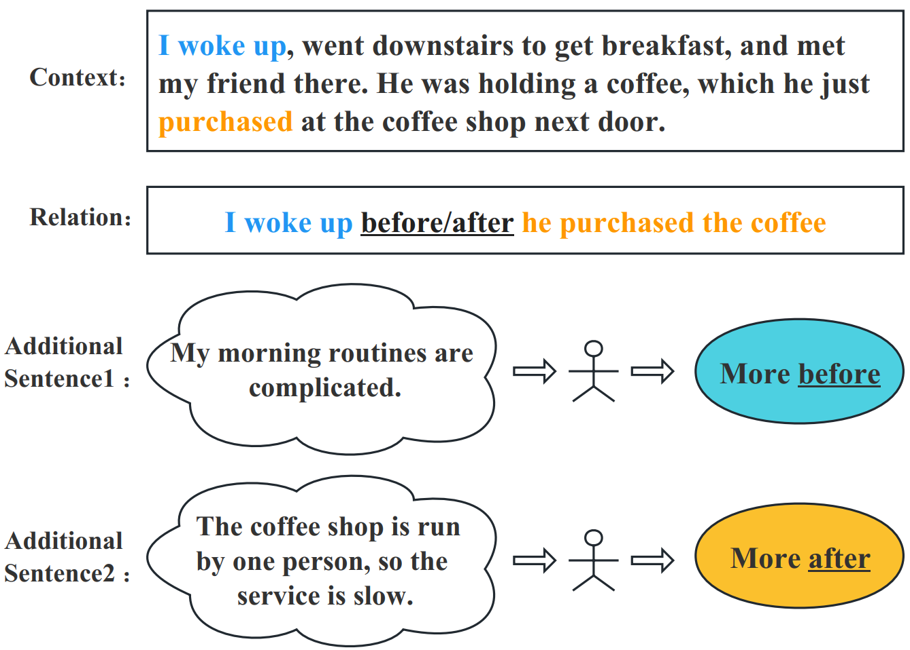
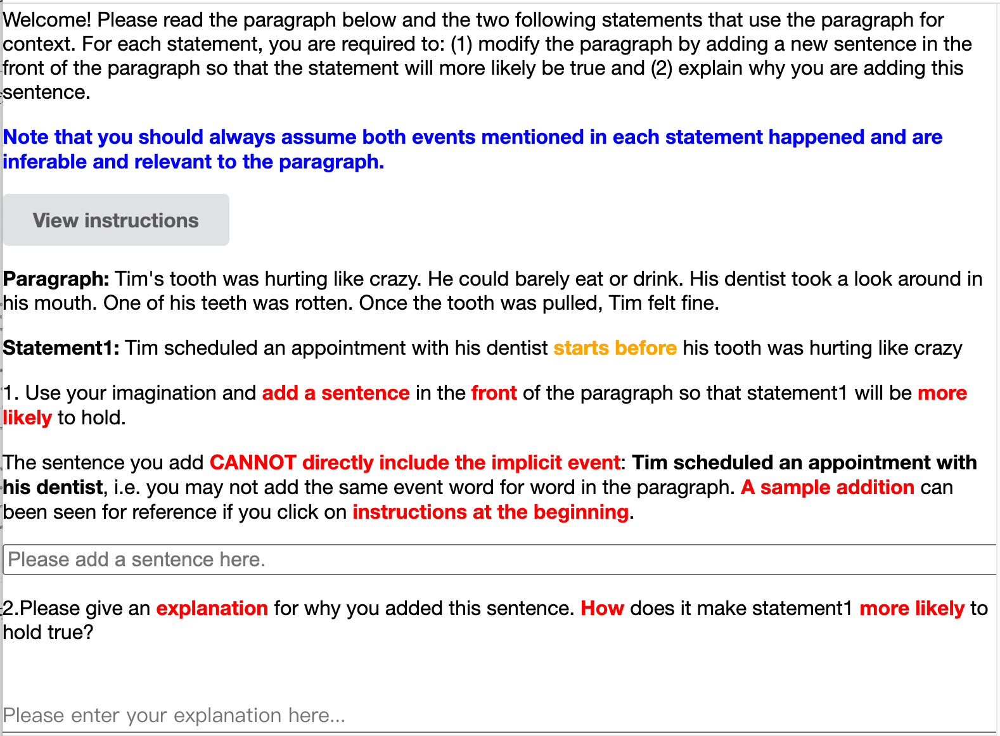
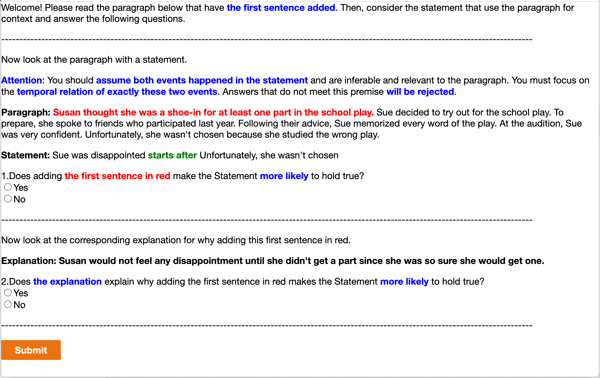

# ACL’23
 Generic Temporal Reasoning with Differential Analysis and Explanation

###### Abstract

Temporal reasoning is the task of predicting temporal relations of event pairs. While temporal reasoning models can perform reasonably well on in-domain benchmarks, we have little idea of these systems’ generalizability due to existing datasets’ limitations. In this work, we introduce a novel task named Today that bridges this gap with temporal differential analysis, which as the name suggests, evaluates whether systems can correctly understand the effect of incremental changes. Specifically, Today introduces slight contextual changes for given event pairs, and systems are asked to tell how this subtle contextual change would affect relevant temporal relation distributions. To facilitate learning, Today also annotates human explanations. We show that existing models, including GPT-3.5, drop to random guessing on Today, suggesting that they heavily rely on spurious information rather than proper reasoning for temporal predictions. On the other hand, we show that Today’s supervision style and explanation annotations can be used in joint learning, encouraging models to use more appropriate signals during training and thus outperform across several benchmarks. Today can also be used to train models to solicit incidental supervision from noisy sources such as GPT-3.5, thus moving us more toward the goal of generic temporal reasoning systems.  

## 1 Introduction

[FIGURE S1.F1.1.g1]

Figure 1:  A morning and coffee shop scenario example of temporal differential analysis. When adding the Additional Sentence 1 to the context, the temporal relation between the pair of events shifts towards before. Meanwhile, when adding the Additional Sentence 2, the relation shifts towards after.
[/FIGURE]

Temporal relation extraction Pustejovsky et al. ([2003](#bib.bib22)); Chambers et al. ([2014](#bib.bib6)) is traditionally viewed as an information extraction task, where a model uses explicit temporal signals such as “happened before” to identify the temporal order of events. While these models have contributed to many downstream pipelines, they are not enough for more complicated tasks such as timeline generation, where most event pairs do not come with explicit signals. These implicit temporal relation extractions Zhou et al. ([2021](#bib.bib36)) thus require temporal reasoning, which relies on both common sense and semantic understanding of the context. In recent works, a popular approach to address these predictions is to finetune pre-trained language models (PLMs) with annotated supervision data. Unfortunately, existing temporal benchmarks Pustejovsky et al. ([2003](#bib.bib22)); Cassidy et al. ([2014](#bib.bib5)); Ning et al. ([2018a](#bib.bib18)) only annotate hard labels and ignore the fact that temporal labels can often be soft and nondeterministic. This approach allows models to exploit spurious signals and annotation artifacts easily for performance. For example, a model may learn to predict “lunch” before “dinner” regardless of the surrounding context, yet most existing benchmarks will not challenge such beliefs because most “lunch” annotations will happen to be before “dinner.” This is not always the case though, e.g. if the “lunch” and “dinner” were today’s lunch and yesterday’s dinner, and we know that yesterday’s dinner must happen before today’s lunch. This means that the current high performances of existing models may be misleading, and the community may actually possess an inaccurate perception of the models’ capacity to generalize.  

In this work111Dataset and code are available at: <http://cogcomp.org/page/publication_view/1008>, we bridge this evaluation gap with a novel benchmark that evaluates whether a temporal reasoning model is making the correct predictions for the right reasons by properly identifying potential alternatives (e.g., “dinner” can be before “lunch” under certain contexts). Our intuition is that a model with good temporal generalizability should be able to understand the effect of subtle context changes and explain how the change will shift the temporal relation distribution of an event pair. To evaluate this, we propose the framework called temporal differential analysis. Under this setting, we select event pairs where the temporal relation is not 100% deterministic based on the context, meaning that both before/after relations are possible if additional information in regard to the context is given. Then, we annotate a hypothetical change in the form of an additional sentence added to the beginning of the context. As Fig. [1](#S1.F1 "Figure 1 ‣ 1 Introduction ‣ ACL’23 Generic Temporal Reasoning with Differential Analysis and Explanation") shows, this context change will shift the event pair’s temporal relation distribution, making it either “more before” or “more after”. Each hypothetical change is also annotated with human explanations of why the change affects the temporal relation. We collect 2,241 such instances with a rigorous human annotation pipeline and call the resulting dataset Today (temporal differential analysis).  

We find that models that achieve relatively high in-domain test performances are brittle and demonstrate minimal capabilities for differentiating subtle context changes that affect temporal relations. For example, the PatternTime model Zhou et al. ([2021](#bib.bib36)) that achieves 77% binary accuracy on Tracie Zhou et al. ([2021](#bib.bib36)) drops dramatically to 54% on Today, which is barely above random guessing. To mitigate this gap, we propose a general joint-learning technique that uses temporal explanations that Today annotates. Specifically, we argue that explanations of temporal relations are an excellent proxy for understanding temporal reasoning. We show models trained with Today’s task formulation and explanation annotation are better at perceiving cross-dataset supervision and achieve superior performances on multiple datasets with a single model.  

We also find that while large language models (LLMs) are not good enough for temporal differential analysis, they do sometimes produce reasonable explanations for a given temporal relation. We design a pipeline that automatically collects supervision signals based on this finding. The pipeline starts with giving GPT-3.5 Ouyang et al. ([2022](#bib.bib21)) both an instance from Today and a hypothetical temporal relation, and then uses GPT-3.5 to generate several explanations. Finally, we train an explanation verifier based on Today’s human annotations, which selects the generated explanations that are more likely to be plausible. We show that adding such explanations from GPT-3.5 further boosts the performance across our benchmarks.  

Our contributions are threefold: 1) We design a novel evaluation framework and collect a new dataset Today that uses differential analysis to test whether systems can perform temporal reasoning with the right reasons; 2) We show that Today’s supervision, especially the use of explanations, contributes toward a generic temporal reasoning model; 3) We use LLMs to generate pseudo explanations and filter these with a novel explanation verification system to show that such incidental supervision signals are helpful.  

## 2 Related Work

Temporal Reasoning Models. Significant effort has been devoted to temporal reasoning, a challenging task that requires models to recognize not only the connection between event mentions but also their contexts. Several statistical learning models Mani et al. ([2007](#bib.bib12)); Ning et al. ([2017](#bib.bib16), [2018b](#bib.bib19)) have been proposed to characterize events based on features and learn to predict the temporal relations. Recently, data-driven temporal reasoning approaches Trong et al. ([2022](#bib.bib25)); Wang et al. ([2022](#bib.bib29)); Liu et al. ([2021](#bib.bib11)); Mathur et al. ([2021](#bib.bib14)); Zhou et al. ([2020](#bib.bib35)); Han et al. ([2019](#bib.bib8)) have witnessed great improvement over these feature-based models on benchmarks and are generally built upon deep neural models to predict temporal labels in an end-to-end fashion. Nevertheless, the lack of interpretability has made these neural models untrustworthy to be deployed in real-world applications Yin et al. ([2022](#bib.bib34)), especially in critical areas such as healthcare, finance, and government. The differential analysis approach to temporal reasoning first introduced in this paper provides a new paradigm for evaluating the interpretability and generalizability of temporal reasoning models.  

Temporal Relation Datasets. From different perspectives, multiple research projects have focused on constructing temporal reasoning benchmarks. A series of seminal datasets, TimeBank Pustejovsky et al. ([2003](#bib.bib22)), TempEval 1-3 Verhagen et al. ([2007](#bib.bib27), [2010](#bib.bib28)); UzZaman et al. ([2013](#bib.bib26)), Matres Ning et al. ([2018a](#bib.bib18)) and so forth, have annotated on newswire articles for events and temporal relations between events. Torque Ning et al. ([2020](#bib.bib17)) examines models’ capability in temporal reasoning in reading comprehension. Tracie Zhou et al. ([2021](#bib.bib36)) introduces a novel dataset that evaluates the degree to which systems understand implicit events. However, none of these datasets annotate reasons to encourage generic temporal reasoning.  

Explanations. The community has been studying explanations and how they can help reasoning tasks such as question answering. Several models have been proposed Rajani et al. ([2019](#bib.bib23)); Latcinnik and Berant ([2020](#bib.bib10)); Kumar and Talukdar ([2020](#bib.bib9)); Zhou et al. ([2022](#bib.bib37)), as well as evaluation benchmarks that aim to test if existing systems can properly utilize explanations Camburu et al. ([2018](#bib.bib4)); Aggarwal et al. ([2021](#bib.bib1)). Our work is closely related to this line of effort as we attempt to build a proxy benchmark that can be automatically evaluated for temporal explanations. Recent findings on large language models have also inspired several works to use them as explanation generators Wiegreffe et al. ([2022](#bib.bib30)); Marasović et al. ([2022](#bib.bib13)).  

## 3 Dataset

In this section, we introduce the evaluation framework and collection process of Today.  

### 3.1 Task overview

The Today dataset and its overall framework are designed to evaluate systems’ ability to make temporal predictions with plausible reasons. Existing datasets, including Matres, Torque, and Tracie, only annotate common event pairs that align with human common sense. In other words, if an event pair does not strongly imply a temporal relation (e.g. over 80% confidence), it will not be annotated and tested on systems. This allows pre-trained language models with millions of parameters to exploit annotation artifacts and priors that do not necessarily hold in certain contexts. For example, we know “lunch” is usually before “dinner”, but this also depends on if they are performed by the same subject, at the same location, and/or on the same day. Unfortunately, current models often memorize such relations as immutable facts, leading to prediction errors in instances that are less common in real life. This intuition inspires us to build a framework to evaluate how much spurious information and priors current models are using.  

Temporal Explanations.  An ideal method to evaluate whether models are making predictions in the right way is to let them explain why a certain prediction is made and evaluate the faithfulness and plausibility of the explanations. However, such an evaluation framework is almost impossible to achieve with current progress in natural language processing, where the two main challenges are: 1) it is extremely difficult to collect gold explanations that are sufficient to cover any possible sets of explanations; and 2) it is impossible to evaluate system generations using existing summarization metrics automatically.  

Temporal Differential Analysis.  Because of the aforementioned challenges in directly evaluating system explanations, we propose an alternative that is a close proxy to the ideal form, namely temporal differential analysis. The core of the temporal differential analysis is to check if models can correctly identify how a subtle change to the context may affect the temporal relations of a given event pair. The intuition behind this choice is two-fold: 1) it is much easier for both annotators and models to produce an explanation if they know which dimension to focus on; and 2) this provides a binary evaluation measure that is deterministic and trustworthy in terms of reflecting how much spurious information models are using.  

Specifically, our differential analysis process is defined below. Given an original context $\mathcal{C}$, event 1 $\mathcal{E}_{1}$ and event 2 $\mathcal{E}_{2}$, we assume a gold distribution $\mathbb{D}=\{P_{before},P_{after},P_{same}\}$ on the temporal relation between $\mathcal{E}_{1}$ and $\mathcal{E}_{2}$ concerning $\mathcal{C}$, where $P_{before},P_{after},P_{same}$ are the probabilities of the temporal relation being before, after and simultaneous respectively, and the probabilities altogether sum to 1. We then annotate two additional sentences $\mathcal{AS}_{before}$ and $\mathcal{AS}_{after}$, where the temporal relation distribution between $\mathcal{E}_{1}$ and $\mathcal{E}_{2}$ with respect to $\mathcal{AS}_{before}+\mathcal{C}$ results in an increased $P_{before}$, while similarly the distribution using $\mathcal{AS}_{after}+\mathcal{C}$ as the context has a higher $P_{after}$.  

Table [1](#S3.T1 "Table 1 ‣ 3.1 Task overview ‣ 3 Dataset ‣ ACL’23 Generic Temporal Reasoning with Differential Analysis and Explanation") shows an example instance of temporal differential analysis, where an additional sentence $\mathcal{AS}_{before}$ has an effect on the temporal relation between the two events and shifts the label distribution towards “before”. We conducted a human pilot study for this formulation and found that it is easier to annotate and achieve substantial improvement over the explanation quality than to directly ask annotators to provide custom explanations for an event pair. We therefore adopt the former formulation and create our evaluation dataset Today through a multi-stage annotation process as described below.  

[TABLE S3.T1]

<table class="ltx_tabular ltx_centering ltx_align_middle">
<tbody class="ltx_tbody">
<tr class="ltx_tr">
<td class="ltx_td ltx_nopad_r ltx_align_left ltx_border_tt">Example</td>
</tr>
<tr class="ltx_tr">
<td class="ltx_td ltx_nopad_r ltx_align_left ltx_border_t">
Context <math class="ltx_Math"><semantics><mi class="ltx_font_mathcaligraphic">𝒞</mi><annotation-xml><ci>𝒞</ci></annotation-xml><annotation>\mathcal{C}</annotation></semantics></math>: Tim’s tooth was hurting like crazy. His dentist
</td>
</tr>
<tr class="ltx_tr">
<td class="ltx_td ltx_nopad_r ltx_align_left">took a look around in his mouth. One of his teeth was rotten.</td>
</tr>
<tr class="ltx_tr">
<td class="ltx_td ltx_nopad_r ltx_align_left">Once the tooth was pulled, Tim felt fine.</td>
</tr>
<tr class="ltx_tr">
<td class="ltx_td ltx_nopad_r ltx_align_left ltx_border_t">
Additional Sentence 1 (<math class="ltx_Math"><semantics><mrow><mi class="ltx_font_mathcaligraphic">𝒜</mi><mo>​</mo><msub><mi class="ltx_font_mathcaligraphic">𝒮</mi><mrow><mi>b</mi><mo>​</mo><mi>e</mi><mo>​</mo><mi>f</mi><mo>​</mo><mi>o</mi><mo>​</mo><mi>r</mi><mo>​</mo><mi>e</mi></mrow></msub></mrow><annotation-xml><apply><times></times><ci>𝒜</ci><apply><csymbol>subscript</csymbol><ci>𝒮</ci><apply><times></times><ci>𝑏</ci><ci>𝑒</ci><ci>𝑓</ci><ci>𝑜</ci><ci>𝑟</ci><ci>𝑒</ci></apply></apply></apply></annotation-xml><annotation>\mathcal{AS}_{before}</annotation></semantics></math>): Tim always met his
</td>
</tr>
<tr class="ltx_tr">
<td class="ltx_td ltx_nopad_r ltx_align_left">dentist regularly.</td>
</tr>
<tr class="ltx_tr">
<td class="ltx_td ltx_nopad_r ltx_align_left ltx_border_t">
Event 1 (<math class="ltx_Math"><semantics><msub><mi class="ltx_font_mathcaligraphic">ℰ</mi><mn>1</mn></msub><annotation-xml><apply><csymbol>subscript</csymbol><ci>ℰ</ci><cn>1</cn></apply></annotation-xml><annotation>\mathcal{E}_{1}</annotation></semantics></math>): Tim scheduled an appointment with his dentist.
</td>
</tr>
<tr class="ltx_tr">
<td class="ltx_td ltx_nopad_r ltx_align_left">
Event 2 (<math class="ltx_Math"><semantics><msub><mi class="ltx_font_mathcaligraphic">ℰ</mi><mn>2</mn></msub><annotation-xml><apply><csymbol>subscript</csymbol><ci>ℰ</ci><cn>2</cn></apply></annotation-xml><annotation>\mathcal{E}_{2}</annotation></semantics></math>): Tim’s tooth started to hurt like crazy.
</td>
</tr>
<tr class="ltx_tr">
<td class="ltx_td ltx_nopad_r ltx_align_left ltx_border_t">
Explanation (<math class="ltx_Math"><semantics><mrow><mi>E</mi><mo>​</mo><mi>x</mi><mo>​</mo><mi>p</mi></mrow><annotation-xml><apply><times></times><ci>𝐸</ci><ci>𝑥</ci><ci>𝑝</ci></apply></annotation-xml><annotation>Exp</annotation></semantics></math>): Some people maintain regular visits to
</td>
</tr>
<tr class="ltx_tr">
<td class="ltx_td ltx_nopad_r ltx_align_left">a dentist. Tim is one of these individuals and may have</td>
</tr>
<tr class="ltx_tr">
<td class="ltx_td ltx_nopad_r ltx_align_left">already scheduled a regular appointment with his dentist</td>
</tr>
<tr class="ltx_tr">
<td class="ltx_td ltx_nopad_r ltx_align_left ltx_border_bb">before his tooth started to hurt.</td>
</tr>
</tbody>
</table>

Table 1: 
 An example of temporal differential analysis, where $\mathcal{AS}$ shifts the temporal relation between $\mathcal{E}_{1}$ and $\mathcal{E}_{2}$ to be more “before”. See §[3](#S3 "3 Dataset ‣ ACL’23 Generic Temporal Reasoning with Differential Analysis and Explanation") for more details.
[/TABLE]

### 3.2 Dataset Construction

Following the definition of the temporal differential analysis framework above, we collect a dataset to carry out the actual evaluation. Each instance in Today contains a context $\mathcal{C}$, an event pair $\mathcal{E}_{1}$, $\mathcal{E}_{2}$, and an additional sentence of either $\mathcal{AS}_{before}$ or $\mathcal{AS}_{after}$. In addition, we also annotate a human explanation $Exp$ regarding why the additional sentence affects the temporal relation between the two events. Today is constructed in three steps: 1) event pair generation, 2) additional sentence and explanation annotation, and 3) annotation verification and cleaning. We detail this pipeline below.  

Generating $\mathcal{C}$ and $\mathcal{E}$.  We randomly sample short stories from the ROCStories dataset Mostafazadeh et al. ([2016](#bib.bib15)) as the context $\mathcal{C}$. For each story, we use GPT-3.5 222We use GPT-3.5 text-davinci-002 for data generation throughout the work. to generate an implicit event phrase based on an explicit event phrase selected by GPT-3.5 at the same time. An implicit event is an event that is not explicitly mentioned by the given context but is still inferable and relevant, e.g. Event 1 in Table [1](#S3.T1 "Table 1 ‣ 3.1 Task overview ‣ 3 Dataset ‣ ACL’23 Generic Temporal Reasoning with Differential Analysis and Explanation"). A sample prompt can be referred to in Appendix Table [10](#A1.T10 "Table 10 ‣ Appendix A Appendix ‣ ACL’23 Generic Temporal Reasoning with Differential Analysis and Explanation") to construct an event pair. We do this for two main reasons: 1) events that are not explicitly mentioned by the context provide more uncertainty so that the event pair does not come with a deterministic temporal relation decided by the context; 2) this is closer to the format of Tracie, which we aim to compare system performance changes with.  

Crowdsourcing $\mathcal{AS}$ and $Exp$.  After generating $\mathcal{C}$ and $\mathcal{E}$’s, we use Mechanical Turk to ask crowdsourcing annotators to write potential $\mathcal{AS}_{before}$ and $\mathcal{AS}_{after}$ with respect to the provided information. The guideline asks annotators to write additional sentences that can be added to the beginning of the context to prevent models from using text positional information. The annotator is also asked to explain why they wrote $\mathcal{AS}$ and why it affects the temporal relation distribution. We use this as $Exp$. We design an annotation interface that is intuitive and filled with examples, and at the same time, we require annotators to pass a rigorous qualification test to demonstrate a proper understanding. We list our interfaces and tests in Fig. [2](#A1.F2 "Figure 2 ‣ Appendix A Appendix ‣ ACL’23 Generic Temporal Reasoning with Differential Analysis and Explanation") and Table [11](#A1.T11 "Table 11 ‣ Appendix A Appendix ‣ ACL’23 Generic Temporal Reasoning with Differential Analysis and Explanation").  

Annotation Verification.  We employ an additional verification stage for the human-written instances from the previous step. We provide annotators with the formatted textual entailment instance and ask if the entailment label changes in the expected direction. We collect two individual verifications per instance, and the instances accepted by all annotators appear in the test set.  

### 3.3 Statistics

We collect 1,000 instances agreed upon by all annotators as the evaluation set and construct a silver training set with the remaining 1,241 instances that do not have unanimous annotator agreements.  

## 4 Modeling

In this section, we show how to fully use Today’s supervision signals (especially the explanations) to build a more generic temporal reasoning model.  

Joint Learning. Today annotates temporal distribution shifts instead of absolute relations. This means that an instance may have a gold label “before” (i.e., the additional sentence $\mathcal{AS}$ makes the relation more “before” compared to the original context), yet the likelihood of “after” can still be higher, and the argmax label will be “after”. As a result, a model cannot sufficiently learn to predict absolute labels with only supervision signals from Today. To mitigate this issue, we propose a joint learning model that requires joint supervision from a dataset that annotates hard labels for temporal relations, such as Matres or Tracie.  

Modeling.  We adopt Tracie’s formulation Zhou et al. ([2021](#bib.bib36)) to format temporal reasoning into textual entailment and use a seq-to-seq pre-trained language model as the base model. Specifically, the input sequence consists of the premise, which is $\mathcal{AS}+\mathcal{C}+Exp$333$\mathcal{AS}$ and $Exp$ only apply for relative label instances, such as those in Today. in our case, as well as the hypothesis, which is $\mathcal{E}_{1}$ starts [r] $\mathcal{E}_{2}$. Here, $r$ is a hypothetical relation we plug into the hypothesis since systems are unaware of the gold label from the input sequence. The output sequence contains an entailment label, which is either answer: positive for entail or answer: negative for contradiction.  

Hard Label Instances.  As we note above, a system does not know the gold label when plugging in the hypothetical relation in the hypothesis. As a result, at learning time, we construct two entailment instances for a temporal relation instance with an absolute hard label. The first instance uses a hypothesis that is $\mathcal{E}_{1}$ starts before $\mathcal{E}_{2}$. We want the model to learn to output answer: positive for entail if the gold label is also “before”, or answer: negative for contradiction if the gold label is “after”. The second instance uses $\mathcal{E}_{1}$ starts after $\mathcal{E}_{2}$ as the hypothesis, where the output sequences are reversed compared to the first one. We use the regular cross-entropy loss for optimization and denote the loss as $\ell_{CE}$. At test time, we similarly construct two entailment instances for each event pair and conduct a simple probability-based vote to infer a final “before/after” relation.  

Relative Label Instances.  For instances that do not annotate absolute hard labels, we similarly construct two entailment instances for each event pair. However, instead of using a cross-entropy loss to learn to output entailment labels, we employ a marginal ranking loss and ask the model to increase the probability of the entailment sequence if the plugged-in relation $r$ is the same as the gold label444Here “gold label” refers to the direction that $\mathcal{AS}$ shifts the temporal distribution to. $r_{g}$, and vice versa. Specifically, we want: 555For simplicity, we omit $Exp$ and $\mathcal{E}$ in the condition.  

|  | $$\begin{cases}p(\mathrm{ent}|(\mathcal{AS}+\mathcal{C}),r)>p(\mathrm{ent}|\mathcal{C},r)&r=r_{g}\\ p(\mathrm{con}|(\mathcal{AS}+\mathcal{C}),r)>p(\mathrm{con}|\mathcal{C},r)&r=\neg r_{g}\end{cases}$$ |  | (1) |
| --- | --- | --- | --- |

where $\mathrm{ent}$ and $\mathrm{con}$ represent entailment and contradiction respectively, and $\neg r_{g}$ is the opposite relation label of gold label $r_{g}$. The loss function we use can subsequently be written as:  

|  | $$\begin{split}\ell_{MR}&={\rm max}(0,\epsilon+p_{o_{g}}-p_{g})\\ &+{\rm max}(0,\epsilon+p_{w}-p_{o_{w}})\\ p_{g}&=p(\mathrm{ent}|(\mathcal{AS}+\mathcal{C}),r_{g})\\ p_{o_{g}}&=p(\mathrm{ent}|\mathcal{C},r_{g})\\ p_{w}&=p(\mathrm{ent}|(\mathcal{AS}+\mathcal{C}),\neg r_{g})\\ p_{o_{w}}&=p(\mathrm{ent}|\mathcal{C},\neg r_{g})\end{split}$$ |  | (2) |
| --- | --- | --- | --- |

where $\epsilon$ is a margin separating the logits. The actual probability of entailment is computed by the word logits in the output sequence of our model.  

Aggregated Loss Function.  The final loss function we use for training considers both hard label instances and relative label instances, and is defined as follows:  

|  | $$\ell=\alpha\ell_{CE}+\ell_{MR}$$ |  | (3) |
| --- | --- | --- | --- |

where $\alpha$ balances the two losses. As a result, we propose a general-purpose temporal reasoning model that can predict temporal relations for an event pair as well as probability changes for differential analysis as proposed in Today.  

## 5 LLM Incidental Supervision

As we hypothesize and later show in §[6](#S6 "6 Experiment ‣ ACL’23 Generic Temporal Reasoning with Differential Analysis and Explanation"), human-annotated explanations greatly benefit generic temporal reasoning models, as they encourage models to learn to use the correct signals. However, it is extremely difficult and expensive to crowdsource such explanations for training purposes since collecting one instance costs $1 on average. On the other hand, large language models (LLMs) can produce a large amount of generated explanations at a much cheaper cost. Unfortunately, these generated explanations are mostly unusable as they are simply model guesses based on textual correlations.  

In this section, we introduce a knowledge distillation method that combines the benefits of both human annotations and LLM generations by training verification models based on our seed annotation, which is then used to select generations more likely to be plausible. Compared to previous work Wiegreffe et al. ([2022](#bib.bib30)), we propose a verification system composed of multiple models that individually verify different aspects of automatically-generated explanations. We detail our pipeline below.  

### 5.1 Temporal Explanations from GPT-3.5

We adopt the same event pair generation and context selection process as detailed in §[3](#S3 "3 Dataset ‣ ACL’23 Generic Temporal Reasoning with Differential Analysis and Explanation"). We design prompts as shown in Appendix Table [8](#A1.T8 "Table 8 ‣ Appendix A Appendix ‣ ACL’23 Generic Temporal Reasoning with Differential Analysis and Explanation") and Table [9](#A1.T9 "Table 9 ‣ Appendix A Appendix ‣ ACL’23 Generic Temporal Reasoning with Differential Analysis and Explanation") that provide GPT-3.5 with contexts, event pairs, and temporal relations, and ask GPT-3.5 to generate additional sentences, how these sentences will change the temporal relations, and why. The prompt contains a few examples, which makes this setting few-shot.  

### 5.2 Verification System

Similarity-based Filtering.  We filter GPT-3.5 instances that use exact same sentences from the context as the additional sentence or repeat the event pairs and temporal relations as explanations. We use S-BERT Reimers and Gurevych ([2019](#bib.bib24)) with a $0.95$ threshold to perform this filtering.  

General Explanation Verifier.  We use the generic temporal relation model as proposed in §[4](#S4 "4 Modeling ‣ ACL’23 Generic Temporal Reasoning with Differential Analysis and Explanation") trained on Today and an additional temporal relation dataset666Depending on the target task, this additional temporal relation dataset is different. We use Matres / Tracie / Matres + Tracie as the additional temporal relation dataset when evaluated on Matres / Tracie / All, respectively. to verify if the generated additional sentence $\mathcal{AS}$ together with the explanation sentence $Exp$ shifts the temporal relation to the direction that it is supposed to.  

Additional Sentence Verifier.  The general explanation verifier cannot sufficiently identify partial correctnesses of GPT-3.5 generations. For example, a generated instance may have a sub-optimal $\mathcal{AS}$ but convincing $Exp$, which could create deceptions. To address this, we train a separate $\mathcal{AS}$ verification model with Today that does not use $Exp$ as input. We follow the same training scheme as §[4](#S4 "4 Modeling ‣ ACL’23 Generic Temporal Reasoning with Differential Analysis and Explanation"), and similarly, verify if the $\mathcal{AS}$ shifts the temporal relation as expected as our filtering criteria.  

Explanation Sentence Verifier.  We also train a binary classification model to check the plausibility of $Exp$ individually. To generate negative $Exp$ instances, for each instance in the Today training set with a given $\mathcal{AS}$, we ask GPT-3.5 to generate three possible explanation sentences. We use the one that is the least similar to the human-annotated $Exp$ according to S-BERT as the negative instance, which we denote as $Exp_{neg}$. We finetune the base seq-to-seq model with the positive and negative explanations and optimize the loss function as the negative log-likelihood of the positive explanation:  

|  | $$\begin{split}\ell^{E}&=-log\frac{e^{p_{pos}}}{e^{p_{pos}}+e^{p_{neg}}}\\ p_{pos}&=p(ent|(\mathcal{AS}+\mathcal{C},Exp_{human}),r_{g})\\ p_{neg}&=p(ent|(\mathcal{AS}+\mathcal{C},Exp_{neg}),r_{g})\end{split}$$ |  | (4) |
| --- | --- | --- | --- |

We filter all GPT-3.5 generated instances whose explanation is deemed as negative by this binary classification model.  

## 6 Experiment

In this section, we conduct a series of experiments to show that 1) existing systems do not truly understand temporal relations, 2) Today and incidental supervision signals partially address this issue, and 3) Today motivates future work towards generic temporal reasoning.  

### 6.1 Datasets, Metrics, and Settings

We use our proposed dataset Today as the main benchmark, as well as transferability results from two other temporal reasoning benchmarks Tracie Zhou et al. ([2021](#bib.bib36)) and Matres Ning et al. ([2018a](#bib.bib18)) to show that existing models fail to perform generic temporal reasoning while our proposal makes significant improvements. Following Zhou et al. ([2021](#bib.bib36)), all three datasets are processed as binary classification tasks by keeping instances that are originally annotated as either “before” or “after”. As a result, we use binary accuracy as the metric. For Matres, we use only 1.5k (10%) of the training instances to match the size of the other two datasets. Table [2](#S6.T2 "Table 2 ‣ 6.1 Datasets, Metrics, and Settings ‣ 6 Experiment ‣ ACL’23 Generic Temporal Reasoning with Differential Analysis and Explanation") summarizes data statistics. We use $\epsilon=0.1$ in equation [2](#S4.E2 "Equation 2 ‣ 4 Modeling ‣ ACL’23 Generic Temporal Reasoning with Differential Analysis and Explanation") and $\alpha=10$ in equation [3](#S4.E3 "Equation 3 ‣ 4 Modeling ‣ ACL’23 Generic Temporal Reasoning with Differential Analysis and Explanation"). All model training follows a standard textual entailment setup, uses default parameters, has the same number of steps, and averages from three random seeds. All training can be done with a single 48G-memory GPU within 5 hours.  

[TABLE S6.T2]

<table class="ltx_tabular ltx_guessed_headers ltx_align_middle">
<thead class="ltx_thead">
<tr class="ltx_tr">
<th class="ltx_td ltx_align_left ltx_th ltx_th_column ltx_th_row ltx_border_tt">Data</th>
<th class="ltx_td ltx_align_center ltx_th ltx_th_column ltx_border_tt">#Train</th>
<th class="ltx_td ltx_align_center ltx_th ltx_th_column ltx_border_tt">#Test</th>
<th class="ltx_td ltx_align_center ltx_th ltx_th_column ltx_border_tt">Relative-Label</th>
<th class="ltx_td ltx_align_center ltx_th ltx_th_column ltx_border_tt">Hard-Label</th>
</tr>
</thead>
<tbody class="ltx_tbody">
<tr class="ltx_tr">
<th class="ltx_td ltx_align_left ltx_th ltx_th_row ltx_border_t">Today</th>
<td class="ltx_td ltx_align_center ltx_border_t">1,241</td>
<td class="ltx_td ltx_align_center ltx_border_t">1,000</td>
<td class="ltx_td ltx_align_center ltx_border_t">✓</td>
<td class="ltx_td ltx_border_t"></td>
</tr>
<tr class="ltx_tr">
<th class="ltx_td ltx_align_left ltx_th ltx_th_row">Tracie</th>
<td class="ltx_td ltx_align_center">860</td>
<td class="ltx_td ltx_align_center">1,924</td>
<td class="ltx_td"></td>
<td class="ltx_td ltx_align_center">✓</td>
</tr>
<tr class="ltx_tr">
<th class="ltx_td ltx_align_left ltx_th ltx_th_row ltx_border_bb">Matres</th>
<td class="ltx_td ltx_align_center ltx_border_bb">1,500</td>
<td class="ltx_td ltx_align_center ltx_border_bb">1,322</td>
<td class="ltx_td ltx_border_bb"></td>
<td class="ltx_td ltx_align_center ltx_border_bb">✓</td>
</tr>
</tbody>
</table>

Table 2: Statistics of the three datasets.
[/TABLE]

### 6.2 Baselines and Systems

We report baseline performances of a state-of-the-art baseline PatternTime Zhou et al. ([2021](#bib.bib36)), as well as GPT-3.5 Brown et al. ([2020](#bib.bib3)); Ouyang et al. ([2022](#bib.bib21)). To show that Today and other incidental supervision signals contribute to generic temporal reasoning, we use the T5-large model implemented by Wolf et al. ([2020](#bib.bib33)) as the base model and experiment with different supervision settings. We collect 5,000 GPT-3.5 generated instances in total, and 1,475 instances remain after our proposed verification models.  

[TABLE S6.T3]

<table class="ltx_tabular ltx_centering ltx_guessed_headers ltx_align_middle">
<tbody class="ltx_tbody">
<tr class="ltx_tr">
<th class="ltx_td ltx_align_left ltx_th ltx_th_row ltx_border_tt">Model (Train Data)</th>
<td class="ltx_td ltx_align_center ltx_border_tt">Loss</td>
<td class="ltx_td ltx_align_center ltx_border_tt">Tracie</td>
<td class="ltx_td ltx_align_center ltx_border_tt">Matres</td>
<td class="ltx_td ltx_align_center ltx_border_tt">Today</td>
<td class="ltx_td ltx_align_center ltx_border_tt">
Today (gold exp.)</td>
<td class="ltx_td ltx_align_center ltx_border_tt">Average</td>
</tr>
<tr class="ltx_tr">
<th class="ltx_td ltx_align_left ltx_th ltx_th_row ltx_border_t">GPT-3.5 text-davinci-002</th>
<td class="ltx_td ltx_align_center ltx_border_t">FewShot</td>
<td class="ltx_td ltx_align_center ltx_border_t">56.1</td>
<td class="ltx_td ltx_align_center ltx_border_t">49.0</td>
<td class="ltx_td ltx_align_center ltx_border_t">57.9</td>
<td class="ltx_td ltx_align_center ltx_border_t">68.7</td>
<td class="ltx_td ltx_align_center ltx_border_t">54.3</td>
</tr>
<tr class="ltx_tr">
<th class="ltx_td ltx_align_left ltx_th ltx_th_row">GPT-3.5 text-davinci-003</th>
<td class="ltx_td ltx_align_center">FewShot</td>
<td class="ltx_td ltx_align_center">52.3</td>
<td class="ltx_td ltx_align_center">50.1</td>
<td class="ltx_td ltx_align_center">59.0</td>
<td class="ltx_td ltx_align_center">70.0</td>
<td class="ltx_td ltx_align_center">53.8</td>
</tr>
<tr class="ltx_tr">
<th class="ltx_td ltx_align_left ltx_th ltx_th_row">T5 (in-domain)</th>
<td class="ltx_td ltx_align_center">CE / MR</td>
<td class="ltx_td ltx_align_center">66.2</td>
<td class="ltx_td ltx_align_center">81.2</td>
<td class="ltx_td ltx_align_center">52.9</td>
<td class="ltx_td ltx_align_center">55.7</td>
<td class="ltx_td ltx_align_center">66.8</td>
</tr>
<tr class="ltx_tr">
<th class="ltx_td ltx_align_left ltx_th ltx_th_row">PatternTime</th>
<td class="ltx_td ltx_align_center">Distant</td>
<td class="ltx_td ltx_align_center">77.0</td>
<td class="ltx_td ltx_align_center">73.0</td>
<td class="ltx_td ltx_align_center">54.1</td>
<td class="ltx_td ltx_align_center">67.7</td>
<td class="ltx_td ltx_align_center">68.0</td>
</tr>
<tr class="ltx_tr">
<th class="ltx_td ltx_align_left ltx_th ltx_th_row ltx_border_t">T5 (O)</th>
<td class="ltx_td ltx_align_center ltx_border_t">MR</td>
<td class="ltx_td ltx_align_center ltx_border_t">50.6</td>
<td class="ltx_td ltx_align_center ltx_border_t">49.8</td>
<td class="ltx_td ltx_align_center ltx_border_t">52.9</td>
<td class="ltx_td ltx_align_center ltx_border_t">55.7</td>
<td class="ltx_td ltx_align_center ltx_border_t">51.1</td>
</tr>
<tr class="ltx_tr">
<th class="ltx_td ltx_align_left ltx_th ltx_th_row">T5 (O+G)</th>
<td class="ltx_td ltx_align_center">MR</td>
<td class="ltx_td ltx_align_center">55.4</td>
<td class="ltx_td ltx_align_center">52.3</td>
<td class="ltx_td ltx_align_center">55.0</td>
<td class="ltx_td ltx_align_center">66.5</td>
<td class="ltx_td ltx_align_center">54.2</td>
</tr>
<tr class="ltx_tr">
<th class="ltx_td ltx_align_left ltx_th ltx_th_row ltx_border_t">T5 (M)</th>
<td class="ltx_td ltx_align_center ltx_border_t">CE</td>
<td class="ltx_td ltx_align_center ltx_border_t">52.7</td>
<td class="ltx_td ltx_align_center ltx_border_t">81.2</td>
<td class="ltx_td ltx_align_center ltx_border_t">52.5</td>
<td class="ltx_td ltx_align_center ltx_border_t">57.5</td>
<td class="ltx_td ltx_align_center ltx_border_t">62.1</td>
</tr>
<tr class="ltx_tr">
<th class="ltx_td ltx_align_left ltx_th ltx_th_row">T5 (M+O)</th>
<td class="ltx_td ltx_align_center">CE + MR</td>
<td class="ltx_td ltx_align_center">51.5</td>
<td class="ltx_td ltx_align_center">81.7</td>
<td class="ltx_td ltx_align_center">57.4</td>
<td class="ltx_td ltx_align_center">82.7</td>
<td class="ltx_td ltx_align_center">63.5</td>
</tr>
<tr class="ltx_tr">
<th class="ltx_td ltx_align_left ltx_th ltx_th_row">T5 (M+O+G)</th>
<td class="ltx_td ltx_align_center">CE + MR</td>
<td class="ltx_td ltx_align_center">49.9</td>
<td class="ltx_td ltx_align_center">82.9</td>
<td class="ltx_td ltx_align_center">61.4</td>
<td class="ltx_td ltx_align_center">82.9</td>
<td class="ltx_td ltx_align_center">64.8</td>
</tr>
<tr class="ltx_tr">
<th class="ltx_td ltx_align_left ltx_th ltx_th_row ltx_border_t">T5 (T)</th>
<td class="ltx_td ltx_align_center ltx_border_t">CE</td>
<td class="ltx_td ltx_align_center ltx_border_t">66.2</td>
<td class="ltx_td ltx_align_center ltx_border_t">63.2</td>
<td class="ltx_td ltx_align_center ltx_border_t">52.3</td>
<td class="ltx_td ltx_align_center ltx_border_t">56.0</td>
<td class="ltx_td ltx_align_center ltx_border_t">60.7</td>
</tr>
<tr class="ltx_tr">
<th class="ltx_td ltx_align_left ltx_th ltx_th_row">T5 (T+O)</th>
<td class="ltx_td ltx_align_center">CE + MR</td>
<td class="ltx_td ltx_align_center">72.9</td>
<td class="ltx_td ltx_align_center">69.4</td>
<td class="ltx_td ltx_align_center">59.9</td>
<td class="ltx_td ltx_align_center">81.6</td>
<td class="ltx_td ltx_align_center">67.4</td>
</tr>
<tr class="ltx_tr">
<th class="ltx_td ltx_align_left ltx_th ltx_th_row">T5 (T+O+G)</th>
<td class="ltx_td ltx_align_center">CE + MR</td>
<td class="ltx_td ltx_align_center">73.5</td>
<td class="ltx_td ltx_align_center">68.8</td>
<td class="ltx_td ltx_align_center">62.1</td>
<td class="ltx_td ltx_align_center">82.0</td>
<td class="ltx_td ltx_align_center">68.1</td>
</tr>
<tr class="ltx_tr">
<th class="ltx_td ltx_align_left ltx_th ltx_th_row ltx_border_t">T5 (M+T)</th>
<td class="ltx_td ltx_align_center ltx_border_t">CE</td>
<td class="ltx_td ltx_align_center ltx_border_t">66.2</td>
<td class="ltx_td ltx_align_center ltx_border_t">82.0</td>
<td class="ltx_td ltx_align_center ltx_border_t">52.5</td>
<td class="ltx_td ltx_align_center ltx_border_t">58.5</td>
<td class="ltx_td ltx_align_center ltx_border_t">66.9</td>
</tr>
<tr class="ltx_tr">
<th class="ltx_td ltx_align_left ltx_th ltx_th_row">T5 (M+T+O)</th>
<td class="ltx_td ltx_align_center">CE + MR</td>
<td class="ltx_td ltx_align_center">73.0</td>
<td class="ltx_td ltx_align_center">83.5</td>
<td class="ltx_td ltx_align_center">57.9</td>
<td class="ltx_td ltx_align_center">77.8</td>
<td class="ltx_td ltx_align_center">71.5</td>
</tr>
<tr class="ltx_tr">
<th class="ltx_td ltx_align_left ltx_th ltx_th_row">T5 (M+T+O+G)</th>
<td class="ltx_td ltx_align_center">CE + MR</td>
<td class="ltx_td ltx_align_center">73.3</td>
<td class="ltx_td ltx_align_center">83.9</td>
<td class="ltx_td ltx_align_center">63.2</td>
<td class="ltx_td ltx_align_center">81.6</td>
<td class="ltx_td ltx_align_center">73.5</td>
</tr>
<tr class="ltx_tr">
<th class="ltx_td ltx_align_left ltx_th ltx_th_row ltx_border_t">PatternTime (M+T)</th>
<td class="ltx_td ltx_align_center ltx_border_t">CE</td>
<td class="ltx_td ltx_align_center ltx_border_t">79.7</td>
<td class="ltx_td ltx_align_center ltx_border_t">85.0</td>
<td class="ltx_td ltx_align_center ltx_border_t">56.3</td>
<td class="ltx_td ltx_align_center ltx_border_t">66.5</td>
<td class="ltx_td ltx_align_center ltx_border_t">73.7</td>
</tr>
<tr class="ltx_tr">
<th class="ltx_td ltx_align_left ltx_th ltx_th_row">PatternTime (M+T+O)</th>
<td class="ltx_td ltx_align_center">CE + MR</td>
<td class="ltx_td ltx_align_center">79.8</td>
<td class="ltx_td ltx_align_center">85.8</td>
<td class="ltx_td ltx_align_center">60.9</td>
<td class="ltx_td ltx_align_center">82.2</td>
<td class="ltx_td ltx_align_center">75.5</td>
</tr>
<tr class="ltx_tr">
<th class="ltx_td ltx_align_left ltx_th ltx_th_row ltx_border_bb">PatternTime (all)</th>
<td class="ltx_td ltx_align_center ltx_border_bb">CE + MR</td>
<td class="ltx_td ltx_align_center ltx_border_bb">79.9</td>
<td class="ltx_td ltx_align_center ltx_border_bb">86.3</td>
<td class="ltx_td ltx_align_center ltx_border_bb">62.9</td>
<td class="ltx_td ltx_align_center ltx_border_bb">82.3</td>
<td class="ltx_td ltx_align_center ltx_border_bb">76.4</td>
</tr>
</tbody>
</table>

Table 3: System performances under different supervision data and loss function settings across three binary temporal benchmarks. For simplicity, we use T to denote Tracie training data, and similarly M for Matres, O for Today (ours), and G for GPT-3.5-generated incidental supervision. Today (gold exp.) uses gold explanations during evaluation. Average is averaged from Tracie, Matres and Today accuracies. all is equivalent to M+T+O+G.
[/TABLE]

### 6.3 Main Results

Table [3](#S6.T3 "Table 3 ‣ 6.2 Baselines and Systems ‣ 6 Experiment ‣ ACL’23 Generic Temporal Reasoning with Differential Analysis and Explanation") shows system performances under different supervision data and loss function settings across three binary temporal benchmarks, without generated explanations.  

Existing Work is Insufficient.  We observe that GPT-3.5 is doing random guessing on all three benchmarks, suggesting that language model objectives alone are insufficient for temporal reasoning. On the other hand, PatternTime achieves mid-70s accuracy on Tracie and Matres but drops to random guessing on Today. This suggests that biased supervision signals may improve on biased datasets,777Here, “biased” refers to datasets that align with natural distributions, such as drink coffee is always before dinner. but not generic temporal reasoning. To further prove this point, we observe that T5 (M+T) jointly trained on Tracie and Matres does not improve much over T5 trained only on corresponding in-domain supervision (+0.4% averaged accuracy), suggesting that previous temporal annotation styles do not motivate joint-learning nor generic temporal reasoning.  

Our Work Generalizes Better.  On the contrary, we see that by simply using Today’s moderate-sized 1k training instances, T5 (in-domain+O) improves 6.7% on Tracie, and 0.5% on Matres. When we add the incidental supervision instances from GPT-3.5 (filtered by Today-supervised models in §[5](#S5 "5 LLM Incidental Supervision ‣ ACL’23 Generic Temporal Reasoning with Differential Analysis and Explanation"), denoted as T5(in-domain+O+G) in Table [3](#S6.T3 "Table 3 ‣ 6.2 Baselines and Systems ‣ 6 Experiment ‣ ACL’23 Generic Temporal Reasoning with Differential Analysis and Explanation")), there is a 7.3% improvement on Tracie, and 1.7% on Matres. This is, on average, 4.5% better than using Matres or Tracie as the supervision source. Moreover, Today and incidental instances bring better joint learning efficiency and possibility, as we see a 6.7% average accuracy improvement from T5(M+T+O+G) compared to T5’s in-domain bests. If we use PatternTime888PatternTime also uses T5-large as the base model, and it does not use any in-domain annotation. as the base model, we achieve a 76.4% average accuracy which is the new state-of-the-art result of binary temporal relation classification across multiple datasets, and almost 10% better than using T5 and in-domain supervision alone.  

Scaling and Improving LLMs is Inadequate.  We test the latest GPT-4 model OpenAI ([2023](#bib.bib20)) on Today, which gets 64.0% accuracy, and 78.0% with gold explanations.999We use the gpt-4-0314 checkpoint and chat API. Even though GPT-4 is shown to significantly improve on many natural-language benchmarks over GPT-3.5, its improvement on Today is relatively moderate, and it is only comparable with (if not worse than) our proposed model with less than a billion parameters. This shows that the advancement in large language models alone is insufficient to solve Today, and more rigorous and controllable reasoning models are desirable for future works.  

### 6.4 Experiments with Generated Explanation

In Table [3](#S6.T3 "Table 3 ‣ 6.2 Baselines and Systems ‣ 6 Experiment ‣ ACL’23 Generic Temporal Reasoning with Differential Analysis and Explanation"), we see that explanations play an important role in generic temporal reasoning as PatternTime(all) improves almost 20% on Today with the gold explanations. We, therefore, augment test instances with generated explanations on all three datasets. To utilize the existing explanation verification models proposed in §[5](#S5 "5 LLM Incidental Supervision ‣ ACL’23 Generic Temporal Reasoning with Differential Analysis and Explanation"), we generate an additional sentence together with an explanation sentence. Specifically, for each possible relation direction of the event pair, we generate an additional sentence $\mathcal{AS}$ and an explanation sentence $Exp$ and then use explanation verifier models to select the $\mathcal{AS}$ and $Exp$ with the highest positive probability out of the two candidates. We use the same models and prompts described in §[5](#S5 "5 LLM Incidental Supervision ‣ ACL’23 Generic Temporal Reasoning with Differential Analysis and Explanation"), and we show a sample of generated explanations in Table [5](#S6.T5 "Table 5 ‣ 6.4 Experiments with Generated Explanation ‣ 6 Experiment ‣ ACL’23 Generic Temporal Reasoning with Differential Analysis and Explanation").101010We use the given $\mathcal{AS}$ for Today. We achieve this with the same prompt but only ask GPT-3.5 to generate an explanation sentence.  

Table [4](#S6.T4 "Table 4 ‣ 6.4 Experiments with Generated Explanation ‣ 6 Experiment ‣ ACL’23 Generic Temporal Reasoning with Differential Analysis and Explanation") shows model performances when augmented with generated explanations. There are improvements on all three datasets compared to the numbers in Table [3](#S6.T3 "Table 3 ‣ 6.2 Baselines and Systems ‣ 6 Experiment ‣ ACL’23 Generic Temporal Reasoning with Differential Analysis and Explanation"), with an average improvement of 1.0% using T5 and 0.5% using PatternTime. However, the overall performance is still suboptimal and the performance on Today is far from when using gold explanations, which motivates future works on generating better explanations.  

[TABLE S6.T4]

<table class="ltx_tabular ltx_centering ltx_guessed_headers ltx_align_middle">
<thead class="ltx_thead">
<tr class="ltx_tr">
<th class="ltx_td ltx_align_left ltx_th ltx_th_column ltx_border_tt">Model (Data)</th>
<th class="ltx_td ltx_align_center ltx_th ltx_th_column ltx_border_tt">T</th>
<th class="ltx_td ltx_align_center ltx_th ltx_th_column ltx_border_tt">M</th>
<th class="ltx_td ltx_align_center ltx_th ltx_th_column ltx_border_tt">Today</th>
<th class="ltx_td ltx_align_center ltx_th ltx_th_column ltx_border_tt">Avg</th>
<th class="ltx_td ltx_align_center ltx_th ltx_th_column ltx_border_tt"><math class="ltx_Math"><semantics><mo>△</mo><annotation-xml><ci>△</ci></annotation-xml><annotation>\bigtriangleup</annotation></semantics></math></th>
</tr>
</thead>
<tbody class="ltx_tbody">
<tr class="ltx_tr">
<td class="ltx_td ltx_align_left ltx_border_t">T5 (all)</td>
<td class="ltx_td ltx_align_center ltx_border_t">76.1</td>
<td class="ltx_td ltx_align_center ltx_border_t">84.4</td>
<td class="ltx_td ltx_align_center ltx_border_t">63.1</td>
<td class="ltx_td ltx_align_center ltx_border_t">74.5</td>
<td class="ltx_td ltx_align_center ltx_border_t">1.0</td>
</tr>
<tr class="ltx_tr">
<td class="ltx_td ltx_align_left ltx_border_bb">PatternTime (all)</td>
<td class="ltx_td ltx_align_center ltx_border_bb">80.5</td>
<td class="ltx_td ltx_align_center ltx_border_bb">86.8</td>
<td class="ltx_td ltx_align_center ltx_border_bb">63.4</td>
<td class="ltx_td ltx_align_center ltx_border_bb">76.9</td>
<td class="ltx_td ltx_align_center ltx_border_bb">0.5</td>
</tr>
</tbody>
</table>

Table 4: Model performances when augmented with generated explanations described in §[6.4](#S6.SS4 "6.4 Experiments with Generated Explanation ‣ 6 Experiment ‣ ACL’23 Generic Temporal Reasoning with Differential Analysis and Explanation"). T refers to Tracie, M refers to Matres, and Avg refers to Average. $\bigtriangleup$ shows the differences compared with Table [3](#S6.T3 "Table 3 ‣ 6.2 Baselines and Systems ‣ 6 Experiment ‣ ACL’23 Generic Temporal Reasoning with Differential Analysis and Explanation").
[/TABLE]

[TABLE S6.T5]

<table class="ltx_tabular ltx_centering ltx_align_middle">
<tbody class="ltx_tbody">
<tr class="ltx_tr">
<td class="ltx_td ltx_nopad_r ltx_align_left ltx_border_tt">Example</td>
</tr>
<tr class="ltx_tr">
<td class="ltx_td ltx_nopad_r ltx_align_left ltx_border_t">
Context: Jill studied all week for her math test. She stayed
</td>
</tr>
<tr class="ltx_tr">
<td class="ltx_td ltx_nopad_r ltx_align_left">up studying the cold night before too. The morning of the</td>
</tr>
<tr class="ltx_tr">
<td class="ltx_td ltx_nopad_r ltx_align_left">test, she woke up sick. But she went to school anyway. Jill’s</td>
</tr>
<tr class="ltx_tr">
<td class="ltx_td ltx_nopad_r ltx_align_left">teacher allowed her to take the test at home.</td>
</tr>
<tr class="ltx_tr">
<td class="ltx_td ltx_nopad_r ltx_align_left ltx_border_t">
Relation: Jill’s teacher trusted Jill starts before Jill’s teacher
</td>
</tr>
<tr class="ltx_tr">
<td class="ltx_td ltx_nopad_r ltx_align_left">allowed her to take the test at home.</td>
</tr>
<tr class="ltx_tr">
<td class="ltx_td ltx_nopad_r ltx_align_left ltx_border_t">
<math class="ltx_Math"><semantics><mrow><mi class="ltx_font_mathcaligraphic">𝒜</mi><mo>​</mo><mi class="ltx_font_mathcaligraphic">𝒮</mi></mrow><annotation-xml><apply><times></times><ci>𝒜</ci><ci>𝒮</ci></apply></annotation-xml><annotation>\mathcal{AS}</annotation></semantics></math>: Jill’s teacher had always been impressed by her
</td>
</tr>
<tr class="ltx_tr">
<td class="ltx_td ltx_nopad_r ltx_align_left">dedication to her studies.</td>
</tr>
<tr class="ltx_tr">
<td class="ltx_td ltx_nopad_r ltx_align_left ltx_border_t">
<math class="ltx_Math"><semantics><mrow><mi>E</mi><mo>​</mo><mi>x</mi><mo>​</mo><mi>p</mi></mrow><annotation-xml><apply><times></times><ci>𝐸</ci><ci>𝑥</ci><ci>𝑝</ci></apply></annotation-xml><annotation>Exp</annotation></semantics></math>: The additional sentence implies jill’s teacher allowed
</td>
</tr>
<tr class="ltx_tr">
<td class="ltx_td ltx_nopad_r ltx_align_left">her to take the test at home because she trusted her and was</td>
</tr>
<tr class="ltx_tr">
<td class="ltx_td ltx_nopad_r ltx_align_left ltx_border_bb">impressed by her dedication.</td>
</tr>
</tbody>
</table>

Table 5: 
An example of Tracie with generated explanations in §[6.4](#S6.SS4 "6.4 Experiments with Generated Explanation ‣ 6 Experiment ‣ ACL’23 Generic Temporal Reasoning with Differential Analysis and Explanation"). $\mathcal{AS}$ and $Exp$ are generated by GPT-3.5 and selected by our verification models described in §[5](#S5 "5 LLM Incidental Supervision ‣ ACL’23 Generic Temporal Reasoning with Differential Analysis and Explanation").
[/TABLE]

[TABLE S6.T6]

<table class="ltx_tabular ltx_centering ltx_guessed_headers ltx_align_middle">
<thead class="ltx_thead">
<tr class="ltx_tr">
<th class="ltx_td ltx_align_left ltx_th ltx_th_column ltx_th_row ltx_border_tt">Ablation</th>
<th class="ltx_td ltx_align_center ltx_th ltx_th_column ltx_border_tt">#GPT</th>
<th class="ltx_td ltx_align_center ltx_th ltx_th_column ltx_border_tt">T</th>
<th class="ltx_td ltx_align_center ltx_th ltx_th_column ltx_border_tt">M</th>
<th class="ltx_td ltx_align_center ltx_th ltx_th_column ltx_border_tt">Today</th>
<th class="ltx_td ltx_align_center ltx_th ltx_th_column ltx_border_tt">Avg</th>
</tr>
</thead>
<tbody class="ltx_tbody">
<tr class="ltx_tr">
<th class="ltx_td ltx_align_left ltx_th ltx_th_row ltx_border_t">Ours</th>
<td class="ltx_td ltx_align_center ltx_border_t">1,475</td>
<td class="ltx_td ltx_align_center ltx_border_t">73.3</td>
<td class="ltx_td ltx_align_center ltx_border_t">83.9</td>
<td class="ltx_td ltx_align_center ltx_border_t">63.2</td>
<td class="ltx_td ltx_align_center ltx_border_t">73.5</td>
</tr>
<tr class="ltx_tr">
<th class="ltx_td ltx_align_left ltx_th ltx_th_row">No Exp</th>
<td class="ltx_td ltx_align_center">1,867</td>
<td class="ltx_td ltx_align_center">73.7</td>
<td class="ltx_td ltx_align_center">83.5</td>
<td class="ltx_td ltx_align_center">61.2</td>
<td class="ltx_td ltx_align_center">72.8</td>
</tr>
<tr class="ltx_tr">
<th class="ltx_td ltx_align_left ltx_th ltx_th_row">No Addition</th>
<td class="ltx_td ltx_align_center">2,529</td>
<td class="ltx_td ltx_align_center">70.2</td>
<td class="ltx_td ltx_align_center">81.4</td>
<td class="ltx_td ltx_align_center">59.5</td>
<td class="ltx_td ltx_align_center">70.4</td>
</tr>
<tr class="ltx_tr">
<th class="ltx_td ltx_align_left ltx_th ltx_th_row">No General</th>
<td class="ltx_td ltx_align_center">2,079</td>
<td class="ltx_td ltx_align_center">71.0</td>
<td class="ltx_td ltx_align_center">81.8</td>
<td class="ltx_td ltx_align_center">59.5</td>
<td class="ltx_td ltx_align_center">70.8</td>
</tr>
<tr class="ltx_tr">
<th class="ltx_td ltx_align_left ltx_th ltx_th_row ltx_border_bb">More #GPT</th>
<td class="ltx_td ltx_align_center ltx_border_bb">2,483</td>
<td class="ltx_td ltx_align_center ltx_border_bb">74.6</td>
<td class="ltx_td ltx_align_center ltx_border_bb">84.0</td>
<td class="ltx_td ltx_align_center ltx_border_bb">63.2</td>
<td class="ltx_td ltx_align_center ltx_border_bb">73.9</td>
</tr>
</tbody>
</table>

Table 6: Ablation study for LLM generated supervision. No Exp does not use the explanation sentence verifier in §[5.2](#S5.SS2 "5.2 Verification System ‣ 5 LLM Incidental Supervision ‣ ACL’23 Generic Temporal Reasoning with Differential Analysis and Explanation"), No Addition does not use the additional sentence verifier, and No General does not use the general verifier. More #GPT uses more verifier-filtered supervision instances (filtered
by three verifiers).
[/TABLE]

### 6.5 Ablation Studies and Human Analysis

As shown in Table [6](#S6.T6 "Table 6 ‣ 6.4 Experiments with Generated Explanation ‣ 6 Experiment ‣ ACL’23 Generic Temporal Reasoning with Differential Analysis and Explanation"), we conduct ablation studies to better understand our incidental supervision signals. We see that the most rigorous setting with all three verifiers achieves the best performance with the fewest remaining instances. This suggests that all of our verifier models trained with Today supervision are making positive contributions in selecting high-quality instances from GPT-3.5 generations.  

We also see that using more incidental supervision instances verified by the verification models described in §[5](#S5 "5 LLM Incidental Supervision ‣ ACL’23 Generic Temporal Reasoning with Differential Analysis and Explanation") can further enhance the model performance, suggesting a higher potential for using LLMs to generate supervision signals to empower smaller models. It also directs us to research the trade-off between model scaling and data scaling in temporal reasoning.  

We also conduct human analysis on the quality of the explanation sentences used in Today and subsequent incidental supervision instances. We adopt the commonly used criteria for explanation Wiegreffe and Marasović ([2021](#bib.bib31)), namely faithfulness (if an explanation implies the predicted label) Wiegreffe and Pinter ([2019](#bib.bib32)), and plausibility (how well an explanation supports a predicted label) DeYoung et al. ([2020](#bib.bib7)). We use Mechanical Turk to conduct human evaluation of the properties mentioned above. Given a differential analysis sample with an additional sentence and an explanation sentence towards a target temporal relation direction, we analyze faithfulness for the additional sentence by asking if it makes the temporal relation “more” toward the target relation and plausibility for the explanation sentence by asking if it explains why adding the differential content shifts the distribution toward the target relation.  

We show the experiment interfaces in Appendix Fig. [3](#A1.F3 "Figure 3 ‣ Appendix A Appendix ‣ ACL’23 Generic Temporal Reasoning with Differential Analysis and Explanation") and present the results in Table [7](#S6.T7 "Table 7 ‣ 6.5 Ablation Studies and Human Analysis ‣ 6 Experiment ‣ ACL’23 Generic Temporal Reasoning with Differential Analysis and Explanation"). We randomly select 100 samples for each dataset for our human evaluation. For either faithfulness or plausibility, we collect two human evaluations for each sample. Only the sample that is valued as correct by both human annotators will be counted as a positive sample and we denote the total number of positive samples as the final score. We restrict each annotator to take 10 samples at most and there are 92 distinct annotators. We see that Today’s test set contains high-quality explanation annotations, which is expected from our rigorous agreement requirements. Our verification system improves both metrics for GPT-3.5 generated incidental supervision, which further demonstrates the effectiveness of the proposed verification models.  

[TABLE S6.T7]

<table class="ltx_tabular ltx_centering ltx_guessed_headers ltx_align_middle">
<thead class="ltx_thead">
<tr class="ltx_tr">
<th class="ltx_td ltx_align_left ltx_th ltx_th_column ltx_th_row ltx_border_tt">Data</th>
<th class="ltx_td ltx_align_center ltx_th ltx_th_column ltx_border_tt">Faithfulness</th>
<th class="ltx_td ltx_align_center ltx_th ltx_th_column ltx_border_tt">Plausibility</th>
</tr>
</thead>
<tbody class="ltx_tbody">
<tr class="ltx_tr">
<th class="ltx_td ltx_align_left ltx_th ltx_th_row ltx_border_t">
Today test</th>
<td class="ltx_td ltx_align_center ltx_border_t">91</td>
<td class="ltx_td ltx_align_center ltx_border_t">88</td>
</tr>
<tr class="ltx_tr">
<th class="ltx_td ltx_align_left ltx_th ltx_th_row">
Today train</th>
<td class="ltx_td ltx_align_center">79</td>
<td class="ltx_td ltx_align_center">68</td>
</tr>
<tr class="ltx_tr">
<th class="ltx_td ltx_align_left ltx_th ltx_th_row">GPT-3.5 distilled</th>
<td class="ltx_td ltx_align_center">80</td>
<td class="ltx_td ltx_align_center">67</td>
</tr>
<tr class="ltx_tr">
<th class="ltx_td ltx_align_left ltx_th ltx_th_row ltx_border_bb">GPT-3.5 random</th>
<td class="ltx_td ltx_align_center ltx_border_bb">57</td>
<td class="ltx_td ltx_align_center ltx_border_bb">55</td>
</tr>
</tbody>
</table>

Table 7: Human evaluation for faithfulness and plausibility of temporal differential analysis.
Faithfulness and Plausibility denote binary human evaluation results of the corresponding task. GPT-3.5 distilled refers to verifier-filtered GPT-3.5 data (filtered by three verifiers), and GPT-3.5 random refers to randomly sampled raw GPT-3.5 generated data.
[/TABLE]

## 7 Conclusion

We introduce a novel differential analysis framework and dataset called Today that interprets and evaluates if a temporal model can make correct predictions without using spurious information and biases. We show that existing temporal models’ performances drop to random guessing on Today due to model limitations and supervision biases. To address this issue, we propose to jointly train with Today and its explanation annotations, resulting in improved performances on multiple temporal reasoning benchmarks, namely Tracie (+7%), Matres (+3%), and Today (+10%). We also demonstrate that Today can be used to distill GPT-3.5 and automatically generate and filter incidental supervision instances with high-quality explanations, which further improves performances. Despite these advances, the gap in performance on Today still motivates future work toward generic temporal reasoning.  

## Limitations

This work initially builds on human annotations, which are relatively expensive compared to simple model generations. Due to such cost-related reasons, we do not include neutral contextual changes which are hard to annotate, and do not investigate the potential harms of annotated/generated language, e.g. harmful social biases. Throughout this work, we only use ROCStories as the source data, more diverse sources are reasonable for future work. We use T5 and GPT-3 architectures; however, there are more powerful architectures that could potentially improve our results.  

Lastly, this work only focuses on generalizing temporal reasoning, which is a challenging yet relatively narrow task for large language models. Through pilot experiments, we find that similar task formulation, annotation schemes, and model structures can be applied to other tasks, such as natural language inference (NLI) and question answering (QA). A sample from the SNLI training set Bowman et al. ([2015](#bib.bib2)) using our formulation for explanation is shown in Table [12](#A1.T12 "Table 12 ‣ Appendix A Appendix ‣ ACL’23 Generic Temporal Reasoning with Differential Analysis and Explanation") in the Appendix.  

## Acknowledgements

We thank the anonymous reviewers for their valuable feedback on this paper, as well as many others who provided constructive comments on the preprint. This work was supported by Contract FA8750-19-2-1004 with the US Defense Advanced Research Projects Agency (DARPA). Approved for Public Release, Distribution Unlimited. The views expressed are those of the authors and do not reflect the official policy or position of the Department of Defense or the U.S. Government.  

## References

* Aggarwal et al. (2021)  Shourya Aggarwal, Divyanshu Mandowara, Vishwajeet Agrawal, Dinesh Khandelwal, Parag Singla, and Dinesh Garg. 2021.   [Explanations for CommonsenseQA: New Dataset and Models](https://doi.org/10.18653/v1/2021.acl-long.238).   In *Proceedings of the 59th Annual Meeting of the Association for Computational Linguistics and the 11th International Joint Conference on Natural Language Processing (Volume 1: Long Papers)*, pages 3050–3065, Online. Association for Computational Linguistics. 
* Bowman et al. (2015)  Samuel R. Bowman, Gabor Angeli, Christopher Potts, and Christopher D. Manning. 2015.   [A large annotated corpus for learning natural language inference](https://doi.org/10.18653/v1/D15-1075).   In *Proceedings of the 2015 Conference on Empirical Methods in Natural Language Processing*, pages 632–642, Lisbon, Portugal. Association for Computational Linguistics. 
* Brown et al. (2020)  Tom Brown, Benjamin Mann, Nick Ryder, Melanie Subbiah, Jared D Kaplan, Prafulla Dhariwal, Arvind Neelakantan, Pranav Shyam, Girish Sastry, Amanda Askell, Sandhini Agarwal, Ariel Herbert-Voss, Gretchen Krueger, Tom Henighan, Rewon Child, Aditya Ramesh, Daniel Ziegler, Jeffrey Wu, Clemens Winter, Chris Hesse, Mark Chen, Eric Sigler, Mateusz Litwin, Scott Gray, Benjamin Chess, Jack Clark, Christopher Berner, Sam McCandlish, Alec Radford, Ilya Sutskever, and Dario Amodei. 2020.   [Language models are few-shot learners](https://proceedings.neurips.cc/paper/2020/file/1457c0d6bfcb4967418bfb8ac142f64a-Paper.pdf).   In *Advances in Neural Information Processing Systems*, volume 33, pages 1877–1901. Curran Associates, Inc. 
* Camburu et al. (2018)  Oana-Maria Camburu, Tim Rocktäschel, Thomas Lukasiewicz, and Phil Blunsom. 2018.   [e-snli: Natural language inference with natural language explanations](https://dl.acm.org/doi/pdf/10.5555/3327546.3327624).   In *Proceedings of the 32nd International Conference on Neural Information Processing Systems*, page 9560–9572. 
* Cassidy et al. (2014)  Taylor Cassidy, Bill McDowell, Nathanael Chambers, and Steven Bethard. 2014.   [An annotation framework for dense event ordering](https://doi.org/10.3115/v1/P14-2082).   In *Proceedings of the 52nd Annual Meeting of the Association for Computational Linguistics (Volume 2: Short Papers)*, pages 501–506, Baltimore, Maryland. Association for Computational Linguistics. 
* Chambers et al. (2014)  Nathanael Chambers, Taylor Cassidy, Bill McDowell, and Steven Bethard. 2014.   [Dense event ordering with a multi-pass architecture](https://doi.org/10.1162/tacl_a_00182).   *Transactions of the Association for Computational Linguistics*, 2:273–284. 
* DeYoung et al. (2020)  Jay DeYoung, Sarthak Jain, Nazneen Fatema Rajani, Eric Lehman, Caiming Xiong, Richard Socher, and Byron C. Wallace. 2020.   [ERASER: A benchmark to evaluate rationalized NLP models](https://doi.org/10.18653/v1/2020.acl-main.408).   In *Proceedings of the 58th Annual Meeting of the Association for Computational Linguistics*, pages 4443–4458, Online. Association for Computational Linguistics. 
* Han et al. (2019)  Rujun Han, Qiang Ning, and Nanyun Peng. 2019.   [Joint event and temporal relation extraction with shared representations and structured prediction](https://doi.org/10.18653/v1/D19-1041).   In *Proceedings of the 2019 Conference on Empirical Methods in Natural Language Processing and the 9th International Joint Conference on Natural Language Processing (EMNLP-IJCNLP)*, pages 434–444, Hong Kong, China. Association for Computational Linguistics. 
* Kumar and Talukdar (2020)  Sawan Kumar and Partha Talukdar. 2020.   [NILE : Natural language inference with faithful natural language explanations](https://doi.org/10.18653/v1/2020.acl-main.771).   In *Proceedings of the 58th Annual Meeting of the Association for Computational Linguistics*, pages 8730–8742, Online. Association for Computational Linguistics. 
* Latcinnik and Berant (2020)  Veronica Latcinnik and Jonathan Berant. 2020.   [Explaining question answering models through text generation](https://arxiv.org/pdf/2004.05569.pdf).   *ArXiv*, abs/2004.05569. 
* Liu et al. (2021)  Jian Liu, Jinan Xu, Yufeng Chen, and Yujie Zhang. 2021.   [Discourse-level event temporal ordering with uncertainty-guided graph completion.](https://doi.org/10.24963/ijcai.2021/533)  In *Proceedings of the Thirtieth International Joint Conference on Artificial Intelligence, IJCAI-21*, pages 3871–3877. International Joint Conferences on Artificial Intelligence Organization. 
* Mani et al. (2007)  Inderjeet Mani, Ben Wellner, Marc Verhagen, and James Pustejovsky. 2007.   [Three approaches to learning tlinks in timeml](https://citeseerx.ist.psu.edu/document?repid=rep1&type=pdf&doi=29385d344a77cfa934723af3c3b66572f3832823).   *Computer Science Department, Brandeis University*. 
* Marasović et al. (2022)  Ana Marasović, Iz Beltagy, Doug Downey, and Matthew E. Peters. 2022.   [Few-shot self-rationalization with natural language prompts](https://arxiv.org/abs/2111.08284).   In *Findings of the Association for Computational Linguistics: NAACL 2022*. 
* Mathur et al. (2021)  Puneet Mathur, Rajiv Jain, Franck Dernoncourt, Vlad Morariu, Quan Hung Tran, and Dinesh Manocha. 2021.   [TIMERS: Document-level temporal relation extraction](https://doi.org/10.18653/v1/2021.acl-short.67).   In *Proceedings of the 59th Annual Meeting of the Association for Computational Linguistics and the 11th International Joint Conference on Natural Language Processing (Volume 2: Short Papers)*, pages 524–533, Online. Association for Computational Linguistics. 
* Mostafazadeh et al. (2016)  Nasrin Mostafazadeh, Nathanael Chambers, Xiaodong He, Devi Parikh, Dhruv Batra, Lucy Vanderwende, Pushmeet Kohli, and James Allen. 2016.   [A corpus and cloze evaluation for deeper understanding of commonsense stories](https://doi.org/10.18653/v1/N16-1098).   In *Proceedings of the 2016 Conference of the North American Chapter of the Association for Computational Linguistics: Human Language Technologies*, pages 839–849, San Diego, California. Association for Computational Linguistics. 
* Ning et al. (2017)  Qiang Ning, Zhili Feng, and Dan Roth. 2017.   [A structured learning approach to temporal relation extraction](https://doi.org/10.18653/v1/D17-1108).   In *Proceedings of the 2017 Conference on Empirical Methods in Natural Language Processing*, pages 1027–1037, Copenhagen, Denmark. Association for Computational Linguistics. 
* Ning et al. (2020)  Qiang Ning, Hao Wu, Rujun Han, Nanyun Peng, Matt Gardner, and Dan Roth. 2020.   [TORQUE: A reading comprehension dataset of temporal ordering questions](https://doi.org/10.18653/v1/2020.emnlp-main.88).   In *Proceedings of the 2020 Conference on Empirical Methods in Natural Language Processing (EMNLP)*, pages 1158–1172, Online. Association for Computational Linguistics. 
* Ning et al. (2018a)  Qiang Ning, Hao Wu, and Dan Roth. 2018a.   [A multi-axis annotation scheme for event temporal relations](https://doi.org/10.18653/v1/P18-1122).   In *Proceedings of the 56th Annual Meeting of the Association for Computational Linguistics (Volume 1: Long Papers)*, pages 1318–1328, Melbourne, Australia. Association for Computational Linguistics. 
* Ning et al. (2018b)  Qiang Ning, Ben Zhou, Zhili Feng, Haoruo Peng, and Dan Roth. 2018b.   [CogCompTime: A tool for understanding time in natural language](https://doi.org/10.18653/v1/D18-2013).   In *Proceedings of the 2018 Conference on Empirical Methods in Natural Language Processing: System Demonstrations*, pages 72–77, Brussels, Belgium. Association for Computational Linguistics. 
* OpenAI (2023)  OpenAI. 2023.   [Gpt-4 technical report](https://arxiv.org/pdf/2303.08774.pdf).   *ArXiv*, abs/2303.08774. 
* Ouyang et al. (2022)  Long Ouyang, Jeffrey Wu, Xu Jiang, Diogo Almeida, Carroll Wainwright, Pamela Mishkin, Chong Zhang, Sandhini Agarwal, Katarina Slama, Alex Gray, John Schulman, Jacob Hilton, Fraser Kelton, Luke Miller, Maddie Simens, Amanda Askell, Peter Welinder, Paul Christiano, Jan Leike, and Ryan Lowe. 2022.   [Training language models to follow instructions with human feedback](https://openreview.net/forum?id=TG8KACxEON).   In *Advances in Neural Information Processing Systems*. 
* Pustejovsky et al. (2003)  James Pustejovsky, Patrick Hanks, Roser Sauri, Andrew See, Robert Gaizauskas, Andrea Setzer, Dragomir Radev, Beth Sundheim, David Day, Lisa Ferro, et al. 2003.   [The timebank corpus](https://www.researchgate.net/publication/228559081_The_TimeBank_corpus).   In *Corpus linguistics*, volume 2003, page 40, Lancaster, UK. 
* Rajani et al. (2019)  Nazneen Fatema Rajani, Bryan McCann, Caiming Xiong, and Richard Socher. 2019.   [Explain yourself! leveraging language models for commonsense reasoning](https://doi.org/10.18653/v1/P19-1487).   In *Proceedings of the 57th Annual Meeting of the Association for Computational Linguistics*, pages 4932–4942, Florence, Italy. Association for Computational Linguistics. 
* Reimers and Gurevych (2019)  Nils Reimers and Iryna Gurevych. 2019.   [Sentence-BERT: Sentence embeddings using Siamese BERT-networks](https://doi.org/10.18653/v1/D19-1410).   In *Proceedings of the 2019 Conference on Empirical Methods in Natural Language Processing and the 9th International Joint Conference on Natural Language Processing (EMNLP-IJCNLP)*, pages 3982–3992, Hong Kong, China. Association for Computational Linguistics. 
* Trong et al. (2022)  Hieu Man Duc Trong, Nghia Ngo Trung, Linh Van Ngo, and Thien Huu Nguyen. 2022.   [Selecting optimal context sentences for event-event relation extraction](https://www.aaai.org/AAAI22Papers/AAAI-3912.ManH.pdf).   In *AAAI Conference on Artificial Intelligencel Intelligence*, pages 11058–11066, Vancouver, Canada. 
* UzZaman et al. (2013)  Naushad UzZaman, Hector Llorens, Leon Derczynski, James Allen, Marc Verhagen, and James Pustejovsky. 2013.   [SemEval-2013 task 1: TempEval-3: Evaluating time expressions, events, and temporal relations](https://aclanthology.org/S13-2001).   In *Second Joint Conference on Lexical and Computational Semantics (\*SEM), Volume 2: Proceedings of the Seventh International Workshop on Semantic Evaluation (SemEval 2013)*, pages 1–9, Atlanta, Georgia, USA. Association for Computational Linguistics. 
* Verhagen et al. (2007)  Marc Verhagen, Robert Gaizauskas, Frank Schilder, Mark Hepple, Graham Katz, and James Pustejovsky. 2007.   [SemEval-2007 task 15: TempEval temporal relation identification](https://aclanthology.org/S07-1014).   In *Proceedings of the Fourth International Workshop on Semantic Evaluations (SemEval-2007)*, pages 75–80, Prague, Czech Republic. Association for Computational Linguistics. 
* Verhagen et al. (2010)  Marc Verhagen, Roser Saurí, Tommaso Caselli, and James Pustejovsky. 2010.   [SemEval-2010 task 13: TempEval-2](https://aclanthology.org/S10-1010).   In *Proceedings of the 5th International Workshop on Semantic Evaluation*, pages 57–62, Uppsala, Sweden. Association for Computational Linguistics. 
* Wang et al. (2022)  Haoyu Wang, Hongming Zhang, Yuqian Deng, Jacob R Gardner, Muhao Chen, and Dan Roth. 2022.   [Extracting or guessing? improving faithfulness of event temporal relation extraction](https://arxiv.org/pdf/2210.04992.pdf).   *arXiv preprint arXiv:2210.04992*. 
* Wiegreffe et al. (2022)  Sarah Wiegreffe, Jack Hessel, Swabha Swayamdipta, Mark Riedl, and Yejin Choi. 2022.   [Reframing human-AI collaboration for generating free-text explanations](https://doi.org/10.18653/v1/2022.naacl-main.47).   In *Proceedings of the 2022 Conference of the North American Chapter of the Association for Computational Linguistics: Human Language Technologies*, pages 632–658, Seattle, United States. Association for Computational Linguistics. 
* Wiegreffe and Marasović (2021)  Sarah Wiegreffe and Ana Marasović. 2021.   [Teach me to explain: A review of datasets for explainable nlp](https://datasets-benchmarks-proceedings.neurips.cc/paper/2021/file/698d51a19d8a121ce581499d7b701668-Paper-round1.pdf).   In *Proceedings of the Neural Information Processing Systems Track on Datasets and Benchmarks*. 
* Wiegreffe and Pinter (2019)  Sarah Wiegreffe and Yuval Pinter. 2019.   [Attention is not not explanation](https://doi.org/10.18653/v1/D19-1002).   In *Proceedings of the 2019 Conference on Empirical Methods in Natural Language Processing and the 9th International Joint Conference on Natural Language Processing (EMNLP-IJCNLP)*, pages 11–20, Hong Kong, China. Association for Computational Linguistics. 
* Wolf et al. (2020)  Thomas Wolf, Lysandre Debut, Victor Sanh, Julien Chaumond, Clement Delangue, Anthony Moi, Pierric Cistac, Tim Rault, Remi Louf, Morgan Funtowicz, Joe Davison, Sam Shleifer, Patrick von Platen, Clara Ma, Yacine Jernite, Julien Plu, Canwen Xu, Teven Le Scao, Sylvain Gugger, Mariama Drame, Quentin Lhoest, and Alexander Rush. 2020.   [Transformers: State-of-the-art natural language processing](https://doi.org/10.18653/v1/2020.emnlp-demos.6).   In *Proceedings of the 2020 Conference on Empirical Methods in Natural Language Processing: System Demonstrations*, pages 38–45, Online. Association for Computational Linguistics. 
* Yin et al. (2022)  Fan Yin, Zhouxing Shi, Cho-Jui Hsieh, and Kai-Wei Chang. 2022.   [On the sensitivity and stability of model interpretations in NLP](https://doi.org/10.18653/v1/2022.acl-long.188).   In *Proceedings of the 60th Annual Meeting of the Association for Computational Linguistics (Volume 1: Long Papers)*, pages 2631–2647, Dublin, Ireland. Association for Computational Linguistics. 
* Zhou et al. (2020)  Ben Zhou, Qiang Ning, Daniel Khashabi, and Dan Roth. 2020.   [Temporal common sense acquisition with minimal supervision](https://doi.org/10.18653/v1/2020.acl-main.678).   In *Proceedings of the 58th Annual Meeting of the Association for Computational Linguistics*, pages 7579–7589, Online. Association for Computational Linguistics. 
* Zhou et al. (2021)  Ben Zhou, Kyle Richardson, Qiang Ning, Tushar Khot, Ashish Sabharwal, and Dan Roth. 2021.   [Temporal reasoning on implicit events from distant supervision](https://doi.org/10.18653/v1/2021.naacl-main.107).   In *Proceedings of the 2021 Conference of the North American Chapter of the Association for Computational Linguistics: Human Language Technologies*, pages 1361–1371, Online. Association for Computational Linguistics. 
* Zhou et al. (2022)  Ben Zhou, Kyle Richardson, Xiaodong Yu, and Dan Roth. 2022.   [Learning to decompose: Hypothetical question decomposition based on comparable texts](https://preview.aclanthology.org/emnlp-22-ingestion/2022.emnlp-main.142.pdf).   In *In Proceedings of the 2022 Conference on Empirical Methods in Natural Language Processing*, pages 2223–2235, Abu Dhabi, United Arab Emirates. Association for Computational Linguistics. 

## Appendix A Appendix

[FIGURE A1.F2.1.g1]

Figure 2: The interface for differential analysis annotation. We only allow participants who have 90% or more HITs acceptance rate, are located in the US, and pass our qualification task in Table [11](#A1.T11 "Table 11 ‣ Appendix A Appendix ‣ ACL’23 Generic Temporal Reasoning with Differential Analysis and Explanation"). We also require annotators to spend at least 1.5 minutes for each instance (the hourly
salary is  $15).
[/FIGURE]

[FIGURE A1.F3.1.g1]

Figure 3: The interface for human evaluation. We only allow participants who have 98% or more HITs acceptance rate, are located in the US, and pass our qualification task in Table [11](#A1.T11 "Table 11 ‣ Appendix A Appendix ‣ ACL’23 Generic Temporal Reasoning with Differential Analysis and Explanation"). We also require annotators to spend at least 1 minute for each instance (the hourly
salary is  $15).
[/FIGURE]

[TABLE A1.T8]

<table class="ltx_tabular ltx_align_middle">
<tbody class="ltx_tbody">
<tr class="ltx_tr">
<td class="ltx_td ltx_nopad_r ltx_align_left ltx_border_tt">Let’s add a sentence to the first sentence of the context such that the hypothesis is more likely to hold true and explain why.</td>
</tr>
<tr class="ltx_tr">
<td class="ltx_td ltx_nopad_r ltx_align_left">Context: 
Tara always wanted jewelry. Her birthday was coming up. Test went to the store. He gave her a really nice necklace.
</td>
</tr>
<tr class="ltx_tr">
<td class="ltx_td ltx_nopad_r ltx_align_left">She adored him for the gift.</td>
</tr>
<tr class="ltx_tr">
<td class="ltx_td ltx_nopad_r ltx_align_left">Hypothesis: Test was being a good friend starts after he give her a really nice necklace
</td>
</tr>
<tr class="ltx_tr">
<td class="ltx_td ltx_nopad_r ltx_align_left">Add a sentence to the first sentence of the context such that the hypothesis is more likely to hold true and explain why.</td>
</tr>
<tr class="ltx_tr">
<td class="ltx_td ltx_nopad_r ltx_align_left">Test had a secret crush on a girl named Tara in the lower grade.</td>
</tr>
<tr class="ltx_tr">
<td class="ltx_td ltx_nopad_r ltx_align_left">Explanation: the fact that Test and Tara were in different grades implies that their relationship may not have been particularly close.</td>
</tr>
<tr class="ltx_tr">
<td class="ltx_td ltx_nopad_r ltx_align_left">However, Test’s secret crush on Tara suggests that he paid close attention to her. By giving her the necklace, Test aimed to establish</td>
</tr>
<tr class="ltx_tr">
<td class="ltx_td ltx_nopad_r ltx_align_left">a stronger connection with Tara.</td>
</tr>
<tr class="ltx_tr">
<td class="ltx_td ltx_nopad_r ltx_align_left">###</td>
</tr>
<tr class="ltx_tr">
<td class="ltx_td ltx_nopad_r ltx_align_left">Context: 
Tara always wanted jewelry. Her birthday was coming up. Test went to the store. He gave her a really nice necklace.
</td>
</tr>
<tr class="ltx_tr">
<td class="ltx_td ltx_nopad_r ltx_align_left">She adored him for the gift.</td>
</tr>
<tr class="ltx_tr">
<td class="ltx_td ltx_nopad_r ltx_align_left">Hypothesis: Test was being a good friend starts before he give her a really nice necklace
</td>
</tr>
<tr class="ltx_tr">
<td class="ltx_td ltx_nopad_r ltx_align_left">Add a sentence to the first sentence of the context such that the hypothesis is more likely to hold true and explain why.</td>
</tr>
<tr class="ltx_tr">
<td class="ltx_td ltx_nopad_r ltx_align_left">Test and Tara always hung out together.</td>
</tr>
<tr class="ltx_tr">
<td class="ltx_td ltx_nopad_r ltx_align_left">Explanation: normally people who hang out frequently are friends, and friends will send each other gifts on their birthdays.</td>
</tr>
<tr class="ltx_tr">
<td class="ltx_td ltx_nopad_r ltx_align_left">###</td>
</tr>
<tr class="ltx_tr">
<td class="ltx_td ltx_nopad_r ltx_align_left">Context: I have always been attracted to Hispanic men. That said, my first huge crush was on a Mexican. I was in love with
</td>
</tr>
<tr class="ltx_tr">
<td class="ltx_td ltx_nopad_r ltx_align_left">him for two years. After two years, I realized I was wasting my time and idolizing him. Without any real sense of closure, I</td>
</tr>
<tr class="ltx_tr">
<td class="ltx_td ltx_nopad_r ltx_align_left">decided to pull my heart away.</td>
</tr>
<tr class="ltx_tr">
<td class="ltx_td ltx_nopad_r ltx_align_left">Hypothesis: I felt lonely starts before I decided to pull my heart away
</td>
</tr>
<tr class="ltx_tr">
<td class="ltx_td ltx_nopad_r ltx_align_left ltx_border_bb">Add a sentence to the first sentence of the context such that the hypothesis is more likely to hold true and explain why.</td>
</tr>
</tbody>
</table>

Table 8: 
 A sample prompt with an instance for two hypothetical changes to make the event pair’s temporal relation "more before" or "more after".
[/TABLE]

[TABLE A1.T9]

<table class="ltx_tabular ltx_align_middle">
<tbody class="ltx_tbody">
<tr class="ltx_tr">
<td class="ltx_td ltx_nopad_r ltx_align_left ltx_border_tt">Let’s add a sentence as the first sentence of the paragraph to let the statement more likely to hold true and explain why.</td>
</tr>
<tr class="ltx_tr">
<td class="ltx_td ltx_nopad_r ltx_align_left">Paragraph: Tim’s tooth was hurting like crazy. He could barely eat or drink. His dentist took a look around in his mouth. One of
</td>
</tr>
<tr class="ltx_tr">
<td class="ltx_td ltx_nopad_r ltx_align_left">his teeth was rotten. Once the tooth was pulled, Tim felt fine.</td>
</tr>
<tr class="ltx_tr">
<td class="ltx_td ltx_nopad_r ltx_align_left">Statement: Tim scheduled an appointment with his dentist starts after his tooth started hurting like crazy
</td>
</tr>
<tr class="ltx_tr">
<td class="ltx_td ltx_nopad_r ltx_align_left">Add what sentence as the first sentence of the paragraph and why is the statement more likely to hold true?</td>
</tr>
<tr class="ltx_tr">
<td class="ltx_td ltx_nopad_r ltx_align_left">Tim’s tooth was usually perfect, so he did not often go to see the dentist.</td>
</tr>
<tr class="ltx_tr">
<td class="ltx_td ltx_nopad_r ltx_align_left">This makes the statement true because it implies that Tim did not have regular appointments with his dentist and the reason why he</td>
</tr>
<tr class="ltx_tr">
<td class="ltx_td ltx_nopad_r ltx_align_left">scheduled an appointment with his dentist was that his tooth was hurting like crazy.</td>
</tr>
<tr class="ltx_tr">
<td class="ltx_td ltx_nopad_r ltx_align_left">###</td>
</tr>
<tr class="ltx_tr">
<td class="ltx_td ltx_nopad_r ltx_align_left">Paragraph: Tim’s tooth was hurting like crazy. He could barely eat or drink. His dentist took a look around in his mouth. One of
</td>
</tr>
<tr class="ltx_tr">
<td class="ltx_td ltx_nopad_r ltx_align_left">his teeth was rotten. Once the tooth was pulled, Tim felt fine.</td>
</tr>
<tr class="ltx_tr">
<td class="ltx_td ltx_nopad_r ltx_align_left">Statement: Tim scheduled an appointment with his dentist starts before his tooth started hurting like crazy
</td>
</tr>
<tr class="ltx_tr">
<td class="ltx_td ltx_nopad_r ltx_align_left">Add what sentence as the first sentence of the paragraph and why is the statement more likely to hold true?</td>
</tr>
<tr class="ltx_tr">
<td class="ltx_td ltx_nopad_r ltx_align_left">Tim always met his dentist regularly.</td>
</tr>
<tr class="ltx_tr">
<td class="ltx_td ltx_nopad_r ltx_align_left">This makes the statement true because it implies that Tim may have already scheduled regular appointments with his dentist before</td>
</tr>
<tr class="ltx_tr">
<td class="ltx_td ltx_nopad_r ltx_align_left">his tooth started hurting like crazy.</td>
</tr>
<tr class="ltx_tr">
<td class="ltx_td ltx_nopad_r ltx_align_left">###</td>
</tr>
<tr class="ltx_tr">
<td class="ltx_td ltx_nopad_r ltx_align_left">Paragraph:  Chuck was hanging out with some friends at a bar. They mentioned that they were moving soon. Chuck offered
</td>
</tr>
<tr class="ltx_tr">
<td class="ltx_td ltx_nopad_r ltx_align_left">to help them move their things. The team worked together and got the move done quickly. They were so grateful that they.</td>
</tr>
<tr class="ltx_tr">
<td class="ltx_td ltx_nopad_r ltx_align_left">invited him to stay for dinner.</td>
</tr>
<tr class="ltx_tr">
<td class="ltx_td ltx_nopad_r ltx_align_left">Statement:  Chuck wanted to be helpful starts before Chuck offered to help them move their things
</td>
</tr>
<tr class="ltx_tr">
<td class="ltx_td ltx_nopad_r ltx_align_left">Add what sentence as the first sentence of the paragraph and why is the statement more likely to hold true?</td>
</tr>
<tr class="ltx_tr">
<td class="ltx_td ltx_nopad_r ltx_align_left">Chuck is the kind of person that always wants to help out.</td>
</tr>
<tr class="ltx_tr">
<td class="ltx_td ltx_nopad_r ltx_align_left">This makes the statement true because it implies Chuck’s wanted to help his friends move their things was because he is naturally</td>
</tr>
<tr class="ltx_tr">
<td class="ltx_td ltx_nopad_r ltx_align_left">helpful.</td>
</tr>
<tr class="ltx_tr">
<td class="ltx_td ltx_nopad_r ltx_align_left">###</td>
</tr>
<tr class="ltx_tr">
<td class="ltx_td ltx_nopad_r ltx_align_left">Paragraph:  Chuck was hanging out with some friends at a bar. They mentioned that they were moving soon. Chuck offered
</td>
</tr>
<tr class="ltx_tr">
<td class="ltx_td ltx_nopad_r ltx_align_left">to help them move their things. The team worked together and got the move done quickly. They were so grateful that they.</td>
</tr>
<tr class="ltx_tr">
<td class="ltx_td ltx_nopad_r ltx_align_left">invited him to stay for dinner.</td>
</tr>
<tr class="ltx_tr">
<td class="ltx_td ltx_nopad_r ltx_align_left">Statement:  Chuck wanted to be helpful starts after Chuck offered to help them move their things
</td>
</tr>
<tr class="ltx_tr">
<td class="ltx_td ltx_nopad_r ltx_align_left">Add what sentence as the first sentence of the paragraph and why is the statement more likely to hold true?</td>
</tr>
<tr class="ltx_tr">
<td class="ltx_td ltx_nopad_r ltx_align_left">Chuck often found himself reluctant to do thing, but grateful afterward that he did.</td>
</tr>
<tr class="ltx_tr">
<td class="ltx_td ltx_nopad_r ltx_align_left">This makes the statement true because if Chuck was reluctant, he might not have truly felt like being helpful until after he</td>
</tr>
<tr class="ltx_tr">
<td class="ltx_td ltx_nopad_r ltx_align_left">offered to help and was grateful afterward.</td>
</tr>
<tr class="ltx_tr">
<td class="ltx_td ltx_nopad_r ltx_align_left">###</td>
</tr>
<tr class="ltx_tr">
<td class="ltx_td ltx_nopad_r ltx_align_left">Paragraph:  I have always been attracted to Hispanic men. That said, my first huge crush was a Mexican. I was in love with
</td>
</tr>
<tr class="ltx_tr">
<td class="ltx_td ltx_nopad_r ltx_align_left">him for two years. After two years, I realized I was wasting my time and over-idolizing him. Without any real sense of closure, I</td>
</tr>
<tr class="ltx_tr">
<td class="ltx_td ltx_nopad_r ltx_align_left">decided to pull my heart away.</td>
</tr>
<tr class="ltx_tr">
<td class="ltx_td ltx_nopad_r ltx_align_left">Statement: I felt lonely starts before I decided to pull my heart away
</td>
</tr>
<tr class="ltx_tr">
<td class="ltx_td ltx_nopad_r ltx_align_left ltx_border_bb">Add what sentence as the first sentence of the paragraph and why is the statement more likely to hold true?</td>
</tr>
</tbody>
</table>

Table 9: 
 A sample prompt with two instances for two hypothetical changes to make the event pair’s temporal relation "more before" or "more after".
[/TABLE]

[TABLE A1.T10]

<table class="ltx_tabular ltx_align_middle">
<tbody class="ltx_tbody">
<tr class="ltx_tr">
<td class="ltx_td ltx_nopad_r ltx_align_left ltx_border_tt">Let’s find out an event that is unmentioned but can be inferred from the context and the temporal relation between the two events</td>
</tr>
<tr class="ltx_tr">
<td class="ltx_td ltx_nopad_r ltx_align_left">are not deterministic. The new event should not be longer than ten words and include only one verb.</td>
</tr>
<tr class="ltx_tr">
<td class="ltx_td ltx_nopad_r ltx_align_left">Context: 
Tara always wanted jewelry. Her birthday was coming up. Test went to the store. He gave her a really nice necklace
</td>
</tr>
<tr class="ltx_tr">
<td class="ltx_td ltx_nopad_r ltx_align_left">She adored him for the gift.</td>
</tr>
<tr class="ltx_tr">
<td class="ltx_td ltx_nopad_r ltx_align_left">What is an event that is unmentioned but has some role and can be inferred from the context?</td>
</tr>
<tr class="ltx_tr">
<td class="ltx_td ltx_nopad_r ltx_align_left">Test was being a good friend</td>
</tr>
<tr class="ltx_tr">
<td class="ltx_td ltx_nopad_r ltx_align_left">It can be inferred from She adored him for the gift.</td>
</tr>
<tr class="ltx_tr">
<td class="ltx_td ltx_nopad_r ltx_align_left">###</td>
</tr>
<tr class="ltx_tr">
<td class="ltx_td ltx_nopad_r ltx_align_left">Context: Tim’s tooth was hurting like crazy. He could barely eat or drink. His dentist took a look around in his mouth. One of
</td>
</tr>
<tr class="ltx_tr">
<td class="ltx_td ltx_nopad_r ltx_align_left">his teeth was rotten. Once the tooth was pulled, Tim felt fine.</td>
</tr>
<tr class="ltx_tr">
<td class="ltx_td ltx_nopad_r ltx_align_left">What is an event that is unmentioned but has some role and can be inferred from the context?</td>
</tr>
<tr class="ltx_tr">
<td class="ltx_td ltx_nopad_r ltx_align_left">Tim scheduled an appointment with his dentist</td>
</tr>
<tr class="ltx_tr">
<td class="ltx_td ltx_nopad_r ltx_align_left">It can be inferred from Tim’s tooth was hurting like crazy.</td>
</tr>
<tr class="ltx_tr">
<td class="ltx_td ltx_nopad_r ltx_align_left">###</td>
</tr>
<tr class="ltx_tr">
<td class="ltx_td ltx_nopad_r ltx_align_left">Context: Lily went to a nice restaurant. She ordered a steak. To her dismay the steak was rare. Lily was rather upset. She had
</td>
</tr>
<tr class="ltx_tr">
<td class="ltx_td ltx_nopad_r ltx_align_left">to send it back.</td>
</tr>
<tr class="ltx_tr">
<td class="ltx_td ltx_nopad_r ltx_align_left ltx_border_bb">What is an event that is unmentioned but has some role and can be inferred from the context?</td>
</tr>
</tbody>
</table>

Table 10: 
 A sample prompt to generate an implicit event given the context.
[/TABLE]

[TABLE A1.T11]

<table class="ltx_tabular ltx_align_middle">
<tbody class="ltx_tbody">
<tr class="ltx_tr">
<td class="ltx_td ltx_nopad_r ltx_align_left ltx_border_tt">Please read the paragraph below and the two following statements that use the paragraph for context.</td>
</tr>
<tr class="ltx_tr">
<td class="ltx_td ltx_nopad_r ltx_align_left">Use your imagination and add a sentence in the front of the paragraph so that the statement will be more likely to hold.</td>
</tr>
<tr class="ltx_tr">
<td class="ltx_td ltx_nopad_r ltx_align_left">The sentence you add CANNOT directly include the implicit event: Tim scheduled an appointment with his dentist.</td>
</tr>
<tr class="ltx_tr">
<td class="ltx_td ltx_nopad_r ltx_align_left ltx_border_t">
Paragraph: Tim’s tooth was hurting like crazy. He could barely eat or drink. His dentist took a look around in his mouth. One of</td>
</tr>
<tr class="ltx_tr">
<td class="ltx_td ltx_nopad_r ltx_align_left">his teeth was rotten. Once the tooth was pulled, Tim felt fine.</td>
</tr>
<tr class="ltx_tr">
<td class="ltx_td ltx_nopad_r ltx_align_left">
Statement 1: Tim scheduled an appointment with his dentist starts after his tooth was hurting like crazy.</td>
</tr>
<tr class="ltx_tr">
<td class="ltx_td ltx_nopad_r ltx_align_left">
Question 1.1: Which modified paragraph do you think is the most suitable to make statement 1 more likely to hold?</td>
</tr>
<tr class="ltx_tr">
<td class="ltx_td ltx_nopad_r ltx_align_left">
<math class="ltx_Math"><semantics><mo>∘</mo><annotation-xml><compose></compose></annotation-xml><annotation>\circ</annotation></semantics></math> Tim ate a lot of spicy food. Tim’s tooth was hurting like crazy. He could barely eat or drink. His dentist took a look around in</td>
</tr>
<tr class="ltx_tr">
<td class="ltx_td ltx_nopad_r ltx_align_left">his mouth. One of his teeth was rotten. Once the tooth was pulled, Tim felt fine.</td>
</tr>
<tr class="ltx_tr">
<td class="ltx_td ltx_nopad_r ltx_align_left">
<math class="ltx_Math"><semantics><mo>∘</mo><annotation-xml><compose></compose></annotation-xml><annotation>\circ</annotation></semantics></math> Tim didn’t schedule an appointment with his dentist. Tim’s tooth was hurting like crazy. He could barely eat or drink. His</td>
</tr>
<tr class="ltx_tr">
<td class="ltx_td ltx_nopad_r ltx_align_left">dentist took a look around in his mouth. One of his teeth was rotten. Once the tooth was pulled, Tim felt fine.</td>
</tr>
<tr class="ltx_tr">
<td class="ltx_td ltx_nopad_r ltx_align_left">
<math class="ltx_Math"><semantics><mo>∙</mo><annotation-xml><ci>∙</ci></annotation-xml><annotation>\bullet</annotation></semantics></math> Tim’s tooth was usually perfect, so he did not often go to see the dentist. Tim’s tooth was hurting like crazy. He could barely</td>
</tr>
<tr class="ltx_tr">
<td class="ltx_td ltx_nopad_r ltx_align_left">eat or drink. His dentist took a look around in his mouth. One of his teeth was rotten. Once the tooth was pulled, Tim felt fine.</td>
</tr>
<tr class="ltx_tr">
<td class="ltx_td ltx_nopad_r ltx_align_left ltx_border_t">
Paragraph: Tim’s tooth was hurting like crazy. He could barely eat or drink. His dentist took a look around in his mouth. One of</td>
</tr>
<tr class="ltx_tr">
<td class="ltx_td ltx_nopad_r ltx_align_left">his teeth was rotten. Once the tooth was pulled, Tim felt fine.</td>
</tr>
<tr class="ltx_tr">
<td class="ltx_td ltx_nopad_r ltx_align_left">
Statement 2: Tim scheduled an appointment with his dentist starts before his tooth was hurting like crazy.</td>
</tr>
<tr class="ltx_tr">
<td class="ltx_td ltx_nopad_r ltx_align_left">
Question 1.2: Which modified paragraph do you think is the most suitable to make statement 2 more likely to hold?</td>
</tr>
<tr class="ltx_tr">
<td class="ltx_td ltx_nopad_r ltx_align_left">
<math class="ltx_Math"><semantics><mo>∘</mo><annotation-xml><compose></compose></annotation-xml><annotation>\circ</annotation></semantics></math> Tim scheduled an appointment with his dentist. Tim’s tooth was hurting like crazy. He could barely eat or drink. His dentist</td>
</tr>
<tr class="ltx_tr">
<td class="ltx_td ltx_nopad_r ltx_align_left">took a look around in his mouth. One of his teeth was rotten. Once the tooth was pulled, Tim felt fine.</td>
</tr>
<tr class="ltx_tr">
<td class="ltx_td ltx_nopad_r ltx_align_left">
<math class="ltx_Math"><semantics><mo>∘</mo><annotation-xml><compose></compose></annotation-xml><annotation>\circ</annotation></semantics></math> Tim was looking for a dentist. Tim’s tooth was hurting like crazy. He could barely eat or drink. His dentist took a look around</td>
</tr>
<tr class="ltx_tr">
<td class="ltx_td ltx_nopad_r ltx_align_left">in his mouth. One of his teeth was rotten. Once the tooth was pulled, Tim felt fine.</td>
</tr>
<tr class="ltx_tr">
<td class="ltx_td ltx_nopad_r ltx_align_left">
<math class="ltx_Math"><semantics><mo>∙</mo><annotation-xml><ci>∙</ci></annotation-xml><annotation>\bullet</annotation></semantics></math> Tim always met his dentist regularly. Tim’s tooth was hurting like crazy. He could barely eat or drink. His dentist took a look</td>
</tr>
<tr class="ltx_tr">
<td class="ltx_td ltx_nopad_r ltx_align_left">around in his mouth. One of his teeth was rotten. Once the tooth was pulled, Tim felt fine.</td>
</tr>
<tr class="ltx_tr">
<td class="ltx_td ltx_nopad_r ltx_align_left ltx_border_t">
Question 2: Do you understand that the additional sentence and the explanation you write down must make the statement more</td>
</tr>
<tr class="ltx_tr">
<td class="ltx_td ltx_nopad_r ltx_align_left">likely to hold true and irrelevant explanation answers like "good" or merely copying any part of the paragraph will not be paid?</td>
</tr>
<tr class="ltx_tr">
<td class="ltx_td ltx_nopad_r ltx_align_left">
<math class="ltx_Math"><semantics><mo>∙</mo><annotation-xml><ci>∙</ci></annotation-xml><annotation>\bullet</annotation></semantics></math> Yes</td>
</tr>
<tr class="ltx_tr">
<td class="ltx_td ltx_nopad_r ltx_align_left ltx_border_bb">
<math class="ltx_Math"><semantics><mo>∘</mo><annotation-xml><compose></compose></annotation-xml><annotation>\circ</annotation></semantics></math> No</td>
</tr>
</tbody>
</table>

Table 11: 
Qualification test of differential analysis annotation. Participants can take the qualification test 3 times and only those who answer each question correctly can be allowed for annotation and evaluation tasks.
[/TABLE]

[TABLE A1.T12]

<table class="ltx_tabular ltx_guessed_headers ltx_align_middle">
<thead class="ltx_thead">
<tr class="ltx_tr">
<th class="ltx_td ltx_nopad_r ltx_align_left ltx_th ltx_th_column ltx_border_tt">Gold answer</th>
</tr>
</thead>
<tbody class="ltx_tbody">
<tr class="ltx_tr">
<td class="ltx_td ltx_nopad_r ltx_align_left ltx_border_t">Let’s explain classification decisions.</td>
</tr>
<tr class="ltx_tr">
<td class="ltx_td ltx_nopad_r ltx_align_left">A young boy wearing a tank-top is climbing a tree.</td>
</tr>
<tr class="ltx_tr">
<td class="ltx_td ltx_nopad_r ltx_align_left">question: A boy was showing off for a girl.
</td>
</tr>
<tr class="ltx_tr">
<td class="ltx_td ltx_nopad_r ltx_align_left">true, false, or neither? neither
</td>
</tr>
<tr class="ltx_tr">
<td class="ltx_td ltx_nopad_r ltx_align_left">why? A boy might climb a tree to show off for a girl, but he also might do it for fun or for other reasons.
</td>
</tr>
<tr class="ltx_tr">
<td class="ltx_td ltx_nopad_r ltx_align_left ltx_border_t">GPT-3.5 generated differential analysis explanation</td>
</tr>
<tr class="ltx_tr">
<td class="ltx_td ltx_nopad_r ltx_align_left ltx_border_t">Let’s add a sentence to the first sentence of the context such that the hypothesis is more likely to hold true and explain why.</td>
</tr>
<tr class="ltx_tr">
<td class="ltx_td ltx_nopad_r ltx_align_left">Context: 
A young boy wearing a tank-top is climbing a tree.
</td>
</tr>
<tr class="ltx_tr">
<td class="ltx_td ltx_nopad_r ltx_align_left">Hypothesis: A boy was showing off for a girl.
</td>
</tr>
<tr class="ltx_tr">
<td class="ltx_td ltx_nopad_r ltx_align_left">Add what sentence as the first sentence of the context and why is the hypothesis more likely to hold true?</td>
</tr>
<tr class="ltx_tr">
<td class="ltx_td ltx_nopad_r ltx_align_left">A boy was climbing a tree and he saw a girl watching him.</td>
</tr>
<tr class="ltx_tr">
<td class="ltx_td ltx_nopad_r ltx_align_left">Because the paragraph is about a boy climbing a tree, the statement is more likely to be true if the boy is climbing the tree to</td>
</tr>
<tr class="ltx_tr">
<td class="ltx_td ltx_nopad_r ltx_align_left">show off for the girl.</td>
</tr>
<tr class="ltx_tr">
<td class="ltx_td ltx_nopad_r ltx_align_left">###</td>
</tr>
<tr class="ltx_tr">
<td class="ltx_td ltx_nopad_r ltx_align_left">Context: 
A young boy wearing a tank-top is climbing a tree.
</td>
</tr>
<tr class="ltx_tr">
<td class="ltx_td ltx_nopad_r ltx_align_left">Hypothesis: A boy was not showing off for a girl.
</td>
</tr>
<tr class="ltx_tr">
<td class="ltx_td ltx_nopad_r ltx_align_left">Add what sentence as the first sentence of the context and why is the hypothesis more likely to hold true?</td>
</tr>
<tr class="ltx_tr">
<td class="ltx_td ltx_nopad_r ltx_align_left">The boy was not showing off for a girl, he was merely climbing a tree.</td>
</tr>
<tr class="ltx_tr">
<td class="ltx_td ltx_nopad_r ltx_align_left">The statement is more likely to hold true because if the boy was showing off for a girl, it would be implied that he was doing.</td>
</tr>
<tr class="ltx_tr">
<td class="ltx_td ltx_nopad_r ltx_align_left">something to impress her. However, since the sentence states that he was merely climbing a tree, it is more likely that he was not.</td>
</tr>
<tr class="ltx_tr">
<td class="ltx_td ltx_nopad_r ltx_align_left ltx_border_bb">doing it to show off for anyone.</td>
</tr>
</tbody>
</table>

Table 12: 
 A training sample from SNLI with its gold annotated explanations from Wiegreffe et al. ([2022](#bib.bib30)) compared with the GPT-3.5 generated explanations (highlighted in pink) under our differential analysis formulation.
[/TABLE]

