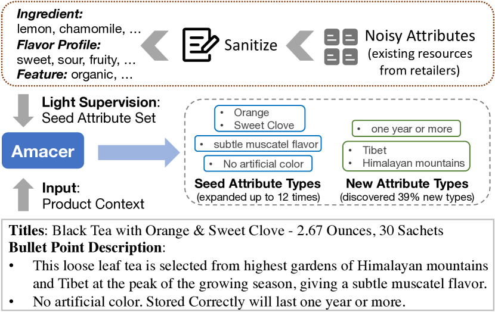
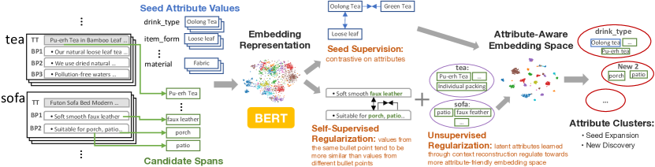

# Towards Open-World Product Attribute Mining:
A Lightly-Supervised Approach

###### Abstract

We present a new task setting for attribute mining on e-commerce products, serving as a practical solution to extract open-world attributes without extensive human intervention. Our supervision comes from a high-quality seed attribute set bootstrapped from existing resources, and we aim to expand the attribute vocabulary of existing seed types, and also to discover any new attribute types automatically. A new dataset is created to support our setting, and our approach Amacer is proposed specifically to tackle the limited supervision. Especially, given that no direct supervision is available for those unseen new attributes, our novel formulation exploits self-supervised heuristic and unsupervised latent attributes, which attains implicit semantic signals as additional supervision by leveraging product context. Experiments suggest that our approach surpasses various baselines by 12 F1, expanding attributes of existing types significantly by up to 12 times, and discovering values from 39% new types. Our data and code can be found at <https://github.com/lxucs/woam>.  

## 1 Introduction

Attribute mining (or product attribute extraction) is to extract values of various attribute types (e.g. colors, flavors) from e-commerce product description, which is a foundational piece for product understanding in online shopping services, enabling better search and recommendation experience.  

Within this task regime, different settings have been studied. Most pioneer works deem it as a closed-world setting, where models are trained to identify a fixed set of pre-defined attribute types Ghani et al. ([2006](#bib.bib5)); Putthividhya and Hu ([2011](#bib.bib9)); Zheng et al. ([2018](#bib.bib19)), similar to the standard named entity recognition (NER). Recent works start to step up towards the open-world aspect that supports extraction of new attribute types unseen in training. Particularly, several works have focused on the zero-shot perspective Xu et al. ([2019](#bib.bib15)); Yang et al. ([2022](#bib.bib16)), enabling extraction of a new attribute type during inference if given a name or description of this new type, which is a more realistic setting to this task, as new types of products and attributes are constantly emerging in the real world.  

[FIGURE S1.F1.g1]

Figure 1: Illustration of our task setting on one product: given light supervision from seed attributes, our approach Amacer aims to expand attribute vocabulary of seed types, and to also discover values of any new types (Shelf Life, Origin) not covered by seeds. The outputs on all products are thus attribute clusters with diverse values. Evaluation is based on clustering metrics, as new clusters are not named beforehand.
[/FIGURE]

In this work, we formulate the attribute mining task one step further towards the ultimate open-world setting: given product-related description, the objective is to identify as many new values of existing attribute types, as well as any new types that could be considered as reasonable attributes but not covered in training. As such, our setting automatically discovers new attributes, unlike the zero-shot setting that requires explicit specification of new types of interest. In addition, we also aim the model to work under limited supervision, by introducing only a relatively small seed attribute set in training, thereby remaining practical when only a few values are known for a certain attribute, also for the fact that it is untenable to keep up high-coverage human annotations of ever-changing attributes, especially in e-commerce domain.  

Figure [1](#S1.F1 "Figure 1 ‣ 1 Introduction ‣ Towards Open-World Product Attribute Mining: A Lightly-Supervised Approach") illustrates our overall task setting, where the model expands the attribute vocabulary of existing types, and discovers any new attributes, yielding numerous attribute clusters. A new dataset dubbed WoaM (Weakly-supervised Open-world Attribute Mining) is created to accommodate our setting, as described in Section [2](#S2 "2 Data ‣ Towards Open-World Product Attribute Mining: A Lightly-Supervised Approach"). Targeting towards realistic open-world setting, our dataset covers full product horizons including titles and detailed description, where the latter provides rich context and is shown to contain more unseen attribute types than titles by 66% (Table [1](#S2.T1 "Table 1 ‣ Test Set ‣ 2 Data ‣ Towards Open-World Product Attribute Mining: A Lightly-Supervised Approach")). Moreover, distinguished from previous datasets that either require substantial annotation efforts Zheng et al. ([2018](#bib.bib19)) or noisy distant-supervised data Xu et al. ([2019](#bib.bib15)); Yang et al. ([2022](#bib.bib16)); Zhang et al. ([2022](#bib.bib17)), our training supervision comes from a high-quality seed attribute set constructed hybridly, combining data-driven and light human curation. Overall, our setting achieves good trade-offs with reasonable human interventions, under a practical scope with decent coverage on attributes.  

We then propose our approach for this setting, dubbed Amacer (Attribute mining with adaptive clustering and weak regularization). To overcome the challenge of limited supervision, we first introduce our approach to generate diverse spans of candidate attribute values from corpus (§[3](#S3 "3 Candidate Span Generation ‣ Towards Open-World Product Attribute Mining: A Lightly-Supervised Approach")); then focus on representation learning by utilizing explicit supervision from seed attributes (§[4](#S4 "4 Explicit Signals for Seed Expansion ‣ Towards Open-World Product Attribute Mining: A Lightly-Supervised Approach")), followed by the last step that performs grouping on candidate spans using refined, attribute-aware embeddings (§[5](#S5 "5 Candidate Span Grouping ‣ Towards Open-World Product Attribute Mining: A Lightly-Supervised Approach")). New formulations to mine more implicit semantic signals from product context are also proposed for new attribute discovery (§[6](#S6 "6 Implicit Signals for New Discovery ‣ Towards Open-World Product Attribute Mining: A Lightly-Supervised Approach")).  

Experiments on WoaM suggest that our approach outperforms various baselines by up to 12.5 F1. Furthermore, our novel formulation to leverage self-supervised and unsupervised semantic signals is shown effective to both existing and new attributes, especially boosting new attribute discovery by a good margin of 6.4 F1. Despite the limited amount of seed values, our model is able to expand the seed attribute vocabulary by up to 12 times (Table [15](#A4.T15 "Table 15 ‣ Appendix D Quantitative Analysis ‣ Towards Open-World Product Attribute Mining: A Lightly-Supervised Approach")), and to discover values from 39% unseen attribute types on our test set. Overall, our contributions can be summarized as follows:  

* We address a new setting in attribute mining as a practical paradigm to extract open-world attributes under light human intervention. 
* A new dataset is created, covering 66 attribute types with 42% unseen types from the seed set. 
* A new approach is proposed to support our unique task setting, especially exploiting self-supervised and unsupervised semantic signals, which has not been explored by previous works. 

## 2 Data

Our dataset WoaM consists of three parts, including: 1) text corpus; 2) seed attribute set for training; 3) human-annotated test set for evaluation. Full statistics of our dataset are provided in Table [11](#A2.T11 "Table 11 ‣ Appendix B Dataset ‣ Towards Open-World Product Attribute Mining: A Lightly-Supervised Approach"), and more details are provided in Appendix [B](#A2 "Appendix B Dataset ‣ Towards Open-World Product Attribute Mining: A Lightly-Supervised Approach").  

#### Corpus

Four common e-commerce product categories are included in our corpus: Tea, Vitamin, Sofa, Phone Case. For each category, we sampled 9,000+ products publicly listed on Amazon.com with full description available in English. Each product record can be represented as a tuple: (identifier, category, title, bullet points).  

#### Seed Set

For each category, the seed set consists of a few applicable attribute types (avg. 16.5 types per category) and their values (avg. 22 values per type). We adopt a hybrid approach for the construction: existing resources are first utilized to bootstrap the seed set, and human curation is performed upon to overcome the noisy issue existed in previous datasets (example shown in Table [10](#A1.T10 "Table 10 ‣ Appendix A Previous Work ‣ Towards Open-World Product Attribute Mining: A Lightly-Supervised Approach")). Specifically, two steps are applied as below:  

Automatic Sanitizing: we collect the raw product profiles that contain certain attributes provided by Amazon retailers, and perform frequency-based heuristics to heavily sanitize noisy attributes. First, long-tail attribute types that have fewer than 10 values are removed. Second, for each product category, if a unique value appears under multiple attributes types, we restrict it to only belong to its most common type. Lastly, for each attribute type, we only keep at most 100 values based on the top frequency, so to discard the tail values that we are less confident on. The resulting seed set thereby has a relatively small size but of higher quality after above three steps.  

Human Curation: as the attribute set after sanitizing is relatively small, human curators can go through the entire set rather quickly and consolidate the final seed set ($<40$ min per product category). Concretely, remaining noisy values are spotted and removed from their attribute types. Furthermore, granularity is adjusted such that ambiguous or coarse attribute types are split into multiple newly defined fine-grained types; similar attribute types are also merged into one type.  

After we obtain the final seed set, we perform string match to obtain their occurrences in corpus, ready to be used for training. A development set is separately created that consists of sanitized profile attributes solely for hyperparameter tuning. Overall, our training supervision is built practically that balances between scalability and quality.  

#### Test Set

For each category, we collect additional products not covered in the raw corpus as the test set. Two in-house annotators are asked to annotate all spans that appear as reasonable attribute values of either an existing type from the seed set, or a brand-new type that fits the context. As with previous works, we do not allow overlapping spans: more complete spans are preferred over shorter and incomplete spans; each span is assigned a single attribute type that best describes its property.  

Table [1](#S2.T1 "Table 1 ‣ Test Set ‣ 2 Data ‣ Towards Open-World Product Attribute Mining: A Lightly-Supervised Approach") briefly specifies unique characteristics of our dataset. It is clear that most gold values are new values unseen from the seed set. Especially, bullet points have a higher ratio of new attribute types/values than titles, while those values are harder to extract due to longer text, sparser values, and more complex language structures. For comparison, our setting poses greater challenges than the most related previous dataset from a recent work OA-Mine Zhang et al. ([2022](#bib.bib17)), which is under a much limited scope that consists of only titles with sparser and noisier seed attributes (detailed comparison is provided in Appendix [A](#A1 "Appendix A Previous Work ‣ Towards Open-World Product Attribute Mining: A Lightly-Supervised Approach")).  

[TABLE S2.T1]

<table class="ltx_tabular ltx_align_middle">
<tr class="ltx_tr">
<td class="ltx_td ltx_border_r ltx_border_tt"></td>
<td class="ltx_td ltx_align_center ltx_border_tt">Type (New)</td>
<td class="ltx_td ltx_align_center ltx_border_tt">Value (New)</td>
<td class="ltx_td ltx_align_center ltx_border_tt">Tok</td>
<td class="ltx_td ltx_align_center ltx_border_tt">Gold</td>
</tr>
<tr class="ltx_tr">
<td class="ltx_td ltx_align_left ltx_border_r ltx_border_t">TT</td>
<td class="ltx_td ltx_align_center ltx_border_t">46 (28%)</td>
<td class="ltx_td ltx_align_center ltx_border_t">864 (70%)</td>
<td class="ltx_td ltx_align_center ltx_border_t">20.1</td>
<td class="ltx_td ltx_align_center ltx_border_t">5.7 (28.5%)</td>
</tr>
<tr class="ltx_tr">
<td class="ltx_td ltx_align_left ltx_border_bb ltx_border_r">BP</td>
<td class="ltx_td ltx_align_center ltx_border_bb">65 (43%)</td>
<td class="ltx_td ltx_align_center ltx_border_bb">2787 (89%)</td>
<td class="ltx_td ltx_align_center ltx_border_bb">26.6</td>
<td class="ltx_td ltx_align_center ltx_border_bb">3.6 (13.8%)</td>
</tr>
</table>

Table 1: Characteristics of our dataset by titles (TT) and bullet points (BP) on the test set (full stats in Table [11](#A2.T11 "Table 11 ‣ Appendix B Dataset ‣ Towards Open-World Product Attribute Mining: A Lightly-Supervised Approach")): total number of unique attribute types/values, with the ratio of new types/values in parentheses; averaged number of tokens and gold values per title/bullet sequence, with the density of gold values per token in parentheses.
[/TABLE]

Our proposed approach for this dataset is presented in the following Section [3](#S3 "3 Candidate Span Generation ‣ Towards Open-World Product Attribute Mining: A Lightly-Supervised Approach")-[6](#S6 "6 Implicit Signals for New Discovery ‣ Towards Open-World Product Attribute Mining: A Lightly-Supervised Approach"). Specifically, Section [3](#S3 "3 Candidate Span Generation ‣ Towards Open-World Product Attribute Mining: A Lightly-Supervised Approach")-[5](#S5 "5 Candidate Span Grouping ‣ Towards Open-World Product Attribute Mining: A Lightly-Supervised Approach") introduce the overall pipeline depicted in Figure [2](#S4.F2 "Figure 2 ‣ 4 Explicit Signals for Seed Expansion ‣ Towards Open-World Product Attribute Mining: A Lightly-Supervised Approach") that utilizes explicit signals from seed attributes, and Section [6](#S6 "6 Implicit Signals for New Discovery ‣ Towards Open-World Product Attribute Mining: A Lightly-Supervised Approach") introduces our novel formulation to exploit implicit signals beyond the limited seed attributes.  

## 3 Candidate Span Generation

The first stage of our approach is to generate spans from product description that could be qualified as attribute values, producing a set of non-overlapping candidate spans, serving as a foundational step for this attribute extraction task.  

With weak supervision in mind, this step should not simply rely on signals from the seed set; otherwise, it would become hard to generalize and lose diverse attribute expressions during inference. Therefore, directly employing a supervised model can be suboptimal. It is also tempting to use off-the-shelf phrase extraction tools such as AutoPhrase Shang et al. ([2018](#bib.bib12)), however, the domain shift on e-commerce description of varied categories can severely affect recall, as observed by Zhang et al. ([2022](#bib.bib17)). The close work OA-Mine regards this stage as an unsupervised sentence segmentation task on product titles through language model probing Wu et al. ([2020](#bib.bib14)), regarding each segment as a candidate span. Nonetheless, two shortcomings still remain. First, unlike titles, segmentation may not be suitable for bullet points, as most segments from bullet points would be noisy spans, demonstrated by the lower value density (13.8%) in Table [1](#S2.T1 "Table 1 ‣ Test Set ‣ 2 Data ‣ Towards Open-World Product Attribute Mining: A Lightly-Supervised Approach"). Second, being completely unsupervised, there is no task-specific adjustment in this process, suffering inadequate candidate quality.   

In this work, we instead resort to a basic yet effective strategy that overcomes above issues, by using syntax-oriented patterns: we collect valid Part-of-Speech (POS) patterns for attribute values, and simply obtain all spans in the corpus that fit into those patterns as candidate spans, followed by rudimentary stopword filtering and overlapping span removal (prioritizing longer spans), yielding a smaller but higher-quality candidate set than that from sentence segmentation.  

Valid POS patterns are acquired in a data-driven fashion without human intervention: we leverage the product profiles again, and obtain all POS sequences of their attribute values. These raw sequences are further compacted by removing consecutive duplicate POS tags, such that healthy clean water ([ADJ, ADJ, NOUN] → [ADJ, NOUN]) will share the same POS pattern as clean water ([ADJ, NOUN]). The resulting set of collected POS patterns serves to identify spans as well-formed or ill-formed phrases.  

Examples of our POS patterns are shown in Table [2](#S3.T2 "Table 2 ‣ 3 Candidate Span Generation ‣ Towards Open-World Product Attribute Mining: A Lightly-Supervised Approach"). They regulate spans based on their syntactic features, without sole reliance on semantic supervision from the limited seed set, hence being able to capture diverse attribute expressions of vast variety. Overall, they serve as the quality guardrail for candidate spans, while reaping additional advantages: 1) easy to perform manual domain-specific adjustment; 2) scalable towards other product categories, as being data-driven; 3) efficient to run in practice.  

[TABLE S3.T2]

<table class="ltx_tabular ltx_align_middle">
<tr class="ltx_tr">
<td class="ltx_td ltx_align_left ltx_border_tt">healthy clean water</td>
<td class="ltx_td ltx_align_left ltx_border_tt">[ADJ, NOUN]</td>
<td class="ltx_td ltx_align_left ltx_border_tt">✓</td>
</tr>
<tr class="ltx_tr">
<td class="ltx_td ltx_align_left">sweet and spicy taste</td>
<td class="ltx_td ltx_align_left">[ADJ, CCONJ, ADJ, NOUN]</td>
<td class="ltx_td ltx_align_left">✓</td>
</tr>
<tr class="ltx_tr">
<td class="ltx_td ltx_align_left">promotes healthy liver function</td>
<td class="ltx_td ltx_align_left">[VERB, ADJ, NOUN]</td>
<td class="ltx_td ltx_align_left">✓</td>
</tr>
<tr class="ltx_tr">
<td class="ltx_td ltx_align_left">are available during</td>
<td class="ltx_td ltx_align_left">[VERB, ADJ, ADP]</td>
<td class="ltx_td ltx_align_left">✗</td>
</tr>
<tr class="ltx_tr">
<td class="ltx_td ltx_align_left ltx_border_bb">freshness so every cup</td>
<td class="ltx_td ltx_align_left ltx_border_bb">[NOUN, ADV, DET, NOUN]</td>
<td class="ltx_td ltx_align_left ltx_border_bb">✗</td>
</tr>
</table>

Table 2: Examples of POS patterns to recognize well-formed (✓) or ill-formed (✗) phrases.
[/TABLE]

As we depend on external tools to identify POS, this process is not without noises. Nonetheless, we find the empirical performance to be quite robust qualitatively. Moreover, it can be augmented with other techniques to mitigate noise in scenarios tailored to specific applications.  

## 4 Explicit Signals for Seed Expansion

[FIGURE S4.F2.g1]

Figure 2: Illustration of our proposed approach Amacer. It generates candidate spans from product description (§[3](#S3 "3 Candidate Span Generation ‣ Towards Open-World Product Attribute Mining: A Lightly-Supervised Approach")), and performs representation learning on embedding space, by utilizing: explicit supervision from seed attributes (§[4](#S4 "4 Explicit Signals for Seed Expansion ‣ Towards Open-World Product Attribute Mining: A Lightly-Supervised Approach")); implicit semantic signals by self-supervised heuristic and unsupervised latent attributes (§[6](#S6 "6 Implicit Signals for New Discovery ‣ Towards Open-World Product Attribute Mining: A Lightly-Supervised Approach")). Final attribute clusters can be obtained by grouping candidates through adaptive expansion and DBSCAN (§[5](#S5 "5 Candidate Span Grouping ‣ Towards Open-World Product Attribute Mining: A Lightly-Supervised Approach")).
[/FIGURE]

With both seed attribute values and candidate spans in-place, our next objective is to perform representation learning that refines the geometry of embedding space, such that values of similar attributes should have a closer embedding representation, and vice versa, as the key property to leverage in later grouping stage. In this section, we introduce the utilization of available seed attributes as explicit supervision, primarily targeting the vocabulary expansion of existing attribute types.  

For each seed value or candidate span, we can have an initial representation on the embedding space via encoding through pretrained language models such as BERT Devlin et al. ([2019](#bib.bib2)). Concretely, we feed each text sequence (either a title or bullet point) to BERT, and obtain the contextualized representation of each span by averaging its token embedding, without introducing extra encoding parameters.  

#### Supervised Contrastive Learning

Contrastive learning is a natural fit to consume task signals from the seed set: for an anchor seed value $v_{a}$, a positive seed $v_{p}$ from the same attribute, and a negative seed $v_{n}$ from a different attribute, contrastive learning enforces $(v_{a},v_{p})$ to be more similar than $(v_{a},v_{n})$ on the embedding space. OA-Mine adopts a triplet loss Schroff et al. ([2015](#bib.bib11)) for the supervised contrastive learning, as well as another regression loss Reimers and Gurevych ([2019](#bib.bib10)) that directly pushes the similarity of positive/negative pairs, requiring careful sampling and tuning. In our work, we simplify this supervised process by only using an in-batch negative contrastive loss Khosla et al. ([2020](#bib.bib6)). Let $I^{s}$ be all seed value indices, $P^{s}(i)$ be the indices of positive seeds that belong to the same attribute as seed $i$, $N^{s}(i)=I^{s}\setminus P^{s}(i)$ be the corresponding negative seeds. $g_{i}$ is the L2-normalized embedding of seed $i$ from the last layer of BERT encoding. The loss can then be denoted as:  

|  | $\displaystyle\mathcal{L}^{su}=\sum_{i\in I^{s}}\frac{-1}{|P^{s}(i)|}\sum_{p\in P^{s}(i)}\log\frac{e^{(g_{i}\cdot g_{p}/\tau)}}{\sum_{j\in N^{s}(i)}e^{(g_{i}\cdot g_{j}/\tau)}}$ |  |
| --- | --- | --- |

$\tau$ is the temperature hyperparameter. As all embeddings are L2-normalized, $g_{i}\cdot g_{j}$ is effectively the cosine similarity as a distance measurement of two span representation. $\mathcal{L}^{su}$ pushes seed values of the same attribute to have a similar representation, while pulling away seed values from different attribute types on the embedding space.  

## 5 Candidate Span Grouping

After representation learning, a grouping stage upon candidate spans is followed. Each resulting cluster represents an attribute type, with each span inside being its attribute value. Unlike most related works that employ off-the-shelf clustering algorithms such as HAC, K-Means or DBSCAN Elsahar et al. ([2017](#bib.bib4)); Zhao et al. ([2021](#bib.bib18)); Zhang et al. ([2022](#bib.bib17)), we propose a more fine-grained grouping strategy, which first explicitly addresses the expansion of existing seed attributes, then discovers new potential attributes, as described below.   

#### Adaptive Expansion on Existing Attributes

We borrow the concept from few-shot learning, and regard each existing seed attribute set as a support set. The distance between each candidate span $c_{i}$ and each support set $\mathcal{S}_{j}$ is measured by $\mathcal{D}$, which is the averaged cosine distance between the candidate and each seed values, as in Eq ([1](#S5.E1 "In Adaptive Expansion on Existing Attributes ‣ 5 Candidate Span Grouping ‣ Towards Open-World Product Attribute Mining: A Lightly-Supervised Approach")). A candidate $c_{i}$ is added to an attribute $j$ if $\mathcal{D}(c_{i},\mathcal{S}_{j})<\mathbf{t}_{j}$, where $\mathbf{t}_{j}$ is a threshold calculated adaptively based on its support set, as in Eq ([2](#S5.E2 "In Adaptive Expansion on Existing Attributes ‣ 5 Candidate Span Grouping ‣ Towards Open-World Product Attribute Mining: A Lightly-Supervised Approach")). Particularly, $\delta\in(0,1]$ is a hyperparameter to relax the threshold that can be tuned on the development set.  

|  | $\displaystyle\mathcal{D}(c_{i},\mathcal{S}_{j})$ | $\displaystyle=\frac{1}{|\mathcal{S}_{j}|}\sum_{s_{k}\in\mathcal{S}_{j}}\text{cosine}(c_{i},s_{k})$ |  | (1) |
| --- | --- | --- | --- | --- |
|  | $\displaystyle\mathbf{t}_{j}=\delta$ | $\displaystyle\cdot\frac{1}{|\mathcal{S}_{j}|^{2}}\sum_{s_{u},s_{v}\in\mathcal{S}_{j}}\text{cosine}(s_{u},s_{v})$ |  | (2) |
| --- | --- | --- | --- | --- |

#### More Attribute Coverage

For remaining candidate spans, more clusters are mined to increase coverage primarily for potential new attributes. We also resort to off-the-shelf DBSCAN that can automatically discover clusters and distinguish noises based on the pairwise cosine distance.  

The union of clusters from the above two stages serve as the final result of the candidate grouping.  

## 6 Implicit Signals for New Discovery

Since the seed set only provides semantic signals regarding seed attributes, the majority of candidate spans lack proper supervision, as most of them are absent from the seed set, especially for those new attributes that have no direct supervision during representation learning. Therefore, it is desirable to exploit additional implicit signals towards more new-attribute-friendly embedding space, and we propose novel methods to tackle the challenge by fully leveraging product context through self-supervised and unsupervised regularization.  

### 6.1 Self-Supervised Contrastive Learning

To utilize the product context, we formulate a self-supervised contrastive heuristic similar to skip-gram in word2vec Mikolov et al. ([2013](#bib.bib8)). We regard each bullet point as a window: pushing two candidate spans within the same window (same bullet point) to have closer representation than two spans not in the same window (different bullet points of a product). It is based on the general observation that different bullet points usually discuss different product perspectives, but within each point, similar attributes or topics are usually mentioned. Though noisy, useful semantic signals could still be revealed given enough corpus, similar to the skip-gram training.  

Let $I^{b}$ be all candidate span indices in bullet points, $P^{b}(i)$ be the indices of positive spans within the same bullet point as $i$, $N^{b}(i)$ be the corresponding negative spans from different bullet points of the same product. The self-supervised contrastive loss is denoted as:   

|  | $\displaystyle\mathcal{L}^{ss}=\sum_{i\in I^{b}}\frac{-1}{|P^{b}(i)|}\sum_{p\in P^{b}(i)}\log\frac{e^{(g_{i}\cdot g_{p}/\tau)}}{\sum_{j\in N^{b}(i)}e^{(g_{i}\cdot g_{j}/\tau)}}$ |  |
| --- | --- | --- |

We regard $\mathcal{L}^{ss}$ as a form of regularization, assigning a small coefficient during training. The final loss is described as in Eq ([8](#S6.E8 "In Optimization ‣ 6.2 Unsupervised Latent Attributes ‣ 6 Implicit Signals for New Discovery ‣ Towards Open-World Product Attribute Mining: A Lightly-Supervised Approach")).  

### 6.2 Unsupervised Latent Attributes

More useful signals could still be revealed from product context in addition to the bullet point heuristic. Inspired from topic modeling, e.g. Latent Dirichlet Allocation (LDA) Blei et al. ([2003](#bib.bib1)), a classic generative method that discovers latent topics unsupervisely from bag-of-words documents, here we propose a formulation of latent attributes to regulate the embedding space, providing implicit signals based on the semantic distribution of corpus, especially beneficial to new attribute discovery that has no direct supervision. We adapt the neural LDA work from Miao et al. ([2017](#bib.bib7)); Dieng et al. ([2020](#bib.bib3)), and regard topics as attributes in our setting. The main idea is that each product can be rendered as a composition of spans (equivalently, bag-of-spans) generated from different latent attributes based on the following two distributions.  

#### Product-to-Attribute Distribution

Given the context of a product, the model predicts a distribution over $K$ latent attributes, where $K$ is a hyperparameter. Latent attributes of higher probabilities play a larger role in a product’s semantics. Since learning the true distribution is intractable, variational inference is applied such that we posit the distribution family to be multivariate Gaussian with diagonal covariance matrix, and fix the prior distribution as standard Gaussian Dieng et al. ([2020](#bib.bib3)). Hence, the posterior Product-to-Attribute distribution can be obtained by simply predicting the mean and variance of multivariate Gaussian. Let $p$ represent a product, $\mathbf{h}^{p}$ be its context representation, $\mu_{k}^{p}/\sigma_{k}^{p}$ be its mean/variance for the latent attribute $k$ predicted by the model. A sampled probability of attribute $k$ for product $p$ can be denoted as $\alpha_{k}^{p}$:  

|  | $\displaystyle\mu_{k}^{p}/\sigma_{k}^{p}$ | $\displaystyle=W^{\mu/\sigma}_{k}\cdot\mathbf{h}^{p}$ |  | (3) |
| --- | --- | --- | --- | --- |
|  | $\displaystyle\widetilde{\alpha}_{k}^{p}$ | $\displaystyle\sim\mathcal{N}(\mu_{k}^{p},\,\sigma_{k}^{p})$ |  | (4) |
| --- | --- | --- | --- | --- |
|  | $\displaystyle\alpha_{k}^{p}$ | $\displaystyle=\text{softmax}\,(\widetilde{\alpha}_{k}^{p})\;|_{k=1}^{K}$ |  | (5) |
| --- | --- | --- | --- | --- |

$W^{\mu/\sigma}_{k}$ is a learned parameter to predict mean and variance. For $\mathbf{h}_{p}$, we use the averaged CLS representation of its product title and all bullet points.  

#### Attribute-to-Span Distribution

For each latent attribute, the model also learns a distribution over candidate spans; spans of high probabilities are the representatives of this attribute. Following Dieng et al. ([2020](#bib.bib3)), rather than building an explicit distribution, the model instead simply learns an attribute embedding, so that the distribution can be obtained by measuring the similarity of the attribute embedding and span embeddings. Let $h_{k}$ be the k’th attribute embedding learned by the model, $g_{c}$ be the representation of a candidate span $c$, and $\mathcal{C}$ be all unique candidate spans from all products in a training batch. The distribution of an attribute $k$ over candidates $\mathcal{C}$ can be denoted as:  

|  | $\displaystyle\beta_{kc}=\text{softmax}\,(h_{k}\cdot g_{c})\;|_{c\in\mathcal{C}}$ |  | (6) |
| --- | --- | --- | --- |

#### Optimization

Given the above two distributions for a product $p$, the model can easily get the Product-to-Span distribution $\mathcal{P}(c|p)$ by marginalizing out the latent attributes, as in Eq ([7](#S6.E7 "In Optimization ‣ 6.2 Unsupervised Latent Attributes ‣ 6 Implicit Signals for New Discovery ‣ Towards Open-World Product Attribute Mining: A Lightly-Supervised Approach")), which can then be used to optimize a reconstruction objective, such that spans actually appeared in product $p$ should have higher probability than those who do not. Let $V(p)$ be the candidate spans in a product $p$, $m$ be the total number of products. The unsupervised reconstruction loss $\mathcal{L}^{un}$ can be estimated by evidence lower bound (ELBO) as:  

|  |  | $\displaystyle\mathcal{P}(c|p)=\sum_{k=1}^{K}\alpha_{k}^{p}\cdot\beta_{kc}$ |  | (7) |
| --- | --- | --- | --- | --- |
|  | $\displaystyle\mathcal{L}^{un}$ | $\displaystyle=-\sum_{p=1}^{m}\big{(}\sum_{c^{\prime}\in V(p)}\log\mathcal{P}(c^{\prime}|p)+\text{KL}(\widetilde{\alpha}^{p}\|\hat{\alpha})\big{)}$ |  |
| --- | --- | --- | --- |
|  | $\displaystyle\mathcal{L}$ | $\displaystyle=\mathcal{L}^{su}+\lambda^{ss}\cdot\mathcal{L}^{ss}+\lambda^{un}\cdot\mathcal{L}^{un}$ |  | (8) |
| --- | --- | --- | --- | --- |

where $\hat{\alpha}$ is the fixed standard Gaussian (prior Product-to-Attribute distribution). The first term of $\mathcal{L}^{un}$ is the log-likelihood to encourage higher probability for actually appeared candidate spans in a product, and the second KL-divergence term regularizes the posterior attribute distribution $\widetilde{\alpha}_{p}$ to be close to the standard Gaussian $\hat{\alpha}$.  

The final loss $\mathcal{L}$ during representation learning is constituted by three losses; $\lambda^{ss}$ and $\lambda^{un}$ are hyperparameters that control the regularization strength.  

## 7 Experiments

[TABLE S7.T3]

<table class="ltx_tabular ltx_align_middle">
<tr class="ltx_tr">
<td class="ltx_td ltx_align_top ltx_border_tt"></td>
<td class="ltx_td ltx_border_r ltx_border_tt"></td>
<td class="ltx_td ltx_align_center ltx_border_tt">Exact Match</td>
<td class="ltx_td ltx_border_tt"></td>
<td class="ltx_td ltx_align_center ltx_border_tt">Partial Match</td>
</tr>
<tr class="ltx_tr">
<td class="ltx_td ltx_align_top"></td>
<td class="ltx_td ltx_border_r"></td>
<td class="ltx_td ltx_align_center ltx_border_t">Jaccard</td>
<td class="ltx_td ltx_align_center ltx_border_t">ARI</td>
<td class="ltx_td ltx_align_center ltx_border_t">NMI</td>
<td class="ltx_td ltx_align_center ltx_border_t">Recall</td>
<td class="ltx_td ltx_align_center ltx_border_t">F1</td>
<td class="ltx_td"></td>
<td class="ltx_td ltx_align_center ltx_border_t">Jaccard</td>
<td class="ltx_td ltx_align_center ltx_border_t">ARI</td>
<td class="ltx_td ltx_align_center ltx_border_t">NMI</td>
<td class="ltx_td ltx_align_center ltx_border_t">Recall</td>
<td class="ltx_td ltx_align_center ltx_border_t">F1</td>
</tr>
<tr class="ltx_tr">
<td class="ltx_td ltx_align_justify ltx_align_top ltx_border_t">

Closed-World
(Tagging)

</td>
<td class="ltx_td ltx_align_left ltx_border_r ltx_border_t">Tx-CRF</td>
<td class="ltx_td ltx_align_center ltx_border_t">92.5</td>
<td class="ltx_td ltx_align_center ltx_border_t">95.4</td>
<td class="ltx_td ltx_align_center ltx_border_t">95.8</td>
<td class="ltx_td ltx_align_center ltx_border_t">20.0</td>
<td class="ltx_td ltx_align_center ltx_border_t">32.8</td>
<td class="ltx_td ltx_border_t"></td>
<td class="ltx_td ltx_align_center ltx_border_t">78.2</td>
<td class="ltx_td ltx_align_center ltx_border_t">85.3</td>
<td class="ltx_td ltx_align_center ltx_border_t">86.7</td>
<td class="ltx_td ltx_align_center ltx_border_t">30.5</td>
<td class="ltx_td ltx_align_center ltx_border_t">44.2</td>
</tr>
<tr class="ltx_tr">
<td class="ltx_td ltx_align_left ltx_border_r">SU-OpenTag</td>
<td class="ltx_td ltx_align_center">70.1</td>
<td class="ltx_td ltx_align_center">78.8</td>
<td class="ltx_td ltx_align_center">87.1</td>
<td class="ltx_td ltx_align_center">22.1</td>
<td class="ltx_td ltx_align_center">34.5</td>
<td class="ltx_td"></td>
<td class="ltx_td ltx_align_center">61.7</td>
<td class="ltx_td ltx_align_center">72.6</td>
<td class="ltx_td ltx_align_center">79.5</td>
<td class="ltx_td ltx_align_center">34.7</td>
<td class="ltx_td ltx_align_center">46.6</td>
</tr>
<tr class="ltx_tr">
<td class="ltx_td ltx_align_justify ltx_align_top ltx_border_t">

 Open-World
   (Segment)

</td>
<td class="ltx_td ltx_align_left ltx_border_r ltx_border_t">OA-Mine</td>
<td class="ltx_td ltx_align_center ltx_border_t">63.5</td>
<td class="ltx_td ltx_align_center ltx_border_t">74.4</td>
<td class="ltx_td ltx_align_center ltx_border_t">78.8</td>
<td class="ltx_td ltx_align_center ltx_border_t">25.3</td>
<td class="ltx_td ltx_align_center ltx_border_t">36.9</td>
<td class="ltx_td ltx_border_t"></td>
<td class="ltx_td ltx_align_center ltx_border_t">48.8</td>
<td class="ltx_td ltx_align_center ltx_border_t">60.9</td>
<td class="ltx_td ltx_align_center ltx_border_t">64.9</td>
<td class="ltx_td ltx_align_center ltx_border_t">40.5</td>
<td class="ltx_td ltx_align_center ltx_border_t">46.7</td>
</tr>
<tr class="ltx_tr">
<td class="ltx_td ltx_align_left ltx_border_r">Amacer*</td>
<td class="ltx_td ltx_align_center">69.9</td>
<td class="ltx_td ltx_align_center">78.0</td>
<td class="ltx_td ltx_align_center">84.1</td>
<td class="ltx_td ltx_align_center">29.0</td>
<td class="ltx_td ltx_align_center">41.7</td>
<td class="ltx_td"></td>
<td class="ltx_td ltx_align_center">58.4</td>
<td class="ltx_td ltx_align_center">68.8</td>
<td class="ltx_td ltx_align_center">73.7</td>
<td class="ltx_td ltx_align_center">47.8</td>
<td class="ltx_td ltx_align_center">54.9</td>
</tr>
<tr class="ltx_tr">
<td class="ltx_td ltx_align_justify ltx_align_top ltx_border_bb ltx_border_t">

 Open-World
    (Syntax)

</td>
<td class="ltx_td ltx_align_left ltx_border_r ltx_border_t">DBSCAN</td>
<td class="ltx_td ltx_align_center ltx_border_t">22.4</td>
<td class="ltx_td ltx_align_center ltx_border_t">29.8</td>
<td class="ltx_td ltx_align_center ltx_border_t">69.5</td>
<td class="ltx_td ltx_align_center ltx_border_t">17.3</td>
<td class="ltx_td ltx_align_center ltx_border_t">23.6</td>
<td class="ltx_td ltx_border_t"></td>
<td class="ltx_td ltx_align_center ltx_border_t">20.6</td>
<td class="ltx_td ltx_align_center ltx_border_t">24.7</td>
<td class="ltx_td ltx_align_center ltx_border_t">60.7</td>
<td class="ltx_td ltx_align_center ltx_border_t">26.9</td>
<td class="ltx_td ltx_align_center ltx_border_t">30.3</td>
</tr>
<tr class="ltx_tr">
<td class="ltx_td ltx_align_left ltx_border_r">DBSCAN+AE</td>
<td class="ltx_td ltx_align_center">32.8</td>
<td class="ltx_td ltx_align_center">41.8</td>
<td class="ltx_td ltx_align_center">61.2</td>
<td class="ltx_td ltx_align_center">30.3</td>
<td class="ltx_td ltx_align_center">35.9</td>
<td class="ltx_td"></td>
<td class="ltx_td ltx_align_center">25.1</td>
<td class="ltx_td ltx_align_center">30.1</td>
<td class="ltx_td ltx_align_center">47.1</td>
<td class="ltx_td ltx_align_center">50.5</td>
<td class="ltx_td ltx_align_center">40.7</td>
</tr>
<tr class="ltx_tr">
<td class="ltx_td ltx_align_left ltx_border_r">OA-Mine*</td>
<td class="ltx_td ltx_align_center">55.8</td>
<td class="ltx_td ltx_align_center">68.2</td>
<td class="ltx_td ltx_align_center">73.6</td>
<td class="ltx_td ltx_align_center">30.8</td>
<td class="ltx_td ltx_align_center">41.1</td>
<td class="ltx_td"></td>
<td class="ltx_td ltx_align_center">40.6</td>
<td class="ltx_td ltx_align_center">52.0</td>
<td class="ltx_td ltx_align_center">57.2</td>
<td class="ltx_td ltx_align_center">50.1</td>
<td class="ltx_td ltx_align_center">49.8</td>
</tr>
<tr class="ltx_tr">
<td class="ltx_td ltx_align_left ltx_border_r">Amacer-R</td>
<td class="ltx_td ltx_align_center">58.3</td>
<td class="ltx_td ltx_align_center">69.6</td>
<td class="ltx_td ltx_align_center">79.2</td>
<td class="ltx_td ltx_align_center">35.5</td>
<td class="ltx_td ltx_align_center">46.3</td>
<td class="ltx_td"></td>
<td class="ltx_td ltx_align_center">46.3</td>
<td class="ltx_td ltx_align_center">57.6</td>
<td class="ltx_td ltx_align_center">65.8</td>
<td class="ltx_td ltx_align_center">57.7</td>
<td class="ltx_td ltx_align_center">56.9</td>
</tr>
<tr class="ltx_tr">
<td class="ltx_td ltx_align_left ltx_border_bb ltx_border_r">Amacer</td>
<td class="ltx_td ltx_align_center ltx_border_bb">67.2</td>
<td class="ltx_td ltx_align_center ltx_border_bb">76.9</td>
<td class="ltx_td ltx_align_center ltx_border_bb">84.0</td>
<td class="ltx_td ltx_align_center ltx_border_bb">35.7</td>
<td class="ltx_td ltx_align_center ltx_border_bb">47.6</td>
<td class="ltx_td ltx_border_bb"></td>
<td class="ltx_td ltx_align_center ltx_border_bb">52.7</td>
<td class="ltx_td ltx_align_center ltx_border_bb">63.8</td>
<td class="ltx_td ltx_align_center ltx_border_bb">70.4</td>
<td class="ltx_td ltx_align_center ltx_border_bb">57.1</td>
<td class="ltx_td ltx_align_center ltx_border_bb">59.1</td>
</tr>
</table>

Table 3: Evaluation results on the test set of our new dataset WoaM, with F1 being the overall evaluation metric. See Section [7](#S7 "7 Experiments ‣ Towards Open-World Product Attribute Mining: A Lightly-Supervised Approach") for detailed specifications of model settings and evaluation metrics. Each number is the macro-average across all product categories. Models with lower Recall tend to have higher Jaccard/ARI/NMI scores, as they produce fewer (and easier) attribute clusters of higher purity. The best performance by both Exact/Partial-F1 is the underlined score achieved by our approach Amacer (statistically significant from t-test $>95\%$ confidence).
[/TABLE]

Experiments are conducted on our dataset in multiple model settings, including various baselines. Three different types of models are examined based on how attribute spans are obtained:  

(1) Closed-world models based on sequence-tagging that extract spans upon predicted BIO tags of existing attributes, which do not support new attribute discovery natively. Two models are experimented: Tx-CRF, a generic Transformers-CRF tagging model; SU-OpenTag Xu et al. ([2019](#bib.bib15)), a popular tagging-based attribute extraction model.  

(2) Open-world models that rely on sentence segmentation to obtain candidate spans. We use the code released from OA-Mine to obtain all text segments for our dataset. Two settings are included: OA-Mine Zhang et al. ([2022](#bib.bib17)); Amacer\*, a stripped version of our approach removing regularization and directly taking segments as candidates.  

(3) Open-world models that employ our syntax-based candidate generation (§[3](#S3 "3 Candidate Span Generation ‣ Towards Open-World Product Attribute Mining: A Lightly-Supervised Approach")). Five settings are included: DBSCAN that directly performs DBSCAN clustering without representation learning; DBSCAN+AE that adds our proposed adaptive expansion (§[4](#S4 "4 Explicit Signals for Seed Expansion ‣ Towards Open-World Product Attribute Mining: A Lightly-Supervised Approach")); OA-Mine\* that substitutes segmentation with our candidate spans; Amacer, our full proposed approach; and Amacer-R that only utilizes seed supervision without regularization in §[6](#S6 "6 Implicit Signals for New Discovery ‣ Towards Open-World Product Attribute Mining: A Lightly-Supervised Approach").  

For candidate span generation, we use spaCy111<https://spacy.io> to obtain POS tags; a total of 96 valid POS patterns are acquired from product profiles (Section [3](#S3 "3 Candidate Span Generation ‣ Towards Open-World Product Attribute Mining: A Lightly-Supervised Approach")). The same BERT-Large is used as the encoder for all models. Our detailed hyperparameter settings are provided in Appendix [C](#A3 "Appendix C Experimental Settings ‣ Towards Open-World Product Attribute Mining: A Lightly-Supervised Approach").  

#### Evaluation Metrics

Standard clustering evaluation metrics are used: Jaccard, Adjusted Rand Index (ARI), Normalized Mutual Information (NMI), to compare the attribute assignments on gold spans; Recall, to evaluate gold cluster coverage. As above metrics are consistent with OA-Mine, the evaluation adopts exact-match on predicted/gold spans. However, it could become over-restrictive as span boundaries can be quite subjective in this open-world setting, losing the information of near-correct predictions. Thus, we also provide a relaxed evaluation that allows partial-match on spans, such that a predicted span is considered an attribute value if more than half of the span falls into a gold value.  

To assess the overall performance of a model, we roughly regard the averaged number of Jaccard, ARI and NMI as pseudo precision, and derive a single pseudo-F1 score based on the clustering precision and recall, serving as the main evaluation metric of each approach.  

#### Results

Table [3](#S7.T3 "Table 3 ‣ 7 Experiments ‣ Towards Open-World Product Attribute Mining: A Lightly-Supervised Approach") shows the evaluation results by all model settings. Our full proposed approach Amacer surpasses both SU-OpenTag and OA-Mine by a large margin (10+ Exact/Partial-F1), achieving the best performance on this task. Further observations and ablation study can be obtained as below.  

• Open-world models identify more attributes than closed-world models. The two tagging-based models underperform OA-Mine-based models and our Amacer-based models, with noticeably lower recall. It can be attributed to two factors. First, as all spans are obtained through tagging learned solely from the seed set, they lack the ability to accept more diverse attribute values not covered in training, not being able to generalize well under limited supervision. Second, new attributes are left untouched, unlike the open-world counterparts.  

• Adaptive expansion on seed attribute types is effective for candidate grouping. By simply comparing DBSCAN with DBSCAN+AE, adaptive expansion is shown greatly improving the recall by 13-23% and overall performance by 10+%. On a side note, there is still a huge gap between DBSCAN+AE and Amacer, demonstrating the necessity to refine embedding space by representation learning.  

• Syntax-oriented generation obtains candidate spans of higher quality than segmentation. Both OA-Mine\* and Amacer-R that apply syntax-oriented candidates outperform their segmentation-based counterparts OA-Mine and Amacer\*, especially for exact-match that brings a gap of 4+ F1. Notably, our generation step takes under 10 minutes to process each category on CPUs, while the segmentation requires several hours on a GPU. Qualitatively, we found that the segmentation often over-divides sentences, yielding many noisy and incomplete phrases.   

• Seed supervision is more efficiently utilized by in-batch negative contrastive loss. Compared to the triplet loss and regression loss adopted in OA-Mine\*, the in-batch loss is not only simpler but also improves 5+ F1 in this task. We found the regression loss that pushes cosine similarity to 1/-1 for pos/neg pairs can be too harsh for the embedding space, as certain attribute types are indeed more related and not completely independent.  

• Regularization (§[6](#S6 "6 Implicit Signals for New Discovery ‣ Towards Open-World Product Attribute Mining: A Lightly-Supervised Approach")) is able to bring additional semantic signals useful to shape the attribute-aware embedding space, as shown by the 2.2 Partial F1 improvement of Amacer upon Amacer-R, where the unsupervised latent attribute formulation contributes around 70% improvement. We provide further quantitative and qualitative insights in Section [8](#S8 "8 Quantitative Analysis ‣ Towards Open-World Product Attribute Mining: A Lightly-Supervised Approach")-[9](#S9 "9 Qualitative Analysis ‣ Towards Open-World Product Attribute Mining: A Lightly-Supervised Approach").  

## 8 Quantitative Analysis

[TABLE S8.T4]

<table class="ltx_tabular ltx_align_middle">
<tr class="ltx_tr">
<td class="ltx_td ltx_border_r ltx_border_tt"></td>
<td class="ltx_td ltx_align_center ltx_border_tt">Seed / New</td>
<td class="ltx_td ltx_align_center ltx_border_tt">Title / BP</td>
<td class="ltx_td ltx_align_center ltx_border_tt">Gold</td>
</tr>
<tr class="ltx_tr">
<td class="ltx_td ltx_align_left ltx_border_r ltx_border_t">OA-Mine*</td>
<td class="ltx_td ltx_align_center ltx_border_t">51.2 / 24.6</td>
<td class="ltx_td ltx_align_center ltx_border_t">56.6 / 49.0</td>
<td class="ltx_td ltx_align_center ltx_border_t">61.2</td>
</tr>
<tr class="ltx_tr">
<td class="ltx_td ltx_align_left ltx_border_r">Amacer-R</td>
<td class="ltx_td ltx_align_center">64.5 / 39.8</td>
<td class="ltx_td ltx_align_center">61.2 / 56.9</td>
<td class="ltx_td ltx_align_center">69.8</td>
</tr>
<tr class="ltx_tr">
<td class="ltx_td ltx_align_left ltx_border_bb ltx_border_r">Amacer</td>
<td class="ltx_td ltx_align_center ltx_border_bb">66.0 / 46.2</td>
<td class="ltx_td ltx_align_center ltx_border_bb">61.5 / 59.3</td>
<td class="ltx_td ltx_align_center ltx_border_bb">71.9</td>
</tr>
</table>

Table 4: Decomposed evaluation (Partial-F1) by: seed attribute types only (Seed) / new attribute types only (New); product titles only (Title) / bullet points only (BP). Gold shows the result by taking gold values directly as candidate spans. Full metrics are provided in Table [12](#A4.T12 "Table 12 ‣ Appendix D Quantitative Analysis ‣ Towards Open-World Product Attribute Mining: A Lightly-Supervised Approach")-[14](#A4.T14 "Table 14 ‣ Appendix D Quantitative Analysis ‣ Towards Open-World Product Attribute Mining: A Lightly-Supervised Approach") (Appendix [D](#A4 "Appendix D Quantitative Analysis ‣ Towards Open-World Product Attribute Mining: A Lightly-Supervised Approach")).
[/TABLE]

[TABLE S8.T5]

<table class="ltx_tabular ltx_align_middle">
<tr class="ltx_tr">
<td class="ltx_td ltx_border_r ltx_border_tt"></td>
<td class="ltx_td ltx_align_center ltx_border_tt">Span (Exact)</td>
<td class="ltx_td ltx_border_tt"></td>
<td class="ltx_td ltx_align_center ltx_border_tt">Span (Partial)</td>
</tr>
<tr class="ltx_tr">
<td class="ltx_td ltx_border_r"></td>
<td class="ltx_td ltx_align_center ltx_border_t">P</td>
<td class="ltx_td ltx_align_center ltx_border_t">R</td>
<td class="ltx_td ltx_align_center ltx_border_t">F</td>
<td class="ltx_td"></td>
<td class="ltx_td ltx_align_center ltx_border_t">P</td>
<td class="ltx_td ltx_align_center ltx_border_t">R</td>
<td class="ltx_td ltx_align_center ltx_border_t">F</td>
</tr>
<tr class="ltx_tr">
<td class="ltx_td ltx_align_left ltx_border_r ltx_border_t">OA-Mine*</td>
<td class="ltx_td ltx_align_center ltx_border_t">31.0</td>
<td class="ltx_td ltx_align_center ltx_border_t">38.3</td>
<td class="ltx_td ltx_align_center ltx_border_t">34.2</td>
<td class="ltx_td ltx_border_t"></td>
<td class="ltx_td ltx_align_center ltx_border_t">52.8</td>
<td class="ltx_td ltx_align_center ltx_border_t">64.8</td>
<td class="ltx_td ltx_align_center ltx_border_t">58.1</td>
</tr>
<tr class="ltx_tr">
<td class="ltx_td ltx_align_left ltx_border_r">Amacer-R</td>
<td class="ltx_td ltx_align_center">27.8</td>
<td class="ltx_td ltx_align_center">41.9</td>
<td class="ltx_td ltx_align_center">33.4</td>
<td class="ltx_td"></td>
<td class="ltx_td ltx_align_center">46.7</td>
<td class="ltx_td ltx_align_center">70.3</td>
<td class="ltx_td ltx_align_center">56.1</td>
</tr>
<tr class="ltx_tr">
<td class="ltx_td ltx_align_left ltx_border_bb ltx_border_r">Amacer</td>
<td class="ltx_td ltx_align_center ltx_border_bb">33.5</td>
<td class="ltx_td ltx_align_center ltx_border_bb">40.5</td>
<td class="ltx_td ltx_align_center ltx_border_bb">36.4</td>
<td class="ltx_td ltx_border_bb"></td>
<td class="ltx_td ltx_align_center ltx_border_bb">54.9</td>
<td class="ltx_td ltx_align_center ltx_border_bb">65.5</td>
<td class="ltx_td ltx_align_center ltx_border_bb">59.3</td>
</tr>
</table>

Table 5: Evaluation of precision/recall/F1 (P/R/F) on the final extracted spans against gold values by exact/partial-match, regardless of the attribute types.
[/TABLE]

To quantify the unique challenges of this task, we decompose the evaluation to examine two perspectives specifically:  

* Performance on new attribute types (only open-world evaluation) compared to seed types (only closed-world evaluation). 
* Performance on attribute values in bullet points compared to titles. 

Table [4](#S8.T4 "Table 4 ‣ 8 Quantitative Analysis ‣ Towards Open-World Product Attribute Mining: A Lightly-Supervised Approach") shows that all models suffer performance degradation on new attribute types unseen in training, comparing with those existing seed types, which corroborates the expectation that open-world discovery remains a tough challenge owing to no direct supervision. It is noteworthy that our approach brings significant improvement on new attributes; especially, our proposed regularization in Amacer boosts performance on existing types by relatively 2.3% upon Amacer-R, while the improvement on new types is 16.1%, which fulfills our motivation to provide semantic supervision for those new attributes. Compared to OA-Mine\*, our approach exhibits smaller relative gap between existing and new types, discovering 39% new types (Recall in Table [12](#A4.T12 "Table 12 ‣ Appendix D Quantitative Analysis ‣ Towards Open-World Product Attribute Mining: A Lightly-Supervised Approach")).  

For more traits of our corpus, all models struggle to keep up the performance on bullet points compared to titles, showing that they are indeed harder to extract from due to their characteristics (Table [1](#S2.T1 "Table 1 ‣ Test Set ‣ 2 Data ‣ Towards Open-World Product Attribute Mining: A Lightly-Supervised Approach")&[9](#A1.T9 "Table 9 ‣ Appendix A Previous Work ‣ Towards Open-World Product Attribute Mining: A Lightly-Supervised Approach")). Interestingly, our proposed regularization is also able to reduce the gap from 4.3 to 2.2 Partial-F1, which can be credited to both self-supervised heuristic and unsupervised latent attributes, as they both leverage the product context mainly from bullet points.  

To detach the impact of candidate generation, we provide additional views to assess the representation learning and grouping performance. The last column of Table [4](#S8.T4 "Table 4 ‣ 8 Quantitative Analysis ‣ Towards Open-World Product Attribute Mining: A Lightly-Supervised Approach") shows evaluation by using gold values as candidate spans directly. It clearly strengthens the advantage of our proposed representation learning methods, as Amacer outperforms OA-Mine\* by 10+ Partial-F1.  

Table [5](#S8.T5 "Table 5 ‣ 8 Quantitative Analysis ‣ Towards Open-World Product Attribute Mining: A Lightly-Supervised Approach") further evaluates span extraction of predicted values against gold values. All models are shown quite low Exact-F1 scores ($<37$) and low precision ($<34$), leaving room for future improvement to extract more correct candidate spans under limited supervision.  

## 9 Qualitative Analysis

[TABLE S9.T6]

<table class="ltx_tabular ltx_align_middle">
<tr class="ltx_tr">
<td class="ltx_td ltx_align_left ltx_border_tt">

Our English Afternoon tea combines Keemun tea from the Anhui province in China with Ceylon tea from Sri Lanka.

Keemun teas are smooth and slightly sweet in taste, while Ceylon teas are crisp and refreshing.
</td>
</tr>
<tr class="ltx_tr">
<td class="ltx_td ltx_align_left ltx_border_bb ltx_border_t">
Wormwood (Artemisia absinthium) is a bitter herb found in Eurasia, North Africa, and North America.</td>
</tr>
</table>

Table 6: Examples of extracted spans by Amacer on two bullet point description; the colors of spans represent three predicted seed attribute types: drink type, ingredient, flavor profile. According to the gold annotation, the following spans should belong to a separate attribute cluster (marked as a new non-seed attribute type “region of origin”): Anhui province, China, Sri Lanka, Eurasia, North Africa, North America. The model mistakenly predicts them as two existing attributes, showing that open-world attribute discovery remains a tough challenge to be solved under this task setting. On the other hand, it is still encouraging to see these spans being extracted and recognized as certain attributes, since the model has not seen any location-specific attributes directly from the seed set.
[/TABLE]

[TABLE S9.T7]

<table class="ltx_tabular ltx_align_middle">
<tr class="ltx_tr">
<td class="ltx_td ltx_align_center">6 Selected Learned Latent Attributes by Each Column</td>
</tr>
<tr class="ltx_tr">
<td class="ltx_td ltx_align_left ltx_border_b ltx_border_t">

living room

navy love seats

tufted sofa

upholstered loveseat

velvet sofa
</td>
<td class="ltx_td ltx_align_left ltx_border_b ltx_border_t">

orange

purple clear

virtually invisible

brown hue

warm neural
</td>
<td class="ltx_td ltx_align_left ltx_border_b ltx_border_t">

oolong

black tea

green tea

ti kuan yin oolong

herbal tea
</td>
<td class="ltx_td ltx_align_left ltx_border_b ltx_border_t">

no synthetic dyes

premium ingredients

artificial ingredients

vegetarian

vegan and gluton free
</td>
<td class="ltx_td ltx_align_left ltx_border_b ltx_border_t">

vitamin d3

kids vitamin c

vitamin b12

amino acids

folic acid
</td>
<td class="ltx_td ltx_align_left ltx_border_b ltx_border_t">

moto g pure

12

apple iphone

nokia x100

galaxy s21 fe
</td>
</tr>
</table>

Table 7: Examples of several learned latent attributes, with top candidate spans from corpus at each column (high-probability spans in each Attribute-to-Span distribution). These learned latent attributes can represent certain concepts and provide additional semantic signals during representation learning, especially for new attributes.
[/TABLE]

Seed Attributes: our approach performs generally well on seed attribute types. Table [8](#S9.T8 "Table 8 ‣ 9 Qualitative Analysis ‣ Towards Open-World Product Attribute Mining: A Lightly-Supervised Approach") shows examples of discovered new values on a seed type Flavor Profile (also see Table [15](#A4.T15 "Table 15 ‣ Appendix D Quantitative Analysis ‣ Towards Open-World Product Attribute Mining: A Lightly-Supervised Approach")). Amacer is able to extract sensible and diverse expressions, given only 6 seed values as supervision. Each proposed component makes evident contribution: the candidate generation can capture unseen long-tail spans, such as floral with honey notes, delicate zesty, while the representation learning and grouping together are effective recognizing similar attribute values. Nearly 80 new flavor values are identified on our test set, expanding its vocabulary by 12 times.  

[TABLE S9.T8]

<table class="ltx_tabular ltx_align_middle">
<tr class="ltx_tr">
<td class="ltx_td ltx_align_center">Flavor Profile</td>
</tr>
<tr class="ltx_tr">
<td class="ltx_td ltx_align_left ltx_border_t">
Seed (6)</td>
<td class="ltx_td ltx_align_left ltx_border_t">
Extracted (80+)</td>
</tr>
<tr class="ltx_tr">
<td class="ltx_td ltx_align_left ltx_border_tt">

sweet

sweetened

unsweetened

sour

bitter

fruity
</td>
<td class="ltx_td ltx_align_left ltx_border_tt">

nutty

floral with honey notes

earthy

tangy and fruity

sweet and savory spice flavors

smokiness

delicate zesty

refreshingly tart herbal
</td>
</tr>
</table>

Table 8: Sampled predictions on TEA products of the seed attribute Flavor Profile capturing diverse new values. Full examples are provided in Table [15](#A4.T15 "Table 15 ‣ Appendix D Quantitative Analysis ‣ Towards Open-World Product Attribute Mining: A Lightly-Supervised Approach").
[/TABLE]

New Attributes: it is inevitably difficult to discover values of new types, as models possess little prior knowledge as regards. For error analysis, we found that for most of these new types, their values are either absent in the predictions, or grouped as other existing attributes mistakenly. Table [6](#S9.T6 "Table 6 ‣ 9 Qualitative Analysis ‣ Towards Open-World Product Attribute Mining: A Lightly-Supervised Approach") shows an example of the latter case; however, it is still encouraging that these new values are extracted and recognized as certain attributes, rather than being neglected by the model, which partially achieves the open-world discovery objective.  

Latent Attributes: Table [7](#S9.T7 "Table 7 ‣ 9 Qualitative Analysis ‣ Towards Open-World Product Attribute Mining: A Lightly-Supervised Approach") shows examples of learned latent attributes resulted by contrastive loss and topic modeling. They resemble certain “concepts” that regulate towards more attribute-friendly embedding space. However, we also observe that certain learned attributes are repetitive, such that their attribute embeddings have high cosine similarity. This behavior aligns with the previously discovered issue known as topic collapsing Srivastava and Sutton ([2017](#bib.bib13)), leading to deficient discovery. We do not particularly address it in this work, and leave it for future research.  

## 10 Conclusion

In this work, we present a new task setting as a practical solution to mine open-world attributes without extensive human intervention. A new dataset is created accordingly, and our proposed approach is designed for light supervision, especially by utilizing a high-quality seed set, as well as exploiting self-supervised and unsupervised semantic signals from the context. Empirical results show that our approach effectively improves discovery upon baselines on both existing and new attribute types.  

## 11 Limitations

The scope of our approach is intended for our specific task setting, which is proposed as a practical solution to mine open-world attributes without heavy supervision, and has not been studied previously. Our approach does require an external dependency of a POS tagger, and assumes high POS tagging quality on English. Thankfully, there are POS tools publicly available with high performance, and are quite robust against domain shift, mostly fulfilling the assumption.  

Our current candidate generation that utilizes syntax-oriented patterns does not check the semantics, which can be another limitation. It introduces noisy spans in the process, such as “supports joint health & overall” (in Table [15](#A4.T15 "Table 15 ‣ Appendix D Quantitative Analysis ‣ Towards Open-World Product Attribute Mining: A Lightly-Supervised Approach")). Future works could consider combining syntax with semantics to alleviate noisy spans.  

## References

* Blei et al. (2003)  David M. Blei, Andrew Y. Ng, and Michael I. Jordan. 2003.   Latent dirichlet allocation.   *J. Mach. Learn. Res.*, 3(null):993–1022. 
* Devlin et al. (2019)  Jacob Devlin, Ming-Wei Chang, Kenton Lee, and Kristina Toutanova. 2019.   [BERT: Pre-training of deep bidirectional transformers for language understanding](https://doi.org/10.18653/v1/N19-1423).   In *Proceedings of the 2019 Conference of the North American Chapter of the Association for Computational Linguistics: Human Language Technologies, Volume 1 (Long and Short Papers)*, pages 4171–4186, Minneapolis, Minnesota. Association for Computational Linguistics. 
* Dieng et al. (2020)  Adji B. Dieng, Francisco J. R. Ruiz, and David M. Blei. 2020.   [Topic modeling in embedding spaces](https://doi.org/10.1162/tacl_a_00325).   *Transactions of the Association for Computational Linguistics*, 8:439–453. 
* Elsahar et al. (2017)  Hady Elsahar, Elena Demidova, Simon Gottschalk, Christophe Gravier, and Frederique Laforest. 2017.   Unsupervised open relation extraction.   In *The Semantic Web: ESWC 2017 Satellite Events*, pages 12–16, Cham. Springer International Publishing. 
* Ghani et al. (2006)  Rayid Ghani, Katharina Probst, Yan Liu, Marko Krema, and Andrew Fano. 2006.   [Text mining for product attribute extraction](https://doi.org/10.1145/1147234.1147241).   *SIGKDD Explor. Newsl.*, 8(1):41–48. 
* Khosla et al. (2020)  Prannay Khosla, Piotr Teterwak, Chen Wang, Aaron Sarna, Yonglong Tian, Phillip Isola, Aaron Maschinot, Ce Liu, and Dilip Krishnan. 2020.   [Supervised contrastive learning](https://proceedings.neurips.cc/paper/2020/file/d89a66c7c80a29b1bdbab0f2a1a94af8-Paper.pdf).   In *Advances in Neural Information Processing Systems*, volume 33, pages 18661–18673. Curran Associates, Inc. 
* Miao et al. (2017)  Yishu Miao, Edward Grefenstette, and Phil Blunsom. 2017.   Discovering discrete latent topics with neural variational inference.   In *Proceedings of the 34th International Conference on Machine Learning - Volume 70*, ICML’17, page 2410–2419. JMLR.org. 
* Mikolov et al. (2013)  Tomas Mikolov, Ilya Sutskever, Kai Chen, Greg Corrado, and Jeffrey Dean. 2013.   Distributed representations of words and phrases and their compositionality.   In *Proceedings of the 26th International Conference on Neural Information Processing Systems - Volume 2*, NIPS’13, page 3111–3119, Red Hook, NY, USA. Curran Associates Inc. 
* Putthividhya and Hu (2011)  Duangmanee Putthividhya and Junling Hu. 2011.   [Bootstrapped named entity recognition for product attribute extraction](https://aclanthology.org/D11-1144).   In *Proceedings of the 2011 Conference on Empirical Methods in Natural Language Processing*, pages 1557–1567, Edinburgh, Scotland, UK. Association for Computational Linguistics. 
* Reimers and Gurevych (2019)  Nils Reimers and Iryna Gurevych. 2019.   [Sentence-BERT: Sentence embeddings using Siamese BERT-networks](https://doi.org/10.18653/v1/D19-1410).   In *Proceedings of the 2019 Conference on Empirical Methods in Natural Language Processing and the 9th International Joint Conference on Natural Language Processing (EMNLP-IJCNLP)*, pages 3982–3992, Hong Kong, China. Association for Computational Linguistics. 
* Schroff et al. (2015)  Florian Schroff, Dmitry Kalenichenko, and James Philbin. 2015.   [Facenet: A unified embedding for face recognition and clustering](https://doi.org/10.1109/CVPR.2015.7298682).   In *2015 IEEE Conference on Computer Vision and Pattern Recognition (CVPR)*, pages 815–823. 
* Shang et al. (2018)  Jingbo Shang, Jialu Liu, Meng Jiang, Xiang Ren, Clare R. Voss, and Jiawei Han. 2018.   [Automated phrase mining from massive text corpora](https://doi.org/10.1109/TKDE.2018.2812203).   *IEEE Transactions on Knowledge and Data Engineering*, 30(10):1825–1837. 
* Srivastava and Sutton (2017)  Akash Srivastava and Charles Sutton. 2017.   [Autoencoding variational inference for topic models](https://openreview.net/forum?id=BybtVK9lg).   In *International Conference on Learning Representations*. 
* Wu et al. (2020)  Zhiyong Wu, Yun Chen, Ben Kao, and Qun Liu. 2020.   [Perturbed masking: Parameter-free probing for analyzing and interpreting BERT](https://doi.org/10.18653/v1/2020.acl-main.383).   In *Proceedings of the 58th Annual Meeting of the Association for Computational Linguistics*, pages 4166–4176, Online. Association for Computational Linguistics. 
* Xu et al. (2019)  Huimin Xu, Wenting Wang, Xin Mao, Xinyu Jiang, and Man Lan. 2019.   [Scaling up open tagging from tens to thousands: Comprehension empowered attribute value extraction from product title](https://doi.org/10.18653/v1/P19-1514).   In *Proceedings of the 57th Annual Meeting of the Association for Computational Linguistics*, pages 5214–5223, Florence, Italy. Association for Computational Linguistics. 
* Yang et al. (2022)  Li Yang, Qifan Wang, Zac Yu, Anand Kulkarni, Sumit Sanghai, Bin Shu, Jon Elsas, and Bhargav Kanagal. 2022.   [Mave: A product dataset for multi-source attribute value extraction](https://doi.org/10.1145/3488560.3498377).   In *Proceedings of the Fifteenth ACM International Conference on Web Search and Data Mining*, WSDM ’22, page 1256–1265, New York, NY, USA. Association for Computing Machinery. 
* Zhang et al. (2022)  Xinyang Zhang, Chenwei Zhang, Xian Li, Xin Luna Dong, Jingbo Shang, Christos Faloutsos, and Jiawei Han. 2022.   [Oa-mine: Open-world attribute mining for e-commerce products with weak supervision](https://doi.org/10.1145/3485447.3512035).   In *Proceedings of the ACM Web Conference 2022*, WWW ’22, page 3153–3161, New York, NY, USA. Association for Computing Machinery. 
* Zhao et al. (2021)  Jun Zhao, Tao Gui, Qi Zhang, and Yaqian Zhou. 2021.   [A relation-oriented clustering method for open relation extraction](https://doi.org/10.18653/v1/2021.emnlp-main.765).   In *Proceedings of the 2021 Conference on Empirical Methods in Natural Language Processing*, pages 9707–9718, Online and Punta Cana, Dominican Republic. Association for Computational Linguistics. 
* Zheng et al. (2018)  Guineng Zheng, Subhabrata Mukherjee, Xin Luna Dong, and Feifei Li. 2018.   [Opentag: Open attribute value extraction from product profiles](https://doi.org/10.1145/3219819.3219839).   In *Proceedings of the 24th ACM SIGKDD International Conference on Knowledge Discovery & Data Mining*, KDD ’18, page 1049–1058, New York, NY, USA. Association for Computing Machinery. 

## Appendix A Previous Work

As the most related previous work to our proposed task setting is OA-Mine Zhang et al. ([2022](#bib.bib17)), we found that their released dataset is not ideal nor practical to serve as the testbed for this setting, due to three drawbacks:  

* The seed attribute set is too sparse: there are only five seed values provided for each attribute type, leading to insufficient attribute extraction and discovery. 
* The seed attributes can be quite noisy; especially, certain values appear under multiple attribute types, presenting noise and ambiguity to the model training (example shown in Table [10](#A1.T10 "Table 10 ‣ Appendix A Previous Work ‣ Towards Open-World Product Attribute Mining: A Lightly-Supervised Approach")). 
* The corpus only consists of product titles, and lacks the full product description taxonomy such as bullet points, which can provide richer information regarding attributes and also require stronger inference capability. Detailed statistics of bullet point description compared to titles are provided in Table [9](#A1.T9 "Table 9 ‣ Appendix A Previous Work ‣ Towards Open-World Product Attribute Mining: A Lightly-Supervised Approach"). 

Our dataset explicitly addresses above issues, and is constructed to provide higher quality and richer context, as introduced in Section [2](#S2 "2 Data ‣ Towards Open-World Product Attribute Mining: A Lightly-Supervised Approach").  

[TABLE A1.T9]

<table class="ltx_tabular ltx_align_middle">
<tr class="ltx_tr">
<td class="ltx_td ltx_border_r ltx_border_tt"></td>
<td class="ltx_td ltx_align_center ltx_border_tt">Tok</td>
<td class="ltx_td ltx_align_center ltx_border_tt">Cand</td>
<td class="ltx_td ltx_align_center ltx_border_tt">Seed</td>
<td class="ltx_td ltx_align_center ltx_border_tt">Gold</td>
<td class="ltx_td ltx_align_center ltx_border_tt">Type (New)</td>
</tr>
<tr class="ltx_tr">
<td class="ltx_td ltx_align_left ltx_border_r ltx_border_t">TT</td>
<td class="ltx_td ltx_align_center ltx_border_t">20.1</td>
<td class="ltx_td ltx_align_center ltx_border_t">7.3</td>
<td class="ltx_td ltx_align_center ltx_border_t">2.9</td>
<td class="ltx_td ltx_align_center ltx_border_t">5.7</td>
<td class="ltx_td ltx_align_center ltx_border_t">46 (28.3%)</td>
</tr>
<tr class="ltx_tr">
<td class="ltx_td ltx_align_left ltx_border_bb ltx_border_r">BP</td>
<td class="ltx_td ltx_align_center ltx_border_bb">26.6</td>
<td class="ltx_td ltx_align_center ltx_border_bb">8.8</td>
<td class="ltx_td ltx_align_center ltx_border_bb">1.2</td>
<td class="ltx_td ltx_align_center ltx_border_bb">3.6</td>
<td class="ltx_td ltx_align_center ltx_border_bb">65 (43.1%)</td>
</tr>
</table>

Table 9: Statistics of our dataset WoaM that show more comparison between product titles (TT) and bullet point description (BP). Tok is the averaged number of tokens per sequence; Cand is the averaged number of generated candidates described in Section [3](#S3 "3 Candidate Span Generation ‣ Towards Open-World Product Attribute Mining: A Lightly-Supervised Approach"). Seed is the averaged occurrences of seed values per sequence, and Gold is the averaged occurrences of gold values in the test set. Type denotes the total number of attribute types in the test set, with parentheses indicating the ratio of new types that do not exist in the seed attribute set.
[/TABLE]

[TABLE A1.T10]

<table class="ltx_tabular ltx_align_middle">
<tr class="ltx_tr">
<td class="ltx_td ltx_align_center ltx_border_tt">Seed Attribute Type</td>
<td class="ltx_td ltx_border_tt"></td>
<td class="ltx_td ltx_align_center ltx_border_tt">Seed Attribute Values</td>
</tr>
<tr class="ltx_tr">
<td class="ltx_td ltx_align_left ltx_border_t">material feature</td>
<td class="ltx_td ltx_border_t"></td>
<td class="ltx_td ltx_align_left ltx_border_t">
organic,  gmo free,  kosher,  caffeine free,  gluten free
</td>
</tr>
<tr class="ltx_tr">
<td class="ltx_td ltx_align_left">specialty</td>
<td class="ltx_td"></td>
<td class="ltx_td ltx_align_left">
organic,  natural,  herbal,  caffeine free,  kosher
</td>
</tr>
<tr class="ltx_tr">
<td class="ltx_td ltx_align_left">special ingredients</td>
<td class="ltx_td"></td>
<td class="ltx_td ltx_align_left">
organic,  kosher,  gluten free,  matcha,  cinnamon
</td>
</tr>
<tr class="ltx_tr">
<td class="ltx_td ltx_align_left ltx_border_bb">diet type</td>
<td class="ltx_td ltx_border_bb"></td>
<td class="ltx_td ltx_align_left ltx_border_bb">
gluten free,  kosher,  vegan,  paleo,  halal
</td>
</tr>
</table>

Table 10: An example of seed attributes for TEA products from the dataset released by OA-Mine Zhang et al. ([2022](#bib.bib17)). The provided seed attributes can be quite ambiguous, with many overlapping values in between. As this dataset is constructed in a distant-supervised way, the sub-optimal quality can hinder the model training to discriminate on different attributes. Our seed set adopts a hybrid approach combining data-driven and human curation, producing a practical and higher-quality attribute extraction.
[/TABLE]

## Appendix B Dataset

[TABLE A2.T11]

<table class="ltx_tabular ltx_align_middle">
<tr class="ltx_tr">
<td class="ltx_td ltx_border_r ltx_border_tt"></td>
<td class="ltx_td ltx_align_center ltx_border_tt">Raw Text Corpus</td>
<td class="ltx_td ltx_border_tt"></td>
<td class="ltx_td ltx_align_center ltx_border_tt">Seed Attributes</td>
<td class="ltx_td ltx_border_tt"></td>
<td class="ltx_td ltx_align_center ltx_border_tt">Test Set Attributes</td>
</tr>
<tr class="ltx_tr">
<td class="ltx_td ltx_border_r"></td>
<td class="ltx_td ltx_align_center ltx_border_t">TRN</td>
<td class="ltx_td ltx_align_center ltx_border_t">DEV</td>
<td class="ltx_td ltx_align_center ltx_border_t">TST</td>
<td class="ltx_td ltx_align_center ltx_border_t">BP</td>
<td class="ltx_td ltx_align_center ltx_border_t">Toks</td>
<td class="ltx_td"></td>
<td class="ltx_td ltx_align_center ltx_border_t">Types</td>
<td class="ltx_td ltx_align_center ltx_border_t">Mdn/Avg</td>
<td class="ltx_td ltx_align_center ltx_border_t">Occ</td>
<td class="ltx_td"></td>
<td class="ltx_td ltx_align_center ltx_border_t">Types (New)</td>
<td class="ltx_td ltx_align_center ltx_border_t">Values (New)</td>
<td class="ltx_td ltx_align_center ltx_border_t">Occ</td>
</tr>
<tr class="ltx_tr">
<td class="ltx_td ltx_align_left ltx_border_r ltx_border_t">WoaM</td>
<td class="ltx_td ltx_align_center ltx_border_t">209662</td>
<td class="ltx_td ltx_align_center ltx_border_t">4647</td>
<td class="ltx_td ltx_align_center ltx_border_t">1425</td>
<td class="ltx_td ltx_align_center ltx_border_t">82.8%</td>
<td class="ltx_td ltx_align_center ltx_border_t">25.5</td>
<td class="ltx_td ltx_border_t"></td>
<td class="ltx_td ltx_align_center ltx_border_t">36</td>
<td class="ltx_td ltx_align_center ltx_border_t">9 / 27.0</td>
<td class="ltx_td ltx_align_center ltx_border_t">1.5</td>
<td class="ltx_td ltx_border_t"></td>
<td class="ltx_td ltx_align_center ltx_border_t">66 (42.4%)</td>
<td class="ltx_td ltx_align_center ltx_border_t">3382 (86.9%)</td>
<td class="ltx_td ltx_align_center ltx_border_t">3.9</td>
</tr>
<tr class="ltx_tr">
<td class="ltx_td ltx_align_left ltx_border_r"> -TEA</td>
<td class="ltx_td ltx_align_center">49828</td>
<td class="ltx_td ltx_align_center">1094</td>
<td class="ltx_td ltx_align_center">524</td>
<td class="ltx_td ltx_align_center">82.0%</td>
<td class="ltx_td ltx_align_center">22.9</td>
<td class="ltx_td"></td>
<td class="ltx_td ltx_align_center">14</td>
<td class="ltx_td ltx_align_center">10 / 23.3</td>
<td class="ltx_td ltx_align_center">1.6</td>
<td class="ltx_td"></td>
<td class="ltx_td ltx_align_center">26 (46.2%)</td>
<td class="ltx_td ltx_align_center">1154 (86.3%)</td>
<td class="ltx_td ltx_align_center">3.7</td>
</tr>
<tr class="ltx_tr">
<td class="ltx_td ltx_align_left ltx_border_r"> -VIT</td>
<td class="ltx_td ltx_align_center">50298</td>
<td class="ltx_td ltx_align_center">1127</td>
<td class="ltx_td ltx_align_center">413</td>
<td class="ltx_td ltx_align_center">82.1%</td>
<td class="ltx_td ltx_align_center">24.1</td>
<td class="ltx_td"></td>
<td class="ltx_td ltx_align_center">15</td>
<td class="ltx_td ltx_align_center">25 / 37.4</td>
<td class="ltx_td ltx_align_center">1.7</td>
<td class="ltx_td"></td>
<td class="ltx_td ltx_align_center">22 (31.8%)</td>
<td class="ltx_td ltx_align_center">835 (81.2%)</td>
<td class="ltx_td ltx_align_center">3.5</td>
</tr>
<tr class="ltx_tr">
<td class="ltx_td ltx_align_left ltx_border_r"> -SOFA</td>
<td class="ltx_td ltx_align_center">55655</td>
<td class="ltx_td ltx_align_center">1228</td>
<td class="ltx_td ltx_align_center">240</td>
<td class="ltx_td ltx_align_center">83.8%</td>
<td class="ltx_td ltx_align_center">26.9</td>
<td class="ltx_td"></td>
<td class="ltx_td ltx_align_center">19</td>
<td class="ltx_td ltx_align_center">9 / 12.8</td>
<td class="ltx_td ltx_align_center">1.3</td>
<td class="ltx_td"></td>
<td class="ltx_td ltx_align_center">32 (40.6%)</td>
<td class="ltx_td ltx_align_center">775 (92.1%)</td>
<td class="ltx_td ltx_align_center">4.7</td>
</tr>
<tr class="ltx_tr">
<td class="ltx_td ltx_align_left ltx_border_bb ltx_border_r"> -CASE</td>
<td class="ltx_td ltx_align_center ltx_border_bb">53881</td>
<td class="ltx_td ltx_align_center ltx_border_bb">1198</td>
<td class="ltx_td ltx_align_center ltx_border_bb">248</td>
<td class="ltx_td ltx_align_center ltx_border_bb">83.3%</td>
<td class="ltx_td ltx_align_center ltx_border_bb">27.5</td>
<td class="ltx_td ltx_border_bb"></td>
<td class="ltx_td ltx_align_center ltx_border_bb">18</td>
<td class="ltx_td ltx_align_center ltx_border_bb">8 / 15.0</td>
<td class="ltx_td ltx_align_center ltx_border_bb">1.3</td>
<td class="ltx_td ltx_border_bb"></td>
<td class="ltx_td ltx_align_center ltx_border_bb">30 (40.0%)</td>
<td class="ltx_td ltx_align_center ltx_border_bb">703 (89.2%)</td>
<td class="ltx_td ltx_align_center ltx_border_bb">4.6</td>
</tr>
</table>

Table 11: Overall statistics of our created WoaM dataset, with breakdown of each product category:
TEA, VIT (vitamin), SOFA, CASE (phone case).
TRN/DEV/TST: number of text sequences (titles or bullet points) for the training/development/test set; BP: ratio of bullet point sequences; Toks: averaged number of tokens per sequence. For the seed set, Types: number of seed attribute types, with Mdn/Avg being the Median/Averaged number of values per type; Occ: averaged occurrences of seed values per sequence. For the test set, Types/Values: number of unique attribute types/values by human annotations, with parentheses indicating the ratio of new types/values unseen from the seed set; Occ: averaged occurrences of annotated values per sequence.
[/TABLE]

Full statistics of our new dataset WoaM are provided in Table [11](#A2.T11 "Table 11 ‣ Appendix B Dataset ‣ Towards Open-World Product Attribute Mining: A Lightly-Supervised Approach"). Our dataset is publicly available under the Apache 2.0 License.  

#### Corpus

Our corpus consists of e-commerce product description from selected product categories, collected under permissions. We do not find concerns regarding privacy issues or discriminatory content.  

#### Product Profiles

In addition, we also document three detailed issues existed in product profiles that are addressed in our seed set construction: data sparsity, noisy attributes, coarse granularity. Thus, the raw profiles are unable to serve as the full supervision directly for this attribute extraction task.  

* Our preliminary study shows that 80-90% human-identified attribute values are missing from the product profiles; along with the missing values, around 40% identified attribute types are also absent in the profiles, which aligns with the previous observations from Zhang et al. ([2022](#bib.bib17)). The sparsity of product profiles further cultivates our research motivation to enrich the product profiles by discovering new attributes automatically. 
* Attribute values resided in profiles can be quite noisy, as there are no restrictions on what values that sellers could provide regarding their products. In extreme cases, many irrelevant values may be provided by sellers in efforts to boost their product search performance, which can disrupt the training and make the model insensible. 
* Certain attributes may not be used directly due to their coarse granularity. For example, an attribute type STYLE can be too ambiguous for sellers such that it essentially becomes a superset of more fine-grained attribute values including colors, flavors, visual styles, materials, etc. 

## Appendix C Experimental Settings

For representation learning, BERT-Large Devlin et al. ([2019](#bib.bib2)) is adopted as the encoder and we freeze all layers except for the last four layers, allowing for a larger batch size and faster training, which we found performs similar to finetuning the entire BERT. We use a batch size as $128$, learning rate as $2\times 10^{-5}$, linear-decay learning rate scheduler with warm-up ratio as $0.01$, max gradient clipping norm as $1$.  

Other hyperparameters are searched on the development set; in our final Amacer model, we set the temperature $\tau=0.1$ in the contrastive loss, and the number of latent attributes $K=50$ (Section [6](#S6 "6 Implicit Signals for New Discovery ‣ Towards Open-World Product Attribute Mining: A Lightly-Supervised Approach")). In the final loss Eq ([8](#S6.E8 "In Optimization ‣ 6.2 Unsupervised Latent Attributes ‣ 6 Implicit Signals for New Discovery ‣ Towards Open-World Product Attribute Mining: A Lightly-Supervised Approach")), we set $\lambda^{ss}=0.01$ and $\lambda^{un}=0.02$, regarding them as weak regularization that mines additional semantic signals.  

At the grouping stage, we set the relaxation $\delta=0.8$ in adaptive expansion Eq ([2](#S5.E2 "In Adaptive Expansion on Existing Attributes ‣ 5 Candidate Span Grouping ‣ Towards Open-World Product Attribute Mining: A Lightly-Supervised Approach")). For DBSCAN, we use the implementation from sklearn222<https://scikit-learn.org/stable/modules/generated/sklearn.cluster.DBSCAN.html>, and set eps as $0.05$, min\_samples as $4$.  

All training is conducted on a Nvidia Tesla V100 GPU with 32GB memory, and takes around 1 hour to finish each model.  

## Appendix D Quantitative Analysis

Full evaluation metrics are provided in Table [12](#A4.T12 "Table 12 ‣ Appendix D Quantitative Analysis ‣ Towards Open-World Product Attribute Mining: A Lightly-Supervised Approach") and  [13](#A4.T13 "Table 13 ‣ Appendix D Quantitative Analysis ‣ Towards Open-World Product Attribute Mining: A Lightly-Supervised Approach"), in regard to the quantitative analysis in Section [8](#S8 "8 Quantitative Analysis ‣ Towards Open-World Product Attribute Mining: A Lightly-Supervised Approach"). In particular, Table [12](#A4.T12 "Table 12 ‣ Appendix D Quantitative Analysis ‣ Towards Open-World Product Attribute Mining: A Lightly-Supervised Approach") separately shows the detailed evaluation results on existing seed attribute types only or on new attribute types only. Table [13](#A4.T13 "Table 13 ‣ Appendix D Quantitative Analysis ‣ Towards Open-World Product Attribute Mining: A Lightly-Supervised Approach") separately shows the detailed evaluation results on product titles only, or on bullet point description only.  

Table [14](#A4.T14 "Table 14 ‣ Appendix D Quantitative Analysis ‣ Towards Open-World Product Attribute Mining: A Lightly-Supervised Approach") shows the full evaluation metrics when using gold spans as candidate spans directly. Since all resulting spans will be gold values, the evaluation scores are the same for either partial-match or exact-match.  

[TABLE A4.T12]

<table class="ltx_tabular ltx_align_middle">
<tr class="ltx_tr">
<td class="ltx_td ltx_border_tt"></td>
<td class="ltx_td ltx_border_r ltx_border_tt"></td>
<td class="ltx_td ltx_align_center ltx_border_tt">Exact Match</td>
<td class="ltx_td ltx_border_tt"></td>
<td class="ltx_td ltx_align_center ltx_border_tt">Partial Match</td>
</tr>
<tr class="ltx_tr">
<td class="ltx_td"></td>
<td class="ltx_td ltx_border_r"></td>
<td class="ltx_td ltx_align_center ltx_border_t">Jaccard</td>
<td class="ltx_td ltx_align_center ltx_border_t">ARI</td>
<td class="ltx_td ltx_align_center ltx_border_t">NMI</td>
<td class="ltx_td ltx_align_center ltx_border_t">Recall</td>
<td class="ltx_td ltx_align_center ltx_border_t">F1</td>
<td class="ltx_td"></td>
<td class="ltx_td ltx_align_center ltx_border_t">Jaccard</td>
<td class="ltx_td ltx_align_center ltx_border_t">ARI</td>
<td class="ltx_td ltx_align_center ltx_border_t">NMI</td>
<td class="ltx_td ltx_align_center ltx_border_t">Recall</td>
<td class="ltx_td ltx_align_center ltx_border_t">F1</td>
</tr>
<tr class="ltx_tr">
<td class="ltx_td ltx_align_center ltx_border_t">

Seed
</td>
<td class="ltx_td ltx_align_left ltx_border_r ltx_border_t">OA-Mine*</td>
<td class="ltx_td ltx_align_center ltx_border_t">50.5</td>
<td class="ltx_td ltx_align_center ltx_border_t">64.8</td>
<td class="ltx_td ltx_align_center ltx_border_t">73.8</td>
<td class="ltx_td ltx_align_center ltx_border_t">33.1</td>
<td class="ltx_td ltx_align_center ltx_border_t">43.4</td>
<td class="ltx_td ltx_border_t"></td>
<td class="ltx_td ltx_align_center ltx_border_t">36.6</td>
<td class="ltx_td ltx_align_center ltx_border_t">50.8</td>
<td class="ltx_td ltx_align_center ltx_border_t">61.5</td>
<td class="ltx_td ltx_align_center ltx_border_t">52.8</td>
<td class="ltx_td ltx_align_center ltx_border_t">51.2</td>
</tr>
<tr class="ltx_tr">
<td class="ltx_td ltx_align_left ltx_border_r">Amacer-R</td>
<td class="ltx_td ltx_align_center">70.7</td>
<td class="ltx_td ltx_align_center">81.6</td>
<td class="ltx_td ltx_align_center">86.3</td>
<td class="ltx_td ltx_align_center">40.8</td>
<td class="ltx_td ltx_align_center">53.9</td>
<td class="ltx_td"></td>
<td class="ltx_td ltx_align_center">52.3</td>
<td class="ltx_td ltx_align_center">66.8</td>
<td class="ltx_td ltx_align_center">74.8</td>
<td class="ltx_td ltx_align_center">64.4</td>
<td class="ltx_td ltx_align_center">64.5</td>
</tr>
<tr class="ltx_tr">
<td class="ltx_td ltx_align_left ltx_border_r">Amacer</td>
<td class="ltx_td ltx_align_center">73.4</td>
<td class="ltx_td ltx_align_center">83.5</td>
<td class="ltx_td ltx_align_center">88.1</td>
<td class="ltx_td ltx_align_center">41.3</td>
<td class="ltx_td ltx_align_center">54.8</td>
<td class="ltx_td"></td>
<td class="ltx_td ltx_align_center">55.8</td>
<td class="ltx_td ltx_align_center">69.9</td>
<td class="ltx_td ltx_align_center">77.3</td>
<td class="ltx_td ltx_align_center">64.5</td>
<td class="ltx_td ltx_align_center">66.0</td>
</tr>
<tr class="ltx_tr">
<td class="ltx_td ltx_align_center ltx_border_bb ltx_border_t">

New
</td>
<td class="ltx_td ltx_align_left ltx_border_r ltx_border_t">OA-Mine*</td>
<td class="ltx_td ltx_align_center ltx_border_t">13.9</td>
<td class="ltx_td ltx_align_center ltx_border_t">16.3</td>
<td class="ltx_td ltx_align_center ltx_border_t">52.5</td>
<td class="ltx_td ltx_align_center ltx_border_t">17.7</td>
<td class="ltx_td ltx_align_center ltx_border_t">21.6</td>
<td class="ltx_td ltx_border_t"></td>
<td class="ltx_td ltx_align_center ltx_border_t">11.4</td>
<td class="ltx_td ltx_align_center ltx_border_t">12.7</td>
<td class="ltx_td ltx_align_center ltx_border_t">46.9</td>
<td class="ltx_td ltx_align_center ltx_border_t">25.6</td>
<td class="ltx_td ltx_align_center ltx_border_t">24.6</td>
</tr>
<tr class="ltx_tr">
<td class="ltx_td ltx_align_left ltx_border_r">Amacer-R</td>
<td class="ltx_td ltx_align_center">15.7</td>
<td class="ltx_td ltx_align_center">20.2</td>
<td class="ltx_td ltx_align_center">63.3</td>
<td class="ltx_td ltx_align_center">29.1</td>
<td class="ltx_td ltx_align_center">31.0</td>
<td class="ltx_td"></td>
<td class="ltx_td ltx_align_center">15.6</td>
<td class="ltx_td ltx_align_center">19.2</td>
<td class="ltx_td ltx_align_center">61.6</td>
<td class="ltx_td ltx_align_center">48.8</td>
<td class="ltx_td ltx_align_center">38.8</td>
</tr>
<tr class="ltx_tr">
<td class="ltx_td ltx_align_left ltx_border_bb ltx_border_r">Amacer</td>
<td class="ltx_td ltx_align_center ltx_border_bb">37.9</td>
<td class="ltx_td ltx_align_center ltx_border_bb">49.1</td>
<td class="ltx_td ltx_align_center ltx_border_bb">77.5</td>
<td class="ltx_td ltx_align_center ltx_border_bb">27.0</td>
<td class="ltx_td ltx_align_center ltx_border_bb">36.2</td>
<td class="ltx_td ltx_border_bb"></td>
<td class="ltx_td ltx_align_center ltx_border_bb">40.2</td>
<td class="ltx_td ltx_align_center ltx_border_bb">52.9</td>
<td class="ltx_td ltx_align_center ltx_border_bb">75.3</td>
<td class="ltx_td ltx_align_center ltx_border_bb">39.3</td>
<td class="ltx_td ltx_align_center ltx_border_bb">46.2</td>
</tr>
</table>

Table 12: Decomposed evaluation results on seed attribute types only (Seed) or on new attribute types only (New). All models have performance degradation on new attribute types, showing that discovering open-world new attributes is a harder task than extracting seed attribute types seen in the training.
[/TABLE]

[TABLE A4.T13]

<table class="ltx_tabular ltx_align_middle">
<tr class="ltx_tr">
<td class="ltx_td ltx_border_tt"></td>
<td class="ltx_td ltx_border_r ltx_border_tt"></td>
<td class="ltx_td ltx_align_center ltx_border_tt">Exact Match</td>
<td class="ltx_td ltx_border_tt"></td>
<td class="ltx_td ltx_align_center ltx_border_tt">Partial Match</td>
</tr>
<tr class="ltx_tr">
<td class="ltx_td"></td>
<td class="ltx_td ltx_border_r"></td>
<td class="ltx_td ltx_align_center ltx_border_t">Jaccard</td>
<td class="ltx_td ltx_align_center ltx_border_t">ARI</td>
<td class="ltx_td ltx_align_center ltx_border_t">NMI</td>
<td class="ltx_td ltx_align_center ltx_border_t">Recall</td>
<td class="ltx_td ltx_align_center ltx_border_t">F1</td>
<td class="ltx_td"></td>
<td class="ltx_td ltx_align_center ltx_border_t">Jaccard</td>
<td class="ltx_td ltx_align_center ltx_border_t">ARI</td>
<td class="ltx_td ltx_align_center ltx_border_t">NMI</td>
<td class="ltx_td ltx_align_center ltx_border_t">Recall</td>
<td class="ltx_td ltx_align_center ltx_border_t">F1</td>
</tr>
<tr class="ltx_tr">
<td class="ltx_td ltx_align_left ltx_border_t">

Title
</td>
<td class="ltx_td ltx_align_left ltx_border_r ltx_border_t">OA-Mine*</td>
<td class="ltx_td ltx_align_center ltx_border_t">78.0</td>
<td class="ltx_td ltx_align_center ltx_border_t">84.8</td>
<td class="ltx_td ltx_align_center ltx_border_t">85.4</td>
<td class="ltx_td ltx_align_center ltx_border_t">35.6</td>
<td class="ltx_td ltx_align_center ltx_border_t">48.4</td>
<td class="ltx_td ltx_border_t"></td>
<td class="ltx_td ltx_align_center ltx_border_t">44.8</td>
<td class="ltx_td ltx_align_center ltx_border_t">55.1</td>
<td class="ltx_td ltx_align_center ltx_border_t">61.8</td>
<td class="ltx_td ltx_align_center ltx_border_t">59.6</td>
<td class="ltx_td ltx_align_center ltx_border_t">56.6</td>
</tr>
<tr class="ltx_tr">
<td class="ltx_td ltx_align_left ltx_border_r">Amacer-R</td>
<td class="ltx_td ltx_align_center">84.0</td>
<td class="ltx_td ltx_align_center">89.1</td>
<td class="ltx_td ltx_align_center">88.2</td>
<td class="ltx_td ltx_align_center">37.6</td>
<td class="ltx_td ltx_align_center">50.9</td>
<td class="ltx_td"></td>
<td class="ltx_td ltx_align_center">54.1</td>
<td class="ltx_td ltx_align_center">64.1</td>
<td class="ltx_td ltx_align_center">68.4</td>
<td class="ltx_td ltx_align_center">60.8</td>
<td class="ltx_td ltx_align_center">61.2</td>
</tr>
<tr class="ltx_tr">
<td class="ltx_td ltx_align_left ltx_border_r">Amacer</td>
<td class="ltx_td ltx_align_center">84.3</td>
<td class="ltx_td ltx_align_center">88.9</td>
<td class="ltx_td ltx_align_center">90.3</td>
<td class="ltx_td ltx_align_center">38.0</td>
<td class="ltx_td ltx_align_center">51.5</td>
<td class="ltx_td"></td>
<td class="ltx_td ltx_align_center">56.1</td>
<td class="ltx_td ltx_align_center">65.5</td>
<td class="ltx_td ltx_align_center">70.0</td>
<td class="ltx_td ltx_align_center">60.0</td>
<td class="ltx_td ltx_align_center">61.5</td>
</tr>
<tr class="ltx_tr">
<td class="ltx_td ltx_align_left ltx_border_bb ltx_border_t">

BP
</td>
<td class="ltx_td ltx_align_left ltx_border_r ltx_border_t">OA-Mine*</td>
<td class="ltx_td ltx_align_center ltx_border_t">52.8</td>
<td class="ltx_td ltx_align_center ltx_border_t">65.0</td>
<td class="ltx_td ltx_align_center ltx_border_t">71.8</td>
<td class="ltx_td ltx_align_center ltx_border_t">29.6</td>
<td class="ltx_td ltx_align_center ltx_border_t">39.6</td>
<td class="ltx_td ltx_border_t"></td>
<td class="ltx_td ltx_align_center ltx_border_t">41.9</td>
<td class="ltx_td ltx_align_center ltx_border_t">53.2</td>
<td class="ltx_td ltx_align_center ltx_border_t">58.6</td>
<td class="ltx_td ltx_align_center ltx_border_t">47.7</td>
<td class="ltx_td ltx_align_center ltx_border_t">49.0</td>
</tr>
<tr class="ltx_tr">
<td class="ltx_td ltx_align_left ltx_border_r">Amacer-R</td>
<td class="ltx_td ltx_align_center">55.2</td>
<td class="ltx_td ltx_align_center">66.4</td>
<td class="ltx_td ltx_align_center">77.2</td>
<td class="ltx_td ltx_align_center">35.0</td>
<td class="ltx_td ltx_align_center">45.3</td>
<td class="ltx_td"></td>
<td class="ltx_td ltx_align_center">46.3</td>
<td class="ltx_td ltx_align_center">57.7</td>
<td class="ltx_td ltx_align_center">66.5</td>
<td class="ltx_td ltx_align_center">57.2</td>
<td class="ltx_td ltx_align_center">56.9</td>
</tr>
<tr class="ltx_tr">
<td class="ltx_td ltx_align_left ltx_border_bb ltx_border_r">Amacer</td>
<td class="ltx_td ltx_align_center ltx_border_bb">65.3</td>
<td class="ltx_td ltx_align_center ltx_border_bb">75.1</td>
<td class="ltx_td ltx_align_center ltx_border_bb">82.7</td>
<td class="ltx_td ltx_align_center ltx_border_bb">35.2</td>
<td class="ltx_td ltx_align_center ltx_border_bb">46.8</td>
<td class="ltx_td ltx_border_bb"></td>
<td class="ltx_td ltx_align_center ltx_border_bb">54.3</td>
<td class="ltx_td ltx_align_center ltx_border_bb">65.4</td>
<td class="ltx_td ltx_align_center ltx_border_bb">71.9</td>
<td class="ltx_td ltx_align_center ltx_border_bb">56.3</td>
<td class="ltx_td ltx_align_center ltx_border_bb">59.3</td>
</tr>
</table>

Table 13: Decomposed evaluation results on product titles only (Title) or bullet point description only (BP). All models show performance degradation on bullet point description, indicating that bullet point description has its own traits compared to titles, requiring stronger span extraction and inference.
[/TABLE]

[TABLE A4.T14]

<table class="ltx_tabular ltx_align_middle">
<tr class="ltx_tr">
<td class="ltx_td ltx_border_tt"></td>
<td class="ltx_td ltx_border_r ltx_border_tt"></td>
<td class="ltx_td ltx_align_center ltx_border_tt">Jaccard</td>
<td class="ltx_td ltx_align_center ltx_border_tt">ARI</td>
<td class="ltx_td ltx_align_center ltx_border_tt">NMI</td>
<td class="ltx_td ltx_align_center ltx_border_tt">Recall</td>
<td class="ltx_td ltx_align_center ltx_border_tt">F1</td>
</tr>
<tr class="ltx_tr">
<td class="ltx_td ltx_align_left ltx_border_bb ltx_border_t">

GOLD
</td>
<td class="ltx_td ltx_align_left ltx_border_r ltx_border_t">OA-Mine*</td>
<td class="ltx_td ltx_align_center ltx_border_t">54.8</td>
<td class="ltx_td ltx_align_center ltx_border_t">66.7</td>
<td class="ltx_td ltx_align_center ltx_border_t">68.7</td>
<td class="ltx_td ltx_align_center ltx_border_t">59.7</td>
<td class="ltx_td ltx_align_center ltx_border_t">61.2</td>
</tr>
<tr class="ltx_tr">
<td class="ltx_td ltx_align_left ltx_border_r">Amacer-R</td>
<td class="ltx_td ltx_align_center">63.1</td>
<td class="ltx_td ltx_align_center">73.8</td>
<td class="ltx_td ltx_align_center">78.5</td>
<td class="ltx_td ltx_align_center">68.4</td>
<td class="ltx_td ltx_align_center">69.8</td>
</tr>
<tr class="ltx_tr">
<td class="ltx_td ltx_align_left ltx_border_bb ltx_border_r">Amacer</td>
<td class="ltx_td ltx_align_center ltx_border_bb">70.0</td>
<td class="ltx_td ltx_align_center ltx_border_bb">78.9</td>
<td class="ltx_td ltx_align_center ltx_border_bb">83.0</td>
<td class="ltx_td ltx_align_center ltx_border_bb">68.2</td>
<td class="ltx_td ltx_align_center ltx_border_bb">71.9</td>
</tr>
</table>

Table 14: Evaluation results by directly using gold attribute values as candidate spans. The overall evaluation of each model gets boosted as expected, and directly reflects the performance of our proposed representation learning and grouping (Section [4](#S4 "4 Explicit Signals for Seed Expansion ‣ Towards Open-World Product Attribute Mining: A Lightly-Supervised Approach")&[6](#S6 "6 Implicit Signals for New Discovery ‣ Towards Open-World Product Attribute Mining: A Lightly-Supervised Approach")). Note that scores are the same for either exact-match or partial-match.
[/TABLE]

[TABLE A4.T15]

<table class="ltx_tabular ltx_align_middle">
<tr class="ltx_tr">
<td class="ltx_td ltx_align_center ltx_align_top">Flavor Profile</td>
<td class="ltx_td ltx_align_top"></td>
<td class="ltx_td ltx_align_center ltx_align_top">Health Benefit</td>
</tr>
<tr class="ltx_tr">
<td class="ltx_td ltx_align_justify ltx_align_top ltx_border_r ltx_border_t">

Seed (6)

</td>
<td class="ltx_td ltx_align_left ltx_border_t">Extracted</td>
<td class="ltx_td ltx_align_top"></td>
<td class="ltx_td ltx_align_justify ltx_align_top ltx_border_r ltx_border_t">

Seed (34)

</td>
<td class="ltx_td ltx_align_left ltx_border_t">Extracted</td>
</tr>
<tr class="ltx_tr">
<td class="ltx_td ltx_align_justify ltx_align_top ltx_border_r ltx_border_tt">

sweet

sweetened

unsweetened

sour

bitter

fruity

</td>
<td class="ltx_td ltx_align_left ltx_border_tt">

nutty

bold

savory tea

refreshing taste

warm

great tasting beverage

delicious drink

fruit-flavored

floral with honey notes

flowery

earthy

tangy and fruity

tart

delicate flavor

light

slightly sweet and spicy

minty

hot or cold

savored

sweet and savory spice flavors

spicy taste

tasting

unsweetened zero calories

unsweetened green tea flavor

sweet in taste

crisp and refreshing

smooth

sweet and spicy taste

vegetal flavor

smokiness

bright and floral flavor

complex and rich flavors

aromatic

rich treat

plain

rich flavour

teas–malty

hearty

rich flavor

toasty texture

delicately floral

fruity flavor

slightly tangy

delicate zesty

accented

refreshingly tart herbal

vibrant

pleasantly roasted

bitter notes

…
</td>
<td class="ltx_td ltx_align_top ltx_border_tt"></td>
<td class="ltx_td ltx_align_justify ltx_align_top ltx_border_r ltx_border_tt">

anti aging

anti-aging

boost energy

cleansing

cold relief

detox

detoxification

detoxify

digestive health

energizer

fertility

gut health

head relief

hydrated

immune support

immunity

laxative

metabolism

moisturize

mood tonic

nausea relief

night cleanse

nourishing

reduce bloating

relaxing herbal

sinus soother

sleep support

slenderizer

soothing

stress relief

supports immune

throat tamer

weight loss

weight management

</td>
<td class="ltx_td ltx_align_left ltx_border_tt">

supports nervous system health

hypoallergenic

relieve fatigue

curb sugar and hunger cravings

thirst quenching bottle

help support a healthy heart

brighten our day

helps boost metabolism

consistency

lives

environment

promotes healthy liver function

nourishes

awakening

relieves gas and bloating

supports the cardiovascular system

supports joint health &amp; overall

experiencing the true taste

celebration

hormone balance and reproductive health

taste and active properties

helps regulate female hormone function

relieve menopause symptoms

enhance libido

reduce pain

increase fertility

improve mood

clear your head

yet soothing

helps support a healthy lifestyle

energy &amp; immunity booster

properties and ayurvedic benefits

exceptional nutritious properties

nutritious

promote healthier lifestyle choices

unique energy characteristics

reduce the jitters and crash

steady and prolonged alertness

boost cognitive function

body breakthrough trim

balanced diet plan

improves eye and vision health

five senses

creating health &amp; wellness foods

support healthy menstruation

release harmful toxins

morning cleanse

cleanse your digestive tract

detoxify your whole body

…
</td>
</tr>
</table>

Table 15: Sampled predictions on TEA products of two seed attributes: Flavor Profile, Health Benefit. Seed columns display all seed values of the two attributes; Extracted columns show the predictions, which are extracted spans by Amacer from product titles or bullet point description. Given the limited amount of seed values, the model is able to expand much more diverse and long-tail expressions of attributes of interest, by up to 12 times for Flavor Profile on the test set. Indeed, the predictions also contain certain noise, due to the lightly-supervised setting.
[/TABLE]

