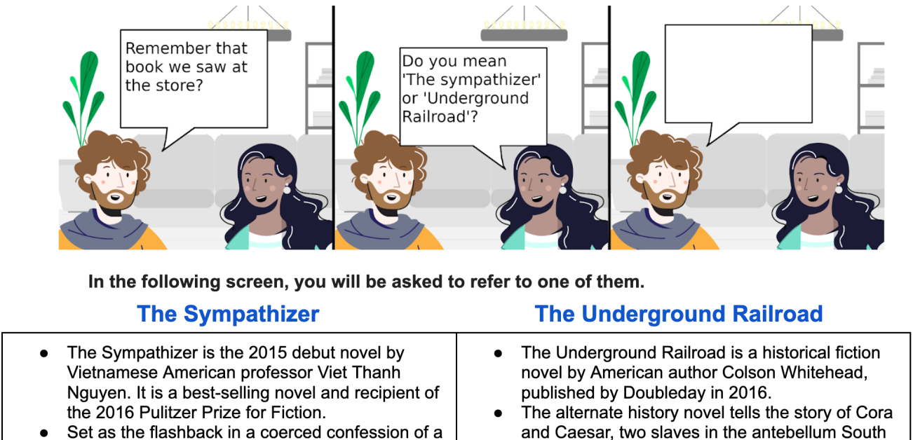
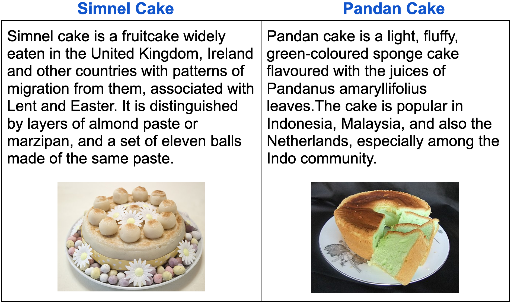
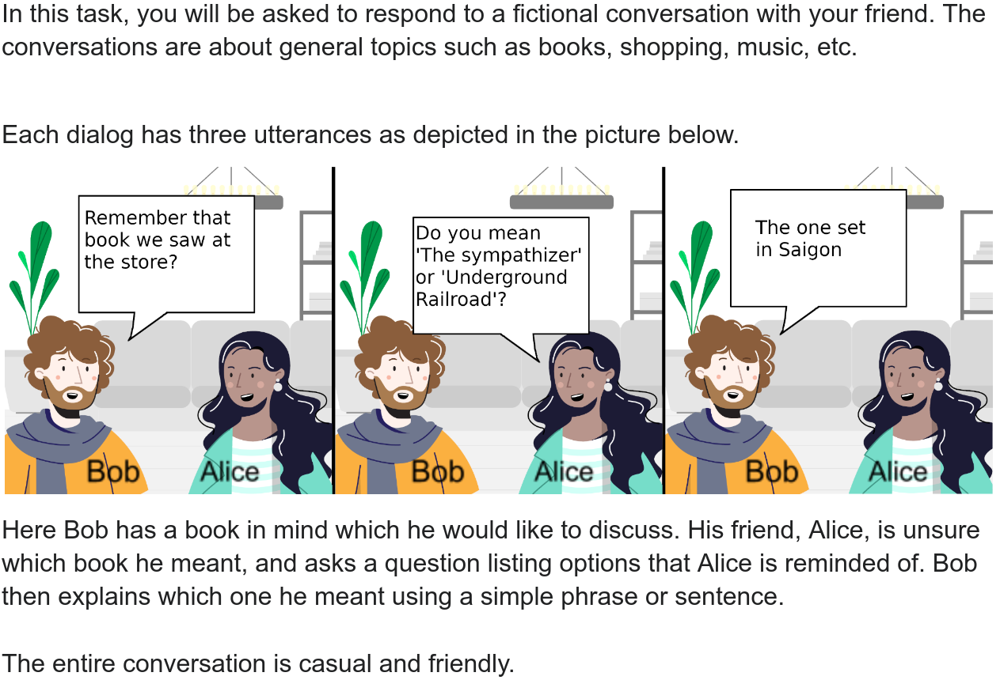
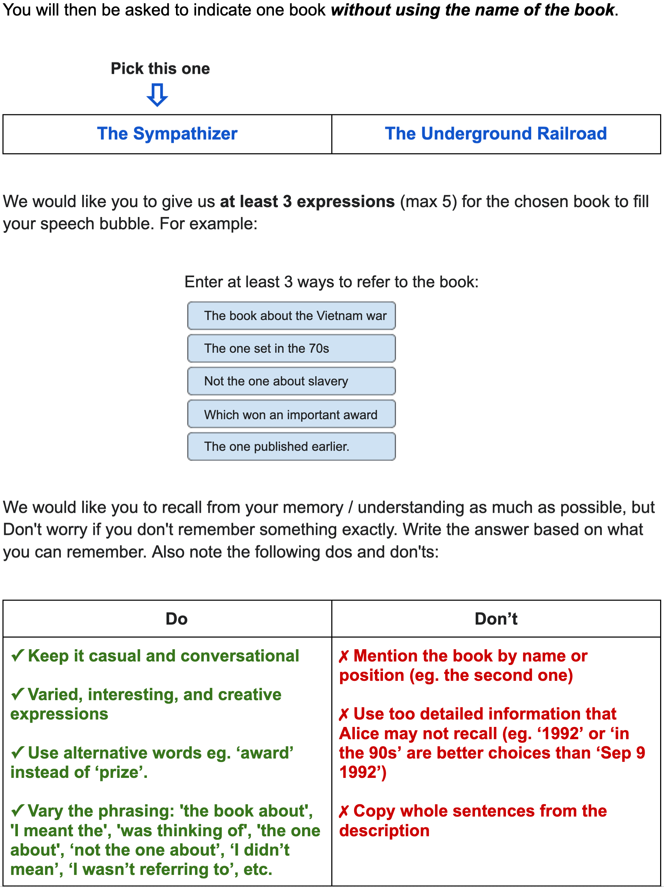
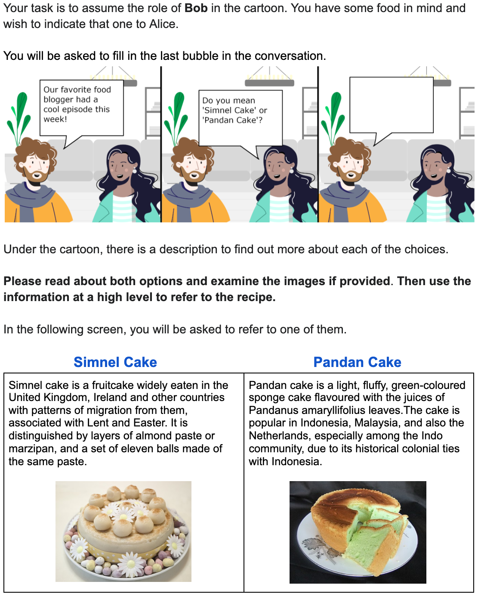
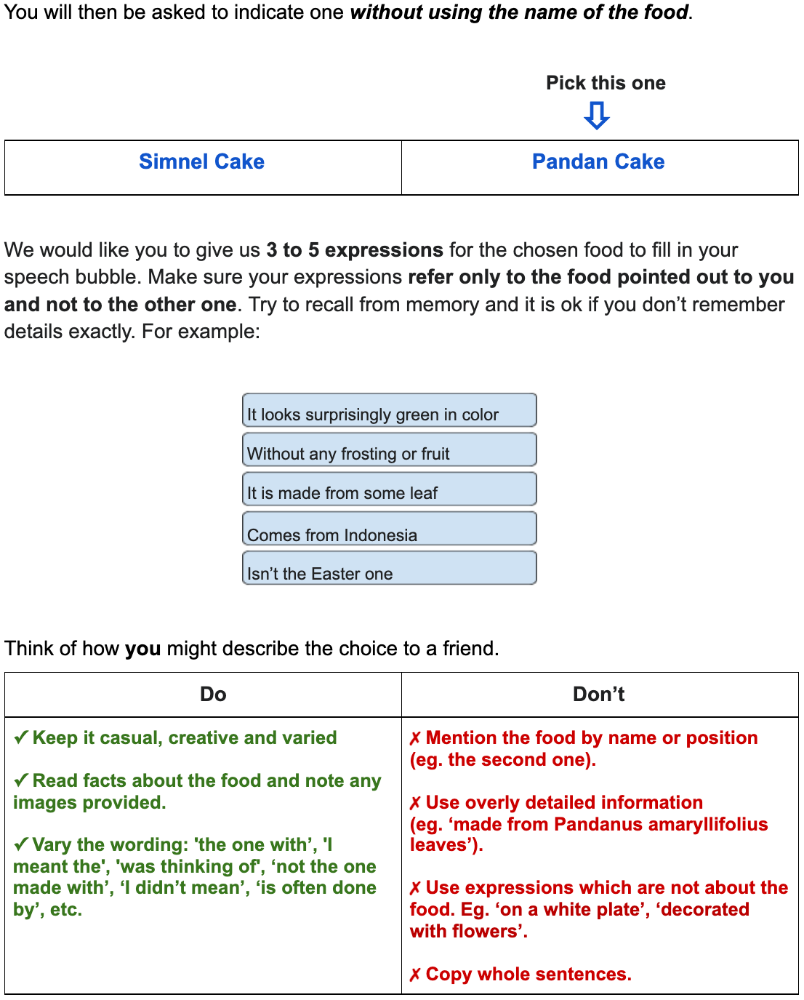
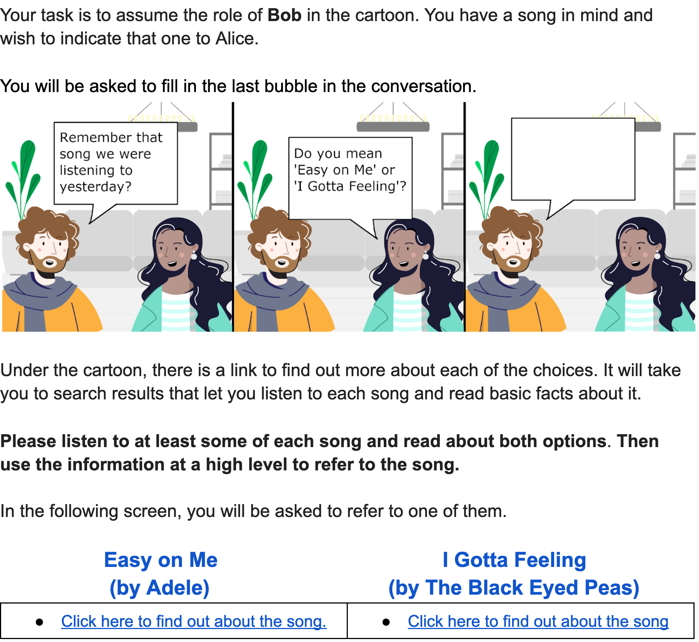
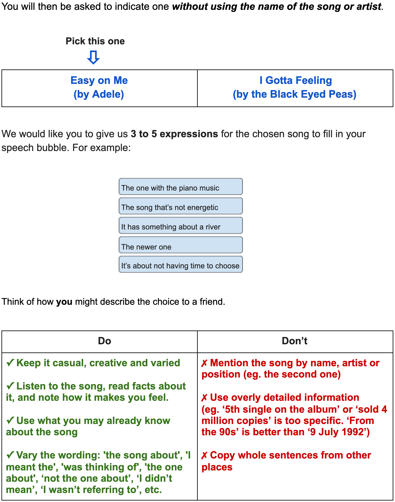

# Resolving Indirect Referring Expressions for Entity Selection

###### Abstract

Recent advances in language modeling have enabled new conversational systems. In particular, it is often desirable for people to make choices among specified options when using such systems. We address this problem of reference resolution, when people use natural expressions to choose between the entities. For example, given the choice ‘Should we make a Simnel cake or a Pandan cake?’ a natural response from a dialog participant may be *indirect*: ‘let’s make the green one’. Such natural expressions have been little studied for reference resolution. We argue that robustly understanding such language has large potential for improving naturalness in dialog, recommendation, and search systems. We create AltEntities111Our dataset can be found at <https://github.com/google-research-datasets/AltEntities> (Alternative Entities), a new public dataset of 42K entity pairs and expressions (referring to one entity in the pair), and develop models for the disambiguation problem. Consisting of indirect referring expressions across three domains, our corpus enables for the first time the study of how language models can be adapted to this task. We find they achieve $82\%$-$87\%$ accuracy in realistic settings, which while reasonable also invites further advances.  

## 1 Introduction

Natural dialog often requires resolving referring expressions (REs), not only within and across texts, but also for grounding natural language expressions to specific entities or images. We focus on a specific conversational setting where a speaker’s utterance intends to disambiguate between known named entities. While many aspects of RE resolution have been studied extensively, past work has focused on pragmatic reasoning Dale and Reiter ([1995](#bib.bib8)); Frank and Goodman ([2012](#bib.bib14)), influence of discourse Orita et al. ([2015](#bib.bib19)), and multimodal (e.g., image) context Zhang et al. ([2018](#bib.bib35)).  

In the specific case of dialog, when people make choices, the natural REs are not always item names, spatial locations or attributes present in the question. For instance when the choice is among items with similar names (perhaps disambiguating automatic speech recognition errors), or items with difficult to pronounce names, or where the user does not even recall which name is correct but instead recalls some higher level attribute, the user may choose an *indirect* expression (Table [1](#S1.T1 "Table 1 ‣ 1 Introduction ‣ Resolving Indirect Referring Expressions for Entity Selection")). Most related to our work, Celikyilmaz et al. ([2014](#bib.bib5)) previously studied REs in response to a set of related items (e.g., Harry Potter movies) shown in a user interface. Their work both contains direct (using entity name), indirect, as well as locational (entity’s position on the screen) expressions. Predating recent advances in language models (LMs), their best model is a decision tree classifier consuming knowledge graph metadata.  

[TABLE S1.T1]

<table class="ltx_tabular ltx_centering ltx_align_middle">
<tr class="ltx_tr">
<td class="ltx_td ltx_align_left ltx_border_l ltx_border_r ltx_border_t">Did you mean a Simnel or Pandan cake?</td>
</tr>
<tr class="ltx_tr">
<td class="ltx_td ltx_align_left ltx_border_l ltx_border_r ltx_border_t"><em class="ltx_emph ltx_font_italic">It looks surprisingly green in color</em></td>
</tr>
<tr class="ltx_tr">
<td class="ltx_td ltx_align_left ltx_border_l ltx_border_r"><em class="ltx_emph ltx_font_italic">Without any frosting or fruit</em></td>
</tr>
<tr class="ltx_tr">
<td class="ltx_td ltx_align_left ltx_border_l ltx_border_r"><em class="ltx_emph ltx_font_italic">It is made from some leaf</em></td>
</tr>
<tr class="ltx_tr">
<td class="ltx_td ltx_align_left ltx_border_l ltx_border_r"><em class="ltx_emph ltx_font_italic">Comes from Indonesia</em></td>
</tr>
<tr class="ltx_tr">
<td class="ltx_td ltx_align_left ltx_border_b ltx_border_l ltx_border_r"><em class="ltx_emph ltx_font_italic">Isn’t the Easter one</em></td>
</tr>
</table>

Table 1: Responses to the question which intend to choose Pandan cake over the alternative.
[/TABLE]

In this work, we created the AltEntities corpus by a multi-step process, soliciting crowdworkers to provide diverse yet *realistic* natural expressions for selecting entities in three domains: books, recipes, and music. To obtain natural and casual dialogic language, we introduce a novel cartoon-based annotation approach (Figure [1](#S3.F1 "Figure 1 ‣ 3.1 Cartoon-driven Annotation Setup ‣ 3 Collecting Rich Referring Expressions ‣ Resolving Indirect Referring Expressions for Entity Selection")). AltEntities consists of 6,247 alternative questions (presenting two entities) along with 42,529 REs. In this context, REs are typically definite noun phrases with a pronominal head and a restrictive relative phrase or one of its reduced variants.  

Our experiments are based on fine-tuned BERT Devlin et al. ([2019](#bib.bib10)) and T5 Raffel et al. ([2020](#bib.bib23)) LMs. We assess the representation of entity names as well as other sources of entity information. We find that the results depend significantly on the *type* of entity information provided to the models alongside the REs: If a LM only has access to the entity names but no other information, a case that might happen especially for long tail entities, accuracy is around $60\%$. On the other hand, if a LM is (unrealistically) given entity information that is identical to that shown to annotators producing the REs, accuracy is very high (up to $95\%$). However, if the model (more realistically) only has access to generic information that may or may not overlap with annotators’ knowledge (Section [5](#S5 "5 Task and Models ‣ Resolving Indirect Referring Expressions for Entity Selection")), accuracy of our models is only $82\%$-$87\%$, leaving significant room for methodological improvements.  

## 2 Related Work

Our work adds to recent efforts to allow users to speak more naturally to conversational systems. Here, we present the most related studies focusing on the properties of REs as well as their resolution.  

Alternative Questions. Our questions belong to the class of alternative questions (e.g. ‘Are you staying or leaving?’). Several studies have focused on the form and semantics of such questions, and differences from yes/no questions particularly on the basis of prosody Beck and Kim ([2006](#bib.bib1)); Biezma and Rawlins ([2012](#bib.bib3)); Pruitt and Roelofsen ([2013](#bib.bib22)).  

This paper focuses on the deep understanding of answers to such alternative questions when they are posed for selecting between two entities.  

Speaker-Listener Cooperation. The research in this space follow the Rational Speech Act Theory Frank and Goodman ([2012](#bib.bib14)), where the way speakers and listeners reason about each others’ intentions and beliefs explains which attributes speakers pick to describe an entity, and how listeners disambiguate the entity. Vogel et al. ([2013](#bib.bib31)); Monroe et al. ([2017](#bib.bib18)) focus on the pragmatic reasoning involved during the conversation which helps in reaching a common understanding of the topic. Wilkes-Gibbs and Clark ([1992](#bib.bib32)) study how REs change as the conversation proceeds. In an experiment, they show that participants start from long and indefinite descriptions of images, but end up with short and definite references. Jordan and Walker ([2005](#bib.bib15)) study the subproblem of content and attribute selection for generating object descriptions.  

In our data collection, we assume a conversation between two humans in three dialog turns, where the first two turns prime the RE produced in the last turn (Section [3](#S3 "3 Collecting Rich Referring Expressions ‣ Resolving Indirect Referring Expressions for Entity Selection")).  

Common Ground. In addition to the interlocutors’ intentions, their prior or shared knowledge also plays an important role in how they understand each other’s utterances. Sometimes the common knowledge arises from a shared situation, e.g., in navigation dialog Engonopoulos et al. ([2013](#bib.bib11)); Misu et al. ([2014](#bib.bib17)); Fang et al. ([2014](#bib.bib13)) or the presence of a visual space Yu et al. ([2018](#bib.bib34)); Bernardi and Pezzelle ([2021](#bib.bib2)). In the latter, the common ground is given, i.e., it is assumed the image is what all participants in the interaction see in the same way. In many other situations, e.g., in a dialog between two friends about a movie or a book, the common ground is hidden and we can only make assumptions of what information participants share.  

In this work, during data collection, we assume that annotators have access to rich common ground involving multiple modalities such as text, image, and video (Section [3.3](#S3.SS3 "3.3 Entity Background ‣ 3 Collecting Rich Referring Expressions ‣ Resolving Indirect Referring Expressions for Entity Selection")). During model training inference, we explore performance with varying levels of background information (Sectoin [5.2](#S5.SS2 "5.2 Models ‣ 5 Task and Models ‣ Resolving Indirect Referring Expressions for Entity Selection")).  

Implicature Understanding. This paper advances the broad area of understanding implicature in dialog. For example, a few recent papers developed datasets and models for indirect boolean responses (without saying ‘yes’ or ‘no’) Pragst and Ultes ([2018](#bib.bib21)); Louis et al. ([2020](#bib.bib16)); Takayama et al. ([2021](#bib.bib30)); Damgaard et al. ([2021](#bib.bib9)). Interestingly, Ruis et al. ([2022](#bib.bib27)) shows that LLMs cannot solve such implicatures in a zero-shot setting.  

RE resolution. There are few prior studies around the data and models for resolution tasks such as ours. Stoyanchev et al. ([2021](#bib.bib29)) built a method where references to items from prior context in a dialog are resolved by detecting state updates. Unlike our work, their REs focus on attributes (e.g., Italian in the Italian restaurant) discussed in prior dialog. Celikyilmaz et al. ([2014](#bib.bib5)) collect REs to a target item among others shown on a screen (e.g., a set of Harry Potter movies). Their expressions contain both direct (reference to entity name) and indirect references, where the latter comprise about 25% of the data ($\approx 6$K REs). To aid the resolution of indirect ones, they include features which capture the overlap between an expression and knowledge graph attributes for each item.  

Our work creates a large scale corpus ($42$K REs) exclusively for indirect REs, and explores how LMs encode the knowledge for disambiguation.  

## 3 Collecting Rich Referring Expressions

To maximize generalizability, we collect data in three domains: books, recipes, and music. These were selected to cover a diverse variety of entity types with different kinds of available information — e.g. plot summaries for books, images for recipes, and lyrics and videos for songs. We performed careful and detailed annotations, and explain the annotation steps in this section.  

### 3.1 Cartoon-driven Annotation Setup

[FIGURE S3.F1.g1]

Figure 1: Annotators were shown a cartoon in which they were asked to complete the final step of a conversation.
[/FIGURE]

[FIGURE S3.F2.g1]

Figure 2: Annotation screen for entering expressions.
[/FIGURE]

Previous work in question-answering and dialog typically asks annotators to complete text-based input boxes Rajpurkar et al. ([2016](#bib.bib25)); Choi et al. ([2018](#bib.bib7)); Rajpurkar et al. ([2018](#bib.bib24)); Reddy et al. ([2019](#bib.bib26)); Eric et al. ([2020](#bib.bib12)). We employ a novel cartoon-bubble completion method, aiming to immerse annotators in the dialog setting to obtain more natural and informal REs. We start with a brief overview of the setup, and then explain the steps in detail.  

Figure [1](#S3.F1 "Figure 1 ‣ 3.1 Cartoon-driven Annotation Setup ‣ 3 Collecting Rich Referring Expressions ‣ Resolving Indirect Referring Expressions for Entity Selection") shows the first (of our two) annotation screens. Annotators are shown a cartoon with two characters (Bob and Alice) in a fictional conversation, and asked (as Bob) to complete the last speech bubble. This pictorial depiction, and the casting of the dialog as a casual chat between friends encourage the annotators to produce friendly, short, and dialogic responses. However, annotators are generally unlikely to know details about entities sampled from a collection. Therefore, we also provide background information on the entities (bottom of Figure [1](#S3.F1 "Figure 1 ‣ 3.1 Cartoon-driven Annotation Setup ‣ 3 Collecting Rich Referring Expressions ‣ Resolving Indirect Referring Expressions for Entity Selection")), corresponding to common knowledge that the two characters could share on the topic.  

After annotators are shown this information, they proceed to a second screen (Figure [2](#S3.F2 "Figure 2 ‣ 3.1 Cartoon-driven Annotation Setup ‣ 3 Collecting Rich Referring Expressions ‣ Resolving Indirect Referring Expressions for Entity Selection")). It indicates one of the entities (books in this example). They are asked to describe that entity (indirectly) with 3 to 5 responses: We found eliciting more entries encourages diversity and depth in the responses. Our data consists of the entity pairs, their descriptions, the target entity, and annotator expressions.  

From Figure [2](#S3.F2 "Figure 2 ‣ 3.1 Cartoon-driven Annotation Setup ‣ 3 Collecting Rich Referring Expressions ‣ Resolving Indirect Referring Expressions for Entity Selection"), note that once on the response screen, annotators cannot re-read descriptions. This encourages recall from memory. The reasoning behind this, and many other aspects of this design, are explained in the next sections.  

### 3.2 The Conversational Cartoon

The cartoon has three cells as shown in Figure [1](#S3.F1 "Figure 1 ‣ 3.1 Cartoon-driven Annotation Setup ‣ 3 Collecting Rich Referring Expressions ‣ Resolving Indirect Referring Expressions for Entity Selection"). The first is a domain-specific utterance intended to set context. For example, ‘Remember that book we saw at the store?’ sets up the dialog as one recalling a specific book. These utterances are from a set of five manually written expressions for each domain, with one selected at random for each conversation. Examples in the recipes and music domains are ‘That recipe on today’s Masterchef was too good!’ and ‘You sang that song really well yesterday.’ Appendix [A](#A1 "Appendix A Opening Utterances ‣ Resolving Indirect Referring Expressions for Entity Selection") shows all these utterances.  

The *alternative* question is presented in the second cell. This question follows a fixed template: Do you mean ‘A’ or ‘B’? where ‘A’ and ‘B’ are the names of two *related* entities. Our entities are sampled from Wikipedia page titles, with any disambiguation parentheses removed. When the names are identical, we retain the Wikipedia disambiguation: For instance, one such question is Do you mean ‘The Gladiator (Turtledove novel)’ or ‘The Gladiator (Scarrow novel)’?.  

The third cell is completed by the crowdworkers, assuming the role of Bob to enter text that refers to the target entity. They enter those expressions as shown in Figure [2](#S3.F2 "Figure 2 ‣ 3.1 Cartoon-driven Annotation Setup ‣ 3 Collecting Rich Referring Expressions ‣ Resolving Indirect Referring Expressions for Entity Selection"). Further screenshots of our interface for all domains are provided in Appendix [B](#A2 "Appendix B Annotation Guidelines ‣ Resolving Indirect Referring Expressions for Entity Selection").  

### 3.3 Entity Background

In real dialogs, when people differentiate between options, they draw on partial knowledge about entities that they recall. We aimed to foster a similar situation in our corpus, while doing so in a controlled manner without requiring domain-expert annotators. As such, when selected entities are shown to annotators, they are also presented with background information (bottom of Figure [1](#S3.F1 "Figure 1 ‣ 3.1 Cartoon-driven Annotation Setup ‣ 3 Collecting Rich Referring Expressions ‣ Resolving Indirect Referring Expressions for Entity Selection")). We draw the background also from Wikipedia, biasing towards sections relevant to each domain. For books, these are the main (first) and plot summary sections. For recipes, we used the main, preparation, and ingredients sections. For each entity, up to 750 characters of one of these sections are shown on the interface. For recipes, the food’s image222We filtered out examples without any images. is also always shown to help the annotators quickly realize what it looks like (Figure [3](#S3.F3 "Figure 3 ‣ 3.3 Entity Background ‣ 3 Collecting Rich Referring Expressions ‣ Resolving Indirect Referring Expressions for Entity Selection")).  

[FIGURE S3.F3.g1]

Figure 3: Background descriptions for two recipes.
[/FIGURE]

For music, however, we found Wikipedia text to be less useful: Pages contain details and trivia (e.g., 5th single on the album or sold 4 million copies), which we judged unlikely to be included in natural background knowledge about a song. On the other hand, song lyrics and music are very relevant in this domain, but are not usually found in Wikipedia. Consequently, we presented a Google search link for the song in the background section, and asked the annotators to listen to at least some of each song, and read about them before writing expressions. The search query contained the song’s title and its artist, e.g., Hello (by Adele). Since information about the song comes from search, we also biased our candidates towards popular songs, which have more detailed results (Section [3.4](#S3.SS4 "3.4 Generating Alternative Questions ‣ 3 Collecting Rich Referring Expressions ‣ Resolving Indirect Referring Expressions for Entity Selection")).  

### 3.4 Generating Alternative Questions

The alternative questions (Do you mean ‘A’ or ‘B’?) are generated automatically: (i) Candidate entities are extracted from English Wikipedia for each domain (Section [3.4.1](#S3.SS4.SSS1 "3.4.1 Selecting Candidate Entities ‣ 3.4 Generating Alternative Questions ‣ 3 Collecting Rich Referring Expressions ‣ Resolving Indirect Referring Expressions for Entity Selection")), then (ii) we substitute ‘A’ and ‘B’ by sampling entity pairs (Section [3.4.2](#S3.SS4.SSS2 "3.4.2 Sampling Entity Pairs ‣ 3.4 Generating Alternative Questions ‣ 3 Collecting Rich Referring Expressions ‣ Resolving Indirect Referring Expressions for Entity Selection")).  

#### 3.4.1 Selecting Candidate Entities

For each domain, we collect English Wikipedia articles by checking the presence of certain Wikipedia templates (infoboxes333Infoboxes are fixed-format tables that consistently present articles in a given category (e.g., all books).), and the presence of particular sections: For recipes, we additionally included articles with an ingredients section.  

This set was then filtered to exclude very short articles, or those ambiguous between domains. For music, we use article length (number of sections/subsections) as a proxy for popularity, and choose the top $\approx 1000$ articles. To remove any sensitive or offensive content, we also filter articles whose content matches a list of sensitive words. Appendix [C](#A3 "Appendix C Filtering Wikipedia Articles ‣ Resolving Indirect Referring Expressions for Entity Selection") contains the details of the above filters. Table [2](#S3.T2 "Table 2 ‣ 3.4.1 Selecting Candidate Entities ‣ 3.4 Generating Alternative Questions ‣ 3 Collecting Rich Referring Expressions ‣ Resolving Indirect Referring Expressions for Entity Selection") shows the number of candidate entities.  

[TABLE S3.T2]

<table class="ltx_tabular ltx_centering ltx_align_middle">
<tr class="ltx_tr">
<td class="ltx_td ltx_border_l ltx_border_r ltx_border_t"></td>
<td class="ltx_td ltx_align_center ltx_border_r ltx_border_t">Books</td>
<td class="ltx_td ltx_align_center ltx_border_r ltx_border_t">Recipes</td>
<td class="ltx_td ltx_align_center ltx_border_r ltx_border_t">Music</td>
</tr>
<tr class="ltx_tr">
<td class="ltx_td ltx_align_center ltx_border_l ltx_border_r ltx_border_t">Main</td>
<td class="ltx_td ltx_align_center ltx_border_r ltx_border_t">22,763</td>
<td class="ltx_td ltx_align_center ltx_border_r ltx_border_t">2,822</td>
<td class="ltx_td ltx_align_center ltx_border_r ltx_border_t">1,032</td>
</tr>
<tr class="ltx_tr">
<td class="ltx_td ltx_align_center ltx_border_l ltx_border_r ltx_border_t">Plot Summary</td>
<td class="ltx_td ltx_align_center ltx_border_r ltx_border_t">5,858</td>
<td class="ltx_td ltx_align_center ltx_border_r ltx_border_t">-</td>
<td class="ltx_td ltx_align_center ltx_border_r ltx_border_t">-</td>
</tr>
<tr class="ltx_tr">
<td class="ltx_td ltx_align_center ltx_border_l ltx_border_r ltx_border_t">Preparation</td>
<td class="ltx_td ltx_align_center ltx_border_r ltx_border_t">-</td>
<td class="ltx_td ltx_align_center ltx_border_r ltx_border_t">343</td>
<td class="ltx_td ltx_align_center ltx_border_r ltx_border_t">-</td>
</tr>
<tr class="ltx_tr">
<td class="ltx_td ltx_align_center ltx_border_l ltx_border_r ltx_border_t">Ingredients</td>
<td class="ltx_td ltx_align_center ltx_border_r ltx_border_t">-</td>
<td class="ltx_td ltx_align_center ltx_border_r ltx_border_t">147</td>
<td class="ltx_td ltx_align_center ltx_border_r ltx_border_t">-</td>
</tr>
<tr class="ltx_tr">
<td class="ltx_td ltx_align_center ltx_border_b ltx_border_l ltx_border_r ltx_border_t">Total</td>
<td class="ltx_td ltx_align_center ltx_border_b ltx_border_r ltx_border_t">28,621</td>
<td class="ltx_td ltx_align_center ltx_border_b ltx_border_r ltx_border_t">3,312</td>
<td class="ltx_td ltx_align_center ltx_border_b ltx_border_r ltx_border_t">1,032</td>
</tr>
</table>

Table 2: Number of extracted candidate items for each domain and background section.
[/TABLE]

#### 3.4.2 Sampling Entity Pairs

Much linguistic work on alternative questions has focused on the semantics and pragmatics of these utterances Biezma and Rawlins ([2012](#bib.bib3)), but we also need to make decisions about which entity pairs could make for a challenging disambiguation problem. Entity pairs sampled uniformly at random are less likely to be interesting, since they may not share many properties, making disambiguation easier. In this work, we develop entity pair sampling techniques at different similarity levels, as a proxy for disambiguation difficulty.  

Uniform sampling. Entity pairs are sampled uniformly at random from the domain.  

Same name. These entities have the same name in Wikipedia followed by a disambiguation phrase within parentheses. An example is Dawn (McLaughlin novel) and Dawn (Andrews novel).  

Similar title. These entities have a similar title in terms of character edit distance (distance $\leq 3$), where the title could optionally consists of a disambiguation phrase within parentheses.  

Similar description. This method looks for deeper similarity within the text of Wikipedia articles: We sample a first entity uniformly, then select the second with the highest similarity using a Universal Sentence Encoder Cer et al. ([2018](#bib.bib6)). The input to the encoder is the Wikipedia section shown as the background knowledge to annotators.  

Similar infobox attributes. Here we take entities that share important domain-specific properties, e.g., recipe origin, or the song genre. We match entities (except books) using the ‘attributes’ listed in the Wikipedia infobox: {type} and {type, country} for recipes, and {genre}, {artist}, and {genre, artist} for music.  

We applied the same name method only to books, and the similar title method only to books and recipes. The other domains did not contain enough such examples. We applied the similar description method to all domains. We applied the similar infobox attributes method to recipes and music, but not the books domain; however, some pairs with identical attributes were already covered by the other methods for books. Table [3](#S3.T3 "Table 3 ‣ 3.4.2 Sampling Entity Pairs ‣ 3.4 Generating Alternative Questions ‣ 3 Collecting Rich Referring Expressions ‣ Resolving Indirect Referring Expressions for Entity Selection") shows the number of sampled entity pairs for each domain and sampling method.  

[TABLE S3.T3]

<table class="ltx_tabular ltx_centering ltx_align_middle">
<tr class="ltx_tr">
<td class="ltx_td ltx_border_l ltx_border_r ltx_border_t"></td>
<td class="ltx_td ltx_align_center ltx_border_r ltx_border_t">Books</td>
<td class="ltx_td ltx_align_center ltx_border_r ltx_border_t">Recipes</td>
<td class="ltx_td ltx_align_center ltx_border_r ltx_border_t">Music</td>
</tr>
<tr class="ltx_tr">
<td class="ltx_td ltx_align_left ltx_border_l ltx_border_r ltx_border_t">Uniform</td>
<td class="ltx_td ltx_align_center ltx_border_r ltx_border_t">649</td>
<td class="ltx_td ltx_align_center ltx_border_r ltx_border_t">813</td>
<td class="ltx_td ltx_align_center ltx_border_r ltx_border_t">700</td>
</tr>
<tr class="ltx_tr">
<td class="ltx_td ltx_align_left ltx_border_l ltx_border_r ltx_border_t">Same Name</td>
<td class="ltx_td ltx_align_center ltx_border_r ltx_border_t">282</td>
<td class="ltx_td ltx_align_center ltx_border_r ltx_border_t">-</td>
<td class="ltx_td ltx_align_center ltx_border_r ltx_border_t">-</td>
</tr>
<tr class="ltx_tr">
<td class="ltx_td ltx_align_left ltx_border_l ltx_border_r ltx_border_t">Similar Title</td>
<td class="ltx_td ltx_align_center ltx_border_r ltx_border_t">497</td>
<td class="ltx_td ltx_align_center ltx_border_r ltx_border_t">280</td>
<td class="ltx_td ltx_align_center ltx_border_r ltx_border_t">-</td>
</tr>
<tr class="ltx_tr">
<td class="ltx_td ltx_align_left ltx_border_l ltx_border_r ltx_border_t">Similar Desc</td>
<td class="ltx_td ltx_align_center ltx_border_r ltx_border_t">650</td>
<td class="ltx_td ltx_align_center ltx_border_r ltx_border_t">583</td>
<td class="ltx_td ltx_align_center ltx_border_r ltx_border_t">700</td>
</tr>
<tr class="ltx_tr">
<td class="ltx_td ltx_align_left ltx_border_l ltx_border_r ltx_border_t">Similar Attrs</td>
<td class="ltx_td ltx_align_center ltx_border_r ltx_border_t">-</td>
<td class="ltx_td ltx_align_center ltx_border_r ltx_border_t">418</td>
<td class="ltx_td ltx_align_center ltx_border_r ltx_border_t">675</td>
</tr>
<tr class="ltx_tr">
<td class="ltx_td ltx_align_left ltx_border_b ltx_border_l ltx_border_r ltx_border_t">All</td>
<td class="ltx_td ltx_align_center ltx_border_b ltx_border_r ltx_border_t">2,078</td>
<td class="ltx_td ltx_align_center ltx_border_b ltx_border_r ltx_border_t">2,094</td>
<td class="ltx_td ltx_align_center ltx_border_b ltx_border_r ltx_border_t">2,075</td>
</tr>
</table>

Table 3: Number of sampled entity pairs (questions) for each domain and sampling method.
[/TABLE]

### 3.5 Annotator Instructions and Pilot Runs

To maximize RE naturalness, we also provided annotators different domain-specific examples. Figure [2](#S3.F2 "Figure 2 ‣ 3.1 Cartoon-driven Annotation Setup ‣ 3 Collecting Rich Referring Expressions ‣ Resolving Indirect Referring Expressions for Entity Selection") shows those for the book The sympathizer. The REs are about topic (about Vietnam war), timeline (set in the 70s), and contrasts (Not the one about slavery, and The one published earlier). They also emphasize use of general statements instead of overly specific and unrealistic ones, e.g., set in the 70s instead of 1975. Table [4](#S3.T4 "Table 4 ‣ 3.5 Annotator Instructions and Pilot Runs ‣ 3 Collecting Rich Referring Expressions ‣ Resolving Indirect Referring Expressions for Entity Selection") shows a detailed note on desirable expressions.  

[TABLE S3.T4]

<table class="ltx_tabular ltx_centering ltx_align_middle">
<tr class="ltx_tr">
<td class="ltx_td ltx_align_justify ltx_align_top ltx_border_l ltx_border_r ltx_border_t">

 

Do

</td>
</tr>
<tr class="ltx_tr">
<td class="ltx_td ltx_align_justify ltx_align_top ltx_border_l ltx_border_r ltx_border_t">

✓ Keep it casual and conversational.

</td>
</tr>
<tr class="ltx_tr">
<td class="ltx_td ltx_align_justify ltx_align_top ltx_border_l ltx_border_r ltx_border_t">

✓ Varied, interesting, and creative expressions.

</td>
</tr>
<tr class="ltx_tr">
<td class="ltx_td ltx_align_justify ltx_align_top ltx_border_l ltx_border_r ltx_border_t">

✓ Use alternative words, e.g., award instead of prize.

</td>
</tr>
<tr class="ltx_tr">
<td class="ltx_td ltx_align_justify ltx_align_top ltx_border_l ltx_border_r ltx_border_t">

✓ Vary the phrasing: the book about, I meant the, was thinking of, the one about, I wasn’t referring to, etc.

</td>
</tr>
<tr class="ltx_tr">
<td class="ltx_td ltx_align_justify ltx_align_top ltx_border_l ltx_border_r ltx_border_t">

 

Don’t

</td>
</tr>
<tr class="ltx_tr">
<td class="ltx_td ltx_align_justify ltx_align_top ltx_border_l ltx_border_r ltx_border_t">

✗ Mention the book by name or position (e.g., the second one).

</td>
</tr>
<tr class="ltx_tr">
<td class="ltx_td ltx_align_justify ltx_align_top ltx_border_l ltx_border_r ltx_border_t">

✗ Use too detailed information that Alice may not recall (eg. 1992 or in the 90s are better choices than Sep 9 1992).

</td>
</tr>
<tr class="ltx_tr">
<td class="ltx_td ltx_align_justify ltx_align_top ltx_border_b ltx_border_l ltx_border_r ltx_border_t">

✗ Copy whole sentences from the description.

</td>
</tr>
</table>

Table 4: Actions annotators were encouraged (Do) or discouraged (Don’t) to take for the books domain.
[/TABLE]

We performed pilot studies to understand how annotators responded to our instructions, and used these to refine the instructions. A first study (for books) examined how annotators should use the background text, comparing designs where annotators could, or could not, go back-and-forth between the description screen (Figure [1](#S3.F1 "Figure 1 ‣ 3.1 Cartoon-driven Annotation Setup ‣ 3 Collecting Rich Referring Expressions ‣ Resolving Indirect Referring Expressions for Entity Selection")), and the data collection screen (Figure [2](#S3.F2 "Figure 2 ‣ 3.1 Cartoon-driven Annotation Setup ‣ 3 Collecting Rich Referring Expressions ‣ Resolving Indirect Referring Expressions for Entity Selection")). With back-and-forth possible, the responses contained excessive details, e.g., reiterating large portions of background text (The book that was last of three juvenile novels that Wollheim wrote for Winston). With back-and-forth removed, annotators produced shorter REs ($7.99$ vs $9.61$ words), with fewer proper nouns and numbers per RE ($0.43$ vs $0.88$) as they are harder to remember. They also used more contrastives, e.g., starting with ‘not the’ ($21.8\%$ vs $2.2\%$) which involve drawing on information about both books. Thus, we adopted the memory recall setting.444Note that the music entities are provided with search links which open in a new page, making back-and-forth possible, although it was discouraged in the guidelines. After the first pilot study, we performed one pilot per domain for relatively small instruction refinements.  

## 4 The AltEntities Corpus

Our annotations were carried out using a pool of around $60$ in-house crowdworkers.555Paid contractors who work with our institution on such tasks. They were all native English speakers recruited from U.S., U.K., Canada, and Australia so as to obtain a diverse set of perspectives.666The average number of questions per annotator is 217. The minimum number of annotations was 10, and the maximum was 2015 questions, followed by 610 questions. Around $80\%$ of annotators annotated around 100-600 questions each. We did not observe any obvious correlation between dataset artifacts and specific annotators. Each question was shown to two workers to get multiple inputs per question. Around $2$K entity pairs were annotated for each domain resulting in around $42$K expressions in total. Table [5](#S4.T5 "Table 5 ‣ 4 The AltEntities Corpus ‣ Resolving Indirect Referring Expressions for Entity Selection") shows the final corpus statistics, and Table [6](#S4.T6 "Table 6 ‣ 4 The AltEntities Corpus ‣ Resolving Indirect Referring Expressions for Entity Selection") shows example expressions for the three domains. We release the dataset under the CC-BY SA 3.0 License as per the Wikipedia License.  

The REs for books were on average a word longer than for other domains. They also contained more named entities per expression. Each domain contains some repeated REs (e.g., the pop song), that are often high-level responses, e.g., a song’s genre. The books domain contains the most unique responses. The number of contrastives, estimated as REs starting with “not the", are from $8\%$ in music up to $20\%$ in books.777This estimate gives a lower bound as there are other types of contrastives expressions such as the newer song. For music and recipes, we manually checked $200$ random REs for references to modalities other than text. Around $10$% multi-modal REs were present in the recipes domain (mostly color), and $20$% in the music domain (mostly beat, speed, and mood).  

[TABLE S4.T5]

<table class="ltx_tabular ltx_centering ltx_align_middle">
<tr class="ltx_tr">
<td class="ltx_td ltx_border_l ltx_border_r ltx_border_t"></td>
<td class="ltx_td ltx_align_center ltx_border_r ltx_border_t">books</td>
<td class="ltx_td ltx_align_center ltx_border_r ltx_border_t">recipes</td>
<td class="ltx_td ltx_align_center ltx_border_r ltx_border_t">music</td>
</tr>
<tr class="ltx_tr">
<td class="ltx_td ltx_align_left ltx_border_l ltx_border_r ltx_border_t"># Questions</td>
<td class="ltx_td ltx_align_center ltx_border_r ltx_border_t">2,078</td>
<td class="ltx_td ltx_align_center ltx_border_r ltx_border_t">2,094</td>
<td class="ltx_td ltx_align_center ltx_border_r ltx_border_t">2,075</td>
</tr>
<tr class="ltx_tr">
<td class="ltx_td ltx_align_left ltx_border_l ltx_border_r ltx_border_t"># Expressions</td>
<td class="ltx_td ltx_align_center ltx_border_r ltx_border_t">13,144</td>
<td class="ltx_td ltx_align_center ltx_border_r ltx_border_t">15,046</td>
<td class="ltx_td ltx_align_center ltx_border_r ltx_border_t">14,339</td>
</tr>
<tr class="ltx_tr">
<td class="ltx_td ltx_align_left ltx_border_l ltx_border_r ltx_border_t">Length (words)</td>
<td class="ltx_td ltx_align_center ltx_border_r ltx_border_t">7.8</td>
<td class="ltx_td ltx_align_center ltx_border_r ltx_border_t">6.2</td>
<td class="ltx_td ltx_align_center ltx_border_r ltx_border_t">6.8</td>
</tr>
<tr class="ltx_tr">
<td class="ltx_td ltx_align_left ltx_border_l ltx_border_r ltx_border_t"># Named Entities</td>
<td class="ltx_td ltx_align_center ltx_border_r ltx_border_t">0.7</td>
<td class="ltx_td ltx_align_center ltx_border_r ltx_border_t">0.2</td>
<td class="ltx_td ltx_align_center ltx_border_r ltx_border_t">0.4</td>
</tr>
<tr class="ltx_tr">
<td class="ltx_td ltx_align_left ltx_border_l ltx_border_r ltx_border_t">Unique</td>
<td class="ltx_td ltx_align_center ltx_border_r ltx_border_t">96%</td>
<td class="ltx_td ltx_align_center ltx_border_r ltx_border_t">86%</td>
<td class="ltx_td ltx_align_center ltx_border_r ltx_border_t">76%</td>
</tr>
<tr class="ltx_tr">
<td class="ltx_td ltx_align_left ltx_border_l ltx_border_r ltx_border_t">Contrastives</td>
<td class="ltx_td ltx_align_center ltx_border_r ltx_border_t">20%</td>
<td class="ltx_td ltx_align_center ltx_border_r ltx_border_t">9%</td>
<td class="ltx_td ltx_align_center ltx_border_r ltx_border_t">8%</td>
</tr>
<tr class="ltx_tr">
<td class="ltx_td ltx_align_left ltx_border_l ltx_border_r ltx_border_t">Multi-modality</td>
<td class="ltx_td ltx_align_center ltx_border_r ltx_border_t">-</td>
<td class="ltx_td ltx_align_center ltx_border_r ltx_border_t">10%</td>
<td class="ltx_td ltx_align_center ltx_border_r ltx_border_t">20%</td>
</tr>
<tr class="ltx_tr">
<td class="ltx_td ltx_align_left ltx_border_b ltx_border_l ltx_border_r ltx_border_t">Estimated Error rate</td>
<td class="ltx_td ltx_align_center ltx_border_b ltx_border_r ltx_border_t">4.5%</td>
<td class="ltx_td ltx_align_center ltx_border_b ltx_border_r ltx_border_t">6.7%</td>
<td class="ltx_td ltx_align_center ltx_border_b ltx_border_r ltx_border_t">6.8%</td>
</tr>
</table>

Table 5: The AltEntities corpus statistics
[/TABLE]

We estimated the RE error rate by manually inspecting $40$ question samples (around $250$ to $300$ expressions) per domain. The error rate is between $4.5\%$ to $6.8\%$ for the three domains. $78\%$ of these errors were due to the RE applying to both items, not just the target entity. The remaining errors were mostly due to confusing the two entities. We also note that the rate of exact string match between REs and Wikipedia text is $<1\%$.  

The annotators were inspired by the provided stylistic cues in the instructions (e.g., starting with the one or I meant the), but followed our guidelines to vary their responses as well. We observed that the content of REs (e.g., timeline, lyrics, singer or band information, instrument) included both the categories covered by the provided examples (e.g., timeline for books and songs) and novel categories (e.g., background information on books and songs such as The one inspired by a Rolling Stones song).  

[TABLE S4.T6]

<table class="ltx_tabular ltx_centering ltx_align_middle">
<tr class="ltx_tr">
<td class="ltx_td ltx_align_center ltx_border_l ltx_border_r ltx_border_t">books</td>
</tr>
<tr class="ltx_tr">
<td class="ltx_td ltx_align_center ltx_border_l ltx_border_r">The one that is set in the 1880s</td>
</tr>
<tr class="ltx_tr">
<td class="ltx_td ltx_align_center ltx_border_l ltx_border_r">It’s by a famous detective writer</td>
</tr>
<tr class="ltx_tr">
<td class="ltx_td ltx_align_center ltx_border_l ltx_border_r">The fictional one</td>
</tr>
<tr class="ltx_tr">
<td class="ltx_td ltx_align_center ltx_border_l ltx_border_r">not the one with the 12 year old boy</td>
</tr>
<tr class="ltx_tr">
<td class="ltx_td ltx_align_center ltx_border_l ltx_border_r">It’s the book that has rock and politics in it</td>
</tr>
<tr class="ltx_tr">
<td class="ltx_td ltx_align_center ltx_border_l ltx_border_r ltx_border_t">music</td>
</tr>
<tr class="ltx_tr">
<td class="ltx_td ltx_align_center ltx_border_l ltx_border_r">The one without words</td>
</tr>
<tr class="ltx_tr">
<td class="ltx_td ltx_align_center ltx_border_l ltx_border_r">It is the song sung by an Australian.</td>
</tr>
<tr class="ltx_tr">
<td class="ltx_td ltx_align_center ltx_border_l ltx_border_r">It has synthesizer sounds in it</td>
</tr>
<tr class="ltx_tr">
<td class="ltx_td ltx_align_center ltx_border_l ltx_border_r">Came out in mid of 2000.</td>
</tr>
<tr class="ltx_tr">
<td class="ltx_td ltx_align_center ltx_border_l ltx_border_r">Based on life experienced in Sheffield.</td>
</tr>
<tr class="ltx_tr">
<td class="ltx_td ltx_align_center ltx_border_l ltx_border_r ltx_border_t">recipes</td>
</tr>
<tr class="ltx_tr">
<td class="ltx_td ltx_align_center ltx_border_l ltx_border_r">comes from Azerbaijan</td>
</tr>
<tr class="ltx_tr">
<td class="ltx_td ltx_align_center ltx_border_l ltx_border_r">The Japanese steamed cake</td>
</tr>
<tr class="ltx_tr">
<td class="ltx_td ltx_align_center ltx_border_l ltx_border_r">The ones eaten at Christmas</td>
</tr>
<tr class="ltx_tr">
<td class="ltx_td ltx_align_center ltx_border_l ltx_border_r">cornmeal is the main ingredient</td>
</tr>
<tr class="ltx_tr">
<td class="ltx_td ltx_align_center ltx_border_b ltx_border_l ltx_border_r">Not the one with dried peaches.</td>
</tr>
</table>

Table 6: Random REs from crowd annotators.
[/TABLE]

## 5 Task and Models

Indirect reference resolution can be defined as follows: Given an alternative question with $K$ choices888In this paper, we only consider $K{=}2$. $C=\{c_{1},\ldots,c_{K}\}$, and a RE $r$, models should disambiguate the choice $c^{*}\in C$ intended by $r$. We assume $r$ does not *directly* mention $c^{*}$ by its name or position, but does uniquely *refer* to $c^{*}$.  

### 5.1 Information Available to Models

At a minimum, all models require the RE $r$ and the names of the choices $C=\{c_{1},\ldots,c_{K}\}$. In addition, models may use textual descriptions $\{s_{1},\ldots,s_{K}\}$ to aid disambiguation. We define choice text $s^{\prime}_{i}$ ($1\leq i\leq K$) as: (a) The entity name $c_{i}$, or (b) the concatenation of $c_{i}$ and the textual description $s_{i}$, separated by a delimiter.999It is possible to use other modalities, e.g., recipe images or music videos; however we focus on text only. We consider the following four experimental setups.  

name: The entity name without further description of the entities. We use this setting as a baseline.  

For the remaining models, we add the following description to the name (truncated to $512$ tokens):  

InfoBox: The concatenation of all infobox key-value pairs (e.g., ‘genre: pop’).  

Unshown Background: The InfoBox text, concatenated with all the Wikipedia sections of the entity, *excluding* the section shown to the annotators as background. Since annotators were shown a search link and not a specific Wikipedia section for the music domain, we do not remove any Wikipedia section for the music entities. We note that the Unshown Background might have some overlap with the information shown to crowdworkers, but the text is not directly given to them. Hence, it is a fair setup to evaluate models in a practical system where the models might not have all the background information.  

Oracle: The same background text that was shown to the annotators (Section [3.3](#S3.SS3 "3.3 Entity Background ‣ 3 Collecting Rich Referring Expressions ‣ Resolving Indirect Referring Expressions for Entity Selection")). Note that this only exists for books and recipes, as for music, annotators were only shown a search link.  

### 5.2 Models

We evaluated 5 different models. For each, we score match to each entity choices and select $c^{*}$ with the highest score value.  

Universal Sentence Encoder: We calculate the cosine similarity between the universal sentence encoder (USE; [Cer et al.](#bib.bib6)[2018](#bib.bib6)) embeddings for the RE $r$ and each choice’s text $s^{\prime}_{i}$.  

Entailment: Using a textual entailment classifier, we classify whether a choice’s text $s^{\prime}_{i}$ entails the RE $r$. We use the confidence of the ‘entailment’ label as the score. We use a BERT model trained on the MNLI dataset Williams et al. ([2018](#bib.bib33)) as our classifier. For all models based on BERT, we use BERT large uncased.  

BERT. We turn our task into binary classification: We make one example per choice ($c_{i}$, $r$) with label 1 if $r$ refers to $c_{i}$; otherwise, label $0$. We finetune BERT with a binary classification layer (with two units) on top of its [CLS] token embeddings. The LM input is the sequence $[\text{CLS}]s^{\prime}_{i}[\text{SEP}]r$. During inference, for each choice $c_{i}$, we compute the probability of label $1$ as its score.  

BERT Joint. In contrast to the above binary setup, we encode all the $K$ sequences $[\text{CLS}]s^{\prime}_{i}[\text{SEP}]r$ with BERT. We apply a linear layer (with one unit) on top of the [CLS] token embeddings from each sequence. We normalize the scores using softmax. Finally, we minimize a categorical cross entropy loss given the $K$ scores. During inference, we directly use each choice’s score.  

T5. We turn our task into binary classification, as with the BERT binary model. We fine-tune a T5 XL model (3B parameters) with input sequence “expression: $r$ entity: $c_{i}$ description: $s_{i}$” and output sequence $1$ or $0$. For the name input type, the input sequence omits the “description” part.  

[TABLE S5.T7]

<table class="ltx_tabular ltx_centering ltx_align_middle">
<tr class="ltx_tr">
<td class="ltx_td"></td>
<td class="ltx_td ltx_align_center ltx_align_top ltx_border_rr">Books</td>
<td class="ltx_td ltx_align_center ltx_align_top ltx_border_rr">Recipes</td>
<td class="ltx_td ltx_align_center ltx_align_top ltx_border_rr">Music</td>
<td class="ltx_td ltx_align_top"></td>
</tr>
<tr class="ltx_tr">
<td class="ltx_td ltx_border_l ltx_border_r ltx_border_t"></td>
<td class="ltx_td ltx_align_justify ltx_align_top ltx_border_r ltx_border_t">

Orac

</td>
<td class="ltx_td ltx_align_justify ltx_align_top ltx_border_r ltx_border_t">

Name

</td>
<td class="ltx_td ltx_align_justify ltx_align_top ltx_border_r ltx_border_t">

InBo

</td>
<td class="ltx_td ltx_align_justify ltx_align_top ltx_border_rr ltx_border_t">

UnBa

</td>
<td class="ltx_td ltx_align_justify ltx_align_top ltx_border_r ltx_border_t">

Orac

</td>
<td class="ltx_td ltx_align_justify ltx_align_top ltx_border_r ltx_border_t">

Name

</td>
<td class="ltx_td ltx_align_justify ltx_align_top ltx_border_r ltx_border_t">

InBo

</td>
<td class="ltx_td ltx_align_justify ltx_align_top ltx_border_rr ltx_border_t">

UnBa

</td>
<td class="ltx_td ltx_align_justify ltx_align_top ltx_border_r ltx_border_t">

Name

</td>
<td class="ltx_td ltx_align_justify ltx_align_top ltx_border_r ltx_border_t">

InBo

</td>
<td class="ltx_td ltx_align_justify ltx_align_top ltx_border_rr ltx_border_t">

UnBa

</td>
<td class="ltx_td ltx_align_justify ltx_align_top ltx_border_r ltx_border_t">

Avg

</td>
</tr>
<tr class="ltx_tr">
<td class="ltx_td ltx_align_left ltx_border_l ltx_border_r ltx_border_t">USE</td>
<td class="ltx_td ltx_align_justify ltx_align_top ltx_border_r ltx_border_t">

67.25

</td>
<td class="ltx_td ltx_align_justify ltx_align_top ltx_border_r ltx_border_t">

54.35

</td>
<td class="ltx_td ltx_align_justify ltx_align_top ltx_border_r ltx_border_t">

56.65

</td>
<td class="ltx_td ltx_align_justify ltx_align_top ltx_border_rr ltx_border_t">

60.40

</td>
<td class="ltx_td ltx_align_justify ltx_align_top ltx_border_r ltx_border_t">

69.28

</td>
<td class="ltx_td ltx_align_justify ltx_align_top ltx_border_r ltx_border_t">

55.73

</td>
<td class="ltx_td ltx_align_justify ltx_align_top ltx_border_r ltx_border_t">

63.75

</td>
<td class="ltx_td ltx_align_justify ltx_align_top ltx_border_rr ltx_border_t">

65.00

</td>
<td class="ltx_td ltx_align_justify ltx_align_top ltx_border_r ltx_border_t">

57.83

</td>
<td class="ltx_td ltx_align_justify ltx_align_top ltx_border_r ltx_border_t">

61.05

</td>
<td class="ltx_td ltx_align_justify ltx_align_top ltx_border_rr ltx_border_t">

60.08

</td>
<td class="ltx_td ltx_align_justify ltx_align_top ltx_border_r ltx_border_t">

61.03

</td>
</tr>
<tr class="ltx_tr">
<td class="ltx_td ltx_align_left ltx_border_l ltx_border_r ltx_border_t">Entailment</td>
<td class="ltx_td ltx_align_justify ltx_align_top ltx_border_r ltx_border_t">

84.95

</td>
<td class="ltx_td ltx_align_justify ltx_align_top ltx_border_r ltx_border_t">

52.15

</td>
<td class="ltx_td ltx_align_justify ltx_align_top ltx_border_r ltx_border_t">

63.65

</td>
<td class="ltx_td ltx_align_justify ltx_align_top ltx_border_rr ltx_border_t">

68.80

</td>
<td class="ltx_td ltx_align_justify ltx_align_top ltx_border_r ltx_border_t">

79.98

</td>
<td class="ltx_td ltx_align_justify ltx_align_top ltx_border_r ltx_border_t">

54.08

</td>
<td class="ltx_td ltx_align_justify ltx_align_top ltx_border_r ltx_border_t">

67.14

</td>
<td class="ltx_td ltx_align_justify ltx_align_top ltx_border_rr ltx_border_t">

74.41

</td>
<td class="ltx_td ltx_align_justify ltx_align_top ltx_border_r ltx_border_t">

54.52

</td>
<td class="ltx_td ltx_align_justify ltx_align_top ltx_border_r ltx_border_t">

64.49

</td>
<td class="ltx_td ltx_align_justify ltx_align_top ltx_border_rr ltx_border_t">

71.84

</td>
<td class="ltx_td ltx_align_justify ltx_align_top ltx_border_r ltx_border_t">

66.91

</td>
</tr>
<tr class="ltx_tr">
<td class="ltx_td ltx_align_left ltx_border_l ltx_border_r ltx_border_t">BERT</td>
<td class="ltx_td ltx_align_justify ltx_align_top ltx_border_r ltx_border_t">

93.30

</td>
<td class="ltx_td ltx_align_justify ltx_align_top ltx_border_r ltx_border_t">

50.55.

</td>
<td class="ltx_td ltx_align_justify ltx_align_top ltx_border_r ltx_border_t">

74.35

</td>
<td class="ltx_td ltx_align_justify ltx_align_top ltx_border_rr ltx_border_t">

79.80

</td>
<td class="ltx_td ltx_align_justify ltx_align_top ltx_border_r ltx_border_t">

87.87

</td>
<td class="ltx_td ltx_align_justify ltx_align_top ltx_border_r ltx_border_t">

53.32

</td>
<td class="ltx_td ltx_align_justify ltx_align_top ltx_border_r ltx_border_t">

77.84

</td>
<td class="ltx_td ltx_align_justify ltx_align_top ltx_border_rr ltx_border_t">

81.01

</td>
<td class="ltx_td ltx_align_justify ltx_align_top ltx_border_r ltx_border_t">

53.93

</td>
<td class="ltx_td ltx_align_justify ltx_align_top ltx_border_r ltx_border_t">

61.60

</td>
<td class="ltx_td ltx_align_justify ltx_align_top ltx_border_rr ltx_border_t">

73.13

</td>
<td class="ltx_td ltx_align_justify ltx_align_top ltx_border_r ltx_border_t">

71.52

</td>
</tr>
<tr class="ltx_tr">
<td class="ltx_td ltx_align_left ltx_border_l ltx_border_r ltx_border_t">BERT Joint</td>
<td class="ltx_td ltx_align_justify ltx_align_top ltx_border_r ltx_border_t">

94.05

</td>
<td class="ltx_td ltx_align_justify ltx_align_top ltx_border_r ltx_border_t">

59.80

</td>
<td class="ltx_td ltx_align_justify ltx_align_top ltx_border_r ltx_border_t">

75.35

</td>
<td class="ltx_td ltx_align_justify ltx_align_top ltx_border_rr ltx_border_t">

81.50

</td>
<td class="ltx_td ltx_align_justify ltx_align_top ltx_border_r ltx_border_t">

88.94

</td>
<td class="ltx_td ltx_align_justify ltx_align_top ltx_border_r ltx_border_t">

54.12

</td>
<td class="ltx_td ltx_align_justify ltx_align_top ltx_border_r ltx_border_t">

75.21

</td>
<td class="ltx_td ltx_align_justify ltx_align_top ltx_border_rr ltx_border_t">

80.87

</td>
<td class="ltx_td ltx_align_justify ltx_align_top ltx_border_r ltx_border_t">

56.59

</td>
<td class="ltx_td ltx_align_justify ltx_align_top ltx_border_r ltx_border_t">

67.48

</td>
<td class="ltx_td ltx_align_justify ltx_align_top ltx_border_rr ltx_border_t">

75.24

</td>
<td class="ltx_td ltx_align_justify ltx_align_top ltx_border_r ltx_border_t">

73.56

</td>
</tr>
<tr class="ltx_tr">
<td class="ltx_td ltx_align_left ltx_border_b ltx_border_l ltx_border_r ltx_border_t">T5</td>
<td class="ltx_td ltx_align_justify ltx_align_top ltx_border_b ltx_border_r ltx_border_t">

95.10

</td>
<td class="ltx_td ltx_align_justify ltx_align_top ltx_border_b ltx_border_r ltx_border_t">

55.65

</td>
<td class="ltx_td ltx_align_justify ltx_align_top ltx_border_b ltx_border_r ltx_border_t">

78.30

</td>
<td class="ltx_td ltx_align_justify ltx_align_top ltx_border_b ltx_border_rr ltx_border_t">

83.40

</td>
<td class="ltx_td ltx_align_justify ltx_align_top ltx_border_b ltx_border_r ltx_border_t">

92.60

</td>
<td class="ltx_td ltx_align_justify ltx_align_top ltx_border_b ltx_border_r ltx_border_t">

61.97

</td>
<td class="ltx_td ltx_align_justify ltx_align_top ltx_border_b ltx_border_r ltx_border_t">

83.33

</td>
<td class="ltx_td ltx_align_justify ltx_align_top ltx_border_b ltx_border_rr ltx_border_t">

86.76

</td>
<td class="ltx_td ltx_align_justify ltx_align_top ltx_border_b ltx_border_r ltx_border_t">

58.11

</td>
<td class="ltx_td ltx_align_justify ltx_align_top ltx_border_b ltx_border_r ltx_border_t">

74.28

</td>
<td class="ltx_td ltx_align_justify ltx_align_top ltx_border_b ltx_border_rr ltx_border_t">

82.27

</td>
<td class="ltx_td ltx_align_justify ltx_align_top ltx_border_b ltx_border_r ltx_border_t">

77.43

</td>
</tr>
</table>

Table 7: Indirect reference resolution results for different models on all domains and input types: Oracle (Orac), Name, Infobox (
InBo), Unshown Background (UnBa). The best result of each column is boldfaced. When the difference between the best result and another result is not statistically significant (paired t-test with p-value < 0.05), the other result is made both bold and italic (only 4 cases).
[/TABLE]

## 6 Experiments

We split the questions in the AltEntities corpus in each domain into training (70%), development (15%), and test (15%) sets. To avoid information leaking between the sets, we allow each target item to be in only one of the sets. For the USE and entailment models, we do not tune any hyperparameters. For supervised models, we tune the learning rate, batch size, and number of epochs using a grid search on the development data ($96$ configurations for BERT and $24$ configurations for T5). We report the hyper-parameter details in Appendix [D](#A4 "Appendix D Hyper-parameters Details and Computing Infrastructure ‣ Resolving Indirect Referring Expressions for Entity Selection").  

### 6.1 Reference Resolution Accuracy

We compute the accuracy of each (alternative question, RE) pair, i.e. whether the correct choice is scored highest. As $K{=}2$ in our experiments, a random baseline has accuracy $50\%$.  

We show the test set results in Table [7](#S5.T7 "Table 7 ‣ 5.2 Models ‣ 5 Task and Models ‣ Resolving Indirect Referring Expressions for Entity Selection") for all domains and input types.101010The development set results (Appendix [E](#A5 "Appendix E Development Set Results ‣ Resolving Indirect Referring Expressions for Entity Selection")) are slightly higher, but exhibit similar patterns. For each model, we also show the average results of all input types. Among the models, USE performs worst ($61.03\%$), followed by the entailment model ($66.91\%$). BERT Joint ($73.56\%$) is on average $1.61\%$ better than BERT ($71.52\%$), confirming that modeling the choices jointly is effective. T5 has the highest average results ($77.43\%$), as expected given that we experimented with T5 XL with 3B parameters compared to BERT large with 360M.  

In the Oracle setting for books and recipes, accuracy is understandably high (up to $95.10\%$ for books and $92.60\%$ for recipes). We note that these results are an over-estimate of the model capabilities. On the other hand, in the name setting, in most cases the results are slightly above $50\%$, with the best result being $61.97\%$ for the music domain with the T5 model. Here the LMs rely on their memorized entity knowledge Petroni et al. ([2019](#bib.bib20)), suggesting that BERT and T5 embeddings are not sufficient to resolve arbitrary entity references.  

With the InfoBox input, the T5 model accuracy is $78.30\%$, $83.33\%$ and $74.28\%$ for books, recipes, and music, respectively. It increases to $83.40\%$, $86.76\%$, and $82.27\%$, respectively, with the Unshown Background input where we add unstructured text data to the structured infobox data. This shows the text is helpful when resolving REs. In practical settings, models should work with relevant, but not necessary the same background knowledge as users because (1) it is not possible to have access to users’ actual knowledge, and (2) models always have some limitation in the amount of text they can input. We thus rely on the Unshown Background setting as a realistic setting for measuring the capabilities of the different models.  

[TABLE S6.T8]

<table class="ltx_tabular ltx_centering ltx_align_middle">
<tr class="ltx_tr">
<td class="ltx_td"></td>
<td class="ltx_td ltx_border_r"></td>
<td class="ltx_td ltx_align_center">Test Domain</td>
</tr>
<tr class="ltx_tr">
<td class="ltx_td"></td>
<td class="ltx_td ltx_border_r"></td>
<td class="ltx_td ltx_align_center ltx_border_r">Books</td>
<td class="ltx_td ltx_align_center ltx_border_r">Recipes</td>
<td class="ltx_td ltx_align_center">Music</td>
</tr>
<tr class="ltx_tr">
<td class="ltx_td ltx_align_center ltx_border_t">

Training
 Domain
</td>
<td class="ltx_td ltx_align_center ltx_border_r ltx_border_t">Books</td>
<td class="ltx_td ltx_align_center ltx_border_r ltx_border_t">83.40</td>
<td class="ltx_td ltx_align_center ltx_border_r ltx_border_t">83.55</td>
<td class="ltx_td ltx_align_center ltx_border_t">82.54</td>
</tr>
<tr class="ltx_tr">
<td class="ltx_td ltx_align_center ltx_border_r">Recipes</td>
<td class="ltx_td ltx_align_center ltx_border_r">81.60</td>
<td class="ltx_td ltx_align_center ltx_border_r">86.76</td>
<td class="ltx_td ltx_align_center">82.96</td>
</tr>
<tr class="ltx_tr">
<td class="ltx_td ltx_align_center ltx_border_r">Music</td>
<td class="ltx_td ltx_align_center ltx_border_r">82.05</td>
<td class="ltx_td ltx_align_center ltx_border_r">84.80</td>
<td class="ltx_td ltx_align_center">82.27</td>
</tr>
<tr class="ltx_tr">
<td class="ltx_td ltx_border_b ltx_border_t"></td>
<td class="ltx_td ltx_align_center ltx_border_b ltx_border_r ltx_border_t">Mixed</td>
<td class="ltx_td ltx_align_center ltx_border_b ltx_border_r ltx_border_t">83.90</td>
<td class="ltx_td ltx_align_center ltx_border_b ltx_border_r ltx_border_t">87.47</td>
<td class="ltx_td ltx_align_center ltx_border_b ltx_border_t">83.28</td>
</tr>
</table>

Table 8: T5 results for the Unshown Background setup, when trained on one domain and tested on another domain.
[/TABLE]

[TABLE S6.T9]

<table class="ltx_tabular ltx_centering ltx_align_middle">
<tr class="ltx_tr">
<td class="ltx_td ltx_border_r"></td>
<td class="ltx_td ltx_align_center ltx_border_r">Books</td>
<td class="ltx_td ltx_align_center ltx_border_r">Recipes</td>
<td class="ltx_td ltx_align_center ltx_border_r">Music</td>
</tr>
<tr class="ltx_tr">
<td class="ltx_td ltx_align_left ltx_border_l ltx_border_r ltx_border_t">Uniform</td>
<td class="ltx_td ltx_align_center ltx_border_r ltx_border_t">90.30</td>
<td class="ltx_td ltx_align_center ltx_border_r ltx_border_t">92.54</td>
<td class="ltx_td ltx_align_center ltx_border_r ltx_border_t">88.58</td>
</tr>
<tr class="ltx_tr">
<td class="ltx_td ltx_align_left ltx_border_l ltx_border_r ltx_border_t">Same Name</td>
<td class="ltx_td ltx_align_center ltx_border_r ltx_border_t">85.02</td>
<td class="ltx_td ltx_align_center ltx_border_r ltx_border_t">-</td>
<td class="ltx_td ltx_align_center ltx_border_r ltx_border_t">-</td>
</tr>
<tr class="ltx_tr">
<td class="ltx_td ltx_align_left ltx_border_l ltx_border_r ltx_border_t">Similar Title</td>
<td class="ltx_td ltx_align_center ltx_border_r ltx_border_t">83.86</td>
<td class="ltx_td ltx_align_center ltx_border_r ltx_border_t">86.29</td>
<td class="ltx_td ltx_align_center ltx_border_r ltx_border_t">-</td>
</tr>
<tr class="ltx_tr">
<td class="ltx_td ltx_align_left ltx_border_l ltx_border_r ltx_border_t">Similar Desc</td>
<td class="ltx_td ltx_align_center ltx_border_r ltx_border_t">74.70</td>
<td class="ltx_td ltx_align_center ltx_border_r ltx_border_t">82.24</td>
<td class="ltx_td ltx_align_center ltx_border_r ltx_border_t">80.39</td>
</tr>
<tr class="ltx_tr">
<td class="ltx_td ltx_align_left ltx_border_l ltx_border_r ltx_border_t">Similar Attrs</td>
<td class="ltx_td ltx_align_center ltx_border_r ltx_border_t">-</td>
<td class="ltx_td ltx_align_center ltx_border_r ltx_border_t">81.55</td>
<td class="ltx_td ltx_align_center ltx_border_r ltx_border_t">77.12</td>
</tr>
<tr class="ltx_tr">
<td class="ltx_td ltx_align_left ltx_border_b ltx_border_l ltx_border_r ltx_border_t">All</td>
<td class="ltx_td ltx_align_center ltx_border_b ltx_border_r ltx_border_t">83.40</td>
<td class="ltx_td ltx_align_center ltx_border_b ltx_border_r ltx_border_t">86.76</td>
<td class="ltx_td ltx_align_center ltx_border_b ltx_border_r ltx_border_t">82.27</td>
</tr>
</table>

Table 9: T5 results with different sampling methods for each domain with Unshown Background input.
[/TABLE]

[TABLE S6.T10]

<table class="ltx_tabular ltx_centering ltx_align_middle">
<tr class="ltx_tr">
<td class="ltx_td ltx_align_justify ltx_align_middle ltx_border_l ltx_border_r ltx_border_t">

Error Type

</td>
<td class="ltx_td ltx_align_justify ltx_align_middle ltx_border_r ltx_border_t">

Target Item

</td>
<td class="ltx_td ltx_align_justify ltx_align_middle ltx_border_r ltx_border_t">

Non-Target Item

</td>
<td class="ltx_td ltx_align_justify ltx_align_middle ltx_border_r ltx_border_t">

Annotator Utterance

</td>
</tr>
<tr class="ltx_tr">
<td class="ltx_td ltx_align_justify ltx_align_middle ltx_border_l ltx_border_r ltx_border_t">

No Textual Overlap

<math class="ltx_Math"><semantics><mrow><mn>47</mn><mo>%</mo></mrow><annotation-xml><apply><csymbol>percent</csymbol><cn>47</cn></apply></annotation-xml><annotation>47\%</annotation></semantics></math>(B) <math class="ltx_Math"><semantics><mrow><mn>27</mn><mo>%</mo></mrow><annotation-xml><apply><csymbol>percent</csymbol><cn>27</cn></apply></annotation-xml><annotation>27\%</annotation></semantics></math>(R) <math class="ltx_Math"><semantics><mrow><mn>42</mn><mo>%</mo></mrow><annotation-xml><apply><csymbol>percent</csymbol><cn>42</cn></apply></annotation-xml><annotation>42\%</annotation></semantics></math>(M)
 

</td>
<td class="ltx_td ltx_align_justify ltx_align_middle ltx_border_r ltx_border_t">

Best Song Ever is a song recorded by English-Irish…

</td>
<td class="ltx_td ltx_align_justify ltx_align_middle ltx_border_r ltx_border_t">

These Days is a song by British pop group…

</td>
<td class="ltx_td ltx_align_justify ltx_align_middle ltx_border_r ltx_border_t">

It has to do something with dancing all night.

</td>
</tr>
<tr class="ltx_tr">
<td class="ltx_td ltx_align_justify ltx_align_middle ltx_border_r ltx_border_t">

Boerewors…, a type of sausage which originated in South Africa.

</td>
<td class="ltx_td ltx_align_justify ltx_align_middle ltx_border_r ltx_border_t">

White pudding is a meat dish popular in Ireland, Northern Ireland…

</td>
<td class="ltx_td ltx_align_justify ltx_align_middle ltx_border_r ltx_border_t">

It can be stewed.

</td>
</tr>
<tr class="ltx_tr">
<td class="ltx_td ltx_align_justify ltx_align_middle ltx_border_l ltx_border_r ltx_border_t">

Poor reasoning

<math class="ltx_Math"><semantics><mrow><mn>25</mn><mo>%</mo></mrow><annotation-xml><apply><csymbol>percent</csymbol><cn>25</cn></apply></annotation-xml><annotation>25\%</annotation></semantics></math>(B) <math class="ltx_Math"><semantics><mrow><mn>18</mn><mo>%</mo></mrow><annotation-xml><apply><csymbol>percent</csymbol><cn>18</cn></apply></annotation-xml><annotation>18\%</annotation></semantics></math>(R) <math class="ltx_Math"><semantics><mrow><mn>13</mn><mo>%</mo></mrow><annotation-xml><apply><csymbol>percent</csymbol><cn>13</cn></apply></annotation-xml><annotation>13\%</annotation></semantics></math>(M)
 

</td>
<td class="ltx_td ltx_align_justify ltx_align_middle ltx_border_r ltx_border_t">

Clams casino is a clam "on the halfshell" dish…

</td>
<td class="ltx_td ltx_align_justify ltx_align_middle ltx_border_r ltx_border_t">

Buddha’s delight … is a vegetarian dish…

</td>
<td class="ltx_td ltx_align_justify ltx_align_middle ltx_border_r ltx_border_t">

The one with seafood in sauce.

</td>
</tr>
<tr class="ltx_tr">
<td class="ltx_td ltx_align_justify ltx_align_middle ltx_border_r ltx_border_t">

Dark Age… release_date: July 30, 2019…

</td>
<td class="ltx_td ltx_align_justify ltx_align_middle ltx_border_r ltx_border_t">

Iron Gold… release_date: January 16, 2018…

</td>
<td class="ltx_td ltx_align_justify ltx_align_middle ltx_border_r ltx_border_t">

It is the most recent one.

</td>
</tr>
<tr class="ltx_tr">
<td class="ltx_td ltx_align_justify ltx_align_middle ltx_border_l ltx_border_r ltx_border_t">

Multi-modality

<math class="ltx_Math"><semantics><mrow><mn>0</mn><mo>%</mo></mrow><annotation-xml><apply><csymbol>percent</csymbol><cn>0</cn></apply></annotation-xml><annotation>0\%</annotation></semantics></math>(B) <math class="ltx_Math"><semantics><mrow><mn>25</mn><mo>%</mo></mrow><annotation-xml><apply><csymbol>percent</csymbol><cn>25</cn></apply></annotation-xml><annotation>25\%</annotation></semantics></math>(R) <math class="ltx_Math"><semantics><mrow><mn>22</mn><mo>%</mo></mrow><annotation-xml><apply><csymbol>percent</csymbol><cn>22</cn></apply></annotation-xml><annotation>22\%</annotation></semantics></math>(M)
 

</td>
<td class="ltx_td ltx_align_justify ltx_align_middle ltx_border_r ltx_border_t">

It’s Not Over is the debut single by American rock…

</td>
<td class="ltx_td ltx_align_justify ltx_align_middle ltx_border_r ltx_border_t">

Love Child is a 1968 song released by the Motown…

</td>
<td class="ltx_td ltx_align_justify ltx_align_middle ltx_border_r ltx_border_t">

Has a marriage proposal in the music video

</td>
</tr>
<tr class="ltx_tr">
<td class="ltx_td ltx_align_justify ltx_align_middle ltx_border_r ltx_border_t">

Pandoro appeared in remote times, the product of…

</td>
<td class="ltx_td ltx_align_justify ltx_align_middle ltx_border_r ltx_border_t">

Pandebono… It is said that an Italian baker who lived…

</td>
<td class="ltx_td ltx_align_justify ltx_align_middle ltx_border_r ltx_border_t">

Brownish-yellow in its colour.

</td>
</tr>
<tr class="ltx_tr">
<td class="ltx_td ltx_align_justify ltx_align_middle ltx_border_b ltx_border_l ltx_border_r ltx_border_t">

Wrong Annotation

<math class="ltx_Math"><semantics><mrow><mn>28</mn><mo>%</mo></mrow><annotation-xml><apply><csymbol>percent</csymbol><cn>28</cn></apply></annotation-xml><annotation>28\%</annotation></semantics></math>(B) <math class="ltx_Math"><semantics><mrow><mn>30</mn><mo>%</mo></mrow><annotation-xml><apply><csymbol>percent</csymbol><cn>30</cn></apply></annotation-xml><annotation>30\%</annotation></semantics></math>(R) <math class="ltx_Math"><semantics><mrow><mn>23</mn><mo>%</mo></mrow><annotation-xml><apply><csymbol>percent</csymbol><cn>23</cn></apply></annotation-xml><annotation>23\%</annotation></semantics></math>(M)
 

</td>
<td class="ltx_td ltx_align_justify ltx_align_middle ltx_border_r ltx_border_t">

My Story (Gillard book) is a political memoir of Julia Gillard…

</td>
<td class="ltx_td ltx_align_justify ltx_align_middle ltx_border_r ltx_border_t">

My Story (Das book) is an autobiographical book written by Indian author…

</td>
<td class="ltx_td ltx_align_justify ltx_align_middle ltx_border_r ltx_border_t">

I mean the book that is technically an auto-biography.

</td>
</tr>
<tr class="ltx_tr">
<td class="ltx_td ltx_align_justify ltx_align_middle ltx_border_b ltx_border_r ltx_border_t">

Tight Connection to My Heart (by Bob Dylan)…

</td>
<td class="ltx_td ltx_align_justify ltx_align_middle ltx_border_b ltx_border_r ltx_border_t">

Like a Rolling Stone (by Bob Dylan)…

</td>
<td class="ltx_td ltx_align_justify ltx_align_middle ltx_border_b ltx_border_r ltx_border_t">

this song is by an American singer.

</td>
</tr>
</table>

Table 10: Error analysis results. Under each error type, we report the percentage of examples from the books (B), recipes (R), and music (M) domains. We also show two example for each error type.
[/TABLE]

### 6.2 Cross-Domain Experiments

Reference resolution is a semantic task, and ideally models would learn general task aspects rather than domain details. We test generalization by finetuning our models on one domain and testing on another. We used the Unshown Background setting for these experiments as the most realistic.  

Table [8](#S6.T8 "Table 8 ‣ 6.1 Reference Resolution Accuracy ‣ 6 Experiments ‣ Resolving Indirect Referring Expressions for Entity Selection") shows the T5 model results.111111We observe similar results with BERT Joint and BERT models, which are not shown due to space limitations. We do not observe much difference when models are tested out of domain, supporting the hypothesis that our models are indeed generalizable. This observation is rather important since our models could be used without separate training for new choice domains.  

We also create a mixed training (and development) set that combines the data of the three domains. The mixed training set gives better results on average, taking advantage of larger training set and cues from all the domains. However, since the dataset in each domain is relatively large, the mixed training does not increase the results substantially.  

### 6.3 Results and Entity Similarity

Section [3.4.1](#S3.SS4.SSS1 "3.4.1 Selecting Candidate Entities ‣ 3.4 Generating Alternative Questions ‣ 3 Collecting Rich Referring Expressions ‣ Resolving Indirect Referring Expressions for Entity Selection") explained how we selected entity pairs to have different levels of similarity. We now examine how this affects performance. Table [9](#S6.T9 "Table 9 ‣ 6.1 Reference Resolution Accuracy ‣ 6 Experiments ‣ Resolving Indirect Referring Expressions for Entity Selection") shows the results for the T5 model with the Unshown Background input. We compute accuracy per test example subset, where each originated from a specific similarity sampling method.  

As expected, when the two entities are randomly selected, disambiguation is easiest since they have little in common. The task becomes harder as entities become more similar, with entities with similar infobox attributes having the lowest performance.  

### 6.4 Error Analysis

We analyzed the errors from the T5 model in the Unshown Background setting, to understand if there are systematic errors which could be improved upon in the future. We manually analyzed $40$ incorrectly predicted development set examples per domain. We show four different error types and their percentages per domain in Table [10](#S6.T10 "Table 10 ‣ 6.1 Reference Resolution Accuracy ‣ 6 Experiments ‣ Resolving Indirect Referring Expressions for Entity Selection").  

In most cases, there is no textual overlap between the RE and the background. This is because either the relevant text is removed (by design) since it is shown to the raters, or the Wikipedia text does not contain the information at all (e.g., music lyrics). Future research could evaluate how to adapt LMs to improve their entity knowledge to reason beyond the input textual evidence. In addition, retrieval augmented LMs could be applied to retrieve relevant information before performing the prediction Borgeaud et al. ([2022](#bib.bib4)); Shi et al. ([2023](#bib.bib28)).  

In other cases, the model suffers from poor reasoning, e.g., that clam is seafood, or a vegetarian dish does not contain seafood. In addition, the model often misclassifies examples when entity attributes are compared (e.g., the newer one). Multi-modality covers around $25\%$ of the errors in the recipes and music domains, e.g., annotators referenced visual aspects from music videos or recipes (e.g., looks like shells), or an acoustic aspect from a song (e.g., with the piano intro or more upbeat).  

The remaining errors are because of wrong annotations, usually with the REs appling to both items. This wrong annotation rate ($23\%$-$30\%$) is much higher than the error rate in the whole dataset (less than $7\%$ as discussed in Section [4](#S4 "4 The AltEntities Corpus ‣ Resolving Indirect Referring Expressions for Entity Selection")) since the model has learned the task to a good extent.  

We also analyzed correctly classified examples (for the music domain) to understand what types of REs are classified correctly. The results are shown in Appendix [F](#A6 "Appendix F Analyzing Correctly Classified Examples ‣ Resolving Indirect Referring Expressions for Entity Selection").  

## 7 Conclusion

We have revisited RE resolution with a new focus on indirect expressions, introducing AltEntities, a new large dataset for this task – covering books, recipes, and music examples. The dataset was collected using a novel cartoon completion approach to encourage conversational and causal expressions while avoiding name or position expressions. The experimental results show that in a realistic setting, LMs adapted for this task achieve $82\%$-$87\%$ accuracy. While an improvement on existing approaches, this also encourages further research on this important problem. Moreover, we showed that the models’ performance does not drop when trained and tested on different domains, suggesting that models can learn the semantic task well and generalize to new domains.  

It is notable that in practice, many entities do not have textual descriptions or rich meta-data. Future research could study resolving REs with minimal information, e.g., when we only have access to their names or limited meta-data. Future research could also use multi-modal input for training and inference. Further, to handle more complex REs such as the newer one, or the happy song, one could decompose a RE into simpler expressions and then perform the comparison. Similar data collection methodologies could be applied to collect a dataset with more number of choices and also cases where neither or multiple choices match the RE.  

## 8 Limitations

As with any natural language understanding task, there are practical limitations and related ethical aspects that must be considered before deploying a system. In particular, our corpus and modeling approach assume that the user-provided REs *always* refer to one of the two options. If this is not the case, or if the RE is particularly contrived, undesirable or unexpected behavior may occur: For any expression, including for instance one made with arbitrary derisive language, the model would attempt to resolve this to one of the alternative entities. One approach system designers may consider could be to pre-classify any user-provided REs to avoid interpreting those that are off topic or phrased in a negative manner.  

A second consideration is that of corpus representativeness. In our case, as this is a first corpus for this task, we have limited ourselves to English Wikipedia, native English speaking annotators, and particular item sampling strategies for practical reasons. However, if used for training a deployed system, the examples present may bias any model to understand specific types of references but not others. Similarly, the items in our corpus are sufficiently popular to have a relatively long Wikipedia entry, whereas items not present in Wikipedia, or with only minimal information, may exhibit different characteristics.  

## 9 Ethics Statement

The data collection protocol was reviewed by an ethics panel to remove potential ethical concerns. A few ethical concerns were mentioned by the panel which were then judged to be handled well. These included ensuring that the entities, texts and REs were free from biased and sensitive language. We address this by filtering using a list of sensitive words (see Section [3.4.1](#S3.SS4.SSS1 "3.4.1 Selecting Candidate Entities ‣ 3.4 Generating Alternative Questions ‣ 3 Collecting Rich Referring Expressions ‣ Resolving Indirect Referring Expressions for Entity Selection") and Table [12](#A6.T12 "Table 12 ‣ Appendix F Analyzing Correctly Classified Examples ‣ Resolving Indirect Referring Expressions for Entity Selection")). The panel also recommended a diverse representation of entities and domains. Thus our data comes from diverse domains and the entities are sampled from a large set of Wikipedia articles.  

Still, we note that the limitations mentioned in Section [8](#S8 "8 Limitations ‣ Resolving Indirect Referring Expressions for Entity Selection") need to be considered and addressed carefully when using our dataset or models for evaluation or training of a deployed system. In addition, a biased corpus may lead to an evaluation that is unaware of RE language forms used in other cultures and languages, or that refer to other types of items. We expect this consideration to be important in practical settings.  

## References

* Beck and Kim (2006)  Sigrid Beck and Shin-Sook Kim. 2006.   Intervention effects in alternative questions.   *The Journal of Comparative Germanic Linguistics*, 9(3):165–208. 
* Bernardi and Pezzelle (2021)  Raffaella Bernardi and Sandro Pezzelle. 2021.   Linguistic issues behind visual question answering.   *Language and Linguistics Compass*, 15(6):elnc3–12417. 
* Biezma and Rawlins (2012)  María Biezma and Kyle Rawlins. 2012.   Responding to alternative and polar questions.   *Linguistics and Philosophy*, 35(5):361–406. 
* Borgeaud et al. (2022)  Sebastian Borgeaud, Arthur Mensch, Jordan Hoffmann, Trevor Cai, Eliza Rutherford, Katie Millican, George Bm Van Den Driessche, Jean-Baptiste Lespiau, Bogdan Damoc, Aidan Clark, et al. 2022.   Improving language models by retrieving from trillions of tokens.   In *International conference on machine learning*, pages 2206–2240. PMLR. 
* Celikyilmaz et al. (2014)  Asli Celikyilmaz, Zhaleh Feizollahi, Dilek Hakkani-Tur, and Ruhi Sarikaya. 2014.   [Resolving referring expressions in conversational dialogs for natural user interfaces](https://doi.org/10.3115/v1/D14-1223).   In *Proceedings of the 2014 Conference on Empirical Methods in Natural Language Processing (EMNLP)*, pages 2094–2104, Doha, Qatar. Association for Computational Linguistics. 
* Cer et al. (2018)  Daniel Cer, Yinfei Yang, Sheng-yi Kong, Nan Hua, Nicole Limtiaco, Rhomni St John, Noah Constant, Mario Guajardo-Cespedes, Steve Yuan, Chris Tar, et al. 2018.   Universal sentence encoder.   *arXiv preprint arXiv:1803.11175*. 
* Choi et al. (2018)  Eunsol Choi, He He, Mohit Iyyer, Mark Yatskar, Wen-tau Yih, Yejin Choi, Percy Liang, and Luke Zettlemoyer. 2018.   Quac: Question answering in context.   In *EMNLP*. 
* Dale and Reiter (1995)  Robert Dale and Ehud Reiter. 1995.   Computational interpretations of the gricean maxims in the generation of referring expressions.   *Cognitive Science*, 19(2):233–263. 
* Damgaard et al. (2021)  Cathrine Damgaard, Paulina Toborek, Trine Eriksen, and Barbara Plank. 2021.   [“I’ll be there for you”: The one with understanding indirect answers](https://doi.org/10.18653/v1/2021.codi-main.1).   In *Proceedings of the 2nd Workshop on Computational Approaches to Discourse*, pages 1–11, Punta Cana, Dominican Republic and Online. Association for Computational Linguistics. 
* Devlin et al. (2019)  Jacob Devlin, Ming-Wei Chang, Kenton Lee, and Kristina Toutanova. 2019.   [BERT: Pre-training of deep bidirectional transformers for language understanding](https://doi.org/10.18653/v1/N19-1423).   In *Proceedings of the 2019 Conference of the North American Chapter of the Association for Computational Linguistics: Human Language Technologies, Volume 1 (Long and Short Papers)*, pages 4171–4186, Minneapolis, Minnesota. Association for Computational Linguistics. 
* Engonopoulos et al. (2013)  Nikos Engonopoulos, Martin Villalba, Ivan Titov, and Alexander Koller. 2013.   Predicting the resolution of referring expressions from user behavior.   In *Proceedings of the 2013 conference on empirical methods in natural language processing*, pages 1354–1359. 
* Eric et al. (2020)  Mihail Eric, Rahul Goel, Shachi Paul, Abhishek Sethi, Sanchit Agarwal, Shuyang Gao, Adarsh Kumar, Anuj Goyal, Peter Ku, and Dilek Hakkani-Tur. 2020.   [MultiWOZ 2.1: A consolidated multi-domain dialogue dataset with state corrections and state tracking baselines](https://aclanthology.org/2020.lrec-1.53).   In *Proceedings of the 12th Language Resources and Evaluation Conference*, pages 422–428, Marseille, France. European Language Resources Association. 
* Fang et al. (2014)  Rui Fang, Malcolm Doering, and Joyce Chai. 2014.   Collaborative models for referring expression generation in situated dialogue.   In *Proceedings of the AAAI Conference on Artificial Intelligence*, volume 28. 
* Frank and Goodman (2012)  Michael C. Frank and Noah D. Goodman. 2012.   [Predicting pragmatic reasoning in language games](https://doi.org/10.1126/science.1218633).   *Science*, 336(6084):998–998. 
* Jordan and Walker (2005)  Pamela W Jordan and Marilyn A Walker. 2005.   Learning content selection rules for generating object descriptions in dialogue.   *Journal of Artificial Intelligence Research*, 24:157–194. 
* Louis et al. (2020)  Annie Louis, Dan Roth, and Filip Radlinski. 2020.   “I’d rather just go to bed”: Understanding indirect answers.   In *Proceedings of the 2020 Conference on Empirical Methods in Natural Language Processing (EMNLP)*, pages 7411–7425, Online. Association for Computational Linguistics. 
* Misu et al. (2014)  Teruhisa Misu, Antoine Raux, Rakesh Gupta, and Ian Lane. 2014.   [Situated language understanding at 25 miles per hour](https://doi.org/10.3115/v1/W14-4304).   In *Proceedings of the 15th Annual Meeting of the Special Interest Group on Discourse and Dialogue (SIGDIAL)*, pages 22–31, Philadelphia, PA, U.S.A. Association for Computational Linguistics. 
* Monroe et al. (2017)  Will Monroe, Robert X.D. Hawkins, Noah D. Goodman, and Christopher Potts. 2017.   Colors in Context: A Pragmatic Neural Model for Grounded Language Understanding.   *Transactions of the Association for Computational Linguistics*, 5:325–338. 
* Orita et al. (2015)  Naho Orita, Eliana Vornov, Naomi Feldman, and Hal Daumé III. 2015.   [Why discourse affects speakers’ choice of referring expressions](https://doi.org/10.3115/v1/P15-1158).   In *Proceedings of the 53rd Annual Meeting of the Association for Computational Linguistics and the 7th International Joint Conference on Natural Language Processing (Volume 1: Long Papers)*, pages 1639–1649, Beijing, China. Association for Computational Linguistics. 
* Petroni et al. (2019)  Fabio Petroni, Tim Rocktäschel, Sebastian Riedel, Patrick Lewis, Anton Bakhtin, Yuxiang Wu, and Alexander Miller. 2019.   Language models as knowledge bases?   In *Proceedings of the 2019 Conference on Empirical Methods in Natural Language Processing and the 9th International Joint Conference on Natural Language Processing (EMNLP-IJCNLP)*, pages 2463–2473. 
* Pragst and Ultes (2018)  Louisa Pragst and Stefan Ultes. 2018.   [Changing the level of directness in dialogue using dialogue vector models and recurrent neural networks](https://doi.org/10.18653/v1/W18-5002).   In *Proceedings of the 19th Annual SIGdial Meeting on Discourse and Dialogue*, pages 11–19, Melbourne, Australia. Association for Computational Linguistics. 
* Pruitt and Roelofsen (2013)  Kathryn Pruitt and Floris Roelofsen. 2013.   The interpretation of prosody in disjunctive questions.   *Linguistic inquiry*, 44(4):632–650. 
* Raffel et al. (2020)  Colin Raffel, Noam Shazeer, Adam Roberts, Katherine Lee, Sharan Narang, Michael Matena, Yanqi Zhou, Wei Li, and Peter J Liu. 2020.   Exploring the limits of transfer learning with a unified text-to-text transformer.   *The Journal of Machine Learning Research*, 21(1):5485–5551. 
* Rajpurkar et al. (2018)  Pranav Rajpurkar, Robin Jia, and Percy Liang. 2018.   Know what you don’t know: Unanswerable questions for squad.   In *Proceedings of the 56th Annual Meeting of the Association for Computational Linguistics (Volume 2: Short Papers)*, pages 784–789. 
* Rajpurkar et al. (2016)  Pranav Rajpurkar, Jian Zhang, Konstantin Lopyrev, and Percy Liang. 2016.   Squad: 100, 000+ questions for machine comprehension of text.   In *EMNLP*. 
* Reddy et al. (2019)  Siva Reddy, Danqi Chen, and Christopher D Manning. 2019.   Coqa: A conversational question answering challenge.   *Transactions of the Association for Computational Linguistics*, 7:249–266. 
* Ruis et al. (2022)  Laura Ruis, Akbir Khan, Stella Biderman, Sara Hooker, Tim Rocktäschel, and Edward Grefenstette. 2022.   Large language models are not zero-shot communicators.   *arXiv preprint arXiv:2210.14986*. 
* Shi et al. (2023)  Weijia Shi, Sewon Min, Michihiro Yasunaga, Minjoon Seo, Rich James, Mike Lewis, Luke Zettlemoyer, and Wen-tau Yih. 2023.   Replug: Retrieval-augmented black-box language models.   *arXiv preprint arXiv:2301.12652*. 
* Stoyanchev et al. (2021)  Svetlana Stoyanchev, Simon Keizer, and Rama Doddipatla. 2021.   Action state update approach to dialogue management.   In *ICASSP 2021-2021 IEEE International Conference on Acoustics, Speech and Signal Processing (ICASSP)*, pages 7398–7402. IEEE. 
* Takayama et al. (2021)  Junya Takayama, Tomoyuki Kajiwara, and Yuki Arase. 2021.   Direct: Direct and indirect responses in conversational text corpus.   In *Findings of the Association for Computational Linguistics: EMNLP 2021*, pages 1980–1989. 
* Vogel et al. (2013)  Adam Vogel, Christopher Potts, and Dan Jurafsky. 2013.   [Implicatures and nested beliefs in approximate decentralized-POMDPs](https://aclanthology.org/P13-2014).   In *Proceedings of the 51st Annual Meeting of the Association for Computational Linguistics (Volume 2: Short Papers)*, pages 74–80, Sofia, Bulgaria. Association for Computational Linguistics. 
* Wilkes-Gibbs and Clark (1992)  Deanna Wilkes-Gibbs and Herbert H Clark. 1992.   Coordinating beliefs in conversation.   *Journal of memory and language*, 31(2):183–194. 
* Williams et al. (2018)  Adina Williams, Nikita Nangia, and Samuel Bowman. 2018.   A broad-coverage challenge corpus for sentence understanding through inference.   In *Proceedings of the 2018 Conference of the North American Chapter of the Association for Computational Linguistics: Human Language Technologies, Volume 1 (Long Papers)*, pages 1112–1122. 
* Yu et al. (2018)  Licheng Yu, Zhe Lin, Xiaohui Shen, Jimei Yang, Xin Lu, Mohit Bansal, and Tamara L. Berg. 2018.   Mattnet: Modular attention network for referring expression comprehension.   In *Proceedings of the IEEE Conference on Computer Vision and Pattern Recognition (CVPR)*. 
* Zhang et al. (2018)  Hanwang Zhang, Yulei Niu, and Shih-Fu Chang. 2018.   [Grounding referring expressions in images by variational context](https://doi.org/10.1109/CVPR.2018.00437).   In *2018 IEEE/CVF Conference on Computer Vision and Pattern Recognition*, pages 4158–4166. 

## Appendix A Opening Utterances

The first annotation screen (Figure [1](#S3.F1 "Figure 1 ‣ 3.1 Cartoon-driven Annotation Setup ‣ 3 Collecting Rich Referring Expressions ‣ Resolving Indirect Referring Expressions for Entity Selection")) starts with a manually written opening utterance. Table [11](#A6.T11 "Table 11 ‣ Appendix F Analyzing Correctly Classified Examples ‣ Resolving Indirect Referring Expressions for Entity Selection") shows all these utterances for the three domains..  

## Appendix B Annotation Guidelines

In this section, we provide the domain-specific guidelines that were shown to the annotators prior to the start of their annotation. The guidelines for each domain includes three instruction screens. The second and third instruction screens are then repeated for each alternative question as their first and second annotation screens, respectively (the two screen discussed in Section [4](#S4 "4 The AltEntities Corpus ‣ Resolving Indirect Referring Expressions for Entity Selection")).  

In the first instruction screen, a summary of the task based on a cartoon completion setup is shown to the annotators. Figure [4](#A2.F4 "Figure 4 ‣ Appendix B Annotation Guidelines ‣ Resolving Indirect Referring Expressions for Entity Selection") shows the first instruction screen for the books domain. We do not show the first instruction screen for the other two domains as they are very similar to the books domain except that the text is slightly different to reflect the domain, and that the examples are from those domains.  

The second instruction screen provides further information about the task and describes where the annotators should acquire the knowledge to perform the annotations. Figures [5](#A2.F5 "Figure 5 ‣ Appendix B Annotation Guidelines ‣ Resolving Indirect Referring Expressions for Entity Selection"), and [7](#A2.F7 "Figure 7 ‣ Appendix B Annotation Guidelines ‣ Resolving Indirect Referring Expressions for Entity Selection"), and [9](#A2.F9 "Figure 9 ‣ Appendix B Annotation Guidelines ‣ Resolving Indirect Referring Expressions for Entity Selection") show the second instruction screens for the books, recipes, and music domains, respectively.  

The third instruction screen shows which item should be referred to, and lists five examples of appropriate REs. The REs cover different aspects of the items to encourage the annotators to cover a variety of the item aspects. It also lists a number of actions that the annotators should or should not do. Figures [6](#A2.F6 "Figure 6 ‣ Appendix B Annotation Guidelines ‣ Resolving Indirect Referring Expressions for Entity Selection"), [8](#A2.F8 "Figure 8 ‣ Appendix B Annotation Guidelines ‣ Resolving Indirect Referring Expressions for Entity Selection"), and [10](#A2.F10 "Figure 10 ‣ Appendix B Annotation Guidelines ‣ Resolving Indirect Referring Expressions for Entity Selection") show the third instruction screen for the books, recipes, and music domains, respectively.  

[FIGURE A2.F4.1.1.pic1.1.g1]

Figure 4: The first instruction screen shown for the books domain. It summarizes the task based on a cartoon completion setup.
[/FIGURE]

[FIGURE A2.F5.1.1.pic1.1.g1]

Figure 5: The second instruction screen shown for the books domain. It provides further information about the task and describes where the annotators should acquire the knowledge to perform the annotations.
[/FIGURE]

[FIGURE A2.F6.1.1.pic1.1.g1]

Figure 6: The third instruction screen shown for the books domain. It shows which item should be referred to, and lists five examples of appropriate REs. It also lists a number of actions that the annotators should or should not do.
[/FIGURE]

[FIGURE A2.F7.1.1.pic1.1.g1]

Figure 7: The second instruction screen shown for the recipes domain. It provides further information about the task and describes where the annotators should acquire the knowledge to perform the annotations.
[/FIGURE]

[FIGURE A2.F8.1.1.pic1.1.g1]

Figure 8: The third instruction screen shown for the recipes domain. It shows which item should be referred to, and lists five examples of appropriate REs. It also lists a number of actions that the annotators should or should not do.
[/FIGURE]

[FIGURE A2.F9.1.1.pic1.1.g1]

Figure 9: The second instruction screen shown for the music domain. It provides further information about the task and describes where the annotators should acquire the knowledge to perform the annotations.
[/FIGURE]

[FIGURE A2.F10.1.1.pic1.1.g1]

Figure 10: The third instruction screen shown for the music domain. It shows which item should be referred to, and lists five examples of appropriate REs. It also lists a number of actions that the annotators should or should not do.
[/FIGURE]

## Appendix C Filtering Wikipedia Articles

Table [12](#A6.T12 "Table 12 ‣ Appendix F Analyzing Correctly Classified Examples ‣ Resolving Indirect Referring Expressions for Entity Selection") shows a number of filters we applied to narrow down the extracted articles.  

## Appendix D Hyper-parameters Details and Computing Infrastructure

We tune the hyper-parameters using a grid search based on the accuracy of the indirect reference resolution task on the development set of each domain. For BERT and BERT multiple choice models, we select the base learning rate from $\{1e{-}4,5e{-}5,3e{-}5,1e{-}5,5e{-}6,3e{-}6,1e{-}6,\allowbreak 5e{-}7\}$, the training batch size from $\{16,32,64\}$, and the number of epochs from $\{1,3,5,10\}$. For T5, we select the base learning rate from $\{5e{-}7,1e{-}7,3e{-}6,5e{-}6,1e{-}5,3e{-}5,5e{-}5,\allowbreak 1e{-}4\}$ and the training batch size from $\{16,32,64\}$. We train the T5 models for 50K steps (batches).  

Table [13](#A6.T13 "Table 13 ‣ Appendix F Analyzing Correctly Classified Examples ‣ Resolving Indirect Referring Expressions for Entity Selection") shows the selected hyper-parameters for each model, domain, and input type.  

We used Cloud TPU v2 accelerators for both training and inference. In our experiments, each training epoch took on average around 4 minutes for BERT, 6 minutes for BERT Multiple Choice, and 15 to 25 minutes for T5 models.  

## Appendix E Development Set Results

We reported the test set results in multiple settings in Section [6](#S6 "6 Experiments ‣ Resolving Indirect Referring Expressions for Entity Selection"). In this section, we report all those results on the development sets.  

Table [14](#A6.T14 "Table 14 ‣ Appendix F Analyzing Correctly Classified Examples ‣ Resolving Indirect Referring Expressions for Entity Selection") shows the development set results of different models for all domains and input types. We note that the general trends are very similar to that of the test sets. On average, the results of different models are slightly higher for the development set compared to the test set (up to $2.35\%$). This is expected as we have tuned the hyper-parameters on the development sets.  

## Appendix F Analyzing Correctly Classified Examples

We analyzed 100 correctly classified examples in the music domain and assigned one or more categories (e.g., date or genre) to each example. We used the predictions of our T5 model with the Unshown Background input. Table [15](#A6.T15 "Table 15 ‣ Appendix F Analyzing Correctly Classified Examples ‣ Resolving Indirect Referring Expressions for Entity Selection") shows the results which cover a wide range of categories.  

[TABLE A6.T11]

<table class="ltx_tabular ltx_centering ltx_align_middle">
<tr class="ltx_tr">
<td class="ltx_td ltx_align_center ltx_border_l ltx_border_r ltx_border_t">books</td>
</tr>
<tr class="ltx_tr">
<td class="ltx_td ltx_align_center ltx_border_l ltx_border_r">“Remember that book we saw at the store?”</td>
</tr>
<tr class="ltx_tr">
<td class="ltx_td ltx_align_center ltx_border_l ltx_border_r">“Hey, about that book I lent you last month…”</td>
</tr>
<tr class="ltx_tr">
<td class="ltx_td ltx_align_center ltx_border_l ltx_border_r">“Can you get me that book on the first shelf?”</td>
</tr>
<tr class="ltx_tr">
<td class="ltx_td ltx_align_center ltx_border_l ltx_border_r">“I really liked that book from the reading club…”</td>
</tr>
<tr class="ltx_tr">
<td class="ltx_td ltx_align_center ltx_border_l ltx_border_r">“That book I got was super interesting!”</td>
</tr>
<tr class="ltx_tr">
<td class="ltx_td ltx_align_center ltx_border_l ltx_border_r ltx_border_t">music</td>
</tr>
<tr class="ltx_tr">
<td class="ltx_td ltx_align_center ltx_border_l ltx_border_r">“So that song I keep singing…”</td>
</tr>
<tr class="ltx_tr">
<td class="ltx_td ltx_align_center ltx_border_l ltx_border_r">
 

“One of those cool songs that Bob

sang last night…”
</td>
</tr>
<tr class="ltx_tr">
<td class="ltx_td ltx_align_center ltx_border_l ltx_border_r">“You sang that song really well yesterday…”</td>
</tr>
<tr class="ltx_tr">
<td class="ltx_td ltx_align_center ltx_border_l ltx_border_r">“Could you play that song from your playlist?”</td>
</tr>
<tr class="ltx_tr">
<td class="ltx_td ltx_align_center ltx_border_l ltx_border_r">“I’ll now play my favorite song.”</td>
</tr>
<tr class="ltx_tr">
<td class="ltx_td ltx_align_center ltx_border_l ltx_border_r ltx_border_t">recipes</td>
</tr>
<tr class="ltx_tr">
<td class="ltx_td ltx_align_center ltx_border_l ltx_border_r">“Remember that fabulous stuff from Tom’s party?”</td>
</tr>
<tr class="ltx_tr">
<td class="ltx_td ltx_align_center ltx_border_l ltx_border_r">“That recipe on today’s Masterchef was too good!”</td>
</tr>
<tr class="ltx_tr">
<td class="ltx_td ltx_align_center ltx_border_l ltx_border_r">“Going to make that dish from Mary’s potluck.”</td>
</tr>
<tr class="ltx_tr">
<td class="ltx_td ltx_align_center ltx_border_l ltx_border_r">
 

“Our favorite food blogger had a cool

episode this week!”
</td>
</tr>
<tr class="ltx_tr">
<td class="ltx_td ltx_align_center ltx_border_b ltx_border_l ltx_border_r">“Does mom’s cookbook have that recipe?”</td>
</tr>
</table>

Table 11: The manual utterances which are used to populate the first cell of the cartoon.
[/TABLE]

[TABLE A6.T12]

<table class="ltx_tabular ltx_centering ltx_align_middle">
<tr class="ltx_tr">
<td class="ltx_td ltx_align_justify ltx_align_top ltx_border_l ltx_border_r ltx_border_t">

Filter

</td>
<td class="ltx_td ltx_align_justify ltx_align_top ltx_border_r ltx_border_t">

Rationale

</td>
</tr>
<tr class="ltx_tr">
<td class="ltx_td ltx_align_justify ltx_align_top ltx_border_l ltx_border_r ltx_border_t">

Articles with more than one infobox

</td>
<td class="ltx_td ltx_align_justify ltx_align_top ltx_border_r ltx_border_t">

Items should focus on a single topic. For example, we do not accept a movie that has a recorded song for the music domain.

</td>
</tr>
<tr class="ltx_tr">
<td class="ltx_td ltx_align_justify ltx_align_top ltx_border_l ltx_border_r ltx_border_t">

Items with a selected section length <math class="ltx_Math"><semantics><mrow><mi></mi><mo>≤</mo><mn>250</mn></mrow><annotation-xml><apply><leq></leq><csymbol>absent</csymbol><cn>250</cn></apply></annotation-xml><annotation>\leq 250</annotation></semantics></math> characters121212For the music domain, we always tested this constraint on the “main” Wikipedia section since we do not show Wikipedia sections as background knowledge for this domain.

</td>
<td class="ltx_td ltx_align_justify ltx_align_top ltx_border_r ltx_border_t">

Items have enough information in the section selected to show as background knowledge to the annotators.

</td>
</tr>
<tr class="ltx_tr">
<td class="ltx_td ltx_align_justify ltx_align_top ltx_border_l ltx_border_r ltx_border_t">

Books or music items that do not have genres in their infobox

</td>
<td class="ltx_td ltx_align_justify ltx_align_top ltx_border_r ltx_border_t">

Items contain important attributes for the domain

</td>
</tr>
<tr class="ltx_tr">
<td class="ltx_td ltx_align_justify ltx_align_top ltx_border_l ltx_border_r ltx_border_t">

Recipes that are not a prepared food or without images (§<a class="ltx_ref">3.3</a>)

</td>
<td class="ltx_td ltx_align_justify ltx_align_top ltx_border_r ltx_border_t">

Items contain important attributes for the domain

</td>
</tr>
<tr class="ltx_tr">
<td class="ltx_td ltx_align_justify ltx_align_top ltx_border_l ltx_border_r ltx_border_t">

Items in the music domain with <math class="ltx_Math"><semantics><mrow><mi></mi><mo>≤</mo><mn>14</mn></mrow><annotation-xml><apply><leq></leq><csymbol>absent</csymbol><cn>14</cn></apply></annotation-xml><annotation>\leq 14</annotation></semantics></math> sections

</td>
<td class="ltx_td ltx_align_justify ltx_align_top ltx_border_r ltx_border_t">

Song should be popular to enable the annotators to also use their own background knowledge.

</td>
</tr>
<tr class="ltx_tr">
<td class="ltx_td ltx_align_justify ltx_align_top ltx_border_b ltx_border_l ltx_border_r ltx_border_t">

Items containing words on a denylist

</td>
<td class="ltx_td ltx_align_justify ltx_align_top ltx_border_b ltx_border_r ltx_border_t">

Avoid sensitive or inappropriate items.

</td>
</tr>
</table>

Table 12: List of filters applied to select candidate items from those extracted from Wikipedia articles. For each filter, we show the rationale behind it.
[/TABLE]

[TABLE A6.T13]

<table class="ltx_tabular ltx_centering ltx_align_middle">
<tr class="ltx_tr">
<td class="ltx_td"></td>
<td class="ltx_td ltx_align_center ltx_align_top ltx_border_rr">Books</td>
<td class="ltx_td ltx_align_center ltx_align_top ltx_border_rr">Recipes</td>
<td class="ltx_td ltx_align_center ltx_align_top ltx_border_r">Music</td>
</tr>
<tr class="ltx_tr">
<td class="ltx_td ltx_border_l ltx_border_r ltx_border_t"></td>
<td class="ltx_td ltx_border_r ltx_border_t"></td>
<td class="ltx_td ltx_align_justify ltx_align_top ltx_border_r ltx_border_t">

Orac

</td>
<td class="ltx_td ltx_align_justify ltx_align_top ltx_border_r ltx_border_t">

Name

</td>
<td class="ltx_td ltx_align_justify ltx_align_top ltx_border_r ltx_border_t">

InBo

</td>
<td class="ltx_td ltx_align_justify ltx_align_top ltx_border_rr ltx_border_t">

UnBa

</td>
<td class="ltx_td ltx_align_justify ltx_align_top ltx_border_r ltx_border_t">

Orac

</td>
<td class="ltx_td ltx_align_justify ltx_align_top ltx_border_r ltx_border_t">

Name

</td>
<td class="ltx_td ltx_align_justify ltx_align_top ltx_border_r ltx_border_t">

InBo

</td>
<td class="ltx_td ltx_align_justify ltx_align_top ltx_border_rr ltx_border_t">

UnBa

</td>
<td class="ltx_td ltx_align_justify ltx_align_top ltx_border_r ltx_border_t">

Name

</td>
<td class="ltx_td ltx_align_justify ltx_align_top ltx_border_r ltx_border_t">

InBo

</td>
<td class="ltx_td ltx_align_justify ltx_align_top ltx_border_r ltx_border_t">

UnBa

</td>
</tr>
<tr class="ltx_tr">
<td class="ltx_td ltx_align_left ltx_border_l ltx_border_r ltx_border_t">

BERT
</td>
<td class="ltx_td ltx_align_left ltx_border_r ltx_border_t">lr</td>
<td class="ltx_td ltx_align_justify ltx_align_top ltx_border_r ltx_border_t">

3e-5

</td>
<td class="ltx_td ltx_align_justify ltx_align_top ltx_border_r ltx_border_t">

1e-5

</td>
<td class="ltx_td ltx_align_justify ltx_align_top ltx_border_r ltx_border_t">

5e-6

</td>
<td class="ltx_td ltx_align_justify ltx_align_top ltx_border_rr ltx_border_t">

1e-5

</td>
<td class="ltx_td ltx_align_justify ltx_align_top ltx_border_r ltx_border_t">

5e-6

</td>
<td class="ltx_td ltx_align_justify ltx_align_top ltx_border_r ltx_border_t">

5e-7

</td>
<td class="ltx_td ltx_align_justify ltx_align_top ltx_border_r ltx_border_t">

1e-5

</td>
<td class="ltx_td ltx_align_justify ltx_align_top ltx_border_rr ltx_border_t">

3e-5

</td>
<td class="ltx_td ltx_align_justify ltx_align_top ltx_border_r ltx_border_t">

1e-5

</td>
<td class="ltx_td ltx_align_justify ltx_align_top ltx_border_r ltx_border_t">

3e-6

</td>
<td class="ltx_td ltx_align_justify ltx_align_top ltx_border_r ltx_border_t">

5e-6

</td>
</tr>
<tr class="ltx_tr">
<td class="ltx_td ltx_align_left ltx_border_r ltx_border_t">bsz</td>
<td class="ltx_td ltx_align_justify ltx_align_top ltx_border_r ltx_border_t">

16

</td>
<td class="ltx_td ltx_align_justify ltx_align_top ltx_border_r ltx_border_t">

16

</td>
<td class="ltx_td ltx_align_justify ltx_align_top ltx_border_r ltx_border_t">

32

</td>
<td class="ltx_td ltx_align_justify ltx_align_top ltx_border_rr ltx_border_t">

16

</td>
<td class="ltx_td ltx_align_justify ltx_align_top ltx_border_r ltx_border_t">

16

</td>
<td class="ltx_td ltx_align_justify ltx_align_top ltx_border_r ltx_border_t">

16

</td>
<td class="ltx_td ltx_align_justify ltx_align_top ltx_border_r ltx_border_t">

32

</td>
<td class="ltx_td ltx_align_justify ltx_align_top ltx_border_rr ltx_border_t">

64

</td>
<td class="ltx_td ltx_align_justify ltx_align_top ltx_border_r ltx_border_t">

64

</td>
<td class="ltx_td ltx_align_justify ltx_align_top ltx_border_r ltx_border_t">

64

</td>
<td class="ltx_td ltx_align_justify ltx_align_top ltx_border_r ltx_border_t">

32

</td>
</tr>
<tr class="ltx_tr">
<td class="ltx_td ltx_align_left ltx_border_r ltx_border_t">epochs</td>
<td class="ltx_td ltx_align_justify ltx_align_top ltx_border_r ltx_border_t">

5

</td>
<td class="ltx_td ltx_align_justify ltx_align_top ltx_border_r ltx_border_t">

10

</td>
<td class="ltx_td ltx_align_justify ltx_align_top ltx_border_r ltx_border_t">

3

</td>
<td class="ltx_td ltx_align_justify ltx_align_top ltx_border_rr ltx_border_t">

3

</td>
<td class="ltx_td ltx_align_justify ltx_align_top ltx_border_r ltx_border_t">

3

</td>
<td class="ltx_td ltx_align_justify ltx_align_top ltx_border_r ltx_border_t">

1

</td>
<td class="ltx_td ltx_align_justify ltx_align_top ltx_border_r ltx_border_t">

3

</td>
<td class="ltx_td ltx_align_justify ltx_align_top ltx_border_rr ltx_border_t">

1

</td>
<td class="ltx_td ltx_align_justify ltx_align_top ltx_border_r ltx_border_t">

1

</td>
<td class="ltx_td ltx_align_justify ltx_align_top ltx_border_r ltx_border_t">

3

</td>
<td class="ltx_td ltx_align_justify ltx_align_top ltx_border_r ltx_border_t">

3

</td>
</tr>
<tr class="ltx_tr">
<td class="ltx_td ltx_align_left ltx_border_l ltx_border_r ltx_border_t">

BERT 
 Multiple 
 Choice
</td>
<td class="ltx_td ltx_align_left ltx_border_r ltx_border_t">lr</td>
<td class="ltx_td ltx_align_justify ltx_align_top ltx_border_r ltx_border_t">

3e-5

</td>
<td class="ltx_td ltx_align_justify ltx_align_top ltx_border_r ltx_border_t">

5e-6

</td>
<td class="ltx_td ltx_align_justify ltx_align_top ltx_border_r ltx_border_t">

3e-5

</td>
<td class="ltx_td ltx_align_justify ltx_align_top ltx_border_rr ltx_border_t">

3e-5

</td>
<td class="ltx_td ltx_align_justify ltx_align_top ltx_border_r ltx_border_t">

3e-5

</td>
<td class="ltx_td ltx_align_justify ltx_align_top ltx_border_r ltx_border_t">

1e-6

</td>
<td class="ltx_td ltx_align_justify ltx_align_top ltx_border_r ltx_border_t">

3e-5

</td>
<td class="ltx_td ltx_align_justify ltx_align_top ltx_border_rr ltx_border_t">

3e-5

</td>
<td class="ltx_td ltx_align_justify ltx_align_top ltx_border_r ltx_border_t">

5e-6

</td>
<td class="ltx_td ltx_align_justify ltx_align_top ltx_border_r ltx_border_t">

1e-5

</td>
<td class="ltx_td ltx_align_justify ltx_align_top ltx_border_r ltx_border_t">

5e-6

</td>
</tr>
<tr class="ltx_tr">
<td class="ltx_td ltx_align_left ltx_border_r ltx_border_t">bsz</td>
<td class="ltx_td ltx_align_justify ltx_align_top ltx_border_r ltx_border_t">

64

</td>
<td class="ltx_td ltx_align_justify ltx_align_top ltx_border_r ltx_border_t">

32

</td>
<td class="ltx_td ltx_align_justify ltx_align_top ltx_border_r ltx_border_t">

32

</td>
<td class="ltx_td ltx_align_justify ltx_align_top ltx_border_rr ltx_border_t">

64

</td>
<td class="ltx_td ltx_align_justify ltx_align_top ltx_border_r ltx_border_t">

64

</td>
<td class="ltx_td ltx_align_justify ltx_align_top ltx_border_r ltx_border_t">

32

</td>
<td class="ltx_td ltx_align_justify ltx_align_top ltx_border_r ltx_border_t">

64

</td>
<td class="ltx_td ltx_align_justify ltx_align_top ltx_border_rr ltx_border_t">

64

</td>
<td class="ltx_td ltx_align_justify ltx_align_top ltx_border_r ltx_border_t">

64

</td>
<td class="ltx_td ltx_align_justify ltx_align_top ltx_border_r ltx_border_t">

32

</td>
<td class="ltx_td ltx_align_justify ltx_align_top ltx_border_r ltx_border_t">

32

</td>
</tr>
<tr class="ltx_tr">
<td class="ltx_td ltx_align_left ltx_border_r ltx_border_t">epochs</td>
<td class="ltx_td ltx_align_justify ltx_align_top ltx_border_r ltx_border_t">

3

</td>
<td class="ltx_td ltx_align_justify ltx_align_top ltx_border_r ltx_border_t">

3

</td>
<td class="ltx_td ltx_align_justify ltx_align_top ltx_border_r ltx_border_t">

1

</td>
<td class="ltx_td ltx_align_justify ltx_align_top ltx_border_rr ltx_border_t">

1

</td>
<td class="ltx_td ltx_align_justify ltx_align_top ltx_border_r ltx_border_t">

1

</td>
<td class="ltx_td ltx_align_justify ltx_align_top ltx_border_r ltx_border_t">

1

</td>
<td class="ltx_td ltx_align_justify ltx_align_top ltx_border_r ltx_border_t">

1

</td>
<td class="ltx_td ltx_align_justify ltx_align_top ltx_border_rr ltx_border_t">

1

</td>
<td class="ltx_td ltx_align_justify ltx_align_top ltx_border_r ltx_border_t">

1

</td>
<td class="ltx_td ltx_align_justify ltx_align_top ltx_border_r ltx_border_t">

1

</td>
<td class="ltx_td ltx_align_justify ltx_align_top ltx_border_r ltx_border_t">

3

</td>
</tr>
<tr class="ltx_tr">
<td class="ltx_td ltx_align_left ltx_border_b ltx_border_l ltx_border_r ltx_border_t">

T5
</td>
<td class="ltx_td ltx_align_left ltx_border_r ltx_border_t">lr</td>
<td class="ltx_td ltx_align_justify ltx_align_top ltx_border_r ltx_border_t">

5e-6

</td>
<td class="ltx_td ltx_align_justify ltx_align_top ltx_border_r ltx_border_t">

3e-5

</td>
<td class="ltx_td ltx_align_justify ltx_align_top ltx_border_r ltx_border_t">

3e-6

</td>
<td class="ltx_td ltx_align_justify ltx_align_top ltx_border_rr ltx_border_t">

3e-6

</td>
<td class="ltx_td ltx_align_justify ltx_align_top ltx_border_r ltx_border_t">

3e-6

</td>
<td class="ltx_td ltx_align_justify ltx_align_top ltx_border_r ltx_border_t">

3e-6

</td>
<td class="ltx_td ltx_align_justify ltx_align_top ltx_border_r ltx_border_t">

3e-6

</td>
<td class="ltx_td ltx_align_justify ltx_align_top ltx_border_rr ltx_border_t">

3e-6

</td>
<td class="ltx_td ltx_align_justify ltx_align_top ltx_border_r ltx_border_t">

3e-6

</td>
<td class="ltx_td ltx_align_justify ltx_align_top ltx_border_r ltx_border_t">

3e-6

</td>
<td class="ltx_td ltx_align_justify ltx_align_top ltx_border_r ltx_border_t">

3e-6

</td>
</tr>
<tr class="ltx_tr">
<td class="ltx_td ltx_align_left ltx_border_b ltx_border_r ltx_border_t">bsz</td>
<td class="ltx_td ltx_align_justify ltx_align_top ltx_border_b ltx_border_r ltx_border_t">

64

</td>
<td class="ltx_td ltx_align_justify ltx_align_top ltx_border_b ltx_border_r ltx_border_t">

32

</td>
<td class="ltx_td ltx_align_justify ltx_align_top ltx_border_b ltx_border_r ltx_border_t">

64

</td>
<td class="ltx_td ltx_align_justify ltx_align_top ltx_border_b ltx_border_rr ltx_border_t">

64

</td>
<td class="ltx_td ltx_align_justify ltx_align_top ltx_border_b ltx_border_r ltx_border_t">

32

</td>
<td class="ltx_td ltx_align_justify ltx_align_top ltx_border_b ltx_border_r ltx_border_t">

32

</td>
<td class="ltx_td ltx_align_justify ltx_align_top ltx_border_b ltx_border_r ltx_border_t">

16

</td>
<td class="ltx_td ltx_align_justify ltx_align_top ltx_border_b ltx_border_rr ltx_border_t">

64

</td>
<td class="ltx_td ltx_align_justify ltx_align_top ltx_border_b ltx_border_r ltx_border_t">

64

</td>
<td class="ltx_td ltx_align_justify ltx_align_top ltx_border_b ltx_border_r ltx_border_t">

64

</td>
<td class="ltx_td ltx_align_justify ltx_align_top ltx_border_b ltx_border_r ltx_border_t">

32

</td>
</tr>
</table>

Table 13: Selected hyper-parameters for the supervised models for each domain and input type. We list selected values for base learning rate (lr), Training batch size (bsz), Num training epochs (epochs).
[/TABLE]

[TABLE A6.T14]

<table class="ltx_tabular ltx_centering ltx_align_middle">
<tr class="ltx_tr">
<td class="ltx_td"></td>
<td class="ltx_td ltx_align_center ltx_align_top ltx_border_rr">Books</td>
<td class="ltx_td ltx_align_center ltx_align_top ltx_border_rr">Recipes</td>
<td class="ltx_td ltx_align_center ltx_align_top ltx_border_rr">Music</td>
<td class="ltx_td ltx_align_top"></td>
</tr>
<tr class="ltx_tr">
<td class="ltx_td ltx_border_l ltx_border_r ltx_border_t"></td>
<td class="ltx_td ltx_align_justify ltx_align_top ltx_border_r ltx_border_t">

Orac

</td>
<td class="ltx_td ltx_align_justify ltx_align_top ltx_border_r ltx_border_t">

Name

</td>
<td class="ltx_td ltx_align_justify ltx_align_top ltx_border_r ltx_border_t">

InBo

</td>
<td class="ltx_td ltx_align_justify ltx_align_top ltx_border_rr ltx_border_t">

UnBa

</td>
<td class="ltx_td ltx_align_justify ltx_align_top ltx_border_r ltx_border_t">

Orac

</td>
<td class="ltx_td ltx_align_justify ltx_align_top ltx_border_r ltx_border_t">

Name

</td>
<td class="ltx_td ltx_align_justify ltx_align_top ltx_border_r ltx_border_t">

InBo

</td>
<td class="ltx_td ltx_align_justify ltx_align_top ltx_border_rr ltx_border_t">

UnBa

</td>
<td class="ltx_td ltx_align_justify ltx_align_top ltx_border_r ltx_border_t">

Name

</td>
<td class="ltx_td ltx_align_justify ltx_align_top ltx_border_r ltx_border_t">

InBo

</td>
<td class="ltx_td ltx_align_justify ltx_align_top ltx_border_rr ltx_border_t">

UnBa

</td>
<td class="ltx_td ltx_align_justify ltx_align_top ltx_border_r ltx_border_t">

Avg

</td>
</tr>
<tr class="ltx_tr">
<td class="ltx_td ltx_align_left ltx_border_l ltx_border_r ltx_border_t">USE</td>
<td class="ltx_td ltx_align_justify ltx_align_top ltx_border_r ltx_border_t">

66.06

</td>
<td class="ltx_td ltx_align_justify ltx_align_top ltx_border_r ltx_border_t">

55.15

</td>
<td class="ltx_td ltx_align_justify ltx_align_top ltx_border_r ltx_border_t">

59.12

</td>
<td class="ltx_td ltx_align_justify ltx_align_top ltx_border_rr ltx_border_t">

58.41

</td>
<td class="ltx_td ltx_align_justify ltx_align_top ltx_border_r ltx_border_t">

70.77

</td>
<td class="ltx_td ltx_align_justify ltx_align_top ltx_border_r ltx_border_t">

52.48

</td>
<td class="ltx_td ltx_align_justify ltx_align_top ltx_border_r ltx_border_t">

64.98

</td>
<td class="ltx_td ltx_align_justify ltx_align_top ltx_border_rr ltx_border_t">

66.36

</td>
<td class="ltx_td ltx_align_justify ltx_align_top ltx_border_r ltx_border_t">

57.53

</td>
<td class="ltx_td ltx_align_justify ltx_align_top ltx_border_r ltx_border_t">

60.71

</td>
<td class="ltx_td ltx_align_justify ltx_align_top ltx_border_rr ltx_border_t">

60.57

</td>
<td class="ltx_td ltx_align_justify ltx_align_top ltx_border_r ltx_border_t">

61.10

</td>
</tr>
<tr class="ltx_tr">
<td class="ltx_td ltx_align_left ltx_border_l ltx_border_r ltx_border_t">Entailment</td>
<td class="ltx_td ltx_align_justify ltx_align_top ltx_border_r ltx_border_t">

85.00

</td>
<td class="ltx_td ltx_align_justify ltx_align_top ltx_border_r ltx_border_t">

50.91

</td>
<td class="ltx_td ltx_align_justify ltx_align_top ltx_border_r ltx_border_t">

63.16

</td>
<td class="ltx_td ltx_align_justify ltx_align_top ltx_border_rr ltx_border_t">

70.54

</td>
<td class="ltx_td ltx_align_justify ltx_align_top ltx_border_r ltx_border_t">

81.31

</td>
<td class="ltx_td ltx_align_justify ltx_align_top ltx_border_r ltx_border_t">

56.73

</td>
<td class="ltx_td ltx_align_justify ltx_align_top ltx_border_r ltx_border_t">

69.41

</td>
<td class="ltx_td ltx_align_justify ltx_align_top ltx_border_rr ltx_border_t">

75.58

</td>
<td class="ltx_td ltx_align_justify ltx_align_top ltx_border_r ltx_border_t">

52.68

</td>
<td class="ltx_td ltx_align_justify ltx_align_top ltx_border_r ltx_border_t">

62.42

</td>
<td class="ltx_td ltx_align_justify ltx_align_top ltx_border_rr ltx_border_t">

74.32

</td>
<td class="ltx_td ltx_align_justify ltx_align_top ltx_border_r ltx_border_t">

67.46

</td>
</tr>
<tr class="ltx_tr">
<td class="ltx_td ltx_align_left ltx_border_l ltx_border_r ltx_border_t">BERT</td>
<td class="ltx_td ltx_align_justify ltx_align_top ltx_border_r ltx_border_t">

94.34

</td>
<td class="ltx_td ltx_align_justify ltx_align_top ltx_border_r ltx_border_t">

59.58

</td>
<td class="ltx_td ltx_align_justify ltx_align_top ltx_border_r ltx_border_t">

78.27

</td>
<td class="ltx_td ltx_align_justify ltx_align_top ltx_border_rr ltx_border_t">

81.91

</td>
<td class="ltx_td ltx_align_justify ltx_align_top ltx_border_r ltx_border_t">

88.87

</td>
<td class="ltx_td ltx_align_justify ltx_align_top ltx_border_r ltx_border_t">

53.99

</td>
<td class="ltx_td ltx_align_justify ltx_align_top ltx_border_r ltx_border_t">

76.15

</td>
<td class="ltx_td ltx_align_justify ltx_align_top ltx_border_rr ltx_border_t">

81.07

</td>
<td class="ltx_td ltx_align_justify ltx_align_top ltx_border_r ltx_border_t">

60.57

</td>
<td class="ltx_td ltx_align_justify ltx_align_top ltx_border_r ltx_border_t">

63.35

</td>
<td class="ltx_td ltx_align_justify ltx_align_top ltx_border_rr ltx_border_t">

74.50

</td>
<td class="ltx_td ltx_align_justify ltx_align_top ltx_border_r ltx_border_t">

73.87

</td>
</tr>
<tr class="ltx_tr">
<td class="ltx_td ltx_align_left ltx_border_l ltx_border_r ltx_border_t">BERT Joint</td>
<td class="ltx_td ltx_align_justify ltx_align_top ltx_border_r ltx_border_t">

95.00

</td>
<td class="ltx_td ltx_align_justify ltx_align_top ltx_border_r ltx_border_t">

61.85

</td>
<td class="ltx_td ltx_align_justify ltx_align_top ltx_border_r ltx_border_t">

77.31

</td>
<td class="ltx_td ltx_align_justify ltx_align_top ltx_border_rr ltx_border_t">

82.47

</td>
<td class="ltx_td ltx_align_justify ltx_align_top ltx_border_r ltx_border_t">

89.58

</td>
<td class="ltx_td ltx_align_justify ltx_align_top ltx_border_r ltx_border_t">

56.60

</td>
<td class="ltx_td ltx_align_justify ltx_align_top ltx_border_r ltx_border_t">

76.86

</td>
<td class="ltx_td ltx_align_justify ltx_align_top ltx_border_rr ltx_border_t">

81.21

</td>
<td class="ltx_td ltx_align_justify ltx_align_top ltx_border_r ltx_border_t">

59.79

</td>
<td class="ltx_td ltx_align_justify ltx_align_top ltx_border_r ltx_border_t">

68.07

</td>
<td class="ltx_td ltx_align_justify ltx_align_top ltx_border_rr ltx_border_t">

76.17

</td>
<td class="ltx_td ltx_align_justify ltx_align_top ltx_border_r ltx_border_t">

74.99

</td>
</tr>
<tr class="ltx_tr">
<td class="ltx_td ltx_align_left ltx_border_b ltx_border_l ltx_border_r ltx_border_t">T5</td>
<td class="ltx_td ltx_align_justify ltx_align_top ltx_border_b ltx_border_r ltx_border_t">

95.91

</td>
<td class="ltx_td ltx_align_justify ltx_align_top ltx_border_b ltx_border_r ltx_border_t">

61.04

</td>
<td class="ltx_td ltx_align_justify ltx_align_top ltx_border_b ltx_border_r ltx_border_t">

78.98

</td>
<td class="ltx_td ltx_align_justify ltx_align_top ltx_border_b ltx_border_rr ltx_border_t">

84.13

</td>
<td class="ltx_td ltx_align_justify ltx_align_top ltx_border_b ltx_border_r ltx_border_t">

93.22

</td>
<td class="ltx_td ltx_align_justify ltx_align_top ltx_border_b ltx_border_r ltx_border_t">

56.69

</td>
<td class="ltx_td ltx_align_justify ltx_align_top ltx_border_b ltx_border_r ltx_border_t">

82.80

</td>
<td class="ltx_td ltx_align_justify ltx_align_top ltx_border_b ltx_border_rr ltx_border_t">

85.77

</td>
<td class="ltx_td ltx_align_justify ltx_align_top ltx_border_b ltx_border_r ltx_border_t">

59.14

</td>
<td class="ltx_td ltx_align_justify ltx_align_top ltx_border_b ltx_border_r ltx_border_t">

72.33

</td>
<td class="ltx_td ltx_align_justify ltx_align_top ltx_border_b ltx_border_rr ltx_border_t">

82.97

</td>
<td class="ltx_td ltx_align_justify ltx_align_top ltx_border_b ltx_border_r ltx_border_t">

77.54

</td>
</tr>
</table>

Table 14: Indirect reference resolution development set results for different models on all domains and input types: Oracle (Orac), Name, Infobox (
InBo), Unshown Background (UnBa). The best result of each column is boldfaced.
[/TABLE]

[TABLE A6.T15]

<table class="ltx_tabular ltx_centering ltx_align_middle">
<tr class="ltx_tr">
<td class="ltx_td ltx_align_justify ltx_align_top ltx_border_l ltx_border_r ltx_border_t">

Category

</td>
<td class="ltx_td ltx_align_justify ltx_align_top ltx_border_r ltx_border_t">

Example 1

</td>
<td class="ltx_td ltx_align_justify ltx_align_top ltx_border_r ltx_border_t">

Example 2

</td>
<td class="ltx_td ltx_align_justify ltx_align_top ltx_border_r ltx_border_t">

Percentage

</td>
</tr>
<tr class="ltx_tr">
<td class="ltx_td ltx_align_justify ltx_align_top ltx_border_l ltx_border_r ltx_border_t">

Date

</td>
<td class="ltx_td ltx_align_justify ltx_align_top ltx_border_r ltx_border_t">

was released in 2012

</td>
<td class="ltx_td ltx_align_justify ltx_align_top ltx_border_r ltx_border_t">

the song that’s only a few years old

</td>
<td class="ltx_td ltx_align_justify ltx_align_top ltx_border_r ltx_border_t">

25%

</td>
</tr>
<tr class="ltx_tr">
<td class="ltx_td ltx_align_justify ltx_align_top ltx_border_l ltx_border_r ltx_border_t">

Content

</td>
<td class="ltx_td ltx_align_justify ltx_align_top ltx_border_r ltx_border_t">

Singer compared his new life and the old.

</td>
<td class="ltx_td ltx_align_justify ltx_align_top ltx_border_r ltx_border_t">

Not the sad song

</td>
<td class="ltx_td ltx_align_justify ltx_align_top ltx_border_r ltx_border_t">

24%

</td>
</tr>
<tr class="ltx_tr">
<td class="ltx_td ltx_align_justify ltx_align_top ltx_border_l ltx_border_r ltx_border_t">

Singer or band

</td>
<td class="ltx_td ltx_align_justify ltx_align_top ltx_border_r ltx_border_t">

The one by a male singer

</td>
<td class="ltx_td ltx_align_justify ltx_align_top ltx_border_r ltx_border_t">

song is by an Irish rock band

</td>
<td class="ltx_td ltx_align_justify ltx_align_top ltx_border_r ltx_border_t">

19%

</td>
</tr>
<tr class="ltx_tr">
<td class="ltx_td ltx_align_justify ltx_align_top ltx_border_l ltx_border_r ltx_border_t">

Genre

</td>
<td class="ltx_td ltx_align_justify ltx_align_top ltx_border_r ltx_border_t">

It is the song that is R&amp;B.

</td>
<td class="ltx_td ltx_align_justify ltx_align_top ltx_border_r ltx_border_t">

it’s that baroque pop ballad track

</td>
<td class="ltx_td ltx_align_justify ltx_align_top ltx_border_r ltx_border_t">

13%

</td>
</tr>
<tr class="ltx_tr">
<td class="ltx_td ltx_align_justify ltx_align_top ltx_border_l ltx_border_r ltx_border_t">

Further song info

</td>
<td class="ltx_td ltx_align_justify ltx_align_top ltx_border_r ltx_border_t">

Was remixed in the late 80s

</td>
<td class="ltx_td ltx_align_justify ltx_align_top ltx_border_r ltx_border_t">

The one sampled from Shirly Bassey

</td>
<td class="ltx_td ltx_align_justify ltx_align_top ltx_border_r ltx_border_t">

10%

</td>
</tr>
<tr class="ltx_tr">
<td class="ltx_td ltx_align_justify ltx_align_top ltx_border_l ltx_border_r ltx_border_t">

Comparison

</td>
<td class="ltx_td ltx_align_justify ltx_align_top ltx_border_r ltx_border_t">

The newer one

</td>
<td class="ltx_td ltx_align_justify ltx_align_top ltx_border_r ltx_border_t">

Released later

</td>
<td class="ltx_td ltx_align_justify ltx_align_top ltx_border_r ltx_border_t">

10%

</td>
</tr>
<tr class="ltx_tr">
<td class="ltx_td ltx_align_justify ltx_align_top ltx_border_l ltx_border_r ltx_border_t">

Negation

</td>
<td class="ltx_td ltx_align_justify ltx_align_top ltx_border_r ltx_border_t">

Not the song about greed

</td>
<td class="ltx_td ltx_align_justify ltx_align_top ltx_border_r ltx_border_t">

No not the one with Rap

</td>
<td class="ltx_td ltx_align_justify ltx_align_top ltx_border_r ltx_border_t">

10%

</td>
</tr>
<tr class="ltx_tr">
<td class="ltx_td ltx_align_justify ltx_align_top ltx_border_l ltx_border_r ltx_border_t">

Instrument or sound

</td>
<td class="ltx_td ltx_align_justify ltx_align_top ltx_border_r ltx_border_t">

It is a midtempo R&amp;B ballad

</td>
<td class="ltx_td ltx_align_justify ltx_align_top ltx_border_r ltx_border_t">

not the one with the piano intro

</td>
<td class="ltx_td ltx_align_justify ltx_align_top ltx_border_r ltx_border_t">

7%

</td>
</tr>
<tr class="ltx_tr">
<td class="ltx_td ltx_align_justify ltx_align_top ltx_border_b ltx_border_l ltx_border_r ltx_border_t">

Album

</td>
<td class="ltx_td ltx_align_justify ltx_align_top ltx_border_b ltx_border_r ltx_border_t">

One from their second album

</td>
<td class="ltx_td ltx_align_justify ltx_align_top ltx_border_b ltx_border_r ltx_border_t">

The one from the album Wordshaker

</td>
<td class="ltx_td ltx_align_justify ltx_align_top ltx_border_b ltx_border_r ltx_border_t">

5%

</td>
</tr>
</table>

Table 15: Categories of correctly classified REs in the music domain. The results are based on the T5 model with the Unshown Background input.
[/TABLE]

