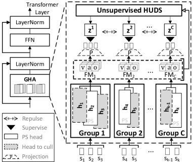
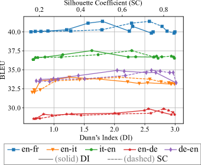
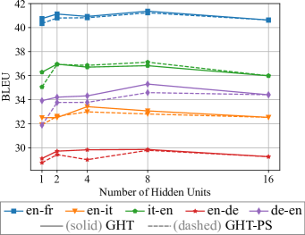
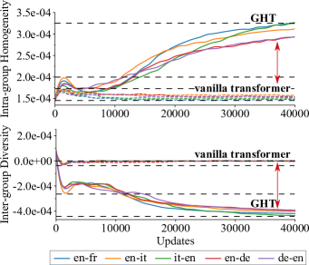

# Finding the Pillars of Strength for Multi-Head Attention

###### Abstract

Recent studies have revealed some issues of Multi-Head Attention (MHA), e.g., redundancy and over-parameterization. Specifically, the heads of MHA were originally designed to attend to information from different representation subspaces, whereas prior studies found that some attention heads likely learn similar features and can be pruned without harming performance. Inspired by the minimum-redundancy feature selection, we assume that focusing on the most representative and distinctive features with minimum resources can mitigate the above issues and lead to more effective and efficient MHAs. In particular, we propose Grouped Head Attention, trained with a self-supervised group constraint that group attention heads, where each group focuses on an essential but distinctive feature subset. We additionally propose a Voting-to-Stay procedure to remove redundant heads, thus achieving a transformer with lighter weights. Moreover, our method achieves significant performance gains on three well-established tasks while considerably compressing parameters. The code111<https://github.com/Psycoy/ACL-2023-Grouped-Head-Attention> is released. ††Proceedings of the 61st Annual Meeting of the Association for Computational Linguistics. Volume 1: Long Papers, pages 14526–14540.  

## 1 Introduction

Transformers have shown promising performance across various tasks . However, they have some issues, e.g., redundancy and over-parameterization, which is mainly caused by Multi-Head Attention (MHA) (Michel et al., [2019](#bib.bib20); Voita et al., [2019](#bib.bib34)) and Feed-Forward Network (FFN) (Sukhbaatar et al., [2019](#bib.bib29); Wu et al., [2019](#bib.bib36), [2020](#bib.bib37)) of transformer. We aim to mitigate the redundancy and over-parameterization issues by optimizing the MHA module. The multi-heads were originally designed to attend to different representation subspaces of input (Vaswani et al., [2017](#bib.bib33)). However, prior works (Michel et al., [2019](#bib.bib20); Voita et al., [2019](#bib.bib34)) have shown that the attention heads are highly redundant and over-parameterized after training because some heads can be switched off with a negligible performance drop.  

Such an issue is probably caused by their parallel design: the heads naturally work in the same way and likely attend to similar features (Cordonnier et al., [2020](#bib.bib5)). The existing redundancy optimization methods are mainly based on homogenization, diversification, and head significance. However, they all have some limits. (1) The homogenization-based methods mitigate redundancy and over-parameterization by making heads similar and removing unnecessary parameters. Cordonnier et al. ([2020](#bib.bib5)) homogenized attention heads by sharing most weights between all heads, which reduced the redundant parameters but sacrificed the performance somewhat because of the lack of diversity. (2) The diversification-based methods diversify the heads to enrich features and reduce the inter-head redundancy. Li et al. ([2018](#bib.bib13)) found that diversifying attention heads by adding a regularization could force MHA to reduce inter-head information redundancy, yielding performance gains in Machine Translation. However, such strategy that retains all feature subsets is sub-optimal, because it does not address the issue that MHA is over-parameterized. (3) The significance-based methods (Michel et al., [2019](#bib.bib20); Voita et al., [2019](#bib.bib34); Li et al., [2021](#bib.bib15)) learn significance scores for the heads to prune unimportant ones. However, the retained important heads still remain inter-head redundancy without diversifying them.  

Considering the issues of the above-mentioned methods, we hypothesize that attending to the most representative and distinctive feature subsets with minimum resources leads to more effective and efficient MHAs, which is inspired by the minimum-redundancy feature selection (Cordonnier et al., [2020](#bib.bib5)). Accordingly, we propose a divide-and-conquer strategy, including Group-Constrained Training (GCT) and Voting-to-Stay (V2S), to achieve the setting of our assumption and mitigate the above-mentioned issues. We illustrate them below.  

We first propose a strategy to group and distinguish attention heads, where a Grouped Head Attention (GHA) is obtained via the self-supervised GCT. By encouraging homogenization within a group and diversification between groups, the MHA is forced to divide its heads to work in several separate groups, where each group focuses on an essential but unique feature subset, being in line with the setting of our assumption. Note that the redundancy exists when the resources deployed by the model are more than enough to process current information Cordonnier et al. ([2020](#bib.bib5)). GHA reduces the redundancy in two aspects:  

* The intra-group homogenization reduces redundancy by encouraging similar intra-group heads and only retaining the most representative one later to lower the resource deployment. 
* The inter-group diversification reduces redundancy by forcing heads to attend to more diversified features (with less overlap between heads) so that the unique information to process increases and matches the resources deployed. 

Next, we show that GHA-PS (GHA with the Pillar of Strength), a lighter-weight GHA, can be achieved by excluding the redundant heads of GHA via the V2S procedure. V2S culls the redundant heads that share similar patterns with the most representative head (PS head) of a group, which is selected by voting on different training batches. Note that upon the convergence of the GCT, the heads are highly homogenized within a group, thus being redundant because they process similar information. As a result, once the redundant heads are culled, the PS heads can still achieve the essential utility of the original attention layer and yield comparable performance to the unculled model. The Lottery Ticket hypothesis (Frankle and Carbin, [2019](#bib.bib10)) argues that subnetworks in an over-parameterized neural network can converge faster and achieve comparable or better performance than the original network. Our GHA-PS achieving better results is also in line with this hypothesis.  

Such a divide-and-conquer combination resolves the issues of previous redundancy optimization methods: (1) Our model achieves better parameter efficiency, resolving the issue of previous diversification-based methods; (2) The feature diversity is guaranteed and the inter-head redundancy is reduced, resolving the problems of previous homogenization- and significance-based methods.  

We evaluate our method on three benchmarking tasks. We denote the corresponding transformer architectures of GHA and GHA-PS as Grouped Head Transformers (GHT) and Grouped Head Transformers with the Pillars of Strength (GHT-PS), respectively. GHT and GHT-PS achieve significant improvements over the strong baselines in Machine Translation (MT) BLEU scores (+3.8% and +4.4% averaged on 7 datasets), Language Modeling (LM) perplexity (-2.8% and -2.9%), and Abstractive summarization (AS) F1-Rouge (+6.7% and +7.0% on average). GHT-PS exhibits higher efficiency in model size, inference speed, and floating-point operations (FLOPs). The light architecture of GHT-PS reduces 63.6% parameters of the vanilla transformer and yields comparable performance. The key contributions of our work are threefold:   

* We find that, in a certain range, higher compactness of attention heads (i.e., the intra-group heads become closer to each other and the inter-group ones become farther) improves MHA’s performance, forcing MHA to focus on the most representative and distinctive features. It provides guidance for future architectural designs of MHA. 
* We propose a divide-and-conquer strategy that consists of GCT and V2S. It mitigates the redundancy and over-parameterization issues of MHA. Our method uses fewer parameters and achieves better performance, outperforming the existing MHA redundancy/parameter reduction methods. 
* We verify our methods on three well-established NLP tasks. The superior results on datasets with multiple languages, domains, and data sizes demonstrate the effectiveness of our method. 

## 2 Related Work

##### Parameter efficiency.

Different methods were proposed to achieve lightweight transformers: (1) replacing attention with lightweight modules, e.g., convolution modules, such as Dynamic Conv (Wu et al., [2019](#bib.bib36)) and Lite Transformer (Wu et al., [2020](#bib.bib37)); (2) removing or replacing the feed-forward layers, such as Sukhbaatar et al. ([2019](#bib.bib29)) and Wu et al. ([2020](#bib.bib37)); (3) pruning the model, such as Michel et al. ([2019](#bib.bib20)), Voita et al. ([2019](#bib.bib34)), and Li et al. ([2021](#bib.bib15)).  

##### Modified multi-head mechanism.

Ahmed et al. ([2017](#bib.bib1)) learned to weight the projected output of different heads, performing weighted sum over them. Li et al. ([2019](#bib.bib14)) aggregated the output of different heads by dynamic routing; Cui et al. ([2019](#bib.bib6)) used different attention mechanisms, e.g., global/local and forward/backward attention for different heads; Shazeer et al. ([2020](#bib.bib28)) mixed different heads before and after the softmax operation in an attention function to achieve communication between heads.  

##### Head redundancy optimization.

Michel et al. ([2019](#bib.bib20)) and Voita et al. ([2019](#bib.bib34)) found that only a subset of the attention heads have significant utilities in transformer, where the important heads could be identified by Expected Sensitivity and Layer-wise Relevance Propagation (LRP) (Ding et al., [2017](#bib.bib7)). Upon this, Li et al. ([2021](#bib.bib15)) learned per-head importance scores and pruned the heads. Cordonnier et al. ([2020](#bib.bib5)) homogenized the attention heads by sharing a part of the weights between heads, which lowered the number of parameters but sacrificed performance. Li et al. ([2018](#bib.bib13)) found that diversifying attention heads by adding a regularization can force MHA to reduce inter-head redundancy, yielding performance gains for Machine Translation. However, previous methods either traded performance for efficiency or retained extra parameters.  

## 3 Methodology

There are two core components in our method, namely the Group-Constrained Training (GCT) and the Voting-to-Stay (V2S) procedure. GHA (Figure [1](#S3.F1 "Figure 1 ‣ 3.1 Grouped Head Attention with Hidden Units ‣ 3 Methodology ‣ Finding the Pillars of Strength for Multi-Head Attention")) is developed with GCT that removes head redundancy; GHA-PS is developed by removing the redundant parameters of GHA in V2S. In this section, we detail the process of developing the GHA and finding its Pillars of Strength (PS).  

### 3.1 Grouped Head Attention with Hidden Units

[FIGURE S3.F1.1.g1]

Figure 1: The Grouped Head Attention. The heads in a group are under self-supervision of the discovered group hidden units $\mathrm{\mathbf{Z}}$ (Eq.[4](#S3.E4 "In 3.1 Grouped Head Attention with Hidden Units ‣ 3 Methodology ‣ Finding the Pillars of Strength for Multi-Head Attention")). The non-PS heads (dashed gray boxes in a group) will be culled in the VS procedure (Algorithm [1](#alg1 "Algorithm 1 ‣ 3.2 The Pillars of Strength ‣ 3 Methodology ‣ Finding the Pillars of Strength for Multi-Head Attention")). $S_{k}$ denotes the $k$-th representation subspace; FMC denotes the $C$-th feature map group. The output of GHA is omitted for simplicity.
[/FIGURE]

First, we detail the core module of GHT, the GHA with hidden units, which is built based on MHA via the GCT. The GCT divides the attention heads of MHA into several groups and makes heads within a group become more similar, whereas heads between groups become more different. Thus, MHA is forced to divide its heads to work in several separate groups, where each group focuses on an essential but unique feature subset to reduce head redundancy. We will show the effectiveness in § [5](#S5 "5 Results and Analysis ‣ Finding the Pillars of Strength for Multi-Head Attention").  

Given a transformer model $f(\mathrm{\mathbf{x}};\mathrm{\mathbf{\theta}})$ with $n$ attention layers, the set of heads at attention layer $l$ is denoted as $\mathrm{\mathbf{H}}_{l}$ $=\{\mathrm{\mathbf{h}}_{1,l},...,\mathrm{\mathbf{h}}_{k,l}\}$, where $k$ is the number of heads. The outputs of the attention heads are concatenated and projected with $W^{out}$, where the $i$-th head output $\mathrm{\mathbf{o}}_{i,l}$ in layer $l$ results from the computation of the projection matrices $W^{\mathrm{\mathbf{Q}}}_{i,l}$, $W^{\mathrm{\mathbf{K}}}_{i,l}$, and $W^{\mathrm{\mathbf{V}}}_{i,l}$ of this head:  

|  | $$M\!H\!A_{l}(\mathrm{\mathbf{Q}},\mathrm{\mathbf{K}},\mathrm{\mathbf{V}})=Concate(\mathrm{\mathbf{o}}_{1,l},...,\mathrm{\mathbf{o}}_{k,l})W^{out}$$ |  | (1) |
| --- | --- | --- | --- |

|  | $$\mathrm{\mathbf{o}}_{i,l}=softmax(\frac{(\mathrm{\mathbf{Q}}W^{\mathrm{\mathbf{Q}}}_{i,l})(\mathrm{\mathbf{K}}W^{\mathrm{\mathbf{K}}}_{i,l})^{T}}{\sqrt{d_{k}}})(\mathrm{\mathbf{V}}W^{\mathrm{\mathbf{V}}}_{i,l}).$$ |  | (2) |
| --- | --- | --- | --- |

Three feature maps (FMs) of GHA are extracted for the self-supervised GCT: (1) the result of $\mathrm{\mathbf{V}}W^{\mathrm{\mathbf{V}}}_{l}$, denoted as $\hat{\mathrm{\mathbf{V}}}_{l}$ = $\{\mathrm{\mathbf{v}}_{1,l},...,\mathrm{\mathbf{v}}_{k,l}\}$ (the value FM); (2) the attention weights of the $l$-th layer, denoted as $\mathrm{\mathbf{A}}_{l}$= $\{\mathrm{\mathbf{a}}_{1,l},...,\mathrm{\mathbf{a}}_{k,l}\}$ (the attention FM); (3) the output of the $l$-th layer before the output projection $W^{out}$, denoted as $\mathrm{\mathbf{O}}_{l}$= $\{\mathrm{\mathbf{o}}_{1,l},...,\mathrm{\mathbf{o}}_{k,l}\}$ (the head output FM). Moreover, $\hat{\mathrm{\mathbf{V}}}$ = $\{\hat{\mathrm{\mathbf{V}}}_{1},...,\hat{\mathrm{\mathbf{V}}}_{l}\}$, $\mathrm{\mathbf{A}}$ = $\{\mathrm{\mathbf{A}}_{1},...,\mathrm{\mathbf{A}}_{l}\}$, $\mathrm{\mathbf{O}}$ = $\{\mathrm{\mathbf{O}}_{1},...,\mathrm{\mathbf{O}}_{l}\}$. Given the FMs, a Hidden Unit Discovery System (HUDS) $\Omega$ assigns a hidden unit $\mathrm{\mathbf{z}}^{j}_{i,l}$ for each head to represent its group property, where $i$ denotes the $i$-th head and $j$ denotes the $j$-th group hidden unit. $\mathrm{\mathbf{z}}^{j}_{i,l}\in\hat{\mathrm{\mathbf{Z}}}_{l}$, where $\hat{\mathrm{\mathbf{Z}}}_{l}=\{\mathrm{\mathbf{z}}^{1}_{l},...,\mathrm{\mathbf{z}}^{C}_{l}\}$ represents the hidden unit candidates, and the hidden units assigned to the heads are denoted as $\mathrm{\mathbf{Z}}_{l}=\{\mathrm{\mathbf{z}}_{i,l},...,\mathrm{\mathbf{z}}_{i,l}\}$.  

$\mathrm{\mathbf{Z}}_{l}$ is discovered by the HUDS $\Omega$: $\mathrm{\mathbf{Z}}_{l}=\Omega(\mathrm{\mathbf{E}}_{l})$, where $\mathrm{\mathbf{E}}_{l}$ denotes either one of the $\hat{\mathrm{\mathbf{V}}}_{l}$, $\mathrm{\mathbf{A}}_{l}$, or $\mathrm{\mathbf{O}}_{l}$. Here $\Omega(\cdot)$ is an unsupervised algorithm that divides the heads into $C$ groups given their FMs, such as K-means222K-means fixes the group numbers for fair comparisons in §[5](#S5 "5 Results and Analysis ‣ Finding the Pillars of Strength for Multi-Head Attention"). Other clustering algorithms may also be applicable.:  

|  | $$\Omega(\mathrm{\mathbf{E}}_{l})=\operatorname*{arg\,min}_{\mathrm{\mathbf{Z}}_{l}}\sum_{i=1}^{C}\sum_{\mathrm{\mathbf{x}}\in\hat{\mathrm{\mathbf{E}}}^{i}_{l}}||\mathrm{\mathbf{x}}-\mu_{i}||^{2},$$ |  | (3) |
| --- | --- | --- | --- |

where $\hat{\mathrm{\mathbf{E}}}^{i}_{l}$ is the set of feature maps of the $i$-th head group in the $l$-th attention layer. Then, the feature map groups of the $l$-th attention layer are denoted as $\hat{\mathrm{\mathbf{E}}}_{l}=\{\hat{\mathrm{\mathbf{E}}}^{1}_{l},...,\hat{\mathrm{\mathbf{E}}}^{i}_{l},...,\hat{\mathrm{\mathbf{E}}}^{C}_{l}\}$. $\mu_{i}$ is the mean of the feature map vectors in $\hat{\mathrm{\mathbf{E}}}^{i}_{l}$. The hidden units $\mathrm{\mathbf{Z}}=\{\mathrm{\mathbf{Z}}_{1},...,\mathrm{\mathbf{Z}}_{l}\}$ are $C$-class categorical variables (Eq.[4](#S3.E4 "In 3.1 Grouped Head Attention with Hidden Units ‣ 3 Methodology ‣ Finding the Pillars of Strength for Multi-Head Attention")(A)) or continuous vectors (Eq.[4](#S3.E4 "In 3.1 Grouped Head Attention with Hidden Units ‣ 3 Methodology ‣ Finding the Pillars of Strength for Multi-Head Attention")(B)) to supervise the GCT. The objective of the self-supervised GCT is termed as:  

|  | $\displaystyle\begin{split}\displaystyle&L_{z}(\mathrm{\mathbf{f}};\mathrm{\mathbf{A}},\hat{\mathrm{\mathbf{V}}},\mathrm{\mathbf{O}},\mathrm{\mathbf{Z}})=\\ &\begin{cases}\displaystyle-\frac{1}{kn}\alpha\sum_{l=1}^{n}\sum_{i=1}^{k}log\ p_{z}(\mathrm{\mathbf{z}}_{i,l}|\mathrm{\mathbf{v}}_{i,l},\mathrm{\mathbf{a}}_{i,l},\mathrm{\mathbf{o}}_{i,l})\ +\\ \displaystyle\frac{1}{(C-1)kn}\beta\sum_{l=1}^{n}\sum_{i=1}^{k}\sum_{j_{2}\neq j_{1}}log\ p_{z}(\mathrm{\mathbf{z}}^{j_{2}}_{l}|\mathrm{\mathbf{v}}^{j_{1}}_{i,l},\mathrm{\mathbf{a}}^{j_{1}}_{i,l},\mathrm{\mathbf{o}}^{j_{1}}_{i,l})&\text{(A)}\\ \displaystyle\quad\!\frac{1}{kn}\alpha\sum_{l=1}^{n}\sum_{i=1}^{k}\varphi(\mathrm{\mathbf{v}}_{i,l},\mathrm{\mathbf{a}}_{i,l},\mathrm{\mathbf{o}}_{i,l};\mathrm{\mathbf{z}}_{i,l})\ -\\ \displaystyle\frac{1}{{C\choose 2}n}\beta\sum_{l=1}^{n}\sum_{j_{1}=1}^{C-1}\sum_{j_{2}=j_{1}+1}^{C}\varphi(\mathrm{\mathbf{z}}^{j_{1}}_{l};\mathrm{\mathbf{z}}^{j_{2}}_{l})&\text{(B)}\end{cases}\end{split}$ | |  | (4) |
| --- | --- | --- | --- | --- |

Either when $\mathrm{\mathbf{Z}}$ are categorical variables (Eq.[4](#S3.E4 "In 3.1 Grouped Head Attention with Hidden Units ‣ 3 Methodology ‣ Finding the Pillars of Strength for Multi-Head Attention")(A)) or continuous vectors (Eq.[4](#S3.E4 "In 3.1 Grouped Head Attention with Hidden Units ‣ 3 Methodology ‣ Finding the Pillars of Strength for Multi-Head Attention")(B)), the objective is composed of a homogenization term and a diversification term333The coefficients $\alpha$ and $\beta$ of Eq.[4](#S3.E4 "In 3.1 Grouped Head Attention with Hidden Units ‣ 3 Methodology ‣ Finding the Pillars of Strength for Multi-Head Attention") respectively control the intra-group homology and inter-group diversity degrees to achieve different group intensities in different tasks/datasets.. $\mathrm{\mathbf{v}}^{j}_{i,l}$, $\mathrm{\mathbf{a}}^{j}_{i,l}$, and $\mathrm{\mathbf{o}}^{j}_{i,l}$ denote the feature maps of the $i$-th head belonging to the $j$-th group. $p_{z}(\mathrm{\mathbf{z}}_{i,l}|\mathrm{\mathbf{v}}_{i,l},\mathrm{\mathbf{a}}_{i,l},\mathrm{\mathbf{o}}_{i,l})$ denotes the predicted probability of the assigned group hidden variable $\mathrm{\mathbf{z}}_{i,l}$, given $\mathrm{\mathbf{v}}_{i,l}$, $\mathrm{\mathbf{a}}_{i,l}$, and $\mathrm{\mathbf{o}}_{i,l}$. $\varphi(\mathrm{\mathbf{x}};\mathrm{\mathbf{y}})$ denotes a cosine similarity measurement between $\mathrm{\mathbf{x}}$ and $\mathrm{\mathbf{y}}$ (following Li et al. ([2018](#bib.bib13))). $\varphi(\mathrm{\mathbf{v}}_{i,l},\mathrm{\mathbf{a}}_{i,l},\mathrm{\mathbf{o}}_{i,l};\mathrm{\mathbf{z}}_{i,l})$ $=$ $\tau_{1}\varphi(\mathrm{\mathbf{v}}_{i,l}$; $\mathrm{\mathbf{z}}_{i,l})$ $+$ $\tau_{2}\varphi(\mathrm{\mathbf{a}}_{i,l}$; $\mathrm{\mathbf{z}}_{i,l})$ $+$ $\tau_{3}\varphi(\mathrm{\mathbf{o}}_{i,l}$; $\mathrm{\mathbf{z}}_{i,l})$, where $\tau$ is a coefficient, determined by the specific settings for each dataset & task. When $\mathrm{\mathbf{Z}}$ are categorical variables, the grouping is a classification task whose classification heads project the output into $C$ classes; when $\mathrm{\mathbf{Z}}$ are continuous vectors, the grouping process is a metric learning task whose similarity computations are conducted between $\mathrm{\mathbf{Z}}$ and the projected FM representations. In both conditions, GHA is supervised by $\mathrm{\mathbf{Z}}$ to make the heads in the same group yield similar patterns, whereas those in different groups repulse from each other. The overall objective is given by $L=L_{t}+L_{z}$, where $L_{t}$ is the task-specific objective.  

### 3.2 The Pillars of Strength

Being consistent with Lottery Ticket hypothesis (Frankle and Carbin, [2019](#bib.bib10)), we establish the GHT-PS from GHT as its subnetwork by removing redundant heads from GHA to achieve higher parameter efficiency. We propose the V2S procedure to find the Pillars of Strength (PS) heads that constitute the core of the GHA and remove other heads. We first describe the V2S roughly. In GHA, the heads within each group exhibit similar patterns upon the convergence of the Group-Constrained Training (GCT). Then, we only keep the heads with the most explicit group patterns (the PS heads), and switch off the other ones within the same group via V2S. The main idea of V2S is to vote on all heads of the GHA, and only retain one head for each group – the head receiving the most votes. Specifically, it takes an entire epoch to collect the layer-wise votes $\mathrm{\mathbf{m}}_{l}^{b}\in\{0,1\}^{k}$ from the whole training set (each data batch $b$ creates one layer-wise vote $\mathrm{\mathbf{m}}_{l}^{b}$ per attention layer), where $k$ denotes the head number; $0$ indicates that the corresponding head should be switched off and $1$ indicates that a head is retained.  

We assume that there are $B$ mini-batches in the training set. Then, each attention layer receives $B$ layer-wise votes within which each head-wise vote is denoted by either $0$ or $1$. For each group, the head receiving the most ‘$1$’s are assigned a ‘$1$’ in the final head mask $\mathrm{\mathbf{m}}_{l}\in\{0,1\}^{k}$ for attention layer $l$, indicating that this head will be retained. Following Michel et al. ([2019](#bib.bib20)) and Voita et al. ([2019](#bib.bib34)), we mask out the output of heads as the equivalent operation of head removal444We perform real head removal when test inference speed..  

[ALGORITHM alg1]

1:Procedure Voting-to-Stay($\mathrm{\mathbf{f}},\hat{\mathrm{\mathbf{V}}},\mathrm{\mathbf{A}},\mathrm{\mathbf{O}},\mathrm{\mathbf{Z}}$)

2:if satisfy $\mathrm{\mathbf{\rho}}$, and $\mathrm{\mathbf{m}}$ is none then

3:     Start voting epoch; Freeze $\mathrm{\mathbf{f}}$.

4:     $\mathrm{\mathbf{\Gamma}}_{l}$ $\leftarrow[\,\ ]\,$ $\triangleright$ Creat $\mathrm{\mathbf{\Gamma}}_{l}$ to store votes

5:     for batch $b$ in $B$ training batches do

6:         for layer $l$ in $L$ layers do

7:              for $\mathrm{\mathbf{E}}_{l}$ in $\{\hat{\mathrm{\mathbf{V}}}_{l},\mathrm{\mathbf{A}}_{l},\mathrm{\mathbf{O}}_{l}\}$  do

8:                  Based on $\eta_{l}=\{\eta_{1,l},...,\eta_{1,k}\}$,

9:                  create $\mathrm{\mathbf{m}}_{l,v}^{b},\mathrm{\mathbf{m}}_{l,a}^{b},\mathrm{\mathbf{m}}_{l,o}^{b}$.
              

10:              Add $\mathrm{\mathbf{m}}_{l,v}^{b}$, $\mathrm{\mathbf{m}}_{l,a}^{b}$, $\mathrm{\mathbf{m}}_{l,o}^{b}$ to $\mathrm{\mathbf{\Gamma}}_{l}$.
              

11:     for $l$ in $n$ do $\triangleright$ Vote at each attn layer

12:         $\mathrm{\mathbf{m}}_{l}\leftarrow VOTE(\mathrm{\mathbf{\Gamma}}_{l})$
     

13:     $\mathrm{\mathbf{m}}\leftarrow[\mathrm{\mathbf{m}}_{1},...,\mathrm{\mathbf{m}}_{n}]$ $\triangleright$ Stack layer votes

14:     Unfreeze $\mathrm{\mathbf{f}}$; end voting epoch.

15:$\mathrm{\mathbf{f}}=\mathrm{\mathbf{f}}\odot\mathrm{\mathbf{m}}$ $\triangleright$ Mask GHT attn outputs with $\mathrm{\mathbf{m}}$

Algorithm 1  The Voting-to-Stay (V2S) algorithm
[/ALGORITHM]

The V2S procedure is outlined in Algorithm [1](#alg1 "Algorithm 1 ‣ 3.2 The Pillars of Strength ‣ 3 Methodology ‣ Finding the Pillars of Strength for Multi-Head Attention"). We detail some of its definitions below. (1) $\mathrm{\mathbf{\rho}}$ indicates the full convergence of GHT, i.e., the hidden units found by $\Omega$ have a center shift less than a threshold. (2) In Step 7-9, given feature maps $\hat{\mathrm{\mathbf{V}}}_{l}$, $\mathrm{\mathbf{A}}_{l}$, and $\mathrm{\mathbf{O}}_{l}$ of the $l$-th attention layer, the vote vectors $\mathrm{\mathbf{m}}_{l,v}^{b}$, $\mathrm{\mathbf{m}}_{l,a}^{b}$, and $\mathrm{\mathbf{m}}_{l,o}^{b}\in\{0,1\}^{k}$ are determined by the group pattern scores $\mathrm{\mathbf{\eta}}_{i,l}$ of each head, indicating the explicitness of group patterns.  

We set the corresponding digit in the vote vectors as 1 for the head achieving the highest $\eta_{i,l}$ in its group, indicating the most representative head of the group. Here $\mathrm{\mathbf{\eta}}_{i,l}=p_{z}(\mathrm{\mathbf{z}}_{i,l}|\mathrm{\mathbf{e}}_{i,l})$ if $\mathrm{\mathbf{z}}$ is categorical; otherwise $\mathrm{\mathbf{\eta}}_{i,l}=-\varphi(\mathrm{\mathbf{e}}_{i,l};\mathrm{\mathbf{z}}_{i,l})$. $\mathrm{\mathbf{e}}_{i,l}$ denotes the $i$-th head feature map (either one of the $\mathrm{\mathbf{v}}_{i,l}$, $\mathrm{\mathbf{a}}_{i,l}$, or $\mathrm{\mathbf{o}}_{i,l}$). (3) $VOTE$ means counting the ‘$1$’s for each head based on the 0-1 votes in $\mathrm{\mathbf{\Gamma}}_{l}$ and only keeping the heads with the highest counts555Besides voting, there is an alternative way to create the mask. Instead of using 0-1 number as a discrete voting unit, the group pattern scores can be added up to rank the head pattern explicitness. We find that the two ways perform similarly.. After V2S, a finetuning is applied to adapt the pruned network.  

GHT-PS compresses considerable parameters. In the case of two head groups, GHT-PS reduces 75% parameters for an attention layer and 32.1% for the entire model666The encoder-decoder arch in Vaswani et al. ([2017](#bib.bib33)).. We will show that V2S removing non-PS heads does not sacrifice model performance. Instead, it brings accuracy gains in some cases and improves inference speed.  

## 4 Experimental Setup

In this section, we detail the key architectural configurations. Further training, model, dataset & evaluation setups are detailed in [A.1](#A1.SS1 "A.1 Trainig Settings ‣ Appendix A Appendix ‣ Finding the Pillars of Strength for Multi-Head Attention"), [A.2](#A1.SS2 "A.2 Further Model Settings ‣ Appendix A Appendix ‣ Finding the Pillars of Strength for Multi-Head Attention"), & [A.3](#A1.SS3 "A.3 Datasets and Evaluation9footnote 99footnote 9For all three tasks, we follow the data pipeline of fairseq: https://github.com/facebookresearch/fairseq/blob/main/examples ‣ Appendix A Appendix ‣ Finding the Pillars of Strength for Multi-Head Attention"). We follow the transformer of Vaswani et al. ([2017](#bib.bib33)) as a backbone architecture for all datasets and tasks in our experiments. Following Wu et al. ([2019](#bib.bib36), [2020](#bib.bib37)), for Machine Translation and Abstractive Summarization, we adopt the same 8-head encoder-decoder architecture with 6 layers for both encoder and decoder, where the model dimension $d_{model}$ $=$ $512$ and feed-forward dimension $d_{f}$ $=$ $2048$. For LM, we adopt the 16-head decoder-only architecture with 16 layers, where the model dimension $d_{model}$ $=$ $1024$ and feed-forward dimension $d_{f}$ $=$ $4096$. The layer normalization is applied before the residual connection of each layer. The parameters of decoder input and output projections are shared. Our models are based on fairseq (Ott et al., [2019](#bib.bib21)) implementations.  

We perform the GCT as a metric learning task because it does not introduce additional projection layers when the shapes of similarity inputs are identical (Eq.[4](#S3.E4 "In 3.1 Grouped Head Attention with Hidden Units ‣ 3 Methodology ‣ Finding the Pillars of Strength for Multi-Head Attention")(B)), which makes GHT weight-lighter. In addition, it performs better in our experiments compared to the classification-based grouping.  

[TABLE S4.T1]

<table class="ltx_tabular ltx_centering ltx_align_middle">
<tbody class="ltx_tbody">
<tr class="ltx_tr">
<td class="ltx_td ltx_align_left ltx_border_tt">Model</td>
<td class="ltx_td ltx_align_left ltx_border_tt">Param <math class="ltx_Math"><semantics><mo>↓</mo><annotation-xml><ci>↓</ci></annotation-xml><annotation>\downarrow</annotation></semantics></math></td>
<td class="ltx_td ltx_align_left ltx_border_tt">

Inference

Speed <math class="ltx_Math"><semantics><mo>↑</mo><annotation-xml><ci>↑</ci></annotation-xml><annotation>\uparrow</annotation></semantics></math>
</td>
<td class="ltx_td ltx_align_left ltx_border_tt">FLOPs <math class="ltx_Math"><semantics><mo>↓</mo><annotation-xml><ci>↓</ci></annotation-xml><annotation>\downarrow</annotation></semantics></math></td>
<td class="ltx_td ltx_align_left ltx_border_tt">BLEU <math class="ltx_Math"><semantics><mo>↑</mo><annotation-xml><ci>↑</ci></annotation-xml><annotation>\uparrow</annotation></semantics></math>
</td>
<td class="ltx_td ltx_align_left ltx_border_tt">IWSLT</td>
<td class="ltx_td ltx_align_center ltx_border_tt">​​WMT</td>
</tr>
<tr class="ltx_tr">
<td class="ltx_td ltx_align_left ltx_border_t">de-en</td>
<td class="ltx_td ltx_align_left ltx_border_t">it-en</td>
<td class="ltx_td ltx_align_left ltx_border_t">en-de</td>
<td class="ltx_td ltx_nopad_l ltx_align_left ltx_border_t">en-it</td>
<td class="ltx_td ltx_align_left ltx_border_t">en-fr</td>
<td class="ltx_td ltx_nopad_l ltx_align_left ltx_border_t">en-de</td>
<td class="ltx_td ltx_align_left ltx_border_t">en-fr</td>
</tr>
<tr class="ltx_tr">
<td class="ltx_td ltx_align_left ltx_border_t">Vanilla Transformer</td>
<td class="ltx_td ltx_align_left ltx_border_t">44M</td>
<td class="ltx_td ltx_align_left ltx_border_t">1012.1 sent/s</td>
<td class="ltx_td ltx_align_left ltx_border_t">1996M</td>
<td class="ltx_td ltx_align_left ltx_border_t">34.4</td>
<td class="ltx_td ltx_align_left ltx_border_t">32.3</td>
<td class="ltx_td ltx_align_left ltx_border_t">28.0</td>
<td class="ltx_td ltx_nopad_l ltx_align_left ltx_border_t">30.8</td>
<td class="ltx_td ltx_align_left ltx_border_t">40.1</td>
<td class="ltx_td ltx_nopad_l ltx_align_left ltx_border_t">27.3</td>
<td class="ltx_td ltx_align_left ltx_border_t">38.1</td>
</tr>
<tr class="ltx_tr">
<td class="ltx_td ltx_align_left">GHT (ours)</td>
<td class="ltx_td ltx_align_left ltx_border_t">44M</td>
<td class="ltx_td ltx_align_left ltx_border_t">1016.4 sent/s</td>
<td class="ltx_td ltx_align_left ltx_border_t">1996M</td>
<td class="ltx_td ltx_align_left ltx_border_t">35.4</td>
<td class="ltx_td ltx_align_left ltx_border_t">32.8</td>
<td class="ltx_td ltx_align_left ltx_border_t">29.1</td>
<td class="ltx_td ltx_nopad_l ltx_align_left ltx_border_t">31.6</td>
<td class="ltx_td ltx_align_left ltx_border_t">
41.5</td>
<td class="ltx_td ltx_nopad_l ltx_align_left ltx_border_t">28.6</td>
<td class="ltx_td ltx_align_left ltx_border_t">40.7</td>
</tr>
<tr class="ltx_tr">
<td class="ltx_td ltx_align_left ltx_border_t">Transformer-Lite1</td>
<td class="ltx_td ltx_align_left ltx_border_t">30M</td>
<td class="ltx_td ltx_align_left ltx_border_t">1175.4 sent/s</td>
<td class="ltx_td ltx_align_left ltx_border_t">1549M</td>
<td class="ltx_td ltx_align_left ltx_border_t">33.8</td>
<td class="ltx_td ltx_align_left ltx_border_t">31.9</td>
<td class="ltx_td ltx_align_left ltx_border_t">27.9</td>
<td class="ltx_td ltx_nopad_l ltx_align_left ltx_border_t">29.3</td>
<td class="ltx_td ltx_align_left ltx_border_t">39.9</td>
<td class="ltx_td ltx_nopad_l ltx_align_left ltx_border_t">26.9</td>
<td class="ltx_td ltx_align_left ltx_border_t">37.7</td>
</tr>
<tr class="ltx_tr">
<td class="ltx_td ltx_align_left">Transformer-Lite2</td>
<td class="ltx_td ltx_align_left">30M</td>
<td class="ltx_td ltx_align_left">1108.7 sent/s</td>
<td class="ltx_td ltx_align_left">1465M</td>
<td class="ltx_td ltx_align_left">34.0</td>
<td class="ltx_td ltx_align_left">32.2</td>
<td class="ltx_td ltx_align_left">28.2</td>
<td class="ltx_td ltx_nopad_l ltx_align_left">29.5</td>
<td class="ltx_td ltx_align_left">40.0</td>
<td class="ltx_td ltx_nopad_l ltx_align_left">26.7</td>
<td class="ltx_td ltx_align_left">37.8</td>
</tr>
<tr class="ltx_tr">
<td class="ltx_td ltx_align_left ltx_border_bb">GHT-PS (ours)</td>
<td class="ltx_td ltx_align_left ltx_border_bb ltx_border_t">30M</td>
<td class="ltx_td ltx_align_left ltx_border_bb ltx_border_t">1122.1 sent/s</td>
<td class="ltx_td ltx_align_left ltx_border_bb ltx_border_t">1558M</td>
<td class="ltx_td ltx_align_left ltx_border_bb ltx_border_t">35.2</td>
<td class="ltx_td ltx_align_left ltx_border_bb ltx_border_t">32.7</td>
<td class="ltx_td ltx_align_left ltx_border_bb ltx_border_t">28.9</td>
<td class="ltx_td ltx_nopad_l ltx_align_left ltx_border_bb ltx_border_t">31.6</td>
<td class="ltx_td ltx_align_left ltx_border_bb ltx_border_t">
41.4</td>
<td class="ltx_td ltx_nopad_l ltx_align_left ltx_border_bb ltx_border_t">28.2</td>
<td class="ltx_td ltx_align_left ltx_border_bb ltx_border_t">40.5</td>
</tr>
</tbody>
</table>

Table 1: Benchmark with vanilla transformer (backbone) on IWSLT and WMT Machine Translation datasets, measured by BLEU. All improvements are statistically significant with $p<0.05$ under t-test.
[/TABLE]

[TABLE S4.T2]

<table class="ltx_tabular ltx_centering ltx_align_middle">
<tbody class="ltx_tbody">
<tr class="ltx_tr">
<td class="ltx_td ltx_align_left ltx_border_tt">Model</td>
<td class="ltx_td ltx_align_left ltx_border_tt">Param <math class="ltx_Math"><semantics><mo>↓</mo><annotation-xml><ci>↓</ci></annotation-xml><annotation>\downarrow</annotation></semantics></math></td>
<td class="ltx_td ltx_align_left ltx_border_tt">

Inference

Speed <math class="ltx_Math"><semantics><mo>↑</mo><annotation-xml><ci>↑</ci></annotation-xml><annotation>\uparrow</annotation></semantics></math>
</td>
<td class="ltx_td ltx_align_left ltx_border_tt">FLOPs <math class="ltx_Math"><semantics><mo>↓</mo><annotation-xml><ci>↓</ci></annotation-xml><annotation>\downarrow</annotation></semantics></math></td>
<td class="ltx_td ltx_align_left ltx_border_tt">BLEU <math class="ltx_Math"><semantics><mo>↑</mo><annotation-xml><ci>↑</ci></annotation-xml><annotation>\uparrow</annotation></semantics></math>
</td>
<td class="ltx_td ltx_nopad_l ltx_align_left ltx_border_tt">IWSLT</td>
<td class="ltx_td ltx_align_center ltx_border_tt">​​WMT</td>
</tr>
<tr class="ltx_tr">
<td class="ltx_td ltx_align_left ltx_border_t">de-en</td>
<td class="ltx_td ltx_align_left ltx_border_t">it-en</td>
<td class="ltx_td ltx_align_left ltx_border_t">en-de</td>
<td class="ltx_td ltx_align_left ltx_border_t">en-it</td>
<td class="ltx_td ltx_align_left ltx_border_t">en-fr</td>
<td class="ltx_td ltx_nopad_l ltx_align_center ltx_border_t">en-de</td>
<td class="ltx_td ltx_align_center ltx_border_t">en-fr</td>
</tr>
<tr class="ltx_tr">
<td class="ltx_td ltx_align_left ltx_border_t"><cite class="ltx_cite ltx_citemacro_citet">Cordonnier et al. (<a class="ltx_ref">2020</a>)</cite></td>
<td class="ltx_td ltx_align_left ltx_border_t">44M</td>
<td class="ltx_td ltx_align_left ltx_border_t">416.6 sent/s</td>
<td class="ltx_td ltx_align_left ltx_border_t">2054M</td>
<td class="ltx_td ltx_align_left ltx_border_t">34.4</td>
<td class="ltx_td ltx_align_left ltx_border_t">31.8</td>
<td class="ltx_td ltx_align_left ltx_border_t">28.2</td>
<td class="ltx_td ltx_align_left ltx_border_t">31.0</td>
<td class="ltx_td ltx_align_left ltx_border_t">40.7</td>
<td class="ltx_td ltx_nopad_l ltx_align_center ltx_border_t">27.6</td>
<td class="ltx_td ltx_align_center ltx_border_t">38.5</td>
</tr>
<tr class="ltx_tr">
<td class="ltx_td ltx_align_left"><cite class="ltx_cite ltx_citemacro_citet">Li et al. (<a class="ltx_ref">2018</a>)</cite></td>
<td class="ltx_td ltx_align_left">44M</td>
<td class="ltx_td ltx_align_left">1011.2 sent/s</td>
<td class="ltx_td ltx_align_left">1996M</td>
<td class="ltx_td ltx_align_left">34.7</td>
<td class="ltx_td ltx_align_left">31.8</td>
<td class="ltx_td ltx_align_left">28.5</td>
<td class="ltx_td ltx_align_left">30.7</td>
<td class="ltx_td ltx_align_left">40.7</td>
<td class="ltx_td ltx_nopad_l ltx_align_center">27.3</td>
<td class="ltx_td ltx_align_center">39.3</td>
</tr>
<tr class="ltx_tr">
<td class="ltx_td ltx_align_left">GHT (ours)</td>
<td class="ltx_td ltx_align_left ltx_border_t">44M</td>
<td class="ltx_td ltx_align_left ltx_border_t">1016.4 sent/s</td>
<td class="ltx_td ltx_align_left ltx_border_t">1996M</td>
<td class="ltx_td ltx_align_left ltx_border_t">
35.4*</td>
<td class="ltx_td ltx_align_left ltx_border_t">
32.8*</td>
<td class="ltx_td ltx_align_left ltx_border_t">
29.1*</td>
<td class="ltx_td ltx_align_left ltx_border_t">
31.6*</td>
<td class="ltx_td ltx_align_left ltx_border_t">
41.5*</td>
<td class="ltx_td ltx_nopad_l ltx_align_center ltx_border_t">
28.6*</td>
<td class="ltx_td ltx_align_center ltx_border_t">
40.7*</td>
</tr>
<tr class="ltx_tr">
<td class="ltx_td ltx_align_left ltx_border_t"><cite class="ltx_cite ltx_citemacro_citet">Voita et al. (<a class="ltx_ref">2019</a>)</cite></td>
<td class="ltx_td ltx_align_left ltx_border_t">30M</td>
<td class="ltx_td ltx_align_left ltx_border_t">1099.1 sent/s</td>
<td class="ltx_td ltx_align_left ltx_border_t">1558M</td>
<td class="ltx_td ltx_align_left ltx_border_t">32.2</td>
<td class="ltx_td ltx_align_left ltx_border_t">30.8</td>
<td class="ltx_td ltx_align_left ltx_border_t">26.5</td>
<td class="ltx_td ltx_align_left ltx_border_t">30.3</td>
<td class="ltx_td ltx_align_left ltx_border_t">39.8</td>
<td class="ltx_td ltx_nopad_l ltx_align_center ltx_border_t">22.0</td>
<td class="ltx_td ltx_align_center ltx_border_t">34.0</td>
</tr>
<tr class="ltx_tr">
<td class="ltx_td ltx_align_left"><cite class="ltx_cite ltx_citemacro_citet">Li et al. (<a class="ltx_ref">2021</a>)</cite></td>
<td class="ltx_td ltx_align_left">30M</td>
<td class="ltx_td ltx_align_left">1116.9 sent/s</td>
<td class="ltx_td ltx_align_left">1558M</td>
<td class="ltx_td ltx_align_left">33.2</td>
<td class="ltx_td ltx_align_left">31.3</td>
<td class="ltx_td ltx_align_left">27.5</td>
<td class="ltx_td ltx_align_left">30.0</td>
<td class="ltx_td ltx_align_left">39.7</td>
<td class="ltx_td ltx_nopad_l ltx_align_center">20.5</td>
<td class="ltx_td ltx_align_center">33.6</td>
</tr>
<tr class="ltx_tr">
<td class="ltx_td ltx_align_left">Dynamic conv</td>
<td class="ltx_td ltx_align_left">30M</td>
<td class="ltx_td ltx_align_left">1050.2 sent/s</td>
<td class="ltx_td ltx_align_left">1615M</td>
<td class="ltx_td ltx_align_left">34.8</td>
<td class="ltx_td ltx_align_left">32.7</td>
<td class="ltx_td ltx_align_left">28.7</td>
<td class="ltx_td ltx_align_left">31.1</td>
<td class="ltx_td ltx_align_left">40.6</td>
<td class="ltx_td ltx_nopad_l ltx_align_center">24.0</td>
<td class="ltx_td ltx_align_center">36.5</td>
</tr>
<tr class="ltx_tr">
<td class="ltx_td ltx_align_left">Lite Transformer</td>
<td class="ltx_td ltx_align_left">30M</td>
<td class="ltx_td ltx_align_left">1096.6 sent/s</td>
<td class="ltx_td ltx_align_left">1809M</td>
<td class="ltx_td ltx_align_left">33.3</td>
<td class="ltx_td ltx_align_left">31.4</td>
<td class="ltx_td ltx_align_left">27.5</td>
<td class="ltx_td ltx_align_left">29.8</td>
<td class="ltx_td ltx_align_left">39.4</td>
<td class="ltx_td ltx_nopad_l ltx_align_center">24.9</td>
<td class="ltx_td ltx_align_center">37.4</td>
</tr>
<tr class="ltx_tr">
<td class="ltx_td ltx_align_left ltx_border_bb">GHT-PS (ours)</td>
<td class="ltx_td ltx_align_left ltx_border_bb ltx_border_t">30M</td>
<td class="ltx_td ltx_align_left ltx_border_bb ltx_border_t">1122.1 sent/s</td>
<td class="ltx_td ltx_align_left ltx_border_bb ltx_border_t">1558M</td>
<td class="ltx_td ltx_align_left ltx_border_bb ltx_border_t">
35.2*</td>
<td class="ltx_td ltx_align_left ltx_border_bb ltx_border_t">32.7</td>
<td class="ltx_td ltx_align_left ltx_border_bb ltx_border_t">
28.9*</td>
<td class="ltx_td ltx_align_left ltx_border_bb ltx_border_t">
31.6*</td>
<td class="ltx_td ltx_align_left ltx_border_bb ltx_border_t">
41.4*</td>
<td class="ltx_td ltx_nopad_l ltx_align_center ltx_border_bb ltx_border_t">
28.2*</td>
<td class="ltx_td ltx_align_center ltx_border_bb ltx_border_t">
40.5*</td>
</tr>
</tbody>
</table>

Table 2: Benchmark with state-of-the-art MHA redundancy/parameter optimization baselines on IWSLT and WMT Machine Translation datasets at the same parameter level, measured by BLEU. \* denotes the improvement is statistical significant with $p<0.05$ under t-test.
[/TABLE]

## 5 Results and Analysis

### 5.1 Machine Translation

##### Ours vs. vanilla transformer.

We first report results by comparing GHT and GHT-PS with the vanilla transformer (Vaswani et al., [2017](#bib.bib33)) which is the backbone of our model. As shown in Table [1](#S4.T1 "Table 1 ‣ 4 Experimental Setup ‣ Finding the Pillars of Strength for Multi-Head Attention"), the models are compared at different parameter levels777The parameters analyzed in this paper exclude the embedding layer since they vary a lot between different datasets when the vocabulary sizes are different.. GHT does not have weight reduction, keeping the same parameter size as the vanilla transformer (44M, the same setting as transformer base  (Vaswani et al., [2017](#bib.bib33))). In contrast, GHT-PS is compressed to 30M parameters via V2S. For a fair comparison, we first compare GHT-PS with two lite architectures, Transformer-Lite1 and Transformer-Lite2, whose parameter numbers are 30M as well. Keeping other settings unchanged, the encoder and decoder of Transformer-Lite1 are reduced to 4 layers, respectively. Transformer-Lite2 reduces the model dimension $d_{model}$ to 424, and $d_{f}$ to 1696.  

GHT and GHT-PS consistently and significantly outperform their backbone models at the same parameter level across all datasets. On average, the GHT surpasses 44M vanilla transformer by 3.8% in BLEU  Papineni et al. ([2002](#bib.bib22)); GHT-PS surpasses Lite1 and Lite2 by 4.9% and 4.4%, respectively. Although GHT-PS reduces 32.1% parameters, it significantly outperforms both 44M and 30M vanilla transformers, which is comparable to GHT on all datasets. It shows that V2S reduces the parameter size of the original transformer without sacrificing accuracy on MT. Efficiency is analyzed later.  

##### Ours vs. efficient attention models.

We compare GHT with two state-of-the-art (SOTA) MHA redundancy optimization baselines. Cordonnier et al. ([2020](#bib.bib5)) and Li et al. ([2018](#bib.bib13)) are respectively homogenization- and diversification-based methods. In addition, we compare GHT-PS with four SOTA baselines that made major contributions to attention parameter compression and redundancy optimization888Works optimizing parameters of transformer modules rather than the MHA are not compared. In addition, we do not compare to Michel et al. ([2019](#bib.bib20)) (post-pruning), because their method performs extremely bad when the parameter level is low, e.g., 30M (Li et al., [2021](#bib.bib15))..  Voita et al. ([2019](#bib.bib34)) and Li et al. ([2021](#bib.bib15)) are significance-based pruning methods. Dynamic Conv (Wu et al., [2019](#bib.bib36)) and Lite Transformer (Wu et al., [2020](#bib.bib37)) modify the MHA arch to reduce parameters.  

Table [2](#S4.T2 "Table 2 ‣ 4 Experimental Setup ‣ Finding the Pillars of Strength for Multi-Head Attention") shows that GHT outperforms all its baselines on all datasets, exceeding the strongest baseline by 2.9% in averaged BLEU scores. GHT-PS outperforms all its baselines on 6 out of 7 datasets, exceeding the strongest baseline by 4.4% on average. Model compression of the baselines may sacrifice performance (especially on large datasets, e.g., WMT en-de and en-fr), while GHT-PS is almost not affected by the parameter reduction, even surpassing GHT’s baselines with 44M parameters.  

[TABLE S5.T3]

<table class="ltx_tabular ltx_centering ltx_guessed_headers ltx_align_middle">
<tbody class="ltx_tbody">
<tr class="ltx_tr">
<th class="ltx_td ltx_align_left ltx_th ltx_th_row ltx_border_tt">Model</th>
<td class="ltx_td ltx_align_center ltx_border_tt">BLEU <math class="ltx_Math"><semantics><mo>↑</mo><annotation-xml><ci>↑</ci></annotation-xml><annotation>\uparrow</annotation></semantics></math>
</td>
</tr>
<tr class="ltx_tr">
<td class="ltx_td ltx_nopad_l ltx_align_center ltx_border_t">de-en</td>
<td class="ltx_td ltx_align_center ltx_border_t">it-en</td>
<td class="ltx_td ltx_align_center ltx_border_t">en-de</td>
<td class="ltx_td ltx_align_center ltx_border_t">en-it</td>
<td class="ltx_td ltx_nopad_r ltx_align_center ltx_border_t">en-fr</td>
</tr>
<tr class="ltx_tr">
<th class="ltx_td ltx_align_left ltx_th ltx_th_row ltx_border_t">GHT</th>
<td class="ltx_td ltx_nopad_l ltx_align_center ltx_border_t">35.4</td>
<td class="ltx_td ltx_align_center ltx_border_t">32.8</td>
<td class="ltx_td ltx_align_center ltx_border_t">29.1</td>
<td class="ltx_td ltx_align_center ltx_border_t">31.6</td>
<td class="ltx_td ltx_nopad_r ltx_align_center ltx_border_t">41.5</td>
</tr>
<tr class="ltx_tr">
<th class="ltx_td ltx_align_left ltx_th ltx_th_row">- w/o Diversifying</th>
<td class="ltx_td ltx_nopad_l ltx_align_center">34.7</td>
<td class="ltx_td ltx_align_center">31.8</td>
<td class="ltx_td ltx_align_center">28.5</td>
<td class="ltx_td ltx_align_center">30.7</td>
<td class="ltx_td ltx_nopad_r ltx_align_center">40.7</td>
</tr>
<tr class="ltx_tr">
<th class="ltx_td ltx_align_left ltx_th ltx_th_row">- w/o Homologizing</th>
<td class="ltx_td ltx_nopad_l ltx_align_center">34.3</td>
<td class="ltx_td ltx_align_center">32.0</td>
<td class="ltx_td ltx_align_center">28.2</td>
<td class="ltx_td ltx_align_center">30.9</td>
<td class="ltx_td ltx_nopad_r ltx_align_center">40.2</td>
</tr>
<tr class="ltx_tr">
<th class="ltx_td ltx_align_left ltx_th ltx_th_row ltx_border_t">GHT-PS</th>
<td class="ltx_td ltx_nopad_l ltx_align_center ltx_border_t">35.2</td>
<td class="ltx_td ltx_align_center ltx_border_t">32.7</td>
<td class="ltx_td ltx_align_center ltx_border_t">28.9</td>
<td class="ltx_td ltx_align_center ltx_border_t">31.6</td>
<td class="ltx_td ltx_nopad_r ltx_align_center ltx_border_t">41.4</td>
</tr>
<tr class="ltx_tr">
<th class="ltx_td ltx_align_left ltx_th ltx_th_row">- w/o GCT</th>
<td class="ltx_td ltx_nopad_l ltx_align_center">33.8</td>
<td class="ltx_td ltx_align_center">31.9</td>
<td class="ltx_td ltx_align_center">28.1</td>
<td class="ltx_td ltx_align_center">30.5</td>
<td class="ltx_td ltx_nopad_r ltx_align_center">39.8</td>
</tr>
<tr class="ltx_tr">
<th class="ltx_td ltx_align_left ltx_th ltx_th_row">- w/o GC</th>
<td class="ltx_td ltx_nopad_l ltx_align_center">34.0</td>
<td class="ltx_td ltx_align_center">32.0</td>
<td class="ltx_td ltx_align_center">28.4</td>
<td class="ltx_td ltx_align_center">31.0</td>
<td class="ltx_td ltx_nopad_r ltx_align_center">40.2</td>
</tr>
<tr class="ltx_tr">
<th class="ltx_td ltx_align_left ltx_th ltx_th_row">- w/o HUDS</th>
<td class="ltx_td ltx_nopad_l ltx_align_center">33.7</td>
<td class="ltx_td ltx_align_center">32.0</td>
<td class="ltx_td ltx_align_center">28.1</td>
<td class="ltx_td ltx_align_center">30.9</td>
<td class="ltx_td ltx_nopad_r ltx_align_center">40.3</td>
</tr>
<tr class="ltx_tr">
<th class="ltx_td ltx_align_left ltx_th ltx_th_row">- w/o PS stay</th>
<td class="ltx_td ltx_nopad_l ltx_align_center">33.6</td>
<td class="ltx_td ltx_align_center">31.7</td>
<td class="ltx_td ltx_align_center">27.9</td>
<td class="ltx_td ltx_align_center">30.7</td>
<td class="ltx_td ltx_nopad_r ltx_align_center">40.2</td>
</tr>
<tr class="ltx_tr">
<th class="ltx_td ltx_align_left ltx_th ltx_th_row">- w/ stage 2 GC</th>
<td class="ltx_td ltx_nopad_l ltx_align_center">33.2</td>
<td class="ltx_td ltx_align_center">31.8</td>
<td class="ltx_td ltx_align_center">28.1</td>
<td class="ltx_td ltx_align_center">30.8</td>
<td class="ltx_td ltx_nopad_r ltx_align_center">40.3</td>
</tr>
<tr class="ltx_tr">
<th class="ltx_td ltx_align_left ltx_th ltx_th_row ltx_border_bb">- w/ stage 1&amp; 2 GC</th>
<td class="ltx_td ltx_nopad_l ltx_align_center ltx_border_bb">33.4</td>
<td class="ltx_td ltx_align_center ltx_border_bb">31.9</td>
<td class="ltx_td ltx_align_center ltx_border_bb">27.7</td>
<td class="ltx_td ltx_align_center ltx_border_bb">30.6</td>
<td class="ltx_td ltx_nopad_r ltx_align_center ltx_border_bb">40.2</td>
</tr>
</tbody>
</table>

Table 3: Ablation study on IWSLT’14. The results are statistically significant with $p<0.05$ under t-test.
[/TABLE]

##### Ablation Study.

We evaluate the impacts of the features we choose for GHT and GHT-PS (Table [3](#S5.T3 "Table 3 ‣ Ours vs. efficient attention models. ‣ 5.1 Machine Translation ‣ 5 Results and Analysis ‣ Finding the Pillars of Strength for Multi-Head Attention")). We first ablate the diversification/homogenization term of GCT (see Eq.[4](#S3.E4 "In 3.1 Grouped Head Attention with Hidden Units ‣ 3 Methodology ‣ Finding the Pillars of Strength for Multi-Head Attention")), which lowers the BLEU scores. Next, we show the importance of GCT for V2S. w/o GCT denotes that we directly perform V2S at the very beginning without GCT. w/o GC denotes that V2S is employed after normal training without Group Constrain (GC). Both ablation models yield lower BLEU, because they do not homogenize unnecessary heads and prepare them for pruning. Next, we validate the power of Pillars of Strength. w/o HUDS denotes we replace HUDS with randomly switching off heads after GCT; w/o PS stay denotes we keep random group members instead of the Pillars of Strength after GCT. We observe lower BLEU in w/o HUDS and w/o PS stay. Finally, we find that GC only needs to be added before V2S. We denote the training stages before and after V2S as stages 1 and 2. We compare the proposed Stage 1-based GHT-PS with models that perform GCT at Stage 2 (w/ stage 2 GC) and at both stages (w/ stage 1& 2 GC). BLEU scores of both ablation models decrease.  

[FIGURE S5.F2.g1]

Figure 2: The final BLEU scores achieved by GHT (on IWSLT’14 dev set) first rise and then drop, as the final group patterns become more compact (indicated by the increasing SC and DI scores).
[/FIGURE]

##### Effect of group compactness.

We hypothesize that more compact group patterns bring performance gains to the GHT. Figure [2](#S5.F2 "Figure 2 ‣ Ablation Study. ‣ 5.1 Machine Translation ‣ 5 Results and Analysis ‣ Finding the Pillars of Strength for Multi-Head Attention") shows the correlation between the compactness of the final group patterns and the final BLEU scores GHT achieved on 5 IWSLT’14 development sets when the GHT is fully converged in GCT. One data point corresponds to an independent run. We choose Silhouette Coefficient (SC) (Rousseeuw, [1987](#bib.bib27)) and Dunn’s Index (DI) (Bezdek and Pal, [1995](#bib.bib3)) as the measurements of group pattern compactness, both of which increase as the intra-group samples become more similar and the inter-group ones become more separated. The SC and DI are computed with the FMs of GHA (§ [3.1](#S3.SS1 "3.1 Grouped Head Attention with Hidden Units ‣ 3 Methodology ‣ Finding the Pillars of Strength for Multi-Head Attention")) and controlled by tuning the $\alpha$ and $\beta$ (Eq.[4](#S3.E4 "In 3.1 Grouped Head Attention with Hidden Units ‣ 3 Methodology ‣ Finding the Pillars of Strength for Multi-Head Attention")).       

Figure [2](#S5.F2 "Figure 2 ‣ Ablation Study. ‣ 5.1 Machine Translation ‣ 5 Results and Analysis ‣ Finding the Pillars of Strength for Multi-Head Attention") shows that, within the normal range, the BLEU scores rise with higher SC/DI scores, which is in line with our assumption. The BLEUs start to drop after the peak as the SC/DI scores increase, because the very heavy group constraint prohibits the model from learning useful task-specific knowledge.  

[FIGURE S5.F3.g1]

Figure 3: The BLEUs of GHT and GHT-PS by different numbers of hidden units (groups) on IWSLT’14 dev set.
[/FIGURE]

[TABLE S5.T4]

<table class="ltx_tabular ltx_centering ltx_guessed_headers ltx_align_middle">
<tbody class="ltx_tbody">
<tr class="ltx_tr">
<th class="ltx_td ltx_align_left ltx_th ltx_th_row ltx_border_tt">Model</th>
<td class="ltx_td ltx_align_center ltx_border_tt">Param <math class="ltx_Math"><semantics><mo>↓</mo><annotation-xml><ci>↓</ci></annotation-xml><annotation>\downarrow</annotation></semantics></math>
</td>
<td class="ltx_td ltx_align_center ltx_border_tt">Inference Speed <math class="ltx_Math"><semantics><mo>↑</mo><annotation-xml><ci>↑</ci></annotation-xml><annotation>\uparrow</annotation></semantics></math>
</td>
<td class="ltx_td ltx_align_center ltx_border_tt">FLOPs <math class="ltx_Math"><semantics><mo>↓</mo><annotation-xml><ci>↓</ci></annotation-xml><annotation>\downarrow</annotation></semantics></math>
</td>
<td class="ltx_td ltx_align_center ltx_border_tt">Rouge-1 <math class="ltx_Math"><semantics><mo>↑</mo><annotation-xml><ci>↑</ci></annotation-xml><annotation>\uparrow</annotation></semantics></math>
</td>
<td class="ltx_td ltx_align_center ltx_border_tt">Rouge-2 <math class="ltx_Math"><semantics><mo>↑</mo><annotation-xml><ci>↑</ci></annotation-xml><annotation>\uparrow</annotation></semantics></math>
</td>
<td class="ltx_td ltx_align_center ltx_border_tt">Rouge-L <math class="ltx_Math"><semantics><mo>↑</mo><annotation-xml><ci>↑</ci></annotation-xml><annotation>\uparrow</annotation></semantics></math>
</td>
</tr>
<tr class="ltx_tr">
<th class="ltx_td ltx_align_left ltx_th ltx_th_row ltx_border_t">LSTM <cite class="ltx_cite ltx_citemacro_citep">(Paulus et al., <a class="ltx_ref">2018</a>)</cite>
</th>
<td class="ltx_td ltx_align_center ltx_border_t">-</td>
<td class="ltx_td ltx_align_center ltx_border_t">-</td>
<td class="ltx_td ltx_align_center ltx_border_t">-</td>
<td class="ltx_td ltx_align_center ltx_border_t">38.30</td>
<td class="ltx_td ltx_align_center ltx_border_t">14.81</td>
<td class="ltx_td ltx_align_center ltx_border_t">35.49</td>
</tr>
<tr class="ltx_tr">
<th class="ltx_td ltx_align_left ltx_th ltx_th_row">CNN <cite class="ltx_cite ltx_citemacro_citep">(Fan et al., <a class="ltx_ref">2018</a>)</cite>
</th>
<td class="ltx_td ltx_align_center">-</td>
<td class="ltx_td ltx_align_center">-</td>
<td class="ltx_td ltx_align_center">-</td>
<td class="ltx_td ltx_align_center">39.06</td>
<td class="ltx_td ltx_align_center">15.38</td>
<td class="ltx_td ltx_align_center">35.77</td>
</tr>
<tr class="ltx_tr">
<th class="ltx_td ltx_align_left ltx_th ltx_th_row">Light Conv <cite class="ltx_cite ltx_citemacro_citep">(Wu et al., <a class="ltx_ref">2019</a>)</cite>
</th>
<td class="ltx_td ltx_align_center">86M</td>
<td class="ltx_td ltx_align_center">-</td>
<td class="ltx_td ltx_align_center">-</td>
<td class="ltx_td ltx_align_center">39.52</td>
<td class="ltx_td ltx_align_center">15.97</td>
<td class="ltx_td ltx_align_center">36.51</td>
</tr>
<tr class="ltx_tr">
<th class="ltx_td ltx_align_left ltx_th ltx_th_row">Dynamic Conv <cite class="ltx_cite ltx_citemacro_citep">(Wu et al., <a class="ltx_ref">2019</a>)</cite>
</th>
<td class="ltx_td ltx_align_center">87M</td>
<td class="ltx_td ltx_align_center">-</td>
<td class="ltx_td ltx_align_center">-</td>
<td class="ltx_td ltx_align_center">39.84</td>
<td class="ltx_td ltx_align_center">16.25</td>
<td class="ltx_td ltx_align_center">36.73</td>
</tr>
<tr class="ltx_tr">
<th class="ltx_td ltx_align_left ltx_th ltx_th_row ltx_border_t">Vanilla Transformer <cite class="ltx_cite ltx_citemacro_citep">(Voita et al., <a class="ltx_ref">2019</a>)</cite>
</th>
<td class="ltx_td ltx_align_center ltx_border_t">44M</td>
<td class="ltx_td ltx_align_center ltx_border_t">208.77 sent/s</td>
<td class="ltx_td ltx_align_center ltx_border_t">1996M</td>
<td class="ltx_td ltx_align_center ltx_border_t">38.45</td>
<td class="ltx_td ltx_align_center ltx_border_t">17.97</td>
<td class="ltx_td ltx_align_center ltx_border_t">36.03</td>
</tr>
<tr class="ltx_tr">
<th class="ltx_td ltx_align_left ltx_th ltx_th_row ltx_border_t">GHT (ours)</th>
<td class="ltx_td ltx_align_center ltx_border_t">44M</td>
<td class="ltx_td ltx_align_center ltx_border_t">208.77 sent/s</td>
<td class="ltx_td ltx_align_center ltx_border_t">1996M</td>
<td class="ltx_td ltx_align_center ltx_border_t">40.00</td>
<td class="ltx_td ltx_align_center ltx_border_t">21.10</td>
<td class="ltx_td ltx_align_center ltx_border_t">37.51</td>
</tr>
<tr class="ltx_tr">
<th class="ltx_td ltx_align_left ltx_th ltx_th_row ltx_border_bb">GHT-PS (ours)</th>
<td class="ltx_td ltx_align_center ltx_border_bb">30M</td>
<td class="ltx_td ltx_align_center ltx_border_bb">257.62 sent/s</td>
<td class="ltx_td ltx_align_center ltx_border_bb">1558M</td>
<td class="ltx_td ltx_align_center ltx_border_bb">40.01</td>
<td class="ltx_td ltx_align_center ltx_border_bb">21.31</td>
<td class="ltx_td ltx_align_center ltx_border_bb">37.62</td>
</tr>
</tbody>
</table>

Table 4: Abstractive Summarization results on CNN-DailyMail in terms of F1-Rouge and efficiency (parameter, inference speed, and FLOPs). All improvements are statistically significant with $p<0.05$ under t-test.
[/TABLE]

##### Effect of group number.

Figure [3](#S5.F3 "Figure 3 ‣ Effect of group compactness. ‣ 5.1 Machine Translation ‣ 5 Results and Analysis ‣ Finding the Pillars of Strength for Multi-Head Attention") shows the performance trends of 16-head GHT and GHT-PS by different numbers of group hidden units. For GHT, different datasets have different optimal hidden unit quantities, while a similar trend is observed. The optimal group number is between 2 and 8, which is in line with the claim that our group strategy is superior to sole homogenization (1 group) or diversification (16 groups) strategies. For GHT-PS, when the group number is larger than 1, it shows comparable performance to GHT on most datasets. This also verifies that non-PS heads can be switched off without sacrificing performance.  

[FIGURE S5.F4.g1]

Figure 4: Intra-group homogeneity (upper) and inter-group diversity (lower) of GHT and vanilla transformer by training steps.
[/FIGURE]

##### Group pattern trends.

Figure [4](#S5.F4 "Figure 4 ‣ Effect of group number. ‣ 5.1 Machine Translation ‣ 5 Results and Analysis ‣ Finding the Pillars of Strength for Multi-Head Attention") shows the trends of intra-group homogeneity (given by the 1st term of Eq.[4](#S3.E4 "In 3.1 Grouped Head Attention with Hidden Units ‣ 3 Methodology ‣ Finding the Pillars of Strength for Multi-Head Attention")(B)) and inter-group diversity (given by the 2nd term of Eq.[4](#S3.E4 "In 3.1 Grouped Head Attention with Hidden Units ‣ 3 Methodology ‣ Finding the Pillars of Strength for Multi-Head Attention")(B)) of GHT and vanilla transformer in the training process on five IWSLT datasets. By training, GHT yields higher intra-group homogeneity and inter-group diversity absolute values, leading to more compact groups, while the vanilla transformer shows flattened trends. It shows that GCT can effectively homogenize intra-group heads and diversify inter-group heads.  

[TABLE S5.T5]

<table class="ltx_tabular ltx_centering ltx_guessed_headers ltx_align_middle">
<thead class="ltx_thead">
<tr class="ltx_tr">
<th class="ltx_td ltx_nopad_l ltx_nopad_r ltx_align_left ltx_th ltx_th_column ltx_th_row ltx_border_tt">Model</th>
<th class="ltx_td ltx_nopad_l ltx_nopad_r ltx_align_center ltx_th ltx_th_column ltx_border_tt">BLEU<math class="ltx_Math"><semantics><mo>↑</mo><annotation-xml><ci>↑</ci></annotation-xml><annotation>\uparrow</annotation></semantics></math>
</th>
<th class="ltx_td ltx_nopad_l ltx_nopad_r ltx_align_center ltx_th ltx_th_column ltx_border_tt">Param<math class="ltx_Math"><semantics><mo>↓</mo><annotation-xml><ci>↓</ci></annotation-xml><annotation>\downarrow</annotation></semantics></math>
</th>
<th class="ltx_td ltx_nopad_l ltx_nopad_r ltx_align_center ltx_th ltx_th_column ltx_border_tt">Infer Speed<math class="ltx_Math"><semantics><mo>↑</mo><annotation-xml><ci>↑</ci></annotation-xml><annotation>\uparrow</annotation></semantics></math>
</th>
<th class="ltx_td ltx_nopad_l ltx_nopad_r ltx_align_center ltx_th ltx_th_column ltx_border_tt">FLOPs<math class="ltx_Math"><semantics><mo>↓</mo><annotation-xml><ci>↓</ci></annotation-xml><annotation>\downarrow</annotation></semantics></math>
</th>
</tr>
</thead>
<tbody class="ltx_tbody">
<tr class="ltx_tr">
<th class="ltx_td ltx_nopad_l ltx_nopad_r ltx_align_left ltx_th ltx_th_row ltx_border_t">Transformer base</th>
<td class="ltx_td ltx_nopad_l ltx_nopad_r ltx_align_center ltx_border_t">25.8</td>
<td class="ltx_td ltx_nopad_l ltx_nopad_r ltx_align_center ltx_border_t">44M</td>
<td class="ltx_td ltx_nopad_l ltx_nopad_r ltx_align_center ltx_border_t">1016.4 sent/s</td>
<td class="ltx_td ltx_nopad_l ltx_nopad_r ltx_align_center ltx_border_t">1996M</td>
</tr>
<tr class="ltx_tr">
<th class="ltx_td ltx_nopad_l ltx_nopad_r ltx_align_left ltx_th ltx_th_row">Transformer big</th>
<td class="ltx_td ltx_nopad_l ltx_nopad_r ltx_align_center">26.4</td>
<td class="ltx_td ltx_nopad_l ltx_nopad_r ltx_align_center">176M</td>
<td class="ltx_td ltx_nopad_l ltx_nopad_r ltx_align_center">707.1 sent/s</td>
<td class="ltx_td ltx_nopad_l ltx_nopad_r ltx_align_center">6635M</td>
</tr>
<tr class="ltx_tr">
<th class="ltx_td ltx_nopad_l ltx_nopad_r ltx_align_left ltx_th ltx_th_row">Lite Conv</th>
<td class="ltx_td ltx_nopad_l ltx_nopad_r ltx_align_center">26.6</td>
<td class="ltx_td ltx_nopad_l ltx_nopad_r ltx_align_center">166M</td>
<td class="ltx_td ltx_nopad_l ltx_nopad_r ltx_align_center">722.1 sent/s</td>
<td class="ltx_td ltx_nopad_l ltx_nopad_r ltx_align_center">6184M</td>
</tr>
<tr class="ltx_tr">
<th class="ltx_td ltx_nopad_l ltx_nopad_r ltx_align_left ltx_th ltx_th_row">Dynamic Conv</th>
<td class="ltx_td ltx_nopad_l ltx_nopad_r ltx_align_center">26.9</td>
<td class="ltx_td ltx_nopad_l ltx_nopad_r ltx_align_center">176M</td>
<td class="ltx_td ltx_nopad_l ltx_nopad_r ltx_align_center">710.0 sent/s</td>
<td class="ltx_td ltx_nopad_l ltx_nopad_r ltx_align_center">6315M</td>
</tr>
<tr class="ltx_tr">
<th class="ltx_td ltx_nopad_l ltx_nopad_r ltx_align_left ltx_th ltx_th_row ltx_border_bb ltx_border_t">GHT-PS-LITE (ours)</th>
<td class="ltx_td ltx_nopad_l ltx_nopad_r ltx_align_center ltx_border_bb ltx_border_t">26.6</td>
<td class="ltx_td ltx_nopad_l ltx_nopad_r ltx_align_center ltx_border_bb ltx_border_t">16M</td>
<td class="ltx_td ltx_nopad_l ltx_nopad_r ltx_align_center ltx_border_bb ltx_border_t">
1170.2 sent/s</td>
<td class="ltx_td ltx_nopad_l ltx_nopad_r ltx_align_center ltx_border_bb ltx_border_t">1181M</td>
</tr>
</tbody>
</table>

Table 5: Efficiency comparison by parameter, inference speed (averaged on five runs), and FLOPs. All results are generated with beam size 5, batch size 256, max decoding length 10 on a NVIDIA Quadro RTX A6000.
[/TABLE]

##### Efficiency analysis.

In Tables [1](#S4.T1 "Table 1 ‣ 4 Experimental Setup ‣ Finding the Pillars of Strength for Multi-Head Attention") and [2](#S4.T2 "Table 2 ‣ 4 Experimental Setup ‣ Finding the Pillars of Strength for Multi-Head Attention"), the efficiency metrics are controlled to be identical. Our models with higher inference speed and lower FLOPs show efficiency by culling redundant parameters. We also compare the efficiency metrics by controlling BLEU scores. In Table [5](#S5.T5 "Table 5 ‣ Group pattern trends. ‣ 5.1 Machine Translation ‣ 5 Results and Analysis ‣ Finding the Pillars of Strength for Multi-Head Attention"), we select models from the works in Table [1](#S4.T1 "Table 1 ‣ 4 Experimental Setup ‣ Finding the Pillars of Strength for Multi-Head Attention") and [2](#S4.T2 "Table 2 ‣ 4 Experimental Setup ‣ Finding the Pillars of Strength for Multi-Head Attention") that are reported to achieve close BLEU scores on newstest2013 as the baselines. The GHT-PS-LITE is a light version of GHT-PS that has a $d_{f}$ of 1024. Given BLEU ranges from 25.8 to 26.9, GHT-PS-LITE is much more efficient than the baselines. Noticeably, GHT-PS-LITE achieves 90.36% fewer parameters, 62.05% faster inference speed, and 80.90% fewer FLOPs against Lite Conv which yields the same BLEU as it.  

### 5.2 Abstractive Summarization

We evaluate the ability of our model to process longer inputs via Abstractive Summarization on the CNN-DailyMail dataset. We take vanilla transformer as the backbone. Table [4](#S5.T4 "Table 4 ‣ Effect of group compactness. ‣ 5.1 Machine Translation ‣ 5 Results and Analysis ‣ Finding the Pillars of Strength for Multi-Head Attention") shows that both GHT and GHT-PS achieve higher F1-Rouge scores  Lin ([2004a](#bib.bib16)) on this task. GHT-PS achieves 4.1% higher Rouge-1, 18.6% higher Rouge-2, and 4.4% higher Rouge-L against vanilla transformer. It also achieves 0.4% higher Rouge-1, 31.1% higher Rouge-2 and 2.4% higher Rouge-L against the best-performing baseline (Dynamic Conv). Meanwhile, GHT-PS only takes 68.18% parameters of the vanilla transformer and exhibits higher inference speed and fewer FLOPs.      

[TABLE S5.T6]

<table class="ltx_tabular ltx_centering ltx_guessed_headers ltx_align_middle">
<tbody class="ltx_tbody">
<tr class="ltx_tr">
<th class="ltx_td ltx_nopad_r ltx_align_left ltx_th ltx_th_row ltx_border_tt">Model</th>
<td class="ltx_td ltx_nopad_l ltx_align_center ltx_border_tt">Param<math class="ltx_Math"><semantics><mo>↓</mo><annotation-xml><ci>↓</ci></annotation-xml><annotation>\downarrow</annotation></semantics></math>
</td>
<td class="ltx_td ltx_align_center ltx_border_tt">Infer Spd<math class="ltx_Math"><semantics><mo>↑</mo><annotation-xml><ci>↑</ci></annotation-xml><annotation>\uparrow</annotation></semantics></math>
</td>
<td class="ltx_td ltx_align_center ltx_border_tt">FLOPs<math class="ltx_Math"><semantics><mo>↓</mo><annotation-xml><ci>↓</ci></annotation-xml><annotation>\downarrow</annotation></semantics></math>
</td>
<td class="ltx_td ltx_align_center ltx_border_tt">Valid<math class="ltx_Math"><semantics><mo>↓</mo><annotation-xml><ci>↓</ci></annotation-xml><annotation>\downarrow</annotation></semantics></math>
</td>
<td class="ltx_td ltx_nopad_r ltx_align_center ltx_border_tt">Test<math class="ltx_Math"><semantics><mo>↓</mo><annotation-xml><ci>↓</ci></annotation-xml><annotation>\downarrow</annotation></semantics></math>
</td>
</tr>
<tr class="ltx_tr">
<th class="ltx_td ltx_nopad_r ltx_align_left ltx_th ltx_th_row ltx_border_t">S4</th>
<td class="ltx_td ltx_nopad_l ltx_align_center ltx_border_t">249M</td>
<td class="ltx_td ltx_align_center ltx_border_t">-</td>
<td class="ltx_td ltx_align_center ltx_border_t">-</td>
<td class="ltx_td ltx_align_center ltx_border_t">19.69</td>
<td class="ltx_td ltx_nopad_r ltx_align_center ltx_border_t">20.95</td>
</tr>
<tr class="ltx_tr">
<th class="ltx_td ltx_nopad_r ltx_align_left ltx_th ltx_th_row">BERT-L-CAS</th>
<td class="ltx_td ltx_nopad_l ltx_align_center">395M</td>
<td class="ltx_td ltx_align_center">-</td>
<td class="ltx_td ltx_align_center">-</td>
<td class="ltx_td ltx_align_center">19.67</td>
<td class="ltx_td ltx_nopad_r ltx_align_center">20.42</td>
</tr>
<tr class="ltx_tr">
<th class="ltx_td ltx_nopad_r ltx_align_left ltx_th ltx_th_row">GPT-2 Large</th>
<td class="ltx_td ltx_nopad_l ltx_align_center">762M</td>
<td class="ltx_td ltx_align_center">-</td>
<td class="ltx_td ltx_align_center">-</td>
<td class="ltx_td ltx_align_center">-</td>
<td class="ltx_td ltx_nopad_r ltx_align_center">22.05</td>
</tr>
<tr class="ltx_tr">
<th class="ltx_td ltx_nopad_r ltx_align_left ltx_th ltx_th_row ltx_border_t">VT w/ AI</th>
<td class="ltx_td ltx_nopad_l ltx_align_center ltx_border_t">201M</td>
<td class="ltx_td ltx_align_center ltx_border_t">9.9 tok/s</td>
<td class="ltx_td ltx_align_center ltx_border_t">6106M</td>
<td class="ltx_td ltx_align_center ltx_border_t">19.03</td>
<td class="ltx_td ltx_nopad_r ltx_align_center ltx_border_t">19.14</td>
</tr>
<tr class="ltx_tr">
<th class="ltx_td ltx_nopad_r ltx_align_left ltx_th ltx_th_row ltx_border_t">GHT (ours)</th>
<td class="ltx_td ltx_nopad_l ltx_align_center ltx_border_t">201M</td>
<td class="ltx_td ltx_align_center ltx_border_t">9.9 tok/s</td>
<td class="ltx_td ltx_align_center ltx_border_t">6106M</td>
<td class="ltx_td ltx_align_center ltx_border_t">18.57</td>
<td class="ltx_td ltx_nopad_r ltx_align_center ltx_border_t">18.60</td>
</tr>
<tr class="ltx_tr">
<th class="ltx_td ltx_nopad_r ltx_align_left ltx_th ltx_th_row ltx_border_bb">GHT-PS (ours)</th>
<td class="ltx_td ltx_nopad_l ltx_align_center ltx_border_bb">167M</td>
<td class="ltx_td ltx_align_center ltx_border_bb">19.0 tok/s</td>
<td class="ltx_td ltx_align_center ltx_border_bb">4573M</td>
<td class="ltx_td ltx_align_center ltx_border_bb">18.58</td>
<td class="ltx_td ltx_nopad_r ltx_align_center ltx_border_bb">18.59</td>
</tr>
</tbody>
</table>

Table 6: Language modeling results on WIKITEXT-103 by perplexity and efficiency (parameter, inference speed, and FLOPs). VT w/ AI denotes vanilla transformer with adaptive input. All improvements against the baselines are statistically significant with $p<0.05$ under t-test.
[/TABLE]

### 5.3 Language Modeling

We evaluate LM performance on WIKITTEXT-103 dataset. The backbone is a decoder-only transformer with 16 layers and adaptive inputs (Baevski and Auli, [2019](#bib.bib2)). We compare with the backbone model, as well as comparable SOTA LM models, including S4 (Gu et al., [2022](#bib.bib11)), BERT-Large-CAS (Wang et al., [2019](#bib.bib35)), and GPT-2 Large (Radford et al., [2018](#bib.bib26)).  

Table [6](#S5.T6 "Table 6 ‣ 5.2 Abstractive Summarization ‣ 5 Results and Analysis ‣ Finding the Pillars of Strength for Multi-Head Attention") shows that both GHT and GHT-PS achieve lower perplexity  Vajapeyam ([2014](#bib.bib32)) than the baselines on both validation and test sets (2.9% and 9.0% less perplexity against the backbone and the best performing LM baseline, respectively). Meanwhile, GHT-PS achieves 16.92% parameter reduction, $2$ times faster inference speed, and 75% FLOPs compared with the backbone.  

## 6 Conclusion

In this paper, we assume that only focusing on the most representative and distinctive features with minimum resources may mitigate the redundancy and over-parameterization issues of MHA. Accordingly, we propose a divide-and-conquer strategy, including GCT and V2S to mitigate the issues. The improvements on three tasks and the extensive analysis verify our hypothesis and the effectiveness of our redundancy optimization methods. Our study may inspire future MHA design and training to achieve higher accuracy and efficiency.   

## Limitations

In this work, we evaluate the proposed models for NLP tasks only. However, tasks in other fields such as Computer Vision may present a very different input inductive bias, thus affecting the performance. Moreover, our models are trained from scratch, hence it is unknown whether the same divide-and-conquer strategy works for pre-trained models. We will study these limitations in the future to give a more extensive exploration.  

## Ethics Statement

This article follows the ACL Code of Ethics. The annotations are based on public datasets that do not contain private data. The algorithm we developed is an architectural optimization technique for improving model performance. To our best knowledge, there are no foreseeable potential risks to using this technique.  

## Acknowledgments

This research is supported by the Agency for Science, Technology and Research (A\*STAR) under its AME Programmatic Funding Scheme (Project #A18A2b0046).  

## References

* Ahmed et al. (2017)  Karim Ahmed, Nitish Shirish Keskar, and Richard Socher. 2017.   [Weighted transformer network for machine translation](http://arxiv.org/abs/1711.02132).   *CoRR*, abs/1711.02132. 
* Baevski and Auli (2019)  Alexei Baevski and Michael Auli. 2019.   [Adaptive input representations for neural language modeling](https://openreview.net/forum?id=ByxZX20qFQ).   In *7th International Conference on Learning Representations, ICLR 2019, New Orleans, LA, USA, May 6-9, 2019*. OpenReview.net. 
* Bezdek and Pal (1995)  James C Bezdek and Nikhil R Pal. 1995.   Cluster validation with generalized dunn’s indices.   In *Proceedings 1995 second New Zealand international two-stream conference on artificial neural networks and expert systems*, pages 190–190. IEEE Computer Society. 
* Britz et al. (2017)  Denny Britz, Anna Goldie, Minh-Thang Luong, and Quoc V. Le. 2017.   [Massive exploration of neural machine translation architectures](http://arxiv.org/abs/1703.03906).   *CoRR*, abs/1703.03906. 
* Cordonnier et al. (2020)  Jean-Baptiste Cordonnier, Andreas Loukas, and Martin Jaggi. 2020.   [Multi-head attention: Collaborate instead of concatenate](http://arxiv.org/abs/2006.16362).   *CoRR*, abs/2006.16362. 
* Cui et al. (2019)  Hongyi Cui, Shohei Iida, Po-Hsuan Hung, Takehito Utsuro, and Masaaki Nagata. 2019.   [Mixed multi-head self-attention for neural machine translation](https://doi.org/10.18653/v1/D19-5622).   In *EMNLP-IJCNLP 2019, Hong Kong, November 4, 2019*, pages 206–214. 
* Ding et al. (2017)  Yanzhuo Ding, Yang Liu, Huanbo Luan, and Maosong Sun. 2017.   [Visualizing and understanding neural machine translation](https://doi.org/10.18653/v1/P17-1106).   In *Proceedings of the 55th Annual Meeting of the Association for Computational Linguistics (Volume 1: Long Papers)*, pages 1150–1159, Vancouver, Canada. 
* Edunov et al. (2018)  Sergey Edunov, Myle Ott, Michael Auli, David Grangier, and Marc’Aurelio Ranzato. 2018.   [Classical structured prediction losses for sequence to sequence learning](https://doi.org/10.18653/v1/n18-1033).   In *NAACL-HLT 2018, New Orleans, Louisiana, USA, June 1-6, 2018, Volume 1 (Long Papers)*, pages 355–364. 
* Fan et al. (2018)  Angela Fan, David Grangier, and Michael Auli. 2018.   [Controllable abstractive summarization](https://doi.org/10.18653/v1/w18-2706).   In *Proceedings of the 2nd Workshop on Neural Machine Translation and Generation, NMT@ACL 2018, Melbourne, Australia, July 20, 2018*, pages 45–54. 
* Frankle and Carbin (2019)  Jonathan Frankle and Michael Carbin. 2019.   [The lottery ticket hypothesis: Finding sparse, trainable neural networks](https://openreview.net/forum?id=rJl-b3RcF7).   In *7th International Conference on Learning Representations, ICLR 2019, New Orleans, LA, USA, May 6-9, 2019*. OpenReview.net. 
* Gu et al. (2022)  Albert Gu, Karan Goel, and Christopher Ré. 2022.   [Efficiently modeling long sequences with structured state spaces](https://openreview.net/forum?id=uYLFoz1vlAC).   In *The Tenth International Conference on Learning Representations, ICLR 2022, Virtual Event, April 25-29, 2022*. OpenReview.net. 
* Hermann et al. (2015)  Karl Moritz Hermann, Tomás Kociský, Edward Grefenstette, Lasse Espeholt, Will Kay, Mustafa Suleyman, and Phil Blunsom. 2015.   [Teaching machines to read and comprehend](https://proceedings.neurips.cc/paper/2015/hash/afdec7005cc9f14302cd0474fd0f3c96-Abstract.html).   In *NIPs 2015, December 7-12, 2015, Montreal, Quebec, Canada*, pages 1693–1701. 
* Li et al. (2018)  Jian Li, Zhaopeng Tu, Baosong Yang, Michael R. Lyu, and Tong Zhang. 2018.   [Multi-head attention with disagreement regularization](https://doi.org/10.18653/v1/d18-1317).   In *EMNLP 2018, Brussels, Belgium, October 31 - November 4, 2018*, pages 2897–2903. 
* Li et al. (2019)  Jian Li, Baosong Yang, Zi-Yi Dou, Xing Wang, Michael R. Lyu, and Zhaopeng Tu. 2019.   [Information aggregation for multi-head attention with routing-by-agreement](https://doi.org/10.18653/v1/n19-1359).   In *NAACL-HLT 2019, Minneapolis, MN, USA, June 2-7, 2019, Volume 1 (Long and Short Papers)*, pages 3566–3575. 
* Li et al. (2021)  Jiaoda Li, Ryan Cotterell, and Mrinmaya Sachan. 2021.   [Differentiable subset pruning of transformer heads](https://doi.org/10.1162/tacl_a_00436).   *Trans. Assoc. Comput. Linguistics*, 9:1442–1459. 
* Lin (2004a)  Chin-Yew Lin. 2004a.   Rouge: A package for automatic evaluation of summaries.   In *Text summarization branches out*, pages 74–81. 
* Lin (2004b)  Chin-Yew Lin. 2004b.   [ROUGE: A package for automatic evaluation of summaries](https://aclanthology.org/W04-1013).   In *Text Summarization Branches Out*, pages 74–81, Barcelona, Spain. 
* Loshchilov and Hutter (2017)  Ilya Loshchilov and Frank Hutter. 2017.   [SGDR: stochastic gradient descent with warm restarts](https://openreview.net/forum?id=Skq89Scxx).   In *5th International Conference on Learning Representations, ICLR 2017, Toulon, France, April 24-26, 2017, Conference Track Proceedings*. OpenReview.net. 
* Merity et al. (2017)  Stephen Merity, Caiming Xiong, James Bradbury, and Richard Socher. 2017.   [Pointer sentinel mixture models](https://openreview.net/forum?id=Byj72udxe).   In *5th International Conference on Learning Representations, ICLR 2017, Toulon, France, April 24-26, 2017, Conference Track Proceedings*. OpenReview.net. 
* Michel et al. (2019)  Paul Michel, Omer Levy, and Graham Neubig. 2019.   [Are sixteen heads really better than one?](https://proceedings.neurips.cc/paper/2019/hash/2c601ad9d2ff9bc8b282670cdd54f69f-Abstract.html)  In *Advances in Neural Information Processing Systems 32: Annual Conference on Neural Information Processing Systems 2019, NeurIPS 2019, December 8-14, 2019, Vancouver, BC, Canada*, pages 14014–14024. 
* Ott et al. (2019)  Myle Ott, Sergey Edunov, Alexei Baevski, Angela Fan, Sam Gross, Nathan Ng, David Grangier, and Michael Auli. 2019.   [fairseq: A fast, extensible toolkit for sequence modeling](https://doi.org/10.18653/v1/N19-4009).   In *Proceedings of the 2019 Conference of the North American Chapter of the Association for Computational Linguistics (Demonstrations)*, pages 48–53, Minneapolis, Minnesota. 
* Papineni et al. (2002)  Kishore Papineni, Salim Roukos, Todd Ward, and Wei-Jing Zhu. 2002.   [Bleu: a method for automatic evaluation of machine translation](https://doi.org/10.3115/1073083.1073135).   In *Proceedings of the 40th Annual Meeting of the Association for Computational Linguistics, July 6-12, 2002, Philadelphia, PA, USA*, pages 311–318. ACL. 
* Pascanu et al. (2013)  Razvan Pascanu, Tomás Mikolov, and Yoshua Bengio. 2013.   [On the difficulty of training recurrent neural networks](http://proceedings.mlr.press/v28/pascanu13.html).   In *Proceedings of the 30th International Conference on Machine Learning, ICML 2013, Atlanta, GA, USA, 16-21 June 2013*, volume 28 of *JMLR Workshop and Conference Proceedings*, pages 1310–1318. JMLR.org. 
* Paulus et al. (2018)  Romain Paulus, Caiming Xiong, and Richard Socher. 2018.   [A deep reinforced model for abstractive summarization](https://openreview.net/forum?id=HkAClQgA-).   In *6th International Conference on Learning Representations, ICLR 2018, Vancouver, BC, Canada, April 30 - May 3, 2018, Conference Track Proceedings*. OpenReview.net. 
* Pereyra et al. (2017)  Gabriel Pereyra, George Tucker, Jan Chorowski, Lukasz Kaiser, and Geoffrey E. Hinton. 2017.   [Regularizing neural networks by penalizing confident output distributions](https://openreview.net/forum?id=HyhbYrGYe).   In *5th International Conference on Learning Representations, ICLR 2017, Toulon, France, April 24-26, 2017, Workshop Track Proceedings*. OpenReview.net. 
* Radford et al. (2018)  Alec Radford, Jeffrey Wu, Rewon Child, David Luan, Dario Amodei, and Ilya Sutskever. 2018.   [Language models are unsupervised multitask learners](https://d4mucfpksywv.cloudfront.net/better-language-models/language-models.pdf). 
* Rousseeuw (1987)  Peter J Rousseeuw. 1987.   Silhouettes: a graphical aid to the interpretation and validation of cluster analysis.   *Journal of computational and applied mathematics*, 20:53–65. 
* Shazeer et al. (2020)  Noam Shazeer, Zhenzhong Lan, Youlong Cheng, Nan Ding, and Le Hou. 2020.   [Talking-heads attention](http://arxiv.org/abs/2003.02436).   *CoRR*, abs/2003.02436. 
* Sukhbaatar et al. (2019)  Sainbayar Sukhbaatar, Edouard Grave, Guillaume Lample, Hervé Jégou, and Armand Joulin. 2019.   [Augmenting self-attention with persistent memory](http://arxiv.org/abs/1907.01470).   *CoRR*, abs/1907.01470. 
* Sutskever et al. (2013)  Ilya Sutskever, James Martens, George E. Dahl, and Geoffrey E. Hinton. 2013.   [On the importance of initialization and momentum in deep learning](http://proceedings.mlr.press/v28/sutskever13.html).   In *Proceedings of the 30th International Conference on Machine Learning, ICML 2013, Atlanta, GA, USA, 16-21 June 2013*, volume 28 of *JMLR Workshop and Conference Proceedings*, pages 1139–1147. JMLR.org. 
* Szegedy et al. (2016)  Christian Szegedy, Vincent Vanhoucke, Sergey Ioffe, Jonathon Shlens, and Zbigniew Wojna. 2016.   [Rethinking the inception architecture for computer vision](https://doi.org/10.1109/CVPR.2016.308).   In *2016 IEEE Conference on Computer Vision and Pattern Recognition, CVPR 2016, Las Vegas, NV, USA, June 27-30, 2016*, pages 2818–2826. IEEE Computer Society. 
* Vajapeyam (2014)  Sriram Vajapeyam. 2014.   [Understanding shannon’s entropy metric for information](http://arxiv.org/abs/1405.2061).   *CoRR*, abs/1405.2061. 
* Vaswani et al. (2017)  Ashish Vaswani, Noam Shazeer, Niki Parmar, Jakob Uszkoreit, Llion Jones, Aidan N. Gomez, Lukasz Kaiser, and Illia Polosukhin. 2017.   [Attention is all you need](https://proceedings.neurips.cc/paper/2017/hash/3f5ee243547dee91fbd053c1c4a845aa-Abstract.html).   In *Advances in Neural Information Processing Systems 30: Annual Conference on Neural Information Processing Systems 2017, December 4-9, 2017, Long Beach, CA, USA*, pages 5998–6008. 
* Voita et al. (2019)  Elena Voita, David Talbot, Fedor Moiseev, Rico Sennrich, and Ivan Titov. 2019.   [Analyzing multi-head self-attention: Specialized heads do the heavy lifting, the rest can be pruned](https://doi.org/10.18653/v1/p19-1580).   In *Proceedings of the 57th Conference of the Association for Computational Linguistics, ACL 2019, Florence, Italy, July 28- August 2, 2019, Volume 1: Long Papers*, pages 5797–5808. 
* Wang et al. (2019)  Chenguang Wang, Mu Li, and Alexander J. Smola. 2019.   [Language models with transformers](http://arxiv.org/abs/1904.09408).   *CoRR*, abs/1904.09408. 
* Wu et al. (2019)  Felix Wu, Angela Fan, Alexei Baevski, Yann N. Dauphin, and Michael Auli. 2019.   [Pay less attention with lightweight and dynamic convolutions](https://openreview.net/forum?id=SkVhlh09tX).   In *7th International Conference on Learning Representations, ICLR 2019, New Orleans, LA, USA, May 6-9, 2019*. OpenReview.net. 
* Wu et al. (2020)  Zhanghao Wu, Zhijian Liu, Ji Lin, Yujun Lin, and Song Han. 2020.   [Lite transformer with long-short range attention](https://openreview.net/forum?id=ByeMPlHKPH).   In *8th International Conference on Learning Representations, ICLR 2020, Addis Ababa, Ethiopia, April 26-30, 2020*. OpenReview.net. 

## Appendix A Appendix

### A.1 Trainig Settings

#### A.1.1 Machine Translation

We use Adam to optimize the MT models and set the $\beta_{1}=0.9,\beta_{2}=0.98$. We use the Inverse Square Root Schedule (Vaswani et al., [2017](#bib.bib33)) where it first warms up for 4K steps until the learning rate reaches $5\times 10^{-4}$, and then it exponentially decays the learning rate. We apply early stop as a termination condition. We apply a 0.3 dropout rate for all Machine Translation models. A weight decay of $10^{-4}$ is used for all IWSLT 2014 models, whereas for WMT models we use a weight decay of 0. We apply a 0.1 label smoothing (Szegedy et al., [2016](#bib.bib31); Pereyra et al., [2017](#bib.bib25)) for the uniform prior distribution over the vocabulary.  

#### A.1.2 Language Modeling

Following Baevski and Auli ([2019](#bib.bib2)), we use Nesterov’s accelerated gradient method (Sutskever et al., [2013](#bib.bib30)) with a momentum of 0.99. We clip the gradient norm if it exceeds 0.1 (Pascanu et al., [2013](#bib.bib23)). The learning rate is linearly warmed up from $10^{-7}$ to 1 for 16K steps and then annealed using a cosine learning rate schedule (Loshchilov and Hutter, [2017](#bib.bib18)) with multiple cycles. Each cycle doubles the number of updates than the previous cycle and we shrink the maximum and minimum learning rates by 0.75 compared to the previous cycle. The initial minimum learning rate is $10^{-4}$ and the maximum is 1. We apply 0.2 adaptive softmax dropout rate, 0.1 attention dropout rate, and 0.1 activation dropout rate.  

#### A.1.3 Abstractive Summarization

We use the same training setup with IWSLT 2014 models. We apply 0.1 clip norm and 0.2 attention dropout. The model is warmed up for 10K updates.  

### A.2 Further Model Settings

Different $\alpha$, $\beta$, and head feature maps ($\hat{\mathrm{\mathbf{V}}}$, $\mathrm{\mathbf{A}}$, and $\mathrm{\mathbf{O}}$) are preferred for different datasets to achieve optimal performance. The Machine Translation configurations are detailed in Table [7](#A1.T7 "Table 7 ‣ A.3.2 Machine Translation ‣ A.3 Datasets and Evaluation9footnote 99footnote 9For all three tasks, we follow the data pipeline of fairseq: https://github.com/facebookresearch/fairseq/blob/main/examples ‣ Appendix A Appendix ‣ Finding the Pillars of Strength for Multi-Head Attention"); Language Modeling and Abstractive Summarization configurations are detailed in Table [8](#A1.T8 "Table 8 ‣ A.3.2 Machine Translation ‣ A.3 Datasets and Evaluation9footnote 99footnote 9For all three tasks, we follow the data pipeline of fairseq: https://github.com/facebookresearch/fairseq/blob/main/examples ‣ Appendix A Appendix ‣ Finding the Pillars of Strength for Multi-Head Attention").  

Note that $\varphi(\mathrm{\mathbf{v}}_{i,l},\mathrm{\mathbf{a}}_{i,l},\mathrm{\mathbf{o}}_{i,l};\mathrm{\mathbf{z}}_{i,l})$ $=$ $\tau_{1}\varphi(\mathrm{\mathbf{v}}_{i,l}$; $\mathrm{\mathbf{z}}_{i,l})$ $+$ $\tau_{2}\varphi(\mathrm{\mathbf{a}}_{i,l}$; $\mathrm{\mathbf{z}}_{i,l})$ $+$ $\tau_{3}\varphi(\mathrm{\mathbf{o}}_{i,l}$; $\mathrm{\mathbf{z}}_{i,l})$, we set one of the $\{\tau_{1},\tau_{2},\tau_{3}\}$ to be 1, the other to be 0.  

### A.3 Datasets and Evaluation999For all three tasks, we follow the data pipeline of fairseq: <https://github.com/facebookresearch/fairseq/blob/main/examples>

#### A.3.1 Efficiency Metrics settings

##### Inference speed.

All inference speed results are generated with beam size 5, batch size 256, maximum decoding length 10 on a single NVIDIA Quadro RTX A6000.  

##### FLOPs.

We use the fvcore111111<https://github.com/facebookresearch/fvcore> to calculate the FLOPs, with a fixed input length of 30.  

#### A.3.2 Machine Translation

To fully evaluate the effectiveness of our methods, we evaluate seven MT datasets of IWSLT’14 and WMT 2014 benchmarks. We closely follow the setup of Vaswani et al. ([2017](#bib.bib33)) for data preparation. WMT 2014 English-German dataset consists of about 4.5M sentence pairs. It is encoded with byte-pair encoding (Britz et al., [2017](#bib.bib4)), having a shared source-target vocabulary of about 40K tokens. Following the standard setting (Vaswani et al., [2017](#bib.bib33)), we validate on newstest2013 and test on newstest2014 for experiments on this dataset. The WMT 2014 English-French dataset consists of 36M sentence pairs and is encoded with a joint source-target BPE of about 43K vocabularies. Following the standard split, we validate on a concatenation of newstest2012 and newstest2013 and test on newstest2014. For IWSLT’14 German to English, IWSLT’14 English to German, IWSLT’14 English to French, IWSLT’14 English to Italian and IWSLT’14 Italian to English, we encode the sentence pairs with joint source-target BPE. Following Edunov et al. ([2018](#bib.bib8)), the validation set is randomly splited from the training set with a ratio of 1:23. The testset consists TED.tst2010, TED.tst2011, TED.tst2012 and TED.dev2010, TEDX.dev2012 for IWSLT’14 German to English, IWSLT’14 English to German, and IWSLT’14 English to French; the TEDX.dev2012 is replaced by TEDX.dev2014 for IWSLT’14 English to Italian and IWSLT’14 Italian to English.  

For all Machine Translation datasets, we use detokenized BLEU. WMT 2014 English-German and WMT 2014 English-French are evaluated with a beam size 4 and length penalty 0.6; IWSLT’14 datasets are evaluated with a beam size 5 and without length penalty.  

[TABLE A1.T7]

<table class="ltx_tabular ltx_centering ltx_guessed_headers ltx_align_middle">
<tbody class="ltx_tbody">
<tr class="ltx_tr">
<th class="ltx_td ltx_align_center ltx_th ltx_th_column ltx_border_l ltx_border_r ltx_border_t">Model</th>
<th class="ltx_td ltx_align_center ltx_th ltx_th_column ltx_border_r ltx_border_t">IWSLT (<math class="ltx_Math"><semantics><mrow><mrow><mi>α</mi><mo>/</mo><mi>β</mi><mo>/</mo><mi>F</mi></mrow><mo>​</mo><mi>M</mi></mrow><annotation-xml><apply><times></times><apply><divide></divide><ci>𝛼</ci><ci>𝛽</ci><ci>𝐹</ci></apply><ci>𝑀</ci></apply></annotation-xml><annotation>\alpha/\beta/FM</annotation></semantics></math>)</th>
<th class="ltx_td ltx_align_center ltx_th ltx_th_column ltx_border_r ltx_border_t">WMT (<math class="ltx_Math"><semantics><mrow><mrow><mi>α</mi><mo>/</mo><mi>β</mi><mo>/</mo><mi>F</mi></mrow><mo>​</mo><mi>M</mi></mrow><annotation-xml><apply><times></times><apply><divide></divide><ci>𝛼</ci><ci>𝛽</ci><ci>𝐹</ci></apply><ci>𝑀</ci></apply></annotation-xml><annotation>\alpha/\beta/FM</annotation></semantics></math>)</th>
</tr>
<tr class="ltx_tr">
<td class="ltx_td ltx_align_center ltx_border_r ltx_border_t">de-en</td>
<td class="ltx_td ltx_align_center ltx_border_r ltx_border_t">it-en</td>
<td class="ltx_td ltx_align_center ltx_border_r ltx_border_t">en-de</td>
<td class="ltx_td ltx_align_center ltx_border_r ltx_border_t">en-it</td>
<td class="ltx_td ltx_align_center ltx_border_r ltx_border_t">en-fr</td>
<td class="ltx_td ltx_align_center ltx_border_r ltx_border_t">en-de</td>
<td class="ltx_td ltx_align_center ltx_border_r ltx_border_t">en-fr</td>
</tr>
<tr class="ltx_tr">
<td class="ltx_td ltx_align_center ltx_border_l ltx_border_r ltx_border_t">GHT</td>
<td class="ltx_td ltx_align_center ltx_border_r ltx_border_t">0.7/0.5/<math class="ltx_Math"><semantics><mover><mi>𝐕</mi><mo>^</mo></mover><annotation-xml><apply><ci>^</ci><ci>𝐕</ci></apply></annotation-xml><annotation>\hat{\mathrm{\mathbf{V}}}</annotation></semantics></math>
</td>
<td class="ltx_td ltx_align_center ltx_border_r ltx_border_t">0.3/0.5/<math class="ltx_Math"><semantics><mover><mi>𝐕</mi><mo>^</mo></mover><annotation-xml><apply><ci>^</ci><ci>𝐕</ci></apply></annotation-xml><annotation>\hat{\mathrm{\mathbf{V}}}</annotation></semantics></math>
</td>
<td class="ltx_td ltx_align_center ltx_border_r ltx_border_t">0.3/0.1/<math class="ltx_Math"><semantics><mi>𝐀</mi><annotation-xml><ci>𝐀</ci></annotation-xml><annotation>\mathrm{\mathbf{A}}</annotation></semantics></math>
</td>
<td class="ltx_td ltx_align_center ltx_border_r ltx_border_t">0.3/0.3/<math class="ltx_Math"><semantics><mover><mi>𝐕</mi><mo>^</mo></mover><annotation-xml><apply><ci>^</ci><ci>𝐕</ci></apply></annotation-xml><annotation>\hat{\mathrm{\mathbf{V}}}</annotation></semantics></math>
</td>
<td class="ltx_td ltx_align_center ltx_border_r ltx_border_t">0.7/0.7/<math class="ltx_Math"><semantics><mover><mi>𝐕</mi><mo>^</mo></mover><annotation-xml><apply><ci>^</ci><ci>𝐕</ci></apply></annotation-xml><annotation>\hat{\mathrm{\mathbf{V}}}</annotation></semantics></math>
</td>
<td class="ltx_td ltx_align_center ltx_border_r ltx_border_t">0.5/0.5/<math class="ltx_Math"><semantics><mover><mi>𝐕</mi><mo>^</mo></mover><annotation-xml><apply><ci>^</ci><ci>𝐕</ci></apply></annotation-xml><annotation>\hat{\mathrm{\mathbf{V}}}</annotation></semantics></math>
</td>
<td class="ltx_td ltx_align_center ltx_border_r ltx_border_t">0.3/0.3/<math class="ltx_Math"><semantics><mover><mi>𝐕</mi><mo>^</mo></mover><annotation-xml><apply><ci>^</ci><ci>𝐕</ci></apply></annotation-xml><annotation>\hat{\mathrm{\mathbf{V}}}</annotation></semantics></math>
</td>
</tr>
<tr class="ltx_tr">
<td class="ltx_td ltx_align_center ltx_border_b ltx_border_l ltx_border_r ltx_border_t">GHT-PS</td>
<td class="ltx_td ltx_align_center ltx_border_b ltx_border_r ltx_border_t">0.5/0.7/O</td>
<td class="ltx_td ltx_align_center ltx_border_b ltx_border_r ltx_border_t">0.3/0.3/<math class="ltx_Math"><semantics><mi>𝐀</mi><annotation-xml><ci>𝐀</ci></annotation-xml><annotation>\mathrm{\mathbf{A}}</annotation></semantics></math>
</td>
<td class="ltx_td ltx_align_center ltx_border_b ltx_border_r ltx_border_t">0.3/0.7/<math class="ltx_Math"><semantics><mi>𝐎</mi><annotation-xml><ci>𝐎</ci></annotation-xml><annotation>\mathrm{\mathbf{O}}</annotation></semantics></math>
</td>
<td class="ltx_td ltx_align_center ltx_border_b ltx_border_r ltx_border_t">0.3/1/<math class="ltx_Math"><semantics><mover><mi>𝐕</mi><mo>^</mo></mover><annotation-xml><apply><ci>^</ci><ci>𝐕</ci></apply></annotation-xml><annotation>\hat{\mathrm{\mathbf{V}}}</annotation></semantics></math>
</td>
<td class="ltx_td ltx_align_center ltx_border_b ltx_border_r ltx_border_t">0.5/0.3/<math class="ltx_Math"><semantics><mi>𝐀</mi><annotation-xml><ci>𝐀</ci></annotation-xml><annotation>\mathrm{\mathbf{A}}</annotation></semantics></math>
</td>
<td class="ltx_td ltx_align_center ltx_border_b ltx_border_r ltx_border_t">0.5/0.5/<math class="ltx_Math"><semantics><mover><mi>𝐕</mi><mo>^</mo></mover><annotation-xml><apply><ci>^</ci><ci>𝐕</ci></apply></annotation-xml><annotation>\hat{\mathrm{\mathbf{V}}}</annotation></semantics></math>
</td>
<td class="ltx_td ltx_align_center ltx_border_b ltx_border_r ltx_border_t">0.3/0.3/<math class="ltx_Math"><semantics><mover><mi>𝐕</mi><mo>^</mo></mover><annotation-xml><apply><ci>^</ci><ci>𝐕</ci></apply></annotation-xml><annotation>\hat{\mathrm{\mathbf{V}}}</annotation></semantics></math>
</td>
</tr>
</tbody>
</table>

Table 7: The configuration of $\alpha$, $\beta$, and Feature Maps (FM, including $\hat{\mathrm{\mathbf{V}}}$, $\mathrm{\mathbf{A}}$, and $\mathrm{\mathbf{O}}$) for GHT and GHT-PS on different Machine Translation datasets.
[/TABLE]

[TABLE A1.T8]

<table class="ltx_tabular ltx_centering ltx_guessed_headers ltx_align_middle">
<thead class="ltx_thead">
<tr class="ltx_tr">
<th class="ltx_td ltx_align_center ltx_th ltx_th_column ltx_th_row ltx_border_l ltx_border_r ltx_border_t">Model</th>
<th class="ltx_td ltx_align_center ltx_th ltx_th_column ltx_border_r ltx_border_t"><math class="ltx_Math"><semantics><mrow><mrow><mi>α</mi><mo>/</mo><mi>β</mi><mo>/</mo><mi>F</mi></mrow><mo>​</mo><mi>M</mi></mrow><annotation-xml><apply><times></times><apply><divide></divide><ci>𝛼</ci><ci>𝛽</ci><ci>𝐹</ci></apply><ci>𝑀</ci></apply></annotation-xml><annotation>\alpha/\beta/FM</annotation></semantics></math></th>
</tr>
</thead>
<tbody class="ltx_tbody">
<tr class="ltx_tr">
<th class="ltx_td ltx_align_center ltx_th ltx_th_row ltx_border_l ltx_border_r ltx_border_t">GHT</th>
<td class="ltx_td ltx_align_center ltx_border_r ltx_border_t">0.5/0.5/<math class="ltx_Math"><semantics><mover><mi>𝐕</mi><mo>^</mo></mover><annotation-xml><apply><ci>^</ci><ci>𝐕</ci></apply></annotation-xml><annotation>\hat{\mathrm{\mathbf{V}}}</annotation></semantics></math>
</td>
</tr>
<tr class="ltx_tr">
<th class="ltx_td ltx_align_center ltx_th ltx_th_row ltx_border_b ltx_border_l ltx_border_r ltx_border_t">GHT-PS</th>
<td class="ltx_td ltx_align_center ltx_border_b ltx_border_r ltx_border_t">0.5/0.5/<math class="ltx_Math"><semantics><mover><mi>𝐕</mi><mo>^</mo></mover><annotation-xml><apply><ci>^</ci><ci>𝐕</ci></apply></annotation-xml><annotation>\hat{\mathrm{\mathbf{V}}}</annotation></semantics></math>
</td>
</tr>
</tbody>
</table>

Table 8: The configuration of $\alpha$, $\beta$, and Feature Maps (FM, including $\hat{\mathrm{\mathbf{V}}}$, $\mathrm{\mathbf{A}}$, and $\mathrm{\mathbf{O}}$) for GHT and GHT-PS in Abstractive Summarization and Language Modeling.
[/TABLE]

#### A.3.3 Language Modeling

We evaluate LM on WIKITEXT-103 (Merity et al., [2017](#bib.bib19)) which has about 100M tokens and a 260K BPE vocabulary. Following Baevski and Auli ([2019](#bib.bib2)), we use perplexity as an evaluation metric and a context window of 2047 at the inference stage.  

#### A.3.4 Abstractive Summarization

We also evaluate on CNN-DailyMail (Hermann et al., [2015](#bib.bib12)) for AS to test the ability of GHT in hard tasks with long inputs. The dataset comprises over 280K news articles paired with multi-sentence summaries. Following Wu et al. ([2019](#bib.bib36)), articles are truncated to 512 tokens and encoded with 50K BPE. We use F1-Rouge (Lin, [2004b](#bib.bib17)) to evaluate the performance, including Rouge-1, Rouge-2 and Rouge-L.  

