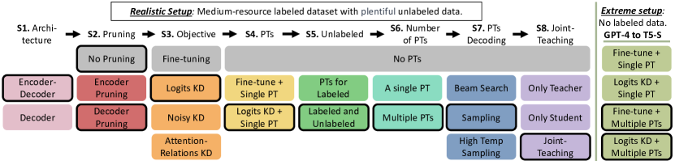
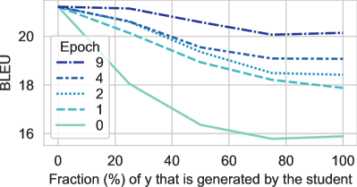
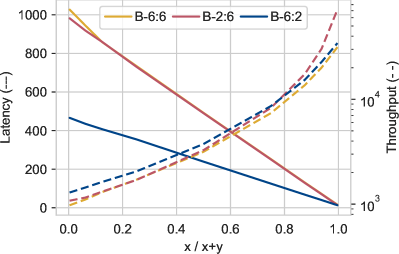
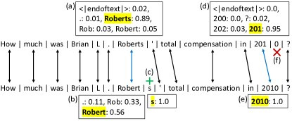

# A Systematic Study of Knowledge Distillation for Natural Language Generation with Pseudo-Target Training

###### Abstract

Modern Natural Language Generation (NLG) models come with massive computational and storage requirements. In this work, we study the potential of compressing them, which is crucial for real-world applications serving millions of users. We focus on Knowledge Distillation (KD) techniques, in which a small student model learns to imitate a large teacher model, allowing to transfer knowledge from the teacher to the student. In contrast to much of the previous work, our goal is to optimize the model for a specific NLG task and a specific dataset. Typically in real-world applications, in addition to labeled data there is abundant unlabeled task-specific data, which is crucial for attaining high compression rates via KD. In this work, we conduct a systematic study of task-specific KD techniques for various NLG tasks under realistic assumptions. We discuss the special characteristics of NLG distillation and particularly the exposure bias problem. Following, we derive a family of Pseudo-Target (PT) augmentation methods, substantially extending prior work on sequence-level KD. We propose the Joint-Teaching method, which applies word-level KD to multiple PTs generated by both the teacher and the student. Finally, we validate our findings in an extreme setup with no labeled examples using GPT-4 as the teacher. Our study provides practical model design observations and demonstrates the effectiveness of PT training for task-specific KD in NLG.  

## 1 Introduction

Modern *Natural Language Generation (NLG)* systems are based on *pre-trained Language Models (LMs)*, which are gradually achieving remarkable milestones (Raffel et al., [2020](#bib.bib46); Brown et al., [2020](#bib.bib4); OpenAI, [2023](#bib.bib43)). Alongside the impressive advances in applications such as Neural Machine Translation (NMT), Summarization, chatbots, such models have also become increasingly larger, deeper, slower, and more complex. The massive storage requirements and high computational complexity of NLG models discourage their deployment in real-life. As such, there is a growing demand in the industry for compressing such models while preserving their performance.  

Model compression methods typically either prune less informative parameters (LeCun et al., [1989](#bib.bib31)) or use *knowledge distillation (KD)* (Hinton et al., [2015](#bib.bib20); Kim and Rush, [2016](#bib.bib29)) to transfer knowledge from a larger model (the teacher) to a smaller model (the student). In generation tasks, KD can be applied at the word-level, by training the student to mimic the teacher’s next token distribution, or at the sequence-level, by training the student on *Pseudo-Targets (PTs)* generated by the teacher.  

Although KD research is extensive (Gou et al., [2021](#bib.bib16); Gupta and Agrawal, [2022](#bib.bib17); Treviso et al., [2022](#bib.bib58); Xu and McAuley, [2022](#bib.bib67)), most works focus on Natural Language Understanding (NLU) tasks, task-agnostic language modeling, or specific generation tasks (e.g., NMT). Additionally, KD works for NLG typically consider large datasets with hundreds of thousands of labeled examples, and ignore unlabeled data (Shleifer and Rush, [2020](#bib.bib55); Wang et al., [2021a](#bib.bib61); Li et al., [2022](#bib.bib33); Zhang et al., [2022a](#bib.bib72)).  

In more realistic scenarios, however, the number of labeled examples is limited, alongside an abundance of unlabeled data (Oliver et al., [2018](#bib.bib42); Calderon et al., [2022](#bib.bib5)) that may contribute to KD. To bridge these gaps, in this paper we conduct a systematic study of KD for NLG, considering a variety of tasks: Summarization, Question Generation, Abductive Reasoning, Style Transfer and Simplification, in a more realistic setup.  

Our realistic setup follows 5 criteria that are particularly attractive for a broad range of NLP practitioners: (1) Only several thousand labeled examples are available for training (Medium-resource), as annotation is costly or labor-intensive, especially for NLG. This is in contrast to research setups where labeled datasets can be very large. (2) Large amounts of unlabeled data are available, as is often the case in industrial setups where unlabeled data is collected during the life-cycle of the product; (3) Off-the-shelf models are used, which is more practical than training models from scratch; (4) Inference-time efficiency is our goal, meaning high compression rate; (5) One-time computational training resources are negligible, compared to inference-time, allowing extensive use of PTs.  

Recently, huge LMs with excellent generative capacity, such as GPT-4 (OpenAI, [2023](#bib.bib43)) have been presented. While it is tempting to focus our research on them, we focus on small to medium size LMs in a fine-tuning setup. This choice is because utilizing a huge LM as a teacher is often infeasible, e.g., due to their high financial costs or when the data cannot be sent to external servers because of privacy constraints. Furthermore, research suggests that using mediator-teachers aids the distillation process (Mirzadeh et al., [2020](#bib.bib37)), as might be the case in distillation from a huge LM to a medium fine-tuned teacher and finally to a small student. For an extended discussion, see §[7](#S7 "7 Limitations ‣ A Systematic Study of Knowledge Distillation for Natural Language Generation with Pseudo-Target Training").  

Our work hence focuses on a medium size fine-tuned teacher and we assume there are several thousand labeled examples for its fine-tuning. Despite the above limitations, applying huge LMs in some valuable setups is still possible. Therefore, we also consider the distillation of one such model (GPT-4), although this is not our main focus.  

We start our study by comparing architectural (Encoder-decoder vs. Decoder-only), pruning and KD design decisions, discussing the tradeoff between computational resources and task performance. We focus on practical measures like *latency* and *throughput*, which is important for batch-offline applications and is typically overlooked.  

We next provide the first exposure bias perspective for KD which motivates PT augmentation. This bias derives from teacher forcing when the LM conditions on ground-truth tokens during training, while at inference time it conditions on previously generated tokens (Ranzato et al., [2016](#bib.bib49)). As the distillation progresses, the student’s predictions gradually become similar to its teacher’s, and therefore training with PTs can alleviate exposure bias.  

We propose extensions of the common practice of generating a single mode approximation PT via beam search, instead, we suggest sampling multiple PTs to facilitate higher exposure to conditional distribution factors. Additionally, we generate PTs for unlabeled data and demonstrate their effectiveness. Moreover, we propose a novel KD technique termed *Joint-Teaching*, which applies word-level KD to PTs generated by both the teacher and the student. This technique aims to implicitly and explicitly address the student exposure bias, ground the learning and teach it to correct its mistakes.  

Finally, we extend the scope of our study by working solely with limited unlabeled examples. Due to the absence of labeled examples, fine-tuning the teacher is infeasible, leading us to depend on huge LMs with zero-shot capabilities. Consequently, we investigate whether our KD findings from our realistic setup (which involves a fine-tuned teacher) remain applicable to the new extreme setup. To this end, we show how to successfully distill GPT-4, a huge Decoder-only model, into a small Encoder-decoder model (T5-small), which also has a different tokenizer.  

Our main empirical findings (§[5](#S5 "5 Results ‣ A Systematic Study of Knowledge Distillation for Natural Language Generation with Pseudo-Target Training")) are: (1) Encoder-decoder architectures outperform their Decoder-only counterparts in task-specific fine-tuning for NLG; (2) Decoder pruning substantially outperforms encoder pruning when considering both latency and task performance; and (3) PTs can be used much more effectively compared to what was suggested in previous work and this yields substantially improved task performance on a much reduced computational cost.  

## 2 Background and Related Work

### 2.1 Natural Language Generation

Modern LMs based on Transformers leverage two primary architectures for text generation: *Encoder-decoder (ED)* (Vaswani et al., [2017](#bib.bib59)) and *Decoder-only (DO)* (Radford et al., [2019](#bib.bib45)). While ED models are more popular for classification, summarization, and NMT, DO models excel on open-text generation and zero/few-shot setups (Wang et al., [2022](#bib.bib62)).  

Nonetheless, the increasing popularity of massive DO models like GPT-3 and PaLM (Brown et al., [2020](#bib.bib4); Chowdhery et al., [2022](#bib.bib7)) with impressive generation capabilities, has led to the question of *whether ED models are still relevant for NLG?* In §[5](#S5 "5 Results ‣ A Systematic Study of Knowledge Distillation for Natural Language Generation with Pseudo-Target Training") and in the appendix (§[B](#A2 "Appendix B Language Models Architectures ‣ A Systematic Study of Knowledge Distillation for Natural Language Generation with Pseudo-Target Training")) we discuss and demonstrate the differences between these two architectures. We show in line with recent work of Tay et al. ([2022](#bib.bib56)) that ED models outperform DO models in task-specific fine-tuning for conditional NLG. In light of this observation, we focus on KD only for ED models in the rest of the paper.  

Text generation is a structured prediction problem where the goal is to sample a text $\hat{y}$ from the distribution learned by the LM, conditioned on the input text $x$. The training objective of the LM is to minimize the *negative log-likelihood (NLL)* of the training dataset, by factorizing $-\log{P(y|x)}$ into $-\sum_{i=1}^{|y|}{\log{P(y_{i}|x,y_{<i})}}$. At inference time, the LM generates one token at a time according to the conditional distribution: $P(y_{i}|x,\hat{y}_{<i})$. The selection of the next token is handled by the decoding method. Beam search, which aims to find the most likely target, is the the de-facto standard (Zarrieß et al., [2021](#bib.bib71)). Alternatively, it is possible to frame decoding as sampling, as we do in this work.  

### 2.2 Exposure Bias

LMs learn the distribution $P(y|x,y_{<i})$ at the training phase by conditioning on the ground truth $y_{<i}$. This is known as *teacher forcing* which makes the training efficient and stable but also creates a mismatch at inference time, since the LM conditions on its previous predictions $\hat{y}_{<i}$. This discrepancy between training and inference is called *exposure bias*. Potential side-effect is that a single error during generation may have a cascading effect by causing a deviation from the ground truth distribution and resulting in an accumulation of errors (Arora et al., [2022](#bib.bib1)). Many works link exposure bias to generalization, hallucinations, and degeneration (Schmidt, [2019](#bib.bib54); Chiang and Chen, [2021](#bib.bib6)).  

Recent works attempted to address exposure bias, most of which focused on open-text generation and NMT (Schmidt, [2019](#bib.bib54); Wang and Sennrich, [2020](#bib.bib60); Hormann and Sokolov, [2021](#bib.bib22)). Other works addressed this problem by applying reinforcement learning techniques (Ranzato et al., [2016](#bib.bib49)) or by *scheduled sampling* which replace ground truth tokens with generated tokens (Bengio et al., [2015](#bib.bib2); Liu et al., [2021b](#bib.bib35)). However, it leads to training with inaccurate and noisy signals (Xu et al., [2019](#bib.bib70)). In contrast to other works which study this problem in a general setting, in KD setting the teacher can be used to mitigate the student exposure bias by utilizing PTs and reliable signals from it. This is the first work to discuss exposure bias in KD.  

### 2.3 Compression and Knowledge Distillation

There has been extensive research on model compression on techniques such as parameter sharing, pruning, quantization and factorization (Gou et al., [2021](#bib.bib16); Gupta and Agrawal, [2022](#bib.bib17); Treviso et al., [2022](#bib.bib58); Xu and McAuley, [2022](#bib.bib67)). *Pruning* (LeCun et al., [1989](#bib.bib31)) aims to discard unimportant weights of a pre-trained or fine-tuned LM, making it more efficient while preserving performance. Usually, the pruning is structured, and complete blocks, rows, or layers are removed according to their magnitude, changes during training (Sanh et al., [2020](#bib.bib53)), or causal effect (Rotman et al., [2021](#bib.bib51)).  

Typically there is a performance gap between the original and the compressed model, which can be closed by applying *Knowledge distillation (KD)* (Hinton et al., [2015](#bib.bib20)) – a technique for transfering knowledge from a large trained model (teacher $T$) to a smaller one (student $S$), by training the student to mimic the teacher’s predictions or features. KD can be divided into two categories: *task-agnostic*, where the goal is to mimic a pre-trained LM’s behavior, and *task-specific*, where the distillation is performed on a fine-tuned LM. Generally, there are three levels of KD: word-level (or class-level), inner-level, and sequence-level (only in NLG):  

Word-level KD, also known as *Logits KD* (Hinton et al., [2015](#bib.bib20); Kim and Rush, [2016](#bib.bib29)). In this method, the student learns to match the teacher’s distribution over the next token at each position, by minimizing the KL divergence between the distribution of the student $P_{S}(y_{i}|x,y_{<i})$ and the distribution of its teacher $P_{T}(y_{i}|x,y_{<i})$. There are variations like *Noisy KD* (Liu et al., [2021a](#bib.bib34)) where noise is injected during KD by applying dropout to the teacher, Wang et al. ([2021a](#bib.bib61)) which applies KD only for carefully selected examples, etc.  

Inner-level KD aims to mimic additional inner features of the teacher, for example, Jiao et al. ([2020](#bib.bib24)) leverages hidden states of the teacher to train the student. Wang et al. ([2020](#bib.bib64)) and Wang et al. ([2021b](#bib.bib63)) proposed *Attention-relations KD* which trains the student to mimic the relation matrix (scaled dot-product) of the self-attention states.  

Sequence-level KD is commonly used for NMT (Kim and Rush, [2016](#bib.bib29); Kim et al., [2019](#bib.bib30); Kasai et al., [2020](#bib.bib27)). In this approach, the teacher generates PTs for inputs in the original dataset, and student is trained to predict them. Usually, the teacher generates a single PT using beam search, which is known as “mode approximation” of $P_{T}(y|x)$.  

[FIGURE S2.F1.g1]

Figure 1: The design of our research. At each stage (from left to right), we examine different modeling decisions in order to gain a better understanding of their impact. We start with the architectural decisions which largely impact the task performance and computational aspects of the NLG models. Following that, we compare different KD objectives, and then we focus on augmenting the training data with Pseudo-Targets (PTs). A bold border indicates the decision we made at each stage based on the average development set performance over four NLG tasks.
[/FIGURE]

Gou et al. ([2021](#bib.bib16)) and Gupta and Agrawal ([2022](#bib.bib17)) present a detailed overview of KD techniques. Notably, most works in NLP explore task-agnostic KD for encoder-only models (Sanh et al., [2019](#bib.bib52); Jiao et al., [2020](#bib.bib24); Wang et al., [2021b](#bib.bib63)) or focus on NMT (Kim and Rush, [2016](#bib.bib29); Kasai et al., [2020](#bib.bib27); Wang et al., [2021a](#bib.bib61)). Shleifer and Rush ([2020](#bib.bib55)) focused on high-resource summarization, and compared three KD strategies: pruning and fine-tuning, logits KD, and mode approximation PTs. Unlike these works, we perform a more systematic study of task-specific KD for a variety of NLG tasks in realistic setups. Moreover, we focus on PTs and propose extensions to demonstrate their effectiveness.  

## 3 Methods

### 3.1 Research Design

Our research design illustrated in Figure [1](#S2.F1 "Figure 1 ‣ 2.3 Compression and Knowledge Distillation ‣ 2 Background and Related Work ‣ A Systematic Study of Knowledge Distillation for Natural Language Generation with Pseudo-Target Training") has eight stages. At each stage, we examine different modeling decisions and continue to the next stage after selecting the best technique according to the performance on the development set (to avoid performing selection on the test set). We linearly examine one aspect at a time since the alternative (combinatorial choices) is too expensive. Our study starts with architectural designs (stages 1-2), continues with comparing different KD strategies (stages 3-4) and proceeds to explore the usage of PTs as augmentation strategies for KD (stages 5-8).  

### 3.2 Architectures and Pruning

In the spirit of our realistic setup, we consider off-the-shelf LMs and experiment with two model families for each architecture type (see §[4.2](#S4.SS2 "4.2 Models and Pruning ‣ 4 Experimental Setup ‣ A Systematic Study of Knowledge Distillation for Natural Language Generation with Pseudo-Target Training")). In appendix §[B](#A2 "Appendix B Language Models Architectures ‣ A Systematic Study of Knowledge Distillation for Natural Language Generation with Pseudo-Target Training") we discuss the differences between ED (Encoder-Decoder) and DO (Decoder-only) architectures (stage 1) and show that ED models outperform DO models on task-specific tuning for NLG. Following that, we present results only for ED in §[5](#S5 "5 Results ‣ A Systematic Study of Knowledge Distillation for Natural Language Generation with Pseudo-Target Training"). In stage 2, we examine the effect of pruning, by discarding complete model layers. In the case of ED, layers can be dropped either from the encoder or decoder components, resulting in different impacts on the task or computational performances.  

### 3.3 Objectives111More formal descriptions and implementation details of the methods discussed in §[3.3](#S3.SS3 "3.3 Objectives1footnote 11footnote 1More formal descriptions and implementation details of the methods discussed in §3.3 and §3.4 are provided in §A ‣ 3 Methods ‣ A Systematic Study of Knowledge Distillation for Natural Language Generation with Pseudo-Target Training") and §[3.4](#S3.SS4 "3.4 Pseudo-Targets (a.k.a sequence-level KD)1footnote 11footnote 1 ‣ 3 Methods ‣ A Systematic Study of Knowledge Distillation for Natural Language Generation with Pseudo-Target Training") are provided in §[A](#A1 "Appendix A Study Methods ‣ A Systematic Study of Knowledge Distillation for Natural Language Generation with Pseudo-Target Training")

As discussed in §[2.3](#S2.SS3 "2.3 Compression and Knowledge Distillation ‣ 2 Background and Related Work ‣ A Systematic Study of Knowledge Distillation for Natural Language Generation with Pseudo-Target Training"), various works proposed different training strategies for KD. In stage 3 we perform a comparison between three popular KD objectives (baselines), which do not involve PTs: (1) *Logits KD* – which is the most common and the simplest technique; (2) *Noisy KD* – which showed promising results for summarization in self-distillation setup; and (3) *Attention-Relations KD* (combined with Logits KD) – which is the SOTA technique for Encoder-only models.  

As suggested by Mukherjee and Awadallah ([2020](#bib.bib38)), following the end of the KD stage, we also perform an end-to-end fine-tuning stage on the ground truth labels. This stage is extremely cheap since a teacher is not required.  

[FIGURE S3.F2.g1]

Figure 2: BLEU scores measured for targets generated by the T5-S student and the T5-L teacher for the development set of the SQuAD17 dataset. For each input we generate X% of the final output with the student, and then use the teacher to continue the generation and complete the output. The X-axis represents the fraction that is generated by a distilled student (at the end of the epoch). This analysis examines the effectiveness of the teacher’s modeling of $P_{T}(y_{i}|x,\hat{y}_{<i}^{S})$.
[/FIGURE]

### 3.4 Pseudo-Targets (a.k.a sequence-level KD)11footnotemark: 1

*Pseudo-Targets (PTs)* are predictions generated by the teacher that can be utilized for training the student. Word-level or Inner-level KD can be combined with sequence-level KD (e.g., by applying Logits KD to PTs). In stage 4 we investigate the impact of augmenting the labeled data with PTs when fine-tuning the student (sequence-level KD) or when using the objective from stage 3.  

Although various works demonstrated the effectiveness of PTs (Kim and Rush, [2016](#bib.bib29); Shleifer and Rush, [2020](#bib.bib55)), their use of PTs was limited to a single PT per labeled training example, generated with mode approximation beam search. In this paper we demonstrate that the use of PTs can be much more extensive: We generate multiple PTs per training example, increase their diversity with sampling-based rather than mode approximation generation, and generate PTs for both labeled and unlabeled examples, which are much more abundant by nature. Our experiments demonstrate that each of these extensions yields substantial improvements in the quality of the resulting student model. We next touch on each of these extensions.  

Unlabeled data In our setup unlabeled data is available in abundance. Since in autoregressive NLG the LM learns to condition on the targets ($y_{<i}$), PTs are essential for utilizing unlabeled data (inputs without corresponding targets). From a generalization perspective, exposing the model to more inputs, and consequently to more $P(y_{i}|\boldsymbol{x},\hat{y}_{<i}^{T})$ factors, should help the student generalize beyond the labeled data distribution. Indeed, many works in various NLP fields have shown that unlabeled data is effective for generalization (Xie et al., [2020](#bib.bib66); Mukherjee and Awadallah, [2020](#bib.bib38); Calderon et al., [2022](#bib.bib5)). In stage 5 we examine its importance.  

Multiple PTs We further explore alternatives to the common practice of generating a single PT with beam search (mode approximation). Unlike classification, NLG is a structured prediction problem and multiple candidates can form a correct solution. Therefore, we can generate multiple PTs resulting in stronger exposure to the teacher’s knowledge. We explore the impact of multiple PTs in stage 6.  

Sampling PTs Beam search is not the only way to generate PTs. In fact, it has been demonstrated to produce generic texts that lack diversity (Finkel et al., [2006](#bib.bib9); Gimpel et al., [2013](#bib.bib15)). A simple alternative that can produce more diverse and surprising texts is sampling (Roberts et al., [2020](#bib.bib50); Holtzman et al., [2020](#bib.bib21)). Moreover, controlling the temperature of the logits can increase the diversity of the PTs even further (Tevet and Berant, [2021](#bib.bib57)). We compare these decoding techniques in stage 7.  

Motivation for these Extensions Compared to a single mode approximation PT, sampling multiple PTs for both the labeled and unlabeled examples should add more variability to the student training and cover a larger portion of the learnable distribution, which are known to improve generalization. Furthermore, these extensions expose the student to more of the teacher’s knowledge.  

Additionally, we also provide an exposure bias motivation. During the distillation the student’s predictions gradually become similar to its teacher’s predictions: $\hat{y}^{S}\sim\hat{y}^{T}$. Therefore, we can expect that training the student with diverse PTs may mitigate its exposure bias, which occurs at inference when it conditions on $\hat{y}_{<i}^{S}$, and not on the ground-truth distribution. In addition, PTs of unlabeled examples can help mitigate this bias as the student is getting exposed to the teacher’s knowledge rather than the gold standard. Moreover, multiple and diverse PTs results in extensive exposure to additional $P(y_{i}|x,\boldsymbol{\hat{y}_{<i}^{T}})$ factors. Therefore, we hypothesize that sampling multiple PTs will improve the student compared to a mode approximation PT.  

### 3.5 Joint-Teaching

As mentioned above, training with PTs generated by the teacher may implicitly mitigate the student exposure bias. On the other hand, we can try to mitigate this bias explicitly by training the student while conditioning on its predictions (i.e. generate PTs with the student and use them for training). Generally, this can be unstable since the student may learn from its own mistakes. Fortunately, in KD we have a strong oracle: the teacher. By applying word-level KD on $\hat{y}_{<i}^{S}$, the teacher can teach the student how to continue its generated sequence correctly and prevent a cascading effect.  

Nevertheless, this relies on the reasonable assumption that the teacher models $P(y_{i}|x,\hat{y}_{<i}^{S})$ better than the student. In Figure [2](#S3.F2 "Figure 2 ‣ 3.3 Objectives1footnote 11footnote 1More formal descriptions and implementation details of the methods discussed in §3.3 and §3.4 are provided in §A ‣ 3 Methods ‣ A Systematic Study of Knowledge Distillation for Natural Language Generation with Pseudo-Target Training") we present a single setup analysis that supports this assumption: At almost any stage of the student training, continuing the generation with the teacher results in better predictions. Moreover, as the student becomes more similar to the teacher, we can expect the teacher to model $P(y_{i}|x,\hat{y}_{<i}^{S})$ even better, which makes the word-level signals more reliable. This is also supported by Figure [2](#S3.F2 "Figure 2 ‣ 3.3 Objectives1footnote 11footnote 1More formal descriptions and implementation details of the methods discussed in §3.3 and §3.4 are provided in §A ‣ 3 Methods ‣ A Systematic Study of Knowledge Distillation for Natural Language Generation with Pseudo-Target Training"): As the distillation progresses, the teacher continuations keeps getting better.  

Following that, we propose a novel KD method which addresses the exposure bias implicitly and explicitly namely Joint-Teaching: Apply word-level KD on PTs generated by both the teacher and the student. In our experiment we randomly use the student’s PTs for 50% of the training steps. In stage 7 we compare training only with the students’ PTs or the teachers’ PTs to Joint-Teaching, demonstrating the superiority of the latter.  

## 4 Experimental Setup

In this section we describe our four NLG tasks and datasets, the participating models and the evaluation procedures. URLs of the code and datasets, as well as implementation details and hyperparameter configurations are described in §[D](#A4 "Appendix D Additional Implementation Details ‣ A Systematic Study of Knowledge Distillation for Natural Language Generation with Pseudo-Target Training"). Additionally, a comparison between ED and DO architectures (stage 1) is provided in §[B.1](#A2.SS1 "B.1 Transformer Background ‣ Appendix B Language Models Architectures ‣ A Systematic Study of Knowledge Distillation for Natural Language Generation with Pseudo-Target Training"); theoretical and empirical complexity analyses are provided in §[B.2](#A2.SS2 "B.2 Complexity Analysis ‣ Appendix B Language Models Architectures ‣ A Systematic Study of Knowledge Distillation for Natural Language Generation with Pseudo-Target Training").  

### 4.1 Tasks and Datasets

We selected four English-to-English core NLG tasks, which are part of several NLG benchmarks and surveys (Fu et al., [2018](#bib.bib11); Gehrmann et al., [2021](#bib.bib12), [2022](#bib.bib13); Khashabi et al., [2021](#bib.bib28); Erdem et al., [2022](#bib.bib8); Jin et al., [2022](#bib.bib25)). We built a new realistic experimental setup, in which the ratio of labeled to unlabeled data is 1:4, and the amount of labeled data is reasonable. For each task (excluding Shake7) we keep the original assignment of each example to its train-test splits. The exact numbers are provided in Table [1](#S4.T1 "Table 1 ‣ 4.1 Tasks and Datasets ‣ 4 Experimental Setup ‣ A Systematic Study of Knowledge Distillation for Natural Language Generation with Pseudo-Target Training").  

Summarization (XSUM40) We use the XSUM dataset (Narayan et al., [2018](#bib.bib40)) for the abstractive summarization task. The task of the NLG model is to generate an introductory sentence (summary) for a given news article.  

Question Generation (SQuAD17) We use the SQuAD dataset (Rajpurkar et al., [2016](#bib.bib48), [2018](#bib.bib47)) for the question generation task. Given a Wikipedia document and an answer to the question, the task of the NLG model is to generate the question.  

Abductive Reasoning (ART10) We use the $\alpha$NLG (also known as ART) dataset (Bhagavatula et al., [2020](#bib.bib3)) for abductive reasoning generation task. The task of the NLG model is to generate a plausible explanation for two given observations.  

Style Transfer and Simplification (Shake7) We construct a new dataset for the well-explored style transfer task (which is also a simplification task) of translating Shakespeare’s texts to modern English. We combined pairs of Shakespearean and modern English texts from Shakespeare’s plots (taken from Xu et al. ([2012](#bib.bib69)); Jhamtani et al. ([2017](#bib.bib23))), with other texts written by Shakespeare (Karpathy, [2015](#bib.bib26)) and created a parallel style transfer dataset, see §[D.1](#A4.SS1 "D.1 The Shake7 Dataset ‣ Appendix D Additional Implementation Details ‣ A Systematic Study of Knowledge Distillation for Natural Language Generation with Pseudo-Target Training").  

[TABLE S4.T1]

Name
Train
Unlabeled
Dev
Test
Input
Target

XSUM40
40K
164K
5K
11.3K
480
32

SQuAD17
17.5K
70K
1.57K
9K
320
32

ART10
10K
40K
1.25K
14.3K
48
32

Shake7
7K
28K
0.75K
0.8K
48
48

Table 1: Datasets used in our experiments and the number of examples in each split. Input and Target represent the maximum lengths (tokens) we use in experiments.
[/TABLE]

### 4.2 Models and Pruning

Decoder-only We use the GPT2-family models (Radford et al., [2019](#bib.bib45)): GPT2, GPT2-M, and GPT2-L; and the recent OPT-family models (Zhang et al., [2022b](#bib.bib73)): OPT-125Mand OPT-350M.  

Encoder-decoder We use the T5-family models (Raffel et al., [2020](#bib.bib46)): T5-S and T5-L; and the BART-family models (Lewis et al., [2020](#bib.bib32)): BART-6:6 (base version) and BART-L.  

Pruning We apply pruning only for the pre-trained BART-6:6 model (thus our study also includes a non-pruned student, T5-S), and consider two types of pruning: Encoder pruning and decoder pruning. Following Shleifer and Rush ([2020](#bib.bib55)), in both pruning types we keep only the first and last layers, resulting in two models: BART-2:6 (pruned encoder) and BART-6:2 (pruned decoder).  

In the KD stages (3-8) we use two student-teacher pairs: T5-S and T5-L, and a pair with a pruned student: BART-2:6 and BART-L.  

### 4.3 Evaluation

Task Performance We report on various metrics that focus on different aspects, resulting in a more holistic evaluation of the models. To this end, we focus on the lexical similarity metrics, BLEU and ROUGE, the semantic equivalence metric BERTScore (BS, Zhang et al. ([2020](#bib.bib74))) and the statistical modeling metric Perplexity (PPL), which is measured by the average NLL of the ground truth targets. To make the result tables more readable, we report the average ROUGE (of the F1 scores for R-1/2/L), and the F1 score for BS. Notice that in §[D](#A4 "Appendix D Additional Implementation Details ‣ A Systematic Study of Knowledge Distillation for Natural Language Generation with Pseudo-Target Training") we specify for each task the appropriate metric we use for the development set. In §[E](#A5 "Appendix E Additional Results ‣ A Systematic Study of Knowledge Distillation for Natural Language Generation with Pseudo-Target Training") we report the scores of all the metrics.  

[TABLE S4.T2]

Arch
Model
E-D
Params
Mem
FLOPs
Latency
Throughput
BLEU
ROUGE
BS
PPL
Dev

DO
GPT2-L
0-36
774
3210
42.0
675
2.2K
11.9
27.1
70.1
1.9
13.0

DO
GPT2-M
0-24
354
1444
19.4
459
4.8K
9.7
23.2
66.8
3.7
10.8

DO
GPT2
0-12
124
511
6.8
235
13.5K
7.8
20.1
61.4
2.8
8.5

DO
OPT-350M
0-24
331
1324
18.1
371
5.1K
9.8
24.9
62.7
3.1
10.7

DO
OPT-125M
0-12
125
502
6.8
185
15.4K
10.7
26.3
69.2
2.5
11.7

ED
T5-L
24-24
737
2951
19.5
597
5.3K
16.4
34.6
75.1
1.6
17.7

ED
T5-S
6-6
60
242
1.4
160
55.2K
13.4
30.8
72.7
2.4
14.6

ED
BART-L
12-12
406
1625
10.0
281
7.8K
16.4
34.8
75.4
1.7
17.9

ED
BART-6:6
6-6
139
558
3.0
147
13.5K
14.5
32.7
74.2
1.9
15.9

ED
BART-2:6
2-6
111
445
1.7
146
16.0K
11.4
28.0
71.6
2.2
12.8

ED
BART-6:2
6-2
101
407
2.6
75
15.3K
13.3
31.5
73.3
2.6
15.0

Table 2: A comparison between different architectures and models, fine-tuned on our datasets. E-D represents the number of Encoder and Decoder layers. All the computational and performance measures are the average over four NLG tasks. Params are in millions, Mem is in MB, FLOPS is in billions, Latency is in milliseconds. Throughput is in thousands of examples per minute. Everything is measured on an Nvidia GeForce RTX 4080. We also indicate the participating models in the KD stages (3-8): Teachers are underlined, student baselines (no KD) are in bold.
[/TABLE]

Computational Performance For measuring the computational performance of the models, we report the number of parameters, the memory of the models and the number of *floating-point operations (FLOPs)*. These measures are device-agnostic and may not be well correlated with the actual performance in practice, which depends on the device, implementation, and hardware utilization of the accelerators (Ma et al., [2018](#bib.bib36); Hadidi et al., [2019](#bib.bib18)). Therefore, we also report practical measurements such as the *latency* of generating a single output, which is important for real-time applications, and the *throughput*, which is the maximum number of examples that can be processed in a minute, and is important for offline batched applications.  

## 5 Results

The complete results are provided in §[E](#A5 "Appendix E Additional Results ‣ A Systematic Study of Knowledge Distillation for Natural Language Generation with Pseudo-Target Training"). Table [2](#S4.T2 "Table 2 ‣ 4.3 Evaluation ‣ 4 Experimental Setup ‣ A Systematic Study of Knowledge Distillation for Natural Language Generation with Pseudo-Target Training") reports the results of fine-tuned models (stages 1-2). Table [3](#S5.T3 "Table 3 ‣ 5 Results ‣ A Systematic Study of Knowledge Distillation for Natural Language Generation with Pseudo-Target Training") reports the results of the KD stages (3-8) as follows: For each student-teacher pair and dataset, we calculate the fraction of their performance gap that is compensated for by using distillation as opposed to only fine-tuning the student model: $\frac{KD-S}{T-S}\%$, where $KD$, $T$ and $S$ are the task scores of the distilled student, its teacher and the student baseline (fine-tuned), respectively. Then, we report for each dataset the average fraction of the closed gap over four metrics and two student-teacher pairs. We also report the number of wins within 32 setups (4 datasets, 4 metrics, 2 pairs).  

S1: Encoder-decoder models outperform Decoder-only models in task-specific tuning for NLG. We present our results in Table [2](#S4.T2 "Table 2 ‣ 4.3 Evaluation ‣ 4 Experimental Setup ‣ A Systematic Study of Knowledge Distillation for Natural Language Generation with Pseudo-Target Training"). For a detailed analysis of Encoder-decoder (ED) and Decoder-only (DO) models, we refer readers to Appendix §[B](#A2 "Appendix B Language Models Architectures ‣ A Systematic Study of Knowledge Distillation for Natural Language Generation with Pseudo-Target Training"), which reports several interesting theoretical and empirical insights. Nevertheless, it is worth noting here that ED models, such as T5-L, can have twice the number of layers and parameters of DO models, such as GPT2-M or OPT-350M. However, despite the higher number of parameters, ED models have roughly the same FLOPs and comparable latency and throughput.  

Regarding task performance, our experiments demonstrate that ED models consistently outperform DO models across all datasets and models, regardless of their size. Presumably, a better inductive bias is injected by applying self-attention (and not autoregressive-attention) to the conditioned input sequence. This finding is particularly relevant for NLP practitioners who aim to develop a specialized in-house model for a specific NLG task. We hence continue to the KD stages only with ED models (T5 and BART).  

S2: It is better to prune layers from the decoder. In stage 2, we examine whether it is better to prune encoder or decoder layers. To this end, we prune BART-6:6 and report the results at the bottom of Table [2](#S4.T2 "Table 2 ‣ 4.3 Evaluation ‣ 4 Experimental Setup ‣ A Systematic Study of Knowledge Distillation for Natural Language Generation with Pseudo-Target Training"). First, notice that pruning decoder layers greatly impacts the latency given the autoregressive nature of NLG tasks, making BART-6:2 two times faster than BART-6:6. For comparison, pruning encoder layers does not affect the latency (see the discussion in §[B.2](#A2.SS2 "B.2 Complexity Analysis ‣ Appendix B Language Models Architectures ‣ A Systematic Study of Knowledge Distillation for Natural Language Generation with Pseudo-Target Training")). On the other hand, BART-2:6 has a higher throughput than BART-6:2, mainly because of the long input in some tasks which is processed by the encoder. Notice, however, that the improvement of BART-6:2 in latency is more substantial than its throughput degradation.  

Second, BART-6:2 outperforms BART-2:6 in every task metric (and dataset), being competitive to BART-6:6. Moreover, for tasks with long inputs (e.g., summarization or question generation, see §[E](#A5 "Appendix E Additional Results ‣ A Systematic Study of Knowledge Distillation for Natural Language Generation with Pseudo-Target Training")), the depth of the encoder is critical and the pruned-encoder BART-2:6 underpeforms. As a rule of thumb, our results suggest that it is better to prune layers of the decoder. Besides reducing the model latency, it has a smaller impact on task performance. In the following stages we use two student-teacher pairs: T5-S and T5-L, and a pair with a pruned student, BART-6:2 and BART-L.  

S3: Use Logits KD as the main training objective. In stage 3 we compare different KD objectives. As seen in Table [3](#S5.T3 "Table 3 ‣ 5 Results ‣ A Systematic Study of Knowledge Distillation for Natural Language Generation with Pseudo-Target Training").A, Logits, Noisy and Attention-Relations KD techniques are competitive, and the quality of the method depends on the task. Even though Noisy KD has more wins than Logits KD, the PPL metric accounts for 8 of the 14 wins. Since Logits KD is the best-performing method according to the average performance on the development set, we continue to the next PT stages with it. Our results demonstrate the importance of KD: applying Logits KD closes more than 34.4% of the student-teacher gap, on average.  

[TABLE S5.T3]

A. Objective
XS
SQ
AR
SH
Wins
Dev

(%)
(%)
(%)
(%)

Fine-tune
0.0
0.0
0.0
0.0
0
14.8

Logits
30.2
39.7
25.7
41.9
13
16.0

Noisy
30.3
37.3
35.2
41.8
14
15.9

Att-Rel
31.3
28.4
19.7
21.4
5
15.9

B. PTs
XS
SQ
AR
SH
Wins
Dev

Logits
30.2
39.7
25.7
41.9
10
16.0

Seq-lvl
13.8
-9.1
4.2
4.2
0
15.7

Logits+Seq
33.2
30.8
27.9
49.0
22
16.3

C. Unlabeled
XS
SQ
AR
SH
Wins
Dev

Labeled
33.2
30.8
27.9
49.0
0
16.3

+ Unlabeled
55.8
47.1
41.5
70.0
32
16.9

D. Decoding
XS
SQ
AR
SH
Wins
Dev

Single PT
55.8
47.1
41.5
70.0
1
16.9

K-Beams
63.6
56.3
45.7
74.7
4
17.0

Sampling
73.0
58.4
48.2
81.7
15
17.2

H-Sampling
70.0
63.9
44.8
81.8
12
17.1

E. Joint-T
XS
SQ
AR
SH
Wins
Dev

Only Teacher
73.0
58.4
48.2
81.7
4
17.2

Only Student
68.7
63.9
43.9
79.4
3
17.1

Joint-Teaching
80.8
66.7
48.2
87.7
25
17.4

Table 3: Average fractions of the student-teacher performance gaps closed by different KD methods, number of winning setups (out of 32) and development scores. Table A: KD objectives (S3); Table B: PT augmentation (S4). Table C: PTs for unlabeled examples (S5); Table D: Decoding methods for generating PTs (S6+S7); Table E: PTs generated only by the teacher, the student, or Joint-Teaching (S8). For more details about the methods see §[3](#S3 "3 Methods ‣ A Systematic Study of Knowledge Distillation for Natural Language Generation with Pseudo-Target Training") and §[A](#A1 "Appendix A Study Methods ‣ A Systematic Study of Knowledge Distillation for Natural Language Generation with Pseudo-Target Training"). Tasks: XSUM40 (XS), SQuAD17 (SQ), ART10 (AR), Shake7 (SH).
[/TABLE]

S4: Combine Logits KD and PTs. In stage 4 we examine three methods: using Logits KD only on the labeled examples, fine-tuning the student with PTs (Sequence-level KD) or combining them. The corresponding rows in Table [3](#S5.T3 "Table 3 ‣ 5 Results ‣ A Systematic Study of Knowledge Distillation for Natural Language Generation with Pseudo-Target Training") show that sequence-level KD underperforms Logits KD. However, their combination results in a better student in 22 setups and achieves a higher development score, and therefore, we use this strategy in the subsequent stages.  

S5: Unlabeled data should be utilized. Generating PTs for the unlabeled inputs may help extract more of the knowledge embodied in the teacher, allowing the student to generalize better. In stage 5 we explore this hypothesis. According to Table [3](#S5.T3 "Table 3 ‣ 5 Results ‣ A Systematic Study of Knowledge Distillation for Natural Language Generation with Pseudo-Target Training").C, utilizing unlabeled data greatly boosts the performance and closes an additional 19% of the gap. To the best of our knowledge, this is the first study that shows this in KD for NLG. In the next stages, we generate PTs for the labeled and unlabeled inputs.  

S6: Exposing the student to multiple PTs helps. By comparing the rows of Single PT and K-Beams in Table [3](#S5.T3 "Table 3 ‣ 5 Results ‣ A Systematic Study of Knowledge Distillation for Natural Language Generation with Pseudo-Target Training").D, it can be seen that exposing the student to multiple targets and covering a larger portion of learnable distribution closes an additional 6.4% of the gap on average.  

S7: Sampling is better than Beam-Search for generating PTs. Table [3](#S5.T3 "Table 3 ‣ 5 Results ‣ A Systematic Study of Knowledge Distillation for Natural Language Generation with Pseudo-Target Training").D also shows that generating PTs with sampling is typically better than beam search, and closes another 5.2% of the gap on average. We observe that high sampling temperature is competitive, although its effect depends on the task and model. High sampling works better for T5-S, while sampling without temperature works better for BART-6:2 (and on average). Further research could investigate a larger range of temperatures and other diversity-oriented decoding methods. Nevertheless, this is the first study that challenges the traditional mode-approximation practice, and show that generating multiple PTs via sampling significantly improves NLG distillation.  

S8: Joint-Teaching improves the student. The results in Table [3](#S5.T3 "Table 3 ‣ 5 Results ‣ A Systematic Study of Knowledge Distillation for Natural Language Generation with Pseudo-Target Training").E support two of our hypotheses, which we discuss in §[3.5](#S3.SS5 "3.5 Joint-Teaching ‣ 3 Methods ‣ A Systematic Study of Knowledge Distillation for Natural Language Generation with Pseudo-Target Training"). The first is that PTs generated only by the student are less valuable for its training than PTs generated by teacher. The second is that the combination of the two types of PTs (by Joint-Teaching) can be more effective for KD than using only PTs generated by the student or teacher. Our Joint-teaching approach wins 25 out of 32 times and closes another 5.7% of the gap.  

[TABLE S5.T4]

Dataset
Model
FLOPs
Latency
Throughput
BLEU
ROUGE
BScore
PPL

 

XSUM

40K

T5-L
38.7
539
1.3K
11.5
29.3
72.7
1.7

T5-KD
 

2.7 (-93%)

 

144 (x3.7)

 

13.4K (x10.3)

10.7 (80%)
28.2 (81%)
71.8 (80%)
1.9 (87%)

BART-L
19.6
254
3.3K
13.0
31.1
73.9
1.7

BART-KD
 

5.1 (-73%)

 

68 (x3.7)

 

10.0K (x3.0)

12.3 (79%)
30.2 (79%)
73.5 (84%)
1.9 (73%)

 

SQuAD

17.5K

T5-L
26.1
530
2.0K
22.2
42.3
77.9
1.3

T5-KD
 

1.8 (-93%)

 

143 (x3.7)

 

22.3K (x11.1)

20.9 (57%)
40.6 (57%)
77.0 (50%)
1.5 (57%)

BART-L
13.3
250
4.8K
21.5
41.9
77.8
1.4

BART-KD
 

3.4 (-74%)

 

67 (x3.7)

 

13.0K (x2.7)

20.9 (84%)
40.9 (75%)
77.3 (77%)
1.7 (71%)

 

ART

10K

T5-L
5.9
533
10.7K
6.0
21.7
71.5
1.9

T5-KD
 

0.5 (-92%)

 

142 (x3.7)

 

109.8K (x10.3)

4.8 (49%)
19.9 (50%)
70.4 (47%)
2.4 (25%)

BART-L
3.2
250
13.7K
6.0
21.4
71.5
2.1

BART-KD
 

0.8 (-75%)

 

67 (x3.7)

 

23.4K (x1.7)

5.1 (59%)
20.3 (57%)
71.0 (61%)
2.4 (34%)

 

Shakespeare

7K

T5-L
7.2
789
7.4K
25.7
45.4
78.4
1.5

T5-KD
 

0.6 (-91%)

 

212 (x3.7)

 

75.3K (x10.1)

25.7 (100%)
45.3 (98%)
78.1 (79%)
1.7 (56%)

BART-L
3.9
367
9.2K
25.1
44.8
78.3
1.8

BART-KD
 

1.0 (-75%)

 

96 (x3.8)

 

14.8K (x1.6)

24.8 (88%)
45.2 (123%)
78.1 (86%)
2.0 (68%)

Table 4: T5-KD and BART-KD are the final distilled models trained with Joint-Teaching. The numbers in parentheses represent computational improvements or the fraction of the student-teacher gap closed by the distilled model.
[/TABLE]

Final Compression Results. The final compression results (after stage 8) are provided in Table [4](#S5.T4 "Table 4 ‣ 5 Results ‣ A Systematic Study of Knowledge Distillation for Natural Language Generation with Pseudo-Target Training"). We attempt to achieve high compression rates: T5-KD and BART-KD reduce 92% and 75% of their teachers’ parameters, respectively. This results in great computational performance improvements. Our distilled models reduce the latency of their teachers by a factor of 3.7. In addition, T5-KD has a 10 times higher throughput, and BART-KD has double the throughput of its teacher. Our study shows that KD allows model compression and drastically improves the task performance compared to the fine-tuned baseline. In most setups, our recipe for KD closes more than 75% of the student-teacher gap. Surprisingly, in some of the tasks like Shake7 the distilled model outperforms its teacher. Finally, we also conduct a human evaluation to examine the relatively lower performance of our KD method on the ART10 dataset (see appendix §[F](#A6 "Appendix F Human Evaluation for ART10 ‣ A Systematic Study of Knowledge Distillation for Natural Language Generation with Pseudo-Target Training")). Our human evaluation results show that the distilled model (T5-KD) closes 72% of the gap, and this is in-line with the performance on other datasets.  

### 5.1 Extreme setup: KD with GPT-4

In the final phase, we explore the transferability of our KD conclusions to an *extreme setup* which involves only limited unlabeled examples. As labeled examples are unavailable, fine-tuning the teacher becomes impractical, leading to the reliance on a huge LM with zero-shot capabilities as the teacher, and this poses new challenges: (1) The teacher is a huge Decoder-only model (since this is the standard for zero-shot learning) while the student is an Encoder-decoder model; (2) The teacher and the student have different tokenizers and (3) Querying the teacher is financially costly, limiting its usage.  

We utilize GPT-4 (OpenAI, [2023](#bib.bib43)) as our teacher and T5-S as the student. The prompt of GPT-4 consists of three labeled demonstrations. Due to its high cost, we conduct experiments only for the SQuAD17 (3000 examples) and the Shake7 (1500 examples) datasets, and with the following baselines and methods: (a) The GPT-4 teacher; (b) T5-S training with ground-truth (GT) labels; (c) Student fine-tuning with a single PT; (d) Fine-tuning with multiple (five) PTs; (e) Student training with Logits KD and a single PT (f) Logits KD with multiple PTs; More details are provided in §[C](#A3 "Appendix C KD without Labeled Data ‣ A Systematic Study of Knowledge Distillation for Natural Language Generation with Pseudo-Target Training").  

Our results in Table [7](#A3.T7 "Table 7 ‣ C.1 Experimental Setup ‣ Appendix C KD without Labeled Data ‣ A Systematic Study of Knowledge Distillation for Natural Language Generation with Pseudo-Target Training") (appendix §[C.2](#A3.SS2 "C.2 Results ‣ Appendix C KD without Labeled Data ‣ A Systematic Study of Knowledge Distillation for Natural Language Generation with Pseudo-Target Training")) are mixed: Generating multiple PTs outperforms a single PT, but Logits KD only helps in the SQuAD17 dataset. Future research is called for as we attribute this result to challenges in aligning the tokenizers.  

## 6 Conclusion

In this paper, we present a general KD recipe for NLG. To this end, we conduct a systematic study on various tasks and evaluate the impact of different modeling decisions on computational and task performance of distilled models. Our results suggest that using ED models as students, pruning decoder layers, combining Logits KD and PTs via sampling and Joint-Teaching achieve high compression rates while maintaining competitive performance.  

Nevertheless, our recipe is based on average performance and may depend on the task, model, or setup. The teacher-student performance gap that still exists demonstrate the need for further research. For example, high-temperature PTs seem to be less effective for BART, and further exploration of different hyperparameters or methods for increasing PT diversity may be necessary. Integrating a smart selection of training examples or PTs (Wang et al., [2021a](#bib.bib61)), refining Joint-Teaching with curriculum learning or scheduling (Liu et al., [2021b](#bib.bib35)) are some future research directions.  

## 7 Limitations

Using a medium size fine-tuned teacher.  

With recent advances in huge LM such as GPT-4 and their extraordinary generation capabilities, one may wonder about the relevance of this work which mainly focuses on a medium size fine-tuned teacher. Although we show the distillation of a huge LM (GPT-4), it is often infeasible.  

First, when the data cannot be sent to external servers because of privacy constraints or when the domain is unique or specific (e.g., in national security settings or human conversations), huge LMs that cannot be fine-tuned may be less effective.  

Second, we have distinguished between two types of costs: computational and financial. While training a student model with a medium-size fine-tuned teacher may take a few days, the entire process is feasible since training time is typically not a limited resource. In contrast, generating PTs with a huge LM like GPT-4 can easily cost (many) dozens of thousands of dollars. This financial cost is often prohibitive, particularly when training a general high-quality student or several domain-specific ones. While it is possible to utilize a huge LM to obtain a limited number of labeled examples, relying on it for generating PTs for abundant unlabeled data is not feasible. Therefore, a medium size teacher is needed.  

Furthermore, research suggests that using mediator/assistant teachers aids the distillation process (Mirzadeh et al., [2020](#bib.bib37); Wang et al., [2020](#bib.bib64)), as might be the case in distillation from a huge LM to a medium size fine-tuned teacher, and finally to a small student. Considering the aforementioned reasons, our study holds significant relevance as it emphasizes the importance of the distillation process with a medium size teacher, regardless of whether the data is generated manually or by a huge LM.  

The scope of our realistic setup. While our results demonstrate the effectiveness of KD for various English-to-English NLG tasks, for the tasks that were part of the study, the output length is relatively short compared to the input (e.g., Summarization and Question Generation) or has a similar length (Abductive Reasoning, Style Transfer and Simplification). The results may differ for tasks with much longer output lengths or for non-English-to-English tasks such as NMT, data-to-text (e.g., table-to-text), multilingual, or multi-modality tasks.  

In addition, the results are applicable to our realistic task-specific setups, and some findings may vary in high-resource scenarios or when unlabeled data is unavailable. Although these scenarios may be less relevant to NLP application developers, they are commonly studied in academic research.  

Computational training costs. Another limitation of our research is that we did not consider the computational costs of the KD stages. The training time comparison between the methods was therefore overlooked. This is because we assumed that one-time resource usage for training could be neglected compared to the accumulated inference cost of a deployed model.  

However, it is worth noting that generating PTs with the teacher for all the training and unlabeled examples is computationally expensive (it could take one to a few days, depending on the number of unlabeled examples). Furthermore, Joint-Teaching can also be computationally heavier than other KD methods, as the student generates PTs during the training process (although the student is fast).  

In addition, different training objectives also have different costs, with some methods being more computationally intensive than others (e.g., Attention-Relation is more costly than Logits KD). Finally, the distillation process can be long, and multiple epochs are required until the student converges - in some setups, we trained the student for more than a few days.  

Utilizing huge LMs. Certain limitations arise in our extreme setup, which involves the costly utilization of huge LMs (GPT-4) provided by external companies like OpenAI. First, the comparison with the Joint-Teaching method is not conducted due to the need for repeated costly querying of the teacher model to extract its logits every time a PT is generated with the student. Nevertheless, extracting the logits of the teacher PTs (for Logits KD) and generating multiple PTs is approximately equivalent to generating a single PT. This is because the prompt, consisting of many tokens, is processed only once, and the marginal cost of generating multiple (relatively short) PTs is low.  

Another limitation arises from relying on external companies to enable logit extraction (for Logits KD) and there is no assurance that this feature will be supported. For instance, in the chat versions: ChatGPT and GPT-4, logits are not accessible. In this work, we rely on an internal version of GPT-4, which allows us to extract its logits. Fortunately, we demonstrate that even without Logits KD, achieving a strong student model is possible.  

## Acknowledgements

We would like to thank the area chair, the reviewers, the members of the *Microsoft MSAI* team, and the *NLP@Technion* team for their valuable feedback and advice. Roi Reichart has been partially supported by the *VATAT* grant on data science.  

## References

* Arora et al. (2022)  Kushal Arora, Layla El Asri, Hareesh Bahuleyan, and Jackie Chi Kit Cheung. 2022.   [Why exposure bias matters: An imitation learning perspective of error accumulation in language generation](https://doi.org/10.18653/v1/2022.findings-acl.58).   In *Findings of the Association for Computational Linguistics: ACL 2022, Dublin, Ireland, May 22-27, 2022*, pages 700–710. Association for Computational Linguistics. 
* Bengio et al. (2015)  Samy Bengio, Oriol Vinyals, Navdeep Jaitly, and Noam Shazeer. 2015.   [Scheduled sampling for sequence prediction with recurrent neural networks](https://proceedings.neurips.cc/paper/2015/hash/e995f98d56967d946471af29d7bf99f1-Abstract.html).   In *Advances in Neural Information Processing Systems 28: Annual Conference on Neural Information Processing Systems 2015, December 7-12, 2015, Montreal, Quebec, Canada*, pages 1171–1179. 
* Bhagavatula et al. (2020)  Chandra Bhagavatula, Ronan Le Bras, Chaitanya Malaviya, Keisuke Sakaguchi, Ari Holtzman, Hannah Rashkin, Doug Downey, Wen-tau Yih, and Yejin Choi. 2020.   [Abductive commonsense reasoning](https://openreview.net/forum?id=Byg1v1HKDB).   In *8th International Conference on Learning Representations, ICLR 2020, Addis Ababa, Ethiopia, April 26-30, 2020*. OpenReview.net. 
* Brown et al. (2020)  Tom B. Brown, Benjamin Mann, Nick Ryder, Melanie Subbiah, Jared Kaplan, Prafulla Dhariwal, Arvind Neelakantan, Pranav Shyam, Girish Sastry, Amanda Askell, Sandhini Agarwal, Ariel Herbert-Voss, Gretchen Krueger, Tom Henighan, Rewon Child, Aditya Ramesh, Daniel M. Ziegler, Jeffrey Wu, Clemens Winter, Christopher Hesse, Mark Chen, Eric Sigler, Mateusz Litwin, Scott Gray, Benjamin Chess, Jack Clark, Christopher Berner, Sam McCandlish, Alec Radford, Ilya Sutskever, and Dario Amodei. 2020.   [Language models are few-shot learners](https://proceedings.neurips.cc/paper/2020/hash/1457c0d6bfcb4967418bfb8ac142f64a-Abstract.html).   In *Advances in Neural Information Processing Systems 33: Annual Conference on Neural Information Processing Systems 2020, NeurIPS 2020, December 6-12, 2020, virtual*. 
* Calderon et al. (2022)  Nitay Calderon, Eyal Ben-David, Amir Feder, and Roi Reichart. 2022.   [Docogen: Domain counterfactual generation for low resource domain adaptation](https://doi.org/10.18653/v1/2022.acl-long.533).   In *Proceedings of the 60th Annual Meeting of the Association for Computational Linguistics (Volume 1: Long Papers), ACL 2022, Dublin, Ireland, May 22-27, 2022*, pages 7727–7746. Association for Computational Linguistics. 
* Chiang and Chen (2021)  Ting-Rui Chiang and Yun-Nung Chen. 2021.   [Relating neural text degeneration to exposure bias](http://arxiv.org/abs/2109.08705).   *CoRR*, abs/2109.08705. 
* Chowdhery et al. (2022)  Aakanksha Chowdhery, Sharan Narang, Jacob Devlin, Maarten Bosma, Gaurav Mishra, Adam Roberts, Paul Barham, Hyung Won Chung, Charles Sutton, Sebastian Gehrmann, Parker Schuh, Kensen Shi, Sasha Tsvyashchenko, Joshua Maynez, Abhishek Rao, Parker Barnes, Yi Tay, Noam Shazeer, Vinodkumar Prabhakaran, Emily Reif, Nan Du, Ben Hutchinson, Reiner Pope, James Bradbury, Jacob Austin, Michael Isard, Guy Gur-Ari, Pengcheng Yin, Toju Duke, Anselm Levskaya, Sanjay Ghemawat, Sunipa Dev, Henryk Michalewski, Xavier Garcia, Vedant Misra, Kevin Robinson, Liam Fedus, Denny Zhou, Daphne Ippolito, David Luan, Hyeontaek Lim, Barret Zoph, Alexander Spiridonov, Ryan Sepassi, David Dohan, Shivani Agrawal, Mark Omernick, Andrew M. Dai, Thanumalayan Sankaranarayana Pillai, Marie Pellat, Aitor Lewkowycz, Erica Moreira, Rewon Child, Oleksandr Polozov, Katherine Lee, Zongwei Zhou, Xuezhi Wang, Brennan Saeta, Mark Diaz, Orhan Firat, Michele Catasta, Jason Wei, Kathy Meier-Hellstern, Douglas Eck, Jeff Dean, Slav Petrov, and Noah Fiedel. 2022.   [Palm: Scaling language modeling with pathways](https://doi.org/10.48550/arXiv.2204.02311).   *CoRR*, abs/2204.02311:30. 
* Erdem et al. (2022)  Erkut Erdem, Menekse Kuyu, Semih Yagcioglu, Anette Frank, Letitia Parcalabescu, Barbara Plank, Andrii Babii, Oleksii Turuta, Aykut Erdem, Iacer Calixto, Elena Lloret, Elena Simona Apostol, Ciprian-Octavian Truica, Branislava Sandrih, Sanda Martincic-Ipsic, Gábor Berend, Albert Gatt, and Grazina Korvel. 2022.   [Neural natural language generation: A survey on multilinguality, multimodality, controllability and learning](https://doi.org/10.1613/jair.1.12918).   *J. Artif. Intell. Res.*, 73:1131–1207. 
* Finkel et al. (2006)  Jenny Rose Finkel, Christopher D. Manning, and Andrew Y. Ng. 2006.   [Solving the problem of cascading errors: Approximate bayesian inference for linguistic annotation pipelines](https://aclanthology.org/W06-1673/).   In *EMNLP 2006, Proceedings of the 2006 Conference on Empirical Methods in Natural Language Processing, 22-23 July 2006, Sydney, Australia*, pages 618–626. ACL. 
* Fu et al. (2023)  Yao Fu, Hao Peng, Litu Ou, Ashish Sabharwal, and Tushar Khot. 2023.   [Specializing smaller language models towards multi-step reasoning](https://doi.org/10.48550/arXiv.2301.12726).   *CoRR*, abs/2301.12726. 
* Fu et al. (2018)  Zhenxin Fu, Xiaoye Tan, Nanyun Peng, Dongyan Zhao, and Rui Yan. 2018.   [Style transfer in text: Exploration and evaluation](https://www.aaai.org/ocs/index.php/AAAI/AAAI18/paper/view/17015).   In *Proceedings of the Thirty-Second AAAI Conference on Artificial Intelligence, (AAAI-18), the 30th innovative Applications of Artificial Intelligence (IAAI-18), and the 8th AAAI Symposium on Educational Advances in Artificial Intelligence (EAAI-18), New Orleans, Louisiana, USA, February 2-7, 2018*, pages 663–670. AAAI Press. 
* Gehrmann et al. (2021)  Sebastian Gehrmann, Tosin P. Adewumi, Karmanya Aggarwal, Pawan Sasanka Ammanamanchi, Aremu Anuoluwapo, Antoine Bosselut, Khyathi Raghavi Chandu, Miruna-Adriana Clinciu, Dipanjan Das, Kaustubh D. Dhole, Wanyu Du, Esin Durmus, Ondrej Dusek, Chris Emezue, Varun Gangal, Cristina Garbacea, Tatsunori Hashimoto, Yufang Hou, Yacine Jernite, Harsh Jhamtani, Yangfeng Ji, Shailza Jolly, Dhruv Kumar, Faisal Ladhak, Aman Madaan, Mounica Maddela, Khyati Mahajan, Saad Mahamood, Bodhisattwa Prasad Majumder, Pedro Henrique Martins, Angelina McMillan-Major, Simon Mille, Emiel van Miltenburg, Moin Nadeem, Shashi Narayan, Vitaly Nikolaev, Rubungo Andre Niyongabo, Salomey Osei, Ankur P. Parikh, Laura Perez-Beltrachini, Niranjan Ramesh Rao, Vikas Raunak, Juan Diego Rodriguez, Sashank Santhanam, João Sedoc, Thibault Sellam, Samira Shaikh, Anastasia Shimorina, Marco Antonio Sobrevilla Cabezudo, Hendrik Strobelt, Nishant Subramani, Wei Xu, Diyi Yang, Akhila Yerukola, and Jiawei Zhou. 2021.   [The GEM benchmark: Natural language generation, its evaluation and metrics](http://arxiv.org/abs/2102.01672).   *CoRR*, abs/2102.01672. 
* Gehrmann et al. (2022)  Sebastian Gehrmann, Abhik Bhattacharjee, Abinaya Mahendiran, Alex Wang, Alexandros Papangelis, Aman Madaan, Angelina McMillan-Major, Anna Shvets, Ashish Upadhyay, Bingsheng Yao, Bryan Wilie, Chandra Bhagavatula, Chaobin You, Craig Thomson, Cristina Garbacea, Dakuo Wang, Daniel Deutsch, Deyi Xiong, Di Jin, Dimitra Gkatzia, Dragomir R. Radev, Elizabeth Clark, Esin Durmus, Faisal Ladhak, Filip Ginter, Genta Indra Winata, Hendrik Strobelt, Hiroaki Hayashi, Jekaterina Novikova, Jenna Kanerva, Jenny Chim, Jiawei Zhou, Jordan Clive, Joshua Maynez, João Sedoc, Juraj Juraska, Kaustubh D. Dhole, Khyathi Raghavi Chandu, Laura Perez-Beltrachini, Leonardo F. R. Ribeiro, Lewis Tunstall, Li Zhang, Mahima Pushkarna, Mathias Creutz, Michael White, Mihir Sanjay Kale, Moussa Kamal Eddine, Nico Daheim, Nishant Subramani, Ondrej Dusek, Paul Pu Liang, Pawan Sasanka Ammanamanchi, Qi Zhu, Ratish Puduppully, Reno Kriz, Rifat Shahriyar, Ronald Cardenas, Saad Mahamood, Salomey Osei, Samuel Cahyawijaya, Sanja Stajner, Sébastien Montella, Shailza Jolly, Simon Mille, Tahmid Hasan, Tianhao Shen, Tosin P. AMahidewumi, Vikas Raunak, Vipul Raheja, Vitaly Nikolaev, Vivian Tsai, Yacine Jernite, Ying Xu, Yisi Sang, Yixin Liu, and Yufang Hou. 2022.   [Gemv2: Multilingual NLG benchmarking in a single line of code](https://doi.org/10.48550/arXiv.2206.11249).   *CoRR*, abs/2206.11249. 
* Geifman (2020)  Amnon Geifman. 2020.   [The correct way to measure inference time of deep neural networks](https://deci.ai/blog/measure-inference-time-deep-neural-networks/). 
* Gimpel et al. (2013)  Kevin Gimpel, Dhruv Batra, Chris Dyer, and Gregory Shakhnarovich. 2013.   [A systematic exploration of diversity in machine translation](https://aclanthology.org/D13-1111/).   In *Proceedings of the 2013 Conference on Empirical Methods in Natural Language Processing, EMNLP 2013, 18-21 October 2013, Grand Hyatt Seattle, Seattle, Washington, USA, A meeting of SIGDAT, a Special Interest Group of the ACL*, pages 1100–1111. ACL. 
* Gou et al. (2021)  Jianping Gou, Baosheng Yu, Stephen J. Maybank, and Dacheng Tao. 2021.   [Knowledge distillation: A survey](https://doi.org/10.1007/s11263-021-01453-z).   *Int. J. Comput. Vis.*, 129(6):1789–1819. 
* Gupta and Agrawal (2022)  Manish Gupta and Puneet Agrawal. 2022.   [Compression of deep learning models for text: A survey](https://doi.org/10.1145/3487045).   *ACM Trans. Knowl. Discov. Data*, 16(4):61:1–61:55. 
* Hadidi et al. (2019)  Ramyad Hadidi, Jiashen Cao, Yilun Xie, Bahar Asgari, Tushar Krishna, and Hyesoon Kim. 2019.   [Characterizing the deployment of deep neural networks on commercial edge devices](https://doi.org/10.1109/IISWC47752.2019.9041955).   In *IEEE International Symposium on Workload Characterization, IISWC 2019, Orlando, FL, USA, November 3-5, 2019*, pages 35–48. IEEE. 
* He et al. (2021)  Pengcheng He, Xiaodong Liu, Jianfeng Gao, and Weizhu Chen. 2021.   [Deberta: decoding-enhanced bert with disentangled attention](https://openreview.net/forum?id=XPZIaotutsD).   In *9th International Conference on Learning Representations, ICLR 2021, Virtual Event, Austria, May 3-7, 2021*. OpenReview.net. 
* Hinton et al. (2015)  Geoffrey E. Hinton, Oriol Vinyals, and Jeffrey Dean. 2015.   [Distilling the knowledge in a neural network](http://arxiv.org/abs/1503.02531).   *CoRR*, abs/1503.02531. 
* Holtzman et al. (2020)  Ari Holtzman, Jan Buys, Li Du, Maxwell Forbes, and Yejin Choi. 2020.   [The curious case of neural text degeneration](https://openreview.net/forum?id=rygGQyrFvH).   In *8th International Conference on Learning Representations, ICLR 2020, Addis Ababa, Ethiopia, April 26-30, 2020*. OpenReview.net. 
* Hormann and Sokolov (2021)  Luca Hormann and Artem Sokolov. 2021.   [Fixing exposure bias with imitation learning needs powerful oracles](http://arxiv.org/abs/2109.04114).   *CoRR*, abs/2109.04114. 
* Jhamtani et al. (2017)  Harsh Jhamtani, Varun Gangal, Eduard H. Hovy, and Eric Nyberg. 2017.   [Shakespearizing modern language using copy-enriched sequence-to-sequence models](http://arxiv.org/abs/1707.01161).   *CoRR*, abs/1707.01161. 
* Jiao et al. (2020)  Xiaoqi Jiao, Yichun Yin, Lifeng Shang, Xin Jiang, Xiao Chen, Linlin Li, Fang Wang, and Qun Liu. 2020.   [Tinybert: Distilling BERT for natural language understanding](https://doi.org/10.18653/v1/2020.findings-emnlp.372).   In *Findings of the Association for Computational Linguistics: EMNLP 2020, Online Event, 16-20 November 2020*, volume EMNLP 2020 of *Findings of ACL*, pages 4163–4174. Association for Computational Linguistics. 
* Jin et al. (2022)  Di Jin, Zhijing Jin, Zhiting Hu, Olga Vechtomova, and Rada Mihalcea. 2022.   [Deep learning for text style transfer: A survey](https://doi.org/10.1162/coli_a_00426).   *Comput. Linguistics*, 48(1):155–205. 
* Karpathy (2015)  Andrej Karpathy. 2015.   [The unreasonable effectiveness of recurrent neural networks](http://karpathy.github.io/2015/05/21/rnn-effectiveness/). 
* Kasai et al. (2020)  Jungo Kasai, Nikolaos Pappas, Hao Peng, James Cross, and Noah A. Smith. 2020.   [Deep encoder, shallow decoder: Reevaluating the speed-quality tradeoff in machine translation](http://arxiv.org/abs/2006.10369).   *CoRR*, abs/2006.10369. 
* Khashabi et al. (2021)  Daniel Khashabi, Gabriel Stanovsky, Jonathan Bragg, Nicholas Lourie, Jungo Kasai, Yejin Choi, Noah A. Smith, and Daniel S. Weld. 2021.   [GENIE: A leaderboard for human-in-the-loop evaluation of text generation](http://arxiv.org/abs/2101.06561).   *CoRR*, abs/2101.06561. 
* Kim and Rush (2016)  Yoon Kim and Alexander M. Rush. 2016.   [Sequence-level knowledge distillation](https://doi.org/10.18653/v1/d16-1139).   In *Proceedings of the 2016 Conference on Empirical Methods in Natural Language Processing, EMNLP 2016, Austin, Texas, USA, November 1-4, 2016*, pages 1317–1327. The Association for Computational Linguistics. 
* Kim et al. (2019)  Young Jin Kim, Marcin Junczys-Dowmunt, Hany Hassan, Alham Fikri Aji, Kenneth Heafield, Roman Grundkiewicz, and Nikolay Bogoychev. 2019.   [From research to production and back: Ludicrously fast neural machine translation](https://doi.org/10.18653/v1/D19-5632).   In *Proceedings of the 3rd Workshop on Neural Generation and Translation@EMNLP-IJCNLP 2019, Hong Kong, November 4, 2019*, pages 280–288. Association for Computational Linguistics. 
* LeCun et al. (1989)  Yann LeCun, John S. Denker, and Sara A. Solla. 1989.   [Optimal brain damage](http://papers.nips.cc/paper/250-optimal-brain-damage).   In *Advances in Neural Information Processing Systems 2, [NIPS Conference, Denver, Colorado, USA, November 27-30, 1989]*, pages 598–605. Morgan Kaufmann. 
* Lewis et al. (2020)  Mike Lewis, Yinhan Liu, Naman Goyal, Marjan Ghazvininejad, Abdelrahman Mohamed, Omer Levy, Veselin Stoyanov, and Luke Zettlemoyer. 2020.   [BART: denoising sequence-to-sequence pre-training for natural language generation, translation, and comprehension](https://doi.org/10.18653/v1/2020.acl-main.703).   In *Proceedings of the 58th Annual Meeting of the Association for Computational Linguistics, ACL 2020, Online, July 5-10, 2020*, pages 7871–7880. Association for Computational Linguistics. 
* Li et al. (2022)  Zheng Li, Zijian Wang, Ming Tan, Ramesh Nallapati, Parminder Bhatia, Andrew O. Arnold, Bing Xiang, and Dan Roth. 2022.   [DQ-BART: efficient sequence-to-sequence model via joint distillation and quantization](https://doi.org/10.18653/v1/2022.acl-short.22).   In *Proceedings of the 60th Annual Meeting of the Association for Computational Linguistics (Volume 2: Short Papers), ACL 2022, Dublin, Ireland, May 22-27, 2022*, pages 203–211. Association for Computational Linguistics. 
* Liu et al. (2021a)  Yang Liu, Sheng Shen, and Mirella Lapata. 2021a.   [Noisy self-knowledge distillation for text summarization](https://doi.org/10.18653/v1/2021.naacl-main.56).   In *Proceedings of the 2021 Conference of the North American Chapter of the Association for Computational Linguistics: Human Language Technologies, NAACL-HLT 2021, Online, June 6-11, 2021*, pages 692–703. Association for Computational Linguistics. 
* Liu et al. (2021b)  Yijin Liu, Fandong Meng, Yufeng Chen, Jinan Xu, and Jie Zhou. 2021b.   [Scheduled sampling based on decoding steps for neural machine translation](https://doi.org/10.18653/v1/2021.emnlp-main.264).   In *Proceedings of the 2021 Conference on Empirical Methods in Natural Language Processing, EMNLP 2021, Virtual Event / Punta Cana, Dominican Republic, 7-11 November, 2021*, pages 3285–3296. Association for Computational Linguistics. 
* Ma et al. (2018)  Ningning Ma, Xiangyu Zhang, Hai-Tao Zheng, and Jian Sun. 2018.   [Shufflenet V2: practical guidelines for efficient CNN architecture design](https://doi.org/10.1007/978-3-030-01264-9_8).   In *Computer Vision - ECCV 2018 - 15th European Conference, Munich, Germany, September 8-14, 2018, Proceedings, Part XIV*, volume 11218 of *Lecture Notes in Computer Science*, pages 122–138. Springer. 
* Mirzadeh et al. (2020)  Seyed-Iman Mirzadeh, Mehrdad Farajtabar, Ang Li, Nir Levine, Akihiro Matsukawa, and Hassan Ghasemzadeh. 2020.   [Improved knowledge distillation via teacher assistant](https://ojs.aaai.org/index.php/AAAI/article/view/5963).   In *The Thirty-Fourth AAAI Conference on Artificial Intelligence, AAAI 2020, The Thirty-Second Innovative Applications of Artificial Intelligence Conference, IAAI 2020, The Tenth AAAI Symposium on Educational Advances in Artificial Intelligence, EAAI 2020, New York, NY, USA, February 7-12, 2020*, pages 5191–5198. AAAI Press. 
* Mukherjee and Awadallah (2020)  Subhabrata Mukherjee and Ahmed Hassan Awadallah. 2020.   [Xtremedistil: Multi-stage distillation for massive multilingual models](https://doi.org/10.18653/v1/2020.acl-main.202).   In *Proceedings of the 58th Annual Meeting of the Association for Computational Linguistics, ACL 2020, Online, July 5-10, 2020*, pages 2221–2234. Association for Computational Linguistics. 
* Müller et al. (2019)  Rafael Müller, Simon Kornblith, and Geoffrey E. Hinton. 2019.   [When does label smoothing help?](https://proceedings.neurips.cc/paper/2019/hash/f1748d6b0fd9d439f71450117eba2725-Abstract.html)  In *Advances in Neural Information Processing Systems 32: Annual Conference on Neural Information Processing Systems 2019, NeurIPS 2019, December 8-14, 2019, Vancouver, BC, Canada*, pages 4696–4705. 
* Narayan et al. (2018)  Shashi Narayan, Shay B. Cohen, and Mirella Lapata. 2018.   [Don’t give me the details, just the summary! topic-aware convolutional neural networks for extreme summarization](https://doi.org/10.18653/v1/d18-1206).   In *Proceedings of the 2018 Conference on Empirical Methods in Natural Language Processing, Brussels, Belgium, October 31 - November 4, 2018*, pages 1797–1807. Association for Computational Linguistics. 
* Needleman and Wunsch (1970)  Saul B Needleman and Christian D Wunsch. 1970.   [A general method applicable to the search for similarities in the amino acid sequence of two proteins](https://www.sciencedirect.com/science/article/abs/pii/0022283670900574).   *Journal of molecular biology*, 48(3):443–453. 
* Oliver et al. (2018)  Avital Oliver, Augustus Odena, Colin Raffel, Ekin Dogus Cubuk, and Ian J. Goodfellow. 2018.   [Realistic evaluation of deep semi-supervised learning algorithms](https://proceedings.neurips.cc/paper/2018/hash/c1fea270c48e8079d8ddf7d06d26ab52-Abstract.html).   In *Advances in Neural Information Processing Systems 31: Annual Conference on Neural Information Processing Systems 2018, NeurIPS 2018, December 3-8, 2018, Montréal, Canada*, pages 3239–3250. 
* OpenAI (2023)  OpenAI. 2023.   [GPT-4 technical report](https://doi.org/10.48550/arXiv.2303.08774).   *CoRR*, abs/2303.08774. 
* Rabe and Staats (2021)  Markus N. Rabe and Charles Staats. 2021.   [Self-attention does not need o(n${}^{\mbox{2}}$) memory](http://arxiv.org/abs/2112.05682).   *CoRR*, abs/2112.05682. 
* Radford et al. (2019)  Alec Radford, Jeffrey Wu, Rewon Child, David Luan, Dario Amodei, Ilya Sutskever, et al. 2019.   Language models are unsupervised multitask learners.   *OpenAI blog*, 1(8):9. 
* Raffel et al. (2020)  Colin Raffel, Noam Shazeer, Adam Roberts, Katherine Lee, Sharan Narang, Michael Matena, Yanqi Zhou, Wei Li, and Peter J. Liu. 2020.   [Exploring the limits of transfer learning with a unified text-to-text transformer](http://jmlr.org/papers/v21/20-074.html).   *J. Mach. Learn. Res.*, 21:140:1–140:67. 
* Rajpurkar et al. (2018)  Pranav Rajpurkar, Robin Jia, and Percy Liang. 2018.   [Know what you don’t know: Unanswerable questions for squad](https://doi.org/10.18653/v1/P18-2124).   In *Proceedings of the 56th Annual Meeting of the Association for Computational Linguistics, ACL 2018, Melbourne, Australia, July 15-20, 2018, Volume 2: Short Papers*, pages 784–789. Association for Computational Linguistics. 
* Rajpurkar et al. (2016)  Pranav Rajpurkar, Jian Zhang, Konstantin Lopyrev, and Percy Liang. 2016.   [Squad: 100, 000+ questions for machine comprehension of text](https://doi.org/10.18653/v1/d16-1264).   In *Proceedings of the 2016 Conference on Empirical Methods in Natural Language Processing, EMNLP 2016, Austin, Texas, USA, November 1-4, 2016*, pages 2383–2392. The Association for Computational Linguistics. 
* Ranzato et al. (2016)  Marc’Aurelio Ranzato, Sumit Chopra, Michael Auli, and Wojciech Zaremba. 2016.   [Sequence level training with recurrent neural networks](http://arxiv.org/abs/1511.06732).   In *4th International Conference on Learning Representations, ICLR 2016, San Juan, Puerto Rico, May 2-4, 2016, Conference Track Proceedings*. 
* Roberts et al. (2020)  Nicholas Roberts, Davis Liang, Graham Neubig, and Zachary C. Lipton. 2020.   [Decoding and diversity in machine translation](http://arxiv.org/abs/2011.13477).   *CoRR*, abs/2011.13477. 
* Rotman et al. (2021)  Guy Rotman, Amir Feder, and Roi Reichart. 2021.   [Model compression for domain adaptation through causal effect estimation](https://doi.org/10.1162/tacl_a_00431).   *Trans. Assoc. Comput. Linguistics*, 9:1355–1373. 
* Sanh et al. (2019)  Victor Sanh, Lysandre Debut, Julien Chaumond, and Thomas Wolf. 2019.   [Distilbert, a distilled version of BERT: smaller, faster, cheaper and lighter](http://arxiv.org/abs/1910.01108).   *CoRR*, abs/1910.01108. 
* Sanh et al. (2020)  Victor Sanh, Thomas Wolf, and Alexander M. Rush. 2020.   [Movement pruning: Adaptive sparsity by fine-tuning](https://proceedings.neurips.cc/paper/2020/hash/eae15aabaa768ae4a5993a8a4f4fa6e4-Abstract.html).   In *Advances in Neural Information Processing Systems 33: Annual Conference on Neural Information Processing Systems 2020, NeurIPS 2020, December 6-12, 2020, virtual*. 
* Schmidt (2019)  Florian Schmidt. 2019.   [Generalization in generation: A closer look at exposure bias](https://doi.org/10.18653/v1/D19-5616).   In *Proceedings of the 3rd Workshop on Neural Generation and Translation@EMNLP-IJCNLP 2019, Hong Kong, November 4, 2019*, pages 157–167. Association for Computational Linguistics. 
* Shleifer and Rush (2020)  Sam Shleifer and Alexander M. Rush. 2020.   [Pre-trained summarization distillation](http://arxiv.org/abs/2010.13002).   *CoRR*, abs/2010.13002. 
* Tay et al. (2022)  Yi Tay, Mostafa Dehghani, Vinh Q. Tran, Xavier Garcia, Dara Bahri, Tal Schuster, Huaixiu Steven Zheng, Neil Houlsby, and Donald Metzler. 2022.   [Unifying language learning paradigms](https://doi.org/10.48550/arXiv.2205.05131).   *CoRR*, abs/2205.05131. 
* Tevet and Berant (2021)  Guy Tevet and Jonathan Berant. 2021.   [Evaluating the evaluation of diversity in natural language generation](https://doi.org/10.18653/v1/2021.eacl-main.25).   In *Proceedings of the 16th Conference of the European Chapter of the Association for Computational Linguistics: Main Volume, EACL 2021, Online, April 19 - 23, 2021*, pages 326–346. Association for Computational Linguistics. 
* Treviso et al. (2022)  Marcos V. Treviso, Tianchu Ji, Ji-Ung Lee, Betty van Aken, Qingqing Cao, Manuel R. Ciosici, Michael Hassid, Kenneth Heafield, Sara Hooker, Pedro Henrique Martins, André F. T. Martins, Peter A. Milder, Colin Raffel, Edwin Simpson, Noam Slonim, Niranjan Balasubramanian, Leon Derczynski, and Roy Schwartz. 2022.   [Efficient methods for natural language processing: A survey](https://doi.org/10.48550/arXiv.2209.00099).   *CoRR*, abs/2209.00099. 
* Vaswani et al. (2017)  Ashish Vaswani, Noam Shazeer, Niki Parmar, Jakob Uszkoreit, Llion Jones, Aidan N. Gomez, Lukasz Kaiser, and Illia Polosukhin. 2017.   [Attention is all you need](https://proceedings.neurips.cc/paper/2017/hash/3f5ee243547dee91fbd053c1c4a845aa-Abstract.html).   In *Advances in Neural Information Processing Systems 30: Annual Conference on Neural Information Processing Systems 2017, December 4-9, 2017, Long Beach, CA, USA*, pages 5998–6008. 
* Wang and Sennrich (2020)  Chaojun Wang and Rico Sennrich. 2020.   [On exposure bias, hallucination and domain shift in neural machine translation](http://arxiv.org/abs/2005.03642).   *CoRR*, abs/2005.03642. 
* Wang et al. (2021a)  Fusheng Wang, Jianhao Yan, Fandong Meng, and Jie Zhou. 2021a.   [Selective knowledge distillation for neural machine translation](https://doi.org/10.18653/v1/2021.acl-long.504).   In *Proceedings of the 59th Annual Meeting of the Association for Computational Linguistics and the 11th International Joint Conference on Natural Language Processing, ACL/IJCNLP 2021, (Volume 1: Long Papers), Virtual Event, August 1-6, 2021*, pages 6456–6466. Association for Computational Linguistics. 
* Wang et al. (2022)  Thomas Wang, Adam Roberts, Daniel Hesslow, Teven Le Scao, Hyung Won Chung, Iz Beltagy, Julien Launay, and Colin Raffel. 2022.   [What language model architecture and pretraining objective works best for zero-shot generalization?](https://proceedings.mlr.press/v162/wang22u.html)  In *International Conference on Machine Learning, ICML 2022, 17-23 July 2022, Baltimore, Maryland, USA*, volume 162 of *Proceedings of Machine Learning Research*, pages 22964–22984. PMLR. 
* Wang et al. (2021b)  Wenhui Wang, Hangbo Bao, Shaohan Huang, Li Dong, and Furu Wei. 2021b.   [Minilmv2: Multi-head self-attention relation distillation for compressing pretrained transformers](https://doi.org/10.18653/v1/2021.findings-acl.188).   In *Findings of the Association for Computational Linguistics: ACL/IJCNLP 2021, Online Event, August 1-6, 2021*, volume ACL/IJCNLP 2021 of *Findings of ACL*, pages 2140–2151. Association for Computational Linguistics. 
* Wang et al. (2020)  Wenhui Wang, Furu Wei, Li Dong, Hangbo Bao, Nan Yang, and Ming Zhou. 2020.   [Minilm: Deep self-attention distillation for task-agnostic compression of pre-trained transformers](https://proceedings.neurips.cc/paper/2020/hash/3f5ee243547dee91fbd053c1c4a845aa-Abstract.html).   In *Advances in Neural Information Processing Systems 33: Annual Conference on Neural Information Processing Systems 2020, NeurIPS 2020, December 6-12, 2020, virtual*. 
* Wolf et al. (2020)  Thomas Wolf, Lysandre Debut, Victor Sanh, Julien Chaumond, Clement Delangue, Anthony Moi, Pierric Cistac, Tim Rault, Rémi Louf, Morgan Funtowicz, Joe Davison, Sam Shleifer, Patrick von Platen, Clara Ma, Yacine Jernite, Julien Plu, Canwen Xu, Teven Le Scao, Sylvain Gugger, Mariama Drame, Quentin Lhoest, and Alexander M. Rush. 2020.   [Transformers: State-of-the-art natural language processing](https://doi.org/10.18653/v1/2020.emnlp-demos.6).   In *Proceedings of the 2020 Conference on Empirical Methods in Natural Language Processing: System Demonstrations, EMNLP 2020 - Demos, Online, November 16-20, 2020*, pages 38–45. Association for Computational Linguistics. 
* Xie et al. (2020)  Qizhe Xie, Zihang Dai, Eduard H. Hovy, Thang Luong, and Quoc Le. 2020.   [Unsupervised data augmentation for consistency training](https://proceedings.neurips.cc/paper/2020/hash/44feb0096faa8326192570788b38c1d1-Abstract.html).   In *Advances in Neural Information Processing Systems 33: Annual Conference on Neural Information Processing Systems 2020, NeurIPS 2020, December 6-12, 2020, virtual*. 
* Xu and McAuley (2022)  Canwen Xu and Julian J. McAuley. 2022.   [A survey on model compression for natural language processing](http://arxiv.org/abs/2202.07105).   *CoRR*, abs/2202.07105. 
* Xu et al. (2022)  Dongkuan Xu, Subhabrata Mukherjee, Xiaodong Liu, Debadeepta Dey, Wenhui Wang, Xiang Zhang, Ahmed Hassan Awadallah, and Jianfeng Gao. 2022.   [Autodistil: Few-shot task-agnostic neural architecture search for distilling large language models](http://arxiv.org/abs/2201.12507).   *CoRR*, abs/2201.12507. 
* Xu et al. (2012)  Wei Xu, Alan Ritter, Bill Dolan, Ralph Grishman, and Colin Cherry. 2012.   [Paraphrasing for style](https://aclanthology.org/C12-1177/).   In *COLING 2012, 24th International Conference on Computational Linguistics, Proceedings of the Conference: Technical Papers, 8-15 December 2012, Mumbai, India*, pages 2899–2914. Indian Institute of Technology Bombay. 
* Xu et al. (2019)  Weijia Xu, Xing Niu, and Marine Carpuat. 2019.   [Differentiable sampling with flexible reference word order for neural machine translation](https://doi.org/10.18653/v1/n19-1207).   In *Proceedings of the 2019 Conference of the North American Chapter of the Association for Computational Linguistics: Human Language Technologies, NAACL-HLT 2019, Minneapolis, MN, USA, June 2-7, 2019, Volume 1 (Long and Short Papers)*, pages 2047–2053. Association for Computational Linguistics. 
* Zarrieß et al. (2021)  Sina Zarrieß, Henrik Voigt, and Simeon Schüz. 2021.   [Decoding methods in neural language generation: A survey](https://doi.org/10.3390/info12090355).   *Inf.*, 12(9):355. 
* Zhang et al. (2022a)  Shengqiang Zhang, Xingxing Zhang, Hangbo Bao, and Furu Wei. 2022a.   [Attention temperature matters in abstractive summarization distillation](https://doi.org/10.18653/v1/2022.acl-long.11).   In *Proceedings of the 60th Annual Meeting of the Association for Computational Linguistics (Volume 1: Long Papers), ACL 2022, Dublin, Ireland, May 22-27, 2022*, pages 127–141. Association for Computational Linguistics. 
* Zhang et al. (2022b)  Susan Zhang, Stephen Roller, Naman Goyal, Mikel Artetxe, Moya Chen, Shuohui Chen, Christopher Dewan, Mona T. Diab, Xian Li, Xi Victoria Lin, Todor Mihaylov, Myle Ott, Sam Shleifer, Kurt Shuster, Daniel Simig, Punit Singh Koura, Anjali Sridhar, Tianlu Wang, and Luke Zettlemoyer. 2022b.   [OPT: open pre-trained transformer language models](https://doi.org/10.48550/arXiv.2205.01068).   *CoRR*, abs/2205.01068. 
* Zhang et al. (2020)  Tianyi Zhang, Varsha Kishore, Felix Wu, Kilian Q. Weinberger, and Yoav Artzi. 2020.   [Bertscore: Evaluating text generation with BERT](https://openreview.net/forum?id=SkeHuCVFDr).   In *8th International Conference on Learning Representations, ICLR 2020, Addis Ababa, Ethiopia, April 26-30, 2020*. OpenReview.net. 

## Appendix A Study Methods

In this section, we formally describe the objectives and methods we consider in our study and discuss in §[3](#S3 "3 Methods ‣ A Systematic Study of Knowledge Distillation for Natural Language Generation with Pseudo-Target Training"). A description of the notations is provided in Table [5](#A1.T5 "Table 5 ‣ Appendix A Study Methods ‣ A Systematic Study of Knowledge Distillation for Natural Language Generation with Pseudo-Target Training"). In addition, for each method we mention the stage in which we examine it and its corresponding name in the results Table [3](#S5.T3 "Table 3 ‣ 5 Results ‣ A Systematic Study of Knowledge Distillation for Natural Language Generation with Pseudo-Target Training"). More implementation details including hyperparameters are provided in §[D](#A4 "Appendix D Additional Implementation Details ‣ A Systematic Study of Knowledge Distillation for Natural Language Generation with Pseudo-Target Training").  

Conditional Language Modeling (fine-tuning)    Stages 1 and 2. “Fine-tune” in Table [3](#S5.T3 "Table 3 ‣ 5 Results ‣ A Systematic Study of Knowledge Distillation for Natural Language Generation with Pseudo-Target Training").A.  

The objective of the autoregressive LM is to minimize the Negative Log Likelihood (NLL) of the training dataset:  

|  | $\displaystyle\mathcal{L}_{\texttt{NLL}}(x,y)$ | $\displaystyle=-\log{P(y|x)}$ |  |
| --- | --- | --- | --- |
|  |  | $\displaystyle=-\sum_{i=1}^{|y|}{\log{P(y_{i}|x,y_{<i})}}$ |  |
| --- | --- | --- | --- |

Notice that in our experiments we also conduct a fine-tuning stage for 10 epochs on the labeled data after the distillation stage of the following KD methods.  

Logits KD (a.k.a Word-Level KD)    Stage 3. “Logits” in Table [3](#S5.T3 "Table 3 ‣ 5 Results ‣ A Systematic Study of Knowledge Distillation for Natural Language Generation with Pseudo-Target Training").A and [3](#S5.T3 "Table 3 ‣ 5 Results ‣ A Systematic Study of Knowledge Distillation for Natural Language Generation with Pseudo-Target Training").B.  

The objective of the student is to minimize the KL divergence (or the Cross-Entropy) of the next token distribution of the student and the teacher:  

|  | $\displaystyle\mathcal{L}_{\texttt{Log}}(x,y)=$ |  |
| --- | --- | --- |
|  | $\displaystyle-\sum_{i=1}^{|y|}{KL(P_{S}(y_{i}|x,y_{<i})||P_{T}(y_{i}|x,y_{<i}))}$ |  |
| --- | --- | --- |

[TABLE A1.T5]

<math class="ltx_Math"><semantics><mi>x</mi><annotation-xml><ci>𝑥</ci></annotation-xml><annotation>x</annotation></semantics></math>

Input text: A sequence of <math class="ltx_Math"><semantics><mi>m</mi><annotation-xml><ci>𝑚</ci></annotation-xml><annotation>m</annotation></semantics></math> tokens, <math class="ltx_Math"><semantics><mrow><mi>x</mi><mo>=</mo><mrow><mo>(</mo><msub><mi>x</mi><mn>1</mn></msub><mo>,</mo><mi>…</mi><mo>,</mo><msub><mi>x</mi><mi>m</mi></msub><mo>)</mo></mrow></mrow><annotation-xml><apply><eq></eq><ci>𝑥</ci><vector><apply><csymbol>subscript</csymbol><ci>𝑥</ci><cn>1</cn></apply><ci>…</ci><apply><csymbol>subscript</csymbol><ci>𝑥</ci><ci>𝑚</ci></apply></vector></apply></annotation-xml><annotation>x=(x_{1},...,x_{m})</annotation></semantics></math>.

<math class="ltx_Math"><semantics><mi>y</mi><annotation-xml><ci>𝑦</ci></annotation-xml><annotation>y</annotation></semantics></math>

Target text: A sequence of <math class="ltx_Math"><semantics><mi>n</mi><annotation-xml><ci>𝑛</ci></annotation-xml><annotation>n</annotation></semantics></math> tokens, <math class="ltx_Math"><semantics><mrow><mi>y</mi><mo>=</mo><mrow><mo>(</mo><msub><mi>y</mi><mn>1</mn></msub><mo>,</mo><mi>…</mi><mo>,</mo><msub><mi>y</mi><mi>n</mi></msub><mo>)</mo></mrow></mrow><annotation-xml><apply><eq></eq><ci>𝑦</ci><vector><apply><csymbol>subscript</csymbol><ci>𝑦</ci><cn>1</cn></apply><ci>…</ci><apply><csymbol>subscript</csymbol><ci>𝑦</ci><ci>𝑛</ci></apply></vector></apply></annotation-xml><annotation>y=(y_{1},...,y_{n})</annotation></semantics></math>.

<math class="ltx_Math"><semantics><mrow><mi>P</mi><mo>​</mo><mrow><mo>(</mo><mrow><msub><mi>y</mi><mi>i</mi></msub><mo>|</mo><mrow><mi>x</mi><mo>,</mo><msub><mi>y</mi><mrow><mi></mi><mo>&lt;</mo><mi>i</mi></mrow></msub></mrow></mrow><mo>)</mo></mrow></mrow><annotation-xml><apply><times></times><ci>𝑃</ci><apply><csymbol>conditional</csymbol><apply><csymbol>subscript</csymbol><ci>𝑦</ci><ci>𝑖</ci></apply><list><ci>𝑥</ci><apply><csymbol>subscript</csymbol><ci>𝑦</ci><apply><lt></lt><csymbol>absent</csymbol><ci>𝑖</ci></apply></apply></list></apply></apply></annotation-xml><annotation>P(y_{i}|x,y_{&lt;i})</annotation></semantics></math>

The next token distribution that the autoregressive LM learns via teacher forcing.

<math class="ltx_Math"><semantics><mover><mi>y</mi><mo>^</mo></mover><annotation-xml><apply><ci>^</ci><ci>𝑦</ci></apply></annotation-xml><annotation>\hat{y}</annotation></semantics></math>

Generated text: The inference output of the LM.

<math class="ltx_Math"><semantics><mrow><mi>P</mi><mo>​</mo><mrow><mo>(</mo><mrow><msub><mi>y</mi><mi>i</mi></msub><mo>|</mo><mrow><mi>x</mi><mo>,</mo><msub><mover><mi>y</mi><mo>^</mo></mover><mrow><mi></mi><mo>&lt;</mo><mi>i</mi></mrow></msub></mrow></mrow><mo>)</mo></mrow></mrow><annotation-xml><apply><times></times><ci>𝑃</ci><apply><csymbol>conditional</csymbol><apply><csymbol>subscript</csymbol><ci>𝑦</ci><ci>𝑖</ci></apply><list><ci>𝑥</ci><apply><csymbol>subscript</csymbol><apply><ci>^</ci><ci>𝑦</ci></apply><apply><lt></lt><csymbol>absent</csymbol><ci>𝑖</ci></apply></apply></list></apply></apply></annotation-xml><annotation>P(y_{i}|x,\hat{y}_{&lt;i})</annotation></semantics></math>

The next token distribution that is used during inference for generating <math class="ltx_Math"><semantics><mover><mi>y</mi><mo>^</mo></mover><annotation-xml><apply><ci>^</ci><ci>𝑦</ci></apply></annotation-xml><annotation>\hat{y}</annotation></semantics></math>.

<math class="ltx_Math"><semantics><mi>T</mi><annotation-xml><ci>𝑇</ci></annotation-xml><annotation>T</annotation></semantics></math>

The teacher LM.

<math class="ltx_Math"><semantics><mi>S</mi><annotation-xml><ci>𝑆</ci></annotation-xml><annotation>S</annotation></semantics></math>

The student LM (<math class="ltx_Math"><semantics><mrow><mrow><mo>|</mo><mi>S</mi><mo>|</mo></mrow><mo>≪</mo><mrow><mo>|</mo><mi>T</mi><mo>|</mo></mrow></mrow><annotation-xml><apply><csymbol>much-less-than</csymbol><apply><abs></abs><ci>𝑆</ci></apply><apply><abs></abs><ci>𝑇</ci></apply></apply></annotation-xml><annotation>|S|\ll|T|</annotation></semantics></math>).

<math class="ltx_Math"><semantics><msup><mover><mi>y</mi><mo>^</mo></mover><mi>T</mi></msup><annotation-xml><apply><csymbol>superscript</csymbol><apply><ci>^</ci><ci>𝑦</ci></apply><ci>𝑇</ci></apply></annotation-xml><annotation>\hat{y}^{T}</annotation></semantics></math>

A pseudo target (PT) generated by the teacher model.

<math class="ltx_Math"><semantics><msup><mover><mi>y</mi><mo>^</mo></mover><mi>S</mi></msup><annotation-xml><apply><csymbol>superscript</csymbol><apply><ci>^</ci><ci>𝑦</ci></apply><ci>𝑆</ci></apply></annotation-xml><annotation>\hat{y}^{S}</annotation></semantics></math>

An output generated by the student model (student PT).

<math class="ltx_Math"><semantics><mrow><msub><mi>P</mi><mi>T</mi></msub><mo>​</mo><mrow><mo>(</mo><mrow><msub><mi>y</mi><mi>i</mi></msub><mo>|</mo><mrow><mi>x</mi><mo>,</mo><msub><mi>y</mi><mrow><mi></mi><mo>&lt;</mo><mi>i</mi></mrow></msub></mrow></mrow><mo>)</mo></mrow></mrow><annotation-xml><apply><times></times><apply><csymbol>subscript</csymbol><ci>𝑃</ci><ci>𝑇</ci></apply><apply><csymbol>conditional</csymbol><apply><csymbol>subscript</csymbol><ci>𝑦</ci><ci>𝑖</ci></apply><list><ci>𝑥</ci><apply><csymbol>subscript</csymbol><ci>𝑦</ci><apply><lt></lt><csymbol>absent</csymbol><ci>𝑖</ci></apply></apply></list></apply></apply></annotation-xml><annotation>P_{T}(y_{i}|x,y_{&lt;i})</annotation></semantics></math>

The teacher’s next token distribution.

<math class="ltx_Math"><semantics><mrow><msub><mi>P</mi><mi>S</mi></msub><mo>​</mo><mrow><mo>(</mo><mrow><msub><mi>y</mi><mi>i</mi></msub><mo>|</mo><mrow><mi>x</mi><mo>,</mo><msub><mi>y</mi><mrow><mi></mi><mo>&lt;</mo><mi>i</mi></mrow></msub></mrow></mrow><mo>)</mo></mrow></mrow><annotation-xml><apply><times></times><apply><csymbol>subscript</csymbol><ci>𝑃</ci><ci>𝑆</ci></apply><apply><csymbol>conditional</csymbol><apply><csymbol>subscript</csymbol><ci>𝑦</ci><ci>𝑖</ci></apply><list><ci>𝑥</ci><apply><csymbol>subscript</csymbol><ci>𝑦</ci><apply><lt></lt><csymbol>absent</csymbol><ci>𝑖</ci></apply></apply></list></apply></apply></annotation-xml><annotation>P_{S}(y_{i}|x,y_{&lt;i})</annotation></semantics></math>

The student’s next token distribution.

Table 5: Notations.
[/TABLE]

Noisy KD    Stage 3. “Noisy” in Table [3](#S5.T3 "Table 3 ‣ 5 Results ‣ A Systematic Study of Knowledge Distillation for Natural Language Generation with Pseudo-Target Training").A.  

For more details see Liu et al. ([2021a](#bib.bib34)) and §[D](#A4 "Appendix D Additional Implementation Details ‣ A Systematic Study of Knowledge Distillation for Natural Language Generation with Pseudo-Target Training").  

Attention Relation KD    Stage 3. “Att-Rel” in Table [3](#S5.T3 "Table 3 ‣ 5 Results ‣ A Systematic Study of Knowledge Distillation for Natural Language Generation with Pseudo-Target Training").A.  

For more details see Wang et al. ([2020](#bib.bib64)), Wang et al. ([2021b](#bib.bib63)) and §[D](#A4 "Appendix D Additional Implementation Details ‣ A Systematic Study of Knowledge Distillation for Natural Language Generation with Pseudo-Target Training").  

Fine-tune + PTs (a.k.a. sequence-Level KD)    Stage 4. “Seq-lvl” in Table [3](#S5.T3 "Table 3 ‣ 5 Results ‣ A Systematic Study of Knowledge Distillation for Natural Language Generation with Pseudo-Target Training").B.  

For each labeled input $x$, we use the teacher to generate a single mode approximation PT via beam search: $\hat{y}^{T}$. Then we fine-tune the student by minimizing $\mathcal{L}_{\texttt{NLL}}(x,\hat{y}^{T})$.  

Notice that in our experiments we actually minimize $\mathcal{L}_{\texttt{NLL}}(x,\hat{y}^{T})+\mathcal{L}_{\texttt{NLL}}(x,y)$, i.e., an interpolation between the ground truth target and the PT. We find this interpolation to work better than using only the PT. Kim and Rush ([2016](#bib.bib29)) proposed another interpolation, by selecting the most similar PT to the ground truth from a set of $K$ PTs generated by beam search.  

Logits KD + PTs    Stage 4 and 5. “Logits+Seq” in Table [3](#S5.T3 "Table 3 ‣ 5 Results ‣ A Systematic Study of Knowledge Distillation for Natural Language Generation with Pseudo-Target Training").B and “Labeled” in Table [3](#S5.T3 "Table 3 ‣ 5 Results ‣ A Systematic Study of Knowledge Distillation for Natural Language Generation with Pseudo-Target Training").C.  

Same as “Fine-tune + PTs”, but we train the student to minimize: $\mathcal{L}_{\texttt{Log}}(x,\hat{y}^{T})$. Following the note above, we actually minimize the interpolation: $\mathcal{L}_{\texttt{Log}}(x,\hat{y}^{T})+\mathcal{L}_{\texttt{Log}}(x,y)$ (this is also the case for the following methods).  

Logits KD + PTs for unlabeled inputs    Stages 5 and 6. “+Unlabeled” in Table [3](#S5.T3 "Table 3 ‣ 5 Results ‣ A Systematic Study of Knowledge Distillation for Natural Language Generation with Pseudo-Target Training").C and “Single PT” in Table [3](#S5.T3 "Table 3 ‣ 5 Results ‣ A Systematic Study of Knowledge Distillation for Natural Language Generation with Pseudo-Target Training").D.  

Same as “Logits KD + PTs”, but we also generate a single mode approximation PT for each unlabeled input.  

Logits KD + Multiple PTs    Stage 6. “K-Beams” in Table [3](#S5.T3 "Table 3 ‣ 5 Results ‣ A Systematic Study of Knowledge Distillation for Natural Language Generation with Pseudo-Target Training").D.  

We use the teacher to generate $K$ PTs for every labeled or unlabeled input, using beam search with a beam size of $K$. We kept all the final $K$ beams (sequences), $Y_{K}$, and used them to distill the student by minimizing: $\sum_{\hat{y}^{T}\in Y_{K}}{\mathcal{L}_{\texttt{Log}}(x,\hat{y}^{T})}$.  

This technique can be viewed as generating the top-$K$ mode approximations. In our experiments we use a different single PT for each input at every epoch (i.e., if we generate $K$ PTs for each input, it takes $K$ epochs until the student sees all of them). We mainly do it for a fair comparison between the different methods (see §[D](#A4 "Appendix D Additional Implementation Details ‣ A Systematic Study of Knowledge Distillation for Natural Language Generation with Pseudo-Target Training") for additional details).  

Logits KD + Sampling Multiple PTs    Stage 7 and 8. “Sampling” in Table [3](#S5.T3 "Table 3 ‣ 5 Results ‣ A Systematic Study of Knowledge Distillation for Natural Language Generation with Pseudo-Target Training").D and “Only Teacher” in Table [3](#S5.T3 "Table 3 ‣ 5 Results ‣ A Systematic Study of Knowledge Distillation for Natural Language Generation with Pseudo-Target Training").E.  

Same as “Logits KD + Multiple PTs”, but rather than generating PTs via beam search, we sample them. Notice that in every distillation epoch a different single PT is sampled.  

Logits KD + High Temperature Sampling of Multiple PTs    Stage 7. “H-Sampling” in Table [3](#S5.T3 "Table 3 ‣ 5 Results ‣ A Systematic Study of Knowledge Distillation for Natural Language Generation with Pseudo-Target Training").D.  

Same as “Logits KD + Sampling Multiple PTs”, but we apply softmax temperature adjustment to the next token distribution when we sample PTs. High temperature values cause the next token distribution to be more flat (and increase its entropy). Therefore, high-temperature sampling generates more diverse and surprising PTs (Tevet and Berant, [2021](#bib.bib57)). We use $\tau=1.5$ in our experiments.  

Logits KD + Student PTs    Stage 8. “Only Student” in Table [3](#S5.T3 "Table 3 ‣ 5 Results ‣ A Systematic Study of Knowledge Distillation for Natural Language Generation with Pseudo-Target Training").E.  

Same as “Logits KD + Sampling Multiple PTs”, but instead of generating PTs with the teacher, we use the student to generate PTs. We generate PTs on-the-fly since the student is continuously updated during training. In other words, for every training input, we use the student to sample a student PT $\hat{y}^{S}$. Then, we calculate $\mathcal{L}_{\texttt{Log}}(x,\hat{y}^{S})$ and update the student weights. The process is repeated for every input until the student finishes the training.  

Joint-Teaching    Stage 8. “Joint-Teaching” in Table [3](#S5.T3 "Table 3 ‣ 5 Results ‣ A Systematic Study of Knowledge Distillation for Natural Language Generation with Pseudo-Target Training").E.  

This method combines “Logits KD + Sampling Multiple PTs” and “Logits KD + Student PTs”. Accordingly, we generate a PT for every training input using either the teacher or the student. The student is trained to minimize:  

|  | $\displaystyle\alpha\mathcal{L}_{\texttt{Log}}(x,\hat{y}^{T})+(1-\alpha)\mathcal{L}_{\texttt{Log}}(x,\hat{y}^{S})$ |  |
| --- | --- | --- |

Where in our experiments $\alpha=0.5$, since we find it to work nicely. However, in future extensions of this method, $\alpha$ can also be a scheduled variable or a variable that depends on the student’s learning.  

## Appendix B Language Models Architectures

As discussed in §[3](#S3 "3 Methods ‣ A Systematic Study of Knowledge Distillation for Natural Language Generation with Pseudo-Target Training"), the first stage (stage 1) of our study is to select the backbone architecture of the NLG model. In this section, we thoroughly discuss and demonstrate the differences between the two common transformer architectures for NLG: Encoder-decoder (ED) models and Decoder-only (DO) models. We start by providing a background on these architectures in §[B.1](#A2.SS1 "B.1 Transformer Background ‣ Appendix B Language Models Architectures ‣ A Systematic Study of Knowledge Distillation for Natural Language Generation with Pseudo-Target Training"). Following that, in §[B.2](#A2.SS2 "B.2 Complexity Analysis ‣ Appendix B Language Models Architectures ‣ A Systematic Study of Knowledge Distillation for Natural Language Generation with Pseudo-Target Training") we present a theoretical and empirical complexity analysis. Finally, in Subsection §[B.3](#A2.SS3 "B.3 Task Performance Analysis ‣ Appendix B Language Models Architectures ‣ A Systematic Study of Knowledge Distillation for Natural Language Generation with Pseudo-Target Training") we compare various off-the-shelf LMs from different families by fine-tuning them on several NLG tasks in the realistic setups we consider in this work.  

An important note: We acknowledge that the generation capabilities of huge LMs such as GPT-3, GPT-4, and PaLM are exceptional. We do not claim that Encoder-decoder models outperform huge Decoder-only models. We consider fine-tuned small or medium-sized LMs since our teachers and students are such. In this case, Encoder-decoders are preferable for task-specific fine-tuning of NLG.  

### B.1 Transformer Background

Modern LMs are based on the Multi-layer Transformer architecture (Vaswani et al., [2017](#bib.bib59)). The core building block of the Transformer is Attention, which processes the sequence by replacing each token with a weighted average of the rest of the sequence (self-attention), the preceding tokens (autoregressive-attention), or another input sequence (cross-attention). For text generation, there are two dominant types of models: *Encoder-decoder (ED)* (Vaswani et al., [2017](#bib.bib59); Raffel et al., [2020](#bib.bib46); Lewis et al., [2020](#bib.bib32)) and *Decoder-only (DO)* (Radford et al., [2019](#bib.bib45); Zhang et al., [2022b](#bib.bib73)).  

ED models, which consist of two components (an encoder and a decoder), process inputs and targets (outputs) independently, with different parameter sets: The encoder processes the inputs with self-attention layers and passes its output to the decoder. Then, the decoder autoregressively generates the target token by token by applying autoregressive-attention and cross-attention (with the output of the encoder). On the other hand, DO models consist of autoregressive-attention layers that process inputs and targets together. Typically, the target sequence is concatenated to the input sequence (sometimes, with a separation token between them, such as “TL;DR” for summarization).  

Notice that in contrast to the DO model, the encoder component represents each token of the input sequence by sharing information from all the tokens in the input (via self-attention), while the DO model represents an input token by sharing information only from its preceding tokens (via autoregressive-attention). Another difference between the two architectures is that each layer of the decoder component of the ED model, applies cross-attention to the target tokens by conditioning on the last hidden states of the input tokens. This is in contrast to the decoder layers of the DO model which apply autoregressive-attention to the target inputs by conditioning on the same layer hidden states of the input tokens.  

ED and DO models differ not only in the architecture but also in the pre-training objectives. Whereas DO models are trained with an autoregressive language modeling objective (given previous tokens, predict the following one), ED models are trained with a masked language modeling objective (given a sequence with masked spans, predict the missing tokens).  

As a result of these differences (encoder component, attention mechanisms, and training objectives), the models exhibit different inductive biases, which affect their performance. While ED models are more popular for classification, summarization, and NMT tasks, DO models excel on open-text generation and zero-shot or few-shot learning (Raffel et al., [2020](#bib.bib46); Wang et al., [2022](#bib.bib62)). Furthermore, the two architectures have different computational complexities (see the discussion in the next subsection, §[B.2](#A2.SS2 "B.2 Complexity Analysis ‣ Appendix B Language Models Architectures ‣ A Systematic Study of Knowledge Distillation for Natural Language Generation with Pseudo-Target Training")). Nonetheless, the increasing popularity of huge DO models like GPT-3/4 and PaLM (Brown et al., [2020](#bib.bib4); Chowdhery et al., [2022](#bib.bib7); OpenAI, [2023](#bib.bib43)), which have impressive generation capabilities, has led to the question of *“whether ED models are still relevant for NLG”*, a question that we aim to answer in the first stage of our study.  

To build an NLG system, it is necessary to select an architecture that meets its needs. In the spirit of our realistic setup, we compare various off-the-shelf ED and DO LMs from different families, and show that ED models outperform DO models in conditional generation tasks. These findings are in line with the recent work of Tay et al. ([2022](#bib.bib56)), which in contrast to us, trained from scratch LMs. For the DO architecture, we use the GPT2-family models (Radford et al., [2019](#bib.bib45)): GPT2, GPT2-M, and GPT2-L; and the recent OPT-family models (Zhang et al., [2022b](#bib.bib73)): OPT-125Mand OPT-350M. For ED models we use the same models which are described in the main paper: T5-family models (Raffel et al., [2020](#bib.bib46)): T5-S and T5-L; and the BART-family models (Lewis et al., [2020](#bib.bib32)): BART-6:6 (base version) and BART-L.  

[FIGURE A2.F3.g1]

Figure 3: Comparing different pruning strategies for BART-E:D model, where E and D are the numbers of encoder and decoder layers respectively. X-axis is the ratio of the input length to the sum of the input and target lengths (=256). Left: Latency in milliseconds (solid line), Right: Throughput – examples per minute in a log scale (dashed line).
[/FIGURE]

### B.2 Complexity Analysis

For the theoretical complexity analysis, we assume all the transformer models have the same hidden size dimension and ignore it in our analysis. We consider two types of models: ED with $E$ encoder layers and $D$ decoder layers, and a DO model with $D$ decoder layers. The input and target lengths are $m$ and $n$, respectively. For decoding, we assume that hidden states of previously generated tokens are cached and re-used (i.e., for the $i$-th token, the decoder layers perform operations only for it). We do not discuss space complexity, as it depends on the exact implementation (Rabe and Staats, [2021](#bib.bib44)) and memory utilization of the device. Therefore, we do not connect the throughput measure to theoretical analysis.  

A single encoder layer has a quadratic time complexity in terms of input length $O(m^{2})$. An ED decoder layer consists of a causal-attention and cross-attention and therefore has a time complexity of $O(n(m+n)$. Thus, ED model has a complexity of $O(m^{2}E+n(m+n)D)$. Since we concatenate the input and the target for DO models, a single decoder layer of a DO has a time complexity of $O((m+n)^{2})$. Thus, a DO model has a complexity of $O(m^{2}D+n(m+n)D)$. This suggests that an ED model can have the same time complexity as a DO model (when $E=D$) while having double parameters because the encoder and the decoder layers do not share parameters (excluding cross-attention weights, which account for a small portion of the total weights (Raffel et al., [2020](#bib.bib46))).  

Note that the number of floating-point operations (FLOPs, see subsection §[4.3](#S4.SS3 "4.3 Evaluation ‣ 4 Experimental Setup ‣ A Systematic Study of Knowledge Distillation for Natural Language Generation with Pseudo-Target Training")), is compatible with the theoretical complexity. As a result, it is possible to verify the observation above – an ED model with double the number of layers and parameters as a DO model should have roughly the same number of FLOPs. Consider Table [3.2](#S3.SS2 "3.2 Architectures and Pruning ‣ 3 Methods ‣ A Systematic Study of Knowledge Distillation for Natural Language Generation with Pseudo-Target Training") and take for example GPT2-M, which has 24 decoder layers, and compare it to T5-L which has 48 layers (both of them have the same number of heads and the same hidden dimension, see Table [6](#A2.T6 "Table 6 ‣ B.2 Complexity Analysis ‣ Appendix B Language Models Architectures ‣ A Systematic Study of Knowledge Distillation for Natural Language Generation with Pseudo-Target Training")). Indeed, they have the same number of FLOPs. On the other hand, there are differences in the practical measures. While the latency of GPT2-M is smaller than T5-L, its memory footprint is larger, which results in smaller throughputs. This highlights the complex nature of the connection between the theoretical and the practical measures (e.g., FLOPs and latency), which depend on the device, implementation, and hardware utilization that enable parallelism.  

Now, compare models from the same family but with different sizes. As can be seen, the ratio between the latencies of the models does not reflect the large compression rate between their sizes. For example, T5-L is  12 times larger than T5-S, however, it is only 3.7 times faster. Likewise, GPT2-L is  6 times larger than GPT2, but is only 2.9 times faster. On the other hand, the throughput reflects much better the size differences. This demonstrates the complex relationship between architectural decisions and computational measurements and suggests that architectural decisions should be taken according to the (specific) task and system needs.  

We next present a big $O$ notion when assuming that operations can be parallelized (as in GPUs). This notation reflect better the latency: a practical measure of the time for generating a single target example. With full parallelism, the complexity of processing the input in a single encoder layer (for ED) is reduced from $O(m^{2})$ to $O(m)$ (see Kasai et al. ([2020](#bib.bib27))). The same is true for the DO decoder layer when it processes the input since it is capable of processing all of it at the same time. However, since the target is generated by one token at a time (autoregressive), the processing complexity in each layer that processes the target remains $O(n(m+n))$. As a result, the time complexity of ED is $O(mE+n(m+n)D)$ and of DO is $O(mD+n(m+n)D)$, which is equal to the ED complexity when $E=D$. Nevertheless, there are differences in practical measurements.  

The theoretical analysis when allowing parallelism sheds light on two observations that come up from the practical analysis. The first one is that the length of the target has a higher impact on the latency, than the length of the input. This is expected in the autoregressive generation process, where the relationship between the complexity and the input length is linear, while quadratic for the target length. This is supported by Table [8](#A5.T8 "Table 8 ‣ Appendix E Additional Results ‣ A Systematic Study of Knowledge Distillation for Natural Language Generation with Pseudo-Target Training"): for all models, altering only the input size minimally affects the latency.  

The second observation is pruning decoder layers has a higher impact on the latency than pruning encoder layers. This is also expected since each decoder layer contributes $O(n(m+n))$ to the total latency complexity, whereas a single encoder layer contributes $O(m)$. This is verified in Table [8](#A5.T8 "Table 8 ‣ Appendix E Additional Results ‣ A Systematic Study of Knowledge Distillation for Natural Language Generation with Pseudo-Target Training") and in Figure [3](#A2.F3 "Figure 3 ‣ B.1 Transformer Background ‣ Appendix B Language Models Architectures ‣ A Systematic Study of Knowledge Distillation for Natural Language Generation with Pseudo-Target Training"): the encoder pruned model, BART-2:6, has roughly the same latency as its full version, BART-6:6. Conversely, the decoder pruned model BART-6:2 has a smaller latency from both.  

The behavior of throughput is more complex than latency. While the pruned decoder model consistently has a smaller latency regardless of input length (as shown in Figure [3](#A2.F3 "Figure 3 ‣ B.1 Transformer Background ‣ Appendix B Language Models Architectures ‣ A Systematic Study of Knowledge Distillation for Natural Language Generation with Pseudo-Target Training")), the pruned encoder (BART-2:6) has a higher throughput than the pruned decoder (BART-6:2) for longer inputs, as indicated by the crossover at around 0.8 on the X-axis in Figure [3](#A2.F3 "Figure 3 ‣ B.1 Transformer Background ‣ Appendix B Language Models Architectures ‣ A Systematic Study of Knowledge Distillation for Natural Language Generation with Pseudo-Target Training").  

[TABLE A2.T6]

Arch.
Model
Enc.
Dec.
Heads
Hidden
Params

DO
GPT2-L
0
36
20
1280
774

DO
GPT2-M
0
24
16
1024
354

DO
GPT2
0
12
12
768
124

DO
OPT-350M
0
24
16
1024
331

DO
OPT-125M
0
12
12
768
125

ED
T5-L
24
24
16
1024
737

ED
T5-S
6
6
8
512
60

ED
BART-L
12
12
16
1024
406

ED
BART-6:6
6
6
16
768
139

ED
BART-6:2
6
2
16
768
111

ED
BART-2:6
2
6
16
768
101

Table 6: Architectural details for different models. Enc. and Dec. present the number of layers. Heads present the number of attention heads at each layer. Hidden is the size of the hidden dimension and Params is the number of parameters in millions.
[/TABLE]

### B.3 Task Performance Analysis

In this subsection, we discuss the differences in task performance between off-the-shelf ED and DO models, which are finetuned on our four datasets. The average results (over the four tasks) are provided in Table [2](#S4.T2 "Table 2 ‣ 4.3 Evaluation ‣ 4 Experimental Setup ‣ A Systematic Study of Knowledge Distillation for Natural Language Generation with Pseudo-Target Training"). For all datasets and models, ED models outperform DO models. Presumably, a better inductive bias is injected to the ED models: (1) By applying self-attention (and not autoregressive-attention) to the conditioned input sequence; (2) By the fact that in contrast to the DO model, the decoder component of the ED model attends to the last hidden states of the conditioned input sequence from its first layer. This is unlike the DO model, where each layer applies attention to hidden states of the same layer.  

Our results for conditional generation tasks in a finetuning setup are in line with other works (Raffel et al., [2020](#bib.bib46); Tay et al., [2022](#bib.bib56)) which trained LMs from scratch. This finding is particularly relevant for NLP practitioners who aim to develop a specialized in-house model for a specific NLG task. Our findings also raise the question of why huge language models, such as GPT-3 and PaLM (Brown et al., [2020](#bib.bib4); Chowdhery et al., [2022](#bib.bib7)) are DO, and Wang et al. ([2022](#bib.bib62)) answer it by showing that DO models excel in zero and few-shot setups. Indeed, in the final part of our study, which involves an extreme setup where labeled data is unavailable, we use GPT-4, a Decoder-only model with zero-shot capabilities, to generate PTs. Our equivocal results lead us to continue only with ED models (T5 and BART) for our compression study (stages 1-8).  

## Appendix C KD without Labeled Data

In the final phase of our study, we intend to explore the possibility of scaling up our experimental setup. This is accomplished by working with only a limited number of unlabeled examples and without any labeled examples. We refer to this setup as *extreme setup*. It is important to note that unlike the realistic setup, which incorporates a medium-sized labeled dataset, the extreme setup poses a challenge for fine-tuning a teacher model due to the lack of labeled examples. In that case, we need to utilize as our teacher a huge LM, such as GPT-4, which has zero-shot and few-shot capabilities and can generate plausible PTs.  

The main goal of this phase is to investigate the transferability of the KD conclusions from our realistic setup to the extreme setup, which possess the following differences since it involves a huge zero-shot LM as the teacher: (1) The teacher is a Decoder-only model (since this is the standard architecture for zero-shot and few-shot LMs) and the student is an Encoder-decoder model (following our findings that they outperform Decoder-only models, see §[5](#S5 "5 Results ‣ A Systematic Study of Knowledge Distillation for Natural Language Generation with Pseudo-Target Training")); (2) The teacher and the student have different tokenizers, which means that a sequence-alignment algorithm is needed to perform Logits KD; (3) Unlike the realistic setup where the computational training cost could be neglected, in the extreme setup we assume that querying the huge teacher is financially costly and therefore we limit its usage.  

The third difference above impacts the design choice of the extreme setup, and we limit the number of unlabeled data to a few thousand. In addition, we do not consider the Joint-Teaching method due to its high cost compared to other methods. This is because it requires querying the teacher every time we generate a PT with the student (to extract the teacher logits). However, notice that extracting the logits of GPT-4 and generating multiple PTs is approximately equivalent to generating a single PT. This is because the prompt and the input, consisting of many tokens, are processed only once, and the marginal cost of generating multiple (relatively short) PTs is low.  

### C.1 Experimental Setup

Models and datasets We utilize GPT-4 as our teacher model and T5-S as the student model. For generating PTs with GPT-4, we use a prompt that contains a task instruction and three demonstrations of labeled examples (few-shot learning).  

We consider two NLG tasks: (1) Question Generation – we use the SQuAD17 dataset and sample 3000, 250 and 500 examples as the train, development and test, respectively; (2) Simplification and style transfer – we use the Shake7 dataset and sample 1500, 250 and 350 examples as the train, development, and test, respectively. Notice that both the training and development sets do not contain any labeled data. Only the test set includes labeled data, which is used for evaluation purposes.  

Methods and baselines We present the test results for the following baselines and methods: (a) The GPT-4 teacher; (2) A T5-S model which is trained using ground-truth (GT) targets to compare with the GPT-4 teacher; (c) Student fine-tuning with a single PT; (d) Student fine-tuning with multiple PTs; (e) Student training with a single PT and Logits KD; (f) Student training with multiple PTs and Logits KD.  

We train each model (except GPT-4) using four learning rates: [0.003, 0.001, 0.0005, 0.0003]. In addition, as we explain §[C.2](#A3.SS2 "C.2 Results ‣ Appendix C KD without Labeled Data ‣ A Systematic Study of Knowledge Distillation for Natural Language Generation with Pseudo-Target Training"), we also include results when we train the models of (c)-(f) using golden targets (ground-truth labels) for the development set.  

[TABLE A3.T7]

dev contains GTs
dev contains PTs

SQuAD17
Shake7
SQuAD17
Shake7

Method
BL
RG
BS
PP
BL
RG
BS
PP
BL
RG
BS
PP
BL
RG
BS
PP

a. GPT-4 (Teacher)
13.6
37.6
75.0

21.4
42.3
79.4

b. T5-S + GT labels
17.8
36.4
75.2
2.1
21.2
42.1
76.4
2.1

c. T5-S + PT
11.3
31.9
72.0
2.49
19.1
41.1
76.0
2.37
11.7
32.6
72.4
2.65
18.9
41.1
76.0
2.47

d. T5-S + PTs
11.4
32.2
72.0
2.4
19.0
41.1
76.1
2.36
11.6
32.7
72.4
2.84
19.2
41.1
76.1
2.36

e. T5-S + Logits + PT
11.3
32.0
72.1
2.51
18.4
40.7
75.8
2.47
11.6
32.4
72.4
2.72
18.5
41.0
75.9
2.66

f. T5-S + Logits + PTs
12.0
32.7
72.5
2.4
18.9
41.0
75.9
2.42
11.9
32.8
72.5
2.48
19.1
40.7
75.0
2.52

Table 7: BLEU (BL), ROUGE (RG), BERTScore (BS), and PPL (PP) test scores of different baselines and KD methods in the extreme setup. The four left columns present the scores when the development set contains ground-truth (GT) targets, and the four right when it contains PTs generated by the GPT-4 teacher.
[/TABLE]

[FIGURE A3.F4.g1]

Figure 4: An example of an alignment between the teacher’s tokens (top) and the student’s tokens (bottom). Black double arrows represent an exact match while blue arrows represent replacement. Green $+$ represents an insertion while red $\times$ represents a deleted token. The boxes present the probabilities of the next token in the location of the yellow highlighted token.
[/FIGURE]

Tokenizers Alignment In the extreme setup, the teacher is a Decoder-only model (GPT-4), and the student is an Encoder-decoder model (T5-S) that does not share the same tokenizer. Therefore, to perform Logits KD, where the probabilities of the next token’s logits are used for distillation, two types of token alignment are required: (1) Matching each token in the teacher’s tokenized PT sequence with its corresponding token in the student’s tokenized PT sequence; (2) Matching the tokens from the teacher’s logits to tokens from the student’s vocabulary.  

For example, consider the black and blue arrows in Figure [4](#A3.F4 "Figure 4 ‣ C.1 Experimental Setup ‣ Appendix C KD without Labeled Data ‣ A Systematic Study of Knowledge Distillation for Natural Language Generation with Pseudo-Target Training"). These arrows demonstrate the first type of match, where we align the tokens of the tokenized PT sequences. Additionally, some tokens might be inserted (c) or deleted (f). Similar to Fu et al. ([2023](#bib.bib10)), we use the well-known dynamic programming Needleman–Wunsch algorithm (Needleman and Wunsch, [1970](#bib.bib41)) for sequence alignment to find this mapping. The output of the algorithm is a sequence of edit operations: match, replacement, insertion, and deletion. We consider two tokens as a match if the algorithm determines them as such or if they are replaced and one is a prefix of the other. For instance, the blue arrows in Figure [4](#A3.F4 "Figure 4 ‣ C.1 Experimental Setup ‣ Appendix C KD without Labeled Data ‣ A Systematic Study of Knowledge Distillation for Natural Language Generation with Pseudo-Target Training") represent a match via replacement.  

The OpenAI API allows us to extract only the probability distribution over the top five tokens at each decoding step. However, their probability is usually close to 1. We align the top five tokens to the student’s vocabulary by performing an exact match. Then, we apply softmax to the logits to make their probabilities sum to one. For example, (a) and (b) in Figure [4](#A3.F4 "Figure 4 ‣ C.1 Experimental Setup ‣ Appendix C KD without Labeled Data ‣ A Systematic Study of Knowledge Distillation for Natural Language Generation with Pseudo-Target Training") present such an alignment. Notice that some of the tokens of the teachers are omitted (“Robsert” and “|<endoftext|>”). In case the student token does not have a match in the teacher’s top five tokens, we determine its probability as one. For example, (c) and (e) in Figure [4](#A3.F4 "Figure 4 ‣ C.1 Experimental Setup ‣ Appendix C KD without Labeled Data ‣ A Systematic Study of Knowledge Distillation for Natural Language Generation with Pseudo-Target Training"): (c) “s” is a token that is inserted and therefore its probability is one; and (e) the token “2010” does not appear in the top five tokens (d), and therefore its probability is one.  

The second type of alignment we need to perform is matching the teacher’s logits of the next token prediction to tokens from the student’s vocabulary. The OpenAI API allows us to extract only the probability distribution over the top five tokens at each decoding step. However, the sum of their probabilities is usually close to 1. We align the top five tokens with the student’s vocabulary by performing an exact match. Then, we apply softmax to the logits to ensure their probabilities sum up to one. For example, (a) and (b) in Figure [4](#A3.F4 "Figure 4 ‣ C.1 Experimental Setup ‣ Appendix C KD without Labeled Data ‣ A Systematic Study of Knowledge Distillation for Natural Language Generation with Pseudo-Target Training") demonstrate such an alignment. Note that some tokens from the teacher are omitted (e.g., "Roberts" and "|<endoftext|>"). If the student’s token does not have a match in the teacher’s top five tokens, we assign its probability as one. For instance, in Figure [4](#A3.F4 "Figure 4 ‣ C.1 Experimental Setup ‣ Appendix C KD without Labeled Data ‣ A Systematic Study of Knowledge Distillation for Natural Language Generation with Pseudo-Target Training"), (c) "s" is an inserted token, so its probability is one; and (e) the token "2010" does not appear in the top five tokens (d), hence its probability is one.  

### C.2 Results

In Table [7](#A3.T7 "Table 7 ‣ C.1 Experimental Setup ‣ Appendix C KD without Labeled Data ‣ A Systematic Study of Knowledge Distillation for Natural Language Generation with Pseudo-Target Training"), we present the results of the extreme setup. We do not include computational performance metrics as OpenAI does not detail the exact architecture of GPT-4. We find the results vary greatly between different initializations and learning rates. The observed difference in performance can be primarily attributed to the unique extreme setup. The limited number of training instances and the distinct distribution of PTs, generated by GPT-4 rather than a fine-tuned model contribute to this variation. Additionally, the discrepancy between the development set, consisting of PTs, and the test set, containing ground-truth targets, negatively affect model selection (Fu et al., [2023](#bib.bib10)).  

To address the issue of variability, we present the average scores over different learning rates. Additionally, we include the results from experiments conducted with development sets that contain ground-truth (GT) targets (as shown in the four left columns of Table [7](#A3.T7 "Table 7 ‣ C.1 Experimental Setup ‣ Appendix C KD without Labeled Data ‣ A Systematic Study of Knowledge Distillation for Natural Language Generation with Pseudo-Target Training")). Indeed, the correlation between the development score and the test score is considerably low (0.06 and 0.12 for the SQuAD17 and Shake7 datasets, respectively) when the development sets are PTs, in contrast to the higher correlations observed when the development sets are GTs (0.57 and 0.66).  

As depicted in Table [7](#A3.T7 "Table 7 ‣ C.1 Experimental Setup ‣ Appendix C KD without Labeled Data ‣ A Systematic Study of Knowledge Distillation for Natural Language Generation with Pseudo-Target Training"), the overall trends in the left four columns (development set with GTs) align with those in the right four (development set with PTs). The results are mixed: for the SQuAD17 dataset, Logits KD with multiple PTs outperforms the other methods, which is in line with the conclusions from the realistic setup. Surprisingly, incorporating Logits KD has a positive effect only when there are multiple PTs. In the Shake7 dataset, Logits KD does not improve the student. We believe this is due to the difficulties with aligning the tokenizers and call for further research. Nevertheless, another conclusion from the realistic setup, which also holds in the extreme setup, is that generating multiple PTs is preferable over a single PT.  

## Appendix D Additional Implementation Details

Our experiments are conducted in the PyTorch framework. Models are trained on a machine equipped with 4 Nvidia Tesla v100 GPUs (for XSUM40 and SQuAD17; in that case, we use DDP training) or with Nvidia GeForce RTX 4080 (for ART10 and Shake7).  

#### Training

We optimize our model with the AdamW optimizer, with a weight decay of $1e-5$, $\varepsilon=1e-8$, $100$ warmup steps, and a linear learning rate scheduler. We use the largest batch size that fits the GPU for every dataset and model. However, for a fair comparison, we accumulate the gradients and update the model every 96 training examples for any experiment (same number of gradient updates). For BART models we apply half-precision training and inference.  

The validation metric for XSUM40 is ROUGE-2 (F1) and for SQuAD17, ART10 and Shake7 is BLEU. In addition, for XSUM40 we use “summarize:” as a prefix for T5 models and “TL;DR” as a suffix for DO models. For SQuAD17 we use “ask:” as a prefix and suffix for T5 and DO models respectively. For ART10 we use “explain:” as a prefix and suffix for T5 and DO models respectively, and for Shake7, we use “modern:” as a prefix and suffix for T5 and DO models respectively.  

#### Fine-tuning

We examine multiple learning rates for each model and dataset as follows: for our student models, T5-S and BART-6:6, and smaller Decoder-only models, GPT2, OPT-125M–we search within 8 different learnings rates in the range of $[5e-2,1e-5]$ and train the models for 35 epochs. For our teacher models, T5-L and BART-L and the remaining decoder-only models–6 learning rates in $[5e-3,1e-6]$ and 20 epochs. For fine-tuning the decoder-only models, we concatenate the input and the target, separated by a task suffix, and calculate the loss only on the target tokens.  

#### Evaluation

We evaluate every model two times at each epoch (at the middle and the end) and select the best checkpoint according to the development set performance (see §[4.1](#S4.SS1 "4.1 Tasks and Datasets ‣ 4 Experimental Setup ‣ A Systematic Study of Knowledge Distillation for Natural Language Generation with Pseudo-Target Training") for more details about the measure used in each dataset). For computational reasons, when we evaluate the model on the development set, we generate predictions for no more than 1K. We use DeBERTa-base model (He et al., [2021](#bib.bib19)), fine-tuned on the MNLI dataset as the backbone model for calculating BSs.  

#### Knowledge Distillation

For computational reasons, the learning rate which is used for training the student is selected according to the development performances in the fine-tuning stage (and reported on Tables [9](#A5.T9 "Table 9 ‣ Appendix E Additional Results ‣ A Systematic Study of Knowledge Distillation for Natural Language Generation with Pseudo-Target Training"), [10](#A5.T10 "Table 10 ‣ Appendix E Additional Results ‣ A Systematic Study of Knowledge Distillation for Natural Language Generation with Pseudo-Target Training"), [11](#A5.T11 "Table 11 ‣ Appendix E Additional Results ‣ A Systematic Study of Knowledge Distillation for Natural Language Generation with Pseudo-Target Training"), [12](#A5.T12 "Table 12 ‣ Appendix E Additional Results ‣ A Systematic Study of Knowledge Distillation for Natural Language Generation with Pseudo-Target Training")). Since we have observed that the convergence time of the students in KD setups is slow (unlike fine-tuning), we train the models for 192 epochs but stop the training if there is no improvement in the performance for 16 epochs (32 evaluation steps). We note that all of the experiments were stopped before the last epoch. Following Mukherjee and Awadallah ([2020](#bib.bib38)); Xu et al. ([2022](#bib.bib68)), we perform a fine-tuning stage for 10 epochs after selecting the best checkpoint during the KD stage. The final checkpoint is selected either from the KD or fine-tuning stages.  

For Logits KD we minimize the KL divergence between the student and the teacher logits. We also tried using Label-Smoothing (Müller et al., [2019](#bib.bib39)) with different scaling temperatures, however, it did not help the distillation. For Sequence-Level KD we fine-tune the student on pseudo-targets generated with beam search in addition to the original ground truth targets. For Noisy KD we only apply noise to the teacher’s logits (as it is shown to be more important than applying noise to the input, and since we don’t focus on input manipulations in this study). For Attention-Relations KD we distill relations from the last encoder and last decoder layers and scale the weights of the loss components to 1 at the start of the training.  

#### Pseudo Targets

For generating pseudo targets we use nucleus sampling with $P=0.95$, for high temperature sampling we use $\tau=1.5$. When generating pseudo targets with the teacher using beam search, we use a beam size of 16. For sampling, we generate 48 pseudo targets (these are the largest sizes that fit on v100 GPU for XSUM40).  

In experiments with a single pseudo target, we select the highest-ranked prediction among the generated targets using beam search with a beam of size 16. We augment the training data with PTs by adding pairs of input and a single PT for each labeled or unlabeled example (depending on the experiment). In experiments with multiple PTs, we use a different single PT at every epoch (alternatively, the student could learn from multiple pseudo targets of the same input on every epoch). We do it for two main reasons: first, we want a fair comparison between experiments with single or multiple pseudo targets. Second, we have observed that the ground truth of the labeled data is important–this way, the student sees more of it as the proportion of ground truth targets is larger than the alternative.  

We use nucleus sampling and for high temperature sampling we use $\tau=1.5$. For computational reasons, we generate all the teacher PTs once and reuse them. Conversely, the student PTs are generated on-the-fly, since the student is continuously updated during training. In Joint-Teaching, we generate PTs with the student in 50% of the training steps (in the remaining 50% we use the teacher).  

#### Computational Profiling

All computational profiling experiments are conducted on Nvidia GeForce RTX 4080. Following Geifman ([2020](#bib.bib14)), we do a GPU warmup for 10 steps and then average 100 computational measurements. For every dataset, we use the maximum input and target length as reported in Table [1](#S4.T1 "Table 1 ‣ 4.1 Tasks and Datasets ‣ 4 Experimental Setup ‣ A Systematic Study of Knowledge Distillation for Natural Language Generation with Pseudo-Target Training"). FLOPs are measured for a full forward step. Latency and memory footprint are measured for generating a single example. For measuring Throughput, which is the maximum number of examples the model can process in a minute, we find the maximum batch size that does not exceed 16GB during the generation, and then measure the throughput.  

### D.1 The Shake7 Dataset

We construct a new dataset for the well-explored style transfer task (which is also a simplification task) of translating Shakespeare’s texts to modern English. We combined three existing datasets: two parallel datasets of Shakespeare’s original texts and their modern versions (Xu et al., [2012](#bib.bib69); Jhamtani et al., [2017](#bib.bib23)) and a third dataset containing only unlabeled texts from Shakespeare’s plots that are not part of the other two datasets (Karpathy, [2015](#bib.bib26)). A particular advantage of this dataset is that it consists of publically available datasets, while many other datasets for thesimplification task are not public. Moreover, in this dataset we have access to both labeled (original alongside modern texts) and unlabeled (original texts) data. Additionally, the labels (modern English texts) are of very high quality as experts produce them. Finally, the task of this dataset is harder than other style transfer and simplification cases since the difference between the original text and the simplified version is not limited to a small number of words. We hope this dataset will contribute to the NLP community.  

### D.2 URLs of Code and Data

* Code Repository - code and datasets: [github.com/nitaytech/KD4Gen](https://github.com/nitaytech/KD4Gen). 
* HuggingFace (Wolf et al., [2020](#bib.bib65)) - code and pretrained weights for language models, tokenizers, and datasets: [huggingface.co/](https://huggingface.co/). [huggingface.co/docs/accelerate/index](https://huggingface.co/docs/accelerate/index). 
* Torchprofile - for measuring FLOPs: [github.com/zhijian-liu/torchprofile](https://github.com/zhijian-liu/torchprofile). 

## Appendix E Additional Results

In this section, we report additional details and the complete results of our study. Table [6](#A2.T6 "Table 6 ‣ B.2 Complexity Analysis ‣ Appendix B Language Models Architectures ‣ A Systematic Study of Knowledge Distillation for Natural Language Generation with Pseudo-Target Training") presents a full description of the architecture of the models used in our study. Table [8](#A5.T8 "Table 8 ‣ Appendix E Additional Results ‣ A Systematic Study of Knowledge Distillation for Natural Language Generation with Pseudo-Target Training") provide full results of our computational measurements. In Tables [9](#A5.T9 "Table 9 ‣ Appendix E Additional Results ‣ A Systematic Study of Knowledge Distillation for Natural Language Generation with Pseudo-Target Training"), [10](#A5.T10 "Table 10 ‣ Appendix E Additional Results ‣ A Systematic Study of Knowledge Distillation for Natural Language Generation with Pseudo-Target Training"), [11](#A5.T11 "Table 11 ‣ Appendix E Additional Results ‣ A Systematic Study of Knowledge Distillation for Natural Language Generation with Pseudo-Target Training") and [12](#A5.T12 "Table 12 ‣ Appendix E Additional Results ‣ A Systematic Study of Knowledge Distillation for Natural Language Generation with Pseudo-Target Training") we report on the performances of every experiment we conduct, for XSUM40, SQuAD17, ART10 and Shake7 datasets, respectively.  

[TABLE A5.T8]

Dataset
Model
FLOPs
Lat.
G. Mem
TP
Batch

 

XSUM

40K

<math class="ltx_Math"><semantics><mrow><mrow><mo>|</mo><mi>x</mi><mo>|</mo></mrow><mo>=</mo><mn>480</mn></mrow><annotation-xml><apply><eq></eq><apply><abs></abs><ci>𝑥</ci></apply><cn>480</cn></apply></annotation-xml><annotation>|x|=480</annotation></semantics></math>

<math class="ltx_Math"><semantics><mrow><mrow><mo>|</mo><mi>y</mi><mo>|</mo></mrow><mo>=</mo><mn>32</mn></mrow><annotation-xml><apply><eq></eq><apply><abs></abs><ci>𝑦</ci></apply><cn>32</cn></apply></annotation-xml><annotation>|y|=32</annotation></semantics></math>

GPT2-L
84.0
630
539
555
23

GPT2-M
38.8
424
345
1177
42

GPT2
13.6
211
198
3335
78

OPT-350M
36.3
344
294
1415
49

OPT-125M
13.6
170
180
3728
86

T5-L
38.7
539
112
1297
116

T5-S
2.7
144
30
13392
525

BART-L
19.6
254
59
3349
243

BART-6:6
5.8
132
36
8361
428

BART-2:6
2.8
131
36
12320
432

BART-6:2
5.1
68
36
10025
433

 

SQuAD

17.5K

<math class="ltx_Math"><semantics><mrow><mrow><mo>|</mo><mi>x</mi><mo>|</mo></mrow><mo>=</mo><mn>320</mn></mrow><annotation-xml><apply><eq></eq><apply><abs></abs><ci>𝑥</ci></apply><cn>320</cn></apply></annotation-xml><annotation>|x|=320</annotation></semantics></math>

<math class="ltx_Math"><semantics><mrow><mrow><mo>|</mo><mi>y</mi><mo>|</mo></mrow><mo>=</mo><mn>32</mn></mrow><annotation-xml><apply><eq></eq><apply><abs></abs><ci>𝑦</ci></apply><cn>32</cn></apply></annotation-xml><annotation>|y|=32</annotation></semantics></math>

GPT2-L
56.7
604
361
849
35

GPT2-M
26.1
410
223
1804
65

GPT2
9.2
215
124
5128
124

OPT-350M
24.4
333
193
2143
76

OPT-125M
9.2
167
112
5748
138

T5-L
26.1
530
77
2011
166

T5-S
1.8
143
16
22256
984

BART-L
13.3
250
41
4759
350

BART-6:6
3.9
133
16
11066
956

BART-2:6
2.0
131
16
15000
963

BART-6:2
3.4
67
16
13009
965

 

ART

10K

<math class="ltx_Math"><semantics><mrow><mrow><mo>|</mo><mi>x</mi><mo>|</mo></mrow><mo>=</mo><mn>48</mn></mrow><annotation-xml><apply><eq></eq><apply><abs></abs><ci>𝑥</ci></apply><cn>48</cn></apply></annotation-xml><annotation>|x|=48</annotation></semantics></math>

<math class="ltx_Math"><semantics><mrow><mrow><mo>|</mo><mi>y</mi><mo>|</mo></mrow><mo>=</mo><mn>32</mn></mrow><annotation-xml><apply><eq></eq><apply><abs></abs><ci>𝑦</ci></apply><cn>32</cn></apply></annotation-xml><annotation>|y|=32</annotation></semantics></math>

GPT2-L
12.5
582
58
4417
219

GPT2-M
5.7
401
34
9421
428

GPT2
2.0
208
18
26177
824

OPT-350M
5.3
325
32
10328
458

OPT-125M
2.0
161
17
30164
911

T5-L
5.9
533
22
10661
581

T5-S
0.5
142
3
109777
5101

BART-L
3.2
250
12
13704
1197

BART-6:6
1.0
132
5
21259
3088

BART-2:6
0.8
131
5
22818
3111

BART-6:2
0.8
67
2
23408
7359

 

Shakespeare

7K

<math class="ltx_Math"><semantics><mrow><mrow><mo>|</mo><mi>x</mi><mo>|</mo></mrow><mo>=</mo><mn>48</mn></mrow><annotation-xml><apply><eq></eq><apply><abs></abs><ci>𝑥</ci></apply><cn>48</cn></apply></annotation-xml><annotation>|x|=48</annotation></semantics></math>

<math class="ltx_Math"><semantics><mrow><mrow><mo>|</mo><mi>y</mi><mo>|</mo></mrow><mo>=</mo><mn>48</mn></mrow><annotation-xml><apply><eq></eq><apply><abs></abs><ci>𝑦</ci></apply><cn>48</cn></apply></annotation-xml><annotation>|y|=48</annotation></semantics></math>

GPT2-L
15.0
883
70
3129
182

GPT2-M
6.9
600
38
6849
383

GPT2
2.4
306
18
19237
824

OPT-350M
6.4
484
38
6439
386

OPT-125M
2.4
241
17
21902
911

T5-L
7.2
789
28
7422
453

T5-S
0.6
212
3
75309
4063

BART-L
3.9
367
15
9200
958

BART-6:6
1.3
192
6
13251
2562

BART-2:6
1.1
191
6
13859
2581

BART-6:2
1.0
96
3
14836
5197

Table 8: Computational profiling results. For each dataset, we use the maximum input and target lengths as appear in table [1](#S4.T1 "Table 1 ‣ 4.1 Tasks and Datasets ‣ 4 Experimental Setup ‣ A Systematic Study of Knowledge Distillation for Natural Language Generation with Pseudo-Target Training"). FLOPs (in billions) are the number of floating-point operations required for a full forward step. Latency (Lat.) (in milliseconds) is the time required for generating a single example. G. Mem is the memory footprint in MB for generating a single example. Throughput (TP) is the number of examples that can be generated per minute when taking the maximum batch size (Batch) that does not exceed 16GB.
[/TABLE]

[TABLE A5.T9]

Model
Obj.
PT In.
Decoding
PT St.
LR
FT
Dev
BLEU
ROUGE
PPL
R1
R2
RL
BS-F1
BS-P
BS-R
MET

T5-L
FT
-
-
-
5e-5
F
17.7
11.5
29.3
1.7
39.0
16.9
31.9
72.7
73.8
71.8
33.5

T5-S
FT
-
-
-
3e-3
T
12.2
7.6
23.2
3.1
32.4
11.5
25.9
68.3
69.0
67.9
26.8

T5-S
FT
L
1-BS
T
3e-3
F
13.5
8.5
24.6
2.9
33.7
12.8
27.3
69.2
70.4
68.3
27.9

T5-S
Noisy
-
-
-
3e-3
F
13.7
8.3
24.9
2.2
34.2
12.9
27.6
69.7
71.3
68.4
28.0

T5-S
Att-Rel
-
-
-
3e-3
F
14.0
8.8
25.4
2.3
34.8
13.4
28.1
70.2
71.5
69.1
28.8

T5-S
Logits
-
-
-
3e-3
F
14.1
8.5
25.1
2.3
34.4
13.1
27.8
69.9
71.4
68.7
28.3

T5-S
Logits
L
1-BS
T
3e-3
F
14.2
8.4
25.0
2.3
34.3
13.1
27.8
69.8
71.2
68.6
28.1

T5-S
Logits
L+U
1-BS
T
3e-3
F
15.8
9.9
27.1
2.1
36.4
15.0
29.8
71.0
69.9
72.4
30.5

T5-S
Logits
L+U
K-BS
T
3e-3
F
15.9
10.3
27.3
2.1
36.8
15.3
29.9
71.2
70.3
72.2
31.1

T5-S
Logits
L+U
Samp.
T
3e-3
F
16.3
10.5
27.9
1.9
37.3
15.7
30.6
71.8
70.5
73.3
31.5

T5-S
Logits
L+U
H-Samp.
T
3e-3
T
16.3
10.5
27.9
1.9
37.4
15.6
30.5
71.7
70.7
72.8
31.6

T5-S
Logits
L+U
Samp.
S
3e-3
T
16.5
10.2
27.8
1.9
37.4
15.6
30.5
71.8
73.2
70.6
31.4

T5-S
Logits
L+U
Samp.
T+S
3e-3
F
16.6
10.7
28.2
1.9
37.8
16.0
30.9
71.8
70.9
73.0
32.0

BART-L
FT
-
-
-
1e-5
F
19.0
13.0
31.1
1.7
41.0
18.8
33.6
73.9
73.0
75.0
35.8

BART-6:6
FT
-
-
-
5e-5
F
15.7
10.0
27.6
2.0
37.0
15.5
30.3
72.1
73.8
70.6
31.1

BART-2:6
FT
-
-
-
5e-5
F
12.3
8.0
23.8
2.4
32.8
12.2
26.3
69.4
70.2
68.7
27.5

BART-6:2
FT
-
-
-
5e-5
F
15.4
9.3
26.5
2.7
35.8
14.6
29.2
71.0
72.6
69.6
29.9

BART-6:2
FT
L
1-BS
T
5e-5
F
15.3
9.8
27.0
2.6
36.2
15.1
29.7
71.1
72.7
69.8
30.3

BART-6:2
Noisy
-
-
-
5e-5
F
16.1
9.8
27.6
2.2
37.0
15.6
30.3
71.7
73.6
70.0
30.8

BART-6:2
Att-Rel
-
-
-
5e-5
F
16.4
9.9
27.6
2.4
37.0
15.6
30.3
71.7
73.4
70.2
31.0

BART-6:2
Logits
-
-
-
5e-5
F
16.2
10.0
27.6
2.4
37.0
15.6
30.2
71.8
73.4
70.4
31.1

BART-6:2
Logits
L
1-BS
T
5e-5
F
16.6
10.4
27.9
2.3
37.2
16.0
30.5
72.0
73.7
70.4
31.4

BART-6:2
Logits
L+U
1-BS
T
5e-5
F
17.5
11.1
28.8
2.2
38.2
16.8
31.4
72.5
71.1
74.2
32.4

BART-6:2
Logits
L+U
K-BS
T
5e-5
F
17.7
11.5
29.4
2.2
38.8
17.3
32.0
72.8
71.4
74.5
33.2

BART-6:2
Logits
L+U
Samp.
T
5e-5
F
18.3
11.6
29.6
2.0
39.1
17.6
32.3
73.1
71.7
74.8
33.4

BART-6:2
Logits
L+U
H-Samp.
T
5e-5
F
17.9
11.3
29.4
2.0
38.8
17.3
32.0
73.0
71.4
74.8
32.9

BART-6:2
Logits
L+U
Samp.
S
5e-5
F
18.0
11.3
29.4
2.0
39.0
17.2
32.0
73.0
74.5
71.7
33.2

BART-6:2
Logits
L+U
Samp.
T+S
5e-5
T
18.3
12.3
30.2
1.9
39.9
18.0
32.8
73.5
74.6
72.5
34.7

GPT2-L
FT
-
-
-
5e-6
F
11.9
7.8
22.5
1.9
30.7
11.9
24.9
65.6
67.2
64.2
25.6

GPT2-M
FT
-
-
-
1e-4
F
11.2
6.8
20.6
2.1
28.7
10.4
22.9
63.9
65.1
62.9
23.7

GPT2
FT
-
-
-
1e-3
F
8.0
4.6
17.6
2.6
25.0
7.8
19.9
62.0
63.8
60.5
19.9

OPT-350M
FT
-
-
-
1e-4
F
10.6
6.7
20.8
2.8
29.1
10.5
22.8
64.5
65.8
63.8
24.3

OPT-125M
FT
-
-
-
7e-5
F
11.5
7.0
22.5
2.2
31.1
11.4
24.9
67.9
69.5
66.5
25.2

Table 9: Results for summarization task, XSUM40 dataset.
[/TABLE]

[TABLE A5.T10]

Model
Obj.
PT In.
Decoding
PT St.
LR
FT
Dev
BLEU
ROUGE
PPL
R1
R2
RL
BS-F1
BS-P
BS-R
MET

T5-L
FT
-
-
-
5e-5
F
22.0
22.2
42.3
1.3
50.6
29.3
46.8
77.9
77.8
77.7
48.9

T5-S
FT
-
-
-
5e-4
F
19.4
19.1
38.3
1.9
46.6
25.3
43.2
76.1
75.8
75.8
44.6

T5-S
FT
L
1-BS
T
5e-4
F
19.7
18.8
38.7
2.8
46.8
26.0
43.3
75.7
75.5
76.1
45.5

T5-S
Noisy
-
-
-
5e-4
F
20.3
20.2
39.6
1.7
47.8
26.6
44.4
76.4
76.7
76.4
45.9

T5-S
Att-Rel
-
-
-
5e-4
F
20.4
20.1
39.5
1.7
47.7
26.5
44.3
76.4
76.6
76.4
45.8

T5-S
Logits
-
-
-
5e-4
F
20.2
20.4
39.8
1.7
47.9
26.9
44.6
76.8
76.5
76.5
46.0

T5-S
Logits
L
1-BS
T
5e-4
F
19.9
19.6
39.4
1.8
47.7
26.5
44.0
76.2
76.3
76.5
46.1

T5-S
Logits
L+U
1-BS
T
5e-4
F
20.6
20.2
40.1
1.7
48.2
27.3
44.8
76.5
76.7
76.5
46.7

T5-S
Logits
L+U
K-BS
T
5e-4
F
20.8
21.0
40.8
1.6
49.0
27.8
45.5
77.1
76.9
76.9
47.1

T5-S
Logits
L+U
Samp.
T
5e-4
F
21.1
20.9
40.5
1.6
48.6
27.7
45.3
76.9
76.9
76.8
47.0

T5-S
Logits
L+U
H-Samp.
T
5e-4
F
21.6
21.3
40.9
1.5
49.0
28.0
45.6
77.2
77.0
77.0
47.2

T5-S
Logits
L+U
Samp.
S
5e-4
F
20.8
20.9
40.7
1.6
48.9
27.8
45.4
76.9
77.0
77.0
47.3

T5-S
Logits
L+U
Samp.
T+S
5e-4
F
21.5
20.9
40.6
1.5
48.9
27.7
45.2
77.0
76.9
76.8
47.1

BART-L
FT
-
-
-
1e-5
F
21.1
21.5
41.9
1.4
50.2
28.9
46.7
77.8
78.3
77.5
48.0

BART-6:6
FT
-
-
-
1e-4
F
18.4
19.3
39.2
1.7
47.7
26.1
43.8
76.3
76.3
76.5
45.9

BART-2:6
FT
-
-
-
1e-4
F
12.3
11.8
28.7
1.9
36.3
16.3
33.4
71.3
71.5
71.3
33.8

BART-6:2
FT
-
-
-
1e-4
F
17.6
17.7
37.6
2.4
45.9
24.5
42.6
75.5
76.3
74.9
43.1

BART-6:2
FT
-
-
-
1e-4
F
17.8
18.1
38.2
2.0
46.3
25.0
43.2
75.7
76.6
75.0
43.3

BART-6:2
FT
L
1-BS
T
1e-4
F
19.6
19.5
39.2
2.4
47.4
26.3
44.0
76.1
76.8
75.7
44.9

BART-6:2
Noisy
-
-
-
1e-4
F
19.2
18.8
39.2
1.8
47.4
26.0
44.2
76.4
77.5
75.7
44.2

BART-6:2
Att-Rel
-
-
-
1e-4
F
18.8
18.6
39.1
2.0
47.3
25.9
43.9
76.1
77.0
75.4
44.2

BART-6:2
Logits
-
-
-
1e-4
F
19.5
19.4
39.4
1.9
47.7
26.3
44.3
76.3
77.0
75.9
45.0

BART-6:2
Logits
L
1-BS
T
1e-4
F
20.0
19.7
39.5
1.9
47.6
26.6
44.3
76.3
76.9
75.9
45.0

BART-6:2
Logits
L+U
1-BS
T
1e-4
F
20.3
20.4
40.2
1.9
48.3
27.4
45.0
76.6
77.2
76.2
45.9

BART-6:2
Logits
L+U
K-BS
T
1e-4
F
20.4
20.2
39.9
1.8
47.9
27.2
44.6
76.4
77.1
76.1
45.6

BART-6:2
Logits
L+U
Samp.
T
1e-4
F
20.4
20.4
40.5
1.8
48.7
27.6
45.2
76.7
77.3
76.3
46.2

BART-6:2
Logits
L+U
H-Samp.
T
1e-4
F
20.4
20.2
40.1
1.7
48.3
27.3
44.9
76.7
77.4
76.3
45.8

BART-6:2
Logits
L+U
Samp.
S
1e-4
F
20.9
20.7
40.8
1.8
49.0
27.7
45.6
77.2
77.6
77.0
46.9

BART-6:2
Logits
L+U
Samp.
T+S
1e-4
F
21.0
20.9
40.9
1.7
49.1
27.8
45.8
77.3
77.8
77.0
47.0

GPT2-L
FT
-
-
-
7e-6
F
15.0
15.8
33.3
1.7
40.3
21.7
37.8
73.2
74.7
72.0
37.9

GPT2-M
FT
-
-
-
5e-4
F
11.6
12.2
27.3
3.7
33.9
16.3
31.6
69.4
70.2
68.9
32.6

GPT2
FT
-
-
-
1e-3
F
6.1
6.6
17.9
3.6
22.9
9.6
21.2
53.0
53.6
52.6
21.6

OPT-350M
FT
-
-
-
1e-4
F
10.6
10.7
25.4
2.5
30.9
16.4
28.7
52.4
53.0
52.1
29.2

OPT-125M
FT
-
-
-
1e-4
F
12.6
13.4
31.2
2.1
39.2
19.2
35.3
70.1
71.2
69.6
35.1

Table 10: Results for question generation task, SQuAD17 dataset
[/TABLE]

[TABLE A5.T11]

Model
Obj.
PT In.
Decoding
PT St.
LR
FT
Dev
BLEU
ROUGE
PPL
R1
R2
RL
BS-F1
BS-P
BS-R
MET

T5-L
FT
-
-
-
5e-5
F
6.0
6.0
21.7
1.9
28.8
8.8
27.4
71.5
72.7
70.6
26.1

T5-S
FT
-
-
-
5e-4
F
3.7
3.6
18.1
2.5
25.2
5.4
23.7
69.4
70.3
68.7
22.4

T5-S
FT
L
1-BS
T
5e-4
F
4.0
4.2
18.5
2.8
25.4
6.1
24.0
69.3
69.8
69.0
23.1

T5-S
Noisy
-
-
-
5e-4
F
4.6
4.3
19.2
2.4
26.2
6.6
24.8
70.1
71.3
69.2
23.4

T5-S
Att-Rel
-
-
-
5e-4
F
4.5
4.3
19.0
2.4
26.0
6.4
24.7
70.1
71.4
69.1
23.1

T5-S
Logits
-
-
-
5e-4
F
4.5
4.3
19.0
2.4
25.9
6.5
24.6
70.0
71.3
69.0
23.1

T5-S
Logits
L
1-BS
T
5e-4
F
4.4
4.4
19.1
2.5
26.2
6.4
24.7
69.8
70.7
69.3
23.5

T5-S
Logits
L+U
1-BS
T
5e-4
F
4.9
4.8
19.8
2.4
26.8
7.1
25.5
70.4
71.5
69.6
24.1

T5-S
Logits
L+U
K-BS
T
5e-4
F
5.0
4.8
19.8
2.4
26.9
7.1
25.5
70.4
71.6
69.6
24.0

T5-S
Logits
L+U
Samp.
T
5e-4
F
5.0
4.7
19.8
2.4
26.8
7.0
25.5
70.6
72.0
69.4
23.8

T5-S
Logits
L+U
H-Samp.
T
5e-4
F
5.0
4.7
19.9
2.3
27.0
7.2
25.5
70.5
71.5
69.7
24.2

T5-S
Logits
L+U
Samp.
S
5e-4
F
4.9
4.7
19.7
2.3
26.7
7.0
25.4
70.5
71.9
69.5
23.8

T5-S
Logits
L+U
Samp.
T+S
5e-4
F
5.3
4.8
19.9
2.4
27.0
7.3
25.5
70.4
71.3
69.7
24.2

BART-L
FT
-
-
-
5e-5
F
6.4
6.0
21.4
2.1
28.5
8.6
27.1
71.5
72.7
70.6
25.7

BART-6:6
FT
-
-
-
5e-5
F
4.6
4.9
20.3
2.1
27.3
7.5
26.0
71.1
72.7
69.7
24.1

BART-2:6
FT
-
-
-
5e-5
F
3.7
3.7
17.9
2.3
24.8
5.4
23.4
69.5
70.7
68.5
21.7

BART-6:2
FT
-
-
-
5e-5
F
3.7
3.9
18.8
2.7
25.6
6.2
24.5
70.1
72.5
68.1
22.1

BART-6:2
FT
L
1-BS
T
5e-5
F
4.6
4.6
19.4
2.8
26.2
6.9
25.0
70.2
71.4
69.2
23.4

BART-6:2
Noisy
-
-
-
5e-5
F
4.7
4.7
19.8
2.4
26.7
7.2
25.5
70.7
72.4
69.3
23.6

BART-6:2
Att-Rel
-
-
-
5e-5
F
5.1
4.4
19.2
2.7
26.1
6.8
24.8
70.4
72.0
69.1
23.0

BART-6:2
Logits
-
-
-
5e-5
F
5.0
4.7
19.5
2.6
26.4
7.0
25.2
70.6
72.1
69.3
23.5

BART-6:2
Logits
L
1-BS
T
5e-5
F
5.3
5.0
19.8
2.6
26.7
7.4
25.4
70.6
71.9
69.5
23.9

BART-6:2
Logits
L+U
1-BS
T
5e-5
F
5.6
5.1
20.1
2.6
27.0
7.6
25.6
70.7
72.1
69.6
24.1

BART-6:2
Logits
L+U
K-BS
T
5e-5
F
5.4
5.2
20.1
2.5
27.0
7.6
25.7
70.9
72.3
69.8
24.1

BART-6:2
Logits
L+U
Samp.
T
5e-5
F
5.6
5.2
20.2
2.5
27.2
7.7
25.8
70.9
72.2
69.8
24.3

BART-6:2
Logits
L+U
H-Samp.
T
5e-5
F
5.3
5.0
19.9
2.5
26.9
7.4
25.6
70.8
72.3
69.6
23.8

BART-6:2
Logits
L+U
Samp.
S
5e-5
F
5.0
4.9
20.0
2.5
26.9
7.5
25.6
70.9
72.3
69.7
23.9

BART-6:2
Logits
L+U
Samp.
T+S
5e-5
F
5.2
5.1
20.3
2.4
27.2
7.7
25.9
71.0
72.3
69.9
24.3

GPT2-L
FT
-
-
-
5e-6
F
3.6
3.6
13.8
2.3
18.5
5.1
17.6
67.2
69.4
65.4
18.9

GPT2-M
FT
-
-
-
5e-4
F
1.9
2.0
9.8
4.8
13.7
2.8
12.9
63.5
64.7
62.6
15.5

GPT2
FT
-
-
-
1e-3
F
2.1
2.2
10.9
2.8
15.0
3.2
14.3
65.2
67.9
62.9
16.1

OPT-350M
FT
-
-
-
1e-4
F
2.5
3.0
15.4
3.4
21.2
4.8
20.1
61.7
62.7
60.9
19.1

OPT-125M
FT
-
-
-
1e-4
F
1.9
2.1
10.9
3.6
15.5
3.0
14.3
64.1
65.0
63.7
16.0

Table 11: Results for abductive commonsense reasoning, task, ART10 dataset
[/TABLE]

[TABLE A5.T12]

Model
Obj.
PT In.
Decoding
PT St.
LR
FT
Dev
BLEU
ROUGE
PPL
R1
R2
RL
BS-F1
BS-P
BS-R
MET

T5-L
FT
-
-
-
5e-5
F
25.4
25.7
45.4
1.5
54.0
31.5
50.6
78.4
78.4
78.6
53.8

T5-S
FT
-
-
-
5e-4
F
23.3
23.3
43.4
2.1
52.3
29.0
48.9
76.9
76.9
77.0
51.6

T5-S
FT
L
1-BS
T
5e-4
F
24.2
23.7
44.1
2.7
53.1
29.7
49.5
77.4
77.2
77.7
52.5

T5-S
Noisy
-
-
-
5e-4
F
24.5
24.2
44.3
1.9
53.1
30.1
49.7
77.5
77.6
77.5
52.5

T5-S
Att-Rel
-
-
-
5e-4
F
24.5
24.1
44.4
1.9
53.3
30.0
49.8
77.4
77.4
77.5
52.5

T5-S
Logits
-
-
-
5e-4
F
24.1
24.3
44.5
1.9
53.4
30.2
50.0
77.4
77.4
77.5
52.7

T5-S
Logits
L
1-BS
T
5e-4
F
24.8
24.8
44.7
1.9
53.4
30.5
50.2
77.6
77.7
77.6
52.8

T5-S
Logits
L+U
1-BS
T
5e-4
F
25.5
25.1
45.4
1.9
54.2
31.3
50.7
78.0
78.0
78.1
53.7

T5-S
Logits
L+U
K-BS
T
5e-4
F
25.5
25.4
45.5
1.8
54.2
31.3
51.0
78.1
78.1
78.2
53.7

T5-S
Logits
L+U
Samp.
T
5e-4
F
25.4
25.4
45.5
1.8
54.2
31.2
50.9
78.1
78.2
78.1
53.5

T5-S
Logits
L+U
H-Samp.
T
5e-4
F
25.5
25.5
45.1
1.7
53.9
31.0
50.6
78.1
78.1
78.1
53.4

T5-S
Logits
L+U
Samp.
S
5e-4
F
25.2
25.5
45.4
1.8
54.1
31.1
50.9
78.1
78.1
78.2
53.7

T5-S
Logits
L+U
Samp.
T+S
5e-4
F
25.3
25.7
45.3
1.7
54.0
31.2
50.8
78.1
78.2
78.2
53.6

BART-L
FT
-
-
-
5e-5
F
25.3
25.1
44.8
1.8
53.4
30.7
50.2
78.3
78.5
78.2
52.9

BART-6:6
FT
-
-
-
5e-5
F
25.1
23.8
43.7
1.8
52.3
29.5
49.1
77.4
77.6
77.3
51.6

BART-2:6
FT
-
-
-
5e-5
F
22.7
22.0
41.8
2.0
50.7
27.4
47.3
76.1
76.4
75.9
49.5

BART-6:2
FT
-
-
-
5e-5
F
23.1
22.4
43.0
2.6
51.7
28.6
48.6
76.7
77.3
76.3
50.0

BART-6:2
FT
L
1-BS
T
5e-5
F
24.8
23.3
43.6
3.0
52.6
29.1
49.2
77.2
77.4
77.2
51.5

BART-6:2
Noisy
-
-
-
5e-5
F
24.1
23.1
44.0
2.1
52.7
29.7
49.5
77.3
77.9
76.8
51.2

BART-6:2
Att-Rel
-
-
-
5e-5
F
23.3
22.2
43.2
2.3
52.0
28.8
48.7
76.8
77.4
76.3
50.3

BART-6:2
Logits
-
-
-
5e-5
F
24.2
23.8
44.1
2.4
52.9
29.8
49.5
77.5
77.8
77.2
51.8

BART-6:2
Logits
L
1-BS
T
5e-5
F
25.0
23.8
44.1
2.4
53.0
29.7
49.6
77.5
77.8
77.4
51.9

BART-6:2
Logits
L+U
1-BS
T
5e-5
F
25.2
24.4
44.8
2.3
53.6
30.5
50.3
77.8
78.1
77.6
52.7

BART-6:2
Logits
L+U
K-BS
T
5e-5
F
25.6
24.5
44.7
2.2
53.3
30.5
50.1
77.7
78.0
77.5
52.1

BART-6:2
Logits
L+U
Samp.
T
5e-5
F
25.5
24.7
45.0
2.1
53.7
30.8
50.4
77.9
78.3
77.7
52.6

BART-6:2
Logits
L+U
H-Samp.
T
5e-5
F
25.2
24.7
45.0
2.0
53.7
30.8
50.5
77.8
78.2
77.6
52.6

BART-6:2
Logits
L+U
Samp.
S
5e-5
F
25.5
24.5
44.8
2.1
53.6
30.5
50.3
77.9
78.2
77.7
52.5

BART-6:2
Logits
L+U
Samp.
T+S
5e-5
F
26.1
24.8
45.2
2.0
53.9
30.9
50.7
78.1
78.3
78.0
53.2

GPT2-L
FT
-
-
-
1e-5
F
21.6
20.3
39.0
1.8
47.4
25.5
44.2
74.5
75.7
73.5
45.7

GPT2-M
FT
-
-
-
7e-4
F
18.6
17.7
35.0
4.3
42.9
22.4
39.6
70.6
70.7
70.7
42.3

GPT2
FT
-
-
-
1e-3
F
17.6
17.6
34.1
2.2
41.6
22.2
38.6
65.3
65.9
65.0
41.0

OPT-350M
FT
-
-
-
3e-4
F
19.0
18.9
38.1
3.6
46.6
24.4
43.2
72.1
72.8
71.5
44.7

OPT-125M
FT
-
-
-
5e-5
F
20.8
20.4
40.5
1.9
49.1
26.7
45.7
74.6
75.4
74.0
46.3

Table 12: Results for style transfer and simplification task, Shake7 dataset
[/TABLE]

## Appendix F Human Evaluation for ART10

[TABLE A6.T13]

References
T5-S
T5-L
T5-KD
Gap

4.45
2.75
4.0
3.65
72%

Table 13: Human evaluation for the ART10 dataset. The numbers are the average ratings for the golden references, the student baseline (T5-S), the teacher (T5-L), and the final distilled model (T5-KD). We also present the fraction of the student-teacher gap closed by T5-KD.
[/TABLE]

In this section, we aim is to examine the relatively lower performance of our KD method on the ART10 dataset when compared to other datasets. Accordingly, the abductive reasoning task and the ART10 dataset in particular, are a unique case where automatic evaluation is hard to perform due to the large number of diverse potential solutions (See the examples in §[F.2](#A6.SS2 "F.2 Generated Examples ‣ Appendix F Human Evaluation for ART10 ‣ A Systematic Study of Knowledge Distillation for Natural Language Generation with Pseudo-Target Training")). Therefore, we assume that the fraction of the student-teacher gap closed by the distilled model may have been underestimated.  

To validate our assumption, we conducted a human evaluation involving two annotators. We randomly selected 50 input examples and generated outputs using the student baseline (T5-S), the teacher (T5-L), and the final distilled model (T5-KD). The annotators were asked to rate the generated texts on a five-level scale (see §[F.1](#A6.SS1 "F.1 Human Evaluation – Instructions ‣ Appendix F Human Evaluation for ART10 ‣ A Systematic Study of Knowledge Distillation for Natural Language Generation with Pseudo-Target Training") below). The inter-annotator agreement achieved by our annotators was Kendall’s $\tau$=0.52. According to Table [13](#A6.T13 "Table 13 ‣ Appendix F Human Evaluation for ART10 ‣ A Systematic Study of Knowledge Distillation for Natural Language Generation with Pseudo-Target Training"), which presents the average rating for each model, we find that the distilled model closes 72% of the student-teacher gap. This result is much greater than the 50% estimated by the automatic evaluation, and is in-line with the performance of the distilled model on other datasets.  

### F.1 Human Evaluation – Instructions

You will be presented with two texts referred to as “The Observations”. These observations occur in a specific order, with the first happening before the second. Your task is to assess four “explanations” of the second observation, which aim to explain why it occurred, given that the first observation had already occurred. A good “explanation” should be clear and provide a plausible account of what happened between the two observations. You should rate each explanation using this five-level scale:  

1. The explanation is nonsensical or contains many grammatical errors. 
2. The explanation is not related to the observations or repeating the observations. 
3. The explanation is related to the observations but does not explain them. 
4. The explanation is related to the observations but only partially explains them. 
5. The explanation fully explains the observations. 

### F.2 Generated Examples

Observation 1: I went to a rap show for the first time in my life.    Observation 2: Now I’m avid rap and hip hop listener.    Reference: I really enjoyed the show.    T5-S: I went to a hip hop show.    T5-L: I fell in love with rap and hip hop.    T5-KD: The rap show was very good.      

Observation 1: Allison wanted to renew her vows with Tom.    Observation 2: Yeah even had a new baby.    Reference: Allison and Tom did it and felt more love.    T5-S: Tom had a baby.    T5-L: Allison proposed to Tom.    T5-KD: Allison asked Tom to marry her.      

Observation 1: Today I decided to learn how to make bread.    Observation 2: I noticed I made an error in my measurements and started over.    Reference: I accidentally put in twice as much salt as needed.    T5-S: I went to the grocery store to learn how to make bread.    T5-L: I didn’t follow the recipe exactly.    T5-KD: I did not follow the instructions carefully.      

Observation 1: Tommy called on the girl who sat next to him in class.    Observation 2: Tommy decided to ask the girl for a date.    Reference: The girl was very beautiful and kind.    T5-S: Tommy asked the girl for a date.    T5-L: Tommy liked the girl a lot.    T5-KD: The girl said she liked Tommy.      

