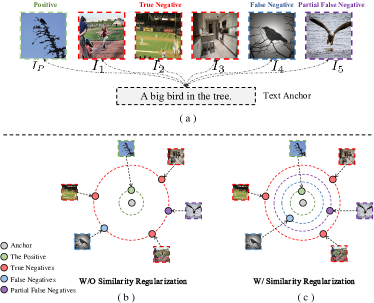
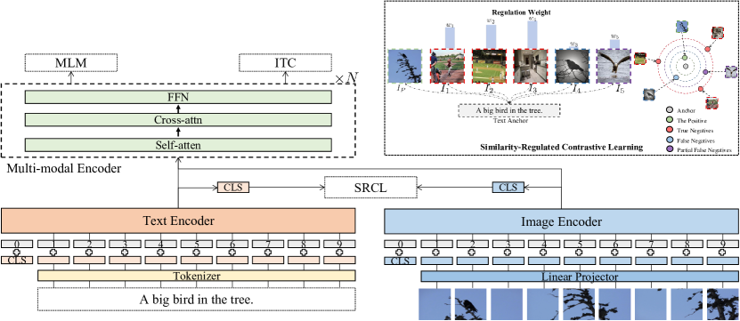
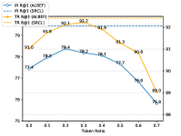
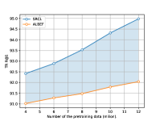
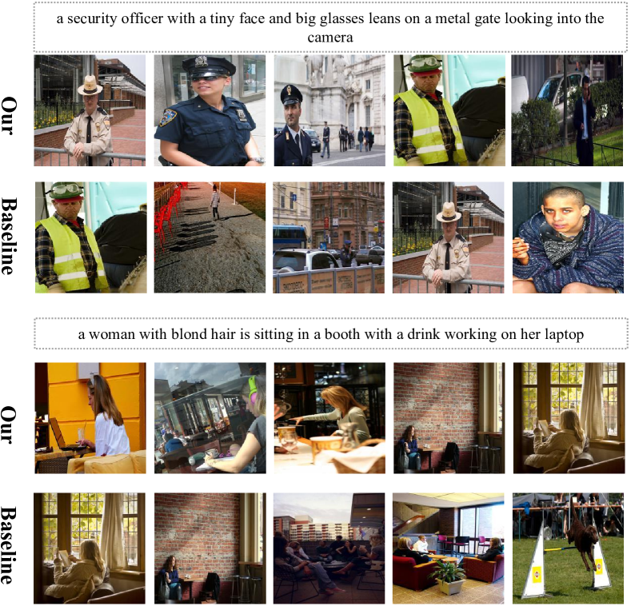
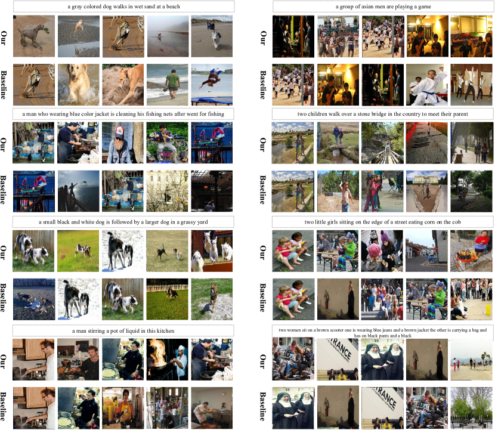
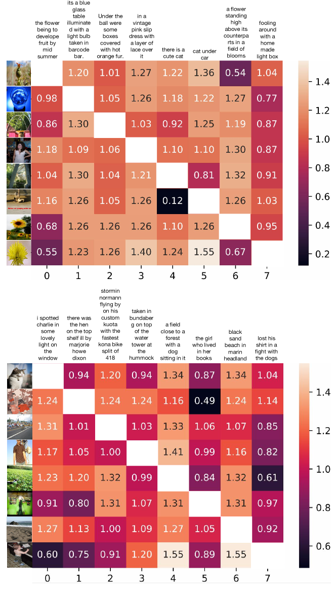
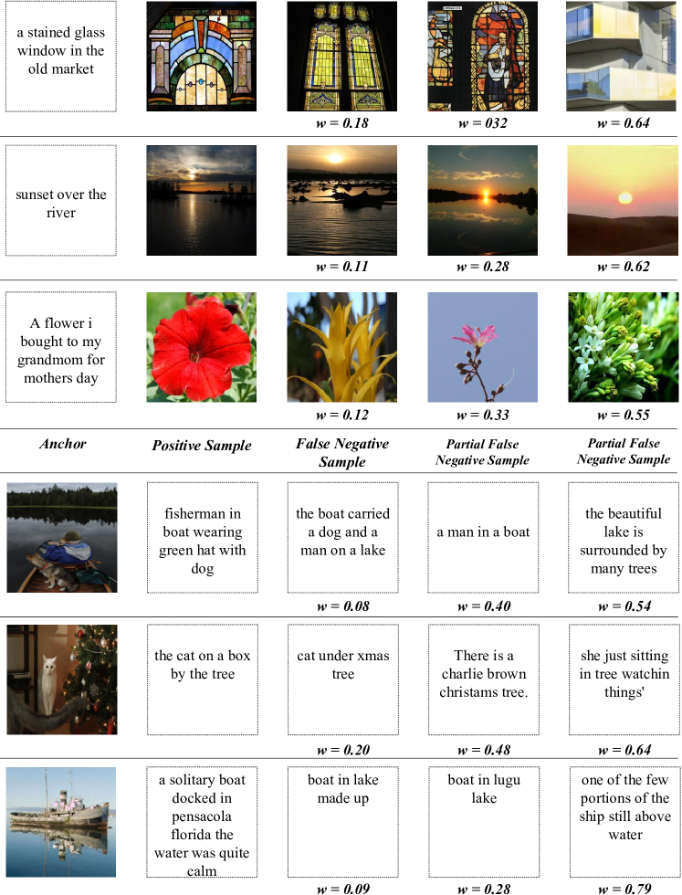

# Vision Language Pre-training by Contrastive Learning with Cross-Modal Similarity Regulation

###### Abstract

Cross-modal contrastive learning in vision language pretraining (VLP) faces the challenge of (partial) false negatives. In this paper, we study this problem from the perspective of Mutual Information (MI) optimization. It is common sense that InfoNCE loss used in contrastive learning will maximize the lower bound of MI between anchors and their positives, while we theoretically prove that MI involving negatives also matters when noises commonly exist. Guided by a more general lower bound form for optimization, we propose a contrastive learning strategy regulated by progressively refined cross-modal similarity, to more accurately optimize MI between an image/text anchor and its negative texts/images instead of improperly minimizing it. Our method performs competitively on four downstream cross-modal tasks and systematically balances the beneficial and harmful effects of (partial) false negative samples under theoretical guidance.  

## 1 Introduction

Large-scale pre-trained vision-language models have recently achieved tremendous success on a wide range of cross-modal tasks Tan and Bansal ([2019](#bib.bib37)); Chen et al. ([2020c](#bib.bib10)); Huang et al. ([2020](#bib.bib16)); Li et al. ([2020](#bib.bib26)); Yu et al. ([2021](#bib.bib44)); Li et al. ([2021](#bib.bib25)); Wang et al. ([2021b](#bib.bib40)); Li et al. ([2022a](#bib.bib23)); Xu et al. ([2021](#bib.bib42)); Kim et al. ([2021](#bib.bib21)). Self-supervised learning (SSL) Jaiswal et al. ([2020](#bib.bib17)); Liu et al. ([2020](#bib.bib27)) have impressively contributed to vision-language pre-training (VLP) due to its capability of leveraging large-scale image-text pairs without annotations. More recently, Self-supervised Multi-modal Contrastive Learning (SMCL) triggered great progress  Li et al. ([2022b](#bib.bib24)); Radford et al. ([2021](#bib.bib33)); Yao et al. ([2021](#bib.bib43)); Li et al. ([2021](#bib.bib25), [2022a](#bib.bib23)) by conducting cross-modal alignment. SMCL consists of image-to-text and text-to-image contrastive learning, e.g., with the InfoNCE Oord et al. ([2018](#bib.bib30)) loss. Taking the text-to-image one as an example, given a text-image pair (T, I), I will be treated as the positive sample for the anchor T, and other images in a mini-batch of text-image pairs will be regarded as negatives. The training objective is to attract the positive to the anchor while repelling all the negative samples.  

[FIGURE S1.F1.g1]

Figure 1: Conceptual illustration of cross-modal similarity regularization. Sub-figure (a) demonstrates that (partial) false negatives commonly exist in cross-modal training data. In sub-figure (b), negative samples will be equally pushed away from the anchor in conventional cross-modal contrastive learning, leading to data deficiency given these false ones. Instead, we take the first step to contrast negatives according to cross-modal similarity (represented by a set of concentric circles in sub-figure (c)), keeping good while removing harmful effects of (partial) false negative samples.
[/FIGURE]

However, this contrasting strategy can be problematic given the many-to-many correspondences between images and texts. As shown in Figure [1](#S1.F1 "Figure 1 ‣ 1 Introduction ‣ Vision Language Pre-training by Contrastive Learning with Cross-Modal Similarity Regulation") (a), a text can be semantically paired with multiple images. In this scenario, though images $I_{4}$ and $I_{5}$ are treated as negatives, they are actually semantically consistent (or partially consistent) with the text anchor “A bird in the tree.” The (partial) false negatives like $I_{4}$ and $I_{5}$ will inevitably hinder the contrasting effect, yielding sub-optimal cross-modal representations.  

Some pioneering efforts have addressed the noisy image-text pairing problem in VLP pre-training datasets Li et al. ([2021](#bib.bib25)); Andonian et al. ([2022](#bib.bib2)), by feeding the contrastive loss with soft labels in a self-distillation manner. Though these methods can address the problem of false negatives to some extent, the specific harmful effect of false negatives remains far from being systematically studied. For example, based on these methods (e.g., ALBEF Li et al. ([2021](#bib.bib25)) ), we can easily improve the performances of downstream tasks by simply filtering false negatives, as shown in Table  [1](#S1.T1 "Table 1 ‣ 1 Introduction ‣ Vision Language Pre-training by Contrastive Learning with Cross-Modal Similarity Regulation").  

In this paper, we investigate the problem of false negatives from the perspective of Mutual Information (MI) optimization. The InfoNCE loss used in contrastive learning has been proved to maximize the lower bound of MI between anchors and their positives Oord et al. ([2018](#bib.bib30)). We revisit the theoretical proof in the presence of non-negligible false negatives. Defining the MI between anchors and positives as MI-P, and the counterpart between anchors and negatives as MI-N, we derive a more general conclusion (see the appendix [A.2](#A1.SS2 "A.2 Proof B ‣ Appendix A Proof ‣ Vision Language Pre-training by Contrastive Learning with Cross-Modal Similarity Regulation")) that optimizing InfoNCE is equivalent to maximizing the lower bound of (MI-P $-$ MI-N). The finding suggests that MI-N will be minimized (e.g., as close to zero as possible), even though some negatives may semantically match the anchor. The theoretical analyses explain the deficiency of the vanilla contrasting strategy on the one hand, and inspire us with another derivation (appendix [A.3](#A1.SS3 "A.3 Proof C ‣ Appendix A Proof ‣ Vision Language Pre-training by Contrastive Learning with Cross-Modal Similarity Regulation")) that guarantees proper MI optimization for negative samples on the other hand.  

Guided by these theoretical analyses, we propose a novel contrasting strategy regulated by cross-modal similarity. We hypothesize that the MI between an image and text positively correlates with their semantic similarity. Therefore, we introduce a contrastive weight, which is derived based on cross-modal similarity and progressively refined with training, for each negative sample as a contrasting regulator. This regulator will guide the model to optimize MI-N properly, keeping it from being unexpectedly minimized and thus yielding a more semantically structural representation space. We equip our proposed contrasting strategy on ALBEF  Li et al. ([2021](#bib.bib25)) framework and evaluate it on various representative vision-language downstream tasks, including Visual Question Answering(VQA), Cross-modal Retrieval, Zero-shot Cross-modal Retrieval, and Natural Language for Visual Reasoning (NLVR). The experimental results show that our adjusted contrastive learning significantly improves their performances.  

[TABLE S1.T1]

<table class="ltx_tabular ltx_centering ltx_guessed_headers ltx_align_middle">
<tbody class="ltx_tbody">
<tr class="ltx_tr">
<th class="ltx_td ltx_th ltx_th_row ltx_border_r ltx_border_tt"></th>
<td class="ltx_td ltx_align_center ltx_border_r ltx_border_tt">Flicker 30K (ZS)</td>
<td class="ltx_td ltx_align_center ltx_border_tt">VQA</td>
</tr>
<tr class="ltx_tr">
<td class="ltx_td ltx_align_center ltx_border_t">TR</td>
<td class="ltx_td ltx_align_center ltx_border_r ltx_border_t">IR</td>
<td class="ltx_td ltx_align_center ltx_border_t">test-dev</td>
</tr>
<tr class="ltx_tr">
<td class="ltx_td ltx_align_center ltx_border_t">R@1</td>
<td class="ltx_td ltx_align_center ltx_border_t">R@5</td>
<td class="ltx_td ltx_align_center ltx_border_t">R@1</td>
<td class="ltx_td ltx_align_center ltx_border_r ltx_border_t">R@5</td>
</tr>
<tr class="ltx_tr">
<th class="ltx_td ltx_align_center ltx_th ltx_th_row ltx_border_r ltx_border_t">ALBEF</th>
<td class="ltx_td ltx_align_center ltx_border_t">91.02</td>
<td class="ltx_td ltx_align_center ltx_border_t">98.23</td>
<td class="ltx_td ltx_align_center ltx_border_t">77.44</td>
<td class="ltx_td ltx_align_center ltx_border_r ltx_border_t">93.03</td>
<td class="ltx_td ltx_align_center ltx_border_t">76.06</td>
</tr>
<tr class="ltx_tr">
<th class="ltx_td ltx_align_center ltx_th ltx_th_row ltx_border_bb ltx_border_r">ALBEF++</th>
<td class="ltx_td ltx_align_center ltx_border_bb">92.12</td>
<td class="ltx_td ltx_align_center ltx_border_bb">98.98</td>
<td class="ltx_td ltx_align_center ltx_border_bb">78.37</td>
<td class="ltx_td ltx_align_center ltx_border_bb ltx_border_r">93.61</td>
<td class="ltx_td ltx_align_center ltx_border_bb">76.33</td>
</tr>
</tbody>
</table>

Table 1: A pilot experiment on removing false negatives when contrasting. When training ALBEF  Li et al. ([2021](#bib.bib25)), we directly remove false negatives samples in a heuristic way from a mini-batch (more details in Section  [4.3](#S4.SS3 "4.3 False Negatives v.s. Hard Negatives ‣ 4 Experiments ‣ Vision Language Pre-training by Contrastive Learning with Cross-Modal Similarity Regulation")), achieving a new pre-trained model ALBEF++.
We report the performance of Zero-shot Cross-modal Retrieval (Flicker 30K) and Visual Question Answering (VQA). Even by simply removing false negatives, ALBEF++ outperforms ALBEF by an evident margin, indicating that existing efforts have not sufficiently addressed the harmful effects of false negatives.
[/TABLE]

In summary, our contributions are:  

* We investigate the issue of false negatives in cross-modal contrastive learning from the perspective of Mutual Information (MI) optimization. We deduce a more general form of MI’s lower bound for InfoNCE loss in the presence of non-negligible false negatives, revealing that the MI between (partial) false negatives and anchors is improperly minimized. 
* Based on a theoretical derivation that guarantees appropriate MI optimization for negative samples, we propose a novel contrasting strategy by attaching each negative sample with a progressively refined contrastive weight based on cross-modal similarity. 
* Applying the contrasting strategy to VLP methods yields impressive performance improvement on various downstream tasks, and demonstrates our contrasting strategy systematically balances the positive and negative impacts of false negatives. 

## 2 Theoretical Analysis from Mutual Information Perspective

Mutual Information (MI) is designed to measure the relationship between random variables or determine the amount of shared information Becker ([1996](#bib.bib5), [1993](#bib.bib4)).  Oord et al. ([2018](#bib.bib30)) has proven that the InfoNCE loss function widely used in contrastive learning can be seen as a lower bound of MI between anchors and positives. Note that Li et al. ([2021](#bib.bib25)) provides a conceptual yet more intuitive discussion of the correspondence between InfoNCE and MI in the VLP scenario. In this paper, we go one step further to revisit the proof of  Oord et al. ([2018](#bib.bib30)) under a cross-modal contrastive learning context.  

### 2.1 Preliminaries

The standard InfoNCE loss in VLP consists of two parts: $\mathcal{L}_{InfoNCE}=\mathcal{L}_{InfoNCE}^{v}+\mathcal{L}_{InfoNC}^{t}$, where the former corresponds to image-to-text alignment and the latter corresponds to text-to-image alignment. For the following discussion, we will take $\mathcal{L}_{InfoNCE}^{v}$ as an example.  

Suppose we randomly sample N semantically paired image-text tuples $\{\left(I_{i},T_{i}\right)\},i\in\{1,2,\cdots,N\}$ from a cross-modal dataset. $\mathcal{L}_{InfoNCE}^{v}$ is defined as:  

|  | $$\mathcal{L}_{InfoNCE}^{v}=-\mathop{E}\limits_{t}\mathop{log}\left[\frac{f\left(v_{i},t_{i}\right)}{f\left(v_{i},t_{i}\right)+\sum\limits_{t_{j}\neq t_{i}}f\left(v_{i},t_{j}\right)}\right]$$ |  | (1) |
| --- | --- | --- | --- |

where $f\left(v_{i},t_{i}\right)$ measures the distance between $v_{i}$ and $t_{i}$ in a semantic space. According to Oord et al. ([2018](#bib.bib30)), the function $f\left(v_{i},t_{i}\right)$ can be utilized to model the density ratio, which preserves the mutual information between $v_{i}$ and $t_{i}$ and we can rewrite the $f\left(v_{i},t_{i}\right)$ to $\frac{\mathop{P}\left(t_{i}|v_{i}\right)}{\mathop{P}\left(t_{i}\right)}$. Then we can derive the well-known lower bound of MI between $t_{i}$ and $v_{i}$:  

|  | $$\mathop{I}(t_{i},v_{i})\geq log\left(N\right)-\mathcal{L}_{InfoNCE}^{v}$$ |  | (2) |
| --- | --- | --- | --- |

where the $\mathop{I}(t_{i},v_{i})$ is the mutual information between $t_{i}$ and $v_{i}$. The details of this copy-to-VLP derivation can be found in appendix [A.1](#A1.SS1 "A.1 Proof A ‣ Appendix A Proof ‣ Vision Language Pre-training by Contrastive Learning with Cross-Modal Similarity Regulation").  

### 2.2 MI Derivation with False Negatives

The derivation process in  Appendix [A.1](#A1.SS1 "A.1 Proof A ‣ Appendix A Proof ‣ Vision Language Pre-training by Contrastive Learning with Cross-Modal Similarity Regulation") implicitly assumes that $t_{j}$ (the negative sample) and $v_{i}$ are independent, which is reasonable given a large enough number of negatives with little noise. So the expectation of density ratio $\frac{\mathop{P}\left(t_{j}|v_{i}\right)}{\mathop{P}\left(t_{j}\right)}$ is equal to 1 and eliminated (e.g., from Equation [12](#A1.E12 "In A.1 Proof A ‣ Appendix A Proof ‣ Vision Language Pre-training by Contrastive Learning with Cross-Modal Similarity Regulation") to Equation [13](#A1.E13 "In A.1 Proof A ‣ Appendix A Proof ‣ Vision Language Pre-training by Contrastive Learning with Cross-Modal Similarity Regulation")). In the presence of non-negligible false negatives, $t_{j}$ and $v_{i}$ may not be independent. Therefore, we revisit this derivation and deduce a more general conclusion (see detailed derivation in appendix [A.2](#A1.SS2 "A.2 Proof B ‣ Appendix A Proof ‣ Vision Language Pre-training by Contrastive Learning with Cross-Modal Similarity Regulation")):  

|  | $\displaystyle\mathop{I}(t_{i},v_{i})-\mathop{E}\limits_{t_{j}}\mathop{I}(t_{j},v_{i})$ |  |
| --- | --- | --- |
|  | $\displaystyle\geq log\left(N\right)-\mathcal{L}_{InfoNCE}^{v}$ |  | (3) |
| --- | --- | --- | --- |

Equation [3](#S2.E3 "In 2.2 MI Derivation with False Negatives ‣ 2 Theoretical Analysis from Mutual Information Perspective ‣ Vision Language Pre-training by Contrastive Learning with Cross-Modal Similarity Regulation") provides a more general lower bound form that the InfoNCE loss optimizes. The first term on the left side of this equation is MI between an anchor and the positive, and the second term is MI expectation between an anchor and negatives. Equation [3](#S2.E3 "In 2.2 MI Derivation with False Negatives ‣ 2 Theoretical Analysis from Mutual Information Perspective ‣ Vision Language Pre-training by Contrastive Learning with Cross-Modal Similarity Regulation") reveals that optimizing InfoNCE is equivalent to maximizing the lower bound of the difference between the former and the latter.  

### 2.3 Theoretical Guidance for Addressing False Negatives

Combining Equations [3.2](#S3.Ex3 "3.2 Cross-modal Similarity Regulation ‣ 3 Method ‣ Vision Language Pre-training by Contrastive Learning with Cross-Modal Similarity Regulation") and [3](#S2.E3 "In 2.2 MI Derivation with False Negatives ‣ 2 Theoretical Analysis from Mutual Information Perspective ‣ Vision Language Pre-training by Contrastive Learning with Cross-Modal Similarity Regulation"), we can find that in addition to maximizing MI between an anchor and the positive (say MI-P), InfoNCE loss will also minimize the MI expectation between an anchor and negatives (say MI-N), e.g., to be as close to zero as possible, despite the existence of the (partial) false negative samples. Since they may semantically match the anchor, over-minimizing MI-N could produce less structural cross-modal representation space.  

To optimize MI-N to a proper value, we first need to provide a prior estimation of MI-N as a target. Here we exploit cross-modal similarity to approximate MI between an image and text. The second problem is integrating this prior estimation into the optimization process. Based on the derivation of Equation [3](#S2.E3 "In 2.2 MI Derivation with False Negatives ‣ 2 Theoretical Analysis from Mutual Information Perspective ‣ Vision Language Pre-training by Contrastive Learning with Cross-Modal Similarity Regulation"), we further theoretically prove that assigning a positive weight $w_{i,j}$ to each $f\left(v_{i},t_{i}\right)$ can push MI expectation between an anchor and negatives to a controllable positive value, given the following two conditions:  

* Condition 1. The covariance between $w_{i,j}$ and $\frac{\mathop{P}\left(t_{i}|v_{i}\right)}{\mathop{P}\left(t_{i}\right)}$ is negative. 
* Condition 2. The expectation of $w_{i,j}$ among all negatives is equal to 1. 

With this theoretical guidance (see complete proof in Appendix [A.3](#A1.SS3 "A.3 Proof C ‣ Appendix A Proof ‣ Vision Language Pre-training by Contrastive Learning with Cross-Modal Similarity Regulation")), we propose to improve InfoNCE loss by applying each negative with a contrastive weight, which is inversely proportional to its cross-modal similarity with the anchor.  

## 3 Method

[FIGURE S3.F2.g1]

Figure 2: The pipeline of our method. The proposed model consists of two unimodal encoders for images and text separately and a multi-modal encoder for the fusion of the cross-modal information. After feeding the input to the unimodal encoders, we take the representation of [CLS] token as the global representation and use Similarity-Regulated Contrastive Learning (SRCL) to align the unimodal representations of an image-text pair. We also apply an image-text matching loss and a masked-language-modeling loss to learn multimodal interactions between image and text.
[/FIGURE]

In this section, we will first introduce our model architecture, and then introduce our Similarity-Regulated Contrastive Learning (SRCL), followed by the details of other pre-training objectives.  

### 3.1 Model Architecture

Figure [2](#S3.F2 "Figure 2 ‣ 3 Method ‣ Vision Language Pre-training by Contrastive Learning with Cross-Modal Similarity Regulation") shows an overview of our model, our model consists of two unimodal encoders for image and text independently and a multi-modal encoder. To better model the inherent modality bias information, we first use two unimodal encoders to encode the image and text separately. Following Dou et al. ([2021](#bib.bib13)); Shen et al. ([2021](#bib.bib35)), we use a visual transformer Dosovitskiy et al. ([2020](#bib.bib12)) directly on the image patches as the visual encoder, which is more computation-friendly than using pre-trained object detectors for visual feature extraction Anderson et al. ([2018](#bib.bib1)); Zhang et al. ([2021](#bib.bib45)). The visual encoder divides an input image into patches and encodes them as a sequence of embeddings $\{v_{cls},v_{1},v_{2},...,v_{m}\}$ with an additional $[CLS]$ token. The input text is fed to the text encoder and represented as a sequence of embeddings $\{t_{cls},t_{1},t_{2},...,t_{n}\}$, where $t_{cls}$ is the embedding of the $[CLS]$ token and used to summarize the input text. Then, the visual and linguistic representations are fed into the multi-modal encoder, which consists of multiple transformer layers.  

### 3.2  Cross-modal Similarity Regulation

In section [2](#S2 "2 Theoretical Analysis from Mutual Information Perspective ‣ Vision Language Pre-training by Contrastive Learning with Cross-Modal Similarity Regulation"), we reveal that vanilla InfoNCE loss will treat negative samples equally without considering their semantic similarity with anchors. Thus the MI between the (partial) false negative samples and the anchor is over-reduced, limiting the performance of pre-training models.  

We propose a novel contrasting strategy regulated by cross-modal similarity. We hypothesize that the MI between an image and text positively correlates with their semantic similarity. Therefore, we introduce a contrastive weight, which is derived based on cross-modal similarity and progressively refined with training, for each negative sample as a contrasting regulator. This regulator drives the model to optimize MI-N properly rather than simply minimizing it.  

Formally, with a batch of N semantically paired image-text tuples $\{\left(V_{i},T_{i}\right)\}_{i=1:N}$ and the $CLS$ embeddings $v_{cls}^{i=1:N}$ and $t_{cls}^{i=1:M}$ of each image and text in the batch, the image-to-text contrastive loss is:  

|  | $\displaystyle\mathcal{L}_{SRCL}^{v}$ |  | (4) |
| --- | --- | --- | --- |
|  | $\displaystyle=-\sum\limits_{i=1:N}\frac{1}{N}\mathop{log}\left[\frac{f\left(v_{cls}^{i},t_{cls}^{i}\right)}{f\left(v_{cls}^{i},t_{cls}^{i}\right)+\sum\limits_{j\neq i}w_{i,j}^{v}*f\left(v_{cls}^{i},t_{cls}^{j}\right)}\right]$ |  |
| --- | --- | --- |

where $f\left(v_{cls}^{i},t_{cls}^{j}\right)=exp\left(sim\left(v_{i},t_{i}\right)/\tau\right)$ and $w_{i,j}^{v}$ indicate the contrastive weight of j-th negative text sample in the contrastive framework. Similarly, the contrastive loss from text to image can be written as follow:  

|  | $\displaystyle\mathcal{L}_{SRCL}^{t}$ |  | (5) |
| --- | --- | --- | --- |
|  | $\displaystyle=-\sum\limits_{i=1:M}\frac{1}{M}\mathop{log}\left[\frac{f\left(t_{cls}^{i},v_{cls}^{i}\right)}{f\left(t_{cls}^{i},v_{cls}^{i}\right)+\sum\limits_{j\neq i}w_{i,j}^{t}*f\left(t_{cls}^{i},v_{cls}^{j}\right)}\right]$ |  |
| --- | --- | --- |

where $f\left(t_{cls}^{i},v_{cls}^{j}\right)=exp\left(sim\left(t_{i},v_{j}\right)/\tau\right)$ and $w_{i,j}^{t}$ indicate the contrastive weight of j-th negative image sample in the contrastive framework.  

#### 3.2.1 Implementation of Regulation Weights

In this subsection, we introduce how to calculate the regulation weight of the negative samples in contrastive learning. As the regulation weights are inversely proportional to the semantic similarity between anchors and negatives, we need first to calculate the semantic similarity to estimate the regulation weight. Due to the capacity of the VLP model to align images and texts, the VLP model could be utilized to measure cross-modal semantic similarity. However, we notice that the VLP model in the earlier training stages is unreliable since the semantic structure of the embedding space is still under optimization.  

Therefore, in the beginning, we use the high-quality human-annotated dataset Chen et al. ([2015](#bib.bib9)) to train another model denoted as $\mathcal{H}_{\beta}$ which shares the same structure with our VLP model $\mathcal{S}_{\gamma}$. This model $\mathcal{H}_{\beta}$ is optimized by InfoNCE loss and is used to estimate the semantic similarity of the image text pairs at early pre-training stages.  

During the pre-training our VLP model $\mathcal{S}_{\gamma}$, the parameters of model $\mathcal{H}_{\beta}$ are frozen. The final semantic similarity between anchors and negatives is derived by taking a weighted average of similarity computed from $\mathcal{S}_{\gamma}$ and $\mathcal{H}_{\beta}$.  

At the beginning of the pre-training stages, the weight of the VLP model $\mathcal{S}_{\gamma}$ for calculating the final similarity is set to 0, and the weight of $\mathcal{H}_{\beta}$ is set to 1. As the number of training epochs rises, we progressively increase the weights of $\mathcal{F}_{\gamma}$ and decrease the weights of $\mathcal{H}_{\beta}$.  

Formally, given a mini-batch $\{\left(T_{1},I_{1}\right),\dots,\left(T_{N},I_{N}\right)\}$ which contains N image-text pairs, for an text anchor $T_{i}$ and a negative image sample $I_{j}$, the similarity $\hat{s}_{i,j}$ calculated from the $\mathcal{H}_{\beta}$ is:  

|  | $$\hat{s}^{t}_{i,j}=exp(sim(\hat{t}_{cls}^{j},\hat{v}_{cls}^{i}))$$ |  | (6) |
| --- | --- | --- | --- |

where $\hat{t}_{cls}^{i}$ is the [CLS] representation of the text $T_{i}$ extracted from the text encoder of $\mathcal{H}_{\beta}$ and $\hat{v}_{cls}^{j}$ is the [CLS] representation of the Image $T_{i}$ extracted from the image encoder of $\mathcal{H}_{\beta}$.  

Similariy, the similarity $\dot{s}_{i,j}$ calculated from the $\mathcal{V}_{\gamma}$ is:  

|  | $$\dot{s}^{t}_{i,j}=exp(sim(t_{cls}^{j},v_{cls}^{i}))$$ |  | (7) |
| --- | --- | --- | --- |

Then the finally semantic similarity between $T_{i}$ and $V_{j}$:  

|  | $$s^{t}_{i,j}=\alpha*\hat{s}^{t}_{i,j}+\left(1-\alpha\right)*\dot{s}^{t}_{i,j}$$ |  | (8) |
| --- | --- | --- | --- |

where $\alpha$ is a hyper-parameter and will continue to decrease with the increase of pretraining steps.  

The contrastive weight $w^{t}_{i,j}$ can be driven as follow:  

|  | $$w^{t}_{i,j}=Norm(\delta*\frac{1}{s^{t}_{i,j}})$$ |  | (9) |
| --- | --- | --- | --- |

Where $\delta$ is a scaling factor. Notably, $w^{t}_{i,j}$ is inversely proportional to the similarity to meet Condition 1 described in Section [2.3](#S2.SS3 "2.3 Theoretical Guidance for Addressing False Negatives ‣ 2 Theoretical Analysis from Mutual Information Perspective ‣ Vision Language Pre-training by Contrastive Learning with Cross-Modal Similarity Regulation"), and the $Norm$ function makes the mean value of all negatives’ weights to be 1 to meet Condition 2.  

Similarly, given an image anchor and its text negative samples, we can also calculate the image-to-text contrastive weight.  

## 4 Experiments

[TABLE S4.T2]

<table class="ltx_tabular ltx_centering ltx_guessed_headers ltx_align_middle">
<tbody class="ltx_tbody">
<tr class="ltx_tr">
<th class="ltx_td ltx_align_center ltx_th ltx_th_row ltx_border_r ltx_border_tt">Models</th>
<th class="ltx_td ltx_align_center ltx_th ltx_th_row ltx_border_r ltx_border_tt"># Pretrain</th>
<td class="ltx_td ltx_align_center ltx_border_r ltx_border_tt">MSCOCO (5K test set)</td>
<td class="ltx_td ltx_align_center ltx_border_tt">Flickr30K (1K test set)</td>
</tr>
<tr class="ltx_tr">
<th class="ltx_td ltx_align_center ltx_th ltx_th_row ltx_border_r">data</th>
<td class="ltx_td ltx_align_center">TR</td>
<td class="ltx_td ltx_align_center ltx_border_r">IR</td>
<td class="ltx_td ltx_align_center">TR</td>
<td class="ltx_td ltx_align_center">IR</td>
</tr>
<tr class="ltx_tr">
<th class="ltx_td ltx_th ltx_th_row ltx_border_r ltx_border_t"></th>
<th class="ltx_td ltx_th ltx_th_row ltx_border_r ltx_border_t"></th>
<td class="ltx_td ltx_align_center ltx_border_t">R@1</td>
<td class="ltx_td ltx_align_center ltx_border_t">R@5</td>
<td class="ltx_td ltx_align_center ltx_border_t">R@10</td>
<td class="ltx_td ltx_align_center ltx_border_t">R@1</td>
<td class="ltx_td ltx_align_center ltx_border_t">R@5</td>
<td class="ltx_td ltx_align_center ltx_border_r ltx_border_t">R@10</td>
<td class="ltx_td ltx_align_center ltx_border_t">R@1</td>
<td class="ltx_td ltx_align_center ltx_border_t">R@5</td>
<td class="ltx_td ltx_align_center ltx_border_t">R@10</td>
<td class="ltx_td ltx_align_center ltx_border_t">R@1</td>
<td class="ltx_td ltx_align_center ltx_border_t">R@5</td>
<td class="ltx_td ltx_align_center ltx_border_t">R@10</td>
</tr>
<tr class="ltx_tr">
<th class="ltx_td ltx_align_left ltx_th ltx_th_row ltx_border_r ltx_border_t">E2E-VLP</th>
<th class="ltx_td ltx_align_center ltx_th ltx_th_row ltx_border_r ltx_border_t">4M</th>
<td class="ltx_td ltx_align_center ltx_border_t">-</td>
<td class="ltx_td ltx_align_center ltx_border_t">-</td>
<td class="ltx_td ltx_align_center ltx_border_t">-</td>
<td class="ltx_td ltx_align_center ltx_border_t">-</td>
<td class="ltx_td ltx_align_center ltx_border_t">-</td>
<td class="ltx_td ltx_align_center ltx_border_r ltx_border_t">-</td>
<td class="ltx_td ltx_align_center ltx_border_t">86.2</td>
<td class="ltx_td ltx_align_center ltx_border_t">97.5</td>
<td class="ltx_td ltx_align_center ltx_border_t">98.92</td>
<td class="ltx_td ltx_align_center ltx_border_t">73.6</td>
<td class="ltx_td ltx_align_center ltx_border_t">92.4</td>
<td class="ltx_td ltx_align_center ltx_border_t">96.0</td>
</tr>
<tr class="ltx_tr">
<th class="ltx_td ltx_align_left ltx_th ltx_th_row ltx_border_r">UNITER</th>
<th class="ltx_td ltx_align_center ltx_th ltx_th_row ltx_border_r">4M</th>
<td class="ltx_td ltx_align_center">65.7</td>
<td class="ltx_td ltx_align_center">88.6</td>
<td class="ltx_td ltx_align_center">93.8</td>
<td class="ltx_td ltx_align_center">52.9</td>
<td class="ltx_td ltx_align_center">79.9</td>
<td class="ltx_td ltx_align_center ltx_border_r">88.0</td>
<td class="ltx_td ltx_align_center">87.3</td>
<td class="ltx_td ltx_align_center">98.0</td>
<td class="ltx_td ltx_align_center">99.2</td>
<td class="ltx_td ltx_align_center">75.6</td>
<td class="ltx_td ltx_align_center">94.1</td>
<td class="ltx_td ltx_align_center">96.8</td>
</tr>
<tr class="ltx_tr">
<th class="ltx_td ltx_align_left ltx_th ltx_th_row ltx_border_r">OSCAR</th>
<th class="ltx_td ltx_align_center ltx_th ltx_th_row ltx_border_r">4M</th>
<td class="ltx_td ltx_align_center">70.0</td>
<td class="ltx_td ltx_align_center">91.1</td>
<td class="ltx_td ltx_align_center">95.5</td>
<td class="ltx_td ltx_align_center">54.0</td>
<td class="ltx_td ltx_align_center">80.8</td>
<td class="ltx_td ltx_align_center ltx_border_r">88.5</td>
<td class="ltx_td ltx_align_center">-</td>
<td class="ltx_td ltx_align_center">-</td>
<td class="ltx_td ltx_align_center">-</td>
<td class="ltx_td ltx_align_center">-</td>
<td class="ltx_td ltx_align_center">-</td>
<td class="ltx_td ltx_align_center">-</td>
</tr>
<tr class="ltx_tr">
<th class="ltx_td ltx_align_left ltx_th ltx_th_row ltx_border_r">ALIGN</th>
<th class="ltx_td ltx_align_center ltx_th ltx_th_row ltx_border_r">1.8B</th>
<td class="ltx_td ltx_align_center">77.0</td>
<td class="ltx_td ltx_align_center">93.5</td>
<td class="ltx_td ltx_align_center">96.9</td>
<td class="ltx_td ltx_align_center">59.9</td>
<td class="ltx_td ltx_align_center">83.3</td>
<td class="ltx_td ltx_align_center ltx_border_r">89.8</td>
<td class="ltx_td ltx_align_center">95.3</td>
<td class="ltx_td ltx_align_center">99.8</td>
<td class="ltx_td ltx_align_center">100.0</td>
<td class="ltx_td ltx_align_center">84.9</td>
<td class="ltx_td ltx_align_center">97.4</td>
<td class="ltx_td ltx_align_center">98.6</td>
</tr>
<tr class="ltx_tr">
<th class="ltx_td ltx_align_left ltx_th ltx_th_row ltx_border_r">VinVL</th>
<th class="ltx_td ltx_align_center ltx_th ltx_th_row ltx_border_r">4M</th>
<td class="ltx_td ltx_align_center">74.6</td>
<td class="ltx_td ltx_align_center">92.6</td>
<td class="ltx_td ltx_align_center">96.3</td>
<td class="ltx_td ltx_align_center">58.1</td>
<td class="ltx_td ltx_align_center">83.2</td>
<td class="ltx_td ltx_align_center ltx_border_r">90.1</td>
<td class="ltx_td ltx_align_center">-</td>
<td class="ltx_td ltx_align_center">-</td>
<td class="ltx_td ltx_align_center">-</td>
<td class="ltx_td ltx_align_center">-</td>
<td class="ltx_td ltx_align_center">-</td>
<td class="ltx_td ltx_align_center">-</td>
</tr>
<tr class="ltx_tr">
<th class="ltx_td ltx_align_left ltx_th ltx_th_row ltx_border_r">ViLT</th>
<th class="ltx_td ltx_align_center ltx_th ltx_th_row ltx_border_r">4M</th>
<td class="ltx_td ltx_align_center">61.5</td>
<td class="ltx_td ltx_align_center">86.3</td>
<td class="ltx_td ltx_align_center">92.7</td>
<td class="ltx_td ltx_align_center">42.7</td>
<td class="ltx_td ltx_align_center">72.9</td>
<td class="ltx_td ltx_align_center ltx_border_r">83.1</td>
<td class="ltx_td ltx_align_center">83.5</td>
<td class="ltx_td ltx_align_center">96.7</td>
<td class="ltx_td ltx_align_center">98.6</td>
<td class="ltx_td ltx_align_center">64.4</td>
<td class="ltx_td ltx_align_center">88.7</td>
<td class="ltx_td ltx_align_center">93.8</td>
</tr>
<tr class="ltx_tr">
<th class="ltx_td ltx_align_left ltx_th ltx_th_row ltx_border_r ltx_border_t">ALBEF</th>
<th class="ltx_td ltx_align_center ltx_th ltx_th_row ltx_border_r ltx_border_t">4M</th>
<td class="ltx_td ltx_align_center ltx_border_t">76.6</td>
<td class="ltx_td ltx_align_center ltx_border_t">93.2</td>
<td class="ltx_td ltx_align_center ltx_border_t">96.9</td>
<td class="ltx_td ltx_align_center ltx_border_t">58.4</td>
<td class="ltx_td ltx_align_center ltx_border_t">83.1</td>
<td class="ltx_td ltx_align_center ltx_border_r ltx_border_t">90.2</td>
<td class="ltx_td ltx_align_center ltx_border_t">94.6</td>
<td class="ltx_td ltx_align_center ltx_border_t">99.8</td>
<td class="ltx_td ltx_align_center ltx_border_t">100.0</td>
<td class="ltx_td ltx_align_center ltx_border_t">83.9</td>
<td class="ltx_td ltx_align_center ltx_border_t">96.8</td>
<td class="ltx_td ltx_align_center ltx_border_t">98.7</td>
</tr>
<tr class="ltx_tr">
<th class="ltx_td ltx_align_left ltx_th ltx_th_row ltx_border_bb ltx_border_r">Ours</th>
<th class="ltx_td ltx_align_center ltx_th ltx_th_row ltx_border_bb ltx_border_r">4M</th>
<td class="ltx_td ltx_align_center ltx_border_bb">77.3</td>
<td class="ltx_td ltx_align_center ltx_border_bb">94.1</td>
<td class="ltx_td ltx_align_center ltx_border_bb">97.2</td>
<td class="ltx_td ltx_align_center ltx_border_bb">60.4</td>
<td class="ltx_td ltx_align_center ltx_border_bb">83.9</td>
<td class="ltx_td ltx_align_center ltx_border_bb ltx_border_r">90.8</td>
<td class="ltx_td ltx_align_center ltx_border_bb">96.3</td>
<td class="ltx_td ltx_align_center ltx_border_bb">99.8</td>
<td class="ltx_td ltx_align_center ltx_border_bb">100.0</td>
<td class="ltx_td ltx_align_center ltx_border_bb">85.8</td>
<td class="ltx_td ltx_align_center ltx_border_bb">97.8</td>
<td class="ltx_td ltx_align_center ltx_border_bb">99.0</td>
</tr>
</tbody>
</table>

 

Table 2: Evaluation results of image-text retrieval on Flickr30K and COCO datasets. We initialize the visual encoder of ALBEF with CLIP (ViT-B/16). Our model takes the same architecture and experimental setting as ALBEF. The only difference is that ALBEF uses InfoNCE loss while we use the improved one of SRCL.
[/TABLE]

[TABLE S4.T3]

<table class="ltx_tabular ltx_align_middle">
<tbody class="ltx_tbody">
<tr class="ltx_tr">
<td class="ltx_td ltx_align_center ltx_border_tt">Models</td>
<td class="ltx_td ltx_align_center ltx_border_tt">VQA</td>
<td class="ltx_td ltx_align_center ltx_border_tt">NLVR</td>
</tr>
<tr class="ltx_tr">
<td class="ltx_td ltx_align_center">Test-dev</td>
<td class="ltx_td ltx_align_center">Test-std</td>
<td class="ltx_td ltx_align_center">dev</td>
<td class="ltx_td ltx_align_center">Test-P</td>
</tr>
<tr class="ltx_tr">
<td class="ltx_td ltx_align_center ltx_border_t">ViLBERT</td>
<td class="ltx_td ltx_align_center ltx_border_t">70.55</td>
<td class="ltx_td ltx_align_center ltx_border_t">-</td>
<td class="ltx_td ltx_align_center ltx_border_t">-</td>
<td class="ltx_td ltx_align_center ltx_border_t">-</td>
</tr>
<tr class="ltx_tr">
<td class="ltx_td ltx_align_center">LXMER</td>
<td class="ltx_td ltx_align_center">72.42</td>
<td class="ltx_td ltx_align_center">-</td>
<td class="ltx_td ltx_align_center">74.90</td>
<td class="ltx_td ltx_align_center">74.50</td>
</tr>
<tr class="ltx_tr">
<td class="ltx_td ltx_align_center">UNITER</td>
<td class="ltx_td ltx_align_center">72.70</td>
<td class="ltx_td ltx_align_center">72.91</td>
<td class="ltx_td ltx_align_center">77.18</td>
<td class="ltx_td ltx_align_center">77.85</td>
</tr>
<tr class="ltx_tr">
<td class="ltx_td ltx_align_center">OSCAR</td>
<td class="ltx_td ltx_align_center">73.16</td>
<td class="ltx_td ltx_align_center">73.44</td>
<td class="ltx_td ltx_align_center">78.07</td>
<td class="ltx_td ltx_align_center">78.36</td>
</tr>
<tr class="ltx_tr">
<td class="ltx_td ltx_align_center">VinVL</td>
<td class="ltx_td ltx_align_center">75.95</td>
<td class="ltx_td ltx_align_center">76.12</td>
<td class="ltx_td ltx_align_center">82.05</td>
<td class="ltx_td ltx_align_center">83.08</td>
</tr>
<tr class="ltx_tr">
<td class="ltx_td ltx_align_center">E2E-VLP</td>
<td class="ltx_td ltx_align_center">73.25</td>
<td class="ltx_td ltx_align_center">73.67</td>
<td class="ltx_td ltx_align_center">77.25</td>
<td class="ltx_td ltx_align_center">77.96</td>
</tr>
<tr class="ltx_tr">
<td class="ltx_td ltx_align_center">ViLT</td>
<td class="ltx_td ltx_align_center">71.26</td>
<td class="ltx_td ltx_align_center">-</td>
<td class="ltx_td ltx_align_center">75.70</td>
<td class="ltx_td ltx_align_center">76.13</td>
</tr>
<tr class="ltx_tr">
<td class="ltx_td ltx_align_center ltx_border_t">ALBEF</td>
<td class="ltx_td ltx_align_center ltx_border_t">76.09</td>
<td class="ltx_td ltx_align_center ltx_border_t">76.32</td>
<td class="ltx_td ltx_align_center ltx_border_t">82.21</td>
<td class="ltx_td ltx_align_center ltx_border_t">83.11</td>
</tr>
<tr class="ltx_tr">
<td class="ltx_td ltx_align_center ltx_border_bb">Ours</td>
<td class="ltx_td ltx_align_center ltx_border_bb">76.66</td>
<td class="ltx_td ltx_align_center ltx_border_bb">76.93</td>
<td class="ltx_td ltx_align_center ltx_border_bb">83.43</td>
<td class="ltx_td ltx_align_center ltx_border_bb">83.95</td>
</tr>
</tbody>
</table>

Table 3: Evaluation results on visual question answering and natural language for visual reasoning.
[/TABLE]

### 4.1 Pre-training Datasets

We construct our pre-training data using two web datasets (Conceptual Captions Sharma et al. ([2018](#bib.bib34)), SBU Captions Ordonez et al. ([2011](#bib.bib31))) and two in-domain datasets (MSCOCO Chen et al. ([2015](#bib.bib9)) and Visual Genome Krishna et al. ([2017](#bib.bib22))). The total number of unique images is 4.0M, and the number of image-text pairs is 5.1M.  

### 4.2 Main Result

We implement SRCL based on ALBEF Li et al. ([2021](#bib.bib25)) framework and evaluate it in four widely used downstream tasks: image-text retrieval, zero-shot image-text retrieval (ZSR), visual question answering (VQA), and natural language for visual reasoning (NLVR).  

#### 4.2.1 Image-Text Retrieval

We conduct experiments for both image-to-text retrieval (TR) and text-to-image retrieval (IR) on MSCOCO Chen et al. ([2015](#bib.bib9)) and Flickr30K Plummer et al. ([2015](#bib.bib32)) datasets. During fine-tuning, we jointly optimize the SRCL loss and the ITM loss. When calculating the SRCL loss, we directly use the fine-tuned model to calculate the contrastive weight of the negative samples. As shown in Table [2](#S4.T2 "Table 2 ‣ 4 Experiments ‣ Vision Language Pre-training by Contrastive Learning with Cross-Modal Similarity Regulation"), incorporating SRCL into ALBEF brings evident improvement, achieving competitive performances compared with other VLP baselines.  

[TABLE S4.T4]

<table class="ltx_tabular ltx_centering ltx_guessed_headers ltx_align_middle">
<tbody class="ltx_tbody">
<tr class="ltx_tr">
<th class="ltx_td ltx_align_left ltx_th ltx_th_row ltx_border_r ltx_border_tt">Model</th>
<td class="ltx_td ltx_align_center ltx_border_tt">Text Retrieval</td>
<td class="ltx_td ltx_align_center ltx_border_tt">Image Retrieval</td>
</tr>
<tr class="ltx_tr">
<td class="ltx_td ltx_align_center">R@1</td>
<td class="ltx_td ltx_align_center">R@5</td>
<td class="ltx_td ltx_align_center">R@1</td>
<td class="ltx_td ltx_align_center">R@5</td>
</tr>
<tr class="ltx_tr">
<th class="ltx_td ltx_align_center ltx_th ltx_th_row ltx_border_t"><em class="ltx_emph ltx_font_italic">Zero-Shot</em></th>
</tr>
<tr class="ltx_tr">
<th class="ltx_td ltx_align_left ltx_th ltx_th_row ltx_border_r ltx_border_t">CLIP</th>
<td class="ltx_td ltx_align_center ltx_border_t">88.0</td>
<td class="ltx_td ltx_align_center ltx_border_t">98.7</td>
<td class="ltx_td ltx_align_center ltx_border_t">68.7</td>
<td class="ltx_td ltx_align_center ltx_border_t">90.6</td>
</tr>
<tr class="ltx_tr">
<th class="ltx_td ltx_align_left ltx_th ltx_th_row ltx_border_r">ALIGN</th>
<td class="ltx_td ltx_align_center">88.6</td>
<td class="ltx_td ltx_align_center">98.7</td>
<td class="ltx_td ltx_align_center">75.7</td>
<td class="ltx_td ltx_align_center">93.8</td>
</tr>
<tr class="ltx_tr">
<th class="ltx_td ltx_align_left ltx_th ltx_th_row ltx_border_r">FILIP</th>
<td class="ltx_td ltx_align_center">89.8</td>
<td class="ltx_td ltx_align_center">99.2</td>
<td class="ltx_td ltx_align_center">75.0</td>
<td class="ltx_td ltx_align_center">93.4</td>
</tr>
<tr class="ltx_tr">
<th class="ltx_td ltx_align_left ltx_th ltx_th_row ltx_border_r">UNITER</th>
<td class="ltx_td ltx_align_center">83.6</td>
<td class="ltx_td ltx_align_center">95.7</td>
<td class="ltx_td ltx_align_center">68.7</td>
<td class="ltx_td ltx_align_center">89.2</td>
</tr>
<tr class="ltx_tr">
<th class="ltx_td ltx_align_left ltx_th ltx_th_row ltx_border_r ltx_border_t">ALBEF</th>
<td class="ltx_td ltx_align_center ltx_border_t">91.02</td>
<td class="ltx_td ltx_align_center ltx_border_t">98.23</td>
<td class="ltx_td ltx_align_center ltx_border_t">77.44</td>
<td class="ltx_td ltx_align_center ltx_border_t">93.03</td>
</tr>
<tr class="ltx_tr">
<th class="ltx_td ltx_align_left ltx_th ltx_th_row ltx_border_bb ltx_border_r">Ours</th>
<td class="ltx_td ltx_align_center ltx_border_bb">92.42</td>
<td class="ltx_td ltx_align_center ltx_border_bb">99.41</td>
<td class="ltx_td ltx_align_center ltx_border_bb">79.43</td>
<td class="ltx_td ltx_align_center ltx_border_bb">94.46</td>
</tr>
</tbody>
</table>

Table 4: Evaluation results of zero-shot image-text retrieval on Flickr30K.
[/TABLE]

#### 4.2.2 Visual Question Answering

Most methods Tan and Bansal ([2019](#bib.bib37)); Wang et al. ([2021a](#bib.bib39)); Li et al. ([2020](#bib.bib26)); Wang et al. ([2021b](#bib.bib40)) deal with visual question answering tasks as multi-label classification on pre-defined answer sets. This strategy achieves strong performance, but it is not suitable for real-world open scenarios. We treat VQA as an answer generation task and use constrained close-vocab generation models like Li et al. ([2021](#bib.bib25)); Wang et al. ([2022](#bib.bib38)). As shown in Table [3](#S4.T3 "Table 3 ‣ 4 Experiments ‣ Vision Language Pre-training by Contrastive Learning with Cross-Modal Similarity Regulation"), SRCL achieves 76.66 on Test-std split, outperforming state-of-the-art models. Meanwhile, with the same pre-training data and experimental setting, SRCL always significantly outperforms ALBEF, again verifying the effectiveness of cross-modal similarity regulation.  

#### 4.2.3 Natural Language for Visual Reasoning

The NLVR2 Suhr et al. ([2018](#bib.bib36)) task requires the model to predict whether a sentence describes a pair of images which is a binary classification task. We follow Li et al. ([2021](#bib.bib25)) and use two cross-attention layers to process the two input images, and their outputs are merged and fed to the Feed Forward Network (FFN). An MLP classifier is then applied to the output embedding of the text [CLS] token. Similarly, in Table [3](#S4.T3 "Table 3 ‣ 4 Experiments ‣ Vision Language Pre-training by Contrastive Learning with Cross-Modal Similarity Regulation"), our SRCL outperforms ALBEF and other existing VLP methods.  

#### 4.2.4 Zero-shot Image-text Retrieval

To investigate the semantic structure of the learned representation space, we examine the SRCL on the zero-shot image-text retrieval task on Flickr30KPlummer et al. ([2015](#bib.bib32)). The results are shown in Table [4](#S4.T4 "Table 4 ‣ 4.2.1 Image-Text Retrieval ‣ 4.2 Main Result ‣ 4 Experiments ‣ Vision Language Pre-training by Contrastive Learning with Cross-Modal Similarity Regulation") where SRCL outperforms ALBEF, indicating SRCL could yield a better semantic structural representation space. SRCL also achieves better performance than the previous state-of-the-art models (e.g., CLIP, ALIGN, and Florence) pre-trained with more image-text pairs.  

[FIGURE S4.F3.sf1.g1]

(a) Result of ZCR on Flickr30K
[/FIGURE]

### 4.3 False Negatives v.s. Hard Negatives

An astute reader may notice that (partial) negatives will somewhat overlap with hard negatives. It is non-trivial to accurately define hard or false negatives in vision-language contrasting since the cross-modal semantic boundary is blurry. But we do face a paradox here: we want to alleviate the contrastive effect of false negatives that contain a certain number of hard ones, while many works about hard negative mining (HEM) Hu et al. ([2020](#bib.bib15)); Xiong et al. ([2020](#bib.bib41)); Kalantidis et al. ([2020](#bib.bib19)) try to learn with more hard negative samples.  

To investigate this problem, we experiment with different proportions of false negatives (or hard negatives, approximately). Specifically, we use the contrastive weights, negatively correlated with cross-modal similarity, to roughly approximate whether a negative sample is false. If the weight is lower than a threshold, the corresponding sample is regarded as false, and true otherwise. We explicitly remove the identified false negatives when contrasting, and then check the performance of the pre-trained ALBEF on zero-shot cross-modal retrieval.  

As shown in Figure [3(a)](#S4.F3.sf1 "In Figure 3 ‣ 4.2.4 Zero-shot Image-text Retrieval ‣ 4.2 Main Result ‣ 4 Experiments ‣ Vision Language Pre-training by Contrastive Learning with Cross-Modal Similarity Regulation"), there is a general trend that the performances of downstream tasks initially boost as the threshold increases and then begin to decline when a certain threshold (e.g., 0.2 and 0.3) is reached. We statistic the distribution of contrastive weight by averaging 10000 mini-batches and visualize it in Figure [3(b)](#S4.F3.sf2 "In Figure 3 ‣ 4.2.4 Zero-shot Image-text Retrieval ‣ 4.2 Main Result ‣ 4 Experiments ‣ Vision Language Pre-training by Contrastive Learning with Cross-Modal Similarity Regulation"). We can estimate that with the threshold of 0.7, about 20% negative samples will be discarded. Combining Figure [3(a)](#S4.F3.sf1 "In Figure 3 ‣ 4.2.4 Zero-shot Image-text Retrieval ‣ 4.2 Main Result ‣ 4 Experiments ‣ Vision Language Pre-training by Contrastive Learning with Cross-Modal Similarity Regulation") and Figure [3(b)](#S4.F3.sf2 "In Figure 3 ‣ 4.2.4 Zero-shot Image-text Retrieval ‣ 4.2 Main Result ‣ 4 Experiments ‣ Vision Language Pre-training by Contrastive Learning with Cross-Modal Similarity Regulation") approximately explains the paradox: in vanilla contrastive learning, too many false negatives (or hard negatives) could bring harmful impacts, so removing some of them deliver performance improvements; but they are indispensable for a promising contrasting effect, so overly removing them also hinder performances, which is also the reason why hard negative mining methods will increase hard negatives in the absence of them.  

From another perspective, the above explanation validates our method’s merits. With the cross-modal similarity regulation, we drive the model to optimize the MI between negatives and their anchor more appropriately rather than simply minimizing it, systematically balancing false negatives’ beneficial and harmful effects.  

[FIGURE S4.F4.sf1.g1]

(a)  R@1 of Text Retrieval
[/FIGURE]

### 4.4  The Impact of Pretraining Data Size

To better understand the correlation between pretraining data size and downstream performance, we experiment with pretraining data of 4M, 6M, 8M,10M, and 12M. Figure [4](#S4.F4 "Figure 4 ‣ 4.3 False Negatives v.s. Hard Negatives ‣ 4 Experiments ‣ Vision Language Pre-training by Contrastive Learning with Cross-Modal Similarity Regulation") plots the zero-shot cross-modal retrieval and VQA results for SRCL and ALBEF. We can observe that our SRCL continuously maintains higher performance, and the gap becomes more evident with the data size increase. This observation verifies that SRCL promisingly addresses the harmful effect of false negatives and thus enhances data efficiency.  

### 4.5 Qualitative Analysis

[FIGURE S4.F5.g1]

Figure 5: An visualization of zero-shot text-to-image retrieval result. We compare the baseline ALBEF and our model in this figure.
[/FIGURE]

In this section, we conduct a qualitative analysis by visualizing the zero-shot text-image retrieval results of ALBEF and our method. We choose this zero-shot task to directly examine the model’s representation capacity without fine-tuning impacts. In Figure [5](#S4.F5 "Figure 5 ‣ 4.5 Qualitative Analysis ‣ 4 Experiments ‣ Vision Language Pre-training by Contrastive Learning with Cross-Modal Similarity Regulation"), we find that ALBEF tends to focus more narrowly on one specific commonality while neglecting others. For example, in the second case, ALBEF intensely targets “a woman with blond hair” but misses the critical information “working on her laptop.” On the other hand, our approach can successfully extract all the essential aspects of the query. These retrievals suggest that our learned features more comprehensively capture potential similarities between a text caption and the image. Meanwhile, our method’s result ranking reflects a trend from full alignment to partial alignment between the retrieved images and the query. These observations clearly verify that our contrasting strategy produces better cross-modal representations for downstream tasks.  

Note that these two examples are not cherry-picked. The phenomenon in these two examples is commonly observed among other samples. We demonstrate more cases in Appendix [6](#A6.F6 "Figure 6 ‣ Appendix F Visualization of Contrastive Weight In SRCL ‣ Vision Language Pre-training by Contrastive Learning with Cross-Modal Similarity Regulation"). Meanwhile, other qualitative analyses can be found in Appendix [F](#A6 "Appendix F Visualization of Contrastive Weight In SRCL ‣ Vision Language Pre-training by Contrastive Learning with Cross-Modal Similarity Regulation").  

## 5 Related Work

### 5.1 Contrastive Learning

Recently, self-supervised learning has made significant progress thanks to contrastive learning Chen et al. ([2020a](#bib.bib6)); Oord et al. ([2018](#bib.bib30)); He et al. ([2019](#bib.bib14)); Chen et al. ([2020b](#bib.bib8)); Radford et al. ([2021](#bib.bib33)). InfoNCE Oord et al. ([2018](#bib.bib30)) is commonly used in traditional contrasting learning, which optimizes the similarity of positive pairings and minimizes the similarity of negative pairs. In the contrastive learning framework, the negative pairs play a vital role as they prevent shortcuts and collapse solutions. However, Chen et al. ([2021](#bib.bib7)) shows the unfavorable effect of false negatives and proposes to incrementally detect and explicitly remove the false negative samples in the contrastive learning framework. Compared with Chen et al. ([2021](#bib.bib7)), we propose a more solid method by regulating the false negative samples rather than directly omitting them.  

### 5.2 Vision-Language pre-training

Recent years have seen significant success for large-scale pre-trained vision-language models  Tan and Bansal ([2019](#bib.bib37)); Chen et al. ([2020c](#bib.bib10)); Huang et al. ([2020](#bib.bib16)); Li et al. ([2020](#bib.bib26)); Yu et al. ([2021](#bib.bib44)); Li et al. ([2021](#bib.bib25)); Wang et al. ([2021b](#bib.bib40)); Li et al. ([2022a](#bib.bib23)); Xu et al. ([2021](#bib.bib42)); Kim et al. ([2021](#bib.bib21)) in a variety of cross-modal tasks. Self-supervised Multi-modal Contrastive Learning (SMCL) has lately sparked significant advancements.  Li et al. ([2022b](#bib.bib24)); Radford et al. ([2021](#bib.bib33)); Yao et al. ([2021](#bib.bib43)); Li et al. ([2021](#bib.bib25), [2022a](#bib.bib23)) by conducting cross-modal alignment. SMCL consists of image-to-text and text-to-image contrastive learning, e.g., with the InfoNCE Oord et al. ([2018](#bib.bib30)) loss. However, traditional cross-modal contrasting strategy can be problematic given the many-to-many correspondences between images and texts but few works notice this issue. Recently, to solve the issue of noisy image-text pairing in VLP pre-training datasets, some pioneering work has fed the contrastive loss with soft labels in a self-distillation method  Li et al. ([2022b](#bib.bib24), [2021](#bib.bib25)); Andonian et al. ([2022](#bib.bib2)). Even while these techniques may help reduce the number of false negatives, their harmful effect has not been carefully explored.  

## 6 Conclusion

We have presented our cross-modal contrastive learning method that addresses the problem of (partial) false negatives with vision-language semantic similarity guidance. A series of mathematical proofs based on InfoNCE loss provides a more general lower bound for contrastive optimization and inspires us with a novel contrasting strategy that theoretically guarantees the mitigation of false negatives. Empirically, our method demonstrates performance superiority on four downstream cross-modal tasks. Meanwhile, by comparing false negatives and hard negatives, we reveal that balancing the beneficial and harmful effects of (partial) false negatives is crucial to learn robust cross-modal representations.  

## Limitation

We verify our method mainly based on the recent robust VLP model ALBEF Li et al. ([2021](#bib.bib25)). Evaluating it more broadly by incorporating it into other VLP models can further highlight our contribution. Given the solid theoretical foundation of our method, the main conclusion regarding its effectiveness and performance will not be affected, but there can be more inspirational findings in a broader research context. Meanwhile, comparing false negatives and hard negatives is worth further exploration. We leave these problems for future work.  

## Acknowledgements

This research is supported by the National Key Research And Development Program of China (No. 2021YFC3340101).  

## References

* Anderson et al. (2018)  Peter Anderson, Xiaodong He, Chris Buehler, Damien Teney, Mark Johnson, Stephen Gould, and Lei Zhang. 2018.   Bottom-up and top-down attention for image captioning and visual question answering.   In *Proceedings of the IEEE conference on computer vision and pattern recognition*, pages 6077–6086. 
* Andonian et al. (2022)  Alex Andonian, Shixing Chen, and Raffay Hamid. 2022.   Robust cross-modal representation learning with progressive self-distillation.   *2022 IEEE/CVF Conference on Computer Vision and Pattern Recognition (CVPR)*, pages 16409–16420. 
* Antol et al. (2015)  Stanislaw Antol, Aishwarya Agrawal, Jiasen Lu, Margaret Mitchell, Dhruv Batra, C Lawrence Zitnick, and Devi Parikh. 2015.   Vqa: Visual question answering.   In *Proceedings of the IEEE international conference on computer vision*, pages 2425–2433. 
* Becker (1993)  Helen Suzanna Becker. 1993.   An information-theoretic unsupervised learning algorithm for neural networks. 
* Becker (1996)  Suzanna Becker. 1996.   Mutual information maximization: models of cortical self-organization.   *Network*, 7 1:7–31. 
* Chen et al. (2020a)  Ting Chen, Simon Kornblith, Mohammad Norouzi, and Geoffrey E. Hinton. 2020a.   A simple framework for contrastive learning of visual representations.   *ArXiv*, abs/2002.05709. 
* Chen et al. (2021)  Tsai-Shien Chen, Wei-Chih Hung, Hung-Yu Tseng, Shao-Yi Chien, and Ming-Hsuan Yang. 2021.   Incremental false negative detection for contrastive learning.   *arXiv preprint arXiv:2106.03719*. 
* Chen et al. (2020b)  Xinlei Chen, Haoqi Fan, Ross B. Girshick, and Kaiming He. 2020b.   Improved baselines with momentum contrastive learning.   *ArXiv*, abs/2003.04297. 
* Chen et al. (2015)  Xinlei Chen, Hao Fang, Tsung-Yi Lin, Ramakrishna Vedantam, Saurabh Gupta, Piotr Dollár, and C. Lawrence Zitnick. 2015.   [Microsoft COCO captions: Data collection and evaluation server](http://arxiv.org/abs/1504.00325).   *CoRR*, abs/1504.00325. 
* Chen et al. (2020c)  Yen-Chun Chen, Linjie Li, Licheng Yu, Ahmed El Kholy, Faisal Ahmed, Zhe Gan, Yu Cheng, and Jingjing Liu. 2020c.   Uniter: Universal image-text representation learning.   In *European conference on computer vision*, pages 104–120. Springer. 
* Devlin et al. (2018)  Jacob Devlin, Ming-Wei Chang, Kenton Lee, and Kristina Toutanova. 2018.   Bert: Pre-training of deep bidirectional transformers for language understanding.   *arXiv preprint arXiv:1810.04805*. 
* Dosovitskiy et al. (2020)  Alexey Dosovitskiy, Lucas Beyer, Alexander Kolesnikov, Dirk Weissenborn, Xiaohua Zhai, Thomas Unterthiner, Mostafa Dehghani, Matthias Minderer, Georg Heigold, Sylvain Gelly, et al. 2020.   An image is worth 16x16 words: Transformers for image recognition at scale.   In *International Conference on Learning Representations*. 
* Dou et al. (2021)  Zi-Yi Dou, Yichong Xu, Zhe Gan, Jianfeng Wang, Shuohang Wang, Lijuan Wang, Chenguang Zhu, Zicheng Liu, Michael Zeng, et al. 2021.   An empirical study of training end-to-end vision-and-language transformers.   *arXiv preprint arXiv:2111.02387*. 
* He et al. (2019)  Kaiming He, Haoqi Fan, Yuxin Wu, Saining Xie, and Ross B. Girshick. 2019.   Momentum contrast for unsupervised visual representation learning.   *2020 IEEE/CVF Conference on Computer Vision and Pattern Recognition (CVPR)*, pages 9726–9735. 
* Hu et al. (2020)  Qianjiang Hu, Xiao Wang, Wei Hu, and Guo-Jun Qi. 2020.   Adco: Adversarial contrast for efficient learning of unsupervised representations from self-trained negative adversaries.   *2021 IEEE/CVF Conference on Computer Vision and Pattern Recognition (CVPR)*, pages 1074–1083. 
* Huang et al. (2020)  Zhicheng Huang, Zhaoyang Zeng, Bei Liu, Dongmei Fu, and Jianlong Fu. 2020.   Pixel-bert: Aligning image pixels with text by deep multi-modal transformers.   *arXiv preprint arXiv:2004.00849*. 
* Jaiswal et al. (2020)  Ashish Jaiswal, Ashwin Ramesh Babu, Mohammad Zaki Zadeh, Debapriya Banerjee, and Fillia Makedon. 2020.   A survey on contrastive self-supervised learning.   *ArXiv*, abs/2011.00362. 
* Jia et al. (2021)  Chao Jia, Yinfei Yang, Ye Xia, Yi-Ting Chen, Zarana Parekh, Hieu Pham, Quoc V Le, Yunhsuan Sung, Zhen Li, and Tom Duerig. 2021.   Scaling up visual and vision-language representation learning with noisy text supervision.   *arXiv preprint arXiv:2102.05918*. 
* Kalantidis et al. (2020)  Yannis Kalantidis, Mert Bulent Sariyildiz, No’e Pion, Philippe Weinzaepfel, and Diane Larlus. 2020.   Hard negative mixing for contrastive learning.   *ArXiv*, abs/2010.01028. 
* Karpathy and Fei-Fei (2015)  Andrej Karpathy and Li Fei-Fei. 2015.   Deep visual-semantic alignments for generating image descriptions.   In *Proceedings of the IEEE conference on computer vision and pattern recognition*, pages 3128–3137. 
* Kim et al. (2021)  Wonjae Kim, Bokyung Son, and Ildoo Kim. 2021.   Vilt: Vision-and-language transformer without convolution or region supervision.   *arXiv preprint arXiv:2102.03334*. 
* Krishna et al. (2017)  Ranjay Krishna, Yuke Zhu, Oliver Groth, Justin Johnson, Kenji Hata, Joshua Kravitz, Stephanie Chen, Yannis Kalantidis, Li-Jia Li, David A Shamma, et al. 2017.   Visual genome: Connecting language and vision using crowdsourced dense image annotations.   *International journal of computer vision*, 123(1):32–73. 
* Li et al. (2022a)  Chenliang Li, Haiyang Xu, Junfeng Tian, Wei Wang, Ming Yan, Bin Bi, Jiabo Ye, Hehong Chen, Guohai Xu, Zheng Cao, Ji Zhang, Songfang Huang, Fei Huang, Jingren Zhou, and Luo Si. 2022a.   [mplug: Effective and efficient vision-language learning by cross-modal skip-connections](http://arxiv.org/abs/2205.12005). 
* Li et al. (2022b)  Junnan Li, Dongxu Li, Caiming Xiong, and Steven Hoi. 2022b.   Blip: Bootstrapping language-image pre-training for unified vision-language understanding and generation.   *arXiv preprint arXiv:2201.12086*. 
* Li et al. (2021)  Junnan Li, Ramprasaath Selvaraju, Akhilesh Gotmare, Shafiq Joty, Caiming Xiong, and Steven Chu Hong Hoi. 2021.   Align before fuse: Vision and language representation learning with momentum distillation.   *Advances in Neural Information Processing Systems*, 34. 
* Li et al. (2020)  Xiujun Li, Xi Yin, Chunyuan Li, Pengchuan Zhang, Xiaowei Hu, Lei Zhang, Lijuan Wang, Houdong Hu, Li Dong, Furu Wei, et al. 2020.   Oscar: Object-semantics aligned pre-training for vision-language tasks.   In *European Conference on Computer Vision*, pages 121–137. Springer. 
* Liu et al. (2020)  Xiao Liu, Fanjin Zhang, Zhenyu Hou, Zhaoyu Wang, Li Mian, Jing Zhang, and Jie Tang. 2020.   Self-supervised learning: Generative or contrastive.   *IEEE Transactions on Knowledge and Data Engineering*, 35:857–876. 
* Loshchilov and Hutter (2017)  Ilya Loshchilov and Frank Hutter. 2017.   Decoupled weight decay regularization.   *arXiv preprint arXiv:1711.05101*. 
* Lu et al. (2019)  Jiasen Lu, Dhruv Batra, Devi Parikh, and Stefan Lee. 2019.   Vilbert: Pretraining task-agnostic visiolinguistic representations for vision-and-language tasks.   In *Advances in Neural Information Processing Systems*, pages 13–23. 
* Oord et al. (2018)  Aaron van den Oord, Yazhe Li, and Oriol Vinyals. 2018.   Representation learning with contrastive predictive coding.   *arXiv preprint arXiv:1807.03748*. 
* Ordonez et al. (2011)  Vicente Ordonez, Girish Kulkarni, and Tamara L Berg. 2011.   Im2text: Describing images using 1 million captioned photographs.   In *Advances in neural information processing systems*, pages 1143–1151. 
* Plummer et al. (2015)  Bryan A Plummer, Liwei Wang, Chris M Cervantes, Juan C Caicedo, Julia Hockenmaier, and Svetlana Lazebnik. 2015.   Flickr30k entities: Collecting region-to-phrase correspondences for richer image-to-sentence models.   In *Proceedings of the IEEE international conference on computer vision*, pages 2641–2649. 
* Radford et al. (2021)  Alec Radford, Jong Wook Kim, Chris Hallacy, Aditya Ramesh, Gabriel Goh, Sandhini Agarwal, Girish Sastry, Amanda Askell, Pamela Mishkin, Jack Clark, et al. 2021.   Learning transferable visual models from natural language supervision.   *arXiv preprint arXiv:2103.00020*. 
* Sharma et al. (2018)  Piyush Sharma, Nan Ding, Sebastian Goodman, and Radu Soricut. 2018.   Conceptual captions: A cleaned, hypernymed, image alt-text dataset for automatic image captioning.   In *Proceedings of the 56th Annual Meeting of the Association for Computational Linguistics (Volume 1: Long Papers)*, pages 2556–2565. 
* Shen et al. (2021)  Sheng Shen, Liunian Harold Li, Hao Tan, Mohit Bansal, Anna Rohrbach, Kai-Wei Chang, Zhewei Yao, and Kurt Keutzer. 2021.   How much can clip benefit vision-and-language tasks?   *arXiv preprint arXiv:2107.06383*. 
* Suhr et al. (2018)  Alane Suhr, Stephanie Zhou, Ally Zhang, Iris Zhang, Huajun Bai, and Yoav Artzi. 2018.   A corpus for reasoning about natural language grounded in photographs.   *arXiv preprint arXiv:1811.00491*. 
* Tan and Bansal (2019)  Hao Tan and Mohit Bansal. 2019.   Lxmert: Learning cross-modality encoder representations from transformers.   *arXiv preprint arXiv:1908.07490*. 
* Wang et al. (2022)  Peng Wang, An Yang, Rui Men, Junyang Lin, Shuai Bai, Zhikang Li, Jianxin Ma, Chang Zhou, Jingren Zhou, and Hongxia Yang. 2022.   Unifying architectures, tasks, and modalities through a simple sequence-to-sequence learning framework.   *arXiv preprint arXiv:2202.03052*. 
* Wang et al. (2021a)  Wenhui Wang, Hangbo Bao, Li Dong, and Furu Wei. 2021a.   Vlmo: Unified vision-language pre-training with mixture-of-modality-experts.   *arXiv preprint arXiv:2111.02358*. 
* Wang et al. (2021b)  Zirui Wang, Jiahui Yu, Adams Wei Yu, Zihang Dai, Yulia Tsvetkov, and Yuan Cao. 2021b.   Simvlm: Simple visual language model pretraining with weak supervision.   *CoRR*, abs/2108.10904. 
* Xiong et al. (2020)  Lee Xiong, Chenyan Xiong, Ye Li, Kwok-Fung Tang, Jialin Liu, Paul Bennett, Junaid Ahmed, and Arnold Overwijk. 2020.   Approximate nearest neighbor negative contrastive learning for dense text retrieval.   *ArXiv*, abs/2007.00808. 
* Xu et al. (2021)  Haiyang Xu, Ming Yan, Chenliang Li, Bin Bi, Songfang Huang, Wenming Xiao, and Fei Huang. 2021.   E2e-vlp: End-to-end vision-language pre-training enhanced by visual learning.   *arXiv preprint arXiv:2106.01804*. 
* Yao et al. (2021)  Lewei Yao, Runhui Huang, Lu Hou, Guansong Lu, Minzhe Niu, Hang Xu, Xiaodan Liang, Zhenguo Li, Xin Jiang, and Chunjing Xu. 2021.   Filip: Fine-grained interactive language-image pre-training.   *arXiv preprint arXiv:2111.07783*. 
* Yu et al. (2021)  Fei Yu, Jiji Tang, Weichong Yin, Yu Sun, Hao Tian, Hua Wu, and Haifeng Wang. 2021.   Ernie-vil: Knowledge enhanced vision-language representations through scene graphs.   In *Proceedings of the AAAI Conference on Artificial Intelligence*, volume 35, pages 3208–3216. 
* Zhang et al. (2021)  Pengchuan Zhang, Xiujun Li, Xiaowei Hu, Jianwei Yang, Lei Zhang, Lijuan Wang, Yejin Choi, and Jianfeng Gao. 2021.   [Vinvl: Making visual representations matter in vision-language models](http://arxiv.org/abs/2101.00529).   *CoRR*, abs/2101.00529. 

## Appendix A Proof

### A.1 Proof A

We rewrite the proof provided by  Oord et al. ([2018](#bib.bib30)) in the context of image-to-text contrastive learning, where $v_{i}$ represents an image anchor and $t_{i}$ and $t_{j}$ are positive and negative samples, respectively.  

|  | $\displaystyle\mathcal{L}_{InfoNCE}^{v}$ |  |
| --- | --- | --- |
|  | $\displaystyle=-\mathop{E}\limits_{t}\mathop{log}\left[\frac{\frac{\mathop{P}\left(t_{i}\middle|v_{i}\right)}{\mathop{P}\left(t_{i}\right)}}{\frac{\mathop{P}\left(t_{i}\middle|v_{i}\right)}{\mathop{P}\left(t_{i}\right)}+\sum\limits_{t_{j}\neq t_{i}}\frac{\mathop{P}\left(t_{j}\middle|v_{i}\right)}{\mathop{P}\left(t_{j}\right)}}\right]$ |  | (10) |
| --- | --- | --- | --- |
|  | $\displaystyle=\mathop{E}\limits_{t}log\left[1+\frac{\mathop{P}\left(t_{i}\right)}{\mathop{P}\left(t_{i}\middle|v_{i}\right)}\sum\limits_{t_{j}\neq t_{i}}\frac{\mathop{P}\left(t_{j}\middle|v_{i}\right)}{\mathop{P}\left(t_{j}\right)}\right]$ |  | (11) |
| --- | --- | --- | --- |
|  | $\displaystyle\approx\mathop{E}\limits_{t}log\left[1+\frac{\mathop{P}\left(t_{i}\right)}{\mathop{P}\left(t_{i}\middle|v_{i}\right)}\left(N-1\right)\mathop{E}\limits_{t_{j}}\frac{\mathop{P}\left(t_{j}\middle|v_{i}\right)}{\mathop{P}\left(t_{j}\right)}\right]$ |  | (12) |
| --- | --- | --- | --- |
|  | $\displaystyle=\mathop{E}\limits_{t}log\left[1+\frac{\mathop{P}\left(t_{i}\right)}{\mathop{P}\left(t_{i}\middle|v_{i}\right)}\left(N-1\right)\right]$ |  | (13) |
| --- | --- | --- | --- |
|  | $\displaystyle\geq\mathop{E}\limits_{t}log\left[\frac{\mathop{P}\left(t_{i}\right)}{\mathop{P}\left(t_{i}|v_{i}\right)}N\right]$ |  | (14) |
| --- | --- | --- | --- |
|  | $\displaystyle=-\mathop{I}(t_{i},v_{i})+log\left(N\right)$ |  | (15) |
| --- | --- | --- | --- |

Therefore, we have $\mathop{I}(t_{i},v_{i})\geq log\left(N\right)-\mathcal{L}_{InfoNCE}^{v}$, where N is the number of batch size.  

### A.2 Proof B

In the presence of non-negligible false negatives, we re-derive the above [A.1](#A1.SS1 "A.1 Proof A ‣ Appendix A Proof ‣ Vision Language Pre-training by Contrastive Learning with Cross-Modal Similarity Regulation") derivation as follows:  

|  |  | $\displaystyle\mathcal{L}_{InfoNCE}^{v}$ |  |
| --- | --- | --- | --- |
|  |  | $\displaystyle=-\mathop{E}\limits_{t}\mathop{log}\left[\frac{\frac{\mathop{P}\left(t_{i}\middle|v_{i}\right)}{\mathop{P}\left(t_{i}\right)}}{\frac{\mathop{P}\left(t_{i}\middle|v_{i}\right)}{\mathop{P}\left(t_{i}\right)}+\sum\limits_{t_{j}\neq t_{i}}\frac{\mathop{P}\left(t_{j}\middle|v_{i}\right)}{\mathop{P}\left(t_{j}\right)}}\right]$ |  | (16) |
| --- | --- | --- | --- | --- |
|  |  | $\displaystyle=\mathop{E}\limits_{t}log\left[1+\frac{\mathop{P}\left(t_{i}\right)}{\mathop{P}\left(t_{i}\middle|v_{i}\right)}\sum\limits_{t_{j}\neq t_{i}}\frac{\mathop{P}\left(t_{j}\middle|v_{i}\right)}{\mathop{P}\left(t_{j}\right)}\right]$ |  | (17) |
| --- | --- | --- | --- | --- |
|  |  | $\displaystyle\approx\mathop{E}\limits_{t}log\left[1+\frac{\mathop{P}\left(t_{i}\right)}{\mathop{P}\left(t_{i}\middle|v_{i}\right)}\left(N-1\right)\mathop{E}\limits_{t_{j}}\frac{\mathop{P}\left(t_{j}\middle|v_{i}\right)}{\mathop{P}\left(t_{j}\right)}\right]$ |  | (18) |
| --- | --- | --- | --- | --- |
|  |  | $\displaystyle\geq\mathop{E}\limits_{t}log\left[\frac{\mathop{P}\left(t_{i}\right)}{\mathop{P}\left(t_{i}|v_{i}\right)}N\mathop{E}\limits_{t_{j}}\frac{\mathop{P}\left(t_{j}\middle|v_{i}\right)}{\mathop{P}\left(t_{j}\right)}\right]$ |  | (19) |
| --- | --- | --- | --- | --- |
|  |  | $\displaystyle=-\mathop{I}(t_{i},v_{i})+log\left(N\right)+\mathop{E}\limits_{t}log\left(\mathop{E}\limits_{t_{j}}\frac{\mathop{P}\left(t_{j}\middle|v_{i}\right)}{\mathop{P}\left(t_{j}\right)}\right)$ |  | (20) |
| --- | --- | --- | --- | --- |

Note the false negatives account for a relatively small proportion of the overall negatives, so the expectation $\mathop{E}\limits_{t_{j}}\frac{\mathop{P}\left(t_{j}\middle|v_{i}\right)}{\mathop{P}\left(t_{j}\right)}$ is less than the density ratio $\frac{\mathop{P}\left(t_{i}\right)}{\mathop{P}\left(t_{i}\middle|v_{i}\right)}$, thus we have:  

|  | $$\frac{\mathop{P}\left(t_{i}\middle|v_{i}\right)}{\mathop{P}\left(t_{i}\right)}\geq\mathop{E}\limits_{t_{j}}\frac{\mathop{P}\left(t_{j}\middle|v_{i}\right)}{\mathop{P}\left(t_{j}\right)}$$ |  | (21) |
| --- | --- | --- | --- |

therefore we can safely derive the inequality from equation [18](#A1.E18 "In A.2 Proof B ‣ Appendix A Proof ‣ Vision Language Pre-training by Contrastive Learning with Cross-Modal Similarity Regulation") to equation [19](#A1.E19 "In A.2 Proof B ‣ Appendix A Proof ‣ Vision Language Pre-training by Contrastive Learning with Cross-Modal Similarity Regulation"). Now we can get :  

|  | $\displaystyle\mathop{I}(t_{i},v_{i})-\mathop{E}\limits_{t}log\left(\mathop{E}\limits_{t_{j}}\frac{\mathop{P}\left(t_{j}\middle|v_{i}\right)}{\mathop{P}\left(t_{j}\right)}\right)$ |  |
| --- | --- | --- |
|  | $\displaystyle\geq log\left(N\right)-\mathcal{L}_{InfoNCE}^{v}$ |  | (22) |
| --- | --- | --- | --- |

According to Jensen’s inequality, we have:  

|  | $\displaystyle\mathop{I}(t_{i},v_{i})-\mathop{E}\limits_{t}\mathop{E}\limits_{t_{j}}log\left(\frac{\mathop{P}\left(t_{j}\middle|v_{i}\right)}{\mathop{P}\left(t_{j}\right)}\right)$ |  |
| --- | --- | --- |
|  | $\displaystyle=\mathop{I}(t_{i},v_{i})-\mathop{E}\limits_{t_{j}}\mathop{I}(t_{j},v_{i})$ |  | (23) |
| --- | --- | --- | --- |
|  | $\displaystyle\geq\mathop{I}(t_{i},v_{i})-\mathop{E}\limits_{t}log\left(\mathop{E}\limits_{t_{j}}\frac{\mathop{P}\left(t_{j}\middle|v_{i}\right)}{\mathop{P}\left(t_{j}\right)}\right)$ |  | (24) |
| --- | --- | --- | --- |
|  | $\displaystyle\geq log\left(N\right)-\mathcal{L}_{InfoNCE}^{v}$ |  | (25) |
| --- | --- | --- | --- |

Therefore, we have  

|  | $\displaystyle\mathop{I}(t_{i},v_{i})-\mathop{E}\limits_{t_{j}}\mathop{I}(t_{j},v_{i})$ |  |
| --- | --- | --- |
|  | $\displaystyle\geq log\left(N\right)-\mathcal{L}_{InfoNCE}^{v}$ |  | (26) |
| --- | --- | --- | --- |

### A.3 Proof C

In this section, we prove that assigning a positive weight $w_{i,j}$ to each $f\left(v_{i},t_{i}\right)$ can push MI expectation between an anchor and negatives to a controllable positive value, under specific conditions. Using image-to-text contrasting as an example, the loss can be written as follow:  

|  | $\displaystyle\mathcal{L}_{SRCL}^{v}=$ |  | (27) |
| --- | --- | --- | --- |
|  | $\displaystyle-\sum\limits_{i=1:N}\frac{1}{N}\mathop{log}\left[\frac{f\left(v^{i},t^{i}\right)}{f\left(v^{i},t^{i}\right)+\sum\limits_{j\neq i}w_{i,j}^{v}*f\left(v^{i},t^{j}\right)}\right]$ |  |
| --- | --- | --- |

Following Oord et al. ([2018](#bib.bib30)), the function $f\left(v_{i},t_{i}\right)$ can be seen as density ratio which preserves the mutual information between $v_{i}$ and $t_{i}$ and could be written as $\frac{\mathop{P}\left(t_{i}|v_{i}\right)}{\mathop{P}\left(t_{i}\right)}$ and we can rewrite the equation [A.3](#A1.Ex9 "A.3 Proof C ‣ Appendix A Proof ‣ Vision Language Pre-training by Contrastive Learning with Cross-Modal Similarity Regulation") as:  

|  | $\displaystyle\mathcal{L}_{SRCL}^{v}=-\mathop{E}\limits_{t}\mathop{log}\left[\frac{\frac{\mathop{P}\left(t_{i}\middle|v_{i}\right)}{\mathop{P}\left(t_{i}\right)}}{\frac{\mathop{P}\left(t_{i}\middle|v_{i}\right)}{\mathop{P}\left(t_{i}\right)}+\sum\limits_{t_{j}\neq t_{i}}w_{i,j}\frac{\mathop{P}\left(t_{j}\middle|v_{i}\right)}{\mathop{P}\left(t_{j}\right)}}\right]$ |  | (28) |
| --- | --- | --- | --- |
|  | $\displaystyle=\mathop{E}\limits_{t}log\left[1+\frac{\mathop{P}\left(t_{i}\right)}{\mathop{P}\left(t_{i}\middle|v_{i}\right)}\sum\limits_{t_{j}\neq t_{i}}w_{i,j}\frac{\mathop{P}\left(t_{j}\middle|v_{i}\right)}{\mathop{P}\left(t_{j}\right)}\right]$ |  | (29) |
| --- | --- | --- | --- |
|  | $\displaystyle\approx\mathop{E}\limits_{t}log\left[1+\frac{\mathop{P}\left(t_{i}\right)}{\mathop{P}\left(t_{i}\middle|v_{i}\right)}\left(N-1\right)\mathop{E}\limits_{t_{j}}w_{i,j}\frac{\mathop{P}\left(t_{j}\middle|v_{i}\right)}{\mathop{P}\left(t_{j}\right)}\right]$ |  | (30) |
| --- | --- | --- | --- |

Here we set the regulated weigth $w_{i,j}$ inversely proportional to $\frac{\mathop{P}\left(t_{i}\right)}{\mathop{P}\left(t_{i}\middle|v_{i}\right)}$ (Condition 1 in Section [2.3](#S2.SS3 "2.3 Theoretical Guidance for Addressing False Negatives ‣ 2 Theoretical Analysis from Mutual Information Perspective ‣ Vision Language Pre-training by Contrastive Learning with Cross-Modal Similarity Regulation")), so the covariance between $w_{i,j}$ and $\frac{\mathop{P}\left(t_{i}\right)}{\mathop{P}\left(t_{i}\middle|v_{i}\right)}$ is less than 0. Thus, we have:  

|  | $\displaystyle Cov(w_{i,j},\frac{\mathop{P}\left(t_{i}\right)}{\mathop{P}\left(t_{i}\middle|v_{i}\right)})$ |  | | (31) |
| --- | --- | --- | --- | --- |
|  | $\displaystyle=\mathop{E}\limits_{t_{j}}w_{i,j}\frac{\mathop{P}\left(t_{j}\middle|v_{i}\right)}{\mathop{P}\left(t_{j}\right)}-\mathop{E}\limits_{t_{j}}w_{i,j}\mathop{E}\limits_{t_{j}}\frac{\mathop{P}\left(t_{j}\middle|v_{i}\right)}{\mathop{P}\left(t_{j}\right)}$ | $\displaystyle\leq 0$ |  |
| --- | --- | --- | --- |

Assuming $\mathop{E}\limits_{t_{j}}w_{i,j}=1$ (Condition 2 in Section [2.3](#S2.SS3 "2.3 Theoretical Guidance for Addressing False Negatives ‣ 2 Theoretical Analysis from Mutual Information Perspective ‣ Vision Language Pre-training by Contrastive Learning with Cross-Modal Similarity Regulation")), we have :  

|  | $\displaystyle\mathop{E}\limits_{t_{j}}w_{i,j}\frac{\mathop{P}\left(t_{j}\middle|v_{i}\right)}{\mathop{P}\left(t_{j}\right)}\leq\mathop{E}\limits_{t_{j}}\frac{\mathop{P}\left(t_{j}\middle|v_{i}\right)}{\mathop{P}\left(t_{j}\right)}$ |  | (32) |
| --- | --- | --- | --- |

Combine inequality [21](#A1.E21 "In A.2 Proof B ‣ Appendix A Proof ‣ Vision Language Pre-training by Contrastive Learning with Cross-Modal Similarity Regulation") and [32](#A1.E32 "In A.3 Proof C ‣ Appendix A Proof ‣ Vision Language Pre-training by Contrastive Learning with Cross-Modal Similarity Regulation"), we have:  

|  | $$\frac{\mathop{P}\left(t_{i}\middle|v_{i}\right)}{\mathop{P}\left(t_{i}\right)}\geq\mathop{E}\limits_{t_{j}}w_{i,j}\frac{\mathop{P}\left(t_{j}\middle|v_{i}\right)}{\mathop{P}\left(t_{j}\right)}$$ |  | (33) |
| --- | --- | --- | --- |

Therefore, we can derive that  

|  | $\displaystyle\mathcal{L}_{SRCL}^{v}\approx$ |  |
| --- | --- | --- |
|  | $\displaystyle\mathop{E}\limits_{t}log\left[1+\frac{\mathop{P}\left(t_{i}\right)}{\mathop{P}\left(t_{i}\middle|v_{i}\right)}\left(N-1\right)\mathop{E}\limits_{t_{j}}w_{i,j}\frac{\mathop{P}\left(t_{j}\middle|v_{i}\right)}{\mathop{P}\left(t_{j}\right)}\right]$ |  |
| --- | --- | --- |
|  | $\displaystyle\geq\mathop{E}\limits_{t}log\left[\frac{\mathop{P}\left(t_{i}\right)}{\mathop{P}\left(t_{i}|v_{i}\right)}N\mathop{E}\limits_{t_{j}}w_{i,j}\frac{\mathop{P}\left(t_{j}\middle|v_{i}\right)}{\mathop{P}\left(t_{j}\right)}\right]$ |  | (34) |
| --- | --- | --- | --- |
|  | $\displaystyle=-\mathop{I}(t_{i},v_{i})+log\left(N\right)+\mathop{E}\limits_{t}log\left(\mathop{E}\limits_{t_{j}}w_{i,j}\frac{\mathop{P}\left(t_{j}\middle|v_{i}\right)}{\mathop{P}\left(t_{j}\right)}\right)$ |  | (35) |
| --- | --- | --- | --- |

Similar with the inequality [26](#A1.E26 "In A.2 Proof B ‣ Appendix A Proof ‣ Vision Language Pre-training by Contrastive Learning with Cross-Modal Similarity Regulation"), we get:  

|  | $\displaystyle\mathop{I}(t_{i},v_{i})-\mathop{E}\limits_{t}\mathop{E}\limits_{t_{j}}log\left(w_{i,j}\frac{\mathop{P}\left(t_{j}\middle|v_{i}\right)}{\mathop{P}\left(t_{j}\right)}\right)$ |  |
| --- | --- | --- |
|  | $\displaystyle\geq log\left(N\right)-\mathcal{L}_{SRCL}^{v}$ |  | (36) |
| --- | --- | --- | --- |

When optimizing the loss, the last term on the left side of the inequality will be minimized, which means  

|  | $\displaystyle\mathop{E}\limits_{t}\mathop{E}\limits_{t_{j}}log\left(w_{i,j}\frac{\mathop{P}\left(t_{j}\middle|v_{i}\right)}{\mathop{P}\left(t_{j}\right)}\right)=0$ |  | (37) |
| --- | --- | --- | --- |

Then we can get  

|  | $\displaystyle\mathop{E}\limits_{t}\mathop{E}\limits_{t_{j}}log\left(w_{i,j}\frac{\mathop{P}\left(t_{j}\middle|v_{i}\right)}{\mathop{P}\left(t_{j}\right)}\right)$ |  | (38) |
| --- | --- | --- | --- |
|  | $\displaystyle=\mathop{E}\limits_{t}\mathop{E}\limits_{t_{j}}log\left(w_{i,j}\right)+\mathop{E}\limits_{t}\mathop{E}\limits_{t_{j}}log\left(\frac{\mathop{P}\left(t_{j}\middle|v_{i}\right)}{\mathop{P}\left(t_{j}\right)}\right)=0$ |  | (39) |
| --- | --- | --- | --- |

Thus we have:   

|  | $$\mathop{E}\limits_{t_{j}}I\left(t_{j},v_{i}\right)=\mathop{E}\limits_{t_{j}}\mathop{E}\limits_{t}log\left(\frac{1}{w_{i,j}}\right)$$ |  | (40) |
| --- | --- | --- | --- |

As $w_{i,j}$ is inversely proportional to the semantic similarity between anchor $v_{i}$ and the negative sample $t_{j}$, the MI expectation $v_{i}$ and $t_{j}$ will be optimized to a controllable positive value negative correlated with the average similarities between $v_{i}$ and $t_{j}$.  

## Appendix B Comparison Methods

LXMERT Tan and Bansal ([2019](#bib.bib37)): is the first two-stream region-based VLP model, which consists of an object relationship encoder, a language encoder and a cross-modality encoder.  

E2E-VLP Xu et al. ([2021](#bib.bib42)): proposes the first end-to-end VLP method for both V+L understanding and generation, with a unified Transformer encoder-decoder architecture.  

VILT Kim et al. ([2021](#bib.bib21)): adopts linear projection and word embedding as the visual and textual encoders, and uses the visual transformer as the cross-modal encoder to align and fuse the features of both modalities in an end-to-end manner.  

ALIGN Jia et al. ([2021](#bib.bib18)): leverages a noisy dataset of over one billion image alt-text pairs, obtained without expensive filtering or post-processing steps in the Conceptual Captions dataset.  

OSCAR Li et al. ([2020](#bib.bib26)): proposes to use object tags detected in images as anchor points to the learning of cross-modal alignments.  

VinVL Zhang et al. ([2021](#bib.bib45)): pre-trains a large-scale object-attribute detection model with much larger amounts of supervised data to extract better region-based visual features.  

ALBEF Li et al. ([2021](#bib.bib25)): adopts a contrastive loss to align the image and text representations, then fuses them through cross-modal attention in an end-to-end manner.  

UNITER Chen et al. ([2020c](#bib.bib10)): proposes a new word-region alignment pre-training task via the use of optimal transport to help fine-grained alignment between words and image regions.  

ViLBERT Lu et al. ([2019](#bib.bib29)): proposes one of the first work that extend the BERT architecture to a multi-modal two-stream region-based VLP model.  

## Appendix C Pre-training Objectives

We pre-train our model with three standard objectives: Image-Text Contrastive learning (ITC), Image-Text Matching (ITM) and Masked Language Modeling (MLM). Since we have introduced ITC in the previous subsections, in the following, we will only introduce two other pre-training tasks.   

Image-Text Matching (ITM) The goal of image-text matching is to predict whether the input image and text are matched. We follow the design of Li et al. ([2021](#bib.bib25)) and select hard negative image-text pairs based on the contrastive text-image similarity. We take the text [CLS] embedding of the multimodal encoder’s output as the joint representation, followed by a Multi-Layer Perceptron (MLP) layer for prediction.  

Masked Language Modeling (MLM) The task setup is basically the same as in BERT Devlin et al. ([2018](#bib.bib11)), where we randomly mask 15$\%$ of tokens in text and the model is asked to predict these masked words with the cross-modal representations.  

## Appendix D Implementation Details

We implement our method based on the ALBEF Li et al. ([2021](#bib.bib25)) framework and we pretrain the SRCL for 30 epochs with the total batch size of 512 on 8 NVIDIA V100 GPUs. We initialize the visual encoder by CLIP (ViT-B/16) Radford et al. ([2021](#bib.bib33)) pretrained on 400M noisy image-text pairs and we use the AdamW Loshchilov and Hutter ([2017](#bib.bib28)) optimizer with a weight decay of 1e-2. The learning rate is warmed-up to 1e-5 (ViT-B$/$16) and 1e-4 (BERTbase) in the first 1000 iterations. During pre-training, we take image with the resolution of $256\times 256$ as input, and increase the image resolution during finetuning. We use a 6-layer Transformer for both the text encoder and the cross-modal fusion network. As  Li et al. ([2021](#bib.bib25)), the text encoder is initialized using the first 6 layers of the BERTbase Devlin et al. ([2018](#bib.bib11)) model and the cross-modal network is initialized using the last 6 layers of the BERTbase.  

## Appendix E Downstream Task Details

We evaluate SRCL on the three downstream vision-language tasks. The hyperparameters that we use for finetuning on the downstream tasks are listed in Table [5](#A5.T5 "Table 5 ‣ Appendix E Downstream Task Details ‣ Vision Language Pre-training by Contrastive Learning with Cross-Modal Similarity Regulation"). Following  (Li et al., [2021](#bib.bib25)), all tasks adopt RandAugment, AdamW optimizer with a weight decay of 0.05 and a cosine learning rate schedule. Next we introduce the dataset settings in detail.  

[TABLE A5.T5]

<table class="ltx_tabular ltx_centering ltx_guessed_headers ltx_align_middle">
<thead class="ltx_thead">
<tr class="ltx_tr">
<th class="ltx_td ltx_nopad_l ltx_nopad_r ltx_align_left ltx_th ltx_th_column ltx_th_row ltx_border_r ltx_border_tt">Task</th>
<th class="ltx_td ltx_nopad_l ltx_nopad_r ltx_align_center ltx_th ltx_th_column ltx_th_row ltx_border_tt">LR (ViT-B/BERTbase)</th>
<th class="ltx_td ltx_nopad_l ltx_nopad_r ltx_align_center ltx_th ltx_th_column ltx_border_tt">batch size</th>
<th class="ltx_td ltx_nopad_l ltx_nopad_r ltx_align_center ltx_th ltx_th_column ltx_border_tt">epochs</th>
</tr>
</thead>
<tbody class="ltx_tbody">
<tr class="ltx_tr">
<th class="ltx_td ltx_nopad_l ltx_nopad_r ltx_align_left ltx_th ltx_th_row ltx_border_r ltx_border_t">VQA</th>
<th class="ltx_td ltx_nopad_l ltx_nopad_r ltx_align_center ltx_th ltx_th_row ltx_border_t">2e-5/5e-6</th>
<td class="ltx_td ltx_nopad_l ltx_nopad_r ltx_align_center ltx_border_t">1024</td>
<td class="ltx_td ltx_nopad_l ltx_nopad_r ltx_align_center ltx_border_t">8</td>
</tr>
<tr class="ltx_tr">
<th class="ltx_td ltx_nopad_l ltx_nopad_r ltx_align_left ltx_th ltx_th_row ltx_border_r">Retrieval</th>
<th class="ltx_td ltx_nopad_l ltx_nopad_r ltx_align_center ltx_th ltx_th_row">1e-5/2e-6</th>
<td class="ltx_td ltx_nopad_l ltx_nopad_r ltx_align_center">256</td>
<td class="ltx_td ltx_nopad_l ltx_nopad_r ltx_align_center">5</td>
</tr>
<tr class="ltx_tr">
<th class="ltx_td ltx_nopad_l ltx_nopad_r ltx_align_left ltx_th ltx_th_row ltx_border_bb ltx_border_r">NLVR2</th>
<th class="ltx_td ltx_nopad_l ltx_nopad_r ltx_align_center ltx_th ltx_th_row ltx_border_bb">5e-5/5e-6</th>
<td class="ltx_td ltx_nopad_l ltx_nopad_r ltx_align_center ltx_border_bb">256</td>
<td class="ltx_td ltx_nopad_l ltx_nopad_r ltx_align_center ltx_border_bb">15</td>
</tr>
</tbody>
</table>

Table 5: Finetuning hyperparameters for downstream tasks.
[/TABLE]

##### VQA.

The VQA task  Antol et al. ([2015](#bib.bib3)) requires the model to answer natural language questions given an image. We conduct experiment on the VQA2.0 dataset  (Antol et al., [2015](#bib.bib3)), which contains 83k/41k/81k images for training/validation/test. Following  (Li et al., [2021](#bib.bib25)), we use both training and validation splits for training, and incorporate additional training data from Visual Genome (Krishna et al., [2017](#bib.bib22)).  

##### Image-Text Retrieval.

We conduct experiments for both image-to-text retrieval (TR) and text-to-image retrieval (IR) on COCO  Chen et al. ([2015](#bib.bib9)) and Flickr30K  Plummer et al. ([2015](#bib.bib32)) datasets. We take the widely-used Karpathy split  (Karpathy and Fei-Fei, [2015](#bib.bib20)) for both COCO and Flickr30K. COCO contains 113k/5k/5k images for train/validation/test, and Flickr30K contains 29k/1k/1k images for train/validation/test.  

##### NLVR2.

The NLVR2 Suhr et al. ([2018](#bib.bib36)) task requires the model to predict whether a sentence. We conduct experiments following the original train/val/test split in  Suhr et al. ([2018](#bib.bib36)).  

## Appendix F Visualization of Contrastive Weight In SRCL

In Figure [7](#A6.F7 "Figure 7 ‣ Appendix F Visualization of Contrastive Weight In SRCL ‣ Vision Language Pre-training by Contrastive Learning with Cross-Modal Similarity Regulation"), we plot the distribution of text-to-image contrastive weight in the mini-batch drawn from the Flickr30K testing set. As shown in the Figure [7](#A6.F7 "Figure 7 ‣ Appendix F Visualization of Contrastive Weight In SRCL ‣ Vision Language Pre-training by Contrastive Learning with Cross-Modal Similarity Regulation"), for false negative samples, our method can effectively assign them with low contrastive weights. For examples, in the sixth row and fifth column of the first case, for the text anchor "this is a cute cat.", the false negative sample is the sixth image which also contains a cat and the contrastive weight of it is 0.12. Beside, we can observe that most negatives have a high contrastive weight as semantic similarity between them and anchors are low. To further investigate the effectiveness of contrastive weight for regulating the (partial) false negative samples in contrastive learning, we visualize the false negative samples and their contrastive weights. As shown in Figure [8](#A6.F8 "Figure 8 ‣ Appendix F Visualization of Contrastive Weight In SRCL ‣ Vision Language Pre-training by Contrastive Learning with Cross-Modal Similarity Regulation"), for the false negative samples, they are all assigned with low contrastive weights (not more than 0.2). This also supply the results of the experiments in subsection [4.3](#S4.SS3 "4.3 False Negatives v.s. Hard Negatives ‣ 4 Experiments ‣ Vision Language Pre-training by Contrastive Learning with Cross-Modal Similarity Regulation") that masking the negatives whose contrastive weight is less than 0.2 can gets a remarkable improvement.  

[FIGURE A6.F6.g1]

Figure 6:  An visualization of zero-shot text-to-image retrieval result.
[/FIGURE]

[FIGURE A6.F7.g1]

Figure 7:  The visualization of the distribution of the contrastive weight in a mini batch.
[/FIGURE]

[FIGURE A6.F8.g1]

Figure 8: An visualization of anchors, positive samples and negative samples with low contrastive weight in cross-modal contrastive learning.
[/FIGURE]

