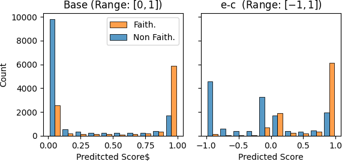

# With a Little Push, NLI Models can Robustly and Efficiently Predict Faithfulness

###### Abstract

Conditional language models still generate unfaithful output that is not supported by their input. These unfaithful generations jeopardize trust in real-world applications such as summarization or human-machine interaction, motivating a need for automatic faithfulness metrics. To implement such metrics, NLI models seem attractive, since they solve a strongly related task that comes with a wealth of prior research and data. But recent research suggests that NLI models require costly additional machinery to perform reliably across datasets, e.g., by running inference on a cartesian product of input and generated sentences, or supporting them with a question-generation/answering step.  

In this work we show that pure NLI models can outperform more complex metrics when combining task-adaptive data augmentation with robust inference procedures. We propose: (1) Augmenting NLI training data to adapt NL inferences to the specificities of faithfulness prediction in dialogue; (2) Making use of both entailment and contradiction probabilities in NLI, and (3) Using Monte-Carlo dropout during inference. Applied to the TRUE benchmark, which combines faithfulness datasets across diverse domains and tasks, our approach strongly improves a vanilla NLI model and significantly outperforms previous work, while showing favourable computational cost.  

## 1 Introduction

Conditional language models suffer from a tendency to hallucinate information Maynez et al. ([2020](#bib.bib18)), resulting in generations that are not faithful to their input documents, which limits the trustworthiness of such models. This raises a need for automatic faithfulness metrics. In this context, models trained on natural language inference (NLI) (Bowman et al., [2015](#bib.bib1)) are attractive since, intuitively, a generation being faithful implies it must be entailed by the source (Falke et al., [2019](#bib.bib6)).  

However, pure NLI models have seen mixed success in faithfulness evaluation (Falke et al., [2019](#bib.bib6); Kryscinski et al., [2020](#bib.bib14); Wang et al., [2020](#bib.bib29); Maynez et al., [2020](#bib.bib18)). While in recent evaluation on the TRUE benchmark (Honovich et al., [2022](#bib.bib12)), which contains datasets from knowledge-grounded dialogue, summarization and paraphrasing, NLI-derived metrics perform best overall, they require impractically large models, or costly additional machinery such as question generation and answering models at inference, while still showing robustness issues. Thus we ask: What is still needed for pure NLI models to perform robustly across faithfulness datasets – while remaining cheap enough to serve as a lean and practical evaluation tool?  

We enhance a relatively small NLI model to make it work robustly across tasks in three ways:  

Task-Adaptive Data Augmentation. In NLI, a hypothesis must be fully entailed by its supporting premise. However, in faithfulness, not all parts of the generation always need to be grounded. We identify an instance of this phenomenon in dialogue where parts of a turn can fulfill communicative functions such as hedging or establishing emotional connection and are often disregarded in faithfulness annotation. Hence, when applying NLI models to complete dialogue turns that may include statements irrelevant for grounding, we run a risk of producing incorrect unfaithfulness predictions.   

To alleviate this issue, we propose a simple data augmentation method to adapt NLI models to genres where they need to be aware of statements that must be exempt from NLI-based faithfulness evaluation. Our approach is computationally attractive, as it avoids an increase of cost at inference time.   

Integration of NLI Contradiction Scores. Existing NLI faithfulness metrics typically use the entailment score for their predictions (Honovich et al., [2022](#bib.bib12); Falke et al., [2019](#bib.bib6); Kryscinski et al., [2020](#bib.bib14)). However, Chen and Eger ([2022](#bib.bib2)) show that subtracting the contradiction score from the entailment score (referred to as $e$-$c$ ) can improve NLI performance in certain evaluation tasks. We show that there also is a strong positive effect of $e$-$c$ for faithfulness prediction, and demonstrate that this is due to a high contradiction probability being a more reliable predictor of unfaithfulness than low entailment probability.  

Monte-Carlo Dropout Inference. Applying NLI models to faithfulness prediction involves a domain shift from largely human-written data to automatically generated text. To make NLI model scores more robust under this shift, we propose to use Monte-Carlo dropout during inference (Srivastava et al., [2014](#bib.bib25)). This essentially creates a cheap ensemble and has been shown to deal better with noisy labels (Goel and Chen, [2021](#bib.bib7)). This approach leads to consistent score improvements in our tasks.  

The combination of all modifications not only strongly improves over a baseline NLI model, but also outperforms all other metrics on TRUE, on average, while being cheaper and smaller.111All code is available at <https://github.com/julmaxi/with_a_little_push>  

## 2 Method Details

### 2.1 Task-adaptive Data Augmentation

To illustrate that task requirements can be incompatible between faithfulness and NLI, consider the following instance from the Q2 dialogue corpus (Honovich et al., [2021](#bib.bib13)) that is labelled as faithful:  

> Grounding: American pancakes are similar to Scotch pancakes or drop scones.    Generation: yes , i love american pancakes , they are like scotch pancakes

From an NLI perspective, the generation is clearly not entailed, since the statement “I love american pancakes” is not supported by the input.  

To better prepare an NLI system for such genre or task-specific cases, we manually curate a small list of statements that should not influence the faithfulness prediction. We augment NLI data from the ANLI corpus (Nie et al., [2020](#bib.bib19)) by adding a randomly chosen phrase from this set to each instance, while preserving the label. We then train an already fine-tuned NLI model on a concatenation of these augmented samples and original ANLI data. For training details see Appendix [A](#A1 "Appendix A Augmentation Training Details ‣ With a Little Push, NLI Models can Robustly and Efficiently Predict Faithfulness").  

### 2.2 Monte-Carlo Dropout

To compute scores under Monte-Carlo dropout, we randomly sample $k$ dropout masks and compute the average of the model predictions. We set $k=15$, since preliminary experiments showed that performance did not profit from additional samples.  

[TABLE S2.T1]

<table class="ltx_tabular ltx_guessed_headers ltx_align_middle">
<tbody class="ltx_tbody">
<tr class="ltx_tr">
<th class="ltx_td ltx_align_left ltx_th ltx_th_row ltx_border_l ltx_border_r ltx_border_t">Method</th>
<td class="ltx_td ltx_align_center ltx_border_r ltx_border_t">Q2</td>
<td class="ltx_td ltx_align_center ltx_border_r ltx_border_t">SummacZS</td>
<td class="ltx_td ltx_align_center ltx_border_rr ltx_border_t">T5 ANLI</td>
<td class="ltx_td ltx_align_center ltx_border_r ltx_border_t">Base</td>
<td class="ltx_td ltx_align_center ltx_border_r ltx_border_t">-MC</td>
<td class="ltx_td ltx_align_center ltx_border_rr ltx_border_t">All</td>
<td class="ltx_td ltx_align_center ltx_border_r ltx_border_t">Eorig</td>
<td class="ltx_td ltx_align_center ltx_border_r ltx_border_t">Eour</td>
</tr>
<tr class="ltx_tr">
<th class="ltx_td ltx_align_left ltx_th ltx_th_row ltx_border_l ltx_border_r ltx_border_t">Summarization</th>
</tr>
<tr class="ltx_tr">
<th class="ltx_td ltx_align_left ltx_th ltx_th_row ltx_border_l ltx_border_r ltx_border_t">Frank</th>
<td class="ltx_td ltx_align_center ltx_border_r ltx_border_t">
<math class="ltx_Math"><semantics><msub><mi></mi><mtext>85.4</mtext></msub><annotation-xml><apply><ci><mtext>85.4</mtext></ci></apply></annotation-xml><annotation>{}_{\text{85.4}}</annotation></semantics></math>87.8<math class="ltx_Math"><semantics><msub><mi></mi><mtext>90.0</mtext></msub><annotation-xml><apply><ci><mtext>90.0</mtext></ci></apply></annotation-xml><annotation>{}_{\text{90.0}}</annotation></semantics></math>
</td>
<td class="ltx_td ltx_align_center ltx_border_r ltx_border_t">
<math class="ltx_Math"><semantics><msub><mi></mi><mtext>86.7</mtext></msub><annotation-xml><apply><ci><mtext>86.7</mtext></ci></apply></annotation-xml><annotation>{}_{\text{86.7}}</annotation></semantics></math>89.1<math class="ltx_Math"><semantics><msub><mi></mi><mtext>91.1</mtext></msub><annotation-xml><apply><ci><mtext>91.1</mtext></ci></apply></annotation-xml><annotation>{}_{\text{91.1}}</annotation></semantics></math>
</td>
<td class="ltx_td ltx_align_center ltx_border_rr ltx_border_t">
<math class="ltx_Math"><semantics><msub><mi></mi><mtext>87.3</mtext></msub><annotation-xml><apply><ci><mtext>87.3</mtext></ci></apply></annotation-xml><annotation>{}_{\text{87.3}}</annotation></semantics></math>89.4<math class="ltx_Math"><semantics><msub><mi></mi><mtext>91.2</mtext></msub><annotation-xml><apply><ci><mtext>91.2</mtext></ci></apply></annotation-xml><annotation>{}_{\text{91.2}}</annotation></semantics></math>
</td>
<td class="ltx_td ltx_align_center ltx_border_r ltx_border_t">
<math class="ltx_Math"><semantics><msub><mi></mi><mtext>83.1</mtext></msub><annotation-xml><apply><ci><mtext>83.1</mtext></ci></apply></annotation-xml><annotation>{}_{\text{83.1}}</annotation></semantics></math>85.6<math class="ltx_Math"><semantics><msub><mi></mi><mtext>88.0</mtext></msub><annotation-xml><apply><ci><mtext>88.0</mtext></ci></apply></annotation-xml><annotation>{}_{\text{88.0}}</annotation></semantics></math>
</td>
<td class="ltx_td ltx_align_center ltx_border_r ltx_border_t">
<math class="ltx_Math"><semantics><msub><mi></mi><mtext>84.2</mtext></msub><annotation-xml><apply><ci><mtext>84.2</mtext></ci></apply></annotation-xml><annotation>{}_{\text{84.2}}</annotation></semantics></math>86.6<math class="ltx_Math"><semantics><mmultiscripts><mi></mi><mprescripts></mprescripts><mtext>88.9</mtext><mrow></mrow><mrow></mrow><mo>†</mo></mmultiscripts><annotation-xml><apply><csymbol>subscript</csymbol><apply><csymbol>superscript</csymbol><csymbol>absent</csymbol><ci>†</ci></apply><ci><mtext>88.9</mtext></ci></apply></annotation-xml><annotation>{}^{\dagger}_{\text{88.9}}</annotation></semantics></math>
</td>
<td class="ltx_td ltx_align_center ltx_border_rr ltx_border_t">
<math class="ltx_Math"><semantics><msub><mi></mi><mtext>85.5</mtext></msub><annotation-xml><apply><ci><mtext>85.5</mtext></ci></apply></annotation-xml><annotation>{}_{\text{85.5}}</annotation></semantics></math>87.7<math class="ltx_Math"><semantics><mmultiscripts><mi></mi><mprescripts></mprescripts><mtext>89.8</mtext><mrow></mrow><mrow></mrow><mo>†</mo></mmultiscripts><annotation-xml><apply><csymbol>subscript</csymbol><apply><csymbol>superscript</csymbol><csymbol>absent</csymbol><ci>†</ci></apply><ci><mtext>89.8</mtext></ci></apply></annotation-xml><annotation>{}^{\dagger}_{\text{89.8}}</annotation></semantics></math>
</td>
<td class="ltx_td ltx_align_center ltx_border_r ltx_border_t">
<math class="ltx_Math"><semantics><msub><mi></mi><mtext>89.4</mtext></msub><annotation-xml><apply><ci><mtext>89.4</mtext></ci></apply></annotation-xml><annotation>{}_{\text{89.4}}</annotation></semantics></math>91.2<math class="ltx_Math"><semantics><msub><mi></mi><mtext>93.0</mtext></msub><annotation-xml><apply><ci><mtext>93.0</mtext></ci></apply></annotation-xml><annotation>{}_{\text{93.0}}</annotation></semantics></math>
</td>
<td class="ltx_td ltx_align_center ltx_border_r ltx_border_t">
<math class="ltx_Math"><semantics><msub><mi></mi><mtext>89.7</mtext></msub><annotation-xml><apply><ci><mtext>89.7</mtext></ci></apply></annotation-xml><annotation>{}_{\text{89.7}}</annotation></semantics></math>91.5<math class="ltx_Math"><semantics><msub><mi></mi><mtext>93.2</mtext></msub><annotation-xml><apply><ci><mtext>93.2</mtext></ci></apply></annotation-xml><annotation>{}_{\text{93.2}}</annotation></semantics></math>
</td>
</tr>
<tr class="ltx_tr">
<th class="ltx_td ltx_align_left ltx_th ltx_th_row ltx_border_l ltx_border_r">MNBM</th>
<td class="ltx_td ltx_align_center ltx_border_r">
<math class="ltx_Math"><semantics><msub><mi></mi><mtext>65.6</mtext></msub><annotation-xml><apply><ci><mtext>65.6</mtext></ci></apply></annotation-xml><annotation>{}_{\text{65.6}}</annotation></semantics></math>68.7<math class="ltx_Math"><semantics><msub><mi></mi><mtext>71.7</mtext></msub><annotation-xml><apply><ci><mtext>71.7</mtext></ci></apply></annotation-xml><annotation>{}_{\text{71.7}}</annotation></semantics></math>
</td>
<td class="ltx_td ltx_align_center ltx_border_r">
<math class="ltx_Math"><semantics><msub><mi></mi><mtext>68.6</mtext></msub><annotation-xml><apply><ci><mtext>68.6</mtext></ci></apply></annotation-xml><annotation>{}_{\text{68.6}}</annotation></semantics></math>71.3<math class="ltx_Math"><semantics><msub><mi></mi><mtext>74.1</mtext></msub><annotation-xml><apply><ci><mtext>74.1</mtext></ci></apply></annotation-xml><annotation>{}_{\text{74.1}}</annotation></semantics></math>
</td>
<td class="ltx_td ltx_align_center ltx_border_rr">
<math class="ltx_Math"><semantics><msub><mi></mi><mtext>75.5</mtext></msub><annotation-xml><apply><ci><mtext>75.5</mtext></ci></apply></annotation-xml><annotation>{}_{\text{75.5}}</annotation></semantics></math>77.9<math class="ltx_Math"><semantics><msub><mi></mi><mtext>80.2</mtext></msub><annotation-xml><apply><ci><mtext>80.2</mtext></ci></apply></annotation-xml><annotation>{}_{\text{80.2}}</annotation></semantics></math>
</td>
<td class="ltx_td ltx_align_center ltx_border_r">
<math class="ltx_Math"><semantics><msub><mi></mi><mtext>71.7</mtext></msub><annotation-xml><apply><ci><mtext>71.7</mtext></ci></apply></annotation-xml><annotation>{}_{\text{71.7}}</annotation></semantics></math>74.6<math class="ltx_Math"><semantics><msub><mi></mi><mtext>77.4</mtext></msub><annotation-xml><apply><ci><mtext>77.4</mtext></ci></apply></annotation-xml><annotation>{}_{\text{77.4}}</annotation></semantics></math>
</td>
<td class="ltx_td ltx_align_center ltx_border_r">
<math class="ltx_Math"><semantics><msub><mi></mi><mtext>70.1</mtext></msub><annotation-xml><apply><ci><mtext>70.1</mtext></ci></apply></annotation-xml><annotation>{}_{\text{70.1}}</annotation></semantics></math>73.5<math class="ltx_Math"><semantics><msub><mi></mi><mtext>76.6</mtext></msub><annotation-xml><apply><ci><mtext>76.6</mtext></ci></apply></annotation-xml><annotation>{}_{\text{76.6}}</annotation></semantics></math>
</td>
<td class="ltx_td ltx_align_center ltx_border_rr">
<math class="ltx_Math"><semantics><msub><mi></mi><mtext>71.3</mtext></msub><annotation-xml><apply><ci><mtext>71.3</mtext></ci></apply></annotation-xml><annotation>{}_{\text{71.3}}</annotation></semantics></math>74.5<math class="ltx_Math"><semantics><msub><mi></mi><mtext>77.4</mtext></msub><annotation-xml><apply><ci><mtext>77.4</mtext></ci></apply></annotation-xml><annotation>{}_{\text{77.4}}</annotation></semantics></math>
</td>
<td class="ltx_td ltx_align_center ltx_border_r">
<math class="ltx_Math"><semantics><msub><mi></mi><mtext>74.0</mtext></msub><annotation-xml><apply><ci><mtext>74.0</mtext></ci></apply></annotation-xml><annotation>{}_{\text{74.0}}</annotation></semantics></math>76.6<math class="ltx_Math"><semantics><msub><mi></mi><mtext>79.4</mtext></msub><annotation-xml><apply><ci><mtext>79.4</mtext></ci></apply></annotation-xml><annotation>{}_{\text{79.4}}</annotation></semantics></math>
</td>
<td class="ltx_td ltx_align_center ltx_border_r">
<math class="ltx_Math"><semantics><msub><mi></mi><mtext>73.6</mtext></msub><annotation-xml><apply><ci><mtext>73.6</mtext></ci></apply></annotation-xml><annotation>{}_{\text{73.6}}</annotation></semantics></math>76.4<math class="ltx_Math"><semantics><msub><mi></mi><mtext>79.2</mtext></msub><annotation-xml><apply><ci><mtext>79.2</mtext></ci></apply></annotation-xml><annotation>{}_{\text{79.2}}</annotation></semantics></math>
</td>
</tr>
<tr class="ltx_tr">
<th class="ltx_td ltx_align_left ltx_th ltx_th_row ltx_border_l ltx_border_r">SummEval</th>
<td class="ltx_td ltx_align_center ltx_border_r">
<math class="ltx_Math"><semantics><msub><mi></mi><mtext>75.9</mtext></msub><annotation-xml><apply><ci><mtext>75.9</mtext></ci></apply></annotation-xml><annotation>{}_{\text{75.9}}</annotation></semantics></math>78.8<math class="ltx_Math"><semantics><msub><mi></mi><mtext>81.4</mtext></msub><annotation-xml><apply><ci><mtext>81.4</mtext></ci></apply></annotation-xml><annotation>{}_{\text{81.4}}</annotation></semantics></math>
</td>
<td class="ltx_td ltx_align_center ltx_border_r">
<math class="ltx_Math"><semantics><msub><mi></mi><mtext>79.4</mtext></msub><annotation-xml><apply><ci><mtext>79.4</mtext></ci></apply></annotation-xml><annotation>{}_{\text{79.4}}</annotation></semantics></math>81.7<math class="ltx_Math"><semantics><msub><mi></mi><mtext>83.9</mtext></msub><annotation-xml><apply><ci><mtext>83.9</mtext></ci></apply></annotation-xml><annotation>{}_{\text{83.9}}</annotation></semantics></math>
</td>
<td class="ltx_td ltx_align_center ltx_border_rr">
<math class="ltx_Math"><semantics><msub><mi></mi><mtext>78.0</mtext></msub><annotation-xml><apply><ci><mtext>78.0</mtext></ci></apply></annotation-xml><annotation>{}_{\text{78.0}}</annotation></semantics></math>80.5<math class="ltx_Math"><semantics><msub><mi></mi><mtext>83.0</mtext></msub><annotation-xml><apply><ci><mtext>83.0</mtext></ci></apply></annotation-xml><annotation>{}_{\text{83.0}}</annotation></semantics></math>
</td>
<td class="ltx_td ltx_align_center ltx_border_r">
<math class="ltx_Math"><semantics><msub><mi></mi><mtext>69.6</mtext></msub><annotation-xml><apply><ci><mtext>69.6</mtext></ci></apply></annotation-xml><annotation>{}_{\text{69.6}}</annotation></semantics></math>72.8<math class="ltx_Math"><semantics><msub><mi></mi><mtext>75.8</mtext></msub><annotation-xml><apply><ci><mtext>75.8</mtext></ci></apply></annotation-xml><annotation>{}_{\text{75.8}}</annotation></semantics></math>
</td>
<td class="ltx_td ltx_align_center ltx_border_r">
<math class="ltx_Math"><semantics><msub><mi></mi><mtext>72.3</mtext></msub><annotation-xml><apply><ci><mtext>72.3</mtext></ci></apply></annotation-xml><annotation>{}_{\text{72.3}}</annotation></semantics></math>75.2<math class="ltx_Math"><semantics><mmultiscripts><mi></mi><mprescripts></mprescripts><mtext>78.1</mtext><mrow></mrow><mrow></mrow><mo>†</mo></mmultiscripts><annotation-xml><apply><csymbol>subscript</csymbol><apply><csymbol>superscript</csymbol><csymbol>absent</csymbol><ci>†</ci></apply><ci><mtext>78.1</mtext></ci></apply></annotation-xml><annotation>{}^{\dagger}_{\text{78.1}}</annotation></semantics></math>
</td>
<td class="ltx_td ltx_align_center ltx_border_rr">
<math class="ltx_Math"><semantics><msub><mi></mi><mtext>73.2</mtext></msub><annotation-xml><apply><ci><mtext>73.2</mtext></ci></apply></annotation-xml><annotation>{}_{\text{73.2}}</annotation></semantics></math>76.1<math class="ltx_Math"><semantics><mmultiscripts><mi></mi><mprescripts></mprescripts><mtext>78.8</mtext><mrow></mrow><mrow></mrow><mo>†</mo></mmultiscripts><annotation-xml><apply><csymbol>subscript</csymbol><apply><csymbol>superscript</csymbol><csymbol>absent</csymbol><ci>†</ci></apply><ci><mtext>78.8</mtext></ci></apply></annotation-xml><annotation>{}^{\dagger}_{\text{78.8}}</annotation></semantics></math>
</td>
<td class="ltx_td ltx_align_center ltx_border_r">
<math class="ltx_Math"><semantics><msub><mi></mi><mtext>80.4</mtext></msub><annotation-xml><apply><ci><mtext>80.4</mtext></ci></apply></annotation-xml><annotation>{}_{\text{80.4}}</annotation></semantics></math>82.9<math class="ltx_Math"><semantics><msub><mi></mi><mtext>85.4</mtext></msub><annotation-xml><apply><ci><mtext>85.4</mtext></ci></apply></annotation-xml><annotation>{}_{\text{85.4}}</annotation></semantics></math>
</td>
<td class="ltx_td ltx_align_center ltx_border_r">
<math class="ltx_Math"><semantics><msub><mi></mi><mtext>80.3</mtext></msub><annotation-xml><apply><ci><mtext>80.3</mtext></ci></apply></annotation-xml><annotation>{}_{\text{80.3}}</annotation></semantics></math>83.0<math class="ltx_Math"><semantics><msub><mi></mi><mtext>85.3</mtext></msub><annotation-xml><apply><ci><mtext>85.3</mtext></ci></apply></annotation-xml><annotation>{}_{\text{85.3}}</annotation></semantics></math>
</td>
</tr>
<tr class="ltx_tr">
<th class="ltx_td ltx_align_left ltx_th ltx_th_row ltx_border_l ltx_border_r">QAGS-X</th>
<td class="ltx_td ltx_align_center ltx_border_r">
<math class="ltx_Math"><semantics><msub><mi></mi><mtext>65.5</mtext></msub><annotation-xml><apply><ci><mtext>65.5</mtext></ci></apply></annotation-xml><annotation>{}_{\text{65.5}}</annotation></semantics></math>70.9<math class="ltx_Math"><semantics><msub><mi></mi><mtext>76.2</mtext></msub><annotation-xml><apply><ci><mtext>76.2</mtext></ci></apply></annotation-xml><annotation>{}_{\text{76.2}}</annotation></semantics></math>
</td>
<td class="ltx_td ltx_align_center ltx_border_r">
<math class="ltx_Math"><semantics><msub><mi></mi><mtext>73.1</mtext></msub><annotation-xml><apply><ci><mtext>73.1</mtext></ci></apply></annotation-xml><annotation>{}_{\text{73.1}}</annotation></semantics></math>78.1<math class="ltx_Math"><semantics><msub><mi></mi><mtext>82.9</mtext></msub><annotation-xml><apply><ci><mtext>82.9</mtext></ci></apply></annotation-xml><annotation>{}_{\text{82.9}}</annotation></semantics></math>
</td>
<td class="ltx_td ltx_align_center ltx_border_rr">
<math class="ltx_Math"><semantics><msub><mi></mi><mtext>79.5</mtext></msub><annotation-xml><apply><ci><mtext>79.5</mtext></ci></apply></annotation-xml><annotation>{}_{\text{79.5}}</annotation></semantics></math>83.8<math class="ltx_Math"><semantics><msub><mi></mi><mtext>88.2</mtext></msub><annotation-xml><apply><ci><mtext>88.2</mtext></ci></apply></annotation-xml><annotation>{}_{\text{88.2}}</annotation></semantics></math>
</td>
<td class="ltx_td ltx_align_center ltx_border_r">
<math class="ltx_Math"><semantics><msub><mi></mi><mtext>76.9</mtext></msub><annotation-xml><apply><ci><mtext>76.9</mtext></ci></apply></annotation-xml><annotation>{}_{\text{76.9}}</annotation></semantics></math>81.6<math class="ltx_Math"><semantics><msub><mi></mi><mtext>86.5</mtext></msub><annotation-xml><apply><ci><mtext>86.5</mtext></ci></apply></annotation-xml><annotation>{}_{\text{86.5}}</annotation></semantics></math>
</td>
<td class="ltx_td ltx_align_center ltx_border_r">
<math class="ltx_Math"><semantics><msub><mi></mi><mtext>77.7</mtext></msub><annotation-xml><apply><ci><mtext>77.7</mtext></ci></apply></annotation-xml><annotation>{}_{\text{77.7}}</annotation></semantics></math>82.2<math class="ltx_Math"><semantics><msub><mi></mi><mtext>86.8</mtext></msub><annotation-xml><apply><ci><mtext>86.8</mtext></ci></apply></annotation-xml><annotation>{}_{\text{86.8}}</annotation></semantics></math>
</td>
<td class="ltx_td ltx_align_center ltx_border_rr">
<math class="ltx_Math"><semantics><msub><mi></mi><mtext>76.3</mtext></msub><annotation-xml><apply><ci><mtext>76.3</mtext></ci></apply></annotation-xml><annotation>{}_{\text{76.3}}</annotation></semantics></math>81.1<math class="ltx_Math"><semantics><msub><mi></mi><mtext>85.4</mtext></msub><annotation-xml><apply><ci><mtext>85.4</mtext></ci></apply></annotation-xml><annotation>{}_{\text{85.4}}</annotation></semantics></math>
</td>
<td class="ltx_td ltx_align_center ltx_border_r">
<math class="ltx_Math"><semantics><msub><mi></mi><mtext>80.4</mtext></msub><annotation-xml><apply><ci><mtext>80.4</mtext></ci></apply></annotation-xml><annotation>{}_{\text{80.4}}</annotation></semantics></math>84.8<math class="ltx_Math"><semantics><msub><mi></mi><mtext>88.9</mtext></msub><annotation-xml><apply><ci><mtext>88.9</mtext></ci></apply></annotation-xml><annotation>{}_{\text{88.9}}</annotation></semantics></math>
</td>
<td class="ltx_td ltx_align_center ltx_border_r">
<math class="ltx_Math"><semantics><msub><mi></mi><mtext>79.4</mtext></msub><annotation-xml><apply><ci><mtext>79.4</mtext></ci></apply></annotation-xml><annotation>{}_{\text{79.4}}</annotation></semantics></math>83.8<math class="ltx_Math"><semantics><msub><mi></mi><mtext>88.0</mtext></msub><annotation-xml><apply><ci><mtext>88.0</mtext></ci></apply></annotation-xml><annotation>{}_{\text{88.0}}</annotation></semantics></math>
</td>
</tr>
<tr class="ltx_tr">
<th class="ltx_td ltx_align_left ltx_th ltx_th_row ltx_border_l ltx_border_r">QAGS-C</th>
<td class="ltx_td ltx_align_center ltx_border_r">
<math class="ltx_Math"><semantics><msub><mi></mi><mtext>79.1</mtext></msub><annotation-xml><apply><ci><mtext>79.1</mtext></ci></apply></annotation-xml><annotation>{}_{\text{79.1}}</annotation></semantics></math>83.5<math class="ltx_Math"><semantics><msub><mi></mi><mtext>87.9</mtext></msub><annotation-xml><apply><ci><mtext>87.9</mtext></ci></apply></annotation-xml><annotation>{}_{\text{87.9}}</annotation></semantics></math>
</td>
<td class="ltx_td ltx_align_center ltx_border_r">
<math class="ltx_Math"><semantics><msub><mi></mi><mtext>76.3</mtext></msub><annotation-xml><apply><ci><mtext>76.3</mtext></ci></apply></annotation-xml><annotation>{}_{\text{76.3}}</annotation></semantics></math>80.9<math class="ltx_Math"><semantics><msub><mi></mi><mtext>85.2</mtext></msub><annotation-xml><apply><ci><mtext>85.2</mtext></ci></apply></annotation-xml><annotation>{}_{\text{85.2}}</annotation></semantics></math>
</td>
<td class="ltx_td ltx_align_center ltx_border_rr">
<math class="ltx_Math"><semantics><msub><mi></mi><mtext>77.5</mtext></msub><annotation-xml><apply><ci><mtext>77.5</mtext></ci></apply></annotation-xml><annotation>{}_{\text{77.5}}</annotation></semantics></math>82.1<math class="ltx_Math"><semantics><msub><mi></mi><mtext>86.7</mtext></msub><annotation-xml><apply><ci><mtext>86.7</mtext></ci></apply></annotation-xml><annotation>{}_{\text{86.7}}</annotation></semantics></math>
</td>
<td class="ltx_td ltx_align_center ltx_border_r">
<math class="ltx_Math"><semantics><msub><mi></mi><mtext>68.7</mtext></msub><annotation-xml><apply><ci><mtext>68.7</mtext></ci></apply></annotation-xml><annotation>{}_{\text{68.7}}</annotation></semantics></math>74.1<math class="ltx_Math"><semantics><msub><mi></mi><mtext>79.3</mtext></msub><annotation-xml><apply><ci><mtext>79.3</mtext></ci></apply></annotation-xml><annotation>{}_{\text{79.3}}</annotation></semantics></math>
</td>
<td class="ltx_td ltx_align_center ltx_border_r">
<math class="ltx_Math"><semantics><msub><mi></mi><mtext>73.0</mtext></msub><annotation-xml><apply><ci><mtext>73.0</mtext></ci></apply></annotation-xml><annotation>{}_{\text{73.0}}</annotation></semantics></math>78.4<math class="ltx_Math"><semantics><mmultiscripts><mi></mi><mprescripts></mprescripts><mtext>82.9</mtext><mrow></mrow><mrow></mrow><mo>†</mo></mmultiscripts><annotation-xml><apply><csymbol>subscript</csymbol><apply><csymbol>superscript</csymbol><csymbol>absent</csymbol><ci>†</ci></apply><ci><mtext>82.9</mtext></ci></apply></annotation-xml><annotation>{}^{\dagger}_{\text{82.9}}</annotation></semantics></math>
</td>
<td class="ltx_td ltx_align_center ltx_border_rr">
<math class="ltx_Math"><semantics><msub><mi></mi><mtext>73.2</mtext></msub><annotation-xml><apply><ci><mtext>73.2</mtext></ci></apply></annotation-xml><annotation>{}_{\text{73.2}}</annotation></semantics></math>78.0<math class="ltx_Math"><semantics><mmultiscripts><mi></mi><mprescripts></mprescripts><mtext>82.9</mtext><mrow></mrow><mrow></mrow><mo>†</mo></mmultiscripts><annotation-xml><apply><csymbol>subscript</csymbol><apply><csymbol>superscript</csymbol><csymbol>absent</csymbol><ci>†</ci></apply><ci><mtext>82.9</mtext></ci></apply></annotation-xml><annotation>{}^{\dagger}_{\text{82.9}}</annotation></semantics></math>
</td>
<td class="ltx_td ltx_align_center ltx_border_r">
<math class="ltx_Math"><semantics><msub><mi></mi><mtext>83.5</mtext></msub><annotation-xml><apply><ci><mtext>83.5</mtext></ci></apply></annotation-xml><annotation>{}_{\text{83.5}}</annotation></semantics></math>87.7<math class="ltx_Math"><semantics><msub><mi></mi><mtext>91.3</mtext></msub><annotation-xml><apply><ci><mtext>91.3</mtext></ci></apply></annotation-xml><annotation>{}_{\text{91.3}}</annotation></semantics></math>
</td>
<td class="ltx_td ltx_align_center ltx_border_r">
<math class="ltx_Math"><semantics><msub><mi></mi><mtext>83.1</mtext></msub><annotation-xml><apply><ci><mtext>83.1</mtext></ci></apply></annotation-xml><annotation>{}_{\text{83.1}}</annotation></semantics></math>86.7<math class="ltx_Math"><semantics><msub><mi></mi><mtext>90.3</mtext></msub><annotation-xml><apply><ci><mtext>90.3</mtext></ci></apply></annotation-xml><annotation>{}_{\text{90.3}}</annotation></semantics></math>
</td>
</tr>
<tr class="ltx_tr">
<th class="ltx_td ltx_align_left ltx_th ltx_th_row ltx_border_l ltx_border_r ltx_border_t">Dialogue</th>
</tr>
<tr class="ltx_tr">
<th class="ltx_td ltx_align_left ltx_th ltx_th_row ltx_border_l ltx_border_r ltx_border_t">BEGIN</th>
<td class="ltx_td ltx_align_center ltx_border_r ltx_border_t">
<math class="ltx_Math"><semantics><msub><mi></mi><mtext>77.2</mtext></msub><annotation-xml><apply><ci><mtext>77.2</mtext></ci></apply></annotation-xml><annotation>{}_{\text{77.2}}</annotation></semantics></math>79.7<math class="ltx_Math"><semantics><msub><mi></mi><mtext>82.2</mtext></msub><annotation-xml><apply><ci><mtext>82.2</mtext></ci></apply></annotation-xml><annotation>{}_{\text{82.2}}</annotation></semantics></math>
</td>
<td class="ltx_td ltx_align_center ltx_border_r ltx_border_t">
<math class="ltx_Math"><semantics><msub><mi></mi><mtext>79.2</mtext></msub><annotation-xml><apply><ci><mtext>79.2</mtext></ci></apply></annotation-xml><annotation>{}_{\text{79.2}}</annotation></semantics></math>82.0<math class="ltx_Math"><semantics><msub><mi></mi><mtext>84.6</mtext></msub><annotation-xml><apply><ci><mtext>84.6</mtext></ci></apply></annotation-xml><annotation>{}_{\text{84.6}}</annotation></semantics></math>
</td>
<td class="ltx_td ltx_align_center ltx_border_rr ltx_border_t">
<math class="ltx_Math"><semantics><msub><mi></mi><mtext>80.3</mtext></msub><annotation-xml><apply><ci><mtext>80.3</mtext></ci></apply></annotation-xml><annotation>{}_{\text{80.3}}</annotation></semantics></math>82.6<math class="ltx_Math"><semantics><msub><mi></mi><mtext>85.1</mtext></msub><annotation-xml><apply><ci><mtext>85.1</mtext></ci></apply></annotation-xml><annotation>{}_{\text{85.1}}</annotation></semantics></math>
</td>
<td class="ltx_td ltx_align_center ltx_border_r ltx_border_t">
<math class="ltx_Math"><semantics><msub><mi></mi><mtext>77.5</mtext></msub><annotation-xml><apply><ci><mtext>77.5</mtext></ci></apply></annotation-xml><annotation>{}_{\text{77.5}}</annotation></semantics></math>80.4<math class="ltx_Math"><semantics><msub><mi></mi><mtext>82.9</mtext></msub><annotation-xml><apply><ci><mtext>82.9</mtext></ci></apply></annotation-xml><annotation>{}_{\text{82.9}}</annotation></semantics></math>
</td>
<td class="ltx_td ltx_align_center ltx_border_r ltx_border_t">
<math class="ltx_Math"><semantics><msub><mi></mi><mtext>75.7</mtext></msub><annotation-xml><apply><ci><mtext>75.7</mtext></ci></apply></annotation-xml><annotation>{}_{\text{75.7}}</annotation></semantics></math>78.5<math class="ltx_Math"><semantics><msub><mi></mi><mtext>81.4</mtext></msub><annotation-xml><apply><ci><mtext>81.4</mtext></ci></apply></annotation-xml><annotation>{}_{\text{81.4}}</annotation></semantics></math>
</td>
<td class="ltx_td ltx_align_center ltx_border_rr ltx_border_t">
<math class="ltx_Math"><semantics><msub><mi></mi><mtext>76.4</mtext></msub><annotation-xml><apply><ci><mtext>76.4</mtext></ci></apply></annotation-xml><annotation>{}_{\text{76.4}}</annotation></semantics></math>79.3<math class="ltx_Math"><semantics><msub><mi></mi><mtext>82.3</mtext></msub><annotation-xml><apply><ci><mtext>82.3</mtext></ci></apply></annotation-xml><annotation>{}_{\text{82.3}}</annotation></semantics></math>
</td>
<td class="ltx_td ltx_align_center ltx_border_r ltx_border_t">
<math class="ltx_Math"><semantics><msub><mi></mi><mtext>84.1</mtext></msub><annotation-xml><apply><ci><mtext>84.1</mtext></ci></apply></annotation-xml><annotation>{}_{\text{84.1}}</annotation></semantics></math>86.2<math class="ltx_Math"><semantics><msub><mi></mi><mtext>88.2</mtext></msub><annotation-xml><apply><ci><mtext>88.2</mtext></ci></apply></annotation-xml><annotation>{}_{\text{88.2}}</annotation></semantics></math>
</td>
<td class="ltx_td ltx_align_center ltx_border_r ltx_border_t">
<math class="ltx_Math"><semantics><msub><mi></mi><mtext>82.1</mtext></msub><annotation-xml><apply><ci><mtext>82.1</mtext></ci></apply></annotation-xml><annotation>{}_{\text{82.1}}</annotation></semantics></math>84.7<math class="ltx_Math"><semantics><msub><mi></mi><mtext>87.1</mtext></msub><annotation-xml><apply><ci><mtext>87.1</mtext></ci></apply></annotation-xml><annotation>{}_{\text{87.1}}</annotation></semantics></math>
</td>
</tr>
<tr class="ltx_tr">
<th class="ltx_td ltx_align_left ltx_th ltx_th_row ltx_border_l ltx_border_r">DialFact</th>
<td class="ltx_td ltx_align_center ltx_border_r">
<math class="ltx_Math"><semantics><msub><mi></mi><mtext>85.4</mtext></msub><annotation-xml><apply><ci><mtext>85.4</mtext></ci></apply></annotation-xml><annotation>{}_{\text{85.4}}</annotation></semantics></math>86.1<math class="ltx_Math"><semantics><msub><mi></mi><mtext>86.8</mtext></msub><annotation-xml><apply><ci><mtext>86.8</mtext></ci></apply></annotation-xml><annotation>{}_{\text{86.8}}</annotation></semantics></math>
</td>
<td class="ltx_td ltx_align_center ltx_border_r">
<math class="ltx_Math"><semantics><msub><mi></mi><mtext>83.3</mtext></msub><annotation-xml><apply><ci><mtext>83.3</mtext></ci></apply></annotation-xml><annotation>{}_{\text{83.3}}</annotation></semantics></math>84.1<math class="ltx_Math"><semantics><msub><mi></mi><mtext>84.8</mtext></msub><annotation-xml><apply><ci><mtext>84.8</mtext></ci></apply></annotation-xml><annotation>{}_{\text{84.8}}</annotation></semantics></math>
</td>
<td class="ltx_td ltx_align_center ltx_border_rr">
<math class="ltx_Math"><semantics><msub><mi></mi><mtext>76.8</mtext></msub><annotation-xml><apply><ci><mtext>76.8</mtext></ci></apply></annotation-xml><annotation>{}_{\text{76.8}}</annotation></semantics></math>77.7<math class="ltx_Math"><semantics><msub><mi></mi><mtext>78.6</mtext></msub><annotation-xml><apply><ci><mtext>78.6</mtext></ci></apply></annotation-xml><annotation>{}_{\text{78.6}}</annotation></semantics></math>
</td>
<td class="ltx_td ltx_align_center ltx_border_r">
<math class="ltx_Math"><semantics><msub><mi></mi><mtext>81.0</mtext></msub><annotation-xml><apply><ci><mtext>81.0</mtext></ci></apply></annotation-xml><annotation>{}_{\text{81.0}}</annotation></semantics></math>81.8<math class="ltx_Math"><semantics><mmultiscripts><mi></mi><mprescripts></mprescripts><mtext>82.5</mtext><mrow></mrow><mrow></mrow><mo>∗</mo></mmultiscripts><annotation-xml><apply><csymbol>subscript</csymbol><apply><csymbol>superscript</csymbol><csymbol>absent</csymbol><times></times></apply><ci><mtext>82.5</mtext></ci></apply></annotation-xml><annotation>{}^{*}_{\text{82.5}}</annotation></semantics></math>
</td>
<td class="ltx_td ltx_align_center ltx_border_r">
<math class="ltx_Math"><semantics><msub><mi></mi><mtext>91.3</mtext></msub><annotation-xml><apply><ci><mtext>91.3</mtext></ci></apply></annotation-xml><annotation>{}_{\text{91.3}}</annotation></semantics></math>91.8<math class="ltx_Math"><semantics><mmultiscripts><mi></mi><mprescripts></mprescripts><mtext>92.3</mtext><mrow></mrow><mrow></mrow><mrow><mo>∗</mo><mo>⁣</mo><mrow><mi></mi><mo>†</mo><mi>x</mi></mrow></mrow></mmultiscripts><annotation-xml><apply><csymbol>subscript</csymbol><apply><csymbol>superscript</csymbol><csymbol>absent</csymbol><list><times></times><apply><ci>†</ci><csymbol>absent</csymbol><ci>𝑥</ci></apply></list></apply><ci><mtext>92.3</mtext></ci></apply></annotation-xml><annotation>{}^{*{\dagger}x}_{\text{92.3}}</annotation></semantics></math>
</td>
<td class="ltx_td ltx_align_center ltx_border_rr">
<math class="ltx_Math"><semantics><msub><mi></mi><mtext>92.0</mtext></msub><annotation-xml><apply><ci><mtext>92.0</mtext></ci></apply></annotation-xml><annotation>{}_{\text{92.0}}</annotation></semantics></math>92.5<math class="ltx_Math"><semantics><mmultiscripts><mi></mi><mprescripts></mprescripts><mtext>93.0</mtext><mrow></mrow><mrow></mrow><mrow><mo>∗</mo><mo>⁣</mo><mrow><mi></mi><mo>†</mo><mi>x</mi></mrow></mrow></mmultiscripts><annotation-xml><apply><csymbol>subscript</csymbol><apply><csymbol>superscript</csymbol><csymbol>absent</csymbol><list><times></times><apply><ci>†</ci><csymbol>absent</csymbol><ci>𝑥</ci></apply></list></apply><ci><mtext>93.0</mtext></ci></apply></annotation-xml><annotation>{}^{*{\dagger}x}_{\text{93.0}}</annotation></semantics></math>
</td>
<td class="ltx_td ltx_align_center ltx_border_r">
<math class="ltx_Math"><semantics><msub><mi></mi><mtext>89.9</mtext></msub><annotation-xml><apply><ci><mtext>89.9</mtext></ci></apply></annotation-xml><annotation>{}_{\text{89.9}}</annotation></semantics></math>90.4<math class="ltx_Math"><semantics><msub><mi></mi><mtext>91.0</mtext></msub><annotation-xml><apply><ci><mtext>91.0</mtext></ci></apply></annotation-xml><annotation>{}_{\text{91.0}}</annotation></semantics></math>
</td>
<td class="ltx_td ltx_align_center ltx_border_r">
<math class="ltx_Math"><semantics><msub><mi></mi><mtext>94.1</mtext></msub><annotation-xml><apply><ci><mtext>94.1</mtext></ci></apply></annotation-xml><annotation>{}_{\text{94.1}}</annotation></semantics></math>94.5<math class="ltx_Math"><semantics><mmultiscripts><mi></mi><mprescripts></mprescripts><mtext>94.9</mtext><mrow></mrow><mrow></mrow><mi>x</mi></mmultiscripts><annotation-xml><apply><csymbol>subscript</csymbol><apply><csymbol>superscript</csymbol><csymbol>absent</csymbol><ci>𝑥</ci></apply><ci><mtext>94.9</mtext></ci></apply></annotation-xml><annotation>{}^{x}_{\text{94.9}}</annotation></semantics></math>
</td>
</tr>
<tr class="ltx_tr">
<th class="ltx_td ltx_align_left ltx_th ltx_th_row ltx_border_l ltx_border_r">Q2</th>
<td class="ltx_td ltx_align_center ltx_border_r">
<math class="ltx_Math"><semantics><msub><mi></mi><mtext>78.8</mtext></msub><annotation-xml><apply><ci><mtext>78.8</mtext></ci></apply></annotation-xml><annotation>{}_{\text{78.8}}</annotation></semantics></math>80.9<math class="ltx_Math"><semantics><msub><mi></mi><mtext>83.0</mtext></msub><annotation-xml><apply><ci><mtext>83.0</mtext></ci></apply></annotation-xml><annotation>{}_{\text{83.0}}</annotation></semantics></math>
</td>
<td class="ltx_td ltx_align_center ltx_border_r">
<math class="ltx_Math"><semantics><msub><mi></mi><mtext>74.9</mtext></msub><annotation-xml><apply><ci><mtext>74.9</mtext></ci></apply></annotation-xml><annotation>{}_{\text{74.9}}</annotation></semantics></math>77.4<math class="ltx_Math"><semantics><msub><mi></mi><mtext>79.7</mtext></msub><annotation-xml><apply><ci><mtext>79.7</mtext></ci></apply></annotation-xml><annotation>{}_{\text{79.7}}</annotation></semantics></math>
</td>
<td class="ltx_td ltx_align_center ltx_border_rr">
<math class="ltx_Math"><semantics><msub><mi></mi><mtext>70.3</mtext></msub><annotation-xml><apply><ci><mtext>70.3</mtext></ci></apply></annotation-xml><annotation>{}_{\text{70.3}}</annotation></semantics></math>72.7<math class="ltx_Math"><semantics><msub><mi></mi><mtext>75.2</mtext></msub><annotation-xml><apply><ci><mtext>75.2</mtext></ci></apply></annotation-xml><annotation>{}_{\text{75.2}}</annotation></semantics></math>
</td>
<td class="ltx_td ltx_align_center ltx_border_r">
<math class="ltx_Math"><semantics><msub><mi></mi><mtext>77.5</mtext></msub><annotation-xml><apply><ci><mtext>77.5</mtext></ci></apply></annotation-xml><annotation>{}_{\text{77.5}}</annotation></semantics></math>79.8<math class="ltx_Math"><semantics><mmultiscripts><mi></mi><mprescripts></mprescripts><mtext>82.0</mtext><mrow></mrow><mrow></mrow><mo>∗</mo></mmultiscripts><annotation-xml><apply><csymbol>subscript</csymbol><apply><csymbol>superscript</csymbol><csymbol>absent</csymbol><times></times></apply><ci><mtext>82.0</mtext></ci></apply></annotation-xml><annotation>{}^{*}_{\text{82.0}}</annotation></semantics></math>
</td>
<td class="ltx_td ltx_align_center ltx_border_r">
<math class="ltx_Math"><semantics><msub><mi></mi><mtext>87.2</mtext></msub><annotation-xml><apply><ci><mtext>87.2</mtext></ci></apply></annotation-xml><annotation>{}_{\text{87.2}}</annotation></semantics></math>88.8<math class="ltx_Math"><semantics><mmultiscripts><mi></mi><mprescripts></mprescripts><mtext>90.3</mtext><mrow></mrow><mrow></mrow><mrow><mo>∗</mo><mo>⁣</mo><mrow><mi></mi><mo>†</mo><mi>x</mi></mrow></mrow></mmultiscripts><annotation-xml><apply><csymbol>subscript</csymbol><apply><csymbol>superscript</csymbol><csymbol>absent</csymbol><list><times></times><apply><ci>†</ci><csymbol>absent</csymbol><ci>𝑥</ci></apply></list></apply><ci><mtext>90.3</mtext></ci></apply></annotation-xml><annotation>{}^{*{\dagger}x}_{\text{90.3}}</annotation></semantics></math>
</td>
<td class="ltx_td ltx_align_center ltx_border_rr">
<math class="ltx_Math"><semantics><msub><mi></mi><mtext>87.8</mtext></msub><annotation-xml><apply><ci><mtext>87.8</mtext></ci></apply></annotation-xml><annotation>{}_{\text{87.8}}</annotation></semantics></math>89.4<math class="ltx_Math"><semantics><mmultiscripts><mi></mi><mprescripts></mprescripts><mtext>90.9</mtext><mrow></mrow><mrow></mrow><mrow><mo>∗</mo><mo>⁣</mo><mrow><mi></mi><mo>†</mo><mi>x</mi></mrow></mrow></mmultiscripts><annotation-xml><apply><csymbol>subscript</csymbol><apply><csymbol>superscript</csymbol><csymbol>absent</csymbol><list><times></times><apply><ci>†</ci><csymbol>absent</csymbol><ci>𝑥</ci></apply></list></apply><ci><mtext>90.9</mtext></ci></apply></annotation-xml><annotation>{}^{*{\dagger}x}_{\text{90.9}}</annotation></semantics></math>
</td>
<td class="ltx_td ltx_align_center ltx_border_r">
<math class="ltx_Math"><semantics><msub><mi></mi><mtext>80.8</mtext></msub><annotation-xml><apply><ci><mtext>80.8</mtext></ci></apply></annotation-xml><annotation>{}_{\text{80.8}}</annotation></semantics></math>82.8<math class="ltx_Math"><semantics><msub><mi></mi><mtext>84.9</mtext></msub><annotation-xml><apply><ci><mtext>84.9</mtext></ci></apply></annotation-xml><annotation>{}_{\text{84.9}}</annotation></semantics></math>
</td>
<td class="ltx_td ltx_align_center ltx_border_r">
<math class="ltx_Math"><semantics><msub><mi></mi><mtext>86.8</mtext></msub><annotation-xml><apply><ci><mtext>86.8</mtext></ci></apply></annotation-xml><annotation>{}_{\text{86.8}}</annotation></semantics></math>88.5<math class="ltx_Math"><semantics><mmultiscripts><mi></mi><mprescripts></mprescripts><mtext>90.1</mtext><mrow></mrow><mrow></mrow><mi>x</mi></mmultiscripts><annotation-xml><apply><csymbol>subscript</csymbol><apply><csymbol>superscript</csymbol><csymbol>absent</csymbol><ci>𝑥</ci></apply><ci><mtext>90.1</mtext></ci></apply></annotation-xml><annotation>{}^{x}_{\text{90.1}}</annotation></semantics></math>
</td>
</tr>
<tr class="ltx_tr">
<th class="ltx_td ltx_align_left ltx_th ltx_th_row ltx_border_l ltx_border_r ltx_border_t">Paraphrasing</th>
</tr>
<tr class="ltx_tr">
<th class="ltx_td ltx_align_left ltx_th ltx_th_row ltx_border_l ltx_border_r ltx_border_t">PAWS</th>
<td class="ltx_td ltx_align_center ltx_border_r ltx_border_t">
<math class="ltx_Math"><semantics><msub><mi></mi><mtext>89.1</mtext></msub><annotation-xml><apply><ci><mtext>89.1</mtext></ci></apply></annotation-xml><annotation>{}_{\text{89.1}}</annotation></semantics></math>89.7<math class="ltx_Math"><semantics><msub><mi></mi><mtext>90.3</mtext></msub><annotation-xml><apply><ci><mtext>90.3</mtext></ci></apply></annotation-xml><annotation>{}_{\text{90.3}}</annotation></semantics></math>
</td>
<td class="ltx_td ltx_align_center ltx_border_r ltx_border_t">
<math class="ltx_Math"><semantics><msub><mi></mi><mtext>87.5</mtext></msub><annotation-xml><apply><ci><mtext>87.5</mtext></ci></apply></annotation-xml><annotation>{}_{\text{87.5}}</annotation></semantics></math>88.2<math class="ltx_Math"><semantics><msub><mi></mi><mtext>88.7</mtext></msub><annotation-xml><apply><ci><mtext>88.7</mtext></ci></apply></annotation-xml><annotation>{}_{\text{88.7}}</annotation></semantics></math>
</td>
<td class="ltx_td ltx_align_center ltx_border_rr ltx_border_t">
<math class="ltx_Math"><semantics><msub><mi></mi><mtext>85.7</mtext></msub><annotation-xml><apply><ci><mtext>85.7</mtext></ci></apply></annotation-xml><annotation>{}_{\text{85.7}}</annotation></semantics></math>86.4<math class="ltx_Math"><semantics><msub><mi></mi><mtext>87.1</mtext></msub><annotation-xml><apply><ci><mtext>87.1</mtext></ci></apply></annotation-xml><annotation>{}_{\text{87.1}}</annotation></semantics></math>
</td>
<td class="ltx_td ltx_align_center ltx_border_r ltx_border_t">
<math class="ltx_Math"><semantics><msub><mi></mi><mtext>87.2</mtext></msub><annotation-xml><apply><ci><mtext>87.2</mtext></ci></apply></annotation-xml><annotation>{}_{\text{87.2}}</annotation></semantics></math>87.8<math class="ltx_Math"><semantics><mmultiscripts><mi></mi><mprescripts></mprescripts><mtext>88.4</mtext><mrow></mrow><mrow></mrow><mo>∗</mo></mmultiscripts><annotation-xml><apply><csymbol>subscript</csymbol><apply><csymbol>superscript</csymbol><csymbol>absent</csymbol><times></times></apply><ci><mtext>88.4</mtext></ci></apply></annotation-xml><annotation>{}^{*}_{\text{88.4}}</annotation></semantics></math>
</td>
<td class="ltx_td ltx_align_center ltx_border_r ltx_border_t">
<math class="ltx_Math"><semantics><msub><mi></mi><mtext>88.4</mtext></msub><annotation-xml><apply><ci><mtext>88.4</mtext></ci></apply></annotation-xml><annotation>{}_{\text{88.4}}</annotation></semantics></math>89.0<math class="ltx_Math"><semantics><mmultiscripts><mi></mi><mprescripts></mprescripts><mtext>89.6</mtext><mrow></mrow><mrow></mrow><mrow><mi></mi><mo>∗</mo><mo>†</mo></mrow></mmultiscripts><annotation-xml><apply><csymbol>subscript</csymbol><apply><csymbol>superscript</csymbol><csymbol>absent</csymbol><apply><times></times><csymbol>absent</csymbol><ci>†</ci></apply></apply><ci><mtext>89.6</mtext></ci></apply></annotation-xml><annotation>{}^{*\dagger}_{\text{89.6}}</annotation></semantics></math>
</td>
<td class="ltx_td ltx_align_center ltx_border_rr ltx_border_t">
<math class="ltx_Math"><semantics><msub><mi></mi><mtext>89.4</mtext></msub><annotation-xml><apply><ci><mtext>89.4</mtext></ci></apply></annotation-xml><annotation>{}_{\text{89.4}}</annotation></semantics></math>90.0<math class="ltx_Math"><semantics><mmultiscripts><mi></mi><mprescripts></mprescripts><mtext>90.5</mtext><mrow></mrow><mrow></mrow><mrow><mi></mi><mo>∗</mo><mo>†</mo></mrow></mmultiscripts><annotation-xml><apply><csymbol>subscript</csymbol><apply><csymbol>superscript</csymbol><csymbol>absent</csymbol><apply><times></times><csymbol>absent</csymbol><ci>†</ci></apply></apply><ci><mtext>90.5</mtext></ci></apply></annotation-xml><annotation>{}^{*\dagger}_{\text{90.5}}</annotation></semantics></math>
</td>
<td class="ltx_td ltx_align_center ltx_border_r ltx_border_t">
<math class="ltx_Math"><semantics><msub><mi></mi><mtext>90.7</mtext></msub><annotation-xml><apply><ci><mtext>90.7</mtext></ci></apply></annotation-xml><annotation>{}_{\text{90.7}}</annotation></semantics></math>91.2<math class="ltx_Math"><semantics><msub><mi></mi><mtext>91.7</mtext></msub><annotation-xml><apply><ci><mtext>91.7</mtext></ci></apply></annotation-xml><annotation>{}_{\text{91.7}}</annotation></semantics></math>
</td>
<td class="ltx_td ltx_align_center ltx_border_r ltx_border_t">
<math class="ltx_Math"><semantics><msub><mi></mi><mtext>91.8</mtext></msub><annotation-xml><apply><ci><mtext>91.8</mtext></ci></apply></annotation-xml><annotation>{}_{\text{91.8}}</annotation></semantics></math>92.3<math class="ltx_Math"><semantics><mmultiscripts><mi></mi><mprescripts></mprescripts><mtext>92.8</mtext><mrow></mrow><mrow></mrow><mi>x</mi></mmultiscripts><annotation-xml><apply><csymbol>subscript</csymbol><apply><csymbol>superscript</csymbol><csymbol>absent</csymbol><ci>𝑥</ci></apply><ci><mtext>92.8</mtext></ci></apply></annotation-xml><annotation>{}^{x}_{\text{92.8}}</annotation></semantics></math>
</td>
</tr>
<tr class="ltx_tr">
<th class="ltx_td ltx_align_left ltx_th ltx_th_row ltx_border_b ltx_border_l ltx_border_r ltx_border_tt">Avg</th>
<td class="ltx_td ltx_align_center ltx_border_b ltx_border_r ltx_border_tt">
<math class="ltx_Math"><semantics><msub><mi></mi><mtext>79.7</mtext></msub><annotation-xml><apply><ci><mtext>79.7</mtext></ci></apply></annotation-xml><annotation>{}_{\text{79.7}}</annotation></semantics></math>80.7<math class="ltx_Math"><semantics><msub><mi></mi><mtext>81.7</mtext></msub><annotation-xml><apply><ci><mtext>81.7</mtext></ci></apply></annotation-xml><annotation>{}_{\text{81.7}}</annotation></semantics></math>
</td>
<td class="ltx_td ltx_align_center ltx_border_b ltx_border_r ltx_border_tt">
<math class="ltx_Math"><semantics><msub><mi></mi><mtext>80.4</mtext></msub><annotation-xml><apply><ci><mtext>80.4</mtext></ci></apply></annotation-xml><annotation>{}_{\text{80.4}}</annotation></semantics></math>81.4<math class="ltx_Math"><semantics><msub><mi></mi><mtext>82.3</mtext></msub><annotation-xml><apply><ci><mtext>82.3</mtext></ci></apply></annotation-xml><annotation>{}_{\text{82.3}}</annotation></semantics></math>
</td>
<td class="ltx_td ltx_align_center ltx_border_b ltx_border_rr ltx_border_tt">
<math class="ltx_Math"><semantics><msub><mi></mi><mtext>80.6</mtext></msub><annotation-xml><apply><ci><mtext>80.6</mtext></ci></apply></annotation-xml><annotation>{}_{\text{80.6}}</annotation></semantics></math>81.5<math class="ltx_Math"><semantics><msub><mi></mi><mtext>82.4</mtext></msub><annotation-xml><apply><ci><mtext>82.4</mtext></ci></apply></annotation-xml><annotation>{}_{\text{82.4}}</annotation></semantics></math>
</td>
<td class="ltx_td ltx_align_center ltx_border_b ltx_border_r ltx_border_tt">
<math class="ltx_Math"><semantics><msub><mi></mi><mtext>78.8</mtext></msub><annotation-xml><apply><ci><mtext>78.8</mtext></ci></apply></annotation-xml><annotation>{}_{\text{78.8}}</annotation></semantics></math>79.8<math class="ltx_Math"><semantics><msub><mi></mi><mtext>80.8</mtext></msub><annotation-xml><apply><ci><mtext>80.8</mtext></ci></apply></annotation-xml><annotation>{}_{\text{80.8}}</annotation></semantics></math>
</td>
<td class="ltx_td ltx_align_center ltx_border_b ltx_border_r ltx_border_tt">
<math class="ltx_Math"><semantics><msub><mi></mi><mtext>81.7</mtext></msub><annotation-xml><apply><ci><mtext>81.7</mtext></ci></apply></annotation-xml><annotation>{}_{\text{81.7}}</annotation></semantics></math>82.7<math class="ltx_Math"><semantics><mmultiscripts><mi></mi><mprescripts></mprescripts><mtext>83.6</mtext><mrow></mrow><mrow></mrow><mo>†</mo></mmultiscripts><annotation-xml><apply><csymbol>subscript</csymbol><apply><csymbol>superscript</csymbol><csymbol>absent</csymbol><ci>†</ci></apply><ci><mtext>83.6</mtext></ci></apply></annotation-xml><annotation>{}^{\dagger}_{\text{83.6}}</annotation></semantics></math>
</td>
<td class="ltx_td ltx_align_center ltx_border_b ltx_border_rr ltx_border_tt">
<math class="ltx_Math"><semantics><msub><mi></mi><mtext>82.2</mtext></msub><annotation-xml><apply><ci><mtext>82.2</mtext></ci></apply></annotation-xml><annotation>{}_{\text{82.2}}</annotation></semantics></math>83.2<math class="ltx_Math"><semantics><mmultiscripts><mi></mi><mprescripts></mprescripts><mtext>84.1</mtext><mrow></mrow><mrow></mrow><mrow><mi></mi><mo>∗</mo><mo>†</mo></mrow></mmultiscripts><annotation-xml><apply><csymbol>subscript</csymbol><apply><csymbol>superscript</csymbol><csymbol>absent</csymbol><apply><times></times><csymbol>absent</csymbol><ci>†</ci></apply></apply><ci><mtext>84.1</mtext></ci></apply></annotation-xml><annotation>{}^{*\dagger}_{\text{84.1}}</annotation></semantics></math>
</td>
<td class="ltx_td ltx_align_center ltx_border_b ltx_border_r ltx_border_tt">
<math class="ltx_Math"><semantics><msub><mi></mi><mtext>85.1</mtext></msub><annotation-xml><apply><ci><mtext>85.1</mtext></ci></apply></annotation-xml><annotation>{}_{\text{85.1}}</annotation></semantics></math>86.0<math class="ltx_Math"><semantics><msub><mi></mi><mtext>86.8</mtext></msub><annotation-xml><apply><ci><mtext>86.8</mtext></ci></apply></annotation-xml><annotation>{}_{\text{86.8}}</annotation></semantics></math>
</td>
<td class="ltx_td ltx_align_center ltx_border_b ltx_border_r ltx_border_tt">
<math class="ltx_Math"><semantics><msub><mi></mi><mtext>86.0</mtext></msub><annotation-xml><apply><ci><mtext>86.0</mtext></ci></apply></annotation-xml><annotation>{}_{\text{86.0}}</annotation></semantics></math>86.8<math class="ltx_Math"><semantics><mmultiscripts><mi></mi><mprescripts></mprescripts><mtext>87.7</mtext><mrow></mrow><mrow></mrow><mi>x</mi></mmultiscripts><annotation-xml><apply><csymbol>subscript</csymbol><apply><csymbol>superscript</csymbol><csymbol>absent</csymbol><ci>𝑥</ci></apply><ci><mtext>87.7</mtext></ci></apply></annotation-xml><annotation>{}^{x}_{\text{87.7}}</annotation></semantics></math>
</td>
</tr>
</tbody>
</table>

Table 1: 
AUC scores for all models on TRUE. Small numbers indicate 95% CIs computed via bootstrap. $*$ indicates statistically significant improvement over T5; $\dagger$:
statistically sign. improvement over Base; x: statistically sign. improvement over Eorig ($p\leq 0.05$, approximate randomization test). Best non-ensemble models in bold.
[/TABLE]

## 3 Experimental Setup

We run experiments on TRUE (Honovich et al., [2022](#bib.bib12)), a benchmark that compiles a wide variety of faithfulness tasks in a standardized format. It contains summarization (Pagnoni et al., [2021](#bib.bib20); Maynez et al., [2020](#bib.bib18); Wang et al., [2020](#bib.bib29); Fabbri et al., [2021](#bib.bib5)), knowledge-grounded dialog (Honovich et al., [2021](#bib.bib13); Gupta et al., [2022](#bib.bib9); Dziri et al., [2022](#bib.bib4))222TRUE uses an earlier variant of BEGIN that is described in <https://arxiv.org/pdf/2105.00071v1.pdf> and paraphrasing (Zhang et al., [2019](#bib.bib34)) datasets.333 TRUE also has a fact-checking part, which was not included in average metric performance. We also exclude it here, as our base NLI model was trained on parts of it. Following recommendations in TRUE, we evaluate using Area under the ROC Curve (AUC).  

As our BASE model, we use the DeBERTa-large (He et al., [2020](#bib.bib10)) model of Laurer et al. ([2022](#bib.bib16)), trained on MultiNLI (Williams et al., [2018](#bib.bib32)), Fever-NLI (Thorne et al., [2018](#bib.bib27)), ANLI (Nie et al., [2020](#bib.bib19)), LingNLI (Parrish et al., [2021](#bib.bib21)) and WANLI (Liu et al., [2022](#bib.bib17)). The metric All uses all three of our proposed modifications to Base. We also investigate a variant without MC dropout inference (-MC) as a more cost efficient alternative.  

We compare to the strongest models on TRUE:   

T5 ANLI (Honovich et al., [2022](#bib.bib12)) is a T5-11B (Raffel et al., [2020](#bib.bib23)) model trained on ANLI.444The original T5 model is also pretrained on GLUE (Wang et al., [2018](#bib.bib31)) and SuperGLUE (Wang et al., [2019](#bib.bib30)) data, which contains additional NLI data.  

SummacZS (Laban et al., [2022](#bib.bib15)) evaluates an NLI model on all pairs of input and generated sentences and then averages maximum entailment probabilities for each generated sentence.  

Q2 (Honovich et al., [2021](#bib.bib13)) combines a question generation/answering pipeline with an NLI score.  

Finally, Honovich et al. ([2022](#bib.bib12)) introduce a strong ensemble of these 3 methods (Eorig). To further verify our approach, we construct a new ensemble (Eour) by replacing T5 with All.  

## 4 Results

Table [1](#S2.T1 "Table 1 ‣ 2.2 Monte-Carlo Dropout ‣ 2 Method Details ‣ With a Little Push, NLI Models can Robustly and Efficiently Predict Faithfulness") shows the AUC scores for each metric. Our model All not only significantly improves over Base on six out of nine corpora, but also significantly outperforms all other competitors on average, while being more computationally efficient.  

As expected, we find the biggest gains in dialogue, where the All model even outperforms Eorig on 2 out of 3 corpora. We do not improve on BEGIN, which is likely due to bias in the dataset construction, which we elaborate on in Section [5.1](#S5.SS1 "5.1 Effect of Dialogue Adaptation ‣ 5 Analysis ‣ With a Little Push, NLI Models can Robustly and Efficiently Predict Faithfulness"). On the summarization part, All improves significantly over Base on 3 out of 5 corpora, while not significantly harming performance on any corpus. However, it still falls short of the best models in TRUE. The strong showing of T5 on these corpora suggests that this might be alleviated with a stronger base model.  

Overall, a very similar behaviour is exhibited by -MC, presenting an attractive option when the added overhead of multiple samples is undesirable.  

Eour is on par with Eorig, despite massively reduced costs; it even significantly outperforms it on two dialog and the paraphrasing corpora.   

We also investigate the performance of each individual modification to our model (Table [2](#S4.T2 "Table 2 ‣ 4 Results ‣ With a Little Push, NLI Models can Robustly and Efficiently Predict Faithfulness")). They all improve average scores, while only leading to a notable decrease on BEGIN for both $e$-$c$ and dialogue augmentations and on MNBM for $e$-$c$ .  

Outside of dialogue, we find that the augmentation methods have a positive impact on PAWS, as well as all summarization corpora that are at least partially based on summaries for the CNN/DM dataset (Hermann et al., [2015](#bib.bib11)) (Frank, QAGS-C, and SummEval). While we do not have a definitive explanation for this phenomenon, we hypothesize that on these datasets our augmentations aid in making the model robust in the presence of noise or irrelevant context since our augmentations are label-neutral and must similarly be ’ignored’ during training.  

[TABLE S4.T2]

<table class="ltx_tabular ltx_centering ltx_guessed_headers ltx_align_middle">
<tbody class="ltx_tbody">
<tr class="ltx_tr">
<th class="ltx_td ltx_align_left ltx_th ltx_th_row ltx_border_l ltx_border_r ltx_border_t">Corpus</th>
<td class="ltx_td ltx_align_center ltx_border_r ltx_border_t">+<math class="ltx_Math"><semantics><mi>e</mi><annotation-xml><ci>𝑒</ci></annotation-xml><annotation>e</annotation></semantics></math>-<math class="ltx_Math"><semantics><mi>c</mi><annotation-xml><ci>𝑐</ci></annotation-xml><annotation>c</annotation></semantics></math>
</td>
<td class="ltx_td ltx_align_center ltx_border_r ltx_border_t">+MC</td>
<td class="ltx_td ltx_align_center ltx_border_r ltx_border_t">+Aug.</td>
</tr>
<tr class="ltx_tr">
<th class="ltx_td ltx_align_left ltx_th ltx_th_row ltx_border_l ltx_border_r ltx_border_t">Frank</th>
<td class="ltx_td ltx_align_center ltx_border_r ltx_border_t">
<math class="ltx_Math"><semantics><msub><mi></mi><mtext>-0.0</mtext></msub><annotation-xml><apply><ci><mtext>-0.0</mtext></ci></apply></annotation-xml><annotation>{}_{\text{-0.0}}</annotation></semantics></math>+0.3<math class="ltx_Math"><semantics><msub><mi></mi><mtext>+0.5</mtext></msub><annotation-xml><apply><ci><mtext>+0.5</mtext></ci></apply></annotation-xml><annotation>{}_{\text{+0.5}}</annotation></semantics></math>
</td>
<td class="ltx_td ltx_align_center ltx_border_r ltx_border_t">
<math class="ltx_Math"><semantics><msub><mi></mi><mtext>+0.1</mtext></msub><annotation-xml><apply><ci><mtext>+0.1</mtext></ci></apply></annotation-xml><annotation>{}_{\text{+0.1}}</annotation></semantics></math>+0.9<math class="ltx_Math"><semantics><msub><mi></mi><mtext>+1.8</mtext></msub><annotation-xml><apply><ci><mtext>+1.8</mtext></ci></apply></annotation-xml><annotation>{}_{\text{+1.8}}</annotation></semantics></math>
</td>
<td class="ltx_td ltx_align_center ltx_border_r ltx_border_t">
<math class="ltx_Math"><semantics><msub><mi></mi><mtext>+0.3</mtext></msub><annotation-xml><apply><ci><mtext>+0.3</mtext></ci></apply></annotation-xml><annotation>{}_{\text{+0.3}}</annotation></semantics></math>+1.0<math class="ltx_Math"><semantics><msub><mi></mi><mtext>+1.7</mtext></msub><annotation-xml><apply><ci><mtext>+1.7</mtext></ci></apply></annotation-xml><annotation>{}_{\text{+1.7}}</annotation></semantics></math>
</td>
</tr>
<tr class="ltx_tr">
<th class="ltx_td ltx_align_left ltx_th ltx_th_row ltx_border_l ltx_border_r">MNBM</th>
<td class="ltx_td ltx_align_center ltx_border_r">
<math class="ltx_Math"><semantics><msub><mi></mi><mtext>-2.1</mtext></msub><annotation-xml><apply><ci><mtext>-2.1</mtext></ci></apply></annotation-xml><annotation>{}_{\text{-2.1}}</annotation></semantics></math>-0.8<math class="ltx_Math"><semantics><msub><mi></mi><mtext>+0.5</mtext></msub><annotation-xml><apply><ci><mtext>+0.5</mtext></ci></apply></annotation-xml><annotation>{}_{\text{+0.5}}</annotation></semantics></math>
</td>
<td class="ltx_td ltx_align_center ltx_border_r">
<math class="ltx_Math"><semantics><msub><mi></mi><mtext>+1.4</mtext></msub><annotation-xml><apply><ci><mtext>+1.4</mtext></ci></apply></annotation-xml><annotation>{}_{\text{+1.4}}</annotation></semantics></math>+2.1<math class="ltx_Math"><semantics><msub><mi></mi><mtext>+2.9</mtext></msub><annotation-xml><apply><ci><mtext>+2.9</mtext></ci></apply></annotation-xml><annotation>{}_{\text{+2.9}}</annotation></semantics></math>
</td>
<td class="ltx_td ltx_align_center ltx_border_r">
<math class="ltx_Math"><semantics><msub><mi></mi><mtext>-0.4</mtext></msub><annotation-xml><apply><ci><mtext>-0.4</mtext></ci></apply></annotation-xml><annotation>{}_{\text{-0.4}}</annotation></semantics></math>+0.0<math class="ltx_Math"><semantics><msub><mi></mi><mtext>+0.6</mtext></msub><annotation-xml><apply><ci><mtext>+0.6</mtext></ci></apply></annotation-xml><annotation>{}_{\text{+0.6}}</annotation></semantics></math>
</td>
</tr>
<tr class="ltx_tr">
<th class="ltx_td ltx_align_left ltx_th ltx_th_row ltx_border_l ltx_border_r">SummEval</th>
<td class="ltx_td ltx_align_center ltx_border_r">
<math class="ltx_Math"><semantics><msub><mi></mi><mtext>+0.7</mtext></msub><annotation-xml><apply><ci><mtext>+0.7</mtext></ci></apply></annotation-xml><annotation>{}_{\text{+0.7}}</annotation></semantics></math>+1.0<math class="ltx_Math"><semantics><msub><mi></mi><mtext>+1.3</mtext></msub><annotation-xml><apply><ci><mtext>+1.3</mtext></ci></apply></annotation-xml><annotation>{}_{\text{+1.3}}</annotation></semantics></math>
</td>
<td class="ltx_td ltx_align_center ltx_border_r">
<math class="ltx_Math"><semantics><msub><mi></mi><mtext>+0.1</mtext></msub><annotation-xml><apply><ci><mtext>+0.1</mtext></ci></apply></annotation-xml><annotation>{}_{\text{+0.1}}</annotation></semantics></math>+1.2<math class="ltx_Math"><semantics><msub><mi></mi><mtext>+2.3</mtext></msub><annotation-xml><apply><ci><mtext>+2.3</mtext></ci></apply></annotation-xml><annotation>{}_{\text{+2.3}}</annotation></semantics></math>
</td>
<td class="ltx_td ltx_align_center ltx_border_r">
<math class="ltx_Math"><semantics><msub><mi></mi><mtext>+0.6</mtext></msub><annotation-xml><apply><ci><mtext>+0.6</mtext></ci></apply></annotation-xml><annotation>{}_{\text{+0.6}}</annotation></semantics></math>+1.6<math class="ltx_Math"><semantics><msub><mi></mi><mtext>+2.6</mtext></msub><annotation-xml><apply><ci><mtext>+2.6</mtext></ci></apply></annotation-xml><annotation>{}_{\text{+2.6}}</annotation></semantics></math>
</td>
</tr>
<tr class="ltx_tr">
<th class="ltx_td ltx_align_left ltx_th ltx_th_row ltx_border_l ltx_border_r">QAGS-X</th>
<td class="ltx_td ltx_align_center ltx_border_r">
<math class="ltx_Math"><semantics><msub><mi></mi><mtext>-0.4</mtext></msub><annotation-xml><apply><ci><mtext>-0.4</mtext></ci></apply></annotation-xml><annotation>{}_{\text{-0.4}}</annotation></semantics></math>+0.3<math class="ltx_Math"><semantics><msub><mi></mi><mtext>+0.9</mtext></msub><annotation-xml><apply><ci><mtext>+0.9</mtext></ci></apply></annotation-xml><annotation>{}_{\text{+0.9}}</annotation></semantics></math>
</td>
<td class="ltx_td ltx_align_center ltx_border_r">
<math class="ltx_Math"><semantics><msub><mi></mi><mtext>-1.5</mtext></msub><annotation-xml><apply><ci><mtext>-1.5</mtext></ci></apply></annotation-xml><annotation>{}_{\text{-1.5}}</annotation></semantics></math>-0.2<math class="ltx_Math"><semantics><msub><mi></mi><mtext>+1.1</mtext></msub><annotation-xml><apply><ci><mtext>+1.1</mtext></ci></apply></annotation-xml><annotation>{}_{\text{+1.1}}</annotation></semantics></math>
</td>
<td class="ltx_td ltx_align_center ltx_border_r">
<math class="ltx_Math"><semantics><msub><mi></mi><mtext>-0.3</mtext></msub><annotation-xml><apply><ci><mtext>-0.3</mtext></ci></apply></annotation-xml><annotation>{}_{\text{-0.3}}</annotation></semantics></math>+0.9<math class="ltx_Math"><semantics><msub><mi></mi><mtext>+2.1</mtext></msub><annotation-xml><apply><ci><mtext>+2.1</mtext></ci></apply></annotation-xml><annotation>{}_{\text{+2.1}}</annotation></semantics></math>
</td>
</tr>
<tr class="ltx_tr">
<th class="ltx_td ltx_align_left ltx_th ltx_th_row ltx_border_l ltx_border_r">QAGS-C</th>
<td class="ltx_td ltx_align_center ltx_border_r">
<math class="ltx_Math"><semantics><msub><mi></mi><mtext>+0.5</mtext></msub><annotation-xml><apply><ci><mtext>+0.5</mtext></ci></apply></annotation-xml><annotation>{}_{\text{+0.5}}</annotation></semantics></math>+1.2<math class="ltx_Math"><semantics><msub><mi></mi><mtext>+2.0</mtext></msub><annotation-xml><apply><ci><mtext>+2.0</mtext></ci></apply></annotation-xml><annotation>{}_{\text{+2.0}}</annotation></semantics></math>
</td>
<td class="ltx_td ltx_align_center ltx_border_r">
<math class="ltx_Math"><semantics><msub><mi></mi><mtext>-1.6</mtext></msub><annotation-xml><apply><ci><mtext>-1.6</mtext></ci></apply></annotation-xml><annotation>{}_{\text{-1.6}}</annotation></semantics></math>-0.1<math class="ltx_Math"><semantics><msub><mi></mi><mtext>+1.5</mtext></msub><annotation-xml><apply><ci><mtext>+1.5</mtext></ci></apply></annotation-xml><annotation>{}_{\text{+1.5}}</annotation></semantics></math>
</td>
<td class="ltx_td ltx_align_center ltx_border_r">
<math class="ltx_Math"><semantics><msub><mi></mi><mtext>+2.2</mtext></msub><annotation-xml><apply><ci><mtext>+2.2</mtext></ci></apply></annotation-xml><annotation>{}_{\text{+2.2}}</annotation></semantics></math>+3.5<math class="ltx_Math"><semantics><msub><mi></mi><mtext>+5.0</mtext></msub><annotation-xml><apply><ci><mtext>+5.0</mtext></ci></apply></annotation-xml><annotation>{}_{\text{+5.0}}</annotation></semantics></math>
</td>
</tr>
<tr class="ltx_tr">
<th class="ltx_td ltx_align_left ltx_th ltx_th_row ltx_border_l ltx_border_r ltx_border_t">BEGIN</th>
<td class="ltx_td ltx_align_center ltx_border_r ltx_border_t">
<math class="ltx_Math"><semantics><msub><mi></mi><mtext>-3.0</mtext></msub><annotation-xml><apply><ci><mtext>-3.0</mtext></ci></apply></annotation-xml><annotation>{}_{\text{-3.0}}</annotation></semantics></math>-1.1<math class="ltx_Math"><semantics><msub><mi></mi><mtext>+0.6</mtext></msub><annotation-xml><apply><ci><mtext>+0.6</mtext></ci></apply></annotation-xml><annotation>{}_{\text{+0.6}}</annotation></semantics></math>
</td>
<td class="ltx_td ltx_align_center ltx_border_r ltx_border_t">
<math class="ltx_Math"><semantics><msub><mi></mi><mtext>+0.0</mtext></msub><annotation-xml><apply><ci><mtext>+0.0</mtext></ci></apply></annotation-xml><annotation>{}_{\text{+0.0}}</annotation></semantics></math>+0.6<math class="ltx_Math"><semantics><msub><mi></mi><mtext>+1.3</mtext></msub><annotation-xml><apply><ci><mtext>+1.3</mtext></ci></apply></annotation-xml><annotation>{}_{\text{+1.3}}</annotation></semantics></math>
</td>
<td class="ltx_td ltx_align_center ltx_border_r ltx_border_t">
<math class="ltx_Math"><semantics><msub><mi></mi><mtext>-1.6</mtext></msub><annotation-xml><apply><ci><mtext>-1.6</mtext></ci></apply></annotation-xml><annotation>{}_{\text{-1.6}}</annotation></semantics></math>-1.0<math class="ltx_Math"><semantics><msub><mi></mi><mtext>-0.5</mtext></msub><annotation-xml><apply><ci><mtext>-0.5</mtext></ci></apply></annotation-xml><annotation>{}_{\text{-0.5}}</annotation></semantics></math>
</td>
</tr>
<tr class="ltx_tr">
<th class="ltx_td ltx_align_left ltx_th ltx_th_row ltx_border_l ltx_border_r">DialFact</th>
<td class="ltx_td ltx_align_center ltx_border_r">
<math class="ltx_Math"><semantics><msub><mi></mi><mtext>+8.3</mtext></msub><annotation-xml><apply><ci><mtext>+8.3</mtext></ci></apply></annotation-xml><annotation>{}_{\text{+8.3}}</annotation></semantics></math>+9.1<math class="ltx_Math"><semantics><msub><mi></mi><mtext>+9.9</mtext></msub><annotation-xml><apply><ci><mtext>+9.9</mtext></ci></apply></annotation-xml><annotation>{}_{\text{+9.9}}</annotation></semantics></math>
</td>
<td class="ltx_td ltx_align_center ltx_border_r">
<math class="ltx_Math"><semantics><msub><mi></mi><mtext>+1.1</mtext></msub><annotation-xml><apply><ci><mtext>+1.1</mtext></ci></apply></annotation-xml><annotation>{}_{\text{+1.1}}</annotation></semantics></math>+1.3<math class="ltx_Math"><semantics><msub><mi></mi><mtext>+1.5</mtext></msub><annotation-xml><apply><ci><mtext>+1.5</mtext></ci></apply></annotation-xml><annotation>{}_{\text{+1.5}}</annotation></semantics></math>
</td>
<td class="ltx_td ltx_align_center ltx_border_r">
<math class="ltx_Math"><semantics><msub><mi></mi><mtext>+3.1</mtext></msub><annotation-xml><apply><ci><mtext>+3.1</mtext></ci></apply></annotation-xml><annotation>{}_{\text{+3.1}}</annotation></semantics></math>+3.3<math class="ltx_Math"><semantics><msub><mi></mi><mtext>+3.5</mtext></msub><annotation-xml><apply><ci><mtext>+3.5</mtext></ci></apply></annotation-xml><annotation>{}_{\text{+3.5}}</annotation></semantics></math>
</td>
</tr>
<tr class="ltx_tr">
<th class="ltx_td ltx_align_left ltx_th ltx_th_row ltx_border_l ltx_border_r">Q2</th>
<td class="ltx_td ltx_align_center ltx_border_r">
<math class="ltx_Math"><semantics><msub><mi></mi><mtext>+5.1</mtext></msub><annotation-xml><apply><ci><mtext>+5.1</mtext></ci></apply></annotation-xml><annotation>{}_{\text{+5.1}}</annotation></semantics></math>+6.5<math class="ltx_Math"><semantics><msub><mi></mi><mtext>+7.9</mtext></msub><annotation-xml><apply><ci><mtext>+7.9</mtext></ci></apply></annotation-xml><annotation>{}_{\text{+7.9}}</annotation></semantics></math>
</td>
<td class="ltx_td ltx_align_center ltx_border_r">
<math class="ltx_Math"><semantics><msub><mi></mi><mtext>-0.4</mtext></msub><annotation-xml><apply><ci><mtext>-0.4</mtext></ci></apply></annotation-xml><annotation>{}_{\text{-0.4}}</annotation></semantics></math>-0.0<math class="ltx_Math"><semantics><msub><mi></mi><mtext>+0.4</mtext></msub><annotation-xml><apply><ci><mtext>+0.4</mtext></ci></apply></annotation-xml><annotation>{}_{\text{+0.4}}</annotation></semantics></math>
</td>
<td class="ltx_td ltx_align_center ltx_border_r">
<math class="ltx_Math"><semantics><msub><mi></mi><mtext>+3.5</mtext></msub><annotation-xml><apply><ci><mtext>+3.5</mtext></ci></apply></annotation-xml><annotation>{}_{\text{+3.5}}</annotation></semantics></math>+4.2<math class="ltx_Math"><semantics><msub><mi></mi><mtext>+5.0</mtext></msub><annotation-xml><apply><ci><mtext>+5.0</mtext></ci></apply></annotation-xml><annotation>{}_{\text{+5.0}}</annotation></semantics></math>
</td>
</tr>
<tr class="ltx_tr">
<th class="ltx_td ltx_align_left ltx_th ltx_th_row ltx_border_l ltx_border_r ltx_border_t">PAWS</th>
<td class="ltx_td ltx_align_center ltx_border_r ltx_border_t">
<math class="ltx_Math"><semantics><msub><mi></mi><mtext>+0.3</mtext></msub><annotation-xml><apply><ci><mtext>+0.3</mtext></ci></apply></annotation-xml><annotation>{}_{\text{+0.3}}</annotation></semantics></math>+0.4<math class="ltx_Math"><semantics><msub><mi></mi><mtext>+0.5</mtext></msub><annotation-xml><apply><ci><mtext>+0.5</mtext></ci></apply></annotation-xml><annotation>{}_{\text{+0.5}}</annotation></semantics></math>
</td>
<td class="ltx_td ltx_align_center ltx_border_r ltx_border_t">
<math class="ltx_Math"><semantics><msub><mi></mi><mtext>+1.1</mtext></msub><annotation-xml><apply><ci><mtext>+1.1</mtext></ci></apply></annotation-xml><annotation>{}_{\text{+1.1}}</annotation></semantics></math>+1.3<math class="ltx_Math"><semantics><msub><mi></mi><mtext>+1.4</mtext></msub><annotation-xml><apply><ci><mtext>+1.4</mtext></ci></apply></annotation-xml><annotation>{}_{\text{+1.4}}</annotation></semantics></math>
</td>
<td class="ltx_td ltx_align_center ltx_border_r ltx_border_t">
<math class="ltx_Math"><semantics><msub><mi></mi><mtext>+0.8</mtext></msub><annotation-xml><apply><ci><mtext>+0.8</mtext></ci></apply></annotation-xml><annotation>{}_{\text{+0.8}}</annotation></semantics></math>+0.9<math class="ltx_Math"><semantics><msub><mi></mi><mtext>+1.0</mtext></msub><annotation-xml><apply><ci><mtext>+1.0</mtext></ci></apply></annotation-xml><annotation>{}_{\text{+1.0}}</annotation></semantics></math>
</td>
</tr>
<tr class="ltx_tr">
<th class="ltx_td ltx_align_left ltx_th ltx_th_row ltx_border_bb ltx_border_l ltx_border_r ltx_border_tt">Avg</th>
<td class="ltx_td ltx_align_center ltx_border_bb ltx_border_r ltx_border_tt">
<math class="ltx_Math"><semantics><msub><mi></mi><mtext>+1.6</mtext></msub><annotation-xml><apply><ci><mtext>+1.6</mtext></ci></apply></annotation-xml><annotation>{}_{\text{+1.6}}</annotation></semantics></math>+1.9<math class="ltx_Math"><semantics><msub><mi></mi><mtext>+2.2</mtext></msub><annotation-xml><apply><ci><mtext>+2.2</mtext></ci></apply></annotation-xml><annotation>{}_{\text{+2.2}}</annotation></semantics></math>
</td>
<td class="ltx_td ltx_align_center ltx_border_bb ltx_border_r ltx_border_tt">
<math class="ltx_Math"><semantics><msub><mi></mi><mtext>+0.5</mtext></msub><annotation-xml><apply><ci><mtext>+0.5</mtext></ci></apply></annotation-xml><annotation>{}_{\text{+0.5}}</annotation></semantics></math>+0.8<math class="ltx_Math"><semantics><msub><mi></mi><mtext>+1.1</mtext></msub><annotation-xml><apply><ci><mtext>+1.1</mtext></ci></apply></annotation-xml><annotation>{}_{\text{+1.1}}</annotation></semantics></math>
</td>
<td class="ltx_td ltx_align_center ltx_border_bb ltx_border_r ltx_border_tt">
<math class="ltx_Math"><semantics><msub><mi></mi><mtext>+1.4</mtext></msub><annotation-xml><apply><ci><mtext>+1.4</mtext></ci></apply></annotation-xml><annotation>{}_{\text{+1.4}}</annotation></semantics></math>+1.6<math class="ltx_Math"><semantics><msub><mi></mi><mtext>+1.9</mtext></msub><annotation-xml><apply><ci><mtext>+1.9</mtext></ci></apply></annotation-xml><annotation>{}_{\text{+1.9}}</annotation></semantics></math>
</td>
</tr>
</tbody>
</table>

Table 2: 
AUC differences for
individual modifications of
Base. Small numbers:
95% CIs
(bootstrap resampling).
[/TABLE]

## 5 Analysis

### 5.1 Effect of Dialogue Adaptation

We investigate whether the improvements via our augmentation approach are indeed due to them improving the handling of personal statements.  

We use the occurrences of the pronoun I in a generation as a proxy measure555We use spacy (<spacy.io>) for POS tagging to identify pronouns. and compute its correlation with human labels and metrics (see Table [3](#S5.T3 "Table 3 ‣ 5.1 Effect of Dialogue Adaptation ‣ 5 Analysis ‣ With a Little Push, NLI Models can Robustly and Efficiently Predict Faithfulness")). On both Q2 and Dialfact, our proxy measure, while uncorrelated with human labels, is strongly correlated with the scores of both Base and T5. This indicates these metrics indeed tend to incorrectly reject generations with personal statements. All on the other hand reduces this dependency.  

[TABLE S5.T3]

<table class="ltx_tabular ltx_centering ltx_guessed_headers ltx_align_middle">
<tbody class="ltx_tbody">
<tr class="ltx_tr">
<th class="ltx_td ltx_align_left ltx_th ltx_th_row ltx_border_l ltx_border_r ltx_border_t">Method</th>
<td class="ltx_td ltx_align_center ltx_border_r ltx_border_t">(BEGIN)</td>
<td class="ltx_td ltx_align_center ltx_border_r ltx_border_t">Q2</td>
<td class="ltx_td ltx_align_center ltx_border_r ltx_border_t">DialFact</td>
</tr>
<tr class="ltx_tr">
<th class="ltx_td ltx_align_left ltx_th ltx_th_row ltx_border_l ltx_border_r ltx_border_t">T5</th>
<td class="ltx_td ltx_align_center ltx_border_r ltx_border_t">(-0.27)</td>
<td class="ltx_td ltx_align_center ltx_border_r ltx_border_t">-0.40</td>
<td class="ltx_td ltx_align_center ltx_border_r ltx_border_t">-0.13</td>
</tr>
<tr class="ltx_tr">
<th class="ltx_td ltx_align_left ltx_th ltx_th_row ltx_border_l ltx_border_r ltx_border_t">Base</th>
<td class="ltx_td ltx_align_center ltx_border_r ltx_border_t">(-0.28)</td>
<td class="ltx_td ltx_align_center ltx_border_r ltx_border_t">-0.32</td>
<td class="ltx_td ltx_align_center ltx_border_r ltx_border_t">-0.10</td>
</tr>
<tr class="ltx_tr">
<th class="ltx_td ltx_align_left ltx_th ltx_th_row ltx_border_l ltx_border_r">All</th>
<td class="ltx_td ltx_align_center ltx_border_r">(-0.19)</td>
<td class="ltx_td ltx_align_center ltx_border_r">-0.19</td>
<td class="ltx_td ltx_align_center ltx_border_r">0.04</td>
</tr>
<tr class="ltx_tr">
<th class="ltx_td ltx_align_left ltx_th ltx_th_row ltx_border_b ltx_border_l ltx_border_r ltx_border_tt">Gold Label</th>
<td class="ltx_td ltx_align_center ltx_border_b ltx_border_r ltx_border_tt">(-0.35)</td>
<td class="ltx_td ltx_align_center ltx_border_b ltx_border_r ltx_border_tt">-0.03</td>
<td class="ltx_td ltx_align_center ltx_border_b ltx_border_r ltx_border_tt">0.05</td>
</tr>
</tbody>
</table>

Table 3: Kendall’s $\tau$ correlations of gold labels/system scores with first person pronoun occurrence. BEGIN shows a strong negative correlation which we attribute to model-induced dataset bias (see Appendix [B](#A2 "Appendix B Dataset Bias in BEGIN ‣ With a Little Push, NLI Models can Robustly and Efficiently Predict Faithfulness")).
[/TABLE]

Our results also help explain why All fails to improve on BEGIN, since BEGIN gold labels are negatively correlated with first person pronouns. This is likely due to a bias in dataset construction: The BEGIN dataset used in TRUE has generations from two models, one of which is both more likely to generate pronouns and more likely to generate unfaithful output (see Appendix [B](#A2 "Appendix B Dataset Bias in BEGIN ‣ With a Little Push, NLI Models can Robustly and Efficiently Predict Faithfulness")).  

### 5.2 Effect of integrating contradiction scores

[FIGURE S5.F1.g1]

Figure 1: Histogram of the score distributions with and without $e$-$c$ for faithful and non-faithful instances.
[/FIGURE]

To isolate the effect of $e$-$c$ we compare score distributions of Base and Base+$e$-$c$ in Figure [1](#S5.F1 "Figure 1 ‣ 5.2 Effect of integrating contradiction scores ‣ 5 Analysis ‣ With a Little Push, NLI Models can Robustly and Efficiently Predict Faithfulness"). The left-hand side of the figure shows that in Base ca. 2700 faithful instances are predicted as non-entailed (i.e., $e$-score near 0), which implies they are labelled as contradictory or neutral. $e$-$c$ , on the other hand, further differentiates these instances into instances with high contradiction (negative $e$-$c$ score) and high neutral probability ($e$-$c$ score near 0). We observe that almost all low-scoring faithful generations are classified as neutral, whereas nearly all instances that are classified as contradictory are indeed unfaithful. Where Base has no way to make use of this information, $e$-$c$ allows to reliably label contradictory instances as unfaithful.  

### 5.3 Cost comparison to other approaches

[TABLE S5.T4]

<table class="ltx_tabular ltx_align_middle">
<tbody class="ltx_tbody">
<tr class="ltx_tr">
<td class="ltx_td ltx_align_left ltx_border_l ltx_border_r ltx_border_t">Method</td>
<td class="ltx_td ltx_align_center ltx_border_r ltx_border_t">AUC<math class="ltx_Math"><semantics><mo>↑</mo><annotation-xml><ci>↑</ci></annotation-xml><annotation>\uparrow</annotation></semantics></math>
</td>
<td class="ltx_td ltx_align_center ltx_border_r ltx_border_t">Param<math class="ltx_Math"><semantics><mo>⋅</mo><annotation-xml><ci>⋅</ci></annotation-xml><annotation>\cdot</annotation></semantics></math><math class="ltx_Math"><semantics><msup><mn>10</mn><mn>6</mn></msup><annotation-xml><apply><csymbol>superscript</csymbol><cn>10</cn><cn>6</cn></apply></annotation-xml><annotation>10^{6}</annotation></semantics></math><math class="ltx_Math"><semantics><mo>↓</mo><annotation-xml><ci>↓</ci></annotation-xml><annotation>\downarrow</annotation></semantics></math>
</td>
<td class="ltx_td ltx_align_center ltx_border_r ltx_border_t">Model calls<math class="ltx_Math"><semantics><mo>↓</mo><annotation-xml><ci>↓</ci></annotation-xml><annotation>\downarrow</annotation></semantics></math>
</td>
</tr>
<tr class="ltx_tr">
<td class="ltx_td ltx_align_left ltx_border_l ltx_border_r ltx_border_t">SummacZS</td>
<td class="ltx_td ltx_align_center ltx_border_r ltx_border_t">80.7</td>
<td class="ltx_td ltx_align_center ltx_border_r ltx_border_t">355</td>
<td class="ltx_td ltx_align_center ltx_border_r ltx_border_t">#snt<math class="ltx_Math"><semantics><mo>×</mo><annotation-xml><times></times></annotation-xml><annotation>\times</annotation></semantics></math>#snt</td>
</tr>
<tr class="ltx_tr">
<td class="ltx_td ltx_align_left ltx_border_l ltx_border_r">T5 ANLI</td>
<td class="ltx_td ltx_align_center ltx_border_r">81.5</td>
<td class="ltx_td ltx_align_center ltx_border_r">11,000</td>
<td class="ltx_td ltx_align_center ltx_border_r">1</td>
</tr>
<tr class="ltx_tr">
<td class="ltx_td ltx_align_left ltx_border_l ltx_border_r">Q2</td>
<td class="ltx_td ltx_align_center ltx_border_r">81.4</td>
<td class="ltx_td ltx_align_center ltx_border_r">220 + 355 + 355</td>
<td class="ltx_td ltx_align_center ltx_border_r"><math class="ltx_Math"><semantics><mrow><mtext>#Q</mtext><mo>×</mo><mrow><mo>(</mo><mrow><mtext>Ql</mtext><mo>+</mo><mn>2</mn></mrow><mo>)</mo></mrow></mrow><annotation-xml><apply><times></times><ci><mtext>#Q</mtext></ci><apply><plus></plus><ci><mtext>Ql</mtext></ci><cn>2</cn></apply></apply></annotation-xml><annotation>\text{\#Q}\times(\text{Ql}+2)</annotation></semantics></math></td>
</tr>
<tr class="ltx_tr">
<td class="ltx_td ltx_align_left ltx_border_l ltx_border_r ltx_border_t">-MC</td>
<td class="ltx_td ltx_align_center ltx_border_r ltx_border_t">82.7</td>
<td class="ltx_td ltx_align_center ltx_border_r ltx_border_t">350</td>
<td class="ltx_td ltx_align_center ltx_border_r ltx_border_t">1</td>
</tr>
<tr class="ltx_tr">
<td class="ltx_td ltx_align_left ltx_border_b ltx_border_l ltx_border_r">All</td>
<td class="ltx_td ltx_align_center ltx_border_b ltx_border_r">83.2</td>
<td class="ltx_td ltx_align_center ltx_border_b ltx_border_r">350</td>
<td class="ltx_td ltx_align_center ltx_border_b ltx_border_r">15</td>
</tr>
</tbody>
</table>

Table 4: Performance vs. cost analysis
[/TABLE]

There is increasing awareness of the resource-hungriness of deep learning Strubell et al. ([2019](#bib.bib26)). Especially for faithfulness, cheap and reliable metrics are critical, given rising demands for NLG in research and industry. Table [4](#S5.T4 "Table 4 ‣ 5.3 Cost comparison to other approaches ‣ 5 Analysis ‣ With a Little Push, NLI Models can Robustly and Efficiently Predict Faithfulness") shows that our model requires fewer parameters than any other metric, including a more than 30x reduction compared to T5. During inference our model always requires a constant number of calls which can be reduced to a single call when ablating MC dropout. On the other hand, the number of calls in SummacZS scales with the number of input and output sentences. Q2 needs to generate questions by calling an auto-regressive QG model $n$ times, where $n$ factors in the amount and length of questions (#Q$\times$Ql), answer #Q questions with the QA model and finally check #Q answers with an NLI model ($\text{\#Q}\times 2$).  

In sum, our model compares favourably with other approaches, while also allowing for a performance/cost tradeoff by forgoing MC dropout.  

### 5.4 Phrase Selection Robustness

[TABLE S5.T5]

<table class="ltx_tabular ltx_centering ltx_align_middle">
<tbody class="ltx_tbody">
<tr class="ltx_tr">
<td class="ltx_td ltx_border_l ltx_border_r ltx_border_t"></td>
<td class="ltx_td ltx_align_center ltx_border_rr ltx_border_t">w/ Five Augmentations</td>
<td class="ltx_td ltx_align_center ltx_border_r ltx_border_t">No Aug.</td>
</tr>
<tr class="ltx_tr">
<td class="ltx_td ltx_align_left ltx_border_l ltx_border_r">Dataset</td>
<td class="ltx_td ltx_align_center ltx_border_r">Avg.</td>
<td class="ltx_td ltx_align_center ltx_border_r">Std.</td>
<td class="ltx_td ltx_align_center ltx_border_r">Min</td>
<td class="ltx_td ltx_align_center ltx_border_rr">Max</td>
<td class="ltx_td ltx_align_center ltx_border_r">Avg.</td>
</tr>
<tr class="ltx_tr">
<td class="ltx_td ltx_align_left ltx_border_l ltx_border_r ltx_border_t">Frank</td>
<td class="ltx_td ltx_align_center ltx_border_r ltx_border_t">86.7<math class="ltx_Math"><semantics><msub><mi></mi><mtext>-1.0</mtext></msub><annotation-xml><apply><ci><mtext>-1.0</mtext></ci></apply></annotation-xml><annotation>{}_{\text{-1.0}}</annotation></semantics></math>
</td>
<td class="ltx_td ltx_align_center ltx_border_r ltx_border_t">0.4</td>
<td class="ltx_td ltx_align_center ltx_border_r ltx_border_t">85.8</td>
<td class="ltx_td ltx_align_center ltx_border_rr ltx_border_t">87.6</td>
<td class="ltx_td ltx_align_center ltx_border_r ltx_border_t">86.2</td>
</tr>
<tr class="ltx_tr">
<td class="ltx_td ltx_align_left ltx_border_l ltx_border_r">MBNM</td>
<td class="ltx_td ltx_align_center ltx_border_r">74.4<math class="ltx_Math"><semantics><msub><mi></mi><mtext>-0.1</mtext></msub><annotation-xml><apply><ci><mtext>-0.1</mtext></ci></apply></annotation-xml><annotation>{}_{\text{-0.1}}</annotation></semantics></math>
</td>
<td class="ltx_td ltx_align_center ltx_border_r">0.4</td>
<td class="ltx_td ltx_align_center ltx_border_r">73.7</td>
<td class="ltx_td ltx_align_center ltx_border_rr">74.9</td>
<td class="ltx_td ltx_align_center ltx_border_r">75.1</td>
</tr>
<tr class="ltx_tr">
<td class="ltx_td ltx_align_left ltx_border_l ltx_border_r">SummEval</td>
<td class="ltx_td ltx_align_center ltx_border_r">75.2<math class="ltx_Math"><semantics><msub><mi></mi><mtext>-0.9</mtext></msub><annotation-xml><apply><ci><mtext>-0.9</mtext></ci></apply></annotation-xml><annotation>{}_{\text{-0.9}}</annotation></semantics></math>
</td>
<td class="ltx_td ltx_align_center ltx_border_r">0.5</td>
<td class="ltx_td ltx_align_center ltx_border_r">74.5</td>
<td class="ltx_td ltx_align_center ltx_border_rr">76.0</td>
<td class="ltx_td ltx_align_center ltx_border_r">74.3</td>
</tr>
<tr class="ltx_tr">
<td class="ltx_td ltx_align_left ltx_border_l ltx_border_r">QAGS-X</td>
<td class="ltx_td ltx_align_center ltx_border_r">81.6<math class="ltx_Math"><semantics><msub><mi></mi><mtext>+0.5</mtext></msub><annotation-xml><apply><ci><mtext>+0.5</mtext></ci></apply></annotation-xml><annotation>{}_{\text{+0.5}}</annotation></semantics></math>
</td>
<td class="ltx_td ltx_align_center ltx_border_r">0.5</td>
<td class="ltx_td ltx_align_center ltx_border_r">80.8</td>
<td class="ltx_td ltx_align_center ltx_border_rr">82.4</td>
<td class="ltx_td ltx_align_center ltx_border_r">80.7</td>
</tr>
<tr class="ltx_tr">
<td class="ltx_td ltx_align_left ltx_border_l ltx_border_r">QAGS-C</td>
<td class="ltx_td ltx_align_center ltx_border_r">76.4<math class="ltx_Math"><semantics><msub><mi></mi><mtext>-1.6</mtext></msub><annotation-xml><apply><ci><mtext>-1.6</mtext></ci></apply></annotation-xml><annotation>{}_{\text{-1.6}}</annotation></semantics></math>
</td>
<td class="ltx_td ltx_align_center ltx_border_r">0.8</td>
<td class="ltx_td ltx_align_center ltx_border_r">74.7</td>
<td class="ltx_td ltx_align_center ltx_border_rr">77.9</td>
<td class="ltx_td ltx_align_center ltx_border_r">75.2</td>
</tr>
<tr class="ltx_tr">
<td class="ltx_td ltx_align_left ltx_border_l ltx_border_r ltx_border_t">DialFact</td>
<td class="ltx_td ltx_align_center ltx_border_r ltx_border_t">92.1<math class="ltx_Math"><semantics><msub><mi></mi><mtext>-0.4</mtext></msub><annotation-xml><apply><ci><mtext>-0.4</mtext></ci></apply></annotation-xml><annotation>{}_{\text{-0.4}}</annotation></semantics></math>
</td>
<td class="ltx_td ltx_align_center ltx_border_r ltx_border_t">0.2</td>
<td class="ltx_td ltx_align_center ltx_border_r ltx_border_t">91.5</td>
<td class="ltx_td ltx_align_center ltx_border_rr ltx_border_t">92.3</td>
<td class="ltx_td ltx_align_center ltx_border_r ltx_border_t">91.2</td>
</tr>
<tr class="ltx_tr">
<td class="ltx_td ltx_align_left ltx_border_l ltx_border_r">BEGIN</td>
<td class="ltx_td ltx_align_center ltx_border_r">79.6<math class="ltx_Math"><semantics><msub><mi></mi><mtext>+0.3</mtext></msub><annotation-xml><apply><ci><mtext>+0.3</mtext></ci></apply></annotation-xml><annotation>{}_{\text{+0.3}}</annotation></semantics></math>
</td>
<td class="ltx_td ltx_align_center ltx_border_r">0.5</td>
<td class="ltx_td ltx_align_center ltx_border_r">79.0</td>
<td class="ltx_td ltx_align_center ltx_border_rr">80.6</td>
<td class="ltx_td ltx_align_center ltx_border_r">80.9</td>
</tr>
<tr class="ltx_tr">
<td class="ltx_td ltx_align_left ltx_border_l ltx_border_r">Q2</td>
<td class="ltx_td ltx_align_center ltx_border_r">88.8<math class="ltx_Math"><semantics><msub><mi></mi><mtext>-0.6</mtext></msub><annotation-xml><apply><ci><mtext>-0.6</mtext></ci></apply></annotation-xml><annotation>{}_{\text{-0.6}}</annotation></semantics></math>
</td>
<td class="ltx_td ltx_align_center ltx_border_r">0.3</td>
<td class="ltx_td ltx_align_center ltx_border_r">88.1</td>
<td class="ltx_td ltx_align_center ltx_border_rr">89.2</td>
<td class="ltx_td ltx_align_center ltx_border_r">86.3</td>
</tr>
<tr class="ltx_tr">
<td class="ltx_td ltx_align_left ltx_border_l ltx_border_r ltx_border_t">PAWS</td>
<td class="ltx_td ltx_align_center ltx_border_r ltx_border_t">89.7<math class="ltx_Math"><semantics><msub><mi></mi><mtext>-0.3</mtext></msub><annotation-xml><apply><ci><mtext>-0.3</mtext></ci></apply></annotation-xml><annotation>{}_{\text{-0.3}}</annotation></semantics></math>
</td>
<td class="ltx_td ltx_align_center ltx_border_r ltx_border_t">0.1</td>
<td class="ltx_td ltx_align_center ltx_border_r ltx_border_t">89.5</td>
<td class="ltx_td ltx_align_center ltx_border_rr ltx_border_t">90.0</td>
<td class="ltx_td ltx_align_center ltx_border_r ltx_border_t">89.3</td>
</tr>
<tr class="ltx_tr">
<td class="ltx_td ltx_align_left ltx_border_b ltx_border_l ltx_border_r ltx_border_tt">Avg.</td>
<td class="ltx_td ltx_align_center ltx_border_b ltx_border_r ltx_border_tt">82.7<math class="ltx_Math"><semantics><msub><mi></mi><mtext>-0.5</mtext></msub><annotation-xml><apply><ci><mtext>-0.5</mtext></ci></apply></annotation-xml><annotation>{}_{\text{-0.5}}</annotation></semantics></math>
</td>
<td class="ltx_td ltx_align_center ltx_border_b ltx_border_r ltx_border_tt">0.2</td>
<td class="ltx_td ltx_align_center ltx_border_b ltx_border_r ltx_border_tt">82.3</td>
<td class="ltx_td ltx_align_center ltx_border_b ltx_border_rr ltx_border_tt">82.9</td>
<td class="ltx_td ltx_align_center ltx_border_b ltx_border_r ltx_border_tt">82.1</td>
</tr>
</tbody>
</table>

Table 5: 
Results of our phrase selection robustness analysis. For each run, we sample five phrases, recreated our dataset and retrain our model. We repeat this process ten times and report the average, as well as the standard deviation, minimum and maximum scores of the runs. Small numbers indicate difference to the original scores. All results were computed using $e$-$c$ and MC dropout. For better comparison, we also report the scores of a model without any augmentation (i.e. without any additional training) with $e$-$c$ and MC dropout.
[/TABLE]

To ensure that our augmentation is robust and not overly reliant on any particular choice of phrases, we repeat our dataset augmentation process multiple times with five randomly chosen augmentation phrases out of the original ten. We sample ten such datasets and retrain our model for each. Table [5](#S5.T5 "Table 5 ‣ 5.4 Phrase Selection Robustness ‣ 5 Analysis ‣ With a Little Push, NLI Models can Robustly and Efficiently Predict Faithfulness") shows the average score, minimum and maximum score, as well as the standard deviation of the scores. We also report results of a model with both MC dropout and $e$-$c$ but without any additional training and augmentations to directly quantify whether the augmentations are still helpful in their reduced form. This corresponds to applying MC dropout and $e$-$c$ to Base.  

As expected, we find that reducing the variety of available phrases leads to a drop in performance across almost all datasets, compared to All. The only exception is BEGIN, where we instead see a slight improvement. This is likely to be related to the construction of BEGIN (see the discussion in Section [5.1](#S5.SS1 "5.1 Effect of Dialogue Adaptation ‣ 5 Analysis ‣ With a Little Push, NLI Models can Robustly and Efficiently Predict Faithfulness")).  

When comparing our limited augmentation models to the non-augmented model, we find that they still outperform the non-augmented model in almost all cases. In particular for Q2 and DialFact, for which we expect the strongest impact of our augmentations, we find that even the worst run still outperforms non-augmented model. This suggests that our augmentations can robustly adapt the model to the dialogue task.  

Finally, we observe a relatively large drop in scores for all datasets that are at (least partially) derived from CNN/DM (Frank, SummEval and QAGS-C). This mirrors our earlier observation in Section [4](#S4 "4 Results ‣ With a Little Push, NLI Models can Robustly and Efficiently Predict Faithfulness") that these datasets profit from our augmentation procedure.  

## 6 Related Work

Previous work on the utility of NLI for faithfulness led to mixed conclusions. In summarization, Falke et al. ([2019](#bib.bib6)) and Kryscinski et al. ([2020](#bib.bib14)) find out-of-the-box models have only limited utility in a faithfulness setting. In Wang et al. ([2020](#bib.bib29)), an NLI model is outperformed by a question generation/answering (QA/QG)-based method. In contrast, Maynez et al. ([2020](#bib.bib18)) find that a similar NLI model vastly outperforms a QA/QG metric on their data. In knowledge-grounded dialogue, Dziri et al. ([2022](#bib.bib4)), Gupta et al. ([2022](#bib.bib9)) and Honovich et al. ([2021](#bib.bib13)) find out-of-the-box models underperform.  

To improve NLI models for faithfulness in summarization, Kryscinski et al. ([2020](#bib.bib14)) propose FactCC, which is trained on artificially noised summaries. Utama et al. ([2022](#bib.bib28)) propose a controllable generation model to generate artificial faithfulness data. In knowledge-grounded dialogue, Dziri et al. ([2022](#bib.bib4)) and Gupta et al. ([2022](#bib.bib9)) combine noising techniques to generate additional training data for NLI-based faithfulness models. In contrast to our work, these approaches a) generate training data from external sources, instead of directly augmenting NLI data, and b) do not explicitly focus on reconciling differences between NLI and faithfulness with their augmentation. Outside of augmentation-based approaches, Goyal and Durrett ([2020](#bib.bib8)) propose to train NLI models to label faithfulness at the dependency arc level.  

## 7 Conclusion

We have demonstrated that with a small number of focused adaptations, even a relatively small NLI model can robustly predict faithfulness. We have:  

1. Shown that NLI-based metrics can be incompatible with task-specific requirements and identified and fixed one such incompatibility in dialogue with an augmentation strategy. 
2. Demonstrated the importance of contradiction probability for scoring and that the underlying mechanism is the high reliability of NLI contradiction scores for detecting unfaithfulness 
3. Shown that using Monte-Carlo dropout improves metric performance. 

Our improved NLI model significantly improves over its baseline across many corpora and outperforms all competitors in average score on TRUE, while being much more efficient at inference.  

Our work suggests that strong improvements are possible for NLI-based faithfulness metrics, by combining data augmentation with adapted NLI score computation. We hope this finding will spurn advances in cheap and robust NLI for faithfulness.   

## 8 Limitations

Some of the summarization datasets annotated for faithfulness are relatively small, which makes score estimates uncertain. Furthermore, many datasets contain only output from a limited number of generation systems, which makes it hard to properly account for potential biases towards certain generation systems that may confound scores (see Pagnoni et al. ([2021](#bib.bib20))). These concerns are, however, alleviated to some extent since we study trends across many independently created datasets, which makes it less likely for a single bias to persist in all of them. Furthermore the availability of generation and thus annotated faithfulness data limits our experiments to English. Finally, it remains unclear whether our results would still provide advantages when applied to larger models such as T5-11B, whose parameter count makes experimentation infeasible on the hardware available to us.  

## 9 Ethics Statement

Faithfulness metrics help reduce the amount of incorrect information generated by NLG systems, reducing the risk associated which such generations. However, faulty or unreliable faithfulness metrics might cause harm by incorrectly classifying faithful content as unfaithful and vice versa.  

We run all experiments on publicly available data that has been specifically constructed for faithfulness evaluation. The underlying publication has been published at a conference whose review process involved an ethics review. For a specific discussion of the human effort involved in creation of the datasets we refer the reader to the original publications.  

## References

* Bowman et al. (2015)  Samuel R. Bowman, Gabor Angeli, Christopher Potts, and Christopher D. Manning. 2015.   [A large annotated corpus for learning natural language inference](https://doi.org/10.18653/v1/D15-1075).   In *Proceedings of the 2015 Conference on Empirical Methods in Natural Language Processing*, pages 632–642, Lisbon, Portugal. Association for Computational Linguistics. 
* Chen and Eger (2022)  Yanran Chen and Steffen Eger. 2022.   Menli: Robust evaluation metrics from natural language inference.   *arXiv preprint arXiv:2208.07316*. 
* Dinan et al. (2019)  Emily Dinan, Stephen Roller, Kurt Shuster, Angela Fan, Michael Auli, and Jason Weston. 2019.   [Wizard of wikipedia: Knowledge-powered conversational agents](https://openreview.net/forum?id=r1l73iRqKm).   In *International Conference on Learning Representations*. 
* Dziri et al. (2022)  Nouha Dziri, Hannah Rashkin, Tal Linzen, and David Reitter. 2022.   [Evaluating Attribution in Dialogue Systems: The BEGIN Benchmark](https://doi.org/10.1162/tacl_a_00506).   *Transactions of the Association for Computational Linguistics*, 10:1066–1083.   Note: TRUE uses an earlier version of the BEGIN dataset. The version used in TRUE is described in an earlier preprint at <https://arxiv.org/pdf/2105.00071v1.pdf>. 
* Fabbri et al. (2021)  Alexander R. Fabbri, Wojciech Kryściński, Bryan McCann, Caiming Xiong, Richard Socher, and Dragomir Radev. 2021.   [SummEval: Re-evaluating summarization evaluation](https://doi.org/10.1162/tacl_a_00373).   *Transactions of the Association for Computational Linguistics*, 9:391–409. 
* Falke et al. (2019)  Tobias Falke, Leonardo F. R. Ribeiro, Prasetya Ajie Utama, Ido Dagan, and Iryna Gurevych. 2019.   [Ranking generated summaries by correctness: An interesting but challenging application for natural language inference](https://doi.org/10.18653/v1/P19-1213).   In *Proceedings of the 57th Annual Meeting of the Association for Computational Linguistics*, pages 2214–2220, Florence, Italy. Association for Computational Linguistics. 
* Goel and Chen (2021)  Purvi Goel and Li Chen. 2021.   On the robustness of monte carlo dropout trained with noisy labels.   In *Proceedings of the IEEE/CVF Conference on Computer Vision and Pattern Recognition (CVPR) Workshops*, pages 2219–2228. 
* Goyal and Durrett (2020)  Tanya Goyal and Greg Durrett. 2020.   [Evaluating factuality in generation with dependency-level entailment](https://doi.org/10.18653/v1/2020.findings-emnlp.322).   In *Findings of the Association for Computational Linguistics: EMNLP 2020*, pages 3592–3603, Online. Association for Computational Linguistics. 
* Gupta et al. (2022)  Prakhar Gupta, Chien-Sheng Wu, Wenhao Liu, and Caiming Xiong. 2022.   [DialFact: A benchmark for fact-checking in dialogue](https://doi.org/10.18653/v1/2022.acl-long.263).   In *Proceedings of the 60th Annual Meeting of the Association for Computational Linguistics (Volume 1: Long Papers)*, pages 3785–3801, Dublin, Ireland. Association for Computational Linguistics. 
* He et al. (2020)  Pengcheng He, Xiaodong Liu, Jianfeng Gao, and Weizhu Chen. 2020.   [Deberta: Decoding-enhanced bert with disentangled attention](https://openreview.net/forum?id=XPZIaotutsD).   In *International Conference on Learning Representations*. 
* Hermann et al. (2015)  Karl Moritz Hermann, Tomáš Kočiský, Edward Grefenstette, Lasse Espeholt, Will Kay, Mustafa Suleyman, and Phil Blunsom. 2015.   Teaching machines to read and comprehend.   In *Proceedings of the 28th International Conference on Neural Information Processing Systems - Volume 1*, NIPS’15, page 1693–1701, Cambridge, MA, USA. MIT Press. 
* Honovich et al. (2022)  Or Honovich, Roee Aharoni, Jonathan Herzig, Hagai Taitelbaum, Doron Kukliansy, Vered Cohen, Thomas Scialom, Idan Szpektor, Avinatan Hassidim, and Yossi Matias. 2022.   [TRUE: Re-evaluating factual consistency evaluation](https://doi.org/10.18653/v1/2022.naacl-main.287).   In *Proceedings of the 2022 Conference of the North American Chapter of the Association for Computational Linguistics: Human Language Technologies*, pages 3905–3920, Seattle, United States. Association for Computational Linguistics. 
* Honovich et al. (2021)  Or Honovich, Leshem Choshen, Roee Aharoni, Ella Neeman, Idan Szpektor, and Omri Abend. 2021.   [$q^{2}$: Evaluating factual consistency in knowledge-grounded dialogues via question generation and question answering](https://doi.org/10.18653/v1/2021.emnlp-main.619).   In *Proceedings of the 2021 Conference on Empirical Methods in Natural Language Processing*, pages 7856–7870, Online and Punta Cana, Dominican Republic. Association for Computational Linguistics. 
* Kryscinski et al. (2020)  Wojciech Kryscinski, Bryan McCann, Caiming Xiong, and Richard Socher. 2020.   [Evaluating the factual consistency of abstractive text summarization](https://doi.org/10.18653/v1/2020.emnlp-main.750).   In *Proceedings of the 2020 Conference on Empirical Methods in Natural Language Processing (EMNLP)*, pages 9332–9346, Online. Association for Computational Linguistics. 
* Laban et al. (2022)  Philippe Laban, Tobias Schnabel, Paul N. Bennett, and Marti A. Hearst. 2022.   [SummaC: Re-visiting NLI-based models for inconsistency detection in summarization](https://doi.org/10.1162/tacl_a_00453).   *Transactions of the Association for Computational Linguistics*, 10:163–177. 
* Laurer et al. (2022)  Moritz Laurer, W v Atteveldt, Andreu Casas, and Kasper Welbers. 2022.   Less annotating, more classifying–addressing the data scarcity issue of supervised machine learning with deep transfer learning and bert-nli. 
* Liu et al. (2022)  Alisa Liu, Swabha Swayamdipta, Noah A Smith, and Yejin Choi. 2022.   Wanli: Worker and ai collaboration for natural language inference dataset creation.   *arXiv preprint arXiv:2201.05955*. 
* Maynez et al. (2020)  Joshua Maynez, Shashi Narayan, Bernd Bohnet, and Ryan McDonald. 2020.   [On faithfulness and factuality in abstractive summarization](https://doi.org/10.18653/v1/2020.acl-main.173).   In *Proceedings of the 58th Annual Meeting of the Association for Computational Linguistics*, pages 1906–1919, Online. Association for Computational Linguistics. 
* Nie et al. (2020)  Yixin Nie, Adina Williams, Emily Dinan, Mohit Bansal, Jason Weston, and Douwe Kiela. 2020.   [Adversarial NLI: A new benchmark for natural language understanding](https://doi.org/10.18653/v1/2020.acl-main.441).   In *Proceedings of the 58th Annual Meeting of the Association for Computational Linguistics*, pages 4885–4901, Online. Association for Computational Linguistics. 
* Pagnoni et al. (2021)  Artidoro Pagnoni, Vidhisha Balachandran, and Yulia Tsvetkov. 2021.   [Understanding factuality in abstractive summarization with FRANK: A benchmark for factuality metrics](https://doi.org/10.18653/v1/2021.naacl-main.383).   In *Proceedings of the 2021 Conference of the North American Chapter of the Association for Computational Linguistics: Human Language Technologies*, pages 4812–4829, Online. Association for Computational Linguistics. 
* Parrish et al. (2021)  Alicia Parrish, William Huang, Omar Agha, Soo-Hwan Lee, Nikita Nangia, Alexia Warstadt, Karmanya Aggarwal, Emily Allaway, Tal Linzen, and Samuel R. Bowman. 2021.   [Does putting a linguist in the loop improve NLU data collection?](https://doi.org/10.18653/v1/2021.findings-emnlp.421)  In *Findings of the Association for Computational Linguistics: EMNLP 2021*, pages 4886–4901, Punta Cana, Dominican Republic. Association for Computational Linguistics. 
* Radford et al. (2019)  Alec Radford, Jeffrey Wu, Rewon Child, David Luan, Dario Amodei, Ilya Sutskever, et al. 2019.   Language models are unsupervised multitask learners.   *OpenAI blog*, 1(8):9. 
* Raffel et al. (2020)  Colin Raffel, Noam Shazeer, Adam Roberts, Katherine Lee, Sharan Narang, Michael Matena, Yanqi Zhou, Wei Li, Peter J Liu, et al. 2020.   Exploring the limits of transfer learning with a unified text-to-text transformer.   *J. Mach. Learn. Res.*, 21(140):1–67. 
* Rashkin et al. (2021)  Hannah Rashkin, David Reitter, Gaurav Singh Tomar, and Dipanjan Das. 2021.   [Increasing faithfulness in knowledge-grounded dialogue with controllable features](https://doi.org/10.18653/v1/2021.acl-long.58).   In *Proceedings of the 59th Annual Meeting of the Association for Computational Linguistics and the 11th International Joint Conference on Natural Language Processing (Volume 1: Long Papers)*, pages 704–718, Online. Association for Computational Linguistics. 
* Srivastava et al. (2014)  Nitish Srivastava, Geoffrey Hinton, Alex Krizhevsky, Ilya Sutskever, and Ruslan Salakhutdinov. 2014.   [Dropout: A simple way to prevent neural networks from overfitting](http://jmlr.org/papers/v15/srivastava14a.html).   *Journal of Machine Learning Research*, 15(56):1929–1958. 
* Strubell et al. (2019)  Emma Strubell, Ananya Ganesh, and Andrew McCallum. 2019.   [Energy and policy considerations for deep learning in NLP](https://doi.org/10.18653/v1/P19-1355).   In *Proceedings of the 57th Annual Meeting of the Association for Computational Linguistics*, pages 3645–3650, Florence, Italy. Association for Computational Linguistics. 
* Thorne et al. (2018)  James Thorne, Andreas Vlachos, Christos Christodoulopoulos, and Arpit Mittal. 2018.   [FEVER: a large-scale dataset for fact extraction and VERification](https://doi.org/10.18653/v1/N18-1074).   In *Proceedings of the 2018 Conference of the North American Chapter of the Association for Computational Linguistics: Human Language Technologies, Volume 1 (Long Papers)*, pages 809–819, New Orleans, Louisiana. Association for Computational Linguistics. 
* Utama et al. (2022)  Prasetya Utama, Joshua Bambrick, Nafise Moosavi, and Iryna Gurevych. 2022.   [Falsesum: Generating document-level NLI examples for recognizing factual inconsistency in summarization](https://doi.org/10.18653/v1/2022.naacl-main.199).   In *Proceedings of the 2022 Conference of the North American Chapter of the Association for Computational Linguistics: Human Language Technologies*, pages 2763–2776, Seattle, United States. Association for Computational Linguistics. 
* Wang et al. (2020)  Alex Wang, Kyunghyun Cho, and Mike Lewis. 2020.   [Asking and answering questions to evaluate the factual consistency of summaries](https://doi.org/10.18653/v1/2020.acl-main.450).   In *Proceedings of the 58th Annual Meeting of the Association for Computational Linguistics*, pages 5008–5020, Online. Association for Computational Linguistics. 
* Wang et al. (2019)  Alex Wang, Yada Pruksachatkun, Nikita Nangia, Amanpreet Singh, Julian Michael, Felix Hill, Omer Levy, and Samuel Bowman. 2019.   Superglue: A stickier benchmark for general-purpose language understanding systems.   *Advances in neural information processing systems*, 32. 
* Wang et al. (2018)  Alex Wang, Amanpreet Singh, Julian Michael, Felix Hill, Omer Levy, and Samuel Bowman. 2018.   [GLUE: A multi-task benchmark and analysis platform for natural language understanding](https://doi.org/10.18653/v1/W18-5446).   In *Proceedings of the 2018 EMNLP Workshop BlackboxNLP: Analyzing and Interpreting Neural Networks for NLP*, pages 353–355, Brussels, Belgium. Association for Computational Linguistics. 
* Williams et al. (2018)  Adina Williams, Nikita Nangia, and Samuel Bowman. 2018.   [A broad-coverage challenge corpus for sentence understanding through inference](https://doi.org/10.18653/v1/N18-1101).   In *Proceedings of the 2018 Conference of the North American Chapter of the Association for Computational Linguistics: Human Language Technologies, Volume 1 (Long Papers)*, pages 1112–1122, New Orleans, Louisiana. Association for Computational Linguistics. 
* Wolf et al. (2020)  Thomas Wolf, Lysandre Debut, Victor Sanh, Julien Chaumond, Clement Delangue, Anthony Moi, Pierric Cistac, Tim Rault, Remi Louf, Morgan Funtowicz, Joe Davison, Sam Shleifer, Patrick von Platen, Clara Ma, Yacine Jernite, Julien Plu, Canwen Xu, Teven Le Scao, Sylvain Gugger, Mariama Drame, Quentin Lhoest, and Alexander Rush. 2020.   [Transformers: State-of-the-art natural language processing](https://doi.org/10.18653/v1/2020.emnlp-demos.6).   In *Proceedings of the 2020 Conference on Empirical Methods in Natural Language Processing: System Demonstrations*, pages 38–45, Online. Association for Computational Linguistics. 
* Zhang et al. (2019)  Yuan Zhang, Jason Baldridge, and Luheng He. 2019.   [PAWS: Paraphrase adversaries from word scrambling](https://doi.org/10.18653/v1/N19-1131).   In *Proceedings of the 2019 Conference of the North American Chapter of the Association for Computational Linguistics: Human Language Technologies, Volume 1 (Long and Short Papers)*, pages 1298–1308, Minneapolis, Minnesota. Association for Computational Linguistics. 

## Appendix A Augmentation Training Details

### A.1 Augmentation Phrases

[TABLE A1.T6]

<table class="ltx_tabular ltx_centering ltx_guessed_headers ltx_align_middle">
<thead class="ltx_thead">
<tr class="ltx_tr">
<th class="ltx_td ltx_align_center ltx_th ltx_th_column ltx_border_l ltx_border_r ltx_border_t">Introductory Statements</th>
</tr>
</thead>
<tbody class="ltx_tbody">
<tr class="ltx_tr">
<td class="ltx_td ltx_align_center ltx_border_l ltx_border_r ltx_border_t">Here is what I know:</td>
</tr>
<tr class="ltx_tr">
<td class="ltx_td ltx_align_center ltx_border_l ltx_border_r ltx_border_t">yep. Also</td>
</tr>
<tr class="ltx_tr">
<td class="ltx_td ltx_align_center ltx_border_l ltx_border_r ltx_border_t">Sure! Here is what I know:</td>
</tr>
<tr class="ltx_tr">
<td class="ltx_td ltx_align_center ltx_border_l ltx_border_r ltx_border_tt">Hedging</td>
</tr>
<tr class="ltx_tr">
<td class="ltx_td ltx_align_center ltx_border_l ltx_border_r ltx_border_t">I am not sure, but</td>
</tr>
<tr class="ltx_tr">
<td class="ltx_td ltx_align_center ltx_border_l ltx_border_r ltx_border_t">I am not sure but I do know that</td>
</tr>
<tr class="ltx_tr">
<td class="ltx_td ltx_align_center ltx_border_l ltx_border_r ltx_border_t">I do not have information on this but</td>
</tr>
<tr class="ltx_tr">
<td class="ltx_td ltx_align_center ltx_border_l ltx_border_r ltx_border_t">I think</td>
</tr>
<tr class="ltx_tr">
<td class="ltx_td ltx_align_center ltx_border_l ltx_border_r ltx_border_t">I believe</td>
</tr>
<tr class="ltx_tr">
<td class="ltx_td ltx_align_center ltx_border_l ltx_border_r ltx_border_tt">Sentiment</td>
</tr>
<tr class="ltx_tr">
<td class="ltx_td ltx_align_center ltx_border_l ltx_border_r ltx_border_t">I love that!</td>
</tr>
<tr class="ltx_tr">
<td class="ltx_td ltx_align_center ltx_border_b ltx_border_l ltx_border_r ltx_border_t">I like that!</td>
</tr>
</tbody>
</table>

Table 6: Manually curated list of dialogue phrases
[/TABLE]

Table [6](#A1.T6 "Table 6 ‣ A.1 Augmentation Phrases ‣ Appendix A Augmentation Training Details ‣ With a Little Push, NLI Models can Robustly and Efficiently Predict Faithfulness") lists our manually curated list of phrases inserted during data augmentation. All phrases were derived via a small manual error analysis on the Base model.  

We broadly divide our phrases into three categories: introductory statements, hedging, and sentiment statements. For each instance in ANLI, one random phrase from the list is prepended to the hypothesis. We use all three rounds of ANLI annotations. This results in 162,865 augmented instances which, together with the original ANLI instances, leads to a total of 325,730 training instances.  

### A.2 Hyperparameters

[TABLE A1.T7]

<table class="ltx_tabular ltx_centering ltx_guessed_headers ltx_align_middle">
<tbody class="ltx_tbody">
<tr class="ltx_tr">
<th class="ltx_td ltx_align_left ltx_th ltx_th_row ltx_border_l ltx_border_r ltx_border_t">Parameter</th>
<td class="ltx_td ltx_align_center ltx_border_r ltx_border_t">Val.</td>
</tr>
<tr class="ltx_tr">
<th class="ltx_td ltx_align_left ltx_th ltx_th_row ltx_border_l ltx_border_r ltx_border_t">Warmup Ratio</th>
<td class="ltx_td ltx_align_center ltx_border_r ltx_border_t">0.06</td>
</tr>
<tr class="ltx_tr">
<th class="ltx_td ltx_align_left ltx_th ltx_th_row ltx_border_l ltx_border_r">Weight Decay</th>
<td class="ltx_td ltx_align_center ltx_border_r">0.01</td>
</tr>
<tr class="ltx_tr">
<th class="ltx_td ltx_align_left ltx_th ltx_th_row ltx_border_b ltx_border_l ltx_border_r">Effective Batch Size</th>
<td class="ltx_td ltx_align_center ltx_border_b ltx_border_r">64</td>
</tr>
</tbody>
</table>

Table 7: Hyperparameters
[/TABLE]

Table [7](#A1.T7 "Table 7 ‣ A.2 Hyperparameters ‣ Appendix A Augmentation Training Details ‣ With a Little Push, NLI Models can Robustly and Efficiently Predict Faithfulness") lists the hyperparameter settings for our model. We use the same optimizer hyperparameters as Laurer et al. ([2022](#bib.bib16)) except for an increased batch size and the learning rate. For the latter we tested three learning rates ($5e-6$, $5e-2$, $5e-1$) and select the one that provided the best loss on the augmented ANLI validation set. We initially ran models for 10,000 steps with a checkpoint every 1,000 steps and selected the checkpoint with the lowest loss on the augmented ANLI validation set. Later we reduced the number of training steps to 2,000 since we found we would usually select an early checkpoint as validation loss increased later in training, likely related to overfitting on the augmented data.  

### A.3 Training

We use the DeBERTa implementation in the huggingface transformers library (Wolf et al., [2020](#bib.bib33)) and trained our model on a single node using two RX6800 GPUs, with one training run taking about three hours. Later experiments with fewer steps cut that time by 80%.  

## Appendix B Dataset Bias in BEGIN

BEGIN is the only dialogue corpus on which first person pronoun occurrence shows a strong (negative) correlation with faithfulness (see Table [3](#S5.T3 "Table 3 ‣ 5.1 Effect of Dialogue Adaptation ‣ 5 Analysis ‣ With a Little Push, NLI Models can Robustly and Efficiently Predict Faithfulness")). Since there is nothing in the annotation guidelines that would explain this correlation, we instead hypothesize that this is the consequence of a model induced bias in the data. Specifically, we hypothesize that one of the two models in BEGIN is (1) more likely to generate personal statements and (2) less likely to generate faithful responses.  

To avoid confusion in the remainder of this section, we highlight that there are two variants of BEGIN:  

is the variant used in TRUE. It contains labeled generations by a fine-tuned GPT-2 base (Radford et al., [2019](#bib.bib22)) and a fine-tuned T5 base model (Raffel et al., [2020](#bib.bib23)) on the Wizard of Wikipedia dataset (Dinan et al., [2019](#bib.bib3)).666The relevant data can be found at <https://raw.githubusercontent.com/google/BEGIN-dataset/5fa0cb0dde0e653d2016724a52a5ca27fe8b6a3f/dev_05_24_21.tsv>  

is a more recent variant of BEGIN that is not part of TRUE. In addition to new instances generated by T5 and GPT-2 it contains outputs from two additional models. It also has a revised annotation procedure. When we refer to BEGIN-v2, we exclusively mean the Wizard of Wikipedia subset.  

Unfortunately, BEGIN-v1 does not allow us to retrieve which model generated which instance. This makes it impossible to directly investigate for model bias. However, BEGIN-v2 includes outputs by the same two models, fine-tuned on the same data. Since we only need corpus level statistics to verify our assumptions, we conduct our analysis on the GPT-2 and T5 instances in BEGIN-v2.  

To verify (1), we compute the correlation between a binary variable indicating which model generated each instance (T5: 0, GPT-2: 1) and first-person pronoun occurrence. We find a positive correlation (Kendall’s $\tau$ wrt. to I-pronoun occurrence: $0.18$, $p<0.001$), indicating that GPT-2 generates outputs including more first-person pronouns.  

To investigate whether GPT-2 is also more likely to be unfaithful, i.e. to verify (2), we compute the correlation between the binary model indicator variable and a faithfulness variable that is 1 when the output is labelled as Fully attributable and 0 otherwise. We find a negative correlation (Kendall’s $\tau$ wrt. to Faithfulness: $-0.25$, $p<0.001$), supporting our hypothesis that GPT-2 is also overall less faithful. To ensure that this is not an effect of additional personal statements leading to more unfaithful generations, we conduct the same analysis only on instances where we identify no first-person pronouns. We find a similarly strong negative correlation of $-0.29$ ($p<0.001$).  

Our analysis shows that GPT-2 produces both overall less faithful outputs and more first-person pronouns than T5. Since BEGIN-v1 contains only outputs from T5 and GPT-2 this suggests that the root cause for the negative correlation between faithfulness label and first-person pronoun occurrence in BEGIN-v1 is model bias confounding faithfulness and first-person pronoun occurrence.  

### B.1 Dataset Bias in BEGIN-v2

We conduct a preliminary study to investigate whether similar biases also exist in BEGIN-v2.  

We observe that while BEGIN-v2 uses data from four dialogue systems, a majority of faithful generations is produced by a single system called ctrl-Dialog (Rashkin et al., [2021](#bib.bib24)). ctrl-Dialog is specifically trained to generate less subjective text, which we hypothesize might result in fewer first person pronouns. Since ctrl-Dialog also produces more faithful texts, this would lead to a negative correlation between faithfulness and first person pronouns, similar to what we observe on BEGIN-v1.  

We verify this assumption by computing the correlation of a binary variable indicating an instance has been generated by ctrl-Dialog with a) the faithfulness labels on BEGIN-v2 and b) first-person pronoun occurrence. We find that an instance being generated by ctrl-Dialog is positively correlated with it having a faithful label (Kendall $\tau$ w.r.t. faithfulness: 0.48, p$<0.001$) while being negatively correlated with the number of pronouns (Kendall $\tau$ w.r.t. I-pronoun occurrence: -0.34, p$<0.001$). This suggests future evaluations on the BEGIN-v2 might run into similar bias issues.  

[TABLE A2.T8]

<table class="ltx_tabular ltx_centering ltx_align_middle">
<tbody class="ltx_tbody">
<tr class="ltx_tr">
<td class="ltx_td ltx_align_left ltx_border_l ltx_border_r ltx_border_t">Corpus</td>
<td class="ltx_td ltx_align_right ltx_border_r ltx_border_t">Faith.</td>
<td class="ltx_td ltx_align_right ltx_border_r ltx_border_t">Non. Faith</td>
<td class="ltx_td ltx_align_right ltx_border_r ltx_border_t">Total</td>
</tr>
<tr class="ltx_tr">
<td class="ltx_td ltx_align_left ltx_border_l ltx_border_r ltx_border_t">Frank</td>
<td class="ltx_td ltx_align_right ltx_border_r ltx_border_t">223 (33.2%)</td>
<td class="ltx_td ltx_align_right ltx_border_r ltx_border_t">448 (66.8%)</td>
<td class="ltx_td ltx_align_right ltx_border_r ltx_border_t">671</td>
</tr>
<tr class="ltx_tr">
<td class="ltx_td ltx_align_left ltx_border_l ltx_border_r">MNBM</td>
<td class="ltx_td ltx_align_right ltx_border_r">255 (10.2%)</td>
<td class="ltx_td ltx_align_right ltx_border_r">2245 (89.8%)</td>
<td class="ltx_td ltx_align_right ltx_border_r">2500</td>
</tr>
<tr class="ltx_tr">
<td class="ltx_td ltx_align_left ltx_border_l ltx_border_r">SummEval</td>
<td class="ltx_td ltx_align_right ltx_border_r">1306 (81.6%)</td>
<td class="ltx_td ltx_align_right ltx_border_r">294 (18.4%)</td>
<td class="ltx_td ltx_align_right ltx_border_r">1600</td>
</tr>
<tr class="ltx_tr">
<td class="ltx_td ltx_align_left ltx_border_l ltx_border_r">QAGS-X</td>
<td class="ltx_td ltx_align_right ltx_border_r">116 (48.5%)</td>
<td class="ltx_td ltx_align_right ltx_border_r">123 (51.5%)</td>
<td class="ltx_td ltx_align_right ltx_border_r">239</td>
</tr>
<tr class="ltx_tr">
<td class="ltx_td ltx_align_left ltx_border_l ltx_border_r">QAGS-C</td>
<td class="ltx_td ltx_align_right ltx_border_r">113 (48.1%)</td>
<td class="ltx_td ltx_align_right ltx_border_r">122 (51.9%)</td>
<td class="ltx_td ltx_align_right ltx_border_r">235</td>
</tr>
<tr class="ltx_tr">
<td class="ltx_td ltx_align_left ltx_border_l ltx_border_r ltx_border_t">BEGIN</td>
<td class="ltx_td ltx_align_right ltx_border_r ltx_border_t">282 (33.7%)</td>
<td class="ltx_td ltx_align_right ltx_border_r ltx_border_t">554 (66.3%)</td>
<td class="ltx_td ltx_align_right ltx_border_r ltx_border_t">836</td>
</tr>
<tr class="ltx_tr">
<td class="ltx_td ltx_align_left ltx_border_l ltx_border_r">DialFact</td>
<td class="ltx_td ltx_align_right ltx_border_r">3341 (38.5%)</td>
<td class="ltx_td ltx_align_right ltx_border_r">5348 (61.5%)</td>
<td class="ltx_td ltx_align_right ltx_border_r">8689</td>
</tr>
<tr class="ltx_tr">
<td class="ltx_td ltx_align_left ltx_border_l ltx_border_r">Q2</td>
<td class="ltx_td ltx_align_right ltx_border_r">628 (57.7%)</td>
<td class="ltx_td ltx_align_right ltx_border_r">460 (42.3%)</td>
<td class="ltx_td ltx_align_right ltx_border_r">1088</td>
</tr>
<tr class="ltx_tr">
<td class="ltx_td ltx_align_left ltx_border_b ltx_border_l ltx_border_r ltx_border_t">PAWS</td>
<td class="ltx_td ltx_align_right ltx_border_b ltx_border_r ltx_border_t">3539 (44.2%)</td>
<td class="ltx_td ltx_align_right ltx_border_b ltx_border_r ltx_border_t">4461 (55.8%)</td>
<td class="ltx_td ltx_align_right ltx_border_b ltx_border_r ltx_border_t">8000</td>
</tr>
</tbody>
</table>

Table 8: Dataset statistics for all constituent corpora in TRUE
[/TABLE]

## Appendix C Dataset Statistics

We report the number of instances, as well as the class distribution of TRUE in Table [8](#A2.T8 "Table 8 ‣ B.1 Dataset Bias in BEGIN-v2 ‣ Appendix B Dataset Bias in BEGIN ‣ With a Little Push, NLI Models can Robustly and Efficiently Predict Faithfulness").  

