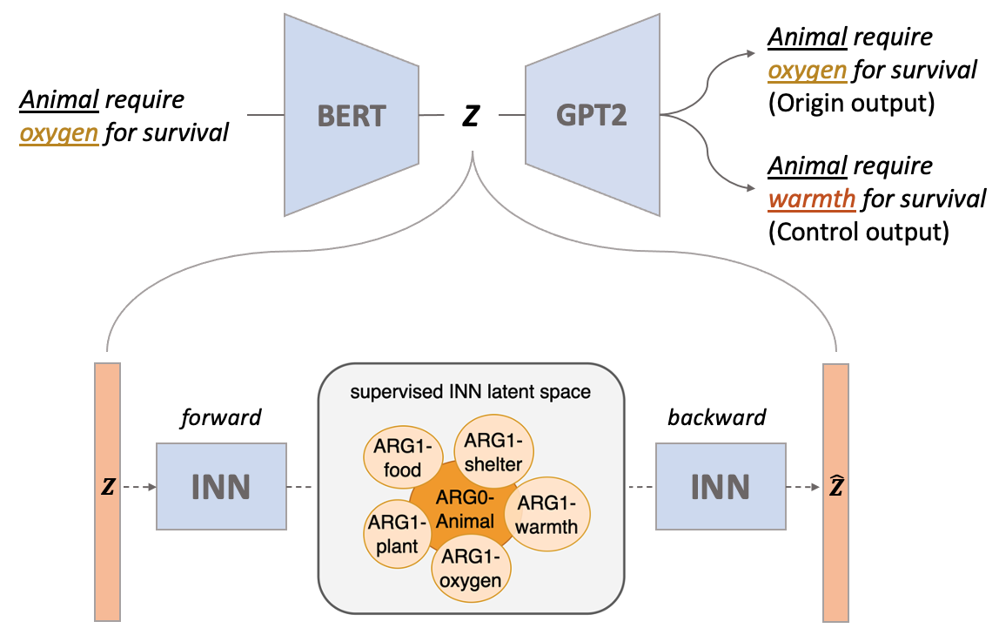
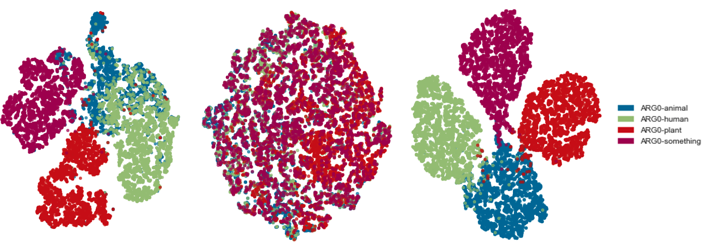
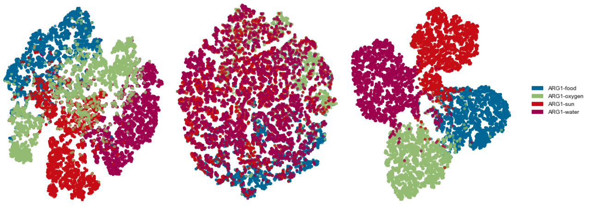
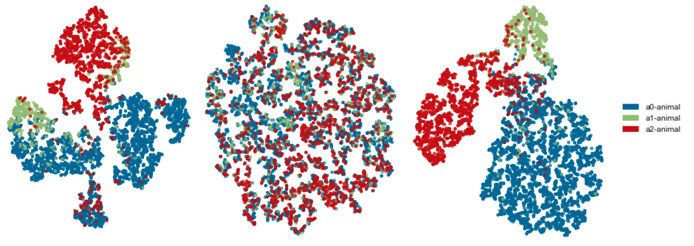
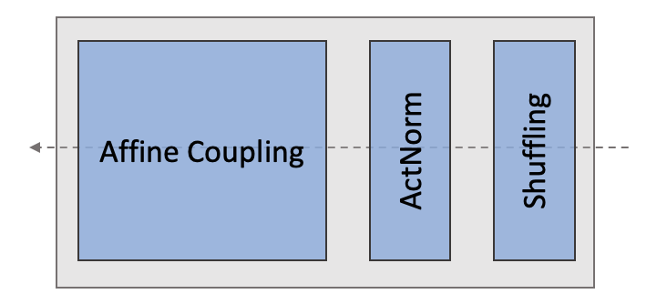
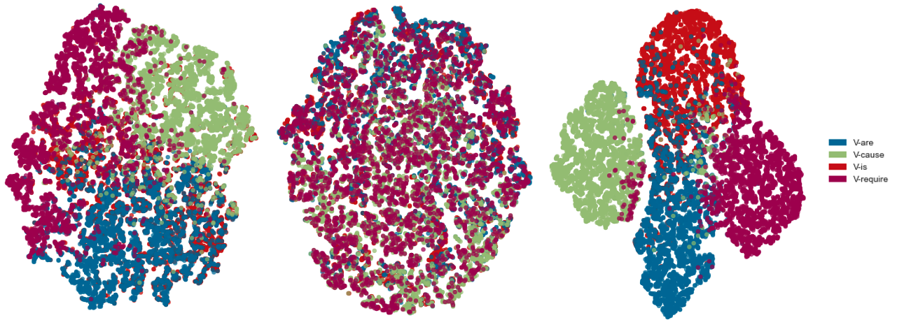

# Learning Disentangled Semantic Spaces of Explanations 
via Invertible Neural Networks

###### Abstract

Disentangling sentence representations over continuous spaces can be a critical process in improving interpretability and semantic control by localising explicit generative factors. Such process confers to neural-based language models some of the advantages that are characteristic of symbolic models, while keeping their flexibility. This work presents a methodology for disentangling the hidden space of a BERT-GPT2 autoencoder by transforming it into a more separable semantic space with the support of a flow-based invertible neural network (INN). Experimental results indicate that the INN can transform the distributed hidden space into a better semantically disentangled latent space, resulting in better interpretability and controllability, when compared to recent state-of-the-art models.  

## 1 Introduction

Disentangled representations, in which each learned features of data refer to a semantically meaningful and independent concept Bengio et al. ([2012](#bib.bib2)), are widely investigated and explored in the field of Computer Vision because of their interpretability and controllability Higgins et al. ([2017](#bib.bib13)); Kim and Mnih ([2018](#bib.bib16)). These works reveal that the semantic features of imaging data, such as mouth and eyes in face images, can be mapped to specific latent dimensions. However, the use of disentanglement for the representation of textual data is comparatively less-explored.  

[FIGURE S1.F1.g1]

Figure 1: Use of an invertible neural network to support better semantic disentanglement and separation of explanatory sentences.
[/FIGURE]

Recent work has started articulating how the disentangled factors of generative models can be used to support the representation of natural language definitions Carvalho et al. ([2022](#bib.bib5)), and science explanations Zhang et al. ([2022](#bib.bib25)), i.e. sentences which relate and compose scientific concepts. These works have the motivation of understanding whether the properties introduced by disentangled generative models can support a consistent organisation of the latent space, where syntactic and semantic transformations can be localised, interpolated and controlled. This category of models has fundamental practical implications. Firstly, similarly to the computer vision models, where image objects can be meaningfully interpolated and transformed, it can provide a framework for transforming and combining sentences which communicate complex concepts, definitions and explanations. Secondly, the localisation of latent factors allows sentence representation models to be more consistent and interpretable. For example, one recent work Zhang et al. ([2022](#bib.bib25)) illustrates that the predicate-argument semantic structure of explanatory sentences from the WorldTree corpus Jansen et al. ([2018b](#bib.bib15)) could be partially disentangled through a Variational AutoEncoder based model (Optimus) Li et al. ([2020b](#bib.bib19)). For example, a simple explanatory fact such as “animals require oxygen for survival’ can be projected into a latent space where each pair role-content, such as ARG0-animal or VERB-require, is described by a hypersolid over the latent space. In this case, the generation of explanations can be semantically controlled/manipulated in a coherent manner. For example, we can control the generation of sentences by manipulating the movement of latent vectors between different role-content regions (e.g., moving the representation of the sentence “animals require oxygen for survival” to an ARG1-warmth region would produce the sentence “animals require warmth for survival”). Such ability is inherently valuable to downstream tasks such as natural language inference (for argument alignment, substitution or abstraction on inference chains) or improving the consistency of neural search (by representing more consistent queries and sentences).  

In this work, we build upon the seminal work of Zhang et al. ([2022](#bib.bib25)), proposing a better way to separate the predicate-argument structure of explanatory sentences in the latent space. Inspired by the work of Esser et al. ([2020](#bib.bib11)), we apply an invertible neural network (INN), a control component, to learn the bijective transformation between the hidden space of the autoencoder and the smooth latent space of INN due to its low computational overhead and theoretically low information loss on bijective mapping.  

More importantly, the transformation modelled by the proposed approach approximates the VAE-defined latent space, both being multivariate Gaussian. Thus, there is potential to learn a latent space with improved geometric properties. That is to say, the same semantic roles and associated content clusters can be better separated over the latent space modelled by the INN (an illustration can be found in Figure [1](#S1.F1 "Figure 1 ‣ 1 Introduction ‣ Learning Disentangled Semantic Spaces of Explanations via Invertible Neural Networks")). In this case, we can improve control over the decoding process due to the reduction of overlapping (ambiguous) regions.  

In summary, this work aims to explore the utilisation of flow-based INNs as a control component for controlling the generation of a typical neural language modelling autoencoder setting (e.g. BERT-GPT2). This addition can transform the latent space of an autoencoder (BERT-GPT2) into a constrained multivariate Gaussian space via INN in a supervised approach. In this latent space, different role-content regions can be better separated. This smoother and better separated space can be later operated over in order to improve the control of the generation of the autoencoder using geometric operators, such as traversal Higgins et al. ([2017](#bib.bib13)), interpolation Bowman et al. ([2016](#bib.bib3)), and vector arithmetic Mikolov et al. ([2013](#bib.bib22)). The following are our contributions:  

1. We find that adding a flow-based INN is an effective mechanism for transforming the hidden space of the autoencoder into a smooth multivariate Gaussian latent space for representing sentences. It can be applied to arbitrary existing large-scale autoencoders without any further training. 2. We put forward a supervised training strategy for INNs to learn a controllable semantic space with higher disentanglement than previous work. 3. We introduce the use of this representation to support semantically coherent data augmentation (generating sentences). Our algorithm can increase the diversity of the data while keeping the distribution of the original data unchanged.  

## 2 Related work

#### Sentence Disentanglement

Mercatali and Freitas ([2021](#bib.bib21)) pioneered the work on the use of disentanglement to control syntactic-level generative factors in sentence representations. More specialised architectures such as the Attention-Driven Variational Autoencoder (ADVAE) Felhi et al. ([2022](#bib.bib12)) were later introduced for learning disentangled syntactic latent spaces. Recent contributions moved in the direction of exploring disentanglement for encoding sentence semantics, where Carvalho et al. ([2022](#bib.bib5)) proposed a supervised training strategy for learning a disentangled representation of definitions by injecting the semantic role labelling inductive biases into the latent space, with the support of a conditional VAE. Comparatively, this work builds-upon on the recent advances of encoding semantic generative factors in latent spaces, focusing on the representation of explanatory statements, and proposing flow-based INN autoencoders as a mechanism to achieve improved separation and control.  

#### INN in NLP

The properties of INN-based representations have recently started being investigated in language. Şahin and Gurevych ([2020](#bib.bib24)) concentrate on modelling morphological inflection and lemmatization tasks, utilizing INN to learn a bijective transformation between the word surface and its morphemes. Li et al. ([2020a](#bib.bib18)) focused on sentence-level representation learning, transforming sentences from a BERT sentence embedding space to standard Gaussian space, which improves sentence embeddings on a variety of semantic textual similarity tasks. Comparatively, this work is the first to explore the bijective mapping between the distributed sentence space of an autoencoder and a multivariate Gaussian space to improve the semantic separability and control over the distributed representation of sentences. Moreover, this is the first to explore this mechanism to support semantically coherent data augmentation.  

## 3 Background

#### Disentangled semantic spaces

(Zhang et al., [2022](#bib.bib25)) demonstrates that semantic role supervision of explanations can induce disentanglement of semantic factors in a latent space of sentences modeled using the Optimus autoencoder configuration Li et al. ([2020b](#bib.bib19)). Each semantic role – content concept combination is described by a hypersolid (region) in the latent space. More information about the semantic roles can be found in Appendix [B](#A2 "Appendix B Explanation Semantic Roles ‣ Learning Disentangled Semantic Spaces of Explanations via Invertible Neural Networks"). Figure [1](#S1.F1 "Figure 1 ‣ 1 Introduction ‣ Learning Disentangled Semantic Spaces of Explanations via Invertible Neural Networks") illustrates examples of role-content/concept semantic clusters, such as ARG1-shelter and ARG1-warmth (“shelter” or “warmth” as direct objects) around the cluster ARG0-animal (“animal” as the subject). However, the qualitative and quantitative analysis of (Zhang et al., [2022](#bib.bib25)) shows that role-content clusters are still substantially entangled. In order to support highly controlled operations over the latent space, this work addresses this limitation, demonstrating that the bijective mapping induced by INNs can provide a measurably better disentanglement and cluster separation.  

#### Invertible Neural Networks

Flow-based INNs Dinh et al. ([2014](#bib.bib8), [2016](#bib.bib9)); Kingma and Dhariwal ([2018](#bib.bib17)) is a class of neural networks that models the bijective mapping between observation distribution $p(x)$ and latent distribution $p(z)$. In this case, we use $T$ and $T^{\prime}$ to represent forward mapping (from $p(x)$ to $p(z)$) and backward mapping (from $p(z)$ to $p(x)$), respectively. Unlike VAEs that approximate the posterior distribution to multivariate Gaussian distributions, INNs use multivariate Gaussian directly. The forward mapping can be learned by the following objective function:  

|  | $$\mathcal{L}=-\mathbb{E}_{x\sim p(x)}\Big{[}T(x)\Big{]}^{2}-\log\left|T^{\prime}(x)\right|$$ |  | (1) |
| --- | --- | --- | --- |

where $T(x)$ learns the transformation from $x$ to $z\sim N(0,1)$. $\left|T^{\prime}(x)\right|$ is the determinant of the Jacobian, which indicates how much the transformation locally expands or contracts the space to ensure the integration of the probability density function is one.  

## 4 Proposed Approach

Starting from the Optimus-based conditional VAE architecture proposed by Zhang et al. ([2022](#bib.bib25)), we encode each sentence $x$ with an autoencoder and consider their sentence-level latent representation as the input of INNs, which is described as $E(x)$. Next, we put forward two training strategies to map the hidden representations into a better semantically disentangled space.  

### 4.1 Training Strategy

#### Unsupervised INNs

Firstly, we train the INN in an unsupervised fashion so that it minimizes the negative log-likelihood of the marginal distribution of latent representation $z=E(x)$:  

|  | $$\begin{split}\mathcal{L}_{\text{unsup}}=&-\mathbb{E}_{x\sim p(x)}\Big{[}T(E(x))\Big{]}^{2}\\ &-\log\left|T^{\prime}(E(x))\right|\\ \end{split}$$ |  | (2) |
| --- | --- | --- | --- |

As this leads to a bijective mapping between distributed representation and the disentangled latent representation (multivariate Gaussian space), it allows us to explore the geometric clustering property of its latent space by traversal, interpolation, and latent space arithmetic.   

#### Cluster-supervised INN

According to the findings of Zhang et al. ([2022](#bib.bib25)) that the content of semantic role can be disentangled over the latent space approximated to multivariate Gaussian learned using the Optimus autoencode setting, expanded with a conditional VAE term, we next train the INN to learn the embeddings, by minimizing the distance (cosine) between points in the same role-content regions and maximizing the distance between points in different regions, based on the explanation embeddings and their corresponding central point from the Optimus model. For example, given a sentence "animal require food for survival" and its central vector of ARG1-animal, the training moves the sentence representation closer to the ARG1-animal region center in the latent space of INN.  

More specifically, during the calculation of the posterior, we replace the mean and variance of standard Gaussian distribution by the center point of its cluster and a hyper-parameter which should be less than one, respectively. In this case, each role-content cluster in the latent space will be mapped to a space where each cluster will have its embeddings more densely and regularly distributed around its center. The objective function can be described as follows:  

|  | $$\begin{split}\mathcal{L}_{\text{sup}}=&-\mathbb{E}_{x\sim p_{cluster}(x)}\frac{\Big{[}T(E(x))-\mu_{cluster}\Big{]}^{2}}{{1-\sigma^{2}}}\\ &-\log\left|T^{\prime}(E(x))\right|\\ \end{split}$$ |  | (3) |
| --- | --- | --- | --- |

where $T(E(x))$ learns the transformation from $x$ to $z\sim N(\mu_{cluster},1-\sigma^{2})$. More training and architecture details are provided in Appendix [A](#A1 "Appendix A Experiment setting ‣ Learning Disentangled Semantic Spaces of Explanations via Invertible Neural Networks").  

### 4.2 Data Augmentation

To better capture the different features between distinct role-content clusters, more training sentences are needed in those clusters for training INNs. Therefore, we consider vector arithmetic and traversal as a systematic mechanism to support data augmentation. This is done as described in Equations [4](#S4.E4 "In 4.2 Data Augmentation ‣ 4 Proposed Approach ‣ Learning Disentangled Semantic Spaces of Explanations via Invertible Neural Networks"). More details are provided in Appendix [A](#A1 "Appendix A Experiment setting ‣ Learning Disentangled Semantic Spaces of Explanations via Invertible Neural Networks").  

|  | $\displaystyle vec$ | $\displaystyle=average(E(s_{i}),E(s_{j}))$ |  | (4) |
| --- | --- | --- | --- | --- |
|  | $\displaystyle vec_{i}$ | $\displaystyle=N(0,1)\quad\forall i\in\{0,..,size(vec)\}$ |  |
|  | $\displaystyle s$ | $\displaystyle=D(vec)$ |  |

where $s_{k}\in S$ (explanation sentence corpus), $E(s):S\rightarrow\mathbb{R}^{n}$ is the encoder (embedding) function, and $D(e):\mathbb{R}^{n}\rightarrow S$ is the decoder function. The term $vec_{i}=N(0,1)$ is done to resample each dimension and the last term generates a new sentence. Table [1](#S4.T1 "Table 1 ‣ 4.2 Data Augmentation ‣ 4 Proposed Approach ‣ Learning Disentangled Semantic Spaces of Explanations via Invertible Neural Networks") lists some randomly selected examples from augmented explanations.  

[TABLE S4.T1]

<table class="ltx_tabular ltx_guessed_headers ltx_align_middle">
<thead class="ltx_thead">
<tr class="ltx_tr">
<th class="ltx_td ltx_align_left ltx_th ltx_th_column ltx_th_row ltx_border_tt">Role-content</th>
<th class="ltx_td ltx_align_left ltx_th ltx_th_column ltx_border_tt">Augmented sentences</th>
</tr>
</thead>
<tbody class="ltx_tbody">
<tr class="ltx_tr">
<th class="ltx_td ltx_align_left ltx_th ltx_th_row ltx_border_t">ARG0-animal</th>
<td class="ltx_td ltx_align_left ltx_border_t">
an animal requires energy to move</td>
</tr>
<tr class="ltx_tr">
<td class="ltx_td ltx_align_left">
animals produce offspring</td>
</tr>
<tr class="ltx_tr">
<td class="ltx_td ltx_align_left">
some adult animals lay eggs</td>
</tr>
<tr class="ltx_tr">
<td class="ltx_td ltx_align_left">
an animal requires shelter</td>
</tr>
<tr class="ltx_tr">
<td class="ltx_td ltx_align_left">
an animal can use its body to breathe</td>
</tr>
<tr class="ltx_tr">
<th class="ltx_td ltx_align_left ltx_th ltx_th_row ltx_border_t">ARG0-human</th>
<td class="ltx_td ltx_align_left ltx_border_t">
humans travel sometimes</td>
</tr>
<tr class="ltx_tr">
<td class="ltx_td ltx_align_left">
humans usually use gasoline</td>
</tr>
<tr class="ltx_tr">
<td class="ltx_td ltx_align_left">
humans sometimes endanger themselves</td>
</tr>
<tr class="ltx_tr">
<td class="ltx_td ltx_align_left">
humans use coal to make food</td>
</tr>
<tr class="ltx_tr">
<td class="ltx_td ltx_align_left">
humans depend on pollinators for survival</td>
</tr>
<tr class="ltx_tr">
<th class="ltx_td ltx_align_left ltx_th ltx_th_row ltx_border_t">PRED-are</th>
<td class="ltx_td ltx_align_left ltx_border_t">wheels are a part of a car</td>
</tr>
<tr class="ltx_tr">
<td class="ltx_td ltx_align_left">lenses are a part of eyeglasses</td>
</tr>
<tr class="ltx_tr">
<td class="ltx_td ltx_align_left">toxic chemicals are poisonous</td>
</tr>
<tr class="ltx_tr">
<td class="ltx_td ltx_align_left">green plants are a source of food for animals</td>
</tr>
<tr class="ltx_tr">
<td class="ltx_td ltx_align_left">copper and zinc are two metals</td>
</tr>
<tr class="ltx_tr">
<th class="ltx_td ltx_align_left ltx_th ltx_th_row ltx_border_bb ltx_border_t">PRED-mean</th>
<td class="ltx_td ltx_align_left ltx_border_t">summit mean the top of the mountain</td>
</tr>
<tr class="ltx_tr">
<td class="ltx_td ltx_align_left">colder mean a decrease in heat energy</td>
</tr>
<tr class="ltx_tr">
<td class="ltx_td ltx_align_left">helping mean something can be done better</td>
</tr>
<tr class="ltx_tr">
<td class="ltx_td ltx_align_left">cleaner mean ( less ; lower ) in pollutants</td>
</tr>
<tr class="ltx_tr">
<td class="ltx_td ltx_align_left ltx_border_bb">friction mean the product of a physical change</td>
</tr>
</tbody>
</table>

Table 1: Example of augmented explanations.
[/TABLE]

## 5 Experiments

During the experiment, we consider both WorldTree Jansen et al. ([2018a](#bib.bib14)) and EntailmentBank Dalvi et al. ([2021](#bib.bib7)) as datasets. The statistic information of datasets can be found in Appendix [A](#A1 "Appendix A Experiment setting ‣ Learning Disentangled Semantic Spaces of Explanations via Invertible Neural Networks").  

### 5.1 Disentanglement Analysis

In this section, we analyze the disentanglement of the latent space from the INN model independently of the cluster-based supervision. We empirically evaluate the properties of the latent space from two different perspectives: (i) quantitative: with the measurement of the disentanglement metrics, and (ii) qualitative: with the support of the geometrical operations (traversal, interpolation, and vector arithmetic) of the space which allows for eliciting the semantic-geometric behaviour of the space. We also qualitatively evaluate its reconstruction performance. Reconstruction examples have been included in the Appendix [D](#A4 "Appendix D Unsupervised INN: explanation reconstruction ‣ Learning Disentangled Semantic Spaces of Explanations via Invertible Neural Networks").  

#### Disentanglement metrics

Firstly, we probe the ability of the model to disentangle the predicate-argument structure, such as ARG0 and PRED. Then, we compare its performance with the reference model (Optimus) under two training frameworks Zhang et al. ([2022](#bib.bib25)) using six quantitative metrics for disentanglement. A description of the metrics is provided in Appendix [C](#A3 "Appendix C Disentanglement Metrics ‣ Learning Disentangled Semantic Spaces of Explanations via Invertible Neural Networks").  

[TABLE S5.T2]

<table class="ltx_tabular ltx_guessed_headers ltx_align_middle">
<thead class="ltx_thead">
<tr class="ltx_tr">
<th class="ltx_td ltx_align_center ltx_th ltx_th_column ltx_border_tt">Optimus vs INN</th>
</tr>
<tr class="ltx_tr">
<th class="ltx_td ltx_align_center ltx_th ltx_th_column ltx_border_t">model</th>
<th class="ltx_td ltx_align_center ltx_th ltx_th_column ltx_border_t">z-min-var <math class="ltx_Math"><semantics><mo>↓</mo><annotation-xml><ci>↓</ci></annotation-xml><annotation>\downarrow</annotation></semantics></math>
</th>
<th class="ltx_td ltx_align_center ltx_th ltx_th_column ltx_border_t">MIG</th>
<th class="ltx_td ltx_align_center ltx_th ltx_th_column ltx_border_t">Modularity</th>
</tr>
</thead>
<tbody class="ltx_tbody">
<tr class="ltx_tr">
<td class="ltx_td ltx_align_center ltx_border_t">O(U)</td>
<td class="ltx_td ltx_align_center ltx_border_t">.451</td>
<td class="ltx_td ltx_align_center ltx_border_t">.027</td>
<td class="ltx_td ltx_align_center ltx_border_t">.758</td>
</tr>
<tr class="ltx_tr">
<td class="ltx_td ltx_align_center">O(S)</td>
<td class="ltx_td ltx_align_center">.453</td>
<td class="ltx_td ltx_align_center">.067</td>
<td class="ltx_td ltx_align_center">.753</td>
</tr>
<tr class="ltx_tr">
<td class="ltx_td ltx_align_center">O(C)</td>
<td class="ltx_td ltx_align_center">.401</td>
<td class="ltx_td ltx_align_center">.039</td>
<td class="ltx_td ltx_align_center">.751</td>
</tr>
<tr class="ltx_tr">
<td class="ltx_td ltx_align_center">INN</td>
<td class="ltx_td ltx_align_center">.350</td>
<td class="ltx_td ltx_align_center">.491</td>
<td class="ltx_td ltx_align_center">.844</td>
</tr>
<tr class="ltx_tr">
<td class="ltx_td ltx_align_center ltx_border_t">model</td>
<td class="ltx_td ltx_align_center ltx_border_t">Disentanglement</td>
<td class="ltx_td ltx_align_center ltx_border_t">Completeness</td>
<td class="ltx_td ltx_align_center ltx_border_t">Informativeness <math class="ltx_Math"><semantics><mo>↓</mo><annotation-xml><ci>↓</ci></annotation-xml><annotation>\downarrow</annotation></semantics></math>
</td>
</tr>
<tr class="ltx_tr">
<td class="ltx_td ltx_align_center ltx_border_t">O(U)</td>
<td class="ltx_td ltx_align_center ltx_border_t">.307</td>
<td class="ltx_td ltx_align_center ltx_border_t">.493</td>
<td class="ltx_td ltx_align_center ltx_border_t">.451</td>
</tr>
<tr class="ltx_tr">
<td class="ltx_td ltx_align_center">O(S)</td>
<td class="ltx_td ltx_align_center">.302</td>
<td class="ltx_td ltx_align_center">.491</td>
<td class="ltx_td ltx_align_center">.466</td>
</tr>
<tr class="ltx_tr">
<td class="ltx_td ltx_align_center">O(C)</td>
<td class="ltx_td ltx_align_center">.306</td>
<td class="ltx_td ltx_align_center">.493</td>
<td class="ltx_td ltx_align_center">.474</td>
</tr>
<tr class="ltx_tr">
<td class="ltx_td ltx_align_center ltx_border_bb">INN</td>
<td class="ltx_td ltx_align_center ltx_border_bb">.186</td>
<td class="ltx_td ltx_align_center ltx_border_bb">.270</td>
<td class="ltx_td ltx_align_center ltx_border_bb">.503</td>
</tr>
</tbody>
</table>

Table 2: Disentanglement metrics. O(U), O(S), O(C) are three different training strategies for Optimus.
[/TABLE]

Table [2](#S5.T2 "Table 2 ‣ Disentanglement metrics ‣ 5.1 Disentanglement Analysis ‣ 5 Experiments ‣ Learning Disentangled Semantic Spaces of Explanations via Invertible Neural Networks") summarises the results. The INN-based autoencoder can outperform the baseline model (Optimus) under three metrics: 5.1% in z-min-var, 42.3% in MIG, and 8.6% in Modularity. Those three metrics are plain statistical and do not depend on a trainable machine learning classifier, avoiding classifier fitting biases. We refer to Carbonneau et al. ([2022](#bib.bib4)) for an in-depth discussion on a critical analysis of the strengths and limitations of disentanglement metrics. Following the current methodological norm, we decided to include most used metrics. After quantitative evaluation, we next qualitatively assess its disentanglement.  

#### Traversal

The traversal of a latent factor is obtained as the decoding of the vectors corresponding to the latent variables, where the evaluated factor is changed within a fixed interval, while all others are kept fixed. A disentangled representation should cause the decoded sentences to only change with respect to a single latent factor when that factor is traversed. In this experiment, the traversal is set up from a starting point given by a “seed” sentence. As illustrated in Table [3](#S5.T3 "Table 3 ‣ Traversal ‣ 5.1 Disentanglement Analysis ‣ 5 Experiments ‣ Learning Disentangled Semantic Spaces of Explanations via Invertible Neural Networks") we can observe that the generated sentences can hold concepts at different argument positions unchanged, localizing that specific semantic component at the sentences at a locus of the latent space. For example, the sentence traversed in the low dimension can hold the same semantic role-concept pairing ARG0-animals. During the traversal, the sentences present close variations (realizations in this case) of the semantic concept given by animal, such as mammal and predator, tied to the same semantic role (ARG0).  

[TABLE S5.T3]
<svg class="ltx_picture"><g><g><path></path></g><g><path></path></g><g><foreignobject>

some animals must hunt to survive
dim01: some animals must hunt for food
dim01: some animals must hunt prey to survive
dim01: some animals need to hunt to survive
dim01: some animals must hunt to survive
dim12: a mammal requires fins to catch prey
dim12: an animal needs to breathe to survive
dim12: an animal can fly without air
dim12: a predator must hunt to survive
</foreignobject></g></g></svg>

Table 3: Traversals showing held semantic factors in explanations (INN model).
[/TABLE]

#### Interpolation

Next, we demonstrate the ability of INNs to provide smooth transitions between latent space representations of sentences (Bowman et al., [2016](#bib.bib3)). In practice, the interpolation mechanism encodes two sentences $x_{1}$ and $x_{2}$ as $z_{1}$ and $z_{2}$, respectively. It interpolates a path $z_{t}=z_{1}\cdot(1-t)+z_{2}\cdot t$ with $t$ increased from $0$ to $1$ by a step size of $0.1$. As a result, $9$ sentences are generated on each interpolation step. If the latent space is semantically disentangled, the intermediate sentences should present discrete changes, with semantic roles changing between the endpoints $x_{1}$ and $x_{2}$ in each step. In Table [4](#S5.T4 "Table 4 ‣ Interpolation ‣ 5.1 Disentanglement Analysis ‣ 5 Experiments ‣ Learning Disentangled Semantic Spaces of Explanations via Invertible Neural Networks"), we provide qualitative results with latent space interpolations on explanation sentences. We can observe that the intermediate explanations could transition smoothly (i.e., no unrelated content between steps) from source to target. e.g., predicate changed from eat to must eat to must hunt, and ARG0s are changed from humans to some animals.  

[TABLE S5.T4]
<svg class="ltx_picture"><g><g><path></path></g><g><path></path></g><g><foreignobject>

humans eat seeds
1. humans eat fruits
2. humans eat seeds
3. humans eat insects
4. humans eat meat
5. humans eat plants
6. some animals eat prey
7. some animals must eat to survive
8. some animals must hunt for food
9. some animals must hunt their prey to survive
some animals must hunt to survive
</foreignobject></g></g></svg>

Table 4: Interpolation examples where top and bottom sentences are source and target, respectively.
[/TABLE]

#### Latent space arithmetic

In this part, we analyse whether averaging two input vectors with the same role-content preserve this property. If the averaged vector holds the same semantic concept as the input sentences, the latent space is better disentangled with regard to the induced semantic representation Zhang et al. ([2022](#bib.bib25)). Table [5](#S5.T5 "Table 5 ‣ Latent space arithmetic ‣ 5.1 Disentanglement Analysis ‣ 5 Experiments ‣ Learning Disentangled Semantic Spaces of Explanations via Invertible Neural Networks") shows examples of output sentences after vector averaging. We can observe that the lower dimensions can hold the same semantic information as input. However, this information is lost during the traversal of higher dimensions, which indicates that the latent space of INNs stores explanatory information differently from the Optimus baseline model. Therefore, we examine next whether our supervision method could better enforce separation and disentanglement.  

[TABLE S5.T5]
<svg class="ltx_picture"><g><g><path></path></g><g><path></path></g><g><foreignobject>

animals require food for survival
animals require warmth for survival
dim03: animals take nutrients
dim03: animals require nutrients
dim03: animals require food for survival
dim03: animals need nutrients to survive
dim12: fish require water for survival
dim12: seaweed contains water and nutrients
dim12: fish contains water vapor for survival
dim12: water can stay unchanged in an atmosphere
</foreignobject></g></g></svg>

Table 5: Latent space arithmetic from INN where the first two sentences are the inputs.
[/TABLE]

### 5.2 Cluster-supervised INN model

After analyzing the disentanglement of the latent space of unsupervised INN, next, we examine could cluster-supervised lead to more separable latent space than Optimus. Reconstructed examples are provided in Appendix [E](#A5 "Appendix E Supervised INN: Explanation reconstruction ‣ Learning Disentangled Semantic Spaces of Explanations via Invertible Neural Networks").  

#### Disentanglement between ARG0 clusters

In this case, we consider four ARG0 clusters, including human, animal, plant, and something, and evaluate model performance from two sides, including forward mapping and backward mapping. For forward mapping, we assess the disentanglement of the latent space of the INN model from two aspects (visualization and classification metrics). Figure [2](#S5.F2 "Figure 2 ‣ Disentanglement between ARG0 clusters ‣ 5.2 Cluster-supervised INN model ‣ 5 Experiments ‣ Learning Disentangled Semantic Spaces of Explanations via Invertible Neural Networks") displays the distributions of four role-content clusters over the latent space. As we can observe, after the cluster-supervised training strategy, the embeddings are more concentrated on the center of their cluster, and there is a clear boundary between clusters, indicating better disentanglement. This visualization indicates that our supervised approach can help the INN-based architecture to learn a better separated semantic space when compared to the baseline models (Optimus, unsupervised INNs). Additionally, the unsupervised INN latent space (shown in the middle) does not display good separation compared with Optimus (left), which supports the result from latent space arithmetic [5.1](#S5.SS1.SSS0.Px4 "Latent space arithmetic ‣ 5.1 Disentanglement Analysis ‣ 5 Experiments ‣ Learning Disentangled Semantic Spaces of Explanations via Invertible Neural Networks"), in that unsupervised INN stores explanations in a different way (not separating by role-content).  

[FIGURE S5.F2.1.g1]

Figure 2: ARG0: t-SNE plot, different color represents different content regions (blue: animal, green: human, red: plant, purple: something) (left: Optimus, middle: unsupervised, right: cluster supervised).
[/FIGURE]

It is also observable that there are low-density embeddings at the transition between two clusters, which leads to the connection between clusters. We decode the middle datapoints between animal and human clusters and list them in Table [6](#S5.T6 "Table 6 ‣ Disentanglement between ARG0 clusters ‣ 5.2 Cluster-supervised INN model ‣ 5 Experiments ‣ Learning Disentangled Semantic Spaces of Explanations via Invertible Neural Networks"). From those examples, we can observe that such explanations are related to both animal and human (e.g., animals eat humans). This result implies that the explanations may be geometrically represented in a similar way as they were originally designed in the WorldTree corpus (maximising lexical overlaps pred-arg alignments within an explanation chain), in which each explanation is typically linked with another through a subject or object abstraction/realisation, for supporting multi-hop inference tasks.  

[TABLE S5.T6]
<svg class="ltx_picture"><g><g><path></path></g><g><path></path></g><g><foreignobject>

1. humans sometimes hunt animals that are covered in fur
2. a human / animal requires warmth for survival
3. animals / human habitats require food
4. an animal may be bred with a human for food
5. animals eat humans
6. a human can not eat algae and other animals
</foreignobject></g></g></svg>

Table 6: Middle explanations between ARG0-animal and ARG0-human.
[/TABLE]

Next, we quantitatively evaluate the disentanglement of ARG0-content clusters (not like Table [2](#S5.T2 "Table 2 ‣ Disentanglement metrics ‣ 5.1 Disentanglement Analysis ‣ 5 Experiments ‣ Learning Disentangled Semantic Spaces of Explanations via Invertible Neural Networks") that only evaluates the disentanglement by semantic roles). We consider classification task metrics (accuracy, precision, recall, f1) as proxies for evaluating region separability, effectively testing cluster membership across different clusters. The performance of those classifiers represents disentanglement performance. As shown in table [7](#S5.T7 "Table 7 ‣ Disentanglement between ARG0 clusters ‣ 5.2 Cluster-supervised INN model ‣ 5 Experiments ‣ Learning Disentangled Semantic Spaces of Explanations via Invertible Neural Networks"), all classifiers trained over supervised latent representation outperform both unsupervised INN and Optimus, which indicates that the cluster-supervised approach leads to better disentanglement.  

[TABLE S5.T7]

<table class="ltx_tabular ltx_align_middle">
<tbody class="ltx_tbody">
<tr class="ltx_tr">
<td class="ltx_td ltx_align_center ltx_border_tt">ARG0: disentanglement proxy metrics</td>
</tr>
<tr class="ltx_tr">
<td class="ltx_td ltx_align_center ltx_border_t">classifier</td>
<td class="ltx_td ltx_align_center ltx_border_t">train</td>
<td class="ltx_td ltx_align_center ltx_border_t">accuracy</td>
<td class="ltx_td ltx_align_center ltx_border_t">precision</td>
<td class="ltx_td ltx_align_center ltx_border_t">recall</td>
<td class="ltx_td ltx_align_center ltx_border_t">f1 score</td>
</tr>
<tr class="ltx_tr">
<td class="ltx_td ltx_align_center ltx_border_t">KNN</td>
<td class="ltx_td ltx_align_center ltx_border_t">O</td>
<td class="ltx_td ltx_align_center ltx_border_t">0.983</td>
<td class="ltx_td ltx_align_center ltx_border_t">0.983</td>
<td class="ltx_td ltx_align_center ltx_border_t">0.983</td>
<td class="ltx_td ltx_align_center ltx_border_t">0.983</td>
</tr>
<tr class="ltx_tr">
<td class="ltx_td ltx_align_center">U</td>
<td class="ltx_td ltx_align_center">0.972</td>
<td class="ltx_td ltx_align_center">0.972</td>
<td class="ltx_td ltx_align_center">0.972</td>
<td class="ltx_td ltx_align_center">0.972</td>
</tr>
<tr class="ltx_tr">
<td class="ltx_td ltx_align_center">C</td>
<td class="ltx_td ltx_align_center">0.986</td>
<td class="ltx_td ltx_align_center">0.986</td>
<td class="ltx_td ltx_align_center">0.986</td>
<td class="ltx_td ltx_align_center">0.986</td>
</tr>
<tr class="ltx_tr">
<td class="ltx_td ltx_align_center ltx_border_t">NB</td>
<td class="ltx_td ltx_align_center ltx_border_t">O</td>
<td class="ltx_td ltx_align_center ltx_border_t">0.936</td>
<td class="ltx_td ltx_align_center ltx_border_t">0.936</td>
<td class="ltx_td ltx_align_center ltx_border_t">0.936</td>
<td class="ltx_td ltx_align_center ltx_border_t">0.936</td>
</tr>
<tr class="ltx_tr">
<td class="ltx_td ltx_align_center">U</td>
<td class="ltx_td ltx_align_center">0.961</td>
<td class="ltx_td ltx_align_center">0.961</td>
<td class="ltx_td ltx_align_center">0.961</td>
<td class="ltx_td ltx_align_center">0.961</td>
</tr>
<tr class="ltx_tr">
<td class="ltx_td ltx_align_center">C</td>
<td class="ltx_td ltx_align_center">0.979</td>
<td class="ltx_td ltx_align_center">0.979</td>
<td class="ltx_td ltx_align_center">0.979</td>
<td class="ltx_td ltx_align_center">0.979</td>
</tr>
<tr class="ltx_tr">
<td class="ltx_td ltx_align_center ltx_border_bb ltx_border_t">SVM</td>
<td class="ltx_td ltx_align_center ltx_border_t">O</td>
<td class="ltx_td ltx_align_center ltx_border_t">0.979</td>
<td class="ltx_td ltx_align_center ltx_border_t">0.979</td>
<td class="ltx_td ltx_align_center ltx_border_t">0.979</td>
<td class="ltx_td ltx_align_center ltx_border_t">0.979</td>
</tr>
<tr class="ltx_tr">
<td class="ltx_td ltx_align_center">U</td>
<td class="ltx_td ltx_align_center">0.975</td>
<td class="ltx_td ltx_align_center">0.975</td>
<td class="ltx_td ltx_align_center">0.975</td>
<td class="ltx_td ltx_align_center">0.975</td>
</tr>
<tr class="ltx_tr">
<td class="ltx_td ltx_align_center ltx_border_bb">C</td>
<td class="ltx_td ltx_align_center ltx_border_bb">0.981</td>
<td class="ltx_td ltx_align_center ltx_border_bb">0.981</td>
<td class="ltx_td ltx_align_center ltx_border_bb">0.981</td>
<td class="ltx_td ltx_align_center ltx_border_bb">0.981</td>
</tr>
</tbody>
</table>

Table 7: Disentanglement of ARG0 between Optimus (O), unsupervised INN (U), and cluster-supervised INN (C) where KNN: k-neighbours, NB: naive bayes, SVM: support vector machine. The abbreviations are the same for remaining.
[/TABLE]

As for the evaluation of backward mapping, we calculate the ratio of generated sentences that hold the same role-content as the inputs (henceforth called invertibility ratio). We randomly selected 100 embeddings as inputs and show the corresponding ratios in Table [8](#S5.T8 "Table 8 ‣ Disentanglement between ARG0 clusters ‣ 5.2 Cluster-supervised INN model ‣ 5 Experiments ‣ Learning Disentangled Semantic Spaces of Explanations via Invertible Neural Networks"). We can observe that both unsupervised and supervised cases can achieve high invertibility ratios, such as 0.99 of ARG0-plant in both of them, indicating that the INN component is performing its inverse mapping function, which means that INN provides us the means to control the sentence decoding step more precisely by operating the vector over its transformed latent space. If we compare the ratio between unsupervised and supervised, however, there is no significant difference between them, confirming the low information loss from the transformation.  

[TABLE S5.T8]

<table class="ltx_tabular ltx_align_middle">
<tbody class="ltx_tbody">
<tr class="ltx_tr">
<td class="ltx_td ltx_align_center ltx_border_tt">ARG0: invertibility ratio (backward: <math class="ltx_Math"><semantics><msup><mi>T</mi><mo>′</mo></msup><annotation-xml><apply><csymbol>superscript</csymbol><ci>𝑇</ci><ci>′</ci></apply></annotation-xml><annotation>T^{\prime}</annotation></semantics></math>)</td>
</tr>
<tr class="ltx_tr">
<td class="ltx_td ltx_align_center ltx_border_t">train</td>
<td class="ltx_td ltx_align_center ltx_border_t">human</td>
<td class="ltx_td ltx_align_center ltx_border_t">animal</td>
<td class="ltx_td ltx_align_center ltx_border_t">plant</td>
<td class="ltx_td ltx_align_center ltx_border_t">something</td>
</tr>
<tr class="ltx_tr">
<td class="ltx_td ltx_align_center ltx_border_t">U</td>
<td class="ltx_td ltx_align_center ltx_border_t">0.98</td>
<td class="ltx_td ltx_align_center ltx_border_t">0.89</td>
<td class="ltx_td ltx_align_center ltx_border_t">0.99</td>
<td class="ltx_td ltx_align_center ltx_border_t">1.00</td>
</tr>
<tr class="ltx_tr">
<td class="ltx_td ltx_align_center ltx_border_bb">C</td>
<td class="ltx_td ltx_align_center ltx_border_bb">1.00</td>
<td class="ltx_td ltx_align_center ltx_border_bb">0.86</td>
<td class="ltx_td ltx_align_center ltx_border_bb">0.99</td>
<td class="ltx_td ltx_align_center ltx_border_bb">0.95</td>
</tr>
</tbody>
</table>

Table 8: Invertibility test for ARG0.
[/TABLE]

Finally, we follow Zhang et al. ([2022](#bib.bib25)) on using decision trees to guide the movement of latent vectors over different clusters for controlling the explanation generation of the autoencoder. Table [9](#S5.T9 "Table 9 ‣ Disentanglement between ARG0 clusters ‣ 5.2 Cluster-supervised INN model ‣ 5 Experiments ‣ Learning Disentangled Semantic Spaces of Explanations via Invertible Neural Networks") shows the generation step following the path from animal to something. We can observe from the results that under the guidance of the decision tree, the ARG0 content of the generated explanations gradually changes from animals to something, and these generated explanations can maintain the semantics related to animals even though the content of target, something, is not related to animal, which indicates that the generation of sentence can be localised control via supervised INN.  

[TABLE S5.T9]
<svg class="ltx_picture"><g><g><path></path></g><g><path></path></g><g><foreignobject>

Input: an animal needs food to thrive
dim14: an animal requires food for survival
dim13: a living thing requires food for survival
dim25: something that is moist can protect a animal
dim02: something harmful can cause an animal to be dead
dim14: something that an animal eats has a positive impact on that animal
dim05: something to be a good thing has a positive impact on an environment
</foreignobject></g></g></svg>

Table 9: Guided generation from ARG0-animal to ARG0-something via decision tree.
[/TABLE]

#### Disentanglement between ARG1 clusters

Next, we consider four ARG1 clusters, including ARG1-food, ARG1-oxygen, ARG1-sun, ARG1-water, and evaluate model performance following the same procedure. Figure [3](#S5.F3 "Figure 3 ‣ Disentanglement between ARG1 clusters ‣ 5.2 Cluster-supervised INN model ‣ 5 Experiments ‣ Learning Disentangled Semantic Spaces of Explanations via Invertible Neural Networks") first displays the distributions of four role-content clusters over the latent space. With similar observations as before, the INN-supervised training strategy can learn the better disentanglement between ARG1 clusters. Additionally, when compared with the ARG0 cluster, the Optimus model does not show observable disentanglement.  

[FIGURE S5.F3.1.g1]

Figure 3: ARG1: t-SNE plot (blue: food, green: oxygen, red: sun, purple: water) (left: Optimus, middle: unsupervised INN, right: cluster supervised INN).
[/FIGURE]

Table [10](#S5.T10 "Table 10 ‣ Disentanglement between ARG1 clusters ‣ 5.2 Cluster-supervised INN model ‣ 5 Experiments ‣ Learning Disentangled Semantic Spaces of Explanations via Invertible Neural Networks") shows the disentanglement metrics (top) and invertibility ratio (bottom). With similar observations as the previous experiment, all classifiers trained over supervised latent representation outperform both the unsupervised INN model and Optimus, and both unsupervised and supervised cases can achieve higher ratio (at least 0.95). We also evaluate the results for PRED clusters. Same observation as both ARG0 and ARG1. More information can be found in Appendix [F](#A6 "Appendix F Disentanglement between PRED clusters ‣ Learning Disentangled Semantic Spaces of Explanations via Invertible Neural Networks") due to the page limitation.  

[TABLE S5.T10]

<table class="ltx_tabular ltx_align_middle">
<tbody class="ltx_tbody">
<tr class="ltx_tr">
<td class="ltx_td ltx_align_center ltx_border_tt">ARG1: disentanglement proxy metrics (forward: <math class="ltx_Math"><semantics><mi>T</mi><annotation-xml><ci>𝑇</ci></annotation-xml><annotation>T</annotation></semantics></math>)</td>
</tr>
<tr class="ltx_tr">
<td class="ltx_td ltx_align_center ltx_border_t">classifier</td>
<td class="ltx_td ltx_align_center ltx_border_t">train</td>
<td class="ltx_td ltx_align_center ltx_border_t">accuracy</td>
<td class="ltx_td ltx_align_center ltx_border_t">precision</td>
<td class="ltx_td ltx_align_center ltx_border_t">recall</td>
<td class="ltx_td ltx_align_center ltx_border_t">f1 score</td>
</tr>
<tr class="ltx_tr">
<td class="ltx_td ltx_align_center ltx_border_t">KNN</td>
<td class="ltx_td ltx_align_center ltx_border_t">O</td>
<td class="ltx_td ltx_align_center ltx_border_t">0.958</td>
<td class="ltx_td ltx_align_center ltx_border_t">0.958</td>
<td class="ltx_td ltx_align_center ltx_border_t">0.958</td>
<td class="ltx_td ltx_align_center ltx_border_t">0.958</td>
</tr>
<tr class="ltx_tr">
<td class="ltx_td ltx_align_center">U</td>
<td class="ltx_td ltx_align_center">0.951</td>
<td class="ltx_td ltx_align_center">0.951</td>
<td class="ltx_td ltx_align_center">0.951</td>
<td class="ltx_td ltx_align_center">0.951</td>
</tr>
<tr class="ltx_tr">
<td class="ltx_td ltx_align_center">C</td>
<td class="ltx_td ltx_align_center">0.969</td>
<td class="ltx_td ltx_align_center">0.969</td>
<td class="ltx_td ltx_align_center">0.969</td>
<td class="ltx_td ltx_align_center">0.969</td>
</tr>
<tr class="ltx_tr">
<td class="ltx_td ltx_align_center ltx_border_t">NB</td>
<td class="ltx_td ltx_align_center ltx_border_t">O</td>
<td class="ltx_td ltx_align_center ltx_border_t">0.907</td>
<td class="ltx_td ltx_align_center ltx_border_t">0.907</td>
<td class="ltx_td ltx_align_center ltx_border_t">0.907</td>
<td class="ltx_td ltx_align_center ltx_border_t">0.907</td>
</tr>
<tr class="ltx_tr">
<td class="ltx_td ltx_align_center">U</td>
<td class="ltx_td ltx_align_center">0.926</td>
<td class="ltx_td ltx_align_center">0.926</td>
<td class="ltx_td ltx_align_center">0.926</td>
<td class="ltx_td ltx_align_center">0.926</td>
</tr>
<tr class="ltx_tr">
<td class="ltx_td ltx_align_center">C</td>
<td class="ltx_td ltx_align_center">0.956</td>
<td class="ltx_td ltx_align_center">0.956</td>
<td class="ltx_td ltx_align_center">0.956</td>
<td class="ltx_td ltx_align_center">0.956</td>
</tr>
<tr class="ltx_tr">
<td class="ltx_td ltx_align_center ltx_border_t">SVM</td>
<td class="ltx_td ltx_align_center ltx_border_t">O</td>
<td class="ltx_td ltx_align_center ltx_border_t">0.956</td>
<td class="ltx_td ltx_align_center ltx_border_t">0.956</td>
<td class="ltx_td ltx_align_center ltx_border_t">0.956</td>
<td class="ltx_td ltx_align_center ltx_border_t">0.956</td>
</tr>
<tr class="ltx_tr">
<td class="ltx_td ltx_align_center">U</td>
<td class="ltx_td ltx_align_center">0.953</td>
<td class="ltx_td ltx_align_center">0.953</td>
<td class="ltx_td ltx_align_center">0.953</td>
<td class="ltx_td ltx_align_center">0.953</td>
</tr>
<tr class="ltx_tr">
<td class="ltx_td ltx_align_center">C</td>
<td class="ltx_td ltx_align_center">0.958</td>
<td class="ltx_td ltx_align_center">0.958</td>
<td class="ltx_td ltx_align_center">0.958</td>
<td class="ltx_td ltx_align_center">0.958</td>
</tr>
<tr class="ltx_tr">
<td class="ltx_td ltx_align_center ltx_border_t">ARG1: invertibility ratio (backward: <math class="ltx_Math"><semantics><msup><mi>T</mi><mo>′</mo></msup><annotation-xml><apply><csymbol>superscript</csymbol><ci>𝑇</ci><ci>′</ci></apply></annotation-xml><annotation>T^{\prime}</annotation></semantics></math>)</td>
</tr>
<tr class="ltx_tr">
<td class="ltx_td ltx_align_center ltx_border_t">train</td>
<td class="ltx_td ltx_align_center ltx_border_t">food</td>
<td class="ltx_td ltx_align_center ltx_border_t">oxygen</td>
<td class="ltx_td ltx_align_center ltx_border_t">sun</td>
<td class="ltx_td ltx_align_center ltx_border_t">water</td>
</tr>
<tr class="ltx_tr">
<td class="ltx_td ltx_align_center ltx_border_t">U</td>
<td class="ltx_td ltx_align_center ltx_border_t">0.99</td>
<td class="ltx_td ltx_align_center ltx_border_t">0.98</td>
<td class="ltx_td ltx_align_center ltx_border_t">0.95</td>
<td class="ltx_td ltx_align_center ltx_border_t">1.00</td>
</tr>
<tr class="ltx_tr">
<td class="ltx_td ltx_align_center ltx_border_bb">C</td>
<td class="ltx_td ltx_align_center ltx_border_bb">0.96</td>
<td class="ltx_td ltx_align_center ltx_border_bb">0.95</td>
<td class="ltx_td ltx_align_center ltx_border_bb">0.96</td>
<td class="ltx_td ltx_align_center ltx_border_bb">1.00</td>
</tr>
</tbody>
</table>

Table 10: Forward and backward evaluation for ARG1.
[/TABLE]

#### Disentanglement between Animal clusters

Before that, we investigated the separation between the same semantic roles but different content clusters. Next, we explore separating different semantic roles with the same content. We thus focus on the animal cluster, and investigate the disentanglement between ARG0-animal, ARG1-animal, and ARG2-animal. As illustrated in Figure [4](#S5.F4 "Figure 4 ‣ Disentanglement between Animal clusters ‣ 5.2 Cluster-supervised INN model ‣ 5 Experiments ‣ Learning Disentangled Semantic Spaces of Explanations via Invertible Neural Networks"), the animal clusters with different semantic roles can be separated after cluster-supervised training, which indicates that the INN model can capture the difference between the same contents with different semantic roles in the case of similar topic. That is to say, the INN-based approach could jointly learn separable embeddings w.r.t. role-content and content alone.  

[FIGURE S5.F4.1.g1]

Figure 4: Animal: t-SNE plot of Animal latent representation (blue: ARG0-animal, green: ARG1-animal, red: ARG2-animal) (left: Optimus, middle: unsupervised, right: cluster-supervised).
[/FIGURE]

Table [11](#S5.T11 "Table 11 ‣ Disentanglement between Animal clusters ‣ 5.2 Cluster-supervised INN model ‣ 5 Experiments ‣ Learning Disentangled Semantic Spaces of Explanations via Invertible Neural Networks") shows the disentanglement metrics and the invertibility ratio. Similarly to the previous experiment, the supervised case outperforms both the unsupervised and the Optimus models. We can also observe that both unsupervised and supervised cases can achieve good invertibility (at least 90%).  

[TABLE S5.T11]

<table class="ltx_tabular ltx_align_middle">
<tbody class="ltx_tbody">
<tr class="ltx_tr">
<td class="ltx_td ltx_align_center ltx_border_tt">Animal: disentanglement metrics (forward: <math class="ltx_Math"><semantics><mi>T</mi><annotation-xml><ci>𝑇</ci></annotation-xml><annotation>T</annotation></semantics></math>)</td>
</tr>
<tr class="ltx_tr">
<td class="ltx_td ltx_align_center ltx_border_t">classifier</td>
<td class="ltx_td ltx_align_center ltx_border_t">train</td>
<td class="ltx_td ltx_align_center ltx_border_t">accuracy</td>
<td class="ltx_td ltx_align_center ltx_border_t">precision</td>
<td class="ltx_td ltx_align_center ltx_border_t">recall</td>
<td class="ltx_td ltx_align_center ltx_border_t">f1 score</td>
</tr>
<tr class="ltx_tr">
<td class="ltx_td ltx_align_center ltx_border_t">KNN</td>
<td class="ltx_td ltx_align_center ltx_border_t">O</td>
<td class="ltx_td ltx_align_center ltx_border_t">0.968</td>
<td class="ltx_td ltx_align_center ltx_border_t">0.968</td>
<td class="ltx_td ltx_align_center ltx_border_t">0.968</td>
<td class="ltx_td ltx_align_center ltx_border_t">0.968</td>
</tr>
<tr class="ltx_tr">
<td class="ltx_td ltx_align_center">U</td>
<td class="ltx_td ltx_align_center">0.960</td>
<td class="ltx_td ltx_align_center">0.960</td>
<td class="ltx_td ltx_align_center">0.960</td>
<td class="ltx_td ltx_align_center">0.960</td>
</tr>
<tr class="ltx_tr">
<td class="ltx_td"></td>
<td class="ltx_td ltx_align_center">C</td>
<td class="ltx_td ltx_align_center">0.968</td>
<td class="ltx_td ltx_align_center">0.968</td>
<td class="ltx_td ltx_align_center">0.968</td>
<td class="ltx_td ltx_align_center">0.968</td>
</tr>
<tr class="ltx_tr">
<td class="ltx_td ltx_align_center ltx_border_t">NB</td>
<td class="ltx_td ltx_align_center ltx_border_t">O</td>
<td class="ltx_td ltx_align_center ltx_border_t">0.929</td>
<td class="ltx_td ltx_align_center ltx_border_t">0.929</td>
<td class="ltx_td ltx_align_center ltx_border_t">0.929</td>
<td class="ltx_td ltx_align_center ltx_border_t">0.929</td>
</tr>
<tr class="ltx_tr">
<td class="ltx_td ltx_align_center">U</td>
<td class="ltx_td ltx_align_center">0.915</td>
<td class="ltx_td ltx_align_center">0.915</td>
<td class="ltx_td ltx_align_center">0.915</td>
<td class="ltx_td ltx_align_center">0.915</td>
</tr>
<tr class="ltx_tr">
<td class="ltx_td"></td>
<td class="ltx_td ltx_align_center">C</td>
<td class="ltx_td ltx_align_center">0.940</td>
<td class="ltx_td ltx_align_center">0.940</td>
<td class="ltx_td ltx_align_center">0.940</td>
<td class="ltx_td ltx_align_center">0.940</td>
</tr>
<tr class="ltx_tr">
<td class="ltx_td ltx_align_center ltx_border_t">SVM</td>
<td class="ltx_td ltx_align_center ltx_border_t">O</td>
<td class="ltx_td ltx_align_center ltx_border_t">0.951</td>
<td class="ltx_td ltx_align_center ltx_border_t">0.951</td>
<td class="ltx_td ltx_align_center ltx_border_t">0.951</td>
<td class="ltx_td ltx_align_center ltx_border_t">0.951</td>
</tr>
<tr class="ltx_tr">
<td class="ltx_td ltx_align_center">U</td>
<td class="ltx_td ltx_align_center">0.931</td>
<td class="ltx_td ltx_align_center">0.931</td>
<td class="ltx_td ltx_align_center">0.931</td>
<td class="ltx_td ltx_align_center">0.931</td>
</tr>
<tr class="ltx_tr">
<td class="ltx_td"></td>
<td class="ltx_td ltx_align_center">C</td>
<td class="ltx_td ltx_align_center">0.952</td>
<td class="ltx_td ltx_align_center">0.952</td>
<td class="ltx_td ltx_align_center">0.952</td>
<td class="ltx_td ltx_align_center">0.952</td>
</tr>
<tr class="ltx_tr">
<td class="ltx_td ltx_align_center ltx_border_tt">Animal: invertibility ratio (backward: <math class="ltx_Math"><semantics><msup><mi>T</mi><mo>′</mo></msup><annotation-xml><apply><csymbol>superscript</csymbol><ci>𝑇</ci><ci>′</ci></apply></annotation-xml><annotation>T^{\prime}</annotation></semantics></math>)</td>
</tr>
<tr class="ltx_tr">
<td class="ltx_td ltx_align_center ltx_border_t">train</td>
<td class="ltx_td ltx_align_center ltx_border_t">ARG0</td>
<td class="ltx_td ltx_align_center ltx_border_t">ARG1</td>
<td class="ltx_td ltx_align_center ltx_border_t">ARG2</td>
</tr>
<tr class="ltx_tr">
<td class="ltx_td ltx_align_center ltx_border_t">U</td>
<td class="ltx_td ltx_align_center ltx_border_t">0.99</td>
<td class="ltx_td ltx_align_center ltx_border_t">0.99</td>
<td class="ltx_td ltx_align_center ltx_border_t">0.90</td>
</tr>
<tr class="ltx_tr">
<td class="ltx_td ltx_align_center ltx_border_bb">C</td>
<td class="ltx_td ltx_align_center ltx_border_bb">0.97</td>
<td class="ltx_td ltx_align_center ltx_border_bb">0.96</td>
<td class="ltx_td ltx_align_center ltx_border_bb">0.92</td>
</tr>
</tbody>
</table>

Table 11: Forward and backward evaluation for Animal clusters.
[/TABLE]

Table [12](#S5.T12 "Table 12 ‣ Disentanglement between Animal clusters ‣ 5.2 Cluster-supervised INN model ‣ 5 Experiments ‣ Learning Disentangled Semantic Spaces of Explanations via Invertible Neural Networks") shows the decoded explanations traversed around the central point of each cluster in the latent space of cluster-supervised INN. From it, we can observe that the INN-based model can generate explanations that hold the same role as its cluster, indicating that INN can separate the information of different semantic roles in similar contextual information.  

[TABLE S5.T12]
<svg class="ltx_picture"><g><g><path></path></g><g><path></path></g><g><foreignobject>

Animal cluster traversal
</foreignobject></g><g><foreignobject>

1: animals must escape from predators and feed on fresh food
2: animals require air to breathe
3: an animal requires warmth for survival
1: animals are small in size
2: animals usually are not carnivores
3: animals are a part of an environment
1: a rabbit is a kind of animal
2: an otter is a kind of animal
3: a horse is a kind of animal
</foreignobject></g></g></svg>

Table 12: Decoded explanations around the central of each cluster. (top: ARG0-Animal, middle: ARG1-Animal, bottom: ARG2-Animal)
[/TABLE]

## 6 Conclusions

In this work, we first analyze the disentanglement of the latent space of INN. The experimental results indicate that it can transform the distributed hidden space from a BERT-GPT2 autoencoder into a smooth latent space where syntactic and semantic transformations can be localised, interpolated and controlled. Secondly, we propose a supervised training strategy for INNs, which leads to an improved disentangled and separated space. This property can help us control the autoencoder generation by manipulating the movement of latent vectors. Thirdly, we utilize these geometric properties and semantic controls to support a semantically coherent and controlled data augmentation strategy.  

## 7 Limitations

This work explores how flow-based INN autoencoders can support better semantic disentanglement and separation for sentence representations over continuous sentence spaces. While this work is motivated by providing more localised distributed representations, which can impact the safety and coherence of generative models, the specific safety guarantees of these models are not fully established.  

## References

* Ardizzone et al. (2018-2022)  Lynton Ardizzone, Till Bungert, Felix Draxler, Ullrich Köthe, Jakob Kruse, Robert Schmier, and Peter Sorrenson. 2018-2022.   [Framework for Easily Invertible Architectures (FrEIA)](https://github.com/vislearn/FrEIA). 
* Bengio et al. (2012)  Yoshua Bengio, Aaron Courville, and Pascal Vincent. 2012.   [Representation learning: A review and new perspectives](https://doi.org/10.48550/ARXIV.1206.5538). 
* Bowman et al. (2016)  Samuel Bowman, Luke Vilnis, Oriol Vinyals, Andrew Dai, Rafal Jozefowicz, and Samy Bengio. 2016.   Generating sentences from a continuous space.   In *Proceedings of The 20th SIGNLL Conference on Computational Natural Language Learning*, pages 10–21. 
* Carbonneau et al. (2022)  Marc-André Carbonneau, Julian Zaïdi, Jonathan Boilard, and Ghyslain Gagnon. 2022.   Measuring disentanglement: A review of metrics.   *IEEE Transactions on Neural Networks and Learning Systems*. 
* Carvalho et al. (2022)  Danilo S. Carvalho, Yingji Zhang, Giangiacomo Mercatali, and Andre Freitas. 2022.   Learning disentangled representations for natural language definitions.   *ArXiv*. 
* Chen et al. (2018)  Ricky TQ Chen, Xuechen Li, Roger Grosse, and David Duvenaud. 2018.   Isolating sources of disentanglement in vaes.   In *Proceedings of the 32nd International Conference on Neural Information Processing Systems*, pages 2615–2625. 
* Dalvi et al. (2021)  Bhavana Dalvi, Peter Jansen, Oyvind Tafjord, Zhengnan Xie, Hannah Smith, Leighanna Pipatanangkura, and Peter Clark. 2021.   [Explaining answers with entailment trees](https://doi.org/10.48550/ARXIV.2104.08661). 
* Dinh et al. (2014)  Laurent Dinh, David Krueger, and Yoshua Bengio. 2014.   Nice: Non-linear independent components estimation.   *arXiv preprint arXiv:1410.8516*. 
* Dinh et al. (2016)  Laurent Dinh, Jascha Sohl-Dickstein, and Samy Bengio. 2016.   Density estimation using real nvp.   *arXiv preprint arXiv:1605.08803*. 
* Eastwood and Williams (2018)  Cian Eastwood and Christopher KI Williams. 2018.   A framework for the quantitative evaluation of disentangled representations.   In *6th International Conference on Learning Representations*. 
* Esser et al. (2020)  Patrick Esser, Robin Rombach, and Bjorn Ommer. 2020.   A disentangling invertible interpretation network for explaining latent representations.   In *Proceedings of the IEEE/CVF Conference on Computer Vision and Pattern Recognition*, pages 9223–9232. 
* Felhi et al. (2022)  Ghazi Felhi, Joseph Le Roux, and Djamé Seddah. 2022.   Towards unsupervised content disentanglement in sentence representations via syntactic roles.   *arXiv preprint arXiv:2206.11184*. 
* Higgins et al. (2017)  Irina Higgins, Loïc Matthey, Arka Pal, Christopher P. Burgess, Xavier Glorot, Matthew M. Botvinick, Shakir Mohamed, and Alexander Lerchner. 2017.   beta-vae: Learning basic visual concepts with a constrained variational framework.   In *ICLR*. 
* Jansen et al. (2018a)  Peter Jansen, Elizabeth Wainwright, Steven Marmorstein, and Clayton Morrison. 2018a.   [WorldTree: A corpus of explanation graphs for elementary science questions supporting multi-hop inference](https://aclanthology.org/L18-1433).   In *Proceedings of the Eleventh International Conference on Language Resources and Evaluation (LREC 2018)*, Miyazaki, Japan. European Language Resources Association (ELRA). 
* Jansen et al. (2018b)  Peter A. Jansen, Elizabeth Wainwright, Steven Marmorstein, and Clayton T. Morrison. 2018b.   [Worldtree: A corpus of explanation graphs for elementary science questions supporting multi-hop inference](https://doi.org/10.48550/ARXIV.1802.03052). 
* Kim and Mnih (2018)  Hyunjik Kim and Andriy Mnih. 2018.   [Disentangling by factorising](https://proceedings.mlr.press/v80/kim18b.html).   In *Proceedings of the 35th International Conference on Machine Learning*, volume 80 of *Proceedings of Machine Learning Research*, pages 2649–2658. PMLR. 
* Kingma and Dhariwal (2018)  Durk P Kingma and Prafulla Dhariwal. 2018.   Glow: Generative flow with invertible 1x1 convolutions.   *Advances in neural information processing systems*, 31. 
* Li et al. (2020a)  Bohan Li, Hao Zhou, Junxian He, Mingxuan Wang, Yiming Yang, and Lei Li. 2020a.   On the sentence embeddings from pre-trained language models.   *arXiv preprint arXiv:2011.05864*. 
* Li et al. (2020b)  Chunyuan Li, Xiang Gao, Yuan Li, Baolin Peng, Xiujun Li, Yizhe Zhang, and Jianfeng Gao. 2020b.   Optimus: Organizing sentences via pre-trained modeling of a latent space.   In *Proceedings of the 2020 Conference on Empirical Methods in Natural Language Processing (EMNLP)*, pages 4678–4699. 
* Loshchilov and Hutter (2017)  Ilya Loshchilov and Frank Hutter. 2017.   [Decoupled weight decay regularization](https://doi.org/10.48550/ARXIV.1711.05101). 
* Mercatali and Freitas (2021)  Giangiacomo Mercatali and André Freitas. 2021.   Disentangling generative factors in natural language with discrete variational autoencoders.   In *Findings of the Association for Computational Linguistics: EMNLP 2021*, pages 3547–3556. 
* Mikolov et al. (2013)  Tomáš Mikolov, Wen-tau Yih, and Geoffrey Zweig. 2013.   Linguistic regularities in continuous space word representations.   In *Proceedings of the 2013 conference of the north american chapter of the association for computational linguistics: Human language technologies*, pages 746–751. 
* Ridgeway and Mozer (2018)  Karl Ridgeway and Michael C Mozer. 2018.   Learning deep disentangled embeddings with the f-statistic loss.   In *Proceedings of the 32nd International Conference on Neural Information Processing Systems*, pages 185–194. 
* Şahin and Gurevych (2020)  Gözde Gül Şahin and Iryna Gurevych. 2020.   Two birds with one stone: Investigating invertible neural networks for inverse problems in morphology.   In *Proceedings of the AAAI Conference on Artificial Intelligence*, volume 34, pages 7814–7821. 
* Zhang et al. (2022)  Yingji Zhang, Danilo S. Carvalho, Ian Pratt-Hartmann, and André Freitas. 2022.   [Quasi-symbolic explanatory nli via disentanglement: A geometrical examination](https://doi.org/10.48550/ARXIV.2210.06230). 

## Appendix A Experiment setting

#### Datasets

Table [13](#A1.T13 "Table 13 ‣ Datasets ‣ Appendix A Experiment setting ‣ Learning Disentangled Semantic Spaces of Explanations via Invertible Neural Networks") displays the statistical information of the datasets used in the experiment. The data of the two data sets partially overlap, so only the non-repetitive explanations are selected as the experimental data.  

[TABLE A1.T13]

<table class="ltx_tabular ltx_guessed_headers ltx_align_middle">
<thead class="ltx_thead">
<tr class="ltx_tr">
<th class="ltx_td ltx_align_center ltx_th ltx_th_column ltx_th_row ltx_border_l ltx_border_r ltx_border_t">Corpus</th>
<th class="ltx_td ltx_align_center ltx_th ltx_th_column ltx_border_t">Num data.</th>
<th class="ltx_td ltx_align_center ltx_th ltx_th_column ltx_border_r ltx_border_t">Avg. length</th>
</tr>
</thead>
<tbody class="ltx_tbody">
<tr class="ltx_tr">
<th class="ltx_td ltx_align_center ltx_th ltx_th_row ltx_border_l ltx_border_r ltx_border_t">WorldTree</th>
<td class="ltx_td ltx_align_center ltx_border_t">11430</td>
<td class="ltx_td ltx_align_center ltx_border_r ltx_border_t">8.65</td>
</tr>
<tr class="ltx_tr">
<th class="ltx_td ltx_align_center ltx_th ltx_th_row ltx_border_b ltx_border_l ltx_border_r">EntailmentBank</th>
<td class="ltx_td ltx_align_center ltx_border_b">5134</td>
<td class="ltx_td ltx_align_center ltx_border_b ltx_border_r">10.35</td>
</tr>
</tbody>
</table>

Table 13: Statistics from explanations datasets.
[/TABLE]

#### Data Augmentation

Algorithm [1](#alg1 "Algorithm 1 ‣ Data Augmentation ‣ Appendix A Experiment setting ‣ Learning Disentangled Semantic Spaces of Explanations via Invertible Neural Networks") illustrates the detailed process of data augmentation. The key aspect of data augmentation is to keep the data distribution unchanged while increasing the size of the dataset. Therefore, during traversal, we only sample the value whose probability density is between 0.495 and 0.505. In other words, for each original explanation, we only traverse its neighbours over the latent space.  

[ALGORITHM alg1]

Define: $R$ as the role-content set (e.g., ARG1-animal).

Define: $S$ as the explanation corpus (sentences).

Define: $V$ as mapping $\{R\rightarrow(S,S)\}$.

Define: $E(s):S\rightarrow\mathbb{R}^{n}$ as encoder (embedding) function.

Define: $D(e):\mathbb{R}^{n}\rightarrow S$ as the explanation decoded from Decoder $D$.

for all $(s_{i},s_{j})\in V$ do

     $vec=average(E(s_{i}),E(s_{j}))$

     for all $vec[i]\in vec$ do

         $vec[i]=N(0,1)$ # resample each dimension

         $s=D(vec)$ # new sentence

     end for

end for

Algorithm 1  Data Augmentation
[/ALGORITHM]

#### Autoencoder

As for the encoder, we consider an autoencoder with the same setup as Li et al. ([2020b](#bib.bib19)) (with a latent space dimension of size = 32). The encoder and decoder are Bert and GPT2, respectively. In more detail, the special token [CLS] is considered as the sentence-level representation from Bert. It is fed into a multi-layer perceptron (MLP) to learn the Gaussian distribution ($\mu$ and $\sigma$). Then, it is fed into another MLP to learn the input representation of GPT2. The encoder and decoder are connected using Memory scheme.  

#### INN

The INN consists of 10 invertible blocks. Each of them is built from three layers, including an affine coupling Dinh et al. ([2016](#bib.bib9)), permutation layer, and ActNorm Kingma and Dhariwal ([2018](#bib.bib17)). Figure [5](#A1.F5 "Figure 5 ‣ INN ‣ Appendix A Experiment setting ‣ Learning Disentangled Semantic Spaces of Explanations via Invertible Neural Networks") displays one single invertible block. The model was implemented using the FrEIA library Ardizzone et al. ([2018-2022](#bib.bib1)) 111<https://github.com/VLL-HD/FrEIA>.  

[FIGURE A1.F5.1.g1]

Figure 5: INN one single block.
[/FIGURE]

As for training hyperparameters of INN, firstly, both input and output have the same dimensions as the latent space dimension of the autoencoder. Secondly, inside the affine coupling block, the sub-network is MLP with 512 as the hidden dimension. Thirdly, we use AdamW Loshchilov and Hutter ([2017](#bib.bib20)) to optimize the model where the learning rate is 5e-04 in the experiment.  

## Appendix B Explanation Semantic Roles

We report in Table [14](#A2.T14 "Table 14 ‣ Appendix B Explanation Semantic Roles ‣ Learning Disentangled Semantic Spaces of Explanations via Invertible Neural Networks") the annotated categories and corresponding statistic information.  

[TABLE A2.T14]

<table class="ltx_tabular ltx_centering ltx_guessed_headers ltx_align_middle">
<thead class="ltx_thead">
<tr class="ltx_tr">
<th class="ltx_td ltx_align_justify ltx_align_top ltx_th ltx_th_column ltx_border_tt">

Semantic Tags

</th>
<th class="ltx_td ltx_align_justify ltx_align_top ltx_th ltx_th_column ltx_border_tt">

Prop. %

</th>
<th class="ltx_td ltx_align_justify ltx_align_top ltx_th ltx_th_column ltx_border_tt">

Description and Example

</th>
</tr>
</thead>
<tbody class="ltx_tbody">
<tr class="ltx_tr">
<td class="ltx_td ltx_align_justify ltx_align_top ltx_border_t">

ARGM-DIR

</td>
<td class="ltx_td ltx_align_justify ltx_align_top ltx_border_t">

0.80

</td>
<td class="ltx_td ltx_align_justify ltx_align_top ltx_border_t">

Directionals. E.g. all waves transmit energy from one place to another

</td>
</tr>
<tr class="ltx_tr">
<td class="ltx_td ltx_align_justify ltx_align_top ltx_border_t">

ARGM-PNC

</td>
<td class="ltx_td ltx_align_justify ltx_align_top ltx_border_t">

0.08

</td>
<td class="ltx_td ltx_align_justify ltx_align_top ltx_border_t">

Purpose. E.g. many animals blend in with their environment to not be seen by predators

</td>
</tr>
<tr class="ltx_tr">
<td class="ltx_td ltx_align_justify ltx_align_top ltx_border_t">

ARGM-CAU

</td>
<td class="ltx_td ltx_align_justify ltx_align_top ltx_border_t">

0.05

</td>
<td class="ltx_td ltx_align_justify ltx_align_top ltx_border_t">

Cause. E.g. cold environments sometimes are white in color from being covered in snow

</td>
</tr>
<tr class="ltx_tr">
<td class="ltx_td ltx_align_justify ltx_align_top ltx_border_t">

ARGM-PRP

</td>
<td class="ltx_td ltx_align_justify ltx_align_top ltx_border_t">

1.30

</td>
<td class="ltx_td ltx_align_justify ltx_align_top ltx_border_t">

Purpose. E.g. a pot is made of metal for cooking

</td>
</tr>
<tr class="ltx_tr">
<td class="ltx_td ltx_align_justify ltx_align_top ltx_border_t">

ARGM-EXT

</td>
<td class="ltx_td ltx_align_justify ltx_align_top ltx_border_t">

0.04

</td>
<td class="ltx_td ltx_align_justify ltx_align_top ltx_border_t">

Extent. E.g. as the amount of oxygen exposed to a fire increases the fire will burn longer

</td>
</tr>
<tr class="ltx_tr">
<td class="ltx_td ltx_align_justify ltx_align_top ltx_border_t">

ARGM-LOC

</td>
<td class="ltx_td ltx_align_justify ltx_align_top ltx_border_t">

4.50

</td>
<td class="ltx_td ltx_align_justify ltx_align_top ltx_border_t">

Location. E.g. a solute can be dissolved in a solvent when they are combined

</td>
</tr>
<tr class="ltx_tr">
<td class="ltx_td ltx_align_justify ltx_align_top ltx_border_t">

ARGM-MNR

</td>
<td class="ltx_td ltx_align_justify ltx_align_top ltx_border_t">

2.00

</td>
<td class="ltx_td ltx_align_justify ltx_align_top ltx_border_t">

Manner. E.g. fast means quickly

</td>
</tr>
<tr class="ltx_tr">
<td class="ltx_td ltx_align_justify ltx_align_top ltx_border_t">

ARGM-MOD

</td>
<td class="ltx_td ltx_align_justify ltx_align_top ltx_border_t">

9.80

</td>
<td class="ltx_td ltx_align_justify ltx_align_top ltx_border_t">

Modal verbs. E.g. atom can not be divided into smaller substances

</td>
</tr>
<tr class="ltx_tr">
<td class="ltx_td ltx_align_justify ltx_align_top ltx_border_t">

ARGM-DIS

</td>
<td class="ltx_td ltx_align_justify ltx_align_top ltx_border_t">

0.07

</td>
<td class="ltx_td ltx_align_justify ltx_align_top ltx_border_t">

Discourse. E.g. if something required by an organism is depleted then that organism must replenish that something

</td>
</tr>
<tr class="ltx_tr">
<td class="ltx_td ltx_align_justify ltx_align_top ltx_border_t">

ARGM-GOL

</td>
<td class="ltx_td ltx_align_justify ltx_align_top ltx_border_t">

0.20

</td>
<td class="ltx_td ltx_align_justify ltx_align_top ltx_border_t">

Goal. E.g. We flew to Chicago

</td>
</tr>
<tr class="ltx_tr">
<td class="ltx_td ltx_align_justify ltx_align_top ltx_border_t">

ARGM-NEG

</td>
<td class="ltx_td ltx_align_justify ltx_align_top ltx_border_t">

1.20

</td>
<td class="ltx_td ltx_align_justify ltx_align_top ltx_border_t">

Negation. E.g. cactus wrens building nests in cholla cacti does not harm the cholla cacti

</td>
</tr>
<tr class="ltx_tr">
<td class="ltx_td ltx_align_justify ltx_align_top ltx_border_t">

ARGM-ADV

</td>
<td class="ltx_td ltx_align_justify ltx_align_top ltx_border_t">

6.70

</td>
<td class="ltx_td ltx_align_justify ltx_align_top ltx_border_t">

Adverbials

</td>
</tr>
<tr class="ltx_tr">
<td class="ltx_td ltx_align_justify ltx_align_top ltx_border_t">

ARGM-PRD

</td>
<td class="ltx_td ltx_align_justify ltx_align_top ltx_border_t">

0.20

</td>
<td class="ltx_td ltx_align_justify ltx_align_top ltx_border_t">

Markers of secondary predication. E.g.

</td>
</tr>
<tr class="ltx_tr">
<td class="ltx_td ltx_align_justify ltx_align_top ltx_border_t">

ARGM-TMP

</td>
<td class="ltx_td ltx_align_justify ltx_align_top ltx_border_t">

7.00

</td>
<td class="ltx_td ltx_align_justify ltx_align_top ltx_border_t">

Temporals. E.g. a predator usually kills its prey to eat it

</td>
</tr>
<tr class="ltx_tr">
<td class="ltx_td ltx_align_justify ltx_align_top ltx_border_t">

O

</td>
<td class="ltx_td ltx_align_justify ltx_align_top ltx_border_t">

-

</td>
<td class="ltx_td ltx_align_justify ltx_align_top ltx_border_t">

Empty tag.

</td>
</tr>
<tr class="ltx_tr">
<td class="ltx_td ltx_align_justify ltx_align_top ltx_border_t">

V

</td>
<td class="ltx_td ltx_align_justify ltx_align_top ltx_border_t">

100

</td>
<td class="ltx_td ltx_align_justify ltx_align_top ltx_border_t">

Verb.

</td>
</tr>
<tr class="ltx_tr">
<td class="ltx_td ltx_align_justify ltx_align_top ltx_border_t">

ARG0

</td>
<td class="ltx_td ltx_align_justify ltx_align_top ltx_border_t">

32.0

</td>
<td class="ltx_td ltx_align_justify ltx_align_top ltx_border_t">

Agent or Causer. E.g. rabbits eat plants

</td>
</tr>
<tr class="ltx_tr">
<td class="ltx_td ltx_align_justify ltx_align_top ltx_border_t">

ARG1

</td>
<td class="ltx_td ltx_align_justify ltx_align_top ltx_border_t">

98.5

</td>
<td class="ltx_td ltx_align_justify ltx_align_top ltx_border_t">

Patient or Theme. E.g. rabbits eat plants

</td>
</tr>
<tr class="ltx_tr">
<td class="ltx_td ltx_align_justify ltx_align_top ltx_border_t">

ARG2

</td>
<td class="ltx_td ltx_align_justify ltx_align_top ltx_border_t">

60.9

</td>
<td class="ltx_td ltx_align_justify ltx_align_top ltx_border_t">

indirect object / beneficiary / instrument / attribute / end state. E.g. animals are organisms

</td>
</tr>
<tr class="ltx_tr">
<td class="ltx_td ltx_align_justify ltx_align_top ltx_border_t">

ARG3

</td>
<td class="ltx_td ltx_align_justify ltx_align_top ltx_border_t">

0.60

</td>
<td class="ltx_td ltx_align_justify ltx_align_top ltx_border_t">

start point / beneficiary / instrument / attribute. E.g. sleeping bags are designed to keep people warm

</td>
</tr>
<tr class="ltx_tr">
<td class="ltx_td ltx_align_justify ltx_align_top ltx_border_bb ltx_border_t">

ARG4

</td>
<td class="ltx_td ltx_align_justify ltx_align_top ltx_border_bb ltx_border_t">

0.10

</td>
<td class="ltx_td ltx_align_justify ltx_align_top ltx_border_bb ltx_border_t">

end point. E.g. when water falls from the sky that water usually returns to the soil

</td>
</tr>
</tbody>
</table>

Table 14: Semantic Role Labels that appears in explanations corpus.
[/TABLE]

## Appendix C Disentanglement Metrics

1. $z_{min\_var}~{}error$ Kim and Mnih ([2018](#bib.bib16)): For a chosen factor k, data is generated with this factor fixed but all other factors varying randomly; their representations are obtained, with each dimension normalised by its empirical standard deviation over the full data (or a large enough random subset); the empirical variance is taken for each dimension of these normalised representations. Then the index of the dimension with the lowest variance and the target index k provide one training input/output example for the classifier. Thus, if the representation is perfectly disentangled, the empirical variance in the dimension corresponding to the fixed factor will be 0. The representations are normalised so that the arg min is invariant to rescaling of the representations in each dimension. Since both inputs and outputs lie in a discrete space, the optimal classifier is the majority-vote classifier, and the metric is the error rate of the classifier. Lower values imply better disentanglement. 
2. Mutual Information Gap ($MIG$) Chen et al. ([2018](#bib.bib6)): The difference between the top two latent variables with the highest mutual information. Empirical mutual information between a latent representation $z_{j}$ and a ground truth factor $v_{k}$, is estimated using the joint distribution defined by $q(z_{j},v_{k})=\sum_{n=1}^{N}{p(v_{k})p(n|v_{k})q(z_{j}|n)}$. A higher mutual information implies that $z_{j}$ contains a lot of information about $v_{k}$, and the mutual information is maximal if there exists a deterministic, invertible relationship between $z_{j}$ and $v_{k}$. MIG values are in the interval [0, 1], with higher values implying better disentanglement. 
3. Modularity Ridgeway and Mozer ([2018](#bib.bib23)): The deviation from an ideally modular case of latent representation. If latent vector dimension $i$ is ideally modular, it will have high mutual information with a single factor and zero mutual information with all other factors. A deviation $\delta_{i}$ of 0 indicates perfect modularity and 1 indicates that this dimension has equal mutual information with every factor. Thus, $1-\delta_{i}$ is used as a modularity score for vector dimension i and the mean of $1-\delta_{i}$ over $i$ as the modularity score for the overall representation. Higher values imply better disentanglement. 
4. Disentanglement Score Eastwood and Williams ([2018](#bib.bib10)): The degree to which a representation factorises or disentangles the underlying factors of variation, with each variable (or dimension) capturing at most one generative factor. It is computed as a weighted average of a disentanglement score $D_{i}=(1-H_{K}(P_{i}.))$ for each latent dimension variable $c_{i}$, on the relevance of each $c_{i}$, where $H_{K}(P_{i}.)$ denotes the entropy and $P_{ij}$ denotes the ’probability’ of $c_{i}$ being important for predicting $z_{j}$. If $c_{i}$ is important for predicting a single generative factor, the score will be 1. If $c_{i}$ is equally important for predicting all generative factors, the score will be 0. Higher values imply better disentanglement. 
5. Completeness Score Eastwood and Williams ([2018](#bib.bib10)): The degree to which each underlying factor is captured by a single latent dimension variable. For a given $z_{j}$ it is given by $C_{j}=(1-H_{D}(\tilde{P}.j))$, where $H_{D}(\tilde{P}.j)=-\sum_{d=0}^{D-1}{\tilde{P}_{dj}log_{D}\tilde{P}_{ij}}$ denotes the entropy of the $\tilde{P}.j$ distribution. If a single latent dimension variable contributes to $z_{j}$’s prediction, the score will be 1 (complete). If all code variables contribute equally to $z_{j}$’s prediction, the score will be 0 (maximally over-complete). Higher values imply better disentanglement. 
6. Informativeness Score Eastwood and Williams ([2018](#bib.bib10)): The amount of information that a representation captures about the underlying factors of variation. Given a latent representation $c$, It is quantified for each generative factor $z_{j}$ by the prediction error $E(z_{j},\hat{z}_{j})$ (averaged over the dataset), where $E$ is an appropriate error function and $\hat{z}_{j}=f_{j}(c)$. Lower values imply better disentanglement. 

## Appendix D Unsupervised INN: explanation reconstruction

Table [15](#A4.T15 "Table 15 ‣ Appendix D Unsupervised INN: explanation reconstruction ‣ Learning Disentangled Semantic Spaces of Explanations via Invertible Neural Networks") shows some generated explanations from AutoEncoder and unsupervised INN. As we can seen, they can reconstruct the explanations with good quality.  

[TABLE A4.T15]

<table class="ltx_tabular ltx_centering ltx_guessed_headers ltx_align_middle">
<thead class="ltx_thead">
<tr class="ltx_tr">
<th class="ltx_td ltx_align_justify ltx_align_top ltx_th ltx_th_column ltx_border_tt">

WorldTree

</th>
<th class="ltx_td ltx_align_justify ltx_align_top ltx_th ltx_th_column ltx_border_tt">

BERT-GPT2

</th>
<th class="ltx_td ltx_align_justify ltx_align_top ltx_th ltx_th_column ltx_border_tt">

unsupervised INN

</th>
</tr>
</thead>
<tbody class="ltx_tbody">
<tr class="ltx_tr">
<td class="ltx_td ltx_align_justify ltx_align_top ltx_border_t">

a fish is a kind of organism

</td>
<td class="ltx_td ltx_align_justify ltx_align_top ltx_border_t">

a fish is a kind of organism

</td>
<td class="ltx_td ltx_align_justify ltx_align_top ltx_border_t">

a fish is a kind of organism

</td>
</tr>
<tr class="ltx_tr">
<td class="ltx_td ltx_align_justify ltx_align_top ltx_border_t">

a galaxy is a kind of celestial body

</td>
<td class="ltx_td ltx_align_justify ltx_align_top ltx_border_t">

a galaxy is a kind of celestial body

</td>
<td class="ltx_td ltx_align_justify ltx_align_top ltx_border_t">

a galaxy is a kind of celestial body

</td>
</tr>
<tr class="ltx_tr">
<td class="ltx_td ltx_align_justify ltx_align_top ltx_border_t">

water is the solvent

</td>
<td class="ltx_td ltx_align_justify ltx_align_top ltx_border_t">

water is the solute

</td>
<td class="ltx_td ltx_align_justify ltx_align_top ltx_border_t">

water is the solvent

</td>
</tr>
<tr class="ltx_tr">
<td class="ltx_td ltx_align_justify ltx_align_top ltx_border_t">

metal fork is made of metal for eating

</td>
<td class="ltx_td ltx_align_justify ltx_align_top ltx_border_t">

metal fork is made of metal and usually made of metal

</td>
<td class="ltx_td ltx_align_justify ltx_align_top ltx_border_t">

metal fork is made of metal for cooking

</td>
</tr>
<tr class="ltx_tr">
<td class="ltx_td ltx_align_justify ltx_align_top ltx_border_t">

to carry something means to contain something

</td>
<td class="ltx_td ltx_align_justify ltx_align_top ltx_border_t">

to carry something means to bring something

</td>
<td class="ltx_td ltx_align_justify ltx_align_top ltx_border_t">

to carry something means to transport that something

</td>
</tr>
<tr class="ltx_tr">
<td class="ltx_td ltx_align_justify ltx_align_top ltx_border_t">

a tape measure is a kind of tool for ( measuring distance ; measuring length )

</td>
<td class="ltx_td ltx_align_justify ltx_align_top ltx_border_t">

a tape measure is a kind of tool for measuring ( length ; distance )

</td>
<td class="ltx_td ltx_align_justify ltx_align_top ltx_border_t">

a scale is a kind of tool for measuring weight / length

</td>
</tr>
<tr class="ltx_tr">
<td class="ltx_td ltx_align_justify ltx_align_top ltx_border_t">

riding something is a kind of movement

</td>
<td class="ltx_td ltx_align_justify ltx_align_top ltx_border_t">

walking is a kind of moving

</td>
<td class="ltx_td ltx_align_justify ltx_align_top ltx_border_t">

riding is a kind of movement

</td>
</tr>
<tr class="ltx_tr">
<td class="ltx_td ltx_align_justify ltx_align_top ltx_border_t">

if a living thing is destroyed then the resources used by that living thing will become available

</td>
<td class="ltx_td ltx_align_justify ltx_align_top ltx_border_t">

if something is dead then that something can rest in the environment

</td>
<td class="ltx_td ltx_align_justify ltx_align_top ltx_border_t">

if a living thing is destroyed then the resources it uses will be available

</td>
</tr>
<tr class="ltx_tr">
<td class="ltx_td ltx_align_justify ltx_align_top ltx_border_t">

The chemical symbol for argon is Ar

</td>
<td class="ltx_td ltx_align_justify ltx_align_top ltx_border_t">

The chemical symbol for argon is Ar

</td>
<td class="ltx_td ltx_align_justify ltx_align_top ltx_border_t">

The chemical symbol for argon is Ar

</td>
</tr>
<tr class="ltx_tr">
<td class="ltx_td ltx_align_justify ltx_align_top ltx_border_t">

exercise has a positive impact on a the strength of a body

</td>
<td class="ltx_td ltx_align_justify ltx_align_top ltx_border_t">

strength has a positive impact on a human’s survival

</td>
<td class="ltx_td ltx_align_justify ltx_align_top ltx_border_t">

strength has a positive impact on a person’s health

</td>
</tr>
<tr class="ltx_tr">
<td class="ltx_td ltx_align_justify ltx_align_top ltx_border_t">

laying eggs is a kind of property of an animal

</td>
<td class="ltx_td ltx_align_justify ltx_align_top ltx_border_t">

laying an egg is a kind of inherited characteristic in birds

</td>
<td class="ltx_td ltx_align_justify ltx_align_top ltx_border_t">

laying eggs is a kind of adaptation for reproducing

</td>
</tr>
<tr class="ltx_tr">
<td class="ltx_td ltx_align_justify ltx_align_top ltx_border_t">

bears eat berries ; insects ; animals

</td>
<td class="ltx_td ltx_align_justify ltx_align_top ltx_border_t">

bears eat berries / insects / animals / food

</td>
<td class="ltx_td ltx_align_justify ltx_align_top ltx_border_t">

bears eat berries / insects / animals / berries

</td>
</tr>
<tr class="ltx_tr">
<td class="ltx_td ltx_align_justify ltx_align_top ltx_border_t">

pollutants have a negative impact on the ( environment ; air quality )

</td>
<td class="ltx_td ltx_align_justify ltx_align_top ltx_border_t">

pollution has a negative impact on the ( environment ; the environment’s water quality ; the environment’s resources

</td>
<td class="ltx_td ltx_align_justify ltx_align_top ltx_border_t">

pollution has a negative impact on the ( environment ; human health )

</td>
</tr>
<tr class="ltx_tr">
<td class="ltx_td ltx_align_justify ltx_align_top ltx_border_t">

if an object touches something then one is exposed to that something

</td>
<td class="ltx_td ltx_align_justify ltx_align_top ltx_border_t">

if an object touches something then one is exposed to that something

</td>
<td class="ltx_td ltx_align_justify ltx_align_top ltx_border_t">

if an object touches something then one is exposed to that something

</td>
</tr>
<tr class="ltx_tr">
<td class="ltx_td ltx_align_justify ltx_align_top ltx_border_bb ltx_border_t">

a stopwatch is a kind of tool for measuring time

</td>
<td class="ltx_td ltx_align_justify ltx_align_top ltx_border_bb ltx_border_t">

a stopwatch is a kind of tool for measuring time

</td>
<td class="ltx_td ltx_align_justify ltx_align_top ltx_border_bb ltx_border_t">

a stopwatch is a kind of tool for measuring time

</td>
</tr>
</tbody>
</table>

Table 15: Explanation reconstruction (left: original explanations from WorldTree corpus, middle: explanations from AutoEncoder, right: explanations from unsupervised INN).
[/TABLE]

## Appendix E Supervised INN: Explanation reconstruction

Table [16](#A5.T16 "Table 16 ‣ Appendix E Supervised INN: Explanation reconstruction ‣ Learning Disentangled Semantic Spaces of Explanations via Invertible Neural Networks") shows some reconstructed explanations from AutoEncoder, unsupervised INN, and supervised INN, respectively.  

[TABLE A5.T16]

<table class="ltx_tabular ltx_centering ltx_guessed_headers ltx_align_middle">
<thead class="ltx_thead">
<tr class="ltx_tr">
<th class="ltx_td ltx_align_justify ltx_align_top ltx_th ltx_th_column ltx_border_tt">

Augmented explanations

</th>
<th class="ltx_td ltx_align_justify ltx_align_top ltx_th ltx_th_column ltx_border_tt">

BERT-GPT2

</th>
<th class="ltx_td ltx_align_justify ltx_align_top ltx_th ltx_th_column ltx_border_tt">

unsupervised INN

</th>
<th class="ltx_td ltx_align_justify ltx_align_top ltx_th ltx_th_column ltx_border_tt">

supervised INN

</th>
</tr>
</thead>
<tbody class="ltx_tbody">
<tr class="ltx_tr">
<td class="ltx_td ltx_align_justify ltx_align_top ltx_border_t">

a animal requires water for survival

</td>
<td class="ltx_td ltx_align_justify ltx_align_top ltx_border_t">

a animal requires water for survival

</td>
<td class="ltx_td ltx_align_justify ltx_align_top ltx_border_t">

a animal requires water for survival

</td>
<td class="ltx_td ltx_align_justify ltx_align_top ltx_border_t">

a animal requires water for survival

</td>
</tr>
<tr class="ltx_tr">
<td class="ltx_td ltx_align_justify ltx_align_top ltx_border_t">

an animal requires a mate for survival

</td>
<td class="ltx_td ltx_align_justify ltx_align_top ltx_border_t">

an animal requires a mate to reproduce

</td>
<td class="ltx_td ltx_align_justify ltx_align_top ltx_border_t">

an animal requires a mate to reproduce

</td>
<td class="ltx_td ltx_align_justify ltx_align_top ltx_border_t">

an animal requires a reproductive system for survival

</td>
</tr>
<tr class="ltx_tr">
<td class="ltx_td ltx_align_justify ltx_align_top ltx_border_t">

some animals sometimes hunt for prey

</td>
<td class="ltx_td ltx_align_justify ltx_align_top ltx_border_t">

some animals prey on other animals

</td>
<td class="ltx_td ltx_align_justify ltx_align_top ltx_border_t">

some animals sometimes catch prey

</td>
<td class="ltx_td ltx_align_justify ltx_align_top ltx_border_t">

some animals sometimes hunt for prey

</td>
</tr>
<tr class="ltx_tr">
<td class="ltx_td ltx_align_justify ltx_align_top ltx_border_t">

an animal requires energy of its own to move

</td>
<td class="ltx_td ltx_align_justify ltx_align_top ltx_border_t">

an animal requires energy from somewhere to move

</td>
<td class="ltx_td ltx_align_justify ltx_align_top ltx_border_t">

an animal requires energy to move

</td>
<td class="ltx_td ltx_align_justify ltx_align_top ltx_border_t">

an animal requires energy for movement

</td>
</tr>
<tr class="ltx_tr">
<td class="ltx_td ltx_align_justify ltx_align_top ltx_border_t">

an animal requires energy to run

</td>
<td class="ltx_td ltx_align_justify ltx_align_top ltx_border_t">

an animal requires energy to run

</td>
<td class="ltx_td ltx_align_justify ltx_align_top ltx_border_t">

an animal requires energy to run

</td>
<td class="ltx_td ltx_align_justify ltx_align_top ltx_border_t">

an animal requires energy to run

</td>
</tr>
<tr class="ltx_tr">
<td class="ltx_td ltx_align_justify ltx_align_top ltx_border_t">

animals live in their habitats

</td>
<td class="ltx_td ltx_align_justify ltx_align_top ltx_border_t">

animals live in their habitats

</td>
<td class="ltx_td ltx_align_justify ltx_align_top ltx_border_t">

animals live in their habitat

</td>
<td class="ltx_td ltx_align_justify ltx_align_top ltx_border_t">

animals live in their habitat

</td>
</tr>
<tr class="ltx_tr">
<td class="ltx_td ltx_align_justify ltx_align_top ltx_border_t">

animals must eat animals to survive

</td>
<td class="ltx_td ltx_align_justify ltx_align_top ltx_border_t">

animals must eat to survive

</td>
<td class="ltx_td ltx_align_justify ltx_align_top ltx_border_t">

animals must eat other animals to survive

</td>
<td class="ltx_td ltx_align_justify ltx_align_top ltx_border_t">

animals must eat to survive

</td>
</tr>
<tr class="ltx_tr">
<td class="ltx_td ltx_align_justify ltx_align_top ltx_border_t">

animals taste flavors

</td>
<td class="ltx_td ltx_align_justify ltx_align_top ltx_border_t">

animals taste flavors

</td>
<td class="ltx_td ltx_align_justify ltx_align_top ltx_border_t">

animals taste flavors

</td>
<td class="ltx_td ltx_align_justify ltx_align_top ltx_border_t">

animals taste flavors

</td>
</tr>
<tr class="ltx_tr">
<td class="ltx_td ltx_align_justify ltx_align_top ltx_border_t">

animals eat plants

</td>
<td class="ltx_td ltx_align_justify ltx_align_top ltx_border_t">

animals eat plants

</td>
<td class="ltx_td ltx_align_justify ltx_align_top ltx_border_t">

animals eat plants

</td>
<td class="ltx_td ltx_align_justify ltx_align_top ltx_border_t">

animals eat plants

</td>
</tr>
<tr class="ltx_tr">
<td class="ltx_td ltx_align_justify ltx_align_top ltx_border_t">

an animal requires nutrients to grow and heal

</td>
<td class="ltx_td ltx_align_justify ltx_align_top ltx_border_t">

an animal requires nutrients in soil for survival

</td>
<td class="ltx_td ltx_align_justify ltx_align_top ltx_border_t">

an animal requires nutrients to grow and repair

</td>
<td class="ltx_td ltx_align_justify ltx_align_top ltx_border_t">

an animal needs to store fat to grow

</td>
</tr>
<tr class="ltx_tr">
<td class="ltx_td ltx_align_justify ltx_align_top ltx_border_t">

animals require oxygen to grow

</td>
<td class="ltx_td ltx_align_justify ltx_align_top ltx_border_t">

animals require oxygen to grow

</td>
<td class="ltx_td ltx_align_justify ltx_align_top ltx_border_t">

animals require oxygen to breath

</td>
<td class="ltx_td ltx_align_justify ltx_align_top ltx_border_t">

animals require oxygen for survival

</td>
</tr>
<tr class="ltx_tr">
<td class="ltx_td ltx_align_justify ltx_align_top ltx_border_t">

an animal needs to breathe in order to survive

</td>
<td class="ltx_td ltx_align_justify ltx_align_top ltx_border_t">

an animal requires food for survival

</td>
<td class="ltx_td ltx_align_justify ltx_align_top ltx_border_t">

a animal needs to breathe to survive

</td>
<td class="ltx_td ltx_align_justify ltx_align_top ltx_border_t">

an animal requires water and food to survive

</td>
</tr>
<tr class="ltx_tr">
<td class="ltx_td ltx_align_justify ltx_align_top ltx_border_t">

humans cause the disease

</td>
<td class="ltx_td ltx_align_justify ltx_align_top ltx_border_t">

humans cause the disease

</td>
<td class="ltx_td ltx_align_justify ltx_align_top ltx_border_t">

humans cause the disease

</td>
<td class="ltx_td ltx_align_justify ltx_align_top ltx_border_t">

humans cause the disease

</td>
</tr>
<tr class="ltx_tr">
<td class="ltx_td ltx_align_justify ltx_align_top ltx_border_t">

humans have a negative impact on the environment

</td>
<td class="ltx_td ltx_align_justify ltx_align_top ltx_border_t">

humans have a negative impact on the ecosystem

</td>
<td class="ltx_td ltx_align_justify ltx_align_top ltx_border_t">

humans have a negative impact on the environment

</td>
<td class="ltx_td ltx_align_justify ltx_align_top ltx_border_t">

humans have a negative impact on the environment

</td>
</tr>
<tr class="ltx_tr">
<td class="ltx_td ltx_align_justify ltx_align_top ltx_border_t">

humans require water to survive

</td>
<td class="ltx_td ltx_align_justify ltx_align_top ltx_border_t">

humans require water to survive

</td>
<td class="ltx_td ltx_align_justify ltx_align_top ltx_border_t">

humans require water for survival

</td>
<td class="ltx_td ltx_align_justify ltx_align_top ltx_border_t">

humans require water for survival

</td>
</tr>
<tr class="ltx_tr">
<td class="ltx_td ltx_align_justify ltx_align_top ltx_border_t">

humans produce offspring

</td>
<td class="ltx_td ltx_align_justify ltx_align_top ltx_border_t">

humans produce offspring

</td>
<td class="ltx_td ltx_align_justify ltx_align_top ltx_border_t">

humans eat plants

</td>
<td class="ltx_td ltx_align_justify ltx_align_top ltx_border_t">

humans produce offspring

</td>
</tr>
<tr class="ltx_tr">
<td class="ltx_td ltx_align_justify ltx_align_top ltx_border_t">

humans have lived on earth

</td>
<td class="ltx_td ltx_align_justify ltx_align_top ltx_border_t">

humans live in the solar system

</td>
<td class="ltx_td ltx_align_justify ltx_align_top ltx_border_t">

humans live in the solar system

</td>
<td class="ltx_td ltx_align_justify ltx_align_top ltx_border_t">

humans live in the biosphere

</td>
</tr>
<tr class="ltx_tr">
<td class="ltx_td ltx_align_justify ltx_align_top ltx_border_t">

humans use fossil fuels for energy

</td>
<td class="ltx_td ltx_align_justify ltx_align_top ltx_border_t">

humans use fossil fuels to make energy

</td>
<td class="ltx_td ltx_align_justify ltx_align_top ltx_border_t">

humans use fossil fuels to make energy

</td>
<td class="ltx_td ltx_align_justify ltx_align_top ltx_border_t">

humans use natural gas to make energy

</td>
</tr>
<tr class="ltx_tr">
<td class="ltx_td ltx_align_justify ltx_align_top ltx_border_t">

humans eat green plants

</td>
<td class="ltx_td ltx_align_justify ltx_align_top ltx_border_t">

humans eat green plants

</td>
<td class="ltx_td ltx_align_justify ltx_align_top ltx_border_t">

humans eat green plants

</td>
<td class="ltx_td ltx_align_justify ltx_align_top ltx_border_t">

humans eat green plants

</td>
</tr>
<tr class="ltx_tr">
<td class="ltx_td ltx_align_justify ltx_align_top ltx_border_t">

humans eat fruit

</td>
<td class="ltx_td ltx_align_justify ltx_align_top ltx_border_t">

humans eat fruit

</td>
<td class="ltx_td ltx_align_justify ltx_align_top ltx_border_t">

humans eat fruit

</td>
<td class="ltx_td ltx_align_justify ltx_align_top ltx_border_t">

humans eat fruit

</td>
</tr>
<tr class="ltx_tr">
<td class="ltx_td ltx_align_justify ltx_align_top ltx_border_t">

humans sometimes eat plants or animals

</td>
<td class="ltx_td ltx_align_justify ltx_align_top ltx_border_t">

humans sometimes eat plants and animals

</td>
<td class="ltx_td ltx_align_justify ltx_align_top ltx_border_t">

living things sometimes eat insects / animals

</td>
<td class="ltx_td ltx_align_justify ltx_align_top ltx_border_t">

animals sometimes eat seeds from trees

</td>
</tr>
<tr class="ltx_tr">
<td class="ltx_td ltx_align_justify ltx_align_top ltx_border_t">

a plant absorbs light energy for photosynthesis

</td>
<td class="ltx_td ltx_align_justify ltx_align_top ltx_border_t">

a plant absorbs sunlight for photosynthesis

</td>
<td class="ltx_td ltx_align_justify ltx_align_top ltx_border_t">

an flower requires energy to grow and provide warmth to the skin

</td>
<td class="ltx_td ltx_align_justify ltx_align_top ltx_border_t">

a plant absorbs light for photosynthesis

</td>
</tr>
<tr class="ltx_tr">
<td class="ltx_td ltx_align_justify ltx_align_top ltx_border_t">

a plant absorbs water from the air into its roots

</td>
<td class="ltx_td ltx_align_justify ltx_align_top ltx_border_t">

a plant absorbs water from the air into its body

</td>
<td class="ltx_td ltx_align_justify ltx_align_top ltx_border_t">

a leaf absorbs water from the air through the leaves

</td>
<td class="ltx_td ltx_align_justify ltx_align_top ltx_border_t">

a plant absorbs water and nutrients from the air

</td>
</tr>
<tr class="ltx_tr">
<td class="ltx_td ltx_align_justify ltx_align_top ltx_border_t">

a plant uses energy to grow

</td>
<td class="ltx_td ltx_align_justify ltx_align_top ltx_border_t">

a plant requires energy for growth

</td>
<td class="ltx_td ltx_align_justify ltx_align_top ltx_border_t">

a plant requires energy to grow

</td>
<td class="ltx_td ltx_align_justify ltx_align_top ltx_border_t">

a plant requires energy to grow

</td>
</tr>
<tr class="ltx_tr">
<td class="ltx_td ltx_align_justify ltx_align_top ltx_border_t">

plant reproduction occurs in the spring

</td>
<td class="ltx_td ltx_align_justify ltx_align_top ltx_border_t">

plant reproduction occurs in the spring

</td>
<td class="ltx_td ltx_align_justify ltx_align_top ltx_border_t">

plant reproduction begins during seed dispersal

</td>
<td class="ltx_td ltx_align_justify ltx_align_top ltx_border_t">

plant reproduction begins in spring

</td>
</tr>
<tr class="ltx_tr">
<td class="ltx_td ltx_align_justify ltx_align_top ltx_border_t">

plants require water and sunlight to grow

</td>
<td class="ltx_td ltx_align_justify ltx_align_top ltx_border_t">

plants require water and sunlight to grow

</td>
<td class="ltx_td ltx_align_justify ltx_align_top ltx_border_t">

plants require sunlight to grow and survive

</td>
<td class="ltx_td ltx_align_justify ltx_align_top ltx_border_t">

plants require water and sunlight to grow

</td>
</tr>
<tr class="ltx_tr">
<td class="ltx_td ltx_align_justify ltx_align_top ltx_border_bb ltx_border_t">

a plant requires a habitat for survival

</td>
<td class="ltx_td ltx_align_justify ltx_align_top ltx_border_bb ltx_border_t">

a plant needs a habitat for survival

</td>
<td class="ltx_td ltx_align_justify ltx_align_top ltx_border_bb ltx_border_t">

a plant requires a habitat for survival

</td>
<td class="ltx_td ltx_align_justify ltx_align_top ltx_border_bb ltx_border_t">

a plant requires a habitat for survival

</td>
</tr>
</tbody>
</table>

Table 16: Explanation reconstruction. From left to right are augmented explanations, decoded explanations from AutoEncoder, explanations from unsupervised INN, and that from supervised INN, respectively.
[/TABLE]

## Appendix F Disentanglement between PRED clusters

#### Disentanglement between PRED clusters

Next, we analyze the disentanglement between PREDICATE (PRED) clusters. Figure [6](#A6.F6 "Figure 6 ‣ Disentanglement between PRED clusters ‣ Appendix F Disentanglement between PRED clusters ‣ Learning Disentangled Semantic Spaces of Explanations via Invertible Neural Networks") shows the distribution of four PRED clusters, including is, are, cause, and require, over latent space. Although the disentanglement of PRED clusters is not as high as ARG0 or ARG1, the latent space with cluster supervision still performs better than both the unsupervised case and the Optimus model.  

[FIGURE A6.F6.1.g1]

Figure 6: PRED: t-SNE plot (blue: are, green: cause, red: is, purple: require) (left: Optimus, middle: unsupervised, right: cluster supervised).
[/FIGURE]

As illustrated in Table [17](#A6.T17 "Table 17 ‣ Disentanglement between PRED clusters ‣ Appendix F Disentanglement between PRED clusters ‣ Learning Disentangled Semantic Spaces of Explanations via Invertible Neural Networks"), the supervised INN model achieves better disentanglement and both unsupervised and supervised could obtain a higher ratio.  

[TABLE A6.T17]

<table class="ltx_tabular ltx_align_middle">
<tbody class="ltx_tbody">
<tr class="ltx_tr">
<td class="ltx_td ltx_align_center ltx_border_tt">PRED: disentanglement proxy metrics (forward: <math class="ltx_Math"><semantics><mi>T</mi><annotation-xml><ci>𝑇</ci></annotation-xml><annotation>T</annotation></semantics></math>)</td>
</tr>
<tr class="ltx_tr">
<td class="ltx_td ltx_align_center ltx_border_t">classifier</td>
<td class="ltx_td ltx_align_center ltx_border_t">train</td>
<td class="ltx_td ltx_align_center ltx_border_t">accuracy</td>
<td class="ltx_td ltx_align_center ltx_border_t">precision</td>
<td class="ltx_td ltx_align_center ltx_border_t">recall</td>
<td class="ltx_td ltx_align_center ltx_border_t">f1 score</td>
</tr>
<tr class="ltx_tr">
<td class="ltx_td ltx_align_center ltx_border_t">KNN</td>
<td class="ltx_td ltx_align_center ltx_border_t">O</td>
<td class="ltx_td ltx_align_center ltx_border_t">0.964</td>
<td class="ltx_td ltx_align_center ltx_border_t">0.964</td>
<td class="ltx_td ltx_align_center ltx_border_t">0.964</td>
<td class="ltx_td ltx_align_center ltx_border_t">0.964</td>
</tr>
<tr class="ltx_tr">
<td class="ltx_td ltx_align_center">U</td>
<td class="ltx_td ltx_align_center">0.959</td>
<td class="ltx_td ltx_align_center">0.959</td>
<td class="ltx_td ltx_align_center">0.959</td>
<td class="ltx_td ltx_align_center">0.959</td>
</tr>
<tr class="ltx_tr">
<td class="ltx_td ltx_align_center">C</td>
<td class="ltx_td ltx_align_center">0.972</td>
<td class="ltx_td ltx_align_center">0.972</td>
<td class="ltx_td ltx_align_center">0.972</td>
<td class="ltx_td ltx_align_center">0.972</td>
</tr>
<tr class="ltx_tr">
<td class="ltx_td ltx_align_center ltx_border_t">NB</td>
<td class="ltx_td ltx_align_center ltx_border_t">O</td>
<td class="ltx_td ltx_align_center ltx_border_t">0.923</td>
<td class="ltx_td ltx_align_center ltx_border_t">0.923</td>
<td class="ltx_td ltx_align_center ltx_border_t">0.923</td>
<td class="ltx_td ltx_align_center ltx_border_t">0.923</td>
</tr>
<tr class="ltx_tr">
<td class="ltx_td ltx_align_center">U</td>
<td class="ltx_td ltx_align_center">0.927</td>
<td class="ltx_td ltx_align_center">0.927</td>
<td class="ltx_td ltx_align_center">0.927</td>
<td class="ltx_td ltx_align_center">0.927</td>
</tr>
<tr class="ltx_tr">
<td class="ltx_td ltx_align_center">C</td>
<td class="ltx_td ltx_align_center">0.951</td>
<td class="ltx_td ltx_align_center">0.951</td>
<td class="ltx_td ltx_align_center">0.951</td>
<td class="ltx_td ltx_align_center">0.951</td>
</tr>
<tr class="ltx_tr">
<td class="ltx_td ltx_align_center ltx_border_t">SVM</td>
<td class="ltx_td ltx_align_center ltx_border_t">O</td>
<td class="ltx_td ltx_align_center ltx_border_t">0.956</td>
<td class="ltx_td ltx_align_center ltx_border_t">0.956</td>
<td class="ltx_td ltx_align_center ltx_border_t">0.956</td>
<td class="ltx_td ltx_align_center ltx_border_t">0.956</td>
</tr>
<tr class="ltx_tr">
<td class="ltx_td ltx_align_center">U</td>
<td class="ltx_td ltx_align_center">0.950</td>
<td class="ltx_td ltx_align_center">0.950</td>
<td class="ltx_td ltx_align_center">0.950</td>
<td class="ltx_td ltx_align_center">0.950</td>
</tr>
<tr class="ltx_tr">
<td class="ltx_td ltx_align_center">C</td>
<td class="ltx_td ltx_align_center">0.958</td>
<td class="ltx_td ltx_align_center">0.958</td>
<td class="ltx_td ltx_align_center">0.958</td>
<td class="ltx_td ltx_align_center">0.958</td>
</tr>
<tr class="ltx_tr">
<td class="ltx_td ltx_align_center ltx_border_t">PRED: invertibility test (backward: <math class="ltx_Math"><semantics><msup><mi>T</mi><mo>′</mo></msup><annotation-xml><apply><csymbol>superscript</csymbol><ci>𝑇</ci><ci>′</ci></apply></annotation-xml><annotation>T^{\prime}</annotation></semantics></math>)</td>
</tr>
<tr class="ltx_tr">
<td class="ltx_td ltx_align_center ltx_border_t">train</td>
<td class="ltx_td ltx_align_center ltx_border_t">is</td>
<td class="ltx_td ltx_align_center ltx_border_t">are</td>
<td class="ltx_td ltx_align_center ltx_border_t">cause</td>
<td class="ltx_td ltx_align_center ltx_border_t">require</td>
</tr>
<tr class="ltx_tr">
<td class="ltx_td ltx_align_center ltx_border_t">U</td>
<td class="ltx_td ltx_align_center ltx_border_t">1.00</td>
<td class="ltx_td ltx_align_center ltx_border_t">0.95</td>
<td class="ltx_td ltx_align_center ltx_border_t">0.97</td>
<td class="ltx_td ltx_align_center ltx_border_t">0.80</td>
</tr>
<tr class="ltx_tr">
<td class="ltx_td ltx_align_center ltx_border_bb">C</td>
<td class="ltx_td ltx_align_center ltx_border_bb">1.00</td>
<td class="ltx_td ltx_align_center ltx_border_bb">0.88</td>
<td class="ltx_td ltx_align_center ltx_border_bb">0.90</td>
<td class="ltx_td ltx_align_center ltx_border_bb">0.82</td>
</tr>
</tbody>
</table>

Table 17: Forward and backward evaluation for predicate clusters. Optimus (O), unsupervised INN (U), and supervised INN (S) (KNN: k-neighbours, NB: naive bayes, SVM: support vector machine).
[/TABLE]

