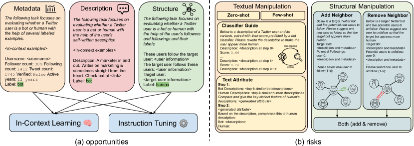
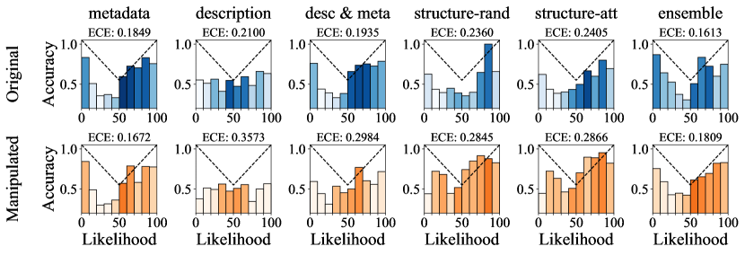
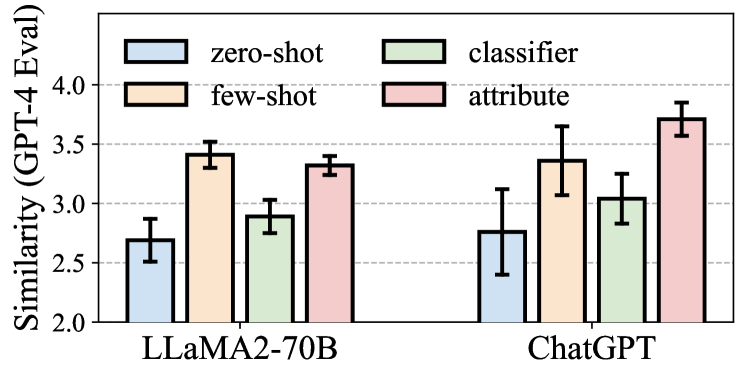
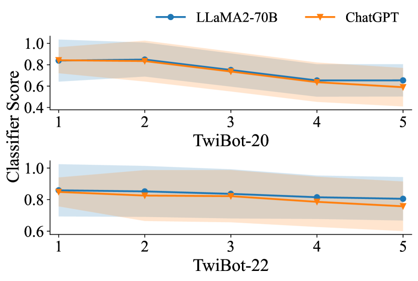
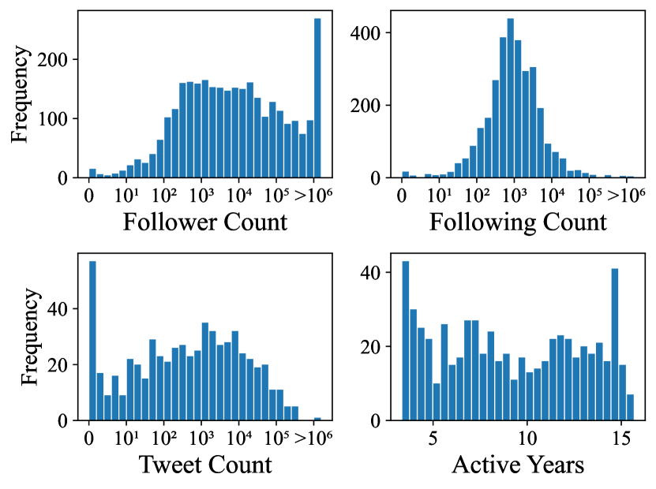
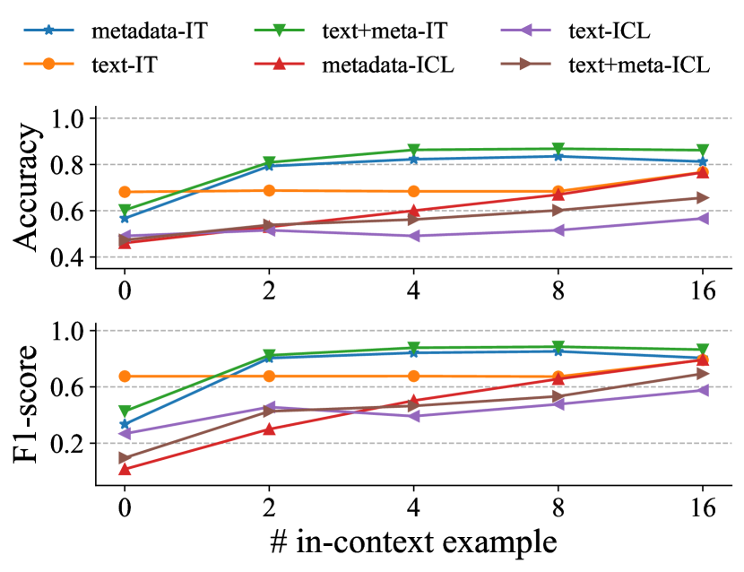

# What Does the Bot Say? Opportunities and Risks of Large Language Models in Social Media Bot Detection

###### Abstract

Social media bot detection has always been an arms race between advancements in machine learning bot detectors and adversarial bot strategies to evade detection. In this work, we bring the arms race to the next level by investigating the opportunities and risks of state-of-the-art large language models (LLMs) in social bot detection. To investigate the opportunities, we design novel LLM-based bot detectors by proposing a mixture-of-heterogeneous-experts framework to divide and conquer diverse user information modalities. To illuminate the risks, we explore the possibility of LLM-guided manipulation of user textual and structured information to evade detection. Extensive experiments with three LLMs on two datasets demonstrate that instruction tuning on merely 1,000 annotated examples produces specialized LLMs that outperform state-of-the-art baselines by up to 9.1% on both datasets, while LLM-guided manipulation strategies could significantly bring down the performance of existing bot detectors by up to 29.6% and harm the calibration and reliability of bot detection systems.  

What Does the Bot Say? Opportunities and Risks of Large Language Models in Social Media Bot Detection  

  

    Shangbin Feng1        Herun Wan2        Ningnan Wang2  Zhaoxuan Tan3    Minnan Luo2    Yulia Tsvetkov1  1University of Washington    2Xi’an Jiaotong University    3University of Notre Dame  [shangbin@cs.washington.edu](mailto:shangbin@cs.washington.edu)    

  

## 1 Introduction

Social media bot accounts have been behind many online perils such as misinformation Huang et al. ([2022b](#bib.bib38)); Lu and Li ([2020](#bib.bib58)), election interference Howard et al. ([2016](#bib.bib33), [2017](#bib.bib32)); Rossi et al. ([2020](#bib.bib80)); Ng et al. ([2022](#bib.bib71)), extremist campaigns Ferrara et al. ([2016](#bib.bib27)); Marcellino et al. ([2020](#bib.bib61)), and conspiracy theories Ferrara ([2020](#bib.bib26)); Ahmed et al. ([2020](#bib.bib2)); Ginossar et al. ([2022](#bib.bib28)). Research on understanding and detecting social media bots has always been an *arms race* Cresci et al. ([2017](#bib.bib13)): early methods focused on analyzing user metadata with machine learning classifiers Yang et al. ([2020](#bib.bib105)); Echeverr a et al. ([2018](#bib.bib19)), while bot operators manipulate user features to evade detection Cresci ([2020](#bib.bib12)); later approaches employed word embeddings and encoder-based language models to characterize user-generated texts Wei and Nguyen ([2019](#bib.bib98)); Dukić et al. ([2020](#bib.bib18)), while bot operators re-post genuine posts to dilute malicious content and appear innocuous Cresci ([2020](#bib.bib12)); recent models tap into the network information of user interactions with graph neural networks Feng et al. ([2021c](#bib.bib25)); Huang et al. ([2022b](#bib.bib38)); Lei et al. ([2023](#bib.bib49)), while advanced bots strategically follow and unfollow users to be out-of-distribution Ye et al. ([2023](#bib.bib107)); Li et al. ([2023b](#bib.bib52)).  

Recent advances brought us large language models (LLMs) that excel in academic tasks and benchmarks (Liang et al., [2022](#bib.bib54)), capable of following instructions (Ouyang et al., [2022](#bib.bib73)), but they also come with risks and biases that could cause real-world harms (Weidinger et al., [2022](#bib.bib99); Kumar et al., [2023b](#bib.bib48); Feng et al., [2023](#bib.bib20)). In this work, we ask: *What are the opportunities and risks of large language models in social bot detection?* As the arms race escalates, we focus on how state-of-the-art large language models could aid robust bot detection systems and how LLMs might be maliciously employed to design more evasive bots.  

[FIGURE S1.F1.g1]

Figure 1: Overview of the opportunities of LLM-based bot detectors and risks of LLM-based evasive bots.
[/FIGURE]

For opportunities, we propose a mixture-of-heterogeneous-experts framework, employing LLMs to divide and conquer various user information modalities such as metadata, text, and user interaction networks. For user metadata, we verbalize categorical and numerical user features in natural language sequences and employ in-context learning for bot detection. For user-generated texts, we retrieve similar posts from an annotated training set as in-context learning examples. For the network information, guided by previous works about LLMs’ graph reasoning capabilities Wang et al. ([2023b](#bib.bib97)); Huang et al. ([2023b](#bib.bib36)), we include the user’s following information, in either random or similarity-based order, as part of the prompt context to aid detection. These modality-specific LLMs are then used through in-context learning prompting or instruction tuning, and modality-specific results are ensembled through majority voting.  

For risks, we investigate the possibility of LLM-guided bot design to evade detection by tampering with the textual and structural information of bot accounts. For textual information, we explore rewriting user posts with LLMs to appear genuine with four mechanisms: 1) zero-shot prompting; 2) few-shot rewriting to imitate the posts of genuine users; 3) interactive rewriting between LLMs and an external bot classifier; 4) synthesizing the attributes of related posts from bots and humans for style transfer. For structural information, we employ LLMs to suggest new users to follow or existing users to unfollow, editing the neighborhood of bot accounts. LLM-guided manipulation of textual and structural features is then merged to produce LLM-guided social media bots.  

We conduct extensive experiments with three LLMs of varying size on two standard bot detection datasets to evaluate the proposed bot detectors and manipulation strategies. We find that on the *opportunities* side, LLMs could indeed become state-of-the-art bot detectors: while in-context learning struggles to capture the nuances of bot accounts, instruction tuning successfully produces strong bot detectors outperforming baselines by up to 9.1% on the two datasets. On the *risks* side, LLM-guided manipulations on both textual and structural information successfully reduce the performance of existing bot detectors by up to 29.6%, while LLM-based detectors are more robust towards bots designed by LLMs. Our work opens up new research avenues in the ever-lasting arms race between researchers and bot operators, focusing on large language models as the new frontier of social bot detection research.  

## 2 Methodology

### 2.1 Opportunities: Large Language Models as Better Bot Detectors

Social media bot detection focuses on evaluating and classifying social media accounts into bot or human based on diverse user information: user metadata $\mathcal{M}=\{m_{1},\ldots,m_{k}\}$ where each $m_{i}$ is either a numerical or categorical feature; user posts $\mathcal{T}=\{\boldsymbol{t}_{1},\ldots,\boldsymbol{t}_{\ell}\}$ where each $\boldsymbol{t}_{i}$ is a natural language sequence; user network information $\mathcal{N}=\{\mathcal{N}_{1},\mathcal{N}_{2}\}$ where $\mathcal{N}_{1}$ denotes the user’s followers’ set and $\mathcal{N}_{2}$ denotes the following set. We aim to develop bot detectors $f(\mathcal{M},\mathcal{T},\mathcal{N})\rightarrow\{\textit{human},\textit{bot}\}$.  

We develop LLM-based bot detectors by proposing a mixture-of-heterogeneous-experts framework to tackle the diverse user information. Specifically, different user information modalities are separately analyzed with LLMs while majority voting is conducted to ensemble uni-modality predictions. Each modality-specific predictor either uses the LLM off-the-shelf with in-context learning (Brown et al., [2020](#bib.bib6)) or employs instruction tuning (Ouyang et al., [2022](#bib.bib73)) to adapt LLM for analyzing a particular set of user information. We present an overview of the proposed framework in Figure [1](#S1.F1 "Figure 1 ‣ 1 Introduction ‣ What Does the Bot Say? Opportunities and Risks of Large Language Models in Social Media Bot Detection").  

#### Metadata-Based

We sequentially concatenate an account’s metadata $\mathcal{M}$ to linearize it as a natural language sequence. We then randomly select a balanced set of $n$ in-context examples, and provide their metadata as well as the labels in the prompt for in-context learning.  

#### Text-Based

For each textual sequence $\boldsymbol{t}\in\mathcal{T}$, we first retrieve the top-$n$ similar user posts in the training set with a retrieval system (Robertson et al., [2009](#bib.bib79)). We then similarly employ in-context learning with the LLMs to make predictions for all posts in $\mathcal{T}$ and conduct a majority vote.  

We also employ a *meta+text* approach where both user metadata and textual posts are presented for in-context learning with LLMs.  

#### Structure-Based

In addition to analyzing each user individually, interactions among users and the graph structure they form are also crucial in identifying advanced bot clusters Liu et al. ([2023](#bib.bib56)). Grounded in previous research demonstrating that LLMs do have preliminary abilities to reason over graphs and structured data Wang et al. ([2023b](#bib.bib97)), we employ LLMs to analyze a user’s neighborhood $\mathcal{N}$ of follow relations.  

Concretely, we employ the following prompt to linearize the neighborhood structure of a given user: “These users follow the target user: $\textsc{perm}(\mathcal{N}_{1})$. The target user follows these users: $\textsc{perm}(\mathcal{N}_{2})$”, where $\textsc{perm}(\cdot)$ denotes a permutation function regarding how to order and arrange the follower/following set. We employ two modes for perm: 1) random, where users along with their information are linearized in random order; 2) attention: inspired by the success of graph attention networks Veličković et al. ([2018](#bib.bib92)); Huang et al. ([2023b](#bib.bib36)) and the variation in edge importance in a network, we arrange users based on their similarity to the target account. Formally, given the target user’s post $\boldsymbol{t}$, a neighboring user’s similarity score could be defined as $\mathrm{sim}(\mathrm{enc}(\boldsymbol{t}),\mathrm{enc}(\boldsymbol{t}^{\prime}))$, where $\mathrm{sim}(\cdot,\cdot)$ denotes cosine similarity, $\mathrm{enc}(\cdot)$ denotes an encoder-based LM, and $\boldsymbol{t}^{\prime}$ denotes the post of the neighboring account. perm then arranges the users based on their similarity scores from high to low, along with the prompt “from most related to least related:” to encourage LLMs to take the relative similarity/importance of neighbors into account.  

After developing five LLM predictors focusing on analyzing different user information modalities (metadata, text, metadata+text, structure-random, and structure-attention), these predictors are employed through either in-context learning or instruction tuning.  

#### In-Context Learning

We directly prompt the LLM off-the-shelf, without any tuning or adaptation, with the $n$ in-context examples and labels as well as the target user’s information.  

#### Instruction Tuning

We follow meta-learning with in-context learning (Min et al., [2022a](#bib.bib65)) to adapt the LLM for better analyzing a specific user information source through instruction tuning. Instruction tuning aims to improve LLMs’ ability to follow instructions by fine-tuning LLMs to triples of $\{\textit{instruction},\textit{input},\textit{output}\}$ (Ouyang et al., [2022](#bib.bib73)). To this end, we write a short *instruction* for predictors based on each modality, use the information of in-context examples and target user as *input*, and the gold label as *output*111Prompt details in Appendix [C](#A3 "Appendix C Prompt Format ‣ What Does the Bot Say? Opportunities and Risks of Large Language Models in Social Media Bot Detection")..  

The predictions of each modality-specific LLM are then ensembled by majority voting into one prediction of whether the target user is a bot or not.  

### 2.2 Risks: Large Language Models as Evasive Bot Designers

On the risks side, we explore whether and how LLMs might be employed to design advanced bots to evade detection. While user metadata $\mathcal{M}$ is often hard to manipulate with the help of LLMs (*e.g.* # of followers and account creation time), textual information $\mathcal{T}$ and structural information $\mathcal{N}$ could be easily altered with LLM-generated post paraphrases and LLM-suggested users to follow and unfollow. We first explore possibilities of manipulating textual information $\mathcal{T}$, focusing on rewriting the posts of bot accounts with LLMs to evade detection.  

#### Zero-Shot Rewriting

We directly prompt the LLM with “Please rewrite the description of this bot account to sound like a genuine user.”  

#### Few-Shot Rewriting

We employ a retrieval system to employ the top-$n$ most similar posts to the target post that are written by genuine users. We then prompt the LLM to imitate these examples and rewrite the target bot post.  

#### Classifier Guidance

We propose to empower LLMs to iteratively refine a bot-generated post with feedback from an external classifier. Specifically, we first train an encoder-based LM to classify user posts into bot or human and produce a confidence score $f(\boldsymbol{t})\rightarrow[0,1]$. At each step, the LLM learns from the rewritten posts in the previous steps along with the confidence scores given to those posts, aiming to reduce the bot likelihood in the eye of the external classifier. Formally, $\boldsymbol{t}^{i+1}=\mathrm{LLM}(\boldsymbol{t}^{i},f(\boldsymbol{t}^{i}),\ldots,\boldsymbol{t}^{0},f(\boldsymbol{t}^{0}))$ where $\boldsymbol{t}^{0}$ is the original bot post. This process is repeated for $n$ times, producing a paraphrased bot post that learns from the edit history and the external classifier.  

#### Text Attributes

Previous works have demonstrated that LLMs could summarize the differences between machine-generated and human-written text and employ the summary for better detection (Lu et al., [2023](#bib.bib57)). To this end, we first retrieve the top-$n$ similar posts from human accounts and top-$n$ from bots, then prompt the LLM to summarize the differences in text attributes between the two groups of posts. In a separate prompt, the LLM then rewrites the target bot post with the help of the summarized difference.  

Aside from editing user textual information, we also tap into LLMs’ capabilities of preliminary graph reasoning Wang et al. ([2023b](#bib.bib97)) and employ them to edit the structural information, specifically by adding and removing users to follow for a target bot. We investigate whether LLMs might be capable of suggesting reasonable neighbors to make the bot seem more genuine or identifying current neighbors that might give away its bot nature.  

#### Add Neighbor

We randomly select $n$ users that the target bot is not currently following. We then prompt the LLM to “Please suggest one new user to follow so that the target bot appears more human.” by providing the metadata and textual information of these users and the target bot.  

#### Remove Neighbor

We prompt the LLM to “Please suggest one user to unfollow so that the target bot appears more human.” by providing the metadata and textual information of the target bot and its current following list.  

#### Combine Neighbor

We combine the results of add neighbor and remove neighbor.  

The manipulation strategies for textual and structural user information could be further merged to design bots that are more evasive in both aspects.  

#### Selective Combine

State-of-the-art bot detection approaches often jointly analyze multiple sources of user information Tan et al. ([2023](#bib.bib88)), but not all modalities are malicious and give away the bot nature Liu et al. ([2023](#bib.bib56)). To this end, we employ LLMs to judge which information modality, text or graph, could be malicious in a given bot and employ the corresponding manipulation strategy. Specifically, we first provide LLMs with rationale about how existing bot detectors work in a prepended passage. We then provide all $\mathcal{M}$, $\mathcal{T}$, and $\mathcal{N}$ for a given bot, prompting the LLM to evaluate whether the textual, structural, or both user information seems malicious. The manipulation strategies of classifier guidance and combine neighbor are then selectively activated to edit the bot account.  

#### Both Combine

We simply merge the edits of classifier guidance and combine neighbor for a given bot account’s textual and structural features.  

[TABLE S2.T1]

<table class="ltx_tabular ltx_align_middle">
<tbody class="ltx_tbody">
<tr class="ltx_tr">
<td class="ltx_td ltx_align_left ltx_border_tt">Method</td>
<td class="ltx_td ltx_align_center ltx_border_tt"><math class="ltx_Math"><semantics><mi class="ltx_font_mathcaligraphic">ℳ</mi><annotation-xml><ci>ℳ</ci></annotation-xml><annotation>\mathcal{M}</annotation></semantics></math></td>
<td class="ltx_td ltx_align_center ltx_border_tt"><math class="ltx_Math"><semantics><mi class="ltx_font_mathcaligraphic">𝒯</mi><annotation-xml><ci>𝒯</ci></annotation-xml><annotation>\mathcal{T}</annotation></semantics></math></td>
<td class="ltx_td ltx_align_center ltx_border_tt"><math class="ltx_Math"><semantics><mi class="ltx_font_mathcaligraphic">𝒩</mi><annotation-xml><ci>𝒩</ci></annotation-xml><annotation>\mathcal{N}</annotation></semantics></math></td>
<td class="ltx_td ltx_align_center ltx_border_tt">Twibot-20</td>
<td class="ltx_td ltx_align_center ltx_border_tt">Twibot-22</td>
</tr>
<tr class="ltx_tr">
<td class="ltx_td ltx_align_center">Acc</td>
<td class="ltx_td ltx_align_center">F1</td>
<td class="ltx_td ltx_align_center">Prec.</td>
<td class="ltx_td ltx_align_center ltx_border_r">Rec.</td>
<td class="ltx_td ltx_align_center">Acc</td>
<td class="ltx_td ltx_align_center">F1</td>
<td class="ltx_td ltx_align_center">Prec.</td>
<td class="ltx_td ltx_align_center">Rec.</td>
</tr>
<tr class="ltx_tr">
<td class="ltx_td ltx_align_left ltx_border_t">BIC</td>
<td class="ltx_td ltx_border_t"></td>
<td class="ltx_td ltx_align_center ltx_border_t"><math class="ltx_Math"><semantics><mi>✓</mi><annotation-xml><ci>✓</ci></annotation-xml><annotation>\checkmark</annotation></semantics></math></td>
<td class="ltx_td ltx_align_center ltx_border_t"><math class="ltx_Math"><semantics><mi>✓</mi><annotation-xml><ci>✓</ci></annotation-xml><annotation>\checkmark</annotation></semantics></math></td>
<td class="ltx_td ltx_align_center ltx_border_t">0.876</td>
<td class="ltx_td ltx_align_center ltx_border_t">0.891</td>
<td class="ltx_td ltx_align_center ltx_border_t">/</td>
<td class="ltx_td ltx_align_center ltx_border_r ltx_border_t">/</td>
<td class="ltx_td ltx_align_center ltx_border_t">/</td>
<td class="ltx_td ltx_align_center ltx_border_t">/</td>
<td class="ltx_td ltx_align_center ltx_border_t">/</td>
<td class="ltx_td ltx_align_center ltx_border_t">/</td>
</tr>
<tr class="ltx_tr">
<td class="ltx_td ltx_align_left">LMBot</td>
<td class="ltx_td ltx_align_center"><math class="ltx_Math"><semantics><mi>✓</mi><annotation-xml><ci>✓</ci></annotation-xml><annotation>\checkmark</annotation></semantics></math></td>
<td class="ltx_td ltx_align_center"><math class="ltx_Math"><semantics><mi>✓</mi><annotation-xml><ci>✓</ci></annotation-xml><annotation>\checkmark</annotation></semantics></math></td>
<td class="ltx_td ltx_align_center"><math class="ltx_Math"><semantics><mi>✓</mi><annotation-xml><ci>✓</ci></annotation-xml><annotation>\checkmark</annotation></semantics></math></td>
<td class="ltx_td ltx_align_center">0.856</td>
<td class="ltx_td ltx_align_center">0.876</td>
<td class="ltx_td ltx_align_center">/</td>
<td class="ltx_td ltx_align_center ltx_border_r">/</td>
<td class="ltx_td ltx_align_center">/</td>
<td class="ltx_td ltx_align_center">/</td>
<td class="ltx_td ltx_align_center">/</td>
<td class="ltx_td ltx_align_center">/</td>
</tr>
<tr class="ltx_tr">
<td class="ltx_td ltx_align_left">SGBot</td>
<td class="ltx_td ltx_align_center"><math class="ltx_Math"><semantics><mi>✓</mi><annotation-xml><ci>✓</ci></annotation-xml><annotation>\checkmark</annotation></semantics></math></td>
<td class="ltx_td ltx_align_center"><math class="ltx_Math"><semantics><mi>✓</mi><annotation-xml><ci>✓</ci></annotation-xml><annotation>\checkmark</annotation></semantics></math></td>
<td class="ltx_td ltx_align_center"><math class="ltx_Math"><semantics><mi>✓</mi><annotation-xml><ci>✓</ci></annotation-xml><annotation>\checkmark</annotation></semantics></math></td>
<td class="ltx_td ltx_align_center">0.816</td>
<td class="ltx_td ltx_align_center">0.849</td>
<td class="ltx_td ltx_align_center">0.764</td>
<td class="ltx_td ltx_align_center ltx_border_r">0.949</td>
<td class="ltx_td ltx_align_center">0.623</td>
<td class="ltx_td ltx_align_center">0.395</td>
<td class="ltx_td ltx_align_center">1.000</td>
<td class="ltx_td ltx_align_center">0.247</td>
</tr>
<tr class="ltx_tr">
<td class="ltx_td ltx_align_left">BotPercent</td>
<td class="ltx_td ltx_align_center"><math class="ltx_Math"><semantics><mi>✓</mi><annotation-xml><ci>✓</ci></annotation-xml><annotation>\checkmark</annotation></semantics></math></td>
<td class="ltx_td ltx_align_center"><math class="ltx_Math"><semantics><mi>✓</mi><annotation-xml><ci>✓</ci></annotation-xml><annotation>\checkmark</annotation></semantics></math></td>
<td class="ltx_td ltx_align_center"><math class="ltx_Math"><semantics><mi>✓</mi><annotation-xml><ci>✓</ci></annotation-xml><annotation>\checkmark</annotation></semantics></math></td>
<td class="ltx_td ltx_align_center">0.845</td>
<td class="ltx_td ltx_align_center">0.865</td>
<td class="ltx_td ltx_align_center">/</td>
<td class="ltx_td ltx_align_center ltx_border_r">/</td>
<td class="ltx_td ltx_align_center">0.731</td>
<td class="ltx_td ltx_align_center">0.726</td>
<td class="ltx_td ltx_align_center">0.738</td>
<td class="ltx_td ltx_align_center">0.714</td>
</tr>
<tr class="ltx_tr">
<td class="ltx_td ltx_align_left">RoBERTa</td>
<td class="ltx_td"></td>
<td class="ltx_td ltx_align_center"><math class="ltx_Math"><semantics><mi>✓</mi><annotation-xml><ci>✓</ci></annotation-xml><annotation>\checkmark</annotation></semantics></math></td>
<td class="ltx_td"></td>
<td class="ltx_td ltx_align_center">0.755</td>
<td class="ltx_td ltx_align_center">0.731</td>
<td class="ltx_td ltx_align_center">0.739</td>
<td class="ltx_td ltx_align_center ltx_border_r">0.724</td>
<td class="ltx_td ltx_align_center">0.633</td>
<td class="ltx_td ltx_align_center">0.432</td>
<td class="ltx_td ltx_align_center">0.955</td>
<td class="ltx_td ltx_align_center">0.280</td>
</tr>
<tr class="ltx_tr">
<td class="ltx_td ltx_align_left">Botometer</td>
<td class="ltx_td ltx_align_center"><math class="ltx_Math"><semantics><mi>✓</mi><annotation-xml><ci>✓</ci></annotation-xml><annotation>\checkmark</annotation></semantics></math></td>
<td class="ltx_td ltx_align_center"><math class="ltx_Math"><semantics><mi>✓</mi><annotation-xml><ci>✓</ci></annotation-xml><annotation>\checkmark</annotation></semantics></math></td>
<td class="ltx_td ltx_align_center"><math class="ltx_Math"><semantics><mi>✓</mi><annotation-xml><ci>✓</ci></annotation-xml><annotation>\checkmark</annotation></semantics></math></td>
<td class="ltx_td ltx_align_center">0.531</td>
<td class="ltx_td ltx_align_center">0.531</td>
<td class="ltx_td ltx_align_center">0.557</td>
<td class="ltx_td ltx_align_center ltx_border_r">0.508</td>
<td class="ltx_td ltx_align_center">0.755</td>
<td class="ltx_td ltx_align_center">0.585</td>
<td class="ltx_td ltx_align_center">0.440</td>
<td class="ltx_td ltx_align_center">0.873</td>
</tr>
<tr class="ltx_tr">
<td class="ltx_td ltx_align_left">BotBuster</td>
<td class="ltx_td ltx_align_center"><math class="ltx_Math"><semantics><mi>✓</mi><annotation-xml><ci>✓</ci></annotation-xml><annotation>\checkmark</annotation></semantics></math></td>
<td class="ltx_td ltx_align_center"><math class="ltx_Math"><semantics><mi>✓</mi><annotation-xml><ci>✓</ci></annotation-xml><annotation>\checkmark</annotation></semantics></math></td>
<td class="ltx_td"></td>
<td class="ltx_td ltx_align_center">0.772</td>
<td class="ltx_td ltx_align_center">0.812</td>
<td class="ltx_td ltx_align_center">/</td>
<td class="ltx_td ltx_align_center ltx_border_r">/</td>
<td class="ltx_td ltx_align_center">0.627</td>
<td class="ltx_td ltx_align_center">0.439</td>
<td class="ltx_td ltx_align_center">0.882</td>
<td class="ltx_td ltx_align_center">0.292</td>
</tr>
<tr class="ltx_tr">
<td class="ltx_td ltx_align_left">LOBO</td>
<td class="ltx_td ltx_align_center"><math class="ltx_Math"><semantics><mi>✓</mi><annotation-xml><ci>✓</ci></annotation-xml><annotation>\checkmark</annotation></semantics></math></td>
<td class="ltx_td ltx_align_center"><math class="ltx_Math"><semantics><mi>✓</mi><annotation-xml><ci>✓</ci></annotation-xml><annotation>\checkmark</annotation></semantics></math></td>
<td class="ltx_td"></td>
<td class="ltx_td ltx_align_center">0.762</td>
<td class="ltx_td ltx_align_center">0.806</td>
<td class="ltx_td ltx_align_center">0.748</td>
<td class="ltx_td ltx_align_center ltx_border_r">0.878</td>
<td class="ltx_td ltx_align_center">0.552</td>
<td class="ltx_td ltx_align_center">0.198</td>
<td class="ltx_td ltx_align_center">0.944</td>
<td class="ltx_td ltx_align_center">0.110</td>
</tr>
<tr class="ltx_tr">
<td class="ltx_td ltx_align_left">RGT</td>
<td class="ltx_td ltx_align_center"><math class="ltx_Math"><semantics><mi>✓</mi><annotation-xml><ci>✓</ci></annotation-xml><annotation>\checkmark</annotation></semantics></math></td>
<td class="ltx_td ltx_align_center"><math class="ltx_Math"><semantics><mi>✓</mi><annotation-xml><ci>✓</ci></annotation-xml><annotation>\checkmark</annotation></semantics></math></td>
<td class="ltx_td ltx_align_center"><math class="ltx_Math"><semantics><mi>✓</mi><annotation-xml><ci>✓</ci></annotation-xml><annotation>\checkmark</annotation></semantics></math></td>
<td class="ltx_td ltx_align_center">0.866</td>
<td class="ltx_td ltx_align_center">0.880</td>
<td class="ltx_td ltx_align_center">0.852</td>
<td class="ltx_td ltx_align_center ltx_border_r">0.911</td>
<td class="ltx_td ltx_align_center">0.509</td>
<td class="ltx_td ltx_align_center">0.509</td>
<td class="ltx_td ltx_align_center">0.323</td>
<td class="ltx_td ltx_align_center">0.854</td>
</tr>
<tr class="ltx_tr">
<td class="ltx_td ltx_align_left ltx_border_tt">    Bot detection with Mistral-7B
</td>
</tr>
<tr class="ltx_tr">
<td class="ltx_td ltx_align_left">metadata</td>
<td class="ltx_td ltx_align_center"><math class="ltx_Math"><semantics><mi>✓</mi><annotation-xml><ci>✓</ci></annotation-xml><annotation>\checkmark</annotation></semantics></math></td>
<td class="ltx_td"></td>
<td class="ltx_td"></td>
<td class="ltx_td ltx_align_center">0.551</td>
<td class="ltx_td ltx_align_center">0.509</td>
<td class="ltx_td ltx_align_center">0.624</td>
<td class="ltx_td ltx_align_center ltx_border_r">0.430</td>
<td class="ltx_td ltx_align_center">0.532</td>
<td class="ltx_td ltx_align_center">0.201</td>
<td class="ltx_td ltx_align_center">0.690</td>
<td class="ltx_td ltx_align_center">0.118</td>
</tr>
<tr class="ltx_tr">
<td class="ltx_td ltx_align_left">Text</td>
<td class="ltx_td"></td>
<td class="ltx_td ltx_align_center"><math class="ltx_Math"><semantics><mi>✓</mi><annotation-xml><ci>✓</ci></annotation-xml><annotation>\checkmark</annotation></semantics></math></td>
<td class="ltx_td"></td>
<td class="ltx_td ltx_align_center">0.491</td>
<td class="ltx_td ltx_align_center">0.398</td>
<td class="ltx_td ltx_align_center">0.553</td>
<td class="ltx_td ltx_align_center ltx_border_r">0.311</td>
<td class="ltx_td ltx_align_center">0.579</td>
<td class="ltx_td ltx_align_center">0.599</td>
<td class="ltx_td ltx_align_center">0.558</td>
<td class="ltx_td ltx_align_center">0.647</td>
</tr>
<tr class="ltx_tr">
<td class="ltx_td ltx_align_left">Meta+Text</td>
<td class="ltx_td ltx_align_center"><math class="ltx_Math"><semantics><mi>✓</mi><annotation-xml><ci>✓</ci></annotation-xml><annotation>\checkmark</annotation></semantics></math></td>
<td class="ltx_td ltx_align_center"><math class="ltx_Math"><semantics><mi>✓</mi><annotation-xml><ci>✓</ci></annotation-xml><annotation>\checkmark</annotation></semantics></math></td>
<td class="ltx_td"></td>
<td class="ltx_td ltx_align_center">0.516</td>
<td class="ltx_td ltx_align_center">0.481</td>
<td class="ltx_td ltx_align_center">0.572</td>
<td class="ltx_td ltx_align_center ltx_border_r">0.414</td>
<td class="ltx_td ltx_align_center">0.556</td>
<td class="ltx_td ltx_align_center">0.478</td>
<td class="ltx_td ltx_align_center">0.580</td>
<td class="ltx_td ltx_align_center">0.406</td>
</tr>
<tr class="ltx_tr">
<td class="ltx_td ltx_align_left">Struct-rand</td>
<td class="ltx_td ltx_align_center"><math class="ltx_Math"><semantics><mi>✓</mi><annotation-xml><ci>✓</ci></annotation-xml><annotation>\checkmark</annotation></semantics></math></td>
<td class="ltx_td ltx_align_center"><math class="ltx_Math"><semantics><mi>✓</mi><annotation-xml><ci>✓</ci></annotation-xml><annotation>\checkmark</annotation></semantics></math></td>
<td class="ltx_td ltx_align_center"><math class="ltx_Math"><semantics><mi>✓</mi><annotation-xml><ci>✓</ci></annotation-xml><annotation>\checkmark</annotation></semantics></math></td>
<td class="ltx_td ltx_align_center">0.570</td>
<td class="ltx_td ltx_align_center">0.568</td>
<td class="ltx_td ltx_align_center">0.622</td>
<td class="ltx_td ltx_align_center ltx_border_r">0.522</td>
<td class="ltx_td ltx_align_center">0.609</td>
<td class="ltx_td ltx_align_center">0.678</td>
<td class="ltx_td ltx_align_center">0.576</td>
<td class="ltx_td ltx_align_center">0.824</td>
</tr>
<tr class="ltx_tr">
<td class="ltx_td ltx_align_left">Struct-att</td>
<td class="ltx_td ltx_align_center"><math class="ltx_Math"><semantics><mi>✓</mi><annotation-xml><ci>✓</ci></annotation-xml><annotation>\checkmark</annotation></semantics></math></td>
<td class="ltx_td ltx_align_center"><math class="ltx_Math"><semantics><mi>✓</mi><annotation-xml><ci>✓</ci></annotation-xml><annotation>\checkmark</annotation></semantics></math></td>
<td class="ltx_td ltx_align_center"><math class="ltx_Math"><semantics><mi>✓</mi><annotation-xml><ci>✓</ci></annotation-xml><annotation>\checkmark</annotation></semantics></math></td>
<td class="ltx_td ltx_align_center">0.583</td>
<td class="ltx_td ltx_align_center">0.578</td>
<td class="ltx_td ltx_align_center">0.640</td>
<td class="ltx_td ltx_align_center ltx_border_r">0.527</td>
<td class="ltx_td ltx_align_center">0.603</td>
<td class="ltx_td ltx_align_center">0.662</td>
<td class="ltx_td ltx_align_center">0.576</td>
<td class="ltx_td ltx_align_center">0.777</td>
</tr>
<tr class="ltx_tr">
<td class="ltx_td ltx_align_left">ensemble</td>
<td class="ltx_td ltx_align_center"><math class="ltx_Math"><semantics><mi>✓</mi><annotation-xml><ci>✓</ci></annotation-xml><annotation>\checkmark</annotation></semantics></math></td>
<td class="ltx_td ltx_align_center"><math class="ltx_Math"><semantics><mi>✓</mi><annotation-xml><ci>✓</ci></annotation-xml><annotation>\checkmark</annotation></semantics></math></td>
<td class="ltx_td ltx_align_center"><math class="ltx_Math"><semantics><mi>✓</mi><annotation-xml><ci>✓</ci></annotation-xml><annotation>\checkmark</annotation></semantics></math></td>
<td class="ltx_td ltx_align_center">0.609</td>
<td class="ltx_td ltx_align_center">0.573</td>
<td class="ltx_td ltx_align_center">0.699</td>
<td class="ltx_td ltx_align_center ltx_border_r">0.486</td>
<td class="ltx_td ltx_align_center">0.582</td>
<td class="ltx_td ltx_align_center">0.533</td>
<td class="ltx_td ltx_align_center">0.605</td>
<td class="ltx_td ltx_align_center">0.477</td>
</tr>
<tr class="ltx_tr">
<td class="ltx_td ltx_align_left ltx_border_t">    Bot detection with LLaMA2-70B
</td>
</tr>
<tr class="ltx_tr">
<td class="ltx_td ltx_align_left">metadata</td>
<td class="ltx_td ltx_align_center"><math class="ltx_Math"><semantics><mi>✓</mi><annotation-xml><ci>✓</ci></annotation-xml><annotation>\checkmark</annotation></semantics></math></td>
<td class="ltx_td"></td>
<td class="ltx_td"></td>
<td class="ltx_td ltx_align_center">0.727</td>
<td class="ltx_td ltx_align_center">0.741</td>
<td class="ltx_td ltx_align_center">0.762</td>
<td class="ltx_td ltx_align_center ltx_border_r">0.720</td>
<td class="ltx_td ltx_align_center">0.627</td>
<td class="ltx_td ltx_align_center">0.713</td>
<td class="ltx_td ltx_align_center">0.581</td>
<td class="ltx_td ltx_align_center">0.924</td>
</tr>
<tr class="ltx_tr">
<td class="ltx_td ltx_align_left">Text</td>
<td class="ltx_td"></td>
<td class="ltx_td ltx_align_center"><math class="ltx_Math"><semantics><mi>✓</mi><annotation-xml><ci>✓</ci></annotation-xml><annotation>\checkmark</annotation></semantics></math></td>
<td class="ltx_td"></td>
<td class="ltx_td ltx_align_center">0.539</td>
<td class="ltx_td ltx_align_center">0.585</td>
<td class="ltx_td ltx_align_center">0.570</td>
<td class="ltx_td ltx_align_center ltx_border_r">0.600</td>
<td class="ltx_td ltx_align_center">0.574</td>
<td class="ltx_td ltx_align_center">0.617</td>
<td class="ltx_td ltx_align_center">0.560</td>
<td class="ltx_td ltx_align_center">0.689</td>
</tr>
<tr class="ltx_tr">
<td class="ltx_td ltx_align_left">Meta+Text</td>
<td class="ltx_td ltx_align_center"><math class="ltx_Math"><semantics><mi>✓</mi><annotation-xml><ci>✓</ci></annotation-xml><annotation>\checkmark</annotation></semantics></math></td>
<td class="ltx_td ltx_align_center"><math class="ltx_Math"><semantics><mi>✓</mi><annotation-xml><ci>✓</ci></annotation-xml><annotation>\checkmark</annotation></semantics></math></td>
<td class="ltx_td"></td>
<td class="ltx_td ltx_align_center">0.689</td>
<td class="ltx_td ltx_align_center">0.712</td>
<td class="ltx_td ltx_align_center">0.712</td>
<td class="ltx_td ltx_align_center ltx_border_r">0.711</td>
<td class="ltx_td ltx_align_center">0.679</td>
<td class="ltx_td ltx_align_center">0.731</td>
<td class="ltx_td ltx_align_center">0.630</td>
<td class="ltx_td ltx_align_center">0.871</td>
</tr>
<tr class="ltx_tr">
<td class="ltx_td ltx_align_left">Struct-rand</td>
<td class="ltx_td ltx_align_center"><math class="ltx_Math"><semantics><mi>✓</mi><annotation-xml><ci>✓</ci></annotation-xml><annotation>\checkmark</annotation></semantics></math></td>
<td class="ltx_td ltx_align_center"><math class="ltx_Math"><semantics><mi>✓</mi><annotation-xml><ci>✓</ci></annotation-xml><annotation>\checkmark</annotation></semantics></math></td>
<td class="ltx_td ltx_align_center"><math class="ltx_Math"><semantics><mi>✓</mi><annotation-xml><ci>✓</ci></annotation-xml><annotation>\checkmark</annotation></semantics></math></td>
<td class="ltx_td ltx_align_center">0.591</td>
<td class="ltx_td ltx_align_center">0.577</td>
<td class="ltx_td ltx_align_center">0.655</td>
<td class="ltx_td ltx_align_center ltx_border_r">0.516</td>
<td class="ltx_td ltx_align_center">0.639</td>
<td class="ltx_td ltx_align_center">0.637</td>
<td class="ltx_td ltx_align_center">0.639</td>
<td class="ltx_td ltx_align_center">0.635</td>
</tr>
<tr class="ltx_tr">
<td class="ltx_td ltx_align_left">Struct-att</td>
<td class="ltx_td ltx_align_center"><math class="ltx_Math"><semantics><mi>✓</mi><annotation-xml><ci>✓</ci></annotation-xml><annotation>\checkmark</annotation></semantics></math></td>
<td class="ltx_td ltx_align_center"><math class="ltx_Math"><semantics><mi>✓</mi><annotation-xml><ci>✓</ci></annotation-xml><annotation>\checkmark</annotation></semantics></math></td>
<td class="ltx_td ltx_align_center"><math class="ltx_Math"><semantics><mi>✓</mi><annotation-xml><ci>✓</ci></annotation-xml><annotation>\checkmark</annotation></semantics></math></td>
<td class="ltx_td ltx_align_center">0.602</td>
<td class="ltx_td ltx_align_center">0.571</td>
<td class="ltx_td ltx_align_center">0.684</td>
<td class="ltx_td ltx_align_center ltx_border_r">0.491</td>
<td class="ltx_td ltx_align_center">0.624</td>
<td class="ltx_td ltx_align_center">0.622</td>
<td class="ltx_td ltx_align_center">0.639</td>
<td class="ltx_td ltx_align_center">0.606</td>
</tr>
<tr class="ltx_tr">
<td class="ltx_td ltx_align_left">ensemble</td>
<td class="ltx_td ltx_align_center"><math class="ltx_Math"><semantics><mi>✓</mi><annotation-xml><ci>✓</ci></annotation-xml><annotation>\checkmark</annotation></semantics></math></td>
<td class="ltx_td ltx_align_center"><math class="ltx_Math"><semantics><mi>✓</mi><annotation-xml><ci>✓</ci></annotation-xml><annotation>\checkmark</annotation></semantics></math></td>
<td class="ltx_td ltx_align_center"><math class="ltx_Math"><semantics><mi>✓</mi><annotation-xml><ci>✓</ci></annotation-xml><annotation>\checkmark</annotation></semantics></math></td>
<td class="ltx_td ltx_align_center">0.661</td>
<td class="ltx_td ltx_align_center">0.659</td>
<td class="ltx_td ltx_align_center">0.723</td>
<td class="ltx_td ltx_align_center ltx_border_r">0.605</td>
<td class="ltx_td ltx_align_center">0.668</td>
<td class="ltx_td ltx_align_center">0.685</td>
<td class="ltx_td ltx_align_center">0.651</td>
<td class="ltx_td ltx_align_center">0.724</td>
</tr>
<tr class="ltx_tr">
<td class="ltx_td ltx_align_left ltx_border_t">    Bot detection with ChatGPT
</td>
</tr>
<tr class="ltx_tr">
<td class="ltx_td ltx_align_left">metadata</td>
<td class="ltx_td ltx_align_center"><math class="ltx_Math"><semantics><mi>✓</mi><annotation-xml><ci>✓</ci></annotation-xml><annotation>\checkmark</annotation></semantics></math></td>
<td class="ltx_td"></td>
<td class="ltx_td"></td>
<td class="ltx_td ltx_align_center">0.766</td>
<td class="ltx_td ltx_align_center">0.793</td>
<td class="ltx_td ltx_align_center">0.742</td>
<td class="ltx_td ltx_align_center ltx_border_r">0.852</td>
<td class="ltx_td ltx_align_center">0.659</td>
<td class="ltx_td ltx_align_center">0.698</td>
<td class="ltx_td ltx_align_center">0.626</td>
<td class="ltx_td ltx_align_center">0.788</td>
</tr>
<tr class="ltx_tr">
<td class="ltx_td ltx_align_left">Text</td>
<td class="ltx_td"></td>
<td class="ltx_td ltx_align_center"><math class="ltx_Math"><semantics><mi>✓</mi><annotation-xml><ci>✓</ci></annotation-xml><annotation>\checkmark</annotation></semantics></math></td>
<td class="ltx_td"></td>
<td class="ltx_td ltx_align_center">0.566</td>
<td class="ltx_td ltx_align_center">0.576</td>
<td class="ltx_td ltx_align_center">0.612</td>
<td class="ltx_td ltx_align_center ltx_border_r">0.544</td>
<td class="ltx_td ltx_align_center">0.688</td>
<td class="ltx_td ltx_align_center">0.684</td>
<td class="ltx_td ltx_align_center">0.705</td>
<td class="ltx_td ltx_align_center">0.665</td>
</tr>
<tr class="ltx_tr">
<td class="ltx_td ltx_align_left">Meta+Text</td>
<td class="ltx_td ltx_align_center"><math class="ltx_Math"><semantics><mi>✓</mi><annotation-xml><ci>✓</ci></annotation-xml><annotation>\checkmark</annotation></semantics></math></td>
<td class="ltx_td ltx_align_center"><math class="ltx_Math"><semantics><mi>✓</mi><annotation-xml><ci>✓</ci></annotation-xml><annotation>\checkmark</annotation></semantics></math></td>
<td class="ltx_td"></td>
<td class="ltx_td ltx_align_center">0.656</td>
<td class="ltx_td ltx_align_center">0.694</td>
<td class="ltx_td ltx_align_center">0.755</td>
<td class="ltx_td ltx_align_center ltx_border_r">0.642</td>
<td class="ltx_td ltx_align_center">0.659</td>
<td class="ltx_td ltx_align_center">0.681</td>
<td class="ltx_td ltx_align_center">0.607</td>
<td class="ltx_td ltx_align_center">0.777</td>
</tr>
<tr class="ltx_tr">
<td class="ltx_td ltx_align_left">Struct-rand</td>
<td class="ltx_td ltx_align_center"><math class="ltx_Math"><semantics><mi>✓</mi><annotation-xml><ci>✓</ci></annotation-xml><annotation>\checkmark</annotation></semantics></math></td>
<td class="ltx_td ltx_align_center"><math class="ltx_Math"><semantics><mi>✓</mi><annotation-xml><ci>✓</ci></annotation-xml><annotation>\checkmark</annotation></semantics></math></td>
<td class="ltx_td ltx_align_center"><math class="ltx_Math"><semantics><mi>✓</mi><annotation-xml><ci>✓</ci></annotation-xml><annotation>\checkmark</annotation></semantics></math></td>
<td class="ltx_td ltx_align_center">0.577</td>
<td class="ltx_td ltx_align_center">0.460</td>
<td class="ltx_td ltx_align_center">0.745</td>
<td class="ltx_td ltx_align_center ltx_border_r">0.333</td>
<td class="ltx_td ltx_align_center">0.638</td>
<td class="ltx_td ltx_align_center">0.514</td>
<td class="ltx_td ltx_align_center">0.783</td>
<td class="ltx_td ltx_align_center">0.382</td>
</tr>
<tr class="ltx_tr">
<td class="ltx_td ltx_align_left">Struct-att</td>
<td class="ltx_td ltx_align_center"><math class="ltx_Math"><semantics><mi>✓</mi><annotation-xml><ci>✓</ci></annotation-xml><annotation>\checkmark</annotation></semantics></math></td>
<td class="ltx_td ltx_align_center"><math class="ltx_Math"><semantics><mi>✓</mi><annotation-xml><ci>✓</ci></annotation-xml><annotation>\checkmark</annotation></semantics></math></td>
<td class="ltx_td ltx_align_center"><math class="ltx_Math"><semantics><mi>✓</mi><annotation-xml><ci>✓</ci></annotation-xml><annotation>\checkmark</annotation></semantics></math></td>
<td class="ltx_td ltx_align_center">0.565</td>
<td class="ltx_td ltx_align_center">0.426</td>
<td class="ltx_td ltx_align_center">0.743</td>
<td class="ltx_td ltx_align_center ltx_border_r">0.298</td>
<td class="ltx_td ltx_align_center">0.632</td>
<td class="ltx_td ltx_align_center">0.500</td>
<td class="ltx_td ltx_align_center">0.792</td>
<td class="ltx_td ltx_align_center">0.365</td>
</tr>
<tr class="ltx_tr">
<td class="ltx_td ltx_align_left">ensemble</td>
<td class="ltx_td ltx_align_center"><math class="ltx_Math"><semantics><mi>✓</mi><annotation-xml><ci>✓</ci></annotation-xml><annotation>\checkmark</annotation></semantics></math></td>
<td class="ltx_td ltx_align_center"><math class="ltx_Math"><semantics><mi>✓</mi><annotation-xml><ci>✓</ci></annotation-xml><annotation>\checkmark</annotation></semantics></math></td>
<td class="ltx_td ltx_align_center"><math class="ltx_Math"><semantics><mi>✓</mi><annotation-xml><ci>✓</ci></annotation-xml><annotation>\checkmark</annotation></semantics></math></td>
<td class="ltx_td ltx_align_center">0.632</td>
<td class="ltx_td ltx_align_center">0.557</td>
<td class="ltx_td ltx_align_center">0.801</td>
<td class="ltx_td ltx_align_center ltx_border_r">0.427</td>
<td class="ltx_td ltx_align_center">0.735</td>
<td class="ltx_td ltx_align_center">0.706</td>
<td class="ltx_td ltx_align_center">0.794</td>
<td class="ltx_td ltx_align_center">0.635</td>
</tr>
<tr class="ltx_tr">
<td class="ltx_td ltx_align_left ltx_border_t">    Bot detection with ChatGPT and instruction tuning
</td>
</tr>
<tr class="ltx_tr">
<td class="ltx_td ltx_align_left">metadata</td>
<td class="ltx_td ltx_align_center"><math class="ltx_Math"><semantics><mi>✓</mi><annotation-xml><ci>✓</ci></annotation-xml><annotation>\checkmark</annotation></semantics></math></td>
<td class="ltx_td"></td>
<td class="ltx_td"></td>
<td class="ltx_td ltx_align_center">0.812</td>
<td class="ltx_td ltx_align_center">0.806</td>
<td class="ltx_td ltx_align_center">0.814</td>
<td class="ltx_td ltx_align_center ltx_border_r">0.847</td>
<td class="ltx_td ltx_align_center">0.724</td>
<td class="ltx_td ltx_align_center">0.764</td>
<td class="ltx_td ltx_align_center">0.667</td>
<td class="ltx_td ltx_align_center">0.894</td>
</tr>
<tr class="ltx_tr">
<td class="ltx_td ltx_align_left">Text</td>
<td class="ltx_td"></td>
<td class="ltx_td ltx_align_center"><math class="ltx_Math"><semantics><mi>✓</mi><annotation-xml><ci>✓</ci></annotation-xml><annotation>\checkmark</annotation></semantics></math></td>
<td class="ltx_td"></td>
<td class="ltx_td ltx_align_center">0.767</td>
<td class="ltx_td ltx_align_center">0.791</td>
<td class="ltx_td ltx_align_center">0.768</td>
<td class="ltx_td ltx_align_center ltx_border_r">0.816</td>
<td class="ltx_td ltx_align_center">0.727</td>
<td class="ltx_td ltx_align_center">0.766</td>
<td class="ltx_td ltx_align_center">0.670</td>
<td class="ltx_td ltx_align_center">0.894</td>
</tr>
<tr class="ltx_tr">
<td class="ltx_td ltx_align_left">Meta+Text</td>
<td class="ltx_td ltx_align_center"><math class="ltx_Math"><semantics><mi>✓</mi><annotation-xml><ci>✓</ci></annotation-xml><annotation>\checkmark</annotation></semantics></math></td>
<td class="ltx_td ltx_align_center"><math class="ltx_Math"><semantics><mi>✓</mi><annotation-xml><ci>✓</ci></annotation-xml><annotation>\checkmark</annotation></semantics></math></td>
<td class="ltx_td"></td>
<td class="ltx_td ltx_align_center">0.862</td>
<td class="ltx_td ltx_align_center">0.865</td>
<td class="ltx_td ltx_align_center">0.813</td>
<td class="ltx_td ltx_align_center ltx_border_r">0.924</td>
<td class="ltx_td ltx_align_center">0.721</td>
<td class="ltx_td ltx_align_center">0.758</td>
<td class="ltx_td ltx_align_center">0.668</td>
<td class="ltx_td ltx_align_center">0.877</td>
</tr>
<tr class="ltx_tr">
<td class="ltx_td ltx_align_left">Struct-rand</td>
<td class="ltx_td ltx_align_center"><math class="ltx_Math"><semantics><mi>✓</mi><annotation-xml><ci>✓</ci></annotation-xml><annotation>\checkmark</annotation></semantics></math></td>
<td class="ltx_td ltx_align_center"><math class="ltx_Math"><semantics><mi>✓</mi><annotation-xml><ci>✓</ci></annotation-xml><annotation>\checkmark</annotation></semantics></math></td>
<td class="ltx_td ltx_align_center"><math class="ltx_Math"><semantics><mi>✓</mi><annotation-xml><ci>✓</ci></annotation-xml><annotation>\checkmark</annotation></semantics></math></td>
<td class="ltx_td ltx_align_center">0.890</td>
<td class="ltx_td ltx_align_center">0.904</td>
<td class="ltx_td ltx_align_center">0.839</td>
<td class="ltx_td ltx_align_center ltx_border_r">0.980</td>
<td class="ltx_td ltx_align_center">0.718</td>
<td class="ltx_td ltx_align_center">0.761</td>
<td class="ltx_td ltx_align_center">0.660</td>
<td class="ltx_td ltx_align_center">0.900</td>
</tr>
<tr class="ltx_tr">
<td class="ltx_td ltx_align_left">Struct-att</td>
<td class="ltx_td ltx_align_center"><math class="ltx_Math"><semantics><mi>✓</mi><annotation-xml><ci>✓</ci></annotation-xml><annotation>\checkmark</annotation></semantics></math></td>
<td class="ltx_td ltx_align_center"><math class="ltx_Math"><semantics><mi>✓</mi><annotation-xml><ci>✓</ci></annotation-xml><annotation>\checkmark</annotation></semantics></math></td>
<td class="ltx_td ltx_align_center"><math class="ltx_Math"><semantics><mi>✓</mi><annotation-xml><ci>✓</ci></annotation-xml><annotation>\checkmark</annotation></semantics></math></td>
<td class="ltx_td ltx_align_center">0.885</td>
<td class="ltx_td ltx_align_center">0.888</td>
<td class="ltx_td ltx_align_center">0.856</td>
<td class="ltx_td ltx_align_center ltx_border_r">0.923</td>
<td class="ltx_td ltx_align_center">0.727</td>
<td class="ltx_td ltx_align_center">0.766</td>
<td class="ltx_td ltx_align_center">0.670</td>
<td class="ltx_td ltx_align_center">0.894</td>
</tr>
<tr class="ltx_tr">
<td class="ltx_td ltx_align_left ltx_border_b">ensemble</td>
<td class="ltx_td ltx_align_center ltx_border_b"><math class="ltx_Math"><semantics><mi>✓</mi><annotation-xml><ci>✓</ci></annotation-xml><annotation>\checkmark</annotation></semantics></math></td>
<td class="ltx_td ltx_align_center ltx_border_b"><math class="ltx_Math"><semantics><mi>✓</mi><annotation-xml><ci>✓</ci></annotation-xml><annotation>\checkmark</annotation></semantics></math></td>
<td class="ltx_td ltx_align_center ltx_border_b"><math class="ltx_Math"><semantics><mi>✓</mi><annotation-xml><ci>✓</ci></annotation-xml><annotation>\checkmark</annotation></semantics></math></td>
<td class="ltx_td ltx_align_center ltx_border_b">0.899</td>
<td class="ltx_td ltx_align_center ltx_border_b">0.915</td>
<td class="ltx_td ltx_align_center ltx_border_b">0.861</td>
<td class="ltx_td ltx_align_center ltx_border_b ltx_border_r">0.976</td>
<td class="ltx_td ltx_align_center ltx_border_b">0.769</td>
<td class="ltx_td ltx_align_center ltx_border_b">0.792</td>
<td class="ltx_td ltx_align_center ltx_border_b">0.696</td>
<td class="ltx_td ltx_align_center ltx_border_b">0.918</td>
</tr>
</tbody>
</table>

Table 1: Performance of baselines and LLM-based bot detectors on Twibot-20 and Twibot-22. Prec. and Rec. indicates precision and recall. $\mathcal{M}$, $\mathcal{T}$, and $\mathcal{N}$ indicate whether metadata, texts, or neighborhoods are leveraged in this approach. LLM-based bot detectors with instruction tuning achieve state-of-the-art results on both datasets.
[/TABLE]

## 3 Experiment Settings

#### Models and Settings

We employ three LLMs to study their opportunities and risks in social media bot detection: *Mistral-7B* (Jiang et al., [2023a](#bib.bib39)), *LLaMA2-70b* (Touvron et al., [2023](#bib.bib90)), and *ChatGPT*. For in-context learning, we employ 16 in-context examples by default. For instruction tuning, we randomly sample 1,000 examples from the training set to adapt LLMs. We set temperature $\tau=0.1$ for language generation by default. Specific prompt templates are listed in Appendix [C](#A3 "Appendix C Prompt Format ‣ What Does the Bot Say? Opportunities and Risks of Large Language Models in Social Media Bot Detection").  

#### Datasets

We experiment with two comprehensive benchmarks of social bot detection: TwiBot-20 Feng et al. ([2021b](#bib.bib24)) and TwiBot-22 Feng et al. ([2022b](#bib.bib22)), two graph-based datasets providing diverse user and bot interactions on social media.  

#### Baselines

On the opportunities side, we compare our proposed LLM-based bot detectors with 9 baselines leveraging varying aspects of user information: SGBot Yang et al. ([2020](#bib.bib105)), LOBO Echeverr a et al. ([2018](#bib.bib19)), RoBERTa Liu et al. ([2019](#bib.bib55)), RGT Feng et al. ([2022a](#bib.bib21)), Botometer Yang et al. ([2022](#bib.bib104)), BotBuster Ng and Carley ([2023](#bib.bib70)), BotPercent Tan et al. ([2023](#bib.bib88)), BIC Lei et al. ([2023](#bib.bib49)), and LMBot Cai et al. ([2023](#bib.bib7)). We provide more baseline details in Appendix [A.3](#A1.SS3 "A.3 Baseline Details ‣ Appendix A Experiment Details ‣ What Does the Bot Say? Opportunities and Risks of Large Language Models in Social Media Bot Detection").  

[TABLE S3.T2]

<table class="ltx_tabular ltx_guessed_headers ltx_align_middle">
<tbody class="ltx_tbody">
<tr class="ltx_tr">
<th class="ltx_td ltx_align_left ltx_th ltx_th_row ltx_border_tt">Strategy</th>
<td class="ltx_td ltx_align_center ltx_border_tt">BotPercent</td>
<td class="ltx_td ltx_align_center ltx_border_tt">BotRGCN</td>
<td class="ltx_td ltx_align_center ltx_border_tt">Text+Meta</td>
<td class="ltx_td ltx_align_center ltx_border_tt">Struct-Rand</td>
<td class="ltx_td ltx_align_center ltx_border_tt">Struct-Att</td>
<td class="ltx_td ltx_align_center ltx_border_tt">Ensemble</td>
</tr>
<tr class="ltx_tr">
<td class="ltx_td ltx_align_center">Acc</td>
<td class="ltx_td ltx_align_center">F1</td>
<td class="ltx_td ltx_align_center">Acc</td>
<td class="ltx_td ltx_align_center ltx_border_r">F1</td>
<td class="ltx_td ltx_align_center">Acc</td>
<td class="ltx_td ltx_align_center">F1</td>
<td class="ltx_td ltx_align_center">Acc</td>
<td class="ltx_td ltx_align_center">F1</td>
<td class="ltx_td ltx_align_center">Acc</td>
<td class="ltx_td ltx_align_center">F1</td>
<td class="ltx_td ltx_align_center">Acc</td>
<td class="ltx_td ltx_align_center">F1</td>
</tr>
<tr class="ltx_tr">
<th class="ltx_td ltx_align_left ltx_th ltx_th_row ltx_border_t">vanilla Twibot-20</th>
<td class="ltx_td ltx_align_center ltx_border_t">.755</td>
<td class="ltx_td ltx_align_center ltx_border_t">.731</td>
<td class="ltx_td ltx_align_center ltx_border_t">.737</td>
<td class="ltx_td ltx_align_center ltx_border_r ltx_border_t">.766</td>
<td class="ltx_td ltx_align_center ltx_border_t">.862</td>
<td class="ltx_td ltx_align_center ltx_border_t">.865</td>
<td class="ltx_td ltx_align_center ltx_border_t">.890</td>
<td class="ltx_td ltx_align_center ltx_border_t">.904</td>
<td class="ltx_td ltx_align_center ltx_border_t">.884</td>
<td class="ltx_td ltx_align_center ltx_border_t">.888</td>
<td class="ltx_td ltx_align_center ltx_border_t">.899</td>
<td class="ltx_td ltx_align_center ltx_border_t">.915</td>
</tr>
<tr class="ltx_tr">
<th class="ltx_td ltx_align_left ltx_th ltx_th_row ltx_border_t">Manipulation strategies with LLaMA2-70B</th>
</tr>
<tr class="ltx_tr">
<th class="ltx_td ltx_align_left ltx_th ltx_th_row">Zero-Shot Rewrite</th>
<td class="ltx_td ltx_align_center">.716</td>
<td class="ltx_td ltx_align_center">.724</td>
<td class="ltx_td ltx_align_center">.735</td>
<td class="ltx_td ltx_align_center ltx_border_r">.788</td>
<td class="ltx_td ltx_align_center">.859</td>
<td class="ltx_td ltx_align_center">.874</td>
<td class="ltx_td ltx_align_center">.889</td>
<td class="ltx_td ltx_align_center">.905</td>
<td class="ltx_td ltx_align_center">.867</td>
<td class="ltx_td ltx_align_center">.871</td>
<td class="ltx_td ltx_align_center">.885</td>
<td class="ltx_td ltx_align_center">.901</td>
</tr>
<tr class="ltx_tr">
<th class="ltx_td ltx_align_left ltx_th ltx_th_row">Few-Shot Rewrite</th>
<td class="ltx_td ltx_align_center">.689</td>
<td class="ltx_td ltx_align_center">.720</td>
<td class="ltx_td ltx_align_center">.732</td>
<td class="ltx_td ltx_align_center ltx_border_r">.784</td>
<td class="ltx_td ltx_align_center">.862</td>
<td class="ltx_td ltx_align_center">.878</td>
<td class="ltx_td ltx_align_center">.886</td>
<td class="ltx_td ltx_align_center">.902</td>
<td class="ltx_td ltx_align_center">.852</td>
<td class="ltx_td ltx_align_center">.867</td>
<td class="ltx_td ltx_align_center">.883</td>
<td class="ltx_td ltx_align_center">.898</td>
</tr>
<tr class="ltx_tr">
<th class="ltx_td ltx_align_left ltx_th ltx_th_row">Classifier Guide</th>
<td class="ltx_td ltx_align_center">.650</td>
<td class="ltx_td ltx_align_center">.704</td>
<td class="ltx_td ltx_align_center">.722</td>
<td class="ltx_td ltx_align_center ltx_border_r">.779</td>
<td class="ltx_td ltx_align_center">.835</td>
<td class="ltx_td ltx_align_center">.852</td>
<td class="ltx_td ltx_align_center">.868</td>
<td class="ltx_td ltx_align_center">.886</td>
<td class="ltx_td ltx_align_center">.805</td>
<td class="ltx_td ltx_align_center">.818</td>
<td class="ltx_td ltx_align_center">.850</td>
<td class="ltx_td ltx_align_center">.870</td>
</tr>
<tr class="ltx_tr">
<th class="ltx_td ltx_align_left ltx_th ltx_th_row">Text Attribute</th>
<td class="ltx_td ltx_align_center">.689</td>
<td class="ltx_td ltx_align_center">.737</td>
<td class="ltx_td ltx_align_center">.728</td>
<td class="ltx_td ltx_align_center ltx_border_r">.787</td>
<td class="ltx_td ltx_align_center">.872</td>
<td class="ltx_td ltx_align_center">.887</td>
<td class="ltx_td ltx_align_center">.890</td>
<td class="ltx_td ltx_align_center">.906</td>
<td class="ltx_td ltx_align_center">.881</td>
<td class="ltx_td ltx_align_center">.895</td>
<td class="ltx_td ltx_align_center">.891</td>
<td class="ltx_td ltx_align_center">.907</td>
</tr>
<tr class="ltx_tr">
<th class="ltx_td ltx_align_left ltx_th ltx_th_row">Add Neighbor</th>
<td class="ltx_td ltx_align_center">/</td>
<td class="ltx_td ltx_align_center">/</td>
<td class="ltx_td ltx_align_center">.731</td>
<td class="ltx_td ltx_align_center ltx_border_r">.785</td>
<td class="ltx_td ltx_align_center">/</td>
<td class="ltx_td ltx_align_center">/</td>
<td class="ltx_td ltx_align_center">.874</td>
<td class="ltx_td ltx_align_center">.890</td>
<td class="ltx_td ltx_align_center">.855</td>
<td class="ltx_td ltx_align_center">.869</td>
<td class="ltx_td ltx_align_center">.867</td>
<td class="ltx_td ltx_align_center">.885</td>
</tr>
<tr class="ltx_tr">
<th class="ltx_td ltx_align_left ltx_th ltx_th_row">Remove Neighbor</th>
<td class="ltx_td ltx_align_center">/</td>
<td class="ltx_td ltx_align_center">/</td>
<td class="ltx_td ltx_align_center">.653</td>
<td class="ltx_td ltx_align_center ltx_border_r">.721</td>
<td class="ltx_td ltx_align_center">/</td>
<td class="ltx_td ltx_align_center">/</td>
<td class="ltx_td ltx_align_center">.863</td>
<td class="ltx_td ltx_align_center">.882</td>
<td class="ltx_td ltx_align_center">.862</td>
<td class="ltx_td ltx_align_center">.878</td>
<td class="ltx_td ltx_align_center">.863</td>
<td class="ltx_td ltx_align_center">.882</td>
</tr>
<tr class="ltx_tr">
<th class="ltx_td ltx_align_left ltx_th ltx_th_row">Combine Neighbor</th>
<td class="ltx_td ltx_align_center">/</td>
<td class="ltx_td ltx_align_center">/</td>
<td class="ltx_td ltx_align_center">.596</td>
<td class="ltx_td ltx_align_center ltx_border_r">.539</td>
<td class="ltx_td ltx_align_center">/</td>
<td class="ltx_td ltx_align_center">/</td>
<td class="ltx_td ltx_align_center">.866</td>
<td class="ltx_td ltx_align_center">.883</td>
<td class="ltx_td ltx_align_center">.859</td>
<td class="ltx_td ltx_align_center">.873</td>
<td class="ltx_td ltx_align_center">.868</td>
<td class="ltx_td ltx_align_center">.885</td>
</tr>
<tr class="ltx_tr">
<th class="ltx_td ltx_align_left ltx_th ltx_th_row">Selective Combine</th>
<td class="ltx_td ltx_align_center">.691</td>
<td class="ltx_td ltx_align_center">.737</td>
<td class="ltx_td ltx_align_center">.684</td>
<td class="ltx_td ltx_align_center ltx_border_r">.663</td>
<td class="ltx_td ltx_align_center">.866</td>
<td class="ltx_td ltx_align_center">.883</td>
<td class="ltx_td ltx_align_center">.866</td>
<td class="ltx_td ltx_align_center">.884</td>
<td class="ltx_td ltx_align_center">.860</td>
<td class="ltx_td ltx_align_center">.875</td>
<td class="ltx_td ltx_align_center">.865</td>
<td class="ltx_td ltx_align_center">.884</td>
</tr>
<tr class="ltx_tr">
<th class="ltx_td ltx_align_left ltx_th ltx_th_row">Both Combine</th>
<td class="ltx_td ltx_align_center">.650</td>
<td class="ltx_td ltx_align_center">.704</td>
<td class="ltx_td ltx_align_center">.571</td>
<td class="ltx_td ltx_align_center ltx_border_r">.564</td>
<td class="ltx_td ltx_align_center">.835</td>
<td class="ltx_td ltx_align_center">.852</td>
<td class="ltx_td ltx_align_center">.854</td>
<td class="ltx_td ltx_align_center">.871</td>
<td class="ltx_td ltx_align_center">.808</td>
<td class="ltx_td ltx_align_center">.822</td>
<td class="ltx_td ltx_align_center">.850</td>
<td class="ltx_td ltx_align_center">.869</td>
</tr>
<tr class="ltx_tr">
<th class="ltx_td ltx_align_left ltx_th ltx_th_row ltx_border_t">Manipulation strategies with ChatGPT</th>
</tr>
<tr class="ltx_tr">
<th class="ltx_td ltx_align_left ltx_th ltx_th_row">Zero-Shot Rewrite</th>
<td class="ltx_td ltx_align_center">.680</td>
<td class="ltx_td ltx_align_center">.731</td>
<td class="ltx_td ltx_align_center">.719</td>
<td class="ltx_td ltx_align_center ltx_border_r">.745</td>
<td class="ltx_td ltx_align_center">.875</td>
<td class="ltx_td ltx_align_center">.891</td>
<td class="ltx_td ltx_align_center">.891</td>
<td class="ltx_td ltx_align_center">.907</td>
<td class="ltx_td ltx_align_center">.894</td>
<td class="ltx_td ltx_align_center">.907</td>
<td class="ltx_td ltx_align_center">.896</td>
<td class="ltx_td ltx_align_center">.911</td>
</tr>
<tr class="ltx_tr">
<th class="ltx_td ltx_align_left ltx_th ltx_th_row">Few-Shot Rewrite</th>
<td class="ltx_td ltx_align_center">.675</td>
<td class="ltx_td ltx_align_center">.724</td>
<td class="ltx_td ltx_align_center">.708</td>
<td class="ltx_td ltx_align_center ltx_border_r">.738</td>
<td class="ltx_td ltx_align_center">.879</td>
<td class="ltx_td ltx_align_center">.894</td>
<td class="ltx_td ltx_align_center">.889</td>
<td class="ltx_td ltx_align_center">.905</td>
<td class="ltx_td ltx_align_center">.887</td>
<td class="ltx_td ltx_align_center">.901</td>
<td class="ltx_td ltx_align_center">.890</td>
<td class="ltx_td ltx_align_center">.906</td>
</tr>
<tr class="ltx_tr">
<th class="ltx_td ltx_align_left ltx_th ltx_th_row">Classifier Guide</th>
<td class="ltx_td ltx_align_center">.649</td>
<td class="ltx_td ltx_align_center">.699</td>
<td class="ltx_td ltx_align_center">.702</td>
<td class="ltx_td ltx_align_center ltx_border_r">.715</td>
<td class="ltx_td ltx_align_center">.860</td>
<td class="ltx_td ltx_align_center">.878</td>
<td class="ltx_td ltx_align_center">.890</td>
<td class="ltx_td ltx_align_center">.906</td>
<td class="ltx_td ltx_align_center">.888</td>
<td class="ltx_td ltx_align_center">.903</td>
<td class="ltx_td ltx_align_center">.886</td>
<td class="ltx_td ltx_align_center">.903</td>
</tr>
<tr class="ltx_tr">
<th class="ltx_td ltx_align_left ltx_th ltx_th_row">Text Attribute</th>
<td class="ltx_td ltx_align_center">.661</td>
<td class="ltx_td ltx_align_center">.716</td>
<td class="ltx_td ltx_align_center">.716</td>
<td class="ltx_td ltx_align_center ltx_border_r">.752</td>
<td class="ltx_td ltx_align_center">.855</td>
<td class="ltx_td ltx_align_center">.870</td>
<td class="ltx_td ltx_align_center">.882</td>
<td class="ltx_td ltx_align_center">.899</td>
<td class="ltx_td ltx_align_center">.879</td>
<td class="ltx_td ltx_align_center">.894</td>
<td class="ltx_td ltx_align_center">.877</td>
<td class="ltx_td ltx_align_center">.895</td>
</tr>
<tr class="ltx_tr">
<th class="ltx_td ltx_align_left ltx_th ltx_th_row">Add Neighbor</th>
<td class="ltx_td ltx_align_center">/</td>
<td class="ltx_td ltx_align_center">/</td>
<td class="ltx_td ltx_align_center">.715</td>
<td class="ltx_td ltx_align_center ltx_border_r">.741</td>
<td class="ltx_td ltx_align_center">/</td>
<td class="ltx_td ltx_align_center">/</td>
<td class="ltx_td ltx_align_center">.874</td>
<td class="ltx_td ltx_align_center">.892</td>
<td class="ltx_td ltx_align_center">.893</td>
<td class="ltx_td ltx_align_center">.907</td>
<td class="ltx_td ltx_align_center">.879</td>
<td class="ltx_td ltx_align_center">.897</td>
</tr>
<tr class="ltx_tr">
<th class="ltx_td ltx_align_left ltx_th ltx_th_row">Remove Neighbor</th>
<td class="ltx_td ltx_align_center">/</td>
<td class="ltx_td ltx_align_center">/</td>
<td class="ltx_td ltx_align_center">.642</td>
<td class="ltx_td ltx_align_center ltx_border_r">.629</td>
<td class="ltx_td ltx_align_center">/</td>
<td class="ltx_td ltx_align_center">/</td>
<td class="ltx_td ltx_align_center">.870</td>
<td class="ltx_td ltx_align_center">.888</td>
<td class="ltx_td ltx_align_center">.855</td>
<td class="ltx_td ltx_align_center">.870</td>
<td class="ltx_td ltx_align_center">.864</td>
<td class="ltx_td ltx_align_center">.883</td>
</tr>
<tr class="ltx_tr">
<th class="ltx_td ltx_align_left ltx_th ltx_th_row">Combine Neighbor</th>
<td class="ltx_td ltx_align_center">/</td>
<td class="ltx_td ltx_align_center">/</td>
<td class="ltx_td ltx_align_center">.632</td>
<td class="ltx_td ltx_align_center ltx_border_r">.685</td>
<td class="ltx_td ltx_align_center">/</td>
<td class="ltx_td ltx_align_center">/</td>
<td class="ltx_td ltx_align_center">.878</td>
<td class="ltx_td ltx_align_center">.895</td>
<td class="ltx_td ltx_align_center">.893</td>
<td class="ltx_td ltx_align_center">.907</td>
<td class="ltx_td ltx_align_center">.878</td>
<td class="ltx_td ltx_align_center">.896</td>
</tr>
<tr class="ltx_tr">
<th class="ltx_td ltx_align_left ltx_th ltx_th_row">Selective Combine</th>
<td class="ltx_td ltx_align_center">.678</td>
<td class="ltx_td ltx_align_center">.725</td>
<td class="ltx_td ltx_align_center">.615</td>
<td class="ltx_td ltx_align_center ltx_border_r">.638</td>
<td class="ltx_td ltx_align_center">.864</td>
<td class="ltx_td ltx_align_center">.880</td>
<td class="ltx_td ltx_align_center">.873</td>
<td class="ltx_td ltx_align_center">.891</td>
<td class="ltx_td ltx_align_center">.860</td>
<td class="ltx_td ltx_align_center">.875</td>
<td class="ltx_td ltx_align_center">.873</td>
<td class="ltx_td ltx_align_center">.891</td>
</tr>
<tr class="ltx_tr">
<th class="ltx_td ltx_align_left ltx_th ltx_th_row ltx_border_bb">Both Combine</th>
<td class="ltx_td ltx_align_center ltx_border_bb">.649</td>
<td class="ltx_td ltx_align_center ltx_border_bb">.699</td>
<td class="ltx_td ltx_align_center ltx_border_bb">.641</td>
<td class="ltx_td ltx_align_center ltx_border_bb ltx_border_r">.627</td>
<td class="ltx_td ltx_align_center ltx_border_bb">.860</td>
<td class="ltx_td ltx_align_center ltx_border_bb">.878</td>
<td class="ltx_td ltx_align_center ltx_border_bb">.888</td>
<td class="ltx_td ltx_align_center ltx_border_bb">.905</td>
<td class="ltx_td ltx_align_center ltx_border_bb">.905</td>
<td class="ltx_td ltx_align_center ltx_border_bb">.919</td>
<td class="ltx_td ltx_align_center ltx_border_bb">.894</td>
<td class="ltx_td ltx_align_center ltx_border_bb">.910</td>
</tr>
</tbody>
</table>

Table 2: Performance of baselines (first two) and LLM-based bot detectors (last four) on manipulated versions of the Twibot-20 dataset. The lowest performances (and hence the greatest drops from vanilla Twibot-20) are in bold. “/” indicates that this graph-based manipulation has no effect on the non-graph detector.
[/TABLE]

## 4 Results

### 4.1 Opportunities

We present the performance of baselines and LLM-based detectors in Table [1](#S2.T1 "Table 1 ‣ Both Combine ‣ 2.2 Risks: Large Language Models as Evasive Bot Designers ‣ 2 Methodology ‣ What Does the Bot Say? Opportunities and Risks of Large Language Models in Social Media Bot Detection").  

#### LLM-based detectors achieve state-of-the-art performance.

On both datasets, *ChatGPT*-ensemble with instruction tuning outperforms the strongest baseline by 2.6% and 9.1% on F1-score. In addition, *ChatGPT* with instruction tuning outperforms in-context learning by 34.7% in accuracy: we hypothesize that while in-context learning abilities are attributed to pretraining data (Min et al., [2022b](#bib.bib66)) and LLMs have seen social media texts during training (Dodge et al., [2021](#bib.bib17)), the nuances of bot accounts are beyond simple data artifacts and would need model adaptation and reasoning. We also find that larger LMs are better at social bot detection. On average, Mistral-7B, LLaMA2-70B, and ChatGPT achieve 0.5651, 0.6347, and 0.6478 accuracy on the two datasets. This ranking is in line with their general utility on standard NLP benchmarks.  

#### A combination of modality-specific LLMs yields promising results.

For ChatGPT with instruction tuning, while the text-only detector trails in performance and LLMs are better in leveraging the structural information of accounts, an ensemble of modality-specific predictions through majority voting improves performance. This echoes the finding that not all modalities of a bot account are malicious Liu et al. ([2023](#bib.bib56)) and our proposed mixture-of-heterogeneous-experts framework jointly considers multiple user information modalities.  

[FIGURE S4.F2.g1]

Figure 2: Calibration of LLM-based bot detectors with the original Twibot-20 dataset as well as the manipulated version with both combine. ECE denotes estimated calibration error, the lower the better. The dashed line indicates perfect calibration, while the color of the bar is darker when it is closer to perfect calibration.
[/FIGURE]

#### LLMs are worth the tradeoff between compute and data annotations.

While existing supervised approaches are lightweight and inexpensive to run, they are trained on large quantities of annotated accounts (around 8k and 700k for the two datasets). On the contrary, while LLM-based approaches require significant computational resources, they are only instruction-tuned on 1k annotated users and achieve superior results. We argue that LLM-based bot detectors are thus promising approaches, given that data annotations in bot detection are hard, noisy, and scarce Feng et al. ([2021a](#bib.bib23)), while the compute overhead will be continuously reduced due to innovations in efficient training and inference (Dao, [2023](#bib.bib14); Dettmers et al., [2023](#bib.bib16)).  

### 4.2 Risks

We evaluate the performance of both existing detectors and LLM-based approaches on the LLM-manipulated bot accounts in Twibot-20 and present performance in Table [2](#S3.T2 "Table 2 ‣ Baselines ‣ 3 Experiment Settings ‣ What Does the Bot Say? Opportunities and Risks of Large Language Models in Social Media Bot Detection").  

#### LLM-based detectors are less sensitive to manipulation strategies.

While BotPercent and BotRGCN suffer from a 10.9% and 7.7% drop in accuracy on average due to manipulation strategies, LLM-ensemble only shows a 2.3% drop. In addition, these *ChatGPT*-based detectors are less robust to edits suggested by another LLM (*LLaMA2-70B*) than itself, suggesting that LLMs might be able to identify artifacts generated by themselves (Pu et al., [2023](#bib.bib78)).  

[FIGURE S4.F3.g1]

Figure 3: GPT-4 Evaluation of whether the LLM-paraphrased bot post is similar to the original post in content, from “very different” as 1 to “very similar” as 4. We present the average value and standard deviation.
[/FIGURE]

#### Classifier guidance is the most successful among textual manipulations.

On average, classifier guidance achieved a 6.0% and 3.2% drop in accuracy and F1-score across approaches. This indicates that LLMs might be able to iteratively refine generations based on feedback from an external classifier; we further investigate the LLM-classifier interaction in Section [4](#S5.F4 "Figure 4 ‣ Model Calibration ‣ 5 Analysis ‣ What Does the Bot Say? Opportunities and Risks of Large Language Models in Social Media Bot Detection").  

#### Removing neighbors is better than adding neighbors.

The two strategies achieve 5.0% and 2.5% drops in accuracy on average, respectively: we hypothesize that while suggesting a new account to follow from five accounts is a noisy task, removing one of the existing followings that makes the bot seem malicious is more straightforward and effective. Combining the removals and additions only led to performance drops in 5 of the 16 scenarios, suggesting that strategically following accounts is harder for existing LLMs.  

## 5 Analysis

#### Model Calibration

Robust social bot detectors should provide not only a binary prediction but also a well-calibrated confidence score to facilitate content moderation. We evaluate how well are LLM-based bot detectors calibrated, with the vanilla Twibot-20 dataset as well as manipulated with the both combine strategy, in Figure [2](#S4.F2 "Figure 2 ‣ A combination of modality-specific LLMs yields promising results. ‣ 4.1 Opportunities ‣ 4 Results ‣ What Does the Bot Say? Opportunities and Risks of Large Language Models in Social Media Bot Detection"). Specifically, we use the probability of the prediction token (“human” or “bot”) from the instruction-tuned ChatGPT models as the bot likelihood, bin it into 10 buckets, and calculate the estimated calibration error (ECE) (Guo et al., [2017](#bib.bib29)). It is demonstrated that LLM-based bot detectors are moderately calibrated with an ECE of around 0.2, while LLM-guided manipulation strategies harm calibration and increase ECE by 28.4% on average. As a result, the risks of LLMs in social bot detection not only lie in decreased performance but also in less calibrated and thus less trustworthy predictions.  

[FIGURE S5.F4.g1]

Figure 4: The trend of bot likelihood scores given by the external classifier in the classifier guidance strategy of paraphrasing bot posts.
[/FIGURE]

#### Text Rewrite Similarity

To evade detection, it would be most effective if LLM removed all malicious content/intent in the bot-generated posts: however, that would defeat the purpose of LLM-guided bot design. Following previous works (Li et al., [2023a](#bib.bib51); Kim et al., [2023a](#bib.bib44)), we employ GPT-4 to evaluate whether the LLM-paraphrased bot posts still “preserve” the potentially malicious content. Specifically, we prompt GPT-4 with “For the following two posts of social media users, how similar are they in content?” and solicit a response on a 4-point Likert scale from “1: very different” to “4: very similar”. Figure [3](#S4.F3 "Figure 3 ‣ LLM-based detectors are less sensitive to manipulation strategies. ‣ 4.2 Risks ‣ 4 Results ‣ What Does the Bot Say? Opportunities and Risks of Large Language Models in Social Media Bot Detection") demonstrates that LLMs are generally preserving the content of bot posts, while the *text attribute* strategy is most faithful.  

#### Classifier Guidance Convergence

Section [4.2](#S4.SS2 "4.2 Risks ‣ 4 Results ‣ What Does the Bot Say? Opportunities and Risks of Large Language Models in Social Media Bot Detection") demonstrates that *classifier guidance* is the most effective approach among text-based manipulations, showcasing the potential of LLMs iteratively refining generations based on feedback from external classifiers, but with increased inference latency. We further investigate the trend of bot scores given by the external classifier along with the five iterations in Figure [4](#S5.F4 "Figure 4 ‣ Model Calibration ‣ 5 Analysis ‣ What Does the Bot Say? Opportunities and Risks of Large Language Models in Social Media Bot Detection"): It is demonstrated that the bot scores do steadily decrease through iterations, while *ChatGPT* is more effective than *LLaMA2-70B*.  

#### Statistics of Added/Removed Neighbors

LLM-guided additions/removals of bot neighbors are also successful in compromising existing bot detectors: we investigate the statistics of the removed/added accounts in Figure [5](#S5.F5 "Figure 5 ‣ # of In-Context Examples ‣ 5 Analysis ‣ What Does the Bot Say? Opportunities and Risks of Large Language Models in Social Media Bot Detection"). It is demonstrated that LLMs do not simply follow established heuristics, such as “follow accounts with a lot of followers to seem genuine”, but rather examine in a case-by-case manner and suggest diverse edits of bot neighborhood.  

#### # of In-Context Examples

We investigate the impact of in-context examples in LLM-based bot detectors by increasing the amount from 0 to 16 and present model performance in Figure [6](#S6.F6 "Figure 6 ‣ Social Media Bot Detection ‣ 6 Related Work ‣ What Does the Bot Say? Opportunities and Risks of Large Language Models in Social Media Bot Detection"): Performance steadily increases with the amount of in-context examples. However, the context length limit of LLMs sets an upper bound of the amount of in-context examples: future work might explore whether long/infinite-context LLMs (Chen et al., [2023b](#bib.bib10); Bertsch et al., [2023](#bib.bib4)) might benefit from a growing amount of in-context examples.  

[FIGURE S5.F5.g1]

Figure 5: Distributions of accounts’ metadata that are selected by LLMs to be added/removed from a bot account’s following list.
[/FIGURE]

## 6 Related Work

#### Social Media Bot Detection

Existing social media bot detection methods fall into three categories: feature-, text-, and graph-based Feng et al. ([2022b](#bib.bib22)). Feature-based methods extract features from users’ metadata Yang et al. ([2020](#bib.bib105)); Kudugunta and Ferrara ([2018](#bib.bib46)), tweets Miller et al. ([2014](#bib.bib64)), description Hayawi et al. ([2022](#bib.bib31)), temporal pattern Mazza et al. ([2019](#bib.bib62)), and follow relationship Feng et al. ([2021a](#bib.bib23)) to conduct feature engineering. Text-based bot detection methods mine user-generated content such as tweets and descriptions using NLP techniques, including word embeddings Wei and Nguyen ([2019](#bib.bib98)), RNN Kudugunta and Ferrara ([2018](#bib.bib46)), attention mechanism Feng et al. ([2021a](#bib.bib23)), and pretrained language models Dukić et al. ([2020](#bib.bib18)). Graph-based methods focus on modeling user interactions in social networks and achieve state-of-the-art bot detection performance, approaches including node centrality Dehghan et al. ([2023](#bib.bib15)), node representation learning Pham et al. ([2022](#bib.bib77)), graph neural networks Feng et al. ([2021c](#bib.bib25), [2022a](#bib.bib21)), and mixture-of-expert Liu et al. ([2023](#bib.bib56)); Tan et al. ([2023](#bib.bib88)). As LLMs are revolutionizing text and graph mining on social networks Tan and Jiang ([2023](#bib.bib89)); Jin et al. ([2023](#bib.bib42)), we are the first to explore the opportunities and risks of LLMs in social bot detection.  

[FIGURE S6.F6.g1]

Figure 6: Performance of LLM-based bot detectors on Twibot-20 when the number of in-context examples increases from 0 to 16.
[/FIGURE]

#### LLMs for Content Moderation

Aside from advancing on standard NLP tasks and benchmarks, LLMs have also shown great potential for various scenarios of content moderation (Kumar et al., [2023a](#bib.bib47); Ziems et al., [2023](#bib.bib109); Ma et al., [2023](#bib.bib60)). LLMs have been widely employed to detect and counter hate speech (Jiang et al., [2023c](#bib.bib41); Vishwamitra et al., [2023](#bib.bib93); Pendzel et al., [2023](#bib.bib76); Van and Wu, [2023](#bib.bib91); Nasir et al., [2023](#bib.bib69); Agarwal et al., [2023](#bib.bib1); Roy et al., [2023](#bib.bib81); Mendelsohn et al., [2023](#bib.bib63)), with existing works focusing on improving their reasoning and robustness (Yang et al., [2023](#bib.bib106); Roy et al., [2023](#bib.bib81)), mitigating LLMs’ social biases (Zhang et al., [2023](#bib.bib108); Mun et al., [2023](#bib.bib67)), enhancing LLMs for machine-generated hate speech in adversarial settings (Kim et al., [2023b](#bib.bib45); Sen et al., [2023](#bib.bib83); Ocampo et al., [2023](#bib.bib72)), as well as employing LLMs for explainability (Wang et al., [2023a](#bib.bib95); Huang et al., [2023a](#bib.bib35)). LLM-based solutions have also been proposed for misinformation detection (Jiang et al., [2023b](#bib.bib40); Pelrine et al., [2023](#bib.bib75); Hu et al., [2023](#bib.bib34); Nakshatri et al., [2023](#bib.bib68); Sundriyal et al., [2023](#bib.bib87); Su et al., [2023a](#bib.bib85); Li et al., [2023c](#bib.bib53); Chen et al., [2023a](#bib.bib9); Choi and Ferrara, [2023](#bib.bib11); Wang and Shu, [2023](#bib.bib96); Leite et al., [2023](#bib.bib50); Vykopal et al., [2023](#bib.bib94)), with a focus on detecting machine-generated fake news (Huang et al., [2022a](#bib.bib37); Pan et al., [2023](#bib.bib74); Su et al., [2023b](#bib.bib86); Xu et al., [2023](#bib.bib103); Chen and Shu, [2023](#bib.bib8)) and in adversarial settings (Han et al., [2023](#bib.bib30); Lucas et al., [2023](#bib.bib59); Wu and Hooi, [2023](#bib.bib101)). In this work, we investigate LLMs’ opportunities and risks in social bot detection, highlighting the potential of LLMs as state-of-the-art bot detectors as well as the dual-use risks for designing advanced and evasive social bots.  

## 7 Conclusion

We propose to investigate the opportunities and risks of LLMs in social media bot detection. As promising opportunities, we propose a mixture-of-heterogeneous-experts framework to adapt LLMs for bot detection through in-context learning or instruction tuning. As tangible risks, we propose text- and graph-based strategies to manipulate the information of bot accounts with the help of LLMs aiming to evade detection. Extensive experiments demonstrate that LLM-based bot detectors achieve state-of-the-art performance on two widely adopted datasets, but it is easier than ever to deploy an adversarial LLM-based bot that successfully evades detection, especially for existing non-LLM social bot detection models.  

## Limitations

While our proposed LLM-based bot detectors and LLM-guided bot manipulations are generic and platform-agnostic, the experiments in this work focus primarily on the Twitter/X platform. This is due to the availability of annotated social media data while we expect to expand our experiments and analysis to other social media platforms such as TikTok, Reddit, and more, in future work.  

We employ Twibot-20 and Twibot-22, two widely adopted datasets collected in and before 2022, to evaluate our proposed detectors and manipulation strategies. However, social media bot accounts are constantly evolving to evade detection Cresci et al. ([2017](#bib.bib13)): we could not experiment with more up-to-date bot accounts again due to data availability, for example, the X platform has cancelled its academic research API access. We hope to test out LLM-based detectors and manipulation strategies with more up-to-date data with research access to social media data.  

## Ethics Statement

The adversarial nature of social bot detection involves threat modeling and the development of evasive bots. This research is essential to model LLM risks and develop defense measures, while it also increases the risks of dual-use. We as authors aim to mitigate such dual use by employing controlled access to the social media data and trained models, ensuring that it is only employed for research purposes.  

Language models have been extensively documented to have inherent social biases (Blodgett et al., [2020](#bib.bib5); Jin et al., [2021](#bib.bib43); Bender et al., [2021](#bib.bib3); Shaikh et al., [2023](#bib.bib84)), and such biases could have an impact on downstream tasks such as hate speech detection (Xia et al., [2020](#bib.bib102)) and misinformation (Feng et al., [2023](#bib.bib20)). We expect social media bot detection to be no exception. We hypothesize that LLM-based bot detectors might underserve certain users and communities, potentially informed by LLMs’ internal biases, stereotypes, and spurious correlations. We argue that the decisions of LLM-based bot detectors should be interpreted as an initial screening of malicious accounts, while content moderation decisions should be made with humans in the loop. Future work could also investigate the fairness implications of social media bot detectors based on LLMs and other machine learning models.  

## References

* Agarwal et al. (2023)  Vibhor Agarwal, Yu Chen, and Nishanth Sastry. 2023.   Haterephrase: Zero-and few-shot reduction of hate intensity in online posts using large language models.   *arXiv preprint arXiv:2310.13985*. 
* Ahmed et al. (2020)  Wasim Ahmed, Francesc López Seguí, Josep Vidal-Alaball, and Matthew S Katz. 2020.   Covid-19 and the “film your hospital” conspiracy theory: Social network analysis of twitter data.   *Journal of medical Internet research*, 22(10):e22374. 
* Bender et al. (2021)  Emily M Bender, Timnit Gebru, Angelina McMillan-Major, and Shmargaret Shmitchell. 2021.   On the dangers of stochastic parrots: Can language models be too big?   In *Proceedings of the 2021 ACM conference on fairness, accountability, and transparency*, pages 610–623. 
* Bertsch et al. (2023)  Amanda Bertsch, Uri Alon, Graham Neubig, and Matthew R Gormley. 2023.   Unlimiformer: Long-range transformers with unlimited length input.   *arXiv preprint arXiv:2305.01625*. 
* Blodgett et al. (2020)  Su Lin Blodgett, Solon Barocas, Hal Daumé III, and Hanna Wallach. 2020.   [Language (technology) is power: A critical survey of “bias” in NLP](https://doi.org/10.18653/v1/2020.acl-main.485).   In *Proceedings of the 58th Annual Meeting of the Association for Computational Linguistics*, pages 5454–5476, Online. Association for Computational Linguistics. 
* Brown et al. (2020)  Tom Brown, Benjamin Mann, Nick Ryder, Melanie Subbiah, Jared D Kaplan, Prafulla Dhariwal, Arvind Neelakantan, Pranav Shyam, Girish Sastry, Amanda Askell, et al. 2020.   Language models are few-shot learners.   *Advances in neural information processing systems*, 33:1877–1901. 
* Cai et al. (2023)  Zijian Cai, Zhaoxuan Tan, Zhenyu Lei, Hongrui Wang, Zifeng Zhu, Qinghua Zheng, and Minnan Luo. 2023.   Lmbot: Distilling graph knowledge into language model for graph-less deployment in twitter bot detection.   *arXiv preprint arXiv:2306.17408*. 
* Chen and Shu (2023)  Canyu Chen and Kai Shu. 2023.   Can llm-generated misinformation be detected?   *arXiv preprint arXiv:2309.13788*. 
* Chen et al. (2023a)  Mengyang Chen, Lingwei Wei, Han Cao, Wei Zhou, and Songlin Hu. 2023a.   Can large language models understand content and propagation for misinformation detection: An empirical study.   *arXiv preprint arXiv:2311.12699*. 
* Chen et al. (2023b)  Yukang Chen, Shengju Qian, Haotian Tang, Xin Lai, Zhijian Liu, Song Han, and Jiaya Jia. 2023b.   Longlora: Efficient fine-tuning of long-context large language models.   *arXiv preprint arXiv:2309.12307*. 
* Choi and Ferrara (2023)  Eun Cheol Choi and Emilio Ferrara. 2023.   Automated claim matching with large language models: Empowering fact-checkers in the fight against misinformation.   *arXiv preprint arXiv:2310.09223*. 
* Cresci (2020)  Stefano Cresci. 2020.   A decade of social bot detection.   *Communications of the ACM*, 63(10):72–83. 
* Cresci et al. (2017)  Stefano Cresci, Roberto Di Pietro, Marinella Petrocchi, Angelo Spognardi, and Maurizio Tesconi. 2017.   The paradigm-shift of social spambots: Evidence, theories, and tools for the arms race.   In *Proceedings of the 26th international conference on world wide web companion*, pages 963–972. 
* Dao (2023)  Tri Dao. 2023.   Flashattention-2: Faster attention with better parallelism and work partitioning.   *arXiv preprint arXiv:2307.08691*. 
* Dehghan et al. (2023)  Ashkan Dehghan, Kinga Siuta, Agata Skorupka, Akshat Dubey, Andrei Betlen, David Miller, Wei Xu, Bogumił Kamiński, and Paweł Prałat. 2023.   Detecting bots in social-networks using node and structural embeddings.   *Journal of Big Data*, 10(1):119. 
* Dettmers et al. (2023)  Tim Dettmers, Artidoro Pagnoni, Ari Holtzman, and Luke Zettlemoyer. 2023.   Qlora: Efficient finetuning of quantized llms.   *arXiv preprint arXiv:2305.14314*. 
* Dodge et al. (2021)  Jesse Dodge, Maarten Sap, Ana Marasović, William Agnew, Gabriel Ilharco, Dirk Groeneveld, Margaret Mitchell, and Matt Gardner. 2021.   [Documenting large webtext corpora: A case study on the colossal clean crawled corpus](https://doi.org/10.18653/v1/2021.emnlp-main.98).   In *Proceedings of the 2021 Conference on Empirical Methods in Natural Language Processing*, pages 1286–1305, Online and Punta Cana, Dominican Republic. Association for Computational Linguistics. 
* Dukić et al. (2020)  David Dukić, Dominik Keča, and Dominik Stipić. 2020.   Are you human? detecting bots on twitter using bert.   In *2020 IEEE 7th International Conference on Data Science and Advanced Analytics (DSAA)*, pages 631–636. IEEE. 
* Echeverr a et al. (2018)  Juan Echeverr a, Emiliano De Cristofaro, Nicolas Kourtellis, Ilias Leontiadis, Gianluca Stringhini, and Shi Zhou. 2018.   Lobo: Evaluation of generalization deficiencies in twitter bot classifiers.   In *Proceedings of the 34th annual computer security applications conference*, pages 137–146. 
* Feng et al. (2023)  Shangbin Feng, Chan Young Park, Yuhan Liu, and Yulia Tsvetkov. 2023.   [From pretraining data to language models to downstream tasks: Tracking the trails of political biases leading to unfair NLP models](https://doi.org/10.18653/v1/2023.acl-long.656).   In *Proceedings of the 61st Annual Meeting of the Association for Computational Linguistics (Volume 1: Long Papers)*, pages 11737–11762, Toronto, Canada. Association for Computational Linguistics. 
* Feng et al. (2022a)  Shangbin Feng, Zhaoxuan Tan, Rui Li, and Minnan Luo. 2022a.   Heterogeneity-aware twitter bot detection with relational graph transformers.   In *Proceedings of the AAAI Conference on Artificial Intelligence*, volume 36, pages 3977–3985. 
* Feng et al. (2022b)  Shangbin Feng, Zhaoxuan Tan, Herun Wan, Ningnan Wang, Zilong Chen, Binchi Zhang, Qinghua Zheng, Wenqian Zhang, Zhenyu Lei, Shujie Yang, et al. 2022b.   Twibot-22: Towards graph-based twitter bot detection.   *Advances in Neural Information Processing Systems*, 35:35254–35269. 
* Feng et al. (2021a)  Shangbin Feng, Herun Wan, Ningnan Wang, Jundong Li, and Minnan Luo. 2021a.   Satar: A self-supervised approach to twitter account representation learning and its application in bot detection.   In *Proceedings of the 30th ACM International Conference on Information & Knowledge Management*, pages 3808–3817. 
* Feng et al. (2021b)  Shangbin Feng, Herun Wan, Ningnan Wang, Jundong Li, and Minnan Luo. 2021b.   Twibot-20: A comprehensive twitter bot detection benchmark.   In *Proceedings of the 30th ACM International Conference on Information & Knowledge Management*, pages 4485–4494. 
* Feng et al. (2021c)  Shangbin Feng, Herun Wan, Ningnan Wang, and Minnan Luo. 2021c.   Botrgcn: Twitter bot detection with relational graph convolutional networks.   In *Proceedings of the 2021 IEEE/ACM International Conference on Advances in Social Networks Analysis and Mining*, pages 236–239. 
* Ferrara (2020)  Emilio Ferrara. 2020.   What types of covid-19 conspiracies are populated by twitter bots?   *First Monday*. 
* Ferrara et al. (2016)  Emilio Ferrara, Wen-Qiang Wang, Onur Varol, Alessandro Flammini, and Aram Galstyan. 2016.   Predicting online extremism, content adopters, and interaction reciprocity.   In *Social Informatics: 8th International Conference, SocInfo 2016, Bellevue, WA, USA, November 11-14, 2016, Proceedings, Part II 8*, pages 22–39. Springer. 
* Ginossar et al. (2022)  Tamar Ginossar, Iain J Cruickshank, Elena Zheleva, Jason Sulskis, and Tanya Berger-Wolf. 2022.   Cross-platform spread: vaccine-related content, sources, and conspiracy theories in youtube videos shared in early twitter covid-19 conversations.   *Human vaccines & immunotherapeutics*, 18(1):1–13. 
* Guo et al. (2017)  Chuan Guo, Geoff Pleiss, Yu Sun, and Kilian Q Weinberger. 2017.   On calibration of modern neural networks.   In *International conference on machine learning*, pages 1321–1330. PMLR. 
* Han et al. (2023)  Tianyu Han, Sven Nebelung, Firas Khader, Tianci Wang, Gustav Mueller-Franzes, Christiane Kuhl, Sebastian Försch, Jens Kleesiek, Christoph Haarburger, Keno K Bressem, et al. 2023.   Medical foundation models are susceptible to targeted misinformation attacks.   *arXiv preprint arXiv:2309.17007*. 
* Hayawi et al. (2022)  Kadhim Hayawi, Sujith Mathew, Neethu Venugopal, Mohammad M Masud, and Pin-Han Ho. 2022.   Deeprobot: a hybrid deep neural network model for social bot detection based on user profile data.   *Social Network Analysis and Mining*, 12(1):43. 
* Howard et al. (2017)  Philip N Howard, Samantha Bradshaw, Bence Kollanyi, and Gillian Bolsolver. 2017.   Junk news and bots during the french presidential election: What are french voters sharing over twitter in round two?   *ComProp data memo*, 21(3):8. 
* Howard et al. (2016)  Philip N Howard, Bence Kollanyi, and Samuel Woolley. 2016.   Bots and automation over twitter during the us election.   *Computational propaganda project: Working paper series*, 21(8). 
* Hu et al. (2023)  Beizhe Hu, Qiang Sheng, Juan Cao, Yuhui Shi, Yang Li, Danding Wang, and Peng Qi. 2023.   Bad actor, good advisor: Exploring the role of large language models in fake news detection.   *arXiv preprint arXiv:2309.12247*. 
* Huang et al. (2023a)  Fan Huang, Haewoon Kwak, and Jisun An. 2023a.   Is chatgpt better than human annotators? potential and limitations of chatgpt in explaining implicit hate speech.   *arXiv preprint arXiv:2302.07736*. 
* Huang et al. (2023b)  Jin Huang, Xingjian Zhang, Qiaozhu Mei, and Jiaqi Ma. 2023b.   Can llms effectively leverage graph structural information: when and why.   *arXiv preprint arXiv:2309.16595*. 
* Huang et al. (2022a)  Kung-Hsiang Huang, Kathleen McKeown, Preslav Nakov, Yejin Choi, and Heng Ji. 2022a.   Faking fake news for real fake news detection: Propaganda-loaded training data generation.   *arXiv preprint arXiv:2203.05386*. 
* Huang et al. (2022b)  Zhen Huang, Zhilong Lv, Xiaoyun Han, Binyang Li, Menglong Lu, and Dongsheng Li. 2022b.   [Social bot-aware graph neural network for early rumor detection](https://aclanthology.org/2022.coling-1.580).   In *Proceedings of the 29th International Conference on Computational Linguistics*, pages 6680–6690, Gyeongju, Republic of Korea. International Committee on Computational Linguistics. 
* Jiang et al. (2023a)  Albert Q Jiang, Alexandre Sablayrolles, Arthur Mensch, Chris Bamford, Devendra Singh Chaplot, Diego de las Casas, Florian Bressand, Gianna Lengyel, Guillaume Lample, Lucile Saulnier, et al. 2023a.   Mistral 7b.   *arXiv preprint arXiv:2310.06825*. 
* Jiang et al. (2023b)  Bohan Jiang, Zhen Tan, Ayushi Nirmal, and Huan Liu. 2023b.   Disinformation detection: An evolving challenge in the age of llms.   *arXiv preprint arXiv:2309.15847*. 
* Jiang et al. (2023c)  Shuyu Jiang, Wenyi Tang, Xingshu Chen, Rui Tanga, Haizhou Wang, and Wenxian Wang. 2023c.   Raucg: Retrieval-augmented unsupervised counter narrative generation for hate speech.   *arXiv preprint arXiv:2310.05650*. 
* Jin et al. (2023)  Bowen Jin, Gang Liu, Chi Han, Meng Jiang, Heng Ji, and Jiawei Han. 2023.   Large language models on graphs: A comprehensive survey.   *arXiv preprint arXiv:2312.02783*. 
* Jin et al. (2021)  Xisen Jin, Francesco Barbieri, Brendan Kennedy, Aida Mostafazadeh Davani, Leonardo Neves, and Xiang Ren. 2021.   [On transferability of bias mitigation effects in language model fine-tuning](https://doi.org/10.18653/v1/2021.naacl-main.296).   In *Proceedings of the 2021 Conference of the North American Chapter of the Association for Computational Linguistics: Human Language Technologies*, pages 3770–3783, Online. Association for Computational Linguistics. 
* Kim et al. (2023a)  Seungone Kim, Jamin Shin, Yejin Cho, Joel Jang, Shayne Longpre, Hwaran Lee, Sangdoo Yun, Seongjin Shin, Sungdong Kim, James Thorne, et al. 2023a.   Prometheus: Inducing fine-grained evaluation capability in language models.   *arXiv preprint arXiv:2310.08491*. 
* Kim et al. (2023b)  Youngwook Kim, Shinwoo Park, Youngsoo Namgoong, and Yo-Sub Han. 2023b.   Conprompt: Pre-training a language model with machine-generated data for implicit hate speech detection.   In *Findings of the Association for Computational Linguistics: EMNLP 2023*, pages 10964–10980. 
* Kudugunta and Ferrara (2018)  Sneha Kudugunta and Emilio Ferrara. 2018.   Deep neural networks for bot detection.   *Information Sciences*, 467:312–322. 
* Kumar et al. (2023a)  Deepak Kumar, Yousef AbuHashem, and Zakir Durumeric. 2023a.   Watch your language: Large language models and content moderation.   *arXiv preprint arXiv:2309.14517*. 
* Kumar et al. (2023b)  Sachin Kumar, Vidhisha Balachandran, Lucille Njoo, Antonios Anastasopoulos, and Yulia Tsvetkov. 2023b.   [Language generation models can cause harm: So what can we do about it? an actionable survey](https://doi.org/10.18653/v1/2023.eacl-main.241).   In *Proceedings of the 17th Conference of the European Chapter of the Association for Computational Linguistics*, pages 3299–3321, Dubrovnik, Croatia. Association for Computational Linguistics. 
* Lei et al. (2023)  Zhenyu Lei, Herun Wan, Wenqian Zhang, Shangbin Feng, Zilong Chen, Jundong Li, Qinghua Zheng, and Minnan Luo. 2023.   [BIC: Twitter bot detection with text-graph interaction and semantic consistency](https://doi.org/10.18653/v1/2023.acl-long.575).   In *Proceedings of the 61st Annual Meeting of the Association for Computational Linguistics (Volume 1: Long Papers)*, pages 10326–10340, Toronto, Canada. Association for Computational Linguistics. 
* Leite et al. (2023)  João A Leite, Olesya Razuvayevskaya, Kalina Bontcheva, and Carolina Scarton. 2023.   Detecting misinformation with llm-predicted credibility signals and weak supervision.   *arXiv preprint arXiv:2309.07601*. 
* Li et al. (2023a)  Ruosen Li, Teerth Patel, and Xinya Du. 2023a.   Prd: Peer rank and discussion improve large language model based evaluations.   *arXiv preprint arXiv:2307.02762*. 
* Li et al. (2023b)  Shilong Li, Boyu Qiao, Kun Li, Qianqian Lu, Meng Lin, and Wei Zhou. 2023b.   Multi-modal social bot detection: Learning homophilic and heterophilic connections adaptively.   In *Proceedings of the 31st ACM International Conference on Multimedia*, pages 3908–3916. 
* Li et al. (2023c)  Zizhong Li, Haopeng Zhang, and Jiawei Zhang. 2023c.   A revisit of fake news dataset with augmented fact-checking by chatgpt.   *arXiv preprint arXiv:2312.11870*. 
* Liang et al. (2022)  Percy Liang, Rishi Bommasani, Tony Lee, Dimitris Tsipras, Dilara Soylu, Michihiro Yasunaga, Yian Zhang, Deepak Narayanan, Yuhuai Wu, Ananya Kumar, et al. 2022.   Holistic evaluation of language models.   *arXiv preprint arXiv:2211.09110*. 
* Liu et al. (2019)  Yinhan Liu, Myle Ott, Naman Goyal, Jingfei Du, Mandar Joshi, Danqi Chen, Omer Levy, Mike Lewis, Luke Zettlemoyer, and Veselin Stoyanov. 2019.   Roberta: A robustly optimized bert pretraining approach.   *arXiv preprint arXiv:1907.11692*. 
* Liu et al. (2023)  Yuhan Liu, Zhaoxuan Tan, Heng Wang, Shangbin Feng, Qinghua Zheng, and Minnan Luo. 2023.   [Botmoe: Twitter bot detection with community-aware mixtures of modal-specific experts](https://doi.org/10.1145/3539618.3591646).   In *Proceedings of the 46th International ACM SIGIR Conference on Research and Development in Information Retrieval*, SIGIR ’23, page 485–495, New York, NY, USA. Association for Computing Machinery. 
* Lu et al. (2023)  Ning Lu, Shengcai Liu, Rui He, and Ke Tang. 2023.   Large language models can be guided to evade ai-generated text detection.   *arXiv preprint arXiv:2305.10847*. 
* Lu and Li (2020)  Yi-Ju Lu and Cheng-Te Li. 2020.   [GCAN: Graph-aware co-attention networks for explainable fake news detection on social media](https://doi.org/10.18653/v1/2020.acl-main.48).   In *Proceedings of the 58th Annual Meeting of the Association for Computational Linguistics*, pages 505–514, Online. Association for Computational Linguistics. 
* Lucas et al. (2023)  Jason Lucas, Adaku Uchendu, Michiharu Yamashita, Jooyoung Lee, Shaurya Rohatgi, and Dongwon Lee. 2023.   Fighting fire with fire: The dual role of llms in crafting and detecting elusive disinformation.   *arXiv preprint arXiv:2310.15515*. 
* Ma et al. (2023)  Huan Ma, Changqing Zhang, Huazhu Fu, Peilin Zhao, and Bingzhe Wu. 2023.   Adapting large language models for content moderation: Pitfalls in data engineering and supervised fine-tuning.   *arXiv preprint arXiv:2310.03400*. 
* Marcellino et al. (2020)  William Marcellino, Madeline Magnuson, Anne Stickells, Benjamin Boudreaux, Todd C Helmus, Edward Geist, and Zev Winkelman. 2020.   Counter-radicalization bot research. 
* Mazza et al. (2019)  Michele Mazza, Stefano Cresci, Marco Avvenuti, Walter Quattrociocchi, and Maurizio Tesconi. 2019.   Rtbust: Exploiting temporal patterns for botnet detection on twitter.   In *Proceedings of the 10th ACM conference on web science*, pages 183–192. 
* Mendelsohn et al. (2023)  Julia Mendelsohn, Ronan Le Bras, Yejin Choi, and Maarten Sap. 2023.   From dogwhistles to bullhorns: Unveiling coded rhetoric with language models.   *arXiv preprint arXiv:2305.17174*. 
* Miller et al. (2014)  Zachary Miller, Brian Dickinson, William Deitrick, Wei Hu, and Alex Hai Wang. 2014.   Twitter spammer detection using data stream clustering.   *Information Sciences*, 260:64–73. 
* Min et al. (2022a)  Sewon Min, Mike Lewis, Luke Zettlemoyer, and Hannaneh Hajishirzi. 2022a.   [MetaICL: Learning to learn in context](https://doi.org/10.18653/v1/2022.naacl-main.201).   In *Proceedings of the 2022 Conference of the North American Chapter of the Association for Computational Linguistics: Human Language Technologies*, pages 2791–2809, Seattle, United States. Association for Computational Linguistics. 
* Min et al. (2022b)  Sewon Min, Xinxi Lyu, Ari Holtzman, Mikel Artetxe, Mike Lewis, Hannaneh Hajishirzi, and Luke Zettlemoyer. 2022b.   [Rethinking the role of demonstrations: What makes in-context learning work?](https://doi.org/10.18653/v1/2022.emnlp-main.759)  In *Proceedings of the 2022 Conference on Empirical Methods in Natural Language Processing*, pages 11048–11064, Abu Dhabi, United Arab Emirates. Association for Computational Linguistics. 
* Mun et al. (2023)  Jimin Mun, Emily Allaway, Akhila Yerukola, Laura Vianna, Sarah-Jane Leslie, and Maarten Sap. 2023.   Beyond denouncing hate: Strategies for countering implied biases and stereotypes in language.   In *Findings of the Association for Computational Linguistics: EMNLP 2023*, pages 9759–9777. 
* Nakshatri et al. (2023)  Nishanth Nakshatri, Siyi Liu, Sihao Chen, Dan Roth, Dan Goldwasser, and Daniel Hopkins. 2023.   Using llm for improving key event discovery: Temporal-guided news stream clustering with event summaries.   In *Findings of the Association for Computational Linguistics: EMNLP 2023*, pages 4162–4173. 
* Nasir et al. (2023)  Ahmad Nasir, Aadish Sharma, and Kokil Jaidka. 2023.   Llms and finetuning: Benchmarking cross-domain performance for hate speech detection.   *arXiv preprint arXiv:2310.18964*. 
* Ng and Carley (2023)  Lynnette Hui Xian Ng and Kathleen M Carley. 2023.   Botbuster: Multi-platform bot detection using a mixture of experts.   In *Proceedings of the International AAAI Conference on Web and Social Media*, volume 17, pages 686–697. 
* Ng et al. (2022)  Lynnette Hui Xian Ng, Iain J Cruickshank, and Kathleen M Carley. 2022.   Cross-platform information spread during the january 6th capitol riots.   *Social Network Analysis and Mining*, 12(1):133. 
* Ocampo et al. (2023)  Nicolas Ocampo, Elena Cabrio, and Serena Villata. 2023.   Playing the part of the sharp bully: Generating adversarial examples for implicit hate speech detection.   In *Findings of the Association for Computational Linguistics: ACL 2023*, pages 2758–2772. 
* Ouyang et al. (2022)  Long Ouyang, Jeffrey Wu, Xu Jiang, Diogo Almeida, Carroll Wainwright, Pamela Mishkin, Chong Zhang, Sandhini Agarwal, Katarina Slama, Alex Ray, et al. 2022.   Training language models to follow instructions with human feedback.   *Advances in Neural Information Processing Systems*, 35:27730–27744. 
* Pan et al. (2023)  Yikang Pan, Liangming Pan, Wenhu Chen, Preslav Nakov, Min-Yen Kan, and William Yang Wang. 2023.   On the risk of misinformation pollution with large language models.   *arXiv preprint arXiv:2305.13661*. 
* Pelrine et al. (2023)  Kellin Pelrine, Meilina Reksoprodjo, Caleb Gupta, Joel Christoph, and Reihaneh Rabbany. 2023.   Towards reliable misinformation mitigation: Generalization, uncertainty, and gpt-4.   *arXiv preprint arXiv:2305.14928*. 
* Pendzel et al. (2023)  Sagi Pendzel, Tomer Wullach, Amir Adler, and Einat Minkov. 2023.   Generative ai for hate speech detection: Evaluation and findings.   *arXiv preprint arXiv:2311.09993*. 
* Pham et al. (2022)  Phu Pham, Loan TT Nguyen, Bay Vo, and Unil Yun. 2022.   Bot2vec: A general approach of intra-community oriented representation learning for bot detection in different types of social networks.   *Information Systems*, 103:101771. 
* Pu et al. (2023)  Xiao Pu, Jingyu Zhang, Xiaochuang Han, Yulia Tsvetkov, and Tianxing He. 2023.   On the zero-shot generalization of machine-generated text detectors.   In *Findings of the Association for Computational Linguistics: EMNLP 2023*, pages 4799–4808. 
* Robertson et al. (2009)  Stephen Robertson, Hugo Zaragoza, et al. 2009.   The probabilistic relevance framework: Bm25 and beyond.   *Foundations and Trends® in Information Retrieval*, 3(4):333–389. 
* Rossi et al. (2020)  Sippo Rossi, Matti Rossi, Bikesh Raj Upreti, and Yong Liu. 2020.   Detecting political bots on twitter during the 2019 finnish parliamentary election.   In *Annual Hawaii International Conference on System Sciences*, pages 2430–2439. Hawaii International Conference on System Sciences. 
* Roy et al. (2023)  Sarthak Roy, Ashish Harshavardhan, Animesh Mukherjee, and Punyajoy Saha. 2023.   Probing llms for hate speech detection: strengths and vulnerabilities.   *arXiv preprint arXiv:2310.12860*. 
* Sclar et al. (2023)  Melanie Sclar, Yejin Choi, Yulia Tsvetkov, and Alane Suhr. 2023.   Quantifying language models’ sensitivity to spurious features in prompt design or: How i learned to start worrying about prompt formatting.   *arXiv preprint arXiv:2310.11324*. 
* Sen et al. (2023)  Indira Sen, Dennis Assenmacher, Mattia Samory, Isabelle Augenstein, Wil van der Aalst, and Claudia Wagne. 2023.   People make better edits: Measuring the efficacy of llm-generated counterfactually augmented data for harmful language detection.   *arXiv preprint arXiv:2311.01270*. 
* Shaikh et al. (2023)  Omar Shaikh, Hongxin Zhang, William Held, Michael Bernstein, and Diyi Yang. 2023.   [On second thought, let’s not think step by step! bias and toxicity in zero-shot reasoning](https://doi.org/10.18653/v1/2023.acl-long.244).   In *Proceedings of the 61st Annual Meeting of the Association for Computational Linguistics (Volume 1: Long Papers)*, pages 4454–4470, Toronto, Canada. Association for Computational Linguistics. 
* Su et al. (2023a)  Jinyan Su, Claire Cardie, and Preslav Nakov. 2023a.   Adapting fake news detection to the era of large language models.   *arXiv preprint arXiv:2311.04917*. 
* Su et al. (2023b)  Jinyan Su, Terry Yue Zhuo, Jonibek Mansurov, Di Wang, and Preslav Nakov. 2023b.   Fake news detectors are biased against texts generated by large language models.   *arXiv preprint arXiv:2309.08674*. 
* Sundriyal et al. (2023)  Megha Sundriyal, Tanmoy Chakraborty, and Preslav Nakov. 2023.   From chaos to clarity: Claim normalization to empower fact-checking.   *arXiv preprint arXiv:2310.14338*. 
* Tan et al. (2023)  Zhaoxuan Tan, Shangbin Feng, Melanie Sclar, Herun Wan, Minnan Luo, Yejin Choi, and Yulia Tsvetkov. 2023.   Botpercent: Estimating bot populations in twitter communities.   In *Findings of the Association for Computational Linguistics: EMNLP 2023*, pages 14295–14312. 
* Tan and Jiang (2023)  Zhaoxuan Tan and Meng Jiang. 2023.   User modeling in the era of large language models: Current research and future directions.   *arXiv preprint arXiv:2312.11518*. 
* Touvron et al. (2023)  Hugo Touvron, Louis Martin, Kevin Stone, Peter Albert, Amjad Almahairi, Yasmine Babaei, Nikolay Bashlykov, Soumya Batra, Prajjwal Bhargava, Shruti Bhosale, et al. 2023.   Llama 2: Open foundation and fine-tuned chat models.   *arXiv preprint arXiv:2307.09288*. 
* Van and Wu (2023)  Minh-Hao Van and Xintao Wu. 2023.   Detecting and correcting hate speech in multimodal memes with large visual language model.   *arXiv preprint arXiv:2311.06737*. 
* Veličković et al. (2018)  Petar Veličković, Guillem Cucurull, Arantxa Casanova, Adriana Romero, Pietro Liò, and Yoshua Bengio. 2018.   Graph attention networks.   In *International Conference on Learning Representations*. 
* Vishwamitra et al. (2023)  Nishant Vishwamitra, Keyan Guo, Farhan Tajwar Romit, Isabelle Ondracek, Long Cheng, Ziming Zhao, and Hongxin Hu. 2023.   Moderating new waves of online hate with chain-of-thought reasoning in large language models.   *arXiv preprint arXiv:2312.15099*. 
* Vykopal et al. (2023)  Ivan Vykopal, Matúš Pikuliak, Ivan Srba, Robert Moro, Dominik Macko, and Maria Bielikova. 2023.   Disinformation capabilities of large language models.   *arXiv preprint arXiv:2311.08838*. 
* Wang et al. (2023a)  Han Wang, Ming Shan Hee, Md Rabiul Awal, Kenny Tsu Wei Choo, and Roy Ka-Wei Lee. 2023a.   Evaluating gpt-3 generated explanations for hateful content moderation.   *arXiv preprint arXiv:2305.17680*. 
* Wang and Shu (2023)  Haoran Wang and Kai Shu. 2023.   Explainable claim verification via knowledge-grounded reasoning with large language models.   *arXiv preprint arXiv:2310.05253*. 
* Wang et al. (2023b)  Heng Wang, Shangbin Feng, Tianxing He, Zhaoxuan Tan, Xiaochuang Han, and Yulia Tsvetkov. 2023b.   Can language models solve graph problems in natural language?   *arXiv preprint arXiv:2305.10037*. 
* Wei and Nguyen (2019)  Feng Wei and Uyen Trang Nguyen. 2019.   Twitter bot detection using bidirectional long short-term memory neural networks and word embeddings.   In *2019 First IEEE International conference on trust, privacy and security in intelligent systems and applications (TPS-ISA)*, pages 101–109. IEEE. 
* Weidinger et al. (2022)  Laura Weidinger, Jonathan Uesato, Maribeth Rauh, Conor Griffin, Po-Sen Huang, John Mellor, Amelia Glaese, Myra Cheng, Borja Balle, Atoosa Kasirzadeh, et al. 2022.   Taxonomy of risks posed by language models.   In *Proceedings of the 2022 ACM Conference on Fairness, Accountability, and Transparency*, pages 214–229. 
* Wolf et al. (2019)  Thomas Wolf, Lysandre Debut, Victor Sanh, Julien Chaumond, Clement Delangue, Anthony Moi, Pierric Cistac, Tim Rault, Rémi Louf, Morgan Funtowicz, et al. 2019.   Huggingface’s transformers: State-of-the-art natural language processing.   *arXiv preprint arXiv:1910.03771*. 
* Wu and Hooi (2023)  Jiaying Wu and Bryan Hooi. 2023.   Fake news in sheep’s clothing: Robust fake news detection against llm-empowered style attacks.   *arXiv preprint arXiv:2310.10830*. 
* Xia et al. (2020)  Mengzhou Xia, Anjalie Field, and Yulia Tsvetkov. 2020.   [Demoting racial bias in hate speech detection](https://doi.org/10.18653/v1/2020.socialnlp-1.2).   In *Proceedings of the Eighth International Workshop on Natural Language Processing for Social Media*, pages 7–14, Online. Association for Computational Linguistics. 
* Xu et al. (2023)  Rongwu Xu, Brian S Lin, Shujian Yang, Tianqi Zhang, Weiyan Shi, Tianwei Zhang, Zhixuan Fang, Wei Xu, and Han Qiu. 2023.   The earth is flat because…: Investigating llms’ belief towards misinformation via persuasive conversation.   *arXiv preprint arXiv:2312.09085*. 
* Yang et al. (2022)  Kai-Cheng Yang, Emilio Ferrara, and Filippo Menczer. 2022.   Botometer 101: Social bot practicum for computational social scientists.   *Journal of Computational Social Science*, 5(2):1511–1528. 
* Yang et al. (2020)  Kai-Cheng Yang, Onur Varol, Pik-Mai Hui, and Filippo Menczer. 2020.   Scalable and generalizable social bot detection through data selection.   In *Proceedings of the AAAI conference on artificial intelligence*, volume 34, pages 1096–1103. 
* Yang et al. (2023)  Yongjin Yang, Joonkee Kim, Yujin Kim, Namgyu Ho, James Thorne, and Se-young Yun. 2023.   Hare: Explainable hate speech detection with step-by-step reasoning.   *arXiv preprint arXiv:2311.00321*. 
* Ye et al. (2023)  Sen Ye, Zhaoxuan Tan, Zhenyu Lei, Ruijie He, Hongrui Wang, Qinghua Zheng, and Minnan Luo. 2023.   Hofa: Twitter bot detection with homophily-oriented augmentation and frequency adaptive attention.   *arXiv preprint arXiv:2306.12870*. 
* Zhang et al. (2023)  Zhehao Zhang, Jiaao Chen, and Diyi Yang. 2023.   Mitigating biases in hate speech detection from a causal perspective.   In *Findings of the Association for Computational Linguistics: EMNLP 2023*, pages 6610–6625. 
* Ziems et al. (2023)  Caleb Ziems, Omar Shaikh, Zhehao Zhang, William Held, Jiaao Chen, and Diyi Yang. 2023.   Can large language models transform computational social science?   *Computational Linguistics*, pages 1–53. 

## Appendix A Experiment Details

### A.1 Dataset Details

We employ two widely adopted datasets in social media bot detection, Twibot-20 Feng et al. ([2021b](#bib.bib24)) and Twibot-22 Feng et al. ([2022b](#bib.bib22)), to evaluate LLM-based bot detectors and LLM-based manipulation strategies. For Twibot-20, we employ the original test split of 1,183 accounts for evaluation. For Twibot-22, we employ the test split of 340 accounts employed in Tan et al. ([2023](#bib.bib88)). For instruction tuning LLMs on both datasets, we downsample the original training split into 1,000 users due to limits in computational budget.  

### A.2 LLM Details

We employ three LLMs to evaluate their opportunities and risks in social bot detection: 1) *Mistral-7B*, through the mistralai/Mistral-7B-Instruct-v0.1 checkpoint publicly available on Huggingface (Wolf et al., [2019](#bib.bib100)); 2) *LLaMA2-70B*, through the meta-llama/Llama-2-70b-chat-hf checkpoint publicly available on Huggingface; 3) *ChatGPT*, through the gpt-3.5-turbo-instruct checkpoint with the OpenAI API.  

### A.3 Baseline Details

* BIC Leite et al. ([2023](#bib.bib50)) incorporates text and graph modalities in social networks using a text-graph interaction module and models user behavior consistency with a semantic consistency module. 
* LMBot Cai et al. ([2023](#bib.bib7)) distills graph knowledge into encoder-only language models with iterative distillation between graph-based social bot detection model and language model. 
* SGBot Yang et al. ([2020](#bib.bib105)) is a feature-based method that identifies bots using random forest based on 8 types of user metadata and 12 derived features. 
* BotPercent Tan et al. ([2023](#bib.bib88)) is an amalgamation of Twitter bot detection datasets and feature-, text-, and graph-based models to probe the percentage of bot accounts in Twitter communities. 
* RoBERTa Liu et al. ([2019](#bib.bib55)) leverages the pretrained language model RoBERTa to encode user tweets and descriptions, then feed them into an MLP classifier. 
* Botometer Yang et al. ([2022](#bib.bib104)) is a public website to check the activity of a Twitter account and gives the score of how likely the user is a social bot. Botometer’s classification system leverages more than 1,000 features using available meta-data and information extracted from interaction patterns and content. 
* BotBuster Ng and Carley ([2023](#bib.bib70)) is a social bot detection system that processes user metadata and textual information using the mixture-of-expert architecture to adapt to multiple social platforms. 
* LOBO Echeverr a et al. ([2018](#bib.bib19)) is a feature-based social bot detection method that extracts 26 features and adopts random forest for classification. 
* RGT Feng et al. ([2022a](#bib.bib21)) is a graph-based social bot detection method that models the intrinsic influence and relation heterogeneity in social networks. 

### A.4 Implementation Details

For in-context learning, we employ 16 in-context examples by default. For account metadata, we employ five entries: *follower count*, *following count*, *tweet count*, *verified*, and *active years* as they are most helpful in identifying social bots. For structure-based detectors, we include a maximum of five followers/followings for each account. For classifier guidance, we employ a fine-tuned RoBERTa-base language model (Liu et al., [2019](#bib.bib55)) as the classifier based on user descriptions. For add neighbors, we provide a total of five accounts for LLMs to choose from. The ensemble of LLM-based detectors is a majority vote based on five detectors, *metadata*, *text*, *meta+text*, *structure-random*, and *structure-attention*.  

## Appendix B Qualitative Analysis

We present qualitative examples of LLM-based paraphrasing of bot posts in Tables [3](#A3.T3 "Table 3 ‣ Appendix C Prompt Format ‣ What Does the Bot Say? Opportunities and Risks of Large Language Models in Social Media Bot Detection") to [7](#A3.T7 "Table 7 ‣ Appendix C Prompt Format ‣ What Does the Bot Say? Opportunities and Risks of Large Language Models in Social Media Bot Detection"). It is demonstrated that LLMs could enrich the context of bot posts to seem genuine and add emojis and attributes (*e.g.* WSJ reporter) to seem personal and credible. However, LLMs also change the language of the original bot posts while using the word “regular” too often in generated posts. This indicates that while LLM-based textual manipulations could make bot accounts seem more genuine, they also introduce new biases and signals for future bot detectors to leverage.  

## Appendix C Prompt Format

We provide specific prompt templates for the proposed approaches in Tables [8](#A3.T8 "Table 8 ‣ Appendix C Prompt Format ‣ What Does the Bot Say? Opportunities and Risks of Large Language Models in Social Media Bot Detection") to [19](#A3.T19 "Table 19 ‣ Appendix C Prompt Format ‣ What Does the Bot Say? Opportunities and Risks of Large Language Models in Social Media Bot Detection"). Note that LLMs might be sensitive to varying prompt formats (Sclar et al., [2023](#bib.bib82)) and the most optimal prompt for bot detection might vary for future LLMs.  

[TABLE A3.T3]

<table class="ltx_tabular ltx_guessed_headers ltx_align_middle">
<thead class="ltx_thead">
<tr class="ltx_tr">
<th class="ltx_td ltx_align_justify ltx_align_middle ltx_th ltx_th_column ltx_border_r ltx_border_tt">

original

</th>
<th class="ltx_td ltx_align_justify ltx_align_middle ltx_th ltx_th_column ltx_border_tt">

Day 1 Trump supporter. I rode the escalator! Constitutionalist traditionalist conservative. My 1st vote was Reagan! America, family first. #1A #2A #MAGA #KAG

</th>
</tr>
</thead>
<tbody class="ltx_tbody">
<tr class="ltx_tr">
<td class="ltx_td ltx_align_justify ltx_align_middle ltx_border_r ltx_border_t">

zero-shot

</td>
<td class="ltx_td ltx_align_justify ltx_align_middle ltx_border_t">

I was a proud supporter of President Trump from day one, and I still am! I remember the excitement of riding the escalator with him at Trump Tower on that historic day. As a constitutionalist and traditionalist conservative, I believe in the principles that have made America great. My first vote was for President Reagan, and I’ve been a strong advocate for limited government and individual freedom ever since. I believe in the importance of putting America and family first, and I’m passionate about defending our constitutional rights, including the First and Second Amendments. #1A #2A #MAGA #KAG

</td>
</tr>
<tr class="ltx_tr">
<td class="ltx_td ltx_align_justify ltx_align_middle ltx_border_r ltx_border_t">

few-shot

</td>
<td class="ltx_td ltx_align_justify ltx_align_middle ltx_border_t">

Ronald Reagan ’84! I was there! My first vote ever, and it was for the Gipper. I’ve been a Constitutionalist ever since, fighting for limited government and individual freedom. I’m a proud traditionalist, putting family first and standing up for what’s right. Let’s make America great again, and keep it that way! #1A #2A #MAGA #KAG

</td>
</tr>
<tr class="ltx_tr">
<td class="ltx_td ltx_align_justify ltx_align_middle ltx_border_r ltx_border_t">

classifier guide

</td>
<td class="ltx_td ltx_align_justify ltx_align_middle ltx_border_t">

I still get chills thinking about the day I rode the escalator with Donald Trump. It was a moment that defined my political awakening. As someone who has always believed in the importance of upholding traditional conservative values, I knew that I wanted to be a part of this movement. My first vote was cast for the incomparable Ronald Reagan, and I’ve continued to prioritize the well-being of my family and our nation. The First and Second Amendments are cornerstones of our democracy, and I proudly support them. I’ve always believed in the importance of upholding the principles that our country was founded upon, and I continue to be inspired by the Constitution and its values. #1A #2A #MAGA #KAG

</td>
</tr>
<tr class="ltx_tr">
<td class="ltx_td ltx_align_justify ltx_align_middle ltx_border_bb ltx_border_r ltx_border_t">

text attribute

</td>
<td class="ltx_td ltx_align_justify ltx_align_middle ltx_border_bb ltx_border_t">

I am a proud conservative who has always stood by my beliefs. I believe in the importance of family and the values that America was founded upon. I am a strong supporter of the Second Amendment and the First Amendment, and I believe that our country should always put the needs of its citizens first. I have always been a strong advocate for the rights of individuals and the importance of limited government intervention in our lives. My political views have been shaped by great leaders like Ronald Reagan, who inspired me to stand up for what I believe in and fight for the future of our country. #1A #2A #MAGA #KAG

</td>
</tr>
</tbody>
</table>

Table 3: Qualitative examples of re-written user posts with varying manipulation strategies.
[/TABLE]

[TABLE A3.T4]

<table class="ltx_tabular ltx_guessed_headers ltx_align_middle">
<thead class="ltx_thead">
<tr class="ltx_tr">
<th class="ltx_td ltx_align_justify ltx_align_middle ltx_th ltx_th_column ltx_border_r ltx_border_tt">

original

</th>
<th class="ltx_td ltx_align_justify ltx_align_middle ltx_th ltx_th_column ltx_border_tt">

Go listen to our cover of In Your Eyes on Spotify: &lt;link&gt;

</th>
</tr>
</thead>
<tbody class="ltx_tbody">
<tr class="ltx_tr">
<td class="ltx_td ltx_align_justify ltx_align_middle ltx_border_r ltx_border_t">

zero-shot

</td>
<td class="ltx_td ltx_align_justify ltx_align_middle ltx_border_t">

Hey everyone! I’m super excited to share our cover of In Your Eyes with you all on Spotify! Check it out here: &lt;link&gt; I’d love to hear your thoughts!

</td>
</tr>
<tr class="ltx_tr">
<td class="ltx_td ltx_align_justify ltx_align_middle ltx_border_r ltx_border_t">

few-shot

</td>
<td class="ltx_td ltx_align_justify ltx_align_middle ltx_border_t">

Kelly Hyland here! &lt;emoji&gt;&lt;emoji&gt; Can’t get enough of our cover of In Your Eyes? &lt;emoji&gt; Listen to it now on Spotify: &lt;link&gt; &amp; let me know what you think! &lt;emoji&gt;

</td>
</tr>
<tr class="ltx_tr">
<td class="ltx_td ltx_align_justify ltx_align_middle ltx_border_r ltx_border_t">

classifier guide

</td>
<td class="ltx_td ltx_align_justify ltx_align_middle ltx_border_t">

I’m so excited to share our cover of In Your Eyes on Spotify with you all! &lt;emoji&gt; It’s a song that has a special place in my heart, and I can’t wait for you to hear it. &lt;emoji&gt; It’s a little different from our usual style, but I think it’s really something special. &lt;emoji&gt; Give it a listen when you have a chance, and let me know what you think! &lt;emoji&gt; #InYourEyes #CoverSong #Spotify #NewMusic

</td>
</tr>
<tr class="ltx_tr">
<td class="ltx_td ltx_align_justify ltx_align_middle ltx_border_bb ltx_border_r ltx_border_t">

text attribute

</td>
<td class="ltx_td ltx_align_justify ltx_align_middle ltx_border_bb ltx_border_t">

Go listen to our cover of In Your Eyes on Spotify: &lt;link&gt;

</td>
</tr>
</tbody>
</table>

Table 4: Qualitative examples of re-written user posts with varying manipulation strategies.
[/TABLE]

[TABLE A3.T5]

<table class="ltx_tabular ltx_guessed_headers ltx_align_middle">
<thead class="ltx_thead">
<tr class="ltx_tr">
<th class="ltx_td ltx_align_justify ltx_align_middle ltx_th ltx_th_column ltx_border_r ltx_border_tt">

original

</th>
<th class="ltx_td ltx_align_justify ltx_align_middle ltx_th ltx_th_column ltx_border_tt">

Money is the anthem of success

</th>
</tr>
</thead>
<tbody class="ltx_tbody">
<tr class="ltx_tr">
<td class="ltx_td ltx_align_justify ltx_align_middle ltx_border_r ltx_border_t">

zero-shot

</td>
<td class="ltx_td ltx_align_justify ltx_align_middle ltx_border_t">

Hi, I’m Money! &lt;emoji&gt; I’m all about financial success and I’m here to share my knowledge and insights with you. Whether you’re looking to invest, save, or just get better with your finances, I’m here to help. I believe that money is a powerful tool that can help us achieve our goals and live the life we want. Let’s work together to make our financial dreams a reality! &lt;emoji&gt;&lt;emoji&gt; #financialliteracy #moneymatters #success

</td>
</tr>
<tr class="ltx_tr">
<td class="ltx_td ltx_align_justify ltx_align_middle ltx_border_r ltx_border_t">

few-shot

</td>
<td class="ltx_td ltx_align_justify ltx_align_middle ltx_border_t">

Economic pragmatist with a passion for the cyber world. I’m a WSJ reporter based in London, covering all things cybersecurity, finance, and intellectual property. When I’m not chasing down a lead, you can find me at a local coffee shop, sipping on a latte and typing away on my laptop. My views are my own, and my writing reflects my curiosity and fascination with the ever-changing world of cyber. Feel free to reach out to me at jenny.strasburg@wsj.com, and if you have any anonymous tips, send them my way via &lt;link&gt; (attn Strasburg). Let’s keep the conversation going! &lt;emoji&gt;&lt;emoji&gt;

</td>
</tr>
<tr class="ltx_tr">
<td class="ltx_td ltx_align_justify ltx_align_middle ltx_border_r ltx_border_t">

classifier guide

</td>
<td class="ltx_td ltx_align_justify ltx_align_middle ltx_border_t">

As a young adult, I understand that money is a vital aspect of life, but it’s not the only thing that defines success. While I enjoy discussing finances and how they can impact our lives, I also believe that true success is about finding a balance between financial stability and personal fulfillment. For me, success means using my resources to make a positive difference in the world and cultivating meaningful relationships with others. Money can provide us with opportunities, but it’s up to us to use those opportunities to live a fulfilling life.

</td>
</tr>
<tr class="ltx_tr">
<td class="ltx_td ltx_align_justify ltx_align_middle ltx_border_bb ltx_border_r ltx_border_t">

text attribute

</td>
<td class="ltx_td ltx_align_justify ltx_align_middle ltx_border_bb ltx_border_t">

Money is a crucial element in measuring success, but it shouldn’t be the only factor.

</td>
</tr>
</tbody>
</table>

Table 5: Qualitative examples of re-written user posts with varying manipulation strategies.
[/TABLE]

[TABLE A3.T6]

<table class="ltx_tabular ltx_guessed_headers ltx_align_middle">
<thead class="ltx_thead">
<tr class="ltx_tr">
<th class="ltx_td ltx_align_justify ltx_align_middle ltx_th ltx_th_column ltx_border_r ltx_border_tt">

original

</th>
<th class="ltx_td ltx_align_justify ltx_align_middle ltx_th ltx_th_column ltx_border_tt">

Aprendizaje. Pensamiento Crítico. Debate de ideas. Busquemos la verdad, más allá de lo que nos presentan las personas e instituciones. RT<math class="ltx_Math"><semantics><mo>≠</mo><annotation-xml><neq></neq></annotation-xml><annotation>\neq</annotation></semantics></math>Endoso.

</th>
</tr>
</thead>
<tbody class="ltx_tbody">
<tr class="ltx_tr">
<td class="ltx_td ltx_align_justify ltx_align_middle ltx_border_r ltx_border_t">

zero-shot

</td>
<td class="ltx_td ltx_align_justify ltx_align_middle ltx_border_t">

I’m passionate about learning and critical thinking. I love to engage in respectful and constructive debates about various topics, always seeking the truth beyond what we’re presented with. I believe in questioning everything, even our own beliefs, to deepen our understanding and broaden our perspectives. Feel free to share your thoughts and engage in meaningful conversations with me. Let’s explore new ideas together!

</td>
</tr>
<tr class="ltx_tr">
<td class="ltx_td ltx_align_justify ltx_align_middle ltx_border_r ltx_border_t">

few-shot

</td>
<td class="ltx_td ltx_align_justify ltx_align_middle ltx_border_t">

&lt;emoji&gt; Curiosity and critical thinking. Let’s explore ideas and seek truth beyond what we’re presented. Open discussion and debate. RT<math class="ltx_Math"><semantics><mo>≠</mo><annotation-xml><neq></neq></annotation-xml><annotation>\neq</annotation></semantics></math>Endorsement.

</td>
</tr>
<tr class="ltx_tr">
<td class="ltx_td ltx_align_justify ltx_align_middle ltx_border_r ltx_border_t">

classifier guide

</td>
<td class="ltx_td ltx_align_justify ltx_align_middle ltx_border_t">

As an inquisitive and open-minded individual, I’m passionate about learning and critical thinking. I thrive on engaging in thought-provoking discussions that challenge my perspectives and values, and I believe that understanding is a never-ending journey. While I appreciate the insights of others, I don’t always agree with them, and I enjoy engaging in respectful conversations that help me refine my own beliefs and values. My retweets are a way for me to share interesting ideas and spark meaningful conversations, but they don’t necessarily reflect my personal opinions. I love connecting with others who share my love of learning and my commitment to seeking truth and understanding.

</td>
</tr>
<tr class="ltx_tr">
<td class="ltx_td ltx_align_justify ltx_align_middle ltx_border_bb ltx_border_r ltx_border_t">

text attribute

</td>
<td class="ltx_td ltx_align_justify ltx_align_middle ltx_border_bb ltx_border_t">

Learning. Critical Thinking. Idea Debate. Let’s seek the truth beyond what people and institutions present to us. Retweets don’t equal endorsements.

</td>
</tr>
</tbody>
</table>

Table 6: Qualitative examples of re-written user posts with varying manipulation strategies.
[/TABLE]

[TABLE A3.T7]

<table class="ltx_tabular ltx_guessed_headers ltx_align_middle">
<thead class="ltx_thead">
<tr class="ltx_tr">
<th class="ltx_td ltx_align_justify ltx_align_middle ltx_th ltx_th_column ltx_border_r ltx_border_tt">

original

</th>
<th class="ltx_td ltx_align_justify ltx_align_middle ltx_th ltx_th_column ltx_border_tt">

NOW is the time for all good people to come to the aid of their country #Resist &lt;emoji&gt; #BloodyHandsTrump #TrumpDeathToll 170, 000 END 45s Kleptocratic Kakistocracy

</th>
</tr>
</thead>
<tbody class="ltx_tbody">
<tr class="ltx_tr">
<td class="ltx_td ltx_align_justify ltx_align_middle ltx_border_r ltx_border_t">

zero-shot

</td>
<td class="ltx_td ltx_align_justify ltx_align_middle ltx_border_t">

I’m a passionate advocate for social justice and human rights. I believe that it’s our responsibility as citizens to speak out against injustice and to hold our leaders accountable for their actions. I’m deeply concerned about the current state of our country and the harm that the Trump administration has caused to our democracy, our environment, and our most vulnerable communities. I’m committed to using my voice and my platform to amplify the messages of marginalized communities and to fight for a more just and equitable society. #Resist #TrumpDeathToll 170,000 #End45sKleptocraticKakistocracy

</td>
</tr>
<tr class="ltx_tr">
<td class="ltx_td ltx_align_justify ltx_align_middle ltx_border_r ltx_border_t">

few-shot

</td>
<td class="ltx_td ltx_align_justify ltx_align_middle ltx_border_t">

Hey there! &lt;emoji&gt; I’m just a regular person who’s passionate about making a positive impact in the world. I’m all about promoting love, kindness, and justice for all. I’m not afraid to speak out against injustices and I believe that we all have a responsibility to use our voices to make a difference. I’m not a fan of Trump and his harmful policies, and I believe that it’s important to resist his efforts to divide us and harm our communities. Let’s work together to create a better future for everyone! &lt;emoji&gt;&lt;emoji&gt; #Resist #LoveTrumpsHate #MakeADifference

</td>
</tr>
<tr class="ltx_tr">
<td class="ltx_td ltx_align_justify ltx_align_middle ltx_border_r ltx_border_t">

classifier guide

</td>
<td class="ltx_td ltx_align_justify ltx_align_middle ltx_border_t">

I’m a regular person who’s concerned about the direction of our country. The current political climate is frightening and it feels like our leaders are more interested in their own power trips than helping the people they’re supposed to serve. I’m not sure what the solution is, but I know we need to come together and demand change. I’m not a fan of Trump, but I’m also not a fan of the corruption and greed that’s been going on for too long. I just want to see our country be the best it can be for everyone, not just the wealthy and powerful. It’s time for us to stand up and fight for what’s right. #Resist &lt;emoji&gt; #BloodyHandsTrump #TrumpDeathToll 170, 000 END 45s Kleptocratic Kakistocracy.

</td>
</tr>
<tr class="ltx_tr">
<td class="ltx_td ltx_align_justify ltx_align_middle ltx_border_bb ltx_border_r ltx_border_t">

text attribute

</td>
<td class="ltx_td ltx_align_justify ltx_align_middle ltx_border_bb ltx_border_t">

It’s crucial for all good people to stand up for their nation’s well-being and resist tyranny. Let’s work together to end the corrupt and oppressive regime that has caused immense suffering and death. #Resistance #Justice #Democracy

</td>
</tr>
</tbody>
</table>

Table 7: Qualitative examples of re-written user posts with varying manipulation strategies.
[/TABLE]

[TABLE A3.T8]

<table class="ltx_tabular ltx_align_middle">
<tbody class="ltx_tbody">
<tr class="ltx_tr">
<td class="ltx_td ltx_align_justify ltx_align_middle ltx_border_tt">

The following task focuses on evaluating whether a Twitter user is a bot or human with the help of several labeled examples. You should output the label first and explanation after.

</td>
</tr>
<tr class="ltx_tr">
<td class="ltx_td ltx_align_justify ltx_align_middle">

Username: &lt;redacted&gt; Follower count: 309 Following count: 1412 Tweet count: 1745 Verified: False Active years: 12 years

</td>
</tr>
<tr class="ltx_tr">
<td class="ltx_td ltx_align_justify ltx_align_middle">

Label: bot

</td>
</tr>
<tr class="ltx_tr">
<td class="ltx_td ltx_align_justify ltx_align_middle">

Username: &lt;redacted&gt; Follower count: 4817034 Following count: 40 Tweet count: 6196 Verified: True Active years: 15 years

</td>
</tr>
<tr class="ltx_tr">
<td class="ltx_td ltx_align_justify ltx_align_middle">

Label: human

</td>
</tr>
<tr class="ltx_tr">
<td class="ltx_td ltx_align_justify ltx_align_middle">

Username: &lt;redacted&gt; Follower count: 16596 Following count: 16944 Tweet count: 49757 Verified: False Active years: 4 years

</td>
</tr>
<tr class="ltx_tr">
<td class="ltx_td ltx_align_justify ltx_align_middle ltx_border_bb">

Label:

</td>
</tr>
</tbody>
</table>

Table 8: Prompts for the metadata detector.
[/TABLE]

[TABLE A3.T9]

<table class="ltx_tabular ltx_align_middle">
<tbody class="ltx_tbody">
<tr class="ltx_tr">
<td class="ltx_td ltx_align_justify ltx_align_middle ltx_border_tt">

The following task focuses on evaluating whether a Twitter user is a bot or human with the help of the user’s self-written description. You should output the label first and explanation after.

</td>
</tr>
<tr class="ltx_tr">
<td class="ltx_td ltx_align_justify ltx_align_middle">

Description: sc/ shenellemoorr ig/ shenellemoore

</td>
</tr>
<tr class="ltx_tr">
<td class="ltx_td ltx_align_justify ltx_align_middle">

Label: bot

</td>
</tr>
<tr class="ltx_tr">
<td class="ltx_td ltx_align_justify ltx_align_middle">

Description: A marketer in and out. Writes on marketing &amp; sometimes straight from the heart. Check out at &lt;link&gt;

</td>
</tr>
<tr class="ltx_tr">
<td class="ltx_td ltx_align_justify ltx_align_middle">

Label: bot

</td>
</tr>
<tr class="ltx_tr">
<td class="ltx_td ltx_align_justify ltx_align_middle">

Description: Day 1 Trump supporter. I rode the escalator! Constitutionalist traditionalist conservative. My 1st vote was Reagan! America, family first. #1A #2A #MAGA #KAG

</td>
</tr>
<tr class="ltx_tr">
<td class="ltx_td ltx_align_justify ltx_align_middle ltx_border_bb">

Label:

</td>
</tr>
</tbody>
</table>

Table 9: Prompts for the text detector.
[/TABLE]

[TABLE A3.T10]

<table class="ltx_tabular ltx_align_middle">
<tbody class="ltx_tbody">
<tr class="ltx_tr">
<td class="ltx_td ltx_align_justify ltx_align_middle ltx_border_tt">

The following task focuses on evaluating whether a Twitter user is a bot or human with the help of the user’s self-written description and metadata. You should output the label first and explanation after.

</td>
</tr>
<tr class="ltx_tr">
<td class="ltx_td ltx_align_justify ltx_align_middle">

Username: &lt;redacted&gt; Follower count: 649 Following count: 3090 Tweet count: 12650 Verified: False Active years: 15 years

</td>
</tr>
<tr class="ltx_tr">
<td class="ltx_td ltx_align_justify ltx_align_middle">

Description: Clean electricity is the new oil

</td>
</tr>
<tr class="ltx_tr">
<td class="ltx_td ltx_align_justify ltx_align_middle">

Label: bot

</td>
</tr>
<tr class="ltx_tr">
<td class="ltx_td ltx_align_justify ltx_align_middle">

Username: &lt;redacted&gt; Follower count: 1625 Following count: 917 Tweet count: 7568 Verified: False Active years: 14 years

</td>
</tr>
<tr class="ltx_tr">
<td class="ltx_td ltx_align_justify ltx_align_middle">

Description: Cllr Canary Wharf ward Secretary Isle of Dogs Neighbourhood Planning Forum Mainly use Facebook for new &lt;link&gt;

</td>
</tr>
<tr class="ltx_tr">
<td class="ltx_td ltx_align_justify ltx_align_middle">

Label: bot

</td>
</tr>
<tr class="ltx_tr">
<td class="ltx_td ltx_align_justify ltx_align_middle">

Username: &lt;redacted&gt; Follower count: 16596 Following count: 16944 Tweet count: 49757 Verified: False Active years: 4 years

</td>
</tr>
<tr class="ltx_tr">
<td class="ltx_td ltx_align_justify ltx_align_middle">

Description: Day 1 Trump supporter. I rode the escalator! Constitutionalist traditionalist conservative. My 1st vote was Reagan! America, family first. #1A #2A #MAGA #KAG

</td>
</tr>
<tr class="ltx_tr">
<td class="ltx_td ltx_align_justify ltx_align_middle ltx_border_bb">

Label:

</td>
</tr>
</tbody>
</table>

Table 10: Prompts for the meta+text detector.
[/TABLE]

[TABLE A3.T11]

<table class="ltx_tabular ltx_align_middle">
<tbody class="ltx_tbody">
<tr class="ltx_tr">
<td class="ltx_td ltx_align_justify ltx_align_middle ltx_border_tt">

The following task focuses on evaluating whether a Twitter user is a bot or human with the help of the user’s followers and followings and their labels. You should output the label first and explanation after.

</td>
</tr>
<tr class="ltx_tr">
<td class="ltx_td ltx_align_justify ltx_align_middle">

These users follow the target user:

</td>
</tr>
<tr class="ltx_tr">
<td class="ltx_td ltx_align_justify ltx_align_middle">

&lt;user metadata and description&gt;

</td>
</tr>
<tr class="ltx_tr">
<td class="ltx_td ltx_align_justify ltx_align_middle">

Label: bot

</td>
</tr>
<tr class="ltx_tr">
<td class="ltx_td ltx_align_justify ltx_align_middle">

The target user follows these users:

</td>
</tr>
<tr class="ltx_tr">
<td class="ltx_td ltx_align_justify ltx_align_middle">

&lt;user metadata and description&gt;

</td>
</tr>
<tr class="ltx_tr">
<td class="ltx_td ltx_align_justify ltx_align_middle">

Label: human

</td>
</tr>
<tr class="ltx_tr">
<td class="ltx_td ltx_align_justify ltx_align_middle">

Target user:

</td>
</tr>
<tr class="ltx_tr">
<td class="ltx_td ltx_align_justify ltx_align_middle">

&lt;target user metadata and description&gt;

</td>
</tr>
<tr class="ltx_tr">
<td class="ltx_td ltx_align_justify ltx_align_middle ltx_border_bb">

Label:

</td>
</tr>
</tbody>
</table>

Table 11: Prompts for the structure-random detector.
[/TABLE]

[TABLE A3.T12]

<table class="ltx_tabular ltx_align_middle">
<tbody class="ltx_tbody">
<tr class="ltx_tr">
<td class="ltx_td ltx_align_justify ltx_align_middle ltx_border_tt">

The following task focuses on evaluating whether a Twitter user is a bot or human with the help of the user’s followers and followings and their labels. You should output the label first and explanation after.

</td>
</tr>
<tr class="ltx_tr">
<td class="ltx_td ltx_align_justify ltx_align_middle">

These users follow the target user, from most related to least related:

</td>
</tr>
<tr class="ltx_tr">
<td class="ltx_td ltx_align_justify ltx_align_middle">

&lt;user metadata and description&gt;

</td>
</tr>
<tr class="ltx_tr">
<td class="ltx_td ltx_align_justify ltx_align_middle">

Label: bot

</td>
</tr>
<tr class="ltx_tr">
<td class="ltx_td ltx_align_justify ltx_align_middle">

The target user follows these users, from most related to least related:

</td>
</tr>
<tr class="ltx_tr">
<td class="ltx_td ltx_align_justify ltx_align_middle">

&lt;user metadata and description&gt;

</td>
</tr>
<tr class="ltx_tr">
<td class="ltx_td ltx_align_justify ltx_align_middle">

Label: human

</td>
</tr>
<tr class="ltx_tr">
<td class="ltx_td ltx_align_justify ltx_align_middle">

Target user:

</td>
</tr>
<tr class="ltx_tr">
<td class="ltx_td ltx_align_justify ltx_align_middle">

&lt;target user metadata and description&gt;

</td>
</tr>
<tr class="ltx_tr">
<td class="ltx_td ltx_align_justify ltx_align_middle ltx_border_bb">

Label:

</td>
</tr>
</tbody>
</table>

Table 12: Prompts for the structure-attention detector.
[/TABLE]

[TABLE A3.T13]

<table class="ltx_tabular ltx_align_middle">
<tbody class="ltx_tbody">
<tr class="ltx_tr">
<td class="ltx_td ltx_align_justify ltx_align_middle ltx_border_tt">

Please rewrite the description of this bot account to sound like a genuine user: &lt;description&gt;

</td>
</tr>
<tr class="ltx_tr">
<td class="ltx_td ltx_align_justify ltx_align_middle ltx_border_bb">

New Description:

</td>
</tr>
</tbody>
</table>

Table 13: Prompts for the zero-shot post rewrite manipulation strategy.
[/TABLE]

[TABLE A3.T14]

<table class="ltx_tabular ltx_align_middle">
<tbody class="ltx_tbody">
<tr class="ltx_tr">
<td class="ltx_td ltx_align_justify ltx_align_middle ltx_border_tt">

Please rewrite the description of a target bot account to sound like a genuine user, based on the following examples of genuine user descriptions:

</td>
</tr>
<tr class="ltx_tr">
<td class="ltx_td ltx_align_justify ltx_align_middle">

&lt;description 1&gt;

</td>
</tr>
<tr class="ltx_tr">
<td class="ltx_td ltx_align_justify ltx_align_middle">

…

</td>
</tr>
<tr class="ltx_tr">
<td class="ltx_td ltx_align_justify ltx_align_middle">

&lt;description n&gt;

</td>
</tr>
<tr class="ltx_tr">
<td class="ltx_td ltx_align_justify ltx_align_middle">

Original Description: &lt;target description&gt;

</td>
</tr>
<tr class="ltx_tr">
<td class="ltx_td ltx_align_justify ltx_align_middle ltx_border_bb">

New Description:

</td>
</tr>
</tbody>
</table>

Table 14: Prompts for the few-shot post rewrite manipulation strategy.
[/TABLE]

[TABLE A3.T15]

<table class="ltx_tabular ltx_align_middle">
<tbody class="ltx_tbody">
<tr class="ltx_tr">
<td class="ltx_td ltx_align_justify ltx_align_middle ltx_border_tt">

Below is a description of a Twitter user and its variants, paired with their score predicted by a bot classifier. The score is between 0 and 1, with 0 being human and 1 being bot. Please rewrite the description to make the user appear more human.

</td>
</tr>
<tr class="ltx_tr">
<td class="ltx_td ltx_align_justify ltx_align_middle">

Description: &lt;description at step 0&gt;

</td>
</tr>
<tr class="ltx_tr">
<td class="ltx_td ltx_align_justify ltx_align_middle">

Score: 0.68

</td>
</tr>
<tr class="ltx_tr">
<td class="ltx_td ltx_align_justify ltx_align_middle">

…

</td>
</tr>
<tr class="ltx_tr">
<td class="ltx_td ltx_align_justify ltx_align_middle">

Description: &lt;description at step i&gt;

</td>
</tr>
<tr class="ltx_tr">
<td class="ltx_td ltx_align_justify ltx_align_middle">

Score: 0.26

</td>
</tr>
<tr class="ltx_tr">
<td class="ltx_td ltx_align_justify ltx_align_middle ltx_border_bb">

New Description: &lt;generated, and becomes step i+1 description&gt;

</td>
</tr>
</tbody>
</table>

Table 15: Prompts for the classifier guidance post rewrite manipulation strategy.
[/TABLE]

[TABLE A3.T16]

<table class="ltx_tabular ltx_align_middle">
<tbody class="ltx_tbody">
<tr class="ltx_tr">
<td class="ltx_td ltx_align_justify ltx_align_middle ltx_border_tt">

Step 1:

</td>
</tr>
<tr class="ltx_tr">
<td class="ltx_td ltx_align_justify ltx_align_middle">

Bot Descriptions:

</td>
</tr>
<tr class="ltx_tr">
<td class="ltx_td ltx_align_justify ltx_align_middle">

&lt;k-most similar bot descriptions by retrieval, one per line&gt;

</td>
</tr>
<tr class="ltx_tr">
<td class="ltx_td ltx_align_justify ltx_align_middle">

Human Description:

</td>
</tr>
<tr class="ltx_tr">
<td class="ltx_td ltx_align_justify ltx_align_middle">

&lt;k-most similar human descriptions by retrieval, one per line&gt;

</td>
</tr>
<tr class="ltx_tr">
<td class="ltx_td ltx_align_justify ltx_align_middle">

Compare and give the key distinct feature of human’s descriptions: &lt;generated attribute&gt;

</td>
</tr>
<tr class="ltx_tr">
<td class="ltx_td ltx_align_justify ltx_align_middle">

Step 2:

</td>
</tr>
<tr class="ltx_tr">
<td class="ltx_td ltx_align_justify ltx_align_middle">

&lt;generated attribute&gt;

</td>
</tr>
<tr class="ltx_tr">
<td class="ltx_td ltx_align_justify ltx_align_middle">

Based on the description, paraphrase this to human description:

</td>
</tr>
<tr class="ltx_tr">
<td class="ltx_td ltx_align_justify ltx_align_middle">

Bot: &lt;description&gt;

</td>
</tr>
<tr class="ltx_tr">
<td class="ltx_td ltx_align_justify ltx_align_middle ltx_border_bb">

Human:

</td>
</tr>
</tbody>
</table>

Table 16: Prompts for the text attribute post rewrite manipulation strategy.
[/TABLE]

[TABLE A3.T17]

<table class="ltx_tabular ltx_align_middle">
<tbody class="ltx_tbody">
<tr class="ltx_tr">
<td class="ltx_td ltx_align_justify ltx_align_middle ltx_border_tt">

Below is a target Twitter bot and five potential new users to follow. Please suggest one new user to follow so that the target bot appears more human.

</td>
</tr>
<tr class="ltx_tr">
<td class="ltx_td ltx_align_justify ltx_align_middle">

Target Bot:

</td>
</tr>
<tr class="ltx_tr">
<td class="ltx_td ltx_align_justify ltx_align_middle">

&lt;description and metadata&gt;

</td>
</tr>
<tr class="ltx_tr">
<td class="ltx_td ltx_align_justify ltx_align_middle">

Potential Followings:

</td>
</tr>
<tr class="ltx_tr">
<td class="ltx_td ltx_align_justify ltx_align_middle">

user 0:

</td>
</tr>
<tr class="ltx_tr">
<td class="ltx_td ltx_align_justify ltx_align_middle">

&lt;description and metadata&gt;

</td>
</tr>
<tr class="ltx_tr">
<td class="ltx_td ltx_align_justify ltx_align_middle">

…

</td>
</tr>
<tr class="ltx_tr">
<td class="ltx_td ltx_align_justify ltx_align_middle">

user k:

</td>
</tr>
<tr class="ltx_tr">
<td class="ltx_td ltx_align_justify ltx_align_middle">

&lt;description and metadata&gt;

</td>
</tr>
<tr class="ltx_tr">
<td class="ltx_td ltx_align_justify ltx_align_middle ltx_border_bb">

Please select one user to follow (1-k):

</td>
</tr>
</tbody>
</table>

Table 17: Prompts for the neighbor add manipulation strategy.
[/TABLE]

[TABLE A3.T18]

<table class="ltx_tabular ltx_align_middle">
<tbody class="ltx_tbody">
<tr class="ltx_tr">
<td class="ltx_td ltx_align_justify ltx_align_middle ltx_border_tt">

Below is a target Twitter bot and five potential users to unfollow. Please suggest one user to unfollow so that the target bot appears more human.

</td>
</tr>
<tr class="ltx_tr">
<td class="ltx_td ltx_align_justify ltx_align_middle">

Target Bot:

</td>
</tr>
<tr class="ltx_tr">
<td class="ltx_td ltx_align_justify ltx_align_middle">

&lt;description and metadata&gt;

</td>
</tr>
<tr class="ltx_tr">
<td class="ltx_td ltx_align_justify ltx_align_middle">

Potential users to unfollow:

</td>
</tr>
<tr class="ltx_tr">
<td class="ltx_td ltx_align_justify ltx_align_middle">

user 0:

</td>
</tr>
<tr class="ltx_tr">
<td class="ltx_td ltx_align_justify ltx_align_middle">

&lt;description and metadata&gt;

</td>
</tr>
<tr class="ltx_tr">
<td class="ltx_td ltx_align_justify ltx_align_middle">

…

</td>
</tr>
<tr class="ltx_tr">
<td class="ltx_td ltx_align_justify ltx_align_middle">

user k:

</td>
</tr>
<tr class="ltx_tr">
<td class="ltx_td ltx_align_justify ltx_align_middle">

&lt;description and metadata&gt;

</td>
</tr>
<tr class="ltx_tr">
<td class="ltx_td ltx_align_justify ltx_align_middle ltx_border_bb">

Please select one user to unfollow (1-k):

</td>
</tr>
</tbody>
</table>

Table 18: Prompts for the neighbor remove manipulation strategy.
[/TABLE]

[TABLE A3.T19]

<table class="ltx_tabular ltx_align_middle">
<tbody class="ltx_tbody">
<tr class="ltx_tr">
<td class="ltx_td ltx_align_justify ltx_align_middle ltx_border_tt">

Twitter’s bot detection models take into account various user attributes, such as the use of default avatars, location, length of self-introduction, and more. They also analyze the user’s tweet history, as well as the users they follow and are followed by, in order to determine whether the account is a bot. Furthermore, certain detection methods focus on the posting behavior of users under specific tags, aiming to identify groups with highly similar posting patterns. Additionally, there are approaches that consider the social network formed by a user, utilizing graph theory methods for detection.

</td>
</tr>
<tr class="ltx_tr">
<td class="ltx_td ltx_align_justify ltx_align_middle">

Please evaluate why the target user is a bot: does the description or follower/following list of the target user look suspicious?

</td>
</tr>
<tr class="ltx_tr">
<td class="ltx_td ltx_align_justify ltx_align_middle">

Target User:

</td>
</tr>
<tr class="ltx_tr">
<td class="ltx_td ltx_align_justify ltx_align_middle">

&lt;description and metadata&gt;

</td>
</tr>
<tr class="ltx_tr">
<td class="ltx_td ltx_align_justify ltx_align_middle">

These users follow the target user:

</td>
</tr>
<tr class="ltx_tr">
<td class="ltx_td ltx_align_justify ltx_align_middle">

&lt;description and metadata, one per line&gt;

</td>
</tr>
<tr class="ltx_tr">
<td class="ltx_td ltx_align_justify ltx_align_middle">

The target user follows these users:

</td>
</tr>
<tr class="ltx_tr">
<td class="ltx_td ltx_align_justify ltx_align_middle">

&lt;description and metadata, one per line&gt;

</td>
</tr>
<tr class="ltx_tr">
<td class="ltx_td ltx_align_justify ltx_align_middle">

Description or follower/following list, which is more suspicious?

</td>
</tr>
<tr class="ltx_tr">
<td class="ltx_td ltx_align_justify ltx_align_middle">

A. Description B. Follower/Following List C. Both are suspicious

</td>
</tr>
<tr class="ltx_tr">
<td class="ltx_td ltx_align_justify ltx_align_middle">

Answer:

</td>
</tr>
<tr class="ltx_tr">
<td class="ltx_td ltx_align_justify ltx_align_middle ltx_border_bb">

(then employ either classifier guide or neighbor both or both depending on A/B/C)

</td>
</tr>
</tbody>
</table>

Table 19: Prompts for the selective combine manipulation strategy.
[/TABLE]

