# Who Wrote this Code? Watermarking for Code Generation

###### Abstract

With the remarkable generation performance of large language models, ethical and legal concerns about using them have been raised, such as plagiarism and copyright issues. For such concerns, several approaches to watermark and detect LLM-generated text have been proposed very recently. However, we discover that the previous methods fail to function appropriately with code generation tasks because of the syntactic and semantic characteristics of code. Based on Kirchenbauer et al. ([2023a](#bib.bib21)), we propose a new watermarking method, Selective WatErmarking via Entropy Thresholding (SWEET), that promotes “green” tokens only at the position with high entropy of the token distribution during generation, thereby preserving the correctness of the generated code. The watermarked code is detected by the statistical test and $z$-score based on the entropy information. Our experiments on HumanEval and MBPP show that SWEET  significantly improves the Pareto Frontier between the code correctness and watermark detection performance. We also show that notable post-hoc detection methods (e.g. DetectGPT) fail to work well in this task. Finally, we show that setting a reasonable entropy threshold is not much of a challenge. Code is available at <https://github.com/hongcheki/sweet-watermark>.  

††footnotetext: $\star$ Authors equally contributed.††footnotetext: $\sharp$ Work done during Ilgee’s internship at SNU VL Lab.††footnotetext: $\dagger$ Corresponding authors.
[FIGURE S0.F1.1.g1]
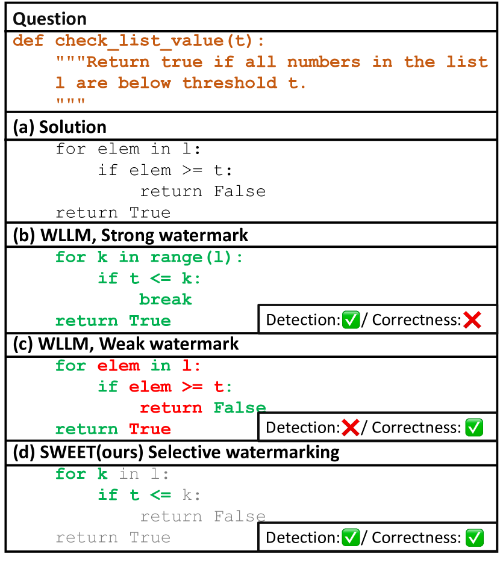

Figure 1: 
Illustrated comparison of WLLM (Kirchenbauer et al., [2023a](#bib.bib21)) and SWEET (ours). Note that this example is a short hypothetical explanatory example. LLMs can generate working source code (a) without a watermark. Strong watermark (b) or weak watermark (c) may result in detection or correctness failure, but (d) selective watermarking may avoid both failures.
[/FIGURE]

## 1 Introduction

Despite the highly strict syntax of programming languages, large language models for code generation (namely, Code LLMs), such as OpenAI Codex (Chen et al., [2021](#bib.bib7)), have rapidly advanced towards expert-like proficiency in understanding and generating software programs (Luo et al., [2023](#bib.bib27); Li et al., [2023b](#bib.bib25); Nijkamp et al., [2023](#bib.bib33); Zheng et al., [2023](#bib.bib53); Gunasekar et al., [2023](#bib.bib12)). Moreover, even general-purpose LLMs like ChatGPT (OpenAI, [2022](#bib.bib34)) have recently shown impressive performance in generating functional code (Touvron et al., [2023](#bib.bib43); Chowdhery et al., [2022](#bib.bib8); OpenAI, [2023b](#bib.bib36)). This breakthrough in the automation of the coding process not only improves the productivity and efficiency of software engineers but also lowers the barriers to creating programs for non-experts (Vaithilingam et al., [2022](#bib.bib44)).  

However, this advance comes with significant legal, ethical, and security concerns, including code licensing issues, code plagiarism, code vulnerability, and malware generation He and Vechev ([2023](#bib.bib16)); Sandoval et al. ([2023](#bib.bib38)); Pearce et al. ([2022](#bib.bib37)); Carlini et al. ([2021](#bib.bib6)); Mirsky et al. ([2023](#bib.bib30)); Hazell ([2023](#bib.bib15)). For example, there is an ongoing class-action copyright lawsuit between a group of individuals and Microsoft, GitHub, and OpenAI, arising from allegations of unlawful utilization and reproduction of the source code111[Code plagiarism](https://drewdevault.com/2022/06/23/Copilot-GPL-washing.html)222[Code licensing issue](https://www.reuters.com/legal/litigation/openai-microsoft-want-court-toss-lawsuit-accusing-them-abusing-open-source-code-2023-01-27/). Furthermore, shortly after the launch of ChatGPT, numerous malicious actors on the Dark Web were observed sharing machine-generated malware and spear phishing tutorials333[Malware generation](https://www.recordedfuture.com/i-chatbot). Therefore, the development of reliable tools for detecting machine-generated code is a very timely matter and is of utmost importance for fairly deploying LLMs with coding capabilities.  

Despite the need for immediate treatment of the machine-generated code detection problem, few efforts have been made to address it. Instead, many works still prioritize a detection problem on normal text by either training a text classifier (Solaiman et al., [2019](#bib.bib39); Ippolito et al., [2020](#bib.bib18); Guo et al., [2023](#bib.bib13); Tian, [2023](#bib.bib41); OpenAI, [2023a](#bib.bib35); Yu et al., [2023](#bib.bib52)) or analyzing distributional discrepancies between human and machine-written text (Gehrmann et al., [2019](#bib.bib11); Mitchell et al., [2023](#bib.bib31); Yang et al., [2023](#bib.bib50)). While these post-hoc detection methods (i.e., no control during the text generation process) have demonstrated powerful performance in the domain of natural language (e.g., summarization), their application to programming language remains unexplored.  

Recently, Kirchenbauer et al. ([2023a](#bib.bib21)) proposed a watermark technique – which we refer to as WLLM (Watermarking for Large Language Models) – that embeds a hidden watermark among the tokens indicating that the text is generated from a language model. Contrary to the above post-hoc detection methods, WLLM enhances detection capabilities at the expense of compromising the text quality by embedding signals for detection into the generated text. For each generation step, WLLM randomly divides the entire vocabulary into two groups (e.g., green list for tokens we want to embed watermark, and red list for those to be avoided). The green list tokens get a scalar addition to their logit values. This way, the model favors generating tokens from the green list rather than the red one. To detect the watermark in a text, we can count the number of green tokens and check whether this number is statistically significant (through hypothesis testing) to conclude whether the model output is generated without knowledge of the green-red rule.  

While both WLLM and post-hoc detection methods work well in many language generation tasks, we observe that these performances do not transfer well to code generation tasks, as shown in Figure [1](#S0.F1 "Figure 1 ‣ Who Wrote this Code? Watermarking for Code Generation"). We attribute this to the nature of extremely low entropy444We calculate entropy over the probability of the next token prediction. As expressed in Kirchenbauer et al. ([2023a](#bib.bib21)), if a sequence has low entropy, the first few tokens strongly determine the following tokens. Please refer to Eq. [5](#A1.E5 "In Appendix A Preliminaries for WLLM (Kirchenbauer et al., 2023a) ‣ Who Wrote this Code? Watermarking for Code Generation"). of code generation. Hence, watermarking a code in a detectable way while not impairing the code functionality is much more challenging than ordinary natural language generation. If watermarking is applied strongly, it can severely degrade the quality of the model output, which is particularly critical in code generation, as a single violation of a rule can break the entire code (see “strong watermark” in Figure [1](#S0.F1 "Figure 1 ‣ Who Wrote this Code? Watermarking for Code Generation")). On the other hand, if watermarking is applied too weakly, there are not enough green tokens to appear due to the low entropy, leading to increased difficulty in detection (see “weak watermark” in Figure [1](#S0.F1 "Figure 1 ‣ Who Wrote this Code? Watermarking for Code Generation")). These failures are not significant in plain text generation because the relatively higher entropy allows for more flexibility in candidate selections for watermarking.555We observe that the entropy in the code generation is lower compared to plain text generation.   

To address these failure modes, we extend the WLLM and propose Selective WatErmarking via Entropy Thresholding (SWEET) for Code LLMs (and LLMs). Instead of applying the green-red rule to every single token during generation, we only apply the rule to tokens with high enough entropy given a threshold. That is, we do not apply the green-red rule to the important tokens for making functional code, while making sure there are enough green list tokens to make a detectable watermark for less important tokens, hence, directly addressing each of the above failure modes.  

Based on our experiments with StarCoder Li et al. ([2023b](#bib.bib25)) on code completion benchmarks HumanEval (Chen et al., [2021](#bib.bib7)) and MBPP (Austin et al., [2021](#bib.bib4)), we summarize our contributions as  

* We are the first to empirically explore the breakdown of existing watermarking and detection methods in source code domain. 
* We propose a simple yet effective method called SWEET, which improves WLLM Kirchenbauer et al. ([2023a](#bib.bib21)) and achieves significantly higher code execution pass rates. 
* Our method shows superior LLM-generated code detection accuracy compared to notable post-hoc detection methods like DetectGPT (Mitchell et al., [2023](#bib.bib31)). 

## 2 Related Work

We include a more thorough literature review in Appendix [C](#A3 "Appendix C Related Work (Full ver.) ‣ Who Wrote this Code? Watermarking for Code Generation"). In this section, we only discuss the most recent or relevant works.  

Post-hoc Text Detection.  There are numerous text detection methods where a simple classifier (e.g., logistic regression) is trained to identify different characteristics in human-authored and machine-generated text. One line of work focuses on using perplexity-based features, such as GPTZero (Tian, [2023](#bib.bib41)), Sniffer (Li et al., [2023a](#bib.bib24)), and LLMDet (Wu et al., [2023](#bib.bib48)). Another line of works uses pre-trained RoBERTa (Liu et al., [2019](#bib.bib26)) and fine-tunes it as a classifier to identify the source of text Solaiman et al. ([2019](#bib.bib39)); Ippolito et al. ([2020](#bib.bib18)); OpenAI ([2023a](#bib.bib35)); Guo et al. ([2023](#bib.bib13)); Yu et al. ([2023](#bib.bib52)). Meanwhile, some recent works tackle the detection problem without additional training procedures, such as GLTR Gehrmann et al. ([2019](#bib.bib11)), DetectGPT Mitchell et al. ([2023](#bib.bib31)), and DNA-GPT Yang et al. ([2023](#bib.bib50)). These zero-shot methods often fail to detect text generated by advanced LLMs, such as ChatGPT (OpenAI, [2022](#bib.bib34)) and GPT-4 (OpenAI, [2023b](#bib.bib36)), and are limited to certain types of LLMs (e.g., decoder-only models). Furthermore, these methods heavily rely on multiple perturbations over LLM generations, which incurs huge computational costs.  

Text Watermarking. The majority of watermarking methods for text are based on the modification of the original text via a predefined set of rules (Atallah et al., [2001](#bib.bib2), [2002](#bib.bib3); Kim et al., [2003](#bib.bib20); Topkara et al., [2006](#bib.bib42); Jalil and Mirza, [2009](#bib.bib19); Meral et al., [2009](#bib.bib29)) or transformer-based networks (Abdelnabi and Fritz, [2021](#bib.bib1); Yang et al., [2022](#bib.bib49); Yoo et al., [2023](#bib.bib51)). However, there are only a few watermarking methods for LLMs that embed watermarks into tokens during the sampling process of LLMs Venugopal et al. ([2011](#bib.bib45)); Kirchenbauer et al. ([2023a](#bib.bib21), [b](#bib.bib22)). Compared to Kirchenbauer et al. ([2023a](#bib.bib21)), our key difference is that we use a principled method to selectively apply watermarking.  

Software Watermarking. Based on the stage at which the watermarks are embedded, the methods are divided into static software watermarking and dynamic software watermarking. The former imprints watermarks in the codes of a software program, usually by code replacement and code re-ordering Hamilton and Danicic ([2011](#bib.bib14)); Li and Liu ([2010](#bib.bib23)); Myles et al. ([2005](#bib.bib32)). The latter injects watermarks in the compiling/execution stage of a program Dey et al. ([2018](#bib.bib9)); Wang et al. ([2018](#bib.bib47)); Ma et al. ([2019](#bib.bib28)). These methods are not directly applicable to Code LLMs that are supposed to embed watermarks into the code during the generation process.  

[FIGURE S2.F2.1.g1]
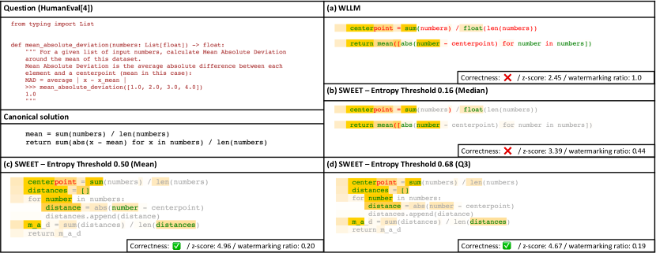

Figure 2: 
An example of HumanEval/4 for comparing between (a) WLLM and (b)–(d) our SWEET with different thresholds. Text colors annotate whether tokens are in the green or red list. Gray tokens have entropy smaller than the threshold and are not watermarked. The intensity of the yellow background color visualizes the entropy value.
[/FIGURE]

## 3 Method

We propose a new watermarking method, SWEET, that selectively watermarks tokens only with high enough entropy.  

### 3.1 Motivation

Although the previous watermarking method WLLM (Kirchenbauer et al., [2023a](#bib.bib21)) can be applied to any domain of LLM-generated text, it incurs some critical problems during embedding and detecting watermarks, especially in the case of code generation. Please refer to Appendix [A](#A1 "Appendix A Preliminaries for WLLM (Kirchenbauer et al., 2023a) ‣ Who Wrote this Code? Watermarking for Code Generation") for the preliminaries to understand the WLLM method.  

Watermarking causes performance degradation. Programming language is more strict than natural language in that there are only few different ways of expressing the same meaning. Most errors outputting undesirable results can often be attributed to just one wrong token at a certain point. Consider an auto-regressive LLM that generates the correct token at each step. When WLLM is applied to the LLM, however, the model might generate the wrong token at a certain timestep. This is because WLLM increases the sampling probability for a random group of tokens without leveraging any information about the distribution. For example, in Figure [2](#S2.F2 "Figure 2 ‣ 2 Related Work ‣ Who Wrote this Code? Watermarking for Code Generation") (a), after generating the “return” token in the second row, the next token with the highest logit is “sum”, which is also part of the canonical solution. However, WLLM puts “sum” into the red list while putting “mean” – second-highest logit – into the green list. Hence, the sampled token was an undefined operation called “mean”, resulting in a syntax error.  

Low Entropy Tokens Avoid Being Watermarked. Despite being the opposite situation of the previous problem, another main critical issue is a code text with low entropy is hardly being watermarked. If a red list token has too high logit value to be inevitably generated, it hinders watermark detection. For example, in Figure [2](#S2.F2 "Figure 2 ‣ 2 Related Work ‣ Who Wrote this Code? Watermarking for Code Generation") (a), tokens with white backgrounds represent low entropy and low entropy tokens hardly being watermarked; i.e., few green tokens exist. This becomes much more fatal in code generation tasks where the code problems require relatively shorter outputs than the plain text, such as asking only a code block of a function666A human-written solution code in HumanEval and MBPP datasets have only 58 and 64 tokens on average, respectively.. The WLLM detection method is based on a statistical test, which involves counting the number of green list tokens in the entire length. However, if the text’s length is short, watermarking detectability significantly decreases.  

### 3.2 The SWEET Method

As described, implementing WLLM for Code LLMs will either cause an issue with the imperceptibility Tao et al. ([2014](#bib.bib40)) (code execution performance) or the detection ability of the code. SWEET can improve this trade-off by distinguishing watermark-applicable tokens.  

Generation. The generation step of our method is in Algorithm [1](#alg1 "Algorithm 1 ‣ Watermarking in LM-generated Text. ‣ Appendix A Preliminaries for WLLM (Kirchenbauer et al., 2023a) ‣ Who Wrote this Code? Watermarking for Code Generation"). Basically, we only apply the watermarking when a token $c^{(t)}$ has higher entropy than a threshold (i.e., $H^{(t)}>H$). We bin a vocabulary randomly by green and red randomly with a fixed green token ratio $\gamma$. If a token is selected to be watermarked, we add a constant $\delta$ to green tokens’ logits. It promotes the sampling of the green tokens. We will discuss how to set the threshold $H$ in § [4.3](#S4.SS3 "4.3 Entropy Threshold Search ‣ 4 Experiments ‣ Who Wrote this Code? Watermarking for Code Generation") and present thorough experimental analysis in § [6.2](#S6.SS2 "6.2 Impact of Entropy Thresholds. ‣ 6 Analysis ‣ Who Wrote this Code? Watermarking for Code Generation").  

Detection. We outline our detection process in Algorithm [2](#alg2 "Algorithm 2 ‣ Watermarking in LM-generated Text. ‣ Appendix A Preliminaries for WLLM (Kirchenbauer et al., 2023a) ‣ Who Wrote this Code? Watermarking for Code Generation"). Let $s$ be a given source code. $s$ can be divided into two parts: $s=(s_{0},s_{1})$, where $s_{0}$ is not generated by the code LLM (e.g., a skeleton code in a computer science assignment) and $s_{1}$ is generated by the LLM. Our task is to detect whether $s_{1}$ contains a watermark or not. We first apply a tokenizer to $s_{0}$ and $s_{1}$, and obtain  

|  | $\displaystyle\mathcal{W}_{0}:={Tokenizer}(s_{0})$ | $\displaystyle=\{c^{-M},\dots,c^{-1}\}$ |  |
| --- | --- | --- | --- |
|  | $\displaystyle\mathcal{W}_{1}:={Tokenizer}(s_{1})$ | $\displaystyle=\{c^{0},\dots,c^{N-1}\}$ |  | (1) |
| --- | --- | --- | --- | --- |

where $N$ is the length of the code to be detected. We then compute a sequence of logit vectors $\{\bm{l}^{0},\dots,\bm{l}^{N-1}\}$ by feeding LLM with the previous token sequence. Let $\mathcal{S}$ denote the subset of $\mathcal{W}_{1}$ whose elements have higher entropy $H$ than the threshold and let $|\mathcal{S}|_{G}$ denote a number of green tokens in $\mathcal{S}$. Finally, with the green list ratio among entire vocabulary $\gamma$ used in generation step, we compute a $z$-score under the null hypothesis where that the text is not watermarked by  

|  | $$z=\frac{|\mathcal{S}|_{G}-\gamma|\mathcal{S}|}{\sqrt{|\mathcal{S}|\gamma(1-\gamma)}}.$$ |  | (2) |
| --- | --- | --- | --- |

We can say the text is watermarked more confidently as $z$-score goes higher. We set $z_{\text{threshold}}$ as a cut-off score. If $z>z_{\text{threshold}}$ holds, we decide that the watermark is embedded in $s_{1}$ and thus generated by the LLM.  

[TABLE S3.T1]

<table class="ltx_tabular ltx_guessed_headers ltx_align_middle">
<tbody class="ltx_tbody">
<tr class="ltx_tr">
<th class="ltx_td ltx_align_center ltx_th ltx_th_row ltx_border_tt">Method</th>
<td class="ltx_td ltx_border_tt"></td>
<td class="ltx_td ltx_align_center ltx_border_tt">HumanEval</td>
<td class="ltx_td ltx_border_tt"></td>
<td class="ltx_td ltx_align_center ltx_border_tt">MBPP</td>
<td class="ltx_td ltx_border_tt"></td>
<td class="ltx_td ltx_nopad_r ltx_align_center ltx_border_tt">

Compute

Cost
</td>
</tr>
<tr class="ltx_tr">
<td class="ltx_td"></td>
<td class="ltx_td ltx_align_center ltx_border_t">pass@1</td>
<td class="ltx_td ltx_align_center ltx_border_t">AUROC</td>
<td class="ltx_td ltx_align_center ltx_border_t">TPR</td>
<td class="ltx_td ltx_align_center ltx_border_t">FPR</td>
<td class="ltx_td"></td>
<td class="ltx_td ltx_align_center ltx_border_t">pass@1</td>
<td class="ltx_td ltx_align_center ltx_border_t">AUROC</td>
<td class="ltx_td ltx_align_center ltx_border_t">TPR</td>
<td class="ltx_td ltx_align_center ltx_border_t">FPR</td>
<td class="ltx_td"></td>
</tr>
<tr class="ltx_tr">
<th class="ltx_td ltx_align_center ltx_th ltx_th_row ltx_border_t">Non-watermarked</th>
<td class="ltx_td ltx_border_t"></td>
<td class="ltx_td ltx_align_center ltx_border_t">33.4</td>
<td class="ltx_td ltx_align_center ltx_border_t">-</td>
<td class="ltx_td ltx_align_center ltx_border_t">-</td>
<td class="ltx_td ltx_align_center ltx_border_t">-</td>
<td class="ltx_td ltx_border_t"></td>
<td class="ltx_td ltx_align_center ltx_border_t">37.8</td>
<td class="ltx_td ltx_align_center ltx_border_t">-</td>
<td class="ltx_td ltx_align_center ltx_border_t">-</td>
<td class="ltx_td ltx_align_center ltx_border_t">-</td>
<td class="ltx_td ltx_border_t"></td>
<td class="ltx_td ltx_nopad_r ltx_align_center ltx_border_t">-</td>
</tr>
<tr class="ltx_tr">
<th class="ltx_td ltx_align_center ltx_th ltx_th_row ltx_border_t">Post-hoc</th>
<th class="ltx_td ltx_align_right ltx_th ltx_th_row ltx_border_t">log p(x)</th>
<td class="ltx_td ltx_border_t"></td>
<td class="ltx_td ltx_align_center ltx_border_t">33.4</td>
<td class="ltx_td ltx_align_center ltx_border_t">0.533</td>
<td class="ltx_td ltx_align_center ltx_border_t">0.113</td>
<td class="ltx_td ltx_align_center ltx_border_t">&lt; 0.05</td>
<td class="ltx_td ltx_border_t"></td>
<td class="ltx_td ltx_align_center ltx_border_t">37.8</td>
<td class="ltx_td ltx_align_center ltx_border_t">0.525</td>
<td class="ltx_td ltx_align_center ltx_border_t">0.054</td>
<td class="ltx_td ltx_align_center ltx_border_t">&lt; 0.05</td>
<td class="ltx_td ltx_border_t"></td>
<td class="ltx_td ltx_nopad_r ltx_align_center ltx_border_t"><math class="ltx_Math"><semantics><mi>N</mi><annotation-xml><ci>𝑁</ci></annotation-xml><annotation>N</annotation></semantics></math></td>
</tr>
<tr class="ltx_tr">
<th class="ltx_td ltx_align_right ltx_th ltx_th_row">LogRank</th>
<td class="ltx_td"></td>
<td class="ltx_td ltx_align_center">0.553</td>
<td class="ltx_td ltx_align_center">0.127</td>
<td class="ltx_td ltx_align_center">&lt; 0.05</td>
<td class="ltx_td"></td>
<td class="ltx_td ltx_align_center">0.527</td>
<td class="ltx_td ltx_align_center">0.052</td>
<td class="ltx_td ltx_align_center">&lt; 0.05</td>
<td class="ltx_td"></td>
<td class="ltx_td ltx_nopad_r ltx_align_center"><math class="ltx_Math"><semantics><mi>N</mi><annotation-xml><ci>𝑁</ci></annotation-xml><annotation>N</annotation></semantics></math></td>
</tr>
<tr class="ltx_tr">
<th class="ltx_td ltx_align_right ltx_th ltx_th_row">DetectGPT (T5-3B)</th>
<td class="ltx_td"></td>
<td class="ltx_td ltx_align_center">0.549</td>
<td class="ltx_td ltx_align_center">0.092</td>
<td class="ltx_td ltx_align_center">&lt; 0.05</td>
<td class="ltx_td"></td>
<td class="ltx_td ltx_align_center">0.531</td>
<td class="ltx_td ltx_align_center">0.040</td>
<td class="ltx_td ltx_align_center">&lt; 0.05</td>
<td class="ltx_td"></td>
<td class="ltx_td ltx_nopad_r ltx_align_center">100<math class="ltx_Math"><semantics><mi>N</mi><annotation-xml><ci>𝑁</ci></annotation-xml><annotation>N</annotation></semantics></math>
</td>
</tr>
<tr class="ltx_tr">
<th class="ltx_td ltx_align_right ltx_th ltx_th_row">DetectGPT</th>
<td class="ltx_td"></td>
<td class="ltx_td ltx_align_center">0.533</td>
<td class="ltx_td ltx_align_center">0.165</td>
<td class="ltx_td ltx_align_center">&lt; 0.05</td>
<td class="ltx_td"></td>
<td class="ltx_td ltx_align_center">0.565</td>
<td class="ltx_td ltx_align_center">0.158</td>
<td class="ltx_td ltx_align_center">&lt; 0.05</td>
<td class="ltx_td"></td>
<td class="ltx_td ltx_nopad_r ltx_align_center">100<math class="ltx_Math"><semantics><mi>N</mi><annotation-xml><ci>𝑁</ci></annotation-xml><annotation>N</annotation></semantics></math>
</td>
</tr>
<tr class="ltx_tr">
<th class="ltx_td ltx_th ltx_th_row"></th>
<th class="ltx_td ltx_align_right ltx_th ltx_th_row">GPTZero</th>
<td class="ltx_td"></td>
<td class="ltx_td"></td>
<td class="ltx_td ltx_align_center">0.445</td>
<td class="ltx_td ltx_align_center">0.030</td>
<td class="ltx_td ltx_align_center">&lt; 0.05</td>
<td class="ltx_td"></td>
<td class="ltx_td"></td>
<td class="ltx_td ltx_align_center">0.462</td>
<td class="ltx_td ltx_align_center">0.036</td>
<td class="ltx_td ltx_align_center">&lt; 0.05</td>
<td class="ltx_td"></td>
<td class="ltx_td ltx_nopad_r ltx_align_center">-</td>
</tr>
<tr class="ltx_tr">
<th class="ltx_td ltx_th ltx_th_row"></th>
<th class="ltx_td ltx_align_right ltx_th ltx_th_row">OpenAI Classifier</th>
<td class="ltx_td"></td>
<td class="ltx_td"></td>
<td class="ltx_td ltx_align_center">0.518</td>
<td class="ltx_td ltx_align_center">0.053</td>
<td class="ltx_td ltx_align_center">&lt; 0.05</td>
<td class="ltx_td"></td>
<td class="ltx_td"></td>
<td class="ltx_td ltx_align_center">0.500</td>
<td class="ltx_td ltx_align_center">0.036</td>
<td class="ltx_td ltx_align_center">&lt; 0.05</td>
<td class="ltx_td"></td>
<td class="ltx_td ltx_nopad_r ltx_align_center">
<math class="ltx_Math"><semantics><mi>N</mi><annotation-xml><ci>𝑁</ci></annotation-xml><annotation>N</annotation></semantics></math>(smaller LM)</td>
</tr>
<tr class="ltx_tr">
<th class="ltx_td ltx_align_center ltx_th ltx_th_row ltx_border_t">Watermarking</th>
<th class="ltx_td ltx_align_right ltx_th ltx_th_row ltx_border_t">
WLLM (<math class="ltx_Math"><semantics><mi>Δ</mi><annotation-xml><ci>Δ</ci></annotation-xml><annotation>\Delta</annotation></semantics></math>pass@1 <math class="ltx_Math"><semantics><mrow><mi></mi><mo>∼</mo><mrow><mo>−</mo><mrow><mn>10</mn><mo>%</mo></mrow></mrow></mrow><annotation-xml><apply><csymbol>similar-to</csymbol><csymbol>absent</csymbol><apply><minus></minus><apply><csymbol>percent</csymbol><cn>10</cn></apply></apply></apply></annotation-xml><annotation>\sim-10\%</annotation></semantics></math>)⋆
</th>
<td class="ltx_td ltx_border_t"></td>
<td class="ltx_td ltx_align_center ltx_border_t">29.8</td>
<td class="ltx_td ltx_align_center ltx_border_t">0.806</td>
<td class="ltx_td ltx_align_center ltx_border_t">0.384</td>
<td class="ltx_td ltx_align_center ltx_border_t">&lt; 0.05</td>
<td class="ltx_td ltx_border_t"></td>
<td class="ltx_td ltx_align_center ltx_border_t">32.6</td>
<td class="ltx_td ltx_align_center ltx_border_t">0.879</td>
<td class="ltx_td ltx_align_center ltx_border_t">0.476</td>
<td class="ltx_td ltx_align_center ltx_border_t">&lt; 0.05</td>
<td class="ltx_td ltx_border_t"></td>
<td class="ltx_td ltx_nopad_r ltx_align_center ltx_border_t">0</td>
</tr>
<tr class="ltx_tr">
<th class="ltx_td ltx_align_right ltx_th ltx_th_row">
SWEET (<math class="ltx_Math"><semantics><mi>Δ</mi><annotation-xml><ci>Δ</ci></annotation-xml><annotation>\Delta</annotation></semantics></math>pass@1 <math class="ltx_Math"><semantics><mrow><mi></mi><mo>∼</mo><mrow><mo>−</mo><mrow><mn>10</mn><mo>%</mo></mrow></mrow></mrow><annotation-xml><apply><csymbol>similar-to</csymbol><csymbol>absent</csymbol><apply><minus></minus><apply><csymbol>percent</csymbol><cn>10</cn></apply></apply></apply></annotation-xml><annotation>\sim-10\%</annotation></semantics></math>)⋆
</th>
<td class="ltx_td"></td>
<td class="ltx_td ltx_align_center">30.8</td>
<td class="ltx_td ltx_align_center">0.943</td>
<td class="ltx_td ltx_align_center">0.726</td>
<td class="ltx_td ltx_align_center">&lt; 0.05</td>
<td class="ltx_td"></td>
<td class="ltx_td ltx_align_center">34.3</td>
<td class="ltx_td ltx_align_center">0.952</td>
<td class="ltx_td ltx_align_center">0.712</td>
<td class="ltx_td ltx_align_center">&lt; 0.05</td>
<td class="ltx_td"></td>
<td class="ltx_td ltx_nopad_r ltx_align_center"><math class="ltx_Math"><semantics><mi>N</mi><annotation-xml><ci>𝑁</ci></annotation-xml><annotation>N</annotation></semantics></math></td>
</tr>
<tr class="ltx_tr">
<th class="ltx_td ltx_align_right ltx_th ltx_th_row ltx_border_t">
WLLM (AUROC<math class="ltx_Math"><semantics><mrow><mi></mi><mo>∼</mo><mn>0.9</mn></mrow><annotation-xml><apply><csymbol>similar-to</csymbol><csymbol>absent</csymbol><cn>0.9</cn></apply></annotation-xml><annotation>\sim 0.9</annotation></semantics></math>)†
</th>
<td class="ltx_td ltx_border_t"></td>
<td class="ltx_td ltx_align_center ltx_border_t">22.6</td>
<td class="ltx_td ltx_align_center ltx_border_t">0.911</td>
<td class="ltx_td ltx_align_center ltx_border_t">0.671</td>
<td class="ltx_td ltx_align_center ltx_border_t">&lt; 0.05</td>
<td class="ltx_td ltx_border_t"></td>
<td class="ltx_td ltx_align_center ltx_border_t">26.8</td>
<td class="ltx_td ltx_align_center ltx_border_t">0.933</td>
<td class="ltx_td ltx_align_center ltx_border_t">0.692</td>
<td class="ltx_td ltx_align_center ltx_border_t">&lt; 0.05</td>
<td class="ltx_td ltx_border_t"></td>
<td class="ltx_td ltx_nopad_r ltx_align_center ltx_border_t">0</td>
</tr>
<tr class="ltx_tr">
<th class="ltx_td ltx_th ltx_th_row ltx_border_bb"></th>
<th class="ltx_td ltx_align_right ltx_th ltx_th_row ltx_border_bb">
SWEET (AUROC<math class="ltx_Math"><semantics><mrow><mi></mi><mo>∼</mo><mn>0.9</mn></mrow><annotation-xml><apply><csymbol>similar-to</csymbol><csymbol>absent</csymbol><cn>0.9</cn></apply></annotation-xml><annotation>\sim 0.9</annotation></semantics></math>)†
</th>
<td class="ltx_td ltx_border_bb"></td>
<td class="ltx_td ltx_align_center ltx_border_bb">31.7</td>
<td class="ltx_td ltx_align_center ltx_border_bb">0.907</td>
<td class="ltx_td ltx_align_center ltx_border_bb">0.530</td>
<td class="ltx_td ltx_align_center ltx_border_bb">&lt; 0.05</td>
<td class="ltx_td ltx_border_bb"></td>
<td class="ltx_td ltx_align_center ltx_border_bb">34.3</td>
<td class="ltx_td ltx_align_center ltx_border_bb">0.952</td>
<td class="ltx_td ltx_align_center ltx_border_bb">0.712</td>
<td class="ltx_td ltx_align_center ltx_border_bb">&lt; 0.05</td>
<td class="ltx_td ltx_border_bb"></td>
<td class="ltx_td ltx_nopad_r ltx_align_center ltx_border_bb"><math class="ltx_Math"><semantics><mi>N</mi><annotation-xml><ci>𝑁</ci></annotation-xml><annotation>N</annotation></semantics></math></td>
</tr>
</tbody>
</table>

Table 1: Main results of code generation performance and detection ability. Since calibration on watermarking strength leads to trade-offs between code generation quality and detection ability, we present two results for watermarking methods. ⋆ for the best detection score (i.e., AUROC and TPR) while allowing a code generation quality decrease of $\sim$10% compared to Non-watermarked, and † for the best code generation quality (pass@1) among AUROC $\sim$ 0.9. The selected points are shown in Figure  [3](#S3.F3 "Figure 3 ‣ 3.2 The SWEET Method ‣ 3 Method ‣ Who Wrote this Code? Watermarking for Code Generation"). Compute cost is the number of forward passes of LLMs required in the detection. We left to compute the cost of GPTZero API blank since it is not opened. $N$ is the length of the text to be detected.
[/TABLE]

[FIGURE S3.F3.1.g1]
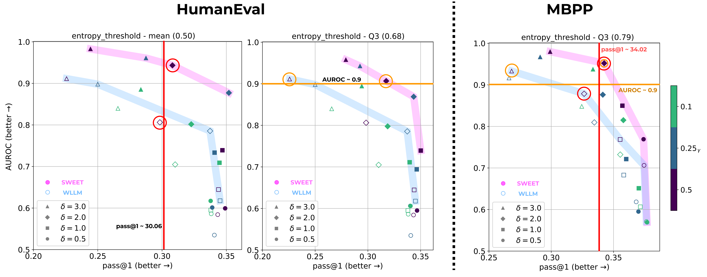

Figure 3: The tradeoff between AUROC and pass@1 of detecting real and generated samples of HumanEval and MBPP datasets. (All) The pink line represents a Pareto frontier of SWEET, while the blue line represents that of WLLM. SWEET shows consistent dominance.
The red/orange line and circles are the points used in Table [1](#S3.T1 "Table 1 ‣ 3.2 The SWEET Method ‣ 3 Method ‣ Who Wrote this Code? Watermarking for Code Generation").
[/FIGURE]

## 4 Experiments

We conduct a series of experiments to evaluate the effectiveness of our watermarking method in code generation for two aspects: (i) quality preserving ability and (ii) detection strength. Our base model is StarCoder (Li et al., [2023b](#bib.bib25)), which is a state-of-the-art open-source LLM specifically for code generation. We also conduct experiments on one of the general-purpose LLM, LLaMA (Touvron et al., [2023](#bib.bib43)) (see the results in Appendix [E](#A5 "Appendix E Further Pareto Frontier Results on StarCoder/LLaMA ‣ Who Wrote this Code? Watermarking for Code Generation")).  

### 4.1 Tasks and Metrics

We select python code generation tasks, HumanEval Chen et al. ([2021](#bib.bib7)) and MBPP Austin et al. ([2021](#bib.bib4)), as our testbeds. Two tasks contain python programming problems, test cases, and human-written canonical answers. Language model is prompted with programming problems and expected to generate the correct code that can pass the test cases.  

To evaluate the functional quality of watermarked source code, we use pass@k (Chen et al., [2021](#bib.bib7)) by generating $n(>k)$ outputs for each programming problems. This metric estimates the percentage of code generated correctly-performing. We set $n=40$ and $n=20$ for HumanEval and MBPP, respectively, to calculate pass@1777We also evaluate pass@100 for HumanEval by generaing $n=200$ but not for MBPP due to resource issue. The results of pass@100 is in Appendix [E](#A5 "Appendix E Further Pareto Frontier Results on StarCoder/LLaMA ‣ Who Wrote this Code? Watermarking for Code Generation").  

For the detection ability, we use AUROC (i.e., Area Under ROC) value as a main metric. We also report the true positive rate (TPR; correctly detecting LLM-generated code as LLM-generated) when the false positive rate (FPR; falsely detecting human-written code as LLM-generated) is confined to be lower than 5%. This is to observe the detection ratio of a practical setting, where high false positive is more undesirable than false negative.  

### 4.2 Baselines

We compare SWEET with machine-generated text detection baselines. Post-hoc detection baselines do not need any modification during generation so that they never impair the quality of the model output. logp(x), LogRank (Gehrmann et al., [2019](#bib.bib11)), and DetectGPT (Mitchell et al., [2023](#bib.bib31)) are zero-shot detection methods that need no labeled datasets. GPTZero (Tian, [2023](#bib.bib41)) and OpenAI Classifier (Solaiman et al., [2019](#bib.bib39)) are trained classifiers. Watermarking-based methods like WLLM embed the watermark in the generation phase and detects the existence of the watermark to decide if the text is generated by that specific model. As watermarking-based detection methods, including ours, embed specific signals intentionally into a text, they tend to have better detection ability but significant degradation of text quality may arise.  

For post-hoc baselines, we generate non-watermarked source code once and feed them to the detectors. For WLLM and SWEET, we generate watermarked source code. More details of implementation are in Appendix [D](#A4 "Appendix D Implementation Details ‣ Who Wrote this Code? Watermarking for Code Generation").  

### 4.3 Entropy Threshold Search

To find the best value of the entropy threshold in a code generation task, searching all spaces is highly costly. We empirically observe that it is efficient to narrow down the search space based on the entropy of the model for human-written source code. Specifically, for each token in the human-written code, we measure the entropy when generating that token, given the code problem and previous tokens. We used the entropy distribution’s median, mean, and 3rd quartile (Q3) values as the search space.  

## 5 Results

### 5.1 Main Results

Table [1](#S3.T1 "Table 1 ‣ 3.2 The SWEET Method ‣ 3 Method ‣ Who Wrote this Code? Watermarking for Code Generation") presents results from all baselines and our approach, SWEET. In watermarking methods, including ours, there is a clear trade-off between detection and code generation ability depending on the watermarking strength. Therefore, we measure the maximum scores of one domain while setting a lower bound for the scores of other domain. Specifically, to measure AUROC scores, we find the best AUROC scores around 90% of the pass@1 performance of the non-watermarked base model. On the other hand, for measuring pass@1, we select from those with an AUROC of 0.9 or higher. We also include results on using LLaMa as a backbone model in Appendix [E](#A5 "Appendix E Further Pareto Frontier Results on StarCoder/LLaMA ‣ Who Wrote this Code? Watermarking for Code Generation").  

Code Quality Preservation. In Table [1](#S3.T1 "Table 1 ‣ 3.2 The SWEET Method ‣ 3 Method ‣ Who Wrote this Code? Watermarking for Code Generation"), compared to the watermarking baseline WLLM, our SWEET method preserves code functionality much more while maintaining the high detection ability of AUROC $>0.9$. Specifically, pass@1 of WLLM for HumanEval decreases from 33.4 to 22.6, a 32.3% loss in the code execution pass rate. Similarly, for the MBPP dataset, the drop in performances is 29.1%. On the other hand, our approach loses only 5.1% and 9.3% in HumanEval and MBPP datasets, respectively, which are significantly less than those of WLLM.  

Detection Performance. Meanwhile, Table [1](#S3.T1 "Table 1 ‣ 3.2 The SWEET Method ‣ 3 Method ‣ Who Wrote this Code? Watermarking for Code Generation") also shows that overall, our SWEET method outperforms all baselines in detecting machine-generated code with a price of 10% degradation of code functionality. Both in HumanEval and MBPP dataset, SWEET achieves AUROC around 0.95, exceeding WLLM by a margin of 0.137 and 0.073, respectively. Moreover, SWEET can correctly classify 72.6% and 71.2% of watermarked machine-generated code while maintaining an FPR under 5% in HumanEval and MBPP. However, all other post-hoc detection baselines do not even detect the 20% of the machine-generated code.  

Computational Cost. The rightmost column of Table [1](#S3.T1 "Table 1 ‣ 3.2 The SWEET Method ‣ 3 Method ‣ Who Wrote this Code? Watermarking for Code Generation") is the computation cost required in the detection phase expressed by the length $N$ of the text to be detected. WLLM does not require any additional computation as it only needs a random number generator and a seed number to put. On the other hand, all zero-shot post-hoc detection methods excluding DetectGPT need at least one forward pass of that LLM. DetectGPT needs to run forward passes as much as the number of perturbations for increased accuracy (the original paper generated 100 perturbed samples, so we did the same). Our method needs one time forward pass to calculate the entropy, which is the same with zero-shot post-hoc detection methods except for DetectGPT.  

### 5.2 Comparison of Pareto Frontiers between SWEET and WLLM

Watermarking strength and spans can vary depending on the ratio of the green list tokens $\gamma$ and the logit increase value $\delta$. To demonstrate that SWEET consistently outperforms the baseline WLLM regardless of the values of $\gamma$ and $\delta$, we draw Pareto frontier curves with axes pass@1 and AUROC in Figure [3](#S3.F3 "Figure 3 ‣ 3.2 The SWEET Method ‣ 3 Method ‣ Who Wrote this Code? Watermarking for Code Generation"). We observe that the Pareto frontiers of SWEET are ahead of those of WLLM in all entropy thresholds. This indicates that in a wide range of hyperparameter settings, our SWEET model can generate better results in terms of detection and code generation ability. Full results and different settings are in Appendix [E](#A5 "Appendix E Further Pareto Frontier Results on StarCoder/LLaMA ‣ Who Wrote this Code? Watermarking for Code Generation").  

## 6 Analysis

### 6.1 Detection Ability without Prompts

As entropy information is required in the detection phase, approximating entropy values for each generation time step $t$ is essential in our method. In the main experiments, we prepend the prompt used in the generation phase (e.g., the question of Fig. [2](#S2.F2 "Figure 2 ‣ 2 Related Work ‣ Who Wrote this Code? Watermarking for Code Generation")) before the target code to reproduce the same entropy. However, we hardly know the prompt used for a given target code in the real world. Thus, instead of using the gold prompt, we attach a common and general prompt for code generation to approximate the entropy information, such as "def solution(\*args): """Generate a solution"""". We use five general prompts (see Appendix [F](#A6 "Appendix F More Details about Experiments with General Prompts ‣ Who Wrote this Code? Watermarking for Code Generation")), and their z-scores are averaged for use in detection.  

Figure [10](#A5.F10 "Figure 10 ‣ Appendix E Further Pareto Frontier Results on StarCoder/LLaMA ‣ Who Wrote this Code? Watermarking for Code Generation") demonstrates how the detection ability varies when using general prompts in the HumanEval dataset. SWEET with general prompts shows lower AUROC values than the original SWEET, indicating inaccurately approximated entropy information impairs detection ability. Nevertheless, it still outperforms the WLLM baseline regarding detection ability in almost settings, drawing a Pareto frontier ahead of WLLM. Since we use general prompts only in the detection phase, code quality is the same as the original SWEET.  

### 6.2 Impact of Entropy Thresholds.

[FIGURE S6.F4.1.g1]
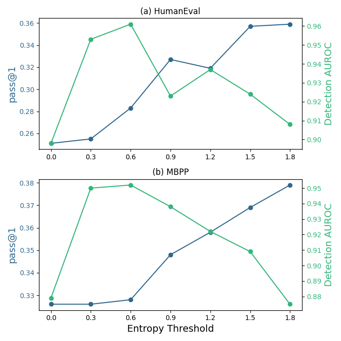

Figure 4: 
Plots of code quality pass@1 and detection AUROC when calibrating the entropy threshold of our methods, SWEET, on the two code benchmarks. We set $\gamma=0.25$ and $\delta=3.0$ for HumanEval, and $\gamma=0.5$ and $\delta=2.0$ for MBPP. While code generation performance increases with a higher entropy threshold, detection AUROC scores make an up-and-down curve. Nonetheless, in all entropy thresholds in the figure, SWEET outperform WLLM (i.e., entropy threshold = 0) in both metrics. Considering that the mean entropy values of both tasks are around 0.5, the threshold of 1.8 is an extreme case.
[/FIGURE]

Figure [4](#S6.F4 "Figure 4 ‣ 6.2 Impact of Entropy Thresholds. ‣ 6 Analysis ‣ Who Wrote this Code? Watermarking for Code Generation") presents how code generation performance and detecting ability trande-off when calibrating the entropy threshold in our method. As the entropy threshold increases, the ratio of watermarked tokens decreases, so the code generation performance converges to a non-watermarked base model. This indicates that our method always lies between the WLLM and a non-watermarked base model in terms of code generation performance. On the other hand, the detection ability, as the entropy threshold increases, reaches a local maximum but eventually declines. While our method with a moderate threshold effectively restricts generating the red list tokens compared to the WLLM, detection ability eventually decreases if the threshold is so high that few tokens are watermarked. Nonetheless, our approach shows better detection ability even without delicate threshold calibration.  

### 6.3 Lexical Types Distribution

[FIGURE S6.F5.1.g1]
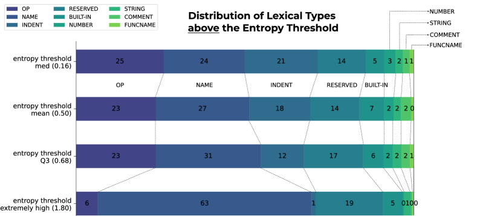

Figure 5: 
Distribution of lexical types of SWEET output on HumanEval task. We draw examples when $\gamma=0.25$ and $\delta=3.0$. Details of each lexical types are described in Appendix [G](#A7 "Appendix G Further Analysis of Lexical Type Distributions ‣ Who Wrote this Code? Watermarking for Code Generation").
[/FIGURE]

Watermarking a text without degrading its quality is possible when many candidates are alternatively available. In code generation, it is challenging to achieve this, so we selectively apply watermarking only on high entropy, i.e., when there are many candidates. Using Python built-in tokenize module888https://docs.python.org/3/library/tokenize.html, we here tokenize outputs of our SWEET method and analyze the distributions of lexical types both above and below the entropy threshold.  

Figure [5](#S6.F5 "Figure 5 ‣ 6.3 Lexical Types Distribution ‣ 6 Analysis ‣ Who Wrote this Code? Watermarking for Code Generation") shows lexical types distributions of output tokens above the entropy threshold (i.e., watermarked tokens) across four thresholds. The first three rows show the results in our main experiments’ settings, and the last show an extreme case. As the entropy threshold rises, the proportion of NAME type tokens increases by the most (24%p to 31%p). Intuitively, this can be easily understood, considering there would be many alternative candidates for defining identifier names. However, if we extremely raise the entropy threshold, almost two-thirds (63%p) of watermarked spans consist of tokens of NAME type, leading to being vulnerable to an adversarial attack on watermarking, such as changing variable names. Following the NAME type, the ratio of the RESERVED type also increase slightly (14%p to 17%p), meaning that model has multiple choices of logical flow in code generation, considering RESERVED tokens usually decide code execution flow. Further analysis for the type distributions below the threshold is in Appendix [G](#A7 "Appendix G Further Analysis of Lexical Type Distributions ‣ Who Wrote this Code? Watermarking for Code Generation").  

### 6.4 Breakdown of Post-hoc methods

The performance of post-hoc detection methods in the machine-generated code detection task is surprisingly low compared to their performance in the plain text-domain. In both HumanEval and MBPP, none of the post-hoc baselines have an AUROC score exceeding 0.6, and the TPR is around 10% or even lower. From our experiments, we carry out further analysis of their poor performance from three aspects: (1) Out-of-domain for classifiers, (2) relatively short length of code blocks, (3) failures in DetectGPT. We defer more in-depth discussion to Appendix [H](#A8 "Appendix H Further Analysis of Breakdown of Post-hoc methods ‣ Who Wrote this Code? Watermarking for Code Generation").  

## 7 Conclusion

We identified and emphasized the need for Code LLM watermarking, and formalized it for the first time. Despite the rapid advance of coding capability of LLMs, the necessary measures to encourage the safe usage of such models have not been implemented yet. Our experiments showed that existing watermarking and detection techniques failed to properly operate under the code generation setting. The failure occured in two modes: either 1) the code does not watermark properly (hence, cannot be detected), or 2) the watermarked code failed to properly execute (degradation of quality). Our proposed method SWEET, on the other hand, improved both of these failure modes to a certain extent by introducing selective entropy thresholding which filters tokens that are least relevant to execution quality. Indeed, the experiment results with SWEET did not fully recover the original non-watermarked performance; however, we believe it is an important step towards achieving this ambitious goal.  

## Limitations

We identify to limitations of this work and suggest ways to mitigate them. We want to particularly note that these limitations are not “weaknesses” of our work as they are not strictly limited to our proposed method, but rather a limitation of the status quo of this field.  

The first one is about the manual process of selecting the entropy threshold. Changing this threshold drastically changes the code and detection performance so it is a critical hyperparameter that varies upon the backbone model for generation and the benchmark dataset. However, according to our observations, holding the entropy threshold around the mean entropy of the corpus usually lead near the pareto-optimal results between detection accuracy and pass@k, suggesting possibilities of optimization.  

Furthermore, as we mention in the discussion of the experiment results, during detection, we also need the source Code LLM, hence this method works only in a completely white-box setting, just like DetectGPT. This can be a computational burden for some users who want to apply our work.    

## References

* Abdelnabi and Fritz (2021)  Sahar Abdelnabi and Mario Fritz. 2021.   [Adversarial watermarking transformer: Towards tracing text provenance with data hiding](https://doi.org/10.1109/sp40001.2021.00083).   In *2021 IEEE Symposium on Security and Privacy (SP)*, pages 121–140. IEEE, IEEE. 
* Atallah et al. (2001)  Mikhail J. Atallah, Victor Raskin, Michael Crogan, Christian Hempelmann, Florian Kerschbaum, Dina Mohamed, and Sanket Naik. 2001.   [Natural language watermarking: Design, analysis, and a proof-of-concept implementation](https://doi.org/10.1007/3-540-45496-9_14).   In *Information Hiding*, pages 185–200. Springer, Springer Berlin Heidelberg. 
* Atallah et al. (2002)  Mikhail J. Atallah, Victor Raskin, Christian F. Hempelmann, Mercan Karahan, Radu Sion, Umut Topkara, and Katrina E. Triezenberg. 2002.   [Natural language watermarking and tamperproofing](https://doi.org/10.1007/3-540-36415-3_13).   In *Information Hiding*, pages 196–212. Springer, Springer Berlin Heidelberg. 
* Austin et al. (2021)  Jacob Austin, Augustus Odena, Maxwell Nye, Maarten Bosma, Henryk Michalewski, David Dohan, Ellen Jiang, Carrie Cai, Michael Terry, Quoc Le, et al. 2021.   [Program synthesis with large language models](https://arxiv.org/abs/2108.07732).   *arXiv preprint arXiv:2108.07732*. 
* Bavarian et al. (2022)  Mohammad Bavarian, Heewoo Jun, Nikolas Tezak, John Schulman, Christine McLeavey, Jerry Tworek, and Mark Chen. 2022.   [Efficient training of language models to fill in the middle](https://arxiv.org/abs/2207.14255).   *arXiv preprint arXiv:2207.14255*. 
* Carlini et al. (2021)  Nicholas Carlini, Florian Tramer, Eric Wallace, Matthew Jagielski, Ariel Herbert-Voss, Katherine Lee, Adam Roberts, Tom B Brown, Dawn Song, Ulfar Erlingsson, et al. 2021.   [Extracting training data from large language models.](https://arxiv.org/abs/2012.07805)  In *USENIX Security Symposium*, volume 6. 
* Chen et al. (2021)  Mark Chen, Jerry Tworek, Heewoo Jun, Qiming Yuan, Henrique Ponde de Oliveira Pinto, Jared Kaplan, Harri Edwards, Yuri Burda, Nicholas Joseph, Greg Brockman, et al. 2021.   [Evaluating large language models trained on code](https://arxiv.org/abs/2107.03374).   *arXiv preprint arXiv:2107.03374*. 
* Chowdhery et al. (2022)  Aakanksha Chowdhery, Sharan Narang, Jacob Devlin, Maarten Bosma, Gaurav Mishra, Adam Roberts, Paul Barham, Hyung Won Chung, Charles Sutton, Sebastian Gehrmann, et al. 2022.   [Palm: Scaling language modeling with pathways](https://arxiv.org/abs/2204.02311).   *arXiv preprint arXiv:2204.02311*. 
* Dey et al. (2018)  Ayan Dey, Sukriti Bhattacharya, and Nabendu Chaki. 2018.   [Software watermarking: Progress and challenges](https://doi.org/10.1007/s41403-018-0058-8).   *INAE Letters*, 4(1):65–75. 
* Fried et al. (2023)  Daniel Fried, Armen Aghajanyan, Jessy Lin, Sida Wang, Eric Wallace, Freda Shi, Ruiqi Zhong, Wen-tau Yih, Luke Zettlemoyer, and Mike Lewis. 2023.   [Incoder: A generative model for code infilling and synthesis](https://openreview.net/forum?id=hQwb-lbM6EL).   In *International Conference on Learning Representations*. 
* Gehrmann et al. (2019)  Sebastian Gehrmann, Hendrik Strobelt, and Alexander Rush. 2019.   [GLTR: Statistical detection and visualization of generated text](https://doi.org/10.18653/v1/p19-3019).   In *Proceedings of the 57th Annual Meeting of the Association for Computational Linguistics: System Demonstrations*, pages 111–116, Florence, Italy. Association for Computational Linguistics. 
* Gunasekar et al. (2023)  Suriya Gunasekar, Yi Zhang, Jyoti Aneja, Caio César Teodoro Mendes, Allie Del Giorno, Sivakanth Gopi, Mojan Javaheripi, Piero Kauffmann, Gustavo de Rosa, Olli Saarikivi, Adil Salim, Shital Shah, Harkirat Singh Behl, Xin Wang, Sébastien Bubeck, Ronen Eldan, Adam Tauman Kalai, Yin Tat Lee, and Yuanzhi Li. 2023.   [Textbooks are all you need](http://arxiv.org/abs/2306.11644). 
* Guo et al. (2023)  Biyang Guo, Xin Zhang, Ziyuan Wang, Minqi Jiang, Jinran Nie, Yuxuan Ding, Jianwei Yue, and Yupeng Wu. 2023.   [How close is chatgpt to human experts? comparison corpus, evaluation, and detection](https://arxiv.org/abs/2301.07597).   *arXiv preprint arXiv:2301.07597*. 
* Hamilton and Danicic (2011)  James Hamilton and Sebastian Danicic. 2011.   [A survey of static software watermarking](https://doi.org/10.1109/worldcis17046.2011.5749891).   In *2011 World Congress on Internet Security (WorldCIS-2011)*, pages 100–107. IEEE, IEEE. 
* Hazell (2023)  Julian Hazell. 2023.   [Large language models can be used to effectively scale spear phishing campaigns](https://arxiv.org/abs/2305.06972).   *arXiv preprint arXiv:2305.06972*. 
* He and Vechev (2023)  Jingxuan He and Martin Vechev. 2023.   [Large language models for code: Security hardening and adversarial testing](https://arxiv.org/abs/2302.05319).   *arXiv preprint arXiv:2302.05319*. 
* Holtzman et al. (2020)  Ari Holtzman, Jan Buys, Li Du, Maxwell Forbes, and Yejin Choi. 2020.   [The curious case of neural text degeneration](https://openreview.net/forum?id=rygGQyrFvH).   In *International Conference on Learning Representations*. 
* Ippolito et al. (2020)  Daphne Ippolito, Daniel Duckworth, Chris Callison-Burch, and Douglas Eck. 2020.   [Automatic detection of generated text is easiest when humans are fooled](https://doi.org/10.18653/v1/2020.acl-main.164).   In *Proceedings of the 58th Annual Meeting of the Association for Computational Linguistics*, pages 1808–1822, Online. Association for Computational Linguistics. 
* Jalil and Mirza (2009)  Zunera Jalil and Anwar M. Mirza. 2009.   [A review of digital watermarking techniques for text documents](https://doi.org/10.1109/icimt.2009.11).   In *2009 International Conference on Information and Multimedia Technology*, pages 230–234. IEEE, IEEE. 
* Kim et al. (2003)  Young-Won Kim, Kyung-Ae Moon, and Il-Seok Oh. 2003.   [A text watermarking algorithm based on word classification and inter-word space statistics](https://doi.org/10.1109/icdar.2003.1227767).   In *Seventh International Conference on Document Analysis and Recognition, 2003. Proceedings.*, pages 775–779. Citeseer, IEEE Comput. Soc. 
* Kirchenbauer et al. (2023a)  John Kirchenbauer, Jonas Geiping, Yuxin Wen, Jonathan Katz, Ian Miers, and Tom Goldstein. 2023a.   [A watermark for large language models](https://arxiv.org/abs/2301.10226).   *The Fortieth International Conference on Machine Learning*. 
* Kirchenbauer et al. (2023b)  John Kirchenbauer, Jonas Geiping, Yuxin Wen, Manli Shu, Khalid Saifullah, Kezhi Kong, Kasun Fernando, Aniruddha Saha, Micah Goldblum, and Tom Goldstein. 2023b.   [On the reliability of watermarks for large language models](http://arxiv.org/abs/2306.04634). 
* Li and Liu (2010)  Jun Li and Quan Liu. 2010.   [Design of a software watermarking algorithm based on register allocation](https://doi.org/10.1109/ebiss.2010.5473660).   In *2010 2nd International Conference on E-business and Information System Security*, pages 1–4. IEEE, IEEE. 
* Li et al. (2023a)  Linyang Li, Pengyu Wang, Ke Ren, Tianxiang Sun, and Xipeng Qiu. 2023a.   [Origin tracing and detecting of llms](https://arxiv.org/abs/2304.14072).   *arXiv preprint arXiv:2304.14072*. 
* Li et al. (2023b)  Raymond Li, Loubna Ben Allal, Yangtian Zi, Niklas Muennighoff, Denis Kocetkov, Chenghao Mou, Marc Marone, Christopher Akiki, Jia Li, Jenny Chim, et al. 2023b.   [Starcoder: may the source be with you!](https://arxiv.org/abs/2305.06161)  *arXiv preprint arXiv:2305.06161*. 
* Liu et al. (2019)  Yinhan Liu, Myle Ott, Naman Goyal, Jingfei Du, Mandar Joshi, Danqi Chen, Omer Levy, Mike Lewis, Luke Zettlemoyer, and Veselin Stoyanov. 2019.   [Roberta: A robustly optimized bert pretraining approach](https://arxiv.org/abs/1907.11692).   *arXiv preprint arXiv:1907.11692*. 
* Luo et al. (2023)  Ziyang Luo, Can Xu, Pu Zhao, Qingfeng Sun, Xiubo Geng, Wenxiang Hu, Chongyang Tao, Jing Ma, Qingwei Lin, and Daxin Jiang. 2023.   [Wizardcoder: Empowering code large language models with evol-instruct](https://arxiv.org/abs//2306.08568).   *arXiv preprint arXiv:2306.08568*. 
* Ma et al. (2019)  Haoyu Ma, Chunfu Jia, Shijia Li, Wantong Zheng, and Dinghao Wu. 2019.   [Xmark: Dynamic software watermarking using collatz conjecture](https://doi.org/10.1109/tifs.2019.2908071).   *IEEE Transactions on Information Forensics and Security*, 14(11):2859–2874. 
* Meral et al. (2009)  Hasan Mesut Meral, Bülent Sankur, A. Sumru Özsoy, Tunga Güngör, and Emre Sevinç. 2009.   [Natural language watermarking via morphosyntactic alterations](https://doi.org/10.1016/j.csl.2008.04.001).   *Computer Speech & Language*, 23(1):107–125. 
* Mirsky et al. (2023)  Yisroel Mirsky, Ambra Demontis, Jaidip Kotak, Ram Shankar, Deng Gelei, Liu Yang, Xiangyu Zhang, Maura Pintor, Wenke Lee, Yuval Elovici, and Battista Biggio. 2023.   [The threat of offensive AI to organizations](https://doi.org/10.1016/j.cose.2022.103006).   *Computers & Security*, 124:103006. 
* Mitchell et al. (2023)  Eric Mitchell, Yoonho Lee, Alexander Khazatsky, Christopher D Manning, and Chelsea Finn. 2023.   [Detectgpt: Zero-shot machine-generated text detection using probability curvature](https://arxiv.org/abs/2301.11305).   *The Fortieth International Conference on Machine Learning*. 
* Myles et al. (2005)  Ginger Myles, Christian Collberg, Zachary Heidepriem, and Armand Navabi. 2005.   [The evaluation of two software watermarking algorithms](https://doi.org/10.1002/spe.657).   *Software: Practice and Experience*, 35(10):923–938. 
* Nijkamp et al. (2023)  Erik Nijkamp, Bo Pang, Hiroaki Hayashi, Lifu Tu, Huan Wang, Yingbo Zhou, Silvio Savarese, and Caiming Xiong. 2023.   [Codegen: An open large language model for code with multi-turn program synthesis](https://arxiv.org/abs/2203.13474).   In *The Eleventh International Conference on Learning Representations*. 
* OpenAI (2022)  OpenAI. 2022.   [Chatgpt: Optimizing language models for dialogue](https://openai.com/blog/chatgpt).   *OpenAI Blog*. 
* OpenAI (2023a)  OpenAI. 2023a.   [Ai text classifier.](https://platform.openai.com/ai-text-classifier)  *OpenAI API Docs*. 
* OpenAI (2023b)  OpenAI. 2023b.   [Gpt-4 technical report](https://arxiv.org/abs/2303.08774).   *OpenAI Blog*. 
* Pearce et al. (2022)  Hammond Pearce, Baleegh Ahmad, Benjamin Tan, Brendan Dolan-Gavitt, and Ramesh Karri. 2022.   [Asleep at the keyboard? assessing the security of GitHub copilot’s code contributions](https://doi.org/10.1109/sp46214.2022.9833571).   In *2022 IEEE Symposium on Security and Privacy (SP)*, pages 754–768. IEEE, IEEE. 
* Sandoval et al. (2023)  Gustavo Sandoval, Hammond A. Pearce, Teo Nys, Ramesh Karri, Siddharth Garg, and Brendan Dolan-Gavitt. 2023.   [Lost at c: A user study on the security implications of large language model code assistants](https://www.usenix.org/system/files/sec23fall-prepub-353-sandoval.pdf).   In *32nd USENIX Security Symposium (USENIX Security 23)*. 
* Solaiman et al. (2019)  Irene Solaiman, Miles Brundage, Jack Clark, Amanda Askell, Ariel Herbert-Voss, Jeff Wu, Alec Radford, Gretchen Krueger, Jong Wook Kim, Sarah Kreps, et al. 2019.   [Release strategies and the social impacts of language models](https://arxiv.org/abs/1908.09203).   *arXiv preprint arXiv:1908.09203*. 
* Tao et al. (2014)  Hai Tao, Li Chongmin, Jasni Mohamad Zain, and Ahmed N Abdalla. 2014.   [Robust image watermarking theories and techniques: A review](https://doi.org/10.1016/S1665-6423(14)71612-8).   *Journal of applied research and technology*, 12(1):122–138. 
* Tian (2023)  Edward Tian. 2023.   [Gptzero: An ai text detector.](https://gptzero.me/)  *GPTZero Website*. 
* Topkara et al. (2006)  Umut Topkara, Mercan Topkara, and Mikhail J. Atallah. 2006.   [The hiding virtues of ambiguity](https://doi.org/10.1145/1161366.1161397).   In *Proceedings of the 8th workshop on Multimedia and security*, pages 164–174. ACM. 
* Touvron et al. (2023)  Hugo Touvron, Thibaut Lavril, Gautier Izacard, Xavier Martinet, Marie-Anne Lachaux, Timothée Lacroix, Baptiste Rozière, Naman Goyal, Eric Hambro, Faisal Azhar, et al. 2023.   [Llama: Open and efficient foundation language models](https://arxiv.org/abs/2302.13971).   *arXiv preprint arXiv:2302.13971*. 
* Vaithilingam et al. (2022)  Priyan Vaithilingam, Tianyi Zhang, and Elena L Glassman. 2022.   [Expectation vs. experience: Evaluating the usability of code generation tools powered by large language models](https://doi.org/10.1145/3491101.3519665).   In *Chi conference on human factors in computing systems extended abstracts*, pages 1–7. 
* Venugopal et al. (2011)  Ashish Venugopal, Jakob Uszkoreit, David Talbot, Franz Och, and Juri Ganitkevitch. 2011.   [Watermarking the outputs of structured prediction with an application in statistical machine translation.](https://aclanthology.org/D11-1126)  In *Proceedings of the 2011 Conference on Empirical Methods in Natural Language Processing*, pages 1363–1372, Edinburgh, Scotland, UK. Association for Computational Linguistics. 
* Verma et al. (2023)  Vivek Verma, Eve Fleisig, Nicholas Tomlin, and Dan Klein. 2023.   [Ghostbuster: Detecting text ghostwritten by large language models](https://arxiv.org/abs/2305.15047).   *arXiv preprint arXiv:2305.15047*. 
* Wang et al. (2018)  Yilong Wang, Daofu Gong, Bin Lu, Fei Xiang, and Fenlin Liu. 2018.   [Exception handling-based dynamic software watermarking](https://doi.org/10.1109/access.2018.2810058).   *IEEE Access*, 6:8882–8889. 
* Wu et al. (2023)  Kangxi Wu, Liang Pang, Huawei Shen, Xueqi Cheng, and Tat-Seng Chua. 2023.   [Llmdet: A large language models detection tool](https://arxiv.org/abs/2305.15004).   *arXiv preprint arXiv:2305.15004*. 
* Yang et al. (2022)  Xi Yang, Jie Zhang, Kejiang Chen, Weiming Zhang, Zehua Ma, Feng Wang, and Nenghai Yu. 2022.   [Tracing text provenance via context-aware lexical substitution](https://doi.org/10.1609/aaai.v36i10.21415).   In *Proceedings of the AAAI Conference on Artificial Intelligence*, volume 36, pages 11613–11621. Association for the Advancement of Artificial Intelligence (AAAI). 
* Yang et al. (2023)  Xianjun Yang, Wei Cheng, Linda Petzold, William Yang Wang, and Haifeng Chen. 2023.   [Dna-gpt: Divergent n-gram analysis for training-free detection of gpt-generated text](https://arxiv.org/abs/2305.17359).   *arXiv preprint arXiv:2305.17359*. 
* Yoo et al. (2023)  KiYoon Yoo, Wonhyuk Ahn, Jiho Jang, and Nojun Kwak. 2023.   [Robust natural language watermarking through invariant features](https://arxiv.org/abs/2305.01904).   In *Proceedings of the 61th Annual Meeting of the Association for Computational Linguistics*. Association for Computational Linguistics. 
* Yu et al. (2023)  Xiao Yu, Yuang Qi, Kejiang Chen, Guoqiang Chen, Xi Yang, Pengyuan Zhu, Weiming Zhang, and Nenghai Yu. 2023.   [Gpt paternity test: Gpt generated text detection with gpt genetic inheritance](https://arxiv.org/abs/2305.12519).   *arXiv preprint arXiv:2305.12519*. 
* Zheng et al. (2023)  Qinkai Zheng, Xiao Xia, Xu Zou, Yuxiao Dong, Shan Wang, Yufei Xue, Zihan Wang, Lei Shen, Andi Wang, Yang Li, et al. 2023.   [Codegeex: A pre-trained model for code generation with multilingual evaluations on humaneval-x](https://arxiv.org/abs/2303.17568).   *arXiv preprint arXiv:2303.17568*. 

## Appendix A Preliminaries for WLLM
(Kirchenbauer et al., [2023a](#bib.bib21))

For a given language model $f_{\text{LM}}$ with vocabulary $\mathcal{V}$, the likelihood probability of a token $c^{(t)}$ at $t$ following a token sequence $(c^{-M},...,c^{(t-1)})$ is calculated as follow:  

|  | $$\bm{l}^{(t)}=f_{\text{LM}}(c^{-M},\dots,c^{(t-1)}),$$ |  | (3) |
| --- | --- | --- | --- |

|  | $$p_{i}^{(t)}=\frac{l_{i}^{(t)}}{\sum_{i=1}^{|\mathcal{V}|}l_{i}^{(t)}},$$ |  | (4) |
| --- | --- | --- | --- |

where $(c^{-M},...,c^{-1})$ and $(c^{0},...,c^{(t-1)})$ are a $M$-length prompt and the generated sequence, respectively, and $\bm{l}^{(t)}\in\mathbb{R}^{|\mathcal{V}|}$ is the logit vector.  The LM generates $c^{(t)}$ based on $\bm{p}^{(t)}$ using various decoding techniques such as top-p and top-k sampling, greedy decoding, and beam search. The entropy of $\bm{p}^{(t)}$ is computed by  

|  | $$H^{(t)}=-\sum_{i=1}^{|\mathcal{V}|}p^{(t)}_{i}\log p^{(t)}_{i}.$$ |  | (5) |
| --- | --- | --- | --- |

  

#### Watermarking in LM-generated Text.

In the watermarking (Kirchenbauer et al., [2023a](#bib.bib21)), the entire tokens in $\mathcal{V}$ at each time-step are randomly binned into the green $\mathcal{G}^{(t)}$ and red groups $\mathcal{R}^{(t)}$ in proportions of $\gamma$ and $1-\gamma$ $(\gamma\in(0,1))$, respectively. The method increases the logits of green group tokens by adding a fixed scalar $\delta$, promoting them to be sampled at each position. Thus, watermarked LM-generated text is more likely than $\gamma$ to contain the green group tokens. On the other hand, since humans have no knowledge of the hidden green-red rule, the proportion of green group tokens in human-written text is expected to be close to $\gamma$.  

The watermarked text is detected through a one-sided $z$-test by testing the null hypothesis where the text is not watermarked. The $z$-score is calculated using the number of recognized green tokens in the text. Then, the testing text is considered as watermarked if the $z$-score is greater than $z_{\text{threshold}}$. Note that the detection algorithm with the higher $z_{\text{threshold}}$ can result the lower false positive rate (FPR) and reduce Type I errors.  

[ALGORITHM alg1]

1:  Input: tokenized prompt $c^{-M},\dots,c^{-1}$; entropy threshold $H\in[0,\log|\mathcal{V}|]$, $\gamma\in(0,1)$, $\delta>0$;

2:  for $t=0,1,2,\dots$ do

3:     Compute a logit vector $\bm{l}^{(t)}$ by ([3](#A1.E3 "In Appendix A Preliminaries for WLLM (Kirchenbauer et al., 2023a) ‣ Who Wrote this Code? Watermarking for Code Generation"));

4:     Compute a probability vector $\bm{p}^{(t)}$ by ([4](#A1.E4 "In Appendix A Preliminaries for WLLM (Kirchenbauer et al., 2023a) ‣ Who Wrote this Code? Watermarking for Code Generation"));

5:     Compute an entropy $H^{(t)}$ by ([5](#A1.E5 "In Appendix A Preliminaries for WLLM (Kirchenbauer et al., 2023a) ‣ Who Wrote this Code? Watermarking for Code Generation"));

6:     if $H^{(t)}>H$ then

7:        Compute a hash of token $c^{(t-1)}$, and use it as a seed for a random number
generator;

8:        Randomly divide $\mathcal{V}$ into $\mathcal{G}^{(t)}$ of size $\gamma|\mathcal{V}|$ and $\mathcal{R}^{(t)}$ of size $(1-\gamma)|\mathcal{V}|$;

9:        Add $\delta$ to the logits of tokens in $\mathcal{G}^{(t)}$;

10:     end if

11:     Sample $c^{(t)}$;

12:  end for

Algorithm 1  Generation Algorithm of SWEET
[/ALGORITHM]

[ALGORITHM alg2]

1:  Input: testing text $s$; entropy threshold $H\in[0,\log|\mathcal{V}|]$, $\gamma\in(0,1)$, $z_{\text{threshold}}>0$;

2:  Set $\mathcal{S}=\emptyset$ and $|s|_{G}=0$;

3:  Tokenize sequences in $s$ by ([3.2](#S3.Ex1 "3.2 The SWEET Method ‣ 3 Method ‣ Who Wrote this Code? Watermarking for Code Generation")) to $c^{(-N),\dots,c^{(}N-1)}$;

4:  for $t=0,1,2,\dots N-1$ do

5:     Compute a logit vector $\bm{l}^{(t)}$ by ([3](#A1.E3 "In Appendix A Preliminaries for WLLM (Kirchenbauer et al., 2023a) ‣ Who Wrote this Code? Watermarking for Code Generation"));

6:     Compute a probability vector $\bm{p}^{(t)}$ by ([4](#A1.E4 "In Appendix A Preliminaries for WLLM (Kirchenbauer et al., 2023a) ‣ Who Wrote this Code? Watermarking for Code Generation"));

7:     Compute an entropy $H^{(t)}$ by ([5](#A1.E5 "In Appendix A Preliminaries for WLLM (Kirchenbauer et al., 2023a) ‣ Who Wrote this Code? Watermarking for Code Generation"));

8:     if $H^{(t)}>H$ then

9:        Set $\mathcal{S}\leftarrow\mathcal{S}\cup\{c^{(t)}\}$;

10:        Compute a hash of token $c^{(t-1)}$, and use it as a seed for a random number generator;

11:        Recover $\mathcal{G}^{(t)}$ and $\mathcal{R}^{(t)}$;

12:        if $c^{(t)}\in\mathcal{G}^{(t)}$ then

13:           $|s|_{G}\leftarrow|s|_{G}+1$;

14:        end if

15:     end if

16:  end for

17:  Compute $z$-score by ([2](#S3.E2 "In 3.2 The SWEET Method ‣ 3 Method ‣ Who Wrote this Code? Watermarking for Code Generation"));

18:  if $z>z_{\text{threshold}}$ then

19:     return True; (i.e., $s$ is watermarked)

20:  else

21:     return False;

22:  end if

Algorithm 2  Detection Algorithm of SWEET
[/ALGORITHM]

## Appendix B Watermark Embedding/Detecting Algorithm of SWEET

Algorithms [1](#alg1 "Algorithm 1 ‣ Watermarking in LM-generated Text. ‣ Appendix A Preliminaries for WLLM (Kirchenbauer et al., 2023a) ‣ Who Wrote this Code? Watermarking for Code Generation") and  [2](#alg2 "Algorithm 2 ‣ Watermarking in LM-generated Text. ‣ Appendix A Preliminaries for WLLM (Kirchenbauer et al., 2023a) ‣ Who Wrote this Code? Watermarking for Code Generation") show the detailed steps of generating a watermark and later detecting it using our selective entropy thresholding method (SWEET).  

## Appendix C Related Work (Full ver.)

Post-hoc Text Detection. There are numerous text detection methods where a simple classifier (e.g., logistic regression) is trained by identifying different characteristics in human-authored and machine-generated text. For example, GPTZero (Tian, [2023](#bib.bib41)) and Sniffer (Li et al., [2023a](#bib.bib24)) focus on the difference in perplexity between human and LLM-written text. Ghostbuster (Verma et al., [2023](#bib.bib46)) and LLMDet (Wu et al., [2023](#bib.bib48)) uses the difference in probability-based features and n-gram-based proxy perplexity respectively. Another line of works uses pre-trained RoBERTa (Liu et al., [2019](#bib.bib26)) and fine-tunes it as a classifier to identify the source of text Solaiman et al. ([2019](#bib.bib39)); Ippolito et al. ([2020](#bib.bib18)); OpenAI ([2023a](#bib.bib35)); Guo et al. ([2023](#bib.bib13)); Yu et al. ([2023](#bib.bib52)). Although these training-based methods show impressive performance for in-domain text detection (i.e., the domain of testing text is similar to that of training data), they often lack generality for out-of-domain text. Moreover, the classifiers need to be consistently updated as new LLMs are continuously developed.  

Alternatively, another line of work tackle the detection problem without additional training procedure. GLTR (Gehrmann et al., [2019](#bib.bib11)) focuses on the fact that machines generate each word from the head of their sampling distribution. The method compares the density or rank of each word in a given text to that of all possible candidates. Gehrmann et al. ([2019](#bib.bib11)) also proposes to measure the average log-rank of the tokens in the text and classifies it as model-generated if the log-rank is small. DetectGPT (Mitchell et al., [2023](#bib.bib31)) observes that the machine-generated texts tend to lie at the local maximum of the log probability of LLMs. The method perturbs a given text in multiple ways and checks whether the log probability of a given text is higher than that of perturbed texts. DNA-GPT (Yang et al., [2023](#bib.bib50)) divides a given text in the middle and feeds only the first portion to the target LLM to generate various new remaining parts. Then the method compares the N-gram similarity between the original remaining part and the newly generated ones to identify the source of the text. These zero-shot methods often fail to detect texts generated by advanced LLMs, such as ChatGPT (OpenAI, [2022](#bib.bib34)) and GPT-4 (OpenAI, [2023b](#bib.bib36)), and are limited to certain types of LLMs (e.g., decoder-only models). Furthermore, these methods heavily rely on multiple perturbations over LLM generations, which incurs huge computational costs.  

Text Watermarking. The majority of watermarking methods for text are based on the modification of the original text via a predefined set of rules (Atallah et al., [2001](#bib.bib2), [2002](#bib.bib3); Kim et al., [2003](#bib.bib20); Topkara et al., [2006](#bib.bib42); Jalil and Mirza, [2009](#bib.bib19); Meral et al., [2009](#bib.bib29)) or transformer-based networks (Abdelnabi and Fritz, [2021](#bib.bib1); Yang et al., [2022](#bib.bib49); Yoo et al., [2023](#bib.bib51)). However, there are only a few watermarking methods for LLMs that embed watermarks into tokens during the sampling process of LLMs. When the model samples each sentence, Venugopal et al. ([2011](#bib.bib45)) proposed to generate a fixed number of candidates. A hash function is then applied to each candidate and generates a bit sequence from a binomial distribution with $p=0.5$ (i.e., the ratio of 0s and 1s is expected to be equal). The watermarks are embedded by choosing candidates that are mapped to the bit sequences with the highest ratio of 1s. The difference in the ratio of 1s in the whole output is used to detect whether the output is watermarked or not.  

On the contrary, Kirchenbauer et al. ([2023a](#bib.bib21)) considered applying a hash function to the previously generated token, and uses the hash value as a seed for a random number generator to randomly divide candidate tokens into two groups. As the method induces sampling only from tokens belonging to one of the two groups (green and red), one with knowledge of this rule can detect the watermark if the output is generated by the model.  

We adopt the watermarking rule from “soft watermark” method in Kirchenbauer et al. ([2023a](#bib.bib21)); however, our method differs from it in that we do not apply the rule to every single token when it is generated from a language model. In other words, while tokens with high entropy are sampled from the distribution biased to green list tokens, tokens with low entropy are from the original distribution, preserving the quality of the model outputs. Additionally, by preventing low entropy tokens from being watermarked, our selective method can reduce the number of red list tokens with such a high logit value that is inevitably generated. This affects much more effectively, especially in a code generation task, because a code block generated tends to be shorter than plain text, and the length of the text is critical for a statistical based detection method.  

Software Watermarking. One of the major streams of literature regarding watermarking code is software watermarking, which embeds a unique identifier within the code to protect the intellectual property of a software program. Based on the stage at which the watermarks are embedded, the methods are divided into static software watermarking (Hamilton and Danicic, [2011](#bib.bib14); Li and Liu, [2010](#bib.bib23); Myles et al., [2005](#bib.bib32)), which imprints watermarks in the codes of a software program, usually by code replacement and code re-ordering, and dynamic software watermarking (Dey et al., [2018](#bib.bib9); Wang et al., [2018](#bib.bib47); Ma et al., [2019](#bib.bib28)), which injects watermarks in the compiling/execution stage of a program. These existing software watermarking methods not only differ from SWEET, but are not directly applicable to Code LLMs that are supposed to embed watermarks into the code during the generation process.  

[TABLE A3.T2]

<table class="ltx_tabular ltx_centering ltx_guessed_headers ltx_align_middle">
<tbody class="ltx_tbody">
<tr class="ltx_tr">
<th class="ltx_td ltx_align_center ltx_th ltx_th_row ltx_border_tt">Method</th>
<td class="ltx_td ltx_align_center ltx_border_tt">HumanEval</td>
</tr>
<tr class="ltx_tr">
<td class="ltx_td ltx_align_left ltx_border_t">pass@1</td>
<td class="ltx_td ltx_align_left ltx_border_t">AUROC</td>
<td class="ltx_td ltx_align_left ltx_border_t">TPR</td>
<td class="ltx_td ltx_nopad_r ltx_align_left ltx_border_t">FPR</td>
</tr>
<tr class="ltx_tr">
<th class="ltx_td ltx_align_left ltx_th ltx_th_row ltx_border_t">Non-watermarked</th>
<td class="ltx_td ltx_align_left ltx_border_t">16.8</td>
<td class="ltx_td ltx_align_left ltx_border_t">-</td>
<td class="ltx_td ltx_align_left ltx_border_t">-</td>
<td class="ltx_td ltx_nopad_r ltx_align_left ltx_border_t">-</td>
</tr>
<tr class="ltx_tr">
<th class="ltx_td ltx_align_left ltx_th ltx_th_row ltx_border_t">
WLLM (<math class="ltx_Math"><semantics><mi>Δ</mi><annotation-xml><ci>Δ</ci></annotation-xml><annotation>\Delta</annotation></semantics></math>pass@1 <math class="ltx_Math"><semantics><mrow><mi></mi><mo>∼</mo><mrow><mo>−</mo><mrow><mn>10</mn><mo>%</mo></mrow></mrow></mrow><annotation-xml><apply><csymbol>similar-to</csymbol><csymbol>absent</csymbol><apply><minus></minus><apply><csymbol>percent</csymbol><cn>10</cn></apply></apply></apply></annotation-xml><annotation>\sim-10\%</annotation></semantics></math>)⋆
</th>
<td class="ltx_td ltx_align_left ltx_border_t">15.0</td>
<td class="ltx_td ltx_align_left ltx_border_t">0.683</td>
<td class="ltx_td ltx_align_left ltx_border_t">0.244</td>
<td class="ltx_td ltx_nopad_r ltx_align_left ltx_border_t">&lt;0.05</td>
</tr>
<tr class="ltx_tr">
<th class="ltx_td ltx_align_left ltx_th ltx_th_row">
SWEET (<math class="ltx_Math"><semantics><mi>Δ</mi><annotation-xml><ci>Δ</ci></annotation-xml><annotation>\Delta</annotation></semantics></math>pass@1 <math class="ltx_Math"><semantics><mrow><mi></mi><mo>∼</mo><mrow><mo>−</mo><mrow><mn>10</mn><mo>%</mo></mrow></mrow></mrow><annotation-xml><apply><csymbol>similar-to</csymbol><csymbol>absent</csymbol><apply><minus></minus><apply><csymbol>percent</csymbol><cn>10</cn></apply></apply></apply></annotation-xml><annotation>\sim-10\%</annotation></semantics></math>)⋆
</th>
<td class="ltx_td ltx_align_left">15.0</td>
<td class="ltx_td ltx_align_left">0.793</td>
<td class="ltx_td ltx_align_left">0.311</td>
<td class="ltx_td ltx_nopad_r ltx_align_left">&lt;0.05</td>
</tr>
<tr class="ltx_tr">
<th class="ltx_td ltx_align_left ltx_th ltx_th_row ltx_border_t">
WLLM (AUROC<math class="ltx_Math"><semantics><mrow><mi></mi><mo>∼</mo><mn>0.9</mn></mrow><annotation-xml><apply><csymbol>similar-to</csymbol><csymbol>absent</csymbol><cn>0.9</cn></apply></annotation-xml><annotation>\sim 0.9</annotation></semantics></math>)†
</th>
<td class="ltx_td ltx_align_left ltx_border_t">7.6</td>
<td class="ltx_td ltx_align_left ltx_border_t">0.944</td>
<td class="ltx_td ltx_align_left ltx_border_t">0.793</td>
<td class="ltx_td ltx_nopad_r ltx_align_left ltx_border_t">&lt;0.05</td>
</tr>
<tr class="ltx_tr">
<th class="ltx_td ltx_align_left ltx_th ltx_th_row ltx_border_bb">
SWEET (AUROC<math class="ltx_Math"><semantics><mrow><mi></mi><mo>∼</mo><mn>0.9</mn></mrow><annotation-xml><apply><csymbol>similar-to</csymbol><csymbol>absent</csymbol><cn>0.9</cn></apply></annotation-xml><annotation>\sim 0.9</annotation></semantics></math>)†
</th>
<td class="ltx_td ltx_align_left ltx_border_bb">10.9</td>
<td class="ltx_td ltx_align_left ltx_border_bb">0.958</td>
<td class="ltx_td ltx_align_left ltx_border_bb">0.774</td>
<td class="ltx_td ltx_nopad_r ltx_align_left ltx_border_bb">&lt;0.05</td>
</tr>
</tbody>
</table>

Table 2: Results of code generation performance and detection ability in LLaMA. We calculate pass@1 metrics by generating $n=40$ examples. Hyperparameters for decoding strategy is top-p decoding with $p=0.95$ and temperature=$0.2$. We set the maximum length of the model generation to 512. This table corresponds to the Table [1](#S3.T1 "Table 1 ‣ 3.2 The SWEET Method ‣ 3 Method ‣ Who Wrote this Code? Watermarking for Code Generation") version for LLaMA, but only for watermark-based methods. As seen in the table, SWEET preserves code functionality more while achieving better detection ability.
[/TABLE]

## Appendix D Implementation Details

For our base models, StarCoder and LLaMA, we use top-$p$ (Holtzman et al., [2020](#bib.bib17)) sampling with $p=0.95$, and temperature 0.2 for calculating pass@1 scores while temperature 0.8 for pass@100 scores. When generating output for each code problems, we use zero-shot setting in HumanEval but 3-shot in MBPP. Prompts used in MBPP are similar to the prompt in Austin et al. ([2021](#bib.bib4)).  

### D.1 DetectGPT

We used two masking models for DetectGPT. When T5-3B is used for DetectGPT, we search hyperparameters for the length of the spans in [1,2,5,10] words, and for the proportion of masks in [5,10,15,20]% of the text. When utilizing SantaCoder, we simulate the single-line fill-in-the-middle task scenario by masking only one line of code per perturbation, which is a task that SantaCoder is trained to perform well. (Fried et al., [2023](#bib.bib10); Bavarian et al., [2022](#bib.bib5)). We search hyperparameters for the number line to be rephrased in [1,2,3,4]. We make 100 perturbations following the original paper.  

### D.2 WLLM and SWEET

Depending on the strength of watermark, trade-off between code functionality and watermarking detectability exists. We search hyperparameters for the ratio of the green list $\gamma$ in [0.1,0.25,0.5], and for the green token promotion value $\delta$ in [0.5,1.0,2.0,3.0].  

As mentioned in Sec [4.3](#S4.SS3 "4.3 Entropy Threshold Search ‣ 4 Experiments ‣ Who Wrote this Code? Watermarking for Code Generation"), we search entropy threshold values in [median, mean, Q3]. Specifically, for HumanEval dataset, median=$0.16$, mean=$0.50$, and Q3=$0.68$, and for MBPP, median=$0.18$, mean=$0.54$, and Q3=$0.79$.  

## Appendix E Further Pareto Frontier Results on StarCoder/LLaMA

[FIGURE A5.F6.1.g1]
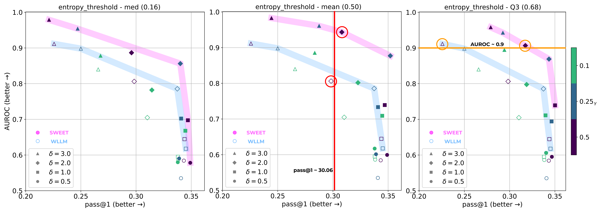

Figure 6: 
The tradeoff between AUROC and pass@1 of detecting real and generated samples of HumanEval. (All) The pink line represents a Pareto frontier of SWEET. The blue line represents a Pareto frontier of WLLM. We observe consistent improvement in SWEET.
The red/orange line and circles are the points used in Table [1](#S3.T1 "Table 1 ‣ 3.2 The SWEET Method ‣ 3 Method ‣ Who Wrote this Code? Watermarking for Code Generation").
[/FIGURE]

[FIGURE A5.F7.1.g1]
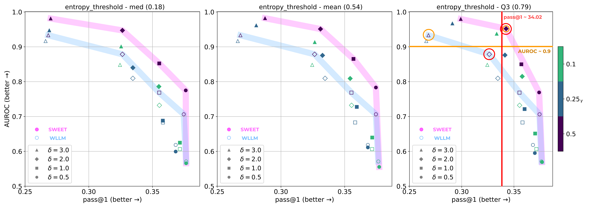

Figure 7: The tradeoff between AUROC and pass@1 of detecting real and generated samples of MBPP. (All) The pink line represents a Pareto frontier of SWEET. The blue line represents a Pareto frontier of WLLM. We observe consistent improvement in SWEET.
The red/orange line and circles are the points used in Table [1](#S3.T1 "Table 1 ‣ 3.2 The SWEET Method ‣ 3 Method ‣ Who Wrote this Code? Watermarking for Code Generation").
[/FIGURE]

[FIGURE A5.F8.1.g1]
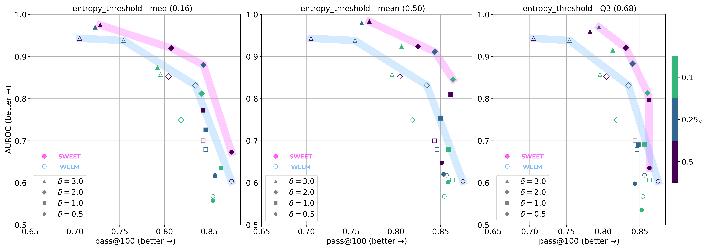

Figure 8: The tradeoff between AUROC and pass@100 of detecting real and generated samples of HumanEval using Temperature of 0.8 insteaed of 0.2 as other figures. (All) The pink line represents a Pareto frontier of SWEET. The blue line represents a Pareto frontier of WLLM. We observe consistent improvement in SWEET.
[/FIGURE]

[FIGURE A5.F9.1.g1]
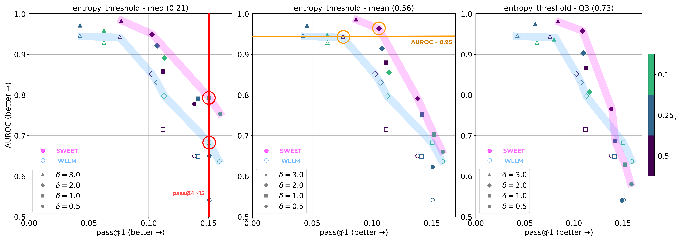

Figure 9: [LLaMa Results] The tradeoff between AUROC and pass@1 of detecting real and generated samples of HumanEval. (All) The pink line represents a Pareto frontier of SWEET. The blue line represents a Pareto frontier of WLLM. We observe consistent improvement in SWEET.
The red/orange line and circles are the points used in Table [2](#A3.T2 "Table 2 ‣ Appendix C Related Work (Full ver.) ‣ Who Wrote this Code? Watermarking for Code Generation").
[/FIGURE]

[FIGURE A5.F10.1.g1]
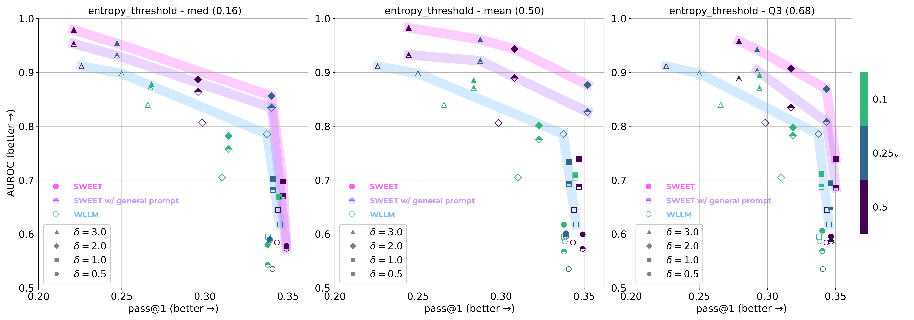

Figure 10: Effect of general prompt in SWEET. In this setting, the detector does not know what information would have been included in a prompt if the given sample source code had been model-generated. SWEET appends the sample to the fixed number of ’general prompt’ that contains no information except for the format consistent with the answer. The purple line represents the Pareto frontier of the ’General prompt’ version SWEET. The quality of this version stays better than WLLM.
[/FIGURE]

HumanEval pass@100. Figure [8](#A5.F8 "Figure 8 ‣ Appendix E Further Pareto Frontier Results on StarCoder/LLaMA ‣ Who Wrote this Code? Watermarking for Code Generation") shows a tradeoff between pass@100 score and AUROC at HumanEval task in temperature 0.8. We generated 200 samples in HumanEval to calculate pass@100. The tendency of the pareto frontier are the same, SWEET is consistently placed in the front. While pass@100 score is much higher than the pass@1 score at temperature=0.2, we see the range of AUROC remains similar. This indicates temperature does not affect the detection strength of each samples heavily.  

HumanEval with general prompt. Figure [10](#A5.F10 "Figure 10 ‣ Appendix E Further Pareto Frontier Results on StarCoder/LLaMA ‣ Who Wrote this Code? Watermarking for Code Generation") demonstrates how the detection ability varies when using general prompts in HumanEval dataset. SWEET with general prompts shows lower AUROC values than the original SWEET across all hyperparameter settings, indicating inaccurately approximated entropy information impairs detection ability. Nevertheless, it still outperforms the WLLM baseline regarding detection ability in almost settings, drawing a Pareto frontier ahead of WLLM. Since we use general prompts only in the detection phase, code quality is the same as the original SWEET.  

MBPP pass@1. We report the tradeoff of hyperparameters in task MBPP in Figure [7](#A5.F7 "Figure 7 ‣ Appendix E Further Pareto Frontier Results on StarCoder/LLaMA ‣ Who Wrote this Code? Watermarking for Code Generation"). Like in HumanEval, SWEET is in pareto frontier. The margin is slightly closer.  

LLaMA. Furthermore, Table [2](#A3.T2 "Table 2 ‣ Appendix C Related Work (Full ver.) ‣ Who Wrote this Code? Watermarking for Code Generation") shows the results on HumanEval when using LLaMA (a general-purpose LLM) as the backbone for code generation. We can observe similar trends (but overall inferior results) as shown in Figure [9](#A5.F9 "Figure 9 ‣ Appendix E Further Pareto Frontier Results on StarCoder/LLaMA ‣ Who Wrote this Code? Watermarking for Code Generation"). SWEET in LLaMA achieved a higher AUROC of 0.11 when the pass@1 score is the same, and it achieved 3.3 points higher pass@1. Due to LLaMA’s code generation capability being weaker than StarCoder, so the absolute margin of pass@1 is smaller than in Table [1](#S3.T1 "Table 1 ‣ 3.2 The SWEET Method ‣ 3 Method ‣ Who Wrote this Code? Watermarking for Code Generation"). We observe that SWEET also applies to general-purpose LLM, which is not code-specific.  

## Appendix F More Details about Experiments with General Prompts

All general prompts we mentioned in Sec [6.1](#S6.SS1 "6.1 Detection Ability without Prompts ‣ 6 Analysis ‣ Who Wrote this Code? Watermarking for Code Generation") at HumanEval task are listed below: These prompts are chosen randomly without any prompt tuning.   [⬇](data:text/plain;base64,ZGVmIHNvbHV0aW9uKCphcmdzKToKICAgICIiIgogICAgR2VuZXJhdGUgYSBzb2x1dGlvbgogICAgIiIi) def solution(\*args):   """   Generate a solution   """     [⬇](data:text/plain;base64,PGZpbGVuYW1lPnNvbHV0aW9ucy9zb2x1dGlvbl8xLnB5CiMgSGVyZSBpcyB0aGUgY29ycmVjdCBpbXBsZW1lbnRhdGlvbiBvZiB0aGUgY29kZSBleGVyY2lzZQpkZWYgc29sdXRpb24oKmFyZ3MpOg==) <filename>solutions/solution\_1.py  # Here is the correct implementation of the code exercise  def solution(\*args):     [⬇](data:text/plain;base64,ZGVmIGZ1bmN0aW9uKCphcmdzLCAqKmthcmdzKToKICAgICIiIgogICAgR2VuZXJhdGUgYSBjb2RlIGdpdmVuIHRoZSBjb25kaXRpb24KICAgICIiIg==) def function(\*args, \*\*kargs):   """   Generate a code given the condition   """     [⬇](data:text/plain;base64,ZnJvbSB0eXBpbmcgaW1wb3J0IExpc3QKCmRlZiBteV9zb2x1dGlvbigqYXJncywgKiprYXJncyk6CiAgICAiIiIKICAgIEdlbmVyYXRlIGEgc29sdXRpb24KICAgICIiIg==) from typing import List    def my\_solution(\*args, \*\*kargs):   """   Generate a solution   """     [⬇](data:text/plain;base64,ZGVmIGZvbygqYXJncyk6CiAgICAiIiIKICAgIFNvbHV0aW9uIHRoYXQgc29sdmVzIGEgcHJvYmxlbQogICAgIiIi) def foo(\*args):   """   Solution that solves a problem   """     

## Appendix G Further Analysis of Lexical Type Distributions

### G.1 List of Lexical Types

Below is the list of lexical types we use for analysis and corresponding examples. All list of types the tokenize module actually emits can be found in https://docs.python.org/3/library/token.html. We merged and split the original types.  

* NAME : identifier names, function names, etc. 
* OP : operators, such as {, [  (  +, =, etc. 
* INDENT : we merge NEWLINE, DEDENT, INDENT, NEWLINE, and NL. 
* RESERVED : split from NAME. In Python docs, they are officially named keywords. 
* BUILT-IN : split from NAME. Please refer to Python docs999<https://docs.python.org/3/library/functions.html#built-in-functions>. 
* NUMBER 
* STRING 
* COMMENT 
* FUNCNAME : split from NAME. We manually build a list of function name almost being used only for function. For examples, append(), join(), split() functions are included. 

### G.2 Lexical Types Distributions Below Threshold

[FIGURE A7.F11.1.g1]
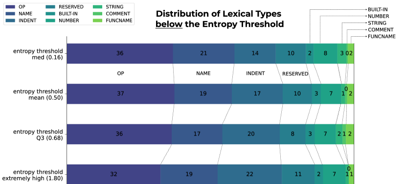

Figure 11: HumanEval / gamma=0.25 / delta=3.0
[/FIGURE]

Figure [11](#A7.F11 "Figure 11 ‣ G.2 Lexical Types Distributions Below Threshold ‣ Appendix G Further Analysis of Lexical Type Distributions ‣ Who Wrote this Code? Watermarking for Code Generation") shows lexical types distributions of output tokens below the entropy threshold. Opposite to the distributions above the threshold (Figure [5](#S6.F5 "Figure 5 ‣ 6.3 Lexical Types Distribution ‣ 6 Analysis ‣ Who Wrote this Code? Watermarking for Code Generation") in Sec [6.3](#S6.SS3 "6.3 Lexical Types Distribution ‣ 6 Analysis ‣ Who Wrote this Code? Watermarking for Code Generation")), NAME and RESERVED types do not increase as the threshold rises. Meanwhile, the proportion of INDENT types gradually increases, indicating that the model has more confidence in the rules, such as indentation.  

## Appendix H Further Analysis of Breakdown of Post-hoc methods

The performance of post-hoc detection methods in the machine-generated code detection task is surprisingly low compared to their performance in the plain text domain. In both HumanEval and MBPP, none of the post-hoc baselines have an AUROC score exceeding 0.6, and the TPR is around 10% or even lower. In this section, we analyze the failures of post-hoc detection baselines.  

Out-Of-Domain for classifiers. Methods leveraging trained classifiers, such as GPTZero and OpenAI Classifier, inherently suffer from out-of-domain (OOD) issues (Guo et al., [2023](#bib.bib13); Yang et al., [2023](#bib.bib50)). Since the machine-generated code detection problems are relatively under explored, we can conjecture that there are not enough examples of machine-generated code for training, especially even though we do not know of the dataset on which GPTZero was trained.  

Relatively Short Length of Code Blocks. DetectGPT presumes the length of the text being detected as near paragraph length. OpenAI Classifier released in 2023 (OpenAI, [2023a](#bib.bib35)) takes only text longer than 1,000 tokens. Even in the WLLM and their following paper (Kirchenbauer et al., [2023b](#bib.bib22)), the length is one of the prime factors in detection and is used in a metric, detectability@T. Despite the importance of the length, in our experiments, the length of the generated code text is generally short. The token lengths generated by the model were are 59 and 49 tokens on average for HumanEval and MBPP, respectively. Unless embedding some signals in the text intentionally, like WLLM and ours, it seems that it is challenging for post-hoc methods to detect short text.  

Failures in DetectGPT. Specifically, in DetectGPT, we attribute the failure to detect machine-generated code to poor estimation of perturbation curvature. We hypothesize two reasons for this. Firstly, considering the nature of the code, it is challenging to rephrase a code while preserving its meaning or functionality. To minimize the degradation of perturbation, we use SantaCoder for the masking model and paraphrase only one line of code at a time. Yet, in most cases, the rephrased code is either identical to its original or broken in functionality. Secondly, LLMs have not achieved as satisfactory code generation performance as plain text generation. Hence, the base and masking models cannot draw meaningful curvature.  

