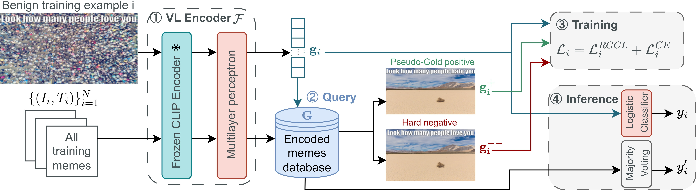

# Improving hateful memes detection via learning hatefulness-aware embedding space through retrieval-guided contrastive learning

###### Abstract

Hateful memes have emerged as a significant concern on the Internet. These memes, which are a combination of image and text, often convey messages vastly different from their individual meanings. Thus, detecting hateful memes requires the system to jointly understand the visual and textual modalities. However, our investigation reveals that the embedding space of existing CLIP-based systems lacks sensitivity to subtle differences in memes that are vital for correct hatefulness classification. To address this issue, we propose constructing a hatefulness-aware embedding space through retrieval-guided contrastive training. Specifically, we add an auxiliary loss that utilizes hard negative and pseudo-gold samples to train the embedding space. Our approach achieves state-of-the-art performance on the Hateful Memes Challenge(HMC) dataset with an AUROC of 86.7. Notably, our approach outperforms much larger fine-tuned Large Multimodal Models like Flamingo and LLaVA. Finally, we demonstrate a retrieval-based hateful memes detection system, which is capable of making hatefulness classification based on data unseen in training from a database. This allows developers to update the hateful memes detection system by simply adding new data without retraining — a desirable feature for real services in the constantly-evolving landscape of hateful memes on the Internet.   

[FIGURE S0.F1.g1]

Figure 1: Illustrative (not in the dataset) examples from Kiela et al. [2021](#bib.bib18). Memes on the left are mean, the ones in the middle are benign image confounders, and those on the right are benign text confounders.
[/FIGURE]

## 1 Introduction

The pervasive growth of social media platform has been accompanied by an alarming surge in hateful content. A recent study shows that between 2019 and 2021, posts containing hate speech related to race or ethnicity were published on the Internet at an average rate of once every 1.7 seconds Ditch the Label ([2021](#bib.bib11)). Hateful memes, which consist of an image accompanied by texts, are becoming a dominant form of online hate speech. If left unchecked, these contents can perpetuate stereotypes, incite discrimination, and even catalyze real-world violence. To handle the large volume of potential hateful content and prevent viral circulation, automatic detection of hateful memes with deep neural models has garnered significant interests in the research community Kiela et al. ([2021](#bib.bib18)); Suryawanshi et al. ([2020b](#bib.bib40), [a](#bib.bib39)); Pramanick et al. ([2021a](#bib.bib29)); Liu et al. ([2022](#bib.bib24)); Hossain et al. ([2022](#bib.bib13)); Prakash et al. ([2023](#bib.bib28)); Sahin et al. ([2023](#bib.bib34)).  

Despite previous efforts, correctly detecting harmful memes remains difficult. Previous literature has identified a prominent challenge in classifying "confounder memes", in which subtle differences in either image or text may lead to completely different meanings (Kiela et al., [2021](#bib.bib18)). As shown in Figure [1](#S0.F1 "Figure 1 ‣ Improving hateful memes detection via learning hatefulness-aware embedding space through retrieval-guided contrastive learning"), the top left and top middle memes share the same caption. However, one of them is hateful and the other benign depending on the accompanying images. Confounder memes resemble real memes on the Internet, where the combined message of image and texts contribute to their hateful nature. Previous works attempted to tackle the challenge by leveraging outside knowledge to ground the reasoning Zhu ([2020](#bib.bib45)), or building stronger multimodal fusions in the early stage  Pramanick et al. ([2021b](#bib.bib30)) and intermediate stage  Kumar and Nandakumar ([2022](#bib.bib20)). However, it has been observed that even state-of-the-art models, such as HateCLIPper Kumar and Nandakumar ([2022](#bib.bib20)), exhibit limited sensitivity to nuanced hateful memes (xx% accuracy on confounder examples).  

We find that a key factor contributing to misclassification is that confounder memes are located in close proximity in the embedding space due to the high similarity of text/image content. For instance, the HateCLIPper embeddings of confounder memes in Figure [1](#S0.F1 "Figure 1 ‣ Improving hateful memes detection via learning hatefulness-aware embedding space through retrieval-guided contrastive learning") have high cosine similarity even though they have opposite meanings. This poses challenges for the classifier to distinguish harmful and benign memes, leading to suboptimal performance.  

To address this issue, we propose “Retrieval-Guided Contrastive Learning” (RGCL) which aims to learn hatefulness-aware vision and language joint representations. Specifically, we align the embeddings of same-class examples that are semantically similar, and separate the embeddings of opposite-class examples. We dynamically retrieve these examples during training and train with a contrastive objective in addition to cross-entropy loss. Our system, RGCL, achieves higher performance than state-of-the-art large multimodal systems on the HatefulMemes dataset with 200 times fewer model parameters, and 16,000 times fewer trainable parameters. In addition, we demonstrate that the well-learned embedding space enables the use of K-nearest-neighbor majority voting classifier. We show that the encoder trained on HarmfulMemes can be applied to HatefulMemes without additional training while maintaining high AUC and accuracy using the KNN majority voting classifier, even outperforming the zero-shot performance of large multi-modal models. This allows efficient transfer and update of hateful memes detection systems to handle the fast-evolving landscape of hateful memes in real-life applications. We summarize our contribution as follows:  

1. We propose Retrieval-Guided Contrastive Learning for hateful memes detection which learns a hatefulness-aware embedding space via an auxiliary contrastive objective with dynamically retrieved samples. Our system achieves state-of-the-art performance on HatefulMemes and Harmful Memes 
2. We demonstrate that the retrieval-based KNN majority voting classifier on the learned embedding space outperforms the zero-shot performance of large multimodal models of much larger scales. This allows developers to easily update and extend hateful memes detection system without retraining. 

## 2 Related Work

We categorise previous hateful meme detection systems into three types: Object Detection (OD)-based systems, CLIP encoder-based systems, and Large Multimodal Models (LMM). Object Detection (OD)-based models such as VisualBERT Li et al. ([2019](#bib.bib21)), OSCAR Li et al. ([2020](#bib.bib22)), and UNITER Chen et al. ([2020](#bib.bib5)) have been employed for detecting hateful memes. However, these models are not end-to-end trainable, often utilizing off-the-shelf object detectors, which can lead to performance bottlenecks. Additionally, the use of Faster R-CNN Ren et al. ([2015](#bib.bib32)) based object detectors Anderson et al. ([2018](#bib.bib2)); Zhang et al. ([2021](#bib.bib44)) results in high inference latency Kim et al. ([2021](#bib.bib19)).  

Recently, systems based on CLIP (Radford et al. ([2021](#bib.bib31))) encoders have gained popularity for detecting hateful memes due to its simpler end-to-end architecture. MOMENTA Pramanick et al. ([2021b](#bib.bib30)) and PromptHate Cao et al. ([2022](#bib.bib4)) augment CLIP representations with additional features such as text attributes and image captions. HateCLIPper Kumar and Nandakumar ([2022](#bib.bib20)) explored different types of modality interaction for CLIP vision and language representations to address challenging hateful memes. However, it still misclassifies challenging confounder memes and performs worse than Large Multimodal Models (LMM).  

Several LMM like Flamingo Alayrac et al. ([2022](#bib.bib1)), InstructBLIP Dai et al. ([2023](#bib.bib10)), and LENS Berrios et al. ([2023](#bib.bib3)) have demonstrated their effectiveness on the Hateful Meme Challenge dataset. The fine-tuned Flamingo 80B achieved a State-of-the-art AUROC of 86.6, outperforming all the previous CLIP-based systems but requiring a resource-intensive fine-tuning process. However, in this paper, we demonstrate that a much smaller CLIP-based model can achieve better performance than such LMM with our proposed retrieval-guided contrastive learning.  

While contrastive learning is widely used in vision tasks Schroff et al. ([2015](#bib.bib35)); Song et al. ([2016](#bib.bib37)); Harwood et al. ([2017](#bib.bib12)); Suh et al. ([2019](#bib.bib38)), its application to multimodally pre-trained encoders for hateful memes has not been well-explored. Lippe et al. ([2020](#bib.bib23)) incorporated negative examples in contrastive learning. However, due to the low quality of randomly sampled negative examples, they observed a degradation in performance. In contrast, our paper demonstrates that by incorporating dynamically sampled positive and negative examples, the system is capable of learning a hatefulness-aware vision and language joint representation.  

## 3 Methodology

### 3.1 Feature Extraction

In each training example $\{(I_{i},T_{i},y_{i})\}_{i=1}^{N}$, $I_{i}\in\mathbb{R}^{C\times H\times W}$ is the image pixels of the meme; $T_{i}$ is the caption overlaid on the meme; $y_{i}\in\{0,1\}$ is the label, where 0 for benign, 1 for hateful.  

We leverage a Vision-Language (VL) encoder to extract image-text joint representations from the image and the overlaid caption:  

|  | $$\mathbf{g}_{i}=\mathcal{F}(I_{i},T_{i})$$ |  | (1) |
| --- | --- | --- | --- |

As shown in Figure [2](#S3.F2 "Figure 2 ‣ 3.1 Feature Extraction ‣ 3 Methodology ‣ Improving hateful memes detection via learning hatefulness-aware embedding space through retrieval-guided contrastive learning"), the VL encoder comprises a frozen CLIP encoder followed by a trainable multilayer perceptron (MLP). The frozen CLIP encoder encodes the text and image into embeddings that are then fused into a joint vision-language embedding before feeding into the MLP. In this paper, we default to using HateCLIPper as our frozen CLIP encoder. For a detailed model architecture, readers are referred to the HateCLIPper’s paper Kumar and Nandakumar ([2022](#bib.bib20)). In Sec.[4.3.2](#S4.SS3.SSS2 "4.3.2 Effects of different VL Encoder ‣ 4.3 Ablation Study ‣ 4 Experiment ‣ Improving hateful memes detection via learning hatefulness-aware embedding space through retrieval-guided contrastive learning"), we compare different choices of VL encoder to demonstrate that our approach is agnostic to the encoder.  

[FIGURE S3.F2.g1]

Figure 2: Model overview. (1) Using Vision-Language (VL) Encoder $\mathcal{F}$ to extract the joint vision-language representation for a training example $i$. Additionally, the VL Encoder encodes the training memes into a retrieval database $\mathbf{G}$. (2) During training, pseudo-gold and hard negative examples are obtained using the Faiss nearest neighbour search. During inference, $K$ nearest neighbours are obtained using the same querying process to perform the KNN-based inference. (3) During training, we optimise the joint loss function $\mathcal{L}$. (4) For inference, we demonstrate the result with conventional logistic classifier and retrieval-based KNN mahority voting.
[/FIGURE]

### 3.2 Retrieval Guided Contrastive Learning

We propose Retrieval-Guided Contrastive Learning which aims to learn hatefulness-aware vision and language joint representations. Specifically, we align the embeddings of same-class examples that are semantically similar by incorporating retrieved pseudo-gold positive examples and separate the embeddings of confounding examples by incorporating retrieved hard negative examples. We dynamically retrieve these examples during training and train with the Retrieval-Guided Contrastive Loss in addition to cross-entropy loss.  

#### 3.2.1 Pseudo-gold positive and hard negative examples

Pseudo-gold positive examples facilitate the clustering of memes within the same class that exhibit similar semantic characteristics, thereby strengthening the model’s ability to capture a wide range of semantic relationships. In contrast, hard negative examples are samples in the training set that share similarities with the anchor meme in the embedding space but carry different labels. In essence, these represent memes that the current embedding space has failed to distinguish correctly, reflecting instances of misclassification or confounder cases in the dataset. Introducing training signals with hard negative examples can effectively enhance the embedding space.  

To obtain these examples, we first encode the training set with our VL encoder. Due to the computational expense, we only update the database after every epoch. The encoded retrieval vector database is denoted as $\mathbf{G}$:  

|  | $$\mathbf{G}=\{(\mathbf{g}_{j},y_{j})\}_{j=1}^{N}$$ |  | (2) |
| --- | --- | --- | --- |

For a training sample $i$, We obtain the hard negative and pseudo-gold positive example from the training set with Faiss nearest neighbour search Johnson et al. ([2019](#bib.bib16)) by computing the similarity scores between the embedding vector $\mathbf{g}_{i}$ and any target embedding vector $\mathbf{g}_{j}$.  

We denote the hard negative example’s embedding vector as $\mathbf{g}_{i}^{--}$:  

|  | $$\mathbf{g}_{i}^{--}=\operatorname*{argmax}_{\mathbf{g}_{j}\in\mathbf{G}}\,\textrm{sim}(\mathbf{g}_{i},\mathbf{g}_{j})\cdot(1-\mathbf{h}(y_{i},y_{j}))$$ |  | (3) |
| --- | --- | --- | --- |

Similarly, for the pseudo-gold positive example’s embedding vector $\mathbf{g}_{i}^{+}$:  

|  | $$\mathbf{g}_{i}^{+}=\operatorname*{argmax}_{\mathbf{g}_{j}\in\mathbf{G}/\mathbf{g}_{i}}\,\textrm{sim}(\mathbf{g}_{i},\mathbf{g}_{j})\cdot\mathbf{h}(y_{i},y_{j})$$ |  | (4) |
| --- | --- | --- | --- |

we define the mask $\mathbf{h}(y_{i},y_{j})$:  

|  | $$\mathbf{h}(y_{i},y_{j}):=\begin{cases}1\hskip 22.76228pt\text{if }y_{j}=y_{i}\\ -1\hskip 14.22636pt\text{if }y_{j}\not=y_{i}\end{cases}$$ |  | (5) |
| --- | --- | --- | --- |

#### 3.2.2 In-batch negative examples

To enhance training stability and encourage robust learning, we incorporate in-batch negative examples. In-batch negative examples introduce diverse gradient signals in the training, and the randomly selected in-batch negative memes are pushed apart in the embedding space. For a training sample $i$, the set of in-batch negative examples is defined as the examples in the same batch that have a different label $y_{k}$ as label $y_{i}$. We denote the embedding vectors for the in-batch negative examples as $\{\mathbf{g}_{i,1}^{-},\mathbf{g}_{i,2}^{-},...,\mathbf{g}_{i,n^{-}}^{-}\}$. There are a total of $n^{-}$ in-batch negative examples correspond to the training sample $i$.  

#### 3.2.3 Training objective

$(\mathbf{g}_{i},\mathbf{g}_{i}^{+},\mathbf{g}_{i}^{--},\mathbf{g}_{i,1}^{-},...,\mathbf{g}_{i,n^{-}}^{-})$ is the vector representation of the original, pseudo-gold positive, hard negative, and in-batch negative examples corresponding to a training example $i$. Our proposed Retrieval-Guided Contrastive Loss (RGCL) can be computed as:  

|  | $\displaystyle\mathcal{L}_{i}^{RGCL}$ | $\displaystyle=L(\mathbf{g}_{i},\mathbf{g}_{i}^{+},\underbrace{\mathbf{g}_{i}^{--},\mathbf{g}_{i,1}^{-},...,\mathbf{g}_{i,n^{-}}^{-}}_{\mathbf{G}_{i}^{-}})$ |  |
| --- | --- | --- | --- |
|  |  | $\displaystyle=-\log\frac{e^{\textrm{sim}(\mathbf{g}_{i},\mathbf{g_{i}^{+}})}}{e^{\textrm{sim}(\mathbf{g}_{i},\mathbf{g_{i}^{+}})}+\sum_{g\in\mathbf{G}_{i}^{-}}e^{\textrm{sim}(\mathbf{g}_{i},\mathbf{g})}}$ |  | (6) |
| --- | --- | --- | --- | --- |

To train the system, we optimise the joint loss function:  

|  | $\displaystyle\mathcal{L}_{i}$ | $\displaystyle=\mathcal{L}_{i}^{RGCL}+\mathcal{L}_{i}^{CE}$ |  |
| --- | --- | --- | --- |
|  |  | $\displaystyle=\mathcal{L}_{i}^{RGCL}+(y_{i}\log\hat{y}_{i}+(1-y_{i})\log(1-\hat{y}_{i}))$ |  | (7) |
| --- | --- | --- | --- | --- |

### 3.3 Retrieval-based KNN majority voting

To assess the expressiveness and discrimination capability of the trained joint embedding space, we extend our analysis beyond the conventional logistic regression employed in recent models like HateCLIPper. Additionally, we introduce a retrieval-based inference mode: For each test meme, we retrieve memes located in close proximity within the embedding space and utilize probability voting to predict whether it is hateful or not. This majority voting strategy heavily relies on the discrimination capability of the trained joint embedding space. Only when the trained embedding space successfully splits hateful and benign examples will majority voting achieve reasonable performance. We conduct experiments in Sec. [4.2.2](#S4.SS2.SSS2 "4.2.2 Results with retrieval-based KNN majority voting ‣ 4.2 Experiment results ‣ 4 Experiment ‣ Improving hateful memes detection via learning hatefulness-aware embedding space through retrieval-guided contrastive learning") to show that applying RGCL leads to much better performance with retrieval-based KNN inference.  

## 4 Experiment

### 4.1 Dataset

We evaluate the performance of the system on the HatefulMemes dataset Kiela et al. ([2021](#bib.bib18)) and the HarMeme dataset Pramanick et al. ([2021a](#bib.bib29)). HatefulMemes dataset is released by the Hateful Memes Challenge competition Kiela et al. ([2021](#bib.bib18)). The HarMeme dataset consists of COVID-19-related memes collected from Twitter. These memes are labelled with three classes: very harmful, partially harmful, and harmless. Following previous works Cao et al. ([2022](#bib.bib4)); Pramanick et al. ([2021b](#bib.bib30)), we combine the very harmful and partially harmful memes into hateful memes and regard harmless memes as benign memes. The dataset statistics are shown in Appendix [C](#A3 "Appendix C Dataset statistics ‣ Improving hateful memes detection via learning hatefulness-aware embedding space through retrieval-guided contrastive learning"). To make a fair comparison, we adopt the evaluation metrics commonly used in existing hateful meme classification studies Kumar and Nandakumar ([2022](#bib.bib20)); Cao et al. ([2022](#bib.bib4)); Kiela et al. ([2021](#bib.bib18)): Area Under the Receiver Operating Characteristic Curve (AUC) and Accuracy (Acc). We train the system on the training split, develop them on the development splits and report the final results on the test set. The experiment setup and hyperparameter settings are detailed in Appendix [A](#A1 "Appendix A Experiment Setup ‣ Improving hateful memes detection via learning hatefulness-aware embedding space through retrieval-guided contrastive learning") and [B](#A2 "Appendix B Hyperparameter ‣ Improving hateful memes detection via learning hatefulness-aware embedding space through retrieval-guided contrastive learning").  

### 4.2 Experiment results

#### 4.2.1 Results with logistic regression

Table [1](#S4.T1 "Table 1 ‣ 4.2.1 Results with logistic regression ‣ 4.2 Experiment results ‣ 4 Experiment ‣ Improving hateful memes detection via learning hatefulness-aware embedding space through retrieval-guided contrastive learning") presents the experimental results on the HatefulMemes dataset. Our Retrieval-guided contrastive learning approach is compared to a range of baseline models, including fine-tuned large multimodal models, Object-detector (OD) based models, Large Multimodal Models (LMM) and CLIP-based systems. The original CLIP Radford et al. ([2021](#bib.bib31)) performs comparably to the OD-based models such as ERNIE-Vil Yu et al. ([2021](#bib.bib43)), UNITER Chen et al. ([2020](#bib.bib5)) and OSCAR Li et al. ([2020](#bib.bib22)), exhibiting comparable AUC scores of around $79\%$. Flamingo-80B Alayrac et al. ([2022](#bib.bib1)) stands as the state-of-the-art model for HatefulMemes, with an AUC of $86.6\%$111Flamingo only reports AUC score. Since Flamingo is not open sourced, we are unable to reproduce the accuracy. Thus, we reproduce LLaVA to understand performance on state-of-the-art open source LMM.. Additionally, we transform HatefulMemes into instruction following data and fine-tuned on LLaVA Liu et al. ([2023](#bib.bib25)) (Vicuna-13B Chiang et al., [2023](#bib.bib8)). LLaVA achieves $77.3\%$ accuracy and $85.3\%$ AUC. PromptHate Cao et al. ([2022](#bib.bib4)) and HateCLIPper Kumar and Nandakumar ([2022](#bib.bib20)), built on top of CLIP Radford et al. ([2021](#bib.bib31)), outperform both the original CLIP and OD-based models. HateCLIPper achieves an AUC of $85.5\%$222HateCLIPper only reports AUC score, thus we reproduce the system with their released code and obtain the corresponding AUC and Acc scores., surpassing the original CLIP but falling short compared to Flamingo-80B. HateCLIPper, trained using our proposed RGCL, obtained an AUC of $86.7\%$, outperforms the 200 times larger Flamingo-80B. Notably, our system’s accuracy also improves over HateCLIPper by nearly $3\%$, reaching an accuracy of $78.8\%$.  

Table [2](#S4.T2 "Table 2 ‣ 4.2.1 Results with logistic regression ‣ 4.2 Experiment results ‣ 4 Experiment ‣ Improving hateful memes detection via learning hatefulness-aware embedding space through retrieval-guided contrastive learning") shows the result on the HarMeme dataset. Being a less popular dataset, there are no baseline results available for large multimodal models, leading us to focus solely on comparing outcomes with CLIP-based systems for the HarMeme dataset. Our Retrieval-guided contrastive learning approach obtained a remarkable accuracy of $87\%$, outperforming HateCLIPper with an accuracy of $84.8\%$, and PromptHate with an accuracy of $84.5\%$. Our system’s state-of-the-art performance on the HarMeme dataset further emphasises Retrieval-guided contrastive learning’s robustness and generalisation capacity to different types of hateful memes.  

[TABLE S4.T1]

<table class="ltx_tabular ltx_centering ltx_align_middle">
<tr class="ltx_tr">
<td class="ltx_td ltx_align_justify ltx_border_tt">

Model

</td>
<td class="ltx_td ltx_align_left ltx_border_tt">AUC</td>
<td class="ltx_td ltx_align_left ltx_border_tt">
Acc.</td>
</tr>
<tr class="ltx_tr">
<td class="ltx_td ltx_align_justify ltx_border_t">       Object Detector based models
</td>
</tr>
<tr class="ltx_tr">
<td class="ltx_td ltx_align_justify ltx_border_t">

ERNIE-Vil

</td>
<td class="ltx_td ltx_align_left ltx_border_t">79.7</td>
<td class="ltx_td ltx_align_left ltx_border_t">72.7</td>
</tr>
<tr class="ltx_tr">
<td class="ltx_td ltx_align_justify">

UNITER

</td>
<td class="ltx_td ltx_align_left">79.1</td>
<td class="ltx_td ltx_align_left">70.5</td>
</tr>
<tr class="ltx_tr">
<td class="ltx_td ltx_align_justify">

OSCAR

</td>
<td class="ltx_td ltx_align_left">78.7</td>
<td class="ltx_td ltx_align_left">73.4</td>
</tr>
<tr class="ltx_tr">
<td class="ltx_td ltx_align_justify ltx_border_t">       Fine tuned Large Multimodal Models
</td>
</tr>
<tr class="ltx_tr">
<td class="ltx_td ltx_align_justify ltx_border_t">

Flamingo-80B

</td>
<td class="ltx_td ltx_align_left ltx_border_t">86.6</td>
<td class="ltx_td ltx_align_left ltx_border_t">-</td>
</tr>
<tr class="ltx_tr">
<td class="ltx_td ltx_align_justify">

LLaVA (Vicuna-13B)

</td>
<td class="ltx_td ltx_align_left">85.3</td>
<td class="ltx_td ltx_align_left">77.3</td>
</tr>
<tr class="ltx_tr">
<td class="ltx_td ltx_align_justify ltx_border_t">       Systems based on CLIP
</td>
</tr>
<tr class="ltx_tr">
<td class="ltx_td ltx_align_justify ltx_border_t">

CLIP

</td>
<td class="ltx_td ltx_align_left ltx_border_t">79.8</td>
<td class="ltx_td ltx_align_left ltx_border_t">72.0</td>
</tr>
<tr class="ltx_tr">
<td class="ltx_td ltx_align_justify">

MOMENTA

</td>
<td class="ltx_td ltx_align_left">69.2</td>
<td class="ltx_td ltx_align_left">61.3</td>
</tr>
<tr class="ltx_tr">
<td class="ltx_td ltx_align_justify">

PromptHate

</td>
<td class="ltx_td ltx_align_left">81.5</td>
<td class="ltx_td ltx_align_left">73.0</td>
</tr>
<tr class="ltx_tr">
<td class="ltx_td ltx_align_justify">

HateCLIPper

</td>
<td class="ltx_td ltx_align_left">85.5</td>
<td class="ltx_td ltx_align_left">76.0</td>
</tr>
<tr class="ltx_tr">
<td class="ltx_td ltx_align_justify">

HateCLIPper w/ RGCL (Ours)

</td>
<td class="ltx_td ltx_align_left">86.7</td>
<td class="ltx_td ltx_align_left">78.8</td>
</tr>
<tr class="ltx_tr">
<td class="ltx_td ltx_align_justify ltx_border_bb">

with Sparse retrieval

</td>
<td class="ltx_td ltx_align_left ltx_border_bb">86.7</td>
<td class="ltx_td ltx_align_left ltx_border_bb">78.1</td>
</tr>
</table>

Table 1: Results on the HatefulMemes dataset
[/TABLE]

[TABLE S4.T2]

<table class="ltx_tabular ltx_centering ltx_align_middle">
<tr class="ltx_tr">
<td class="ltx_td ltx_align_justify ltx_border_tt">

Model

</td>
<td class="ltx_td ltx_align_left ltx_border_tt">AUC</td>
<td class="ltx_td ltx_align_left ltx_border_tt">
Acc.</td>
</tr>
<tr class="ltx_tr">
<td class="ltx_td ltx_align_justify ltx_border_t">       Systems based on CLIP
</td>
</tr>
<tr class="ltx_tr">
<td class="ltx_td ltx_align_justify ltx_border_t">

CLIP

</td>
<td class="ltx_td ltx_align_left ltx_border_t">82.6</td>
<td class="ltx_td ltx_align_left ltx_border_t">76.7</td>
</tr>
<tr class="ltx_tr">
<td class="ltx_td ltx_align_justify">

MOMENTA

</td>
<td class="ltx_td ltx_align_left">86.3</td>
<td class="ltx_td ltx_align_left">80.5</td>
</tr>
<tr class="ltx_tr">
<td class="ltx_td ltx_align_justify">

PromptHate

</td>
<td class="ltx_td ltx_align_left">90.9</td>
<td class="ltx_td ltx_align_left">84.5</td>
</tr>
<tr class="ltx_tr">
<td class="ltx_td ltx_align_justify">

HateCLIPper

</td>
<td class="ltx_td ltx_align_left">89.7</td>
<td class="ltx_td ltx_align_left">84.8</td>
</tr>
<tr class="ltx_tr">
<td class="ltx_td ltx_align_justify ltx_border_bb">

HateCLIPper w/ RGCL (Ours)

</td>
<td class="ltx_td ltx_align_left ltx_border_bb">91.8</td>
<td class="ltx_td ltx_align_left ltx_border_bb">87.0</td>
</tr>
</table>

Table 2: Results on the HarMeme dataset
[/TABLE]

#### 4.2.2 Results with retrieval-based KNN majority voting

In this section, we present the results on the HatefulMemes dataset using KNN-based majority voting classifier. As shown in Table [3](#S4.T3 "Table 3 ‣ 4.2.2 Results with retrieval-based KNN majority voting ‣ 4.2 Experiment results ‣ 4 Experiment ‣ Improving hateful memes detection via learning hatefulness-aware embedding space through retrieval-guided contrastive learning"), we compare our model with a range of state-of-the-art LMMs’ zero-shot performance, including Flamingo Alayrac et al. ([2022](#bib.bib1)), Lens Berrios et al. ([2023](#bib.bib3)), Instruct-BLIP Ouyang et al. ([2022](#bib.bib27)) and LLaVA Liu et al. ([2023](#bib.bib25)). These models encompass diverse language models, with Flan-T5 Chung et al. ([2022](#bib.bib9)) employing an encoder-decoder architecture and Vicuna Chiang et al. ([2023](#bib.bib8)) adopting a decoder-only configuration. Among these models, Lens with Flan-T5XXL 11B demonstrates the highest zero-shot performance, achieving an AUC of $59.4\%$. Since these LMM only report the AUC score for the HatefulMemes dataset, we report the accuracy with the open-sourced LLaVA with Vicuna-13B which achieves an accuracy of 54.8$\%$.  

For the KNN-based classifier, we first evaluate our model’s performance on the HatefulMemes dataset when trained on the HarMeme dataset. When using the HarMeme as the retrieval database, our system achieves an AUC of $59.8\%$ surpasses the baseline HateCLIPper’s AUC of $54.8\%$ and the best LMM’s zero-shot AUC score. To demonstrate that our system can be updated by simply adding new data without retraining which is a desirable feature for real services in the constantly-evolving landscape of hateful memes on the Internet, we further experiment with the same model but with HatefulMemes dataset as the retrieval database. It is worth noting that after switching the retrieval database to HatefulMemes for the model trained on the HarMeme, the baseline HateCLIPper’s performance degrades, suggesting its embedding space lacks robustness and generalising capability to different domains of hateful memes. However, after enhancing the same model with RGCL training, the AUC score boosts to $66.6\%$, outperforming the baseline by a large margin of $13.0\%$. Similarly, we achieved an accuracy of $59.1\%$, surpassing the baseline by $8.2\%$. Both the AUC and accuracy score largely surpass the zero-shot LMM.  

Turning to our fully supervised system, trained on the HatefulMemes dataset and evaluated on the same dataset, its accuracy of $78\%$ remains slightly below the accuracy of the classification mode at $78.8\%$. Nevertheless, this still outperforms HateCLIPper by a margin of $4.6\%$. The AUC is lower than the logistic regression baseline due to the KNN inference does not output raw logits.  

[TABLE S4.T3]

<table class="ltx_tabular ltx_centering ltx_align_middle">
<tr class="ltx_tr">
<td class="ltx_td ltx_align_justify ltx_border_tt">

Model

</td>
<td class="ltx_td ltx_align_left ltx_border_tt">AUC</td>
<td class="ltx_td ltx_align_left ltx_border_tt">
Acc.</td>
</tr>
<tr class="ltx_tr">
<td class="ltx_td ltx_align_justify ltx_border_t">       Zero shot based on Large Multimodal Models
</td>
</tr>
<tr class="ltx_tr">
<td class="ltx_td ltx_align_justify ltx_border_t">

Flamingo-80B

</td>
<td class="ltx_td ltx_align_left ltx_border_t">46.4</td>
<td class="ltx_td ltx_align_left ltx_border_t">-</td>
</tr>
<tr class="ltx_tr">
<td class="ltx_td ltx_align_justify">

Lens (Flan-T5 11B)

</td>
<td class="ltx_td ltx_align_left">59.4</td>
<td class="ltx_td ltx_align_left">-</td>
</tr>
<tr class="ltx_tr">
<td class="ltx_td ltx_align_justify">

InstructBLIP (Flan-T5 11B)

</td>
<td class="ltx_td ltx_align_left">54.1</td>
<td class="ltx_td ltx_align_left">-</td>
</tr>
<tr class="ltx_tr">
<td class="ltx_td ltx_align_justify">

InstructBLIP (Vicuna 13B)

</td>
<td class="ltx_td ltx_align_left">57.5</td>
<td class="ltx_td ltx_align_left">-</td>
</tr>
<tr class="ltx_tr">
<td class="ltx_td ltx_align_justify">

LLaVA (Vicuna 13B)

</td>
<td class="ltx_td ltx_align_left">57.9</td>
<td class="ltx_td ltx_align_left">54.8</td>
</tr>
<tr class="ltx_tr">
<td class="ltx_td ltx_align_justify ltx_border_t">       (Zero-shot) Train and retrieve on HarMeme
</td>
</tr>
<tr class="ltx_tr">
<td class="ltx_td ltx_align_justify ltx_border_t">

HateCLIPper

</td>
<td class="ltx_td ltx_align_left ltx_border_t">54.8</td>
<td class="ltx_td ltx_align_left ltx_border_t">52.2</td>
</tr>
<tr class="ltx_tr">
<td class="ltx_td ltx_align_justify">

HateCLIPper w/ RGCL

</td>
<td class="ltx_td ltx_align_left">59.8 (+5.0)</td>
<td class="ltx_td ltx_align_left">57.1 (+4.9)</td>
</tr>
<tr class="ltx_tr">
<td class="ltx_td ltx_align_justify ltx_border_t">       (Zero-shot) Train on HarMeme, retrieve on HatefulMemes
</td>
</tr>
<tr class="ltx_tr">
<td class="ltx_td ltx_align_justify ltx_border_t">

HateCLIPper

</td>
<td class="ltx_td ltx_align_left ltx_border_t">53.6</td>
<td class="ltx_td ltx_align_left ltx_border_t">50.9</td>
</tr>
<tr class="ltx_tr">
<td class="ltx_td ltx_align_justify">

HateCLIPper w/ RGCL

</td>
<td class="ltx_td ltx_align_left">66.6 (+13.0)</td>
<td class="ltx_td ltx_align_left">59.1 (+8.2)</td>
</tr>
<tr class="ltx_tr">
<td class="ltx_td ltx_align_justify ltx_border_t">       Train and retrieve on HatefulMemes
</td>
</tr>
<tr class="ltx_tr">
<td class="ltx_td ltx_align_justify ltx_border_t">

HateCLIPper

</td>
<td class="ltx_td ltx_align_left ltx_border_t">78.5</td>
<td class="ltx_td ltx_align_left ltx_border_t">73.6</td>
</tr>
<tr class="ltx_tr">
<td class="ltx_td ltx_align_justify ltx_border_bb">

HateCLIPper w/ RGCL

</td>
<td class="ltx_td ltx_align_left ltx_border_bb">83.1 (+4.6)</td>
<td class="ltx_td ltx_align_left ltx_border_bb">78.0 (+4.4)</td>
</tr>
</table>

Table 3: KNN Inference results compared to large multimodal models’ zero-shot results on HatefulMemes
[/TABLE]

### 4.3 Ablation Study

#### 4.3.1 Effects of incorporating hard negative and pseudo-gold positive examples

In Table [4](#S4.T4 "Table 4 ‣ 4.3.1 Effects of incorporating hard negative and pseudo-gold positive examples ‣ 4.3 Ablation Study ‣ 4 Experiment ‣ Improving hateful memes detection via learning hatefulness-aware embedding space through retrieval-guided contrastive learning"), we conduct a comparative analysis by examining the performance when specific examples are excluded during the training process. Notably, when the hard negative examples are excluded, leaving only in-batch negative samples, the overall quality of negative samples declines. Similarly, when we omit the positive samples, only in-batch positive examples are incorporated during the training. Upon observation, it becomes evident that the removal of either the hard negative or the pseudo-gold positive examples leads to a discernible degradation in performance. Specifically, there is a decrease of $0.6\%$ and $0.7\%$ in AUC when omitting hard negative and pseudo-gold positive examples, respectively. Furthermore, the accuracy metric experiences a more substantial reduction, with drops of $1.7\%$ and $1.5\%$ for the respective cases. Notably, the combined exclusion of both the hard negative and pseudo-gold examples results in a marked decrease in performance. This discrepancy is apparent in the AUC score, which experiences a substantial drop when compared to our baseline. The AUC only matches with HateCLIPper’s performance, as indicated in Table [1](#S4.T1 "Table 1 ‣ 4.2.1 Results with logistic regression ‣ 4.2 Experiment results ‣ 4 Experiment ‣ Improving hateful memes detection via learning hatefulness-aware embedding space through retrieval-guided contrastive learning"). Additionally, the accuracy of $76.8\%$ slightly outperforms HateCLIPper’s accuracy of $76.0\%$.  

Furthermore, we explored the performance implications of incorporating multiple examples for each scenario. The inclusion of two hard negative examples leads to substantial performance deterioration, with corresponding drops of $0.8\%$ and $1.5\%$ in AUC and accuracy. In a similar vein, training with two pseudo-gold positive examples yields a slight decline in performance, resulting in a $0.2\%$ decrease in AUC and a $0.3\%$ decrease in accuracy. This phenomenon aligns with recent findings in the literature, as Karpukhin et al. ([2020](#bib.bib17)) reported that the incorporation of multiple hard negative examples does not necessarily enhance performance.  

[TABLE S4.T4]

<table class="ltx_tabular ltx_centering ltx_align_middle">
<tr class="ltx_tr">
<td class="ltx_td ltx_align_justify ltx_border_tt">

Model

</td>
<td class="ltx_td ltx_align_left ltx_border_tt">AUC</td>
<td class="ltx_td ltx_align_left ltx_border_tt">
Acc.</td>
</tr>
<tr class="ltx_tr">
<td class="ltx_td ltx_align_justify ltx_border_t">

Baseline RGCL

</td>
<td class="ltx_td ltx_align_left ltx_border_t">86.7</td>
<td class="ltx_td ltx_align_left ltx_border_t">78.8</td>
</tr>
<tr class="ltx_tr">
<td class="ltx_td ltx_align_justify ltx_border_t">

w/o Hard negative

</td>
<td class="ltx_td ltx_align_left ltx_border_t">86.1</td>
<td class="ltx_td ltx_align_left ltx_border_t">77.1</td>
</tr>
<tr class="ltx_tr">
<td class="ltx_td ltx_align_justify">

w/o Pseudo-Gold positive

</td>
<td class="ltx_td ltx_align_left">86.0</td>
<td class="ltx_td ltx_align_left">77.3</td>
</tr>
<tr class="ltx_tr">
<td class="ltx_td ltx_align_justify">

w/o Hard negative and Pseudo-gold positive

</td>
<td class="ltx_td ltx_align_left">85.5</td>
<td class="ltx_td ltx_align_left">76.8</td>
</tr>
<tr class="ltx_tr">
<td class="ltx_td ltx_align_justify ltx_border_t">

w/ 2 Hard negative

</td>
<td class="ltx_td ltx_align_left ltx_border_t">85.9</td>
<td class="ltx_td ltx_align_left ltx_border_t">77.3</td>
</tr>
<tr class="ltx_tr">
<td class="ltx_td ltx_align_justify ltx_border_bb">

w/ 2 Pseudo-Gold positive

</td>
<td class="ltx_td ltx_align_left ltx_border_bb">86.6</td>
<td class="ltx_td ltx_align_left ltx_border_bb">78.5</td>
</tr>
</table>

Table 4: Ablation study on omitting Hard negative and/or Pseudo-Gold positive examples on the HatefulMemes
[/TABLE]

#### 4.3.2 Effects of different VL Encoder

We ablate the performance of our system on various base VL encoders. As shown in Table [5](#S4.T5 "Table 5 ‣ 4.3.2 Effects of different VL Encoder ‣ 4.3 Ablation Study ‣ 4 Experiment ‣ Improving hateful memes detection via learning hatefulness-aware embedding space through retrieval-guided contrastive learning"), we first experiment with various encoders in the CLIP family, we experiment with the original CLIP Radford et al. ([2021](#bib.bib31)), OPENCLIP Ilharco et al. ([2021](#bib.bib14)); Schuhmann et al. ([2022](#bib.bib36)); Cherti et al. ([2023](#bib.bib7)), and AltCLIP Chen et al. ([2022](#bib.bib6)). our method boosts the performance of all these variants of CLIP by around $3\%$ in both AUC and accuracy. Furthermore, to make sure our method is not overfit to the CLIP architecture, we carry out experiments with ALIGN Jia et al. ([2021](#bib.bib15)). ALIGN only open-sourced the base model which is less capable than the larger CLIP based models. Nevertheless, RGCL still manages to enhance the AUC score by a margin of $4.4\%$ over the baseline ALIGN model, suggesting our approach is agnostic to the choice of VL encoders.  

[TABLE S4.T5]

<table class="ltx_tabular ltx_centering ltx_align_middle">
<tr class="ltx_tr">
<td class="ltx_td ltx_align_justify ltx_border_tt">

Model

</td>
<td class="ltx_td ltx_align_left ltx_border_tt">AUC</td>
<td class="ltx_td ltx_align_left ltx_border_tt">
Acc.</td>
</tr>
<tr class="ltx_tr">
<td class="ltx_td ltx_align_justify ltx_border_t">

HateCLIPper

</td>
<td class="ltx_td ltx_align_left ltx_border_t">85.5</td>
<td class="ltx_td ltx_align_left ltx_border_t">76.0</td>
</tr>
<tr class="ltx_tr">
<td class="ltx_td ltx_align_justify">

HateCLIPper w/ RGCL

</td>
<td class="ltx_td ltx_align_left">86.7 (+1.2)
</td>
<td class="ltx_td ltx_align_left">78.8 (+2.8)
</td>
</tr>
<tr class="ltx_tr">
<td class="ltx_td ltx_align_justify ltx_border_t">

CLIP

</td>
<td class="ltx_td ltx_align_left ltx_border_t">79.8</td>
<td class="ltx_td ltx_align_left ltx_border_t">72.0</td>
</tr>
<tr class="ltx_tr">
<td class="ltx_td ltx_align_justify">

CLIP w/ RGCL

</td>
<td class="ltx_td ltx_align_left">83.8 (+4.0)
</td>
<td class="ltx_td ltx_align_left">75.8 (+3.8)
</td>
</tr>
<tr class="ltx_tr">
<td class="ltx_td ltx_align_justify ltx_border_t">

OpenCLIP

</td>
<td class="ltx_td ltx_align_left ltx_border_t">82.9</td>
<td class="ltx_td ltx_align_left ltx_border_t">71.7</td>
</tr>
<tr class="ltx_tr">
<td class="ltx_td ltx_align_justify">

OpenCLIP w/ RGCL

</td>
<td class="ltx_td ltx_align_left">84.1 (+1.2)
</td>
<td class="ltx_td ltx_align_left">75.1 (+3.4)
</td>
</tr>
<tr class="ltx_tr">
<td class="ltx_td ltx_align_justify ltx_border_t">

AltCLIP

</td>
<td class="ltx_td ltx_align_left ltx_border_t">83.4</td>
<td class="ltx_td ltx_align_left ltx_border_t">74.1</td>
</tr>
<tr class="ltx_tr">
<td class="ltx_td ltx_align_justify">

AltCLIP w/ RGCL

</td>
<td class="ltx_td ltx_align_left">86.5 (+3.1)
</td>
<td class="ltx_td ltx_align_left">76.8 (+2.7)
</td>
</tr>
<tr class="ltx_tr">
<td class="ltx_td ltx_align_justify ltx_border_t">

ALIGN

</td>
<td class="ltx_td ltx_align_left ltx_border_t">73.2</td>
<td class="ltx_td ltx_align_left ltx_border_t">66.8</td>
</tr>
<tr class="ltx_tr">
<td class="ltx_td ltx_align_justify ltx_border_bb">

ALIGN w/ RGCL

</td>
<td class="ltx_td ltx_align_left ltx_border_bb">77.6 (+4.4)
</td>
<td class="ltx_td ltx_align_left ltx_border_bb">68.9 (+2.1)
</td>
</tr>
</table>

Table 5: Ablation study on various Vision-Language Encoder on the HatefulMemes dataset
[/TABLE]

#### 4.3.3 Effects of Dense/Sparse Retrieval

We use dense retrieval to obtain pseudo-gold positive and hard negative examples to avoid an additional pipeline of object detection. However, in previous literature like dense passage retrieval Karpukhin et al. ([2020](#bib.bib17)), sparse retrieval methods like BM-25 Robertson and Zaragoza ([2009](#bib.bib33)) are used to obtain hard negative examples to avoid dynamically encoding the vector retrieval database. Here, we also ablate the performance of our system when incorporating sparse retrieval to obtain the retrieved examples. We use VinVL object detector Zhang et al. ([2021](#bib.bib44)) to obtain the region-of-interest object prediction and its corresponding attributes. We set a region-of-interest bounding box detection threshold of $0.2$, a minimum of 10 bounding boxes, and a maximum of 100 bounding boxes, consistent with the default settings of VinVL. After obtaining the text-based image features, we concatenate these text with the overlaid caption from the meme to perform the sparse retrieval. As shown in Table [1](#S4.T1 "Table 1 ‣ 4.2.1 Results with logistic regression ‣ 4.2 Experiment results ‣ 4 Experiment ‣ Improving hateful memes detection via learning hatefulness-aware embedding space through retrieval-guided contrastive learning")’s last row, the sparse retrieval method achieves the same AUC of $86.7\%$ with the dense retrieval, but with a lower accuracy of $78.1\%$.  

#### 4.3.4 Loss function and similarity metrics

Besides cosine similarity (Cos), inner product (IP) and Euclidean L2 distance are also commonly used as similarity measures. Since Euclidean distance (L2) is a distance metric, we take its negative to serve as a measure of similarity. We tested these alternatives and found cosine similarity performs slightly better as shown in Table [6](#S4.T6 "Table 6 ‣ 4.3.4 Loss function and similarity metrics ‣ 4.3 Ablation Study ‣ 4 Experiment ‣ Improving hateful memes detection via learning hatefulness-aware embedding space through retrieval-guided contrastive learning"). Additionally, another popular loss function for ranking is triplet loss which compares a positive example with a negative example for an anchor meme. Our results in Table [6](#S4.T6 "Table 6 ‣ 4.3.4 Loss function and similarity metrics ‣ 4.3 Ablation Study ‣ 4 Experiment ‣ Improving hateful memes detection via learning hatefulness-aware embedding space through retrieval-guided contrastive learning") suggest using triplet loss performs comparable to the default NLL loss.  

[TABLE S4.T6]

<table class="ltx_tabular ltx_centering ltx_align_middle">
<tr class="ltx_tr">
<td class="ltx_td ltx_align_justify ltx_border_tt">

Loss

</td>
<td class="ltx_td ltx_align_justify ltx_border_tt">

Similarity

</td>
<td class="ltx_td ltx_align_left ltx_border_tt">AUC</td>
<td class="ltx_td ltx_align_left ltx_border_tt">
Acc.</td>
</tr>
<tr class="ltx_tr">
<td class="ltx_td ltx_align_justify ltx_border_t">

NLL

</td>
<td class="ltx_td ltx_align_justify ltx_border_t">

Cos

</td>
<td class="ltx_td ltx_align_left ltx_border_t">86.7</td>
<td class="ltx_td ltx_align_left ltx_border_t">78.8</td>
</tr>
<tr class="ltx_tr">
<td class="ltx_td ltx_align_justify">

IP

</td>
<td class="ltx_td ltx_align_left">86.1</td>
<td class="ltx_td ltx_align_left">78.2</td>
</tr>
<tr class="ltx_tr">
<td class="ltx_td ltx_align_justify">

L2

</td>
<td class="ltx_td ltx_align_left">85.7</td>
<td class="ltx_td ltx_align_left">76.6</td>
</tr>
<tr class="ltx_tr">
<td class="ltx_td ltx_align_justify ltx_border_bb ltx_border_t">

Triplet

</td>
<td class="ltx_td ltx_align_justify ltx_border_t">

Cos

</td>
<td class="ltx_td ltx_align_left ltx_border_t">86.7</td>
<td class="ltx_td ltx_align_left ltx_border_t">78.7</td>
</tr>
<tr class="ltx_tr">
<td class="ltx_td ltx_align_justify">

IP

</td>
<td class="ltx_td ltx_align_left">86.1</td>
<td class="ltx_td ltx_align_left">78.2</td>
</tr>
<tr class="ltx_tr">
<td class="ltx_td ltx_align_justify ltx_border_bb">

L2

</td>
<td class="ltx_td ltx_align_left ltx_border_bb">85.7</td>
<td class="ltx_td ltx_align_left ltx_border_bb">76.8</td>
</tr>
</table>

Table 6: Ablation study on the loss function and similarity metrics on the HatefulMemes dataset
[/TABLE]

### 4.4 Qualitative Analysis

In this section, we demonstrate confounder examples from HatefulMemes in Table [7](#S4.T7 "Table 7 ‣ 4.4 Qualitative Analysis ‣ 4 Experiment ‣ Improving hateful memes detection via learning hatefulness-aware embedding space through retrieval-guided contrastive learning"). In Table [7](#S4.T7 "Table 7 ‣ 4.4 Qualitative Analysis ‣ 4 Experiment ‣ Improving hateful memes detection via learning hatefulness-aware embedding space through retrieval-guided contrastive learning") (a), both the image and text confounders appear benign and reside in the training set. Specifically, the image confounder presents a meme with the caption "This is the worst cancer I’ve ever seen," accompanied by an image of two individuals who could potentially be doctors discussing the disease. The text confounder, on the other hand, showcases a meme praising the flag of Israel with the caption "the flag flies high and proud." However, when the text and image of these two memes are combined, an extremely hateful and antisemitic meme emerges. This anchor meme, which is in the test set, draws a comparison between Israel and a type of disease. HateCLIPper misclassifies this anchor meme as benign with a borderline probability of 0.454. This borderline probability indicates that HateCLIPper’s modality fusion attempts to comprehend both modalities. The fusion recognises the hateful context arising from combining something negative like a disease with a flag. However, the model remains overfitted to the training set, primarily influenced by its benign image and text confounder memes presented during training. The high cosine similarity scores of the anchor meme with the confounder memes (0.702 and 0.733 respectively) further support the notion that these memes, differing in only one modality, are positioned closely in the embedding space due to the cross-entropy training criteria. The resulting highly similar joint vision-language embeddings contribute to misclassification and limited generalisation to the test set. In contrast, our system correctly and confidently predicts the anchor meme’s hatefulness with a probability of 0.999. Additionally, our system demonstrates very low similarity scores between the anchor meme and the confounder memes (-0.751 and -0.571 respectively). This implies that the proposed Retrieval-guided contrastive learning effectively learns a hatefulness-aware embedding space, placing the meme within the embedding space with a comprehensive hateful understanding derived from both vision and language components. Here, we omit the similar analysis for Table [7](#S4.T7 "Table 7 ‣ 4.4 Qualitative Analysis ‣ 4 Experiment ‣ Improving hateful memes detection via learning hatefulness-aware embedding space through retrieval-guided contrastive learning") (b).  

[TABLE S4.T7]

(a)

Anchor Meme
Image Confounder
Text Confounder

Meme

Labels

Hateful
Benign
Benign

       HateCLIPper

Probability

0.454
0.000
0.001

Prediction

Benign ✗
Benign
Benign

Similarity with anchor

-
0.702
0.733

       HateCLIPper w/ RGCL (Ours)

Probability

0.999
0.000
0.000

Prediction

Hateful ✓
Benign
Benign

Similarity with anchor

-
-0.751
-0.571

(b)

Meme

Labels

Hateful
Benign
Benign

       HateCLIPper

Probability

0.038
0.000
0.001

Prediction

Benign ✗
Benign
Benign

Similarity with anchor

-
0.898
0.913

       HateCLIPper w/ RGCL (Ours)

Probability

1.00
0.000
0.000

Prediction

Hateful ✓
Benign
Benign

Similarity with anchor

-
-0.803
-0.769

Table 7: Visualisation for the Confounder memes in the HatefulMemes dataset: We present two trios of memes including anchor memes, image Confounders and text confounders, showcasing the impact of image and text alterations on hatefulness prediction. The labels are the ground truth annotation provided by the dataset. We show the output hateful probability and predictions from two systems: HateCLIPper Kumar and Nandakumar ([2022](#bib.bib20)) and our system. Further, we provide the cosine similarity score between the anchor meme and its corresponding confounder meme.
[/TABLE]

## 5 Conclusion

In conclusion, we introduced Retrieval-Guided Contrastive Learning to enhance any VL encoders, addressing challenges in distinguishing confounding memes. Our approach, leveraging a novel auxiliary task loss with retrieved examples, significantly improved contextual understanding. Achieving an outstanding AUC score of $86.7\%$ on HatefulMemes dataset, our system outperformed prior state-of-the-art models, including the 200 times larger Flamingo-80B. Additionally, our approach demonstrated state-of-the-art results on the HarMeme dataset, emphasizing its robust generalizability across diverse meme domains.  

## 6 Limitation

Various works define hate speech differently, and they frequently use other terminology, such as online harassment, online aggression, cyberbullying, or harmful speech. United Nations Strategy and Plan of Action on Hate Speech stated that the definition of hateful could be controversial and disputed Nderitu ([2020](#bib.bib26)). Additionally, according to UK’s Online Harms White Paper, harms could be insufficiently defined Woodhouse ([2022](#bib.bib42)). On the technical side, current state-of-the-art systems still perform far from satisfactory. For example, Table [8](#S6.T8 "Table 8 ‣ 6 Limitation ‣ Improving hateful memes detection via learning hatefulness-aware embedding space through retrieval-guided contrastive learning") shows a trio of memes from the HatefulMemes dataset, adopting a structure similar to Table [7](#S4.T7 "Table 7 ‣ 4.4 Qualitative Analysis ‣ 4 Experiment ‣ Improving hateful memes detection via learning hatefulness-aware embedding space through retrieval-guided contrastive learning"). The Anchor meme portrays a person with an exaggeratedly elongated nose with a caption of "when your jewish friend smells a stash of coins in public". This meme carries implicit offensiveness towards the Jewish community. Our method correctly categorizes it as hateful, marking an improvement over the HateCLIPper model’s performance. In the case of the image confounder, the meme substitutes the image with one depicting a person discovering a dirty can in public, displaying a disgusted facial expression. The combination of text and image renders this meme benign. However, neither of the two systems successfully identifies this meme as hateful. This limitation might arise from the models’ inability to comprehend facial expressions, which remains a constraint of our approach. Such challenges could potentially be addressed with a more robust vision encoder.  

[TABLE S6.T8]

<table class="ltx_tabular ltx_centering ltx_align_middle">
<tr class="ltx_tr">
<td class="ltx_td"></td>
<td class="ltx_td ltx_align_center">Anchor Meme</td>
<td class="ltx_td ltx_align_center">Image Confounder</td>
<td class="ltx_td ltx_align_center">Text Confounder</td>
</tr>
<tr class="ltx_tr">
<td class="ltx_td ltx_align_justify ltx_border_t">

Meme

</td>
<td class="ltx_td ltx_align_center ltx_border_t"></td>
<td class="ltx_td ltx_align_center ltx_border_t"></td>
<td class="ltx_td ltx_align_center ltx_border_t"></td>
</tr>
<tr class="ltx_tr">
<td class="ltx_td ltx_align_justify ltx_border_t">

Labels

</td>
<td class="ltx_td ltx_align_center ltx_border_t">Hateful</td>
<td class="ltx_td ltx_align_center ltx_border_t">Benign</td>
<td class="ltx_td ltx_align_center ltx_border_t">Benign</td>
</tr>
<tr class="ltx_tr">
<td class="ltx_td ltx_align_justify ltx_border_t">       HateCLIPper
</td>
</tr>
<tr class="ltx_tr">
<td class="ltx_td ltx_align_justify ltx_border_t">

Probability

</td>
<td class="ltx_td ltx_align_center ltx_border_t">0.355</td>
<td class="ltx_td ltx_align_center ltx_border_t">0.870</td>
<td class="ltx_td ltx_align_center ltx_border_t">0.000</td>
</tr>
<tr class="ltx_tr">
<td class="ltx_td ltx_align_justify">

Prediction

</td>
<td class="ltx_td ltx_align_center">Benign ✗</td>
<td class="ltx_td ltx_align_center">Hateful ✗</td>
<td class="ltx_td ltx_align_center">Benign</td>
</tr>
<tr class="ltx_tr">
<td class="ltx_td ltx_align_justify">

Similarity with anchor

</td>
<td class="ltx_td ltx_align_center">-</td>
<td class="ltx_td ltx_align_center">0.898</td>
<td class="ltx_td ltx_align_center">0.674</td>
</tr>
<tr class="ltx_tr">
<td class="ltx_td ltx_align_justify ltx_border_t">       HateCLIPper w/ RGCL (Ours)
</td>
</tr>
<tr class="ltx_tr">
<td class="ltx_td ltx_align_justify ltx_border_t">

Probability

</td>
<td class="ltx_td ltx_align_center ltx_border_t">0.985</td>
<td class="ltx_td ltx_align_center ltx_border_t">0.999</td>
<td class="ltx_td ltx_align_center ltx_border_t">0.000</td>
</tr>
<tr class="ltx_tr">
<td class="ltx_td ltx_align_justify">

Prediction

</td>
<td class="ltx_td ltx_align_center">Hateful ✓</td>
<td class="ltx_td ltx_align_center">Hateful ✗</td>
<td class="ltx_td ltx_align_center">Benign</td>
</tr>
<tr class="ltx_tr">
<td class="ltx_td ltx_align_justify ltx_border_bb">

Similarity with anchor

</td>
<td class="ltx_td ltx_align_center ltx_border_bb">-</td>
<td class="ltx_td ltx_align_center ltx_border_bb">0.856</td>
<td class="ltx_td ltx_align_center ltx_border_bb">-0.548</td>
</tr>
</table>

Table 8: Visualisation for the error cases
[/TABLE]

## References

* Alayrac et al. (2022)  Jean-Baptiste Alayrac, Jeff Donahue, Pauline Luc, Antoine Miech, Iain Barr, Yana Hasson, Karel Lenc, Arthur Mensch, Katherine Millican, Malcolm Reynolds, Roman Ring, Eliza Rutherford, Serkan Cabi, Tengda Han, Zhitao Gong, Sina Samangooei, Marianne Monteiro, Jacob L. Menick, Sebastian Borgeaud, Andy Brock, Aida Nematzadeh, Sahand Sharifzadeh, Mikołaj Bińkowski, Ricardo Barreira, Oriol Vinyals, Andrew Zisserman, and Karén Simonyan. 2022.   [Flamingo: a visual language model for few-shot learning](https://openreview.net/forum?id=EbMuimAbPbs).   *Advances in Neural Information Processing Systems*, 35:23716–23736. 
* Anderson et al. (2018)  Peter Anderson, Xiaodong He, Chris Buehler, Damien Teney, Mark Johnson, Stephen Gould, and Lei Zhang. 2018.   [Bottom-up and top-down attention for image captioning and visual question answering](https://doi.org/10.1109/CVPR.2018.00636).   In *2018 IEEE/CVF Conference on Computer Vision and Pattern Recognition*, page 6077–6086. 
* Berrios et al. (2023)  William Berrios, Gautam Mittal, Tristan Thrush, Douwe Kiela, and Amanpreet Singh. 2023.   [Towards language models that can see: Computer vision through the lens of natural language](https://doi.org/10.48550/arXiv.2306.16410).   (arXiv:2306.16410).   ArXiv:2306.16410 [cs]. 
* Cao et al. (2022)  Rui Cao, Roy Ka-Wei Lee, Wen-Haw Chong, and Jing Jiang. 2022.   [Prompting for multimodal hateful meme classification](https://doi.org/10.18653/v1/2022.emnlp-main.22).   In *Proceedings of the 2022 Conference on Empirical Methods in Natural Language Processing*, pages 321–332, Abu Dhabi, United Arab Emirates. Association for Computational Linguistics. 
* Chen et al. (2020)  Yen-Chun Chen, Linjie Li, Licheng Yu, Ahmed El Kholy, Faisal Ahmed, Zhe Gan, Yu Cheng, and Jingjing Liu. 2020.   [*UNITER: UNiversal Image-TExt Representation Learning*](https://doi.org/10.1007/978-3-030-58577-8_7), volume 12375 of *Lecture Notes in Computer Science*, page 104–120. Springer International Publishing, Cham. 
* Chen et al. (2022)  Zhongzhi Chen, Guang Liu, Bo-Wen Zhang, Fulong Ye, Qinghong Yang, and Ledell Wu. 2022.   [Altclip: Altering the language encoder in clip for extended language capabilities](https://doi.org/10.48550/arXiv.2211.06679).   (arXiv:2211.06679).   ArXiv:2211.06679 [cs]. 
* Cherti et al. (2023)  Mehdi Cherti, Romain Beaumont, Ross Wightman, Mitchell Wortsman, Gabriel Ilharco, Cade Gordon, Christoph Schuhmann, Ludwig Schmidt, and Jenia Jitsev. 2023.   Reproducible scaling laws for contrastive language-image learning.   In *Proceedings of the IEEE/CVF Conference on Computer Vision and Pattern Recognition*, pages 2818–2829. 
* Chiang et al. (2023)  Wei-Lin Chiang, Zhuohan Li, Zi Lin, Ying Sheng, Zhanghao Wu, Hao Zhang, Lianmin Zheng, Siyuan Zhuang, Yonghao Zhuang, Joseph E. Gonzalez, Ion Stoica, and Eric P. Xing. 2023.   [Vicuna: An open-source chatbot impressing gpt-4 with 90%\* chatgpt quality](https://lmsys.org/blog/2023-03-30-vicuna/). 
* Chung et al. (2022)  Hyung Won Chung, Le Hou, Shayne Longpre, Barret Zoph, Yi Tay, William Fedus, Yunxuan Li, Xuezhi Wang, Mostafa Dehghani, Siddhartha Brahma, Albert Webson, Shixiang Shane Gu, Zhuyun Dai, Mirac Suzgun, Xinyun Chen, Aakanksha Chowdhery, Alex Castro-Ros, Marie Pellat, Kevin Robinson, Dasha Valter, Sharan Narang, Gaurav Mishra, Adams Yu, Vincent Zhao, Yanping Huang, Andrew Dai, Hongkun Yu, Slav Petrov, Ed H. Chi, Jeff Dean, Jacob Devlin, Adam Roberts, Denny Zhou, Quoc V. Le, and Jason Wei. 2022.   [Scaling instruction-finetuned language models](https://doi.org/10.48550/arXiv.2210.11416).   (arXiv:2210.11416).   ArXiv:2210.11416 [cs]. 
* Dai et al. (2023)  Wenliang Dai, Junnan Li, Dongxu Li, Anthony Meng Huat Tiong, Junqi Zhao, Weisheng Wang, Boyang Li, Pascale Fung, and Steven Hoi. 2023.   [Instructblip: Towards general-purpose vision-language models with instruction tuning](https://doi.org/10.48550/arXiv.2305.06500).   (arXiv:2305.06500).   ArXiv:2305.06500 [cs]. 
* Ditch the Label (2021)  Ditch the Label. 2021.   [Uncovered: Online hate speech in the covid era](https://www.ditchthelabel.org/research-papers/hate-speech-report-2021/). 
* Harwood et al. (2017)  Ben Harwood, Vijay Kumar B. G, Gustavo Carneiro, Ian Reid, and Tom Drummond. 2017.   [Smart mining for deep metric learning](https://doi.org/10.48550/arXiv.1704.01285).   (arXiv:1704.01285).   ArXiv:1704.01285 [cs]. 
* Hossain et al. (2022)  Eftekhar Hossain, Omar Sharif, and Mohammed Moshiul Hoque. 2022.   [Mute: A multimodal dataset for detecting hateful memes](https://aclanthology.org/2022.aacl-srw.5).   In *Proceedings of the 2nd Conference of the Asia-Pacific Chapter of the Association for Computational Linguistics and the 12th International Joint Conference on Natural Language Processing: Student Research Workshop*, page 32–39, Online. Association for Computational Linguistics. 
* Ilharco et al. (2021)  Gabriel Ilharco, Mitchell Wortsman, Ross Wightman, Cade Gordon, Nicholas Carlini, Rohan Taori, Achal Dave, Vaishaal Shankar, Hongseok Namkoong, John Miller, Hannaneh Hajishirzi, Ali Farhadi, and Ludwig Schmidt. 2021.   [Openclip](https://doi.org/10.5281/zenodo.5143773).   If you use this software, please cite it as below. 
* Jia et al. (2021)  Chao Jia, Yinfei Yang, Ye Xia, Yi-Ting Chen, Zarana Parekh, Hieu Pham, Quoc V. Le, Yunhsuan Sung, Zhen Li, and Tom Duerig. 2021.   [Scaling up visual and vision-language representation learning with noisy text supervision](https://doi.org/10.48550/arXiv.2102.05918).   (arXiv:2102.05918).   ArXiv:2102.05918 [cs]. 
* Johnson et al. (2019)  Jeff Johnson, Matthijs Douze, and Hervé Jégou. 2019.   Billion-scale similarity search with GPUs.   *IEEE Transactions on Big Data*, 7(3):535–547. 
* Karpukhin et al. (2020)  Vladimir Karpukhin, Barlas Oguz, Sewon Min, Patrick Lewis, Ledell Wu, Sergey Edunov, Danqi Chen, and Wen-tau Yih. 2020.   [Dense passage retrieval for open-domain question answering](https://doi.org/10.18653/v1/2020.emnlp-main.550).   In *Proceedings of the 2020 Conference on Empirical Methods in Natural Language Processing (EMNLP)*, page 6769–6781, Online. Association for Computational Linguistics. 
* Kiela et al. (2021)  Douwe Kiela, Hamed Firooz, Aravind Mohan, Vedanuj Goswami, Amanpreet Singh, Pratik Ringshia, and Davide Testuggine. 2021.   [The hateful memes challenge: Detecting hate speech in multimodal memes](http://arxiv.org/abs/2005.04790).   (arXiv:2005.04790).   ArXiv:2005.04790 [cs]. 
* Kim et al. (2021)  Wonjae Kim, Bokyung Son, and Ildoo Kim. 2021.   [Vilt: Vision-and-language transformer without convolution or region supervision](https://proceedings.mlr.press/v139/kim21k.html).   In *Proceedings of the 38th International Conference on Machine Learning*, page 5583–5594. PMLR. 
* Kumar and Nandakumar (2022)  Gokul Karthik Kumar and Karthik Nandakumar. 2022.   [Hate-CLIPper: Multimodal hateful meme classification based on cross-modal interaction of CLIP features](https://doi.org/10.18653/v1/2022.nlp4pi-1.20).   In *Proceedings of the Second Workshop on NLP for Positive Impact (NLP4PI)*, pages 171–183, Abu Dhabi, United Arab Emirates (Hybrid). Association for Computational Linguistics. 
* Li et al. (2019)  Liunian Harold Li, Mark Yatskar, Da Yin, Cho-Jui Hsieh, and Kai-Wei Chang. 2019.   [Visualbert: A simple and performant baseline for vision and language](https://doi.org/10.48550/arXiv.1908.03557).   (arXiv:1908.03557).   ArXiv:1908.03557 [cs]. 
* Li et al. (2020)  Xiujun Li, Xi Yin, Chunyuan Li, Pengchuan Zhang, Xiaowei Hu, Lei Zhang, Lijuan Wang, Houdong Hu, Li Dong, Furu Wei, Yejin Choi, and Jianfeng Gao. 2020.   [*Oscar: Object-Semantics Aligned Pre-training for Vision-Language Tasks*](https://doi.org/10.1007/978-3-030-58577-8_8), volume 12375 of *Lecture Notes in Computer Science*, page 121–137. Springer International Publishing, Cham. 
* Lippe et al. (2020)  Phillip Lippe, Nithin Holla, Shantanu Chandra, Santhosh Rajamanickam, Georgios Antoniou, Ekaterina Shutova, and Helen Yannakoudakis. 2020.   [A multimodal framework for the detection of hateful memes](http://arxiv.org/abs/2012.12871).   (arXiv:2012.12871).   ArXiv:2012.12871 [cs]. 
* Liu et al. (2022)  Chen Liu, Gregor Geigle, Robin Krebs, and Iryna Gurevych. 2022.   [Figmemes: A dataset for figurative language identification in politically-opinionated memes](https://aclanthology.org/2022.emnlp-main.476).   In *Proceedings of the 2022 Conference on Empirical Methods in Natural Language Processing*, page 7069–7086, Abu Dhabi, United Arab Emirates. Association for Computational Linguistics. 
* Liu et al. (2023)  Haotian Liu, Chunyuan Li, Qingyang Wu, and Yong Jae Lee. 2023.   [Visual instruction tuning](https://doi.org/10.48550/arXiv.2304.08485).   (arXiv:2304.08485).   ArXiv:2304.08485 [cs]. 
* Nderitu (2020)  Wairimu Nderitu. 2020.   [United nations strategy and plan of action on hate speech](https://www.un.org/en/genocideprevention/hate-speech-strategy.shtml). 
* Ouyang et al. (2022)  Long Ouyang, Jeff Wu, Xu Jiang, Diogo Almeida, Carroll L. Wainwright, Pamela Mishkin, Chong Zhang, Sandhini Agarwal, Katarina Slama, Alex Ray, John Schulman, Jacob Hilton, Fraser Kelton, Luke Miller, Maddie Simens, Amanda Askell, Peter Welinder, Paul Christiano, Jan Leike, and Ryan Lowe. 2022.   [Training language models to follow instructions with human feedback](https://arxiv.org/abs/2203.02155v1). 
* Prakash et al. (2023)  Nirmalendu Prakash, Ming Shan Hee, and Roy Ka-Wei Lee. 2023.   [Totaldefmeme: A multi-attribute meme dataset on total defence in singapore](https://doi.org/10.1145/3587819.3592545).   In *Proceedings of the 14th Conference on ACM Multimedia Systems*, MMSys ’23, page 369–375, New York, NY, USA. Association for Computing Machinery. 
* Pramanick et al. (2021a)  Shraman Pramanick, Dimitar Dimitrov, Rituparna Mukherjee, Shivam Sharma, Md. Shad Akhtar, Preslav Nakov, and Tanmoy Chakraborty. 2021a.   [Detecting harmful memes and their targets](https://doi.org/10.18653/v1/2021.findings-acl.246).   In *Findings of the Association for Computational Linguistics: ACL-IJCNLP 2021*, pages 2783–2796, Online. Association for Computational Linguistics. 
* Pramanick et al. (2021b)  Shraman Pramanick, Shivam Sharma, Dimitar Dimitrov, Md. Shad Akhtar, Preslav Nakov, and Tanmoy Chakraborty. 2021b.   [Momenta: A multimodal framework for detecting harmful memes and their targets](https://doi.org/10.18653/v1/2021.findings-emnlp.379).   In *Findings of the Association for Computational Linguistics: EMNLP 2021*, page 4439–4455, Punta Cana, Dominican Republic. Association for Computational Linguistics. 
* Radford et al. (2021)  Alec Radford, Jong Wook Kim, Chris Hallacy, Aditya Ramesh, Gabriel Goh, Sandhini Agarwal, Girish Sastry, Amanda Askell, Pamela Mishkin, Jack Clark, Gretchen Krueger, and Ilya Sutskever. 2021.   [Learning transferable visual models from natural language supervision](https://proceedings.mlr.press/v139/radford21a.html).   In *Proceedings of the 38th International Conference on Machine Learning*, page 8748–8763. PMLR. 
* Ren et al. (2015)  Shaoqing Ren, Kaiming He, Ross Girshick, and Jian Sun. 2015.   [Faster r-cnn: Towards real-time object detection with region proposal networks](https://proceedings.neurips.cc/paper/2015/file/14bfa6bb14875e45bba028a21ed38046-Paper.pdf).   In *Advances in Neural Information Processing Systems*, volume 28. Curran Associates, Inc. 
* Robertson and Zaragoza (2009)  Stephen Robertson and Hugo Zaragoza. 2009.   [The probabilistic relevance framework: Bm25 and beyond](https://doi.org/10.1561/1500000019).   *Foundations and Trends in Information Retrieval*, 3:333–389. 
* Sahin et al. (2023)  Umitcan Sahin, Izzet Emre Kucukkaya, Oguzhan Ozcelik, and Cagri Toraman. 2023.   [Arc-nlp at multimodal hate speech event detection 2023: Multimodal methods boosted by ensemble learning, syntactical and entity features](https://doi.org/10.48550/arXiv.2307.13829).   (arXiv:2307.13829).   ArXiv:2307.13829 [cs]. 
* Schroff et al. (2015)  Florian Schroff, Dmitry Kalenichenko, and James Philbin. 2015.   [Facenet: A unified embedding for face recognition and clustering](https://doi.org/10.1109/CVPR.2015.7298682).   In *2015 IEEE Conference on Computer Vision and Pattern Recognition (CVPR)*, page 815–823.   ArXiv:1503.03832 [cs]. 
* Schuhmann et al. (2022)  Christoph Schuhmann, Romain Beaumont, Richard Vencu, Cade W Gordon, Ross Wightman, Mehdi Cherti, Theo Coombes, Aarush Katta, Clayton Mullis, Mitchell Wortsman, Patrick Schramowski, Srivatsa R Kundurthy, Katherine Crowson, Ludwig Schmidt, Robert Kaczmarczyk, and Jenia Jitsev. 2022.   [LAION-5b: An open large-scale dataset for training next generation image-text models](https://openreview.net/forum?id=M3Y74vmsMcY).   In *Thirty-sixth Conference on Neural Information Processing Systems Datasets and Benchmarks Track*. 
* Song et al. (2016)  Hyun Oh Song, Yu Xiang, Stefanie Jegelka, and Silvio Savarese. 2016.   [Deep metric learning via lifted structured feature embedding](https://doi.org/10.1109/CVPR.2016.434).   In *2016 IEEE Conference on Computer Vision and Pattern Recognition (CVPR)*, page 4004–4012, Las Vegas, NV, USA. IEEE. 
* Suh et al. (2019)  Yumin Suh, Bohyung Han, Wonsik Kim, and Kyoung Mu Lee. 2019.   [Stochastic class-based hard example mining for deep metric learning](https://openaccess.thecvf.com/content_CVPR_2019/html/Suh_Stochastic_Class-Based_Hard_Example_Mining_for_Deep_Metric_Learning_CVPR_2019_paper.html).   page 7251–7259. 
* Suryawanshi et al. (2020a)  Shardul Suryawanshi, Bharathi Raja Chakravarthi, Mihael Arcan, and Paul Buitelaar. 2020a.   [Multimodal meme dataset (multioff) for identifying offensive content in image and text](https://aclanthology.org/2020.trac-1.6).   In *Proceedings of the Second Workshop on Trolling, Aggression and Cyberbullying*, page 32–41, Marseille, France. European Language Resources Association (ELRA). 
* Suryawanshi et al. (2020b)  Shardul Suryawanshi, Bharathi Raja Chakravarthi, Pranav Verma, Mihael Arcan, John Philip McCrae, and Paul Buitelaar. 2020b.   [A dataset for troll classification of tamilmemes](https://aclanthology.org/2020.wildre-1.2).   In *Proceedings of the WILDRE5– 5th Workshop on Indian Language Data: Resources and Evaluation*, page 7–13, Marseille, France. European Language Resources Association (ELRA). 
* Wolf et al. (2019)  Thomas Wolf, Lysandre Debut, Victor Sanh, Julien Chaumond, Clement Delangue, Anthony Moi, Pierric Cistac, Tim Rault, Rémi Louf, Morgan Funtowicz, Joe Davison, Sam Shleifer, Patrick von Platen, Clara Ma, Yacine Jernite, Julien Plu, Canwen Xu, Teven Le Scao, Sylvain Gugger, Mariama Drame, Quentin Lhoest, and Alexander M. Rush. 2019.   [Huggingface’s transformers: State-of-the-art natural language processing](https://doi.org/10.48550/ARXIV.1910.03771). 
* Woodhouse (2022)  John Woodhouse. 2022.   [Regulating online harms - uk parliament](https://commonslibrary.parliament.uk/research-briefings/cbp-8743/).   *UK Parliament*. 
* Yu et al. (2021)  Fei Yu, Jiji Tang, Weichong Yin, Yu Sun, Hao Tian, Hua Wu, and Haifeng Wang. 2021.   [Ernie-vil: Knowledge enhanced vision-language representations through scene graph](https://doi.org/10.48550/arXiv.2006.16934).   (arXiv:2006.16934).   ArXiv:2006.16934 [cs]. 
* Zhang et al. (2021)  Pengchuan Zhang, Xiujun Li, Xiaowei Hu, Jianwei Yang, Lei Zhang, Lijuan Wang, Yejin Choi, and Jianfeng Gao. 2021.   [Vinvl: Revisiting visual representations in vision-language models](https://openaccess.thecvf.com/content/CVPR2021/html/Zhang_VinVL_Revisiting_Visual_Representations_in_Vision-Language_Models_CVPR_2021_paper.html).   page 5579–5588. 
* Zhu (2020)  Ron Zhu. 2020.   [Enhance multimodal transformer with external label and in-domain pretrain: Hateful meme challenge winning solution](https://doi.org/10.48550/arXiv.2012.08290).   (arXiv:2012.08290).   ArXiv:2012.08290 [cs]. 

## Appendix A Experiment Setup

A work station equipped with NVIDIA RTX 3090 and AMD 5900X was used for the experiment. PyTorch 2.0.1, CUDA 11.8, and Python 3.10.12 were used for implementing the experiments. HuggingFace transformer library Wolf et al. ([2019](#bib.bib41)) was used for implementing the pretrained CLIP encoder. Faiss Johnson et al. ([2019](#bib.bib16)) vector similarity search library with version faiss-gpu 1.7.2 was used to perform dense retrieval. Sparse retrieval was performed with rank-bm25 0.2.2 333<https://github.com/dorianbrown/rank_bm25>. All the reported metrics were computed by TorchMetrics 1.0.1 444<https://torchmetrics.readthedocs.io>. TorchMetrics version 1.0 and above has resolved the bug related to computing the micro F1 score.. Furthermore, for fine-tuning the LLaVALiu et al. ([2023](#bib.bib25)), we utilises a system with 4 A100-80GB.  

## Appendix B Hyperparameter

The default hyperparameter for all the models are shown in Table [9](#A2.T9 "Table 9 ‣ Appendix B Hyperparameter ‣ Improving hateful memes detection via learning hatefulness-aware embedding space through retrieval-guided contrastive learning"). The modelling hyperparameter is based on HateCLIPper’s setting Kumar and Nandakumar ([2022](#bib.bib20)) for a fair comparison. The hyperparameters associated with retrieval-guided contrastive learning are manually tuned with respect to the evaluation metric on the development set. With this configuration of hyperparameter, the number of trainable parameters is about 5 million and training takes around 30 minutes.  

[TABLE A2.T9]

<table class="ltx_tabular ltx_centering ltx_align_middle">
<tr class="ltx_tr">
<td class="ltx_td ltx_align_left ltx_border_tt">Modelling hyperparameter</td>
<td class="ltx_td ltx_align_center ltx_border_tt">Value</td>
</tr>
<tr class="ltx_tr">
<td class="ltx_td ltx_align_left ltx_border_tt">Image size</td>
<td class="ltx_td ltx_align_center ltx_border_tt">336</td>
</tr>
<tr class="ltx_tr">
<td class="ltx_td ltx_align_left">Pretrained CLIP model</td>
<td class="ltx_td ltx_align_center">ViT-L-Patch/14</td>
</tr>
<tr class="ltx_tr">
<td class="ltx_td ltx_align_left">Projection dimension of MLP</td>
<td class="ltx_td ltx_align_center">1024</td>
</tr>
<tr class="ltx_tr">
<td class="ltx_td ltx_align_left">Number of layers in the MLP</td>
<td class="ltx_td ltx_align_center">3</td>
</tr>
<tr class="ltx_tr">
<td class="ltx_td ltx_align_left">Optimizer</td>
<td class="ltx_td ltx_align_center">AdamW</td>
</tr>
<tr class="ltx_tr">
<td class="ltx_td ltx_align_left">Maximum epochs</td>
<td class="ltx_td ltx_align_center">30</td>
</tr>
<tr class="ltx_tr">
<td class="ltx_td ltx_align_left">Batch size</td>
<td class="ltx_td ltx_align_center">64</td>
</tr>
<tr class="ltx_tr">
<td class="ltx_td ltx_align_left">Learning rate</td>
<td class="ltx_td ltx_align_center">0.0001</td>
</tr>
<tr class="ltx_tr">
<td class="ltx_td ltx_align_left">Weight decay</td>
<td class="ltx_td ltx_align_center">0.0001</td>
</tr>
<tr class="ltx_tr">
<td class="ltx_td ltx_align_left">Gradient clip value</td>
<td class="ltx_td ltx_align_center">0.1</td>
</tr>
<tr class="ltx_tr">
<td class="ltx_td ltx_align_left ltx_border_t">RGCL hyperparameter</td>
<td class="ltx_td ltx_align_center ltx_border_t">Value</td>
</tr>
<tr class="ltx_tr">
<td class="ltx_td ltx_align_left ltx_border_tt"># hard negative examples</td>
<td class="ltx_td ltx_align_center ltx_border_tt">1</td>
</tr>
<tr class="ltx_tr">
<td class="ltx_td ltx_align_left"># pseudo-gold positive examples</td>
<td class="ltx_td ltx_align_center">1</td>
</tr>
<tr class="ltx_tr">
<td class="ltx_td ltx_align_left">Similarity metric</td>
<td class="ltx_td ltx_align_center">Cosine similarity</td>
</tr>
<tr class="ltx_tr">
<td class="ltx_td ltx_align_left">Loss function</td>
<td class="ltx_td ltx_align_center">NLL</td>
</tr>
<tr class="ltx_tr">
<td class="ltx_td ltx_align_left ltx_border_bb">Top-K for retrieval based inference</td>
<td class="ltx_td ltx_align_center ltx_border_bb">10</td>
</tr>
</table>

Table 9: Default hyperparameter values for the modelling and Retrieval-Guided Contrastive Learning (RGCL)
[/TABLE]

## Appendix C Dataset statistics

Table [10](#A3.T10 "Table 10 ‣ Appendix C Dataset statistics ‣ Improving hateful memes detection via learning hatefulness-aware embedding space through retrieval-guided contrastive learning") shows the data split for the HatefulMeme and HarMeme dataset.  

[TABLE A3.T10]

<table class="ltx_tabular ltx_centering ltx_align_middle">
<tr class="ltx_tr">
<td class="ltx_td ltx_align_center ltx_border_r ltx_border_tt">Datasets</td>
<td class="ltx_td ltx_align_center ltx_border_tt">Train</td>
<td class="ltx_td ltx_align_center ltx_border_tt">Test</td>
</tr>
<tr class="ltx_tr">
<td class="ltx_td ltx_border_r"></td>
<td class="ltx_td ltx_align_center">#Benign</td>
<td class="ltx_td ltx_align_center ltx_border_r">#Hate</td>
<td class="ltx_td ltx_align_center">#Benign</td>
<td class="ltx_td ltx_align_center">#Hate</td>
</tr>
<tr class="ltx_tr">
<td class="ltx_td ltx_align_center ltx_border_r ltx_border_t">HatefulMeme</td>
<td class="ltx_td ltx_align_center ltx_border_t">5450</td>
<td class="ltx_td ltx_align_center ltx_border_r ltx_border_t">3050</td>
<td class="ltx_td ltx_align_center ltx_border_t">500</td>
<td class="ltx_td ltx_align_center ltx_border_t">500</td>
</tr>
<tr class="ltx_tr">
<td class="ltx_td ltx_align_center ltx_border_bb ltx_border_r ltx_border_t">HarMeme</td>
<td class="ltx_td ltx_align_center ltx_border_bb ltx_border_t">1949</td>
<td class="ltx_td ltx_align_center ltx_border_bb ltx_border_r ltx_border_t">1064</td>
<td class="ltx_td ltx_align_center ltx_border_bb ltx_border_t">230</td>
<td class="ltx_td ltx_align_center ltx_border_bb ltx_border_t">124</td>
</tr>
</table>

Table 10: Statistical summary of HatefulMemes and HarMeme datasets
[/TABLE]

