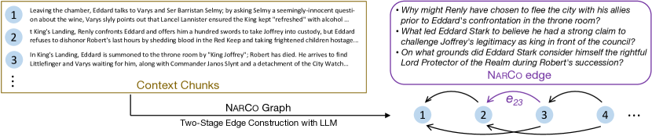
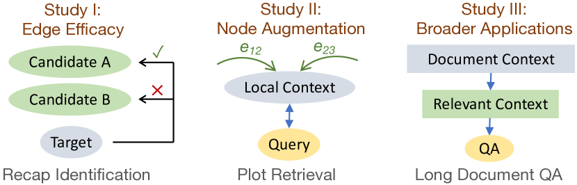

# Graph Representation of Narrative Context:
Coherence Dependency via Retrospective Questions

###### Abstract

This work introduces a novel and practical paradigm for narrative comprehension, stemming from the observation that individual passages within narratives are often cohesively related than being isolated. We therefore propose to formulate a graph upon narratives dubbed NarCo that depicts a task-agnostic coherence dependency of the entire context. Especially, edges in NarCo encompass retrospective free-form questions between two context snippets reflecting high-level coherent relations, inspired by the cognitive perception of humans who constantly reinstate relevant events from prior context. Importantly, our graph is instantiated through our designed two-stage LLM prompting, thereby without reliance on human annotations. We present three unique studies on its practical utility, examining the edge efficacy via recap identification, local context augmentation via plot retrieval, and broader applications exemplified by long document QA. Experiments suggest that our approaches leveraging NarCo yield performance boost across all three tasks.  

Graph Representation of Narrative Context:    Coherence Dependency via Retrospective Questions  

  

   Liyan Xu  Jiangnan Li  Mo Yu  Jie Zhou  Pattern Recognition Center, WeChat AI  liyanlxu@tencent.com moyumyu@global.tencent.com   

  

## 1 Introduction

Text comprehension has been advanced significantly ascribed to Large Language Models (LLMs), especially with long context window enabled via techniques such as positional scaling Xiong et al. ([2023](#bib.bib54)); Peng et al. ([2024](#bib.bib32)) and efficient attention Wang et al. ([2023](#bib.bib46)); Chen et al. ([2024](#bib.bib5)). Nevertheless, though extending context window could resolve certain long context tasks end-to-end, e.g. question answering, more fine-grained tasks that require explicit global dependency beyond local evidence still remain a challenge.  

In book-level narrative understanding particularly, such as retrieving relevant plot passages of queries Xu et al. ([2023b](#bib.bib61)), or identifying recap passages of a given plot Li et al. ([2024](#bib.bib24)), each local passage in a novel rather serves specific purposes to other parts than being isolated, which may be easily neglected in the end-to-end process without explicit modeling these global dependency relations.  

Traditionally, discourse parsing is established to capture those coherence relations between sentences, characterizing how each proposition relate to others to reflect high-level understanding of the global content Grosz and Sidner ([1986](#bib.bib15)). Past works have materialized various discourse frameworks, such as Rhetorical Structure Theory Mann and Thompson ([1988](#bib.bib27)) and Penn Discourse Treebank Prasad et al. ([2008](#bib.bib33)). However, despite its adoption in certain applications Bhatia et al. ([2015](#bib.bib2)); Ji and Smith ([2017](#bib.bib16)); Xu et al. ([2020](#bib.bib55)); Pu et al. ([2023](#bib.bib34)), they have not attracted appreciable focus in a wider spectrum of tasks; the underlying reasons may be twofold. First, popular discourse formalisms pose finite relation space with fixed taxonomies, offering trivial auxiliary signals especially upon LLMs. Second, they require trained experts to perform annotation for training proper parsers, hindering the overall utility due to inevitably limited resources.  

In this work, we propose an alternative path to handle the aforementioned challenges in long narrative understanding, which can be deemed as a new paradigm of quasi-discourse parsing. To overcome previous limitations so to promote practical values for narrative tasks, our approach is designed to obtain flexible coherence relations without tying to formal linguistics or human annotations, thus being directly applicable as an off-the-shelf option.  

Drawing inspiration from the human cognitive process on narrative perception, whereas humans can constantly reinstate relevant causal events from past context during reading Trabasso and Sperry ([1985](#bib.bib45)); Graesser et al. ([1994](#bib.bib14)), our proposed idea is simple and intuitive: a NARrative COgnition graph is built, dubbed NarCo, where the entire context is split into small chunks that serve as graph nodes, and edges are connected that represent the relations between node pairs. Particularly, edges are constituted by free-form questions regarding the two connecting nodes, aligned with recent discourse works on Questions Under Discussion Kuppevelt ([1995](#bib.bib22)) such as DCQA Ko et al. ([2022](#bib.bib19), [2023](#bib.bib20)). As humans could relate to past context in retrospect, accordingly, each question in NarCo arises from the succeeding node, asking necessary background or causes that can be clarified by the preceding node. Hence, graph edges consist of inquisitive questions that naturally reflect retrospection. Overall, the resulting graph explicitly depicts task-agnostic understanding of fine-grained coherence flow that could be flexibly utilized by downstream tasks.  

The key difficulty of the graph lies in the edge realization, which itself requires capable context understanding, to determine which aspects to inquire upon the context and distinguish whether they are salient for the comprehension. Such process is especially strenuous due to the large hypothesis space compared to conventional discourse formalisms, which may only become feasible recently with assistance by LLMs. To this end, we construct edges automatically through our proposed LLM prompting scheme without human annotation constraints, of which consists a question generation stage and a back verification stage (Section [3](#S3 "3 NarCo: Narrative Cognition Graph ‣ Graph Representation of Narrative Context: Coherence Dependency via Retrospective Questions")).  

NarCo primarily addresses challenges for narratives on two perspectives. First, the graph edges provide a view of explicit information flow, enabling task-specific guidance towards the narrative development. Second, each chunk is now enriched with dependency of global coherence relations, thus provided augmentation of local context to deepen the digest of independent passages.  

To empirically demonstrate the practical utility of NarCo, we present studies on the following narrative understanding tasks from three angles.  

$\bullet$ Our first study examines the edge efficacy on *whether it expresses competent coherence relations* (Section [4](#S4 "4 Study I: Edge Efficacy ‣ Graph Representation of Narrative Context: Coherence Dependency via Retrospective Questions")). We conduct experiments on recap passage identification Li et al. ([2024](#bib.bib24)), where NarCo boosts up to 4.7 F1 over the GPT-4 baseline.  

$\bullet$ Our second study concerns the exploitation of enriched local embeddings, by *injecting edges with global dependencies into node representation* (Section [5](#S5 "5 Study II: Node Augmentation ‣ Graph Representation of Narrative Context: Coherence Dependency via Retrospective Questions")). Evaluated on the plot retrieval task Xu et al. ([2023b](#bib.bib61)), our proposed approach with NarCo outperforms the zero-shot baseline by 3% and the supervised baseline by 2.2%.  

$\bullet$ Lastly, we utilize NarCo in long document question answering as a broader application (Section [6](#S6 "6 Study III: Application in QA ‣ Graph Representation of Narrative Context: Coherence Dependency via Retrospective Questions")). Experiments on QuALITY that requires global evidence Pang et al. ([2022](#bib.bib31)) suggest that, NarCo consistently raises zero-shot accuracy by 2-5% upon retrieval-based baselines with various LLMs, able to recognize more relevant context.  

Overall, our contributions can be listed as follows:  

* A new paradigm for narrative understanding is proposed, parsing the context into a graph of high-level coherence relations, named NarCo. 
* The graph is practically realized with our two-stage LLM prompting w/o human annotations. 
* We present three studies effectively utilizing NarCo on narratives, focusing on edge efficacy, node augmentation, and broader applications. 

## 2 Related Work

[FIGURE S2.F1.g1]

Figure 1: Our proposed NarCo graph described in Section [3](#S3 "3 NarCo: Narrative Cognition Graph ‣ Graph Representation of Narrative Context: Coherence Dependency via Retrospective Questions"), with retrospective questions connecting two nodes.
[/FIGURE]

##### Questions Under Discussion

QUD is a linguistic framework with rich history that approaches discourse and pragmatics analysis by repeatedly resolving queries triggered by prior context Kuppevelt ([1995](#bib.bib22)); Roberts ([1996](#bib.bib36)); Benz and Jasinskaja ([2017](#bib.bib1)). Recent works have begun adapting QUD for discourse coherence De Kuthy et al. ([2018](#bib.bib10), [2020](#bib.bib9)); Ko et al. ([2020](#bib.bib18), [2022](#bib.bib19), [2023](#bib.bib20)) or other applications Wu et al. ([2023b](#bib.bib51)); Newman et al. ([2023](#bib.bib29)). Our proposed NarCo can also be perceived as a unique form of QUD variant, though it is principally rooted upon narrative comprehension rather than formal linguistics. Therefore, NarCo differs from QUD works considerably on the following design choices.  

• Coarse Granularity   While QUD tends to employ sentences as the basic discourse unit, NarCo opts for a coarser granularity, adopting passages (or short chunks) as graph nodes. It is driven by the fact that in narratives, complex events or interactions may often be conveyed beyond sentence-level, thus relations in NarCo could target higher-level understanding between nodes.  

• Retrospection-Oriented   Unlike conventional QUD that inquires from prior context to be addressed by subsequent context (forward direction), which could yield unanswerable questions Westera et al. ([2020](#bib.bib48)); Ko et al. ([2020](#bib.bib18)), NarCo takes the backward direction, by asking retrospective questions from succeeding context, such that all generated questions in NarCo are naturally grounded by corresponding prior context.  

• Precision-Focused   Unlike previous QUD works that require dedicated human annotations, NarCo is formulated attainable by LLMs. Accordingly, we prioritize precision over recall for practical instantiation of graph edges, and do not necessitate strict linguistic criteria, as long as it contributes positively for narrative understanding.  

##### Narrative Comprehension Assessments

A major task direction on narratives is question answering (QA), where past works have proposed several datasets with human annotations, such as NarrativeQA Kočiský et al. ([2018](#bib.bib21)), TellMeWhy Lal et al. ([2021](#bib.bib23)), FairytaleQA Xu et al. ([2022b](#bib.bib62)), QuALITY Pang et al. ([2022](#bib.bib31)). We choose QuALITY as the broader application in this work, due to its challenging long context, requirement of global evidences, and simple evaluation by multi-choices.  

Recently, several tasks have emerged focusing on modeling the reading process of long narratives, including TVShowGuess Sang et al. ([2022](#bib.bib37)), PersoNet Yu et al. ([2023](#bib.bib63)), ToM-in-AMC Yu et al. ([2024](#bib.bib64)) and retrieval tasks studied in this work such as RELiC Thai et al. ([2022](#bib.bib43)), PlotRetrieval Xu et al. ([2023b](#bib.bib61)). These tasks require a holistic understanding of the long narratives to enhance contextual comprehension of specific segments. We recognize the significance of explicitly modeling global coherence dependency as a crucial aspect of narrative comprehension, thereby motivating the inception of our research.  

##### Long Context Understanding

One of the major research directions of LLMs is the extension of context window, which can be seamlessly applied for long context understanding tasks, including scaling positional embeddings Chen et al. ([2023b](#bib.bib4)); Xiong et al. ([2023](#bib.bib54)); Peng et al. ([2024](#bib.bib32)), efficient attention Zaheer et al. ([2020](#bib.bib65)); Chen et al. ([2024](#bib.bib5)), cached attention Wu et al. ([2022](#bib.bib52)); Wang et al. ([2023](#bib.bib46)), recurrent attention Dai et al. ([2019](#bib.bib8)), etc. Though effective, many narrative tasks demand beyond the end-to-end solution. Recently, new paradigms have been proposed for fine-grained processing, such as compressing context as soft prompts Chevalier et al. ([2023](#bib.bib6)), and MemWalker that reads long context interactively via iterative prompting Chen et al. ([2023a](#bib.bib3)). Nevertheless, our proposed approach takes parsing as an alternative paradigm, which is orthogonal to the existing directions and could be even further combined in the future.  

##### Structured Representation

Utilizing various structures in natural languages has attracted much attention by previous works, such as syntactic structures on token-level Strubell et al. ([2018](#bib.bib41)); Xu et al. ([2022a](#bib.bib59)), relation structures on span-level Xu and Choi ([2020](#bib.bib57), [2022](#bib.bib56)); Nguyen et al. ([2022](#bib.bib30)) or discourse structures on span or sentence-level Bhatia et al. ([2015](#bib.bib2)); Ji and Smith ([2017](#bib.bib16)). In addition, there have been studies constructing graphs with entity nodes Min et al. ([2019](#bib.bib28)); Ding et al. ([2019](#bib.bib12)) based on Wikipedia links for factoid question answering. Li et al. ([2020](#bib.bib26), [2021](#bib.bib25)) have extended these graphs by incorporating event nodes. As all these structures encompass pre-defined taxonomies on edge types, our propose graph representation is motivated to comprise open-world edge types that have been practiced in other tasks Wu et al. ([2019](#bib.bib49)); Xu et al. ([2023a](#bib.bib58)); Su et al. ([2024](#bib.bib42)), meanwhile attainable by LLMs without efforts of human annotations.  

## 3 NarCo: Narrative Cognition Graph

In this section, we start by delineating our graph formulation, which is itself not tied to any particular implementation. Subsequently, we elaborate our graph realization using LLMs, as our endeavor to remove dependence on human annotations.  

### 3.1 Graph Formulation

##### Nodes

For a narrative, the entire context is split into short consecutive chunks (or passages), such that each is within a maximum word limit and constituted by sentences or paragraphs. Graph nodes are then all the chunks adhering the left-to-right sequential order, denoted by $\mathcal{V}=\{v_{1},v_{2},..,v_{N}\}$, with $N$ being the total number of chunks.  

##### Edges

An edge connecting two nodes signifies the relationships they convey. These relations are articulated as free-form inquisitive questions that are not constrained by fixed taxonomies. All edges follow the backward direction, such that for an edge $e_{ij}$ ($i<j$), the expressed questions always arise from the succeeding node $v_{j}$, asking clarification regarding specific events or situations appeared in $v_{j}$, which could be addressed by the preceding $v_{i}$. For narratives, questions primarily target causal and temporal relations as the coherence dependency.  

Functionally speaking, these backward edges resemble the human cognitive process for narrative perception: when reading a certain passage, humans are able to reinstate previous relevant parts in retrospect that lay out the build-up or causes, so to achieve a causally coherent comprehension of the global context Trabasso and Sperry ([1985](#bib.bib45)); Graesser et al. ([1994](#bib.bib14)); Song et al. ([2020](#bib.bib40)). Unlike QUD that originally features curiosity-driven questions in a forward direction, which could yield unanswerable questions, all edges in NarCo are fully grounded by the context, such that all questions are addressable by prior nodes, thereby serving as the bridge for global coherent dependency.  

Derived upon the above formulation, an edge $e_{ij}$ in NarCo has the following features:  

* It may have zero-to-many questions. An empty edge without questions indicates the succeeding node $v_{j}$ is independent from $v_{i}$ in terms of causal or temporal relations. 
* Each question should be salient towards the comprehension of narrative development, rather than being trivial details. Hence, the number of questions of an edge should reflect how coherently related between the two nodes. 
* As we adopt coarse granularity for nodes, questions could inquire higher-level relations based on the extrapolation over multiple sentences, which may be useful for downstream tasks. 

### 3.2 Graph Realization

To obtain graph nodes, the full context is split by paragraphs and sentences. We impose each node within 240 words in this work, though the exact limit can be task-specific. For a graph characterized by $N$ total nodes, there are $O(N^{2})$ edges available, which can become cumbersome and excessive. It is also task-dependent to determine which pairs of nodes should be gathered edges upon, e.g. for enriching local representation, it may be enough to obtain proximal coherence relations by edges from neighboring nodes within a context window.  

Despite the daunting task of edge construction, the emergence of LLMs presents an opportunity: through LLM prompting, it becomes conceivable to actualize the entire graph without any human annotations involved. To this end, we introduce a two-stage prompting scheme as follows for the challenging edge formulation in NarCo.  

##### Question Generation

For an edge $e_{ij}$ to be instantiated, LLM needs to determine important aspects to ask upon $v_{j}$ that reflect the retrospective coherence towards the prior context in $v_{i}$. Similar utilization of LLMs for question generation (QG) has been explored in other applications, such as performing QG for QUD Wu et al. ([2023a](#bib.bib50)) and passage decontextualization Newman et al. ([2023](#bib.bib29)), where LLM is prompted to generate questions directly based on task-specific criteria. For our case, such direct generation can be briefly outlined as:  

> Given a current context $v_{j}$ and its prior context $v_{i}$, generate questions upon $v_{j}$, such that each question asks about the cause or background of specific events or situations in $v_{j}$, which can be clarified by $v_{i}$, so to reflect their causal or temporal relations between the two context.

However, our preliminary experiments found that, though LLM could follow the instructions to generate plausible questions, their quality is often unsatisfactory for NarCo, with common errors as follows (examples in Appx [A.2](#A1.SS2 "A.2 Qualitative Examples ‣ Appendix A Graph Realization ‣ Graph Representation of Narrative Context: Coherence Dependency via Retrospective Questions")):  

* LLM often asks questions upon $v_{j}$ but also answerable by $v_{j}$ as well. Such patterns align with the more conventional QG setting Du et al. ([2017](#bib.bib13)) that may exist plentifully during supervised finetuning of LLM. However, they are not desirable for NarCo as they cannot effectively indicate coherence with $v_{i}$. 
* LLM could hallucinate their relations by guessing and inferring extra underlying connections not grounded by the provided context, resulting in questions not directly answerable by $v_{i}$. 

In essence, QG for NarCo requires LLM simultaneously aware of questions being: 1) arising from $v_{j}$; 2) not answerable by $v_{j}$; 3) answerable by $v_{i}$. As this process is empirically challenging even for strong LLM (e.g. GPT-4), we perform QG with two heuristic turns that could be viewed as Chain-of-Thoughts Wei et al. ([2022](#bib.bib47)) guided by prompts:  

1. List concrete parts in $v_{i}$ that contribute as the preceding background or cause for specific events or situations mentioned in $v_{j}$, along with brief explanations. 
2. Convert each listed connection to a question, such that it asks about the cause or background upon $v_{j}$ and can be clarified by the corresponding concrete part in $v_{i}$, helpful to comprehend their causal or temporal relations. 

##### Question Filtering

Our pilot study suggests that the above two-turn QG could yield higher-quality questions than rudimentary generation, especially reducing self-answerable questions. However, it is still inevitable to produce noisy questions of the two identified error types. In light of remaining noises, we propose a second stage to filter noisy questions through back verification, akin to the concept of back translation Sennrich et al. ([2016](#bib.bib38)):  

> Given a context $\mathcal{C}_{ij}$ and a related question, determine whether it can be answered. If so, reason the answer and provide original sentences of key supporting evidence.

Particularly, $\mathcal{C}_{ij}$ is the concatenated context from $v_{i}$ and $v_{j}$ without disclosing their boundary. If the question is answerable, we then parse the response and identify whether the supporting sentences are from $v_{i}$. If not, the question becomes invalid and discarded, as it does not offer to bridge two nodes.  

Overall, all generated questions are back verified; only questions that could be answered by prior nodes are finally retained in NarCo, being a precision-focused approach. In this work, we adopt GPT-4 for strong question generation, and ChatGPT for the easier verification. NarCo may also be obtained by strong open-source LLM or trained models distilled from GPT-4. Our full prompts and more details are provided in Appx [A.1](#A1.SS1 "A.1 Full Prompts and Details ‣ Appendix A Graph Realization ‣ Graph Representation of Narrative Context: Coherence Dependency via Retrospective Questions").  

### 3.3 Graph Analysis

Upon examination of preliminary results on the English version of the novel Notre-Dame de Paris, edges in NarCo mostly encompass what and why types of questions, approximately constituting 61% and 26%. It is worth noting that many questions reflect high-level understanding of the context (examples in Appx [A.2](#A1.SS2 "A.2 Qualitative Examples ‣ Appendix A Graph Realization ‣ Graph Representation of Narrative Context: Coherence Dependency via Retrospective Questions")), in contrast to conventional discourse relations, e.g. purpose, condition in RST Mann and Thompson ([1988](#bib.bib27)). With the two-stage prompting scheme, the averaged node degree reaches 1.9. Particularly, the verification stage identifies 47.4% questions to be filtered out.  

As our graph formulation primarily aims at practical values, we demonstrate its effective utility in Sections [4](#S4 "4 Study I: Edge Efficacy ‣ Graph Representation of Narrative Context: Coherence Dependency via Retrospective Questions")-[6](#S6 "6 Study III: Application in QA ‣ Graph Representation of Narrative Context: Coherence Dependency via Retrospective Questions"), addressing three distinct perspectives.  

[FIGURE S3.F2.g1]

Figure 2: Three presented studies leveraging NarCo.
[/FIGURE]

## 4 Study I: Edge Efficacy

Our first study examines the graph edges on whether they express useful relations. Ideally, a non-empty edge should bridge coherence between two nodes through its retrospective questions. For appropriate assessment, we adopt the recap identification on RECIDENT dataset Li et al. ([2024](#bib.bib24)), a task on narratives that identifies whether certain preceding snippets can function as a recap or prelude to the audience in regards to a current context.  

Concretely, the input takes a short snippet from a novel or show script, along with a provided list of its preceding snippets; this task resolves which preceding snippets are directly related with the current one in terms of plot progression, requiring contextual understanding of narrative development. As NarCo is proposed to capture the inter-node coherence relations, edges of retrospective questions could be leveraged to link the current snippet to related preceding ones. Therefore, RECIDENT serves as a natural testbed for comprehensive evaluation of edge efficacy.  

### 4.1 Approach

For this study, our proposed approach targets upon the zero-shot baseline with LLMs in Li et al. ([2024](#bib.bib24)), where ChatGPT is originally asked to select the related recap snippets from the list of preceding candidates based on their context.  

With NarCo, we regard each current snippet as a target graph node $v_{t}$, and the list of its $N$ preceding snippets $\{v_{c}|c=1,..,N\}$ as the candidates. For $v_{t}$ and each of its candidate $v_{c}$, the edge is realized denoted by $e_{ct}$. As each question in $e_{ct}$ should reflect their causal or temporal relations, we utilize these questions directly from two distinct aspects.  

##### Edge Relations

Normally, each snippet is represented by its context as in the baseline. To evaluate the coherence depicted by edges, we instead propose to represent each snippet solely based on the edge relations: for a candidate node $v_{c}$, we use its concatenated questions in $e_{ct}$ for representation, denoted by $\{q_{c}|c=1,..,N\}$, and completely neglect the original context, so to ensure an entirely isolated assessment of edge relations.  

Specifically, given the context of the target snippet $v_{t}$, we now ask LLM to select which $q_{c}$ addresses important questions asking recap information significant to comprehend the current context. As each $q_{c}$ contains multiple questions, we ask LLM to score each $q_{c}$ in $[0,5]$, with higher scores indicating better overall questions. Candidates with empty edges are directly assigned 0 score.  

##### Edge Degrees

Alternatively, as mentioned in Section [3.1](#S3.SS1 "3.1 Graph Formulation ‣ 3 NarCo: Narrative Cognition Graph ‣ Graph Representation of Narrative Context: Coherence Dependency via Retrospective Questions"), the edge degree (number of questions) could suggest how cohesively related between two nodes. To this end, we further propose to simply deem the edge degree as the score for ranking candidates, without any inference on the node context or edge relations at all. Though being rather unconventional, ranking recaps by edge degrees could approximately reflect the edge quality.  

For either the relation score or degree score, it could be used standalone or interpolated with the baseline selection. More formally, we obtain the rank $\in[1,N]$ of each candidate $i$ by relation scores, denoted as $r^{rel}_{i}$, and the rank by degree scores as $r^{deg}_{i}$, along with the binary selection $b_{i}$ from baseline. The final score $s$ of each candidate is:  

|  | $\displaystyle s_{i}=\alpha\cdot r^{rel}_{i}+\beta\cdot r^{deg}_{i}-\lambda\cdot\mathbb{I}(b_{i})$ |  | (1) |
| --- | --- | --- | --- |

$\mathbb{I}$ is the indicator function that boosts the baseline selection by $\lambda$ rank; relation and degree ranks are interpolated by $\alpha$ and $\beta$. The final score is then ranked to select top candidates with recap information (lower is better). Setting these to 0 accordingly can thereby evaluate each method standalone.  

### 4.2 Experiments

##### Data

As RECIDENT includes multiple novels and show scripts, we pick one classic novel Notre-Dame de Paris (NDP) in English and one TV show Game of Thrones (GOT) to reduce the evaluation API cost from OpenAI. The test set of each source consists of 169 / 204 target snippets respectively. Each target is provided 60 candidate snippets, with 5.6 / 4.9 candidates being positive on average.  

##### Evaluation Metric

We follow Li et al. ([2024](#bib.bib24)) and adopt F1@5 (F1 on top-5 selected candidates) as the main evaluation metric.  

##### Methods

We conduct zero-shot LLM experiments with both ChatGPT (gpt-3.5-turbo-1106) and GPT-4 (gpt-4-1106-preview) from OpenAI.  

* BL: the original ChatGPT baseline (Listwise + Char-Filter from Li et al. ([2024](#bib.bib24)).) We additionally run GPT-4 for comprehensive evaluation. 
* Rel: standalone ranking by edge relations, without using any candidate context itself. 
* Full: full interpolation by Eq ([1](#S4.E1 "In Edge Degrees ‣ 4.1 Approach ‣ 4 Study I: Edge Efficacy ‣ Graph Representation of Narrative Context: Coherence Dependency via Retrospective Questions")) with both edge relations and degrees. Coefficients are set through a holdout set from another novel. 

[TABLE S4.T1]

<table class="ltx_tabular ltx_align_middle">
<tr class="ltx_tr">
<td class="ltx_td ltx_border_r ltx_border_tt"></td>
<td class="ltx_td ltx_align_center ltx_border_tt">NDP</td>
<td class="ltx_td ltx_border_tt"></td>
<td class="ltx_td ltx_align_center ltx_border_tt">GOT</td>
</tr>
<tr class="ltx_tr">
<td class="ltx_td ltx_border_r"></td>
<td class="ltx_td ltx_align_center ltx_border_t">P@5</td>
<td class="ltx_td ltx_align_center ltx_border_t">R@5</td>
<td class="ltx_td ltx_align_center ltx_border_t">F@5</td>
<td class="ltx_td"></td>
<td class="ltx_td ltx_align_center ltx_border_t">P@5</td>
<td class="ltx_td ltx_align_center ltx_border_t">R@5</td>
<td class="ltx_td ltx_align_center ltx_border_t">F@5</td>
</tr>
<tr class="ltx_tr">
<td class="ltx_td ltx_border_r ltx_border_t"></td>
<td class="ltx_td ltx_align_center ltx_border_t">ChatGPT</td>
</tr>
<tr class="ltx_tr">
<td class="ltx_td ltx_align_left ltx_border_r">BL</td>
<td class="ltx_td ltx_align_center">22.22</td>
<td class="ltx_td ltx_align_center">22.97</td>
<td class="ltx_td ltx_align_center">22.59</td>
<td class="ltx_td"></td>
<td class="ltx_td ltx_align_center">31.94</td>
<td class="ltx_td ltx_align_center">38.87</td>
<td class="ltx_td ltx_align_center">35.07</td>
</tr>
<tr class="ltx_tr">
<td class="ltx_td ltx_align_left ltx_border_r">Rel</td>
<td class="ltx_td ltx_align_center">22.84</td>
<td class="ltx_td ltx_align_center">23.34</td>
<td class="ltx_td ltx_align_center">23.09</td>
<td class="ltx_td"></td>
<td class="ltx_td ltx_align_center">28.63</td>
<td class="ltx_td ltx_align_center">37.09</td>
<td class="ltx_td ltx_align_center">32.31</td>
</tr>
<tr class="ltx_tr">
<td class="ltx_td ltx_align_left ltx_border_r">Full</td>
<td class="ltx_td ltx_align_center">26.86</td>
<td class="ltx_td ltx_align_center">28.16</td>
<td class="ltx_td ltx_align_center">27.50</td>
<td class="ltx_td"></td>
<td class="ltx_td ltx_align_center">33.04</td>
<td class="ltx_td ltx_align_center">43.27</td>
<td class="ltx_td ltx_align_center">37.47</td>
</tr>
<tr class="ltx_tr">
<td class="ltx_td ltx_border_r ltx_border_t"></td>
<td class="ltx_td ltx_align_center ltx_border_t">GPT-4</td>
</tr>
<tr class="ltx_tr">
<td class="ltx_td ltx_align_left ltx_border_r">BL</td>
<td class="ltx_td ltx_align_center">25.34</td>
<td class="ltx_td ltx_align_center">25.53</td>
<td class="ltx_td ltx_align_center">25.44</td>
<td class="ltx_td"></td>
<td class="ltx_td ltx_align_center">31.49</td>
<td class="ltx_td ltx_align_center">40.38</td>
<td class="ltx_td ltx_align_center">35.38</td>
</tr>
<tr class="ltx_tr">
<td class="ltx_td ltx_align_left ltx_border_r">Rel</td>
<td class="ltx_td ltx_align_center">26.39</td>
<td class="ltx_td ltx_align_center">27.23</td>
<td class="ltx_td ltx_align_center">26.80</td>
<td class="ltx_td"></td>
<td class="ltx_td ltx_align_center">31.18</td>
<td class="ltx_td ltx_align_center">42.05</td>
<td class="ltx_td ltx_align_center">35.81</td>
</tr>
<tr class="ltx_tr">
<td class="ltx_td ltx_align_left ltx_border_bb ltx_border_r">Full</td>
<td class="ltx_td ltx_align_center ltx_border_bb">29.11</td>
<td class="ltx_td ltx_align_center ltx_border_bb">28.74</td>
<td class="ltx_td ltx_align_center ltx_border_bb">28.92</td>
<td class="ltx_td ltx_border_bb"></td>
<td class="ltx_td ltx_align_center ltx_border_bb">34.90</td>
<td class="ltx_td ltx_align_center ltx_border_bb">46.93</td>
<td class="ltx_td ltx_align_center ltx_border_bb">40.03</td>
</tr>
</table>

Table 1: Zero-shot evaluation on the test set of RECIDENT for recap identification (Section [4.2](#S4.SS2 "4.2 Experiments ‣ 4 Study I: Edge Efficacy ‣ Graph Representation of Narrative Context: Coherence Dependency via Retrospective Questions")). Our approaches with NarCo achieve significant improvement upon the baseline (BL) for both ChatGPT and GPT-4.
[/TABLE]

[TABLE S4.T2]

<table class="ltx_tabular ltx_align_middle">
<tr class="ltx_tr">
<td class="ltx_td ltx_border_r ltx_border_tt"></td>
<td class="ltx_td ltx_align_center ltx_border_tt">NDP</td>
<td class="ltx_td ltx_border_tt"></td>
<td class="ltx_td ltx_align_center ltx_border_tt">GOT</td>
</tr>
<tr class="ltx_tr">
<td class="ltx_td ltx_border_r"></td>
<td class="ltx_td ltx_align_center ltx_border_t">P@5</td>
<td class="ltx_td ltx_align_center ltx_border_t">R@5</td>
<td class="ltx_td ltx_align_center ltx_border_t">F@5</td>
<td class="ltx_td"></td>
<td class="ltx_td ltx_align_center ltx_border_t">P@5</td>
<td class="ltx_td ltx_align_center ltx_border_t">R@5</td>
<td class="ltx_td ltx_align_center ltx_border_t">F@5</td>
</tr>
<tr class="ltx_tr">
<td class="ltx_td ltx_align_left ltx_border_r ltx_border_t">BL</td>
<td class="ltx_td ltx_align_center ltx_border_t">22.22</td>
<td class="ltx_td ltx_align_center ltx_border_t">22.97</td>
<td class="ltx_td ltx_align_center ltx_border_t">22.59</td>
<td class="ltx_td ltx_border_t"></td>
<td class="ltx_td ltx_align_center ltx_border_t">31.94</td>
<td class="ltx_td ltx_align_center ltx_border_t">38.87</td>
<td class="ltx_td ltx_align_center ltx_border_t">35.07</td>
</tr>
<tr class="ltx_tr">
<td class="ltx_td ltx_align_left ltx_border_r">Full</td>
<td class="ltx_td ltx_align_center">26.86</td>
<td class="ltx_td ltx_align_center">28.16</td>
<td class="ltx_td ltx_align_center">27.50</td>
<td class="ltx_td"></td>
<td class="ltx_td ltx_align_center">33.04</td>
<td class="ltx_td ltx_align_center">43.27</td>
<td class="ltx_td ltx_align_center">37.47</td>
</tr>
<tr class="ltx_tr">
<td class="ltx_td ltx_align_left ltx_border_r ltx_border_tt">Deg</td>
<td class="ltx_td ltx_align_center ltx_border_tt">23.31</td>
<td class="ltx_td ltx_align_center ltx_border_tt">24.44</td>
<td class="ltx_td ltx_align_center ltx_border_tt">23.86</td>
<td class="ltx_td ltx_border_tt"></td>
<td class="ltx_td ltx_align_center ltx_border_tt">27.45</td>
<td class="ltx_td ltx_align_center ltx_border_tt">37.67</td>
<td class="ltx_td ltx_align_center ltx_border_tt">31.76</td>
</tr>
<tr class="ltx_tr">
<td class="ltx_td ltx_align_left ltx_border_bb ltx_border_r">Full-F</td>
<td class="ltx_td ltx_align_center ltx_border_bb">26.39</td>
<td class="ltx_td ltx_align_center ltx_border_bb">27.06</td>
<td class="ltx_td ltx_align_center ltx_border_bb">26.72</td>
<td class="ltx_td ltx_border_bb"></td>
<td class="ltx_td ltx_align_center ltx_border_bb">33.24</td>
<td class="ltx_td ltx_align_center ltx_border_bb">42.57</td>
<td class="ltx_td ltx_align_center ltx_border_bb">37.33</td>
</tr>
</table>

Table 2: Zero-shot evaluation with ChatGPT, using NarCo edge degrees (Deg) and all questions (Full-F).
[/TABLE]

### 4.3 Results and Analysis

Table [1](#S4.T1 "Table 1 ‣ Methods ‣ 4.2 Experiments ‣ 4 Study I: Edge Efficacy ‣ Graph Representation of Narrative Context: Coherence Dependency via Retrospective Questions") shows the zero-shot evaluation results on the test set of RECIDENT. Notably, the interpolation with NarCo edges (Full) consistently brings significant improvement upon the baseline (BL), by 4.9 / 2.4 F1 on NDP / GOT respectively with ChatGPT, up to a 21.7% relative improvement. The stronger GPT-4 boosts performance for all methods as expected, and still advancing 3.5 / 4.7 F1 upon BL on NDP / GOT as well.  

Moreover, selection solely based on edge relations without disclosing the context (Rel) could obtain comparable or better performance than the baseline, with the only exception of ChatGPT on GOT. Overall, Table [1](#S4.T1 "Table 1 ‣ Methods ‣ 4.2 Experiments ‣ 4 Study I: Edge Efficacy ‣ Graph Representation of Narrative Context: Coherence Dependency via Retrospective Questions") demonstrates the effective utility of NarCo leveraging its edge efficacy, offering a complementary enhancement.  

For more in-depth insights, we further perform two additional evaluation with ChatGPT:  

* Deg: standalone ranking by edge degrees; for tied degrees, closer candidates are prioritized. 
* Full-F: the Full setting with all generated questions, without the back verification stage. 

Corresponding results are shown in Table [2](#S4.T2 "Table 2 ‣ Methods ‣ 4.2 Experiments ‣ 4 Study I: Edge Efficacy ‣ Graph Representation of Narrative Context: Coherence Dependency via Retrospective Questions"), where ranking by edge degrees of NarCo exhibits decent performance. It even surpasses the baseline on NDP by 1+%, which is impressive for the fact that it does not undergo any task-specific inference. Understandably, it indeed lags behind the baseline on GOT by a noticeable margin. As for Full-F, the trivially degraded performance suggests that, our proposed approach can be quite robust against noisy edge questions, as LLM assigns high scores as long as under the presence of good questions.  

## 5 Study II: Node Augmentation

Our second study underscores the NarCo utility of local context augmentation, examining whether the graph typology could enrich the node representation with global contextual information.  

Specifically, for a node $v_{j}$, a preceding node $v_{i}$ and succeeding node $v_{k}$ such that $i<j<k$, $e_{ij}$ depicts outgoing questions arising from $v_{j}$ to $v_{i}$, and $e_{jk}$ specifies incoming questions from $v_{k}$ that can be clarified by $e_{j}$. These questions either highlight important aspects of events or situations in the current context, or provide implication of subsequent development. Such auxiliary information from neighboring nodes is especially useful for retrieval on narratives, as each passage is not independent and rather being related with others.  

We hence investigate if an embedding function on top of NarCo could lead to enriched local representation. Towards this objective, we consider the plot retrieval task defined in Xu et al. ([2023b](#bib.bib61)), which aims to find the most relevant story snippets given a query of short plot description. It is challenging as queries are often abstract based on readers’ overall understanding of the stories, requiring essential background information clarified on candidates, similar to the concept of decontexualization Choi et al. ([2021](#bib.bib7)). Retrieval on narratives thereby fits our evaluation purpose well.  

### 5.1 Approach

For this task, candidate snippets from stories are retrieved upon a given query. We build the graph for the full narrative, e.g. an entire novel, according to Section [3](#S3 "3 NarCo: Narrative Cognition Graph ‣ Graph Representation of Narrative Context: Coherence Dependency via Retrospective Questions") and regard all candidate snippets as graph nodes to be retrieved from. Our proposed approach focuses on fusing edge questions into the node representation for enhanced retrieval.  

Xu et al. ([2023b](#bib.bib61)) follows the classic paradigm of contrastive learning that learns a BERT-based encoder Devlin et al. ([2019](#bib.bib11)) on queries and candidates. As its trained model is not released yet, our approach adopts the public BGE encoder Xiao et al. ([2023](#bib.bib53)) in this work that ranks top on the MTEB leaderboard111<https://huggingface.co/spaces/mteb/leaderboard>. For comprehensive evaluation, we propose methods with NarCo for both zero-shot and supervised settings.  

#### 5.1.1 Zero-Shot Retrieval

Since edge questions are available to provide auxiliary information, edges can be directly integrated in the zero-shot retrieval process. Our motivation is straightforward: if there can be improvement with zero-shot retrieval, it ensures that these questions bring positive information gain, thus confirming the efficacy for augmenting local context.  

Concretely, the hidden states (embeddings) for the query, nodes and edges are obtained by the encoder. Let $\mathbf{h}^{v}_{i}$ be the L2-normalized hidden state for the ith node, $\mathbf{h}^{e}_{ij}$ for its jth outgoing questions, $\mathbf{h}^{q}$ for the query. The interpolated similarity $\mathcal{S}_{i}$ between the query and $i$th candidate is defined as:  

|  | $\displaystyle\mathcal{S}=\mathbf{h}^{q}\cdot\mathbf{h}^{v}_{i}+\lambda\cdot\max(\mathbf{h}^{q}\cdot\mathbf{h}^{e}_{ij})|^{M}_{j=1}$ |  | (2) |
| --- | --- | --- | --- |

The final similarity $\mathcal{S}$ is the typical query-node similarity interpolated with the query-edge similarity by $\lambda$, which is then the max query-question similarity out of total $M$ questions. $\mathcal{S}$ among all nodes are then sorted for retrieval ranking, being a zero-shot approach without task-specific training.  

#### 5.1.2 Supervised Learning

We then introduce our proposed supervised approach that reranks candidates with augmented node embeddings. Specifically, the enrichment is formulated as an attention, with the user query as query, edge questions as both key and value, such that a new embedding is obtained upon all edge questions conditioned on the query. Let $\mathcal{A}_{i}$ be the attention scores of the ith node, the augmented node embedding $\mathbf{h}^{a}_{i}$ is denoted as:  

|  | $\displaystyle\mathcal{A}_{i}$ | $\displaystyle=\text{softmax}\big{(}\frac{(\mathbf{h}^{q}W_{Q})(\mathbf{h}^{e}_{ij}W_{K})^{T})}{\sqrt{d}}\big{)}\;|^{M}_{j=1}$ |  | (3) |
| --- | --- | --- | --- | --- |
|  | $\displaystyle\mathbf{h}^{a}_{i}$ | $\displaystyle=\mathbf{h}^{v}_{i}+\mathcal{A}_{i}\;(\mathbf{h}^{e}_{ij}W_{V})|^{M}_{j=1}$ |  | (4) |
| --- | --- | --- | --- | --- |

$W_{Q/K/V}$ is the parameter for query/key/value in attention, and $d$ is the query dimension size. For a node $v_{i}$, we provide both outgoing and incoming questions to/from its direct neighbor node for bidirectional contextual information.  

With the augmented embedding for the ith node $\mathbf{h}^{a}_{i}$, the model simply reranks top retrieved candidates from a baseline system for inference. It is trained with the supervised contrastive loss Khosla et al. ([2020](#bib.bib17)) to maximize the similarity between each query $q$ and its positive targets $P(q)$ among $N$ in-batch candidates (details in Appx [A.3](#A1.SS3 "A.3 Experiments ‣ Appendix A Graph Realization ‣ Graph Representation of Narrative Context: Coherence Dependency via Retrospective Questions")):  

|  | $\displaystyle\mathcal{L}=\frac{-1}{|P(q)|}\sum_{x\in P(q)}\log\frac{\exp(\mathbf{h}^{q}\cdot\mathbf{h}^{a}_{x})}{\sum^{N}_{y=1}\exp(\mathbf{h}^{q}\cdot\mathbf{h}^{a}_{y})}$ |  | (5) |
| --- | --- | --- | --- |

### 5.2 Experiments

##### Data

For experiments situating our purpose, we adapt the data from Xu et al. ([2023b](#bib.bib61)) with slight modification. First, we use the available data of Notre-Dame de Paris in Chinese for training and evaluation, instead of using all available novels to avoid large-scale graph realization. Second, the original task operates retrieval on sentence-level. Similar to Section [4](#S4 "4 Study I: Edge Efficacy ‣ Graph Representation of Narrative Context: Coherence Dependency via Retrospective Questions"), we take short snippets as graph nodes, and label positive snippets converted from the original positive sentences. The resulting dataset has 1288 candidate snippets in total, with 29484/1000/510 queries for the train/dev/test split.  

##### Evaluation Metric

A query may have one to many positive snippets (up to 7). We take the typical information retrieval metric normalized Discounted Cumulative Gain (nDCG), assigning the same relevance for each positive snippet equally.  

##### Methods

Four methods are evaluated as follows; all methods adopt BGE-Large encoder222<https://huggingface.co/BAAI/bge-large-zh-v1.5>.  

* Zero Shot (ZS): the baseline method that ranks candidates based on query-node similarity. 
* ZS+NarCo: our proposed interpolation with query-edge similarity; $\lambda$ is tuned on the dev set. 
* Supervised (SU): the baseline model trained supervisedly on queries and candidates only. 
* SU+NarCo: our proposed rerank model that utilizes global-contextualized embeddings; the inference reranks top 50 candidates by SU. 

### 5.3 Results

Table [3](#S5.T3 "Table 3 ‣ 5.3 Results ‣ 5 Study II: Node Augmentation ‣ Graph Representation of Narrative Context: Coherence Dependency via Retrospective Questions") shows the evaluation results of our settings. Notably, our proposed zero-shot interpolation with query-edge similarity improves upon its baseline on all nDCG metrics, leading 3.4% on nDCG@10 ($\lambda=0.1$), which corroborates the positive information gain from edges for direct node augmentation. The same trend still holds up for the supervised model, improving by a large margin, especially by 2.4% on nDCG@1. Overall, NarCo is shown beneficial towards the acquisition of better local embeddings, demonstrated useful for retrieval with our proposed utilization, which in turn advocates the motivation of this research to push the global context modeling among local segments that fosters a more nuanced comprehension.  

[TABLE S5.T3]

<table class="ltx_tabular ltx_align_middle">
<tr class="ltx_tr">
<td class="ltx_td ltx_border_r ltx_border_tt"></td>
<td class="ltx_td ltx_align_center ltx_border_tt">nDCG</td>
</tr>
<tr class="ltx_tr">
<td class="ltx_td ltx_border_r"></td>
<td class="ltx_td ltx_align_center ltx_border_t">@1</td>
<td class="ltx_td ltx_align_center ltx_border_t">@5</td>
<td class="ltx_td ltx_align_center ltx_border_t">@10</td>
</tr>
<tr class="ltx_tr">
<td class="ltx_td ltx_align_left ltx_border_r ltx_border_t">Zero Shot</td>
<td class="ltx_td ltx_align_center ltx_border_t">17.06</td>
<td class="ltx_td ltx_align_center ltx_border_t">20.83</td>
<td class="ltx_td ltx_align_center ltx_border_t">23.97</td>
</tr>
<tr class="ltx_tr">
<td class="ltx_td ltx_align_left ltx_border_r">+NarCo
</td>
<td class="ltx_td ltx_align_center">18.82</td>
<td class="ltx_td ltx_align_center">23.83</td>
<td class="ltx_td ltx_align_center">27.37</td>
</tr>
<tr class="ltx_tr">
<td class="ltx_td ltx_align_left ltx_border_r ltx_border_t">Supervised</td>
<td class="ltx_td ltx_align_center ltx_border_t">37.84</td>
<td class="ltx_td ltx_align_center ltx_border_t">46.78</td>
<td class="ltx_td ltx_align_center ltx_border_t">49.61</td>
</tr>
<tr class="ltx_tr">
<td class="ltx_td ltx_align_left ltx_border_bb ltx_border_r">+NarCo
</td>
<td class="ltx_td ltx_align_center ltx_border_bb">40.20</td>
<td class="ltx_td ltx_align_center ltx_border_bb">49.00</td>
<td class="ltx_td ltx_align_center ltx_border_bb">51.33</td>
</tr>
</table>

Table 3: Evaluation results of zero-shot and supervised settings on our test set of the plot retrieval task. nDCG is evaluated on the top-1/5/10 retrieved candidates.
[/TABLE]

## 6 Study III: Application in QA

Our last study sheds light on graph utility in broader applications, moving beyond the focus of graph edges and nodes themselves. We choose QuALITY Pang et al. ([2022](#bib.bib31)), a multi-choice question answering (QA) dataset on long documents, mostly on fiction stories from Project Gutenberg. With an averaged length of 5k+ tokens per document, we investigate the potentials for retrieval-based approaches, where NarCo may assist to recognize more relevant context, leading to better QA performance benefited from enhanced retrieval.  

Specifically, questions in QuALITY were constructed with global evidence in mind, demanding multiple parts in the document to reason upon. In this work, we target the zero-shot QA evaluation, leveraging NarCo to obtain more accurate context during the retrieval process.  

##### Methods

Retrieval-based approaches are commonly adopted for tackling long context. As experimented by Pang et al. ([2022](#bib.bib31)); Xu et al. ([2024](#bib.bib60)), we also split the full document by short snippets and retrieve relevant snippets with regard to the question. We apply the same retrieval process described in Section [5.1.1](#S5.SS1.SSS1 "5.1.1 Zero-Shot Retrieval ‣ 5.1 Approach ‣ 5 Study II: Node Augmentation ‣ Graph Representation of Narrative Context: Coherence Dependency via Retrospective Questions"), where the query-edge similarity is interpolated as in Eq ([2](#S5.E2 "In 5.1.1 Zero-Shot Retrieval ‣ 5.1 Approach ‣ 5 Study II: Node Augmentation ‣ Graph Representation of Narrative Context: Coherence Dependency via Retrospective Questions")) using BGE-Large encoder. The retrieved snippets are then concatenated as the shortened relevant context for subsequent QA.  

##### Experiments

We employ Llama2 Touvron et al. ([2023](#bib.bib44)) and ChatGPT for the zero-shot QA inference. As evaluation on the test set requires submission to the ZeroSCROLLS leaderboard Shaham et al. ([2023](#bib.bib39)), we first perform fine-grained analysis on the dev set with short retrieved context ($<$1k), then submit the final test results using ChatGPT with 1.5k context limit, aligned with Xu et al. ([2024](#bib.bib60)) for direct comparison. Baseline retrieval and our Enhanced retrieval are denoted by R and ER.  

Table [4](#S6.T4 "Table 4 ‣ Experiments ‣ 6 Study III: Application in QA ‣ Graph Representation of Narrative Context: Coherence Dependency via Retrospective Questions") & [5](#S6.T5 "Table 5 ‣ Experiments ‣ 6 Study III: Application in QA ‣ Graph Representation of Narrative Context: Coherence Dependency via Retrospective Questions") present the evaluation results on the dev set and test set respectively. Results on the dev set suggest that ER enhanced by NarCo can boost QA performance with all LLMs, especially with the smaller 7B model by 5% accuracy, fulfilling our initiative to utilize NarCo in broader applications. The improvement from superior retrieved context is consistent, further confirmed by the 2% leading margin with ChatGPT on both dev and test set.  

For this QA type of tasks, potential enhancement may happen in the retrieval process or the actual QA inference. As we have demonstrated NarCo could assist retrieval that leads to improved QA performance, the QA inference itself has not received auxiliary signals from edge questions. We leave room for future research on the integration of edges into the QA inference for further improvement.  

[TABLE S6.T4]

<table class="ltx_tabular ltx_align_middle">
<tr class="ltx_tr">
<td class="ltx_td ltx_border_r ltx_border_tt"></td>
<td class="ltx_td ltx_align_center ltx_border_tt">R</td>
<td class="ltx_td ltx_align_center ltx_border_tt">ER</td>
</tr>
<tr class="ltx_tr">
<td class="ltx_td ltx_align_left ltx_border_r ltx_border_t">Llama2-7B</td>
<td class="ltx_td ltx_align_center ltx_border_t">40.97 (± 0.67)</td>
<td class="ltx_td ltx_align_center ltx_border_t">45.97 (± 0.63)</td>
</tr>
<tr class="ltx_tr">
<td class="ltx_td ltx_align_left ltx_border_r">Llama2-70B</td>
<td class="ltx_td ltx_align_center">61.56 (± 0.06)</td>
<td class="ltx_td ltx_align_center">63.98 (± 0.23)</td>
</tr>
<tr class="ltx_tr">
<td class="ltx_td ltx_align_left ltx_border_bb ltx_border_r">ChatGPT</td>
<td class="ltx_td ltx_align_center ltx_border_bb">63.66 (± 0.06)</td>
<td class="ltx_td ltx_align_center ltx_border_bb">
65.92 (± 0.34)</td>
</tr>
</table>

Table 4: Evaluation results on the dev set of QuALITY: accuracy with standard deviation (from three runs). Enhanced Retrieval (ER) improves QA consistently.
[/TABLE]

[TABLE S6.T5]

<table class="ltx_tabular ltx_align_middle">
<tr class="ltx_tr">
<td class="ltx_td ltx_align_left ltx_border_tt">ChatGPT*
</td>
<td class="ltx_td ltx_align_center ltx_border_r ltx_border_tt">66.6</td>
<td class="ltx_td ltx_align_left ltx_border_tt">ChatGPT (R)</td>
<td class="ltx_td ltx_align_center ltx_border_tt">70.8</td>
</tr>
<tr class="ltx_tr">
<td class="ltx_td ltx_align_left ltx_border_bb">Llama2-70B (R)*
</td>
<td class="ltx_td ltx_align_center ltx_border_bb ltx_border_r">70.3</td>
<td class="ltx_td ltx_align_left ltx_border_bb">ChatGPT (ER)</td>
<td class="ltx_td ltx_align_center ltx_border_bb">72.8</td>
</tr>
</table>

Table 5: Evaluation results on the test set of QuALITY submitted to the ZeroSCROLLS leaderboard. Accuracy of ChatGPT\* is provided by the ZeroSCROLLS organizers; Llama2-70B (+R)\* is reported by Xu et al. ([2024](#bib.bib60)). Settings with +R or +ER are directly comparable (all within 1.5k context limit).
[/TABLE]

## 7 Conclusion

We introduce NarCo, a novel paradigm of narrative representations using a graph structure composed of snippet nodes connected by their coherence dependencies. The edges are formulated as retrospective questions that find background information from prior snippets to enhance comprehension of the current snippet. To realize this concept without human annotations, we propose a two-stage LLM prompting approach to generate these questions. NarCo facilitates narrative understanding by offering informative coherence relationships between snippets explicitly and enriched snippet embeddings with global context, validated by positive results on recap identification and plot retrieval tasks. We additionally utilize NarCo in a long-context QA task to further demonstrate its practical utility in downstream applications.  

## Limitations

While we have demonstrated the usefulness of our proposed NarCo, upon manually verifying the generated edge questions, deficiencies do exist in the current graph generation approach:  

* The generated questions are not free from noises, as mentioned in Section [3](#S3 "3 NarCo: Narrative Cognition Graph ‣ Graph Representation of Narrative Context: Coherence Dependency via Retrospective Questions"). One common scenario occurs when pairs of context chunks are irrelevant to each other. GPT-4 struggles to accurately identify irrelevancy, leading it to ask questions that lack informativeness. 
* Our approach does not handle the scenario where there is joint dependency among three or more chunks. As we generate questions upon pairs, sometimes the key connecting information exists in the third chunk and is missing, preventing the recognition and formulation of useful questions. 

Despite the aforementioned issues, our graph still proves beneficial in various applications. This is partly due to the fact that Large Language Models (LLMs) and our learned models possess the capability to automatically discern which information to utilize. Still, enhancing the quality of questions could further augment the benefits derived from our graph, highlighting the potentials of our proposed representation of narrative context.  

An additional limitation lies in our filtering algorithm. For LLMs that struggle with following instructions accurately, the current filtering strategy may prove inadequate. For instance, if an LLM repeatedly poses questions that could be understood and answered solely by referring to prior texts, our filtering process is inefficiency to rule out these questions. One potential solution to mitigate this issue could involve implementing a matching model between the questions and the target texts. However, since our work employs GPT-4 alongside Chain-of-Thought, which effectively reduces such instances of shortcut-taking, we have opted to retain the current strategy. We acknowledge the possibility of exploring alternative LLMs with more sophisticated filtering strategies in future work.  

## References

* Benz and Jasinskaja (2017)  Anton Benz and Katja Jasinskaja. 2017.   [Questions under discussion: From sentence to discourse](https://doi.org/10.1080/0163853X.2017.1316038).   *Discourse Processes*, 54:177–186. 
* Bhatia et al. (2015)  Parminder Bhatia, Yangfeng Ji, and Jacob Eisenstein. 2015.   [Better document-level sentiment analysis from RST discourse parsing](https://doi.org/10.18653/v1/D15-1263).   In *Proceedings of the 2015 Conference on Empirical Methods in Natural Language Processing*, pages 2212–2218, Lisbon, Portugal. Association for Computational Linguistics. 
* Chen et al. (2023a)  Howard Chen, Ramakanth Pasunuru, Jason Weston, and Asli Celikyilmaz. 2023a.   [Walking down the memory maze: Beyond context limit through interactive reading](http://arxiv.org/abs/2310.05029). 
* Chen et al. (2023b)  Shouyuan Chen, Sherman Wong, Liangjian Chen, and Yuandong Tian. 2023b.   [Extending context window of large language models via positional interpolation](http://arxiv.org/abs/2306.15595). 
* Chen et al. (2024)  Yukang Chen, Shengju Qian, Haotian Tang, Xin Lai, Zhijian Liu, Song Han, and Jiaya Jia. 2024.   [LongloRA: Efficient fine-tuning of long-context large language models](https://openreview.net/forum?id=6PmJoRfdaK).   In *The Twelfth International Conference on Learning Representations*. 
* Chevalier et al. (2023)  Alexis Chevalier, Alexander Wettig, Anirudh Ajith, and Danqi Chen. 2023.   [Adapting language models to compress contexts](https://doi.org/10.18653/v1/2023.emnlp-main.232).   In *Proceedings of the 2023 Conference on Empirical Methods in Natural Language Processing*, pages 3829–3846, Singapore. Association for Computational Linguistics. 
* Choi et al. (2021)  Eunsol Choi, Jennimaria Palomaki, Matthew Lamm, Tom Kwiatkowski, Dipanjan Das, and Michael Collins. 2021.   [Decontextualization: Making sentences stand-alone](https://doi.org/10.1162/tacl_a_00377).   *Transactions of the Association for Computational Linguistics*, 9:447–461. 
* Dai et al. (2019)  Zihang Dai, Zhilin Yang, Yiming Yang, Jaime Carbonell, Quoc Le, and Ruslan Salakhutdinov. 2019.   [Transformer-XL: Attentive language models beyond a fixed-length context](https://doi.org/10.18653/v1/P19-1285).   In *Proceedings of the 57th Annual Meeting of the Association for Computational Linguistics*, pages 2978–2988, Florence, Italy. Association for Computational Linguistics. 
* De Kuthy et al. (2020)  Kordula De Kuthy, Madeeswaran Kannan, Haemanth Santhi Ponnusamy, and Detmar Meurers. 2020.   [Towards automatically generating questions under discussion to link information and discourse structure](https://doi.org/10.18653/v1/2020.coling-main.509).   In *Proceedings of the 28th International Conference on Computational Linguistics*, pages 5786–5798, Barcelona, Spain (Online). International Committee on Computational Linguistics. 
* De Kuthy et al. (2018)  Kordula De Kuthy, Nils Reiter, and Arndt Riester. 2018.   [QUD-based annotation of discourse structure and information structure: Tool and evaluation](https://aclanthology.org/L18-1304).   In *Proceedings of the Eleventh International Conference on Language Resources and Evaluation (LREC 2018)*, Miyazaki, Japan. European Language Resources Association (ELRA). 
* Devlin et al. (2019)  Jacob Devlin, Ming-Wei Chang, Kenton Lee, and Kristina Toutanova. 2019.   [BERT: Pre-training of deep bidirectional transformers for language understanding](https://doi.org/10.18653/v1/N19-1423).   In *Proceedings of the 2019 Conference of the North American Chapter of the Association for Computational Linguistics: Human Language Technologies, Volume 1 (Long and Short Papers)*, pages 4171–4186, Minneapolis, Minnesota. Association for Computational Linguistics. 
* Ding et al. (2019)  Ming Ding, Chang Zhou, Qibin Chen, Hongxia Yang, and Jie Tang. 2019.   Cognitive graph for multi-hop reading comprehension at scale.   *arXiv preprint arXiv:1905.05460*. 
* Du et al. (2017)  Xinya Du, Junru Shao, and Claire Cardie. 2017.   [Learning to ask: Neural question generation for reading comprehension](https://doi.org/10.18653/v1/P17-1123).   In *Proceedings of the 55th Annual Meeting of the Association for Computational Linguistics (Volume 1: Long Papers)*, pages 1342–1352, Vancouver, Canada. Association for Computational Linguistics. 
* Graesser et al. (1994)  Arthur Graesser, Murray Singer, and Tom Trabasso. 1994.   [Constructing inferences during narrative text comprehension](https://doi.org/10.1037/0033-295X.101.3.371).   *Psychological review*, 101:371–95. 
* Grosz and Sidner (1986)  Barbara J. Grosz and Candace L. Sidner. 1986.   [Attention, intentions, and the structure of discourse](https://aclanthology.org/J86-3001).   *Computational Linguistics*, 12(3):175–204. 
* Ji and Smith (2017)  Yangfeng Ji and Noah A. Smith. 2017.   [Neural discourse structure for text categorization](https://doi.org/10.18653/v1/P17-1092).   In *Proceedings of the 55th Annual Meeting of the Association for Computational Linguistics (Volume 1: Long Papers)*, pages 996–1005, Vancouver, Canada. Association for Computational Linguistics. 
* Khosla et al. (2020)  Prannay Khosla, Piotr Teterwak, Chen Wang, Aaron Sarna, Yonglong Tian, Phillip Isola, Aaron Maschinot, Ce Liu, and Dilip Krishnan. 2020.   [Supervised contrastive learning](https://proceedings.neurips.cc/paper/2020/file/d89a66c7c80a29b1bdbab0f2a1a94af8-Paper.pdf).   In *Advances in Neural Information Processing Systems*, volume 33, pages 18661–18673. Curran Associates, Inc. 
* Ko et al. (2020)  Wei-Jen Ko, Te-yuan Chen, Yiyan Huang, Greg Durrett, and Junyi Jessy Li. 2020.   [Inquisitive question generation for high level text comprehension](https://doi.org/10.18653/v1/2020.emnlp-main.530).   In *Proceedings of the 2020 Conference on Empirical Methods in Natural Language Processing (EMNLP)*, pages 6544–6555, Online. Association for Computational Linguistics. 
* Ko et al. (2022)  Wei-Jen Ko, Cutter Dalton, Mark Simmons, Eliza Fisher, Greg Durrett, and Junyi Jessy Li. 2022.   [Discourse comprehension: A question answering framework to represent sentence connections](https://doi.org/10.18653/v1/2022.emnlp-main.806).   In *Proceedings of the 2022 Conference on Empirical Methods in Natural Language Processing*, pages 11752–11764, Abu Dhabi, United Arab Emirates. Association for Computational Linguistics. 
* Ko et al. (2023)  Wei-Jen Ko, Yating Wu, Cutter Dalton, Dananjay Srinivas, Greg Durrett, and Junyi Jessy Li. 2023.   [Discourse analysis via questions and answers: Parsing dependency structures of questions under discussion](https://doi.org/10.18653/v1/2023.findings-acl.710).   In *Findings of the Association for Computational Linguistics: ACL 2023*, pages 11181–11195, Toronto, Canada. Association for Computational Linguistics. 
* Kočiský et al. (2018)  Tomáš Kočiský, Jonathan Schwarz, Phil Blunsom, Chris Dyer, Karl Moritz Hermann, Gábor Melis, and Edward Grefenstette. 2018.   [The NarrativeQA reading comprehension challenge](https://doi.org/10.1162/tacl_a_00023).   *Transactions of the Association for Computational Linguistics*, 6:317–328. 
* Kuppevelt (1995)  Jan Van Kuppevelt. 1995.   [Discourse structure, topicality and questioning](https://doi.org/10.1017/S002222670000058X).   *Journal of Linguistics*, 31(1):109–147. 
* Lal et al. (2021)  Yash Kumar Lal, Nathanael Chambers, Raymond Mooney, and Niranjan Balasubramanian. 2021.   [TellMeWhy: A dataset for answering why-questions in narratives](https://doi.org/10.18653/v1/2021.findings-acl.53).   In *Findings of the Association for Computational Linguistics: ACL-IJCNLP 2021*, pages 596–610, Online. Association for Computational Linguistics. 
* Li et al. (2024)  Jiangnan Li, Qiujing Wang, Liyan Xu, Wenjie Pang, Mo Yu, Zheng Lin, Weiping Wang, and Jie Zhou. 2024.   [Previously on the stories: Recap snippet identification for story reading](http://arxiv.org/abs/2402.07271). 
* Li et al. (2021)  Manling Li, Tengfei Ma, Mo Yu, Lingfei Wu, Tian Gao, Heng Ji, and Kathleen McKeown. 2021.   Timeline summarization based on event graph compression via time-aware optimal transport.   In *Proceedings of EMNLP 2021*, pages 6443–6456. 
* Li et al. (2020)  Manling Li, Qi Zeng, Ying Lin, Kyunghyun Cho, Heng Ji, Jonathan May, Nathanael Chambers, and Clare Voss. 2020.   Connecting the dots: Event graph schema induction with path language modeling.   In *Proceedings of EMNLP 2020*, pages 684–695. 
* Mann and Thompson (1988)  William Mann and Sandra Thompson. 1988.   [Rethorical structure theory: Toward a functional theory of text organization](https://doi.org/10.1515/text.1.1988.8.3.243).   *Text*, 8:243–281. 
* Min et al. (2019)  Sewon Min, Danqi Chen, Luke Zettlemoyer, and Hannaneh Hajishirzi. 2019.   Knowledge guided text retrieval and reading for open domain question answering.   *arXiv preprint arXiv:1911.03868*. 
* Newman et al. (2023)  Benjamin Newman, Luca Soldaini, Raymond Fok, Arman Cohan, and Kyle Lo. 2023.   [A question answering framework for decontextualizing user-facing snippets from scientific documents](https://doi.org/10.18653/v1/2023.emnlp-main.193).   In *Proceedings of the 2023 Conference on Empirical Methods in Natural Language Processing*, pages 3194–3212, Singapore. Association for Computational Linguistics. 
* Nguyen et al. (2022)  Minh Van Nguyen, Bonan Min, Franck Dernoncourt, and Thien Nguyen. 2022.   [Joint extraction of entities, relations, and events via modeling inter-instance and inter-label dependencies](https://doi.org/10.18653/v1/2022.naacl-main.324).   In *Proceedings of the 2022 Conference of the North American Chapter of the Association for Computational Linguistics: Human Language Technologies*, pages 4363–4374, Seattle, United States. Association for Computational Linguistics. 
* Pang et al. (2022)  Richard Yuanzhe Pang, Alicia Parrish, Nitish Joshi, Nikita Nangia, Jason Phang, Angelica Chen, Vishakh Padmakumar, Johnny Ma, Jana Thompson, He He, and Samuel Bowman. 2022.   [QuALITY: Question answering with long input texts, yes!](https://doi.org/10.18653/v1/2022.naacl-main.391)  In *Proceedings of the 2022 Conference of the North American Chapter of the Association for Computational Linguistics: Human Language Technologies*, pages 5336–5358, Seattle, United States. Association for Computational Linguistics. 
* Peng et al. (2024)  Bowen Peng, Jeffrey Quesnelle, Honglu Fan, and Enrico Shippole. 2024.   [YaRN: Efficient context window extension of large language models](https://openreview.net/forum?id=wHBfxhZu1u).   In *The Twelfth International Conference on Learning Representations*. 
* Prasad et al. (2008)  Rashmi Prasad, Nikhil Dinesh, Alan Lee, Eleni Miltsakaki, Livio Robaldo, Aravind Joshi, and Bonnie Webber. 2008.   [The Penn Discourse TreeBank 2.0.](http://www.lrec-conf.org/proceedings/lrec2008/pdf/754_paper.pdf)  In *Proceedings of the Sixth International Conference on Language Resources and Evaluation (LREC’08)*, Marrakech, Morocco. European Language Resources Association (ELRA). 
* Pu et al. (2023)  Dongqi Pu, Yifan Wang, and Vera Demberg. 2023.   [Incorporating distributions of discourse structure for long document abstractive summarization](https://doi.org/10.18653/v1/2023.acl-long.306).   In *Proceedings of the 61st Annual Meeting of the Association for Computational Linguistics (Volume 1: Long Papers)*, pages 5574–5590, Toronto, Canada. Association for Computational Linguistics. 
* Reimers and Gurevych (2019)  Nils Reimers and Iryna Gurevych. 2019.   [Sentence-BERT: Sentence embeddings using Siamese BERT-networks](https://doi.org/10.18653/v1/D19-1410).   In *Proceedings of the 2019 Conference on Empirical Methods in Natural Language Processing and the 9th International Joint Conference on Natural Language Processing (EMNLP-IJCNLP)*, pages 3982–3992, Hong Kong, China. Association for Computational Linguistics. 
* Roberts (1996)  Craige Roberts. 1996.   [Information structure in discourse: Towards an integrated formal theory of pragmatics](https://doi.org/10.3765/sp.5.6).   *Journal of Heuristics - HEURISTICS*, 49. 
* Sang et al. (2022)  Yisi Sang, Xiangyang Mou, Mo Yu, Shunyu Yao, Jing Li, and Jeffrey Stanton. 2022.   [TVShowGuess: Character comprehension in stories as speaker guessing](https://doi.org/10.18653/v1/2022.naacl-main.317).   In *Proceedings of the 2022 Conference of the North American Chapter of the Association for Computational Linguistics: Human Language Technologies*, pages 4267–4287, Seattle, United States. Association for Computational Linguistics. 
* Sennrich et al. (2016)  Rico Sennrich, Barry Haddow, and Alexandra Birch. 2016.   [Improving neural machine translation models with monolingual data](https://doi.org/10.18653/v1/P16-1009).   In *Proceedings of the 54th Annual Meeting of the Association for Computational Linguistics (Volume 1: Long Papers)*, pages 86–96, Berlin, Germany. Association for Computational Linguistics. 
* Shaham et al. (2023)  Uri Shaham, Maor Ivgi, Avia Efrat, Jonathan Berant, and Omer Levy. 2023.   [ZeroSCROLLS: A zero-shot benchmark for long text understanding](https://doi.org/10.18653/v1/2023.findings-emnlp.536).   In *Findings of the Association for Computational Linguistics: EMNLP 2023*, pages 7977–7989, Singapore. Association for Computational Linguistics. 
* Song et al. (2020)  Hayoung Song, Bo-Yong Park, Hyunjin Park, and Won Shim. 2020.   [Cognitive and neural state dynamics of story comprehension](https://doi.org/10.1101/2020.07.10.194647).   *Journal of Neuroscience*. 
* Strubell et al. (2018)  Emma Strubell, Patrick Verga, Daniel Andor, David Weiss, and Andrew McCallum. 2018.   [Linguistically-informed self-attention for semantic role labeling](https://doi.org/10.18653/v1/D18-1548).   In *Proceedings of the 2018 Conference on Empirical Methods in Natural Language Processing*, pages 5027–5038, Brussels, Belgium. Association for Computational Linguistics. 
* Su et al. (2024)  Zhenlin Su, Liyan Xu, Jin Xu, Jiangnan Li, and Mingdu Huangfu. 2024.   Sig: Speaker identification in literature via prompt-based generation.   *Proceedings of the AAAI Conference on Artificial Intelligence*. 
* Thai et al. (2022)  Katherine Thai, Yapei Chang, Kalpesh Krishna, and Mohit Iyyer. 2022.   [RELiC: Retrieving evidence for literary claims](https://doi.org/10.18653/v1/2022.acl-long.517).   In *Proceedings of the 60th Annual Meeting of the Association for Computational Linguistics (Volume 1: Long Papers)*, pages 7500–7518, Dublin, Ireland. Association for Computational Linguistics. 
* Touvron et al. (2023)  Hugo Touvron, Louis Martin, Kevin Stone, Peter Albert, Amjad Almahairi, Yasmine Babaei, Nikolay Bashlykov, Soumya Batra, Prajjwal Bhargava, Shruti Bhosale, Dan Bikel, Lukas Blecher, Cristian Canton Ferrer, Moya Chen, Guillem Cucurull, David Esiobu, Jude Fernandes, Jeremy Fu, Wenyin Fu, Brian Fuller, Cynthia Gao, Vedanuj Goswami, Naman Goyal, Anthony Hartshorn, Saghar Hosseini, Rui Hou, Hakan Inan, Marcin Kardas, Viktor Kerkez, Madian Khabsa, Isabel Kloumann, Artem Korenev, Punit Singh Koura, Marie-Anne Lachaux, Thibaut Lavril, Jenya Lee, Diana Liskovich, Yinghai Lu, Yuning Mao, Xavier Martinet, Todor Mihaylov, Pushkar Mishra, Igor Molybog, Yixin Nie, Andrew Poulton, Jeremy Reizenstein, Rashi Rungta, Kalyan Saladi, Alan Schelten, Ruan Silva, Eric Michael Smith, Ranjan Subramanian, Xiaoqing Ellen Tan, Binh Tang, Ross Taylor, Adina Williams, Jian Xiang Kuan, Puxin Xu, Zheng Yan, Iliyan Zarov, Yuchen Zhang, Angela Fan, Melanie Kambadur, Sharan Narang, Aurelien Rodriguez, Robert Stojnic, Sergey Edunov, and Thomas Scialom. 2023.   [Llama 2: Open foundation and fine-tuned chat models](http://arxiv.org/abs/2307.09288). 
* Trabasso and Sperry (1985)  Tom Trabasso and Linda L Sperry. 1985.   [Causal relatedness and importance of story events](https://doi.org/https://doi.org/10.1016/0749-596X(85)90048-8).   *Journal of Memory and Language*, 24(5):595–611. 
* Wang et al. (2023)  Weizhi Wang, Li Dong, Hao Cheng, Xiaodong Liu, Xifeng Yan, Jianfeng Gao, and Furu Wei. 2023.   [Augmenting language models with long-term memory](https://openreview.net/forum?id=BryMFPQ4L6).   In *Thirty-seventh Conference on Neural Information Processing Systems*. 
* Wei et al. (2022)  Jason Wei, Xuezhi Wang, Dale Schuurmans, Maarten Bosma, brian ichter, Fei Xia, Ed Chi, Quoc V Le, and Denny Zhou. 2022.   [Chain-of-thought prompting elicits reasoning in large language models](https://proceedings.neurips.cc/paper_files/paper/2022/file/9d5609613524ecf4f15af0f7b31abca4-Paper-Conference.pdf).   In *Advances in Neural Information Processing Systems*, volume 35, pages 24824–24837. Curran Associates, Inc. 
* Westera et al. (2020)  Matthijs Westera, Laia Mayol, and Hannah Rohde. 2020.   [TED-Q: TED talks and the questions they evoke](https://aclanthology.org/2020.lrec-1.141).   In *Proceedings of the Twelfth Language Resources and Evaluation Conference*, pages 1118–1127, Marseille, France. European Language Resources Association. 
* Wu et al. (2019)  Ruidong Wu, Yuan Yao, Xu Han, Ruobing Xie, Zhiyuan Liu, Fen Lin, Leyu Lin, and Maosong Sun. 2019.   [Open relation extraction: Relational knowledge transfer from supervised data to unsupervised data](https://doi.org/10.18653/v1/D19-1021).   In *Proceedings of the 2019 Conference on Empirical Methods in Natural Language Processing and the 9th International Joint Conference on Natural Language Processing (EMNLP-IJCNLP)*, pages 219–228, Hong Kong, China. Association for Computational Linguistics. 
* Wu et al. (2023a)  Yating Wu, Ritika Mangla, Greg Durrett, and Junyi Jessy Li. 2023a.   [QUDeval: The evaluation of questions under discussion discourse parsing](https://doi.org/10.18653/v1/2023.emnlp-main.325).   In *Proceedings of the 2023 Conference on Empirical Methods in Natural Language Processing*, pages 5344–5363, Singapore. Association for Computational Linguistics. 
* Wu et al. (2023b)  Yating Wu, William Sheffield, Kyle Mahowald, and Junyi Jessy Li. 2023b.   [Elaborative simplification as implicit questions under discussion](https://doi.org/10.18653/v1/2023.emnlp-main.336).   In *Proceedings of the 2023 Conference on Empirical Methods in Natural Language Processing*, pages 5525–5537, Singapore. Association for Computational Linguistics. 
* Wu et al. (2022)  Yuhuai Wu, Markus Norman Rabe, DeLesley Hutchins, and Christian Szegedy. 2022.   [Memorizing transformers](https://openreview.net/forum?id=TrjbxzRcnf-).   In *International Conference on Learning Representations*. 
* Xiao et al. (2023)  Shitao Xiao, Zheng Liu, Peitian Zhang, and Niklas Muennighoff. 2023.   [C-pack: Packaged resources to advance general chinese embedding](http://arxiv.org/abs/2309.07597). 
* Xiong et al. (2023)  Wenhan Xiong, Jingyu Liu, Igor Molybog, Hejia Zhang, Prajjwal Bhargava, Rui Hou, Louis Martin, Rashi Rungta, Karthik Abinav Sankararaman, Barlas Oguz, Madian Khabsa, Han Fang, Yashar Mehdad, Sharan Narang, Kshitiz Malik, Angela Fan, Shruti Bhosale, Sergey Edunov, Mike Lewis, Sinong Wang, and Hao Ma. 2023.   [Effective long-context scaling of foundation models](http://arxiv.org/abs/2309.16039). 
* Xu et al. (2020)  Jiacheng Xu, Zhe Gan, Yu Cheng, and Jingjing Liu. 2020.   [Discourse-aware neural extractive text summarization](https://doi.org/10.18653/v1/2020.acl-main.451).   In *Proceedings of the 58th Annual Meeting of the Association for Computational Linguistics*, pages 5021–5031, Online. Association for Computational Linguistics. 
* Xu and Choi (2022)  Liyan Xu and Jinho Choi. 2022.   [Modeling task interactions in document-level joint entity and relation extraction](https://doi.org/10.18653/v1/2022.naacl-main.395).   In *Proceedings of the 2022 Conference of the North American Chapter of the Association for Computational Linguistics: Human Language Technologies*, pages 5409–5416, Seattle, United States. Association for Computational Linguistics. 
* Xu and Choi (2020)  Liyan Xu and Jinho D. Choi. 2020.   [Revealing the myth of higher-order inference in coreference resolution](https://doi.org/10.18653/v1/2020.emnlp-main.686).   In *Proceedings of the 2020 Conference on Empirical Methods in Natural Language Processing (EMNLP)*, pages 8527–8533, Online. Association for Computational Linguistics. 
* Xu et al. (2023a)  Liyan Xu, Chenwei Zhang, Xian Li, Jingbo Shang, and Jinho D. Choi. 2023a.   [Towards open-world product attribute mining: A lightly-supervised approach](https://doi.org/10.18653/v1/2023.acl-long.683).   In *Proceedings of the 61st Annual Meeting of the Association for Computational Linguistics (Volume 1: Long Papers)*, pages 12223–12239, Toronto, Canada. Association for Computational Linguistics. 
* Xu et al. (2022a)  Liyan Xu, Xuchao Zhang, Bo Zong, Yanchi Liu, Wei Cheng, Jingchao Ni, Haifeng Chen, Liang Zhao, and Jinho D. Choi. 2022a.   [Zero-shot cross-lingual machine reading comprehension via inter-sentence dependency graph](https://doi.org/10.1609/aaai.v36i10.21407).   *Proceedings of the AAAI Conference on Artificial Intelligence*, 36(10):11538–11546. 
* Xu et al. (2024)  Peng Xu, Wei Ping, Xianchao Wu, Lawrence McAfee, Chen Zhu, Zihan Liu, Sandeep Subramanian, Evelina Bakhturina, Mohammad Shoeybi, and Bryan Catanzaro. 2024.   [Retrieval meets long context large language models](https://openreview.net/forum?id=xw5nxFWMlo).   In *The Twelfth International Conference on Learning Representations*. 
* Xu et al. (2023b)  Shicheng Xu, Liang Pang, Jiangnan Li, Mo Yu, Fandong Meng, Huawei Shen, Xueqi Cheng, and Jie Zhou. 2023b.   [Plot retrieval as an assessment of abstract semantic association](http://arxiv.org/abs/2311.01666). 
* Xu et al. (2022b)  Ying Xu, Dakuo Wang, Mo Yu, Daniel Ritchie, Bingsheng Yao, Tongshuang Wu, Zheng Zhang, Toby Li, Nora Bradford, Branda Sun, Tran Hoang, Yisi Sang, Yufang Hou, Xiaojuan Ma, Diyi Yang, Nanyun Peng, Zhou Yu, and Mark Warschauer. 2022b.   [Fantastic questions and where to find them: FairytaleQA – an authentic dataset for narrative comprehension](https://doi.org/10.18653/v1/2022.acl-long.34).   In *Proceedings of the 60th Annual Meeting of the Association for Computational Linguistics (Volume 1: Long Papers)*, pages 447–460, Dublin, Ireland. Association for Computational Linguistics. 
* Yu et al. (2023)  Mo Yu, Jiangnan Li, Shunyu Yao, Wenjie Pang, Xiaochen Zhou, Zhou Xiao, Fandong Meng, and Jie Zhou. 2023.   [Personality understanding of fictional characters during book reading](https://doi.org/10.18653/v1/2023.acl-long.826).   In *Proceedings of the 61st Annual Meeting of the Association for Computational Linguistics (Volume 1: Long Papers)*, pages 14784–14802, Toronto, Canada. Association for Computational Linguistics. 
* Yu et al. (2024)  Mo Yu, Qiujing Wang, Shunchi Zhang, Yisi Sang, Kangsheng Pu, Zekai Wei, Han Wang, Liyan Xu, Jing Li, Yue Yu, and Jie Zhou. 2024.   [Few-shot character understanding in movies as an assessment to meta-learning of theory-of-mind](http://arxiv.org/abs/2211.04684). 
* Zaheer et al. (2020)  Manzil Zaheer, Guru Guruganesh, Avinava Dubey, Joshua Ainslie, Chris Alberti, Santiago Ontanon, Philip Pham, Anirudh Ravula, Qifan Wang, Li Yang, and Amr Ahmed. 2020.   Big bird: transformers for longer sequences.   In *Proceedings of the 34th International Conference on Neural Information Processing Systems*, NIPS’20, Red Hook, NY, USA. Curran Associates Inc. 

## Appendix A Graph Realization

### A.1 Full Prompts and Details

Full prompts of the two-stage LLM prompting (Section [3](#S3 "3 NarCo: Narrative Cognition Graph ‣ Graph Representation of Narrative Context: Coherence Dependency via Retrospective Questions")) are provided in Figure [3](#A1.F3 "Figure 3 ‣ Training ‣ A.3 Experiments ‣ Appendix A Graph Realization ‣ Graph Representation of Narrative Context: Coherence Dependency via Retrospective Questions")-[5](#A1.F5 "Figure 5 ‣ Training ‣ A.3 Experiments ‣ Appendix A Graph Realization ‣ Graph Representation of Narrative Context: Coherence Dependency via Retrospective Questions"). We specify the maximum number of generated questions for a node pair as 4 in the prompt.  

For the task of plot retrieval (Section [5](#S5 "5 Study II: Node Augmentation ‣ Graph Representation of Narrative Context: Coherence Dependency via Retrospective Questions")) and long context QA (Section [6](#S6 "6 Study III: Application in QA ‣ Graph Representation of Narrative Context: Coherence Dependency via Retrospective Questions")), we construct edges within a neighboring window of 4 preceding nodes, such that the graph realization is proportional to the input instead of being quadratic. For recap identification Li et al. ([2024](#bib.bib24)), edges are obtained on the provided preceding snippets.  

For a context with $T$k tokens, it takes approximately $6T$k tokens to obtain all edge questions of NarCo using GPT-4, which costs $$0.06T$ as of this writing.  

### A.2 Qualitative Examples

Examples of generated questions on Game of Thrones from recap identification Li et al. ([2024](#bib.bib24)).  

#### A.2.1 Case1

Current Context:  

> However, Oberyn stands too close to his seemingly defeated opponent, and Gregor manages to trip and seize him. Berserk with fury, Gregor grabs Oberyn by the throat and lifts him off the ground, smashing out most of his teeth with a single devastating punch. Climbing on top of Oberyn, Gregor finally admits for all to hear that he raped and killed Elia as he gouges out Oberyn’s eyes with his thumbs before crushing the Viper’s skull between his hands, which he proclaims having done the same to his sister. As Ellaria screams in horror, a stunned silence sweeps over the crowd. The short joyful moments for Tyrion and Jaime are shattered, as Tywin stands and proclaims the will of the gods is clear: Tyrion is guilty and sentenced to death. Tyrion cannot even reply, shockingly staring in catatonic astonishment at Oberyn’s skull-crushed corpse, as does Jaime; the only different reaction is from Cersei, who stares at Oberyn’s slaughtered body, listening to Tyrion’s death sentence while smirking in vindication.

Prior Context:  

> Having received word of the wildlings’ raids down south, the Lord Commander states that they do not have the manpower to afford venturing away from the Wall. They are interrupted when Edd and Grenn return to Castle Black after escaping Craster’s Keep. Jon reveals he told Mance Rayder that a thousand men armed Castle Black and therefore points out that when Mance reaches Craster’s Keep, Rast and Karl Tanner will not hesitate in revealing the truth. Jon then insists the Night’s Watch send a party to Craster’s Keep to kill their traitor brothers before Mance gets to them first.

Generated Question (Valid):  

> What prompted the Night’s Watch to act with urgency in sending a party to Craster’s Keep to eliminate the traitors?

Generated Question (Invalid):  

> What was the reason behind Jon Snow’s insistence on a strategic assault to silence the traitors before a specific event could occur?  
> 
> (Note: it is a question asked upon the prior context and can be answered by it directly, as addressed in the Limitations Section, not bridging two context.)

#### A.2.2 Case2

Current Context:  

> In what becomes known as the infamous Red Wedding, Lothar draws a knife and repeatedly stabs the pregnant Talisa in the stomach, killing her unborn child. Talisa collapses to the ground as chaos surrounds. Before he can react, Robb is shot by the musicians with crossbows several times and falls to the floor. Numerous other Stark men are killed by the crossbow bolts or set upon by Frey soldiers. Catelyn is shot by one of the musicians in the back and falls to the floor.

Prior Context:  

> In Gendry’s quarters, Melisandre seduces Gendry long enough to distract him, then promptly ties him to the bed and places leeches on his body. She explains as Stannis and Davos enter the room that Davos wanted a demonstration of the power in king’s blood, then removes the leeches and lights a fire in a nearby brazier. As part of the magical ritual that follows, Stannis throws the leeches into the flames at Melisandre’s direction, and recites the names of three people he wants dead as they burn: "The usurper Robb Stark, the usurper Balon Greyjoy, the usurper Joffrey Baratheon."

Generated Question (Valid):  

> What ritual was performed prior to the Red Wedding that sought the death of Robb Stark and might have influenced his fate?  
> 
> (Note: it is an open question whether Melisandre’s ritual really worked and is widely discussed among fans. The question uses *might* which adds its accuracy.)

#### A.2.3 Case3

Current Context:  

> In King’s Landing, Eddard is summoned to the throne room by "King Joffrey"; Robert has died. He arrives to find Littlefinger and Varys waiting for him, along with Commander Janos Slynt and a detachment of the City Watch. Varys tells him that Renly has fled the city, along with Ser Loras Tyrell and a number of retainers. They were last seen heading south. The party enters the throne room, where Joffrey sits on the Iron Throne. He demands oaths of fealty from his councilors and subjects. Instead, Eddard gives Ser Barristan Selmy the proclamation naming him as Lord Protector of the Realm. To Barristan’s shock, Cersei takes the "paper shield" and tears it up. Instead, she suggests that Eddard bend the knee and swear allegiance.

Prior Context:  

> Lord Eddard Stark meets with Cersei Lannister. He tells her that he knows the secret that Jon Arryn died for: that Cersei’s three children are not Robert’s, but the product of incest between her and Jaime. Cersei does not deny the charge and in fact is proud of it, comparing their love to the old Targaryen practice of marrying brother to sister; she also admits to having despised Robert ever since their wedding night, when Robert drunkenly stumbled into Cersei’s bed and called her "Lyanna". Eddard angrily tells her to take her children and leave the city immediately. When Robert returns from his hunt, he will tell him the truth of the matter and Cersei should run as far as she can before that happens, lest Robert’s wrath find her.

Generated Question (Valid):  

> What is the reason behind Eddard Stark’s refusal to swear fealty to Joffrey and his decision to present a proclamation in the throne room?

Generated Question (Invalid):  

> What prevented Eddard Stark from informing King Robert about the illegitimacy of Cersei’s children, which could have significantly altered the succession to the Iron Throne?

#### A.2.4 Case4

Current Context:  

> In what becomes known as the infamous Red Wedding, Lothar draws a knife and repeatedly stabs the pregnant Talisa in the stomach, killing her unborn child. Talisa collapses to the ground as chaos surrounds. Before he can react, Robb is shot by the musicians with crossbows several times and falls to the floor. Numerous other Stark men are killed by the crossbow bolts or set upon by Frey soldiers. Catelyn is shot by one of the musicians in the back and falls to the floor.

Prior Context:  

> At Harrenhal, Jaime speaks one last time to Brienne before he leaves. Jaime remarks that he owes Brienne a debt for both keeping him alive on their journey and for giving him a reason to live to rouse him from his suicidal depression after losing his hand. Brienne tells Jaime to repay his debt by keeping his pledge. Jaime promises that he will keep his word to return Catelyn Stark’s daughters to her.

Generated Question (Invalid):  

> What prior commitment made by Jaime Lannister could influence the fate of the Stark family following the Red Wedding, where Catelyn Stark is among those attacked?  
> 
> (Note: the question is rather irrelevant in regards to the two context snippets.)

#### A.2.5 Case5

Current Context:  

> Tormund and Beric Dondarrion review the defenses atop the Wall at Eastwatch-by-the-Sea. Tormund remarks that the crows say he’ll get used to the height, but he admits it’ll probably be a while. Suddenly, the pair sees movement at the edge of the Haunted Forest. A White Walker emerges atop an undead horse, followed shortly by a horde of wights. More and more White Walkers emerge as the Night Watch’s horns sound three times. However, the army of the dead stops some distance from the foot of the Wall and Tormund looks relieved; despite their numbers, the dead don’t have anything that could possibly get them past the barrier. But then all on the Wall stop in horror as they hear a very familiar sound; a screeching roar mixed with the heavy thumping of huge wings beating the air.

Prior Context:  

> At Eastwatch, Sandor carries the struggling Wight into a boat. Tormund and Beric tell him they will meet again but Sandor retorts he hopes not. Daenerys sends Drogon and Rhaegal to scour the surrounding mountains for Jon. Jorah tells Daenerys that it is time to leave but she insists on waiting a bit longer. Before she can leave, they hear a horn blowing signaling a rider approaching. Looking down from the battlements, Dany sees a wounded Jon Snow approaching on horseback. Aboard their ship, Davos and Gendry remove the frozen-stiff garments and tend to Jon Snow, who has suffered severe hypothermia and several minor injuries. Daenerys also notes the massive scars on his chest from his previous fatal wounds.

Geneated Question (Invalid):  

> What was Daenerys waiting for at Eastwatch before Jon Snow’s wounded arrival on horseback?  
> 
> (Note: this is another example of asking upon the prior context, which could happen more often than irrelevant questions.)

### A.3 Experiments

##### LLM

The usage of ChatGPT (gpt-3.5-turbo) and GPT-4 (gpt-4-1106-preview) is through OpenAI’s paid API service. For the open-source Llama-2 Touvron et al. ([2023](#bib.bib44)), we perform inference on Nvidia A100 GPUs.  

##### Training

For training a rerank model in Section [5](#S5 "5 Study II: Node Augmentation ‣ Graph Representation of Narrative Context: Coherence Dependency via Retrospective Questions"), we initialize a BERT model with weights from BGE-Large Xiao et al. ([2023](#bib.bib53)), and use the mean-pooled token embeddings as the sequence representation, following the standard S-BERT setup Reimers and Gurevych ([2019](#bib.bib35)). The training is conducted on one Nvidia A100 GPU, taking around 6 hours to finish, with 20 epochs, 20 queries within each batch, learning rate $2\times 10^{-5}$, cosine learning rate schedule, and a warmup ratio of $5\times 10^{-2}$.  

[FIGURE A1.F3]

[FIGURE A1.F3.tab1]

[⬇](data:text/plain;base64,CllvdSBhcmUgYW4gZXhwZXJ0IG9uIHJlYWRpbmcgYW5kIGFuYWx5emluZyBhIHdpZGUgdmFyaWV0eSBvZiBib29rcy4gR2l2ZW4gdGhlIGZvbGxvd2luZyB0d28gc25pcHBldHMgW1tbc25pcHBldF9hXV1dIGFuZCBbW1tzbmlwcGV0X2JdXV0gZnJvbSBhIGJvb2ssIHdoZXJlIFtbW3NuaXBwZXRfYV1dXSBoYXBwZW5zIGJlZm9yZSBbW1tzbmlwcGV0X2JdXV0sIHlvdSBuZWVkIHRvIGZpbmQgY29uY3JldGUgcGFydHMgaW4gYm90aCBzbmlwcGV0cyB0aGF0IHJlZmxlY3QgdGhpcyB0ZW1wb3JhbCByZWxhdGlvbiwgc3VjaCB0aGF0IGNlcnRhaW4gcGFydHMgaW4gW1tbc25pcHBldF9hXV1dIGNvbnRyaWJ1dGUgYXMgdGhlIHByZWNlZGluZyBiYWNrZ3JvdW5kIG9yIGNhdXNlIGZvciBzcGVjaWZpYyBldmVudHMgb3Igc2l0dWF0aW9ucyBpbiBbW1tzbmlwcGV0X2JdXV0uCgp8fHxbc25pcHBldF9hXXx8fAoKfHx8W3NuaXBwZXRfYl18fHwKClBsZWFzZSB0cnkgeW91ciBiZXN0IHRvIHByb3ZpZGUgYSBicmllZiBtYXJrZG93biBsaXN0IG9mIGVhY2ggaW1wb3J0YW50IHBvaW50IHRoYXQgY29udGFpbnMgdGhvc2Ugc3BlY2lmaWMgcGFydHMgZnJvbSBib3RoIHNuaXBwZXRzIGFuZCBicmllZmx5IGV4cGxhaW5zIGhvdyBvbmUgc2VydmVzIGFzIHRoZSBiYWNrZ3JvdW5kIG9yIGNhdXNlIGZvciB0aGUgb3RoZXIgc28gdG8gcmVmbGVjdCB0aGVpciB0ZW1wb3JhbCBvciBjYXVzYWwgcmVsYXRpb24gKG5vIG1vcmUgdGhhbiBmb3VyIHBvaW50cyBpbiB0b3RhbCkuIApOb3RlIHRoYXQgb25seSBsaXN0IGV2aWRlbnQgYW5kIGltcG9ydGFudCBwb2ludHMgd2l0aG91dCBtdWNoIGd1ZXNzaW5nOyBpdCBpcyBvayB0byBmaW5kIG9ubHkgb25lLCBvciBldmVuIG5vIHN1Y2ggcG9pbnRzLgo=)

You are an expert on reading and analyzing a wide variety of books. Given the following two snippets snippet\_a and snippet\_b from a book, where snippet\_a happens before snippet\_b, you need to find concrete parts in both snippets that reflect this temporal relation, such that certain parts in snippet\_a contribute as the preceding background or cause for specific events or situations in snippet\_b.

[snippet\_a]

[snippet\_b]

Please try your best to provide a brief markdown list of each important point that contains those specific parts from both snippets and briefly explains how one serves as the background or cause for the other so to reflect their temporal or causal relation (no more than four points in total).

Note that only list evident and important points without much guessing; it is ok to find only one, or even no such points.

No caption.
[/FIGURE]

Figure 3: Prompt for Question Generation (turn 1). Slots in blue refer to the input texts.
[/FIGURE]

[FIGURE A1.F4]

[FIGURE A1.F4.tab1]

[⬇](data:text/plain;base64,UGxlYXNlIGNvbnZlcnQgZWFjaCBvZiB5b3VyIGxpc3RlZCBwb2ludCB0byB0aGUgZm9ybSBvZiBxdWVzdGlvbiwgc3VjaCB0aGF0IGVhY2ggcXVlc3Rpb24gYXNrcyBhYm91dCB0aGUgY2F1c2Ugb3IgYmFja2dyb3VuZCAocmF0aGVyIHRoYW4gb3V0Y29tZSBvciBjb25zZXF1ZW5jZSkgb2Ygc3BlY2lmaWMgZXZlbnRzIG9yIHNpdHVhdGlvbnMgbWVudGlvbmVkIGluIFtbW3NuaXBwZXRfYl1dXSwgd2hpY2ggY2FuIGJlIGFuc3dlcmVkIG9yIGNsYXJpZmllZCBieSB0aGUgY29ycmVzcG9uZGluZyBwYXJ0IGluIHRoZSBwcmVjZWRpbmcgW1tbc25pcHBldF9hXV1dLiBIZW5jZSwgdGhlc2UgcXVlc3Rpb25zIHNob3VsZCBiZSBoZWxwZnVsIHRvIHJlZmxlY3QgdGhlaXIgdGVtcG9yYWwgb3IgY2F1c2FsIG9yIG90aGVyIGltcG9ydGFudCByZWxhdGlvbnMgYmV0d2VlbiB0aGUgdHdvIHNuaXBwZXRzLiBOb3RlIHRoYXQgdGhlIHF1ZXN0aW9uIHNob3VsZCBhc2sgdXBvbiBzcGVjaWZpYyB0aGluZ3MgZnJvbSBbW1tzbmlwcGV0X2JdXV0gdGhhdCBjYW5ub3QgYmUgYW5zd2VyZWQgYnkgW1tbc25pcHBldF9iXV1dIGl0c2VsZiwgYW5kIHNob3VsZCBiZSBhbnN3ZXJhYmxlIGJ5IGNvbmNyZXRlIHBhcnRzIGZyb20gW1tbc25pcHBldF9hXV1dIHdpdGhvdXQgZGlzY2xvc2luZyB0aG9zZSBwYXJ0cyBkaXJlY3RseSBpbiB0aGUgcXVlc3Rpb24uCgpQbGVhc2UgdHJ5IHlvdXIgYmVzdCB0byB0aGluayBvZiBvbmUgc3VjaCBxdWVzdGlvbiBmb3IgZWFjaCBsaXN0ZWQgcG9pbnQ7IGZvciB5b3VyIHJlc3BvbnNlLCByZXR1cm4gZWFjaCBxdWVzdGlvbiBzdGFydGluZyB3aXRoICJROiIuIApRdWVzdGlvbnMgc2hvdWxkIGJlIGFza2VkIGRpcmVjdGx5IHdpdGhvdXQgbWVudGlvbmluZyAic25pcHBldCIgb3IgYW55IG90aGVyIGV4cGxhbmF0aW9uOyBxdWVzdGlvbnMgc2hvdWxkIGJlIGNvbmNpc2UgYnV0IGFsc28gcHJvdmlkZSBuZWNlc3NhcnkgY29udGV4dCB0byBhdm9pZCBhbWJpZ3VpdHkuCgo=)

Please convert each of your listed point to the form of question, such that each question asks about the cause or background (rather than outcome or consequence) of specific events or situations mentioned in snippet\_b, which can be answered or clarified by the corresponding part in the preceding snippet\_a. Hence, these questions should be helpful to reflect their temporal or causal or other important relations between the two snippets. Note that the question should ask upon specific things from snippet\_b that cannot be answered by snippet\_b itself, and should be answerable by concrete parts from snippet\_a without disclosing those parts directly in the question.

Please try your best to think of one such question for each listed point; for your response, return each question starting with "Q:".

Questions should be asked directly without mentioning "snippet" or any other explanation; questions should be concise but also provide necessary context to avoid ambiguity.

No caption.
[/FIGURE]

Figure 4: Prompt for Question Generation (turn 2). Slots in blue refer to the input texts.
[/FIGURE]

[FIGURE A1.F5]

[FIGURE A1.F5.tab1]

[⬇](data:text/plain;base64,WW91IGFyZSBhbiBleHBlcnQgb24gcmVhZGluZyBhbmQgYW5hbHl6aW5nIGEgd2lkZSB2YXJpZXR5IG9mIGJvb2tzLiBHaXZlbiB0aGUgZm9sbG93aW5nIHNuaXBwZXQgW1tbc25pcHBldF1dXSBmcm9tIGEgYm9vaywgYW5kIGEgcmVsYXRlZCBxdWVzdGlvbgogW1tbcXVlc3Rpb25dXV0sIHlvdSBuZWVkIHRvIGRldGVybWluZSB3aGV0aGVyIHRoZSBwcm92aWRlZCBzbmlwcGV0IGNvdWxkIGFuc3dlciB0aGlzIHF1ZXN0aW9uLgoKfHx8W3NuaXBwZXRdfHx8Cgp8fHxbcXVlc3Rpb25dfHx8CgpQbGVhc2UgZmlyc3QgcmVhc29uIHRoZSBxdWVzdGlvbiB2ZXJ5IGJyaWVmbHksIHRoZW4gZ2l2ZSB0aGUganVkZ2VtZW50LiBJZiB0aGUgcHJvdmlkZWQgc25pcHBldCBkb2VzIG5vdCBwcmVzZW50IHVzZWZ1bCBpbmZvcm1hdGlvbiB0byBhbnN3ZXIgdGhlIHF1ZXN0aW9uLCBwcmludCBbVU5BTlNXRVJBQkxFXSBhZnRlciB0aGUgcmVhc29uaW5nIGFuZCB0ZXJtaW5hdGUgeW91ciByZXNwb25zZS4gT3RoZXJ3aXNlLCBpZiB0aGUgcXVlc3Rpb24gaXMgaW5kZWVkIGFuc3dlcmFibGUsIHByaW50IFtBTlNXRVJBQkxFXSBhZnRlciB0aGUgcmVhc29uaW5nLCBpbW1lZGlhdGVseSBmb2xsb3dlZCBieSBhIGNvbmNpc2UgbWFya2Rvd24gbGlzdCBvZiB0aGUgbW9zdCBjcnVjaWFsIG9yaWdpbmFsIHNlbnRlbmNlcyBmcm9tIHRoZSBzbmlwcGV0IHRoYXQgY291bGQgc2VydmUgYXMgdGhlIGtleSBzdXBwb3J0aW5nIGV2aWRlbmNlIGZvciB0aGUgYW5zd2VyIG9mIHRoZSBxdWVzdGlvbjsgZGlyZWN0bHkgc2hvdyBlYWNoIHNlbnRlbmNlIHBlciBsaW5lLCB3aXRob3V0IGFueSBleHRyYSBleHBsYW5hdGlvbi4K)

You are an expert on reading and analyzing a wide variety of books. Given the following snippet snippet from a book, and a related question

 question, you need to determine whether the provided snippet could answer this question.

[snippet]

[question]

Please first reason the question very briefly, then give the judgement. If the provided snippet does not present useful information to answer the question, print [UNANSWERABLE] after the reasoning and terminate your response. Otherwise, if the question is indeed answerable, print [ANSWERABLE] after the reasoning, immediately followed by a concise markdown list of the most crucial original sentences from the snippet that could serve as the key supporting evidence for the answer of the question; directly show each sentence per line, without any extra explanation.

No caption.
[/FIGURE]

Figure 5: Prompt for Question Filtering via back verification. Slots in blue refer to the input texts.
[/FIGURE]

