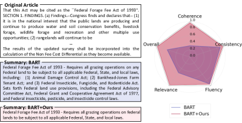
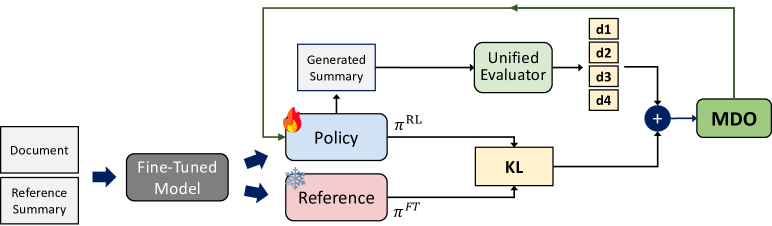
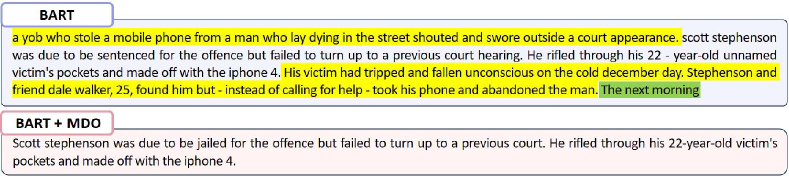
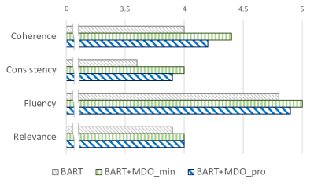
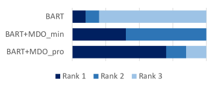
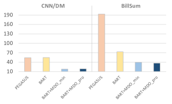
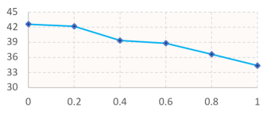
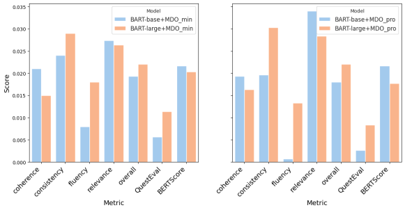

# Multi-Dimensional Optimization for Text Summarization via Reinforcement Learning

###### Abstract

The evaluation of summary quality encompasses diverse dimensions such as consistency, coherence, relevance, and fluency. However, existing summarization methods often target a specific dimension, facing challenges in generating well-balanced summaries across multiple dimensions. In this paper, we propose multi-objective reinforcement learning tailored to generate balanced summaries across all four dimensions. We introduce two multi-dimensional optimization (MDO) strategies for adaptive learning: 1) MDO${}_{\text{min}}$, rewarding the current lowest dimension score, and 2) MDO${}_{\text{pro}}$, optimizing multiple dimensions similar to multi-task learning, resolves conflicting gradients across dimensions through gradient projection. Unlike prior ROUGE-based rewards relying on reference summaries, we use a QA-based reward model that aligns with human preferences. Further, we discover the capability to regulate the length of summaries by adjusting the discount factor, seeking the generation of concise yet informative summaries that encapsulate crucial points. Our approach achieved substantial performance gains compared to baseline models on representative summarization datasets, particularly in the overlooked dimensions.  

Multi-Dimensional Optimization for Text Summarization via Reinforcement Learning  

  

    Sangwon Ryu††thanks: Equal contribution1, Heejin Do11footnotemark: 11, Yunsu Kim3, Gary Geunbae Lee1,2, Jungseul Ok1,2     1Graduate School of Artificial Intelligence, POSTECH, South Korea  2Department of Computer Science and Engineering, POSTECH, South Korea  3aiXplain Inc., Los Gatos, CA, USA  {ryusangwon, heejindo, gblee, jungseul}@postech.ac.kr, yunsu.kim@aixplain.com     

  

## 1 Introduction

[FIGURE S1.F1.g1]

Figure 1: While the baseline model produces an imbalanced summary ($\color[rgb]{0.55,0.55,1}\mdblksquare$), we aim to generate overall high-quality summaries ($\color[rgb]{1,0.55,0.55}\mdblksquare$). The radar chart illustrates UniEval scores for four dimensions.
[/FIGURE]

Determining a "good summary" extends beyond a single factor, generally embracing multiple dimensions such as coherence, consistency, fluency, and relevance Kryscinski et al. ([2019](#bib.bib14)); Zhong et al. ([2022](#bib.bib45)); Liu et al. ([2022b](#bib.bib22)); Wang et al. ([2023b](#bib.bib40)); Liu et al. ([2023a](#bib.bib18)). Despite the remarkable advancements in abstractive summarization, challenges persist in addressing issues such as factual inconsistency, which generates inaccurate information, and irrelevance, which involves omitting crucial details.  

Recently, there have been ongoing efforts to focus on such inferior dimensions Pasunuru and Bansal ([2018](#bib.bib27)); Gunasekara et al. ([2021](#bib.bib11)); Cao et al. ([2022](#bib.bib2)); Berezin and Batura ([2022](#bib.bib1)); Wan et al. ([2023](#bib.bib37)); Liu et al. ([2023b](#bib.bib19)); Nan et al. ([2021](#bib.bib23)); Wang et al. ([2023b](#bib.bib40)); Chern et al. ([2023](#bib.bib4)), and reinforcement learning (RL) is applied as one strategy. Most existing RL approaches use a single reward of the ROUGE score Lin ([2004](#bib.bib17)), which measures the overlap with the reference summary. However, its subpar quality across various datasets has been frequently underscored Liu et al. ([2023c](#bib.bib21)); Zhang et al. ([2024](#bib.bib44)); Goyal et al. ([2023](#bib.bib10)).  

Pointing out the limitations of ROUGE scores in detecting hallucinations, various studies have focused on addressing this issue. Pasunuru and Bansal ([2018](#bib.bib27)) assigned weights to each word to overcome shortcomings of ROUGE, Roit et al. ([2023](#bib.bib31)) provided a reward with the natural language inference (NLI) entailment relationship between generated summary and the document, and Gunasekara et al. ([2021](#bib.bib11)) provided rewards via Question Answering (QA) model. However, those methods cannot capture summary-intrinsic dimensions, such as fluency or coherence. Addressing shortcomings in one dimension often leads to unintended drawbacks in other dimensions; thus, achieving a high-quality summary generation by balancing multiple dimensions remains challenging (Figure [1](#S1.F1 "Figure 1 ‣ 1 Introduction ‣ Multi-Dimensional Optimization for Text Summarization via Reinforcement Learning")).  

In this work, we introduce multi-objective RL, aiming to generate solid summaries that are coherent, factually consistent, fluent, and relevant. Our RL approach is based on a proximal policy optimization (PPO) Schulman et al. ([2017](#bib.bib33)), and we incorporate four dimensions of a unified multi-dimensional evaluation metric, UniEval Zhong et al. ([2022](#bib.bib45)), as multiple rewards. We suggest two strategies for optimal rewarding with multiple objectives, namely MDO${}_{\text{min}}$ and MDO${}_{\text{pro}}$. MDO${}_{\text{min}}$ fosters adaptive learning by selecting the lowest dimension score as the reward at each iteration. Meanwhile, MDO${}_{\text{pro}}$ projects gradient onto the normal plane to handle conflicting gradients in multi-task RL, leveraging a PCGrad Yu et al. ([2020](#bib.bib41)) optimizer. By effectively projecting the gradients of multiple rewards, our method can adjust the learning direction for optimal training. Both strategies aim to enhance deficient dimensions while preserving superior ones during training.  

In summarization tasks, unlike typical PPO usage that rewards at each step, the score for a generated summary is obtained only at the end of the episode when the entire summary is produced. KL-penalty replaces the reward per token during episodes; hence, the discount factor can be crucial in obtaining an optimal policy Kim et al. ([2022](#bib.bib13)). Consequently, we investigate how adjusting the discount factor affects the generated summaries, particularly in length.  

Our MDO strategies outperform the baseline model in experiments using the representative CNN/DM and BillSum summarization datasets. Notably, our methods significantly enhance the previously inferior relevance dimension, supporting competitive results in other dimensions. Additional examinations, measuring whether the contents of the generated summaries are from the original articles, reveal around 90% coverage with a shorter average length. This outcome implies the capacity of the MDO to create brief yet pertinent summaries.  

Our contributions are summarized as follows:  

* We propose two multi-dimensional optimization methods for multi-objective RL, introducing multiple UniEval dimensions as rewards. 
* We have empirically verified improvements in deficient dimensions while maintaining competitiveness in superior dimensions across two datasets, outperforming naive MDO methods. 
* We find that adjusting a discount factor can control the generated summary length. 

[FIGURE S1.F2.g1]

Figure 2: Entire process of Multi-dimensional Optimization (MDO). Through MDO, we optimize the scores for each dimension while training the policy. $d1$, $d2$, $d3$, and $d4$ refer to coherence, consistency, fluency, and relevance, respectively.
[/FIGURE]

## 2 Related Work

#### Dimension-specific text summarization

Previous studies have mostly focused on improving specific dimensions of text summarization, such as generating consistent summaries by resolving hallucinations. Wang et al. ([2023b](#bib.bib40)) involves a two-stage process where key entities are first extracted in the initial stage, followed by the integration of these entities to generate summaries in the second stage. Wan et al. ([2023](#bib.bib37)) altered the decoding strategy using a ranker and lookahead approach to produce the token with the highest faithfulness score. Their methods only considers to generate faithful summaries but overlooks other various dimensions.  

#### RL for abstractive text summarization

RL methods for text summarization have predominantly utilized the ROUGE score as a reward Narayan et al. ([2018](#bib.bib24)); Chen and Bansal ([2018](#bib.bib3)); Pasunuru and Bansal ([2018](#bib.bib27)); Kryściński et al. ([2018](#bib.bib15)); Dong et al. ([2018](#bib.bib7)); Paulus et al. ([2018](#bib.bib28)); Wang et al. ([2018](#bib.bib39)); Parnell et al. ([2022](#bib.bib26)). However, recent studies emphasized that the ROUGE score fails to evaluate summaries adequately due to the revealed poor quality of reference summaries in summarization tasks Liu et al. ([2023c](#bib.bib21)); Zhang et al. ([2024](#bib.bib44)); Goyal et al. ([2023](#bib.bib10)). Moreover, the ROUGE score only calculates the word overlap with the reference summary, failing to evaluate whether sentences are natural or consistent.  

Therefore, some researchers have explored the application of the NLI model Roit et al. ([2023](#bib.bib31)) or QA model Gunasekara et al. ([2021](#bib.bib11)) as a reward, which does not solely rely on the ROUGE score. Roit et al. ([2023](#bib.bib31)) employs reinforcement learning with an NLI reward, aiming to maintain high consistency by using the entailment relationship between the summary and the document as a reward. Gunasekara et al. ([2021](#bib.bib11)) generate questions from both the document and the summaries using a QA model to verify the presence of answers, aiming to enhance precision and recall related to consistency and relevance. Yet, these methods do not comprehensively consider diverse quality dimensions.  

#### Multi-objective RL

RL with multiple rewards can lead to more efficient model training Dann et al. ([2023](#bib.bib6)). However, multi-reward application in text summarization has not been extensively explored. Pasunuru and Bansal ([2018](#bib.bib27)) employ multiple rewards such as ROUGE-L, ROUGE-Sal (which weighs vital information), and entailment, but they simply approach as multi-task learning without consideration for finer optimization. Su et al. ([2023](#bib.bib36)) utilize multiple RL policies to summarize multiple documents by constructing individual policy models for importance, redundancy, and length. They aim to concisely summarize multiple documents, preventing content overlap and including only salient information. Yet, they did not aim for a comprehensive summary of a single document, as only the importance feature was considered. Unlike their exclusive focus on enabling the model to capture the essential or relevant content, we explore the optimal strategies for multi-objective RL, aiming for well-balanced summarization.  

## 3 Method Description

Throughout the RL process, it is crucial to maintain the fundamental summarization capabilities of the fine-tuned model while simultaneously improving scores across various dimensions. To achieve this goal, we employ proximal policy optimization (PPO) Schulman et al. ([2017](#bib.bib33)) for RL application, utilizing a supervised, parameter-frozen reference model to guide the policy. In our pursuit of multi-objective RL in summarization, we adopt UniEval Zhong et al. ([2022](#bib.bib45)), a metric that evaluates scores across different dimensions using a QA model. Incorporating four dimensions in the rewarding process, we introduce two optimal MDO methods to guide RL policy updates effectively. The entire process is illustrated in Figure [2](#S1.F2 "Figure 2 ‣ 1 Introduction ‣ Multi-Dimensional Optimization for Text Summarization via Reinforcement Learning").  

#### Multi-rewards

UniEval leverages a QA module for a unified multi-dimensional assessment in the rewarding process. The dimensions tackled by the UniEval closely align with human preferences, evaluating summaries based on key quality indicators. They include coherence (the structural coherence of the summary), consistency (the absence of discrepancies with the main text), fluency (the natural flow of sentences within the summary), and relevance (the inclusion of only important content from the document).  

#### PPO

PPO stands out as a well-established policy gradient model, renowned for its efficiency and stability attributed to its clipping surrogate objective. This object mitigates abrupt changes during policy updates, ensuring overall stability and avoiding divergence. Given the clipped surrogate objective, $L^{CL}$, the value loss, $L^{VF}$, and the entropy, $S$, the full PPO loss at timestep $t$ is defined as follows:  

|  | $$\mathrm{L}_{t}(\theta)=\hat{\mathbb{E}}_{t}\Bigl{[}\mathrm{L}^{\mathrm{CL}}_{t}(\theta)-c_{1}\mathrm{L}^{\mathrm{VF}}_{t}(\theta)+c_{2}S[\pi_{\theta}](s_{t})\Bigr{]}$$ |  |
| --- | --- | --- |

Unlike typical PPO applications that provide rewards at each time step, the summary can only be evaluated once when the entire sentences are generated in the summarization task. Thus, in line with the approach proposed by Stiennon et al. ([2020](#bib.bib35)), we employ a supervised fine-tuned summarization model as the policy $\pi^{\mathrm{RL}}$. The value model shares parameters with $\pi^{\mathrm{RL}}$, with an additional value head. Again, we utilize a reference model $\pi^{\mathrm{FT}}$, which is also a fine-tuned summarization model but with frozen parameters, to maintain the summarization performance of the $\pi^{\mathrm{RL}}$. In particular, rewards for each action, except for the generation of the last token, is the KL penalty between the policy $\pi^{RL}$ and the reference model $\pi^{FT}$. This process ensures that the $\pi^{RL}$ does not diverge too far from the supervised fine-tuned summarization model during the RL process. For the final action, which is the selection of the last token of the summary, a total reward is assigned by a reward model, $r(x,y)$, for the entire summary:  

|  | $$\mathrm{R}(x,y)=r(x,y)-\beta\log[\pi_{\theta}^{\mathrm{RL}}(y|x)/\pi^{\mathrm{FT}}(y|x)]$$ |  |
| --- | --- | --- |

Generalized advantage estimation (GAE) Schulman et al. ([2016](#bib.bib32)) is used for advantage estimation. Finely adjusting the influence of future reward in GAE is facilitated by employing the discount factor $\gamma$ alongside parameter $\lambda$ . $x$ and $y$ denote the document and summary, respectively. The state $s$ is the current token, the action $a$ is the selection of the next token by the $\pi^{RL}$, and the action space is the vocabulary of the $\pi^{RL}$, $V$.  

In our multi-objective setting, the score for each dimension $d_{k}$ corresponds to a reward $r_{k}(x,y)$. The key focus of our two MDO strategies lies in optimizing these multi-rewards to train the policy effectively. We use online learning, similar to the previous methods Stiennon et al. ([2020](#bib.bib35)), which demonstrated strong performance across various domains Fan et al. ([2023](#bib.bib8)).  

[ALGORITHM alg1]

1:documents=$\{D_{1},D_{2},\ldots,D_{\mathcal{N}}\}$,

2:policy $\pi_{\theta}$, model parameter $\theta$, $Evaluator$

3:hyperparameter $\beta,\lambda$, discount factor $\gamma$,

4:$Dims\leftarrow\{\text{``coh''},\text{``con''},\text{``flu''},\text{``rel''}\}$

5:$\mathcal{M}\leftarrow length(Dims)$

6:for $i=1$ to $\mathcal{N}$ do

7:     $L\leftarrow 0$

8:     // Generate a summary

9:     $S_{i}$ = $\pi_{\theta}(D_{i})$

10:     // Calculate rewards

11:     for $j=1$ to $\mathcal{M}$ do

12:         $r_{j}=Evaluator(Dims[j])$

13:     end for

14:     $r=\mathop{\mathrm{argmin}}_{1\leq m\leq\mathcal{M}}r_{m}(D_{i},S_{i})$

15:     $R=r(D_{i},S_{i})-\beta\log\left(\frac{\pi_{\theta}^{RL}(S_{i}|D_{i})}{\pi^{FT}(S_{i}|D_{i})}\right)$

16:     // Estimate advantage $\hat{A}$ using GAE

17:     $\delta\leftarrow r_{t}+\gamma V(s_{t+1})-V(s_{t})$

18:     $\hat{A_{t}}\leftarrow\delta_{t}+\gamma\lambda\delta_{t+1}+\cdots+(\gamma\lambda)^{T-t+1}\delta_{T-1}$

19:     $L\leftarrow\text{PPO loss for }\hat{A_{t}},R,\pi_{\theta}$

20:     update $\Delta\theta$

21:end for

Algorithm 1  Calculation of MDO${}_{\text{min}}$
[/ALGORITHM]

### 3.1 MDO${}_{\text{min}}$

Focusing on the most vulnerable dimensions, we suggest MDO${}_{\text{min}}$, which selects a minimum dimension score as the reward, $r(x,y)$, among the evaluated four-dimensional scores. This approach intuitively aims to uplift the performance of the inferior-quality dimensions. By adopting the minimum score, the model is prompted to perform policy gradients to address the weakest dimension, achieving a balanced summary generation. The same model evaluates all four dimensions; thus, no scaling is required, and the lowest-rated dimension is directly utilized as the reward. The details of the MDO${}_{\text{min}}$ is explained in Algorithm [1](#alg1 "Algorithm 1 ‣ PPO ‣ 3 Method Description ‣ Multi-Dimensional Optimization for Text Summarization via Reinforcement Learning").  

[ALGORITHM alg2]

1:documents=$\{D_{1},D_{2},\ldots,D_{\mathcal{N}}\}$,

2:policy $\pi_{\theta}$, model parameter $\theta$, $Evaluator$

3:hyperparameter $\beta,\lambda$, discount factor $\gamma$,

4:$Dims\leftarrow\{\text{``coh''},\text{``con''},\text{``flu''},\text{``rel''}\}$

5:$\mathcal{M}\leftarrow\text{length}(Dims)$

6:for $i=1$ to $\mathcal{N}$ do

7:     $L\leftarrow 0$

8:     // Generate a summary

9:     $S_{i}$ = $\pi_{\theta}(D_{i})$

10:     // Calculate rewards

11:     for $j=1$ to $\mathcal{M}$ do

12:         $r_{j}=Evaluator(Dims[j])$

13:         $R_{j}=r_{j}(D_{i},S_{i})-\beta\log\left(\frac{\pi_{\theta}^{RL}(S_{i}|D_{i})}{\pi^{FT}(S_{i}|D_{i})}\right)$

14:         // Estimate advantage $\hat{A}$ using GAE

15:         $\delta\leftarrow r_{t}+\gamma V(s_{t+1})-V(s_{t})$

16:         $\hat{A_{t}}\leftarrow\delta_{t}+\gamma\lambda\delta_{t+1}+\cdots+(\gamma\lambda)^{T-t+1}\delta_{T-1}$

17:         $L\leftarrow L+\text{PPO loss for }\hat{A_{t}},R_{j},\pi_{\theta}$

18:     end for

19:     $g_{m}\leftarrow\nabla_{\theta}L(\theta)\;\forall m\in Dims$

20:     $g^{PC}_{m}\leftarrow g_{m}\;\forall m$

21:     // Project conflict gradient

22:     $(p,q)\leftarrow\text{select }(p,q)\in Dims\times Dims\text{ where }p\neq q$

23:     if $g^{PC}_{p}\cdot g_{q}<0$ then

24:         $g^{PC}_{p}\leftarrow g^{PC}_{p}-\frac{g^{PC}_{p}\cdot g_{q}}{\|g_{q}\|^{2}}g_{q}$

25:     end if

26:     update $\Delta\theta=g^{PC}=\sum_{m}g^{PC}_{m}$

27:end for

Algorithm 2  Calculation of MDO${}_{\text{pro}}$
[/ALGORITHM]

### 3.2 MDO${}_{\text{pro}}$

While rewards can be adaptively provided based on individual dimension scores, it may prove insufficient if there exists an inherent trade-off relationship between dimensions. For instance, attempting to improve consistency by including entities from the main document in the summary could potentially reduce the fluency between sentences within the summary. Consequently, finding a Pareto improvement becomes challenging when faced with such inherent trade-offs.  

[TABLE S3.T1]

<table class="ltx_tabular ltx_align_middle">
<tbody class="ltx_tbody">
<tr class="ltx_tr">
<td class="ltx_td ltx_border_r ltx_border_tt"></td>
<td class="ltx_td ltx_align_center ltx_border_r ltx_border_tt">UniEval</td>
<td class="ltx_td ltx_border_tt"></td>
</tr>
<tr class="ltx_tr">
<td class="ltx_td ltx_align_left ltx_border_r ltx_border_t">Model</td>
<td class="ltx_td ltx_align_center ltx_border_r ltx_border_t">Fine-tune</td>
<td class="ltx_td ltx_align_center ltx_border_t">Coherence</td>
<td class="ltx_td ltx_align_center ltx_border_t">Consistency</td>
<td class="ltx_td ltx_align_center ltx_border_t">Fluency</td>
<td class="ltx_td ltx_align_center ltx_border_t">Relevance</td>
<td class="ltx_td ltx_align_center ltx_border_r ltx_border_t">Overall</td>
<td class="ltx_td ltx_align_center ltx_border_t">QuestEval</td>
<td class="ltx_td ltx_align_center ltx_border_t">BERTScore</td>
</tr>
<tr class="ltx_tr">
<td class="ltx_td ltx_align_left ltx_border_r ltx_border_t">PEGASUS</td>
<td class="ltx_td ltx_align_center ltx_border_r ltx_border_t">SFT</td>
<td class="ltx_td ltx_align_center ltx_border_t">0.823</td>
<td class="ltx_td ltx_align_center ltx_border_t">0.832</td>
<td class="ltx_td ltx_align_center ltx_border_t">0.849</td>
<td class="ltx_td ltx_align_center ltx_border_t">0.814</td>
<td class="ltx_td ltx_align_center ltx_border_r ltx_border_t">0.830</td>
<td class="ltx_td ltx_align_center ltx_border_t">0.392</td>
<td class="ltx_td ltx_align_center ltx_border_t">0.899</td>
</tr>
<tr class="ltx_tr">
<td class="ltx_td ltx_align_left ltx_border_r ltx_border_t">BARTbase
</td>
<td class="ltx_td ltx_align_center ltx_border_r ltx_border_t">SFT</td>
<td class="ltx_td ltx_align_center ltx_border_t">0.838</td>
<td class="ltx_td ltx_align_center ltx_border_t">0.833</td>
<td class="ltx_td ltx_align_center ltx_border_t">0.845</td>
<td class="ltx_td ltx_align_center ltx_border_t">0.779</td>
<td class="ltx_td ltx_align_center ltx_border_r ltx_border_t">0.824</td>
<td class="ltx_td ltx_align_center ltx_border_t">0.425</td>
<td class="ltx_td ltx_align_center ltx_border_t">0.902</td>
</tr>
<tr class="ltx_tr">
<td class="ltx_td ltx_align_left ltx_border_r">BARTbase
</td>
<td class="ltx_td ltx_align_center ltx_border_r">SFT+MDO<math class="ltx_Math"><semantics><msub><mi></mi><mtext>min</mtext></msub><annotation-xml><apply><ci><mtext>min</mtext></ci></apply></annotation-xml><annotation>{}_{\text{min}}</annotation></semantics></math>
</td>
<td class="ltx_td ltx_align_center">0.859</td>
<td class="ltx_td ltx_align_center">0.857</td>
<td class="ltx_td ltx_align_center">0.853</td>
<td class="ltx_td ltx_align_center">0.806</td>
<td class="ltx_td ltx_align_center ltx_border_r">0.843</td>
<td class="ltx_td ltx_align_center">0.431</td>
<td class="ltx_td ltx_align_center">0.924</td>
</tr>
<tr class="ltx_tr">
<td class="ltx_td ltx_align_left ltx_border_r">BARTbase
</td>
<td class="ltx_td ltx_align_center ltx_border_r">SFT+MDO<math class="ltx_Math"><semantics><msub><mi></mi><mtext>pro</mtext></msub><annotation-xml><apply><ci><mtext>pro</mtext></ci></apply></annotation-xml><annotation>{}_{\text{pro}}</annotation></semantics></math>
</td>
<td class="ltx_td ltx_align_center">0.857</td>
<td class="ltx_td ltx_align_center">0.853</td>
<td class="ltx_td ltx_align_center">0.846</td>
<td class="ltx_td ltx_align_center">0.813</td>
<td class="ltx_td ltx_align_center ltx_border_r">0.842</td>
<td class="ltx_td ltx_align_center">0.428</td>
<td class="ltx_td ltx_align_center">0.924</td>
</tr>
<tr class="ltx_tr">
<td class="ltx_td ltx_align_left ltx_border_r ltx_border_t">BARTlarge
</td>
<td class="ltx_td ltx_align_center ltx_border_r ltx_border_t">SFT</td>
<td class="ltx_td ltx_align_center ltx_border_t">0.884</td>
<td class="ltx_td ltx_align_center ltx_border_t">0.865</td>
<td class="ltx_td ltx_align_center ltx_border_t">0.864</td>
<td class="ltx_td ltx_align_center ltx_border_t">0.843</td>
<td class="ltx_td ltx_align_center ltx_border_r ltx_border_t">0.864</td>
<td class="ltx_td ltx_align_center ltx_border_t">0.424</td>
<td class="ltx_td ltx_align_center ltx_border_t">0.904</td>
</tr>
<tr class="ltx_tr">
<td class="ltx_td ltx_align_left ltx_border_r">BARTlarge
</td>
<td class="ltx_td ltx_align_center ltx_border_r">SFT+MDO<math class="ltx_Math"><semantics><msub><mi></mi><mtext>min</mtext></msub><annotation-xml><apply><ci><mtext>min</mtext></ci></apply></annotation-xml><annotation>{}_{\text{min}}</annotation></semantics></math>
</td>
<td class="ltx_td ltx_align_center">0.899</td>
<td class="ltx_td ltx_align_center">0.894</td>
<td class="ltx_td ltx_align_center">0.882</td>
<td class="ltx_td ltx_align_center">0.869</td>
<td class="ltx_td ltx_align_center ltx_border_r">0.886</td>
<td class="ltx_td ltx_align_center">0.435</td>
<td class="ltx_td ltx_align_center">0.924</td>
</tr>
<tr class="ltx_tr">
<td class="ltx_td ltx_align_left ltx_border_r">BARTlarge
</td>
<td class="ltx_td ltx_align_center ltx_border_r">SFT+MDO<math class="ltx_Math"><semantics><msub><mi></mi><mtext>pro</mtext></msub><annotation-xml><apply><ci><mtext>pro</mtext></ci></apply></annotation-xml><annotation>{}_{\text{pro}}</annotation></semantics></math>
</td>
<td class="ltx_td ltx_align_center">0.900</td>
<td class="ltx_td ltx_align_center">0.895</td>
<td class="ltx_td ltx_align_center">0.877</td>
<td class="ltx_td ltx_align_center">0.871</td>
<td class="ltx_td ltx_align_center ltx_border_r">0.886</td>
<td class="ltx_td ltx_align_center">0.432</td>
<td class="ltx_td ltx_align_center">0.922</td>
</tr>
<tr class="ltx_tr">
<td class="ltx_td ltx_align_left ltx_border_r ltx_border_t">T5base
</td>
<td class="ltx_td ltx_align_center ltx_border_r ltx_border_t">SFT</td>
<td class="ltx_td ltx_align_center ltx_border_t">0.840</td>
<td class="ltx_td ltx_align_center ltx_border_t">0.874</td>
<td class="ltx_td ltx_align_center ltx_border_t">0.832</td>
<td class="ltx_td ltx_align_center ltx_border_t">0.775</td>
<td class="ltx_td ltx_align_center ltx_border_r ltx_border_t">0.830</td>
<td class="ltx_td ltx_align_center ltx_border_t">0.430</td>
<td class="ltx_td ltx_align_center ltx_border_t">0.912</td>
</tr>
<tr class="ltx_tr">
<td class="ltx_td ltx_align_left ltx_border_r">T5base
</td>
<td class="ltx_td ltx_align_center ltx_border_r">SFT+MDO<math class="ltx_Math"><semantics><msub><mi></mi><mtext>min</mtext></msub><annotation-xml><apply><ci><mtext>min</mtext></ci></apply></annotation-xml><annotation>{}_{\text{min}}</annotation></semantics></math>
</td>
<td class="ltx_td ltx_align_center">0.872</td>
<td class="ltx_td ltx_align_center">0.883</td>
<td class="ltx_td ltx_align_center">0.850</td>
<td class="ltx_td ltx_align_center">0.819</td>
<td class="ltx_td ltx_align_center ltx_border_r">0.856</td>
<td class="ltx_td ltx_align_center">0.433</td>
<td class="ltx_td ltx_align_center">0.918</td>
</tr>
<tr class="ltx_tr">
<td class="ltx_td ltx_align_left ltx_border_r">T5base
</td>
<td class="ltx_td ltx_align_center ltx_border_r">SFT+MDO<math class="ltx_Math"><semantics><msub><mi></mi><mtext>pro</mtext></msub><annotation-xml><apply><ci><mtext>pro</mtext></ci></apply></annotation-xml><annotation>{}_{\text{pro}}</annotation></semantics></math>
</td>
<td class="ltx_td ltx_align_center">0.882</td>
<td class="ltx_td ltx_align_center">0.887</td>
<td class="ltx_td ltx_align_center">0.858</td>
<td class="ltx_td ltx_align_center">0.836</td>
<td class="ltx_td ltx_align_center ltx_border_r">0.866</td>
<td class="ltx_td ltx_align_center">0.435</td>
<td class="ltx_td ltx_align_center">0.922</td>
</tr>
<tr class="ltx_tr">
<td class="ltx_td ltx_align_left ltx_border_bb ltx_border_r ltx_border_t">GPT-4</td>
<td class="ltx_td ltx_align_center ltx_border_bb ltx_border_r ltx_border_t">-</td>
<td class="ltx_td ltx_align_center ltx_border_bb ltx_border_t">0.973</td>
<td class="ltx_td ltx_align_center ltx_border_bb ltx_border_t">0.843</td>
<td class="ltx_td ltx_align_center ltx_border_bb ltx_border_t">0.831</td>
<td class="ltx_td ltx_align_center ltx_border_bb ltx_border_t">0.971</td>
<td class="ltx_td ltx_align_center ltx_border_bb ltx_border_r ltx_border_t">0.904</td>
<td class="ltx_td ltx_align_center ltx_border_bb ltx_border_t">0.443</td>
<td class="ltx_td ltx_align_center ltx_border_bb ltx_border_t">0.851</td>
</tr>
</tbody>
</table>

Table 1: The results of automatic multi-dimension evaluation measured on the BillSum dataset. Within the same baseline, the bold denotes the highest score, and the underline denotes the second-highest score.
[/TABLE]

[TABLE S3.T2]

<table class="ltx_tabular ltx_align_middle">
<tbody class="ltx_tbody">
<tr class="ltx_tr">
<td class="ltx_td ltx_border_r ltx_border_tt"></td>
<td class="ltx_td ltx_align_center ltx_border_r ltx_border_tt">UniEval</td>
<td class="ltx_td ltx_border_tt"></td>
</tr>
<tr class="ltx_tr">
<td class="ltx_td ltx_align_left ltx_border_r ltx_border_t">Model</td>
<td class="ltx_td ltx_align_center ltx_border_r ltx_border_t">Fine-tune</td>
<td class="ltx_td ltx_align_center ltx_border_t">Coherence</td>
<td class="ltx_td ltx_align_center ltx_border_t">Consistency</td>
<td class="ltx_td ltx_align_center ltx_border_t">Fluency</td>
<td class="ltx_td ltx_align_center ltx_border_t">Relevance</td>
<td class="ltx_td ltx_align_center ltx_border_r ltx_border_t">Overall</td>
<td class="ltx_td ltx_align_center ltx_border_t">QuestEval</td>
<td class="ltx_td ltx_align_center ltx_border_t">BERTScore</td>
</tr>
<tr class="ltx_tr">
<td class="ltx_td ltx_align_left ltx_border_r ltx_border_t">PEGASUS</td>
<td class="ltx_td ltx_align_center ltx_border_r ltx_border_t">SFT</td>
<td class="ltx_td ltx_align_center ltx_border_t">0.936</td>
<td class="ltx_td ltx_align_center ltx_border_t">0.939</td>
<td class="ltx_td ltx_align_center ltx_border_t">0.815</td>
<td class="ltx_td ltx_align_center ltx_border_t">0.684</td>
<td class="ltx_td ltx_align_center ltx_border_r ltx_border_t">0.843</td>
<td class="ltx_td ltx_align_center ltx_border_t">0.584</td>
<td class="ltx_td ltx_align_center ltx_border_t">0.877</td>
</tr>
<tr class="ltx_tr">
<td class="ltx_td ltx_align_left ltx_border_r">BRIO</td>
<td class="ltx_td ltx_align_center ltx_border_r">SFT</td>
<td class="ltx_td ltx_align_center">0.951</td>
<td class="ltx_td ltx_align_center">0.931</td>
<td class="ltx_td ltx_align_center">0.826</td>
<td class="ltx_td ltx_align_center">0.776</td>
<td class="ltx_td ltx_align_center ltx_border_r">0.871</td>
<td class="ltx_td ltx_align_center">0.619</td>
<td class="ltx_td ltx_align_center">0.883</td>
</tr>
<tr class="ltx_tr">
<td class="ltx_td ltx_align_left ltx_border_r ltx_border_t">BARTbase
</td>
<td class="ltx_td ltx_align_center ltx_border_r ltx_border_t">SFT</td>
<td class="ltx_td ltx_align_center ltx_border_t">0.963</td>
<td class="ltx_td ltx_align_center ltx_border_t">0.952</td>
<td class="ltx_td ltx_align_center ltx_border_t">0.850</td>
<td class="ltx_td ltx_align_center ltx_border_t">0.702</td>
<td class="ltx_td ltx_align_center ltx_border_r ltx_border_t">0.867</td>
<td class="ltx_td ltx_align_center ltx_border_t">0.594</td>
<td class="ltx_td ltx_align_center ltx_border_t">0.877</td>
</tr>
<tr class="ltx_tr">
<td class="ltx_td ltx_align_left ltx_border_r">BARTbase
</td>
<td class="ltx_td ltx_align_center ltx_border_r">SFT+MDO<math class="ltx_Math"><semantics><msub><mi></mi><mtext>min</mtext></msub><annotation-xml><apply><ci><mtext>min</mtext></ci></apply></annotation-xml><annotation>{}_{\text{min}}</annotation></semantics></math>
</td>
<td class="ltx_td ltx_align_center">0.955</td>
<td class="ltx_td ltx_align_center">0.958</td>
<td class="ltx_td ltx_align_center">0.894</td>
<td class="ltx_td ltx_align_center">0.734</td>
<td class="ltx_td ltx_align_center ltx_border_r">0.885</td>
<td class="ltx_td ltx_align_center">0.555</td>
<td class="ltx_td ltx_align_center">0.896</td>
</tr>
<tr class="ltx_tr">
<td class="ltx_td ltx_align_left ltx_border_r">BARTbase
</td>
<td class="ltx_td ltx_align_center ltx_border_r">SFT+MDO<math class="ltx_Math"><semantics><msub><mi></mi><mtext>pro</mtext></msub><annotation-xml><apply><ci><mtext>pro</mtext></ci></apply></annotation-xml><annotation>{}_{\text{pro}}</annotation></semantics></math>
</td>
<td class="ltx_td ltx_align_center">0.959</td>
<td class="ltx_td ltx_align_center">0.960</td>
<td class="ltx_td ltx_align_center">0.896</td>
<td class="ltx_td ltx_align_center">0.750</td>
<td class="ltx_td ltx_align_center ltx_border_r">0.891</td>
<td class="ltx_td ltx_align_center">0.556</td>
<td class="ltx_td ltx_align_center">0.896</td>
</tr>
<tr class="ltx_tr">
<td class="ltx_td ltx_align_left ltx_border_r ltx_border_t">GPT-3+CoT</td>
<td class="ltx_td ltx_align_center ltx_border_r ltx_border_t">-</td>
<td class="ltx_td ltx_align_center ltx_border_t">0.948</td>
<td class="ltx_td ltx_align_center ltx_border_t">0.870</td>
<td class="ltx_td ltx_align_center ltx_border_t">0.948</td>
<td class="ltx_td ltx_align_center ltx_border_t">0.910</td>
<td class="ltx_td ltx_align_center ltx_border_r ltx_border_t">0.919</td>
<td class="ltx_td ltx_align_center ltx_border_t">0.574</td>
<td class="ltx_td ltx_align_center ltx_border_t">0.874</td>
</tr>
<tr class="ltx_tr">
<td class="ltx_td ltx_align_left ltx_border_bb ltx_border_r">GPT-4</td>
<td class="ltx_td ltx_align_center ltx_border_bb ltx_border_r">-</td>
<td class="ltx_td ltx_align_center ltx_border_bb">0.967</td>
<td class="ltx_td ltx_align_center ltx_border_bb">0.840</td>
<td class="ltx_td ltx_align_center ltx_border_bb">0.945</td>
<td class="ltx_td ltx_align_center ltx_border_bb">0.934</td>
<td class="ltx_td ltx_align_center ltx_border_bb ltx_border_r">0.921</td>
<td class="ltx_td ltx_align_center ltx_border_bb">0.597</td>
<td class="ltx_td ltx_align_center ltx_border_bb">0.864</td>
</tr>
</tbody>
</table>

Table 2: The results of automatic multi-dimension evaluation measured on the CNN/DailyMail (CNN/DM) dataset.
[/TABLE]

To overcome the intrinsic trade-off relationship, we suggest an MDOpro, which projects multiple conflicting gradients onto a plane, utilizing the PCGrad optimizer Yu et al. ([2020](#bib.bib41)). Treating multiple dimensions as distinct tasks, the optimizer projects each task’s gradient onto the normal plane of the gradient of other tasks with conflicting gradients. In cases where gradients from multiple losses oppose each other, the learning may become ineffective. The PCGrad optimizer alleviates interference between the gradients of different dimensions by ensuring that the gradient of one dimension does not adversely affect the gradient of others. The detailed process is outlined in Algorithm [2](#alg2 "Algorithm 2 ‣ 3.1 MDO_\"min\" ‣ 3 Method Description ‣ Multi-Dimensional Optimization for Text Summarization via Reinforcement Learning").  

## 4 Experimental Setup

#### Datasets

We utilize two text summarization datasets considering potential influences of source document complexity: the BillSum dataset for legislative content and the CNN/Daily Mail dataset for news summarization. BillSum comprises an 18.9K training set and a 3.2K test set, while CNN/DM has a 287K training set and an 11.5K test set. In light of studies indicating poor quality of reference summaries in the datasets Liu et al. ([2023c](#bib.bib21)); Zhang et al. ([2024](#bib.bib44)); Goyal et al. ([2023](#bib.bib10)), we use an enhanced version of CNN/DM test set introduced by Wang et al. ([2023b](#bib.bib40)).  

#### Baseline models

As baseline models, we employ encoder-decoder models commonly used for the text summarization task, including BART Lewis et al. ([2020](#bib.bib16)) and T5 Raffel et al. ([2020](#bib.bib30)). For additional comparison, we report PEGASUS Zhang et al. ([2020a](#bib.bib42)) and BRIO Liu et al. ([2022a](#bib.bib20)) results. To ensure comparability, we fine-tune BART-base, BART-large, and T5-base under the same hyperparameter settings: a batch size of 4, a learning rate of 5e-5, and 10 epochs. For PEGASUS and BRIO models, we utilized already fine-tuned versions on the Billsum111https://huggingface.co/google/pegasus-billsum and CNN/DM222https://huggingface.co/google/pegasus-cnn\_dailymail333https://huggingface.co/Yale-LILY/brio-cnndm-cased.  

In addition, we compare our model with LLMs, GPT-3-CoT Wang et al. ([2023b](#bib.bib40)) and GPT-4 OpenAI et al. ([2024](#bib.bib25)). GPT-3-CoT is a 2-stage chain-of-thought approach where the first stage extracts the core elements, and the second stage integrates them to address the issue of LLMs not sufficiently incorporating elements in generated summaries in the news datasets. We used GPT-4-turbo for GPT-4.  

#### Hyperparameters for RL

For RL, we use a batch size of 4, a learning rate of 1.41e-6, discount factor $\gamma=0.9$, and randomly select only 10K samples from the training set of each dataset. We conduct experiments with three different seeds and report the average scores.  

[FIGURE S4.F3.g1]

Figure 3: Examples of the generated summaries by the baseline model and our MDO${}_{\text{pro}}$ on the same document. Unimportant contents are highlighted in yellow, and unnatural or structurally disruptive ones are marked in green.
[/FIGURE]

[FIGURE S4.F4.g1]

Figure 4: Multi-dimensional evaluation results with ChatGPT on the BillSum.
[/FIGURE]

#### Metrics

We use various evaluation metrics for multi-dimension assessment, such as UniEval, ChatGPT, and human evaluations. For detailed measurements on each dimension, we also use QuestEval Scialom et al. ([2021](#bib.bib34)) and BERTSCore Zhang et al. ([2020b](#bib.bib43)). QuestEval assesses precision by generating questions from summaries using a question generation model and checking if the answers are in the document. It generates questions from the document and verifies whether the answers are in the summaries for recall. The overall QuestEval score is an F1 score based on precision and recall. We use precision value for the BERTScore, which calculates the similarity between the token vectors in the generated summaries and those in the reference summaries based on BERT embeddings.  

## 5 Results

#### Main results

In Table [1](#S3.T1 "Table 1 ‣ 3.2 MDO_\"pro\" ‣ 3 Method Description ‣ Multi-Dimensional Optimization for Text Summarization via Reinforcement Learning"), our multi-objective optimization techniques, MDO${{}_{\text{min}}}$ and MDO${{}_{\text{pro}}}$, have consistently demonstrate enhanced performance across all UniEval dimensions. Notably, applying to the BART-base exhibit significant advancements in the lowest-quality dimension, relevance, with MDO${{}_{\text{min}}}$ and MDO${{}_{\text{pro}}}$ showing increases of 0.027 and 0.034, respectively. Similarly, in the dimension of consistency, also had inferior quality, MDO${{}_{\text{min}}}$ and MDO${{}_{\text{pro}}}$ lead to notable improvements of 0.024 and 0.020, respectively. Our methods consistently yield modest yet discernible enhancements even in dimensions with relatively high baseline scores. The same trend is evident in the evaluation of the BART-large model, with considerable strides made in dimensions that initially exhibited lower performance, accompanied by marginal but discernible improvements in dimensions already featuring high scores. This underlines adaptive learning capabilities our methods, enabling the model to dynamically adjust its focus and balance diverse dimensions with the overall enhancements. In the assessment using alternative metrics such as QuestEval and BERTScore, the BART-large+MDO${}_{\text{min}}$ model stands out. These results highlight that our generated summaries maintain competitive quality even when measured based on the original document and the reference summaries. The standard deviation is specified in Appendix A.1.  

We extend our experiments to include the CNN/DM dataset. As illustrated in Table [2](#S3.T2 "Table 2 ‣ 3.2 MDO_\"pro\" ‣ 3 Method Description ‣ Multi-Dimensional Optimization for Text Summarization via Reinforcement Learning"), training with multi-dimensional optimized methods enhances the performance on the CNN/DM dataset akin to those observed on the BillSum dataset. Notably, substantial score improvements are recorded in the dimensions of fluency and relevance, registering increases of 0.046 and 0.048, respectively, addressing areas where the quality was initially deficient. Still, the scores remained comparable or slightly lower in dimensions where the model already demonstrated high proficiency, such as coherence and consistency. Consequently, RL with MDO has resulted in well-balanced summaries across various dimensions.  

As LLMs have demonstrated superior performance in summarization tasks Zhang et al. ([2024](#bib.bib44)); Goyal et al. ([2023](#bib.bib10)); Pu et al. ([2023](#bib.bib29)), we compare our model with the latest LLMs, GPT-3+CoT Wang et al. ([2023b](#bib.bib40)) and GPT-4 OpenAI et al. ([2024](#bib.bib25)). Despite the smaller model size, our method exhibits comparable performance to the larger and more expensive GPT-4 with only 0.018 differences in BillSum (Table [1](#S3.T1 "Table 1 ‣ 3.2 MDO_\"pro\" ‣ 3 Method Description ‣ Multi-Dimensional Optimization for Text Summarization via Reinforcement Learning")). Moreover, it shows higher BERTScore in BillSum and CNN/DM (Table [2](#S3.T2 "Table 2 ‣ 3.2 MDO_\"pro\" ‣ 3 Method Description ‣ Multi-Dimensional Optimization for Text Summarization via Reinforcement Learning")).  

Figure [3](#S4.F3 "Figure 3 ‣ Hyperparameters for RL ‣ 4 Experimental Setup ‣ Multi-Dimensional Optimization for Text Summarization via Reinforcement Learning") illustrates actual changes in summaries as multi-dimensional scores increase with our model. The initial models frequently incorporated irrelevant details and awkwardly constructed sentences. In contrast, our model, fine-tuned to enhance each dimension through MDO, effectively omits non-essential information and improves the natural flow of sentences. Qualitative observations suggest a positive link between improving UniEval scores and producing high-quality summaries.  

#### ChatGPT evaluation

Recent studies informed that ChatGPT’s evaluation capabilities closely align with human judgments Gao et al. ([2023](#bib.bib9)); Chiang and Lee ([2023](#bib.bib5)); Wang et al. ([2023a](#bib.bib38)). To further verify with indicators other than the QA-based metrics, we include ChatGPT evaluation with four dimensions identical to those in UniEval. Inputting the document and its summaries into ChatGPT, we request evaluations for each dimension on a scale ranging from 0 to 5 (the highest) using detailed prompts. As depicted in Figure [4](#S4.F4 "Figure 4 ‣ Hyperparameters for RL ‣ 4 Experimental Setup ‣ Multi-Dimensional Optimization for Text Summarization via Reinforcement Learning"), the model with MDO${}_{\text{min}}$ and MDO${}_{\text{pro}}$ exhibits improvements across all evaluated dimensions compared to the baseline model, particularly demonstrating a noteworthy 11.1% and 8.3% increase in the lowest-rated dimension, consistency. The prompts are shown in Appendix B.  

[TABLE S5.T3]

<table class="ltx_tabular ltx_guessed_headers ltx_align_middle">
<thead class="ltx_thead">
<tr class="ltx_tr">
<th class="ltx_td ltx_th ltx_th_column ltx_th_row ltx_border_r ltx_border_tt"></th>
<th class="ltx_td ltx_align_center ltx_th ltx_th_column ltx_border_tt">Comprehension</th>
<th class="ltx_td ltx_align_center ltx_th ltx_th_column ltx_border_tt">Attribution</th>
<th class="ltx_td ltx_align_center ltx_th ltx_th_column ltx_border_tt">Salience</th>
<th class="ltx_td ltx_align_center ltx_th ltx_th_column ltx_border_tt">Conciseness</th>
</tr>
</thead>
<tbody class="ltx_tbody">
<tr class="ltx_tr">
<th class="ltx_td ltx_align_left ltx_th ltx_th_row ltx_border_r ltx_border_t">BART</th>
<td class="ltx_td ltx_align_center ltx_border_t">4.11</td>
<td class="ltx_td ltx_align_center ltx_border_t">3.81</td>
<td class="ltx_td ltx_align_center ltx_border_t">3.81</td>
<td class="ltx_td ltx_align_center ltx_border_t">3.76</td>
</tr>
<tr class="ltx_tr">
<th class="ltx_td ltx_align_left ltx_th ltx_th_row ltx_border_r">BART+MDO<math class="ltx_Math"><semantics><msub><mi></mi><mtext>min</mtext></msub><annotation-xml><apply><ci><mtext>min</mtext></ci></apply></annotation-xml><annotation>{}_{\text{min}}</annotation></semantics></math>
</th>
<td class="ltx_td ltx_align_center">4.73</td>
<td class="ltx_td ltx_align_center">4.17</td>
<td class="ltx_td ltx_align_center">4.36</td>
<td class="ltx_td ltx_align_center">4.74</td>
</tr>
<tr class="ltx_tr">
<th class="ltx_td ltx_align_left ltx_th ltx_th_row ltx_border_bb ltx_border_r">BART+MDO<math class="ltx_Math"><semantics><msub><mi></mi><mtext>pro</mtext></msub><annotation-xml><apply><ci><mtext>pro</mtext></ci></apply></annotation-xml><annotation>{}_{\text{pro}}</annotation></semantics></math>
</th>
<td class="ltx_td ltx_align_center ltx_border_bb">4.80</td>
<td class="ltx_td ltx_align_center ltx_border_bb">4.42</td>
<td class="ltx_td ltx_align_center ltx_border_bb">4.55</td>
<td class="ltx_td ltx_align_center ltx_border_bb">4.75</td>
</tr>
</tbody>
</table>

Table 3: Human evaluation for the BillSum dataset. The scores are the average by three human expert.
[/TABLE]

[FIGURE S5.F5.g1]

Figure 5: Human preferences for each model. Rank 1 signifies the most preferred summary among the evaluated summaries.
[/FIGURE]

#### Human evaluation

Given that the English-written BillSum dataset has congressional information, we hired three experts who are native English speakers and possess extensive experience with government documents via Upwork444https://www.upwork.com. We follow the evaluation criteria outlined in Roit et al. ([2023](#bib.bib31)), which employed NLI-based RL: comprehension, attribution, salience, and conciseness. comprehension assesses the ease of understanding the summary, attribution gauges the consistency of the summary with the main document, salience determines whether the summary includes only the most important information, and conciseness evaluates the brevity of the summary. As outlined in Table [3](#S5.T3 "Table 3 ‣ ChatGPT evaluation ‣ 5 Results ‣ Multi-Dimensional Optimization for Text Summarization via Reinforcement Learning"), our model surpasses the baseline across all dimensions. Moreover, evaluators preferred summaries generated by our model over those produced by the baseline model, as depicted in Figure [5](#S5.F5 "Figure 5 ‣ ChatGPT evaluation ‣ 5 Results ‣ Multi-Dimensional Optimization for Text Summarization via Reinforcement Learning"). To verify our methods, we conduct significance tests on the BillSum dataset for both human evaluation results and the UniEval overall score. The results of the two-tailed paired t-test, with p-values < 0.05, demonstrate statistically significant performance differences in MDO${}_{\text{min}}$ and MDO${}_{\text{pro}}$ compared to the baseline model, BART.  

[TABLE S5.T4]

<table class="ltx_tabular ltx_guessed_headers ltx_align_middle">
<tbody class="ltx_tbody">
<tr class="ltx_tr">
<th class="ltx_td ltx_th ltx_th_row ltx_border_r ltx_border_tt"></th>
<td class="ltx_td ltx_align_center ltx_border_tt">ROUGE-L</td>
<td class="ltx_td ltx_align_center ltx_border_tt">Coverage</td>
<td class="ltx_td ltx_align_center ltx_border_tt">Summary Length</td>
</tr>
<tr class="ltx_tr">
<th class="ltx_td ltx_align_left ltx_th ltx_th_row ltx_border_r ltx_border_t">PEGASUS</th>
<td class="ltx_td ltx_align_center ltx_border_t">0.431</td>
<td class="ltx_td ltx_align_center ltx_border_t">0.902</td>
<td class="ltx_td ltx_align_center ltx_border_t">193.073</td>
</tr>
<tr class="ltx_tr">
<th class="ltx_td ltx_align_left ltx_th ltx_th_row ltx_border_r ltx_border_t">BART</th>
<td class="ltx_td ltx_align_center ltx_border_t">0.336</td>
<td class="ltx_td ltx_align_center ltx_border_t">0.890</td>
<td class="ltx_td ltx_align_center ltx_border_t">73.164</td>
</tr>
<tr class="ltx_tr">
<th class="ltx_td ltx_align_left ltx_th ltx_th_row ltx_border_r">BART+MDO<math class="ltx_Math"><semantics><msub><mi></mi><mtext>min</mtext></msub><annotation-xml><apply><ci><mtext>min</mtext></ci></apply></annotation-xml><annotation>{}_{\text{min}}</annotation></semantics></math>
</th>
<td class="ltx_td ltx_align_center">0.284</td>
<td class="ltx_td ltx_align_center">0.907</td>
<td class="ltx_td ltx_align_center">39.464</td>
</tr>
<tr class="ltx_tr">
<th class="ltx_td ltx_align_left ltx_th ltx_th_row ltx_border_r">BART+MDO<math class="ltx_Math"><semantics><msub><mi></mi><mtext>pro</mtext></msub><annotation-xml><apply><ci><mtext>pro</mtext></ci></apply></annotation-xml><annotation>{}_{\text{pro}}</annotation></semantics></math>
</th>
<td class="ltx_td ltx_align_center">0.276</td>
<td class="ltx_td ltx_align_center">0.898</td>
<td class="ltx_td ltx_align_center">37.002</td>
</tr>
<tr class="ltx_tr">
<th class="ltx_td ltx_align_left ltx_th ltx_th_row ltx_border_r ltx_border_t">T5</th>
<td class="ltx_td ltx_align_center ltx_border_t">0.365</td>
<td class="ltx_td ltx_align_center ltx_border_t">0.945</td>
<td class="ltx_td ltx_align_center ltx_border_t">74.624</td>
</tr>
<tr class="ltx_tr">
<th class="ltx_td ltx_align_left ltx_th ltx_th_row ltx_border_r">T5+MDO<math class="ltx_Math"><semantics><msub><mi></mi><mtext>min</mtext></msub><annotation-xml><apply><ci><mtext>min</mtext></ci></apply></annotation-xml><annotation>{}_{\text{min}}</annotation></semantics></math>
</th>
<td class="ltx_td ltx_align_center">0.351</td>
<td class="ltx_td ltx_align_center">0.942</td>
<td class="ltx_td ltx_align_center">63.559</td>
</tr>
<tr class="ltx_tr">
<th class="ltx_td ltx_align_left ltx_th ltx_th_row ltx_border_bb ltx_border_r">T5+MDO<math class="ltx_Math"><semantics><msub><mi></mi><mtext>pro</mtext></msub><annotation-xml><apply><ci><mtext>pro</mtext></ci></apply></annotation-xml><annotation>{}_{\text{pro}}</annotation></semantics></math>
</th>
<td class="ltx_td ltx_align_center ltx_border_bb">0.340</td>
<td class="ltx_td ltx_align_center ltx_border_bb">0.939</td>
<td class="ltx_td ltx_align_center ltx_border_bb">55.957</td>
</tr>
</tbody>
</table>

Table 4: The Mechanical Evaluation of summarization models. Our model generates brief summaries containing only the essential information.
[/TABLE]

[TABLE S5.T5]

<table class="ltx_tabular ltx_align_middle">
<tbody class="ltx_tbody">
<tr class="ltx_tr">
<td class="ltx_td ltx_border_r ltx_border_tt"></td>
<td class="ltx_td ltx_align_center ltx_border_r ltx_border_tt">UniEval</td>
<td class="ltx_td ltx_border_tt"></td>
</tr>
<tr class="ltx_tr">
<td class="ltx_td ltx_align_left ltx_border_r ltx_border_t">Model</td>
<td class="ltx_td ltx_align_center ltx_border_r ltx_border_t">Fine-tune</td>
<td class="ltx_td ltx_align_center ltx_border_t">Coherence</td>
<td class="ltx_td ltx_align_center ltx_border_t">Consistency</td>
<td class="ltx_td ltx_align_center ltx_border_t">Fluency</td>
<td class="ltx_td ltx_align_center ltx_border_t">Relevance</td>
<td class="ltx_td ltx_align_center ltx_border_r ltx_border_t">Overall</td>
<td class="ltx_td ltx_align_center ltx_border_t">QuestEval</td>
<td class="ltx_td ltx_align_center ltx_border_t">BERTScore</td>
</tr>
<tr class="ltx_tr">
<td class="ltx_td ltx_align_left ltx_border_r ltx_border_t">BARTlarge
</td>
<td class="ltx_td ltx_align_center ltx_border_r ltx_border_t">SFT</td>
<td class="ltx_td ltx_align_center ltx_border_t">0.884</td>
<td class="ltx_td ltx_align_center ltx_border_t">0.865</td>
<td class="ltx_td ltx_align_center ltx_border_t">0.864</td>
<td class="ltx_td ltx_align_center ltx_border_t">0.843</td>
<td class="ltx_td ltx_align_center ltx_border_r ltx_border_t">0.864</td>
<td class="ltx_td ltx_align_center ltx_border_t">0.424</td>
<td class="ltx_td ltx_align_center ltx_border_t">0.904</td>
</tr>
<tr class="ltx_tr">
<td class="ltx_td ltx_align_left ltx_border_r ltx_border_t">BARTlarge
</td>
<td class="ltx_td ltx_align_center ltx_border_r ltx_border_t">MDO<math class="ltx_Math"><semantics><msub><mi></mi><mtext>sum-r</mtext></msub><annotation-xml><apply><ci><mtext>sum-r</mtext></ci></apply></annotation-xml><annotation>{}_{\text{sum-r}}</annotation></semantics></math>
</td>
<td class="ltx_td ltx_align_center ltx_border_t">0.922</td>
<td class="ltx_td ltx_align_center ltx_border_t">0.931</td>
<td class="ltx_td ltx_align_center ltx_border_t">0.465</td>
<td class="ltx_td ltx_align_center ltx_border_t">0.916</td>
<td class="ltx_td ltx_align_center ltx_border_r ltx_border_t">0.809</td>
<td class="ltx_td ltx_align_center ltx_border_t">0.448</td>
<td class="ltx_td ltx_align_center ltx_border_t">0.929</td>
</tr>
<tr class="ltx_tr">
<td class="ltx_td ltx_align_left ltx_border_r">BARTlarge
</td>
<td class="ltx_td ltx_align_center ltx_border_r">MDO<math class="ltx_Math"><semantics><msub><mi></mi><mtext>sum-l</mtext></msub><annotation-xml><apply><ci><mtext>sum-l</mtext></ci></apply></annotation-xml><annotation>{}_{\text{sum-l}}</annotation></semantics></math>
</td>
<td class="ltx_td ltx_align_center">0.892</td>
<td class="ltx_td ltx_align_center">0.887</td>
<td class="ltx_td ltx_align_center">0.872</td>
<td class="ltx_td ltx_align_center">0.861</td>
<td class="ltx_td ltx_align_center ltx_border_r">0.878</td>
<td class="ltx_td ltx_align_center">0.431</td>
<td class="ltx_td ltx_align_center">0.924</td>
</tr>
<tr class="ltx_tr">
<td class="ltx_td ltx_align_left ltx_border_r ltx_border_t">BARTlarge
</td>
<td class="ltx_td ltx_align_center ltx_border_r ltx_border_t">MDO<math class="ltx_Math"><semantics><msub><mi></mi><mtext>min</mtext></msub><annotation-xml><apply><ci><mtext>min</mtext></ci></apply></annotation-xml><annotation>{}_{\text{min}}</annotation></semantics></math>
</td>
<td class="ltx_td ltx_align_center ltx_border_t">0.899</td>
<td class="ltx_td ltx_align_center ltx_border_t">0.894</td>
<td class="ltx_td ltx_align_center ltx_border_t">0.882</td>
<td class="ltx_td ltx_align_center ltx_border_t">0.869</td>
<td class="ltx_td ltx_align_center ltx_border_r ltx_border_t">0.886</td>
<td class="ltx_td ltx_align_center ltx_border_t">0.435</td>
<td class="ltx_td ltx_align_center ltx_border_t">0.924</td>
</tr>
<tr class="ltx_tr">
<td class="ltx_td ltx_align_left ltx_border_bb ltx_border_r">BARTlarge
</td>
<td class="ltx_td ltx_align_center ltx_border_bb ltx_border_r">MDO<math class="ltx_Math"><semantics><msub><mi></mi><mtext>pro</mtext></msub><annotation-xml><apply><ci><mtext>pro</mtext></ci></apply></annotation-xml><annotation>{}_{\text{pro}}</annotation></semantics></math>
</td>
<td class="ltx_td ltx_align_center ltx_border_bb">0.900</td>
<td class="ltx_td ltx_align_center ltx_border_bb">0.895</td>
<td class="ltx_td ltx_align_center ltx_border_bb">0.877</td>
<td class="ltx_td ltx_align_center ltx_border_bb">0.871</td>
<td class="ltx_td ltx_align_center ltx_border_bb ltx_border_r">0.886</td>
<td class="ltx_td ltx_align_center ltx_border_bb">0.432</td>
<td class="ltx_td ltx_align_center ltx_border_bb">0.922</td>
</tr>
</tbody>
</table>

Table 5: Comparison of performance between two naive methods of summing the rewards (MDO${}_{\text{sum-r}}$) or losses (MDO${}_{\text{sum-l}}$) and our two optimization methods (MDO${}_{\text{min, pro}}$). Our strategies show better overall performance than the former two methods and show balanced results, unlike MDO${}_{\text{sum-r}}$ exhibiting a severely low score for fluency.
[/TABLE]

#### Mechanical analysis

Recent studies Liu et al. ([2023c](#bib.bib21)); Zhang et al. ([2024](#bib.bib44)); Goyal et al. ([2023](#bib.bib10)) pointed out that reference summaries generally exhibit low quality; thus, ROUGE, which solely relies on overlap with reference summaries may not accurately capture the true quality of the summaries. Nevertheless, we assess our model using traditional evaluation metrics, including ROUGE, coverage, and the average summary length. Summaries of our model show relatively lower ROUGE scores (Table [4](#S5.T4 "Table 4 ‣ Human evaluation ‣ 5 Results ‣ Multi-Dimensional Optimization for Text Summarization via Reinforcement Learning")), yet the comparative coverage, which calculates the proportion of tokens in the generated summary that are present in the document.  

Meanwhile, models with MDO produce shorter summaries compared to those generated by base models. Comprehensive results of the substantial coverage, high relevance and salience scores (Table [1](#S3.T1 "Table 1 ‣ 3.2 MDO_\"pro\" ‣ 3 Method Description ‣ Multi-Dimensional Optimization for Text Summarization via Reinforcement Learning"), [3](#S5.T3 "Table 3 ‣ ChatGPT evaluation ‣ 5 Results ‣ Multi-Dimensional Optimization for Text Summarization via Reinforcement Learning")) imply that our shorter summaries concisely encapsulate only the essential contents from the document. In contrast, summaries generated by PEGASUS average around 193 words, which is excessively long for a summary. As demonstrated by Guo and Vosoughi ([2023](#bib.bib12)), lengthy summaries are favorable in mechanical metrics like ROUGE. Further, Roit et al. ([2023](#bib.bib31)) reported a decrease in entailment percentage as the token length increases. The observed trends persist in our results, where PEGASUS, producing the longest summaries, shows the highest ROUGE scores.  

[FIGURE S5.F6.g1]

Figure 6: Comparison of summary length for each model on different datasets. Even in complex data (BillSum; right), our methods produce shorter summaries.
[/FIGURE]

## 6 Discussions

#### Summary length varies by text complexity

In text summarization tasks, concisely encapsulating only the critical information is crucial. However, the optimal length of a summary depends on the document’s informational content, resulting in varying ideal lengths across datasets. When a document contains rich information, its summary tends to be longer; conversely, a document with less information leads to a shorter summary. The CNN/DM news dataset includes less information, allowing for the essential contents to be sufficiently covered in a shorter length. On the other hand, the legislative dataset, BillSum, characterized by longer texts and a greater volume of information, tends to yield longer summaries for all models, as revealed in Figure [6](#S5.F6 "Figure 6 ‣ Mechanical analysis ‣ 5 Results ‣ Multi-Dimensional Optimization for Text Summarization via Reinforcement Learning"). Remarkably, our models consistently produce short yet concise summaries for both datasets, while the PEGASUS model outputs severely lengthy summaries when the data complexity increases.  

[FIGURE S6.F7.g1]

Figure 7: Averaged length of generated summaries (y-axis) according to the discount factor $\gamma$ (x-axis).
[/FIGURE]

#### Discount factor affects summary length

We investigate the impact of a discount factor $\gamma$ on the length of the generated summaries. A clear pattern is found in our empirical experiments on the BillSum dataset – a larger discount factor results in shorter summaries (see Figure [7](#S6.F7 "Figure 7 ‣ Summary length varies by text complexity ‣ 6 Discussions ‣ Multi-Dimensional Optimization for Text Summarization via Reinforcement Learning")). This phenomenon can be attributed to the training process of the policy model, particularly its emphasis on the relevance dimension. When estimating the advantage $A$, a larger $\gamma$ places more emphasis on future rewards. As the reward for the last token is determined using UniEval, and relevance often receives the lowest score among dimensions, the training focus may lean heavily towards optimizing relevance. Consequently, the model tends to anticipate higher scores by generating concise summaries that mostly include only the most crucial sentences, aligning with relevance’s evaluation criteria of containing essential information. Thus, a larger discount factor is expected to generate shorter summaries in this specific context.  

#### Comparison with naive approaches

When using RL in Language Models, careful attention should be paid to training, as models have the potential to diverge easily, and the value model may fail to converge properly. Considering the intricacy of multi-reward optimization, we conduct additional experiments, emphasizing the need for specialized optimization for multiple rewards. We explore straightforward optimization strategies, such as summing the rewards for each aspect score to formulate the final reward (MDO${}_{\text{sum-r}}$) and aggregating the losses for each aspect score, akin to conducting multi-task training (MDO${{}_{\text{sum-l}}}$). However, employing the MDO${}_{\text{sum-r}}$ method amplifies the performance gap between dimensions, making the superior ones better while the inferior ones (fluency) worse, thereby boosting the imbalance. MDO${}_{\text{sum-l}}$, a naive multi-task approach, shows improved results over the baseline but fails to outperform MDO${}_{\text{min}}$ and MDO${}_{\text{pro}}$ (Table [5](#S5.T5 "Table 5 ‣ Human evaluation ‣ 5 Results ‣ Multi-Dimensional Optimization for Text Summarization via Reinforcement Learning")). These findings highlight the importance of our adaptive optimization strategies for multi-objective RL compared to simple multi-rewarding.  

## 7 Conclusion

This work aims to elevate the summary quality on diverse dimensions by introducing optimized multi-objective RL strategies. With the adoption of UniEval, we incorporate the assessed four-dimensional scores of summaries for rewarding. In particular, we propose two multi-dimensional optimization (MDO) strategies, aiming to learn the optimal policy during the multi-objective RL process. Our MDO strategies exhibited improved performance across all dimensions, and human-evaluated results further proved the capacity to generate balanced summaries. Comparisons with the naive summing of rewards or losses imply that our finer optimization strategies facilitates the efficacy of RL in summarization.  

## Limitation

In this work, we solely utilize UniEval, an open-source evaluation metric, for multi-dimensional evaluation due to its strong correlation with human judgment. However, our approach could be extended and applied if additional evaluation metrics for multiple dimensions become available. As a future work, combining multiple metrics for each single dimension can be further considered as in Wan et al. ([2023](#bib.bib37)). We explored the relationship between the discount factor and summary length, yet did not investigate how it practically affects performance enhancement. Observing how performance varies by adjusting the discount factor could be an intriguing topic. Also, we employ MDO on the open-source small encoder-decoder models, considering their cost-effectiveness. This choice is attributed to our main goal of showcasing the applicability of multi-objective RL in summarization tasks. However, given the model-agnostic nature of MDO, implementation with other LLMs is feasible; thus, our method can be extended in future works.  

## Ethical Statement

We utilized public datasets such as BillSum, CNN/DM, and CNN/DM element-aware test sets in our research. For the human evaluation conducted through Upwork, we compensated fairly for the assessments. A total of $50 was paid per person as a fixed prize for evaluating three summaries per document across ten documents, covering four dimensions and preference assessments.  

## Acknowledgements

This work was supported by the National Research Foundation of Korea (NRF) grant funded by the Korea government (MSIT) (No. RS-2023-00217286), Institute of Information & communications Technology Planning & Evaluation (IITP) grant funded by the Korea government (MSIT) (No.RS-2019-II191906, Artificial Intelligence Graduate School Program (POSTECH)), and the Technology Innovation Program (20015007, Development of Digital Therapeutics of Cognitive Behavioral Therapy for treating Panic Disorder) funded By the Ministry of Trade, Industry & Energy (MOTIE, Korea).  

## References

* Berezin and Batura (2022)  Sergey Berezin and Tatiana Batura. 2022.   [Named entity inclusion in abstractive text summarization](https://aclanthology.org/2022.sdp-1.17).   In *Proceedings of the Third Workshop on Scholarly Document Processing*, pages 158–162, Gyeongju, Republic of Korea. Association for Computational Linguistics. 
* Cao et al. (2022)  Meng Cao, Yue Dong, and Jackie Cheung. 2022.   [Hallucinated but factual! inspecting the factuality of hallucinations in abstractive summarization](https://doi.org/10.18653/v1/2022.acl-long.236).   In *Proceedings of the 60th Annual Meeting of the Association for Computational Linguistics*, pages 3340–3354, Dublin, Ireland. Association for Computational Linguistics. 
* Chen and Bansal (2018)  Yen-Chun Chen and Mohit Bansal. 2018.   [Fast abstractive summarization with reinforce-selected sentence rewriting](https://doi.org/10.18653/v1/P18-1063).   In *Proceedings of the 56th Annual Meeting of the Association for Computational Linguistics*, pages 675–686, Melbourne, Australia. Association for Computational Linguistics. 
* Chern et al. (2023)  I-chun Chern, Zhiruo Wang, Sanjan Das, Bhavuk Sharma, Pengfei Liu, and Graham Neubig. 2023.   [Improving factuality of abstractive summarization via contrastive reward learning](https://doi.org/10.18653/v1/2023.trustnlp-1.6).   In *Proceedings of the 3rd Workshop on Trustworthy Natural Language Processing (TrustNLP 2023)*, pages 55–60, Toronto, Canada. Association for Computational Linguistics. 
* Chiang and Lee (2023)  Cheng-Han Chiang and Hung-yi Lee. 2023.   [Can large language models be an alternative to human evaluations?](https://doi.org/10.18653/v1/2023.acl-long.870)  In *Proceedings of the 61st Annual Meeting of the Association for Computational Linguistics*, pages 15607–15631, Toronto, Canada. Association for Computational Linguistics. 
* Dann et al. (2023)  Christoph Dann, Yishay Mansour, and Mehryar Mohri. 2023.   [Reinforcement learning can be more efficient with multiple rewards](https://proceedings.mlr.press/v202/dann23a.html).   In *Proceedings of the 40th International Conference on Machine Learning*, volume 202 of *Proceedings of Machine Learning Research*, pages 6948–6967. PMLR. 
* Dong et al. (2018)  Yue Dong, Yikang Shen, Eric Crawford, Herke van Hoof, and Jackie Chi Kit Cheung. 2018.   [BanditSum: Extractive summarization as a contextual bandit](https://doi.org/10.18653/v1/D18-1409).   In *Proceedings of the 2018 Conference on Empirical Methods in Natural Language Processing*, pages 3739–3748, Brussels, Belgium. Association for Computational Linguistics. 
* Fan et al. (2023)  Ying Fan, Olivia Watkins, Yuqing Du, Hao Liu, Moonkyung Ryu, Craig Boutilier, Pieter Abbeel, Mohammad Ghavamzadeh, Kangwook Lee, and Kimin Lee. 2023.   [Dpok: Reinforcement learning for fine-tuning text-to-image diffusion models](https://proceedings.neurips.cc/paper_files/paper/2023/file/fc65fab891d83433bd3c8d966edde311-Paper-Conference.pdf).   In *Advances in Neural Information Processing Systems*, volume 36, pages 79858–79885. Curran Associates, Inc. 
* Gao et al. (2023)  Mingqi Gao, Jie Ruan, Renliang Sun, Xunjian Yin, Shiping Yang, and Xiaojun Wan. 2023.   [Human-like summarization evaluation with chatgpt](http://arxiv.org/abs/2304.02554). 
* Goyal et al. (2023)  Tanya Goyal, Junyi Jessy Li, and Greg Durrett. 2023.   [News summarization and evaluation in the era of gpt-3](http://arxiv.org/abs/2209.12356). 
* Gunasekara et al. (2021)  Chulaka Gunasekara, Guy Feigenblat, Benjamin Sznajder, Ranit Aharonov, and Sachindra Joshi. 2021.   [Using question answering rewards to improve abstractive summarization](https://doi.org/10.18653/v1/2021.findings-emnlp.47).   In *Findings of the Association for Computational Linguistics: EMNLP 2021*, pages 518–526, Punta Cana, Dominican Republic. Association for Computational Linguistics. 
* Guo and Vosoughi (2023)  Xiaobo Guo and Soroush Vosoughi. 2023.   [Length does matter: Summary length can bias summarization metrics](https://doi.org/10.18653/v1/2023.emnlp-main.984).   In *Proceedings of the 2023 Conference on Empirical Methods in Natural Language Processing*, pages 15869–15879, Singapore. Association for Computational Linguistics. 
* Kim et al. (2022)  MyeongSeop Kim, Jung-Su Kim, Myoung-Su Choi, and Jae-Han Park. 2022.   Adaptive discount factor for deep reinforcement learning in continuing tasks with uncertainty.   *Sensors*, 22(19):7266. 
* Kryscinski et al. (2019)  Wojciech Kryscinski, Nitish Shirish Keskar, Bryan McCann, Caiming Xiong, and Richard Socher. 2019.   [Neural text summarization: A critical evaluation](https://doi.org/10.18653/v1/D19-1051).   In *Proceedings of the 2019 Conference on Empirical Methods in Natural Language Processing and the 9th International Joint Conference on Natural Language Processing (EMNLP-IJCNLP)*, pages 540–551, Hong Kong, China. Association for Computational Linguistics. 
* Kryściński et al. (2018)  Wojciech Kryściński, Romain Paulus, Caiming Xiong, and Richard Socher. 2018.   [Improving abstraction in text summarization](https://doi.org/10.18653/v1/D18-1207).   In *Proceedings of the 2018 Conference on Empirical Methods in Natural Language Processing*, pages 1808–1817, Brussels, Belgium. Association for Computational Linguistics. 
* Lewis et al. (2020)  Mike Lewis, Yinhan Liu, Naman Goyal, Marjan Ghazvininejad, Abdelrahman Mohamed, Omer Levy, Veselin Stoyanov, and Luke Zettlemoyer. 2020.   [BART: Denoising sequence-to-sequence pre-training for natural language generation, translation, and comprehension](https://doi.org/10.18653/v1/2020.acl-main.703).   In *Proceedings of the 58th Annual Meeting of the Association for Computational Linguistics*, pages 7871–7880, Online. Association for Computational Linguistics. 
* Lin (2004)  Chin-Yew Lin. 2004.   [ROUGE: A package for automatic evaluation of summaries](https://aclanthology.org/W04-1013).   In *Text Summarization Branches Out*, pages 74–81, Barcelona, Spain. Association for Computational Linguistics. 
* Liu et al. (2023a)  Yang Liu, Dan Iter, Yichong Xu, Shuohang Wang, Ruochen Xu, and Chenguang Zhu. 2023a.   [G-eval: NLG evaluation using gpt-4 with better human alignment](https://doi.org/10.18653/v1/2023.emnlp-main.153).   In *Proceedings of the 2023 Conference on Empirical Methods in Natural Language Processing*, pages 2511–2522, Singapore. Association for Computational Linguistics. 
* Liu et al. (2023b)  Yixin Liu, Budhaditya Deb, Milagro Teruel, Aaron Halfaker, Dragomir Radev, and Ahmed Hassan Awadallah. 2023b.   [On improving summarization factual consistency from natural language feedback](https://doi.org/10.18653/v1/2023.acl-long.844).   In *Proceedings of the 61st Annual Meeting of the Association for Computational Linguistics*, pages 15144–15161, Toronto, Canada. Association for Computational Linguistics. 
* Liu et al. (2022a)  Yixin Liu, Pengfei Liu, Dragomir Radev, and Graham Neubig. 2022a.   [BRIO: Bringing order to abstractive summarization](https://doi.org/10.18653/v1/2022.acl-long.207).   In *Proceedings of the 60th Annual Meeting of the Association for Computational Linguistics*, pages 2890–2903, Dublin, Ireland. Association for Computational Linguistics. 
* Liu et al. (2023c)  Yixin Liu, Kejian Shi, Katherine S He, Longtian Ye, Alexander R. Fabbri, Pengfei Liu, Dragomir Radev, and Arman Cohan. 2023c.   [On learning to summarize with large language models as references](http://arxiv.org/abs/2305.14239). 
* Liu et al. (2022b)  Yizhu Liu, Qi Jia, and Kenny Zhu. 2022b.   Reference-free summarization evaluation via semantic correlation and compression ratio.   In *Proceedings of the 2022 Conference of the North American Chapter of the Association for Computational Linguistics: Human Language Technologies*, pages 2109–2115. 
* Nan et al. (2021)  Feng Nan, Ramesh Nallapati, Zhiguo Wang, Cicero Nogueira dos Santos, Henghui Zhu, Dejiao Zhang, Kathleen McKeown, and Bing Xiang. 2021.   [Entity-level factual consistency of abstractive text summarization](https://doi.org/10.18653/v1/2021.eacl-main.235).   In *Proceedings of the 16th Conference of the European Chapter of the Association for Computational Linguistics: Main Volume*, pages 2727–2733, Online. Association for Computational Linguistics. 
* Narayan et al. (2018)  Shashi Narayan, Shay B. Cohen, and Mirella Lapata. 2018.   [Ranking sentences for extractive summarization with reinforcement learning](https://doi.org/10.18653/v1/N18-1158).   In *Proceedings of the 2018 Conference of the North American Chapter of the Association for Computational Linguistics: Human Language Technologies*, pages 1747–1759, New Orleans, Louisiana. Association for Computational Linguistics. 
* OpenAI et al. (2024)  OpenAI et al. 2024.   [Gpt-4 technical report](http://arxiv.org/abs/2303.08774). 
* Parnell et al. (2022)  Jacob Parnell, Inigo Jauregi Unanue, and Massimo Piccardi. 2022.   [A multi-document coverage reward for RELAXed multi-document summarization](https://doi.org/10.18653/v1/2022.acl-long.351).   In *Proceedings of the 60th Annual Meeting of the Association for Computational Linguistics*, pages 5112–5128, Dublin, Ireland. Association for Computational Linguistics. 
* Pasunuru and Bansal (2018)  Ramakanth Pasunuru and Mohit Bansal. 2018.   [Multi-reward reinforced summarization with saliency and entailment](https://doi.org/10.18653/v1/N18-2102).   In *Proceedings of the 2018 Conference of the North American Chapter of the Association for Computational Linguistics: Human Language Technologies*, pages 646–653, New Orleans, Louisiana. Association for Computational Linguistics. 
* Paulus et al. (2018)  Romain Paulus, Caiming Xiong, and Richard Socher. 2018.   [A deep reinforced model for abstractive summarization](https://openreview.net/forum?id=HkAClQgA-).   In *Proceedings of the International Conference on Learning Representations*. 
* Pu et al. (2023)  Xiao Pu, Mingqi Gao, and Xiaojun Wan. 2023.   [Summarization is (almost) dead](http://arxiv.org/abs/2309.09558). 
* Raffel et al. (2020)  Colin Raffel, Noam Shazeer, Adam Roberts, Katherine Lee, Sharan Narang, Michael Matena, Yanqi Zhou, Wei Li, and Peter J. Liu. 2020.   [Exploring the limits of transfer learning with a unified text-to-text transformer](http://jmlr.org/papers/v21/20-074.html).   *Journal of Machine Learning Research*, 21(140):1–67. 
* Roit et al. (2023)  Paul Roit, Johan Ferret, Lior Shani, Roee Aharoni, Geoffrey Cideron, Robert Dadashi, Matthieu Geist, Sertan Girgin, Leonard Hussenot, Orgad Keller, Nikola Momchev, Sabela Ramos Garea, Piotr Stanczyk, Nino Vieillard, Olivier Bachem, Gal Elidan, Avinatan Hassidim, Olivier Pietquin, and Idan Szpektor. 2023.   [Factually consistent summarization via reinforcement learning with textual entailment feedback](https://doi.org/10.18653/v1/2023.acl-long.344).   In *Proceedings of the 61st Annual Meeting of the Association for Computational Linguistics*, pages 6252–6272, Toronto, Canada. Association for Computational Linguistics. 
* Schulman et al. (2016)  John Schulman, Philipp Moritz, Sergey Levine, Michael Jordan, and Pieter Abbeel. 2016.   High-dimensional continuous control using generalized advantage estimation.   In *Proceedings of the International Conference on Learning Representations*. 
* Schulman et al. (2017)  John Schulman, Filip Wolski, Prafulla Dhariwal, Alec Radford, and Oleg Klimov. 2017.   [Proximal policy optimization algorithms](http://arxiv.org/abs/1707.06347). 
* Scialom et al. (2021)  Thomas Scialom, Paul-Alexis Dray, Sylvain Lamprier, Benjamin Piwowarski, Jacopo Staiano, Alex Wang, and Patrick Gallinari. 2021.   [QuestEval: Summarization asks for fact-based evaluation](https://doi.org/10.18653/v1/2021.emnlp-main.529).   In *Proceedings of the 2021 Conference on Empirical Methods in Natural Language Processing*, pages 6594–6604, Online and Punta Cana, Dominican Republic. Association for Computational Linguistics. 
* Stiennon et al. (2020)  Nisan Stiennon, Long Ouyang, Jeffrey Wu, Daniel Ziegler, Ryan Lowe, Chelsea Voss, Alec Radford, Dario Amodei, and Paul F Christiano. 2020.   [Learning to summarize with human feedback](https://proceedings.neurips.cc/paper_files/paper/2020/file/1f89885d556929e98d3ef9b86448f951-Paper.pdf).   In *Advances in Neural Information Processing Systems*, volume 33, pages 3008–3021. Curran Associates, Inc. 
* Su et al. (2023)  D. Su, D. Su, J. M. Mulvey, and H. Poor. 2023.   [Optimizing multidocument summarization by blending reinforcement learning policies](https://doi.org/10.1109/TAI.2022.3201807).   *IEEE Transactions on Artificial Intelligence*, 4(03):416–427. 
* Wan et al. (2023)  David Wan, Mengwen Liu, Kathleen McKeown, Markus Dreyer, and Mohit Bansal. 2023.   [Faithfulness-aware decoding strategies for abstractive summarization](https://doi.org/10.18653/v1/2023.eacl-main.210).   In *Proceedings of the 17th Conference of the European Chapter of the Association for Computational Linguistics*, pages 2864–2880, Dubrovnik, Croatia. Association for Computational Linguistics. 
* Wang et al. (2023a)  Jiaan Wang, Yunlong Liang, Fandong Meng, Zengkui Sun, Haoxiang Shi, Zhixu Li, Jinan Xu, Jianfeng Qu, and Jie Zhou. 2023a.   [Is ChatGPT a good NLG evaluator? a preliminary study](https://doi.org/10.18653/v1/2023.newsum-1.1).   In *Proceedings of the 4th New Frontiers in Summarization Workshop*, pages 1–11, Singapore. Association for Computational Linguistics. 
* Wang et al. (2018)  Li Wang, Junlin Yao, Yunzhe Tao, Li Zhong, Wei Liu, and Qiang Du. 2018.   [A reinforced topic-aware convolutional sequence-to-sequence model for abstractive text summarization](https://doi.org/10.24963/ijcai.2018/619).   In *Proceedings of the Twenty-Seventh International Joint Conference on Artificial Intelligence, IJCAI-18*, pages 4453–4460. International Joint Conferences on Artificial Intelligence Organization. 
* Wang et al. (2023b)  Yiming Wang, Zhuosheng Zhang, and Rui Wang. 2023b.   [Element-aware summarization with large language models: Expert-aligned evaluation and chain-of-thought method](https://doi.org/10.18653/v1/2023.acl-long.482).   In *Proceedings of the 61st Annual Meeting of the Association for Computational Linguistics*, pages 8640–8665, Toronto, Canada. Association for Computational Linguistics. 
* Yu et al. (2020)  Tianhe Yu, Saurabh Kumar, Abhishek Gupta, Sergey Levine, Karol Hausman, and Chelsea Finn. 2020.   Gradient surgery for multi-task learning.   In *Proceedings of the 34th International Conference on Neural Information Processing Systems*, Red Hook, NY, USA. Curran Associates Inc. 
* Zhang et al. (2020a)  Jingqing Zhang, Yao Zhao, Mohammad Saleh, and Peter Liu. 2020a.   [PEGASUS: Pre-training with extracted gap-sentences for abstractive summarization](https://proceedings.mlr.press/v119/zhang20ae.html).   In *Proceedings of the 37th International Conference on Machine Learning*, volume 119 of *Proceedings of Machine Learning Research*, pages 11328–11339. PMLR. 
* Zhang et al. (2020b)  Tianyi Zhang, Varsha Kishore, Felix Wu, Kilian Q. Weinberger, and Yoav Artzi. 2020b.   [Bertscore: Evaluating text generation with bert](https://openreview.net/forum?id=SkeHuCVFDr).   In *Proceedings of the International Conference on Learning Representations*. 
* Zhang et al. (2024)  Tianyi Zhang, Faisal Ladhak, Esin Durmus, Percy Liang, Kathleen McKeown, and Tatsunori B. Hashimoto. 2024.   [Benchmarking Large Language Models for News Summarization](https://doi.org/10.1162/tacl_a_00632).   *Transactions of the Association for Computational Linguistics*, 12:39–57. 
* Zhong et al. (2022)  Ming Zhong, Yang Liu, Da Yin, Yuning Mao, Yizhu Jiao, Pengfei Liu, Chenguang Zhu, Heng Ji, and Jiawei Han. 2022.   [Towards a unified multi-dimensional evaluator for text generation](https://doi.org/10.18653/v1/2022.emnlp-main.131).   In *Proceedings of the 2022 Conference on Empirical Methods in Natural Language Processing*, pages 2023–2038, Abu Dhabi, United Arab Emirates. Association for Computational Linguistics. 

## Appendix A Detailed Experimental Results

### A.1 Standard deviation

We evaluated the standard deviation for the experiments in Table [1](#S3.T1 "Table 1 ‣ 3.2 MDO_\"pro\" ‣ 3 Method Description ‣ Multi-Dimensional Optimization for Text Summarization via Reinforcement Learning") and Table [2](#S3.T2 "Table 2 ‣ 3.2 MDO_\"pro\" ‣ 3 Method Description ‣ Multi-Dimensional Optimization for Text Summarization via Reinforcement Learning"). The standard deviation results for each dataset are reported in Table [6](#A1.T6 "Table 6 ‣ A.1 Standard deviation ‣ Appendix A Detailed Experimental Results ‣ Multi-Dimensional Optimization for Text Summarization via Reinforcement Learning") and Table [7](#A1.T7 "Table 7 ‣ A.1 Standard deviation ‣ Appendix A Detailed Experimental Results ‣ Multi-Dimensional Optimization for Text Summarization via Reinforcement Learning"), respectively.  

[TABLE A1.T6]

<table class="ltx_tabular ltx_guessed_headers ltx_align_middle">
<thead class="ltx_thead">
<tr class="ltx_tr">
<th class="ltx_td ltx_th ltx_th_column ltx_border_r ltx_border_t"></th>
<th class="ltx_td ltx_align_center ltx_th ltx_th_column ltx_border_r ltx_border_t">UniEval</th>
<th class="ltx_td ltx_th ltx_th_column ltx_border_t"></th>
</tr>
<tr class="ltx_tr">
<th class="ltx_td ltx_align_left ltx_th ltx_th_column ltx_border_r ltx_border_t">Model</th>
<th class="ltx_td ltx_align_center ltx_th ltx_th_column ltx_border_r ltx_border_t">Fine-tune</th>
<th class="ltx_td ltx_align_center ltx_th ltx_th_column ltx_border_t">Coherence</th>
<th class="ltx_td ltx_align_center ltx_th ltx_th_column ltx_border_t">Consistency</th>
<th class="ltx_td ltx_align_center ltx_th ltx_th_column ltx_border_t">Fluency</th>
<th class="ltx_td ltx_align_center ltx_th ltx_th_column ltx_border_t">Relevance</th>
<th class="ltx_td ltx_align_center ltx_th ltx_th_column ltx_border_r ltx_border_t">Overall</th>
<th class="ltx_td ltx_align_center ltx_th ltx_th_column ltx_border_t">QuestEval</th>
<th class="ltx_td ltx_align_center ltx_th ltx_th_column ltx_border_t">BERTScore</th>
</tr>
</thead>
<tbody class="ltx_tbody">
<tr class="ltx_tr">
<td class="ltx_td ltx_align_left ltx_border_r ltx_border_t">BARTbase
</td>
<td class="ltx_td ltx_align_center ltx_border_r ltx_border_t">SFT+MDO<math class="ltx_Math"><semantics><msub><mi></mi><mtext>min</mtext></msub><annotation-xml><apply><ci><mtext>min</mtext></ci></apply></annotation-xml><annotation>{}_{\text{min}}</annotation></semantics></math>
</td>
<td class="ltx_td ltx_align_center ltx_border_t"><math class="ltx_Math"><semantics><mrow><mo>±</mo><mn>0.011</mn></mrow><annotation-xml><apply><csymbol>plus-or-minus</csymbol><cn>0.011</cn></apply></annotation-xml><annotation>\pm{0.011}</annotation></semantics></math></td>
<td class="ltx_td ltx_align_center ltx_border_t"><math class="ltx_Math"><semantics><mrow><mo>±</mo><mn>0.013</mn></mrow><annotation-xml><apply><csymbol>plus-or-minus</csymbol><cn>0.013</cn></apply></annotation-xml><annotation>\pm{0.013}</annotation></semantics></math></td>
<td class="ltx_td ltx_align_center ltx_border_t"><math class="ltx_Math"><semantics><mrow><mo>±</mo><mn>0.013</mn></mrow><annotation-xml><apply><csymbol>plus-or-minus</csymbol><cn>0.013</cn></apply></annotation-xml><annotation>\pm{0.013}</annotation></semantics></math></td>
<td class="ltx_td ltx_align_center ltx_border_t"><math class="ltx_Math"><semantics><mrow><mo>±</mo><mn>0.011</mn></mrow><annotation-xml><apply><csymbol>plus-or-minus</csymbol><cn>0.011</cn></apply></annotation-xml><annotation>\pm{0.011}</annotation></semantics></math></td>
<td class="ltx_td ltx_align_center ltx_border_r ltx_border_t"><math class="ltx_Math"><semantics><mrow><mo>±</mo><mn>0.007</mn></mrow><annotation-xml><apply><csymbol>plus-or-minus</csymbol><cn>0.007</cn></apply></annotation-xml><annotation>\pm{0.007}</annotation></semantics></math></td>
<td class="ltx_td ltx_align_center ltx_border_t"><math class="ltx_Math"><semantics><mrow><mo>±</mo><mn>0.002</mn></mrow><annotation-xml><apply><csymbol>plus-or-minus</csymbol><cn>0.002</cn></apply></annotation-xml><annotation>\pm{0.002}</annotation></semantics></math></td>
<td class="ltx_td ltx_align_center ltx_border_t"><math class="ltx_Math"><semantics><mrow><mo>±</mo><mn>0.005</mn></mrow><annotation-xml><apply><csymbol>plus-or-minus</csymbol><cn>0.005</cn></apply></annotation-xml><annotation>\pm{0.005}</annotation></semantics></math></td>
</tr>
<tr class="ltx_tr">
<td class="ltx_td ltx_align_left ltx_border_r">BARTbase
</td>
<td class="ltx_td ltx_align_center ltx_border_r">SFT+MDO<math class="ltx_Math"><semantics><msub><mi></mi><mtext>pro</mtext></msub><annotation-xml><apply><ci><mtext>pro</mtext></ci></apply></annotation-xml><annotation>{}_{\text{pro}}</annotation></semantics></math>
</td>
<td class="ltx_td ltx_align_center"><math class="ltx_Math"><semantics><mrow><mo>±</mo><mn>0.009</mn></mrow><annotation-xml><apply><csymbol>plus-or-minus</csymbol><cn>0.009</cn></apply></annotation-xml><annotation>\pm{0.009}</annotation></semantics></math></td>
<td class="ltx_td ltx_align_center"><math class="ltx_Math"><semantics><mrow><mo>±</mo><mn>0.010</mn></mrow><annotation-xml><apply><csymbol>plus-or-minus</csymbol><cn>0.010</cn></apply></annotation-xml><annotation>\pm{0.010}</annotation></semantics></math></td>
<td class="ltx_td ltx_align_center"><math class="ltx_Math"><semantics><mrow><mo>±</mo><mn>0.019</mn></mrow><annotation-xml><apply><csymbol>plus-or-minus</csymbol><cn>0.019</cn></apply></annotation-xml><annotation>\pm{0.019}</annotation></semantics></math></td>
<td class="ltx_td ltx_align_center"><math class="ltx_Math"><semantics><mrow><mo>±</mo><mn>0.010</mn></mrow><annotation-xml><apply><csymbol>plus-or-minus</csymbol><cn>0.010</cn></apply></annotation-xml><annotation>\pm{0.010}</annotation></semantics></math></td>
<td class="ltx_td ltx_align_center ltx_border_r"><math class="ltx_Math"><semantics><mrow><mo>±</mo><mn>0.004</mn></mrow><annotation-xml><apply><csymbol>plus-or-minus</csymbol><cn>0.004</cn></apply></annotation-xml><annotation>\pm{0.004}</annotation></semantics></math></td>
<td class="ltx_td ltx_align_center"><math class="ltx_Math"><semantics><mrow><mo>±</mo><mn>0.001</mn></mrow><annotation-xml><apply><csymbol>plus-or-minus</csymbol><cn>0.001</cn></apply></annotation-xml><annotation>\pm{0.001}</annotation></semantics></math></td>
<td class="ltx_td ltx_align_center"><math class="ltx_Math"><semantics><mrow><mo>±</mo><mn>0.004</mn></mrow><annotation-xml><apply><csymbol>plus-or-minus</csymbol><cn>0.004</cn></apply></annotation-xml><annotation>\pm{0.004}</annotation></semantics></math></td>
</tr>
<tr class="ltx_tr">
<td class="ltx_td ltx_align_left ltx_border_r ltx_border_t">BARTlarge
</td>
<td class="ltx_td ltx_align_center ltx_border_r ltx_border_t">SFT+MDO<math class="ltx_Math"><semantics><msub><mi></mi><mtext>min</mtext></msub><annotation-xml><apply><ci><mtext>min</mtext></ci></apply></annotation-xml><annotation>{}_{\text{min}}</annotation></semantics></math>
</td>
<td class="ltx_td ltx_align_center ltx_border_t"><math class="ltx_Math"><semantics><mrow><mo>±</mo><mn>0.002</mn></mrow><annotation-xml><apply><csymbol>plus-or-minus</csymbol><cn>0.002</cn></apply></annotation-xml><annotation>\pm{0.002}</annotation></semantics></math></td>
<td class="ltx_td ltx_align_center ltx_border_t"><math class="ltx_Math"><semantics><mrow><mo>±</mo><mn>0.001</mn></mrow><annotation-xml><apply><csymbol>plus-or-minus</csymbol><cn>0.001</cn></apply></annotation-xml><annotation>\pm{0.001}</annotation></semantics></math></td>
<td class="ltx_td ltx_align_center ltx_border_t"><math class="ltx_Math"><semantics><mrow><mo>±</mo><mn>0.022</mn></mrow><annotation-xml><apply><csymbol>plus-or-minus</csymbol><cn>0.022</cn></apply></annotation-xml><annotation>\pm{0.022}</annotation></semantics></math></td>
<td class="ltx_td ltx_align_center ltx_border_t"><math class="ltx_Math"><semantics><mrow><mo>±</mo><mn>0.003</mn></mrow><annotation-xml><apply><csymbol>plus-or-minus</csymbol><cn>0.003</cn></apply></annotation-xml><annotation>\pm{0.003}</annotation></semantics></math></td>
<td class="ltx_td ltx_align_center ltx_border_r ltx_border_t"><math class="ltx_Math"><semantics><mrow><mo>±</mo><mn>0.006</mn></mrow><annotation-xml><apply><csymbol>plus-or-minus</csymbol><cn>0.006</cn></apply></annotation-xml><annotation>\pm{0.006}</annotation></semantics></math></td>
<td class="ltx_td ltx_align_center ltx_border_t"><math class="ltx_Math"><semantics><mrow><mo>±</mo><mn>0.001</mn></mrow><annotation-xml><apply><csymbol>plus-or-minus</csymbol><cn>0.001</cn></apply></annotation-xml><annotation>\pm{0.001}</annotation></semantics></math></td>
<td class="ltx_td ltx_align_center ltx_border_t"><math class="ltx_Math"><semantics><mrow><mo>±</mo><mn>0.006</mn></mrow><annotation-xml><apply><csymbol>plus-or-minus</csymbol><cn>0.006</cn></apply></annotation-xml><annotation>\pm{0.006}</annotation></semantics></math></td>
</tr>
<tr class="ltx_tr">
<td class="ltx_td ltx_align_left ltx_border_r">BARTlarge
</td>
<td class="ltx_td ltx_align_center ltx_border_r">SFT+MDO<math class="ltx_Math"><semantics><msub><mi></mi><mtext>pro</mtext></msub><annotation-xml><apply><ci><mtext>pro</mtext></ci></apply></annotation-xml><annotation>{}_{\text{pro}}</annotation></semantics></math>
</td>
<td class="ltx_td ltx_align_center"><math class="ltx_Math"><semantics><mrow><mo>±</mo><mn>0.007</mn></mrow><annotation-xml><apply><csymbol>plus-or-minus</csymbol><cn>0.007</cn></apply></annotation-xml><annotation>\pm{0.007}</annotation></semantics></math></td>
<td class="ltx_td ltx_align_center"><math class="ltx_Math"><semantics><mrow><mo>±</mo><mn>0.005</mn></mrow><annotation-xml><apply><csymbol>plus-or-minus</csymbol><cn>0.005</cn></apply></annotation-xml><annotation>\pm{0.005}</annotation></semantics></math></td>
<td class="ltx_td ltx_align_center"><math class="ltx_Math"><semantics><mrow><mo>±</mo><mn>0.008</mn></mrow><annotation-xml><apply><csymbol>plus-or-minus</csymbol><cn>0.008</cn></apply></annotation-xml><annotation>\pm{0.008}</annotation></semantics></math></td>
<td class="ltx_td ltx_align_center"><math class="ltx_Math"><semantics><mrow><mo>±</mo><mn>0.006</mn></mrow><annotation-xml><apply><csymbol>plus-or-minus</csymbol><cn>0.006</cn></apply></annotation-xml><annotation>\pm{0.006}</annotation></semantics></math></td>
<td class="ltx_td ltx_align_center ltx_border_r"><math class="ltx_Math"><semantics><mrow><mo>±</mo><mn>0.003</mn></mrow><annotation-xml><apply><csymbol>plus-or-minus</csymbol><cn>0.003</cn></apply></annotation-xml><annotation>\pm{0.003}</annotation></semantics></math></td>
<td class="ltx_td ltx_align_center"><math class="ltx_Math"><semantics><mrow><mo>±</mo><mn>0.002</mn></mrow><annotation-xml><apply><csymbol>plus-or-minus</csymbol><cn>0.002</cn></apply></annotation-xml><annotation>\pm{0.002}</annotation></semantics></math></td>
<td class="ltx_td ltx_align_center"><math class="ltx_Math"><semantics><mrow><mo>±</mo><mn>0.005</mn></mrow><annotation-xml><apply><csymbol>plus-or-minus</csymbol><cn>0.005</cn></apply></annotation-xml><annotation>\pm{0.005}</annotation></semantics></math></td>
</tr>
<tr class="ltx_tr">
<td class="ltx_td ltx_align_left ltx_border_r ltx_border_t">T5base
</td>
<td class="ltx_td ltx_align_center ltx_border_r ltx_border_t">SFT+MDO<math class="ltx_Math"><semantics><msub><mi></mi><mtext>min</mtext></msub><annotation-xml><apply><ci><mtext>min</mtext></ci></apply></annotation-xml><annotation>{}_{\text{min}}</annotation></semantics></math>
</td>
<td class="ltx_td ltx_align_center ltx_border_t"><math class="ltx_Math"><semantics><mrow><mo>±</mo><mn>0.016</mn></mrow><annotation-xml><apply><csymbol>plus-or-minus</csymbol><cn>0.016</cn></apply></annotation-xml><annotation>\pm{0.016}</annotation></semantics></math></td>
<td class="ltx_td ltx_align_center ltx_border_t"><math class="ltx_Math"><semantics><mrow><mo>±</mo><mn>0.007</mn></mrow><annotation-xml><apply><csymbol>plus-or-minus</csymbol><cn>0.007</cn></apply></annotation-xml><annotation>\pm{0.007}</annotation></semantics></math></td>
<td class="ltx_td ltx_align_center ltx_border_t"><math class="ltx_Math"><semantics><mrow><mo>±</mo><mn>0.016</mn></mrow><annotation-xml><apply><csymbol>plus-or-minus</csymbol><cn>0.016</cn></apply></annotation-xml><annotation>\pm{0.016}</annotation></semantics></math></td>
<td class="ltx_td ltx_align_center ltx_border_t"><math class="ltx_Math"><semantics><mrow><mo>±</mo><mn>0.019</mn></mrow><annotation-xml><apply><csymbol>plus-or-minus</csymbol><cn>0.019</cn></apply></annotation-xml><annotation>\pm{0.019}</annotation></semantics></math></td>
<td class="ltx_td ltx_align_center ltx_border_r ltx_border_t"><math class="ltx_Math"><semantics><mrow><mo>±</mo><mn>0.014</mn></mrow><annotation-xml><apply><csymbol>plus-or-minus</csymbol><cn>0.014</cn></apply></annotation-xml><annotation>\pm{0.014}</annotation></semantics></math></td>
<td class="ltx_td ltx_align_center ltx_border_t"><math class="ltx_Math"><semantics><mrow><mo>±</mo><mn>0.002</mn></mrow><annotation-xml><apply><csymbol>plus-or-minus</csymbol><cn>0.002</cn></apply></annotation-xml><annotation>\pm{0.002}</annotation></semantics></math></td>
<td class="ltx_td ltx_align_center ltx_border_t"><math class="ltx_Math"><semantics><mrow><mo>±</mo><mn>0.004</mn></mrow><annotation-xml><apply><csymbol>plus-or-minus</csymbol><cn>0.004</cn></apply></annotation-xml><annotation>\pm{0.004}</annotation></semantics></math></td>
</tr>
<tr class="ltx_tr">
<td class="ltx_td ltx_align_left ltx_border_b ltx_border_r">T5base
</td>
<td class="ltx_td ltx_align_center ltx_border_b ltx_border_r">SFT+MDO<math class="ltx_Math"><semantics><msub><mi></mi><mtext>pro</mtext></msub><annotation-xml><apply><ci><mtext>pro</mtext></ci></apply></annotation-xml><annotation>{}_{\text{pro}}</annotation></semantics></math>
</td>
<td class="ltx_td ltx_align_center ltx_border_b"><math class="ltx_Math"><semantics><mrow><mo>±</mo><mn>0.008</mn></mrow><annotation-xml><apply><csymbol>plus-or-minus</csymbol><cn>0.008</cn></apply></annotation-xml><annotation>\pm{0.008}</annotation></semantics></math></td>
<td class="ltx_td ltx_align_center ltx_border_b"><math class="ltx_Math"><semantics><mrow><mo>±</mo><mn>0.006</mn></mrow><annotation-xml><apply><csymbol>plus-or-minus</csymbol><cn>0.006</cn></apply></annotation-xml><annotation>\pm{0.006}</annotation></semantics></math></td>
<td class="ltx_td ltx_align_center ltx_border_b"><math class="ltx_Math"><semantics><mrow><mo>±</mo><mn>0.018</mn></mrow><annotation-xml><apply><csymbol>plus-or-minus</csymbol><cn>0.018</cn></apply></annotation-xml><annotation>\pm{0.018}</annotation></semantics></math></td>
<td class="ltx_td ltx_align_center ltx_border_b"><math class="ltx_Math"><semantics><mrow><mo>±</mo><mn>0.008</mn></mrow><annotation-xml><apply><csymbol>plus-or-minus</csymbol><cn>0.008</cn></apply></annotation-xml><annotation>\pm{0.008}</annotation></semantics></math></td>
<td class="ltx_td ltx_align_center ltx_border_b ltx_border_r"><math class="ltx_Math"><semantics><mrow><mo>±</mo><mn>0.009</mn></mrow><annotation-xml><apply><csymbol>plus-or-minus</csymbol><cn>0.009</cn></apply></annotation-xml><annotation>\pm{0.009}</annotation></semantics></math></td>
<td class="ltx_td ltx_align_center ltx_border_b"><math class="ltx_Math"><semantics><mrow><mo>±</mo><mn>0.001</mn></mrow><annotation-xml><apply><csymbol>plus-or-minus</csymbol><cn>0.001</cn></apply></annotation-xml><annotation>\pm{0.001}</annotation></semantics></math></td>
<td class="ltx_td ltx_align_center ltx_border_b"><math class="ltx_Math"><semantics><mrow><mo>±</mo><mn>0.001</mn></mrow><annotation-xml><apply><csymbol>plus-or-minus</csymbol><cn>0.001</cn></apply></annotation-xml><annotation>\pm{0.001}</annotation></semantics></math></td>
</tr>
</tbody>
</table>

Table 6: The standard deviation for the MDO${}_{\text{min}}$ and MDO${}_{\text{pro}}$ models in the BillSum dataset.
[/TABLE]

[TABLE A1.T7]

<table class="ltx_tabular ltx_guessed_headers ltx_align_middle">
<thead class="ltx_thead">
<tr class="ltx_tr">
<th class="ltx_td ltx_th ltx_th_column ltx_border_r ltx_border_t"></th>
<th class="ltx_td ltx_align_center ltx_th ltx_th_column ltx_border_r ltx_border_t">UniEval</th>
<th class="ltx_td ltx_th ltx_th_column ltx_border_t"></th>
</tr>
<tr class="ltx_tr">
<th class="ltx_td ltx_align_left ltx_th ltx_th_column ltx_border_r ltx_border_t">Model</th>
<th class="ltx_td ltx_align_center ltx_th ltx_th_column ltx_border_r ltx_border_t">Fine-tune</th>
<th class="ltx_td ltx_align_center ltx_th ltx_th_column ltx_border_t">Coherence</th>
<th class="ltx_td ltx_align_center ltx_th ltx_th_column ltx_border_t">Consistency</th>
<th class="ltx_td ltx_align_center ltx_th ltx_th_column ltx_border_t">Fluency</th>
<th class="ltx_td ltx_align_center ltx_th ltx_th_column ltx_border_t">Relevance</th>
<th class="ltx_td ltx_align_center ltx_th ltx_th_column ltx_border_r ltx_border_t">Overall</th>
<th class="ltx_td ltx_align_center ltx_th ltx_th_column ltx_border_t">QuestEval</th>
<th class="ltx_td ltx_align_center ltx_th ltx_th_column ltx_border_t">BERTScore</th>
</tr>
</thead>
<tbody class="ltx_tbody">
<tr class="ltx_tr">
<td class="ltx_td ltx_align_left ltx_border_r ltx_border_t">BARTbase
</td>
<td class="ltx_td ltx_align_center ltx_border_r ltx_border_t">SFT+MDO<math class="ltx_Math"><semantics><msub><mi></mi><mtext>min</mtext></msub><annotation-xml><apply><ci><mtext>min</mtext></ci></apply></annotation-xml><annotation>{}_{\text{min}}</annotation></semantics></math>
</td>
<td class="ltx_td ltx_align_center ltx_border_t"><math class="ltx_Math"><semantics><mrow><mo>±</mo><mn>0.010</mn></mrow><annotation-xml><apply><csymbol>plus-or-minus</csymbol><cn>0.010</cn></apply></annotation-xml><annotation>\pm{0.010}</annotation></semantics></math></td>
<td class="ltx_td ltx_align_center ltx_border_t"><math class="ltx_Math"><semantics><mrow><mo>±</mo><mn>0.008</mn></mrow><annotation-xml><apply><csymbol>plus-or-minus</csymbol><cn>0.008</cn></apply></annotation-xml><annotation>\pm{0.008}</annotation></semantics></math></td>
<td class="ltx_td ltx_align_center ltx_border_t"><math class="ltx_Math"><semantics><mrow><mo>±</mo><mn>0.008</mn></mrow><annotation-xml><apply><csymbol>plus-or-minus</csymbol><cn>0.008</cn></apply></annotation-xml><annotation>\pm{0.008}</annotation></semantics></math></td>
<td class="ltx_td ltx_align_center ltx_border_t"><math class="ltx_Math"><semantics><mrow><mo>±</mo><mn>0.012</mn></mrow><annotation-xml><apply><csymbol>plus-or-minus</csymbol><cn>0.012</cn></apply></annotation-xml><annotation>\pm{0.012}</annotation></semantics></math></td>
<td class="ltx_td ltx_align_center ltx_border_r ltx_border_t"><math class="ltx_Math"><semantics><mrow><mo>±</mo><mn>0.005</mn></mrow><annotation-xml><apply><csymbol>plus-or-minus</csymbol><cn>0.005</cn></apply></annotation-xml><annotation>\pm{0.005}</annotation></semantics></math></td>
<td class="ltx_td ltx_align_center ltx_border_t"><math class="ltx_Math"><semantics><mrow><mo>±</mo><mn>0.003</mn></mrow><annotation-xml><apply><csymbol>plus-or-minus</csymbol><cn>0.003</cn></apply></annotation-xml><annotation>\pm{0.003}</annotation></semantics></math></td>
<td class="ltx_td ltx_align_center ltx_border_t"><math class="ltx_Math"><semantics><mrow><mo>±</mo><mn>0.014</mn></mrow><annotation-xml><apply><csymbol>plus-or-minus</csymbol><cn>0.014</cn></apply></annotation-xml><annotation>\pm{0.014}</annotation></semantics></math></td>
</tr>
<tr class="ltx_tr">
<td class="ltx_td ltx_align_left ltx_border_b ltx_border_r">BARTbase
</td>
<td class="ltx_td ltx_align_center ltx_border_b ltx_border_r">SFT+MDO<math class="ltx_Math"><semantics><msub><mi></mi><mtext>pro</mtext></msub><annotation-xml><apply><ci><mtext>pro</mtext></ci></apply></annotation-xml><annotation>{}_{\text{pro}}</annotation></semantics></math>
</td>
<td class="ltx_td ltx_align_center ltx_border_b"><math class="ltx_Math"><semantics><mrow><mo>±</mo><mn>0.008</mn></mrow><annotation-xml><apply><csymbol>plus-or-minus</csymbol><cn>0.008</cn></apply></annotation-xml><annotation>\pm{0.008}</annotation></semantics></math></td>
<td class="ltx_td ltx_align_center ltx_border_b"><math class="ltx_Math"><semantics><mrow><mo>±</mo><mn>0.006</mn></mrow><annotation-xml><apply><csymbol>plus-or-minus</csymbol><cn>0.006</cn></apply></annotation-xml><annotation>\pm{0.006}</annotation></semantics></math></td>
<td class="ltx_td ltx_align_center ltx_border_b"><math class="ltx_Math"><semantics><mrow><mo>±</mo><mn>0.008</mn></mrow><annotation-xml><apply><csymbol>plus-or-minus</csymbol><cn>0.008</cn></apply></annotation-xml><annotation>\pm{0.008}</annotation></semantics></math></td>
<td class="ltx_td ltx_align_center ltx_border_b"><math class="ltx_Math"><semantics><mrow><mo>±</mo><mn>0.019</mn></mrow><annotation-xml><apply><csymbol>plus-or-minus</csymbol><cn>0.019</cn></apply></annotation-xml><annotation>\pm{0.019}</annotation></semantics></math></td>
<td class="ltx_td ltx_align_center ltx_border_b ltx_border_r"><math class="ltx_Math"><semantics><mrow><mo>±</mo><mn>0.009</mn></mrow><annotation-xml><apply><csymbol>plus-or-minus</csymbol><cn>0.009</cn></apply></annotation-xml><annotation>\pm{0.009}</annotation></semantics></math></td>
<td class="ltx_td ltx_align_center ltx_border_b"><math class="ltx_Math"><semantics><mrow><mo>±</mo><mn>0.006</mn></mrow><annotation-xml><apply><csymbol>plus-or-minus</csymbol><cn>0.006</cn></apply></annotation-xml><annotation>\pm{0.006}</annotation></semantics></math></td>
<td class="ltx_td ltx_align_center ltx_border_b"><math class="ltx_Math"><semantics><mrow><mo>±</mo><mn>0.028</mn></mrow><annotation-xml><apply><csymbol>plus-or-minus</csymbol><cn>0.028</cn></apply></annotation-xml><annotation>\pm{0.028}</annotation></semantics></math></td>
</tr>
</tbody>
</table>

Table 7: The standard deviation for the MDO${}_{\text{min}}$ and MDO${}_{\text{pro}}$ models in the CNN/DM dataset.
[/TABLE]

### A.2 Performance variation according to the size of the value model

We investigated whether the size of the policy and the value models influence the performance improvement extent in MDO. The UniEval, used as our reward, is based on the T5-large with 770M parameters. Compared to the reward model, the value models of BART-base (139M) and BART-large (406M) have smaller parameters. Consequently, it might be challenging for the value model to accurately predict rewards due to its relatively smaller size than the reward model. As shown in Figure [8](#A1.F8 "Figure 8 ‣ A.2 Performance variation according to the size of the value model ‣ Appendix A Detailed Experimental Results ‣ Multi-Dimensional Optimization for Text Summarization via Reinforcement Learning"), the closer the value model’s size to the reward model’s size, the higher the performance improvement over the baseline.  

[FIGURE A1.F8.g1]

Figure 8: Performance improvement degree over the baseline model according to the value model size.
[/FIGURE]

### A.3 Performance differences based on the base optimizer of PCGrad

In the MDO${}_{\text{pro}}$, we utilized Adam as the base optimizer for PCGrad. The Adam optimizer adjusts the size of parameter updates based on the gradient magnitude, which results in significantly better performance compared to the SGD optimizer in the MDO${}_{\text{pro}}$ method that involves gradient projection (Table [8](#A1.T8 "Table 8 ‣ A.3 Performance differences based on the base optimizer of PCGrad ‣ Appendix A Detailed Experimental Results ‣ Multi-Dimensional Optimization for Text Summarization via Reinforcement Learning")).  

[TABLE A1.T8]

<table class="ltx_tabular ltx_guessed_headers ltx_align_middle">
<thead class="ltx_thead">
<tr class="ltx_tr">
<th class="ltx_td ltx_th ltx_th_column ltx_th_row ltx_border_r ltx_border_t"></th>
<th class="ltx_td ltx_align_center ltx_th ltx_th_column ltx_border_t">Coherence</th>
<th class="ltx_td ltx_align_center ltx_th ltx_th_column ltx_border_t">Consistency</th>
<th class="ltx_td ltx_align_center ltx_th ltx_th_column ltx_border_t">Fluency</th>
<th class="ltx_td ltx_align_center ltx_th ltx_th_column ltx_border_t">Relevance</th>
<th class="ltx_td ltx_align_center ltx_th ltx_th_column ltx_border_t">Overall</th>
</tr>
<tr class="ltx_tr">
<th class="ltx_td ltx_align_left ltx_th ltx_th_column ltx_th_row ltx_border_r ltx_border_t">BART</th>
<th class="ltx_td ltx_align_center ltx_th ltx_th_column ltx_border_t">0.963</th>
<th class="ltx_td ltx_align_center ltx_th ltx_th_column ltx_border_t">0.952</th>
<th class="ltx_td ltx_align_center ltx_th ltx_th_column ltx_border_t">0.850</th>
<th class="ltx_td ltx_align_center ltx_th ltx_th_column ltx_border_t">0.702</th>
<th class="ltx_td ltx_align_center ltx_th ltx_th_column ltx_border_t">0.867</th>
</tr>
</thead>
<tbody class="ltx_tbody">
<tr class="ltx_tr">
<th class="ltx_td ltx_align_left ltx_th ltx_th_row ltx_border_r ltx_border_t">MDO<math class="ltx_Math"><semantics><msub><mi></mi><mtext>pro-SGD</mtext></msub><annotation-xml><apply><ci><mtext>pro-SGD</mtext></ci></apply></annotation-xml><annotation>{}_{\text{pro-SGD}}</annotation></semantics></math>
</th>
<td class="ltx_td ltx_align_center ltx_border_t">0.957</td>
<td class="ltx_td ltx_align_center ltx_border_t">0.951</td>
<td class="ltx_td ltx_align_center ltx_border_t">0.862</td>
<td class="ltx_td ltx_align_center ltx_border_t">0.707</td>
<td class="ltx_td ltx_align_center ltx_border_t">0.869</td>
</tr>
<tr class="ltx_tr">
<th class="ltx_td ltx_align_left ltx_th ltx_th_row ltx_border_b ltx_border_r">MDO<math class="ltx_Math"><semantics><msub><mi></mi><mtext>pro-Adam</mtext></msub><annotation-xml><apply><ci><mtext>pro-Adam</mtext></ci></apply></annotation-xml><annotation>{}_{\text{pro-Adam}}</annotation></semantics></math>
</th>
<td class="ltx_td ltx_align_center ltx_border_b">0.959</td>
<td class="ltx_td ltx_align_center ltx_border_b">0.960</td>
<td class="ltx_td ltx_align_center ltx_border_b">0.896</td>
<td class="ltx_td ltx_align_center ltx_border_b">0.750</td>
<td class="ltx_td ltx_align_center ltx_border_b">0.891</td>
</tr>
</tbody>
</table>

Table 8: In MDO${}_{\text{pro}}$, the choice of the base optimizer for PCGrad leads to performance differences.
[/TABLE]

### A.4 Details of used metrics

* UniEval Zhong et al. ([2022](#bib.bib45)): Evaluation model, which evaluates four dimensions with a single model. Each dimension is trained with questions and answers using T5. Scores for each dimension are calculated by inserting a prompt along with the summary. 
* QuestEval Scialom et al. ([2021](#bib.bib34)): Utilizes a question generation model to create questions from the document and checks if the answers to these questions are present in the summary, calculating recall. Conversely, it generates questions from the summary to check if the answers to these questions are present in the text, calculating precision. 
* BERTScore Zhang et al. ([2020b](#bib.bib43)): Calculates precision and recall through the cosine similarity between the token embeddings of the generated summary and the reference summary. 
* Coverage: Measures whether each token of the generated summary is present in the document. Unlike exact copy, this metric is finely calculated through lemmatization and case conversion using the NLTK555https://www.nltk.org library. 
* ROUGE666https://huggingface.co/spaces/evaluate-metric/rouge: Counts the number of overlapping words between the generated summary and the reference summary. 
* Summary length: Counts the total word of the summary. 

### A.5 Hardware usage

For MDO, we used NVIDIA A100-SXM4-80GB, and for fine-tuning the baseline models on text summarization, we utilized NVIDIA RTX A5000.  

## Appendix B Detailed Evaluation Setup

### B.1 ChatGPT evaluation

For the ChatGPT777https://chat.openai.com evaluation, we specified how each summary should be assessed. Providing a detailed description of the dimensions enables ChatGPT to assess each dimension properly. Scores were assigned on a scale from 0 to 5 (the highest) points. When given detailed prompts to evaluate each dimension, ChatGPT provides scores for each dimension along with explanations for its evaluations. For instance, if the summary includes incorrect information, such as hallucinations, ChatGPT will measure a low consistency score and provide an explanation for this assessment. The details of prompts are in Table [9](#A2.T9 "Table 9 ‣ B.1 ChatGPT evaluation ‣ Appendix B Detailed Evaluation Setup ‣ Multi-Dimensional Optimization for Text Summarization via Reinforcement Learning").  

[TABLE A2.T9]

<table class="ltx_tabular ltx_guessed_headers ltx_align_middle">
<thead class="ltx_thead">
<tr class="ltx_tr">
<th class="ltx_td ltx_align_justify ltx_align_top ltx_th ltx_th_column ltx_border_t">

Description of the ChatGPT evaluation

</th>
</tr>
</thead>
<tbody class="ltx_tbody">
<tr class="ltx_tr">
<td class="ltx_td ltx_align_justify ltx_align_top ltx_border_t">

Please evaluate the summaries. The dataset contains government and legislative data. Please evaluate three summaries per document on four aspects. The aspect required for the evaluation is as follows (score each aspect between 0 and 5, highest score of 5.0).

</td>
</tr>
<tr class="ltx_tr">
<td class="ltx_td ltx_align_justify ltx_align_top ltx_border_b">

1. Coherence: Whether all the sentences form a coherent body.
2. Consistency: Factual alignment between the summary and the source document.
3. Fluency: The quality of individual sentences.
4. Relevance: Whether the summary contains only the important information of the source document.

</td>
</tr>
</tbody>
</table>

Table 9:
[/TABLE]

### B.2 Human evaluation

For our human evaluation, we hired three English-native experts through Upwork. We provided detailed scripts on how each dimension should be evaluated. Instead of using the dimensions of coherence, consistency, fluency, and relevance measured by UniEval, which we used as rewards, we followed the human evaluation dimensions used by Roit et al. ([2023](#bib.bib31)). As the four dimensions used for our rewards are core elements in assessing the summary quality, we assumed that optimizing all four core elements would likely lead to positive evaluations in other unused dimensions as well. The detailed description we provided for human evaluation is illustrated in Table [10](#A2.T10 "Table 10 ‣ B.2 Human evaluation ‣ Appendix B Detailed Evaluation Setup ‣ Multi-Dimensional Optimization for Text Summarization via Reinforcement Learning").  

[TABLE A2.T10]

<table class="ltx_tabular ltx_guessed_headers ltx_align_middle">
<thead class="ltx_thead">
<tr class="ltx_tr">
<th class="ltx_td ltx_align_justify ltx_align_top ltx_th ltx_th_column ltx_border_t">

Description of the human evaluation

</th>
</tr>
</thead>
<tbody class="ltx_tbody">
<tr class="ltx_tr">
<td class="ltx_td ltx_align_justify ltx_align_top ltx_border_t">

Please Evaluate the summaries. The dataset contains government and legislative data. Please evaluate three summaries per document on four aspects. The aspect required for the evaluation is as follows (score each aspect between 0 and 5, highest score of 5.0)

</td>
</tr>
<tr class="ltx_tr">
<td class="ltx_td ltx_align_justify ltx_align_top ltx_border_b">

1. Comprehension: Is that summary easy to understand?
2. Attribution: Is that summary consistent with the document?
3. Salience: Does that summary contain only important information? (There should be no unimportant content)
4. Conciseness: Is that summary short enough as a summary?
5. Overall: The overall score of the summary (in your preferences).

</td>
</tr>
</tbody>
</table>

Table 10:
[/TABLE]

