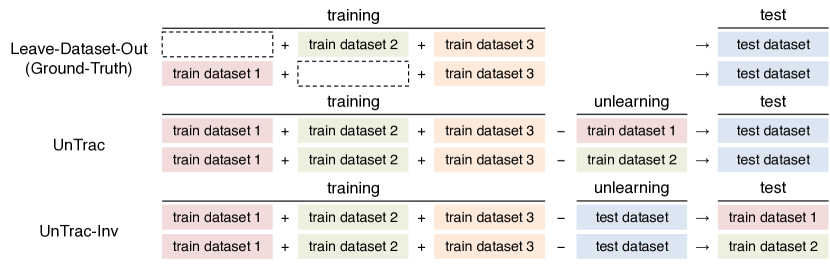
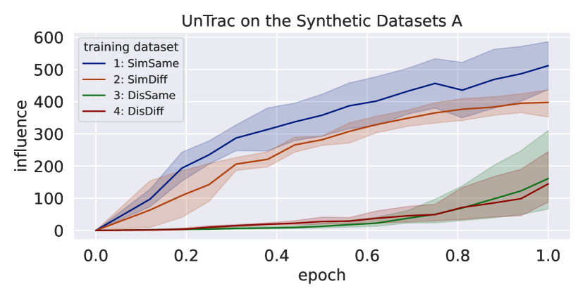
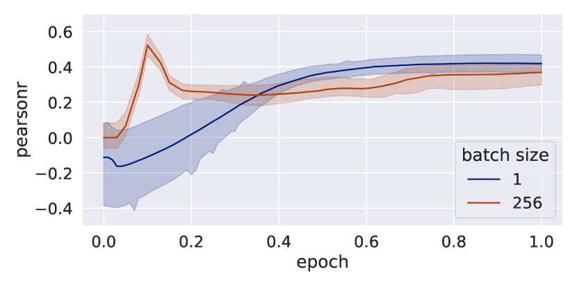
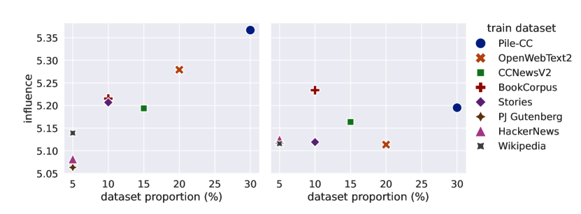

# Unlearning Reveals the Influential Training Data of Language Models

###### Abstract

In order to enhance the performance of language models while mitigating the risks of generating harmful content, it is crucial to identify which training dataset affects the model’s outputs. Ideally, we can measure the influence of each dataset by removing it from training; however, it is prohibitively expensive to retrain a model multiple times. This paper presents UnTrac, which estimates the influence of a training dataset by unlearning it from the trained model. UnTrac is extremely simple; each training dataset is unlearned by gradient ascent, and we evaluate how much the model’s predictions change after unlearning. We empirically examine if our methods can assess the influence of pretraining datasets on generating toxic, biased, and untruthful content. Experimental results demonstrate that our method estimates their influence much more accurately than existing methods while requiring neither excessive memory space nor multiple model checkpoints.  

Unlearning Reveals the Influential Training Data of Language Models  

  

     Masaru Isonuma 1,2  Ivan Titov 1,3  1University of Edinburgh  2University of Tokyo  3University of Amsterdam  m.isonuma@ed.ac.uk  ititov@inf.ed.ac.uk    

  

## 1 Introduction

[FIGURE S1.F1.g1]

Figure 1: Overview of leave-dataset-out vs. proposed methods, UnTrac and UnTrac-Inv.
[/FIGURE]

Large language models (LLMs) have had a significant impact on our society. They exhibit remarkable abilities (e.g., chain-of-thought reasoning) without being explicitly trained for such tasks. At the same time, LLMs also pose potential risks, such as the amplification of discrimination through the propagation of toxic language. LLMs are trained on a vast number of corpora via pretraining or refined through finetuning on diverse tasks. Although some efforts have been made to unravel the black box of LLMs (e.g., Han et al., [2023](#bib.bib15); Wang et al., [2023a](#bib.bib36)), it is still unclear which data sources cause their unprecedented abilities and potential harms.  

Ideally, we can answer this question by removing each dataset from the training datasets and assessing the change in the model’s performance after retraining (leave-dataset-out). However, since we need to retrain a model on each dataset, leave-dataset-out is prohibitively expensive. Training data attribution methods overcome this problem by approximating the influence with Hessian-based influence functions (HIF; Koh and Liang, [2017](#bib.bib21); Koh et al., [2019](#bib.bib22)) or tracking changes in test loss during training (TracIn; Pruthi et al., [2020](#bib.bib27)). However, HIF requires a large memory footprint to approximate the inverse Hessian, while TracIn generally needs multiple model checkpoints.  

In this paper, we propose UnTrac, which traces the influence of a training dataset by unlearning it from a trained model (Figure [1](#S1.F1 "Figure 1 ‣ 1 Introduction ‣ Unlearning Reveals the Influential Training Data of Language Models")). Leave-dataset-out removes each training dataset and measures its influence by assessing the trained model’s performance on a test dataset. Analogous to leave-dataset-out, UnTrac unlearns each training dataset and estimates its influence by assessing the unlearned model’s performance on a test dataset. Unlearning has been studied to eliminate sensitive data from a trained model Cao and Yang ([2015](#bib.bib5)); Ginart et al. ([2019](#bib.bib9)); Mehta et al. ([2022](#bib.bib26)) and has recently been applied to LLMs Jang et al. ([2023](#bib.bib19)); Chen and Yang ([2023](#bib.bib6)). Following Jang et al. ([2023](#bib.bib19)), we unlearn a training dataset using gradient ascent, in contrast to the gradient descent normally used in training. Interestingly, Schioppa et al. ([2023](#bib.bib29)) argued that influence functions can be regarded as an approximation of the effect of finetuning on a number of examples (e.g., unlearning mislabeled examples). With UnTrac, instead of using the approximations, we directly quantify the effect of unlearning.  

When many datasets are used for training, UnTrac is computationally costly because unlearning must be run for every individual training dataset. To overcome this drawback, we propose UnTrac-Inv as a scalable approach particularly effective for an increasing number of training datasets. UnTrac-Inv “unlearns” a test dataset instead of training datasets and evaluates the unlearned model on training datasets. UnTrac-Inv requires only a single run of unlearning, and, as we will show, can be considered as an efficient approximation of UnTrac.  

In our experiments, we first examine whether our methods can trace influential training tasks in the setting of finetuning. We created a dataset representing a mixture of synthetic tasks, designed to evaluate our method’s capability in assessing the influence of each task. This influence is estimated across all task pairs. In order to make this more challenging, we have created task versions that, while semantically distinct, require responses in the same format from the model. Additionally, we include pairs that are nearly identical in content but demand responses in differing formats. This approach ensures that our methods are not overly reliant on superficial similarities between tasks. We show that our methods accurately assess the influence of training tasks, where we use the expensive leave-dataset-out method as the ground-truth, and are only slightly affected by the output format.   

Next, we assess whether our methods can identify the source of harmful content generated by a pretrained language model. Using smaller open pretrained transformers (OPT-125M; Zhang et al., [2022](#bib.bib39)), the influence of eight pretraining datasets is estimated. We use three test datasets: Toxigen Hartvigsen et al. ([2022](#bib.bib18)), WinoBias Zhao et al. ([2018](#bib.bib40)), and TruthfulQA Lin et al. ([2022](#bib.bib24)), which contain toxic language, biased text, and false answers to various questions, respectively. We calculate the ground-truth influence of each training dataset and evaluate the correlation between the estimated influence and ground-truth influence. We demonstrate that our methods accurately estimate the influence of pretraining datasets, significantly outperforming other influence functions.  

Finally, we investigate how hyperparameters affect the performance of our methods. We found that UnTrac works robustly as long as we use preconditioned gradient methods with higher learning rates and a sufficient number of training iterations. In contrast, UnTrac-Inv works well for large batch sizes while being relatively sensitive to the learning rate and the number of training steps.  

## 2 Problem Formulation

Our goal is to estimate the influence of a training dataset on the model’s predictions on a test dataset. To formalize this goal, we assume the counterfactual that a model is trained on the mixture of all datasets except for a dataset $\mathcal{Z}$: $\bm{\theta}_{-\mathcal{Z}}$. The ground-truth influence of the training dataset $\mathcal{Z}$ on a test dataset $\mathcal{Z}^{\prime}$ is defined as Equation ([1](#S2.E1 "In 2 Problem Formulation ‣ Unlearning Reveals the Influential Training Data of Language Models")) using model $\bm{\theta}_{-\mathcal{Z}}$ and $\bm{\theta}_{0}$, which is trained on all datasets $\mathcal{D}$.  

|  | $\displaystyle\!\mathcal{I}_{\mathrm{truth}}(\mathcal{Z}^{\prime},\mathcal{Z})$ | $\displaystyle\!=\!\sum_{j=1}^{N^{\prime}}L(z^{\prime}_{j},\bm{\theta}_{0})\!-\!L(z^{\prime}_{j},\bm{\theta}_{-\mathcal{Z}})$ |  | (1) |
| --- | --- | --- | --- | --- |

where $z^{\prime}_{j}$ is the $j$-th batch in the test dataset $\mathcal{Z}^{\prime}$, $N^{\prime}$ is the number of test batches, and $L$ is the loss function. Koh et al. ([2019](#bib.bib22)) use all examples in the dataset to train the counterfactual model: $\bm{\theta}_{-\mathcal{Z}}\!=\!\mathrm{arg}\min_{\bm{\theta}}\sum_{z\in\mathcal{D}\setminus\mathcal{Z}}L(z,\bm{\theta})$. This definition overly emphasizes the influence of large datasets, as, when removing them, the number of training examples drops substantially. However, when asking about the influence of a dataset, our primary interest often centers on whether the type of data present within a dataset wields considerable influence. We modify the definition of dataset’s influence so as to better align with this research question. Thus, for every training dataset $\mathcal{Z}$, we train a model for the same number of training steps $T$ instead of the entire dataset: $\bm{\theta}_{-\mathcal{Z}}=\mathrm{arg}\min_{\bm{\theta}}\sum_{t=1}^{T}L(z_{t},\bm{\theta})$ where $z_{t}\sim\mathcal{D}\setminus\mathcal{Z}$. This setup is practical for evaluating the influence of datasets of different sizes.111We show the conventional setup overestimates the influence of large datasets in Appendix [A.1](#A1.SS1 "A.1 How to Compute Leave-Dataset-Out ‣ Appendix A Appendix ‣ Unlearning Reveals the Influential Training Data of Language Models").  

## 3 Methods

### 3.1 UnTrac

Here, we formally introduce UnTrac, which estimates the influence of a training dataset on a test dataset by unlearning. Let $\mathcal{Z}^{\prime}$ be a test dataset, $\bm{\theta}_{i}$ be the model parameters after the $i$-th unlearning step ($\bm{\theta}_{0}$ is the trained model parameters). The influence of a training dataset $\mathcal{Z}$ on a test dataset $\mathcal{Z}^{\prime}$ is defined as the change in test loss due to unlearning.  

|  | $\displaystyle\mathcal{I}(\mathcal{Z}^{\prime},\mathcal{Z})$ | $\displaystyle\!=\!\sum_{j=1}^{N^{\prime}}L(z^{\prime}_{j},\bm{\theta}_{T})\!-\!L(z^{\prime}_{j},\bm{\theta}_{0})$ |  | (2) |
| --- | --- | --- | --- | --- |
|  |  | $\displaystyle\!=\!\sum_{j=1}^{N^{\prime}}\sum_{i=1}^{T}L(z^{\prime}_{j},\bm{\theta}_{i})\!-\!L(z^{\prime}_{j},\bm{\theta}_{i-1})$ |  |

where $T$ is the number of unlearning steps. Here, $\bm{\theta}_{i}$ is updated via gradient ascent, which *maximizes* the loss of the $i$-th batch $z_{i}$ in the training dataset $\mathcal{Z}$. If we use stochastic gradient ascent, the updated parameter can be written as Equation ([3](#S3.E3 "In 3.1 UnTrac ‣ 3 Methods ‣ Unlearning Reveals the Influential Training Data of Language Models")); however, any optimizer can be used for unlearning.  

|  | $\displaystyle\bm{\theta}_{i}=\bm{\theta}_{i-1}+\eta_{i}\nabla_{\bm{\theta}}L(z_{i},\bm{\theta}_{i-1})$ |  | (3) |
| --- | --- | --- | --- |

### 3.2 UnTrac-Inv

When many datasets are used for training, UnTrac is computationally costly because unlearning must be run for every training dataset. In a practical scenario, we are interested in detecting which training dataset influences a particular test dataset. Here, we introduce UnTrac-Inv, an alternative scalable approach that can handle an increasing number of training datasets. UnTrac-Inv unlearns the test dataset instead of training datasets and measures the change in loss on the training datasets. UnTrac-Inv computes the influence by Equation ([4](#S3.E4 "In 3.2 UnTrac-Inv ‣ 3 Methods ‣ Unlearning Reveals the Influential Training Data of Language Models")).  

|  | $\displaystyle\mathcal{I^{\prime}}(\mathcal{Z}^{\prime},\mathcal{Z})$ | $\displaystyle\!=\sum_{i=1}^{N}L(z_{i},\bm{\theta}_{T^{\prime}})-L(z_{i},\bm{\theta}_{0})$ |  | (4) |
| --- | --- | --- | --- | --- |
|  |  | $\displaystyle\!=\sum_{i=1}^{N}\sum_{j=1}^{T^{\prime}}L(z_{i},\bm{\theta}_{j})-L(z_{i},\bm{\theta}_{j-1})$ |  |

where $N$ is the number of batches in the training dataset, and $T^{\prime}$ is the number of unlearning steps.  

This alternative influence can be regarded as an approximation to UnTrac, Equation ([2](#S3.E2 "In 3.1 UnTrac ‣ 3 Methods ‣ Unlearning Reveals the Influential Training Data of Language Models")). Note that $\bm{\theta}_{j}=\bm{\theta}_{j-1}+\eta_{j}\nabla_{\bm{\theta}}L(z^{\prime}_{j},\bm{\theta}_{j-1})$, and use the first-order approximation $L(z_{i},\bm{\theta}_{j})-L(z_{i},\bm{\theta}_{j-1})\approx\nabla_{\bm{\theta}}L(z_{i},\bm{\theta}_{j-1})(\bm{\theta}_{j}-\bm{\theta}_{j-1})$. Equation ([2](#S3.E2 "In 3.1 UnTrac ‣ 3 Methods ‣ Unlearning Reveals the Influential Training Data of Language Models")) and ([4](#S3.E4 "In 3.2 UnTrac-Inv ‣ 3 Methods ‣ Unlearning Reveals the Influential Training Data of Language Models")) can then be re-approximated as Equation ([5](#S3.E5 "In 3.2 UnTrac-Inv ‣ 3 Methods ‣ Unlearning Reveals the Influential Training Data of Language Models")) and ([6](#S3.E6 "In 3.2 UnTrac-Inv ‣ 3 Methods ‣ Unlearning Reveals the Influential Training Data of Language Models")), respectively.  

|  |  | $\displaystyle\mathcal{I}(\mathcal{Z}^{\prime},\mathcal{Z})$ |  | (5) |
| --- | --- | --- | --- | --- |
|  |  | $\displaystyle\!\approx\sum_{i=1}^{T}\sum_{j=1}^{N^{\prime}}\eta_{i}\nabla_{\bm{\theta}}L(z_{i},\bm{\theta}_{i-1})^{\top}\nabla_{\bm{\theta}}L(z^{\prime}_{j},\bm{\theta}_{i-1})$ |  |

|  |  | $\displaystyle\mathcal{I^{\prime}}(\mathcal{Z}^{\prime},\mathcal{Z})$ |  | (6) |
| --- | --- | --- | --- | --- |
|  |  | $\displaystyle\!\approx\sum_{i=1}^{N}\sum_{j=1}^{T^{\prime}}\eta_{j}\nabla_{\bm{\theta}}L(z_{i},\bm{\theta}_{j-1})^{\top}\nabla_{\bm{\theta}}L(z^{\prime}_{j},\bm{\theta}_{j-1})$ |  |

If the number of unlearning steps is one $(T\!=T^{\prime}\!=1)$, and a single batch contains all examples, $\mathcal{I}(\mathcal{Z}^{\prime},\mathcal{Z})$ corresponds to $\mathcal{I^{\prime}}(\mathcal{Z}^{\prime},\mathcal{Z})$. This suggests that UnTrac-Inv should work well with a small number of unlearning steps and a large batch size. We will empirically validate it later in Section [6.1](#S6.SS1 "6.1 Sensitivity to Epoch & Batch Size ‣ 6 Discussion ‣ Unlearning Reveals the Influential Training Data of Language Models").  

## 4 Relation to Other Influence Functions

### 4.1 TracIn, GradDot & GradCos

Pruthi et al. ([2020](#bib.bib27)) proposed TracIn, which traces the influence of a training example by the total change in test loss during training. While the original TracIn assesses the influence of individual training examples, it can be easily extended to assess a whole dataset. As observing the loss reduction at every step is computationally expensive, they approximate it using model checkpoints, assuming that every example in the training dataset is encountered once between these checkpoints. By approximating the loss reduction with gradients at each checkpoint $t$: $L(z^{\prime}_{j},\bm{\theta}_{t})-L(z^{\prime}_{j},\bm{\theta}_{t+1})\approx\eta_{t}\nabla_{\bm{\theta}}L(z_{i},\bm{\theta}_{t})^{\top}\nabla_{\bm{\theta}}L(z^{\prime}_{j},\bm{\theta}_{t})$, TracIn is defined as:  

|  |  | $\displaystyle\text{TracIn}(\mathcal{Z}^{\prime},\mathcal{Z})$ |  | (7) |
| --- | --- | --- | --- | --- |
|  |  | $\displaystyle\!=\sum_{t\in\mathcal{T}_{cp}}\sum_{i=1}^{N}\sum_{j=1}^{N^{\prime}}\eta_{t}\nabla_{\bm{\theta}}L(z_{i},\bm{\theta}_{t})^{\top}\nabla_{\bm{\theta}}L(z^{\prime}_{j},\bm{\theta}_{t})$ |  |

where $\mathcal{T}_{cp}$ denotes the set of training steps where the model checkpoints are saved. As using multiple checkpoints induces substantial overhead, only the last checkpoint is often used in practice Schioppa et al. ([2023](#bib.bib29)), which is referred to as GradDot. Barshan et al. ([2020](#bib.bib2)) pointed out that some outlier training examples have significantly large gradients, leading to an overestimation of their influences. Therefore, normalizing the gradients (i.e., replacing the dot product with cosine similarity) can be effective, referred to as GradCos Han and Tsvetkov ([2021](#bib.bib16)).  

### 4.2 Hessian-based Influence Functions

Hessian-based influence functions (HIF) are grounded in robust statistics Hampel ([1974](#bib.bib14)); Cook and Weisberg ([1982](#bib.bib7)) and were introduced to deep learning by Koh and Liang ([2017](#bib.bib21)). Koh et al. ([2019](#bib.bib22)) used HIF to assess the influence of multiple training examples, and the estimated influence correlates well with the ground-truth. Given a trained model $\bm{\theta}_{0}$, HIF estimates the influence of a training dataset $\mathcal{Z}$ on a test dataset $\mathcal{Z}^{\prime}$ as Equation (LABEL:eq:influence\_functions).  

|  |  | $\displaystyle\text{HIF}(\mathcal{Z}^{\prime},\mathcal{Z})$ |  | (8) |
| --- | --- | --- | --- | --- |
|  |  | $\displaystyle=\sum_{i=1}^{N}\sum_{j=1}^{N^{\prime}}\nabla_{\bm{\theta}}L(z_{i},\bm{\theta}_{0})^{\top}\bm{H}_{\bm{\theta}}^{-1}\nabla_{\bm{\theta}}L(z^{\prime}_{j},\bm{\theta}_{0})$ |  |

where $\bm{H}_{\bm{\theta}}$ is the Hessian of training loss: $\bm{H}_{\bm{\theta}}=1/N\sum_{i=1}^{N}\nabla_{\bm{\theta}}^{2}L(z_{i},\bm{\theta}_{0})$.  

### 4.3 Connection to UnTrac & UnTrac-Inv

GradDot, GradCos, and HIF can be viewed as special cases of UnTrac and UnTrac-Inv. Under the first-order approximation, GradDot is equivalent to UnTrac and UnTrac-Inv with a single step of unlearning using SGD, where a single batch contains all examples in the dataset. Similarly, our methods correspond to GradCos if we use RMSProp or Adam, while corresponding to HIF if we use Newton’s method as an optimizer.222Detail explanations are provided in Appendix [A.2](#A1.SS2 "A.2 Relation to Other Influence Functions ‣ Appendix A Appendix ‣ Unlearning Reveals the Influential Training Data of Language Models"). HIF can be regarded as providing an approximation to UnTrac.  

## 5 Experiments

In this section, we evaluate how our methods can accurately measure the influence of training datasets across different model architectures (encoder-decoder and decoder-only) and training setups (pretraining and fine-tuning).333The code will be publicly available after publication.  

Since we would not generally have a validation set, it is impractical to tune the hyperparameters for each experiment. Thus, we set the hyperparameters based on the experimental results on Toxigen, one of the test datasets used in Section [5.2](#S5.SS2 "5.2 Tracing Influential Pretraining Corpora ‣ 5 Experiments ‣ Unlearning Reveals the Influential Training Data of Language Models"). The same hyperparameters are used across all the experiments. We use Adam Kingma and Ba ([2014](#bib.bib20)) with a constant learning rate of 5e-5, $\beta_{1}$ = 0.9, and $\beta_{2}$ = 0.999. As for UnTrac, we set the batch size to 1 and run unlearning for 1 epoch. As discussed in Section [3.2](#S3.SS2 "3.2 UnTrac-Inv ‣ 3 Methods ‣ Unlearning Reveals the Influential Training Data of Language Models"), UnTrac-Inv requires a small number of unlearning steps and a large batch size. Hence, we set the batch size as 256 (a single batch contains all test examples) and the number of unlearning steps (epochs) as 5. In Section [6](#S6 "6 Discussion ‣ Unlearning Reveals the Influential Training Data of Language Models"), we discuss the hyperparameter sensitivity of our methods.  

The baseline methods are as follows:  

#### TracIn, GradDot & GradCos

We compute the gradient w.r.t. all of the model parameters. TracIn uses the checkpoints saved for every 128 steps in Section [5.1](#S5.SS1 "5.1 Tracing Influential Training Tasks ‣ 5 Experiments ‣ Unlearning Reveals the Influential Training Data of Language Models") and 10,000 steps in Section [5.2](#S5.SS2 "5.2 Tracing Influential Pretraining Corpora ‣ 5 Experiments ‣ Unlearning Reveals the Influential Training Data of Language Models").  

#### HIF

HIF cannot be directly used as computing the inverse Hessian is prohibitively expensive. Following Koh and Liang ([2017](#bib.bib21)), we approximate the inverse Hessian by LISSA Agarwal et al. ([2017](#bib.bib1)), where the number of iterations is set to 10. Following Schioppa et al. ([2022](#bib.bib30)), we also use Arnoldi iteration with low-rank eigenvector projection. We set the number of Arnoldi iterations to $n$ = 25 and the number of eigenvectors to $\tilde{p}$ = 25 in Section [5.1](#S5.SS1 "5.1 Tracing Influential Training Tasks ‣ 5 Experiments ‣ Unlearning Reveals the Influential Training Data of Language Models") due to the memory constraints, while $n$ = 200 and $\tilde{p}$ = 100 in Section [5.2](#S5.SS2 "5.2 Tracing Influential Pretraining Corpora ‣ 5 Experiments ‣ Unlearning Reveals the Influential Training Data of Language Models"). Following the previous studies, the gradients of training datasets are normalized, and 256 training examples are used to approximate Hessian for each iteration.  

[TABLE S5.SS0.SSS0.Px2.tab1]

<table class="ltx_tabular ltx_guessed_headers ltx_align_middle">
<thead class="ltx_thead">
<tr class="ltx_tr">
<th class="ltx_td ltx_align_justify ltx_align_top ltx_th ltx_th_column ltx_border_tt">

Dataset

</th>
<th class="ltx_td ltx_align_justify ltx_align_top ltx_th ltx_th_column ltx_border_tt">

Input Text

</th>
<th class="ltx_td ltx_align_justify ltx_th ltx_th_column ltx_border_tt">

Output Text

</th>
</tr>
<tr class="ltx_tr">
<th class="ltx_td ltx_align_justify ltx_align_top ltx_th ltx_th_column ltx_border_t">

Test

</th>
<th class="ltx_td ltx_align_justify ltx_align_top ltx_th ltx_th_column ltx_border_t">

What is the number that comes after {0}?

</th>
<th class="ltx_td ltx_align_justify ltx_th ltx_th_column ltx_border_t">

{1}

</th>
</tr>
</thead>
<tbody class="ltx_tbody">
<tr class="ltx_tr">
<td class="ltx_td ltx_align_justify ltx_align_top ltx_border_t">

Train1: SimSame

</td>
<td class="ltx_td ltx_align_justify ltx_align_top ltx_border_t">

Determine the number that succeeds {two}. Provide your answer in numerical form.

</td>
<td class="ltx_td ltx_align_justify ltx_border_t">

{3}

</td>
</tr>
<tr class="ltx_tr">
<td class="ltx_td ltx_align_justify ltx_align_top">

Train2: SimDiff

</td>
<td class="ltx_td ltx_align_justify ltx_align_top">

Determine the number that succeeds {one}. Provide your answer in words.

</td>
<td class="ltx_td ltx_align_justify">

{two}

</td>
</tr>
<tr class="ltx_tr">
<td class="ltx_td ltx_align_justify ltx_align_top">

Train3: DisSame

</td>
<td class="ltx_td ltx_align_justify ltx_align_top">

Determine the length of ‘{problem}’. Provide your answer in numerical form.

</td>
<td class="ltx_td ltx_align_justify">

{7}

</td>
</tr>
<tr class="ltx_tr">
<td class="ltx_td ltx_align_justify ltx_align_top ltx_border_bb">

Train4: DisDiff

</td>
<td class="ltx_td ltx_align_justify ltx_align_top ltx_border_bb">

Determine the length of ‘{align}’. Provide your answer in words.

</td>
<td class="ltx_td ltx_align_justify ltx_border_bb">

{five}

</td>
</tr>
</tbody>
</table>

No caption.
[/TABLE]

[TABLE S5.T1]

<table class="ltx_tabular ltx_guessed_headers ltx_align_middle">
<thead class="ltx_thead">
<tr class="ltx_tr">
<th class="ltx_td ltx_align_justify ltx_align_top ltx_th ltx_th_column ltx_border_tt">

Dataset

</th>
<th class="ltx_td ltx_align_justify ltx_align_top ltx_th ltx_th_column ltx_border_tt">

Input Text

</th>
<th class="ltx_td ltx_align_justify ltx_th ltx_th_column ltx_border_tt">

Answer Text

</th>
</tr>
<tr class="ltx_tr">
<th class="ltx_td ltx_align_justify ltx_align_top ltx_th ltx_th_column ltx_border_t">

Test

</th>
<th class="ltx_td ltx_align_justify ltx_align_top ltx_th ltx_th_column ltx_border_t">

What letter remains in ‘{xmais}’ after extracting ‘{s}’, ‘{x}’, ‘{m}’, ‘{i}’?

</th>
<th class="ltx_td ltx_align_justify ltx_th ltx_th_column ltx_border_t">

{a}

</th>
</tr>
</thead>
<tbody class="ltx_tbody">
<tr class="ltx_tr">
<td class="ltx_td ltx_align_justify ltx_align_top ltx_border_t">

Train1: SimSame

</td>
<td class="ltx_td ltx_align_justify ltx_align_top ltx_border_t">

Identify the character left after removing ‘{0}’, ‘{1}’, ‘{4}’, ‘{7}’ from ‘{71b40}’.

</td>
<td class="ltx_td ltx_align_justify ltx_border_t">

{b}

</td>
</tr>
<tr class="ltx_tr">
<td class="ltx_td ltx_align_justify ltx_align_top">

Train2: SimDiff

</td>
<td class="ltx_td ltx_align_justify ltx_align_top">

Identify the character left after removing ‘{6}’, ‘{7}’, ‘{5}’, ‘{2}’ from ‘{27516}’.

</td>
<td class="ltx_td ltx_align_justify">

{1}

</td>
</tr>
<tr class="ltx_tr">
<td class="ltx_td ltx_align_justify ltx_align_top">

Train3: DisSame

</td>
<td class="ltx_td ltx_align_justify ltx_align_top">

Identify the part of speech of ‘{problem}’. Select your answer with the associated letter. Choices: a. noun b. verb c. adjective d. adverb

</td>
<td class="ltx_td ltx_align_justify">

{a}

</td>
</tr>
<tr class="ltx_tr">
<td class="ltx_td ltx_align_justify ltx_align_top ltx_border_bb">

Train4: DisDiff

</td>
<td class="ltx_td ltx_align_justify ltx_align_top ltx_border_bb">

Identify the part of speech of ‘{align}’. Select your answer with the associated number. Choices: 0. noun 1. verb 2. adjective 3. adverb

</td>
<td class="ltx_td ltx_align_justify ltx_border_bb">

{1}

</td>
</tr>
</tbody>
</table>

Table 1: Example of the synthetic dataset A (top) and B (bottom). {Strings in braces} are varied with each example.
[/TABLE]

[TABLE S5.T2]

<table class="ltx_tabular ltx_centering ltx_guessed_headers ltx_align_middle">
<thead class="ltx_thead">
<tr class="ltx_tr">
<th class="ltx_td ltx_th ltx_th_column ltx_th_row ltx_border_tt"></th>
<th class="ltx_td ltx_align_center ltx_th ltx_th_column ltx_border_r ltx_border_tt">Synthetic Dataset A</th>
<th class="ltx_td ltx_align_center ltx_th ltx_th_column ltx_border_tt">Synthetic Dataset B</th>
</tr>
<tr class="ltx_tr">
<th class="ltx_td ltx_align_left ltx_th ltx_th_column ltx_th_row">Train Dataset</th>
<th class="ltx_td ltx_align_right ltx_th ltx_th_column ltx_border_t">1:SimSame</th>
<th class="ltx_td ltx_align_right ltx_th ltx_th_column ltx_border_t">2:SimDiff</th>
<th class="ltx_td ltx_align_right ltx_th ltx_th_column ltx_border_t">3:DisSame</th>
<th class="ltx_td ltx_align_right ltx_th ltx_th_column ltx_border_r ltx_border_t">4:DisDiff</th>
<th class="ltx_td ltx_align_right ltx_th ltx_th_column ltx_border_t">1:SimSame</th>
<th class="ltx_td ltx_align_right ltx_th ltx_th_column ltx_border_t">2:SimDiff</th>
<th class="ltx_td ltx_align_right ltx_th ltx_th_column ltx_border_t">3:DisSame</th>
<th class="ltx_td ltx_align_right ltx_th ltx_th_column ltx_border_t">4:DisDiff</th>
</tr>
</thead>
<tbody class="ltx_tbody">
<tr class="ltx_tr">
<th class="ltx_td ltx_align_left ltx_th ltx_th_row ltx_border_t">GradDot</th>
<td class="ltx_td ltx_align_right ltx_border_t">0.864</td>
<td class="ltx_td ltx_align_right ltx_border_t">-0.107</td>
<td class="ltx_td ltx_align_right ltx_border_t">0.836</td>
<td class="ltx_td ltx_align_right ltx_border_r ltx_border_t">-1.594</td>
<td class="ltx_td ltx_align_right ltx_border_t">-0.561</td>
<td class="ltx_td ltx_align_right ltx_border_t">1.730</td>
<td class="ltx_td ltx_align_right ltx_border_t">-0.655</td>
<td class="ltx_td ltx_align_right ltx_border_t">-0.513</td>
</tr>
<tr class="ltx_tr">
<th class="ltx_td ltx_align_left ltx_th ltx_th_row">GradCos</th>
<td class="ltx_td ltx_align_right">1.456</td>
<td class="ltx_td ltx_align_right">-0.508</td>
<td class="ltx_td ltx_align_right">0.291</td>
<td class="ltx_td ltx_align_right ltx_border_r">-1.240</td>
<td class="ltx_td ltx_align_right">1.197</td>
<td class="ltx_td ltx_align_right">0.708</td>
<td class="ltx_td ltx_align_right">-1.307</td>
<td class="ltx_td ltx_align_right">-0.598</td>
</tr>
<tr class="ltx_tr">
<th class="ltx_td ltx_align_left ltx_th ltx_th_row">HIF (Arnoldi)</th>
<td class="ltx_td ltx_align_right">1.732</td>
<td class="ltx_td ltx_align_right">-0.594</td>
<td class="ltx_td ltx_align_right">-0.561</td>
<td class="ltx_td ltx_align_right ltx_border_r">-0.577</td>
<td class="ltx_td ltx_align_right">1.368</td>
<td class="ltx_td ltx_align_right">0.015</td>
<td class="ltx_td ltx_align_right">0.074</td>
<td class="ltx_td ltx_align_right">-1.457</td>
</tr>
<tr class="ltx_tr">
<th class="ltx_td ltx_align_left ltx_th ltx_th_row">HIF (LISSA)</th>
<td class="ltx_td ltx_align_right">-1.294</td>
<td class="ltx_td ltx_align_right">1.517</td>
<td class="ltx_td ltx_align_right">-0.111</td>
<td class="ltx_td ltx_align_right ltx_border_r">-0.111</td>
<td class="ltx_td ltx_align_right">-0.600</td>
<td class="ltx_td ltx_align_right">1.708</td>
<td class="ltx_td ltx_align_right">-0.785</td>
<td class="ltx_td ltx_align_right">-0.323</td>
</tr>
<tr class="ltx_tr">
<th class="ltx_td ltx_align_left ltx_th ltx_th_row">TracIn</th>
<td class="ltx_td ltx_align_right">-0.331</td>
<td class="ltx_td ltx_align_right">1.690</td>
<td class="ltx_td ltx_align_right">-0.443</td>
<td class="ltx_td ltx_align_right ltx_border_r">-0.916</td>
<td class="ltx_td ltx_align_right">-0.174</td>
<td class="ltx_td ltx_align_right">1.638</td>
<td class="ltx_td ltx_align_right">-1.060</td>
<td class="ltx_td ltx_align_right">-0.404</td>
</tr>
<tr class="ltx_tr">
<th class="ltx_td ltx_align_left ltx_th ltx_th_row">UnTrac</th>
<td class="ltx_td ltx_align_right">1.330</td>
<td class="ltx_td ltx_align_right">0.600</td>
<td class="ltx_td ltx_align_right">-0.913</td>
<td class="ltx_td ltx_align_right ltx_border_r">-1.018</td>
<td class="ltx_td ltx_align_right">1.492</td>
<td class="ltx_td ltx_align_right">0.175</td>
<td class="ltx_td ltx_align_right">-0.414</td>
<td class="ltx_td ltx_align_right">-1.253</td>
</tr>
<tr class="ltx_tr">
<th class="ltx_td ltx_align_left ltx_th ltx_th_row">UnTrac-Inv</th>
<td class="ltx_td ltx_align_right">1.688</td>
<td class="ltx_td ltx_align_right">-0.212</td>
<td class="ltx_td ltx_align_right">-0.651</td>
<td class="ltx_td ltx_align_right ltx_border_r">-0.826</td>
<td class="ltx_td ltx_align_right">1.056</td>
<td class="ltx_td ltx_align_right">0.905</td>
<td class="ltx_td ltx_align_right">-0.716</td>
<td class="ltx_td ltx_align_right">-1.245</td>
</tr>
<tr class="ltx_tr">
<th class="ltx_td ltx_align_left ltx_th ltx_th_row ltx_border_bb ltx_border_t">Ground Truth</th>
<td class="ltx_td ltx_align_right ltx_border_bb ltx_border_t">1.416</td>
<td class="ltx_td ltx_align_right ltx_border_bb ltx_border_t">0.462</td>
<td class="ltx_td ltx_align_right ltx_border_bb ltx_border_t">-1.031</td>
<td class="ltx_td ltx_align_right ltx_border_bb ltx_border_r ltx_border_t">-0.847</td>
<td class="ltx_td ltx_align_right ltx_border_bb ltx_border_t">1.150</td>
<td class="ltx_td ltx_align_right ltx_border_bb ltx_border_t">0.837</td>
<td class="ltx_td ltx_align_right ltx_border_bb ltx_border_t">-1.025</td>
<td class="ltx_td ltx_align_right ltx_border_bb ltx_border_t">-0.962</td>
</tr>
</tbody>
</table>

Table 2: Influence of the training datasets estimated by each method. The average values are shown across four runs. The values are standardized for each method to normalize the range of values.
[/TABLE]

### 5.1 Tracing Influential Training Tasks

We examine whether UnTrac can detect influential training tasks in the setting of finetuning. If a task is unlearned from a model, one may hypothesize that the model will no longer respond in the format required by the task, regardless of the input. Hence, we are concerned that unlearning not relevant tasks but those having the same answer format as a test task may adversely affect the test task’s performance. This may not be consistent with the leave-dataset-out ground-truth and, thus, lead to an overestimation of the non-relevant task’s influence. Using synthetic datasets, we show that UnTrac can assess the influence of training tasks properly, regardless of the output format.  

#### Dataset

We create two synthetic datasets, each containing one test dataset and four training datasets. The training datasets have the following characteristics compared with the test dataset.  

1. Training dataset 1 (SimSame): similar task with the same output format. 
2. Training dataset 2 (SimDiff): similar task with different output format. 
3. Training dataset 3 (DisSame): dissimilar task with the same output format. 
4. Training dataset 4 (DisDiff): dissimilar task with different output format. 

Table [1](#S5.T1 "Table 1 ‣ HIF ‣ 5 Experiments ‣ Unlearning Reveals the Influential Training Data of Language Models") presents an example of the synthetic datasets A and B. Each training dataset and test dataset consists of 256 examples. The model is trained for 512 steps on the mixture of the four training datasets with a batch size of 2.  

#### Model

We use T5 Raffel et al. ([2020](#bib.bib28)) as a pretrained encoder-decoder model. Specifically, we use the LM-adapted T5-XL (3B), which is finetuned on language modeling Lester et al. ([2021](#bib.bib23)).444<https://huggingface.co/google/t5-xl-lm-adapt>  

[FIGURE S5.F2.1.g1]

Figure 2: The influence estimated by UnTrac (top) and UnTrac-Inv (bottom) on the synthetic datasets A (left) and B (right). The line denotes the average across four runs, and the shaded area corresponds to 95% confidence region.
[/FIGURE]

#### Results

Table [2](#S5.T2 "Table 2 ‣ HIF ‣ 5 Experiments ‣ Unlearning Reveals the Influential Training Data of Language Models") presents the influence of training datasets estimated by each method and the ground-truth influence measured by leave-dataset-out. The ground-truth indicates that datasets 1 and 2 (tasks similar to the test task) are more influential than datasets 3 and 4 (tasks dissimilar to the test task). The influence estimated by UnTrac and UnTrac-Inv aligns well with the ground-truth influence. All other methods assess the influence of dataset 4 as lower than that of other datasets. However, they tend to overestimate the influence of dataset 3 or underestimate it for datasets 1 and 2.  

Figure [2](#S5.F2 "Figure 2 ‣ Model ‣ 5.1 Tracing Influential Training Tasks ‣ 5 Experiments ‣ Unlearning Reveals the Influential Training Data of Language Models") shows the change in influence estimated by UnTrac and UnTrac-Inv on the synthetic datasets A (left) and B (right), respectively. For both synthetic datasets, our methods estimate the influence of datasets 1 and 2 as greater than that of datasets 3 and 4 across unlearning steps. These results indicate that UnTrac and UnTrac-Inv appropriately estimate the influence of training datasets in terms of the relevance of tasks and do not seem overly affected by the output format.  

### 5.2 Tracing Influential Pretraining Corpora

LLMs sometimes generate toxic, biased, and false content, which must be prevented to safely use language models. We next verify that our methods can identify the influence of a pretraining dataset on the generation of harmful content.  

#### Model

We use an open pre-trained transformer language model (OPT; Zhang et al., [2022](#bib.bib39)). As computing ground-truth influence for pretraining datasets is expensive, we use a relatively small language model with 125 million parameters.555<https://huggingface.co/facebook/opt-125m> OPT is pretrained for 40,000 steps with a batch size of 8 on the datasets described below.  

#### Dataset

We use eight pretraining datasets that were used for OPT: BookCorpus Zhu et al. ([2015](#bib.bib41)), CC-Stories Trinh and Le ([2018](#bib.bib35)), CCNewsV2 Liu et al. ([2019](#bib.bib25)), and five subsets in the Pile dataset Gao et al. ([2020](#bib.bib8)): PJ Gutenberg, HackerNews, OpenWebText2, Pile-CC, and Wikipedia. To investigate whether our methods are effective regardless of the dataset’s proportion, we set up two settings: one where each pretraining dataset contains an equal number of examples (40,000) and another where they contain different numbers of examples (Pile-CC: 96,000, OpenWebText2: 64,000, CCNewsV2: 48,000, BookCorpus: 32,000, Stories: 32,000, PJ Gutenberg: 16,000, HackerNews: 16,000, Wikipedia: 16,000). Each training example consists of a sequence of 1,024 tokens by grouping several examples into a sequence.  

In practice, computing influences using the whole pretraining dataset is quite expensive. Thus, we randomly sample 10,000 examples from each dataset to estimate its influence. To ensure that the reported results are invariant to the choice of examples, we report the average and standard deviation across four runs using different examples.  

Regarding test datasets, we use three datasets: Toxigen Hartvigsen et al. ([2022](#bib.bib18)), WinoBias Zhao et al. ([2018](#bib.bib40)), and TruthfulQA Lin et al. ([2022](#bib.bib24)). ToxiGen collects machine-generated toxic language against 13 minority groups. Winobias contains sentences with entities corresponding to people referred to by their occupation and their pronoun genders. TruthfulQA comprises questions across several categories and their corresponding untruthful answers. We measure the negative log-likelihood of toxic language, biased text, and false answers to compute the influences.  

[TABLE S5.T3]

<table class="ltx_tabular ltx_centering ltx_guessed_headers ltx_align_middle">
<tbody class="ltx_tbody">
<tr class="ltx_tr">
<th class="ltx_td ltx_th ltx_th_row ltx_border_tt"></th>
<td class="ltx_td ltx_align_center ltx_border_tt">Equal Training Dataset Size</td>
<td class="ltx_td ltx_border_tt"></td>
<td class="ltx_td ltx_align_center ltx_border_tt">Different Training Dataset Size</td>
</tr>
<tr class="ltx_tr">
<th class="ltx_td ltx_align_left ltx_th ltx_th_row">Test Dataset</th>
<td class="ltx_td ltx_align_right ltx_border_t">ToxiGen</td>
<td class="ltx_td ltx_align_right ltx_border_t">WinoBias</td>
<td class="ltx_td ltx_align_right ltx_border_t">TruthfulQA</td>
<td class="ltx_td"></td>
<td class="ltx_td ltx_align_right ltx_border_t">ToxiGen</td>
<td class="ltx_td ltx_align_right ltx_border_t">WinoBias</td>
<td class="ltx_td ltx_align_right ltx_border_t">TruthfulQA</td>
</tr>
<tr class="ltx_tr">
<th class="ltx_td ltx_align_left ltx_th ltx_th_row ltx_border_t">GradDot</th>
<td class="ltx_td ltx_align_right ltx_border_t">-0.123±0.008</td>
<td class="ltx_td ltx_align_right ltx_border_t">0.418±0.018</td>
<td class="ltx_td ltx_align_right ltx_border_t">0.156±0.022</td>
<td class="ltx_td ltx_border_t"></td>
<td class="ltx_td ltx_align_right ltx_border_t">-0.250±0.007</td>
<td class="ltx_td ltx_align_right ltx_border_t">0.446±0.015</td>
<td class="ltx_td ltx_align_right ltx_border_t">-0.524±0.003</td>
</tr>
<tr class="ltx_tr">
<th class="ltx_td ltx_align_left ltx_th ltx_th_row">GradCos</th>
<td class="ltx_td ltx_align_right">-0.050±0.008</td>
<td class="ltx_td ltx_align_right">0.524±0.014</td>
<td class="ltx_td ltx_align_right">0.447±0.015</td>
<td class="ltx_td"></td>
<td class="ltx_td ltx_align_right">-0.337±0.007</td>
<td class="ltx_td ltx_align_right">0.496±0.012</td>
<td class="ltx_td ltx_align_right">-0.401±0.004</td>
</tr>
<tr class="ltx_tr">
<th class="ltx_td ltx_align_left ltx_th ltx_th_row">HIF (Arnoldi)</th>
<td class="ltx_td ltx_align_right">-0.068±0.023</td>
<td class="ltx_td ltx_align_right">0.559±0.010</td>
<td class="ltx_td ltx_align_right">0.250±0.024</td>
<td class="ltx_td"></td>
<td class="ltx_td ltx_align_right">-0.343±0.005</td>
<td class="ltx_td ltx_align_right">0.584±0.014</td>
<td class="ltx_td ltx_align_right">-0.362±0.006</td>
</tr>
<tr class="ltx_tr">
<th class="ltx_td ltx_align_left ltx_th ltx_th_row">HIF (LISSA)</th>
<td class="ltx_td ltx_align_right">-0.040±0.328</td>
<td class="ltx_td ltx_align_right">0.389±0.117</td>
<td class="ltx_td ltx_align_right">-0.178±0.173</td>
<td class="ltx_td"></td>
<td class="ltx_td ltx_align_right">0.071±0.091</td>
<td class="ltx_td ltx_align_right">-0.092±0.042</td>
<td class="ltx_td ltx_align_right">-0.098±0.058</td>
</tr>
<tr class="ltx_tr">
<th class="ltx_td ltx_align_left ltx_th ltx_th_row">TracIn</th>
<td class="ltx_td ltx_align_right">0.207±0.010</td>
<td class="ltx_td ltx_align_right">0.082±0.013</td>
<td class="ltx_td ltx_align_right">0.591±0.014</td>
<td class="ltx_td"></td>
<td class="ltx_td ltx_align_right">-0.187±0.005</td>
<td class="ltx_td ltx_align_right">0.183±0.019</td>
<td class="ltx_td ltx_align_right">0.081±0.010</td>
</tr>
<tr class="ltx_tr">
<th class="ltx_td ltx_align_left ltx_th ltx_th_row ltx_border_t">UnTrac</th>
<td class="ltx_td ltx_align_right ltx_border_t">0.419±0.063</td>
<td class="ltx_td ltx_align_right ltx_border_t">0.743±0.086</td>
<td class="ltx_td ltx_align_right ltx_border_t">0.314±0.223</td>
<td class="ltx_td ltx_border_t"></td>
<td class="ltx_td ltx_align_right ltx_border_t">0.403±0.033</td>
<td class="ltx_td ltx_align_right ltx_border_t">0.518±0.122</td>
<td class="ltx_td ltx_align_right ltx_border_t">0.246±0.082</td>
</tr>
<tr class="ltx_tr">
<th class="ltx_td ltx_align_left ltx_th ltx_th_row ltx_border_bb">UnTrac-Inv</th>
<td class="ltx_td ltx_align_right ltx_border_bb">0.372±0.008</td>
<td class="ltx_td ltx_align_right ltx_border_bb">0.813±0.012</td>
<td class="ltx_td ltx_align_right ltx_border_bb">0.582±0.016</td>
<td class="ltx_td ltx_border_bb"></td>
<td class="ltx_td ltx_align_right ltx_border_bb">0.393±0.037</td>
<td class="ltx_td ltx_align_right ltx_border_bb">0.275±0.125</td>
<td class="ltx_td ltx_align_right ltx_border_bb">0.360±0.017</td>
</tr>
</tbody>
</table>

Table 3: Pearson correlation coefficient between the influence estimated by each method and the ground-truth influence computed by leave-dataset-out.
Each figure denotes the mean and standard deviation across four runs.
For each run, we use different examples randomly sampled from the training dataset to compute its influence.
[/TABLE]

[FIGURE S5.F3.1.g1]

Figure 3: Pearson correlation coefficient between the ground-truth influence and the influence estimated by UnTrac (left) and UnTrac-Inv (right) over unlearning epochs.
The line denotes the average across four runs, and the shaded area corresponds to 95% confidence region.
[/FIGURE]

#### Results

Table [3](#S5.T3 "Table 3 ‣ Dataset ‣ 5.2 Tracing Influential Pretraining Corpora ‣ 5 Experiments ‣ Unlearning Reveals the Influential Training Data of Language Models") shows the Pearson correlation coefficient between the estimated influence and the ground-truth assessed by leave-dataset-out.666The same tendency is confirmed when Spearman’s rank correlation coefficient is used as a metric (Appendix [A.3](#A1.SS3 "A.3 Evaluation by Spearman Correlation ‣ Appendix A Appendix ‣ Unlearning Reveals the Influential Training Data of Language Models")).  

Across all datasets and settings, the estimated influence by UnTrac and UnTrac-Inv correlates well with the ground-truth. GradCos, GradDot, and HIF (Arnoldi) perform well on Winobias. However, they show lower performance on Toxigen and TruthfulQA specifically when the dataset sizes are unbalanced. The performance of HIF (LISSA) is unstable, as indicated by the high variance in its score. While TracIn achieves a relatively higher correlation with equally sized training datasets, its performance declines when the sizes are different.  

These results indicate that our methods can trace the influence of pretraining corpora throughout the whole training process. Our methods maintain robustness under varying dataset proportions.  

## 6 Discussion

In this section, we explore how hyperparameters affect the performance of our methods. Following the experiment in Section [5.2](#S5.SS2 "5.2 Tracing Influential Pretraining Corpora ‣ 5 Experiments ‣ Unlearning Reveals the Influential Training Data of Language Models"), we compute the influence of the pretraining dataset on Toxigen under various hyperparameter settings. By monitoring the Pearson correlation coefficient between the estimated influence and ground-truth, we investigate the hyperparameter sensitivity of our methods.  

### 6.1 Sensitivity to Epoch & Batch Size

Figure [3](#S5.F3 "Figure 3 ‣ Dataset ‣ 5.2 Tracing Influential Pretraining Corpora ‣ 5 Experiments ‣ Unlearning Reveals the Influential Training Data of Language Models") shows the performance of UnTrac and UnTrac-Inv over unlearning epochs with batch sizes of 1 and 256. On both batch sizes, UnTrac achieves high and stable performance as the number of unlearning epochs increases. In contrast, UnTrac-Inv shows entirely different tendencies. When the batch size is one, UnTrac-Inv performs poorly over the entire run of unlearning. When the batch size is 256, the performance of UnTrac-Inv rises for the first several epochs, while it degrades gradually after a while. As discussed in Section [3.2](#S3.SS2 "3.2 UnTrac-Inv ‣ 3 Methods ‣ Unlearning Reveals the Influential Training Data of Language Models"), UnTrac-Inv approximates UnTrac when unlearning is run for a small number of steps with a large batch size. When the number of unlearning steps is large or the batch size is small, UnTrac-Inv deviates from UnTrac and does not perform well.  

These observations may suggest why other influence functions perform worse. As mentioned in Section [4.3](#S4.SS3 "4.3 Connection to UnTrac & UnTrac-Inv ‣ 4 Relation to Other Influence Functions ‣ Unlearning Reveals the Influential Training Data of Language Models"), GradDot, GradCos, and HIF can be regarded as approximations of UnTrac (and UnTrac-Inv) when unlearning is conducted for a single step. As shown in Figure [3](#S5.F3 "Figure 3 ‣ Dataset ‣ 5.2 Tracing Influential Pretraining Corpora ‣ 5 Experiments ‣ Unlearning Reveals the Influential Training Data of Language Models"), UnTrac and UnTrac-Inv underperform when the number of unlearning steps is one. From the viewpoint of unlearning, a single step is often insufficient to fully trace the influence of training datasets, suggesting why other influence functions underperform.  

[TABLE S6.T4]

<table class="ltx_tabular ltx_align_middle">
<tbody class="ltx_tbody">
<tr class="ltx_tr">
<td class="ltx_td ltx_align_justify ltx_align_top ltx_border_tt">

Optimizer

</td>
<td class="ltx_td ltx_align_justify ltx_border_tt">

SGD

</td>
<td class="ltx_td ltx_align_justify ltx_border_tt">

SGD w/momentum

</td>
<td class="ltx_td ltx_align_justify ltx_border_tt">

RMSProp

</td>
<td class="ltx_td ltx_align_justify ltx_border_tt">

Adam

</td>
<td class="ltx_td ltx_align_justify ltx_border_tt">

Adafactor

</td>
</tr>
<tr class="ltx_tr">
<td class="ltx_td ltx_align_justify ltx_align_top ltx_border_t">

UnTrac

</td>
<td class="ltx_td ltx_align_justify ltx_border_t">

-0.147±0.014

</td>
<td class="ltx_td ltx_align_justify ltx_border_t">

-0.239±0.011

</td>
<td class="ltx_td ltx_align_justify ltx_border_t">

0.418±0.063

</td>
<td class="ltx_td ltx_align_justify ltx_border_t">

0.419±0.063

</td>
<td class="ltx_td ltx_align_justify ltx_border_t">

0.345±0.179

</td>
</tr>
<tr class="ltx_tr">
<td class="ltx_td ltx_align_justify ltx_align_top">

UnTrac-Inv

</td>
<td class="ltx_td ltx_align_justify">

-0.100±0.069

</td>
<td class="ltx_td ltx_align_justify">

-0.099±0.070

</td>
<td class="ltx_td ltx_align_justify">

-0.231±0.012

</td>
<td class="ltx_td ltx_align_justify">

0.376±0.008

</td>
<td class="ltx_td ltx_align_justify">

0.313±0.003

</td>
</tr>
<tr class="ltx_tr">
<td class="ltx_td ltx_align_justify ltx_align_top ltx_border_tt ltx_border_tt">

Learning Rate

</td>
<td class="ltx_td ltx_align_justify ltx_border_tt ltx_border_tt">

5e-06

</td>
<td class="ltx_td ltx_align_justify ltx_border_tt ltx_border_tt">

1e-05

</td>
<td class="ltx_td ltx_align_justify ltx_border_tt ltx_border_tt">

5e-05

</td>
<td class="ltx_td ltx_align_justify ltx_border_tt ltx_border_tt">

1e-04

</td>
<td class="ltx_td ltx_align_justify ltx_border_tt ltx_border_tt">

5e-04

</td>
</tr>
<tr class="ltx_tr">
<td class="ltx_td ltx_align_justify ltx_align_top ltx_border_t">

UnTrac

</td>
<td class="ltx_td ltx_align_justify ltx_border_t">

-0.127±0.302

</td>
<td class="ltx_td ltx_align_justify ltx_border_t">

0.312±0.311

</td>
<td class="ltx_td ltx_align_justify ltx_border_t">

0.419±0.063

</td>
<td class="ltx_td ltx_align_justify ltx_border_t">

0.377±0.040

</td>
<td class="ltx_td ltx_align_justify ltx_border_t">

0.329±0.015

</td>
</tr>
<tr class="ltx_tr">
<td class="ltx_td ltx_align_justify ltx_align_top ltx_border_bb">

UnTrac-Inv

</td>
<td class="ltx_td ltx_align_justify ltx_border_bb">

0.100±0.084

</td>
<td class="ltx_td ltx_align_justify ltx_border_bb">

0.197±0.067

</td>
<td class="ltx_td ltx_align_justify ltx_border_bb">

0.376±0.008

</td>
<td class="ltx_td ltx_align_justify ltx_border_bb">

0.137±0.019

</td>
<td class="ltx_td ltx_align_justify ltx_border_bb">

0.027±0.015

</td>
</tr>
</tbody>
</table>

Table 4: Hyperparameter sensitivity across different optimizers and learning rates.
Each figure denotes the Pearson correlation coefficient between the estimated and ground-truth influences.
The mean and standard deviation across four runs are displayed.
[/TABLE]

### 6.2 Sensitivity to Optimizer & Learning Rate

Here, we discuss how the choice of optimizers and learning rate affects the performance of our methods. Table [4](#S6.T4 "Table 4 ‣ 6.1 Sensitivity to Epoch & Batch Size ‣ 6 Discussion ‣ Unlearning Reveals the Influential Training Data of Language Models") shows the performance of each method across different optimizers and learning rates, while fixing other hyperparameters.  

#### Optimizer

Table [4](#S6.T4 "Table 4 ‣ 6.1 Sensitivity to Epoch & Batch Size ‣ 6 Discussion ‣ Unlearning Reveals the Influential Training Data of Language Models") (top) shows the performance with various optimizers. We use SGD, SGD with momentum ($\mathrm{momentum}\!=\!\mathrm{dampening}\!=\!0.9$), RMSProp (Tieleman et al., [2012](#bib.bib34); $\alpha=0.99$), Adam, and Adafactor Shazeer and Stern ([2018](#bib.bib32)). UnTrac performs well when RMSProp, Adam, and Adafactor are used, indicating that a preconditioner plays an important role in unlearning. The same trend can be seen for UnTrac-Inv, though it performs worse when RMSProp is used.  

#### Learning Rate

Table [4](#S6.T4 "Table 4 ‣ 6.1 Sensitivity to Epoch & Batch Size ‣ 6 Discussion ‣ Unlearning Reveals the Influential Training Data of Language Models") (bottom) presents the performance with several learning rates. UnTrac performs well across various learning rates when higher learning rates are used. With lower learning rates, UnTrac does not converge and performs unstably. In contrast, UnTrac-Inv is somewhat sensitive to the choice of learning rate; however, the estimated influence correlates positively with ground-truth influence on any learning rate.  

## 7 Related Work

Which training data affects the model’s prediction? The importance of this question has been rising along with the emergence of LLMs trained on massive text corpora. Hessian-based influence functions Hampel ([1974](#bib.bib14)); Koh and Liang ([2017](#bib.bib21)) are pioneering work to address this question and are widely used in the context of natural language processing Han et al. ([2020](#bib.bib17)); Guo et al. ([2021](#bib.bib12)); Yang et al. ([2023](#bib.bib38)). As computing inverse Hessian is quite expensive Guo et al. ([2021](#bib.bib12)); Schioppa et al. ([2022](#bib.bib30)); Grosse et al. ([2023](#bib.bib11)), TracIn is another promising approach for training data attribution Pruthi et al. ([2020](#bib.bib27)). However, several studies empirically reported that these methods are unstable for deep neural networks Basu et al. ([2021](#bib.bib3)); Søgaard ([2021](#bib.bib33)).  

While the studies above focus on a single training example, several studies consider the influences of multiple training examples Koh et al. ([2019](#bib.bib22)); Barshan et al. ([2020](#bib.bib2)). Basu et al. ([2020](#bib.bib4)) argue that the first-order approximation behind influence functions is unsuitable, as removing multiple examples leads to a significant perturbation of model parameters. Schioppa et al. ([2023](#bib.bib29)) theoretically show that influence functions work well for a limited number of training steps, but are unlikely to be good approximators of leave-one-out influences. Therefore, they used influence functions to detect influential training examples of mispredictions. By flipping the label of the influential training examples and training a model on the flipped examples, the mispredictions can be corrected with a few finetuning steps. Whereas they use influence functions to detect influential examples to be unlearned, we use unlearning to detect influential examples.  

Unlearning has been studied to remove sensitive data from a trained model Cao and Yang ([2015](#bib.bib5)); Ginart et al. ([2019](#bib.bib9)); Golatkar et al. ([2020](#bib.bib10)); Sekhari et al. ([2021](#bib.bib31)); Gupta et al. ([2021](#bib.bib13)); Mehta et al. ([2022](#bib.bib26)) and has recently been used for LLMs Jang et al. ([2023](#bib.bib19)); Wang et al. ([2023b](#bib.bib37)).  

## 8 Conclusion

This paper explored an unlearning approach to trace the influence of training datasets. Our approach, UnTrac, simply unlearns each training dataset and evaluates how the model’s performance changes on a test dataset after unlearning. UnTrac-Inv is a more scalable approach, which unlearns a test dataset and evaluates the unlearned model’s performance on training datasets. Experimental results showed that our methods can trace the influence of training datasets with significantly higher accuracy than existing methods. UnTrac works robustly if we use preconditioned optimizers with high learning rates and a sufficient number of training steps. In contrast, UnTrac-Inv is relatively sensitive to the choice of hyperparameters, such as batch size, learning rate, and the number of training iterations.   

As our methods require the same memory footprint as standard training, they can be applied to LLMs as long as we have enough memory space for training. In future work, we hope that the effectiveness of our methods will be investigated with even broader sets of tasks, and that our methods will be helpful in revealing the source of LLM’s emergent abilities, such as chain-of-thought reasoning.  

## References

* Agarwal et al. (2017)  Naman Agarwal, Brian Bullins, and Elad Hazan. 2017.   Second-order stochastic optimization for machine learning in linear time.   *Journal of Machine Learning Research*, 18(1):4148–4187. 
* Barshan et al. (2020)  Elnaz Barshan, Marc-Etienne Brunet, and Gintare Karolina Dziugaite. 2020.   Relatif: Identifying explanatory training samples via relative influence.   In *International Conference on Artificial Intelligence and Statistics*, pages 1899–1909. PMLR. 
* Basu et al. (2021)  Samyadeep Basu, Phil Pope, and Soheil Feizi. 2021.   Influence functions in deep learning are fragile.   In *International Conference on Learning Representations*. 
* Basu et al. (2020)  Samyadeep Basu, Xuchen You, and Soheil Feizi. 2020.   On second-order group influence functions for black-box predictions.   In *Proceedings of the 37th International Conference on Machine Learning*, pages 715–724. PMLR. 
* Cao and Yang (2015)  Yinzhi Cao and Junfeng Yang. 2015.   Towards making systems forget with machine unlearning.   In *IEEE Symposium on Security and Privacy*, pages 463–480. IEEE. 
* Chen and Yang (2023)  Jiaao Chen and Diyi Yang. 2023.   [Unlearn what you want to forget: Efficient unlearning for LLMs](https://doi.org/10.18653/v1/2023.emnlp-main.738).   In *Proceedings of the 2023 Conference on Empirical Methods in Natural Language Processing*, pages 12041–12052, Singapore. Association for Computational Linguistics. 
* Cook and Weisberg (1982)  R Dennis Cook and Sanford Weisberg. 1982.   *Residuals and Influence in Regression*.   New York: Chapman and Hall. 
* Gao et al. (2020)  Leo Gao, Stella Biderman, Sid Black, Laurence Golding, Travis Hoppe, Charles Foster, Jason Phang, Horace He, Anish Thite, Noa Nabeshima, et al. 2020.   The pile: An 800gb dataset of diverse text for language modeling.   *arXiv preprint arXiv:2101.00027*. 
* Ginart et al. (2019)  Antonio Ginart, Melody Guan, Gregory Valiant, and James Y Zou. 2019.   Making ai forget you: Data deletion in machine learning.   *Advances in neural information processing systems*, 32. 
* Golatkar et al. (2020)  Aditya Golatkar, Alessandro Achille, and Stefano Soatto. 2020.   Eternal sunshine of the spotless net: Selective forgetting in deep networks.   In *Proceedings of the IEEE/CVF Conference on Computer Vision and Pattern Recognition*, pages 9304–9312. 
* Grosse et al. (2023)  Roger Grosse, Juhan Bae, Cem Anil, Nelson Elhage, Alex Tamkin, Amirhossein Tajdini, Benoit Steiner, Dustin Li, Esin Durmus, Ethan Perez, et al. 2023.   Studying large language model generalization with influence functions.   *arXiv preprint arXiv:2308.03296*. 
* Guo et al. (2021)  Han Guo, Nazneen Rajani, Peter Hase, Mohit Bansal, and Caiming Xiong. 2021.   [FastIF: Scalable influence functions for efficient model interpretation and debugging](https://doi.org/10.18653/v1/2021.emnlp-main.808).   In *Proceedings of the 2021 Conference on Empirical Methods in Natural Language Processing*, pages 10333–10350, Online and Punta Cana, Dominican Republic. Association for Computational Linguistics. 
* Gupta et al. (2021)  Varun Gupta, Christopher Jung, Seth Neel, Aaron Roth, Saeed Sharifi-Malvajerdi, and Chris Waites. 2021.   Adaptive machine unlearning.   *Advances in Neural Information Processing Systems*, 34:16319–16330. 
* Hampel (1974)  Frank R Hampel. 1974.   The influence curve and its role in robust estimation.   *Journal of the American Statistical Association*, 69(346):383–393. 
* Han et al. (2023)  Xiaochuang Han, Daniel Simig, Todor Mihaylov, Yulia Tsvetkov, Asli Celikyilmaz, and Tianlu Wang. 2023.   [Understanding in-context learning via supportive pretraining data](https://doi.org/10.18653/v1/2023.acl-long.708).   In *Proceedings of the 61st Annual Meeting of the Association for Computational Linguistics (Volume 1: Long Papers)*, pages 12660–12673, Toronto, Canada. Association for Computational Linguistics. 
* Han and Tsvetkov (2021)  Xiaochuang Han and Yulia Tsvetkov. 2021.   [Influence tuning: Demoting spurious correlations via instance attribution and instance-driven updates](https://doi.org/10.18653/v1/2021.findings-emnlp.374).   In *Findings of the Association for Computational Linguistics: EMNLP 2021*, pages 4398–4409, Punta Cana, Dominican Republic. Association for Computational Linguistics. 
* Han et al. (2020)  Xiaochuang Han, Byron C. Wallace, and Yulia Tsvetkov. 2020.   [Explaining black box predictions and unveiling data artifacts through influence functions](https://doi.org/10.18653/v1/2020.acl-main.492).   In *Proceedings of the 58th Annual Meeting of the Association for Computational Linguistics*, pages 5553–5563, Online. Association for Computational Linguistics. 
* Hartvigsen et al. (2022)  Thomas Hartvigsen, Saadia Gabriel, Hamid Palangi, Maarten Sap, Dipankar Ray, and Ece Kamar. 2022.   [ToxiGen: A large-scale machine-generated dataset for adversarial and implicit hate speech detection](https://doi.org/10.18653/v1/2022.acl-long.234).   In *Proceedings of the 60th Annual Meeting of the Association for Computational Linguistics (Volume 1: Long Papers)*, pages 3309–3326, Dublin, Ireland. Association for Computational Linguistics. 
* Jang et al. (2023)  Joel Jang, Dongkeun Yoon, Sohee Yang, Sungmin Cha, Moontae Lee, Lajanugen Logeswaran, and Minjoon Seo. 2023.   [Knowledge unlearning for mitigating privacy risks in language models](https://doi.org/10.18653/v1/2023.acl-long.805).   In *Proceedings of the 61st Annual Meeting of the Association for Computational Linguistics (Volume 1: Long Papers)*, pages 14389–14408, Toronto, Canada. Association for Computational Linguistics. 
* Kingma and Ba (2014)  Diederik P Kingma and Jimmy Ba. 2014.   Adam: A method for stochastic optimization.   *arXiv preprint arXiv:1412.6980v9*. 
* Koh and Liang (2017)  Pang Wei Koh and Percy Liang. 2017.   Understanding black-box predictions via influence functions.   In *Proceedings of the 34th International Conference on Machine Learning*, pages 1885–1894. PMLR. 
* Koh et al. (2019)  Pang Wei W Koh, Kai-Siang Ang, Hubert Teo, and Percy S Liang. 2019.   On the accuracy of influence functions for measuring group effects.   *Advances in Neural Information Processing Systems*, 32. 
* Lester et al. (2021)  Brian Lester, Rami Al-Rfou, and Noah Constant. 2021.   [The power of scale for parameter-efficient prompt tuning](https://doi.org/10.18653/v1/2021.emnlp-main.243).   In *Proceedings of the 2021 Conference on Empirical Methods in Natural Language Processing*, pages 3045–3059, Online and Punta Cana, Dominican Republic. Association for Computational Linguistics. 
* Lin et al. (2022)  Stephanie Lin, Jacob Hilton, and Owain Evans. 2022.   [TruthfulQA: Measuring how models mimic human falsehoods](https://doi.org/10.18653/v1/2022.acl-long.229).   In *Proceedings of the 60th Annual Meeting of the Association for Computational Linguistics (Volume 1: Long Papers)*, pages 3214–3252, Dublin, Ireland. Association for Computational Linguistics. 
* Liu et al. (2019)  Yinhan Liu, Myle Ott, Naman Goyal, Jingfei Du, Mandar Joshi, Danqi Chen, Omer Levy, Mike Lewis, Luke Zettlemoyer, and Veselin Stoyanov. 2019.   Roberta: A robustly optimized bert pretraining approach.   *arXiv preprint arXiv:1907.11692*. 
* Mehta et al. (2022)  Ronak Mehta, Sourav Pal, Vikas Singh, and Sathya N Ravi. 2022.   Deep unlearning via randomized conditionally independent hessians.   In *Proceedings of the IEEE/CVF Conference on Computer Vision and Pattern Recognition*, pages 10422–10431. 
* Pruthi et al. (2020)  Garima Pruthi, Frederick Liu, Satyen Kale, and Mukund Sundararajan. 2020.   Estimating training data influence by tracing gradient descent.   *Advances in Neural Information Processing Systems*, 33:19920–19930. 
* Raffel et al. (2020)  Colin Raffel, Noam Shazeer, Adam Roberts, Katherine Lee, Sharan Narang, Michael Matena, Yanqi Zhou, Wei Li, Peter J Liu, et al. 2020.   Exploring the limits of transfer learning with a unified text-to-text transformer.   *Journal of Machine Learning Research*, 21(140):1–67. 
* Schioppa et al. (2023)  Andrea Schioppa, Katja Filippova, Ivan Titov, and Polina Zablotskaia. 2023.   Theoretical and practical perspectives on what influence functions do.   *Advances in Neural Information Processing Systems*. 
* Schioppa et al. (2022)  Andrea Schioppa, Polina Zablotskaia, David Vilar, and Artem Sokolov. 2022.   Scaling up influence functions.   In *Proceedings of the AAAI Conference on Artificial Intelligence*, pages 8179–8186. 
* Sekhari et al. (2021)  Ayush Sekhari, Jayadev Acharya, Gautam Kamath, and Ananda Theertha Suresh. 2021.   Remember what you want to forget: Algorithms for machine unlearning.   *Advances in Neural Information Processing Systems*, 34:18075–18086. 
* Shazeer and Stern (2018)  Noam Shazeer and Mitchell Stern. 2018.   Adafactor: Adaptive learning rates with sublinear memory cost.   In *Proceedings of the 35th International Conference on Machine Learning*, pages 4596–4604. PMLR. 
* Søgaard (2021)  Anders Søgaard. 2021.   Revisiting methods for finding influential examples.   *arXiv preprint arXiv:2111.04683*. 
* Tieleman et al. (2012)  Tijmen Tieleman, Geoffrey Hinton, et al. 2012.   Lecture 6.5-rmsprop: Divide the gradient by a running average of its recent magnitude.   *COURSERA: Neural networks for machine learning*, 4(2):26–31. 
* Trinh and Le (2018)  Trieu H Trinh and Quoc V Le. 2018.   A simple method for commonsense reasoning.   *arXiv preprint arXiv:1806.02847*. 
* Wang et al. (2023a)  Boshi Wang, Sewon Min, Xiang Deng, Jiaming Shen, You Wu, Luke Zettlemoyer, and Huan Sun. 2023a.   [Towards understanding chain-of-thought prompting: An empirical study of what matters](https://doi.org/10.18653/v1/2023.acl-long.153).   In *Proceedings of the 61st Annual Meeting of the Association for Computational Linguistics (Volume 1: Long Papers)*, pages 2717–2739, Toronto, Canada. Association for Computational Linguistics. 
* Wang et al. (2023b)  Lingzhi Wang, Tong Chen, Wei Yuan, Xingshan Zeng, Kam-Fai Wong, and Hongzhi Yin. 2023b.   [KGA: A general machine unlearning framework based on knowledge gap alignment](https://doi.org/10.18653/v1/2023.acl-long.740).   In *Proceedings of the 61st Annual Meeting of the Association for Computational Linguistics (Volume 1: Long Papers)*, pages 13264–13276, Toronto, Canada. Association for Computational Linguistics. 
* Yang et al. (2023)  Jinghan Yang, Sarthak Jain, and Byron C. Wallace. 2023.   [How many and which training points would need to be removed to flip this prediction?](https://doi.org/10.18653/v1/2023.eacl-main.188)  In *Proceedings of the 17th Conference of the European Chapter of the Association for Computational Linguistics*, pages 2571–2584, Dubrovnik, Croatia. Association for Computational Linguistics. 
* Zhang et al. (2022)  Susan Zhang, Stephen Roller, Naman Goyal, Mikel Artetxe, Moya Chen, Shuohui Chen, Christopher Dewan, Mona Diab, Xian Li, Xi Victoria Lin, et al. 2022.   Opt: Open pre-trained transformer language models.   *arXiv preprint arXiv:2205.01068*. 
* Zhao et al. (2018)  Jieyu Zhao, Tianlu Wang, Mark Yatskar, Vicente Ordonez, and Kai-Wei Chang. 2018.   [Gender bias in coreference resolution: Evaluation and debiasing methods](https://doi.org/10.18653/v1/N18-2003).   In *Proceedings of the 2018 Conference of the North American Chapter of the Association for Computational Linguistics: Human Language Technologies, Volume 2 (Short Papers)*, pages 15–20, New Orleans, Louisiana. Association for Computational Linguistics. 
* Zhu et al. (2015)  Yukun Zhu, Ryan Kiros, Rich Zemel, Ruslan Salakhutdinov, Raquel Urtasun, Antonio Torralba, and Sanja Fidler. 2015.   Aligning books and movies: Towards story-like visual explanations by watching movies and reading books.   In *Proceedings of the IEEE International Conference on Computer Vision*, pages 19–27. 

[FIGURE A0.F4.g1]

Figure 4: Ground-truth influence computed by leave-dataset-out. Left: each counterfactual model is trained on all the examples except for a training dataset. Right: each counterfactual model is trained for the same number of steps.
[/FIGURE]

[TABLE A0.T5]

<table class="ltx_tabular ltx_centering ltx_guessed_headers ltx_align_middle">
<tbody class="ltx_tbody">
<tr class="ltx_tr">
<th class="ltx_td ltx_th ltx_th_row ltx_border_tt"></th>
<td class="ltx_td ltx_align_center ltx_border_tt">Equal Training Dataset Size</td>
<td class="ltx_td ltx_border_tt"></td>
<td class="ltx_td ltx_align_center ltx_border_tt">Different Training Dataset Size</td>
</tr>
<tr class="ltx_tr">
<th class="ltx_td ltx_align_left ltx_th ltx_th_row">Test Dataset</th>
<td class="ltx_td ltx_align_right ltx_border_t">ToxiGen</td>
<td class="ltx_td ltx_align_right ltx_border_t">WinoBias</td>
<td class="ltx_td ltx_align_right ltx_border_t">TruthfulQA</td>
<td class="ltx_td"></td>
<td class="ltx_td ltx_align_right ltx_border_t">ToxiGen</td>
<td class="ltx_td ltx_align_right ltx_border_t">WinoBias</td>
<td class="ltx_td ltx_align_right ltx_border_t">TruthfulQA</td>
</tr>
<tr class="ltx_tr">
<th class="ltx_td ltx_align_left ltx_th ltx_th_row ltx_border_t">GradDot</th>
<td class="ltx_td ltx_align_right ltx_border_t">-0.017±0.010</td>
<td class="ltx_td ltx_align_right ltx_border_t">0.390±0.020</td>
<td class="ltx_td ltx_align_right ltx_border_t">0.122±0.014</td>
<td class="ltx_td ltx_border_t"></td>
<td class="ltx_td ltx_align_right ltx_border_t">-0.116±0.008</td>
<td class="ltx_td ltx_align_right ltx_border_t">0.445±0.051</td>
<td class="ltx_td ltx_align_right ltx_border_t">-0.483±0.010</td>
</tr>
<tr class="ltx_tr">
<th class="ltx_td ltx_align_left ltx_th ltx_th_row">GradCos</th>
<td class="ltx_td ltx_align_right">0.104±0.013</td>
<td class="ltx_td ltx_align_right">0.554±0.015</td>
<td class="ltx_td ltx_align_right">0.446±0.028</td>
<td class="ltx_td"></td>
<td class="ltx_td ltx_align_right">-0.124±0.004</td>
<td class="ltx_td ltx_align_right">0.478±0.050</td>
<td class="ltx_td ltx_align_right">-0.331±0.013</td>
</tr>
<tr class="ltx_tr">
<th class="ltx_td ltx_align_left ltx_th ltx_th_row">HIF (Arnoldi)</th>
<td class="ltx_td ltx_align_right">-0.194±0.026</td>
<td class="ltx_td ltx_align_right">0.509±0.018</td>
<td class="ltx_td ltx_align_right">0.218±0.009</td>
<td class="ltx_td"></td>
<td class="ltx_td ltx_align_right">-0.231±0.007</td>
<td class="ltx_td ltx_align_right">0.513±0.009</td>
<td class="ltx_td ltx_align_right">-0.243±0.015</td>
</tr>
<tr class="ltx_tr">
<th class="ltx_td ltx_align_left ltx_th ltx_th_row">HIF (LISSA)</th>
<td class="ltx_td ltx_align_right">-0.002±0.296</td>
<td class="ltx_td ltx_align_right">0.374±0.149</td>
<td class="ltx_td ltx_align_right">-0.191±0.199</td>
<td class="ltx_td"></td>
<td class="ltx_td ltx_align_right">0.009±0.024</td>
<td class="ltx_td ltx_align_right">-0.110±0.130</td>
<td class="ltx_td ltx_align_right">-0.127±0.024</td>
</tr>
<tr class="ltx_tr">
<th class="ltx_td ltx_align_left ltx_th ltx_th_row">TracIn</th>
<td class="ltx_td ltx_align_right">0.337±0.005</td>
<td class="ltx_td ltx_align_right">0.039±0.030</td>
<td class="ltx_td ltx_align_right">0.574±0.016</td>
<td class="ltx_td"></td>
<td class="ltx_td ltx_align_right">-0.037±0.009</td>
<td class="ltx_td ltx_align_right">0.201±0.003</td>
<td class="ltx_td ltx_align_right">0.020±0.043</td>
</tr>
<tr class="ltx_tr">
<th class="ltx_td ltx_align_left ltx_th ltx_th_row ltx_border_t">UnTrac</th>
<td class="ltx_td ltx_align_right ltx_border_t">0.421±0.082</td>
<td class="ltx_td ltx_align_right ltx_border_t">0.814±0.060</td>
<td class="ltx_td ltx_align_right ltx_border_t">0.374±0.155</td>
<td class="ltx_td ltx_border_t"></td>
<td class="ltx_td ltx_align_right ltx_border_t">0.440±0.046</td>
<td class="ltx_td ltx_align_right ltx_border_t">0.265±0.149</td>
<td class="ltx_td ltx_align_right ltx_border_t">0.144±0.099</td>
</tr>
<tr class="ltx_tr">
<th class="ltx_td ltx_align_left ltx_th ltx_th_row ltx_border_bb">UnTrac-Inv</th>
<td class="ltx_td ltx_align_right ltx_border_bb">0.118±0.018</td>
<td class="ltx_td ltx_align_right ltx_border_bb">0.854±0.010</td>
<td class="ltx_td ltx_align_right ltx_border_bb">0.571±0.025</td>
<td class="ltx_td ltx_border_bb"></td>
<td class="ltx_td ltx_align_right ltx_border_bb">0.284±0.058</td>
<td class="ltx_td ltx_align_right ltx_border_bb">0.249±0.148</td>
<td class="ltx_td ltx_align_right ltx_border_bb">0.265±0.014</td>
</tr>
</tbody>
</table>

Table 5: Spearman correlation coefficient between the influence estimated by each method and the ground-truth influence computed by leave-dataset-out.
Each figure denotes the mean and standard deviation across four runs.
For each run, we use different examples randomly sampled from the training dataset to compute its influence.
[/TABLE]

## Appendix A Appendix

### A.1 How to Compute Leave-Dataset-Out

Figure [4](#A0.F4 "Figure 4 ‣ Unlearning Reveals the Influential Training Data of Language Models") shows the ground-truth influence assessed by leave-dataset-out where the pertaining dataset sizes are varied and ToxiGen is used as a test dataset (see Section [5.2](#S5.SS2 "5.2 Tracing Influential Pretraining Corpora ‣ 5 Experiments ‣ Unlearning Reveals the Influential Training Data of Language Models")). Leave-dataset-out assumes a counterfactual model that is trained on the mixture of all training datasets $D$ except for a dataset $\mathcal{Z}$. In the left figure, the counterfactual model is trained on all the examples except for the training dataset $\mathcal{Z}$: $\bm{\theta}_{-\mathcal{Z}}\!=\!\mathrm{arg}\min_{\bm{\theta}}\sum_{z\in\mathcal{D}\setminus\mathcal{Z}}L(z,\bm{\theta})$. The influence of large datasets is higher because the size of $\mathcal{D}\setminus\mathcal{Z}$ becomes smaller, and the performance of model $\bm{\theta}_{-\mathcal{Z}}$ largely depends on the dataset sizes. In the right figure, each counterfactual model is trained for the same number of training steps $T$: $\bm{\theta}_{-\mathcal{Z}}=\mathrm{arg}\min_{\bm{\theta}}\sum_{t=1}^{T}L(z_{t},\bm{\theta})$ where $z_{t}\sim\mathcal{D}\setminus\mathcal{Z}$. This setup does not overestimate the influence of large datasets. In a practical scenario, we want to figure out which training datasets should be used under a fixed computational resource. Thus, the influence of each training dataset should be compared under the same number of training steps.  

### A.2 Relation to Other Influence Functions

The increase in test loss after a single step of unlearning can be approximated as Equation ([9](#A1.E9 "In A.2 Relation to Other Influence Functions ‣ Appendix A Appendix ‣ Unlearning Reveals the Influential Training Data of Language Models")).  

|  | $\displaystyle\!\mathcal{I}(\mathcal{Z}^{\prime},\mathcal{Z})$ | $\displaystyle\!=\!\sum_{j=1}^{N^{\prime}}L(z^{\prime}_{j},\bm{\theta}_{1})-L(z^{\prime}_{j},\bm{\theta}_{0})$ |  | (9) |
| --- | --- | --- | --- | --- |
|  |  | $\displaystyle\approx\sum_{j=1}^{N^{\prime}}\nabla_{\bm{\theta}}L(z^{\prime}_{j},\bm{\theta}_{0})(\bm{\theta}_{1}-\bm{\theta}_{0})$ |  |

Suppose a single training batch contains all training examples. When we use SGD, Equation ([9](#A1.E9 "In A.2 Relation to Other Influence Functions ‣ Appendix A Appendix ‣ Unlearning Reveals the Influential Training Data of Language Models")) corresponds to GradDot by substituting $\bm{\theta}_{1}-\bm{\theta}_{0}=\eta_{0}\sum_{i=1}^{N}\nabla_{\bm{\theta}}L(z_{i},\bm{\theta}_{0})$. Similarly, It corresponds to GradCos if we use RMSProp or Adam: $\bm{\theta}_{1}-\bm{\theta}_{0}=\eta_{0}\sum_{i=1}^{N}\nabla_{\bm{\theta}}L(z_{i},\bm{\theta}_{0})/\|\sum_{i=1}^{N}\nabla_{\bm{\theta}}L(z_{i},\bm{\theta}_{0})\|$, and corresponds to HIF if we use Newton’s method: $\bm{\theta}_{1}-\bm{\theta}_{0}=\sum_{i=1}^{N}\bm{H}_{\bm{\theta}}^{-1}\nabla_{\bm{\theta}}L(z_{i},\bm{\theta}_{0})$. In the same way, these influence functions can also be regarded as a special case of UnTrac-Inv.  

### A.3 Evaluation by Spearman Correlation

Table [5](#A0.T5 "Table 5 ‣ Unlearning Reveals the Influential Training Data of Language Models") shows the Spearman’s rank correlation between the estimated influence and the ground-truth influence computed by leave-dataset-out in Section [5.2](#S5.SS2 "5.2 Tracing Influential Pretraining Corpora ‣ 5 Experiments ‣ Unlearning Reveals the Influential Training Data of Language Models"). The tendency is similar to the result shown in Table [3](#S5.T3 "Table 3 ‣ Dataset ‣ 5.2 Tracing Influential Pretraining Corpora ‣ 5 Experiments ‣ Unlearning Reveals the Influential Training Data of Language Models"), which uses the Pearson correlation as an evaluation metric. Across all datasets and settings, the estimated influence by UnTrac and UnTrac-Inv correlates well with the ground-truth influence.  

