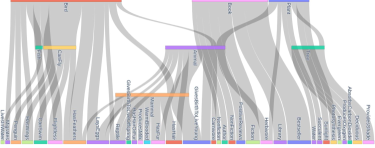
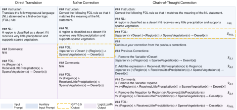
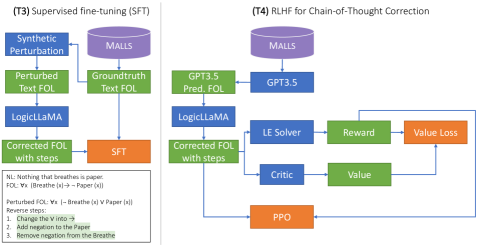
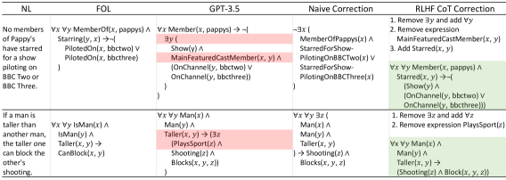
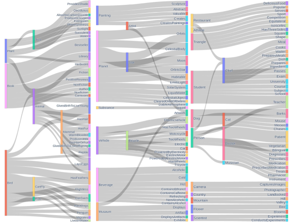

# Harnessing the Power of Large Language Models for Natural Language to First-Order Logic Translation

###### Abstract

Translating natural language sentences to first-order logic (NL-FOL translation) is a longstanding challenge in the NLP and formal logic literature. This paper introduces LogicLLaMA, a LLaMA-7B model fine-tuned for NL-FOL translation using LoRA on a single GPU. LogicLLaMA is capable of directly translating natural language into FOL rules, which outperforms GPT-3.5. LogicLLaMA is also equipped to correct FOL rules predicted by GPT-3.5, and can achieve similar performance as GPT-4 with a fraction of the cost. This correction ability was achieved by a novel supervised fine-tuning (SFT) + reinforcement learning with human feedback (RLHF) framework, which initially trains on synthetically perturbed NL-FOL pairs to encourage chain-of-thought reasoning and then fine-tunes with RLHF on GPT-3.5 outputs using a FOL verifier as the reward model.  

To train LogicLLaMA, we present Malls (large language Model generAted NL-FOL pairS), a dataset of 34K high-quality and diverse sentence-level NL-FOL pairs collected from GPT-4. The dataset was created by implementing a pipeline that prompts GPT-4 for pairs, and dynamically adjusts the prompts to ensure the collection of pairs with rich and diverse contexts at different levels of complexity, and verifies the validity of the generated FOL rules. Codes, weights, and data are available at <https://github.com/gblackout/LogicLLaMA>.  

## 1 Introduction

Large language models (LLMs) have established state-of-the-art results on several reasoning and generation benchmark tasks (OpenAI, [2023](#bib.bib16); Chowdhery et al., [2022](#bib.bib5)). Despite their success, LLMs struggle with logical reasoning (a prime example of System 2 task (Kahneman, [2011](#bib.bib10))), or maintaining logical consistency during generation (Nye et al., [2021](#bib.bib15)). The common denominator of both is the absence of explicit logical grounding which could impose the consistency of a generated output and the state of the world (i.e., premises of the reasoning task, or the previously generated text). While desired, the existing tools and systems that foster such explicit grounding (Abzianidze, [2017](#bib.bib1); Bos and Markert, [2005](#bib.bib3)) of Natural Language (NL) are brittle, and rely on hard-coded First-Order Logic (FOL) rules and facts, which is impractical for real-world use.  

Recent variants of LLMs (i.e., GPT-4) exhibit impressive few-shot capabilities in NL-FOL translation tasks. This rapid improvement comes after recent observations (Han et al., [2022](#bib.bib8)) which highlighted major defects of previous LLMs (e.g., GPT-3 davinci). Nonetheless, even the most powerful LLMs to this date cannot solve the NL-FOL translation task entirely, and for complex NL statements, they typically generate an answer which still requires a few “corrections”. However, in the absence of fine-tuning option (not available for RLHF-trained LLMs), most of the heavy lifting in this translation task is offloaded on the few-shot examples and prompt engineering. Not to mention, the cost element of using an LLM as a dedicated tool (or fine-tuning them) for NL-FOL translation could be prohibitive.  

In order to improve the translation quality of LLMs (i.e., GPT-3.5), we present a framework that runs every output from GPT-3.5 through a small language model (LogicLLaMA), a LLaMA-7B model (Touvron et al., [2023](#bib.bib22)) for NL-FOL translation fine-tuned with LoRA (Hu et al., [2021](#bib.bib9)). LogicLLaMA is trained to correct outputs from GPT-3.5 (through an iterative correction) while also being able to act as a standalone direct NL-to-FOL translator. For training LogicLLaMA, we collected a high-quality and diversified dataset of 34K sentence-level NL-FOL pairs from GPT-4. We then created a perturbed version of the FOL in each pair to produce a controlled perturbation dataset, where each perturbed pair is accompanied by a “correction instruction” to undo the perturbation. We propose a novel SFT+RLHF framework that first trains LogicLLaMA on the synthetically perturbed NL-FOL pairs, equipping LogicLLaMA with generating corrective prompts, and then fine-tunes it with RLHF on the GPT-3.5 outputs using a FOL verifier as the reward model.  

In our experiments, we probe the capabilities of the most recent LLMs in both zero- and few-shot settings in the NL-FOL translation task on two benchmarks with different levels of complexity, LogicNLI (Tian et al., [2021](#bib.bib21)) and FOLIO (Han et al., [2022](#bib.bib8)). We highlight, on the challenging dataset of FOLIO, the latest GPT-3.5 with 5-shot examples in the prompt does not go above 0.767 logical equivalence (LE) score, our proposed approach could iteratively improve its performance and reduce the gap between GPT-3.5 and GPT-4 (i.e., GPT-3.5+LogicLLaMA achieves 0.849 LE compared with GPT-4 score of 0.855) with a fraction of the cost.111As of May 2023, GPT-3.5 costs $0.002/1K tokens whereas GPT4 costs $0.03/1K for prompt and $0.06/1K for completion. Additionally, we demonstrate LogicLLaMA capabilities as a standalone model for NL-FOL translation task, outperforming GPT-3.5 on both FOLIO and LogicNLI, while being highly competitive with GPT-4.  

## 2 Related Work

NL-FOL translation. Natural language to first-order logic (NL-FOL) translation is a critical task that serves as the foundation of a wide range of logic-backed NLP applications, such as textual entailment (Bos and Markert, [2005](#bib.bib3)), NL inference (Angeli and Manning, [2014](#bib.bib2)) and theorem proving (Polu and Sutskever, [2020](#bib.bib18)). Traditionally, NL-FOL translation has been addressed via rule-based methods (Abzianidze, [2017](#bib.bib1); Zettlemoyer and Collins, [2005](#bib.bib26); Bos and Markert, [2005](#bib.bib3)). Due to the complexity of natural language, these methods are difficult to scale to real-world applications. Recently, there has been an increasing interest in approaching this task via neural approaches (Lu et al., [2022](#bib.bib14); Cao et al., [2019](#bib.bib4); Hahn et al., [2022](#bib.bib7); Wang et al., [2021](#bib.bib23); Singh et al., [2020](#bib.bib20); Levkovskyi and Li, [2021](#bib.bib11)). The recent release of powerful LLMs such as GPT-3.5 and GPT-4 gives rise to a new paradigm: using LLMs to perform the bulk of the translation task, thereby benefiting from their generalization capabilities and capacity to handle complex and diverse language constructs. In this work, we investigate this paradigm and propose to collect NL-FOL pairs from GPT-4 and fine-tune a LLaMA-7B model on it.  

NL-FOL datasets. Many datasets that focus on logical reasoning ability have been proposed recently. For example, LogiQA (Liu et al., [2020](#bib.bib12)), RuleTaker (Clark et al., [2020](#bib.bib6)), ReClor (Yu et al., [2020](#bib.bib25)) and text2log (Levkovskyi and Li, [2021](#bib.bib11)). However, these datasets either do not provide sentence-level FOL annotations, or the annotations are generated without verification. Among these works, LogicNLI (Tian et al., [2021](#bib.bib21)) and FOLIO (Han et al., [2022](#bib.bib8)) are closest to our work, which provides NL statements with parallel FOL annotations. However, pairs in LogicNLI are generated synthetic and share a similar FOL template. FOLIO consists of real-world expert-written pairs, but the size of 2K is insufficient for fine-tuning an LLM. This work extends the prior work and proposes to collect “silver” NL-FOL pairs from GPT-4. As a result, Malls has collected 34K pairs that are more diverse in terms of context and complexity. In experiments, we use LogicNLI and FOLIO as the “gold” sets to evaluate the LLM fine-tuned on Malls and demonstrate that it is of high quality.  

## 3 Malls Dataset Creation

We create the Malls dataset by collecting NL-FOL pairs from GPT-4 which is considered to be the most powerful LLM to date. As of May 2023, Malls has reached the size of 34K and we plan to continue expanding the dataset in future versions.  

Motivation. One of the goals to create such a dataset is to provide a corpus for fine-tuning and evaluating NL-FOL translation models. However, one may ask “if Malls is to be generated by yet another LLM, i.e., GPT-4, then why shouldn’t one use GPT-4 for the task already?” The motivation lies in the cost and privacy. While GPT-4 yields state-of-the-art performance, its API access is costly and not entirely publicly available to date; on the other hand, institutes and companies may have sensitive data that cannot be shared with a third party and they want to deploy a local LLM with similar performance. In §[4](#S4 "4 Fine-tuning LogicLLaMA for NL-FOL Translation ‣ Harnessing the Power of Large Language Models for Natural Language to First-Order Logic Translation"), we show this can be achieved by fine-tuning a LLaMA-7B model on Malls on a single GPU.  

[TABLE S3.T1]

<table class="ltx_tabular ltx_guessed_headers ltx_align_middle">
<thead class="ltx_thead">
<tr class="ltx_tr">
<th class="ltx_td ltx_align_center ltx_th ltx_th_column ltx_border_tt">Dataset</th>
<th class="ltx_td ltx_align_center ltx_th ltx_th_column ltx_border_tt">Source</th>
<th class="ltx_td ltx_align_center ltx_th ltx_th_column ltx_border_tt">

#NL-FOL

pairs
</th>
<th class="ltx_td ltx_align_center ltx_th ltx_th_column ltx_border_tt">NL</th>
<th class="ltx_td ltx_th ltx_th_column ltx_border_tt"></th>
<th class="ltx_td ltx_align_center ltx_th ltx_th_column ltx_border_tt">FOL</th>
</tr>
<tr class="ltx_tr">
<th class="ltx_td ltx_align_center ltx_th ltx_th_column ltx_border_t">
<table class="ltx_tabular ltx_align_middle">
<tr class="ltx_tr">
<td class="ltx_td ltx_nopad_r ltx_align_center">Vocab</td>
</tr>
<tr class="ltx_tr">
<td class="ltx_td ltx_nopad_r ltx_align_center">size</td>
</tr>
</table>
</th>
<th class="ltx_td ltx_align_center ltx_th ltx_th_column ltx_border_t">
<table class="ltx_tabular ltx_align_middle">
<tr class="ltx_tr">
<td class="ltx_td ltx_nopad_r ltx_align_center">Avg.</td>
</tr>
<tr class="ltx_tr">
<td class="ltx_td ltx_nopad_r ltx_align_center">#words</td>
</tr>
</table>
</th>
<th class="ltx_td ltx_th ltx_th_column ltx_border_t"></th>
<th class="ltx_td ltx_align_center ltx_th ltx_th_column ltx_border_t">
<table class="ltx_tabular ltx_align_middle">
<tr class="ltx_tr">
<td class="ltx_td ltx_nopad_r ltx_align_center">Avg.</td>
</tr>
<tr class="ltx_tr">
<td class="ltx_td ltx_nopad_r ltx_align_center">#literals</td>
</tr>
</table>
</th>
<th class="ltx_td ltx_align_center ltx_th ltx_th_column ltx_border_t"><math class="ltx_Math"><semantics><mo>∀</mo><annotation-xml><csymbol>for-all</csymbol></annotation-xml><annotation>\forall</annotation></semantics></math></th>
<th class="ltx_td ltx_align_center ltx_th ltx_th_column ltx_border_t"><math class="ltx_Math"><semantics><mo>∃</mo><annotation-xml><exists></exists></annotation-xml><annotation>\exists</annotation></semantics></math></th>
<th class="ltx_td ltx_align_center ltx_th ltx_th_column ltx_border_t"><math class="ltx_Math"><semantics><mo>¬</mo><annotation-xml><not></not></annotation-xml><annotation>\neg</annotation></semantics></math></th>
<th class="ltx_td ltx_align_center ltx_th ltx_th_column ltx_border_t"><math class="ltx_Math"><semantics><mo>∧</mo><annotation-xml><and></and></annotation-xml><annotation>\land</annotation></semantics></math></th>
<th class="ltx_td ltx_align_center ltx_th ltx_th_column ltx_border_t"><math class="ltx_Math"><semantics><mo>∨</mo><annotation-xml><or></or></annotation-xml><annotation>\lor</annotation></semantics></math></th>
<th class="ltx_td ltx_align_center ltx_th ltx_th_column ltx_border_t"><math class="ltx_Math"><semantics><mo>→</mo><annotation-xml><ci>→</ci></annotation-xml><annotation>\to</annotation></semantics></math></th>
<th class="ltx_td ltx_align_center ltx_th ltx_th_column ltx_border_t"><math class="ltx_Math"><semantics><mo>↔</mo><annotation-xml><ci>↔</ci></annotation-xml><annotation>\leftrightarrow</annotation></semantics></math></th>
<th class="ltx_td ltx_nopad_r ltx_align_center ltx_th ltx_th_column ltx_border_t"><math class="ltx_Math"><semantics><mo>⊕</mo><annotation-xml><csymbol>direct-sum</csymbol></annotation-xml><annotation>\oplus</annotation></semantics></math></th>
</tr>
</thead>
<tbody class="ltx_tbody">
<tr class="ltx_tr">
<td class="ltx_td ltx_align_left ltx_border_t">FOLIO3
</td>
<td class="ltx_td ltx_align_center ltx_border_t">Expert</td>
<td class="ltx_td ltx_align_center ltx_border_t">2K</td>
<td class="ltx_td ltx_align_center ltx_border_t">5105</td>
<td class="ltx_td ltx_align_center ltx_border_t">10.4</td>
<td class="ltx_td ltx_border_t"></td>
<td class="ltx_td ltx_align_center ltx_border_t">2.1</td>
<td class="ltx_td ltx_align_center ltx_border_t">1111</td>
<td class="ltx_td ltx_align_center ltx_border_t">182</td>
<td class="ltx_td ltx_align_center ltx_border_t">421</td>
<td class="ltx_td ltx_align_center ltx_border_t">631</td>
<td class="ltx_td ltx_align_center ltx_border_t">167</td>
<td class="ltx_td ltx_align_center ltx_border_t">1137</td>
<td class="ltx_td ltx_align_center ltx_border_t">17</td>
<td class="ltx_td ltx_nopad_r ltx_align_center ltx_border_t">121</td>
</tr>
<tr class="ltx_tr">
<td class="ltx_td ltx_align_left">LogicNLI3
</td>
<td class="ltx_td ltx_align_center">Synthetic</td>
<td class="ltx_td ltx_align_center">12K</td>
<td class="ltx_td ltx_align_center">2061</td>
<td class="ltx_td ltx_align_center">13.9</td>
<td class="ltx_td"></td>
<td class="ltx_td ltx_align_center">2.8</td>
<td class="ltx_td ltx_align_center">2783</td>
<td class="ltx_td ltx_align_center">5327</td>
<td class="ltx_td ltx_align_center">10230</td>
<td class="ltx_td ltx_align_center">6590</td>
<td class="ltx_td ltx_align_center">2373</td>
<td class="ltx_td ltx_align_center">8712</td>
<td class="ltx_td ltx_align_center">3288</td>
<td class="ltx_td ltx_nopad_r ltx_align_center">0</td>
</tr>
<tr class="ltx_tr">
<td class="ltx_td ltx_align_left ltx_border_bb">Malls</td>
<td class="ltx_td ltx_align_center ltx_border_bb">GPT-4</td>
<td class="ltx_td ltx_align_center ltx_border_bb">34K</td>
<td class="ltx_td ltx_align_center ltx_border_bb">22715</td>
<td class="ltx_td ltx_align_center ltx_border_bb">16.1</td>
<td class="ltx_td ltx_border_bb"></td>
<td class="ltx_td ltx_align_center ltx_border_bb">4.6</td>
<td class="ltx_td ltx_align_center ltx_border_bb">32865</td>
<td class="ltx_td ltx_align_center ltx_border_bb">2036</td>
<td class="ltx_td ltx_align_center ltx_border_bb">4567</td>
<td class="ltx_td ltx_align_center ltx_border_bb">30143</td>
<td class="ltx_td ltx_align_center ltx_border_bb">6402</td>
<td class="ltx_td ltx_align_center ltx_border_bb">30667</td>
<td class="ltx_td ltx_align_center ltx_border_bb">3726</td>
<td class="ltx_td ltx_nopad_r ltx_align_center ltx_border_bb">2150</td>
</tr>
</tbody>
</table>

Table 1: Statistics of Malls, LogicNLI, and FOLIO datasets.
[/TABLE]

[FIGURE S3.F1.g1]

Figure 1: Snippet from the top 200 frequent FOL term pairs in Malls (for full version see Appendix [B](#A2 "Appendix B Malls Dataset Creation Details ‣ Harnessing the Power of Large Language Models for Natural Language to First-Order Logic Translation")). Many terms are associated with a wide range of other terms, which suggests the rules are semantically and contextually diverse.
[/FIGURE]

### 3.1 Prompt pipeline

To collect data from GPT-4, we implemented a prompting pipeline that dynamically adjusts the prompts to both ensure the *diversity* and *validity* of the NL-FOL pairs. The pipeline consists of the following modules: (1) N-gram frequency counter; (2) Prompter; and (3) FOL rule verifier.  

N-gram frequency counter. During prompting, we keep track of the frequencies of the N-grams in the entire NL statement corpus. Specifically, we track 1- and 3-grams. Once the frequency of a specific N-gram in the collected data reaches the frequency threshold (500 and 250 respectively), we will instruct GPT-4 to not produce any NL-FOL pairs including it. For example, “… DO NOT involve concepts and terms (and the synonyms) such as animal, food, …”. The list of N-grams in the instruction grows as more reach the frequency threshold.  

Prompter. A prompter assembles the prompts generated from different modules (prompt table shown in Appendix [B](#A2 "Appendix B Malls Dataset Creation Details ‣ Harnessing the Power of Large Language Models for Natural Language to First-Order Logic Translation")): (1) system prompt: specifying the basic requirements such as the syntax and generation format. (2) few-shot examples prompt: consisting 5 NL-FOL pair examples randomly sampled from the corpus. Initially, pairs are sampled from the FOLIO dataset and later on from the GPT-4-generated ones (we checked to ensure none of the FOLIO examples, or close variations are leaked into the GPT-4 generated NL-FOL pairs.). This diversifies the prompts and leads to less similar examples .(3) negative N-gram prompt: instructing GPT-4 not to involve frequent N-grams (introduced earlier) in the generated NL-FOL pairs. (4)FOL prompts: generating prompts that specify the desired form of FOL rules, i.e., the number of variables and whether or not to include more logic operators such as $\oplus$, $\neg$, and $\lor$ which we found GPT-4 tends to ignore in default generation. These configurations are picked randomly every time the prompt is generated. (5) break-down prompt: We found GPT-4 by default tends to make over-complicated predicates that absorb important logical meanings. For example, “ ### NL: A fruit is considered ripe if it is mature and its color has changed from green to red. ### FOL: $\forall x(\texttt{Fruit}(x)\land\texttt{Mature}(x)\land\texttt{ColorChangedToRed}(x)\to\texttt{Ripe}(x))$. ” The predicate ColorChangedToRed is complicated and should be broken down into “$\texttt{ColorBefore}(x,y)\land\texttt{ColorAfter}(x,z)\land\texttt{Green}(y)\land\texttt{Red}(z)$”. We alleviate this by detecting long predicate names and including a prompt encouraging the model to break down the rules.  

FOL rule verifier. GPT-4 can sometimes generate syntactically invalid FOL rules. We implement a verifier that checks the syntax of the rules. Specifically, we specify the context-free grammar (CFG) of the expected FOL rule and parse the generated FOL with NLTK 222https://www.nltk.org/ CFG parser, and erase those that could not be parsed (grammar and example parse trees in Appendix [B](#A2 "Appendix B Malls Dataset Creation Details ‣ Harnessing the Power of Large Language Models for Natural Language to First-Order Logic Translation")).  

### 3.2 Dataset statistics

General statistics. We show the general statistics in Table [1](#S3.T1 "Table 1 ‣ 3 Malls Dataset Creation ‣ Harnessing the Power of Large Language Models for Natural Language to First-Order Logic Translation") together with those of LogicNLI and FOLIO333Note that the FOLIO statistics are different from those reported in (Han et al., [2022](#bib.bib8)). As of May 2023, the released dataset misses the ground truth FOL annotations for conclusions in the training set, and some pairs contain duplicates and invalid FOL rules. We removed those during pre-processing. Also, the LogicNLI statistics are obtained from the official repo [here](https://github.com/omnilabNLP/LogicNLI), which contains 12K samples instead of the 20K reported in the paper. . Malls contains 34K NL-FOL pairs, which is significantly larger than LogicNLI and FOLIO, and different from LogicNLI which is synthetically generated, the pairs are also more diverse and contextually rich, where the NL statements have a vocabulary size of 22.7K and an average length of 16 compared to 10 in FOLIO. For FOL rules, the average number of literals reached 4.6 indicating more complex rules (also see Figure [9](#A2.F9 "Figure 9 ‣ Appendix B Malls Dataset Creation Details ‣ Harnessing the Power of Large Language Models for Natural Language to First-Order Logic Translation") in Appendix [B](#A2 "Appendix B Malls Dataset Creation Details ‣ Harnessing the Power of Large Language Models for Natural Language to First-Order Logic Translation")).  

Pair diversity. The NL-FOL rules in Malls are highly diverse. To see this, we investigate the frequencies and the correlations of the FOL terms. A *term* is either a predicate name or a named entity in a FOL rule. For example, “$\forall x((\texttt{Person}(x)\land\texttt{Drinks}(x))\to\texttt{DependentOn}(x,\texttt{Caffeine}))$” consists of 4 terms, i.e., Person, Drinks, DependentOn and Caffeine. Malls has a total term vocabulary size of 49394 and the most frequent terms occur less than 2K times (Figure [8](#A2.F8 "Figure 8 ‣ Appendix B Malls Dataset Creation Details ‣ Harnessing the Power of Large Language Models for Natural Language to First-Order Logic Translation") in Appendix [B](#A2 "Appendix B Malls Dataset Creation Details ‣ Harnessing the Power of Large Language Models for Natural Language to First-Order Logic Translation")), suggesting a diverse vocabulary distribution. On the other hand, we investigate the correlations between terms and illustrate the top 200 frequent term pairs. We show a snippet of this in Figure [1](#S3.F1 "Figure 1 ‣ 3 Malls Dataset Creation ‣ Harnessing the Power of Large Language Models for Natural Language to First-Order Logic Translation") (for the full version, see Figure [7](#A2.F7 "Figure 7 ‣ Appendix B Malls Dataset Creation Details ‣ Harnessing the Power of Large Language Models for Natural Language to First-Order Logic Translation") in Appendix [B](#A2 "Appendix B Malls Dataset Creation Details ‣ Harnessing the Power of Large Language Models for Natural Language to First-Order Logic Translation")). Note that if a term is associated with many other terms, this typically means the rules involving that term are diverse in semantics and context, and Figure [1](#S3.F1 "Figure 1 ‣ 3 Malls Dataset Creation ‣ Harnessing the Power of Large Language Models for Natural Language to First-Order Logic Translation") suggests that it is indeed the case. For example, for rules involving Book, they cover the knowledge of its genre (e.g., Fiction), places (e.g., Library), viewership (e.g., Bestseller and PositiveReviews), and so on.  

NL-FOL alignment. Apart from checking the FOL validity, we also implemented a simplistic verifier that checks the alignment between the NL statement and the FOL rule. This is done by treating the FOL as a query and computing its term frequency in the NL, and then rejecting those that are below a threshold. Apart from this, we did not conduct a rigorous alignment check in the creation of Malls. In fact, the best way to date to ensure alignment correctness is checking them manually as that in FOLIO dataset creation. This is prohibitive to do for a dataset of this size for an academic budget. That said, we recommend treating the dataset as “silver” labels and using it for training, and using another dataset with “gold” labels for evaluation. Nevertheless, in §[5](#S5 "5 Experiments ‣ Harnessing the Power of Large Language Models for Natural Language to First-Order Logic Translation"), we demonstrate that a model trained solely on this silver dataset can still achieve a similar performance as GPT-4, when evaluated on the gold sets such as FOLIO and LogicNLI.  

## 4 Fine-tuning LogicLLaMA for NL-FOL Translation

In this section, we discuss how to fine-tune the LLaMA-7B (Touvron et al., [2023](#bib.bib22)) model on the Malls to reach a GPT-4 level performance. We refer to this model as LogicLLaMA. Throughout the remainder of this section, we will refer to the silver FOLs in Malls as ground truth.  

Unlike typical NLP tasks, where one fine-tunes it with a task-agnostic objective such as autoregression, fine-tuning for NL-FOL translation is nontrivial. Specifically, we address the following challenges:  

(C1) What is the input and output of the LogicLLaMA? And how to prepare the training data from Malls? In §[4.1](#S4.SS1 "4.1 Fine-tuning for direct translation and naive correction ‣ 4 Fine-tuning LogicLLaMA for NL-FOL Translation ‣ Harnessing the Power of Large Language Models for Natural Language to First-Order Logic Translation"), we first consider the naive approach, where LogicLLaMA is trained to predict the correct FOL directly. While it does not need any additional data other than the original Malls, it yields sub-optimal performance. We found better performance is achieved by eliciting the chain-of-thought (CoT) steps and gradually correcting the FOL predicted by another model, e.g., GPT-3.5. But, such training requires the ground-truth CoT steps which are not available in Malls. In §[4.2](#S4.SS2 "4.2 Chain-of-Thought correction via SFT and RLHF ‣ 4 Fine-tuning LogicLLaMA for NL-FOL Translation ‣ Harnessing the Power of Large Language Models for Natural Language to First-Order Logic Translation"), we propose to address this by first fine-tuning the model on synthetically perturbed FOLs with ground-truth CoT steps and then conducting the RLHF to correct the real outputs of GPT-3.5.  

(C2) How to evaluate the generated FOL rules? Consider two FOL rules (denoted as $R$ and $R^{\prime}$) generated from an LLM “$R:\neg(P(A)\land P(B))$” and “$R^{\prime}:\neg P(A)\lor\neg P(B)$” — $R$ and $R^{\prime}$ are logically equivalent but are different in the text; also consider a pair of rules “$R:\forall xP(x)$” and “$R^{\prime}:\forall x\forall yP(x)\land Q(y)$”— if $R$ is the ground-truth and $R^{\prime}$ the LLM prediction, how should one measure the distance and supervise the model? We address this in §[4.2.3](#S4.SS2.SSS3 "4.2.3 FOL evaluation and reward design ‣ 4.2 Chain-of-Thought correction via SFT and RLHF ‣ 4 Fine-tuning LogicLLaMA for NL-FOL Translation ‣ Harnessing the Power of Large Language Models for Natural Language to First-Order Logic Translation").  

[FIGURE S4.F2.g1]

Figure 2: Input and expected outputs for direct translation, naive correction, and CoT correction.
[/FIGURE]

### 4.1 Fine-tuning for direct translation and naive correction

The LogicLLaMA can be trained to directly translate the FOL from NL, which we refer to as (T1) direct translation task; it can also be trained to correct the generated FOL from a more powerful model such as GPT-3.5, which we refer to as the correction task. In this section, we consider the (T2) naive correction approach, where the correction is done in one go. The intuition is that we found in experiments GPT-3.5 is good at doing the “heavy-lifting” part of the translation and can capture the main part of the FOL rule; then presumably, one can train a smaller model that corrects the output from the GPT-3.5 to get a better result.  

We train both (T1) and (T2) via standard autoregression objective. Specifically, we fine-tune a LLaMA-7B model with LoRA (for all the attention weight matrices) on Malls. The left two columns in Figure [2](#S4.F2 "Figure 2 ‣ 4 Fine-tuning LogicLLaMA for NL-FOL Translation ‣ Harnessing the Power of Large Language Models for Natural Language to First-Order Logic Translation") show the input and output sequence of the two tasks: let $\langle{\bm{x}}_{\text{NL}},{\bm{x}}_{\text{FOL}}\rangle$ be an NL-FOL pair from Malls; for (T1), the input and output are the original sequences ${\bm{x}}_{\text{NL}}$ and ${\bm{x}}_{\text{FOL}}$ respectively; and for (T2), let $\hat{{\bm{x}}}_{\text{FOL}}=\text{GPT}({\bm{x}}_{\text{NL}})$ be the FOL predicted by GPT-3.5, the input is the NL and the prediction put together $[{\bm{x}}_{\text{NL}},\hat{{\bm{x}}}_{\text{FOL}}]$ and the output is the ground-truth FOL, ${\bm{x}}_{\text{FOL}}$.  

### 4.2 Chain-of-Thought correction via SFT and RLHF

[FIGURE S4.F3.g1]

Figure 3: Overview of the SFT and RLHF training for the Chain-of-Thought (CoT) correction mode of LogicLLaMA.
[/FIGURE]

While (T1) direct translation and (T2) naive correction are easy to train, they do not lead to optimal performance. Inspired by the Chain-of-Thought (CoT) technique (Wei et al., [2022](#bib.bib24)), we found that training the model to produce the intermediate steps during the correction often leads to better performance. Such examples are shown in Figure [6](#S5.F6 "Figure 6 ‣ 5 Experiments ‣ Harnessing the Power of Large Language Models for Natural Language to First-Order Logic Translation").  

To train such a model, one needs a dataset consisting of not only the ground-truth $\langle{\bm{x}}_{\text{NL}},{\bm{x}}_{\text{FOL}}\rangle$, but also the CoT steps specific to a predicted FOL. Formally, recall that $\hat{{\bm{x}}}_{\text{FOL}}$ is the predicted FOL by GPT-3.5, then we need the ground-truth steps $\hat{{\mathcal{X}}}_{\Delta}=[\hat{{\bm{x}}}_{\Delta,1},\hat{{\bm{x}}}_{\Delta,2},...,\hat{{\bm{x}}}_{\Delta,T}]$, such that they form a valid CoT sequence $[\hat{{\bm{x}}}_{\text{FOL}},\hat{{\bm{x}}}_{\Delta,1},\hat{{\bm{x}}}_{\Delta,2},...,\hat{{\bm{x}}}_{\Delta,T},{\bm{x}}_{\text{FOL}}]$. For example, the right column of Figure [2](#S4.F2 "Figure 2 ‣ 4 Fine-tuning LogicLLaMA for NL-FOL Translation ‣ Harnessing the Power of Large Language Models for Natural Language to First-Order Logic Translation") shows a 4-step CoT correction.  

However, as stated in (C1), we do not have ground-truth CoT steps $\hat{{\mathcal{X}}}_{\Delta}$ for the predicted FOL from GPT-3.5. We propose to address this issue using a combination of supervised fine-tuning (SFT) on a *synthetically perturbed* dataset with ground-truth CoT steps, and reinforcement learning with human feedback (RLHF) training on the real GPT-3.5 output with a logical equivalence solver (discussed in §[4.2.3](#S4.SS2.SSS3 "4.2.3 FOL evaluation and reward design ‣ 4.2 Chain-of-Thought correction via SFT and RLHF ‣ 4 Fine-tuning LogicLLaMA for NL-FOL Translation ‣ Harnessing the Power of Large Language Models for Natural Language to First-Order Logic Translation")) as the reward model.  

Specifically, we refer to the SFT step as (T3) SFT CoT Correction. And as shown in the left column of Figure [3](#S4.F3 "Figure 3 ‣ 4.2 Chain-of-Thought correction via SFT and RLHF ‣ 4 Fine-tuning LogicLLaMA for NL-FOL Translation ‣ Harnessing the Power of Large Language Models for Natural Language to First-Order Logic Translation"), we create a synthetic FOL dataset by perturbing the ground-truth FOL rule and obtaining the ground-truth CoT steps by reversing the past perturbations. And, we refer to the RLHF step as (T4) RLHF CoT Correction, which is shown in the right column of Figure [3](#S4.F3 "Figure 3 ‣ 4.2 Chain-of-Thought correction via SFT and RLHF ‣ 4 Fine-tuning LogicLLaMA for NL-FOL Translation ‣ Harnessing the Power of Large Language Models for Natural Language to First-Order Logic Translation").  

#### 4.2.1 FOL Rule Perturbations and SFT

[FIGURE S4.SS2.SSS1.24.24.24.g1]
![[Uncaptioned image]](./media/x4.png)

Table 2: The list of all atomic perturbations.
[/FIGURE]

Since we do not have the ground-truth CoT steps $\hat{{\mathcal{X}}}_{\Delta}$ for the real output $\hat{{\bm{x}}}_{\text{FOL}}$, we generate synthetic steps and the output sequence by randomly perturbing the FOL rules in Malls.  

We consider three types of atomic perturbations: label change, insert, and delete. As shown in Table [2](#S4.T2 "Table 2 ‣ 4.2.1 FOL Rule Perturbations and SFT ‣ 4.2 Chain-of-Thought correction via SFT and RLHF ‣ 4 Fine-tuning LogicLLaMA for NL-FOL Translation ‣ Harnessing the Power of Large Language Models for Natural Language to First-Order Logic Translation"), label change can be conducted on any terms or logic operators in a FOL rule; insert operation is applicable to term, negation, and formula; and delete operation can be considered as the inverse of insertion. Note that, we restrict the perturbations to only produce valid rules. The reasons are two-fold: (1) the invalid rule space is effectively the space of all possible strings which is prohibitive to explore; and (2) we found GPT-3.5 rarely generates syntactically invalid rule, thus, limiting the synthetic data in the valid rule space will already cover a wide range of the actual GPT-3.5 outputs.  

Perturbation process. Given a ground-truth pair $\langle{\bm{x}}_{\text{NL}},{\bm{x}}_{\text{FOL}}\rangle$, a parser (Appendix [B](#A2 "Appendix B Malls Dataset Creation Details ‣ Harnessing the Power of Large Language Models for Natural Language to First-Order Logic Translation")) will parse ${\bm{x}}_{\text{FOL}}$ into an abstract syntax tree (AST). We randomly perturb the AST with atomic operations in Table [2](#S4.T2 "Table 2 ‣ 4.2.1 FOL Rule Perturbations and SFT ‣ 4.2 Chain-of-Thought correction via SFT and RLHF ‣ 4 Fine-tuning LogicLLaMA for NL-FOL Translation ‣ Harnessing the Power of Large Language Models for Natural Language to First-Order Logic Translation") and for $N_{\text{Perturb}}$ times. Here, $N_{\text{Perturb}}$ is also picked randomly from a list of numbers, and in the experiments, we set it to $\{0,1,2,...,10\}$. In the case $N_{\text{Perturb}}=0$, the perturbed rule remains the same as the ground truth and the CoT step is simply “No changes needed”; this is effectively a negative example that penalizes the model for over-correcting. During training, we found LogicLLaMA still tends to over-correct the samples as negative samples by default account for around 10% of the data, so we manually set the probability of negative sample generation to 0.2.  

Iterative correction. Depending on the capacity of the LLM, it might be difficult for the model to learn to output many steps (say 10) within one generation. We propose to break down the correction into multiple generations, where the model is tasked to output at most $N_{\text{Correct}}$ steps of correction given the perturbed rule and the previous corrections up to $N_{\text{Perturb}}-N_{\text{Correct}}$ steps. For example, the right column of Figure [2](#S4.F2 "Figure 2 ‣ 4 Fine-tuning LogicLLaMA for NL-FOL Translation ‣ Harnessing the Power of Large Language Models for Natural Language to First-Order Logic Translation") shows an iterative correction sample: it requires total $N_{\text{Perturb}}=4$ steps to correct the rule, but we picked a correction steps of $N_{\text{Correct}}=2$; this means the perturbed rule together with the previous two steps are treated as input and the last two steps are the output. Similar to $N_{\text{Perturb}}$, we randomly choose $N_{\text{Correct}}$ from a list, where we set it to $\{0,1,2,3\}$. And apparently, $N_{\text{Correct}}$ should be no greater than the total steps $N_{\text{Correct}}=\min(N_{\text{Correct}},N_{\text{Perturb}})$.  

SFT for CoT correction. For this (T3) task, we generate the synthetic dataset consisting of 150K examples in the form of $\langle{\bm{x}}_{\text{NL}},{\bm{x}}_{\text{FOL}},\hat{{\mathcal{X}}}_{\Delta,\text{prev}},\hat{{\mathcal{X}}}_{\Delta,\text{corr}},\hat{{\bm{x}}}_{\text{FOL}}\rangle$ using the above method, where $\hat{{\mathcal{X}}}_{\Delta,\text{prev}},\hat{{\mathcal{X}}}_{\Delta,\text{corr}},\hat{{\bm{x}}}_{\text{FOL}}$ are the previous correction steps, target correction steps and the perturbed FOL rule respectively. We then fine-tune the LLaMA-7B model with LoRA again using the standard autoregression objective: the input is $[{\bm{x}}_{\text{NL}},\hat{{\bm{x}}}_{\text{FOL}},\hat{{\mathcal{X}}}_{\Delta,\text{prev}}]$ and the output is $[\hat{{\mathcal{X}}}_{\Delta,\text{corr}},{\bm{x}}_{\text{FOL}}]$.  

#### 4.2.2 RLHF for CoT correction

With (T3) SFT CoT correction, we enable the model to generate intermediate correction steps for synthetic data. Now, we train the model to correct the actual outputs from GPT-3.5, which is (T4) RLHF CoT Correction task.  

Why do we need RLHF? Note that to achieve this goal for (T4), we can no longer use the autoregression objective as in (T1), (T2), or (T3), since we still do not have the ground-truth CoT steps for GPT-3.5 outputs. However, on the other hand, we can still compare the final corrected rule to the ground-truth rule and measure how close they are. And this gives rise to an RL approach to the problem. Formally, let $\texttt{RM}:{\mathcal{X}}\times{\mathcal{X}}\mapsto[0,1]$ be a function that maps a pair of FOL sequences, ${\bm{x}}_{\text{FOL}}$ and ${\bm{x}}_{\text{FOL}}^{\prime}$, to a scalar score representing the pair similarity, our objective can be formalized as maximizing the score (effectively the expected return in RL),  

|  | $\displaystyle\max_{\pi}\texttt{RM}({\bm{x}}_{\text{FOL}},{\bm{x}}_{\text{FOL}}^{\prime}),\;\text{where}\;{\bm{x}}_{\text{FOL}}^{\prime}\sim\pi_{\theta}({\bm{x}}_{\text{FOL}},\hat{{\mathcal{X}}}_{\Delta,\text{corr}}|{\bm{x}}_{\text{NL}},\hat{{\mathcal{X}}}_{\Delta,\text{prev}},\hat{{\bm{x}}}_{\text{FOL}}),$ |  | (1) |
| --- | --- | --- | --- |

for all tuples $\langle{\bm{x}}_{\text{NL}},{\bm{x}}_{\text{FOL}},\hat{{\bm{x}}}_{\text{FOL}}\rangle$ in Malls via a policy $\pi_{\theta}({\bm{x}}_{\text{FOL}},\hat{{\mathcal{X}}}_{\Delta,\text{corr}}|{\bm{x}}_{\text{NL}},\hat{{\mathcal{X}}}_{\Delta,\text{prev}},\hat{{\bm{x}}}_{\text{FOL}})$ which is exactly the autoregressive model we trained in (T3) and would like to fine-tune in (T4). With objective Eq.([1](#S4.E1 "In 4.2.2 RLHF for CoT correction ‣ 4.2 Chain-of-Thought correction via SFT and RLHF ‣ 4 Fine-tuning LogicLLaMA for NL-FOL Translation ‣ Harnessing the Power of Large Language Models for Natural Language to First-Order Logic Translation")), task (T4) is now similar to the RLHF proposed in InstructGPT (Ouyang et al., [2022](#bib.bib17)) with the only difference being the reward model RM, where in our case, RM is a logical equivalence solver (§[4.2.3](#S4.SS2.SSS3 "4.2.3 FOL evaluation and reward design ‣ 4.2 Chain-of-Thought correction via SFT and RLHF ‣ 4 Fine-tuning LogicLLaMA for NL-FOL Translation ‣ Harnessing the Power of Large Language Models for Natural Language to First-Order Logic Translation")) instead of a language model.  

Training process. In (T4) RLHF CoT correction, we fine-tune the LogicLLaMA model obtained in (T3) SFT CoT correction via RLHF. For every tuple $\langle{\bm{x}}_{\text{NL}},{\bm{x}}_{\text{FOL}},\hat{{\bm{x}}}_{\text{FOL}}\rangle$, we let the model to continuously generate the corrections $[\langle{\bm{x}}_{\text{FOL}}^{\prime(1)},\hat{{\mathcal{X}}}_{\Delta,\text{corr}}^{(1)}\rangle,\langle{\bm{x}}_{\text{FOL}}^{\prime(2)},\hat{{\mathcal{X}}}_{\Delta,\text{corr}}^{(2)}\rangle,...]$ until the model outputs “No changes needed” in the CoT steps or hits the token limit; the previous correction $\hat{{\mathcal{X}}}_{\Delta,\text{prev}}$ is set to empty initially and we update it with the output steps in every generation. In other words, at iteration $(t)$, the previous correction is $\hat{{\mathcal{X}}}_{\Delta,\text{prev}}=[\hat{{\mathcal{X}}}_{\Delta,\text{corr}}^{(1)},\hat{{\mathcal{X}}}_{\Delta,\text{corr}}^{(2)},...,\hat{{\mathcal{X}}}_{\Delta,\text{corr}}^{(t-1)},]$. For every generated text FOL at iteration $(t)$, we collect the experience tuple $\langle{\bm{x}}_{\text{FOL}}^{\prime(t)},{\bm{x}}_{\text{NL}},\hat{{\mathcal{X}}}_{\Delta,\text{prev}},\hat{{\bm{x}}}_{\text{FOL}},r^{(t)}\rangle$ where $r^{(t)}=\texttt{RM}({\bm{x}}_{\text{FOL}},{\bm{x}}_{\text{FOL}}^{\prime(t)})$, and once enough experience is collected, we update the model parameter $\theta$ via PPO (Schulman et al., [2017](#bib.bib19)).  

#### 4.2.3 FOL evaluation and reward design

The last component for (T4) is the reward model RM. This requires a metric that measures the similarity between two text FOLs ${\bm{x}}_{\text{FOL}}$, ${\bm{x}}_{\text{FOL}}^{\prime}$ to be implemented, and the metric should take into account the scenarios mentioned in challenge (C2).  

Logical equivalence (LE). We propose to measure the logical equivalence between the rules by matching their truth tables and computing the overlap ratio. We introduce this with a running example in Figure [4](#S4.F4 "Figure 4 ‣ 4.2.1 FOL Rule Perturbations and SFT ‣ 4.2 Chain-of-Thought correction via SFT and RLHF ‣ 4 Fine-tuning LogicLLaMA for NL-FOL Translation ‣ Harnessing the Power of Large Language Models for Natural Language to First-Order Logic Translation"). Specifically, let $R$ and $R^{\prime}$ be the two rules parsed from the text ${\bm{x}}_{\text{FOL}}$ and ${\bm{x}}_{\text{FOL}}^{\prime}$. We identify the set of literals in each rule ${\mathcal{P}}=[p_{1},p_{2},...]$ and ${\mathcal{Q}}=[q_{1},q_{2},...]$. In the case of Figure [4](#S4.F4 "Figure 4 ‣ 4.2.1 FOL Rule Perturbations and SFT ‣ 4.2 Chain-of-Thought correction via SFT and RLHF ‣ 4 Fine-tuning LogicLLaMA for NL-FOL Translation ‣ Harnessing the Power of Large Language Models for Natural Language to First-Order Logic Translation"), ${\mathcal{P}}=[\texttt{Country}(x),\texttt{InEU}(x),\texttt{EUCountry}(x)]$ and ${\mathcal{Q}}=[\texttt{LocatedInEU(y)},\texttt{EUCountry}(y)]$. One can consider the set of literals as an array of Boolean variables, and the FOL as a circuit that takes in the Boolean values and outputs a single Boolean value. Therefore, we can represent a FOL with a truth table that enumerates all possible inputs and the resulting outputs. And to compare $R$ and $R^{\prime}$, we count the number of configurations that match and divide it by the total number of configurations; this yields a score in $[0,1]$. In Figure [4](#S4.F4 "Figure 4 ‣ 4.2.1 FOL Rule Perturbations and SFT ‣ 4.2 Chain-of-Thought correction via SFT and RLHF ‣ 4 Fine-tuning LogicLLaMA for NL-FOL Translation ‣ Harnessing the Power of Large Language Models for Natural Language to First-Order Logic Translation"), this is $7/8=0.875$. The main issue with this approach is finding the right input bindings between ${\mathcal{P}}$ and ${\mathcal{Q}}$, and dealing with the case where the numbers of inputs are different (i.e., $|{\mathcal{P}}|\neq|{\mathcal{Q}}|$). We solve this by finding the binding that gives the highest LE score via greedy search and filling the rest of the missing inputs with dummy inputs. In Figure [4](#S4.F4 "Figure 4 ‣ 4.2.1 FOL Rule Perturbations and SFT ‣ 4.2 Chain-of-Thought correction via SFT and RLHF ‣ 4 Fine-tuning LogicLLaMA for NL-FOL Translation ‣ Harnessing the Power of Large Language Models for Natural Language to First-Order Logic Translation"), $\texttt{InEU}(x)$ binds to LocatedInEU(y) and $\texttt{EUCountry}(x)$ binds to $\texttt{EUCountry}(y)$; and we fill in a dummy in ${\mathcal{Q}}$ to match $\texttt{Country}(x)$ in ${\mathcal{P}}$. We leave more details in Appendix [C](#A3 "Appendix C Computing Logical Equivalence and BLEU Score ‣ Harnessing the Power of Large Language Models for Natural Language to First-Order Logic Translation").  

Reward design. We use the LE score as the main source of the reward. However, we also want the model to extract the right predicate and entity names from the NL statement. We incorporate this aspect by computing the BLEU score between the text ${\bm{x}}_{\text{FOL}}$ and ${\bm{x}}_{\text{FOL}}^{\prime}$ with a specialized FOL tokenizer. We set the final reward as the mixture of the two: $\texttt{RM}({\bm{x}}_{\text{FOL}}$, ${\bm{x}}_{\text{FOL}}^{\prime})=\omega*\text{LE}(R,R^{\prime})+(1-\omega)*\text{BLEU}({\bm{x}}_{\text{FOL}}$, ${\bm{x}}_{\text{FOL}}^{\prime})$ , where $\omega$ is the mixing ratio and in experiments we set it to 0.7.  

## 5 Experiments

We address the following questions in the experiment section: (Q1) How good is Malls? Can we train a strong NL-FOL translation model with a “silver-labels-only” dataset? (Q2) How well does the LogicLLaMA perform in direct translation mode and CoT correction mode? (Q3) How do the CoT corrections influence the performance of LogicLLaMA?  

Dataset. We use the entire Malls as the training set for (T1)-(T4); we also include 1K pairs from the training set of LogicNLI since it has a different rule distribution where rules are mostly grounded rules (i.e., many of them do not contain any variables) instead of FOL rules. We evaluate the LLMs on the full FOLIO dataset and the test set of LogicNLI.  

Training, generation, and hardware settings. For all training tasks, we fine-tune LogicLLaMA using LoRA with rank=16, $\alpha=16$, and dropout 0.05 on all the LLaMA-7B attention weights. We use the AdamW optimizer (Loshchilov and Hutter, [2017](#bib.bib13)) with $lr=0.0003$. For the generation, we use a cutoff length of 256 for (T1) and (T2); and 1024 for (T3) and (T4), where 748 and 256 are allocated for the input prompt and output sequences respectively. All experiments are conducted on a Xeon 6140 machine with 256G RAM and a single V100 GPU (Detailed settings at Appendix [D](#A4 "Appendix D Experimental Settings ‣ Harnessing the Power of Large Language Models for Natural Language to First-Order Logic Translation")).  

Metrics. We evaluate the translated and the final corrected FOL rules with two metrics: FOL BLEU score and FOL logical equivalence (LE) score (§[4.2.3](#S4.SS2.SSS3 "4.2.3 FOL evaluation and reward design ‣ 4.2 Chain-of-Thought correction via SFT and RLHF ‣ 4 Fine-tuning LogicLLaMA for NL-FOL Translation ‣ Harnessing the Power of Large Language Models for Natural Language to First-Order Logic Translation")).  

[FIGURE S5.2.2.2.1.g1]
![[Uncaptioned image]](./media/x5.png)

Table 3: BLEU and the logical equivalence (LE) scores of LogicLLaMA and GPT models on LogicNLI and FOLIO. Direct translation using LogicLLaMA outperforms GPT-3.5 and CoT correction achieves a similar performance as 5-shot GPT-4.
[/FIGURE]

[FIGURE S5.F6.g1]

Figure 6: Examples of correcting GPT-3.5’s output via naive and RLHF CoT correction.
[/FIGURE]

### 5.1 Results

Table [3](#S5.T3 "Table 3 ‣ 5 Experiments ‣ Harnessing the Power of Large Language Models for Natural Language to First-Order Logic Translation") shows the results of LogicLLaMA and GPT models on the LogicNLI and the FOLIO dataset. In general, we found that 5-shot GPT-4, as the most powerful LLM to date, achieves the best performance for both benchmarks. On the other hand, LogicLLaMA outperforms GPT-3.5 models in both translation and correction modes, and the best performance is achieved by RLHF CoT correction which leads to a GPT-4 level performance. This suggests that Malls—while being a silver label dataset—can indeed produce an LLM comparable to GPT-4 on a gold set, which addresses the question (Q1). Benchmark-wise, all methods achieve near-perfect results on LogicNLI except for 0-shot GPT-3.5, which has trouble generating syntactically valid rules due to the lack of examples. This is because LogicNLI is synthetically generated and the rules all share a similar FOL template. On the other hand, FOLIO is more challenging as they are expert-written.  

### 5.2 Analysis

Translation vs. Correction. Table [3](#S5.T3 "Table 3 ‣ 5 Experiments ‣ Harnessing the Power of Large Language Models for Natural Language to First-Order Logic Translation") suggested that the correction mode LogicLLaMA leads to better performance than the direct translation mode. This confirms our intuition in §[4.1](#S4.SS1 "4.1 Fine-tuning for direct translation and naive correction ‣ 4 Fine-tuning LogicLLaMA for NL-FOL Translation ‣ Harnessing the Power of Large Language Models for Natural Language to First-Order Logic Translation") and addresses the question (Q2). More importantly, these results suggest a new paradigm of future LLM development: by training a local LLM on the output of a more powerful model, one can conduct in-depth customization on the model behavior while still leveraging the generalizability of the powerful LLMs for heavy lifting. This paradigm is beneficial as GPT-3.5 and GPT-4 nowadays do not support fine-tuning and have a limited context window for customization.  

Effect of CoT correction. To see how and why CoT correction improves performance, we compare the (T2) naive and the (T4) CoT correction performance on samples grouped by their “difficulty” level. To do this, we group samples by the GPT-3.5’s LE and BLEU scores into several bins (e.g., [1.0-0.9], [0.9-0.8] and etc.). Within each bin, we average the scores of GPT-3.5, (T2), and (T4). The results are shown in Figure [5](#S5.F5 "Figure 5 ‣ 5 Experiments ‣ Harnessing the Power of Large Language Models for Natural Language to First-Order Logic Translation"). And correction examples are shown in Figure [6](#S5.F6 "Figure 6 ‣ 5 Experiments ‣ Harnessing the Power of Large Language Models for Natural Language to First-Order Logic Translation"). We find the correction leads to a better performance generally by improving the difficult examples where GPT-3.5 fails significantly. The same trend is also present between (T2) and (T4), where CoT leads to better performance, especially on the BLEU score. We conjecture this is because CoT elicits the intermediate steps making it easy to find the right predicate and entity names.  

Effect of CoT steps. We study the effect of the CoT steps by varying the maximum number of allowed generations on a single sample, which effectively limits the number of CoT steps that could be made by the model. The results are shown in Table [5](#S5 "5 Experiments ‣ Harnessing the Power of Large Language Models for Natural Language to First-Order Logic Translation"). We found the performance saturated quickly starting from a max of three generations. For the one-generation case, it is slightly worse than the naive correction counterpart due to only a limited number of corrections could be made.  

## 6 Conclusion

We present LogicLLaMA, the first specialized LM for the NL-FOL translation task. We release a high quality dataset of 34K sentence-level NL-FOL pairs collected from GPT-4, used for fine-tuning LogicLLaMA. LogicLLaMA with only 7B parameters shows competitive performance with GPT-4, while outperforming GPT-3.5 on challenging held-out NL-FOL benchmark. Through a novel SFT+RLHF training framework, we equip LogicLLaMA with step-by-step corrective capability, allowing it to consistently correct its own outputs, as well as outputs from a large LM (i.e., GPT-3.5).  

## References

* Abzianidze [2017]  Lasha Abzianidze.   LangPro: Natural language theorem prover.   In *Proceedings of the 2017 Conference on Empirical Methods in Natural Language Processing: System Demonstrations*, pages 115–120, Copenhagen, Denmark, September 2017. Association for Computational Linguistics.   doi: 10.18653/v1/D17-2020.   URL <https://www.aclweb.org/anthology/D17-2020>. 
* Angeli and Manning [2014]  Gabor Angeli and Christopher D Manning.   Naturalli: Natural logic inference for common sense reasoning.   In *Proceedings of the 2014 conference on empirical methods in natural language processing (EMNLP)*, pages 534–545, 2014. 
* Bos and Markert [2005]  Johan Bos and Katja Markert.   Recognising textual entailment with logical inference.   In *Proceedings of Human Language Technology Conference and Conference on Empirical Methods in Natural Language Processing*, pages 628–635, Vancouver, British Columbia, Canada, October 2005. Association for Computational Linguistics.   URL <https://aclanthology.org/H05-1079>. 
* Cao et al. [2019]  Ruisheng Cao, Su Zhu, Chen Liu, Jieyu Li, and Kai Yu.   Semantic parsing with dual learning.   In *Proceedings of the 57th Annual Meeting of the Association for Computational Linguistics*, pages 51–64, Florence, Italy, July 2019. Association for Computational Linguistics.   doi: 10.18653/v1/P19-1007.   URL <https://aclanthology.org/P19-1007>. 
* Chowdhery et al. [2022]  Aakanksha Chowdhery, Sharan Narang, Jacob Devlin, Maarten Bosma, Gaurav Mishra, Adam Roberts, Paul Barham, Hyung Won Chung, Charles Sutton, Sebastian Gehrmann, Parker Schuh, Kensen Shi, Sasha Tsvyashchenko, Joshua Maynez, Abhishek Rao, Parker Barnes, Yi Tay, Noam Shazeer, Vinodkumar Prabhakaran, Emily Reif, Nan Du, Ben Hutchinson, Reiner Pope, James Bradbury, Jacob Austin, Michael Isard, Guy Gur-Ari, Pengcheng Yin, Toju Duke, Anselm Levskaya, Sanjay Ghemawat, Sunipa Dev, Henryk Michalewski, Xavier Garcia, Vedant Misra, Kevin Robinson, Liam Fedus, Denny Zhou, Daphne Ippolito, David Luan, Hyeontaek Lim, Barret Zoph, Alexander Spiridonov, Ryan Sepassi, David Dohan, Shivani Agrawal, Mark Omernick, Andrew M. Dai, Thanumalayan Sankaranarayana Pillai, Marie Pellat, Aitor Lewkowycz, Erica Moreira, Rewon Child, Oleksandr Polozov, Katherine Lee, Zongwei Zhou, Xuezhi Wang, Brennan Saeta, Mark Diaz, Orhan Firat, Michele Catasta, Jason Wei, Kathy Meier-Hellstern, Douglas Eck, Jeff Dean, Slav Petrov, and Noah Fiedel.   Palm: Scaling language modeling with pathways.   *CoRR*, abs/2204.02311, 2022.   doi: 10.48550/arXiv.2204.02311.   URL <https://doi.org/10.48550/arXiv.2204.02311>. 
* Clark et al. [2020]  Peter Clark, Oyvind Tafjord, and Kyle Richardson.   Transformers as soft reasoners over language.   *arXiv preprint arXiv:2002.05867*, 2020. 
* Hahn et al. [2022]  Christopher Hahn, Frederik Schmitt, Julia J Tillman, Niklas Metzger, Julian Siber, and Bernd Finkbeiner.   Formal specifications from natural language.   *arXiv preprint arXiv:2206.01962*, 2022. 
* Han et al. [2022]  Simeng Han, Hailey Schoelkopf, Yilun Zhao, Zhenting Qi, Martin Riddell, Luke Benson, Lucy Sun, Ekaterina Zubova, Yujie Qiao, Matthew Burtell, David Peng, Jonathan Fan, Yixin Liu, Brian Wong, Malcolm Sailor, Ansong Ni, Linyong Nan, Jungo Kasai, Tao Yu, Rui Zhang, Shafiq Joty, Alexander R. Fabbri, Wojciech Kryscinski, Xi Victoria Lin, Caiming Xiong, and Dragomir Radev.   FOLIO: Natural Language Reasoning with First-Order Logic, September 2022.   URL <http://arxiv.org/abs/2209.00840>.   arXiv:2209.00840 [cs]. 
* Hu et al. [2021]  Edward J Hu, Yelong Shen, Phillip Wallis, Zeyuan Allen-Zhu, Yuanzhi Li, Shean Wang, Lu Wang, and Weizhu Chen.   Lora: Low-rank adaptation of large language models.   *arXiv preprint arXiv:2106.09685*, 2021. 
* Kahneman [2011]  Daniel Kahneman.   *Thinking, fast and slow*.   macmillan, 2011. 
* Levkovskyi and Li [2021]  Oleksii Levkovskyi and Wei Li.   Generating predicate logic expressions from natural language.   In *SoutheastCon 2021*, pages 1–8. IEEE, 2021. 
* Liu et al. [2020]  Jian Liu, Leyang Cui, Hanmeng Liu, Dandan Huang, Yile Wang, and Yue Zhang.   Logiqa: A challenge dataset for machine reading comprehension with logical reasoning.   *arXiv preprint arXiv:2007.08124*, 2020. 
* Loshchilov and Hutter [2017]  Ilya Loshchilov and Frank Hutter.   Decoupled weight decay regularization.   *arXiv preprint arXiv:1711.05101*, 2017. 
* Lu et al. [2022]  Xuantao Lu, Jingping Liu, Zhouhong Gu, Hanwen Tong, Chenhao Xie, Junyang Huang, Yanghua Xiao, and Wenguang Wang.   Parsing natural language into propositional and first-order logic with dual reinforcement learning.   In *Proceedings of the 29th International Conference on Computational Linguistics*, pages 5419–5431, Gyeongju, Republic of Korea, October 2022. International Committee on Computational Linguistics.   URL <https://aclanthology.org/2022.coling-1.481>. 
* Nye et al. [2021]  Maxwell I. Nye, Michael Henry Tessler, Joshua B. Tenenbaum, and Brenden M. Lake.   Improving coherence and consistency in neural sequence models with dual-system, neuro-symbolic reasoning.   In Marc’Aurelio Ranzato, Alina Beygelzimer, Yann N. Dauphin, Percy Liang, and Jennifer Wortman Vaughan, editors, *Advances in Neural Information Processing Systems 34: Annual Conference on Neural Information Processing Systems 2021, NeurIPS 2021, December 6-14, 2021, virtual*, pages 25192–25204, 2021.   URL <https://proceedings.neurips.cc/paper/2021/hash/d3e2e8f631bd9336ed25b8162aef8782-Abstract.html>. 
* OpenAI [2023]  OpenAI.   GPT-4 technical report.   *CoRR*, abs/2303.08774, 2023.   doi: 10.48550/arXiv.2303.08774.   URL <https://doi.org/10.48550/arXiv.2303.08774>. 
* Ouyang et al. [2022]  Long Ouyang, Jeffrey Wu, Xu Jiang, Diogo Almeida, Carroll Wainwright, Pamela Mishkin, Chong Zhang, Sandhini Agarwal, Katarina Slama, Alex Ray, et al.   Training language models to follow instructions with human feedback.   *Advances in Neural Information Processing Systems*, 35:27730–27744, 2022. 
* Polu and Sutskever [2020]  Stanislas Polu and Ilya Sutskever.   Generative language modeling for automated theorem proving.   *arXiv preprint arXiv:2009.03393*, 2020. 
* Schulman et al. [2017]  John Schulman, Filip Wolski, Prafulla Dhariwal, Alec Radford, and Oleg Klimov.   Proximal policy optimization algorithms.   *arXiv preprint arXiv:1707.06347*, 2017. 
* Singh et al. [2020]  Hrituraj Singh, Milan Aggrawal, and Balaji Krishnamurthy.   Exploring neural models for parsing natural language into first-order logic.   *arXiv preprint arXiv:2002.06544*, 2020. 
* Tian et al. [2021]  Jidong Tian, Yitian Li, Wenqing Chen, Liqiang Xiao, Hao He, and Yaohui Jin.   Diagnosing the first-order logical reasoning ability through LogicNLI.   In *Proceedings of the 2021 Conference on Empirical Methods in Natural Language Processing*, pages 3738–3747, Online and Punta Cana, Dominican Republic, November 2021. Association for Computational Linguistics.   doi: 10.18653/v1/2021.emnlp-main.303.   URL <https://aclanthology.org/2021.emnlp-main.303>. 
* Touvron et al. [2023]  Hugo Touvron, Thibaut Lavril, Gautier Izacard, Xavier Martinet, Marie-Anne Lachaux, Timothée Lacroix, Baptiste Rozière, Naman Goyal, Eric Hambro, Faisal Azhar, et al.   Llama: Open and efficient foundation language models.   *arXiv preprint arXiv:2302.13971*, 2023. 
* Wang et al. [2021]  Siyuan Wang, Wanjun Zhong, Duyu Tang, Zhongyu Wei, Zhihao Fan, Daxin Jiang, Ming Zhou, and Nan Duan.   Logic-driven context extension and data augmentation for logical reasoning of text.   *arXiv preprint arXiv:2105.03659*, 2021. 
* Wei et al. [2022]  Jason Wei, Xuezhi Wang, Dale Schuurmans, Maarten Bosma, Ed Chi, Quoc Le, and Denny Zhou.   Chain of thought prompting elicits reasoning in large language models.   *arXiv preprint arXiv:2201.11903*, 2022. 
* Yu et al. [2020]  Weihao Yu, Zihang Jiang, Yanfei Dong, and Jiashi Feng.   Reclor: A reading comprehension dataset requiring logical reasoning.   *arXiv preprint arXiv:2002.04326*, 2020. 
* Zettlemoyer and Collins [2005]  Luke S. Zettlemoyer and Michael Collins.   Learning to map sentences to logical form: Structured classification with probabilistic categorial grammars.   In *UAI ’05, Proceedings of the 21st Conference in Uncertainty in Artificial Intelligence, Edinburgh, Scotland, July 26-29, 2005*, pages 658–666. AUAI Press, 2005.   URL <https://dslpitt.org/uai/displayArticleDetails.jsp?mmnu=1&smnu=2&article_id=1209&proceeding_id=21>. 

## Appendix A Appendix

In the following, we provide further details about the dataset creation, logical equivalence computation and experimental settings.  

## Appendix B Malls Dataset Creation Details

[FIGURE A2.F7.g1]

Figure 7: Top 200 frequent FOL term pairs in Malls. Many terms are associated with a wide range of other terms, which suggests the rules are semantically and contextually diverse.
[/FIGURE]

[FIGURE A2.1.1.1.g1]
![[Uncaptioned image]](./media/x9.png)

Figure 8: Top 40 frequent FOL terms (Malls).
[/FIGURE]

[TABLE A2.T5]

<table class="ltx_tabular ltx_guessed_headers ltx_align_middle">
<tbody class="ltx_tbody">
<tr class="ltx_tr">
<th class="ltx_td ltx_align_left ltx_th ltx_th_row ltx_border_tt">
<table class="ltx_tabular ltx_align_middle">
<tr class="ltx_tr">
<td class="ltx_td ltx_nopad_r ltx_align_left">System</td>
</tr>
<tr class="ltx_tr">
<td class="ltx_td ltx_nopad_r ltx_align_left">prompt</td>
</tr>
</table>
</th>
<td class="ltx_td ltx_nopad_r ltx_align_left ltx_border_tt">
<table class="ltx_tabular ltx_align_middle">
<tr class="ltx_tr">
<td class="ltx_td ltx_nopad_r ltx_align_left">I want to create a dataset for translating natural language (NL) statements into first-order logic (FOL) rules.</td>
</tr>
<tr class="ltx_tr">
<td class="ltx_td ltx_nopad_r ltx_align_left">You will help me to create a diverse set of NL-FOL pairs.</td>
</tr>
<tr class="ltx_tr">
<td class="ltx_td ltx_nopad_r ltx_align_left">For natural language (NL) generation, you should:</td>
</tr>
<tr class="ltx_tr">
<td class="ltx_td ltx_nopad_r ltx_align_left">1. Come up with a statement stating either complex or simple real-world commonsense facts</td>
</tr>
<tr class="ltx_tr">
<td class="ltx_td ltx_nopad_r ltx_align_left">2. The statements are meaningful, and diverse from each other</td>
</tr>
<tr class="ltx_tr">
<td class="ltx_td ltx_nopad_r ltx_align_left">For FOL rule generation:</td>
</tr>
<tr class="ltx_tr">
<td class="ltx_td ltx_nopad_r ltx_align_left">1. You SHOULD USE the following logical operators: <math class="ltx_Math"><semantics><mo>⊕</mo><annotation-xml><csymbol>direct-sum</csymbol></annotation-xml><annotation>\oplus</annotation></semantics></math> (either or), <math class="ltx_Math"><semantics><mo>∨</mo><annotation-xml><or></or></annotation-xml><annotation>\lor</annotation></semantics></math> (disjunction),</td>
</tr>
<tr class="ltx_tr">
<td class="ltx_td ltx_nopad_r ltx_align_left">
<math class="ltx_Math"><semantics><mo>∧</mo><annotation-xml><and></and></annotation-xml><annotation>\land</annotation></semantics></math> (conjunction), <math class="ltx_Math"><semantics><mo>→</mo><annotation-xml><ci>→</ci></annotation-xml><annotation>\to</annotation></semantics></math> (implication), <math class="ltx_Math"><semantics><mo>∀</mo><annotation-xml><csymbol>for-all</csymbol></annotation-xml><annotation>\forall</annotation></semantics></math> (universal), <math class="ltx_Math"><semantics><mo>∃</mo><annotation-xml><exists></exists></annotation-xml><annotation>\exists</annotation></semantics></math> (existential), <math class="ltx_Math"><semantics><mo>¬</mo><annotation-xml><not></not></annotation-xml><annotation>\neg</annotation></semantics></math> (negation),</td>
</tr>
<tr class="ltx_tr">
<td class="ltx_td ltx_nopad_r ltx_align_left">
<math class="ltx_Math"><semantics><mo>↔</mo><annotation-xml><ci>↔</ci></annotation-xml><annotation>\leftrightarrow</annotation></semantics></math> (equivalence)</td>
</tr>
<tr class="ltx_tr">
<td class="ltx_td ltx_nopad_r ltx_align_left">2. You *SHOULD NEVER USE* the following symbols for FOL: "​", "<math class="ltx_Math"><semantics><mo>≠</mo><annotation-xml><neq></neq></annotation-xml><annotation>\neq</annotation></semantics></math>", "%", "="</td>
</tr>
<tr class="ltx_tr">
<td class="ltx_td ltx_nopad_r ltx_align_left">3. The literals in FOL SHOULD ALWAYS have predicate and entities, e.g., "Rounded(x, y)" or "City(guilin)";</td>
</tr>
<tr class="ltx_tr">
<td class="ltx_td ltx_nopad_r ltx_align_left">expressions such as "y = a <math class="ltx_Math"><semantics><mo>∨</mo><annotation-xml><or></or></annotation-xml><annotation>\lor</annotation></semantics></math> y = b" or "a <math class="ltx_Math"><semantics><mo>∧</mo><annotation-xml><and></and></annotation-xml><annotation>\land</annotation></semantics></math> b <math class="ltx_Math"><semantics><mo>∧</mo><annotation-xml><and></and></annotation-xml><annotation>\land</annotation></semantics></math> c" are NOT ALLOWED</td>
</tr>
<tr class="ltx_tr">
<td class="ltx_td ltx_nopad_r ltx_align_left">4. The FOL rule SHOULD ACCURATELY reflect the meaning of the NL statement</td>
</tr>
<tr class="ltx_tr">
<td class="ltx_td ltx_nopad_r ltx_align_left">5. You SHOULD ALWAYS put quantifiers and variables at the beginning of the FOL</td>
</tr>
<tr class="ltx_tr">
<td class="ltx_td ltx_nopad_r ltx_align_left">6. You SHOULD generate FOL rules with either: (1) no variables; (2) one variable "x"; (3) two variables "x",</td>
</tr>
<tr class="ltx_tr">
<td class="ltx_td ltx_nopad_r ltx_align_left">"y"; or (4) three variables "x", "y" and "z"</td>
</tr>
<tr class="ltx_tr">
<td class="ltx_td ltx_nopad_r ltx_align_left">Generation Format: you SHOULD ALWAYS generate the NL and FOL pairs in the following format</td>
</tr>
<tr class="ltx_tr">
<td class="ltx_td ltx_nopad_r ltx_align_left">"""</td>
</tr>
<tr class="ltx_tr">
<td class="ltx_td ltx_nopad_r ltx_align_left">— NL:</td>
</tr>
<tr class="ltx_tr">
<td class="ltx_td ltx_nopad_r ltx_align_left">{your generated NL}</td>
</tr>
<tr class="ltx_tr">
<td class="ltx_td ltx_nopad_r ltx_align_left">—</td>
</tr>
<tr class="ltx_tr">
<td class="ltx_td ltx_nopad_r ltx_align_left">— FOL:</td>
</tr>
<tr class="ltx_tr">
<td class="ltx_td ltx_nopad_r ltx_align_left">{your generated FOL}</td>
</tr>
<tr class="ltx_tr">
<td class="ltx_td ltx_nopad_r ltx_align_left">—</td>
</tr>
<tr class="ltx_tr">
<td class="ltx_td ltx_nopad_r ltx_align_left">"""</td>
</tr>
</table>
</td>
</tr>
<tr class="ltx_tr">
<th class="ltx_td ltx_align_left ltx_th ltx_th_row ltx_border_t">
<table class="ltx_tabular ltx_align_middle">
<tr class="ltx_tr">
<td class="ltx_td ltx_nopad_r ltx_align_left">Few-shot</td>
</tr>
<tr class="ltx_tr">
<td class="ltx_td ltx_nopad_r ltx_align_left">examples</td>
</tr>
<tr class="ltx_tr">
<td class="ltx_td ltx_nopad_r ltx_align_left">prompt</td>
</tr>
</table>
</th>
<td class="ltx_td ltx_nopad_r ltx_align_left ltx_border_t">
<table class="ltx_tabular ltx_align_middle">
<tr class="ltx_tr">
<td class="ltx_td ltx_nopad_r ltx_align_left">— NL:</td>
</tr>
<tr class="ltx_tr">
<td class="ltx_td ltx_nopad_r ltx_align_left">If someone is entire, then he is not serious, and vice versa.</td>
</tr>
<tr class="ltx_tr">
<td class="ltx_td ltx_nopad_r ltx_align_left">— FOL:</td>
</tr>
<tr class="ltx_tr">
<td class="ltx_td ltx_nopad_r ltx_align_left">
<math class="ltx_Math"><semantics><mo>∃</mo><annotation-xml><exists></exists></annotation-xml><annotation>\exists</annotation></semantics></math>x entire(x) <math class="ltx_Math"><semantics><mo>↔</mo><annotation-xml><ci>↔</ci></annotation-xml><annotation>\leftrightarrow</annotation></semantics></math> <math class="ltx_Math"><semantics><mo>¬</mo><annotation-xml><not></not></annotation-xml><annotation>\neg</annotation></semantics></math>serious(x)</td>
</tr>
<tr class="ltx_tr">
<td class="ltx_td ltx_nopad_r ltx_align_left">— NL:</td>
</tr>
<tr class="ltx_tr">
<td class="ltx_td ltx_nopad_r ltx_align_left">If there is at least one people who is both not excited and not timid, then Jonathan is elderly.</td>
</tr>
<tr class="ltx_tr">
<td class="ltx_td ltx_nopad_r ltx_align_left">— FOL:</td>
</tr>
<tr class="ltx_tr">
<td class="ltx_td ltx_nopad_r ltx_align_left">
<math class="ltx_Math"><semantics><mo>∀</mo><annotation-xml><csymbol>for-all</csymbol></annotation-xml><annotation>\forall</annotation></semantics></math>x (<math class="ltx_Math"><semantics><mo>¬</mo><annotation-xml><not></not></annotation-xml><annotation>\neg</annotation></semantics></math>excited(x) <math class="ltx_Math"><semantics><mo>∧</mo><annotation-xml><and></and></annotation-xml><annotation>\land</annotation></semantics></math> <math class="ltx_Math"><semantics><mo>¬</mo><annotation-xml><not></not></annotation-xml><annotation>\neg</annotation></semantics></math>timid(x)) <math class="ltx_Math"><semantics><mo>→</mo><annotation-xml><ci>→</ci></annotation-xml><annotation>\to</annotation></semantics></math> elderly(Jonathan)</td>
</tr>
<tr class="ltx_tr">
<td class="ltx_td ltx_nopad_r ltx_align_left">— NL:</td>
</tr>
<tr class="ltx_tr">
<td class="ltx_td ltx_nopad_r ltx_align_left">Someone who is eithor not fresh or entire is always not serious.</td>
</tr>
<tr class="ltx_tr">
<td class="ltx_td ltx_nopad_r ltx_align_left">— FOL:</td>
</tr>
<tr class="ltx_tr">
<td class="ltx_td ltx_nopad_r ltx_align_left">
<math class="ltx_Math"><semantics><mo>∀</mo><annotation-xml><csymbol>for-all</csymbol></annotation-xml><annotation>\forall</annotation></semantics></math>x (<math class="ltx_Math"><semantics><mo>¬</mo><annotation-xml><not></not></annotation-xml><annotation>\neg</annotation></semantics></math>concerned(x) <math class="ltx_Math"><semantics><mo>∨</mo><annotation-xml><or></or></annotation-xml><annotation>\lor</annotation></semantics></math> fresh(x)) <math class="ltx_Math"><semantics><mo>→</mo><annotation-xml><ci>→</ci></annotation-xml><annotation>\to</annotation></semantics></math> entire(John)</td>
</tr>
<tr class="ltx_tr">
<td class="ltx_td ltx_nopad_r ltx_align_left">— NL:</td>
</tr>
<tr class="ltx_tr">
<td class="ltx_td ltx_nopad_r ltx_align_left">If Nathalie is not blue, then Collier is entire.</td>
</tr>
<tr class="ltx_tr">
<td class="ltx_td ltx_nopad_r ltx_align_left">— FOL:</td>
</tr>
<tr class="ltx_tr">
<td class="ltx_td ltx_nopad_r ltx_align_left">
<math class="ltx_Math"><semantics><mo>¬</mo><annotation-xml><not></not></annotation-xml><annotation>\neg</annotation></semantics></math>blue(Nathalie) <math class="ltx_Math"><semantics><mo>→</mo><annotation-xml><ci>→</ci></annotation-xml><annotation>\to</annotation></semantics></math> entire(Collier)</td>
</tr>
<tr class="ltx_tr">
<td class="ltx_td ltx_nopad_r ltx_align_left">— NL:</td>
</tr>
<tr class="ltx_tr">
<td class="ltx_td ltx_nopad_r ltx_align_left">Someone is courteous and not elderly if and only if he is not excited and not various.</td>
</tr>
<tr class="ltx_tr">
<td class="ltx_td ltx_nopad_r ltx_align_left">— FOL:</td>
</tr>
<tr class="ltx_tr">
<td class="ltx_td ltx_nopad_r ltx_align_left">
<math class="ltx_Math"><semantics><mo>∃</mo><annotation-xml><exists></exists></annotation-xml><annotation>\exists</annotation></semantics></math>x (courteous(x) <math class="ltx_Math"><semantics><mo>∧</mo><annotation-xml><and></and></annotation-xml><annotation>\land</annotation></semantics></math> <math class="ltx_Math"><semantics><mo>¬</mo><annotation-xml><not></not></annotation-xml><annotation>\neg</annotation></semantics></math>elderly(x)) <math class="ltx_Math"><semantics><mo>↔</mo><annotation-xml><ci>↔</ci></annotation-xml><annotation>\leftrightarrow</annotation></semantics></math> (<math class="ltx_Math"><semantics><mo>¬</mo><annotation-xml><not></not></annotation-xml><annotation>\neg</annotation></semantics></math>excited(x) <math class="ltx_Math"><semantics><mo>∧</mo><annotation-xml><and></and></annotation-xml><annotation>\land</annotation></semantics></math> <math class="ltx_Math"><semantics><mo>¬</mo><annotation-xml><not></not></annotation-xml><annotation>\neg</annotation></semantics></math>various(x))</td>
</tr>
</table>
</td>
</tr>
<tr class="ltx_tr">
<th class="ltx_td ltx_align_left ltx_th ltx_th_row ltx_border_t">
<table class="ltx_tabular ltx_align_middle">
<tr class="ltx_tr">
<td class="ltx_td ltx_nopad_r ltx_align_left">Negative</td>
</tr>
<tr class="ltx_tr">
<td class="ltx_td ltx_nopad_r ltx_align_left">N-gram</td>
</tr>
<tr class="ltx_tr">
<td class="ltx_td ltx_nopad_r ltx_align_left">prompt</td>
</tr>
</table>
</th>
<td class="ltx_td ltx_nopad_r ltx_align_left ltx_border_t">
<table class="ltx_tabular ltx_align_middle">
<tr class="ltx_tr">
<td class="ltx_td ltx_nopad_r ltx_align_left">They DO NOT involve concepts and terms (and the synonyms) such as "considered","person","either","water",</td>
</tr>
<tr class="ltx_tr">
<td class="ltx_td ltx_nopad_r ltx_align_left">"if it has","if it is","it has a","is considered a","A person is"</td>
</tr>
</table>
</td>
</tr>
<tr class="ltx_tr">
<th class="ltx_td ltx_align_left ltx_th ltx_th_row ltx_border_t">FOL prompts</th>
<td class="ltx_td ltx_nopad_r ltx_align_left ltx_border_t">They are [complex | simple] statements involving at least [1 | 2 | 3] logical variables</td>
</tr>
<tr class="ltx_tr">
<td class="ltx_td ltx_nopad_r ltx_align_left ltx_border_t">The statement involves diverse logical operators such as logical negation, logical xor and disjunction</td>
</tr>
<tr class="ltx_tr">
<th class="ltx_td ltx_align_left ltx_th ltx_th_row ltx_border_bb ltx_border_t">
<table class="ltx_tabular ltx_align_middle">
<tr class="ltx_tr">
<td class="ltx_td ltx_nopad_r ltx_align_left">Break-down</td>
</tr>
<tr class="ltx_tr">
<td class="ltx_td ltx_nopad_r ltx_align_left">prompt</td>
</tr>
</table>
</th>
<td class="ltx_td ltx_nopad_r ltx_align_left ltx_border_bb ltx_border_t">[IMPORTANT] AVOID making long predicate names like "MoonShinesAtNight","SunShinesDuringDay"</td>
</tr>
</tbody>
</table>

Table 5: List of prompt templates used for prompting GPT4 for NL-FOL pairs.
[/TABLE]

### B.1 Data collection

Prompt table. Table [5](#A2.T5 "Table 5 ‣ Appendix B Malls Dataset Creation Details ‣ Harnessing the Power of Large Language Models for Natural Language to First-Order Logic Translation") shows the prompt templates used for prompt generation.  

### B.2 FOL parsing and verification

[FIGURE A2.SS2.1.1.1.g1]
![[Uncaptioned image]](./media/example_parse_tree_1.png)

Figure 10: CFG parse tree of FOL rule $\forall x(\texttt{Athlete}(x)\land\texttt{WinsGold}(x,\texttt{Olympics})\to\texttt{OlympicChampion}(x))$.
[/FIGURE]

FOL CFG grammar. We define the FOL with the following CFG grammar:  

S -> F | Q F  

Q -> QUANT VAR | QUANT VAR Q  

F -> ‘$\neg$’ ‘(’ F ‘)’ | ‘(’ F ‘)’ | F OP F | L  

OP -> ‘$\oplus$’ | ‘$\lor$’ | ‘$\land$’ | ‘$\to$’ | ‘$\leftrightarrow$’  

L -> ‘$\neg$’ PRED ‘(’ TERMS ‘)’ | PRED ‘(’ TERMS ‘)’  

TERMS -> TERM | TERM ‘,’ TERMS  

TERM -> CONST | VAR  

QUANT -> ‘$\forall$’ | ‘$\exists$’  

Note that, for PRED, CONST, and VAR they have corresponding production rules generated for each FOL rule example. For example, for rule “$\forall x((\texttt{Person}(x)\land\texttt{Drinks}(x))\to\texttt{DependentOn}(x,\texttt{Caffeine}))$”, the production rules are  

|  | $\displaystyle\texttt{PRED}\to\texttt{`Person'}\;|\;\texttt{`Drinks'}\;|\;\texttt{`DependentOn'}$ |  |
| --- | --- | --- |
|  | $\displaystyle\texttt{CONST}\to\texttt{`Caffeine'}$ |  |
| --- | --- | --- |
|  | $\displaystyle\texttt{VAR}\to\text{`}x\text{'}.$ |  |
| --- | --- | --- |

We show two example parse trees in Figure [10](#A2.F10 "Figure 10 ‣ B.2 FOL parsing and verification ‣ Appendix B Malls Dataset Creation Details ‣ Harnessing the Power of Large Language Models for Natural Language to First-Order Logic Translation") and Figure [11](#A2.F11 "Figure 11 ‣ B.2 FOL parsing and verification ‣ Appendix B Malls Dataset Creation Details ‣ Harnessing the Power of Large Language Models for Natural Language to First-Order Logic Translation").  

### B.3 Malls statistics

General statistics. Figure [8](#A2.F8 "Figure 8 ‣ Appendix B Malls Dataset Creation Details ‣ Harnessing the Power of Large Language Models for Natural Language to First-Order Logic Translation") and Figure [9](#A2.F9 "Figure 9 ‣ Appendix B Malls Dataset Creation Details ‣ Harnessing the Power of Large Language Models for Natural Language to First-Order Logic Translation") show the top 40 frequent FOL terms and the literal count distribution in Malls.  

Frequent FOL term pairs. Figure [7](#A2.F7 "Figure 7 ‣ Appendix B Malls Dataset Creation Details ‣ Harnessing the Power of Large Language Models for Natural Language to First-Order Logic Translation") shows the top 200 frequent FOL term pairs in Malls.  

## Appendix C Computing Logical Equivalence and BLEU Score

logical equivalence. To train and evaluate LogicLLaMA, we compute the logical equivalence score (LE) that measures the similarity between two rules $R$ and $R^{\prime}$. The computation is done in three steps: (1) finding the literals of $R$ and $R^{\prime}$, that is ${\mathcal{P}}=[p_{1},p_{2},...]$ and ${\mathcal{Q}}=[q_{1},q_{2},...]$; (2) binding the literals in ${\mathcal{P}}$ to those in ${\mathcal{Q}}$ (or vice versa); and (3) generating the truth tables for the binding and computing the score.  

Finding the literals of a FOL rule is straightforward after we parse it into a CFG tree: we extract all the subtrees whose root label is L and remove possible duplicate literals. In the case where the parsing fails, we simply skip the rest of the computation and return a score of zero, as that indicates the rule is syntactically invalid.  

The main challenge here is to determine the literal binding between ${\mathcal{P}}$ and ${\mathcal{Q}}$. Using Figure [4](#S4.F4 "Figure 4 ‣ 4.2.1 FOL Rule Perturbations and SFT ‣ 4.2 Chain-of-Thought correction via SFT and RLHF ‣ 4 Fine-tuning LogicLLaMA for NL-FOL Translation ‣ Harnessing the Power of Large Language Models for Natural Language to First-Order Logic Translation") as the example, $R$ has literals ${\mathcal{P}}=[\texttt{Country}(x),\texttt{InEU}(x),\texttt{EUCountry}(x)]$ and $R^{\prime}$ has literals ${\mathcal{Q}}=[\texttt{LocatedInEU(y)},\texttt{EUCountry}(y)]$. We want to find the one-one matching for each of the literals, such that we can compare the truth tables. First, we address the case where $|{\mathcal{P}}|\neq|{\mathcal{Q}}|$ by adding DUMMY inputs to the shorter one, and in this example, it is ${\mathcal{Q}}$ which becomes $[\texttt{LocatedInEU(y)},\texttt{EUCountry}(y),\texttt{DUMMY1}]$. To match the literals, we first determine the matching strategy. Note that there are in total $!|{\mathcal{Q}}|$ numbers of bindings (permute ${\mathcal{Q}}$ when keeping ${\mathcal{P}}$) and there are many strategies to measure the match: for example, one can enumerate all bindings and compute the “average” score of all bindings or finding the worst case of the binding. Here, we choose to find the binding that yields the highest LE score, that is the “best” case binding. To do this, we implement a simplistic greedy search algorithm that iterates over each literal in ${\mathcal{P}}$ and finds the closest literal in ${\mathcal{Q}}$ in terms of edit distance. To avoid exponential numbers of bindings, we limit the search depth to 1000. Finally, given a binding between ${\mathcal{P}}$ and ${\mathcal{Q}}$, we compute the LE score by comparing the rows in their truth tables as the one shown in Figure [4](#S4.F4 "Figure 4 ‣ 4.2.1 FOL Rule Perturbations and SFT ‣ 4.2 Chain-of-Thought correction via SFT and RLHF ‣ 4 Fine-tuning LogicLLaMA for NL-FOL Translation ‣ Harnessing the Power of Large Language Models for Natural Language to First-Order Logic Translation").  

FOL BLEU score. We use a specialized tokenizer for computing the FOL BLEU score. This tokenizer splits every quantifier, operator, and term into tokens. The split token sequence is the same as the leave nodes in the CFG parse tree (Figure [10](#A2.F10 "Figure 10 ‣ B.2 FOL parsing and verification ‣ Appendix B Malls Dataset Creation Details ‣ Harnessing the Power of Large Language Models for Natural Language to First-Order Logic Translation") and Figure [11](#A2.F11 "Figure 11 ‣ B.2 FOL parsing and verification ‣ Appendix B Malls Dataset Creation Details ‣ Harnessing the Power of Large Language Models for Natural Language to First-Order Logic Translation")) listed in pre-order.  

## Appendix D Experimental Settings

For all training tasks, we fine-tune LogicLLaMA using LoRA with rank=16, $\alpha=16$, and dropout 0.05 on all the LLaMA-7B attention weights “[q\_proj,k\_proj,v\_proj,o\_proj]”. We use the AdamW optimizer [Loshchilov and Hutter, [2017](#bib.bib13)] with $lr=0.0003$. For the generation, we use a cutoff length of 256 for (T1) and (T2); and 1024 for (T3) and (T4), where 748 and 256 are allocated for the input prompt and output sequences respectively. For (T1-T3), the generation uses temperature=0.1, top\_p=0.75, top\_k=40 and num\_beams=1. For (T4), we adopt the setting suggested in the [TRL](https://github.com/lvwerra/trl) library, which uses top\_k = 0.0, top\_p = 1.0, do\_sample = True and no eos token; this effectively lets the model sample tokens from the logits and always generate to the full length. This generation configuration is needed to compute a valid KL divergence score between the actor model and the reference model (a copy of the same model before training).  

Recall that (T4) generates corrections in multiple rounds of generations, where previous corrections are appended to the initial prompt and fed to the model again as the input prompt (Figure [2](#S4.F2 "Figure 2 ‣ 4 Fine-tuning LogicLLaMA for NL-FOL Translation ‣ Harnessing the Power of Large Language Models for Natural Language to First-Order Logic Translation")). For all experiments, we set the max rounds of generation to 10, except for Table [5](#S5 "5 Experiments ‣ Harnessing the Power of Large Language Models for Natural Language to First-Order Logic Translation") which examines the model’s performance by varying the max rounds. Also, we found that GPT-3.5 can sometimes generate syntactically invalid FOL rules which lie outside of rule space simulated in (T3). We address this by first correcting the GPT-3.5 response with naive correction (T2) and then feeding the output to (T4).  

