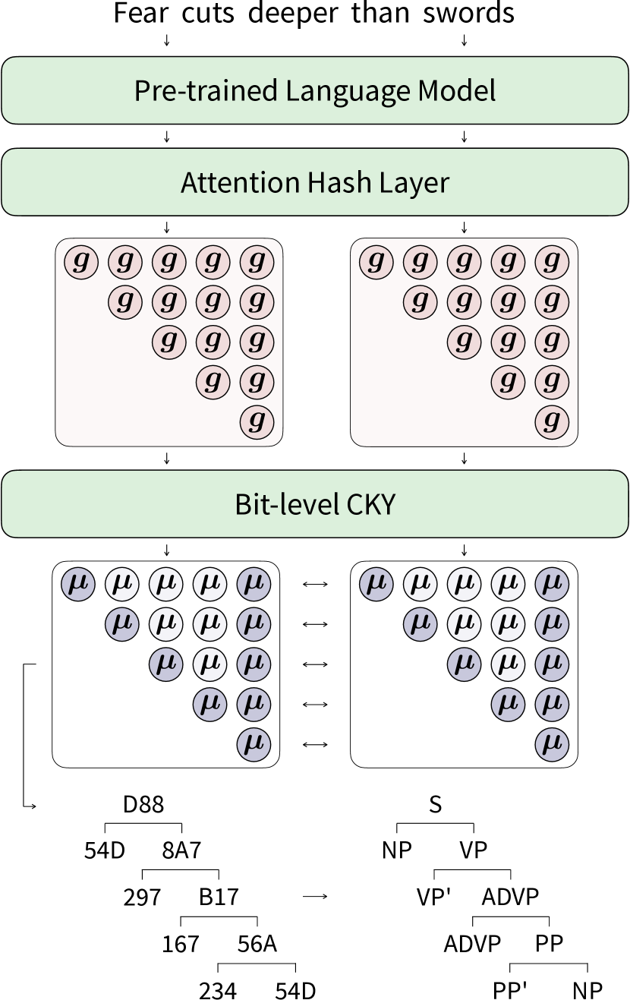
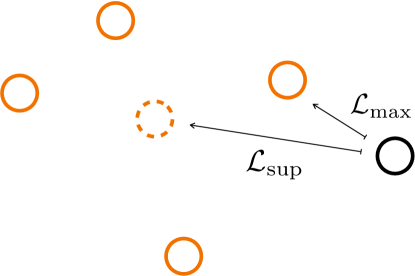

# To be Continuous, or to be Discrete, Those are *Bits* of Questions

###### Abstract

Recently, binary representation has been proposed as a novel representation that lies between continuous and discrete representations. It exhibits considerable information-preserving capability when being used to replace continuous input vectors. In this paper, we investigate the feasibility of further introducing it to the output side, aiming to allow models to output binary labels instead. To preserve the structural information on the output side along with label information, we extend the previous contrastive hashing method as structured contrastive hashing. More specifically, we upgrade CKY from label-level to bit-level, define a new similarity function with span marginal probabilities, and introduce a novel contrastive loss function with a carefully designed instance selection strategy. Our model111<https://github.com/speedcell4/parserker> achieves competitive performance on various structured prediction tasks, and demonstrates that binary representation can be considered a novel representation that further bridges the gap between the continuous nature of deep learning and the discrete intrinsic property of natural languages.  

To be Continuous, or to be Discrete, Those are *Bits* of Questions  

  

    Yiran Wang Masao Utiyama  National Institute of Information and Communications Technology (NICT)  yiran.wang@nict.go.jp mutiyama@nict.go.jp    

  

## 1 Introduction

Bridging the gap between the continuous nature of deep learning and the discrete intrinsic property of natural languages has been one of the most fundamental and essential questions since the very beginning. Continuous representation makes the training of neural networks effective and efficient. Nowadays, representing discrete natural languages in continuous format is the first and foremost step to leveraging the capabilities of deep learning. One could even argue that the exhilarating advancements in natural language processing in the past decade can largely be attributed to the word embedding technique, as it is the first successful attempt.  

[FIGURE S1.F1.g1]

Figure 1: The model architecture. The attention hash layer produces span scores (pink circles), we only use the upper triangular part of these scores and feed them into the bit-level CKY to obtain the marginal probabilities of all valid spans (purple circles). During training, we only select the spans on the target trees for structured contrastive hashing and leave the other spans unused (transparent purple circles). During inference, as shown at the bottom, our model parses sentences by returning trees with label codes (hexadecimal numbers), which are then translated back to the original labels.
[/FIGURE]

Word embedding NIPS2000\_728f206c; mikolov2013efficient; mikolov2013distributed technique replaces the vocabulary-sized one-hot word representations with compact continuous vectors. Since then, input and output layers incorporating embedding matrices have become standard components in neural models. Discrete tokens are mapped into continuous vectors by looking up the corresponding index in it, and continuous vectors are mapped back to discrete tokens by searching the most similar one from it. However, the essence of this operation is still one-hot encoding, even the following subword tokenization techniques sennrich-etal-2016-neural; kudo-2018-subword attempt to mitigate this issue by decomposing words into subword units, these approaches still require the building vocabularies and embedding matrices that consists of tens of thousands of tokens. In the era of large language models openai2023gpt4; touvron2023llama, these embedding matrices typically account for a considerable number of parameters, especially in cross-lingual models. Besides, parameter updates also solely rely on the sparse gradients backpropagated to the limited tokens present in sentences. Moreover, imposing structural constraints on continuous representations to model relations among tokens is considered difficult, whereas it is easy and common in discrete representations. Therefore, further bridging the gap has become increasingly important nowadays.  

Recently, wang-etal-2023-24 introduced a novel binary representation that lies between continuous and discrete representations. They proposed a contrastive hashing method to compress continuous hidden states into binary codes. These codes contain all the necessary task-relevant information, and using them as the only inputs can reproduce the performance of the original models. Unlike associating each token with only a single vector, their method allocates multiple bits to each token, and the token representation can be constructed by concatenating these bit vectors. In other words, their binary representation breaks tokens down into combinations of semantic subspaces. As a result, replacing the token embedding matrix in the input layer with a tiny bit embedding matrix without sacrificing performance becomes possible.  

In this paper, we explore the possibility of further introducing this representation to output layers. In the input layer, structural information can only be implicitly obtained by introducing the task loss as an auxiliary. However, the output layers often involve complex intra-label constraints, especially for structured prediction tasks, structural information can and should be explicitly preserved along with plain label information. Therefore, we attempt to endow models with this capability by extending previous contrastive hashing to structured contrastive hashing.  

We begin by upgrading the CKY, which parses sentences, returns spans with discrete labels, to support binary format labels (§[3.1](#S3.SS1 "3.1 Constituency Parsing with Bits ‣ 3 Proposed Methods ‣ To be Continuous, or to be Discrete, Those are Bits of Questions")). Subsequently, we define a new similarity function by using span marginal probabilities obtained from this bit-level CKY (§[3.2](#S3.SS2 "3.2 Contrastive Hashing with Structures ‣ 3 Proposed Methods ‣ To be Continuous, or to be Discrete, Those are Bits of Questions")) to jointly learn label and structural information. Furthermore, we conduct a detailed analysis of several widely used contrastive learning losses, identifying the geometric center issue, and introduce a novel contrastive learning loss to remedy it (§[3.3](#S3.SS3 "3.3 Instance Selection ‣ 3 Proposed Methods ‣ To be Continuous, or to be Discrete, Those are Bits of Questions")) through carefully selecting instances. By doing so, we show that it is feasible to introduce binary representation to output layers and have them output binary labels on trees. Moreover, since our model is based on contrastive learning, it also benefits from its remarkable representation learning capability, resulting in better performance than existing models. We conduct experiments on constituency parsing and nested named entity recognition. Experimental results (§[4.2](#S4.SS2 "4.2 Main Results ‣ 4 Experiments ‣ To be Continuous, or to be Discrete, Those are Bits of Questions")) demonstrate that our models achieve competitive performance with only around 12 and 8 bits, respectively.  

[FIGURE S1.F2.g1]

Figure 2: An example of the geometric center issue. Orange circles are positive to the black circle instance, while the dotted orange circle is their geometric center. The difference between $\mathcal{L}_{\text{sup}}$ and our $\mathcal{L}_{\text{max}}$ is that we target the closest positive instead of their geometric center.
[/FIGURE]

## 2 Background

### 2.1 Constituency Parsing

For a given sentence $w_{1},\dots,w_{n}$, constituency parsing aims at detecting its hierarchical syntactic structures. Previous work stern-etal-2017-minimal; gaddy-etal-2018-whats; kitaev-klein-2018-constituency; kitaev-etal-2019-multilingual; ijcai2020p0560 decompose tree score $g(\boldsymbol{t})$ as the sum of its constituents scores,  

|  | $$\displaystyle g(\boldsymbol{t})=\sum_{\langle l_{i},r_{i},y_{i}\rangle\in\boldsymbol{t}}{g(l_{i},r_{i},y_{i})}$$ |  | (1) |
| --- | --- | --- | --- |

where $l_{i}$ and $r_{i}$ indicate the left and right boundary of the $i$-th span, and $y_{i}\in\mathcal{Y}$ stands for the label. Constituent score $g(l_{i},r_{i},y_{i})$ reflects the joint score of selecting the specified span and assigning it the specified label. Previous work kitaev-klein-2018-constituency; ijcai2020p0560 commonly compute this score using a linear or bilinear component. Under the framework of graphical probabilistic models, they can efficiently compute the conditional probability by applying the CKY algorithm.  

|  | $$p(\boldsymbol{t})=\dfrac{\exp{g(\boldsymbol{t})}}{Z\equiv\sum_{\boldsymbol{t}^{\prime}\in\mathcal{T}}{\exp{g({\boldsymbol{t}^{\prime}})}}}$$ |  | (2) |
| --- | --- | --- | --- |

$Z$ is commonly known as the partition function which enumerates all valid constituency trees.  

Besides, marginal probability $\mu(l_{i},r_{i},y_{i})$ is also frequently mentioned. It stands for the proportion of scores for all trees that include the specified span with the specified label. As noted by eisner-2016-inside, computing the partial derivative of the log partition with respect to the span score is an efficient approach to obtain the marginal probability.  

|  | $$\mu(l_{i},r_{i},y_{i})=\dfrac{\partial\,\log{Z}}{\partial\,g(l_{i},r_{i},y_{i})}$$ |  | (3) |
| --- | --- | --- | --- |

Intuitively, marginal probability indicates the joint probability of selecting a specified span with a specified label. Therefore, it is easy to notice that merely summing the marginal probabilities for all labels of a given span does not always yield 1, i.e., $\sum_{y^{\prime}\in\mathcal{Y}}{\mu(l_{i},r_{i},y^{\prime})}\not\equiv 1$, as there is no guarantee that this span will be selected. In other words, marginal probabilities contain not only label information but also structural information. If a span is unlikely to be selected, its marginal probability will not be high regardless of the label.  

### 2.2 Contrastive Hashing

Contrastive learning He\_2020\_CVPR; gao-etal-2021-simcse; NEURIPS2020\_d89a66c7 is an effective yet simple representation learning method, which involves pulling together positive pairs and pushing apart negative pairs in a metric space. Recently, wang-etal-2023-24 extended this approach as contrastive hashing. They append an untrained transformer to the end of a pre-trained language model and use its attention scores for both task learning and hashing. Specifically, its entire attention probabilities $a^{k}_{i,j}$ are used to compute hidden states for downstream tasks as usual, and its diagonal entries $s^{k}_{i,i}$ of the attention scores are employed for hashing.  

|  | $$\displaystyle s^{k}_{i,j}=\dfrac{(\mathbf{W}^{Q}_{k}\boldsymbol{h}_{i})^{\top}(\mathbf{W}^{K}_{k}\boldsymbol{h}_{j})}{\sqrt{d_{k}}}$$ |  | (4) |
| --- | --- | --- | --- |
|  | $$\displaystyle a^{k}_{i,j}=\operatorname*{softmax}_{j}{(s^{k}_{i,j})}$$ |  | (5) |
| --- | --- | --- | --- |

Where $\mathbf{W}^{Q}_{k}$ and $\mathbf{W}^{K}_{k}$ are parameters, $\boldsymbol{h}$ are hidden states, $d_{k}$ is the head dimension. These two learning objectives share the same attention matrix, therefore, task-relevant information is implicitly ensured to be preserved in these binary codes.  

More specifically, to leverage the multi-head mechanism, they allow each head to represent one and only one bit. By increasing the number of heads to $K$, they obtain attention scores from $K$ different semantic aspects. During the inference stage, codes are generated by binarizing these scores,  

|  | $$\displaystyle\boldsymbol{c}_{i}=[c^{1}_{i},\cdots,c^{K}_{i}]\in\{-1,+1\}^{K}$$ |  | (6) |
| --- | --- | --- | --- |
|  | $$\displaystyle c^{k}_{i}=\operatorname{sign}{(s^{k}_{i,i})}$$ |  |
| --- | --- | --- |

During the training stage, they approximate Hamming similarity by computing the cosine similarity, with one of its inputs binarized first.  

|  | $$s(i,j)=\cos{(\boldsymbol{s}_{i,i},\boldsymbol{c}_{j})}$$ |  | (7) |
| --- | --- | --- | --- |

Apart from this similarity function, they also propose a novel loss by carefully selecting instances and eliminating potential positives and negatives. They fine-tune the entire model using both the downstream task loss and the contrastive hashing loss, i.e., $\mathcal{L}=\mathcal{L}_{\text{task}}+\beta\cdot\mathcal{L}_{\text{contrastive}}$. Experiments show that they can reproduce the original performance on an extremely tiny model using only these 24-bit codes as inputs. Therefore, they claim that these codes preserve all the necessary task-relevant information.  

## 3 Proposed Methods

Our model attempts to learn parsing and hashing simultaneously with a single structured contrastive hashing loss. In other words, we try to introduce the binary representation to output layers and eliminate the need for the $\mathcal{L}_{\text{task}}$ above. To achieve this, we first extend the CKY module to support binary labels (§[3.1](#S3.SS1 "3.1 Constituency Parsing with Bits ‣ 3 Proposed Methods ‣ To be Continuous, or to be Discrete, Those are Bits of Questions")). Then, we replace the cosine similarity with a newly defined similarity function (§[3.2](#S3.SS2 "3.2 Contrastive Hashing with Structures ‣ 3 Proposed Methods ‣ To be Continuous, or to be Discrete, Those are Bits of Questions")) based on span marginal probabilities, because it contains not only label information but also structural information. After that, we analyze several commonly used contrastive losses, and propose a new one (§[3.3](#S3.SS3 "3.3 Instance Selection ‣ 3 Proposed Methods ‣ To be Continuous, or to be Discrete, Those are Bits of Questions")) to mitigate the geometric center issue as shown in Figure [2](#S1.F2 "Figure 2 ‣ 1 Introduction ‣ To be Continuous, or to be Discrete, Those are Bits of Questions"). After training, we build code vocabulary by mapping binary codes back to their most frequently coinciding labels.  

### 3.1 Constituency Parsing with Bits

We decompose tree scores as the sum of constituent scores as well, but with discrete labels $y_{i}$ replaced with binary codes $\boldsymbol{c}_{i}\in\{-1,+1\}^{K}$.  

|  | $$\displaystyle g(\boldsymbol{t})=\sum_{\langle l_{i},r_{i},\boldsymbol{c}_{i}\rangle\in\boldsymbol{t}}{g(l_{i},r_{i},\boldsymbol{c}_{i})}$$ |  | (8) |
| --- | --- | --- | --- |
|  | $$\displaystyle g(l_{i},r_{i},\boldsymbol{c}_{i})=\sum_{k=1}^{K}{g_{k}(l_{i},r_{i},c_{i}^{k})}$$ |  | (9) |
| --- | --- | --- | --- |

Where $g_{k}(l_{i},r_{i},c_{i}^{k})$ represents the span score with the $k$-th bit position assigned as value $c_{i}^{k}$. We additionally assume that the bits are independent of each other, so we simply add their scores together to obtain the span score $g(l_{i},r_{i},\boldsymbol{c}_{i})$.  

Following wang-etal-2023-24, we maintain the one-head-one-bit design and also utilize attention scores for hashing. Furthermore, since we attempt to eliminate $\mathcal{L}_{\text{task}}$, we do not need to compute the final outputs of the transformer layer. Therefore, we only retain the query $\mathbf{W}_{k}^{Q}$ and key $\mathbf{W}_{k}^{K}$ to calculate the span score for getting $+1$ in the $k$-th bit position by using the token hidden states of the left and right span boundary $\boldsymbol{h}_{l_{i}}$ and $\boldsymbol{h}_{r_{i}}$. For the $-1$ case, we simply leave its score as 0.  

|  | $\displaystyle g_{k}(l_{i},r_{i},+1)$ | $\displaystyle=\dfrac{(\mathbf{W}_{k}^{Q}\boldsymbol{h}_{l_{i}})^{\top}(\mathbf{W}_{k}^{K}\boldsymbol{h}_{r_{i}})}{\sqrt{d_{k}}}$ |  | (10) |
| --- | --- | --- | --- | --- |
|  | $\displaystyle g_{k}(l_{i},r_{i},-1)$ | $\displaystyle=0$ |  | (11) |
| --- | --- | --- | --- | --- |

With these definitions, we can extend the CKY module to the bit-level and calculate the conditional probability and partition function using Equation [2](#S2.E2 "In 2.1 Constituency Parsing ‣ 2 Background ‣ To be Continuous, or to be Discrete, Those are Bits of Questions") as usual. Additionally, the bit-level marginal probability is defined as below.  

|  | $$\mu_{k}{(l_{i},r_{i},c_{i}^{k})}=\dfrac{\partial\,\log{Z}}{\partial\,g_{k}(l_{i},r_{i},c_{i}^{k})}$$ |  | (12) |
| --- | --- | --- | --- |

### 3.2 Contrastive Hashing with Structures

wang-etal-2023-24 emphasize that the key to their loss function is first hashing one of its inputs as codes and then calculating the similarity between continuous scores and the discrete codes. We define our similarity function in a similar way. Since we can straightforwardly obtain the span marginal probabilities with Equation [12](#S3.E12 "In 3.1 Constituency Parsing with Bits ‣ 3 Proposed Methods ‣ To be Continuous, or to be Discrete, Those are Bits of Questions"), we then binarize scores into codes towards the sides with the higher span marginal probabilities.  

|  | $$\displaystyle\boldsymbol{c}_{i}=[c_{i}^{1},\dots,c_{i}^{K}]\in\{-1,+1\}^{K}$$ |  | (13) |
| --- | --- | --- | --- |
|  | $$\displaystyle c_{i}^{k}=\begin{cases}+1&\mu_{k}(l_{i},r_{i},+1)>\mu_{k}(l_{i},r_{i},-1)\\ -1&\text{otherwise}\end{cases}$$ |  |
| --- | --- | --- |

Naturally, we define the similarity function between two spans as the marginal probability of selecting $i$-th span while assigning $\boldsymbol{c}_{j}$ as its code.  

|  | $$s(i,j)=\dfrac{1}{K}\sum_{k=1}^{K}{\mu_{k}{(l_{i},r_{i},c_{j}^{k})}}$$ |  | (14) |
| --- | --- | --- | --- |

As we mentioned above (§[2.1](#S2.SS1 "2.1 Constituency Parsing ‣ 2 Background ‣ To be Continuous, or to be Discrete, Those are Bits of Questions")), we use marginal probabilities to define the similarity function because they reflect the joint probability of both selecting the specified span and assigning the specified label to it. If a span is unlikely to be selected as a phrase, then both $\mu_{k}(l_{i},r_{i},+1)$ and $\mu_{k}(l_{i},r_{i},-1)$ will be close to zero. Thus, the model learns structural and label information simultaneously. By leveraging this similarity function, we extend contrastive hashing to structured contrastive hashing. This approach eliminates the label embedding from the output layer, as the hashing layer returns labels in binary format now.  

Moreover, for a sentence with $n$ tokens, the total number of spans is $(n^{2}+n)/2$, and bit-level CKY returns marginal probabilities for them all. However, using them for contrastive hashing leads to an intractable time complexity of $\mathcal{O}{(n^{4})}$. In practice, we select only spans from the target trees, reducing the number of spans to $2n-1$ to maintain the time complexity at $\mathcal{O}{(n^{2})}$. This is another reason why we prefer marginal probability.  

### 3.3 Instance Selection

Following the contrastive learning framework gao-etal-2021-simcse; wang-etal-2023-24, we feed sentences into the neural network twice to obtain two semantically identical but slightly augmented representations. In this way, we get two different marginal probabilities for each span. We calculate contrastive losses by comparing each span across views and average them as the batch loss (§[3.5](#S3.SS5 "3.5 Training and Inference ‣ 3 Proposed Methods ‣ To be Continuous, or to be Discrete, Those are Bits of Questions")). Note that each batch contains spans from multiple sentences, so our contrastive hashing also compares spans across different sentences. For clarity, we omit subscripts in the following equations when there is no ambiguity.  

As we mentioned above (§[2.2](#S2.SS2 "2.2 Contrastive Hashing ‣ 2 Background ‣ To be Continuous, or to be Discrete, Those are Bits of Questions")), the fundamental concept of contrastive learning is pulling together positives and pushing apart negatives. The most commonly used objective function is defined as,  

|  | $$\mathcal{L}_{\text{self}}=-\log{\dfrac{\exp{s(i,i)}}{\sum_{j\in\mathcal{N}\cup\mathcal{P}}{\exp{s(i,j)}}}}$$ |  | (15) |
| --- | --- | --- | --- |

$\mathcal{N}=\{j\mid y_{j}\neq y_{i}\}$ and $\mathcal{P}=\{j\mid y_{j}=y_{i}\}$ stands for the negative and positive sets, respectively. We additionally define $\mathcal{S}=\{i\}$ as the set that contains span $i$ as its only entry. It is obvious that $\mathcal{S}\subseteq\mathcal{P}$ always holds.  

In addition, the $\log{\sum{\exp}}$ operator is commonly considered a differentiable approximation of the $\max$ operator. Therefore, by slightly tweaking the equation, we reinterpret it as below.  

|  | $\displaystyle\mathcal{L}_{\text{self}}$ | $\displaystyle=\log{\sum_{j}{\exp{s(i,j)}}}-s(i,i)$ |  |
| --- | --- | --- | --- |
|  |  | $\displaystyle\approx\definecolor{tcbcolback}{rgb}{0.9,0.9,1}\definecolor{tcbcol@origin}{rgb}{0,0,0}\definecolor{.}{rgb}{0,0,0}\definecolor{.}{rgb}{0,0,0}\leavevmode\hbox to65.76pt{\vbox to14.5pt{\pgfpicture\makeatletter\hbox{\hskip 0.0pt\lower 0.0pt\hbox to0.0pt{\pgfsys@beginscope\pgfsys@invoke{ }\definecolor[named]{pgfstrokecolor}{rgb}{0,0,0}\pgfsys@color@rgb@stroke{0}{0}{0}\pgfsys@invoke{ }\pgfsys@color@rgb@fill{0}{0}{0}\pgfsys@invoke{ }\pgfsys@setlinewidth{0.4pt}\pgfsys@invoke{ }\nullfont\hbox to0.0pt{\pgfsys@beginscope\pgfsys@invoke{ }{}{}{}{}\pgfsys@beginscope\pgfsys@invoke{ } {{}}\hbox{\hbox{{\pgfsys@beginscope\pgfsys@invoke{ }\pgfsys@setlinewidth{0.0pt}\pgfsys@invoke{ }{{}{}{{}}{} {{}{{}}}{{}{}}{}{{}{}} {\pgfsys@beginscope\pgfsys@invoke{ }\pgfsys@setlinewidth{0.0pt}\pgfsys@invoke{ } \pgfsys@invoke{\lxSVG@closescope }\pgfsys@endscope}{{{{}}\pgfsys@beginscope\pgfsys@invoke{ }\pgfsys@transformcm{1.0}{0.0}{0.0}{1.0}{32.88048pt}{7.2511pt}\pgfsys@invoke{ }\hbox{{\definecolor[named]{pgfstrokecolor}{rgb}{0,0,0}\pgfsys@color@rgb@stroke{0}{0}{0}\pgfsys@invoke{ }\pgfsys@color@rgb@fill{0}{0}{0}\pgfsys@invoke{ }\hbox{} }}\pgfsys@invoke{\lxSVG@closescope }\pgfsys@endscope}}} \pgfsys@invoke{\lxSVG@closescope }\pgfsys@endscope}}} {{}}\hbox{\hbox{{\pgfsys@beginscope\pgfsys@invoke{ }\pgfsys@setlinewidth{0.0pt}\pgfsys@invoke{ }{{}{}{{}}{} {{}{{}}}{{}{}}{}{{}{}} {\pgfsys@beginscope\pgfsys@invoke{ }\pgfsys@setlinewidth{0.0pt}\pgfsys@invoke{ } \pgfsys@invoke{\lxSVG@closescope }\pgfsys@endscope}{{{{}}\pgfsys@beginscope\pgfsys@invoke{ }\pgfsys@transformcm{1.0}{0.0}{0.0}{1.0}{32.88048pt}{7.2511pt}\pgfsys@invoke{ }\hbox{{\definecolor[named]{pgfstrokecolor}{rgb}{0,0,0}\pgfsys@color@rgb@stroke{0}{0}{0}\pgfsys@invoke{ }\pgfsys@color@rgb@fill{0}{0}{0}\pgfsys@invoke{ }\hbox{} }}\pgfsys@invoke{\lxSVG@closescope }\pgfsys@endscope}}} \pgfsys@invoke{\lxSVG@closescope }\pgfsys@endscope}}} \pgfsys@invoke{\lxSVG@closescope }\pgfsys@endscope{}{}{}{}{}{}{}{}\pgfsys@beginscope\pgfsys@invoke{ }\definecolor[named]{pgffillcolor}{rgb}{0.25,0.25,0.25}\pgfsys@color@gray@fill{0.25}\pgfsys@invoke{ }\pgfsys@fill@opacity{1.0}\pgfsys@invoke{ } \pgfsys@invoke{\lxSVG@closescope }\pgfsys@endscope{}{}{}{}{}{}{}{}\pgfsys@beginscope\pgfsys@invoke{ }\definecolor[named]{pgffillcolor}{rgb}{0.9,0.9,1}\pgfsys@color@rgb@fill{0.9}{0.9}{1}\pgfsys@invoke{ }\pgfsys@fill@opacity{1.0}\pgfsys@invoke{ }{{}{}{{}}}{{}{}{{}}}{}{}{{}{}{{}}}{{}{}{{}}}{}{}{{}{}{{}}}{{}{}{{}}}{}{}{{}{}{{}}}{{}{}{{}}}{}{}\pgfsys@moveto{0.0pt}{2.84526pt}\pgfsys@lineto{0.0pt}{11.65695pt}\pgfsys@curveto{0.0pt}{13.22836pt}{1.27385pt}{14.50221pt}{2.84526pt}{14.50221pt}\pgfsys@lineto{62.91571pt}{14.50221pt}\pgfsys@curveto{64.48712pt}{14.50221pt}{65.76097pt}{13.22836pt}{65.76097pt}{11.65695pt}\pgfsys@lineto{65.76097pt}{2.84526pt}\pgfsys@curveto{65.76097pt}{1.27385pt}{64.48712pt}{0.0pt}{62.91571pt}{0.0pt}\pgfsys@lineto{2.84526pt}{0.0pt}\pgfsys@curveto{1.27385pt}{0.0pt}{0.0pt}{1.27385pt}{0.0pt}{2.84526pt}\pgfsys@closepath\pgfsys@fill\pgfsys@invoke{ } \pgfsys@invoke{\lxSVG@closescope }\pgfsys@endscope\pgfsys@beginscope\pgfsys@invoke{ }\pgfsys@fill@opacity{1.0}\pgfsys@invoke{ }{{{}}{{}}{{}}{{}}{{}}{{}}{{}}\pgfsys@beginscope\pgfsys@invoke{ }\pgfsys@transformcm{1.0}{0.0}{0.0}{1.0}{2.0pt}{5.00221pt}\pgfsys@invoke{ }\hbox{{\color[rgb]{0,0,0}\definecolor[named]{pgfstrokecolor}{rgb}{0,0,0}\pgfsys@color@gray@stroke{0}\pgfsys@color@gray@fill{0}\hbox{\set@color{$\displaystyle\max_{j\in\mathcal{N}\cup\mathcal{P}}{s(i,j)}$}}}}\pgfsys@invoke{\lxSVG@closescope }\pgfsys@endscope}\pgfsys@invoke{\lxSVG@closescope }\pgfsys@endscope \pgfsys@invoke{\lxSVG@closescope }\pgfsys@endscope{}{}{}\hss}\pgfsys@discardpath\pgfsys@invoke{\lxSVG@closescope }\pgfsys@endscope\hss}}\lxSVG@closescope\endpgfpicture}}-\definecolor{tcbcolback}{rgb}{1,0.9,0.9}\definecolor{tcbcol@origin}{rgb}{0,0,0}\definecolor{.}{rgb}{0,0,0}\definecolor{.}{rgb}{0,0,0}\leavevmode\hbox to27.8pt{\vbox to14pt{\pgfpicture\makeatletter\hbox{\hskip 0.0pt\lower 0.0pt\hbox to0.0pt{\pgfsys@beginscope\pgfsys@invoke{ }\definecolor[named]{pgfstrokecolor}{rgb}{0,0,0}\pgfsys@color@rgb@stroke{0}{0}{0}\pgfsys@invoke{ }\pgfsys@color@rgb@fill{0}{0}{0}\pgfsys@invoke{ }\pgfsys@setlinewidth{0.4pt}\pgfsys@invoke{ }\nullfont\hbox to0.0pt{\pgfsys@beginscope\pgfsys@invoke{ }{}{}{}{}\pgfsys@beginscope\pgfsys@invoke{ } {{}}\hbox{\hbox{{\pgfsys@beginscope\pgfsys@invoke{ }\pgfsys@setlinewidth{0.0pt}\pgfsys@invoke{ }{{}{}{{}}{} {{}{{}}}{{}{}}{}{{}{}} {\pgfsys@beginscope\pgfsys@invoke{ }\pgfsys@setlinewidth{0.0pt}\pgfsys@invoke{ } \pgfsys@invoke{\lxSVG@closescope }\pgfsys@endscope}{{{{}}\pgfsys@beginscope\pgfsys@invoke{ }\pgfsys@transformcm{1.0}{0.0}{0.0}{1.0}{13.89998pt}{7.0pt}\pgfsys@invoke{ }\hbox{{\definecolor[named]{pgfstrokecolor}{rgb}{0,0,0}\pgfsys@color@rgb@stroke{0}{0}{0}\pgfsys@invoke{ }\pgfsys@color@rgb@fill{0}{0}{0}\pgfsys@invoke{ }\hbox{} }}\pgfsys@invoke{\lxSVG@closescope }\pgfsys@endscope}}} \pgfsys@invoke{\lxSVG@closescope }\pgfsys@endscope}}} {{}}\hbox{\hbox{{\pgfsys@beginscope\pgfsys@invoke{ }\pgfsys@setlinewidth{0.0pt}\pgfsys@invoke{ }{{}{}{{}}{} {{}{{}}}{{}{}}{}{{}{}} {\pgfsys@beginscope\pgfsys@invoke{ }\pgfsys@setlinewidth{0.0pt}\pgfsys@invoke{ } \pgfsys@invoke{\lxSVG@closescope }\pgfsys@endscope}{{{{}}\pgfsys@beginscope\pgfsys@invoke{ }\pgfsys@transformcm{1.0}{0.0}{0.0}{1.0}{13.89998pt}{7.0pt}\pgfsys@invoke{ }\hbox{{\definecolor[named]{pgfstrokecolor}{rgb}{0,0,0}\pgfsys@color@rgb@stroke{0}{0}{0}\pgfsys@invoke{ }\pgfsys@color@rgb@fill{0}{0}{0}\pgfsys@invoke{ }\hbox{} }}\pgfsys@invoke{\lxSVG@closescope }\pgfsys@endscope}}} \pgfsys@invoke{\lxSVG@closescope }\pgfsys@endscope}}} \pgfsys@invoke{\lxSVG@closescope }\pgfsys@endscope{}{}{}{}{}{}{}{}\pgfsys@beginscope\pgfsys@invoke{ }\definecolor[named]{pgffillcolor}{rgb}{0.25,0.25,0.25}\pgfsys@color@gray@fill{0.25}\pgfsys@invoke{ }\pgfsys@fill@opacity{1.0}\pgfsys@invoke{ } \pgfsys@invoke{\lxSVG@closescope }\pgfsys@endscope{}{}{}{}{}{}{}{}\pgfsys@beginscope\pgfsys@invoke{ }\definecolor[named]{pgffillcolor}{rgb}{1,0.9,0.9}\pgfsys@color@rgb@fill{1}{0.9}{0.9}\pgfsys@invoke{ }\pgfsys@fill@opacity{1.0}\pgfsys@invoke{ }{{}{}{{}}}{{}{}{{}}}{}{}{{}{}{{}}}{{}{}{{}}}{}{}{{}{}{{}}}{{}{}{{}}}{}{}{{}{}{{}}}{{}{}{{}}}{}{}\pgfsys@moveto{0.0pt}{2.84526pt}\pgfsys@lineto{0.0pt}{11.15474pt}\pgfsys@curveto{0.0pt}{12.72615pt}{1.27385pt}{14.0pt}{2.84526pt}{14.0pt}\pgfsys@lineto{24.95471pt}{14.0pt}\pgfsys@curveto{26.52612pt}{14.0pt}{27.79997pt}{12.72615pt}{27.79997pt}{11.15474pt}\pgfsys@lineto{27.79997pt}{2.84526pt}\pgfsys@curveto{27.79997pt}{1.27385pt}{26.52612pt}{0.0pt}{24.95471pt}{0.0pt}\pgfsys@lineto{2.84526pt}{0.0pt}\pgfsys@curveto{1.27385pt}{0.0pt}{0.0pt}{1.27385pt}{0.0pt}{2.84526pt}\pgfsys@closepath\pgfsys@fill\pgfsys@invoke{ } \pgfsys@invoke{\lxSVG@closescope }\pgfsys@endscope\pgfsys@beginscope\pgfsys@invoke{ }\pgfsys@fill@opacity{1.0}\pgfsys@invoke{ }{{{}}{{}}{{}}{{}}{{}}{{}}{{}}\pgfsys@beginscope\pgfsys@invoke{ }\pgfsys@transformcm{1.0}{0.0}{0.0}{1.0}{2.0pt}{4.5pt}\pgfsys@invoke{ }\hbox{{\color[rgb]{0,0,0}\definecolor[named]{pgfstrokecolor}{rgb}{0,0,0}\pgfsys@color@gray@stroke{0}\pgfsys@color@gray@fill{0}\hbox{\set@color{$\displaystyle s(i,i)$}}}}\pgfsys@invoke{\lxSVG@closescope }\pgfsys@endscope}\pgfsys@invoke{\lxSVG@closescope }\pgfsys@endscope \pgfsys@invoke{\lxSVG@closescope }\pgfsys@endscope{}{}{}\hss}\pgfsys@discardpath\pgfsys@invoke{\lxSVG@closescope }\pgfsys@endscope\hss}}\lxSVG@closescope\endpgfpicture}}$ |  | (16) |
| --- | --- | --- | --- | --- |

Moreover, NEURIPS2020\_d89a66c7 also proposed a loss function for supervised settings where multiple positives are present. By applying the same tricks, we can rewrite the loss function as follows.  

|  | $\displaystyle\mathcal{L}_{\text{sup}}$ | $\displaystyle=-\dfrac{1}{\left|\mathcal{P}\right|}\sum_{p\in\mathcal{P}}{\log{\dfrac{\exp{s(i,p)}}{\sum_{j\in\mathcal{N}\cup\mathcal{P}}{\exp{s(i,j)}}}}}$ |  |
| --- | --- | --- | --- |
|  |  | $\displaystyle=\log{\sum_{j}{\exp{s(i,j)}}}-\dfrac{1}{\left|\mathcal{P}\right|}\sum_{p}{s(i,p)}$ |  |
| --- | --- | --- | --- |
|  |  | $\displaystyle\approx\definecolor{tcbcolback}{rgb}{0.9,0.9,1}\definecolor{tcbcol@origin}{rgb}{0,0,0}\definecolor{.}{rgb}{0,0,0}\definecolor{.}{rgb}{0,0,0}\leavevmode\hbox to65.76pt{\vbox to14.5pt{\pgfpicture\makeatletter\hbox{\hskip 0.0pt\lower 0.0pt\hbox to0.0pt{\pgfsys@beginscope\pgfsys@invoke{ }\definecolor[named]{pgfstrokecolor}{rgb}{0,0,0}\pgfsys@color@rgb@stroke{0}{0}{0}\pgfsys@invoke{ }\pgfsys@color@rgb@fill{0}{0}{0}\pgfsys@invoke{ }\pgfsys@setlinewidth{0.4pt}\pgfsys@invoke{ }\nullfont\hbox to0.0pt{\pgfsys@beginscope\pgfsys@invoke{ }{}{}{}{}\pgfsys@beginscope\pgfsys@invoke{ } {{}}\hbox{\hbox{{\pgfsys@beginscope\pgfsys@invoke{ }\pgfsys@setlinewidth{0.0pt}\pgfsys@invoke{ }{{}{}{{}}{} {{}{{}}}{{}{}}{}{{}{}} {\pgfsys@beginscope\pgfsys@invoke{ }\pgfsys@setlinewidth{0.0pt}\pgfsys@invoke{ } \pgfsys@invoke{\lxSVG@closescope }\pgfsys@endscope}{{{{}}\pgfsys@beginscope\pgfsys@invoke{ }\pgfsys@transformcm{1.0}{0.0}{0.0}{1.0}{32.88048pt}{7.2511pt}\pgfsys@invoke{ }\hbox{{\definecolor[named]{pgfstrokecolor}{rgb}{0,0,0}\pgfsys@color@rgb@stroke{0}{0}{0}\pgfsys@invoke{ }\pgfsys@color@rgb@fill{0}{0}{0}\pgfsys@invoke{ }\hbox{} }}\pgfsys@invoke{\lxSVG@closescope }\pgfsys@endscope}}} \pgfsys@invoke{\lxSVG@closescope }\pgfsys@endscope}}} {{}}\hbox{\hbox{{\pgfsys@beginscope\pgfsys@invoke{ }\pgfsys@setlinewidth{0.0pt}\pgfsys@invoke{ }{{}{}{{}}{} {{}{{}}}{{}{}}{}{{}{}} {\pgfsys@beginscope\pgfsys@invoke{ }\pgfsys@setlinewidth{0.0pt}\pgfsys@invoke{ } \pgfsys@invoke{\lxSVG@closescope }\pgfsys@endscope}{{{{}}\pgfsys@beginscope\pgfsys@invoke{ }\pgfsys@transformcm{1.0}{0.0}{0.0}{1.0}{32.88048pt}{7.2511pt}\pgfsys@invoke{ }\hbox{{\definecolor[named]{pgfstrokecolor}{rgb}{0,0,0}\pgfsys@color@rgb@stroke{0}{0}{0}\pgfsys@invoke{ }\pgfsys@color@rgb@fill{0}{0}{0}\pgfsys@invoke{ }\hbox{} }}\pgfsys@invoke{\lxSVG@closescope }\pgfsys@endscope}}} \pgfsys@invoke{\lxSVG@closescope }\pgfsys@endscope}}} \pgfsys@invoke{\lxSVG@closescope }\pgfsys@endscope{}{}{}{}{}{}{}{}\pgfsys@beginscope\pgfsys@invoke{ }\definecolor[named]{pgffillcolor}{rgb}{0.25,0.25,0.25}\pgfsys@color@gray@fill{0.25}\pgfsys@invoke{ }\pgfsys@fill@opacity{1.0}\pgfsys@invoke{ } \pgfsys@invoke{\lxSVG@closescope }\pgfsys@endscope{}{}{}{}{}{}{}{}\pgfsys@beginscope\pgfsys@invoke{ }\definecolor[named]{pgffillcolor}{rgb}{0.9,0.9,1}\pgfsys@color@rgb@fill{0.9}{0.9}{1}\pgfsys@invoke{ }\pgfsys@fill@opacity{1.0}\pgfsys@invoke{ }{{}{}{{}}}{{}{}{{}}}{}{}{{}{}{{}}}{{}{}{{}}}{}{}{{}{}{{}}}{{}{}{{}}}{}{}{{}{}{{}}}{{}{}{{}}}{}{}\pgfsys@moveto{0.0pt}{2.84526pt}\pgfsys@lineto{0.0pt}{11.65695pt}\pgfsys@curveto{0.0pt}{13.22836pt}{1.27385pt}{14.50221pt}{2.84526pt}{14.50221pt}\pgfsys@lineto{62.91571pt}{14.50221pt}\pgfsys@curveto{64.48712pt}{14.50221pt}{65.76097pt}{13.22836pt}{65.76097pt}{11.65695pt}\pgfsys@lineto{65.76097pt}{2.84526pt}\pgfsys@curveto{65.76097pt}{1.27385pt}{64.48712pt}{0.0pt}{62.91571pt}{0.0pt}\pgfsys@lineto{2.84526pt}{0.0pt}\pgfsys@curveto{1.27385pt}{0.0pt}{0.0pt}{1.27385pt}{0.0pt}{2.84526pt}\pgfsys@closepath\pgfsys@fill\pgfsys@invoke{ } \pgfsys@invoke{\lxSVG@closescope }\pgfsys@endscope\pgfsys@beginscope\pgfsys@invoke{ }\pgfsys@fill@opacity{1.0}\pgfsys@invoke{ }{{{}}{{}}{{}}{{}}{{}}{{}}{{}}\pgfsys@beginscope\pgfsys@invoke{ }\pgfsys@transformcm{1.0}{0.0}{0.0}{1.0}{2.0pt}{5.00221pt}\pgfsys@invoke{ }\hbox{{\color[rgb]{0,0,0}\definecolor[named]{pgfstrokecolor}{rgb}{0,0,0}\pgfsys@color@gray@stroke{0}\pgfsys@color@gray@fill{0}\hbox{\set@color{$\displaystyle\max_{j\in\mathcal{N}\cup\mathcal{P}}{s(i,j)}$}}}}\pgfsys@invoke{\lxSVG@closescope }\pgfsys@endscope}\pgfsys@invoke{\lxSVG@closescope }\pgfsys@endscope \pgfsys@invoke{\lxSVG@closescope }\pgfsys@endscope{}{}{}\hss}\pgfsys@discardpath\pgfsys@invoke{\lxSVG@closescope }\pgfsys@endscope\hss}}\lxSVG@closescope\endpgfpicture}}-\definecolor{tcbcolback}{rgb}{1,0.9,0.9}\definecolor{tcbcol@origin}{rgb}{0,0,0}\definecolor{.}{rgb}{0,0,0}\definecolor{.}{rgb}{0,0,0}\leavevmode\hbox to67.55pt{\vbox to14.5pt{\pgfpicture\makeatletter\hbox{\hskip 0.0pt\lower 0.0pt\hbox to0.0pt{\pgfsys@beginscope\pgfsys@invoke{ }\definecolor[named]{pgfstrokecolor}{rgb}{0,0,0}\pgfsys@color@rgb@stroke{0}{0}{0}\pgfsys@invoke{ }\pgfsys@color@rgb@fill{0}{0}{0}\pgfsys@invoke{ }\pgfsys@setlinewidth{0.4pt}\pgfsys@invoke{ }\nullfont\hbox to0.0pt{\pgfsys@beginscope\pgfsys@invoke{ }{}{}{}{}\pgfsys@beginscope\pgfsys@invoke{ } {{}}\hbox{\hbox{{\pgfsys@beginscope\pgfsys@invoke{ }\pgfsys@setlinewidth{0.0pt}\pgfsys@invoke{ }{{}{}{{}}{} {{}{{}}}{{}{}}{}{{}{}} {\pgfsys@beginscope\pgfsys@invoke{ }\pgfsys@setlinewidth{0.0pt}\pgfsys@invoke{ } \pgfsys@invoke{\lxSVG@closescope }\pgfsys@endscope}{{{{}}\pgfsys@beginscope\pgfsys@invoke{ }\pgfsys@transformcm{1.0}{0.0}{0.0}{1.0}{33.77493pt}{7.2511pt}\pgfsys@invoke{ }\hbox{{\definecolor[named]{pgfstrokecolor}{rgb}{0,0,0}\pgfsys@color@rgb@stroke{0}{0}{0}\pgfsys@invoke{ }\pgfsys@color@rgb@fill{0}{0}{0}\pgfsys@invoke{ }\hbox{} }}\pgfsys@invoke{\lxSVG@closescope }\pgfsys@endscope}}} \pgfsys@invoke{\lxSVG@closescope }\pgfsys@endscope}}} {{}}\hbox{\hbox{{\pgfsys@beginscope\pgfsys@invoke{ }\pgfsys@setlinewidth{0.0pt}\pgfsys@invoke{ }{{}{}{{}}{} {{}{{}}}{{}{}}{}{{}{}} {\pgfsys@beginscope\pgfsys@invoke{ }\pgfsys@setlinewidth{0.0pt}\pgfsys@invoke{ } \pgfsys@invoke{\lxSVG@closescope }\pgfsys@endscope}{{{{}}\pgfsys@beginscope\pgfsys@invoke{ }\pgfsys@transformcm{1.0}{0.0}{0.0}{1.0}{33.77493pt}{7.2511pt}\pgfsys@invoke{ }\hbox{{\definecolor[named]{pgfstrokecolor}{rgb}{0,0,0}\pgfsys@color@rgb@stroke{0}{0}{0}\pgfsys@invoke{ }\pgfsys@color@rgb@fill{0}{0}{0}\pgfsys@invoke{ }\hbox{} }}\pgfsys@invoke{\lxSVG@closescope }\pgfsys@endscope}}} \pgfsys@invoke{\lxSVG@closescope }\pgfsys@endscope}}} \pgfsys@invoke{\lxSVG@closescope }\pgfsys@endscope{}{}{}{}{}{}{}{}\pgfsys@beginscope\pgfsys@invoke{ }\definecolor[named]{pgffillcolor}{rgb}{0.25,0.25,0.25}\pgfsys@color@gray@fill{0.25}\pgfsys@invoke{ }\pgfsys@fill@opacity{1.0}\pgfsys@invoke{ } \pgfsys@invoke{\lxSVG@closescope }\pgfsys@endscope{}{}{}{}{}{}{}{}\pgfsys@beginscope\pgfsys@invoke{ }\definecolor[named]{pgffillcolor}{rgb}{1,0.9,0.9}\pgfsys@color@rgb@fill{1}{0.9}{0.9}\pgfsys@invoke{ }\pgfsys@fill@opacity{1.0}\pgfsys@invoke{ }{{}{}{{}}}{{}{}{{}}}{}{}{{}{}{{}}}{{}{}{{}}}{}{}{{}{}{{}}}{{}{}{{}}}{}{}{{}{}{{}}}{{}{}{{}}}{}{}\pgfsys@moveto{0.0pt}{2.84526pt}\pgfsys@lineto{0.0pt}{11.65695pt}\pgfsys@curveto{0.0pt}{13.22836pt}{1.27385pt}{14.50221pt}{2.84526pt}{14.50221pt}\pgfsys@lineto{64.7046pt}{14.50221pt}\pgfsys@curveto{66.27602pt}{14.50221pt}{67.54987pt}{13.22836pt}{67.54987pt}{11.65695pt}\pgfsys@lineto{67.54987pt}{2.84526pt}\pgfsys@curveto{67.54987pt}{1.27385pt}{66.27602pt}{0.0pt}{64.7046pt}{0.0pt}\pgfsys@lineto{2.84526pt}{0.0pt}\pgfsys@curveto{1.27385pt}{0.0pt}{0.0pt}{1.27385pt}{0.0pt}{2.84526pt}\pgfsys@closepath\pgfsys@fill\pgfsys@invoke{ } \pgfsys@invoke{\lxSVG@closescope }\pgfsys@endscope\pgfsys@beginscope\pgfsys@invoke{ }\pgfsys@fill@opacity{1.0}\pgfsys@invoke{ }{{{}}{{}}{{}}{{}}{{}}{{}}{{}}\pgfsys@beginscope\pgfsys@invoke{ }\pgfsys@transformcm{1.0}{0.0}{0.0}{1.0}{2.0pt}{5.00221pt}\pgfsys@invoke{ }\hbox{{\color[rgb]{0,0,0}\definecolor[named]{pgfstrokecolor}{rgb}{0,0,0}\pgfsys@color@gray@stroke{0}\pgfsys@color@gray@fill{0}\hbox{\set@color{$\displaystyle\operatorname*{mean}_{j\in\mathcal{P}}{s(i,j)}$}}}}\pgfsys@invoke{\lxSVG@closescope }\pgfsys@endscope}\pgfsys@invoke{\lxSVG@closescope }\pgfsys@endscope \pgfsys@invoke{\lxSVG@closescope }\pgfsys@endscope{}{}{}\hss}\pgfsys@discardpath\pgfsys@invoke{\lxSVG@closescope }\pgfsys@endscope\hss}}\lxSVG@closescope\endpgfpicture}}$ |  | (17) |
| --- | --- | --- | --- | --- |

wang-etal-2023-24 have also proposed a contrastive loss function for hashing. They claim that identical tokens may even not contain identical information due to different contexts. Therefore, they treat $\mathcal{P}$ as potential false positives and negatives, and replace it with $\mathcal{S}$ in both terms.  

|  | $\displaystyle\mathcal{L}_{\text{hash}}$ | $\displaystyle=-\log{\dfrac{\exp{s(i,i)}}{\sum_{j\in\mathcal{N}\cup\mathcal{S}}{\exp{s(i,j)}}}}$ |  |
| --- | --- | --- | --- |
|  |  | $\displaystyle\approx\definecolor{tcbcolback}{rgb}{0.9,0.9,1}\definecolor{tcbcol@origin}{rgb}{0,0,0}\definecolor{.}{rgb}{0,0,0}\definecolor{.}{rgb}{0,0,0}\leavevmode\hbox to65.06pt{\vbox to14.5pt{\pgfpicture\makeatletter\hbox{\hskip 0.0pt\lower 0.0pt\hbox to0.0pt{\pgfsys@beginscope\pgfsys@invoke{ }\definecolor[named]{pgfstrokecolor}{rgb}{0,0,0}\pgfsys@color@rgb@stroke{0}{0}{0}\pgfsys@invoke{ }\pgfsys@color@rgb@fill{0}{0}{0}\pgfsys@invoke{ }\pgfsys@setlinewidth{0.4pt}\pgfsys@invoke{ }\nullfont\hbox to0.0pt{\pgfsys@beginscope\pgfsys@invoke{ }{}{}{}{}\pgfsys@beginscope\pgfsys@invoke{ } {{}}\hbox{\hbox{{\pgfsys@beginscope\pgfsys@invoke{ }\pgfsys@setlinewidth{0.0pt}\pgfsys@invoke{ }{{}{}{{}}{} {{}{{}}}{{}{}}{}{{}{}} {\pgfsys@beginscope\pgfsys@invoke{ }\pgfsys@setlinewidth{0.0pt}\pgfsys@invoke{ } \pgfsys@invoke{\lxSVG@closescope }\pgfsys@endscope}{{{{}}\pgfsys@beginscope\pgfsys@invoke{ }\pgfsys@transformcm{1.0}{0.0}{0.0}{1.0}{32.53049pt}{7.2511pt}\pgfsys@invoke{ }\hbox{{\definecolor[named]{pgfstrokecolor}{rgb}{0,0,0}\pgfsys@color@rgb@stroke{0}{0}{0}\pgfsys@invoke{ }\pgfsys@color@rgb@fill{0}{0}{0}\pgfsys@invoke{ }\hbox{} }}\pgfsys@invoke{\lxSVG@closescope }\pgfsys@endscope}}} \pgfsys@invoke{\lxSVG@closescope }\pgfsys@endscope}}} {{}}\hbox{\hbox{{\pgfsys@beginscope\pgfsys@invoke{ }\pgfsys@setlinewidth{0.0pt}\pgfsys@invoke{ }{{}{}{{}}{} {{}{{}}}{{}{}}{}{{}{}} {\pgfsys@beginscope\pgfsys@invoke{ }\pgfsys@setlinewidth{0.0pt}\pgfsys@invoke{ } \pgfsys@invoke{\lxSVG@closescope }\pgfsys@endscope}{{{{}}\pgfsys@beginscope\pgfsys@invoke{ }\pgfsys@transformcm{1.0}{0.0}{0.0}{1.0}{32.53049pt}{7.2511pt}\pgfsys@invoke{ }\hbox{{\definecolor[named]{pgfstrokecolor}{rgb}{0,0,0}\pgfsys@color@rgb@stroke{0}{0}{0}\pgfsys@invoke{ }\pgfsys@color@rgb@fill{0}{0}{0}\pgfsys@invoke{ }\hbox{} }}\pgfsys@invoke{\lxSVG@closescope }\pgfsys@endscope}}} \pgfsys@invoke{\lxSVG@closescope }\pgfsys@endscope}}} \pgfsys@invoke{\lxSVG@closescope }\pgfsys@endscope{}{}{}{}{}{}{}{}\pgfsys@beginscope\pgfsys@invoke{ }\definecolor[named]{pgffillcolor}{rgb}{0.25,0.25,0.25}\pgfsys@color@gray@fill{0.25}\pgfsys@invoke{ }\pgfsys@fill@opacity{1.0}\pgfsys@invoke{ } \pgfsys@invoke{\lxSVG@closescope }\pgfsys@endscope{}{}{}{}{}{}{}{}\pgfsys@beginscope\pgfsys@invoke{ }\definecolor[named]{pgffillcolor}{rgb}{0.9,0.9,1}\pgfsys@color@rgb@fill{0.9}{0.9}{1}\pgfsys@invoke{ }\pgfsys@fill@opacity{1.0}\pgfsys@invoke{ }{{}{}{{}}}{{}{}{{}}}{}{}{{}{}{{}}}{{}{}{{}}}{}{}{{}{}{{}}}{{}{}{{}}}{}{}{{}{}{{}}}{{}{}{{}}}{}{}\pgfsys@moveto{0.0pt}{2.84526pt}\pgfsys@lineto{0.0pt}{11.65695pt}\pgfsys@curveto{0.0pt}{13.22836pt}{1.27385pt}{14.50221pt}{2.84526pt}{14.50221pt}\pgfsys@lineto{62.21571pt}{14.50221pt}\pgfsys@curveto{63.78712pt}{14.50221pt}{65.06097pt}{13.22836pt}{65.06097pt}{11.65695pt}\pgfsys@lineto{65.06097pt}{2.84526pt}\pgfsys@curveto{65.06097pt}{1.27385pt}{63.78712pt}{0.0pt}{62.21571pt}{0.0pt}\pgfsys@lineto{2.84526pt}{0.0pt}\pgfsys@curveto{1.27385pt}{0.0pt}{0.0pt}{1.27385pt}{0.0pt}{2.84526pt}\pgfsys@closepath\pgfsys@fill\pgfsys@invoke{ } \pgfsys@invoke{\lxSVG@closescope }\pgfsys@endscope\pgfsys@beginscope\pgfsys@invoke{ }\pgfsys@fill@opacity{1.0}\pgfsys@invoke{ }{{{}}{{}}{{}}{{}}{{}}{{}}{{}}\pgfsys@beginscope\pgfsys@invoke{ }\pgfsys@transformcm{1.0}{0.0}{0.0}{1.0}{2.0pt}{5.00221pt}\pgfsys@invoke{ }\hbox{{\color[rgb]{0,0,0}\definecolor[named]{pgfstrokecolor}{rgb}{0,0,0}\pgfsys@color@gray@stroke{0}\pgfsys@color@gray@fill{0}\hbox{\set@color{$\displaystyle\max_{j\in\mathcal{N}\cup\mathcal{S}}{s(i,j)}$}}}}\pgfsys@invoke{\lxSVG@closescope }\pgfsys@endscope}\pgfsys@invoke{\lxSVG@closescope }\pgfsys@endscope \pgfsys@invoke{\lxSVG@closescope }\pgfsys@endscope{}{}{}\hss}\pgfsys@discardpath\pgfsys@invoke{\lxSVG@closescope }\pgfsys@endscope\hss}}\lxSVG@closescope\endpgfpicture}}-\definecolor{tcbcolback}{rgb}{1,0.9,0.9}\definecolor{tcbcol@origin}{rgb}{0,0,0}\definecolor{.}{rgb}{0,0,0}\definecolor{.}{rgb}{0,0,0}\leavevmode\hbox to27.8pt{\vbox to14pt{\pgfpicture\makeatletter\hbox{\hskip 0.0pt\lower 0.0pt\hbox to0.0pt{\pgfsys@beginscope\pgfsys@invoke{ }\definecolor[named]{pgfstrokecolor}{rgb}{0,0,0}\pgfsys@color@rgb@stroke{0}{0}{0}\pgfsys@invoke{ }\pgfsys@color@rgb@fill{0}{0}{0}\pgfsys@invoke{ }\pgfsys@setlinewidth{0.4pt}\pgfsys@invoke{ }\nullfont\hbox to0.0pt{\pgfsys@beginscope\pgfsys@invoke{ }{}{}{}{}\pgfsys@beginscope\pgfsys@invoke{ } {{}}\hbox{\hbox{{\pgfsys@beginscope\pgfsys@invoke{ }\pgfsys@setlinewidth{0.0pt}\pgfsys@invoke{ }{{}{}{{}}{} {{}{{}}}{{}{}}{}{{}{}} {\pgfsys@beginscope\pgfsys@invoke{ }\pgfsys@setlinewidth{0.0pt}\pgfsys@invoke{ } \pgfsys@invoke{\lxSVG@closescope }\pgfsys@endscope}{{{{}}\pgfsys@beginscope\pgfsys@invoke{ }\pgfsys@transformcm{1.0}{0.0}{0.0}{1.0}{13.89998pt}{7.0pt}\pgfsys@invoke{ }\hbox{{\definecolor[named]{pgfstrokecolor}{rgb}{0,0,0}\pgfsys@color@rgb@stroke{0}{0}{0}\pgfsys@invoke{ }\pgfsys@color@rgb@fill{0}{0}{0}\pgfsys@invoke{ }\hbox{} }}\pgfsys@invoke{\lxSVG@closescope }\pgfsys@endscope}}} \pgfsys@invoke{\lxSVG@closescope }\pgfsys@endscope}}} {{}}\hbox{\hbox{{\pgfsys@beginscope\pgfsys@invoke{ }\pgfsys@setlinewidth{0.0pt}\pgfsys@invoke{ }{{}{}{{}}{} {{}{{}}}{{}{}}{}{{}{}} {\pgfsys@beginscope\pgfsys@invoke{ }\pgfsys@setlinewidth{0.0pt}\pgfsys@invoke{ } \pgfsys@invoke{\lxSVG@closescope }\pgfsys@endscope}{{{{}}\pgfsys@beginscope\pgfsys@invoke{ }\pgfsys@transformcm{1.0}{0.0}{0.0}{1.0}{13.89998pt}{7.0pt}\pgfsys@invoke{ }\hbox{{\definecolor[named]{pgfstrokecolor}{rgb}{0,0,0}\pgfsys@color@rgb@stroke{0}{0}{0}\pgfsys@invoke{ }\pgfsys@color@rgb@fill{0}{0}{0}\pgfsys@invoke{ }\hbox{} }}\pgfsys@invoke{\lxSVG@closescope }\pgfsys@endscope}}} \pgfsys@invoke{\lxSVG@closescope }\pgfsys@endscope}}} \pgfsys@invoke{\lxSVG@closescope }\pgfsys@endscope{}{}{}{}{}{}{}{}\pgfsys@beginscope\pgfsys@invoke{ }\definecolor[named]{pgffillcolor}{rgb}{0.25,0.25,0.25}\pgfsys@color@gray@fill{0.25}\pgfsys@invoke{ }\pgfsys@fill@opacity{1.0}\pgfsys@invoke{ } \pgfsys@invoke{\lxSVG@closescope }\pgfsys@endscope{}{}{}{}{}{}{}{}\pgfsys@beginscope\pgfsys@invoke{ }\definecolor[named]{pgffillcolor}{rgb}{1,0.9,0.9}\pgfsys@color@rgb@fill{1}{0.9}{0.9}\pgfsys@invoke{ }\pgfsys@fill@opacity{1.0}\pgfsys@invoke{ }{{}{}{{}}}{{}{}{{}}}{}{}{{}{}{{}}}{{}{}{{}}}{}{}{{}{}{{}}}{{}{}{{}}}{}{}{{}{}{{}}}{{}{}{{}}}{}{}\pgfsys@moveto{0.0pt}{2.84526pt}\pgfsys@lineto{0.0pt}{11.15474pt}\pgfsys@curveto{0.0pt}{12.72615pt}{1.27385pt}{14.0pt}{2.84526pt}{14.0pt}\pgfsys@lineto{24.95471pt}{14.0pt}\pgfsys@curveto{26.52612pt}{14.0pt}{27.79997pt}{12.72615pt}{27.79997pt}{11.15474pt}\pgfsys@lineto{27.79997pt}{2.84526pt}\pgfsys@curveto{27.79997pt}{1.27385pt}{26.52612pt}{0.0pt}{24.95471pt}{0.0pt}\pgfsys@lineto{2.84526pt}{0.0pt}\pgfsys@curveto{1.27385pt}{0.0pt}{0.0pt}{1.27385pt}{0.0pt}{2.84526pt}\pgfsys@closepath\pgfsys@fill\pgfsys@invoke{ } \pgfsys@invoke{\lxSVG@closescope }\pgfsys@endscope\pgfsys@beginscope\pgfsys@invoke{ }\pgfsys@fill@opacity{1.0}\pgfsys@invoke{ }{{{}}{{}}{{}}{{}}{{}}{{}}{{}}\pgfsys@beginscope\pgfsys@invoke{ }\pgfsys@transformcm{1.0}{0.0}{0.0}{1.0}{2.0pt}{4.5pt}\pgfsys@invoke{ }\hbox{{\color[rgb]{0,0,0}\definecolor[named]{pgfstrokecolor}{rgb}{0,0,0}\pgfsys@color@gray@stroke{0}\pgfsys@color@gray@fill{0}\hbox{\set@color{$\displaystyle s(i,i)$}}}}\pgfsys@invoke{\lxSVG@closescope }\pgfsys@endscope}\pgfsys@invoke{\lxSVG@closescope }\pgfsys@endscope \pgfsys@invoke{\lxSVG@closescope }\pgfsys@endscope{}{}{}\hss}\pgfsys@discardpath\pgfsys@invoke{\lxSVG@closescope }\pgfsys@endscope\hss}}\lxSVG@closescope\endpgfpicture}}$ |  | (18) |
| --- | --- | --- | --- | --- |

By unifying them all in a common format, we can observe that their main differences lie in the instance selection strategies. Both $\mathcal{L}_{\text{self}}$ and $\mathcal{L}_{\text{sup}}$ pull instances towards the geometric center of their positive instances in the second term. The only difference is that $\mathcal{L}_{\text{self}}$ assumes there is only one positive instance, making the geometric center merely $i$-th span itself, whereas $\mathcal{L}_{\text{sup}}$ has access to the ground-truth labels and thus can obtain a more specific center. On the other hand, $\mathcal{L}_{\text{hash}}$ differs from $\mathcal{L}_{\text{self}}$ in the first term, as it suggests that dividing instances solely based on ground-truth labels may also introduce false positives and negatives. Therefore, $\mathcal{L}_{\text{hash}}$ excludes potential false positives from this term. Additionally, it is noteworthy that among these three losses, all first terms employ $\max$, while all second terms use $\operatorname*{mean}$. Intuitively speaking, the $\max$ operator pulls towards the most likely true positive instance, while $\operatorname*{mean}$ operator pulls towards the geometric center of all positive instances. Although it is hard to determine whether instances in $\mathcal{P}$ are false positives or not, what we can be certain of is that there is at least one true positive instance, since $\mathcal{S}\subseteq\mathcal{P}$ always holds. Therefore, using the $\max$ operator to pull towards the most probable one is a more effective approach.  

|  | $\displaystyle\mathcal{L}_{\text{max}}$ | $\displaystyle\approx\definecolor{tcbcolback}{rgb}{0.9,0.9,1}\definecolor{tcbcol@origin}{rgb}{0,0,0}\definecolor{.}{rgb}{0,0,0}\definecolor{.}{rgb}{0,0,0}\leavevmode\hbox to65.06pt{\vbox to14.5pt{\pgfpicture\makeatletter\hbox{\hskip 0.0pt\lower 0.0pt\hbox to0.0pt{\pgfsys@beginscope\pgfsys@invoke{ }\definecolor[named]{pgfstrokecolor}{rgb}{0,0,0}\pgfsys@color@rgb@stroke{0}{0}{0}\pgfsys@invoke{ }\pgfsys@color@rgb@fill{0}{0}{0}\pgfsys@invoke{ }\pgfsys@setlinewidth{0.4pt}\pgfsys@invoke{ }\nullfont\hbox to0.0pt{\pgfsys@beginscope\pgfsys@invoke{ }{}{}{}{}\pgfsys@beginscope\pgfsys@invoke{ } {{}}\hbox{\hbox{{\pgfsys@beginscope\pgfsys@invoke{ }\pgfsys@setlinewidth{0.0pt}\pgfsys@invoke{ }{{}{}{{}}{} {{}{{}}}{{}{}}{}{{}{}} {\pgfsys@beginscope\pgfsys@invoke{ }\pgfsys@setlinewidth{0.0pt}\pgfsys@invoke{ } \pgfsys@invoke{\lxSVG@closescope }\pgfsys@endscope}{{{{}}\pgfsys@beginscope\pgfsys@invoke{ }\pgfsys@transformcm{1.0}{0.0}{0.0}{1.0}{32.53049pt}{7.2511pt}\pgfsys@invoke{ }\hbox{{\definecolor[named]{pgfstrokecolor}{rgb}{0,0,0}\pgfsys@color@rgb@stroke{0}{0}{0}\pgfsys@invoke{ }\pgfsys@color@rgb@fill{0}{0}{0}\pgfsys@invoke{ }\hbox{} }}\pgfsys@invoke{\lxSVG@closescope }\pgfsys@endscope}}} \pgfsys@invoke{\lxSVG@closescope }\pgfsys@endscope}}} {{}}\hbox{\hbox{{\pgfsys@beginscope\pgfsys@invoke{ }\pgfsys@setlinewidth{0.0pt}\pgfsys@invoke{ }{{}{}{{}}{} {{}{{}}}{{}{}}{}{{}{}} {\pgfsys@beginscope\pgfsys@invoke{ }\pgfsys@setlinewidth{0.0pt}\pgfsys@invoke{ } \pgfsys@invoke{\lxSVG@closescope }\pgfsys@endscope}{{{{}}\pgfsys@beginscope\pgfsys@invoke{ }\pgfsys@transformcm{1.0}{0.0}{0.0}{1.0}{32.53049pt}{7.2511pt}\pgfsys@invoke{ }\hbox{{\definecolor[named]{pgfstrokecolor}{rgb}{0,0,0}\pgfsys@color@rgb@stroke{0}{0}{0}\pgfsys@invoke{ }\pgfsys@color@rgb@fill{0}{0}{0}\pgfsys@invoke{ }\hbox{} }}\pgfsys@invoke{\lxSVG@closescope }\pgfsys@endscope}}} \pgfsys@invoke{\lxSVG@closescope }\pgfsys@endscope}}} \pgfsys@invoke{\lxSVG@closescope }\pgfsys@endscope{}{}{}{}{}{}{}{}\pgfsys@beginscope\pgfsys@invoke{ }\definecolor[named]{pgffillcolor}{rgb}{0.25,0.25,0.25}\pgfsys@color@gray@fill{0.25}\pgfsys@invoke{ }\pgfsys@fill@opacity{1.0}\pgfsys@invoke{ } \pgfsys@invoke{\lxSVG@closescope }\pgfsys@endscope{}{}{}{}{}{}{}{}\pgfsys@beginscope\pgfsys@invoke{ }\definecolor[named]{pgffillcolor}{rgb}{0.9,0.9,1}\pgfsys@color@rgb@fill{0.9}{0.9}{1}\pgfsys@invoke{ }\pgfsys@fill@opacity{1.0}\pgfsys@invoke{ }{{}{}{{}}}{{}{}{{}}}{}{}{{}{}{{}}}{{}{}{{}}}{}{}{{}{}{{}}}{{}{}{{}}}{}{}{{}{}{{}}}{{}{}{{}}}{}{}\pgfsys@moveto{0.0pt}{2.84526pt}\pgfsys@lineto{0.0pt}{11.65695pt}\pgfsys@curveto{0.0pt}{13.22836pt}{1.27385pt}{14.50221pt}{2.84526pt}{14.50221pt}\pgfsys@lineto{62.21571pt}{14.50221pt}\pgfsys@curveto{63.78712pt}{14.50221pt}{65.06097pt}{13.22836pt}{65.06097pt}{11.65695pt}\pgfsys@lineto{65.06097pt}{2.84526pt}\pgfsys@curveto{65.06097pt}{1.27385pt}{63.78712pt}{0.0pt}{62.21571pt}{0.0pt}\pgfsys@lineto{2.84526pt}{0.0pt}\pgfsys@curveto{1.27385pt}{0.0pt}{0.0pt}{1.27385pt}{0.0pt}{2.84526pt}\pgfsys@closepath\pgfsys@fill\pgfsys@invoke{ } \pgfsys@invoke{\lxSVG@closescope }\pgfsys@endscope\pgfsys@beginscope\pgfsys@invoke{ }\pgfsys@fill@opacity{1.0}\pgfsys@invoke{ }{{{}}{{}}{{}}{{}}{{}}{{}}{{}}\pgfsys@beginscope\pgfsys@invoke{ }\pgfsys@transformcm{1.0}{0.0}{0.0}{1.0}{2.0pt}{5.00221pt}\pgfsys@invoke{ }\hbox{{\color[rgb]{0,0,0}\definecolor[named]{pgfstrokecolor}{rgb}{0,0,0}\pgfsys@color@gray@stroke{0}\pgfsys@color@gray@fill{0}\hbox{\set@color{$\displaystyle\max_{j\in\mathcal{N}\cup\mathcal{S}}{s(i,j)}$}}}}\pgfsys@invoke{\lxSVG@closescope }\pgfsys@endscope}\pgfsys@invoke{\lxSVG@closescope }\pgfsys@endscope \pgfsys@invoke{\lxSVG@closescope }\pgfsys@endscope{}{}{}\hss}\pgfsys@discardpath\pgfsys@invoke{\lxSVG@closescope }\pgfsys@endscope\hss}}\lxSVG@closescope\endpgfpicture}}-\definecolor{tcbcolback}{rgb}{1,0.9,0.9}\definecolor{tcbcol@origin}{rgb}{0,0,0}\definecolor{.}{rgb}{0,0,0}\definecolor{.}{rgb}{0,0,0}\leavevmode\hbox to57.83pt{\vbox to14.5pt{\pgfpicture\makeatletter\hbox{\hskip 0.0pt\lower 0.0pt\hbox to0.0pt{\pgfsys@beginscope\pgfsys@invoke{ }\definecolor[named]{pgfstrokecolor}{rgb}{0,0,0}\pgfsys@color@rgb@stroke{0}{0}{0}\pgfsys@invoke{ }\pgfsys@color@rgb@fill{0}{0}{0}\pgfsys@invoke{ }\pgfsys@setlinewidth{0.4pt}\pgfsys@invoke{ }\nullfont\hbox to0.0pt{\pgfsys@beginscope\pgfsys@invoke{ }{}{}{}{}\pgfsys@beginscope\pgfsys@invoke{ } {{}}\hbox{\hbox{{\pgfsys@beginscope\pgfsys@invoke{ }\pgfsys@setlinewidth{0.0pt}\pgfsys@invoke{ }{{}{}{{}}{} {{}{{}}}{{}{}}{}{{}{}} {\pgfsys@beginscope\pgfsys@invoke{ }\pgfsys@setlinewidth{0.0pt}\pgfsys@invoke{ } \pgfsys@invoke{\lxSVG@closescope }\pgfsys@endscope}{{{{}}\pgfsys@beginscope\pgfsys@invoke{ }\pgfsys@transformcm{1.0}{0.0}{0.0}{1.0}{28.91382pt}{7.2511pt}\pgfsys@invoke{ }\hbox{{\definecolor[named]{pgfstrokecolor}{rgb}{0,0,0}\pgfsys@color@rgb@stroke{0}{0}{0}\pgfsys@invoke{ }\pgfsys@color@rgb@fill{0}{0}{0}\pgfsys@invoke{ }\hbox{} }}\pgfsys@invoke{\lxSVG@closescope }\pgfsys@endscope}}} \pgfsys@invoke{\lxSVG@closescope }\pgfsys@endscope}}} {{}}\hbox{\hbox{{\pgfsys@beginscope\pgfsys@invoke{ }\pgfsys@setlinewidth{0.0pt}\pgfsys@invoke{ }{{}{}{{}}{} {{}{{}}}{{}{}}{}{{}{}} {\pgfsys@beginscope\pgfsys@invoke{ }\pgfsys@setlinewidth{0.0pt}\pgfsys@invoke{ } \pgfsys@invoke{\lxSVG@closescope }\pgfsys@endscope}{{{{}}\pgfsys@beginscope\pgfsys@invoke{ }\pgfsys@transformcm{1.0}{0.0}{0.0}{1.0}{28.91382pt}{7.2511pt}\pgfsys@invoke{ }\hbox{{\definecolor[named]{pgfstrokecolor}{rgb}{0,0,0}\pgfsys@color@rgb@stroke{0}{0}{0}\pgfsys@invoke{ }\pgfsys@color@rgb@fill{0}{0}{0}\pgfsys@invoke{ }\hbox{} }}\pgfsys@invoke{\lxSVG@closescope }\pgfsys@endscope}}} \pgfsys@invoke{\lxSVG@closescope }\pgfsys@endscope}}} \pgfsys@invoke{\lxSVG@closescope }\pgfsys@endscope{}{}{}{}{}{}{}{}\pgfsys@beginscope\pgfsys@invoke{ }\definecolor[named]{pgffillcolor}{rgb}{0.25,0.25,0.25}\pgfsys@color@gray@fill{0.25}\pgfsys@invoke{ }\pgfsys@fill@opacity{1.0}\pgfsys@invoke{ } \pgfsys@invoke{\lxSVG@closescope }\pgfsys@endscope{}{}{}{}{}{}{}{}\pgfsys@beginscope\pgfsys@invoke{ }\definecolor[named]{pgffillcolor}{rgb}{1,0.9,0.9}\pgfsys@color@rgb@fill{1}{0.9}{0.9}\pgfsys@invoke{ }\pgfsys@fill@opacity{1.0}\pgfsys@invoke{ }{{}{}{{}}}{{}{}{{}}}{}{}{{}{}{{}}}{{}{}{{}}}{}{}{{}{}{{}}}{{}{}{{}}}{}{}{{}{}{{}}}{{}{}{{}}}{}{}\pgfsys@moveto{0.0pt}{2.84526pt}\pgfsys@lineto{0.0pt}{11.65695pt}\pgfsys@curveto{0.0pt}{13.22836pt}{1.27385pt}{14.50221pt}{2.84526pt}{14.50221pt}\pgfsys@lineto{54.98238pt}{14.50221pt}\pgfsys@curveto{56.55379pt}{14.50221pt}{57.82764pt}{13.22836pt}{57.82764pt}{11.65695pt}\pgfsys@lineto{57.82764pt}{2.84526pt}\pgfsys@curveto{57.82764pt}{1.27385pt}{56.55379pt}{0.0pt}{54.98238pt}{0.0pt}\pgfsys@lineto{2.84526pt}{0.0pt}\pgfsys@curveto{1.27385pt}{0.0pt}{0.0pt}{1.27385pt}{0.0pt}{2.84526pt}\pgfsys@closepath\pgfsys@fill\pgfsys@invoke{ } \pgfsys@invoke{\lxSVG@closescope }\pgfsys@endscope\pgfsys@beginscope\pgfsys@invoke{ }\pgfsys@fill@opacity{1.0}\pgfsys@invoke{ }{{{}}{{}}{{}}{{}}{{}}{{}}{{}}\pgfsys@beginscope\pgfsys@invoke{ }\pgfsys@transformcm{1.0}{0.0}{0.0}{1.0}{2.0pt}{5.00221pt}\pgfsys@invoke{ }\hbox{{\color[rgb]{0,0,0}\definecolor[named]{pgfstrokecolor}{rgb}{0,0,0}\pgfsys@color@gray@stroke{0}\pgfsys@color@gray@fill{0}\hbox{\set@color{$\displaystyle\max_{j\in\mathcal{P}}{s(i,j)}$}}}}\pgfsys@invoke{\lxSVG@closescope }\pgfsys@endscope}\pgfsys@invoke{\lxSVG@closescope }\pgfsys@endscope \pgfsys@invoke{\lxSVG@closescope }\pgfsys@endscope{}{}{}\hss}\pgfsys@discardpath\pgfsys@invoke{\lxSVG@closescope }\pgfsys@endscope\hss}}\lxSVG@closescope\endpgfpicture}}$ |  |
| --- | --- | --- | --- |
|  |  | $\displaystyle\approx\log{\sum_{j\in\mathcal{N}\cup\mathcal{S}}{\exp{s(i,j)}}}$ |  |
| --- | --- | --- | --- |
|  |  | $\displaystyle\quad\quad\quad-\log{\sum_{p\in\mathcal{P}}{\exp{s(i,p)}}}$ |  |
| --- | --- | --- | --- |
|  |  | $\displaystyle=-\log{\dfrac{\sum_{p\in\mathcal{P}}{\exp{s(i,p)}}}{\sum_{j\in\mathcal{N}\cup\mathcal{S}}{\exp{s(i,j)}}}}$ |  | (19) |
| --- | --- | --- | --- | --- |

### 3.4 Architecture

As shown in Figure [1](#S1.F1 "Figure 1 ‣ 1 Introduction ‣ To be Continuous, or to be Discrete, Those are Bits of Questions"), our model consists of a pre-trained language model, an attention hash layer, and a bit-level CKY. The attention hash layer derives from the transformer layer, but it preserves only the query and key components for calculating span score $g(l_{i},r_{i},\boldsymbol{c}_{i})$. All the other components, such as layer normalization ba2016layer and feed-forward layers, are removed, as there is no need to calculate hidden states.  

Compared with existing constituency parsers kitaev-klein-2018-constituency; ijcai2020p0560, the output layer of our parser does not include label embedding matrices. Instead, it utilizes the attention hash layer and a bit-level CKY to predict the binary representation of labels. Consequently, the number of parameters of this part changes from $\left|\mathcal{Y}\right|\times d$ to two $K\times\lceil\dfrac{d}{K}\rceil\times d$.  

### 3.5 Training and Inference

During the training stage, we feed sentences into the model twice to obtain marginal probabilities $\mu^{1}$ and $\mu^{2}$ of the two views, and binarize spans on the target trees $\hat{\boldsymbol{t}}{}^{1}=\{\langle l_{i},r_{i},\boldsymbol{c}_{i}^{1}\rangle\}_{i=1}^{2n-1}$ and $\hat{\boldsymbol{t}}{}^{2}=\{\langle l_{i},r_{i},\boldsymbol{c}_{i}^{2}\rangle\}_{i=1}^{2n-1}$ using Equation [13](#S3.E13 "In 3.2 Contrastive Hashing with Structures ‣ 3 Proposed Methods ‣ To be Continuous, or to be Discrete, Those are Bits of Questions"), respectively. Besides, we use the ground-truth labels $y_{i}$ to divide $\mathcal{N}$ and $\mathcal{P}$. After that, we calculate the contrastive hashing loss for each span with Equation [19](#S3.E19 "In 3.3 Instance Selection ‣ 3 Proposed Methods ‣ To be Continuous, or to be Discrete, Those are Bits of Questions") and average them as the batch loss.  

|  | $$\mathcal{L}=\operatorname*{mean}_{1\leq i<2n}{\left(\mathcal{L}(i,\mu^{1},\hat{\boldsymbol{t}}{}^{2})+\mathcal{L}(i,\mu^{2},\hat{\boldsymbol{t}}{}^{1})\right)}$$ |  | (20) |
| --- | --- | --- | --- |

After training, we switch the model to evaluation mode, i.e., turning off dropouts JMLR:v15:srivastava14a, and then feed all the training sentences into the model again. During this pass, we count the frequency of each pair of binary code and its corresponding ground-truth label, i.e., $f{(\boldsymbol{c},y)}$. Then, we can reconstruct a code vocabulary to map codes back to their most frequently coinciding labels.  

|  | $$\displaystyle y_{\boldsymbol{c}}\leftarrow\operatorname*{\arg\max}_{y\in\mathcal{Y}}{f{(\boldsymbol{c},y)}}$$ |  | (21) |
| --- | --- | --- | --- |

During the inference stage, we search the most probable tree from all valid trees using the Cocke-Kasami-Younger (CKY) algorithm kasami1966efficient. Our bit-level parsers return span boundaries and their binary codes, we translate them back to labels by using the Equation above.  

[TABLE S3.T1]

Model
Ptb
Ctb

Bert
XLNet
Bert

<cite class="ltx_cite ltx_citemacro_citet">kitaev-etal-2019-multilingual</cite><math class="ltx_Math"><semantics><msup><mi></mi><mi>♭</mi></msup><annotation-xml><apply><ci>♭</ci></apply></annotation-xml><annotation>{}^{\flat}</annotation></semantics></math>
95.59
-
91.75

<cite class="ltx_cite ltx_citemacro_citet">zhou-zhao-2019-head</cite><math class="ltx_Math"><semantics><msup><mi></mi><mi>♭</mi></msup><annotation-xml><apply><ci>♭</ci></apply></annotation-xml><annotation>{}^{\flat}</annotation></semantics></math>
95.84
96.33
92.18

<cite class="ltx_cite ltx_citemacro_citet">mrini-etal-2020-rethinking</cite><math class="ltx_Math"><semantics><msup><mi></mi><mi>♭</mi></msup><annotation-xml><apply><ci>♭</ci></apply></annotation-xml><annotation>{}^{\flat}</annotation></semantics></math>
-
96.38
92.64

<cite class="ltx_cite ltx_citemacro_citet">ijcai2020p0560</cite><math class="ltx_Math"><semantics><msup><mi></mi><mi>♭</mi></msup><annotation-xml><apply><ci>♭</ci></apply></annotation-xml><annotation>{}^{\flat}</annotation></semantics></math>
95.69
-
92.27

<cite class="ltx_cite ltx_citemacro_citet">NEURIPS2020_f7177163</cite><math class="ltx_Math"><semantics><msup><mi></mi><mi>♯</mi></msup><annotation-xml><apply><ci>♯</ci></apply></annotation-xml><annotation>{}^{\sharp}</annotation></semantics></math>
95.79
96.34
93.59

<cite class="ltx_cite ltx_citemacro_citet">tian-etal-2020-improving</cite><math class="ltx_Math"><semantics><msup><mi></mi><mi>♭</mi></msup><annotation-xml><apply><ci>♭</ci></apply></annotation-xml><annotation>{}^{\flat}</annotation></semantics></math>
95.86
96.40
92.66

<cite class="ltx_cite ltx_citemacro_citet">nguyen-etal-2021-conditional</cite><math class="ltx_Math"><semantics><msup><mi></mi><mi>◆</mi></msup><annotation-xml><apply><ci>◆</ci></apply></annotation-xml><annotation>{}^{\lozenge}</annotation></semantics></math>
95.70
-
-

<cite class="ltx_cite ltx_citemacro_citet">xin-etal-2021-n</cite><math class="ltx_Math"><semantics><msup><mi></mi><mi>♭</mi></msup><annotation-xml><apply><ci>♭</ci></apply></annotation-xml><annotation>{}^{\flat}</annotation></semantics></math>
95.92
-
92.50

<cite class="ltx_cite ltx_citemacro_citet">cui-etal-2022-investigating</cite><math class="ltx_Math"><semantics><msup><mi></mi><mi>♭</mi></msup><annotation-xml><apply><ci>♭</ci></apply></annotation-xml><annotation>{}^{\flat}</annotation></semantics></math>
95.92
-
92.31

<cite class="ltx_cite ltx_citemacro_citet">yang-tu-2022-bottom</cite><math class="ltx_Math"><semantics><msup><mi></mi><mi>◆</mi></msup><annotation-xml><apply><ci>◆</ci></apply></annotation-xml><annotation>{}^{\lozenge}</annotation></semantics></math>
96.01
-
-

<cite class="ltx_cite ltx_citemacro_citet">yang-tu-2023-dont</cite><math class="ltx_Math"><semantics><msup><mi></mi><mi>◆</mi></msup><annotation-xml><apply><ci>◆</ci></apply></annotation-xml><annotation>{}^{\lozenge}</annotation></semantics></math>
96.04
96.48
92.41

Ours (6 bits)<math class="ltx_Math"><semantics><msup><mi></mi><mi>♭</mi></msup><annotation-xml><apply><ci>♭</ci></apply></annotation-xml><annotation>{}^{\flat}</annotation></semantics></math>
94.81
95.70
91.45

Ours (8 bits)<math class="ltx_Math"><semantics><msup><mi></mi><mi>♭</mi></msup><annotation-xml><apply><ci>♭</ci></apply></annotation-xml><annotation>{}^{\flat}</annotation></semantics></math>
95.95
96.34
91.99

Ours (10 bits)<math class="ltx_Math"><semantics><msup><mi></mi><mi>♭</mi></msup><annotation-xml><apply><ci>♭</ci></apply></annotation-xml><annotation>{}^{\flat}</annotation></semantics></math>
96.03
96.37
92.25

Ours (12 bits)<math class="ltx_Math"><semantics><msup><mi></mi><mi>♭</mi></msup><annotation-xml><apply><ci>♭</ci></apply></annotation-xml><annotation>{}^{\flat}</annotation></semantics></math>
96.00
96.36
92.33

Ours (14 bits)<math class="ltx_Math"><semantics><msup><mi></mi><mi>♭</mi></msup><annotation-xml><apply><ci>♭</ci></apply></annotation-xml><annotation>{}^{\flat}</annotation></semantics></math>
96.02
96.43
92.06

Ours (16 bits)<math class="ltx_Math"><semantics><msup><mi></mi><mi>♭</mi></msup><annotation-xml><apply><ci>♭</ci></apply></annotation-xml><annotation>{}^{\flat}</annotation></semantics></math>
95.98
96.40
92.18

Table 1: The constituency parsing results. The bold numbers and the underlined numbers indicate the best and the second-best performance of each column. $\flat\sharp\lozenge$ stands for the graph-based, transition-based, and sequence-to-sequence models, respectively.
[/TABLE]

[TABLE S3.T2]

Model
Ace’4
Ace’5
Genia

Bert
Bert
Bert

<cite class="ltx_cite ltx_citemacro_citet">wang-etal-2020-pyramid</cite><math class="ltx_Math"><semantics><msup><mi></mi><mi>⅁</mi></msup><annotation-xml><apply><ci>⅁</ci></apply></annotation-xml><annotation>{}^{\Game}</annotation></semantics></math>
86.28
84.66
79.19

<cite class="ltx_cite ltx_citemacro_citet">wang-etal-2021-nested</cite><math class="ltx_Math"><semantics><msup><mi></mi><mi>℧</mi></msup><annotation-xml><apply><ci>℧</ci></apply></annotation-xml><annotation>{}^{\mho}</annotation></semantics></math>
86.06
84.71
78.67

<cite class="ltx_cite ltx_citemacro_citet">Xu_Huang_Feng_Hu_2021</cite><math class="ltx_Math"><semantics><msup><mi></mi><mi>℧</mi></msup><annotation-xml><apply><ci>℧</ci></apply></annotation-xml><annotation>{}^{\mho}</annotation></semantics></math>
86.30
85.40
79.60

<cite class="ltx_cite ltx_citemacro_citet">Fu_Tan_Chen_Huang_Huang_2021</cite><math class="ltx_Math"><semantics><msup><mi></mi><mi>♭</mi></msup><annotation-xml><apply><ci>♭</ci></apply></annotation-xml><annotation>{}^{\flat}</annotation></semantics></math>
86.60
85.40
78.20

<cite class="ltx_cite ltx_citemacro_citet">yu-etal-2020-named</cite><math class="ltx_Math"><semantics><msup><mi></mi><mi>⅁</mi></msup><annotation-xml><apply><ci>⅁</ci></apply></annotation-xml><annotation>{}^{\Game}</annotation></semantics></math>
86.70
85.40
80.50

<cite class="ltx_cite ltx_citemacro_citet">shen-etal-2021-locate</cite><math class="ltx_Math"><semantics><msup><mi></mi><mi>⅁</mi></msup><annotation-xml><apply><ci>⅁</ci></apply></annotation-xml><annotation>{}^{\Game}</annotation></semantics></math>
87.41
86.67
80.54

<cite class="ltx_cite ltx_citemacro_citet">ijcai2021p0542</cite><math class="ltx_Math"><semantics><msup><mi></mi><mi>⅁</mi></msup><annotation-xml><apply><ci>⅁</ci></apply></annotation-xml><annotation>{}^{\Game}</annotation></semantics></math>
87.26
87.05
80.44

<cite class="ltx_cite ltx_citemacro_citet">lou-etal-2022-nested</cite><math class="ltx_Math"><semantics><msup><mi></mi><mi>♭</mi></msup><annotation-xml><apply><ci>♭</ci></apply></annotation-xml><annotation>{}^{\flat}</annotation></semantics></math>
87.90
86.91
78.44

<cite class="ltx_cite ltx_citemacro_citet">zhu-li-2022-boundary</cite><math class="ltx_Math"><semantics><msup><mi></mi><mi>⅁</mi></msup><annotation-xml><apply><ci>⅁</ci></apply></annotation-xml><annotation>{}^{\Game}</annotation></semantics></math>
87.98
87.15
-

<cite class="ltx_cite ltx_citemacro_citet">yang-tu-2022-bottom</cite><math class="ltx_Math"><semantics><msup><mi></mi><mi>◆</mi></msup><annotation-xml><apply><ci>◆</ci></apply></annotation-xml><annotation>{}^{\lozenge}</annotation></semantics></math>
86.94
85.53
78.16

Ours (4 bits)<math class="ltx_Math"><semantics><msup><mi></mi><mi>♭</mi></msup><annotation-xml><apply><ci>♭</ci></apply></annotation-xml><annotation>{}^{\flat}</annotation></semantics></math>
85.81
83.37
73.54

Ours (6 bits)<math class="ltx_Math"><semantics><msup><mi></mi><mi>♭</mi></msup><annotation-xml><apply><ci>♭</ci></apply></annotation-xml><annotation>{}^{\flat}</annotation></semantics></math>
87.39
85.23
78.57

Ours (8 bits)<math class="ltx_Math"><semantics><msup><mi></mi><mi>♭</mi></msup><annotation-xml><apply><ci>♭</ci></apply></annotation-xml><annotation>{}^{\flat}</annotation></semantics></math>
87.93
85.90
78.79

Ours (10 bits)<math class="ltx_Math"><semantics><msup><mi></mi><mi>♭</mi></msup><annotation-xml><apply><ci>♭</ci></apply></annotation-xml><annotation>{}^{\flat}</annotation></semantics></math>
87.87
85.75
78.72

Ours (12 bits)<math class="ltx_Math"><semantics><msup><mi></mi><mi>♭</mi></msup><annotation-xml><apply><ci>♭</ci></apply></annotation-xml><annotation>{}^{\flat}</annotation></semantics></math>
87.52
85.26
78.40

Table 2: The nested named entity recognition results. $\flat\Game\mho\lozenge$ stands for graph-based, span-based, sequential labeling, and sequence-to-sequence models, respectively.
[/TABLE]

## 4 Experiments

### 4.1 Settings

We validate the effectiveness of our model on various structured prediction tasks, i.e., constituency parsing and nested named entity recognition tasks. Dataset statistics can be found in Appendix LABEL:sec:data\_stats.  

For the constituency parsing task, we conduct experiments on the datasets PTB marcus-etal-1993-building and CTB5.1 XUE\_XIA\_CHIOU\_PALMER\_2005. We transform the original trees into those of Chomsky normal form and adopt left binarization with NLTK bird-loper-2004-nltk. We study model performance by employing pre-trained language models with checkpoints bert-large-cased devlin-etal-2019-bert and xlnet-large-cased NEURIPS2019\_dc6a7e65 for PTB, and bert-base-chinese for CTB.  

For nested named entity recognition task, we use datasets ACE2004 doddington-etal-2004-automatic, ACE2005 walker2006ace, and GENIA kim2003genia. We follow the data splitting of shibuya-hovy-2020-nested. Nested named entity recognition, as Fu\_Tan\_Chen\_Huang\_Huang\_2021 claimed, can be considered as a partially observed constituency parsing task. Therefore, we add a dummy span TOP as the top span to each sentence to ensure all the observed spans form a valid parsing tree, and apply the same transformation and binarization on it. We use the checkpoint bert-large-cased on ACE2004 and ACE2005, and for the GENIA dataset we use dmis-lab/biobert-large-cased-v1.1 Lee\_2019 as the pre-trained language model.  

We utilize the deep learning framework PyTorch NEURIPS2019\_bdbca288 to implement our models and download pre-trained lanugage checkpoints from huggingface/transformers wolf-etal-2020-transformers.  

To keep the training of contrastive hashing stable, we collect sentences until the total number of tokens in each batch reaches 1024. We employ Adam optimizer kingma2017adam; loshchilov2018decoupled, and the total number of training steps of constituency parsing and nested named entity recognition are $50000$ and $20000$, and the warm-up are $4000$ and $2000$ steps, respectively. To provide harder negatives by augmenting inputs, we also randomly mask a portion of tokens as [MASK].  

Experiments are all conducted on a single NVIDIA Tesla V100 graphics card, the total training wall time is around 3 hours and 1 hour, respectively. All experiments are run with two different random seeds and the reported numbers in the following tables are their averages.  

[TABLE S4.T3]

<table class="ltx_tabular ltx_centering ltx_guessed_headers ltx_align_middle">
<thead class="ltx_thead">
<tr class="ltx_tr">
<th class="ltx_td ltx_align_center ltx_th ltx_th_column ltx_border_tt">Neg</th>
<th class="ltx_td ltx_align_center ltx_th ltx_th_column ltx_border_tt">Pos</th>
<th class="ltx_td ltx_align_center ltx_th ltx_th_column ltx_border_tt">Loss</th>
<th class="ltx_td ltx_align_center ltx_th ltx_th_column ltx_border_tt">Ptb</th>
</tr>
</thead>
<tbody class="ltx_tbody">
<tr class="ltx_tr">
<td class="ltx_td ltx_align_center ltx_border_t"><math class="ltx_Math"><semantics><mrow><mi>max</mi><msub><mi></mi><mrow><mi class="ltx_font_mathcaligraphic">𝒩</mi><mo>∪</mo><mi class="ltx_font_mathcaligraphic">𝒫</mi></mrow></msub></mrow><annotation-xml><cerror><csymbol>fragments</csymbol><max></max><apply><cerror><csymbol>fragments</csymbol><csymbol>N</csymbol><union></union><csymbol>P</csymbol></cerror></apply></cerror></annotation-xml><annotation>\max_{\mathcal{N}\cup\mathcal{P}}</annotation></semantics></math></td>
<td class="ltx_td ltx_align_center ltx_border_t"><math class="ltx_Math"><semantics><msub><mi></mi><mi class="ltx_font_mathcaligraphic">𝒮</mi></msub><annotation-xml><apply><ci>𝒮</ci></apply></annotation-xml><annotation>{}_{\mathcal{S}}</annotation></semantics></math></td>
<td class="ltx_td ltx_align_center ltx_border_t"><math class="ltx_Math"><semantics><mrow><mi class="ltx_font_mathcaligraphic">ℒ</mi><msub><mi></mi><mtext>self</mtext></msub></mrow><annotation-xml><cerror><csymbol>fragments</csymbol><csymbol>L</csymbol><apply><ci><mtext>self</mtext></ci></apply></cerror></annotation-xml><annotation>\mathcal{L}_{\text{self}}</annotation></semantics></math></td>
<td class="ltx_td ltx_align_center ltx_border_t">81.08</td>
</tr>
<tr class="ltx_tr">
<td class="ltx_td ltx_align_center"><math class="ltx_Math"><semantics><mrow><mi>mean</mi><msub><mi></mi><mi class="ltx_font_mathcaligraphic">𝒫</mi></msub></mrow><annotation-xml><cerror><csymbol>fragments</csymbol><ci>mean</ci><apply><ci>𝒫</ci></apply></cerror></annotation-xml><annotation>\operatorname*{mean}_{\mathcal{P}}</annotation></semantics></math></td>
<td class="ltx_td ltx_align_center"><math class="ltx_Math"><semantics><mrow><mi class="ltx_font_mathcaligraphic">ℒ</mi><msub><mi></mi><mtext>sup</mtext></msub></mrow><annotation-xml><cerror><csymbol>fragments</csymbol><csymbol>L</csymbol><apply><ci><mtext>sup</mtext></ci></apply></cerror></annotation-xml><annotation>\mathcal{L}_{\text{sup}}</annotation></semantics></math></td>
<td class="ltx_td ltx_align_center">95.58</td>
</tr>
<tr class="ltx_tr">
<td class="ltx_td ltx_align_center"><math class="ltx_Math"><semantics><mrow><mi>max</mi><msub><mi></mi><mi class="ltx_font_mathcaligraphic">𝒫</mi></msub></mrow><annotation-xml><cerror><csymbol>fragments</csymbol><max></max><apply><ci>𝒫</ci></apply></cerror></annotation-xml><annotation>\max_{\mathcal{P}}</annotation></semantics></math></td>
<td class="ltx_td ltx_align_center">-</td>
<td class="ltx_td ltx_align_center">95.75</td>
</tr>
<tr class="ltx_tr">
<td class="ltx_td ltx_align_center ltx_border_bb ltx_border_t"><math class="ltx_Math"><semantics><mrow><mi>max</mi><msub><mi></mi><mrow><mi class="ltx_font_mathcaligraphic">𝒩</mi><mo>∪</mo><mi class="ltx_font_mathcaligraphic">𝒮</mi></mrow></msub></mrow><annotation-xml><cerror><csymbol>fragments</csymbol><max></max><apply><cerror><csymbol>fragments</csymbol><csymbol>N</csymbol><union></union><csymbol>S</csymbol></cerror></apply></cerror></annotation-xml><annotation>\max_{\mathcal{N}\cup\mathcal{S}}</annotation></semantics></math></td>
<td class="ltx_td ltx_align_center ltx_border_t"><math class="ltx_Math"><semantics><msub><mi></mi><mi class="ltx_font_mathcaligraphic">𝒮</mi></msub><annotation-xml><apply><ci>𝒮</ci></apply></annotation-xml><annotation>{}_{\mathcal{S}}</annotation></semantics></math></td>
<td class="ltx_td ltx_align_center ltx_border_t"><math class="ltx_Math"><semantics><mrow><mi class="ltx_font_mathcaligraphic">ℒ</mi><msub><mi></mi><mtext>hash</mtext></msub></mrow><annotation-xml><cerror><csymbol>fragments</csymbol><csymbol>L</csymbol><apply><ci><mtext>hash</mtext></ci></apply></cerror></annotation-xml><annotation>\mathcal{L}_{\text{hash}}</annotation></semantics></math></td>
<td class="ltx_td ltx_align_center ltx_border_t">94.26</td>
</tr>
<tr class="ltx_tr">
<td class="ltx_td ltx_align_center"><math class="ltx_Math"><semantics><mrow><mi>mean</mi><msub><mi></mi><mi class="ltx_font_mathcaligraphic">𝒫</mi></msub></mrow><annotation-xml><cerror><csymbol>fragments</csymbol><ci>mean</ci><apply><ci>𝒫</ci></apply></cerror></annotation-xml><annotation>\operatorname*{mean}_{\mathcal{P}}</annotation></semantics></math></td>
<td class="ltx_td ltx_align_center">-</td>
<td class="ltx_td ltx_align_center">95.88</td>
</tr>
<tr class="ltx_tr">
<td class="ltx_td ltx_align_center ltx_border_bb"><math class="ltx_Math"><semantics><mrow><mi>max</mi><msub><mi></mi><mi class="ltx_font_mathcaligraphic">𝒫</mi></msub></mrow><annotation-xml><cerror><csymbol>fragments</csymbol><max></max><apply><ci>𝒫</ci></apply></cerror></annotation-xml><annotation>\max_{\mathcal{P}}</annotation></semantics></math></td>
<td class="ltx_td ltx_align_center ltx_border_bb"><math class="ltx_Math"><semantics><mrow><mi class="ltx_font_mathcaligraphic">ℒ</mi><msub><mi></mi><mtext>max</mtext></msub></mrow><annotation-xml><cerror><csymbol>fragments</csymbol><csymbol>L</csymbol><apply><ci><mtext>max</mtext></ci></apply></cerror></annotation-xml><annotation>\mathcal{L}_{\text{max}}</annotation></semantics></math></td>
<td class="ltx_td ltx_align_center ltx_border_bb">96.03</td>
</tr>
</tbody>
</table>

Table 3: Ablation study of instance selection strategies in constituency parsing experiments. The columns Neg and Pos display the selection strategies for negatives and positives, respectively. Loss shows this combination corresponds to which loss definition.
[/TABLE]

### 4.2 Main Results

Our model consistently achieves competitive performance on various structured prediction tasks and datasets, as presented in Table [1](#S3.T1 "Table 1 ‣ 3.5 Training and Inference ‣ 3 Proposed Methods ‣ To be Continuous, or to be Discrete, Those are Bits of Questions") and Table [2](#S3.T2 "Table 2 ‣ 3.5 Training and Inference ‣ 3 Proposed Methods ‣ To be Continuous, or to be Discrete, Those are Bits of Questions").  

For constituency parsing, our models reach the peak with around 12 bits. Continuously increasing the number of bits does not further improve performance, on the contrary, it leads to a slight decline. We attribute this to the disproportionately large hashing space, as the amount of information carried by each task and dataset is fixed. For example, assigning $K$ bits to a task with only $K$ labels leads to an extreme case. Models in this case tend to produce the most trivial bit-level one-hot representation, making them nothing different from traditional static embedding models. On the contrary, decreasing the number of bits to fewer than 8 bits is also harmful, due to the insufficient representation capability. Besides, our models outperform almost all previous graph-based methods that rely on maximizing the log-likelihoods of target trees kitaev-etal-2019-multilingual; mrini-etal-2020-rethinking; ijcai2020p0560; xin-etal-2021-n; cui-etal-2022-investigating. Therefore, we claim that leveraging contrastive learning is beneficial to representation learning.  

For nested named entity recognition, all datasets show the best performance at the 8-bit settings, and decreasing to fewer than 6 bits also results in insufficient representing capability. Similarly, our methods outperform the previous sequential labeling methods shibuya-hovy-2020-nested; wang-etal-2021-nested; xin-etal-2021-n and graph-based methods Fu\_Tan\_Chen\_Huang\_Huang\_2021; lou-etal-2022-nested. In addition, some other papers yu-etal-2020-named; shen-etal-2021-locate; ijcai2021p0542; zhu-li-2022-boundary propose to straightforwardly enumerate all spans and directly train the model to classify them. These methods currently show the best performance, our method can also achieve comparable results to them.  

[TABLE S4.T4]

Label
Code
Coverage (%)

S
110110001000
<math class="ltx_Math"><semantics><mn>56.48</mn><annotation-xml><cn>56.48</cn></annotation-xml><annotation>56.48</annotation></semantics></math>

110100001101
<math class="ltx_Math"><semantics><mn>42.80</mn><annotation-xml><cn>42.80</cn></annotation-xml><annotation>42.80</annotation></semantics></math>

S’
101100001000
<math class="ltx_Math"><semantics><mn>59.69</mn><annotation-xml><cn>59.69</cn></annotation-xml><annotation>59.69</annotation></semantics></math>

110110101001
<math class="ltx_Math"><semantics><mn>38.36</mn><annotation-xml><cn>38.36</cn></annotation-xml><annotation>38.36</annotation></semantics></math>

NP
010101001101
<math class="ltx_Math"><semantics><mn>99.38</mn><annotation-xml><cn>99.38</cn></annotation-xml><annotation>99.38</annotation></semantics></math>

NP’
010001010100
<math class="ltx_Math"><semantics><mn>98.70</mn><annotation-xml><cn>98.70</cn></annotation-xml><annotation>98.70</annotation></semantics></math>

VP
100010100111
<math class="ltx_Math"><semantics><mn>99.52</mn><annotation-xml><cn>99.52</cn></annotation-xml><annotation>99.52</annotation></semantics></math>

VP’
001010010111
<math class="ltx_Math"><semantics><mn>98.23</mn><annotation-xml><cn>98.23</cn></annotation-xml><annotation>98.23</annotation></semantics></math>

ADJP
100100000111
<math class="ltx_Math"><semantics><mn>66.22</mn><annotation-xml><cn>66.22</cn></annotation-xml><annotation>66.22</annotation></semantics></math>

000011010110
<math class="ltx_Math"><semantics><mn>29.08</mn><annotation-xml><cn>29.08</cn></annotation-xml><annotation>29.08</annotation></semantics></math>

ADJP’
000000010110
<math class="ltx_Math"><semantics><mn>93.34</mn><annotation-xml><cn>93.34</cn></annotation-xml><annotation>93.34</annotation></semantics></math>

ADVP
101100010111
<math class="ltx_Math"><semantics><mn>84.53</mn><annotation-xml><cn>84.53</cn></annotation-xml><annotation>84.53</annotation></semantics></math>

000101100111
<math class="ltx_Math"><semantics><mn>11.87</mn><annotation-xml><cn>11.87</cn></annotation-xml><annotation>11.87</annotation></semantics></math>

ADVP’
001100010110
<math class="ltx_Math"><semantics><mn>52.03</mn><annotation-xml><cn>52.03</cn></annotation-xml><annotation>52.03</annotation></semantics></math>

000101110110
<math class="ltx_Math"><semantics><mn>37.00</mn><annotation-xml><cn>37.00</cn></annotation-xml><annotation>37.00</annotation></semantics></math>

Table 4: Example of the hashing results on the constituency parsing task. The Label column shows the labels and their corresponding incomplete labels, which are introduced during the Chomsky normal form transformation. The Code and Coverage columns display binary codes and their frequency proportions among all possible codes under each label. For instance, label S’ is supposed to be assigned to an incomplete span within a larger S span, and 59.69% of S’ labels are translated from the code 101100001000.
[/TABLE]

[FIGURE S4.SS2.1]

No caption.
[/FIGURE]

