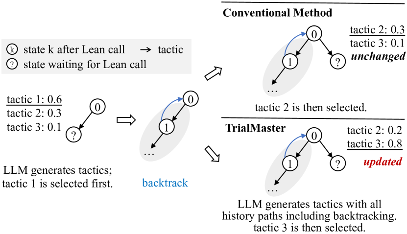
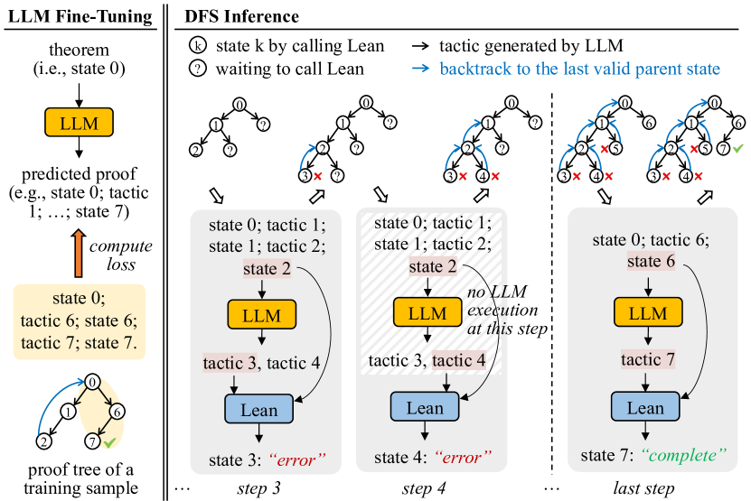
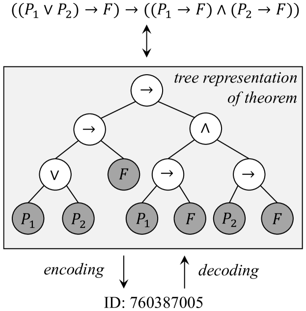
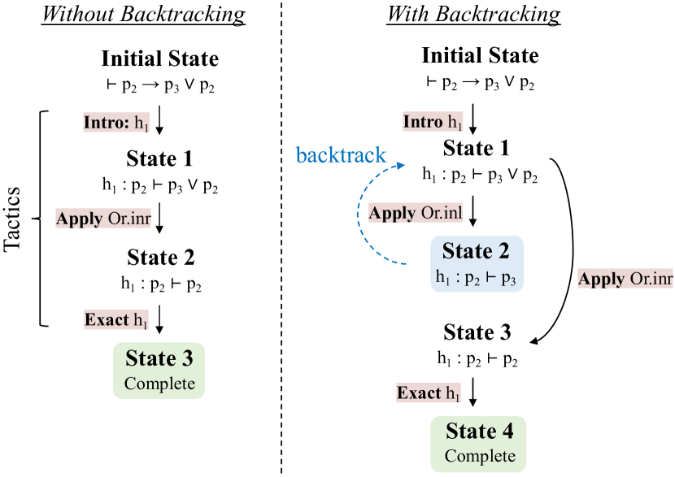
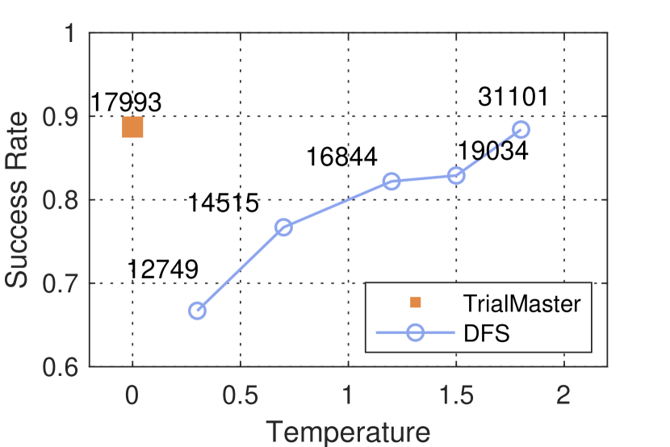

# Learn from Failure: Fine-Tuning LLMs with Trial-and-Error Data for Intuitionistic Propositional Logic Proving

###### Abstract

Recent advances in Automated Theorem Proving have shown the effectiveness of leveraging a (large) language model that generates tactics (i.e. proof steps) to search through proof states. The current model, while trained solely on successful proof paths, faces a discrepancy at the inference stage, as it must sample and try various tactics at each proof state until finding success, unlike its training which does not incorporate learning from failed attempts. Intuitively, a tactic that leads to a failed search path would indicate that similar tactics should receive less attention during the following trials. In this paper, we demonstrate the benefit of training models that additionally learn from failed search paths. Facing the lack of such trial-and-error data in existing open-source theorem-proving datasets, we curate a dataset on intuitionistic propositional logic theorems and formalize it in Lean, such that we can reliably check the correctness of proofs. We compare our model trained on relatively short trial-and-error information (TrialMaster) with models trained only on the correct paths and discover that the former solves more unseen theorems with lower trial searches.  

\newunicodechar
∧$\land$ \newunicodechar∨$\lor$ \newunicodechar→$\to$   

Learn from Failure: Fine-Tuning LLMs with Trial-and-Error Data for Intuitionistic Propositional Logic Proving  

  

    Chenyang An1††thanks:    The first two authors contributed equally to this work., Zhibo Chen211footnotemark: 1, Qihao Ye1, Emily First1, Letian Peng1  Jiayun Zhang1, Zihan Wang1††thanks:    Corresponding authors., Sorin Lerner122footnotemark: 2, Jingbo Shang122footnotemark: 2  University of California, San Diego1  Carnegie Mellon University2  {c5an, q8ye, emfirst, lepeng, jiz069, ziw224, lerner, jshang}@ucsd.edu  zhiboc@andrew.cmu.edu    

  

## 1 Introduction

Automated Theorem Proving is a challenging task that has recently gained popularity in the machine-learning community. Researchers build *neural theorem provers* to synthesize formal proofs of mathematical theorems Yang et al. ([2023](#bib.bib49)); Welleck et al. ([2021](#bib.bib46)); Lample et al. ([2022](#bib.bib22)); Mikuła et al. ([2023](#bib.bib27)); Wang et al. ([2023](#bib.bib41)); Bansal et al. ([2019](#bib.bib3)); Davies et al. ([2021](#bib.bib10)); Wu et al. ([2021](#bib.bib48)); Rabe et al. ([2020](#bib.bib32)); Kusumoto et al. ([2018](#bib.bib20)); Bansal et al. ([2019](#bib.bib3)); Irving et al. ([2016](#bib.bib18)). Typically, a neural theorem prover, given a partial proof and the current *proof state*, uses a neural model to predict the next likely *proof step*, or *tactics*. The neural models utilize different architectures like LSTMs Sekiyama et al. ([2017](#bib.bib35)), CNNs Irving et al. ([2016](#bib.bib18)), DNNs Sekiyama and Suenaga ([2018](#bib.bib36)), GNNs Bansal et al. ([2019](#bib.bib3)); Wang et al. ([2017](#bib.bib43)) and RNNs Wang and Deng ([2020](#bib.bib42)), though most recent work has begun to explore the use of transformer-based large language models (LLMs) due to their emerging reasoning abilities.  

[FIGURE S1.F1.g1]

Figure 1: A simple example for how learning trial-and-error data impacts inference distribution.
[/FIGURE]

An interactive *proof assistant*, such as Lean de Moura et al. ([2015](#bib.bib12)), Coq Barras et al. ([1997](#bib.bib4)) or Isabelle Nipkow et al. ([2002](#bib.bib29)), evaluates the model’s predicted candidate proof steps, returning either new proof states or errors. Neural theorem provers iterate on this procedure, performing *proof search*, e.g., a depth-first search (DFS), to traverse the space of possible proofs. An example of a DFS proof search is illustrated in Figure [2(a)](#S1.F2.sf1 "Figure 2(a) ‣ Figure 2 ‣ 1 Introduction ‣ Learn from Failure: Fine-Tuning LLMs with Trial-and-Error Data for Intuitionistic Propositional Logic Proving"), where the prover progressively generates new tactics if the attempted tactics result in incorrect proofs.  

Such provers are usually trained on a dataset containing only the correct proof paths. This, however, presents a limitation: during inference, the prover does not have the ability to leverage the already failed paths it explored. Such failure information, intuitively, is beneficial, as it could suggest the model to generate tactics similar to the failed ones sparingly. At the very least, the failure information should help the model easily avoid generating already failed tactics. See Figure [1](#S1.F1 "Figure 1 ‣ 1 Introduction ‣ Learn from Failure: Fine-Tuning LLMs with Trial-and-Error Data for Intuitionistic Propositional Logic Proving").  

In this paper, we wish to empirically verify this intuition. To conduct the experiment, we would compare the conventional model trained on correct proof paths, and TrialMaster, the model trained on the whole proof tree, containing both correct paths and incorrect paths. See Figure  [2(b)](#S1.F2.sf2 "Figure 2(b) ‣ Figure 2 ‣ 1 Introduction ‣ Learn from Failure: Fine-Tuning LLMs with Trial-and-Error Data for Intuitionistic Propositional Logic Proving"). As such, TrialMaster can make predictions based on the failure information during inference time.  

Since current open-source Automated Theorem Proving datasets do not contain complete proof trees, we create such a dataset, PropL, written in Lean. We focus on theorems of intuitionistic propositional logic. A simple example of an intuitionistic propositional logic theorem and its proof in Lean is shown below. The first line is the theorem statement, and the second and third lines are tactics that solve the theorem.  

[⬇](data:text/plain;base64,ICAgIHRoZW9yZW0gdGhtIDogcCAmJFxyaWdodGFycm93JCYgcCA6PSBieQogICAgICAgaW50cm8gaAogICAgICAgZXhhY3QgaA==)

 theorem thm : p &$\rightarrow$& p := by

 intro h

 exact h

Specifically, our PropL dataset is created through a two-stage process that first involves generating a comprehensive set of propositional logic theorems by uniformly sampling from all possible theorems, utilizing a bijection between natural numbers and propositions to ensure representativeness. Following theorem generation, proofs are constructed using a focusing method with polarization, incorporating a detailed trial-and-error search process that includes both successful and backtracked steps, thereby capturing the complexity and nuances of theorem proving in intuitionistic propositional logic. Thus, our dataset is complete, scalable, and representative. The proofs in our dataset are combined with trial-and-error information, which is generated by the Focused Proof Search (FPS) algorithm McLaughlin and Pfenning ([2009](#bib.bib25)); Liang and Miller ([2009](#bib.bib23)); Pfenning ([2017](#bib.bib30)).  

We verify the effectiveness of incorporating the failed trials during training and inference by experiments on PropL, observing that TrialMaster achieves a higher proof search success rate and lower search cost over conventional model trained on correct proof paths. Our experiments further indicate that our model can perform backtracking without help from an external system.  

Our main contributions are as follows:  

* We establish, PropL, a complete, scalable, and representative benchmark for intuitionistic propositional logic theorems formalized in Lean. PropL includes proofs with trial-and-error information, generated by the FPS algorithm. 
* We demonstrate that for intuitionistic propositional logic theorem proving, incorporating trial-and-error information into training and proving outperforms a conventional model that is trained on correct proofs only. 

[FIGURE S1.F2.sf1.g1]

(a) Conventional system with depth-first search
[/FIGURE]

## 2 Related Work

Automated Theorem Proving. Automated Theorem Proving has evolved significantly since its inception, focusing mainly on developing computer programs that can autonomously prove mathematical theorems. Early ATP systems (mechanical theorem proving) were based on first-order logic Clocksin and Mellish ([2003](#bib.bib8)); Chang and Lee ([2014](#bib.bib6)), where the resolution method Robinson ([1965](#bib.bib33)) played a crucial role. Recent progress in Automated Theorem Proving has been marked by the integration of machine learning Bansal et al. ([2019](#bib.bib3)); Davies et al. ([2021](#bib.bib10)); Wagner ([2021](#bib.bib40)), especially LLMs Yang et al. ([2023](#bib.bib49)); Polu and Sutskever ([2020](#bib.bib31)); Han et al. ([2021](#bib.bib16)); Welleck et al. ([2021](#bib.bib46)); Jiang et al. ([2022](#bib.bib19)), and heuristic methods Holden and Korovin ([2021](#bib.bib17)), aimed at amplifying the efficiency and capacity of Automated Theorem Proving systems. Within the domain of LLMs, formal mathematical languages like Metamath Megill and Wheeler ([2019](#bib.bib26)), Lean de Moura et al. ([2015](#bib.bib12)), Isabelle Nipkow et al. ([2002](#bib.bib29)), and Coq Barras et al. ([1997](#bib.bib4)), serve as a bridge, enabling the precise expression and verification of mathematical theorems and concepts through a computer-verifiable format, thereby mitigating hallucination risks Nawaz et al. ([2019](#bib.bib28)). COPRA works on incorporating the backtracking information into the prompts and sends the prompt to GPT-4 without fine-tuning it to perform proof searching task Thakur et al. ([2023](#bib.bib38)). Baldur fine-tuned the LLMs with proofs and error information given by the proof assistant First et al. ([2023](#bib.bib13)). In contrast, our work focused on fine-tuning the LLMs with the complete past proof history without using the error message from the proof assistants.  

Propositional Logic Problem. Early implementations of ATP systems demonstrated the potential for computers to automate logical deductions, with notable examples including the Logic Theorist Crevier ([1993](#bib.bib9)); McCorduck ([2004](#bib.bib24)); Russell and Norvig ([2010](#bib.bib34)) and Gilmore’s program Davis ([2001](#bib.bib11)); Gilmore ([1960](#bib.bib15)). These systems laid the groundwork for the resolution of propositional logic problems, showcasing the ability of automated systems to handle logical reasoning tasks. Recent advancements in Automated Theorem Proving have revisited propositional logic problems, integrating modern computational techniques. Sekiyama et al. Sekiyama and Suenaga ([2018](#bib.bib36)) have employed Deep Neural Networks (DNNs) as a statistical approach to generate proofs for these theorems, while Kusumoto et al. Kusumoto et al. ([2018](#bib.bib20)) have explored graph representations coupled with reinforcement learning to find proofs. Furthermore, the sequence-to-sequence neural networks have been applied for deriving proof terms in intuitionistic propositional logic Sekiyama et al. ([2017](#bib.bib35)). This area of research is particularly intriguing due to the simplicity and importance of propositional logic in mathematics, and there is a growing interest in evaluating the capability of LLMs in tackling this specific mathematical domain.  

Trial-and-Error. The Chain-of-Thought (CoT) Wei et al. ([2022](#bib.bib45)); Wang et al. ([2022](#bib.bib44)); Zhou et al. ([2022](#bib.bib52)); Fu et al. ([2022](#bib.bib14)); Chu et al. ([2023](#bib.bib7)); Yu et al. ([2023](#bib.bib51)) approach, demonstrates that LLMs can be guided to perform step-by-step reasoning by incorporating intermediate reasoning steps in their prompts. This concept is expanded in later research, such as the Tree of Thoughts (ToT) Yao et al. ([2023](#bib.bib50)), which organizes reasoning into a tree structure, and the Graph of Thoughts (GoT) Besta et al. ([2023](#bib.bib5)), which adopts a graph format for thought structuring. Trial-and-error complements structured reasoning by allowing the model to empirically test hypotheses generated, thereby refining its reasoning process based on feedback from interactions or emulations. The Boosting of Thoughts (BoT) Anonymous ([2024](#bib.bib1)) prompting framework iteratively explores and evaluates multiple trees of thoughts to gain trial-and-error reasoning experiences, using error analysis from the LLMs to revise the prompt. We posit that teaching models to leverage both structured reasoning and trial-and-error methodologies can substantially improve their analytical and adaptive capabilities.  

## 3 PropL: A New Dataset for Intuitionistic Propositional Logic Theorems in Lean

Our aim is to experimentally validate that trial-and-error information can enhance models’ ability to do backtracking and tactic generation for theorem-proving tasks. Given that existing open-source theorem proving datasets lack information on trial-and-error processes, we have developed PropL, which is based on theorems of intuitionistic propositional logic. This dataset uniquely includes proofs that encapsulate the complete search process, incorporating the trial-and-error data generated by the FPS algorithm. Our dataset has two other benefits. It is formalized in Lean, so that the validity of the theorems and proofs are guaranteed. The tactics generated by the model trained on PropL can also be directly sent to Lean to be checked. PropL is also representative of all the intuitionistic propositional logic theorems, since by uniformly sampling integers, we can use a bijection between natural numbers and propositions to uniformly sample propositions. This bijection is explained in the Theorem Generation section.  

### 3.1 Data Generation of PropL

PropL comprises theorems uniformly sampled from the entire set of propositional logic theorems. It includes various proof types for each theorem. We only report proof types that are used in this paper. For additional information about the dataset, please refer to the GitHub repository and Huggingface.  

The construction of PropL involves two primary stages: the generation of propositional logic theorems and the generation of proofs for these theorems from an existing algorithm.  

Theorem Generation. Consider the set of propositions $A$ with at most $p$ atomic propositions, $A$ can be inductively generated by the following grammar:  

|  | $$A,B::=P_{i}\mid T\mid F\mid A\land B\mid A\lor B\mid A\to B,$$ |  |
| --- | --- | --- |

where $P_{i}$ is the $i$-th atomic proposition with $1\leq i\leq p$. A connective $\land$, $\lor$, $\to$ is called an internal node of the proposition. We assign the following lexicographic order to propositions:  

1. Number of internal nodes (increasing order) 
2. Number of internal nodes of the left child (decreasing order) 
3. Top level connective, $T<F<P_{1}<\cdots<P_{p}<\land<\lor<\to$ 
4. The (recursive order (2 - 5)) of the left child 
5. The (recursive order (2 - 5)) of the right child 

For a fixed upper bound $p$ for the number of atomic propositions, we establish a bijection between the natural numbers and the set of propositional logic formulas. The counting can be made efficient using the Catalan Numbers Atkinson and Sack ([1992](#bib.bib2)). Figure [3](#S3.F3 "Figure 3 ‣ 3.1 Data Generation of PropL ‣ 3 PropL: A New Dataset for Intuitionistic Propositional Logic Theorems in Lean ‣ Learn from Failure: Fine-Tuning LLMs with Trial-and-Error Data for Intuitionistic Propositional Logic Proving") gives an example of mapping between propositions and natural numbers. Details about the encoding and decoding algorithms are provided in [Appendix A](#A1 "Appendix A Uniformly Distributed Data Explanation ‣ Learn from Failure: Fine-Tuning LLMs with Trial-and-Error Data for Intuitionistic Propositional Logic Proving").  

[FIGURE S3.F3.g1]

Figure 3: An illustration of the bijection between a proposition and a natural number, where gray nodes are leaf nodes. ID is computed using [Algorithm 1](#alg1 "In Appendix A Uniformly Distributed Data Explanation ‣ Learn from Failure: Fine-Tuning LLMs with Trial-and-Error Data for Intuitionistic Propositional Logic Proving") with $n=6$ and $p=2$ in this case.
[/FIGURE]

Proof Generation. Given a randomly sampled theorem, the proof of the theorem is constructed using the focusing method with polarization McLaughlin and Pfenning ([2009](#bib.bib25)); Liang and Miller ([2009](#bib.bib23)); Pfenning ([2017](#bib.bib30)). Proof search is divided into two stages: inversion and chaining. The inversion phase mechanically breaks down negative connectives (e.g. implications) in the goal and positive connectives (e.g. disjunctions) in the premises. After inversion, chaining will pick an implication in the premise or show one of the disjuncts in the conclusion, with backtracking. The proof search procedure terminates when the same atomic proposition appears in both the premise and the conclusion. An example of proof with trial-and-error information (backtracking) and that with trial-and-error information removed is shown in Figure [4](#S3.F4 "Figure 4 ‣ 3.2 Construction of Training and Testing Sets ‣ 3 PropL: A New Dataset for Intuitionistic Propositional Logic Theorems in Lean ‣ Learn from Failure: Fine-Tuning LLMs with Trial-and-Error Data for Intuitionistic Propositional Logic Proving").  

Once proofs are generated, we use them to fine-tune models and start the proof search on the test set.  

The polarization of the connectives affects the behavior of the inversion and the search procedure. We choose to uniformly polarize conjunctions that occur negatively (e.g. on the right-hand side of a sequence) as negative and polarize conjunctions that occur positively (e.g. on the left-hand side of an arrow) as positive. Atomic propositions are assigned polarities based on the connective that they first appear under.  

To improve the runtime of the search procedure, we make an additional assumption that once an implication is picked, the implication cannot be used to show its premise. In theory, this introduces incompleteness into the search procedure, but it only affects 1 theorem out of around 1000 provable theorems randomly sampled.  

### 3.2 Construction of Training and Testing Sets

In this section, we explain how we construct the datasets for training and evaluation. We want to avoid training and testing on similar data. In order to test the model performance on harder out-of-distribution (OOD) tasks, we need to ensure that the lengths of the proofs in the training data are shorter than the lengths of the proofs in the test data.  

Given PropL, we fix the number of internal nodes in the theorem statement to be 16 (explained in the dataset generation section). We then uniformly randomly sample 200,000 theorems from PropL, which can be achieved by using the integer-theorem bijection as explained before. Our method ensures that the theorems we study in this paper are representative of the propositional logic theorems in general.  

We first apply our deterministic algorithms to generate the proofs of the 200,000 theorems, and then remove the trial-and-error information of those proofs. We get a word-length distribution of those proofs without trial-and-error information. Next, to ensure the diversity of the trial-and-error information, we randomly select propositions to focus on during the chaining phase of the proof search, and then generate 10 different proofs with backtracking. By using the average length of the 10 different proofs, we have another word length distribution of proofs with trial-and-error information.  

We then split the 200,000 theorems into training and testing sets based on both of the word length distributions mentioned above. The word lengths of the proofs of the training data theorems fall within the lower 0.66 quantile of the two distributions of the word length of all the proofs of the 200,000 theorems (109,887 in total). The word lengths of the in-distribution testing also fall in that category (1000 in total). The word lengths of the proofs among the out-of-distribution testing theorems are above 0.8 quantile (1000 total) of the two distributions of the word lengths of all the proofs of the 200,000 theorems.  

[FIGURE S3.F4.g1]

Figure 4: Two proofs for one propositional logic theorem with tactics and states in Lean.
[/FIGURE]

## 4 Methodology

### 4.1 LLM Fine-Tuning

We utilize the training set formed in PropL for training both TrialMaster and the tactic generator in the DFS system. The numbers of theorems used in the training and testing datasets are presented in Table [1](#S4.T1 "Table 1 ‣ 4.1 LLM Fine-Tuning ‣ 4 Methodology ‣ Learn from Failure: Fine-Tuning LLMs with Trial-and-Error Data for Intuitionistic Propositional Logic Proving").  

LLM fine-tuning with trial-and-error. In our approach, we randomly select two out of the shortest five among the ten proofs with trial-and-error information for each theorem in the training set and utilize them to train TrialMaster. Refer to Figure [2(b)](#S1.F2.sf2 "Figure 2(b) ‣ Figure 2 ‣ 1 Introduction ‣ Learn from Failure: Fine-Tuning LLMs with Trial-and-Error Data for Intuitionistic Propositional Logic Proving") describes this training process.  

LLM fine-tuning in a DFS system. For the tactic generator of the DFS system, we employ the deterministic FPS algorithm to generate the proofs of the theorems in the training set. The trial-and-error information is removed from the proofs. The LLM is then fine-tuned on the proofs without trial-and-error information as the conventional methods do. Figure [2(a)](#S1.F2.sf1 "Figure 2(a) ‣ Figure 2 ‣ 1 Introduction ‣ Learn from Failure: Fine-Tuning LLMs with Trial-and-Error Data for Intuitionistic Propositional Logic Proving") illustrates the training process of the DFS system.  

[TABLE S4.T1]

<table class="ltx_tabular ltx_centering ltx_guessed_headers ltx_align_middle">
<thead class="ltx_thead">
<tr class="ltx_tr">
<th class="ltx_td ltx_align_left ltx_th ltx_th_column ltx_th_row ltx_border_tt">Subset</th>
<th class="ltx_td ltx_align_center ltx_th ltx_th_column ltx_border_tt">Number of theorems</th>
</tr>
</thead>
<tbody class="ltx_tbody">
<tr class="ltx_tr">
<th class="ltx_td ltx_align_left ltx_th ltx_th_row ltx_border_t">Training</th>
<td class="ltx_td ltx_align_center ltx_border_t">109,887</td>
</tr>
<tr class="ltx_tr">
<th class="ltx_td ltx_align_left ltx_th ltx_th_row">In-dist. testing</th>
<td class="ltx_td ltx_align_center">1,000</td>
</tr>
<tr class="ltx_tr">
<th class="ltx_td ltx_align_left ltx_th ltx_th_row ltx_border_bb">Out-of-dist. testing</th>
<td class="ltx_td ltx_align_center ltx_border_bb">1,000</td>
</tr>
</tbody>
</table>

Table 1: The scale of training and testing split in our PropL dataset.
[/TABLE]

### 4.2 Inference

Inference method of model trained with trial-and-error. TrialMaster conducts inference on itself without any help from a backtracking system like DFS or BFS. It outputs two kinds of tactics: tactics in Lean and backtrack instruction. An example of a backtrack instruction would be like “no solution, return to state 2 [that leads to state 4]”, where state 4 is the current state. When TrialMaster is doing a proof search on the test set, it is prompted with all history paths, including previous tactics, states, the backtracking it made before, and the failed search path. It then outputs the entire proof path after. Nonetheless, we only utilize the first tactic in the output and employ Lean as a calculator to determine the next state, thereby ensuring the correctness of the state following the tactic. If the tactic output by TrialMaster is a backtrack instruction, it is then prompted with all the proof search history including the backtrack instruction and the state that the backtrack instruction instructs to return to. If that tactic is not a backtrack instruction, the tactic and the current state will be fed into Lean for producing the state after. TrialMaster is then prompted with the entire proof tree including the state that Lean calculated, and it should output a tactic again. This process is repeated until Lean identifies that the proof is complete or any Lean error occurs. We also note that TrialMaster only outputs one tactic at each state using greedy search.  

Inference method of the DFS system. There are two hyperparameters in the DFS system: temperature $t$ and the number of sampled tactics $N_{\text{sampled}}$. The temperature $t$ decides the diversity of the model outputs. As $t$ increases, the outputs of the model become more varied. The second parameter determines how many tactics the tactic generator of the DFS system produces for a new proof state.  

During inference, the LLM in the DFS system produces $N_{\text{sampled}}$ of candidate tactics at each new state. For each proof state, the DFS only makes one inference. If any two of the generated tactics for the same state are the same, we remove one of them to ensure efficiency. We also remove the tactic suggestions that fail to follow the grammar of Lean. The system follows the depth-first order to keep trying untried tactics. If the system exhausts all the tactics for a given state but has not found a valid one, the system returns to the parent state and then keeps trying untried tactics for the parent state. The overview is presented in the [Figure 2(a)](#S1.F2.sf1 "In Figure 2 ‣ 1 Introduction ‣ Learn from Failure: Fine-Tuning LLMs with Trial-and-Error Data for Intuitionistic Propositional Logic Proving").  

To fully exploit the ability of the DFS system, we varied the parameters of it, such as temperature and the number of sampled tactics. We count how many times Lean has been called to check tactics for both the DFS system and TrialMaster during the inference stage.  

#### Why do we choose DFS over BFS?

While the Breadth-First-Search (BFS) system is also popular for building neural provers in Automated Theorem Proving, we have opted for DFS as our baseline over BFS in the context of propositional logic theorem proving. This is due to the finite number (around 20) of tactics available at any step for the search process of intuitionistic propositional logic theorems, making DFS more efficient than BFS without compromising the success rate.  

## 5 Evaluation

### 5.1 Experiment setup

Base LLM. We used Llama-2-7b-hf Touvron et al. ([2023](#bib.bib39)) as the backbone LLM for tactic generation. Models are trained on two A100 GPUs for a single epoch with batch size set to $4$. Huggingface Wolf et al. ([2019](#bib.bib47)) is used for fine-tuning the models, and VLLM Kwon et al. ([2023](#bib.bib21)) is used for inference of the models for efficiency. The learning rate of all training processes is set to be $2\times 10^{-5}$.  

Hyperparameters. In the experiment, we vary temperature $t$ from $\{0.3,0.7,1.2,1.5,2.0\}$ and number of sampled tactics $N_{\text{sampled}}$ from $\{2,5,10,15,20\}$. We notice that in all experiments for temperature $t$ less than 1.5, there were only very few (less than 15) theorems that were still under search when the total steps for that search attempt reached 65. For $t$ higher than 1.5, $N_{\text{Lean}}$ starts to increase dramatically. At temperature 2 with $N_{\text{sampled}}$=20, $N_{\text{Lean}}$ climbs up to 32171 when the number of total steps reaches 65. Therefore, in our experiment, we set 65 as the search step limit to control time complexity.  

[FIGURE S5.F5.sf1.g1]

(a) Temperature $t$
[/FIGURE]

### 5.2 Evaluation Metrics

Proof search success rate. We use proof search success rate as our primary metric, which represents the ratio of successful searches by the model. A search attempt for a theorem is marked as successful if Lean outputs state “no goal, the proof is complete”, implying the theorem is effectively proved after applying a tactic produced by the model. For TrialMaster, a search attempt ends and fails immediately after one of the following conditions: 1) the word length of the proof tree with trial-and-error exceeds $1500$ (for the sake of context length of the model), or 2) the tactic produced by the model at any step induces a Lean error. For the conventional DFS system, a search attempt fails when one of the following conditions happens: 1) the word length of the proof tree without trial-and-error exceeds 1500, or 2) all tactics generated for the initial states have been explored and failed, or 3) the total search steps exceed 65 (see Section [5.1](#S5.SS1 "5.1 Experiment setup ‣ 5 Evaluation ‣ Learn from Failure: Fine-Tuning LLMs with Trial-and-Error Data for Intuitionistic Propositional Logic Proving") for the choice of this value). We note that the 1500-word limit is stricter for our method since it produces entire proof paths including trial-and-error and thus would be easier to hit the limit.  

Search cost. We define a metric to assess the search cost—the total number of Lean calls for tactic checking during proof searching for the entire testing set, denoted as $N_{\text{Lean}}$. This number truly reflected given the same proof search success rate, a lower $N_{\text{Lean}}$ indicates a more efficient system for proof searching. Note that backtracking instructions from our method do not require to apply Lean to check the state and, consequently do not add search cost.  

[TABLE S5.T2]

<table class="ltx_tabular ltx_centering ltx_guessed_headers ltx_align_middle">
<thead class="ltx_thead">
<tr class="ltx_tr">
<th class="ltx_td ltx_align_center ltx_th ltx_th_column ltx_border_tt">Model</th>
<th class="ltx_td ltx_align_left ltx_th ltx_th_column ltx_border_tt">Success Rate</th>
</tr>
<tr class="ltx_tr">
<th class="ltx_td ltx_align_center ltx_th ltx_th_column ltx_border_t">TrialMaster</th>
<th class="ltx_td ltx_align_center ltx_th ltx_th_column ltx_border_t">100%</th>
</tr>
</thead>
<tbody class="ltx_tbody">
<tr class="ltx_tr">
<td class="ltx_td ltx_align_center ltx_border_bb ltx_border_t">DFS</td>
<td class="ltx_td ltx_align_center ltx_border_t"><math class="ltx_Math"><semantics><mrow><mi>t</mi><mo>=</mo><mn>1.2</mn></mrow><annotation-xml><apply><eq></eq><ci>𝑡</ci><cn>1.2</cn></apply></annotation-xml><annotation>t=1.2</annotation></semantics></math></td>
<td class="ltx_td ltx_align_center ltx_border_t"><math class="ltx_Math"><semantics><mrow><msub><mi>N</mi><mtext>sampled</mtext></msub><mo>=</mo><mn>2</mn></mrow><annotation-xml><apply><eq></eq><apply><csymbol>subscript</csymbol><ci>𝑁</ci><ci><mtext>sampled</mtext></ci></apply><cn>2</cn></apply></annotation-xml><annotation>N_{\text{sampled}}=2</annotation></semantics></math></td>
<td class="ltx_td ltx_align_center ltx_border_t">99.5%</td>
</tr>
<tr class="ltx_tr">
<td class="ltx_td ltx_align_center"><math class="ltx_Math"><semantics><mrow><msub><mi>N</mi><mtext>sampled</mtext></msub><mo>=</mo><mn>5</mn></mrow><annotation-xml><apply><eq></eq><apply><csymbol>subscript</csymbol><ci>𝑁</ci><ci><mtext>sampled</mtext></ci></apply><cn>5</cn></apply></annotation-xml><annotation>N_{\text{sampled}}=5</annotation></semantics></math></td>
<td class="ltx_td ltx_align_center">99.9%</td>
</tr>
<tr class="ltx_tr">
<td class="ltx_td ltx_align_center"><math class="ltx_Math"><semantics><mrow><msub><mi>N</mi><mtext>sampled</mtext></msub><mo>=</mo><mn>10</mn></mrow><annotation-xml><apply><eq></eq><apply><csymbol>subscript</csymbol><ci>𝑁</ci><ci><mtext>sampled</mtext></ci></apply><cn>10</cn></apply></annotation-xml><annotation>N_{\text{sampled}}=10</annotation></semantics></math></td>
<td class="ltx_td ltx_align_center">99.6%</td>
</tr>
<tr class="ltx_tr">
<td class="ltx_td ltx_align_center ltx_border_bb ltx_border_t"><math class="ltx_Math"><semantics><mrow><mi>t</mi><mo>=</mo><mn>2.0</mn></mrow><annotation-xml><apply><eq></eq><ci>𝑡</ci><cn>2.0</cn></apply></annotation-xml><annotation>t=2.0</annotation></semantics></math></td>
<td class="ltx_td ltx_align_center ltx_border_t"><math class="ltx_Math"><semantics><mrow><msub><mi>N</mi><mtext>sampled</mtext></msub><mo>=</mo><mn>2</mn></mrow><annotation-xml><apply><eq></eq><apply><csymbol>subscript</csymbol><ci>𝑁</ci><ci><mtext>sampled</mtext></ci></apply><cn>2</cn></apply></annotation-xml><annotation>N_{\text{sampled}}=2</annotation></semantics></math></td>
<td class="ltx_td ltx_align_center ltx_border_t">75.9%</td>
</tr>
<tr class="ltx_tr">
<td class="ltx_td ltx_align_center"><math class="ltx_Math"><semantics><mrow><msub><mi>N</mi><mtext>sampled</mtext></msub><mo>=</mo><mn>5</mn></mrow><annotation-xml><apply><eq></eq><apply><csymbol>subscript</csymbol><ci>𝑁</ci><ci><mtext>sampled</mtext></ci></apply><cn>5</cn></apply></annotation-xml><annotation>N_{\text{sampled}}=5</annotation></semantics></math></td>
<td class="ltx_td ltx_align_center">97.3%</td>
</tr>
<tr class="ltx_tr">
<td class="ltx_td ltx_align_center ltx_border_bb"><math class="ltx_Math"><semantics><mrow><msub><mi>N</mi><mtext>sampled</mtext></msub><mo>=</mo><mn>10</mn></mrow><annotation-xml><apply><eq></eq><apply><csymbol>subscript</csymbol><ci>𝑁</ci><ci><mtext>sampled</mtext></ci></apply><cn>10</cn></apply></annotation-xml><annotation>N_{\text{sampled}}=10</annotation></semantics></math></td>
<td class="ltx_td ltx_align_center ltx_border_bb">99.0%</td>
</tr>
</tbody>
</table>

Table 2: Performance on in-distribution task. Both methods perform well for propositional logic.
[/TABLE]

### 5.3 Results and Analysis

TrialMaster outperforms conventional DFS system. We begin by evaluating the methods of the in-distribution testing set. Table [2](#S5.T2 "Table 2 ‣ 5.2 Evaluation Metrics ‣ 5 Evaluation ‣ Learn from Failure: Fine-Tuning LLMs with Trial-and-Error Data for Intuitionistic Propositional Logic Proving") illustrates that both our method and the DFS system perform exceptionally well, achieving a success rate of nearly 100% in most configurations. This suggests that Llama-7b effectively masters in-distribution intuitionistic propositional logic theorems. Then, we compare the performance of the methods on the out-of-distribution task. The results are presented in [Figure 5](#S5.F5 "In 5.1 Experiment setup ‣ 5 Evaluation ‣ Learn from Failure: Fine-Tuning LLMs with Trial-and-Error Data for Intuitionistic Propositional Logic Proving"). Our method with trial-and-error significantly outperforms the DFS system across various hyperparameter configurations. Additionally, we observe that feeding more proofs without trial-and-error for LLM fine-tuning does not further improve the performance.  

Impact of hyperparameters in the DFS system. As shown in Figure [5](#S5.F5 "Figure 5 ‣ 5.1 Experiment setup ‣ 5 Evaluation ‣ Learn from Failure: Fine-Tuning LLMs with Trial-and-Error Data for Intuitionistic Propositional Logic Proving"), on the OOD task, although the success rate of the DFS system gets higher when we increase the temperature $t$ or the number of sampled tactics $N_{\text{sampled}}$, the search cost (reflected by $N_{\text{Lean}}$) also goes up. Specifically, when we increase $N_{\text{sampled}}$, the DFS system explores a larger pool of candidate tactics during the search, leading to a higher number of Lean calls. In contrast, our method does a greedy search to generate only one tactic for each new state. Likewise, as $t$ increases, the tactic generator of the DFS system tends to produce more diverse tactics at each proof state, improving the system’s performance but leading to higher search costs.  

[TABLE S5.T3]

<table class="ltx_tabular ltx_centering ltx_guessed_headers ltx_align_middle">
<thead class="ltx_thead">
<tr class="ltx_tr">
<th class="ltx_td ltx_align_left ltx_th ltx_th_column ltx_th_row ltx_border_tt">Model</th>
<th class="ltx_td ltx_align_center ltx_th ltx_th_column ltx_border_tt">Success rate</th>
</tr>
</thead>
<tbody class="ltx_tbody">
<tr class="ltx_tr">
<th class="ltx_td ltx_align_left ltx_th ltx_th_row ltx_border_t">TrialMaster</th>
<td class="ltx_td ltx_align_center ltx_border_t">88.7%</td>
</tr>
<tr class="ltx_tr">
<th class="ltx_td ltx_align_left ltx_th ltx_th_row ltx_border_bb">Model - proof w/o t.a.e.</th>
<td class="ltx_td ltx_align_center ltx_border_bb">59.3 %</td>
</tr>
</tbody>
</table>

Table 3: Ablation study: Comparison of TrialMaster and model trained without trial-and-error information on OOD task
[/TABLE]

TrialMaster achieves high success rates at lower search cost. For a direct comparison of search costs, we plot the $N_{\text{Lean}}$ values of our method alongside those of the top three DFS systems with the highest success rates among all the hyperparameters we experimented with, i.e., $t$=1.5, $N_{\text{sampled}}$=20 (87.2%), $t$=1.5, $N_{\text{sampled}}$ = 10 (86.1%), and $t$=1.8, $N_{\text{sampled}}$=10 (88.4%). This comparison is illustrated in Figure [5(c)](#S5.F5.sf3 "Figure 5(c) ‣ Figure 5 ‣ 5.1 Experiment setup ‣ 5 Evaluation ‣ Learn from Failure: Fine-Tuning LLMs with Trial-and-Error Data for Intuitionistic Propositional Logic Proving"). Notably, we observe that the DFS systems that closely approach our model’s performance exhibit significantly higher search costs. With $t$=1.8, $N_{\text{sampled}}$=10, $N_{\text{Lean}}$ of the DFS system, which has 0.3% lower success rate than our method, $N_{\text{Lean}}$ has reached 31101, which is 72% higher than that of our method with trial-and-error. The high search cost makes the DFS system with high temperatures unfavorable. These results demonstrate that training with trial-and-error produces higher-quality tactics, achieving a higher success rate with relatively lower search cost.  

Model learns backtracking capability from trial-and-error data. In the experiments, we find out that our TrialMaster successfully acquires the backtracking capability from proofs with trial-and-error information. This is evidenced by the fact that during TrialMaster’s proof search for theorems in the testing set, all backtracking instructions produced by the LLM adhere to the correct format and point to existing state numbers.  

### 5.4 Ablation Study

To evaluate the effectiveness of training with trial-and-error, we craft an ablated version of our method where the LLM is fined-tuned with data of the corrected path only and do inference in the same way as our method (i.e., producing 1 tactic at a time and applying Lean for state checking). We denote the ablated version as Model - proof w/o t.a.e.. For both methods, we mark the search attempt as failed if the tactic induces a Lean error, or the search exceeds the 1500-word limit. The result is shown in the Table [3](#S5.T3 "Table 3 ‣ 5.3 Results and Analysis ‣ 5 Evaluation ‣ Learn from Failure: Fine-Tuning LLMs with Trial-and-Error Data for Intuitionistic Propositional Logic Proving"). The difference between the success rates of the two models is significant, which reaches $29.4\%$. This clearly shows that failed search states and trial-and-error information tremendously enhance the model’s capability to solve theorem-proving tasks.  

[TABLE S5.T4]

<table class="ltx_tabular ltx_centering ltx_guessed_headers ltx_align_middle">
<thead class="ltx_thead">
<tr class="ltx_tr">
<th class="ltx_td ltx_align_left ltx_th ltx_th_column ltx_th_row ltx_border_tt">Model</th>
<th class="ltx_td ltx_align_center ltx_th ltx_th_column ltx_border_tt">Success rate</th>
</tr>
</thead>
<tbody class="ltx_tbody">
<tr class="ltx_tr">
<th class="ltx_td ltx_align_left ltx_th ltx_th_row ltx_border_t">Model - short proof w/ t.a.e.</th>
<td class="ltx_td ltx_align_center ltx_border_t">88.7%</td>
</tr>
<tr class="ltx_tr">
<th class="ltx_td ltx_align_left ltx_th ltx_th_row ltx_border_bb">Model - long proof w/ t.a.e.</th>
<td class="ltx_td ltx_align_center ltx_border_bb">72.4 %</td>
</tr>
</tbody>
</table>

Table 4: Comparison of models trained on different lengths of proofs with trial-and-error on OOD task.
[/TABLE]

### 5.5 Exploratory Study: Training Proof Length Affect Model Performance

Since the FPS algorithm of PropL dataset can generate multiple proofs with variable length, we conduct an exploratory study to assess the impact of proof length on model performance. We fine-tune two models using proofs with different lengths of trial-and-error information. For the first model, which is our TrialMaster, the training data is derived by randomly selecting two out of the shortest four proofs from the ten available proofs for each theorem in PropL. We denote it as Model - short proof w/ t.a.e. In contrast, the training data of the second model is formed by randomly selecting two proofs from the ten available for each theorem, irrespective of their lengths. We denote it as Model - long proof w/ t.a.e. For both models, we use greedy search to let them generate one tactic for each state. We evaluate the models on our 1000 OOD testing set. The results are shown in the [Table 4](#S5.T4 "In 5.4 Ablation Study ‣ 5 Evaluation ‣ Learn from Failure: Fine-Tuning LLMs with Trial-and-Error Data for Intuitionistic Propositional Logic Proving"). A higher success rate is observed in the model trained with shorter proofs. This can be attributed to the fact that as the proof with trial-and-error information becomes longer, there is too much trial-and-error information that may detrimentally affect the model’s performance, as too many failed search paths may lower the quality of the training data.  

## 6 Conclusion and Future Work

In this paper, we study Automated Theorem Proving in formalized environments. We create a complete, scalable, and representative data set of intuitionistic propositional logic theorems in Lean. We demonstrate that leveraging information from failed search states and backtracking not only teaches models how to backtrack effectively but also helps in developing better tactics than those generated by models trained without access to backtracking insights. We release our datasets on GitHub and Huggingface111PropL dataset is available at <https://huggingface.co/datasets/KomeijiForce/PropL>.  

A natural extension of our research involves investigating whether trial-and-error information is beneficial for more general mathematical theorem-proving settings. Exploring this avenue could provide valuable insights into the effectiveness of our approach across broader mathematical domains.  

## Limitation

One limitation of our study is that some proof attempts are forced to stop due to the prompt exceeding the context length of 1500 tokens. This constraint may potentially influence our results by truncating the available information during the proof search process.  

Furthermore, our method was not evaluated on general mathematical theorems. This limitation arises from both the scarcity of proofs containing trial-and-error information in current math libraries and the intrinsic challenges associated with producing proofs, whether with or without backtracking, for general mathematical theorems in a formalized setting.  

Automated theorem proving with LLMs is an emerging area in machine learning. There is still a lack of baselines on LLMs to compare with our method. We establish a fundamental baseline, but we still need accumulative work to provide methods for comparison.  

## Ethical Consideration

Our work learns large language models to automatically prove propositional logic theorems, which generally does not raise ethical concerns.  

## References

* Anonymous (2024)  Anonymous. 2024.   [Boosting of thoughts: Trial-and-error problem solving with large language models](https://openreview.net/forum?id=qBL04XXex6).   In *The Twelfth International Conference on Learning Representations*. 
* Atkinson and Sack (1992)  Michael D Atkinson and J-R Sack. 1992.   Generating binary trees at random.   *Information Processing Letters*, 41(1):21–23. 
* Bansal et al. (2019)  Kshitij Bansal, Christian Szegedy, Markus N Rabe, Sarah M Loos, and Viktor Toman. 2019.   [Learning to reason in large theories without imitation](http://arxiv.org/abs/1905.10501).   *arXiv preprint arXiv:1905.10501*. 
* Barras et al. (1997)  Bruno Barras, Samuel Boutin, Cristina Cornes, Judicaël Courant, Jean-Christophe Filliatre, Eduardo Gimenez, Hugo Herbelin, Gerard Huet, Cesar Munoz, Chetan Murthy, et al. 1997.   *The Coq proof assistant reference manual: Version 6.1*.   Ph.D. thesis, Inria. 
* Besta et al. (2023)  Maciej Besta, Nils Blach, Ales Kubicek, Robert Gerstenberger, Lukas Gianinazzi, Joanna Gajda, Tomasz Lehmann, Michal Podstawski, Hubert Niewiadomski, Piotr Nyczyk, et al. 2023.   Graph of thoughts: Solving elaborate problems with large language models.   *arXiv preprint arXiv:2308.09687*. 
* Chang and Lee (2014)  Chin-Liang Chang and Richard Char-Tung Lee. 2014.   *Symbolic logic and mechanical theorem proving*.   Academic press. 
* Chu et al. (2023)  Zheng Chu, Jingchang Chen, Qianglong Chen, Weijiang Yu, Tao He, Haotian Wang, Weihua Peng, Ming Liu, Bing Qin, and Ting Liu. 2023.   A survey of chain of thought reasoning: Advances, frontiers and future.   *arXiv preprint arXiv:2309.15402*. 
* Clocksin and Mellish (2003)  William F Clocksin and Christopher S Mellish. 2003.   *Programming in PROLOG*.   Springer Science & Business Media. 
* Crevier (1993)  Daniel Crevier. 1993.   *AI: the tumultuous history of the search for artificial intelligence*.   Basic Books, Inc. 
* Davies et al. (2021)  Alex Davies, Petar Veličković, Lars Buesing, Sam Blackwell, Daniel Zheng, Nenad Tomašev, Richard Tanburn, Peter Battaglia, Charles Blundell, András Juhász, et al. 2021.   Advancing mathematics by guiding human intuition with AI.   *Nature*, 600(7887):70–74. 
* Davis (2001)  Martin Davis. 2001.   The early history of automated deduction.   *Handbook of automated reasoning*, 1:3–15. 
* de Moura et al. (2015)  Leonardo de Moura, Soonho Kong, Jeremy Avigad, Floris Van Doorn, and Jakob von Raumer. 2015.   The lean theorem prover (system description).   In *Automated Deduction-CADE-25: 25th International Conference on Automated Deduction, Berlin, Germany, August 1-7, 2015, Proceedings 25*, pages 378–388. Springer. 
* First et al. (2023)  Emily First, Markus Rabe, Talia Ringer, and Yuriy Brun. 2023.   Baldur: Whole-proof generation and repair with large language models.   In *Proceedings of the 31st ACM Joint European Software Engineering Conference and Symposium on the Foundations of Software Engineering*, pages 1229–1241. 
* Fu et al. (2022)  Yao Fu, Hao Peng, Ashish Sabharwal, Peter Clark, and Tushar Khot. 2022.   Complexity-based prompting for multi-step reasoning.   *arXiv preprint arXiv:2210.00720*. 
* Gilmore (1960)  P. C. Gilmore. 1960.   [A proof method for quantification theory: Its justification and realization](https://doi.org/10.1147/rd.41.0028).   *IBM Journal of Research and Development*, 4(1):28–35. 
* Han et al. (2021)  Jesse Michael Han, Jason Rute, Yuhuai Wu, Edward W Ayers, and Stanislas Polu. 2021.   [Proof artifact co-training for theorem proving with language models](http://arxiv.org/abs/2102.06203).   *arXiv preprint arXiv:2102.06203*. 
* Holden and Korovin (2021)  Edvard K Holden and Konstantin Korovin. 2021.   Heterogeneous heuristic optimisation and scheduling for first-order theorem proving.   In *International Conference on Intelligent Computer Mathematics*, pages 107–123. Springer. 
* Irving et al. (2016)  Geoffrey Irving, Christian Szegedy, Alexander A Alemi, Niklas Eén, François Chollet, and Josef Urban. 2016.   Deepmath-deep sequence models for premise selection.   *Advances in neural information processing systems*, 29. 
* Jiang et al. (2022)  Albert Q Jiang, Sean Welleck, Jin Peng Zhou, Wenda Li, Jiacheng Liu, Mateja Jamnik, Timothée Lacroix, Yuhuai Wu, and Guillaume Lample. 2022.   [Draft, sketch, and prove: Guiding formal theorem provers with informal proofs](http://arxiv.org/abs/2210.12283).   *arXiv preprint arXiv:2210.12283*. 
* Kusumoto et al. (2018)  Mitsuru Kusumoto, Keisuke Yahata, and Masahiro Sakai. 2018.   Automated theorem proving in intuitionistic propositional logic by deep reinforcement learning.   *arXiv preprint arXiv:1811.00796*. 
* Kwon et al. (2023)  Woosuk Kwon, Zhuohan Li, Siyuan Zhuang, Ying Sheng, Lianmin Zheng, Cody Hao Yu, Joseph Gonzalez, Hao Zhang, and Ion Stoica. 2023.   Efficient memory management for large language model serving with pagedattention.   In *Proceedings of the 29th Symposium on Operating Systems Principles*, pages 611–626. 
* Lample et al. (2022)  Guillaume Lample, Timothee Lacroix, Marie-Anne Lachaux, Aurelien Rodriguez, Amaury Hayat, Thibaut Lavril, Gabriel Ebner, and Xavier Martinet. 2022.   Hypertree proof search for neural theorem proving.   *Advances in Neural Information Processing Systems*, 35:26337–26349. 
* Liang and Miller (2009)  Chuck C. Liang and Dale Miller. 2009.   [Focusing and polarization in linear, intuitionistic, and classical logics](https://doi.org/10.1016/J.TCS.2009.07.041).   *Theor. Comput. Sci.*, 410(46):4747–4768. 
* McCorduck (2004)  Pamela McCorduck. 2004.   *Machines Who Think (2Nd Ed.)*.   A. K. Peters. 
* McLaughlin and Pfenning (2009)  Sean McLaughlin and Frank Pfenning. 2009.   [Efficient intuitionistic theorem proving with the polarized inverse method](https://doi.org/10.1007/978-3-642-02959-2_19).   In *Automated Deduction - CADE-22, 22nd International Conference on Automated Deduction, Montreal, Canada, August 2-7, 2009. Proceedings*, volume 5663 of *Lecture Notes in Computer Science*, pages 230–244. Springer. 
* Megill and Wheeler (2019)  Norman Megill and David A Wheeler. 2019.   *Metamath: a computer language for mathematical proofs*.   Lulu. com. 
* Mikuła et al. (2023)  Maciej Mikuła, Szymon Antoniak, Szymon Tworkowski, Albert Qiaochu Jiang, Jin Peng Zhou, Christian Szegedy, Łukasz Kuciński, Piotr Miłoś, and Yuhuai Wu. 2023.   Magnushammer: A transformer-based approach to premise selection.   *arXiv preprint arXiv:2303.04488*. 
* Nawaz et al. (2019)  M Saqib Nawaz, Moin Malik, Yi Li, Meng Sun, and M Lali. 2019.   A survey on theorem provers in formal methods.   *arXiv preprint arXiv:1912.03028*. 
* Nipkow et al. (2002)  Tobias Nipkow, Markus Wenzel, and Lawrence C Paulson. 2002.   *Isabelle/HOL: a proof assistant for higher-order logic*.   Springer. 
* Pfenning (2017)  Frank Pfenning. 2017.   [Lecture notes on focusing](http://www.cs.cmu.edu/~fp/courses/15317-f17/lectures/19-focusing.pdf). 
* Polu and Sutskever (2020)  Stanislas Polu and Ilya Sutskever. 2020.   [Generative language modeling for automated theorem proving](http://arxiv.org/abs/2009.03393).   *arXiv preprint arXiv:2009.03393*. 
* Rabe et al. (2020)  Markus N Rabe, Dennis Lee, Kshitij Bansal, and Christian Szegedy. 2020.   [Mathematical reasoning via self-supervised skip-tree training](http://arxiv.org/abs/2006.04757).   *arXiv preprint arXiv:2006.04757*. 
* Robinson (1965)  John Alan Robinson. 1965.   A machine-oriented logic based on the resolution principle.   *Journal of the ACM (JACM)*, 12(1):23–41. 
* Russell and Norvig (2010)  Stuart J Russell and Peter Norvig. 2010.   *Artificial intelligence a modern approach*.   London. 
* Sekiyama et al. (2017)  Taro Sekiyama, Akifumi Imanishi, and Kohei Suenaga. 2017.   Towards proof synthesis guided by neural machine translation for intuitionistic propositional logic. corr abs/1706.06462 (2017).   *arXiv preprint arXiv:1706.06462*. 
* Sekiyama and Suenaga (2018)  Taro Sekiyama and Kohei Suenaga. 2018.   Automated proof synthesis for propositional logic with deep neural networks.   *arXiv preprint arXiv:1805.11799*. 
* Stanley (2015)  Richard P Stanley. 2015.   *Catalan numbers*.   Cambridge University Press. 
* Thakur et al. (2023)  Amitayush Thakur, Yeming Wen, and Swarat Chaudhuri. 2023.   A language-agent approach to formal theorem-proving.   *arXiv preprint arXiv:2310.04353*. 
* Touvron et al. (2023)  Hugo Touvron, Louis Martin, Kevin Stone, Peter Albert, Amjad Almahairi, Yasmine Babaei, Nikolay Bashlykov, Soumya Batra, Prajjwal Bhargava, Shruti Bhosale, et al. 2023.   Llama 2: Open foundation and fine-tuned chat models.   *arXiv preprint arXiv:2307.09288*. 
* Wagner (2021)  Adam Zsolt Wagner. 2021.   [Constructions in combinatorics via neural networks](http://arxiv.org/abs/2104.14516).   *arXiv preprint arXiv:2104.14516*. 
* Wang et al. (2023)  Haiming Wang, Ye Yuan, Zhengying Liu, Jianhao Shen, Yichun Yin, Jing Xiong, Enze Xie, Han Shi, Yujun Li, Lin Li, et al. 2023.   Dt-solver: Automated theorem proving with dynamic-tree sampling guided by proof-level value function.   In *Proceedings of the 61st Annual Meeting of the Association for Computational Linguistics (Volume 1: Long Papers)*, pages 12632–12646. 
* Wang and Deng (2020)  Mingzhe Wang and Jia Deng. 2020.   Learning to prove theorems by learning to generate theorems.   *Advances in Neural Information Processing Systems*, 33:18146–18157. 
* Wang et al. (2017)  Mingzhe Wang, Yihe Tang, Jian Wang, and Jia Deng. 2017.   Premise selection for theorem proving by deep graph embedding.   *Advances in neural information processing systems*, 30. 
* Wang et al. (2022)  Xuezhi Wang, Jason Wei, Dale Schuurmans, Quoc Le, Ed Chi, Sharan Narang, Aakanksha Chowdhery, and Denny Zhou. 2022.   Self-consistency improves chain of thought reasoning in language models.   *arXiv preprint arXiv:2203.11171*. 
* Wei et al. (2022)  Jason Wei, Xuezhi Wang, Dale Schuurmans, Maarten Bosma, Fei Xia, Ed Chi, Quoc V Le, Denny Zhou, et al. 2022.   Chain-of-thought prompting elicits reasoning in large language models.   *Advances in Neural Information Processing Systems*, 35:24824–24837. 
* Welleck et al. (2021)  Sean Welleck, Jiacheng Liu, Ronan Le Bras, Hannaneh Hajishirzi, Yejin Choi, and Kyunghyun Cho. 2021.   [Naturalproofs: Mathematical theorem proving in natural language](http://arxiv.org/abs/2104.01112).   *arXiv preprint arXiv:2104.01112*. 
* Wolf et al. (2019)  Thomas Wolf, Lysandre Debut, Victor Sanh, Julien Chaumond, Clement Delangue, Anthony Moi, Pierric Cistac, Tim Rault, Rémi Louf, Morgan Funtowicz, et al. 2019.   Huggingface’s transformers: State-of-the-art natural language processing.   *arXiv preprint arXiv:1910.03771*. 
* Wu et al. (2021)  Minchao Wu, Michael Norrish, Christian Walder, and Amir Dezfouli. 2021.   Tacticzero: Learning to prove theorems from scratch with deep reinforcement learning.   *Advances in Neural Information Processing Systems*, 34:9330–9342. 
* Yang et al. (2023)  Kaiyu Yang, Aidan M Swope, Alex Gu, Rahul Chalamala, Peiyang Song, Shixing Yu, Saad Godil, Ryan Prenger, and Anima Anandkumar. 2023.   [LeanDojo: Theorem Proving with Retrieval-Augmented Language Models](http://arxiv.org/abs/2306.15626).   *arXiv preprint arXiv:2306.15626*. 
* Yao et al. (2023)  Shunyu Yao, Dian Yu, Jeffrey Zhao, Izhak Shafran, Thomas L Griffiths, Yuan Cao, and Karthik Narasimhan. 2023.   Tree of thoughts: Deliberate problem solving with large language models.   *arXiv preprint arXiv:2305.10601*. 
* Yu et al. (2023)  Fei Yu, Hongbo Zhang, and Benyou Wang. 2023.   Nature language reasoning, a survey.   *arXiv preprint arXiv:2303.14725*. 
* Zhou et al. (2022)  Denny Zhou, Nathanael Schärli, Le Hou, Jason Wei, Nathan Scales, Xuezhi Wang, Dale Schuurmans, Claire Cui, Olivier Bousquet, Quoc Le, et al. 2022.   Least-to-most prompting enables complex reasoning in large language models.   *arXiv preprint arXiv:2205.10625*. 

## Appendix A Uniformly Distributed Data Explanation

In this section, we discuss the uniform characteristics of our dataset, particularly emphasizing the one-to-one mapping between propositions and natural numbers. This bijection allows us to simply sample from the natural numbers to ensure the dataset exhibits uniformity.  

[ALGORITHM alg1]

1:A tree $\mathcal{T}$ representing a proposition, with $n$ indicating the number of internal nodes and $p$ representing the number of atomic propositions

2:Output a natural number

3:return $3^{n}(p+2)^{n+1}$ $\times$ ShapeNumber($\mathcal{T}$) $+$ AssignmentNumber($\mathcal{T}$)

4:function ShapeNumber($\mathcal{T}$)

5:     if $\mathcal{T}$ is a single node then return $0$

6:     end if

7:     $\mathcal{T}_{l},\mathcal{T}_{r}\leftarrow$ left and right sub-trees of $\mathcal{T}$

8:     $n_{l},n_{r}\leftarrow$ number of internal nodes in $\mathcal{T}_{l},\mathcal{T}_{r}$
$\triangleright$ Total $n_{r}+n_{l}+1$ internal nodes

9:     return $\sum_{i=1}^{n_{l}}C_{i-1}C_{n_{l}+n_{r}+1-i}$ $+$ $C_{n_{r}}$ $\times$ ShapeNumber($\mathcal{T}_{l}$) $+$ ShapeNumber($\mathcal{T}_{r}$)

10:end function

11:function AssignmentNumber($\mathcal{T}$)

12:     $N\leftarrow$ NodeNumber(root node of $\mathcal{T}$)

13:     if $\mathcal{T}$ is a single node then return $N$

14:     end if

15:     $\mathcal{T}_{l},\mathcal{T}_{r}\leftarrow$ left and right sub-trees of $\mathcal{T}$

16:     $n_{r}\leftarrow$ number of internal nodes in $\mathcal{T}_{r}$

17:     $A_{r}\leftarrow 3^{n_{r}}(p+2)^{n_{r}+1}$
$\triangleright$ Compute all possible assignments in the right sub-tree

18:     return $3A_{r}$ $\times$ AssignmentNumber($\mathcal{T}_{l}$) $+$ $A_{r}$ $\times$ $N$ $+$ AssignmentNumber($\mathcal{T}_{r}$)

19:end function

20:function NodeNumber($\mathcal{N}$)

21:     switch $\mathcal{N}$

22:      case $\land$ or $T$: return 0

23:      case $\lor$ or $F$: return 1

24:      case $\rightarrow$: return 2

25:      case $P_{i}$: return $i+1$
$\triangleright$ $1\leq i\leq p$

26:end function

Algorithm 1  Encoding
[/ALGORITHM]

### A.1 Catalan Number

The Catalan number $C_{n}$ is applicable for counting full binary trees that consist of $n+1$ leaf nodes, corresponding to exactly $n$ internal nodes Stanley ([2015](#bib.bib37)). Additionally, it can be calculated through recursion as shown:  

|  | $$C_{n}=\sum_{i=1}^{n}C_{i-1}C_{n-i}.$$ |  |
| --- | --- | --- |

The first Catalan numbers for $n=0,1,2,3,4$ are $1,1,2,5,14$.    A concise interpretation of this recursion is as follows: it involves counting the number of internal nodes in the left sub-tree, amounting to $i-1$, and then in the right sub-tree, amounting to $n-i$, for each of the $n$ scenarios in computing $C_{n}$.  

[ALGORITHM alg2]

1:A natural number ID, with $n$ indicating the number of internal nodes and $p$ representing the number of atomic propositions

2:Output a proposition tree

3:quotient, remainder $\leftarrow$ DivMod(ID, $3^{n}(p+2)^{n+1}$)

4:$S\leftarrow$ TreeShape(quotient, $n$)

5:$A\leftarrow$ TreeAssignment($S$, remainder)

6:return a tree with shape $S$ and assignment $A$

7:function TreeShape($N$, $n$)

8:     if $n$ is $0$ then return a single node

9:     end if

10:     $n_{l}\leftarrow\max(\{k|\sum_{i=1}^{k}C_{i-1}C_{n-i}\leq N\}\cup\{0\})$

11:     $n_{r}\leftarrow n-n_{l}-1$

12:     remaining $\leftarrow N-\sum_{i=1}^{n_{l}}C_{i-1}C_{n-i}$

13:     $N_{l},N_{r}\leftarrow$ DivMod(remaining, $C_{n_{r}}$)

14:     return a tree with left and right sub-trees shaped by TreeShape($N_{l}$, $n_{l}$) and TreeShape($N_{r}$, $n_{r}$), respectively

15:end function

16:function TreeAssignment($S$, $N$)

17:     Perform an inorder traversal of the tree with shape $S$. For each leaf node, interpret it as a digit in base $p+2$, and for each internal node, interpret it as a digit in base 3. Compute the assignment that gives $N$ by utilizing the NodeNumber function introduced in [Algorithm 1](#alg1 "In Appendix A Uniformly Distributed Data Explanation ‣ Learn from Failure: Fine-Tuning LLMs with Trial-and-Error Data for Intuitionistic Propositional Logic Proving")

18:end function

Algorithm 2  Decoding
[/ALGORITHM]

### A.2 Bijection between Propositions and Natural Numbers

As depicted in [Figure 3](#S3.F3 "In 3.1 Data Generation of PropL ‣ 3 PropL: A New Dataset for Intuitionistic Propositional Logic Theorems in Lean ‣ Learn from Failure: Fine-Tuning LLMs with Trial-and-Error Data for Intuitionistic Propositional Logic Proving"), every proposition corresponds to a unique tree representation. Consequently, it only requires the identification of a bijection between full binary trees and natural numbers.  

For every full binary tree possessing $n$ internal nodes and $p$ atomic propositions, there exist  

|  | $\displaystyle 3^{\#\text{internal node}}(p+2)^{\#\text{leaf node}}=3^{n}(p+2)^{n+1}$ |  |
| --- | --- | --- |

distinct cases. Observe that the choices available for internal nodes include conjunction ($\land$), disjunction ($\lor$), and implication ($\rightarrow$); whereas for leaf nodes, the choices encompass true ($T$), false ($F$), and a set of propositions $P_{1},\ldots,P_{p}$.  

This counting facilitates an efficient ranking of all full binary trees with $n$ internal nodes. This ranking process inherently establishes a bijection with the set of natural numbers, allowing for a clear correspondence between each full binary tree and a unique natural number. Consequently, this sets the stage for a detailed examination of two critical processes: encoding (see [Algorithm 1](#alg1 "In Appendix A Uniformly Distributed Data Explanation ‣ Learn from Failure: Fine-Tuning LLMs with Trial-and-Error Data for Intuitionistic Propositional Logic Proving")), which involves mapping a proposition tree to a natural number, and decoding (see [Algorithm 2](#alg2 "In A.1 Catalan Number ‣ Appendix A Uniformly Distributed Data Explanation ‣ Learn from Failure: Fine-Tuning LLMs with Trial-and-Error Data for Intuitionistic Propositional Logic Proving")), which entails mapping a natural number back to a corresponding proposition tree. These processes are vital for effectively establishing and utilizing the bijection between full binary trees and natural numbers.  

Having established the bijection between full binary trees and natural numbers, it becomes apparent that uniformly sampling from the set of natural numbers will, in turn, result in a uniform sampling of full binary trees.  

The inclusion of the parameter $n$ in [Algorithm 1](#alg1 "In Appendix A Uniformly Distributed Data Explanation ‣ Learn from Failure: Fine-Tuning LLMs with Trial-and-Error Data for Intuitionistic Propositional Logic Proving") is not critical for the functionality of the algorithm as $n$ can be counted from $\mathcal{T}$; however, it is retained to denote that the most basic encoding and decoding approaches are designed for a fixed number of internal nodes $n$. For example, ID 0 denotes different propositions depending on the specified value of $n$. As a result, the decoding algorithm, as outlined in [Algorithm 2](#alg2 "In A.1 Catalan Number ‣ Appendix A Uniformly Distributed Data Explanation ‣ Learn from Failure: Fine-Tuning LLMs with Trial-and-Error Data for Intuitionistic Propositional Logic Proving"), is specifically intended for uniformly generating proposition trees with a fixed $n$. To achieve a uniformly distributed proposition tree from a set of trees with various $n$, one might simply merge the rankings of fully binary trees with different $n$, a task which can be performed with relative ease. This approach of merging can be similarly applied to trees with varying $p$ as well.  

Given the uncertainty surrounding the proof lengths when generating propositions, our approach involves uniform sampling for proposition selection. This selection is later refined by excluding propositions according to their proof lengths as computed by the proof generation algorithm. From a probabilistic perspective, this method is the same as pre-excluding propositions exceeding a certain proof length from the entire sampling space prior to the random selection of propositions.  

## Appendix B Examples

In [Figure 6](#A2.F6 "In Appendix B Examples ‣ Learn from Failure: Fine-Tuning LLMs with Trial-and-Error Data for Intuitionistic Propositional Logic Proving"), we show an example Lean proof for a theorem in [Figure 3](#S3.F3 "In 3.1 Data Generation of PropL ‣ 3 PropL: A New Dataset for Intuitionistic Propositional Logic Theorems in Lean ‣ Learn from Failure: Fine-Tuning LLMs with Trial-and-Error Data for Intuitionistic Propositional Logic Proving"). Lines preceded by ’–’ are comments solely for explanatory purposes.  

[FIGURE A2.F6]

{spverbatim}

variable (p1 p2 p3 p4 p5 : Prop) theorem thm\_5\_vars\_45663772897 : (((p1 ∨ p2) → False) → ((p1 → False) ∧ (p2 → False))) := by – Implications on the right can always be decomposed. – Introduce an assumption h1 that says ((p1 ∨ p2) → False) intro h1 – Now we want to show ((p1 → False) ∧ (p2 → False)) – Conjunctions on the right can always be decomposed. – We then need to show (p1 → False) and (p2 → False) separately. apply And.intro – We are showing (p1 → False). – Implications on the right can always be decomposed. – We introduce assumption h2 for p1. And we try to show False. intro h2 – We want to use the implication h1. So we show its premise. have h3 : (p1 ∨ p2) := by – Show the left disjunct. (The right adjunct leads to an TAE) apply Or.inl – One of the premise coincides with the conclusion. exact h2 – We have shown the premise of h1 (p1 ∨ p2), – we can now drive its conclusion (False), denoted by h4. let h4 := h1 h3 – False on the left can always be used. apply False.elim h4 – We have shown (p1 → False) and now we show (p2 → False). – Implications on the right can always be decomposed. – We introduce assumption h2 for p2. And we try to show False. intro h5 – We want to use the implication h1. So we show its premise. have h6 : (p1 ∨ p2) := by – Show the right disjunct. (The left adjunct leads to an TAE) apply Or.inr – One of the premise coincides with the conclusion. exact h5 – We have shown the premise of h1 (p1 ∨ p2), – we can now drive its conclusion (False), denoted by h7. let h7 := h1 h6 – False on the left can always be used. apply False.elim h7     

Figure 6: Lean Proof
[/FIGURE]

