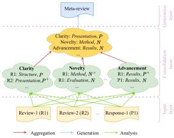
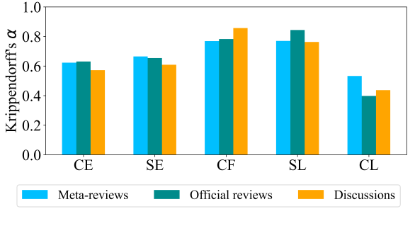
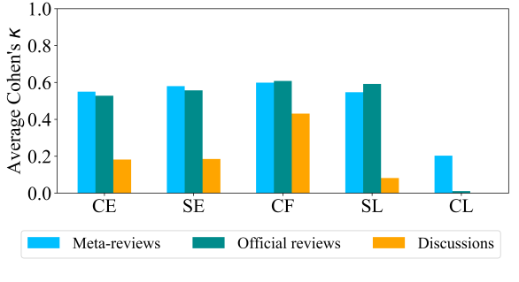

# Exploring Multi-Document Information Consolidation for Scientific Sentiment Summarization

###### Abstract

Modern natural language generation systems with LLMs exhibit the capability to generate a plausible summary of multiple documents; however, it is uncertain if models truly possess the ability of information consolidation to generate summaries, especially on those source documents with opinionated information. To make scientific sentiment summarization more grounded, we hypothesize that in peer review human meta-reviewers follow a three-layer framework of sentiment consolidation to write meta-reviews and it represents the logic of summarizing scientific sentiments in meta-review generation. The framework is validated via human annotation. Based on the framework, we propose evaluation metrics to assess the quality of generated meta-reviews, and we find that the hypothesis of the sentiment consolidation framework works out empirically when we incorporate it as prompts for LLMs to generate meta-reviews in extensive experiments.111We will release the code and annotated data at ANONYMIZED upon acceptance.  

## 1 Introduction

Notable strides have been made in abstractive text summarization (El-Kassas et al., [2021](#bib.bib3)) with the advancement of large language models (LLMs) (Zhao et al., [2023](#bib.bib14)) over recent years. With even a piece of simple instruction as a prompt such as “tl;dr” or “please write a summary”, these models can generate plausible summaries which are found more preferred over those written by humans (Pu et al., [2023](#bib.bib11)). However, it is uncertain if these models truly possess the ability of information consolidation, especially when summarizing documents which are composed of opinionated information. The models may take shortcuts to generate texts instead of correctly understanding and aggregating information from the source documents (Gehrmann et al., [2023](#bib.bib4)) and they may generate abstractive summaries with incorrect sentiment consolidation.  

[FIGURE S1.F1.g1]

Figure 1: The three-layer framework of the underlying information consolidation logic in meta-reviewing ($P$: Positive, $P^{+}$: Strongly positive, $N$: Negative, $N^{+}$: Strongly negative).
[/FIGURE]

Automated sentiment summarization holds significant importance (Kim et al., [2011](#bib.bib6)) and there have been sentiment summarization datasets; however, most of them are in the product review domain. These datasets are not suitable for investigating information consolidation as (1) the summaries are synthetic, composed of a simple combination of extracted snippets (Amplayo et al., [2021](#bib.bib1)), (2) the summary of product reviews is about extracting the majority sentiment. To address this, in this paper, we propose the task of scientific sentiment summarization, taking the meta-reviews in scientific peer review as summaries.222The representative peer review platform which is publicly available is <www.openreview.com>. The investigation of meta-review generation (Li et al., [2023a](#bib.bib7)) presents an exceptional opportunity for exploring the intricate process of multi-document information consolidation. This is because (1) meta-reviewers are supposed to understand not only all the reviews from different reviewers but also the multi-turn discussions between the reviewers and the author and write their comments to support the acceptance decision of the manuscript, (2) the argument logic has to be taken into account to arrive at sentiments in the meta-reviews where majority voting is not always working, (3) meta-reviews have to recognize and resolve conflicts and consensus among source documents (i.e., corresponding reviews and discussions).  

In this paper, we hypothesize that human meta-reviewers are following a three-layer sentiment consolidation framework as shown in Figure [1](#S1.F1 "Figure 1 ‣ 1 Introduction ‣ Exploring Multi-Document Information Consolidation for Scientific Sentiment Summarization") to write meta-reviews based on individual reviews and discussions in the peer review process. Human and automatic annotation is then conducted to get judgements from meta-reviews and corresponding source documents and these judgements are the foundation of our framework. With the proposed sentiment consolidation framework and annotated data, we propose two evaluation metrics which are focused more on sentiments in generated meta-reviews, and in our extensive experiments, we observe empirical validation of the framework hypothesis when integrated as prompts for LLMs to generate meta-reviews.  

Contributions of the paper are summarized as follows:  

* With the initialization of scientific sentiment summarization, we hypothesize that human meta-reviewers follow a three-layer framework that describes the sentiment consolidation process in the meta-reviewing process; 
* We collect human annotations on meta-reviews and corresponding source documents based on the sentiment consolidation framework; 
* We propose two automatic metrics (reference-free and reference-based) to evaluate the sentiment in the generated meta-reviews. 
* Experiments show that the framework works out empirically when we incorporate it as prompts for LLMs to generate meta-reviews. 

[TABLE S1.T1]

<table class="ltx_tabular ltx_centering ltx_align_middle">
<tr class="ltx_tr">
<td class="ltx_td ltx_align_justify ltx_align_top ltx_border_tt">

Component

</td>
<td class="ltx_td ltx_align_justify ltx_align_top ltx_border_tt">

Definition

</td>
</tr>
<tr class="ltx_tr">
<td class="ltx_td ltx_align_justify ltx_align_top ltx_border_t">

Content Expression

</td>
<td class="ltx_td ltx_align_justify ltx_align_top ltx_border_t">

What the sentiment is talking about

</td>
</tr>
<tr class="ltx_tr">
<td class="ltx_td ltx_align_justify ltx_align_top">

Criteria Facet

</td>
<td class="ltx_td ltx_align_justify ltx_align_top">

The specific criteria facet that the judgement belongs to

</td>
</tr>
<tr class="ltx_tr">
<td class="ltx_td ltx_align_justify ltx_align_top">

Sentiment Polarity

</td>
<td class="ltx_td ltx_align_justify ltx_align_top">

The polarity and strength of the sentiment

</td>
</tr>
<tr class="ltx_tr">
<td class="ltx_td ltx_align_justify ltx_align_top">

Convincingness

</td>
<td class="ltx_td ltx_align_justify ltx_align_top">

How well the sentiment is justified in the document

</td>
</tr>
<tr class="ltx_tr">
<td class="ltx_td ltx_align_justify ltx_align_top ltx_border_bb">

Sentiment Expression

</td>
<td class="ltx_td ltx_align_justify ltx_align_top ltx_border_bb">

The value of the sentiment

</td>
</tr>
</table>

Table 1: Definitions of components in a judgement.
[/TABLE]

[TABLE S1.T2]

Min
Max
Average

#Documents/Sample
5
30
12.4

#Words/Sample
1,541
11,901
4,260.9

#Words/Source document
10
1,562
360.53

#Words/Meta-review
16
648
150.87

Table 2: Statistics of the human annotated data.
[/TABLE]

## 2 Related Work

In this section, we discuss large-scale information consolidation in abstractive summarization, and automated sentiment summarization.  

### 2.1 Large-Scale Information Consolidation

Natural language generation systems are expected to not only have high-quality generations but also have the ability to comprehend the input information, especially for conditional text generation such as multi-document summarization which has to integrate and aggregate information from different source documents. Most work in the text summarization community is only trying to improve the generation quality of text summarization, such as relevance and faithfulness without considering the generation process. For example, Li et al. ([2023b](#bib.bib8)) use heterogeneous graphs to represent source documents and borrow the idea of graph compression to train the summarization model to get improvement of the generated summaries. However, it is uncertain if these models truly possess the ability to consolidate information from different source documents, and this is still under exploration. Moreover, it is also of limited exploration that the human information consolidation logic in summarization could be used to enhance the generation ability of LLMs and make generations more grounded.  

### 2.2 Automated Sentiment Summarization

Sentiment summarization is to get a summary of sentiments in the input texts (Hossain et al., [2023](#bib.bib5)). However, most datasets for sentiment summarization are in the product review domain (Amplayo et al., [2021](#bib.bib1)), and scientific sentiment summarization is under exploration. Meta-review generation, which is a typical scenario of scientific sentiment summarization, is to automatically generate meta-reviews based on reviews and the multi-turn discussions between reviewers and the author of the corresponding manuscript (Li et al., [2023a](#bib.bib7)). It is mostly modelled as an end-to-end task (Bhatia et al., [2020](#bib.bib2); Wu et al., [2022](#bib.bib12)). Although Li et al. ([2023a](#bib.bib7)) take consideration of the in-nature conversational structure of source documents, their models have no knowledge of how human meta-reviewers write the meta-reviews and they do not consider the judgements which would be the most important content in the peer-reviewing process in their modelling or evaluation. Because this task features multiple source documents with complex relationships which should be considered in the corresponding meta-review, it is a suitable scenario to investigate the ability of models to consolidate information in the summarization process.  

## 3 Sentiment Consolidation Over Multiple Opinionated Documents

In the following section, we introduce the task of scientific sentiment summarization and our three-layer sentiment consolidation framework in meta-review generation, conduct judgement identification and extraction, analyze the fusion process of scientific sentiments.  

### 3.1 Hierarchical Sentiment Consolidation

We propose the task of scientific sentiment summarization, synthesizing reviews and discussions in the peer-reviewing process into the corresponding meta-review. While we use the PeerSum333https://github.com/oaimli/PeerSum dataset where the input is reviews and discussions and the target output is the corresponding human-written meta-review, scientific sentiment summarization would focus more on sentiments in the summary or meta-review generation process.  

In the domain of peer review, based on reviewer guidelines from the most popular academic presses such as ACM and IEEE444The complete table of official guidelines that we consider is in the Appendix., we find that all comments in the whole process of peer-reviewing are mostly about judgements from different participants on the quality and merit of the manuscript. These opinions or judgements are based on six facets of review criteria (Novelty, Soundness, Clarity, Advancement, Compliance and Overall quality) which are the foundations of the peer-reviewing process. The meta-reviewers must form their final judgements based on those from the reviewers and authors. Similarly, based on meta-reviewer guidelines for ICLR555https://iclr.cc/Conferences/2024/SACguide and NeurIPS666https://nips.cc/Conferences/2020/PaperInformation/AC-SACGuidelines, we find that the meta-reviewer needs to understand and aggregate information from comments in the whole peer-reviewing process. They may first identify judgements from different review and discussion documents, then aggregate opinions in different criteria facets, and lastly based on this aggregation they write the meta-review.  

To conceptualize the logic of scientific sentiment summarization from multiple documents, we propose a three-layer framework, taking meta-review generation as an example shown in Figure [1](#S1.F1 "Figure 1 ‣ 1 Introduction ‣ Exploring Multi-Document Information Consolidation for Scientific Sentiment Summarization"). The three layers include the input layer, the consolidation layer, and the generation layer. The input layer is to understand individual judgements in input documents of different types: official reviews and multi-turn discussions. The consolidation layer is to represent what the meta-reviewers are supposed to do to aggregate sentiments from the input documents. Specifically, they first identify and extract judgements from different documents, then reorganize the judgements, and lastly do judgement fusion to form the final opinions of each criteria facet. In the generation layer, the meta-reviewer writes the meta-review to express the judgements that they develop based on consolidation of the whole peer-reviewing process.  

### 3.2 Judgement Identification and Extraction

Judgements lay the foundation of our proposed framework and the whole peer review process. A judgement here expresses sentiment on a criteria facet with sometimes its justification, and it contains several components: Content Expression, Sentiment Expression, Criteria Facet, Sentiment Level, and Convincingness Level (definitions are shown in Table [1](#S1.T1 "Table 1 ‣ 1 Introduction ‣ Exploring Multi-Document Information Consolidation for Scientific Sentiment Summarization"), and examples are in Figure [5](#A3.F5 "Figure 5 ‣ Appendix C Inter-Annotator Agreement Among Human Annotators and GPT-4 ‣ Exploring Multi-Document Information Consolidation for Scientific Sentiment Summarization") in human annotation). To automate judgement identification and extraction, we first conduct human annotation, and then leverage in-context learning of LLMs to perform more (automatic) annotation.  

In human annotation, there are three types of documents including meta-reviews, official reviews, and discussions (the same definition to Li et al. ([2023a](#bib.bib7))) to be annotated. We recruit two human annotators777The two annotators are senior PhD students who are familiar with the peer-review process. to do this annotation. The whole human annotation instruction is in Appendix [B](#A2 "Appendix B Annotation Instructions for Human Annotation ‣ Exploring Multi-Document Information Consolidation for Scientific Sentiment Summarization"). As the annotation is time-consuming, we finish 30 samples and it costs about one hour to annotate per sample and it costs about 60 hours and 2,100 US dollars in total. Two annotators get 1,812 and 1,744 judgements, respectively. The statistics of these 30 samples are present in Table [2](#S1.T2 "Table 2 ‣ 1 Introduction ‣ Exploring Multi-Document Information Consolidation for Scientific Sentiment Summarization"). Agreement of the two annotators on these three types of documents is shown in Figure [2](#S3.F2 "Figure 2 ‣ 3.2 Judgement Identification and Extraction ‣ 3 Sentiment Consolidation Over Multiple Opinionated Documents ‣ Exploring Multi-Document Information Consolidation for Scientific Sentiment Summarization") in terms of Krippendorff’s $\alpha$.888Calculation details and more results in terms of both Cohen’s $\kappa$ and Krippendorff’s $\alpha$ are in Table [10](#A3.T10 "Table 10 ‣ Appendix C Inter-Annotator Agreement Among Human Annotators and GPT-4 ‣ Exploring Multi-Document Information Consolidation for Scientific Sentiment Summarization"), Table [11](#A3.T11 "Table 11 ‣ Appendix C Inter-Annotator Agreement Among Human Annotators and GPT-4 ‣ Exploring Multi-Document Information Consolidation for Scientific Sentiment Summarization") and Table [12](#A3.T12 "Table 12 ‣ Appendix C Inter-Annotator Agreement Among Human Annotators and GPT-4 ‣ Exploring Multi-Document Information Consolidation for Scientific Sentiment Summarization") in Appendix [C](#A3 "Appendix C Inter-Annotator Agreement Among Human Annotators and GPT-4 ‣ Exploring Multi-Document Information Consolidation for Scientific Sentiment Summarization"). It is clear that there is high agreement between the two human annotators. This shows that judgements on these criteria facets in these documents really exist and this makes it possible to analyze the sentiment consolidation among source documents.  

[FIGURE S3.F2.g1]

Figure 2: Inter-annotator agreement on meta-reviews, official reviews and discussions in terms of Krippendorff’s $\alpha$ for different judgement components including Content Expression (CE), Sentiment Expression (SE), Criteria Facet (CF), Sentiment Level (SL), and Convincingness Level (CL).
[/FIGURE]

[FIGURE S3.F3.g1]

Figure 3: The averaged GPT-4’s agreement with two human annotators on meta-reviews, official reviews and discussions in terms of Krippendorff’s $\alpha$ for different judgement components including Content Expression (CE), Sentiment Expression (SE), Criteria Facet (CF), Sentiment Level (SL), and Convincingness Level (CL).
[/FIGURE]

To get more annotated judgements, we split the annotation task into two phases: extracting content and sentiment expressions, and predicting other components of judgements, and leverage GPT-4 to accomplish this with in-context learning as there is not enough data to train specific models. Specifically, we design prompts for GPT-4999The version of GPT-4 in the paper is gpt-4-0613 in default., which is currently one of the most powerful LLMs, with few-shot prompting to get the content and sentiment expressions which express the judgements in annotation documents (the prompt template is in Appendix [D](#A4 "Appendix D Prompt to Get Content and Sentiment Expressions with GPT-4 ‣ Exploring Multi-Document Information Consolidation for Scientific Sentiment Summarization")), and get the predictions of other judgement components (the prompt template is in  Appendix [E](#A5 "Appendix E Prompt to Get Judgement Component Predictions with GPT-4 ‣ Exploring Multi-Document Information Consolidation for Scientific Sentiment Summarization")). We present average agreement of GPT-4 with the two human annotators in Figure [3](#S3.F3 "Figure 3 ‣ 3.2 Judgement Identification and Extraction ‣ 3 Sentiment Consolidation Over Multiple Opinionated Documents ‣ Exploring Multi-Document Information Consolidation for Scientific Sentiment Summarization")101010More results are in Table [13](#A3.T13 "Table 13 ‣ Appendix C Inter-Annotator Agreement Among Human Annotators and GPT-4 ‣ Exploring Multi-Document Information Consolidation for Scientific Sentiment Summarization"), Table [14](#A3.T14 "Table 14 ‣ Appendix C Inter-Annotator Agreement Among Human Annotators and GPT-4 ‣ Exploring Multi-Document Information Consolidation for Scientific Sentiment Summarization") and Table [15](#A3.T15 "Table 15 ‣ Appendix C Inter-Annotator Agreement Among Human Annotators and GPT-4 ‣ Exploring Multi-Document Information Consolidation for Scientific Sentiment Summarization") in Appendix [C](#A3 "Appendix C Inter-Annotator Agreement Among Human Annotators and GPT-4 ‣ Exploring Multi-Document Information Consolidation for Scientific Sentiment Summarization").. We can see that annotation results by GPT-4 have a high agreement with human annotation results, which means that GPT-4 can be qualified to do the annotation on meta-reviews and official reviews. It is also clear that GPT-4 cannot have high agreement with human annotators on annotating discussions. This may be because that judgements in discussion documents are usually to rebuttal and not easy to detect, which is consistent in human annotation. Moreover, it is clear that GPT-4 has lowest agreement with human annotators on convincingness levels in Figure [3](#S3.F3 "Figure 3 ‣ 3.2 Judgement Identification and Extraction ‣ 3 Sentiment Consolidation Over Multiple Opinionated Documents ‣ Exploring Multi-Document Information Consolidation for Scientific Sentiment Summarization") while human annotators have the lowest agreement on convincingness levels in Figure [2](#S3.F2 "Figure 2 ‣ 3.2 Judgement Identification and Extraction ‣ 3 Sentiment Consolidation Over Multiple Opinionated Documents ‣ Exploring Multi-Document Information Consolidation for Scientific Sentiment Summarization"). This may be because that convincingness is subjective.  

### 3.3 Sentiment Fusion for Consolidation

[TABLE S3.T3]

Facets
%Judgements
%Documents

Advancement
0.2545
0.8000

Soundness
0.2786
0.7833

Novelty
0.1817
0.6833

Overall
0.1414
0.5833

Clarity
0.1264
0.4500

Compliance
0.0174
0.0667

Table 3: Frequency of different criteria facets in meta-review judgements and meta-review documents.
[/TABLE]

With all the annotated judgements, we next dive more into the process of sentiment aggregation. Among all the criteria facets, we find that Soundness and Advancement are the two most important criteria facets when the meta-reviewers write their meta-reviews, while Compliance is rarely an issue in meta-reviews (shown in Table [3](#S3.T3 "Table 3 ‣ 3.3 Sentiment Fusion for Consolidation ‣ 3 Sentiment Consolidation Over Multiple Opinionated Documents ‣ Exploring Multi-Document Information Consolidation for Scientific Sentiment Summarization")). This is consistent with our understanding of the peer-reviewing process.  

More importantly, we find that human-written meta-reviews are not always following simple majority voting to develop sentiments. Specifically, in the document level, we find that in PeerSum there are 23.7% samples where human meta-reviewer’s acceptance decision is not consistent with the prediction based on majority voting by review ratings (if the number of ratings which are higher than 5 for a paper is larger than the number of ratings which are not higher than 5, the majority voting will get Accept while the human meta-reviewer’s decision may be Reject for the paper.); in the sentiment level, there is an example in Table [4](#S3.T4 "Table 4 ‣ 3.3 Sentiment Fusion for Consolidation ‣ 3 Sentiment Consolidation Over Multiple Opinionated Documents ‣ Exploring Multi-Document Information Consolidation for Scientific Sentiment Summarization") where the meta-reviewer is not following majority voting to form the sentiment on Novelty.  

[TABLE S3.T4]

<table class="ltx_tabular ltx_centering ltx_align_middle">
<tr class="ltx_tr">
<td class="ltx_td ltx_align_justify ltx_align_top ltx_border_l ltx_border_r ltx_border_tt">

Human-written meta-review sentiment sentence

</td>
</tr>
<tr class="ltx_tr">
<td class="ltx_td ltx_align_justify ltx_align_top ltx_border_l ltx_border_r ltx_border_t">

"Although each module in the proposed approach is not novel, it seems that the way they are used to address the specific problem of explainability and especially in text games is novel and sound."

</td>
</tr>
<tr class="ltx_tr">
<td class="ltx_td ltx_align_justify ltx_align_top ltx_border_l ltx_border_r ltx_border_t">

All corresponding sentiment texts on Novelty in source reviews and discussions

</td>
</tr>
<tr class="ltx_tr">
<td class="ltx_td ltx_align_justify ltx_align_top ltx_border_l ltx_border_r ltx_border_t">

"The generation of temporally extended explanations consists of a cascade of different components, either straightfoward statistics or prior work."

</td>
</tr>
<tr class="ltx_tr">
<td class="ltx_td ltx_align_justify ltx_align_top ltx_border_l ltx_border_r">

"The novelty is a bit low."

</td>
</tr>
<tr class="ltx_tr">
<td class="ltx_td ltx_align_justify ltx_align_top ltx_border_l ltx_border_r">

"overall novelty is limitted"

</td>
</tr>
<tr class="ltx_tr">
<td class="ltx_td ltx_align_justify ltx_align_top ltx_border_l ltx_border_r">

"We contend that all steps are individually novel as well as their combination."

</td>
</tr>
<tr class="ltx_tr">
<td class="ltx_td ltx_align_justify ltx_align_top ltx_border_bb ltx_border_l ltx_border_r">

"we are the first to use knowledge graph attention-based attribution to explain actions in such grounded environments"

</td>
</tr>
</table>

Table 4: The example of a meta-review sentiment on Novelty which is not following majority voting of sentiments in source documents. The green
and red texts indicate positive and negative sentiments, respectively.
[/TABLE]

To learn the aggregation function of sentiments from source documents to the meta-review, we try in-context learning of LLMs as there are not enough training data to train other models and LLMs like GPT-4 are powerful in zero-shot learning. We formulate this as a text classification task where the output is the sentiment level of the piece of Content Expression in a meta-review judgement and the input is judgements in all source documents which are belonging to the same criteria facet as the meta-review judgement or the full text of all source documents. Specifically, we randomly sample 100 human-annotated meta-review judgements for each criteria facet in each annotator’s annotation results, and the prompt for GPT-4 is in Appendix [F](#A6 "Appendix F Prompts to Predict Meta-Review Sentiment Levels ‣ Exploring Multi-Document Information Consolidation for Scientific Sentiment Summarization"). Average results between two human annotators in Table [5](#S3.T5 "Table 5 ‣ 3.3 Sentiment Fusion for Consolidation ‣ 3 Sentiment Consolidation Over Multiple Opinionated Documents ‣ Exploring Multi-Document Information Consolidation for Scientific Sentiment Summarization") suggest that using judgements is better than full texts to predict the meta-review sentiments and this zero-shot classification function has the potential to predict the sentiments in the meta-review. This suggests that it may be useful to incorporate some intermediate steps to extract text segments related to a facet before generating the final sentiment (i.e. these results argue that we should not treat it as a simple text-to-text problem where the input is reviews and discussions and the output is the meta-review).  

[TABLE S3.T5]

Criteria Facets
Judgements
Full Texts

Advancement
0.677
0.697

Soundness
0.684
0.667

Novelty
0.700
0.650

Overall
0.643
0.631

Clarity
0.712
0.645

Compliance
0.555
0.593

Table 5: Accuracy of GPT-4 to predict sentiment levels of human-annotated meta-review judgements based on annotated source judgements or original full texts.
[/TABLE]

## 4 Sentiment-Aware Evaluation on Information Consolidation

In this section, we focus more on how to evaluate sentiments of the generated summaries or meta-reviews in meta-review generation based on our proposed framework. We propose FacetEval and FusionEval which are reference-based and reference-free metrics, respectively.  

### 4.1 Measuring Sentiment Similarity to Human-Written Meta-Review

To assess the quality of generated meta-reviews, we propose a reference-based evaluation metric, FacetEval, measuring the sentiment consistency $c$ between the generated meta-review and the corresponding human-written meta-review in all criteria facets. Different from the generic evaluation metrics for abstractive summarization or text generation which mostly adopt surface-form matching, we focus more on criteria facets and their corresponding sentiment levels in human-written and model-generated meta-reviews.  

Specifically, we use the distribution of sentiments in all criteria facets to represent the meta-review and use the cosine similarity of the two vectors as the final score $s$.  

|  | $\displaystyle s$ | $\displaystyle=\cos{(\bm{m}_{h},\bm{m}_{g})}$ |  | (1) |
| --- | --- | --- | --- | --- |
|  | $\displaystyle\bm{m}$ | $\displaystyle=\big{\|}_{f}[P^{+}_{f},P_{f},N^{+}_{f},N_{f},O_{f}]$ |  | (2) |
| --- | --- | --- | --- | --- |

where $\big{\|}$ denotes concatenation of representations for different facets, $\bm{m}_{h}$ and $\bm{m}_{g}$ are representations of the human-written and model-generated meta-reviews respectively. The representation $\bm{m}$ of the meta-review is the concatenation of vector representations of all criteria facets. Each facet of the document is represented by the frequency of different sentiment levels on the facet. The facet $f$ is represented by a five-dimension vector $[P^{+}_{f},P_{f},N^{+}_{f},N_{f},O_{f}]$ where $P^{+}_{f}$ denotes the frequency of Strongly positive for the facet $f$, $P_{f}$ denotes the frequency of Positive, $N^{+}_{f}$ denotes the frequency of Strongly negative, $N_{f}$ denotes the frequency of Negative, and $O_{f}$ denotes whether this facet is involved in the document.  

Following the similarity of meta-reviews, we could also calculate sentiment consistency among official reviews. Specifically, for every two official reviews $i$ and $j$, the consistency in the facet $f$ is the cosine similarity between two vector representations of documents.  

|  | $\displaystyle c^{f}_{ij}$ | $\displaystyle=\cos{(\bm{d}_{i},\bm{d}_{j})}$ |  | (3) |
| --- | --- | --- | --- | --- |

where $\bm{d}^{f}=[P^{+}_{f},P_{f},N^{+}_{f},N_{f},O_{f}]$. Results shown in Table [6](#S4.T6 "Table 6 ‣ 4.1 Measuring Sentiment Similarity to Human-Written Meta-Review ‣ 4 Sentiment-Aware Evaluation on Information Consolidation ‣ Exploring Multi-Document Information Consolidation for Scientific Sentiment Summarization") suggest that different reviews are consistent in the sentiment to Compliance while there is much lower consistency in Clarity and Novelty. Moreover, we find that conflict reviews111111The same as in PeerSum, if any two reviews have ratings where the gap is larger than 4 they are conflict reviews. would prefer showing conflicts in Advancement, Novelty, Clarity and Overall. This is also consistent with our typical understanding in peer reviews and occasional conflicts among them.  

[TABLE S4.T6]

Criteria Facet
w/ Conflicts
w/o Conflicts

Advancement
0.463 (0.135)
0.551 (0.137)

Soundness
0.526 (0.158)
0.501 (0.110)

Novelty
0.300 (0.159)
0.357 (0.168)

Overall
0.433 (0.147)
0.597 (0.172)

Clarity
0.317 (0.133)
0.337 (0.145)

Compliance
0.827 (0.071)
0.771 (0.118)

Table 6: Sentiment consistency among different official reviews. (Variances are in the brackets.)
[/TABLE]

### 4.2 Measuring Sentiment Fusion for Individual Facets

Sentiments in the generated meta-reviews should be in line with the aggregate sentiment from the individual source documents. As GPT-4 has the potential to predict sentiments in the human-written meta-reviews from judgements in source reviews and discussions in Section [3.3](#S3.SS3 "3.3 Sentiment Fusion for Consolidation ‣ 3 Sentiment Consolidation Over Multiple Opinionated Documents ‣ Exploring Multi-Document Information Consolidation for Scientific Sentiment Summarization"), we present a reference-free evaluation metric, FusionEval, which assesses the consistency between the sentiments in the generated meta-review and that predicted by the zero-shot sentiment level prediction with GPT-4 from the source judgements. The higher consistency indicates that the generated meta-reviews follow a more similar sentiment aggregation scheme to get the meta-review sentiments.  

Specifically, we first extract judgements from the generated meta-review with a set of Content Expression, $E$ and Sentiment Level, $L$; next, for all expressions in $E$, we get the predicted set of Sentiment Level, $L^{\prime}$ with the zero-shot sentiment prediction function based on judgements in the source documents; last, the accuracy between $L$ and $L^{\prime}$ is the consistency and the final score of FusionEval. FusionEval only considers the precision instead of the recall for meta-review sentiments as it is reference-free and we have no information about the count of judgements that should be synthesized.  

[TABLE S4.T7]

LLM
Evaluation Metric
Prompt-Naive
Prompt-LLM
Prompt-Ours
Pipeline-Ours

GPT-4
FusionEval
50.14
48.90
53.62
57.43

FacetEval
35.42
40.54
41.98
42.36

ROUGE-1
27.16
27.49
28.02
24.91

ROUGE-2
6.63
6.03
6.57
4.57

ROUGE-L
24.78
24.75
25.51
22.70

GPT-3.5
FusionEval
48.35
49.66
51.40
55.96

FacetEval
38.44
36.83
39.88
39.50

ROUGE-1
28.22
25.04
29.56
28.92

ROUGE-2
06.63
05.79
6.95
5.52

ROUGE-L
25.36
22.77
26.69
16.13

LLaMA2-7B
FusionEval
46.85
46.83
50.18
52.68

FacetEval
35.89
32.49
38.07
38.35

ROUGE-1
25.94
23.88
27.00
19.39

ROUGE-2
6.04
4.50
6.86
4.12

ROUGE-L
23.57
21.59
24.59
17.37

LLaMA2-70B
FusionEval
47.35
48.53
50.24
52.80

FacetEval
35.90
36.40
36.64
36.82

ROUGE-1
26.61
16.60
26.98
26.41

ROUGE-2
6.56
3.13
5.58
4.48

ROUGE-L
24.62
14.63
24.20
23.71

Table 7: Performances of different LLMs with different prompting methods. ($\times 0.01$)
[/TABLE]

[TABLE S4.T8]

<table class="ltx_tabular ltx_centering ltx_align_middle">
<tr class="ltx_tr">
<td class="ltx_td ltx_align_justify ltx_align_top ltx_border_l ltx_border_r ltx_border_tt">

Human-written meta-review

</td>
</tr>
<tr class="ltx_tr">
<td class="ltx_td ltx_align_justify ltx_align_top ltx_border_l ltx_border_r ltx_border_t">

This paper suggests a method for defending against adversarial examples and out-of-distribution samples via projection onto the data manifold. The paper suggests a new method for detecting when hidden layers are off of the manifold, and uses auto encoders to map them back onto the manifold. The paper is well-written and the method is novel and interesting. However, most of the reviewers agree that the original robustness evaluations were not sufficient due to restricting the evaluation to using FGSM baseline and comparison with thermometer encoding (which both are known to not be fully effective baselines). After rebuttal, Reviewer 4 points out that the method offers very little robustness over adversarial training alone, even though it is combined with adversarial training, which suggests that the method itself provides very little robustness.

</td>
</tr>
<tr class="ltx_tr">
<td class="ltx_td ltx_align_justify ltx_align_top ltx_border_l ltx_border_r ltx_border_t">

Meta-review generated by GPT-4 with the naive prompting

</td>
</tr>
<tr class="ltx_tr">
<td class="ltx_td ltx_align_justify ltx_align_top ltx_border_l ltx_border_r ltx_border_t">

The reviewers have raised several concerns about the empirical evaluation and effectiveness of the proposed fortified network model. They note that the benefits of the fortified layers seem to be marginal and the experimental evaluation doesn’t sufficiently demonstrate that the increased robustness is due to the fortified layers rather than the adversarial training. Furthermore, most of the reviewers would like to see benchmarks against state-of-the-art defenses such as PGD. Among other issues, reviewers have questioned the use of an autoencoder and the decision to use a denoising module in the hidden layers. Simply put, the reviewers would like a stronger reasoning for the methodological choices. There are also requests for clarification on the denoising terms and a comparison with a simple regularization loss. Moreover, a reviewer also raised a question on the effectiveness of the defense method against other types of attacks that might potentially compromise the proposed network. Most reviewers felt that the paper does not provide enough evidence that defends the proposed fortified network against adversarial attacks. Finally, concerns about the presentation of results and tables, and grammar errors have also been pointed out. In conclusion, while the reviewers acknowledge the relevance and importance of the research problem, the manuscript requires significant amendments to convince the experts about the effectiveness of the proposed method in tackling the problem. The authors must address these concerns and improve the manuscript to make a compelling case for their proposed approach.

</td>
</tr>
<tr class="ltx_tr">
<td class="ltx_td ltx_align_justify ltx_align_top ltx_border_l ltx_border_r ltx_border_t">

Meta-review generated by GPT-4 with the proposed prompting based on our sentiment consolidation framework

</td>
</tr>
<tr class="ltx_tr">
<td class="ltx_td ltx_align_justify ltx_align_top ltx_border_bb ltx_border_l ltx_border_r ltx_border_t">

The paper at hand proposes a fortified network model as a defense against adversarial attacks, based on the concept of denoising autoencoders. A key novelty in the presented approach is the placement of the denoising feature within the hidden layers, rather than just the input layer.The clarity and structure of the document have been appreciated by a number of reviewers, particularly the experimental data presentation and robust bibliography. There are, however, a few areas noted for improvement - predominantly around grammatical mistakes and confusing sentence structure. A significant source of debate among reviewers centers on the empirically evaluated efficacy of the fortified model. The authors propose that their model improves robustness by up to 5% over the baseline, but several reviewers argue that this improvement is marginal and does not sufficiently justify the implementation of an additional objective. This argument is most prominent when looking at the study’s use of non-standard models and a PGD baseline that performs below the state-of-the-art, leading to questions about the accuracy of the baseline evaluation. Further, accuracy results against an Linf adversary of eps&gt;0.1 on CIFAR-10 raises questions around the experiment’s setup given known limitations relating to image perturbations. Suggestions were made to explore a nearest neighbor attack from the test set, multiple gradient queries per PGD step, and report standard non-robust accuracies to ensure robustness was not an artefact of model expressivity.Lastly, some apprehension was expressed about the motivation behind and efficacy of using a denoising autoencoder, with calls for comparison to a simpler baseline to justify the approach. In conclusion, while the fortified network model presents an intriguing approach to defending against adversarial attacks, the reviewers do not overwhelmingly agree that the empirical results sufficiently demonstrate advancement over existing methods. The majority find the defensive gain too marginal given the additional complexity and question the setup of the empirical evaluation. Further clarity in method and expanded empirical evidence would facilitating a stronger case for the proposed model.

</td>
</tr>
</table>

Table 8: Human-written meta-review and the corresponding meta-reviews generated by GPT-4 with the naive prompt and the prompt based on the sentiment consolidation. (The green spans are positive sentiment values, red spans are negative sentiment values, while blue spans are the content expressions.)
[/TABLE]

## 5 Enhancing LLMs with Explicit Information Consolidation

In this section, to enhance LLMs in meta-review generation we propose two prompting methods to integrate the information consolidation logic. We compare the two methods with other prompting strategies including naive prompting and prompting with LLM-generated logic. We also run experiments on open-source models besides OpenAI ones to investigate the influence of different prompting methods on different models. The experiments are based on automatic and human annotation on 500 samples from PeerSum.121212To avoid data contamination, we only use samples which was produced in and after 2022.  

### 5.1 Prompting LLMs with Sentiment Consolidation Logic

As human meta-reviewers follow the sentiment consolidation logic introduced in Figure [1](#S1.F1 "Figure 1 ‣ 1 Introduction ‣ Exploring Multi-Document Information Consolidation for Scientific Sentiment Summarization"), LLMs may get improved if we integrate the logic into the generation process. As we know, there are mainly two paradigms in text generation: prompting and fine-tuning. Because fine-tuned models are black-box and it is not easy to integrate the information consolidation logic. Prompting with detailed logic would make it possible to investigate intermediate results in the generation process and this could promote trust and transparency, therefore we focus on enhancing LLMs in prompting with the integration of information logic.  

Based on the framework in Figure [1](#S1.F1 "Figure 1 ‣ 1 Introduction ‣ Exploring Multi-Document Information Consolidation for Scientific Sentiment Summarization") and comprehensive analysis in Section [3.3](#S3.SS3 "3.3 Sentiment Fusion for Consolidation ‣ 3 Sentiment Consolidation Over Multiple Opinionated Documents ‣ Exploring Multi-Document Information Consolidation for Scientific Sentiment Summarization"), there should be several steps in the meta-review generation process. (1) Step 1: Extracting content and sentiment expressions of judgements in all source documents;(2) Step 2: Predicting Criteria Facets, Sentiment Levels, and Convincingness Levels; (3) Step 3: Reorganize extracted judgements in different clusters for different criteria facets; (4) Step 4: Generate a small summary for judgements on the same criteria facet with sentiment comparison and aggregation; (5) Step 5: Generate the final meta-review based on summaries for different criteria facets.  

To integrate the information consolidation logic into prompting of LLMs, we present two methods. (1) Prompt-Ours: we inject descriptive sentiment consolidation logic into the prompt and make the model follow the steps. The complete prompt is in Appendix [G.1](#A7.SS1 "G.1 Prompt with Descriptive Consolidation Logic ‣ Appendix G Prompts for Meta-Review Generation with Integration of Information Consolidation Logic ‣ Exploring Multi-Document Information Consolidation for Scientific Sentiment Summarization"). (2) Pipeline-Ours: we formulate the task of generating meta-reviews into a pipeline and conduct each part separately instead of a single prompt. The first two steps are finished by GPT-4131313We only use GPT-4 to automate the extraction of judgements, as we find that other models are not well following the instructions. and all used prompts are in Appendix [G.2](#A7.SS2 "G.2 Prompts Used in the Pipeline Generation ‣ Appendix G Prompts for Meta-Review Generation with Integration of Information Consolidation Logic ‣ Exploring Multi-Document Information Consolidation for Scientific Sentiment Summarization").  

### 5.2 Reference-Based and Reference-Free Automatic Evaluation

In automatic evaluation, we adopt ROUGE (Lin and Hovy, [2003](#bib.bib9))141414We use the implementation of the algorithm in https://pypi.org/project/rouge-score/ and our proposed FacetEval and FusionEval. Besides ROUGE which is the most popular metric based on surface matching, there are some other semantic representation based metrics like BERTScore (Zhang et al., [2020](#bib.bib13)), UniEval (Zhong et al., [2022](#bib.bib15)), and G-Eval (Liu et al., [2023](#bib.bib10)), but they are only optimized for news summarization or dialogue generation tasks instead of sentiment summarization.  

To evaluate the benefit from the integration of the sentiment consolidation logic, we compare the two proposed prompting methods with the naive prompting (Prompt-Naive) which only simply make the model generate meta-reviews without detailed instructions and LLM-generated instructions (Prompt-LLM) which are based on the understanding of the model on how to generate meta-reviews. Moreover, we run experiments on closed-source (GPT-4 and GPT-3.5) and open-source models (LLaMA2-70B and LLaMA2-7B.)151515gpt-4-0613, gpt-3.5-turbo-1106, LLaMA2-70B-Chat, LLaMA2-7B-Chat  

Results are present in Table [7](#S4.T7 "Table 7 ‣ 4.2 Measuring Sentiment Fusion for Individual Facets ‣ 4 Sentiment-Aware Evaluation on Information Consolidation ‣ Exploring Multi-Document Information Consolidation for Scientific Sentiment Summarization"). It is clear that all the experimental models perform much better with our proposed two prompting methods, Prompt-Ours and Pipeline-Ours, than other two prompting methods in terms of FusionEval, FacetEval, ROUGE. This show that prompting based on our proposed framework makes the models get similar meta-reviews to the human-written ones and achieve better sentiments in the generated meta-reviews. We find that GPT-4 is still the best model in the scientific sentiment summarization, and the steps generated by the model itself cannot always get better results than the naive prompt. Although Pipeline-Ours can get better results in terms of FusionEval and FacetEval, it performs much worse in terms of ROUGE. This is because it only considers the sentiments rather than other factual summary of the manuscript, which leads to low ROUGE.  

### 5.3 Case Study on Generated Meta-Reviews

To dive deeper into what difference the integration of sentiment consolidation logic makes, we also conduct a case study on generated results with different prompting methods. We find that generated meta-reviews all seem plausible and machine-generated meta-reviews are much longer than human-written ones and in machine-generated meta-reviews there are many more details which are unnecessary to form an effective meta-review. As shown in the example in Table [8](#S4.T8 "Table 8 ‣ 4.2 Measuring Sentiment Fusion for Individual Facets ‣ 4 Sentiment-Aware Evaluation on Information Consolidation ‣ Exploring Multi-Document Information Consolidation for Scientific Sentiment Summarization"), details about such as "PGD" or "CIFA-10" are not essential to form the meta-review.  

We also find that prompts based on our sentiment consolidation framework prefer to cover more balanced judgements based on annotation like in Table [8](#S4.T8 "Table 8 ‣ 4.2 Measuring Sentiment Fusion for Individual Facets ‣ 4 Sentiment-Aware Evaluation on Information Consolidation ‣ Exploring Multi-Document Information Consolidation for Scientific Sentiment Summarization") and compare them, while the naive prompting only mentions some sentiments. For example, in Table [8](#S4.T8 "Table 8 ‣ 4.2 Measuring Sentiment Fusion for Individual Facets ‣ 4 Sentiment-Aware Evaluation on Information Consolidation ‣ Exploring Multi-Document Information Consolidation for Scientific Sentiment Summarization"), the generation does not include positive sentiments for Clarity and only mentions some issues, but the generation by the promting based on our sentiment consolidation framework acknowledges the good clarity while also mentioning some clarity problems. This is consistent with that prompting with naive prompts get worse sentiments than prompting with the prompt based on the sentiment consolidation logic in Table [7](#S4.T7 "Table 7 ‣ 4.2 Measuring Sentiment Fusion for Individual Facets ‣ 4 Sentiment-Aware Evaluation on Information Consolidation ‣ Exploring Multi-Document Information Consolidation for Scientific Sentiment Summarization").  

## 6 Conclusions and Future Work

We initialize the task of scientific sentiment summarization. Based on the nature of the meta-reviewing process, we propose the three-layer framework of sentiment consolidation. With the framework, we propose automatic evaluation metrics to evaluate sentiments in generated summaries. Extensive experiments show that generation results of LLMs could be improved by integrating the sentiment consolidation framework into the textual prompting or the generation pipeline. As the sentiment consolidation also exist in other domains where human reviews or comments exist such as politics and advertisement, we will explore adapting our proposed sentiment consolidation framework into other domains in the future.  

## Limitations

Although integration of the sentiment consolidation framework could improve the generation results, there are some limitations of this work:  

* As in other areas peer review data is not publicly available, we use the data only from some artificial intelligence conferences, and this may make the models biased. We hope that more data from diverse areas could be included. 
* Experiments are only in English texts rather than other languages. 
* We only inject the information consolidation logic into prompting based models instead of fine-tuning based models. We will investigate leveraging the information consolidation logic to improve fine-tuned models in the future. 
* Although GPT-4 can predict meta-review sentiments based on source judgements to some extent, we have to understand more about how these models achieve this and what makes them fail in error cases. 

## Ethics Statement

While our experiments demonstrate that the models exhibit potential in generating satisfactory meta-reviews to a certain degree, we strongly advise against solely relying on the generated results without manual verification and review, as instances of hallucinations exist in the generations. It is important to emphasize that we do not advocate for replacing human meta-reviewers with LLMs. However, it is noteworthy that these models have the capacity to enhance the meta-reviewing process, rendering it more efficient and effective.  

## References

* Amplayo et al. (2021)  Reinald Kim Amplayo, Stefanos Angelidis, and Mirella Lapata. 2021.   Unsupervised opinion summarization with content planning.   In *AAAI*, pages 12489–12497. 
* Bhatia et al. (2020)  Chaitanya Bhatia, Tribikram Pradhan, and Sukomal Pal. 2020.   Metagen: An academic meta-review generation system.   In *SIGIR*, pages 1653–1656. 
* El-Kassas et al. (2021)  Wafaa S. El-Kassas, Cherif R. Salama, Ahmed A. Rafea, and Hoda K. Mohamed. 2021.   Automatic text summarization: A comprehensive survey.   *Expert Systems with Applications*, 165:113679. 
* Gehrmann et al. (2023)  Sebastian Gehrmann, Elizabeth Clark, and Thibault Sellam. 2023.   Repairing the cracked foundation: A survey of obstacles in evaluation practices for generated text.   *JAIR*, 77:103–166. 
* Hossain et al. (2023)  Md. Murad Hossain, Luca Anselma, and Alessandro Mazzei. 2023.   Exploring sentiments in summarization: Sentitextrank, an emotional variant of textrank.   In *Proceedings of the 9th Italian Conference on Computational Linguistics*, volume 3596. 
* Kim et al. (2011)  Hyun Duk Kim, Kavita Ganesan, Parikshit Sondhi, and ChengXiang Zhai. 2011.   Comprehensive review of opinion summarization. 
* Li et al. (2023a)  Miao Li, Eduard Hovy, and Jey Han Lau. 2023a.   Summarizing multiple documents with conversational structure for meta-review generation.   In *Findings of EMNLP*. 
* Li et al. (2023b)  Miao Li, Jianzhong Qi, and Jey Han Lau. 2023b.   Compressed heterogeneous graph for abstractive multi-document summarization.   In *AAAI*. 
* Lin and Hovy (2003)  Chin-Yew Lin and Eduard H. Hovy. 2003.   Automatic evaluation of summaries using n-gram co-occurrence statistics.   In *HLT-NAACL*, pages 71–78. 
* Liu et al. (2023)  Yang Liu, Dan Iter, Yichong Xu, Shuohang Wang, Ruochen Xu, and Chenguang Zhu. 2023.   G-eval: NLG evaluation using GPT-4 with better human alignment.   *CoRR*, abs/2303.16634. 
* Pu et al. (2023)  Xiao Pu, Mingqi Gao, and Xiaojun Wan. 2023.   Summarization is (almost) dead.   *CoRR*, abs/2309.09558. 
* Wu et al. (2022)  Po-Cheng Wu, An-Zi Yen, Hen-Hsen Huang, and Hsin-Hsi Chen. 2022.   Incorporating peer reviews and rebuttal counter-arguments for meta-review generation.   In *CIKM*, pages 2189–2198. 
* Zhang et al. (2020)  Tianyi Zhang, Varsha Kishore, Felix Wu, Kilian Q. Weinberger, and Yoav Artzi. 2020.   Bertscore: Evaluating text generation with BERT.   In *ICLR*. 
* Zhao et al. (2023)  Wayne Xin Zhao, Kun Zhou, Junyi Li, Tianyi Tang, Xiaolei Wang, Yupeng Hou, Yingqian Min, Beichen Zhang, Junjie Zhang, Zican Dong, Yifan Du, Chen Yang, Yushuo Chen, Zhipeng Chen, Jinhao Jiang, Ruiyang Ren, Yifan Li, Xinyu Tang, Zikang Liu, Peiyu Liu, Jian-Yun Nie, and Ji-Rong Wen. 2023.   A survey of large language models.   *CoRR*, abs/2303.18223. 
* Zhong et al. (2022)  Ming Zhong, Yang Liu, Da Yin, Yuning Mao, Yizhu Jiao, Pengfei Liu, Chenguang Zhu, Heng Ji, and Jiawei Han. 2022.   Towards a unified multi-dimensional evaluator for text generation.   In *EMNLP*, pages 2023–2038. 

## Appendix A Review Criteria in Different Reviewer Guidelines

[TABLE A1.T9]

Academic Press

Review guidelines

ACM

<a class="ltx_ref ltx_url ltx_font_typewriter">https://dl.acm.org/journal/dgov/reviewer-guidelines</a>

ACL Rolling Review

<a class="ltx_ref ltx_url ltx_font_typewriter">https://aclrollingreview.org/reviewertutorial</a>

IEEE

<a class="ltx_ref ltx_url ltx_font_typewriter">https://conferences.ieeeauthorcenter.ieee.org/understand-peer-review/</a>

Springer

<a class="ltx_ref ltx_url ltx_font_typewriter">https://www.springer.com/gp/authors-editors/authorandreviewertutorials/howtopeerreview/evaluating-manuscripts/10286398</a>

NeurIPS

<a class="ltx_ref ltx_url ltx_font_typewriter">https://neurips.cc/Conferences/2021/Reviewer-Guidelines</a>

ICLR

<a class="ltx_ref ltx_url ltx_font_typewriter">https://iclr.cc/Conferences/2023/ReviewerGuide#Reviewinginstructions</a>

ACL

<a class="ltx_ref ltx_url ltx_font_typewriter">https://2023.aclweb.org/blog/review-acl23/</a>

Cambridge University Press

<a class="ltx_ref ltx_url ltx_font_typewriter">https://www.cambridge.org/core/services/aop-file-manager/file/5a1eb62e67f405260662a0df/Refreshed-Guide-Peer-Review-Journal.pdf</a>

Table 9: Review guidelines from different academic presses.
[/TABLE]

## Appendix B Annotation Instructions for Human Annotation

The screen shots of the two-page annotation instruction for human annotation are shown in Figure [4](#A3.F4 "Figure 4 ‣ Appendix C Inter-Annotator Agreement Among Human Annotators and GPT-4 ‣ Exploring Multi-Document Information Consolidation for Scientific Sentiment Summarization") and Figure [5](#A3.F5 "Figure 5 ‣ Appendix C Inter-Annotator Agreement Among Human Annotators and GPT-4 ‣ Exploring Multi-Document Information Consolidation for Scientific Sentiment Summarization").  

## Appendix C Inter-Annotator Agreement Among Human Annotators and GPT-4

We describe how we calculate inter-annotator agreement among human annotators and GPT-4 here. For Content Expression and Sentiment Expression, as they are highlighted text spans we calculate the character-level agreement with Krippendorf’s $\alpha$ and Cohen’s $\kappa$. Specifically, for each document two annotators may highlight different text spans for Content Expression and Sentiment Expression. We construct two vectors of the same length as the characters to represent highlighting behaviours of any two annotators. This agreement shows whether annotators identify sentiments from similar text spans.  

For Criteria Facet, Sentiment Level, and Convincingness Level, we calculate Krippendorf’s $\alpha$ and Cohen’s $\kappa$ in a common way. We first identify whether two annotators recognize sentiment from the same text span with a ROUGE threshold (the summation of ROUGE-1, ROUGE-2 and ROUGE-L between highlighted text spans for a sentiment is larger than 2.0), and calculate agreement on the predicted values.  

Inter-annotator agreement between two human annotators for human annotation in Section [3.2](#S3.SS2 "3.2 Judgement Identification and Extraction ‣ 3 Sentiment Consolidation Over Multiple Opinionated Documents ‣ Exploring Multi-Document Information Consolidation for Scientific Sentiment Summarization") are present in Table [10](#A3.T10 "Table 10 ‣ Appendix C Inter-Annotator Agreement Among Human Annotators and GPT-4 ‣ Exploring Multi-Document Information Consolidation for Scientific Sentiment Summarization"),  Table [11](#A3.T11 "Table 11 ‣ Appendix C Inter-Annotator Agreement Among Human Annotators and GPT-4 ‣ Exploring Multi-Document Information Consolidation for Scientific Sentiment Summarization"), and Table [12](#A3.T12 "Table 12 ‣ Appendix C Inter-Annotator Agreement Among Human Annotators and GPT-4 ‣ Exploring Multi-Document Information Consolidation for Scientific Sentiment Summarization"). Averaged agreement of GPT-4 with the two human annotators are present in Table [13](#A3.T13 "Table 13 ‣ Appendix C Inter-Annotator Agreement Among Human Annotators and GPT-4 ‣ Exploring Multi-Document Information Consolidation for Scientific Sentiment Summarization"),  Table [14](#A3.T14 "Table 14 ‣ Appendix C Inter-Annotator Agreement Among Human Annotators and GPT-4 ‣ Exploring Multi-Document Information Consolidation for Scientific Sentiment Summarization"), and Table [15](#A3.T15 "Table 15 ‣ Appendix C Inter-Annotator Agreement Among Human Annotators and GPT-4 ‣ Exploring Multi-Document Information Consolidation for Scientific Sentiment Summarization").  

[TABLE A3.T10]

Annotation
Cohen’s <math class="ltx_Math"><semantics><mi>κ</mi><annotation-xml><ci>𝜅</ci></annotation-xml><annotation>\kappa</annotation></semantics></math>
Krippendorf’s <math class="ltx_Math"><semantics><mi>α</mi><annotation-xml><ci>𝛼</ci></annotation-xml><annotation>\alpha</annotation></semantics></math>

Content Expression
0.623
0.623

Sentiment Expression
0.666
0.665

Criteria Facet
0.769
0.769

Sentiment Level
0.770
0.770

Convincingness Level
0.534
0.533

Table 10: Human annotator agreement on annotating meta-reviews.
[/TABLE]

[TABLE A3.T11]

Annotation
Cohen’s <math class="ltx_Math"><semantics><mi>κ</mi><annotation-xml><ci>𝜅</ci></annotation-xml><annotation>\kappa</annotation></semantics></math>
Krippendorff’s <math class="ltx_Math"><semantics><mi>α</mi><annotation-xml><ci>𝛼</ci></annotation-xml><annotation>\alpha</annotation></semantics></math>

Content Expression
0.631
0.631

Sentiment Expression
0.654
0.654

Criteria Facet
0.783
0.783

Sentiment Level
0.844
0.844

Convincingness Level
0.405
0.398

Table 11: Human annotator agreement on annotating official reviews.
[/TABLE]

[TABLE A3.T12]

Annotation
Cohen’s <math class="ltx_Math"><semantics><mi>κ</mi><annotation-xml><ci>𝜅</ci></annotation-xml><annotation>\kappa</annotation></semantics></math>
Krippendorff’s <math class="ltx_Math"><semantics><mi>α</mi><annotation-xml><ci>𝛼</ci></annotation-xml><annotation>\alpha</annotation></semantics></math>

Content Expression
0.572
0.572

Sentiment Expression
0.609
0.609

Criteria Facets
0.857
0.857

Sentiment Levels
0.764
0.763

Convincingness Levels
0.455
0.437

Table 12: Human annotator agreement on annotating discussions.
[/TABLE]

[TABLE A3.T13]

Annotation
A
B
Avg

Content Expression
0.558
0.542
0.550

Sentiment Expression
0.565
0.594
0.580

Criteria Facets
0.588
0.610
0.599

Sentiment Levels
0.552
0.541
0.547

Convincingness Levels
0.213
0.192
0.203

Table 13: GPT-4 agreement in terms of Cohen’s $\kappa$ with human annotators A and B on annotating meta-reviews.
[/TABLE]

[TABLE A3.T14]

Annotation
A
B
Avg

Content Expression
0.522
0.534
0.528

Sentiment Expression
0.544
0.569
0.557

Criteria Facets
0.579
0.637
0.608

Sentiment Levels
0.594
0.589
0.592

Convincingness Levels
0.008
0.013
0.011

Table 14: GPT-4 agreement in terms of Cohen’s $\kappa$ with human annotators A and B on annotating official reviews.
[/TABLE]

[TABLE A3.T15]

Annotation
A
B
Avg

Content Expression
0.176
0.187
0.182

Sentiment Expression
0.182
0.188
0.185

Criteria Facets
0.480
0.381
0.431

Sentiment Levels
0.123
0.046
0.082

Convincingness Levels
0.0
0.0
0.0

Table 15: GPT-4 agreement in terms of Cohen’s $\kappa$ with human annotators A and B on annotating discussions.
[/TABLE]

[FIGURE A3.F4.g1]

Figure 4: The first page of the annotation instruction for human judgement annotation.
[/FIGURE]

[FIGURE A3.F5.g1]

Figure 5: The first page of the annotation instruction for human judgement annotation.
[/FIGURE]

## Appendix D Prompt to Get Content and Sentiment Expressions with GPT-4

[⬇](data:text/plain;base64,UGxlYXNlIHJlYWQgdGhlIGRvY3VtZW50OgoKe3tzb3VyY2VfZG9jdW1lbnR9fQoKVGhpcyB0YXNrIHJlcXVpcmVzIHlvdSB0byBhbmFseXplIHRoZSBhYm92ZSBkb2N1bWVudCB3aGljaCBpcyB1c2VkIHRvIGV4cHJlc3Mgb3BpbmlvbnMgb24gdGhlIHF1YWxpdHkgb2YgYSBzY2llbnRpZmljIG1hbnVzY3JpcHQuIFlvdSBhcmUgZ29vZCBhdCB1bmRlcnN0YW5kaW5nIHRoZSBzZW50aW1lbnQgaW5mb3JtYXRpb24gd2l0aCBqdWRnZW1lbnRzIGluIHRoZSBkb2N1bWVudC4KUGxlYXNlIGZpcnN0IGlkZW50aWZ5IHRoZSBzZW50ZW5jZSB3aXRoIGp1ZGdlbWVudHMgb25seSBvbiB0aGUgcXVhbGl0eSBvZiBzY2llbnRpZmljIG1hbnVzY3JpcHRzIGJhc2VkIG9uIHRoZSBjcml0ZXJpYSBmYWNldHMgZm9yIHNjaWVudGlmaWMgcGVlci1yZXZpZXc6IG5vdmVsdHksIHNvdW5kbmVzcywgY2xhcml0eSwgYWR2YW5jZW1lbnQsIGNvbXBsaWFuY2UgYW5kIG92ZXJhbGwgcXVhbGl0eSB3aXRoaW4gdGhlIGdpdmVuIGRvY3VtZW50LgpPbmNlIHlvdSBoYXZlIGZvdW5kIGEgc2VudGVuY2UgdGhhdCBwcm92aWRlcyBqdWRnZW1lbnQgaW4gb25lIG9yIG1vcmUgb2YgdGhlc2UgYXJlYXMsIHlvdSB0aGVuIG5lZWQgdG8gZXh0cmFjdCB0aGUgc3BlY2lmaWMgZXhwcmVzc2lvbiBvZiBzZW50aW1lbnQgYW5kIHRoZSBjb250ZW50IGl0IHJlZmVycyB0by4KClRoZSBwcm9jZXNzIGNhbiBiZSBicm9rZW4gaW50byB0d28gc3RlcHM6CjEpIElkZW50aWZ5IGEganVkZ2VtZW50IHNlbnRlbmNlIHRoYXQgZm9jdXNlcyBvbiB0aGUgcXVhbGl0eSBvZiB0aGUgbWFudXNjcmlwdCBiYXNlZCBvbiB0aGUgZ2l2ZW4gY3JpdGVyaWEuCgoyKSBGcm9tIHRoZSBpZGVudGlmaWVkIGp1ZGdlbWVudCBzZW50ZW5jZSwgZXh0cmFjdCB0d28gcGllY2VzIG9mIGluZm9ybWF0aW9uOiB0aGUgc2VudGltZW50IGV4cHJlc3Npb24gYW5kIHRoZSBjb250ZW50IGV4cHJlc3Npb24uIFRoZSBzZW50aW1lbnQgZXhwcmVzc2lvbiBpcyB0aGUgc3BlY2lmaWMgdGVybSBvciBwaHJhc2UgdGhhdCBjb252ZXlzIHRoZSBzZW50aW1lbnQgb3Igb3Bpbmlvbi4gVGhlIGNvbnRlbnQgZXhwcmVzc2lvbiBwZXJ0YWlucyB0byB0aGUgY29udGVudCB0aGF0IHRoaXMgc2VudGltZW50IGlzIHJlZmVycmluZyB0by4KClBsZWFzZSBwcm92aWRlIHRoZSBkYXRhIGluIHRoZSBmb2xsb3dpbmcgZm9ybWF0Ogp7Imp1ZGdlbWVudF9zZW50ZW5jZSI6ICJzZW50ZW5jZSIsICJjb250ZW50X2V4cHJlc3Npb24iOiAiY29udGVudCIsICJzZW50aW1lbnRfZXhwcmVzc2lvbiI6ICJzZW50aW1lbnQifQoKSGVyZSBhcmUgYSBmZXcgZXhhbXBsZXMgZm9yIHlvdXIgcmVmZXJlbmNlOgp7Imp1ZGdlbWVudF9zZW50ZW5jZSI6ICJUaGUgd3JpdGluZyBvZiB0aGUgcGFwZXIgaXMgbm90IHdlbGwtd3JpdHRlbi4iLCAiY29udGVudF9leHByZXNzaW9uIjogIlRoZSB3cml0aW5nIG9mIHRoZSBwYXBlciIsICJzZW50aW1lbnRfZXhwcmVzc2lvbiI6ICJub3Qgd2VsbC13cml0dGVuIn0KeyJqdWRnZW1lbnRfc2VudGVuY2UiOiAiRXhwZXJpbWVudGFsIHJlc3VsdHMgYXJlIG5vdCBzdWZmaWNpZW50bHkgc3Vic3RhbnRpYXRlZC4iLCAiY29udGVudF9leHByZXNzaW9uIjogIkV4cGVyaW1lbnRhbCByZXN1bHRzIiwgInNlbnRpbWVudF9leHByZXNzaW9uIjogIm5vdCBzdWZmaWNpZW50bHkgc3Vic3RhbnRpYXRlZCJ9CnsianVkZ2VtZW50X3NlbnRlbmNlIjogIlRoaXMgcGFwZXIgcHJlc2VudHMgdHdvIG5vdmVsIGFwcHJvYWNoZXMgdG8gcHJvdmlkZSBleHBsYW5hdGlvbnMgZm9yIHRoZSBzaW1pbGFyaXR5IGJldHdlZW4gdHdvIHNhbXBsZXMgYmFzZWQgb24gMSkgdGhlIGltcG9ydGFuY2UgbWVhc3VyZSBvZiBpbmRpdmlkdWFsIGZlYXR1cmVzIGFuZCAyKSBzb21lIG9mIHRoZSBvdGhlciBwYWlycyBvZiBleGFtcGxlcyB1c2VkIGFzIGFuYWxvZ2llcy4iLCAiY29udGVudF9leHByZXNzaW9uIjogImFwcHJvYWNoZXMiLCAic2VudGltZW50X2V4cHJlc3Npb24iOiAibm92ZWwifQoKVGhlIHByZWRpY3RlZCBqdWRnbWVudHMgKGZvbGxvd2luZyB0aGUgc2FtZSBqc29ubGluZSBmb3JtYXQgb2YgdGhlIGFib3ZlIGV4YW1wbGUpOg==)

1Please read the document:

2

3{{source\_document}}

4

5This task requires you to analyze the above document which is used to express opinions on the quality of a scientific manuscript. You are good at understanding the sentiment information with judgements in the document.

6Please first identify the sentence with judgements only on the quality of scientific manuscripts based on the criteria facets for scientific peer-review: novelty, soundness, clarity, advancement, compliance and overall quality within the given document.

7Once you have found a sentence that provides judgement in one or more of these areas, you then need to extract the specific expression of sentiment and the content it refers to.

8

9The process can be broken into two steps:

101) Identify a judgement sentence that focuses on the quality of the manuscript based on the given criteria.

11

122) From the identified judgement sentence, extract two pieces of information: the sentiment expression and the content expression. The sentiment expression is the specific term or phrase that conveys the sentiment or opinion. The content expression pertains to the content that this sentiment is referring to.

13

14Please provide the data in the following format:

15{"judgement\_sentence": "sentence", "content\_expression": "content", "sentiment\_expression": "sentiment"}

16

17Here are a few examples for your reference:

18{"judgement\_sentence": "The writing of the paper is not well-written.", "content\_expression": "The writing of the paper", "sentiment\_expression": "not well-written"}

19{"judgement\_sentence": "Experimental results are not sufficiently substantiated.", "content\_expression": "Experimental results", "sentiment\_expression": "not sufficiently substantiated"}

20{"judgement\_sentence": "This paper presents two novel approaches to provide explanations for the similarity between two samples based on 1) the importance measure of individual features and 2) some of the other pairs of examples used as analogies.", "content\_expression": "approaches", "sentiment\_expression": "novel"}

21

22The predicted judgments (following the same jsonline format of the above example):

## Appendix E Prompt to Get Judgement Component Predictions with GPT-4

[⬇](data:text/plain;base64,UGxlYXNlIGZpcnN0IHJlYWQgdGhlIGRvY3VtZW50IGJlbG93OgoKe3tzb3VyY2VfZG9jdW1lbnR9fQoKClBsZWFzZSBwcmVkaWN0IHRoZSBmYWNldCB0aGF0IHRoZSBnaXZlbiBqdWRnZW1lbnRzIGFyZSB0YWxraW5nIGFib3V0LiBZb3UgY2FuIHJlZmVyIHRvIHRoZSBjb250ZXh0IGluIHRoZSBhYm92ZSBzb3VyY2UgZG9jdW1lbnQuCgpQb3NzaWJsZSBmYWNldHM6CgpOb3ZlbHR5OiBIb3cgb3JpZ2luYWwgdGhlIGlkZWEgKGUuZy4sIHRhc2tzLCBkYXRhc2V0cywgb3IgbWV0aG9kcykgaXMsIGFuZCBob3cgY2xlYXIgd2hlcmUgdGhlIHByb2JsZW1zIGFuZCBtZXRob2RzIHNpdCB3aXRoIHJlc3BlY3QgdG8gZXhpc3RpbmcgbGl0ZXJhdHVyZSAoaS5lLiwgbWVhbmluZ2Z1bCBjb21wYXJpc29uKS4KClNvdW5kbmVzczogKDEpIEVtcGlyaWNhbDogaG93IHdlbGwgZXhwZXJpbWVudHMgYXJlIGRlc2lnbmVkIGFuZCBleGVjdXRlZCB0byBzdXBwb3J0IHRoZSBjbGFpbXMsIHdoZXRoZXIgbWV0aG9kcyB1c2VkIGFyZSBhcHByb3ByaWF0ZSwgYW5kIGhvdyBjb3JyZWN0bHkgdGhlIGRhdGEgYW5kIHJlc3VsdHMgYXJlIHJlcG9ydGVkLCBhbmFseXNlZCwgYW5kIGludGVycHJldGVkLiAoMikgVGhlb3JldGljYWw6IHdoZXRoZXIgYXJndW1lbnRzIG9yIGNsYWltcyBpbiB0aGUgbWFudXNjcmlwdCBhcmUgd2VsbCBzdXBwb3J0ZWQgYnkgdGhlb3JldGljYWwgYW5hbHlzaXMsIGkuZS4sIGNvbXBsZXRlbmVzcyBhbmQgdGhlIG1ldGhvZG9sb2d5IChlLmcuLCBtYXRoZW1hdGljYWwgYXBwcm9hY2gpIGFuZCB0aGUgYW5hbHlzaXMgaXMgY29ycmVjdC4KCkNsYXJpdHk6IFRoZSByZWFkYWJpbGl0eSBvZiB0aGUgd3JpdGluZyAoZS5nLiwgc3RydWN0dXJlIGFuZCBsYW5ndWFnZSksIHJlcHJvZHVjaWJpbGl0eSBvZiBkZXRhaWxzLCBhbmQgaG93IGFjY3VyYXRlbHkgd2hhdCB0aGUgcmVzZWFyY2ggcXVlc3Rpb24gaXMsIHdoYXQgd2FzIGRvbmUgYW5kIHdoYXQgd2FzIHRoZSBjb25jbHVzaW9uIGFyZSBwcmVzZW50ZWQuCgpBZHZhbmNlbWVudDogSW1wb3J0YW5jZSBvZiB0aGUgbWFudXNjcmlwdCB0byBkaXNjaXBsaW5lLCBzaWduaWZpY2FuY2Ugb2YgdGhlIGNvbnRyaWJ1dGlvbnMgb2YgdGhlIG1hbnVzY3JpcHQsIGFuZCBpdHMgcG90ZW50aWFsIGltcGFjdCB0byB0aGUgZmllbGQuCgpDb21wbGlhbmNlOiBXaGV0aGVyIHRoZSBtYW51c2NyaXB0IGZpdHMgdGhlIHZlbnVlLCBhbmQgYWxsIGV0aGljYWwgYW5kIHB1YmxpY2F0aW9uIHJlcXVpcmVtZW50cyBhcmUgbWV0LgoKT3ZlcmFsbDogT3ZlcmFsbCBxdWFsaXR5IG9mIHRoZSBtYW51c2NyaXB0LCBub3QgZm9yIHNwZWNpZmljIGZhY2V0cy4KCgpZb3UgYXJlIGFsc28gZ29vZCBhdCB1bmRlcnN0YW5kaW5nIHNlbnRpbWVudCBpbmZvcm1hdGlvbiBpbiB0aGUganVkZ2VtZW50cy4KClBsZWFzZSBwcmVkaWN0IHRoZSBvcmlnaW5hbCBleHByZXNzZXIgb2YgdGhlIHNlbnRpbWVudCBpbiB0aGUganVkZ2VtZW50IHNlbnRlbmNlLiBZb3UgY2FuIHJlZmVyIHRvIHRoZSBjb250ZXh0IGluIHRoZSBzb3VyY2UgZG9jdW1lbnQuCgpQb3NzaWJsZSBzZW50aW1lbnQgZXhwcmVzc2VyczoKCi0gU2VsZjogdGhlIHNlbnRpbWVudCBpcyBmcm9tIHRoZSBzcGVha2VyCi0gT3RoZXJzOiB0aGUgc2VudGltZW50IGlzIHF1b3RlZCBmcm9tIG90aGVycwoKClBsZWFzZSBwcmVkaWN0IGhvdyB3ZWxsIHRoZSBzZW50aW1lbnQgaW4gdGhlIGp1ZGdlbWVudCBzZW50ZW5jZSBpcyBqdXN0aWZpZWQgaW4gdGhlIGRvY3VtZW50IGluIHlvdXIgdW5kZXJzdGFuZGluZy4gWW91IGNhbiByZWZlciB0byB0aGUgY29udGV4dCBpbiB0aGUgc291cmNlIGRvY3VtZW50LgoKUG9zc2libGUgc2VudGltZW50IGNvbnZpbmNpbmduZXNzOgoKLSBOb3QgYXBwbGljYWJsZTogdGhlIHNlbnRpbWVudCBpcyBleHBsaWNpdGx5IGV4Y2VycHRlZCBmcm9tIG90aGVycy4KLSBOb3QgYXQgYWxsOiBub3QgY29udmluY2luZyBhdCBhbGwgb3Igd2hlbiB0aGVyZSBpcyBubyBqdXN0aWZpY2F0aW9uLiBIb3cgd2VsbCB0aGUgc2VudGltZW50IGlzIGp1c3RpZmllZCBpbiB0aGUgZG9jdW1lbnQgaW4geW91ciB1bmRlcnN0YW5kaW5nCi0gU2xpZ2h0bHkgQ29udmluY2luZzogdGhlcmUgaXMgc29tZSBldmlkZW5jZSBvciBsb2dpY2FsIHJlYXNvbmluZywgYnV0IGl0IG1pZ2h0IG5vdCBiZSBjb21wcmVoZW5zaXZlLgotIEhpZ2hseSBDb252aW5jaW5nOiBsZWF2aW5nIGxpdHRsZSByb29tIGZvciBkb3VidC4KCgpQbGVhc2UgcHJlZGljdCB0aGUgcG9sYXJpdHkgYW5kIHN0cmVuZ3RoIG9mIHRoZSBzZW50aW1lbnQgaW4gdGhlIGp1ZGdlbWVudCBzZW50ZW5jZS4gWW91IGNhbiByZWZlciB0byB0aGUgY29udGV4dCBpbiB0aGUgc291cmNlIGRvY3VtZW50LgoKUG9zc2libGUgc2VudGltZW50cyBwb2xhcml0aWVzOgoKLSBTdHJvbmcgbmVnYXRpdmU6IHZlcnkgbmVnYXRpdmUKLSBOZWdhdGl2ZTogbWlub3IgbmVnYXRpdmUKLSBQb3NpdGl2ZTogbWlub3IgcG9zaXRpdmUKLSBTdHJvbmcgcG9zaXRpdmU6IHZlcnkgcG9zaXRpdmUKCgpKdWRnZW1lbnRzOgp7e2p1ZGdlbWVudF9leHByZXNzaW9uc319CgpZb3VyIHByZWRpY3Rpb25zIGZvciB0aGUgYWJvdmUganVkZ2VtZW50cyAoZm9sbG93aW5nIHRoZSBzYW1lIGpzb25saW5lcyBmb3JtYXQsIHJldHVybiB0aGUgc2FtZSBudW1iZXIgb2YgbGluZXMsIGFuZCBrZWVwIHRoZSBzYW1lIGNvbnRlbnQgYW5kIHNlbnRpbWVudCBleHByZXNzaW9ucyk6)

1Please first read the document below:

2

3{{source\_document}}

4

5

6Please predict the facet that the given judgements are talking about. You can refer to the context in the above source document.

7

8Possible facets:

9

10Novelty: How original the idea (e.g., tasks, datasets, or methods) is, and how clear where the problems and methods sit with respect to existing literature (i.e., meaningful comparison).

11

12Soundness: (1) Empirical: how well experiments are designed and executed to support the claims, whether methods used are appropriate, and how correctly the data and results are reported, analysed, and interpreted. (2) Theoretical: whether arguments or claims in the manuscript are well supported by theoretical analysis, i.e., completeness and the methodology (e.g., mathematical approach) and the analysis is correct.

13

14Clarity: The readability of the writing (e.g., structure and language), reproducibility of details, and how accurately what the research question is, what was done and what was the conclusion are presented.

15

16Advancement: Importance of the manuscript to discipline, significance of the contributions of the manuscript, and its potential impact to the field.

17

18Compliance: Whether the manuscript fits the venue, and all ethical and publication requirements are met.

19

20Overall: Overall quality of the manuscript, not for specific facets.

21

22

23You are also good at understanding sentiment information in the judgements.

24

25Please predict the original expresser of the sentiment in the judgement sentence. You can refer to the context in the source document.

26

27Possible sentiment expressers:

28

29- Self: the sentiment is from the speaker

30- Others: the sentiment is quoted from others

31

32

33Please predict how well the sentiment in the judgement sentence is justified in the document in your understanding. You can refer to the context in the source document.

34

35Possible sentiment convincingness:

36

37- Not applicable: the sentiment is explicitly excerpted from others.

38- Not at all: not convincing at all or when there is no justification. How well the sentiment is justified in the document in your understanding

39- Slightly Convincing: there is some evidence or logical reasoning, but it might not be comprehensive.

40- Highly Convincing: leaving little room for doubt.

41

42

43Please predict the polarity and strength of the sentiment in the judgement sentence. You can refer to the context in the source document.

44

45Possible sentiments polarities:

46

47- Strong negative: very negative

48- Negative: minor negative

49- Positive: minor positive

50- Strong positive: very positive

51

52

53Judgements:

54{{judgement\_expressions}}

55

56Your predictions for the above judgements (following the same jsonlines format, return the same number of lines, and keep the same content and sentiment expressions):

## Appendix F Prompts to Predict Meta-Review Sentiment Levels

### F.1 Prediction with Judgements of Source documents

The judgements are extracted from source documents, and they are in the same criteria facet to the target meta-review judgement.  

[⬇](data:text/plain;base64,WW91IHdpbGwgYmUgZ2l2ZW4gc291cmNlIGp1ZGdlbWVudHMgZnJvbSByZXZpZXdlcnMgZm9yIGEgc2NpZW50aWZpYyBtYW51c2NyaXB0LiBZb3VyIHRhc2sgaXMgdG8gaW1wbGljaXRseSB3cml0ZSBhIG1ldGEtcmV2aWV3IGZvciB0aGVzZSBqdWRnZW1lbnRzIGFuZCBwcmVkaWN0IHRoZSBzZW50aW1lbnQgbGV2ZWwgYmFzZWQgb24gdGhlc2UganVkZ2VtZW50cy4KClNvdXJjZSBKdWRnZW1lbnRzOgoKe3tzb3VyY2VfanVkZ2VtZW50c319CgpDYW5kaWRhdGUgU2VudGltZW50IExldmVsczoKCi0gU3Ryb25nIG5lZ2F0aXZlCi0gTmVnYXRpdmUKLSBQb3NpdGl2ZQotIFN0cm9uZyBwb3NpdGl2ZQoKQ29udGVudCBFeHByZXNzaW9uOgoKe3tjb250ZW50X2V4cHJlc3Npb259fQoKUHJlZGljdCB0aGUgc2VudGltZW50IGxldmVsIG9mIHRoZSBnaXZlbiBjb250ZW50IGV4cHJlc3Npb24gYmFzZWQgb24gdGhlIGFib3ZlIGp1ZGdlbWVudHMuIFlvdSBtdXN0IGZvbGxvdyB0aGUgZm9sbG93aW5nIGZvcm1hdC4KeyJDb250ZW50IEV4cHJlc3Npb24iOiB0aGUgYWJvdmUgY29udGVudCBleHByZXNzaW9uLCAiU2VudGltZW50IExldmVsIjogeW91ciBwcmVkaWN0ZWQgc2VudGltZW50IGxldmVsfQ==)

1You will be given source judgements from reviewers for a scientific manuscript. Your task is to implicitly write a meta-review for these judgements and predict the sentiment level based on these judgements.

2

3Source Judgements:

4

5{{source\_judgements}}

6

7Candidate Sentiment Levels:

8

9- Strong negative

10- Negative

11- Positive

12- Strong positive

13

14Content Expression:

15

16{{content\_expression}}

17

18Predict the sentiment level of the given content expression based on the above judgements. You must follow the following format.

19{"Content Expression": the above content expression, "Sentiment Level": your predicted sentiment level}

### F.2 Prediction with Full Texts of Source documents

The source texts are the concatenation of the source documents.  

[⬇](data:text/plain;base64,WW91IHdpbGwgYmUgZ2l2ZW4gbXVsdGlwbGUgcmV2aWV3IGRvY3VtZW50cyBmb3IgYSBzY2llbnRpZmljIG1hbnVzY3JpcHQuIFlvdXIgdGFzayBpcyB0byBpbXBsaWNpdGx5IHdyaXRlIGEgbWV0YS1yZXZpZXcgYW5kICBwcmVkaWN0IHRoZSBzZW50aW1lbnQgbGV2ZWwgYmFzZWQgb24gdGhlc2UgZG9jdW1lbnRzLgoKU291cmNlIERvY3VtZW50czoKCnt7c291cmNlX3RleHRzfX0KCkNhbmRpZGF0ZSBTZW50aW1lbnQgTGV2ZWxzOgoKLSBTdHJvbmcgbmVnYXRpdmUKLSBOZWdhdGl2ZQotIFBvc2l0aXZlCi0gU3Ryb25nIHBvc2l0aXZlCgpDb250ZW50IEV4cHJlc3Npb246Cgp7e2NvbnRlbnRfZXhwcmVzc2lvbn19CgpQcmVkaWN0IHRoZSBzZW50aW1lbnQgbGV2ZWwgb2YgdGhlIGdpdmVuIGNvbnRlbnQgZXhwcmVzc2lvbiBiYXNlZCBvbiByZWxhdGVkIGluZm9ybWF0aW9uIGluIHRoZSBhYm92ZSBkb2N1bWVudHMuIFlvdSBtdXN0IGZvbGxvdyB0aGUgZm9sbG93aW5nIGZvcm1hdC4KeyJDb250ZW50IEV4cHJlc3Npb24iOiB0aGUgYWJvdmUgY29udGVudCBleHByZXNzaW9uLCAiU2VudGltZW50IExldmVsIjogeW91ciBwcmVkaWN0ZWQgc2VudGltZW50IGxldmVsfQ==)

1You will be given multiple review documents for a scientific manuscript. Your task is to implicitly write a meta-review and predict the sentiment level based on these documents.

2

3Source Documents:

4

5{{source\_texts}}

6

7Candidate Sentiment Levels:

8

9- Strong negative

10- Negative

11- Positive

12- Strong positive

13

14Content Expression:

15

16{{content\_expression}}

17

18Predict the sentiment level of the given content expression based on related information in the above documents. You must follow the following format.

19{"Content Expression": the above content expression, "Sentiment Level": your predicted sentiment level}

## Appendix G Prompts for Meta-Review Generation with Integration of Information Consolidation Logic

### G.1 Prompt with Descriptive Consolidation Logic

[⬇](data:text/plain;base64,ICAgIFlvdXIgdGFzayBpcyB0byB3cml0ZSBhIG1ldGEtcmV2aWV3IGJhc2VkIG9uIHRoZSBmb2xsb3dpbmcgcmV2aWV3cyBhbmQgZGlzY3Vzc2lvbnMgZm9yIGEgc2NpZW50aWZpYyBtYW51c2NyaXB0LgoKe3tpbnB1dF9kb2N1bWVudHN9fQoKRm9sbG93aW5nIHRoZSB1bmRlcmx5aW5nIHN0ZXBzIGJlbG93IHdpbGwgZ2V0IHlvdSBiZXR0ZXIgZ2VuZXJhdGVkIG1ldGEtcmV2aWV3cy4KCjEuIEV4dHJhY3RpbmcgY29udGVudCBhbmQgc2VudGltZW50IGV4cHJlc3Npb25zIG9mIGp1ZGdlbWVudHMgaW4gYWxsIGFib3ZlIHJldmlldyBhbmQgZGlzY3Vzc2lvbiBkb2N1bWVudHM7CgoyLiBQcmVkaWN0aW5nIENyaXRlcmlhIEZhY2V0cywgU2VudGltZW50IExldmVscywgYW5kIENvbnZpbmNpbmduZXNzIExldmVsczsKQ2FuZGlkYXRlIGNyaXRlcmlhIGZhY2V0czogTm92ZWx0eSwgU291bmRuZXNzLCBDbGFyaXR5LCBBZHZhbmNlbWVudCwgQ29tcGxpYW5jZSwgYW5kIE92ZXJhbGwgcXVhbGl0eQpDYW5kaWRhdGUgc2VudGltZW50IGxldmVsczogU3Ryb25nIG5lZ2F0aXZlLCBOZWdhdGl2ZSwgUG9zaXRpdmUgYW5kIFN0cm9uZyBwb3NpdGl2ZQpDYW5kaWRhdGUgY29udmluY2luZ25lc3MgbGV2ZWxzOiAgTm90IGF0IGFsbCwgU2xpZ2h0bHkgQ29udmluY2luZywgSGlnaGx5IENvbnZpbmNpbmcKCjMuIFJlb3JnYW5pemUgZXh0cmFjdGVkIGp1ZGdlbWVudHMgaW4gZGlmZmVyZW50IGNsdXN0ZXJzIGZvciBkaWZmZXJlbnQgY3JpdGVyaWEgZmFjZXRzOwoKNC4gR2VuZXJhdGUgYSBzbWFsbCBzdW1tYXJ5IGZvciBqdWRnZW1lbnRzIG9uIHRoZSBzYW1lIGNyaXRlcmlhIGZhY2V0IHdpdGggY29tcGFyaXNvbiBhbmQgYWdncmVnYXRpb247Cgo1LiBBZ2dyZWdhdGUganVkZ2VtZW50cyBpbiBkaWZmZXJlbnQgY3JpdGVyaWEgZmFjZXRzIGFuZCB3cml0ZSBhIG1ldGEtcmV2aWV3IGJhc2VkIG9uIHRoZSBhZ2dyZWdhdGlvbi4KCgpZb3UgbWF5IGZvbGxvdyB0aGVzZSBzdGVwcyBpbXBsaWNpdGx5IGFuZCBvbmx5IG5lZWQgdG8gb3V0cHV0IHRoZSBmaW5hbCBtZXRhLXJldmlldy4gVGhlIGZpbmFsIG1ldGEtcmV2aWV3Og==)

1 Your task is to write a meta-review based on the following reviews and discussions for a scientific manuscript.

2

3{{input\_documents}}

4

5Following the underlying steps below will get you better generated meta-reviews.

6

71. Extracting content and sentiment expressions of judgements in all above review and discussion documents;

8

92. Predicting Criteria Facets, Sentiment Levels, and Convincingness Levels;

10Candidate criteria facets: Novelty, Soundness, Clarity, Advancement, Compliance, and Overall quality

11Candidate sentiment levels: Strong negative, Negative, Positive and Strong positive

12Candidate convincingness levels: Not at all, Slightly Convincing, Highly Convincing

13

143. Reorganize extracted judgements in different clusters for different criteria facets;

15

164. Generate a small summary for judgements on the same criteria facet with comparison and aggregation;

17

185. Aggregate judgements in different criteria facets and write a meta-review based on the aggregation.

19

20

21You may follow these steps implicitly and only need to output the final meta-review. The final meta-review:

### G.2 Prompts Used in the Pipeline Generation

Prompts for the first two steps, getting content and sentiment expressions and predicting other judgement components, are the same as prompts in Appendix [D](#A4 "Appendix D Prompt to Get Content and Sentiment Expressions with GPT-4 ‣ Exploring Multi-Document Information Consolidation for Scientific Sentiment Summarization") and Appendix [E](#A5 "Appendix E Prompt to Get Judgement Component Predictions with GPT-4 ‣ Exploring Multi-Document Information Consolidation for Scientific Sentiment Summarization"), respectively.  

For the step of generating sub-summaries for individual facets, the prompt is as follows.  

[⬇](data:text/plain;base64,e3tpbnB1dF9qdWRnZW1lbnRzfX0KCldyaXRlIGEgc3VtbWFyeSBvZiB0aGUgYWJvdmUganVkZ2VtZW50cyBvbiB7e2NyaXRlcmlhX2ZhY2V0fX0gb2YgYSBtYW51c2NyaXB0Lg==)

1{{input\_judgements}}

2

3Write a summary of the above judgements on {{criteria\_facet}} of a manuscript.

For the step of generating final meta-reviews based on sub-summaries of individual facets, the prompt is as follows.  

[⬇](data:text/plain;base64,e3tpbnB1dF9zdWJfc3VtbWFyaWVzfX0KCldyaXRlIGEgbWV0YS1yZXZpZXcgdG8gc3VtbWFyaXplIHRoZSBhYm92ZSBzdWItc3VtbWFyaWVzIG9mIHJldmlld3MgYW5kIGRpc2N1c3Npb25zIGluIGRpZmZlcmVudCBjcml0ZXJpYSBmYWNldHMgZm9yIGEgbWFudXNjcmlwdC4=)

1{{input\_sub\_summaries}}

2

3Write a meta-review to summarize the above sub-summaries of reviews and discussions in different criteria facets for a manuscript.

