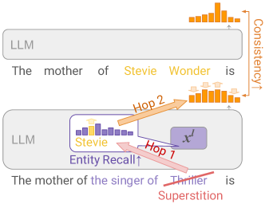
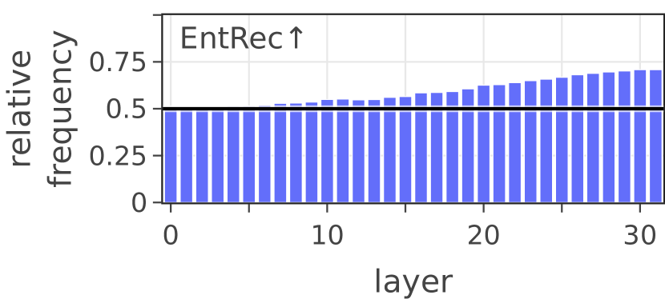
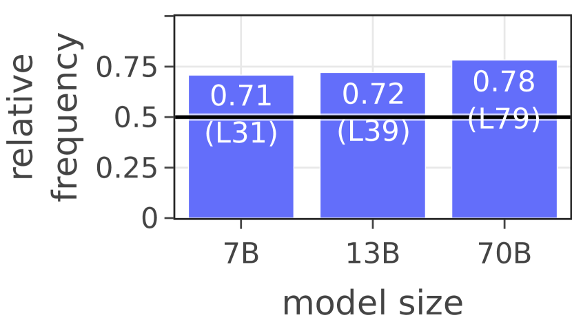
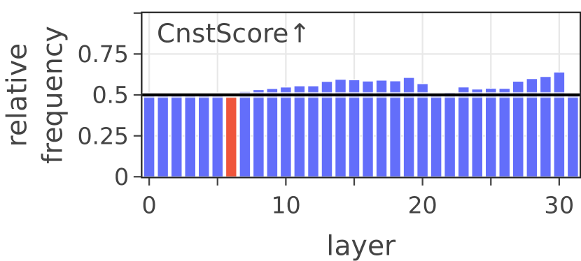
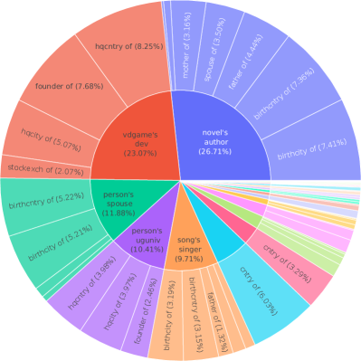
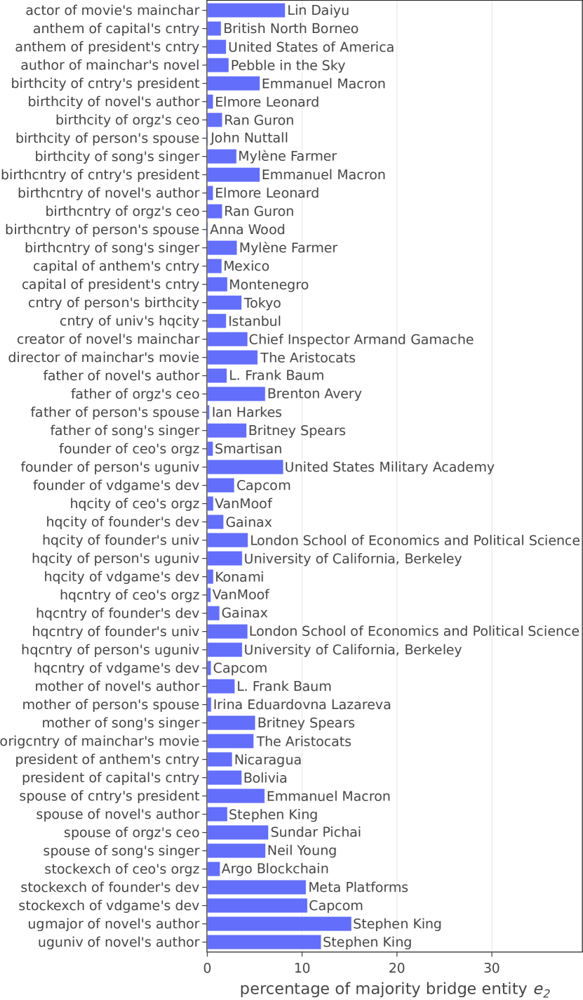
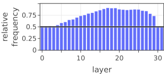
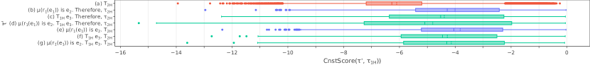

# Do Large Language Models Latently Perform Multi-Hop Reasoning?

###### Abstract

We study whether Large Language Models (LLMs) latently perform multi-hop reasoning with complex prompts such as “The mother of the singer of ‘Superstition’ is”. We look for evidence of a latent reasoning pathway where an LLM (1) latently identifies “the singer of ‘Superstition”’ as Stevie Wonder, the bridge entity, and (2) uses its knowledge of Stevie Wonder’s mother to complete the prompt. We analyze these two hops individually and consider their co-occurrence as indicative of latent multi-hop reasoning. For the first hop, we test if changing the prompt to indirectly mention the bridge entity instead of any other entity increases the LLM’s internal recall of the bridge entity. For the second hop, we test if increasing this recall causes the LLM to better utilize what it knows about the bridge entity. We find strong evidence of latent multi-hop reasoning for the prompts of certain relation types, with the reasoning pathway used in more than 80% of the prompts. However, the utilization is highly contextual, varying across different types of prompts. Also, on average, the evidence for the second hop and the full multi-hop traversal is rather moderate and only substantial for the first hop. Moreover, we find a clear scaling trend with increasing model size for the first hop of reasoning but not for the second hop. Our experimental findings suggest potential challenges and opportunities for future development and applications of LLMs.111We plan to release our code and dataset publicly.  

\useunder
\ul   

Do Large Language Models Latently Perform Multi-Hop Reasoning?  

  

     Sohee Yang1,2  Elena Gribovskaya1  Nora Kassner1  Mor Geva3,4$*$  Sebastian Riedel1,2$*$   Google DeepMind1  UCL2  Google Research3  Tel Aviv University4   {soheeyang,egribovskaya,norakassner,pipek,srriedel}@google.com   

  

\*\*footnotetext: Corresponding authors.

## 1 Introduction

[FIGURE S1.F1.g1]

Figure 1: We investigate the latent multi-hop reasoning of LLMs. For the first hop, we change the input prompt to refer to the bridge entity (Stevie Wonder) and check how often it increases the model’s internal recall of the bridge entity. For the second hop, we check if increasing this recall causes the model output to be more consistent with respect to what it knows about the bridge entity’s attribute (mother of Stevie Wonder).
[/FIGURE]

Recent works have shown that Transformer-based (Vaswani et al., [2017](#bib.bib45)) Large Language Models (LLMs) store and retrieve factual information in their parameters to complete simple prompts such as “The mother of Stevie Wonder is”  (Petroni et al., [2019](#bib.bib38); Meng et al., [2022](#bib.bib29); Geva et al., [2021](#bib.bib19), [2022](#bib.bib18), [2023](#bib.bib17); Zhu and Li, [2023](#bib.bib57)). In addition, LLMs have demonstrated remarkable in-context reasoning abilities when the necessary information is explicitly given as part of the input (Wei et al., [2022b](#bib.bib50)). For example, models can infer “Lula” as a possible completion of “The mother of Stevie Wonder is Lula. The singer of ‘Superstition’ is Stevie Wonder. The mother of the singer of ‘Superstition’ is”. These findings raise a question: Do LLMs retrieve factual information stored in their parameters and perform latent multi-hop reasoning when the information to reason from is not given as a part of the input? For instance, when LLMs process the two-hop prompt “The mother of the singer of ‘Superstition’ is”, do they (1) figure out that “the singer of ‘Superstition”’ refers to Stevie Wonder and (2) use their knowledge of who Stevie Wonder’s mother is to complete the prompt?  

Answering this question is important. Evidence for such latent multi-hop reasoning would suggest that the LLM can connect and traverse through implicit knowledge stored in their parameters rather than only storing information redundantly in its parameters. Future work could strengthen such paths of traversal, ultimately leading to more parameter-efficient and controllable models. Conversely, a lack of evidence would indicate more fundamental limitations of the Transformer architecture or training. It would also have critical implications for model editing: if complex facts are recalled instead of inferred, editing only base facts will never be enough since the changes cannot propagate (Onoe et al., [2023](#bib.bib36); Zhong et al., [2023](#bib.bib55); Cohen et al., [2023](#bib.bib9)).  

In this work, we limit ourselves to prompts that express a composition of two facts such as “The mother of the singer of ‘Superstition’ is” that humans can complete with two hops by (1) inferring a *bridge entity* (e.g., Stevie Wonder) and (2) inferring an attribute of that entity (e.g., who his mother is). Then, we study how often LLMs process the prompt using a similar latent two-hop reasoning pathway, although this pathway may not be the most salient pathway that largely determines the predicted output. To this end, we first study these hops individually, as shown in Figure [1](#S1.F1 "Figure 1 ‣ 1 Introduction ‣ Do Large Language Models Latently Perform Multi-Hop Reasoning?"). To study the first hop, we propose entity recall score to approximate LLM’s internal recall of the bridge entity by projecting specific hidden representations to vocabulary space. We test how changes to the input prompt affect this score. To study the second hop, we measure consistency score between the distribution for completions of the two-hop prompt and an equivalent recall-based one-hop prompt (e.g., “The mother of Stevie Wonder is”). We check how often an intervention to increase the entity recall score increases consistency as an indication of second-hop utilization. Finally, we investigate how frequently both steps coincide.  

To study latent two-hop reasoning with diverse types of fact composition, we introduce TwoHopFact dataset, which is based on Wikidata (Vrandečić and Krötzsch, [2014](#bib.bib47)) and consists of 45,595 two-hop prompts of 52 types of fact composition. We experiment with LLaMA-2 (Touvron et al., [2023](#bib.bib44)) 7B, 13B, and 70B. Our findings can be summarized as follows. Across a wide range of fact composition types for the two-hop prompts, we find substantial evidence for the first hop of the multi-hop reasoning. In about 70% of the times where we change the prompt to indirectly mention the bridge entity, the later layers of the transformer show increased bridge entity recall. For the second hop and overall traversal, the evidence appears weaker: in 60% of the cases where we increase entity recall score, consistency goes up. Likewise, in about 40% of the time, both hops work together (compared to a random 25% baseline); changing the descriptive mention increases the entity recall score, and increasing this recall score increases consistency.  

While the above aggregate statistics do not suggest a very prevalent use of the latent multi-hop reasoning pathway, it is worth pointing out that up to 23% of the fact composition types demonstrate strong evidence of latent multi-hop reasoning, occurring in more than 80% of the cases. This suggests that the pathway *exists* but is highly contextual. Additionally, we focus on a very narrow interpretation of the pathway – in reality, we expect it to be more distributed across layers and tokens. Hence, the effects we see might be a lower bound on the model’s ability to perform latent two-hop reasoning. We also find striking scaling behavior: while the first hop clearly improves substantially with parameter count, the second hop (and the round-trip performance) remains relatively constant. This might indicate a fundamental limitation in today’s architecture or pretraining.  

Our contributions can be summarized as follows:  

* We address the question of latent multi-hop reasoning in LLMs, establish a framework for its investigation, and show its existential evidence. 
* We construct the TwoHopFact dataset which consists of 45,595 two/one-hop prompts of 52 fact composition types, created using various types of entities and relations and diverse templates (§[4](#S4 "4 TwoHopFact Dataset ‣ Do Large Language Models Latently Perform Multi-Hop Reasoning?")). 
* We propose two novel metrics, internal entity recall score and consistency score, as proxies of the degree of the LLM’s recall of an entity for its descriptive mention (§[5.1](#S5.SS1 "5.1 Internal Entity Recall Score ‣ 5 First Hop of Multi-Hop Reasoning ‣ Do Large Language Models Latently Perform Multi-Hop Reasoning?")) and the degree of the LLM’s utilization of its knowledge about the bridge entity’s attribute (§[6](#S6 "6 Second Hop of Multi-Hop Reasoning ‣ Do Large Language Models Latently Perform Multi-Hop Reasoning?")), respectively. 
* We propose a mechanism to investigate a latent reasoning pathway even when it is not the most salient pathway determining the prediction, by measuring the relative frequency of the expected causal effects (§[6.2](#S6.SS2 "6.2 Experiment ‣ 6 Second Hop of Multi-Hop Reasoning ‣ Do Large Language Models Latently Perform Multi-Hop Reasoning?")). 

[TABLE S1.T1]

<table class="ltx_tabular ltx_align_middle">
<tr class="ltx_tr">
<td class="ltx_td ltx_align_left ltx_border_tt">Notation</td>
<td class="ltx_td ltx_align_left ltx_border_tt">Example</td>
<td class="ltx_td ltx_align_left ltx_border_tt">Description</td>
</tr>
<tr class="ltx_tr">
<td class="ltx_td ltx_align_left ltx_border_t"><math class="ltx_Math"><semantics><mrow><mo>(</mo><msub><mi>e</mi><mn>1</mn></msub><mo>,</mo><msub><mi>r</mi><mn>1</mn></msub><mo>,</mo><msub><mi>e</mi><mn>2</mn></msub><mo>)</mo></mrow><annotation-xml><vector><apply><csymbol>subscript</csymbol><ci>𝑒</ci><cn>1</cn></apply><apply><csymbol>subscript</csymbol><ci>𝑟</ci><cn>1</cn></apply><apply><csymbol>subscript</csymbol><ci>𝑒</ci><cn>2</cn></apply></vector></annotation-xml><annotation>({e_{1}},r_{1},{e_{2}})</annotation></semantics></math></td>
<td class="ltx_td ltx_align_left ltx_border_t">(Superstition, singer, Stevie Wonder)</td>
<td class="ltx_td ltx_align_left ltx_border_t">fact triplets of named entities where <math class="ltx_Math"><semantics><msub><mi>e</mi><mi>i</mi></msub><annotation-xml><apply><csymbol>subscript</csymbol><ci>𝑒</ci><ci>𝑖</ci></apply></annotation-xml><annotation>{e_{i}}</annotation></semantics></math> are named entities and <math class="ltx_Math"><semantics><msub><mi>r</mi><mi>i</mi></msub><annotation-xml><apply><csymbol>subscript</csymbol><ci>𝑟</ci><ci>𝑖</ci></apply></annotation-xml><annotation>{r_{i}}</annotation></semantics></math> is a</td>
</tr>
<tr class="ltx_tr">
<td class="ltx_td ltx_align_left"><math class="ltx_Math"><semantics><mrow><mo>(</mo><msub><mi>e</mi><mn>2</mn></msub><mo>,</mo><msub><mi>r</mi><mn>2</mn></msub><mo>,</mo><msub><mi>e</mi><mn>3</mn></msub><mo>)</mo></mrow><annotation-xml><vector><apply><csymbol>subscript</csymbol><ci>𝑒</ci><cn>2</cn></apply><apply><csymbol>subscript</csymbol><ci>𝑟</ci><cn>2</cn></apply><apply><csymbol>subscript</csymbol><ci>𝑒</ci><cn>3</cn></apply></vector></annotation-xml><annotation>({e_{2}},r_{2},{e_{3}})</annotation></semantics></math></td>
<td class="ltx_td ltx_align_left">(Stevie Wonder, mother, Lula)</td>
<td class="ltx_td ltx_align_left">relation function that maps <math class="ltx_Math"><semantics><msub><mi>e</mi><mi>i</mi></msub><annotation-xml><apply><csymbol>subscript</csymbol><ci>𝑒</ci><ci>𝑖</ci></apply></annotation-xml><annotation>{e_{i}}</annotation></semantics></math> uniquely to <math class="ltx_Math"><semantics><msub><mi>e</mi><mrow><mi>i</mi><mo>+</mo><mn>1</mn></mrow></msub><annotation-xml><apply><csymbol>subscript</csymbol><ci>𝑒</ci><apply><plus></plus><ci>𝑖</ci><cn>1</cn></apply></apply></annotation-xml><annotation>{e_{i+1}}</annotation></semantics></math>, such that <math class="ltx_Math"><semantics><mrow><mrow><msub><mi>r</mi><mi>i</mi></msub><mo>​</mo><mrow><mo>(</mo><msub><mi>e</mi><mi>i</mi></msub><mo>)</mo></mrow></mrow><mo>=</mo><msub><mi>e</mi><mrow><mi>i</mi><mo>+</mo><mn>1</mn></mrow></msub></mrow><annotation-xml><apply><eq></eq><apply><times></times><apply><csymbol>subscript</csymbol><ci>𝑟</ci><ci>𝑖</ci></apply><apply><csymbol>subscript</csymbol><ci>𝑒</ci><ci>𝑖</ci></apply></apply><apply><csymbol>subscript</csymbol><ci>𝑒</ci><apply><plus></plus><ci>𝑖</ci><cn>1</cn></apply></apply></apply></annotation-xml><annotation>{r_{i}}({e_{i}})={e_{i+1}}</annotation></semantics></math>
</td>
</tr>
<tr class="ltx_tr">
<td class="ltx_td ltx_align_left"><math class="ltx_Math"><semantics><msub><mi>e</mi><mn>2</mn></msub><annotation-xml><apply><csymbol>subscript</csymbol><ci>𝑒</ci><cn>2</cn></apply></annotation-xml><annotation>{e_{2}}</annotation></semantics></math></td>
<td class="ltx_td ltx_align_left">Stevie Wonder</td>
<td class="ltx_td ltx_align_left">bridge entity that connects the two fact triplets</td>
</tr>
<tr class="ltx_tr">
<td class="ltx_td ltx_align_left"><math class="ltx_Math"><semantics><msub><mi>τ</mi><mtext>1H</mtext></msub><annotation-xml><apply><csymbol>subscript</csymbol><ci>𝜏</ci><ci><mtext>1H</mtext></ci></apply></annotation-xml><annotation>\tau_{\text{1H}}</annotation></semantics></math></td>
<td class="ltx_td ltx_align_left">“The mother of Stevie Wonder is named”</td>
<td class="ltx_td ltx_align_left">one-hop prompt (requires one-hop reasoning)</td>
</tr>
<tr class="ltx_tr">
<td class="ltx_td ltx_align_left"><math class="ltx_Math"><semantics><msub><mi>τ</mi><mtext>2H</mtext></msub><annotation-xml><apply><csymbol>subscript</csymbol><ci>𝜏</ci><ci><mtext>2H</mtext></ci></apply></annotation-xml><annotation>\tau_{\text{2H}}</annotation></semantics></math></td>
<td class="ltx_td ltx_align_left">“The mother of the singer of ‘Superstition’ is named”</td>
<td class="ltx_td ltx_align_left">two-hop prompt (requires two-hop reasoning)</td>
</tr>
<tr class="ltx_tr">
<td class="ltx_td ltx_align_left"><math class="ltx_math_unparsed"><semantics><mrow><mi>μ</mi><mrow><mo>(</mo><msub><mi>r</mi><mn>1</mn></msub><mrow><mo>(</mo><msub><mi>e</mi><mn>1</mn></msub><mo>)</mo></mrow><mo>)</mo></mrow><mo>)</mo></mrow><annotation>\mu({{r_{1}}({{e_{1}}})}))</annotation></semantics></math></td>
<td class="ltx_td ltx_align_left">“the singer of ‘Superstition’”</td>
<td class="ltx_td ltx_align_left">descriptive mention of the bridge entity <math class="ltx_Math"><semantics><msub><mi>e</mi><mn>2</mn></msub><annotation-xml><apply><csymbol>subscript</csymbol><ci>𝑒</ci><cn>2</cn></apply></annotation-xml><annotation>{e_{2}}</annotation></semantics></math> created with <math class="ltx_Math"><semantics><msub><mi>e</mi><mn>1</mn></msub><annotation-xml><apply><csymbol>subscript</csymbol><ci>𝑒</ci><cn>1</cn></apply></annotation-xml><annotation>{e_{1}}</annotation></semantics></math> and <math class="ltx_Math"><semantics><msub><mi>r</mi><mn>1</mn></msub><annotation-xml><apply><csymbol>subscript</csymbol><ci>𝑟</ci><cn>1</cn></apply></annotation-xml><annotation>r_{1}</annotation></semantics></math>
</td>
</tr>
<tr class="ltx_tr">
<td class="ltx_td ltx_align_left ltx_border_bb">-</td>
<td class="ltx_td ltx_align_left ltx_border_bb">“mother of song’s singer”</td>
<td class="ltx_td ltx_align_left ltx_border_bb">fact composition type</td>
</tr>
</table>

Table 1: Notations with corresponding examples from the dataset. The text in brown is the bridge entity ${e_{2}}$, Stevie Wonder (or the name of the bridge entity when presented as a substring in double quotation marks), and the text in purple is a descriptive mention of the bridge entity, $\mu({{r_{1}}({{e_{1}}})}))$, “the singer of ‘Superstition”’.
[/TABLE]

## 2 Related Works

Recent works have shown that LLMs demonstrate remarkable in-context reasoning ability via prompting, which scales with model size (Brown et al., [2020](#bib.bib6); Wei et al., [2022a](#bib.bib49), [b](#bib.bib50); Zhou et al., [2022](#bib.bib56)). On the contrary, when the information to reason from is not explicitly given as part of the input, LLMs often fail to correctly perform multi-hop reasoning even when they know the answer to the single-hop sub-step (Ofir Press et al., [2023](#bib.bib34); Dziri et al., [2023](#bib.bib14)). While there have been wide investigations on how in-context reasoning works (Chan et al., [2022](#bib.bib7); Akyürek et al., [2023](#bib.bib1); Dai et al., [2023](#bib.bib11); Von Oswald et al., [2023](#bib.bib46); Prystawski and Goodman, [2023](#bib.bib39); Feng and Steinhardt, [2024](#bib.bib16)), such an investigation has not been actively done to understand how latent multi-hop reasoning works.  

While there have been works to investigate latent reasoning of LLMs, the exploration has been mostly done with simple single-hop reasoning tasks (Meng et al., [2022](#bib.bib29); Geva et al., [2023](#bib.bib17); Chanin et al., [2023](#bib.bib8); Hernandez et al., [2024](#bib.bib20)) and/or controlled lightweight training/finetuning (Zhu and Li, [2023](#bib.bib57); Allen-Zhu and Li, [2023](#bib.bib2); Saparov et al., [2023](#bib.bib42); Berglund et al., [2024](#bib.bib5)). Also, many of the works that aim to identify latent reasoning pathways or circuits, have focused on finding the most salient reasoning pathway for simple synthetic tasks and/or toy models (Nanda et al., [2022](#bib.bib32); Olsson et al., [2022](#bib.bib35); Wang et al., [2023](#bib.bib48); Conmy et al., [2023](#bib.bib10); Hou et al., [2023](#bib.bib21); Lieberum et al., [2023](#bib.bib27); McGrath et al., [2023](#bib.bib28)). On the other hand, we study the existence of a latent multi-hop reasoning pathway, which may not be the most salient, in pretrained LLMs without further training, using diverse types of natural two-hop prompts.  

Model editing examines ways to amend factual knowledge in LMs (De Cao et al., [2021](#bib.bib12); Mitchell et al., [2022](#bib.bib30); Meng et al., [2022](#bib.bib29); Zhang et al., [2024](#bib.bib54)). However, recent works have shown that the existing editing approaches, largely focusing on single fact edits, fail to propagate the edits to facts that depend on the edited fact (Onoe et al., [2023](#bib.bib36); Zhong et al., [2023](#bib.bib55); Cohen et al., [2023](#bib.bib9)). Our work explores the possibilities that such propagation could work. Moreover, our work investigates a pathway that affects the consistency at inference, whereas prior work in consistency has focused on quantifying inconsistency and improving consistency post-hoc Ribeiro et al. ([2019](#bib.bib40)); Li et al. ([2019](#bib.bib26)); Asai and Hajishirzi ([2020](#bib.bib3)); Elazar et al. ([2021](#bib.bib15)); Kassner et al. ([2021](#bib.bib24), [2023](#bib.bib23)); Jang et al. ([2023](#bib.bib22)). Sakarvadia et al. ([2023](#bib.bib41)) aim to improve multi-hop reasoning accuracy with a hypothesis that the errors stem from failure to recall the latent hop, while we investigate the foundations of this hypothesis of whether the model actually performs such a latent multi-hop reasoning.  

## 3 Problem Formulation

### 3.1 Preliminaries

We consider facts, such as “The mother of Stevie Wonder is Lula”, as triplets $(e,r,e^{\prime})$ of a subject entity $e$ (e.g., Superstition), a relation $r$ (e.g., mother), and an object entity $e^{\prime}$ (e.g., Lula). Specifically, in our analysis, we focus on triplets where $e^{\prime}$ is the only or the most well-known object entity for the relation $r$ for $e$ (e.g. the only mother of Stevie Wonder is Lula), and view $r$ as a function $e^{\prime}={r}({e})$, where ${r}({e})$ is the function expression and $e^{\prime}$ is the value of the expression. We analyze how LLMs process the composition of two facts with a bridge entity ${e_{2}}$ connecting them, $(({e_{1}},r_{1},{e_{2}}),({e_{2}},r_{2},{e_{3}}))$, of which the composition is represented as ${r_{2}}({{r_{1}}({{e_{1}}})})$. An example is shown in Table [1](#S1.T1 "Table 1 ‣ 1 Introduction ‣ Do Large Language Models Latently Perform Multi-Hop Reasoning?").  

To query LLMs, we use a template $\tau({\cdot})$ to convert expressions ${r_{2}}({{e_{2}}})$ or ${r_{2}}({{r_{1}}({{e_{1}}})})$ into a prompt that can be completed correctly by the value of the given expression. For instance, the single-hop expression ${\texttt{mother}}({\text{Stevie Wonder}})$ could be converted by $\tau({{\texttt{mother}}({\text{Stevie Wonder}})})$ to the prompt “The mother of Stevie Wonder is”, which can be correctly completed with “Lula”. Similarly, the two-hop expression ${\texttt{mother}}({{\texttt{singer}}({\text{Superstition}})})$ could be phrased by $\tau({{\texttt{mother}}({{\texttt{singer}}({\text{Superstition}})})})$ as “The mother of the singer of ‘Superstition’ is” with the same correct completion. While $\tau({{r_{2}}({{e_{2}}})})$ and $\tau({{r_{2}}({{r_{1}}({{e_{1}}})})})$ have the same answer (“Lula”), the latter requires recalling two facts rather than one. Therefore, we call $\tau({{r_{2}}({{e_{2}}})})$ a one-hop prompt and $\tau({{r_{2}}({{r_{1}}({{e_{1}}})})})$ a two-hop prompt, and denote them as $\tau_{\text{1H}}$ and $\tau_{\text{2H}}$, respectively.  

We assume that the two-hop prompts yielded by $\tau({\cdot})$ for ${r_{2}}({{r_{1}}({{e_{1}}})})$ always contain a noun phrase description of the bridge entity ${e_{2}}$ using ${e_{1}}$ and $r_{1}$, e.g., “the singer of ‘Superstition”’ for Stevie Wonder. We denote this description as $\mu({{r_{1}}({{e_{1}}})}))$ and call it the descriptive mention of the bridge entity ${e_{2}}$.  

Last, we denote the type of the fact composition of a two-hop prompt as “$\operatorname{type}(r_{2})$ of $\operatorname{type}({e_{1}})$’s $\operatorname{type}(r_{1})$”, where “$\operatorname{type}({e_{1}})$’s $\operatorname{type}(r_{1})$” represents the type of the bridge entity’s descriptive mention in the prompt. For example, the fact composition type of $\tau({{\texttt{mother}}({{\texttt{singer}}({\text{Superstition}})})})$ would be “mother of song’s singer”.  

### 3.2 Latent Multi-Hop Reasoning in LLMs

Humans possess the deductive reasoning ability to infer conclusions from given premises, such as deducing that ${r_{2}}({{r_{1}}({{e_{1}}})}){}={e_{3}}$ given a premise stating that ${r_{1}}({{e_{1}}})={e_{2}}$ and another premise stating that ${r_{2}}({{e_{2}}})={e_{3}}$. This multi-hop reasoning (Welbl et al., [2018](#bib.bib51); Yang et al., [2018](#bib.bib53)) involves identifying the bridge entity (e.g., that “the singer of ‘Superstition”’ is Stevie Wonder) and using it to solve for the final answer (e.g., that Stevie Wonder’s mother is Lula).  

Our research explores the extent to which a pretrained Transformer-based Large Language Model (LLM) can perform similar multi-hop reasoning when completing a two-hop prompt. Given the complex nature of LLMs, which function through high-dimensional and distributed representations, it’s unlikely for a single deterministic algorithm to govern their predictions except for under highly controlled and constrained setup (Nanda et al., [2022](#bib.bib32); Wang et al., [2023](#bib.bib48)). Instead, LLMs may use aggregations from multiple inference pathways (McGrath et al., [2023](#bib.bib28)), ranging from shallow $n$-gram co-occurrence-based matching to deeper rule-based reasoning or even multi-hop reasoning, to make a prediction.  

Therefore, to identify a pathway indicative of latent multi-hop reasoning, we focus on the internal dynamics of LLMs in processing two-hop prompts rather than the most salient pathway that contributes the most to the output. This involves analyzing how the LLM’s recall and utilization of the knowledge ${r_{1}}({{e_{1}}})$ and ${r_{2}}({{e_{2}}})$ changes in response to certain alterations made while the LLM is processing a two-hop prompt, in what we consider as the first and second hop of reasoning, respectively.  

Specifically, we investigate the following two key research questions (RQs):  

1. How often does an LLM perform the first hop of reasoning while processing two-hop prompts? We view the first-hop reasoning as the LLM’s recall of the bridge entity for its descriptive mention. Therefore, we examine the frequency with which the LLM’s internal recall of the bridge entity increases when it encounters a descriptive mention of the bridge entity within a prompt. For instance, we investigate whether altering the prompt from “The mother of the singer of ’Thriller’ is” to “The mother of the singer of ’Superstition’ is” increases the LLM’s internal recall of Stevie Wonder. 
2. How often does an LLM perform the second hop of reasoning while processing two-hop prompts? We view the second-hop reasoning as the LLM’s utilization of the first-hop reasoning for the second hop. Therefore, we examine the frequency with which enhancing the LLM’s recall of the bridge entity for its descriptive mention improves its use of the knowledge about the bridge entity to answer the two-hop prompt. For example, we investigate if increasing the internal recall of Stevie Wonder for “the singer of ‘Superstition’” makes the LLM better utilize its knowledge of Stevie Wonder’s mother to complete the prompt. 

By addressing these questions, we aim to identify evidence of LLMs leveraging a latent pathway for multi-hop reasoning.  

## 4 TwoHopFact Dataset

To answer our questions with prompts of diverse fact composition types, we construct TwoHopFact using well-known named entities in Wikidata (Vrandečić and Krötzsch, [2014](#bib.bib47)) and manually selected relations (Appendix [A](#A1 "Appendix A Dataset construction ‣ Do Large Language Models Latently Perform Multi-Hop Reasoning?")). TwoHopFact consists of 45,595 unique pairs of one-hop and two-hop prompts of 52 fact composition types constructed from the same number of fact triplet pairs $(({e_{1}},r_{1},{e_{2}}),({e_{2}},r_{2},{e_{3}}))$ as in Table [1](#S1.T1 "Table 1 ‣ 1 Introduction ‣ Do Large Language Models Latently Perform Multi-Hop Reasoning?"). Appendix Table [3](#A1.T3 "Table 3 ‣ Appendix A Dataset construction ‣ Do Large Language Models Latently Perform Multi-Hop Reasoning?") shows example two-hop prompts for each fact composition type, and Appendix [B](#A2 "Appendix B Dataset Statistics ‣ Do Large Language Models Latently Perform Multi-Hop Reasoning?") provides detailed data statistics.  

## 5 First Hop of Multi-Hop Reasoning

In this section, we answer RQ1 of how often an LLM performs the first hop of reasoning while processing two-hop prompts. We first introduce EntRec as a metric to approximate the LLM’s internal recall of the bridge entity upon its descriptive mention in a prompt (§[5.1](#S5.SS1 "5.1 Internal Entity Recall Score ‣ 5 First Hop of Multi-Hop Reasoning ‣ Do Large Language Models Latently Perform Multi-Hop Reasoning?")). Next, we propose to measure how often this recall increases when changing the input prompt to indirectly mention the bridge entity (§[5.2](#S5.SS2 "5.2 Experiment ‣ 5 First Hop of Multi-Hop Reasoning ‣ Do Large Language Models Latently Perform Multi-Hop Reasoning?")). Then, we evaluate this using TwoHopFact and answer RQ1 (§[5.3](#S5.SS3 "5.3 Results ‣ 5 First Hop of Multi-Hop Reasoning ‣ Do Large Language Models Latently Perform Multi-Hop Reasoning?")).  

### 5.1 Internal Entity Recall Score

We define EntRec as a metric to measure the LLM’s recall of the bridge entity ${e_{2}}$ within a two-hop prompt $\tau_{\text{2H}}$. This is defined with respect to the hidden representation in a certain layer $l$, at the last position of the bridge entity’s descriptive mention in the two-hop prompt. This hidden representation is projected to the vocabulary space to calculate the log probability of the first token of the entity’s name (e.g., the first token of “Stevie Wonder”). Formally, let $e_{2}^{\scalebox{0.7}[0.7]{(0)}}$ be the first token of ${e_{2}}$, then:  

|  |  | $\displaystyle\textsc{EntRec}^{l}({e_{2}},\tau_{\text{2H}})$ |  | (1) |
| --- | --- | --- | --- | --- |
|  |  | $\displaystyle=\log\operatorname{softmax}(\operatorname{LayerNorm}(\mathbf{x}^{l})W_{U})_{\operatorname{index}(e_{2}^{\scalebox{0.7}[0.7]{(0)}}{})},$ |  |
| --- | --- | --- | --- |

where $\mathbf{x}^{l}\in\mathbb{R}^{h}$ is the output from the $l$-th Transformer layer at the last token of the bridge entity’s descriptive mention in the two-hop prompt $\tau_{\text{2H}}$, and $\operatorname{index}(e_{2}^{\scalebox{0.7}[0.7]{(0)}}{})\in[0,V-1]$ is the index of the token $e_{2}^{\scalebox{0.7}[0.7]{(0)}}$ in the unembedding matrix $W_{U}\in\mathbb{R}^{h\times V}$. $\operatorname{LayerNorm}{}$ is the layer normalization used for the last layer output $\mathbf{x}^{L-1}$ before projecting it to the unembedding matrix to obtain the output next-token probability distribution. Applying this normalization makes $\textsc{EntRec}^{L-1}({e_{2}},\tau_{\text{2H}})$ compatible with the output probability of $e_{2}^{\scalebox{0.7}[0.7]{(0)}}$ as the next token of the prefix of $\tau_{\text{2H}}$ ending at the descriptive mention (e.g., “The mother of the singer of ‘Superstition”’).222We omit the bias term as it often models the frequency of the token (Kobayashi et al., [2023](#bib.bib25)), which we do not want to consider for measuring the internal recall of an entity. We interpret higher $\textsc{EntRec}^{l}({e_{2}},\tau_{\text{2H}})$ as stronger internal recall of the bridge entity ${e_{2}}$ at the $l$-th layer.  

The proposed definition of EntRec is inspired by previous works which report that the representation constructed at the last token position of a subject often plays an important role in encoding information about the subject (Meng et al., [2022](#bib.bib29); Geva et al., [2023](#bib.bib17)), the work of nostalgebraist ([2020](#bib.bib33)) that projects early-layer outputs to the vocabulary space, and the work of Geva et al. ([2022](#bib.bib18)) which shows that such projections at the last subject token position of one-hop prompts provide interpretable top-rank attributes that are semantically relevant to the subject. Although EntRec assesses the recall of an entity with respect to only the first token of its name, it is directly related to how auto-regressive LLMs process the input text and prepare the next token to generate. A control experiment in Appendix [C](#A3 "Appendix C Justification of Internal Entity Recall Score: Appositive Generation Experiment ‣ Do Large Language Models Latently Perform Multi-Hop Reasoning?") validates EntRec as a reasonable proxy for measuring the internal entity recall.  

### 5.2 Experiment

Given EntRec, we answer RQ1 by measuring how often the internal recall of ${e_{2}}$ improves at layer $l$ when modifying a two-hop prompt from $\tau^{\prime}_{\text{2H}}$ to $\tau_{\text{2H}}$, where $\tau^{\prime}_{\text{2H}}$ does not contain the descriptive mention of ${e_{2}}$ while $\tau_{\text{2H}}$ does. To be specific, we measure the relative frequency of $\tau_{\text{2H}}$ in TwoHopFact where $\textsc{EntRec}^{l}({e_{2}},\tau_{\text{2H}})>\textsc{EntRec}^{l}({e_{2}},\tau^{\prime}_{\text{2H}}).$  

To construct $\tau^{\prime}_{\text{2H}}$, we alter the descriptive mention of the bridge entity in $\tau_{\text{2H}}$ in two ways: by replacing ${e_{1}}$ with $e^{\prime}_{1}$ such that $\mu({{r_{1}}({e^{\prime}_{1}})})$ does not point to ${e_{2}}$, or $r_{1}$ with $r^{\prime}_{1}$ to ensure $\mu({{r^{\prime}_{1}}({{e_{1}}})})$ does not refer to ${e_{2}}$. Examples include substituting “the singer of ‘Superstition”’ in $\tau_{\text{2H}}$ to “the singer of ‘Thriller’” or “a plagiarist of ‘Superstition”’. These adjustments are termed entity substitution and relation substitution, respectively.  

For each two-hop prompt $\tau_{\text{2H}}$ in TwoHopFact, we randomly select one $e^{\prime}_{1}$ from the same fact composition type and one $r^{\prime}_{1}$ from a set of predefined candidate relations (provided in Appendix Table [5](#A4.T5 "Table 5 ‣ Result ‣ Appendix D Justification of Consistency Score: Comparative Experiment with Chain-of-Thought Cases ‣ Do Large Language Models Latently Perform Multi-Hop Reasoning?")) to create $\tau^{\prime}_{\text{2H}}$. We then measure the relative frequency of cases where replacing $\tau^{\prime}_{\text{2H}}$ with $\tau_{\text{2H}}$ via entity or relation substitution increases the recall of ${e_{2}}$. A relative frequency above 0.5 suggests the LLM’s chance to perform first-hop reasoning exceeds the random chance for these prompts.  

### 5.3 Results

[FIGURE S5.F2.sf1.g1]

((a)) 7B entity substitution
[/FIGURE]

[FIGURE S5.F3.sf1.g1]

((a)) RQ1 entity substitution result (§[5](#S5 "5 First Hop of Multi-Hop Reasoning ‣ Do Large Language Models Latently Perform Multi-Hop Reasoning?"))
[/FIGURE]

#### There is substantial evidence of the first hop of reasoning, which becomes stronger with increasing model size.

Figure [2](#S5.F2 "Figure 2 ‣ 5.3 Results ‣ 5 First Hop of Multi-Hop Reasoning ‣ Do Large Language Models Latently Perform Multi-Hop Reasoning?") shows the relative frequency of the cases that the entity recall at each layer increases with entity and relation substitution. LLaMA-2 7B entity substitution result (Figure [2(a)](#S5.F2.sf1 "Figure 2(a) ‣ Figure 2 ‣ 5.3 Results ‣ 5 First Hop of Multi-Hop Reasoning ‣ Do Large Language Models Latently Perform Multi-Hop Reasoning?")) shows that the evidence of first-hop reasoning becomes clearer with increasing layer depth, peaking at 0.71 in layer 31. Relation substitution exhibits a slightly noisier pattern with a peak at 0.63 in layer 20 (Figure [2(e)](#S5.F2.sf5 "Figure 2(e) ‣ Figure 2 ‣ 5.3 Results ‣ 5 First Hop of Multi-Hop Reasoning ‣ Do Large Language Models Latently Perform Multi-Hop Reasoning?")).  

As model size increases from 7B to 13B and 70B, first-hop reasoning occurs more frequently for both entity substitution and relation substitution. For the former, the maximum relative frequency rises from 0.71 (7B) to 0.72 (13B) and 0.78 (70B) (Figure [3(a)](#S5.F3.sf1 "Figure 3(a) ‣ Figure 3 ‣ 5.3 Results ‣ 5 First Hop of Multi-Hop Reasoning ‣ Do Large Language Models Latently Perform Multi-Hop Reasoning?")). For the latter, it increases from 0.63 (7B) to 0.64 (13B) and 0.76 (70B) (Figure [3(b)](#S5.F3.sf2 "Figure 3(b) ‣ Figure 3 ‣ 5.3 Results ‣ 5 First Hop of Multi-Hop Reasoning ‣ Do Large Language Models Latently Perform Multi-Hop Reasoning?")).  

#### Relatively strong evidence supports the first-hop reasoning in up to 73% of fact composition types.

With LLaMA-2 7B-13B-70B, 18/25/34 and 21/27/38 out of 52 of fact composition types exhibit maximum relative frequencies exceeding 0.8 for entity and relation substitution, respectively. In addition, 11 out of 52 types demonstrate such strong first-hop reasoning evidence robustly across all model sizes and substitution types. For example, the maximum frequency of “president of anthem’s country” (“The country with the national anthem ‘Azat u ankakh Artsakh’ is led by president”) shows the maximum frequency of 0.97/0.92/1.0 (Figure [2(d)](#S5.F2.sf4 "Figure 2(d) ‣ Figure 2 ‣ 5.3 Results ‣ 5 First Hop of Multi-Hop Reasoning ‣ Do Large Language Models Latently Perform Multi-Hop Reasoning?")) and 0.87/0.87/0.89 (Figure [2(h)](#S5.F2.sf8 "Figure 2(h) ‣ Figure 2 ‣ 5.3 Results ‣ 5 First Hop of Multi-Hop Reasoning ‣ Do Large Language Models Latently Perform Multi-Hop Reasoning?")) with each model and substitution, respectively. Individual fact composition types exhibit diverse patterns of relative frequency across layers.  

## 6 Second Hop of Multi-Hop Reasoning

In this section, we answer RQ2 of how often an LLM performs the second-hop reasoning while processing two-hop prompts. We view the second hop of reasoning as the LLM’s utilization of what it knows about the bridge entity’s attribute (Stevie Wonder’s mother) to answer the two-hop prompt about the same attribute of the entity referred to by the descriptive mention (the singer of ‘Superstition”s mother). Therefore, when an LLM performs the second hop, we expect to see a connection between its recall of the bridge entity (i.e. resolving the first hop) and its similarity in responding to a two-hop prompt and a corresponding one-hop prompt about the bridge entity’s attribute, e.g., the two-hop prompt “The mother of the singer of ‘Superstition’ is” and the one-hop prompt “The mother of Stevie Wonder is”. Namely, the more strongly the model recalls the bridge entity (e.g., Stevie Wonder) while processing the two-hop prompt, the more similar the completion of this prompt should be to the completion of the one-hop prompt. In the following, we describe our approach for testing how often such a causal connection exists between entity recall and the similarity in the prompt completions, which we refer to as consistency.  

### 6.1 Consistency Score

We define CnstScore to measure how consistently an LLM responds to the two-hop and one-hop prompts. Let $\mathbf{p}_{\tau_{\text{2H}}},\mathbf{p}_{\tau_{\text{1H}}}\in\mathbb{R}^{V}$ be the output probability distributions for a two-hop prompt $\tau_{\text{2H}}{}$ and the corresponding one-hop prompt $\tau_{\text{1H}}{}$, respectively. Denoting $\mathrm{H}(Q,P)=-\sum_{i=0}^{V-1}P_{i}\log Q_{i}$ as the cross-entropy between probability distributions $P$ and $Q$, we define:  

|  | $\displaystyle\begin{split}&\textsc{CnstScore}(\tau_{\text{2H}},\tau_{\text{1H}}){}\\ &=-0.5\mathrm{H}(\mathbf{p}_{\tau_{\text{2H}}},\mathbf{p}_{\tau_{\text{1H}}})-0.5\mathrm{H}(\mathbf{p}_{\tau_{\text{1H}}},\mathbf{p}_{\tau_{\text{2H}}}).\end{split}$ | |  | (2) |
| --- | --- | --- | --- | --- |

This score evaluates the similarity between the two probability distributions by computing and averaging their cross-entropy, ensuring symmetry in the evaluation. The symmetry from averaging mitigates sensitivity to the individual distribution’s entropy levels, aiming for equal treatment of divergences in both directions.  

Note that we use consistency instead of two-hop prompt completion accuracy or the probability of the ground truth answer because the latter metrics are insufficient to capture the second-hop reasoning for the cases where the corresponding one-hop prompt completion is incorrect. In addition, these metrics inherit noise from the choice of the ground truth answer or the set of answer candidates. On the other hand, comparing the similarity of the output distributions is not affected by the choice of ground truth, and provides a way to capture the second-hop reasoning even when the ground truth answer is not in the top-1 generation of the one-hop prompt.  

Also, we do not choose to compare the completion strings or their binary accuracy of the one/two-hop prompts because these metrics cannot capture subtle consistency differences in the probability distribution. We choose cross-entropy rather than Kullback–Leibler or Jensen-Shannon divergence because the latter metrics contain an entropy term that is irrelevant to consistency, but can dominate the score, diluting the cross-entropy signal. Higher consistency scores indicate greater similarity between the output distributions. In Appendix [D](#A4 "Appendix D Justification of Consistency Score: Comparative Experiment with Chain-of-Thought Cases ‣ Do Large Language Models Latently Perform Multi-Hop Reasoning?"), we provide empirical evidence for the consistency score being a reasonable approximation of the utilization of the model’s knowledge about the bridge entity’s attribute.  

[FIGURE S6.F4.sf1.g1]

((a)) LLaMA-2 7B
[/FIGURE]

### 6.2 Experiment

Given EntRec and CnstScore, we answer RQ2 by measuring how often increasing the recall of the bridge entity ${e_{2}}$ at the $l$-th layer increases the LLM’s consistency in answering the two-hop prompt with respect to the one-hop prompt. In other words, we examine whether increasing $\textsc{EntRec}^{l}({e_{2}},\tau_{\text{2H}})$ leads to increasing $\textsc{CnstScore}(\tau_{\text{2H}},\tau_{\text{1H}})$.  

We would have been able to use differential calculus to obtain the answer by calculating the direction of change if $\textsc{CnstScore}(\tau_{\text{2H}},\tau_{\text{1H}})$ were directly dependent on $\textsc{EntRec}^{l}({e_{2}},\tau_{\text{2H}})$. However, there exists no direct functional dependency between the two values. Instead, we leverage the shared reliance of both metrics on $\mathbf{x}^{l}$ for computation where $l\in[0,L-1)$,333$\textsc{CnstScore}(\tau_{\text{2H}},\tau_{\text{1H}})$ utilizes $\mathbf{p}_{\tau_{\text{2H}}}$, which utilizes $\mathbf{x}^{l}$ for its calculation. However, only $\mathbf{x}^{l}\text{ where }l=0,\cdots,L-2$ are used to calculate the attention outputs at layers $l=1,\cdots,L-1$, respectively, to get $\mathbf{p}_{\tau_{\text{2H}}}$. redefining them as $\textsc{EntRec}({\mathbf{x}^{l}})$ and $\textsc{CnstScore}({\mathbf{x}^{l}})$ relative to $\mathbf{x}^{l}$. This reparameterization allows us to change the question to: if $\textsc{EntRec}({\mathbf{x}^{l}})$ is increased by altering $\mathbf{x}^{l}$, does $\textsc{CnstScore}({\mathbf{x}^{l}})$ also increase?  

To explore this, we adjust $\textsc{EntRec}({\mathbf{x}^{l}})$ in the direction of its steepest increase, represented by $\nabla_{\mathbf{x}^{l}}\textsc{EntRec}({\mathbf{x}^{l}}){}$, and observe the impact on $\textsc{CnstScore}({\mathbf{x}^{l}})$ by modifying $\mathbf{x}^{l}$ according to a magnitude of change $\alpha$:  

|  | $$\mathbf{\hat{x}}^{l}(\alpha)=\mathbf{x}^{l}+\alpha\nabla_{\mathbf{x}^{l}}\textsc{EntRec}({\mathbf{x}^{l}}){}.$$ |  |
| --- | --- | --- |

Subsequently, we calculate $\textsc{CnstScore}({\mathbf{x}^{l}})$ using $\mathbf{\hat{x}}^{l}(\alpha)$,444We use activation patching (Wang et al., [2023](#bib.bib48)) to implement the replacement of $\mathbf{x}^{l}$ with $\mathbf{\hat{x}}^{l}(\alpha)$. which allows us to express it as a function $\textsc{CnstScore}({\alpha})$ of $\alpha$. Then, we examine its derivative, $\left.\frac{d}{d\alpha}\textsc{CnstScore}({\alpha})\right|_{\alpha=0}$ to understand the direction of change at the current value. A positive derivative indicates that an increase in $\textsc{EntRec}({\mathbf{x}^{l}})$ leads to an increase in $\textsc{CnstScore}(\tau_{\text{2H}},\tau_{\text{1H}})$, while a negative one suggests the opposite. By assessing the relative frequency of positive gradients among the two-hop prompts in TwoHopFact, we quantify how often the LLM performs the second hop of the reasoning, with frequencies above 0.5 suggesting that the LLM’s chance to perform the second-hop reasoning exceeds random chance for these prompts.  

### 6.3 Results

#### There is moderate evidence of the second-hop reasoning, which does not become stronger with increasing model size.

Figure [4](#S6.F4 "Figure 4 ‣ 6.1 Consistency Score ‣ 6 Second Hop of Multi-Hop Reasoning ‣ Do Large Language Models Latently Perform Multi-Hop Reasoning?") shows the relative frequency of the cases that increasing the bridge entity recall increases the consistency. In LLaMA-2 7B, the middle and late layers exhibit a relative frequency higher than 0.5 (random chance) with statistical significance, peaking at 0.64 in layer 30. Test result with a randomly initialized model verifies 0.5 as the randomness baseline (Figure [4(d)](#S6.F4.sf4 "Figure 4(d) ‣ Figure 4 ‣ 6.1 Consistency Score ‣ 6 Second Hop of Multi-Hop Reasoning ‣ Do Large Language Models Latently Perform Multi-Hop Reasoning?")).  

However, unlike the first-hop reasoning (§[5](#S5 "5 First Hop of Multi-Hop Reasoning ‣ Do Large Language Models Latently Perform Multi-Hop Reasoning?")), the second-hop reasoning does not strengthen with increasing model size; when scaling from 7B to 13B and 70B, the maximum relative frequency remains relatively stable at 0.64 (7B), 0.65 (13B), and 0.61 (70B), as shown in Figure [3(c)](#S5.F3.sf3 "Figure 3(c) ‣ Figure 3 ‣ 5.3 Results ‣ 5 First Hop of Multi-Hop Reasoning ‣ Do Large Language Models Latently Perform Multi-Hop Reasoning?"). It is worth noting that this finding aligns with the observation of Ofir Press et al. ([2023](#bib.bib34)), that the single-hop question answering performance improves faster than the multi-hop performance as the model size increases, and thus the compositionality gap (the ratio of how often models can correctly answer all sub-problems but not generate the overall solution) does not decrease with increasing model size.  

#### Relatively strong evidence supports the second-hop reasoning in up to 19% of fact composition types.

With LLaMA-2 7B-13B-70B, 10/7/5 out of 52 of fact composition types exhibit maximum relative frequencies exceeding 0.8, respectively. Among them, “founder of person’s undergraduate university” and “president of anthem’s country” demonstrate such strong second-hop reasoning evidence across all model sizes, with a maximum frequency of 0.86/0.81/0.82 (Figure [4(g)](#S6.F4.sf7 "Figure 4(g) ‣ Figure 4 ‣ 6.1 Consistency Score ‣ 6 Second Hop of Multi-Hop Reasoning ‣ Do Large Language Models Latently Perform Multi-Hop Reasoning?")) and 0.84/0.89/0.82 (Figure [4(h)](#S6.F4.sf8 "Figure 4(h) ‣ Figure 4 ‣ 6.1 Consistency Score ‣ 6 Second Hop of Multi-Hop Reasoning ‣ Do Large Language Models Latently Perform Multi-Hop Reasoning?")), respectively.  

[FIGURE S6.F5.1.g1]

((a)) 7B entity substitution
[/FIGURE]

## 7 Latent Multi-Hop Reasoning

In this section, we measure how often LLMs perform latent multi-hop reasoning while processing the two-hop prompt by combining our answers to RQ1 and RQ2. For each two-hop prompt, we consider successful outcomes for RQ1 (an entity recall increase with entity/relation substitution) and RQ2 (a consistency increase with increased entity recall) as evidence of the first and second hops of reasoning, respectively. Four possible outcomes arise: (SS) success in both RQ1 and RQ2 that we view as the multi-hop reasoning; (FS) failure in RQ1 but success in RQ2; (SF) success in RQ1 but failure in RQ2; (FF) failure in both RQ1 and RQ2.  

#### There is moderate evidence of the latent multi-hop reasoning, which sometimes becomes stronger with increasing model size.

Figure [5](#S6.F5 "Figure 5 ‣ Relatively strong evidence supports the second-hop reasoning in up to 19% of fact composition types. ‣ 6.3 Results ‣ 6 Second Hop of Multi-Hop Reasoning ‣ Do Large Language Models Latently Perform Multi-Hop Reasoning?") shows the relative frequency of the four cases, where green, blue, yellow, and red represent each of the cases of SS, FS, SF, and FF, respectively. LLaMA-2 7B exhibits a relative frequency for successful multi-hop reasoning (green) above random chance (0.25), peaking at 0.46 (entity substitution) and 0.38 (relation substitution). The likelihood of partial multi-hop reasoning (green + blue + yellow) exceeds 0.8 in later layers.  

While entity substitution results do not show increased multi-hop reasoning with model size (Figure [3(d)](#S5.F3.sf4 "Figure 3(d) ‣ Figure 3 ‣ 5.3 Results ‣ 5 First Hop of Multi-Hop Reasoning ‣ Do Large Language Models Latently Perform Multi-Hop Reasoning?")), relation substitution exhibits a scaling trend. From 7B to 70B, the maximum relative frequency increases from 0.38 to 0.43, suggesting that larger models may facilitate multi-hop reasoning with relational changes (Figure [3(e)](#S5.F3.sf5 "Figure 3(e) ‣ Figure 3 ‣ 5.3 Results ‣ 5 First Hop of Multi-Hop Reasoning ‣ Do Large Language Models Latently Perform Multi-Hop Reasoning?")).  

#### Relatively strong evidence supports latent multi-hop reasoning in up to 23% of fact composition types.

Considering $0.8^{2}=0.64$ as the threshold, with respect to LLaMA-2 7B-13B-70B, 7/3/12 types exceed the threshold with entity substitution and 3/3/9 types do so with relation substitution. The maximum frequency of “anthem of capital’s country” (“The national anthem of the country led by president Lazarus Chakwera is named”) exceeds this threshold across all models and substitutions with 0.68/0.82/0.66 (Figure [5(d)](#S6.F5.sf4 "Figure 5(d) ‣ Figure 5 ‣ Relatively strong evidence supports the second-hop reasoning in up to 19% of fact composition types. ‣ 6.3 Results ‣ 6 Second Hop of Multi-Hop Reasoning ‣ Do Large Language Models Latently Perform Multi-Hop Reasoning?")) and 0.74/0.82/0.68 (Figure [5(h)](#S6.F5.sf8 "Figure 5(h) ‣ Figure 5 ‣ Relatively strong evidence supports the second-hop reasoning in up to 19% of fact composition types. ‣ 6.3 Results ‣ 6 Second Hop of Multi-Hop Reasoning ‣ Do Large Language Models Latently Perform Multi-Hop Reasoning?")), respectively. Individual types show diverse patterns distinct from the overall dataset.  

## 8 Discussion and Conclusion

Our work studies the latent multi-hop reasoning abilities of LLMs. We find strong evidence of latent multi-hop reasoning for certain fact composition types with the reasoning pathway utilized in more than 80% of the cases. However, the utilization is highly contextual; there are also fact composition types where we see weak or almost no evidence of reasoning. The evidence of second and multi-hop reasoning across the whole set of prompts is rather moderate and only substantial in the first hop.  

Moreover, while we see a clear scaling trend with the first hop of the latent multi-hop reasoning pathway with increasing model size, we do not see such scaling evidence for the second-hop reasoning pathway. This could be the reason behind the observation of Ofir Press et al. ([2023](#bib.bib34)) that the compositionality gap (the ratio of how often models can correctly answer all sub-problems but not generate the overall solution) does not decrease with increasing model size.  

Although our analysis is based on LLaMA-2 family of models of up to 70B parameters, our findings suggest potential limitations in the current scaling paradigm for promoting latent multi-hop reasoning. Thus, we may need to study the choice of pretraining data, loss functions that promote knowledge retrieval and utilization, or model architectures with a stronger inductive bias towards internal knowledge representation for LLMs’ stronger latent reasoning abilities. However, analyzing the subset of prompts with strong evidence of multi-hop reasoning with respect to pretraining dynamics and data may give insights into the emergence of such abilities even in the context of the current pretraining and scaling paradigm.  

Overall, our findings advance the understanding of LLM capabilities and can guide future research aiming to promote and strengthen latent multi-hop reasoning which is relevant for parameter efficiency, generalization, and controllability.  

## 9 Limitations

#### Latent Multi-Hop Reasoning Pathway

While we study one pathway for latent multi-hop reasoning (e.g., we test the use of the second hop by means of entity recall), considering the potential redundancy of inference pathways in LLMs (McGrath et al., [2023](#bib.bib28)), other pathways might exist; the same information might be retrieved in different ways. Also, we don’t measure multi-hop reasoning end-to-end and track only the changes that occur in the first and the second hop with respect to a single layer, while the effect of the first hop of reasoning could possibly propagate to other layers. Hence, the effects we see might be a lower bound on the model’s ability to perform latent two-hop reasoning.  

#### Dataset

We aim to collect fact triplets $(e,r,e^{\prime})$ such that $e^{\prime}=r(e)$ is the only or the most famous object for the relation $r$ for $e$. Although we use the entities with the most number of reference links and ensure that $e^{\prime}$ is the only object entity at least among the collected fact triplets for this purpose, there are noises introduced from Wikidata. Besides, in reality, it is difficult to strictly satisfy the condition of “only” due to the vast amount of real-world knowledge that changes rapidly and dynamically.  

#### Metrics

Our measure of internal entity recall is an approximation as we use only the first token of the entity, although it is directly related to how LLMs process the input text and prepare the next token to generate. Moreover, the internal entity recall score is based on logit lens (nostalgebraist, [2020](#bib.bib33)) which has shortcomings such as representation drift, bias, and brittleness (Belrose et al., [2023](#bib.bib4); Timkey and van Schijndel, [2021](#bib.bib43)). However, these limitations have minimal effect on our analysis because our focus is not on making the prediction accurate in early layers as studied for adaptive computation methods such as early exit (Din et al., [2023](#bib.bib13)), but to study the LLM’s internal dynamics as-is.  

## Acknowledgements

We would like to thank Sang-Woo Lee, Jasmijn Bastings, and William Cohen for the valuable feedback and discussions.  

## References

* Akyürek et al. (2023)  Ekin Akyürek, Dale Schuurmans, Jacob Andreas, Tengyu Ma, and Denny Zhou. 2023.   What learning algorithm is in-context learning? investigations with linear models.   In *ICLR*. 
* Allen-Zhu and Li (2023)  Zeyuan Allen-Zhu and Yuanzhi Li. 2023.   Physics of language models: Part 3.2, knowledge manipulation.   *arXiv*. 
* Asai and Hajishirzi (2020)  Akari Asai and Hannaneh Hajishirzi. 2020.   Logic-guided data augmentation and regularization for consistent question answering.   In *ACL*. 
* Belrose et al. (2023)  Nora Belrose, Zach Furman, Logan Smith, Danny Halawi, Igor Ostrovsky, Lev McKinney, Stella Biderman, and Jacob Steinhardt. 2023.   Eliciting latent predictions from transformers with the tuned lens.   *arXiv*. 
* Berglund et al. (2024)  Lukas Berglund, Meg Tong, Max Kaufmann, Mikita Balesni, Asa Cooper Stickland, Tomasz Korbak, Owain Evans, A I Taskforce, and Apollo Research. 2024.   The reversal curse: LLMs trained on “a is b” fail to learn “b is a”.   In *ICLR*. 
* Brown et al. (2020)  Tom B Brown, Benjamin Mann, Nick Ryder, Melanie Subbiah, Jared Kaplan, Prafulla Dhariwal, Arvind Neelakantan, Pranav Shyam, Girish Sastry, Amanda Askell, Sandhini Agarwal, Ariel Herbert-Voss, Gretchen Krueger, Tom Henighan, Rewon Child, Aditya Ramesh, Daniel M Ziegler, Jeffrey Wu, Clemens Winter, Christopher Hesse, Mark Chen, Eric Sigler, Mateusz Litwin, Scott Gray, Benjamin Chess, Jack Clark, Christopher Berner, Sam McCandlish, Alec Radford, Ilya Sutskever, and Dario Amodei. 2020.   Language models are few-shot learners.   In *NeurIPS*. 
* Chan et al. (2022)  Stephanie Chan, Adam Santoro, Andrew Lampinen, Jane Wang, Aaditya Singh, Pierre Richemond, James McClelland, and Felix Hill. 2022.   Data distributional properties drive emergent in-context learning in transformers.   In *NeurIPS*. 
* Chanin et al. (2023)  David Chanin, Anthony Hunter, and Oana-Maria Camburu. 2023.   Identifying linear relational concepts in large language models.   *arXiv*. 
* Cohen et al. (2023)  Roi Cohen, Eden Biran, Ori Yoran, Amir Globerson, and Mor Geva. 2023.   Evaluating the ripple effects of knowledge editing in language models.   *arXiv*. 
* Conmy et al. (2023)  Arthur Conmy, Augustine N Mavor-Parker, Aengus Lynch, Stefan Heimersheim, and Adrià Garriga-Alonso. 2023.   Towards automated circuit discovery for mechanistic interpretability.   In *NeurIPS*. 
* Dai et al. (2023)  Damai Dai, Yutao Sun, Li Dong, Yaru Hao, Zhifang Sui, and Furu Wei. 2023.   Why can GPT learn in-context? language models secretly perform gradient descent as meta-optimizers.   In *Findings of ACL*. 
* De Cao et al. (2021)  Nicola De Cao, Wilker Aziz, and Ivan Titov. 2021.   Editing factual knowledge in language models.   In *EMNLP*. 
* Din et al. (2023)  Alexander Yom Din, Taelin Karidi, Leshem Choshen, and Mor Geva. 2023.   Jump to conclusions: Short-cutting transformers with linear transformations.   *arXiv*. 
* Dziri et al. (2023)  Nouha Dziri, Ximing Lu, Melanie Sclar, Xiang Lorraine Li, Liwei Jiang, Bill Yuchen Lin, Sean Welleck, Peter West, Chandra Bhagavatula, Ronan Le Bras, Jena D Hwang, Soumya Sanyal, Xiang Ren, Allyson Ettinger, Zaid Harchaoui, and Yejin Choi. 2023.   Faith and fate: Limits of transformers on compositionality.   In *NeurIPS*. 
* Elazar et al. (2021)  Yanai Elazar, Nora Kassner, Shauli Ravfogel, Abhilasha Ravichander, Eduard Hovy, Hinrich Schütze, and Yoav Goldberg. 2021.   Measuring and improving consistency in pretrained language models.   *TACL*. 
* Feng and Steinhardt (2024)  Jiahai Feng and Jacob Steinhardt. 2024.   How do language models bind entities in context?   In *ICLR*. 
* Geva et al. (2023)  Mor Geva, Jasmijn Bastings, Katja Filippova, and Amir Globerson. 2023.   Dissecting recall of factual associations in auto-regressive language models.   In *EMNLP*. 
* Geva et al. (2022)  Mor Geva, Avi Caciularu, Kevin Ro Wang, and Yoav Goldberg. 2022.   Transformer feed-forward layers build predictions by promoting concepts in the vocabulary space.   In *EMNLP*. 
* Geva et al. (2021)  Mor Geva, Roei Schuster, Jonathan Berant, and Omer Levy. 2021.   Transformer feed-forward layers are key-value memories.   In *EMNLP*. 
* Hernandez et al. (2024)  Evan Hernandez, Arnab Sen Sharma, Tal Haklay, Kevin Meng, Martin Wattenberg, Jacob Andreas, Yonatan Belinkov, and David Bau. 2024.   Linearity of relation decoding in transformer language models.   In *ICLR*. 
* Hou et al. (2023)  Yifan Hou, Jiaoda Li, Yu Fei, Alessandro Stolfo, Wangchunshu Zhou, Guangtao Zeng, Antoine Bosselut, and Mrinmaya Sachan. 2023.   Towards a mechanistic interpretation of multi-step reasoning capabilities of language models.   In *ACL*. 
* Jang et al. (2023)  Myeongjun Jang, Bodhisattwa Prasad Majumder, Julian McAuley, Thomas Lukasiewicz, and Oana-Maria Camburu. 2023.   Know how to make up your mind! adversarially detecting and alleviating inconsistencies in natural language explanations.   In *ACL*. 
* Kassner et al. (2023)  Nora Kassner, Oyvind Tafjord, Ashish Sabharwal, Kyle Richardson, Hinrich Schuetze, and Peter Clark. 2023.   Language models with rationality.   In *EMNLP*. 
* Kassner et al. (2021)  Nora Kassner, Oyvind Tafjord, Hinrich Schütze, and Peter Clark. 2021.   BeliefBank: Adding memory to a pre-trained language model for a systematic notion of belief.   In *EMNLP*. 
* Kobayashi et al. (2023)  Goro Kobayashi, Tatsuki Kuribayashi, Sho Yokoi, and Kentaro Inui. 2023.   Transformer language models handle word frequency in prediction head.   In *ACL*. 
* Li et al. (2019)  Tao Li, Vivek Gupta, Maitrey Mehta, and Vivek Srikumar. 2019.   A logic-driven framework for consistency of neural models.   In *EMNLP*. 
* Lieberum et al. (2023)  Tom Lieberum, Matthew Rahtz, János Kramár, Neel Nanda, Geoffrey Irving, Rohin Shah, and Vladimir Mikulik. 2023.   Does circuit analysis interpretability scale? evidence from multiple choice capabilities in chinchilla.   *arXiv*. 
* McGrath et al. (2023)  Thomas McGrath, Matthew Rahtz, Janos Kramar, Vladimir Mikulik, and Shane Legg. 2023.   The hydra effect: Emergent self-repair in language model computations.   *arXiv*. 
* Meng et al. (2022)  Kevin Meng, David Bau, Alex Andonian, and Yonatan Belinkov. 2022.   Locating and editing factual associations in GPT.   In *NeurIPS*. 
* Mitchell et al. (2022)  Eric Mitchell, Charles Lin, Antoine Bosselut, Chelsea Finn, and Christopher D Manning. 2022.   Fast model editing at scale.   In *ICLR*. 
* Nanda and Bloom (2022)  Neel Nanda and Joseph Bloom. 2022.   Transformerlens.   <https://github.com/neelnanda-io/TransformerLens>. 
* Nanda et al. (2022)  Neel Nanda, Lawrence Chan, Tom Lieberum, Jess Smith, and Jacob Steinhardt. 2022.   Progress measures for grokking via mechanistic interpretability.   In *ICLR*. 
* nostalgebraist (2020)  nostalgebraist. 2020.   [interpreting gpt: the logit lens](https://www.lesswrong.com/posts/AcKRB8wDpdaN6v6ru/interpreting-gpt-the-logit-lens). 
* Ofir Press et al. (2023)  Ofir Press, Muru Zhang, Sewon Min, Ludwig Schmidt, Noah Smith, and Mike Lewis. 2023.   Measuring and narrowing the compositionality gap in language models.   In *Findings of EMNLP*. 
* Olsson et al. (2022)  Catherine Olsson, Nelson Elhage, Neel Nanda, Nicholas Joseph, Nova DasSarma, Tom Henighan, Ben Mann, Amanda Askell, Yuntao Bai, Anna Chen, Tom Conerly, Dawn Drain, Deep Ganguli, Zac Hatfield-Dodds, Danny Hernandez, Scott Johnston, Andy Jones, Jackson Kernion, Liane Lovitt, Kamal Ndousse, Dario Amodei, Tom Brown, Jack Clark, Jared Kaplan, Sam McCandlish, and Chris Olah. 2022.   In-context learning and induction heads.   *arXiv*. 
* Onoe et al. (2023)  Yasumasa Onoe, Michael J Q Zhang, Shankar Padmanabhan, Greg Durrett, and Eunsol Choi. 2023.   Can LMs learn new entities from descriptions? challenges in propagating injected knowledge.   In *ACL*. 
* OpenAI et al. (2023)  OpenAI, :, Josh Achiam, Steven Adler, Sandhini Agarwal, Lama Ahmad, Ilge Akkaya, Florencia Leoni Aleman, Diogo Almeida, Janko Altenschmidt, Sam Altman, Shyamal Anadkat, Red Avila, Igor Babuschkin, Suchir Balaji, Valerie Balcom, Paul Baltescu, Haiming Bao, Mo Bavarian, Jeff Belgum, Irwan Bello, Jake Berdine, Gabriel Bernadett-Shapiro, Christopher Berner, Lenny Bogdonoff, Oleg Boiko, Madelaine Boyd, Anna-Luisa Brakman, Greg Brockman, Tim Brooks, Miles Brundage, Kevin Button, Trevor Cai, Rosie Campbell, Andrew Cann, Brittany Carey, Chelsea Carlson, Rory Carmichael, Brooke Chan, Che Chang, Fotis Chantzis, Derek Chen, Sully Chen, Ruby Chen, Jason Chen, Mark Chen, Ben Chess, Chester Cho, Casey Chu, Hyung Won Chung, Dave Cummings, Jeremiah Currier, Yunxing Dai, Cory Decareaux, Thomas Degry, Noah Deutsch, Damien Deville, Arka Dhar, David Dohan, Steve Dowling, Sheila Dunning, Adrien Ecoffet, Atty Eleti, Tyna Eloundou, David Farhi, Liam Fedus, Niko Felix, Simón Posada Fishman, Juston Forte, Isabella Fulford, Leo Gao, Elie Georges, Christian Gibson, Vik Goel, Tarun Gogineni, Gabriel Goh, Rapha Gontijo-Lopes, Jonathan Gordon, Morgan Grafstein, Scott Gray, Ryan Greene, Joshua Gross, Shixiang Shane Gu, Yufei Guo, Chris Hallacy, Jesse Han, Jeff Harris, Yuchen He, Mike Heaton, Johannes Heidecke, Chris Hesse, Alan Hickey, Wade Hickey, Peter Hoeschele, Brandon Houghton, Kenny Hsu, Shengli Hu, Xin Hu, Joost Huizinga, Shantanu Jain, Shawn Jain, Joanne Jang, Angela Jiang, Roger Jiang, Haozhun Jin, Denny Jin, Shino Jomoto, Billie Jonn, Heewoo Jun, Tomer Kaftan, Łukasz Kaiser, Ali Kamali, Ingmar Kanitscheider, Nitish Shirish Keskar, Tabarak Khan, Logan Kilpatrick, Jong Wook Kim, Christina Kim, Yongjik Kim, Hendrik Kirchner, Jamie Kiros, Matt Knight, Daniel Kokotajlo, Łukasz Kondraciuk, Andrew Kondrich, Aris Konstantinidis, Kyle Kosic, Gretchen Krueger, Vishal Kuo, Michael Lampe, Ikai Lan, Teddy Lee, Jan Leike, Jade Leung, Daniel Levy, Chak Ming Li, Rachel Lim, Molly Lin, Stephanie Lin, Mateusz Litwin, Theresa Lopez, Ryan Lowe, Patricia Lue, Anna Makanju, Kim Malfacini, Sam Manning, Todor Markov, Yaniv Markovski, Bianca Martin, Katie Mayer, Andrew Mayne, Bob McGrew, Scott Mayer McKinney, Christine McLeavey, Paul McMillan, Jake McNeil, David Medina, Aalok Mehta, Jacob Menick, Luke Metz, Andrey Mishchenko, Pamela Mishkin, Vinnie Monaco, Evan Morikawa, Daniel Mossing, Tong Mu, Mira Murati, Oleg Murk, David Mély, Ashvin Nair, Reiichiro Nakano, Rajeev Nayak, Arvind Neelakantan, Richard Ngo, Hyeonwoo Noh, Long Ouyang, Cullen O’Keefe, Jakub Pachocki, Alex Paino, Joe Palermo, Ashley Pantuliano, Giambattista Parascandolo, Joel Parish, Emy Parparita, Alex Passos, Mikhail Pavlov, Andrew Peng, Adam Perelman, Filipe de Avila Belbute Peres, Michael Petrov, Henrique Ponde de Oliveira Pinto, Michael, Pokorny, Michelle Pokrass, Vitchyr Pong, Tolly Powell, Alethea Power, Boris Power, Elizabeth Proehl, Raul Puri, Alec Radford, Jack Rae, Aditya Ramesh, Cameron Raymond, Francis Real, Kendra Rimbach, Carl Ross, Bob Rotsted, Henri Roussez, Nick Ryder, Mario Saltarelli, Ted Sanders, Shibani Santurkar, Girish Sastry, Heather Schmidt, David Schnurr, John Schulman, Daniel Selsam, Kyla Sheppard, Toki Sherbakov, Jessica Shieh, Sarah Shoker, Pranav Shyam, Szymon Sidor, Eric Sigler, Maddie Simens, Jordan Sitkin, Katarina Slama, Ian Sohl, Benjamin Sokolowsky, Yang Song, Natalie Staudacher, Felipe Petroski Such, Natalie Summers, Ilya Sutskever, Jie Tang, Nikolas Tezak, Madeleine Thompson, Phil Tillet, Amin Tootoonchian, Elizabeth Tseng, Preston Tuggle, Nick Turley, Jerry Tworek, Juan Felipe Cerón Uribe, Andrea Vallone, Arun Vijayvergiya, Chelsea Voss, Carroll Wainwright, Justin Jay Wang, Alvin Wang, Ben Wang, Jonathan Ward, Jason Wei, CJ Weinmann, Akila Welihinda, Peter Welinder, Jiayi Weng, Lilian Weng, Matt Wiethoff, Dave Willner, Clemens Winter, Samuel Wolrich, Hannah Wong, Lauren Workman, Sherwin Wu, Jeff Wu, Michael Wu, Kai Xiao, Tao Xu, Sarah Yoo, Kevin Yu, Qiming Yuan, Wojciech Zaremba, Rowan Zellers, Chong Zhang, Marvin Zhang, Shengjia Zhao, Tianhao Zheng, Juntang Zhuang, William Zhuk, and Barret Zoph. 2023.   Gpt-4 technical report.   *arXiv*. 
* Petroni et al. (2019)  Fabio Petroni, Tim Rocktäschel, Patrick Lewis, Anton Bakhtin, Yuxiang Wu, Alexander H Miller, and Sebastian Riedel. 2019.   Language models as knowledge bases?   In *EMNLP*. 
* Prystawski and Goodman (2023)  Ben Prystawski and Noah D Goodman. 2023.   Why think step-by-step? reasoning emerges from the locality of experience.   In *NeurIPS*. 
* Ribeiro et al. (2019)  Marco Tulio Ribeiro, Carlos Guestrin, and Sameer Singh. 2019.   Are red roses red? evaluating consistency of question-answering models.   In *ACL*. 
* Sakarvadia et al. (2023)  Mansi Sakarvadia, Aswathy Ajith, Arham Khan, Daniel Grzenda, Nathaniel Hudson, André Bauer, Kyle Chard, and Ian Foster. 2023.   Memory injections: Correcting multi-hop reasoning failures during inference in transformer-based language models.   *arXiv*. 
* Saparov et al. (2023)  Abulhair Saparov, Richard Yuanzhe Pang, Vishakh Padmakumar, Nitish Joshi, Seyed Mehran Kazemi, Najoung Kim, and He He. 2023.   Testing the general deductive reasoning capacity of large language models using OOD examples.   In *NeurIPS*. 
* Timkey and van Schijndel (2021)  William Timkey and Marten van Schijndel. 2021.   All bard and no bite: Rogue dimensions in transformer language models obscure representational quality.   In *EMNLP*. 
* Touvron et al. (2023)  Hugo Touvron, Louis Martin, Kevin Stone, Peter Albert, Amjad Almahairi, Yasmine Babaei, Nikolay Bashlykov, Soumya Batra, Prajjwal Bhargava, Shruti Bhosale, Dan Bikel, Lukas Blecher, Cristian Canton Ferrer, Moya Chen, Guillem Cucurull, David Esiobu, Jude Fernandes, Jeremy Fu, Wenyin Fu, Brian Fuller, Cynthia Gao, Vedanuj Goswami, Naman Goyal, Anthony Hartshorn, Saghar Hosseini, Rui Hou, Hakan Inan, Marcin Kardas, Viktor Kerkez, Madian Khabsa, Isabel Kloumann, Artem Korenev, Punit Singh Koura, Marie-Anne Lachaux, Thibaut Lavril, Jenya Lee, Diana Liskovich, Yinghai Lu, Yuning Mao, Xavier Martinet, Todor Mihaylov, Pushkar Mishra, Igor Molybog, Yixin Nie, Andrew Poulton, Jeremy Reizenstein, Rashi Rungta, Kalyan Saladi, Alan Schelten, Ruan Silva, Eric Michael Smith, Ranjan Subramanian, Xiaoqing Ellen Tan, Binh Tang, Ross Taylor, Adina Williams, Jian Xiang Kuan, Puxin Xu, Zheng Yan, Iliyan Zarov, Yuchen Zhang, Angela Fan, Melanie Kambadur, Sharan Narang, Aurelien Rodriguez, Robert Stojnic, Sergey Edunov, and Thomas Scialom. 2023.   Llama 2: Open foundation and fine-tuned chat models.   *arXiv*. 
* Vaswani et al. (2017)  Ashish Vaswani, Noam Shazeer, Niki Parmar, Jakob Uszkoreit, Llion Jones, Aidan N Gomez, Łukasz Kaiser, and Illia Polosukhin. 2017.   Attention is all you need.   In *NeurIPS*. 
* Von Oswald et al. (2023)  Johannes Von Oswald, Eyvind Niklasson, Ettore Randazzo, João Sacramento, Alexander Mordvintsev, Andrey Zhmoginov, and Max Vladymyrov. 2023.   Transformers learn in-context by gradient descent.   In *ICML*. 
* Vrandečić and Krötzsch (2014)  Denny Vrandečić and Markus Krötzsch. 2014.   Wikidata: a free collaborative knowledgebase.   *Communications of the ACM*. 
* Wang et al. (2023)  Kevin Ro Wang, Alexandre Variengien, Arthur Conmy, Buck Shlegeris, and Jacob Steinhardt. 2023.   Interpretability in the wild: a circuit for indirect object identification in GPT-2 small.   In *ICLR*. 
* Wei et al. (2022a)  Jason Wei, Yi Tay, Rishi Bommasani, Colin Raffel, Barret Zoph, Sebastian Borgeaud, Dani Yogatama, Maarten Bosma, Denny Zhou, Donald Metzler, et al. 2022a.   Emergent abilities of large language models.   *TMLR*. 
* Wei et al. (2022b)  Jason Wei, Xuezhi Wang, Dale Schuurmans, Maarten Bosma, Ed Chi, Quoc Le, and Denny Zhou. 2022b.   Chain of thought prompting elicits reasoning in large language models.   In *NeurIPS*. 
* Welbl et al. (2018)  Johannes Welbl, Pontus Stenetorp, and Sebastian Riedel. 2018.   Constructing datasets for multi-hop reading comprehension across documents.   *TACL*. 
* Wolf et al. (2020)  Thomas Wolf, Lysandre Debut, Victor Sanh, Julien Chaumond, Clement Delangue, Anthony Moi, Pierric Cistac, Tim Rault, Rémi Louf, Morgan Funtowicz, Joe Davison, Sam Shleifer, Patrick von Platen, Clara Ma, Yacine Jernite, Julien Plu, Canwen Xu, Teven Le Scao, Sylvain Gugger, Mariama Drame, Quentin Lhoest, and Alexander M. Rush. 2020.   Huggingface’s transformers: State-of-the-art natural language processing.   *arXiv*. 
* Yang et al. (2018)  Zhilin Yang, Peng Qi, Saizheng Zhang, Yoshua Bengio, William W Cohen, Ruslan Salakhutdinov, and Christopher D Manning. 2018.   HotpotQA: A dataset for diverse, explainable multi-hop question answering.   In *EMNLP*. 
* Zhang et al. (2024)  Ningyu Zhang, Yunzhi Yao, Bozhong Tian, Peng Wang, Shumin Deng, Mengru Wang, Zekun Xi, Shengyu Mao, Jintian Zhang, Yuansheng Ni, Siyuan Cheng, Ziwen Xu, Xin Xu, Jia-Chen Gu, Yong Jiang, Pengjun Xie, Fei Huang, Lei Liang, Zhiqiang Zhang, Xiaowei Zhu, Jun Zhou, and Huajun Chen. 2024.   A comprehensive study of knowledge editing for large language models.   *arXiv*. 
* Zhong et al. (2023)  Zexuan Zhong, Zhengxuan Wu, Christopher D Manning, Christopher Potts, and Danqi Chen. 2023.   MQAKE: Assessing knowledge editing in language models via multi-hop questions.   In *EMNLP*. 
* Zhou et al. (2022)  Denny Zhou, Nathanael Schärli, Le Hou, Jason Wei, Nathan Scales, Xuezhi Wang, Dale Schuurmans, Claire Cui, Olivier Bousquet, Quoc V Le, and Ed H Chi. 2022.   Least-to-most prompting enables complex reasoning in large language models.   In *ICLR*. 
* Zhu and Li (2023)  Zeyuan Allen Zhu and Yuanzhi Li. 2023.   Physics of language models: Part 3.1, knowledge storage and extraction.   *arXiv*. 

[TABLE A0.T2]

<table class="ltx_tabular ltx_align_middle">
<tr class="ltx_tr">
<td class="ltx_td ltx_align_left ltx_border_tt">Term</td>
<td class="ltx_td ltx_align_left ltx_border_tt">Notation</td>
<td class="ltx_td ltx_align_left ltx_border_tt">Example</td>
</tr>
<tr class="ltx_tr">
<td class="ltx_td ltx_align_left ltx_border_t">fact composition type</td>
<td class="ltx_td ltx_align_left ltx_border_t">“<math class="ltx_Math"><semantics><mrow><mi>type</mi><mo>⁡</mo><mrow><mo>(</mo><msub><mi>r</mi><mn>2</mn></msub><mo>)</mo></mrow></mrow><annotation-xml><apply><ci>type</ci><apply><csymbol>subscript</csymbol><ci>𝑟</ci><cn>2</cn></apply></apply></annotation-xml><annotation>\operatorname{type}(r_{2})</annotation></semantics></math> of <math class="ltx_Math"><semantics><mrow><mi>type</mi><mo>⁡</mo><mrow><mo>(</mo><msub><mi>e</mi><mn>1</mn></msub><mo>)</mo></mrow></mrow><annotation-xml><apply><ci>type</ci><apply><csymbol>subscript</csymbol><ci>𝑒</ci><cn>1</cn></apply></apply></annotation-xml><annotation>\operatorname{type}({e_{1}})</annotation></semantics></math>’s <math class="ltx_Math"><semantics><mrow><mi>type</mi><mo>⁡</mo><mrow><mo>(</mo><msub><mi>r</mi><mn>1</mn></msub><mo>)</mo></mrow></mrow><annotation-xml><apply><ci>type</ci><apply><csymbol>subscript</csymbol><ci>𝑟</ci><cn>1</cn></apply></apply></annotation-xml><annotation>\operatorname{type}(r_{1})</annotation></semantics></math>”</td>
<td class="ltx_td ltx_align_left ltx_border_t">“birth city of novel’s author”</td>
</tr>
<tr class="ltx_tr">
<td class="ltx_td ltx_align_left">first fact triplet</td>
<td class="ltx_td ltx_align_left"><math class="ltx_Math"><semantics><mrow><mo>(</mo><msub><mi>e</mi><mn>1</mn></msub><mo>,</mo><msub><mi>r</mi><mn>1</mn></msub><mo>,</mo><msub><mi>e</mi><mn>2</mn></msub><mo>)</mo></mrow><annotation-xml><vector><apply><csymbol>subscript</csymbol><ci>𝑒</ci><cn>1</cn></apply><apply><csymbol>subscript</csymbol><ci>𝑟</ci><cn>1</cn></apply><apply><csymbol>subscript</csymbol><ci>𝑒</ci><cn>2</cn></apply></vector></annotation-xml><annotation>({e_{1}},r_{1},{e_{2}})</annotation></semantics></math></td>
<td class="ltx_td ltx_align_left">(Ubik, author, Philip K. Dick)</td>
</tr>
<tr class="ltx_tr">
<td class="ltx_td ltx_align_left">second fact triplet</td>
<td class="ltx_td ltx_align_left"><math class="ltx_Math"><semantics><mrow><mo>(</mo><msub><mi>e</mi><mn>2</mn></msub><mo>,</mo><msub><mi>r</mi><mn>2</mn></msub><mo>,</mo><msub><mi>e</mi><mn>3</mn></msub><mo>)</mo></mrow><annotation-xml><vector><apply><csymbol>subscript</csymbol><ci>𝑒</ci><cn>2</cn></apply><apply><csymbol>subscript</csymbol><ci>𝑟</ci><cn>2</cn></apply><apply><csymbol>subscript</csymbol><ci>𝑒</ci><cn>3</cn></apply></vector></annotation-xml><annotation>({e_{2}},r_{2},{e_{3}})</annotation></semantics></math></td>
<td class="ltx_td ltx_align_left">(Philip K. Dick, birth city, Chicago)</td>
</tr>
<tr class="ltx_tr">
<td class="ltx_td ltx_align_left">
\@thisrulewidth=\@setrulekerninglr
\@gtempa\futurenonspacelet

mention-constructing template</td>
<td class="ltx_td ltx_align_left"><math class="ltx_Math"><semantics><mrow><msub><mi>m</mi><msub><mi>r</mi><mn>1</mn></msub></msub><mo>​</mo><mrow><mo>(</mo><mo>⋅</mo><mo>)</mo></mrow></mrow><annotation-xml><apply><times></times><apply><csymbol>subscript</csymbol><ci>𝑚</ci><apply><csymbol>subscript</csymbol><ci>𝑟</ci><cn>1</cn></apply></apply><ci>⋅</ci></apply></annotation-xml><annotation>{m}_{r_{1}}({\cdot})</annotation></semantics></math></td>
<td class="ltx_td ltx_align_left"><math class="ltx_Math"><semantics><mrow><mrow><msub><mi>m</mi><mtext>author</mtext></msub><mo>​</mo><mrow><mo>(</mo><mo>⋅</mo><mo>)</mo></mrow></mrow><mo>=</mo><mrow><mtext>“the author of the novel </mtext><mi>⋯</mi><mtext>”</mtext></mrow></mrow><annotation-xml><apply><eq></eq><apply><times></times><apply><csymbol>subscript</csymbol><ci>𝑚</ci><ci><mtext>author</mtext></ci></apply><ci>⋅</ci></apply><ci><mrow><mtext>“the author of the novel </mtext><mi>⋯</mi><mtext>”</mtext></mrow></ci></apply></annotation-xml><annotation>{m}_{\text{author}}({\cdot})=\text{``the author of the novel $\cdots$''}</annotation></semantics></math></td>
</tr>
<tr class="ltx_tr">
<td class="ltx_td ltx_align_left">prompt-constructing template</td>
<td class="ltx_td ltx_align_left"><math class="ltx_Math"><semantics><mrow><msub><mi>t</mi><msub><mi>r</mi><mn>2</mn></msub></msub><mo>​</mo><mrow><mo>(</mo><mo>⋅</mo><mo>)</mo></mrow></mrow><annotation-xml><apply><times></times><apply><csymbol>subscript</csymbol><ci>𝑡</ci><apply><csymbol>subscript</csymbol><ci>𝑟</ci><cn>2</cn></apply></apply><ci>⋅</ci></apply></annotation-xml><annotation>{t}_{r_{2}}({\cdot})</annotation></semantics></math></td>
<td class="ltx_td ltx_align_left"><math class="ltx_Math"><semantics><mrow><mrow><msub><mi>t</mi><mtext>birth city</mtext></msub><mo>​</mo><mrow><mo>(</mo><mo>⋅</mo><mo>)</mo></mrow></mrow><mo>=</mo><mrow><mtext>“</mtext><mi>⋯</mi><mtext> was born in the city of”</mtext></mrow></mrow><annotation-xml><apply><eq></eq><apply><times></times><apply><csymbol>subscript</csymbol><ci>𝑡</ci><ci><mtext>birth city</mtext></ci></apply><ci>⋅</ci></apply><ci><mrow><mtext>“</mtext><mi>⋯</mi><mtext> was born in the city of”</mtext></mrow></ci></apply></annotation-xml><annotation>{t}_{\text{birth city}}({\cdot})=\text{``$\cdots$ was born in the city of''}</annotation></semantics></math></td>
</tr>
<tr class="ltx_tr">
<td class="ltx_td ltx_align_left">
\@thisrulewidth=\@setrulekerninglr
\@gtempa\futurenonspacelet

descriptive mention of   <math class="ltx_Math"><semantics><msub><mi>e</mi><mn>2</mn></msub><annotation-xml><apply><csymbol>subscript</csymbol><ci>𝑒</ci><cn>2</cn></apply></annotation-xml><annotation>{e_{2}}</annotation></semantics></math>
</td>
<td class="ltx_td ltx_align_left"><math class="ltx_math_unparsed"><semantics><mrow><mi>μ</mi><mrow><mo>(</mo><msub><mi>r</mi><mn>1</mn></msub><mrow><mo>(</mo><msub><mi>e</mi><mn>1</mn></msub><mo>)</mo></mrow><mo>)</mo></mrow><mo>)</mo><mo>=</mo><mi>m</mi><msub><mi></mi><msub><mi>r</mi><mn>1</mn></msub></msub><mo>(</mo><msub><mi>n</mi><msub><mi>e</mi><mn>1</mn></msub></msub><mo>)</mo></mrow><annotation>\mu({{r_{1}}({{e_{1}}})})){}={m}_{r_{1}}({n_{{e_{1}}}})</annotation></semantics></math></td>
<td class="ltx_td ltx_nopad_r ltx_align_center"><math class="ltx_Math"><semantics><mrow><mrow><msub><mi>m</mi><mtext>author</mtext></msub><mo>​</mo><mrow><mo>(</mo><msub><mi>n</mi><mtext>Ubik</mtext></msub><mo>)</mo></mrow></mrow><mo>=</mo><mtext>“the author of the novel Ubik”</mtext></mrow><annotation-xml><apply><eq></eq><apply><times></times><apply><csymbol>subscript</csymbol><ci>𝑚</ci><ci><mtext>author</mtext></ci></apply><apply><csymbol>subscript</csymbol><ci>𝑛</ci><ci><mtext>Ubik</mtext></ci></apply></apply><ci><mtext>“the author of the novel Ubik”</mtext></ci></apply></annotation-xml><annotation>{m}_{\text{author}}(n_{\text{Ubik}})=\text{{\color[rgb]{.5,0,.5}{``the author of the novel Ubik''}}}</annotation></semantics></math></td>
</tr>
<tr class="ltx_tr">
<td class="ltx_td ltx_align_left">two-hop prompt</td>
<td class="ltx_td ltx_align_left"><math class="ltx_Math"><semantics><mrow><mrow><mi>τ</mi><mo>​</mo><mrow><mo>(</mo><mrow><msub><mi>r</mi><mn>2</mn></msub><mo>​</mo><mrow><mo>(</mo><mrow><msub><mi>r</mi><mn>1</mn></msub><mo>​</mo><mrow><mo>(</mo><msub><mi>e</mi><mn>1</mn></msub><mo>)</mo></mrow></mrow><mo>)</mo></mrow></mrow><mo>)</mo></mrow></mrow><mo>=</mo><mrow><msub><mi>t</mi><msub><mi>r</mi><mn>2</mn></msub></msub><mo>​</mo><mrow><mo>(</mo><mrow><msub><mi>m</mi><msub><mi>r</mi><mn>1</mn></msub></msub><mo>​</mo><mrow><mo>(</mo><msub><mi>n</mi><msub><mi>e</mi><mn>1</mn></msub></msub><mo>)</mo></mrow></mrow><mo>)</mo></mrow></mrow></mrow><annotation-xml><apply><eq></eq><apply><times></times><ci>𝜏</ci><apply><times></times><apply><csymbol>subscript</csymbol><ci>𝑟</ci><cn>2</cn></apply><apply><times></times><apply><csymbol>subscript</csymbol><ci>𝑟</ci><cn>1</cn></apply><apply><csymbol>subscript</csymbol><ci>𝑒</ci><cn>1</cn></apply></apply></apply></apply><apply><times></times><apply><csymbol>subscript</csymbol><ci>𝑡</ci><apply><csymbol>subscript</csymbol><ci>𝑟</ci><cn>2</cn></apply></apply><apply><times></times><apply><csymbol>subscript</csymbol><ci>𝑚</ci><apply><csymbol>subscript</csymbol><ci>𝑟</ci><cn>1</cn></apply></apply><apply><csymbol>subscript</csymbol><ci>𝑛</ci><apply><csymbol>subscript</csymbol><ci>𝑒</ci><cn>1</cn></apply></apply></apply></apply></apply></annotation-xml><annotation>\tau({{r_{2}}({{r_{1}}({{e_{1}}})})})={t}_{r_{2}}({{m}_{r_{1}}({n_{{e_{1}}}})})</annotation></semantics></math></td>
<td class="ltx_td ltx_align_left"><math class="ltx_Math"><semantics><mrow><mrow><msub><mi>t</mi><mtext>birth city</mtext></msub><mo>​</mo><mrow><mo>(</mo><mrow><msub><mi>m</mi><mtext>author</mtext></msub><mo>​</mo><mrow><mo>(</mo><msub><mi>n</mi><mtext>Superstition</mtext></msub><mo>)</mo></mrow></mrow><mo>)</mo></mrow></mrow><mo>=</mo><mrow><mtext>“</mtext><mtext>The author of the novel Ubik</mtext><mtext> was born in the city of”</mtext></mrow></mrow><annotation-xml><apply><eq></eq><apply><times></times><apply><csymbol>subscript</csymbol><ci>𝑡</ci><ci><mtext>birth city</mtext></ci></apply><apply><times></times><apply><csymbol>subscript</csymbol><ci>𝑚</ci><ci><mtext>author</mtext></ci></apply><apply><csymbol>subscript</csymbol><ci>𝑛</ci><ci><mtext>Superstition</mtext></ci></apply></apply></apply><ci><mrow><mtext>“</mtext><mtext>The author of the novel Ubik</mtext><mtext> was born in the city of”</mtext></mrow></ci></apply></annotation-xml><annotation>{t}_{\text{birth city}}({m}_{\text{author}}(n_{\text{Superstition}}))=\text{``{\color[rgb]{.5,0,.5}{The author of the novel Ubik}} was born in the city of''}</annotation></semantics></math></td>
</tr>
<tr class="ltx_tr">
<td class="ltx_td ltx_align_left">one-hop prompt</td>
<td class="ltx_td ltx_align_left"><math class="ltx_Math"><semantics><mrow><mrow><mi>τ</mi><mo>​</mo><mrow><mo>(</mo><mrow><msub><mi>r</mi><mn>2</mn></msub><mo>​</mo><mrow><mo>(</mo><msub><mi>e</mi><mn>2</mn></msub><mo>)</mo></mrow></mrow><mo>)</mo></mrow></mrow><mo>=</mo><mrow><msub><mi>t</mi><msub><mi>r</mi><mn>2</mn></msub></msub><mo>​</mo><mrow><mo>(</mo><msub><mi>n</mi><msub><mi>e</mi><mn>2</mn></msub></msub><mo>)</mo></mrow></mrow></mrow><annotation-xml><apply><eq></eq><apply><times></times><ci>𝜏</ci><apply><times></times><apply><csymbol>subscript</csymbol><ci>𝑟</ci><cn>2</cn></apply><apply><csymbol>subscript</csymbol><ci>𝑒</ci><cn>2</cn></apply></apply></apply><apply><times></times><apply><csymbol>subscript</csymbol><ci>𝑡</ci><apply><csymbol>subscript</csymbol><ci>𝑟</ci><cn>2</cn></apply></apply><apply><csymbol>subscript</csymbol><ci>𝑛</ci><apply><csymbol>subscript</csymbol><ci>𝑒</ci><cn>2</cn></apply></apply></apply></apply></annotation-xml><annotation>\tau({{r_{2}}({{e_{2}}})})={t}_{r_{2}}({n_{{e_{2}}}})</annotation></semantics></math></td>
<td class="ltx_td ltx_align_left"><math class="ltx_Math"><semantics><mrow><mrow><msub><mi>t</mi><mtext>birth city</mtext></msub><mo>​</mo><mrow><mo>(</mo><msub><mi>n</mi><mtext>Philip K. Dick</mtext></msub><mo>)</mo></mrow></mrow><mo>=</mo><mrow><mtext>“</mtext><mtext>Philip K. Dick</mtext><mtext> was born in the city of”</mtext></mrow></mrow><annotation-xml><apply><eq></eq><apply><times></times><apply><csymbol>subscript</csymbol><ci>𝑡</ci><ci><mtext>birth city</mtext></ci></apply><apply><csymbol>subscript</csymbol><ci>𝑛</ci><ci><mtext>Philip K. Dick</mtext></ci></apply></apply><ci><mrow><mtext>“</mtext><mtext>Philip K. Dick</mtext><mtext> was born in the city of”</mtext></mrow></ci></apply></annotation-xml><annotation>{t}_{\text{birth city}}(n_{\text{Philip K. Dick}})=\text{``{\color[rgb]{.75,.5,.25}{Philip K. Dick}} was born in the city of''}</annotation></semantics></math></td>
</tr>
<tr class="ltx_tr">
<td class="ltx_td ltx_align_left ltx_border_t">fact composition type</td>
<td class="ltx_td ltx_align_left ltx_border_t">“<math class="ltx_Math"><semantics><mrow><mi>type</mi><mo>⁡</mo><mrow><mo>(</mo><msub><mi>r</mi><mn>2</mn></msub><mo>)</mo></mrow></mrow><annotation-xml><apply><ci>type</ci><apply><csymbol>subscript</csymbol><ci>𝑟</ci><cn>2</cn></apply></apply></annotation-xml><annotation>\operatorname{type}(r_{2})</annotation></semantics></math> of <math class="ltx_Math"><semantics><mrow><mi>type</mi><mo>⁡</mo><mrow><mo>(</mo><msub><mi>e</mi><mn>1</mn></msub><mo>)</mo></mrow></mrow><annotation-xml><apply><ci>type</ci><apply><csymbol>subscript</csymbol><ci>𝑒</ci><cn>1</cn></apply></apply></annotation-xml><annotation>\operatorname{type}({e_{1}})</annotation></semantics></math>’s <math class="ltx_Math"><semantics><mrow><mi>type</mi><mo>⁡</mo><mrow><mo>(</mo><msub><mi>r</mi><mn>1</mn></msub><mo>)</mo></mrow></mrow><annotation-xml><apply><ci>type</ci><apply><csymbol>subscript</csymbol><ci>𝑟</ci><cn>1</cn></apply></apply></annotation-xml><annotation>\operatorname{type}(r_{1})</annotation></semantics></math>”</td>
<td class="ltx_td ltx_align_left ltx_border_t">“director of main character’s movie”</td>
</tr>
<tr class="ltx_tr">
<td class="ltx_td ltx_align_left">first fact triplet</td>
<td class="ltx_td ltx_align_left"><math class="ltx_Math"><semantics><mrow><mo>(</mo><msub><mi>e</mi><mn>1</mn></msub><mo>,</mo><msub><mi>r</mi><mn>1</mn></msub><mo>,</mo><msub><mi>e</mi><mn>2</mn></msub><mo>)</mo></mrow><annotation-xml><vector><apply><csymbol>subscript</csymbol><ci>𝑒</ci><cn>1</cn></apply><apply><csymbol>subscript</csymbol><ci>𝑟</ci><cn>1</cn></apply><apply><csymbol>subscript</csymbol><ci>𝑒</ci><cn>2</cn></apply></vector></annotation-xml><annotation>({e_{1}},r_{1},{e_{2}})</annotation></semantics></math></td>
<td class="ltx_td ltx_align_left">(Dominick Cobb, movie, Inception)</td>
</tr>
<tr class="ltx_tr">
<td class="ltx_td ltx_align_left">second fact triplet</td>
<td class="ltx_td ltx_align_left"><math class="ltx_Math"><semantics><mrow><mo>(</mo><msub><mi>e</mi><mn>2</mn></msub><mo>,</mo><msub><mi>r</mi><mn>2</mn></msub><mo>,</mo><msub><mi>e</mi><mn>3</mn></msub><mo>)</mo></mrow><annotation-xml><vector><apply><csymbol>subscript</csymbol><ci>𝑒</ci><cn>2</cn></apply><apply><csymbol>subscript</csymbol><ci>𝑟</ci><cn>2</cn></apply><apply><csymbol>subscript</csymbol><ci>𝑒</ci><cn>3</cn></apply></vector></annotation-xml><annotation>({e_{2}},r_{2},{e_{3}})</annotation></semantics></math></td>
<td class="ltx_td ltx_align_left">(Inception, director, Christopher Nolan)</td>
</tr>
<tr class="ltx_tr">
<td class="ltx_td ltx_align_left">
\@thisrulewidth=\@setrulekerninglr
\@gtempa\futurenonspacelet

mention-constructing template</td>
<td class="ltx_td ltx_align_left"><math class="ltx_Math"><semantics><mrow><msub><mi>m</mi><msub><mi>r</mi><mn>1</mn></msub></msub><mo>​</mo><mrow><mo>(</mo><mo>⋅</mo><mo>)</mo></mrow></mrow><annotation-xml><apply><times></times><apply><csymbol>subscript</csymbol><ci>𝑚</ci><apply><csymbol>subscript</csymbol><ci>𝑟</ci><cn>1</cn></apply></apply><ci>⋅</ci></apply></annotation-xml><annotation>{m}_{r_{1}}({\cdot})</annotation></semantics></math></td>
<td class="ltx_td ltx_align_left"><math class="ltx_Math"><semantics><mrow><mrow><msub><mi>m</mi><mtext>movie</mtext></msub><mo>​</mo><mrow><mo>(</mo><mo>⋅</mo><mo>)</mo></mrow></mrow><mo>=</mo><mrow><mtext>“the movie featuring </mtext><mi>⋯</mi><mtext> as the main character”</mtext></mrow></mrow><annotation-xml><apply><eq></eq><apply><times></times><apply><csymbol>subscript</csymbol><ci>𝑚</ci><ci><mtext>movie</mtext></ci></apply><ci>⋅</ci></apply><ci><mrow><mtext>“the movie featuring </mtext><mi>⋯</mi><mtext> as the main character”</mtext></mrow></ci></apply></annotation-xml><annotation>{m}_{\text{movie}}({\cdot})={\color[rgb]{.5,0,.5}{\text{``the movie featuring $\cdots$ as the main character''}}}</annotation></semantics></math></td>
</tr>
<tr class="ltx_tr">
<td class="ltx_td ltx_align_left">prompt-constructing template</td>
<td class="ltx_td ltx_align_left"><math class="ltx_Math"><semantics><mrow><msub><mi>t</mi><msub><mi>r</mi><mn>2</mn></msub></msub><mo>​</mo><mrow><mo>(</mo><mo>⋅</mo><mo>)</mo></mrow></mrow><annotation-xml><apply><times></times><apply><csymbol>subscript</csymbol><ci>𝑡</ci><apply><csymbol>subscript</csymbol><ci>𝑟</ci><cn>2</cn></apply></apply><ci>⋅</ci></apply></annotation-xml><annotation>{t}_{r_{2}}({\cdot})</annotation></semantics></math></td>
<td class="ltx_td ltx_align_left"><math class="ltx_Math"><semantics><mrow><mrow><msub><mi>t</mi><mtext>director</mtext></msub><mo>​</mo><mrow><mo>(</mo><mo>⋅</mo><mo>)</mo></mrow></mrow><mo>=</mo><mrow><mtext>“The name of the director of </mtext><mi>⋯</mi><mtext> is”</mtext></mrow></mrow><annotation-xml><apply><eq></eq><apply><times></times><apply><csymbol>subscript</csymbol><ci>𝑡</ci><ci><mtext>director</mtext></ci></apply><ci>⋅</ci></apply><ci><mrow><mtext>“The name of the director of </mtext><mi>⋯</mi><mtext> is”</mtext></mrow></ci></apply></annotation-xml><annotation>{t}_{\text{director}}({\cdot})=\text{``The name of the director of $\cdots$ is''}</annotation></semantics></math></td>
</tr>
<tr class="ltx_tr">
<td class="ltx_td ltx_align_left">
\@thisrulewidth=\@setrulekerninglr
\@gtempa\futurenonspacelet

descriptive mention of   <math class="ltx_Math"><semantics><msub><mi>e</mi><mn>2</mn></msub><annotation-xml><apply><csymbol>subscript</csymbol><ci>𝑒</ci><cn>2</cn></apply></annotation-xml><annotation>{e_{2}}</annotation></semantics></math>
</td>
<td class="ltx_td ltx_align_left"><math class="ltx_math_unparsed"><semantics><mrow><mi>μ</mi><mrow><mo>(</mo><msub><mi>r</mi><mn>1</mn></msub><mrow><mo>(</mo><msub><mi>e</mi><mn>1</mn></msub><mo>)</mo></mrow><mo>)</mo></mrow><mo>)</mo><mo>=</mo><mi>m</mi><msub><mi></mi><msub><mi>r</mi><mn>1</mn></msub></msub><mo>(</mo><msub><mi>n</mi><msub><mi>e</mi><mn>1</mn></msub></msub><mo>)</mo></mrow><annotation>\mu({{r_{1}}({{e_{1}}})})){}={m}_{r_{1}}({n_{{e_{1}}}})</annotation></semantics></math></td>
<td class="ltx_td ltx_nopad_r ltx_align_center"><math class="ltx_Math"><semantics><mrow><mrow><msub><mi>m</mi><mtext>movie</mtext></msub><mo>​</mo><mrow><mo>(</mo><msub><mi>n</mi><mtext>Dominick Cobb</mtext></msub><mo>)</mo></mrow></mrow><mo>=</mo><mtext>“the movie featuring Dominick Cobb as the main character”</mtext></mrow><annotation-xml><apply><eq></eq><apply><times></times><apply><csymbol>subscript</csymbol><ci>𝑚</ci><ci><mtext>movie</mtext></ci></apply><apply><csymbol>subscript</csymbol><ci>𝑛</ci><ci><mtext>Dominick Cobb</mtext></ci></apply></apply><ci><mtext>“the movie featuring Dominick Cobb as the main character”</mtext></ci></apply></annotation-xml><annotation>{m}_{\text{movie}}(n_{\text{Dominick Cobb}})=\text{``the movie featuring Dominick Cobb as the main character''}</annotation></semantics></math></td>
</tr>
<tr class="ltx_tr">
<td class="ltx_td ltx_align_left">two-hop prompt</td>
<td class="ltx_td ltx_align_left"><math class="ltx_Math"><semantics><mrow><mrow><mi>τ</mi><mo>​</mo><mrow><mo>(</mo><mrow><msub><mi>r</mi><mn>2</mn></msub><mo>​</mo><mrow><mo>(</mo><mrow><msub><mi>r</mi><mn>1</mn></msub><mo>​</mo><mrow><mo>(</mo><msub><mi>e</mi><mn>1</mn></msub><mo>)</mo></mrow></mrow><mo>)</mo></mrow></mrow><mo>)</mo></mrow></mrow><mo>=</mo><mrow><msub><mi>t</mi><msub><mi>r</mi><mn>2</mn></msub></msub><mo>​</mo><mrow><mo>(</mo><mrow><msub><mi>m</mi><msub><mi>r</mi><mn>1</mn></msub></msub><mo>​</mo><mrow><mo>(</mo><msub><mi>n</mi><msub><mi>e</mi><mn>1</mn></msub></msub><mo>)</mo></mrow></mrow><mo>)</mo></mrow></mrow></mrow><annotation-xml><apply><eq></eq><apply><times></times><ci>𝜏</ci><apply><times></times><apply><csymbol>subscript</csymbol><ci>𝑟</ci><cn>2</cn></apply><apply><times></times><apply><csymbol>subscript</csymbol><ci>𝑟</ci><cn>1</cn></apply><apply><csymbol>subscript</csymbol><ci>𝑒</ci><cn>1</cn></apply></apply></apply></apply><apply><times></times><apply><csymbol>subscript</csymbol><ci>𝑡</ci><apply><csymbol>subscript</csymbol><ci>𝑟</ci><cn>2</cn></apply></apply><apply><times></times><apply><csymbol>subscript</csymbol><ci>𝑚</ci><apply><csymbol>subscript</csymbol><ci>𝑟</ci><cn>1</cn></apply></apply><apply><csymbol>subscript</csymbol><ci>𝑛</ci><apply><csymbol>subscript</csymbol><ci>𝑒</ci><cn>1</cn></apply></apply></apply></apply></apply></annotation-xml><annotation>\tau({{r_{2}}({{r_{1}}({{e_{1}}})})})={t}_{r_{2}}({{m}_{r_{1}}({n_{{e_{1}}}})})</annotation></semantics></math></td>
<td class="ltx_td ltx_align_left"><math class="ltx_Math"><semantics><mrow><msub><mi>t</mi><mtext>director</mtext></msub><mo>​</mo><mrow><mo>(</mo><mrow><msub><mi>m</mi><mtext>movie</mtext></msub><mo>​</mo><mrow><mo>(</mo><msub><mi>n</mi><mtext>Dominick Cobb</mtext></msub><mo>)</mo></mrow></mrow><mo>)</mo></mrow></mrow><annotation-xml><apply><times></times><apply><csymbol>subscript</csymbol><ci>𝑡</ci><ci><mtext>director</mtext></ci></apply><apply><times></times><apply><csymbol>subscript</csymbol><ci>𝑚</ci><ci><mtext>movie</mtext></ci></apply><apply><csymbol>subscript</csymbol><ci>𝑛</ci><ci><mtext>Dominick Cobb</mtext></ci></apply></apply></apply></annotation-xml><annotation>{t}_{\text{director}}({m}_{\text{movie}}(n_{\text{Dominick Cobb}}))</annotation></semantics></math></td>
</tr>
<tr class="ltx_tr">
<td class="ltx_td"></td>
<td class="ltx_td"></td>
<td class="ltx_td ltx_align_left"><math class="ltx_Math"><semantics><mrow><mi></mi><mo>=</mo><mrow><mtext>“The name of the director of </mtext><mtext>the movie featuring Dominick Cobb as the main character</mtext><mtext> is”</mtext></mrow></mrow><annotation-xml><apply><eq></eq><csymbol>absent</csymbol><ci><mrow><mtext>“The name of the director of </mtext><mtext>the movie featuring Dominick Cobb as the main character</mtext><mtext> is”</mtext></mrow></ci></apply></annotation-xml><annotation>=\text{``The name of the director of {\color[rgb]{.5,0,.5}{the movie featuring Dominick Cobb as the main character}} is''}</annotation></semantics></math></td>
</tr>
<tr class="ltx_tr">
<td class="ltx_td ltx_align_left">one-hop prompt</td>
<td class="ltx_td ltx_align_left"><math class="ltx_Math"><semantics><mrow><mrow><mi>τ</mi><mo>​</mo><mrow><mo>(</mo><mrow><msub><mi>r</mi><mn>2</mn></msub><mo>​</mo><mrow><mo>(</mo><msub><mi>e</mi><mn>2</mn></msub><mo>)</mo></mrow></mrow><mo>)</mo></mrow></mrow><mo>=</mo><mrow><msub><mi>t</mi><msub><mi>r</mi><mn>2</mn></msub></msub><mo>​</mo><mrow><mo>(</mo><msub><mi>n</mi><msub><mi>e</mi><mn>2</mn></msub></msub><mo>)</mo></mrow></mrow></mrow><annotation-xml><apply><eq></eq><apply><times></times><ci>𝜏</ci><apply><times></times><apply><csymbol>subscript</csymbol><ci>𝑟</ci><cn>2</cn></apply><apply><csymbol>subscript</csymbol><ci>𝑒</ci><cn>2</cn></apply></apply></apply><apply><times></times><apply><csymbol>subscript</csymbol><ci>𝑡</ci><apply><csymbol>subscript</csymbol><ci>𝑟</ci><cn>2</cn></apply></apply><apply><csymbol>subscript</csymbol><ci>𝑛</ci><apply><csymbol>subscript</csymbol><ci>𝑒</ci><cn>2</cn></apply></apply></apply></apply></annotation-xml><annotation>\tau({{r_{2}}({{e_{2}}})})={t}_{r_{2}}({n_{{e_{2}}}})</annotation></semantics></math></td>
<td class="ltx_td ltx_align_left"><math class="ltx_Math"><semantics><mrow><mrow><msub><mi>t</mi><mtext>director</mtext></msub><mo>​</mo><mrow><mo>(</mo><msub><mi>n</mi><mtext>Inception</mtext></msub><mo>)</mo></mrow></mrow><mo>=</mo><mrow><mtext>“The name of the director of </mtext><mtext>Inception</mtext><mtext> is”</mtext></mrow></mrow><annotation-xml><apply><eq></eq><apply><times></times><apply><csymbol>subscript</csymbol><ci>𝑡</ci><ci><mtext>director</mtext></ci></apply><apply><csymbol>subscript</csymbol><ci>𝑛</ci><ci><mtext>Inception</mtext></ci></apply></apply><ci><mrow><mtext>“The name of the director of </mtext><mtext>Inception</mtext><mtext> is”</mtext></mrow></ci></apply></annotation-xml><annotation>{t}_{\text{director}}(n_{\text{Inception}})=\text{``The name of the director of {\color[rgb]{.75,.5,.25}{Inception}} is''}</annotation></semantics></math></td>
</tr>
<tr class="ltx_tr">
<td class="ltx_td ltx_align_left ltx_border_t">fact composition type</td>
<td class="ltx_td ltx_align_left ltx_border_t">“<math class="ltx_Math"><semantics><mrow><mi>type</mi><mo>⁡</mo><mrow><mo>(</mo><msub><mi>r</mi><mn>2</mn></msub><mo>)</mo></mrow></mrow><annotation-xml><apply><ci>type</ci><apply><csymbol>subscript</csymbol><ci>𝑟</ci><cn>2</cn></apply></apply></annotation-xml><annotation>\operatorname{type}(r_{2})</annotation></semantics></math> of <math class="ltx_Math"><semantics><mrow><mi>type</mi><mo>⁡</mo><mrow><mo>(</mo><msub><mi>e</mi><mn>1</mn></msub><mo>)</mo></mrow></mrow><annotation-xml><apply><ci>type</ci><apply><csymbol>subscript</csymbol><ci>𝑒</ci><cn>1</cn></apply></apply></annotation-xml><annotation>\operatorname{type}({e_{1}})</annotation></semantics></math>’s <math class="ltx_Math"><semantics><mrow><mi>type</mi><mo>⁡</mo><mrow><mo>(</mo><msub><mi>r</mi><mn>1</mn></msub><mo>)</mo></mrow></mrow><annotation-xml><apply><ci>type</ci><apply><csymbol>subscript</csymbol><ci>𝑟</ci><cn>1</cn></apply></apply></annotation-xml><annotation>\operatorname{type}(r_{1})</annotation></semantics></math>”</td>
<td class="ltx_td ltx_align_left ltx_border_t">“stock exchange of video game’s developer”</td>
</tr>
<tr class="ltx_tr">
<td class="ltx_td ltx_align_left">first fact triplet</td>
<td class="ltx_td ltx_align_left"><math class="ltx_Math"><semantics><mrow><mo>(</mo><msub><mi>e</mi><mn>1</mn></msub><mo>,</mo><msub><mi>r</mi><mn>1</mn></msub><mo>,</mo><msub><mi>e</mi><mn>2</mn></msub><mo>)</mo></mrow><annotation-xml><vector><apply><csymbol>subscript</csymbol><ci>𝑒</ci><cn>1</cn></apply><apply><csymbol>subscript</csymbol><ci>𝑟</ci><cn>1</cn></apply><apply><csymbol>subscript</csymbol><ci>𝑒</ci><cn>2</cn></apply></vector></annotation-xml><annotation>({e_{1}},r_{1},{e_{2}})</annotation></semantics></math></td>
<td class="ltx_td ltx_align_left">(Assassin’s Creed: Lost Legacy, developer, Ubisoft)</td>
</tr>
<tr class="ltx_tr">
<td class="ltx_td ltx_align_left">second fact triplet</td>
<td class="ltx_td ltx_align_left"><math class="ltx_Math"><semantics><mrow><mo>(</mo><msub><mi>e</mi><mn>2</mn></msub><mo>,</mo><msub><mi>r</mi><mn>2</mn></msub><mo>,</mo><msub><mi>e</mi><mn>3</mn></msub><mo>)</mo></mrow><annotation-xml><vector><apply><csymbol>subscript</csymbol><ci>𝑒</ci><cn>2</cn></apply><apply><csymbol>subscript</csymbol><ci>𝑟</ci><cn>2</cn></apply><apply><csymbol>subscript</csymbol><ci>𝑒</ci><cn>3</cn></apply></vector></annotation-xml><annotation>({e_{2}},r_{2},{e_{3}})</annotation></semantics></math></td>
<td class="ltx_td ltx_align_left">(Ubisoft, stock exchange, Euronext Paris)</td>
</tr>
<tr class="ltx_tr">
<td class="ltx_td ltx_align_left">
\@thisrulewidth=\@setrulekerninglr
\@gtempa\futurenonspacelet

mention-constructing template</td>
<td class="ltx_td ltx_align_left"><math class="ltx_Math"><semantics><mrow><msub><mi>m</mi><msub><mi>r</mi><mn>1</mn></msub></msub><mo>​</mo><mrow><mo>(</mo><mo>⋅</mo><mo>)</mo></mrow></mrow><annotation-xml><apply><times></times><apply><csymbol>subscript</csymbol><ci>𝑚</ci><apply><csymbol>subscript</csymbol><ci>𝑟</ci><cn>1</cn></apply></apply><ci>⋅</ci></apply></annotation-xml><annotation>{m}_{r_{1}}({\cdot})</annotation></semantics></math></td>
<td class="ltx_td ltx_align_left"><math class="ltx_Math"><semantics><mrow><mrow><msub><mi>m</mi><mtext>developer</mtext></msub><mo>​</mo><mrow><mo>(</mo><mo>⋅</mo><mo>)</mo></mrow></mrow><mo>=</mo><mrow><mtext>“the developer of the game ‘</mtext><mi>⋯</mi><mtext>”’</mtext></mrow></mrow><annotation-xml><apply><eq></eq><apply><times></times><apply><csymbol>subscript</csymbol><ci>𝑚</ci><ci><mtext>developer</mtext></ci></apply><ci>⋅</ci></apply><ci><mrow><mtext>“the developer of the game ‘</mtext><mi>⋯</mi><mtext>”’</mtext></mrow></ci></apply></annotation-xml><annotation>{m}_{\text{developer}}({\cdot})=\text{``the developer of the game `$\cdots$'''}</annotation></semantics></math></td>
</tr>
<tr class="ltx_tr">
<td class="ltx_td ltx_align_left">prompt-constructing template</td>
<td class="ltx_td ltx_align_left"><math class="ltx_Math"><semantics><mrow><msub><mi>t</mi><msub><mi>r</mi><mn>2</mn></msub></msub><mo>​</mo><mrow><mo>(</mo><mo>⋅</mo><mo>)</mo></mrow></mrow><annotation-xml><apply><times></times><apply><csymbol>subscript</csymbol><ci>𝑡</ci><apply><csymbol>subscript</csymbol><ci>𝑟</ci><cn>2</cn></apply></apply><ci>⋅</ci></apply></annotation-xml><annotation>{t}_{r_{2}}({\cdot})</annotation></semantics></math></td>
<td class="ltx_td ltx_align_left"><math class="ltx_Math"><semantics><mrow><mrow><msub><mi>t</mi><mtext>stock exchange</mtext></msub><mo>​</mo><mrow><mo>(</mo><mo>⋅</mo><mo>)</mo></mrow></mrow><mo>=</mo><mrow><mtext>“</mtext><mi>⋯</mi><mtext> is listed on a stock exchange named”</mtext></mrow></mrow><annotation-xml><apply><eq></eq><apply><times></times><apply><csymbol>subscript</csymbol><ci>𝑡</ci><ci><mtext>stock exchange</mtext></ci></apply><ci>⋅</ci></apply><ci><mrow><mtext>“</mtext><mi>⋯</mi><mtext> is listed on a stock exchange named”</mtext></mrow></ci></apply></annotation-xml><annotation>{t}_{\text{stock~{}exchange}}({\cdot})=\text{``$\cdots$ is listed on a stock exchange named''}</annotation></semantics></math></td>
</tr>
<tr class="ltx_tr">
<td class="ltx_td ltx_align_left">
\@thisrulewidth=\@setrulekerninglr
\@gtempa\futurenonspacelet

descriptive mention of   <math class="ltx_Math"><semantics><msub><mi>e</mi><mn>2</mn></msub><annotation-xml><apply><csymbol>subscript</csymbol><ci>𝑒</ci><cn>2</cn></apply></annotation-xml><annotation>{e_{2}}</annotation></semantics></math>
</td>
<td class="ltx_td ltx_align_left"><math class="ltx_math_unparsed"><semantics><mrow><mi>μ</mi><mrow><mo>(</mo><msub><mi>r</mi><mn>1</mn></msub><mrow><mo>(</mo><msub><mi>e</mi><mn>1</mn></msub><mo>)</mo></mrow><mo>)</mo></mrow><mo>)</mo><mo>=</mo><mi>m</mi><msub><mi></mi><msub><mi>r</mi><mn>1</mn></msub></msub><mo>(</mo><msub><mi>n</mi><msub><mi>e</mi><mn>1</mn></msub></msub><mo>)</mo></mrow><annotation>\mu({{r_{1}}({{e_{1}}})})){}={m}_{r_{1}}({n_{{e_{1}}}})</annotation></semantics></math></td>
<td class="ltx_td ltx_nopad_r ltx_align_center"><math class="ltx_Math"><semantics><mrow><mrow><msub><mi>m</mi><mtext>developer</mtext></msub><mo>​</mo><mrow><mo>(</mo><msub><mi>n</mi><mtext>Assassin’s Creed: Lost Legacy</mtext></msub><mo>)</mo></mrow></mrow><mo>=</mo><mtext>“the developer of the game ‘Assassin’s Creed: Lost Legacy”’</mtext></mrow><annotation-xml><apply><eq></eq><apply><times></times><apply><csymbol>subscript</csymbol><ci>𝑚</ci><ci><mtext>developer</mtext></ci></apply><apply><csymbol>subscript</csymbol><ci>𝑛</ci><ci><mtext>Assassin’s Creed: Lost Legacy</mtext></ci></apply></apply><ci><mtext>“the developer of the game ‘Assassin’s Creed: Lost Legacy”’</mtext></ci></apply></annotation-xml><annotation>{m}_{\text{developer}}(n_{\text{Assassin's Creed: Lost Legacy}})=\text{{\color[rgb]{.5,0,.5}{``the developer of the game `Assassin's Creed: Lost Legacy'''}}}</annotation></semantics></math></td>
</tr>
<tr class="ltx_tr">
<td class="ltx_td ltx_align_left">two-hop prompt</td>
<td class="ltx_td ltx_align_left"><math class="ltx_Math"><semantics><mrow><mrow><mi>τ</mi><mo>​</mo><mrow><mo>(</mo><mrow><msub><mi>r</mi><mn>2</mn></msub><mo>​</mo><mrow><mo>(</mo><mrow><msub><mi>r</mi><mn>1</mn></msub><mo>​</mo><mrow><mo>(</mo><msub><mi>e</mi><mn>1</mn></msub><mo>)</mo></mrow></mrow><mo>)</mo></mrow></mrow><mo>)</mo></mrow></mrow><mo>=</mo><mrow><msub><mi>t</mi><msub><mi>r</mi><mn>2</mn></msub></msub><mo>​</mo><mrow><mo>(</mo><mrow><msub><mi>m</mi><msub><mi>r</mi><mn>1</mn></msub></msub><mo>​</mo><mrow><mo>(</mo><msub><mi>n</mi><msub><mi>e</mi><mn>1</mn></msub></msub><mo>)</mo></mrow></mrow><mo>)</mo></mrow></mrow></mrow><annotation-xml><apply><eq></eq><apply><times></times><ci>𝜏</ci><apply><times></times><apply><csymbol>subscript</csymbol><ci>𝑟</ci><cn>2</cn></apply><apply><times></times><apply><csymbol>subscript</csymbol><ci>𝑟</ci><cn>1</cn></apply><apply><csymbol>subscript</csymbol><ci>𝑒</ci><cn>1</cn></apply></apply></apply></apply><apply><times></times><apply><csymbol>subscript</csymbol><ci>𝑡</ci><apply><csymbol>subscript</csymbol><ci>𝑟</ci><cn>2</cn></apply></apply><apply><times></times><apply><csymbol>subscript</csymbol><ci>𝑚</ci><apply><csymbol>subscript</csymbol><ci>𝑟</ci><cn>1</cn></apply></apply><apply><csymbol>subscript</csymbol><ci>𝑛</ci><apply><csymbol>subscript</csymbol><ci>𝑒</ci><cn>1</cn></apply></apply></apply></apply></apply></annotation-xml><annotation>\tau({{r_{2}}({{r_{1}}({{e_{1}}})})})={t}_{r_{2}}({{m}_{r_{1}}({n_{{e_{1}}}})})</annotation></semantics></math></td>
<td class="ltx_td ltx_align_left"><math class="ltx_Math"><semantics><mrow><msub><mi>t</mi><mtext>stock exchange</mtext></msub><mo>​</mo><mrow><mo>(</mo><mrow><msub><mi>m</mi><mtext>developer</mtext></msub><mo>​</mo><mrow><mo>(</mo><msub><mi>n</mi><mtext>Assassin’s Creed: Lost Legacy</mtext></msub><mo>)</mo></mrow></mrow><mo>)</mo></mrow></mrow><annotation-xml><apply><times></times><apply><csymbol>subscript</csymbol><ci>𝑡</ci><ci><mtext>stock exchange</mtext></ci></apply><apply><times></times><apply><csymbol>subscript</csymbol><ci>𝑚</ci><ci><mtext>developer</mtext></ci></apply><apply><csymbol>subscript</csymbol><ci>𝑛</ci><ci><mtext>Assassin’s Creed: Lost Legacy</mtext></ci></apply></apply></apply></annotation-xml><annotation>{t}_{\text{stock~{}exchange}}({m}_{\text{developer}}(n_{\text{Assassin's Creed: Lost Legacy}}))</annotation></semantics></math></td>
</tr>
<tr class="ltx_tr">
<td class="ltx_td"></td>
<td class="ltx_td"></td>
<td class="ltx_td ltx_align_left"><math class="ltx_Math"><semantics><mrow><mi></mi><mo>=</mo><mrow><mtext>“</mtext><mtext>The developer of the game ’Assassin’s Creed: Lost Legacy’</mtext><mtext> is listed on a stock exchange named”</mtext></mrow></mrow><annotation-xml><apply><eq></eq><csymbol>absent</csymbol><ci><mrow><mtext>“</mtext><mtext>The developer of the game ’Assassin’s Creed: Lost Legacy’</mtext><mtext> is listed on a stock exchange named”</mtext></mrow></ci></apply></annotation-xml><annotation>=\text{``{\color[rgb]{.5,0,.5}{The developer of the game 'Assassin's Creed: Lost Legacy'}} is listed on a stock exchange named''}</annotation></semantics></math></td>
</tr>
<tr class="ltx_tr">
<td class="ltx_td ltx_align_left ltx_border_bb">one-hop prompt</td>
<td class="ltx_td ltx_align_left ltx_border_bb"><math class="ltx_Math"><semantics><mrow><mrow><mi>τ</mi><mo>​</mo><mrow><mo>(</mo><mrow><msub><mi>r</mi><mn>2</mn></msub><mo>​</mo><mrow><mo>(</mo><msub><mi>e</mi><mn>2</mn></msub><mo>)</mo></mrow></mrow><mo>)</mo></mrow></mrow><mo>=</mo><mrow><msub><mi>t</mi><msub><mi>r</mi><mn>2</mn></msub></msub><mo>​</mo><mrow><mo>(</mo><msub><mi>n</mi><msub><mi>e</mi><mn>2</mn></msub></msub><mo>)</mo></mrow></mrow></mrow><annotation-xml><apply><eq></eq><apply><times></times><ci>𝜏</ci><apply><times></times><apply><csymbol>subscript</csymbol><ci>𝑟</ci><cn>2</cn></apply><apply><csymbol>subscript</csymbol><ci>𝑒</ci><cn>2</cn></apply></apply></apply><apply><times></times><apply><csymbol>subscript</csymbol><ci>𝑡</ci><apply><csymbol>subscript</csymbol><ci>𝑟</ci><cn>2</cn></apply></apply><apply><csymbol>subscript</csymbol><ci>𝑛</ci><apply><csymbol>subscript</csymbol><ci>𝑒</ci><cn>2</cn></apply></apply></apply></apply></annotation-xml><annotation>\tau({{r_{2}}({{e_{2}}})})={t}_{r_{2}}({n_{{e_{2}}}})</annotation></semantics></math></td>
<td class="ltx_td ltx_align_left ltx_border_bb"><math class="ltx_Math"><semantics><mrow><mrow><msub><mi>t</mi><mtext>stock exchange</mtext></msub><mo>​</mo><mrow><mo>(</mo><msub><mi>n</mi><mtext>Ubisoft</mtext></msub><mo>)</mo></mrow></mrow><mo>=</mo><mrow><mtext>“</mtext><mtext>Ubisoft</mtext><mtext> is listed on a stock exchange named”</mtext></mrow></mrow><annotation-xml><apply><eq></eq><apply><times></times><apply><csymbol>subscript</csymbol><ci>𝑡</ci><ci><mtext>stock exchange</mtext></ci></apply><apply><csymbol>subscript</csymbol><ci>𝑛</ci><ci><mtext>Ubisoft</mtext></ci></apply></apply><ci><mrow><mtext>“</mtext><mtext>Ubisoft</mtext><mtext> is listed on a stock exchange named”</mtext></mrow></ci></apply></annotation-xml><annotation>{t}_{\text{stock~{}exchange}}(n_{\text{Ubisoft}})=\text{``{\color[rgb]{.75,.5,.25}{Ubisoft}} is listed on a stock exchange named''}</annotation></semantics></math></td>
</tr>
</table>

Table 2: Examples from TwoHopFact. The name of the bridge entity $n_{{e_{2}}{}}$ is shown in brown font, and a descriptive mention of the bridge entity $\mu({{r_{1}}({{e_{1}}})}))$ constructed with ${m}_{r_{1}}({n_{{e_{1}}}})$ is shown in purple font.
[/TABLE]

## Appendix A Dataset construction

We construct TwoHopFact using Wikidata  (Vrandečić and Krötzsch, [2014](#bib.bib47)) with the following data construction pipeline.  

[TABLE A1.T3]

<table class="ltx_tabular ltx_align_middle">
<tr class="ltx_tr">
<td class="ltx_td ltx_align_left ltx_border_tt">Fact Composition Type</td>
<td class="ltx_td ltx_align_justify ltx_align_top ltx_border_tt">

Two-Hop Prompt <math class="ltx_Math"><semantics><msub><mi>τ</mi><mtext>2H</mtext></msub><annotation-xml><apply><csymbol>subscript</csymbol><ci>𝜏</ci><ci><mtext>2H</mtext></ci></apply></annotation-xml><annotation>\tau_{\text{2H}}</annotation></semantics></math>

</td>
<td class="ltx_td ltx_align_left ltx_border_tt">Bridge Entity <math class="ltx_Math"><semantics><msub><mi>e</mi><mn>2</mn></msub><annotation-xml><apply><csymbol>subscript</csymbol><ci>𝑒</ci><cn>2</cn></apply></annotation-xml><annotation>{e_{2}}</annotation></semantics></math>
</td>
<td class="ltx_td ltx_align_left ltx_border_tt"><math class="ltx_Math"><semantics><msub><mi>e</mi><mn>3</mn></msub><annotation-xml><apply><csymbol>subscript</csymbol><ci>𝑒</ci><cn>3</cn></apply></annotation-xml><annotation>{e_{3}}</annotation></semantics></math></td>
<td class="ltx_td ltx_align_right ltx_border_tt">Count</td>
<td class="ltx_td ltx_align_right ltx_border_tt">Percentage</td>
</tr>
<tr class="ltx_tr">
<td class="ltx_td ltx_align_left ltx_border_t">actor of movie’s mainchar</td>
<td class="ltx_td ltx_align_justify ltx_align_top ltx_border_t">

The main character of the movie Dream of the Red Chamber, Part 1 was played by an actor named

</td>
<td class="ltx_td ltx_align_left ltx_border_t">Lin Daiyu</td>
<td class="ltx_td ltx_align_left ltx_border_t">Tao Huimin</td>
<td class="ltx_td ltx_align_right ltx_border_t">73</td>
<td class="ltx_td ltx_align_right ltx_border_t">0.16</td>
</tr>
<tr class="ltx_tr">
<td class="ltx_td ltx_align_left">anthem of capital’s cntry</td>
<td class="ltx_td ltx_align_justify ltx_align_top">

The national anthem of the country with Zagreb as its capital is named

</td>
<td class="ltx_td ltx_align_left">Croatia</td>
<td class="ltx_td ltx_align_left">Lijepa naša domovino</td>
<td class="ltx_td ltx_align_right">204</td>
<td class="ltx_td ltx_align_right">0.45</td>
</tr>
<tr class="ltx_tr">
<td class="ltx_td ltx_align_left">anthem of president’s cntry</td>
<td class="ltx_td ltx_align_justify ltx_align_top">

The national anthem of the country led by president Lazarus Chakwera is named

</td>
<td class="ltx_td ltx_align_left">Malawi</td>
<td class="ltx_td ltx_align_left">Mulungu dalitsa Malaŵi</td>
<td class="ltx_td ltx_align_right">50</td>
<td class="ltx_td ltx_align_right">0.11</td>
</tr>
<tr class="ltx_tr">
<td class="ltx_td ltx_align_left">author of mainchar’s novel</td>
<td class="ltx_td ltx_align_justify ltx_align_top">

The novel with ’Shere Khan’ as the main character was written by an author named

</td>
<td class="ltx_td ltx_align_left">The Jungle Book</td>
<td class="ltx_td ltx_align_left">Rudyard Kipling</td>
<td class="ltx_td ltx_align_right">308</td>
<td class="ltx_td ltx_align_right">0.68</td>
</tr>
<tr class="ltx_tr">
<td class="ltx_td ltx_align_left">birthcity of cntry’s president</td>
<td class="ltx_td ltx_align_justify ltx_align_top">

The president of South Korea was born in the city of

</td>
<td class="ltx_td ltx_align_left">Moon Jae-in</td>
<td class="ltx_td ltx_align_left">Geoje</td>
<td class="ltx_td ltx_align_right">36</td>
<td class="ltx_td ltx_align_right">0.08</td>
</tr>
<tr class="ltx_tr">
<td class="ltx_td ltx_align_left">birthcity of novel’s author</td>
<td class="ltx_td ltx_align_justify ltx_align_top">

The author of the novel Hadrian the Seventh was born in the city of

</td>
<td class="ltx_td ltx_align_left">Frederick Rolfe</td>
<td class="ltx_td ltx_align_left">London</td>
<td class="ltx_td ltx_align_right">3,379</td>
<td class="ltx_td ltx_align_right">7.41</td>
</tr>
<tr class="ltx_tr">
<td class="ltx_td ltx_align_left">birthcity of orgz’s ceo</td>
<td class="ltx_td ltx_align_justify ltx_align_top">

The CEO of Moderna was born in the city of

</td>
<td class="ltx_td ltx_align_left">Stéphane Bancel</td>
<td class="ltx_td ltx_align_left">Marseille</td>
<td class="ltx_td ltx_align_right">189</td>
<td class="ltx_td ltx_align_right">0.41</td>
</tr>
<tr class="ltx_tr">
<td class="ltx_td ltx_align_left">birthcity of person’s spouse</td>
<td class="ltx_td ltx_align_justify ltx_align_top">

The spouse of Hiromi Suzuki was born in the city of

</td>
<td class="ltx_td ltx_align_left">Koji Ito</td>
<td class="ltx_td ltx_align_left">Kobe</td>
<td class="ltx_td ltx_align_right">2,376</td>
<td class="ltx_td ltx_align_right">5.21</td>
</tr>
<tr class="ltx_tr">
<td class="ltx_td ltx_align_left">birthcity of song’s singer</td>
<td class="ltx_td ltx_align_justify ltx_align_top">

The singer of ’Rêver’ was born in the city of

</td>
<td class="ltx_td ltx_align_left">Mylène Farmer</td>
<td class="ltx_td ltx_align_left">Pierrefonds</td>
<td class="ltx_td ltx_align_right">1,453</td>
<td class="ltx_td ltx_align_right">3.19</td>
</tr>
<tr class="ltx_tr">
<td class="ltx_td ltx_align_left">birthcntry of cntry’s president</td>
<td class="ltx_td ltx_align_justify ltx_align_top">

The president of Somalia was born in the country of

</td>
<td class="ltx_td ltx_align_left">Mohamed Abdullahi Mohamed</td>
<td class="ltx_td ltx_align_left">Somalia</td>
<td class="ltx_td ltx_align_right">36</td>
<td class="ltx_td ltx_align_right">0.08</td>
</tr>
<tr class="ltx_tr">
<td class="ltx_td ltx_align_left">birthcntry of novel’s author</td>
<td class="ltx_td ltx_align_justify ltx_align_top">

The author of the novel Christine was born in the country of

</td>
<td class="ltx_td ltx_align_left">Stephen King</td>
<td class="ltx_td ltx_align_left">United States of America</td>
<td class="ltx_td ltx_align_right">3,358</td>
<td class="ltx_td ltx_align_right">7.36</td>
</tr>
<tr class="ltx_tr">
<td class="ltx_td ltx_align_left">birthcntry of orgz’s ceo</td>
<td class="ltx_td ltx_align_justify ltx_align_top">

The CEO of X was born in the country of

</td>
<td class="ltx_td ltx_align_left">Parag Agrawal</td>
<td class="ltx_td ltx_align_left">India</td>
<td class="ltx_td ltx_align_right">189</td>
<td class="ltx_td ltx_align_right">0.41</td>
</tr>
<tr class="ltx_tr">
<td class="ltx_td ltx_align_left">birthcntry of person’s spouse</td>
<td class="ltx_td ltx_align_justify ltx_align_top">

The spouse of Vladimir Pyshnenko was born in the country of

</td>
<td class="ltx_td ltx_align_left">Natalya Meshcheryakova</td>
<td class="ltx_td ltx_align_left">Russia</td>
<td class="ltx_td ltx_align_right">2,382</td>
<td class="ltx_td ltx_align_right">5.22</td>
</tr>
<tr class="ltx_tr">
<td class="ltx_td ltx_align_left">birthcntry of song’s singer</td>
<td class="ltx_td ltx_align_justify ltx_align_top">

The singer of ’Let’s Get It In’ was born in the country of

</td>
<td class="ltx_td ltx_align_left">Lloyd</td>
<td class="ltx_td ltx_align_left">United States of America</td>
<td class="ltx_td ltx_align_right">1,434</td>
<td class="ltx_td ltx_align_right">3.15</td>
</tr>
<tr class="ltx_tr">
<td class="ltx_td ltx_align_left">capital of anthem’s cntry</td>
<td class="ltx_td ltx_align_justify ltx_align_top">

The capital of the country with the national anthem ’Fatshe leno la rona’ is

</td>
<td class="ltx_td ltx_align_left">Botswana</td>
<td class="ltx_td ltx_align_left">Gaborone</td>
<td class="ltx_td ltx_align_right">131</td>
<td class="ltx_td ltx_align_right">0.29</td>
</tr>
<tr class="ltx_tr">
<td class="ltx_td ltx_align_left">capital of president’s cntry</td>
<td class="ltx_td ltx_align_justify ltx_align_top">

The capital of the country led by president Ali Bongo Ondimba is

</td>
<td class="ltx_td ltx_align_left">Gabon</td>
<td class="ltx_td ltx_align_left">Libreville</td>
<td class="ltx_td ltx_align_right">47</td>
<td class="ltx_td ltx_align_right">0.10</td>
</tr>
<tr class="ltx_tr">
<td class="ltx_td ltx_align_left">cntry of person’s birthcity</td>
<td class="ltx_td ltx_align_justify ltx_align_top">

The city where Aleksandăr Nikolov was born is in the country of

</td>
<td class="ltx_td ltx_align_left">Tours</td>
<td class="ltx_td ltx_align_left">France</td>
<td class="ltx_td ltx_align_right">2,751</td>
<td class="ltx_td ltx_align_right">6.03</td>
</tr>
<tr class="ltx_tr">
<td class="ltx_td ltx_align_left">cntry of univ’s hqcity</td>
<td class="ltx_td ltx_align_justify ltx_align_top">

The city where the headquarters of Aichi Shukutoku University is located is in the country of

</td>
<td class="ltx_td ltx_align_left">Nagakute</td>
<td class="ltx_td ltx_align_left">Japan</td>
<td class="ltx_td ltx_align_right">1,499</td>
<td class="ltx_td ltx_align_right">3.29</td>
</tr>
<tr class="ltx_tr">
<td class="ltx_td ltx_align_left">creator of novel’s mainchar</td>
<td class="ltx_td ltx_align_justify ltx_align_top">

The main character of the novel I Capture the Castle was created by

</td>
<td class="ltx_td ltx_align_left">Cassandra Mortmain</td>
<td class="ltx_td ltx_align_left">Dodie Smith</td>
<td class="ltx_td ltx_align_right">141</td>
<td class="ltx_td ltx_align_right">0.31</td>
</tr>
<tr class="ltx_tr">
<td class="ltx_td ltx_align_left">director of mainchar’s movie</td>
<td class="ltx_td ltx_align_justify ltx_align_top">

The name of the director of the movie featuring Golden harp as the main character is

</td>
<td class="ltx_td ltx_align_left">Mickey and the Beanstalk</td>
<td class="ltx_td ltx_align_left">Hamilton Luske</td>
<td class="ltx_td ltx_align_right">94</td>
<td class="ltx_td ltx_align_right">0.21</td>
</tr>
<tr class="ltx_tr">
<td class="ltx_td ltx_align_left">father of novel’s author</td>
<td class="ltx_td ltx_align_justify ltx_align_top">

The father of the author of the novel The Tale of Two Bad Mice is named

</td>
<td class="ltx_td ltx_align_left">Beatrix Potter</td>
<td class="ltx_td ltx_align_left">Rupert William Potter</td>
<td class="ltx_td ltx_align_right">2,026</td>
<td class="ltx_td ltx_align_right">4.44</td>
</tr>
<tr class="ltx_tr">
<td class="ltx_td ltx_align_left">father of orgz’s ceo</td>
<td class="ltx_td ltx_align_justify ltx_align_top">

The father of the CEO of HarperCollins UK is named

</td>
<td class="ltx_td ltx_align_left">Charles Redmayne</td>
<td class="ltx_td ltx_align_left">Richard Charles Tunstall Redmayne</td>
<td class="ltx_td ltx_align_right">49</td>
<td class="ltx_td ltx_align_right">0.11</td>
</tr>
<tr class="ltx_tr">
<td class="ltx_td ltx_align_left">father of person’s spouse</td>
<td class="ltx_td ltx_align_justify ltx_align_top">

The father of the spouse of Elsa Zylberstein is named

</td>
<td class="ltx_td ltx_align_left">Nicolas Bedos</td>
<td class="ltx_td ltx_align_left">Guy Bedos</td>
<td class="ltx_td ltx_align_right">421</td>
<td class="ltx_td ltx_align_right">0.92</td>
</tr>
<tr class="ltx_tr">
<td class="ltx_td ltx_align_left">father of song’s singer</td>
<td class="ltx_td ltx_align_justify ltx_align_top">

The father of the singer of ’Étienne’ is named

</td>
<td class="ltx_td ltx_align_left">Guesch Patti</td>
<td class="ltx_td ltx_align_left">Jean Porrasse</td>
<td class="ltx_td ltx_align_right">602</td>
<td class="ltx_td ltx_align_right">1.32</td>
</tr>
<tr class="ltx_tr">
<td class="ltx_td ltx_align_left">founder of ceo’s orgz</td>
<td class="ltx_td ltx_align_justify ltx_align_top">

The organization led by CEO Vasily Levanov was founded by the person named

</td>
<td class="ltx_td ltx_align_left">Visual Organization</td>
<td class="ltx_td ltx_align_left">Vasily Levanov</td>
<td class="ltx_td ltx_align_right">164</td>
<td class="ltx_td ltx_align_right">0.36</td>
</tr>
<tr class="ltx_tr">
<td class="ltx_td ltx_align_left">founder of person’s uguniv</td>
<td class="ltx_td ltx_align_justify ltx_align_top">

John Tien’s undergrad university was founded by the person named

</td>
<td class="ltx_td ltx_align_left">United States Military Academy</td>
<td class="ltx_td ltx_align_left">Thomas Jefferson</td>
<td class="ltx_td ltx_align_right">1,122</td>
<td class="ltx_td ltx_align_right">2.46</td>
</tr>
<tr class="ltx_tr">
<td class="ltx_td ltx_align_left">founder of vdgame’s dev</td>
<td class="ltx_td ltx_align_justify ltx_align_top">

The developer of the game ’Armour-Geddon’ was founded by the person named

</td>
<td class="ltx_td ltx_align_left">SCE Studio Liverpool</td>
<td class="ltx_td ltx_align_left">Ian Hetherington</td>
<td class="ltx_td ltx_align_right">3,503</td>
<td class="ltx_td ltx_align_right">7.68</td>
</tr>
<tr class="ltx_tr">
<td class="ltx_td ltx_align_left">hqcity of ceo’s orgz</td>
<td class="ltx_td ltx_align_justify ltx_align_top">

The organization led by CEO John Perry has its headquarters in the city of

</td>
<td class="ltx_td ltx_align_left">Bluefin Payment Systems LLC</td>
<td class="ltx_td ltx_align_left">Atlanta</td>
<td class="ltx_td ltx_align_right">306</td>
<td class="ltx_td ltx_align_right">0.67</td>
</tr>
<tr class="ltx_tr">
<td class="ltx_td ltx_align_left">hqcity of founder’s dev</td>
<td class="ltx_td ltx_align_justify ltx_align_top">

The company founded by Stephen B. Streater has its headquarters in the city of

</td>
<td class="ltx_td ltx_align_left">Eidos Interactive</td>
<td class="ltx_td ltx_align_left">London</td>
<td class="ltx_td ltx_align_right">406</td>
<td class="ltx_td ltx_align_right">0.89</td>
</tr>
<tr class="ltx_tr">
<td class="ltx_td ltx_align_left">hqcity of founder’s univ</td>
<td class="ltx_td ltx_align_justify ltx_align_top">

The university founded by John Wilson has its headquarters in the city of

</td>
<td class="ltx_td ltx_align_left">University of Mumbai</td>
<td class="ltx_td ltx_align_left">Mumbai</td>
<td class="ltx_td ltx_align_right">93</td>
<td class="ltx_td ltx_align_right">0.20</td>
</tr>
<tr class="ltx_tr">
<td class="ltx_td ltx_align_left">hqcity of person’s uguniv</td>
<td class="ltx_td ltx_align_justify ltx_align_top">

Retta’s undergrad university has its headquarters in the city of

</td>
<td class="ltx_td ltx_align_left">Duke University</td>
<td class="ltx_td ltx_align_left">Durham</td>
<td class="ltx_td ltx_align_right">1,811</td>
<td class="ltx_td ltx_align_right">3.97</td>
</tr>
<tr class="ltx_tr">
<td class="ltx_td ltx_align_left">hqcity of vdgame’s dev</td>
<td class="ltx_td ltx_align_justify ltx_align_top">

The developer of the game ’The House of Da Vinci’ has its headquarters in the city of

</td>
<td class="ltx_td ltx_align_left">Blue Brain Games</td>
<td class="ltx_td ltx_align_left">Bratislava</td>
<td class="ltx_td ltx_align_right">2,310</td>
<td class="ltx_td ltx_align_right">5.07</td>
</tr>
<tr class="ltx_tr">
<td class="ltx_td ltx_align_left">hqcntry of ceo’s orgz</td>
<td class="ltx_td ltx_align_justify ltx_align_top">

The organization led by CEO Ties Carlier has its headquarters in the country of

</td>
<td class="ltx_td ltx_align_left">VanMoof</td>
<td class="ltx_td ltx_align_left">Netherlands</td>
<td class="ltx_td ltx_align_right">525</td>
<td class="ltx_td ltx_align_right">1.15</td>
</tr>
<tr class="ltx_tr">
<td class="ltx_td ltx_align_left">hqcntry of founder’s dev</td>
<td class="ltx_td ltx_align_justify ltx_align_top">

The company founded by Anne-Laure Fanise has its headquarters in the country of

</td>
<td class="ltx_td ltx_align_left">DigixArt</td>
<td class="ltx_td ltx_align_left">France</td>
<td class="ltx_td ltx_align_right">537</td>
<td class="ltx_td ltx_align_right">1.18</td>
</tr>
<tr class="ltx_tr">
<td class="ltx_td ltx_align_left">hqcntry of founder’s univ</td>
<td class="ltx_td ltx_align_justify ltx_align_top">

The university founded by Joseph Chamberlain has its headquarters in the country of

</td>
<td class="ltx_td ltx_align_left">University of Birmingham</td>
<td class="ltx_td ltx_align_left">United Kingdom</td>
<td class="ltx_td ltx_align_right">94</td>
<td class="ltx_td ltx_align_right">0.21</td>
</tr>
<tr class="ltx_tr">
<td class="ltx_td ltx_align_left">hqcntry of person’s uguniv</td>
<td class="ltx_td ltx_align_justify ltx_align_top">

D. L. Waidelich’s undergrad university has its headquarters in the country of

</td>
<td class="ltx_td ltx_align_left">Lehigh University</td>
<td class="ltx_td ltx_align_left">United States of America</td>
<td class="ltx_td ltx_align_right">1,815</td>
<td class="ltx_td ltx_align_right">3.98</td>
</tr>
<tr class="ltx_tr">
<td class="ltx_td ltx_align_left">hqcntry of vdgame’s dev</td>
<td class="ltx_td ltx_align_justify ltx_align_top">

The developer of the game ’Terroir’ has its headquarters in the country of

</td>
<td class="ltx_td ltx_align_left">General Interactive Co.</td>
<td class="ltx_td ltx_align_left">Singapore</td>
<td class="ltx_td ltx_align_right">3,761</td>
<td class="ltx_td ltx_align_right">8.25</td>
</tr>
<tr class="ltx_tr">
<td class="ltx_td ltx_align_left">mother of novel’s author</td>
<td class="ltx_td ltx_align_justify ltx_align_top">

The mother of the author of the novel The Heat of the Day is named

</td>
<td class="ltx_td ltx_align_left">Elizabeth Bowen</td>
<td class="ltx_td ltx_align_left">Florence Isabella Pomeroy Colley</td>
<td class="ltx_td ltx_align_right">1,443</td>
<td class="ltx_td ltx_align_right">3.16</td>
</tr>
<tr class="ltx_tr">
<td class="ltx_td ltx_align_left">mother of person’s spouse</td>
<td class="ltx_td ltx_align_justify ltx_align_top">

The mother of the spouse of Malaika Arora is named

</td>
<td class="ltx_td ltx_align_left">Arjun Kapoor</td>
<td class="ltx_td ltx_align_left">Mona Shourie Kapoor</td>
<td class="ltx_td ltx_align_right">238</td>
<td class="ltx_td ltx_align_right">0.52</td>
</tr>
<tr class="ltx_tr">
<td class="ltx_td ltx_align_left">mother of song’s singer</td>
<td class="ltx_td ltx_align_justify ltx_align_top">

The mother of the singer of ’I Wanna Be Down’ is named

</td>
<td class="ltx_td ltx_align_left">Brandy</td>
<td class="ltx_td ltx_align_left">Sonja Norwood</td>
<td class="ltx_td ltx_align_right">533</td>
<td class="ltx_td ltx_align_right">1.17</td>
</tr>
<tr class="ltx_tr">
<td class="ltx_td ltx_align_left">origcntry of mainchar’s movie</td>
<td class="ltx_td ltx_align_justify ltx_align_top">

The movie featuring Juliane Klein as the main character was released in the country of

</td>
<td class="ltx_td ltx_align_left">Marianne and Juliane</td>
<td class="ltx_td ltx_align_left">Germany</td>
<td class="ltx_td ltx_align_right">102</td>
<td class="ltx_td ltx_align_right">0.22</td>
</tr>
<tr class="ltx_tr">
<td class="ltx_td ltx_align_left">president of anthem’s cntry</td>
<td class="ltx_td ltx_align_justify ltx_align_top">

The country with the national anthem ’Azat u ankakh Artsakh’ is led by president

</td>
<td class="ltx_td ltx_align_left">Republic of Artsakh</td>
<td class="ltx_td ltx_align_left">Arayik Harutyunyan</td>
<td class="ltx_td ltx_align_right">38</td>
<td class="ltx_td ltx_align_right">0.08</td>
</tr>
<tr class="ltx_tr">
<td class="ltx_td ltx_align_left">president of capital’s cntry</td>
<td class="ltx_td ltx_align_justify ltx_align_top">

The country with Warsaw as its capital is led by president

</td>
<td class="ltx_td ltx_align_left">Poland</td>
<td class="ltx_td ltx_align_left">Andrzej Duda</td>
<td class="ltx_td ltx_align_right">55</td>
<td class="ltx_td ltx_align_right">0.12</td>
</tr>
<tr class="ltx_tr">
<td class="ltx_td ltx_align_left">spouse of cntry’s president</td>
<td class="ltx_td ltx_align_justify ltx_align_top">

The spouse of the president of Ivory Coast is named

</td>
<td class="ltx_td ltx_align_left">Alassane Ouattara</td>
<td class="ltx_td ltx_align_left">Dominique Folloroux-Ouattara</td>
<td class="ltx_td ltx_align_right">33</td>
<td class="ltx_td ltx_align_right">0.07</td>
</tr>
<tr class="ltx_tr">
<td class="ltx_td ltx_align_left">spouse of novel’s author</td>
<td class="ltx_td ltx_align_justify ltx_align_top">

The spouse of the author of the novel The Train Was on Time is named

</td>
<td class="ltx_td ltx_align_left">Heinrich Böll</td>
<td class="ltx_td ltx_align_left">Annemarie Böll</td>
<td class="ltx_td ltx_align_right">1,597</td>
<td class="ltx_td ltx_align_right">3.50</td>
</tr>
<tr class="ltx_tr">
<td class="ltx_td ltx_align_left">spouse of orgz’s ceo</td>
<td class="ltx_td ltx_align_justify ltx_align_top">

The spouse of the CEO of Tethys is named

</td>
<td class="ltx_td ltx_align_left">Jean-Pierre Meyers</td>
<td class="ltx_td ltx_align_left">Françoise Bettencourt Meyers</td>
<td class="ltx_td ltx_align_right">31</td>
<td class="ltx_td ltx_align_right">0.07</td>
</tr>
<tr class="ltx_tr">
<td class="ltx_td ltx_align_left">spouse of song’s singer</td>
<td class="ltx_td ltx_align_justify ltx_align_top">

The spouse of the singer of ’Last Night’ is named

</td>
<td class="ltx_td ltx_align_left">Snoop Dogg</td>
<td class="ltx_td ltx_align_left">Shante</td>
<td class="ltx_td ltx_align_right">407</td>
<td class="ltx_td ltx_align_right">0.89</td>
</tr>
<tr class="ltx_tr">
<td class="ltx_td ltx_align_left">stockexch of ceo’s orgz</td>
<td class="ltx_td ltx_align_justify ltx_align_top">

The organization led by CEO Luis von Ahn is listed on a stock exchange named

</td>
<td class="ltx_td ltx_align_left">Duolingo</td>
<td class="ltx_td ltx_align_left">Nasdaq</td>
<td class="ltx_td ltx_align_right">74</td>
<td class="ltx_td ltx_align_right">0.16</td>
</tr>
<tr class="ltx_tr">
<td class="ltx_td ltx_align_left">stockexch of founder’s dev</td>
<td class="ltx_td ltx_align_justify ltx_align_top">

The company founded by Hae-Jin Lee is listed on a stock exchange named

</td>
<td class="ltx_td ltx_align_left">Naver Corporation</td>
<td class="ltx_td ltx_align_left">Korean Stock Exchange</td>
<td class="ltx_td ltx_align_right">48</td>
<td class="ltx_td ltx_align_right">0.11</td>
</tr>
<tr class="ltx_tr">
<td class="ltx_td ltx_align_left">stockexch of vdgame’s dev</td>
<td class="ltx_td ltx_align_justify ltx_align_top">

The developer of the game ’Strider’ is listed on a stock exchange named

</td>
<td class="ltx_td ltx_align_left">Capcom</td>
<td class="ltx_td ltx_align_left">Tokyo Stock Exchange</td>
<td class="ltx_td ltx_align_right">946</td>
<td class="ltx_td ltx_align_right">2.07</td>
</tr>
<tr class="ltx_tr">
<td class="ltx_td ltx_align_left">ugmajor of novel’s author</td>
<td class="ltx_td ltx_align_justify ltx_align_top">

In college, the author of the novel The Masks of God majored in

</td>
<td class="ltx_td ltx_align_left">Joseph Campbell</td>
<td class="ltx_td ltx_align_left">English literature</td>
<td class="ltx_td ltx_align_right">92</td>
<td class="ltx_td ltx_align_right">0.20</td>
</tr>
<tr class="ltx_tr">
<td class="ltx_td ltx_align_left ltx_border_bb">uguniv of novel’s author</td>
<td class="ltx_td ltx_align_justify ltx_align_top ltx_border_bb">

As an undergrad, the author of the novel Aiiieeeee! An Anthology of Asian-American Writers attended the university named

</td>
<td class="ltx_td ltx_align_left ltx_border_bb">Shawn Wong</td>
<td class="ltx_td ltx_align_left ltx_border_bb">University of California, Berkeley</td>
<td class="ltx_td ltx_align_right ltx_border_bb">283</td>
<td class="ltx_td ltx_align_right ltx_border_bb">0.62</td>
</tr>
</table>

Table 3: Count of two-hop prompts for each fact composition type with examples. The text in purple indicates the descriptive mention $\mu({{r_{1}}({{e_{1}}})}))$ of the bridge entity. One-hop prompts $\tau_{\text{1H}}$ are constructed by replacing the descriptive mention with the bridge entity’s name. The expanded forms of the abbreviations used for the fact composition types are listed in Table [4](#A1.T4 "Table 4 ‣ A.2 Natural Language Templates ‣ Appendix A Dataset construction ‣ Do Large Language Models Latently Perform Multi-Hop Reasoning?").
[/TABLE]

### A.1 Data Selection

We select relations and entities that are well-known and result in sufficient numbers of samples per relation. Relations are selected manually. At the time of querying Wikidata, we constrain entities to singular entities with natural language Wikipedia titles and select entities with a maximal number of reference links. We also exclude the cases of ${e_{1}}={e_{2}}$ that might allow trivial recall of ${e_{2}}$ by directly copying from the input. In addition, we make sure that bridge entities ${e_{2}}$ are unique among the facts of the same fact composition type to mitigate the imbalance in the bridge entity. Finally, we apply down-sampling to mitigate the imbalance in the fact composition type.  

#### Relation Selection

First, we determine the type of the bridge entity’s descriptive mention by selecting the type of entities ${e_{1}}$ and relation $r_{1}$ to collect ${r_{1}}({{e_{1}}}){}={e_{2}}{}$. The bridge entities we select have types like “song’s singer” (the singer of a specific song), “country’s anthem” (the country with a specific national anthem), “founder’s organization” (the organization founded by a specific person), and “organization’s ceo” (the CEO of a specific organization). For example, while there can be many authors for some novels, “author’s novel” is selected as a type of descriptive mention of the bridge entity because we can use only the novels with a single author. We determine 19 types of bridge entity’s descriptive mention with this process.  

Now that we have “$\operatorname{type}({e_{1}})$’s $\operatorname{type}(r_{1})$” determined, we determine the type of relations $r_{2}$ to determine the type of the fact composition, “$\operatorname{type}(r_{2})$ of $\operatorname{type}({e_{1}})$’s $\operatorname{type}(r_{1})$”. Note that “$\operatorname{type}({e_{1}})$’s $\operatorname{type}(r_{1})$” determined in the previous step falls into the category of country, organization (organization, undergraduate university, game developer), real person (author, president, CEO, spouse, singer), fictional character (main character), movie, novel, or city (headquarters city). Note that “$\operatorname{type}({e_{1}})$’s $\operatorname{type}(r_{1})$” is also the bridge entity itself that the descriptive mention refers to. Therefore, we select $r_{2}$ that are likely to give us a sufficient number of $({e_{2}},r_{2},{e_{3}})$ where ${e_{3}}$ is the only object entity satisfying the relation $r_{2}$ for these categories of ${e_{2}}$. As in the previous step, we select common relations as $r_{2}$. Using the selected types of $r_{2}$, we create 52 fact composition types including “mother of song’s singer” (the city where the novel of a specific novel was born), “headquarterscity of video game’s developer” (the city where the headquarters of the developer of a specific video game is located), and “director of main character’s movie” (the director of the movie which has a specific character as the main character).  

#### Querying Wikidata

We collect the fact triplets of the selected fact composition types through Wikidata Query Service555<https://query.wikidata.org> with one handcrafted query for each of the 52 fact composition types. When there are too many results for the API call to bring before a timeout occurs, we reduce the number of the results by filtering the results with the number of reference links and/or adding other conditions to the query. For the relations that are subject to change by nature, e.g., CEO of a company, we retrieve the information at the time of January 1, 2022.666We choose this timestamp considering the training time of LLaMA-2 (Touvron et al., [2023](#bib.bib44)) models that we use for our study.  

### A.2 Natural Language Templates

We manually create natural language templates. To this end, we first create descriptive mentions of the bridge entity. To create the descriptive mentions, we manually write $r_{1}$-specific mention-constructing templates ${m}_{r_{1}}({\cdot})$. For example, ${m}_{\text{singer}}(\cdot)=\text{``the singer of `$\cdots$'''}$ creates $\mu({{r_{1}}({{e_{1}}})}))=\text{``the singer of `Superstition'''}$.  

Next, we create one/two-hop prompt templates. We manually write $r_{2}$-specific prompt-constructing templates ${t}_{r_{2}}({\cdot})$ that take a mention of the bridge entity ${e_{2}}$ and form a prompt querying about ${e_{2}}$’s relational attribute $r_{2}$ in a way that the prompt can be correctly answered with a mention of ${e_{3}}$. For example, ${t}_{\text{mother}}(\cdot)=\ $“The mother of $\cdots$ is” is used to create the one-hop prompt “The mother of Stevie Wonder is” and also the two-hop prompt “The mother of the singer of ‘Superstition’ is”.  

We write one representative template for each ${m}_{r_{1}}$ and ${t}_{r_{2}}$ in a way that two-hop prompts are natural. Some examples of how the templates are used to construct the prompts are shown in Table [2](#A0.T2 "Table 2 ‣ Do Large Language Models Latently Perform Multi-Hop Reasoning?"). Afterward, we translate the collected fact triplets to pairs of two-hop prompts and one-hop prompts using the manually written templates. To represent entities in a string, we use the title of the entity’s Wikidata page. We ensure that the generated prompts are grammatically correct. Table [3](#A1.T3 "Table 3 ‣ Appendix A Dataset construction ‣ Do Large Language Models Latently Perform Multi-Hop Reasoning?") shows the actual examples of the two-hop prompts and the bridge entity for each fact composition type.  

[TABLE A1.T4]

<table class="ltx_tabular ltx_align_middle">
<tr class="ltx_tr">
<td class="ltx_td ltx_align_left ltx_border_tt">Abbreviation</td>
<td class="ltx_td ltx_align_left ltx_border_tt">Full Term</td>
</tr>
<tr class="ltx_tr">
<td class="ltx_td ltx_align_left ltx_border_t">hq</td>
<td class="ltx_td ltx_align_left ltx_border_t">headquarters</td>
</tr>
<tr class="ltx_tr">
<td class="ltx_td ltx_align_left">ug</td>
<td class="ltx_td ltx_align_left">undergrad</td>
</tr>
<tr class="ltx_tr">
<td class="ltx_td ltx_align_left">orig</td>
<td class="ltx_td ltx_align_left">origin</td>
</tr>
<tr class="ltx_tr">
<td class="ltx_td ltx_align_left">univ</td>
<td class="ltx_td ltx_align_left">university</td>
</tr>
<tr class="ltx_tr">
<td class="ltx_td ltx_align_left">stockexch</td>
<td class="ltx_td ltx_align_left">stock exchange</td>
</tr>
<tr class="ltx_tr">
<td class="ltx_td ltx_align_left">orgz</td>
<td class="ltx_td ltx_align_left">organization</td>
</tr>
<tr class="ltx_tr">
<td class="ltx_td ltx_align_left">mainchar</td>
<td class="ltx_td ltx_align_left">main character</td>
</tr>
<tr class="ltx_tr">
<td class="ltx_td ltx_align_left">vdgame</td>
<td class="ltx_td ltx_align_left">videogame</td>
</tr>
<tr class="ltx_tr">
<td class="ltx_td ltx_align_left">cntry</td>
<td class="ltx_td ltx_align_left">country</td>
</tr>
<tr class="ltx_tr">
<td class="ltx_td ltx_align_left ltx_border_bb">dev</td>
<td class="ltx_td ltx_align_left ltx_border_bb">developer</td>
</tr>
</table>

Table 4: Abbreviations used for the fact composition types.
[/TABLE]

[FIGURE A1.F6.g1]

Figure 6: Statistics of the dataset of TwoHopFact. The inner part shows the percentage of two-hop prompts with the type of descriptive mention of the bridge entity: “$\operatorname{type}({e_{1}})$’s $\operatorname{type}(r_{1})$”. The outer part shows the percentage of the two-hop prompts with the fact composition type: “$\operatorname{type}(r_{2})$ of $\operatorname{type}({e_{1}})$’s $\operatorname{type}(r_{1})$” (only $\operatorname{type}(r_{2}{})$ of is shown as the annotation) in TwoHopFact. The expanded forms of the abbreviations used for the fact composition types are listed in Table [4](#A1.T4 "Table 4 ‣ A.2 Natural Language Templates ‣ Appendix A Dataset construction ‣ Do Large Language Models Latently Perform Multi-Hop Reasoning?").
[/FIGURE]

## Appendix B Dataset Statistics

TwoHopFact consists of 45,595 unique pairs of fact triplets $(({e_{1}},r_{1},{e_{2}}),({e_{2}},r_{2},{e_{3}}))$ of 52 fact composition types, translated into 45,595 one/two-hop prompts. Figure [6](#A1.F6 "Figure 6 ‣ A.2 Natural Language Templates ‣ Appendix A Dataset construction ‣ Do Large Language Models Latently Perform Multi-Hop Reasoning?") shows the distribution of the fact composition types. The distribution of the fact composition type is relatively balanced, with the type that has the largest portion covering only 7.41% of the dataset (“birth city of novel’s author”).  

Figure [7(a)](#A2.F7.sf1 "Figure 7(a) ‣ Figure 7 ‣ Appendix B Dataset Statistics ‣ Do Large Language Models Latently Perform Multi-Hop Reasoning?") shows the percentage of the majority bridge entity ${e_{2}}$, i.e., ${e_{2}}$ that is utilized the most to construct the one-hop prompt that corresponds to each two-hop prompt. The highest percentage of majority bridge entity among all fact composition types is only 15%, showing that the dataset is not biased as favorable towards certain ${e_{2}}$. Figure [7(b)](#A2.F7.sf2 "Figure 7(b) ‣ Figure 7 ‣ Appendix B Dataset Statistics ‣ Do Large Language Models Latently Perform Multi-Hop Reasoning?") shows the percentage of majority ${e_{3}}$ that serve as the ground truth answer for the two-hop prompts. Table [3](#A1.T3 "Table 3 ‣ Appendix A Dataset construction ‣ Do Large Language Models Latently Perform Multi-Hop Reasoning?") shows the number of two-hop prompts for each fact composition type with examples. We ensure that the number of prompts for a fact composition type exceeds at least 30 for statistically significant results.  

[FIGURE A2.F7.sf1.g1]

((a)) Percentage of majority bridge entity ${e_{2}}$
[/FIGURE]

## Appendix C Justification of Internal Entity Recall Score: Appositive Generation Experiment

[FIGURE A3.F8.g1]

Figure 8: The relative frequency of the cases where increasing the entity recall score at a layer increases the probability of the model to output $e_{2}^{\scalebox{0.7}[0.7]{(0)}}$ as the next token of a comma following the prefix of $\tau_{\text{2H}}$ ending at the descriptive mention (“The mother of the singer of ‘Superstition’,”), for LLaMA-2 7B.
[/FIGURE]

#### Experiment

We demonstrate that EntRec is a reasonable approximation of the internal recall of the bridge entity with indirect evidence. Note that $\textsc{EntRec}^{l}({e_{2}},\tau_{\text{2H}})$ is calculated not at the last token of $\tau_{\text{2H}}$ but at the last token of the bridge entity’s descriptive mention, where it is grammatically natural to prepend a comma followed by the name of ${e_{2}}$ (e.g., “The mother of the singer of ‘Superstition’, Stevie Wonder”). In the resulting string, grammatically $\mu({{r_{1}}({{e_{1}}})}))$ becomes the antecedent and ${e_{2}}$ becomes the appositive; an appositive is a noun phrase that follows another noun phrase in opposition to it and provides information that further identifies or defines it, and the antecedent is the noun phrase that the appositive describes. Then, if $\textsc{EntRec}^{l}({e_{2}},\tau_{\text{2H}})$ reasonably approximates the internal recall of the bridge entity ${e_{2}}$, it is expected that there will be at least some layers $l$ where increasing $\textsc{EntRec}^{l}({e_{2}},\tau_{\text{2H}})$ increases the relative frequency of the LLM to generate $e_{2}^{\scalebox{0.7}[0.7]{(0)}}$ with a relative frequency higher than random chance. In other words, we check the relative frequency of the cases where increasing the entity recall score at a layer increases the probability of the model to output $e_{2}^{\scalebox{0.7}[0.7]{(0)}}$ as the next token of a comma following the prefix of $\tau_{\text{2H}}$ ending at the descriptive mention (“The mother of the singer of ‘Superstition’,”). We calculate this relative frequency as described in Section [6.2](#S6.SS2 "6.2 Experiment ‣ 6 Second Hop of Multi-Hop Reasoning ‣ Do Large Language Models Latently Perform Multi-Hop Reasoning?") but using the probability instead of CnstScore.  

[FIGURE A3.F9.g1]

Figure 9: Distribution of CnstScore calculated for different styles of prompts $\tau^{\prime}$ for LLaMA-2 7B.
[/FIGURE]

#### Result

Figure [8](#A3.F8 "Figure 8 ‣ Appendix C Justification of Internal Entity Recall Score: Appositive Generation Experiment ‣ Do Large Language Models Latently Perform Multi-Hop Reasoning?") demonstrates that, in most of the mid-late layers, increasing the latent recall of the bridge entity when the LLM processes $\mu({{r_{1}}({{e_{1}}})}))$ also increases the relative frequency of the LLM to output $e_{2}^{\scalebox{0.7}[0.7]{(0)}}$ to generate the appositive of $\mu({{r_{1}}({{e_{1}}})}))$ followed by a comma.777For this analysis, we exclude the cases where the descriptive mention ends with one of the following: ?’, .’, !’, ,’, ”, )’, ”’, where appending a comma introduces changes in the tokenization results for LLaMA-2. The result indicates that EntRec at the $n$-th token has controllability of the token to be generated as the $n+2$-th token to make it more likely to be the first token of the appositive, serving as an indirect evidence that $\textsc{EntRec}^{l}({e_{2}},\tau_{\text{2H}})$ is a reasonable proxy of the internal recall of the bridge entity.  

## Appendix D Justification of Consistency Score: Comparative Experiment with Chain-of-Thought Cases

#### Experiment

We demonstrate that the proposed definition of $\textsc{CnstScore}(\tau_{\text{2H}},\tau_{\text{1H}})$ is a reasonable proxy of the utilization of what the LLM knows about the bridge entity’s attribute – the latent recall of its answer to $\tau_{\text{1H}}$ – with indirect evidence. If the information to reason with is given as part of the input, e.g., if the given prompt is “The singer of ‘Superstition’ is Stevie Wonder. The mother of Stevie Wonder is named Lula. The mother of the singer of ‘Superstition’ is”, the LLM would not need to internally perform the multi-hop reasoning to refer to what its output to the one-hop prompt “The mother of Stevie Wonder is” is, but just copy the answer from the input. Therefore, CnstScore of such a case will be lower than the case where the LLM needs to internally figure out what its answer to the one-hop prompt given the hint of who the descriptive mention refers to, e.g., “The singer of ‘Superstition’ is Stevie Wonder. The mother of the singer of ‘Superstition’ is”. Therefore, to check whether this is the case, we compare CnstScore computed with the several Chain-of-Thought (CoT) style prompts $\tau^{\prime}$, i.e.,  $\textsc{CnstScore}(\tau^{\prime},\tau_{\text{1H}})$.  

#### Result

Figure [9](#A3.F9 "Figure 9 ‣ Experiment ‣ Appendix C Justification of Internal Entity Recall Score: Appositive Generation Experiment ‣ Do Large Language Models Latently Perform Multi-Hop Reasoning?") shows the distribution of CnstScore computed with different styles of prompts $\tau^{\prime}$ as written in the y-axis. The red case is the consistency score of the two-hop prompt that we mainly study in our work, which requires full multi-hop reasoning. Because no information to reason from is given in the input, CnstScore is significantly lower than the cases of other CoT-style prompts. The blue case is where what the descriptive mention refers to is given as the input, but what the LLM knows about the bridge entity’s attribute needs to be internally recalled and referred to. The green cases are where the bridge entity’s attribute, i.e., the answer to the prompt, is explicitly given in the input, and thus, the LLM does not need to refer to its answer to the one-hop prompt. The result demonstrates that the mean of CnstScore is higher for the blue cases where the model is forced to refer to its answer to the one-hop prompt than in the green cases where the model does not need to refer to the answer. The difference between the red and the blue cases would have come from the existence of the information of the descriptive mention’s identity in the input prompt, which would have helped the LLM to use the connection to refer to what it knows about the bridge entity.  

[TABLE A4.T5]

<table class="ltx_tabular ltx_align_middle">
<tr class="ltx_tr">
<td class="ltx_td ltx_align_left ltx_border_tt">Descriptive Mention Type</td>
<td class="ltx_td ltx_align_left ltx_border_tt">0</td>
<td class="ltx_td ltx_align_left ltx_border_tt">1</td>
<td class="ltx_td ltx_align_left ltx_border_tt">2</td>
<td class="ltx_td ltx_align_left ltx_border_tt">3</td>
</tr>
<tr class="ltx_tr">
<td class="ltx_td ltx_align_left ltx_border_t">novel’s author</td>
<td class="ltx_td ltx_align_left ltx_border_t">a critic of <math class="ltx_Math"><semantics><msub><mi>n</mi><msub><mi>e</mi><mn>1</mn></msub></msub><annotation-xml><apply><csymbol>subscript</csymbol><ci>𝑛</ci><apply><csymbol>subscript</csymbol><ci>𝑒</ci><cn>1</cn></apply></apply></annotation-xml><annotation>n_{{e_{1}}}</annotation></semantics></math>
</td>
<td class="ltx_td ltx_align_left ltx_border_t">the filmmaker of <math class="ltx_Math"><semantics><msub><mi>n</mi><msub><mi>e</mi><mn>1</mn></msub></msub><annotation-xml><apply><csymbol>subscript</csymbol><ci>𝑛</ci><apply><csymbol>subscript</csymbol><ci>𝑒</ci><cn>1</cn></apply></apply></annotation-xml><annotation>n_{{e_{1}}}</annotation></semantics></math>
</td>
<td class="ltx_td ltx_align_left ltx_border_t">the main character of <math class="ltx_Math"><semantics><msub><mi>n</mi><msub><mi>e</mi><mn>1</mn></msub></msub><annotation-xml><apply><csymbol>subscript</csymbol><ci>𝑛</ci><apply><csymbol>subscript</csymbol><ci>𝑒</ci><cn>1</cn></apply></apply></annotation-xml><annotation>n_{{e_{1}}}</annotation></semantics></math>
</td>
<td class="ltx_td ltx_align_left ltx_border_t">a fan of <math class="ltx_Math"><semantics><msub><mi>n</mi><msub><mi>e</mi><mn>1</mn></msub></msub><annotation-xml><apply><csymbol>subscript</csymbol><ci>𝑛</ci><apply><csymbol>subscript</csymbol><ci>𝑒</ci><cn>1</cn></apply></apply></annotation-xml><annotation>n_{{e_{1}}}</annotation></semantics></math>
</td>
</tr>
<tr class="ltx_tr">
<td class="ltx_td ltx_align_left">person’s birth city</td>
<td class="ltx_td ltx_align_left">the city where <math class="ltx_Math"><semantics><msub><mi>n</mi><msub><mi>e</mi><mn>1</mn></msub></msub><annotation-xml><apply><csymbol>subscript</csymbol><ci>𝑛</ci><apply><csymbol>subscript</csymbol><ci>𝑒</ci><cn>1</cn></apply></apply></annotation-xml><annotation>n_{{e_{1}}}</annotation></semantics></math> never visited</td>
<td class="ltx_td ltx_align_left">the city where <math class="ltx_Math"><semantics><msub><mi>n</mi><msub><mi>e</mi><mn>1</mn></msub></msub><annotation-xml><apply><csymbol>subscript</csymbol><ci>𝑛</ci><apply><csymbol>subscript</csymbol><ci>𝑒</ci><cn>1</cn></apply></apply></annotation-xml><annotation>n_{{e_{1}}}</annotation></semantics></math> is abandoned</td>
<td class="ltx_td ltx_align_left">the city where <math class="ltx_Math"><semantics><msub><mi>n</mi><msub><mi>e</mi><mn>1</mn></msub></msub><annotation-xml><apply><csymbol>subscript</csymbol><ci>𝑛</ci><apply><csymbol>subscript</csymbol><ci>𝑒</ci><cn>1</cn></apply></apply></annotation-xml><annotation>n_{{e_{1}}}</annotation></semantics></math> is banned</td>
<td class="ltx_td ltx_align_left">the city where <math class="ltx_Math"><semantics><msub><mi>n</mi><msub><mi>e</mi><mn>1</mn></msub></msub><annotation-xml><apply><csymbol>subscript</csymbol><ci>𝑛</ci><apply><csymbol>subscript</csymbol><ci>𝑒</ci><cn>1</cn></apply></apply></annotation-xml><annotation>n_{{e_{1}}}</annotation></semantics></math> never lived in</td>
</tr>
<tr class="ltx_tr">
<td class="ltx_td ltx_align_left">orgz’s ceo</td>
<td class="ltx_td ltx_align_left">the COO of <math class="ltx_Math"><semantics><msub><mi>n</mi><msub><mi>e</mi><mn>1</mn></msub></msub><annotation-xml><apply><csymbol>subscript</csymbol><ci>𝑛</ci><apply><csymbol>subscript</csymbol><ci>𝑒</ci><cn>1</cn></apply></apply></annotation-xml><annotation>n_{{e_{1}}}</annotation></semantics></math>
</td>
<td class="ltx_td ltx_align_left">the rival of <math class="ltx_Math"><semantics><msub><mi>n</mi><msub><mi>e</mi><mn>1</mn></msub></msub><annotation-xml><apply><csymbol>subscript</csymbol><ci>𝑛</ci><apply><csymbol>subscript</csymbol><ci>𝑒</ci><cn>1</cn></apply></apply></annotation-xml><annotation>n_{{e_{1}}}</annotation></semantics></math>
</td>
<td class="ltx_td ltx_align_left">the CTO of <math class="ltx_Math"><semantics><msub><mi>n</mi><msub><mi>e</mi><mn>1</mn></msub></msub><annotation-xml><apply><csymbol>subscript</csymbol><ci>𝑛</ci><apply><csymbol>subscript</csymbol><ci>𝑒</ci><cn>1</cn></apply></apply></annotation-xml><annotation>n_{{e_{1}}}</annotation></semantics></math>
</td>
<td class="ltx_td ltx_align_left">the CFO of <math class="ltx_Math"><semantics><msub><mi>n</mi><msub><mi>e</mi><mn>1</mn></msub></msub><annotation-xml><apply><csymbol>subscript</csymbol><ci>𝑛</ci><apply><csymbol>subscript</csymbol><ci>𝑒</ci><cn>1</cn></apply></apply></annotation-xml><annotation>n_{{e_{1}}}</annotation></semantics></math>
</td>
</tr>
<tr class="ltx_tr">
<td class="ltx_td ltx_align_left">capital’s cntry</td>
<td class="ltx_td ltx_align_left">the country which does not have <math class="ltx_Math"><semantics><msub><mi>n</mi><msub><mi>e</mi><mn>1</mn></msub></msub><annotation-xml><apply><csymbol>subscript</csymbol><ci>𝑛</ci><apply><csymbol>subscript</csymbol><ci>𝑒</ci><cn>1</cn></apply></apply></annotation-xml><annotation>n_{{e_{1}}}</annotation></semantics></math> as its city</td>
<td class="ltx_td ltx_align_left">the country which does not have <math class="ltx_Math"><semantics><msub><mi>n</mi><msub><mi>e</mi><mn>1</mn></msub></msub><annotation-xml><apply><csymbol>subscript</csymbol><ci>𝑛</ci><apply><csymbol>subscript</csymbol><ci>𝑒</ci><cn>1</cn></apply></apply></annotation-xml><annotation>n_{{e_{1}}}</annotation></semantics></math> as its capital</td>
<td class="ltx_td ltx_align_left">the country which does not have <math class="ltx_Math"><semantics><msub><mi>n</mi><msub><mi>e</mi><mn>1</mn></msub></msub><annotation-xml><apply><csymbol>subscript</csymbol><ci>𝑛</ci><apply><csymbol>subscript</csymbol><ci>𝑒</ci><cn>1</cn></apply></apply></annotation-xml><annotation>n_{{e_{1}}}</annotation></semantics></math> as its largest city</td>
<td class="ltx_td"></td>
</tr>
<tr class="ltx_tr">
<td class="ltx_td ltx_align_left">president’s cntry</td>
<td class="ltx_td ltx_align_left">the country where <math class="ltx_Math"><semantics><msub><mi>n</mi><msub><mi>e</mi><mn>1</mn></msub></msub><annotation-xml><apply><csymbol>subscript</csymbol><ci>𝑛</ci><apply><csymbol>subscript</csymbol><ci>𝑒</ci><cn>1</cn></apply></apply></annotation-xml><annotation>n_{{e_{1}}}</annotation></semantics></math> is not the president</td>
<td class="ltx_td ltx_align_left">the country where <math class="ltx_Math"><semantics><msub><mi>n</mi><msub><mi>e</mi><mn>1</mn></msub></msub><annotation-xml><apply><csymbol>subscript</csymbol><ci>𝑛</ci><apply><csymbol>subscript</csymbol><ci>𝑒</ci><cn>1</cn></apply></apply></annotation-xml><annotation>n_{{e_{1}}}</annotation></semantics></math> is not the head of state</td>
<td class="ltx_td ltx_align_left">the country where <math class="ltx_Math"><semantics><msub><mi>n</mi><msub><mi>e</mi><mn>1</mn></msub></msub><annotation-xml><apply><csymbol>subscript</csymbol><ci>𝑛</ci><apply><csymbol>subscript</csymbol><ci>𝑒</ci><cn>1</cn></apply></apply></annotation-xml><annotation>n_{{e_{1}}}</annotation></semantics></math> is a rival of the president</td>
<td class="ltx_td ltx_align_left">the country where <math class="ltx_Math"><semantics><msub><mi>n</mi><msub><mi>e</mi><mn>1</mn></msub></msub><annotation-xml><apply><csymbol>subscript</csymbol><ci>𝑛</ci><apply><csymbol>subscript</csymbol><ci>𝑒</ci><cn>1</cn></apply></apply></annotation-xml><annotation>n_{{e_{1}}}</annotation></semantics></math> is a critic of the president</td>
</tr>
<tr class="ltx_tr">
<td class="ltx_td ltx_align_left">anthem’s cntry</td>
<td class="ltx_td ltx_align_left">the country which does not have <math class="ltx_Math"><semantics><msub><mi>n</mi><msub><mi>e</mi><mn>1</mn></msub></msub><annotation-xml><apply><csymbol>subscript</csymbol><ci>𝑛</ci><apply><csymbol>subscript</csymbol><ci>𝑒</ci><cn>1</cn></apply></apply></annotation-xml><annotation>n_{{e_{1}}}</annotation></semantics></math> as its anthem</td>
<td class="ltx_td ltx_align_left">the country which banned singing <math class="ltx_Math"><semantics><msub><mi>n</mi><msub><mi>e</mi><mn>1</mn></msub></msub><annotation-xml><apply><csymbol>subscript</csymbol><ci>𝑛</ci><apply><csymbol>subscript</csymbol><ci>𝑒</ci><cn>1</cn></apply></apply></annotation-xml><annotation>n_{{e_{1}}}</annotation></semantics></math>
</td>
<td class="ltx_td ltx_align_left">the country where <math class="ltx_Math"><semantics><msub><mi>n</mi><msub><mi>e</mi><mn>1</mn></msub></msub><annotation-xml><apply><csymbol>subscript</csymbol><ci>𝑛</ci><apply><csymbol>subscript</csymbol><ci>𝑒</ci><cn>1</cn></apply></apply></annotation-xml><annotation>n_{{e_{1}}}</annotation></semantics></math> is blacklisted</td>
<td class="ltx_td ltx_align_left">the country where <math class="ltx_Math"><semantics><msub><mi>n</mi><msub><mi>e</mi><mn>1</mn></msub></msub><annotation-xml><apply><csymbol>subscript</csymbol><ci>𝑛</ci><apply><csymbol>subscript</csymbol><ci>𝑒</ci><cn>1</cn></apply></apply></annotation-xml><annotation>n_{{e_{1}}}</annotation></semantics></math> is banned</td>
</tr>
<tr class="ltx_tr">
<td class="ltx_td ltx_align_left">vdgame’s dev</td>
<td class="ltx_td ltx_align_left">a competitor of <math class="ltx_Math"><semantics><msub><mi>n</mi><msub><mi>e</mi><mn>1</mn></msub></msub><annotation-xml><apply><csymbol>subscript</csymbol><ci>𝑛</ci><apply><csymbol>subscript</csymbol><ci>𝑒</ci><cn>1</cn></apply></apply></annotation-xml><annotation>n_{{e_{1}}}</annotation></semantics></math>
</td>
<td class="ltx_td ltx_align_left">a plagiarist of <math class="ltx_Math"><semantics><msub><mi>n</mi><msub><mi>e</mi><mn>1</mn></msub></msub><annotation-xml><apply><csymbol>subscript</csymbol><ci>𝑛</ci><apply><csymbol>subscript</csymbol><ci>𝑒</ci><cn>1</cn></apply></apply></annotation-xml><annotation>n_{{e_{1}}}</annotation></semantics></math>
</td>
<td class="ltx_td ltx_align_left">a critic of <math class="ltx_Math"><semantics><msub><mi>n</mi><msub><mi>e</mi><mn>1</mn></msub></msub><annotation-xml><apply><csymbol>subscript</csymbol><ci>𝑛</ci><apply><csymbol>subscript</csymbol><ci>𝑒</ci><cn>1</cn></apply></apply></annotation-xml><annotation>n_{{e_{1}}}</annotation></semantics></math>
</td>
<td class="ltx_td ltx_align_left">a rival of <math class="ltx_Math"><semantics><msub><mi>n</mi><msub><mi>e</mi><mn>1</mn></msub></msub><annotation-xml><apply><csymbol>subscript</csymbol><ci>𝑛</ci><apply><csymbol>subscript</csymbol><ci>𝑒</ci><cn>1</cn></apply></apply></annotation-xml><annotation>n_{{e_{1}}}</annotation></semantics></math>
</td>
</tr>
<tr class="ltx_tr">
<td class="ltx_td ltx_align_left">founder’s dev</td>
<td class="ltx_td ltx_align_left">the company <math class="ltx_Math"><semantics><msub><mi>n</mi><msub><mi>e</mi><mn>1</mn></msub></msub><annotation-xml><apply><csymbol>subscript</csymbol><ci>𝑛</ci><apply><csymbol>subscript</csymbol><ci>𝑒</ci><cn>1</cn></apply></apply></annotation-xml><annotation>n_{{e_{1}}}</annotation></semantics></math> criticizes</td>
<td class="ltx_td ltx_align_left">a critic of <math class="ltx_Math"><semantics><msub><mi>n</mi><msub><mi>e</mi><mn>1</mn></msub></msub><annotation-xml><apply><csymbol>subscript</csymbol><ci>𝑛</ci><apply><csymbol>subscript</csymbol><ci>𝑒</ci><cn>1</cn></apply></apply></annotation-xml><annotation>n_{{e_{1}}}</annotation></semantics></math>
</td>
<td class="ltx_td ltx_align_left">a competitor to <math class="ltx_Math"><semantics><msub><mi>n</mi><msub><mi>e</mi><mn>1</mn></msub></msub><annotation-xml><apply><csymbol>subscript</csymbol><ci>𝑛</ci><apply><csymbol>subscript</csymbol><ci>𝑒</ci><cn>1</cn></apply></apply></annotation-xml><annotation>n_{{e_{1}}}</annotation></semantics></math>
</td>
<td class="ltx_td ltx_align_left">the company <math class="ltx_Math"><semantics><msub><mi>n</mi><msub><mi>e</mi><mn>1</mn></msub></msub><annotation-xml><apply><csymbol>subscript</csymbol><ci>𝑛</ci><apply><csymbol>subscript</csymbol><ci>𝑒</ci><cn>1</cn></apply></apply></annotation-xml><annotation>n_{{e_{1}}}</annotation></semantics></math> is a rival of</td>
</tr>
<tr class="ltx_tr">
<td class="ltx_td ltx_align_left">univ’s hqcity</td>
<td class="ltx_td ltx_align_left">the city where <math class="ltx_Math"><semantics><msub><mi>n</mi><msub><mi>e</mi><mn>1</mn></msub></msub><annotation-xml><apply><csymbol>subscript</csymbol><ci>𝑛</ci><apply><csymbol>subscript</csymbol><ci>𝑒</ci><cn>1</cn></apply></apply></annotation-xml><annotation>n_{{e_{1}}}</annotation></semantics></math> is not located</td>
<td class="ltx_td ltx_align_left">the city where <math class="ltx_Math"><semantics><msub><mi>n</mi><msub><mi>e</mi><mn>1</mn></msub></msub><annotation-xml><apply><csymbol>subscript</csymbol><ci>𝑛</ci><apply><csymbol>subscript</csymbol><ci>𝑒</ci><cn>1</cn></apply></apply></annotation-xml><annotation>n_{{e_{1}}}</annotation></semantics></math> is not headquartered</td>
<td class="ltx_td ltx_align_left">the city where <math class="ltx_Math"><semantics><msub><mi>n</mi><msub><mi>e</mi><mn>1</mn></msub></msub><annotation-xml><apply><csymbol>subscript</csymbol><ci>𝑛</ci><apply><csymbol>subscript</csymbol><ci>𝑒</ci><cn>1</cn></apply></apply></annotation-xml><annotation>n_{{e_{1}}}</annotation></semantics></math> is not founded</td>
<td class="ltx_td ltx_align_left">the city where <math class="ltx_Math"><semantics><msub><mi>n</mi><msub><mi>e</mi><mn>1</mn></msub></msub><annotation-xml><apply><csymbol>subscript</csymbol><ci>𝑛</ci><apply><csymbol>subscript</csymbol><ci>𝑒</ci><cn>1</cn></apply></apply></annotation-xml><annotation>n_{{e_{1}}}</annotation></semantics></math> is not established</td>
</tr>
<tr class="ltx_tr">
<td class="ltx_td ltx_align_left">movie’s mainchar</td>
<td class="ltx_td ltx_align_left">the antagonist in <math class="ltx_Math"><semantics><msub><mi>n</mi><msub><mi>e</mi><mn>1</mn></msub></msub><annotation-xml><apply><csymbol>subscript</csymbol><ci>𝑛</ci><apply><csymbol>subscript</csymbol><ci>𝑒</ci><cn>1</cn></apply></apply></annotation-xml><annotation>n_{{e_{1}}}</annotation></semantics></math>
</td>
<td class="ltx_td ltx_align_left">a sidekick in <math class="ltx_Math"><semantics><msub><mi>n</mi><msub><mi>e</mi><mn>1</mn></msub></msub><annotation-xml><apply><csymbol>subscript</csymbol><ci>𝑛</ci><apply><csymbol>subscript</csymbol><ci>𝑒</ci><cn>1</cn></apply></apply></annotation-xml><annotation>n_{{e_{1}}}</annotation></semantics></math>
</td>
<td class="ltx_td ltx_align_left">an extra in <math class="ltx_Math"><semantics><msub><mi>n</mi><msub><mi>e</mi><mn>1</mn></msub></msub><annotation-xml><apply><csymbol>subscript</csymbol><ci>𝑛</ci><apply><csymbol>subscript</csymbol><ci>𝑒</ci><cn>1</cn></apply></apply></annotation-xml><annotation>n_{{e_{1}}}</annotation></semantics></math>
</td>
<td class="ltx_td ltx_align_left">a critic of <math class="ltx_Math"><semantics><msub><mi>n</mi><msub><mi>e</mi><mn>1</mn></msub></msub><annotation-xml><apply><csymbol>subscript</csymbol><ci>𝑛</ci><apply><csymbol>subscript</csymbol><ci>𝑒</ci><cn>1</cn></apply></apply></annotation-xml><annotation>n_{{e_{1}}}</annotation></semantics></math>
</td>
</tr>
<tr class="ltx_tr">
<td class="ltx_td ltx_align_left">novel’s mainchar</td>
<td class="ltx_td ltx_align_left">the antagonist in <math class="ltx_Math"><semantics><msub><mi>n</mi><msub><mi>e</mi><mn>1</mn></msub></msub><annotation-xml><apply><csymbol>subscript</csymbol><ci>𝑛</ci><apply><csymbol>subscript</csymbol><ci>𝑒</ci><cn>1</cn></apply></apply></annotation-xml><annotation>n_{{e_{1}}}</annotation></semantics></math>
</td>
<td class="ltx_td ltx_align_left">a sidekick in <math class="ltx_Math"><semantics><msub><mi>n</mi><msub><mi>e</mi><mn>1</mn></msub></msub><annotation-xml><apply><csymbol>subscript</csymbol><ci>𝑛</ci><apply><csymbol>subscript</csymbol><ci>𝑒</ci><cn>1</cn></apply></apply></annotation-xml><annotation>n_{{e_{1}}}</annotation></semantics></math>
</td>
<td class="ltx_td ltx_align_left">an extra in <math class="ltx_Math"><semantics><msub><mi>n</mi><msub><mi>e</mi><mn>1</mn></msub></msub><annotation-xml><apply><csymbol>subscript</csymbol><ci>𝑛</ci><apply><csymbol>subscript</csymbol><ci>𝑒</ci><cn>1</cn></apply></apply></annotation-xml><annotation>n_{{e_{1}}}</annotation></semantics></math>
</td>
<td class="ltx_td ltx_align_left">a critic of <math class="ltx_Math"><semantics><msub><mi>n</mi><msub><mi>e</mi><mn>1</mn></msub></msub><annotation-xml><apply><csymbol>subscript</csymbol><ci>𝑛</ci><apply><csymbol>subscript</csymbol><ci>𝑒</ci><cn>1</cn></apply></apply></annotation-xml><annotation>n_{{e_{1}}}</annotation></semantics></math>
</td>
</tr>
<tr class="ltx_tr">
<td class="ltx_td ltx_align_left">mainchar’s novel</td>
<td class="ltx_td ltx_align_left">the novel where <math class="ltx_Math"><semantics><msub><mi>n</mi><msub><mi>e</mi><mn>1</mn></msub></msub><annotation-xml><apply><csymbol>subscript</csymbol><ci>𝑛</ci><apply><csymbol>subscript</csymbol><ci>𝑒</ci><cn>1</cn></apply></apply></annotation-xml><annotation>n_{{e_{1}}}</annotation></semantics></math> is not the main character</td>
<td class="ltx_td ltx_align_left">the novel where <math class="ltx_Math"><semantics><msub><mi>n</mi><msub><mi>e</mi><mn>1</mn></msub></msub><annotation-xml><apply><csymbol>subscript</csymbol><ci>𝑛</ci><apply><csymbol>subscript</csymbol><ci>𝑒</ci><cn>1</cn></apply></apply></annotation-xml><annotation>n_{{e_{1}}}</annotation></semantics></math> does not appear</td>
<td class="ltx_td ltx_align_left">the novel where <math class="ltx_Math"><semantics><msub><mi>n</mi><msub><mi>e</mi><mn>1</mn></msub></msub><annotation-xml><apply><csymbol>subscript</csymbol><ci>𝑛</ci><apply><csymbol>subscript</csymbol><ci>𝑒</ci><cn>1</cn></apply></apply></annotation-xml><annotation>n_{{e_{1}}}</annotation></semantics></math> is not the protagonist</td>
<td class="ltx_td ltx_align_left">the novel where <math class="ltx_Math"><semantics><msub><mi>n</mi><msub><mi>e</mi><mn>1</mn></msub></msub><annotation-xml><apply><csymbol>subscript</csymbol><ci>𝑛</ci><apply><csymbol>subscript</csymbol><ci>𝑒</ci><cn>1</cn></apply></apply></annotation-xml><annotation>n_{{e_{1}}}</annotation></semantics></math> is not the antagonist</td>
</tr>
<tr class="ltx_tr">
<td class="ltx_td ltx_align_left">mainchar’s movie</td>
<td class="ltx_td ltx_align_left">the movie where <math class="ltx_Math"><semantics><msub><mi>n</mi><msub><mi>e</mi><mn>1</mn></msub></msub><annotation-xml><apply><csymbol>subscript</csymbol><ci>𝑛</ci><apply><csymbol>subscript</csymbol><ci>𝑒</ci><cn>1</cn></apply></apply></annotation-xml><annotation>n_{{e_{1}}}</annotation></semantics></math> is not the main character</td>
<td class="ltx_td ltx_align_left">the movie where <math class="ltx_Math"><semantics><msub><mi>n</mi><msub><mi>e</mi><mn>1</mn></msub></msub><annotation-xml><apply><csymbol>subscript</csymbol><ci>𝑛</ci><apply><csymbol>subscript</csymbol><ci>𝑒</ci><cn>1</cn></apply></apply></annotation-xml><annotation>n_{{e_{1}}}</annotation></semantics></math> does not appear</td>
<td class="ltx_td ltx_align_left">the movie where <math class="ltx_Math"><semantics><msub><mi>n</mi><msub><mi>e</mi><mn>1</mn></msub></msub><annotation-xml><apply><csymbol>subscript</csymbol><ci>𝑛</ci><apply><csymbol>subscript</csymbol><ci>𝑒</ci><cn>1</cn></apply></apply></annotation-xml><annotation>n_{{e_{1}}}</annotation></semantics></math> is not the protagonist</td>
<td class="ltx_td ltx_align_left">the movie where <math class="ltx_Math"><semantics><msub><mi>n</mi><msub><mi>e</mi><mn>1</mn></msub></msub><annotation-xml><apply><csymbol>subscript</csymbol><ci>𝑛</ci><apply><csymbol>subscript</csymbol><ci>𝑒</ci><cn>1</cn></apply></apply></annotation-xml><annotation>n_{{e_{1}}}</annotation></semantics></math> is not the antagonist</td>
</tr>
<tr class="ltx_tr">
<td class="ltx_td ltx_align_left">ceo’s orgz</td>
<td class="ltx_td ltx_align_left">the company <math class="ltx_Math"><semantics><msub><mi>n</mi><msub><mi>e</mi><mn>1</mn></msub></msub><annotation-xml><apply><csymbol>subscript</csymbol><ci>𝑛</ci><apply><csymbol>subscript</csymbol><ci>𝑒</ci><cn>1</cn></apply></apply></annotation-xml><annotation>n_{{e_{1}}}</annotation></semantics></math> criticizes</td>
<td class="ltx_td ltx_align_left">a critic of <math class="ltx_Math"><semantics><msub><mi>n</mi><msub><mi>e</mi><mn>1</mn></msub></msub><annotation-xml><apply><csymbol>subscript</csymbol><ci>𝑛</ci><apply><csymbol>subscript</csymbol><ci>𝑒</ci><cn>1</cn></apply></apply></annotation-xml><annotation>n_{{e_{1}}}</annotation></semantics></math>
</td>
<td class="ltx_td ltx_align_left">a competitor to <math class="ltx_Math"><semantics><msub><mi>n</mi><msub><mi>e</mi><mn>1</mn></msub></msub><annotation-xml><apply><csymbol>subscript</csymbol><ci>𝑛</ci><apply><csymbol>subscript</csymbol><ci>𝑒</ci><cn>1</cn></apply></apply></annotation-xml><annotation>n_{{e_{1}}}</annotation></semantics></math>
</td>
<td class="ltx_td ltx_align_left">the company <math class="ltx_Math"><semantics><msub><mi>n</mi><msub><mi>e</mi><mn>1</mn></msub></msub><annotation-xml><apply><csymbol>subscript</csymbol><ci>𝑛</ci><apply><csymbol>subscript</csymbol><ci>𝑒</ci><cn>1</cn></apply></apply></annotation-xml><annotation>n_{{e_{1}}}</annotation></semantics></math> is a rival of</td>
</tr>
<tr class="ltx_tr">
<td class="ltx_td ltx_align_left">cntry’s president</td>
<td class="ltx_td ltx_align_left">a critic of <math class="ltx_Math"><semantics><msub><mi>n</mi><msub><mi>e</mi><mn>1</mn></msub></msub><annotation-xml><apply><csymbol>subscript</csymbol><ci>𝑛</ci><apply><csymbol>subscript</csymbol><ci>𝑒</ci><cn>1</cn></apply></apply></annotation-xml><annotation>n_{{e_{1}}}</annotation></semantics></math>
</td>
<td class="ltx_td ltx_align_left">a protester against <math class="ltx_Math"><semantics><msub><mi>n</mi><msub><mi>e</mi><mn>1</mn></msub></msub><annotation-xml><apply><csymbol>subscript</csymbol><ci>𝑛</ci><apply><csymbol>subscript</csymbol><ci>𝑒</ci><cn>1</cn></apply></apply></annotation-xml><annotation>n_{{e_{1}}}</annotation></semantics></math>
</td>
<td class="ltx_td ltx_align_left">a rival of <math class="ltx_Math"><semantics><msub><mi>n</mi><msub><mi>e</mi><mn>1</mn></msub></msub><annotation-xml><apply><csymbol>subscript</csymbol><ci>𝑛</ci><apply><csymbol>subscript</csymbol><ci>𝑒</ci><cn>1</cn></apply></apply></annotation-xml><annotation>n_{{e_{1}}}</annotation></semantics></math>
</td>
<td class="ltx_td ltx_align_left">a competitor to <math class="ltx_Math"><semantics><msub><mi>n</mi><msub><mi>e</mi><mn>1</mn></msub></msub><annotation-xml><apply><csymbol>subscript</csymbol><ci>𝑛</ci><apply><csymbol>subscript</csymbol><ci>𝑒</ci><cn>1</cn></apply></apply></annotation-xml><annotation>n_{{e_{1}}}</annotation></semantics></math>
</td>
</tr>
<tr class="ltx_tr">
<td class="ltx_td ltx_align_left">song’s singer</td>
<td class="ltx_td ltx_align_left">a critic of <math class="ltx_Math"><semantics><msub><mi>n</mi><msub><mi>e</mi><mn>1</mn></msub></msub><annotation-xml><apply><csymbol>subscript</csymbol><ci>𝑛</ci><apply><csymbol>subscript</csymbol><ci>𝑒</ci><cn>1</cn></apply></apply></annotation-xml><annotation>n_{{e_{1}}}</annotation></semantics></math>
</td>
<td class="ltx_td ltx_align_left">a singer covering <math class="ltx_Math"><semantics><msub><mi>n</mi><msub><mi>e</mi><mn>1</mn></msub></msub><annotation-xml><apply><csymbol>subscript</csymbol><ci>𝑛</ci><apply><csymbol>subscript</csymbol><ci>𝑒</ci><cn>1</cn></apply></apply></annotation-xml><annotation>n_{{e_{1}}}</annotation></semantics></math> without permission</td>
<td class="ltx_td ltx_align_left">a plagiarist of <math class="ltx_Math"><semantics><msub><mi>n</mi><msub><mi>e</mi><mn>1</mn></msub></msub><annotation-xml><apply><csymbol>subscript</csymbol><ci>𝑛</ci><apply><csymbol>subscript</csymbol><ci>𝑒</ci><cn>1</cn></apply></apply></annotation-xml><annotation>n_{{e_{1}}}</annotation></semantics></math>
</td>
<td class="ltx_td ltx_align_left">a rival of <math class="ltx_Math"><semantics><msub><mi>n</mi><msub><mi>e</mi><mn>1</mn></msub></msub><annotation-xml><apply><csymbol>subscript</csymbol><ci>𝑛</ci><apply><csymbol>subscript</csymbol><ci>𝑒</ci><cn>1</cn></apply></apply></annotation-xml><annotation>n_{{e_{1}}}</annotation></semantics></math>
</td>
</tr>
<tr class="ltx_tr">
<td class="ltx_td ltx_align_left">person’s spouse</td>
<td class="ltx_td ltx_align_left">the father of <math class="ltx_Math"><semantics><msub><mi>n</mi><msub><mi>e</mi><mn>1</mn></msub></msub><annotation-xml><apply><csymbol>subscript</csymbol><ci>𝑛</ci><apply><csymbol>subscript</csymbol><ci>𝑒</ci><cn>1</cn></apply></apply></annotation-xml><annotation>n_{{e_{1}}}</annotation></semantics></math>
</td>
<td class="ltx_td ltx_align_left">the mother of <math class="ltx_Math"><semantics><msub><mi>n</mi><msub><mi>e</mi><mn>1</mn></msub></msub><annotation-xml><apply><csymbol>subscript</csymbol><ci>𝑛</ci><apply><csymbol>subscript</csymbol><ci>𝑒</ci><cn>1</cn></apply></apply></annotation-xml><annotation>n_{{e_{1}}}</annotation></semantics></math>
</td>
<td class="ltx_td ltx_align_left">a child of <math class="ltx_Math"><semantics><msub><mi>n</mi><msub><mi>e</mi><mn>1</mn></msub></msub><annotation-xml><apply><csymbol>subscript</csymbol><ci>𝑛</ci><apply><csymbol>subscript</csymbol><ci>𝑒</ci><cn>1</cn></apply></apply></annotation-xml><annotation>n_{{e_{1}}}</annotation></semantics></math>
</td>
<td class="ltx_td ltx_align_left">a sibling of <math class="ltx_Math"><semantics><msub><mi>n</mi><msub><mi>e</mi><mn>1</mn></msub></msub><annotation-xml><apply><csymbol>subscript</csymbol><ci>𝑛</ci><apply><csymbol>subscript</csymbol><ci>𝑒</ci><cn>1</cn></apply></apply></annotation-xml><annotation>n_{{e_{1}}}</annotation></semantics></math>
</td>
</tr>
<tr class="ltx_tr">
<td class="ltx_td ltx_align_left">person’s uguniv</td>
<td class="ltx_td ltx_align_left">the university where the application of <math class="ltx_Math"><semantics><msub><mi>n</mi><msub><mi>e</mi><mn>1</mn></msub></msub><annotation-xml><apply><csymbol>subscript</csymbol><ci>𝑛</ci><apply><csymbol>subscript</csymbol><ci>𝑒</ci><cn>1</cn></apply></apply></annotation-xml><annotation>n_{{e_{1}}}</annotation></semantics></math> was rejected</td>
<td class="ltx_td ltx_align_left">the university where <math class="ltx_Math"><semantics><msub><mi>n</mi><msub><mi>e</mi><mn>1</mn></msub></msub><annotation-xml><apply><csymbol>subscript</csymbol><ci>𝑛</ci><apply><csymbol>subscript</csymbol><ci>𝑒</ci><cn>1</cn></apply></apply></annotation-xml><annotation>n_{{e_{1}}}</annotation></semantics></math> never went to</td>
<td class="ltx_td ltx_align_left">the university where <math class="ltx_Math"><semantics><msub><mi>n</mi><msub><mi>e</mi><mn>1</mn></msub></msub><annotation-xml><apply><csymbol>subscript</csymbol><ci>𝑛</ci><apply><csymbol>subscript</csymbol><ci>𝑒</ci><cn>1</cn></apply></apply></annotation-xml><annotation>n_{{e_{1}}}</annotation></semantics></math> was not accepted</td>
<td class="ltx_td ltx_align_left">the university where <math class="ltx_Math"><semantics><msub><mi>n</mi><msub><mi>e</mi><mn>1</mn></msub></msub><annotation-xml><apply><csymbol>subscript</csymbol><ci>𝑛</ci><apply><csymbol>subscript</csymbol><ci>𝑒</ci><cn>1</cn></apply></apply></annotation-xml><annotation>n_{{e_{1}}}</annotation></semantics></math> was not admitted</td>
</tr>
<tr class="ltx_tr">
<td class="ltx_td ltx_align_left ltx_border_bb">founder’s univ</td>
<td class="ltx_td ltx_align_left ltx_border_bb">the university where <math class="ltx_Math"><semantics><msub><mi>n</mi><msub><mi>e</mi><mn>1</mn></msub></msub><annotation-xml><apply><csymbol>subscript</csymbol><ci>𝑛</ci><apply><csymbol>subscript</csymbol><ci>𝑒</ci><cn>1</cn></apply></apply></annotation-xml><annotation>n_{{e_{1}}}</annotation></semantics></math> graduated from</td>
<td class="ltx_td ltx_align_left ltx_border_bb">the alma mater of <math class="ltx_Math"><semantics><msub><mi>n</mi><msub><mi>e</mi><mn>1</mn></msub></msub><annotation-xml><apply><csymbol>subscript</csymbol><ci>𝑛</ci><apply><csymbol>subscript</csymbol><ci>𝑒</ci><cn>1</cn></apply></apply></annotation-xml><annotation>n_{{e_{1}}}</annotation></semantics></math>
</td>
<td class="ltx_td ltx_align_left ltx_border_bb">the university where <math class="ltx_Math"><semantics><msub><mi>n</mi><msub><mi>e</mi><mn>1</mn></msub></msub><annotation-xml><apply><csymbol>subscript</csymbol><ci>𝑛</ci><apply><csymbol>subscript</csymbol><ci>𝑒</ci><cn>1</cn></apply></apply></annotation-xml><annotation>n_{{e_{1}}}</annotation></semantics></math> was admitted to</td>
<td class="ltx_td ltx_align_left ltx_border_bb">the university where <math class="ltx_Math"><semantics><msub><mi>n</mi><msub><mi>e</mi><mn>1</mn></msub></msub><annotation-xml><apply><csymbol>subscript</csymbol><ci>𝑛</ci><apply><csymbol>subscript</csymbol><ci>𝑒</ci><cn>1</cn></apply></apply></annotation-xml><annotation>n_{{e_{1}}}</annotation></semantics></math> was accepted to</td>
</tr>
</table>

Table 5: Candidate templates of $r^{\prime}_{1}$ for each type of descriptive mention of the bridge entity. The expanded forms of the abbreviations used for the fact composition types are listed in Table [4](#A1.T4 "Table 4 ‣ A.2 Natural Language Templates ‣ Appendix A Dataset construction ‣ Do Large Language Models Latently Perform Multi-Hop Reasoning?").
[/TABLE]

## Appendix E Technical Details

We modify the codebase of Nanda and Bloom ([2022](#bib.bib31)) to run the experiments. We use 1-8 40GB A100 GPUs for the experiments. All experiments run in less than 24 hours. We use the model weights from HuggingFace Transformers (Wolf et al., [2020](#bib.bib52)) and use full precision for LLaMA-2 7B and 13B and half-precision for 70B. The SPARQL queries for querying Wikidata are written with the help of GPT-4 (OpenAI et al., [2023](#bib.bib37)).  

