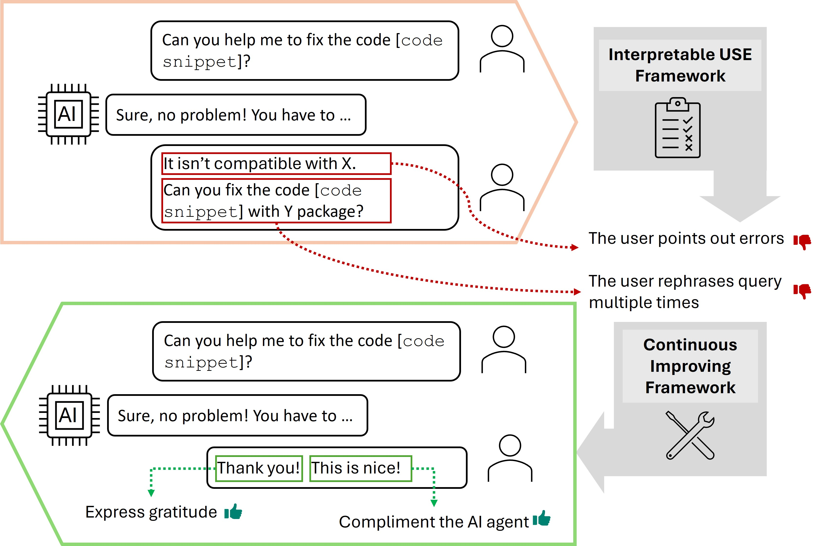
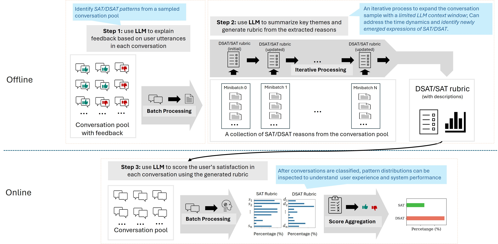
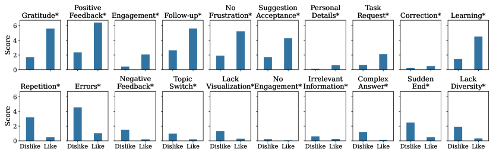
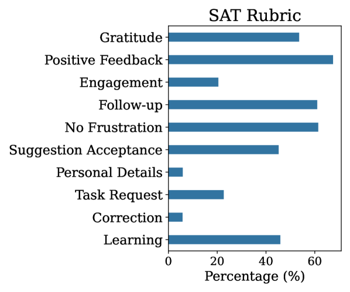
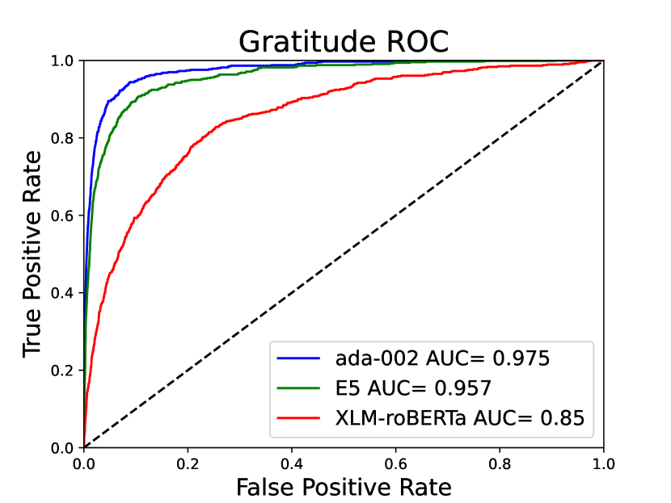
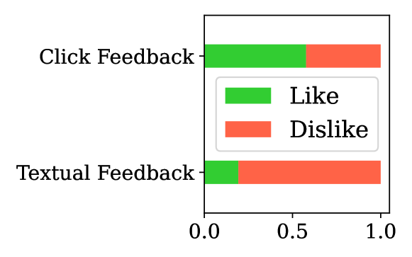
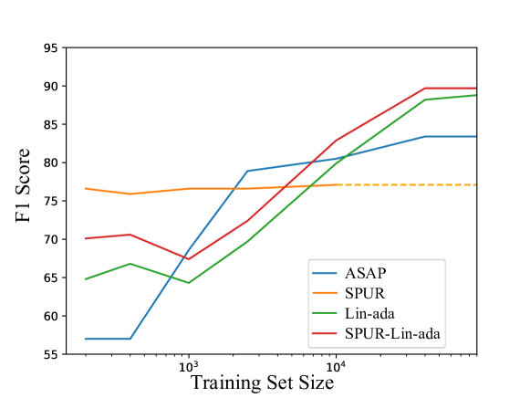
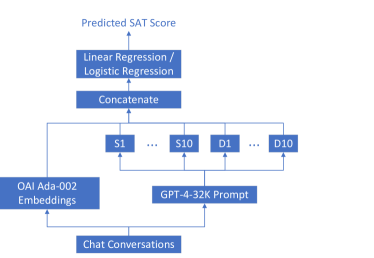
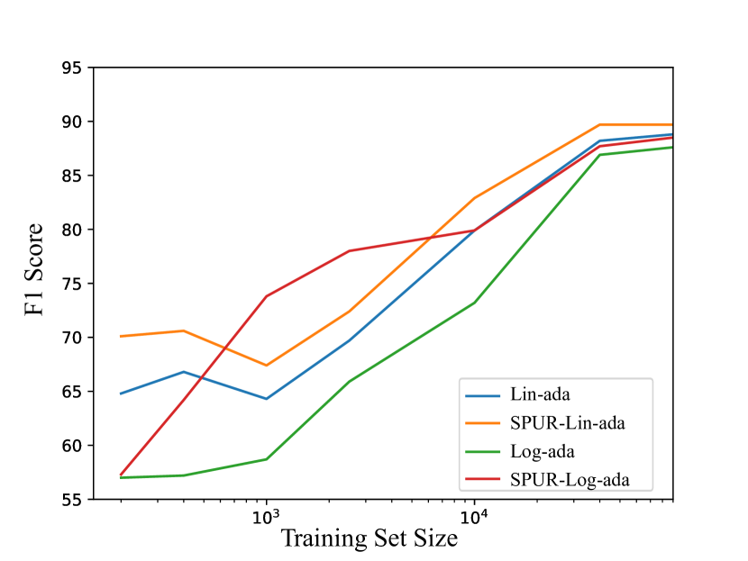

# Interpretable User Satisfaction Estimation for 
Conversational Systems with Large Language Models

###### Abstract

Accurate and interpretable user satisfaction estimation (USE) is critical for understanding, evaluating, and continuously improving conversational systems. Users express their satisfaction or dissatisfaction with diverse conversational patterns in both general-purpose (ChatGPT and Bing Copilot) and task-oriented (customer service chatbot) conversational systems. Existing approaches based on featurized ML models or text embeddings fall short in extracting generalizable patterns and are hard to interpret. In this work, we show that LLMs can extract interpretable signals of user satisfaction from their natural language utterances more effectively than embedding-based approaches. Moreover, an LLM can be tailored for USE via an iterative prompting framework using supervision from labeled examples. The resulting method, Supervised Prompting for User satisfaction Rubrics (SPUR), not only has higher accuracy but is more interpretable as it scores user satisfaction via learned rubrics with a detailed breakdown.  

Interpretable User Satisfaction Estimation for     Conversational Systems with Large Language Models  

  

    Ying-Chun Lin∗‡, Jennifer Neville∗†, Jack W. Stokes∗†, Longqi Yang∗†,††thanks: ∗These corresponding authors contributed equally to this work. Email: lin915@purdue.edu, jenneville@microsoft.com, jstokes@microsoft.com, longqi.yang@microsoft.com  Tara Safavi†, Mengting Wan†, Scott Counts†, Siddharth Suri†,  Reid Andersen†, Xiaofeng Xu†, Deepak Gupta†, Sujay Kumar Jauhar†,  Xia Song†, Georg Buscher†, Saurabh Tiwary†, Brent Hecht†, Jaime Teevan†  †Microsoft Corporation, ‡Purdue University    

  

## 1 Introduction

General-purpose conversational systems such as ChatGPT and Bing Copilot are revolutionizing how people live and work. Understanding when and why users are satisfied or dissatisfied is critical for the continuous improvement of these systems. It helps system developers identify areas of improvements, conduct effective A/B experiments, and optimize underlying models. Unsurprisingly, developing machine learning models for User Satisfaction Estimation (USE) (Hu et al., [2023](#bib.bib11); Kachuee et al., [2021a](#bib.bib13); Song et al., [2019](#bib.bib25); Bodigutla et al., [2019](#bib.bib3), [2020](#bib.bib4)) has captured significant attention from the research community.  

[FIGURE S1.F1.g1]


Figure 1: Illustration of user utterances with satisfaction patterns (green) and dissatisfaction patterns (red).
[/FIGURE]

When estimating user satisfaction, simply classifying that a user is satisfied or dissatisfied is insufficient. Understanding the reason why a user is satisfied or dissatisfied is just as valuable (Figure [1](#S1.F1 "Figure 1 ‣ 1 Introduction ‣ Interpretable User Satisfaction Estimation for Conversational Systems with Large Language Models")), e.g., frequent query reformulation presents opportunities for prompt recommendation, and conversations where users explicitly correct a bot’s mistakes can suggest examples for model alignment. However, most of the existing work has focused on improving the classification accuracy but overlooked the interpretability. For example, representation learning-based approaches (Song et al., [2023](#bib.bib26); Deng et al., [2022](#bib.bib7); Ye Fanghua, [2023](#bib.bib33)) are relatively opaque due to their use of neural models (e.g., embeddings) and thus offer little insight into conversational patterns that indicate satisfaction/dissatisfaction. Similar limitations apply to reward models for training LLMs, e.g., RLHF (Christiano et al., [2017](#bib.bib6)) and RLAIF (Bai et al., [2022](#bib.bib2)). In this case, the learned model produces a continuous “reward” score that aims to distinguish outputs that a human prefers without explaining why a conversation has a higher score than others. To our knowledge, these reward models have not been directly used for USE, but we treat it as a baseline due to their ability to rank outputs with respect to human preferences.  

Some prior work addressed the interpretation needs of USE by a featurized ML model. Examples include Walker et al. ([1997](#bib.bib29)), which evaluated user satisfaction based on human-annotated features in terms of task success and dialogue costs, and Bodigutla et al. ([2019](#bib.bib3)) that proposed domain-independent features that evaluate response quality. However, the growth of LLM-based conversational systems (e.g., ChatGPT, Bing Copilot) means user queries in conversational systems may now reflect manually crafted domains and intents (e.g., task-oriented, QA, chitchat). As such, approaches based on domain-specific features have limited generalizability to these diverse conversational patterns (Deriu et al., [2021](#bib.bib8)).  

In this work, we make the key observation that LLMs can achieve both high classification accuracy and fine-grained interpretability at the same time – through their ability to reason about user conversational patterns and identify salient patterns that generalize and produce accurate predictions. We propose Supervised Prompting for User satisfaction Rubrics (SPUR). We consider a few-shot scenario, where a small number of training examples are available, and develop a supervised, iterative prompting framework that uses an LLM to (1) extract signals of satisfaction from user utterances in a labeled training set, (2) summarize the reasons into rubrics for identifying satisfaction/dissatisfaction conversational patterns, and (3) apply the rubrics to predict satisfaction labels on unseen conversations.  

In addition to being more accurate, our approach provides an interpretable rubric for understanding the conversational patterns that indicate user satisfaction/dissatisfaction. Notably, our approach can be used to learn SAT/DSAT patterns automatically for different conversational systems. In our experimental results, we show the distributions of patterns in different types of systems and demonstrate how these patterns (1) correlate to overall user satisfaction, and (2) differ across domains.  

Moreover, we show that we can scale the application of the learned rubrics in two ways. First, we show that we can distill individual rubric items into an embedding-based model that can be applied at scale without the need for LLM prompting. Next, we show that we can add rubric items as features to an embedding-based model to increase the accuracy of embedding-only models on datasets with more available training data.  

The main contributions of our work include:  

* We propose Supervised Prompting for User satisfaction Rubrics (SPUR), a novel framework for estimating user satisfaction in conversational systems with LLMs. 
* We show the SPUR prompting process extracts patterns into clear and interpretable rubrics that guide the LLM to classify user satisfaction and show that diverse rubrics are learned automatically for different domains. 
* We show SPUR outperforms existing methods across different types of conversational systems when training data is limited and provide insights into the factors that influence user satisfaction. 
* We use knowledge distillation to scale the application of the learned rubrics with knowledge distillation and show that the rubrics can continuously improve performance on USE as more training data is available. 

## 2 Problem Definition and Related Work

Problem Definition. Let a conversation $C$ from session $i$ and consisting of $t$ interaction turns of user-agent utterances be $C_{i}=[U_{1},A_{1},\ldots,U_{t},A_{t}]$. Here $U_{t}$ refers to a user utterance and $A_{t}$ refers to an AI agent utterance. The user-agent utterances $C_{i}$ typically consist of multiple turns, e.g. $t>1$. The conversation also has an overall user satisfaction label $y_{i}\in[-1,+1]$.  

Our goal is to learn a function $f:C\rightarrow y$ to accurately predict the satisfaction label of unseen conversations and explain why the label is predicted. In multi-turn conversational sessions, a user can convey their satisfaction (or dissatisfaction) explicitly in their utterances or implicitly through their behavioral interactions with the agent. We refer to these satisfaction/dissatisfaction conversational patterns as SAT/DSAT patterns. Let $\mathcal{S}=\{s_{1},s_{2},\cdots,s_{\infty}\}$ and $\mathcal{D}=\{d_{1},d_{2},\cdots,d_{\infty}\}$ be the set of all interpretable SAT and DSAT patterns respectively. We assume these are latent and unknown. The goal is to identify a subset of SAT/DSAT patterns ($\mathcal{S}_{s}\subset\mathcal{S},\mathcal{D}_{s}\subset\mathcal{D}$) that summarize the conversation enough to accurately predict its label: $P(y|C)\approx P\Big{(}y\>\Big{|}\>\mathcal{S}_{s}(C),\mathcal{D}_{s}(C)\Big{)}$.  

SAT and DSAT patterns may be direct compliments or complaints about the AI agent’s responses, or behavioral patterns that implicitly express user satisfaction. For example, users may continue to ask follow-up questions, indicating that the AI has provided accurate information that inspires their curiosity and leaves them satisfied. Conversely, if a user repeatedly rephrases the same question, it can signal dissatisfaction.  

Related Work. Numerous prior research studies have examined User Satisfaction Evaluation (USE) through the lenses of sentiment analysis (Song et al., [2023](#bib.bib26), [2019](#bib.bib25)), content analysis (Walker et al., [1997](#bib.bib29); Sun et al., [2021](#bib.bib27)), and response quality assessment (Schmitt and Ultes, [2015](#bib.bib23); Bodigutla et al., [2019](#bib.bib3)). While analyzing user sentiment distribution in a dialogue session can enhance the model’s USE capabilities, it is important to note that sentiment analysis is not equivalent to USE (Song et al., [2023](#bib.bib26)). Another common approach involves content analysis, which typically necessitates the employment of human annotators to evaluate interaction quality in a dialogue session (Schmitt and Ultes, [2015](#bib.bib23); Bodigutla et al., [2019](#bib.bib3)). Subsequently, a classifier is trained to predict user satisfaction based on the features extracted from the annotation process.  

With the advancement of language models, there is a growing trend in the use of text embeddings to estimate user satisfaction for conversational systems (Liang et al., [2021](#bib.bib18); Kachuee et al., [2021b](#bib.bib14); Pan et al., [2022](#bib.bib20); Sun et al., [2021](#bib.bib27)). This approach is also being employed to simulate user satisfaction. Some work has focused on identifying dialogue acts or user intents in measuring the fulfillment of the user’s goals (Cai and Chen, [2020](#bib.bib5); Sun et al., [2021](#bib.bib27)). Other work has focused on incorporating the sequential dynamics of dialogue acts (Deng et al., [2022](#bib.bib7)), jointly predicting sentiment and satisfaction (Song et al., [2023](#bib.bib26)), or modeling dynamics of satisfaction across turns (Ye Fanghua, [2023](#bib.bib33)).  

Recently, Large Language Models (LLMs) revolutionized the traditional learning framework (Kojima et al., [2022](#bib.bib16); Wei et al., [2022](#bib.bib30)), especially in the natural language processing (NLP) area. LLMs have achieved performance comparable to supervised baselines or state-of-the-art results across various NLP tasks with In-Context Learning (ICL). By providing a few examples or hints (Lampinen et al., [2022](#bib.bib17); Sun et al., [2023](#bib.bib28)) and simple reasoning process (Kojima et al., [2022](#bib.bib16); Wei et al., [2022](#bib.bib30)), LLMs can have significant performance boosts in NLP tasks. Hu et al. ([2023](#bib.bib11)) further use LLMs as a user simulator for USE and adopt the user simulator into RLAIF (Bai et al., [2022](#bib.bib2)) for fine-tuning the existing LLM models. For USE with zero-shot prompting (Kojima et al., [2022](#bib.bib16); Hu et al., [2023](#bib.bib11)), instructions provided by a human may not fit the actual conversation patterns in the data and hence introduce bias. For few-shot prompting Lampinen et al. ([2022](#bib.bib17)); Sun et al. ([2023](#bib.bib28)), the provided examples are not enough to describe the full distribution of the conversational patterns, and this results in inaccuracies for USE.  

## 3 SPUR

[FIGURE S3.F2.g1]


Figure 2: Illustration of SPUR approach. Step 1 corresponds to Sec. [3.1](#S3.SS1 "3.1 Supervised Extraction ‣ 3 SPUR ‣ Interpretable User Satisfaction Estimation for Conversational Systems with Large Language Models"), Step 2: Sec. [3.2](#S3.SS2 "3.2 Rubric Summarization ‣ 3 SPUR ‣ Interpretable User Satisfaction Estimation for Conversational Systems with Large Language Models"), and Step 3: Sec. [3.3](#S3.SS3 "3.3 User Satisfaction Estimation ‣ 3 SPUR ‣ Interpretable User Satisfaction Estimation for Conversational Systems with Large Language Models").
[/FIGURE]

We propose SPUR for interpretable User Satisfaction Estimation (USE) given conversations $C$ from a conversational system. Our approach follows the three-phase prompting strategy depicted in Figure [2](#S3.F2 "Figure 2 ‣ 3 SPUR ‣ Interpretable User Satisfaction Estimation for Conversational Systems with Large Language Models"): Supervised Extraction, Rubric Summarization, and User Satisfaction Estimation. Due to the multi-turn and general-purpose nature in such conversational systems, users demonstrate a variety of response patterns when expressing satisfaction or dissatisfaction. Our three-phase approach of SPUR is essential for enhancing its generalization and accuracy for User Satisfaction Estimation (USE). Through Supervised Extraction, SPUR improves generalization by capturing the diverse conversational patterns for USE. In the Rubric Summarization stage, the LLM explicitly identifies prominent SAT and DSAT patterns in the training set $\mathcal{C}_{train}=\{C_{1},C_{2},\cdots,C_{N}\}$, which are annotated with click feedback. Finally, SPUR uses the learned rubrics generated from the previous stage to score user satisfaction on unlabeled conversations. For the ease of understanding, we use mathematical definitions to approximate the process of SPUR in the following three sections.  

### 3.1 Supervised Extraction

The first step of our framework is Supervised Extraction—where we use a prompt to obtain meaningful and interpretable SAT/DSAT patterns from GPT-4, which has an exceptional ability for natural language understanding and reasoning (Ye and Durrett, [2023](#bib.bib32); Huang et al., [2023](#bib.bib12); Kojima et al., [2022](#bib.bib16)). Given a conversation $C_{i}$ with its user satisfaction label $y_{i}=+1$, how the user expresses satisfaction in $C_{i}$ can be formulated as: $\widehat{\mathbf{s}}_{i}\approx\underset{s\in\mathcal{S}}{\operatorname{arg\,max_{k}}}\;P(\mathcal{S}|C_{i},y_{i}=+1)$, where $\mathcal{S}=\{s_{1},s_{2},\cdots,s_{\infty}\}$ is the set of all possible SAT patterns.  

The goal is to identify the top-k potential patterns $\widehat{\mathbf{s}}_{i}=\{s_{1},s_{2},\cdots,s_{k}\}\subset\mathcal{S}$ that are exhibited in $C_{i}$ relevant to satisfaction expression. Similarly, $\widehat{\mathbf{d}}_{i}\approx\underset{d\in\mathcal{D}}{\operatorname{arg\,max_{k}}}\;P(\mathcal{D}|C_{i},y_{i}=-1)$, where $\mathcal{D}=\{d_{1},d_{2},\cdots,d_{\infty}\}$ is the set of all possible DSAT patterns.  

The prompt for generating the possible $\widehat{\mathbf{s}}$ or $\widehat{\mathbf{d}}$ patterns from $\mathcal{C}_{train}$ is provided in Appendix [A.1](#A1.SS1 "A.1 Supervised Extraction Prompt ‣ Appendix A Prompts ‣ Interpretable User Satisfaction Estimation for Conversational Systems with Large Language Models"). In our prompt, we specifically require GPT-4 to restrict $k\leq 3$ for each $C_{i}$. The prompt for DSAT patterns is similar; we only replace “satisfaction” with “dissatisfaction” in the instructions. For the ease of discussion in the next section, let $\widehat{\mathcal{S}}=\{\widehat{s}_{1},\cdots,\widehat{s}_{N}\}$ denote all the SAT patterns derived from Supervised Extraction and $\widehat{\mathcal{D}}=\{\widehat{d}_{1},\cdots,\widehat{d}_{N}\}$ are all the DSAT patterns.  

### 3.2 Rubric Summarization

The patterns extracted through Supervised Extraction prompting may exhibit significant variation based on the text descriptions across different conversations, and their relative importance may not be uniform. Our observations indicate that, despite differences in the text descriptions, most $\widehat{s}_{i}\in\widehat{\mathcal{S}}$ and $\widehat{d}_{i}\in\widehat{\mathcal{D}}$ are semantically similar. As such, the goal of the Rubric Summarization stage is to further condense $\widehat{\mathcal{S}}$ and $\widehat{\mathcal{D}}$, and identify frequently occurring SAT/DSAT patterns across $\mathcal{C}_{train}$. The outcome of this process is the establishment of a clear rubric for USE based on $\widehat{\mathcal{S}}$ and $\widehat{\mathcal{D}}$.  

However, it is infeasible to summarize $\widehat{\mathcal{S}}$ and $\widehat{\mathcal{D}}$ into a clear rubric using a single prompt because the number of tokens in $\widehat{\mathcal{S}}$ and $\widehat{\mathcal{D}}$ is too large to fit into the context size limit of GPT-4. (Note, we used GPT-4-32K with a 32K context window in this work.) To address this, we propose an iterative process to incrementally update the satisfaction and dissatisfaction rubrics by processing a fixed-size minibatch of patterns. The satisfaction batches are denoted as $\{\widehat{\mathcal{S}}_{1},\widehat{\mathcal{S}}_{2},\cdots,\widehat{\mathcal{S}}_{B}\}$ where $\widehat{\mathcal{S}}=\cup_{b=1}^{B}\widehat{\mathcal{S}}_{b}$ and the number of batches is $B$. Similarly, $\{\widehat{\mathcal{D}}_{1},\widehat{\mathcal{D}}_{2},\cdots,\widehat{\mathcal{D}}_{B}\}$ are the batches to learn the dissatisfaction rubric and $\widehat{\mathcal{D}}=\cup_{b=1}^{B}\widehat{\mathcal{D}}_{b}$. In each iteration, GPT-4 is asked to generate an $n$-item rubric for the SAT patterns in $\widehat{\mathcal{S}}_{b}$. This $n$-item SAT rubric is then appended at the end of $\widehat{\mathcal{S}}_{b+1}$ to incorporate in the generation of the next $n$-item SAT rubric. The iterative process continues until the final batch, and then the last output $n$-item rubric is used as the final SAT rubric $\widetilde{\mathcal{S}}=\{\tilde{s}_{1}\cdots\tilde{s}_{n}\}$. The process is illustrated at Step 2 in Figure [2](#S3.F2 "Figure 2 ‣ 3 SPUR ‣ Interpretable User Satisfaction Estimation for Conversational Systems with Large Language Models"). A similar process is applied to generate the DSAT rubric $\widetilde{\mathcal{D}}=\{\tilde{d}_{1}\cdots\tilde{d}_{n}\}$. We set $n=10$ in our experiments. The final SAT and DSAT rubrics for Bing Copilot are in Table [4](#A6.T4 "Table 4 ‣ Appendix F Usage of AI Assistants ‣ Interpretable User Satisfaction Estimation for Conversational Systems with Large Language Models"), and the Rubric Summarization prompt is provided in Appendix [A.2](#A1.SS2 "A.2 Rubric Summarization Prompt ‣ Appendix A Prompts ‣ Interpretable User Satisfaction Estimation for Conversational Systems with Large Language Models").  

There are two benefits to utilizing the LLM generated satisfaction and dissatisfaction rubrics from this iterative process. First, the rubrics are developed in a supervised manner from the set of training conversations, $\mathcal{C}_{train}$, thereby ensuring that prominent (and thus predictive) SAT and DSAT patterns in the distribution are identified. As a result, the generated rubrics provide a clear guideline for GPT-4 to estimate user satisfaction accurately. Second, the rubrics are generated from more examples than can fit in a single context window. As such, Rubric Summarization improves the generalization for GPT-4 in terms of in-context learning.  

### 3.3 User Satisfaction Estimation

After learning the satisfaction rubric $\widetilde{\mathcal{S}}$ and dissatisfaction rubric $\widetilde{\mathcal{D}}$, we incorporate the generated rubrics as instructions in a third prompt that we provide GPT-4 to score user satisfaction. The rubric items provide a consistent decision making criteria and enhance the performance of GPT-4 on USE. For each rubric item $\tilde{s}_{r}\in\widetilde{\mathcal{S}}$ or $\tilde{d}_{r}\in\widetilde{\mathcal{D}}$, the prompt asks GPT-4 to make a binary decision as to whether a given conversation demonstrates the described behavior. If the answer is "Yes", the prompts further instruct GPT-4 to evaluate how likely the expressed pattern will impact the user’s overall satisfaction/dissatisfaction with their interaction on a scale of $1-10$ (low to high). Otherwise, if the answer is “No,” the score is $0$. After the score for each rubric item is output, we further aggregate the scores into a single SAT score $\mathcal{R}$ to represent the overall user satisfaction in the given conversation. $\mathcal{R}$ is computed as: $\mathcal{R}=\sum_{i=1}^{n}\tilde{r}_{s_{i}}-\sum_{j=1}^{n}\tilde{r}_{d_{j}}$ where $\tilde{r}_{s_{i}}$ is the score for the $i$th SAT rubric item and $\tilde{r}_{d_{j}}$ for the $j$th DSAT item. The prompt is in Appendix [A.3](#A1.SS3 "A.3 User Satisfaction Estimation Prompt ‣ Appendix A Prompts ‣ Interpretable User Satisfaction Estimation for Conversational Systems with Large Language Models").  

## 4 Evaluation

We evaluate SPUR by comparing its performance quantitatively against previous embedding-based approaches and several ablated versions of our LLM-based approach.  

Baselines. We compare SPUR with two LLM-based methods, including ZeroShot and FewShot, and three embedding-based methods, Linear Regression, USDA (Deng et al., [2022](#bib.bib7)) and ASAP (Ye Fanghua, [2023](#bib.bib33)). The detailed descriptions of these models are provided in Appendix [B](#A2 "Appendix B Baseline Methods ‣ Interpretable User Satisfaction Estimation for Conversational Systems with Large Language Models").  

Dataset. We use four datasets to evaluate the performance of the compared methods. Bing Copilot is a general-purpose and multilingual conversational system, and this dataset includes 50K fully de-identified conversations.111All personal, private or sensitive information were scrubbed and masked before the conversations were used for this research. The access to the dataset is strictly limited to the authors who conducted hands-on analysis and model development. MWOZ, SGD and ReDial are three task-oriented, English conversational systems, and they have 1,155, 1,638 and 1,387 conversations, respectively. We employ the user satisfaction labels provided by Sun et al. ([2021](#bib.bib27)) for these task-oriented datasets. Because MWOZ (Eric et al., [2020](#bib.bib10)), SGD (Rastogi et al., [2020](#bib.bib21)), and ReDial (Siro et al., [2022](#bib.bib24)) are labeled turn-by-turn, we further process these labels into a label to represent overall satisfaction of the whole conversation. The preprocessing details are described in Appendix [C](#A3 "Appendix C Labeling Adjustment for the Open Data ‣ Interpretable User Satisfaction Estimation for Conversational Systems with Large Language Models").  

Ethics. As part of the production process, the Bing Copilot data is de-identified, and each conversation is formed by aggregating turns based on a unique conversation ID. Thus, none of the researchers who analyzed the data are able to recover and identify the conversations from any individual user. In addition, this research study was reviewed and approved by representatives from our institutional review board (IRB), as well as our ethics and security teams. No formal IRB certificate was required as we did not conduct human studies for this paper.  

[TABLE S4.T1]

<table class="ltx_tabular ltx_centering ltx_align_middle">
<tbody class="ltx_tbody">
<tr class="ltx_tr">
<td class="ltx_td ltx_align_justify ltx_align_top ltx_border_t">
<span class="ltx_inline-block ltx_align_top">
<span class="ltx_p"><span class="ltx_text">Models</span></span>
</span>
</td>
<td class="ltx_td ltx_align_center ltx_align_top ltx_border_t">Bing Copilot (<math class="ltx_Math"><semantics><mrow><mn>0.8</mn><mo>%</mo></mrow><annotation-xml><apply><csymbol>percent</csymbol><cn>0.8</cn></apply></annotation-xml><annotation>0.8\%</annotation></semantics></math>)</td>
<td class="ltx_td ltx_align_center ltx_align_top ltx_border_t">MWOZ (<math class="ltx_Math"><semantics><mrow><mn>5</mn><mo>%</mo></mrow><annotation-xml><apply><csymbol>percent</csymbol><cn>5</cn></apply></annotation-xml><annotation>5\%</annotation></semantics></math>)</td>
<td class="ltx_td ltx_align_center ltx_align_top ltx_border_t">SGD (<math class="ltx_Math"><semantics><mrow><mn>5</mn><mo>%</mo></mrow><annotation-xml><apply><csymbol>percent</csymbol><cn>5</cn></apply></annotation-xml><annotation>5\%</annotation></semantics></math>)</td>
<td class="ltx_td ltx_align_center ltx_align_top ltx_border_t">ReDial (<math class="ltx_Math"><semantics><mrow><mn>5</mn><mo>%</mo></mrow><annotation-xml><apply><csymbol>percent</csymbol><cn>5</cn></apply></annotation-xml><annotation>5\%</annotation></semantics></math>)</td>
</tr>
<tr class="ltx_tr">
<td class="ltx_td ltx_align_justify ltx_align_top ltx_border_t">
<span class="ltx_inline-block ltx_align_top">
<span class="ltx_p">Acc</span>
</span>
</td>
<td class="ltx_td ltx_align_justify ltx_align_top ltx_border_t">
<span class="ltx_inline-block ltx_align_top">
<span class="ltx_p">P</span>
</span>
</td>
<td class="ltx_td ltx_align_justify ltx_align_top ltx_border_t">
<span class="ltx_inline-block ltx_align_top">
<span class="ltx_p">R</span>
</span>
</td>
<td class="ltx_td ltx_align_justify ltx_align_top ltx_border_t">
<span class="ltx_inline-block ltx_align_top">
<span class="ltx_p">F1</span>
</span>
</td>
<td class="ltx_td ltx_align_justify ltx_align_top ltx_border_t">
<span class="ltx_inline-block ltx_align_top">
<span class="ltx_p">Acc</span>
</span>
</td>
<td class="ltx_td ltx_align_justify ltx_align_top ltx_border_t">
<span class="ltx_inline-block ltx_align_top">
<span class="ltx_p">P</span>
</span>
</td>
<td class="ltx_td ltx_align_justify ltx_align_top ltx_border_t">
<span class="ltx_inline-block ltx_align_top">
<span class="ltx_p">R</span>
</span>
</td>
<td class="ltx_td ltx_align_justify ltx_align_top ltx_border_t">
<span class="ltx_inline-block ltx_align_top">
<span class="ltx_p">F1</span>
</span>
</td>
<td class="ltx_td ltx_align_justify ltx_align_top ltx_border_t">
<span class="ltx_inline-block ltx_align_top">
<span class="ltx_p">Acc</span>
</span>
</td>
<td class="ltx_td ltx_align_justify ltx_align_top ltx_border_t">
<span class="ltx_inline-block ltx_align_top">
<span class="ltx_p">P</span>
</span>
</td>
<td class="ltx_td ltx_align_justify ltx_align_top ltx_border_t">
<span class="ltx_inline-block ltx_align_top">
<span class="ltx_p">R</span>
</span>
</td>
<td class="ltx_td ltx_align_justify ltx_align_top ltx_border_t">
<span class="ltx_inline-block ltx_align_top">
<span class="ltx_p">F1</span>
</span>
</td>
<td class="ltx_td ltx_align_justify ltx_align_top ltx_border_t">
<span class="ltx_inline-block ltx_align_top">
<span class="ltx_p">Acc</span>
</span>
</td>
<td class="ltx_td ltx_align_justify ltx_align_top ltx_border_t">
<span class="ltx_inline-block ltx_align_top">
<span class="ltx_p">P</span>
</span>
</td>
<td class="ltx_td ltx_align_justify ltx_align_top ltx_border_t">
<span class="ltx_inline-block ltx_align_top">
<span class="ltx_p">R</span>
</span>
</td>
<td class="ltx_td ltx_align_justify ltx_align_top ltx_border_t">
<span class="ltx_inline-block ltx_align_top">
<span class="ltx_p">F1</span>
</span>
</td>
</tr>
<tr class="ltx_tr">
<td class="ltx_td ltx_align_justify ltx_align_top ltx_border_t">
<span class="ltx_inline-block ltx_align_top">
<span class="ltx_p">Lin-ada</span>
</span>
</td>
<td class="ltx_td ltx_align_justify ltx_align_top ltx_border_t">
<span class="ltx_inline-block ltx_align_top">
<span class="ltx_p">66.5</span>
</span>
</td>
<td class="ltx_td ltx_align_justify ltx_align_top ltx_border_t">
<span class="ltx_inline-block ltx_align_top">
<span class="ltx_p">67.1</span>
</span>
</td>
<td class="ltx_td ltx_align_justify ltx_align_top ltx_border_t">
<span class="ltx_inline-block ltx_align_top">
<span class="ltx_p">66.5</span>
</span>
</td>
<td class="ltx_td ltx_align_justify ltx_align_top ltx_border_t">
<span class="ltx_inline-block ltx_align_top">
<span class="ltx_p">66.8</span>
</span>
</td>
<td class="ltx_td ltx_align_justify ltx_align_top ltx_border_t">
<span class="ltx_inline-block ltx_align_top">
<span class="ltx_p">27.6</span>
</span>
</td>
<td class="ltx_td ltx_align_justify ltx_align_top ltx_border_t">
<span class="ltx_inline-block ltx_align_top">
<span class="ltx_p">44.6</span>
</span>
</td>
<td class="ltx_td ltx_align_justify ltx_align_top ltx_border_t">
<span class="ltx_inline-block ltx_align_top">
<span class="ltx_p">27.6</span>
</span>
</td>
<td class="ltx_td ltx_align_justify ltx_align_top ltx_border_t">
<span class="ltx_inline-block ltx_align_top">
<span class="ltx_p">31.2</span>
</span>
</td>
<td class="ltx_td ltx_align_justify ltx_align_top ltx_border_t">
<span class="ltx_inline-block ltx_align_top">
<span class="ltx_p">38.2</span>
</span>
</td>
<td class="ltx_td ltx_align_justify ltx_align_top ltx_border_t">
<span class="ltx_inline-block ltx_align_top">
<span class="ltx_p">53.2</span>
</span>
</td>
<td class="ltx_td ltx_align_justify ltx_align_top ltx_border_t">
<span class="ltx_inline-block ltx_align_top">
<span class="ltx_p">38.2</span>
</span>
</td>
<td class="ltx_td ltx_align_justify ltx_align_top ltx_border_t">
<span class="ltx_inline-block ltx_align_top">
<span class="ltx_p">42.9</span>
</span>
</td>
<td class="ltx_td ltx_align_justify ltx_align_top ltx_border_t">
<span class="ltx_inline-block ltx_align_top">
<span class="ltx_p">28.4</span>
</span>
</td>
<td class="ltx_td ltx_align_justify ltx_align_top ltx_border_t">
<span class="ltx_inline-block ltx_align_top">
<span class="ltx_p">48.6</span>
</span>
</td>
<td class="ltx_td ltx_align_justify ltx_align_top ltx_border_t">
<span class="ltx_inline-block ltx_align_top">
<span class="ltx_p">28.4</span>
</span>
</td>
<td class="ltx_td ltx_align_justify ltx_align_top ltx_border_t">
<span class="ltx_inline-block ltx_align_top">
<span class="ltx_p">33.9</span>
</span>
</td>
</tr>
<tr class="ltx_tr">
<td class="ltx_td ltx_align_justify ltx_align_top">
<span class="ltx_inline-block ltx_align_top">
<span class="ltx_p">USDA</span>
</span>
</td>
<td class="ltx_td ltx_align_justify ltx_align_top">
<span class="ltx_inline-block ltx_align_top">
<span class="ltx_p">69.5</span>
</span>
</td>
<td class="ltx_td ltx_align_justify ltx_align_top">
<span class="ltx_inline-block ltx_align_top">
<span class="ltx_p">34.8</span>
</span>
</td>
<td class="ltx_td ltx_align_justify ltx_align_top">
<span class="ltx_inline-block ltx_align_top">
<span class="ltx_p">50.0</span>
</span>
</td>
<td class="ltx_td ltx_align_justify ltx_align_top">
<span class="ltx_inline-block ltx_align_top">
<span class="ltx_p">41.0</span>
</span>
</td>
<td class="ltx_td ltx_align_justify ltx_align_top">
<span class="ltx_inline-block ltx_align_top">
<span class="ltx_p">47.8</span>
</span>
</td>
<td class="ltx_td ltx_align_justify ltx_align_top">
<span class="ltx_inline-block ltx_align_top">
<span class="ltx_p">22.9</span>
</span>
</td>
<td class="ltx_td ltx_align_justify ltx_align_top">
<span class="ltx_inline-block ltx_align_top">
<span class="ltx_p">47.8</span>
</span>
</td>
<td class="ltx_td ltx_align_justify ltx_align_top">
<span class="ltx_inline-block ltx_align_top">
<span class="ltx_p">30.9</span>
</span>
</td>
<td class="ltx_td ltx_align_justify ltx_align_top">
<span class="ltx_inline-block ltx_align_top">
<span class="ltx_p">70.6</span>
</span>
</td>
<td class="ltx_td ltx_align_justify ltx_align_top">
<span class="ltx_inline-block ltx_align_top">
<span class="ltx_p">68.3</span>
</span>
</td>
<td class="ltx_td ltx_align_justify ltx_align_top">
<span class="ltx_inline-block ltx_align_top">
<span class="ltx_p">70.6</span>
</span>
</td>
<td class="ltx_td ltx_align_justify ltx_align_top">
<span class="ltx_inline-block ltx_align_top">
<span class="ltx_p">64.9</span>
</span>
</td>
<td class="ltx_td ltx_align_justify ltx_align_top">
<span class="ltx_inline-block ltx_align_top">
<span class="ltx_p">38.6</span>
</span>
</td>
<td class="ltx_td ltx_align_justify ltx_align_top">
<span class="ltx_inline-block ltx_align_top">
<span class="ltx_p">70.0</span>
</span>
</td>
<td class="ltx_td ltx_align_justify ltx_align_top">
<span class="ltx_inline-block ltx_align_top">
<span class="ltx_p">38.6</span>
</span>
</td>
<td class="ltx_td ltx_align_justify ltx_align_top">
<span class="ltx_inline-block ltx_align_top">
<span class="ltx_p">24.0</span>
</span>
</td>
</tr>
<tr class="ltx_tr">
<td class="ltx_td ltx_align_justify ltx_align_top">
<span class="ltx_inline-block ltx_align_top">
<span class="ltx_p">ASAP</span>
</span>
</td>
<td class="ltx_td ltx_align_justify ltx_align_top">
<span class="ltx_inline-block ltx_align_top">
<span class="ltx_p">69.5</span>
</span>
</td>
<td class="ltx_td ltx_align_justify ltx_align_top">
<span class="ltx_inline-block ltx_align_top">
<span class="ltx_p">48.3</span>
</span>
</td>
<td class="ltx_td ltx_align_justify ltx_align_top">
<span class="ltx_inline-block ltx_align_top">
<span class="ltx_p">69.5</span>
</span>
</td>
<td class="ltx_td ltx_align_justify ltx_align_top">
<span class="ltx_inline-block ltx_align_top">
<span class="ltx_p">57.0</span>
</span>
</td>
<td class="ltx_td ltx_align_justify ltx_align_top">
<span class="ltx_inline-block ltx_align_top">
<span class="ltx_p">57.1</span>
</span>
</td>
<td class="ltx_td ltx_align_justify ltx_align_top">
<span class="ltx_inline-block ltx_align_top">
<span class="ltx_p">57.9</span>
</span>
</td>
<td class="ltx_td ltx_align_justify ltx_align_top">
<span class="ltx_inline-block ltx_align_top">
<span class="ltx_p">57.1</span>
</span>
</td>
<td class="ltx_td ltx_align_justify ltx_align_top">
<span class="ltx_inline-block ltx_align_top">
<span class="ltx_p">56.9</span>
</span>
</td>
<td class="ltx_td ltx_align_justify ltx_align_top">
<span class="ltx_inline-block ltx_align_top">
<span class="ltx_p">65.8</span>
</span>
</td>
<td class="ltx_td ltx_align_justify ltx_align_top">
<span class="ltx_inline-block ltx_align_top">
<span class="ltx_p">67.3</span>
</span>
</td>
<td class="ltx_td ltx_align_justify ltx_align_top">
<span class="ltx_inline-block ltx_align_top">
<span class="ltx_p">65.8</span>
</span>
</td>
<td class="ltx_td ltx_align_justify ltx_align_top">
<span class="ltx_inline-block ltx_align_top">
<span class="ltx_p">66.4</span>
</span>
</td>
<td class="ltx_td ltx_align_justify ltx_align_top">
<span class="ltx_inline-block ltx_align_top">
<span class="ltx_p">70.2</span>
</span>
</td>
<td class="ltx_td ltx_align_justify ltx_align_top">
<span class="ltx_inline-block ltx_align_top">
<span class="ltx_p">69.5</span>
</span>
</td>
<td class="ltx_td ltx_align_justify ltx_align_top">
<span class="ltx_inline-block ltx_align_top">
<span class="ltx_p">70.2</span>
</span>
</td>
<td class="ltx_td ltx_align_justify ltx_align_top">
<span class="ltx_inline-block ltx_align_top">
<span class="ltx_p">67.6</span>
</span>
</td>
</tr>
<tr class="ltx_tr">
<td class="ltx_td ltx_align_justify ltx_align_top ltx_border_t">
<span class="ltx_inline-block ltx_align_top">
<span class="ltx_p">Reward</span>
</span>
</td>
<td class="ltx_td ltx_align_justify ltx_align_top ltx_border_t">
<span class="ltx_inline-block ltx_align_top">
<span class="ltx_p">34.6</span>
</span>
</td>
<td class="ltx_td ltx_align_justify ltx_align_top ltx_border_t">
<span class="ltx_inline-block ltx_align_top">
<span class="ltx_p">11.9</span>
</span>
</td>
<td class="ltx_td ltx_align_justify ltx_align_top ltx_border_t">
<span class="ltx_inline-block ltx_align_top">
<span class="ltx_p">34.6</span>
</span>
</td>
<td class="ltx_td ltx_align_justify ltx_align_top ltx_border_t">
<span class="ltx_inline-block ltx_align_top">
<span class="ltx_p">17.8</span>
</span>
</td>
<td class="ltx_td ltx_align_justify ltx_align_top ltx_border_t">
<span class="ltx_inline-block ltx_align_top">
<span class="ltx_p">48.5</span>
</span>
</td>
<td class="ltx_td ltx_align_justify ltx_align_top ltx_border_t">
<span class="ltx_inline-block ltx_align_top">
<span class="ltx_p">23.5</span>
</span>
</td>
<td class="ltx_td ltx_align_justify ltx_align_top ltx_border_t">
<span class="ltx_inline-block ltx_align_top">
<span class="ltx_p">48.5</span>
</span>
</td>
<td class="ltx_td ltx_align_justify ltx_align_top ltx_border_t">
<span class="ltx_inline-block ltx_align_top">
<span class="ltx_p">31.7</span>
</span>
</td>
<td class="ltx_td ltx_align_justify ltx_align_top ltx_border_t">
<span class="ltx_inline-block ltx_align_top">
<span class="ltx_p">61.9</span>
</span>
</td>
<td class="ltx_td ltx_align_justify ltx_align_top ltx_border_t">
<span class="ltx_inline-block ltx_align_top">
<span class="ltx_p">38.3</span>
</span>
</td>
<td class="ltx_td ltx_align_justify ltx_align_top ltx_border_t">
<span class="ltx_inline-block ltx_align_top">
<span class="ltx_p">61.9</span>
</span>
</td>
<td class="ltx_td ltx_align_justify ltx_align_top ltx_border_t">
<span class="ltx_inline-block ltx_align_top">
<span class="ltx_p">47.3</span>
</span>
</td>
<td class="ltx_td ltx_align_justify ltx_align_top ltx_border_t">
<span class="ltx_inline-block ltx_align_top">
<span class="ltx_p">58.1</span>
</span>
</td>
<td class="ltx_td ltx_align_justify ltx_align_top ltx_border_t">
<span class="ltx_inline-block ltx_align_top">
<span class="ltx_p">33.7</span>
</span>
</td>
<td class="ltx_td ltx_align_justify ltx_align_top ltx_border_t">
<span class="ltx_inline-block ltx_align_top">
<span class="ltx_p">58.1</span>
</span>
</td>
<td class="ltx_td ltx_align_justify ltx_align_top ltx_border_t">
<span class="ltx_inline-block ltx_align_top">
<span class="ltx_p">42.6</span>
</span>
</td>
</tr>
<tr class="ltx_tr">
<td class="ltx_td ltx_align_justify ltx_align_top">
<span class="ltx_inline-block ltx_align_top">
<span class="ltx_p">ZeroShot</span>
</span>
</td>
<td class="ltx_td ltx_align_justify ltx_align_top">
<span class="ltx_inline-block ltx_align_top">
<span class="ltx_p">76.6</span>
</span>
</td>
<td class="ltx_td ltx_align_justify ltx_align_top">
<span class="ltx_inline-block ltx_align_top">
<span class="ltx_p">75.7</span>
</span>
</td>
<td class="ltx_td ltx_align_justify ltx_align_top">
<span class="ltx_inline-block ltx_align_top">
<span class="ltx_p">76.6</span>
</span>
</td>
<td class="ltx_td ltx_align_justify ltx_align_top">
<span class="ltx_inline-block ltx_align_top">
<span class="ltx_p">74.1</span>
</span>
</td>
<td class="ltx_td ltx_align_justify ltx_align_top">
<span class="ltx_inline-block ltx_align_top">
<span class="ltx_p">57.3</span>
</span>
</td>
<td class="ltx_td ltx_align_justify ltx_align_top">
<span class="ltx_inline-block ltx_align_top">
<span class="ltx_p">70.4</span>
</span>
</td>
<td class="ltx_td ltx_align_justify ltx_align_top">
<span class="ltx_inline-block ltx_align_top">
<span class="ltx_p">57.3</span>
</span>
</td>
<td class="ltx_td ltx_align_justify ltx_align_top">
<span class="ltx_inline-block ltx_align_top">
<span class="ltx_p">61.7</span>
</span>
</td>
<td class="ltx_td ltx_align_justify ltx_align_top">
<span class="ltx_inline-block ltx_align_top">
<span class="ltx_p">75.2</span>
</span>
</td>
<td class="ltx_td ltx_align_justify ltx_align_top">
<span class="ltx_inline-block ltx_align_top">
<span class="ltx_p">76.9</span>
</span>
</td>
<td class="ltx_td ltx_align_justify ltx_align_top">
<span class="ltx_inline-block ltx_align_top">
<span class="ltx_p">75.2</span>
</span>
</td>
<td class="ltx_td ltx_align_justify ltx_align_top">
<span class="ltx_inline-block ltx_align_top">
<span class="ltx_p"><span class="ltx_text ltx_font_bold">75.6</span></span>
</span>
</td>
<td class="ltx_td ltx_align_justify ltx_align_top">
<span class="ltx_inline-block ltx_align_top">
<span class="ltx_p">63.2</span>
</span>
</td>
<td class="ltx_td ltx_align_justify ltx_align_top">
<span class="ltx_inline-block ltx_align_top">
<span class="ltx_p">40.0</span>
</span>
</td>
<td class="ltx_td ltx_align_justify ltx_align_top">
<span class="ltx_inline-block ltx_align_top">
<span class="ltx_p">63.2</span>
</span>
</td>
<td class="ltx_td ltx_align_justify ltx_align_top">
<span class="ltx_inline-block ltx_align_top">
<span class="ltx_p">49.0</span>
</span>
</td>
</tr>
<tr class="ltx_tr">
<td class="ltx_td ltx_align_justify ltx_align_top">
<span class="ltx_inline-block ltx_align_top">
<span class="ltx_p">FewShot</span>
</span>
</td>
<td class="ltx_td ltx_align_justify ltx_align_top">
<span class="ltx_inline-block ltx_align_top">
<span class="ltx_p">69.4</span>
</span>
</td>
<td class="ltx_td ltx_align_justify ltx_align_top">
<span class="ltx_inline-block ltx_align_top">
<span class="ltx_p">57.9</span>
</span>
</td>
<td class="ltx_td ltx_align_justify ltx_align_top">
<span class="ltx_inline-block ltx_align_top">
<span class="ltx_p">69.4</span>
</span>
</td>
<td class="ltx_td ltx_align_justify ltx_align_top">
<span class="ltx_inline-block ltx_align_top">
<span class="ltx_p">57.2</span>
</span>
</td>
<td class="ltx_td ltx_align_justify ltx_align_top">
<span class="ltx_inline-block ltx_align_top">
<span class="ltx_p">50.0</span>
</span>
</td>
<td class="ltx_td ltx_align_justify ltx_align_top">
<span class="ltx_inline-block ltx_align_top">
<span class="ltx_p">65.6</span>
</span>
</td>
<td class="ltx_td ltx_align_justify ltx_align_top">
<span class="ltx_inline-block ltx_align_top">
<span class="ltx_p">50.0</span>
</span>
</td>
<td class="ltx_td ltx_align_justify ltx_align_top">
<span class="ltx_inline-block ltx_align_top">
<span class="ltx_p">44.2</span>
</span>
</td>
<td class="ltx_td ltx_align_justify ltx_align_top">
<span class="ltx_inline-block ltx_align_top">
<span class="ltx_p">68.2</span>
</span>
</td>
<td class="ltx_td ltx_align_justify ltx_align_top">
<span class="ltx_inline-block ltx_align_top">
<span class="ltx_p">46.8</span>
</span>
</td>
<td class="ltx_td ltx_align_justify ltx_align_top">
<span class="ltx_inline-block ltx_align_top">
<span class="ltx_p">68.2</span>
</span>
</td>
<td class="ltx_td ltx_align_justify ltx_align_top">
<span class="ltx_inline-block ltx_align_top">
<span class="ltx_p">55.5</span>
</span>
</td>
<td class="ltx_td ltx_align_justify ltx_align_top">
<span class="ltx_inline-block ltx_align_top">
<span class="ltx_p">62.2</span>
</span>
</td>
<td class="ltx_td ltx_align_justify ltx_align_top">
<span class="ltx_inline-block ltx_align_top">
<span class="ltx_p">40.0</span>
</span>
</td>
<td class="ltx_td ltx_align_justify ltx_align_top">
<span class="ltx_inline-block ltx_align_top">
<span class="ltx_p">62.2</span>
</span>
</td>
<td class="ltx_td ltx_align_justify ltx_align_top">
<span class="ltx_inline-block ltx_align_top">
<span class="ltx_p">48.7</span>
</span>
</td>
</tr>
<tr class="ltx_tr">
<td class="ltx_td ltx_align_justify ltx_align_top ltx_border_b ltx_border_t">
<span class="ltx_inline-block ltx_align_top">
<span class="ltx_p"><span class="ltx_text ltx_font_italic">SPUR</span></span>
</span>
</td>
<td class="ltx_td ltx_align_justify ltx_align_top ltx_border_b ltx_border_t">
<span class="ltx_inline-block ltx_align_top">
<span class="ltx_p"><span class="ltx_text ltx_font_bold">78.4</span></span>
</span>
</td>
<td class="ltx_td ltx_align_justify ltx_align_top ltx_border_b ltx_border_t">
<span class="ltx_inline-block ltx_align_top">
<span class="ltx_p"><span class="ltx_text ltx_font_bold">77.5</span></span>
</span>
</td>
<td class="ltx_td ltx_align_justify ltx_align_top ltx_border_b ltx_border_t">
<span class="ltx_inline-block ltx_align_top">
<span class="ltx_p"><span class="ltx_text ltx_font_bold">78.4</span></span>
</span>
</td>
<td class="ltx_td ltx_align_justify ltx_align_top ltx_border_b ltx_border_t">
<span class="ltx_inline-block ltx_align_top">
<span class="ltx_p"><span class="ltx_text ltx_font_bold">77.4</span></span>
</span>
</td>
<td class="ltx_td ltx_align_justify ltx_align_top ltx_border_b ltx_border_t">
<span class="ltx_inline-block ltx_align_top">
<span class="ltx_p"><span class="ltx_text ltx_font_bold">64.4</span></span>
</span>
</td>
<td class="ltx_td ltx_align_justify ltx_align_top ltx_border_b ltx_border_t">
<span class="ltx_inline-block ltx_align_top">
<span class="ltx_p"><span class="ltx_text ltx_font_bold">66.1</span></span>
</span>
</td>
<td class="ltx_td ltx_align_justify ltx_align_top ltx_border_b ltx_border_t">
<span class="ltx_inline-block ltx_align_top">
<span class="ltx_p"><span class="ltx_text ltx_font_bold">64.4</span></span>
</span>
</td>
<td class="ltx_td ltx_align_justify ltx_align_top ltx_border_b ltx_border_t">
<span class="ltx_inline-block ltx_align_top">
<span class="ltx_p"><span class="ltx_text ltx_font_bold">63.2</span></span>
</span>
</td>
<td class="ltx_td ltx_align_justify ltx_align_top ltx_border_b ltx_border_t">
<span class="ltx_inline-block ltx_align_top">
<span class="ltx_p"><span class="ltx_text ltx_font_bold">76.6</span></span>
</span>
</td>
<td class="ltx_td ltx_align_justify ltx_align_top ltx_border_b ltx_border_t">
<span class="ltx_inline-block ltx_align_top">
<span class="ltx_p"><span class="ltx_text ltx_font_bold">76.8</span></span>
</span>
</td>
<td class="ltx_td ltx_align_justify ltx_align_top ltx_border_b ltx_border_t">
<span class="ltx_inline-block ltx_align_top">
<span class="ltx_p"><span class="ltx_text ltx_font_bold">76.6</span></span>
</span>
</td>
<td class="ltx_td ltx_align_justify ltx_align_top ltx_border_b ltx_border_t">
<span class="ltx_inline-block ltx_align_top">
<span class="ltx_p">75.2</span>
</span>
</td>
<td class="ltx_td ltx_align_justify ltx_align_top ltx_border_b ltx_border_t">
<span class="ltx_inline-block ltx_align_top">
<span class="ltx_p"><span class="ltx_text ltx_font_bold">70.5</span></span>
</span>
</td>
<td class="ltx_td ltx_align_justify ltx_align_top ltx_border_b ltx_border_t">
<span class="ltx_inline-block ltx_align_top">
<span class="ltx_p"><span class="ltx_text ltx_font_bold">70.5</span></span>
</span>
</td>
<td class="ltx_td ltx_align_justify ltx_align_top ltx_border_b ltx_border_t">
<span class="ltx_inline-block ltx_align_top">
<span class="ltx_p"><span class="ltx_text ltx_font_bold">70.5</span></span>
</span>
</td>
<td class="ltx_td ltx_align_justify ltx_align_top ltx_border_b ltx_border_t">
<span class="ltx_inline-block ltx_align_top">
<span class="ltx_p"><span class="ltx_text ltx_font_bold">70.0</span></span>
</span>
</td>
</tr>
</tbody>
</table>

Table 1: Accuracy (Acc), Precision (P), Recall (R), and F1 Score (F1) on USE with small training set sizes. The training sizes are shown besides the name of each dataset. The testing size is $80\%$ of the data. The best scores are in bold face.
[/TABLE]

USE under Few-Shot Setting. Table [1](#S4.T1 "Table 1 ‣ 4 Evaluation ‣ Interpretable User Satisfaction Estimation for Conversational Systems with Large Language Models") shows the performance of each model trained with a small number of training examples. The performance metrics are weighted based on the label distributions due to the data imbalance in the different datasets. The training set sizes are shown beside the name of each dataset and the remaining $80\%$ of the data is used for testing. The number of items in the satisfaction and dissatisfaction rubrics is ten, respectively. Three task-oriented datasets have larger training sizes because we want to ensure that there are at least ten conversations with satisfaction label and ten conversations with dissatisfaction label to derive SPUR’s rubrics.  

Comparing the performance between ZeroShot and SPUR in Table [1](#S4.T1 "Table 1 ‣ 4 Evaluation ‣ Interpretable User Satisfaction Estimation for Conversational Systems with Large Language Models"), the effectiveness of the rubrics can be observed. Prompting with learned rubrics can provide better guidance for LLMs than prompting with a handcrafted set of features Bodigutla et al. ([2020](#bib.bib4)). On the other hand, FewShot has worse performance compared to other methods because the examples provided in the prompt cannot cover many types of satisfaction/dissatisfaction conversational patterns, and the decision is usually biased by the examples provided in the prompt.  

The performance of the Reward model ([reward deberta,](#bib.bib22) ) validates our hypothesis that Reward models used for RLHF cannot be a proxy for USE. Because Reward models are usually trained with auxiliary human feedback, this reward is not learned from the perspective of the user who was involved in the conversation with the AI agent (Kirk et al., [2023](#bib.bib15)).  

Embedding methods perform worse than SPUR in Table [1](#S4.T1 "Table 1 ‣ 4 Evaluation ‣ Interpretable User Satisfaction Estimation for Conversational Systems with Large Language Models"). This is not unexpected because of the smaller training size. But the strong performance of ZeroShot and SPUR demonstrate that LLM-based methods can effectively identify accurate satisfaction/dissatisfaction conversational patterns from limited data.  

[TABLE S4.T2]

<table class="ltx_tabular ltx_centering ltx_guessed_headers ltx_align_middle">
<thead class="ltx_thead">
<tr class="ltx_tr">
<th class="ltx_td ltx_align_left ltx_th ltx_th_column ltx_th_row ltx_border_t"><span class="ltx_text">Dataset</span></th>
<th class="ltx_td ltx_align_center ltx_th ltx_th_column ltx_border_t">F1</th>
<th class="ltx_td ltx_align_center ltx_th ltx_th_column ltx_border_t">Num. New</th>
<th class="ltx_td ltx_align_center ltx_th ltx_th_column ltx_border_t">Num. New</th>
</tr>
<tr class="ltx_tr">
<th class="ltx_td ltx_align_center ltx_th ltx_th_column">Gain</th>
<th class="ltx_td ltx_align_center ltx_th ltx_th_column">SAT Patterns</th>
<th class="ltx_td ltx_align_center ltx_th ltx_th_column">DSAT patterns</th>
</tr>
</thead>
<tbody class="ltx_tbody">
<tr class="ltx_tr">
<th class="ltx_td ltx_align_left ltx_th ltx_th_row ltx_border_t">MWOZ</th>
<td class="ltx_td ltx_align_center ltx_border_t"><math class="ltx_Math"><semantics><mrow><mn>20.8</mn><mo>%</mo></mrow><annotation-xml><apply><csymbol>percent</csymbol><cn>20.8</cn></apply></annotation-xml><annotation>20.8\%</annotation></semantics></math></td>
<td class="ltx_td ltx_align_center ltx_border_t">6</td>
<td class="ltx_td ltx_align_center ltx_border_t">8</td>
</tr>
<tr class="ltx_tr">
<th class="ltx_td ltx_align_left ltx_th ltx_th_row">SGD</th>
<td class="ltx_td ltx_align_center"><math class="ltx_Math"><semantics><mrow><mn>9.5</mn><mo>%</mo></mrow><annotation-xml><apply><csymbol>percent</csymbol><cn>9.5</cn></apply></annotation-xml><annotation>9.5\%</annotation></semantics></math></td>
<td class="ltx_td ltx_align_center">3</td>
<td class="ltx_td ltx_align_center">4</td>
</tr>
<tr class="ltx_tr">
<th class="ltx_td ltx_align_left ltx_th ltx_th_row ltx_border_b">ReDial</th>
<td class="ltx_td ltx_align_center ltx_border_b"><math class="ltx_Math"><semantics><mrow><mn>9.2</mn><mo>%</mo></mrow><annotation-xml><apply><csymbol>percent</csymbol><cn>9.2</cn></apply></annotation-xml><annotation>9.2\%</annotation></semantics></math></td>
<td class="ltx_td ltx_align_center ltx_border_b">5</td>
<td class="ltx_td ltx_align_center ltx_border_b">4</td>
</tr>
</tbody>
</table>

Table 2: The F1 Gain shows the improvement after learning the dataset-specific rubrics compared to the Bing Copilot rubrics, and the last two columns report the set difference between the SAT/DSAT rubrics of each open dataset and the Bing Copilot dataset.
[/TABLE]

Importance of Rubric Summarization. Table [2](#S4.T2 "Table 2 ‣ 4 Evaluation ‣ Interpretable User Satisfaction Estimation for Conversational Systems with Large Language Models") demonstrates that learning the rubric on each dataset is important for improving the performance on USE. In this experiment, we first use the rubric learned from Bing Copilot (Appendix [A.3](#A1.SS3 "A.3 User Satisfaction Estimation Prompt ‣ Appendix A Prompts ‣ Interpretable User Satisfaction Estimation for Conversational Systems with Large Language Models")) in the prompt for MWOZ, SGD and Redial, and evaluate USE performance. Then, we apply the rubrics learned from the target datasets and reevaluate USE performance to gauge how much the Bing Copilot rubrics fail to generalize across tasks. The weighted F1 score in column one shows that rubrics learned on domain-specific data produce an average gain of $13\%$. The numbers of the last two columns are defined by $\widetilde{\mathcal{S}}_{(\cdot)}\setminus\widetilde{\mathcal{S}}_{\text{Bing}}$ and $\widetilde{\mathcal{D}}_{(\cdot)}\setminus\widetilde{\mathcal{D}}_{\text{Bing}}$, which are the set difference between the rubric items in the target and source sets. Values $\geq 0$ indicate that the Rubric Summarization process learns a different set of SAT/DSAT rubrics compared to that of Bing Copilot. This demonstrates that the handcrafted features used by several previous studies (Walker et al., [1997](#bib.bib29); Bodigutla et al., [2019](#bib.bib3), [2020](#bib.bib4)) cannot be generalized to different types of conversational systems. However, manually designing rubrics (features) for different conversational systems is ineffective. With our LLM Rubric Summarization process, a targeted set of rubric items can be learned for each task/domain thereby improving USE accuracy.  

[FIGURE S4.F3.g1]


Figure 3: The average scores for each rubric item w.r.t. click feedback (Like or Dislike). The ‘\*’ beside each keyword indicates that the rubric item is significantly correlated with click feedback.
[/FIGURE]

Rubric vs. Click Feedback. Figure [3](#S4.F3 "Figure 3 ‣ 4 Evaluation ‣ Interpretable User Satisfaction Estimation for Conversational Systems with Large Language Models") shows the correlation between each rubric item and click feedback from users. As discussed in Section [3.3](#S3.SS3 "3.3 User Satisfaction Estimation ‣ 3 SPUR ‣ Interpretable User Satisfaction Estimation for Conversational Systems with Large Language Models"), we ask GPT-4 to generate a label (Yes or No) and a score (0 to 10) for each rubric item in the prompt. The “Yes” label for a rubric item means that the conversational pattern exists in the given conversation, and the score indicates how likely this conversation pattern impacts the overall user satisfaction. The title of each sub-figure in Figure [3](#S4.F3 "Figure 3 ‣ 4 Evaluation ‣ Interpretable User Satisfaction Estimation for Conversational Systems with Large Language Models") provides a short keyword to summarize the rubric item, and the full descriptions of these keywords are listed in Table [4](#A6.T4 "Table 4 ‣ Appendix F Usage of AI Assistants ‣ Interpretable User Satisfaction Estimation for Conversational Systems with Large Language Models"). The x-axis shows click feedback from users (Like or Dislike). The y-axis shows the average score for each rubric item with respect to the conversations with particular user satisfaction labels. The satisfaction rubric items, which are in the top row, have a higher average score when click feedback is Like. Conversely, the conversations where click feedback is Dislike have higher scores for the dissatisfaction rubric items (bottom row).  

From Figure [3](#S4.F3 "Figure 3 ‣ 4 Evaluation ‣ Interpretable User Satisfaction Estimation for Conversational Systems with Large Language Models"), we can see that all twenty rubric items exhibit a significant difference in scores with respect to click feedback. This indicate that the score for each rubric item can be used to improve USE predictions. We conducted a Chi-Square test between the labels of each rubric item and click feedback from users to observe whether these rubric items are useful for USE. The “\*” beside each keyword indicates that the rubric item is significantly correlated with the signals provided by clicks.  

[FIGURE S4.F4.sf1.g1]


(a) Bing Copilot.
[/FIGURE]

Pattern Variance for Different Conversational Systems. Figure [4](#S4.F4 "Figure 4 ‣ 4 Evaluation ‣ Interpretable User Satisfaction Estimation for Conversational Systems with Large Language Models") reports the satisfaction and dissatisfaction rubric items summarized from the Bing Copilot dataset in the top row, and the bottom row shows the rubric items learned from the MWOZ dataset. Different types of conversational patterns can be observed for the two different conversational systems. Each bar indicates the distribution of the number of times that each rubric item appears in a conversation. Because Bing Copilot is a general-purpose conversational system, the summarized rubric items are general conversational patterns. The detailed description of each Bing Copilot rubric item is shown in Table [4](#A6.T4 "Table 4 ‣ Appendix F Usage of AI Assistants ‣ Interpretable User Satisfaction Estimation for Conversational Systems with Large Language Models") in Appendix [F](#A6 "Appendix F Usage of AI Assistants ‣ Interpretable User Satisfaction Estimation for Conversational Systems with Large Language Models"). In contrast, since MWOZ is a booking chatbot, some satisfaction patterns, e.g. booking confirmation or dissatisfaction patterns and plan adaption, are specific to the booking chatbot. The descriptions for each rubric item learned from the MWOZ dataset are listed in Table [5](#A6.T5 "Table 5 ‣ Appendix F Usage of AI Assistants ‣ Interpretable User Satisfaction Estimation for Conversational Systems with Large Language Models") in Appendix [F](#A6 "Appendix F Usage of AI Assistants ‣ Interpretable User Satisfaction Estimation for Conversational Systems with Large Language Models").  

Similarly, different conversational systems have different service targets, and, therefore, the reasons causing user satisfaction/dissatisfaction are related to the target of the system. Because Bing Copilot is a general-purpose Question-Answering system, the inaccuracy of the information contributes to a large portion of the dissatisfaction. While MWOZ is a booking-reservation system, most of the dissatisfaction comes from lack of proactivity or compromise preference, which means that users have to actively search or choose an option which is less expected.  

[FIGURE S4.F5.sf1.g1]


(a) Gratitude.
[/FIGURE]

Knowledge Distillation. Although SPUR can be effectively applied to predict user satisfaction as shown above, since SPUR requires GPT-4 prompting, it is still inefficient to apply USE at web scale (e.g., there have been more than 5 billion conversations in Bing Copilot to date [Mehdi](#bib.bib19) . To address this, we propose a knowledge distillation process for each of the rubric items to reduce the cost of the evaluation process. Given the rubric item, we prompt GPT-4 to label another 100K Bing Copilot conversations for knowledge distillation (the label represents whether or not the conversational pattern described by the rubric item appears in the conversation). 80K of the conversations is for training and 20K conversation is for testing. We first calculate an embedding for each conversation (e.g., using OpenAI ada-002) and train a classifier (Logistic Regression) to distill knowledge from GPT-4 (i.e., learn a mapping from embedding to rubric label).  

We use the above process to distill knowledge from GPT-4 for one of the satisfaction rubric items (Gratitude) and one of the dissatisfaction rubric items (Negative Feedback). Specifically, we train a Gratitude classifier and a Negative-Feedback classifier. The effectiveness of knowledge distillation is shown in Figure [5(a)](#S4.F5.sf1 "In Figure 5 ‣ 4 Evaluation ‣ Interpretable User Satisfaction Estimation for Conversational Systems with Large Language Models") and Figure [5(b)](#S4.F5.sf2 "In Figure 5 ‣ 4 Evaluation ‣ Interpretable User Satisfaction Estimation for Conversational Systems with Large Language Models"). A higher AUC metric indicates that the classifier can successfully distill the knowledge from GPT-4 for the given rubric item. We compare the performance of the distilled model with two different embeddings: OpenAI’s text-embedding-ada-002 [Ada](#bib.bib1)  and multilingual E5 E ([5](#bib.bib9)). As a baseline we compare to an embedding-based sentiment classifier: XLM-roBERTa [XLM-roBERTa](#bib.bib31) .  

[FIGURE S4.F6.g1]


Figure 6: Distributions of Feedbacks.
[/FIGURE]

Feedback Distributions. After learning the two textual feedback classifiers, we deploy them to a production environment and seek to understand whether they provide different coverage compared to explicit click feedback (i.e.,“Like” or “Dislike”). Figure [6](#S4.F6 "Figure 6 ‣ 4 Evaluation ‣ Interpretable User Satisfaction Estimation for Conversational Systems with Large Language Models") reports the distribution of the two types of feedback from one week in production. “Textual” feedback records the proportion of conversations that have true labels predicted by the Gratitude classifier (Textual Like) or by the Negative-Feedback classifier (Textual Dislike). Instead of reporting absolute numbers, we report results relative to the proportion of click feedback we observe in the data. Figure [6](#S4.F6 "Figure 6 ‣ 4 Evaluation ‣ Interpretable User Satisfaction Estimation for Conversational Systems with Large Language Models") shows the relative frequency of click vs. textual feedback. We can observe that users give more positive feedback through clicks and more negative feedback through their utterances. This also demonstrates the importance of mining conversational SAT/DSAT patterns via SPUR.  

Rubric as Features. Finally, we seek to understand if combining the rubrics with conversation text embeddings can produce better results using the model proposed in Appendix [E](#A5 "Appendix E User Satisfaction Model ‣ Interpretable User Satisfaction Estimation for Conversational Systems with Large Language Models"). We use Bing Copilot dataset with 100K conversations for this experiment. This experiment varies the training size from $400$ to $90K$ of the data and $10K$ of the data is for testing. The results in Figure [7](#S4.F7 "Figure 7 ‣ 4 Evaluation ‣ Interpretable User Satisfaction Estimation for Conversational Systems with Large Language Models") indicate that SPUR provides the best F1 results for smaller training set sizes. As the training set size increases, the F1 scores of the proposed Lin-ada (linear regression with OpenAI ada-002 embeddings) and SPUR-Lin-ada (SPUR rubrics and linear regression with OpenAI ada-002 embeddings) both improve compared to our SPUR model and the SOTA embedding ASAP baseline. The results demonstrate that adding the SPUR metrics to the feature vector consistently provides additional USE signals that are not captured by the conversation embeddings. Note, due to the prohibitive cost, we did not retrain SPUR for larger training set sized above 10,000 samples. Thus, the orange dashed line from 10K to 90K training samples indicates the SPUR F1 score for the test set if we only trained with 10K samples.  

[FIGURE S4.F7.g1]


Figure 7: Comparison of F1 scores for the proposed SPUR and SPUR-Lin-ada models and baseline models for different training set sizes.
[/FIGURE]

## 5 Conclusion and Limitations

In this paper, we proposed Supervised Prompting for User satisfaction Rubrics (SPUR), a novel framework for estimating user satisfaction with LLMs in conversational systems. We demonstrated that SPUR outperforms existing methods on user satisfaction estimation across different types of conversational systems and also provided insights into the factors that influence user satisfaction. Moreover, SPUR is more interpretable because it automatically grounds/scores the dimensions of satisfaction in observed user behavior from Rubric Summarization prompting. We also demonstrated the utility of our rubrics for knowledge distillation and coverage analysis. Finally, we showed the utility of our model for different training set sizes by combining the rubric item scores with the conversational embeddings as features and observed that these rubrics provide extra signals for performance improvement on USE.  

Limitations. Although SPUR outperforms baseline models with limited training sets, an important factor, the framework is costly if the goal is to estimate user satisfaction at the scale of millions of conversations. Although we have proposed a method to distill knowledge from GPT-4, a thorough study is needed to show the robustness of this approach. In future work, we will focus on SPUR efficiency to reduce its cost at scale.  

## References

* (1)  OpenAI Ada.   [Embeddings](https://platform.openai.com/docs/guides/embeddings/what-are-embeddings).   Accessed on: Feb 15, 2024. 
* Bai et al. (2022)  Yuntao Bai, Saurav Kadavath, Sandipan Kundu, Amanda Askell, Jackson Kernion, Andy Jones, Anna Chen, Anna Goldie, Azalia Mirhoseini, Cameron McKinnon, Carol Chen, Catherine Olsson, Christopher Olah, Danny Hernandez, Dawn Drain, Deep Ganguli, Dustin Li, Eli Tran-Johnson, Ethan Perez, Jamie Kerr, Jared Mueller, Jeffrey Ladish, Joshua Landau, Kamal Ndousse, Kamile Lukosiute, Liane Lovitt, Michael Sellitto, Nelson Elhage, Nicholas Schiefer, Noemí Mercado, Nova DasSarma, Robert Lasenby, Robin Larson, Sam Ringer, Scott Johnston, Shauna Kravec, Sheer El Showk, Stanislav Fort, Tamera Lanham, Timothy Telleen-Lawton, Tom Conerly, Tom Henighan, Tristan Hume, Samuel R. Bowman, Zac Hatfield-Dodds, Ben Mann, Dario Amodei, Nicholas Joseph, Sam McCandlish, Tom Brown, and Jared Kaplan. 2022.   Constitutional AI: harmlessness from AI feedback.   *CoRR*, abs/2212.08073. 
* Bodigutla et al. (2019)  Praveen Kumar Bodigutla, Lazaros Polymenakos, and Spyros Matsoukas. 2019.   Multi-domain conversation quality evaluation via user satisfaction estimation.   *CoRR*, abs/1911.08567. 
* Bodigutla et al. (2020)  Praveen Kumar Bodigutla, Aditya Tiwari, Josep Valls-Vargas, Lazaros Polymenakos, and Spyros Matsoukas. 2020.   Joint turn and dialogue level user satisfaction estimation on multi-domain conversations.   *CoRR*, abs/2010.02495. 
* Cai and Chen (2020)  Wanling Cai and Li Chen. 2020.   Predicting user intents and satisfaction with dialogue-based conversational recommendations.   In *Proceedings of the 28th ACM Conference on User Modeling, Adaptation and Personalization, UMAP 2020, Genoa, Italy, July 12-18, 2020*, pages 33–42. ACM. 
* Christiano et al. (2017)  Paul F. Christiano, Jan Leike, Tom B. Brown, Miljan Martic, Shane Legg, and Dario Amodei. 2017.   Deep reinforcement learning from human preferences.   In *Advances in Neural Information Processing Systems 30: Annual Conference on Neural Information Processing Systems*, pages 4299–4307. 
* Deng et al. (2022)  Yang Deng, Wenxuan Zhang, Wai Lam, Hong Cheng, and Helen Meng. 2022.   [User satisfaction estimation with sequential dialogue act modeling in goal-oriented conversational systems](https://doi.org/10.1145/3485447.3512020).   In *WWW ’22: The ACM Web Conference 2022, Virtual Event, Lyon, France, April 25 - 29, 2022*, pages 2998–3008. ACM. 
* Deriu et al. (2021)  Jan Deriu, Álvaro Rodrigo, Arantxa Otegi, Guillermo Echegoyen, Sophie Rosset, Eneko Agirre, and Mark Cieliebak. 2021.   Survey on evaluation methods for dialogue systems.   *Artif. Intell. Rev.*, 54(1):755–810. 
* E (5)  Hugginface E5.   [intfloat/multilingual-e5-large](https://huggingface.co/intfloat/multilingual-e5-large).   Accessed on: Accessed on: Feb 15, 2024. 
* Eric et al. (2020)  Mihail Eric, Rahul Goel, Shachi Paul, Abhishek Sethi, Sanchit Agarwal, Shuyang Gao, Adarsh Kumar, Anuj Kumar Goyal, Peter Ku, and Dilek Hakkani-Tür. 2020.   Multiwoz 2.1: A consolidated multi-domain dialogue dataset with state corrections and state tracking baselines.   In *Proceedings of The 12th Language Resources and Evaluation Conference, LREC 2020, Marseille, France, May 11-16, 2020*, pages 422–428. European Language Resources Association. 
* Hu et al. (2023)  Zhiyuan Hu, Yue Feng, Anh Tuan Luu, Bryan Hooi, and Aldo Lipani. 2023.   Unlocking the potential of user feedback: Leveraging large language model as user simulators to enhance dialogue system.   In *Proceedings of the 32nd ACM International Conference on Information and Knowledge Management, CIKM 2023, Birmingham, United Kingdom, October 21-25, 2023*, pages 3953–3957. ACM. 
* Huang et al. (2023)  Shiyuan Huang, Siddarth Mamidanna, Shreedhar Jangam, Yilun Zhou, and Leilani H. Gilpin. 2023.   [Can large language models explain themselves? A study of llm-generated self-explanations](https://doi.org/10.48550/ARXIV.2310.11207).   *CoRR*, abs/2310.11207. 
* Kachuee et al. (2021a)  Mohammad Kachuee, Hao Yuan, Young-Bum Kim, and Sungjin Lee. 2021a.   Self-supervised contrastive learning for efficient user satisfaction prediction in conversational agents.   In *Proceedings of the 2021 Conference of the North American Chapter of the Association for Computational Linguistics: Human Language Technologies, NAACL-HLT 2021, Online, June 6-11, 2021*, pages 4053–4064. Association for Computational Linguistics. 
* Kachuee et al. (2021b)  Mohammad Kachuee, Hao Yuan, Young-Bum Kim, and Sungjin Lee. 2021b.   Self-supervised contrastive learning for efficient user satisfaction prediction in conversational agents.   In *Proceedings of the 2021 Conference of the North American Chapter of the Association for Computational Linguistics: Human Language Technologies*, Online. Association for Computational Linguistics. 
* Kirk et al. (2023)  Hannah Rose Kirk, Bertie Vidgen, Paul Röttger, and Scott A. Hale. 2023.   Personalisation within bounds: A risk taxonomy and policy framework for the alignment of large language models with personalised feedback.   *CoRR*, abs/2303.05453. 
* Kojima et al. (2022)  Takeshi Kojima, Shixiang Shane Gu, Machel Reid, Yutaka Matsuo, and Yusuke Iwasawa. 2022.   Large language models are zero-shot reasoners.   In *NeurIPS*. 
* Lampinen et al. (2022)  Andrew K. Lampinen, Ishita Dasgupta, Stephanie C. Y. Chan, Kory W. Mathewson, Michael Henry Tessler, Antonia Creswell, James L. McClelland, Jane Wang, and Felix Hill. 2022.   Can language models learn from explanations in context?   In *Findings of the Association for Computational Linguistics: EMNLP 2022, Abu Dhabi, United Arab Emirates, December 7-11, 2022*, pages 537–563. Association for Computational Linguistics. 
* Liang et al. (2021)  Runze Liang, Ryuichi Takanobu, Feng-Lin Li, Ji Zhang, Haiqing Chen, and Minlie Huang. 2021.   Turn-level user satisfaction estimation in E-commerce customer service.   In *Proceedings of the 4th Workshop on e-Commerce and NLP*, pages 26–32, Online. Association for Computational Linguistics. 
* (19)  Yusuf Mehdi.   [Bringing the full power of copilot to more people and businesses](https://blogs.microsoft.com/blog/2024/01/15/bringing-the-full-power-of-copilot-to-more-people-and-businesses/).   Accessed on: Feb 15, 2024. 
* Pan et al. (2022)  Yan Pan, Mingyang Ma, Bernhard Pflugfelder, and Georg Groh. 2022.   User satisfaction modeling with domain adaptation in task-oriented dialogue systems.   In *Proceedings of the 23rd Annual Meeting of the Special Interest Group on Discourse and Dialogue*, Edinburgh, UK. Association for Computational Linguistics. 
* Rastogi et al. (2020)  Abhinav Rastogi, Xiaoxue Zang, Srinivas Sunkara, Raghav Gupta, and Pranav Khaitan. 2020.   [Towards scalable multi-domain conversational agents: The schema-guided dialogue dataset](https://doi.org/10.1609/AAAI.V34I05.6394).   In *The Thirty-Fourth AAAI Conference on Artificial Intelligence, AAAI 2020, The Thirty-Second Innovative Applications of Artificial Intelligence Conference, IAAI 2020, The Tenth AAAI Symposium on Educational Advances in Artificial Intelligence, EAAI 2020, New York, NY, USA, February 7-12, 2020*, pages 8689–8696. AAAI Press. 
* (22)  Hugginface reward deberta.   [Openassistant/reward-model-deberta-v3-large-v2](https://huggingface.co/OpenAssistant/reward-model-deberta-v3-large-v2).   Accessed on: Accessed on: Feb 15, 2024. 
* Schmitt and Ultes (2015)  Alexander Schmitt and Stefan Ultes. 2015.   Interaction quality: Assessing the quality of ongoing spoken dialog interaction by experts - and how it relates to user satisfaction.   *Speech Commun.*, 74:12–36. 
* Siro et al. (2022)  Clemencia Siro, Mohammad Aliannejadi, and Maarten de Rijke. 2022.   Understanding user satisfaction with task-oriented dialogue systems.   In *SIGIR ’22: The 45th International ACM SIGIR Conference on Research and Development in Information Retrieval, Madrid, Spain, July 11 - 15, 2022*, pages 2018–2023. ACM. 
* Song et al. (2019)  Kaisong Song, Lidong Bing, Wei Gao, Jun Lin, Lujun Zhao, Jiancheng Wang, Changlong Sun, Xiaozhong Liu, and Qi Zhang. 2019.   Using customer service dialogues for satisfaction analysis with context-assisted multiple instance learning.   In *Proceedings of the 2019 Conference on Empirical Methods in Natural Language Processing and the 9th International Joint Conference on Natural Language Processing, EMNLP-IJCNLP*, pages 198–207. Association for Computational Linguistics. 
* Song et al. (2023)  Kaisong Song, Yangyang Kang, Jiawei Liu, Xurui Li, Changlong Sun, and Xiaozhong Liu. 2023.   A speaker turn-aware multi-task adversarial network for joint user satisfaction estimation and sentiment analysis.   In *Thirty-Seventh AAAI Conference on Artificial Intelligence, AAAI 2023, Thirty-Fifth Conference on Innovative Applications of Artificial Intelligence, IAAI 2023, Thirteenth Symposium on Educational Advances in Artificial Intelligence, EAAI 2023, Washington, DC, USA, February 7-14, 2023*, pages 13582–13590. AAAI Press. 
* Sun et al. (2021)  Weiwei Sun, Shuo Zhang, Krisztian Balog, Zhaochun Ren, Pengjie Ren, Zhumin Chen, and Maarten de Rijke. 2021.   Simulating user satisfaction for the evaluation of task-oriented dialogue systems.   In *SIGIR ’21: The 44th International ACM SIGIR Conference on Research and Development in Information Retrieval, Virtual Event, Canada, July 11-15, 2021*, pages 2499–2506. ACM. 
* Sun et al. (2023)  Xiaofei Sun, Xiaoya Li, Jiwei Li, Fei Wu, Shangwei Guo, Tianwei Zhang, and Guoyin Wang. 2023.   Text classification via large language models.   In *Findings of the Association for Computational Linguistics: EMNLP 2023, Singapore, December 6-10, 2023*, pages 8990–9005. Association for Computational Linguistics. 
* Walker et al. (1997)  Marilyn A. Walker, Diane J. Litman, Candace A. Kamm, and Alicia Abella. 1997.   PARADISE: A framework for evaluating spoken dialogue agents.   In *35th Annual Meeting of the Association for Computational Linguistics and 8th Conference of the European Chapter of the Association for Computational Linguistics, Proceedings of the Conference, 7-12 July 1997, Universidad Nacional de Educación a Distancia (UNED), Madrid, Spain*, pages 271–280. Morgan Kaufmann Publishers / ACL. 
* Wei et al. (2022)  Jason Wei, Xuezhi Wang, Dale Schuurmans, Maarten Bosma, Brian Ichter, Fei Xia, Ed H. Chi, Quoc V. Le, and Denny Zhou. 2022.   Chain-of-thought prompting elicits reasoning in large language models.   In *Advances in Neural Information Processing Systems 35: Annual Conference on Neural Information Processing Systems 2022, NeurIPS*. 
* (31)  Hugginface XLM-roBERTa.   [cardiffnlp/twitter-xlm-roberta-base-sentiment](https://huggingface.co/cardiffnlp/twitter-xlm-roberta-base-sentiment).   Accessed on: Accessed on: Feb 15, 2024. 
* Ye and Durrett (2023)  Xi Ye and Greg Durrett. 2023.   Explanation selection using unlabeled data for chain-of-thought prompting.   In *Proceedings of the 2023 Conference on Empirical Methods in Natural Language Processing, EMNLP 2023, Singapore, December 6-10, 2023*, pages 619–637. Association for Computational Linguistics. 
* Ye Fanghua (2023)  Yilmaz Emine Ye Fanghua, Hu Zhiyuan. 2023.   Modeling user satisfaction dynamics in dialogue via hawkes process.   In *The 61st Annual Meeting of the Association for Computational Linguistics (ACL’23)*. 

## Appendix A Prompts

### A.1 Supervised Extraction Prompt

```

You job is to understand and elaborate how a
user expresses that they are **satisfied**
with their interaction with an AI agent. You
will be given a conversation that a user had
with an AI agent where the user provided a
signal of satisfaction through a like button.

Your task is to summarize how the user expressed
satisfaction with the conversation.
Instructions:
- Provide your answer in xml format between
<REASONS></REASONS> tags.
- Return NONE if you can’t think of any part
of the user’s utterances that expresses
satisfaction.
- The reasons you summarized should be
grounded  on the conversation history only.
You should **NOT** extrapolate, imagine, or
hallucinate  beyond the text of the
conversation that is given.
- The reasons should be mutually exclusive.
- You should **NOT** refer to the fact that
there was a like in your summary.
- Your summary should be concise, use bullet
points, and provide no more than 3 reasons.

<CONVERSATION>
[user-agent utterances]
</CONVERSATION>

The main reasons why the user is satisfied
with the interaction are:

```

### A.2 Rubric Summarization Prompt

```

# Task
You job is to summarize why a user feels
**satisfied** with their interaction with
an AI agent and provide a rubric for
evaluation of a single conversation. You
will be given a list of example explanations
from conversations that users had with an
AI agent where these users provided a
signal of satisfaction.

# Instruction
Your task is to provide a rubric to
identify user satisfaction with respect
to a conversation. Requirements:
* Provide your answer as a numbered list
of up to {num_rubric} bullet items.
* The rubric should be user-centric,
concise, and mutually exclusive.

# Example Explanations of User Satisfaction
"[S_b + n-item rubrics from S_{b-1}.
If b=0, put S_0]"

# Now summarize these examples into a
rubric to identify user satisfaction with
respect to a conversation. Requirements:
* Provide your answer as a numbered list
of up to {num_rubric} bullet items.
* The number of items in the rubric should
be less than {num_rubric}.
* The rubric should be user-centric,
concise, and mutually exclusive.
* Provide your answer as a numbered list of
bullet items in <Rubric></Rubric>. The
output format is as follows:
‘‘‘
# Output
<Rubric>
1. [item 1]
2. [item 2]
3. [item 3]
...
</Rubric>
‘‘‘

# Output

```

### A.3 User Satisfaction Estimation Prompt

```

# Your task is to evaluate both user
satisfaction and dissatisfaction with a
conversational AI agent by applying the
given rubrics to the given conversation
history between the user and the agent.

# Rubric instructions
- Each rubric contains 10 criteria.
- Each criterion has a Yes or No statement.
- Your job is to go through the
conversation history carefully and answer
Y to each statement that applies to the
user utterances in the conversation, then
give the statement a score of 1-10 to
reflect how likely the expressed sentiment
will impact the user’s overall
satisfaction/dissatisfaction with the
interaction. If the statement is not
applicable answer N and give an overall
score of 0.
- Each rubric is formatted in a table format
with 10 rows and two columns: Index|Y/N
Question.

# SATISFACTION RUBRIC
{n_item_sat_rubric}

# DISSATISFACTION RUBRIC
{n_item_dsat_rubric}

# Task:
- Go through the conversation history
thoroughly and evaluate the user’s
utterances. Do not consider the AI’s
responses except to put the user’s
response in context.
- For each rubric question think about your
answer to each question carefully.
- Answer Y or N only to each rubric question.
- For Y answer, score your answer on a scale
of 1-10 (low to high) to reflect how likely
the expressed sentiment will impact the
user’s overall satisfaction or
dissatisfaction with the interaction.
For N answer, score 0.
- Only provide ONE most confident answer to
each question.
- You *MUST* output your answers to all 10
questions provided in each rubric.

# Conversation:
[user-agent utternaces]

# Answers

```

## Appendix B Baseline Methods

The following models are used as baselines for comparison of the performance of the proposed SPUR model:  

1. Lin-ada: Linear regression model with ada-002 embedding222https://platform.openai.com/docs/guides/embeddings/what-are-embeddings 
2. USDA (Deng et al., [2022](#bib.bib7))333<https://github.com/dengyang17/USDA> is an embedding-based method for USE by jointly optimizing user satisfaction and the sequential dynamics of dialogue acts. 
3. ASAP (Ye Fanghua, [2023](#bib.bib33))444<https://github.com/smartyfh/ASAP> is another embedding-based method which models user satisfaction across turns via a Hawkes Process. 
4. Zero shot: prompt GPT-4 directly to score conversations for user satisfaction. 
5. Few shot: prompt GPT-4 directly to score conversations, include 2 examples of labeled conversations to guide GPT-4 to determine user satisfaction. 
6. Reward: pretrained reward model for RLHF555https://huggingface.co/OpenAssistant/reward-model-deberta-v3-large-v2. 

## Appendix C Labeling Adjustment for the Open Data

The open datasets include turn-by-turn labels whereas SPUR requires a label for the entire conversation. The process of translating turn-by-turn labels into conversation labels follows these steps:  

* If the full conversation has only neutral and SAT, then the label for full conversation is SAT. 
* If the full conversation has only neutral and DSAT, then the label for full conversation is DSAT. 
* If the full conversation has only neutral, then the label for the full conversation is neutral. 
* If the full conversation has both SAT and DSAT.     	+ start from the beginning of the conversation, discard the rest of the conversation when contradiction happens and assign the label as the first non-neutral label. 

The modified label counts for the three open datasets after following this label conversion process are provided in Table [3](#A3.T3 "Table 3 ‣ Appendix C Labeling Adjustment for the Open Data ‣ Interpretable User Satisfaction Estimation for Conversational Systems with Large Language Models").  

[TABLE A3.T3]

<table class="ltx_tabular ltx_centering ltx_guessed_headers ltx_align_middle">
<thead class="ltx_thead">
<tr class="ltx_tr">
<th class="ltx_td ltx_align_left ltx_th ltx_th_column ltx_th_row ltx_border_t">Dataset</th>
<th class="ltx_td ltx_align_left ltx_th ltx_th_column ltx_border_t">SAT</th>
<th class="ltx_td ltx_align_left ltx_th ltx_th_column ltx_border_t">DSAT</th>
<th class="ltx_td ltx_align_left ltx_th ltx_th_column ltx_border_t">Neutral</th>
<th class="ltx_td ltx_align_left ltx_th ltx_th_column ltx_border_t">Sum</th>
</tr>
</thead>
<tbody class="ltx_tbody">
<tr class="ltx_tr">
<th class="ltx_td ltx_align_left ltx_th ltx_th_row ltx_border_t">ReDial</th>
<td class="ltx_td ltx_align_left ltx_border_t">822</td>
<td class="ltx_td ltx_align_left ltx_border_t">463</td>
<td class="ltx_td ltx_align_left ltx_border_t">102</td>
<td class="ltx_td ltx_align_left ltx_border_t">1387</td>
</tr>
<tr class="ltx_tr">
<th class="ltx_td ltx_align_left ltx_th ltx_th_row">SGD</th>
<td class="ltx_td ltx_align_left">1008</td>
<td class="ltx_td ltx_align_left">496</td>
<td class="ltx_td ltx_align_left">179</td>
<td class="ltx_td ltx_align_left">1683</td>
</tr>
<tr class="ltx_tr">
<th class="ltx_td ltx_align_left ltx_th ltx_th_row ltx_border_b">MWOZ</th>
<td class="ltx_td ltx_align_left ltx_border_b">560</td>
<td class="ltx_td ltx_align_left ltx_border_b">524</td>
<td class="ltx_td ltx_align_left ltx_border_b">71</td>
<td class="ltx_td ltx_align_left ltx_border_b">1155</td>
</tr>
</tbody>
</table>

Table 3: Label Distribution
[/TABLE]

## Appendix D Experiment Setup

We prompt whole process of SPUR with GPT-4 and SPUR-Lin-ada is trained on a NVIDIA A100 instance. Every experiment run one time but with large testing size (80% is testing). The hyperparameters are listed as follows:  

* The number of top-k SAT or DSAT pattern for a conversation is $3$ 
* The batch size for minibatch is $100$ SAT/DSAT patterns 
* The number of items for satisfaction rubric and dissatisfaction rubric is $10$ 

## Appendix E User Satisfaction Model

The User Satisfaction Rubrics can be used by themselves to compute a USE score. However, we have found that the utility can be further improved by including a text embedding of the chat conversation in addition to the values of the rubrics. In particular, results show that using the OpenAI ada-002 text embeddings are particularly effective.  

The proposed model is depicted in Figure [8](#A5.F8 "Figure 8 ‣ Appendix E User Satisfaction Model ‣ Interpretable User Satisfaction Estimation for Conversational Systems with Large Language Models"). On the left, the conversations are projected into an embedding space using the GPT-3 Ada-002 embeddings. In parallel, the 20 LLM rubrics are computed using the GPT-4-32K LLM on the right. The 1536 dimension conversation embedding vector is concatenated with the 20 SPUR rubric scores to form the final feature vector which is then input to a model such as Linear Regression, Logistic Regression, or a DNN. The output of the model is the final predicted USE score.  

Figure [9](#A5.F9 "Figure 9 ‣ Appendix E User Satisfaction Model ‣ Interpretable User Satisfaction Estimation for Conversational Systems with Large Language Models") compares the results using a final linear regression layer and a logistic regression layer, with and without the SPUR rubrics. The figure shows that adding the SPUR rubrics improves both baseline models which only consider the conversation embeddings as features. Furthermore, while the two logistic regression models offer the best performance for smaller training set sized, the linear regression models are the best performing models for the larger training set sizes. We also evaluated replacing the regression layer (e.g., linear, logistic) with a DNN, but the performance was much worse due to overfitting.  

[FIGURE A5.F8.g1]


Figure 8: The proposed model combines the SPUR LLM rubrics and conversation embeddings.
[/FIGURE]

[FIGURE A5.F9.g1]


Figure 9: Comparison of F1 scores for the proposed SPUR and the combined SPUR and conversation embedding models for different training set sizes.
Using logistic regression offers better performance for smaller training set sizes, but linear regression yields the best results for the higher range.
[/FIGURE]

## Appendix F Usage of AI Assistants

SPUR is an implementation based on GPT-4. We only use Bing Copilot to assist our writing to identify grammar errors, typos and rephrase terms for readability.  

[TABLE A6.T4]

<table class="ltx_tabular ltx_centering ltx_guessed_headers ltx_align_middle">
<thead class="ltx_thead">
<tr class="ltx_tr">
<th class="ltx_td ltx_align_center ltx_align_top ltx_th ltx_th_column ltx_th_row ltx_border_t">Satisfaction</th>
<th class="ltx_td ltx_align_center ltx_align_top ltx_th ltx_th_column ltx_th_row ltx_border_t">Dissatisfaction</th>
</tr>
<tr class="ltx_tr">
<th class="ltx_td ltx_align_justify ltx_align_top ltx_th ltx_th_column ltx_th_row ltx_border_t">
<span class="ltx_inline-block ltx_align_top">
<span class="ltx_p">Name</span>
</span>
</th>
<th class="ltx_td ltx_align_justify ltx_align_top ltx_th ltx_th_column ltx_border_r ltx_border_t">
<span class="ltx_inline-block ltx_align_top">
<span class="ltx_p">Description</span>
</span>
</th>
<th class="ltx_td ltx_align_justify ltx_align_top ltx_th ltx_th_column ltx_th_row ltx_border_t">
<span class="ltx_inline-block ltx_align_top">
<span class="ltx_p">Name</span>
</span>
</th>
<th class="ltx_td ltx_align_justify ltx_align_top ltx_th ltx_th_column ltx_border_t">
<span class="ltx_inline-block ltx_align_top">
<span class="ltx_p">Description</span>
</span>
</th>
</tr>
</thead>
<tbody class="ltx_tbody">
<tr class="ltx_tr">
<th class="ltx_td ltx_align_justify ltx_align_top ltx_th ltx_th_row ltx_border_t">
<span class="ltx_inline-block ltx_align_top">
<span class="ltx_p">Gratitude</span>
</span>
</th>
<td class="ltx_td ltx_align_justify ltx_align_top ltx_border_r ltx_border_t">
<span class="ltx_inline-block ltx_align_top">
<span class="ltx_p">The user thanks or compliments the AI agent for its help, quality, performance, or abilities.</span>
</span>
</td>
<th class="ltx_td ltx_align_justify ltx_align_top ltx_th ltx_th_row ltx_border_t">
<span class="ltx_inline-block ltx_align_top">
<span class="ltx_p">Repetition</span>
</span>
</th>
<td class="ltx_td ltx_align_justify ltx_align_top ltx_border_t">
<span class="ltx_inline-block ltx_align_top">
<span class="ltx_p">The user repeats their query or request multiple times.</span>
</span>
</td>
</tr>
<tr class="ltx_tr">
<th class="ltx_td ltx_align_justify ltx_align_top ltx_th ltx_th_row">
<span class="ltx_inline-block ltx_align_top">
<span class="ltx_p">Positive Feedback</span>
</span>
</th>
<td class="ltx_td ltx_align_justify ltx_align_top ltx_border_r">
<span class="ltx_inline-block ltx_align_top">
<span class="ltx_p">The user expresses positive emotions or evaluations using words, phrases, punctuation marks, or emoticons.</span>
</span>
</td>
<th class="ltx_td ltx_align_justify ltx_align_top ltx_th ltx_th_row">
<span class="ltx_inline-block ltx_align_top">
<span class="ltx_p">Errors</span>
</span>
</th>
<td class="ltx_td ltx_align_justify ltx_align_top">
<span class="ltx_inline-block ltx_align_top">
<span class="ltx_p">The user points out an error, inconsistency, or inaccuracy in the AI’s output or information and does not receive any acknowledgment or apology from the agent.</span>
</span>
</td>
</tr>
<tr class="ltx_tr">
<th class="ltx_td ltx_align_justify ltx_align_top ltx_th ltx_th_row">
<span class="ltx_inline-block ltx_align_top">
<span class="ltx_p">Engagement</span>
</span>
</th>
<td class="ltx_td ltx_align_justify ltx_align_top ltx_border_r">
<span class="ltx_inline-block ltx_align_top">
<span class="ltx_p">The user engages in a diverse and lengthy conversation with the AI agent, covering multiple topics or domains.</span>
</span>
</td>
<th class="ltx_td ltx_align_justify ltx_align_top ltx_th ltx_th_row">
<span class="ltx_inline-block ltx_align_top">
<span class="ltx_p">Negative Feedback</span>
</span>
</th>
<td class="ltx_td ltx_align_justify ltx_align_top">
<span class="ltx_inline-block ltx_align_top">
<span class="ltx_p">The user uses a negative tone or words to express frustration, disappointment, anger, or disrespect towards the AI agent.</span>
</span>
</td>
</tr>
<tr class="ltx_tr">
<th class="ltx_td ltx_align_justify ltx_align_top ltx_th ltx_th_row">
<span class="ltx_inline-block ltx_align_top">
<span class="ltx_p">Follow-up</span>
</span>
</th>
<td class="ltx_td ltx_align_justify ltx_align_top ltx_border_r">
<span class="ltx_inline-block ltx_align_top">
<span class="ltx_p">The user asks follow-up questions or requests more information from the AI agent that show curiosity and interest in learning more.</span>
</span>
</td>
<th class="ltx_td ltx_align_justify ltx_align_top ltx_th ltx_th_row">
<span class="ltx_inline-block ltx_align_top">
<span class="ltx_p">Topic Switch</span>
</span>
</th>
<td class="ltx_td ltx_align_justify ltx_align_top">
<span class="ltx_inline-block ltx_align_top">
<span class="ltx_p">The user changes their topic or query abruptly.</span>
</span>
</td>
</tr>
<tr class="ltx_tr">
<th class="ltx_td ltx_align_justify ltx_align_top ltx_th ltx_th_row">
<span class="ltx_inline-block ltx_align_top">
<span class="ltx_p">No Frustration</span>
</span>
</th>
<td class="ltx_td ltx_align_justify ltx_align_top ltx_border_r">
<span class="ltx_inline-block ltx_align_top">
<span class="ltx_p">The user does not express any negative emotion toward the AI agent’s responses throughout the conversation.</span>
</span>
</td>
<th class="ltx_td ltx_align_justify ltx_align_top ltx_th ltx_th_row">
<span class="ltx_inline-block ltx_align_top">
<span class="ltx_p">Lack Visualization</span>
</span>
</th>
<td class="ltx_td ltx_align_justify ltx_align_top">
<span class="ltx_inline-block ltx_align_top">
<span class="ltx_p">The user does not receive any visual output from the AI agent when they expect images, links, charts, etc.</span>
</span>
</td>
</tr>
<tr class="ltx_tr">
<th class="ltx_td ltx_align_justify ltx_align_top ltx_th ltx_th_row">
<span class="ltx_inline-block ltx_align_top">
<span class="ltx_p">Suggestion Acceptance</span>
</span>
</th>
<td class="ltx_td ltx_align_justify ltx_align_top ltx_border_r">
<span class="ltx_inline-block ltx_align_top">
<span class="ltx_p">The user accepts or follows the AI agent’s suggestions, recommendations, and feedback without hesitation, resistance, or challenging it.</span>
</span>
</td>
<th class="ltx_td ltx_align_justify ltx_align_top ltx_th ltx_th_row">
<span class="ltx_inline-block ltx_align_top">
<span class="ltx_p">No Engagement</span>
</span>
</th>
<td class="ltx_td ltx_align_justify ltx_align_top">
<span class="ltx_inline-block ltx_align_top">
<span class="ltx_p">The user does not engage with the AI agent’s questions, comments, suggestions, feedback requests, etc.</span>
</span>
</td>
</tr>
<tr class="ltx_tr">
<th class="ltx_td ltx_align_justify ltx_align_top ltx_th ltx_th_row">
<span class="ltx_inline-block ltx_align_top">
<span class="ltx_p">Personal Details</span>
</span>
</th>
<td class="ltx_td ltx_align_justify ltx_align_top ltx_border_r">
<span class="ltx_inline-block ltx_align_top">
<span class="ltx_p">The user initiates or continues a personal conversation with the AI agent by sharing details about themselves or asking how it is doing.</span>
</span>
</td>
<th class="ltx_td ltx_align_justify ltx_align_top ltx_th ltx_th_row">
<span class="ltx_inline-block ltx_align_top">
<span class="ltx_p">Irrelevant Information</span>
</span>
</th>
<td class="ltx_td ltx_align_justify ltx_align_top">
<span class="ltx_inline-block ltx_align_top">
<span class="ltx_p">The user receives a generic, vague, irrelevant answer from the AI agent that does not address their specific needs, goals, or preferences.</span>
</span>
</td>
</tr>
<tr class="ltx_tr">
<th class="ltx_td ltx_align_justify ltx_align_top ltx_th ltx_th_row">
<span class="ltx_inline-block ltx_align_top">
<span class="ltx_p">Task Request</span>
</span>
</th>
<td class="ltx_td ltx_align_justify ltx_align_top ltx_border_r">
<span class="ltx_inline-block ltx_align_top">
<span class="ltx_p">The user requests specific tasks from the AI agent that match its domain and scope of knowledge, abilities, skills, and expertise.</span>
</span>
</td>
<th class="ltx_td ltx_align_justify ltx_align_top ltx_th ltx_th_row">
<span class="ltx_inline-block ltx_align_top">
<span class="ltx_p">Complex Answer</span>
</span>
</th>
<td class="ltx_td ltx_align_justify ltx_align_top">
<span class="ltx_inline-block ltx_align_top">
<span class="ltx_p">The user receives a long and complex answer from the AI agent that may be overwhelming, confusing, or too technical for them.</span>
</span>
</td>
</tr>
<tr class="ltx_tr">
<th class="ltx_td ltx_align_justify ltx_align_top ltx_th ltx_th_row">
<span class="ltx_inline-block ltx_align_top">
<span class="ltx_p">Correction</span>
</span>
</th>
<td class="ltx_td ltx_align_justify ltx_align_top ltx_border_r">
<span class="ltx_inline-block ltx_align_top">
<span class="ltx_p">The user corrects some of the AI agent’s mistakes, guesses, errors, or misunderstandings in a cooperative, trusting, respectful, and polite manner.</span>
</span>
</td>
<th class="ltx_td ltx_align_justify ltx_align_top ltx_th ltx_th_row">
<span class="ltx_inline-block ltx_align_top">
<span class="ltx_p">Sudden End</span>
</span>
</th>
<td class="ltx_td ltx_align_justify ltx_align_top">
<span class="ltx_inline-block ltx_align_top">
<span class="ltx_p">The conversation ends abruptly without fulfilling, completing, or addressing the initial request, problem, task, or goal.</span>
</span>
</td>
</tr>
<tr class="ltx_tr">
<th class="ltx_td ltx_align_justify ltx_align_top ltx_th ltx_th_row ltx_border_b">
<span class="ltx_inline-block ltx_align_top">
<span class="ltx_p">Learning</span>
</span>
</th>
<td class="ltx_td ltx_align_justify ltx_align_top ltx_border_b ltx_border_r">
<span class="ltx_inline-block ltx_align_top">
<span class="ltx_p">The user enjoys, appreciates, and learns from different formats, styles, modes, and media of outputs and services, as well as information provided, explained, and generated by the AI agent.</span>
</span>
</td>
<th class="ltx_td ltx_align_justify ltx_align_top ltx_th ltx_th_row ltx_border_b">
<span class="ltx_inline-block ltx_align_top">
<span class="ltx_p">Lack Diversity</span>
</span>
</th>
<td class="ltx_td ltx_align_justify ltx_align_top ltx_border_b">
<span class="ltx_inline-block ltx_align_top">
<span class="ltx_p">The user expects a more interactive, engaging, personalized, humorous, and creative response from the AI, rather than a generic, pre-written, factual, technical, verbose one.</span>
</span>
</td>
</tr>
</tbody>
</table>

Table 4: Satisfaction and Dissatisfaction Features for Copilot
[/TABLE]

[TABLE A6.T5]

<table class="ltx_tabular ltx_centering ltx_guessed_headers ltx_align_middle">
<thead class="ltx_thead">
<tr class="ltx_tr">
<th class="ltx_td ltx_align_center ltx_align_top ltx_th ltx_th_column ltx_th_row ltx_border_t">Satisfaction</th>
<th class="ltx_td ltx_align_center ltx_align_top ltx_th ltx_th_column ltx_th_row ltx_border_t">Dissatisfaction</th>
</tr>
<tr class="ltx_tr">
<th class="ltx_td ltx_align_justify ltx_align_top ltx_th ltx_th_column ltx_th_row ltx_border_t">
<span class="ltx_inline-block ltx_align_top">
<span class="ltx_p">Name</span>
</span>
</th>
<th class="ltx_td ltx_align_justify ltx_align_top ltx_th ltx_th_column ltx_border_r ltx_border_t">
<span class="ltx_inline-block ltx_align_top">
<span class="ltx_p">Description</span>
</span>
</th>
<th class="ltx_td ltx_align_justify ltx_align_top ltx_th ltx_th_column ltx_th_row ltx_border_t">
<span class="ltx_inline-block ltx_align_top">
<span class="ltx_p">Name</span>
</span>
</th>
<th class="ltx_td ltx_align_justify ltx_align_top ltx_th ltx_th_column ltx_border_t">
<span class="ltx_inline-block ltx_align_top">
<span class="ltx_p">Description</span>
</span>
</th>
</tr>
</thead>
<tbody class="ltx_tbody">
<tr class="ltx_tr">
<th class="ltx_td ltx_align_justify ltx_align_top ltx_th ltx_th_row ltx_border_t">
<span class="ltx_inline-block ltx_align_top">
<span class="ltx_p">Gratitude</span>
</span>
</th>
<td class="ltx_td ltx_align_justify ltx_align_top ltx_border_r ltx_border_t">
<span class="ltx_inline-block ltx_align_top">
<span class="ltx_p">The user thanks the AI agent for its service, indicating gratitude and appreciation.</span>
</span>
</td>
<th class="ltx_td ltx_align_justify ltx_align_top ltx_th ltx_th_row ltx_border_t">
<span class="ltx_inline-block ltx_align_top">
<span class="ltx_p">Repetition</span>
</span>
</th>
<td class="ltx_td ltx_align_justify ltx_align_top ltx_border_t">
<span class="ltx_inline-block ltx_align_top">
<span class="ltx_p">The user repeats their query or request multiple times.</span>
</span>
</td>
</tr>
<tr class="ltx_tr">
<th class="ltx_td ltx_align_justify ltx_align_top ltx_th ltx_th_row">
<span class="ltx_inline-block ltx_align_top">
<span class="ltx_p">Booking Acceptance</span>
</span>
</th>
<td class="ltx_td ltx_align_justify ltx_align_top ltx_border_r">
<span class="ltx_inline-block ltx_align_top">
<span class="ltx_p">The user accepts the AI agent’s suggestions or bookings without asking for changes or alternatives, implying trust and satisfaction.</span>
</span>
</td>
<th class="ltx_td ltx_align_justify ltx_align_top ltx_th ltx_th_row">
<span class="ltx_inline-block ltx_align_top">
<span class="ltx_p">Lack Feedback</span>
</span>
</th>
<td class="ltx_td ltx_align_justify ltx_align_top">
<span class="ltx_inline-block ltx_align_top">
<span class="ltx_p">The user does not receive any confirmation or feedback from the AI after making requests, asking questions, or providing information, leading to uncertainty and confusion.</span>
</span>
</td>
</tr>
<tr class="ltx_tr">
<th class="ltx_td ltx_align_justify ltx_align_top ltx_th ltx_th_row">
<span class="ltx_inline-block ltx_align_top">
<span class="ltx_p">No Frustration</span>
</span>
</th>
<td class="ltx_td ltx_align_justify ltx_align_top ltx_border_r">
<span class="ltx_inline-block ltx_align_top">
<span class="ltx_p">The user does not express any frustration, confusion, or dissatisfaction with the AI agent’s responses or queries throughout the conversation.</span>
</span>
</td>
<th class="ltx_td ltx_align_justify ltx_align_top ltx_th ltx_th_row">
<span class="ltx_inline-block ltx_align_top">
<span class="ltx_p">Irrelevant Information</span>
</span>
</th>
<td class="ltx_td ltx_align_justify ltx_align_top">
<span class="ltx_inline-block ltx_align_top">
<span class="ltx_p">The user receives irrelevant or incomplete information from the AI that does not align with their queries or expectations, which shows a lack of understanding or flexibility.</span>
</span>
</td>
</tr>
<tr class="ltx_tr">
<th class="ltx_td ltx_align_justify ltx_align_top ltx_th ltx_th_row">
<span class="ltx_inline-block ltx_align_top">
<span class="ltx_p">Follow-up</span>
</span>
</th>
<td class="ltx_td ltx_align_justify ltx_align_top ltx_border_r">
<span class="ltx_inline-block ltx_align_top">
<span class="ltx_p">The user asks questions about the information or options provided by the AI agent, showing interest and engagement.</span>
</span>
</td>
<th class="ltx_td ltx_align_justify ltx_align_top ltx_th ltx_th_row">
<span class="ltx_inline-block ltx_align_top">
<span class="ltx_p">Ignored or Misunderstood</span>
</span>
</th>
<td class="ltx_td ltx_align_justify ltx_align_top">
<span class="ltx_inline-block ltx_align_top">
<span class="ltx_p">The user feels ignored or misunderstood by the AI as it does not answer some of their questions, acknowledge their inputs, or provide any clarification.</span>
</span>
</td>
</tr>
<tr class="ltx_tr">
<th class="ltx_td ltx_align_justify ltx_align_top ltx_th ltx_th_row">
<span class="ltx_inline-block ltx_align_top">
<span class="ltx_p">Booking Confirmation</span>
</span>
</th>
<td class="ltx_td ltx_align_justify ltx_align_top ltx_border_r">
<span class="ltx_inline-block ltx_align_top">
<span class="ltx_p">The user confirms their booking details or information with a positive expression, showing agreement and happiness.</span>
</span>
</td>
<th class="ltx_td ltx_align_justify ltx_align_top ltx_th ltx_th_row">
<span class="ltx_inline-block ltx_align_top">
<span class="ltx_p">Compromise Preference</span>
</span>
</th>
<td class="ltx_td ltx_align_justify ltx_align_top">
<span class="ltx_inline-block ltx_align_top">
<span class="ltx_p">The user has to compromise on their desired options or criteria because of limited availability or mismatched recommendations from the AI.</span>
</span>
</td>
</tr>
<tr class="ltx_tr">
<th class="ltx_td ltx_align_justify ltx_align_top ltx_th ltx_th_row">
<span class="ltx_inline-block ltx_align_top">
<span class="ltx_p">Farewell</span>
</span>
</th>
<td class="ltx_td ltx_align_justify ltx_align_top ltx_border_r">
<span class="ltx_inline-block ltx_align_top">
<span class="ltx_p">The user ends the conversation with a polite farewell and no complaints or requests for further assistance.</span>
</span>
</td>
<th class="ltx_td ltx_align_justify ltx_align_top ltx_th ltx_th_row">
<span class="ltx_inline-block ltx_align_top">
<span class="ltx_p">Lack of Proactivity</span>
</span>
</th>
<td class="ltx_td ltx_align_justify ltx_align_top">
<span class="ltx_inline-block ltx_align_top">
<span class="ltx_p">The user has to ask basic questions about features or details that the AI should have provided upfront.</span>
</span>
</td>
</tr>
<tr class="ltx_tr">
<th class="ltx_td ltx_align_justify ltx_align_top ltx_th ltx_th_row">
<span class="ltx_inline-block ltx_align_top">
<span class="ltx_p">Cooperation</span>
</span>
</th>
<td class="ltx_td ltx_align_justify ltx_align_top ltx_border_r">
<span class="ltx_inline-block ltx_align_top">
<span class="ltx_p">The user follows the AI agent’s guidance and prompts without hesitation or objection, indicating acceptance and cooperation.</span>
</span>
</td>
<th class="ltx_td ltx_align_justify ltx_align_top ltx_th ltx_th_row">
<span class="ltx_inline-block ltx_align_top">
<span class="ltx_p">Plan Adaption</span>
</span>
</th>
<td class="ltx_td ltx_align_justify ltx_align_top">
<span class="ltx_inline-block ltx_align_top">
<span class="ltx_p">The user changes their mind about something they previously requested or agreed upon (e.g., location preference) without giving a clear reason.</span>
</span>
</td>
</tr>
<tr class="ltx_tr">
<th class="ltx_td ltx_align_justify ltx_align_top ltx_th ltx_th_row">
<span class="ltx_inline-block ltx_align_top">
<span class="ltx_p">Clarification</span>
</span>
</th>
<td class="ltx_td ltx_align_justify ltx_align_top ltx_border_r">
<span class="ltx_inline-block ltx_align_top">
<span class="ltx_p">The user specifies their preferences or constraints clearly and specifically, showing confidence and comfort in communicating with the AI agent.</span>
</span>
</td>
<th class="ltx_td ltx_align_justify ltx_align_top ltx_th ltx_th_row">
<span class="ltx_inline-block ltx_align_top">
<span class="ltx_p">Topic Switch</span>
</span>
</th>
<td class="ltx_td ltx_align_justify ltx_align_top">
<span class="ltx_inline-block ltx_align_top">
<span class="ltx_p">The user switches to a different topic without closing the previous one.</span>
</span>
</td>
</tr>
<tr class="ltx_tr">
<th class="ltx_td ltx_align_justify ltx_align_top ltx_th ltx_th_row">
<span class="ltx_inline-block ltx_align_top">
<span class="ltx_p">Request Fulfillment</span>
</span>
</th>
<td class="ltx_td ltx_align_justify ltx_align_top ltx_border_r">
<span class="ltx_inline-block ltx_align_top">
<span class="ltx_p">The user receives relevant and helpful information from the AI agent that matches their requests, such as phone number, price, etc.</span>
</span>
</td>
<th class="ltx_td ltx_align_justify ltx_align_top ltx_th ltx_th_row">
<span class="ltx_inline-block ltx_align_top">
<span class="ltx_p">Failed bookings</span>
</span>
</th>
<td class="ltx_td ltx_align_justify ltx_align_top">
<span class="ltx_inline-block ltx_align_top">
<span class="ltx_p">The user experienced several failed bookings and received inconsistent information from the AI about availability.</span>
</span>
</td>
</tr>
<tr class="ltx_tr">
<th class="ltx_td ltx_align_justify ltx_align_top ltx_th ltx_th_row ltx_border_b">
<span class="ltx_inline-block ltx_align_top">
<span class="ltx_p">Request Flexibility</span>
</span>
</th>
<td class="ltx_td ltx_align_justify ltx_align_top ltx_border_b ltx_border_r">
<span class="ltx_inline-block ltx_align_top">
<span class="ltx_p">The user is able to change their query or ask for different types of information without encountering any errors or misunderstandings from the AI agent.</span>
</span>
</td>
<th class="ltx_td ltx_align_justify ltx_align_top ltx_th ltx_th_row ltx_border_b">
<span class="ltx_inline-block ltx_align_top">
<span class="ltx_p">False Confirmation</span>
</span>
</th>
<td class="ltx_td ltx_align_justify ltx_align_top ltx_border_b">
<span class="ltx_inline-block ltx_align_top">
<span class="ltx_p">The user was misled by the AI’s confirmation messages, which turned out to be false.</span>
</span>
</td>
</tr>
</tbody>
</table>

Table 5: Satisfaction and Dissatisfaction Features for MWOZ
[/TABLE]

