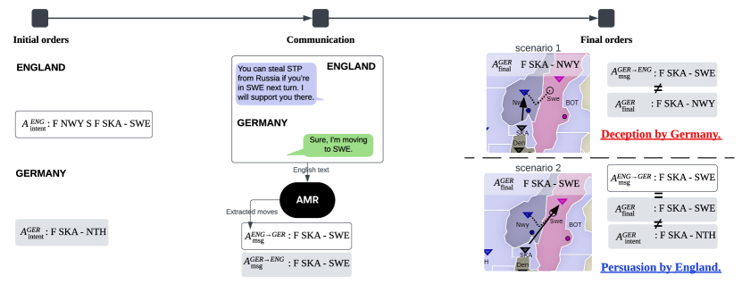
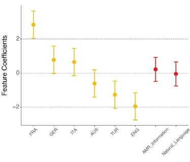
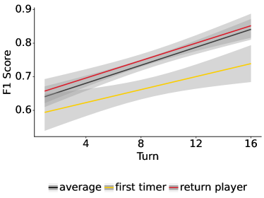
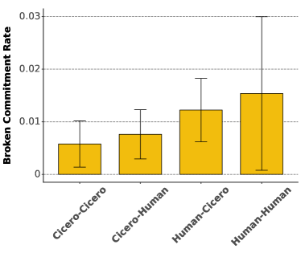
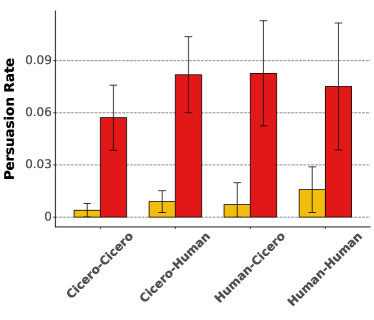
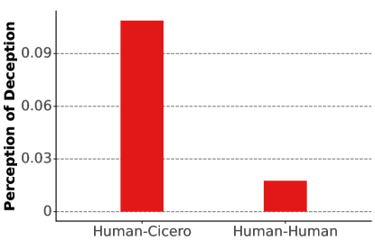
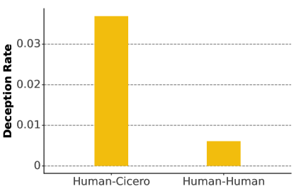
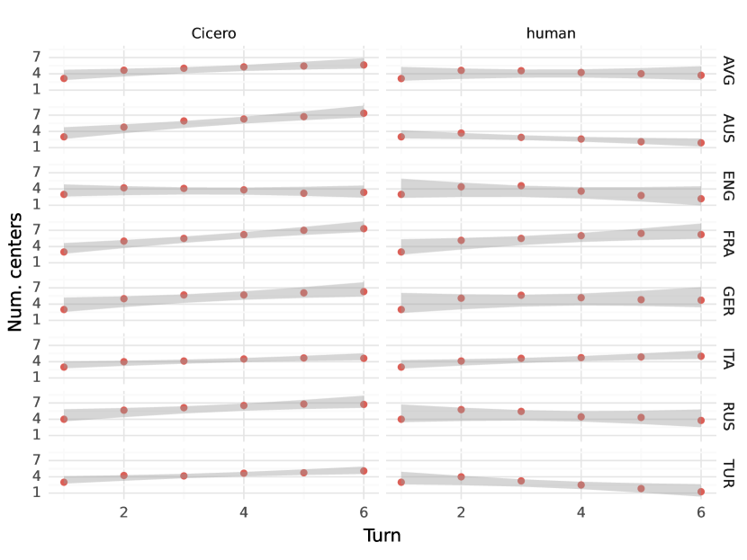

# More Victories, Less Cooperation: Assessing Cicero’s Diplomacy Play

###### Abstract

The boardgame Diplomacy is a challenging setting for communicative and cooperative artificial intelligence. The most prominent communicative Diplomacy ai, Cicero, has excellent strategic abilities, exceeding human players. However, the best Diplomacy players master communication, not just tactics, which is why the game has received attention as an ai challenge. This work seeks to understand the degree to which Cicero succeeds at communication. First, we annotate in-game communication with abstract meaning representation to separate in-game tactics from general language. Second, we run two dozen games with humans and Cicero, totaling over 200 human-player hours of competition. While ai can consistently outplay human players, ai–Human communication is still limited because of ai’s difficulty with deception and persuasion. This shows that Cicero relies on strategy and has not yet reached the full promise of communicative and cooperative ai.  

\xpatchcmd\@setref
?reference?  

More Victories, Less Cooperation: Assessing Cicero’s Diplomacy Play  

  

    Wichayaporn Wongkamjan1       Feng Gu1       Yanze Wang4       Ulf Hermjakob4  Jonathan May4       Brandon M. Stewart2       Jonathan K. Kummerfeld3  Denis Peskoff2       Jordan Lee Boyd-Graber1  1University of Maryland       2Princeton University       3University of Sydney  4Information Sciences Institute, University of Southern California  [{wwongkam,fgu1}@umd.edu](mailto:%7Bwwongkam,fgu1%7D@umd.edu)       [{yanzewan,ulf,jonmay}@isi.edu](mailto:%7Byanzewan,ulf,jonmay%7D@isi.edu)  [bms4@princeton.edu](mailto:bms4@princeton.edu)    [jonathan.kummerfeld@sydney.edu.au](mailto:jonathan.kummerfeld@sydney.edu.au)  [dp2896@princeton.edu](mailto:dp2896@princeton.edu)    [jbg@umiacs.umd.edu](mailto:jbg@umiacs.umd.edu)    

  

## 1 Diplomacy Requires Communication

In a landmark paper, Bakhtin et al. ([2022](#bib.bib4)) introduce Cicero, an ai that plays the game Diplomacy. The Washington Post claims “the model is adept at negotiation and trickery” Verma ([2022](#bib.bib53)), Forbes asserts “Cicero was able to pass as a human player” (Porterfield, [2022](#bib.bib41)), and even the scientific publication’s editor states ai “mastered Diplomacy” (Bakhtin et al., [2022](#bib.bib4)). This work tests those popular perceptions to rigorously evaluate the communicative and strategic capabilities of Cicero. Our observations lead to insights about the current state of cooperation and communication in ai, highlighting its deceptive and persuasive characteristics.  

While Cicero plays strategically and with a verisimilitude of human communication, the evaluation in Bakhtin et al. ([2022](#bib.bib4)) focuses only on if Cicero wins games. As the name implies, Diplomacy is revered by its devotees as a game of nuanced negotiation (Kraus and Lehmann, [1995](#bib.bib28)), convincing persuasion, and judicious betrayal. We argue that *mastering* Diplomacy requires these communicative skills (Section [2](#S2 "2 Diplomacy as Human-AI Communication Test Bed ‣ More Victories, Less Cooperation: Assessing Cicero’s Diplomacy Play")). Measuring persuasion, deception, and cooperation are open problems with no clear solution. A boardgame constrains the world of actions to make these measurements feasible. One contribution of this paper is to build measurements of these communicative skills and to evaluate the true state of ai play in Diplomacy.  

However, a technical challenge to identifying persuasion and deception is mapping from communication to in-game actions (e.g., verifying that I follow through on a promise of helping you): persuasion uses words to convince someone to do something, and deception is saying something to alter another’s belief Chisholm and Feehan ([1977](#bib.bib10)). In both cases, we map and contrast communication to agents’ actions.  

To enable this mapping, we annotate messages from human games with abstract meaning representation (amr, Banarescu et al., [2013](#bib.bib7)), which we use to train a grounded system to infer the goals of Diplomacy players (Section [3](#S3 "3 Grounding Messages Into Intentions ‣ More Victories, Less Cooperation: Assessing Cicero’s Diplomacy Play")). After validating we can extract communicative intents, we use these representations to identify persuasion and deception (Section [4](#S4 "4 Promises Made, Promises Kept, and Finding Dirty Lies ‣ More Victories, Less Cooperation: Assessing Cicero’s Diplomacy Play")). We then remove some of Cicero’s communicative ability: this does not impair its ability to win games.  

We then test Cicero’s skills in games against humans (Section [5](#S5 "5 Comparing Cicero to Humans ‣ More Victories, Less Cooperation: Assessing Cicero’s Diplomacy Play")) while asking players to annotate if they think other players are an ai and if a message is a lie. Confirming earlier work, Cicero wins nearly every game, including against top players. However, our new annotations provide a counterargument to the prevailing view that Cicero has mastered the communicative aspect of the game that is the priority of the nlp community. Cicero plays “differently”; humans can reliably identify Cicero and it is less deceptive and persuasive to human players. Communication from Cicero is more transactional, relying on its optimal strategy rather than the alliance building which is the hallmark of top human players. Cicero has yet to prove effective in the communication skills which are crucial to achieving goals in strategic games and real life.  

In Section [7](#S7 "7 Conclusion and Future Work ‣ More Victories, Less Cooperation: Assessing Cicero’s Diplomacy Play"), we discuss what it would take for a computer to truly master Diplomacy and how Diplomacy’s intrinsic persuasion and deception can improve computers’ ability to not just talk like a human but to realistically tie words to actions.  

## 2 Diplomacy as Human-AI Communication Test Bed

Diplomacy is a strategic board game that combines negotiation and strategy, where players take on the roles of various European powers (nations) on the eve of World War I. The essence of the game lies in forming and betraying alliances to control territories, requiring adept diplomacy (hence the name of the game) and strategic planning. Some players focus on aggressive tactical decisions, while others focus on making alliances, communicating, and collaborating with others for better outcomes Pulsipher ([1982](#bib.bib42)). The goal of the game is to capture territory, board regions called supply centers: once you capture enough of these supply centers, you win the game.  

The charm and challenge of Diplomacy messages is that players are free to talk about anything, either strategy-related or not. Most messages in Diplomacy are about (1) past, current, and future turns, (2) alliance negotiations, and (3) acquiring and sharing third-party information such as, “Did Turkey talk to you?”, “I can’t believe you attacked Russia in SEV.” A few messages are (4) non-Diplomacy conversation, e.g. ‘How are you today?”  

[FIGURE S2.F1.g1]

Figure 1: Our goal is to detect when players use persuasion and deception and compare human players to Cicero. First, we retrieve initial orders (left), then extract
moves from natural language communication (middle) through amr
 (Section [3](#S3 "3 Grounding Messages Into Intentions ‣ More Victories, Less Cooperation: Assessing Cicero’s Diplomacy Play")), and
later detect deception and persuasion
(Section [4](#S4 "4 Promises Made, Promises Kept, and Finding Dirty Lies ‣ More Victories, Less Cooperation: Assessing Cicero’s Diplomacy Play")) conditioning initial intents and
final orders (right). We show two possibilities: (top)
Germany breaks its commitment to England by moving to Norway
instead of Sweden, and (bottom) England successfully persuades
Germany if Germany moves its unit to Sweden as England suggests
and this move is not in Germany’s initial orders.
[/FIGURE]

Communication in Diplomacy is attractive to academic researchers because it can be linguistically and cognitively complex, but is grounded in a constrained world with well-defined states and dynamics.111Diplomacy without communication, sometimes called “gunboat” has been studied with rule-based, rl, and other approaches (as we detail in more depth in Appendix [A](#A1 "Appendix A Background: Gunboat Diplomacy ‣ More Victories, Less Cooperation: Assessing Cicero’s Diplomacy Play")). We limit gunboat discussion here as our focus is on the *communicative* aspect of the game.  The Diplomacy ai Development Environment (Rose and Norman, [2002](#bib.bib43), daide) is a structured syntax for ai agents to play Diplomacy: create alliances, suggest moves, etc. Several agents have used this stripped-down communicative environment: Albert van Hal ([2009](#bib.bib52)), SillyNegoBot Polberg et al. ([2011](#bib.bib40)), DipBlue Ferreira et al. ([2015](#bib.bib17)), inter alia. Unlike these agents, Cicero Bakhtin et al. ([2022](#bib.bib4)) uses a large language model to enable free-form *English* communication, enabling “normal” play with humans. Cicero excelled in an online Diplomacy league, scoring over twice the average of human participants and ranking in the top 10% among those who played multiple games. In the original work, it is unclear if Cicero’s success is due to its use of natural language or its strategic model. In our Human–Cicero studies, we ask that participants annotate messages they perceive as deceptive, allowing us to more carefully study the communicative aspects of the game (more details are in Section [5](#S5 "5 Comparing Cicero to Humans ‣ More Victories, Less Cooperation: Assessing Cicero’s Diplomacy Play")).  

### 2.1 Diplomacy without Communication is not Diplomacy

Having discussed the basics of Diplomacy, we now turn to what makes the game unique. Because the game is relatively balanced between seven players at the start, players need to form alliances if they hope to gain an advantage. However, these alliances should be mutually beneficial; from a player’s perspective, they need to advocate for cooperation that benefits themselves. This requires effective *persuasion* Cialdini ([2000](#bib.bib11)): making appeals to scarcity, reciprocity Kramár et al. ([2022](#bib.bib27)), unity, or shared norms. This is a communicative task which involves social and emotional skill: picking the right moves and convincing other players to help them.  

However, the ultimate goal of Diplomacy is for *individual* players to win the game. This means that alliances will fall apart, leading to *deception* Peskov et al. ([2020](#bib.bib39)) as part of a betrayal Niculae et al. ([2015](#bib.bib37)). Because a player might benefit from a victim thinking that they are working together, a betrayer often sets up the tactical conditions for a betrayal while obfuscating their goals through cleverly composed deceptive messages (even if not outright lies).  

Because deception and betrayal are communicative acts both necessary for mastering and enjoying Diplomacy and grounded in the state of the game, the next sections develop tools to detect when they happen. This will allow us to measure whether ai agents like Cicero have mastered both tactics and communication.  

## 3 Grounding Messages Into Intentions

Consider this in-game statement made by England to Germany about a specific move-set (glosses added to locations):  

> You can steal STP [St. Petersburg] from Russia if you’re in SWE [Sweden] next turn. I will support you there.

We want to be able to tell if the speaker is lying (e.g., they’re going to do something else instead of what they claim they’re going to do) and if the speaker has convinced the recipient to alter their actions. This is necessary to measure how effectively Cicero communicates in the game.  

While we know the intended *actions* of players when they submit their moves, we need to see how those moves match up to their *communications* in the discussion period before they submit moves (Figure [1](#S2.F1 "Figure 1 ‣ 2 Diplomacy as Human-AI Communication Test Bed ‣ More Victories, Less Cooperation: Assessing Cicero’s Diplomacy Play")). We use amr to build a machine-readable representation of the intent of actions in their communications. We are not starting from scratch: daide (Section [2](#S2 "2 Diplomacy as Human-AI Communication Test Bed ‣ More Victories, Less Cooperation: Assessing Cicero’s Diplomacy Play")) provides a set of predicates (ally, move, etc.) critical to Diplomacy communications. We thus focus on annotating these predicates that encode actions, allowing us to understand the *communicative intent* of messages, where speakers could say they will do something and follow through, or say they will do something and not follow through.  

Because not all information needed for annotation is in the raw message text, we further show human annotators who wrote the text (e.g., France, Germany), seasons (e.g., Spring 1901), and the current game state. This information is necessary to annotate “You can steal STP from Russia if you are in SWE this turn. I will support you there” in the earlier example so that the annotators can assume what unit would support and what unit would move into Sweden. In this case, England’s fleet in Norway supports a German fleet in Skagerrak to move into Sweden.  

### 3.1 Annotation

Like any specialized domain, Diplomacy has its unique vocabulary. Taking the above statement as an example, we extend the amr vocabulary to include not only abbreviations, such as “SWE” for Sweden, but also verbs like “threaten” and “demilitarize” (to set up a demilitarized zone), as well as to describe actions like gaining, holding, or losing provinces, especially supply centers (“SC”), which are equivalent to points and integral to winning the game.   In contrast to standard amr annotation, where every sentence is fully annotated, Diplomacy amr annotation sometimes involves only partial or no annotation for certain utterances, depending on their relevance to gameplay strategies like forming alliances or making moves, exemplified by amr concepts such as ally-01, move-01, and attack-01 (the full extended vocabulary introduction in Appendix [B.1](#A2.SS1 "B.1 AMR Annotation ‣ Appendix B AMR ‣ More Victories, Less Cooperation: Assessing Cicero’s Diplomacy Play")).  

In a preliminary annotation phase, we have Diplomacy experts annotate sentences from Peskov et al. ([2020](#bib.bib39)) to train human annotators and refine the Diplomacy Appendix of the amr Annotation Dictionary. We annotate 8,878 utterances (ranging from a word to several sentences). 4,412 of those utterances are annotated as empty amrs (e.g. for “Lemme think about your idea”) indicating no in-game move intent. 598 of the annotated amrs contain full information extracted from messages of Diplomacy games. The remaining 3,868 amrs contain 3,306 utterances with underspecified information such as units with missing type, location (Figure [A1](#A2.F1 "Figure A1 ‣ B.1 AMR Annotation ‣ Appendix B AMR ‣ More Victories, Less Cooperation: Assessing Cicero’s Diplomacy Play")), and nationality (Figure [A2](#A2.F2 "Figure A2 ‣ B.1 AMR Annotation ‣ Appendix B AMR ‣ More Victories, Less Cooperation: Assessing Cicero’s Diplomacy Play")), as well as 562 agreements with a missing object. Many utterances contain underspecified information, as Diplomacy players often communicate with messages that lack specific details (which are implicit and can be inferred from the game state).  The annotated amr corpus is further used for training our English-to-amr parser to extract communicative intent information from utterances.  

### 3.2 Training a Parser to Detect Intentions

We use a sequence-to-sequence model Jascob ([2023](#bib.bib23)) fine-tuned on the amr 3.0 dataset Knight et al. ([2020](#bib.bib26)) as the baseline model to detect communicative intent in new conversations. Following other amr work, we report parsing accuracy via the widely-used smatch score Cai and Knight ([2013](#bib.bib9)). We divide the annotated corpus into 5,054 training, 1,415 validation and 2,354 test sentences, where each sentence is in the train / validation / test folds, split by game (Peskov et al., [2020](#bib.bib39)).  

We improve the model, starting from a baseline version without fine-tuning with smatch of 22.8. Our domain-tuned model using Diplomacy-amr improves smatch by 39.1, to 61.9. Adding data augmentation into the model (e.g., knowing the sender of a message is England and the recipient is Germany) improves smatch to 64.6. Adding separate encodings for this information further improves smatch by 0.8 (65.4). Additionally, we apply data processing to replace (1) pronouns with country names and (2) provinces in abbreviations with full names, which increases smatch to 66.6 (More parser details in Appendix [B.2](#A2.SS2 "B.2 AMR Parser ‣ Appendix B AMR ‣ More Victories, Less Cooperation: Assessing Cicero’s Diplomacy Play")). This parser enables us to evaluate the role that communication has in Cicero’s capabilities.  

### 3.3 Does Cicero need to Talk to Itself to Win?

The first question is whether communication matters in games with other Cicero agents (deferring the question of competition with humans to later sections). We have Cicero variants with different levels of communication abilities—ranging from “gunboat” without any messages (Appendix [A](#A1 "Appendix A Background: Gunboat Diplomacy ‣ More Victories, Less Cooperation: Assessing Cicero’s Diplomacy Play")) to full Natural Language capabilities—play each other and evaluate the results.  

For the seven Cicero variants in each game, we randomly select three to have communicative ability; the remaining four play communication-less “gunboat.” The selected three communicative powers have the same communication level. We define a set of communication levels, from more communicative to less communicative: {itemize\*}  

Natural Language: the Cicero agent of Bakhtin et al. ([2022](#bib.bib4)) with full natural language  

amr: only messages about game actions (i.e. those that are parsed by amr) go through, allowing the agents to coordinate game actions (Appendix [B.1](#A2.SS1 "B.1 AMR Annotation ‣ Appendix B AMR ‣ More Victories, Less Cooperation: Assessing Cicero’s Diplomacy Play"))  

Random: a random message from a corpus of previous Diplomacy games is sent,222We match the assigned power of the sender and receiver and the year, which makes the message slightly more convincing (but unlikely to be consistent with the game state). mimicking form without content.  Cicero plays 180 games with itself; 60 games for each communication level. In each game, we stop after 14 movement turns with 10 minutes of communication for each turn. We randomly select which power the agents are assigned to, so power distribution is balanced.   

We measure performance by the number of supply centers (and thus how well the agent played the game, Appendix [B.3](#A2.SS3 "B.3 Assessing the Role of Communication in Cicero vs. Cicero Games ‣ Appendix B AMR ‣ More Victories, Less Cooperation: Assessing Cicero’s Diplomacy Play")). Consistent with our hypothesis that performance is driven by tactics, the gains Cicero gets from communication is substantially smaller than the gains from playing a stronger power (Figure [2](#S3.F2 "Figure 2 ‣ 3.3 Does Cicero need to Talk to Itself to Win? ‣ 3 Grounding Messages Into Intentions ‣ More Victories, Less Cooperation: Assessing Cicero’s Diplomacy Play")): Playing as France (fra) yields an expected 2.8 additional supply centers (2.0–3.6 95% interval) compared to the median power Russia (rus). In contrast, the best language condition amr only yielded an expected 0.2 additional supply centers (-0.5–0.9 95% interval). In other words, the effect of choosing the best power over the median power is 14 times larger than the best communication strategy.  This is consistent with prior findings (Sharp, [1978](#bib.bib47)) that France is the easiest power to play and our other findings that Cicero’s communicative ability plays no clear role in its win rate.  

To better understand what Cicero is using communication for, we build on our amr representations to capture intent in the next section.  

[FIGURE S3.F2.g1]

Figure 2: Power assignment is strongly predictive of Cicero performance as measured by supply center gains. Coefficients (with 95% confidence intervals) from a linear regression with Random Message/Russia as a baseline, show that the effect of choosing the effect of changing language systems is trivial compared to changing powers.
[/FIGURE]

## 4 Promises Made, Promises Kept, and Finding Dirty Lies

In the example from the previous section (Figure [1](#S2.F1 "Figure 1 ‣ 2 Diplomacy as Human-AI Communication Test Bed ‣ More Victories, Less Cooperation: Assessing Cicero’s Diplomacy Play")), England says that it would support Germany’s move into Sweden from the Skagerrak Sea, while Germany agrees with the proposal from England. What does it mean for these to be deceptive or persuasive?  

The geopolitical definition of deception is to manipulate adversaries’ perceptions to gain strategic advantage (Daniel and Herbig, [1982](#bib.bib13)), e.g., Germany alters England’s belief so that England would do an action that benefits Germany (i.e. Germany has a better chance of ending up with higher score). However, evaluating deception is challenging because it requires estimating the differences in England’s beliefs before and after Germany deceives England. Therefore, we break down a broader, amorphous concept into easier-to-handle concepts and leave broader deception to future work. The first subconcept is breaking of a commitment (Kramár et al., [2022](#bib.bib27)): someone saying they will do something and not following through. In the example, if Germany commits to moving to Sweden but later attacks England in Norway, this will be detected as a broken commitment.  

The second subconcept is lying: human players in games with Cicero annotate messages their messages as either truthful or deceptive. We build on Peskov et al. ([2020](#bib.bib39)), who define deception to players thusly: “Typically, when [someone] lies [they] say what [they] know to be false in an attempt to deceive the listener.” Again, deception is broader than lying (and there are top Diplomacy players who intentionally deceive while never outright saying anything untrue), and our definition of deception is slightly broader than Peskov et al. ([2020](#bib.bib39)). In our more permissive annotations, human players mark interactions that are broken commitments, lies about other players, hedging about the state of alliances, and anything else that they feel is deceptive. Despite this ontological uncertainty, for convenience, we refer to the process of humans annotating messages as “human lie annotations” for consistency with Peskov et al. ([2020](#bib.bib39)). To recap: a broken commitment can be a lie and an example of deception.333Technically, not all broken commitments are lies: it could be an honest mistake. It’s also possible that a player says that they “typed in their order wrong, sorry!” which is a lie to cover up (Daniel and Herbig, [1982](#bib.bib13)) a broken commitment as part of a broader deception strategy. Likewise, not all lies are broken commitments, but both breaking a commitment and lying are facets of deception. While we cannot capture all deception—because it is based on internal state—it is important to capture as much as we can to measure how important it is to playing Diplomacy well.  

Specifically, Cicero’s ability (or inability) to decieve or persuade has never been empirically measured, so we build on the amr parser of the previous section to detect broken commitment and persuasion. As we discuss in Section [3.2](#S3.SS2 "3.2 Training a Parser to Detect Intentions ‣ 3 Grounding Messages Into Intentions ‣ More Victories, Less Cooperation: Assessing Cicero’s Diplomacy Play"), this is not perfect, but it has good coverage when players discuss their intentions. First, we parse English messages to amr structures, for which we define actions that the speaker intends to do, e.g. we can extract Germany’s communicative intent (F SKA - SWE) when Germany agrees with England that they will move to Sweden (middle, Figure [1](#S2.F1 "Figure 1 ‣ 2 Diplomacy as Human-AI Communication Test Bed ‣ More Victories, Less Cooperation: Assessing Cicero’s Diplomacy Play")). We also define orders players submit before any communication as initial intents and final orders as orders that players submit when the turn ends.  

Using initial intents, communicative intent, and final orders, we can now define broken commitment and persuasion. For a broken commitment, we say that Germany violates a commitment with England if Germany verbally agrees to move to Sweden but actually attacks England in Norway (Deception by Germany, Figure [1](#S2.F1 "Figure 1 ‣ 2 Diplomacy as Human-AI Communication Test Bed ‣ More Victories, Less Cooperation: Assessing Cicero’s Diplomacy Play")). Breaking a commitment may result when an intent changes but is not communicated. For example, Germany agrees with England to move to Sweden but instead moves to Denmark to defend against France without informing England. Although this may not involve deceptive intent, we still consider it deception because it alters the listener’s beliefs and affects decision-making. For instance, England might decide to support Germany based on their agreement. For persuasion, England’s request is considered persuasive if Germany moves to Sweden, as England suggests, instead of Germany’s original plan to move to the North Sea (Persuasion by England, Figure [1](#S2.F1 "Figure 1 ‣ 2 Diplomacy as Human-AI Communication Test Bed ‣ More Victories, Less Cooperation: Assessing Cicero’s Diplomacy Play")).   We describe each of these more formally in this section.  

### 4.1 Broken commitment

We define broken commitment in Diplomacy when a player $i$ commits to doing an action $a^{i\to j}_{\text{msg}}$ and does not do it. In other words, given a set of final orders $\mathbf{A}^{i}_{\text{final}}$ from player $i$, if $a^{i\to j}_{\text{msg}}\notin\mathbf{A}^{i}_{\text{final}}$, then this is a broken commitment, i.e.,  

|  | $$\text{BC}(a^{i\to j}_{\text{msg}},\mathbf{A}^{i}_{\text{final}})=\begin{cases}1,&\text{if }a^{i\to j}_{\text{msg}}\notin\mathbf{A}^{i}_{\text{final}}\\ 0,&\text{otherwise.}\end{cases}$$ |  | (1) |
| --- | --- | --- | --- |

Note that a player $i$ agreeing to player $j$’s proposal to do action $a^{i\to j}_{\text{msg}}$ is equivalent to directly committing to doing that action.  

### 4.2 Persuasion

Broken commitment is in some ways easier to detect than persuasion, as we are only comparing a spoken intent to a final action. Persuasion is more difficult because we must discover initial intents, then compare them to communication *and* to final moves.  

Because we want to be able to measure persuasion for both humans and for Cicero, we need comparable representations of initial intents for both. Thankfully, Cicero’s architecture uses a conditional language model (Bakhtin et al., [2022](#bib.bib4), Equation S2, section D.2) that generates its natural language messages given a set of moves (e.g., France internally decides it will do F MAO - POR, A BUR - MAR and A MAR - PIE) and then its messages reflect those *intents*. We directly use this set of intents from Cicero as initial intents in the persuasion detection. For humans, we explicitly ask all players to provide their planned moves (i.e., the same information that Cicero uses in its internal representation) before the negotiation turn begins (Section [5](#S5 "5 Comparing Cicero to Humans ‣ More Victories, Less Cooperation: Assessing Cicero’s Diplomacy Play")). In other words, we ask humans to directly input their intent, unlike Cicero, where we log its computational intent.  

Persuasion happens when player $i$ talks to player $j$, suggests an action $a^{i\to j}_{\text{msg}}$, and then player $j$ makes a set of final orders $\mathbf{A}^{j}_{\text{final}}$ that is different from their initial intents $\mathbf{A}^{j}_{\text{intent}}$. In other words, player $j$ is persuaded by player $i$ if they commit an action suggested by player $i$, $a^{i\to j}_{\text{msg}}\in\mathbf{A}^{j}_{\text{final}}$ that was not player $j$’s initial intent $a^{i\to j}_{\text{msg}}\notin\mathbf{A}^{j}_{\text{intent}}$. We define persuasion $\text{Per}(\mathbf{A}^{j}_{\text{intent}},a^{i\to j}_{\text{msg}},\mathbf{A}^{j}_{\text{final}})$  

|  | $$=\\ \begin{cases}1,&\begin{aligned} &\text{if }a^{i\to j}_{\text{msg}}\in\mathbf{A}^{j}_{\text{final}}\\ &\text{and }a^{i\to j}_{\text{msg}}\notin\mathbf{A}^{j}_{\text{intent}},\end{aligned}\\ 0,&\text{otherwise.}\end{cases}$$ |  | (2) |
| --- | --- | --- | --- |

## 5 Comparing Cicero to Humans

[TABLE S5.T1]

<table class="ltx_tabular ltx_centering ltx_guessed_headers ltx_align_middle">
<thead class="ltx_thead">
<tr class="ltx_tr">
<th class="ltx_td ltx_th ltx_th_row ltx_border_t"></th>
<th class="ltx_td ltx_align_right ltx_th ltx_th_column ltx_border_t">Cicero</th>
<th class="ltx_td ltx_align_right ltx_th ltx_th_column ltx_border_t">Human</th>
<th class="ltx_td ltx_align_right ltx_th ltx_th_column ltx_border_t">Total</th>
</tr>
</thead>
<tbody class="ltx_tbody">
<tr class="ltx_tr">
<th class="ltx_td ltx_align_left ltx_th ltx_th_row ltx_border_t">Players</th>
<td class="ltx_td ltx_align_right ltx_border_t">99</td>
<td class="ltx_td ltx_align_right ltx_border_t">69</td>
<td class="ltx_td ltx_align_right ltx_border_t">168</td>
</tr>
<tr class="ltx_tr">
<th class="ltx_td ltx_align_left ltx_th ltx_th_row">Messages</th>
<td class="ltx_td ltx_align_right">20270</td>
<td class="ltx_td ltx_align_right">7395</td>
<td class="ltx_td ltx_align_right">27665</td>
</tr>
<tr class="ltx_tr">
<th class="ltx_td ltx_align_left ltx_th ltx_th_row">      annotated as lie</th>
<td class="ltx_td ltx_align_right">-</td>
<td class="ltx_td ltx_align_right">318</td>
<td class="ltx_td ltx_align_right">318</td>
</tr>
<tr class="ltx_tr">
<th class="ltx_td ltx_align_left ltx_th ltx_th_row">      perceived as lie</th>
<td class="ltx_td ltx_align_right">-</td>
<td class="ltx_td ltx_align_right">1167</td>
<td class="ltx_td ltx_align_right">1167</td>
</tr>
<tr class="ltx_tr">
<th class="ltx_td ltx_align_left ltx_th ltx_th_row ltx_border_b">Intents</th>
<td class="ltx_td ltx_align_right ltx_border_b">2632</td>
<td class="ltx_td ltx_align_right ltx_border_b">1328</td>
<td class="ltx_td ltx_align_right ltx_border_b">3960</td>
</tr>
</tbody>
</table>

Table 1: Overall statistics of Diplomacy dataset that we collect across 24 Human-Cicero games, including (1) number of human players and number of times Cicero plays, (2) total messages sent by humans and Cicero, (3) lies annotation where humans send lies and perceived as lies (4) total initial intents from Cicero and humans
[/TABLE]

Cicero has strong strategic abilities and is relatively cooperative towards other players (Section [3.3](#S3.SS3 "3.3 Does Cicero need to Talk to Itself to Win? ‣ 3 Grounding Messages Into Intentions ‣ More Victories, Less Cooperation: Assessing Cicero’s Diplomacy Play")), but it is unclear whether Cicero can achieve human-level gameplay in both tactics and communication. Having defined the aspects of communication that we argue are important for mastering Diplomacy, we want to investigate communication and cooperation between Cicero and humans. Specifically, we want to answer: {enumerate\*}  

Can Cicero persuade humans?  

How deceptive is Cicero compared to humans?  

Can Cicero pass as a human?  

We adapt the game engine created by Paquette et al. ([2019](#bib.bib38)) and introduce additional measures to the interface to help us answer these questions. To measure if human players are persuaded, we record their moves before communication starts ($\mathbf{A}^{i}_{\text{intent}}$ in Equation [2](#S4.E2 "In 4.2 Persuasion ‣ 4 Promises Made, Promises Kept, and Finding Dirty Lies ‣ More Victories, Less Cooperation: Assessing Cicero’s Diplomacy Play")). Following Peskov et al. ([2020](#bib.bib39)), humans annotate every message that they receive or send: they annotate each outgoing message for whether it is a lie (truth/lie/neutral options), and they annotate each incoming message for whether they perceive it as a lie (truth/lie options). While Bakhtin et al. ([2022](#bib.bib4)) asked ex post facto if any opponents were a computer, we inform players before play that there is a computer and we ask human players their guess of the humanity of each opposing power.  

There are two to four human players per game, totaling 69 over all 24 games.444 We recruit players from Diplomacy forums and we pay at least $70 per game, which lasts approximately three hours. We do not collect demographic information.  Games typically finish after fourteen movement turns, where each movement turns is limited to a brisk ten minutes. There are two to four human players per game, and Cicero fills any remaining slots. The game setup differs from Meta’s Cicero study: players in this study know *a priori* that they are playing a bot. In total, we collect 27,665 messages from communication between humans and Cicero (Table [1](#S5.T1 "Table 1 ‣ 5 Comparing Cicero to Humans ‣ More Victories, Less Cooperation: Assessing Cicero’s Diplomacy Play")).  

[TABLE S5.T2]

<table class="ltx_tabular ltx_guessed_headers ltx_align_middle">
<tbody class="ltx_tbody">
<tr class="ltx_tr">
<td class="ltx_td ltx_border_t"></td>
<th class="ltx_td ltx_align_center ltx_th ltx_th_column ltx_border_t">AUS</th>
<th class="ltx_td ltx_align_center ltx_th ltx_th_column ltx_border_t">ENG</th>
<th class="ltx_td ltx_align_center ltx_th ltx_th_column ltx_border_t">FRA</th>
<th class="ltx_td ltx_align_center ltx_th ltx_th_column ltx_border_t">GER</th>
<th class="ltx_td ltx_align_center ltx_th ltx_th_column ltx_border_t">ITA</th>
<th class="ltx_td ltx_align_center ltx_th ltx_th_column ltx_border_t">RUS</th>
<th class="ltx_td ltx_align_center ltx_th ltx_th_column ltx_border_t">TUR</th>
</tr>
<tr class="ltx_tr">
<td class="ltx_td ltx_align_center ltx_border_t">Human</td>
<td class="ltx_td ltx_align_center ltx_border_t">1.0</td>
<td class="ltx_td ltx_align_center ltx_border_t">2.4</td>
<td class="ltx_td ltx_align_center ltx_border_t">6.7</td>
<td class="ltx_td ltx_align_center ltx_border_t">4.7</td>
<td class="ltx_td ltx_align_center ltx_border_t">3.9</td>
<td class="ltx_td ltx_align_center ltx_border_t">3.3</td>
<td class="ltx_td ltx_align_center ltx_border_t">1.1</td>
</tr>
<tr class="ltx_tr">
<td class="ltx_td ltx_align_center ltx_border_b">Cicero</td>
<td class="ltx_td ltx_align_center ltx_border_b">7.9</td>
<td class="ltx_td ltx_align_center ltx_border_b">3.8</td>
<td class="ltx_td ltx_align_center ltx_border_b">7.7</td>
<td class="ltx_td ltx_align_center ltx_border_b">6.3</td>
<td class="ltx_td ltx_align_center ltx_border_b">4.1</td>
<td class="ltx_td ltx_align_center ltx_border_b">5.5</td>
<td class="ltx_td ltx_align_center ltx_border_b">6.9</td>
</tr>
</tbody>
</table>

Table 2: Cicero strategically plays Diplomacy better than humans, where humans have fewer supply centers compared to Cicero when playing with the same power assignments. We calculate the number of supply centers by the end of the game by averaging the results for human players and Cicero.
[/TABLE]

Cicero nearly always wins. Of twenty-four games, Cicero won twenty (84%), which strongly suggests that Cicero has super-human strategy. On average, Cicero has more supply centers than human players by the end of the game (Table [2](#S5.T2 "Table 2 ‣ 5 Comparing Cicero to Humans ‣ More Victories, Less Cooperation: Assessing Cicero’s Diplomacy Play")). Humans are about as good as Cicero when playing powers that require careful coordination of actions, such as Italy, which needs to manage both fleets and armies. However, when playing powers that require less coordination, such as Austria with its limited coastline, the gap in supply center counts between human players and Cicero is larger (see breakdown by power in Appendix Figure [A5](#A4.F5 "Figure A5 ‣ Appendix D Survey Details ‣ More Victories, Less Cooperation: Assessing Cicero’s Diplomacy Play")); England is the only power where Cicero’s average supply center count does not increase.  

Human players can reliably (but not perfectly) identify the bot.  We calculate the average $F$-score of identification by turn (Figure [3](#S5.F3 "Figure 3 ‣ 5 Comparing Cicero to Humans ‣ More Victories, Less Cooperation: Assessing Cicero’s Diplomacy Play")). By the end of the first movement turn, human players have an average $F$-score of 0.58, which keeps increasing until the end of the game. At game end, the average $F$-score is 0.81. Even for players in their first game against Cicero, the average $F$-score reaches 0.77. Players who previously played against Cicero at least once are better at identifying it. This suggests that Cicero can no longer pass as human once humans are aware of the possible existence of such agents.  

[FIGURE S5.F3.g1]

Figure 3: Returning players (those who previously played against Cicero at least once) are better at correctly identifying other players as Cicero compared to first-time players. $F$-scores are presented for first-timers, returning players, and the average for all players, with smoothing via local regression Cleveland ([1979](#bib.bib12)).
[/FIGURE]

### 5.1 Lies annotation

This section analyzes players’ deliberate lies in sent messages and perceived lies in received messages. Because Cicero sends more messages than humans, we normalize perceived lies by the number of messages that humans receive from Cicero and humans (6,960 and 2,276), while we normalize results of deliberate lies by the number of total messages that humans send.  

Humans feel that Cicero lies more often.  Humans perceive 14.4% of the 6,960 messages they receive from Cicero as lies (which is 1,005 messages, Figure [A3](#A2.F3 "Figure A3 ‣ B.1 AMR Annotation ‣ Appendix B AMR ‣ More Victories, Less Cooperation: Assessing Cicero’s Diplomacy Play")). In contrast, they perceive only 7.1% of the messages from other humans as lies (which is 162 out of 2,276 messages). In the survey (detailed in Appendix [D](#A4 "Appendix D Survey Details ‣ More Victories, Less Cooperation: Assessing Cicero’s Diplomacy Play")), players also think humans communicate more transparently than Cicero. However, humans are not good at detecting lies. Within 2,276 Human-Human messages; humans can correctly identify five lies (0.2%), suggesting a small overlap between actual lies and perceived lies.   

[FIGURE S5.F4.g1]

Figure 4: Though Cicero was perceived to lie more, we detect more broken commitments from humans.
Each bar chart is the broken commitment rate (Equation [1](#S4.E1 "In 4.1 Broken commitment ‣ 4 Promises Made, Promises Kept, and Finding Dirty Lies ‣ More Victories, Less Cooperation: Assessing Cicero’s Diplomacy Play")) labeled by sender and reciever: Cicero breaks commitment with Cicero, Cicero breaks commitment with Human, Human breaks commitment with Cicero, and Human breaks commitment with Human. Error bars represent $\pm$ one standard deviation over twenty-four games.
[/FIGURE]

Humans return the favor by saying they lie to Cicero more often. Over 7,395 messages that humans sent out, 273 of these are purposeful lies to Cicero (3.7%), while there are only forty-five lie messages to other human players (0.6%). This reflects that humans strategically lie more often to Cicero while believing that Cicero does not hold grudges.   

### 5.2 Detection

After validating our automatic metrics, we compare human and computer deception and persuasion.  

Our broken commitment and persuasion detection is relatively effective. To ensure that our detection is good enough, we sample around 4800 messages for an accuracy study (Table [A1](#A2.T1 "Table A1 ‣ B.4 Future experiments: AMR information Cicero ‣ Appendix B AMR ‣ More Victories, Less Cooperation: Assessing Cicero’s Diplomacy Play")). Broken commitment detection has a precision of 0.51 and a recall of 0.71. Our precision is lower than our expectation due to errors in parsing a complex English to amr *and* a definition that only detects commitments at a move level (Appendix [C](#A3 "Appendix C Deception detection limitations ‣ More Victories, Less Cooperation: Assessing Cicero’s Diplomacy Play")). The broken commitment can only detect when a move in a message $A^{i\to j}_{\text{msg}}$ and a final move$A^{i\to j}_{\text{final}}$ are not aligned. There are examples that cannot detect, e.g. an agreement to an alliance (Table [3](#S5.T3 "Table 3 ‣ 5.2 Detection ‣ 5 Comparing Cicero to Humans ‣ More Victories, Less Cooperation: Assessing Cicero’s Diplomacy Play")) or a long conversation before committing a deception (Table [A9](#A4.T9 "Table A9 ‣ Appendix D Survey Details ‣ More Victories, Less Cooperation: Assessing Cicero’s Diplomacy Play")). Accuracy for persuasion is better; precision rises to 0.81, and recall to 0.72.   

Broken commitments are inconsistent with the perceived lie annotations. Humans break commitments more frequently than Cicero (Figure [4](#S5.F4 "Figure 4 ‣ 5.1 Lies annotation ‣ 5 Comparing Cicero to Humans ‣ More Victories, Less Cooperation: Assessing Cicero’s Diplomacy Play")): Humans break commitments with Cicero 1.2% of the time (63 out of Human–Cicero 5,151 messages) and do so to other human players 1.5% of the time (35 out of Human–Human 2,276 messages). On the other hand, Cicero breaks commitments at a lower, consistent rate, deceiving humans 0.76% of the time and Cicero 0.57% of the time (53 out of 6,960 messages and 77 out of 13,319 messages, respectively).  

[TABLE S5.T3]

<table class="ltx_tabular ltx_guessed_headers ltx_align_middle">
<thead class="ltx_thead">
<tr class="ltx_tr">
<th class="ltx_td ltx_align_justify ltx_align_top ltx_th ltx_th_column ltx_border_t">

Sender

</th>
<th class="ltx_td ltx_align_justify ltx_align_top ltx_th ltx_th_column ltx_border_t">

Message

</th>
</tr>
</thead>
<tbody class="ltx_tbody">
<tr class="ltx_tr">
<td class="ltx_td ltx_align_justify ltx_align_top ltx_border_t">

Turkey

</td>
<td class="ltx_td ltx_align_justify ltx_align_top ltx_border_t">

Hey Italy! I think the I/T is the strongest alliance in the game, would you be interested in working together

</td>
</tr>
<tr class="ltx_tr">
<td class="ltx_td ltx_align_justify ltx_align_top">

Italy

</td>
<td class="ltx_td ltx_align_justify ltx_align_top">

Of course! As long as you don’t build too many fleets, I’m open to working with you against austria!

</td>
</tr>
</tbody>
</table>

Table 3: The broken commitment detector ($\text{BC}(\cdot)$) has its limitation where it cannot capture deception in alliance agreement when Italy (human) deceives Turkey (Cicero).
[/TABLE]

Humans are more persuasive. For persuasion to happen, we need first an *attempt*, initiated by a sender, and then *success* when the receiver adopts the suggestion. Both humans and Cicero on a per-message basis555Although because Cicero communicates more overall, humans attempt more times per game. try to persuade at the same rate (around 8% of the time, per Figure [5](#S5.F5 "Figure 5 ‣ 5.2 Detection ‣ 5 Comparing Cicero to Humans ‣ More Victories, Less Cooperation: Assessing Cicero’s Diplomacy Play")). The success rate of human persuasion is 21.1% at persuading other humans and 8.6% at persuading Cicero. Cicero is less persuasive; its success rate is only 10.9% in persuading humans and 7.0% in persuading other bots.   

In summary, humans are more deceptive and more persuasive than Cicero. Detection is possible, but defining a sequence of conversations as persuasion or deception is still difficult. Our reported numbers are low because both humans and Cicero engage in extensive back-and-forth discussions before making moves that can be definitively classified as persuasion or deception.  

[FIGURE S5.F5.g1]

Figure 5: Humans outpace Cicero in persuasive effectiveness. Humans have a higher persuasion success rate, which we measure by comparing the number of successful persuasions (yellow, left) to the total number of persuasion attempts (red, right). We analyze success rates across four groups: Cicero persuades Cicero, Cicero persuades Human, Human persuades Cicero, and Human persuades Human. Error bars represent the $\pm$ one standard deviation range from the aggregate of interactions in 24 games.
[/FIGURE]

## 6 Related Work

Large language models are becoming ubiquitous in many tasks: fact-checking (Lee et al., [2020](#bib.bib31), [2021](#bib.bib30)), text generation (Devlin et al., [2019](#bib.bib15); Brown et al., [2020](#bib.bib8); Touvron et al., [2023](#bib.bib51)) including coding (Roziere et al., [2023](#bib.bib44)). All of these tasks require users to trust models’ outputs. However, models are *not* always reliable; they could produce hallucinations or conflict with established facts (Ji et al., [2023](#bib.bib24); Zhang et al., [2023](#bib.bib59); Si et al., [2024](#bib.bib48); Yao et al., [2023](#bib.bib58)). To mitigate this, their outputs often need to be verified against datasets (Thorne et al., [2018](#bib.bib50); Wadden et al., [2020](#bib.bib54); Schuster et al., [2021](#bib.bib46); Guo et al., [2022](#bib.bib19)). Studies have used adversarial examples to expose weaknesses and to raise awareness (Eisenschlos et al., [2021](#bib.bib16); Schulhoff et al., [2023](#bib.bib45); Liu et al., [2023](#bib.bib34); Lucas et al., [2023](#bib.bib35)) To address the issue of unreliability, controllable LMs been proposed by having steps to inject facts for better reasoning (Adolphs et al., [2022](#bib.bib1)), or by prompting techniques, such as chain-of-thought prompting, to enhance reasoning abilities (Wei et al., [2022](#bib.bib55); Wu et al., [2022](#bib.bib56)). Moreover, some studies focus on ai-Generated misinformation (Zhou et al., [2023](#bib.bib60)), probing model to understand internal states when LLM utters truthful or false information (Azaria and Mitchell, [2023](#bib.bib3); Li et al., [2024](#bib.bib32)).  

Deception and persuasion are studied within social contexts. Huang and Wang ([2023](#bib.bib21))’s meta-analysis concludes ai can match humans in persuasion, and Deck ([2023](#bib.bib14)) attributes some of the success to the ability to generate “bullshit”, which are part of applications in marketing and public relations Hallahan et al. ([2007](#bib.bib20)).  

Part of what makes games like Diplomacy as an object of study appealing is the ongoing race between humans and computers in games (Kim et al., [2018](#bib.bib25)); initial work on the language of Diplomacy (Niculae et al., [2015](#bib.bib37)) unlocked follow-on work both in Diplomacy’s agreements (Kramár et al., [2022](#bib.bib27)) and in other games such as “The Resistance: Avalon” (Light et al., [2023](#bib.bib33); Xu et al., [2023](#bib.bib57); Stepputtis et al., [2023](#bib.bib49); Lan et al., [2023](#bib.bib29)) and “Mafia” (Ibraheem et al., [2022](#bib.bib22)).  

## 7 Conclusion and Future Work

Our research confirms that Cicero can win most games of Diplomacy, but has not *mastered* the nuances of communication and persuasion. Truly mastering the game requires systems that (a) can maintain consistency between their communication and actions, (b) can communicate at a variety of levels, including tactics, strategy, and alliances, and (c) can use communication as a tool of persuasion, deception, and negotiation.  

Diplomacy remains an attractive testbed for communication and strategic research. It offers the ability to build more comprehensive systems that understand relationship dynamics, can engage in realistic but hypothetical conversations, and that can be robust to the deceptions of others. Because these are places where humans still outpace ai, it also offers synergies for developing human–computer collaboration.  

And while these tasks are important withing the silly game of Diplomacy, they can help solve long-standing ai problems: helping users deal with llm-generated deception, collaborating with users on grounded planning, and understanding human norms of reciprocity, cooperation, and communication. This will help ai not just be fun for negotiation in board games but safer and more trustworthy when we negotiate everyday problems.  

## Limitations

To gain a clearer understanding of cooperation and deception between human and Cicero, we need to experiment with different game setting and turn duration. For example, inexperienced players might be overwhelmed by the amount of communications in early movement turns; prolonging the turns to 15 minutes might improve communication quality. Furthermore, this study collects only 24 blitz games of human playing against Cicero. The power distribution of participants is imbalanced: the most frequent power—France—has 14 appearances, whereas the most underrepresented power, England, has only five. Class imbalance Fernández2018 could potentially impact the feature weights in our regression model for player performance.  

Since the AMR parser does not always predict correct intentions, this has an effect on our precision and recall of deception and persuasion detection protocol. Our detection cannot cover such long conversations that humans have; we limit detection to only checking back to the previous message, and this makes our detection miss cooperation, deception, and persuasion when humans and Cicero discuss the plan.  

## Ethical Considerations

We recruited players from Diplomacy forums, including Diplomacy Discord and reddit. We paid them over $70 per three-hour game and did not collect demographic information. Procedures in our study involving human subjects received irb approval and are compliant with acl Code of Ethics. Human participants are aware of the purpose of the study and are free to withdraw at any time. There are no potential risks or discomforts from participating. We obtained consent from all participants.  

Researching how artificial intelligence (ai) can deceive and persuade helps us understand its capabilities. This investigation reveals that AI can execute complex tasks effectively. However, it is important to note that these abilities do not significantly risk society.  

## Acknowledgements

We thank Meta for granting access to over 40,000 games played on the online platform <webdiplomacy.net> and for open sourcing Cicero. This commitment to open science allowed this independent reproduction of Cicero’s juggernaut abilities but also let us have some fun. We especially thank to Mike Lewis for offering valuable insights into Cicero’s communication.  

Our thanks also go to Tess Wood for training amr annotators, Sarah Mosher for their English-amr annotations, and Isabella Feng for her exploration of llm-based amr parsing. We thank Kartik Shenoy, Alex Hedges, Sander Schulhoff, Richard Zhu, Konstantine Kahadze, and Niruth Savin Bogahawatta for setting up daide baselines.  

We also thank the small community of researchers looking at communication and deception in Diplomacy for their feedback, commentary, and inspiration: Michael Czajkowski for discussing the nuances of detecting persuasion; Stephen Downes-Martin for teaching us that deception is *far* more than lies; Karthik Narasimhan and Runzhe Yang for their insights into lie detection and stance; and Larry Birnbaum and Matt Speck for discussions on mapping daide and English. And thanks to Justin Drake, Niall Gaffney, and the members of tacc for setting up environments for computer–computer games and making sure that we had gpus ready when players were ready to play.  

Finally, sincere thanks to the member of the Diplomacy community who took the time to play against Cicero in this unconventional setting.  

This material is based upon work supported by the Defense Advanced Research Projects Agency (DARPA) under Agreement Nos. HR00112290056 and HR00112490374. Any opinions, findings, conclusions, or recommendations expressed here are those of the authors and do not necessarily reflect the view of the sponsors.   

## References

* Adolphs et al. (2022)  Leonard Adolphs, Kurt Shuster, Jack Urbanek, Arthur Szlam, and Jason Weston. 2022.   [Reason first, then respond: Modular Generation for Knowledge-infused Dialogue](https://aclanthology.org/2022.findings-emnlp.527.pdf).   *Findings of the Association for Computational Linguistics: EMNLP 2022*. 
* Anthony et al. (2020)  Thomas Anthony, Tom Eccles, Andrea Tacchetti, János Kramár, Ian Gemp, Thomas Hudson, Nicolas Porcel, Marc Lanctot, Julien Pérolat, Richard Everett, et al. 2020.   [Learning to Play No-Press Diplomacy with Best Response Policy Iteration](https://proceedings.neurips.cc/paper/2020/file/d1419302db9c022ab1d48681b13d5f8b-Paper.pdf).   *Proceedings of Advances in Neural Information Processing Systems*. 
* Azaria and Mitchell (2023)  Amos Azaria and Tom Mitchell. 2023.   [The Internal State of an LLM Knows When It’s Lying](https://aclanthology.org/2023.findings-emnlp.68.pdf).   *Findings of the Association for Computational Linguistics: EMNLP 2023*. 
* Bakhtin et al. (2022)  Anton Bakhtin, Noam Brown, Emily Dinan, Gabriele Farina, Colin Flaherty, Daniel Fried, Andrew Goff, Jonathan Gray, Hengyuan Hu, Athul Paul Jacob, Mojtaba Komeili, Karthik Konath, Minae Kwon, Adam Lerer, Mike Lewis, Alexander H. Miller, Sasha Mitts, Adithya Renduchintala, Stephen Roller, Dirk Rowe, Weiyan Shi, Joe Spisak, Alexander Wei, David Wu, Hugh Zhang, and Markus Zijlstra. 2022.   [Human-level play in the game of Diplomacy by combining language models with strategic reasoning](https://doi.org/10.1126/science.ade9097).   *Science*, 378(6624):1067–1074. 
* Bakhtin et al. (2021)  Anton Bakhtin, David Wu, Adam Lerer, and Noam Brown. 2021.   [No-Press Diplomacy from Scratch](https://proceedings.neurips.cc/paper/2021/file/95f2b84de5660ddf45c8a34933a2e66f-Paper.pdf).   *Proceedings of Advances in Neural Information Processing Systems*. 
* Bakhtin et al. (2023)  Anton Bakhtin, David J Wu, Adam Lerer, Jonathan Gray, Athul Paul Jacob, Gabriele Farina, Alexander H Miller, and Noam Brown. 2023.   [Mastering the Game of No-Press Diplomacy via Human-Regularized Reinforcement Learning and Planning](https://openreview.net/forum?id=F61FwJTZhb).   In *The Eleventh International Conference on Learning Representations*. 
* Banarescu et al. (2013)  Laura Banarescu, Claire Bonial, Shu Cai, Madalina Georgescu, Kira Griffitt, Ulf Hermjakob, Kevin Knight, Philipp Koehn, Martha Palmer, and Nathan Schneider. 2013.   [Abstract Meaning Representation for Sembanking](https://aclanthology.org/W13-2322).   In *Proceedings of the 7th Linguistic Annotation Workshop and Interoperability with Discourse*. Association for Computational Linguistics. 
* Brown et al. (2020)  Tom Brown, Benjamin Mann, Nick Ryder, Melanie Subbiah, Jared D Kaplan, Prafulla Dhariwal, Arvind Neelakantan, Pranav Shyam, Girish Sastry, Amanda Askell, et al. 2020.   [Language Models are Few-Shot Learners](https://papers.nips.cc/paper_files/paper/2020/file/1457c0d6bfcb4967418bfb8ac142f64a-Paper.pdf).   *Proceedings of Advances in Neural Information Processing Systems*. 
* Cai and Knight (2013)  Shu Cai and Kevin Knight. 2013.   [Smatch: an Evaluation Metric for Semantic Feature Structures](https://www.aclweb.org/anthology/P13-2131).   In *Proceedings of the 51st Annual Meeting of the Association for Computational Linguistics (Volume 2: Short Papers)*. 
* Chisholm and Feehan (1977)  Roderick M. Chisholm and Thomas D. Feehan. 1977.   [The Intent to Deceive](http://www.jstor.org/stable/2025605).   *The Journal of Philosophy*. 
* Cialdini (2000)  Robert B. Cialdini. 2000.   *Influence: Science and Practice (4th Edition)*.   Allyn & Bacon. 
* Cleveland (1979)  William S. Cleveland. 1979.   [Robust Locally Weighted Regression and Smoothing Scatterplots](https://doi.org/10.1080/01621459.1979.10481038).   *Journal of the American Statistical Association*, 74(368):829–836. 
* Daniel and Herbig (1982)  Donald C. Daniel and Katherine L. Herbig. 1982.   [Propositions on military deception](https://doi.org/10.1080/01402398208437105).   *Journal of Strategic Studies*, 5(1):155–177. 
* Deck (2023)  Oliver Deck. 2023.   [Bullshit, pragmatic deception, and natural language processing](https://journals.uic.edu/ojs/index.php/dad/article/view/12690/11035).   *Dialogue & Discourse*, 14(1):56–87. 
* Devlin et al. (2019)  Jacob Devlin, Ming-Wei Chang, Kenton Lee, and Kristina Toutanova. 2019.   [BERT: Pre-training of Deep Bidirectional Transformers for Language Understanding](https://doi.org/10.18653/v1/N19-1423).   In *Proceedings of the 2019 Conference of the North American Chapter of the Association for Computational Linguistics: Human Language Technologies, Volume 1 (Long and Short Papers)*. Association for Computational Linguistics. 
* Eisenschlos et al. (2021)  Julian Eisenschlos, Bhuwan Dhingra, Jannis Bulian, Benjamin Börschinger, and Jordan Boyd-Graber. 2021.   [Fool Me Twice: Entailment from Wikipedia Gamification](https://doi.org/10.18653/v1/2021.naacl-main.32).   In *Proceedings of the 2021 Conference of the North American Chapter of the Association for Computational Linguistics: Human Language Technologies*. Association for Computational Linguistics. 
* Ferreira et al. (2015)  André Ferreira, Henrique Lopes Cardoso, and Luís Paulo Reis. 2015.   [Strategic Negotiation and Trust in Diplomacy–the DipBlue Approach](https://doi.org/10.1007/978-3-319-27543-7_9).   In *Transactions on Computational Collective Intelligence XX*, pages 179–200. Springer International Publishing. 
* Gray et al. (2021)  Jonathan Gray, Adam Lerer, Anton Bakhtin, and Noam Brown. 2021.   [Human-Level Performance in No-Press Diplomacy via Equilibrium Search](https://openreview.net/forum?id=0-uUGPbIjD).   *Proceedings of the International Conference on Learning Representations*. 
* Guo et al. (2022)  Zhijiang Guo, Michael Schlichtkrull, and Andreas Vlachos. 2022.   [A Survey on Automated Fact-Checking](https://doi.org/10.1162/tacl_a_00454).   *Transactions of the Association for Computational Linguistics*, 10:178–206. 
* Hallahan et al. (2007)  Kirk Hallahan, Derina Holtzhausen, Betteke Van Ruler, Dejan Verčič, and Krishnamurthy Sriramesh. 2007.   [Defining Strategic Communication](http://arxiv.org/abs/https://doi.org/10.1080/15531180701285244).   *International Journal of Strategic Communication*, 1(1):3–35. 
* Huang and Wang (2023)  Guanxiong Huang and Sai Wang. 2023.   [Is artificial intelligence more persuasive than humans? a meta-analysis](http://arxiv.org/abs/https://academic.oup.com/joc/article-pdf/73/6/552/54463455/jqad024.pdf).   *Journal of Communication*, 73(6):552–562. 
* Ibraheem et al. (2022)  Samee Ibraheem, Gaoyue Zhou, and John DeNero. 2022.   [Putting the Con in Context: Identifying Deceptive Actors in the Game of Mafia](https://aclanthology.org/2022.naacl-main.11).   In *Proceedings of the 2022 Conference of the North American Chapter of the Association for Computational Linguistics: Human Language Technologies*. Association for Computational Linguistics. 
* Jascob (2023)  Brad Jascob. 2023.   amrlib: A python library that makes amr parsing, generation and visualization simple.   <https://github.com/bjascob/amrlib>. 
* Ji et al. (2023)  Ziwei Ji, Nayeon Lee, Rita Frieske, Tiezheng Yu, Dan Su, Yan Xu, Etsuko Ishii, Ye Jin Bang, Andrea Madotto, and Pascale Fung. 2023.   [Survey of Hallucination in Natural Language Generation](https://doi.org/10.1145/3571730).   *ACM Computing Surveys*, 55(12). 
* Kim et al. (2018)  Man-Je Kim, Kyung-Joong Kim, Seungjun Kim, and Anind K Dey. 2018.   [Performance Evaluation Gaps in a Real-Time Strategy Game Between Human and Artificial Intelligence Players](https://ieeexplore.ieee.org/stamp/stamp.jsp?tp=&arnumber=8276283).   *IEEE Access*, 6:13575–13586. 
* Knight et al. (2020)  Kevin Knight, Bianca Badarau, Laura Baranescu, Claire Bonial, Madalina Bardocz, Kira Griffitt, Ulf Hermjakob, Daniel Marcu, Martha Palmer, Tim O’Gorman, and Nathan Schneider. 2020.   [Abstract Meaning Representation (AMR) Annotation Release 3.0](https://doi.org/10.35111/44cy-bp51).   Linguistic Data Consortium. 
* Kramár et al. (2022)  János Kramár, Tom Eccles, Ian Gemp, Andrea Tacchetti, Kevin R McKee, Mateusz Malinowski, Thore Graepel, and Yoram Bachrach. 2022.   [Negotiation and honesty in artificial intelligence methods for the board game of Diplomacy](https://doi.org/10.1038/s41467-022-34473-5).   *Nature Communications*, 13(1):7214. 
* Kraus and Lehmann (1995)  Sarit Kraus and Daniel Lehmann. 1995.   [Designing and building a negotiating automated agent](https://doi.org/https://doi.org/10.1111/j.1467-8640.1995.tb00026.x).   *Computational Intelligence*, 11(1):132–171. 
* Lan et al. (2023)  Yihuai Lan, Zhiqiang Hu, Lei Wang, Yang Wang, Deheng Ye, Peilin Zhao, Ee-Peng Lim, Hui Xiong, and Hao Wang. 2023.   [LLM-based agent society investigation: Collaboration and confrontation in Avalon gameplay](https://arxiv.org/pdf/2310.14985).   *arXiv preprint arXiv:2310.14985*. 
* Lee et al. (2021)  Nayeon Lee, Yejin Bang, Andrea Madotto, Madian Khabsa, and Pascale Fung. 2021.   [Towards Few-shot Fact-Checking via Perplexity](https://doi.org/10.18653/v1/2021.naacl-main.158).   pages 1971–1981. 
* Lee et al. (2020)  Nayeon Lee, Belinda Z. Li, Sinong Wang, Wen-tau Yih, Hao Ma, and Madian Khabsa. 2020.   [Language Models as Fact Checkers?](https://doi.org/10.18653/v1/2020.fever-1.5)  In *Proceedings of the Third Workshop on Fact Extraction and VERification (FEVER)*, pages 36–41. Association for Computational Linguistics. 
* Li et al. (2024)  Kenneth Li, Oam Patel, Fernanda Viégas, Hanspeter Pfister, and Martin Wattenberg. 2024.   [Inference-Time Intervention: Eliciting Truthful Answers from a Language Model](https://proceedings.neurips.cc/paper_files/paper/2023/file/81b8390039b7302c909cb769f8b6cd93-Paper-Conference.pdf).   *Proceedings of Advances in Neural Information Processing Systems*, 36. 
* Light et al. (2023)  Jonathan Light, Min Cai, Sheng Shen, and Ziniu Hu. 2023.   [AvalonBench: Evaluating LLMs Playing the Game of Avalon](https://openreview.net/forum?id=ltUrSryS0K). 
* Liu et al. (2023)  Yi Liu, Gelei Deng, Yuekang Li, Kailong Wang, Tianwei Zhang, Yepang Liu, Haoyu Wang, Yan Zheng, and Yang Liu. 2023.   [Prompt Injection attack against LLM-integrated Applications](https://doi.org/10.48550/arXiv.2310.12815).   *arXiv preprint arXiv:2306.05499*. 
* Lucas et al. (2023)  Jason Lucas, Adaku Uchendu, Michiharu Yamashita, Jooyoung Lee, Shaurya Rohatgi, and Dongwon Lee. 2023.   [Fighting Fire with Fire: The Dual Role of LLMs in Crafting and Detecting Elusive Disinformation](https://doi.org/10.18653/v1/2023.emnlp-main.883).   In *Proceedings of the 2023 Conference on Empirical Methods in Natural Language Processing*. Association for Computational Linguistics. 
* Mnih et al. (2016)  Volodymyr Mnih, Adria Puigdomenech Badia, Mehdi Mirza, Alex Graves, Timothy Lillicrap, Tim Harley, David Silver, and Koray Kavukcuoglu. 2016.   [Asynchronous Methods for Deep Reinforcement Learning](https://proceedings.mlr.press/v48/mniha16.pdf).   In *Proceedings of the International Conference of Machine Learning*. PMLR. 
* Niculae et al. (2015)  Vlad Niculae, Srijan Kumar, Jordan Boyd-Graber, and Cristian Danescu-Niculescu-Mizil. 2015.   [Linguistic harbingers of betrayal: A case study on an online strategy game](http://umiacs.umd.edu/~jbg//docs/2015_acl_diplomacy.pdf).   In *Association for Computational Linguistics*. 
* Paquette et al. (2019)  Philip Paquette, Yuchen Lu, Seton Steven Bocco, Max Smith, Satya Ortiz-Gagné, Jonathan K. Kummerfeld, Joelle Pineau, Satinder Singh, and Aaron C Courville. 2019.   [No-press diplomacy: Modeling multi-agent gameplay](https://proceedings.neurips.cc/paper_files/paper/2019/file/84b20b1f5a0d103f5710bb67a043cd78-Paper.pdf).   In *Proceedings of Advances in Neural Information Processing Systems*, volume 32. Curran Associates, Inc. 
* Peskov et al. (2020)  Denis Peskov, Benny Cheng, Ahmed Elgohary, Joe Barrow, Cristian Danescu-Niculescu-Mizil, and Jordan Boyd-Graber. 2020.   [It takes two to lie: One to lie, and one to listen](https://doi.org/10.18653/v1/2020.acl-main.353).   In *Proceedings of the 58th Annual Meeting of the Association for Computational Linguistics*. Association for Computational Linguistics. 
* Polberg et al. (2011)  Sylwia Polberg, Marcin Paprzycki, and Maria Ganzha. 2011.   [Developing intelligent bots for the Diplomacy game](https://ieeexplore.ieee.org/document/6078245).   In *2011 Federated Conference on Computer Science and Information Systems (FedCSIS)*, pages 589–596. IEEE. 
* Porterfield (2022)  Carlie Porterfield. 2022.   [Meta’s AI Gamer Beat Humans in Diplomacy, Using Strategy and Negotiation](https://www.forbes.com/sites/carlieporterfield/2022/11/22/metas-ai-gamer-beat-humans-in-diplomacy-using-strategy-and-negotiation).   *Forbes*. 
* Pulsipher (1982)  Lewis Pulsipher. 1982.   The art of negotiation in diplomacy.   <https://pulsiphergames.com/diplomacy/ArtofNegotiation.htm>.   Accessed: 2024-02-11. 
* Rose and Norman (2002)  Andrew Rose and David Norman. 2002.   Diplomacy artificial intelligence development environment.   <http://www.daide.org.uk/index.html>.   Accessed: 2024-01-13. 
* Roziere et al. (2023)  Baptiste Roziere, Jonas Gehring, Fabian Gloeckle, Sten Sootla, Itai Gat, Xiaoqing Ellen Tan, Yossi Adi, Jingyu Liu, Tal Remez, Jérémy Rapin, et al. 2023.   [Code Llama: Open Foundation Models for Code](https://arxiv.org/pdf/2308.12950).   *arXiv preprint arXiv:2308.12950*. 
* Schulhoff et al. (2023)  Sander Schulhoff, Jeremy Pinto, Anaum Khan, Louis-François Bouchard, Chenglei Si, Svetlina Anati, Valen Tagliabue, Anson Liu Kost, Christopher Carnahan, and Jordan Boyd-Graber. 2023.   [Ignore This Title and HackAPrompt: Exposing Systemic Vulnerabilities of LLMs through a Global Scale Prompt Hacking Competition](https://doi.org/10.18653/v1/2023.emnlp-main.302). 
* Schuster et al. (2021)  Tal Schuster, Adam Fisch, and Regina Barzilay. 2021.   [Get Your Vitamin C! Robust Fact Verification with Contrastive Evidence](https://api.semanticscholar.org/CorpusID:232233599).   In *North American Chapter of the Association for Computational Linguistics*. 
* Sharp (1978)  Richard Sharp. 1978.   [*The Game of Diplomacy*](https://books.google.com/books?id=X4fkAQAACAAJ).   A. Barker. 
* Si et al. (2024)  Chenglei Si, Navita Goyal, Sherry Tongshuang Wu, Chen Zhao, Shi Feng, Hal Daumé III, and Jordan Boyd-Graber. 2024.   [Large Language Models Help Humans Verify Truthfulness–Except When They Are Convincingly Wrong](https://doi.org/https://doi.org/10.48550/arXiv.2310.12558).   In *Conference of the North American Chapter of the Association for Computational Linguistics*. 
* Stepputtis et al. (2023)  Simon Stepputtis, Joseph Campbell, Yaqi Xie, Zhengyang Qi, Wenxin Sharon Zhang, Ruiyi Wang, Sanketh Rangreji, Michael Lewis, and Katia Sycara. 2023.   [Long-Horizon Dialogue Understanding for Role Identification in the Game of Avalon with Large Language Models](https://doi.org/10.18653/v1/2023.findings-emnlp.748).   In *Findings of the Association for Computational Linguistics: EMNLP 2023*. Association for Computational Linguistics. 
* Thorne et al. (2018)  James Thorne, Andreas Vlachos, Christos Christodoulopoulos, and Arpit Mittal. 2018.   [FEVER: a Large-scale Dataset for Fact Extraction and VERification](https://doi.org/10.18653/v1/N18-1074). 
* Touvron et al. (2023)  Hugo Touvron, Thibaut Lavril, Gautier Izacard, Xavier Martinet, Marie-Anne Lachaux, Timothée Lacroix, Baptiste Rozière, Naman Goyal, Eric Hambro, Faisal Azhar, et al. 2023.   [LLaMA: Open and Efficient Foundation Language Models](https://arxiv.org/pdf/2302.13971).   *arXiv preprint arXiv:2302.13971*. 
* van Hal (2009)  Jason van Hal. 2009.   Albert.   <https://sites.google.com/site/diplomacyai/albert>.   Accessed: 2024-01-13. 
* Verma (2022)  Pranshu Verma. 2022.   [Meta’s new AI is skilled at a ruthless, power-seeking game](https://www.washingtonpost.com/technology/2022/12/01/meta-diplomacy-ai-cicero/).   *The Washington Post*. 
* Wadden et al. (2020)  David Wadden, Shanchuan Lin, Kyle Lo, Lucy Lu Wang, Madeleine van Zuylen, Arman Cohan, and Hannaneh Hajishirzi. 2020.   [Fact or Fiction: Verifying Scientific Claims](https://doi.org/10.18653/v1/2020.emnlp-main.609).   In *Proceedings of the 2020 Conference on Empirical Methods in Natural Language Processing (EMNLP)*. Association for Computational Linguistics. 
* Wei et al. (2022)  Jason Wei, Xuezhi Wang, Dale Schuurmans, Maarten Bosma, Fei Xia, Ed Chi, Quoc V Le, Denny Zhou, et al. 2022.   [Chain-of-Thought Prompting Elicits Reasoning in Large Language Models](https://proceedings.neurips.cc/paper_files/paper/2022/file/9d5609613524ecf4f15af0f7b31abca4-Paper-Conference.pdf).   *Advances in Neural Information Processing Systems*, 35:24824–24837. 
* Wu et al. (2022)  Tongshuang Wu, Michael Terry, and Carrie Jun Cai. 2022.   [AI Chains: Transparent and Controllable Human-AI Interaction by Chaining Large Language Model Prompts](https://doi.org/10.1145/3491102.3517582).   In *Proceedings of the 2022 CHI Conference on Human Factors in Computing Systems*, CHI ’22. Association for Computing Machinery. 
* Xu et al. (2023)  Zelai Xu, Chao Yu, Fei Fang, Yu Wang, and Yi Wu. 2023.   [Language Agents with Reinforcement Learning for Strategic Play in the Werewolf Game](http://arxiv.org/abs/2310.18940).   *arXiv preprint arXiv:2310.18940*. 
* Yao et al. (2023)  Jia-Yu Yao, Kun-Peng Ning, Zhen-Hui Liu, Mu-Nan Ning, and Li Yuan. 2023.   [LLM Lies: Hallucinations are not bugs, but features as adversarial examples](https://doi.org/https://doi.org/10.48550/arXiv.2310.01469).   *arXiv preprint arXiv:2310.01469*. 
* Zhang et al. (2023)  Yue Zhang, Yafu Li, Leyang Cui, Deng Cai, Lemao Liu, Tingchen Fu, Xinting Huang, Enbo Zhao, Yu Zhang, Yulong Chen, et al. 2023.   [Siren’s Song in the AI Ocean: a Survey on Hallucination in Large Language Models](https://doi.org/https://doi.org/10.48550/arXiv.2309.01219).   *arXiv preprint arXiv:2309.01219*. 
* Zhou et al. (2023)  Jiawei Zhou, Yixuan Zhang, Qianni Luo, Andrea G Parker, and Munmun De Choudhury. 2023.   [Synthetic Lies: Understanding AI-Generated Misinformation and Evaluating Algorithmic and Human Solutions](https://doi.org/10.1145/3544548.3581318).   In *Proceedings of the 2023 CHI Conference on Human Factors in Computing Systems*, CHI ’23. Association for Computing Machinery. 

## Appendix A Background: Gunboat Diplomacy

Paquette et al. ([2019](#bib.bib38)) develop a Diplomacy interface and was the first to publish an agent trained by human data and trained through self-play using reinforcement learning with Advantage Actor-Critic (A2C) (Mnih et al., [2016](#bib.bib36)). DeepMind employed policy iteration in their reinforcement learning training (Anthony et al., [2020](#bib.bib2)), whereas Meta utilized a combination of regret matching, equilibrium search, and deep Nash value iteration (Gray et al., [2021](#bib.bib18); Bakhtin et al., [2021](#bib.bib5)). The most recent advancement is by Meta (Bakhtin et al., [2023](#bib.bib6)), regularizing the agent’s policy with human policy data. This strategic enhancement culminates in the development of Cicero (Bakhtin et al., [2022](#bib.bib4)).  

## Appendix B AMR

### B.1 AMR Annotation

Building on general amr annotation guidelines, we established additional Diplomacy-specific amr annotation guidelines, including what and how to annotate. Unlike general amr annotations, where all sentences are fully annotated, in Diplomacy amr annotations, some utterances are only partially (or even not at all) annotated, based on the degree of usefulness for Diplomacy. 3,306 of 8,878 human-annotated utterances contain partial information with underspecified units, locations, and countries. As Diplomacy players often communicate sentences that lack full details about the game state which they can infer from a visualized map. This directly shows in amr with the missing object. We provide examples of underspecified utterances, missing unit location (Figure [A1](#A2.F1 "Figure A1 ‣ B.1 AMR Annotation ‣ Appendix B AMR ‣ More Victories, Less Cooperation: Assessing Cicero’s Diplomacy Play")) and missing unit country (Figure [A2](#A2.F2 "Figure A2 ‣ B.1 AMR Annotation ‣ Appendix B AMR ‣ More Victories, Less Cooperation: Assessing Cicero’s Diplomacy Play")).  

[FIGURE A2.F1]

(m / move-01        :ARG1 (u / unit           :mod (c2 / country                  :name (n2 / name :op1 ‘‘Austria’’)))        :ARG2 (p2 / province           :name (n3 / name :op1 ‘‘Brest’’)))      

Figure A1: Parsing from English to AMR can have underspecified utterances. The English text is from Austria talking to Italy, “Let’s work on our plan, I’m moving to Brest”. We show an AMR with missing unit location referencing from English text.
[/FIGURE]

[FIGURE A2.F2]

(m / move-01        :ARG1 (u / unit           :location (p2 / province                  :name (n / name :op1 ‘‘Romania’’)))        :ARG2 (p3 / province           :name (n3 / name :op1 ‘‘Bulgaria’’)))      

Figure A2: AMR being underspecified in unit country where it parses from English text, “just bumping Bulgaria from Romania”
[/FIGURE]

Our Diplomacy Appendix of the amr Annotation Dictionary lists amr concepts (e.g. betray-01), their related English terms (e.g.  betray, stab, traitor, treason), annotation examples, any corresponding DAIDE code, and notes. amr concepts with DAIDE equivalents include ally-01, build-01, move-01, and transport-01. We analyzed player messages for additional concepts of high Diplomacy communication value, and extended the Diplomacy amr vocabulary (compared to DAIDE) by including concepts such as attack-01, betray-01, defend-01, expect-01, fear-01, have-03, lie-08, possible-01, prevent-01, tell-01, threaten-01, and warn-01, as well as roles such as :purpose and :condition. This allows annotators to easily mark sentences, e.g. “Russia is planning to take you out as soon as possible.” would use the concept attack-01. We also extended amr guidelines to cover gaining/holding/losing provinces, especially support centers.  

The general amr Editor includes a Checker that performs a battery of tests to ensure well-formed and consistent AMRs. We extended the Checker for Diplomacy AMRs, e.g. to ensure that for a build-01, the location is an argument of build-01 itself, rather than an argument of the army or fleet being built.  

amr covers more Diplomacy content than DAIDE, not only due to additional concepts such as betray-01, but also because arguments are syntactically optional. Unlike DAIDE with its rigid positional argument structure, amr can thus represent underspecified information such as units with missing type, location or nationality; or agreements with a missing object. amr can also accommodate additional arguments compared to DAIDE, for example the source and target of a proposal.  

Because not all information needed for annotation is available in the raw text, we offer annotators access to dialog partners (speaker, recipient), season (e.g. Spring 1901) and a map with current deployments (as available).  

[FIGURE A2.F3.g1]

Figure A3: Perception of deception rate by human annotation.
[/FIGURE]

[FIGURE A2.F4.g1]

Figure A4: Deception rate by human self-annotation.
[/FIGURE]

### B.2 AMR Parser

While stylistic aspects play an indispensable role in sustaining engagement and interest among participants, factual information is more vital for informed decision-making. Detecting deception and persuasion in communications requires checking the relationship between message information and initial/final moves of a particular power. To address the nuanced challenge of distinguishing meaningful and informative content from stylistic dialogues in Diplomacy, our focus herein is on developing a sophisticated pipeline for information extraction using amr from text. We utilize a state-of-the-art Sequence-to-Sequence model from the Huggingface transformers library, fine-tuned with the AMR 3.0 dataset, for baseline semantic extraction. This approach facilitates the processing of amr through amrlib, a Python module tailored for such tasks. The efficacy of our AMR parsers is assessed using the SMATCH score, the gold standard for evaluating amr accuracy. We divided the annotated Diplomacy-AMR corpus into 5054 training, 1415 validation and 2354 test sentences and used similar parameters except for increasing the number of epochs from 16 to 32.  

When fine-tuning our model for Diplomacy game communications, we shifted from the overly broad AMR 3.0 vocabulary to the tailored Diplomacy-AMR corpus introduced above, reducing irrelevant content and focusing on game-specific nuances. This strategic adjustment, alongside removing the original dataset to minimize bias, significantly improved our model’s relevance and increased the SMATCH score from 22.8 to 61.9.  

We further enhanced accuracy through Data Augmentation, adding context to dialogues to aid the model’s understanding of pronouns and strategic details, leading to a SMATCH score improvement from 61.9 to 64.6. Incorporating specific tokens for sender and recipient identities refined this approach, yielding additional gains from 64.6 to 65.4 in parsing accuracy.  

By replacing (1) pronouns with country names and (2) some provinces in abbreviations with full names, we increases the SMATCH score to 66.6.  

### B.3 Assessing the Role of Communication in Cicero vs. Cicero Games

We conduct 180 computer-computer games with 60 games for each communication level (Natural Language, Random Messages and amr Information) and collected data to build a corpus for Cicero-Cicero Games. This corpus comprises instances of games where we record the power and communication assignments and the final scores (e.g. ’Game1’: ’AUS 0, ENG 0, FRA 4, GER 10, ITA 5, RUS 6, TUR 9. (FRA GER TUR)’ with the three powers shown in parentheses being identified as communicative). The communication strategies are randomly assigned to powers. We regress the number of end-of-game supply centers on a dummy variable for the powers played (using Russia—the average player—as the baseline) and the communication strategy (using random messages as the baseline). We plot the coefficients with classical 95% confidence intervals. The effects of power selection are substantially larger than different communication strategies, none of which are significantly different from random messages at the $p<.05$ level.  

### B.4 Future experiments: AMR information Cicero

Since we have evidence that Cicero’s win weighs on its strategic rather than communication abilities (Section [3.3](#S3.SS3 "3.3 Does Cicero need to Talk to Itself to Win? ‣ 3 Grounding Messages Into Intentions ‣ More Victories, Less Cooperation: Assessing Cicero’s Diplomacy Play")). To further study this, we want to downgrade Cicero’s communication and collect more human-Cicero games to see whether Cicero wins at the same rate (previously 84% against humans). We conduct 5–10 games using the same setup as in the Human-Cicero games (Section [5](#S5 "5 Comparing Cicero to Humans ‣ More Victories, Less Cooperation: Assessing Cicero’s Diplomacy Play")). The only difference is Cicero. We will limit Cicero communications from natural language to AMR information where it mostly captures move intent.  

[TABLE A2.T1]

<table class="ltx_tabular ltx_centering ltx_guessed_headers ltx_align_middle">
<thead class="ltx_thead">
<tr class="ltx_tr">
<th class="ltx_td ltx_th ltx_th_row ltx_border_t"></th>
<th class="ltx_td ltx_th ltx_th_column ltx_th_row ltx_border_t"></th>
<th class="ltx_td ltx_align_center ltx_th ltx_th_column ltx_border_t">Detection</th>
</tr>
<tr class="ltx_tr">
<th class="ltx_td ltx_th ltx_th_row ltx_border_t"></th>
<th class="ltx_td ltx_th ltx_th_column ltx_th_row ltx_border_t"></th>
<th class="ltx_td ltx_align_right ltx_th ltx_th_column ltx_border_t">TRUE</th>
<th class="ltx_td ltx_align_right ltx_th ltx_th_column ltx_border_t">FALSE</th>
</tr>
</thead>
<tbody class="ltx_tbody">
<tr class="ltx_tr">
<th class="ltx_td ltx_align_center ltx_th ltx_th_row ltx_border_b ltx_border_t">Expert</th>
<th class="ltx_td ltx_align_center ltx_th ltx_th_row ltx_border_t">TRUE</th>
<td class="ltx_td ltx_align_right ltx_border_t">20</td>
<td class="ltx_td ltx_align_right ltx_border_t">8</td>
</tr>
<tr class="ltx_tr">
<th class="ltx_td ltx_align_center ltx_th ltx_th_row ltx_border_b">FALSE</th>
<td class="ltx_td ltx_align_right ltx_border_b">19</td>
<td class="ltx_td ltx_align_right ltx_border_b">4745</td>
</tr>
</tbody>
</table>

Table A1: Total 4,792 messages (from Human/Cicero to Human/Cicero) comparing TRUE/FALSE whether expert humans see as a lie and whether detected as a broken commitment by our detection.
[/TABLE]

[TABLE A2.T2]

<table class="ltx_tabular ltx_centering ltx_guessed_headers ltx_align_middle">
<thead class="ltx_thead">
<tr class="ltx_tr">
<th class="ltx_td ltx_th ltx_th_row ltx_border_t"></th>
<th class="ltx_td ltx_th ltx_th_column ltx_th_row ltx_border_t"></th>
<th class="ltx_td ltx_align_center ltx_th ltx_th_column ltx_border_t">Expert</th>
</tr>
<tr class="ltx_tr">
<th class="ltx_td ltx_th ltx_th_row ltx_border_t"></th>
<th class="ltx_td ltx_th ltx_th_column ltx_th_row ltx_border_t"></th>
<th class="ltx_td ltx_align_right ltx_th ltx_th_column ltx_border_t">TRUE</th>
<th class="ltx_td ltx_align_right ltx_th ltx_th_column ltx_border_t">FALSE</th>
</tr>
</thead>
<tbody class="ltx_tbody">
<tr class="ltx_tr">
<th class="ltx_td ltx_align_center ltx_th ltx_th_row ltx_border_b ltx_border_t">Lie Annotation</th>
<th class="ltx_td ltx_align_center ltx_th ltx_th_row ltx_border_t">TRUE</th>
<td class="ltx_td ltx_align_right ltx_border_t">3</td>
<td class="ltx_td ltx_align_right ltx_border_t">72</td>
</tr>
<tr class="ltx_tr">
<th class="ltx_td ltx_align_center ltx_th ltx_th_row ltx_border_b">FALSE</th>
<td class="ltx_td ltx_align_right ltx_border_b">13</td>
<td class="ltx_td ltx_align_right ltx_border_b">1523</td>
</tr>
</tbody>
</table>

Table A2: Total 1,611 human send-out messages comparing TRUE/FALSE in human lie annotation and in expert hand labeling.
[/TABLE]

[TABLE A2.T3]

<table class="ltx_tabular ltx_centering ltx_guessed_headers ltx_align_middle">
<thead class="ltx_thead">
<tr class="ltx_tr">
<th class="ltx_td ltx_th ltx_th_row ltx_border_t"></th>
<th class="ltx_td ltx_th ltx_th_column ltx_th_row ltx_border_t"></th>
<th class="ltx_td ltx_align_center ltx_th ltx_th_column ltx_border_t">Expert</th>
</tr>
<tr class="ltx_tr">
<th class="ltx_td ltx_th ltx_th_row ltx_border_t"></th>
<th class="ltx_td ltx_th ltx_th_column ltx_th_row ltx_border_t"></th>
<th class="ltx_td ltx_align_right ltx_th ltx_th_column ltx_border_t">TRUE</th>
<th class="ltx_td ltx_align_right ltx_th ltx_th_column ltx_border_t">FALSE</th>
</tr>
</thead>
<tbody class="ltx_tbody">
<tr class="ltx_tr">
<th class="ltx_td ltx_align_center ltx_th ltx_th_row ltx_border_t">Perceived</th>
<th class="ltx_td ltx_align_center ltx_th ltx_th_row ltx_border_t">TRUE</th>
<td class="ltx_td ltx_align_right ltx_border_t">5</td>
<td class="ltx_td ltx_align_right ltx_border_t">284</td>
</tr>
<tr class="ltx_tr">
<th class="ltx_td ltx_align_center ltx_th ltx_th_row ltx_border_b">Lie Annotation</th>
<th class="ltx_td ltx_align_center ltx_th ltx_th_row ltx_border_b">FALSE</th>
<td class="ltx_td ltx_align_right ltx_border_b">7</td>
<td class="ltx_td ltx_align_right ltx_border_b">1572</td>
</tr>
</tbody>
</table>

Table A3: Total 1,868 humans received messages comparing TRUE/FALSE whether humans perceived as a lie and whether human experts see as a lie.
[/TABLE]

## Appendix C Deception detection limitations

We want to discuss deception detection further here to state errors and limitations. Since we mentioned our precision for deception detection is quite low (Section [5.2](#S5.SS2 "5.2 Detection ‣ 5 Comparing Cicero to Humans ‣ More Victories, Less Cooperation: Assessing Cicero’s Diplomacy Play")), we hereby expand on detection limitations and also compare to human (deliberate) lies as follows:  

1. what our detection is likely to miss when humans lie, 
2. what our detection mistakenly detects as deception, 
3. what humans annotate as Truth, though it is a break of commitment and our detection can detect correctly. 

Humans often lie about relationships. Detecting broken commitment at the relationship level is not possible for our detection (Table [3](#S5.T3 "Table 3 ‣ 5.2 Detection ‣ 5 Comparing Cicero to Humans ‣ More Victories, Less Cooperation: Assessing Cicero’s Diplomacy Play") and Table [A4](#A3.T4 "Table A4 ‣ Appendix C Deception detection limitations ‣ More Victories, Less Cooperation: Assessing Cicero’s Diplomacy Play")). This is a limitation of our deception definition, which focuses on moves. Though it is possible to extract the relationship among players to see conflicts in the messages, we avoid doing so because the relationship is another topic to study in more detail. At this stage of our work, we cannot train a model predicting relationships that can be circulated from game states, dialogue, and moves without collecting human data first. Therefore, we have relationship tracking from human players for a study in the future.  

AMR limits broken commitment detection precision. Some messages are parsed incorrectly, which can be seen as a commitment is broken (Table [A5](#A3.T5 "Table A5 ‣ Appendix C Deception detection limitations ‣ More Victories, Less Cooperation: Assessing Cicero’s Diplomacy Play")). This makes the detection falsely detect truthful messages as deceptive (increases false positive examples which decreases precision). Another limitation we observed is when one accepts the proposal but does not follow as commit using a short answer, e.g. Yes, I agree. or Sure. Our amr parser sometimes hallucinates and extracts invalid moves, which can be mistakenly detected as breaking a commitment.  

[TABLE A3.T4]

<table class="ltx_tabular ltx_guessed_headers ltx_align_middle">
<thead class="ltx_thead">
<tr class="ltx_tr">
<th class="ltx_td ltx_align_justify ltx_align_top ltx_th ltx_th_column ltx_border_t">

Sender

</th>
<th class="ltx_td ltx_align_justify ltx_align_top ltx_th ltx_th_column ltx_border_t">

Message

</th>
</tr>
</thead>
<tbody class="ltx_tbody">
<tr class="ltx_tr">
<td class="ltx_td ltx_align_justify ltx_align_top ltx_border_t">

Austria

</td>
<td class="ltx_td ltx_align_justify ltx_align_top ltx_border_t">

That’s an interesting opening. Was the bounce in EC planned?

</td>
</tr>
<tr class="ltx_tr">
<td class="ltx_td ltx_align_justify ltx_align_top">

Austria

</td>
<td class="ltx_td ltx_align_justify ltx_align_top">

Do you think Germany will work with you against France?

</td>
</tr>
<tr class="ltx_tr">
<td class="ltx_td ltx_align_justify ltx_align_top">

England

</td>
<td class="ltx_td ltx_align_justify ltx_align_top">

Yeah it would be great if we team up

</td>
</tr>
</tbody>
</table>

Table A4: The broken commitment detector ($\text{BC}(\cdot)$) cannot detect deception in alliance agreement when Austria (human) deceives England.
[/TABLE]

[TABLE A3.T5]

<table class="ltx_tabular ltx_guessed_headers ltx_align_middle">
<thead class="ltx_thead">
<tr class="ltx_tr">
<th class="ltx_td ltx_align_justify ltx_align_top ltx_th ltx_th_column ltx_border_t">

Sender

</th>
<th class="ltx_td ltx_align_justify ltx_align_top ltx_th ltx_th_column ltx_border_t">

Message

</th>
</tr>
</thead>
<tbody class="ltx_tbody">
<tr class="ltx_tr">
<td class="ltx_td ltx_align_justify ltx_align_top ltx_border_t">

Turkey

</td>
<td class="ltx_td ltx_align_justify ltx_align_top ltx_border_t">

If you retreat from Serbia into Budapest, then I’m in

</td>
</tr>
<tr class="ltx_tr">
<td class="ltx_td ltx_align_justify ltx_align_top">

Italy

</td>
<td class="ltx_td ltx_align_justify ltx_align_top">

I will do that if Serbia gets dislodged

</td>
</tr>
</tbody>
</table>

Table A5: Italy agrees with the condition that the Turkey unit should move out of Serbia; however, our amr parser captures Italy’s sentence as “I will move to Serbia,” which is invalid and makes our detection detects deceptive when Italy does not move to Serbia.
[/TABLE]

[TABLE A3.T6]

<table class="ltx_tabular ltx_guessed_headers ltx_align_middle">
<thead class="ltx_thead">
<tr class="ltx_tr">
<th class="ltx_td ltx_align_justify ltx_align_top ltx_th ltx_th_column ltx_border_t">

Sender

</th>
<th class="ltx_td ltx_align_justify ltx_align_top ltx_th ltx_th_column ltx_border_t">

Message

</th>
</tr>
</thead>
<tbody class="ltx_tbody">
<tr class="ltx_tr">
<td class="ltx_td ltx_align_justify ltx_align_top ltx_border_t">

Germany

</td>
<td class="ltx_td ltx_align_justify ltx_align_top ltx_border_t">

Also, can we keep Burgundy clear?

</td>
</tr>
<tr class="ltx_tr">
<td class="ltx_td ltx_align_justify ltx_align_top">

France

</td>
<td class="ltx_td ltx_align_justify ltx_align_top">

Yes, we can do that. Are you moving to Helgoland?

</td>
</tr>
</tbody>
</table>

Table A6: France (human) annotated “Yes, we can do that.” as Truth, which contradicts the final move where France moves to Burgundy. This is captured as a broken commitment by the $\text{BC}(\cdot)$ function.
[/TABLE]

[TABLE A3.T7]

<table class="ltx_tabular ltx_guessed_headers ltx_align_middle">
<thead class="ltx_thead">
<tr class="ltx_tr">
<th class="ltx_td ltx_align_justify ltx_align_top ltx_th ltx_th_column ltx_border_t">

Sender

</th>
<th class="ltx_td ltx_align_justify ltx_align_top ltx_th ltx_th_column ltx_border_t">

Message

</th>
</tr>
</thead>
<tbody class="ltx_tbody">
<tr class="ltx_tr">
<td class="ltx_td ltx_align_justify ltx_align_top ltx_border_t">

Germany

</td>
<td class="ltx_td ltx_align_justify ltx_align_top ltx_border_t">

I am going to try to move to English Channel

</td>
</tr>
<tr class="ltx_tr">
<td class="ltx_td ltx_align_justify ltx_align_top">

England

</td>
<td class="ltx_td ltx_align_justify ltx_align_top">

Sure

</td>
</tr>
<tr class="ltx_tr">
<td class="ltx_td ltx_align_justify ltx_align_top">

Germany

</td>
<td class="ltx_td ltx_align_justify ltx_align_top">

It might help you hold London

</td>
</tr>
<tr class="ltx_tr">
<td class="ltx_td ltx_align_justify ltx_align_top">

England

</td>
<td class="ltx_td ltx_align_justify ltx_align_top">

Yeah I am holding London

</td>
</tr>
</tbody>
</table>

Table A7: England (human) annotate “Yeah I am holding London” as Truth, which contradicts the final move where an army in London moves to Edinburgh. This is captured as a broken commitment by the $\text{BC}(\cdot)$ function.
[/TABLE]

Human lie annotation is not always correct. It is true that we have human annotations, and they can be seen as ground truth. However, we sample annotations from four games data and comparing to expert labeling (lies in Table [A2](#A2.T2 "Table A2 ‣ B.4 Future experiments: AMR information Cicero ‣ Appendix B AMR ‣ More Victories, Less Cooperation: Assessing Cicero’s Diplomacy Play") and perceived as lies in [A3](#A2.T3 "Table A3 ‣ B.4 Future experiments: AMR information Cicero ‣ Appendix B AMR ‣ More Victories, Less Cooperation: Assessing Cicero’s Diplomacy Play")). This shows that humans are not good at predicting lies, and sometimes they are honest but then decide to break their words later. There are examples where humans commit to such action but do not follow, though they firstly annotate as a truthful message (Table [A6](#A3.T6 "Table A6 ‣ Appendix C Deception detection limitations ‣ More Victories, Less Cooperation: Assessing Cicero’s Diplomacy Play") and Table [A7](#A3.T7 "Table A7 ‣ Appendix C Deception detection limitations ‣ More Victories, Less Cooperation: Assessing Cicero’s Diplomacy Play")).  

## Appendix D Survey Details

The survey consists of 5-point Likert scale questions and free-form text questions. The questions are designed to measure the human players’ perception of Cicero’s communication and their experience playing with Cicero. We also included questions to measure the players’ expereince with Diplomacy and their general impression of Cicero for qualitative analysis. Overall, players believe that human communicate more transparently and are more strategically cooperative. Survey results are shown in table [A8](#A4.T8 "Table A8 ‣ Appendix D Survey Details ‣ More Victories, Less Cooperation: Assessing Cicero’s Diplomacy Play").  

[TABLE A4.T8]

<table class="ltx_tabular ltx_centering ltx_align_middle">
<tbody class="ltx_tbody">
<tr class="ltx_tr">
<td class="ltx_td ltx_align_left ltx_border_r ltx_border_tt">Statement</td>
<td class="ltx_td ltx_align_center ltx_border_r ltx_border_tt">Likert Scale (%)</td>
<td class="ltx_td ltx_align_center ltx_border_tt">Num.</td>
</tr>
<tr class="ltx_tr">
<td class="ltx_td ltx_border_r"></td>
<td class="ltx_td ltx_align_center">1</td>
<td class="ltx_td ltx_align_center">2</td>
<td class="ltx_td ltx_align_center">3</td>
<td class="ltx_td ltx_align_center">4</td>
<td class="ltx_td ltx_align_center ltx_border_r">5</td>
<td class="ltx_td ltx_align_center">Responses</td>
</tr>
<tr class="ltx_tr">
<td class="ltx_td ltx_align_left ltx_border_r ltx_border_t">I am really good at Diplomacy.</td>
<td class="ltx_td ltx_align_center ltx_border_t">0</td>
<td class="ltx_td ltx_align_center ltx_border_t">8.3</td>
<td class="ltx_td ltx_align_center ltx_border_t">25</td>
<td class="ltx_td ltx_align_center ltx_border_t">41.7</td>
<td class="ltx_td ltx_align_center ltx_border_r ltx_border_t">9</td>
<td class="ltx_td ltx_align_center ltx_border_t">25</td>
</tr>
<tr class="ltx_tr">
<td class="ltx_td ltx_align_left ltx_border_r">I am able to identify all AIs.</td>
<td class="ltx_td ltx_align_center">9.5</td>
<td class="ltx_td ltx_align_center">23.8</td>
<td class="ltx_td ltx_align_center">38.1</td>
<td class="ltx_td ltx_align_center">16.7</td>
<td class="ltx_td ltx_align_center ltx_border_r">11.9</td>
<td class="ltx_td ltx_align_center">42</td>
</tr>
<tr class="ltx_tr">
<td class="ltx_td ltx_align_left ltx_border_r">I enjoy talking with the AIs.</td>
<td class="ltx_td ltx_align_center">14.3</td>
<td class="ltx_td ltx_align_center">38.1</td>
<td class="ltx_td ltx_align_center">33.3</td>
<td class="ltx_td ltx_align_center">7.1</td>
<td class="ltx_td ltx_align_center ltx_border_r">7.1</td>
<td class="ltx_td ltx_align_center">42</td>
</tr>
<tr class="ltx_tr">
<td class="ltx_td ltx_align_left ltx_border_r">I was able to make plans with other players.</td>
<td class="ltx_td ltx_align_center">7.1</td>
<td class="ltx_td ltx_align_center">23.8</td>
<td class="ltx_td ltx_align_center">35.7</td>
<td class="ltx_td ltx_align_center">14.3</td>
<td class="ltx_td ltx_align_center ltx_border_r">19</td>
<td class="ltx_td ltx_align_center">42</td>
</tr>
<tr class="ltx_tr">
<td class="ltx_td ltx_align_left ltx_border_r">I was able to make plans with the AIs.</td>
<td class="ltx_td ltx_align_center">21.4</td>
<td class="ltx_td ltx_align_center">31</td>
<td class="ltx_td ltx_align_center">19</td>
<td class="ltx_td ltx_align_center">19</td>
<td class="ltx_td ltx_align_center ltx_border_r">9.5</td>
<td class="ltx_td ltx_align_center">42</td>
</tr>
<tr class="ltx_tr">
<td class="ltx_td ltx_align_left ltx_border_r">Human players communicated transparently.</td>
<td class="ltx_td ltx_align_center">7.1</td>
<td class="ltx_td ltx_align_center">14.3</td>
<td class="ltx_td ltx_align_center">33.3</td>
<td class="ltx_td ltx_align_center">35.7</td>
<td class="ltx_td ltx_align_center ltx_border_r">9.5</td>
<td class="ltx_td ltx_align_center">42</td>
</tr>
<tr class="ltx_tr">
<td class="ltx_td ltx_align_left ltx_border_b ltx_border_r">AI players communicated transparently.</td>
<td class="ltx_td ltx_align_center ltx_border_b">11.9</td>
<td class="ltx_td ltx_align_center ltx_border_b">26.2</td>
<td class="ltx_td ltx_align_center ltx_border_b">45.2</td>
<td class="ltx_td ltx_align_center ltx_border_b">9.5</td>
<td class="ltx_td ltx_align_center ltx_border_b ltx_border_r">7.1</td>
<td class="ltx_td ltx_align_center ltx_border_b">42</td>
</tr>
</tbody>
</table>

Table A8: Statements in the survey and their respective responses. Larger number in the Likert scale indicates more agreement.
[/TABLE]

[FIGURE A4.F5.g1]

Figure A5: The average human player loses to Cicero. Human loses supply centers as game progresses unless playing as France, whereas Cicero’s supply center count rises except playing as England. Cicero makes better strategic decisions.
[/FIGURE]

[TABLE A4.T9]

<table class="ltx_tabular ltx_centering ltx_guessed_headers ltx_align_middle">
<thead class="ltx_thead">
<tr class="ltx_tr">
<th class="ltx_td ltx_align_justify ltx_align_top ltx_th ltx_th_column ltx_border_t">

Sender

</th>
<th class="ltx_td ltx_align_justify ltx_align_top ltx_th ltx_th_column ltx_border_t">

Message

</th>
</tr>
</thead>
<tbody class="ltx_tbody">
<tr class="ltx_tr">
<td class="ltx_td ltx_align_justify ltx_align_top ltx_border_t">

Germany

</td>
<td class="ltx_td ltx_align_justify ltx_align_top ltx_border_t">

This worked out great!

</td>
</tr>
<tr class="ltx_tr">
<td class="ltx_td ltx_align_justify ltx_align_top">

Germany

</td>
<td class="ltx_td ltx_align_justify ltx_align_top">

Can we please talk about our moves a bit? It’s very hard to coordinate with silence.

</td>
</tr>
<tr class="ltx_tr">
<td class="ltx_td ltx_align_justify ltx_align_top">

France

</td>
<td class="ltx_td ltx_align_justify ltx_align_top">

Absolutely! I’m all ears! What do you want to do now!

</td>
</tr>
<tr class="ltx_tr">
<td class="ltx_td ltx_align_justify ltx_align_top">

France

</td>
<td class="ltx_td ltx_align_justify ltx_align_top">

Any designs on Norway? I think you could get it this turn. I’m gonna go against England, as you see. Let’s work together on England.

</td>
</tr>
<tr class="ltx_tr">
<td class="ltx_td ltx_align_justify ltx_align_top">

France

</td>
<td class="ltx_td ltx_align_justify ltx_align_top">

Come on mate, let’s do better this turn and coordinate! What are your plans? I’m with you.

</td>
</tr>
<tr class="ltx_tr">
<td class="ltx_td ltx_align_justify ltx_align_top">

France

</td>
<td class="ltx_td ltx_align_justify ltx_align_top">

Alright, let’s use the additional time! What do we do?

</td>
</tr>
<tr class="ltx_tr">
<td class="ltx_td ltx_align_justify ltx_align_top">

Germany

</td>
<td class="ltx_td ltx_align_justify ltx_align_top">

I’m moving Sweden to Norway.

</td>
</tr>
<tr class="ltx_tr">
<td class="ltx_td ltx_align_justify ltx_align_top">

Germany

</td>
<td class="ltx_td ltx_align_justify ltx_align_top">

Can we also start DMZing our border?

</td>
</tr>
<tr class="ltx_tr">
<td class="ltx_td ltx_align_justify ltx_align_top">

France

</td>
<td class="ltx_td ltx_align_justify ltx_align_top">

Nice, with support from Hel that should work out.

</td>
</tr>
<tr class="ltx_tr">
<td class="ltx_td ltx_align_justify ltx_align_top">

France

</td>
<td class="ltx_td ltx_align_justify ltx_align_top">

I’m not gonna move out of Belgium but I’ll certainly not move any further either. I’m in against England. Can’t fight both of you that’s for sure.

</td>
</tr>
<tr class="ltx_tr">
<td class="ltx_td ltx_align_justify ltx_align_top">

Germany

</td>
<td class="ltx_td ltx_align_justify ltx_align_top">

You should probably move Marseilles -&gt; Spain.

</td>
</tr>
<tr class="ltx_tr">
<td class="ltx_td ltx_align_justify ltx_align_top">

France

</td>
<td class="ltx_td ltx_align_justify ltx_align_top">

Thank you! England might bring a fleet down? Good thought. Thank you!

</td>
</tr>
</tbody>
</table>

Table A9: A conversation between France and Germany. They agree to DMZ (demilitarizing) their borders, e.g., Ruhr, and cooperate moves. However, Germany is deceptive and would rather move into Ruhr in this turn.
[/TABLE]

