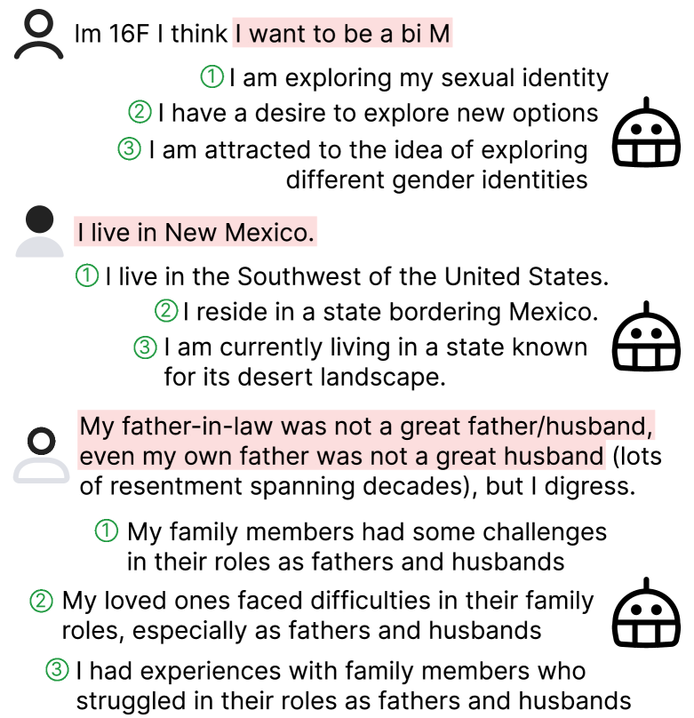
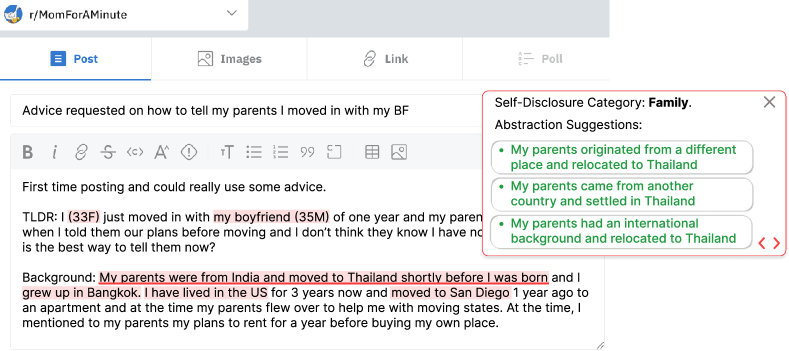

# Reducing Privacy Risks in Online Self-Disclosures 
with Language Models

###### Abstract

Self-disclosure, while being common and rewarding in social media interaction, also poses privacy risks. In this paper, we take the initiative to protect the user-side privacy associated with online self-disclosure through identification and abstraction. We develop a taxonomy of 19 self-disclosure categories, and curate a large corpus consisting of 4.8K annotated disclosure spans. We then fine-tune a language model for identification, achieving over 75% in Token F1. We further conduct a HCI user study, with 82% of participants viewing the model positively, highlighting its real world applicability. Motivated by the user feedback, we introduce the task of self-disclosure abstraction. We experiment with both one-span abstraction and three-span abstraction settings, and explore multiple fine-tuning strategies. Our best model can generate diverse abstractions that moderately reduce privacy risks while maintaining high utility according to human evaluation.  

## 1 Introduction

Self-disclosure — the communication of personal information to others Jourard ([1971](#bib.bib22)); Cozby ([1973](#bib.bib12)) — is prevalent in online public discourse. Disclosing personal information allows users to seek social support, build community, solicit context-specific advice, and explore aspects of their identity that they feel unsafe exploring offline Luo and Hancock ([2020](#bib.bib31)). Consider the following Reddit post:  

* Im 16F I think I want to be a bi M 

The poster discloses their age, gender, and sexual orientation to express themselves. However, these self-disclosures simultaneously expose them to privacy risks, notably regret of the disclosure Sleeper ([2016](#bib.bib41)) and doxxing Staab et al. ([2023](#bib.bib42)), which are particularly acute for marginalized populations Lerner et al. ([2020](#bib.bib24)). This raises a critical question: How can we help users identify and mitigate privacy risks in online self-disclosures?  

[FIGURE S1.F1.g1]

Figure 1: Our model can provide diverse abstractions for self-disclosures of any length to suit user preferences. This approach effectively reduce privacy risks without losing the integrity of the message.
[/FIGURE]

Prior works on self-disclosure (Valizadeh et al., [2021](#bib.bib46); Cho et al., [2022](#bib.bib8); Staab et al., [2023](#bib.bib42), inter alia) and anonymization tools Lison et al. ([2021](#bib.bib27)) focus on only a limited set of self-disclosures (e.g., health issues) or inferring personal attributes (aka. user profiling), often at sentence/post levels. They do not pinpoint the exact words of disclosures in the sentence, nor have broad enough coverage of different kinds of disclosures. Both are crucial for real-world users to take control of what they want to disclose and protect their privacy.  

[FIGURE S1.F2.g1]

Figure 2: Illustration of our self-disclosure identification and abstraction models (§[4](#S4 "4 Automatic Self-Disclosure Identification ‣ Reducing Privacy Risks in Online Self-Disclosures with Language Models")) that can assist users in managing and reducing their privacy risks.
[/FIGURE]

In this work, we take the important first steps in protecting user-side privacy with broad-coverage self-disclosure identification and abstraction. Our model is more extensive in capturing more categories of disclosure (see Table [1](#S2.T1 "Table 1 ‣ 2 Related Work ‣ Reducing Privacy Risks in Online Self-Disclosures with Language Models")). Moreover, we employ a human-centered, iterative design process with actual end-users to evaluate and improve the model. Our self-disclosure identification model helps users scrutinize their contents to the word level (e.g., “16F”) to account for privacy risks.  

Specifically, we introduce a comprehensive taxonomy for self-disclosure that consists of 13 demographic attributes and 6 personal experiences. We then create a high-quality dataset with human annotations on 2.4K Reddit posts (plus the associated comments), covering 4.8K occurrences of varied self-disclosures. With this corpus, we fine-tune the RoBERTa-large Liu et al. ([2019](#bib.bib28)) model to identify the self-disclosures in the given text in both binary and multi-label settings, achieving over 75% token-level F1. Besides the standard NLP benchmark evaluations, we conducted an HCI user study with 21 Reddit users to validate the real-world applicability. 82% participants have a positive outlook on the model, while also providing valuable suggestions on aspects such as personalization and explainability, which are often overlooked in benchmark assessments. Participants also express a need for a tool that can (quote) “rewrite disclosure for me in a way that I don’t worry about privacy concern”. We thus introduce a new text generation task, self-disclosure abstraction, with the goal of rephrasing the disclosure into less specific words without losing the utility or essence of the message. For example, providing “I am exploring my sexual identity” as an alternative to “I want to be a bi(sexual) M(an)” to let users choose based on their preferences, see more examples in Figure [1](#S1.F1 "Figure 1 ‣ 1 Introduction ‣ Reducing Privacy Risks in Online Self-Disclosures with Language Models"). We investigate the generation of both single and triple abstractions, with the latter approach designed to provide users with a diverse array of options. We experiment with different fine-tuning strategies. The best model, distilled on GPT-4 generated abstractions, can reduce privacy moderately (scoring 3.2 out of 5 with 5 being the highest level of detail removal) while preserve high utility (scoring 4 out of 5). The model’s abstractions are also very diverse, offering varied expression (scoring 4.6 out of 5). These numbers are from a human evaluation using Likert scale.  

In short, our key contributions are as follows:  

* We introduce a new corpus annotated for self-disclosure with 19 categories (§[3](#S3 "3 Fine-grained Self-disclosure Corpus ‣ Reducing Privacy Risks in Online Self-Disclosures with Language Models")). 
* Our identification model can help users to manage privacy risk, according to our study with real Reddit users (§[4](#S4 "4 Automatic Self-Disclosure Identification ‣ Reducing Privacy Risks in Online Self-Disclosures with Language Models") and §[5](#S5 "5 User Study ‣ Reducing Privacy Risks in Online Self-Disclosures with Language Models")). 
* Motivated by the user study, we propose a novel self-disclosure abstraction task, with our model showing promising results in human evaluations (§[6](#S6 "6 Self-Disclosure Abstraction ‣ Reducing Privacy Risks in Online Self-Disclosures with Language Models")). 

## 2 Related Work

[TABLE S2.T1]

<table class="ltx_tabular ltx_align_middle">
<tbody class="ltx_tbody">
<tr class="ltx_tr">
<td class="ltx_td ltx_align_left ltx_border_tt">Category</td>
<td class="ltx_td ltx_align_center ltx_border_tt">#Spans</td>
<td class="ltx_td ltx_align_center ltx_border_tt">Avg Len</td>
<td class="ltx_td ltx_align_left ltx_border_tt">Example</td>
</tr>
<tr class="ltx_tr">
<td class="ltx_td ltx_align_left ltx_border_t">Attributes</td>
<td class="ltx_td ltx_border_t"></td>
<td class="ltx_td ltx_border_t"></td>
<td class="ltx_td ltx_border_t"></td>
</tr>
<tr class="ltx_tr">
<td class="ltx_td ltx_align_left">Location</td>
<td class="ltx_td ltx_align_center">525</td>
<td class="ltx_td ltx_align_center">5.70<math class="ltx_Math"><semantics><mrow><mo>±</mo><mn>3.85</mn></mrow><annotation-xml><apply><csymbol>plus-or-minus</csymbol><cn>3.85</cn></apply></annotation-xml><annotation>\pm 3.85</annotation></semantics></math>
</td>
<td class="ltx_td ltx_align_left">
I live in the UK and a diagnosis is really expensive, even with health insurance</td>
</tr>
<tr class="ltx_tr">
<td class="ltx_td ltx_align_left">Age</td>
<td class="ltx_td ltx_align_center">308</td>
<td class="ltx_td ltx_align_center">2.93<math class="ltx_Math"><semantics><mrow><mo>±</mo><mn>1.72</mn></mrow><annotation-xml><apply><csymbol>plus-or-minus</csymbol><cn>1.72</cn></apply></annotation-xml><annotation>\pm 1.72</annotation></semantics></math>
</td>
<td class="ltx_td ltx_align_left">
I am a 23-year-old who is currently going through the last leg of undergraduate school</td>
</tr>
<tr class="ltx_tr">
<td class="ltx_td ltx_align_left">Relationship Status</td>
<td class="ltx_td ltx_align_center">287</td>
<td class="ltx_td ltx_align_center">6.72<math class="ltx_Math"><semantics><mrow><mo>±</mo><mn>5.97</mn></mrow><annotation-xml><apply><csymbol>plus-or-minus</csymbol><cn>5.97</cn></apply></annotation-xml><annotation>\pm 5.97</annotation></semantics></math>
</td>
<td class="ltx_td ltx_align_left">
My partner has not helped at all, and I’m bed ridden now</td>
</tr>
<tr class="ltx_tr">
<td class="ltx_td ltx_align_left">Age/Gender</td>
<td class="ltx_td ltx_align_center">248</td>
<td class="ltx_td ltx_align_center">1.42<math class="ltx_Math"><semantics><mrow><mo>±</mo><mn>0.71</mn></mrow><annotation-xml><apply><csymbol>plus-or-minus</csymbol><cn>0.71</cn></apply></annotation-xml><annotation>\pm 0.71</annotation></semantics></math>
</td>
<td class="ltx_td ltx_align_left">For some context, I (20F), still live with my parents</td>
</tr>
<tr class="ltx_tr">
<td class="ltx_td ltx_align_left">Pet</td>
<td class="ltx_td ltx_align_center">192</td>
<td class="ltx_td ltx_align_center">6.93<math class="ltx_Math"><semantics><mrow><mo>±</mo><mn>7.31</mn></mrow><annotation-xml><apply><csymbol>plus-or-minus</csymbol><cn>7.31</cn></apply></annotation-xml><annotation>\pm 7.31</annotation></semantics></math>
</td>
<td class="ltx_td ltx_align_left">Hi, I have two musk turtles and have never had any health problems before at all</td>
</tr>
<tr class="ltx_tr">
<td class="ltx_td ltx_align_left">Appearance</td>
<td class="ltx_td ltx_align_center">173</td>
<td class="ltx_td ltx_align_center">6.96<math class="ltx_Math"><semantics><mrow><mo>±</mo><mn>6.25</mn></mrow><annotation-xml><apply><csymbol>plus-or-minus</csymbol><cn>6.25</cn></apply></annotation-xml><annotation>\pm 6.25</annotation></semantics></math>
</td>
<td class="ltx_td ltx_align_left">Same here. I am 6’2. No one can sit behind me.</td>
</tr>
<tr class="ltx_tr">
<td class="ltx_td ltx_align_left">Husband/BF</td>
<td class="ltx_td ltx_align_center">148</td>
<td class="ltx_td ltx_align_center">6.89 <math class="ltx_Math"><semantics><mrow><mo>±</mo><mn>7.24</mn></mrow><annotation-xml><apply><csymbol>plus-or-minus</csymbol><cn>7.24</cn></apply></annotation-xml><annotation>\pm 7.24</annotation></semantics></math>
</td>
<td class="ltx_td ltx_align_left">
My husband and I vote for different parties</td>
</tr>
<tr class="ltx_tr">
<td class="ltx_td ltx_align_left">Wife/GF</td>
<td class="ltx_td ltx_align_center">144</td>
<td class="ltx_td ltx_align_center">5.24<math class="ltx_Math"><semantics><mrow><mo>±</mo><mn>4.42</mn></mrow><annotation-xml><apply><csymbol>plus-or-minus</csymbol><cn>4.42</cn></apply></annotation-xml><annotation>\pm 4.42</annotation></semantics></math>
</td>
<td class="ltx_td ltx_align_left">
My gf and I applied, we’re new but fairly active!</td>
</tr>
<tr class="ltx_tr">
<td class="ltx_td ltx_align_left">Gender</td>
<td class="ltx_td ltx_align_center">110</td>
<td class="ltx_td ltx_align_center">3.28<math class="ltx_Math"><semantics><mrow><mo>±</mo><mn>3.10</mn></mrow><annotation-xml><apply><csymbol>plus-or-minus</csymbol><cn>3.10</cn></apply></annotation-xml><annotation>\pm 3.10</annotation></semantics></math>
</td>
<td class="ltx_td ltx_align_left">Am I insane? Eh. I’m just a girl who wants to look on the outside how I feel on the inside.</td>
</tr>
<tr class="ltx_tr">
<td class="ltx_td ltx_align_left">Race/Nationality</td>
<td class="ltx_td ltx_align_center">99</td>
<td class="ltx_td ltx_align_center">3.63<math class="ltx_Math"><semantics><mrow><mo>±</mo><mn>2.37</mn></mrow><annotation-xml><apply><csymbol>plus-or-minus</csymbol><cn>2.37</cn></apply></annotation-xml><annotation>\pm 2.37</annotation></semantics></math>
</td>
<td class="ltx_td ltx_align_left">
As Italian I hope tonight you will won the world cup</td>
</tr>
<tr class="ltx_tr">
<td class="ltx_td ltx_align_left">Sexual Orientation</td>
<td class="ltx_td ltx_align_center">58</td>
<td class="ltx_td ltx_align_center">6.52<math class="ltx_Math"><semantics><mrow><mo>±</mo><mn>7.47</mn></mrow><annotation-xml><apply><csymbol>plus-or-minus</csymbol><cn>7.47</cn></apply></annotation-xml><annotation>\pm 7.47</annotation></semantics></math>
</td>
<td class="ltx_td ltx_align_left">
I’m a straight man but I do wanna say this</td>
</tr>
<tr class="ltx_tr">
<td class="ltx_td ltx_align_left">Name</td>
<td class="ltx_td ltx_align_center">21</td>
<td class="ltx_td ltx_align_center">3.81<math class="ltx_Math"><semantics><mrow><mo>±</mo><mn>3.48</mn></mrow><annotation-xml><apply><csymbol>plus-or-minus</csymbol><cn>3.48</cn></apply></annotation-xml><annotation>\pm 3.48</annotation></semantics></math>
</td>
<td class="ltx_td ltx_align_left">Hello guys, my name is xxx and I love travelling</td>
</tr>
<tr class="ltx_tr">
<td class="ltx_td ltx_align_left">Contact</td>
<td class="ltx_td ltx_align_center">14</td>
<td class="ltx_td ltx_align_center">5.69<math class="ltx_Math"><semantics><mrow><mo>±</mo><mn>3.56</mn></mrow><annotation-xml><apply><csymbol>plus-or-minus</csymbol><cn>3.56</cn></apply></annotation-xml><annotation>\pm 3.56</annotation></semantics></math>
</td>
<td class="ltx_td ltx_align_left">xxx is my ig</td>
</tr>
<tr class="ltx_tr">
<td class="ltx_td ltx_align_left">
\hdashline[2pt/2pt]

Experiences
</td>
<td class="ltx_td"></td>
<td class="ltx_td"></td>
<td class="ltx_td"></td>
</tr>
<tr class="ltx_tr">
<td class="ltx_td ltx_align_left">Health</td>
<td class="ltx_td ltx_align_center">783</td>
<td class="ltx_td ltx_align_center">10.36<math class="ltx_Math"><semantics><mrow><mo>±</mo><mn>9.78</mn></mrow><annotation-xml><apply><csymbol>plus-or-minus</csymbol><cn>9.78</cn></apply></annotation-xml><annotation>\pm 9.78</annotation></semantics></math>
</td>
<td class="ltx_td ltx_align_left">
I am pretty sure I have autism, but I don’t want to get an official diagnosis.</td>
</tr>
<tr class="ltx_tr">
<td class="ltx_td ltx_align_left">Family</td>
<td class="ltx_td ltx_align_center">543</td>
<td class="ltx_td ltx_align_center">9.27<math class="ltx_Math"><semantics><mrow><mo>±</mo><mn>8.73</mn></mrow><annotation-xml><apply><csymbol>plus-or-minus</csymbol><cn>8.73</cn></apply></annotation-xml><annotation>\pm 8.73</annotation></semantics></math>
</td>
<td class="ltx_td ltx_align_left">
My little brother (9M) is my pride and joy</td>
</tr>
<tr class="ltx_tr">
<td class="ltx_td ltx_align_left">Occupation</td>
<td class="ltx_td ltx_align_center">428</td>
<td class="ltx_td ltx_align_center">8.90<math class="ltx_Math"><semantics><mrow><mo>±</mo><mn>6.60</mn></mrow><annotation-xml><apply><csymbol>plus-or-minus</csymbol><cn>6.60</cn></apply></annotation-xml><annotation>\pm 6.60</annotation></semantics></math>
</td>
<td class="ltx_td ltx_align_left">
I’m a motorcycle tourer (by profession), but when I’m off the saddle I’m mostly bored</td>
</tr>
<tr class="ltx_tr">
<td class="ltx_td ltx_align_left">Mental Health</td>
<td class="ltx_td ltx_align_center">285</td>
<td class="ltx_td ltx_align_center">16.86<math class="ltx_Math"><semantics><mrow><mo>±</mo><mn>16.28</mn></mrow><annotation-xml><apply><csymbol>plus-or-minus</csymbol><cn>16.28</cn></apply></annotation-xml><annotation>\pm 16.28</annotation></semantics></math>
</td>
<td class="ltx_td ltx_align_left">I get asked this pretty regularly.. but I struggle with depression and ADHD
</td>
</tr>
<tr class="ltx_tr">
<td class="ltx_td ltx_align_left">Education</td>
<td class="ltx_td ltx_align_center">229</td>
<td class="ltx_td ltx_align_center">9.92<math class="ltx_Math"><semantics><mrow><mo>±</mo><mn>7.71</mn></mrow><annotation-xml><apply><csymbol>plus-or-minus</csymbol><cn>7.71</cn></apply></annotation-xml><annotation>\pm 7.71</annotation></semantics></math>
</td>
<td class="ltx_td ltx_align_left">Hi there, I got accepted to UCLA (IS), which I’m pumped about.</td>
</tr>
<tr class="ltx_tr">
<td class="ltx_td ltx_align_left ltx_border_bb">Finance</td>
<td class="ltx_td ltx_align_center ltx_border_bb">153</td>
<td class="ltx_td ltx_align_center ltx_border_bb">12.00<math class="ltx_Math"><semantics><mrow><mo>±</mo><mn>9.19</mn></mrow><annotation-xml><apply><csymbol>plus-or-minus</csymbol><cn>9.19</cn></apply></annotation-xml><annotation>\pm 9.19</annotation></semantics></math>
</td>
<td class="ltx_td ltx_align_left ltx_border_bb">Yes. I was making $68k a year and had around $19k in debt
</td>
</tr>
</tbody>
</table>

Table 1: Statistics and examples for each self-disclosure category in our dataset, sorted by decreasing frequency. Personal identifiable information are redacted as ‘xxx’ to be shown here.
[/TABLE]

#### Online Self-Disclosure.

Prior work study various kinds of self-disclosures on social media, including medical conditions Valizadeh et al. ([2021](#bib.bib46)), sexual harassment Chowdhury et al. ([2019](#bib.bib10)), and personal opinions or sentiments Cho et al. ([2022](#bib.bib8)). Other research consider a more generic view of self-disclosure, defined as any type of personal information a user can reveal, Mao et al. ([2011](#bib.bib33)); Balani and De Choudhury ([2015](#bib.bib4)); Caliskan Islam et al. ([2014](#bib.bib5)); Yang et al. ([2017](#bib.bib51)); Wang et al. ([2016](#bib.bib47)). All these studies consider self-disclosure as one category, by approaching it as a sentence classification task. They aim to identify whether a sentence leaks private information, and hence construct datasets with sentence-level annotations. Few work consider a broader categorization of self-disclosures, treating them as a multi-label sentence classification problem Umar et al. ([2019](#bib.bib45)); Guarino et al. ([2022](#bib.bib17)); Akiti et al. ([2020](#bib.bib1)). Staab et al. ([2023](#bib.bib42)) recently create a dataset of author profiling from Reddit with labels of 8 personal attributes for each profile. However, these prior work could not accurately pinpoint the specific disclosure spans, thus lacking in providing detailed and actionable guidance for users. To address this issue, we emphasize detecting self-disclosure at span level and broad the scope to include 19 distinct categories. This allows for a more fine-grained detection of privacy leaks for users, and also facilitate rephrasing suggestions for these specific disclosures before posting online.  

#### PII Identification and Anonymization.

Personal identifiable information (PII) is closely related to self-disclosure, but with a focus on information that can be used to identify an individual such as name, social security number, and address Regulation ([2016](#bib.bib39)). Such sensitive data are more commonly found in legal and regulatory contexts, as opposed to social media or online communities. Self-disclosure, on the other hand, covers a broader range of categories, including relationships and experiences. For PII identification, tools like Microsoft’s Presidio 111<https://microsoft.github.io/presidio/> use methods such as regular expression and Named Entity Recognition (NER) detectors. However, they indiscriminately mark entities without considering whether the information is self-disclosed. PII anonymization or redaction Azure ([2023](#bib.bib3)); AWS ([2023](#bib.bib2)), widely used in healthcare records management and machine learning training pipelines, replace sensitive data with masked tokens (e.g., [xxx]) or weaker labels (e.g., [Location]). This aggressive way that hurts the utility of the message is not suited for online self-disclosure, which is often voluntary and serves specific functions. To address this, we introduce the new task of abstraction, with the goal of keeping the essence of the disclosure while reducing the details, striking a balance of utility and privacy.  

#### Language Model on Privacy.

Language models Radford et al. ([2019](#bib.bib38)); OpenAI ([2023](#bib.bib34)); Touvron et al. ([2023](#bib.bib44)) have driven advancements in NLP. There has been several work on privacy leakage in LMs, with regards to the memorization of training data Carlini et al. ([2021](#bib.bib7), [2022](#bib.bib6)); Ippolito et al. ([2022](#bib.bib20)); Lukas et al. ([2023](#bib.bib30)). They have shown that LMs can recall individual sequences from their training data. Recently, Staab et al. ([2023](#bib.bib42)) showed that large language models can infer personal attributes from text, which could violate an individual’s privacy. However, all these works focus on the privacy risks posed by LMs. To our knowledge, this work is the first to explore the application of language models in protecting user-side privacy. We aim to help users make more informed decisions through identification and reduce risk through abstraction.  

## 3 Fine-grained Self-disclosure Corpus

To mitigate privacy leaks and alert people about their self-disclosures, it is essential to identify the specific spans of text that disclose personal information. In this section, we describe the methodology for creating the taxonomy of self-disclosure with 19 categories and the human-annotated corpus with contextualized span-level annotations (Table [1](#S2.T1 "Table 1 ‣ 2 Related Work ‣ Reducing Privacy Risks in Online Self-Disclosures with Language Models")).  

### 3.1 Reddit Post Collection

We use the public Reddit data dump from December 2022 which contained 35.86M posts.222We use the ”submissions” dump where each line in the dump corresponds to a Reddit post and its associated meta-data. We first filter out 15.24M posts (42.52%) posts that were marked as “NSFW” or “Over\_18”, indicating adult contents (to protect our annotators). We then remove non-English posts using the fastText Joulin et al. ([2016](#bib.bib21)) language identifier.333<https://fasttext.cc/> Only posts with a probability above 0.7 of being in English are kept. We notice that the URLs of many posts in the original dump do not point to the original Reddit post. We find that such cases occur when the post’s self-text contains a standalone link, which ends up in the URL field of the submission instead. Hence, we filter out posts with these false URLs by ensuring URLs contain the substring “https://reddit.com/r/”. Finally, we discard posts that are removed by moderators. Following this filtration pipeline, we end up with 4.01M posts. To create our corpus, we randomly sample 10K posts from the filtered dump and reconstruct the full posts by extracting all comments, including chains of replies for each post, if existing, using the Reddit API.  

### 3.2 Annotation

We start by asking two annotators to review each of the 10K sampled posts, deciding if they contain personal information disclosure. Only the posts that both annotators agree on as disclosing are selected for subsequent annotation, resulting in 2,415 posts. We then ask annotators to highlight textual spans (part of the sentences) that reveal information about the authors themselves within each post. To align with our focus on self-disclosure and to avoid ambiguity in the model training (§[4](#S4 "4 Automatic Self-Disclosure Identification ‣ Reducing Privacy Risks in Online Self-Disclosures with Language Models")), we instruct them to select spans with contextual information. For example, the preferred selection would be “I live in the US” rather than the minimal span like “US”, which is isolated from its self-referential context.  

Each selected span is then labeled with one of the 19 categories of self-disclosures, commonly shared by social media users, which are refined iteratively through several pilot studies. Table [1](#S2.T1 "Table 1 ‣ 2 Related Work ‣ Reducing Privacy Risks in Online Self-Disclosures with Language Models") presents statistics and examples for these 19 categories that fall into two main groups: attributes and experiences. Attributes refer to static personal characteristics or qualities that are often stated succinctly such as name, age, and gender. Experiences, on the other hand, relate to events that an individual engages in over time, which are more complex and dynamic, such as health and education. For disclosures concerning others such as family members, we direct annotators to label them under the general category, family, in this case, rather than the more specific ones.  

#### Quality Control.

Recent works have shown that crowdsourcing often leads to lower quality annotations Clark et al. ([2021](#bib.bib11)); Gilardi et al. ([2023](#bib.bib16)). To ensure the quality, we hire seven in-house annotators, who are undergraduate students at a US university, and pay them at a rate of $18 per hour. Each annotator first takes a training that includes tutorials and 20 exercise examples. During the annotation, we release the data in ten batches, allowing us to constantly monitor and provide feedback as needed. We use the BRAT interface for the annotation process.444<https://brat.nlplab.org/> The data batches were organized in chronological order. The two most recent batches are taken for a second round of annotation and adjudication, forming the test set for the experiments in this study.  

## 4 Automatic Self-Disclosure Identification

In this section, we leverage language models and our curated corpus (§[3](#S3 "3 Fine-grained Self-disclosure Corpus ‣ Reducing Privacy Risks in Online Self-Disclosures with Language Models")) to detect a wide range of self-disclosure categories from relation status to education, that are beyond the personally identifiable information (PII) such as name and phone number.  

### 4.1 Task

This is defined as a tagging task, which maps a sequence of $n$ words $x_{1},...,x_{n}$ to a sequence of labels $y_{1},...,y_{n}$. Each label $y_{i}$ corresponds to $x_{i}$ in the context of the whole sequence. To investigate the impact of label granularity on user experience, we experiment with both multi- and binary label settings. For the multi-label scenario, we apply the widely-used IOB2 format Tjong Kim Sang and Veenstra ([1999](#bib.bib43)), labeling the beginning of a span with B-[Class] and the inside of a span with I-[Class], e.g., B-Age, I-Age. Words that are not associated with self-disclosure are labeled as O.  

### 4.2 Data

We split the data into 70%/10%/20% partitions for train/val/test, sorted by post level in chronological order, so that the newest data are used for testing. Since Reddit posts and comments can significantly vary in length and disclosure spans do not always require extended contexts, we experiment with various data processing methods. Specifically, we segment comments or posts into shorter chunks of 64, 128, and 256 words, as well as individual sentences using Ersatz Wicks and Post ([2021](#bib.bib49)).  

### 4.3 Method

We fine-tune RoBERTa-large Liu et al. ([2019](#bib.bib28)), a transformer-based encoder with 355M parameters, on our dataset by minimizing the cross-entropy loss for each token’s label. As some words are tokenized into multiple subword tokens, during inference, we use the hidden states of the first token to get the label Rei et al. ([2022](#bib.bib40)).  

For self-disclosure classes such as name and contact, which are infrequent in Reddit data and therefore insufficient to train models from scratch but potentially carry high severity, we turn to existing models and tools. We use the state-of-the-art NER model, LUKE Yamada et al. ([2020](#bib.bib50)), to identify names, and Microsoft Presidio555<https://microsoft.github.io/presidio/> to recognize personally identifiable information such as phone numbers and emails. To handle social media usernames including Instagram, Twitter, and TikTok, we extend Presidio by writing additional regular expressions. To specifically identify self-disclosures as opposed to generic names (e.g., Taylor Swift), we further train a sentence classifier using RoBERTa-large, which achieves 84.4 test F1, to determine whether a sentence contains self-disclosure first.  

[TABLE S4.T2]

<table class="ltx_tabular ltx_guessed_headers ltx_align_middle">
<thead class="ltx_thead">
<tr class="ltx_tr">
<th class="ltx_td ltx_align_left ltx_th ltx_th_column ltx_th_row ltx_border_tt">Input</th>
<th class="ltx_td ltx_align_center ltx_th ltx_th_column ltx_border_tt">Span F1</th>
<th class="ltx_td ltx_align_center ltx_th ltx_th_column ltx_border_tt">Partial F1</th>
<th class="ltx_td ltx_align_center ltx_th ltx_th_column ltx_border_tt">Token F1</th>
</tr>
<tr class="ltx_tr">
<th class="ltx_td ltx_align_center ltx_th ltx_th_column">Multi</th>
<th class="ltx_td ltx_align_center ltx_th ltx_th_column">Binary</th>
<th class="ltx_td ltx_align_center ltx_th ltx_th_column">Multi</th>
<th class="ltx_td ltx_align_center ltx_th ltx_th_column">Binary</th>
<th class="ltx_td ltx_align_center ltx_th ltx_th_column">Multi</th>
<th class="ltx_td ltx_align_center ltx_th ltx_th_column">Binary</th>
</tr>
</thead>
<tbody class="ltx_tbody">
<tr class="ltx_tr">
<th class="ltx_td ltx_align_left ltx_th ltx_th_row ltx_border_t">Normal</th>
<td class="ltx_td ltx_align_center ltx_border_t">44.52</td>
<td class="ltx_td ltx_align_center ltx_border_t">48.14</td>
<td class="ltx_td ltx_align_center ltx_border_t">57.24</td>
<td class="ltx_td ltx_align_center ltx_border_t">64.20</td>
<td class="ltx_td ltx_align_center ltx_border_t">69.85</td>
<td class="ltx_td ltx_align_center ltx_border_t">72.20</td>
</tr>
<tr class="ltx_tr">
<th class="ltx_td ltx_align_left ltx_th ltx_th_row">256</th>
<td class="ltx_td ltx_align_center">45.29</td>
<td class="ltx_td ltx_align_center">47.60</td>
<td class="ltx_td ltx_align_center">58.43</td>
<td class="ltx_td ltx_align_center">64.06</td>
<td class="ltx_td ltx_align_center">68.29</td>
<td class="ltx_td ltx_align_center">72.16</td>
</tr>
<tr class="ltx_tr">
<th class="ltx_td ltx_align_left ltx_th ltx_th_row">128</th>
<td class="ltx_td ltx_align_center">44.61</td>
<td class="ltx_td ltx_align_center">47.73</td>
<td class="ltx_td ltx_align_center">57.97</td>
<td class="ltx_td ltx_align_center">62.46</td>
<td class="ltx_td ltx_align_center">68.92</td>
<td class="ltx_td ltx_align_center">71.26</td>
</tr>
<tr class="ltx_tr">
<th class="ltx_td ltx_align_left ltx_th ltx_th_row">64</th>
<td class="ltx_td ltx_align_center">44.93</td>
<td class="ltx_td ltx_align_center">49.54</td>
<td class="ltx_td ltx_align_center">59.00</td>
<td class="ltx_td ltx_align_center">65.82</td>
<td class="ltx_td ltx_align_center">70.81</td>
<td class="ltx_td ltx_align_center">74.87</td>
</tr>
<tr class="ltx_tr">
<th class="ltx_td ltx_align_left ltx_th ltx_th_row ltx_border_bb">Sentence</th>
<td class="ltx_td ltx_align_center ltx_border_bb">49.03</td>
<td class="ltx_td ltx_align_center ltx_border_bb">54.47</td>
<td class="ltx_td ltx_align_center ltx_border_bb">62.60</td>
<td class="ltx_td ltx_align_center ltx_border_bb">72.67</td>
<td class="ltx_td ltx_align_center ltx_border_bb">75.30</td>
<td class="ltx_td ltx_align_center ltx_border_bb">81.78</td>
</tr>
</tbody>
</table>

Table 2: Test performance of models fine-tuned on various data setups, with training on sentence level achieving the best results. For Multi-class models, the results are averaged over all classes, excluding label “O”, while the Binary models report F1 score for “disclosure”.
[/TABLE]

### 4.4 Results

We evaluate models with three different F1 scores to capture varying degrees of accuracy: token-level F1, partial span-level F1, and span-level F1. The partial span-level F1 considers a predicted span as correct if it contains or is contained by a reference span, with the overlap exceeding 50% of the maximum length of either span.  

Table [2](#S4.T2 "Table 2 ‣ 4.3 Method ‣ 4 Automatic Self-Disclosure Identification ‣ Reducing Privacy Risks in Online Self-Disclosures with Language Models") presents the average test set performance for models fine-tuned under different data configurations. Overall, both multi-class and binary models achieve decent performance of around 50 in span-level F1 and over 75 in token-level F1. Due to the inherent simplicity, binary models typically outperform their multi-class counterparts. In addition, we find that dividing the long Reddit posts and comments into shorter pieces generally improves the performance. The most significant gain is achieved by segmenting the data at the sentence level,leading to an increase of over 4.5 span-level F1 points in both binary and multi-class settings, compared to the normal baseline. Table [3](#S4.T3 "Table 3 ‣ 4.4 Results ‣ 4 Automatic Self-Disclosure Identification ‣ Reducing Privacy Risks in Online Self-Disclosures with Language Models") further delineates the test set performance by class for the multi-class model fine-tuned on sentence-level data.  

[TABLE S4.T3]

<table class="ltx_tabular ltx_guessed_headers ltx_align_middle">
<thead class="ltx_thead">
<tr class="ltx_tr">
<th class="ltx_td ltx_align_left ltx_th ltx_th_column ltx_th_row ltx_border_tt">Class</th>
<th class="ltx_td ltx_align_center ltx_th ltx_th_column ltx_border_tt">Span F1</th>
<th class="ltx_td ltx_align_center ltx_th ltx_th_column ltx_border_tt">Partial F1</th>
<th class="ltx_td ltx_align_center ltx_th ltx_th_column ltx_border_tt">Token F1</th>
</tr>
</thead>
<tbody class="ltx_tbody">
<tr class="ltx_tr">
<th class="ltx_td ltx_align_left ltx_th ltx_th_row ltx_border_t">Age</th>
<td class="ltx_td ltx_align_center ltx_border_t">70.29</td>
<td class="ltx_td ltx_align_center ltx_border_t">79.50</td>
<td class="ltx_td ltx_align_center ltx_border_t">84.32</td>
</tr>
<tr class="ltx_tr">
<th class="ltx_td ltx_align_left ltx_th ltx_th_row">Age&amp;Gender</th>
<td class="ltx_td ltx_align_center">66.67</td>
<td class="ltx_td ltx_align_center">70.18</td>
<td class="ltx_td ltx_align_center">78.99</td>
</tr>
<tr class="ltx_tr">
<th class="ltx_td ltx_align_left ltx_th ltx_th_row">Race/Nationality</th>
<td class="ltx_td ltx_align_center">64.08</td>
<td class="ltx_td ltx_align_center">69.90</td>
<td class="ltx_td ltx_align_center">74.59</td>
</tr>
<tr class="ltx_tr">
<th class="ltx_td ltx_align_left ltx_th ltx_th_row">Gender</th>
<td class="ltx_td ltx_align_center">63.64</td>
<td class="ltx_td ltx_align_center">69.70</td>
<td class="ltx_td ltx_align_center">78.71</td>
</tr>
<tr class="ltx_tr">
<th class="ltx_td ltx_align_left ltx_th ltx_th_row">Location</th>
<td class="ltx_td ltx_align_center">62.61</td>
<td class="ltx_td ltx_align_center">79.41</td>
<td class="ltx_td ltx_align_center">85.83</td>
</tr>
<tr class="ltx_tr">
<th class="ltx_td ltx_align_left ltx_th ltx_th_row">Appearance</th>
<td class="ltx_td ltx_align_center">51.39</td>
<td class="ltx_td ltx_align_center">72.22</td>
<td class="ltx_td ltx_align_center">80.04</td>
</tr>
<tr class="ltx_tr">
<th class="ltx_td ltx_align_left ltx_th ltx_th_row">Wife/GF</th>
<td class="ltx_td ltx_align_center">49.73</td>
<td class="ltx_td ltx_align_center">61.62</td>
<td class="ltx_td ltx_align_center">68.88</td>
</tr>
<tr class="ltx_tr">
<th class="ltx_td ltx_align_left ltx_th ltx_th_row">Finance</th>
<td class="ltx_td ltx_align_center">49.08</td>
<td class="ltx_td ltx_align_center">61.35</td>
<td class="ltx_td ltx_align_center">79.92</td>
</tr>
<tr class="ltx_tr">
<th class="ltx_td ltx_align_left ltx_th ltx_th_row">Occupation</th>
<td class="ltx_td ltx_align_center">46.04</td>
<td class="ltx_td ltx_align_center">65.98</td>
<td class="ltx_td ltx_align_center">82.85</td>
</tr>
<tr class="ltx_tr">
<th class="ltx_td ltx_align_left ltx_th ltx_th_row">Family</th>
<td class="ltx_td ltx_align_center">45.21</td>
<td class="ltx_td ltx_align_center">59.41</td>
<td class="ltx_td ltx_align_center">72.30</td>
</tr>
<tr class="ltx_tr">
<th class="ltx_td ltx_align_left ltx_th ltx_th_row">Health</th>
<td class="ltx_td ltx_align_center">44.72</td>
<td class="ltx_td ltx_align_center">63.04</td>
<td class="ltx_td ltx_align_center">73.84</td>
</tr>
<tr class="ltx_tr">
<th class="ltx_td ltx_align_left ltx_th ltx_th_row">Mental Health</th>
<td class="ltx_td ltx_align_center">44.69</td>
<td class="ltx_td ltx_align_center">61.45</td>
<td class="ltx_td ltx_align_center">68.33</td>
</tr>
<tr class="ltx_tr">
<th class="ltx_td ltx_align_left ltx_th ltx_th_row">Husband/BF</th>
<td class="ltx_td ltx_align_center">44.59</td>
<td class="ltx_td ltx_align_center">55.41</td>
<td class="ltx_td ltx_align_center">74.58</td>
</tr>
<tr class="ltx_tr">
<th class="ltx_td ltx_align_left ltx_th ltx_th_row">Education</th>
<td class="ltx_td ltx_align_center">42.42</td>
<td class="ltx_td ltx_align_center">61.36</td>
<td class="ltx_td ltx_align_center">77.08</td>
</tr>
<tr class="ltx_tr">
<th class="ltx_td ltx_align_left ltx_th ltx_th_row">Pet</th>
<td class="ltx_td ltx_align_center">37.50</td>
<td class="ltx_td ltx_align_center">48.86</td>
<td class="ltx_td ltx_align_center">71.24</td>
</tr>
<tr class="ltx_tr">
<th class="ltx_td ltx_align_left ltx_th ltx_th_row">Relationship Status</th>
<td class="ltx_td ltx_align_center">29.20</td>
<td class="ltx_td ltx_align_center">48.67</td>
<td class="ltx_td ltx_align_center">62.74</td>
</tr>
<tr class="ltx_tr">
<th class="ltx_td ltx_align_left ltx_th ltx_th_row ltx_border_bb">Sexual Orientation</th>
<td class="ltx_td ltx_align_center ltx_border_bb">19.67</td>
<td class="ltx_td ltx_align_center ltx_border_bb">36.07</td>
<td class="ltx_td ltx_align_center ltx_border_bb">65.90</td>
</tr>
</tbody>
</table>

Table 3: Test performance per class for the model fine-tuned on sentence level data.
[/TABLE]

## 5 User Study

We next recruited 21 Reddit users through Prolific to participate in a formative interview study in order to understand how real users might evaluate our model outputs – a step that differentiates our approach from prior work on disclosure identification. This interview study and its subsequent analysis was led by three authors with multi-disciplinary expertise in human-computer interaction, privacy, and NLP. All participants recruited were aged 18 or older, were residing in the U.S. at the time of the study, had an active Reddit account, and had made at least three posts on Reddit. After completing a screening survey on Prolific, eligible participants were asked to fill out a pre-study survey in which they were given a digital copy of the consent form describing the nature of the interview and after consenting, were prompted to schedule the remote interview with researchers.  

Participants were asked to share one of their Reddit posts that had raised privacy concerns, and were also asked to write a Reddit post that they were hesitant to publish due to privacy concerns. We then ran those posts through both our binary and multi-label models, and manually annotated images of users’ posts in order to display the detected self-disclosures spans to users for feedback. We asked participants about where they agreed and disagreed with model outputs, their overall impression of the model, if and how they would like to use the model outside of the study, as well as suggestions for improvement. Data collection occurred in summer of 2023, and participants received $17 compensation for their participation in the interview and pre-study survey. Interviews took place remotely over Zoom, and averaged about 2 hours in length. The length of the interview was dependent on number of disclosure spans detected by the model. Our study design was approved by Carnegie Mellon University’s institutional review board (IRB).  

### 5.1 Model Perceptions

Participants generally viewed the model favorably, with 62% expressing a desire to use it on their own posts. One participant said that ‘‘It would be interesting to run it through before I post something that I’m like nervous about and just see what it thinks and see if there are any areas where I can fix to make it less specific to me.’’ An additional 10% felt that even though they personally would saw no need for such a tool themselves, they would recommend others they know to use this tool and suggested that it might be ‘‘a good idea for...kids and teens, like people who are new to the Internet.’’ (P19) Another 10% mentioned they would use it if they were more prone to making self-disclosures or if the model is further improved (more in §[5.2](#S5.SS2 "5.2 User Feedback ‣ 5 User Study ‣ Reducing Privacy Risks in Online Self-Disclosures with Language Models"), §[5.3](#S5.SS3 "5.3 Opportunities and New Directions ‣ 5 User Study ‣ Reducing Privacy Risks in Online Self-Disclosures with Language Models"), and §[6](#S6 "6 Self-Disclosure Abstraction ‣ Reducing Privacy Risks in Online Self-Disclosures with Language Models")).  

In all, we see a significant majority (82%) of participants having a positive outlook on the model. In addition, the multi-class model that highlighted disclosure categories was helpful to around 48% of participants, aiding them in recognizing and understanding potential privacy risks in their posts.  

### 5.2 User Feedback

While participants found the model’s self-disclosure detection to be useful for self-reflection, they also provided valuable feedback for improvement. The main suggestions centered around accuracy, personalization, and the desire for assistance in mitigating disclosure risks.  

One of the most interesting findings from the user study is that there is a notable divergence between annotators and real users in terms of what should be highlighted. Our initial design goal was to highlight anything that the model identified as potentially risky in order to allow users to make informed decisions. This approach led 4 out of the 21 participants to the belief that the model was “over-sensitive” and inaccurate because it highlighted content that participants did not believe was risky. This issue was succinctly summarized by one participant: ‘‘sometimes it’s so oversensitive that it’ll highlight things again, and people might not use it because they get kind of fed up and irritated.’’. Moreover, 5 participants suggested that the tool should take subreddit-specific disclosure norms into consideration. The subreddit-based context was found to impact the usefulness of disclosure detection spans because some subreddits (e.g., r/diabetes) have posting requirements for the disclosure of certain personal information or the subreddit’s theme inherently includes such information, rendering some model-predicted highlights redundant.  

Participants also expressed a desire for more transparency in the model’s decision-making process, with some expressing a desire for explanations as to why certain highlights were marked as disclosures.  

### 5.3 Opportunities and New Directions

Users also made suggestions for how the model could be improved. Some participants suggested that the model should account for their use of privacy-preserving strategies: e.g., when users intentionally author posts with false personal information, highlighting this false personal information as a disclosure risk is not useful. Future model iterations could consider incorporating features that allow users to adapt outputs to align with these strategies. One example could be proactively offering suggestions for altering text, potentially through strategic falsehoods that retain semantic utility, to facilitate employing these strategies. Furthermore, 24% of participants sought recommendations on how to rephrasing text spans that the model detected as containing a sensitive disclosure. One participant articulated this need by stating: ‘‘could you rewrite this for me in a way that I don’t have to worry about privacy concerns?’’ This feedback led us to explore methods for generating alternative phrasings of text spans identified as being privacy-sensitive, as we discuss in Section [6](#S6 "6 Self-Disclosure Abstraction ‣ Reducing Privacy Risks in Online Self-Disclosures with Language Models").  

## 6 Self-Disclosure Abstraction

Building on insights from our user study, we introduce a new task: self-disclosure abstraction, which is rephrasing disclosures with less specific details while preserving the content utility. In this section, we explore the use of language models for abstraction.  

### 6.1 Tasks

Given a disclosure span within a sentence, the objective is to reduce sensitive and specific details while preserving the core meaning and utility. For example, in the sentence: ‘‘I just turned 32 last month and have been really...’’, the highlighted disclosure span can be abstracted to ‘‘recently entered my early 30s’’. Compared to traditional sentence or paragraph paraphrasing Dou et al. ([2022](#bib.bib14)), this task uniquely focuses on the span level. A key criterion is that the abstracted span must fit seamlessly into the original sentence without changing the rest of text. Notably, we choose only one sentence as the context instead of a broader text unit as we find that extensive context is not necessary.  

Since there are multiple possible ways to abstract a disclosure span, in addition to the task of generating a single abstraction, we also introduce the task of generating three diverse abstractions for each given disclosure, catering to different user needs.  

### 6.2 Data

Thinking of diverse abstractions on the spot is challenging for humans, so how can we automate the data collection process? In our preliminary study, we find that LLMs such as ChatGPT and GPT-4 are adept at this task, in line with recent successes in using LLMs to generate training data in areas such as code generation Gunasekar et al. ([2023](#bib.bib18)) and instruction following Peng et al. ([2023](#bib.bib36)). We choose ChatGPT (06-13 version) to generate three diverse abstractions for data from training and evaluation sets, considering the balance between cost and performance. We use GPT-4 (06-13 version) for test set, given its advanced capabilities. The prompt templates, which are iteratively refined, are displayed in Appendix [C](#A3 "Appendix C Prompt Templates ‣ Reducing Privacy Risks in Online Self-Disclosures with Language Models").  

Here are details for the train/eval/test split: we select the most recent 10% posts from our full corpus (§[3](#S3 "3 Fine-grained Self-disclosure Corpus ‣ Reducing Privacy Risks in Online Self-Disclosures with Language Models")), all of which have adjudicated annotations on self-disclosure spans. We organized these posts into training, evaluation, and testing sets chronologically, with the newest post in the test split. This results in 159 posts (plus associated comments) for training, 25 for evaluation, and 50 for testing.  

[TABLE S6.T4]

<table class="ltx_tabular ltx_guessed_headers ltx_align_middle">
<thead class="ltx_thead">
<tr class="ltx_tr">
<th class="ltx_td ltx_align_center ltx_th ltx_th_column ltx_th_row ltx_border_tt">BLEU / ROUGE-2</th>
<th class="ltx_td ltx_align_center ltx_th ltx_th_column ltx_border_tt">Output</th>
</tr>
<tr class="ltx_tr">
<th class="ltx_td ltx_align_center ltx_th ltx_th_column ltx_border_t">w/o Thought</th>
<th class="ltx_td ltx_align_center ltx_th ltx_th_column ltx_border_t">w/ Thought</th>
</tr>
</thead>
<tbody class="ltx_tbody">
<tr class="ltx_tr">
<th class="ltx_td ltx_align_left ltx_th ltx_th_row ltx_border_bb">

Input
</th>
<th class="ltx_td ltx_align_left ltx_th ltx_th_row">Normal</th>
<td class="ltx_td ltx_align_center">15.3 / 25.1</td>
<td class="ltx_td ltx_align_center">14.4 / 22.9</td>
</tr>
<tr class="ltx_tr">
<th class="ltx_td ltx_align_left ltx_th ltx_th_row">Special Token</th>
<td class="ltx_td ltx_align_center">17.0 / 25.4</td>
<td class="ltx_td ltx_align_center">12.9 / 21.7</td>
</tr>
<tr class="ltx_tr">
<th class="ltx_td ltx_align_left ltx_th ltx_th_row">Instruction (fs)</th>
<td class="ltx_td ltx_align_center">16.7 / 24.3</td>
<td class="ltx_td ltx_align_center">15.6 / 23.7</td>
</tr>
<tr class="ltx_tr">
<th class="ltx_td ltx_align_left ltx_th ltx_th_row ltx_border_bb">Instruction (zs)</th>
<td class="ltx_td ltx_align_center ltx_border_bb">17.9 / 24.8</td>
<td class="ltx_td ltx_align_center ltx_border_bb">18.3 / 25.5</td>
</tr>
</tbody>
</table>

Table 4: Test results on the one-span abstraction task. Training with special token and zero-shot instruction input-formats lead to top performance.
[/TABLE]

[TABLE S6.T5]

<table class="ltx_tabular ltx_align_middle">
<tbody class="ltx_tbody">
<tr class="ltx_tr">
<td class="ltx_td ltx_border_tt"></td>
<td class="ltx_td ltx_align_center ltx_border_tt">Automatic Evaluation</td>
<td class="ltx_td ltx_align_center ltx_border_tt">Human Evaluation</td>
</tr>
<tr class="ltx_tr">
<td class="ltx_td ltx_align_left">Methods</td>
<td class="ltx_td ltx_align_center ltx_border_t">Matching</td>
<td class="ltx_td ltx_align_center ltx_border_t">Matching</td>
<td class="ltx_td ltx_align_center ltx_border_t">Matching</td>
<td class="ltx_td ltx_align_center ltx_border_t"># Unique</td>
<td class="ltx_td ltx_align_center ltx_border_t">Rank Dist.</td>
<td class="ltx_td ltx_align_center ltx_border_t">Rank  <svg class="ltx_picture"><g><path></path></g></svg></td>
<td class="ltx_td ltx_align_center ltx_border_t">Rating</td>
</tr>
<tr class="ltx_tr">
<td class="ltx_td ltx_align_center">BLEU</td>
<td class="ltx_td ltx_align_center">ROUGE-2</td>
<td class="ltx_td ltx_align_center">ROUGE-L</td>
<td class="ltx_td ltx_align_center">Bigrams</td>
<td class="ltx_td ltx_align_center">1 <math class="ltx_Math"><semantics><mo>→</mo><annotation-xml><ci>→</ci></annotation-xml><annotation>\rightarrow</annotation></semantics></math> 9</td>
</tr>
<tr class="ltx_tr">
<td class="ltx_td ltx_align_left ltx_border_t">One-span model sampling</td>
<td class="ltx_td ltx_border_t"></td>
<td class="ltx_td ltx_border_t"></td>
<td class="ltx_td ltx_border_t"></td>
<td class="ltx_td ltx_border_t"></td>
<td class="ltx_td ltx_border_t"></td>
<td class="ltx_td ltx_border_t"></td>
<td class="ltx_td ltx_border_t"></td>
</tr>
<tr class="ltx_tr">
<td class="ltx_td ltx_align_left">Special Token</td>
<td class="ltx_td ltx_align_center">17.40</td>
<td class="ltx_td ltx_align_center">18.81</td>
<td class="ltx_td ltx_align_center">38.42</td>
<td class="ltx_td ltx_align_center">2,576</td>
<td class="ltx_td ltx_align_center"></td>
<td class="ltx_td ltx_align_center">5.35</td>
<td class="ltx_td ltx_align_center">80.88</td>
</tr>
<tr class="ltx_tr">
<td class="ltx_td ltx_align_left">Instruction</td>
<td class="ltx_td ltx_align_center">16.95</td>
<td class="ltx_td ltx_align_center">18.78</td>
<td class="ltx_td ltx_align_center">38.35</td>
<td class="ltx_td ltx_align_center">2,564</td>
<td class="ltx_td ltx_align_center"></td>
<td class="ltx_td ltx_align_center">5.32</td>
<td class="ltx_td ltx_align_center">81.03</td>
</tr>
<tr class="ltx_tr">
<td class="ltx_td ltx_align_left">Instruction (w/ thought)</td>
<td class="ltx_td ltx_align_center">17.06</td>
<td class="ltx_td ltx_align_center">18.47</td>
<td class="ltx_td ltx_align_center">38.43</td>
<td class="ltx_td ltx_align_center">2,882</td>
<td class="ltx_td ltx_align_center"></td>
<td class="ltx_td ltx_align_center">5.23</td>
<td class="ltx_td ltx_align_center">81.17</td>
</tr>
<tr class="ltx_tr">
<td class="ltx_td ltx_align_left">End-to-end training</td>
<td class="ltx_td"></td>
<td class="ltx_td"></td>
<td class="ltx_td"></td>
<td class="ltx_td"></td>
<td class="ltx_td"></td>
<td class="ltx_td"></td>
<td class="ltx_td"></td>
</tr>
<tr class="ltx_tr">
<td class="ltx_td ltx_align_left">Special Token</td>
<td class="ltx_td ltx_align_center">17.22</td>
<td class="ltx_td ltx_align_center">19.67</td>
<td class="ltx_td ltx_align_center">38.38</td>
<td class="ltx_td ltx_align_center">2,911</td>
<td class="ltx_td ltx_align_center"></td>
<td class="ltx_td ltx_align_center">4.28</td>
<td class="ltx_td ltx_align_center">81.50</td>
</tr>
<tr class="ltx_tr">
<td class="ltx_td ltx_align_left">Instruction</td>
<td class="ltx_td ltx_align_center">17.99</td>
<td class="ltx_td ltx_align_center">19.60</td>
<td class="ltx_td ltx_align_center">39.57</td>
<td class="ltx_td ltx_align_center">2,992</td>
<td class="ltx_td ltx_align_center"></td>
<td class="ltx_td ltx_align_center">3.62</td>
<td class="ltx_td ltx_align_center">82.60</td>
</tr>
<tr class="ltx_tr">
<td class="ltx_td ltx_align_left">Instruction (w/ thought)</td>
<td class="ltx_td ltx_align_center">16.53</td>
<td class="ltx_td ltx_align_center">19.24</td>
<td class="ltx_td ltx_align_center">38.81</td>
<td class="ltx_td ltx_align_center">2,801</td>
<td class="ltx_td ltx_align_center"></td>
<td class="ltx_td ltx_align_center">4.25</td>
<td class="ltx_td ltx_align_center">81.77</td>
</tr>
<tr class="ltx_tr">
<td class="ltx_td ltx_align_left">Iterative training</td>
<td class="ltx_td"></td>
<td class="ltx_td"></td>
<td class="ltx_td"></td>
<td class="ltx_td"></td>
<td class="ltx_td"></td>
<td class="ltx_td"></td>
<td class="ltx_td"></td>
</tr>
<tr class="ltx_tr">
<td class="ltx_td ltx_align_left">Special Token</td>
<td class="ltx_td ltx_align_center">18.13</td>
<td class="ltx_td ltx_align_center">19.74</td>
<td class="ltx_td ltx_align_center">38.71</td>
<td class="ltx_td ltx_align_center">2,913</td>
<td class="ltx_td ltx_align_center"></td>
<td class="ltx_td ltx_align_center">3.75</td>
<td class="ltx_td ltx_align_center">82.58</td>
</tr>
<tr class="ltx_tr">
<td class="ltx_td ltx_align_left">Instruction</td>
<td class="ltx_td ltx_align_center">17.80</td>
<td class="ltx_td ltx_align_center">19.81</td>
<td class="ltx_td ltx_align_center">39.56</td>
<td class="ltx_td ltx_align_center">3,067</td>
<td class="ltx_td ltx_align_center"></td>
<td class="ltx_td ltx_align_center">4.0</td>
<td class="ltx_td ltx_align_center">82.20</td>
</tr>
<tr class="ltx_tr">
<td class="ltx_td ltx_align_left ltx_border_bb">Instruction (w/ thought)</td>
<td class="ltx_td ltx_align_center ltx_border_bb">16.89</td>
<td class="ltx_td ltx_align_center ltx_border_bb">18.84</td>
<td class="ltx_td ltx_align_center ltx_border_bb">38.31</td>
<td class="ltx_td ltx_align_center ltx_border_bb">2,914</td>
<td class="ltx_td ltx_align_center ltx_border_bb"></td>
<td class="ltx_td ltx_align_center ltx_border_bb">3.55</td>
<td class="ltx_td ltx_align_center ltx_border_bb">82.43</td>
</tr>
</tbody>
</table>

Table 5: Test results on the three-span abstraction task with both automatic evaluation and human evaluation. Rank Dist. presents the histograms of the rank distribution, where 1 is the best and 9 the worst. End-to-end instruction (zs) tuning and iterative instruction (zs) training with thought achieve the top two performances under human evaluation.
[/TABLE]

[TABLE S6.T6]

<table class="ltx_tabular ltx_guessed_headers ltx_align_middle">
<thead class="ltx_thead">
<tr class="ltx_tr">
<th class="ltx_td ltx_align_left ltx_th ltx_th_column ltx_th_row ltx_border_tt">Methods</th>
<th class="ltx_td ltx_align_center ltx_th ltx_th_column ltx_border_tt">Privacy</th>
<th class="ltx_td ltx_align_center ltx_th ltx_th_column ltx_border_tt">Utility</th>
<th class="ltx_td ltx_align_center ltx_th ltx_th_column ltx_border_tt">Diversity</th>
<th class="ltx_td ltx_align_center ltx_th ltx_th_column ltx_border_tt">Coherence</th>
</tr>
<tr class="ltx_tr">
<th class="ltx_td ltx_align_center ltx_th ltx_th_column">Reduction</th>
<th class="ltx_td ltx_align_center ltx_th ltx_th_column">Preservation</th>
</tr>
</thead>
<tbody class="ltx_tbody">
<tr class="ltx_tr">
<th class="ltx_td ltx_align_left ltx_th ltx_th_row ltx_border_t">End-to-end</th>
<td class="ltx_td ltx_border_t"></td>
<td class="ltx_td ltx_border_t"></td>
<td class="ltx_td ltx_border_t"></td>
<td class="ltx_td ltx_border_t"></td>
</tr>
<tr class="ltx_tr">
<th class="ltx_td ltx_align_left ltx_th ltx_th_row">Instruction</th>
<td class="ltx_td ltx_align_center">3.19</td>
<td class="ltx_td ltx_align_center">4.0</td>
<td class="ltx_td ltx_align_center">4.57</td>
<td class="ltx_td ltx_align_center">93.7%</td>
</tr>
<tr class="ltx_tr">
<th class="ltx_td ltx_align_left ltx_th ltx_th_row">Iterative</th>
<td class="ltx_td"></td>
<td class="ltx_td"></td>
<td class="ltx_td"></td>
<td class="ltx_td"></td>
</tr>
<tr class="ltx_tr">
<th class="ltx_td ltx_align_left ltx_th ltx_th_row ltx_border_bb">Instruction (w/t)</th>
<td class="ltx_td ltx_align_center ltx_border_bb">3.10</td>
<td class="ltx_td ltx_align_center ltx_border_bb">3.80</td>
<td class="ltx_td ltx_align_center ltx_border_bb">4.45</td>
<td class="ltx_td ltx_align_center ltx_border_bb">93.7%</td>
</tr>
</tbody>
</table>

Table 6: Human evaluation with Likert-scale (1-5) of the top two performing models for the three-span abstraction task. The best model shows moderate privacy reduction, high utility preservation, and very high diversity in abstractions. w/t denotes with thought.
[/TABLE]

### 6.3 Methods

We consider various fine-tuning strategies, varying input and outputs formats, to examine the impact of instruction, thought process, and special tokens on model performance. This leads to eight configurations for one-span abstraction task.  

The input formats, where the loss are ignored, include normal, special token, and instruction:  

1. Normal formats the given the inputs of sentence $s$ and disclosure span $d$ with basic English syntax, e.g., ‘‘Sentence: {s}\nDisclosure Span: {d}\nAbstraction Span:’’. 
2. Special token formats the input with special tokens that are newly added to the model vocabulary. These tokens segment each part of the input, such as ‘‘<SENTENCE>{s}{d}<ABSTRACTION>’’. 
3. Instruction formats the input with elaborate natural language instructions, e.g., ‘‘Your task is to abstract the given ... Sentence: {$s$}\nDisclosure Span to Revise: {$d$}’’. The instructions varies based on the inclusion of demonstration examples. It is categorized as a few-shot prompt (denoted as fs, and typically three-shot) if examples are included, or zero-shot prompt (denoted as zs) if no demonstration. 

For output formats, which dictate the portion of text where loss is calculated, we explore two options. One is solely the desired output, which is the abstraction span, another incorporates the model’s thought process alongside the primary output, which is also known as Chain-of-Thoughts Wei et al. ([2022](#bib.bib48)) training.  

Regarding the three-span abstraction task, we explore three different approaches: sampling from one-span abstraction models thrice, end-to-end training, and iterative training. The end-to-end training method trains the model to produce three spans in one generation step, while the iterative training approach breaking the three spans (A, B, C) into three separate training instances: input $\rightarrow$ A, input & A $\rightarrow$ B, input & A | B $\rightarrow$ C.  

In all experiments, we use Llama 2 Touvron et al. ([2023](#bib.bib44)), a highly capable modern language model that is pre-trained on 2T tokens, with Lora Hu et al. ([2021](#bib.bib19)). Considering the performance and speed trade-off, we choose the 7B variant as it can be easily run on local device with C/C++ inference implementation666<https://github.com/ggerganov/llama.cpp> and quantization Frantar et al. ([2022](#bib.bib15)); Lin et al. ([2023](#bib.bib26)).  

### 6.4 Metrics

We report BLEU Papineni et al. ([2002](#bib.bib35)) and ROUGE (f-measure) Lin ([2004](#bib.bib25)) for automatic evaluation. Both measures lexical overlap and are widely used in LLMs evaluation Chowdhery et al. ([2022](#bib.bib9)); Touvron et al. ([2023](#bib.bib44)).  

For evaluating three-span abstraction task, we adopt the matching BLEU and ROUGE metrics proposed by (Dou et al., [2021](#bib.bib13)), with promotes diversity among the generated abstractions. The metric uses the Hungarian algorithm Kuhn ([1955](#bib.bib23)) to calculate the highest matching scores among pairs formed between the generated outputs and references, which guarantees a unique pairing between each generation and reference, forming a one-to-one relation. Additionally, one of the authors conduct human evaluation for this task on 60 sampled self-disclosure test instances. We first use Rank & Rate Maddela et al. ([2023](#bib.bib32)), a framework that allow annotators to rate generations from several models in a scale of 0-100 in a list-wise manner, for implementation. We then select the top two performed models and conduct another round of human evaluation on four aspects: privacy reduction, utility preservation, and diversity, all rated on a 1-5 Likert scale, along with a binary assessment of coherence, specifically evaluating whether each abstraction integrates seamlessly into the sentence. Definitions for each Likert scale is displayed in Appendix [A.2](#A1.SS2 "A.2 Human Evaluation for Abstraction ‣ Appendix A Annotation Guidelines ‣ Reducing Privacy Risks in Online Self-Disclosures with Language Models").  

### 6.5 Results

Table [4](#S6.T4 "Table 4 ‣ 6.2 Data ‣ 6 Self-Disclosure Abstraction ‣ Reducing Privacy Risks in Online Self-Disclosures with Language Models") reports BLEU and ROUGE-2 for one-span abstraction task. We find that training on thought doesn’t improve, and in some cases even degrade, performance. This aligns with expectations, as text-to-text generation tasks of this nature typically require minimal reasoning compared to math or coding. For instruction formats, zero-shot outperforms its few-shot counterpart, which may due to model’s weaker capability on processing long texts.  

We select the top three performing configurations in the one-span setting for the three-span abstraction experiment. Both automatic and human evaluation results are presented in Table [5](#S6.T5 "Table 5 ‣ 6.2 Data ‣ 6 Self-Disclosure Abstraction ‣ Reducing Privacy Risks in Online Self-Disclosures with Language Models"). According to the automatic metrics, three methods show similarly high performance: instruction format with end-to-end training or iterative training, and special token format with iterative training. Human evaluation reveals that end-to-end training in the instruction format scores the highest in rating with 82.6, while iterative training with thought and instruction format tops in ranking with 3.55 out of 9. The second human evaluation conducted on these two models are shown in Table [6](#S6.T6 "Table 6 ‣ 6.2 Data ‣ 6 Self-Disclosure Abstraction ‣ Reducing Privacy Risks in Online Self-Disclosures with Language Models"). End-to-end training in the instruction format perform better or equally well across all four aspects. It achieves 4.6 in diversity, 4.0 in utility preservation, and 3.2 for privacy reduction, demonstrating its usability,  

## 7 Conclusion

We push the first steps on protecting user privacy in online self-disclosures. Our identification model trained on the new fine-graiend corpus achieve over 75% of token-F1 across both binary and multi-label settings, and is further validated through a HCI user study, highlighting its real-world applicability. Responding to the need from participants for balancing privacy risk reduction with message utility, we propose a novel task of self-disclosure abstraction, and explore a variety of fine-tuning regimes to generate one span or three diverse spans. Our human evaluation shows that the best model can provide diverse abstractions that reduce privacy risks while highly preserving utility.  

## Limitations

Our corpus is sourced from Reddit, expanding our research to include other social platforms, such as YouTube comments, could provide broader insights and applicability in diverse social domains. For self-disclosure identification, limitations raised in our user study include personalization, explainability, and contextual awareness. Details can be found in Section [5.2](#S5.SS2 "5.2 User Feedback ‣ 5 User Study ‣ Reducing Privacy Risks in Online Self-Disclosures with Language Models"). Regarding self-disclosure abstraction, one limitation is the lack of controllability. The model cannot adjust the degree of abstraction, such as aggressive or minimal. In addition, the model currently operates by abstracting user-provided instances. Future improvements could integrate the capability to automatically determine when to apply abstraction, thus enabling preemptive modifications before user input. To efficiently deploy Llama-7B on consumer devices, implementing quantization techniques is essential. Future research could investigate the model’s performance post-quantization.  

## Ethics Statement

We takes the following measures to safeguard the personal information in our corpus before the annotation process. First, all personal identification information (PII), such as names and emails, is replaced with synthetic data. Second, we use in-house annotators instead of crowd workers for annotation. All examples,except for those generated by the model, shown in the paper are synthetic but accurately reflect the real data. Our user study was approved by the Institutional Review Board (IRB) at Carnegie Mellon University. The primary data collected from user interviews (including the Reddit posts run through the model) was self-disclosed and gathered in a survey prior to conducting the user study with the model. In accordance with IRB policy, we anonymized all data collected during the study by removing any PII. The primary purpose of our models is to provide users with a tool to mitigate the privacy risks associated with online self-disclosures. In cases where the models fail, they do not pose additional risks but rather tend towards overprotection, either by identifying more spans of text or by overly abstracting the disclosed information. We identified no potential harms that would disproportionately impact marginalized or otherwise vulnerable populations. To prevent misuse, we will not release our dataset and models to the public. Instead, we will share them with researchers who are committed to adhering to these ethical guidelines to accelerate future study.  

## Acknowledgments

The authors would like to thank Srushti Nandu, Chase Perry, and Shuheng Liu for conducting pilot studies; Piranava Abeyakaran, Nour Allah El Senary, Vishnesh Jayanthi Ramanathan, Ian Ligon, Govind Ramesh, Ayush Panda, and Grace Kim for their help with data annotation and evaluation; Yang Chen and Nghia T. Le for their helpful feedback. This research is supported in part by ODNI and IARPA via the HIATUS program (contract 2022-22072200004). The views and conclusions contained herein are those of the authors and should not be interpreted as necessarily representing the official policies, either expressed or implied, of ODNI, IARPA, or the U.S. Government. The U.S. Government is authorized to reproduce and distribute reprints for governmental purposes notwithstanding any copyright annotation therein.  

## References

* Akiti et al. (2020)  Chandan Akiti, Anna Squicciarini, and Sarah Rajtmajer. 2020.   A semantics-based approach to disclosure classification in user-generated online content.   In *Findings of the Association for Computational Linguistics: EMNLP 2020*, pages 3490–3499. 
* AWS (2023)  AWS. 2023.   [Amazon comprehend](https://docs.aws.amazon.com/comprehend/latest/dg/what-is.html). 
* Azure (2023)  Azure. 2023.   [Azure ai language](https://learn.microsoft.com/en-us/azure/ai-services/language-service/overview). 
* Balani and De Choudhury (2015)  Sairam Balani and Munmun De Choudhury. 2015.   Detecting and characterizing mental health related self-disclosure in social media.   In *Proceedings of the 33rd Annual ACM Conference Extended Abstracts on Human Factors in Computing Systems*, pages 1373–1378. 
* Caliskan Islam et al. (2014)  Aylin Caliskan Islam, Jonathan Walsh, and Rachel Greenstadt. 2014.   Privacy detective: Detecting private information and collective privacy behavior in a large social network.   In *Proceedings of the 13th Workshop on Privacy in the Electronic Society*, pages 35–46. 
* Carlini et al. (2022)  Nicholas Carlini, Daphne Ippolito, Matthew Jagielski, Katherine Lee, Florian Tramer, and Chiyuan Zhang. 2022.   Quantifying memorization across neural language models.   *arXiv preprint arXiv:2202.07646*. 
* Carlini et al. (2021)  Nicholas Carlini, Florian Tramer, Eric Wallace, Matthew Jagielski, Ariel Herbert-Voss, Katherine Lee, Adam Roberts, Tom Brown, Dawn Song, Ulfar Erlingsson, et al. 2021.   Extracting training data from large language models.   In *30th USENIX Security Symposium (USENIX Security 21)*, pages 2633–2650. 
* Cho et al. (2022)  Won Ik Cho, Soomin Kim, Eujeong Choi, and Younghoon Jeong. 2022.   Assessing how users display self-disclosure and authenticity in conversation with human-like agents: A case study of luda lee.   In *Findings of the Association for Computational Linguistics: AACL-IJCNLP 2022*, pages 145–152. 
* Chowdhery et al. (2022)  Aakanksha Chowdhery, Sharan Narang, Jacob Devlin, Maarten Bosma, Gaurav Mishra, Adam Roberts, Paul Barham, Hyung Won Chung, Charles Sutton, Sebastian Gehrmann, et al. 2022.   Palm: Scaling language modeling with pathways.   *arXiv preprint arXiv:2204.02311*. 
* Chowdhury et al. (2019)  Arijit Ghosh Chowdhury, Ramit Sawhney, Puneet Mathur, Debanjan Mahata, and Rajiv Ratn Shah. 2019.   Speak up, fight back! detection of social media disclosures of sexual harassment.   In *Proceedings of the 2019 conference of the North American chapter of the Association for Computational Linguistics: Student research workshop*, pages 136–146. 
* Clark et al. (2021)  Elizabeth Clark, Tal August, Sofia Serrano, Nikita Haduong, Suchin Gururangan, and Noah A. Smith. 2021.   [All that’s ‘human’ is not gold: Evaluating human evaluation of generated text](https://doi.org/10.18653/v1/2021.acl-long.565).   In *Proceedings of the 59th Annual Meeting of the Association for Computational Linguistics and the 11th International Joint Conference on Natural Language Processing (Volume 1: Long Papers)*, pages 7282–7296, Online. Association for Computational Linguistics. 
* Cozby (1973)  Paul C. Cozby. 1973.   [Self-disclosure: a literature review.](https://api.semanticscholar.org/CorpusID:29583313)  *Psychological bulletin*, 79 2:73–91. 
* Dou et al. (2021)  Yao Dou, Maxwell Forbes, Ari Holtzman, and Yejin Choi. 2021.   Multitalk: A highly-branching dialog testbed for diverse conversations.   In *Proceedings of the AAAI Conference on Artificial Intelligence*, volume 35, pages 12760–12767. 
* Dou et al. (2022)  Yao Dou, Chao Jiang, and Wei Xu. 2022.   [Improving large-scale paraphrase acquisition and generation](https://aclanthology.org/2022.emnlp-main.631).   In *Proceedings of the 2022 Conference on Empirical Methods in Natural Language Processing*, pages 9301–9323, Abu Dhabi, United Arab Emirates. Association for Computational Linguistics. 
* Frantar et al. (2022)  Elias Frantar, Saleh Ashkboos, Torsten Hoefler, and Dan Alistarh. 2022.   Gptq: Accurate post-training quantization for generative pre-trained transformers.   *arXiv preprint arXiv:2210.17323*. 
* Gilardi et al. (2023)  Fabrizio Gilardi, Meysam Alizadeh, and Maël Kubli. 2023.   Chatgpt outperforms crowd-workers for text-annotation tasks.   *arXiv preprint arXiv:2303.15056*. 
* Guarino et al. (2022)  Alfonso Guarino, Delfina Malandrino, and Rocco Zaccagnino. 2022.   An automatic mechanism to provide privacy awareness and control over unwittingly dissemination of online private information.   *Computer Networks*, 202:108614. 
* Gunasekar et al. (2023)  Suriya Gunasekar, Yi Zhang, Jyoti Aneja, Caio César Teodoro Mendes, Allie Del Giorno, Sivakanth Gopi, Mojan Javaheripi, Piero Kauffmann, Gustavo de Rosa, Olli Saarikivi, et al. 2023.   Textbooks are all you need.   *arXiv preprint arXiv:2306.11644*. 
* Hu et al. (2021)  Edward J Hu, Yelong Shen, Phillip Wallis, Zeyuan Allen-Zhu, Yuanzhi Li, Shean Wang, Lu Wang, and Weizhu Chen. 2021.   Lora: Low-rank adaptation of large language models.   *arXiv preprint arXiv:2106.09685*. 
* Ippolito et al. (2022)  Daphne Ippolito, Florian Tramèr, Milad Nasr, Chiyuan Zhang, Matthew Jagielski, Katherine Lee, Christopher A Choquette-Choo, and Nicholas Carlini. 2022.   Preventing verbatim memorization in language models gives a false sense of privacy.   *arXiv preprint arXiv:2210.17546*. 
* Joulin et al. (2016)  Armand Joulin, Edouard Grave, Piotr Bojanowski, Matthijs Douze, Hérve Jégou, and Tomas Mikolov. 2016.   Fasttext.zip: Compressing text classification models.   *arXiv preprint arXiv:1612.03651*. 
* Jourard (1971)  Sidney M Jourard. 1971.   Self-disclosure: An experimental analysis of the transparent self. 
* Kuhn (1955)  Harold W Kuhn. 1955.   The hungarian method for the assignment problem.   *Naval research logistics quarterly*, 2(1-2):83–97. 
* Lerner et al. (2020)  Ada Lerner, Helen Yuxun He, Anna Kawakami, Silvia Catherine Zeamer, and Roberto Hoyle. 2020.   Privacy and activism in the transgender community.   In *Proceedings of the 2020 CHI Conference on Human Factors in Computing Systems*, pages 1–13. 
* Lin (2004)  Chin-Yew Lin. 2004.   [ROUGE: A package for automatic evaluation of summaries](https://aclanthology.org/W04-1013).   In *Text Summarization Branches Out*, pages 74–81, Barcelona, Spain. Association for Computational Linguistics. 
* Lin et al. (2023)  Ji Lin, Jiaming Tang, Haotian Tang, Shang Yang, Xingyu Dang, and Song Han. 2023.   Awq: Activation-aware weight quantization for llm compression and acceleration.   *arXiv preprint arXiv:2306.00978*. 
* Lison et al. (2021)  Pierre Lison, Ildikó Pilán, David Sanchez, Montserrat Batet, and Lilja Øvrelid. 2021.   [Anonymisation models for text data: State of the art, challenges and future directions](https://doi.org/10.18653/v1/2021.acl-long.323).   In *Proceedings of the 59th Annual Meeting of the Association for Computational Linguistics and the 11th International Joint Conference on Natural Language Processing (Volume 1: Long Papers)*, pages 4188–4203, Online. Association for Computational Linguistics. 
* Liu et al. (2019)  Yinhan Liu, Myle Ott, Naman Goyal, Jingfei Du, Mandar Joshi, Danqi Chen, Omer Levy, Mike Lewis, Luke Zettlemoyer, and Veselin Stoyanov. 2019.   Roberta: A robustly optimized bert pretraining approach.   *arXiv preprint arXiv:1907.11692*. 
* Loshchilov and Hutter (2017)  Ilya Loshchilov and Frank Hutter. 2017.   Decoupled weight decay regularization.   *arXiv preprint arXiv:1711.05101*. 
* Lukas et al. (2023)  Nils Lukas, Ahmed Salem, Robert Sim, Shruti Tople, Lukas Wutschitz, and Santiago Zanella-Béguelin. 2023.   Analyzing leakage of personally identifiable information in language models.   *arXiv preprint arXiv:2302.00539*. 
* Luo and Hancock (2020)  Mufan Luo and Jeffrey T Hancock. 2020.   Self-disclosure and social media: motivations, mechanisms and psychological well-being.   *Current opinion in psychology*, 31:110–115. 
* Maddela et al. (2023)  Mounica Maddela, Yao Dou, David Heineman, and Wei Xu. 2023.   [LENS: A learnable evaluation metric for text simplification](https://doi.org/10.18653/v1/2023.acl-long.905).   In *Proceedings of the 61st Annual Meeting of the Association for Computational Linguistics (Volume 1: Long Papers)*, pages 16383–16408, Toronto, Canada. Association for Computational Linguistics. 
* Mao et al. (2011)  Huina Mao, Xin Shuai, and Apu Kapadia. 2011.   Loose tweets: an analysis of privacy leaks on twitter.   In *Proceedings of the 10th annual ACM workshop on Privacy in the electronic society*, pages 1–12. 
* OpenAI (2023)  OpenAI. 2023.   [Gpt-4 technical report](https://api.semanticscholar.org/CorpusID:257532815).   *ArXiv*, abs/2303.08774. 
* Papineni et al. (2002)  Kishore Papineni, Salim Roukos, Todd Ward, and Wei-Jing Zhu. 2002.   Bleu: a method for automatic evaluation of machine translation.   In *Proceedings of the 40th annual meeting of the Association for Computational Linguistics*, pages 311–318. 
* Peng et al. (2023)  Baolin Peng, Chunyuan Li, Pengcheng He, Michel Galley, and Jianfeng Gao. 2023.   Instruction tuning with gpt-4.   *arXiv preprint arXiv:2304.03277*. 
* Post (2018)  Matt Post. 2018.   [A call for clarity in reporting BLEU scores](https://doi.org/10.18653/v1/W18-6319).   In *Proceedings of the Third Conference on Machine Translation: Research Papers*, pages 186–191, Brussels, Belgium. Association for Computational Linguistics. 
* Radford et al. (2019)  Alec Radford, Jeffrey Wu, Rewon Child, David Luan, Dario Amodei, Ilya Sutskever, et al. 2019.   Language models are unsupervised multitask learners.   *OpenAI blog*, 1(8):9. 
* Regulation (2016)  Protection Regulation. 2016.   Regulation (eu) 2016/679 of the european parliament and of the council.   *Regulation (eu)*, 679:2016. 
* Rei et al. (2022)  Ricardo Rei, Marcos Treviso, Nuno M. Guerreiro, Chrysoula Zerva, Ana C Farinha, Christine Maroti, José G. C. de Souza, Taisiya Glushkova, Duarte Alves, Luisa Coheur, Alon Lavie, and André F. T. Martins. 2022.   [CometKiwi: IST-unbabel 2022 submission for the quality estimation shared task](https://aclanthology.org/2022.wmt-1.60).   In *Proceedings of the Seventh Conference on Machine Translation (WMT)*, pages 634–645, Abu Dhabi, United Arab Emirates (Hybrid). Association for Computational Linguistics. 
* Sleeper (2016)  Manya Sleeper. 2016.   *Everyday online sharing*.   Ph.D. thesis, Carnegie Mellon University. 
* Staab et al. (2023)  Robin Staab, Mark Vero, Mislav Balunović, and Martin Vechev. 2023.   Beyond memorization: Violating privacy via inference with large language models.   *arXiv preprint arXiv:2310.07298*. 
* Tjong Kim Sang and Veenstra (1999)  Erik F. Tjong Kim Sang and Jorn Veenstra. 1999.   [Representing text chunks](https://aclanthology.org/E99-1023).   In *Ninth Conference of the European Chapter of the Association for Computational Linguistics*, pages 173–179, Bergen, Norway. Association for Computational Linguistics. 
* Touvron et al. (2023)  Hugo Touvron, Louis Martin, Kevin Stone, Peter Albert, Amjad Almahairi, Yasmine Babaei, Nikolay Bashlykov, Soumya Batra, Prajjwal Bhargava, Shruti Bhosale, et al. 2023.   Llama 2: Open foundation and fine-tuned chat models.   *arXiv preprint arXiv:2307.09288*. 
* Umar et al. (2019)  Prasanna Umar, Anna Squicciarini, and Sarah Rajtmajer. 2019.   Detection and analysis of self-disclosure in online news commentaries.   In *The World Wide Web Conference*, pages 3272–3278. 
* Valizadeh et al. (2021)  Mina Valizadeh, Pardis Ranjbar-Noiey, Cornelia Caragea, and Natalie Parde. 2021.   Identifying medical self-disclosure in online communities.   In *Proceedings of the 2021 Conference of the North American Chapter of the Association for Computational Linguistics: Human Language Technologies*, pages 4398–4408. 
* Wang et al. (2016)  Yi-Chia Wang, Moira Burke, and Robert Kraut. 2016.   Modeling self-disclosure in social networking sites.   In *Proceedings of the 19th ACM conference on computer-supported cooperative work & social computing*, pages 74–85. 
* Wei et al. (2022)  Jason Wei, Xuezhi Wang, Dale Schuurmans, Maarten Bosma, Fei Xia, Ed Chi, Quoc V Le, Denny Zhou, et al. 2022.   Chain-of-thought prompting elicits reasoning in large language models.   *Advances in Neural Information Processing Systems*, 35:24824–24837. 
* Wicks and Post (2021)  Rachel Wicks and Matt Post. 2021.   [A unified approach to sentence segmentation of punctuated text in many languages](https://doi.org/10.18653/v1/2021.acl-long.309).   In *Proceedings of the 59th Annual Meeting of the Association for Computational Linguistics and the 11th International Joint Conference on Natural Language Processing (Volume 1: Long Papers)*, pages 3995–4007, Online. Association for Computational Linguistics. 
* Yamada et al. (2020)  Ikuya Yamada, Akari Asai, Hiroyuki Shindo, Hideaki Takeda, and Yuji Matsumoto. 2020.   [LUKE: Deep contextualized entity representations with entity-aware self-attention](https://doi.org/10.18653/v1/2020.emnlp-main.523).   In *Proceedings of the 2020 Conference on Empirical Methods in Natural Language Processing (EMNLP)*, pages 6442–6454, Online. Association for Computational Linguistics. 
* Yang et al. (2017)  Diyi Yang, Zheng Yao, and Robert Kraut. 2017.   Self-disclosure and channel difference in online health support groups.   In *Proceedings of the international AAAI conference on web and social media*, volume 11, pages 704–707. 

## Appendix A Annotation Guidelines

### A.1 Self-disclosure

Annotators were instructed to annotate explicit self-disclosures that concern the user based on our defined list of categories (Table [1](#S2.T1 "Table 1 ‣ 2 Related Work ‣ Reducing Privacy Risks in Online Self-Disclosures with Language Models")). Most of the categories under "attributes" are straightforward to annotate such as the user’s age, location, gender, etc. We considered instances where Reddit users revealing both their age and gender in one word, such as “M24”, under a specific category Age/Gender that is different from Age and Gender which are for disclosures of age and gender individually. For tricky categories, most of which are under "experiences", we provided exact definitions to follow which help the annotators make decisions and ensure consistent labeling. Those definitions are as follows:  

* Appearance self-disclosures are defined as descriptions of bodily features of the user, such as their height, weight, eye or hair color, or any other specific features. 
* Health self-disclosures are defined as the disclosure of a specific disease or illness the user has, specific medications they take, or medical tests they perform. 
* Mental Health self-disclosures are defined as situations where users discuss their feelings, state of mind, or suicidal thoughts. 
* Finance self-disclosures are defined as mentions of specific personal financial details such as details about one’s salary, recent transactions, affordability of items, choice of bank, and similar specifics. 
* Education self-disclosures are defined as mentions what the user is currently or planning on studying, or degrees they hold. 
* Occupation self-disclosures are defined as mentions of the current or past occupations of the user. 
* Family self-disclosures are defined as any disclosure that fits within our specified attributes and experiences but concern a family member of the user, such as their parents, siblings, or extended family members. 

### A.2 Human Evaluation for Abstraction

Here are the 1-5 Likert scales on aspects: privacy reduction, utility preservation, and diversity, used in human evaluation for three-span abstraction (§[6](#S6 "6 Self-Disclosure Abstraction ‣ Reducing Privacy Risks in Online Self-Disclosures with Language Models")).  

Privacy Reduction:  

1. 1 – No Privacy Reduction: The abstractions are the same or paraphrases to the disclosure span. 
2. 2 – Low Privacy Reduction: The abstractions slightly obscure sensitive details but are still quite similar to the original. 
3. 3 – Moderate Privacy Reduction: The abstractions moderately obscure sensitive details. 
4. 4 – High Privacy Reduction: The abstractions significantly obscure sensitive details and remove details. 
5. 5 – Maximum Privacy Reduction: The abstractions eliminate nearly all specific details. 

Utility preservation:  

1. 1 – No Utility Preserved: The abstractions remove or significantly change the disclosure span, losing all the utility. 
2. 2 – Low Utility Preserved: The abstractions preserve a small amount of the disclosure span, but major aspects are lost or altered. 
3. 3 – Moderate Utility Preserved: The abstractions maintain a part of the disclosure span’s utility. 
4. 4 – High Utility Preserved: The abstractions maintain most of the disclosure span’s utility, with only minor aspects lost. 
5. 5 – Full Utility Preserved: The abstractions maintain the complete utility of the disclosure span, effectively conveying the intended function. 

Diversity:  

1. 1 - Identical Abstractions: All three abstractions are essentially the same, exhibiting no diversity in wording or style. 
2. 2 - Minimal Diversity: Two of the three abstractions are identical, with only one offering a different expression. 
3. 3 - Low Diversity: All three abstractions are different, yet they exhibit similar styles and only minor variations in wording. 
4. 4 - Moderate Diversity: Each abstraction differs significantly in wording, with about half of the words unique to each. The styles are somewhat varied but maintain a degree of similarity. 
5. 5 - High Diversity: Each abstraction is distinctly unique, both in wording and in expression style, demonstrating a broad range of diversity. 

## Appendix B Implementation Details

### B.1 Evaluation Metric

For BLEU, we use SacreBLEU Post ([2018](#bib.bib37)). For ROUGE, we use the one from torchmetrics.777<https://torchmetrics.readthedocs.io/en/stable/text/rouge_score.html>  

### B.2 Self-disclosure Identification

We train RoBERTa-large Liu et al. ([2019](#bib.bib28)) on 2 A40 GPUs for 10 epochs with total batch size of 32. We perform a learning rate sweep over 1e-5, 2e-5, 5e-5, 8e-5 on our evaluation set. We use AdamW Loshchilov and Hutter ([2017](#bib.bib29)) as the optimizer with weight decay of 0.01. Additionally, we use cosine learning rate schedule with a warmup ratio of 0.06.  

### B.3 Self-disclosure Abstraction

We train Llama-2 7B Touvron et al. ([2023](#bib.bib44)) with Lora Hu et al. ([2021](#bib.bib19)) on 8 A40 GPUs for 5 epochs, with total batch size of 32. We use AdamW Loshchilov and Hutter ([2017](#bib.bib29)) as the optimizer with weight decay of 0.01. Additionally, we use cosine learning rate schedule with a warmup ratio of 0.03.  

## Appendix C Prompt Templates

We list the prompts used in the abstraction task below. Please note that within these prompts, we use “generalization”, “generalize”, and “rationale” as equivalents to “abstraction”, “abstract”, and “thought” respectively.  

### C.1 One-Span Abstraction

Zero-shot:  

[⬇](data:text/plain;base64,WW91ciB0YXNrIGlzIHRvIGdlbmVyYWxpemUgdGhlIGdpdmVuICdkaXNjbG9zdXJlIHNwYW4nIGluIHRoZSBzZW50ZW5jZSwgd2hpY2ggaXMgcHJvdmlkaW5nIGEgZ2VuZXJhbGl6ZWQgYWx0ZXJuYXRpdmUgdGhhdCBpcyBsZXNzIHNwZWNpZmljIGJ1dCByZXRhaW5zIHRoZSBjb3JlIG1lYW5pbmcgb2YgdGhlIG9yaWdpbmFsIHNwYW4uCgpSZW1lbWJlciB0aGUgZm9sbG93aW5nIGNyaXRlcmlhOgoqIE9ubHkgdGhlIGRpc2Nsb3N1cmUgc3BhbiBzaG91bGQgYmUgZ2VuZXJhbGl6ZWQ7IHRoZSByZXN0IG9mIHRoZSBzZW50ZW5jZSBzaG91bGQgcmVtYWluIGludGFjdC4KKiBNYWtlIHN1cmUgdGhlIGdlbmVyYWxpemVkIHNwYW4gZml0cyBzZWFtbGVzc2x5IGludG8gdGhlIG9yaWdpbmFsIHNlbnRlbmNlLCBtYWludGFpbmluZyBwcm9wZXIgc3ludGF4IGFuZCBncmFtbWFyLgoKU2VudGVuY2U6ICJ7c2VudGVuY2V9IgpEaXNjbG9zdXJlIFNwYW4gdG8gUmV2aXNlOiAie3NwYW59IgpHZW5lcmFsaXplZCBTcGFuOg==)

Your task is to generalize the given ’disclosure span’ in the sentence, which is providing a generalized alternative that is less specific but retains the core meaning of the original span.

Remember the following criteria:

\* Only the disclosure span should be generalized; the rest of the sentence should remain intact.

\* Make sure the generalized span fits seamlessly into the original sentence, maintaining proper syntax and grammar.

Sentence: "{sentence}"

Disclosure Span to Revise: "{span}"

Generalized Span:

Zero-shot with thought:  

[⬇](data:text/plain;base64,WW91ciB0YXNrIGlzIHRvIGdlbmVyYWxpemUgdGhlIGdpdmVuICdkaXNjbG9zdXJlIHNwYW4nIGluIHRoZSBzZW50ZW5jZS4KClBsZWFzZSBmb2xsb3cgdGhlc2Ugc3RlcHM6CjEuIEZpcnN0LCBwcm92aWRlIGEgcmF0aW9uYWxlIGV4cGxhaW5pbmcgd2h5IHRoZSBkaXNjbG9zdXJlIHNwYW4gbmVlZHMgZ2VuZXJhbGl6YXRpb24uCjIuIFRoZW4sIHByb3ZpZGUgYSBnZW5lcmFsaXplZCBhbHRlcm5hdGl2ZSB0aGF0IGlzIGxlc3Mgc3BlY2lmaWMgYnV0IHJldGFpbnMgdGhlIGNvcmUgbWVhbmluZyBvZiB0aGUgb3JpZ2luYWwgc3Bhbi4KClJlbWVtYmVyIHRoZSBmb2xsb3dpbmcgY3JpdGVyaWE6CiogT25seSB0aGUgZGlzY2xvc3VyZSBzcGFuIHNob3VsZCBiZSBnZW5lcmFsaXplZDsgdGhlIHJlc3Qgb2YgdGhlIHNlbnRlbmNlIHNob3VsZCByZW1haW4gaW50YWN0LgoqIE1ha2Ugc3VyZSB0aGUgZ2VuZXJhbGl6ZWQgc3BhbiBmaXRzIHNlYW1sZXNzbHkgaW50byB0aGUgb3JpZ2luYWwgc2VudGVuY2UsIG1haW50YWluaW5nIHByb3BlciBzeW50YXggYW5kIGdyYW1tYXIuCgpTZW50ZW5jZTogIntzZW50ZW5jZX0iCkRpc2Nsb3N1cmUgU3BhbiB0byBSZXZpc2U6ICJ7c3Bhbn0iClJhdGlvbmFsZTo=)

Your task is to generalize the given ’disclosure span’ in the sentence.

Please follow these steps:

1. First, provide a rationale explaining why the disclosure span needs generalization.

2. Then, provide a generalized alternative that is less specific but retains the core meaning of the original span.

Remember the following criteria:

\* Only the disclosure span should be generalized; the rest of the sentence should remain intact.

\* Make sure the generalized span fits seamlessly into the original sentence, maintaining proper syntax and grammar.

Sentence: "{sentence}"

Disclosure Span to Revise: "{span}"

Rationale:

Few-shot:  

[⬇](data:text/plain;base64,WW91ciB0YXNrIGlzIHRvIGdlbmVyYWxpemUgdGhlIGdpdmVuICdkaXNjbG9zdXJlIHNwYW4nIGluIHRoZSBzZW50ZW5jZS4gUHJvdmlkZSBhIGdlbmVyYWxpemVkIHNwYW4gdGhhdCBjb252ZXlzIHNpbWlsYXIgbWVhbmluZyBidXQgcmVtb3ZlcyBhbnkgb3Zlcmx5IHNwZWNpZmljIG9yIHNlbnNpdGl2ZSBpbmZvcm1hdGlvbi4KCkV4YW1wbGUgMToKU2VudGVuY2U6ICJTaG91bGQgSSBzdWJtaXQgYSAxNDcwIFNBVCBzY29yZSB0byBDYXJuZWdpZSBNZWxsb24gYW5kIER1a2U/IgpEaXNjbG9zdXJlIFNwYW4gdG8gUmV2aXNlOiAiMTQ3MCBTQVQgc2NvcmUiCkdlbmVyYWxpemVkIFNwYW46ICJhIGhpZ2ggMTQwMC1yYW5nZSBTQVQgc2NvcmUiCgpFeGFtcGxlIDI6ClNlbnRlbmNlOiAiTXkgVG9wIFNwb3RpZnkgQXJ0aXN0cyBvZiAyMDIyIHdlcmUgQ2hhcmxpIFhDWCwgVGF5bG9yIFN3aWZ0LCBDYXJseSBSYWUgSmVwc2VuLCBTbm93IFN0cmlwcGVycywgYW5kIERhbm55IEwgSGFybGUuIgpEaXNjbG9zdXJlIFNwYW4gdG8gUmV2aXNlOiAiVG9wIFNwb3RpZnkgQXJ0aXN0cyBvZiAyMDIyIHdlcmUgQ2hhcmxpIFhDWCwgVGF5bG9yIFN3aWZ0LCBDYXJseSBSYWUgSmVwc2VuLCBTbm93IFN0cmlwcGVycywgYW5kIERhbm55IEwgSGFybGUuIgpHZW5lcmFsaXplZCBTcGFuOiAiZmF2b3JpdGUgYXJ0aXN0cyBvZiAyMDIyIGluY2x1ZGVkIGEgbWl4IG9mIHBvcCBhbmQgZWxlY3Ryb25pYyBtdXNpY2lhbnMiCgpFeGFtcGxlIDM6ClNlbnRlbmNlOiAiSSBqdXN0IHR1cm5lZCAzMiBsYXN0IG1vbnRoIGFuZCBoYXZlIGJlZW4gcmVhbGx5IHJlZmxlY3Rpbmcgb24gbXkgcmVsYXRpb25zaGlwcyB3aXRoIHBlb3BsZSBmcm9tIG15IHJlbGF0aW9uc2hpcCB3aXRoIG15IHNpYmxpbmdzIHRvIGNvd29ya2Vycy4iCkRpc2Nsb3N1cmUgU3BhbiB0byBSZXZpc2U6ICJqdXN0IHR1cm5lZCAzMiBsYXN0IG1vbnRoIgpHZW5lcmFsaXplZCBTcGFuOiAicmVjZW50bHkgZW50ZXJlZCBteSBlYXJseSAzMHMiCgpDcml0ZXJpYToKKiBPbmx5IHRoZSBkaXNjbG9zdXJlIHNwYW4gc2hvdWxkIGJlIGdlbmVyYWxpemVkOyB0aGUgcmVzdCBvZiB0aGUgc2VudGVuY2Ugc2hvdWxkIHJlbWFpbiBpbnRhY3QuCiogVGhlIGdlbmVyYWxpemVkIHNwYW4gc2hvdWxkIHJldGFpbiB0aGUgZXNzZW5jZSBvZiB0aGUgb3JpZ2luYWwgc3Bhbi4KKiBNYWtlIHN1cmUgdGhlIGdlbmVyYWxpemVkIHNwYW4gZml0cyBzZWFtbGVzc2x5IGludG8gdGhlIG9yaWdpbmFsIHNlbnRlbmNlLCBtYWludGFpbmluZyBwcm9wZXIgc3ludGF4IGFuZCBncmFtbWFyLgoKU2VudGVuY2U6ICJ7c2VudGVuY2V9IgpEaXNjbG9zdXJlIFNwYW4gdG8gUmV2aXNlOiAie3NwYW59IgpHZW5lcmFsaXplZCBTcGFuOg==)

Your task is to generalize the given ’disclosure span’ in the sentence. Provide a generalized span that conveys similar meaning but removes any overly specific or sensitive information.

Example 1:

Sentence: "Should I submit a 1470 SAT score to Carnegie Mellon and Duke?"

Disclosure Span to Revise: "1470 SAT score"

Generalized Span: "a high 1400-range SAT score"

Example 2:

Sentence: "My Top Spotify Artists of 2022 were Charli XCX, Taylor Swift, Carly Rae Jepsen, Snow Strippers, and Danny L Harle."

Disclosure Span to Revise: "Top Spotify Artists of 2022 were Charli XCX, Taylor Swift, Carly Rae Jepsen, Snow Strippers, and Danny L Harle."

Generalized Span: "favorite artists of 2022 included a mix of pop and electronic musicians"

Example 3:

Sentence: "I just turned 32 last month and have been really reflecting on my relationships with people from my relationship with my siblings to coworkers."

Disclosure Span to Revise: "just turned 32 last month"

Generalized Span: "recently entered my early 30s"

Criteria:

\* Only the disclosure span should be generalized; the rest of the sentence should remain intact.

\* The generalized span should retain the essence of the original span.

\* Make sure the generalized span fits seamlessly into the original sentence, maintaining proper syntax and grammar.

Sentence: "{sentence}"

Disclosure Span to Revise: "{span}"

Generalized Span:

Few-shot with thought:  

[⬇](data:text/plain;base64,ICAgIFlvdXIgdGFzayBpcyB0byBnZW5lcmFsaXplIHRoZSBnaXZlbiAnZGlzY2xvc3VyZSBzcGFuJyBpbiB0aGUgc2VudGVuY2UuIFByb3ZpZGUgYSBnZW5lcmFsaXplZCBzcGFuIHRoYXQgY29udmV5cyBzaW1pbGFyIG1lYW5pbmcgYnV0IHJlbW92ZXMgYW55IG92ZXJseSBzcGVjaWZpYyBvciBzZW5zaXRpdmUgaW5mb3JtYXRpb24uCgpFeGFtcGxlIDE6ClNlbnRlbmNlOiAiU2hvdWxkIEkgc3VibWl0IGEgMTQ3MCBTQVQgc2NvcmUgdG8gQ2FybmVnaWUgTWVsbG9uIGFuZCBEdWtlPyIKRGlzY2xvc3VyZSBTcGFuIHRvIFJldmlzZTogIjE0NzAgU0FUIHNjb3JlIgpSYXRpb25hbGU6IFRoZSBvcmlnaW5hbCBkaXNjbG9zdXJlIHNwYW4gZXhwbGljaXRseSBzdGF0ZXMgYSBzcGVjaWZpYyBTQVQgc2NvcmUsIHdoaWNoIG1heSBiZSBzZW5zaXRpdmUgaW5mb3JtYXRpb24gZm9yIHNvbWUgaW5kaXZpZHVhbHMuIFRvIHJldGFpbiB0aGUgY29udGV4dCB0aGF0IHRoZSBzY29yZSBpcyBjb21wZXRpdGl2ZWx5IGhpZ2ggd2hpbGUgcmVtb3ZpbmcgdGhlIGV4YWN0IG51bWJlciwgd2UgY2FuIHVzZSBnZW5lcmFsaXplZCB0ZXJtcy4KR2VuZXJhbGl6ZWQgU3BhbjogImEgaGlnaCAxNDAwLXJhbmdlIFNBVCBzY29yZSIKCkV4YW1wbGUgMjoKU2VudGVuY2U6ICJNeSBUb3AgU3BvdGlmeSBBcnRpc3RzIG9mIDIwMjIgd2VyZSBDaGFybGkgWENYLCBUYXlsb3IgU3dpZnQsIENhcmx5IFJhZSBKZXBzZW4sIFNub3cgU3RyaXBwZXJzLCBhbmQgRGFubnkgTCBIYXJsZS4iCkRpc2Nsb3N1cmUgU3BhbiB0byBSZXZpc2U6ICJUb3AgU3BvdGlmeSBBcnRpc3RzIG9mIDIwMjIgd2VyZSBDaGFybGkgWENYLCBUYXlsb3IgU3dpZnQsIENhcmx5IFJhZSBKZXBzZW4sIFNub3cgU3RyaXBwZXJzLCBhbmQgRGFubnkgTCBIYXJsZS4iClJhdGlvbmFsZTogVGhlIG9yaWdpbmFsIHNwYW4gbGlzdHMgdmVyeSBzcGVjaWZpYyBhcnRpc3RzIHRoYXQgdGhlIHBlcnNvbiBsaXN0ZW5lZCB0byBpbiAyMDIyLCB3aGljaCBjYW4gYmUgY29uc2lkZXJlZCBwZXJzb25hbCBhbmQgcmV2ZWFsaW5nLiBUbyBtYWludGFpbiB0aGUgZ2VuZXJhbCBpZGVhIHRoYXQgdGhlIHBlcnNvbiBoYXMgZmF2b3JpdGUgYXJ0aXN0cyBmcm9tIHRoYXQgeWVhciB3aXRob3V0IGdpdmluZyBhd2F5IHRoZSBleGFjdCBuYW1lcywgZ2VuZXJhbGl6ZWQgdGVybXMgY2FuIGJlIHVzZWQuCkdlbmVyYWxpemVkIFNwYW46ICJmYXZvcml0ZSBhcnRpc3RzIG9mIDIwMjIgaW5jbHVkZWQgYSBtaXggb2YgcG9wIGFuZCBlbGVjdHJvbmljIG11c2ljaWFucyIKCkV4YW1wbGUgMzoKU2VudGVuY2U6ICJJIGp1c3QgdHVybmVkIDMyIGxhc3QgbW9udGggYW5kIGhhdmUgYmVlbiByZWFsbHkgcmVmbGVjdGluZyBvbiBteSByZWxhdGlvbnNoaXBzIHdpdGggcGVvcGxlIGZyb20gbXkgcmVsYXRpb25zaGlwIHdpdGggbXkgc2libGluZ3MgdG8gY293b3JrZXJzLiIKRGlzY2xvc3VyZSBTcGFuIHRvIFJldmlzZTogImp1c3QgdHVybmVkIDMyIGxhc3QgbW9udGgiClJhdGlvbmFsZTogVGhlIG9yaWdpbmFsIHNwYW4gcHJvdmlkZXMgdmVyeSBzcGVjaWZpYyBkZXRhaWxzIGFib3V0IHRoZSBwZXJzb24ncyBhZ2UgYW5kIHRoZSB0aW1pbmcgb2YgdGhlaXIgYmlydGhkYXksIHdoaWNoIGNvdWxkIGJlIHNlZW4gYXMgcGVyc29uYWwgaW5mb3JtYXRpb24uIFRvIGtlZXAgdGhlIGVzc2VuY2Ugb2YgdGhlIHNwYW4tdGhhdCB0aGUgaW5kaXZpZHVhbCBpcyBpbiB0aGVpciBlYXJseSAzMHMgYW5kIHJlY2VudGx5IGhhZCBhIGJpcnRoZGF5LXdoaWxlIG1ha2luZyBpdCBsZXNzIHNwZWNpZmljLCBnZW5lcmFsaXplZCB0ZXJtcyBjYW4gYmUgdXNlZC4KR2VuZXJhbGl6ZWQgU3BhbjogInJlY2VudGx5IGVudGVyZWQgbXkgZWFybHkgMzBzIgoKRmlyc3QsIHByb3ZpZGUgYSByYXRpb25hbGUgZXhwbGFpbmluZyB3aHkgdGhlIGRpc2Nsb3N1cmUgc3BhbiBuZWVkcyBnZW5lcmFsaXphdGlvbi4gVGhlbiwgb2ZmZXIgYSBnZW5lcmFsaXplZCBhbHRlcm5hdGl2ZS4KCkNyaXRlcmlhOgoqIE9ubHkgdGhlIGRpc2Nsb3N1cmUgc3BhbiBzaG91bGQgYmUgZ2VuZXJhbGl6ZWQ7IHRoZSByZXN0IG9mIHRoZSBzZW50ZW5jZSBzaG91bGQgcmVtYWluIGludGFjdC4KKiBUaGUgZ2VuZXJhbGl6ZWQgc3BhbiBzaG91bGQgcmV0YWluIHRoZSBlc3NlbmNlIG9mIHRoZSBvcmlnaW5hbCBzcGFuLgoqIE1ha2Ugc3VyZSB0aGUgZ2VuZXJhbGl6ZWQgc3BhbiBmaXRzIHNlYW1sZXNzbHkgaW50byB0aGUgb3JpZ2luYWwgc2VudGVuY2UsIG1haW50YWluaW5nIHByb3BlciBzeW50YXggYW5kIGdyYW1tYXIuCgpTZW50ZW5jZTogIntzZW50ZW5jZX0iCkRpc2Nsb3N1cmUgU3BhbiB0byBSZXZpc2U6ICJ7c3Bhbn0iClJhdGlvbmFsZTo=)

 Your task is to generalize the given ’disclosure span’ in the sentence. Provide a generalized span that conveys similar meaning but removes any overly specific or sensitive information.

Example 1:

Sentence: "Should I submit a 1470 SAT score to Carnegie Mellon and Duke?"

Disclosure Span to Revise: "1470 SAT score"

Rationale: The original disclosure span explicitly states a specific SAT score, which may be sensitive information for some individuals. To retain the context that the score is competitively high while removing the exact number, we can use generalized terms.

Generalized Span: "a high 1400-range SAT score"

Example 2:

Sentence: "My Top Spotify Artists of 2022 were Charli XCX, Taylor Swift, Carly Rae Jepsen, Snow Strippers, and Danny L Harle."

Disclosure Span to Revise: "Top Spotify Artists of 2022 were Charli XCX, Taylor Swift, Carly Rae Jepsen, Snow Strippers, and Danny L Harle."

Rationale: The original span lists very specific artists that the person listened to in 2022, which can be considered personal and revealing. To maintain the general idea that the person has favorite artists from that year without giving away the exact names, generalized terms can be used.

Generalized Span: "favorite artists of 2022 included a mix of pop and electronic musicians"

Example 3:

Sentence: "I just turned 32 last month and have been really reflecting on my relationships with people from my relationship with my siblings to coworkers."

Disclosure Span to Revise: "just turned 32 last month"

Rationale: The original span provides very specific details about the person’s age and the timing of their birthday, which could be seen as personal information. To keep the essence of the span-that the individual is in their early 30s and recently had a birthday-while making it less specific, generalized terms can be used.

Generalized Span: "recently entered my early 30s"

First, provide a rationale explaining why the disclosure span needs generalization. Then, offer a generalized alternative.

Criteria:

\* Only the disclosure span should be generalized; the rest of the sentence should remain intact.

\* The generalized span should retain the essence of the original span.

\* Make sure the generalized span fits seamlessly into the original sentence, maintaining proper syntax and grammar.

Sentence: "{sentence}"

Disclosure Span to Revise: "{span}"

Rationale:

### C.2 Three-Span Abstraction

End-to-end zero-shot:  

[⬇](data:text/plain;base64,WW91ciB0YXNrIGlzIHRvIGdlbmVyYWxpemUgdGhlIGdpdmVuICdkaXNjbG9zdXJlIHNwYW4nIGluIHRoZSBzZW50ZW5jZS4gUHJvdmlkZSB0aHJlZSBkaXZlcnNlIGdlbmVyYWxpemVkIHNwYW5zIHRoYXQgY29udmV5IHNpbWlsYXIgbWVhbmluZyBidXQgcmVtb3ZlIGFueSBvdmVybHkgc3BlY2lmaWMgb3Igc2Vuc2l0aXZlIGluZm9ybWF0aW9uLgoKUmVtZW1iZXIgdGhlIGZvbGxvd2luZyBjcml0ZXJpYToKKiBPbmx5IHRoZSBkaXNjbG9zdXJlIHNwYW4gc2hvdWxkIGJlIGdlbmVyYWxpemVkOyB0aGUgcmVzdCBvZiB0aGUgc2VudGVuY2Ugc2hvdWxkIHJlbWFpbiBpbnRhY3QuCiogR2VuZXJhbGl6ZWQgc3BhbnMgc2hvdWxkIGJlIGRpdmVyc2UgYnV0IHNob3VsZCBhbGwgcmV0YWluIHRoZSBlc3NlbmNlIG9mIHRoZSBvcmlnaW5hbCBzcGFuLgoqIE1ha2Ugc3VyZSB0aGUgZ2VuZXJhbGl6ZWQgc3BhbiBmaXRzIHNlYW1sZXNzbHkgaW50byB0aGUgb3JpZ2luYWwgc2VudGVuY2UsIG1haW50YWluaW5nIHByb3BlciBzeW50YXggYW5kIGdyYW1tYXIuCiogUHJvdmlkZSB0aHJlZSBkaXZlcnNlIGdlbmVyYWxpemVkIGFsdGVybmF0aXZlcyBpbiBhIEpTT04gZm9ybWF0IGxpa2UgdGhpczoge3sic3BhbiAxIjogInh4eCIsICJzcGFuIDIiOiAieHh4IiwgInNwYW4gMyI6ICJ4eHgifX0uCgpTZW50ZW5jZTogIntzZW50ZW5jZX0iCkRpc2Nsb3N1cmUgU3BhbiB0byBSZXZpc2U6ICJ7c3Bhbn0iCkdlbmVyYWxpemVkIFNwYW5zOg==)

Your task is to generalize the given ’disclosure span’ in the sentence. Provide three diverse generalized spans that convey similar meaning but remove any overly specific or sensitive information.

Remember the following criteria:

\* Only the disclosure span should be generalized; the rest of the sentence should remain intact.

\* Generalized spans should be diverse but should all retain the essence of the original span.

\* Make sure the generalized span fits seamlessly into the original sentence, maintaining proper syntax and grammar.

\* Provide three diverse generalized alternatives in a JSON format like this: {{"span 1": "xxx", "span 2": "xxx", "span 3": "xxx"}}.

Sentence: "{sentence}"

Disclosure Span to Revise: "{span}"

Generalized Spans:

End-to-end zero-shot with thought:  

[⬇](data:text/plain;base64,WW91ciB0YXNrIGlzIHRvIGdlbmVyYWxpemUgdGhlIGdpdmVuICdkaXNjbG9zdXJlIHNwYW4nIGluIHRoZSBzZW50ZW5jZS4gUHJvdmlkZSB0aHJlZSBkaXZlcnNlIGdlbmVyYWxpemVkIHNwYW5zIHRoYXQgY29udmV5IHNpbWlsYXIgbWVhbmluZyBidXQgcmVtb3ZlIGFueSBvdmVybHkgc3BlY2lmaWMgb3Igc2Vuc2l0aXZlIGluZm9ybWF0aW9uLgoKUGxlYXNlIGZvbGxvdyB0aGVzZSBzdGVwczoKMS4gRmlyc3QsIHByb3ZpZGUgYSByYXRpb25hbGUgZXhwbGFpbmluZyB3aHkgdGhlIGRpc2Nsb3N1cmUgc3BhbiBuZWVkcyBnZW5lcmFsaXphdGlvbi4KMi4gVGhlbiwgb2ZmZXIgdGhyZWUgZGl2ZXJzZSBnZW5lcmFsaXplZCBhbHRlcm5hdGl2ZXMgaW4gYSBKU09OIGZvcm1hdCBsaWtlIHRoaXM6IHt7InNwYW4gMSI6ICJ4eHgiLCAic3BhbiAyIjogInh4eCIsICJzcGFuIDMiOiAieHh4In19LgoKUmVtZW1iZXIgdGhlIGZvbGxvd2luZyBjcml0ZXJpYToKKiBPbmx5IHRoZSBkaXNjbG9zdXJlIHNwYW4gc2hvdWxkIGJlIGdlbmVyYWxpemVkOyB0aGUgcmVzdCBvZiB0aGUgc2VudGVuY2Ugc2hvdWxkIHJlbWFpbiBpbnRhY3QuCiogR2VuZXJhbGl6ZWQgc3BhbnMgc2hvdWxkIGJlIGRpdmVyc2UgYnV0IHNob3VsZCBhbGwgcmV0YWluIHRoZSBlc3NlbmNlIG9mIHRoZSBvcmlnaW5hbCBzcGFuLgoqIE1ha2Ugc3VyZSB0aGUgZ2VuZXJhbGl6ZWQgc3BhbiBmaXRzIHNlYW1sZXNzbHkgaW50byB0aGUgb3JpZ2luYWwgc2VudGVuY2UsIG1haW50YWluaW5nIHByb3BlciBzeW50YXggYW5kIGdyYW1tYXIuCgpTZW50ZW5jZTogIntzZW50ZW5jZX0iCkRpc2Nsb3N1cmUgU3BhbiB0byBSZXZpc2U6ICJ7c3Bhbn0iClJhdGlvbmFsZTo=)

Your task is to generalize the given ’disclosure span’ in the sentence. Provide three diverse generalized spans that convey similar meaning but remove any overly specific or sensitive information.

Please follow these steps:

1. First, provide a rationale explaining why the disclosure span needs generalization.

2. Then, offer three diverse generalized alternatives in a JSON format like this: {{"span 1": "xxx", "span 2": "xxx", "span 3": "xxx"}}.

Remember the following criteria:

\* Only the disclosure span should be generalized; the rest of the sentence should remain intact.

\* Generalized spans should be diverse but should all retain the essence of the original span.

\* Make sure the generalized span fits seamlessly into the original sentence, maintaining proper syntax and grammar.

Sentence: "{sentence}"

Disclosure Span to Revise: "{span}"

Rationale:

Iterative zero-shot:  

[⬇](data:text/plain;base64,WW91ciB0YXNrIGlzIHRvIGdlbmVyYWxpemUgdGhlIGdpdmVuICdkaXNjbG9zdXJlIHNwYW4nIGluIHRoZSBzZW50ZW5jZSwgd2hpY2ggaXMgcHJvdmlkaW5nIGEgZ2VuZXJhbGl6ZWQgYWx0ZXJuYXRpdmUgdGhhdCBpcyBsZXNzIHNwZWNpZmljIGJ1dCByZXRhaW5zIHRoZSBjb3JlIG1lYW5pbmcgb2YgdGhlIG9yaWdpbmFsIHNwYW4uCgpSZW1lbWJlciB0aGUgZm9sbG93aW5nIGNyaXRlcmlhOgoqIE9ubHkgdGhlIGRpc2Nsb3N1cmUgc3BhbiBzaG91bGQgYmUgZ2VuZXJhbGl6ZWQ7IHRoZSByZXN0IG9mIHRoZSBzZW50ZW5jZSBzaG91bGQgcmVtYWluIGludGFjdC4KKiBUaGUgZ2VuZXJhbGl6ZWQgc3BhbiBzaG91bGQgYmUgZGlmZmVyZW50IGZyb20gdGhlIGV4YW1wbGUgZ2VuZXJhbGl6YXRpb25zIGJ1dCBzaG91bGQgcmV0YWluIHRoZSBlc3NlbmNlIG9mIHRoZSBvcmlnaW5hbCBzcGFuLgoqIE1ha2Ugc3VyZSB0aGUgZ2VuZXJhbGl6ZWQgc3BhbiBmaXRzIHNlYW1sZXNzbHkgaW50byB0aGUgb3JpZ2luYWwgc2VudGVuY2UsIG1haW50YWluaW5nIHByb3BlciBzeW50YXggYW5kIGdyYW1tYXIuCgpTZW50ZW5jZTogIntzZW50ZW5jZX0iCkRpc2Nsb3N1cmUgU3BhbiB0byBSZXZpc2U6ICJ7c3Bhbn0iCkV4YW1wbGUgR2VuZXJhbGl6YXRpb25zOiB7ZXhhbXBsZXN9CkdlbmVyYWxpemVkIFNwYW46)

Your task is to generalize the given ’disclosure span’ in the sentence, which is providing a generalized alternative that is less specific but retains the core meaning of the original span.

Remember the following criteria:

\* Only the disclosure span should be generalized; the rest of the sentence should remain intact.

\* The generalized span should be different from the example generalizations but should retain the essence of the original span.

\* Make sure the generalized span fits seamlessly into the original sentence, maintaining proper syntax and grammar.

Sentence: "{sentence}"

Disclosure Span to Revise: "{span}"

Example Generalizations: {examples}

Generalized Span:

Iterative zero-shot with thought:  

[⬇](data:text/plain;base64,WW91ciB0YXNrIGlzIHRvIGdlbmVyYWxpemUgdGhlIGdpdmVuICdkaXNjbG9zdXJlIHNwYW4nIGluIHRoZSBzZW50ZW5jZS4KClBsZWFzZSBmb2xsb3cgdGhlc2Ugc3RlcHM6CjEuIEZpcnN0LCBwcm92aWRlIGEgcmF0aW9uYWxlIGV4cGxhaW5pbmcgd2h5IHRoZSBkaXNjbG9zdXJlIHNwYW4gbmVlZHMgZ2VuZXJhbGl6YXRpb24uCjIuIFRoZW4sIG9mZmVyIG9uZSBkaXZlcnNlIGdlbmVyYWxpemVkIGFsdGVybmF0aXZlcyB0aGF0IGlzIGRpZmZlcmVudCBmcm9tIHRoZSBleGFtcGxlIGdlbmVyYWxpemF0aW9ucyBwcm92aWRlZC4KClJlbWVtYmVyIHRoZSBmb2xsb3dpbmcgY3JpdGVyaWE6CiogT25seSB0aGUgZGlzY2xvc3VyZSBzcGFuIHNob3VsZCBiZSBnZW5lcmFsaXplZDsgdGhlIHJlc3Qgb2YgdGhlIHNlbnRlbmNlIHNob3VsZCByZW1haW4gaW50YWN0LgoqIFRoZSBnZW5lcmFsaXplZCBzcGFuIHNob3VsZCBiZSBkaWZmZXJlbnQgZnJvbSB0aGUgZXhhbXBsZXMgYnV0IHNob3VsZCByZXRhaW4gdGhlIGVzc2VuY2Ugb2YgdGhlIG9yaWdpbmFsIHNwYW4uCiogTWFrZSBzdXJlIHRoZSBnZW5lcmFsaXplZCBzcGFuIGZpdHMgc2VhbWxlc3NseSBpbnRvIHRoZSBvcmlnaW5hbCBzZW50ZW5jZSwgbWFpbnRhaW5pbmcgcHJvcGVyIHN5bnRheCBhbmQgZ3JhbW1hci4KClNlbnRlbmNlOiAie3NlbnRlbmNlfSIKRGlzY2xvc3VyZSBTcGFuIHRvIFJldmlzZTogIntzcGFufSIKRXhhbXBsZSBHZW5lcmFsaXphdGlvbnM6IHtleGFtcGxlc30KUmF0aW9uYWxlOg==)

Your task is to generalize the given ’disclosure span’ in the sentence.

Please follow these steps:

1. First, provide a rationale explaining why the disclosure span needs generalization.

2. Then, offer one diverse generalized alternatives that is different from the example generalizations provided.

Remember the following criteria:

\* Only the disclosure span should be generalized; the rest of the sentence should remain intact.

\* The generalized span should be different from the examples but should retain the essence of the original span.

\* Make sure the generalized span fits seamlessly into the original sentence, maintaining proper syntax and grammar.

Sentence: "{sentence}"

Disclosure Span to Revise: "{span}"

Example Generalizations: {examples}

Rationale:

