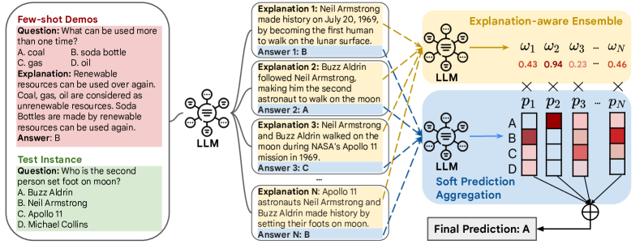
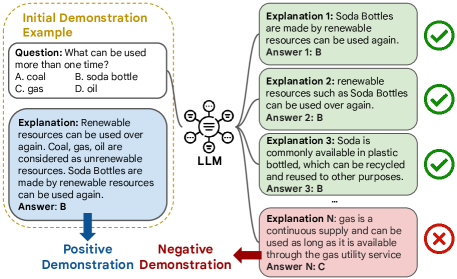
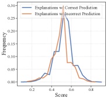
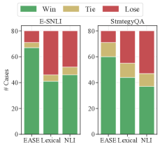
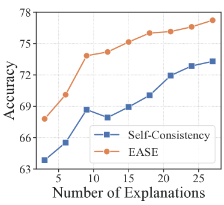

# Explanation-aware Soft Ensemble Empowers Large Language Model In-context Learning

###### Abstract

Large language models (LLMs) have shown remarkable capabilities in various natural language understanding tasks. With only a few demonstration examples, these LLMs can quickly adapt to target tasks without expensive gradient updates. Common strategies to boost such “in-context” learning ability are to ensemble multiple model decoded results and require the model to generate an explanation along with the prediction. However, these models often treat different class predictions equally and neglect the potential discrepancy between the explanations and predictions. To fully unleash the power of explanations, we propose EaSE, an *Explanation-Aware Soft Ensemble* framework to empower in-context learning with LLMs. We design two techniques, explanation-guided ensemble, and soft probability aggregation, to mitigate the effect of unreliable explanations and improve the consistency between explanations and final predictions. Experiments on seven natural language understanding tasks and four varying-size LLMs demonstrate the effectiveness of our proposed framework.  

## 1 Introduction

Recent advancements in Natural Language Processing (NLP) have witnessed the remarkable capabilities of Large Language Models (LLMs) (Brown et al., [2020](#bib.bib5); Tay et al., [2023](#bib.bib38); Chowdhery et al., [2022](#bib.bib11); Anil et al., [2023](#bib.bib2); Touvron et al., [2023](#bib.bib40); OpenAI, [2023](#bib.bib31)). These LLMs can rapidly adapt to new tasks by learning only on a few input-output pairs (*a.k.a.* demonstrations) in context, without any gradient update (Wei et al., [2022a](#bib.bib45); Xie et al., [2022](#bib.bib50)). Yet, beyond those demonstrations, a significant facet of human learning revolves around explanations. These explanations111In this paper, we use the term ‘explanations’ and ‘rationales’ interchangeably., typically in the form of a few keywords or sentences, reveal the underlying principles connecting the input and output (Zaidan et al., [2007](#bib.bib57); Narang et al., [2020](#bib.bib28)). Consequently, the integration of free-text explanations into LLM prompting holds great potentials to further enhance in-context learning performance.  

Recent studies have examined how to incorporate free-text explanations into LLM in-context learning scheme. For instance, the *Predict-then-Explain* pipeline (Lampinen et al., [2022](#bib.bib18)) proposes to generate the explanation *after* making the prediction. Consequently, the predictions from LLM won’t directly benefit from their corresponding explanations. In contrast, the *Explain-then-Predict* pipeline (also called “Chain-of-Thought”) (Nye et al., [2021](#bib.bib30); Wei et al., [2022b](#bib.bib46)) generates explanations *before* making predictions via greedy sampling. When the LLM-generated explanations are unreliable, predictions from this approach will be largely distracted and defective (Ye & Durrett, [2022](#bib.bib52)). To mitigate this issue, Wang et al. ([2023c](#bib.bib44)) improves the “Chain-of-Thought” pipeline by first generating multiple predictions with different explanations using temperature sampling and then aggregating them via majority voting. However, this approach can be sub-optimal as (1) temperature sampling increases the inconsistency between generated explanations and their associated class predictions, and (2) majority voting treats different predictions associated with explanations of varying qualities equally. As a result, how to robustly leverage natural language explanations for empowering LLM in-context learning remains an open research question.   

In this work, we present a novel Explanation-aware Soft Ensemble framework, named EaSE, to assist LLM in-context learning with explanations. Our technique integrates explanations into the ensemble procedure and employs soft probability to mitigate discrepancies between explanations and predictions. The key module of the EaSE framework hinges upon the idea of weighted ensemble: As shown in Figure [1](#S1.F1 "Figure 1 ‣ 1 Introduction ‣ Explanation-aware Soft Ensemble Empowers Large Language Model In-context Learning"), instead of treating all predictions equally, we assign a score to each prediction based on the contextual relevance and inherent quality of its associated explanation, which will be used as a weight during the final ensemble stage. This explanation-aware ensemble stage is also realized with an LLM — after generating explanations and predictions using temperature sampling for each test instance, we prompt the LLM to weight all class predictions based on their associated explanations in an in-context manner. While the LLM offers great promise for the weighting purpose, it is crucial to provide sufficient *supervision signals* as demonstrations to guide the LLM scoring, yet the primary constraint for this step lies in the absence of *negative* explanations from few-shot demonstrations. To construct negative examples efficiently, we first use LLM to generate explanations for few-shot demonstrations, then select explanations associated with *incorrect predictions* as the negative samples. In this way, the LLM scorer can be readily applied to perform explanation-aware ensembling without any additional annotation.  

Beyond explanation-aware ensembling, EaSE incorporates an additional technique named *soft probability aggregation*, which helps to mitigate the *inconsistency* between explanations and predictions, given the sampling process may inevitably infuse noises into the final prediction. Specifically, it employs probabilities across various class-indicative verbalizers in place of the original one-hot predictions. This design, although conceptually simple, can effectively reduce the discrepancies between explanations and predictions and further improve the final predictions accuracy.  

Our contributions can be summarized as follows:  

* We propose the EaSE framework to better facilitate in-context learning for large language models with natural language explanations. 
* We design two techniques, namely explanation-aware ensemble and soft probability aggregation, to enable the model to focus on predictions associated with explanations of higher qualities while reducing the inconsistency between explanations and predictions. 
* We conduct experiments on seven natural language understanding (NLU) datasets spanning between natural language inference (NLI) and question answering (QA), and our method outperforms previous state-of-the-art approaches using different LLMs as the backbone. Our analysis further justifies the advantages of using LLMs for explanation weighting to support correct answer candidates and leveraging soft probability aggregation to mitigate inconsistent predictions. 

[FIGURE S1.F1.g1]

Figure 1: The overview of EaSE framework.
[/FIGURE]

## 2 Related Work

Two prevalent explanation types exist for interpreting NLP models: (1) *extraction-based explanations* that highlight important segments of the original input text (Zhang et al., [2016](#bib.bib59); DeYoung et al., [2020](#bib.bib12); Paranjape et al., [2020](#bib.bib32); Zhou et al., [2020](#bib.bib60); Yin & Neubig, [2022](#bib.bib54)) and (2) *free-form explanations* that craft prediction rationales directly using natural language text (Rajani et al., [2019](#bib.bib34); Sun et al., [2022](#bib.bib36); Wiegreffe et al., [2021](#bib.bib48); [2022](#bib.bib49); Wang et al., [2023a](#bib.bib41); Ludan et al., [2023](#bib.bib24)). Beyond aiding in model interpretation, recent studies have demonstrated that these explanations can also enhance the few-shot learning capabilities of large language models. For example, Wei et al. ([2022b](#bib.bib46)); Zelikman et al. ([2022](#bib.bib58)) propose to *prepend explanations* before the answers while Lampinen et al. ([2022](#bib.bib18)) suggest adding *post-answer explanations*. Given that these explanations are often derived during the LLM decoding stage and may contain noise, (Wang et al., [2023c](#bib.bib44); [2022](#bib.bib43)) advocate for generating multiple candidate explanations with their respective predictions, followed by aggregating these predictions via majority voting. In our study, we focus on *free-form explanations* and explore how to better aggregating these predictions with explanations in a weighted ensemble. Using a bootstrapped LLM, we subsequently evaluate each explanation to enhance in-context learning outcomes.  

Another line of research related to our study is automated explanation quality evaluation (Sun et al., [2022](#bib.bib36); Joshi et al., [2023](#bib.bib16); Wiegreffe et al., [2021](#bib.bib48); Chen et al., [2023a](#bib.bib7); [c](#bib.bib10)). Ye & Durrett ([2022](#bib.bib52)) utilize lexical features to measure the faithfulness of explanations without considering their semantics. Chen et al. ([2021](#bib.bib8)); Li et al. ([2023b](#bib.bib20)) leverage a NLI fine-tuned model to verify the explanations reliability. (Fu et al., [2023](#bib.bib14); Liu et al., [2023](#bib.bib23); Qin et al., [2023](#bib.bib33); Chen et al., [2023b](#bib.bib9)) also study how to use LLM to build a generic text quality scorers for generation and ranking tasks. These studies often rely on additional ground-truth labels and human annotations, making them less suitable when the labels for test instances are unknown. In contrast, our research diverges from the pure evaluative perspective while focusing more on effectively leveraging model-generated explanations to empower the LLM in-context learning performance. There are also several works that attempted to use LLMs to generate demonstrations (Shao et al., [2023](#bib.bib35); Kim et al., [2023](#bib.bib17); Yu et al., [2023](#bib.bib56)), but they mainly focus on producing few-shot demonstrations, whereas our approach emphasizes the generation of negative examples for more robust scoring and evaluation of explanations.  

## 3 Method

In this section, we first give a brief introduction to the problem definition. Then, we present our approach with two designs, namely explanation-aware ensemble and soft probability aggregation, with the goal of leveraging the generated explanations to improve the final prediction performance.  

### 3.1 Problem Definition

In this task, we are given a LLM $\mathcal{M}$ parameterized by $\theta$, a set of few-shot demonstrations $\mathcal{D}=\{(x_{i},e_{i},y_{i})\}_{i=1}^{K}$ on a target classification task222Future work would be suited to consider extending our work to generative tasks., where $K$ is the number of demonstrations, $x_{i},y_{i}$ are the input text and label for the $i$-th example, and $e_{i}$ is the corresponding ground-truth explanation. For each test example $x\in\mathcal{D}_{\text{test}}$, we aim to leverage $\mathcal{M}$ and $\mathcal{D}$ to predict its own label. Our primary goal is to improve the prediction accuracy for test examples.  

### 3.2 Recap of Self-consistency Pipeline for In-context Learning

Here we give a brief introduction to the self-consistency approach (Wang et al., [2023c](#bib.bib44)). For each test example $x\in\mathcal{D}_{\text{test}}$, it first forms the prompt for few-shot demonstrations as $\mathcal{P}=\left\{{\mathcal{T}},\operatorname{shuffle}(\|_{i=1}^{K}(x_{i},e_{i},y_{i})\right)\}$, where ${\mathcal{T}}$ is the prompt template, and $\operatorname{shuffle}\left(\|_{i=1}^{K}(x_{i},e_{i},y_{i})\right)$ is a permutation of $K$ demonstrations. Then, it generates $N$ candidate explanations together with predictions (denoted as $(e_{j},p_{j})$) via sampling from the LLM with non-zero temperature as  

|  | $$(e_{j},p_{j})_{j=1}^{N}\sim p_{\theta}\left(e,p\mid\mathcal{P},x\right),$$ |  | (1) |
| --- | --- | --- | --- |

Finally, it aggregates these $N$ candidates into the final prediction via majority voting as  

|  | $$\widetilde{y}=\mathop{\mathrm{argmax}}_{y}~{}\sum_{j=1}^{N}\mathbb{I}(p_{j}=y).$$ |  | (2) |
| --- | --- | --- | --- |

Self-consistency enhances the standard explain-then-predict pipeline by utilizing multiple predictions derived from varied explanations. Despite its strong performance, through our examination, we’ve pinpointed two primary bottlenecks within the self-consistency pipeline, listed as follows:  

* *Explanation-agnostic Ensembling*: Self-consistency uniformly weights all predictions and aggregates them via simple majority voting. This approach overlooks the variance in explanation quality, which can be problematic when certain predictions stem from flawed reasoning paths evident in poor-quality explanations. 
* *Explanation-Prediction Inconsistency*: During its prediction phase, Self-consistency employs the temperature sampling technique to draw samples from the LLM. This sampling step can introduce noise, leading to predictions that are inconsistent with their corresponding explanations (Ye & Durrett, [2022](#bib.bib52)). 

The identified limitations necessitate the need for new techniques to better harvest intermediate explanations for obtaining the final prediction. Towards this goal, we propose our framework EaSE, which is tailored to tackle the aforementioned challenges. EaSE is comprised with two techniques, explanation-aware ensemble and soft probability aggregation, to optimize the LLM’s prediction accuracy when deriving final outcomes from multiple candidate explanations.  

### 3.3 Explanation-guided Ensemble

LLMs typically produce multiple explanations along with their predictions through a sampling process. Due to the intrinsic randomness of this sampling, the quality of these predictions can fluctuate. To address the potential pitfalls where erroneous explanations results in inaccurate predictions, we introduce the *explanation-aware ensemble* technique. This method estimates the significance of each class prediction based on its corresponding explanation. Consequently, our explanation-aware ensemble technique ensures that predictions linked with better explanations carry greater weight during the final prediction aggregation phase.  

LLM as Explanation Scorer To evaluate various explanations, past research has either measured the lexical overlap between the explanation and the input text (Ye & Durrett, [2022](#bib.bib52)) or employed models fine-tuned for NLI tasks (Chen et al., [2021](#bib.bib8); Li et al., [2023b](#bib.bib20)). In contrast to these methods, which either overlook the deep semantics of explanations or require extra human-annotated data, our explanation scorer is developed based on the powerful LLM $\mathcal{M}$, directly harnessing its inherent linguistic and reasoning capabilities.  

Given the original task input $x$ and one explanation $e$, we use the verbalizer $v_{\text{pos}}(v_{\text{neg}}$) to represent the class of this explanation being “*positive*” (“*negative*”). A “*positive*” explanation means this explanation can help the model reach correct answer and a “*negative*” explanation means the other way around. Then, we craft a supplementary prompt ${\mathcal{T}}_{\text{score}}=$ “*Can this explanation be used to help the model answer the question?*” for LLM prompting. With the verbalizers and prompts, we effectively recast the problem of explanation scoring into determining the conditional probability of producing the verbalizer aligned with the positive label $v_{\text{pos}}$, expressed as  

|  | $$\omega_{e}=p_{\theta}\left(y=v_{\text{pos}}\mid{\mathcal{T}}_{\text{score}},x,e\right).$$ |  | (3) |
| --- | --- | --- | --- |

In this way, the score $\omega_{e}$ is normalized between 0 and 1 and a higher score indicates the explanation with better quality.  

[FIGURE S3.F2.g1]

Figure 2: Bootstrapped LLM Scorer.
[/FIGURE]

Bootstrapped LLM Scorer Although the above approach can already produce scores for each prediction, the score generated with the LLM $\mathcal{M}$ can still be biased and less precise (Wang et al., [2023b](#bib.bib42)), especially under the zero-shot scenario where no demonstrations are provided. To mitigate the bias and generate reliable scores, we propose to provide additional examples to serve as “*positive*” and “*negative*” explanations to facilitate LLM scoring using the original few-shot demonstrations in $\mathcal{D}$.  

For each original demonstration instance, it is straightforward to obtain “*positive*” examples from the ground-truth explanation. Obtaining “*negative*” examples, on the other hand, can be more challenging as they are not explicitly provided. To tackle this issue, we exploit the assumption based on the utility of explanations: an ideal explanation should guide the model towards the accurate prediction of ground-truth labels (Wiegreffe et al., [2021](#bib.bib48)). Consequently, it’s reasonable to classify explanations leading to erroneous predictions as ”negative”. In practice, for every instance $(x_{i},y_{i})\in\mathcal{D}$, we randomly select $k$ (8 in this work) exemplars from the training set and then use these as demonstrations and generate a set of candidate pairs $\mathcal{C}_{i}=\{(e_{ij},p_{ij})\}_{j=1}^{N}$ via sampling from the LLM. Then, if the explanation-prediction pair $(e_{ij},p_{ij})$ from $\mathcal{C}_{i}$ satisfies $y_{i}\neq p_{ij}$, we select $e_{ij}$ to serve as the negative explanation set $\mathcal{N}_{i}$ for $x_{i}$ as  

|  | $$\mathcal{N}_{i}=\{(e_{ij},p_{ij})\in\mathcal{C}_{i}\mid y_{i}\neq p_{ij}\}.$$ |  | (4) |
| --- | --- | --- | --- |

To finalize the demonstration set for the LLM scoring step, we balance between “*positive*” and “*negative*” explanations: only instances possessing negative explanations (i.e. with non-empty $\mathcal{N}_{i}$) are incorporated into the demonstrations; For every instance, a single negative explanation is chosen at random from the respective candidate set. This methodology produces a balanced demonstration set for LLM-based explanation scoring without requiring extra human annotations.  

### 3.4 Soft Probability Aggregation

In the preceding step, the primary objective is to assign a score to each prediction based on its associated explanation through the LLM $\mathcal{M}$. This process, however, does not account for directly modeling the LLM’s output predictions. To bridge this gap, we propose *soft probability aggregation*, a simple and intuitive approach to resolve the discrepancy between the explanations and predictions — rather than aggregating over the raw predictions, it directly computes the sum of the probabilities associated with each potential label, expressed as  

|  | $$\widetilde{y}=\mathop{\mathrm{argmax}}_{y}~{}\sum_{j=1}^{N}p_{\theta}\left(y\mid\mathcal{P},x,e_{j}\right).$$ |  | (5) |
| --- | --- | --- | --- |

The *soft probability aggregation* addresses the noise inherited in different LLM sampling-based decoding algorithms, resulting in a more accurate and refined final prediction.  

### 3.5 Summary

By plugging these two techniques together, we obtain the final prediction $\widetilde{y}$ for the test instance $x$ as  

|  | $$\widetilde{y}=\mathop{\mathrm{argmax}}_{y}~{}\sum_{j=1}^{N}\omega_{e_{j}}\times p_{\theta}\left(y\mid\mathcal{P},x,e_{j}\right),$$ |  | (6) |
| --- | --- | --- | --- |

where $e_{j}$ is the intermediate explanations generated via Eq. [1](#S3.E1 "In 3.2 Recap of Self-consistency Pipeline for In-context Learning ‣ 3 Method ‣ Explanation-aware Soft Ensemble Empowers Large Language Model In-context Learning"), the $\omega_{e_{j}}$ is the weight for $e_{j}$ using the bootstrapped LLM scorer using Eq. [3](#S3.E3 "In 3.3 Explanation-guided Ensemble ‣ 3 Method ‣ Explanation-aware Soft Ensemble Empowers Large Language Model In-context Learning"), and $p_{\theta}\left(y\mid\mathcal{P},x,e_{j}\right)$ is the soft probability generated using Eq. [5](#S3.E5 "In 3.4 Soft Probability Aggregation ‣ 3 Method ‣ Explanation-aware Soft Ensemble Empowers Large Language Model In-context Learning"). Overall, calculating the score for each explanation and the soft probability both take an additional $O(N)$ time complexity. Fortunately, these two steps do not require additional model training and can be efficiently supported with distributed inference techniques in practice. Other than these two techniques, our framework keeps other components intact and can be plugged into most LLM backbones for empowering its in-context learning ability.  

## 4 Experiments

### 4.1 Experiment Setups

Tasks We evaluate our EaSE framework on two types of tasks: natural language inference and question answering. Specifically, we use the following datasets: (1) E-SNLI (Camburu et al., [2018](#bib.bib6)) is an enriched version of the Stanford Natural Language Inference (SNLI) corpus (Bowman et al., [2015](#bib.bib4)), augmented with human-annotated natural language explanations for entailment relations; (2) ANLI-R1/R2/R3 (Nie et al., [2020](#bib.bib29)) is a set of three collections of adversarially generated NLI examples curated through a human-in-the-loop process; (3) ECQA (Aggarwal et al., [2021](#bib.bib1)) is built upon CommonsenseQA benchmark (Talmor et al., [2019](#bib.bib37)) and contains additional human-annotated question explanations; (4) OpenbookQA (Mihaylov et al., [2018](#bib.bib27)) is a QA dataset that requires comprehensive understanding and reasoning from open-book sources. As no ground-truth explanations are given, we use the provided facts for each question as the proxy explanations. (5) StrategyQA (Geva et al., [2021](#bib.bib15)) focuses on reasoning over complex, multi-hop questions that often require strategic planning and decision-making.  

Baselines We consider the following baselines: (1) Standard In-context Learning (ICL) (Brown et al., [2020](#bib.bib5)): it solely uses the input-label pairs for few-shot learning without using natural language explanations. (2) Predict-then-Explain (PE) (Lampinen et al., [2022](#bib.bib18)): it provides the explanation after the labels for each instance when constructing prompts for demonstrations. During the inference stage, it generates the explanation after the prediction. (3) Explain-then-Predict (EP) (Wei et al., [2022b](#bib.bib46)): it is the standard chain-of-thought pipeline which provides an explanation before the label for demonstrations. During the inference stage, it first generates an explanation, then followed by the prediction. Note that for both PE and EP method, we use greedy sampling to obtain the explanation and prediction. (4) Self-consistency (Wang et al., [2022](#bib.bib43); [2023c](#bib.bib44)): it improves over the standard EP pipeline by aggregating over multiple explanations from LLMs to enhance the robustness of the results. (5) FLamE (Zhou et al., [2023](#bib.bib61)) is a recent LLM few-shot learning method that generates multiple label-conditioned explanations and determines the final prediction based on the label that achieves the highest logit after reviewing all explanations for the given instance333In the original FLamE paper, the RoBERTa is used for final classification. For a fair comparison, we adjusted FLamE to use the in-context LLM as the classifier..  

##### Implementation Details

In our main experiments, we use PaLM2-S and PaLM2-L (Anil et al., [2023](#bib.bib2)) as the backbone model. Results on more (open source) backbone models are reported in Section [4.3](#S4.SS3 "4.3 Results on Open-source Models ‣ 4 Experiments ‣ Explanation-aware Soft Ensemble Empowers Large Language Model In-context Learning"). For each dataset, we set the size of few-shot examples to 48 following (Zhou et al., [2023](#bib.bib61); Marasovic et al., [2022](#bib.bib26)), and fit as many instances as possible during inference until reached the maximum length. As the LLM is often sensitive to the selection of few-shot examples (Yu et al., [2022](#bib.bib55); Ye & Durrett, [2023](#bib.bib53); Liu et al., [2022](#bib.bib22)), for each dataset, we create 5 splits from the original dataset, each containing 300 test examples, and report the average performance over 5 splits. During sampling, we set the default temperate to $t=0.7$ and sample $N=9$ candidate explanations for each instance.  

### 4.2 Overall Results

[TABLE S4.T1]

<table class="ltx_tabular ltx_align_middle">
<tr class="ltx_tr">
<td class="ltx_td ltx_align_left ltx_border_tt">Backbone</td>
<td class="ltx_td ltx_align_center ltx_border_tt">Methods</td>
<td class="ltx_td ltx_align_center ltx_border_tt">E-SNLI</td>
<td class="ltx_td ltx_align_center ltx_border_tt">ANLI-R1</td>
<td class="ltx_td ltx_align_center ltx_border_tt">ANLI-R2</td>
<td class="ltx_td ltx_align_center ltx_border_tt">ANLI-R3</td>
<td class="ltx_td ltx_align_center ltx_border_tt">ECQA</td>
<td class="ltx_td ltx_align_center ltx_border_tt">StrategyQA</td>
<td class="ltx_td ltx_align_center ltx_border_tt">OpenbookQA</td>
<td class="ltx_td ltx_align_center ltx_border_tt">Average</td>
</tr>
<tr class="ltx_tr">
<td class="ltx_td ltx_align_left ltx_border_t">PaLM 2-S</td>
<td class="ltx_td ltx_align_center ltx_border_t">ICL <cite class="ltx_cite ltx_citemacro_citep">(Brown et al., <a class="ltx_ref">2020</a>)</cite>
</td>
<td class="ltx_td ltx_align_center ltx_border_t">59.88</td>
<td class="ltx_td ltx_align_center ltx_border_t">54.38</td>
<td class="ltx_td ltx_align_center ltx_border_t">48.10</td>
<td class="ltx_td ltx_align_center ltx_border_t">52.66</td>
<td class="ltx_td ltx_align_center ltx_border_t">59.84</td>
<td class="ltx_td ltx_align_center ltx_border_t">66.69</td>
<td class="ltx_td ltx_align_center ltx_border_t">80.21</td>
<td class="ltx_td ltx_align_center ltx_border_t">60.25</td>
</tr>
<tr class="ltx_tr">
<td class="ltx_td ltx_align_center">PE <cite class="ltx_cite ltx_citemacro_citep">(Lampinen et al., <a class="ltx_ref">2022</a>)</cite>
</td>
<td class="ltx_td ltx_align_center">71.02</td>
<td class="ltx_td ltx_align_center">62.59</td>
<td class="ltx_td ltx_align_center">55.18</td>
<td class="ltx_td ltx_align_center">57.17</td>
<td class="ltx_td ltx_align_center">74.39</td>
<td class="ltx_td ltx_align_center">71.75</td>
<td class="ltx_td ltx_align_center">79.70</td>
<td class="ltx_td ltx_align_center">67.40</td>
</tr>
<tr class="ltx_tr">
<td class="ltx_td ltx_align_center">EP <cite class="ltx_cite ltx_citemacro_citep">(Wei et al., <a class="ltx_ref">2022b</a>)</cite>
</td>
<td class="ltx_td ltx_align_center">64.53</td>
<td class="ltx_td ltx_align_center">57.40</td>
<td class="ltx_td ltx_align_center">53.00</td>
<td class="ltx_td ltx_align_center">53.33</td>
<td class="ltx_td ltx_align_center">72.11</td>
<td class="ltx_td ltx_align_center">72.40</td>
<td class="ltx_td ltx_align_center">81.38</td>
<td class="ltx_td ltx_align_center">64.88</td>
</tr>
<tr class="ltx_tr">
<td class="ltx_td ltx_align_center">Self-consistency <cite class="ltx_cite ltx_citemacro_citep">(Wang et al., <a class="ltx_ref">2023c</a>)</cite>
</td>
<td class="ltx_td ltx_align_center">68.68</td>
<td class="ltx_td ltx_align_center">65.40</td>
<td class="ltx_td ltx_align_center">56.49</td>
<td class="ltx_td ltx_align_center">59.00</td>
<td class="ltx_td ltx_align_center">74.48</td>
<td class="ltx_td ltx_align_center">76.94</td>
<td class="ltx_td ltx_align_center">83.47</td>
<td class="ltx_td ltx_align_center">69.21</td>
</tr>
<tr class="ltx_tr">
<td class="ltx_td ltx_align_center">FLamE <cite class="ltx_cite ltx_citemacro_citep">(Zhou et al., <a class="ltx_ref">2023</a>)</cite>
</td>
<td class="ltx_td ltx_align_center">67.58</td>
<td class="ltx_td ltx_align_center">60.36</td>
<td class="ltx_td ltx_align_center">52.00</td>
<td class="ltx_td ltx_align_center">50.15</td>
<td class="ltx_td ltx_align_center">72.80</td>
<td class="ltx_td ltx_align_center">75.33</td>
<td class="ltx_td ltx_align_center">80.14</td>
<td class="ltx_td ltx_align_center">65.48</td>
</tr>
<tr class="ltx_tr">
<td class="ltx_td ltx_align_center ltx_border_t">EaSE</td>
<td class="ltx_td ltx_align_center ltx_border_t">75.01</td>
<td class="ltx_td ltx_align_center ltx_border_t">66.48</td>
<td class="ltx_td ltx_align_center ltx_border_t">59.66</td>
<td class="ltx_td ltx_align_center ltx_border_t">64.33</td>
<td class="ltx_td ltx_align_center ltx_border_t">75.59</td>
<td class="ltx_td ltx_align_center ltx_border_t">78.23</td>
<td class="ltx_td ltx_align_center ltx_border_t">84.10</td>
<td class="ltx_td ltx_align_center ltx_border_t">71.92 (<math class="ltx_Math"><semantics><mo>↑</mo><annotation-xml><ci>↑</ci></annotation-xml><annotation>\uparrow</annotation></semantics></math>3.91%)</td>
</tr>
<tr class="ltx_tr">
<td class="ltx_td ltx_align_center">
EaSE w/o BLS</td>
<td class="ltx_td ltx_align_center">73.84</td>
<td class="ltx_td ltx_align_center">66.84</td>
<td class="ltx_td ltx_align_center">58.74</td>
<td class="ltx_td ltx_align_center">62.66</td>
<td class="ltx_td ltx_align_center">75.17</td>
<td class="ltx_td ltx_align_center">78.40</td>
<td class="ltx_td ltx_align_center">83.91</td>
<td class="ltx_td ltx_align_center">71.37</td>
</tr>
<tr class="ltx_tr">
<td class="ltx_td ltx_align_center">
EaSE w/o SPA</td>
<td class="ltx_td ltx_align_center">69.82</td>
<td class="ltx_td ltx_align_center">67.77</td>
<td class="ltx_td ltx_align_center">58.50</td>
<td class="ltx_td ltx_align_center">62.50</td>
<td class="ltx_td ltx_align_center">75.42</td>
<td class="ltx_td ltx_align_center">78.33</td>
<td class="ltx_td ltx_align_center">83.68</td>
<td class="ltx_td ltx_align_center">70.73</td>
</tr>
<tr class="ltx_tr">
<td class="ltx_td ltx_align_left ltx_border_bb ltx_border_t">PaLM 2-L</td>
<td class="ltx_td ltx_align_center ltx_border_t">ICL <cite class="ltx_cite ltx_citemacro_citep">(Brown et al., <a class="ltx_ref">2020</a>)</cite>
</td>
<td class="ltx_td ltx_align_center ltx_border_t">87.42</td>
<td class="ltx_td ltx_align_center ltx_border_t">79.00</td>
<td class="ltx_td ltx_align_center ltx_border_t">68.33</td>
<td class="ltx_td ltx_align_center ltx_border_t">65.65</td>
<td class="ltx_td ltx_align_center ltx_border_t">81.29</td>
<td class="ltx_td ltx_align_center ltx_border_t">81.13</td>
<td class="ltx_td ltx_align_center ltx_border_t">91.17</td>
<td class="ltx_td ltx_align_center ltx_border_t">79.14</td>
</tr>
<tr class="ltx_tr">
<td class="ltx_td ltx_align_center">PE <cite class="ltx_cite ltx_citemacro_citep">(Lampinen et al., <a class="ltx_ref">2022</a>)</cite>
</td>
<td class="ltx_td ltx_align_center">88.84</td>
<td class="ltx_td ltx_align_center">80.55</td>
<td class="ltx_td ltx_align_center">71.49</td>
<td class="ltx_td ltx_align_center">68.33</td>
<td class="ltx_td ltx_align_center">83.13</td>
<td class="ltx_td ltx_align_center">83.19</td>
<td class="ltx_td ltx_align_center">92.46</td>
<td class="ltx_td ltx_align_center">81.14</td>
</tr>
<tr class="ltx_tr">
<td class="ltx_td ltx_align_center">EP <cite class="ltx_cite ltx_citemacro_citep">(Wei et al., <a class="ltx_ref">2022b</a>)</cite>
</td>
<td class="ltx_td ltx_align_center">84.59</td>
<td class="ltx_td ltx_align_center">79.03</td>
<td class="ltx_td ltx_align_center">67.99</td>
<td class="ltx_td ltx_align_center">67.66</td>
<td class="ltx_td ltx_align_center">80.51</td>
<td class="ltx_td ltx_align_center">85.45</td>
<td class="ltx_td ltx_align_center">89.74</td>
<td class="ltx_td ltx_align_center">79.28</td>
</tr>
<tr class="ltx_tr">
<td class="ltx_td ltx_align_center">Self-consistency <cite class="ltx_cite ltx_citemacro_citep">(Wang et al., <a class="ltx_ref">2023c</a>)</cite>
</td>
<td class="ltx_td ltx_align_center">87.34</td>
<td class="ltx_td ltx_align_center">81.29</td>
<td class="ltx_td ltx_align_center">73.16</td>
<td class="ltx_td ltx_align_center">70.16</td>
<td class="ltx_td ltx_align_center">82.67</td>
<td class="ltx_td ltx_align_center">87.85</td>
<td class="ltx_td ltx_align_center">92.88</td>
<td class="ltx_td ltx_align_center">82.19</td>
</tr>
<tr class="ltx_tr">
<td class="ltx_td ltx_align_center">FLamE <cite class="ltx_cite ltx_citemacro_citep">(Zhou et al., <a class="ltx_ref">2023</a>)</cite>
</td>
<td class="ltx_td ltx_align_center">83.23</td>
<td class="ltx_td ltx_align_center">71.85</td>
<td class="ltx_td ltx_align_center">58.50</td>
<td class="ltx_td ltx_align_center">56.83</td>
<td class="ltx_td ltx_align_center">80.26</td>
<td class="ltx_td ltx_align_center">84.79</td>
<td class="ltx_td ltx_align_center">93.14</td>
<td class="ltx_td ltx_align_center">75.51</td>
</tr>
<tr class="ltx_tr">
<td class="ltx_td ltx_align_center ltx_border_t">EaSE</td>
<td class="ltx_td ltx_align_center ltx_border_t">89.42</td>
<td class="ltx_td ltx_align_center ltx_border_t">83.69</td>
<td class="ltx_td ltx_align_center ltx_border_t">76.16</td>
<td class="ltx_td ltx_align_center ltx_border_t">74.00</td>
<td class="ltx_td ltx_align_center ltx_border_t">83.65</td>
<td class="ltx_td ltx_align_center ltx_border_t">89.90</td>
<td class="ltx_td ltx_align_center ltx_border_t">93.93</td>
<td class="ltx_td ltx_align_center ltx_border_t">84.40 (<math class="ltx_Math"><semantics><mo>↑</mo><annotation-xml><ci>↑</ci></annotation-xml><annotation>\uparrow</annotation></semantics></math>2.69%)</td>
</tr>
<tr class="ltx_tr">
<td class="ltx_td ltx_align_center">
EaSE w/o BLS</td>
<td class="ltx_td ltx_align_center">88.94</td>
<td class="ltx_td ltx_align_center">82.87</td>
<td class="ltx_td ltx_align_center">75.60</td>
<td class="ltx_td ltx_align_center">72.66</td>
<td class="ltx_td ltx_align_center">83.42</td>
<td class="ltx_td ltx_align_center">89.34</td>
<td class="ltx_td ltx_align_center">93.72</td>
<td class="ltx_td ltx_align_center">83.79</td>
</tr>
<tr class="ltx_tr">
<td class="ltx_td ltx_align_center ltx_border_bb">
EaSE w/o SPA</td>
<td class="ltx_td ltx_align_center ltx_border_bb">88.21</td>
<td class="ltx_td ltx_align_center ltx_border_bb">82.59</td>
<td class="ltx_td ltx_align_center ltx_border_bb">73.83</td>
<td class="ltx_td ltx_align_center ltx_border_bb">71.33</td>
<td class="ltx_td ltx_align_center ltx_border_bb">83.42</td>
<td class="ltx_td ltx_align_center ltx_border_bb">89.35</td>
<td class="ltx_td ltx_align_center ltx_border_bb">93.51</td>
<td class="ltx_td ltx_align_center ltx_border_bb">83.18</td>
</tr>
</table>

Table 1: The main experiments results, where “BLS” stands for bootstrapped LLM scorer and “SPA” stands for soft probability aggregation.
[/TABLE]

Table [1](#S4.T1 "Table 1 ‣ 4.2 Overall Results ‣ 4 Experiments ‣ Explanation-aware Soft Ensemble Empowers Large Language Model In-context Learning") exhibits the performance of EaSE and baselines on seven datasets using PaLM 2-S and PaLM 2-L as the backbone. From the results, we have the following findings: First, we can see that leveraging explanations often improves LLM in-context learning. This enhancement is particularly pronounced when the final prediction is aggregated from multiple predictions sampled from the LLM. Conversely, the standard EP pipeline sometimes even hurts the performance, especially for larger models. Second, despite its complex design, the latest baseline FLamE often falls short compared to other baselines, which suggests that fine-tuning an additional classifier is particularly important for FLamE and it might be less compatible with the LLM in-context learning framework. Third, we notice that EaSE can consistently outperform all other methods across both the PaLM 2-S and PaLM 2-L backbones in nearly all datasets, which indicates that EaSE provides a reliable way to improve LLM in-context learning over different tasks. Finally, When comparing EaSE with its own variants (e.g. w/o BLS and SPA), it’s observed that the original EaSE consistently holds an advantage, indicating the necessity of both PW and SA components in maximizing performance.  

### 4.3 Results on Open-source Models

In order to demonstrate the generalizability of our EaSEframework, as well as promote reproducibility, we extend our investigations to open-source LLMs including FLAN-UL2 (Tay et al., [2023](#bib.bib38))444Link: <https://github.com/google-research/google-research/tree/master/ul2>. We only test on StrategyQA dataset since FLAN-UL2 has been fine-tuned on labeled data from other datasets, thus violating the true few-shot setting. and Llama-2-7b (Touvron et al., [2023](#bib.bib40)). Both models have publicly accessible weights555Link: <https://huggingface.co/meta-llama/Llama-2-7b>.. As exhibited in Table [2](#S4.T2 "Table 2 ‣ 4.3 Results on Open-source Models ‣ 4 Experiments ‣ Explanation-aware Soft Ensemble Empowers Large Language Model In-context Learning"), we observe that these two models generally perform worse than the PaLM 2 model in the main experiments, as they have fewer parameters, and thus may not perform well on these challenging NLU benchmarks. Despite this, the experiment results still align with our prior findings, demonstrating that our proposed techniques can consistently yield performance enhancements across these open-source LLMs.  

[TABLE S4.T2]

<table class="ltx_tabular ltx_align_middle">
<tr class="ltx_tr">
<td class="ltx_td ltx_align_center ltx_border_tt">Model (<math class="ltx_Math"><semantics><mo>→</mo><annotation-xml><ci>→</ci></annotation-xml><annotation>\rightarrow</annotation></semantics></math>)</td>
<td class="ltx_td ltx_align_center ltx_border_tt">FLAN-UL2 (20B)</td>
<td class="ltx_td ltx_align_center ltx_border_tt">Llama-2 (7B)</td>
<td class="ltx_td ltx_border_tt"></td>
</tr>
<tr class="ltx_tr">
<td class="ltx_td ltx_align_center">Dataset (<math class="ltx_Math"><semantics><mo>→</mo><annotation-xml><ci>→</ci></annotation-xml><annotation>\rightarrow</annotation></semantics></math>)</td>
<td class="ltx_td ltx_align_center ltx_border_t">StrategyQA</td>
<td class="ltx_td ltx_align_center ltx_border_t">E-SNLI</td>
<td class="ltx_td ltx_align_center ltx_border_t">ANLI-R1</td>
<td class="ltx_td ltx_align_center ltx_border_t">ANLI-R2</td>
<td class="ltx_td ltx_align_center ltx_border_t">ANLI-R3</td>
<td class="ltx_td ltx_align_center ltx_border_t">ECQA</td>
<td class="ltx_td ltx_align_center ltx_border_t">StrategyQA</td>
<td class="ltx_td ltx_align_center ltx_border_t">OpenbookQA</td>
<td class="ltx_td ltx_align_center ltx_border_t">Avg.</td>
</tr>
<tr class="ltx_tr">
<td class="ltx_td ltx_align_center ltx_border_t">ICL <cite class="ltx_cite ltx_citemacro_citep">(Brown et al., <a class="ltx_ref">2020</a>)</cite>
</td>
<td class="ltx_td ltx_align_center ltx_border_t">61.76</td>
<td class="ltx_td ltx_align_center ltx_border_t">51.14</td>
<td class="ltx_td ltx_align_center ltx_border_t">34.58</td>
<td class="ltx_td ltx_align_center ltx_border_t">36.05</td>
<td class="ltx_td ltx_align_center ltx_border_t">27.48</td>
<td class="ltx_td ltx_align_center ltx_border_t">45.48</td>
<td class="ltx_td ltx_align_center ltx_border_t">53.81</td>
<td class="ltx_td ltx_align_center ltx_border_t">47.48</td>
<td class="ltx_td ltx_align_center ltx_border_t">42.29</td>
</tr>
<tr class="ltx_tr">
<td class="ltx_td ltx_align_center">PE <cite class="ltx_cite ltx_citemacro_citep">(Lampinen et al., <a class="ltx_ref">2022</a>)</cite>
</td>
<td class="ltx_td ltx_align_center">73.42</td>
<td class="ltx_td ltx_align_center">54.25</td>
<td class="ltx_td ltx_align_center">37.83</td>
<td class="ltx_td ltx_align_center">37.50</td>
<td class="ltx_td ltx_align_center">34.37</td>
<td class="ltx_td ltx_align_center">52.33</td>
<td class="ltx_td ltx_align_center">56.21</td>
<td class="ltx_td ltx_align_center">56.48</td>
<td class="ltx_td ltx_align_center">47.00</td>
</tr>
<tr class="ltx_tr">
<td class="ltx_td ltx_align_center">EP <cite class="ltx_cite ltx_citemacro_citep">(Wei et al., <a class="ltx_ref">2022b</a>)</cite>
</td>
<td class="ltx_td ltx_align_center">75.46</td>
<td class="ltx_td ltx_align_center">56.90</td>
<td class="ltx_td ltx_align_center">35.41</td>
<td class="ltx_td ltx_align_center">39.16</td>
<td class="ltx_td ltx_align_center">36.04</td>
<td class="ltx_td ltx_align_center">54.45</td>
<td class="ltx_td ltx_align_center">57.17</td>
<td class="ltx_td ltx_align_center">44.35</td>
<td class="ltx_td ltx_align_center">46.21</td>
</tr>
<tr class="ltx_tr">
<td class="ltx_td ltx_align_center">Self-consistency <cite class="ltx_cite ltx_citemacro_citep">(Wang et al., <a class="ltx_ref">2023c</a>)</cite>
</td>
<td class="ltx_td ltx_align_center">76.01</td>
<td class="ltx_td ltx_align_center">58.79</td>
<td class="ltx_td ltx_align_center">40.16</td>
<td class="ltx_td ltx_align_center">40.16</td>
<td class="ltx_td ltx_align_center">36.16</td>
<td class="ltx_td ltx_align_center">55.14</td>
<td class="ltx_td ltx_align_center">57.12</td>
<td class="ltx_td ltx_align_center">60.87</td>
<td class="ltx_td ltx_align_center">49.77</td>
</tr>
<tr class="ltx_tr">
<td class="ltx_td ltx_align_center">FLamE <cite class="ltx_cite ltx_citemacro_citep">(Zhou et al., <a class="ltx_ref">2023</a>)</cite>
</td>
<td class="ltx_td ltx_align_center">72.17</td>
<td class="ltx_td ltx_align_center">49.32</td>
<td class="ltx_td ltx_align_center">36.83</td>
<td class="ltx_td ltx_align_center">35.16</td>
<td class="ltx_td ltx_align_center">36.50</td>
<td class="ltx_td ltx_align_center">45.11</td>
<td class="ltx_td ltx_align_center">57.70</td>
<td class="ltx_td ltx_align_center">46.23</td>
<td class="ltx_td ltx_align_center">43.84</td>
</tr>
<tr class="ltx_tr">
<td class="ltx_td ltx_align_center ltx_border_t">EaSE</td>
<td class="ltx_td ltx_align_center ltx_border_t">78.70 (<math class="ltx_Math"><semantics><mo>↑</mo><annotation-xml><ci>↑</ci></annotation-xml><annotation>\uparrow</annotation></semantics></math> 3.55%)</td>
<td class="ltx_td ltx_align_center ltx_border_t">60.80</td>
<td class="ltx_td ltx_align_center ltx_border_t">44.50</td>
<td class="ltx_td ltx_align_center ltx_border_t">41.66</td>
<td class="ltx_td ltx_align_center ltx_border_t">41.33</td>
<td class="ltx_td ltx_align_center ltx_border_t">60.45</td>
<td class="ltx_td ltx_align_center ltx_border_t">59.81</td>
<td class="ltx_td ltx_align_center ltx_border_t">64.43</td>
<td class="ltx_td ltx_align_center ltx_border_t">53.28 (<math class="ltx_Math"><semantics><mo>↑</mo><annotation-xml><ci>↑</ci></annotation-xml><annotation>\uparrow</annotation></semantics></math> 7.05%)</td>
</tr>
<tr class="ltx_tr">
<td class="ltx_td ltx_align_center">
EaSE w/o BLS</td>
<td class="ltx_td ltx_align_center">77.31</td>
<td class="ltx_td ltx_align_center">59.54</td>
<td class="ltx_td ltx_align_center">43.45</td>
<td class="ltx_td ltx_align_center">41.33</td>
<td class="ltx_td ltx_align_center">40.33</td>
<td class="ltx_td ltx_align_center">60.34</td>
<td class="ltx_td ltx_align_center">59.62</td>
<td class="ltx_td ltx_align_center">65.06</td>
<td class="ltx_td ltx_align_center">52.81</td>
</tr>
<tr class="ltx_tr">
<td class="ltx_td ltx_align_center ltx_border_bb">
EaSE w/o SPA</td>
<td class="ltx_td ltx_align_center ltx_border_bb">77.78</td>
<td class="ltx_td ltx_align_center ltx_border_bb">58.50</td>
<td class="ltx_td ltx_align_center ltx_border_bb">41.33</td>
<td class="ltx_td ltx_align_center ltx_border_bb">40.16</td>
<td class="ltx_td ltx_align_center ltx_border_bb">35.33</td>
<td class="ltx_td ltx_align_center ltx_border_bb">54.97</td>
<td class="ltx_td ltx_align_center ltx_border_bb">57.40</td>
<td class="ltx_td ltx_align_center ltx_border_bb">61.71</td>
<td class="ltx_td ltx_align_center ltx_border_bb">49.91</td>
</tr>
</table>

Table 2: The main experiments results on open-source models, where “BLS” stands for bootstrapped LLM scorer and “SPA” stands for soft probability aggregation.
[/TABLE]

[TABLE S4.T3]

<table class="ltx_tabular ltx_align_middle">
<tr class="ltx_tr">
<td class="ltx_td ltx_align_left ltx_border_tt">Dataset (<math class="ltx_Math"><semantics><mo>→</mo><annotation-xml><ci>→</ci></annotation-xml><annotation>\rightarrow</annotation></semantics></math>)</td>
<td class="ltx_td ltx_align_center ltx_border_tt">E-SNLI</td>
<td class="ltx_td ltx_align_center ltx_border_tt">OpenbookQA</td>
<td class="ltx_td ltx_align_center ltx_border_tt">StrategyQA</td>
</tr>
<tr class="ltx_tr">
<td class="ltx_td ltx_align_left">Model (<math class="ltx_Math"><semantics><mo>→</mo><annotation-xml><ci>→</ci></annotation-xml><annotation>\rightarrow</annotation></semantics></math>)</td>
<td class="ltx_td ltx_align_center ltx_border_t">PaLM 2-S</td>
<td class="ltx_td ltx_align_center ltx_border_t">PaLM 2-L</td>
<td class="ltx_td ltx_align_center ltx_border_t">PaLM 2-S</td>
<td class="ltx_td ltx_align_center ltx_border_t">PaLM 2-L</td>
<td class="ltx_td ltx_align_center ltx_border_t">FLAN-UL2</td>
</tr>
<tr class="ltx_tr">
<td class="ltx_td ltx_align_left ltx_border_t">EaSE</td>
<td class="ltx_td ltx_align_center ltx_border_t">69.82</td>
<td class="ltx_td ltx_align_center ltx_border_t">83.68</td>
<td class="ltx_td ltx_align_center ltx_border_t">83.68</td>
<td class="ltx_td ltx_align_center ltx_border_t">93.51</td>
<td class="ltx_td ltx_align_center ltx_border_t">78.70</td>
</tr>
<tr class="ltx_tr">
<td class="ltx_td ltx_align_left">
EaSE w/ PE Negative</td>
<td class="ltx_td ltx_align_center">68.90</td>
<td class="ltx_td ltx_align_center">83.91</td>
<td class="ltx_td ltx_align_center">83.54</td>
<td class="ltx_td ltx_align_center">93.93</td>
<td class="ltx_td ltx_align_center">78.06</td>
</tr>
<tr class="ltx_tr">
<td class="ltx_td ltx_align_left">LLM Zero-shot Scoring <cite class="ltx_cite ltx_citemacro_citep">(Fu et al., <a class="ltx_ref">2023</a>)</cite>
</td>
<td class="ltx_td ltx_align_center">66.84</td>
<td class="ltx_td ltx_align_center">81.77</td>
<td class="ltx_td ltx_align_center">81.38</td>
<td class="ltx_td ltx_align_center">88.50</td>
<td class="ltx_td ltx_align_center">75.15</td>
</tr>
<tr class="ltx_tr">
<td class="ltx_td ltx_align_left">LLM Pairwise Scoring <cite class="ltx_cite ltx_citemacro_citep">(Qin et al., <a class="ltx_ref">2023</a>)</cite>
</td>
<td class="ltx_td ltx_align_center">69.25</td>
<td class="ltx_td ltx_align_center">82.97</td>
<td class="ltx_td ltx_align_center">82.97</td>
<td class="ltx_td ltx_align_center">93.14</td>
<td class="ltx_td ltx_align_center">76.93</td>
</tr>
<tr class="ltx_tr">
<td class="ltx_td ltx_align_left">Lexical Scoring <cite class="ltx_cite ltx_citemacro_citep">(Ye &amp; Durrett, <a class="ltx_ref">2022</a>)</cite>
</td>
<td class="ltx_td ltx_align_center">67.72</td>
<td class="ltx_td ltx_align_center">83.54</td>
<td class="ltx_td ltx_align_center">82.66</td>
<td class="ltx_td ltx_align_center">93.72</td>
<td class="ltx_td ltx_align_center">75.34</td>
</tr>
<tr class="ltx_tr">
<td class="ltx_td ltx_align_left ltx_border_bb">NLI Scoring <cite class="ltx_cite ltx_citemacro_citep">(Chen et al., <a class="ltx_ref">2021</a>)</cite>
</td>
<td class="ltx_td ltx_align_center ltx_border_bb">64.87</td>
<td class="ltx_td ltx_align_center ltx_border_bb">81.89</td>
<td class="ltx_td ltx_align_center ltx_border_bb">82.21</td>
<td class="ltx_td ltx_align_center ltx_border_bb">91.52</td>
<td class="ltx_td ltx_align_center ltx_border_bb">76.11</td>
</tr>
</table>

Table 3: The study on different scoring approaches. Note that to ensure fair comparison, we do not use soft probability aggregation for our method and baselines.
[/TABLE]

### 4.4 Study on Explanation-aware Ensemble

We perform additional experiments to further understand the benefit of the explanation-aware ensemble, and the result is shown in Table [3](#S4.T3 "Table 3 ‣ 4.3 Results on Open-source Models ‣ 4 Experiments ‣ Explanation-aware Soft Ensemble Empowers Large Language Model In-context Learning").  

Performance w/ Different Scoring Methods We first compare our LLM-based explanation scorer with a few alternative methods including (1) *lexical scoring*, which estimates the reliability of explanations via the lexical gap (Ye & Durrett, [2022](#bib.bib52)), and (2) *NLI Scoring* that uses an NLI model to verify the reliability of explanations. In this work, we use MT5-XXL (Xue et al., [2021](#bib.bib51)) fine-tuned on NLI datasets as the scorer. Overall, we observe that our model outperforms these models in most of the cases, indicating that LLM has a strong capacity for estimating the quality of the explanations. In addition, we observe that pairwise scoring does not perform well for weighting the predictions. This is because it was originally proposed for text ranking tasks, while there are many differences between it and our scenarios, including input formats and relevance signals.  

Performance w/ Different Bootstrapping Strategies To justify the design of leveraging the Explain-then-Predict (EP) pipeline to generate negative demonstrations, we also consider other ways including removing demonstrations as well as using the Predict-then-Explain (PE) pipeline. Overall, in many cases, using the EP pipeline leads to better results, as we observe that the PE pipeline sometimes causes the *false negative* issue: it will first generate incorrect predictions but followed with reasonable explanations. However, when the model performs reasonably well (e.g. PaLM 2-L on OpenbookQA), then it may make less erroneous prediction during the bootstrapping step, which may lead to insufficient training signals for EaSE to perform well. In addition, no matter whether PE and EP is used, they both largely outperform the baseline where no demonstration is given, necessitating the role of demonstration for explanation-aware ensembling.  

[FIGURE S4.F3.sf1.g1]

(a) E-SNLI, PaLM2-S
[/FIGURE]

Score Distribution of Explanations To delve deeper into the scores assigned to each explanation and justify that better scores are assigned to explanations with correct answers, we plot the score distribution for explanations with correct predictions666To eliminate the effect of the sampling randomness, we calculate the prediction based on the soft probability using Eq. [5](#S3.E5 "In 3.4 Soft Probability Aggregation ‣ 3 Method ‣ Explanation-aware Soft Ensemble Empowers Large Language Model In-context Learning"). in Figure [3](#S4.F3 "Figure 3 ‣ 4.4 Study on Explanation-aware Ensemble ‣ 4 Experiments ‣ Explanation-aware Soft Ensemble Empowers Large Language Model In-context Learning"). Overall, we observe that explanations that lead to correct answers generally have higher scores — the score distribution is more skewed towards higher values. Besides, the score distribution using PaLM2-L on explanation with correct and incorrect predictions are more separable, indicating larger models tend to have better scoring performance.  

[FIGURE S4.F4.1.g1]

Figure 4: Human Evaluation.
[/FIGURE]

Human Study on Explanations We conduct additional human studies to further investigate whether the scores generated by LLM are aligned with human preferences. For each instance, we sample two explanations with *different* predictions as $\{(e_{1},p_{1}),(e_{2},p_{2})\}$, with one being correct. We compare our approach and two baselines (NLI model, lexical overlap) with human raters: for each pair of explanations, we first ask four humans to determine which explanation is better and use $c_{i}$ $(i=1,2)$ to denote the number of raters that select $e_{i}$ as the better one. Then, we use different models to estimate the score for explanations separately, denoted as $(s_{e_{1}},s_{e_{2}})$. The final judge of “Win-Tie-Lose” is determined to be:  

|  | $$r=\begin{cases}\textrm{win},&\text{ if }(c_{1}>c_{2}\text{ and }s_{e_{1}}>s_{e_{2}})\textbf{ or }(c_{1}<c_{2}\text{ and }s_{e_{1}}<s_{e_{2}});\\ \textrm{tie},&c_{1}=c_{2};\\ \textrm{lose},&\text{ if }(c_{1}<c_{2}\text{ and }s_{e_{1}}>s_{e_{2}})\textbf{ or }(c_{1}>c_{2}\text{ and }s_{e_{1}}<s_{e_{2}}).\end{cases}$$ |  | (7) |
| --- | --- | --- | --- |

On two datasets, we randomly select 80 instances, and the final results are shown in Figure [4](#S4.F4 "Figure 4 ‣ 4.4 Study on Explanation-aware Ensemble ‣ 4 Experiments ‣ Explanation-aware Soft Ensemble Empowers Large Language Model In-context Learning"). The cohen’s kappa among human raters are 0.75 (E-SNLI) and 0.64 (StrategyQA), which stands for “*substantial agreement*”. Overall, we observe that EaSE aligns with human preferences the best, indicating its better ability to be the proxy for explanation quality estimation. We display more examples on generated explanations and the scores in Appendix [E.1](#A5.SS1 "E.1 Case study on explanation-aware ensemble ‣ Appendix E Additional Case Studies ‣ Explanation-aware Soft Ensemble Empowers Large Language Model In-context Learning").  

### 4.5 Study on Soft Probability Aggregation

The premise behind soft probability aggregation is the potential inaccuracy in the prediction token due to temperature sampling variability. To verify this, we calculate the proportion of cases where the prediction token $p_{i}$ is different than the prediction $p_{i}\neq\mathop{\mathrm{argmax}}p(\cdot|\mathcal{P},x,e_{i})$.  

[TABLE S4.T4]

<table class="ltx_tabular ltx_align_middle">
<tr class="ltx_tr">
<td class="ltx_td ltx_align_left ltx_border_tt">Dataset (<math class="ltx_Math"><semantics><mo>→</mo><annotation-xml><ci>→</ci></annotation-xml><annotation>\rightarrow</annotation></semantics></math>)</td>
<td class="ltx_td ltx_align_center ltx_border_tt">E-SNLI</td>
<td class="ltx_td ltx_align_center ltx_border_tt">OpenbookQA</td>
<td class="ltx_td ltx_align_center ltx_border_tt">StrategyQA</td>
</tr>
<tr class="ltx_tr">
<td class="ltx_td ltx_align_left">Model (<math class="ltx_Math"><semantics><mo>→</mo><annotation-xml><ci>→</ci></annotation-xml><annotation>\rightarrow</annotation></semantics></math>)</td>
<td class="ltx_td ltx_align_center ltx_border_t">PaLM 2-S</td>
<td class="ltx_td ltx_align_center ltx_border_t">PaLM 2-L</td>
<td class="ltx_td ltx_align_center ltx_border_t">PaLM 2-S</td>
<td class="ltx_td ltx_align_center ltx_border_t">PaLM 2-L</td>
<td class="ltx_td ltx_align_center ltx_border_t">FLAN-UL2</td>
</tr>
<tr class="ltx_tr">
<td class="ltx_td ltx_align_left ltx_border_t">Inconsistency Ratio</td>
<td class="ltx_td ltx_align_center ltx_border_t">14.60%</td>
<td class="ltx_td ltx_align_center ltx_border_t">10.06%</td>
<td class="ltx_td ltx_align_center ltx_border_t">13.96%</td>
<td class="ltx_td ltx_align_center ltx_border_t">10.71%</td>
<td class="ltx_td ltx_align_center ltx_border_t">10.00%</td>
</tr>
<tr class="ltx_tr">
<td class="ltx_td ltx_align_left">EaSE</td>
<td class="ltx_td ltx_align_center">73.84</td>
<td class="ltx_td ltx_align_center">88.21</td>
<td class="ltx_td ltx_align_center">83.91</td>
<td class="ltx_td ltx_align_center">93.72</td>
<td class="ltx_td ltx_align_center">78.70</td>
</tr>
<tr class="ltx_tr">
<td class="ltx_td ltx_align_left">w/ argmax</td>
<td class="ltx_td ltx_align_center">73.20</td>
<td class="ltx_td ltx_align_center">87.90</td>
<td class="ltx_td ltx_align_center">83.68</td>
<td class="ltx_td ltx_align_center">93.51</td>
<td class="ltx_td ltx_align_center">78.42</td>
</tr>
<tr class="ltx_tr">
<td class="ltx_td ltx_align_left ltx_border_bb">Cond. Gen <cite class="ltx_cite ltx_citemacro_citep">(Li et al., <a class="ltx_ref">2023a</a>)</cite>
</td>
<td class="ltx_td ltx_align_center ltx_border_bb">70.77</td>
<td class="ltx_td ltx_align_center ltx_border_bb">82.20</td>
<td class="ltx_td ltx_align_center ltx_border_bb">78.07</td>
<td class="ltx_td ltx_align_center ltx_border_bb">84.38</td>
<td class="ltx_td ltx_align_center ltx_border_bb">72.80</td>
</tr>
</table>

Table 4: The study on different probability aggregation approaches. Note that we do not use explanation-aware ensemble for our method and baselines.
[/TABLE]

Overall, as exhibited in Table [4](#S4.T4 "Table 4 ‣ 4.5 Study on Soft Probability Aggregation ‣ 4 Experiments ‣ Explanation-aware Soft Ensemble Empowers Large Language Model In-context Learning"), we observe that such inconsistency predictions appear in 10% to 15% of the cases, which is not rare in practice. By using the soft score, we observe that it will consistently lead to performance boosts. The gain is more evident when the inconsistency issue is more severe — on E-SNLI dataset using PaLM 2-S as the backbone, there exist around 15% examples with inconsistent predictions. When incorporating soft probability aggregation, we observe a notable performance gain (from 68.68% to 73.84%). When compared to other methods for prediction correction, such as using the hard prediction (*i.e.* $\mathop{\mathrm{argmax}}p(\cdot|\mathcal{P},x,e_{i})$) or generation probability conditioned on different verbalizers, EaSE also achieves better performance. More case studies on using soft probabilities are deferred to Appendix [E.2](#A5.SS2 "E.2 Case study on soft probability aggregation ‣ Appendix E Additional Case Studies ‣ Explanation-aware Soft Ensemble Empowers Large Language Model In-context Learning").  

### 4.6 Additional Studies

As EaSE relies on several key components such as prompts and sampling steps, in this section, we study their effect on the final prediction performance, using PaLM 2-S as the backbone model.  

Effect of the Sampling Temperatures and Prompt Templates We study the robustness EaSE to different prompt templates by choosing three different prompt formats from (Bach et al., [2022](#bib.bib3)) (the details are in Appendix [B.3](#A2.SS3 "B.3 Additional Prompt Format Used in Prompt Sensitivity Study ‣ Appendix B Prompt Formats ‣ Explanation-aware Soft Ensemble Empowers Large Language Model In-context Learning")) on two datasets. Overall, from Figure [6](#S4.F6 "Figure 6 ‣ 4.6 Additional Studies ‣ 4 Experiments ‣ Explanation-aware Soft Ensemble Empowers Large Language Model In-context Learning") we observe that EaSE is robust to them as all of the prompt formats lead to performance gains when compared to the strongest baseline self-consistency. Similarly, in Figure [6](#S4.F6 "Figure 6 ‣ 4.6 Additional Studies ‣ 4 Experiments ‣ Explanation-aware Soft Ensemble Empowers Large Language Model In-context Learning"), we observe that EaSE also performs better than baseline under all temperature settings, further justify its robustness across different settings.  

[FIGURE S4.F6.1.1.g1]

Figure 5: Prompt Format
[/FIGURE]

[FIGURE S4.F7.sf1.g1]

(a) E-SNLI
[/FIGURE]

Effect of the Number of Generated Explanations $\bm{N}$ In Figure [8](#S4.F8 "Figure 8 ‣ 4.6 Additional Studies ‣ 4 Experiments ‣ Explanation-aware Soft Ensemble Empowers Large Language Model In-context Learning"), we examine the influence of the number of explanations. On both datasets, increasing the explanations generally improves the performance, while EaSE achieves better performance than the baselines using only 30% - 40% of the generated explanations, which can reduce the burden of sampling massive explanations while maintaining the performance.  

Effect of the Size of demonstrations $\bm{K}$ Figure [8](#S4.F8 "Figure 8 ‣ 4.6 Additional Studies ‣ 4 Experiments ‣ Explanation-aware Soft Ensemble Empowers Large Language Model In-context Learning") illustrates the performance with different size of demonstrations. By increasing the number of demonstration $K$, the performance gradually increases, while EaSE achieves performance gains under all value of $K$.  

## 5 Conclusion and Discussion

In this work, we empower LLM’s in-context learning ability with natural language explanations. Specifically, we design explanation-aware ensemble to weight multiple predictions using their associated explanations and realize this idea using a bootstrapped LLM scorer. In addition, we leverage a soft probability aggregation scheme to mitigate the issue of inconsistent predictions for ensembling. We conduct extensive experiments on seven datasets from a diverse task set and show our proposed framework can outperform previous state-of-the-art methods using four LLMs as backbones.  

Notably, while EaSE augments in-context learning by weighting predictions through explanations, it does not refine the explanation’s content. For future works, it is potential to leverage techniques such as self-refinement (Madaan et al., [2023](#bib.bib25); Ling et al., [2023](#bib.bib21)) and debating (Du et al., [2023](#bib.bib13)) to elevate explanation quality and strengthen the model’s reasoning abilities.  

## Limitations

In this work, our primary goal is to identify the existing issues to better leverage explanations to empower in-context learning. While our approach has shown promise, it also comes with increased computational demands, as both explanation-aware ensemble and soft probability aggregation steps require additional computation overhead. Future work could explore designing more powerful prompts to let LLMs directly output the suffix tokens as quality score (Tian et al., [2023](#bib.bib39)). Additionally, our methodology depends on the logits returned in both the explanation-aware ensemble and soft probability aggregation processes, making it less suitable to directly adopted black-box LLMs (e.g. ChatGPT, OpenAI ([2023](#bib.bib31))). To approximate the soft score, one strategy is to set the temperature to non-zero value and conduct multiple sampling steps, then use the frequency of the corresponding verbalizers as the proxy of the score.  

Besides, the key assumption of EaSE is that different explanations are of diverse quality, while those explanation leads to correct predictions tend to be of higher quality. We mainly conduct empirical experiments to support this point, yet there often exists multiple facets to evaluate the quality of free-text explantions (Chen et al., [2023a](#bib.bib7); [c](#bib.bib10); Sun et al., [2022](#bib.bib36)). More in-depth metrics are needed to faithfully evaluate the quality of free-text explanations and reveal the true inner workings of EaSE.  

## References

* Aggarwal et al. (2021)  Shourya Aggarwal, Divyanshu Mandowara, Vishwajeet Agrawal, Dinesh Khandelwal, Parag Singla, and Dinesh Garg.   Explanations for commonsenseqa: New dataset and models.   In *Proceedings of the 59th Annual Meeting of the Association for Computational Linguistics and the 11th International Joint Conference on Natural Language Processing (Volume 1: Long Papers)*, pp.  3050–3065, 2021. 
* Anil et al. (2023)  Rohan Anil, Andrew M Dai, Orhan Firat, Melvin Johnson, Dmitry Lepikhin, Alexandre Passos, Siamak Shakeri, Emanuel Taropa, Paige Bailey, Zhifeng Chen, et al.   Palm 2 technical report.   *arXiv preprint arXiv:2305.10403*, 2023. 
* Bach et al. (2022)  Stephen Bach, Victor Sanh, Zheng Xin Yong, Albert Webson, Colin Raffel, Nihal V. Nayak, Abheesht Sharma, Taewoon Kim, M Saiful Bari, Thibault Fevry, Zaid Alyafeai, Manan Dey, Andrea Santilli, Zhiqing Sun, Srulik Ben-david, Canwen Xu, Gunjan Chhablani, Han Wang, Jason Fries, Maged Al-shaibani, Shanya Sharma, Urmish Thakker, Khalid Almubarak, Xiangru Tang, Dragomir Radev, Mike Tian-jian Jiang, and Alexander Rush.   PromptSource: An integrated development environment and repository for natural language prompts.   In *Proceedings of the 60th Annual Meeting of the Association for Computational Linguistics: System Demonstrations*, pp.  93–104, Dublin, Ireland, May 2022. Association for Computational Linguistics. 
* Bowman et al. (2015)  Samuel R Bowman, Gabor Angeli, Christopher Potts, and Christopher D Manning.   A large annotated corpus for learning natural language inference.   In *Conference on Empirical Methods in Natural Language Processing*, pp.  632–642, 2015. 
* Brown et al. (2020)  Tom Brown, Benjamin Mann, Nick Ryder, Melanie Subbiah, Jared D Kaplan, Prafulla Dhariwal, Arvind Neelakantan, Pranav Shyam, Girish Sastry, Amanda Askell, et al.   Language models are few-shot learners.   *Advances in neural information processing systems*, 33:1877–1901, 2020. 
* Camburu et al. (2018)  Oana-Maria Camburu, Tim Rocktäschel, Thomas Lukasiewicz, and Phil Blunsom.   e-snli: Natural language inference with natural language explanations.   *Advances in Neural Information Processing Systems*, 31, 2018. 
* Chen et al. (2023a)  Hanjie Chen, Faeze Brahman, Xiang Ren, Yangfeng Ji, Yejin Choi, and Swabha Swayamdipta.   REV: Information-theoretic evaluation of free-text rationales.   In *Proceedings of the 61st Annual Meeting of the Association for Computational Linguistics (Volume 1: Long Papers)*, pp.  2007–2030, Toronto, Canada, July 2023a. 
* Chen et al. (2021)  Jifan Chen, Eunsol Choi, and Greg Durrett.   Can nli models verify qa systems’ predictions?   In *Findings of the Association for Computational Linguistics: EMNLP 2021*, pp.  3841–3854, 2021. 
* Chen et al. (2023b)  Lichang Chen, Shiyang Li, Jun Yan, Hai Wang, Kalpa Gunaratna, Vikas Yadav, Zheng Tang, Vijay Srinivasan, Tianyi Zhou, Heng Huang, et al.   Alpagasus: Training a better alpaca with fewer data.   *arXiv preprint arXiv:2307.08701*, 2023b. 
* Chen et al. (2023c)  Yanda Chen, Ruiqi Zhong, Narutatsu Ri, Chen Zhao, He He, Jacob Steinhardt, Zhou Yu, and Kathleen McKeown.   Do models explain themselves? counterfactual simulatability of natural language explanations.   *arXiv preprint arXiv:2307.08678*, 2023c. 
* Chowdhery et al. (2022)  Aakanksha Chowdhery, Sharan Narang, Jacob Devlin, Maarten Bosma, Gaurav Mishra, Adam Roberts, Paul Barham, Hyung Won Chung, Charles Sutton, Sebastian Gehrmann, et al.   Palm: Scaling language modeling with pathways.   *arXiv preprint arXiv:2204.02311*, 2022. 
* DeYoung et al. (2020)  Jay DeYoung, Sarthak Jain, Nazneen Fatema Rajani, Eric Lehman, Caiming Xiong, Richard Socher, and Byron C. Wallace.   ERASER: A benchmark to evaluate rationalized NLP models.   In *Proceedings of the 58th Annual Meeting of the Association for Computational Linguistics*, pp.  4443–4458, Online, July 2020. 
* Du et al. (2023)  Yilun Du, Shuang Li, Antonio Torralba, Joshua B Tenenbaum, and Igor Mordatch.   Improving factuality and reasoning in language models through multiagent debate.   *arXiv preprint arXiv:2305.14325*, 2023. 
* Fu et al. (2023)  Jinlan Fu, See-Kiong Ng, Zhengbao Jiang, and Pengfei Liu.   Gptscore: Evaluate as you desire.   *arXiv preprint arXiv:2302.04166*, 2023. 
* Geva et al. (2021)  Mor Geva, Daniel Khashabi, Elad Segal, Tushar Khot, Dan Roth, and Jonathan Berant.   Did aristotle use a laptop? a question answering benchmark with implicit reasoning strategies.   *Transactions of the Association for Computational Linguistics*, 9:346–361, 2021. 
* Joshi et al. (2023)  Brihi Joshi, Ziyi Liu, Sahana Ramnath, Aaron Chan, Zhewei Tong, Shaoliang Nie, Qifan Wang, Yejin Choi, and Xiang Ren.   Are machine rationales (not) useful to humans? measuring and improving human utility of free-text rationales.   In *Proceedings of the 61st Annual Meeting of the Association for Computational Linguistics (Volume 1: Long Papers)*, pp.  7103–7128, Toronto, Canada, July 2023. 
* Kim et al. (2023)  Sungdong Kim, Sanghwan Bae, Jamin Shin, Soyoung Kang, Donghyun Kwak, Kang Min Yoo, and Minjoon Seo.   Aligning large language models through synthetic feedback.   *arXiv preprint arXiv:2305.13735*, 2023. 
* Lampinen et al. (2022)  Andrew Lampinen, Ishita Dasgupta, Stephanie Chan, Kory Mathewson, Mh Tessler, Antonia Creswell, James McClelland, Jane Wang, and Felix Hill.   Can language models learn from explanations in context?   In *Findings of the Association for Computational Linguistics: EMNLP 2022*, pp.  537–563, Abu Dhabi, United Arab Emirates, December 2022. 
* Li et al. (2023a)  Xiang Lisa Li, Ari Holtzman, Daniel Fried, Percy Liang, Jason Eisner, Tatsunori Hashimoto, Luke Zettlemoyer, and Mike Lewis.   Contrastive decoding: Open-ended text generation as optimization.   In *Proceedings of the 61st Annual Meeting of the Association for Computational Linguistics (Volume 1: Long Papers)*, pp.  12286–12312, Toronto, Canada, July 2023a. Association for Computational Linguistics. 
* Li et al. (2023b)  Yifei Li, Zeqi Lin, Shizhuo Zhang, Qiang Fu, Bei Chen, Jian-Guang Lou, and Weizhu Chen.   Making language models better reasoners with step-aware verifier.   In *Proceedings of the 61st Annual Meeting of the Association for Computational Linguistics (Volume 1: Long Papers)*, pp.  5315–5333, Toronto, Canada, July 2023b. Association for Computational Linguistics. 
* Ling et al. (2023)  Zhan Ling, Yunhao Fang, Xuanlin Li, Zhiao Huang, Mingu Lee, Roland Memisevic, and Hao Su.   Deductive verification of chain-of-thought reasoning.   *arXiv preprint arXiv:2306.03872*, 2023. 
* Liu et al. (2022)  Jiachang Liu, Dinghan Shen, Yizhe Zhang, William B Dolan, Lawrence Carin, and Weizhu Chen.   What makes good in-context examples for gpt-3?   In *Proceedings of Deep Learning Inside Out (DeeLIO 2022): The 3rd Workshop on Knowledge Extraction and Integration for Deep Learning Architectures*, pp.  100–114, 2022. 
* Liu et al. (2023)  Yang Liu, Dan Iter, Yichong Xu, Shuohang Wang, Ruochen Xu, and Chenguang Zhu.   Gpteval: Nlg evaluation using gpt-4 with better human alignment.   *arXiv preprint arXiv:2303.16634*, 2023. 
* Ludan et al. (2023)  Josh Magnus Ludan, Yixuan Meng, Tai Nguyen, Saurabh Shah, Qing Lyu, Marianna Apidianaki, and Chris Callison-Burch.   Explanation-based finetuning makes models more robust to spurious cues.   In *Proceedings of the 61st Annual Meeting of the Association for Computational Linguistics (Volume 1: Long Papers)*, pp.  4420–4441, Toronto, Canada, July 2023. Association for Computational Linguistics. 
* Madaan et al. (2023)  Aman Madaan, Niket Tandon, Prakhar Gupta, Skyler Hallinan, Luyu Gao, Sarah Wiegreffe, Uri Alon, Nouha Dziri, Shrimai Prabhumoye, Yiming Yang, et al.   Self-refine: Iterative refinement with self-feedback.   *arXiv preprint arXiv:2303.17651*, 2023. 
* Marasovic et al. (2022)  Ana Marasovic, Iz Beltagy, Doug Downey, and Matthew Peters.   Few-shot self-rationalization with natural language prompts.   In *Findings of the Association for Computational Linguistics: NAACL 2022*, pp.  410–424, Seattle, United States, July 2022. Association for Computational Linguistics. 
* Mihaylov et al. (2018)  Todor Mihaylov, Peter Clark, Tushar Khot, and Ashish Sabharwal.   Can a suit of armor conduct electricity? a new dataset for open book question answering.   In *Proceedings of the 2018 Conference on Empirical Methods in Natural Language Processing*, pp.  2381–2391, 2018. 
* Narang et al. (2020)  Sharan Narang, Colin Raffel, Katherine Lee, Adam Roberts, Noah Fiedel, and Karishma Malkan.   Wt5?! training text-to-text models to explain their predictions.   *arXiv preprint arXiv:2004.14546*, 2020. 
* Nie et al. (2020)  Yixin Nie, Adina Williams, Emily Dinan, Mohit Bansal, Jason Weston, and Douwe Kiela.   Adversarial nli: A new benchmark for natural language understanding.   In *Proceedings of the 58th Annual Meeting of the Association for Computational Linguistics*, pp.  4885–4901, 2020. 
* Nye et al. (2021)  Maxwell Nye, Anders Johan Andreassen, Guy Gur-Ari, Henryk Michalewski, Jacob Austin, David Bieber, David Dohan, Aitor Lewkowycz, Maarten Bosma, David Luan, et al.   Show your work: Scratchpads for intermediate computation with language models.   *arXiv preprint arXiv:2112.00114*, 2021. 
* OpenAI (2023)  OpenAI.   Gpt-4 technical report, 2023. 
* Paranjape et al. (2020)  Bhargavi Paranjape, Mandar Joshi, John Thickstun, Hannaneh Hajishirzi, and Luke Zettlemoyer.   An information bottleneck approach for controlling conciseness in rationale extraction.   In *Proceedings of the 2020 Conference on Empirical Methods in Natural Language Processing (EMNLP)*, pp.  1938–1952, Online, November 2020. 
* Qin et al. (2023)  Zhen Qin, Rolf Jagerman, Kai Hui, Honglei Zhuang, Junru Wu, Jiaming Shen, Tianqi Liu, Jialu Liu, Donald Metzler, Xuanhui Wang, et al.   Large language models are effective text rankers with pairwise ranking prompting.   *arXiv preprint arXiv:2306.17563*, 2023. 
* Rajani et al. (2019)  Nazneen Fatema Rajani, Bryan McCann, Caiming Xiong, and Richard Socher.   Explain yourself! leveraging language models for commonsense reasoning.   In *Proceedings of the 57th Annual Meeting of the Association for Computational Linguistics*, pp.  4932–4942, Florence, Italy, July 2019. Association for Computational Linguistics. 
* Shao et al. (2023)  Zhihong Shao, Yeyun Gong, Yelong Shen, Minlie Huang, Nan Duan, and Weizhu Chen.   Synthetic prompting: Generating chain-of-thought demonstrations for large language models.   In *Proceedings of the 40th International Conference on Machine Learning*, pp.  30706–30775. PMLR, 2023. 
* Sun et al. (2022)  Jiao Sun, Swabha Swayamdipta, Jonathan May, and Xuezhe Ma.   Investigating the benefits of free-form rationales.   In *Findings of the Association for Computational Linguistics: EMNLP 2022*, pp.  5867–5882, Abu Dhabi, United Arab Emirates, December 2022. 
* Talmor et al. (2019)  Alon Talmor, Jonathan Herzig, Nicholas Lourie, and Jonathan Berant.   CommonsenseQA: A question answering challenge targeting commonsense knowledge.   In *Proceedings of the 2019 Conference of the North American Chapter of the Association for Computational Linguistics: Human Language Technologies, Volume 1 (Long and Short Papers)*, pp.  4149–4158, Minneapolis, Minnesota, June 2019. Association for Computational Linguistics. 
* Tay et al. (2023)  Yi Tay, Mostafa Dehghani, Vinh Q Tran, Xavier Garcia, Jason Wei, Xuezhi Wang, Hyung Won Chung, Dara Bahri, Tal Schuster, Steven Zheng, et al.   Ul2: Unifying language learning paradigms.   In *The Eleventh International Conference on Learning Representations*, 2023. 
* Tian et al. (2023)  Katherine Tian, Eric Mitchell, Allan Zhou, Archit Sharma, Rafael Rafailov, Huaxiu Yao, Chelsea Finn, and Christopher D Manning.   Just ask for calibration: Strategies for eliciting calibrated confidence scores from language models fine-tuned with human feedback.   *arXiv preprint arXiv:2305.14975*, 2023. 
* Touvron et al. (2023)  Hugo Touvron, Louis Martin, Kevin Stone, Peter Albert, Amjad Almahairi, Yasmine Babaei, Nikolay Bashlykov, Soumya Batra, Prajjwal Bhargava, Shruti Bhosale, et al.   Llama 2: Open foundation and fine-tuned chat models.   *arXiv preprint arXiv:2307.09288*, 2023. 
* Wang et al. (2023a)  PeiFeng Wang, Aaron Chan, Filip Ilievski, Muhao Chen, and Xiang Ren.   PINTO: Faithful language reasoning using prompt-generated rationales.   In *The Eleventh International Conference on Learning Representations*, 2023a. 
* Wang et al. (2023b)  Peiyi Wang, Lei Li, Liang Chen, Dawei Zhu, Binghuai Lin, Yunbo Cao, Qi Liu, Tianyu Liu, and Zhifang Sui.   Large language models are not fair evaluators.   *arXiv preprint arXiv:2305.17926*, 2023b. 
* Wang et al. (2022)  Xuezhi Wang, Jason Wei, Dale Schuurmans, Quoc Le, Ed Chi, and Denny Zhou.   Rationale-augmented ensembles in language models.   *arXiv preprint arXiv:2207.00747*, 2022. 
* Wang et al. (2023c)  Xuezhi Wang, Jason Wei, Dale Schuurmans, Quoc V Le, Ed H. Chi, Sharan Narang, Aakanksha Chowdhery, and Denny Zhou.   Self-consistency improves chain of thought reasoning in language models.   In *The Eleventh International Conference on Learning Representations*, 2023c. 
* Wei et al. (2022a)  Jason Wei, Yi Tay, Rishi Bommasani, Colin Raffel, Barret Zoph, Sebastian Borgeaud, Dani Yogatama, Maarten Bosma, Denny Zhou, Donald Metzler, Ed H. Chi, Tatsunori Hashimoto, Oriol Vinyals, Percy Liang, Jeff Dean, and William Fedus.   Emergent abilities of large language models.   *Transactions on Machine Learning Research*, 2022a.   ISSN 2835-8856. 
* Wei et al. (2022b)  Jason Wei, Xuezhi Wang, Dale Schuurmans, Maarten Bosma, Fei Xia, Ed Chi, Quoc V Le, Denny Zhou, et al.   Chain-of-thought prompting elicits reasoning in large language models.   *Advances in Neural Information Processing Systems*, 35:24824–24837, 2022b. 
* Wei et al. (2023)  Jerry Wei, Le Hou, Andrew Lampinen, Xiangning Chen, Da Huang, Yi Tay, Xinyun Chen, Yifeng Lu, Denny Zhou, Tengyu Ma, et al.   Symbol tuning improves in-context learning in language models.   *arXiv preprint arXiv:2305.08298*, 2023. 
* Wiegreffe et al. (2021)  Sarah Wiegreffe, Ana Marasović, and Noah A. Smith.   Measuring association between labels and free-text rationales.   In *Proceedings of the 2021 Conference on Empirical Methods in Natural Language Processing*, pp.  10266–10284, Online and Punta Cana, Dominican Republic, November 2021. Association for Computational Linguistics. 
* Wiegreffe et al. (2022)  Sarah Wiegreffe, Jack Hessel, Swabha Swayamdipta, Mark Riedl, and Yejin Choi.   Reframing human-AI collaboration for generating free-text explanations.   In *Proceedings of the 2022 Conference of the North American Chapter of the Association for Computational Linguistics: Human Language Technologies*, pp.  632–658, July 2022. 
* Xie et al. (2022)  Sang Michael Xie, Aditi Raghunathan, Percy Liang, and Tengyu Ma.   An explanation of in-context learning as implicit bayesian inference.   In *International Conference on Learning Representations*, 2022. 
* Xue et al. (2021)  Linting Xue, Noah Constant, Adam Roberts, Mihir Kale, Rami Al-Rfou, Aditya Siddhant, Aditya Barua, and Colin Raffel.   mT5: A massively multilingual pre-trained text-to-text transformer.   In *Proceedings of the 2021 Conference of the North American Chapter of the Association for Computational Linguistics: Human Language Technologies*, pp.  483–498, Online, June 2021. Association for Computational Linguistics. 
* Ye & Durrett (2022)  Xi Ye and Greg Durrett.   The unreliability of explanations in few-shot prompting for textual reasoning.   *Advances in neural information processing systems*, 35:30378–30392, 2022. 
* Ye & Durrett (2023)  Xi Ye and Greg Durrett.   Explanation selection using unlabeled data for chain-of-thought prompting, 2023. 
* Yin & Neubig (2022)  Kayo Yin and Graham Neubig.   Interpreting language models with contrastive explanations.   In *Proceedings of the 2022 Conference on Empirical Methods in Natural Language Processing*, pp.  184–198, 2022. 
* Yu et al. (2022)  Yue Yu, Rongzhi Zhang, Ran Xu, Jieyu Zhang, Jiaming Shen, and Chao Zhang.   Cold-start data selection for few-shot language model fine-tuning: A prompt-based uncertainty propagation approach.   *arXiv preprint arXiv:2209.06995*, 2022. 
* Yu et al. (2023)  Yue Yu, Yuchen Zhuang, Jieyu Zhang, Yu Meng, Alexander Ratner, Ranjay Krishna, Jiaming Shen, and Chao Zhang.   Large language model as attributed training data generator: A tale of diversity and bias.   *arXiv preprint arXiv:2306.15895*, 2023. 
* Zaidan et al. (2007)  Omar F Zaidan, Jason Eisner, and Christine D Piatko.   Using “annotator rationales” to improve machine learning for text categorization.   In *Conference of the North American Chapter of the Association for Computational Linguistics*, pp.  260–267, 2007. 
* Zelikman et al. (2022)  Eric Zelikman, Yuhuai Wu, Jesse Mu, and Noah Goodman.   Star: Bootstrapping reasoning with reasoning.   *Advances in Neural Information Processing Systems*, 35:15476–15488, 2022. 
* Zhang et al. (2016)  Ye Zhang, Iain Marshall, and Byron C Wallace.   Rationale-augmented convolutional neural networks for text classification.   In *Proceedings of the 2016 Conference on Empirical Methods in Natural Language Processing*, pp.  795–804, 2016. 
* Zhou et al. (2020)  Wangchunshu Zhou, Jinyi Hu, Hanlin Zhang, Xiaodan Liang, Maosong Sun, Chenyan Xiong, and Jian Tang.   Towards interpretable natural language understanding with explanations as latent variables.   *Advances in Neural Information Processing Systems*, 33:6803–6814, 2020. 
* Zhou et al. (2023)  Yangqiaoyu Zhou, Yiming Zhang, and Chenhao Tan.   FLamE: Few-shot learning from natural language explanations.   In *Proceedings of the 61st Annual Meeting of the Association for Computational Linguistics (Volume 1: Long Papers)*, pp.  6743–6763, Toronto, Canada, July 2023. 

## Appendix A Datasets Details

The seven benchmarks in our experiments are all publicly available. Below are the links to downloadable versions of these datasets.  

* E-SNLI: <https://huggingface.co/datasets/esnli>; 
* ANLI R1/R2/R3: <https://github.com/facebookresearch/anli>; 
* ECQA: <https://github.com/allenai/feb>; 
* OpenbookQA: <https://huggingface.co/datasets/openbookqa>; 
* StrategyQA: for StrategyQA we use the question-only set from the link <https://github.com/google/BIG-bench/blob/main/bigbench/benchmark_tasks/strategyqa> 

By default, we sample few-shot demonstrations from the train set and sample from the test split for all datasets. For OpenbookQA, as the original dataset only contains 500 test examples, in each split we use 100 examples. For ANLI, as some of the examples contain no explanations, while the explanations for some examples include task-irrelevant information such as ‘I think the computer was confused because so many of the words were similar to the description’. To reduce the effect of such examples, we remove those examples occurs with term ‘the system’, ‘the computer’, ‘the model’, ‘the AI’, and manually checked all the few-shot demonstrations to ensure that there is no such information in explanations.  

## Appendix B Prompt Formats

In this section, we list the prompts used in our experiments.  

### B.1 Prompt Format For In-context Learning

In this step, we list the prompt for generating the explanations and predictions. Many of the prompt formats are adapted from (Bach et al., [2022](#bib.bib3)). Note that the blue text is instance-dependent, while the red text is the model’s expected output.  

#### B.1.1 E-SNLI

[FIGURE LST1]

[⬇](data:text/plain;base64,SW4gdGhpcyB0YXNrLCBnaXZlbiBhIHByZW1pc2UgYW5kIGEgaHlwb3RoZXNpcywgeW91ciBqb2IgaXMgdG8gZGV0ZXJtaW5lIHdoZXRoZXIgdGhlIGh5cG90aGVzaXMgY2FuIGJlIGluZmVycmVkIGZyb20gdGhlIHByZW1pc2UuCgoKIyBkZW1vbnN0cmF0aW9ucyAobm8gbW9yZSB0aGFuIDQ4KQpCYXNlZCBvbiB0aGUgcHJlbWlzZTogPEBcdGV4dGNvbG9ye2JsdWV9e1twcmVtaXNlXX1APiwgY2FuIHdlIGluZmVyIHRoZSBoeXBvdGhlc2lzOiAgPEBcdGV4dGNvbG9ye2JsdWV9e1toeXBvdGhlc2lzXX1APiBmcm9tIHRoZSBwcmVtaXNlPyBDaG9vc2UgYW1vbmcgWWVzLCBNYXliZSwgYW5kIE5vLgpBbnN3ZXI6IDxAXHRleHRjb2xvcntibHVlfXtbQW5zd2VyXX1APgoKIyB0ZXN0IGV4YW1wbGVzCkJhc2VkIG9uIHRoZSBwcmVtaXNlOiA8QFx0ZXh0Y29sb3J7Ymx1ZX17W3ByZW1pc2VdfUA+LCBjYW4gd2UgaW5mZXIgdGhlIGh5cG90aGVzaXM6ICA8QFx0ZXh0Y29sb3J7Ymx1ZX17W2h5cG90aGVzaXNdfUA+IGZyb20gdGhlIHByZW1pc2U/IENob29zZSBhbW9uZyBZZXMsIE1heWJlLCBhbmQgTm8uCkFuc3dlcjogPEBcdGV4dGNvbG9ye3JlZH17W0Fuc3dlcl19QD4=)

In this task, given a premise and a hypothesis, your job is to determine whether the hypothesis can be inferred from the premise.

# demonstrations (no more than 48)

Based on the premise: [premise], can we infer the hypothesis: [hypothesis] from the premise? Choose among Yes, Maybe, and No.

Answer: [Answer]

# test examples

Based on the premise: [premise], can we infer the hypothesis: [hypothesis] from the premise? Choose among Yes, Maybe, and No.

Answer: [Answer]

Listing 1: Prompt Format for E-SNLI dataset, standard in-context learning.
[/FIGURE]

[FIGURE LST2]

[⬇](data:text/plain;base64,SW4gdGhpcyB0YXNrLCBnaXZlbiBhIHByZW1pc2UgYW5kIGEgaHlwb3RoZXNpcywgeW91ciBqb2IgaXMgdG8gZGV0ZXJtaW5lIHdoZXRoZXIgdGhlIGh5cG90aGVzaXMgY2FuIGJlIGluZmVycmVkIGZyb20gdGhlIHByZW1pc2UuCgoKIyBkZW1vbnN0cmF0aW9ucyAobm8gbW9yZSB0aGFuIDQ4KQpCYXNlZCBvbiB0aGUgcHJlbWlzZTogPEBcdGV4dGNvbG9ye2JsdWV9e1twcmVtaXNlXX1APiwgY2FuIHdlIGluZmVyIHRoZSBoeXBvdGhlc2lzOiAgPEBcdGV4dGNvbG9ye2JsdWV9e1toeXBvdGhlc2lzXX1APiBmcm9tIHRoZSBwcmVtaXNlPyBDaG9vc2UgYW1vbmcgWWVzLCBNYXliZSwgYW5kIE5vLgpBbnN3ZXI6IDxAXHRleHRjb2xvcntibHVlfXtbQW5zd2VyXX1APgpFeHBsYW5hdGlvbjogPEBcdGV4dGNvbG9ye2JsdWV9e1tFeHBsYW5hdGlvbl19QD4KCiMgdGVzdCBleGFtcGxlcwpCYXNlZCBvbiB0aGUgcHJlbWlzZTogPEBcdGV4dGNvbG9ye2JsdWV9e1twcmVtaXNlXX1APiwgY2FuIHdlIGluZmVyIHRoZSBoeXBvdGhlc2lzOiAgPEBcdGV4dGNvbG9ye2JsdWV9e1toeXBvdGhlc2lzXX1APiBmcm9tIHRoZSBwcmVtaXNlPyBDaG9vc2UgYW1vbmcgWWVzLCBNYXliZSwgYW5kIE5vLgpBbnN3ZXI6IDxAXHRleHRjb2xvcntyZWR9e1tBbnN3ZXJdfUA+CjxAXHRleHRjb2xvcntyZWR9e0V4cGxhbmF0aW9uOiBbRXhwbGFuYXRpb25dfUA+)

In this task, given a premise and a hypothesis, your job is to determine whether the hypothesis can be inferred from the premise.

# demonstrations (no more than 48)

Based on the premise: [premise], can we infer the hypothesis: [hypothesis] from the premise? Choose among Yes, Maybe, and No.

Answer: [Answer]

Explanation: [Explanation]

# test examples

Based on the premise: [premise], can we infer the hypothesis: [hypothesis] from the premise? Choose among Yes, Maybe, and No.

Answer: [Answer]

Explanation: [Explanation]

Listing 2: Prompt Format for E-SNLI dataset, using predict-then-explain pipeline.
[/FIGURE]

[FIGURE LST3]

[⬇](data:text/plain;base64,SW4gdGhpcyB0YXNrLCBnaXZlbiBhIHByZW1pc2UgYW5kIGEgaHlwb3RoZXNpcywgeW91ciBqb2IgaXMgdG8gZGV0ZXJtaW5lIHdoZXRoZXIgdGhlIGh5cG90aGVzaXMgY2FuIGJlIGluZmVycmVkIGZyb20gdGhlIHByZW1pc2UuCgoKIyBkZW1vbnN0cmF0aW9ucyAobm8gbW9yZSB0aGFuIDQ4KQpCYXNlZCBvbiB0aGUgcHJlbWlzZTogPEBcdGV4dGNvbG9ye2JsdWV9e1twcmVtaXNlXX1APiwgY2FuIHdlIGluZmVyIHRoZSBoeXBvdGhlc2lzOiAgPEBcdGV4dGNvbG9ye2JsdWV9e1toeXBvdGhlc2lzXX1APiBmcm9tIHRoZSBwcmVtaXNlPyBDaG9vc2UgYW1vbmcgWWVzLCBNYXliZSwgYW5kIE5vLgpBbnN3ZXI6IDxAXHRleHRjb2xvcntibHVlfXtbQW5zd2VyXX1APgpFeHBsYW5hdGlvbjogPEBcdGV4dGNvbG9ye2JsdWV9e1tFeHBsYW5hdGlvbl19QD4KCiMgdGVzdCBleGFtcGxlcwpCYXNlZCBvbiB0aGUgcHJlbWlzZTogPEBcdGV4dGNvbG9ye2JsdWV9e1twcmVtaXNlXX1APiwgY2FuIHdlIGluZmVyIHRoZSBoeXBvdGhlc2lzOiAgPEBcdGV4dGNvbG9ye2JsdWV9e1toeXBvdGhlc2lzXX1APiBmcm9tIHRoZSBwcmVtaXNlPyBDaG9vc2UgYW1vbmcgWWVzLCBNYXliZSwgYW5kIE5vLgpFeHBsYW5hdGlvbjogPEBcdGV4dGNvbG9ye3JlZH17W0V4cGxhbmF0aW9uXX1APgo8QFx0ZXh0Y29sb3J7cmVkfXtBbnN3ZXI6IFtBbnN3ZXJdfUA+)

In this task, given a premise and a hypothesis, your job is to determine whether the hypothesis can be inferred from the premise.

# demonstrations (no more than 48)

Based on the premise: [premise], can we infer the hypothesis: [hypothesis] from the premise? Choose among Yes, Maybe, and No.

Answer: [Answer]

Explanation: [Explanation]

# test examples

Based on the premise: [premise], can we infer the hypothesis: [hypothesis] from the premise? Choose among Yes, Maybe, and No.

Explanation: [Explanation]

Answer: [Answer]

Listing 3: Prompt Format for E-SNLI dataset, using explain-then-predict pipeline.
[/FIGURE]

#### B.1.2 ANLI

[FIGURE LST4]

[⬇](data:text/plain;base64,SW4gdGhpcyB0YXNrLCBnaXZlbiBhIHByZW1pc2UgYW5kIGEgaHlwb3RoZXNpcywgeW91ciBqb2IgaXMgdG8gZGV0ZXJtaW5lIHdoZXRoZXIgdGhlIGh5cG90aGVzaXMgY2FuIGJlIGluZmVycmVkIGZyb20gdGhlIHByZW1pc2UuCgoKIyBkZW1vbnN0cmF0aW9ucyAobm8gbW9yZSB0aGFuIDQ4KQpCYXNlZCBvbiB0aGUgcHJlbWlzZTogPEBcdGV4dGNvbG9ye2JsdWV9e1twcmVtaXNlXX1APiwgY2FuIHdlIGluZmVyIHRoZSBoeXBvdGhlc2lzOiAgPEBcdGV4dGNvbG9ye2JsdWV9e1twcmVtaXNlXX1APiBmcm9tIHRoZSBwcmVtaXNlPyBDaG9vc2UgYW1vbmcgWWVzLCBNYXliZSwgYW5kIE5vLgpBbnN3ZXI6IDxAXHRleHRjb2xvcntibHVlfXtbQW5zd2VyXX1APgoKIyB0ZXN0IGV4YW1wbGVzCkJhc2VkIG9uIHRoZSBwcmVtaXNlOiA8QFx0ZXh0Y29sb3J7Ymx1ZX17W3ByZW1pc2VdfUA+LCBjYW4gd2UgaW5mZXIgdGhlIGh5cG90aGVzaXM6ICA8QFx0ZXh0Y29sb3J7Ymx1ZX17W3ByZW1pc2VdfUA+IGZyb20gdGhlIHByZW1pc2U/IENob29zZSBhbW9uZyBZZXMsIE1heWJlLCBhbmQgTm8uCkFuc3dlcjogPEBcdGV4dGNvbG9ye3JlZH17W0Fuc3dlcl19QD4=)

In this task, given a premise and a hypothesis, your job is to determine whether the hypothesis can be inferred from the premise.

# demonstrations (no more than 48)

Based on the premise: [premise], can we infer the hypothesis: [premise] from the premise? Choose among Yes, Maybe, and No.

Answer: [Answer]

# test examples

Based on the premise: [premise], can we infer the hypothesis: [premise] from the premise? Choose among Yes, Maybe, and No.

Answer: [Answer]

Listing 4: Prompt Format for ANLI dataset, standard in-context learning.
[/FIGURE]

[FIGURE LST5]

[⬇](data:text/plain;base64,SW4gdGhpcyB0YXNrLCBnaXZlbiBhIHByZW1pc2UgYW5kIGEgaHlwb3RoZXNpcywgeW91ciBqb2IgaXMgdG8gZGV0ZXJtaW5lIHdoZXRoZXIgdGhlIGh5cG90aGVzaXMgY2FuIGJlIGluZmVycmVkIGZyb20gdGhlIHByZW1pc2UuCgojIGRlbW9uc3RyYXRpb25zIChubyBtb3JlIHRoYW4gNDgpCjxAXHRleHRjb2xvcntibHVlfXtbcHJlbWlzZV19QD4sIEJhc2VkIG9uIHRoZSBwcmV2aW91cyBwYXNzYWdlLCBpcyBpdCB0cnVlIHRoYXQgPEBcdGV4dGNvbG9ye2JsdWV9e1toeXBvdGhlc2lzXX1APj8gQ2hvb3NlIGFtb25nIFllcywgTWF5YmUsIGFuZCBOby4KQW5zd2VyOiA8QFx0ZXh0Y29sb3J7Ymx1ZX17W0Fuc3dlcl19QD4KRXhwbGFuYXRpb246IDxAXHRleHRjb2xvcntibHVlfXtbRXhwbGFuYXRpb25dfUA+CgojIHRlc3QgZXhhbXBsZXMKPEBcdGV4dGNvbG9ye2JsdWV9e1twcmVtaXNlXX1APiwgQmFzZWQgb24gdGhlIHByZXZpb3VzIHBhc3NhZ2UsIGlzIGl0IHRydWUgdGhhdCA8QFx0ZXh0Y29sb3J7Ymx1ZX17W2h5cG90aGVzaXNdfUA+PyBDaG9vc2UgYW1vbmcgWWVzLCBNYXliZSwgYW5kIE5vLgpBbnN3ZXI6IDxAXHRleHRjb2xvcntyZWR9e1tBbnN3ZXJdfUA+CjxAXHRleHRjb2xvcntyZWR9e0V4cGxhbmF0aW9uOiBbRXhwbGFuYXRpb25dfUA+)

In this task, given a premise and a hypothesis, your job is to determine whether the hypothesis can be inferred from the premise.

# demonstrations (no more than 48)

[premise], Based on the previous passage, is it true that [hypothesis]? Choose among Yes, Maybe, and No.

Answer: [Answer]

Explanation: [Explanation]

# test examples

[premise], Based on the previous passage, is it true that [hypothesis]? Choose among Yes, Maybe, and No.

Answer: [Answer]

Explanation: [Explanation]

Listing 5: Prompt Format for ANLI dataset, using predict-then-explain pipeline.
[/FIGURE]

[FIGURE LST6]

[⬇](data:text/plain;base64,SW4gdGhpcyB0YXNrLCBnaXZlbiBhIHByZW1pc2UgYW5kIGEgaHlwb3RoZXNpcywgeW91ciBqb2IgaXMgdG8gZGV0ZXJtaW5lIHdoZXRoZXIgdGhlIGh5cG90aGVzaXMgY2FuIGJlIGluZmVycmVkIGZyb20gdGhlIHByZW1pc2UuCgojIGRlbW9uc3RyYXRpb25zIChubyBtb3JlIHRoYW4gNDgpCjxAXHRleHRjb2xvcntibHVlfXtbcHJlbWlzZV19QD4sIEJhc2VkIG9uIHRoZSBwcmV2aW91cyBwYXNzYWdlLCBpcyBpdCB0cnVlIHRoYXQgPEBcdGV4dGNvbG9ye2JsdWV9e1toeXBvdGhlc2lzXX1APj8gQ2hvb3NlIGFtb25nIFllcywgTWF5YmUsIGFuZCBOby4KQW5zd2VyOiA8QFx0ZXh0Y29sb3J7Ymx1ZX17W0Fuc3dlcl19QD4KRXhwbGFuYXRpb246IDxAXHRleHRjb2xvcntibHVlfXtbRXhwbGFuYXRpb25dfUA+CgojIHRlc3QgZXhhbXBsZXMKPEBcdGV4dGNvbG9ye2JsdWV9e1twcmVtaXNlXX1APiwgQmFzZWQgb24gdGhlIHByZXZpb3VzIHBhc3NhZ2UsIGlzIGl0IHRydWUgdGhhdCA8QFx0ZXh0Y29sb3J7Ymx1ZX17W2h5cG90aGVzaXNdfUA+PyBDaG9vc2UgYW1vbmcgWWVzLCBNYXliZSwgYW5kIE5vLgpFeHBsYW5hdGlvbjogPEBcdGV4dGNvbG9ye3JlZH17W0V4cGxhbmF0aW9uXX1APgo8QFx0ZXh0Y29sb3J7cmVkfXtBbnN3ZXI6IFtBbnN3ZXJdfUA+)

In this task, given a premise and a hypothesis, your job is to determine whether the hypothesis can be inferred from the premise.

# demonstrations (no more than 48)

[premise], Based on the previous passage, is it true that [hypothesis]? Choose among Yes, Maybe, and No.

Answer: [Answer]

Explanation: [Explanation]

# test examples

[premise], Based on the previous passage, is it true that [hypothesis]? Choose among Yes, Maybe, and No.

Explanation: [Explanation]

Answer: [Answer]

Listing 6: Prompt Format for ANLI dataset, using explain-then-predict pipeline.
[/FIGURE]

#### B.1.3 ECQA & OpenbookQA

As both ECQA & OpenbookQA are multi-choice classification tasks, we use the same prompt formats for them.  

[FIGURE LST7]

[⬇](data:text/plain;base64,SW4gdGhpcyB0YXNrLCB5b3VyIGpvYiBpcyB0byBmaXJzdCByZWFkIHRoZSBxdWVzdGlvbiBhcyB3ZWxsIGFzIHRoZSBjYW5kaWRhdGUgY2hvaWNlcy4gVGhlbiwgY2hvb3NlIG9uZSBhbnN3ZXIgZnJvbSB0aGUgY2hvaWNlcyBmb3IgdGhlIHF1ZXN0aW9uLgoKIyBkZW1vbnN0cmF0aW9ucyAobm8gbW9yZSB0aGFuIDQ4KQpHaXZlbiB0aGUgZm9sbG93aW5nIG9wdGlvbnMsIHdoYXQgZG8geW91IHRoaW5rIGlzIHRoZSBjb3JyZWN0IGFuc3dlciB0byB0aGUgcXVlc3Rpb24gYmVsb3c/ClF1ZXN0aW9uOiAgPEBcdGV4dGNvbG9ye2JsdWV9e1txdWVzdGlvbl19QD4KQ2hvaWNlczogPEBcdGV4dGNvbG9ye2JsdWV9e1tjaG9pY2VzXX1APgpBbnN3ZXI6IDxAXHRleHRjb2xvcntibHVlfXtbQW5zd2VyXX1APgoKIyB0ZXN0IGV4YW1wbGVzCkdpdmVuIHRoZSBmb2xsb3dpbmcgb3B0aW9ucywgd2hhdCBkbyB5b3UgdGhpbmsgaXMgdGhlIGNvcnJlY3QgYW5zd2VyIHRvIHRoZSBxdWVzdGlvbiBiZWxvdz8KUXVlc3Rpb246ICA8QFx0ZXh0Y29sb3J7Ymx1ZX17W3F1ZXN0aW9uXX1APgpDaG9pY2VzOiA8QFx0ZXh0Y29sb3J7Ymx1ZX17W2Nob2ljZXNdfUA+CkFuc3dlcjogPEBcdGV4dGNvbG9ye3JlZH17W0Fuc3dlcl19QD4=)

In this task, your job is to first read the question as well as the candidate choices. Then, choose one answer from the choices for the question.

# demonstrations (no more than 48)

Given the following options, what do you think is the correct answer to the question below?

Question: [question]

Choices: [choices]

Answer: [Answer]

# test examples

Given the following options, what do you think is the correct answer to the question below?

Question: [question]

Choices: [choices]

Answer: [Answer]

Listing 7: Prompt format for multi-choice QA, standard in-context learning.
[/FIGURE]

[FIGURE LST8]

[⬇](data:text/plain;base64,SW4gdGhpcyB0YXNrLCB5b3VyIGpvYiBpcyB0byBmaXJzdCByZWFkIHRoZSBxdWVzdGlvbiBhcyB3ZWxsIGFzIHRoZSBjYW5kaWRhdGUgY2hvaWNlcy4gVGhlbiwgY2hvb3NlIG9uZSBhbnN3ZXIgZnJvbSB0aGUgY2hvaWNlcyBmb3IgdGhlIHF1ZXN0aW9uLgoKIyBkZW1vbnN0cmF0aW9ucyAobm8gbW9yZSB0aGFuIDQ4KQpHaXZlbiB0aGUgZm9sbG93aW5nIG9wdGlvbnMsIHdoYXQgZG8geW91IHRoaW5rIGlzIHRoZSBjb3JyZWN0IGFuc3dlciB0byB0aGUgcXVlc3Rpb24gYmVsb3c/ClF1ZXN0aW9uOiAgPEBcdGV4dGNvbG9ye2JsdWV9e1txdWVzdGlvbl19QD4KQ2hvaWNlczogPEBcdGV4dGNvbG9ye2JsdWV9e1tjaG9pY2VzXX1APgpBbnN3ZXI6IDxAXHRleHRjb2xvcntibHVlfXtbQW5zd2VyXX1APgpFeHBsYW5hdGlvbjogPEBcdGV4dGNvbG9ye2JsdWV9e1tFeHBsYW5hdGlvbl19QD4KCiMgdGVzdCBleGFtcGxlcwpHaXZlbiB0aGUgZm9sbG93aW5nIG9wdGlvbnMsIHdoYXQgZG8geW91IHRoaW5rIGlzIHRoZSBjb3JyZWN0IGFuc3dlciB0byB0aGUgcXVlc3Rpb24gYmVsb3c/ClF1ZXN0aW9uOiAgPEBcdGV4dGNvbG9ye2JsdWV9e1txdWVzdGlvbl19QD4KQ2hvaWNlczogPEBcdGV4dGNvbG9ye2JsdWV9e1tjaG9pY2VzXX1APgpBbnN3ZXI6IDxAXHRleHRjb2xvcntyZWR9e1tBbnN3ZXJdfUA+CjxAXHRleHRjb2xvcntyZWR9e0V4cGxhbmF0aW9uOiBbRXhwbGFuYXRpb25dfUA+)

In this task, your job is to first read the question as well as the candidate choices. Then, choose one answer from the choices for the question.

# demonstrations (no more than 48)

Given the following options, what do you think is the correct answer to the question below?

Question: [question]

Choices: [choices]

Answer: [Answer]

Explanation: [Explanation]

# test examples

Given the following options, what do you think is the correct answer to the question below?

Question: [question]

Choices: [choices]

Answer: [Answer]

Explanation: [Explanation]

Listing 8: Prompt format for multi-choice QA, using predict-then-explain pipeline.
[/FIGURE]

[FIGURE LST9]

[⬇](data:text/plain;base64,SW4gdGhpcyB0YXNrLCB5b3VyIGpvYiBpcyB0byBmaXJzdCByZWFkIHRoZSBxdWVzdGlvbiBhcyB3ZWxsIGFzIHRoZSBjYW5kaWRhdGUgY2hvaWNlcy4gVGhlbiwgY2hvb3NlIG9uZSBhbnN3ZXIgZnJvbSB0aGUgY2hvaWNlcyBmb3IgdGhlIHF1ZXN0aW9uLgoKIyBkZW1vbnN0cmF0aW9ucyAobm8gbW9yZSB0aGFuIDQ4KQpHaXZlbiB0aGUgZm9sbG93aW5nIG9wdGlvbnMsIHdoYXQgZG8geW91IHRoaW5rIGlzIHRoZSBjb3JyZWN0IGFuc3dlciB0byB0aGUgcXVlc3Rpb24gYmVsb3c/ClF1ZXN0aW9uOiAgPEBcdGV4dGNvbG9ye2JsdWV9e1txdWVzdGlvbl19QD4KQ2hvaWNlczogPEBcdGV4dGNvbG9ye2JsdWV9e1tjaG9pY2VzXX1APgpFeHBsYW5hdGlvbjogPEBcdGV4dGNvbG9ye2JsdWV9e1tFeHBsYW5hdGlvbl19QD4KQW5zd2VyOiA8QFx0ZXh0Y29sb3J7Ymx1ZX17W0Fuc3dlcl19QD4KCiMgdGVzdCBleGFtcGxlcwpHaXZlbiB0aGUgZm9sbG93aW5nIG9wdGlvbnMsIHdoYXQgZG8geW91IHRoaW5rIGlzIHRoZSBjb3JyZWN0IGFuc3dlciB0byB0aGUgcXVlc3Rpb24gYmVsb3c/ClF1ZXN0aW9uOiAgPEBcdGV4dGNvbG9ye2JsdWV9e1txdWVzdGlvbl19QD4KQ2hvaWNlczogPEBcdGV4dGNvbG9ye2JsdWV9e1tjaG9pY2VzXX1APgpFeHBsYW5hdGlvbjogPEBcdGV4dGNvbG9ye3JlZH17W0V4cGxhbmF0aW9uXX1APgo8QFx0ZXh0Y29sb3J7cmVkfXtBbnN3ZXI6IFtBbnN3ZXJdfUA+)

In this task, your job is to first read the question as well as the candidate choices. Then, choose one answer from the choices for the question.

# demonstrations (no more than 48)

Given the following options, what do you think is the correct answer to the question below?

Question: [question]

Choices: [choices]

Explanation: [Explanation]

Answer: [Answer]

# test examples

Given the following options, what do you think is the correct answer to the question below?

Question: [question]

Choices: [choices]

Explanation: [Explanation]

Answer: [Answer]

Listing 9: Prompt format for multi-choice QA, using explain-then-predict pipeline.
[/FIGURE]

#### B.1.4 StrategyQA

[FIGURE LST10]

[⬇](data:text/plain;base64,SW4gdGhpcyB0YXNrLCBnaXZlbiBhIHF1ZXN0aW9uLCB5b3UgbmVlZCB0byBhbnN3ZXIgVHJ1ZSBvciBGYWxzZS4KIyBkZW1vbnN0cmF0aW9ucyAobm8gbW9yZSB0aGFuIDQ4KQpGb3IgdGhlIHF1ZXN0aW9uOiAnPEBcdGV4dGNvbG9ye2JsdWV9e1txdWVzdGlvbl19QD4nLCBkbyB5b3UgdGhpbmsgaXQgaXMgdGhlIFRydWUgb3IgRmFsc2U/CkFuc3dlcjogPEBcdGV4dGNvbG9ye2JsdWV9e1tBbnN3ZXJdfUA+CgojIHRlc3QgZXhhbXBsZXMKRm9yIHRoZSBxdWVzdGlvbjogJzxAXHRleHRjb2xvcntibHVlfXtbcXVlc3Rpb25dfUA+JywgZG8geW91IHRoaW5rIGl0IGlzIHRoZSBUcnVlIG9yIEZhbHNlPwpBbnN3ZXI6IDxAXHRleHRjb2xvcntyZWR9e1tBbnN3ZXJdfUA+)

In this task, given a question, you need to answer True or False.

# demonstrations (no more than 48)

For the question: ’[question]’, do you think it is the True or False?

Answer: [Answer]

# test examples

For the question: ’[question]’, do you think it is the True or False?

Answer: [Answer]

Listing 10: Prompt format for StrategyQA, standard in-context learning.
[/FIGURE]

[FIGURE LST11]

[⬇](data:text/plain;base64,SW4gdGhpcyB0YXNrLCBnaXZlbiBhIHF1ZXN0aW9uLCB5b3UgbmVlZCB0byBhbnN3ZXIgVHJ1ZSBvciBGYWxzZS4KIyBkZW1vbnN0cmF0aW9ucyAobm8gbW9yZSB0aGFuIDQ4KQpGb3IgdGhlIHF1ZXN0aW9uOiAnPEBcdGV4dGNvbG9ye2JsdWV9e1txdWVzdGlvbl19QD4nLCBkbyB5b3UgdGhpbmsgaXQgaXMgdGhlIFRydWUgb3IgRmFsc2U/CkFuc3dlcjogPEBcdGV4dGNvbG9ye2JsdWV9e1tBbnN3ZXJdfUA+CkV4cGxhbmF0aW9uOiA8QFx0ZXh0Y29sb3J7Ymx1ZX17W0V4cGxhbmF0aW9uXX1APgoKIyB0ZXN0IGV4YW1wbGVzCkZvciB0aGUgcXVlc3Rpb246ICc8QFx0ZXh0Y29sb3J7Ymx1ZX17W3F1ZXN0aW9uXX1APicsIGRvIHlvdSB0aGluayBpdCBpcyB0aGUgVHJ1ZSBvciBGYWxzZT8KQW5zd2VyOiA8QFx0ZXh0Y29sb3J7cmVkfXtbQW5zd2VyXX1APgo8QFx0ZXh0Y29sb3J7cmVkfXtFeHBsYW5hdGlvbjogW0V4cGxhbmF0aW9uXX1APg==)

In this task, given a question, you need to answer True or False.

# demonstrations (no more than 48)

For the question: ’[question]’, do you think it is the True or False?

Answer: [Answer]

Explanation: [Explanation]

# test examples

For the question: ’[question]’, do you think it is the True or False?

Answer: [Answer]

Explanation: [Explanation]

Listing 11: Prompt format for StrategyQA, using predict-then-explain pipeline.
[/FIGURE]

[FIGURE LST12]

[⬇](data:text/plain;base64,SW4gdGhpcyB0YXNrLCBnaXZlbiBhIHF1ZXN0aW9uLCB5b3UgbmVlZCB0byBhbnN3ZXIgVHJ1ZSBvciBGYWxzZS4KCiMgZGVtb25zdHJhdGlvbnMgKG5vIG1vcmUgdGhhbiA0OCkKRm9yIHRoZSBxdWVzdGlvbjogJzxAXHRleHRjb2xvcntibHVlfXtbcXVlc3Rpb25dfUA+JywgZG8geW91IHRoaW5rIGl0IGlzIHRoZSBUcnVlIG9yIEZhbHNlPwpFeHBsYW5hdGlvbjogPEBcdGV4dGNvbG9ye2JsdWV9e1tFeHBsYW5hdGlvbl19QD4KQW5zd2VyOiA8QFx0ZXh0Y29sb3J7Ymx1ZX17W0Fuc3dlcl19QD4KCiMgdGVzdCBleGFtcGxlcwpGb3IgdGhlIHF1ZXN0aW9uOiAnPEBcdGV4dGNvbG9ye2JsdWV9e1txdWVzdGlvbl19QD4nLCBkbyB5b3UgdGhpbmsgaXQgaXMgdGhlIFRydWUgb3IgRmFsc2U/CkV4cGxhbmF0aW9uOiA8QFx0ZXh0Y29sb3J7cmVkfXtbRXhwbGFuYXRpb25dfUA+CjxAXHRleHRjb2xvcntyZWR9e0Fuc3dlcjogW0Fuc3dlcl19QD4=)

In this task, given a question, you need to answer True or False.

# demonstrations (no more than 48)

For the question: ’[question]’, do you think it is the True or False?

Explanation: [Explanation]

Answer: [Answer]

# test examples

For the question: ’[question]’, do you think it is the True or False?

Explanation: [Explanation]

Answer: [Answer]

Listing 12: Prompt format for StrategyQA, using explain-then-predict pipeline.
[/FIGURE]

### B.2 Prompt Format For Explanation-aware Ensemble.

[FIGURE LST13]

[⬇](data:text/plain;base64,SW4gdGhpcyB0YXNrLCB5b3Ugd2lsbCBiZSBnaXZlbiB0aGUgaW5wdXQgZm9yIHRoZSBbdGFza19uYW1lXSB0YXNrLCB5b3VyIGpvYiBpcyB0byBkZXRlcm1pbmUgd2hldGhlciB0aGUgZXhwbGFuYXRpb24gcHJvdmlkZWQgaXMgYSBnb29kIG9uZSBmb3IgdGhlIGdpdmVuIGlucHV0LiBQbGVhc2UgY29uc2lkZXIgdGhlIGV4cGxhbmF0aW9uJ3MgY29oZXJlbmNlLCBpbmZvcm1hdGl2ZW5lc3MsIGFuZCBjb25zaXN0ZW5jeSB3aXRoIHRoZSBwcmVkaWN0aW9uIHRvIGV2YWx1YXRlIGl0cyBxdWFsaXR5LgoKIyBkZW1vbnN0cmF0aW9ucyAobm8gbW9yZSB0aGFuIDQ4KQpGb3IgJzxAXHRleHRjb2xvcntibHVlfXtbdGFzayBpbnB1dF19QD4nLCBjYW4geW91IGRldGVybWluZSB3aGV0aGVyIHRoZSBleHBsYW5hdGlvbiBpcyBhIGdvb2Qgb25lIGZvciB0aGUgZ2l2ZW4gPEBcdGV4dGNvbG9ye2JsdWV9e1t0YXNrXX1APj8KRXhwbGFuYXRpb246IDxAXHRleHRjb2xvcntibHVlfXtbRXhwbGFuYXRpb25dfUA+CkFuc3dlcjogPEBcdGV4dGNvbG9ye2JsdWV9e1tBbnN3ZXJdfUA+IFtZZXMgb3IgTm9dCgoKIyB0ZXN0IGV4YW1wbGVzCkZvciAnPEBcdGV4dGNvbG9ye2JsdWV9e1t0YXNrIGlucHV0XX1APicsIGNhbiB5b3UgZGV0ZXJtaW5lIHdoZXRoZXIgdGhlIGV4cGxhbmF0aW9uIGlzIGEgZ29vZCBvbmUgZm9yIHRoZSBnaXZlbiA8QFx0ZXh0Y29sb3J7Ymx1ZX17W3Rhc2tdfUA+PwpFeHBsYW5hdGlvbjogPEBcdGV4dGNvbG9ye2JsdWV9e1tFeHBsYW5hdGlvbl19QD4KQW5zd2VyOiA8QFx0ZXh0Y29sb3J7cmVkfXtbQW5zd2VyXX1APg==)

In this task, you will be given the input for the [task\_name] task, your job is to determine whether the explanation provided is a good one for the given input. Please consider the explanation’s coherence, informativeness, and consistency with the prediction to evaluate its quality.

# demonstrations (no more than 48)

For ’[task input]’, can you determine whether the explanation is a good one for the given [task]?

Explanation: [Explanation]

Answer: [Answer] [Yes or No]

# test examples

For ’[task input]’, can you determine whether the explanation is a good one for the given [task]?

Explanation: [Explanation]

Answer: [Answer]

Listing 13: Prompt format for LLM Scoring. Note that we use the probability of the ‘Answer’ token as the proxy for the quality score.
[/FIGURE]

### B.3 Additional Prompt Format Used in Prompt Sensitivity Study

In section [4.6](#S4.SS6 "4.6 Additional Studies ‣ 4 Experiments ‣ Explanation-aware Soft Ensemble Empowers Large Language Model In-context Learning"), we have studied the effect of different prompt templates. Here we list them in the following lists.  

[FIGURE LST14]

[⬇](data:text/plain;base64,SW4gdGhpcyB0YXNrLCBnaXZlbiBhIHByZW1pc2UgYW5kIGEgaHlwb3RoZXNpcywgeW91ciBqb2IgaXMgdG8gZGV0ZXJtaW5lIHdoZXRoZXIgdGhlIGh5cG90aGVzaXMgY2FuIGJlIGluZmVycmVkIGZyb20gdGhlIHByZW1pc2UuCgojIGRlbW9uc3RyYXRpb25zIChubyBtb3JlIHRoYW4gNDgpCkJhc2VkIG9uIDxAXHRleHRjb2xvcntibHVlfXtbcHJlbWlzZV19QD4sIGRvZXMgaXQgZm9sbG93IHRoYXQgPEBcdGV4dGNvbG9ye2JsdWV9e1toeXBvdGhlc2lzXX1APj8gQ2hvb3NlIGFtb25nIFllcywgTWF5YmUsIGFuZCBOby4KQW5zd2VyOiA8QFx0ZXh0Y29sb3J7Ymx1ZX17W0Fuc3dlcl19QD4KRXhwbGFuYXRpb246IDxAXHRleHRjb2xvcntibHVlfXtbRXhwbGFuYXRpb25dfUA+CgojIHRlc3QgZXhhbXBsZXMKQmFzZWQgb24gPEBcdGV4dGNvbG9ye2JsdWV9e1twcmVtaXNlXX1APiwgZG9lcyBpdCBmb2xsb3cgdGhhdCA8QFx0ZXh0Y29sb3J7Ymx1ZX17W2h5cG90aGVzaXNdfUA+PyBDaG9vc2UgYW1vbmcgWWVzLCBNYXliZSwgYW5kIE5vLgpFeHBsYW5hdGlvbjogPEBcdGV4dGNvbG9ye3JlZH17W0V4cGxhbmF0aW9uXX1APgo8QFx0ZXh0Y29sb3J7cmVkfXtBbnN3ZXI6IFtBbnN3ZXJdfUA+)

In this task, given a premise and a hypothesis, your job is to determine whether the hypothesis can be inferred from the premise.

# demonstrations (no more than 48)

Based on [premise], does it follow that [hypothesis]? Choose among Yes, Maybe, and No.

Answer: [Answer]

Explanation: [Explanation]

# test examples

Based on [premise], does it follow that [hypothesis]? Choose among Yes, Maybe, and No.

Explanation: [Explanation]

Answer: [Answer]

Listing 14: Prompt Format 2 for E-SNLI dataset
[/FIGURE]

[FIGURE LST15]

[⬇](data:text/plain;base64,SW4gdGhpcyB0YXNrLCBnaXZlbiBhIHByZW1pc2UgYW5kIGEgaHlwb3RoZXNpcywgeW91ciBqb2IgaXMgdG8gZGV0ZXJtaW5lIHdoZXRoZXIgdGhlIGh5cG90aGVzaXMgY2FuIGJlIGluZmVycmVkIGZyb20gdGhlIHByZW1pc2UuCgojIGRlbW9uc3RyYXRpb25zIChubyBtb3JlIHRoYW4gNDgpCkJhc2VkIG9uIHRoZSBwcmVtaXNlIDxAXHRleHRjb2xvcntibHVlfXtbcHJlbWlzZV19QD4sIGNhbiB3ZSBjb25jbHVkZSB0aGUgaHlwb3RoZXNpcyB0aGF0IDxAXHRleHRjb2xvcntibHVlfXtbaHlwb3RoZXNpc119QD4/IENob29zZSBhbW9uZyBZZXMsIE1heWJlLCBhbmQgTm8uCkFuc3dlcjogPEBcdGV4dGNvbG9ye2JsdWV9e1tBbnN3ZXJdfUA+CkV4cGxhbmF0aW9uOiA8QFx0ZXh0Y29sb3J7Ymx1ZX17W0V4cGxhbmF0aW9uXX1APgoKIyB0ZXN0IGV4YW1wbGVzCkJhc2VkIG9uIHRoZSBwcmVtaXNlIDxAXHRleHRjb2xvcntibHVlfXtbcHJlbWlzZV19QD4sIGNhbiB3ZSBjb25jbHVkZSB0aGUgaHlwb3RoZXNpcyB0aGF0IDxAXHRleHRjb2xvcntibHVlfXtbaHlwb3RoZXNpc119QD4/IENob29zZSBhbW9uZyBZZXMsIE1heWJlLCBhbmQgTm8uCkV4cGxhbmF0aW9uOiA8QFx0ZXh0Y29sb3J7cmVkfXtbRXhwbGFuYXRpb25dfUA+CjxAXHRleHRjb2xvcntyZWR9e0Fuc3dlcjogW0Fuc3dlcl19QD4=)

In this task, given a premise and a hypothesis, your job is to determine whether the hypothesis can be inferred from the premise.

# demonstrations (no more than 48)

Based on the premise [premise], can we conclude the hypothesis that [hypothesis]? Choose among Yes, Maybe, and No.

Answer: [Answer]

Explanation: [Explanation]

# test examples

Based on the premise [premise], can we conclude the hypothesis that [hypothesis]? Choose among Yes, Maybe, and No.

Explanation: [Explanation]

Answer: [Answer]

Listing 15: Prompt Format 3 for E-SNLI dataset
[/FIGURE]

[FIGURE LST16]

[⬇](data:text/plain;base64,SW4gdGhpcyB0YXNrLCBnaXZlbiBhIHF1ZXN0aW9uLCB5b3UgbmVlZCB0byBhbnN3ZXIgVHJ1ZSBvciBGYWxzZS4KCiMgZGVtb25zdHJhdGlvbnMgKG5vIG1vcmUgdGhhbiA0OCkKQW5zd2VyIHRoZSBxdWVzdGlvbjogJzxAXHRleHRjb2xvcntibHVlfXtbcXVlc3Rpb25dfUA+JywgYnkgVHJ1ZSBvciBGYWxzZS4KRXhwbGFuYXRpb246IDxAXHRleHRjb2xvcntibHVlfXtbRXhwbGFuYXRpb25dfUA+CkFuc3dlcjogPEBcdGV4dGNvbG9ye2JsdWV9e1tBbnN3ZXJdfUA+CgojIHRlc3QgZXhhbXBsZXMKQW5zd2VyIHRoZSBxdWVzdGlvbjogJzxAXHRleHRjb2xvcntibHVlfXtbcXVlc3Rpb25dfUA+JywgYnkgVHJ1ZSBvciBGYWxzZS4KRXhwbGFuYXRpb246IDxAXHRleHRjb2xvcntyZWR9e1tFeHBsYW5hdGlvbl19QD4KPEBcdGV4dGNvbG9ye3JlZH17QW5zd2VyOiBbQW5zd2VyXX1APg==)

In this task, given a question, you need to answer True or False.

# demonstrations (no more than 48)

Answer the question: ’[question]’, by True or False.

Explanation: [Explanation]

Answer: [Answer]

# test examples

Answer the question: ’[question]’, by True or False.

Explanation: [Explanation]

Answer: [Answer]

Listing 16: Prompt format 2 for StrategyQA, using explain-then-predict pipeline.
[/FIGURE]

[FIGURE LST17]

[⬇](data:text/plain;base64,SW4gdGhpcyB0YXNrLCBnaXZlbiBhIHF1ZXN0aW9uLCB5b3UgbmVlZCB0byBhbnN3ZXIgVHJ1ZSBvciBGYWxzZS4KCiMgZGVtb25zdHJhdGlvbnMgKG5vIG1vcmUgdGhhbiA0OCkKRVhBTTogQW5zd2VyIGJ5IFRydWUgb2YgRmFsc2UuClF1ZXN0aW9uOiAnPEBcdGV4dGNvbG9ye2JsdWV9e1txdWVzdGlvbl19QD4nCkV4cGxhbmF0aW9uOiA8QFx0ZXh0Y29sb3J7Ymx1ZX17W0V4cGxhbmF0aW9uXX1APgpBbnN3ZXI6IDxAXHRleHRjb2xvcntibHVlfXtbQW5zd2VyXX1APgoKIyB0ZXN0IGV4YW1wbGVzCkVYQU06IEFuc3dlciBieSBUcnVlIG9mIEZhbHNlLgpRdWVzdGlvbjogJzxAXHRleHRjb2xvcntibHVlfXtbcXVlc3Rpb25dfUA+JwpFeHBsYW5hdGlvbjogPEBcdGV4dGNvbG9ye3JlZH17W0V4cGxhbmF0aW9uXX1APgo8QFx0ZXh0Y29sb3J7cmVkfXtBbnN3ZXI6IFtBbnN3ZXJdfUA+)

In this task, given a question, you need to answer True or False.

# demonstrations (no more than 48)

EXAM: Answer by True of False.

Question: ’[question]’

Explanation: [Explanation]

Answer: [Answer]

# test examples

EXAM: Answer by True of False.

Question: ’[question]’

Explanation: [Explanation]

Answer: [Answer]

Listing 17: Prompt format 3 for StrategyQA, using explain-then-predict pipeline.
[/FIGURE]

## Appendix C Human Evaluation

Here we provide the guidelines for human evaluation  

[FIGURE LST18]

[⬇](data:text/plain;base64,Rm9yIHRoaXMgZXhwbGFuYXRpb24gZ3JhZGluZyB0YXNrLCBnaXZlbiB0aGUgdGFzayBpbnB1dCAoZS5nLiB0aGUgcHJlbWlzZSBhbmQgaHlwb3RoZXNpcyBmb3IgdGhlIE5MSSB0YXNrIGFuZCB0aGUgcXVlc3Rpb24gZm9yIHRoZSBRQSB0YXNrKSwgZ3JvdW5kLXRydXRoIGFuc3dlciwgYXMgd2VsbCBhcyBhIHBhaXIgb2YgZXhwbGFuYXRpb25zIGZyb20gdGhlIExMTSwgeW91IGpvYiBpcyB0byBkZXRlcm1pbmUgd2hpY2ggZXhwbGFudGlvbiB3aWxsIHJlYWNoIHRoZSBncm91bmQtdHJ1dGggYW5zd2VyIGZvciB0aGF0IGlucHV0LgpGb3IgdGhlIEUtU05MSSBkYXRhc2V0LCB5b3VyIHRhc2sgaXMgdG8gcHJlZGljdCBpZiB0aGUgaHlwb3RoZXNpcyBpcyBlbnRhaWxlZC9uZXV0cmFsL2NvbnRyYWRpY3RzIHRoZSBwcmVtaXNlLg==)

For this explanation grading task, given the task input (e.g. the premise and hypothesis for the NLI task and the question for the QA task), ground-truth answer, as well as a pair of explanations from the LLM, you job is to determine which explantion will reach the ground-truth answer for that input.

For the E-SNLI dataset, your task is to predict if the hypothesis is entailed/neutral/contradicts the premise.

Listing 18: Human Evaluation Guideline for E-SNLI dataset.
[/FIGURE]

[FIGURE LST19]

[⬇](data:text/plain;base64,Rm9yIHRoaXMgZXhwbGFuYXRpb24gZ3JhZGluZyB0YXNrLCBnaXZlbiB0aGUgdGFzayBpbnB1dCAoZS5nLiB0aGUgcHJlbWlzZSBhbmQgaHlwb3RoZXNpcyBmb3IgdGhlIE5MSSB0YXNrIGFuZCB0aGUgcXVlc3Rpb24gZm9yIHRoZSBRQSB0YXNrKSwgZ3JvdW5kLXRydXRoIGFuc3dlciwgYXMgd2VsbCBhcyBhIHBhaXIgb2YgZXhwbGFuYXRpb25zIGZyb20gdGhlIExMTSwgeW91IGpvYiBpcyB0byBkZXRlcm1pbmUgd2hpY2ggZXhwbGFudGlvbiB3aWxsIHJlYWNoIHRoZSBncm91bmQtdHJ1dGggYW5zd2VyIGZvciB0aGF0IGlucHV0LgpGb3IgdGhlIHN0cmF0ZWd5UUEgZGF0YXNldCwgeW91ciB0YXNrIGlzIHRvIGFuc3dlciB0aGUgcXVlc3Rpb24gd2l0aCAnVHJ1ZScgb3IgJ0ZhbHNlJy4=)

For this explanation grading task, given the task input (e.g. the premise and hypothesis for the NLI task and the question for the QA task), ground-truth answer, as well as a pair of explanations from the LLM, you job is to determine which explantion will reach the ground-truth answer for that input.

For the strategyQA dataset, your task is to answer the question with ’True’ or ’False’.

Listing 19: Human Evaluation Guideline for StrategyQA dataset.
[/FIGURE]

## Appendix D Studies on Verbalizers for Bootstrapped LLM Scorer

We investigate the role of verbalizers for representing the “*positive*” and “*negative*” explanations. We consider three set of verbalizers, namely V1:“*Yes*” and “*No*”, V2: “*True*” and “*False*”, and V3: “*Foo*” and “*Jaa*” using symbolic tuning (Wei et al., [2023](#bib.bib47)). Using PaLM 2-S as the backbone, we observe that the original “*Yes*” and “*No*” generally perform better. Symbolic tuning does not work as well as other verbalizers with concrete semantics, indicating it may not be strong enough for the explanation scoring task.  

[TABLE A4.T5]

<table class="ltx_tabular ltx_centering ltx_align_middle">
<tr class="ltx_tr">
<td class="ltx_td ltx_align_center ltx_border_r ltx_border_tt">Template</td>
<td class="ltx_td ltx_align_center ltx_border_r ltx_border_tt">V1</td>
<td class="ltx_td ltx_align_center ltx_border_r ltx_border_tt">V2</td>
<td class="ltx_td ltx_align_center ltx_border_tt">V3</td>
</tr>
<tr class="ltx_tr">
<td class="ltx_td ltx_align_center ltx_border_r ltx_border_t">E-SNLI</td>
<td class="ltx_td ltx_align_center ltx_border_r ltx_border_t">75.01</td>
<td class="ltx_td ltx_align_center ltx_border_r ltx_border_t">73.75</td>
<td class="ltx_td ltx_align_center ltx_border_t">74.12</td>
</tr>
<tr class="ltx_tr">
<td class="ltx_td ltx_align_center ltx_border_bb ltx_border_r">StrategyQA</td>
<td class="ltx_td ltx_align_center ltx_border_bb ltx_border_r">78.40</td>
<td class="ltx_td ltx_align_center ltx_border_bb ltx_border_r">78.23</td>
<td class="ltx_td ltx_align_center ltx_border_bb">76.75</td>
</tr>
</table>

Table 5: Verbalizer Study for Bootstrapped LLM Scorer, using PaLM 2-S as the backbone.
[/TABLE]

## Appendix E Additional Case Studies

### E.1 Case study on explanation-aware ensemble

Table [6](#A5.T6 "Table 6 ‣ E.1 Case study on explanation-aware ensemble ‣ Appendix E Additional Case Studies ‣ Explanation-aware Soft Ensemble Empowers Large Language Model In-context Learning") and [7](#A5.T7 "Table 7 ‣ E.1 Case study on explanation-aware ensemble ‣ Appendix E Additional Case Studies ‣ Explanation-aware Soft Ensemble Empowers Large Language Model In-context Learning") give an example of Explanation-aware Ensemble process on E-SNLI dataset. Take the Table [6](#A5.T6 "Table 6 ‣ E.1 Case study on explanation-aware ensemble ‣ Appendix E Additional Case Studies ‣ Explanation-aware Soft Ensemble Empowers Large Language Model In-context Learning") as an example, where the original prediction using majority voting is “*Entailment*”. By leveraging LLM to score each explanation, the LLM is able to reduce the effect of some unreliable explanations: for example, explanation 3 copies a part of the premise without providing additional reasoning, thus it receives a low score (0.369). On the contrary, explanation 4 correctly identifies the key reasoning step, thus receiving a higher score (0.677). After weighted majority voting, we are able to obtain the prediction “*Neutral*”, which is the ground-truth answer.  

[TABLE A5.T6]

<table class="ltx_tabular ltx_align_middle">
<tr class="ltx_tr">
<td class="ltx_td ltx_align_justify ltx_align_top ltx_border_tt">
Premise: A man is working on a computer while two people sit and talk in front.</td>
</tr>
<tr class="ltx_tr">
<td class="ltx_td ltx_align_justify ltx_align_top">
Hypothesis: The two people sat and chatted for a bit while the IT guy removed the virus.</td>
</tr>
<tr class="ltx_tr">
<td class="ltx_td ltx_align_justify ltx_align_top">
Ground-truth Label: Neutral,   Majority Voting Prediction: Entail.</td>
</tr>
<tr class="ltx_tr">
<td class="ltx_td ltx_align_justify ltx_align_top ltx_border_r ltx_border_t">

Explanation 1: The two people cannot be sitting and talking in front while the IT guy removes the virus.

</td>
<td class="ltx_td ltx_border_t"></td>
</tr>
<tr class="ltx_tr">
<td class="ltx_td ltx_align_justify ltx_align_top ltx_border_r">

Prediction 1: Contradict

</td>
<td class="ltx_td ltx_align_left">Score 1: 0.468</td>
</tr>
<tr class="ltx_tr">
<td class="ltx_td ltx_align_justify ltx_align_top ltx_border_r ltx_border_t">

Explanation 2: There is no proof that there is an IT Person removed the virus.

</td>
<td class="ltx_td ltx_border_t"></td>
</tr>
<tr class="ltx_tr">
<td class="ltx_td ltx_align_justify ltx_align_top ltx_border_r">

Prediction 2: Neutral

</td>
<td class="ltx_td ltx_align_left">Score 2: 0.562</td>
</tr>
<tr class="ltx_tr">
<td class="ltx_td ltx_align_justify ltx_align_top ltx_border_r ltx_border_t">

Explanation 3: The two people were sitting and talking.

</td>
<td class="ltx_td ltx_border_t"></td>
</tr>
<tr class="ltx_tr">
<td class="ltx_td ltx_align_justify ltx_align_top ltx_border_r">

Prediction 3: Entail

</td>
<td class="ltx_td ltx_align_left">Score 3: 0.369</td>
</tr>
<tr class="ltx_tr">
<td class="ltx_td ltx_align_justify ltx_align_top ltx_border_r ltx_border_t">

Explanation 4: There is no evidence that the man is an IT guy, or that he is removing a virus.

</td>
<td class="ltx_td ltx_border_t"></td>
</tr>
<tr class="ltx_tr">
<td class="ltx_td ltx_align_justify ltx_align_top ltx_border_r">

Prediction 4: Neutral

</td>
<td class="ltx_td ltx_align_left">Score 4: 0.677</td>
</tr>
<tr class="ltx_tr">
<td class="ltx_td ltx_align_justify ltx_align_top ltx_border_r ltx_border_t">

Explanation 5: The two people could be talking and the IT guy could be removing the virus.

</td>
<td class="ltx_td ltx_border_t"></td>
</tr>
<tr class="ltx_tr">
<td class="ltx_td ltx_align_justify ltx_align_top ltx_border_r">

Prediction 5: Entail

</td>
<td class="ltx_td ltx_align_left">Score 5: 0.488</td>
</tr>
<tr class="ltx_tr">
<td class="ltx_td ltx_align_justify ltx_align_top ltx_border_r ltx_border_t">

Explanation 6: But it’s not given that the IT guy is removing a virus.

</td>
<td class="ltx_td ltx_border_t"></td>
</tr>
<tr class="ltx_tr">
<td class="ltx_td ltx_align_justify ltx_align_top ltx_border_r">

Prediction 6: Neutral

</td>
<td class="ltx_td ltx_align_left">Score 6: 0.612</td>
</tr>
<tr class="ltx_tr">
<td class="ltx_td ltx_align_justify ltx_align_top ltx_border_r ltx_border_t">

Explanation 7: The man on the computer is the IT guy.

</td>
<td class="ltx_td ltx_border_t"></td>
</tr>
<tr class="ltx_tr">
<td class="ltx_td ltx_align_justify ltx_align_top ltx_border_r">

Prediction 7: Entail

</td>
<td class="ltx_td ltx_align_left">Score 7: 0.468</td>
</tr>
<tr class="ltx_tr">
<td class="ltx_td ltx_align_justify ltx_align_top ltx_border_r ltx_border_t">

Explanation 8: The people sitting and talking are not related to the man working on the computer.

</td>
<td class="ltx_td ltx_border_t"></td>
</tr>
<tr class="ltx_tr">
<td class="ltx_td ltx_align_justify ltx_align_top ltx_border_r">

Prediction 8: Contradict

</td>
<td class="ltx_td ltx_align_left">Score 8: 0.447</td>
</tr>
<tr class="ltx_tr">
<td class="ltx_td ltx_align_justify ltx_align_top ltx_border_r ltx_border_t">

Explanation 9: The man sitting at the computer is an IT person and is removing the virus.

</td>
<td class="ltx_td ltx_border_t"></td>
</tr>
<tr class="ltx_tr">
<td class="ltx_td ltx_align_justify ltx_align_top ltx_border_bb ltx_border_r">

Prediction 9: Entail

</td>
<td class="ltx_td ltx_align_left ltx_border_bb">Score 9: 0.455</td>
</tr>
</table>

Table 6: Case study I for explanation-aware ensemble on E-SNLI Dataset.
[/TABLE]

[TABLE A5.T7]

<table class="ltx_tabular ltx_align_middle">
<tr class="ltx_tr">
<td class="ltx_td ltx_align_justify ltx_align_top ltx_border_tt">
Question: Is Hermione Granger eligible for the Order of the British Empire?</td>
</tr>
<tr class="ltx_tr">
<td class="ltx_td ltx_align_justify ltx_align_top">
Ground-truth Label: False,   Majority Voting Prediction: True.</td>
</tr>
<tr class="ltx_tr">
<td class="ltx_td ltx_align_justify ltx_align_top ltx_border_r ltx_border_t">

Explanation 1: The Order of the British Empire is a British order of chivalry rewarding contributions to the arts and sciences, work with charitable and welfare organizations and public service outside the civil service. Hermione Granger
is a character in the Harry Potter series by J K.

</td>
<td class="ltx_td ltx_border_t"></td>
</tr>
<tr class="ltx_tr">
<td class="ltx_td ltx_align_justify ltx_align_top ltx_border_r">

Prediction: True

</td>
<td class="ltx_td ltx_align_left">Score 1: 0.426</td>
</tr>
<tr class="ltx_tr">
<td class="ltx_td ltx_align_justify ltx_align_top ltx_border_r ltx_border_t">

Explanation 2: The Order of the British Empire is a British Order of Chivalry. Hermione Granger is a fictional character living in a world of magic and wizards. The Order of the British Empire has never been awarded to a fictional character.

</td>
<td class="ltx_td ltx_border_t"></td>
</tr>
<tr class="ltx_tr">
<td class="ltx_td ltx_align_justify ltx_align_top ltx_border_r">

Prediction: False

</td>
<td class="ltx_td ltx_align_left">Score 2: 0.655</td>
</tr>
<tr class="ltx_tr">
<td class="ltx_td ltx_align_justify ltx_align_top ltx_border_r ltx_border_t">

Explanation 3: The Order of the British Empire was founded in 1917 by King George V. Hermione Granger is a British citizen To be eligible for the Order of the British Empire, a person must have contributed to the arts, science, medicine, charity, industry or government.

</td>
<td class="ltx_td ltx_border_t"></td>
</tr>
<tr class="ltx_tr">
<td class="ltx_td ltx_align_justify ltx_align_top ltx_border_r">

Prediction: True

</td>
<td class="ltx_td ltx_align_left">Score 3: 0.489</td>
</tr>
<tr class="ltx_tr">
<td class="ltx_td ltx_align_justify ltx_align_top ltx_border_r ltx_border_t">

Explanation 4: Hermione Granger is a fictional character from the Harry Potter books, not a British citizen.

</td>
<td class="ltx_td ltx_border_t"></td>
</tr>
<tr class="ltx_tr">
<td class="ltx_td ltx_align_justify ltx_align_top ltx_border_r">

Prediction: False

</td>
<td class="ltx_td ltx_align_left">Score 4: 0.678</td>
</tr>
<tr class="ltx_tr">
<td class="ltx_td ltx_align_justify ltx_align_top ltx_border_r ltx_border_t">

Explanation 5: Hermione Granger is a fictional character in the Harry Potter books. The Order of the British Empire is a British award that can only be received by a British subject .

</td>
<td class="ltx_td ltx_border_t"></td>
</tr>
<tr class="ltx_tr">
<td class="ltx_td ltx_align_justify ltx_align_top ltx_border_r">

Prediction: False

</td>
<td class="ltx_td ltx_align_left">Score 5: 0.650</td>
</tr>
<tr class="ltx_tr">
<td class="ltx_td ltx_align_justify ltx_align_top ltx_border_r ltx_border_t">

Explanation 6: Hermione Granger is a fictional character in the Harry Potter series Order of the British Empire honors people who have made a major contribution to the arts, science, medicine, charity, or industry. Hermione Granger has contributed to the arts by authoring a book on the history of magic.

</td>
<td class="ltx_td ltx_border_t"></td>
</tr>
<tr class="ltx_tr">
<td class="ltx_td ltx_align_justify ltx_align_top ltx_border_r">

Prediction: True

</td>
<td class="ltx_td ltx_align_left">Score 6: 0.406</td>
</tr>
<tr class="ltx_tr">
<td class="ltx_td ltx_align_justify ltx_align_top ltx_border_r ltx_border_t">

Explanation 7: Hermione Granger is a British citizen The Order of the British Empire is an order of chivalry.

</td>
<td class="ltx_td ltx_border_t"></td>
</tr>
<tr class="ltx_tr">
<td class="ltx_td ltx_align_justify ltx_align_top ltx_border_r">

Prediction: True

</td>
<td class="ltx_td ltx_align_left">Score 7: 0.452</td>
</tr>
<tr class="ltx_tr">
<td class="ltx_td ltx_align_justify ltx_align_top ltx_border_r ltx_border_t">

Explanation 8: The Order of the British Empire is a knighthood. Hermione Granger is a Hogwarts student.

</td>
<td class="ltx_td ltx_border_t"></td>
</tr>
<tr class="ltx_tr">
<td class="ltx_td ltx_align_justify ltx_align_top ltx_border_r">

Prediction: True

</td>
<td class="ltx_td ltx_align_left">Score 8: 0.406</td>
</tr>
<tr class="ltx_tr">
<td class="ltx_td ltx_align_justify ltx_align_top ltx_border_r ltx_border_t">

Explanation 9: Hermione Granger is a Hogwarts student and does not have British citizenship.

</td>
<td class="ltx_td ltx_border_t"></td>
</tr>
<tr class="ltx_tr">
<td class="ltx_td ltx_align_justify ltx_align_top ltx_border_bb ltx_border_r">

Prediction: False

</td>
<td class="ltx_td ltx_align_left ltx_border_bb">Score 9: 0.602</td>
</tr>
</table>

Table 7: Case study II for explanation-aware ensemble on StrategyQA Dataset.
[/TABLE]

### E.2 Case study on soft probability aggregation

Table [8](#A5.T8 "Table 8 ‣ E.2 Case study on soft probability aggregation ‣ Appendix E Additional Case Studies ‣ Explanation-aware Soft Ensemble Empowers Large Language Model In-context Learning") and [9](#A5.T9 "Table 9 ‣ E.2 Case study on soft probability aggregation ‣ Appendix E Additional Case Studies ‣ Explanation-aware Soft Ensemble Empowers Large Language Model In-context Learning") provide examples of Soft Probability Aggregation applied to the ESNLI and StrategyQA Datasets, respectively. A notable observation is an occasional mismatch between predicted labels and their respective highest probability scores, indicating the potential for inconsistency in LLM predictions. By aggregating the probability score in a soft manner, we are able to rectify the final predictions, justifying the effectiveness of soft probability aggregation.  

[TABLE A5.T8]

<table class="ltx_tabular ltx_align_middle">
<tr class="ltx_tr">
<td class="ltx_td ltx_align_justify ltx_align_top ltx_border_tt">
Premise: A Seattle firefighter standing in front of his truck.</td>
</tr>
<tr class="ltx_tr">
<td class="ltx_td ltx_align_justify ltx_align_top">
Hypothesis: The man is standing in front of the ambulance.</td>
</tr>
<tr class="ltx_tr">
<td class="ltx_td ltx_align_justify ltx_align_top">
Ground-truth Label: Contradict,   Majority Voting Prediction: Neutral.</td>
</tr>
<tr class="ltx_tr">
<td class="ltx_td ltx_align_justify ltx_align_top ltx_border_r ltx_border_t">

Explanation 1: The man is standing in front of the truck and the man is standing in front of the ambulance.

</td>
<td class="ltx_td ltx_border_t"></td>
</tr>
<tr class="ltx_tr">
<td class="ltx_td ltx_align_justify ltx_align_top ltx_border_r">

Prediction: Neutral

</td>
<td class="ltx_td ltx_align_left">Score 1: [0.369, 0.419, 0.175]</td>
</tr>
<tr class="ltx_tr">
<td class="ltx_td ltx_align_justify ltx_align_top ltx_border_r ltx_border_t">

Explanation 2: An ambulance is different than a truck.

</td>
<td class="ltx_td ltx_border_t"></td>
</tr>
<tr class="ltx_tr">
<td class="ltx_td ltx_align_justify ltx_align_top ltx_border_r">

Prediction: Contradict

</td>
<td class="ltx_td ltx_align_left">Score 2: [0.001, 0.042, 0.953]</td>
</tr>
<tr class="ltx_tr">
<td class="ltx_td ltx_align_justify ltx_align_top ltx_border_r ltx_border_t">

Explanation 3: The Seattle firefighter is standing in front of his truck. The truck is not necessarily an ambulance.

</td>
<td class="ltx_td ltx_border_t"></td>
</tr>
<tr class="ltx_tr">
<td class="ltx_td ltx_align_justify ltx_align_top ltx_border_r">

Prediction: Neutral

</td>
<td class="ltx_td ltx_align_left">Score 3: [0.002, 0.880, 0.105]</td>
</tr>
<tr class="ltx_tr">
<td class="ltx_td ltx_align_justify ltx_align_top ltx_border_r ltx_border_t">

Explanation 4: Ambulances are not fire trucks.

</td>
<td class="ltx_td ltx_border_t"></td>
</tr>
<tr class="ltx_tr">
<td class="ltx_td ltx_align_justify ltx_align_top ltx_border_r">

Prediction: Neutral

</td>
<td class="ltx_td ltx_align_left">Score 4: [0.001, 0.372, 0.614]</td>
</tr>
<tr class="ltx_tr">
<td class="ltx_td ltx_align_justify ltx_align_top ltx_border_r ltx_border_t">

Explanation 5: The guy is standing in front of a truck.

</td>
<td class="ltx_td ltx_border_t"></td>
</tr>
<tr class="ltx_tr">
<td class="ltx_td ltx_align_justify ltx_align_top ltx_border_r">

Prediction: Entail

</td>
<td class="ltx_td ltx_align_left">Score 5: [0.391, 0.194, 0.378]</td>
</tr>
<tr class="ltx_tr">
<td class="ltx_td ltx_align_justify ltx_align_top ltx_border_r ltx_border_t">

Explanation 6: The man is standing in front of the truck.

</td>
<td class="ltx_td ltx_border_t"></td>
</tr>
<tr class="ltx_tr">
<td class="ltx_td ltx_align_justify ltx_align_top ltx_border_r">

Prediction: Entail

</td>
<td class="ltx_td ltx_align_left">Score 6: [0.418, 0.198, 0.364]</td>
</tr>
<tr class="ltx_tr">
<td class="ltx_td ltx_align_justify ltx_align_top ltx_border_r ltx_border_t">

Explanation 7: Firetrucks and ambulances are different.

</td>
<td class="ltx_td ltx_border_t"></td>
</tr>
<tr class="ltx_tr">
<td class="ltx_td ltx_align_justify ltx_align_top ltx_border_r">

Prediction: Contradict

</td>
<td class="ltx_td ltx_align_left">Score 7: [0.000, 0.004, 0.995]</td>
</tr>
<tr class="ltx_tr">
<td class="ltx_td ltx_align_justify ltx_align_top ltx_border_r ltx_border_t">

Explanation 8: A Seattle firefighter is a man.

</td>
<td class="ltx_td ltx_border_t"></td>
</tr>
<tr class="ltx_tr">
<td class="ltx_td ltx_align_justify ltx_align_top ltx_border_r">

Prediction: Entail

</td>
<td class="ltx_td ltx_align_left">Score 8: [0.928, 0.036, 0.027]</td>
</tr>
<tr class="ltx_tr">
<td class="ltx_td ltx_align_justify ltx_align_top ltx_border_r ltx_border_t">

Explanation 9: The firefighter isn’t necessarily an ambulance driver.

</td>
<td class="ltx_td ltx_border_t"></td>
</tr>
<tr class="ltx_tr">
<td class="ltx_td ltx_align_justify ltx_align_top ltx_border_bb ltx_border_r">

Prediction: Neutral

</td>
<td class="ltx_td ltx_align_left ltx_border_bb">Score 9: [0.001, 0.552, 0.456]</td>
</tr>
</table>

Table 8: Case study for Soft Probability Aggregation on ESNLI Dataset. The mismatched prediction is highlighted in red.
[/TABLE]

[TABLE A5.T9]

<table class="ltx_tabular ltx_align_middle">
<tr class="ltx_tr">
<td class="ltx_td ltx_align_justify ltx_align_top ltx_border_tt">
Question: Could every citizen of Samoa send a letter to a unique JPMorgan Chase employee?</td>
</tr>
<tr class="ltx_tr">
<td class="ltx_td ltx_align_justify ltx_align_top">
Ground-truth Label: True,   Majority Voting Prediction: False.</td>
</tr>
<tr class="ltx_tr">
<td class="ltx_td ltx_align_justify ltx_align_top ltx_border_r ltx_border_t">

Explanation 1: Samoa has a population of about 195,000 people JPMorgan Chase has 260,000 employees.

</td>
<td class="ltx_td ltx_border_t"></td>
</tr>
<tr class="ltx_tr">
<td class="ltx_td ltx_align_justify ltx_align_top ltx_border_r">

Prediction: True

</td>
<td class="ltx_td ltx_align_left">Score 1: [0.614, 0.373]</td>
</tr>
<tr class="ltx_tr">
<td class="ltx_td ltx_align_justify ltx_align_top ltx_border_r ltx_border_t">

Explanation 2: There are 158,000 citizens of Samoa JPMorgan Chase has 247,000 employees.

</td>
<td class="ltx_td ltx_border_t"></td>
</tr>
<tr class="ltx_tr">
<td class="ltx_td ltx_align_justify ltx_align_top ltx_border_r">

Prediction: False

</td>
<td class="ltx_td ltx_align_left">Score 2: [0.317, 0.673]</td>
</tr>
<tr class="ltx_tr">
<td class="ltx_td ltx_align_justify ltx_align_top ltx_border_r ltx_border_t">

Explanation 3: There are roughly 275,000 people in Samoa JPMorgan Chase has roughly 250,000 employees Not all of JPMorgan Chase’s employees are eligible to receive mail at work.

</td>
<td class="ltx_td ltx_border_t"></td>
</tr>
<tr class="ltx_tr">
<td class="ltx_td ltx_align_justify ltx_align_top ltx_border_r">

Prediction: False

</td>
<td class="ltx_td ltx_align_left">Score 3: [0.556, 0.443]</td>
</tr>
<tr class="ltx_tr">
<td class="ltx_td ltx_align_justify ltx_align_top ltx_border_r ltx_border_t">

Explanation 4: Samoa has a population of 197 751. JPMorgan Chase has about 243 000 employees worldwide. There are 50 states in the United States

</td>
<td class="ltx_td ltx_border_t"></td>
</tr>
<tr class="ltx_tr">
<td class="ltx_td ltx_align_justify ltx_align_top ltx_border_r">

Prediction: False

</td>
<td class="ltx_td ltx_align_left">Score 4: [0.494, 0.494]</td>
</tr>
<tr class="ltx_tr">
<td class="ltx_td ltx_align_justify ltx_align_top ltx_border_r ltx_border_t">

Explanation 5: There are around 194,000 people living in Samoa JPMorgan Chase employs around 250,000 people.

</td>
<td class="ltx_td ltx_border_t"></td>
</tr>
<tr class="ltx_tr">
<td class="ltx_td ltx_align_justify ltx_align_top ltx_border_r">

Prediction: False

</td>
<td class="ltx_td ltx_align_left">Score 5: [0.526, 0.464]</td>
</tr>
<tr class="ltx_tr">
<td class="ltx_td ltx_align_justify ltx_align_top ltx_border_r ltx_border_t">

Explanation 6: There are 195,308 citizens of Samoa JPMorgan Chase has 257,000 employees.

</td>
<td class="ltx_td ltx_border_t"></td>
</tr>
<tr class="ltx_tr">
<td class="ltx_td ltx_align_justify ltx_align_top ltx_border_r">

Prediction: True

</td>
<td class="ltx_td ltx_align_left">Score 6: [0.180, 0.809]</td>
</tr>
<tr class="ltx_tr">
<td class="ltx_td ltx_align_justify ltx_align_top ltx_border_r ltx_border_t">

Explanation 7: Samoa has a population of around 196,000 people JPMorgan Chase has more than 250,000 employees.

</td>
<td class="ltx_td ltx_border_t"></td>
</tr>
<tr class="ltx_tr">
<td class="ltx_td ltx_align_justify ltx_align_top ltx_border_r">

Prediction: False

</td>
<td class="ltx_td ltx_align_left">Score 7: [0.614, 0.372]</td>
</tr>
<tr class="ltx_tr">
<td class="ltx_td ltx_align_justify ltx_align_top ltx_border_r ltx_border_t">

Explanation 8: The population of Samoa is about 188 000, J P Morgan Chase employs about 250 000 people

</td>
<td class="ltx_td ltx_border_t"></td>
</tr>
<tr class="ltx_tr">
<td class="ltx_td ltx_align_justify ltx_align_top ltx_border_r">

Prediction: True

</td>
<td class="ltx_td ltx_align_left">Score 8: [0.374, 0.616]</td>
</tr>
<tr class="ltx_tr">
<td class="ltx_td ltx_align_justify ltx_align_top ltx_border_r ltx_border_t">

Explanation 9: There are 190,000 citizens of Samoa in 2017 JPMorgan Chase has over 250,000 employees. There are between 10-12 000 letters in an average day.

</td>
<td class="ltx_td ltx_border_t"></td>
</tr>
<tr class="ltx_tr">
<td class="ltx_td ltx_align_justify ltx_align_top ltx_border_bb ltx_border_r">

Prediction: False

</td>
<td class="ltx_td ltx_align_left ltx_border_bb">Score 9: [0.465, 0.527]</td>
</tr>
</table>

Table 9: Case study for Soft Probability Aggregation on StrategyQA Dataset. The mismatched prediction is highlighted in red.
[/TABLE]

