# Can Large Language Models be Good Emotional Supporter?
Mitigating Preference Bias on Emotional Support Conversation

###### Abstract

Emotional Support Conversation (ESC) is a task aimed at alleviating individuals’ emotional distress through daily conversation. Given its inherent complexity and non-intuitive nature, ESConv dataset incorporates support strategies to facilitate the generation of appropriate responses. Recently, despite the remarkable conversational ability of large language models (LLMs), previous studies have suggested that they often struggle with providing useful emotional support. Hence, this work initially analyzes the results of LLMs on ESConv, revealing challenges in selecting the correct strategy and a notable preference for a specific strategy. Motivated by these, we explore the impact of the inherent preference in LLMs on providing emotional support, and consequently, we observe that exhibiting high preference for specific strategies hinders effective emotional support, aggravating its robustness in predicting the appropriate strategy. Moreover, we conduct a methodological study to offer insights into the necessary approaches for LLMs to serve as proficient emotional supporters. Our findings emphasize that (1) low preference for specific strategies hinders the progress of emotional support, (2) external assistance helps reduce preference bias, and (3) LLMs alone cannot become good emotional supporters. These insights suggest promising avenues for future research to enhance the emotional intelligence of LLMs.  

Can Large Language Models be Good Emotional Supporter?    Mitigating Preference Bias on Emotional Support Conversation  

  

     Dongjin Kang1††thanks: ∗Equal contribution         Sunghwan Kim1∗      Taeyoon Kwon1       Seungjun Moon1  Hyunsouk Cho2          Youngjae Yu1            Dongha Lee1           Jinyoung Yeo1  1Yonsei University   2Ajou University  {hard1010,kimsh8564,yjy,donalee,jinyeo}@yonsei.ac.kr  hyunsouk@ajou.ac.kr    

  

## 1 Introduction

Emotional support conversation (ESC) aims to alleviate individuals’ emotional intensity and provide guidance for navigating personal challenges through engaging dialogue (Langford et al., [1997](#bib.bib28); Greene, [2003](#bib.bib19); Heaney and Israel, [2008](#bib.bib20)). Effective emotional support involves not just providing helpful emotional support but also avoiding poor-quality emotional support, which can exacerbate an already stressful situation and may contribute to numerous psychological, relational, and physical problems (Burleson, [2003](#bib.bib4)). However, providing emotional support is a complex and not intuitive task, often challenging even for humans (Burleson, [2003](#bib.bib4)). Therefore, based on Hill’s Helping Skills Theory (Hill, [2009](#bib.bib21)), Liu et al. ([2021](#bib.bib32)) propose a framework for emotional support that generally follows three stages (Exploration $\rightarrow$ Comforting $\rightarrow$ Action), with a total of eight support strategies corresponding to each stage, where support strategies consist of various conversational methods for the generation of the following response, such as reflection of feelings, self-disclosure.  

[FIGURE S1.F1.g1]
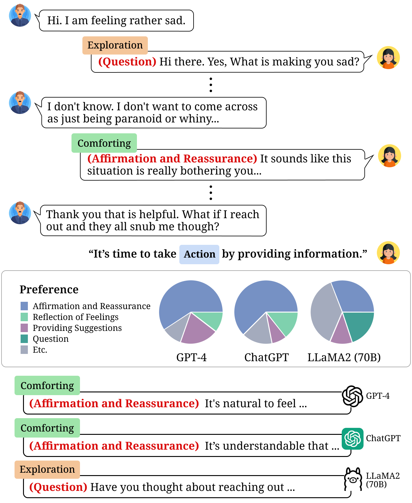

Figure 1: An example of an emotional support conversation with the analysis on the results of LLMs.
Details about experiments are in Appendix [A.1](#A1.SS1 "A.1 Analysis of LLMs on ESC ‣ Appendix A Details of Preliminary Studies ‣ Can Large Language Models be Good Emotional Supporter? Mitigating Preference Bias on Emotional Support Conversation").
[/FIGURE]

Recently, large language models (LLMs), based on their remarkable conversational ability, have been widely used in various dialogue systems (Ji et al., [2023](#bib.bib24); Friedman et al., [2023](#bib.bib16); Lee et al., [2023](#bib.bib29)). In particular, there is a growing interest in leveraging LLMs for providing emotional support (Chen et al., [2023a](#bib.bib6); Zheng et al., [2023b](#bib.bib49)), as it takes place in daily conversations rather than in professional counseling (Liu et al., [2021](#bib.bib32)). However, LLMs that demonstrate outstanding capabilities often struggle with providing emotional support (Chen et al., [2023b](#bib.bib7); Farhat, [2023](#bib.bib15)). As ESC task consists of strategy selection and strategy-constrained response generation, selecting the appropriate strategy is crucial for effective emotional support, thereby we anticipate that LLMs may struggle with predicting strategies. As expected, we find that LLMs lack proficiency in predicting the accurate strategy111The detailed results are shown in Appendix [A.1](#A1.SS1 "A.1 Analysis of LLMs on ESC ‣ Appendix A Details of Preliminary Studies ‣ Can Large Language Models be Good Emotional Supporter? Mitigating Preference Bias on Emotional Support Conversation"). To understand the reasons behind this, we examine the distribution of how often LLMs select each strategy and observe high preference for certain strategies (i.e., preference bias), as shown in Figure [1](#S1.F1 "Figure 1 ‣ 1 Introduction ‣ Can Large Language Models be Good Emotional Supporter? Mitigating Preference Bias on Emotional Support Conversation").  

Motivated by these, this work is guided by three research questions:  

RQ1: Does the preference affect providing emotional support? ([Section 4.2](#S4.SS2 "4.2 RQ1: Does the preference affect providing emotional support? ‣ 4 Proficiency and Preference of LLMs on Strategy ‣ Can Large Language Models be Good Emotional Supporter? Mitigating Preference Bias on Emotional Support Conversation")) Initially, we assess the proficiency of various LLMs, specifically identifying the stages where each model excels and struggles. Our findings reveal that strategies with higher preferences exhibit better performance. Consequently, as excessive preference for a specific strategy can negatively affect the performance of other strategies, we emphasize the importance of low preference bias for robustly predicting strategies across all three stages.  

RQ2: How to mitigate the preference bias on LLMs? ([Section 5.2](#S5.SS2 "5.2 RQ2: How to mitigate the preference bias on LLMs? ‣ 5 Methodological Study: Mitigating Preference Bias ‣ Can Large Language Models be Good Emotional Supporter? Mitigating Preference Bias on Emotional Support Conversation")) To understand how to alleviate the preference bias, we apply two groups of methods to LLMs, based on Contact Hypothesis (Allport et al., [1954](#bib.bib1)), which posits that contact between different groups can reduce their bias. We find that LLMs align with Contact Hypothesis, indicating that reducing preference bias is challenging for LLMs themselves so that external assistance is necessary. As a result, when mitigating preference bias through external assistance, LLMs consistently perform well in predicting strategy across all three stages. This can effectively prevent poor-quality emotional support, which is more crucial than providing appropriate emotional support, given its potential to exacerbate an already stressful situation.  

RQ3: Does improving preference bias indeed help to become a better emotional supporter? ([Section 5.3](#S5.SS3 "5.3 RQ3: Does improving preference bias help to become a better emotional supporter? ‣ 5 Methodological Study: Mitigating Preference Bias ‣ Can Large Language Models be Good Emotional Supporter? Mitigating Preference Bias on Emotional Support Conversation")) To precisely evaluate whether responses provide helpful emotional support, we build a comprehensive set of criteria formulated in collaboration with psychologists. Within these criteria, we analyze whether enhancements in preference bias translate into actual improvements in the quality of emotional support, considering both the advantages of low preference bias and the drawbacks of high preference bias. In human evaluations based on the criteria, lower preference bias is associated with higher scores, while higher preference bias leads to an increased number of poor-quality responses.  

To summarize, our contributions are as follows:  

* We introduce that a wide range of LLMs exhibits different preference for strategies. 
* We propose a new suite of metrics that focus on strategies: proficiency, preference, and preference bias. 
* We emphasize the crucial role of preference bias in robustly providing effective emotional support across the stages. 
* We showcase that LLMs align with Contact Hypothesis, which indicates that external assistance can help address preference bias. 
* We construct a comprehensive set of criteria to precisely evaluate whether responses provide helpful emotional support. 
* Through extensive human evaluation, we demonstrate that mitigating preference bias is crucial for decreasing the proportion of poor-quality responses and, consequently, for effective emotional support. 

## 2 Preliminaries & Related Work

### 2.1 Emotional Support Conversation

Liu et al. ([2021](#bib.bib32)) propose the task of emotional support conversation and release the dataset ESConv, covering a wide range of situations. The ESC centers on the interaction between a user experiencing emotional distress (help-seeker) and a system designed to provide comfort (supporter), aiming to alleviate the user’s emotional intensity. As ESC primarily focuses on providing emotional support, it differs from professional counseling, which instead emphasizes support within a social context, such as interactions with friends or family.  

The procedure of emotional support in ESConv generally follows three stages (Exploration $\rightarrow$ Comforting $\rightarrow$ Action). While it does not necessarily follow this sequence of stages, providing emotional support often requires progressing through multiple stages. Therefore, it is crucial to be able to provide appropriate responses in all stages, as poor performance in a particular stage could hinder the progress of the conversation. Further details about ESConv are in Appendix [B](#A2 "Appendix B ESConv Dataset ‣ Can Large Language Models be Good Emotional Supporter? Mitigating Preference Bias on Emotional Support Conversation").  

[FIGURE S2.F2.g1]
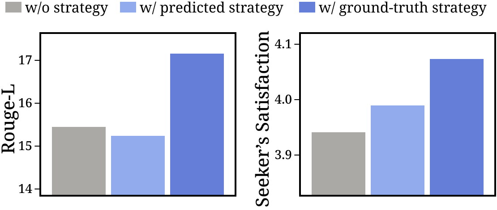

Figure 2: The results of strategy-constrained responses on both automated and human evaluation, showing the efficacy of strategy on ChatGPT. Appropriate strategy significantly enhances the quality of emotional support responses. The details are in Appendix [A.2](#A1.SS2 "A.2 Importance of Strategy ‣ Appendix A Details of Preliminary Studies ‣ Can Large Language Models be Good Emotional Supporter? Mitigating Preference Bias on Emotional Support Conversation").
[/FIGURE]

### 2.2 Incorporating Strategies into ESC Systems

Prior researches on building ESC systems primarily emphasize the integration of support strategies, in conjunction with elements such as emotion, semantics (Zhao et al., [2023b](#bib.bib47)), and persona (Cheng et al., [2023](#bib.bib8)). Some latent studies focus on modeling the user’s state along with the strategies (Cheng et al., [2022](#bib.bib9); Jia et al., [2023](#bib.bib25)). Notably, Deng et al. ([2023](#bib.bib11)) incorporate generative commonsense knowledge model (Hwang et al., [2020](#bib.bib22)) with strategy prediction as an auxiliary task to provide better emotional support. However, many of these approaches involve modifications to the model’s architecture or tuning the pre-trained parameters, a process not typically feasible with LLMs.  

### 2.3 Emotional Support from LLMs

With the emergence of LLMs, there has been an increased amounts of research exploring LLMs as emotional supporters. Recent studies have attempted to replace the fine-tuning approach by prompting LLMs via in-context learning to leverage LLMs as ESC systems (Chen et al., [2023a](#bib.bib6); Zheng et al., [2023b](#bib.bib49)). Despite their potential, recent studies have demonstrated limitations in LLMs’ ability to provide emotional support (Chung et al., [2023](#bib.bib10); Farhat, [2023](#bib.bib15); Eshghie and Eshghie, [2023](#bib.bib14); Song et al., [2024](#bib.bib41)). Specifically, Song et al. ([2024](#bib.bib41)) find that users may experience discomfort or concern due to the lack of responsibility in LLMs’ recommendations for emotional support response. However, even though the majority of ESC research has focused on leveraging support strategies in their methods, a comprehensive analysis focused on strategy in LLMs has been under-explored.  

## 3 Evaluation Setup

### 3.1 Task and Focus

#### Task: emotional support response generation.

The effectiveness of machine-generated responses in providing emotional support is highly dependent on selecting an appropriate strategy. We formulate the emotional support response generation task as generating a response over a support strategy. Formally, given the dialogue background $\mathcal{I}$, a pre-chat survey from the seeker (e.g., emotion, situation), and the dialogue context $\mathcal{C}$, the model $\theta$ first predicts the strategy $\mathcal{S}$, and then generates the response $\mathcal{R}$ based on $\mathcal{I}$, $\mathcal{C}$, and $\mathcal{S}$:  

|  | $\displaystyle\mathcal{S}\sim P_{\theta}(\cdot|\mathcal{I},\mathcal{C})$ |  | (1) |
| --- | --- | --- | --- |
|  | $\displaystyle\mathcal{R}\sim P_{\theta}(\cdot|\mathcal{I},\mathcal{C},\mathcal{S})$ |  | (2) |
| --- | --- | --- | --- |

#### Focus: strategy-centric analysis.

Among the various reasons why LLMs struggle with providing emotional support, this work focuses on strategy, which is the key factor within the ESC systems. To emphasize the validity of strategy-centric analysis, we explore the potential of response quality when generated upon the ground-truth strategy. As a result, in Figure [2](#S2.F2 "Figure 2 ‣ 2.1 Emotional Support Conversation ‣ 2 Preliminaries & Related Work ‣ Can Large Language Models be Good Emotional Supporter? Mitigating Preference Bias on Emotional Support Conversation"), if the model can predict strategies correctly, there is significant room for improvement in the quality of emotional support response.  

[TABLE S3.T1]

<table class="ltx_tabular ltx_guessed_headers ltx_align_middle">
<tbody class="ltx_tbody">
<tr class="ltx_tr">
<td class="ltx_td ltx_border_tt"></td>
<th class="ltx_td ltx_align_center ltx_th ltx_th_column ltx_border_tt">Exploration</th>
<th class="ltx_td ltx_align_center ltx_th ltx_th_column ltx_border_tt">Comforting</th>
<th class="ltx_td ltx_align_center ltx_th ltx_th_column ltx_border_tt">   Action</th>
<td class="ltx_td ltx_border_tt"></td>
</tr>
<tr class="ltx_tr">
<th class="ltx_td ltx_align_center ltx_th ltx_th_column">Strategy</th>
<th class="ltx_td ltx_align_center ltx_th ltx_th_column ltx_border_t"><math class="ltx_Math"><semantics><msub><mi>D</mi><mn>1</mn></msub><annotation-xml><apply><csymbol>subscript</csymbol><ci>𝐷</ci><cn>1</cn></apply></annotation-xml><annotation>D_{1}</annotation></semantics></math></th>
<th class="ltx_td ltx_align_center ltx_th ltx_th_column ltx_border_t"><math class="ltx_Math"><semantics><msub><mi>D</mi><mn>2</mn></msub><annotation-xml><apply><csymbol>subscript</csymbol><ci>𝐷</ci><cn>2</cn></apply></annotation-xml><annotation>D_{2}</annotation></semantics></math></th>
<th class="ltx_td ltx_align_center ltx_th ltx_th_column ltx_border_t"><math class="ltx_Math"><semantics><msub><mi>D</mi><mn>3</mn></msub><annotation-xml><apply><csymbol>subscript</csymbol><ci>𝐷</ci><cn>3</cn></apply></annotation-xml><annotation>D_{3}</annotation></semantics></math></th>
<th class="ltx_td ltx_align_center ltx_th ltx_th_column">
Total (<math class="ltx_Math"><semantics><mi>D</mi><annotation-xml><ci>𝐷</ci></annotation-xml><annotation>D</annotation></semantics></math>)</th>
</tr>
<tr class="ltx_tr">
<td class="ltx_td ltx_align_center ltx_border_t">Que.</td>
<td class="ltx_td ltx_align_center ltx_border_t">24.8</td>
<td class="ltx_td ltx_align_center ltx_border_t">10.0</td>
<td class="ltx_td ltx_align_center ltx_border_t">7.0</td>
<td class="ltx_td ltx_align_center ltx_border_t">12.8</td>
</tr>
<tr class="ltx_tr">
<td class="ltx_td ltx_align_center">Res.</td>
<td class="ltx_td ltx_align_center">16.8</td>
<td class="ltx_td ltx_align_center">9.6</td>
<td class="ltx_td ltx_align_center">4.5</td>
<td class="ltx_td ltx_align_center">9.4</td>
</tr>
<tr class="ltx_tr">
<td class="ltx_td ltx_align_center">Ref.</td>
<td class="ltx_td ltx_align_center">16.8</td>
<td class="ltx_td ltx_align_center">18.3</td>
<td class="ltx_td ltx_align_center">6.3</td>
<td class="ltx_td ltx_align_center">12.7</td>
</tr>
<tr class="ltx_tr">
<td class="ltx_td ltx_align_center">Sel.</td>
<td class="ltx_td ltx_align_center">16.8</td>
<td class="ltx_td ltx_align_center">20.1</td>
<td class="ltx_td ltx_align_center">15.4</td>
<td class="ltx_td ltx_align_center">17.2</td>
</tr>
<tr class="ltx_tr">
<td class="ltx_td ltx_align_center">Aff.</td>
<td class="ltx_td ltx_align_center">7.6</td>
<td class="ltx_td ltx_align_center">24.1</td>
<td class="ltx_td ltx_align_center">21.1</td>
<td class="ltx_td ltx_align_center">18.2</td>
</tr>
<tr class="ltx_tr">
<td class="ltx_td ltx_align_center">Pro.</td>
<td class="ltx_td ltx_align_center">8.4</td>
<td class="ltx_td ltx_align_center">8.5</td>
<td class="ltx_td ltx_align_center">24.4</td>
<td class="ltx_td ltx_align_center">15.3</td>
</tr>
<tr class="ltx_tr">
<td class="ltx_td ltx_align_center">Inf.</td>
<td class="ltx_td ltx_align_center">6.5</td>
<td class="ltx_td ltx_align_center">6.5</td>
<td class="ltx_td ltx_align_center">18.5</td>
<td class="ltx_td ltx_align_center">11.7</td>
</tr>
<tr class="ltx_tr">
<td class="ltx_td ltx_align_center ltx_border_bb">Oth.</td>
<td class="ltx_td ltx_align_center ltx_border_bb">2.3</td>
<td class="ltx_td ltx_align_center ltx_border_bb">2.5</td>
<td class="ltx_td ltx_align_center ltx_border_bb">2.8</td>
<td class="ltx_td ltx_align_center ltx_border_bb">2.6</td>
</tr>
</tbody>
</table>

Table 1: The ratio (%) of support strategies in our test sets. Each test set $D_{t}$ is composed with samples corresponding to each stage. The highlighted strategies are primarily utilized in each stage (Liu et al., [2021](#bib.bib32)).
[/TABLE]

### 3.2 Evaluation Set

For comprehensive analysis, we construct three test sets $D_{t}$ based on stages from ESConv, as demonstrated in Table [1](#S3.T1 "Table 1 ‣ Focus: strategy-centric analysis. ‣ 3.1 Task and Focus ‣ 3 Evaluation Setup ‣ Can Large Language Models be Good Emotional Supporter? Mitigating Preference Bias on Emotional Support Conversation"). Firstly, we randomly truncate the dialogues into 5-15 turns samples. We then annotate each sample with a stage and classify the samples according to their stage. Additionally, we minimize the proportion of the strategy Others to reduce responses less relevant to emotional support. Finally, we remove some samples to ensure no overlap in each test set, and a more detailed explanation of data construction is in Appendix [C.1](#A3.SS1 "C.1 Evaluation Sets ‣ Appendix C Experiments Details ‣ Can Large Language Models be Good Emotional Supporter? Mitigating Preference Bias on Emotional Support Conversation").  

### 3.3 Metrics

#### Proficiency.

We define proficiency as how well the model selects the correct strategy. The proficiency for strategy ($q_{i}$) is quantified as the F1 score for strategy $i$. To precisely analyze the model’s proficiency, we utilize two types of F1 scores, both of which stem from the proficiency $q_{i}$ of each strategy: (1) the macro F1 score $\mathcal{Q}$, and (2) the weighted F1 score. The macro F1 score ($\mathcal{Q}$) represents the overall proficiency of the model across the strategies, which is evaluated over the entire test sets ($D$). In contrast, we employ the weighted F1 score to assess the model on a test set ($D_{t}$) consisting only of data corresponding to a specific stage.  

#### Preference.

We define preference as how much the model prefers certain strategies over others. To quantify the preference for each strategy in LLMs, we employ the Bradley-Terry model (Bradley and Terry, [1952](#bib.bib3)), which is widely used in human preference modeling (Rafailov et al., [2023](#bib.bib40)). Following Newman ([2023](#bib.bib36)), we formally derive the preference $p$ for strategy $i$ as follows:  

|  | $$\normalsize p_{i}^{\prime}=\frac{\sum_{j}(w_{ij}p_{j})/(p_{i}+p_{j})}{\sum_{j}w_{ji}/(p_{i}+p_{j})}$$ |  | (3) |
| --- | --- | --- | --- |

where $w_{ij}$ represents the number of times the model predicts strategy $i$ when the ground-truth strategy is $j$. The preference $p_{i}$ is updated through iteration of the Eq ([3](#S3.E3 "In Preference. ‣ 3.3 Metrics ‣ 3 Evaluation Setup ‣ Can Large Language Models be Good Emotional Supporter? Mitigating Preference Bias on Emotional Support Conversation"))222The details are demonstrated in Appendix [C.2](#A3.SS2.SSS0.Px1 "Bradley-Terry Model. ‣ C.2 Preference Metric ‣ Appendix C Experiments Details ‣ Can Large Language Models be Good Emotional Supporter? Mitigating Preference Bias on Emotional Support Conversation")., where $p_{i}^{\prime}$ represents the preference in the next iteration. After the final iteration, we scale the total sum of $p_{i}$ to 8 ($\sum{p_{i}}=8$) and the average $\bar{p}$ becomes 1, indicating a strong preference for strategy $i$ if $p_{i}>1$.  

#### Preference Bias.

We also define a standard deviation of preferences $p_{i}$ across the strategies as preference bias $\mathcal{B}$.  

|  | $$\normalsize\mathcal{B}=\sqrt{\frac{\sum_{i=1}^{N}(p_{i}-\bar{p})^{2}}{N}}$$ |  | (4) |
| --- | --- | --- | --- |

where a higher value for $\mathcal{B}$ indicates that the model exhibits a clear preference for both preferred and non-preferred strategies.  

[FIGURE S3.F3.sf1.g1]
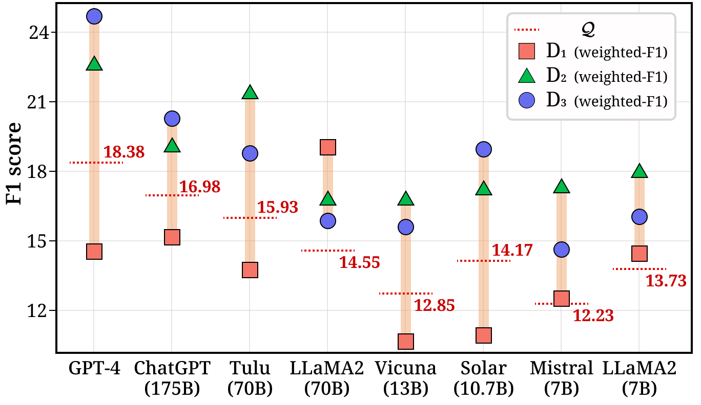

(a)
[/FIGURE]

## 4 Proficiency and Preference of LLMs on Strategy

### 4.1 Models & Implementation Details

According to the public release, we categorize LLMs into the following two groups: (1) Closed-source models which are available via APIs, such as ChatGPT and GPT4 (OpenAI, [2023b](#bib.bib38)); (2) Open-source models accessible through parameters, including LLaMA2-7B/70B (Touvron et al., [2023](#bib.bib42)), Tulu-70B (Ivison et al., [2023](#bib.bib23)), Vicuna-13B (Zheng et al., [2023a](#bib.bib48)), Solar-10.7B (Kim et al., [2023](#bib.bib27)) and Mistral-7B (Jiang et al., [2023](#bib.bib26)).  

In the prompt, we include strategy descriptions to enhance the understanding of each strategy and randomly selected 2-shot examples due to challenges in adhering to the desired output format with open-source models. To facilitate comparison, we also provide 2-shot examples of the closed-source model. More details about models are in Appendix [C.3](#A3.SS3 "C.3 Models ‣ Appendix C Experiments Details ‣ Can Large Language Models be Good Emotional Supporter? Mitigating Preference Bias on Emotional Support Conversation") and about the prompt are in Appendix [C.4](#A3.SS4 "C.4 Prompts Details ‣ Appendix C Experiments Details ‣ Can Large Language Models be Good Emotional Supporter? Mitigating Preference Bias on Emotional Support Conversation").  

### 4.2 RQ1: Does the preference affect providing emotional support?

#### Proficiency of LLMs.

Figure [3(a)](#S3.F3.sf1 "In Figure 3 ‣ Preference Bias. ‣ 3.3 Metrics ‣ 3 Evaluation Setup ‣ Can Large Language Models be Good Emotional Supporter? Mitigating Preference Bias on Emotional Support Conversation") illustrates the proficiency $\mathcal{Q}$ of each LLM (red line). Not surprisingly, GPT-4 records the highest score in proficiency $\mathcal{Q}$, indicating that it has the overall highest ability to align with strategies, and smaller models tend to achieve lower scores. However, even among models of similar sizes, LLMs exhibit different performances, with smaller models like Solar and LLaMA2-7B showing relatively good proficiency.  

#### The performance varies depending on the test set.

Figure [3(a)](#S3.F3.sf1 "In Figure 3 ‣ Preference Bias. ‣ 3.3 Metrics ‣ 3 Evaluation Setup ‣ Can Large Language Models be Good Emotional Supporter? Mitigating Preference Bias on Emotional Support Conversation") also exhibits the performance of LLMs on each test set, with distinct shapes representing different test sets $D_{t}$. Most LLMs achieve high scores on $D_{2}$ or $D_{3}$, while scoring mostly lower on $D_{1}$. This indicates that LLMs exhibit relatively better performance in comforting or action but struggle with exploration stage, suggesting that they may provide poor-quality emotional support in specific situations, especially during the exploration stage. Generally, emotional support progresses through the exploration to comforting and action stage, thereby providing poor-quality response in the exploration stage ($D_{1}$) may hinder the transition to the next stage, making it difficult to offer effective emotional support. As a result, a high score in proficiency $\mathcal{Q}$ does not necessarily guarantee providing helpful emotional support.  

#### Preference bias affects robustness.

Figure [3(b)](#S3.F3.sf2 "In Figure 3 ‣ Preference Bias. ‣ 3.3 Metrics ‣ 3 Evaluation Setup ‣ Can Large Language Models be Good Emotional Supporter? Mitigating Preference Bias on Emotional Support Conversation") illustrates that each LLM exhibits different preferences for strategies ($p_{i}$) and the average preference of strategies belonging to each stage, along with preference bias ($\mathcal{B}$). We observe a strong average preference in stages that exhibit higher performance in Figure [3(a)](#S3.F3.sf1 "In Figure 3 ‣ Preference Bias. ‣ 3.3 Metrics ‣ 3 Evaluation Setup ‣ Can Large Language Models be Good Emotional Supporter? Mitigating Preference Bias on Emotional Support Conversation"). Especially, GPT-4 exhibits low preferences for the exploration stage, which aligns with the lower performance on $D_{1}$. In contrast, LLaMA2-70B demonstrates relatively uniform preferences for strategies, leading to robust performance across $D_{t}$. Through these observations, we can conclude that despite a high proficiency $\mathcal{Q}$, significant preference bias can result in lower performance depending on the stages, hindering robustness in predicting strategy, which means consistent performance across all three stages.  

## 5 Methodological Study: Mitigating Preference Bias

According to findings from the previous section, our focus shifts to offering insights into effective approaches for LLMs to reduce their preference bias. We utilize two models, ChatGPT and LLaMA2-70B, each serving as a representative of closed-source and open-source LLM respectively.  

### 5.1 Methods

Based on the Contact Hypothesis, which suggests that bias between two groups can be reduced through intergroup contact, we hypothesize that external assistance on LLMs might help alleviate preference bias. Therefore, we categorize available methods for LLMs into two groups: (1) self-contact and (2) external-contact.  

#### Self-contact approaches.

We define self-contact as methods that rely solely on LLMs’ abilities without external interaction. We utilize three self-contact methods: (1) Direct-Refine, refining the initially generated response by the model itself; (2) Self-Refine, refining the initially generated response through self-feedback; (3) Emotional-CoT, which generates user states as a reasoning path for response generation, following Wei et al. ([2022](#bib.bib44)).  

#### External-contact approaches.

External-contact involves methods where LLMs not only utilize their internal knowledge but also receive assistance from external knowledge. Similar to KEMI (Deng et al., [2023](#bib.bib11)), one of the state-of-the-art model in ESC task, we leverage commonsense knowledge, COMET. Furthermore, we fine-tune LLaMA2-7B as a strategy planner, a model for planning the next strategy the supporter should take based on the dialogue context. LLMs then respond based on the strategy generated by the strategy planner. Finally, we expand the number of examples ($n$) in the prompt by selecting them randomly ($n=4$). Details about the methods are in Appendix [C.5](#A3.SS5 "C.5 Methods Details ‣ Appendix C Experiments Details ‣ Can Large Language Models be Good Emotional Supporter? Mitigating Preference Bias on Emotional Support Conversation").  

### 5.2 RQ2: How to mitigate the preference bias on LLMs?

[TABLE S5.T2]

<table class="ltx_tabular ltx_guessed_headers ltx_align_middle">
<tbody class="ltx_tbody">
<tr class="ltx_tr">
<th class="ltx_td ltx_th ltx_th_row ltx_border_tt"></th>
<th class="ltx_td ltx_align_left ltx_th ltx_th_row ltx_border_tt">Methods</th>
<td class="ltx_td ltx_align_center ltx_border_tt">
<math class="ltx_Math"><semantics><mi class="ltx_font_mathcaligraphic">𝒬</mi><annotation-xml><ci>𝒬</ci></annotation-xml><annotation>\mathcal{Q}</annotation></semantics></math> <math class="ltx_Math"><semantics><mo>↑</mo><annotation-xml><ci>↑</ci></annotation-xml><annotation>\uparrow</annotation></semantics></math>
</td>
<td class="ltx_td ltx_align_center ltx_border_tt">
<math class="ltx_Math"><semantics><mi class="ltx_font_mathcaligraphic">ℬ</mi><annotation-xml><ci>ℬ</ci></annotation-xml><annotation>\mathcal{B}</annotation></semantics></math> <math class="ltx_Math"><semantics><mo>↓</mo><annotation-xml><ci>↓</ci></annotation-xml><annotation>\downarrow</annotation></semantics></math>
</td>
<td class="ltx_td ltx_align_center ltx_border_tt">B-2</td>
<td class="ltx_td ltx_align_center ltx_border_tt">R-L</td>
</tr>
<tr class="ltx_tr">
<th class="ltx_td ltx_th ltx_th_row ltx_border_t"></th>
<th class="ltx_td ltx_align_left ltx_th ltx_th_row ltx_border_t">ChatGPT (0-shot)</th>
<td class="ltx_td ltx_align_center ltx_border_t">13.50</td>
<td class="ltx_td ltx_align_center ltx_border_t">1.38</td>
<td class="ltx_td ltx_align_center ltx_border_t">6.27</td>
<td class="ltx_td ltx_align_center ltx_border_t">14.86</td>
</tr>
<tr class="ltx_tr">
<th class="ltx_td ltx_align_right ltx_th ltx_th_row ltx_border_t">

Self
</th>
<th class="ltx_td ltx_align_left ltx_th ltx_th_row ltx_border_t">+ Direct-Refine</th>
<td class="ltx_td ltx_align_center ltx_border_t">13.40</td>
<td class="ltx_td ltx_align_center ltx_border_t">1.60</td>
<td class="ltx_td ltx_align_center ltx_border_t">5.68</td>
<td class="ltx_td ltx_align_center ltx_border_t">14.50</td>
</tr>
<tr class="ltx_tr">
<th class="ltx_td ltx_align_left ltx_th ltx_th_row">+ Self-Refine</th>
<td class="ltx_td ltx_align_center">12.37</td>
<td class="ltx_td ltx_align_center">1.53</td>
<td class="ltx_td ltx_align_center">5.16</td>
<td class="ltx_td ltx_align_center">14.33</td>
</tr>
<tr class="ltx_tr">
<th class="ltx_td ltx_align_left ltx_th ltx_th_row">+ Emotional-CoT</th>
<td class="ltx_td ltx_align_center">9.55</td>
<td class="ltx_td ltx_align_center">1.56</td>
<td class="ltx_td ltx_align_center">5.23</td>
<td class="ltx_td ltx_align_center">14.12</td>
</tr>
<tr class="ltx_tr">
<th class="ltx_td ltx_align_right ltx_th ltx_th_row ltx_border_t">

External
</th>
<th class="ltx_td ltx_align_left ltx_th ltx_th_row ltx_border_t">+ w/ COMET</th>
<td class="ltx_td ltx_align_center ltx_border_t">12.78</td>
<td class="ltx_td ltx_align_center ltx_border_t">0.95</td>
<td class="ltx_td ltx_align_center ltx_border_t">6.71</td>
<td class="ltx_td ltx_align_center ltx_border_t">15.07</td>
</tr>
<tr class="ltx_tr">
<th class="ltx_td ltx_align_left ltx_th ltx_th_row">+ w/ Example Expansion</th>
<td class="ltx_td ltx_align_center">16.91</td>
<td class="ltx_td ltx_align_center">0.82</td>
<td class="ltx_td ltx_align_center">7.45</td>
<td class="ltx_td ltx_align_center">15.22</td>
</tr>
<tr class="ltx_tr">
<th class="ltx_td ltx_align_left ltx_th ltx_th_row">+ w/ Strategy Planner</th>
<td class="ltx_td ltx_align_center">21.09</td>
<td class="ltx_td ltx_align_center">0.36</td>
<td class="ltx_td ltx_align_center">6.96</td>
<td class="ltx_td ltx_align_center">14.91</td>
</tr>
<tr class="ltx_tr">
<th class="ltx_td ltx_th ltx_th_row ltx_border_t"></th>
<th class="ltx_td ltx_align_left ltx_th ltx_th_row ltx_border_t">LLaMA2-70B (2-shot)</th>
<td class="ltx_td ltx_align_center ltx_border_t">14.55</td>
<td class="ltx_td ltx_align_center ltx_border_t">0.47</td>
<td class="ltx_td ltx_align_center ltx_border_t">6.15</td>
<td class="ltx_td ltx_align_center ltx_border_t">14.29</td>
</tr>
<tr class="ltx_tr">
<th class="ltx_td ltx_align_right ltx_th ltx_th_row ltx_border_t">

Self
</th>
<th class="ltx_td ltx_align_left ltx_th ltx_th_row ltx_border_t">+ Direct-Refine</th>
<td class="ltx_td ltx_align_center ltx_border_t">13.17</td>
<td class="ltx_td ltx_align_center ltx_border_t">0.59</td>
<td class="ltx_td ltx_align_center ltx_border_t">5.59</td>
<td class="ltx_td ltx_align_center ltx_border_t">13.98</td>
</tr>
<tr class="ltx_tr">
<th class="ltx_td ltx_align_left ltx_th ltx_th_row">+ Self-Refine</th>
<td class="ltx_td ltx_align_center">13.15</td>
<td class="ltx_td ltx_align_center">0.55</td>
<td class="ltx_td ltx_align_center">5.56</td>
<td class="ltx_td ltx_align_center">13.70</td>
</tr>
<tr class="ltx_tr">
<th class="ltx_td ltx_align_left ltx_th ltx_th_row">+ Emotional-CoT</th>
<td class="ltx_td ltx_align_center">12.73</td>
<td class="ltx_td ltx_align_center">0.53</td>
<td class="ltx_td ltx_align_center">6.37</td>
<td class="ltx_td ltx_align_center">13.87</td>
</tr>
<tr class="ltx_tr">
<th class="ltx_td ltx_align_right ltx_th ltx_th_row ltx_border_bb ltx_border_t">

External
</th>
<th class="ltx_td ltx_align_left ltx_th ltx_th_row ltx_border_t">+ w/ COMET</th>
<td class="ltx_td ltx_align_center ltx_border_t">14.53</td>
<td class="ltx_td ltx_align_center ltx_border_t">0.51</td>
<td class="ltx_td ltx_align_center ltx_border_t">6.21</td>
<td class="ltx_td ltx_align_center ltx_border_t">14.55</td>
</tr>
<tr class="ltx_tr">
<th class="ltx_td ltx_align_left ltx_th ltx_th_row">+ w/ Example Expansion</th>
<td class="ltx_td ltx_align_center">15.14</td>
<td class="ltx_td ltx_align_center">0.44</td>
<td class="ltx_td ltx_align_center">6.56</td>
<td class="ltx_td ltx_align_center">14.66</td>
</tr>
<tr class="ltx_tr">
<th class="ltx_td ltx_align_left ltx_th ltx_th_row ltx_border_bb">+ w/ Strategy Planner</th>
<td class="ltx_td ltx_align_center ltx_border_bb">21.09</td>
<td class="ltx_td ltx_align_center ltx_border_bb">0.36</td>
<td class="ltx_td ltx_align_center ltx_border_bb">6.44</td>
<td class="ltx_td ltx_align_center ltx_border_bb">14.49</td>
</tr>
</tbody>
</table>

Table 2: The results of methods on automatic metrics including $\mathcal{Q}$, $\mathcal{B}$, BLEU-2 (B-2) and ROUGE-L (R-L) for the total test set ($D$). A single strategy planner is employed to predict strategies and provides them to each LLM. The best results of each LLMs are bolded and the second best are underlined.
[/TABLE]

[FIGURE S5.F4.g1]
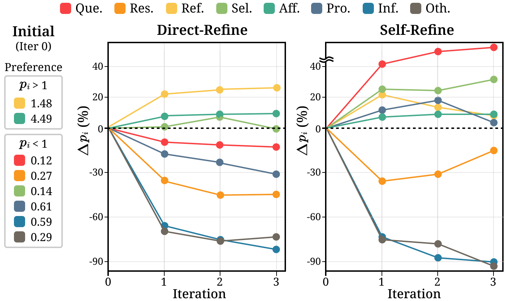

Figure 4: The results of iterations on Direct-Refine and Self-Refine in ChatGPT. To mitigate preference bias, strategies with $p_{i}>1$ should lean towards the negative direction, while strategies with $p_{i}<1$ should lean towards the positive direction as the iteration progresses.
[/FIGURE]

#### Methods with negative effects.

Table [2](#S5.T2 "Table 2 ‣ 5.2 RQ2: How to mitigate the preference bias on LLMs? ‣ 5 Methodological Study: Mitigating Preference Bias ‣ Can Large Language Models be Good Emotional Supporter? Mitigating Preference Bias on Emotional Support Conversation") reports changes in proficiency $\mathcal{Q}$ and preference bias $\mathcal{B}$ across the various methods. Several methods exhibit negative effects on LLMs’ proficiency and preference bias. Specifically, the results of self-contact methods present a noticeable pattern in which proficiency declines and preference bias becomes more pronounced. This pattern implies that, similar to humans, when LLMs have bias, thinking alone can deepen those bias, indicating that self-contact methods do not contribute to enhancing their capabilities to become better emotional supporters. Moreover, the degradation of automated metrics (B-2, R-L) on self-contact stems from lower proficiency and increased preference bias, which leads to poor performance, especially in stages that are less proficient. To further investigate the negative impact of self-contact, we measure the results of Direct-Refine and Self-Refine under an iterative refinement setting to further analyze the preference of each strategy ($p_{i}$). In Figure [4](#S5.F4 "Figure 4 ‣ 5.2 RQ2: How to mitigate the preference bias on LLMs? ‣ 5 Methodological Study: Mitigating Preference Bias ‣ Can Large Language Models be Good Emotional Supporter? Mitigating Preference Bias on Emotional Support Conversation"), we observe a trend where, as the iterations continue, there is a growing preference for strategy that is initially preferred (i.e., $p_{i}>1$). In contrast, the preference for strategies that are initially dispreferred (i.e., $p_{i}<1$) tends to diminish over successive iterations. As this trend continues, LLMs may struggle more in stages that include strategies with lower preference, and during these stages, they gradually provide poor-quality emotional support.  

[FIGURE S5.F5.1.g1]
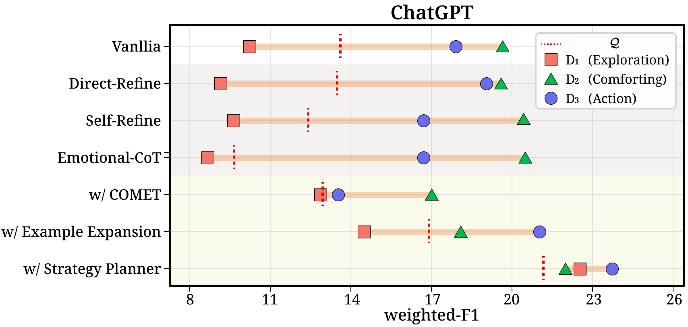

Figure 5: The weighted-F1 scores for each test set ($D_{t}$) on ChatGPT and LLaMA2. Self- and external-contact are backgrounded with gray and yellow, respectively.
[/FIGURE]

#### LLMs align with contact hypothesis.

As shown in Table [2](#S5.T2 "Table 2 ‣ 5.2 RQ2: How to mitigate the preference bias on LLMs? ‣ 5 Methodological Study: Mitigating Preference Bias ‣ Can Large Language Models be Good Emotional Supporter? Mitigating Preference Bias on Emotional Support Conversation"), the application of external-contact methods mostly results in a reduction of preference bias on both closed- and open-source LLMs. Particularly, receiving assistance from a fine-tuned strategy planner (w/ Strategy Planner) or having more examples (w/ Example Expansion) seems to be more helpful than relying on commonsense knowledge. These external-contact methods commonly enable LLMs to receive knowledge they cannot generate independently. Utilizing the strategy planner or expanding more examples offers direct knowledge related to strategy, whereas incorporating commonsense knowledge transfers it indirectly. In summary, external assistance, particularly when directly informing about strategies, plays a crucial role in enhancing both proficiency and preference bias in LLMs. Further analysis on the impact of external-contact is provided in Appendix [G.2](#A7.SS2 "G.2 Comparison between Self-Contact and External-Contact ‣ Appendix G Case Study ‣ Can Large Language Models be Good Emotional Supporter? Mitigating Preference Bias on Emotional Support Conversation").  

#### Methodological impacts on providing emotional support.

Figure [5](#S5.F5 "Figure 5 ‣ Methods with negative effects. ‣ 5.2 RQ2: How to mitigate the preference bias on LLMs? ‣ 5 Methodological Study: Mitigating Preference Bias ‣ Can Large Language Models be Good Emotional Supporter? Mitigating Preference Bias on Emotional Support Conversation") illustrates the results for each test set $D_{t}$ when applying self-contact (gray background) and external-contact (yellow background) to both ChatGPT and LLaMA2-70B. As observed earlier, applying self-contact, which reduces proficiency and intensifies preference bias, leads to an increased gap between $D_{t}$. This substantial gap between $D_{t}$ indicates a decrease in robustness across various stages of emotional support, and in less proficient stages, they may provide poor-quality responses, which might worsen the seeker’s situation and intensify distress. In particular, all self-contact approaches significantly reduce performance on the exploration stage ($D_{1}$), which can create challenges in progressing to subsequent stages, ultimately hindering the achievement of the goals in emotional support. On the other hand, external-contact reduces the overall gap between different $D_{t}$, particularly exhibiting significant improvement on ChatGPT. This reduction contributes to robust performance in selecting strategy across the stages, which is crucial for effective emotional support.  

[FIGURE S5.F6.sf1.g1]
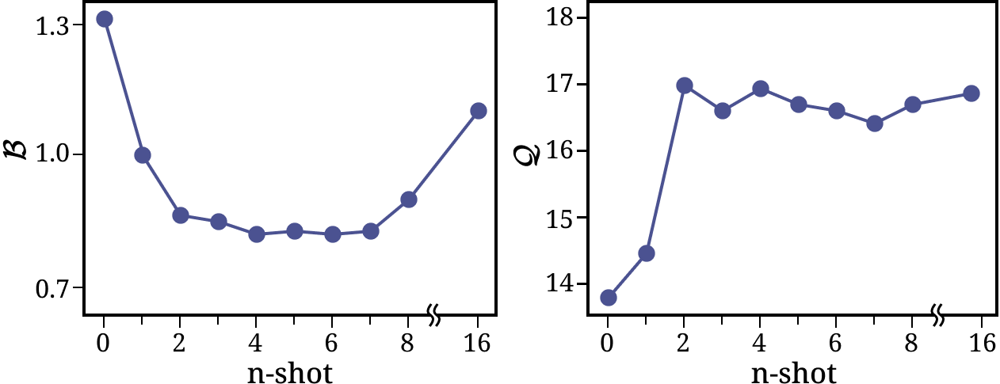

(a)
[/FIGURE]

#### Effect of examples in the prompt.

To assess the efficacy of examples in the prompt, we initially investigate a trend associated with the number of examples ($n$). Figure [6(a)](#S5.F6.sf1 "In Figure 6 ‣ Methodological impacts on providing emotional support. ‣ 5.2 RQ2: How to mitigate the preference bias on LLMs? ‣ 5 Methodological Study: Mitigating Preference Bias ‣ Can Large Language Models be Good Emotional Supporter? Mitigating Preference Bias on Emotional Support Conversation") demonstrates that proficiency and preference bias improve when using randomly selected examples. However, while proficiency $\mathcal{Q}$ converges as $n$ increases, preference bias $\mathcal{B}$ worsens significantly with larger values of $n$ ($n>8$), indicating that too many examples may be detrimental. Additionally, to understand the impact of different types of strategies employed in the examples, we include the various combinations of strategies within 2-shot examples. Intriguingly, Figure [6(b)](#S5.F6.sf2 "In Figure 6 ‣ Methodological impacts on providing emotional support. ‣ 5.2 RQ2: How to mitigate the preference bias on LLMs? ‣ 5 Methodological Study: Mitigating Preference Bias ‣ Can Large Language Models be Good Emotional Supporter? Mitigating Preference Bias on Emotional Support Conversation") reveals consistent results across the diverse combinations. In summary, providing the appropriate number of examples may enhance preference bias, whereas the type of strategies within each example does not matter. Further analysis of each preference $p_{i}$ based on $n$ is in Appendix [F.3](#A6.SS3 "F.3 Preference for Strategies by the Number of Examples. ‣ Appendix F Additional Analysis ‣ Can Large Language Models be Good Emotional Supporter? Mitigating Preference Bias on Emotional Support Conversation").  

[TABLE S5.T3]

<table class="ltx_tabular ltx_guessed_headers ltx_align_middle">
<thead class="ltx_thead">
<tr class="ltx_tr">
<th class="ltx_td ltx_th ltx_th_row ltx_border_tt"></th>
<th class="ltx_td ltx_th ltx_th_column ltx_border_tt"></th>
<th class="ltx_td ltx_th ltx_th_column ltx_border_tt"></th>
<th class="ltx_td ltx_align_center ltx_th ltx_th_column ltx_border_tt"><math class="ltx_Math"><semantics><msub><mi>D</mi><mn>1</mn></msub><annotation-xml><apply><csymbol>subscript</csymbol><ci>𝐷</ci><cn>1</cn></apply></annotation-xml><annotation>D_{1}</annotation></semantics></math></th>
<th class="ltx_td ltx_align_center ltx_th ltx_th_column ltx_border_tt"><math class="ltx_Math"><semantics><msub><mi>D</mi><mn>2</mn></msub><annotation-xml><apply><csymbol>subscript</csymbol><ci>𝐷</ci><cn>2</cn></apply></annotation-xml><annotation>D_{2}</annotation></semantics></math></th>
<th class="ltx_td ltx_align_center ltx_th ltx_th_column ltx_border_tt"><math class="ltx_Math"><semantics><msub><mi>D</mi><mn>3</mn></msub><annotation-xml><apply><csymbol>subscript</csymbol><ci>𝐷</ci><cn>3</cn></apply></annotation-xml><annotation>D_{3}</annotation></semantics></math></th>
</tr>
<tr class="ltx_tr">
<th class="ltx_td ltx_align_left ltx_th ltx_th_column ltx_th_row">Base Models</th>
<th class="ltx_td ltx_align_center ltx_th ltx_th_column">
<math class="ltx_Math"><semantics><mi class="ltx_font_mathcaligraphic">𝒬</mi><annotation-xml><ci>𝒬</ci></annotation-xml><annotation>\mathcal{Q}</annotation></semantics></math> <math class="ltx_Math"><semantics><mo>↑</mo><annotation-xml><ci>↑</ci></annotation-xml><annotation>\uparrow</annotation></semantics></math>
</th>
<th class="ltx_td ltx_align_center ltx_th ltx_th_column">
<math class="ltx_Math"><semantics><mi class="ltx_font_mathcaligraphic">ℬ</mi><annotation-xml><ci>ℬ</ci></annotation-xml><annotation>\mathcal{B}</annotation></semantics></math> <math class="ltx_Math"><semantics><mo>↓</mo><annotation-xml><ci>↓</ci></annotation-xml><annotation>\downarrow</annotation></semantics></math>
</th>
<th class="ltx_td ltx_align_center ltx_th ltx_th_column ltx_border_t">weighted-F1</th>
</tr>
</thead>
<tbody class="ltx_tbody">
<tr class="ltx_tr">
<th class="ltx_td ltx_align_left ltx_th ltx_th_row ltx_border_t">BERT</th>
<td class="ltx_td ltx_align_center ltx_border_t">18.02</td>
<td class="ltx_td ltx_align_center ltx_border_t">0.50</td>
<td class="ltx_td ltx_align_center ltx_border_t">18.17</td>
<td class="ltx_td ltx_align_center ltx_border_t">22.68</td>
<td class="ltx_td ltx_align_center ltx_border_t">19.25</td>
</tr>
<tr class="ltx_tr">
<th class="ltx_td ltx_align_left ltx_th ltx_th_row">RoBERTa</th>
<td class="ltx_td ltx_align_center">21.01</td>
<td class="ltx_td ltx_align_center">0.60</td>
<td class="ltx_td ltx_align_center">21.34</td>
<td class="ltx_td ltx_align_center">24.18</td>
<td class="ltx_td ltx_align_center">22.99</td>
</tr>
<tr class="ltx_tr">
<th class="ltx_td ltx_align_left ltx_th ltx_th_row">Mistral</th>
<td class="ltx_td ltx_align_center">21.89</td>
<td class="ltx_td ltx_align_center">0.45</td>
<td class="ltx_td ltx_align_center">22.61</td>
<td class="ltx_td ltx_align_center">23.57</td>
<td class="ltx_td ltx_align_center">24.59</td>
</tr>
<tr class="ltx_tr">
<th class="ltx_td ltx_align_left ltx_th ltx_th_row ltx_border_bb ltx_border_t">LLaMA2-7B</th>
<td class="ltx_td ltx_align_center ltx_border_bb ltx_border_t">21.10</td>
<td class="ltx_td ltx_align_center ltx_border_bb ltx_border_t">0.36</td>
<td class="ltx_td ltx_align_center ltx_border_bb ltx_border_t">22.59</td>
<td class="ltx_td ltx_align_center ltx_border_bb ltx_border_t">21.85</td>
<td class="ltx_td ltx_align_center ltx_border_bb ltx_border_t">23.77</td>
</tr>
</tbody>
</table>

Table 3: The results on the strategies selected by different strategy planners. Each model is fine-tuned with a uniform dataset across strategies.
[/TABLE]

#### Various models as a strategy planner.

In our previous experiments, a trained LLaMA2-7B serves as a strategy planner, yielding improved outcomes. To explore the potential of various models as a strategy planner, we ablate with several language models, including Mistral and encoder-based models such as BERT (Devlin et al., [2019](#bib.bib13)) and RoBERTa (Liu et al., [2019](#bib.bib33)). As shown in Table [3](#S5.T3 "Table 3 ‣ Effect of examples in the prompt. ‣ 5.2 RQ2: How to mitigate the preference bias on LLMs? ‣ 5 Methodological Study: Mitigating Preference Bias ‣ Can Large Language Models be Good Emotional Supporter? Mitigating Preference Bias on Emotional Support Conversation"), we find that using LLMs as the backbone model for the strategy planner leads to notable enhancements in proficiency and preference bias. Moreover, while encoder-based models achieve performance comparable to LLMs, they exhibit relatively higher preference bias, indicating weaker robustness and potentially providing poor-quality emotional support. We also leave the exploration of training a strategy planner with more diverse and systematic methods for future work, and a more ablation study on supervised fine-tuning is provided in Appendix [F.4](#A6.SS4 "F.4 Supervised Fine-tuning on ESC Task ‣ Appendix F Additional Analysis ‣ Can Large Language Models be Good Emotional Supporter? Mitigating Preference Bias on Emotional Support Conversation").  

### 5.3 RQ3: Does improving preference bias help to become a better emotional supporter?

#### Criteria of human evaluation.

To precisely assess whether responses provide helpful emotional support, we build a comprehensive set of criteria formulated in collaboration with psychologists in terms of emotional support, based on the perspective of seeker’s satisfaction (Sat.). As emotional support aims to appropriately assess the user’s state and reduce emotional intensity, we fine-grain this perspective and finally construct three smaller criteria to enable a more elaborate assessment: (1) Acceptance: Does the seeker accept without discomfort; (2) Effectiveness: Is it helpful in shifting negative emotions or attitudes towards a positive direction; (3) Sensitivity: Does it take into consideration the general state of the seeker. Furthermore, to clarify the capability of LLMs to align strategy and responses, we include Alignment.  

We randomly sample 100 dialogues from three test sets ($D_{t}$), ensuring diversity (e.g., strategy), and three annotators are required to determine the Win/Tie/Lose for each comparison in Table [4](#S5.T4 "Table 4 ‣ Criteria of human evaluation. ‣ 5.3 RQ3: Does improving preference bias help to become a better emotional supporter? ‣ 5 Methodological Study: Mitigating Preference Bias ‣ Can Large Language Models be Good Emotional Supporter? Mitigating Preference Bias on Emotional Support Conversation"). Additionally, we ask three annotators to evaluate each sample on a 1-5 Likert scale, providing specific rubrics for each score to ensure detailed assessments on the quality of responses (Table [5](#S5.T5 "Table 5 ‣ Criteria of human evaluation. ‣ 5.3 RQ3: Does improving preference bias help to become a better emotional supporter? ‣ 5 Methodological Study: Mitigating Preference Bias ‣ Can Large Language Models be Good Emotional Supporter? Mitigating Preference Bias on Emotional Support Conversation")). We include more details on the human evaluation, including the results of Alignment, in Appendix [E](#A5 "Appendix E Details on Human Evaluation ‣ Can Large Language Models be Good Emotional Supporter? Mitigating Preference Bias on Emotional Support Conversation").  

[TABLE S5.T4]

<table class="ltx_tabular ltx_guessed_headers ltx_align_middle">
<tbody class="ltx_tbody">
<tr class="ltx_tr">
<th class="ltx_td ltx_align_left ltx_th ltx_th_row ltx_border_tt">ChatGPT</th>
<td class="ltx_td ltx_align_center ltx_border_tt">Acc.</td>
<td class="ltx_td ltx_align_center ltx_border_tt">Eff.</td>
<td class="ltx_td ltx_align_center ltx_border_tt">Sen.</td>
<td class="ltx_td ltx_align_center ltx_border_tt">Sat.</td>
</tr>
<tr class="ltx_tr">
<th class="ltx_td ltx_align_left ltx_th ltx_th_row ltx_border_t">Vanilla</th>
<td class="ltx_td ltx_align_center ltx_border_t">27.9</td>
<td class="ltx_td ltx_align_center ltx_border_t">23.5</td>
<td class="ltx_td ltx_align_center ltx_border_t">22.1</td>
<td class="ltx_td ltx_align_center ltx_border_t">24.5</td>
</tr>
<tr class="ltx_tr">
<th class="ltx_td ltx_align_left ltx_th ltx_th_row">Tie</th>
<td class="ltx_td ltx_align_center">20.6</td>
<td class="ltx_td ltx_align_center">32.4</td>
<td class="ltx_td ltx_align_center">22.1</td>
<td class="ltx_td ltx_align_center">25.0</td>
</tr>
<tr class="ltx_tr">
<th class="ltx_td ltx_align_left ltx_th ltx_th_row">+ Self-Refine</th>
<td class="ltx_td ltx_align_center"><math class="ltx_Math"><semantics><msup><mtext class="ltx_mathvariant_bold">51.5</mtext><mo>‡</mo></msup><annotation-xml><apply><csymbol>superscript</csymbol><ci><mtext class="ltx_mathvariant_bold">51.5</mtext></ci><ci>‡</ci></apply></annotation-xml><annotation>\textbf{51.5}^{\ddagger}</annotation></semantics></math></td>
<td class="ltx_td ltx_align_center"><math class="ltx_Math"><semantics><msup><mtext class="ltx_mathvariant_bold">44.1</mtext><mo>‡</mo></msup><annotation-xml><apply><csymbol>superscript</csymbol><ci><mtext class="ltx_mathvariant_bold">44.1</mtext></ci><ci>‡</ci></apply></annotation-xml><annotation>\textbf{44.1}^{\ddagger}</annotation></semantics></math></td>
<td class="ltx_td ltx_align_center"><math class="ltx_Math"><semantics><msup><mtext class="ltx_mathvariant_bold">55.9</mtext><mo>‡</mo></msup><annotation-xml><apply><csymbol>superscript</csymbol><ci><mtext class="ltx_mathvariant_bold">55.9</mtext></ci><ci>‡</ci></apply></annotation-xml><annotation>\textbf{55.9}^{\ddagger}</annotation></semantics></math></td>
<td class="ltx_td ltx_align_center"><math class="ltx_Math"><semantics><msup><mtext class="ltx_mathvariant_bold">50.5</mtext><mo>‡</mo></msup><annotation-xml><apply><csymbol>superscript</csymbol><ci><mtext class="ltx_mathvariant_bold">50.5</mtext></ci><ci>‡</ci></apply></annotation-xml><annotation>\textbf{50.5}^{\ddagger}</annotation></semantics></math></td>
</tr>
<tr class="ltx_tr">
<th class="ltx_td ltx_align_left ltx_th ltx_th_row ltx_border_t">Vanilla</th>
<td class="ltx_td ltx_align_center ltx_border_t">22.9</td>
<td class="ltx_td ltx_align_center ltx_border_t">24.0</td>
<td class="ltx_td ltx_align_center ltx_border_t">14.6</td>
<td class="ltx_td ltx_align_center ltx_border_t">20.5</td>
</tr>
<tr class="ltx_tr">
<th class="ltx_td ltx_align_left ltx_th ltx_th_row">Tie</th>
<td class="ltx_td ltx_align_center">21.9</td>
<td class="ltx_td ltx_align_center">33.3</td>
<td class="ltx_td ltx_align_center">27.1</td>
<td class="ltx_td ltx_align_center">27.4</td>
</tr>
<tr class="ltx_tr">
<th class="ltx_td ltx_align_left ltx_th ltx_th_row">+ w/ COMET</th>
<td class="ltx_td ltx_align_center"><math class="ltx_Math"><semantics><msup><mtext class="ltx_mathvariant_bold">55.2</mtext><mo>‡</mo></msup><annotation-xml><apply><csymbol>superscript</csymbol><ci><mtext class="ltx_mathvariant_bold">55.2</mtext></ci><ci>‡</ci></apply></annotation-xml><annotation>\textbf{55.2}^{\ddagger}</annotation></semantics></math></td>
<td class="ltx_td ltx_align_center"><math class="ltx_Math"><semantics><msup><mtext class="ltx_mathvariant_bold">42.7</mtext><mo>†</mo></msup><annotation-xml><apply><csymbol>superscript</csymbol><ci><mtext class="ltx_mathvariant_bold">42.7</mtext></ci><ci>†</ci></apply></annotation-xml><annotation>\textbf{42.7}^{\dagger}</annotation></semantics></math></td>
<td class="ltx_td ltx_align_center"><math class="ltx_Math"><semantics><msup><mtext class="ltx_mathvariant_bold">58.3</mtext><mo>‡</mo></msup><annotation-xml><apply><csymbol>superscript</csymbol><ci><mtext class="ltx_mathvariant_bold">58.3</mtext></ci><ci>‡</ci></apply></annotation-xml><annotation>\textbf{58.3}^{\ddagger}</annotation></semantics></math></td>
<td class="ltx_td ltx_align_center"><math class="ltx_Math"><semantics><msup><mtext class="ltx_mathvariant_bold">52.1</mtext><mo>‡</mo></msup><annotation-xml><apply><csymbol>superscript</csymbol><ci><mtext class="ltx_mathvariant_bold">52.1</mtext></ci><ci>‡</ci></apply></annotation-xml><annotation>\textbf{52.1}^{\ddagger}</annotation></semantics></math></td>
</tr>
<tr class="ltx_tr">
<th class="ltx_td ltx_align_left ltx_th ltx_th_row ltx_border_t">Vanilla</th>
<td class="ltx_td ltx_align_center ltx_border_t">13.1</td>
<td class="ltx_td ltx_align_center ltx_border_t">25.3</td>
<td class="ltx_td ltx_align_center ltx_border_t">16.2</td>
<td class="ltx_td ltx_align_center ltx_border_t">18.2</td>
</tr>
<tr class="ltx_tr">
<th class="ltx_td ltx_align_left ltx_th ltx_th_row">Tie</th>
<td class="ltx_td ltx_align_center">26.3</td>
<td class="ltx_td ltx_align_center">26.3</td>
<td class="ltx_td ltx_align_center">21.2</td>
<td class="ltx_td ltx_align_center">24.6</td>
</tr>
<tr class="ltx_tr">
<th class="ltx_td ltx_align_left ltx_th ltx_th_row">+ w/ Example Expansion</th>
<td class="ltx_td ltx_align_center"><math class="ltx_Math"><semantics><msup><mtext class="ltx_mathvariant_bold">60.6</mtext><mo>‡</mo></msup><annotation-xml><apply><csymbol>superscript</csymbol><ci><mtext class="ltx_mathvariant_bold">60.6</mtext></ci><ci>‡</ci></apply></annotation-xml><annotation>\textbf{60.6}^{\ddagger}</annotation></semantics></math></td>
<td class="ltx_td ltx_align_center"><math class="ltx_Math"><semantics><msup><mtext class="ltx_mathvariant_bold">48.5</mtext><mo>†</mo></msup><annotation-xml><apply><csymbol>superscript</csymbol><ci><mtext class="ltx_mathvariant_bold">48.5</mtext></ci><ci>†</ci></apply></annotation-xml><annotation>\textbf{48.5}^{\dagger}</annotation></semantics></math></td>
<td class="ltx_td ltx_align_center"><math class="ltx_Math"><semantics><msup><mtext class="ltx_mathvariant_bold">62.6</mtext><mo>‡</mo></msup><annotation-xml><apply><csymbol>superscript</csymbol><ci><mtext class="ltx_mathvariant_bold">62.6</mtext></ci><ci>‡</ci></apply></annotation-xml><annotation>\textbf{62.6}^{\ddagger}</annotation></semantics></math></td>
<td class="ltx_td ltx_align_center"><math class="ltx_Math"><semantics><msup><mtext class="ltx_mathvariant_bold">57.2</mtext><mo>‡</mo></msup><annotation-xml><apply><csymbol>superscript</csymbol><ci><mtext class="ltx_mathvariant_bold">57.2</mtext></ci><ci>‡</ci></apply></annotation-xml><annotation>\textbf{57.2}^{\ddagger}</annotation></semantics></math></td>
</tr>
<tr class="ltx_tr">
<th class="ltx_td ltx_align_left ltx_th ltx_th_row ltx_border_t">Vanilla</th>
<td class="ltx_td ltx_align_center ltx_border_t">16.7</td>
<td class="ltx_td ltx_align_center ltx_border_t">29.2</td>
<td class="ltx_td ltx_align_center ltx_border_t">29.2</td>
<td class="ltx_td ltx_align_center ltx_border_t">25.0</td>
</tr>
<tr class="ltx_tr">
<th class="ltx_td ltx_align_left ltx_th ltx_th_row">Tie</th>
<td class="ltx_td ltx_align_center">12.5</td>
<td class="ltx_td ltx_align_center">16.7</td>
<td class="ltx_td ltx_align_center">12.5</td>
<td class="ltx_td ltx_align_center">13.9</td>
</tr>
<tr class="ltx_tr">
<th class="ltx_td ltx_align_left ltx_th ltx_th_row ltx_border_bb">+ w/ Strategy Planner</th>
<td class="ltx_td ltx_align_center ltx_border_bb"><math class="ltx_Math"><semantics><msup><mtext class="ltx_mathvariant_bold">70.8</mtext><mo>‡</mo></msup><annotation-xml><apply><csymbol>superscript</csymbol><ci><mtext class="ltx_mathvariant_bold">70.8</mtext></ci><ci>‡</ci></apply></annotation-xml><annotation>\textbf{70.8}^{\ddagger}</annotation></semantics></math></td>
<td class="ltx_td ltx_align_center ltx_border_bb"><math class="ltx_Math"><semantics><msup><mtext class="ltx_mathvariant_bold">54.2</mtext><mo>‡</mo></msup><annotation-xml><apply><csymbol>superscript</csymbol><ci><mtext class="ltx_mathvariant_bold">54.2</mtext></ci><ci>‡</ci></apply></annotation-xml><annotation>\textbf{54.2}^{\ddagger}</annotation></semantics></math></td>
<td class="ltx_td ltx_align_center ltx_border_bb"><math class="ltx_Math"><semantics><msup><mtext class="ltx_mathvariant_bold">58.3</mtext><mo>‡</mo></msup><annotation-xml><apply><csymbol>superscript</csymbol><ci><mtext class="ltx_mathvariant_bold">58.3</mtext></ci><ci>‡</ci></apply></annotation-xml><annotation>\textbf{58.3}^{\ddagger}</annotation></semantics></math></td>
<td class="ltx_td ltx_align_center ltx_border_bb"><math class="ltx_Math"><semantics><msup><mtext class="ltx_mathvariant_bold">61.1</mtext><mo>‡</mo></msup><annotation-xml><apply><csymbol>superscript</csymbol><ci><mtext class="ltx_mathvariant_bold">61.1</mtext></ci><ci>‡</ci></apply></annotation-xml><annotation>\textbf{61.1}^{\ddagger}</annotation></semantics></math></td>
</tr>
</tbody>
</table>

Table 4: The results of comparative human evaluation between various methods applied to ChatGPT and vanilla ChatGPT. ($\dagger$/$\ddagger$: p-value < 0.1/0.05 )
[/TABLE]

[TABLE S5.T5]

<table class="ltx_tabular ltx_guessed_headers ltx_align_middle">
<thead class="ltx_thead">
<tr class="ltx_tr">
<th class="ltx_td ltx_align_left ltx_th ltx_th_column ltx_th_row ltx_border_tt">Methods</th>
<th class="ltx_td ltx_align_center ltx_th ltx_th_column ltx_border_tt">&lt; 3 (fail)</th>
<th class="ltx_td ltx_align_center ltx_th ltx_th_column ltx_border_tt">
<math class="ltx_Math"><semantics><mo>≧</mo><annotation-xml><geq></geq></annotation-xml><annotation>\geqq</annotation></semantics></math> 3 (acceptable)</th>
</tr>
</thead>
<tbody class="ltx_tbody">
<tr class="ltx_tr">
<th class="ltx_td ltx_align_left ltx_th ltx_th_row ltx_border_t">ChatGPT</th>
<td class="ltx_td ltx_align_center ltx_border_t">16.7</td>
<td class="ltx_td ltx_align_center ltx_border_t">83.3</td>
</tr>
<tr class="ltx_tr">
<th class="ltx_td ltx_align_left ltx_th ltx_th_row">+ Direct-Refine</th>
<td class="ltx_td ltx_align_center">21.2</td>
<td class="ltx_td ltx_align_center">78.8</td>
</tr>
<tr class="ltx_tr">
<th class="ltx_td ltx_align_left ltx_th ltx_th_row">+ Self-Refine</th>
<td class="ltx_td ltx_align_center">17.4</td>
<td class="ltx_td ltx_align_center">82.6</td>
</tr>
<tr class="ltx_tr">
<th class="ltx_td ltx_align_left ltx_th ltx_th_row">+ w/ Strategy planner</th>
<td class="ltx_td ltx_align_center">8.0</td>
<td class="ltx_td ltx_align_center">92.0</td>
</tr>
<tr class="ltx_tr">
<th class="ltx_td ltx_align_left ltx_th ltx_th_row ltx_border_bb">+ Oracle Strategy</th>
<td class="ltx_td ltx_align_center ltx_border_bb">3.8</td>
<td class="ltx_td ltx_align_center ltx_border_bb">96.2</td>
</tr>
</tbody>
</table>

Table 5: The ratio (%) of scores below 3 (fail) and scores of 3 or above (acceptable) in Seeker’s Satisfaction (Sat.).
[/TABLE]

#### Benefits of mitigating preference bias.

Table [4](#S5.T4 "Table 4 ‣ Criteria of human evaluation. ‣ 5.3 RQ3: Does improving preference bias help to become a better emotional supporter? ‣ 5 Methodological Study: Mitigating Preference Bias ‣ Can Large Language Models be Good Emotional Supporter? Mitigating Preference Bias on Emotional Support Conversation") presents the results of comparative human evaluation between various methods on ChatGPT and the vanilla ChatGPT. Consistent with our previous findings, external-contact outperforms self-contact (i.e., Self-Refine) in terms of overall seeker’s satisfaction (Sat.). Concretely, when comparing the w/ COMET with Self-Refine, which have similar proficiency but significant differences in preference bias, the overall seeker’s satisfaction score is higher for w/ COMET with lower preference bias. Furthermore, among the external-contact methods, responses generated through the strategy planner, which exhibits the most significant improvements in preference bias, are the most helpful in reducing the seeker’s emotional intensity. Consequently, we can confirm that it is crucial to mitigate preference bias to enhance robustness in predicting strategy, thereby providing effective emotional support.  

#### Drawbacks of aggravating preference bias.

To understand the negative impact of severe preference bias, we investigate the proportion of responses that could worsen the seeker’s situation or distress (i.e., rated below 3). Table [5](#S5.T5 "Table 5 ‣ Criteria of human evaluation. ‣ 5.3 RQ3: Does improving preference bias help to become a better emotional supporter? ‣ 5 Methodological Study: Mitigating Preference Bias ‣ Can Large Language Models be Good Emotional Supporter? Mitigating Preference Bias on Emotional Support Conversation") demonstrates that the proportion of poor-quality emotional support significantly increases in self-contact (i.e., Direct-Refine, Self-Refine), which exacerbates preference bias. This confirms that the aggravation in preference bias sharpens the contrast between proficient and less proficient stages, leading to providing more poor-quality responses in the less proficient stages. Additionally, the decrease in the proportion of poor-quality responses in external-contact (i.e., w/ Strategy Planner), where preference bias diminishes, supports this conclusion. As a result, high preference bias disturbs robustness, leading to an increased number of poor-quality responses. This demonstrates that low preference bias reduces the number of poor-quality responses and, consequently, is crucial for effective emotional support.  

## 6 Discussion and Conclusions

This work conducts a strategy-centric analysis to delve into why LLMs struggle with providing emotional support, relying on the importance of strategy in emotional support. Our results show that as LLMs exhibit preference bias towards certain strategies, they lack robustness in predicting strategy across the three stages of emotional support, where struggling in a particular stage may hinder the progress to the next stage. We empirically demonstrate that LLMs are aligned with the psychological Contact Hypothesis just like humans, indicating that external assistance can mitigate the preference bias in LLMs, which they can not do themselves. We highlight that mitigating the preference bias strengthens robustness in selecting appropriate strategies across the stages, leading to overall improvement in the quality of emotional support and a significant reduction in the number of poor-quality responses. We hope that this work will become a promising step for future work to enhance the emotional intelligence of LLMs.  

## Limitations

This work has the following limitations: (1) As aforementioned in Section [3.2](#S3.SS2 "3.2 Evaluation Set ‣ 3 Evaluation Setup ‣ Can Large Language Models be Good Emotional Supporter? Mitigating Preference Bias on Emotional Support Conversation"), Cheng et al. ([2022](#bib.bib9)) demonstrate that the strategy Others are not helpful in enhancing the response generation and may not be fully fine-grained. This can potentially prevent obtaining sufficient insights by obscuring more detailed preferences of the model; (2) We include 2-shot examples for open-source LLMs as they often struggle to adhere to the desired output format (e.g., wrong strategy that is not among the eight provided). Since we demonstrated improvement when prompting with n-shot examples in Section [5.2](#S5.SS2.SSS0.Px4 "Effect of examples in the prompt. ‣ 5.2 RQ2: How to mitigate the preference bias on LLMs? ‣ 5 Methodological Study: Mitigating Preference Bias ‣ Can Large Language Models be Good Emotional Supporter? Mitigating Preference Bias on Emotional Support Conversation"), the actual proficiency and preference bias of open-source LLMs may be worse than the scores we published; (3) Understanding the reasons for preference bias is challenging not only for closed-source LLMs but also for open-source LLMs, as it is difficult to precisely grasp the relationships between strategy, training data, methods and model architecture; (4) We have observed that even when using an oracle strategy in LLMs (Table [8](#A1.T8 "Table 8 ‣ A.2 Importance of Strategy ‣ Appendix A Details of Preliminary Studies ‣ Can Large Language Models be Good Emotional Supporter? Mitigating Preference Bias on Emotional Support Conversation")), responses that increase emotional intensity still exist (3.8%). This indicates a lack of ability to generate appropriate responses for emotional support, even when the strategy is perfectly selected; (5) While we confirm that LLMs generally generate well-aligned responses with the strategy (Figure [16](#A7.F16 "Figure 16 ‣ G.3 Misalignment between Strategy and Response ‣ Appendix G Case Study ‣ Can Large Language Models be Good Emotional Supporter? Mitigating Preference Bias on Emotional Support Conversation")), it is evident that there are some cases where they are not aligned, thereby future work should recognize this misalignment. Therefore, future work might consider both correctly predicting the strategy and generating helpful responses based on the predicted strategy.  

## Ethical Considerations

The ESConv a dataset used in this work is a publicly available and well-constructed benchmark for emotional support conversation, which is collected by employed crowd-sourced workers, with the sensitive and private information filtered during the dataset construction. All participants in our human evaluation are volunteered, transparently informed of our research intent, and paid reasonable wages.  

Moreover, it is worth mentioning that the term "emotional support" in this paper mainly refers to support within a social context, such as interactions with friends or family in daily conversation, rather than professional counseling or diagnosis. However, as LLMs can generate sensual, harmful, biased, offensive, or violent content, using them as emotional support systems requires particular caution to avoid such content from appearing to users. And it also requires considerable further efforts to construct a safer system, which is capable of detecting users who have tendencies of self-harming or suicide.  

## References

* Allport et al. (1954)  Thomas Allport, Pettigrew, Kerstin Hammann, and S Salzborn. 1954.   Gordon willard allport: The nature of prejudice.   *Samuel Salzborn (Hg.): Klassiker der Sozialwissenschaften*, 100:193–197. 
* Banerjee and Lavie (2005)  Satanjeev Banerjee and Alon Lavie. 2005.   Meteor: An automatic metric for mt evaluation with improved correlation with human judgments.   In *IEEvaluation@ACL*. 
* Bradley and Terry (1952)  Ralph Allan Bradley and Milton E Terry. 1952.   Rank analysis of incomplete block designs: I. the method of paired comparisons.   *Biometrika*, 39(3/4):324–345. 
* Burleson (2003)  Brant R Burleson. 2003.   Emotional support skill.   In *Handbook of Communication and Social Interaction Skills*, page 551. Psychology Press. 
* Chae et al. (2023)  Hyungjoo Chae, Yongho Song, Kai Tzu-iunn Ong, Taeyoon Kwon, Minjin Kim, Youngjae Yu, Dongha Lee, Dongyeop Kang, and Jinyoung Yeo. 2023.   Dialogue chain-of-thought distillation for commonsense-aware conversational agents.   *arXiv preprint arXiv:2310.09343*. 
* Chen et al. (2023a)  Maximillian Chen, Xiao Yu, Weiyan Shi, Urvi Awasthi, and Zhou Yu. 2023a.   [Controllable mixed-initiative dialogue generation through prompting](https://api.semanticscholar.org/CorpusID:258557267).   In *Annual Meeting of the Association for Computational Linguistics*. 
* Chen et al. (2023b)  Yirong Chen, Xiaofen Xing, Jingkai Lin, Huimin Zheng, Zhenyu Wang, Qi Liu, and Xiangmin Xu. 2023b.   [Soulchat: Improving llms’ empathy, listening, and comfort abilities through fine-tuning with multi-turn empathy conversations](http://arxiv.org/abs/2311.00273). 
* Cheng et al. (2023)  Jiale Cheng, Sahand Sabour, Hao Sun, Zhuang Chen, and Minlie Huang. 2023.   Pal: Persona-augmented emotional support conversation generation.   In *ACL*. 
* Cheng et al. (2022)  Yi Cheng, Wenge Liu, Wenjie Li, Jiashuo Wang, Ruihui Zhao, Bang Liu, Xiaodan Liang, and Yefeng Zheng. 2022.   Improving multi-turn emotional support dialogue generation with lookahead strategy planning.   In *Conference on Empirical Methods in Natural Language Processing*. 
* Chung et al. (2023)  Neo Christopher Chung, George Dyer, and Lennart Brocki. 2023.   Challenges of large language models for mental health counseling.   *arXiv preprint arXiv:2311.13857*. 
* Deng et al. (2023)  Yang Deng, Wenxuan Zhang, Yifei Yuan, and Wai Lam. 2023.   Knowledge-enhanced mixed-initiative dialogue system for emotional support conversations.   In *ACL*. 
* Dettmers et al. (2023)  Tim Dettmers, Artidoro Pagnoni, Ari Holtzman, and Luke Zettlemoyer. 2023.   Qlora: Efficient finetuning of quantized llms.   *arXiv preprint arXiv:2305.14314*. 
* Devlin et al. (2019)  Jacob Devlin, Ming-Wei Chang, Kenton Lee, and Kristina Toutanova. 2019.   Bert: Pre-training of deep bidirectional transformers for language understanding.   In *NAACL-HLT*. 
* Eshghie and Eshghie (2023)  Mahshid Eshghie and Mojtaba Eshghie. 2023.   Chatgpt as a therapist assistant: A suitability study.   *arXiv preprint arXiv:2304.09873*. 
* Farhat (2023)  Faiza Farhat. 2023.   Chatgpt as a complementary mental health resource: a boon or a bane.   *Annals of Biomedical Engineering*, pages 1–4. 
* Friedman et al. (2023)  Luke Friedman, Sameer Ahuja, David Allen, Zhenning Tan, Hakim Sidahmed, Changbo Long, Jun Xie, Gabriel Schubiner, Ajay Patel, Harsh Lara, Brian Chu, Zexi Chen, and Manoj Tiwari. 2023.   [Leveraging large language models in conversational recommender systems](http://arxiv.org/abs/2305.07961). 
* Gao et al. (2022a)  Jun Gao, Wei Bi, Ruifeng Xu, and Shuming Shi. 2022a.   [Ream$\sharp$: An enhancement approach to reference-based evaluation metrics for open-domain dialog generation](http://arxiv.org/abs/2105.14488). 
* Gao et al. (2022b)  Silin Gao, Jena D. Hwang, Saya Kanno, Hiromi Wakaki, Yuki Mitsufuji, and Antoine Bosselut. 2022b.   [ComFact: A benchmark for linking contextual commonsense knowledge](https://doi.org/10.18653/v1/2022.findings-emnlp.120).   In *Findings of the Association for Computational Linguistics: EMNLP 2022*, pages 1656–1675, Abu Dhabi, United Arab Emirates. Association for Computational Linguistics. 
* Greene (2003)  Jennifer C Greene. 2003.   *Handbook of Communication and Social Interaction Skills*.   Psychology Press. 
* Heaney and Israel (2008)  Catherine A Heaney and Barbara A Israel. 2008.   Social networks and social support.   4:189–210. 
* Hill (2009)  Clara E Hill. 2009.   *Helping Skills: Facilitating, Exploration, Insight, and Action*.   American Psychological Association. 
* Hwang et al. (2020)  Jena D. Hwang, Chandra Bhagavatula, Ronan Le Bras, Jeff Da, Keisuke Sakaguchi, Antoine Bosselut, and Yejin Choi. 2020.   [Comet-atomic 2020: On symbolic and neural commonsense knowledge graphs](https://api.semanticscholar.org/CorpusID:222310337).   In *AAAI Conference on Artificial Intelligence*. 
* Ivison et al. (2023)  Hamish Ivison, Yizhong Wang, Valentina Pyatkin, Nathan Lambert, Matthew Peters, Pradeep Dasigi, Joel Jang, David Wadden, Noah A. Smith, Iz Beltagy, and Hannaneh Hajishirzi. 2023.   [Camels in a changing climate: Enhancing lm adaptation with tulu 2](http://arxiv.org/abs/2311.10702). 
* Ji et al. (2023)  Shaoxiong Ji, Tianlin Zhang, Kailai Yang, Sophia Ananiadou, and Erik Cambria. 2023.   [Rethinking large language models in mental health applications](http://arxiv.org/abs/2311.11267). 
* Jia et al. (2023)  Mengzhao Jia, Qianglong Chen, Liqiang Jing, Dawei Fu, and Renyu Li. 2023.   Knowledge-enhanced memory model for emotional support conversation.   *arXiv preprint arXiv:2310.07700*. 
* Jiang et al. (2023)  Albert Q. Jiang, Alexandre Sablayrolles, Arthur Mensch, Chris Bamford, Devendra Singh Chaplot, Diego de las Casas, Florian Bressand, Gianna Lengyel, Guillaume Lample, Lucile Saulnier, Lélio Renard Lavaud, Marie-Anne Lachaux, Pierre Stock, Teven Le Scao, Thibaut Lavril, Thomas Wang, Timothée Lacroix, and William El Sayed. 2023.   [Mistral 7b](http://arxiv.org/abs/2310.06825). 
* Kim et al. (2023)  Dahyun Kim, Chanjun Park, Sanghoon Kim, Wonsung Lee, Wonho Song, Yunsu Kim, Hyeonwoo Kim, Yungi Kim, Hyeonju Lee, Jihoo Kim, Changbae Ahn, Seonghoon Yang, Sukyung Lee, Hyunbyung Park, Gyoungjin Gim, Mikyoung Cha, Hwalsuk Lee, and Sunghun Kim. 2023.   [Solar 10.7b: Scaling large language models with simple yet effective depth up-scaling](http://arxiv.org/abs/2312.15166). 
* Langford et al. (1997)  Catherine Penny Hinson Langford, Juanita Bowsher, Joseph P Maloney, and Patricia P Lillis. 1997.   Social support: A conceptual analysis.   *Journal of Advanced Nursing*, 25(1):95–100. 
* Lee et al. (2023)  Gibbeum Lee, Volker Hartmann, Jongho Park, Dimitris Papailiopoulos, and Kangwook Lee. 2023.   [Prompted LLMs as chatbot modules for long open-domain conversation](https://doi.org/10.18653/v1/2023.findings-acl.277).   In *Findings of the Association for Computational Linguistics: ACL 2023*, pages 4536–4554, Toronto, Canada. Association for Computational Linguistics. 
* Li et al. (2016)  Jiwei Li, Michel Galley, Chris Brockett, Jianfeng Gao, and William B. Dolan. 2016.   A diversity-promoting objective function for neural conversation models.   In *NAACL*. 
* Lin (2004)  Chin-Yew Lin. 2004.   Rouge: A package for automatic evaluation of summaries.   In *Annual Meeting of the Association for Computational Linguistics*. 
* Liu et al. (2021)  Siyang Liu, Chujie Zheng, Orianna Demasi, Sahand Sabour, Yu Li, Zhou Yu, Yong Jiang, and Minlie Huang. 2021.   Towards emotional support dialog systems.   In *ACL*. 
* Liu et al. (2019)  Yinhan Liu, Myle Ott, Naman Goyal, Jingfei Du, Mandar Joshi, Danqi Chen, Omer Levy, Mike Lewis, Luke Zettlemoyer, and Veselin Stoyanov. 2019.   [Roberta: A robustly optimized bert pretraining approach](http://arxiv.org/abs/1907.11692). 
* Madaan et al. (2023)  Aman Madaan, Niket Tandon, Prakhar Gupta, Skyler Hallinan, Luyu Gao, Sarah Wiegreffe, Uri Alon, Nouha Dziri, Shrimai Prabhumoye, Yiming Yang, Sean Welleck, Bodhisattwa Prasad Majumder, Shashank Gupta, Amir Yazdanbakhsh, and Peter Clark. 2023.   [Self-refine: Iterative refinement with self-feedback](https://api.semanticscholar.org/CorpusID:257900871).   *ArXiv*, abs/2303.17651. 
* Mehri and Eskenazi (2020)  Shikib Mehri and Maxine Eskenazi. 2020.   [Usr: An unsupervised and reference free evaluation metric for dialog generation](http://arxiv.org/abs/2005.00456). 
* Newman (2023)  M. E. J. Newman. 2023.   [Efficient computation of rankings from pairwise comparisons](http://jmlr.org/papers/v24/22-1086.html).   *Journal of Machine Learning Research*, 24(238):1–25. 
* OpenAI (2023a)  OpenAI. 2023a.   Chatgpt.   <https://openai.com/blog/chatgpt>. 
* OpenAI (2023b)  OpenAI. 2023b.   [Gpt-4 technical report](http://arxiv.org/abs/2303.08774). 
* Papineni et al. (2002)  Kishore Papineni, Salim Roukos, Todd Ward, and Wei-Jing Zhu. 2002.   Bleu: a method for automatic evaluation of machine translation.   In *Annual Meeting of the Association for Computational Linguistics*. 
* Rafailov et al. (2023)  Rafael Rafailov, Archit Sharma, Eric Mitchell, Stefano Ermon, Christopher D. Manning, and Chelsea Finn. 2023.   [Direct preference optimization: Your language model is secretly a reward model](http://arxiv.org/abs/2305.18290). 
* Song et al. (2024)  Inhwa Song, Sachin R. Pendse, Neha Kumar, and Munmun De Choudhury. 2024.   [The typing cure: Experiences with large language model chatbots for mental health support](http://arxiv.org/abs/2401.14362). 
* Touvron et al. (2023)  Hugo Touvron, Louis Martin, Kevin R. Stone, Peter Albert, Amjad Almahairi, Yasmine Babaei, Nikolay Bashlykov, Soumya Batra, Prajjwal Bhargava, Shruti Bhosale, Daniel M. Bikel, Lukas Blecher, Cristian Cantón Ferrer, Moya Chen, Guillem Cucurull, David Esiobu, Jude Fernandes, Jeremy Fu, Wenyin Fu, Brian Fuller, Cynthia Gao, Vedanuj Goswami, Naman Goyal, Anthony S. Hartshorn, Saghar Hosseini, Rui Hou, Hakan Inan, Marcin Kardas, Viktor Kerkez, Madian Khabsa, Isabel M. Kloumann, A. V. Korenev, Punit Singh Koura, Marie-Anne Lachaux, Thibaut Lavril, Jenya Lee, Diana Liskovich, Yinghai Lu, Yuning Mao, Xavier Martinet, Todor Mihaylov, Pushkar Mishra, Igor Molybog, Yixin Nie, Andrew Poulton, Jeremy Reizenstein, Rashi Rungta, Kalyan Saladi, Alan Schelten, Ruan Silva, Eric Michael Smith, R. Subramanian, Xia Tan, Binh Tang, Ross Taylor, Adina Williams, Jian Xiang Kuan, Puxin Xu, Zhengxu Yan, Iliyan Zarov, Yuchen Zhang, Angela Fan, Melanie Kambadur, Sharan Narang, Aurelien Rodriguez, Robert Stojnic, Sergey Edunov, and Thomas Scialom. 2023.   [Llama 2: Open foundation and fine-tuned chat models](https://api.semanticscholar.org/CorpusID:259950998).   *ArXiv*, abs/2307.09288. 
* Vedantam et al. (2014)  Ramakrishna Vedantam, C. Lawrence Zitnick, and Devi Parikh. 2014.   [Cider: Consensus-based image description evaluation](https://api.semanticscholar.org/CorpusID:9026666).   *2015 IEEE Conference on Computer Vision and Pattern Recognition (CVPR)*, pages 4566–4575. 
* Wei et al. (2022)  Jason Wei, Xuezhi Wang, Dale Schuurmans, Maarten Bosma, Fei Xia, Ed Chi, Quoc V Le, Denny Zhou, et al. 2022.   Chain-of-thought prompting elicits reasoning in large language models.   *Advances in Neural Information Processing Systems*, 35:24824–24837. 
* Zermelo (1929)  Ernst Zermelo. 1929.   Die berechnung der turnier-ergebnisse als ein maximumproblem der wahrscheinlichkeitsrechnung.   *Mathematische Zeitschrift*, 29(1):436–460. 
* Zhao et al. (2023a)  Weixiang Zhao, Yanyan Zhao, Xin Lu, Shilong Wang, Yanpeng Tong, and Bing Qin. 2023a.   Is chatgpt equipped with emotional dialogue capabilities?   *arXiv preprint arXiv:2304.09582*. 
* Zhao et al. (2023b)  Weixiang Zhao, Yanyan Zhao, Shilong Wang, and Bing Qin. 2023b.   Transesc: Smoothing emotional support conversation via turn-level state transition.   In *Annual Meeting of the Association for Computational Linguistics*. 
* Zheng et al. (2023a)  Lianmin Zheng, Wei-Lin Chiang, Ying Sheng, Siyuan Zhuang, Zhanghao Wu, Yonghao Zhuang, Zi Lin, Zhuohan Li, Dacheng Li, Eric P. Xing, Hao Zhang, Joseph E. Gonzalez, and Ion Stoica. 2023a.   [Judging llm-as-a-judge with mt-bench and chatbot arena](http://arxiv.org/abs/2306.05685). 
* Zheng et al. (2023b)  Zhonghua Zheng, Lizi Liao, Yang Deng, and Liqiang Nie. 2023b.   [Building emotional support chatbots in the era of llms](https://api.semanticscholar.org/CorpusID:261065100).   *ArXiv*, abs/2308.11584. 

## Appendix A Details of Preliminary Studies

For the preliminary study, we prompt gpt-4-0613 and gpt-3.5-turbo-1106 to predict a strategy and generate a strategy-constrained response in 0-shot setting, and LLaMA2-7B in 2-shot setting as it struggles with adhering to desired output format. We utilize a total of 4,833 samples across various strategies, and the strategy distribution of samples is reported in Table [7](#A1.T7 "Table 7 ‣ Performance in Selecting Correct Strategy. ‣ A.1 Analysis of LLMs on ESC ‣ Appendix A Details of Preliminary Studies ‣ Can Large Language Models be Good Emotional Supporter? Mitigating Preference Bias on Emotional Support Conversation") (Ground-Truth). We provide the prompt used for the test in Table [12](#A7.T12 "Table 12 ‣ G.3 Misalignment between Strategy and Response ‣ Appendix G Case Study ‣ Can Large Language Models be Good Emotional Supporter? Mitigating Preference Bias on Emotional Support Conversation").  

### A.1 Analysis of LLMs on ESC

#### Performance in Selecting Correct Strategy.

Table [6](#A1.T6 "Table 6 ‣ Performance in Selecting Correct Strategy. ‣ A.1 Analysis of LLMs on ESC ‣ Appendix A Details of Preliminary Studies ‣ Can Large Language Models be Good Emotional Supporter? Mitigating Preference Bias on Emotional Support Conversation") indicates that LLMs have limited proficiency in accurately predicting strategy, showing performance similar to random selection.  

[TABLE A1.T6]

<table class="ltx_tabular ltx_guessed_headers ltx_align_middle">
<thead class="ltx_thead">
<tr class="ltx_tr">
<th class="ltx_td ltx_align_left ltx_th ltx_th_column ltx_th_row ltx_border_tt">Models</th>
<th class="ltx_td ltx_align_center ltx_th ltx_th_column ltx_border_tt">accuracy (%)</th>
<th class="ltx_td ltx_align_center ltx_th ltx_th_column ltx_border_tt">weighted-F1</th>
</tr>
<tr class="ltx_tr">
<th class="ltx_td ltx_align_left ltx_th ltx_th_column ltx_th_row ltx_border_t">random</th>
<th class="ltx_td ltx_align_center ltx_th ltx_th_column ltx_border_t">12.6</th>
<th class="ltx_td ltx_align_center ltx_th ltx_th_column ltx_border_t">13.0</th>
</tr>
</thead>
<tbody class="ltx_tbody">
<tr class="ltx_tr">
<th class="ltx_td ltx_align_left ltx_th ltx_th_row ltx_border_t">GPT-4</th>
<td class="ltx_td ltx_align_center ltx_border_t">22.1</td>
<td class="ltx_td ltx_align_center ltx_border_t">17.5</td>
</tr>
<tr class="ltx_tr">
<th class="ltx_td ltx_align_left ltx_th ltx_th_row">ChatGPT</th>
<td class="ltx_td ltx_align_center">20.5</td>
<td class="ltx_td ltx_align_center">15.7</td>
</tr>
<tr class="ltx_tr">
<th class="ltx_td ltx_align_left ltx_th ltx_th_row ltx_border_bb">LLaMA2-70B</th>
<td class="ltx_td ltx_align_center ltx_border_bb">17.5</td>
<td class="ltx_td ltx_align_center ltx_border_bb">15.4</td>
</tr>
</tbody>
</table>

Table 6: The performance of strategy prediction for LLMs. The random represents the results when strategies are randomly selected.
[/TABLE]

[TABLE A1.T7]

<table class="ltx_tabular ltx_guessed_headers ltx_align_middle">
<tbody class="ltx_tbody">
<tr class="ltx_tr">
<th class="ltx_td ltx_th ltx_th_row ltx_border_tt"></th>
<td class="ltx_td ltx_align_center ltx_border_tt">Ground-Truth</td>
<td class="ltx_td ltx_align_center ltx_border_tt">GPT-4</td>
<td class="ltx_td ltx_align_center ltx_border_tt">ChatGPT</td>
<td class="ltx_td ltx_align_center ltx_border_tt">LLaMA2-70B</td>
</tr>
<tr class="ltx_tr">
<th class="ltx_td ltx_align_left ltx_th ltx_th_row">Strategy</th>
<td class="ltx_td ltx_align_center ltx_border_t">ratio (<math class="ltx_Math"><semantics><mo>%</mo><annotation-xml><csymbol>percent</csymbol></annotation-xml><annotation>\%</annotation></semantics></math>)</td>
<td class="ltx_td ltx_align_center ltx_border_t">ratio (<math class="ltx_Math"><semantics><mo>%</mo><annotation-xml><csymbol>percent</csymbol></annotation-xml><annotation>\%</annotation></semantics></math>)</td>
<td class="ltx_td ltx_align_center ltx_border_t">preference</td>
<td class="ltx_td ltx_align_center ltx_border_t">ratio (<math class="ltx_Math"><semantics><mo>%</mo><annotation-xml><csymbol>percent</csymbol></annotation-xml><annotation>\%</annotation></semantics></math>)</td>
<td class="ltx_td ltx_align_center ltx_border_t">preference</td>
<td class="ltx_td ltx_align_center ltx_border_t">ratio (<math class="ltx_Math"><semantics><mo>%</mo><annotation-xml><csymbol>percent</csymbol></annotation-xml><annotation>\%</annotation></semantics></math>)</td>
<td class="ltx_td ltx_align_center ltx_border_t">preference</td>
</tr>
<tr class="ltx_tr">
<th class="ltx_td ltx_align_left ltx_th ltx_th_row ltx_border_t">Question</th>
<td class="ltx_td ltx_align_center ltx_border_t">16.6</td>
<td class="ltx_td ltx_align_center ltx_border_t">1.4</td>
<td class="ltx_td ltx_align_center ltx_border_t">0.11</td>
<td class="ltx_td ltx_align_center ltx_border_t">1.4</td>
<td class="ltx_td ltx_align_center ltx_border_t">0.12</td>
<td class="ltx_td ltx_align_center ltx_border_t">19.6</td>
<td class="ltx_td ltx_align_center ltx_border_t">1.50</td>
</tr>
<tr class="ltx_tr">
<th class="ltx_td ltx_align_left ltx_th ltx_th_row">Restatement or Paraphrasing</th>
<td class="ltx_td ltx_align_center">7.4</td>
<td class="ltx_td ltx_align_center">0.0</td>
<td class="ltx_td ltx_align_center">0.00</td>
<td class="ltx_td ltx_align_center">2.2</td>
<td class="ltx_td ltx_align_center">0.27</td>
<td class="ltx_td ltx_align_center">8.0</td>
<td class="ltx_td ltx_align_center">0.97</td>
</tr>
<tr class="ltx_tr">
<th class="ltx_td ltx_align_left ltx_th ltx_th_row">Reflection of feelings</th>
<td class="ltx_td ltx_align_center">12.0</td>
<td class="ltx_td ltx_align_center">10.2</td>
<td class="ltx_td ltx_align_center">0.92</td>
<td class="ltx_td ltx_align_center">14.4</td>
<td class="ltx_td ltx_align_center">1.48</td>
<td class="ltx_td ltx_align_center">11.0</td>
<td class="ltx_td ltx_align_center">0.85</td>
</tr>
<tr class="ltx_tr">
<th class="ltx_td ltx_align_left ltx_th ltx_th_row">Self-disclosure</th>
<td class="ltx_td ltx_align_center">12.9</td>
<td class="ltx_td ltx_align_center">4.0</td>
<td class="ltx_td ltx_align_center">0.26</td>
<td class="ltx_td ltx_align_center">2.0</td>
<td class="ltx_td ltx_align_center">0.14</td>
<td class="ltx_td ltx_align_center">7.3</td>
<td class="ltx_td ltx_align_center">0.48</td>
</tr>
<tr class="ltx_tr">
<th class="ltx_td ltx_align_left ltx_th ltx_th_row">Affirmation and Reassurance</th>
<td class="ltx_td ltx_align_center">17.9</td>
<td class="ltx_td ltx_align_center">60.0</td>
<td class="ltx_td ltx_align_center">4.26</td>
<td class="ltx_td ltx_align_center">64.0</td>
<td class="ltx_td ltx_align_center">4.49</td>
<td class="ltx_td ltx_align_center">32.0</td>
<td class="ltx_td ltx_align_center">1.88</td>
</tr>
<tr class="ltx_tr">
<th class="ltx_td ltx_align_left ltx_th ltx_th_row">Providing Suggestions</th>
<td class="ltx_td ltx_align_center">16.1</td>
<td class="ltx_td ltx_align_center">20.7</td>
<td class="ltx_td ltx_align_center">1.83</td>
<td class="ltx_td ltx_align_center">7.6</td>
<td class="ltx_td ltx_align_center">0.61</td>
<td class="ltx_td ltx_align_center">11.2</td>
<td class="ltx_td ltx_align_center">0.65</td>
</tr>
<tr class="ltx_tr">
<th class="ltx_td ltx_align_left ltx_th ltx_th_row">Information</th>
<td class="ltx_td ltx_align_center">11.9</td>
<td class="ltx_td ltx_align_center">2.8</td>
<td class="ltx_td ltx_align_center">0.34</td>
<td class="ltx_td ltx_align_center">6.6</td>
<td class="ltx_td ltx_align_center">0.59</td>
<td class="ltx_td ltx_align_center">6.2</td>
<td class="ltx_td ltx_align_center">0.48</td>
</tr>
<tr class="ltx_tr">
<th class="ltx_td ltx_align_left ltx_th ltx_th_row">Others</th>
<td class="ltx_td ltx_align_center">5.2</td>
<td class="ltx_td ltx_align_center">0.9</td>
<td class="ltx_td ltx_align_center">0.28</td>
<td class="ltx_td ltx_align_center">1.7</td>
<td class="ltx_td ltx_align_center">0.29</td>
<td class="ltx_td ltx_align_center">4.7</td>
<td class="ltx_td ltx_align_center">1.18</td>
</tr>
<tr class="ltx_tr">
<th class="ltx_td ltx_align_left ltx_th ltx_th_row ltx_border_bb ltx_border_t">Total</th>
<td class="ltx_td ltx_align_center ltx_border_bb ltx_border_t">100</td>
<td class="ltx_td ltx_align_center ltx_border_bb ltx_border_t">100</td>
<td class="ltx_td ltx_align_center ltx_border_bb ltx_border_t">8.00</td>
<td class="ltx_td ltx_align_center ltx_border_bb ltx_border_t">100</td>
<td class="ltx_td ltx_align_center ltx_border_bb ltx_border_t">8.00</td>
<td class="ltx_td ltx_align_center ltx_border_bb ltx_border_t">100</td>
<td class="ltx_td ltx_align_center ltx_border_bb ltx_border_t">8.00</td>
</tr>
</tbody>
</table>

Table 7: The ratio (%) of strategy selections and their preference ($p_{i}$) of each LLMs.
[/TABLE]

#### Preference for Strategy.

To further analyze the reason behind the low performance, we investigate the distribution of how often LLMs select each strategy. Table [7](#A1.T7 "Table 7 ‣ Performance in Selecting Correct Strategy. ‣ A.1 Analysis of LLMs on ESC ‣ Appendix A Details of Preliminary Studies ‣ Can Large Language Models be Good Emotional Supporter? Mitigating Preference Bias on Emotional Support Conversation") includes the proportions of strategy selected by LLMs and their preferences ($p_{i}$) for each strategy. We have observed that all LLMs have a strong preference for the strategy Affirmation and Reassurance and each LLM has its preferred strategies with various degrees of preference.  

### A.2 Importance of Strategy

To comprehend the importance of strategy in emotional support conversation tasks using LLMs, we examine gpt-3.5-turbo-1106 and LLaMA2-70B under the following settings: response generation (a) without strategy, (b) with randomly selected strategy, (c) with strategy predicted by itself, and (d) with ground-truth strategy.  

Figure [2](#S2.F2 "Figure 2 ‣ 2.1 Emotional Support Conversation ‣ 2 Preliminaries & Related Work ‣ Can Large Language Models be Good Emotional Supporter? Mitigating Preference Bias on Emotional Support Conversation") and Table [8](#A1.T8 "Table 8 ‣ A.2 Importance of Strategy ‣ Appendix A Details of Preliminary Studies ‣ Can Large Language Models be Good Emotional Supporter? Mitigating Preference Bias on Emotional Support Conversation") represent that the responses based on correct strategy (ground-truth strategy) outperforms those generated without strategy. Furthermore, although LLMs exhibit low performance in strategy prediction, the responses conditioned on predicted strategy achieve performance similar to those without strategy, emphasizing the effectiveness of strategies in providing emotional support to LLMs.  

[TABLE A1.T8]

<table class="ltx_tabular ltx_guessed_headers ltx_align_middle">
<thead class="ltx_thead">
<tr class="ltx_tr">
<th class="ltx_td ltx_align_left ltx_th ltx_th_column ltx_th_row ltx_border_tt">Models</th>
<th class="ltx_td ltx_align_center ltx_th ltx_th_column ltx_border_tt">Strategy</th>
<th class="ltx_td ltx_align_center ltx_th ltx_th_column ltx_border_tt"><math class="ltx_Math"><semantics><mi class="ltx_font_mathcaligraphic">𝒬</mi><annotation-xml><ci>𝒬</ci></annotation-xml><annotation>\mathcal{Q}</annotation></semantics></math></th>
<th class="ltx_td ltx_align_center ltx_th ltx_th_column ltx_border_tt">R-L.</th>
<th class="ltx_td ltx_align_center ltx_th ltx_th_column ltx_border_tt">Sat.</th>
</tr>
</thead>
<tbody class="ltx_tbody">
<tr class="ltx_tr">
<th class="ltx_td ltx_align_left ltx_th ltx_th_row ltx_border_t">

ChatGPT
</th>
<td class="ltx_td ltx_align_center ltx_border_t">no</td>
<td class="ltx_td ltx_align_center ltx_border_t">-</td>
<td class="ltx_td ltx_align_center ltx_border_t">15.25</td>
<td class="ltx_td ltx_align_center ltx_border_t">3.94</td>
</tr>
<tr class="ltx_tr">
<td class="ltx_td ltx_align_center">random</td>
<td class="ltx_td ltx_align_center">12.21</td>
<td class="ltx_td ltx_align_center">14.90</td>
<td class="ltx_td ltx_align_center">3.92</td>
</tr>
<tr class="ltx_tr">
<td class="ltx_td ltx_align_center">predicted</td>
<td class="ltx_td ltx_align_center">15.04</td>
<td class="ltx_td ltx_align_center">15.19</td>
<td class="ltx_td ltx_align_center">4.00</td>
</tr>
<tr class="ltx_tr">
<td class="ltx_td ltx_align_center ltx_border_t">Ground-truth</td>
<td class="ltx_td ltx_align_center ltx_border_t">-</td>
<td class="ltx_td ltx_align_center ltx_border_t">17.16</td>
<td class="ltx_td ltx_align_center ltx_border_t">4.06</td>
</tr>
<tr class="ltx_tr">
<th class="ltx_td ltx_align_left ltx_th ltx_th_row ltx_border_bb ltx_border_t">

LLaMA2 (70B)
</th>
<td class="ltx_td ltx_align_center ltx_border_t">no</td>
<td class="ltx_td ltx_align_center ltx_border_t">-</td>
<td class="ltx_td ltx_align_center ltx_border_t">14.92</td>
<td class="ltx_td ltx_align_center ltx_border_t">3.80</td>
</tr>
<tr class="ltx_tr">
<td class="ltx_td ltx_align_center">random</td>
<td class="ltx_td ltx_align_center">12.21</td>
<td class="ltx_td ltx_align_center">14.10</td>
<td class="ltx_td ltx_align_center">3.87</td>
</tr>
<tr class="ltx_tr">
<td class="ltx_td ltx_align_center">predicted</td>
<td class="ltx_td ltx_align_center">14.55</td>
<td class="ltx_td ltx_align_center">14.66</td>
<td class="ltx_td ltx_align_center">3.89</td>
</tr>
<tr class="ltx_tr">
<td class="ltx_td ltx_align_center ltx_border_bb ltx_border_t">Ground-truth</td>
<td class="ltx_td ltx_align_center ltx_border_bb ltx_border_t">-</td>
<td class="ltx_td ltx_align_center ltx_border_bb ltx_border_t">17.13</td>
<td class="ltx_td ltx_align_center ltx_border_bb ltx_border_t">4.02</td>
</tr>
</tbody>
</table>

Table 8: Results of both automated and human evaluation for the responses from ChatGPT and LLaMA2-70B. The responses are generated with/without strategy. The best results are bolded and the second best are underlined.
[/TABLE]

## Appendix B ESConv Dataset

### B.1 Definitions of Stages

Grounded on Hill’s Helping Skills Theory (Hill, [2009](#bib.bib21)), Liu et al. ([2021](#bib.bib32)) propose three stages of emotional support:  

1. Exploration: Explore to identify the seeker’s problem. 
2. Comforting: Comfort the seeker through expressing empathy and understanding. 
3. Action: Help the seeker solve the problems. 

Although it is suggested that ESC target these stages in the order: (1) Exploration $\rightarrow$ (2) Comforting $\rightarrow$ (3) Action, this sequence can be flexibly tailored to individual needs, as conversations, in practice, cannot follow a fixed order.  

### B.2 Definitions of Strategies

Liu et al. ([2021](#bib.bib32)) also propose a specific set of conversational skills corresponding to each stage. In ESConv, they annotate eight types of support strategies:  

* Question: Asking for information related to the problem to help the seeker articulate the issues that they face. 
* Restatement or Paraphrasing: A simple, more concise rephrasing of the seeker’s statements that could help them see their situation more clearly. 
* Reflection of Feelings: Articulate and describe the seeker’s feelings to show an understanding of the situation and empathy. 
* Self-disclosure: Divulge similar experiences that you have had or emotions that you share with the help-seeker to express your empathy. 
* Affirmation and Reassurance: Affirm the seeker’s ideas, motivation, strengths, and capabilities to provide reassurance and encouragement. 
* Providing Suggestions: Provide suggestions about how to get over the tough and change the current situation, but be careful to not overstep and tell them what to do. 
* Information: Provide useful information to the help-seeker, for example with data, facts, opinions, and resources. 
* Others: Use other support strategies that do not fall into the above categories. 

## Appendix C Experiments Details

### C.1 Evaluation Sets

In this study, we systematically partition the ESConv dataset into three distinct test sets, denoted as $D_{1}$ (Exploration), $D_{2}$ (Comforting), and $D_{3}$ (Action), to facilitate stage-specific assessments. To prevent utterance duplication, we split the 1,300 dialogues within the ESConv dataset into three sets and randomly allocate them to $D_{t}$. We slice each dialogue comprising 5 to 15 turns to generate instances. The determination of the stage for the label response of each instance is based on the majority stage indicated by surrounding strategies within a window size of 4. In cases where the randomly assigned stage of $D_{t}$ differs from the determined stage, the instance is excluded from the respective test set. Furthermore, to maintain the relevance of the test sets to emotional support contexts, we restrict the slicing process, ensuring that the frequency of the Others strategy does not exceed 5%. Detailed statistics of the test sets are provided in Table [1](#S3.T1 "Table 1 ‣ Focus: strategy-centric analysis. ‣ 3.1 Task and Focus ‣ 3 Evaluation Setup ‣ Can Large Language Models be Good Emotional Supporter? Mitigating Preference Bias on Emotional Support Conversation") and Table [9](#A3.T9 "Table 9 ‣ Iterative Algorithms. ‣ C.2 Preference Metric ‣ Appendix C Experiments Details ‣ Can Large Language Models be Good Emotional Supporter? Mitigating Preference Bias on Emotional Support Conversation").  

### C.2 Preference Metric

#### Bradley-Terry Model.

The Bradley-Terry model (BT model) serves as a probability model for pairwise comparisons between individuals or objects. Its utility spans a broad spectrum of areas, notably in ranking competitors in sports, chess, and other competitions. Beyond these traditional domains, the BT model extends to the realm of machine learning, facilitating multi-class probability estimations by incorporating pairwise classification results. Recently, Rafailov et al. ([2023](#bib.bib40)) employed the BT model for optimizing preference alignment of LLMs, known as direct preference optimization.  

#### Preference Evaluation with Bradley-Terry Model.

In this study, we employ BT modeling to assess the preference of LLMs across the strategies. The probability $p_{ij}$, representing the preference for strategy $i$ over ground-truth strategy $j$, is formally defined as:  

|  | $$\normalsize p_{ij}=\frac{\pi_{i}}{\pi_{i}+\pi_{j}}$$ |  | (5) |
| --- | --- | --- | --- |

where we assign a numerical score $s_{i}$ to each strategy $i$ and define $\pi_{i}=e^{s_{i}}$, enabling the expression of $p_{ij}$ in terms of these scores.  Zermelo ([1929](#bib.bib45)) characterizes the parameter $\pi_{i}$ as playing strengths. In scenarios involving a series of pairwise competitions among N competitors (specifically, 8 strategies in our case), estimating these strengths becomes relatively straightforward. A common approach involves maximum-likelihood estimation, where $w_{ij}$ represents the total number of times strategy $i$ is preferred over strategy $j$. It is shown that the maximum likelihood estimates of the strengths can be obtained through a simple iterative procedure.  

#### Iterative Algorithms.

Following the efficient algorithm proposed by Newman ([2023](#bib.bib36)) for estimating outcomes, we utilize the equation below (Eq [6](#A3.E6 "In Iterative Algorithms. ‣ C.2 Preference Metric ‣ Appendix C Experiments Details ‣ Can Large Language Models be Good Emotional Supporter? Mitigating Preference Bias on Emotional Support Conversation")) to calculate the preference $p_{i}$ for each strategy $i$. Initially, we set all values ($\pi_{i}$) to 1 and iteratively refine these estimates over $k$ iterations, with this study we utilize 20 iterations for estimation.  

|  | $$\normalsize\pi^{\prime}_{i}=\frac{\sum_{j}(w_{ij}\pi_{j})/(\pi_{i}+\pi_{j})}{\sum_{j}w_{ji}/(\pi_{i}+\pi_{j})}$$ |  | (6) |
| --- | --- | --- | --- |

After updating the $\pi$ value for each strategy, we consider one iteration complete. Subsequent to each iteration, it is necessary to normalize the values by dividing them by their geometric mean to ensure stability and convergence of the algorithm. This normalization step is represented as:  

|  | $$\normalsize\pi_{i}\leftarrow\frac{\pi_{i}^{\prime}}{\left(\Pi_{j=1}\pi_{j}^{\prime}\right)^{1/N}}$$ |  | (7) |
| --- | --- | --- | --- |

where $N$ is the total number of strategies. After concluding the final iteration, the converged $\pi$ values indicate the preference $p_{i}$ for strategy $i$.  

[TABLE A3.T9]

<table class="ltx_tabular ltx_guessed_headers ltx_align_middle">
<tbody class="ltx_tbody">
<tr class="ltx_tr">
<th class="ltx_td ltx_align_left ltx_th ltx_th_row ltx_border_tt">Category</th>
<td class="ltx_td ltx_align_center ltx_border_tt"><math class="ltx_Math"><semantics><msub><mi>D</mi><mn>1</mn></msub><annotation-xml><apply><csymbol>subscript</csymbol><ci>𝐷</ci><cn>1</cn></apply></annotation-xml><annotation>D_{1}</annotation></semantics></math></td>
<td class="ltx_td ltx_align_center ltx_border_tt"><math class="ltx_Math"><semantics><msub><mi>D</mi><mn>2</mn></msub><annotation-xml><apply><csymbol>subscript</csymbol><ci>𝐷</ci><cn>2</cn></apply></annotation-xml><annotation>D_{2}</annotation></semantics></math></td>
<td class="ltx_td ltx_align_center ltx_border_tt"><math class="ltx_Math"><semantics><msub><mi>D</mi><mn>3</mn></msub><annotation-xml><apply><csymbol>subscript</csymbol><ci>𝐷</ci><cn>3</cn></apply></annotation-xml><annotation>D_{3}</annotation></semantics></math></td>
</tr>
<tr class="ltx_tr">
<th class="ltx_td ltx_align_left ltx_th ltx_th_row ltx_border_t">stage</th>
<td class="ltx_td ltx_align_center ltx_border_t">Exploration</td>
<td class="ltx_td ltx_align_center ltx_border_t">Comforting</td>
<td class="ltx_td ltx_align_center ltx_border_t">Action</td>
</tr>
<tr class="ltx_tr">
<th class="ltx_td ltx_align_left ltx_th ltx_th_row"># of samples</th>
<td class="ltx_td ltx_align_center">549</td>
<td class="ltx_td ltx_align_center">524</td>
<td class="ltx_td ltx_align_center">816</td>
</tr>
<tr class="ltx_tr">
<th class="ltx_td ltx_align_left ltx_th ltx_th_row"># of dialogues</th>
<td class="ltx_td ltx_align_center">433</td>
<td class="ltx_td ltx_align_center">434</td>
<td class="ltx_td ltx_align_center">433</td>
</tr>
<tr class="ltx_tr">
<th class="ltx_td ltx_align_left ltx_th ltx_th_row">Avg. # of turns</th>
<td class="ltx_td ltx_align_center">9.95</td>
<td class="ltx_td ltx_align_center">10.04</td>
<td class="ltx_td ltx_align_center">10.66</td>
</tr>
<tr class="ltx_tr">
<th class="ltx_td ltx_align_left ltx_th ltx_th_row ltx_border_bb">Avg. length of utterance</th>
<td class="ltx_td ltx_align_center ltx_border_bb">16.27</td>
<td class="ltx_td ltx_align_center ltx_border_bb">16.81</td>
<td class="ltx_td ltx_align_center ltx_border_bb">18.92</td>
</tr>
</tbody>
</table>

Table 9: Statistics of the processed ESConv dataset for our analysis.
[/TABLE]

### C.3 Models

#### ChatGPT / GPT-4.

ChatGPT and GPT-4 (OpenAI, [2023a](#bib.bib37), [b](#bib.bib38)) are among the most widely used LLMs, demonstrating state-of-the-art performance in numerous applications. However, as closed-source LLMs, they are available exclusively through APIs. Thereby, we employ gpt-3.5-turbo-1106 for ChatGPT and gpt-4-0613 for GPT-4 in this work.  

#### LLaMA2.

LLaMA2 (Touvron et al., [2023](#bib.bib42)) is a prestigious open-source LLM that is widely employed as a foundation model for various open-source LLMs. The model size ranges from 7B to 70B parameters. In this work, we implement both the 7B (Llama-2-7b-hf) and the 70B (Llama-2-70B-hf) versions, allowing for an exploration of the effects of model size on performance.  

#### Tulu.

Tulu is a model with 70B parameters, based on LLaMA2 models fine-tuned on V2 mixture (Ivison et al., [2023](#bib.bib23)). The employ the tulu-2-70b version in our experiments to assess its capabilities within the context of our study.  

#### Vicuna.

Vicuna is a 13B language model from LLaMA-13B model fine-tuned with high-quality conversation datas (Zheng et al., [2023a](#bib.bib48)). The incorporate the vicuna-13b-v1.5 version into our experiments to evaluate its performance.  

#### Solar.

Solar is an LLM with 10.7B parameters, employing the depth up-scaling (DUS) method as its scaling method (Kim et al., [2023](#bib.bib27)). This approach contributes to its performance exceeding other LLMs, including those utilizing mixture-of-experts (MOE) methods. We use the SOLAR-10.7B-Instruct-v1.0 version in this work.  

#### Mistral.

Mistral is a 7B LLM that leverages grouped-query attention (GQA) and sliding window attention (SWA) for faster inference and reduced inference cost (Jiang et al., [2023](#bib.bib26)). It claims superior performance over the LLaMA2-13B model and even the LLaMA-34B model across various evaluation benchmarks. We employ the Mistral-7b-Instruct-v0.2 version.  

### C.4 Prompts Details

The prompts employed in our experiments are shown in Table [12](#A7.T12 "Table 12 ‣ G.3 Misalignment between Strategy and Response ‣ Appendix G Case Study ‣ Can Large Language Models be Good Emotional Supporter? Mitigating Preference Bias on Emotional Support Conversation"). To ensure a clear understanding of the task, Task description and strategy description are prompted to LLMs. Furthermore, in addition to the dialogue context, we also incorporate dialogue background, which encompasses the seeker’s problem, emotion, and situation as gathered from a pre-chat survey. Depending on the method employed, various types of information, such as feedback, rationale, commonsense knowledge, and few-shot examples, are also included as supplementary inputs.  

#### Random few-shot samples.

To prevent potential biases in strategy induced by few-shot learning, we randomly select examples. During the experiments, for each data instance, we randomly select exemplars with non-overlapping strategies and incorporate them into the prompt. This approach ensures that the influence of few-shot samples on strategy prediction is minimized by diversifying the strategies presented to the model. However, we figure out in Section [5.2](#S5.SS2 "5.2 RQ2: How to mitigate the preference bias on LLMs? ‣ 5 Methodological Study: Mitigating Preference Bias ‣ Can Large Language Models be Good Emotional Supporter? Mitigating Preference Bias on Emotional Support Conversation") and Figure [6(b)](#S5.F6.sf2 "In Figure 6 ‣ Methodological impacts on providing emotional support. ‣ 5.2 RQ2: How to mitigate the preference bias on LLMs? ‣ 5 Methodological Study: Mitigating Preference Bias ‣ Can Large Language Models be Good Emotional Supporter? Mitigating Preference Bias on Emotional Support Conversation") that the types of strategies included in the prompt as examples do not significantly impact on the results in the end.  

### C.5 Methods Details

#### Direct Refine.

Direct refine is a straightforward refinement method, wherein we instruct the model to revise its initial response to incorporate emotional support elements.  

#### Self-Refine.

Self-refine, a method introduced by Madaan et al. ([2023](#bib.bib34)), initiates by generating feedback emphasizing emotional support from the initial response. Subsequently, it refines the response based on this feedback.  

#### Emotional-CoT.

Building upon the success of Chain-of-Thought (CoT) prompting (Wei et al., [2022](#bib.bib44)), we employ CoT to first generate the user state, which then guides the generation of strategy and response.  

#### w/ COMET.

To incorporate external commonsense knowledge for providing emotional support, we integrate the COMET model (Hwang et al., [2020](#bib.bib22)), specifically COMET-BART333https://github.com/allenai/comet-atomic-2020, while leveraging five relation types (i.e., xReact, xIntent, xNeed, xEffect, and xWant). Following Chae et al. ([2023](#bib.bib5)), we implemented a retriever using ComFact (Gao et al., [2022b](#bib.bib18)) to align the dialogues with the knowledge from COMET. Among the inferences generated by COMET, we apply the retriever (DeBERTa-large444https://github.com/silin159/comfact) and filter inferences that are non-relevant to the dialogue context. Subsequently, we convert the remaining inferences into natural language and augment to LLMs, which is shown in Table [12](#A7.T12 "Table 12 ‣ G.3 Misalignment between Strategy and Response ‣ Appendix G Case Study ‣ Can Large Language Models be Good Emotional Supporter? Mitigating Preference Bias on Emotional Support Conversation").  

#### w/ Strategy Planner.

Strategy planner is a classification model that is fine-tuned to predict the strategy based on dialogue background and context. Thereby, we formulate w/ Strategy Planner as follows: given the dialogue background $\mathcal{I}$, and dialogue context $\mathcal{C}$, the strategy planner model $\theta^{\prime}$ predicts the strategy $\mathcal{\hat{S}}$. Then, LLM $\theta$ generates the response $\mathcal{R}$, leveraging $\mathcal{I}$, $\mathcal{C}$, and $\mathcal{\hat{S}}$.  

|  | $\displaystyle\mathcal{\hat{S}}\sim P_{\theta^{\prime}}(\cdot|\mathcal{I},\mathcal{C})$ |  | (8) |
| --- | --- | --- | --- |
|  | $\displaystyle\mathcal{R}\sim P_{\theta}(\cdot|\mathcal{I},\mathcal{C},\mathcal{\hat{S}})$ |  | (9) |
| --- | --- | --- | --- |

## Appendix D Implementation Details

All experiments are conducted on 8 NVIDIA GeForce RTX 3090 GPUs and 2 NVIDIA A100 80GB PCIe GPUs.  

#### Fine-tuning.

Since the test sets are constructed by dividing the dialogues in ESConv into three without overlap, to evaluate each test set with a trained model, we construct a train/valid set from dialogues corresponding to the other two sets and train the model on it.  

For training, we employ QLoRA (Dettmers et al., [2023](#bib.bib12)) to effectively fine-tune a model, incorporating 4-bit quantization and specifying the dimension of low-rank metrices as 64 and alpha as 16. The DeepSpeed library555https://www.deepspeed.ai is utilized to facilitate the training, with a learning rate of 5e-5 over 5 epochs, resulting in approximately 8 hours of training. For encoder-based models like BERT and RoBERTa, we train them to classify among 8 categories (corresponding to the number of strategies), with training extending up to a maximum of 20 epochs.  

#### Inference.

For generating responses, we follow the default settings provided by OpenAI for top-$p$ sampling and temperature, with $p=1.0$ and $T=0.7$. To achieve higher throughput during inference, we leverage the vLLM library666https://docs.vllm.ai.  

#### Terms and License.

For our implementation and evaluation, we use Huggingface library777<https://huggingface.co/> and vLLM library. Both libraries are licensed under Apache License, Version 2.0. We have confirmed that all of the artifacts used in this paper are available for non-commercial scientific use.  

## Appendix E Details on Human Evaluation

### E.1 Human Evaluation Criteria

With automatic metrics, it is challenging to precisely assess the emotional support quality of responses (Mehri and Eskenazi, [2020](#bib.bib35); Gao et al., [2022a](#bib.bib17)). Furthermore, conventional criteria commonly used for general dialogue are not specifically designed to evaluate whether a response provides emotional support. Hence, in collaboration with four psychologists, we develop a specific set of criteria focused on assessing whether a response provide effective emotional support from various perspectives of the seeker.  

Seeker’s Satisfaction (Sat.), focusing on the quality of emotional support, comprises three detailed criteria. Moreover, we add Alignment to assess how well the generated response aligns with the predicted strategy. Consequently, we focus on these four criteria:  

* Acceptance: Is the response accepted by the seeker without discomfort or resistance? 
* Effectiveness: Is it expected that the response would mitigate or shift the seeker’s negative emotional state or attitude toward a more positive direction? 
* Sensitivity: Does the response take into consideration the seeker’s state (mood, needs, resources, culture, attitude, etc.)? 
* Alignment: Is the response fitting for the chosen strategy? 

### E.2 Implementations of Human Evaluation

We employ human evaluation, outsourcing the task to assess response quality on Amazon Mechanical Turk (AMT). Figure [9](#A7.F9 "Figure 9 ‣ G.3 Misalignment between Strategy and Response ‣ Appendix G Case Study ‣ Can Large Language Models be Good Emotional Supporter? Mitigating Preference Bias on Emotional Support Conversation") shows the interface employed for comparative evaluations (Win/Lose/Tie) between two responses. Figure [10](#A7.F10 "Figure 10 ‣ G.3 Misalignment between Strategy and Response ‣ Appendix G Case Study ‣ Can Large Language Models be Good Emotional Supporter? Mitigating Preference Bias on Emotional Support Conversation") and [11](#A7.F11 "Figure 11 ‣ G.3 Misalignment between Strategy and Response ‣ Appendix G Case Study ‣ Can Large Language Models be Good Emotional Supporter? Mitigating Preference Bias on Emotional Support Conversation") depict the interface employed to rate our four criteria using 5-point Likert scale. Detailed instructions and rubrics for each score are included to ensure precise evaluation. For each evaluation, we ask three human annotator to assess 100 samples each based on four specified criteria. We compensate each data piece in the human evaluation with a payment of $0.07.  

## Appendix F Additional Analysis

### F.1 LLMs’ Proficiency for Each Strategy

Building upon the findings where LLMs generally tend to demonstrate a low proficiency, as shown in Figure [3(a)](#S3.F3.sf1 "In Figure 3 ‣ Preference Bias. ‣ 3.3 Metrics ‣ 3 Evaluation Setup ‣ Can Large Language Models be Good Emotional Supporter? Mitigating Preference Bias on Emotional Support Conversation"), we further delve into the proficiency of each strategy on LLMs. As illustrated in Figure [8](#A7.F8 "Figure 8 ‣ G.3 Misalignment between Strategy and Response ‣ Appendix G Case Study ‣ Can Large Language Models be Good Emotional Supporter? Mitigating Preference Bias on Emotional Support Conversation"), there are notable differences in proficiency depending on the strategy. In particular, each LLM tends to exhibit higher proficiency in strategies with higher preference, observed in Figure [3(b)](#S3.F3.sf2 "In Figure 3 ‣ Preference Bias. ‣ 3.3 Metrics ‣ 3 Evaluation Setup ‣ Can Large Language Models be Good Emotional Supporter? Mitigating Preference Bias on Emotional Support Conversation").  

### F.2 Relation between Proficiency and Preference

[TABLE A6.T10]

<table class="ltx_tabular ltx_guessed_headers ltx_align_middle">
<tbody class="ltx_tbody">
<tr class="ltx_tr">
<th class="ltx_td ltx_align_left ltx_th ltx_th_row ltx_border_tt">Models</th>
<td class="ltx_td ltx_align_center ltx_border_tt">Params</td>
<td class="ltx_td ltx_align_center ltx_border_tt">Pearson Correlation</td>
</tr>
<tr class="ltx_tr">
<th class="ltx_td ltx_align_left ltx_th ltx_th_row ltx_border_t">GPT4</th>
<td class="ltx_td ltx_align_center ltx_border_t">-</td>
<td class="ltx_td ltx_align_center ltx_border_t">0.820</td>
</tr>
<tr class="ltx_tr">
<th class="ltx_td ltx_align_left ltx_th ltx_th_row">ChatGPT</th>
<td class="ltx_td ltx_align_center">175B</td>
<td class="ltx_td ltx_align_center">0.752</td>
</tr>
<tr class="ltx_tr">
<th class="ltx_td ltx_align_left ltx_th ltx_th_row ltx_border_t">Tulu</th>
<td class="ltx_td ltx_align_center ltx_border_t">70B</td>
<td class="ltx_td ltx_align_center ltx_border_t">0.899</td>
</tr>
<tr class="ltx_tr">
<th class="ltx_td ltx_align_left ltx_th ltx_th_row">LLaMA2</th>
<td class="ltx_td ltx_align_center">70B</td>
<td class="ltx_td ltx_align_center">0.772</td>
</tr>
<tr class="ltx_tr">
<th class="ltx_td ltx_align_left ltx_th ltx_th_row">Vicuna</th>
<td class="ltx_td ltx_align_center">13B</td>
<td class="ltx_td ltx_align_center">0.935</td>
</tr>
<tr class="ltx_tr">
<th class="ltx_td ltx_align_left ltx_th ltx_th_row">Solar</th>
<td class="ltx_td ltx_align_center">10.3B</td>
<td class="ltx_td ltx_align_center">0.747</td>
</tr>
<tr class="ltx_tr">
<th class="ltx_td ltx_align_left ltx_th ltx_th_row">Mistral</th>
<td class="ltx_td ltx_align_center">7B</td>
<td class="ltx_td ltx_align_center">0.943</td>
</tr>
<tr class="ltx_tr">
<th class="ltx_td ltx_align_left ltx_th ltx_th_row ltx_border_bb">LLaMA2</th>
<td class="ltx_td ltx_align_center ltx_border_bb">7B</td>
<td class="ltx_td ltx_align_center ltx_border_bb">0.600</td>
</tr>
</tbody>
</table>

Table 10: Relationship between preference and proficiency. The Pearson correlation between preference ($p_{i}$) and proficiency ($q_{i}$) of each strategy for LLMs.
[/TABLE]

In Figure [3](#S3.F3 "Figure 3 ‣ Preference Bias. ‣ 3.3 Metrics ‣ 3 Evaluation Setup ‣ Can Large Language Models be Good Emotional Supporter? Mitigating Preference Bias on Emotional Support Conversation"), we observe that LLMs achieve higher scores on test sets aligned with strategies that they prefer more, raising the question of how this preference influences the proficiency. To explore the relationship between preference $p_{i}$ and proficiency $q_{i}$, we calculate the Pearson correlation between $p_{i}$ and $q_{i}$ for each strategy. As a result, Table [10](#A6.T10 "Table 10 ‣ F.2 Relation between Proficiency and Preference ‣ Appendix F Additional Analysis ‣ Can Large Language Models be Good Emotional Supporter? Mitigating Preference Bias on Emotional Support Conversation") reports a strong positive correlation between preference and proficiency for most LLMs, suggesting that a high preference $p_{i}$ for strategy $i$ leads to a high proficiency $q_{i}$. Ultimately, this confirms that LLMs perform better in stages containing preferred strategies.  

[FIGURE A6.F7.g1]
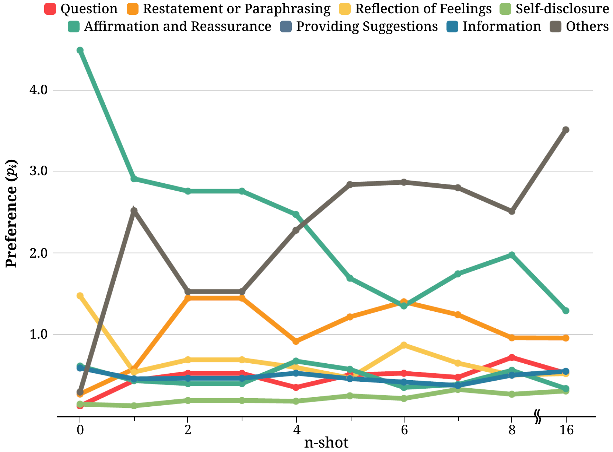

Figure 7: The results of strategy preference as the number of shots increases.
[/FIGURE]

### F.3 Preference for Strategies by the Number of Examples.

In Figure [6(a)](#S5.F6.sf1 "In Figure 6 ‣ Methodological impacts on providing emotional support. ‣ 5.2 RQ2: How to mitigate the preference bias on LLMs? ‣ 5 Methodological Study: Mitigating Preference Bias ‣ Can Large Language Models be Good Emotional Supporter? Mitigating Preference Bias on Emotional Support Conversation"), we observed improvements in proficiency and preference bias when prompting ChatGPT with few examples. However, we also found that as the number of examples increases, preference bias significantly worsens. To delve deeper into the reasons behind this, we examine the changes in preference for each strategy as the number of examples increases. As demonstrated in Figure [7](#A6.F7 "Figure 7 ‣ F.2 Relation between Proficiency and Preference ‣ Appendix F Additional Analysis ‣ Can Large Language Models be Good Emotional Supporter? Mitigating Preference Bias on Emotional Support Conversation"), the preference for Affirmation and Reassurance gradually diminishes, while the preference for Others gradually increases. The strong preference for the Others, as the number of examples increases, eventually exacerbates preference bias. Consequently, the strong preference for the Others disrupts the selection of alternative strategies, hindering the enhancement of proficiency as the number of shot examples increases.  

### F.4 Supervised Fine-tuning on ESC Task

[TABLE A6.T11]

<table class="ltx_tabular ltx_guessed_headers ltx_align_middle">
<thead class="ltx_thead">
<tr class="ltx_tr">
<th class="ltx_td ltx_align_left ltx_th ltx_th_column ltx_th_row ltx_border_tt">Methods</th>
<th class="ltx_td ltx_align_center ltx_th ltx_th_column ltx_border_tt">
<math class="ltx_Math"><semantics><mi class="ltx_font_mathcaligraphic">𝒬</mi><annotation-xml><ci>𝒬</ci></annotation-xml><annotation>\mathcal{Q}</annotation></semantics></math> <math class="ltx_Math"><semantics><mo>↑</mo><annotation-xml><ci>↑</ci></annotation-xml><annotation>\uparrow</annotation></semantics></math>
</th>
<th class="ltx_td ltx_align_center ltx_th ltx_th_column ltx_border_tt">
<math class="ltx_Math"><semantics><mi class="ltx_font_mathcaligraphic">ℬ</mi><annotation-xml><ci>ℬ</ci></annotation-xml><annotation>\mathcal{B}</annotation></semantics></math> <math class="ltx_Math"><semantics><mo>↓</mo><annotation-xml><ci>↓</ci></annotation-xml><annotation>\downarrow</annotation></semantics></math>
</th>
<th class="ltx_td ltx_align_center ltx_th ltx_th_column ltx_border_tt">B-2</th>
<th class="ltx_td ltx_align_center ltx_th ltx_th_column ltx_border_tt">R-L</th>
</tr>
</thead>
<tbody class="ltx_tbody">
<tr class="ltx_tr">
<th class="ltx_td ltx_align_left ltx_th ltx_th_row ltx_border_t">LLaMA2-7B</th>
<td class="ltx_td ltx_align_center ltx_border_t">13.73</td>
<td class="ltx_td ltx_align_center ltx_border_t">0.77</td>
<td class="ltx_td ltx_align_center ltx_border_t">4.98</td>
<td class="ltx_td ltx_align_center ltx_border_t">13.09</td>
</tr>
<tr class="ltx_tr">
<th class="ltx_td ltx_align_left ltx_th ltx_th_row">   + SFT (w/o strategy)</th>
<td class="ltx_td ltx_align_center">-</td>
<td class="ltx_td ltx_align_center">-</td>
<td class="ltx_td ltx_align_center">6.95</td>
<td class="ltx_td ltx_align_center">15.00</td>
</tr>
<tr class="ltx_tr">
<th class="ltx_td ltx_align_left ltx_th ltx_th_row ltx_border_bb">   + SFT (w/ strategy)</th>
<td class="ltx_td ltx_align_center ltx_border_bb">21.48</td>
<td class="ltx_td ltx_align_center ltx_border_bb">0.36</td>
<td class="ltx_td ltx_align_center ltx_border_bb">7.15</td>
<td class="ltx_td ltx_align_center ltx_border_bb">15.50</td>
</tr>
</tbody>
</table>

Table 11: Automatic evaluation results of training approaches for the total test set ($D$).
[/TABLE]

The most straightforward approach for solving a task is fine-tuning with task-specific datasets. However, closed-source LLMs or open-source LLMs with large sizes have constraints when it comes to direct fine-tuning. So, we train a relatively smaller model LLaMA2-7B to generate emotional support responses. Table [11](#A6.T11 "Table 11 ‣ F.4 Supervised Fine-tuning on ESC Task ‣ Appendix F Additional Analysis ‣ Can Large Language Models be Good Emotional Supporter? Mitigating Preference Bias on Emotional Support Conversation") shows that fine-tuning the model leads to significant improvements in emotional support quality.  

We also ablate to examine the effectiveness of strategy on fine-tuned models. As a result, Table [11](#A6.T11 "Table 11 ‣ F.4 Supervised Fine-tuning on ESC Task ‣ Appendix F Additional Analysis ‣ Can Large Language Models be Good Emotional Supporter? Mitigating Preference Bias on Emotional Support Conversation") demonstrates that fine-tuning the model on a dataset with strategies yields a higher quality of emotional support compared to training on a dataset that does not include strategies.  

## Appendix G Case Study

### G.1 Responses of LLMs by Stages

In Figure [12](#A7.F12 "Figure 12 ‣ G.3 Misalignment between Strategy and Response ‣ Appendix G Case Study ‣ Can Large Language Models be Good Emotional Supporter? Mitigating Preference Bias on Emotional Support Conversation"), [13](#A7.F13 "Figure 13 ‣ G.3 Misalignment between Strategy and Response ‣ Appendix G Case Study ‣ Can Large Language Models be Good Emotional Supporter? Mitigating Preference Bias on Emotional Support Conversation"), and [14](#A7.F14 "Figure 14 ‣ G.3 Misalignment between Strategy and Response ‣ Appendix G Case Study ‣ Can Large Language Models be Good Emotional Supporter? Mitigating Preference Bias on Emotional Support Conversation"), we present examples of generated responses in each stage from LLMs. During the Exploration stage (Figure [12](#A7.F12 "Figure 12 ‣ G.3 Misalignment between Strategy and Response ‣ Appendix G Case Study ‣ Can Large Language Models be Good Emotional Supporter? Mitigating Preference Bias on Emotional Support Conversation")), it is observed that LLMs, excluding the LLaMA2 family, tend to express empathy prematurely before sufficient exploration, potentially causing discomfort for the seeker. These findings correlate with the LLaMA2 family’s high preference for Question, in contrast to other models, exhibiting a lower preference, as illustrated in Figure [3(b)](#S3.F3.sf2 "In Figure 3 ‣ Preference Bias. ‣ 3.3 Metrics ‣ 3 Evaluation Setup ‣ Can Large Language Models be Good Emotional Supporter? Mitigating Preference Bias on Emotional Support Conversation"). Furthermore, these results correspond to earlier findings discussed in Appendix [F.1](#A6.SS1 "F.1 LLMs’ Proficiency for Each Strategy ‣ Appendix F Additional Analysis ‣ Can Large Language Models be Good Emotional Supporter? Mitigating Preference Bias on Emotional Support Conversation"). In the Comforting stage (Figure [13](#A7.F13 "Figure 13 ‣ G.3 Misalignment between Strategy and Response ‣ Appendix G Case Study ‣ Can Large Language Models be Good Emotional Supporter? Mitigating Preference Bias on Emotional Support Conversation")), each model demonstrates suitable responses, primarily due to the high preference for Affirmation and Reassurance in most LLMs. Lastly, in the Action stage (Figure [14](#A7.F14 "Figure 14 ‣ G.3 Misalignment between Strategy and Response ‣ Appendix G Case Study ‣ Can Large Language Models be Good Emotional Supporter? Mitigating Preference Bias on Emotional Support Conversation")), GPT-4 and ChatGPT exhibit the superior performance compared to others, particularly excelling in generating informative responses, aligning with the observations in Zhao et al. ([2023a](#bib.bib46)) and  Chen et al. ([2023b](#bib.bib7)). Psychologists who assess the overall responses of LLMs also comment as follows:  

> “ChatGPT exhibits a tendency to excessively employ affirmations. In contrast, LLaMA2, despite its overall lower proficiency, displays notable strength in effectively handling open-ended questions.”

These results are aligned with the findings we identify through our case study.  

### G.2 Comparison between Self-Contact and External-Contact

While self-contact methods negatively impact on performance, external-contact methods exhibit a noticeable enhancement. A detailed case study presented in Figure [15](#A7.F15 "Figure 15 ‣ G.3 Misalignment between Strategy and Response ‣ Appendix G Case Study ‣ Can Large Language Models be Good Emotional Supporter? Mitigating Preference Bias on Emotional Support Conversation") supports this findings, where the response of self-contact methods fall short of meeting the seeker’s expectations, while the external-contact methods effectively address the seeker’s question by drawing upon personal experiences.  

### G.3 Misalignment between Strategy and Response

A possible concern is that LLMs might lack ability to generate responses aligned with strategies. Therefore, we conduct an empirical case study to figure out this misalignments. In Figure [16](#A7.F16 "Figure 16 ‣ G.3 Misalignment between Strategy and Response ‣ Appendix G Case Study ‣ Can Large Language Models be Good Emotional Supporter? Mitigating Preference Bias on Emotional Support Conversation"), ChatGPT generates a response that is not aligned with the strategy Information predicted by external strategy planner. This may be due to knowledge conflicts, i.e., ChatGPT does not consider it appropriate to use the Information for the next response, despite being forced to generate a response aligned with the strategy Information. In conclusion, while external assistance has potential to enhance performance, it is crucial to acknowledge that not all approaches yield positive impacts.  

[TABLE A7.T12]

<table class="ltx_tabular ltx_guessed_headers ltx_align_middle">
<thead class="ltx_thead">
<tr class="ltx_tr">
<th class="ltx_td ltx_align_justify ltx_align_top ltx_th ltx_th_column ltx_border_tt">

Prompt

</th>
</tr>
</thead>
<tbody class="ltx_tbody">
<tr class="ltx_tr">
<td class="ltx_td ltx_align_justify ltx_align_top ltx_border_tt">

<math class="ltx_math_unparsed"><semantics><mrow><mo>[</mo><mo>[</mo></mrow><annotation>[[</annotation></semantics></math>TASK DESCRIPTION<math class="ltx_math_unparsed"><semantics><mrow><mo>]</mo><mo>]</mo></mrow><annotation>]]</annotation></semantics></math>

</td>
</tr>
<tr class="ltx_tr">
<td class="ltx_td ltx_align_justify ltx_align_top">

The strategy should be chosen from the following 8 types of strategy:

</td>
</tr>
<tr class="ltx_tr">
<td class="ltx_td ltx_align_justify ltx_align_top">

- Question: Asking for information related to the problem to help the help-seeker articulate the issues that they face. Open-ended questions are best, and closed questions can be used to get specific information.

</td>
</tr>
<tr class="ltx_tr">
<td class="ltx_td ltx_align_justify ltx_align_top">

- Restatement or Paraphrasing: A simple, more concise rephrasing of the help-seeker’s statements that could help them see their situation more clearly.

</td>
</tr>
<tr class="ltx_tr">
<td class="ltx_td ltx_align_justify ltx_align_top">

- Reflection of Feelings: Articulate and describe the help-seeker’s feelings.

</td>
</tr>
<tr class="ltx_tr">
<td class="ltx_td ltx_align_justify ltx_align_top">

- Self-disclosure: Divulge similar experiences that you have had or emotions that you share with the help-seeker to express your empathy. - Affirmation and Reassurance: Affirm the help seeker’s strengths, motivation, and capabilities and provide reassurance and encouragement.

</td>
</tr>
<tr class="ltx_tr">
<td class="ltx_td ltx_align_justify ltx_align_top">

- Providing Suggestions: Provide suggestions about how to change, but be careful to not overstep and tell them what to do.

</td>
</tr>
<tr class="ltx_tr">
<td class="ltx_td ltx_align_justify ltx_align_top">

- Information: Provide useful information to the help-seeker, for example with data, facts, opinions, resources, or by answering questions.

</td>
</tr>
<tr class="ltx_tr">
<td class="ltx_td ltx_align_justify ltx_align_top">

- Others: Exchange pleasantries and use other support strategies that do not fall into the above categories.

</td>
</tr>
<tr class="ltx_tr">
<td class="ltx_td ltx_align_justify ltx_align_top">

<math class="ltx_Math"><semantics><mo>[</mo><annotation-xml><ci>[</ci></annotation-xml><annotation>[</annotation></semantics></math>Example 1<math class="ltx_Math"><semantics><mo>]</mo><annotation-xml><ci>]</ci></annotation-xml><annotation>]</annotation></semantics></math>

</td>
</tr>
<tr class="ltx_tr">
<td class="ltx_td ltx_align_justify ltx_align_top">

### Dialogue background ###

</td>
</tr>
<tr class="ltx_tr">
<td class="ltx_td ltx_align_justify ltx_align_top">

The following is a conversation between a supporter and a seeker about <math class="ltx_Math"><semantics><mo>{</mo><annotation-xml><ci>{</ci></annotation-xml><annotation>\{</annotation></semantics></math>emotion type<math class="ltx_Math"><semantics><mo>}</mo><annotation-xml><ci>}</ci></annotation-xml><annotation>\}</annotation></semantics></math> regarding a/an <math class="ltx_Math"><semantics><mo>{</mo><annotation-xml><ci>{</ci></annotation-xml><annotation>\{</annotation></semantics></math>problem type<math class="ltx_Math"><semantics><mo>}</mo><annotation-xml><ci>}</ci></annotation-xml><annotation>\}</annotation></semantics></math>. The seeker says "<math class="ltx_Math"><semantics><mo>{</mo><annotation-xml><ci>{</ci></annotation-xml><annotation>\{</annotation></semantics></math>situation<math class="ltx_Math"><semantics><mo>}</mo><annotation-xml><ci>}</ci></annotation-xml><annotation>\}</annotation></semantics></math>".

</td>
</tr>
<tr class="ltx_tr">
<td class="ltx_td ltx_align_justify ltx_align_top">

### Dialogue context ###

</td>
</tr>
<tr class="ltx_tr">
<td class="ltx_td ltx_align_justify ltx_align_top">

<math class="ltx_Math"><semantics><mo>{</mo><annotation-xml><ci>{</ci></annotation-xml><annotation>\{</annotation></semantics></math>context<math class="ltx_Math"><semantics><mo>}</mo><annotation-xml><ci>}</ci></annotation-xml><annotation>\}</annotation></semantics></math>

</td>
</tr>
<tr class="ltx_tr">
<td class="ltx_td ltx_align_justify ltx_align_top">

<math class="ltx_math_unparsed"><semantics><mrow><mo>[</mo><mo>[</mo></mrow><annotation>[[</annotation></semantics></math>Supplementary Input<math class="ltx_math_unparsed"><semantics><mrow><mo>]</mo><mo>]</mo></mrow><annotation>]]</annotation></semantics></math>

</td>
</tr>
<tr class="ltx_tr">
<td class="ltx_td ltx_align_justify ltx_align_top ltx_border_bb">

Methods

Task Description

Supplementary Input

Vanilla

You will be provided with a dialogue context between a supporter and seeker. Your task is to make the next response based on the given dialogue context.

### Model’s response ###

Direct-Refine

You will be provided with a dialogue context between a supporter and seeker, as well as a response written by a language model from the perspective of the supporter, including strategy and utterance. Your task is to refine the model’s response (i.e., Strategy and Utterance) based on the given dialogue context.

### Model’s response ###

Strategy: <math class="ltx_Math"><semantics><mo>{</mo><annotation-xml><ci>{</ci></annotation-xml><annotation>\{</annotation></semantics></math>strg pred<math class="ltx_Math"><semantics><mo>}</mo><annotation-xml><ci>}</ci></annotation-xml><annotation>\}</annotation></semantics></math>

Utterance: <math class="ltx_Math"><semantics><mo>{</mo><annotation-xml><ci>{</ci></annotation-xml><annotation>\{</annotation></semantics></math>res pred<math class="ltx_Math"><semantics><mo>}</mo><annotation-xml><ci>}</ci></annotation-xml><annotation>\}</annotation></semantics></math>

### Refined response ###

Self-Refine

(Feedback)

You will be provided with a dialogue context between a supporter and seeker, as well as a response written by a language model from the perspective of the supporter, including strategy and utterance. Your task is to feedback for the model response (i.e., Strategy and Utterance) based on the given dialogue context.

### Model’s response ###

Strategy: <math class="ltx_Math"><semantics><mo>{</mo><annotation-xml><ci>{</ci></annotation-xml><annotation>\{</annotation></semantics></math>strg pred<math class="ltx_Math"><semantics><mo>}</mo><annotation-xml><ci>}</ci></annotation-xml><annotation>\}</annotation></semantics></math>

Utterance: <math class="ltx_Math"><semantics><mo>{</mo><annotation-xml><ci>{</ci></annotation-xml><annotation>\{</annotation></semantics></math>res pred<math class="ltx_Math"><semantics><mo>}</mo><annotation-xml><ci>}</ci></annotation-xml><annotation>\}</annotation></semantics></math>

### Feedback ###

Self-Refine

(Refine)

You will be provided with a dialogue context between a supporter and seeker, as well as a response written by a language model from the perspective of the supporter, including strategy and utterance. Your task is to refine the model response (i.e., Strategy and Utterance) based on the given dialogue context and feedback of the model response.

### Model’s response ###

Strategy: <math class="ltx_Math"><semantics><mo>{</mo><annotation-xml><ci>{</ci></annotation-xml><annotation>\{</annotation></semantics></math>strg pred<math class="ltx_Math"><semantics><mo>}</mo><annotation-xml><ci>}</ci></annotation-xml><annotation>\}</annotation></semantics></math>

Utterance: <math class="ltx_Math"><semantics><mo>{</mo><annotation-xml><ci>{</ci></annotation-xml><annotation>\{</annotation></semantics></math>res pred<math class="ltx_Math"><semantics><mo>}</mo><annotation-xml><ci>}</ci></annotation-xml><annotation>\}</annotation></semantics></math>

### Feedback ###

Feedback : <math class="ltx_Math"><semantics><mo>{</mo><annotation-xml><ci>{</ci></annotation-xml><annotation>\{</annotation></semantics></math>feedback<math class="ltx_Math"><semantics><mo>}</mo><annotation-xml><ci>}</ci></annotation-xml><annotation>\}</annotation></semantics></math>

### Refined response ###

w/ COMET

You will be provided with a dialogue context between a supporter and seeker, and a commonsense knowledge from external model. Your task is to generate a response for the supporter based on the dialogue context and commonsense knowledge, you should ignore the commonsense knowledge if it mislead the next response.

### Commonsense knowledge ###

<math class="ltx_Math"><semantics><mo>{</mo><annotation-xml><ci>{</ci></annotation-xml><annotation>\{</annotation></semantics></math>comet<math class="ltx_Math"><semantics><mo>}</mo><annotation-xml><ci>}</ci></annotation-xml><annotation>\}</annotation></semantics></math>

### Model’s response ###

</td>
</tr>
</tbody>
</table>

Table 12: Example prompts for response generation.
[/TABLE]

[TABLE A7.T13]

<table class="ltx_tabular ltx_guessed_headers ltx_align_middle">
<tbody class="ltx_tbody">
<tr class="ltx_tr">
<th class="ltx_td ltx_align_left ltx_th ltx_th_row ltx_border_tt">Models</th>
<td class="ltx_td ltx_align_center ltx_border_tt">Params</td>
<td class="ltx_td ltx_align_center ltx_border_tt">
<math class="ltx_Math"><semantics><mi class="ltx_font_mathcaligraphic">𝒬</mi><annotation-xml><ci>𝒬</ci></annotation-xml><annotation>\mathcal{Q}</annotation></semantics></math> <math class="ltx_Math"><semantics><mo>↑</mo><annotation-xml><ci>↑</ci></annotation-xml><annotation>\uparrow</annotation></semantics></math>
</td>
<td class="ltx_td ltx_align_center ltx_border_tt">
<math class="ltx_Math"><semantics><mi class="ltx_font_mathcaligraphic">ℬ</mi><annotation-xml><ci>ℬ</ci></annotation-xml><annotation>\mathcal{B}</annotation></semantics></math> <math class="ltx_Math"><semantics><mo>↓</mo><annotation-xml><ci>↓</ci></annotation-xml><annotation>\downarrow</annotation></semantics></math>
</td>
<td class="ltx_td ltx_align_center ltx_border_tt">BLEU-2</td>
<td class="ltx_td ltx_align_center ltx_border_tt">BLEU-4</td>
<td class="ltx_td ltx_align_center ltx_border_tt">ROUGE-L</td>
<td class="ltx_td ltx_align_center ltx_border_tt">METEOR</td>
<td class="ltx_td ltx_align_center ltx_border_tt">CIDEr</td>
<td class="ltx_td ltx_align_center ltx_border_tt">Dist-1</td>
<td class="ltx_td ltx_align_center ltx_border_tt">Dist-2</td>
</tr>
<tr class="ltx_tr">
<th class="ltx_td ltx_align_left ltx_th ltx_th_row ltx_border_t">0-shot</th>
<td class="ltx_td ltx_border_t"></td>
<td class="ltx_td ltx_border_t"></td>
<td class="ltx_td ltx_border_t"></td>
<td class="ltx_td ltx_border_t"></td>
<td class="ltx_td ltx_border_t"></td>
<td class="ltx_td ltx_border_t"></td>
<td class="ltx_td ltx_border_t"></td>
<td class="ltx_td ltx_border_t"></td>
<td class="ltx_td ltx_border_t"></td>
<td class="ltx_td ltx_border_t"></td>
</tr>
<tr class="ltx_tr">
<th class="ltx_td ltx_align_left ltx_th ltx_th_row">GPT-4</th>
<td class="ltx_td ltx_align_center">-</td>
<td class="ltx_td ltx_align_center">15.04</td>
<td class="ltx_td ltx_align_center">1.35</td>
<td class="ltx_td ltx_align_center">5.00</td>
<td class="ltx_td ltx_align_center">0.96</td>
<td class="ltx_td ltx_align_center">14.24</td>
<td class="ltx_td ltx_align_center">10.20</td>
<td class="ltx_td ltx_align_center">3.11</td>
<td class="ltx_td ltx_align_center">4.13</td>
<td class="ltx_td ltx_align_center">26.21</td>
</tr>
<tr class="ltx_tr">
<th class="ltx_td ltx_align_left ltx_th ltx_th_row">ChatGPT</th>
<td class="ltx_td ltx_align_center">175B</td>
<td class="ltx_td ltx_align_center">13.50</td>
<td class="ltx_td ltx_align_center">1.38</td>
<td class="ltx_td ltx_align_center">6.27</td>
<td class="ltx_td ltx_align_center">1.16</td>
<td class="ltx_td ltx_align_center">14.86</td>
<td class="ltx_td ltx_align_center">9.17</td>
<td class="ltx_td ltx_align_center">6.27</td>
<td class="ltx_td ltx_align_center">4.33</td>
<td class="ltx_td ltx_align_center">24.34</td>
</tr>
<tr class="ltx_tr">
<th class="ltx_td ltx_align_left ltx_th ltx_th_row">2-shot</th>
<td class="ltx_td"></td>
<td class="ltx_td"></td>
<td class="ltx_td"></td>
<td class="ltx_td"></td>
<td class="ltx_td"></td>
<td class="ltx_td"></td>
<td class="ltx_td"></td>
<td class="ltx_td"></td>
<td class="ltx_td"></td>
<td class="ltx_td"></td>
</tr>
<tr class="ltx_tr">
<th class="ltx_td ltx_align_left ltx_th ltx_th_row">GPT-4</th>
<td class="ltx_td ltx_align_center">-</td>
<td class="ltx_td ltx_align_center">18.38</td>
<td class="ltx_td ltx_align_center">0.90</td>
<td class="ltx_td ltx_align_center">6.47</td>
<td class="ltx_td ltx_align_center">1.39</td>
<td class="ltx_td ltx_align_center">15.18</td>
<td class="ltx_td ltx_align_center">9.55</td>
<td class="ltx_td ltx_align_center">5.97</td>
<td class="ltx_td ltx_align_center">7.58</td>
<td class="ltx_td ltx_align_center">36.92</td>
</tr>
<tr class="ltx_tr">
<th class="ltx_td ltx_align_left ltx_th ltx_th_row">ChatGPT</th>
<td class="ltx_td ltx_align_center">175B</td>
<td class="ltx_td ltx_align_center">16.98</td>
<td class="ltx_td ltx_align_center">0.86</td>
<td class="ltx_td ltx_align_center">6.30</td>
<td class="ltx_td ltx_align_center">1.41</td>
<td class="ltx_td ltx_align_center">14.94</td>
<td class="ltx_td ltx_align_center">9.30</td>
<td class="ltx_td ltx_align_center">6.91</td>
<td class="ltx_td ltx_align_center">4.75</td>
<td class="ltx_td ltx_align_center">27.03</td>
</tr>
<tr class="ltx_tr">
<th class="ltx_td ltx_align_left ltx_th ltx_th_row ltx_border_t">2-shot</th>
<td class="ltx_td ltx_border_t"></td>
<td class="ltx_td ltx_border_t"></td>
<td class="ltx_td ltx_border_t"></td>
<td class="ltx_td ltx_border_t"></td>
<td class="ltx_td ltx_border_t"></td>
<td class="ltx_td ltx_border_t"></td>
<td class="ltx_td ltx_border_t"></td>
<td class="ltx_td ltx_border_t"></td>
<td class="ltx_td ltx_border_t"></td>
<td class="ltx_td ltx_border_t"></td>
</tr>
<tr class="ltx_tr">
<th class="ltx_td ltx_align_left ltx_th ltx_th_row">Tulu</th>
<td class="ltx_td ltx_align_center">70B</td>
<td class="ltx_td ltx_align_center">15.93</td>
<td class="ltx_td ltx_align_center">0.90</td>
<td class="ltx_td ltx_align_center">6.90</td>
<td class="ltx_td ltx_align_center">1.63</td>
<td class="ltx_td ltx_align_center">13.94</td>
<td class="ltx_td ltx_align_center">7.65</td>
<td class="ltx_td ltx_align_center">7.10</td>
<td class="ltx_td ltx_align_center">4.50</td>
<td class="ltx_td ltx_align_center">23.78</td>
</tr>
<tr class="ltx_tr">
<th class="ltx_td ltx_align_left ltx_th ltx_th_row">LLaMA2</th>
<td class="ltx_td ltx_align_center">70B</td>
<td class="ltx_td ltx_align_center">14.55</td>
<td class="ltx_td ltx_align_center">0.47</td>
<td class="ltx_td ltx_align_center">6.15</td>
<td class="ltx_td ltx_align_center">1.28</td>
<td class="ltx_td ltx_align_center">14.29</td>
<td class="ltx_td ltx_align_center">7.31</td>
<td class="ltx_td ltx_align_center">7.52</td>
<td class="ltx_td ltx_align_center">5.70</td>
<td class="ltx_td ltx_align_center">30.95</td>
</tr>
<tr class="ltx_tr">
<th class="ltx_td ltx_align_left ltx_th ltx_th_row">Vicuna</th>
<td class="ltx_td ltx_align_center">13B</td>
<td class="ltx_td ltx_align_center">12.85</td>
<td class="ltx_td ltx_align_center">0.74</td>
<td class="ltx_td ltx_align_center">6.55</td>
<td class="ltx_td ltx_align_center">1.70</td>
<td class="ltx_td ltx_align_center">14.43</td>
<td class="ltx_td ltx_align_center">8.42</td>
<td class="ltx_td ltx_align_center">6.95</td>
<td class="ltx_td ltx_align_center">4.37</td>
<td class="ltx_td ltx_align_center">24.15</td>
</tr>
<tr class="ltx_tr">
<th class="ltx_td ltx_align_left ltx_th ltx_th_row">Solar</th>
<td class="ltx_td ltx_align_center">10.7B</td>
<td class="ltx_td ltx_align_center">14.17</td>
<td class="ltx_td ltx_align_center">0.87</td>
<td class="ltx_td ltx_align_center">4.79</td>
<td class="ltx_td ltx_align_center">0.81</td>
<td class="ltx_td ltx_align_center">13.53</td>
<td class="ltx_td ltx_align_center">9.08</td>
<td class="ltx_td ltx_align_center">3.86</td>
<td class="ltx_td ltx_align_center">5.11</td>
<td class="ltx_td ltx_align_center">32.36</td>
</tr>
<tr class="ltx_tr">
<th class="ltx_td ltx_align_left ltx_th ltx_th_row">Mistral</th>
<td class="ltx_td ltx_align_center">7B</td>
<td class="ltx_td ltx_align_center">12.23</td>
<td class="ltx_td ltx_align_center">0.71</td>
<td class="ltx_td ltx_align_center">4.72</td>
<td class="ltx_td ltx_align_center">0.45</td>
<td class="ltx_td ltx_align_center">12.93</td>
<td class="ltx_td ltx_align_center">7.13</td>
<td class="ltx_td ltx_align_center">3.32</td>
<td class="ltx_td ltx_align_center">4.46</td>
<td class="ltx_td ltx_align_center">25.36</td>
</tr>
<tr class="ltx_tr">
<th class="ltx_td ltx_align_left ltx_th ltx_th_row ltx_border_bb">LLaMA2</th>
<td class="ltx_td ltx_align_center ltx_border_bb">7B</td>
<td class="ltx_td ltx_align_center ltx_border_bb">13.73</td>
<td class="ltx_td ltx_align_center ltx_border_bb">0.77</td>
<td class="ltx_td ltx_align_center ltx_border_bb">4.98</td>
<td class="ltx_td ltx_align_center ltx_border_bb">0.96</td>
<td class="ltx_td ltx_align_center ltx_border_bb">13.09</td>
<td class="ltx_td ltx_align_center ltx_border_bb">6.67</td>
<td class="ltx_td ltx_align_center ltx_border_bb">5.41</td>
<td class="ltx_td ltx_align_center ltx_border_bb">6.35</td>
<td class="ltx_td ltx_align_center ltx_border_bb">34.74</td>
</tr>
</tbody>
</table>

Table 13: Automatic evaluation results on the generated response of closed-source LLMs and open-source LLMs for the entire test set ($D$). The automatic metrics include BLEU-n (Papineni et al., [2002](#bib.bib39)), ROUGE-L (Lin, [2004](#bib.bib31)), METEOR (Banerjee and Lavie, [2005](#bib.bib2)), CIDEr (Vedantam et al., [2014](#bib.bib43)), and Distinct-1/2 (Li et al., [2016](#bib.bib30)). The best results are bolded and the second best are underlined.
[/TABLE]

[TABLE A7.T14]

<table class="ltx_tabular ltx_guessed_headers ltx_align_middle">
<tbody class="ltx_tbody">
<tr class="ltx_tr">
<th class="ltx_td ltx_th ltx_th_row ltx_border_tt"></th>
<td class="ltx_td ltx_border_tt"></td>
<td class="ltx_td ltx_border_tt"></td>
<td class="ltx_td ltx_border_tt"></td>
<td class="ltx_td ltx_align_center ltx_border_tt"><math class="ltx_Math"><semantics><msub><mi>D</mi><mn>1</mn></msub><annotation-xml><apply><csymbol>subscript</csymbol><ci>𝐷</ci><cn>1</cn></apply></annotation-xml><annotation>D_{1}</annotation></semantics></math></td>
<td class="ltx_td ltx_align_center ltx_border_tt"><math class="ltx_Math"><semantics><msub><mi>D</mi><mn>2</mn></msub><annotation-xml><apply><csymbol>subscript</csymbol><ci>𝐷</ci><cn>2</cn></apply></annotation-xml><annotation>D_{2}</annotation></semantics></math></td>
<td class="ltx_td ltx_align_center ltx_border_tt"><math class="ltx_Math"><semantics><msub><mi>D</mi><mn>3</mn></msub><annotation-xml><apply><csymbol>subscript</csymbol><ci>𝐷</ci><cn>3</cn></apply></annotation-xml><annotation>D_{3}</annotation></semantics></math></td>
</tr>
<tr class="ltx_tr">
<th class="ltx_td ltx_align_left ltx_th ltx_th_row">Models</th>
<td class="ltx_td ltx_align_center">Params</td>
<td class="ltx_td ltx_align_center">
<math class="ltx_Math"><semantics><mi class="ltx_font_mathcaligraphic">𝒬</mi><annotation-xml><ci>𝒬</ci></annotation-xml><annotation>\mathcal{Q}</annotation></semantics></math> <math class="ltx_Math"><semantics><mo>↑</mo><annotation-xml><ci>↑</ci></annotation-xml><annotation>\uparrow</annotation></semantics></math>
</td>
<td class="ltx_td ltx_align_center">
<math class="ltx_Math"><semantics><mi class="ltx_font_mathcaligraphic">ℬ</mi><annotation-xml><ci>ℬ</ci></annotation-xml><annotation>\mathcal{B}</annotation></semantics></math> <math class="ltx_Math"><semantics><mo>↓</mo><annotation-xml><ci>↓</ci></annotation-xml><annotation>\downarrow</annotation></semantics></math>
</td>
<td class="ltx_td ltx_align_center ltx_border_t">F1</td>
<td class="ltx_td ltx_align_center ltx_border_t">B-2</td>
<td class="ltx_td ltx_align_center ltx_border_t">R-L</td>
<td class="ltx_td ltx_align_center ltx_border_t">F1</td>
<td class="ltx_td ltx_align_center ltx_border_t">B-2</td>
<td class="ltx_td ltx_align_center ltx_border_t">R-L</td>
<td class="ltx_td ltx_align_center ltx_border_t">F1</td>
<td class="ltx_td ltx_align_center ltx_border_t">B-2</td>
<td class="ltx_td ltx_align_center ltx_border_t">R-L</td>
</tr>
<tr class="ltx_tr">
<th class="ltx_td ltx_align_left ltx_th ltx_th_row ltx_border_t">0-shot</th>
<td class="ltx_td ltx_border_t"></td>
<td class="ltx_td ltx_border_t"></td>
<td class="ltx_td ltx_border_t"></td>
<td class="ltx_td ltx_border_t"></td>
<td class="ltx_td ltx_border_t"></td>
<td class="ltx_td ltx_border_t"></td>
<td class="ltx_td ltx_border_t"></td>
<td class="ltx_td ltx_border_t"></td>
<td class="ltx_td ltx_border_t"></td>
<td class="ltx_td ltx_border_t"></td>
<td class="ltx_td ltx_border_t"></td>
<td class="ltx_td ltx_border_t"></td>
</tr>
<tr class="ltx_tr">
<th class="ltx_td ltx_align_left ltx_th ltx_th_row">GPT-4</th>
<td class="ltx_td ltx_align_center">-</td>
<td class="ltx_td ltx_align_center">15.04</td>
<td class="ltx_td ltx_align_center">1.35</td>
<td class="ltx_td ltx_align_center">11.23</td>
<td class="ltx_td ltx_align_center">4.58</td>
<td class="ltx_td ltx_align_center">13.67</td>
<td class="ltx_td ltx_align_center">20.41</td>
<td class="ltx_td ltx_align_center">4.70</td>
<td class="ltx_td ltx_align_center">14.13</td>
<td class="ltx_td ltx_align_center">21.04</td>
<td class="ltx_td ltx_align_center">5.45</td>
<td class="ltx_td ltx_align_center">14.67</td>
</tr>
<tr class="ltx_tr">
<th class="ltx_td ltx_align_left ltx_th ltx_th_row">ChatGPT</th>
<td class="ltx_td ltx_align_center">175B</td>
<td class="ltx_td ltx_align_center">13.50</td>
<td class="ltx_td ltx_align_center">1.38</td>
<td class="ltx_td ltx_align_center">10.23</td>
<td class="ltx_td ltx_align_center">5.95</td>
<td class="ltx_td ltx_align_center">14.59</td>
<td class="ltx_td ltx_align_center">19.60</td>
<td class="ltx_td ltx_align_center">6.02</td>
<td class="ltx_td ltx_align_center">14.70</td>
<td class="ltx_td ltx_align_center">17.97</td>
<td class="ltx_td ltx_align_center">6.62</td>
<td class="ltx_td ltx_align_center">14.86</td>
</tr>
<tr class="ltx_tr">
<th class="ltx_td ltx_align_left ltx_th ltx_th_row">2-shot</th>
<td class="ltx_td"></td>
<td class="ltx_td"></td>
<td class="ltx_td"></td>
<td class="ltx_td"></td>
<td class="ltx_td"></td>
<td class="ltx_td"></td>
<td class="ltx_td"></td>
<td class="ltx_td"></td>
<td class="ltx_td"></td>
<td class="ltx_td"></td>
<td class="ltx_td"></td>
<td class="ltx_td"></td>
</tr>
<tr class="ltx_tr">
<th class="ltx_td ltx_align_left ltx_th ltx_th_row">GPT-4</th>
<td class="ltx_td ltx_align_center">-</td>
<td class="ltx_td ltx_align_center">18.38</td>
<td class="ltx_td ltx_align_center">0.90</td>
<td class="ltx_td ltx_align_center">14.61</td>
<td class="ltx_td ltx_align_center">5.22</td>
<td class="ltx_td ltx_align_center">14.27</td>
<td class="ltx_td ltx_align_center">22.55</td>
<td class="ltx_td ltx_align_center">5.36</td>
<td class="ltx_td ltx_align_center">14.54</td>
<td class="ltx_td ltx_align_center">24.68</td>
<td class="ltx_td ltx_align_center">6.47</td>
<td class="ltx_td ltx_align_center">15.18</td>
</tr>
<tr class="ltx_tr">
<th class="ltx_td ltx_align_left ltx_th ltx_th_row">ChatGPT</th>
<td class="ltx_td ltx_align_center">175B</td>
<td class="ltx_td ltx_align_center">16.98</td>
<td class="ltx_td ltx_align_center">0.86</td>
<td class="ltx_td ltx_align_center">15.16</td>
<td class="ltx_td ltx_align_center">6.10</td>
<td class="ltx_td ltx_align_center">14.90</td>
<td class="ltx_td ltx_align_center">19.07</td>
<td class="ltx_td ltx_align_center">6.08</td>
<td class="ltx_td ltx_align_center">14.81</td>
<td class="ltx_td ltx_align_center">20.10</td>
<td class="ltx_td ltx_align_center">6.30</td>
<td class="ltx_td ltx_align_center">15.07</td>
</tr>
<tr class="ltx_tr">
<th class="ltx_td ltx_align_left ltx_th ltx_th_row ltx_border_t">2-shot</th>
<td class="ltx_td ltx_border_t"></td>
<td class="ltx_td ltx_border_t"></td>
<td class="ltx_td ltx_border_t"></td>
<td class="ltx_td ltx_border_t"></td>
<td class="ltx_td ltx_border_t"></td>
<td class="ltx_td ltx_border_t"></td>
<td class="ltx_td ltx_border_t"></td>
<td class="ltx_td ltx_border_t"></td>
<td class="ltx_td ltx_border_t"></td>
<td class="ltx_td ltx_border_t"></td>
<td class="ltx_td ltx_border_t"></td>
<td class="ltx_td ltx_border_t"></td>
</tr>
<tr class="ltx_tr">
<th class="ltx_td ltx_align_left ltx_th ltx_th_row">Tulu</th>
<td class="ltx_td ltx_align_center">70B</td>
<td class="ltx_td ltx_align_center">15.93</td>
<td class="ltx_td ltx_align_center">0.90</td>
<td class="ltx_td ltx_align_center">13.77</td>
<td class="ltx_td ltx_align_center">5.99</td>
<td class="ltx_td ltx_align_center">13.43</td>
<td class="ltx_td ltx_align_center">21.37</td>
<td class="ltx_td ltx_align_center">6.52</td>
<td class="ltx_td ltx_align_center">13.85</td>
<td class="ltx_td ltx_align_center">18.78</td>
<td class="ltx_td ltx_align_center">7.33</td>
<td class="ltx_td ltx_align_center">14.34</td>
</tr>
<tr class="ltx_tr">
<th class="ltx_td ltx_align_left ltx_th ltx_th_row">LLaMA2</th>
<td class="ltx_td ltx_align_center">70B</td>
<td class="ltx_td ltx_align_center">14.55</td>
<td class="ltx_td ltx_align_center">0.47</td>
<td class="ltx_td ltx_align_center">19.12</td>
<td class="ltx_td ltx_align_center">6.20</td>
<td class="ltx_td ltx_align_center">14.22</td>
<td class="ltx_td ltx_align_center">16.51</td>
<td class="ltx_td ltx_align_center">6.18</td>
<td class="ltx_td ltx_align_center">14.27</td>
<td class="ltx_td ltx_align_center">15.82</td>
<td class="ltx_td ltx_align_center">6.05</td>
<td class="ltx_td ltx_align_center">14.34</td>
</tr>
<tr class="ltx_tr">
<th class="ltx_td ltx_align_left ltx_th ltx_th_row">Vicuna</th>
<td class="ltx_td ltx_align_center">13B</td>
<td class="ltx_td ltx_align_center">12.85</td>
<td class="ltx_td ltx_align_center">0.74</td>
<td class="ltx_td ltx_align_center">10.21</td>
<td class="ltx_td ltx_align_center">6.58</td>
<td class="ltx_td ltx_align_center">14.44</td>
<td class="ltx_td ltx_align_center">16.74</td>
<td class="ltx_td ltx_align_center">5.65</td>
<td class="ltx_td ltx_align_center">13.97</td>
<td class="ltx_td ltx_align_center">15.74</td>
<td class="ltx_td ltx_align_center">7.07</td>
<td class="ltx_td ltx_align_center">14.74</td>
</tr>
<tr class="ltx_tr">
<th class="ltx_td ltx_align_left ltx_th ltx_th_row">Solar</th>
<td class="ltx_td ltx_align_center">10.7B</td>
<td class="ltx_td ltx_align_center">14.17</td>
<td class="ltx_td ltx_align_center">0.87</td>
<td class="ltx_td ltx_align_center">10.53</td>
<td class="ltx_td ltx_align_center">4.49</td>
<td class="ltx_td ltx_align_center">13.12</td>
<td class="ltx_td ltx_align_center">17.29</td>
<td class="ltx_td ltx_align_center">4.31</td>
<td class="ltx_td ltx_align_center">13.38</td>
<td class="ltx_td ltx_align_center">18.93</td>
<td class="ltx_td ltx_align_center">5.31</td>
<td class="ltx_td ltx_align_center">13.89</td>
</tr>
<tr class="ltx_tr">
<th class="ltx_td ltx_align_left ltx_th ltx_th_row">Mistral</th>
<td class="ltx_td ltx_align_center">7B</td>
<td class="ltx_td ltx_align_center">12.23</td>
<td class="ltx_td ltx_align_center">0.71</td>
<td class="ltx_td ltx_align_center">12.40</td>
<td class="ltx_td ltx_align_center">3.82</td>
<td class="ltx_td ltx_align_center">12.40</td>
<td class="ltx_td ltx_align_center">17.18</td>
<td class="ltx_td ltx_align_center">5.74</td>
<td class="ltx_td ltx_align_center">13.94</td>
<td class="ltx_td ltx_align_center">14.74</td>
<td class="ltx_td ltx_align_center">4.59</td>
<td class="ltx_td ltx_align_center">12.60</td>
</tr>
<tr class="ltx_tr">
<th class="ltx_td ltx_align_left ltx_th ltx_th_row ltx_border_bb">LLaMA2</th>
<td class="ltx_td ltx_align_center ltx_border_bb">7B</td>
<td class="ltx_td ltx_align_center ltx_border_bb">13.73</td>
<td class="ltx_td ltx_align_center ltx_border_bb">0.77</td>
<td class="ltx_td ltx_align_center ltx_border_bb">14.61</td>
<td class="ltx_td ltx_align_center ltx_border_bb">5.04</td>
<td class="ltx_td ltx_align_center ltx_border_bb">13.04</td>
<td class="ltx_td ltx_align_center ltx_border_bb">18.40</td>
<td class="ltx_td ltx_align_center ltx_border_bb">5.23</td>
<td class="ltx_td ltx_align_center ltx_border_bb">13.17</td>
<td class="ltx_td ltx_align_center ltx_border_bb">15.87</td>
<td class="ltx_td ltx_align_center ltx_border_bb">4.76</td>
<td class="ltx_td ltx_align_center ltx_border_bb">13.07</td>
</tr>
</tbody>
</table>

Table 14: Automatic evaluation results of closed-source LLMs and open-source LLMs include $\mathcal{Q}$, $\mathcal{B}$, for the total test set ($D$) and weighted F1, BLEU-2 (B-2), ROUGE-L (R-L) for each test set ($D_{t}$).
[/TABLE]

[TABLE A7.T15]

<table class="ltx_tabular ltx_guessed_headers ltx_align_middle">
<thead class="ltx_thead">
<tr class="ltx_tr">
<th class="ltx_td ltx_align_left ltx_th ltx_th_column ltx_th_row ltx_border_tt">Methods</th>
<th class="ltx_td ltx_align_center ltx_th ltx_th_column ltx_border_tt">
<math class="ltx_Math"><semantics><mi class="ltx_font_mathcaligraphic">𝒬</mi><annotation-xml><ci>𝒬</ci></annotation-xml><annotation>\mathcal{Q}</annotation></semantics></math> <math class="ltx_Math"><semantics><mo>↑</mo><annotation-xml><ci>↑</ci></annotation-xml><annotation>\uparrow</annotation></semantics></math>
</th>
<th class="ltx_td ltx_align_center ltx_th ltx_th_column ltx_border_tt">
<math class="ltx_Math"><semantics><mi class="ltx_font_mathcaligraphic">ℬ</mi><annotation-xml><ci>ℬ</ci></annotation-xml><annotation>\mathcal{B}</annotation></semantics></math> <math class="ltx_Math"><semantics><mo>↓</mo><annotation-xml><ci>↓</ci></annotation-xml><annotation>\downarrow</annotation></semantics></math>
</th>
<th class="ltx_td ltx_align_center ltx_th ltx_th_column ltx_border_tt">BLEU-2</th>
<th class="ltx_td ltx_align_center ltx_th ltx_th_column ltx_border_tt">BLEU-4</th>
<th class="ltx_td ltx_align_center ltx_th ltx_th_column ltx_border_tt">ROUGE-L</th>
<th class="ltx_td ltx_align_center ltx_th ltx_th_column ltx_border_tt">METEOR</th>
<th class="ltx_td ltx_align_center ltx_th ltx_th_column ltx_border_tt">CIDEr</th>
<th class="ltx_td ltx_align_center ltx_th ltx_th_column ltx_border_tt">Dist-1</th>
<th class="ltx_td ltx_align_center ltx_th ltx_th_column ltx_border_tt">Dist-2</th>
</tr>
</thead>
<tbody class="ltx_tbody">
<tr class="ltx_tr">
<th class="ltx_td ltx_align_left ltx_th ltx_th_row ltx_border_t">ChatGPT (0-shot)</th>
<td class="ltx_td ltx_align_center ltx_border_t">13.50</td>
<td class="ltx_td ltx_align_center ltx_border_t">1.38</td>
<td class="ltx_td ltx_align_center ltx_border_t">6.27</td>
<td class="ltx_td ltx_align_center ltx_border_t">1.16</td>
<td class="ltx_td ltx_align_center ltx_border_t">14.86</td>
<td class="ltx_td ltx_align_center ltx_border_t">9.17</td>
<td class="ltx_td ltx_align_center ltx_border_t">6.27</td>
<td class="ltx_td ltx_align_center ltx_border_t">4.33</td>
<td class="ltx_td ltx_align_center ltx_border_t">24.34</td>
</tr>
<tr class="ltx_tr">
<th class="ltx_td ltx_align_left ltx_th ltx_th_row">   + Direct-Refine</th>
<td class="ltx_td ltx_align_center">13.40</td>
<td class="ltx_td ltx_align_center">1.60</td>
<td class="ltx_td ltx_align_center">5.68</td>
<td class="ltx_td ltx_align_center">1.03</td>
<td class="ltx_td ltx_align_center">14.50</td>
<td class="ltx_td ltx_align_center">9.43</td>
<td class="ltx_td ltx_align_center">4.57</td>
<td class="ltx_td ltx_align_center">3.95</td>
<td class="ltx_td ltx_align_center">22.95</td>
</tr>
<tr class="ltx_tr">
<th class="ltx_td ltx_align_left ltx_th ltx_th_row">   + Self-Refine</th>
<td class="ltx_td ltx_align_center">12.37</td>
<td class="ltx_td ltx_align_center">1.53</td>
<td class="ltx_td ltx_align_center">5.16</td>
<td class="ltx_td ltx_align_center">0.94</td>
<td class="ltx_td ltx_align_center">14.33</td>
<td class="ltx_td ltx_align_center">10.12</td>
<td class="ltx_td ltx_align_center">2.97</td>
<td class="ltx_td ltx_align_center">3.37</td>
<td class="ltx_td ltx_align_center">20.72</td>
</tr>
<tr class="ltx_tr">
<th class="ltx_td ltx_align_left ltx_th ltx_th_row">   + Emotional-CoT</th>
<td class="ltx_td ltx_align_center">9.55</td>
<td class="ltx_td ltx_align_center">1.56</td>
<td class="ltx_td ltx_align_center">5.23</td>
<td class="ltx_td ltx_align_center">1.03</td>
<td class="ltx_td ltx_align_center">14.12</td>
<td class="ltx_td ltx_align_center">9.34</td>
<td class="ltx_td ltx_align_center">3.87</td>
<td class="ltx_td ltx_align_center">3.29</td>
<td class="ltx_td ltx_align_center">18.76</td>
</tr>
<tr class="ltx_tr">
<th class="ltx_td ltx_align_left ltx_th ltx_th_row">   + w/ COMET</th>
<td class="ltx_td ltx_align_center">12.78</td>
<td class="ltx_td ltx_align_center">0.95</td>
<td class="ltx_td ltx_align_center">6.71</td>
<td class="ltx_td ltx_align_center">1.35</td>
<td class="ltx_td ltx_align_center">15.07</td>
<td class="ltx_td ltx_align_center">9.00</td>
<td class="ltx_td ltx_align_center">6.68</td>
<td class="ltx_td ltx_align_center">3.89</td>
<td class="ltx_td ltx_align_center">21.87</td>
</tr>
<tr class="ltx_tr">
<th class="ltx_td ltx_align_left ltx_th ltx_th_row">   + w/ Example Expansion</th>
<td class="ltx_td ltx_align_center">16.91</td>
<td class="ltx_td ltx_align_center">0.82</td>
<td class="ltx_td ltx_align_center">7.45</td>
<td class="ltx_td ltx_align_center">2.01</td>
<td class="ltx_td ltx_align_center">15.22</td>
<td class="ltx_td ltx_align_center">8.62</td>
<td class="ltx_td ltx_align_center">8.88</td>
<td class="ltx_td ltx_align_center">5.01</td>
<td class="ltx_td ltx_align_center">27.66</td>
</tr>
<tr class="ltx_tr">
<th class="ltx_td ltx_align_left ltx_th ltx_th_row">   + w/ Strategy Planner</th>
<td class="ltx_td ltx_align_center">21.09</td>
<td class="ltx_td ltx_align_center">0.36</td>
<td class="ltx_td ltx_align_center">6.96</td>
<td class="ltx_td ltx_align_center">1.86</td>
<td class="ltx_td ltx_align_center">14.91</td>
<td class="ltx_td ltx_align_center">8.79</td>
<td class="ltx_td ltx_align_center">9.64</td>
<td class="ltx_td ltx_align_center">4.96</td>
<td class="ltx_td ltx_align_center">27.63</td>
</tr>
<tr class="ltx_tr">
<th class="ltx_td ltx_align_left ltx_th ltx_th_row ltx_border_t">LLaMA2-70B (2-shot)</th>
<td class="ltx_td ltx_align_center ltx_border_t">14.55</td>
<td class="ltx_td ltx_align_center ltx_border_t">0.47</td>
<td class="ltx_td ltx_align_center ltx_border_t">6.15</td>
<td class="ltx_td ltx_align_center ltx_border_t">1.28</td>
<td class="ltx_td ltx_align_center ltx_border_t">14.29</td>
<td class="ltx_td ltx_align_center ltx_border_t">7.31</td>
<td class="ltx_td ltx_align_center ltx_border_t">7.52</td>
<td class="ltx_td ltx_align_center ltx_border_t">5.70</td>
<td class="ltx_td ltx_align_center ltx_border_t">30.95</td>
</tr>
<tr class="ltx_tr">
<th class="ltx_td ltx_align_left ltx_th ltx_th_row">   + Direct-Refine</th>
<td class="ltx_td ltx_align_center">13.17</td>
<td class="ltx_td ltx_align_center">0.59</td>
<td class="ltx_td ltx_align_center">5.86</td>
<td class="ltx_td ltx_align_center">1.31</td>
<td class="ltx_td ltx_align_center">13.98</td>
<td class="ltx_td ltx_align_center">7.08</td>
<td class="ltx_td ltx_align_center">6.64</td>
<td class="ltx_td ltx_align_center">5.40</td>
<td class="ltx_td ltx_align_center">28.43</td>
</tr>
<tr class="ltx_tr">
<th class="ltx_td ltx_align_left ltx_th ltx_th_row">   + Self-Refine</th>
<td class="ltx_td ltx_align_center">13.15</td>
<td class="ltx_td ltx_align_center">0.55</td>
<td class="ltx_td ltx_align_center">5.56</td>
<td class="ltx_td ltx_align_center">1.11</td>
<td class="ltx_td ltx_align_center">13.70</td>
<td class="ltx_td ltx_align_center">8.09</td>
<td class="ltx_td ltx_align_center">4.53</td>
<td class="ltx_td ltx_align_center">4.46</td>
<td class="ltx_td ltx_align_center">25.11</td>
</tr>
<tr class="ltx_tr">
<th class="ltx_td ltx_align_left ltx_th ltx_th_row">   + Emotional-CoT</th>
<td class="ltx_td ltx_align_center">12.73</td>
<td class="ltx_td ltx_align_center">0.53</td>
<td class="ltx_td ltx_align_center">6.37</td>
<td class="ltx_td ltx_align_center">1.35</td>
<td class="ltx_td ltx_align_center">13.87</td>
<td class="ltx_td ltx_align_center">7.53</td>
<td class="ltx_td ltx_align_center">6.07</td>
<td class="ltx_td ltx_align_center">5.28</td>
<td class="ltx_td ltx_align_center">28.89</td>
</tr>
<tr class="ltx_tr">
<th class="ltx_td ltx_align_left ltx_th ltx_th_row">   + w/ COMET</th>
<td class="ltx_td ltx_align_center">14.53</td>
<td class="ltx_td ltx_align_center">0.51</td>
<td class="ltx_td ltx_align_center">6.21</td>
<td class="ltx_td ltx_align_center">1.51</td>
<td class="ltx_td ltx_align_center">14.55</td>
<td class="ltx_td ltx_align_center">7.29</td>
<td class="ltx_td ltx_align_center">8.66</td>
<td class="ltx_td ltx_align_center">5.82</td>
<td class="ltx_td ltx_align_center">31.23</td>
</tr>
<tr class="ltx_tr">
<th class="ltx_td ltx_align_left ltx_th ltx_th_row">   + w/ Example Expansion</th>
<td class="ltx_td ltx_align_center">15.14</td>
<td class="ltx_td ltx_align_center">0.44</td>
<td class="ltx_td ltx_align_center">6.55</td>
<td class="ltx_td ltx_align_center">1.86</td>
<td class="ltx_td ltx_align_center">14.66</td>
<td class="ltx_td ltx_align_center">7.42</td>
<td class="ltx_td ltx_align_center">9.30</td>
<td class="ltx_td ltx_align_center">5.89</td>
<td class="ltx_td ltx_align_center">32.12</td>
</tr>
<tr class="ltx_tr">
<th class="ltx_td ltx_align_left ltx_th ltx_th_row ltx_border_bb">   + w/ Strategy Planner</th>
<td class="ltx_td ltx_align_center ltx_border_bb">21.09</td>
<td class="ltx_td ltx_align_center ltx_border_bb">0.36</td>
<td class="ltx_td ltx_align_center ltx_border_bb">6.44</td>
<td class="ltx_td ltx_align_center ltx_border_bb">1.29</td>
<td class="ltx_td ltx_align_center ltx_border_bb">14.49</td>
<td class="ltx_td ltx_align_center ltx_border_bb">7.54</td>
<td class="ltx_td ltx_align_center ltx_border_bb">8.46</td>
<td class="ltx_td ltx_align_center ltx_border_bb">5.92</td>
<td class="ltx_td ltx_align_center ltx_border_bb">31.72</td>
</tr>
</tbody>
</table>

Table 15: Automatic evaluation results on the generated response of methods for the entire test set ($D$). The automatic metrics include BLEU-n, ROUGE-L, METEOR, CIDEr, and Distinct-1/2 . The best results are bolded and the second best are underlined.
[/TABLE]

[TABLE A7.T16]

<table class="ltx_tabular ltx_guessed_headers ltx_align_middle">
<thead class="ltx_thead">
<tr class="ltx_tr">
<th class="ltx_td ltx_th ltx_th_row ltx_border_tt"></th>
<th class="ltx_td ltx_th ltx_th_column ltx_border_tt"></th>
<th class="ltx_td ltx_th ltx_th_column ltx_border_tt"></th>
<th class="ltx_td ltx_align_center ltx_th ltx_th_column ltx_border_tt"><math class="ltx_Math"><semantics><msub><mi>D</mi><mn>1</mn></msub><annotation-xml><apply><csymbol>subscript</csymbol><ci>𝐷</ci><cn>1</cn></apply></annotation-xml><annotation>D_{1}</annotation></semantics></math></th>
<th class="ltx_td ltx_align_center ltx_th ltx_th_column ltx_border_tt"><math class="ltx_Math"><semantics><msub><mi>D</mi><mn>2</mn></msub><annotation-xml><apply><csymbol>subscript</csymbol><ci>𝐷</ci><cn>2</cn></apply></annotation-xml><annotation>D_{2}</annotation></semantics></math></th>
<th class="ltx_td ltx_align_center ltx_th ltx_th_column ltx_border_tt"><math class="ltx_Math"><semantics><msub><mi>D</mi><mn>3</mn></msub><annotation-xml><apply><csymbol>subscript</csymbol><ci>𝐷</ci><cn>3</cn></apply></annotation-xml><annotation>D_{3}</annotation></semantics></math></th>
</tr>
<tr class="ltx_tr">
<th class="ltx_td ltx_align_left ltx_th ltx_th_column ltx_th_row">Methods</th>
<th class="ltx_td ltx_align_center ltx_th ltx_th_column">
<math class="ltx_Math"><semantics><mi class="ltx_font_mathcaligraphic">𝒬</mi><annotation-xml><ci>𝒬</ci></annotation-xml><annotation>\mathcal{Q}</annotation></semantics></math> <math class="ltx_Math"><semantics><mo>↑</mo><annotation-xml><ci>↑</ci></annotation-xml><annotation>\uparrow</annotation></semantics></math>
</th>
<th class="ltx_td ltx_align_center ltx_th ltx_th_column">
<math class="ltx_Math"><semantics><mi class="ltx_font_mathcaligraphic">ℬ</mi><annotation-xml><ci>ℬ</ci></annotation-xml><annotation>\mathcal{B}</annotation></semantics></math> <math class="ltx_Math"><semantics><mo>↓</mo><annotation-xml><ci>↓</ci></annotation-xml><annotation>\downarrow</annotation></semantics></math>
</th>
<th class="ltx_td ltx_align_center ltx_th ltx_th_column ltx_border_t">F1</th>
<th class="ltx_td ltx_align_center ltx_th ltx_th_column ltx_border_t">B-2</th>
<th class="ltx_td ltx_align_center ltx_th ltx_th_column ltx_border_t">R-L</th>
<th class="ltx_td ltx_align_center ltx_th ltx_th_column ltx_border_t">F1</th>
<th class="ltx_td ltx_align_center ltx_th ltx_th_column ltx_border_t">B-2</th>
<th class="ltx_td ltx_align_center ltx_th ltx_th_column ltx_border_t">R-L</th>
<th class="ltx_td ltx_align_center ltx_th ltx_th_column ltx_border_t">F1</th>
<th class="ltx_td ltx_align_center ltx_th ltx_th_column ltx_border_t">B-2</th>
<th class="ltx_td ltx_align_center ltx_th ltx_th_column ltx_border_t">R-L</th>
</tr>
</thead>
<tbody class="ltx_tbody">
<tr class="ltx_tr">
<th class="ltx_td ltx_align_left ltx_th ltx_th_row ltx_border_t">ChatGPT (0-shot)</th>
<td class="ltx_td ltx_align_center ltx_border_t">13.50</td>
<td class="ltx_td ltx_align_center ltx_border_t">1.38</td>
<td class="ltx_td ltx_align_center ltx_border_t">10.23</td>
<td class="ltx_td ltx_align_center ltx_border_t">5.95</td>
<td class="ltx_td ltx_align_center ltx_border_t">14.59</td>
<td class="ltx_td ltx_align_center ltx_border_t">19.57</td>
<td class="ltx_td ltx_align_center ltx_border_t">6.02</td>
<td class="ltx_td ltx_align_center ltx_border_t">14.70</td>
<td class="ltx_td ltx_align_center ltx_border_t">17.97</td>
<td class="ltx_td ltx_align_center ltx_border_t">6.62</td>
<td class="ltx_td ltx_align_center ltx_border_t">15.14</td>
</tr>
<tr class="ltx_tr">
<th class="ltx_td ltx_align_left ltx_th ltx_th_row">   + Direct-Refine</th>
<td class="ltx_td ltx_align_center">13.40</td>
<td class="ltx_td ltx_align_center">1.60</td>
<td class="ltx_td ltx_align_center">9.28</td>
<td class="ltx_td ltx_align_center">5.35</td>
<td class="ltx_td ltx_align_center">14.09</td>
<td class="ltx_td ltx_align_center">19.45</td>
<td class="ltx_td ltx_align_center">5.45</td>
<td class="ltx_td ltx_align_center">14.39</td>
<td class="ltx_td ltx_align_center">19.02</td>
<td class="ltx_td ltx_align_center">6.02</td>
<td class="ltx_td ltx_align_center">14.84</td>
</tr>
<tr class="ltx_tr">
<th class="ltx_td ltx_align_left ltx_th ltx_th_row">   + Self-Refine</th>
<td class="ltx_td ltx_align_center">12.37</td>
<td class="ltx_td ltx_align_center">1.53</td>
<td class="ltx_td ltx_align_center">9.55</td>
<td class="ltx_td ltx_align_center">4.74</td>
<td class="ltx_td ltx_align_center">14.09</td>
<td class="ltx_td ltx_align_center">20.56</td>
<td class="ltx_td ltx_align_center">5.06</td>
<td class="ltx_td ltx_align_center">14.10</td>
<td class="ltx_td ltx_align_center">16.77</td>
<td class="ltx_td ltx_align_center">5.48</td>
<td class="ltx_td ltx_align_center">14.62</td>
</tr>
<tr class="ltx_tr">
<th class="ltx_td ltx_align_left ltx_th ltx_th_row">   + Emotional-CoT</th>
<td class="ltx_td ltx_align_center">9.55</td>
<td class="ltx_td ltx_align_center">1.56</td>
<td class="ltx_td ltx_align_center">8.67</td>
<td class="ltx_td ltx_align_center">4.69</td>
<td class="ltx_td ltx_align_center">13.83</td>
<td class="ltx_td ltx_align_center">15.02</td>
<td class="ltx_td ltx_align_center">5.06</td>
<td class="ltx_td ltx_align_center">14.09</td>
<td class="ltx_td ltx_align_center">13.10</td>
<td class="ltx_td ltx_align_center">5.68</td>
<td class="ltx_td ltx_align_center">14.33</td>
</tr>
<tr class="ltx_tr">
<th class="ltx_td ltx_align_left ltx_th ltx_th_row">   + w/ COMET</th>
<td class="ltx_td ltx_align_center">12.78</td>
<td class="ltx_td ltx_align_center">0.95</td>
<td class="ltx_td ltx_align_center">12.81</td>
<td class="ltx_td ltx_align_center">5.85</td>
<td class="ltx_td ltx_align_center">14.40</td>
<td class="ltx_td ltx_align_center">17.00</td>
<td class="ltx_td ltx_align_center">6.60</td>
<td class="ltx_td ltx_align_center">14.98</td>
<td class="ltx_td ltx_align_center">13.42</td>
<td class="ltx_td ltx_align_center">7.30</td>
<td class="ltx_td ltx_align_center">15.55</td>
</tr>
<tr class="ltx_tr">
<th class="ltx_td ltx_align_left ltx_th ltx_th_row">   + w/ Example Expansion</th>
<td class="ltx_td ltx_align_center">16.91</td>
<td class="ltx_td ltx_align_center">0.82</td>
<td class="ltx_td ltx_align_center">14.51</td>
<td class="ltx_td ltx_align_center">7.31</td>
<td class="ltx_td ltx_align_center">15.02</td>
<td class="ltx_td ltx_align_center">18.24</td>
<td class="ltx_td ltx_align_center">6.77</td>
<td class="ltx_td ltx_align_center">14.88</td>
<td class="ltx_td ltx_align_center">21.09</td>
<td class="ltx_td ltx_align_center">7.59</td>
<td class="ltx_td ltx_align_center">15.57</td>
</tr>
<tr class="ltx_tr">
<th class="ltx_td ltx_align_left ltx_th ltx_th_row">   + w/ Strategy Planner</th>
<td class="ltx_td ltx_align_center">21.09</td>
<td class="ltx_td ltx_align_center">0.36</td>
<td class="ltx_td ltx_align_center">22.59</td>
<td class="ltx_td ltx_align_center">6.17</td>
<td class="ltx_td ltx_align_center">14.84</td>
<td class="ltx_td ltx_align_center">20.46</td>
<td class="ltx_td ltx_align_center">6.32</td>
<td class="ltx_td ltx_align_center">14.19</td>
<td class="ltx_td ltx_align_center">23.77</td>
<td class="ltx_td ltx_align_center">7.73</td>
<td class="ltx_td ltx_align_center">15.46</td>
</tr>
<tr class="ltx_tr">
<th class="ltx_td ltx_align_left ltx_th ltx_th_row ltx_border_t">LLaMA2-70B (2-shot)</th>
<td class="ltx_td ltx_align_center ltx_border_t">14.55</td>
<td class="ltx_td ltx_align_center ltx_border_t">0.47</td>
<td class="ltx_td ltx_align_center ltx_border_t">19.12</td>
<td class="ltx_td ltx_align_center ltx_border_t">6.20</td>
<td class="ltx_td ltx_align_center ltx_border_t">14.22</td>
<td class="ltx_td ltx_align_center ltx_border_t">16.51</td>
<td class="ltx_td ltx_align_center ltx_border_t">6.18</td>
<td class="ltx_td ltx_align_center ltx_border_t">14.27</td>
<td class="ltx_td ltx_align_center ltx_border_t">15.82</td>
<td class="ltx_td ltx_align_center ltx_border_t">6.05</td>
<td class="ltx_td ltx_align_center ltx_border_t">14.34</td>
</tr>
<tr class="ltx_tr">
<th class="ltx_td ltx_align_left ltx_th ltx_th_row">   + Direct-Refine</th>
<td class="ltx_td ltx_align_center">13.17</td>
<td class="ltx_td ltx_align_center">0.59</td>
<td class="ltx_td ltx_align_center">12.10</td>
<td class="ltx_td ltx_align_center">5.65</td>
<td class="ltx_td ltx_align_center">13.59</td>
<td class="ltx_td ltx_align_center">17.87</td>
<td class="ltx_td ltx_align_center">5.92</td>
<td class="ltx_td ltx_align_center">14.10</td>
<td class="ltx_td ltx_align_center">16.66</td>
<td class="ltx_td ltx_align_center">5.84</td>
<td class="ltx_td ltx_align_center">14.14</td>
</tr>
<tr class="ltx_tr">
<th class="ltx_td ltx_align_left ltx_th ltx_th_row">   + Self-Refine</th>
<td class="ltx_td ltx_align_center">13.15</td>
<td class="ltx_td ltx_align_center">0.55</td>
<td class="ltx_td ltx_align_center">15.18</td>
<td class="ltx_td ltx_align_center">5.28</td>
<td class="ltx_td ltx_align_center">14.26</td>
<td class="ltx_td ltx_align_center">14.53</td>
<td class="ltx_td ltx_align_center">4.91</td>
<td class="ltx_td ltx_align_center">13.22</td>
<td class="ltx_td ltx_align_center">15.40</td>
<td class="ltx_td ltx_align_center">6.16</td>
<td class="ltx_td ltx_align_center">13.66</td>
</tr>
<tr class="ltx_tr">
<th class="ltx_td ltx_align_left ltx_th ltx_th_row">   + Emotional-CoT</th>
<td class="ltx_td ltx_align_center">12.73</td>
<td class="ltx_td ltx_align_center">0.53</td>
<td class="ltx_td ltx_align_center">11.69</td>
<td class="ltx_td ltx_align_center">6.10</td>
<td class="ltx_td ltx_align_center">13.69</td>
<td class="ltx_td ltx_align_center">18.45</td>
<td class="ltx_td ltx_align_center">6.66</td>
<td class="ltx_td ltx_align_center">13.91</td>
<td class="ltx_td ltx_align_center">16.12</td>
<td class="ltx_td ltx_align_center">6.40</td>
<td class="ltx_td ltx_align_center">13.95</td>
</tr>
<tr class="ltx_tr">
<th class="ltx_td ltx_align_left ltx_th ltx_th_row">   + w/ COMET</th>
<td class="ltx_td ltx_align_center">14.53</td>
<td class="ltx_td ltx_align_center">0.51</td>
<td class="ltx_td ltx_align_center">17.06</td>
<td class="ltx_td ltx_align_center">6.65</td>
<td class="ltx_td ltx_align_center">14.42</td>
<td class="ltx_td ltx_align_center">17.95</td>
<td class="ltx_td ltx_align_center">6.35</td>
<td class="ltx_td ltx_align_center">14.42</td>
<td class="ltx_td ltx_align_center">15.57</td>
<td class="ltx_td ltx_align_center">5.84</td>
<td class="ltx_td ltx_align_center">14.71</td>
</tr>
<tr class="ltx_tr">
<th class="ltx_td ltx_align_left ltx_th ltx_th_row">   + w/ Example Expansion</th>
<td class="ltx_td ltx_align_center">15.14</td>
<td class="ltx_td ltx_align_center">0.44</td>
<td class="ltx_td ltx_align_center">19.22</td>
<td class="ltx_td ltx_align_center">8.13</td>
<td class="ltx_td ltx_align_center">15.11</td>
<td class="ltx_td ltx_align_center">17.50</td>
<td class="ltx_td ltx_align_center">6.08</td>
<td class="ltx_td ltx_align_center">14.57</td>
<td class="ltx_td ltx_align_center">17.27</td>
<td class="ltx_td ltx_align_center">5.93</td>
<td class="ltx_td ltx_align_center">14.42</td>
</tr>
<tr class="ltx_tr">
<th class="ltx_td ltx_align_left ltx_th ltx_th_row ltx_border_bb">   + w/ Strategy Planner</th>
<td class="ltx_td ltx_align_center ltx_border_bb">21.09</td>
<td class="ltx_td ltx_align_center ltx_border_bb">0.36</td>
<td class="ltx_td ltx_align_center ltx_border_bb">22.59</td>
<td class="ltx_td ltx_align_center ltx_border_bb">7.27</td>
<td class="ltx_td ltx_align_center ltx_border_bb">14.84</td>
<td class="ltx_td ltx_align_center ltx_border_bb">21.85</td>
<td class="ltx_td ltx_align_center ltx_border_bb">6.29</td>
<td class="ltx_td ltx_align_center ltx_border_bb">14.15</td>
<td class="ltx_td ltx_align_center ltx_border_bb">23.77</td>
<td class="ltx_td ltx_align_center ltx_border_bb">6.05</td>
<td class="ltx_td ltx_align_center ltx_border_bb">14.50</td>
</tr>
</tbody>
</table>

Table 16: Automatic evaluation results include $\mathcal{Q}$, $\mathcal{B}$, for the total test set ($D$) and weighted F1, BLEU-2 (B-2), ROUGE-L (R-L) for each test set ($D_{t}$). The best results are bolded and the second best are underlined.
[/TABLE]

[TABLE A7.T17]

<table class="ltx_tabular ltx_guessed_headers ltx_align_middle">
<thead class="ltx_thead">
<tr class="ltx_tr">
<th class="ltx_td ltx_th ltx_th_row ltx_border_tt"></th>
<th class="ltx_td ltx_th ltx_th_column ltx_border_tt"></th>
<th class="ltx_td ltx_th ltx_th_column ltx_border_tt"></th>
<th class="ltx_td ltx_align_center ltx_th ltx_th_column ltx_border_tt"><math class="ltx_Math"><semantics><msub><mi>D</mi><mn>1</mn></msub><annotation-xml><apply><csymbol>subscript</csymbol><ci>𝐷</ci><cn>1</cn></apply></annotation-xml><annotation>D_{1}</annotation></semantics></math></th>
<th class="ltx_td ltx_align_center ltx_th ltx_th_column ltx_border_tt"><math class="ltx_Math"><semantics><msub><mi>D</mi><mn>2</mn></msub><annotation-xml><apply><csymbol>subscript</csymbol><ci>𝐷</ci><cn>2</cn></apply></annotation-xml><annotation>D_{2}</annotation></semantics></math></th>
<th class="ltx_td ltx_align_center ltx_th ltx_th_column ltx_border_tt"><math class="ltx_Math"><semantics><msub><mi>D</mi><mn>3</mn></msub><annotation-xml><apply><csymbol>subscript</csymbol><ci>𝐷</ci><cn>3</cn></apply></annotation-xml><annotation>D_{3}</annotation></semantics></math></th>
</tr>
<tr class="ltx_tr">
<th class="ltx_td ltx_align_left ltx_th ltx_th_column ltx_th_row">Num of Shot</th>
<th class="ltx_td ltx_align_center ltx_th ltx_th_column">
<math class="ltx_Math"><semantics><mi class="ltx_font_mathcaligraphic">𝒬</mi><annotation-xml><ci>𝒬</ci></annotation-xml><annotation>\mathcal{Q}</annotation></semantics></math> <math class="ltx_Math"><semantics><mo>↑</mo><annotation-xml><ci>↑</ci></annotation-xml><annotation>\uparrow</annotation></semantics></math>
</th>
<th class="ltx_td ltx_align_center ltx_th ltx_th_column">
<math class="ltx_Math"><semantics><mi class="ltx_font_mathcaligraphic">ℬ</mi><annotation-xml><ci>ℬ</ci></annotation-xml><annotation>\mathcal{B}</annotation></semantics></math> <math class="ltx_Math"><semantics><mo>↓</mo><annotation-xml><ci>↓</ci></annotation-xml><annotation>\downarrow</annotation></semantics></math>
</th>
<th class="ltx_td ltx_align_center ltx_th ltx_th_column ltx_border_t">F1</th>
<th class="ltx_td ltx_align_center ltx_th ltx_th_column ltx_border_t">B-2</th>
<th class="ltx_td ltx_align_center ltx_th ltx_th_column ltx_border_t">R-L</th>
<th class="ltx_td ltx_align_center ltx_th ltx_th_column ltx_border_t">F1</th>
<th class="ltx_td ltx_align_center ltx_th ltx_th_column ltx_border_t">B-2</th>
<th class="ltx_td ltx_align_center ltx_th ltx_th_column ltx_border_t">R-L</th>
<th class="ltx_td ltx_align_center ltx_th ltx_th_column ltx_border_t">F1</th>
<th class="ltx_td ltx_align_center ltx_th ltx_th_column ltx_border_t">B-2</th>
<th class="ltx_td ltx_align_center ltx_th ltx_th_column ltx_border_t">R-L</th>
</tr>
</thead>
<tbody class="ltx_tbody">
<tr class="ltx_tr">
<th class="ltx_td ltx_align_left ltx_th ltx_th_row ltx_border_t">0-shot</th>
<td class="ltx_td ltx_align_center ltx_border_t">13.50</td>
<td class="ltx_td ltx_align_center ltx_border_t">1.38</td>
<td class="ltx_td ltx_align_center ltx_border_t">10.23</td>
<td class="ltx_td ltx_align_center ltx_border_t">5.95</td>
<td class="ltx_td ltx_align_center ltx_border_t">14.59</td>
<td class="ltx_td ltx_align_center ltx_border_t">19.57</td>
<td class="ltx_td ltx_align_center ltx_border_t">6.02</td>
<td class="ltx_td ltx_align_center ltx_border_t">14.70</td>
<td class="ltx_td ltx_align_center ltx_border_t">17.97</td>
<td class="ltx_td ltx_align_center ltx_border_t">6.62</td>
<td class="ltx_td ltx_align_center ltx_border_t">15.14</td>
</tr>
<tr class="ltx_tr">
<th class="ltx_td ltx_align_left ltx_th ltx_th_row">1-shot</th>
<td class="ltx_td ltx_align_center">14.43</td>
<td class="ltx_td ltx_align_center">1.00</td>
<td class="ltx_td ltx_align_center">9.94</td>
<td class="ltx_td ltx_align_center">6.24</td>
<td class="ltx_td ltx_align_center">14.93</td>
<td class="ltx_td ltx_align_center">16.73</td>
<td class="ltx_td ltx_align_center">6.35</td>
<td class="ltx_td ltx_align_center">15.19</td>
<td class="ltx_td ltx_align_center">20.70</td>
<td class="ltx_td ltx_align_center">7.84</td>
<td class="ltx_td ltx_align_center">15.91</td>
</tr>
<tr class="ltx_tr">
<th class="ltx_td ltx_align_left ltx_th ltx_th_row">2-shot</th>
<td class="ltx_td ltx_align_center">16.98</td>
<td class="ltx_td ltx_align_center">0.86</td>
<td class="ltx_td ltx_align_center">15.16</td>
<td class="ltx_td ltx_align_center">6.10</td>
<td class="ltx_td ltx_align_center">14.90</td>
<td class="ltx_td ltx_align_center">19.07</td>
<td class="ltx_td ltx_align_center">6.08</td>
<td class="ltx_td ltx_align_center">14.81</td>
<td class="ltx_td ltx_align_center">20.10</td>
<td class="ltx_td ltx_align_center">6.30</td>
<td class="ltx_td ltx_align_center">15.07</td>
</tr>
<tr class="ltx_tr">
<th class="ltx_td ltx_align_left ltx_th ltx_th_row">3-shot</th>
<td class="ltx_td ltx_align_center">16.62</td>
<td class="ltx_td ltx_align_center">0.85</td>
<td class="ltx_td ltx_align_center">15.00</td>
<td class="ltx_td ltx_align_center">6.88</td>
<td class="ltx_td ltx_align_center">15.34</td>
<td class="ltx_td ltx_align_center">16.58</td>
<td class="ltx_td ltx_align_center">6.25</td>
<td class="ltx_td ltx_align_center">14.85</td>
<td class="ltx_td ltx_align_center">21.28</td>
<td class="ltx_td ltx_align_center">8.26</td>
<td class="ltx_td ltx_align_center">15.97</td>
</tr>
<tr class="ltx_tr">
<th class="ltx_td ltx_align_left ltx_th ltx_th_row">4-shot</th>
<td class="ltx_td ltx_align_center">16.91</td>
<td class="ltx_td ltx_align_center">0.82</td>
<td class="ltx_td ltx_align_center">14.51</td>
<td class="ltx_td ltx_align_center">7.31</td>
<td class="ltx_td ltx_align_center">15.02</td>
<td class="ltx_td ltx_align_center">18.24</td>
<td class="ltx_td ltx_align_center">6.77</td>
<td class="ltx_td ltx_align_center">14.88</td>
<td class="ltx_td ltx_align_center">21.09</td>
<td class="ltx_td ltx_align_center">7.59</td>
<td class="ltx_td ltx_align_center">15.57</td>
</tr>
<tr class="ltx_tr">
<th class="ltx_td ltx_align_left ltx_th ltx_th_row">5-shot</th>
<td class="ltx_td ltx_align_center">16.70</td>
<td class="ltx_td ltx_align_center">0.83</td>
<td class="ltx_td ltx_align_center">17.17</td>
<td class="ltx_td ltx_align_center">7.20</td>
<td class="ltx_td ltx_align_center">15.47</td>
<td class="ltx_td ltx_align_center">18.31</td>
<td class="ltx_td ltx_align_center">6.37</td>
<td class="ltx_td ltx_align_center">14.73</td>
<td class="ltx_td ltx_align_center">18.18</td>
<td class="ltx_td ltx_align_center">7.81</td>
<td class="ltx_td ltx_align_center">15.87</td>
</tr>
<tr class="ltx_tr">
<th class="ltx_td ltx_align_left ltx_th ltx_th_row">6-shot</th>
<td class="ltx_td ltx_align_center">16.60</td>
<td class="ltx_td ltx_align_center">0.82</td>
<td class="ltx_td ltx_align_center">17.08</td>
<td class="ltx_td ltx_align_center">7.04</td>
<td class="ltx_td ltx_align_center">15.04</td>
<td class="ltx_td ltx_align_center">17.25</td>
<td class="ltx_td ltx_align_center">6.78</td>
<td class="ltx_td ltx_align_center">14.67</td>
<td class="ltx_td ltx_align_center">19.00</td>
<td class="ltx_td ltx_align_center">6.73</td>
<td class="ltx_td ltx_align_center">15.49</td>
</tr>
<tr class="ltx_tr">
<th class="ltx_td ltx_align_left ltx_th ltx_th_row">7-shot</th>
<td class="ltx_td ltx_align_center">16.43</td>
<td class="ltx_td ltx_align_center">0.83</td>
<td class="ltx_td ltx_align_center">17.49</td>
<td class="ltx_td ltx_align_center">7.50</td>
<td class="ltx_td ltx_align_center">16.43</td>
<td class="ltx_td ltx_align_center">18.57</td>
<td class="ltx_td ltx_align_center">6.99</td>
<td class="ltx_td ltx_align_center">15.34</td>
<td class="ltx_td ltx_align_center">18.99</td>
<td class="ltx_td ltx_align_center">7.97</td>
<td class="ltx_td ltx_align_center">15.98</td>
</tr>
<tr class="ltx_tr">
<th class="ltx_td ltx_align_left ltx_th ltx_th_row">8-shot</th>
<td class="ltx_td ltx_align_center">16.61</td>
<td class="ltx_td ltx_align_center">0.89</td>
<td class="ltx_td ltx_align_center">16.08</td>
<td class="ltx_td ltx_align_center">6.99</td>
<td class="ltx_td ltx_align_center">15.23</td>
<td class="ltx_td ltx_align_center">18.50</td>
<td class="ltx_td ltx_align_center">7.04</td>
<td class="ltx_td ltx_align_center">15.02</td>
<td class="ltx_td ltx_align_center">19.79</td>
<td class="ltx_td ltx_align_center">7.68</td>
<td class="ltx_td ltx_align_center">15.58</td>
</tr>
<tr class="ltx_tr">
<th class="ltx_td ltx_align_left ltx_th ltx_th_row ltx_border_bb">16-shot</th>
<td class="ltx_td ltx_align_center ltx_border_bb">16.90</td>
<td class="ltx_td ltx_align_center ltx_border_bb">1.14</td>
<td class="ltx_td ltx_align_center ltx_border_bb">15.00</td>
<td class="ltx_td ltx_align_center ltx_border_bb">7.76</td>
<td class="ltx_td ltx_align_center ltx_border_bb">16.07</td>
<td class="ltx_td ltx_align_center ltx_border_bb">18.43</td>
<td class="ltx_td ltx_align_center ltx_border_bb">6.69</td>
<td class="ltx_td ltx_align_center ltx_border_bb">14.95</td>
<td class="ltx_td ltx_align_center ltx_border_bb">20.04</td>
<td class="ltx_td ltx_align_center ltx_border_bb">7.85</td>
<td class="ltx_td ltx_align_center ltx_border_bb">15.74</td>
</tr>
</tbody>
</table>

Table 17: The results of ChatGPT with respect to the number of shot samples. The best results are bolded and the second best are underlined.
[/TABLE]

[TABLE A7.T18]

<table class="ltx_tabular ltx_guessed_headers ltx_align_middle">
<tbody class="ltx_tbody">
<tr class="ltx_tr">
<td class="ltx_td ltx_border_tt"></td>
<th class="ltx_td ltx_th ltx_th_column ltx_border_tt"></th>
<th class="ltx_td ltx_th ltx_th_column ltx_border_tt"></th>
<th class="ltx_td ltx_align_center ltx_th ltx_th_column ltx_border_tt"><math class="ltx_Math"><semantics><msub><mi>D</mi><mn>1</mn></msub><annotation-xml><apply><csymbol>subscript</csymbol><ci>𝐷</ci><cn>1</cn></apply></annotation-xml><annotation>D_{1}</annotation></semantics></math></th>
<th class="ltx_td ltx_align_center ltx_th ltx_th_column ltx_border_tt"><math class="ltx_Math"><semantics><msub><mi>D</mi><mn>2</mn></msub><annotation-xml><apply><csymbol>subscript</csymbol><ci>𝐷</ci><cn>2</cn></apply></annotation-xml><annotation>D_{2}</annotation></semantics></math></th>
<th class="ltx_td ltx_align_center ltx_th ltx_th_column ltx_border_tt"><math class="ltx_Math"><semantics><msub><mi>D</mi><mn>3</mn></msub><annotation-xml><apply><csymbol>subscript</csymbol><ci>𝐷</ci><cn>3</cn></apply></annotation-xml><annotation>D_{3}</annotation></semantics></math></th>
</tr>
<tr class="ltx_tr">
<th class="ltx_td ltx_align_left ltx_th ltx_th_column">Num of Shot</th>
<th class="ltx_td ltx_align_center ltx_th ltx_th_column">
<math class="ltx_Math"><semantics><mi class="ltx_font_mathcaligraphic">𝒬</mi><annotation-xml><ci>𝒬</ci></annotation-xml><annotation>\mathcal{Q}</annotation></semantics></math> <math class="ltx_Math"><semantics><mo>↑</mo><annotation-xml><ci>↑</ci></annotation-xml><annotation>\uparrow</annotation></semantics></math>
</th>
<th class="ltx_td ltx_align_center ltx_th ltx_th_column">
<math class="ltx_Math"><semantics><mi class="ltx_font_mathcaligraphic">ℬ</mi><annotation-xml><ci>ℬ</ci></annotation-xml><annotation>\mathcal{B}</annotation></semantics></math> <math class="ltx_Math"><semantics><mo>↓</mo><annotation-xml><ci>↓</ci></annotation-xml><annotation>\downarrow</annotation></semantics></math>
</th>
<th class="ltx_td ltx_align_center ltx_th ltx_th_column ltx_border_t">F1</th>
<th class="ltx_td ltx_align_center ltx_th ltx_th_column ltx_border_t">B-2</th>
<th class="ltx_td ltx_align_center ltx_th ltx_th_column ltx_border_t">R-L</th>
<th class="ltx_td ltx_align_center ltx_th ltx_th_column ltx_border_t">F1</th>
<th class="ltx_td ltx_align_center ltx_th ltx_th_column ltx_border_t">B-2</th>
<th class="ltx_td ltx_align_center ltx_th ltx_th_column ltx_border_t">R-L</th>
<th class="ltx_td ltx_align_center ltx_th ltx_th_column ltx_border_t">F1</th>
<th class="ltx_td ltx_align_center ltx_th ltx_th_column ltx_border_t">B-2</th>
<th class="ltx_td ltx_align_center ltx_th ltx_th_column ltx_border_t">R-L</th>
</tr>
<tr class="ltx_tr">
<td class="ltx_td ltx_align_left ltx_border_t">2-shot</td>
<td class="ltx_td ltx_align_center ltx_border_t">14.55</td>
<td class="ltx_td ltx_align_center ltx_border_t">0.47</td>
<td class="ltx_td ltx_align_center ltx_border_t">19.12</td>
<td class="ltx_td ltx_align_center ltx_border_t">6.20</td>
<td class="ltx_td ltx_align_center ltx_border_t">14.22</td>
<td class="ltx_td ltx_align_center ltx_border_t">16.51</td>
<td class="ltx_td ltx_align_center ltx_border_t">6.18</td>
<td class="ltx_td ltx_align_center ltx_border_t">14.27</td>
<td class="ltx_td ltx_align_center ltx_border_t">15.82</td>
<td class="ltx_td ltx_align_center ltx_border_t">6.05</td>
<td class="ltx_td ltx_align_center ltx_border_t">14.34</td>
</tr>
<tr class="ltx_tr">
<td class="ltx_td ltx_align_left">3-shot</td>
<td class="ltx_td ltx_align_center">14.50</td>
<td class="ltx_td ltx_align_center">0.47</td>
<td class="ltx_td ltx_align_center">18.36</td>
<td class="ltx_td ltx_align_center">7.56</td>
<td class="ltx_td ltx_align_center">14.52</td>
<td class="ltx_td ltx_align_center">15.63</td>
<td class="ltx_td ltx_align_center">6.00</td>
<td class="ltx_td ltx_align_center">14.63</td>
<td class="ltx_td ltx_align_center">16.06</td>
<td class="ltx_td ltx_align_center">6.33</td>
<td class="ltx_td ltx_align_center">14.57</td>
</tr>
<tr class="ltx_tr">
<td class="ltx_td ltx_align_left ltx_border_bb">4-shot</td>
<td class="ltx_td ltx_align_center ltx_border_bb">15.14</td>
<td class="ltx_td ltx_align_center ltx_border_bb">0.44</td>
<td class="ltx_td ltx_align_center ltx_border_bb">19.22</td>
<td class="ltx_td ltx_align_center ltx_border_bb">8.13</td>
<td class="ltx_td ltx_align_center ltx_border_bb">15.11</td>
<td class="ltx_td ltx_align_center ltx_border_bb">17.50</td>
<td class="ltx_td ltx_align_center ltx_border_bb">6.08</td>
<td class="ltx_td ltx_align_center ltx_border_bb">14.57</td>
<td class="ltx_td ltx_align_center ltx_border_bb">17.27</td>
<td class="ltx_td ltx_align_center ltx_border_bb">5.93</td>
<td class="ltx_td ltx_align_center ltx_border_bb">14.42</td>
</tr>
</tbody>
</table>

Table 18: The results of LLaMA2-70B with respect to number of shot samples. The best results are bolded and the second best are underlined.
[/TABLE]

[TABLE A7.T19]

<table class="ltx_tabular ltx_align_middle">
<tbody class="ltx_tbody">
<tr class="ltx_tr">
<td class="ltx_td ltx_align_left ltx_border_tt">ChatGPT</td>
<td class="ltx_td ltx_align_center ltx_border_tt">

Self-Refine

     vs. Vanilla
</td>
<td class="ltx_td ltx_align_center ltx_border_tt">

w/ COMET

     vs. Vanilla
</td>
<td class="ltx_td ltx_align_center ltx_border_tt">

w/ Example Expansion

     vs. Vanilla
</td>
<td class="ltx_td ltx_align_center ltx_border_tt">

w/ Strategy Planner

     vs. Vanilla
</td>
</tr>
<tr class="ltx_tr">
<td class="ltx_td ltx_align_center ltx_border_t">Win</td>
<td class="ltx_td ltx_align_center ltx_border_t">Tie</td>
<td class="ltx_td ltx_align_center ltx_border_t">Lose</td>
<td class="ltx_td ltx_align_center ltx_border_t">Win</td>
<td class="ltx_td ltx_align_center ltx_border_t">Tie</td>
<td class="ltx_td ltx_align_center ltx_border_t">Lose</td>
<td class="ltx_td ltx_align_center ltx_border_t">Win</td>
<td class="ltx_td ltx_align_center ltx_border_t">Tie</td>
<td class="ltx_td ltx_align_center ltx_border_t">Lose</td>
<td class="ltx_td ltx_align_center ltx_border_t">Win</td>
<td class="ltx_td ltx_align_center ltx_border_t">Tie</td>
<td class="ltx_td ltx_align_center ltx_border_t">Lose</td>
</tr>
<tr class="ltx_tr">
<td class="ltx_td ltx_align_left ltx_border_t">Acceptance</td>
<td class="ltx_td ltx_align_center ltx_border_t"><math class="ltx_Math"><semantics><msup><mtext class="ltx_mathvariant_bold">51.5</mtext><mo>‡</mo></msup><annotation-xml><apply><csymbol>superscript</csymbol><ci><mtext class="ltx_mathvariant_bold">51.5</mtext></ci><ci>‡</ci></apply></annotation-xml><annotation>\textbf{51.5}^{\ddagger}</annotation></semantics></math></td>
<td class="ltx_td ltx_align_center ltx_border_t">20.6</td>
<td class="ltx_td ltx_align_center ltx_border_t">27.9</td>
<td class="ltx_td ltx_align_center ltx_border_t"><math class="ltx_Math"><semantics><msup><mtext class="ltx_mathvariant_bold">55.2</mtext><mo>‡</mo></msup><annotation-xml><apply><csymbol>superscript</csymbol><ci><mtext class="ltx_mathvariant_bold">55.2</mtext></ci><ci>‡</ci></apply></annotation-xml><annotation>\textbf{55.2}^{\ddagger}</annotation></semantics></math></td>
<td class="ltx_td ltx_align_center ltx_border_t">21.9</td>
<td class="ltx_td ltx_align_center ltx_border_t">22.9</td>
<td class="ltx_td ltx_align_center ltx_border_t"><math class="ltx_Math"><semantics><msup><mtext class="ltx_mathvariant_bold">60.6</mtext><mo>‡</mo></msup><annotation-xml><apply><csymbol>superscript</csymbol><ci><mtext class="ltx_mathvariant_bold">60.6</mtext></ci><ci>‡</ci></apply></annotation-xml><annotation>\textbf{60.6}^{\ddagger}</annotation></semantics></math></td>
<td class="ltx_td ltx_align_center ltx_border_t">26.3</td>
<td class="ltx_td ltx_align_center ltx_border_t">13.1</td>
<td class="ltx_td ltx_align_center ltx_border_t"><math class="ltx_Math"><semantics><msup><mtext class="ltx_mathvariant_bold">70.8</mtext><mo>‡</mo></msup><annotation-xml><apply><csymbol>superscript</csymbol><ci><mtext class="ltx_mathvariant_bold">70.8</mtext></ci><ci>‡</ci></apply></annotation-xml><annotation>\textbf{70.8}^{\ddagger}</annotation></semantics></math></td>
<td class="ltx_td ltx_align_center ltx_border_t">12.5</td>
<td class="ltx_td ltx_align_center ltx_border_t">16.7</td>
</tr>
<tr class="ltx_tr">
<td class="ltx_td ltx_align_left">Effectiveness</td>
<td class="ltx_td ltx_align_center"><math class="ltx_Math"><semantics><msup><mtext class="ltx_mathvariant_bold">44.1</mtext><mo>‡</mo></msup><annotation-xml><apply><csymbol>superscript</csymbol><ci><mtext class="ltx_mathvariant_bold">44.1</mtext></ci><ci>‡</ci></apply></annotation-xml><annotation>\textbf{44.1}^{\ddagger}</annotation></semantics></math></td>
<td class="ltx_td ltx_align_center">32.4</td>
<td class="ltx_td ltx_align_center">23.5</td>
<td class="ltx_td ltx_align_center"><math class="ltx_Math"><semantics><msup><mtext class="ltx_mathvariant_bold">42.7</mtext><mo>†</mo></msup><annotation-xml><apply><csymbol>superscript</csymbol><ci><mtext class="ltx_mathvariant_bold">42.7</mtext></ci><ci>†</ci></apply></annotation-xml><annotation>\textbf{42.7}^{\dagger}</annotation></semantics></math></td>
<td class="ltx_td ltx_align_center">33.3</td>
<td class="ltx_td ltx_align_center">24.0</td>
<td class="ltx_td ltx_align_center"><math class="ltx_Math"><semantics><msup><mtext class="ltx_mathvariant_bold">48.5</mtext><mo>†</mo></msup><annotation-xml><apply><csymbol>superscript</csymbol><ci><mtext class="ltx_mathvariant_bold">48.5</mtext></ci><ci>†</ci></apply></annotation-xml><annotation>\textbf{48.5}^{\dagger}</annotation></semantics></math></td>
<td class="ltx_td ltx_align_center">26.2</td>
<td class="ltx_td ltx_align_center">25.3</td>
<td class="ltx_td ltx_align_center"><math class="ltx_Math"><semantics><msup><mtext class="ltx_mathvariant_bold">54.2</mtext><mo>‡</mo></msup><annotation-xml><apply><csymbol>superscript</csymbol><ci><mtext class="ltx_mathvariant_bold">54.2</mtext></ci><ci>‡</ci></apply></annotation-xml><annotation>\textbf{54.2}^{\ddagger}</annotation></semantics></math></td>
<td class="ltx_td ltx_align_center">16.7</td>
<td class="ltx_td ltx_align_center">29.2</td>
</tr>
<tr class="ltx_tr">
<td class="ltx_td ltx_align_left">Sensitivity</td>
<td class="ltx_td ltx_align_center"><math class="ltx_Math"><semantics><msup><mtext class="ltx_mathvariant_bold">55.9</mtext><mo>‡</mo></msup><annotation-xml><apply><csymbol>superscript</csymbol><ci><mtext class="ltx_mathvariant_bold">55.9</mtext></ci><ci>‡</ci></apply></annotation-xml><annotation>\textbf{55.9}^{\ddagger}</annotation></semantics></math></td>
<td class="ltx_td ltx_align_center">22.1</td>
<td class="ltx_td ltx_align_center">22.0</td>
<td class="ltx_td ltx_align_center"><math class="ltx_Math"><semantics><msup><mtext class="ltx_mathvariant_bold">58.3</mtext><mo>‡</mo></msup><annotation-xml><apply><csymbol>superscript</csymbol><ci><mtext class="ltx_mathvariant_bold">58.3</mtext></ci><ci>‡</ci></apply></annotation-xml><annotation>\textbf{58.3}^{\ddagger}</annotation></semantics></math></td>
<td class="ltx_td ltx_align_center">27.1</td>
<td class="ltx_td ltx_align_center">14.6</td>
<td class="ltx_td ltx_align_center"><math class="ltx_Math"><semantics><msup><mtext class="ltx_mathvariant_bold">62.6</mtext><mo>‡</mo></msup><annotation-xml><apply><csymbol>superscript</csymbol><ci><mtext class="ltx_mathvariant_bold">62.6</mtext></ci><ci>‡</ci></apply></annotation-xml><annotation>\textbf{62.6}^{\ddagger}</annotation></semantics></math></td>
<td class="ltx_td ltx_align_center">21.2</td>
<td class="ltx_td ltx_align_center">16.2</td>
<td class="ltx_td ltx_align_center"><math class="ltx_Math"><semantics><msup><mtext class="ltx_mathvariant_bold">58.3</mtext><mo>‡</mo></msup><annotation-xml><apply><csymbol>superscript</csymbol><ci><mtext class="ltx_mathvariant_bold">58.3</mtext></ci><ci>‡</ci></apply></annotation-xml><annotation>\textbf{58.3}^{\ddagger}</annotation></semantics></math></td>
<td class="ltx_td ltx_align_center">12.5</td>
<td class="ltx_td ltx_align_center">29.2</td>
</tr>
<tr class="ltx_tr">
<td class="ltx_td ltx_align_left ltx_border_t">Sat.</td>
<td class="ltx_td ltx_align_center ltx_border_t"><math class="ltx_Math"><semantics><msup><mtext class="ltx_mathvariant_bold">50.5</mtext><mo>‡</mo></msup><annotation-xml><apply><csymbol>superscript</csymbol><ci><mtext class="ltx_mathvariant_bold">50.5</mtext></ci><ci>‡</ci></apply></annotation-xml><annotation>\textbf{50.5}^{\ddagger}</annotation></semantics></math></td>
<td class="ltx_td ltx_align_center ltx_border_t">25.0</td>
<td class="ltx_td ltx_align_center ltx_border_t">24.5</td>
<td class="ltx_td ltx_align_center ltx_border_t"><math class="ltx_Math"><semantics><msup><mtext class="ltx_mathvariant_bold">52.1</mtext><mo>‡</mo></msup><annotation-xml><apply><csymbol>superscript</csymbol><ci><mtext class="ltx_mathvariant_bold">52.1</mtext></ci><ci>‡</ci></apply></annotation-xml><annotation>\textbf{52.1}^{\ddagger}</annotation></semantics></math></td>
<td class="ltx_td ltx_align_center ltx_border_t">27.4</td>
<td class="ltx_td ltx_align_center ltx_border_t">20.5</td>
<td class="ltx_td ltx_align_center ltx_border_t"><math class="ltx_Math"><semantics><msup><mtext class="ltx_mathvariant_bold">57.2</mtext><mo>‡</mo></msup><annotation-xml><apply><csymbol>superscript</csymbol><ci><mtext class="ltx_mathvariant_bold">57.2</mtext></ci><ci>‡</ci></apply></annotation-xml><annotation>\textbf{57.2}^{\ddagger}</annotation></semantics></math></td>
<td class="ltx_td ltx_align_center ltx_border_t">24.6</td>
<td class="ltx_td ltx_align_center ltx_border_t">18.2</td>
<td class="ltx_td ltx_align_center ltx_border_t"><math class="ltx_Math"><semantics><msup><mtext class="ltx_mathvariant_bold">61.1</mtext><mo>‡</mo></msup><annotation-xml><apply><csymbol>superscript</csymbol><ci><mtext class="ltx_mathvariant_bold">61.1</mtext></ci><ci>‡</ci></apply></annotation-xml><annotation>\textbf{61.1}^{\ddagger}</annotation></semantics></math></td>
<td class="ltx_td ltx_align_center ltx_border_t">13.9</td>
<td class="ltx_td ltx_align_center ltx_border_t">25.0</td>
</tr>
<tr class="ltx_tr">
<td class="ltx_td ltx_align_left ltx_border_bb ltx_border_t">Alignment</td>
<td class="ltx_td ltx_align_center ltx_border_bb ltx_border_t"><math class="ltx_Math"><semantics><msup><mtext class="ltx_mathvariant_bold">60.3</mtext><mo>‡</mo></msup><annotation-xml><apply><csymbol>superscript</csymbol><ci><mtext class="ltx_mathvariant_bold">60.3</mtext></ci><ci>‡</ci></apply></annotation-xml><annotation>\textbf{60.3}^{\ddagger}</annotation></semantics></math></td>
<td class="ltx_td ltx_align_center ltx_border_bb ltx_border_t">23.5</td>
<td class="ltx_td ltx_align_center ltx_border_bb ltx_border_t">16.2</td>
<td class="ltx_td ltx_align_center ltx_border_bb ltx_border_t"><math class="ltx_Math"><semantics><msup><mtext class="ltx_mathvariant_bold">57.3</mtext><mo>‡</mo></msup><annotation-xml><apply><csymbol>superscript</csymbol><ci><mtext class="ltx_mathvariant_bold">57.3</mtext></ci><ci>‡</ci></apply></annotation-xml><annotation>\textbf{57.3}^{\ddagger}</annotation></semantics></math></td>
<td class="ltx_td ltx_align_center ltx_border_bb ltx_border_t">24.0</td>
<td class="ltx_td ltx_align_center ltx_border_bb ltx_border_t">18.7</td>
<td class="ltx_td ltx_align_center ltx_border_bb ltx_border_t"><math class="ltx_Math"><semantics><msup><mtext class="ltx_mathvariant_bold">44.4</mtext><mo>†</mo></msup><annotation-xml><apply><csymbol>superscript</csymbol><ci><mtext class="ltx_mathvariant_bold">44.4</mtext></ci><ci>†</ci></apply></annotation-xml><annotation>\textbf{44.4}^{\dagger}</annotation></semantics></math></td>
<td class="ltx_td ltx_align_center ltx_border_bb ltx_border_t">30.3</td>
<td class="ltx_td ltx_align_center ltx_border_bb ltx_border_t">25.3</td>
<td class="ltx_td ltx_align_center ltx_border_bb ltx_border_t"><math class="ltx_Math"><semantics><msup><mtext class="ltx_mathvariant_bold">45.8</mtext><mo>†</mo></msup><annotation-xml><apply><csymbol>superscript</csymbol><ci><mtext class="ltx_mathvariant_bold">45.8</mtext></ci><ci>†</ci></apply></annotation-xml><annotation>\textbf{45.8}^{\dagger}</annotation></semantics></math></td>
<td class="ltx_td ltx_align_center ltx_border_bb ltx_border_t">29.2</td>
<td class="ltx_td ltx_align_center ltx_border_bb ltx_border_t">25.0</td>
</tr>
</tbody>
</table>

Table 19: The results of human evaluation on ESConv. ($\dagger$/$\ddagger$: p-value < 0.1/0.05 ).
[/TABLE]

[FIGURE A7.F8.g1]
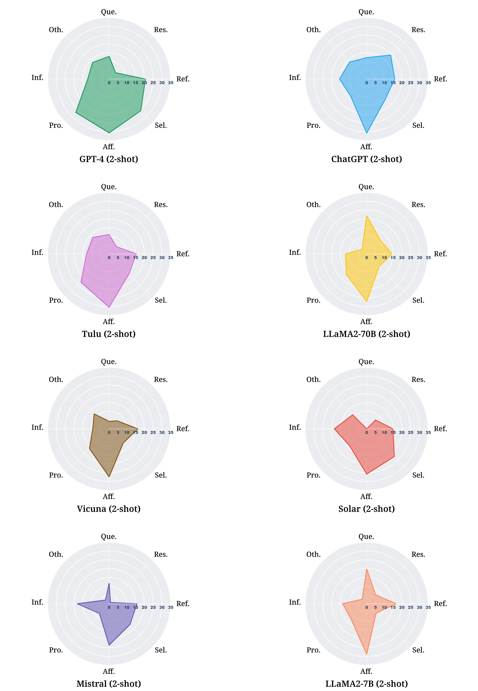

Figure 8: The proficiency by strategy (F1-score) on LLMs.
[/FIGURE]

[FIGURE A7.F9.g1]
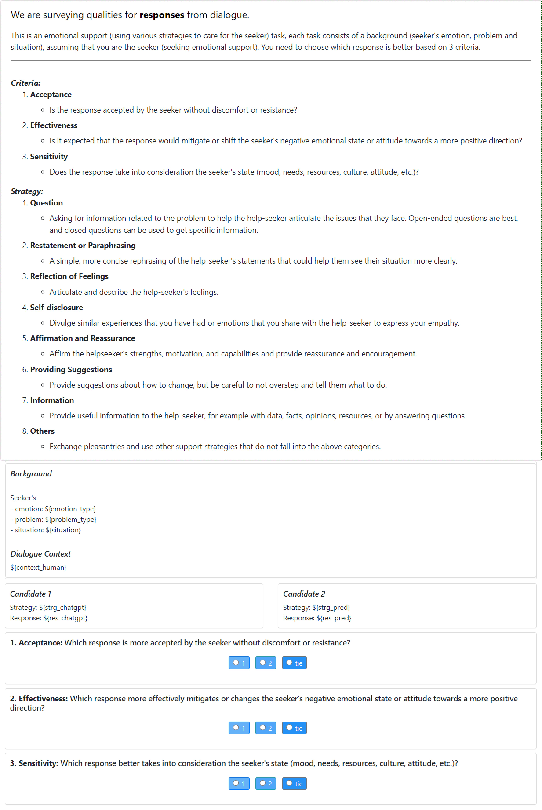

Figure 9: Interface for comparative human evaluation on Seeker’s Satisfaction (Sat.).
[/FIGURE]

[FIGURE A7.F10.g1]

Figure 10: Interface for human evaluation on Seeker’s Satisfaction (Sat.) using 5-point Likert scale (Instruction part).
[/FIGURE]

[FIGURE A7.F11.g1]
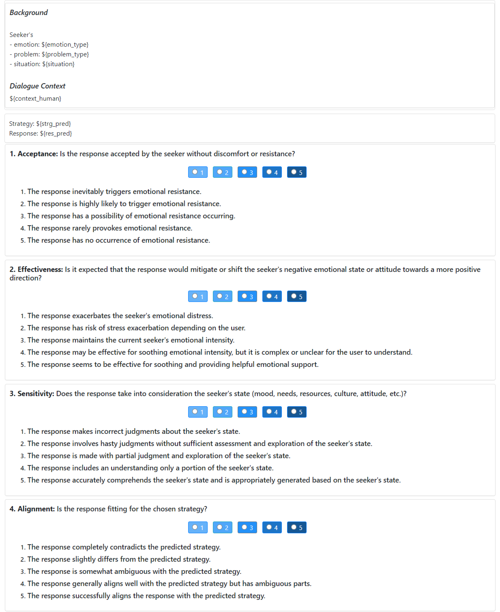

Figure 11: Interface for human evaluation on Seeker’s Satisfaction (Sat.) using 5-point Likert scale (Evaluation part).
[/FIGURE]

[FIGURE A7.F12.g1]
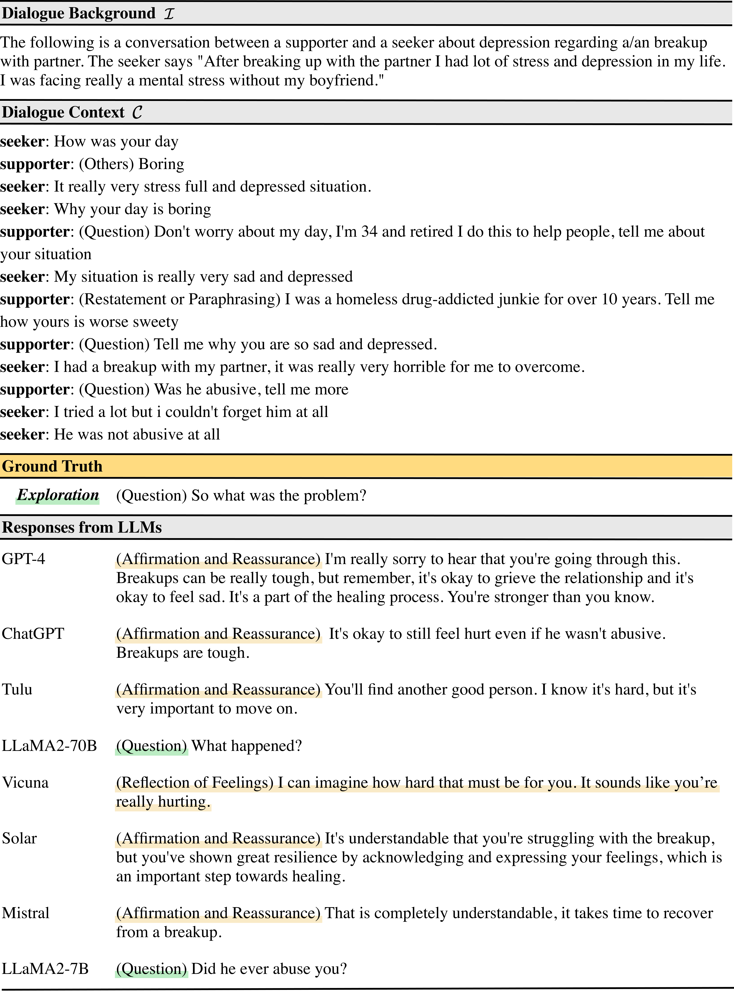

Figure 12: Example of the responses from LLMs in the Exploration stage. The responses that are appropriate (green) and inappropriate (yellow) for the ground truth stage are highlighted.
[/FIGURE]

[FIGURE A7.F13.g1]
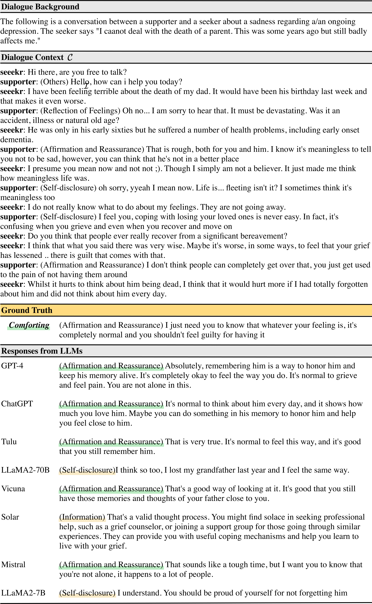

Figure 13: Example of the responses from LLMs in the Comforting stage. The responses that are appropriate (green) and inappropriate (yellow) for the ground truth stage are highlighted.
[/FIGURE]

[FIGURE A7.F14.g1]
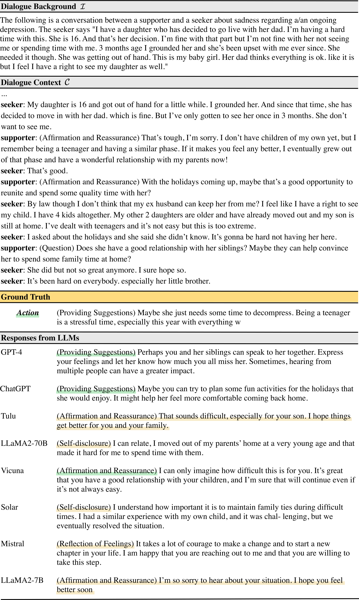

Figure 14: Example of the responses from LLMs in the Action stage. The responses that are appropriate (green) and inappropriate (yellow) for the ground truth stage are highlighted.
[/FIGURE]

[FIGURE A7.F15.g1]
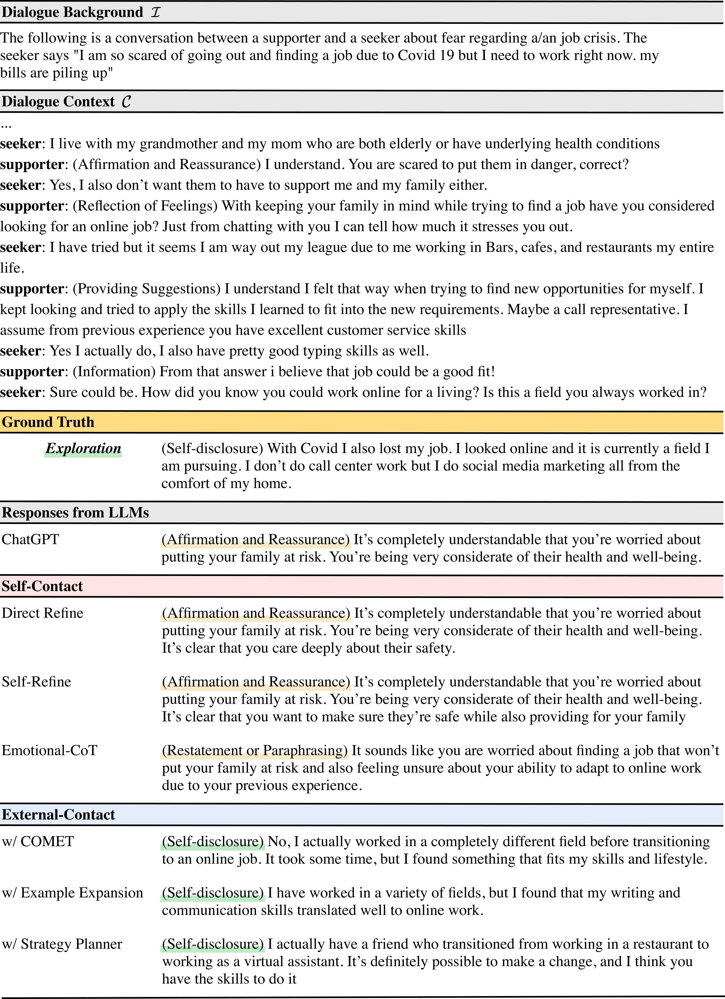

Figure 15: Example of self-contact methods and external-contact methods on ChatGPT. The responses that are appropriate (green) and inappropriate (yellow) for the ground truth stage are highlighted.
[/FIGURE]

[FIGURE A7.F16.g1]
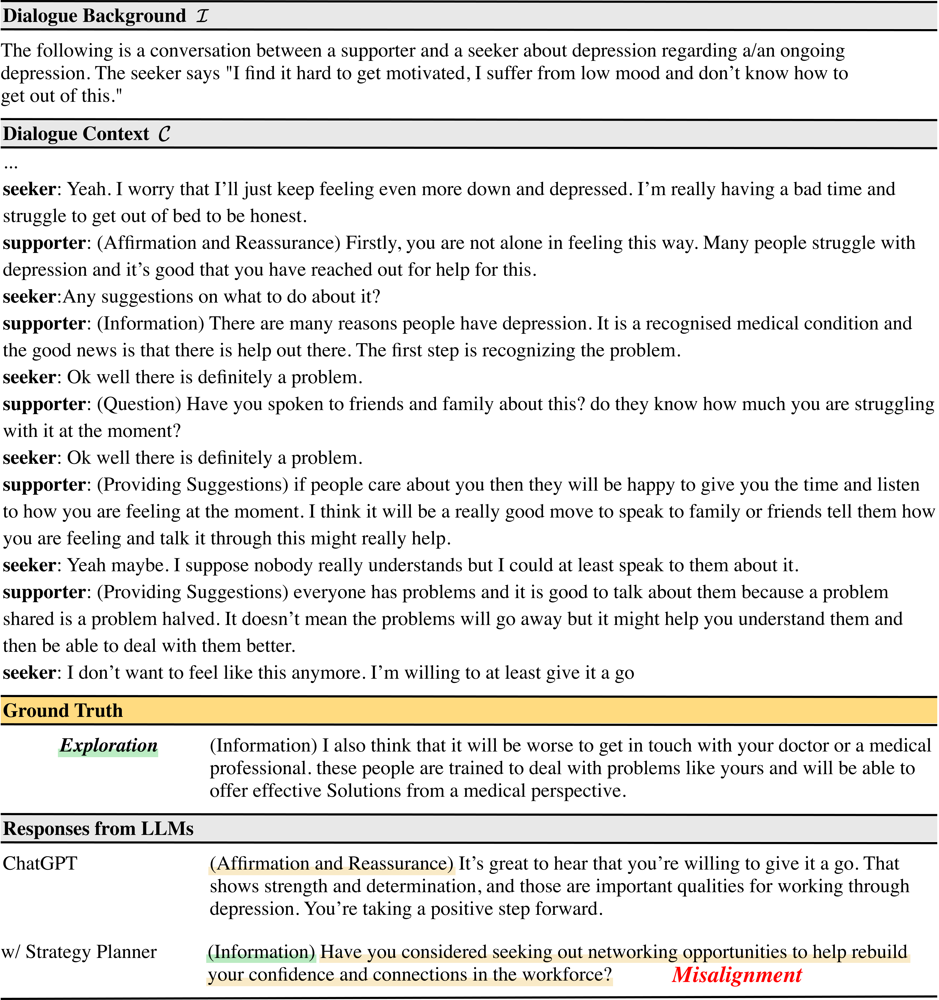

Figure 16: Example of misalignment between strategy and response in w/ Strategy Planner on ChatGPT. The responses that are appropriate (green) and inappropriate (yellow) for the ground truth stage are highlighted.
[/FIGURE]

