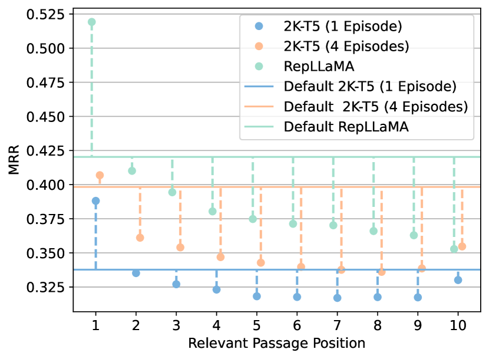
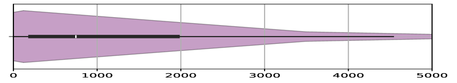
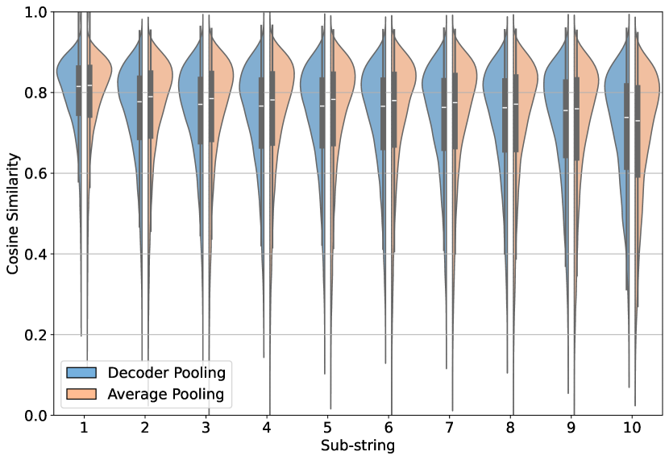

# Dwell in the Beginning: How Language Models Embed 
Long Documents for Dense Retrieval

###### Abstract

This study investigates the existence of positional biases in Transformer-based models for text representation learning, particularly in the context of web document retrieval. We build on previous research that demonstrated loss of information in the middle of input sequences for causal language models, extending it to the domain of representation learning. We examine positional biases at various stages of training for an encoder-decoder model, including language model pre-training, contrastive pre-training, and contrastive fine-tuning. Experiments with the MS-MARCO document collection reveal that after contrastive pre-training the model already generates embeddings that better capture early contents of the input, with fine-tuning further aggravating this effect.  

## 1 Introduction

Recent advancements have allowed transformer-based models to handle increasingly larger context lengths, resulting in the availability of Large Language Models (LLMs) that can accommodate input lengths reaching tens of thousands of tokens (Xiong et al., [2023](#bib.bib36)). However, studies to assess how well this context is captured by causal LMs (Liu et al., [2023](#bib.bib16)) have shown that the models are biased to the information contained at the beginning of the input, and tend to lose scope of information in middle.  

Instead of focusing on generation, we extend this type of study to text representation learning, which has been a fundamental task for dense retrieval (Yates et al., [2021](#bib.bib38)), and is gaining attention in the context of of retrieval-augmented generation (Chevalier et al., [2023](#bib.bib3); Mu et al., [2023](#bib.bib20)), and recommendation systems (Doddapaneni et al., [2024](#bib.bib7)). Specifically, we focus on web document retrieval, examining how well a single embedding can represent a web document, while addressing the emergence of position biases.  

We start by continuously pre-training and fine-tuning an encoder-decoder model similar to T5-base (Raffel et al., [2020](#bib.bib26)) but with a context length of 2048 tokens, following standard techniques to achieve a model that is representative of the state-of-the-art among the low-parameter spectrum. We leverage the MS-MARCO (v1) document collection (Nguyen et al., [2016](#bib.bib22)), as this dataset is commonly found in evaluation benchmarks (Thakur et al., [2021](#bib.bib30); Muennighoff et al., [2023](#bib.bib21)), and it is one of the major sources of training data for contrastive fine-tuning (Zhang et al., [2023](#bib.bib42); Wang et al., [2022](#bib.bib33)).  

Then, we study the existence of a dwell in the beginning effect, as we note that the model displays positional biases where earlier parts of the input are dominant in the embedding. As a systematic approach to the research of this effect, we track the behavior by evaluating the model on position-aware tasks during multiple stages of its training. As a result of our experiments, we conclude that these biases start emerging during unsupervised contrastive pre-training, and that heavy reliance on MS-MARCO data for fine-tuning will exacerbate this behavior, given the data distribution.  

## 2 Related Work

Bi-encoders are now the state of the art approach to dense retrieval (Yates et al., [2021](#bib.bib38)). Training these models involves many challenges, with authors often leveraging contrastive loss functions together with techniques like ANCE (Xiong et al., [2021](#bib.bib35)) to sample hard negative examples. Other techniques that are often employed include in-domain pre-training (Gao and Callan, [2022](#bib.bib8)) and retrieval-aligned pre-training (Lu et al., [2021](#bib.bib17); Xiao et al., [2022](#bib.bib34); Lee et al., [2019](#bib.bib13); Ma et al., [2022](#bib.bib18)), which allow for a better fine-tuning starting point.  

For long document retrieval, early methods dealt with the increased input length through aggregation strategies, which rely on segmenting the document into passages that are scored independently (Dai and Callan, [2019](#bib.bib4); Yilmaz et al., [2019](#bib.bib39)). Instead of aggregating scores, studies like PARADE (Li et al., [2020](#bib.bib14)) considered the aggregation of passage-level representations. Other authors (Boytsov et al., [2022](#bib.bib2)) considered the usage of Transformer architectures with sparse attention patterns (Beltagy et al., [2020](#bib.bib1); Zaheer et al., [2020](#bib.bib40); Kitaev et al., [2020](#bib.bib11); Sun et al., [2022](#bib.bib29)) to model the long inputs more efficiently, but did not achieve successful results.  

Currently, LLaRA (Li et al., [2023](#bib.bib15)) achieves state-of-the-art performance in the MS-MARCO document retrieval task, by pre-training LLaMA-7B (Touvron et al., [2023](#bib.bib31)) with a retrieval-aligned task. Models like LLaRA leverage context windows of up to 4096 tokens, relying on FlashAttention (Dao et al., [2022](#bib.bib6); Dao, [2023](#bib.bib5)) for fast and exact full attention computation, together with some variation of Rotary Position Embeddings (RoPE) (Su et al., [2024](#bib.bib28)) or Attention with Linear Biases (ALiBi) (Press et al., [2022](#bib.bib25)). This way, models can achieve better modeling and length extrapolation without further training, while resorting to full attention computations.  

## 3 Methodology

This section details the training of a small T5 retriever with 2048 input length (2K-T5), adapting the T5 architecture to follow recent advancements in long-context language modeling, and following a state-of-the-art dense retrieval training pipeline.  

### 3.1 Model Architecture

We use the T5-base architecture as a backbone, replacing the positional embeddings by RoPE. This change was motivated by RoPE’s ability to extrapolate to larger contexts, and its compatibility with Flash Attention. Specifically, we use NTK-scaling RoPE, which in theory allows for extrapolation to longer input sequences without further training. The retriever follows a bi-encoder architecture, using the decoder as a pooler (Ni et al., [2022](#bib.bib23)).  

### 3.2 Dense Retriever Training Pipeline

Language Modelling Pre-training: Starting from the T5-base available at Huggingface111<https://huggingface.co/t5-base>, we continuously pre-train the model on 8 billion tokens from the MS-MARCO document collection, for the model to adapt to the new maximum length, new positional embeddings, and document distribution. We follow the original T5 span-corruption task, masking 15% of the input sequence, with an average corrupted span length of 3 tokens.  

Unsupervised Contrastive Pre-training: In order to align the model with the fine-tuning task, we further pre-train the model following the cropping technique (Izacard et al., [2022](#bib.bib10)). In this task, given a document, a positive pair ($q$, $d$) is sampled by independently cropping two random spans comprising 10 to 50% of the input. The model is trained to minimize the following contrastive loss:  

|  | $$\mathcal{L}=-\frac{1}{n}\sum_{i}\log\frac{e^{\mathrm{cos}(f(q_{i}),f(d_{i}))}}{e^{\mathrm{cos}(f(q_{i}),f(d_{i}))}+\sum_{j}e^{\mathrm{cos}(f(q_{i}),f(d^{-}_{ij}))}}\;,$$ |  | (1) |
| --- | --- | --- | --- |

where each query $q_{i}$ is associated with 1 positive document $d_{i}$ as per the sampling technique, and negatives $\{d^{-}_{ij}\}$ are sampled in-batch. We use a batch size of 128 leveraging GradCache (Gao et al., [2021](#bib.bib9)), and cross-device negatives across 4 GPUs. The representations $f(.)$ generated by the model are compared using the cosine similarity function.  

Supervised Contrastive Fine-tuning: We finally fine-tune the model for retrieval in the MS-MARCO dataset for eight epochs. We start with ANCE-MaxP negatives (Xiong et al., [2021](#bib.bib35)), refreshing them every two epochs with the model under training. We follow the loss introduced in Equation [1](#S3.E1 "In 3.2 Dense Retriever Training Pipeline ‣ 3 Methodology ‣ Dwell in the Beginning: How Language Models Embed Long Documents for Dense Retrieval"), sampling 9 negatives per query, using a batch size of 128, using in-batch negatives, and cross-device negatives across 4 GPUs.  

## 4 Experiments

This section starts by addressing the overall retrieval performance of the 2K-T5 model. Then, we note the dwell in the beginning behavior that is present in the model, investigating each of the training steps to identify its emergence.  

### 4.1 Retrieval Performance

[TABLE S4.T1]

<table class="ltx_tabular ltx_align_middle">
<tbody class="ltx_tbody">
<tr class="ltx_tr">
<td class="ltx_td ltx_border_tt"></td>
<td class="ltx_td ltx_align_left ltx_border_tt">Size</td>
<td class="ltx_td ltx_align_left ltx_border_tt">MRR@100</td>
<td class="ltx_td ltx_nopad_r ltx_align_left ltx_border_tt">R@100</td>
</tr>
<tr class="ltx_tr">
<td class="ltx_td ltx_align_left ltx_border_t">ANCE-MaxP <cite class="ltx_cite ltx_citemacro_citep">(Xiong et al., <a class="ltx_ref">2021</a>)</cite>
</td>
<td class="ltx_td ltx_align_left ltx_border_t">base</td>
<td class="ltx_td ltx_align_left ltx_border_t">0.384</td>
<td class="ltx_td ltx_nopad_r ltx_align_left ltx_border_t">0.906</td>
</tr>
<tr class="ltx_tr">
<td class="ltx_td ltx_align_left">ADORE <cite class="ltx_cite ltx_citemacro_citep">(Zhan et al., <a class="ltx_ref">2021</a>)</cite>
</td>
<td class="ltx_td ltx_align_left">base</td>
<td class="ltx_td ltx_align_left">0.405</td>
<td class="ltx_td ltx_nopad_r ltx_align_left">0.919</td>
</tr>
<tr class="ltx_tr">
<td class="ltx_td ltx_align_left ltx_border_t">ICT <cite class="ltx_cite ltx_citemacro_citep">(Lee et al., <a class="ltx_ref">2019</a>)</cite>
</td>
<td class="ltx_td ltx_align_left ltx_border_t">base</td>
<td class="ltx_td ltx_align_left ltx_border_t">0.396</td>
<td class="ltx_td ltx_nopad_r ltx_align_left ltx_border_t">0.882</td>
</tr>
<tr class="ltx_tr">
<td class="ltx_td ltx_align_left">SEED <cite class="ltx_cite ltx_citemacro_citep">(Lu et al., <a class="ltx_ref">2021</a>)</cite>
</td>
<td class="ltx_td ltx_align_left">base</td>
<td class="ltx_td ltx_align_left">0.396</td>
<td class="ltx_td ltx_nopad_r ltx_align_left">0.902</td>
</tr>
<tr class="ltx_tr">
<td class="ltx_td ltx_align_left ltx_border_t">RepLLaMA <cite class="ltx_cite ltx_citemacro_citep">(Ma et al., <a class="ltx_ref">2023</a>)</cite>
</td>
<td class="ltx_td ltx_align_left ltx_border_t">7B</td>
<td class="ltx_td ltx_align_left ltx_border_t">0.456</td>
<td class="ltx_td ltx_nopad_r ltx_align_left ltx_border_t">-</td>
</tr>
<tr class="ltx_tr">
<td class="ltx_td ltx_align_left ltx_border_bb ltx_border_t">T5-2K (ours)</td>
<td class="ltx_td ltx_align_left ltx_border_bb ltx_border_t">base</td>
<td class="ltx_td ltx_align_left ltx_border_bb ltx_border_t">0.414</td>
<td class="ltx_td ltx_nopad_r ltx_align_left ltx_border_bb ltx_border_t">0.915</td>
</tr>
</tbody>
</table>

Table 1: Retrieval results on MS-MARCO documents.
[/TABLE]

Before moving to the study of the positional biases, we look into the overall performance of our model to assess its soundness. For reference, Table [1](#S4.T1 "Table 1 ‣ 4.1 Retrieval Performance ‣ 4 Experiments ‣ Dwell in the Beginning: How Language Models Embed Long Documents for Dense Retrieval") contains retrieval results on the MS-MARCO dataset, using the official metrics (mean reciprocal rank and recall). We show the results for models that are trained following similar pipelines, noting that our model achieves similar performance. The first group references models that do not leverage pre-training tasks, while the ones in the second group incorporate them. Finally, the third group contains a model that also underwent simple fine-tuning, but was scaled to 7B parameters. Note that other authors have proposed heavily engineered pre-training tasks that do improve results (e.g., COSTA (Ma et al., [2022](#bib.bib18)), Longtriever (Yang et al., [2023](#bib.bib37)), and LLaRA (Li et al., [2023](#bib.bib15))), but that is out of the scope of this work. Appendix [A](#A1 "Appendix A Training Details ‣ Dwell in the Beginning: How Language Models Embed Long Documents for Dense Retrieval") provides additional insights and training details.  

### 4.2 Impact of Relevant Passage Position

For a subset of the queries in the MS-MARCO dataset (i.e., 1130 queries ), we can cross-reference their relevant documents with the MS-MARCO passage collection to identify the relevant information within the document. As such, in this experiment, we retrieve from the collection 11 times: First, a default run with the documents unchanged, followed by 10 runs where the documents associated with the queries have the relevant passage moved to the different positions in the document. For each document, given its length ($l_{d}$) and the length of the relevant passage ($l_{p}$), we compute 10 sequential and uniform insertion points for the passage, formally given by $I_{i}=(i-1)\frac{l_{d}-l_{p}}{9},i\in\{1,...,10\}$.  

[FIGURE S4.F1.g1]

Figure 1: Performance of 2K-T5 and RepLLaMA. Full lines represent the unchanged version of the documents. Dashed lines represent the variation obtained when the relevant passage is moved to a different position.
[/FIGURE]

The performance of our model after one training episode (i.e., before the first ANCE negative refreshing) is depicted in the blue line of Figure [1](#S4.F1 "Figure 1 ‣ 4.2 Impact of Relevant Passage Position ‣ 4 Experiments ‣ Dwell in the Beginning: How Language Models Embed Long Documents for Dense Retrieval"). We see that when the relevant passage is moved to the beginning of the document, the performance increases when compared to the default setting (i.e., unchanged documents). Conversely, if the passage is moved anywhere else, the performance drops. The green line shows that the same pattern also holds for RepLLaMA-7B222[huggingface.co/castorini/repllama-v1-7b-lora-doc](https://huggingface.co/castorini/repllama-v1-7b-lora-doc) (Ma et al., [2023](#bib.bib19)), a version of LLaMA-2 fine-tuned for dense retrieval on MS-MARCO for 1 epoch, although showing even higher biases. In other words, a dwell in the beginning effect is observed, where the initial positions are heavily preferred when compared to later ones. This differs from the lost in the middle (Liu et al., [2023](#bib.bib16)) phenomena, where performance would drop more significantly only in middle sections. We also note that further fine-tuning on MS-MARCO data will aggravate the behavior, as shown by the orange lines, given the larger performance mismatch between the default setting and later positions.  

[FIGURE S4.F2.g1]

Figure 2: Violin plot distribution of starting position (characters) of relevant passages within 75,000 documents from MS-MARCO training split.
[/FIGURE]

To better understand this behavior, we look at the distribution in Figure [2](#S4.F2 "Figure 2 ‣ 4.2 Impact of Relevant Passage Position ‣ 4 Experiments ‣ Dwell in the Beginning: How Language Models Embed Long Documents for Dense Retrieval"), which shows that MS-MARCO documents tend to contain the relevant passage earlier in the document, with the median starting position being at 746 characters. While this can be impactful for the biases in Figure [1](#S4.F1 "Figure 1 ‣ 4.2 Impact of Relevant Passage Position ‣ 4 Experiments ‣ Dwell in the Beginning: How Language Models Embed Long Documents for Dense Retrieval"), the performance drop on later parts of the input shouldn’t be as noticeable. Hence, the next sub-sections explore the locality of the pre-training tasks to address potential impacts on long-context modeling.  

### 4.3 Contrastive Pre-training Location Bias

[FIGURE S4.F3.g1]

Figure 3: Cosine similarity distribution for exact matching of sub-strings in different locations, using a sample of 24,000 MS-MARCO documents.
[/FIGURE]

In order to estimate positional biases after the contrastive pre-training step, we evaluate the performance of the model on exact matching sub-strings from different locations. For instance, given a document $d$, 10 sub-strings are sampled by segmenting $d$ in 10 sequential groups with uniform token length. In other words, the first sub-string contains the first 10% tokens of $d$, while the last sub-string contains the last 10% tokens. Then, the embedding generated for $d$ is compared with the embedding of each sub-string using the cosine similarity. Figure [3](#S4.F3 "Figure 3 ‣ 4.3 Contrastive Pre-training Location Bias ‣ 4 Experiments ‣ Dwell in the Beginning: How Language Models Embed Long Documents for Dense Retrieval") shows that the similarity values tend to decrease when the position of the sub-string moves from the beginning, and that this behavior holds for both decoder and average pooling.  

This indicates that the representation generated for a document is better at capturing its earlier contents. While in the previous sub-section similar behavior could be justified by the data’s underlying distribution, the pseudo-queries and documents for this task were independently sampled from the same uniform distribution over the input. This suggests that the bias is intrinsic to the model, e.g. by overfitting to information distributions commonly found in web documents where earlier paragraphs are often more representative, i.e., follow the inverted pyramid writing style (Koupaee and Wang, [2018](#bib.bib12)). Since web documents are the most common source of pre-training data (Overwijk et al., [2022](#bib.bib24); Raffel et al., [2020](#bib.bib26)), this is problematic for tasks where the whole input must be accurately captured, for instance retrieval augmented generation (Chevalier et al., [2023](#bib.bib3); Mu et al., [2023](#bib.bib20))  

### 4.4 Span Corruption Location Bias

[FIGURE S4.F4]
(0,256)(256,512)(512,768)(768,1024)(1024,1280)(1280,1536)(1536,1702)(1702,2048)$0.2$$0.4$$0.6$$0.8$$1$Token windowAccuracyT5-ropeT5-base

Figure 4: Span prediction accuracy on different zones of the input, using 7000 random 3-token spans per window.
[/FIGURE]

Finally, we look into the language model pre-training task. We evaluate on the original task, by independently corrupting spans of 3 tokens across multiple parts of the input. Through this, we can see if the accuracy of the model, when predicting the corresponding correct spans, varies across the different parts of the input. Figure [4](#S4.F4 "Figure 4 ‣ 4.4 Span Corruption Location Bias ‣ 4 Experiments ‣ Dwell in the Beginning: How Language Models Embed Long Documents for Dense Retrieval") shows uniform performance, suggesting no inherent bias in this task using RoPE. We also evaluate the original T5-base, and see that although it shows a slightly higher performance on predicting later positions, it is still rather uniform. As none of the models display the dwell in the beginning effect, we conclude that the language modeling pre-training did not induce any meaningful biases, and that this behavior emerged as soon as an information bottleneck was added to the training pipeline, by means of a pooled representation during contrastive pre-training.  

## 5 Conclusions

This study investigated the dwell in the beginning effect on Transformer-based models for document retrieval. Through experiments with a T5 model and RepLLaMA, we observed that the models tend to favor information located at the beginning of the input, leading to decreased performance when relevant information is elsewhere in the document. We investigate each step in the training pipeline, showing that biases can emerge in a contrastive pre-training step, and that they persist throughout the fine-tuning process. Our findings emphasize the importance of considering the quality of embeddings for long inputs, particularly in contexts where effectively capturing the entire sequence can result in increased performance on downstream tasks such as retrieval augmented generation.  

Addressing these biases may involve devising more robust pre-training tasks, or leveraging regularization techniques that force the model to capture information from various positions within input sequences, while considering evaluation on benchmarks that require long-context modeling (Wang et al., [2023](#bib.bib32); Saad-Falcon et al., [2024](#bib.bib27)).  

## Limitations and Ethical Considerations

All the datasets and models used in our experiments are publicly available, and we will provide the source code that allows for the reproduction of results, as well as model checkpoints.  

By using large pre-trained language models, we acknowledge the risks associated with the presence of inherent biases embedded within the models, which may inadvertently perpetuate or amplify societal biases present in the training data.  

One limitation in the work reported on this paper relates to the fact that our tests have only used English data. Other languages can expose different phenomena in terms of how document-context is handled, and future work can perhaps consider other datasets such as the one from the NeuCLIR competition. Doing a similar analysis on other domains besides web documents would also be interesting, and we encourage the research community to further study document-context modeling in connection to retrieval tasks.  

## Acknowledgements

This research was supported by the Portuguese Recovery and Resilience Plan through project C645008882-00000055 (i.e., the Center For Responsible AI), and also by Fundação para a Ciência e Tecnologia (FCT), through the project with reference UIDB/50021/2020 (DOI:10.54499/UIDB/50021/2020), project NOVA LINCS with reference UIDP/04516/2020, and also the Ph.D. scholarship with reference PRT/BD/153683/2021 under the CMU-PT Program.  

## References

* Beltagy et al. (2020)  Iz Beltagy, Matthew E. Peters, and Arman Cohan. 2020.   Longformer: The long-document transformer.   *CoRR*, abs/2004.05150. 
* Boytsov et al. (2022)  Leonid Boytsov, Tianyi Lin, Fangwei Gao, Yutian Zhao, Jeffrey Huang, and Eric Nyberg. 2022.   Understanding Performance of Long-Document Ranking Models through Comprehensive Evaluation and Leaderboardi.   *ArXiv*, abs/2207.01262. 
* Chevalier et al. (2023)  Alexis Chevalier, Alexander Wettig, Anirudh Ajith, and Danqi Chen. 2023.   Adapting Language Models to Compress Contexts.   In *Conference on Empirical Methods in Natural Language Processing*. 
* Dai and Callan (2019)  Zhuyun Dai and Jamie Callan. 2019.   Deeper text understanding for IR with contextual neural language modeling.   In *International ACM SIGIR Conference on Research and Development in Information Retrieval*. 
* Dao (2023)  Tri Dao. 2023.   FlashAttention-2: Faster Attention with Better Parallelism and Work Partitioning.   *ArXiv*, abs/2307.08691. 
* Dao et al. (2022)  Tri Dao, Daniel Y. Fu, Stefano Ermon, Atri Rudra, and Christopher Ré. 2022.   FlashAttention: Fast and Memory-Efficient Exact Attention with IO-Awareness.   In *Annual Conference on Neural Information Processing Systems*. 
* Doddapaneni et al. (2024)  Sumanth Doddapaneni, Krishna Sayana, Ambarish Jash, Sukhdeep S. Sodhi, and Dima Kuzmin. 2024.   User Embedding Model for Personalized Language Prompting.   *ArXiv*, abs/2401.04858. 
* Gao and Callan (2022)  Luyu Gao and Jamie Callan. 2022.   Unsupervised Corpus Aware Language Model Pre-training for Dense Passage Retrieval.   In *Annual Meeting of the Association for Computational Linguistics*. 
* Gao et al. (2021)  Luyu Gao, Yunyi Zhang, Jiawei Han, and Jamie Callan. 2021.   Scaling Deep Contrastive Learning Batch Size under Memory Limited Setup.   In *Workshop on Representation Learning for NLP*. 
* Izacard et al. (2022)  Gautier Izacard, Mathilde Caron, Lucas Hosseini, Sebastian Riedel, Piotr Bojanowski, Armand Joulin, and Edouard Grave. 2022.   Unsupervised Dense Information Retrieval with Contrastive Learning.   *Transactions on Machine Learning Research*. 
* Kitaev et al. (2020)  Nikita Kitaev, Lukasz Kaiser, and Anselm Levskaya. 2020.   Reformer: The efficient transformer.   In *International Conference on Learning Representations*. 
* Koupaee and Wang (2018)  Mahnaz Koupaee and William Yang Wang. 2018.   WikiHow: A Large Scale Text Summarization Dataset.   *ArXiv*, abs/1810.09305. 
* Lee et al. (2019)  Kenton Lee, Ming-Wei Chang, and Kristina Toutanova. 2019.   Latent Retrieval for Weakly Supervised Open Domain Question Answering.   In *Conference of the Association for Computational Linguistics*. 
* Li et al. (2020)  Canjia Li, Andrew Yates, Sean MacAvaney, Ben He, and Yingfei Sun. 2020.   PARADE: passage representation aggregation for document reranking.   *ArXiv*, abs/2008.09093. 
* Li et al. (2023)  Chaofan Li, Zheng Liu, Shitao Xiao, and Yingxia Shao. 2023.   Making Large Language Models A Better Foundation For Dense Retrieval.   *ArXiv*, abs/2312.15503. 
* Liu et al. (2023)  Nelson F. Liu, Kevin Lin, John Hewitt, Ashwin Paranjape, Michele Bevilacqua, Fabio Petroni, and Percy Liang. 2023.   Lost in the Middle: How Language Models Use Long Contexts.   *ArXiv*, abs/2307.03172. 
* Lu et al. (2021)  Shuqi Lu, Di He, Chenyan Xiong, Guolin Ke, Waleed Malik, Zhicheng Dou, Paul Bennett, Tie-Yan Liu, and Arnold Overwijk. 2021.   Less is More: Pretrain a Strong Siamese Encoder for Dense Text Retrieval Using a Weak Decode.   In *Conference on Empirical Methods in Natural Language Processing*. 
* Ma et al. (2022)  Xinyu Ma, Jiafeng Guo, Ruqing Zhang, Yixing Fan, and Xueqi Cheng. 2022.   Pre-train a Discriminative Text Encoder for Dense Retrieval via Contrastive Span Prediction.   In *International Conference on Research and Development in Information Retrieval*. 
* Ma et al. (2023)  Xueguang Ma, Liang Wang, Nan Yang, Furu Wei, and Jimmy Lin. 2023.   Fine-Tuning LLaMA for Multi-Stage Text Retrieval.   *ArXiv*, abs/2310.08319. 
* Mu et al. (2023)  Jesse Mu, Xiang Lisa Li, and Noah D. Goodman. 2023.   Learning to Compress Prompts with Gist Tokens.   *ArXiv*, abs/2304.08467. 
* Muennighoff et al. (2023)  Niklas Muennighoff, Nouamane Tazi, Loïc Magne, and Nils Reimers. 2023.   MTEB: massive text embedding benchmark.   In *Conference of the European Chapter of the Association for Computational Linguistics*. 
* Nguyen et al. (2016)  Tri Nguyen, Mir Rosenberg, Xia Song, Jianfeng Gao, Saurabh Tiwary, Rangan Majumder, and Li Deng. 2016.   MS MARCO: A human generated machine reading comprehension dataset.   In *Workshop on Cognitive Computation: Integrating Neural and Symbolic Approaches*. 
* Ni et al. (2022)  Jianmo Ni, Gustavo Hernández Ábrego, Noah Constant, Ji Ma, Keith B. Hall, Daniel Cer, and Yinfei Yang. 2022.   Sentence-T5: Scalable Sentence Encoders from Pre-trained Text-to-Text Models.   In *Findings of the Association for Computational Linguistics*. 
* Overwijk et al. (2022)  Arnold Overwijk, Chenyan Xiong, and Jamie Callan. 2022.   ClueWeb22: 10 Billion Web Documents with Rich Information.   In *International ACM SIGIR Conference on Research and Development in Information Retrieval*. 
* Press et al. (2022)  Ofir Press, Noah A. Smith, and Mike Lewis. 2022.   Train Short, Test Long: Attention with Linear Biases Enables Input Length Extrapolation.   In *International Conference on Learning Representations*. 
* Raffel et al. (2020)  Colin Raffel, Noam Shazeer, Adam Roberts, Katherine Lee, Sharan Narang, Michael Matena, Yanqi Zhou, Wei Li, and Peter J. Liu. 2020.   Exploring the Limits of Transfer Learning with a Unified Text-to-Text Transformer.   *Journal of Machine Learning Research*. 
* Saad-Falcon et al. (2024)  Jon Saad-Falcon, Daniel Y. Fu, Simran Arora, Neel Guha, and Christopher Ré. 2024.   Benchmarking and Building Long-Context Retrieval Models with LoCo and M2-BERT.   *ArXiv*, abs/2402.07440. 
* Su et al. (2024)  Jianlin Su, Murtadha H. M. Ahmed, Yu Lu, Shengfeng Pan, Wen Bo, and Yunfeng Liu. 2024.   RoFormer: Enhanced transformer with Rotary Position Embedding.   *Neurocomputing*. 
* Sun et al. (2022)  Zhiqing Sun, Yiming Yang, and Shinjae Yoo. 2022.   Sparse Attention with Learning to Hash.   In *International Conference on Learning Representations*. 
* Thakur et al. (2021)  Nandan Thakur, Nils Reimers, Andreas Rücklé, Abhishek Srivastava, and Iryna Gurevych. 2021.   BEIR: A heterogeneous benchmark for zero-shot evaluation of information retrieval models.   In *Annual Conference on Neural Information Processing Systems*. 
* Touvron et al. (2023)  Hugo Touvron, Thibaut Lavril, Gautier Izacard, Xavier Martinet, Marie-Anne Lachaux, Timothée Lacroix, Baptiste Rozière, Naman Goyal, Eric Hambro, Faisal Azhar, Aurélien Rodriguez, Armand Joulin, Edouard Grave, and Guillaume Lample. 2023.   LLaMA: Open and Efficient Foundation Language Models.   *ArXiv*, abs/2302.13971. 
* Wang et al. (2023)  Kexin Wang, Nils Reimers, and Iryna Gurevych. 2023.   DAPR: A benchmark on document-aware passage retrieval.   *ArXiv*, abs/2305.13915. 
* Wang et al. (2022)  Liang Wang, Nan Yang, Xiaolong Huang, Binxing Jiao, Linjun Yang, Daxin Jiang, Rangan Majumder, and Furu Wei. 2022.   Text Embeddings by Weakly-Supervised Contrastive Pre-training.   *ArXiv*, abs/2212.03533. 
* Xiao et al. (2022)  Shitao Xiao, Zheng Liu, Yingxia Shao, and Zhao Cao. 2022.   RetroMAE: Pre-Training Retrieval-oriented Language Models Via Masked Auto-Encoder.   In *Conference on Empirical Methods in Natural Language Processing*. 
* Xiong et al. (2021)  Lee Xiong, Chenyan Xiong, Ye Li, Kwok-Fung Tang, Jialin Liu, Paul N. Bennett, Junaid Ahmed, and Arnold Overwijk. 2021.   Approximate Nearest Neighbor Negative Contrastive Learning for Dense Text Retrieval.   In *International Conference on Learning Representations*. 
* Xiong et al. (2023)  Wenhan Xiong, Jingyu Liu, Igor Molybog, Hejia Zhang, Prajjwal Bhargava, Rui Hou, Louis Martin, Rashi Rungta, Karthik Abinav Sankararaman, Barlas Oguz, Madian Khabsa, Han Fang, Yashar Mehdad, Sharan Narang, Kshitiz Malik, Angela Fan, Shruti Bhosale, Sergey Edunov, Mike Lewis, Sinong Wang, and Hao Ma. 2023.   Effective Long-Context Scaling of Foundation Models.   *ArXiv*, abs/2309.16039. 
* Yang et al. (2023)  Junhan Yang, Zheng Liu, Chaozhuo Li, Guangzhong Sun, and Xing Xie. 2023.   Longtriever: a Pre-trained Long Text Encoder for Dense Document Retrieval.   In *Conference on Empirical Methods in Natural Language Processing*. 
* Yates et al. (2021)  Andrew Yates, Rodrigo Nogueira, and Jimmy Lin. 2021.   Pretrained transformers for text ranking: BERT and beyond.   In *International ACM SIGIR Conference on Research and Development in Information Retrieval*. 
* Yilmaz et al. (2019)  Zeynep Akkalyoncu Yilmaz, Shengjin Wang, Wei Yang, Haotian Zhang, and Jimmy Lin. 2019.   Applying BERT to Document Retrieval with Birch.   In *Conference on Empirical Methods in Natural Language Processing and the International Joint Conference on Natural Language Processing*. 
* Zaheer et al. (2020)  Manzil Zaheer, Guru Guruganesh, Kumar Avinava Dubey, Joshua Ainslie, Chris Alberti, Santiago Ontañón, Philip Pham, Anirudh Ravula, Qifan Wang, Li Yang, and Amr Ahmed. 2020.   Big Bird: Transformers for Longer Sequences.   In *Annual Conference on Neural Information Processing Systems*. 
* Zhan et al. (2021)  Jingtao Zhan, Jiaxin Mao, Yiqun Liu, Jiafeng Guo, Min Zhang, and Shaoping Ma. 2021.   Optimizing Dense Retrieval Model Training with Hard Negatives.   In *International Conference on Research and Development in Information Retrieval*. 
* Zhang et al. (2023)  Xin Zhang, Zehan Li, Yanzhao Zhang, Dingkun Long, Pengjun Xie, Meishan Zhang, and Min Zhang. 2023.   Language Models are Universal Embedders.   *ArXiv*, abs/2310.08232. 

## Appendix A Training Details

### A.1 Hyperparameters

The following subsections detail the hyperparameters used for training. If a certain element is not stated, the default from a Huggingface Trainer was used. All models were trained in the same computational setup of 4x A100 40GB GPUs.  

#### A.1.1 Span Corruption Pre-training

1. Optimizer: AdamW 
2. Learning rate: cosine annealing, base value 2e-2, final value 1e-5. 
3. Batch size: 80 
4. Gradient accumulation: 16 
5. Gradient clipping: 1 
6. Weight decay: 0 
7. Total steps: 49152 
8. Warm-up steps: 10% 

#### A.1.2 Contrastive Pre-training

1. Optimizer: AdamW 
2. Learning rate: linear, base value 5e-6. 
3. Gradient cache chunk size: 24 
4. Gradient accumulation: 1 
5. Batch size: 128 
6. Hard negatives per query: 0 
7. Epochs: 1 

#### A.1.3 Fine-tuning

1. Optimizer: AdamW 
2. Learning rate: linear, base value 5e-6. 
3. GradCache chunk size: 24 
4. Gradient accumulation: 1 
5. Batch size: 128 
6. Hard negatives per query: 9 
7. Epochs: 8 

### A.2 Impact of each Training Step

[TABLE A1.T2]

<table class="ltx_tabular ltx_guessed_headers ltx_align_middle">
<thead class="ltx_thead">
<tr class="ltx_tr">
<th class="ltx_td ltx_align_left ltx_th ltx_th_column ltx_border_tt">
<table class="ltx_tabular ltx_align_middle">
<tr class="ltx_tr">
<td class="ltx_td ltx_nopad_r ltx_align_left">LM</td>
</tr>
<tr class="ltx_tr">
<td class="ltx_td ltx_nopad_r ltx_align_left">Pre-training</td>
</tr>
</table>
</th>
<th class="ltx_td ltx_align_left ltx_th ltx_th_column ltx_border_tt">
<table class="ltx_tabular ltx_align_middle">
<tr class="ltx_tr">
<td class="ltx_td ltx_nopad_r ltx_align_left">Contrastive</td>
</tr>
<tr class="ltx_tr">
<td class="ltx_td ltx_nopad_r ltx_align_left">Pre-training</td>
</tr>
</table>
</th>
<th class="ltx_td ltx_align_left ltx_th ltx_th_column ltx_border_tt">Fine-tuning</th>
<th class="ltx_td ltx_align_left ltx_th ltx_th_column ltx_border_tt">MRR</th>
<th class="ltx_td ltx_nopad_r ltx_align_left ltx_th ltx_th_column ltx_border_tt">R@100</th>
</tr>
</thead>
<tbody class="ltx_tbody">
<tr class="ltx_tr">
<td class="ltx_td ltx_align_center ltx_border_t">✗</td>
<td class="ltx_td ltx_align_center ltx_border_t">✗</td>
<td class="ltx_td ltx_align_center ltx_border_t">1 episode</td>
<td class="ltx_td ltx_align_left ltx_border_t">0.177</td>
<td class="ltx_td ltx_nopad_r ltx_align_left ltx_border_t">0.632</td>
</tr>
<tr class="ltx_tr">
<td class="ltx_td ltx_align_center">✓</td>
<td class="ltx_td ltx_align_center">✗</td>
<td class="ltx_td ltx_align_center">1 episode</td>
<td class="ltx_td ltx_align_left">0.350</td>
<td class="ltx_td ltx_nopad_r ltx_align_left">0.872</td>
</tr>
<tr class="ltx_tr">
<td class="ltx_td ltx_align_center">✓</td>
<td class="ltx_td ltx_align_center">✓</td>
<td class="ltx_td ltx_align_center">1 episode</td>
<td class="ltx_td ltx_align_left">0.372</td>
<td class="ltx_td ltx_nopad_r ltx_align_left">0.889</td>
</tr>
<tr class="ltx_tr">
<td class="ltx_td ltx_align_center ltx_border_bb ltx_border_t">✓</td>
<td class="ltx_td ltx_align_center ltx_border_bb ltx_border_t">✓</td>
<td class="ltx_td ltx_align_center ltx_border_bb ltx_border_t">4 episodes</td>
<td class="ltx_td ltx_align_left ltx_border_bb ltx_border_t">0.414</td>
<td class="ltx_td ltx_nopad_r ltx_align_left ltx_border_bb ltx_border_t">0.915</td>
</tr>
</tbody>
</table>

Table 2: Performance on MS-MARCO for different combinations of pre-training tasks, and after fine-tuning.
[/TABLE]

Table [2](#A1.T2 "Table 2 ‣ A.2 Impact of each Training Step ‣ Appendix A Training Details ‣ Dwell in the Beginning: How Language Models Embed Long Documents for Dense Retrieval") aligns our training pipeline with previous work, showing the importance of the pre-training tasks, and the benefits of multiple fine-tuning steps with negative refreshing. Note that the performance without any pre-training is particularly low since the model had no previous exposure to the new rotary embeddings.  

