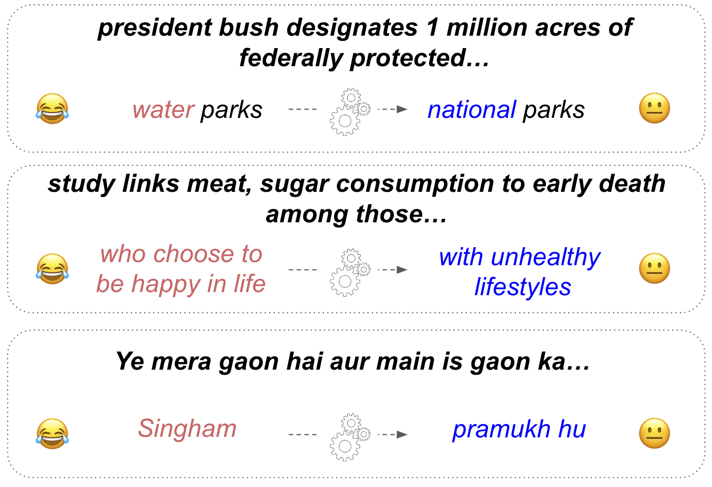

# Getting Serious about Humor: 
Crafting Humor Datasets with Unfunny Large Language Models

###### Abstract

Humor is a fundamental facet of human cognition and interaction. Yet, despite recent advances in natural language processing, humor detection remains a challenging task that is complicated by the scarcity of datasets that pair humorous texts with similar non-humorous counterparts. We investigate whether large language models (LLMs), can generate synthetic data for humor detection via editing texts. We benchmark LLMs on an existing human dataset and show that current LLMs display an impressive ability to ‘unfun’ jokes, as judged by humans and as measured on the downstream task of humor detection. We extend our approach to a code-mixed English-Hindi humor dataset, where we find that GPT-4’s synthetic data is highly rated by bilingual annotators and provides challenging adversarial examples for humor classifiers.  

Getting Serious about Humor:     Crafting Humor Datasets with Unfunny Large Language Models  

  

    Zachary Horvitz1,\*, Jingru Chen1,\*, Rahul Aditya1, Harshvardhan Srivastava1,  Robert West2, Zhou Yu1, Kathleen McKeown1  1Columbia University, 2EPFL  {zfh2000, jc5898, ra3261, hs3447, zy2461}@columbia.edu  robert.west@epfl.ch, kathy@cs.columbia.edu    

  

\*\*footnotetext: Equal contribution.

## 1 Introduction

Despite their success on natural language tasks, large language models (LLMs) struggle to reliably detect and explain humor Baranov et al. ([2023](#bib.bib2)); [Góes et al.](#bib.bib9) ; Hessel et al. ([2023](#bib.bib10)), and generate novel jokes Jentzsch and Kersting ([2023](#bib.bib15)). Notably, humans also struggle to write jokes; even at satirical newspapers like The Onion, less than $3\%$ of proposed headlines are printed West and Horvitz ([2019](#bib.bib32)); Glass ([2008](#bib.bib8)). In contrast, humans are able to consistently edit jokes to unfun them, an insight which motivated West and Horvitz ([2019](#bib.bib32)) to host a game where internet users competed to edit satirical headlines to make them serious. The resulting dataset, the Unfun Corpus West and Horvitz ([2019](#bib.bib32)), has been a valuable tool for advancing computational humor research. The dataset has been used to study properties of humor and transformer architectures West and Horvitz ([2019](#bib.bib32)); Peyrard et al. ([2021](#bib.bib28)) and even to generate novel satire Horvitz et al. ([2020](#bib.bib11)). Additionally, recent work has found that despite the relatively small size of the original dataset, humor detection models trained on Unfun data generalize remarkably well to other datasets, while models trained on other humor datasets perform poorly at classifying Unfun-edited data Baranov et al. ([2023](#bib.bib2)).  

[FIGURE S1.F1.g1]

Figure 1: Outputs from GPT-4. We leverage language models to edit away (or "unfun") humor in existing human-written jokes, resulting in aligned datasets that pair humorous texts with non-humorous counterparts.
[/FIGURE]

While useful contributions, Unfun and other aligned humor datasets Hossain et al. ([2019](#bib.bib12), [2020](#bib.bib13)) are limited in both size and scope, due to their reliance on human annotation. We investigate the alternative of using LLMs to create datasets of aligned humorous and non-humorous texts. Previous work Jentzsch and Kersting ([2023](#bib.bib15)); Li et al. ([2023](#bib.bib20)); Veselovsky et al. ([2023](#bib.bib30)) has found that LLMs are limited in their ability to create synthetic humor. However, we take a new approach, exploiting the asymmetrical difficulty Josifoski et al. ([2023](#bib.bib18)) of synthetic humor generation. Rather than only testing whether LLMs can generate humor, we explore their ability to edit away humor in existing jokes. Validating and harnessing this capability could provide large paired datasets and support future work on improving humor detection and even generation.  

Our contributions include benchmarking against human-curated data in the Unfun corpus, where we find that LLMs like GPT-4 and GPT-3.5 OpenAI et al. ([2023](#bib.bib26)); OpenAI ([2022](#bib.bib27)) can 1) outperform humans at removing humor from texts and 2) generate high quality synthetic data for training humor classifiers. While these models can also be prompted to modify unfunny headlines to craft satire, we find that this ability is more inconsistent and lags behind satirical writers. Finally, we consider a code-mixed English-Hindi humor dataset to evaluate whether GPT-4’s ‘unfunning’ ability generalizes to other domains and languages. We find that the resulting synthetic unfunny dataset is rated highly by bilingual annotators and poses challenging adversarial data for models trained on the original corpus.  

## 2 Getting Serious with Language Models

We first revisit the Unfun task and resulting dataset, but with language models as players.  

### 2.1 Unfun Dataset

In the original Unfun game West and Horvitz ([2019](#bib.bib32)), players were tasked with editing existing satirical headlines from The Onion\*\*\*<https://www.theonion.com/>, to transform the original satire into corresponding serious headlines. For example (removing “Delicious”):  

“Scientists Discover Delicious New Species"  

Players were rewarded for preserving token-level similarity with the original satire and for crafting convincingly serious headlines that other players rated as real. The resulting dataset includes approximately 11K unfunned headlines, with a subset rated by players. We leverage Unfun pairs, of satirical headlines and their unfunned counterparts, to benchmark the performance of LLMs at editing humorous texts against humans.  

### 2.2 Unfun Generation

We consider a few-shot setting Brown et al. ([2020](#bib.bib5)), and provide LLMs with a short task description, along with a set of input-output exemplar pairs: (humorous text, serious text). Following Veselovsky et al. ([2023](#bib.bib30)), we encourage diversity in our synthetic data by sampling these exemplars from a subset of the existing pairs rated as high-quality by the original human players. For the unfunning task, we consider four popular LLMs: gpt-4 OpenAI et al. ([2023](#bib.bib26)) and gpt-3.5-turbo, along with mistral-7b-instruct and mistral-7b Jiang et al. ([2023](#bib.bib16)).  

[TABLE S2.T1]

<table class="ltx_tabular ltx_centering ltx_guessed_headers ltx_align_middle">
<tbody class="ltx_tbody">
<tr class="ltx_tr">
<th class="ltx_td ltx_th ltx_th_row ltx_border_tt"></th>
<th class="ltx_td ltx_th ltx_th_row ltx_border_tt"></th>
<td class="ltx_td ltx_align_center ltx_border_tt">Data Characteristics</td>
<td class="ltx_td ltx_align_center ltx_border_tt">Holdout Accuracy</td>
</tr>
<tr class="ltx_tr">
<th class="ltx_td ltx_align_center ltx_th ltx_th_row">Direction</th>
<th class="ltx_td ltx_align_left ltx_th ltx_th_row">Source</th>
<td class="ltx_td ltx_align_center ltx_border_t">Diversity (TTR)</td>
<td class="ltx_td ltx_align_center ltx_border_t">Edit Dist</td>
<td class="ltx_td ltx_align_center ltx_border_t">Mistral</td>
<td class="ltx_td ltx_nopad_r ltx_align_center ltx_border_t">RoBERTa</td>
</tr>
<tr class="ltx_tr">
<th class="ltx_td ltx_align_center ltx_th ltx_th_row ltx_border_t">Unfun</th>
<th class="ltx_td ltx_align_left ltx_th ltx_th_row ltx_border_t">RoBERTa-swap</th>
<td class="ltx_td ltx_align_center ltx_border_t">0.262</td>
<td class="ltx_td ltx_align_center ltx_border_t">2.7</td>
<td class="ltx_td ltx_align_center ltx_border_t">69.9 (0.9)</td>
<td class="ltx_td ltx_nopad_r ltx_align_center ltx_border_t">62.7 (0.7)</td>
</tr>
<tr class="ltx_tr">
<th class="ltx_td ltx_align_left ltx_th ltx_th_row">Mistral</th>
<td class="ltx_td ltx_align_center">0.257</td>
<td class="ltx_td ltx_align_center">2.1</td>
<td class="ltx_td ltx_align_center">70.7 (0.7)</td>
<td class="ltx_td ltx_nopad_r ltx_align_center">61.7 (0.3)</td>
</tr>
<tr class="ltx_tr">
<th class="ltx_td ltx_align_left ltx_th ltx_th_row">Mistral Instruct</th>
<td class="ltx_td ltx_align_center">0.255</td>
<td class="ltx_td ltx_align_center">2.4</td>
<td class="ltx_td ltx_align_center">70.9 (0.7)</td>
<td class="ltx_td ltx_nopad_r ltx_align_center">64.7 (0.5)</td>
</tr>
<tr class="ltx_tr">
<th class="ltx_td ltx_align_left ltx_th ltx_th_row">GPT-3.5</th>
<td class="ltx_td ltx_align_center">0.259</td>
<td class="ltx_td ltx_align_center">4.5</td>
<td class="ltx_td ltx_align_center">72.9 (0.2)</td>
<td class="ltx_td ltx_nopad_r ltx_align_center">65.9 (0.4)</td>
</tr>
<tr class="ltx_tr">
<th class="ltx_td ltx_align_left ltx_th ltx_th_row">GPT-4</th>
<td class="ltx_td ltx_align_center">0.252</td>
<td class="ltx_td ltx_align_center">3.8</td>
<td class="ltx_td ltx_align_center">
76.5 (0.2)</td>
<td class="ltx_td ltx_nopad_r ltx_align_center">
69.9 (0.5)</td>
</tr>
<tr class="ltx_tr">
<th class="ltx_td ltx_align_left ltx_th ltx_th_row ltx_border_t">News Headlines</th>
<td class="ltx_td ltx_align_center ltx_border_t">0.306</td>
<td class="ltx_td ltx_align_center ltx_border_t">-</td>
<td class="ltx_td ltx_align_center ltx_border_t">66.3 (0.2)</td>
<td class="ltx_td ltx_nopad_r ltx_align_center ltx_border_t">64.1 (0.2)</td>
</tr>
<tr class="ltx_tr">
<th class="ltx_td ltx_align_left ltx_th ltx_th_row">Unfun Players</th>
<td class="ltx_td ltx_align_center">0.271</td>
<td class="ltx_td ltx_align_center">2.9</td>
<td class="ltx_td ltx_align_center">
80.3 (0.5)</td>
<td class="ltx_td ltx_nopad_r ltx_align_center">
72.7 (0.4)</td>
</tr>
<tr class="ltx_tr">
<th class="ltx_td ltx_align_center ltx_th ltx_th_row ltx_border_bb ltx_border_t">Humor</th>
<th class="ltx_td ltx_align_left ltx_th ltx_th_row ltx_border_t">Mistral</th>
<td class="ltx_td ltx_align_center ltx_border_t">0.244</td>
<td class="ltx_td ltx_align_center ltx_border_t">2.8</td>
<td class="ltx_td ltx_align_center ltx_border_t">66.3 (0.7)</td>
<td class="ltx_td ltx_nopad_r ltx_align_center ltx_border_t">56.3 (0.4)</td>
</tr>
<tr class="ltx_tr">
<th class="ltx_td ltx_align_left ltx_th ltx_th_row">Mistral Instruct</th>
<td class="ltx_td ltx_align_center">0.221</td>
<td class="ltx_td ltx_align_center">4.5</td>
<td class="ltx_td ltx_align_center">65.2 (0.8)</td>
<td class="ltx_td ltx_nopad_r ltx_align_center">58.8 (0.4)</td>
</tr>
<tr class="ltx_tr">
<th class="ltx_td ltx_align_left ltx_th ltx_th_row">GPT-3.5</th>
<td class="ltx_td ltx_align_center">0.24</td>
<td class="ltx_td ltx_align_center">4.6</td>
<td class="ltx_td ltx_align_center">69.9 (0.5)</td>
<td class="ltx_td ltx_nopad_r ltx_align_center">58.7 (0.4)</td>
</tr>
<tr class="ltx_tr">
<th class="ltx_td ltx_align_left ltx_th ltx_th_row">GPT-4</th>
<td class="ltx_td ltx_align_center">0.246</td>
<td class="ltx_td ltx_align_center">5.5</td>
<td class="ltx_td ltx_align_center">69.5 (0.7)</td>
<td class="ltx_td ltx_nopad_r ltx_align_center">59.7 (0.6)</td>
</tr>
<tr class="ltx_tr">
<th class="ltx_td ltx_align_left ltx_th ltx_th_row ltx_border_bb ltx_border_t">The Onion</th>
<td class="ltx_td ltx_align_center ltx_border_bb ltx_border_t">0.262</td>
<td class="ltx_td ltx_align_center ltx_border_bb ltx_border_t">-</td>
<td class="ltx_td ltx_align_center ltx_border_bb ltx_border_t">-</td>
<td class="ltx_td ltx_nopad_r ltx_align_center ltx_border_bb ltx_border_t">-</td>
</tr>
</tbody>
</table>

Table 1: Automatic evaluations of synthetic Unfun data. We consider the two directions of editing away (Unfun) and editing in humor (Humor). We report median accuracies (and standard error) on a balanced holdout set ($n=750$) over $5$ seeds when fine-tuning Mistral Jiang et al. ([2023](#bib.bib16)) and RoBERTa Liu et al. ([2019](#bib.bib21)) humor classifiers.
[/TABLE]

[TABLE S2.T2]

<table class="ltx_tabular ltx_centering ltx_align_middle">
<tbody class="ltx_tbody">
<tr class="ltx_tr">
<td class="ltx_td ltx_align_left ltx_border_tt">Direction</td>
<td class="ltx_td ltx_align_left ltx_border_tt">Source</td>
<td class="ltx_td ltx_align_center ltx_border_tt">Rated Real</td>
<td class="ltx_td ltx_align_center ltx_border_tt">
Slightly Funny / Funny</td>
<td class="ltx_td ltx_align_center ltx_border_tt">Grammatical</td>
<td class="ltx_td ltx_align_center ltx_border_tt">Cohere</td>
</tr>
<tr class="ltx_tr">
<td class="ltx_td ltx_align_left ltx_border_t">Unfun</td>
<td class="ltx_td ltx_align_left ltx_border_t">RoBERTa-swap</td>
<td class="ltx_td ltx_align_center ltx_border_t">30%</td>
<td class="ltx_td ltx_align_center ltx_border_t">
15% / 5%</td>
<td class="ltx_td ltx_align_center ltx_border_t">93%</td>
<td class="ltx_td ltx_align_center ltx_border_t">86%</td>
</tr>
<tr class="ltx_tr">
<td class="ltx_td ltx_align_left">Mistral Instruct</td>
<td class="ltx_td ltx_align_center">21%</td>
<td class="ltx_td ltx_align_center">50% / 14%</td>
<td class="ltx_td ltx_align_center">100%</td>
<td class="ltx_td ltx_align_center">96%</td>
</tr>
<tr class="ltx_tr">
<td class="ltx_td ltx_align_left">GPT-3.5</td>
<td class="ltx_td ltx_align_center">51%</td>
<td class="ltx_td ltx_align_center">23% / 3%
</td>
<td class="ltx_td ltx_align_center">100%</td>
<td class="ltx_td ltx_align_center">98%</td>
</tr>
<tr class="ltx_tr">
<td class="ltx_td ltx_align_left">GPT-4</td>
<td class="ltx_td ltx_align_center">49%</td>
<td class="ltx_td ltx_align_center">21% / 3%
</td>
<td class="ltx_td ltx_align_center">100%</td>
<td class="ltx_td ltx_align_center">99%</td>
</tr>
<tr class="ltx_tr">
<td class="ltx_td ltx_align_left ltx_border_t">News Headlines</td>
<td class="ltx_td ltx_align_center ltx_border_t">81%</td>
<td class="ltx_td ltx_align_center ltx_border_t">
2% / 0%
</td>
<td class="ltx_td ltx_align_center ltx_border_t">99%</td>
<td class="ltx_td ltx_align_center ltx_border_t">93%</td>
</tr>
<tr class="ltx_tr">
<td class="ltx_td ltx_align_left">Human Players</td>
<td class="ltx_td ltx_align_center">33%</td>
<td class="ltx_td ltx_align_center">21% / 7%</td>
<td class="ltx_td ltx_align_center">94%</td>
<td class="ltx_td ltx_align_center">92%</td>
</tr>
<tr class="ltx_tr">
<td class="ltx_td ltx_align_left ltx_border_bb ltx_border_t">Humor</td>
<td class="ltx_td ltx_align_left ltx_border_t">Mistral Instruct</td>
<td class="ltx_td ltx_align_center ltx_border_t">21%</td>
<td class="ltx_td ltx_align_center ltx_border_t">34% / 9%</td>
<td class="ltx_td ltx_align_center ltx_border_t">99%</td>
<td class="ltx_td ltx_align_center ltx_border_t">93%</td>
</tr>
<tr class="ltx_tr">
<td class="ltx_td ltx_align_left">GPT-3.5</td>
<td class="ltx_td ltx_align_center">11%</td>
<td class="ltx_td ltx_align_center">
54% / 8%</td>
<td class="ltx_td ltx_align_center">100%</td>
<td class="ltx_td ltx_align_center">94%</td>
</tr>
<tr class="ltx_tr">
<td class="ltx_td ltx_align_left">GPT-4</td>
<td class="ltx_td ltx_align_center">10%</td>
<td class="ltx_td ltx_align_center">45% / 10%
</td>
<td class="ltx_td ltx_align_center">100%</td>
<td class="ltx_td ltx_align_center">98%</td>
</tr>
<tr class="ltx_tr">
<td class="ltx_td ltx_align_left ltx_border_bb ltx_border_t">The Onion</td>
<td class="ltx_td ltx_align_center ltx_border_bb ltx_border_t">4%</td>
<td class="ltx_td ltx_align_center ltx_border_bb ltx_border_t">
68% / 24%
</td>
<td class="ltx_td ltx_align_center ltx_border_bb ltx_border_t">99%</td>
<td class="ltx_td ltx_align_center ltx_border_bb ltx_border_t">97%</td>
</tr>
</tbody>
</table>

Table 2: Human evaluations of synthetic Unfun data. We consider $n=100$ samples per approach.
[/TABLE]

We also consider a lightweight alternative approach, roberta-swap, that replaces low probability tokens with model predictions. This approach is motivated by the Incongruity Theory of Humor Hutcheson ([1750](#bib.bib14)); Morreall ([2023](#bib.bib24)), which associates humor with surprise, and previous work that has found humorous headlines to have higher perplexities Peyrard et al. ([2021](#bib.bib28)). roberta-swap edits satirical headlines by iteratively swapping $k$ original tokens with a roberta Liu et al. ([2019](#bib.bib21)) model’s predictions, based on the probability ratio between the predicted and original tokens.  

## 3 Unfun Evaluation

### 3.1 Experimental Setup

The existing Unfun data enables comparison of human and LLM players, via both automatic and human evaluations. We first evaluate the quality of synthetically generated data through automated evaluation on the downstream task of Unfun detection, and then follow this with a human evaluation.  

#### 3.1.1 Automatic Evaluations

First, following recent work on synthetic data Li et al. ([2023](#bib.bib20)); Veselovsky et al. ([2023](#bib.bib30)) we evaluate the data quality of outputs from LLMs by testing whether binary humor classifiers trained on the synthetic outputs can differentiate between actual humorous and unfunned headlines from the original Unfun dataset. We compare training on data from human players and actual satirical headlines to two configurations of synthetic data:  

[Synthetic unfun; Original satire]  

[Human unfun; Synthetic satire]  

These two configurations enable comparing the "unfunning" and joke writing capabilities of LLMs. Additionally, we consider the alternative of using actual unrelated news headlines as non-humorous examples. Using data from each approach, we fine-tune roberta and mistral-7b for humor classification. Our test set comprises a subset of headline pairs from the Unfun corpus that were highly rated in the original game. Additional evaluation details are provided in Appendix [A.4](#A1.SS4 "A.4 Automatic Evaluations ‣ Appendix A Appendix ‣ Getting Serious about Humor: Crafting Humor Datasets with Unfunny Large Language Models").  

#### 3.1.2 Human evaluations

Annotators were tasked with rating headlines as real/satire/neither. In the case of the “satire" label, we also task the annotators with rating funniness ($[0=\textit{not funny},1=\textit{slightly humorous},2=\textit{funny}]$). If the annotator selects “neither", we ask them to rate the headline’s grammaticality ($\{0,1\}$) and coherence ($\{0,1\}$). We include additional details on our annotation scheme in Appendix [C.1](#A3.SS1 "C.1 Unfun Task Instructions ‣ Appendix C Human Evaluation Instructions ‣ Getting Serious about Humor: Crafting Humor Datasets with Unfunny Large Language Models").  

### 3.2 Results

Automatic Evaluations Table [1](#S2.T1 "Table 1 ‣ 2.2 Unfun Generation ‣ 2 Getting Serious with Language Models ‣ Getting Serious about Humor: Crafting Humor Datasets with Unfunny Large Language Models") contains our automatic evaluations on the Unfun corpus. Notably, when validated on human data, humor classifiers trained on GPT-4’s synthetic unfun data are very performant, incurring the smallest accuracy drop relative to human-edited training data ($\Delta_{\textit{Mistral}}=-3.8\%$ and $\Delta_{\textit{RoBERTa}}=-2.8\%$). In contrast, classifiers trained with real news headlines as unfunny data perform poorly, highlighting the importance of aligned data for this task. However, we find that not all aligned data is created equal, and that classifiers perform significantly worse when trained on synthetic humor data relative to human-edited data ($\Delta<-10\%$). Even data from our roberta-swap unfun baseline dramatically outperforms, or is on par with, all synthetic humor approaches. The edit distances demonstrate that each approach retains a large portion of the original humorous text. However, GPT-4 and GPT-3.5 tend to modify headlines more than human players ($3.8$ and $4.5$ vs $2.9$).  

Human Evaluations Table [2](#S2.T2 "Table 2 ‣ 2.2 Unfun Generation ‣ 2 Getting Serious with Language Models ‣ Getting Serious about Humor: Crafting Humor Datasets with Unfunny Large Language Models") displays the results from our human evaluations. All approaches for generating synthetic humor significantly underperform Onion headlines on funniness and realness ratings $(p<0.05)$. Notably, we do not observe a significant improvement between GPT-3.5 and GPT-4. In contrast, synthetic unfuns from both GPT-3.5 and GPT-4 were significantly more likely than human unfuns to be rated as real news headlines. They were also rated as similarly unfunny and more grammatical and coherent. Surprisingly, our simple roberta-swap approach also performed comparably with Unfun players on funniness and real headline metrics, but underperformed on coherence. Together, these results indicate that current LM-based methods underperform satirical writers on humor generation, but can outperform human crowd-workers at editing away humor in satire to craft aligned datasets.  

## 4 Extending Unfun to Other Languages

[TABLE S4.T3]

<table class="ltx_tabular ltx_centering ltx_guessed_headers ltx_align_middle">
<thead class="ltx_thead">
<tr class="ltx_tr">
<th class="ltx_td ltx_align_left ltx_th ltx_th_column ltx_th_row ltx_border_tt">Source</th>
<th class="ltx_td ltx_align_center ltx_th ltx_th_column ltx_border_tt">Edit Dist</th>
<th class="ltx_td ltx_align_center ltx_th ltx_th_column ltx_border_tt">Humor</th>
<th class="ltx_td ltx_align_center ltx_th ltx_th_column ltx_border_tt">Cohere</th>
</tr>
</thead>
<tbody class="ltx_tbody">
<tr class="ltx_tr">
<th class="ltx_td ltx_align_left ltx_th ltx_th_row ltx_border_t">Non-Humor</th>
<td class="ltx_td ltx_align_center ltx_border_t">-</td>
<td class="ltx_td ltx_align_center ltx_border_t">16.8%</td>
<td class="ltx_td ltx_align_center ltx_border_t">92.8%</td>
</tr>
<tr class="ltx_tr">
<th class="ltx_td ltx_align_left ltx_th ltx_th_row">GPT-4 Unfuns</th>
<td class="ltx_td ltx_align_center">6.6</td>
<td class="ltx_td ltx_align_center">16.0%</td>
<td class="ltx_td ltx_align_center">93.6%</td>
</tr>
<tr class="ltx_tr">
<th class="ltx_td ltx_align_left ltx_th ltx_th_row">- GPT-4 Filtered</th>
<td class="ltx_td ltx_align_center">6.9</td>
<td class="ltx_td ltx_align_center">3.6%</td>
<td class="ltx_td ltx_align_center">89.3%</td>
</tr>
<tr class="ltx_tr">
<th class="ltx_td ltx_align_left ltx_th ltx_th_row ltx_border_bb ltx_border_t">Humor</th>
<td class="ltx_td ltx_align_center ltx_border_bb ltx_border_t">-</td>
<td class="ltx_td ltx_align_center ltx_border_bb ltx_border_t">48.0%</td>
<td class="ltx_td ltx_align_center ltx_border_bb ltx_border_t">93.6%</td>
</tr>
</tbody>
</table>

Table 3: Human evaluations and edit distance of original and synthetic English-Hindi Tweet data Khandelwal et al. ([2018](#bib.bib19)). $n=125$ per approach.
[/TABLE]

[TABLE S4.T4]

<table class="ltx_tabular ltx_centering ltx_guessed_headers ltx_align_middle">
<thead class="ltx_thead">
<tr class="ltx_tr">
<th class="ltx_td ltx_th ltx_th_row ltx_border_tt"></th>
<th class="ltx_td ltx_align_center ltx_th ltx_th_column ltx_border_tt">Holdout Accuracy</th>
</tr>
<tr class="ltx_tr">
<th class="ltx_td ltx_align_left ltx_th ltx_th_column ltx_th_row">Source</th>
<th class="ltx_td ltx_align_center ltx_th ltx_th_column ltx_border_t">Original</th>
<th class="ltx_td ltx_nopad_r ltx_align_center ltx_th ltx_th_column ltx_border_t">Unfuns</th>
</tr>
</thead>
<tbody class="ltx_tbody">
<tr class="ltx_tr">
<th class="ltx_td ltx_align_left ltx_th ltx_th_row ltx_border_t">Original</th>
<td class="ltx_td ltx_align_center ltx_border_t">69.5 (0.5)</td>
<td class="ltx_td ltx_nopad_r ltx_align_center ltx_border_t">18.6 (1.4)</td>
</tr>
<tr class="ltx_tr">
<th class="ltx_td ltx_align_left ltx_th ltx_th_row">(25%) Synth Unfuns</th>
<td class="ltx_td ltx_align_center">69.0 (0.3)</td>
<td class="ltx_td ltx_nopad_r ltx_align_center">39.2 (4.7)</td>
</tr>
<tr class="ltx_tr">
<th class="ltx_td ltx_align_left ltx_th ltx_th_row ltx_border_bb">(50%) Synth Unfuns</th>
<td class="ltx_td ltx_align_center ltx_border_bb">66.3 (0.5)</td>
<td class="ltx_td ltx_nopad_r ltx_align_center ltx_border_bb">66.0 (9.5)</td>
</tr>
</tbody>
</table>

Table 4: Automatic evaluations with English-Hindi synthetic data. We report median accuracies (and standard error) on the original dataset ($n=591$) and human-vetted unfuns ($n=97$).
[/TABLE]

Recent work has found that GPT-4 exhibits strong multilingual capabilities, Møller et al. ([2023](#bib.bib23)); Jiao et al. ([2023](#bib.bib17)); Ahuja et al. ([2023](#bib.bib1)). Motivated by these findings, we investigate whether its ability to edit away humor generalizes to other languages and forms of joke.  

### 4.1 Experimental Setup

We consider an existing corpus of code-mixed English-Hindi tweets, previously annotated as humorous or non-humorous Khandelwal et al. ([2018](#bib.bib19)). Here, we prompt GPT-4 to unfun humorous tweets. To remove low quality results, we secondarily filter outputs that GPT-4 still classifies as humorous.  

We perform a human evaluation with bilingual annotators who rated these unfunned outputs from GPT-4 alongside samples from the original dataset. We also run an automatic evaluation, testing the performance of humor classifiers trained with different proportions of synthetic non-humorous data. We evaluate on holdout synthetic data rated by our annotators as coherent and successfully non-humorous. Our prompting approach is detailed in the Appendices [A.2](#A1.SS2 "A.2 Data Generation Details ‣ Appendix A Appendix ‣ Getting Serious about Humor: Crafting Humor Datasets with Unfunny Large Language Models"), [B](#A2 "Appendix B Prompts ‣ Getting Serious about Humor: Crafting Humor Datasets with Unfunny Large Language Models"). We fine-tune an xlm-roberta model Conneau et al. ([2020](#bib.bib6)) previously fine-tuned on English-Hindi Twitter data Nayak and Joshi ([2022](#bib.bib25)).  

### 4.2 Results

Tables [3](#S4.T3 "Table 3 ‣ 4 Extending Unfun to Other Languages ‣ Getting Serious about Humor: Crafting Humor Datasets with Unfunny Large Language Models") and [4](#S4.T4 "Table 4 ‣ 4 Extending Unfun to Other Languages ‣ Getting Serious about Humor: Crafting Humor Datasets with Unfunny Large Language Models") contain our human evaluations and automatic results for English-Hindi data. GPT-4 edited texts were rated comparably to non-humorous human tweets despite being derived from humorous tweets, which were rated as humorous by our annotators ($48\%$) of the time. Filtering with GPT-4 yielded a smaller sample ($56$/$125$) that was rated as much less humorous ($3.6\%$). These results demonstrate that GPT-4 is able to reliably unfun English-Hindi tweets, but with more edits than American satirical headlines ($6.6$ vs $3.8$). Additionally, unfunned data can provide a challenging adversarial dataset. In Table [4](#S4.T4 "Table 4 ‣ 4 Extending Unfun to Other Languages ‣ Getting Serious about Humor: Crafting Humor Datasets with Unfunny Large Language Models") we observe that humor classifiers perform poorly on human-vetted unfunned data when trained on the original dataset. Incorporating synthetic training data improves these metrics at a small cost to accuracy on the original dataset.  

## 5 Discussion

Our results indicate that current LLMs struggle to generate humor, but can outperform crowd-workers at editing away (or unfunning) humor. We hypothesize that maximum likelihood training, combined with autoregressive sampling techniques, does not endow models with the creative spark required for joke writing, and instead lends itself to making high probability, reasonable substitutions to replace incongruous twists. Our evaluations on code-mixed English Hindi Twitter data indicate that, for GPT-4, this ability can impressively generalize to other languages and settings to create novel Unfun-like datasets. We are excited for future work that harnesses this capability and resulting data to improve humor detection and generation systems, and also to demystify fundamental properties of humor.  

## 6 Limitations

We consider two settings, English satirical headlines and code-mixed English-Hindi tweets. In both cases, the subjectivity of humor presents a challenge for our evaluations Warren et al. ([2021](#bib.bib31)). We see evidence of this in Table [3](#S4.T3 "Table 3 ‣ 4 Extending Unfun to Other Languages ‣ Getting Serious about Humor: Crafting Humor Datasets with Unfunny Large Language Models"), where only $48\%$ of tweets previously annotated as humorous were also rated as humorous by our annotators, and where $16\%$ of non-humorous tweets were rated as humorous. This likely reflects differences in background knowledge and context between annotators. Another concern is data contamination Sainz et al. ([2023](#bib.bib29)), and that a portion of the text from the Unfun corpus were trained on and memorized by the LLMs we evaluated. We investigate this concern in Appendix [A.6](#A1.SS6 "A.6 Considering Memorization ‣ Appendix A Appendix ‣ Getting Serious about Humor: Crafting Humor Datasets with Unfunny Large Language Models"). We note that our results on English-Hindi data show that GPT-4’s abilities generalize to a dataset where these pairs do not already exist on the internet.  

## 7 Ethical Statement

Humor brings joy to people and plays a critical role in building and maintain social relationships Basso ([1979](#bib.bib3)). However, its importance presents a double-edged sword; offensive and hurtful humor can cause real harms, and reinforce prejudice Benatar ([1999](#bib.bib4)). As a result, with their widespread adoption, it will be paramount for AI systems to be more capable of identifying and appropriately navigating jokes. We believe that our work on benchmarking LLM humor abilities and building challenging detection datasets is an important step in this direction. However, one possible concern is that malicious actors could leverage our unfunning approach to circumvent existing safeguards. In our experimentation, we found numerous settings where GPT-4 refused to generate jokes for offensive topics, but had no trouble editing texts to remove humor and offensiveness. This could enable building large parallel datasets of (offensive-text, non-offensive counterparts) that could then be used to train models for offensive joke generation.  

## 8 Acknowledgements

We would like to thank Eric Horvitz for guidance that helped shape the direction of this work. We are also grateful to Nicholas Deas, Debasmita Bhattacharya, and Maximillian Chen for their feedback. Additionally, we would like to extend our gratitude to Amith Ananthram, Samir Gadre, Fei-Tzin Lee, Matthew Toles, Elsbeth Turcan, Melanie Subbiah, Emily Allaway, and Tymon Nieduzak for support on human evaluations.  

## Appendix A Appendix

### A.1 Data Preparation

#### A.1.1 Unfun Corpus

We use the February 2, 2023 Unfun West and Horvitz ([2019](#bib.bib32)) database backup\*\*\*<https://github.com/epfl-dlab/unfun>, and consider all valid unfunned headlines (i.e. not None). This results in $11831$ pairs. A subset of these have ratings from other players. We use these to curate a high quality evaluation subset of pairs where:  

* There is at least one annotation. 
* The satirical headline has a funniness rating $\geq 0.8$. 
* The unfunned headline has a funniness rating $\leq 0.2$. 

The resulting $867$ pairs were split among prompt examples ($10\%$), dev ($30\%$), and test ($60\%$) shards. For our training set, we consider the remaining headlines, again ensuring that there is no overlap with other shards. The resulting dataset has many instances where there are multiple unfunned counterparts for each satirical headline. As an additional step, we randomly filter our training, dev, and test shards so that there is only one unfunned headline per satirical headline. This results in a training set of $3882$ unfuns, a dev set of $186$ unfuns, and a test set of $375$ unfuns, in each case, these are included alongside their corresponding satirical headlines. For an additional training data baseline, we also retrieve an equal number of real news headlines included in the Unfun database.  

#### A.1.2 Code-Mixed English-Hindi Humor

We use the version of the English-Hindi Humor dataset by Khandelwal et al. ([2018](#bib.bib19)) hosted on GitHub\*\*\*<https://github.com/Ankh2295/humor-detection-corpus>. We use the provided labels for the available data. Notably, a portion of annotated samples appear to be unavailable. We divide the available dataset ($n=2951$) into training, dev, and test shards ($60\%$, $20\%$, $20\%$). Additionally, we filter tweets containing links.  

### A.2 Data Generation Details

We include our full prompts in Appendix [B](#A2 "Appendix B Prompts ‣ Getting Serious about Humor: Crafting Humor Datasets with Unfunny Large Language Models"). For decoding hyperparameters, we use $\textit{top-p}=0.85$ and $\tau=1.0$ for all LLMs.  

#### A.2.1 Unfun Data Generation

To generate synthetic Unfun for each LLM approach, we prompt each model with $8$ randomly sampled in-context pairs from examples from our high quality subset set aside for prompting. For our roberta-swap baseline, we perform $k=3$ swaps.  

#### A.2.2 Hindi-English Data Generation

Unlike for Unfun, we do not have existing pairs of (un-humorous, humorous) English Hindi tweets. To remedy this, we first generated $50$ examples in a zero-shot setting on our training set, and then selected $9$ high quality results to serve as our prompt. We additionally prompt GPT-4 with humorous and non-humourous texts to classify the resulting unfunned tweets as humorous or non-humorous. We filter unfunned tweets if it is still classified as humorous.  

### A.3 Human Evaluations

For the Unfun task, we recruited $10$ university students as annotators, all of whom were American and native English speakers. For the English-Hindi dataset, we worked with three bilingual (Hindi and English) speakers. For both evaluations, we gathered $3$ unique annotations per example, and assigned labels based on majority votes. Our Unfun evaluation assumes that any headline labeled as satirical or as real headline is grammatical and coherent. In contrast, we do not consider the grammatical label for English-Hindi data, due to the varied syntactic styles of tweets.  

In Table [2](#S2.T2 "Table 2 ‣ 2.2 Unfun Generation ‣ 2 Getting Serious with Language Models ‣ Getting Serious about Humor: Crafting Humor Datasets with Unfunny Large Language Models"), headlines are only rated "Real" if a majority of annotators rated the headline as "Real" (not "Satire" or "Neither"). Headlines are rated "Slightly Funny" if a majority of annotators assigned the headline $\textit{funniness}\geq 1$, and "Funny" with $\textit{funniness}=2$. Our full instructions for both human evaluations are included in Appendix D. Tables [5](#A1.T5 "Table 5 ‣ A.3 Human Evaluations ‣ Appendix A Appendix ‣ Getting Serious about Humor: Crafting Humor Datasets with Unfunny Large Language Models") and [6](#A1.T6 "Table 6 ‣ A.3 Human Evaluations ‣ Appendix A Appendix ‣ Getting Serious about Humor: Crafting Humor Datasets with Unfunny Large Language Models") display inter-annotator agreement statistics.  

[TABLE A1.T5]

<table class="ltx_tabular ltx_centering ltx_guessed_headers ltx_align_middle">
<thead class="ltx_thead">
<tr class="ltx_tr">
<th class="ltx_td ltx_align_left ltx_th ltx_th_column ltx_th_row ltx_border_tt">Human Label</th>
<th class="ltx_td ltx_align_center ltx_th ltx_th_column ltx_border_tt">Krippendorff</th>
</tr>
</thead>
<tbody class="ltx_tbody">
<tr class="ltx_tr">
<th class="ltx_td ltx_align_left ltx_th ltx_th_row ltx_border_t">Real</th>
<td class="ltx_td ltx_align_center ltx_border_t">0.507</td>
</tr>
<tr class="ltx_tr">
<th class="ltx_td ltx_align_left ltx_th ltx_th_row">Funny</th>
<td class="ltx_td ltx_align_center">0.333</td>
</tr>
<tr class="ltx_tr">
<th class="ltx_td ltx_align_left ltx_th ltx_th_row">Very Funny</th>
<td class="ltx_td ltx_align_center">0.214</td>
</tr>
<tr class="ltx_tr">
<th class="ltx_td ltx_align_left ltx_th ltx_th_row">Grammar</th>
<td class="ltx_td ltx_align_center">0.271</td>
</tr>
<tr class="ltx_tr">
<th class="ltx_td ltx_align_left ltx_th ltx_th_row ltx_border_bb">Coherence</th>
<td class="ltx_td ltx_align_center ltx_border_bb">0.214</td>
</tr>
</tbody>
</table>

Table 5: Krippendorff’s $\alpha$ results on Unfun dataset.
[/TABLE]

[TABLE A1.T6]

<table class="ltx_tabular ltx_centering ltx_guessed_headers ltx_align_middle">
<thead class="ltx_thead">
<tr class="ltx_tr">
<th class="ltx_td ltx_align_left ltx_th ltx_th_column ltx_th_row ltx_border_tt">Human Label</th>
<th class="ltx_td ltx_align_center ltx_th ltx_th_column ltx_border_tt">Krippendorff</th>
</tr>
</thead>
<tbody class="ltx_tbody">
<tr class="ltx_tr">
<th class="ltx_td ltx_align_left ltx_th ltx_th_row ltx_border_t">Coherence</th>
<td class="ltx_td ltx_align_center ltx_border_t">0.206</td>
</tr>
<tr class="ltx_tr">
<th class="ltx_td ltx_align_left ltx_th ltx_th_row ltx_border_bb">Humorous</th>
<td class="ltx_td ltx_align_center ltx_border_bb">0.377</td>
</tr>
</tbody>
</table>

Table 6: Krippendorff’s $\alpha$ results on English-Hindi dataset.
[/TABLE]

### A.4 Automatic Evaluations

On the Unfun dataset, for each synthetic Unfun approach, we generate data using the corresponding original $3882$ training examples as inputs. We then evaluate classifiers trained on each dataset on the filtered high quality holdout data. To generate humor, we provide the unfunned example as input. To edit away humor, we provide the original satirical headline. We also provide in-context pairs drawn from the high quality prompt examples (See A.1.1). For our Real News baseline, we randomly select $3882$ real news headlines to serve as non-humorous examples.  

On the English-Hindi dataset, we compare training on the original dataset to training on data where $(25\%)$ and $(50\%)$ of non-humorous examples have been replaced by GPT-4 Filtered unfunned data. We evaluate classifiers on a holdout set from original dataset ($n=591$), and also set of Unfuns ($n=97$), derived from humorous examples in our holdout set and rated by our annotators as both coherent and non-humorous. All results for both datasets are computed over $5$ seeds.  

### A.5 Humor Classifier Training

For the Unfun task, we fine-tune Mistral Jiang et al. ([2023](#bib.bib16))\*\*\*<https://huggingface.co/mistralai/Mistral-7B-v0.1> and RoBERTa Liu et al. ([2019](#bib.bib21))\*\*\*<https://huggingface.co/FacebookAI/roberta-base> models. For Hindi-English, we consider Hing-RoBERTa Nayak and Joshi ([2022](#bib.bib25))\*\*\*<https://huggingface.co/l3cube-pune/hing-roberta>. All models are trained with the AdamW optimizer Loshchilov and Hutter ([2019](#bib.bib22)) and a constant learning rate. We fine-tune our Mistral classifier with 4-bit quantized LoRA Dettmers et al. ([2023](#bib.bib7)) and the addition of a classification head. For all classifiers, we first perform hyperparameter tuning on the original human authored datasets, using validation accuracy for model selection.  

For the Unfun dataset we consider:  

* Learning Rates $\in\{5e-5,2.5e-5,1.25e-5,6.25e-6,3.125e-6,1.5625e-6\}$ 
* Batch Size $\in[32]$ (Due to resource constraints) 

For the English-Hindi Dataset dataset we consider:  

* Learning Rates $\in\{5e-5,2.5e-5,1.25e-5,6.25e-6,3.125e-6,1.5625e-6\}$ 
* Batch Size $\in\{256,128,64,32,16,8\}$ 

After selecting the highest performing configuration, we run each experiment with $5$ seeds ($[1234,2345,3456,4567,5678]$).  

All model trains use a single NVIDIA A100 GPU. We estimate the total compute budge to be $200$ hours.  

[TABLE A1.T7]

<table class="ltx_tabular ltx_centering ltx_guessed_headers ltx_align_middle">
<thead class="ltx_thead">
<tr class="ltx_tr">
<th class="ltx_td ltx_align_left ltx_th ltx_th_column ltx_border_tt">Model</th>
<th class="ltx_td ltx_align_center ltx_th ltx_th_column ltx_border_tt">Learning Rate</th>
<th class="ltx_td ltx_align_center ltx_th ltx_th_column ltx_border_tt">Batch Size</th>
</tr>
</thead>
<tbody class="ltx_tbody">
<tr class="ltx_tr">
<td class="ltx_td ltx_align_left ltx_border_t">Mistral (QLoRA)</td>
<td class="ltx_td ltx_align_center ltx_border_t">6.25e-06</td>
<td class="ltx_td ltx_align_center ltx_border_t">32</td>
</tr>
<tr class="ltx_tr">
<td class="ltx_td ltx_align_left">RoBERTa</td>
<td class="ltx_td ltx_align_center">1.25e-05</td>
<td class="ltx_td ltx_align_center">32</td>
</tr>
<tr class="ltx_tr">
<td class="ltx_td ltx_align_left ltx_border_bb">Hing-RoBERTa</td>
<td class="ltx_td ltx_align_center ltx_border_bb">1.5625e-06</td>
<td class="ltx_td ltx_align_center ltx_border_bb">8</td>
</tr>
</tbody>
</table>

Table 7: The training configurations for our automatic evaluations, after hyperparameter tuning.
[/TABLE]

### A.6 Considering Memorization

We investigate whether data contamination and memorization is affecting our results by testing how often synthetic unfuns or humor appear in the original Unfun corpus.  

We find that only a small fraction of outputs appear to match human-unfunned text or satire headlines.  

[TABLE A1.T8]

<table class="ltx_tabular ltx_centering ltx_guessed_headers ltx_align_middle">
<thead class="ltx_thead">
<tr class="ltx_tr">
<th class="ltx_td ltx_align_left ltx_th ltx_th_column ltx_th_row ltx_border_tt">Model</th>
<th class="ltx_td ltx_align_center ltx_th ltx_th_column ltx_border_tt">Unfun</th>
<th class="ltx_td ltx_align_center ltx_th ltx_th_column ltx_border_tt">Satire</th>
</tr>
</thead>
<tbody class="ltx_tbody">
<tr class="ltx_tr">
<th class="ltx_td ltx_align_left ltx_th ltx_th_row ltx_border_t">GPT-3.5</th>
<td class="ltx_td ltx_align_center ltx_border_t">3/200</td>
<td class="ltx_td ltx_align_center ltx_border_t">0/200</td>
</tr>
<tr class="ltx_tr">
<th class="ltx_td ltx_align_left ltx_th ltx_th_row">GPT-4</th>
<td class="ltx_td ltx_align_center">7/200</td>
<td class="ltx_td ltx_align_center">0/200</td>
</tr>
<tr class="ltx_tr">
<th class="ltx_td ltx_align_left ltx_th ltx_th_row">Mistral</th>
<td class="ltx_td ltx_align_center">2/200</td>
<td class="ltx_td ltx_align_center">1/200</td>
</tr>
<tr class="ltx_tr">
<th class="ltx_td ltx_align_left ltx_th ltx_th_row">Mistral Instruct</th>
<td class="ltx_td ltx_align_center">2/200</td>
<td class="ltx_td ltx_align_center">0/200</td>
</tr>
<tr class="ltx_tr">
<th class="ltx_td ltx_align_left ltx_th ltx_th_row ltx_border_bb">RoBERTa-swap</th>
<td class="ltx_td ltx_align_center ltx_border_bb">0/200</td>
<td class="ltx_td ltx_align_center ltx_border_bb">-</td>
</tr>
</tbody>
</table>

Table 8: The number of overlapping samples between human-curated headlines and synthetic headlines in our test examples ($n=200$).
[/TABLE]

Of these, the majority represent simple edits, indicating that the models may have rediscovered trivial unfuns. For example:  

“Egypt plunges into state of Middle East crisis"  

## Appendix B Prompts

### B.1 Unfun Task Prompts

#### B.1.1 Humor Generation

* (Chat Models) "You are a helpful assistant that edits realistic headlines to make them humorous."      {"role": "user", "content": <Unfunned Headline>},      {"role": "assistant", "content": <Satire Headline>} 
* (Completion Models) "The following realistic headlines can be edited to be humorous:"      "<Unfunned Headline> -> <Satire Headline>" 

#### B.1.2 Unfun Generation

* (Chat Models) "You are a helpful assistant that edits humorous headlines to make them realistic."      {"role": "user", "content": <Satire Headline>},      {"role": "assistant", "content": <Unfunned Headline>},      … 
* (Completion Models) "The following humorous headlines can be edited to be realistic:"      "<Satire Headline> -> <Unfunned Headline>" 

### B.2 English-Hindi Task Prompts

#### B.2.1 Unfun Generation

(Chat Models) "Kya ye diye hue tweet ka humor wala part hata kar use normal bana sakti ho? Aur jitna ho sake utna punctuation use same rakhne ki koshish karna"  

{"role": "user", "content": <Context Funny Tweet>},  

{"role": "assistant", "content": <Context Unfunned Tweet>}  

#### B.2.2 Unfun Filtering

(Chat Models) "You are a pattern-following assistant used to rigorously determine whether a Hindi tweet is intended to be humorous. Given a Hindi tweet, respond only with either of Yes or No. Yes if it is humoruous and No if it is not humorous"  

{"role": "user", "content": <Context Tweet>},  

{"role": "assistant", "content": <Context Yes/No Label>}  

## Appendix C Human Evaluation Instructions

### C.1 Unfun Task Instructions

Each annotator has been assigned a series of text samples to review. First, you are asked to evaluate whether the text sounds like a  

* r) real news headline (like from a non-humorous news website) 
* OR s) satirical news headline (like from a humorous newspaper like TheOnion.) 
* OR n) neither (text that would not appear in either setting, because it is ungrammatical, or incoherent. 

If you rate a headline as n (neither), you will be further prompted to rate it as a grammatical [no=0,yes=1 (for a news headline) and coherent [no=0,yes=1].   

If you rate a headline as s (satire), you will be prompted to subjectively rate the quality of humor:  

* 0 - not funny 
* 1 - slightly humorous / there is some identifiable joke 
* 2 - funny 

Content Warning: Several headlines may contain references to upsetting content. [EXAMPLES]  

### C.2 English-Hindi Task Instructions

The following task instructions specify additional information based on the original instructions provided to annotators in Khandelwal et al. ([2018](#bib.bib19)).  

Each annotator has been assigned a series of text samples to review. First, you are asked to evaluate whether the text is h) humorous n) non-humorous  

Secondarily, you will be asked to rate whether a text is coherent [no=0,yes=1] A tweet should be marked as coherent, even if you don’t have all the required background knowledge, as long as you can reasonably understand its meaning.  

Additional info:  

* Any tweets stating any facts, news or reality should be classified as non-humorous. 
* Tweets which consisted of any humorous anecdotes, fantasy, irony, jokes, insults should be annotated as humorous 
* Tweets stating any facts, dialogues or speech which did not contain amusement should be put in non-humorous class. 
* Tweets containing normal jokes and funny quotes should be placed in the humorous category. 
* Some tweets consist of poems or lines of a song but modified. If such tweets contain satire or any humoristic features, then they could be categorized as humorous otherwise not. 

Content Warning: Several tweets may contain references to upsetting/offensive content.  

[EXAMPLES]  

## Appendix D Reference Examples

Tables [9](#A4.T9 "Table 9 ‣ Appendix D Reference Examples ‣ Getting Serious about Humor: Crafting Humor Datasets with Unfunny Large Language Models"), [10](#A4.T10 "Table 10 ‣ Appendix D Reference Examples ‣ Getting Serious about Humor: Crafting Humor Datasets with Unfunny Large Language Models"), and [11](#A4.T11 "Table 11 ‣ Appendix D Reference Examples ‣ Getting Serious about Humor: Crafting Humor Datasets with Unfunny Large Language Models") include reference samples for English synthetic unfun outputs, English satire outputs, and English-Hindi unfun outputs respectively.  

[TABLE A4.T9]

<table class="ltx_tabular ltx_centering ltx_guessed_headers ltx_align_middle">
<thead class="ltx_thead">
<tr class="ltx_tr">
<th class="ltx_td ltx_align_justify ltx_align_top ltx_th ltx_th_column ltx_border_tt">

Original Satire

</th>
<th class="ltx_td ltx_align_justify ltx_align_top ltx_th ltx_th_column ltx_border_tt">

tom petty to play some new stuff he’s been working on at super bowl

</th>
<th class="ltx_td ltx_align_justify ltx_align_top ltx_th ltx_th_column ltx_border_tt">

jaguars offensive line not sure they can open big enough hole for maurice jones drew

</th>
<th class="ltx_td ltx_align_justify ltx_align_top ltx_th ltx_th_column ltx_border_tt">

obama takes surprise caller during weekly radio address

</th>
</tr>
</thead>
<tbody class="ltx_tbody">
<tr class="ltx_tr">
<td class="ltx_td ltx_align_justify ltx_align_top ltx_border_t">

Human

</td>
<td class="ltx_td ltx_align_justify ltx_align_top ltx_border_t">

tom petty to play some new stuff he’s been working on at coachella

</td>
<td class="ltx_td ltx_align_justify ltx_align_top ltx_border_t">

jaguars offensive line not sure they can open stable positioning hole for maurice jones drew

</td>
<td class="ltx_td ltx_align_justify ltx_align_top ltx_border_t">

obama takes caller during weekly radio address

</td>
</tr>
<tr class="ltx_tr">
<td class="ltx_td ltx_align_justify ltx_align_top">

GPT-3.5

</td>
<td class="ltx_td ltx_align_justify ltx_align_top">

tom petty to perform classic hits at super bowl

</td>
<td class="ltx_td ltx_align_justify ltx_align_top">

jaguars offensive line not sure they can create sufficient gap for maurice jones drew

</td>
<td class="ltx_td ltx_align_justify ltx_align_top">

obama takes surprise caller during live radio interview

</td>
</tr>
<tr class="ltx_tr">
<td class="ltx_td ltx_align_justify ltx_align_top">

GPT-4

</td>
<td class="ltx_td ltx_align_justify ltx_align_top">

tom petty to perform new material at super bowl

</td>
<td class="ltx_td ltx_align_justify ltx_align_top">

jaguars offensive line unsure if they can open big enough hole for maurice jones drew

</td>
<td class="ltx_td ltx_align_justify ltx_align_top">

obama takes unexpected caller during weekly radio address

</td>
</tr>
<tr class="ltx_tr">
<td class="ltx_td ltx_align_justify ltx_align_top">

Mistral

</td>
<td class="ltx_td ltx_align_justify ltx_align_top">

tom petty to play some new stuff he’s been working on at superbowl

</td>
<td class="ltx_td ltx_align_justify ltx_align_top">

jaguars offensive line not sure they can open big enough hole for joe flacco

</td>
<td class="ltx_td ltx_align_justify ltx_align_top">

obama takes surprise caller during weekly radio address

</td>
</tr>
<tr class="ltx_tr">
<td class="ltx_td ltx_align_justify ltx_align_top">

Mistral Instruct

</td>
<td class="ltx_td ltx_align_justify ltx_align_top">

tom petty to play some new songs he’s been working on at super bowl halftime show

</td>
<td class="ltx_td ltx_align_justify ltx_align_top">

jaguars offensive line not sure they can clear big enough opening for maurice jones drew

</td>
<td class="ltx_td ltx_align_justify ltx_align_top">

obama takes surprise caller during weekly interview

</td>
</tr>
<tr class="ltx_tr">
<td class="ltx_td ltx_align_justify ltx_align_top ltx_border_bb">

RoBERTa-swap

</td>
<td class="ltx_td ltx_align_justify ltx_align_top ltx_border_bb">

he wants to play some new stuff he’s been working on at the bowl

</td>
<td class="ltx_td ltx_align_justify ltx_align_top ltx_border_bb">

jaguars offensive line not sure they can dig big enough hole for maurice jakes

</td>
<td class="ltx_td ltx_align_justify ltx_align_top ltx_border_bb">

panama takes in migrants during weekly radio address

</td>
</tr>
</tbody>
</table>

Table 9: Unfun reference samples.
[/TABLE]

[TABLE A4.T10]

<table class="ltx_tabular ltx_centering ltx_guessed_headers ltx_align_middle">
<thead class="ltx_thead">
<tr class="ltx_tr">
<th class="ltx_td ltx_align_justify ltx_align_top ltx_th ltx_th_column ltx_border_tt">

Original Unfun

</th>
<th class="ltx_td ltx_align_justify ltx_align_top ltx_th ltx_th_column ltx_border_tt">

obama, congress must strike a deal on budget by march 1

</th>
<th class="ltx_td ltx_align_justify ltx_align_top ltx_th ltx_th_column ltx_border_tt">

espn sports segment reveals science behind tony romo’s precision pass

</th>
<th class="ltx_td ltx_align_justify ltx_align_top ltx_th ltx_th_column ltx_border_tt">

jimmie johnson disqualified after pre-race inspection reveals car to be violating rules

</th>
</tr>
</thead>
<tbody class="ltx_tbody">
<tr class="ltx_tr">
<td class="ltx_td ltx_align_justify ltx_align_top ltx_border_t">

Human

</td>
<td class="ltx_td ltx_align_justify ltx_align_top ltx_border_t">

obama, congress must reach deal on budget by march 1, and then april 1, and then april 20, and then april 28, and then may 1

</td>
<td class="ltx_td ltx_align_justify ltx_align_top ltx_border_t">

espn sports segment reveals science behind tony romo’s shittiness

</td>
<td class="ltx_td ltx_align_justify ltx_align_top ltx_border_t">

jimmie johnson disqualified after pre-race inspection reveals car to be airplane

</td>
</tr>
<tr class="ltx_tr">
<td class="ltx_td ltx_align_justify ltx_align_top">

GPT-3.5

</td>
<td class="ltx_td ltx_align_justify ltx_align_top">

obama, congress must strike a deal on budget by march 1 or face detention

</td>
<td class="ltx_td ltx_align_justify ltx_align_top">

espn sports segment reveals magic behind tony romo’s precision pass

</td>
<td class="ltx_td ltx_align_justify ltx_align_top">

jimmie johnson disqualified after pre-race inspection reveals car to be a Transformer in disguise

</td>
</tr>
<tr class="ltx_tr">
<td class="ltx_td ltx_align_justify ltx_align_top">

GPT-4

</td>
<td class="ltx_td ltx_align_justify ltx_align_top">

obama, congress must strike a deal on budget by march 1 or risk being grounded

</td>
<td class="ltx_td ltx_align_justify ltx_align_top">

espn sports segment reveals magic spell behind tony romo’s precision pass

</td>
<td class="ltx_td ltx_align_justify ltx_align_top">

jimmie johnson disqualified after pre-race inspection reveals car to be a spaceship

</td>
</tr>
<tr class="ltx_tr">
<td class="ltx_td ltx_align_justify ltx_align_top">

Mistral

</td>
<td class="ltx_td ltx_align_justify ltx_align_top">

obama, congress must strike a deal on budget by march 1

</td>
<td class="ltx_td ltx_align_justify ltx_align_top">

espn sports segment reveals science behind tony romo’s precision penis

</td>
<td class="ltx_td ltx_align_justify ltx_align_top">

jimmie johnson disqualified after pre-race inspection reveals car to be black

</td>
</tr>
<tr class="ltx_tr">
<td class="ltx_td ltx_align_justify ltx_align_top ltx_border_bb">

Mistral Instruct

</td>
<td class="ltx_td ltx_align_justify ltx_align_top ltx_border_bb">

obama, congress must strike a deal on budget by march 1, or else there will be no more kittens

</td>
<td class="ltx_td ltx_align_justify ltx_align_top ltx_border_bb">

espn sports segment reveals science behind kate middleton’s royal wave

</td>
<td class="ltx_td ltx_align_justify ltx_align_top ltx_border_bb">

jimmie johnson disqualified after pre-race inspection reveals car to be violating laws and joking about it

</td>
</tr>
</tbody>
</table>

Table 10: Satire reference samples.
[/TABLE]

[TABLE A4.T11]

<table class="ltx_tabular ltx_centering ltx_guessed_headers ltx_align_middle">
<thead class="ltx_thead">
<tr class="ltx_tr">
<th class="ltx_td ltx_align_justify ltx_align_top ltx_th ltx_th_column ltx_border_tt">

Original Humorous Tweet

</th>
<th class="ltx_td ltx_align_justify ltx_align_top ltx_th ltx_th_column ltx_border_tt">

GPT-4 English-Hindi Unfun

</th>
</tr>
</thead>
<tbody class="ltx_tbody">
<tr class="ltx_tr">
<td class="ltx_td ltx_align_justify ltx_align_top ltx_border_t">

Ab ki baar.. #MaaBetaFarar..

</td>
<td class="ltx_td ltx_align_justify ltx_align_top ltx_border_t">

Ab ki baar.. yeh log farar hain..

</td>
</tr>
<tr class="ltx_tr">
<td class="ltx_td ltx_align_justify ltx_align_top">

Husbands should be like Vim bar, gale kam aur chale zyada.

</td>
<td class="ltx_td ltx_align_justify ltx_align_top">

Patidev ko samarpit aur lambe samay tak saath dena chahiye.

</td>
</tr>
<tr class="ltx_tr">
<td class="ltx_td ltx_align_justify ltx_align_top">

O naadan parindey ghar aaja. Parinda: naadan tera baap.

</td>
<td class="ltx_td ltx_align_justify ltx_align_top">

O naadan parindey ghar aaja. Parinda: Mujhe ghar aane do.

</td>
</tr>
<tr class="ltx_tr">
<td class="ltx_td ltx_align_justify ltx_align_top">

Neend aaja nahi to kal se tujhe KRK bulaunga

</td>
<td class="ltx_td ltx_align_justify ltx_align_top">

Neend aaja nahi to kal se tujhe alag naam se bulaunga

</td>
</tr>
<tr class="ltx_tr">
<td class="ltx_td ltx_align_justify ltx_align_top">

Bhai ab itne velle bhi nahi hai ki #IndVsBan test match dekhenge

</td>
<td class="ltx_td ltx_align_justify ltx_align_top">

Bhai ab itne samay nahi hai ki #IndVsBan test match dekhenge

</td>
</tr>
<tr class="ltx_tr">
<td class="ltx_td ltx_align_justify ltx_align_top">

Asli toofan andar hai, jail ke andar. #SalmanVerdict

</td>
<td class="ltx_td ltx_align_justify ltx_align_top">

Asli samasya jail ke andar hai. #SalmanVerdict

</td>
</tr>
<tr class="ltx_tr">
<td class="ltx_td ltx_align_justify ltx_align_top ltx_border_bb">

Vodafone use karne se acha to ek kabootar pal lo.

</td>
<td class="ltx_td ltx_align_justify ltx_align_top ltx_border_bb">

Vodafone use karne se acha to kisi aur network provider ka use karo.

</td>
</tr>
</tbody>
</table>

Table 11: GPT-4 English-Hindi unfun reference samples.
[/TABLE]

## References

* Ahuja et al. (2023)  Kabir Ahuja, Rishav Hada, Millicent Ochieng, Prachi Jain, Harshita Diddee, Krithika Ramesh, Samuel C. Maina, Tanuja Ganu, Sameer Segal, Maxamed Axmed, Kalika Bali, and Sunayana Sitaram. 2023.   [Mega: Multilingual evaluation of generative ai](https://api.semanticscholar.org/CorpusID:257663467).   *ArXiv*, abs/2303.12528. 
* Baranov et al. (2023)  Alexander Baranov, Vladimir Kniazhevsky, and Pavel Braslavski. 2023.   [You told me that joke twice: A systematic investigation of transferability and robustness of humor detection models](https://doi.org/10.18653/v1/2023.emnlp-main.845).   In *Proceedings of the 2023 Conference on Empirical Methods in Natural Language Processing*, pages 13701–13715, Singapore. Association for Computational Linguistics. 
* Basso (1979)  K.H. Basso. 1979.   [*Portraits of ’the Whiteman’: Linguistic Play and Cultural Symbols among the Western Apache*](https://books.google.ca/books?id=PTldAAAAQBAJ).   Cambridge University Press. 
* Benatar (1999)  David Benatar. 1999.   [Prejudice in jest: When racial and gender humor harms](http://www.jstor.org/stable/40441225).   *Public Affairs Quarterly*, 13(2):191–203. 
* Brown et al. (2020)  Tom B. Brown, Benjamin Mann, Nick Ryder, Melanie Subbiah, Jared Kaplan, Prafulla Dhariwal, Arvind Neelakantan, Pranav Shyam, Girish Sastry, Amanda Askell, Sandhini Agarwal, Ariel Herbert-Voss, Gretchen Krueger, Tom Henighan, Rewon Child, Aditya Ramesh, Daniel M. Ziegler, Jeffrey Wu, Clemens Winter, Christopher Hesse, Mark Chen, Eric Sigler, Mateusz Litwin, Scott Gray, Benjamin Chess, Jack Clark, Christopher Berner, Sam McCandlish, Alec Radford, Ilya Sutskever, and Dario Amodei. 2020.   [Language models are few-shot learners](http://arxiv.org/abs/2005.14165). 
* Conneau et al. (2020)  Alexis Conneau, Kartikay Khandelwal, Naman Goyal, Vishrav Chaudhary, Guillaume Wenzek, Francisco Guzmán, Edouard Grave, Myle Ott, Luke Zettlemoyer, and Veselin Stoyanov. 2020.   [Unsupervised cross-lingual representation learning at scale](http://arxiv.org/abs/1911.02116). 
* Dettmers et al. (2023)  Tim Dettmers, Artidoro Pagnoni, Ari Holtzman, and Luke Zettlemoyer. 2023.   [Qlora: Efficient finetuning of quantized llms](http://arxiv.org/abs/2305.14314). 
* Glass (2008)  Ira Glass. 2008.   [Tough room](https://www.thisamericanlife.org/348/tough-room). 
* (9)  Fabrício Góes, Piotr Sawicki, Marek Grze´s, Daniel Brown, and Marco Volpe.   [Is gpt-4 good enough to evaluate jokes?](https://api.semanticscholar.org/CorpusID:265255804) 
* Hessel et al. (2023)  Jack Hessel, Ana Marasovic, Jena D. Hwang, Lillian Lee, Jeff Da, Rowan Zellers, Robert Mankoff, and Yejin Choi. 2023.   [Do androids laugh at electric sheep? humor “understanding” benchmarks from the new yorker caption contest](https://doi.org/10.18653/v1/2023.acl-long.41).   In *Proceedings of the 61st Annual Meeting of the Association for Computational Linguistics (Volume 1: Long Papers)*, pages 688–714, Toronto, Canada. Association for Computational Linguistics. 
* Horvitz et al. (2020)  Zachary Horvitz, Nam Do, and Michael L. Littman. 2020.   [Context-driven satirical news generation](https://doi.org/10.18653/v1/2020.figlang-1.5).   In *Proceedings of the Second Workshop on Figurative Language Processing*, pages 40–50, Online. Association for Computational Linguistics. 
* Hossain et al. (2019)  Nabil Hossain, John Krumm, and Michael Gamon. 2019.   [“president vows to cut <taxes> hair”: Dataset and analysis of creative text editing for humorous headlines](https://doi.org/10.18653/v1/N19-1012).   In *Proceedings of the 2019 Conference of the North American Chapter of the Association for Computational Linguistics: Human Language Technologies, Volume 1 (Long and Short Papers)*, pages 133–142, Minneapolis, Minnesota. Association for Computational Linguistics. 
* Hossain et al. (2020)  Nabil Hossain, John Krumm, Tanvir Sajed, and Henry Kautz. 2020.   [Stimulating creativity with funlines: A case study of humor generation in headlines](http://arxiv.org/abs/2002.02031). 
* Hutcheson (1750)  F. Hutcheson. 1750.   [*Reflections Upon Laughter: And Remarks Upon the Fable of the Bees*](https://books.google.com/books?id=xuAtAAAAYAAJ).   Garland Publishing. 
* Jentzsch and Kersting (2023)  Sophie Jentzsch and Kristian Kersting. 2023.   [Chatgpt is fun, but it is not funny! humor is still challenging large language models](http://arxiv.org/abs/2306.04563). 
* Jiang et al. (2023)  Albert Q. Jiang, Alexandre Sablayrolles, Arthur Mensch, Chris Bamford, Devendra Singh Chaplot, Diego de las Casas, Florian Bressand, Gianna Lengyel, Guillaume Lample, Lucile Saulnier, Lélio Renard Lavaud, Marie-Anne Lachaux, Pierre Stock, Teven Le Scao, Thibaut Lavril, Thomas Wang, Timothée Lacroix, and William El Sayed. 2023.   [Mistral 7b](http://arxiv.org/abs/2310.06825). 
* Jiao et al. (2023)  Wenxiang Jiao, Wenxuan Wang, Jen tse Huang, Xing Wang, and Zhaopeng Tu. 2023.   [Is chatgpt a good translator? yes with gpt-4 as the engine](https://api.semanticscholar.org/CorpusID:257631519). 
* Josifoski et al. (2023)  Martin Josifoski, Marija Sakota, Maxime Peyrard, and Robert West. 2023.   [Exploiting asymmetry for synthetic training data generation: SynthIE and the case of information extraction](https://doi.org/10.18653/v1/2023.emnlp-main.96).   In *Proceedings of the 2023 Conference on Empirical Methods in Natural Language Processing*, pages 1555–1574, Singapore. Association for Computational Linguistics. 
* Khandelwal et al. (2018)  Ankush Khandelwal, Sahil Swami, Syed S. Akhtar, and Manish Shrivastava. 2018.   [Humor detection in english-hindi code-mixed social media content : Corpus and baseline system](http://arxiv.org/abs/1806.05513). 
* Li et al. (2023)  Zhuoyan Li, Hangxiao Zhu, Zhuoran Lu, and Ming Yin. 2023.   [Synthetic data generation with large language models for text classification: Potential and limitations](https://api.semanticscholar.org/CorpusID:263909512).   *ArXiv*, abs/2310.07849. 
* Liu et al. (2019)  Yinhan Liu, Myle Ott, Naman Goyal, Jingfei Du, Mandar Joshi, Danqi Chen, Omer Levy, Mike Lewis, Luke Zettlemoyer, and Veselin Stoyanov. 2019.   [Roberta: A robustly optimized bert pretraining approach](http://arxiv.org/abs/1907.11692). 
* Loshchilov and Hutter (2019)  Ilya Loshchilov and Frank Hutter. 2019.   [Decoupled weight decay regularization](http://arxiv.org/abs/1711.05101). 
* Møller et al. (2023)  Anders Giovanni Møller, Jacob Aarup Dalsgaard, Arianna Pera, and Luca Maria Aiello. 2023.   [Is a prompt and a few samples all you need? using gpt-4 for data augmentation in low-resource classification tasks](https://api.semanticscholar.org/CorpusID:258352292).   *ArXiv*, abs/2304.13861. 
* Morreall (2023)  John Morreall. 2023.   Philosophy of Humor.   In Edward N. Zalta and Uri Nodelman, editors, *The Stanford Encyclopedia of Philosophy*, Summer 2023 edition. Metaphysics Research Lab, Stanford University. 
* Nayak and Joshi (2022)  Ravindra Nayak and Raviraj Joshi. 2022.   [L3Cube-HingCorpus and HingBERT: A code mixed Hindi-English dataset and BERT language models](https://aclanthology.org/2022.wildre-1.2).   In *Proceedings of the WILDRE-6 Workshop within the 13th Language Resources and Evaluation Conference*, pages 7–12, Marseille, France. European Language Resources Association. 
* OpenAI et al. (2023)  OpenAI, :, Josh Achiam, Steven Adler, Sandhini Agarwal, Lama Ahmad, Ilge Akkaya, Florencia Leoni Aleman, Diogo Almeida, Janko Altenschmidt, Sam Altman, Shyamal Anadkat, Red Avila, Igor Babuschkin, Suchir Balaji, Valerie Balcom, Paul Baltescu, Haiming Bao, Mo Bavarian, Jeff Belgum, Irwan Bello, Jake Berdine, Gabriel Bernadett-Shapiro, Christopher Berner, Lenny Bogdonoff, Oleg Boiko, Madelaine Boyd, Anna-Luisa Brakman, Greg Brockman, Tim Brooks, Miles Brundage, Kevin Button, Trevor Cai, Rosie Campbell, Andrew Cann, Brittany Carey, Chelsea Carlson, Rory Carmichael, Brooke Chan, Che Chang, Fotis Chantzis, Derek Chen, Sully Chen, Ruby Chen, Jason Chen, Mark Chen, Ben Chess, Chester Cho, Casey Chu, Hyung Won Chung, Dave Cummings, Jeremiah Currier, Yunxing Dai, Cory Decareaux, Thomas Degry, Noah Deutsch, Damien Deville, Arka Dhar, David Dohan, Steve Dowling, Sheila Dunning, Adrien Ecoffet, Atty Eleti, Tyna Eloundou, David Farhi, Liam Fedus, Niko Felix, Simón Posada Fishman, Juston Forte, Isabella Fulford, Leo Gao, Elie Georges, Christian Gibson, Vik Goel, Tarun Gogineni, Gabriel Goh, Rapha Gontijo-Lopes, Jonathan Gordon, Morgan Grafstein, Scott Gray, Ryan Greene, Joshua Gross, Shixiang Shane Gu, Yufei Guo, Chris Hallacy, Jesse Han, Jeff Harris, Yuchen He, Mike Heaton, Johannes Heidecke, Chris Hesse, Alan Hickey, Wade Hickey, Peter Hoeschele, Brandon Houghton, Kenny Hsu, Shengli Hu, Xin Hu, Joost Huizinga, Shantanu Jain, Shawn Jain, Joanne Jang, Angela Jiang, Roger Jiang, Haozhun Jin, Denny Jin, Shino Jomoto, Billie Jonn, Heewoo Jun, Tomer Kaftan, Łukasz Kaiser, Ali Kamali, Ingmar Kanitscheider, Nitish Shirish Keskar, Tabarak Khan, Logan Kilpatrick, Jong Wook Kim, Christina Kim, Yongjik Kim, Hendrik Kirchner, Jamie Kiros, Matt Knight, Daniel Kokotajlo, Łukasz Kondraciuk, Andrew Kondrich, Aris Konstantinidis, Kyle Kosic, Gretchen Krueger, Vishal Kuo, Michael Lampe, Ikai Lan, Teddy Lee, Jan Leike, Jade Leung, Daniel Levy, Chak Ming Li, Rachel Lim, Molly Lin, Stephanie Lin, Mateusz Litwin, Theresa Lopez, Ryan Lowe, Patricia Lue, Anna Makanju, Kim Malfacini, Sam Manning, Todor Markov, Yaniv Markovski, Bianca Martin, Katie Mayer, Andrew Mayne, Bob McGrew, Scott Mayer McKinney, Christine McLeavey, Paul McMillan, Jake McNeil, David Medina, Aalok Mehta, Jacob Menick, Luke Metz, Andrey Mishchenko, Pamela Mishkin, Vinnie Monaco, Evan Morikawa, Daniel Mossing, Tong Mu, Mira Murati, Oleg Murk, David Mély, Ashvin Nair, Reiichiro Nakano, Rajeev Nayak, Arvind Neelakantan, Richard Ngo, Hyeonwoo Noh, Long Ouyang, Cullen O’Keefe, Jakub Pachocki, Alex Paino, Joe Palermo, Ashley Pantuliano, Giambattista Parascandolo, Joel Parish, Emy Parparita, Alex Passos, Mikhail Pavlov, Andrew Peng, Adam Perelman, Filipe de Avila Belbute Peres, Michael Petrov, Henrique Ponde de Oliveira Pinto, Michael, Pokorny, Michelle Pokrass, Vitchyr Pong, Tolly Powell, Alethea Power, Boris Power, Elizabeth Proehl, Raul Puri, Alec Radford, Jack Rae, Aditya Ramesh, Cameron Raymond, Francis Real, Kendra Rimbach, Carl Ross, Bob Rotsted, Henri Roussez, Nick Ryder, Mario Saltarelli, Ted Sanders, Shibani Santurkar, Girish Sastry, Heather Schmidt, David Schnurr, John Schulman, Daniel Selsam, Kyla Sheppard, Toki Sherbakov, Jessica Shieh, Sarah Shoker, Pranav Shyam, Szymon Sidor, Eric Sigler, Maddie Simens, Jordan Sitkin, Katarina Slama, Ian Sohl, Benjamin Sokolowsky, Yang Song, Natalie Staudacher, Felipe Petroski Such, Natalie Summers, Ilya Sutskever, Jie Tang, Nikolas Tezak, Madeleine Thompson, Phil Tillet, Amin Tootoonchian, Elizabeth Tseng, Preston Tuggle, Nick Turley, Jerry Tworek, Juan Felipe Cerón Uribe, Andrea Vallone, Arun Vijayvergiya, Chelsea Voss, Carroll Wainwright, Justin Jay Wang, Alvin Wang, Ben Wang, Jonathan Ward, Jason Wei, CJ Weinmann, Akila Welihinda, Peter Welinder, Jiayi Weng, Lilian Weng, Matt Wiethoff, Dave Willner, Clemens Winter, Samuel Wolrich, Hannah Wong, Lauren Workman, Sherwin Wu, Jeff Wu, Michael Wu, Kai Xiao, Tao Xu, Sarah Yoo, Kevin Yu, Qiming Yuan, Wojciech Zaremba, Rowan Zellers, Chong Zhang, Marvin Zhang, Shengjia Zhao, Tianhao Zheng, Juntang Zhuang, William Zhuk, and Barret Zoph. 2023.   [Gpt-4 technical report](http://arxiv.org/abs/2303.08774). 
* OpenAI (2022)  OpenAI. 2022.   [Chatgpt: Optimizing language models for dialogue](https://openai.com/blog/chatgpt/). 
* Peyrard et al. (2021)  Maxime Peyrard, Beatriz Borges, Kristina Gligorić, and Robert West. 2021.   [Laughing heads: Can transformers detect what makes a sentence funny?](http://arxiv.org/abs/2105.09142) 
* Sainz et al. (2023)  Oscar Sainz, Jon Campos, Iker García-Ferrero, Julen Etxaniz, Oier Lopez de Lacalle, and Eneko Agirre. 2023.   [NLP evaluation in trouble: On the need to measure LLM data contamination for each benchmark](https://doi.org/10.18653/v1/2023.findings-emnlp.722).   In *Findings of the Association for Computational Linguistics: EMNLP 2023*, pages 10776–10787, Singapore. Association for Computational Linguistics. 
* Veselovsky et al. (2023)  Veniamin Veselovsky, Manoel Horta Ribeiro, Akhil Arora, Martin Josifoski, Ashton Anderson, and Robert West. 2023.   [Generating faithful synthetic data with large language models: A case study in computational social science](https://api.semanticscholar.org/CorpusID:258866005).   *ArXiv*, abs/2305.15041. 
* Warren et al. (2021)  Caleb Warren, Adam Barsky, and A. Peter McGraw. 2021.   [What makes things funny? an integrative review of the antecedents of laughter and amusement](https://doi.org/10.1177/1088868320961909).   *Personality and Social Psychology Review*, 25(1):41–65.   PMID: 33342368. 
* West and Horvitz (2019)  Robert West and Eric Horvitz. 2019.   [Reverse-engineering satire, or “paper on computational humor accepted despite making serious advances”](https://dlab.epfl.ch/people/west/pub/West-Horvitz_AAAI-19.pdf).   In *Proceedings of the 33rd AAAI Conference on Artificial Intelligence*. 

