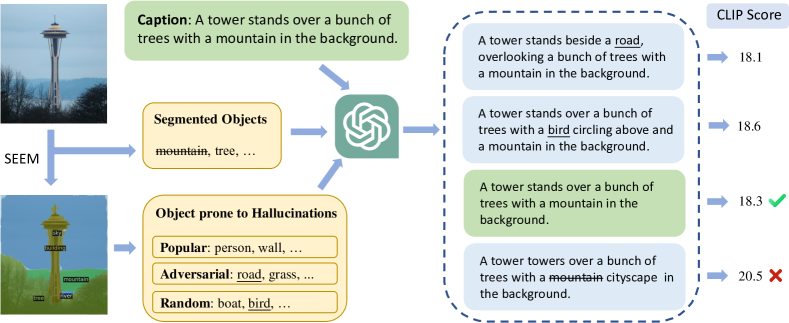
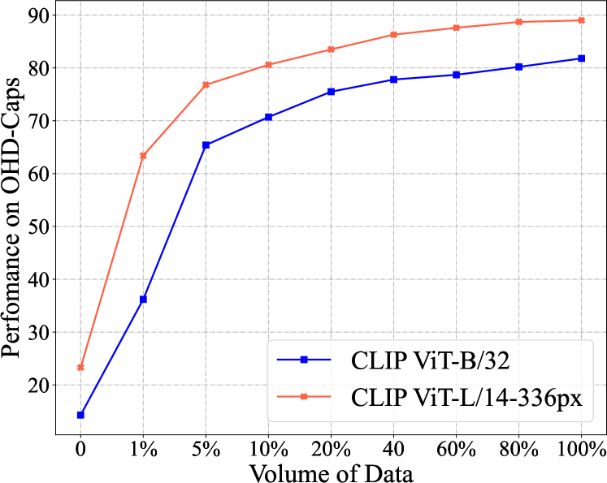
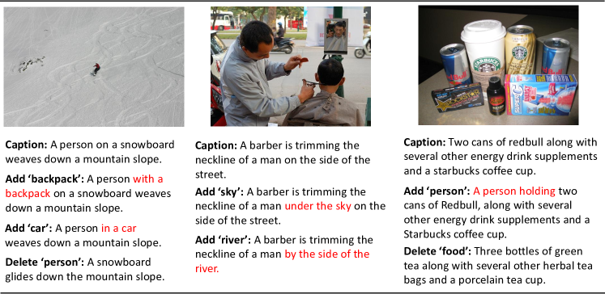

# Investigating and Mitigating Object Hallucinations in Pretrained Vision-Language (CLIP) Models

###### Abstract

Large Vision-Language Models (LVLMs) have achieved impressive performance, yet research has pointed out a serious issue with object hallucinations within these models. However, there is no clear conclusion as to which part of the model these hallucinations originate from. In this paper, we present an in-depth investigation into the object hallucination problem specifically within the CLIP model, which serves as the backbone for many state-of-the-art vision-language systems. We unveil that even in isolation, the CLIP model is prone to object hallucinations, suggesting that the hallucination problem is not solely due to the interaction between vision and language modalities. To address this, we propose a counterfactual data augmentation method by creating negative samples with a variety of hallucination issues. We demonstrate that our method can effectively mitigate object hallucinations for the CLIP model, and we show that the enhanced model can be employed as a visual encoder, effectively alleviating the object hallucination issue in LVLMs. 111Our benchmark and code are publicly available on <https://github.com/Yufang-Liu/clip_hallucination>.  

Investigating and Mitigating Object Hallucinations in Pretrained Vision-Language (CLIP) Models  

  

    Yufang Liu1††thanks:   Equal contribution., Tao Ji2,311footnotemark: 1, Changzhi Sun1, Yuanbin Wu1, Aimin Zhou1  1School of Computer Science and Technology, East China Normal University  2 School of Computer Science, Fudan University  3 Pazhou Laboratory, Huangpu  [yfliu.antnlp@gmail.com](mailto:yfliu.antnlp@gmail.com) [taoji@fudan.edu.cn](mailto:taoji@fudan.edu.cn) [ybwu@cs.ecnu.edu.cn](mailto:ybwu@cs.ecnu.edu.cn)   

  

## 1 Introduction

Current Large Vision-Language Models (LVLMs) demonstrate significant potential in tasks requiring joint visual and linguistic perception, such as image captioning Agrawal et al. ([2019b](#bib.bib2)), visual question answering Antol et al. ([2015](#bib.bib4)), visual grounding Yu et al. ([2016](#bib.bib54)), and autonomous agents Durante et al. ([2024](#bib.bib12)); Xi et al. ([2023](#bib.bib50)). Despite the success of LVLMs, previous studies have revealed that they commonly suffer from hallucinations in practice, including object hallucinations Li et al. ([2023c](#bib.bib27)); Leng et al. ([2023](#bib.bib23)); Zhou et al. ([2023](#bib.bib63)), spatial hallucinations Kamath et al. ([2023](#bib.bib21)), attribute hallucinations Zhang et al. ([2024](#bib.bib60)), etc. It is widely believed that hallucinations degrade model performance and reliability, and severely impair the user experience in real-world applications Ji et al. ([2023](#bib.bib20)).  

In this work, we focus on investigating the causes of the highly-concerned object hallucinations, i.e., LVLMs generate nonexistent objects in the image Biten et al. ([2022](#bib.bib5)). A typical LVLM utilizes a Large Language Model (LLM) as its cognitive foundational model and employs a pre-trained image encoder as its visual perception module (mainly the CLIP encoder). Kamath et al. ([2023](#bib.bib21)) investigated the spatial hallucination (e.g., confusing “left of” and “right of”) in LVLMs, and they found that various CLIP encoders struggle to recognize simple spatial relationships (achieving only a 55.0% accuracy on benchmarks, whereas humans are 98.8%). Inspired by their findings, we hypothesize that the CLIP visual encoder might also be one of the causes of object hallucinations.  

Hence, we first curate the Object Hallucination Detection (OHD-Caps) benchmark from subsets of the COCO Lin et al. ([2014](#bib.bib28)), Flickr30K Young et al. ([2014](#bib.bib52)), and Nocaps (as an out-of-domain benchmark because it comprises unseen objects) Agrawal et al. ([2019a](#bib.bib1)) image caption datasets respectively, to more strictly measure the extent of object hallucinations present in CLIP encoders. We randomly select 16k/1k/1.5k (train/dev/test) samples, with each sample containing one image, one positive descriptive text, and 27 negative descriptive texts. The negative samples are perturbations of the positive sample, achieved by adding descriptions of nonexistent objects or reducing descriptions of existing objects. Theoretically, a CLIP model without object hallucinations should accurately assign the highest CLIP score to the positive sample. However, taking the most commonly used “CLIP ViT-L/14” in LVLMs as an example, it only scores the highest for positive samples in 19.0% of cases. Since we have observed that the CLIP encoder already has a serious issue with object hallucination, how can we mitigate it?  

In the contrastive pretraining of CLIP, negative samples come from text descriptions of other images within the batch, which makes the distinction between them quite straightforward. However, mitigating object hallucinations requires the CLIP encoder to be able to differentiate between subtle errors at the object level. We further fine-tune the CLIP model using the training set from OHD-Caps. By incorporating a fine-grained object-level contrastive loss, we greatly reduce object hallucinations in the CLIP. Then employing the fine-tuned CLIP as the visual encoder, the object hallucinations in our retrained LVLM, LLaVA-1.5, are also diminished.  

In this paper, we study the object hallucinations of CLIP models. Our main contributions are,   

* we propose a benchmark, OHD-Caps, for evaluating object hallucinations in CLIP models. 
* we quantitatively evaluate a wide range of encoders from the CLIP family and find that they all exhibit severe object hallucination issues. 
* we propose a fine-grained object-level contrastive loss to further fine-tune the CLIP model, significantly alleviating its object hallucination issues (e.g., from 14.3 to 82.5 for “CLIP ViT-B/32”) and concurrently reducing the hallucination problems of the LLaVA-1.5 (from 80.2 to 83.2 on Nocaps), which uses it as a visual encoder. 

## 2 Related Work

### 2.1 Large Vision-Language Model

Recently, inspired by the success of large language models (LLMs), researchers have begun to dedicate efforts to enhance vision language models (VLMs) by integrating robust LLMs, aiming to broaden the knowledge scope of the model and amplify its linguistic comprehension capabilities.  

LVLM architectures typically consist of three components: a visual encoder, a modality connection module, and a LLM. The visual encoder and LLM are typically fixed large pretrained models, the visual encoder is usually a variant of the CLIP model Radford et al. ([2021](#bib.bib35)), used for extract visual features, while the LLM, such as LLaMA Touvron et al. ([2023](#bib.bib44)) and Vicuna Chiang et al. ([2023](#bib.bib7)), is used to integrate image information and text information, and completes the prediction of the target. Research focuses on optimizing modality connection modules, with approaches like Flamingo’s Alayrac et al. ([2022](#bib.bib3)) cross-attention module, LLaVA’s Liu et al. ([2023c](#bib.bib32)) linear layer, and BLIP2’s Li et al. ([2023a](#bib.bib24)) Q-former, diverse yet all boosting VLM performance on various vision-language tasks.  

### 2.2 Hallucination in LVLMs

Despite the fact that LVLMs perform well in solving visual-language tasks, they are also plagued by hallucinations. The problem of hallucinations in LVLMs mainly refers to the mismatch between visual input and textual output. For example, in the image captioning task, hallucination refers to the generation of captions that describe objects that do not exist in the image. Although the hallucination problem of LLMs has been widely studied in the NLP field Ji et al. ([2023](#bib.bib20)), there has not been enough research on mitigating the hallucination issue in LVLMs Shekhar et al. ([2017](#bib.bib37)); Liu et al. ([2024](#bib.bib31), [2023a](#bib.bib29)). Recent efforts to mitigate hallucination in LVLMs have focused on enhancing each compoment of the model. For example, Liu et al. ([2023b](#bib.bib30)); Hu et al. ([2023](#bib.bib19)) constuct instruction-tuning datasets with contrastive question-answer pairs for LVLMs;  Sun et al. ([2023b](#bib.bib43)); Yu et al. ([2023](#bib.bib55)) employ Reinforcement Learning from Human Feedback (RLHF)  Stiennon et al. ([2020](#bib.bib41)) to enchance the connection module between the modalities;  Leng et al. ([2023](#bib.bib23)) propose a visual contrastive decoding strategy for LLM decoing. Despite the wide application of the CLIP model in VLMs and its in-depth study in pairwise comparison context Yüksekgönül et al. ([2023](#bib.bib56)); Hsieh et al. ([2023](#bib.bib18)), there has been little discussion on its evaluation regarding hallucinations. Our research addresses this gap in the literature.  

## 3 The OHD-Caps Benchmark

[FIGURE S3.F1.g1]

Figure 1: The pipeline of our benchmark creation process. For an image, we first use SEEM Zou et al. ([2023](#bib.bib64)) to identify objects within the image and obtain illusory objects that do not exist in the picture through different sampling strategies. Then we ask GPT to insert or delete objects in the original sentences to create negative samples. We provide both positive and negative samples to the CLIP model to observe if the model predicts the positive samples as having the highest score. This image is from the NoCaps dataset, and the model is CLIP ViT-B/32.
[/FIGURE]

Recent studies have found that LVLMs are prone to object hallucinations Li et al. ([2023c](#bib.bib27)); Zhou et al. ([2023](#bib.bib63)). In response, researchers have developed several datasets to assess the extent of these hallucinations in such models Li et al. ([2023c](#bib.bib27)); Wang et al. ([2023c](#bib.bib48)). However, there is a relative lack of assessment work regarding the hallucinatory effects of the CLIP model, which is widely used as a visual encoder within LVLMs. In this section, we introduce the Object Hallucination Detection benchmark (OHD-Caps) we create to evaluate the object hallucination problem in CLIP models and the pipeline for evaluations. Figure [1](#S3.F1 "Figure 1 ‣ 3 The OHD-Caps Benchmark ‣ Investigating and Mitigating Object Hallucinations in Pretrained Vision-Language (CLIP) Models") shows the pipeline of our benchmark creation process.  

### 3.1 Dataset Construction

CLIP is a versatile neural network that excels at image understanding and can predict text for images in a zero-shot manner. To evaluate the CLIP model’s ability to handle object hallucinations in paired comparison scenarios, given an image with a correct caption, we create incorrect captions containing hallucinatory content. The purpose is to observe whether the model can accurately select the correct text without hallucinations.  

#### Inserting Hallucinatory Objects

Previous work Li et al. ([2023c](#bib.bib27)); Zhou et al. ([2023](#bib.bib63)) show that LVLMs are more prone to generate hallucinatory responses for objects that frequently appear in the dataset. Inspired by this, we create negative samples by inserting objects prone to hallucination into the correct captions. To collect object annotations, we first use SEEM Zou et al. ([2023](#bib.bib64)) to automatically segment objects in the images. Three kinds of hallucinatory objects are collected: random objects which are sampled randomly, popular objects which are the top frequent objects in the whole dataset, and adversarial objects which are the top frequent objects with the segmented objects. Each category contains three objects. To create examples with varying levels of hallucinations, we attempt to insert one to three objects for each category, resulting in each type of hallucination containing a total of 7 ($\sum_{r=1}^{3}C_{3}^{r}$) samples.  

Given a caption text and several hallucinatory objects, we insert the objects into the appropriate locations in the caption, which can be effectively achieved with the help of GPT4. Automatically, the caption and objects are fed to the GPT4, with the prompt as Add\_Prompt (see Table [13](#A3.T13 "Table 13 ‣ Appendix C More Examples ‣ Investigating and Mitigating Object Hallucinations in Pretrained Vision-Language (CLIP) Models")).  

#### Removing existing Objects

Except from inserting hallucinatory objects, we also remove objects from the captions to create negative samples. We randomly select 1 or 2 segmented objects in the image which results in 6 negative samples ($\sum_{r=1}^{2}C_{3}^{r}$), and ask GPT4 to remove them from the caption with the Remove\_Object\_Prompt. To account for scenarios where the identified objects are not present in the title text, we ask GPT to alter elements like objects, colors, and properties in the original caption, the prompt we use is Alter\_Object\_Prompt. The prompt can be found in Table [13](#A3.T13 "Table 13 ‣ Appendix C More Examples ‣ Investigating and Mitigating Object Hallucinations in Pretrained Vision-Language (CLIP) Models").  

we construct a dataset of 500 samples for each of the COCO Lin et al. ([2014](#bib.bib28)), Flickr30K Young et al. ([2014](#bib.bib52)), and the out of domain subset of NoCaps Validation datasets Agrawal et al. ([2019a](#bib.bib1)), with 27 negative samples for each image. Specifically, the out of domain subset of NoCaps comprises objects not seen in the COCO dataset, commonly used to measure a model’s ability to generalize to unseen classes. 222Our selection of Nocaps as the out-of-domain dataset is specific to our fine-tuning process in Section [4](#S4 "4 Methodology ‣ Investigating and Mitigating Object Hallucinations in Pretrained Vision-Language (CLIP) Models") and not the pre-training process of CLIP. The average length of the captions in the datasets is shown in Table [10](#A1.T10 "Table 10 ‣ Appendix A Statistics on the Datasets ‣ Investigating and Mitigating Object Hallucinations in Pretrained Vision-Language (CLIP) Models").  

### 3.2 Evaluation and Analysis

We study several models to evaluate their performance on our benchmark. Each image is paired with a correct caption and 27 negative samples, and models are required to calculate the similarity between the image and the caption candidates and select the correct caption.  

#### Models

We evaluate a variety of models on our benchmark, including CLIP Radford et al. ([2021](#bib.bib35)) ViT-B/32 and ViT-L/14; MetaCLIP Xu et al. ([2023](#bib.bib51)) and DFN2B CLIP Fang et al. ([2023](#bib.bib13)) are models pretrained on high-quality dataset after data curation; CLIPALi et al. ([2023b](#bib.bib26)) which achieves efficient training by using shorter image/text sequences, which reduces the computational load during the training period; EVA CLIP Sun et al. ([2023a](#bib.bib42)) which employs innovative representation learning technology, optimization methods, and enhancement strategies to improve model performance; SigLIPZhai et al. ([2023](#bib.bib58)) which employs a contrastive learning loss function based on the Sigmoid function instead of the traditional softmax for pre-training on language and image data; CLIP ConvNextLiu et al. ([2022](#bib.bib33)) is a variant of the CLIP model that uses ConvNext as the image encoder; CLIP NLLB-SigLip Visheratin ([2023](#bib.bib45)) is another variant that combines a text encoder from the NLLB model Costa-jussà et al. ([2022](#bib.bib10)) and an image encoder from the SigLIP model; NegCLIP Yüksekgönül et al. ([2023](#bib.bib56)), an improved model based on CLIP ViT-B/32, which enhances the understanding of relationships between objects, attributes, and the sequence of words by swapping phrases; CECLIP Zhang et al. ([2023](#bib.bib59)) which further develop enhanced negative samples and employ contrastive loss to enhance compositional reasoning; FLAVA Singh et al. ([2022](#bib.bib38)) which is a single unified foundation model which can work across vision, language as well as vision-and-language multi-modal tasks; CoCa Yu et al. ([2022](#bib.bib53)) is a pretrained model with contrastive and generative learning objectives; XVLM Zeng et al. ([2021](#bib.bib57)) which aligns the visual concept and textual input in a multi-grained manner with 14M and 16M pretrained images; BLIP Li et al. ([2022](#bib.bib25)) which effectively utilizes the noisy web data by bootstrapping the captions with 14M and 129M pretrained images; BLIP2 Li et al. ([2023a](#bib.bib24)) 333We use the image-text matching head for both BLIP and BLIP2. which bridges the gap between the visual and textual modalities with a Q-former.  

#### Results

[TABLE S3.T1]

<table class="ltx_tabular ltx_align_middle">
<tr class="ltx_tr">
<td class="ltx_td ltx_align_left ltx_border_tt">Model</td>
<td class="ltx_td ltx_align_right ltx_border_tt">Params</td>
<td class="ltx_td ltx_align_center ltx_border_tt">OHD-Caps Benchmark</td>
</tr>
<tr class="ltx_tr">
<td class="ltx_td ltx_align_center ltx_border_t">COCO</td>
<td class="ltx_td ltx_align_center ltx_border_t">Flickr30K</td>
<td class="ltx_td ltx_align_center ltx_border_t">NoCaps</td>
<td class="ltx_td ltx_align_center ltx_border_t">Avg.</td>
</tr>
<tr class="ltx_tr">
<td class="ltx_td ltx_align_center ltx_border_t">(a) comparisons with CLIP Models</td>
</tr>
<tr class="ltx_tr">
<td class="ltx_td ltx_align_left ltx_border_t">CLIP ViT-B/16</td>
<td class="ltx_td ltx_align_right ltx_border_t">149M</td>
<td class="ltx_td ltx_align_center ltx_border_t">16.6</td>
<td class="ltx_td ltx_align_center ltx_border_t">17.2</td>
<td class="ltx_td ltx_align_center ltx_border_t">8.6</td>
<td class="ltx_td ltx_align_center ltx_border_t">14.1</td>
</tr>
<tr class="ltx_tr">
<td class="ltx_td ltx_align_left">CLIP ViT-B/32</td>
<td class="ltx_td ltx_align_right">151M</td>
<td class="ltx_td ltx_align_center">15.2</td>
<td class="ltx_td ltx_align_center">17.6</td>
<td class="ltx_td ltx_align_center">10.2</td>
<td class="ltx_td ltx_align_center">14.3</td>
</tr>
<tr class="ltx_tr">
<td class="ltx_td ltx_align_left">CLIP ViT-L/14</td>
<td class="ltx_td ltx_align_right">428M</td>
<td class="ltx_td ltx_align_center">22.4</td>
<td class="ltx_td ltx_align_center">22.6</td>
<td class="ltx_td ltx_align_center">12.0</td>
<td class="ltx_td ltx_align_center">19.0</td>
</tr>
<tr class="ltx_tr">
<td class="ltx_td ltx_align_left">MetaCLIP B/32</td>
<td class="ltx_td ltx_align_right">151M</td>
<td class="ltx_td ltx_align_center">25.6</td>
<td class="ltx_td ltx_align_center">25.2</td>
<td class="ltx_td ltx_align_center">16.0</td>
<td class="ltx_td ltx_align_center">22.3</td>
</tr>
<tr class="ltx_tr">
<td class="ltx_td ltx_align_left">MetaCLIP L/14</td>
<td class="ltx_td ltx_align_right">428M</td>
<td class="ltx_td ltx_align_center">36.8</td>
<td class="ltx_td ltx_align_center">26.4</td>
<td class="ltx_td ltx_align_center">19.4</td>
<td class="ltx_td ltx_align_center">27.5</td>
</tr>
<tr class="ltx_tr">
<td class="ltx_td ltx_align_left">CLIPA V2 L/16</td>
<td class="ltx_td ltx_align_right">428M</td>
<td class="ltx_td ltx_align_center">35.6</td>
<td class="ltx_td ltx_align_center">31.0</td>
<td class="ltx_td ltx_align_center">18.8</td>
<td class="ltx_td ltx_align_center">28.5</td>
</tr>
<tr class="ltx_tr">
<td class="ltx_td ltx_align_left">EVA-02 CLIP-B/16</td>
<td class="ltx_td ltx_align_right">149M</td>
<td class="ltx_td ltx_align_center">26.4</td>
<td class="ltx_td ltx_align_center">25.4</td>
<td class="ltx_td ltx_align_center">18.6</td>
<td class="ltx_td ltx_align_center">23.5</td>
</tr>
<tr class="ltx_tr">
<td class="ltx_td ltx_align_left">EVA-02 CLIP-L/14</td>
<td class="ltx_td ltx_align_right">428M</td>
<td class="ltx_td ltx_align_center">38.8</td>
<td class="ltx_td ltx_align_center">31.6</td>
<td class="ltx_td ltx_align_center">21.4</td>
<td class="ltx_td ltx_align_center">30.6</td>
</tr>
<tr class="ltx_tr">
<td class="ltx_td ltx_align_left">DFN2B CLIP B/16</td>
<td class="ltx_td ltx_align_right">149M</td>
<td class="ltx_td ltx_align_center">29.4</td>
<td class="ltx_td ltx_align_center">27.8</td>
<td class="ltx_td ltx_align_center">17.0</td>
<td class="ltx_td ltx_align_center">24.7</td>
</tr>
<tr class="ltx_tr">
<td class="ltx_td ltx_align_left">DFN2B CLIP L/14</td>
<td class="ltx_td ltx_align_right">428M</td>
<td class="ltx_td ltx_align_center">37.6</td>
<td class="ltx_td ltx_align_center">37.8</td>
<td class="ltx_td ltx_align_center">23.2</td>
<td class="ltx_td ltx_align_center">32.9</td>
</tr>
<tr class="ltx_tr">
<td class="ltx_td ltx_align_left">CLIP ConvNext-B</td>
<td class="ltx_td ltx_align_right">180M</td>
<td class="ltx_td ltx_align_center">34.0</td>
<td class="ltx_td ltx_align_center">28.0</td>
<td class="ltx_td ltx_align_center">20.4</td>
<td class="ltx_td ltx_align_center">27.5</td>
</tr>
<tr class="ltx_tr">
<td class="ltx_td ltx_align_left">CLIP ConvNext-L</td>
<td class="ltx_td ltx_align_right">352M</td>
<td class="ltx_td ltx_align_center">43.4</td>
<td class="ltx_td ltx_align_center">35.8</td>
<td class="ltx_td ltx_align_center">25.0</td>
<td class="ltx_td ltx_align_center">34.7</td>
</tr>
<tr class="ltx_tr">
<td class="ltx_td ltx_align_left">SigLIP B/16</td>
<td class="ltx_td ltx_align_right">203M</td>
<td class="ltx_td ltx_align_center">34.2</td>
<td class="ltx_td ltx_align_center">32.2</td>
<td class="ltx_td ltx_align_center">23.8</td>
<td class="ltx_td ltx_align_center">30.1</td>
</tr>
<tr class="ltx_tr">
<td class="ltx_td ltx_align_left">SigLIP L/16</td>
<td class="ltx_td ltx_align_right">652M</td>
<td class="ltx_td ltx_align_center">48.4</td>
<td class="ltx_td ltx_align_center">38.4</td>
<td class="ltx_td ltx_align_center">30.8</td>
<td class="ltx_td ltx_align_center">39.2</td>
</tr>
<tr class="ltx_tr">
<td class="ltx_td ltx_align_left">SigLIP SoViT-400m</td>
<td class="ltx_td ltx_align_right">877M</td>
<td class="ltx_td ltx_align_center">50.8</td>
<td class="ltx_td ltx_align_center">41.4</td>
<td class="ltx_td ltx_align_center">26.6</td>
<td class="ltx_td ltx_align_center">39.6</td>
</tr>
<tr class="ltx_tr">
<td class="ltx_td ltx_align_left">CLIP NLLB-SigLip-B</td>
<td class="ltx_td ltx_align_right">508M</td>
<td class="ltx_td ltx_align_center">25.2</td>
<td class="ltx_td ltx_align_center">20.0</td>
<td class="ltx_td ltx_align_center">22.6</td>
<td class="ltx_td ltx_align_center">22.6</td>
</tr>
<tr class="ltx_tr">
<td class="ltx_td ltx_align_left">CLIP NLLB-SigLip-L</td>
<td class="ltx_td ltx_align_right">1.1B</td>
<td class="ltx_td ltx_align_center">32.6</td>
<td class="ltx_td ltx_align_center">29.0</td>
<td class="ltx_td ltx_align_center">26.4</td>
<td class="ltx_td ltx_align_center">29.3</td>
</tr>
<tr class="ltx_tr">
<td class="ltx_td ltx_align_left">NegCLIP</td>
<td class="ltx_td ltx_align_right">151M</td>
<td class="ltx_td ltx_align_center">32.8</td>
<td class="ltx_td ltx_align_center">28.0</td>
<td class="ltx_td ltx_align_center">25.0</td>
<td class="ltx_td ltx_align_center">28.6</td>
</tr>
<tr class="ltx_tr">
<td class="ltx_td ltx_align_left">CECLIP</td>
<td class="ltx_td ltx_align_right">151M</td>
<td class="ltx_td ltx_align_center">52.8</td>
<td class="ltx_td ltx_align_center">40.8</td>
<td class="ltx_td ltx_align_center">23.4</td>
<td class="ltx_td ltx_align_center">39.0</td>
</tr>
<tr class="ltx_tr">
<td class="ltx_td ltx_align_center ltx_border_t">(b) comparisons with other Image-Text Matching Models</td>
</tr>
<tr class="ltx_tr">
<td class="ltx_td ltx_align_left ltx_border_t">FLAVA</td>
<td class="ltx_td ltx_align_right ltx_border_t">350M</td>
<td class="ltx_td ltx_align_center ltx_border_t">28.0</td>
<td class="ltx_td ltx_align_center ltx_border_t">28.4</td>
<td class="ltx_td ltx_align_center ltx_border_t">16.6</td>
<td class="ltx_td ltx_align_center ltx_border_t">24.3</td>
</tr>
<tr class="ltx_tr">
<td class="ltx_td ltx_align_left">CoCa</td>
<td class="ltx_td ltx_align_right">2.1B</td>
<td class="ltx_td ltx_align_center">26.0</td>
<td class="ltx_td ltx_align_center">24.4</td>
<td class="ltx_td ltx_align_center">20.0</td>
<td class="ltx_td ltx_align_center">23.5</td>
</tr>
<tr class="ltx_tr">
<td class="ltx_td ltx_align_left">XVLM 4M</td>
<td class="ltx_td ltx_align_right">216M</td>
<td class="ltx_td ltx_align_center">46.4</td>
<td class="ltx_td ltx_align_center">35.8</td>
<td class="ltx_td ltx_align_center">34.0</td>
<td class="ltx_td ltx_align_center">38.7</td>
</tr>
<tr class="ltx_tr">
<td class="ltx_td ltx_align_left">XVLM 16M</td>
<td class="ltx_td ltx_align_right">216M</td>
<td class="ltx_td ltx_align_center">41.8</td>
<td class="ltx_td ltx_align_center">19.4</td>
<td class="ltx_td ltx_align_center">21.8</td>
<td class="ltx_td ltx_align_center">27.7</td>
</tr>
<tr class="ltx_tr">
<td class="ltx_td ltx_align_left">BLIP 14M</td>
<td class="ltx_td ltx_align_right">583M</td>
<td class="ltx_td ltx_align_center">51.4</td>
<td class="ltx_td ltx_align_center">48.0</td>
<td class="ltx_td ltx_align_center">42.0</td>
<td class="ltx_td ltx_align_center">47.1</td>
</tr>
<tr class="ltx_tr">
<td class="ltx_td ltx_align_left">BLIP 129M</td>
<td class="ltx_td ltx_align_right">583M</td>
<td class="ltx_td ltx_align_center">40.8</td>
<td class="ltx_td ltx_align_center">38.0</td>
<td class="ltx_td ltx_align_center">31.2</td>
<td class="ltx_td ltx_align_center">36.7</td>
</tr>
<tr class="ltx_tr">
<td class="ltx_td ltx_align_left ltx_border_bb">BLIP2</td>
<td class="ltx_td ltx_align_right ltx_border_bb">3.4B</td>
<td class="ltx_td ltx_align_center ltx_border_bb">62.6</td>
<td class="ltx_td ltx_align_center ltx_border_bb">42.2</td>
<td class="ltx_td ltx_align_center ltx_border_bb">41.2</td>
<td class="ltx_td ltx_align_center ltx_border_bb">48.7</td>
</tr>
</table>

Table 1: Results of various models on our benchmark. NoCaps subset is used to evaluate zero-shot generalization.
[/TABLE]

Table [1](#S3.T1 "Table 1 ‣ Results ‣ 3.2 Evaluation and Analysis ‣ 3 The OHD-Caps Benchmark ‣ Investigating and Mitigating Object Hallucinations in Pretrained Vision-Language (CLIP) Models") shows the results of the models on our benchmark. From the results, we could find that,  

* First of all, the vanilla CLIP models perform poorly across all three datasets, indicating their limited ability to recognize illusory objects in images. Multiple variants of CLIP, through improvements in data (e.g., MetaCLIP, DFN2B CLIP), model architecture (e.g., CLIP ConvNext, CLIP NLLB-SigLip), and training methods (e.g., CLIPA, EVA CLIP, SigLip), achieve a slight enhancement in the performance of the original CLIP. Among these variants, SigLIP demonstrates the most notable performance, exhibiting the best results on out-of-domain datasets and showcasing superior generalization capabilities. 
* Secondly, NegCLIP attempts to enhance the model’s understanding of the text by parsing and substituting phrases, but it only achieves a marginal improvement compared to the original CLIP model. CECLIP exhibits relatively better performance, which is mainly due to the constructed negative samples enhancing the model’s comprehension of the combined semantics of sentences. The NegCLIP and CECLIP models are trained on the COCO training set to distinguish between positive samples and enhanced negative samples. This might contribute to CECLIP’s good performance on the COCO dataset, owing in part to the model’s memory of the original correct text. However, their performance on the NoCaps dataset indicates that these models cannot effectively differentiate hallucinated objects. 
* Furthermore, generative vision-language models typically achieve higher performance than vanilla CLIP models due to their more precise alignment of image and text representations. Furthermore, it is generally observed that the larger the model parameters, the better the performance. In particular, BLIP2, which has the highest number of parameters, performs best across all three datasets. In comparison, the XVLM 4M model has relatively fewer parameters but still demonstrates good performance. This indicates that XVLM’s strategy of multi-scale alignment indeed assists the model in more accurately capturing the fine-grained details within images. 
* Finally, the overall trend among different models is consistent across the three datasets, with their performance typically being the lowest on the NoCaps dataset. Although fewer objects are recognized on the NoCaps dataset than Flickr30K, the performance is the lowest there due to the inclusion of categories that are out-of-domain. The BLIP 14M model demonstrates the best performance on both Flickr and NoCaps, which indicates its strong generalization capabilities. 

#### Analysis

The inability of models to recognize hallucinated objects primarily stems from the data used and the learning methods employed. The vanilla CLIP model is trained with a large number of image-caption pairs collected from the internet, using a contrastive loss function for optimization. Those captions are often brief and noisy, and the model is optimized to differentiate between correct and a multitude of incorrect image-text pairs. However, because the incorrect pairs are usually significantly different from the correct ones, the model can easily distinguish them. This means that the model does not need to learn the rich details in the pictures to make accurate predictions. To address this issue, we need to make improvements to the original CLIP model in terms of data utilization and learning methodologies.  

## 4 Methodology

We first revisit the training process of the vanilla CLIP model. Let $I$ be the image and $T$ be the text, the training objective of CLIP is to maximize the similarity between the image and text pairs and minimize the similarity between the image and text pairs that are not matched. The loss function is defined as:  

|  | $\displaystyle\mathcal{L}_{i2t}$ | $\displaystyle=-\log\frac{\exp(I\cdot T^{+}/\tau)}{\sum_{T^{*}\in\{T^{+},T^{-}\}}\exp(I\cdot T^{*}/\tau)},$ |  | (1) |
| --- | --- | --- | --- | --- |
|  | $\displaystyle\mathcal{L}_{t2i}$ | $\displaystyle=-\log\frac{\exp(T\cdot I^{+}/\tau)}{\sum_{I^{*}\in\{I^{+},I^{-}\}}\exp(T\cdot I^{*}/\tau)},$ |  |
|  | $\displaystyle\mathcal{L}_{0}$ | $\displaystyle=\frac{1}{2}\big{(}\mathcal{L}_{i2t}+\mathcal{L}_{t2i}\big{)},$ |  |

where $T^{+}$ and $I^{+}$ are the correct text and image, and $T^{-}$ and $I^{-}$ are the incorrect text and image, respectively.  

With the addition of the negative samples $T^{neg}$ created as in the previous section, we could modify the loss $\mathcal{L}_{i2t}$ as:  

|  | $$\mathcal{L}_{i2t}=-\log\frac{\exp(I\cdot T^{+}/\tau)}{\sum_{T^{*}\in\{T^{-},T^{neg},T^{+}\}}\exp(I\cdot T^{*}/\tau)}.$$ |  | (2) |
| --- | --- | --- | --- |

To further enhance the model’s ability to distinguish between positive and negative samples, we additionally introduce a margin loss. This is to ensure that the distance between an image and its corresponding correct text is smaller than the distance to incorrect text by a specific threshold. This concept can be formulated as:  

|  | $$\mathcal{L}_{1}=\max(0,\tau_{1}-I\cdot T^{+}+I\cdot T^{*}),$$ |  | (3) |
| --- | --- | --- | --- |

where $\tau_{1}$ is the margin threshold, and $T^{*}=\{T^{-},T^{neg}\}$.  

Additionally, we generate enhanced negative samples by introducing perturbations to the original positive samples. Such negative samples are typically more challenging to distinguish than other negative samples within the batch. To encourage the model to recognize the partially correct information contained in the enhanced negative samples, resulting in a higher similarity to the positive samples compared to other negative samples within the batch, we introduce a margin loss between the in-batch negative samples and the enhanced negative samples:  

|  | $$\mathcal{L}_{2}=\max(0,\tau_{2}-I\cdot T^{neg}+I\cdot T^{-}),$$ |  | (4) |
| --- | --- | --- | --- |

where $\tau_{2}$ is the margin threshold.  

Next, we assign different weights to the aforementioned loss terms, allowing the model to learn adaptively. Consequently, the final loss function can be expressed as follows:  

|  | $$\mathcal{L}=\frac{1}{2}\big{(}\mathcal{L}_{t2i}+\mathcal{L}_{i2t}\big{)}+\lambda_{1}\mathcal{L}_{1}+\lambda_{2}\mathcal{L}_{2}.$$ |  | (5) |
| --- | --- | --- | --- |

[TABLE S4.T2]

<table class="ltx_tabular ltx_align_middle">
<tr class="ltx_tr">
<td class="ltx_td ltx_align_left ltx_border_tt">Model</td>
<td class="ltx_td ltx_align_center ltx_border_tt">OHD-Caps</td>
</tr>
<tr class="ltx_tr">
<td class="ltx_td ltx_align_center ltx_border_t">COCO</td>
<td class="ltx_td ltx_align_center ltx_border_t">Flickr30k</td>
<td class="ltx_td ltx_align_center ltx_border_t">NoCaps</td>
<td class="ltx_td ltx_align_center ltx_border_t">Avg.</td>
</tr>
<tr class="ltx_tr">
<td class="ltx_td ltx_align_left ltx_border_t">Random</td>
<td class="ltx_td ltx_align_center ltx_border_t">3.6</td>
<td class="ltx_td ltx_align_center ltx_border_t">3.6</td>
<td class="ltx_td ltx_align_center ltx_border_t">3.6</td>
<td class="ltx_td ltx_align_center ltx_border_t">3.6</td>
</tr>
<tr class="ltx_tr">
<td class="ltx_td ltx_align_center ltx_border_t">(a) comparisons with CLIP-Base baselines</td>
</tr>
<tr class="ltx_tr">
<td class="ltx_td ltx_align_left ltx_border_t">CLIP-B/32</td>
<td class="ltx_td ltx_align_center ltx_border_t">15.2</td>
<td class="ltx_td ltx_align_center ltx_border_t">17.6</td>
<td class="ltx_td ltx_align_center ltx_border_t">10.2</td>
<td class="ltx_td ltx_align_center ltx_border_t">14.3</td>
</tr>
<tr class="ltx_tr">
<td class="ltx_td ltx_align_left">NegCLIP</td>
<td class="ltx_td ltx_align_center">32.8</td>
<td class="ltx_td ltx_align_center">28.0</td>
<td class="ltx_td ltx_align_center">25.0</td>
<td class="ltx_td ltx_align_center">28.6</td>
</tr>
<tr class="ltx_tr">
<td class="ltx_td ltx_align_left">CECLIP</td>
<td class="ltx_td ltx_align_center">52.8</td>
<td class="ltx_td ltx_align_center">40.8</td>
<td class="ltx_td ltx_align_center">23.4</td>
<td class="ltx_td ltx_align_center">39.0</td>
</tr>
<tr class="ltx_tr">
<td class="ltx_td ltx_align_left">
Ours-B/32</td>
<td class="ltx_td ltx_align_center">80.4</td>
<td class="ltx_td ltx_align_center">85.0</td>
<td class="ltx_td ltx_align_center">82.0</td>
<td class="ltx_td ltx_align_center">82.5</td>
</tr>
<tr class="ltx_tr">
<td class="ltx_td ltx_align_center ltx_border_t">(b) comparisons with CLIP-Large baselines</td>
</tr>
<tr class="ltx_tr">
<td class="ltx_td ltx_align_left ltx_border_t">CLIP-L/14</td>
<td class="ltx_td ltx_align_center ltx_border_t">26.0</td>
<td class="ltx_td ltx_align_center ltx_border_t">27.0</td>
<td class="ltx_td ltx_align_center ltx_border_t">16.8</td>
<td class="ltx_td ltx_align_center ltx_border_t">23.3</td>
</tr>
<tr class="ltx_tr">
<td class="ltx_td ltx_align_left ltx_border_bb">
Ours-L/14</td>
<td class="ltx_td ltx_align_center ltx_border_bb">87.0</td>
<td class="ltx_td ltx_align_center ltx_border_bb">91.0</td>
<td class="ltx_td ltx_align_center ltx_border_bb">88.4</td>
<td class="ltx_td ltx_align_center ltx_border_bb">88.8</td>
</tr>
</table>

Table 2: Results on OHD-Caps. CLIP-B/32, and CLIP-L/14 represent CLIP ViT-B/32 and CLIP ViT-L/14 336 px respectively.
[/TABLE]

## 5 Experiments

#### Training Datasets

We sample 8k images from the training set of COCO and 8k images from Flickr30k datasets, then generate negative samples for each image as in Section [3](#S3 "3 The OHD-Caps Benchmark ‣ Investigating and Mitigating Object Hallucinations in Pretrained Vision-Language (CLIP) Models"). Additionally, we randomly select $\sim$1k samples from the COCO dataset’s validation set as our dev set for the selection of hyper-parameters. Detailed information about the dataset is provided in Table [10](#A1.T10 "Table 10 ‣ Appendix A Statistics on the Datasets ‣ Investigating and Mitigating Object Hallucinations in Pretrained Vision-Language (CLIP) Models").  

#### Training Details

We utilize the CLIP ViT/32-B and CLIP ViT/14-L-336px implemented by Huggingface Wolf et al. ([2020](#bib.bib49)) as the initial models and conduct fine-tuning for 10 epochs. The training process is carried out on a single A6000 GPU, with batch sizes of 56 and 14 set for the base and large models, respectively, and the learning rate is set at 1e-6. The selection of hyper-parameters is determined by their performance on the validation set, where $\lambda_{1}$ and $\lambda_{2}$ are set as 0.1 and 0.1, $\tau_{1}$ and $\tau_{2}$ are set as 2.  

#### Evaluation

To verify the impact of our method on the model’s generalization capabilities, we conducted zero-shot experiments on the following datasets: CIFAR-10/100 Krizhevsky et al. ([2009](#bib.bib22)), ImageNet-1K  Deng et al. ([2009](#bib.bib11)), DTD Cimpoi et al. ([2014](#bib.bib8)), Eurosat Helber et al. ([2019](#bib.bib17)), GTSRB Stallkamp et al. ([2012](#bib.bib40)) and STL10 Coates et al. ([2011](#bib.bib9)).  

[TABLE S5.T3]

<table class="ltx_tabular ltx_align_middle">
<tr class="ltx_tr">
<td class="ltx_td ltx_border_r"></td>
<td class="ltx_td ltx_align_center">

CIFAR-10 (<cite class="ltx_cite ltx_citemacro_citeyear"><a class="ltx_ref">2009</a></cite>)

</td>
<td class="ltx_td ltx_align_center">

CIFAR-100 (<cite class="ltx_cite ltx_citemacro_citeyear"><a class="ltx_ref">2009</a></cite>)

</td>
<td class="ltx_td ltx_align_center">

ImageNet (<cite class="ltx_cite ltx_citemacro_citeyear"><a class="ltx_ref">2009</a></cite>)

</td>
<td class="ltx_td ltx_align_center">

Eurosat (<cite class="ltx_cite ltx_citemacro_citeyear"><a class="ltx_ref">2019</a></cite>)

</td>
<td class="ltx_td ltx_align_center">

GTSRB (<cite class="ltx_cite ltx_citemacro_citeyear"><a class="ltx_ref">2012</a></cite>)

</td>
<td class="ltx_td ltx_align_center ltx_border_r">

STL10 (<cite class="ltx_cite ltx_citemacro_citeyear"><a class="ltx_ref">2011</a></cite>)

</td>
<td class="ltx_td ltx_align_center">

.avg. top-1 acc.

</td>
</tr>
<tr class="ltx_tr">
<td class="ltx_td ltx_align_center ltx_border_t">(a) comparisons with CLIP-Base baselines</td>
</tr>
<tr class="ltx_tr">
<td class="ltx_td ltx_align_left ltx_border_r ltx_border_t">CLIP-B/32</td>
<td class="ltx_td ltx_align_center ltx_border_t">89.8</td>
<td class="ltx_td ltx_align_center ltx_border_t">64.2</td>
<td class="ltx_td ltx_align_center ltx_border_t">63.3</td>
<td class="ltx_td ltx_align_center ltx_border_t">46.3</td>
<td class="ltx_td ltx_align_center ltx_border_t">32.6</td>
<td class="ltx_td ltx_align_center ltx_border_r ltx_border_t">97.1</td>
<td class="ltx_td ltx_align_center ltx_border_t">65.6</td>
</tr>
<tr class="ltx_tr">
<td class="ltx_td ltx_align_left ltx_border_r">NegCLIP</td>
<td class="ltx_td ltx_align_center">85.9</td>
<td class="ltx_td ltx_align_center">60.9</td>
<td class="ltx_td ltx_align_center">55.7</td>
<td class="ltx_td ltx_align_center">31.9</td>
<td class="ltx_td ltx_align_center">26.8</td>
<td class="ltx_td ltx_align_center ltx_border_r">95.8</td>
<td class="ltx_td ltx_align_center">55.8</td>
</tr>
<tr class="ltx_tr">
<td class="ltx_td ltx_align_left ltx_border_r">CECLIP</td>
<td class="ltx_td ltx_align_center">81.1</td>
<td class="ltx_td ltx_align_center">55.0</td>
<td class="ltx_td ltx_align_center">40.4</td>
<td class="ltx_td ltx_align_center">41.9</td>
<td class="ltx_td ltx_align_center">20.6</td>
<td class="ltx_td ltx_align_center ltx_border_r">95.6</td>
<td class="ltx_td ltx_align_center">59.5</td>
</tr>
<tr class="ltx_tr">
<td class="ltx_td ltx_align_left ltx_border_r">
Ours-B/32</td>
<td class="ltx_td ltx_align_center">89.1</td>
<td class="ltx_td ltx_align_center">66.0</td>
<td class="ltx_td ltx_align_center">60.5</td>
<td class="ltx_td ltx_align_center">51.7</td>
<td class="ltx_td ltx_align_center">31.9</td>
<td class="ltx_td ltx_align_center ltx_border_r">96.5</td>
<td class="ltx_td ltx_align_center">66.0</td>
</tr>
<tr class="ltx_tr">
<td class="ltx_td ltx_align_center ltx_border_t">(b) comparisons with CLIP-Large baselines</td>
</tr>
<tr class="ltx_tr">
<td class="ltx_td ltx_align_left ltx_border_r ltx_border_t">CLIP-L/14</td>
<td class="ltx_td ltx_align_center ltx_border_t">95.0</td>
<td class="ltx_td ltx_align_center ltx_border_t">74.4</td>
<td class="ltx_td ltx_align_center ltx_border_t">76.6</td>
<td class="ltx_td ltx_align_center ltx_border_t">61.4</td>
<td class="ltx_td ltx_align_center ltx_border_t">52.4</td>
<td class="ltx_td ltx_align_center ltx_border_r ltx_border_t">99.4</td>
<td class="ltx_td ltx_align_center ltx_border_t">76.5</td>
</tr>
<tr class="ltx_tr">
<td class="ltx_td ltx_align_left ltx_border_b ltx_border_r">
Ours-L/14</td>
<td class="ltx_td ltx_align_center ltx_border_b">95.0</td>
<td class="ltx_td ltx_align_center ltx_border_b">74.8</td>
<td class="ltx_td ltx_align_center ltx_border_b">72.8</td>
<td class="ltx_td ltx_align_center ltx_border_b">67.3</td>
<td class="ltx_td ltx_align_center ltx_border_b">43.6</td>
<td class="ltx_td ltx_align_center ltx_border_b ltx_border_r">99.4</td>
<td class="ltx_td ltx_align_center ltx_border_b">75.5</td>
</tr>
</table>

Table 3: Zero-shot results on various datasets. The last column displays the average performance across 7 datasets.
[/TABLE]

### 5.1 Main Results

We present the results for our self-constructed dataset in Table [2](#S4.T2 "Table 2 ‣ 4 Methodology ‣ Investigating and Mitigating Object Hallucinations in Pretrained Vision-Language (CLIP) Models"), and various zero-shot datasets in Table [3](#S5.T3 "Table 3 ‣ Evaluation ‣ 5 Experiments ‣ Investigating and Mitigating Object Hallucinations in Pretrained Vision-Language (CLIP) Models"). From the results, we could find:  

* Our model shows comparable zero-shot performance to vanilla CLIP Models (65.6 vs 66.0) and achieves significant improvements in hallucination recognition (14.3 vs 82.5). NegCLIP and CECLIP enhance the model’s capability of understanding composites by constructing negative samples and also achieve a moderate improvement on the OHD-Caps benchmark, with performance rising from 14.3% to 39.0%. However, the zero-shot performance of NegCLIP and CECLIP significantly decreases. This could be due to their reliance on rule-based methods to construct negative samples (such as swapping phrases), which may interfere with the model’s understanding of sentence semantics. 
* Our model also demonstrates strong generalization capabilities in hallucination recognition. NegCLIP, CECLIP, and our model are all fine-tuned on the training set of the COCO dataset. Although they show varying degrees of performance improvement in COCO-related hallucination tests (NegCLIP at 32.8%, CECLIP at 52.8%), their performances are worse when facing unknown categories (NegCLIP at 25.0%, CECLIP at 23.4% for NoCaps images), indicating limited generalization capabilities of the models. In contrast, our model performs consistently across three different datasets, at approximately 82%. This result verifies that our model can effectively distinguish hallucinated objects in different datasets and possesses the capability to generalize across datasets. 

[TABLE S5.T4]

<table class="ltx_tabular ltx_align_middle">
<tr class="ltx_tr">
<td class="ltx_td ltx_align_left ltx_border_tt">Dataset</td>
<td class="ltx_td ltx_align_left ltx_border_tt">Criterion</td>
<td class="ltx_td ltx_align_center ltx_border_tt">Full Fine FT</td>
<td class="ltx_td ltx_align_center ltx_border_tt">LoRA FT</td>
</tr>
<tr class="ltx_tr">
<td class="ltx_td ltx_align_center ltx_border_t">LLaVA</td>
<td class="ltx_td ltx_align_center ltx_border_t">Ours</td>
<td class="ltx_td ltx_align_center ltx_border_t">LLaVA</td>
<td class="ltx_td ltx_align_center ltx_border_t">Ours</td>
</tr>
<tr class="ltx_tr">
<td class="ltx_td ltx_align_left ltx_border_t">COCO</td>
<td class="ltx_td ltx_align_left ltx_border_t">Accuracy (<math class="ltx_Math"><semantics><mo>↑</mo><annotation-xml><ci>↑</ci></annotation-xml><annotation>\uparrow</annotation></semantics></math>)</td>
<td class="ltx_td ltx_align_center ltx_border_t">85.4</td>
<td class="ltx_td ltx_align_center ltx_border_t">81.2</td>
<td class="ltx_td ltx_align_center ltx_border_t">85.7</td>
<td class="ltx_td ltx_align_center ltx_border_t">88.3</td>
</tr>
<tr class="ltx_tr">
<td class="ltx_td ltx_align_left">Precision (<math class="ltx_Math"><semantics><mo>↑</mo><annotation-xml><ci>↑</ci></annotation-xml><annotation>\uparrow</annotation></semantics></math>)</td>
<td class="ltx_td ltx_align_center">81.8</td>
<td class="ltx_td ltx_align_center">90.9</td>
<td class="ltx_td ltx_align_center">81.8</td>
<td class="ltx_td ltx_align_center">89.7</td>
</tr>
<tr class="ltx_tr">
<td class="ltx_td ltx_align_left">Recall (<math class="ltx_Math"><semantics><mo>↑</mo><annotation-xml><ci>↑</ci></annotation-xml><annotation>\uparrow</annotation></semantics></math>)</td>
<td class="ltx_td ltx_align_center">91.9</td>
<td class="ltx_td ltx_align_center">85.1</td>
<td class="ltx_td ltx_align_center">92.5</td>
<td class="ltx_td ltx_align_center">86.9</td>
</tr>
<tr class="ltx_tr">
<td class="ltx_td ltx_align_left">F1 Score (<math class="ltx_Math"><semantics><mo>↑</mo><annotation-xml><ci>↑</ci></annotation-xml><annotation>\uparrow</annotation></semantics></math>)</td>
<td class="ltx_td ltx_align_center">86.4</td>
<td class="ltx_td ltx_align_center">87.9</td>
<td class="ltx_td ltx_align_center">86.7</td>
<td class="ltx_td ltx_align_center">88.2</td>
</tr>
<tr class="ltx_tr">
<td class="ltx_td ltx_align_left">Yes (<math class="ltx_Math"><semantics><mo>→</mo><annotation-xml><ci>→</ci></annotation-xml><annotation>\rightarrow</annotation></semantics></math>50%)</td>
<td class="ltx_td ltx_align_center">56.5</td>
<td class="ltx_td ltx_align_center">46.9</td>
<td class="ltx_td ltx_align_center">56.8</td>
<td class="ltx_td ltx_align_center">48.6</td>
</tr>
<tr class="ltx_tr">
<td class="ltx_td ltx_align_left ltx_border_t">Flickr30K</td>
<td class="ltx_td ltx_align_left ltx_border_t">Accuracy (<math class="ltx_Math"><semantics><mo>↑</mo><annotation-xml><ci>↑</ci></annotation-xml><annotation>\uparrow</annotation></semantics></math>)</td>
<td class="ltx_td ltx_align_center ltx_border_t">73.7</td>
<td class="ltx_td ltx_align_center ltx_border_t">81.2</td>
<td class="ltx_td ltx_align_center ltx_border_t">74.4</td>
<td class="ltx_td ltx_align_center ltx_border_t">82.8</td>
</tr>
<tr class="ltx_tr">
<td class="ltx_td ltx_align_left">Precision (<math class="ltx_Math"><semantics><mo>↑</mo><annotation-xml><ci>↑</ci></annotation-xml><annotation>\uparrow</annotation></semantics></math>)</td>
<td class="ltx_td ltx_align_center">67.5</td>
<td class="ltx_td ltx_align_center">78.5</td>
<td class="ltx_td ltx_align_center">67.9</td>
<td class="ltx_td ltx_align_center">83.0</td>
</tr>
<tr class="ltx_tr">
<td class="ltx_td ltx_align_left">Recall (<math class="ltx_Math"><semantics><mo>↑</mo><annotation-xml><ci>↑</ci></annotation-xml><annotation>\uparrow</annotation></semantics></math>)</td>
<td class="ltx_td ltx_align_center">96.9</td>
<td class="ltx_td ltx_align_center">88.0</td>
<td class="ltx_td ltx_align_center">96.9</td>
<td class="ltx_td ltx_align_center">85.7</td>
</tr>
<tr class="ltx_tr">
<td class="ltx_td ltx_align_left">F1 Score (<math class="ltx_Math"><semantics><mo>↑</mo><annotation-xml><ci>↑</ci></annotation-xml><annotation>\uparrow</annotation></semantics></math>)</td>
<td class="ltx_td ltx_align_center">79.2</td>
<td class="ltx_td ltx_align_center">82.7</td>
<td class="ltx_td ltx_align_center">79.5</td>
<td class="ltx_td ltx_align_center">83.5</td>
</tr>
<tr class="ltx_tr">
<td class="ltx_td ltx_align_left">Yes (<math class="ltx_Math"><semantics><mo>→</mo><annotation-xml><ci>→</ci></annotation-xml><annotation>\rightarrow</annotation></semantics></math>50%)</td>
<td class="ltx_td ltx_align_center">73.1</td>
<td class="ltx_td ltx_align_center">56.8</td>
<td class="ltx_td ltx_align_center">72.5</td>
<td class="ltx_td ltx_align_center">52.9</td>
</tr>
<tr class="ltx_tr">
<td class="ltx_td ltx_align_left ltx_border_bb ltx_border_t">NoCaps</td>
<td class="ltx_td ltx_align_left ltx_border_t">Accuracy (<math class="ltx_Math"><semantics><mo>↑</mo><annotation-xml><ci>↑</ci></annotation-xml><annotation>\uparrow</annotation></semantics></math>)</td>
<td class="ltx_td ltx_align_center ltx_border_t">76.7</td>
<td class="ltx_td ltx_align_center ltx_border_t">81.3</td>
<td class="ltx_td ltx_align_center ltx_border_t">76.7</td>
<td class="ltx_td ltx_align_center ltx_border_t">82.6</td>
</tr>
<tr class="ltx_tr">
<td class="ltx_td ltx_align_left">Precision (<math class="ltx_Math"><semantics><mo>↑</mo><annotation-xml><ci>↑</ci></annotation-xml><annotation>\uparrow</annotation></semantics></math>)</td>
<td class="ltx_td ltx_align_center">71.2</td>
<td class="ltx_td ltx_align_center">80.6</td>
<td class="ltx_td ltx_align_center">71.2</td>
<td class="ltx_td ltx_align_center">81.8</td>
</tr>
<tr class="ltx_tr">
<td class="ltx_td ltx_align_left">Recall (<math class="ltx_Math"><semantics><mo>↑</mo><annotation-xml><ci>↑</ci></annotation-xml><annotation>\uparrow</annotation></semantics></math>)</td>
<td class="ltx_td ltx_align_center">92.7</td>
<td class="ltx_td ltx_align_center">84.0</td>
<td class="ltx_td ltx_align_center">92.3</td>
<td class="ltx_td ltx_align_center">84.9</td>
</tr>
<tr class="ltx_tr">
<td class="ltx_td ltx_align_left">F1 Score (<math class="ltx_Math"><semantics><mo>↑</mo><annotation-xml><ci>↑</ci></annotation-xml><annotation>\uparrow</annotation></semantics></math>)</td>
<td class="ltx_td ltx_align_center">80.2</td>
<td class="ltx_td ltx_align_center">82.0</td>
<td class="ltx_td ltx_align_center">80.2</td>
<td class="ltx_td ltx_align_center">83.2</td>
</tr>
<tr class="ltx_tr">
<td class="ltx_td ltx_align_left ltx_border_bb">Yes (<math class="ltx_Math"><semantics><mo>→</mo><annotation-xml><ci>→</ci></annotation-xml><annotation>\rightarrow</annotation></semantics></math>50%)</td>
<td class="ltx_td ltx_align_center ltx_border_bb">66.0</td>
<td class="ltx_td ltx_align_center ltx_border_bb">52.7</td>
<td class="ltx_td ltx_align_center ltx_border_bb">65.6</td>
<td class="ltx_td ltx_align_center ltx_border_bb">52.3</td>
</tr>
</table>

Table 4: Results on expanded POPE datasets. Yes denotes the proportion of answering “Yes” to the given question.
[/TABLE]

[TABLE S5.T5]

<table class="ltx_tabular ltx_align_middle">
<tr class="ltx_tr">
<td class="ltx_td ltx_align_left ltx_border_tt">Model</td>
<td class="ltx_td ltx_align_center ltx_border_tt">Full FT</td>
<td class="ltx_td ltx_align_center ltx_border_tt">LoRA FT</td>
</tr>
<tr class="ltx_tr">
<td class="ltx_td ltx_align_center ltx_border_t"><math class="ltx_Math"><semantics><mrow><msub><mi>C</mi><mi>S</mi></msub><mo>↓</mo><mi></mi></mrow><annotation-xml><apply><ci>↓</ci><apply><csymbol>subscript</csymbol><ci>𝐶</ci><ci>𝑆</ci></apply><csymbol>absent</csymbol></apply></annotation-xml><annotation>C_{S}\downarrow</annotation></semantics></math></td>
<td class="ltx_td ltx_align_center ltx_border_t"><math class="ltx_Math"><semantics><mrow><msub><mi>C</mi><mi>I</mi></msub><mo>↓</mo><mi></mi></mrow><annotation-xml><apply><ci>↓</ci><apply><csymbol>subscript</csymbol><ci>𝐶</ci><ci>𝐼</ci></apply><csymbol>absent</csymbol></apply></annotation-xml><annotation>C_{I}\downarrow</annotation></semantics></math></td>
<td class="ltx_td ltx_align_center ltx_border_t">Cover<math class="ltx_Math"><semantics><mo>↑</mo><annotation-xml><ci>↑</ci></annotation-xml><annotation>\uparrow</annotation></semantics></math>
</td>
<td class="ltx_td ltx_align_center ltx_border_t">Length</td>
<td class="ltx_td ltx_align_center ltx_border_t"><math class="ltx_Math"><semantics><mrow><msub><mi>C</mi><mi>S</mi></msub><mo>↓</mo><mi></mi></mrow><annotation-xml><apply><ci>↓</ci><apply><csymbol>subscript</csymbol><ci>𝐶</ci><ci>𝑆</ci></apply><csymbol>absent</csymbol></apply></annotation-xml><annotation>C_{S}\downarrow</annotation></semantics></math></td>
<td class="ltx_td ltx_align_center ltx_border_t"><math class="ltx_Math"><semantics><mrow><msub><mi>C</mi><mi>I</mi></msub><mo>↓</mo><mi></mi></mrow><annotation-xml><apply><ci>↓</ci><apply><csymbol>subscript</csymbol><ci>𝐶</ci><ci>𝐼</ci></apply><csymbol>absent</csymbol></apply></annotation-xml><annotation>C_{I}\downarrow</annotation></semantics></math></td>
<td class="ltx_td ltx_align_center ltx_border_t">Cover<math class="ltx_Math"><semantics><mo>↑</mo><annotation-xml><ci>↑</ci></annotation-xml><annotation>\uparrow</annotation></semantics></math>
</td>
<td class="ltx_td ltx_align_center ltx_border_t">Length</td>
</tr>
<tr class="ltx_tr">
<td class="ltx_td ltx_align_left ltx_border_t">LLaVA</td>
<td class="ltx_td ltx_align_center ltx_border_t">56.4</td>
<td class="ltx_td ltx_align_center ltx_border_t">14.9</td>
<td class="ltx_td ltx_align_center ltx_border_t">79.1</td>
<td class="ltx_td ltx_align_center ltx_border_t">106.4</td>
<td class="ltx_td ltx_align_center ltx_border_t">58.2</td>
<td class="ltx_td ltx_align_center ltx_border_t">16.4</td>
<td class="ltx_td ltx_align_center ltx_border_t">79.9</td>
<td class="ltx_td ltx_align_center ltx_border_t">106.5</td>
</tr>
<tr class="ltx_tr">
<td class="ltx_td ltx_align_left ltx_border_bb">Ours</td>
<td class="ltx_td ltx_align_center ltx_border_bb">55.0</td>
<td class="ltx_td ltx_align_center ltx_border_bb">14.5</td>
<td class="ltx_td ltx_align_center ltx_border_bb">79.2</td>
<td class="ltx_td ltx_align_center ltx_border_bb">107.5</td>
<td class="ltx_td ltx_align_center ltx_border_bb">56.8</td>
<td class="ltx_td ltx_align_center ltx_border_bb">14.9</td>
<td class="ltx_td ltx_align_center ltx_border_bb">79.2</td>
<td class="ltx_td ltx_align_center ltx_border_bb">108.5</td>
</tr>
</table>

Table 5: CHAIR hallucination evaluation results (max new tokens is 512) on COCO dev set. Smaller values correspond to less hallucinations.
[/TABLE]

[TABLE S5.T6]

<table class="ltx_tabular ltx_align_middle">
<tr class="ltx_tr">
<td class="ltx_td ltx_align_left ltx_border_tt">Dataset</td>
<td class="ltx_td ltx_align_left ltx_border_tt">Criterion</td>
<td class="ltx_td ltx_align_center ltx_border_tt">Full FT</td>
<td class="ltx_td ltx_align_center ltx_border_tt">LoRA FT</td>
</tr>
<tr class="ltx_tr">
<td class="ltx_td ltx_align_center ltx_border_t">LLaVA</td>
<td class="ltx_td ltx_align_center ltx_border_t">Ours</td>
<td class="ltx_td ltx_align_center ltx_border_t">LLaVA</td>
<td class="ltx_td ltx_align_center ltx_border_t">Ours</td>
</tr>
<tr class="ltx_tr">
<td class="ltx_td ltx_align_left ltx_border_t">Generative</td>
<td class="ltx_td ltx_align_left ltx_border_t">
<math class="ltx_Math"><semantics><msub><mi>C</mi><mi>S</mi></msub><annotation-xml><apply><csymbol>subscript</csymbol><ci>𝐶</ci><ci>𝑆</ci></apply></annotation-xml><annotation>C_{S}</annotation></semantics></math> (<math class="ltx_Math"><semantics><mo>↓</mo><annotation-xml><ci>↓</ci></annotation-xml><annotation>\downarrow</annotation></semantics></math>)</td>
<td class="ltx_td ltx_align_center ltx_border_t">7.2</td>
<td class="ltx_td ltx_align_center ltx_border_t">6.5</td>
<td class="ltx_td ltx_align_center ltx_border_t">7.2</td>
<td class="ltx_td ltx_align_center ltx_border_t">6.1</td>
</tr>
<tr class="ltx_tr">
<td class="ltx_td ltx_align_left">
<math class="ltx_Math"><semantics><msub><mi>C</mi><mi>I</mi></msub><annotation-xml><apply><csymbol>subscript</csymbol><ci>𝐶</ci><ci>𝐼</ci></apply></annotation-xml><annotation>C_{I}</annotation></semantics></math> (<math class="ltx_Math"><semantics><mo>↓</mo><annotation-xml><ci>↓</ci></annotation-xml><annotation>\downarrow</annotation></semantics></math>)</td>
<td class="ltx_td ltx_align_center">35.4</td>
<td class="ltx_td ltx_align_center">31.7</td>
<td class="ltx_td ltx_align_center">33.4</td>
<td class="ltx_td ltx_align_center">30.1</td>
</tr>
<tr class="ltx_tr">
<td class="ltx_td ltx_align_left">Cover (<math class="ltx_Math"><semantics><mo>↑</mo><annotation-xml><ci>↑</ci></annotation-xml><annotation>\uparrow</annotation></semantics></math>)</td>
<td class="ltx_td ltx_align_center">52.2</td>
<td class="ltx_td ltx_align_center">50.9</td>
<td class="ltx_td ltx_align_center">51.7</td>
<td class="ltx_td ltx_align_center">50.7</td>
</tr>
<tr class="ltx_tr">
<td class="ltx_td ltx_align_left ltx_border_bb ltx_border_t">Discriminative</td>
<td class="ltx_td ltx_align_left ltx_border_t">Accuracy (<math class="ltx_Math"><semantics><mo>↑</mo><annotation-xml><ci>↑</ci></annotation-xml><annotation>\uparrow</annotation></semantics></math>)</td>
<td class="ltx_td ltx_align_center ltx_border_t">74.3</td>
<td class="ltx_td ltx_align_center ltx_border_t">80.2</td>
<td class="ltx_td ltx_align_center ltx_border_t">74.2</td>
<td class="ltx_td ltx_align_center ltx_border_t">80.8</td>
</tr>
<tr class="ltx_tr">
<td class="ltx_td ltx_align_left">Precision (<math class="ltx_Math"><semantics><mo>↑</mo><annotation-xml><ci>↑</ci></annotation-xml><annotation>\uparrow</annotation></semantics></math>)</td>
<td class="ltx_td ltx_align_center">93.9</td>
<td class="ltx_td ltx_align_center">85.5</td>
<td class="ltx_td ltx_align_center">93.5</td>
<td class="ltx_td ltx_align_center">86.4</td>
</tr>
<tr class="ltx_tr">
<td class="ltx_td ltx_align_left">Recall (<math class="ltx_Math"><semantics><mo>↑</mo><annotation-xml><ci>↑</ci></annotation-xml><annotation>\uparrow</annotation></semantics></math>)</td>
<td class="ltx_td ltx_align_center">65.6</td>
<td class="ltx_td ltx_align_center">84.4</td>
<td class="ltx_td ltx_align_center">65.7</td>
<td class="ltx_td ltx_align_center">84.3</td>
</tr>
<tr class="ltx_tr">
<td class="ltx_td ltx_align_left ltx_border_bb">F1 (<math class="ltx_Math"><semantics><mo>↑</mo><annotation-xml><ci>↑</ci></annotation-xml><annotation>\uparrow</annotation></semantics></math>)</td>
<td class="ltx_td ltx_align_center ltx_border_bb">77.2</td>
<td class="ltx_td ltx_align_center ltx_border_bb">84.9</td>
<td class="ltx_td ltx_align_center ltx_border_bb">77.2</td>
<td class="ltx_td ltx_align_center ltx_border_bb">85.3</td>
</tr>
</table>

Table 6: Results on AMBER dataset which includes the assessment of hallucinations in both discriminative and generative responses.
[/TABLE]

[TABLE S5.T7]

<table class="ltx_tabular ltx_align_middle">
<tr class="ltx_tr">
<td class="ltx_td ltx_align_left ltx_border_tt">Model</td>
<td class="ltx_td ltx_align_center ltx_border_tt">Existence</td>
<td class="ltx_td ltx_align_center ltx_border_tt">Attribute</td>
<td class="ltx_td ltx_align_center ltx_border_tt">State</td>
<td class="ltx_td ltx_align_center ltx_border_tt">Number</td>
<td class="ltx_td ltx_align_center ltx_border_tt">Action</td>
<td class="ltx_td ltx_align_center ltx_border_tt">Relation</td>
</tr>
<tr class="ltx_tr">
<td class="ltx_td ltx_align_center ltx_border_t">(a) Full FT</td>
</tr>
<tr class="ltx_tr">
<td class="ltx_td ltx_align_left ltx_border_t">LLaVA</td>
<td class="ltx_td ltx_align_center ltx_border_t">83.5</td>
<td class="ltx_td ltx_align_center ltx_border_t">72.4</td>
<td class="ltx_td ltx_align_center ltx_border_t">67.0</td>
<td class="ltx_td ltx_align_center ltx_border_t">78.7</td>
<td class="ltx_td ltx_align_center ltx_border_t">85.2</td>
<td class="ltx_td ltx_align_center ltx_border_t">57.4</td>
</tr>
<tr class="ltx_tr">
<td class="ltx_td ltx_align_left">Ours</td>
<td class="ltx_td ltx_align_center">94.2</td>
<td class="ltx_td ltx_align_center">79.1</td>
<td class="ltx_td ltx_align_center">77.1</td>
<td class="ltx_td ltx_align_center">79.5</td>
<td class="ltx_td ltx_align_center">88.6</td>
<td class="ltx_td ltx_align_center">64.3</td>
</tr>
<tr class="ltx_tr">
<td class="ltx_td ltx_align_center ltx_border_t">(b) LoRA FT</td>
</tr>
<tr class="ltx_tr">
<td class="ltx_td ltx_align_left ltx_border_t">LLaVA</td>
<td class="ltx_td ltx_align_center ltx_border_t">83.0</td>
<td class="ltx_td ltx_align_center ltx_border_t">73.2</td>
<td class="ltx_td ltx_align_center ltx_border_t">71.7</td>
<td class="ltx_td ltx_align_center ltx_border_t">73.2</td>
<td class="ltx_td ltx_align_center ltx_border_t">81.8</td>
<td class="ltx_td ltx_align_center ltx_border_t">56.5</td>
</tr>
<tr class="ltx_tr">
<td class="ltx_td ltx_align_left ltx_border_bb">Ours</td>
<td class="ltx_td ltx_align_center ltx_border_bb">94.3</td>
<td class="ltx_td ltx_align_center ltx_border_bb">79.4</td>
<td class="ltx_td ltx_align_center ltx_border_bb">77.8</td>
<td class="ltx_td ltx_align_center ltx_border_bb">80.4</td>
<td class="ltx_td ltx_align_center ltx_border_bb">86.7</td>
<td class="ltx_td ltx_align_center ltx_border_bb">63.4</td>
</tr>
</table>

Table 7: Detailed performance on AMBER discriminative subset which includes evaluation results of other types of hallucinations, such as attribute, number, and relation.
[/TABLE]

[TABLE S5.T8]

<table class="ltx_tabular ltx_align_middle">
<tr class="ltx_tr">
<td class="ltx_td ltx_align_left ltx_border_tt">Model</td>
<td class="ltx_td ltx_align_center ltx_border_tt">MME</td>
<td class="ltx_td ltx_align_center ltx_border_tt">VQAv2</td>
<td class="ltx_td ltx_align_center ltx_border_tt">VisWiz</td>
<td class="ltx_td ltx_align_center ltx_border_tt">SciQA-IMG</td>
<td class="ltx_td ltx_align_center ltx_border_tt">TextVQA</td>
</tr>
<tr class="ltx_tr">
<td class="ltx_td ltx_align_center ltx_border_t">(a) Full FT</td>
</tr>
<tr class="ltx_tr">
<td class="ltx_td ltx_align_left ltx_border_t">LLaVA</td>
<td class="ltx_td ltx_align_center ltx_border_t">1459.4</td>
<td class="ltx_td ltx_align_center ltx_border_t">79.1</td>
<td class="ltx_td ltx_align_center ltx_border_t">48.9</td>
<td class="ltx_td ltx_align_center ltx_border_t">69.4</td>
<td class="ltx_td ltx_align_center ltx_border_t">58.5</td>
</tr>
<tr class="ltx_tr">
<td class="ltx_td ltx_align_left">Ours</td>
<td class="ltx_td ltx_align_center">1487.2</td>
<td class="ltx_td ltx_align_center">79.2</td>
<td class="ltx_td ltx_align_center">50.0</td>
<td class="ltx_td ltx_align_center">69.3</td>
<td class="ltx_td ltx_align_center">58.2</td>
</tr>
<tr class="ltx_tr">
<td class="ltx_td ltx_align_center ltx_border_t">(b) LoRA FT</td>
</tr>
<tr class="ltx_tr">
<td class="ltx_td ltx_align_left ltx_border_t">LLaVA</td>
<td class="ltx_td ltx_align_center ltx_border_t">1445.4</td>
<td class="ltx_td ltx_align_center ltx_border_t">79.1</td>
<td class="ltx_td ltx_align_center ltx_border_t">46.8</td>
<td class="ltx_td ltx_align_center ltx_border_t">69.8</td>
<td class="ltx_td ltx_align_center ltx_border_t">58.5</td>
</tr>
<tr class="ltx_tr">
<td class="ltx_td ltx_align_left ltx_border_bb">Ours</td>
<td class="ltx_td ltx_align_center ltx_border_bb">1455.4</td>
<td class="ltx_td ltx_align_center ltx_border_bb">79.2</td>
<td class="ltx_td ltx_align_center ltx_border_bb">47.2</td>
<td class="ltx_td ltx_align_center ltx_border_bb">68</td>
<td class="ltx_td ltx_align_center ltx_border_bb">58.4</td>
</tr>
</table>

Table 8: Results on various benchmarks.
[/TABLE]

### 5.2 Evaluation for LVLM

To verify the effectiveness of the enhanced CLIP model compared to the original CLIP in assisting large vision-language models to mitigate the issue of object hallucination, we replace the CLIP ViT-L/14-336px baseline model in LLaVA-1.5 with our fine-tuned version. We train LLaVA Liu et al. ([2023c](#bib.bib32)) from scratch using the hyper-parameters specified in the original paper. Comparison results with other methods, such as constructing SFT data Wang et al. ([2023a](#bib.bib46)) or introducing DPO processes Zhou et al. ([2024](#bib.bib62)); Zhao et al. ([2023](#bib.bib61)) for further alignment can be found in Appendix [B](#A2 "Appendix B Comparison with Other Methods ‣ Investigating and Mitigating Object Hallucinations in Pretrained Vision-Language (CLIP) Models").  

#### Hallucination Detection

To evaluate the occurrence of hallucination phenomena in discriminative and generative responses within models, we select the following evaluation methods for analysis: an extended version of the POPE dataset Li et al. ([2023c](#bib.bib27)) for discriminative response evaluation, and CHAIR evaluation Rohrbach et al. ([2018](#bib.bib36)) for generative response; the AMBER dataset Wang et al. ([2023b](#bib.bib47)) contains both types of evaluations. The format of the question contained in POPE is: ‘Is there a X in the image?’, where X refers to the name of the object. The questions in the dataset are designed such that the objects are present and absent in equal measure, therefore the ideal ‘yes’ response rate should be around 50%. We extend the POPE dataset and incorporate the Flickr30k and NoCaps domains to test the model’s generalization capabilities. The CHAIR metric evaluates object hallucinations in image descriptions by measuring the ratio of referenced objects not found in the ground-truth label set, with CHAIRS for sentence level:  

|  | $$C_{S}=\frac{\mid\{\text{ hallucinated objects }\}\mid}{\mid\{\text{ all mentioned objects }\}\mid},$$ |  |
| --- | --- | --- |

CHAIRI for image-level analysis:  

|  | $$C_{I}=\frac{\mid\{\text{ captions w/ hallucinated objects }\}\mid}{\mid\{\text{ all captions }\}\mid},$$ |  |
| --- | --- | --- |

and Cover measures the object coverage of responses:  

|  | $$\text{Cover}=\frac{\mid\{\text{ captions w/ hallucinated objects }\}\mid}{\mid\{\text{ ground truth objects }\}\mid}.$$ |  |
| --- | --- | --- |

Table [4](#S5.T4 "Table 4 ‣ 5.1 Main Results ‣ 5 Experiments ‣ Investigating and Mitigating Object Hallucinations in Pretrained Vision-Language (CLIP) Models"), [5](#S5.T5 "Table 5 ‣ 5.1 Main Results ‣ 5 Experiments ‣ Investigating and Mitigating Object Hallucinations in Pretrained Vision-Language (CLIP) Models"), [6](#S5.T6 "Table 6 ‣ 5.1 Main Results ‣ 5 Experiments ‣ Investigating and Mitigating Object Hallucinations in Pretrained Vision-Language (CLIP) Models") show the results of the expanded POPE dataset, CHAIR evaluation, and AMBER dataset, respectively. From the results, we could find:  

* For discriminative responses, our model achieves significant improvements on various datasets. On the POPE dataset, compared to the original, it attains a better balance between accuracy and recall which results in a higher F1 score and also approaches a more ideal balance in the proportion of "Yes" responses. The same phenomenon of performance improvement is also observed in the AMBER dataset. 
* For generative responses, our model demonstrates a lower proportion of hallucinated content on the COCO validation set and the AMBER dataset, while maintaining a relatively stable coverage and response length. 

#### General Performance

We evaluate the model’s general performance on different datasets, which include: MME-Perception Fu et al. ([2023](#bib.bib14)) evaluates the model’s visual perception with yes/no questions. VQA-v2 Goyal et al. ([2017](#bib.bib15)) evaluate model’s visual perception capabilities on open-ended short answers; VizWiz Gurari et al. ([2018](#bib.bib16)) and ScienceQA Lu et al. ([2022](#bib.bib34)) with multiple choice to evaluate the model’s zero-shot generalization on visual questions; TextVQA Singh et al. ([2019](#bib.bib39)) contains text-rich visual question answering.  

Results are shown in Table [8](#S5.T8 "Table 8 ‣ 5.1 Main Results ‣ 5 Experiments ‣ Investigating and Mitigating Object Hallucinations in Pretrained Vision-Language (CLIP) Models"). We can observe that with full fine-tuning, there is a slight improvement in the model’s average performance. Specifically, the average performance of the model across five datasets increased from 343.1 to 348.5, with the most notable improvement on the MME dataset. Conversely, when employing LoRA fine-tuning, the average performance of the model remained unchanged (340.0 vs 341.7).  

### 5.3 Ablation Study

[TABLE S5.T9]

<table class="ltx_tabular ltx_align_middle">
<tr class="ltx_tr">
<td class="ltx_td ltx_align_left ltx_border_tt">Model</td>
<td class="ltx_td ltx_align_center ltx_border_tt"><math class="ltx_Math"><semantics><msub><mi class="ltx_font_mathcaligraphic">ℒ</mi><mn>0</mn></msub><annotation-xml><apply><csymbol>subscript</csymbol><ci>ℒ</ci><cn>0</cn></apply></annotation-xml><annotation>\mathcal{L}_{0}</annotation></semantics></math></td>
<td class="ltx_td ltx_align_center ltx_border_tt"><math class="ltx_Math"><semantics><msub><mi class="ltx_font_mathcaligraphic">ℒ</mi><mn>1</mn></msub><annotation-xml><apply><csymbol>subscript</csymbol><ci>ℒ</ci><cn>1</cn></apply></annotation-xml><annotation>\mathcal{L}_{1}</annotation></semantics></math></td>
<td class="ltx_td ltx_align_center ltx_border_tt"><math class="ltx_Math"><semantics><msub><mi class="ltx_font_mathcaligraphic">ℒ</mi><mn>2</mn></msub><annotation-xml><apply><csymbol>subscript</csymbol><ci>ℒ</ci><cn>2</cn></apply></annotation-xml><annotation>\mathcal{L}_{2}</annotation></semantics></math></td>
<td class="ltx_td ltx_align_center ltx_border_tt">OHD-Caps</td>
<td class="ltx_td ltx_align_center ltx_border_tt">CIFAR10</td>
<td class="ltx_td ltx_align_center ltx_border_tt">CIFAR100</td>
<td class="ltx_td ltx_align_center ltx_border_tt">Avg.</td>
</tr>
<tr class="ltx_tr">
<td class="ltx_td ltx_align_left ltx_border_t">CLIP</td>
<td class="ltx_td ltx_border_t"></td>
<td class="ltx_td ltx_border_t"></td>
<td class="ltx_td ltx_border_t"></td>
<td class="ltx_td ltx_align_center ltx_border_t">14.3</td>
<td class="ltx_td ltx_align_center ltx_border_t">89.8</td>
<td class="ltx_td ltx_align_center ltx_border_t">64.2</td>
<td class="ltx_td ltx_align_center ltx_border_t">39.4</td>
</tr>
<tr class="ltx_tr">
<td class="ltx_td ltx_align_left">Ours</td>
<td class="ltx_td ltx_align_center">✓</td>
<td class="ltx_td"></td>
<td class="ltx_td"></td>
<td class="ltx_td ltx_align_center">80.1</td>
<td class="ltx_td ltx_align_center">88.6</td>
<td class="ltx_td ltx_align_center">66.4</td>
<td class="ltx_td ltx_align_center">79.1</td>
</tr>
<tr class="ltx_tr">
<td class="ltx_td"></td>
<td class="ltx_td ltx_align_center">✓</td>
<td class="ltx_td ltx_align_center">✓</td>
<td class="ltx_td"></td>
<td class="ltx_td ltx_align_center">80.5</td>
<td class="ltx_td ltx_align_center">89.3</td>
<td class="ltx_td ltx_align_center">66.0</td>
<td class="ltx_td ltx_align_center">79.4</td>
</tr>
<tr class="ltx_tr">
<td class="ltx_td"></td>
<td class="ltx_td ltx_align_center">✓</td>
<td class="ltx_td"></td>
<td class="ltx_td ltx_align_center">✓</td>
<td class="ltx_td ltx_align_center">81.6</td>
<td class="ltx_td ltx_align_center">89.0</td>
<td class="ltx_td ltx_align_center">66.3</td>
<td class="ltx_td ltx_align_center">80.0</td>
</tr>
<tr class="ltx_tr">
<td class="ltx_td ltx_border_bb"></td>
<td class="ltx_td ltx_align_center ltx_border_bb">✓</td>
<td class="ltx_td ltx_align_center ltx_border_bb">✓</td>
<td class="ltx_td ltx_align_center ltx_border_bb">✓</td>
<td class="ltx_td ltx_align_center ltx_border_bb">82.5</td>
<td class="ltx_td ltx_align_center ltx_border_bb">89.1</td>
<td class="ltx_td ltx_align_center ltx_border_bb">66.0</td>
<td class="ltx_td ltx_align_center ltx_border_bb">80.5</td>
</tr>
</table>

Table 9: Ablation of losses on CLIP ViT-B/32.
[/TABLE]

[FIGURE S5.F2.g1]

Figure 2: The performance of the model on the OHD-Caps dataset with different training data volumes provided. We report the average results of three random seeds.
[/FIGURE]

In this subsection, we present ablation studies to examine the impact of our model’s different components. We conduct these experiments on the CLIP ViT-B/32 model.  

#### Losses

As demonstrated in Table [9](#S5.T9 "Table 9 ‣ 5.3 Ablation Study ‣ 5 Experiments ‣ Investigating and Mitigating Object Hallucinations in Pretrained Vision-Language (CLIP) Models"), the inclusion of the $\mathcal{L}_{0}$ loss alone significantly improves OHD-Caps performance over the baseline. Subsequently, iterative incorporation of $\mathcal{L}_{1}$ and $\mathcal{L}_{2}$ provide incremental benefits, with the full combination yielding the highest average performance. Compared to $\mathcal{L}_{1}$ loss, $\mathcal{L}_{2}$ loss has a more significant effect on improving model performance. This suggests that by increasing the distance between constructed negative samples and other negative samples in the batch, the model can achieve a more refined understanding.  

#### Data Volume

Figure [2](#S5.F2 "Figure 2 ‣ 5.3 Ablation Study ‣ 5 Experiments ‣ Investigating and Mitigating Object Hallucinations in Pretrained Vision-Language (CLIP) Models") shows the performance of the OHD-Caps dataset with varying amounts of training data. As can be seen from the figure, even with a very small amount of data, the model’s performance can be significantly improved. For example, by training with just 1% of the data (that is, 160 images), the performance of the CLIP-L/14 model can increase from 20% to 60%. However, as more data is added, the performance improvement gradually slows and stabilizes.  

## 6 Conclusion

Our study investigates the reasons behind object hallucination in LVLMs. We construct a benchmark specifically for the evaluation of hallucinations and find that the visual perception module commonly used in current LVLMS, i.e., the CLIP model, cannot effectively discriminate hallucinated text. By designing negative samples and optimizing the contrastive loss function, we achieve a significant improvement in model performance on the hallucination detection dataset. Moreover, replacing the original CLIP model with our improved model can effectively alleviate the issue of object hallucination in the LLaVA model.  

## Limitations

Although we conducted a series of explorations, our research still has its limitations. Firstly, our focus is solely on the issue of object hallucination within LVLMs, and we do not extend our research to other types of hallucinations. Secondly, the benchmark we propose comprises over 20 negative samples. Due to budgetary constraints, the size of this dataset is much smaller compared to the datasets used for evaluating compositional understanding, e.g. ARO dataset Yüksekgönül et al. ([2023](#bib.bib56)). Thirdly, we only evaluate the visual encoders of most LVLMs, i.e. the CLIP models, but we do not conduct research on encoders used by some other models, for instance, the variant of ResNet called NFNet-F6 Brock et al. ([2021](#bib.bib6)) used by Flamingo Alayrac et al. ([2022](#bib.bib3)).  

## Ethics Statement

Object hallucination severely limits the practical application of LVLMs. For example, in medical image diagnosis, it can lead to false descriptions of tumor objects that are not present in the image. While our work has mitigated hallucinations in the visual encoder of LVLMs, hallucinations may still exist in the multi-head attention layers and feed-forward layers. Real-world applications based on LVLMs must systematically control hallucinations to avoid negative impacts on users.  

## Acknowledgement

The authors wish to thank all reviewers for their helpful comments and suggestions. The corresponding authors are Yuanbin Wu and Aimin Zhou. This research was (partially) supported by NSFC(62076097), National Key R&D Program of China (2021YFC3340700), the Open Research Fund of Key Laboratory of Advanced Theory and Application in Statistics and Data Science (East China Normal University), Ministry of Education.  

## References

* Agrawal et al. (2019a)  Harsh Agrawal, Peter Anderson, Karan Desai, Yufei Wang, Xinlei Chen, Rishabh Jain, Mark Johnson, Dhruv Batra, Devi Parikh, and Stefan Lee. 2019a.   [nocaps: novel object captioning at scale](https://doi.org/10.1109/ICCV.2019.00904).   In *2019 IEEE/CVF International Conference on Computer Vision, ICCV 2019, Seoul, Korea (South), October 27 - November 2, 2019*, pages 8947–8956. IEEE. 
* Agrawal et al. (2019b)  Harsh Agrawal, Karan Desai, Yufei Wang, Xinlei Chen, Rishabh Jain, Mark Johnson, Dhruv Batra, Devi Parikh, Stefan Lee, and Peter Anderson. 2019b.   Nocaps: Novel object captioning at scale.   In *Proceedings of the IEEE/CVF international conference on computer vision*, pages 8948–8957. 
* Alayrac et al. (2022)  Jean-Baptiste Alayrac, Jeff Donahue, Pauline Luc, Antoine Miech, Iain Barr, Yana Hasson, Karel Lenc, Arthur Mensch, Katherine Millican, Malcolm Reynolds, Roman Ring, Eliza Rutherford, Serkan Cabi, Tengda Han, Zhitao Gong, Sina Samangooei, Marianne Monteiro, Jacob L. Menick, Sebastian Borgeaud, Andy Brock, Aida Nematzadeh, Sahand Sharifzadeh, Mikolaj Binkowski, Ricardo Barreira, Oriol Vinyals, Andrew Zisserman, and Karén Simonyan. 2022.   [Flamingo: a visual language model for few-shot learning](http://papers.nips.cc/paper_files/paper/2022/hash/960a172bc7fbf0177ccccbb411a7d800-Abstract-Conference.html).   In *Advances in Neural Information Processing Systems 35: Annual Conference on Neural Information Processing Systems 2022, NeurIPS 2022, New Orleans, LA, USA, November 28 - December 9, 2022*. 
* Antol et al. (2015)  Stanislaw Antol, Aishwarya Agrawal, Jiasen Lu, Margaret Mitchell, Dhruv Batra, C Lawrence Zitnick, and Devi Parikh. 2015.   Vqa: Visual question answering.   In *Proceedings of the IEEE international conference on computer vision*, pages 2425–2433. 
* Biten et al. (2022)  Ali Furkan Biten, Lluís Gómez, and Dimosthenis Karatzas. 2022.   [Let there be a clock on the beach: Reducing object hallucination in image captioning](https://doi.org/10.1109/WACV51458.2022.00253).   In *2022 IEEE/CVF Winter Conference on Applications of Computer Vision (WACV)*, pages 2473–2482. 
* Brock et al. (2021)  Andy Brock, Soham De, Samuel L. Smith, and Karen Simonyan. 2021.   [High-performance large-scale image recognition without normalization](http://proceedings.mlr.press/v139/brock21a.html).   In *Proceedings of the 38th International Conference on Machine Learning, ICML 2021, 18-24 July 2021, Virtual Event*, volume 139 of *Proceedings of Machine Learning Research*, pages 1059–1071. PMLR. 
* Chiang et al. (2023)  Wei-Lin Chiang, Zhuohan Li, Zi Lin, Ying Sheng, Zhanghao Wu, Hao Zhang, Lianmin Zheng, Siyuan Zhuang, Yonghao Zhuang, Joseph E. Gonzalez, Ion Stoica, and Eric P. Xing. 2023.   [Vicuna: An open-source chatbot impressing gpt-4 with 90%\* chatgpt quality](https://lmsys.org/blog/2023-03-30-vicuna/). 
* Cimpoi et al. (2014)  M. Cimpoi, S. Maji, I. Kokkinos, S. Mohamed, , and A. Vedaldi. 2014.   Describing textures in the wild.   In *CVPR*. 
* Coates et al. (2011)  Adam Coates, Andrew Ng, and Honglak Lee. 2011.   An analysis of single-layer networks in unsupervised feature learning.   In *AISTAT*. 
* Costa-jussà et al. (2022)  Marta R. Costa-jussà, James Cross, Onur Çelebi, Maha Elbayad, Kenneth Heafield, Kevin Heffernan, Elahe Kalbassi, Janice Lam, Daniel Licht, Jean Maillard, Anna Y. Sun, Skyler Wang, Guillaume Wenzek, Al Youngblood, Bapi Akula, Loïc Barrault, Gabriel Mejia Gonzalez, Prangthip Hansanti, John Hoffman, Semarley Jarrett, Kaushik Ram Sadagopan, Dirk Rowe, Shannon Spruit, Chau Tran, Pierre Andrews, Necip Fazil Ayan, Shruti Bhosale, Sergey Edunov, Angela Fan, Cynthia Gao, Vedanuj Goswami, Francisco Guzmán, Philipp Koehn, Alexandre Mourachko, Christophe Ropers, Safiyyah Saleem, Holger Schwenk, and Jeff Wang. 2022.   [No language left behind: Scaling human-centered machine translation](https://doi.org/10.48550/ARXIV.2207.04672).   *CoRR*, abs/2207.04672. 
* Deng et al. (2009)  Jia Deng, Wei Dong, Richard Socher, Li-Jia Li, Kai Li, and Li Fei-Fei. 2009.   Imagenet: A large-scale hierarchical image database.   In *CVPR*. 
* Durante et al. (2024)  Zane Durante, Qiuyuan Huang, Naoki Wake, Ran Gong, Jae Sung Park, Bidipta Sarkar, Rohan Taori, Yusuke Noda, Demetri Terzopoulos, Yejin Choi, et al. 2024.   Agent ai: Surveying the horizons of multimodal interaction.   *arXiv preprint arXiv:2401.03568*. 
* Fang et al. (2023)  Alex Fang, Albin Madappally Jose, Amit Jain, Ludwig Schmidt, Alexander Toshev, and Vaishaal Shankar. 2023.   [Data filtering networks](https://doi.org/10.48550/ARXIV.2309.17425).   *CoRR*, abs/2309.17425. 
* Fu et al. (2023)  Chaoyou Fu, Peixian Chen, Yunhang Shen, Yulei Qin, Mengdan Zhang, Xu Lin, Zhenyu Qiu, Wei Lin, Jinrui Yang, Xiawu Zheng, Ke Li, Xing Sun, and Rongrong Ji. 2023.   [MME: A comprehensive evaluation benchmark for multimodal large language models](https://doi.org/10.48550/ARXIV.2306.13394).   *CoRR*, abs/2306.13394. 
* Goyal et al. (2017)  Yash Goyal, Tejas Khot, Douglas Summers-Stay, Dhruv Batra, and Devi Parikh. 2017.   [Making the V in VQA matter: Elevating the role of image understanding in visual question answering](https://doi.org/10.1109/CVPR.2017.670).   In *2017 IEEE Conference on Computer Vision and Pattern Recognition, CVPR 2017, Honolulu, HI, USA, July 21-26, 2017*, pages 6325–6334. IEEE Computer Society. 
* Gurari et al. (2018)  Danna Gurari, Qing Li, Abigale J. Stangl, Anhong Guo, Chi Lin, Kristen Grauman, Jiebo Luo, and Jeffrey P. Bigham. 2018.   [Vizwiz grand challenge: Answering visual questions from blind people](https://doi.org/10.1109/CVPR.2018.00380).   In *2018 IEEE Conference on Computer Vision and Pattern Recognition, CVPR 2018, Salt Lake City, UT, USA, June 18-22, 2018*, pages 3608–3617. Computer Vision Foundation / IEEE Computer Society. 
* Helber et al. (2019)  Patrick Helber, Benjamin Bischke, Andreas Dengel, and Damian Borth. 2019.   Eurosat: A novel dataset and deep learning benchmark for land use and land cover classification.   *IEEE J. Sel. Top. Appl. Earth Obs. Remote Sens.* 
* Hsieh et al. (2023)  Cheng-Yu Hsieh, Jieyu Zhang, Zixian Ma, Aniruddha Kembhavi, and Ranjay Krishna. 2023.   [Sugarcrepe: Fixing hackable benchmarks for vision-language compositionality](http://papers.nips.cc/paper_files/paper/2023/hash/63461de0b4cb760fc498e85b18a7fe81-Abstract-Datasets_and_Benchmarks.html).   In *Advances in Neural Information Processing Systems 36: Annual Conference on Neural Information Processing Systems 2023, NeurIPS 2023, New Orleans, LA, USA, December 10 - 16, 2023*. 
* Hu et al. (2023)  Hongyu Hu, Jiyuan Zhang, Minyi Zhao, and Zhenbang Sun. 2023.   [CIEM: contrastive instruction evaluation method for better instruction tuning](https://doi.org/10.48550/ARXIV.2309.02301).   *CoRR*, abs/2309.02301. 
* Ji et al. (2023)  Ziwei Ji, Nayeon Lee, Rita Frieske, Tiezheng Yu, Dan Su, Yan Xu, Etsuko Ishii, Yejin Bang, Andrea Madotto, and Pascale Fung. 2023.   [Survey of hallucination in natural language generation](https://doi.org/10.1145/3571730).   *ACM Comput. Surv.*, 55(12):248:1–248:38. 
* Kamath et al. (2023)  Amita Kamath, Jack Hessel, and Kai-Wei Chang. 2023.   What’s “up” with vision-language models? investigating their struggle with spatial reasoning.   In *Proceedings of the 2023 Conference on Empirical Methods in Natural Language Processing*, pages 9161–9175. 
* Krizhevsky et al. (2009)  Alex Krizhevsky, Geoffrey Hinton, et al. 2009.   Learning multiple layers of features from tiny images. 
* Leng et al. (2023)  Sicong Leng, Hang Zhang, Guanzheng Chen, Xin Li, Shijian Lu, Chunyan Miao, and Lidong Bing. 2023.   [Mitigating object hallucinations in large vision-language models through visual contrastive decoding](https://doi.org/10.48550/ARXIV.2311.16922).   *CoRR*, abs/2311.16922. 
* Li et al. (2023a)  Junnan Li, Dongxu Li, Silvio Savarese, and Steven C. H. Hoi. 2023a.   [BLIP-2: bootstrapping language-image pre-training with frozen image encoders and large language models](https://proceedings.mlr.press/v202/li23q.html).   In *International Conference on Machine Learning, ICML 2023, 23-29 July 2023, Honolulu, Hawaii, USA*, volume 202 of *Proceedings of Machine Learning Research*, pages 19730–19742. PMLR. 
* Li et al. (2022)  Junnan Li, Dongxu Li, Caiming Xiong, and Steven C. H. Hoi. 2022.   [BLIP: bootstrapping language-image pre-training for unified vision-language understanding and generation](https://proceedings.mlr.press/v162/li22n.html).   In *International Conference on Machine Learning, ICML 2022, 17-23 July 2022, Baltimore, Maryland, USA*, volume 162 of *Proceedings of Machine Learning Research*, pages 12888–12900. PMLR. 
* Li et al. (2023b)  Xianhang Li, Zeyu Wang, and Cihang Xie. 2023b.   [Clipa-v2: Scaling CLIP training with 81.1% zero-shot imagenet accuracy within a $10, 000 budget; an extra $4, 000 unlocks 81.8% accuracy](https://doi.org/10.48550/ARXIV.2306.15658).   *CoRR*, abs/2306.15658. 
* Li et al. (2023c)  Yifan Li, Yifan Du, Kun Zhou, Jinpeng Wang, Wayne Xin Zhao, and Ji-Rong Wen. 2023c.   [Evaluating object hallucination in large vision-language models](https://aclanthology.org/2023.emnlp-main.20).   In *Proceedings of the 2023 Conference on Empirical Methods in Natural Language Processing, EMNLP 2023, Singapore, December 6-10, 2023*, pages 292–305. Association for Computational Linguistics. 
* Lin et al. (2014)  Tsung-Yi Lin, Michael Maire, Serge J. Belongie, James Hays, Pietro Perona, Deva Ramanan, Piotr Dollár, and C. Lawrence Zitnick. 2014.   [Microsoft COCO: common objects in context](https://doi.org/10.1007/978-3-319-10602-1_48).   In *Computer Vision - ECCV 2014 - 13th European Conference, Zurich, Switzerland, September 6-12, 2014, Proceedings, Part V*, volume 8693 of *Lecture Notes in Computer Science*, pages 740–755. Springer. 
* Liu et al. (2023a)  Fuxiao Liu, Tianrui Guan, Zongxia Li, Lichang Chen, Yaser Yacoob, Dinesh Manocha, and Tianyi Zhou. 2023a.   [Hallusionbench: You see what you think? or you think what you see? an image-context reasoning benchmark challenging for gpt-4v(ision), llava-1.5, and other multi-modality models](https://doi.org/10.48550/ARXIV.2310.14566).   *CoRR*, abs/2310.14566. 
* Liu et al. (2023b)  Fuxiao Liu, Kevin Lin, Linjie Li, Jianfeng Wang, Yaser Yacoob, and Lijuan Wang. 2023b.   [Aligning large multi-modal model with robust instruction tuning](https://doi.org/10.48550/ARXIV.2306.14565).   *CoRR*, abs/2306.14565. 
* Liu et al. (2024)  Hanchao Liu, Wenyuan Xue, Yifei Chen, Dapeng Chen, Xiutian Zhao, Ke Wang, Liping Hou, Rongjun Li, and Wei Peng. 2024.   [A survey on hallucination in large vision-language models](https://doi.org/10.48550/ARXIV.2402.00253).   *CoRR*, abs/2402.00253. 
* Liu et al. (2023c)  Haotian Liu, Chunyuan Li, Qingyang Wu, and Yong Jae Lee. 2023c.   [Visual instruction tuning](http://papers.nips.cc/paper_files/paper/2023/hash/6dcf277ea32ce3288914faf369fe6de0-Abstract-Conference.html).   In *Advances in Neural Information Processing Systems 36: Annual Conference on Neural Information Processing Systems 2023, NeurIPS 2023, New Orleans, LA, USA, December 10 - 16, 2023*. 
* Liu et al. (2022)  Zhuang Liu, Hanzi Mao, Chao-Yuan Wu, Christoph Feichtenhofer, Trevor Darrell, and Saining Xie. 2022.   [A convnet for the 2020s](https://doi.org/10.1109/CVPR52688.2022.01167).   In *IEEE/CVF Conference on Computer Vision and Pattern Recognition, CVPR 2022, New Orleans, LA, USA, June 18-24, 2022*, pages 11966–11976. IEEE. 
* Lu et al. (2022)  Pan Lu, Swaroop Mishra, Tanglin Xia, Liang Qiu, Kai-Wei Chang, Song-Chun Zhu, Oyvind Tafjord, Peter Clark, and Ashwin Kalyan. 2022.   [Learn to explain: Multimodal reasoning via thought chains for science question answering](http://papers.nips.cc/paper_files/paper/2022/hash/11332b6b6cf4485b84afadb1352d3a9a-Abstract-Conference.html).   In *Advances in Neural Information Processing Systems 35: Annual Conference on Neural Information Processing Systems 2022, NeurIPS 2022, New Orleans, LA, USA, November 28 - December 9, 2022*. 
* Radford et al. (2021)  Alec Radford, Jong Wook Kim, Chris Hallacy, Aditya Ramesh, Gabriel Goh, Sandhini Agarwal, Girish Sastry, Amanda Askell, Pamela Mishkin, Jack Clark, Gretchen Krueger, and Ilya Sutskever. 2021.   [Learning transferable visual models from natural language supervision](http://proceedings.mlr.press/v139/radford21a.html).   In *Proceedings of the 38th International Conference on Machine Learning, ICML 2021, 18-24 July 2021, Virtual Event*, volume 139 of *Proceedings of Machine Learning Research*, pages 8748–8763. PMLR. 
* Rohrbach et al. (2018)  Anna Rohrbach, Lisa Anne Hendricks, Kaylee Burns, Trevor Darrell, and Kate Saenko. 2018.   [Object hallucination in image captioning](https://doi.org/10.18653/V1/D18-1437).   In *Proceedings of the 2018 Conference on Empirical Methods in Natural Language Processing, Brussels, Belgium, October 31 - November 4, 2018*, pages 4035–4045. Association for Computational Linguistics. 
* Shekhar et al. (2017)  Ravi Shekhar, Sandro Pezzelle, Yauhen Klimovich, Aurélie Herbelot, Moin Nabi, Enver Sangineto, and Raffaella Bernardi. 2017.   [FOIL it! find one mismatch between image and language caption](https://doi.org/10.18653/V1/P17-1024).   In *Proceedings of the 55th Annual Meeting of the Association for Computational Linguistics, ACL 2017, Vancouver, Canada, July 30 - August 4, Volume 1: Long Papers*, pages 255–265. Association for Computational Linguistics. 
* Singh et al. (2022)  Amanpreet Singh, Ronghang Hu, Vedanuj Goswami, Guillaume Couairon, Wojciech Galuba, Marcus Rohrbach, and Douwe Kiela. 2022.   [FLAVA: A foundational language and vision alignment model](https://doi.org/10.1109/CVPR52688.2022.01519).   In *IEEE/CVF Conference on Computer Vision and Pattern Recognition, CVPR 2022, New Orleans, LA, USA, June 18-24, 2022*, pages 15617–15629. IEEE. 
* Singh et al. (2019)  Amanpreet Singh, Vivek Natarajan, Meet Shah, Yu Jiang, Xinlei Chen, Dhruv Batra, Devi Parikh, and Marcus Rohrbach. 2019.   [Towards VQA models that can read](https://doi.org/10.1109/CVPR.2019.00851).   In *IEEE Conference on Computer Vision and Pattern Recognition, CVPR 2019, Long Beach, CA, USA, June 16-20, 2019*, pages 8317–8326. Computer Vision Foundation / IEEE. 
* Stallkamp et al. (2012)  Johannes Stallkamp, Marc Schlipsing, Jan Salmen, and Christian Igel. 2012.   Man vs. computer: Benchmarking machine learning algorithms for traffic sign recognition.   *Neural networks*. 
* Stiennon et al. (2020)  Nisan Stiennon, Long Ouyang, Jeffrey Wu, Daniel M. Ziegler, Ryan Lowe, Chelsea Voss, Alec Radford, Dario Amodei, and Paul F. Christiano. 2020.   [Learning to summarize with human feedback](https://proceedings.neurips.cc/paper/2020/hash/1f89885d556929e98d3ef9b86448f951-Abstract.html).   In *Advances in Neural Information Processing Systems 33: Annual Conference on Neural Information Processing Systems 2020, NeurIPS 2020, December 6-12, 2020, virtual*. 
* Sun et al. (2023a)  Quan Sun, Yuxin Fang, Ledell Wu, Xinlong Wang, and Yue Cao. 2023a.   [EVA-CLIP: improved training techniques for CLIP at scale](https://doi.org/10.48550/ARXIV.2303.15389).   *CoRR*, abs/2303.15389. 
* Sun et al. (2023b)  Zhiqing Sun, Sheng Shen, Shengcao Cao, Haotian Liu, Chunyuan Li, Yikang Shen, Chuang Gan, Liang-Yan Gui, Yu-Xiong Wang, Yiming Yang, Kurt Keutzer, and Trevor Darrell. 2023b.   [Aligning large multimodal models with factually augmented RLHF](https://doi.org/10.48550/ARXIV.2309.14525).   *CoRR*, abs/2309.14525. 
* Touvron et al. (2023)  Hugo Touvron, Thibaut Lavril, Gautier Izacard, Xavier Martinet, Marie-Anne Lachaux, Timothée Lacroix, Baptiste Rozière, Naman Goyal, Eric Hambro, Faisal Azhar, Aurélien Rodriguez, Armand Joulin, Edouard Grave, and Guillaume Lample. 2023.   [Llama: Open and efficient foundation language models](https://doi.org/10.48550/ARXIV.2302.13971).   *CoRR*, abs/2302.13971. 
* Visheratin (2023)  Alexander A. Visheratin. 2023.   [NLLB-CLIP - train performant multilingual image retrieval model on a budget](https://doi.org/10.48550/ARXIV.2309.01859).   *CoRR*, abs/2309.01859. 
* Wang et al. (2023a)  Junke Wang, Lingchen Meng, Zejia Weng, Bo He, Zuxuan Wu, and Yu-Gang Jiang. 2023a.   [To see is to believe: Prompting GPT-4V for better visual instruction tuning](https://doi.org/10.48550/ARXIV.2311.07574).   *CoRR*, abs/2311.07574. 
* Wang et al. (2023b)  Junyang Wang, Yuhang Wang, Guohai Xu, Jing Zhang, Yukai Gu, Haitao Jia, Ming Yan, Ji Zhang, and Jitao Sang. 2023b.   [An llm-free multi-dimensional benchmark for mllms hallucination evaluation](https://doi.org/10.48550/ARXIV.2311.07397).   *CoRR*, abs/2311.07397. 
* Wang et al. (2023c)  Junyang Wang, Yiyang Zhou, Guohai Xu, Pengcheng Shi, Chenlin Zhao, Haiyang Xu, Qinghao Ye, Ming Yan, Ji Zhang, Jihua Zhu, Jitao Sang, and Haoyu Tang. 2023c.   [Evaluation and analysis of hallucination in large vision-language models](https://doi.org/10.48550/ARXIV.2308.15126).   *CoRR*, abs/2308.15126. 
* Wolf et al. (2020)  Thomas Wolf, Lysandre Debut, Victor Sanh, Julien Chaumond, Clement Delangue, Anthony Moi, Pierric Cistac, Tim Rault, Rémi Louf, Morgan Funtowicz, Joe Davison, Sam Shleifer, Patrick von Platen, Clara Ma, Yacine Jernite, Julien Plu, Canwen Xu, Teven Le Scao, Sylvain Gugger, Mariama Drame, Quentin Lhoest, and Alexander M. Rush. 2020.   [Transformers: State-of-the-art natural language processing](https://www.aclweb.org/anthology/2020.emnlp-demos.6).   In *Proceedings of the 2020 Conference on Empirical Methods in Natural Language Processing: System Demonstrations*, pages 38–45, Online. Association for Computational Linguistics. 
* Xi et al. (2023)  Zhiheng Xi, Wenxiang Chen, Xin Guo, Wei He, Yiwen Ding, Boyang Hong, Ming Zhang, Junzhe Wang, Senjie Jin, Enyu Zhou, et al. 2023.   The rise and potential of large language model based agents: A survey.   *arXiv preprint arXiv:2309.07864*. 
* Xu et al. (2023)  Hu Xu, Saining Xie, Xiaoqing Ellen Tan, Po-Yao Huang, Russell Howes, Vasu Sharma, Shang-Wen Li, Gargi Ghosh, Luke Zettlemoyer, and Christoph Feichtenhofer. 2023.   [Demystifying CLIP data](https://doi.org/10.48550/ARXIV.2309.16671).   *CoRR*, abs/2309.16671. 
* Young et al. (2014)  Peter Young, Alice Lai, Micah Hodosh, and Julia Hockenmaier. 2014.   [From image descriptions to visual denotations: New similarity metrics for semantic inference over event descriptions](https://doi.org/10.1162/TACL_A_00166).   *Trans. Assoc. Comput. Linguistics*, 2:67–78. 
* Yu et al. (2022)  Jiahui Yu, Zirui Wang, Vijay Vasudevan, Legg Yeung, Mojtaba Seyedhosseini, and Yonghui Wu. 2022.   [Coca: Contrastive captioners are image-text foundation models](https://openreview.net/forum?id=Ee277P3AYC).   *Trans. Mach. Learn. Res.*, 2022. 
* Yu et al. (2016)  Licheng Yu, Patrick Poirson, Shan Yang, Alexander C Berg, and Tamara L Berg. 2016.   Modeling context in referring expressions.   In *Computer Vision–ECCV 2016: 14th European Conference, Amsterdam, The Netherlands, October 11-14, 2016, Proceedings, Part II 14*, pages 69–85. Springer. 
* Yu et al. (2023)  Tianyu Yu, Yuan Yao, Haoye Zhang, Taiwen He, Yifeng Han, Ganqu Cui, Jinyi Hu, Zhiyuan Liu, Hai-Tao Zheng, Maosong Sun, and Tat-Seng Chua. 2023.   [RLHF-V: towards trustworthy mllms via behavior alignment from fine-grained correctional human feedback](https://doi.org/10.48550/ARXIV.2312.00849).   *CoRR*, abs/2312.00849. 
* Yüksekgönül et al. (2023)  Mert Yüksekgönül, Federico Bianchi, Pratyusha Kalluri, Dan Jurafsky, and James Zou. 2023.   [When and why vision-language models behave like bags-of-words, and what to do about it?](https://openreview.net/pdf?id=KRLUvxh8uaX)  In *The Eleventh International Conference on Learning Representations, ICLR 2023, Kigali, Rwanda, May 1-5, 2023*. OpenReview.net. 
* Zeng et al. (2021)  Yan Zeng, Xinsong Zhang, and Hang Li. 2021.   [Multi-grained vision language pre-training: Aligning texts with visual concepts](http://arxiv.org/abs/2111.08276).   *CoRR*, abs/2111.08276. 
* Zhai et al. (2023)  Xiaohua Zhai, Basil Mustafa, Alexander Kolesnikov, and Lucas Beyer. 2023.   [Sigmoid loss for language image pre-training](https://doi.org/10.1109/ICCV51070.2023.01100).   In *IEEE/CVF International Conference on Computer Vision, ICCV 2023, Paris, France, October 1-6, 2023*, pages 11941–11952. IEEE. 
* Zhang et al. (2023)  Le Zhang, Rabiul Awal, and Aishwarya Agrawal. 2023.   [Contrasting intra-modal and ranking cross-modal hard negatives to enhance visio-linguistic fine-grained understanding](https://doi.org/10.48550/ARXIV.2306.08832).   *CoRR*, abs/2306.08832. 
* Zhang et al. (2024)  Yi-Fan Zhang, Weichen Yu, Qingsong Wen, Xue Wang, Zhang Zhang, Liang Wang, Rong Jin, and Tieniu Tan. 2024.   [Debiasing multimodal large language models](http://arxiv.org/abs/2403.05262). 
* Zhao et al. (2023)  Zhiyuan Zhao, Bin Wang, Linke Ouyang, Xiaoyi Dong, Jiaqi Wang, and Conghui He. 2023.   [Beyond hallucinations: Enhancing lvlms through hallucination-aware direct preference optimization](https://doi.org/10.48550/ARXIV.2311.16839).   *CoRR*, abs/2311.16839. 
* Zhou et al. (2024)  Yiyang Zhou, Chenhang Cui, Rafael Rafailov, Chelsea Finn, and Huaxiu Yao. 2024.   [Aligning modalities in vision large language models via preference fine-tuning](https://doi.org/10.48550/ARXIV.2402.11411).   *CoRR*, abs/2402.11411. 
* Zhou et al. (2023)  Yiyang Zhou, Chenhang Cui, Jaehong Yoon, Linjun Zhang, Zhun Deng, Chelsea Finn, Mohit Bansal, and Huaxiu Yao. 2023.   [Analyzing and mitigating object hallucination in large vision-language models](https://doi.org/10.48550/ARXIV.2310.00754).   *CoRR*, abs/2310.00754. 
* Zou et al. (2023)  Xueyan Zou, Jianwei Yang, Hao Zhang, Feng Li, Linjie Li, Jianfeng Wang, Lijuan Wang, Jianfeng Gao, and Yong Jae Lee. 2023.   [Segment everything everywhere all at once](http://papers.nips.cc/paper_files/paper/2023/hash/3ef61f7e4afacf9a2c5b71c726172b86-Abstract-Conference.html).   In *Advances in Neural Information Processing Systems 36: Annual Conference on Neural Information Processing Systems 2023, NeurIPS 2023, New Orleans, LA, USA, December 10 - 16, 2023*. 

## Appendix A Statistics on the Datasets

[TABLE A1.T10]

<table class="ltx_tabular ltx_align_middle">
<tr class="ltx_tr">
<td class="ltx_td ltx_align_left ltx_border_tt">Dataset</td>
<td class="ltx_td ltx_align_center ltx_border_tt">Size</td>
<td class="ltx_td ltx_align_center ltx_border_tt">#Negative Samples</td>
<td class="ltx_td ltx_align_center ltx_border_tt">#Avg Length</td>
</tr>
<tr class="ltx_tr">
<td class="ltx_td ltx_align_center ltx_border_t">Train</td>
</tr>
<tr class="ltx_tr">
<td class="ltx_td ltx_align_left">COCO</td>
<td class="ltx_td ltx_align_center">8000</td>
<td class="ltx_td ltx_align_center">27</td>
<td class="ltx_td ltx_align_center">16.0</td>
</tr>
<tr class="ltx_tr">
<td class="ltx_td ltx_align_left">Flickr30K</td>
<td class="ltx_td ltx_align_center">8000</td>
<td class="ltx_td ltx_align_center">27</td>
<td class="ltx_td ltx_align_center">18.4</td>
</tr>
<tr class="ltx_tr">
<td class="ltx_td ltx_align_center">Dev</td>
</tr>
<tr class="ltx_tr">
<td class="ltx_td ltx_align_left">COCO</td>
<td class="ltx_td ltx_align_center">990</td>
<td class="ltx_td ltx_align_center">27</td>
<td class="ltx_td ltx_align_center">15.6</td>
</tr>
<tr class="ltx_tr">
<td class="ltx_td ltx_align_center">Test</td>
</tr>
<tr class="ltx_tr">
<td class="ltx_td ltx_align_left">COCO</td>
<td class="ltx_td ltx_align_center">500</td>
<td class="ltx_td ltx_align_center">27</td>
<td class="ltx_td ltx_align_center">16.3</td>
</tr>
<tr class="ltx_tr">
<td class="ltx_td ltx_align_left">Flickr30K</td>
<td class="ltx_td ltx_align_center">500</td>
<td class="ltx_td ltx_align_center">27</td>
<td class="ltx_td ltx_align_center">21.1</td>
</tr>
<tr class="ltx_tr">
<td class="ltx_td ltx_align_left ltx_border_bb">Nocaps</td>
<td class="ltx_td ltx_align_center ltx_border_bb">500</td>
<td class="ltx_td ltx_align_center ltx_border_bb">27</td>
<td class="ltx_td ltx_align_center ltx_border_bb">19.1</td>
</tr>
</table>

Table 10: Statistics of the datasets used in our benchmark.
[/TABLE]

The statistical information of the dataset is presented in the Table  [10](#A1.T10 "Table 10 ‣ Appendix A Statistics on the Datasets ‣ Investigating and Mitigating Object Hallucinations in Pretrained Vision-Language (CLIP) Models"), which is divided into three parts: training, testing, and validation. The average length displayed in the table refers to the average length of the negative examples in the dataset.  

[TABLE A1.T11]

<table class="ltx_tabular ltx_align_middle">
<tr class="ltx_tr">
<td class="ltx_td ltx_align_left ltx_border_tt">Model</td>
<td class="ltx_td ltx_align_center ltx_border_tt">COCO</td>
<td class="ltx_td ltx_align_center ltx_border_tt">Flickr30K</td>
<td class="ltx_td ltx_align_center ltx_border_tt">Nocaps</td>
</tr>
<tr class="ltx_tr">
<td class="ltx_td ltx_align_center ltx_border_t">F1</td>
<td class="ltx_td ltx_align_center ltx_border_t">Yes %</td>
<td class="ltx_td ltx_align_center ltx_border_t">F1</td>
<td class="ltx_td ltx_align_center ltx_border_t">Yes %</td>
<td class="ltx_td ltx_align_center ltx_border_t">F1</td>
<td class="ltx_td ltx_align_center ltx_border_t">Yes %</td>
</tr>
<tr class="ltx_tr">
<td class="ltx_td ltx_align_center ltx_border_t">(a) Full FT</td>
</tr>
<tr class="ltx_tr">
<td class="ltx_td ltx_align_left ltx_border_t">LLaVA</td>
<td class="ltx_td ltx_align_center ltx_border_t">86.4</td>
<td class="ltx_td ltx_align_center ltx_border_t">56.5</td>
<td class="ltx_td ltx_align_center ltx_border_t">79.2</td>
<td class="ltx_td ltx_align_center ltx_border_t">73.1</td>
<td class="ltx_td ltx_align_center ltx_border_t">80.2</td>
<td class="ltx_td ltx_align_center ltx_border_t">66.0</td>
</tr>
<tr class="ltx_tr">
<td class="ltx_td ltx_align_left">LVIS-619k</td>
<td class="ltx_td ltx_align_center">77.4</td>
<td class="ltx_td ltx_align_center">32.6</td>
<td class="ltx_td ltx_align_center">70.2</td>
<td class="ltx_td ltx_align_center">33.6</td>
<td class="ltx_td ltx_align_center">67.3</td>
<td class="ltx_td ltx_align_center">31.2</td>
</tr>
<tr class="ltx_tr">
<td class="ltx_td ltx_align_left">LVIS-880k</td>
<td class="ltx_td ltx_align_center">85.6</td>
<td class="ltx_td ltx_align_center">41.7</td>
<td class="ltx_td ltx_align_center">79.7</td>
<td class="ltx_td ltx_align_center">45.6</td>
<td class="ltx_td ltx_align_center">80.6</td>
<td class="ltx_td ltx_align_center">43.7</td>
</tr>
<tr class="ltx_tr">
<td class="ltx_td ltx_align_left">Ours</td>
<td class="ltx_td ltx_align_center">87.9</td>
<td class="ltx_td ltx_align_center">46.9</td>
<td class="ltx_td ltx_align_center">82.7</td>
<td class="ltx_td ltx_align_center">56.8</td>
<td class="ltx_td ltx_align_center">82.0</td>
<td class="ltx_td ltx_align_center">52.7</td>
</tr>
<tr class="ltx_tr">
<td class="ltx_td ltx_align_center ltx_border_t">(a) LoRA FT</td>
</tr>
<tr class="ltx_tr">
<td class="ltx_td ltx_align_left ltx_border_t">LLaVA</td>
<td class="ltx_td ltx_align_center ltx_border_t">86.7</td>
<td class="ltx_td ltx_align_center ltx_border_t">56.8</td>
<td class="ltx_td ltx_align_center ltx_border_t">79.5</td>
<td class="ltx_td ltx_align_center ltx_border_t">72.5</td>
<td class="ltx_td ltx_align_center ltx_border_t">80.2</td>
<td class="ltx_td ltx_align_center ltx_border_t">65.6</td>
</tr>
<tr class="ltx_tr">
<td class="ltx_td ltx_align_left">POVID</td>
<td class="ltx_td ltx_align_center">86.8</td>
<td class="ltx_td ltx_align_center">44.9</td>
<td class="ltx_td ltx_align_center">81.9</td>
<td class="ltx_td ltx_align_center">51.8</td>
<td class="ltx_td ltx_align_center">81.4</td>
<td class="ltx_td ltx_align_center">49.6</td>
</tr>
<tr class="ltx_tr">
<td class="ltx_td ltx_align_left">HADPO</td>
<td class="ltx_td ltx_align_center">84.6</td>
<td class="ltx_td ltx_align_center">43.0</td>
<td class="ltx_td ltx_align_center">75.1</td>
<td class="ltx_td ltx_align_center">43.5</td>
<td class="ltx_td ltx_align_center">78.4</td>
<td class="ltx_td ltx_align_center">43.7</td>
</tr>
<tr class="ltx_tr">
<td class="ltx_td ltx_align_left ltx_border_bb">Ours</td>
<td class="ltx_td ltx_align_center ltx_border_bb">88.2</td>
<td class="ltx_td ltx_align_center ltx_border_bb">48.6</td>
<td class="ltx_td ltx_align_center ltx_border_bb">83.5</td>
<td class="ltx_td ltx_align_center ltx_border_bb">52.9</td>
<td class="ltx_td ltx_align_center ltx_border_bb">83.2</td>
<td class="ltx_td ltx_align_center ltx_border_bb">52.3</td>
</tr>
</table>

Table 11: Comparison results on expanded POPE datasets. Yes$\%$ denotes the proportion of answering “Yes" to the given question.
[/TABLE]

## Appendix B Comparison with Other Methods

To demonstrate that the proposed method has fewer object hallucinations and better general performance than other popular methods, we additionally compared the following approaches: LVIS Wang et al. ([2023a](#bib.bib46)) built a 220k visual instruction dataset. By utilizing the excellent visual analysis ability of GPT-4V and generating data through carefully designed prompts. Expanding the original LLaVA training data, datasets of different sizes, 619k and 880k, were obtained; POVID Zhou et al. ([2024](#bib.bib62)) and DPO Zhao et al. ([2023](#bib.bib61)) build hallucination texts using GPT4V and GPT4 respectively, and compose pairs with high-quality non-illusionary replies for DPO optimization. We report the model results based on the checkpoints provided by the paper.  

[TABLE A2.T12]

<table class="ltx_tabular ltx_align_middle">
<tr class="ltx_tr">
<td class="ltx_td ltx_align_left ltx_border_tt">Model</td>
<td class="ltx_td ltx_align_center ltx_border_tt">MME</td>
<td class="ltx_td ltx_align_center ltx_border_tt">VQAv2</td>
<td class="ltx_td ltx_align_center ltx_border_tt">VisWiz</td>
<td class="ltx_td ltx_align_center ltx_border_tt">SciQA-IMG</td>
<td class="ltx_td ltx_align_center ltx_border_tt">TextVQA</td>
</tr>
<tr class="ltx_tr">
<td class="ltx_td ltx_align_center ltx_border_t">(a) Full FT</td>
</tr>
<tr class="ltx_tr">
<td class="ltx_td ltx_align_left ltx_border_t">LLaVA</td>
<td class="ltx_td ltx_align_center ltx_border_t">1459.4</td>
<td class="ltx_td ltx_align_center ltx_border_t">79.1</td>
<td class="ltx_td ltx_align_center ltx_border_t">48.9</td>
<td class="ltx_td ltx_align_center ltx_border_t">69.4</td>
<td class="ltx_td ltx_align_center ltx_border_t">58.5</td>
</tr>
<tr class="ltx_tr">
<td class="ltx_td ltx_align_left">LVIS-619k</td>
<td class="ltx_td ltx_align_center">1473.6</td>
<td class="ltx_td ltx_align_center">79.2</td>
<td class="ltx_td ltx_align_center">50.0</td>
<td class="ltx_td ltx_align_center">68.1</td>
<td class="ltx_td ltx_align_center">57.7</td>
</tr>
<tr class="ltx_tr">
<td class="ltx_td ltx_align_left">LVIS-880k</td>
<td class="ltx_td ltx_align_center">1517.7</td>
<td class="ltx_td ltx_align_center">79.6</td>
<td class="ltx_td ltx_align_center">51.7</td>
<td class="ltx_td ltx_align_center">68.9</td>
<td class="ltx_td ltx_align_center">58.7</td>
</tr>
<tr class="ltx_tr">
<td class="ltx_td ltx_align_left">Ours</td>
<td class="ltx_td ltx_align_center">1487.2</td>
<td class="ltx_td ltx_align_center">79.2</td>
<td class="ltx_td ltx_align_center">50.0</td>
<td class="ltx_td ltx_align_center">69.3</td>
<td class="ltx_td ltx_align_center">58.2</td>
</tr>
<tr class="ltx_tr">
<td class="ltx_td ltx_align_center ltx_border_t">(b) LoRA FT</td>
</tr>
<tr class="ltx_tr">
<td class="ltx_td ltx_align_left ltx_border_t">LLaVA</td>
<td class="ltx_td ltx_align_center ltx_border_t">1445.4</td>
<td class="ltx_td ltx_align_center ltx_border_t">79.1</td>
<td class="ltx_td ltx_align_center ltx_border_t">46.8</td>
<td class="ltx_td ltx_align_center ltx_border_t">69.8</td>
<td class="ltx_td ltx_align_center ltx_border_t">58.5</td>
</tr>
<tr class="ltx_tr">
<td class="ltx_td ltx_align_left">POVID</td>
<td class="ltx_td ltx_align_center">1418.5</td>
<td class="ltx_td ltx_align_center">78.8</td>
<td class="ltx_td ltx_align_center">42.3</td>
<td class="ltx_td ltx_align_center">67.5</td>
<td class="ltx_td ltx_align_center">58.0</td>
</tr>
<tr class="ltx_tr">
<td class="ltx_td ltx_align_left">HADPO</td>
<td class="ltx_td ltx_align_center">1430.4</td>
<td class="ltx_td ltx_align_center">76.4</td>
<td class="ltx_td ltx_align_center">43.4</td>
<td class="ltx_td ltx_align_center">70.3</td>
<td class="ltx_td ltx_align_center">56.6</td>
</tr>
<tr class="ltx_tr">
<td class="ltx_td ltx_align_left ltx_border_bb">Ours</td>
<td class="ltx_td ltx_align_center ltx_border_bb">1455.4</td>
<td class="ltx_td ltx_align_center ltx_border_bb">79.2</td>
<td class="ltx_td ltx_align_center ltx_border_bb">47.2</td>
<td class="ltx_td ltx_align_center ltx_border_bb">68</td>
<td class="ltx_td ltx_align_center ltx_border_bb">58.4</td>
</tr>
</table>

Table 12: Comparison Results on various benchmarks.
[/TABLE]

The results are shown in Table [11](#A1.T11 "Table 11 ‣ Appendix A Statistics on the Datasets ‣ Investigating and Mitigating Object Hallucinations in Pretrained Vision-Language (CLIP) Models") and Table [12](#A2.T12 "Table 12 ‣ Appendix B Comparison with Other Methods ‣ Investigating and Mitigating Object Hallucinations in Pretrained Vision-Language (CLIP) Models"). From the results, our method outperforms the instruction finetune-based and dpo-based methods in terms of performance on POPE (our method improved the average F1 score by 2.6, while LVIS, HADPO, and POVID showed no significant improvement), demonstrating lower hallucination rates. Additionally, our method shows comparable performance to other methods in terms of general performance.  

## Appendix C More Examples

[FIGURE A3.F3.g1]

Figure 3: Examples from our benchmark OHD-Caps. The three images in the figure are from the COCO, Flickr, and Nocaps datasets, respectively.
[/FIGURE]

We present more examples in Figure [3](#A3.F3 "Figure 3 ‣ Appendix C More Examples ‣ Investigating and Mitigating Object Hallucinations in Pretrained Vision-Language (CLIP) Models"). It can be observed that our method can seamlessly integrate objects that are not present in the original image into the text. The names of the added objects are highlighted in red. Removing objects that are present in the picture can be accomplished with minimal adjustments. As for the removal of objects not depicted in the image, such as the “food” mentioned in the third figure, the negative samples typically involve modifications to the objects, attributes, and other content in the positive samples.  

[TABLE A3.T13]

<table class="ltx_tabular ltx_align_middle">
<tr class="ltx_tr">
<td class="ltx_td ltx_align_justify ltx_align_middle ltx_border_tt">

Prompt Template

</td>
</tr>
<tr class="ltx_tr">
<td class="ltx_td ltx_align_justify ltx_align_middle ltx_border_t">

Add_Prompt: Given a sentence {caption}, generate a new sentence and includes each object from the list {objects}. Make the changes to the original sentence as minimal as possible. Ensure that the new sentence is coherent, natural, semantically smooth and free of grammatical errors.

</td>
</tr>
<tr class="ltx_tr">
<td class="ltx_td ltx_align_justify ltx_align_middle ltx_border_t">

Remove_Object_Prompt: Given a sentence {caption}, generate a new sentence and remove each object from list {objects} to make the semantics of the sentence different. Ensure that the new sentence is coherent, natural, semantically smooth and free of grammatical errors.

</td>
</tr>
<tr class="ltx_tr">
<td class="ltx_td ltx_align_justify ltx_align_middle ltx_border_bb ltx_border_t">

Alter_Object_Prompt: Given a sentence {caption}, choose to modify the objects, colors, attributes, etc., within the sentence to make the semantics of the sentence different. Make the changes to the original sentence as minimal as possible. Ensure that the new sentence is coherent, natural, semantically smooth and free of grammatical errors.

</td>
</tr>
</table>

Table 13: Prompt Templates for Querying GPT-4. We replace the object that is to be added or deleted with object in the prompt, and replace caption with the original caption text. The revised text should then be submitted to GPT-4 to generate the corresponding output.
[/TABLE]

## Appendix D Prompt Template

Table [13](#A3.T13 "Table 13 ‣ Appendix C More Examples ‣ Investigating and Mitigating Object Hallucinations in Pretrained Vision-Language (CLIP) Models") presents the prompt templates for generating negative samples that we used in Section [3](#S3 "3 The OHD-Caps Benchmark ‣ Investigating and Mitigating Object Hallucinations in Pretrained Vision-Language (CLIP) Models").  

