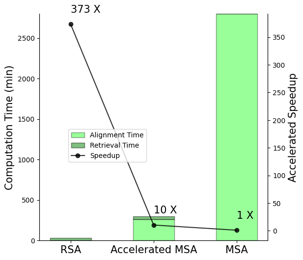
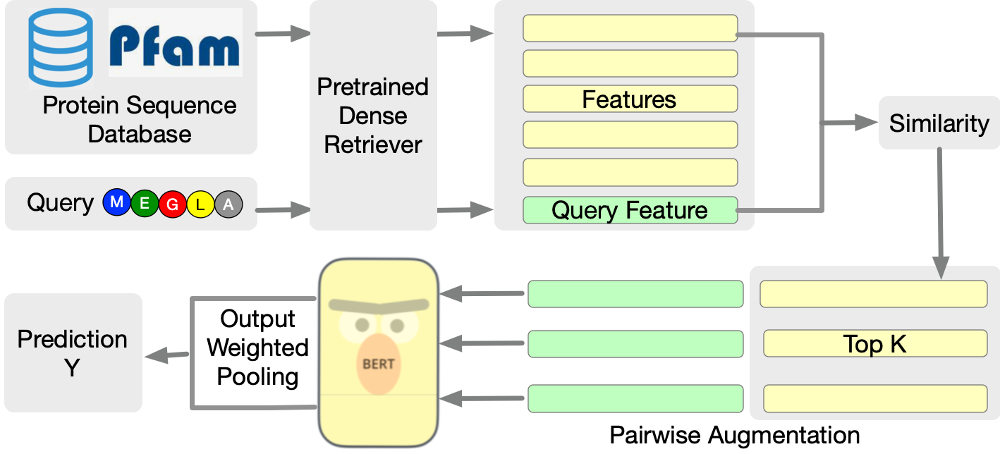
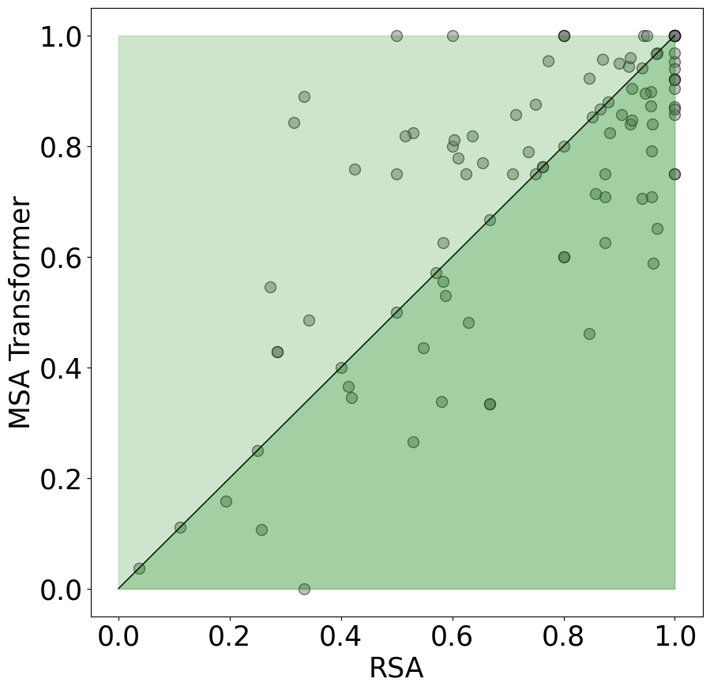
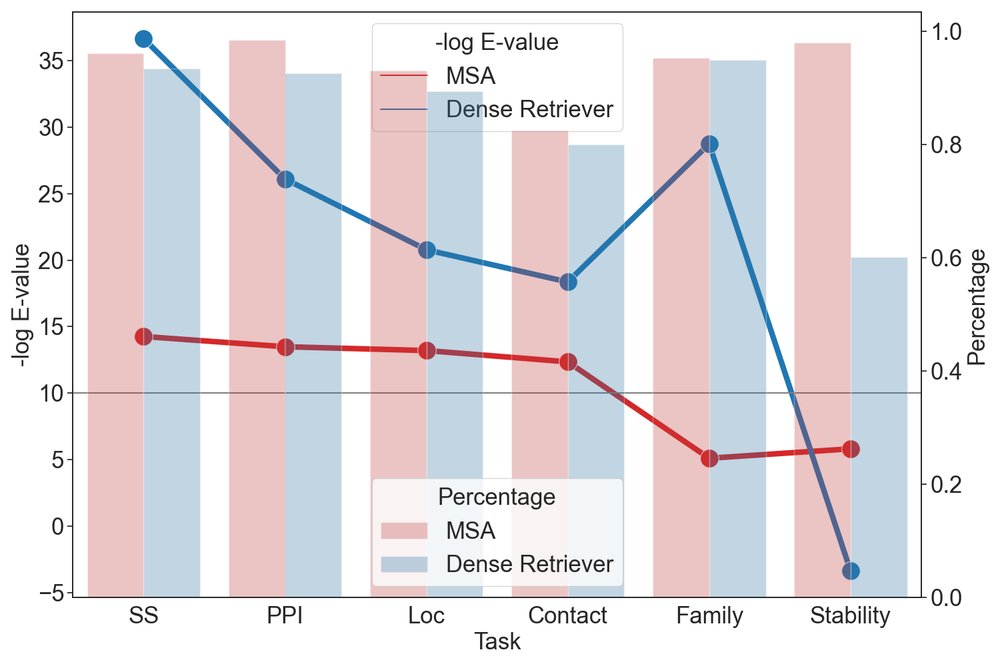
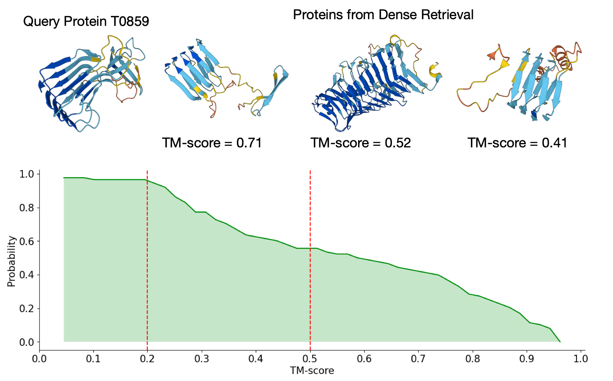
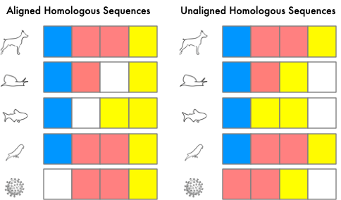
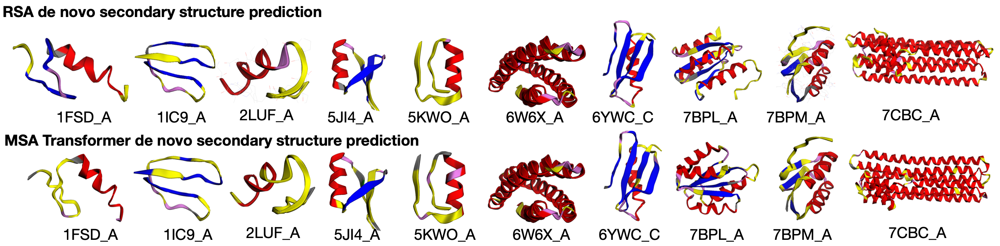
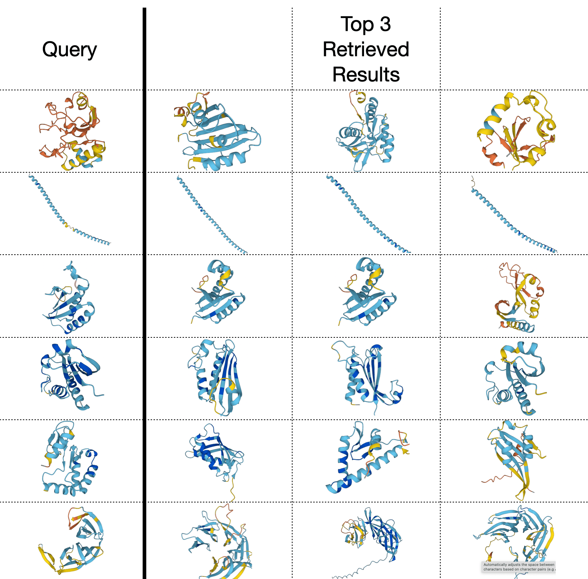

# Retrieved Sequence Augmentation for Protein Representation Learning

###### Abstract

Protein language models have excelled in a variety of tasks, ranging from structure prediction to protein engineering. However, proteins are highly diverse in functions and structures, and current state-of-the-art models including the latest version of AlphaFold rely on Multiple Sequence Alignments (MSA) to feed in the evolutionary knowledge. Despite their success, heavy computational overheads, as well as the de novo and orphan proteins remain great challenges in protein representation learning. In this work, we show that MSA-augmented models inherently belong to retrieval-augmented methods. Motivated by this finding, we introduce Retrieved Sequence Augmentation (RSA) for protein representation learning without additional alignment or pre-processing. RSA links query protein sequences to a set of sequences with similar structures or properties in the database and combines these sequences for downstream prediction. We show that protein language models benefit from the retrieval enhancement on both structure prediction and property prediction tasks, with a 5% improvement on MSA Transformer on average while being 373$\times$ faster. In addition, we show that our model can transfer to new protein domains better and outperforms MSA Transformer on de novo protein prediction. Our study fills a much-encountered gap in protein prediction and brings us a step closer to demystifying the domain knowledge needed to understand protein sequences. Code is available on <https://github.com/HKUNLP/RSA>.  

Machine Learning, ICML

  

## 1 Introduction

Proteins are the basic yet intricate building blocks of life, performing a vast array of functions within organisms, including catalyzing metabolic reactions, DNA replication, responding to stimuli, providing structure to cells, and transporting molecules from one location to another (Garrett & Grisham, [2016](#bib.bib16)). Central to the enigma of these building blocks is the complex knowledge of protein relationships in their sequences, structures, and functions, which is a consequence of the interplay between physics and evolution (Sadowski & Jones, [2009](#bib.bib53)). Experimental and theoretical efforts have been made to unveil the structures and functions of emergent proteins (Korendovych & DeGrado, [2020](#bib.bib37); Anishchenko et al., [2021](#bib.bib5)), yet few methods can keep pace with the rapid accumulation of sequences (Roy et al., [2010](#bib.bib52)).  

Recently, protein language models (Rives et al., [2019](#bib.bib50); Lin et al., [2022](#bib.bib38); Elnaggar et al., [2021](#bib.bib14); Jumper et al., [2021](#bib.bib32)) have achieved remarkable progress in predicting protein functions and structures from sequences. Protein language models create a distribution of amino acids that matches the co-occurrence probability in their natural state, thereby capturing structural and evolutionary knowledge. In these approaches, all protein knowledge is implicitly stored in the parameters, and the quality of the language model distribution is highly dependent on pre-training and parameter scale. For example, ESM-2 (Lin et al., [2022](#bib.bib38)) shows that evolutionary depth saturates at lower model scales, and scaling up to a model size of billions is inevitable for protein modeling. To this end, we study enhancing the prediction of language models with a simple retrieval-based augmentation.  

Previous work (Khandelwal et al., [2019](#bib.bib35); Goyal et al., [2022](#bib.bib17); Guu et al., [2020b](#bib.bib19); Wang et al., [2022](#bib.bib56)) in natural language processing and machine learning has demonstrated that introducing related input sequences can effectively introduce domain knowledge without excessive backbone parameter size. In protein learning, a similar approach Multiple Sequence Alignment (MSA) has been adopted to introduce evolutionary knowledge into models by augmenting input with aligned homologous sequences. MSA has improved deep learning performance on various models (Rao et al., [2021](#bib.bib47); Jumper et al., [2021](#bib.bib32); Marks et al., [2011](#bib.bib40); Hong et al., [2022](#bib.bib25)), yet its success is often attributed to the alignment process that highlights co-evolution – especially the alignment process that is central to direct-coupling analysis methods (Morcos et al., [2011](#bib.bib41); Marks et al., [2011](#bib.bib40); Kamisetty et al., [2013](#bib.bib33)). The most common practice for constructing MSA (Remmert et al., [2012](#bib.bib48); Altschul & Koonin, [1998](#bib.bib4); Johnson et al., [2010](#bib.bib30)) is to build a Hidden Markov Model (HMM) profile for the entire sequence space of databases and then iteratively search for homologous sequences. Despite efforts to accelerate MSA construction (Remmert et al., [2012](#bib.bib48); Deorowicz et al., [2016](#bib.bib11); Hauser et al., [2016](#bib.bib20)), this process is notoriously slow – it takes HHblits (Remmert et al., [2012](#bib.bib48)) 10 seconds to perform a single iteration search on Pfam with 64 CPUs – and requires pre-computing of a HMM profile.  

These considerations motivate us to rethink the role of MSA as a retrieval-based augmentation. Viewing MSA as a retrieval-augmentation method, it can be decomposed into two processes: retrieval and alignment. As shown in Figure [1](#S1.F1 "Figure 1 ‣ 1 Introduction ‣ Retrieved Sequence Augmentation for Protein Representation Learning"), the speed bottleneck of MSA is the alignment time, which is constrained by a quadratic complexity of $O(LD)$  (Remmert et al., [2012](#bib.bib48)), where $D$ is the database size, and $L$ is the protein length. Meanwhile, dense retrievers can be accelerated and use only a 100th of the time MSA needs to align a sequence  (Hong et al., [2021](#bib.bib24); Johnson et al., [2019b](#bib.bib29)). Moreover, the language of proteins encodes not only evolutionary knowledge but also other sources of information including structural and functional properties (Xia et al., [2009](#bib.bib58); O’Sullivan et al., [2004](#bib.bib42)). Multiple sources of knowledge can be used to aid protein understanding when evolutionary knowledge is not available for orphan proteins and de novo (designed) proteins (Perdigão et al., [2015](#bib.bib44); Stefani, [2004](#bib.bib54); Anishchenko et al., [2021](#bib.bib5)). Residue alignment imitates the mutation process in proteins, but empirically, present large language models have the potential to directly capture the evolutionary relationship between sequences without alignment information (Riesselman et al., [2019](#bib.bib49)).  

In light of these bottlenecks, We propose a simple yet effective Retrieved Sequence Augmentation (RSA) method as a general framework for augmenting protein sequences with related sequences from an unlabeled database. Specifically, RSA uses a pre-trained dense sequence retriever to retrieve protein sequences that are similar to the query sequence both in terms of homology as well as structure. These sequences are learned together with original input to help the model cover external knowledge and transfer to new domains. Extensive experiments on six tasks, including secondary structure prediction, contact prediction, homology prediction, stability prediction, subcellular localization, and protein-protein interaction demonstrate the effectiveness of our model. In addition, RSA overcomes the speed limit of MSA methods by directly inputting a batch of retrieved sequences into protein language models without performing the alignment process. Our main contributions are:  

* Employing probabilistic analysis, we develop a unified framework that uses retrieval knowledge to enhance protein language models. Our theory along with our experiments strikes two novel perspectives: (1) MSA-augmented methods are essentially retrieval-augmented language models. Their performance can be explained by the injection of evolutionary knowledge. (2) The $O(N^{2})$ complex alignment process is less necessary for deep protein language models. 
* We show that pre-trained dense retrievers can be faster and perform well in extracting homologous sequences and structurally similar sequences. 
* We leverage the retrieval augmentation framework to develop a new, fast method RSA. Unlike previous methods that combine protein language models with external knowledge, our method performs retrieval on-the-fly and requires no additional pre-training. We show that our model performs better than or competitively with previous SOTAs. The result promises new opportunities in using retrieval augmentation as a new paradigm in protein learning. Code and data are available in the supplementary material. 

[FIGURE S1.F1.g1]

Figure 1: Illustration of speed up by RSA retrieval compared to MSA on secondary structure prediction dataset with 8678 sequences. Accelerated MSA refers to the MSA Transformer with MSA sequences retrieved by our RSA retriever.
[/FIGURE]

## 2 Related Work

Retrieval-Augmented Language Models The scaling laws of language models indicate that scaling up model size and training data are central to better performance (Kaplan et al., [2020](#bib.bib34)). However, larger language models are expensive to pre-train and may even be computationally heavy in inference. Retrieval-augmented language models (Guu et al., [2020a](#bib.bib18); He et al., [2021a](#bib.bib21); Borgeaud et al., [2022](#bib.bib9)) can achieve comparable performance on smaller models and are computationally more efficient by injecting external knowledge. Our RSA method is motivated by retrieval-augmented language models (Guu et al., [2020a](#bib.bib18); He et al., [2021a](#bib.bib21)), though we specifically focus on injecting protein knowledge and adapt the model for token-level tasks and better efficiency.  

Protein Language Models To model and further understand the protein sequence data, language models are introduced to train on mass data (Heinzinger et al., [2019](#bib.bib23); Alley et al., [2019](#bib.bib1)). Large scale pre-training enables language models to learn structural and evolutionary knowledge (Elnaggar et al., [2021](#bib.bib14); Jumper et al., [2021](#bib.bib32); Lin et al., [2022](#bib.bib38)). Despite these successes, many important applications still require MSAs and other external knowledge (Rao et al., [2021](#bib.bib47); Jumper et al., [2021](#bib.bib32); He et al., [2021b](#bib.bib22); Zhang et al., [2021](#bib.bib62); Ju et al., [2021](#bib.bib31); Rao et al., [2020](#bib.bib46)). MSAs have been shown effective in improving representation learning, despite being extremely slow and costly in computation. Hu et al. ([2022](#bib.bib27)) and Hong et al. ([2021](#bib.bib24)) use dense retrieval to accelerate multiple sequence augmentation, while still dependent on alignment procedures. Recent work (Fang et al., [2022](#bib.bib15); Lin et al., [2022](#bib.bib38); Wu et al., [2022](#bib.bib57); Chowdhury et al., [2022](#bib.bib10)) explores MSA-free language models though additional pre-training is involved. We take this step further to investigate retrieval-augmented protein language models that finds a balance between large scale pre-training and external knowledge.  

[TABLE S2.T1]

<table class="ltx_tabular ltx_align_middle">
<tbody class="ltx_tbody">
<tr class="ltx_tr">
<td class="ltx_td ltx_align_left ltx_border_tt">Method</td>
<td class="ltx_td ltx_align_left ltx_border_tt">Retriever Form</td>
<td class="ltx_td ltx_align_left ltx_border_tt">Alignment Form</td>
<td class="ltx_td ltx_align_center ltx_border_tt">Weight <math class="ltx_Math"><semantics><msub><mi>λ</mi><mi>n</mi></msub><annotation-xml><apply><csymbol>subscript</csymbol><ci>𝜆</ci><ci>𝑛</ci></apply></annotation-xml><annotation>\lambda_{n}</annotation></semantics></math>
</td>
<td class="ltx_td ltx_align_center ltx_border_tt">Aggregation Function</td>
</tr>
<tr class="ltx_tr">
<td class="ltx_td ltx_align_center ltx_border_t">Existing Methods</td>
</tr>
<tr class="ltx_tr">
<td class="ltx_td ltx_align_left">Potts Model</td>
<td class="ltx_td ltx_align_left">MSA</td>
<td class="ltx_td ltx_align_left">Aligned</td>
<td class="ltx_td ltx_align_center">—</td>
<td class="ltx_td ltx_align_center">—</td>
</tr>
<tr class="ltx_tr">
<td class="ltx_td ltx_align_left">Co-evolution Aggregator</td>
<td class="ltx_td ltx_align_left">MSA</td>
<td class="ltx_td ltx_align_left">Aligned</td>
<td class="ltx_td ltx_align_center"><math class="ltx_Math"><semantics><mfrac><mn>1</mn><mi>N</mi></mfrac><annotation-xml><apply><divide></divide><cn>1</cn><ci>𝑁</ci></apply></annotation-xml><annotation>\frac{1}{N}</annotation></semantics></math></td>
<td class="ltx_td ltx_align_center"><math class="ltx_Math"><semantics><mrow><mtext>FFN</mtext><mo>​</mo><mrow><mo>(</mo><mrow><msubsup><mo>∑</mo><mrow><mi>n</mi><mo>=</mo><mn>1</mn></mrow><mi>N</mi></msubsup><mrow><msub><mi>R</mi><mi>n</mi></msub><mo>​</mo><mrow><mo>(</mo><mi>i</mi><mo>)</mo></mrow><mo>​</mo><msub><mi>λ</mi><mi>n</mi></msub></mrow></mrow><mo>)</mo></mrow></mrow><annotation-xml><apply><times></times><ci><mtext>FFN</mtext></ci><apply><apply><csymbol>superscript</csymbol><apply><csymbol>subscript</csymbol><sum></sum><apply><eq></eq><ci>𝑛</ci><cn>1</cn></apply></apply><ci>𝑁</ci></apply><apply><times></times><apply><csymbol>subscript</csymbol><ci>𝑅</ci><ci>𝑛</ci></apply><ci>𝑖</ci><apply><csymbol>subscript</csymbol><ci>𝜆</ci><ci>𝑛</ci></apply></apply></apply></apply></annotation-xml><annotation>\text{FFN}(\sum_{n=1}^{N}R_{n}(i)\lambda_{n})</annotation></semantics></math></td>
</tr>
<tr class="ltx_tr">
<td class="ltx_td ltx_align_left">MSA Transformer</td>
<td class="ltx_td ltx_align_left">MSA</td>
<td class="ltx_td ltx_align_left">Aligned</td>
<td class="ltx_td ltx_align_center"><math class="ltx_Math"><semantics><mrow><mi>σ</mi><mo>​</mo><mrow><mo>(</mo><mfrac><mrow><mi>X</mi><mo>​</mo><msub><mi>W</mi><mi>Q</mi></msub><mo>​</mo><msup><mrow><mo>(</mo><mrow><msub><mi>R</mi><mi>n</mi></msub><mo>​</mo><msub><mi>W</mi><mi>K</mi></msub></mrow><mo>)</mo></mrow><mi>T</mi></msup></mrow><mrow><mi>N</mi><mo>​</mo><msqrt><mi>d</mi></msqrt></mrow></mfrac><mo>)</mo></mrow></mrow><annotation-xml><apply><times></times><ci>𝜎</ci><apply><divide></divide><apply><times></times><ci>𝑋</ci><apply><csymbol>subscript</csymbol><ci>𝑊</ci><ci>𝑄</ci></apply><apply><csymbol>superscript</csymbol><apply><times></times><apply><csymbol>subscript</csymbol><ci>𝑅</ci><ci>𝑛</ci></apply><apply><csymbol>subscript</csymbol><ci>𝑊</ci><ci>𝐾</ci></apply></apply><ci>𝑇</ci></apply></apply><apply><times></times><ci>𝑁</ci><apply><root></root><ci>𝑑</ci></apply></apply></apply></apply></annotation-xml><annotation>\sigma(\frac{XW_{Q}(R_{n}W_{K})^{T}}{N\sqrt{d}})</annotation></semantics></math></td>
<td class="ltx_td ltx_align_center">
<math class="ltx_Math"><semantics><mrow><mtext>FFN</mtext><mo>​</mo><mrow><mo>(</mo><mrow><msubsup><mo>∑</mo><mrow><mi>n</mi><mo>=</mo><mn>1</mn></mrow><mi>N</mi></msubsup><mrow><msub><mi>R</mi><mi>n</mi></msub><mo>​</mo><mrow><mo>(</mo><mi>i</mi><mo>)</mo></mrow><mo>​</mo><msub><mi>λ</mi><mi>n</mi></msub></mrow></mrow><mo>)</mo></mrow></mrow><annotation-xml><apply><times></times><ci><mtext>FFN</mtext></ci><apply><apply><csymbol>superscript</csymbol><apply><csymbol>subscript</csymbol><sum></sum><apply><eq></eq><ci>𝑛</ci><cn>1</cn></apply></apply><ci>𝑁</ci></apply><apply><times></times><apply><csymbol>subscript</csymbol><ci>𝑅</ci><ci>𝑛</ci></apply><ci>𝑖</ci><apply><csymbol>subscript</csymbol><ci>𝜆</ci><ci>𝑛</ci></apply></apply></apply></apply></annotation-xml><annotation>\text{FFN}(\sum_{n=1}^{N}R_{n}(i)\lambda_{n})</annotation></semantics></math>†
</td>
</tr>
<tr class="ltx_tr">
<td class="ltx_td ltx_align_center ltx_border_t">Proposed Variants</td>
</tr>
<tr class="ltx_tr">
<td class="ltx_td ltx_align_left">Unaligned MSA Augmentation</td>
<td class="ltx_td ltx_align_left">MSA</td>
<td class="ltx_td ltx_align_left">Not Aligned</td>
<td class="ltx_td ltx_align_center"><math class="ltx_Math"><semantics><mrow><mi>σ</mi><mo>​</mo><mrow><mo>(</mo><mrow><mo>−</mo><msub><mrow><mo>‖</mo><mrow><mi>X</mi><mo>−</mo><msub><mi>R</mi><mi>n</mi></msub></mrow><mo>‖</mo></mrow><mn>2</mn></msub></mrow><mo>)</mo></mrow></mrow><annotation-xml><apply><times></times><ci>𝜎</ci><apply><minus></minus><apply><csymbol>subscript</csymbol><apply><csymbol>norm</csymbol><apply><minus></minus><ci>𝑋</ci><apply><csymbol>subscript</csymbol><ci>𝑅</ci><ci>𝑛</ci></apply></apply></apply><cn>2</cn></apply></apply></apply></annotation-xml><annotation>\sigma(-||X-R_{n}||_{2})</annotation></semantics></math></td>
<td class="ltx_td ltx_align_center"><math class="ltx_Math"><semantics><mrow><msubsup><mo>∑</mo><mrow><mi>n</mi><mo>=</mo><mn>1</mn></mrow><mi>N</mi></msubsup><mrow><mtext>FNN</mtext><mo>​</mo><mrow><mo>(</mo><mrow><msub><mi>R</mi><mi>n</mi></msub><mo>​</mo><mrow><mo>(</mo><mi>i</mi><mo>)</mo></mrow></mrow><mo>)</mo></mrow><mo>​</mo><msub><mi>λ</mi><mi>n</mi></msub></mrow></mrow><annotation-xml><apply><apply><csymbol>superscript</csymbol><apply><csymbol>subscript</csymbol><sum></sum><apply><eq></eq><ci>𝑛</ci><cn>1</cn></apply></apply><ci>𝑁</ci></apply><apply><times></times><ci><mtext>FNN</mtext></ci><apply><times></times><apply><csymbol>subscript</csymbol><ci>𝑅</ci><ci>𝑛</ci></apply><ci>𝑖</ci></apply><apply><csymbol>subscript</csymbol><ci>𝜆</ci><ci>𝑛</ci></apply></apply></apply></annotation-xml><annotation>\sum_{n=1}^{N}\text{FNN}(R_{n}(i))\lambda_{n}</annotation></semantics></math></td>
</tr>
<tr class="ltx_tr">
<td class="ltx_td ltx_align_left">Accelerated MSA Transformer</td>
<td class="ltx_td ltx_align_left">Dense Retrieval</td>
<td class="ltx_td ltx_align_left">Aligned</td>
<td class="ltx_td ltx_align_center"><math class="ltx_Math"><semantics><mrow><mi>σ</mi><mo>​</mo><mrow><mo>(</mo><mfrac><mrow><mi>X</mi><mo>​</mo><msub><mi>W</mi><mi>Q</mi></msub><mo>​</mo><msup><mrow><mo>(</mo><mrow><msub><mi>R</mi><mi>n</mi></msub><mo>​</mo><msub><mi>W</mi><mi>K</mi></msub></mrow><mo>)</mo></mrow><mi>T</mi></msup></mrow><mrow><mi>N</mi><mo>​</mo><msqrt><mi>d</mi></msqrt></mrow></mfrac><mo>)</mo></mrow></mrow><annotation-xml><apply><times></times><ci>𝜎</ci><apply><divide></divide><apply><times></times><ci>𝑋</ci><apply><csymbol>subscript</csymbol><ci>𝑊</ci><ci>𝑄</ci></apply><apply><csymbol>superscript</csymbol><apply><times></times><apply><csymbol>subscript</csymbol><ci>𝑅</ci><ci>𝑛</ci></apply><apply><csymbol>subscript</csymbol><ci>𝑊</ci><ci>𝐾</ci></apply></apply><ci>𝑇</ci></apply></apply><apply><times></times><ci>𝑁</ci><apply><root></root><ci>𝑑</ci></apply></apply></apply></apply></annotation-xml><annotation>\sigma(\frac{XW_{Q}(R_{n}W_{K})^{T}}{N\sqrt{d}})</annotation></semantics></math></td>
<td class="ltx_td ltx_align_center"><math class="ltx_Math"><semantics><mrow><mtext>FFN</mtext><mo>​</mo><mrow><mo>(</mo><mrow><msubsup><mo>∑</mo><mrow><mi>n</mi><mo>=</mo><mn>1</mn></mrow><mi>N</mi></msubsup><mrow><msub><mi>R</mi><mi>n</mi></msub><mo>​</mo><mrow><mo>(</mo><mi>i</mi><mo>)</mo></mrow><mo>​</mo><msub><mi>λ</mi><mi>n</mi></msub></mrow></mrow><mo>)</mo></mrow></mrow><annotation-xml><apply><times></times><ci><mtext>FFN</mtext></ci><apply><apply><csymbol>superscript</csymbol><apply><csymbol>subscript</csymbol><sum></sum><apply><eq></eq><ci>𝑛</ci><cn>1</cn></apply></apply><ci>𝑁</ci></apply><apply><times></times><apply><csymbol>subscript</csymbol><ci>𝑅</ci><ci>𝑛</ci></apply><ci>𝑖</ci><apply><csymbol>subscript</csymbol><ci>𝜆</ci><ci>𝑛</ci></apply></apply></apply></apply></annotation-xml><annotation>\text{FFN}(\sum_{n=1}^{N}R_{n}(i)\lambda_{n})</annotation></semantics></math></td>
</tr>
<tr class="ltx_tr">
<td class="ltx_td ltx_align_left ltx_border_bb">Retrieval Sequence Augmentation</td>
<td class="ltx_td ltx_align_left ltx_border_bb">Dense Retrieval</td>
<td class="ltx_td ltx_align_left ltx_border_bb">Not Aligned</td>
<td class="ltx_td ltx_align_left ltx_border_bb"><math class="ltx_Math"><semantics><mrow><mi>σ</mi><mo>​</mo><mrow><mo>(</mo><mrow><mo>−</mo><msub><mrow><mo>‖</mo><mrow><mi>X</mi><mo>−</mo><msub><mi>R</mi><mi>n</mi></msub></mrow><mo>‖</mo></mrow><mn>2</mn></msub></mrow><mo>)</mo></mrow></mrow><annotation-xml><apply><times></times><ci>𝜎</ci><apply><minus></minus><apply><csymbol>subscript</csymbol><apply><csymbol>norm</csymbol><apply><minus></minus><ci>𝑋</ci><apply><csymbol>subscript</csymbol><ci>𝑅</ci><ci>𝑛</ci></apply></apply></apply><cn>2</cn></apply></apply></apply></annotation-xml><annotation>\sigma(-||X-R_{n}||_{2})</annotation></semantics></math></td>
<td class="ltx_td ltx_align_left ltx_border_bb"><math class="ltx_Math"><semantics><mrow><msubsup><mo>∑</mo><mrow><mi>n</mi><mo>=</mo><mn>1</mn></mrow><mi>N</mi></msubsup><mrow><mtext>FFN</mtext><mo>​</mo><mrow><mo>(</mo><mrow><mtext>Embed</mtext><mo>​</mo><mrow><mo>(</mo><mi>x</mi><mo>;</mo><msub><mi>r</mi><mi>n</mi></msub><mo>)</mo></mrow></mrow><mo>)</mo></mrow><mo>​</mo><msub><mi>λ</mi><mi>n</mi></msub></mrow></mrow><annotation-xml><apply><apply><csymbol>superscript</csymbol><apply><csymbol>subscript</csymbol><sum></sum><apply><eq></eq><ci>𝑛</ci><cn>1</cn></apply></apply><ci>𝑁</ci></apply><apply><times></times><ci><mtext>FFN</mtext></ci><apply><times></times><ci><mtext>Embed</mtext></ci><list><ci>𝑥</ci><apply><csymbol>subscript</csymbol><ci>𝑟</ci><ci>𝑛</ci></apply></list></apply><apply><csymbol>subscript</csymbol><ci>𝜆</ci><ci>𝑛</ci></apply></apply></apply></annotation-xml><annotation>\sum_{n=1}^{N}\text{FFN}(\text{Embed}(x;r_{n}))\lambda_{n}</annotation></semantics></math></td>
</tr>
</tbody>
</table>

Table 1: Protein Retrieval Augmentation methods decomposed along a different axis. We formulate the aggregation function in the sequence classification setting and use a feed-forward neural network $\text{FFN}(\cdot)$ to map representations to logits. The proposed variants vary in design axis from the existing methods. †Note that MSA Transformer performs the aggregation in each layer of axial attention.
[/TABLE]

## 3 Problem Statement and Notations

The task of protein representation learning is to learn embeddings of protein sequences that can be transferred to downstream tasks with finetuning. For a protein $x$ with $L$ amino acids, it can be denoted as $x=[o_{1},o_{2},...o_{L}]$, where each token $o_{i}$ denotes one of the 25 essential amino acids. We implement the embedding functions using BERT-style Transformer encoder $\text{{Embed}}(x)=[h_{1},h_{2},...h_{L}]^{T}$, where $h_{i}\in\mathbbm{R}^{d}$ is a $d$-dimensional token representation for $o_{i}$. For token property prediction (i.e., secondary structure prediction), pairwise prediction (i.e., contact prediction), and sequence property prediction (i.e., protein engineering) tasks, the probabilities are obtained through pooling operations defined below:  

|  | $\displaystyle p(y_{\text{{Token}}}|o_{i})=\text{{FFN}}(h_{i}),$ |  |
| --- | --- | --- |
|  | $\displaystyle p(y_{\text{{Pairwise}}}|o_{i},o_{j})=\text{{FFN}}([h_{i};h_{j}]),$ |  |
| --- | --- | --- |
|  | $\displaystyle p(y_{\text{{Sequence}}}|x)=\text{{FFN}}(\text{{Mean}}([h_{1},h_{2},...h_{L}]).$ |  |
| --- | --- | --- |

## 4 MSA Transformer as a Retrieval Augmentation Method

In this section, we introduce a unified probabilistic framework to connect the MSA-based models with retrieval augmentations. We also offer a new holistic view on understanding these models, that is the retrieved protein sequences enhance the performance of pre-trained protein models by providing evolutionary knowledge in a similar way as the MSA sequences do.  

Inspired by Guu et al. ([2020a](#bib.bib18)) and the probabilistic form of MSA Transformer, we propose a general framework, *protein retrieval augmentation*, that aims to unify several state-of-the-art evolution augmentation methods. Specifically, we consider these methods as learning a downstream predictor $p(y|x)$ based on an aggregation of homologous protein representations $R_{1...N}$. From the view of retrieval, $p(y|x)$ is decomposed into two steps: *retrieve* and *predict*. For a given input $x$, the retrieve step first finds possibly helpful protein sequence $r$ from a sequence corpus $\mathcal{R}$ and then predict the output $y$ conditioning on this retrieved sequence. We treat $r$ as a latent variable and in practice, we approximately marginalized it out with top-$N$ retrieved sequences:  

|  | $\displaystyle p(y|x)=\sum_{r\in\mathcal{R}}p(y|x,r)p(r|x)\approx\sum_{n=1}^{N}p(y|x,r_{n})p(r_{n}|x).$ |  | (1) |
| --- | --- | --- | --- |

The probability $p(r|x)$ denotes the possibility that $r$ is sampled from the retriever given $x$. Intuitively it measures the similarity between the two sequences $r$ and $x$. This framework also applies to the MSA-based augmentation methods. We explain in detail using a state-of-the-art MSA-augmentation model MSA Transformer (Rao et al., [2021](#bib.bib47)) as an example. In MSA Transformer, the layers calculate self-attention both row-wise and column-wise. Column-wise attention is defined as follows, given $W_{Q}$, $W_{K}$, $W_{V}$, $W_{O}$ as the parameters in a typical attention function:  

|  | $\displaystyle R_{s}(i)=\sum_{n=1}^{N}\sigma(\frac{R_{s}(i)W_{Q}(R_{n}(i)W_{K})^{T}}{N\sqrt{d}})R_{n}(i)W_{V}W_{O},$ |  | (2) |
| --- | --- | --- | --- |

where $R_{n}(i)$ denotes the $i$-th token representation of the $n$-th MSA sequence after performing the row-wise attention. Note that in MSA input, the first sequence $r_{1}$ is defined as the original sequence $x$. Then for a token prediction task, we define the $i$-th position output as $y$ and the predicted distribution $p(y|x)$ can be expressed as:  

|  | $\displaystyle p(y|x)$ | $\displaystyle=\sum_{n=1}^{N}\sigma(\frac{R_{1}W_{Q}(R_{n}W_{K})^{T}}{N\sqrt{d}})(R_{n}W_{V}W_{O}W_{y})$ |  | (3) |
| --- | --- | --- | --- | --- |
|  |  | $\displaystyle=\sum_{n=1}^{N}p(y|x,r_{n})\lambda_{n}=\sum_{n=1}^{N}p(y|x,r_{n})p(r_{n}|x),$ |  |

where $\lambda_{n}=\sigma(\frac{R_{1}(i)W_{Q}(R_{n}(i)W_{K})^{T}}{N\sqrt{d}})$ is the weighting norm that represents the similarity of retrieved sequence $r_{n}$ and original sequence $x$; $p(y|x,r_{n})$ is a predictor that maps the row-attention representation of $r_{n}$ and $x$ to label.  

Eq.[3](#S4.E3 "In 4 MSA Transformer as a Retrieval Augmentation Method ‣ Retrieved Sequence Augmentation for Protein Representation Learning") gives a retrieval-augmentation view of MSA Transformer that essentially retrieves homologous sequences with multiple sequence alignment and aggregates representations of homologous sequences with regard to their sequence similarity. Taking one step further, we define a set of design dimensions to characterize the retrieving and aggregation processes. We detail the design dimensions below and illustrate how popular models (Appendix [B](#A2 "Appendix B Overview of Previous Protein Representation Augmentation Methods ‣ Retrieved Sequence Augmentation for Protein Representation Learning")) and our proposed methods (§[5](#S5 "5 Retrieval Sequence Augmentations ‣ Retrieved Sequence Augmentation for Protein Representation Learning")) fall along them in Table [1](#S2.T1 "Table 1 ‣ 2 Related Work ‣ Retrieved Sequence Augmentation for Protein Representation Learning"). These design choices includes:  

* Retriever Form indicates the retriever type used. Multiple Sequence Alignment is a discrete retrieval method that uses E-value thresholds (Ye et al., [2006](#bib.bib61)) to find homologous sequences. Dense retrieval (Johnson et al., [2019b](#bib.bib29)) has been introduced to accelerate discrete sequence retrieval. The method represents the database with dense vectors and retrieves the sequences that have top-$k$ vector similarity with the query. 
* Alignment Form indicates whether retrieved sequences are aligned, as illustrated in Appendix Figure [6](#A3.F6 "Figure 6 ‣ C.1 Introduction to the datasets ‣ Appendix C Experiment Setups ‣ Retrieved Sequence Augmentation for Protein Representation Learning"). 
* Weight Form is the aggregation weight of homologous sequences, as the $p(r_{n}|x)$ in Eq. [3](#S4.E3 "In 4 MSA Transformer as a Retrieval Augmentation Method ‣ Retrieved Sequence Augmentation for Protein Representation Learning"). Here we denote this weight as $\lambda_{n}$. Traditionally, aggregation methods consider the similarity of different homologous sequences to be the same and use average weighting. MSA Transformer also use a weighted pooling method though the weights of $\lambda_{n}$ use global attention and are dependent on all homologous sequences. 
* Aggregation Function is how the representations of homologous sequences are aggregated to the original sequence to form downstream prediction, as in $p(y|x,r)$. For example, considering the sequence classification problem, a fully connected layer maps representations to logits. MSA Transformer first aggregates the representations $R_{n}$ and then maps the aggregated representation to logits $y$, and the retrieval augmentation probabilistic form first maps each representation to logits $p(y|x,r_{n})$ and then linearly weight the logits with $\lambda_{n}$ in Eq. [3](#S4.E3 "In 4 MSA Transformer as a Retrieval Augmentation Method ‣ Retrieved Sequence Augmentation for Protein Representation Learning"). 

Our discussion and formulation so far reach the conclusion that MSA augmentation methods intrinsically use the retrieval augmentation approach. This highlights the potential of RSA to replace MSA Augmentations as a computationally effective and more flexible method.  

However, MSA-based methods claim a few advantages: the alignment process can help the model capture column-wise residue evolution; and the MSA Retriever uses a discrete, token-wise search criterion that ensures all retrieved sequences are homology. We propose two novel variants to help verify these claims.  

##### Unaligned MSA Augmentation.

MSA modeling traditionally depends on the structured alignment between sequences to learn evolutionary information. However, deep models have the potential to learn patterns from unaligned sequences. Riesselman et al. ([2019](#bib.bib49)) shows that the mutation effect can be learned from unaligned sequences using autoregressive models. Therefore, we first introduce this variant that uses the homologous sequences from MSA to augment representations without alignment.  

##### Accelerated MSA Transformer.

This variant explores substituting the discrete retrieval process in MSA with a dense retriever. We use the K-nearest neighbor search to find the homologous sequences. We still align the sequences before input into MSA Transformer. We introduce this variant to find if MSA builder has an advantage over our pre-trained dense retriever in finding related sequences.  

An empirical study of the performance of these models can be found in Subsection [6.6](#S6.SS6 "6.6 Ablation Study ‣ 6 Experiments ‣ Retrieved Sequence Augmentation for Protein Representation Learning").  

## 5 Retrieval Sequence Augmentations

[FIGURE S5.F2.g1]

Figure 2: A brief overview of the proposed RSA protein encoding framework. Based on a query protein, RSA first retrieves related protein data from the database based on the top K similar features encoded by a pretrained retrieval model. Then we augment the query protein into pairs with each retrieved data and feed them into the protein model for protein tasks.
[/FIGURE]

[TABLE S5.T2]

<table class="ltx_tabular ltx_guessed_headers ltx_align_middle">
<thead class="ltx_thead">
<tr class="ltx_tr">
<th class="ltx_td ltx_align_left ltx_th ltx_th_column ltx_border_tt">Retrieval Task (Top 100)</th>
<th class="ltx_td ltx_align_left ltx_th ltx_th_column ltx_border_tt">Type</th>
<th class="ltx_td ltx_align_left ltx_th ltx_th_column ltx_border_tt">Recall</th>
<th class="ltx_td ltx_align_left ltx_th ltx_th_column ltx_border_tt">Precision</th>
</tr>
</thead>
<tbody class="ltx_tbody">
<tr class="ltx_tr">
<td class="ltx_td ltx_align_left ltx_border_t">Pfam - Family</td>
<td class="ltx_td ltx_align_left ltx_border_t">Homology</td>
<td class="ltx_td ltx_align_left ltx_border_t">100</td>
<td class="ltx_td ltx_align_left ltx_border_t">90.42</td>
</tr>
<tr class="ltx_tr">
<td class="ltx_td ltx_align_left">SCOPe - Fold</td>
<td class="ltx_td ltx_align_left">Structural</td>
<td class="ltx_td ltx_align_left">100</td>
<td class="ltx_td ltx_align_left">65.98</td>
</tr>
<tr class="ltx_tr">
<td class="ltx_td ltx_align_left">SCOPe - Superfamily</td>
<td class="ltx_td ltx_align_left">Structural</td>
<td class="ltx_td ltx_align_left">100</td>
<td class="ltx_td ltx_align_left">46.00</td>
</tr>
<tr class="ltx_tr">
<td class="ltx_td ltx_align_left ltx_border_bb">SCOPe - Family</td>
<td class="ltx_td ltx_align_left ltx_border_bb">Structural</td>
<td class="ltx_td ltx_align_left ltx_border_bb">100</td>
<td class="ltx_td ltx_align_left ltx_border_bb">24.71</td>
</tr>
</tbody>
</table>

Table 2: Recall and Precision for retrieving top 100 protein sequences with ESM1b embeddings. In dataset Pfam and SCOPe, we test whether retrieved proteins are of the same Family, Superfamily, or Fold as query protein, and report the recall and precision.
[/TABLE]

Existing knowledge augmentation methods for protein representation learning are either designed for a specific task or require cumbersome data preprocessing. Motivated by the potential of pre-trained retrievers to identify proteins that are homologous or geometric similar, we propose a pipeline, RSA (Retrieval Sequence Augmentation), to directly augment protein models on-the-fly. Our model implementation follows the retrieve-then-predict framework in Eq. [1](#S4.E1 "In 4 MSA Transformer as a Retrieval Augmentation Method ‣ Retrieved Sequence Augmentation for Protein Representation Learning"). We elaborate on the model architecture implementations in Subsection [5.1](#S5.SS1 "5.1 Model Architectures ‣ 5 Retrieval Sequence Augmentations ‣ Retrieved Sequence Augmentation for Protein Representation Learning") and describe model training in Subsection [5.2](#S5.SS2 "5.2 RSA Training ‣ 5 Retrieval Sequence Augmentations ‣ Retrieved Sequence Augmentation for Protein Representation Learning").  

[TABLE S5.T3]

<table class="ltx_tabular ltx_align_middle">
<tbody class="ltx_tbody">
<tr class="ltx_tr">
<td class="ltx_td ltx_align_left ltx_border_tt">Method</td>
<td class="ltx_td ltx_align_center ltx_border_tt">Pretrain</td>
<td class="ltx_td ltx_align_center ltx_border_tt">Knowledge</td>
<td class="ltx_td ltx_align_center ltx_border_tt">Knowledge</td>
<td class="ltx_td ltx_align_center ltx_border_tt">SSP</td>
<td class="ltx_td ltx_align_center ltx_border_tt">Contact</td>
<td class="ltx_td ltx_align_center ltx_border_tt">Homology</td>
<td class="ltx_td ltx_align_center ltx_border_tt">Stability</td>
<td class="ltx_td ltx_align_center ltx_border_tt">Loc</td>
<td class="ltx_td ltx_align_center ltx_border_tt">PPI</td>
<td class="ltx_td ltx_align_center ltx_border_tt">Avg</td>
</tr>
<tr class="ltx_tr">
<td class="ltx_td"></td>
<td class="ltx_td"></td>
<td class="ltx_td ltx_align_center">Pretrain</td>
<td class="ltx_td ltx_align_center">Injection</td>
<td class="ltx_td"></td>
<td class="ltx_td"></td>
<td class="ltx_td"></td>
<td class="ltx_td"></td>
<td class="ltx_td"></td>
<td class="ltx_td"></td>
<td class="ltx_td"></td>
</tr>
<tr class="ltx_tr">
<td class="ltx_td ltx_align_left ltx_border_t">Transformer</td>
<td class="ltx_td ltx_align_center ltx_border_t"><math class="ltx_Math"><semantics><mo>×</mo><annotation-xml><times></times></annotation-xml><annotation>\times</annotation></semantics></math></td>
<td class="ltx_td ltx_align_center ltx_border_t"><math class="ltx_Math"><semantics><mo>×</mo><annotation-xml><times></times></annotation-xml><annotation>\times</annotation></semantics></math></td>
<td class="ltx_td ltx_align_center ltx_border_t"><math class="ltx_Math"><semantics><mo>×</mo><annotation-xml><times></times></annotation-xml><annotation>\times</annotation></semantics></math></td>
<td class="ltx_td ltx_align_center ltx_border_t">0.384</td>
<td class="ltx_td ltx_align_center ltx_border_t">0.274</td>
<td class="ltx_td ltx_align_center ltx_border_t">0.101</td>
<td class="ltx_td ltx_align_center ltx_border_t">0.422</td>
<td class="ltx_td ltx_align_center ltx_border_t">0.541</td>
<td class="ltx_td ltx_align_center ltx_border_t">0.616</td>
<td class="ltx_td ltx_align_center ltx_border_t">0.345</td>
</tr>
<tr class="ltx_tr">
<td class="ltx_td ltx_align_left">LSTM</td>
<td class="ltx_td ltx_align_center"><math class="ltx_Math"><semantics><mo>×</mo><annotation-xml><times></times></annotation-xml><annotation>\times</annotation></semantics></math></td>
<td class="ltx_td ltx_align_center"><math class="ltx_Math"><semantics><mo>×</mo><annotation-xml><times></times></annotation-xml><annotation>\times</annotation></semantics></math></td>
<td class="ltx_td ltx_align_center"><math class="ltx_Math"><semantics><mo>×</mo><annotation-xml><times></times></annotation-xml><annotation>\times</annotation></semantics></math></td>
<td class="ltx_td ltx_align_center">0.596</td>
<td class="ltx_td ltx_align_center">0.263</td>
<td class="ltx_td ltx_align_center">0.181</td>
<td class="ltx_td ltx_align_center">0.591</td>
<td class="ltx_td ltx_align_center">0.629</td>
<td class="ltx_td ltx_align_center">0.638</td>
<td class="ltx_td ltx_align_center">0.404</td>
</tr>
<tr class="ltx_tr">
<td class="ltx_td ltx_align_left ltx_border_t">RSA (Transformer backbone)</td>
<td class="ltx_td ltx_align_center ltx_border_t"><math class="ltx_Math"><semantics><mo>×</mo><annotation-xml><times></times></annotation-xml><annotation>\times</annotation></semantics></math></td>
<td class="ltx_td ltx_align_center ltx_border_t"><math class="ltx_Math"><semantics><mo>×</mo><annotation-xml><times></times></annotation-xml><annotation>\times</annotation></semantics></math></td>
<td class="ltx_td ltx_align_center ltx_border_t">✓</td>
<td class="ltx_td ltx_align_center ltx_border_t">0.541</td>
<td class="ltx_td ltx_align_center ltx_border_t">0.332</td>
<td class="ltx_td ltx_align_center ltx_border_t">0.346</td>
<td class="ltx_td ltx_align_center ltx_border_t">0.602</td>
<td class="ltx_td ltx_align_center ltx_border_t">0.591</td>
<td class="ltx_td ltx_align_center ltx_border_t">0.700</td>
<td class="ltx_td ltx_align_center ltx_border_t">0.518</td>
</tr>
<tr class="ltx_tr">
<td class="ltx_td ltx_align_left ltx_border_tt">ESM-1b</td>
<td class="ltx_td ltx_align_center ltx_border_tt">✓</td>
<td class="ltx_td ltx_align_center ltx_border_tt"><math class="ltx_Math"><semantics><mo>×</mo><annotation-xml><times></times></annotation-xml><annotation>\times</annotation></semantics></math></td>
<td class="ltx_td ltx_align_center ltx_border_tt"><math class="ltx_Math"><semantics><mo>×</mo><annotation-xml><times></times></annotation-xml><annotation>\times</annotation></semantics></math></td>
<td class="ltx_td ltx_align_center ltx_border_tt">0.716</td>
<td class="ltx_td ltx_align_center ltx_border_tt">0.458</td>
<td class="ltx_td ltx_align_center ltx_border_tt">0.978</td>
<td class="ltx_td ltx_align_center ltx_border_tt">0.695</td>
<td class="ltx_td ltx_align_center ltx_border_tt">0.781</td>
<td class="ltx_td ltx_align_center ltx_border_tt">0.782</td>
<td class="ltx_td ltx_align_center ltx_border_tt">0.668</td>
</tr>
<tr class="ltx_tr">
<td class="ltx_td ltx_align_left">ProtBERT</td>
<td class="ltx_td ltx_align_center">✓</td>
<td class="ltx_td ltx_align_center"><math class="ltx_Math"><semantics><mo>×</mo><annotation-xml><times></times></annotation-xml><annotation>\times</annotation></semantics></math></td>
<td class="ltx_td ltx_align_center"><math class="ltx_Math"><semantics><mo>×</mo><annotation-xml><times></times></annotation-xml><annotation>\times</annotation></semantics></math></td>
<td class="ltx_td ltx_align_center">0.691</td>
<td class="ltx_td ltx_align_center">0.556</td>
<td class="ltx_td ltx_align_center">0.528</td>
<td class="ltx_td ltx_align_center">0.651</td>
<td class="ltx_td ltx_align_center">0.771</td>
<td class="ltx_td ltx_align_center">0.688</td>
<td class="ltx_td ltx_align_center">0.579</td>
</tr>
<tr class="ltx_tr">
<td class="ltx_td ltx_align_left">MSA Transformer (MSA N=1)</td>
<td class="ltx_td ltx_align_center">✓</td>
<td class="ltx_td ltx_align_center">✓</td>
<td class="ltx_td ltx_align_center"><math class="ltx_Math"><semantics><mo>×</mo><annotation-xml><times></times></annotation-xml><annotation>\times</annotation></semantics></math></td>
<td class="ltx_td ltx_align_center">0.594</td>
<td class="ltx_td ltx_align_center">0.397</td>
<td class="ltx_td ltx_align_center">0.880</td>
<td class="ltx_td ltx_align_center">0.767</td>
<td class="ltx_td ltx_align_center">0.668</td>
<td class="ltx_td ltx_align_center">0.633</td>
<td class="ltx_td ltx_align_center">0.592</td>
</tr>
<tr class="ltx_tr">
<td class="ltx_td ltx_align_left ltx_border_t">Gremlin <cite class="ltx_cite ltx_citemacro_citep">(Balakrishnan et al., <a class="ltx_ref">2011</a>)</cite>
</td>
<td class="ltx_td ltx_align_center ltx_border_t"><math class="ltx_Math"><semantics><mo>×</mo><annotation-xml><times></times></annotation-xml><annotation>\times</annotation></semantics></math></td>
<td class="ltx_td ltx_align_center ltx_border_t"><math class="ltx_Math"><semantics><mo>×</mo><annotation-xml><times></times></annotation-xml><annotation>\times</annotation></semantics></math></td>
<td class="ltx_td ltx_align_center ltx_border_t">✓</td>
<td class="ltx_td ltx_align_center ltx_border_t">—</td>
<td class="ltx_td ltx_align_center ltx_border_t">0.507</td>
<td class="ltx_td ltx_align_center ltx_border_t">—</td>
<td class="ltx_td ltx_align_center ltx_border_t">—</td>
<td class="ltx_td ltx_align_center ltx_border_t">—</td>
<td class="ltx_td ltx_align_center ltx_border_t">—</td>
<td class="ltx_td ltx_align_center ltx_border_t">—</td>
</tr>
<tr class="ltx_tr">
<td class="ltx_td ltx_align_left">MSA Transformer</td>
<td class="ltx_td ltx_align_center">✓</td>
<td class="ltx_td ltx_align_center">✓</td>
<td class="ltx_td ltx_align_center">✓</td>
<td class="ltx_td ltx_align_center">0.654</td>
<td class="ltx_td ltx_align_center">0.618</td>
<td class="ltx_td ltx_align_center">0.958</td>
<td class="ltx_td ltx_align_center">0.796</td>
<td class="ltx_td ltx_align_center">0.694</td>
<td class="ltx_td ltx_align_center">0.751</td>
<td class="ltx_td ltx_align_center">0.672</td>
</tr>
<tr class="ltx_tr">
<td class="ltx_td ltx_align_left">OntoProtein <cite class="ltx_cite ltx_citemacro_citep">(Zhang et al., <a class="ltx_ref">2022</a>)</cite>
</td>
<td class="ltx_td ltx_align_center">✓</td>
<td class="ltx_td ltx_align_center"><math class="ltx_Math"><semantics><mo>×</mo><annotation-xml><times></times></annotation-xml><annotation>\times</annotation></semantics></math></td>
<td class="ltx_td ltx_align_center">✓</td>
<td class="ltx_td ltx_align_center">0.68</td>
<td class="ltx_td ltx_align_center">0.40</td>
<td class="ltx_td ltx_align_center">0.96</td>
<td class="ltx_td ltx_align_center">0.75</td>
<td class="ltx_td ltx_align_center">—</td>
<td class="ltx_td ltx_align_center">—</td>
<td class="ltx_td ltx_align_center">—</td>
</tr>
<tr class="ltx_tr">
<td class="ltx_td ltx_align_left">PMLM <cite class="ltx_cite ltx_citemacro_citep">(He et al., <a class="ltx_ref">2021b</a>)</cite>
</td>
<td class="ltx_td ltx_align_center">✓</td>
<td class="ltx_td ltx_align_center">✓</td>
<td class="ltx_td ltx_align_center"><math class="ltx_Math"><semantics><mo>×</mo><annotation-xml><times></times></annotation-xml><annotation>\times</annotation></semantics></math></td>
<td class="ltx_td ltx_align_center">0.728</td>
<td class="ltx_td ltx_align_center">0.717</td>
<td class="ltx_td ltx_align_center">0.946</td>
<td class="ltx_td ltx_align_center">—</td>
<td class="ltx_td ltx_align_center">—</td>
<td class="ltx_td ltx_align_center">—</td>
<td class="ltx_td ltx_align_center">—</td>
</tr>
<tr class="ltx_tr">
<td class="ltx_td ltx_align_left ltx_border_bb ltx_border_t">RSA (ProtBERT backbone)</td>
<td class="ltx_td ltx_align_center ltx_border_bb ltx_border_t">✓</td>
<td class="ltx_td ltx_align_center ltx_border_bb ltx_border_t"><math class="ltx_Math"><semantics><mo>×</mo><annotation-xml><times></times></annotation-xml><annotation>\times</annotation></semantics></math></td>
<td class="ltx_td ltx_align_center ltx_border_bb ltx_border_t">✓</td>
<td class="ltx_td ltx_align_center ltx_border_bb ltx_border_t">0.691</td>
<td class="ltx_td ltx_align_center ltx_border_bb ltx_border_t">0.717</td>
<td class="ltx_td ltx_align_center ltx_border_bb ltx_border_t">0.987</td>
<td class="ltx_td ltx_align_center ltx_border_bb ltx_border_t">0.778</td>
<td class="ltx_td ltx_align_center ltx_border_bb ltx_border_t">0.795</td>
<td class="ltx_td ltx_align_center ltx_border_bb ltx_border_t">0.827</td>
<td class="ltx_td ltx_align_center ltx_border_bb ltx_border_t">0.723</td>
</tr>
</tbody>
</table>

Table 3: Main Results for vanilla protein representation learning methods, knowledge-augmented baselines and our proposed RSA method. Note that italized result is reported by corresponding related work. The last column reports average result on all six tasks. For MSA Transformer and RSA, we all use 16 sequences (N=16) for augmentation. For Gremlin Potts model, we use the full MSA.
[/TABLE]

### 5.1 Model Architectures

The RSA model comprises of a neural sequence retriever $p(r|x)$, and a protein model that combines both original input and retrieved sequence to obtain prediction $p(y|x,r)$.  

#### 5.1.1 RSA Retriever

The retriever is defined as finding the sequences that are semantically close to the query. Denote retriever model as $G$ which encode protein sequence and output embeddings.  

|  | $\displaystyle p(r|x)$ | $\displaystyle=\frac{\exp f(x,r)}{\sum_{r^{\prime}\in\mathcal{R}}\exp f(x,r^{\prime})},$ |  | (4) |
| --- | --- | --- | --- | --- |
|  | $\displaystyle f(x,r)$ | $\displaystyle=-||G(x)-G(r)||_{2}$ |  |

The similarity score $f(x,r)$ is defined as the negative L2 distance between the embedding of the two sequences. The distribution is the softmax distribution over similarity scores.  

For protein retrieval, we aim to retrieve protein sequences that have similar structures or are homologous to the query sequence. Motivated by the k-nearest neighbor retrieval experiment with ESM-1b (Rives et al., [2019](#bib.bib50)) pre-trained embeddings (as shown in Table [2](#S5.T2 "Table 2 ‣ 5 Retrieval Sequence Augmentations ‣ Retrieved Sequence Augmentation for Protein Representation Learning") and Figure [4](#S6.F4 "Figure 4 ‣ 6.5 Retrieved Protein Interpretability ‣ 6 Experiments ‣ Retrieved Sequence Augmentation for Protein Representation Learning")), we implement the embedding functions using a 34-layer ESM-1b encoder. We obtain sequence embeddings by performing average pooling over token embeddings. Note that finding the most similar proteins from a large-scale sequence database is computationally heavy. To accelerate retrieval, we use Faiss indexing (Johnson et al., [2019a](#bib.bib28)), which uses clustering of dense vectors and quantization to allow efficient similarity search at a massive scale.  

#### 5.1.2 RSA Encoder

Retrieval Augmented Protein Encoder Given a sequence $x$ and a retrieved sequence $r$ with length $L$ and $M$ respectively, the protein encoder combines $x$ and $r$ for prediction $p(y|x,r)$. To make our model applicable to any protein learning task, we need to augment both sequence-level representation and token-level representation. To achieve this, we concatenate the two sequences before input into the transformer encoder, which uses self-attention to aggregate global information from the retrieved sequence $r$ into each token representation.  

|  | $\displaystyle{A}=\sigma(\frac{(H_{[x;r]}W^{Q})(H_{[x;r]}W^{K})^{T}}{\sqrt{d}}),A=[A_{x};A_{r}]$ |  |
| --- | --- | --- |
|  | $\displaystyle Attn(H_{[x;r]})=(A_{x}H_{x}W^{V}+A_{r}H_{r}W^{V})W^{O}$ |  |
| --- | --- | --- |

where $H_{[x;r]}=[h_{1}^{x},h_{2}^{x},...,h_{L}^{x},h_{1}^{r}...h_{M}^{r}]^{T}$ denotes the input embedding of original and retrieved sequences. The output token representation $h_{i}$ automatically learns to select and combine the representation of retrieved tokens. This can also be considered a soft version of MSA alignment. After computing for each pair of $(x,r)$, we aggregate them by weight $p(r|x)$ defined in Eq. [4](#S5.E4 "In 5.1.1 RSA Retriever ‣ 5.1 Model Architectures ‣ 5 Retrieval Sequence Augmentations ‣ Retrieved Sequence Augmentation for Protein Representation Learning").  

### 5.2 RSA Training

Training For downstream finetuning, we maximize $p(y|x)$ by performing training on the retrieval augmented protein encoder. We freeze the retriever parameters during training. For a query sequence with $N$ retrieved proteins, the computation cost is $N$ times the original model, $O(NL^{2})$ for a transformer encoder layer, which is more efficient than the MSA Transformer with a $O(NL^{2})+O(N^{2}L)$ computation cost. Also, the retrieval is performed on the fly.  

## 6 Experiments

### 6.1 General Setup

Downstream tasks In order to evaluate the performance of our trained model, six datasets are introduced, namely secondary structure prediction, contact prediction, remote homology prediction, subcellular localization prediction, stability prediction, and protein-protein interaction. Please refer to Appendix Table [9](#A5.T9 "Table 9 ‣ E.1 Downstream tasks ‣ Appendix E Dataset details ‣ Retrieved Sequence Augmentation for Protein Representation Learning") for more statistics of the datasets. The train-eval-test splits follow TAPE benchmark (Rao et al., [2019](#bib.bib45)) for the first four tasks and PEER benchmark (Xu et al., [2022](#bib.bib59)) for subcellular localization and protein-protein interaction. The introduction to datasets is in Appendix [C.1](#A3.SS1 "C.1 Introduction to the datasets ‣ Appendix C Experiment Setups ‣ Retrieved Sequence Augmentation for Protein Representation Learning").  

Retriever and MSA Setup Limited by available computation resources, we build a database on Pfam (El-Gebali et al., [2018](#bib.bib12)) sequences, which covers 77.2% of the UniProtKB (Apweiler et al., [2004](#bib.bib6)) database and reaches the evolutionary scale. We generate ESM-1b pre-trained representations of 44 million sequences from Pfam-A and use Faiss (Johnson et al., [2019b](#bib.bib29)) to build the retrieval index. For a fair comparison, the MSA datasets are also built on the Pfam database. We use HHblits (Remmert et al., [2012](#bib.bib48)) to extract MSA. The details are shown in Appendix [C.2](#A3.SS2 "C.2 Retriever and MSA Details ‣ Appendix C Experiment Setups ‣ Retrieved Sequence Augmentation for Protein Representation Learning").  

Baselines We apply our retrieval method to both pre-trained and randomly initialized language models. Following Rao et al. ([2019](#bib.bib45)) and Rao et al. ([2021](#bib.bib47)), we compare our model with vanilla protein representation models, including LSTM(Liu, [2017](#bib.bib39)), Transformers(Vaswani et al., [2017](#bib.bib55)) and pre-trained models ESM-1b(Rives et al., [2019](#bib.bib50)), ProtBERT(Elnaggar et al., [2020](#bib.bib13)). We also compare with state-of-the-art knowledge-augmentation models: Potts Model(Balakrishnan et al., [2011](#bib.bib7)), MSA Transformer(Rao et al., [2021](#bib.bib47)) that inject evolutionary knowledge through MSA, OntoProtein(Zhang et al., [2022](#bib.bib63)) that uses gene ontology knowledge graph to augment protein representations and PMLM(He et al., [2021b](#bib.bib22)) that uses pair-wise pretraining to improve co-evolution awareness. We use the reported results of LSTM from Zhang et al. ([2021](#bib.bib62)); Xu et al. ([2022](#bib.bib59)).  

Training and Evaluation Our RSA model is applicable to any global-aware encoders. To demonstrate RSA as a general method, we perform experiments both with a shallow transformer encoder, and a large pre-trained ProtBERT encoder. The Transformer model has 512 dimensions and 6 layers. All self-reported models use the same truncation strategy and perform parameter searches on the learning rate, warm-up rate, seed, and batch size. For evaluation, we choose the best-performing model on the validation set and perform prediction on the test set.  

[FIGURE S6.F3.g1]

Figure 3: Contact Prediction of RSA and MSA Transformer on De Novo Proteins. We plot samples that RSA have better predictions under the diagonal line.
[/FIGURE]

### 6.2 Main Results

We show the result for downstream tasks in Table [3](#S5.T3 "Table 3 ‣ 5 Retrieval Sequence Augmentations ‣ Retrieved Sequence Augmentation for Protein Representation Learning"), including models with/without pretraining, and with/without knowledge augmentations. We form the following conclusion: Retrieval Sequence Augmentations perform on par with or even better than other knowledge-augmented methods without additional pre-training. The last two blocks compare our method with previous augmentation methods. Our method outperforms MSA Transformer on average by 5% and performs on par with PMLM on structure and evolution prediction tasks. Notably, both MSA Transformer and PMLM perform additional pre-training with augmentations, while our method uses no additional pre-training. From the results, we can see that RSA combined transformer model also improves by 10% than other shallow models, demonstrating the effectiveness of our augmentation to both shallow models and pre-trained models.  

[TABLE S6.T4]

<table class="ltx_tabular ltx_guessed_headers ltx_align_middle">
<thead class="ltx_thead">
<tr class="ltx_tr">
<th class="ltx_td ltx_align_left ltx_th ltx_th_column ltx_th_row ltx_border_tt">Method</th>
<th class="ltx_td ltx_align_center ltx_th ltx_th_column ltx_border_tt">Family</th>
<th class="ltx_td ltx_align_center ltx_th ltx_th_column ltx_border_tt">Superfam</th>
<th class="ltx_td ltx_align_center ltx_th ltx_th_column ltx_border_tt">Fold</th>
</tr>
</thead>
<tbody class="ltx_tbody">
<tr class="ltx_tr">
<th class="ltx_td ltx_align_left ltx_th ltx_th_row ltx_border_t">Transformer</th>
<td class="ltx_td ltx_align_center ltx_border_t">0.101</td>
<td class="ltx_td ltx_align_center ltx_border_t">0.518</td>
<td class="ltx_td ltx_align_center ltx_border_t">0.078</td>
</tr>
<tr class="ltx_tr">
<th class="ltx_td ltx_align_left ltx_th ltx_th_row">MSA Transformer (no MSA)</th>
<td class="ltx_td ltx_align_center">0.880</td>
<td class="ltx_td ltx_align_center">0.278</td>
<td class="ltx_td ltx_align_center">0.206</td>
</tr>
<tr class="ltx_tr">
<th class="ltx_td ltx_align_left ltx_th ltx_th_row">ProtBERT</th>
<td class="ltx_td ltx_align_center">0.528</td>
<td class="ltx_td ltx_align_center">0.192</td>
<td class="ltx_td ltx_align_center">0.170</td>
</tr>
<tr class="ltx_tr">
<th class="ltx_td ltx_align_left ltx_th ltx_th_row ltx_border_t">MSA Transformer</th>
<td class="ltx_td ltx_align_center ltx_border_t">0.958</td>
<td class="ltx_td ltx_align_center ltx_border_t">0.503</td>
<td class="ltx_td ltx_align_center ltx_border_t">0.235</td>
</tr>
<tr class="ltx_tr">
<th class="ltx_td ltx_align_left ltx_th ltx_th_row">Accelerated MSA Transformer</th>
<td class="ltx_td ltx_align_center">0.945</td>
<td class="ltx_td ltx_align_center">0.406</td>
<td class="ltx_td ltx_align_center">0.227</td>
</tr>
<tr class="ltx_tr">
<th class="ltx_td ltx_align_left ltx_th ltx_th_row ltx_border_bb">RSA (ProtBERT backbone)</th>
<td class="ltx_td ltx_align_center ltx_border_bb">0.987</td>
<td class="ltx_td ltx_align_center ltx_border_bb">0.677</td>
<td class="ltx_td ltx_align_center ltx_border_bb">0.267</td>
</tr>
</tbody>
</table>

Table 4: The table shows remote homology prediction performance with increasing domain gaps: Family, Superfamily and Fold.
[/TABLE]

### 6.3 Retrieval Augmentation for Domain Adaptation

We investigate the model’s transfer performance in domains with distribution shifts. We train our model on the Remote Homology dataset, and test it on three testsets with increasing domain gaps: proteins that are within the same Family, Superfam, and Fold as the training set respectively. The results are in Table [4](#S6.T4 "Table 4 ‣ 6.2 Main Results ‣ 6 Experiments ‣ Retrieved Sequence Augmentation for Protein Representation Learning"). It is pertinent to note that MSA transformer’s performance decreases dramatically when the gap between the domains increases. Our model surpasses MSA Transformer by a large margin on shifted domains, especially from 0.5032 to 0.6770 on Superfam. Our model proves to be more reliable for domain shifts, illustrating that retrieval facilitates the transfer across domains.  

Furthermore, we test our model on 108 out-of-domain De Novo proteins for the contact prediction task. De Novo proteins are synthesized by humans and have a different distribution from natural proteins. It can be seen in Figure [3](#S6.F3 "Figure 3 ‣ 6.1 General Setup ‣ 6 Experiments ‣ Retrieved Sequence Augmentation for Protein Representation Learning") that, in addition to surpassing MSA transformer on average precision by 1%, RSA also exceeds MSA transformer on 63.8% of data, demonstrating that RSA is more capable of locating augmentations for out-of-distribution proteins. We also test our model on the secondary structure task with new domain data, as shown in Appendix (Table [8](#A4.T8 "Table 8 ‣ D.2 Domain Adaptation Analysis ‣ Appendix D Supplementary Experiment Analysis ‣ Retrieved Sequence Augmentation for Protein Representation Learning") and Figure [7](#A4.F7 "Figure 7 ‣ D.2 Domain Adaptation Analysis ‣ Appendix D Supplementary Experiment Analysis ‣ Retrieved Sequence Augmentation for Protein Representation Learning")). The results also show that our model surpasses MSA Transformer in transferring to unseen domains.  

[TABLE S6.T5]

<table class="ltx_tabular ltx_guessed_headers ltx_align_middle">
<thead class="ltx_thead">
<tr class="ltx_tr">
<th class="ltx_td ltx_align_left ltx_th ltx_th_column ltx_border_tt">Methods</th>
<th class="ltx_td ltx_align_left ltx_th ltx_th_column ltx_border_tt">Homology</th>
<th class="ltx_td ltx_align_left ltx_th ltx_th_column ltx_border_tt">Stability</th>
</tr>
</thead>
<tbody class="ltx_tbody">
<tr class="ltx_tr">
<td class="ltx_td ltx_align_left ltx_border_t">MSA Transformer</td>
<td class="ltx_td ltx_align_left ltx_border_t">0.958</td>
<td class="ltx_td ltx_align_left ltx_border_t">0.796</td>
</tr>
<tr class="ltx_tr">
<td class="ltx_td ltx_align_left">Unaligned MSA Augmentation</td>
<td class="ltx_td ltx_align_left">0.973</td>
<td class="ltx_td ltx_align_left">0.749</td>
</tr>
<tr class="ltx_tr">
<td class="ltx_td ltx_align_left ltx_border_bb">RSA</td>
<td class="ltx_td ltx_align_left ltx_border_bb">0.987</td>
<td class="ltx_td ltx_align_left ltx_border_bb">0.778</td>
</tr>
</tbody>
</table>

Table 5: Results for MSA Transformer and Unaligned MSA Augmentation on Homology and Stability task. Both models use MSA as inputs, but Unaligned MSA Augmentation unaligns MSA and augments the model by concatenating MSA sequence to the input.
[/TABLE]

### 6.4 Retrieval Speed

A severe speed bottleneck limits the use of previous MSA-based methods. In this part, we compare the computation time of RSA with MSA and an accelerated version of MSA as introduced in Section  [4](#S4.SS0.SSS0.Px1 "Unaligned MSA Augmentation. ‣ 4 MSA Transformer as a Retrieval Augmentation Method ‣ Retrieved Sequence Augmentation for Protein Representation Learning"). As shown in Figure [1](#S1.F1 "Figure 1 ‣ 1 Introduction ‣ Retrieved Sequence Augmentation for Protein Representation Learning"), alignment time cost is much more intense than retrieval time. Even after reducing the alignment database size to 500, accelerated MSA still need 270 min to build MSA. At the same time RSA only uses dense retrieval, and is accelerated 373 times. Note that with extensive search, MSA can find all available alignments in a database. However, this would be less beneficial to deep protein language models as the memory limit only suffices a few dozens of retrieved sequences.  

### 6.5 Retrieved Protein Interpretability

The previous retrieval-augmented language models rely on a dense retriever to retrieve knowledge-relevant documents. However, it remains indistinct what constitutes knowledge for protein understanding and how retrieved sequences can be used for improving protein representations. In this section, we take a close look at the retrieved protein sequences to examine their homology and geometric properties.  

[FIGURE S6.F4.g1]

Figure 4: Plot of the -log(E-values) of MSA and Dense Retriever obtained sequences on the test sets for six tasks. E-values of both methods are obtained with HHblits(Remmert et al., [2012](#bib.bib48)). Sequences with -log E-value >10 are high-quality homologous sequences. We also show with bar plots the percentage of sequences in the test sets that have homologous sequences.
[/FIGURE]

Dense Retrievers Find Homologous Sequences. One type of knowledge distinct to the protein domain is sequence homology, which infers knowledge on shared ancestry between proteins in evolution. Homologous sequences are more likely to share functions or similar structures. We analyze whether retrieved sequences are homologous.  

As illustrated in Figure [4](#S6.F4 "Figure 4 ‣ 6.5 Retrieved Protein Interpretability ‣ 6 Experiments ‣ Retrieved Sequence Augmentation for Protein Representation Learning") (right axis), across all six datasets, our dense retriever retrieved a high percentage of homologous proteins that can be aligned to the original protein sequence, comparable to traditional HMM-based MSA retrievers. We additionally plot each dataset’s negative log E-values distribution in Figure [4](#S6.F4 "Figure 4 ‣ 6.5 Retrieved Protein Interpretability ‣ 6 Experiments ‣ Retrieved Sequence Augmentation for Protein Representation Learning"). Accordingly, pre-trained protein models can be used directly as dense retrieval of homologous sequences.  

[TABLE S6.T6]

<table class="ltx_tabular ltx_guessed_headers ltx_align_middle">
<thead class="ltx_thead">
<tr class="ltx_tr">
<th class="ltx_td ltx_align_center ltx_th ltx_th_column ltx_border_tt">Methods</th>
<th class="ltx_td ltx_align_center ltx_th ltx_th_column ltx_border_tt">MSA</th>
<th class="ltx_td ltx_align_center ltx_th ltx_th_column ltx_border_tt">Accelerated MSA</th>
<th class="ltx_td ltx_align_center ltx_th ltx_th_column ltx_border_tt">RSA</th>
</tr>
</thead>
<tbody class="ltx_tbody">
<tr class="ltx_tr">
<td class="ltx_td"></td>
<th class="ltx_td ltx_align_center ltx_th ltx_th_column">Transformer</th>
<th class="ltx_td ltx_align_center ltx_th ltx_th_column">Transformer</th>
<td class="ltx_td"></td>
</tr>
<tr class="ltx_tr">
<td class="ltx_td ltx_align_center ltx_border_t">SSP</td>
<td class="ltx_td ltx_align_center ltx_border_t">0.654</td>
<td class="ltx_td ltx_align_center ltx_border_t">0.634</td>
<td class="ltx_td ltx_align_center ltx_border_t">0.691</td>
</tr>
<tr class="ltx_tr">
<td class="ltx_td ltx_align_center">Contact</td>
<td class="ltx_td ltx_align_center">0.618</td>
<td class="ltx_td ltx_align_center">0.608</td>
<td class="ltx_td ltx_align_center">0.717</td>
</tr>
<tr class="ltx_tr">
<td class="ltx_td ltx_align_center">Homology</td>
<td class="ltx_td ltx_align_center">0.958</td>
<td class="ltx_td ltx_align_center">0.945</td>
<td class="ltx_td ltx_align_center">0.987</td>
</tr>
<tr class="ltx_tr">
<td class="ltx_td ltx_align_center">Stability</td>
<td class="ltx_td ltx_align_center">0.796</td>
<td class="ltx_td ltx_align_center">0.767</td>
<td class="ltx_td ltx_align_center">0.778</td>
</tr>
<tr class="ltx_tr">
<td class="ltx_td ltx_align_center">Loc</td>
<td class="ltx_td ltx_align_center">0.694</td>
<td class="ltx_td ltx_align_center">0.682</td>
<td class="ltx_td ltx_align_center">0.795</td>
</tr>
<tr class="ltx_tr">
<td class="ltx_td ltx_align_center ltx_border_bb">PPI</td>
<td class="ltx_td ltx_align_center ltx_border_bb">0.751</td>
<td class="ltx_td ltx_align_center ltx_border_bb">0.679</td>
<td class="ltx_td ltx_align_center ltx_border_bb">0.827</td>
</tr>
</tbody>
</table>

Table 6: Results for MSA Transformer and Accelerated MSA Transformer on downstream tasks. Accelerated MSA Transformer uses MSA built from dense retrieval sequences.
[/TABLE]

RSA Retriever Find Structurally Similar Protein Protein structures are also central to protein functions and properties. In this section, we analyze whether retrieved sequences are structurally similar. In Figure [5](#S6.F5 "Figure 5 ‣ 6.5 Retrieved Protein Interpretability ‣ 6 Experiments ‣ Retrieved Sequence Augmentation for Protein Representation Learning"), we plot the TM scores between the RSA retrieved protein and the origin protein on ProteinNet (AlQuraishi, [2019](#bib.bib3)) test set. Using ESMFold111https://esmatlas.com/resources?action=fold, we obtain the 3D structures of the top 5 retrieved proteins and then calculate the TM score between these proteins and the query protein. Most of the retrieved proteins exceed the 0.2 criteria, which indicates structural similarity, and about half are above the 0.5 criteria, which indicates high quality. Accordingly, this indicates that the dense retrieval algorithm is capable of finding proteins with structural knowledge.  

[FIGURE S6.F5.g1]

Figure 5: Plot of the cumulative distribution of TM-scores for proteins from dense retrieval. The value at $a$ shows the probability that TM-score is larger than $a$. We also give a visual example of retrieved protein to illustrate similar structures.
[/FIGURE]

### 6.6 Ablation Study

Ablation on Retriever: Unaligned MSA Augmentation.  We ablate RSA retriever by using MSA retrieved proteins as augmentations to our model, denoted as Unaligned MSA Augmentation. The results are in Table [5](#S6.T5 "Table 5 ‣ 6.3 Retrieval Augmentation for Domain Adaptation ‣ 6 Experiments ‣ Retrieved Sequence Augmentation for Protein Representation Learning"). As the result shows, Unaligned MSA Augmentation performs worse than our RSA model, especially on the Stability dataset, where the performance drops from 0.778 to 0.7443. It thus confirms the ability of our dense retriever to provide more abundant knowledge for protein models.  

Ablation on Retriever: Ablation on Retrieval Number  Our study examines the effect of injected knowledge quantity for RSA and all retrieval baselines. The results are listed in Table [7](#S6.T7 "Table 7 ‣ 6.6 Ablation Study ‣ 6 Experiments ‣ Retrieved Sequence Augmentation for Protein Representation Learning"). We select the Contact dataset because all baseline models are implemented on this dataset. RSA and all baselines perform consistently better as the retrieval number increases. Also, our model outperforms all baseline models for all augmentation numbers.  

[TABLE S6.T7]

<table class="ltx_tabular ltx_guessed_headers ltx_align_middle">
<thead class="ltx_thead">
<tr class="ltx_tr">
<th class="ltx_td ltx_align_left ltx_th ltx_th_column ltx_th_row ltx_border_tt">Methods</th>
<th class="ltx_td ltx_align_center ltx_th ltx_th_column ltx_border_tt">N=1</th>
<th class="ltx_td ltx_align_center ltx_th ltx_th_column ltx_border_tt">N=4</th>
<th class="ltx_td ltx_align_center ltx_th ltx_th_column ltx_border_tt">N=8</th>
<th class="ltx_td ltx_align_center ltx_th ltx_th_column ltx_border_tt">N=16</th>
<th class="ltx_td ltx_align_center ltx_th ltx_th_column ltx_border_tt">N=32</th>
<th class="ltx_td ltx_align_center ltx_th ltx_th_column ltx_border_tt">N= full</th>
</tr>
</thead>
<tbody class="ltx_tbody">
<tr class="ltx_tr">
<th class="ltx_td ltx_align_left ltx_th ltx_th_row ltx_border_t">Potts Model</th>
<td class="ltx_td ltx_align_center ltx_border_t">—</td>
<td class="ltx_td ltx_align_center ltx_border_t">0.412</td>
<td class="ltx_td ltx_align_center ltx_border_t">0.471</td>
<td class="ltx_td ltx_align_center ltx_border_t">0.479</td>
<td class="ltx_td ltx_align_center ltx_border_t">0.480</td>
<td class="ltx_td ltx_align_center ltx_border_t">0.507</td>
</tr>
<tr class="ltx_tr">
<th class="ltx_td ltx_align_left ltx_th ltx_th_row">MSA Transformer</th>
<td class="ltx_td ltx_align_center">0.397</td>
<td class="ltx_td ltx_align_center">0.579</td>
<td class="ltx_td ltx_align_center">0.560</td>
<td class="ltx_td ltx_align_center">0.618</td>
<td class="ltx_td ltx_align_center">0.669</td>
<td class="ltx_td ltx_align_center">—</td>
</tr>
<tr class="ltx_tr">
<th class="ltx_td ltx_align_left ltx_th ltx_th_row">Accelerated MSA Transformer</th>
<td class="ltx_td ltx_align_center">0.397</td>
<td class="ltx_td ltx_align_center">0.524</td>
<td class="ltx_td ltx_align_center">0.538</td>
<td class="ltx_td ltx_align_center">0.608</td>
<td class="ltx_td ltx_align_center">0.654</td>
<td class="ltx_td ltx_align_center">—</td>
</tr>
<tr class="ltx_tr">
<th class="ltx_td ltx_align_left ltx_th ltx_th_row ltx_border_bb">RSA</th>
<td class="ltx_td ltx_align_center ltx_border_bb">0.556</td>
<td class="ltx_td ltx_align_center ltx_border_bb">0.595</td>
<td class="ltx_td ltx_align_center ltx_border_bb">0.615</td>
<td class="ltx_td ltx_align_center ltx_border_bb">0.717</td>
<td class="ltx_td ltx_align_center ltx_border_bb">0.719</td>
<td class="ltx_td ltx_align_center ltx_border_bb">—</td>
</tr>
</tbody>
</table>

Table 7: The performance of retrieval augmentation models w.r.t. the number of retrieved sequences on contact prediction.
[/TABLE]

Ablation on aggregation: We compare RSA with Accelerated MSA Transformer to evaluate whether our aggregation method is beneficial for learning protein representations. Note that only part of the retrieved sequences that satisfy homologous sequence criteria are selected and utilized during alignment. As shown in Table [6](#S6.T6 "Table 6 ‣ 6.5 Retrieved Protein Interpretability ‣ 6 Experiments ‣ Retrieved Sequence Augmentation for Protein Representation Learning"), the performance of the Accelerated MSA Transformer drops a lot compared to RSA. In contrast to MSA type aggregation, which is restricted by token alignment, our aggregation is more flexible and can accommodate proteins with variant knowledge.  

Is MSA retriever necessary? Table [6](#S6.T6 "Table 6 ‣ 6.5 Retrieved Protein Interpretability ‣ 6 Experiments ‣ Retrieved Sequence Augmentation for Protein Representation Learning") illustrates that Accelerated MSA Transformer performs near to MSA Transformer (MSA N=16) for most datasets, except for Stability and PPI on which our retriever failed to find enough homologous sequences, as Figure [4](#S6.F4 "Figure 4 ‣ 6.5 Retrieved Protein Interpretability ‣ 6 Experiments ‣ Retrieved Sequence Augmentation for Protein Representation Learning") demonstrates. Our retriever is therefore capable of finding homologous sequences for most tasks and is able to replace the MSA retriever.  

Is MSA alignment necessary? To support that MSA alignment is not necessary, we compare Unaligned MSA Augmentation to the original MSA transformer. As revealed by the results in Table [5](#S6.T5 "Table 5 ‣ 6.3 Retrieval Augmentation for Domain Adaptation ‣ 6 Experiments ‣ Retrieved Sequence Augmentation for Protein Representation Learning"). Unaligned MSA Augmentation performs close to the MSA transformer. This confirms our declaration that self-attention is capable of integrating protein sequences into representations.  

## 7 Conclusions and Future Work

In this paper, we introduce a simple yet effective method to enhance protein representation learning. We demonstrate RSA as a fast yet high-performing method that has the potential to replace MSA-based methods in most scenarios. For future work, we hope to further scale up our RSA method and apply it to 3D folding tasks.  

## References

* Alley et al. (2019)  Alley, E. C., Khimulya, G., Biswas, S., AlQuraishi, M., and Church, G. M.   Unified rational protein engineering with sequence-based deep representation learning.   *Nature methods*, 16(12):1315–1322, 2019. 
* Almagro Armenteros et al. (2017)  Almagro Armenteros, J. J., Sønderby, C. K., Sønderby, S. K., Nielsen, H., and Winther, O.   Deeploc: prediction of protein subcellular localization using deep learning.   *Bioinformatics*, 33(21):3387–3395, 2017. 
* AlQuraishi (2019)  AlQuraishi, M.   Proteinnet: a standardized data set for machine learning of protein structure.   *BMC bioinformatics*, 20(1):1–10, 2019. 
* Altschul & Koonin (1998)  Altschul, S. F. and Koonin, E. V.   Iterated profile searches with psi-blast—a tool for discovery in protein databases.   *Trends in biochemical sciences*, 23(11):444–447, 1998. 
* Anishchenko et al. (2021)  Anishchenko, I., Pellock, S. J., Chidyausiku, T. M., Ramelot, T. A., Ovchinnikov, S., Hao, J., Bafna, K., Norn, C., Kang, A., Bera, A. K., et al.   De novo protein design by deep network hallucination.   *Nature*, 600(7889):547–552, 2021. 
* Apweiler et al. (2004)  Apweiler, R., Bairoch, A., Wu, C. H., Barker, W. C., Boeckmann, B., Ferro, S., Gasteiger, E., Huang, H., Lopez, R., Magrane, M., et al.   Uniprot: the universal protein knowledgebase.   *Nucleic acids research*, 32(suppl\_1):D115–D119, 2004. 
* Balakrishnan et al. (2011)  Balakrishnan, S., Kamisetty, H., Carbonell, J. G., Lee, S.-I., and Langmead, C. J.   Learning generative models for protein fold families.   *Proteins: Structure, Function, and Bioinformatics*, 79(4):1061–1078, 2011. 
* Bank (2022)  Bank, P. D.   Rcsb pdb. 2022, 2022. 
* Borgeaud et al. (2022)  Borgeaud, S., Mensch, A., Hoffmann, J., Cai, T., Rutherford, E., Millican, K., Van Den Driessche, G. B., Lespiau, J.-B., Damoc, B., Clark, A., et al.   Improving language models by retrieving from trillions of tokens.   In *International conference on machine learning*, pp. 2206–2240. PMLR, 2022. 
* Chowdhury et al. (2022)  Chowdhury, R., Bouatta, N., Biswas, S., Floristean, C., Kharkar, A., Roy, K., Rochereau, C., Ahdritz, G., Zhang, J., Church, G. M., et al.   Single-sequence protein structure prediction using a language model and deep learning.   *Nature Biotechnology*, 40(11):1617–1623, 2022. 
* Deorowicz et al. (2016)  Deorowicz, S., Debudaj-Grabysz, A., and Gudyś, A.   Famsa: Fast and accurate multiple sequence alignment of huge protein families.   *Scientific reports*, 6(1):1–13, 2016. 
* El-Gebali et al. (2018)  El-Gebali, S., Mistry, J., Bateman, A., Eddy, S. R., Luciani, A., Potter, S. C., Qureshi, M., Richardson, L. J., Salazar, G. A., Smart, A., Sonnhammer, E. L., Hirsh, L., Paladin, L., Piovesan, D., Tosatto, S. C., and Finn, R. D.   The Pfam protein families database in 2019.   *Nucleic Acids Research*, 47(D1):D427–D432, 10 2018.   ISSN 0305-1048.   doi: 10.1093/nar/gky995.   URL <https://doi.org/10.1093/nar/gky995>. 
* Elnaggar et al. (2020)  Elnaggar, A., Heinzinger, M., Dallago, C., Rihawi, G., Wang, Y., Jones, L., Gibbs, T., Feher, T., Angerer, C., Steinegger, M., et al.   Prottrans: towards cracking the language of life’s code through self-supervised deep learning and high performance computing.   *arXiv preprint arXiv:2007.06225*, 2020. 
* Elnaggar et al. (2021)  Elnaggar, A., Heinzinger, M., Dallago, C., Rehawi, G., Wang, Y., Jones, L., Gibbs, T., Feher, T., Angerer, C., Steinegger, M., Bhowmik, D., and Rost, B.   Prottrans: Towards cracking the language of life’s code through self-supervised learning.   *bioRxiv*, 2021. 
* Fang et al. (2022)  Fang, X., Wang, F., Liu, L., He, J., Lin, D., Xiang, Y., Zhang, X., Wu, H., Li, H., and Song, L.   Helixfold-single: Msa-free protein structure prediction by using protein language model as an alternative.   *arXiv preprint arXiv:2207.13921*, 2022. 
* Garrett & Grisham (2016)  Garrett, R. H. and Grisham, C. M.   *Biochemistry*.   Cengage Learning, 2016. 
* Goyal et al. (2022)  Goyal, A., Friesen, A., Banino, A., Weber, T., Ke, N. R., Badia, A. P., Guez, A., Mirza, M., Humphreys, P. C., Konyushova, K., et al.   Retrieval-augmented reinforcement learning.   In *International Conference on Machine Learning*, pp. 7740–7765. PMLR, 2022. 
* Guu et al. (2020a)  Guu, K., Lee, K., Tung, Z., Pasupat, P., and Chang, M.   Retrieval augmented language model pre-training.   In *International Conference on Machine Learning*, pp. 3929–3938. PMLR, 2020a. 
* Guu et al. (2020b)  Guu, K., Lee, K., Tung, Z., Pasupat, P., and Chang, M.-W.   Realm: Retrieval-augmented language model pre-training.   *international conference on machine learning*, 2020b. 
* Hauser et al. (2016)  Hauser, M., Steinegger, M., and Söding, J.   Mmseqs software suite for fast and deep clustering and searching of large protein sequence sets.   *Bioinformatics*, 32(9):1323–1330, 2016. 
* He et al. (2021a)  He, J., Neubig, G., and Berg-Kirkpatrick, T.   Efficient nearest neighbor language models.   *arXiv preprint arXiv:2109.04212*, 2021a. 
* He et al. (2021b)  He, L., Zhang, S., Wu, L., Xia, H., Ju, F., Zhang, H., Liu, S., Xia, Y., Zhu, J., Deng, P., et al.   Pre-training co-evolutionary protein representation via a pairwise masked language model.   *arXiv preprint arXiv:2110.15527*, 2021b. 
* Heinzinger et al. (2019)  Heinzinger, M., Elnaggar, A., Wang, Y., Dallago, C., Nechaev, D., Matthes, F., and Rost, B.   Modeling aspects of the language of life through transfer-learning protein sequences.   *BMC bioinformatics*, 20(1):1–17, 2019. 
* Hong et al. (2021)  Hong, L., Sun, S., Zheng, L., Tan, Q., and Li, Y.   fastmsa: Accelerating multiple sequence alignment with dense retrieval on protein language.   *bioRxiv*, 2021. 
* Hong et al. (2022)  Hong, Y., Song, J., Ko, J., Lee, J., and Shin, W.-H.   S-pred: protein structural property prediction using msa transformer.   *Scientific reports*, 12(1):1–11, 2022. 
* Hou et al. (2018)  Hou, J., Adhikari, B., and Cheng, J.   Deepsf: deep convolutional neural network for mapping protein sequences to folds.   *Bioinformatics*, 34(8):1295–1303, 2018. 
* Hu et al. (2022)  Hu, M., Yuan, F., Yang, K. K., Ju, F., Su, J., Wang, H., Yang, F., and Ding, Q.   Exploring evolution-aware & -free protein language models as protein function predictors.   In Oh, A. H., Agarwal, A., Belgrave, D., and Cho, K. (eds.), *Advances in Neural Information Processing Systems*, 2022.   URL <https://openreview.net/forum?id=U8k0QaBgXS>. 
* Johnson et al. (2019a)  Johnson, J., Douze, M., and Jégou, H.   Billion-scale similarity search with GPUs.   *IEEE Transactions on Big Data*, 7(3):535–547, 2019a. 
* Johnson et al. (2019b)  Johnson, J., Douze, M., and Jégou, H.   Billion-scale similarity search with GPUs.   *IEEE Transactions on Big Data*, 7(3):535–547, 2019b. 
* Johnson et al. (2010)  Johnson, L. S., Eddy, S. R., and Portugaly, E.   Hidden markov model speed heuristic and iterative hmm search procedure.   *BMC bioinformatics*, 11(1):1–8, 2010. 
* Ju et al. (2021)  Ju, F., Zhu, J., Shao, B., Kong, L., Liu, T.-Y., Zheng, W.-M., and Bu, D.   Copulanet: Learning residue co-evolution directly from multiple sequence alignment for protein structure prediction.   *Nature communications*, 12(1):1–9, 2021. 
* Jumper et al. (2021)  Jumper, J., Evans, R., Pritzel, A., Green, T., Figurnov, M., Ronneberger, O., Tunyasuvunakool, K., Bates, R., Žídek, A., Potapenko, A., et al.   Highly accurate protein structure prediction with alphafold.   *Nature*, 596(7873):583–589, 2021. 
* Kamisetty et al. (2013)  Kamisetty, H., Ovchinnikov, S., and Baker, D.   Assessing the utility of coevolution-based residue-residue contact predictions in a sequence- and structure-rich era.   *Proceedings of the National Academy of Sciences of the United States of America*, 2013. 
* Kaplan et al. (2020)  Kaplan, J., McCandlish, S., Henighan, T., Brown, T. B., Chess, B., Child, R., Gray, S., Radford, A., Wu, J., and Amodei, D.   Scaling laws for neural language models.   *arXiv preprint arXiv:2001.08361*, 2020. 
* Khandelwal et al. (2019)  Khandelwal, U., Levy, O., Jurafsky, D., Zettlemoyer, L., and Lewis, M.   Generalization through memorization: Nearest neighbor language models.   *Learning*, 2019. 
* Klausen et al. (2019)  Klausen, M. S., Jespersen, M. C., Nielsen, H., Jensen, K. K., Jurtz, V. I., Soenderby, C. K., Sommer, M. O. A., Winther, O., Nielsen, M., Petersen, B., et al.   Netsurfp-2.0: Improved prediction of protein structural features by integrated deep learning.   *Proteins: Structure, Function, and Bioinformatics*, 87(6):520–527, 2019. 
* Korendovych & DeGrado (2020)  Korendovych, I. V. and DeGrado, W. F.   De novo protein design, a retrospective.   *Quarterly reviews of biophysics*, 53, 2020. 
* Lin et al. (2022)  Lin, Z., Akin, H., Rao, R., Hie, B., Zhu, Z., Lu, W., dos Santos Costa, A., Fazel-Zarandi, M., Sercu, T., Candido, S., et al.   Language models of protein sequences at the scale of evolution enable accurate structure prediction.   *bioRxiv*, 2022. 
* Liu (2017)  Liu, X.   Deep recurrent neural network for protein function prediction from sequence.   *arXiv preprint arXiv:1701.08318*, 2017. 
* Marks et al. (2011)  Marks, D. S., Colwell, L. J., Sheridan, R., Hopf, T. A., Pagnani, A., Zecchina, R., and Sander, C.   Protein 3d structure computed from evolutionary sequence variation.   *PloS one*, 6(12):e28766, 2011. 
* Morcos et al. (2011)  Morcos, F., Pagnani, A., Lunt, B., Bertolino, A., Marks, D. S., Sander, C., Zecchina, R., Onuchic, J. N., Hwa, T., and Weigt, M.   Direct-coupling analysis of residue coevolution captures native contacts across many protein families.   *Proceedings of the National Academy of Sciences*, 108(49):E1293–E1301, 2011. 
* O’Sullivan et al. (2004)  O’Sullivan, O., Suhre, K., Abergel, C., Higgins, D. G., and Notredame, C.   3dcoffee: combining protein sequences and structures within multiple sequence alignments.   *Journal of molecular biology*, 340(2):385–395, 2004. 
* Pan et al. (2010)  Pan, X.-Y., Zhang, Y.-N., and Shen, H.-B.   Large-scale prediction of human protein- protein interactions from amino acid sequence based on latent topic features.   *Journal of proteome research*, 9(10):4992–5001, 2010. 
* Perdigão et al. (2015)  Perdigão, N., Heinrich, J., Stolte, C., Sabir, K. S., Buckley, M. J., Tabor, B., Signal, B., Gloss, B. S., Hammang, C. J., Rost, B., et al.   Unexpected features of the dark proteome.   *Proceedings of the National Academy of Sciences*, 112(52):15898–15903, 2015. 
* Rao et al. (2019)  Rao, R., Bhattacharya, N., Thomas, N., Duan, Y., Chen, P., Canny, J., Abbeel, P., and Song, Y.   Evaluating protein transfer learning with tape.   *Advances in neural information processing systems*, 32, 2019. 
* Rao et al. (2020)  Rao, R., Meier, J., Sercu, T., Ovchinnikov, S., and Rives, A.   Transformer protein language models are unsupervised structure learners.   *Biorxiv*, 2020. 
* Rao et al. (2021)  Rao, R. M., Liu, J., Verkuil, R., Meier, J., Canny, J., Abbeel, P., Sercu, T., and Rives, A.   Msa transformer.   In *International Conference on Machine Learning*, pp. 8844–8856. PMLR, 2021. 
* Remmert et al. (2012)  Remmert, M., Biegert, A., Hauser, A., and Söding, J.   Hhblits: lightning-fast iterative protein sequence searching by hmm-hmm alignment.   *Nature methods*, 9(2):173–175, 2012. 
* Riesselman et al. (2019)  Riesselman, A., Shin, J.-E., Kollasch, A., McMahon, C., Simon, E., Sander, C., Manglik, A., Kruse, A., and Marks, D.   Accelerating protein design using autoregressive generative models.   *BioRxiv*, 757252, 2019. 
* Rives et al. (2019)  Rives, A., Goyal, S., Meier, J., Guo, D., Ott, M., Zitnick, C. L., Ma, J., and Fergus, R.   Biological structure and function emerge from scaling unsupervised learning to 250 million protein sequences.   *Proceedings of the National Academy of Sciences of the United States of America*, 2019. 
* Rocklin et al. (2017)  Rocklin, G. J., Chidyausiku, T. M., Goreshnik, I., Ford, A., Houliston, S., Lemak, A., Carter, L., Ravichandran, R., Mulligan, V. K., Chevalier, A., et al.   Global analysis of protein folding using massively parallel design, synthesis, and testing.   *Science*, 357(6347):168–175, 2017. 
* Roy et al. (2010)  Roy, A., Kucukural, A., and Zhang, Y.   I-tasser: a unified platform for automated protein structure and function prediction.   *Nature protocols*, 5(4):725–738, 2010. 
* Sadowski & Jones (2009)  Sadowski, M. and Jones, D.   The sequence–structure relationship and protein function prediction.   *Current opinion in structural biology*, 19(3):357–362, 2009. 
* Stefani (2004)  Stefani, M.   Protein misfolding and aggregation: new examples in medicine and biology of the dark side of the protein world.   *Biochimica et biophysica acta (BBA)-Molecular basis of disease*, 1739(1):5–25, 2004. 
* Vaswani et al. (2017)  Vaswani, A., Shazeer, N., Parmar, N., Uszkoreit, J., Jones, L., Gomez, A. N., Kaiser, Ł., and Polosukhin, I.   Attention is all you need.   *Advances in neural information processing systems*, 30, 2017. 
* Wang et al. (2022)  Wang, D., Liu, S., Wang, H., Song, L., Tang, J., Le, S., Grau, B. C., and Liu, Q.   Augmenting message passing by retrieving similar graphs.   *arXiv preprint arXiv:2206.00362*, 2022. 
* Wu et al. (2022)  Wu, R., Ding, F., Wang, R., Shen, R., Zhang, X., Luo, S., Su, C., Wu, Z., Xie, Q., Berger, B., et al.   High-resolution de novo structure prediction from primary sequence.   *BioRxiv*, pp.  2022–07, 2022. 
* Xia et al. (2009)  Xia, X., Zhang, S., Su, Y., and Sun, Z.   Micalign: a sequence-to-structure alignment tool integrating multiple sources of information in conditional random fields.   *Bioinformatics*, 25(11):1433–1434, 2009. 
* Xu et al. (2022)  Xu, M., Zhang, Z., Lu, J., Zhu, Z., Zhang, Y., Ma, C., Liu, R., and Tang, J.   Peer: A comprehensive and multi-task benchmark for protein sequence understanding.   *arXiv preprint arXiv:2206.02096*, 2022. 
* Yang et al. (2020)  Yang, J., Anishchenko, I., Park, H., Peng, Z., Ovchinnikov, S., and Baker, D.   Improved protein structure prediction using predicted interresidue orientations.   *Proceedings of the National Academy of Sciences*, 117(3):1496–1503, 2020. 
* Ye et al. (2006)  Ye, J., McGinnis, S., and Madden, T. L.   Blast: improvements for better sequence analysis.   *Nucleic acids research*, 34(suppl\_2):W6–W9, 2006. 
* Zhang et al. (2021)  Zhang, H., Ju, F., Zhu, J., He, L., Shao, B., Zheng, N., and Liu, T.-Y.   Co-evolution transformer for protein contact prediction.   *Advances in Neural Information Processing Systems*, 34:14252–14263, 2021. 
* Zhang et al. (2022)  Zhang, N., Bi, Z., Liang, X., Cheng, S., Hong, H., Deng, S., Lian, J., Zhang, Q., and Chen, H.   Ontoprotein: Protein pretraining with gene ontology embedding.   *arXiv preprint arXiv:2201.11147*, 2022. 

## Appendix A A Brief Recap on Proteins

Proteins are the end products of the decoding process that starts with the information in cellular DNA. As workhorses of the cell, proteins compose structural and motor elements in the cell, and they serve as the catalysts for virtually every biochemical reaction that occurs in living things. This incredible array of functions derives from a startlingly simple code that specifies a hugely diverse set of structures.  

In fact, each gene in cellular DNA contains the code for a unique protein structure. Not only are these proteins assembled with different amino acid sequences, but they also are held together by different bonds and folded into a variety of three-dimensional structures. The folded shape, or conformation, depends directly on the linear amino acid sequence of the protein.  

1. What are proteins made of?   

20 kinds of amino acids. Within a protein, multiple amino acids are linked together by peptide bonds, thereby forming a long chain.  

2. Protein structures  There are four levels of structures:  

* Primary structure: amino acids sequence 
* Secondary structure: stable folding patterns, including Alpha Helix, Beta Sheet. 
* Tertiary structure: ensemble of formations and folds in a single linear chain of amino acids 
* macromolecules with multiple polypeptide chains or subunits 

3. Protein Homology Protein homology is defined as shared ancestry in the evolutionary history of life. There exists different kinds of homology, including orthologous homology that may be similar function proteins across species (human and mice $\alpha$-goblin), and paralogous homology that is the result of mutations (human $\alpha$-goblin and $\beta$-goblin). Homologies result in conservative parts in protein sequences, or leads to similar structures and functions.  

4. Multiple Sequence Alignments A method used to determine conservative regions and find homologous sequences. An illustration is given here to show how sequences are aligned.  

## Appendix B Overview of Previous Protein Representation Augmentation Methods

Below we introduce several state-of-the-art evolution augmentation methods for protein representation learning. These methods rely on MSA as input to extract representations. We use $x$ to denote a target protein and its MSA containing $N$ homologous proteins.  

Potts Model (Balakrishnan et al., [2011](#bib.bib7)). This line of research fits a Markov Random Field to the underlying MSA with likelihood maximization. This approach is different from other protein representation learning methods as it only learns a pairwise score for residues contact prediction. We will focus on other methods that augment protein representations that can be used for diverse downstream predictions.  

Co-evolution Aggregator (Yang et al., [2020](#bib.bib60); Ju et al., [2021](#bib.bib31)). One way to build an evolution informed representation is to use a MSA encoder to obtain the co-evolution related statistics. By applying MSA encoder on the $n$-th homologous protein in the MSA, we can get a total of $L\times d$ embeddings $R_{n}$, each position is a $d$ channel one-hot embedding indicating the amino acid type. We use $w_{n}$ to denote the weight from $R_{n}$ when computing the token representation $h_{i}$:  

|  | $\displaystyle h_{i}=\frac{1}{M_{\textit{eff}}}\sum_{n=1}^{N}w_{n}R_{n}(i),$ |  | (5) |
| --- | --- | --- | --- |

where $M_{\textit{eff}}=\sum_{n=1}^{N}w_{n}$ and $w_{n}=\frac{1}{N}$. For contact prediction, pair co-evolution representation are computed in a similar way from the hadamard product:  

|  | $\displaystyle h_{ij}=\frac{1}{M_{\textit{eff}}}\sum_{n=1}^{N}w_{n}R_{n}(i)\bigotimes R_{n}(j).$ |  | (6) |
| --- | --- | --- | --- |

Ensembling Over MSA (Rao et al., [2020](#bib.bib46)). This approach aligns and ensembles representations of homologous sequences. Consider the encoder extract the same token representations for unaligned and aligned sequences. The ensembled token representation is:  

|  | $\displaystyle h_{i}=\frac{1}{N}\sum_{n=1}^{N}R_{n}(i),h_{ij}=\frac{1}{N}\sum_{n=1}^{N}\sigma(\frac{R_{n}(i)W_{Q}(R_{n}(j)W_{K})^{T}}{N\sqrt{d}}).$ |  | (7) |
| --- | --- | --- | --- |

MSA Transformer (Rao et al., [2021](#bib.bib47)) In each transformer layer, a tied row attention encoder extracts the dense representation $R_{n}$, then a column attention encoder  

|  | $\displaystyle R_{s}(i)=\sum_{n=1}^{N}\sigma(\frac{R_{s}(i)W_{Q}(R_{n}(i)W_{K})^{T}}{N\sqrt{d}})R_{n}(i)W_{V}.$ |  | (8) |
| --- | --- | --- | --- |

## Appendix C Experiment Setups

### C.1 Introduction to the datasets

Secondary structure prediction (SSP, 8-class) aims to predict the secondary structure of proteins, which indicates the local structures. Contact prediction predicts the long-range (distance >6) residue-residue contact, which measures the ability of models to capture global tertiary structures. Homology prediction aims to predict the fold label of any given protein, which indicates the evolutionary relationship of proteins. Stability prediction is a protein engineering task, which measures the change in stability w.r.t. residue mutations. Subcellular Localization (Loc) prediction predicts the local environment of proteins in the cell, which is closely related to protein functions and roles in biological processes. Protein protein interaction (PPI) predicts whether two proteins interact with each other, which is crucial for protein function understanding and drug discovery.  

[FIGURE A3.F6.g1]

Figure 6: Illustrated difference of aligned and unaligned homologous sequences.
[/FIGURE]

### C.2 Retriever and MSA Details

We adopt Faiss (Johnson et al., [2019b](#bib.bib29)) indexing to accelerate the retrieval process by clustering the pre-trained dense vectors. In our implementation, we use the Inverted file with Product Quantizer encoding Indexing and set the size of quantized vectors to 64, the number of centroids to 4096, and the number of probes to 8. During retrieval, L2 distances are used to measure sequence similarity. The index is first trained on $.5\%$ of all retrieval data and then add all vectors. For MSA datasets, We use HHblits (Remmert et al., [2012](#bib.bib48)) to perform alignment, and the iteration and E-value thresholds of HHblits are set as $3$ and $1$.  

## Appendix D Supplementary Experiment Analysis

### D.1 Baselines

Protein representation learning benefits from knowledge augmentations. In this part, we examine the performance of three types of baseline models. As shown in Table [3](#S5.T3 "Table 3 ‣ 5 Retrieval Sequence Augmentations ‣ Retrieved Sequence Augmentation for Protein Representation Learning"), structure and evolution-related tasks all benefit greatly from pre-training, with over 20% improvement in contact prediction and over 40% improvement in homology prediction. Also, we observe that all kinds of knowledge-augmentation methods improve performance on a few downstream tasks. Though based purely on MSA information, Potts model shows competitive performance to vanilla pre-trained models. MSA Transformer with depth=16 MSA input also sees 12% improvement on its no-MSA input performance. OntoProtein also improves on homology prediction and stability prediction, since knowledge graph enhancement is more suitable to function prediction than structure understanding. PMLM is the SOTA model on both structure and evolution-related tasks through co-evolution pre-training on Pfam database. This trend shows that current scale ( <1 Billion parameters) pre-trained models still need knowledge augmentations to reach SOTA, and evolutionary knowledge is especially important for downstream prediction.  

### D.2 Domain Adaptation Analysis

In this section, we perform additional analysis on secondary structure prediction tasks. We perform training on NetSurfP-2.0(Klausen et al., [2019](#bib.bib36)) training set and test on two datasets with domain gaps. On CASP12, RSA marginally outperforms other baselines, as shown in Table 8. We also test on 10 de novo proteins (6YWC, 2LUF, 7BPM, 7BPL, 7CBC, 1FSD, 1IC9, 5JI4, 5KWO, 6W6X). Since we didn’t find secondary structure labels for these proteins, we provide visualization in Figure [7](#A4.F7 "Figure 7 ‣ D.2 Domain Adaptation Analysis ‣ Appendix D Supplementary Experiment Analysis ‣ Retrieved Sequence Augmentation for Protein Representation Learning") which shows that our model has an obvious overhead over MSA Transformer on predicting geometric components.  

[TABLE A4.T8]

<table class="ltx_tabular ltx_centering ltx_guessed_headers ltx_align_middle">
<thead class="ltx_thead">
<tr class="ltx_tr">
<th class="ltx_td ltx_align_left ltx_th ltx_th_column ltx_th_row ltx_border_tt">Method</th>
<th class="ltx_td ltx_align_center ltx_th ltx_th_column ltx_border_tt">CASP12</th>
</tr>
</thead>
<tbody class="ltx_tbody">
<tr class="ltx_tr">
<th class="ltx_td ltx_align_left ltx_th ltx_th_row ltx_border_t">ProtBERT</th>
<td class="ltx_td ltx_align_center ltx_border_t">0.628</td>
</tr>
<tr class="ltx_tr">
<th class="ltx_td ltx_align_left ltx_th ltx_th_row">MSA Transformer</th>
<td class="ltx_td ltx_align_center">0.621</td>
</tr>
<tr class="ltx_tr">
<th class="ltx_td ltx_align_left ltx_th ltx_th_row">Accelerated MSA Transformer</th>
<td class="ltx_td ltx_align_center">0.620</td>
</tr>
<tr class="ltx_tr">
<th class="ltx_td ltx_align_left ltx_th ltx_th_row ltx_border_bb">RSA (ProtBERT backbone)</th>
<td class="ltx_td ltx_align_center ltx_border_bb">0.631</td>
</tr>
</tbody>
</table>

Table 8: The domain adaptation performance of models on CASP12 secondary structure prediction.
[/TABLE]

[FIGURE A4.F7.1.g1]

Figure 7: Prediction of Secondary Structure on De Novo Dataset. Each color corresponds to a different secondary structure.
[/FIGURE]

## Appendix E Dataset details

### E.1 Downstream tasks

Table [9](#A5.T9 "Table 9 ‣ E.1 Downstream tasks ‣ Appendix E Dataset details ‣ Retrieved Sequence Augmentation for Protein Representation Learning") gives the details for the datasets.  

[TABLE A5.T9]

<table class="ltx_tabular ltx_centering ltx_guessed_headers ltx_align_middle">
<thead class="ltx_thead">
<tr class="ltx_tr">
<th class="ltx_td ltx_align_left ltx_th ltx_th_column ltx_border_t">Task Name</th>
<th class="ltx_td ltx_align_left ltx_th ltx_th_column ltx_border_t">Dataset source</th>
<th class="ltx_td ltx_align_left ltx_th ltx_th_column ltx_border_t">#train sequences</th>
<th class="ltx_td ltx_align_left ltx_th ltx_th_column ltx_border_t">#test sequences</th>
</tr>
</thead>
<tbody class="ltx_tbody">
<tr class="ltx_tr">
<td class="ltx_td ltx_align_left ltx_border_t">Secondary Structure Prediction</td>
<td class="ltx_td ltx_align_left ltx_border_t">
NetSurfP-2.0 <cite class="ltx_cite ltx_citemacro_citep">(Klausen et al., <a class="ltx_ref">2019</a>)</cite>
</td>
<td class="ltx_td ltx_align_left ltx_border_t">8,678</td>
<td class="ltx_td ltx_align_left ltx_border_t">513</td>
</tr>
<tr class="ltx_tr">
<td class="ltx_td ltx_align_left">Contact Prediction</td>
<td class="ltx_td ltx_align_left">
ProteinNet <cite class="ltx_cite ltx_citemacro_citep">(AlQuraishi, <a class="ltx_ref">2019</a>)</cite>
</td>
<td class="ltx_td ltx_align_left">25,299</td>
<td class="ltx_td ltx_align_left">40</td>
</tr>
<tr class="ltx_tr">
<td class="ltx_td ltx_align_left">Remote Homology Prediction</td>
<td class="ltx_td ltx_align_left">
Deepsf <cite class="ltx_cite ltx_citemacro_citep">(Hou et al., <a class="ltx_ref">2018</a>)</cite>
</td>
<td class="ltx_td ltx_align_left">12,312</td>
<td class="ltx_td ltx_align_left">718</td>
</tr>
<tr class="ltx_tr">
<td class="ltx_td ltx_align_left">Stability Prediction</td>
<td class="ltx_td ltx_align_left">
Rocklin’s Dataset <cite class="ltx_cite ltx_citemacro_citep">(Rocklin et al., <a class="ltx_ref">2017</a>)</cite>
</td>
<td class="ltx_td ltx_align_left">53,571</td>
<td class="ltx_td ltx_align_left">12,851</td>
</tr>
<tr class="ltx_tr">
<td class="ltx_td ltx_align_left">Subcellular Localization</td>
<td class="ltx_td ltx_align_left">
DeepLoc <cite class="ltx_cite ltx_citemacro_citep">(Almagro Armenteros et al., <a class="ltx_ref">2017</a>)</cite>
</td>
<td class="ltx_td ltx_align_left">8,945</td>
<td class="ltx_td ltx_align_left">2,768</td>
</tr>
<tr class="ltx_tr">
<td class="ltx_td ltx_align_left ltx_border_b">Protein Protein Interaction</td>
<td class="ltx_td ltx_align_left ltx_border_b">
Pan’s Dataset <cite class="ltx_cite ltx_citemacro_citep">(Pan et al., <a class="ltx_ref">2010</a>)</cite>
</td>
<td class="ltx_td ltx_align_left ltx_border_b">6,844</td>
<td class="ltx_td ltx_align_left ltx_border_b">227</td>
</tr>
</tbody>
</table>

Table 9: Overview for datasets in downstream tasks
[/TABLE]

### E.2 De Novo Protein Dataset

We follow Chowdhury et al. ([2022](#bib.bib10)) to curate a de novo dataset of 108 proteins from Protein Data Bank (Bank, [2022](#bib.bib8)). These proteins are originally designed de novo using computationally parametrized energy functions and are well-suited for out-of-domain tests. Note that different from orphan dataset, MSA can be built for this dataset, though showing a decline in quality.  

## Appendix F Additional Visualization of Retrieved Sequence 3D Structure

[FIGURE A6.F8.1.g1]

Figure 8: Query and Retrieved Sequence Structures
[/FIGURE]

As shown in Figure [8](#A6.F8 "Figure 8 ‣ Appendix F Additional Visualization of Retrieved Sequence 3D Structure ‣ Retrieved Sequence Augmentation for Protein Representation Learning"), we random picked a few more examples to illustrate the structural similarity between query protein and retrieval proteins.  

