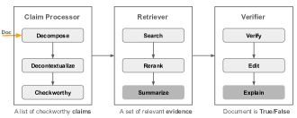

# Factuality of Large Language Models in the Year 2024

###### Abstract

Large language models (LLMs), especially when instruction-tuned for chat, have become part of our daily lives, freeing people from the process of *searching*, *extracting*, and *integrating* information from multiple sources by offering a straightforward answer to a variety of questions in a single place. Unfortunately, in many cases, LLM responses are factually incorrect, which limits their applicability in real-world scenarios. As a result, research on evaluating and improving the factuality of LLMs has attracted a lot of research attention recently. In this survey, we critically analyze existing work with the aim to identify the major challenges and their associated causes, pointing out to potential solutions for improving the factuality of LLMs, and analyzing the obstacles to automated factuality evaluation for open-ended text generation. We further offer an outlook on where future research should go.   

## 1 Introduction

Large language models (LLMs) have become an integral part of our daily lives. When instruction-tuned for chat, they have enabled digital assistants that can free people from the need to *search*, *extract*, and *integrate* information from multiple sources by offering straightforward answers in a single chat. While people naturally expect LLMs to always present reliable information that is consistent with real-world knowledge, LLMs tend to fabricate ungrounded statements, resulting in misinformation Tonmoy et al. ([2024](#bib.bib44)), which limits their utility. Thus, assessing and improving the factuality of the text generated by LLMs has become an emerging and crucial research area, aiming to identify potential errors and to advance the development of more reliable LLMs Chen et al. ([2023](#bib.bib4)).  

To this end, researchers have collected multiple datasets, introduced a variety of measures to evaluate the factuality of LLMs, and proposed numerous strategies leveraging external knowledge through retrieval, self-reflection, and early refinement in model generation to mitigate factual errors Tonmoy et al. ([2024](#bib.bib44)). A number of surveys, discussing LLM hallucinations, have also been published, which we summarize in Table [1](#S1.T1 "Table 1 ‣ Why this survey? ‣ 1 Introduction ‣ Factuality of Large Language Models in the Year 2024").  

##### Why this survey?

[TABLE S1.T1]

<table class="ltx_tabular ltx_align_middle">
<tr class="ltx_tr">
<td class="ltx_td ltx_align_left ltx_border_tt">Survey</td>
<td class="ltx_td ltx_align_center ltx_border_tt">Date</td>
<td class="ltx_td ltx_align_center ltx_border_tt">Pages</td>
<td class="ltx_td ltx_align_justify ltx_align_top ltx_border_tt">

Eval-uation

</td>
<td class="ltx_td ltx_align_justify ltx_align_top ltx_border_tt">

Improve-ment

</td>
<td class="ltx_td ltx_align_justify ltx_align_top ltx_border_tt">

Multi-modal

</td>
<td class="ltx_td ltx_align_justify ltx_align_top ltx_border_tt">

Contributions and limitations

</td>
</tr>
<tr class="ltx_tr">
<td class="ltx_td ltx_align_left ltx_border_t">This work</td>
<td class="ltx_td ltx_align_center ltx_border_t">01-Feb-2024</td>
<td class="ltx_td ltx_align_center ltx_border_t">9</td>
<td class="ltx_td ltx_align_justify ltx_align_top ltx_border_t">

✓

</td>
<td class="ltx_td ltx_align_justify ltx_align_top ltx_border_t">

✓

</td>
<td class="ltx_td ltx_align_justify ltx_align_top ltx_border_t">

✓

</td>
<td class="ltx_td ltx_align_justify ltx_align_top ltx_border_t">

Discusses ambiguous concepts in LLM factuality, compares and analyzes evaluation and enhancement approaches from academic and practical perspectives, outlining major challenges and promising avenues to explore.

</td>
</tr>
<tr class="ltx_tr">
<td class="ltx_td ltx_align_left"><cite class="ltx_cite ltx_citemacro_cite">Tonmoy et al. (<a class="ltx_ref">2024</a>)</cite></td>
<td class="ltx_td ltx_align_center">08-Jan-2024</td>
<td class="ltx_td ltx_align_center">19</td>
<td class="ltx_td ltx_align_justify ltx_align_top">

✗

</td>
<td class="ltx_td ltx_align_justify ltx_align_top">

✓

</td>
<td class="ltx_td ltx_align_justify ltx_align_top">

✓

</td>
<td class="ltx_td ltx_align_justify ltx_align_top">

Summarizes recent work in terms of mitigating LLM hallucinations, but lacks comparison between different approaches and discussions to identify open questions and challenges.

</td>
</tr>
<tr class="ltx_tr">
<td class="ltx_td ltx_align_left"><cite class="ltx_cite ltx_citemacro_cite">Gao et al. (<a class="ltx_ref">2023b</a>)</cite></td>
<td class="ltx_td ltx_align_center">18-Dec-2023</td>
<td class="ltx_td ltx_align_center">26</td>
<td class="ltx_td ltx_align_justify ltx_align_top">

✗

</td>
<td class="ltx_td ltx_align_justify ltx_align_top">

✓

</td>
<td class="ltx_td ltx_align_justify ltx_align_top">

✗

</td>
<td class="ltx_td ltx_align_justify ltx_align_top">

Summarizes three RAG paradigms: naïve, advanced, and modular RAG, with key elements and evaluation methods for the three major components in RAG (retriever, generator, and augmentation).

</td>
</tr>
<tr class="ltx_tr">
<td class="ltx_td ltx_align_left"><cite class="ltx_cite ltx_citemacro_cite">Huang et al. (<a class="ltx_ref">2023</a>)</cite></td>
<td class="ltx_td ltx_align_center">09-Nov-2023</td>
<td class="ltx_td ltx_align_center">49</td>
<td class="ltx_td ltx_align_justify ltx_align_top">

✓

</td>
<td class="ltx_td ltx_align_justify ltx_align_top">

✓

</td>
<td class="ltx_td ltx_align_justify ltx_align_top">

✗

</td>
<td class="ltx_td ltx_align_justify ltx_align_top">

Analyzes the reasons for hallucinations, and presents a comprehensive overview of hallucination detection methods, benchmarks, and approaches to mitigate hallucinations.

</td>
</tr>
<tr class="ltx_tr">
<td class="ltx_td ltx_align_left"><cite class="ltx_cite ltx_citemacro_cite">Wang et al. (<a class="ltx_ref">2023b</a>)</cite></td>
<td class="ltx_td ltx_align_center">18-Oct-2023</td>
<td class="ltx_td ltx_align_center">44</td>
<td class="ltx_td ltx_align_justify ltx_align_top">

✓

</td>
<td class="ltx_td ltx_align_justify ltx_align_top">

✓

</td>
<td class="ltx_td ltx_align_justify ltx_align_top">

✗

</td>
<td class="ltx_td ltx_align_justify ltx_align_top">

Detailed literature review of factuality improvement and enhancement methods covering both retrieval augmentation and non-retrieval augmentation, missing discussion of major bottleneck issues in LLM factuality and promising directions to investigate.

</td>
</tr>
<tr class="ltx_tr">
<td class="ltx_td ltx_align_left"><cite class="ltx_cite ltx_citemacro_cite">Rawte et al. (<a class="ltx_ref">2023b</a>)</cite></td>
<td class="ltx_td ltx_align_center">18-Sept-2023</td>
<td class="ltx_td ltx_align_center">11</td>
<td class="ltx_td ltx_align_justify ltx_align_top">

✗

</td>
<td class="ltx_td ltx_align_justify ltx_align_top">

✗

</td>
<td class="ltx_td ltx_align_justify ltx_align_top">

✓

</td>
<td class="ltx_td ltx_align_justify ltx_align_top">

Extensively elucidates the problem of hallucination across all major modalities of foundation models, including text (general, multilingual, domain-specific LLMs), image, video, and audio. However, inadequate coverage of approaches, in-depth categorization and comparison between methods.

</td>
</tr>
<tr class="ltx_tr">
<td class="ltx_td ltx_align_left"><cite class="ltx_cite ltx_citemacro_cite">Zhang et al. (<a class="ltx_ref">2023c</a>)</cite></td>
<td class="ltx_td ltx_align_center">03-Sept-2023</td>
<td class="ltx_td ltx_align_center">32</td>
<td class="ltx_td ltx_align_justify ltx_align_top">

✓

</td>
<td class="ltx_td ltx_align_justify ltx_align_top">

✓

</td>
<td class="ltx_td ltx_align_justify ltx_align_top">

✗

</td>
<td class="ltx_td ltx_align_justify ltx_align_top">

Organized by different training stages of LLMs, discusses potential sources of LLM hallucinations and in-depth review of recent work on addressing the problem.

</td>
</tr>
<tr class="ltx_tr">
<td class="ltx_td ltx_align_left ltx_border_bb"><cite class="ltx_cite ltx_citemacro_cite">Guo et al. (<a class="ltx_ref">2022</a>)</cite></td>
<td class="ltx_td ltx_align_center ltx_border_bb">Feb-2022</td>
<td class="ltx_td ltx_align_center ltx_border_bb">29</td>
<td class="ltx_td ltx_align_justify ltx_align_top ltx_border_bb">

✓

</td>
<td class="ltx_td ltx_align_justify ltx_align_top ltx_border_bb">

✗

</td>
<td class="ltx_td ltx_align_justify ltx_align_top ltx_border_bb">

✗

</td>
<td class="ltx_td ltx_align_justify ltx_align_top ltx_border_bb">

Focused on the automated fact-checking pipeline

</td>
</tr>
</table>

Table 1: Comparison of different surveys on the factuality of LLMs.
[/TABLE]

We can see in Table [1](#S1.T1 "Table 1 ‣ Why this survey? ‣ 1 Introduction ‣ Factuality of Large Language Models in the Year 2024") that the majority of recent surveys on the factuality of LLMs or hallucination evaluation and improvements are rather lengthy, with most over 20 pages. While they attempt to provide a comprehensive literature review by summarizing interesting ideas and findings, organized by their intended use at different stages in the training cycle of an LLM covering pre-training, supervised fine-tuning (SFT), reinforcement learning with human or automatic feedback (RLXF), and inference, it is difficult for readers to understand the differences between some ambiguous concepts (e.g., LLM factuality vs. hallucination), fundamental challenges and promising solutions in factuality evaluation and enhancement. This survey, instead, focuses on recent novel and representative works in each category, summarizes their common bottlenecks and solutions to mitigate such issues while highlighting our personal stance based on practical experience and observations.   

In addition to LLM hallucination detection and mitigation strategies, Huang et al. ([2023](#bib.bib18)); Zhang et al. ([2023c](#bib.bib60)) analyze potential reasons for LLM hallucination. Gao et al. ([2023b](#bib.bib12)) focus on retrieval augmentation generation (RAG) techniques whereas Guo et al. ([2022](#bib.bib15)) target automated fact-checking systems. The work of Tonmoy et al. ([2024](#bib.bib44)) compiles many recent research studies up to November 2023 albeit lacking an in-depth discussion. Rawte et al. ([2023b](#bib.bib35)) review numerous efforts exploring hallucinations in foundational models across various modalities, offering an overview of considerable scope and breadth, but with limited depth. Our objective is to address these challenges by concisely providing comprehensive insights into LLM factuality, prioritizing recent studies to accommodate the rapidly evolving landscape.  

##### Scope

We outline the scope of this survey below:   

* Unlike most prior surveys, we discuss factuality across a number of modalities, including vision and speech, with an emphasis on factual errors in text. 
* We focus on factuality of open-ended text generation without references, as opposed to generation tasks with references (e.g., summarization or dialogue with source documents or user-input contexts). 
* We pay particular attention to factual errors involving world knowledge, and we leave other types (e.g., coding, reasoning, conflicting with user input or previously generated contexts) for future work. 
* In addition to improving factuality and correcting factual errors, another line of research investigates improving LLM calibration, making models aware of their limitations in its knowledge and confidence in its output, enabling it to either reject to respond to instructions or express uncertainties in its answers when unsure. Given the in-depth discussion in Geng et al. ([2023](#bib.bib13)), We exclude in this survey. 

##### Structure

We first compare and contrast factuality in the context of LLMs against three closely related concepts: hallucination, relevance and trustworthiness in §[2](#S2 "2 Background ‣ Factuality of Large Language Models in the Year 2024"). Next, we outline benchmarks and evaluation metrics based on data format in §[3](#S3 "3 Evaluating Factuality ‣ Factuality of Large Language Models in the Year 2024"). We then discuss recent works on addressing factual errors in §[4](#S4 "4 Improving Factuality ‣ Factuality of Large Language Models in the Year 2024") for text and other modalities in §[5](#S5 "5 Factuality of Multimodal LLMs ‣ Factuality of Large Language Models in the Year 2024"). Lastly, we highlight open questions and their promising solutions in §[6](#S6 "6 Challenges and Future Directions ‣ Factuality of Large Language Models in the Year 2024").  

## 2 Background

Hallucination and factuality, while conceptually distinct, often occur in similar contexts and are sometimes used interchangeably, rendering them intricately intertwined, posing a challenge in discerning their distinct boundaries, and causing a considerable amount of misconception. In this section, we seek to disambiguate and refine our understanding of these two closely aligned concepts, thereby preventing misinterpretation and reducing potential confusion. Additionally, we further include two closely-related axes: relevance and trustworthiness for LLM evaluation to illustrate their nuance in relation to factuality.  

##### Hallucination vs. Factuality

The concept of hallucination in the context of traditional natural language generation tasks is typically referred to as the phenomenon in which the generated content appears nonsensical or unfaithful to the provided source content Ji et al. ([2023](#bib.bib20)). One concrete example is made-up information in an abstractive summary with additional insights beyond the scope of the original source document.  

In the age of LLMs, the term hallucination has been reimagined, encompassing any deviation from factual reality or the inclusion of fabricated elements within generated texts Tonmoy et al. ([2024](#bib.bib44)); Rawte et al. ([2023b](#bib.bib35)). Zhang et al. ([2023c](#bib.bib60)) define hallucination as the characteristic of LLMs to generate content that diverges from the user input, contradicts previously generated context, or mis-aligns with established world knowledge. Huang et al. ([2023](#bib.bib18)) merge the input- and context-conflicting types of hallucinations and further take logical inconsistency into account to form faithfulness hallucination. Another category is factuality hallucination, referring to the discrepancy between generated content and verifiable real-world facts, manifesting as (1) factual inconsistency and (2) factual fabrication.  

Factuality, on the other hand, is concerned with a model’s ability to learn, acquire, and utilize factual knowledge. Wang et al. ([2023b](#bib.bib50)) characterize factuality issues as the probability of LLMs producing content inconsistent with established facts. It is important to note that hallucination content may not always involve factual missteps. Though a piece of generated text may exhibit divergence from the initial prompt’s specifics, it falls into hallucinations, not necessarily a factual issue if the content is accurate.   

It is crucial to distinguish between factual errors and instances of hallucination. The former involves inaccurate information whereas the latter can present unanticipated and yet factually substantiated content Wang et al. ([2023b](#bib.bib50)).  

Summary: Factuality is the ability of LLMs to generate content consistent with factual information and world knowledge. Although both hallucinations and factuality issues may impact the credibility of LLMs in the context of content generation, they present distinct challenges. Hallucinations occur when LLMs produce baseless or untruthful content, not grounded in the given source. In contrast, factuality errors arise when the model fails to accurately learn and utilize factual knowledge. It is possible for a model to be factually correct yet still produce hallucinations by generating content that is either off-topic or more detailed than what is requested.  

##### Relevance vs. Factuality

FELM Chen et al. ([2023](#bib.bib4)) categorizes factual errors into four groups to better understand and identify LLM vulnerabilities: knowledge, irrelevance, reasoning and math, and misunderstanding falsehoods and jokes in prompts. Irrelevant error refers to that the generated content is unrelated to the prompt. For example, if the prompt is What’s a country where most people love playing rugby? a response like New Zealand is a country where rugby is considered a national passion and is deeply ingrained in the culture … would be labeled as irrelevant though it is factually true. While not factually incorrect, this response does not provide much helpful information.   

##### Trustworthiness/Reliability vs. Factuality

In the context of LLMs, factuality Wang et al. ([2023b](#bib.bib50)) refers to a model’s capability of generating contents of factual information, grouneded in reliable sources (e.g., dictionaries, Wikipedia or textbooks), with commonsense, world and domain-specific knowledge taken into account. In contrast, “trustworthiness” Sun et al. ([2024](#bib.bib41)) extends beyond mere factual accuracy and is measured on six dimensions: truthfulness, safety, fairness, robustness, privacy, and ethics.  

[TABLE S2.T2]

<table class="ltx_tabular ltx_align_middle">
<tr class="ltx_tr">
<td class="ltx_td ltx_align_center ltx_border_tt">Type</td>
<td class="ltx_td ltx_align_left ltx_border_tt">Dataset</td>
<td class="ltx_td ltx_align_left ltx_border_tt">Topic</td>
<td class="ltx_td ltx_align_right ltx_border_tt">Size</td>
<td class="ltx_td ltx_align_right ltx_border_tt">ER%</td>
<td class="ltx_td ltx_align_left ltx_border_tt">
Evaluation and Metrics used in Original Paper
</td>
<td class="ltx_td ltx_align_center ltx_border_tt">Freq</td>
</tr>
<tr class="ltx_tr">
<td class="ltx_td ltx_align_center ltx_border_t">I</td>
<td class="ltx_td ltx_align_left ltx_border_t">
FactScore-Bio <cite class="ltx_cite ltx_citemacro_cite">Min and et al. (<a class="ltx_ref">2023</a>)</cite>
</td>
<td class="ltx_td ltx_align_left ltx_border_t">Biography</td>
<td class="ltx_td ltx_align_right ltx_border_t">549</td>
<td class="ltx_td ltx_align_right ltx_border_t">42.6</td>
<td class="ltx_td ltx_align_left ltx_border_t">Human annotation and automated fact-checkers</td>
<td class="ltx_td ltx_align_center ltx_border_t">4</td>
</tr>
<tr class="ltx_tr">
<td class="ltx_td ltx_align_left">
Factcheck-GPT <cite class="ltx_cite ltx_citemacro_cite">Wang et al. (<a class="ltx_ref">2023c</a>)</cite>
</td>
<td class="ltx_td ltx_align_left">Open-ended questions</td>
<td class="ltx_td ltx_align_right">94</td>
<td class="ltx_td ltx_align_right">64.9</td>
<td class="ltx_td ltx_align_left">Human annotation</td>
<td class="ltx_td ltx_align_center">1</td>
</tr>
<tr class="ltx_tr">
<td class="ltx_td ltx_align_left">
FacTool-QA <cite class="ltx_cite ltx_citemacro_cite">Chern et al. (<a class="ltx_ref">2023</a>)</cite>
</td>
<td class="ltx_td ltx_align_left">Knowledge-based QA</td>
<td class="ltx_td ltx_align_right">50</td>
<td class="ltx_td ltx_align_right">54.0</td>
<td class="ltx_td ltx_align_left">Human annotation and automated fact-checkers</td>
<td class="ltx_td ltx_align_center">2</td>
</tr>
<tr class="ltx_tr">
<td class="ltx_td ltx_align_left">
FELM-WK <cite class="ltx_cite ltx_citemacro_cite">Chen et al. (<a class="ltx_ref">2023</a>)</cite>
</td>
<td class="ltx_td ltx_align_left">Knowledge-based QA</td>
<td class="ltx_td ltx_align_right">184</td>
<td class="ltx_td ltx_align_right">46.2</td>
<td class="ltx_td ltx_align_left">Human annotation, Accuracy and F1 score</td>
<td class="ltx_td ltx_align_center">1</td>
</tr>
<tr class="ltx_tr">
<td class="ltx_td ltx_align_left">
HaluEval <cite class="ltx_cite ltx_citemacro_cite">Li and et al. (<a class="ltx_ref">2023a</a>)</cite>
</td>
<td class="ltx_td ltx_align_left">Open-ended questions</td>
<td class="ltx_td ltx_align_right">5000</td>
<td class="ltx_td ltx_align_right">12.3</td>
<td class="ltx_td ltx_align_left">Human annotation, AUROC + LLM judge + PARENT</td>
<td class="ltx_td ltx_align_center">3</td>
</tr>
<tr class="ltx_tr">
<td class="ltx_td ltx_align_left">
FreshQA <cite class="ltx_cite ltx_citemacro_cite">Vu et al. (<a class="ltx_ref">2023</a>)</cite>
</td>
<td class="ltx_td ltx_align_left">Open-ended questions</td>
<td class="ltx_td ltx_align_right">499</td>
<td class="ltx_td ltx_align_right">68.0</td>
<td class="ltx_td ltx_align_left">Human annotation</td>
<td class="ltx_td ltx_align_center">2</td>
</tr>
<tr class="ltx_tr">
<td class="ltx_td ltx_align_left">
SelfAware <cite class="ltx_cite ltx_citemacro_cite">Yin et al. (<a class="ltx_ref">2023b</a>)</cite>
</td>
<td class="ltx_td ltx_align_left">Open-ended questions</td>
<td class="ltx_td ltx_align_right">3369</td>
<td class="ltx_td ltx_align_right">–</td>
<td class="ltx_td ltx_align_left">Evaluate the LLM awareness of unknown by F1-score</td>
<td class="ltx_td ltx_align_center">1</td>
</tr>
<tr class="ltx_tr">
<td class="ltx_td ltx_align_center ltx_border_t">II</td>
<td class="ltx_td ltx_align_left ltx_border_t">
Snowball <cite class="ltx_cite ltx_citemacro_cite">Zhang et al. (<a class="ltx_ref">2023b</a>)</cite>
</td>
<td class="ltx_td ltx_align_left ltx_border_t">Yes/No question</td>
<td class="ltx_td ltx_align_right ltx_border_t">1500</td>
<td class="ltx_td ltx_align_right ltx_border_t">9.4</td>
<td class="ltx_td ltx_align_left ltx_border_t">Exact match + Accuracy/F1-score</td>
<td class="ltx_td ltx_align_center ltx_border_t">1</td>
</tr>
<tr class="ltx_tr">
<td class="ltx_td ltx_align_center ltx_border_t">III</td>
<td class="ltx_td ltx_align_left ltx_border_t">
Wiki-category List <cite class="ltx_cite ltx_citemacro_cite">Dhuliawala et al. (<a class="ltx_ref">2023</a>)</cite>
</td>
<td class="ltx_td ltx_align_left ltx_border_t">
Name some [Mexican films]
</td>
<td class="ltx_td ltx_align_right ltx_border_t">55</td>
<td class="ltx_td ltx_align_right ltx_border_t">–</td>
<td class="ltx_td ltx_align_left ltx_border_t">Precision/recall@5</td>
<td class="ltx_td ltx_align_center ltx_border_t">1</td>
</tr>
<tr class="ltx_tr">
<td class="ltx_td ltx_align_left">
Multispan QA <cite class="ltx_cite ltx_citemacro_cite">Dhuliawala et al. (<a class="ltx_ref">2023</a>)</cite>
</td>
<td class="ltx_td ltx_align_left">Short-term Answer</td>
<td class="ltx_td ltx_align_right">428</td>
<td class="ltx_td ltx_align_right">–</td>
<td class="ltx_td ltx_align_left">Exact match + F1 score</td>
<td class="ltx_td ltx_align_center">1</td>
</tr>
<tr class="ltx_tr">
<td class="ltx_td ltx_align_center ltx_border_bb ltx_border_t">IV</td>
<td class="ltx_td ltx_align_left ltx_border_t">
TruthfulQA <cite class="ltx_cite ltx_citemacro_cite">Lin et al. (<a class="ltx_ref">2022</a>)</cite>
</td>
<td class="ltx_td ltx_align_left ltx_border_t">False belief or misconception</td>
<td class="ltx_td ltx_align_right ltx_border_t">817</td>
<td class="ltx_td ltx_align_right ltx_border_t">–</td>
<td class="ltx_td ltx_align_left ltx_border_t">Accuracy</td>
<td class="ltx_td ltx_align_center ltx_border_t">5</td>
</tr>
<tr class="ltx_tr">
<td class="ltx_td ltx_align_left">
HotpotQA <cite class="ltx_cite ltx_citemacro_cite">Yang and et al. (<a class="ltx_ref">2018</a>)</cite>
</td>
<td class="ltx_td ltx_align_left">Multi-step reasoning</td>
<td class="ltx_td ltx_align_right">113k</td>
<td class="ltx_td ltx_align_right">–</td>
<td class="ltx_td ltx_align_left">Exact match + F1 score</td>
<td class="ltx_td ltx_align_center">11</td>
</tr>
<tr class="ltx_tr">
<td class="ltx_td ltx_align_left">
StrategyQA <cite class="ltx_cite ltx_citemacro_cite">Geva et al. (<a class="ltx_ref">2021</a>)</cite>
</td>
<td class="ltx_td ltx_align_left">Multi-step reasoning</td>
<td class="ltx_td ltx_align_right">2780</td>
<td class="ltx_td ltx_align_right">–</td>
<td class="ltx_td ltx_align_left">Recall@10</td>
<td class="ltx_td ltx_align_center">3</td>
</tr>
<tr class="ltx_tr">
<td class="ltx_td ltx_align_left ltx_border_bb">
MMLU <cite class="ltx_cite ltx_citemacro_cite">Hendrycks et al. (<a class="ltx_ref">2021</a>)</cite>
</td>
<td class="ltx_td ltx_align_left ltx_border_bb">Knowledge</td>
<td class="ltx_td ltx_align_right ltx_border_bb">15700</td>
<td class="ltx_td ltx_align_right ltx_border_bb">–</td>
<td class="ltx_td ltx_align_left ltx_border_bb">Accuracy</td>
<td class="ltx_td ltx_align_center ltx_border_bb">4</td>
</tr>
</table>

Table 2: Four types of datasets used to evaluate LLM factuality. I: open-ended generation; II: Yes/No answer; III: short-term or list of entities answer; IV: A, B, C, D multiple Choice QA. Labeled datasets under type I are mostly generated by ChatGPT, and FactScore-Bio (ChatGPT, InstGPT and PerplexityAI). ER: Human-annotated Error Rate. Freq: usage frequency as evaluation set in our first 50 references.
[/TABLE]

## 3 Evaluating Factuality

Evaluating LLM factuality on open-ended generations presents a non-trivial challenge, discerning the degree to which a generated textual statement aligns with objective reality. Studies employ various benchmarks, evaluation strategies and metrics to achieve this goal.  

### 3.1 Datasets and Metrics

While Zhang et al. ([2023c](#bib.bib60)) outlined tasks and measures for hallucination evaluation, there is no comparative analysis of existing datasets to assess various aspects in regards to model factuality (e.g., knowledge grounding, fast-changing facts, snowballing hallucinations, robustness to false premises, and uncertainty awareness). We categorize the datasets in the format of discrimination or generation, and highlights the challenges in automatic evaluation for long-form open-ended generations.  

Current benchmarks largely assess factuality in LLMs based on two primary capabilities: proficiency in distinguishing factual accuracy within context and ability to generate factually sound content.  

The former typically comes in the form of a multi-choice question, with the expected response being a label of one of A, B, C, and D. For instance, HotpotQA, StrategyQA, MMLU. This form of evaluation has been widely used to measure the general knowledge proficiency and factual accuracy of LLMs, largely thanks to its automation-friendly nature. Under this evaluation formulation, model responses are easily parsed and compared with gold standard labels, enabling the calculation of accuracy or F1 scores against established benchmarks.   

Precisely assessing the factuality of free-form LLM outputs remains a significant challenge due to the inherent limitations of automatic methods in the face of open-ended generation and the absence of definitive gold standard responses within an expansive output space. To make automatic evaluation feasible, many studies constrain the generation space to (1) Yes/No; (2) short-form phrase; and (3) a list of entities through controlling the categories of questions and generation length.  

Perhaps the most demanding, yet inherently realistic scenario is free-form long text generation, such as biography generation. For such generations, the most commonly used and reliable methods rely on human experts following specific guidelines, and automatic fact-checkers based on retrieved information, such as FactScore, Factool and Factcheck-GPT, to facilitate efficient and consistent evaluation.   

These automatic fact-checkers generally first decompose a document into a set of atomic claims, and then verify one by one whether the claim is true or false based on the retrieved evidence, either from offline Wikipedia or online Web pages. The percentage of true claims over all statements in a document is used to reflect the factual status of a response (refer to FactScore). The averaged Factscore over a dataset is in turn used to assess a model’s factuality accuracy. However, there is no guarantee that automatic fact-checkers are 100% accurate in their verification process. Wang et al. ([2023c](#bib.bib51)) show that even the state-of-the-art verifier, equipped with GPT-4 and supporting evidence retrieved with Google search, can only achieve an F1 score of $0.63$ in identifying false claims and F1=0.53 using PerplexityAI (compared with human-annotated labels for claims: true or false).  

Summary: We categorize datasets that evaluate LLM factuality into four types, depending on the answer space and the difficulty degree on which accurate automatic quantification can be performed (see Table [2](#S2.T2 "Table 2 ‣ Trustworthiness/Reliability vs. Factuality ‣ 2 Background ‣ Factuality of Large Language Models in the Year 2024")). They are: (I) open-domain, free-form, long-term responses (FactScore: the percentage of the correct claims verified by human or automated fact-checker); (II) Yes/No answer w/wt explanation (extract Yes/No, metrics for binary classification); (III) short-form answer (Exact match the answer with gold labels and calculate accuracy) or the listing answer (recall@K); and (IV) multi-choice QA (metrics for multi-class classification).  

### 3.2 Other Metrics

In addition to evaluation methods discussed above, Lee et al. ([2022](#bib.bib24)) quantify hallucinations using two metrics, both requiring document-level ground-truth: (1) hallucinated named entities error measures the percentage of named entities in generations that do not appear in the ground-truth Wikipedia document; (2) entailment ratio evaluates the number of generations that can be entailed by the ground-truth reference, against the number of all generations.  

Rawte et al. ([2023a](#bib.bib34)) define hallucination vulnerability index (HVI) to evaluate and rank LLMs based on their vulnerability to producing hallucinations, which takes a spectrum of factors into account.  

Some factuality measurement tasks, such as claim extraction and evidence retrieval are non-trivial to be resolved automatically. Rawte et al. ([2023a](#bib.bib34)) curate publicly available LLM hallucination mitigation benchmark, where LLM generations are scored by humans when automated external knowledge retrieval fails to resolve a claim clearly. While widely used for factuality evaluation, this hybrid approach (i.e., retrieval + human) may suffer from human annotation bias.   

## 4 Improving Factuality

Improving the factuality of an LLM often requires updating its internal knowledge, editing fake, outdated and biased elements, thereby making its output reflect a revised collection of facts, maximizing the probability of $P(\textrm{truth}|\textrm{prompt})$. One option is to adopt gradient-based methods to update model parameters to encourage desired model output. This includes pre-training, supervised fine-tuning and RLXF. We can also explore injecting a new fact into LLMs or overwriting the false knowledge stored in LLM memory by in-context learning (ICL). When models store factually correct knowledge but produce errors, they can in some cases rectify them through self-reasoning, reflection, and multi-agent debates.  

We discuss these methods throughout the lifecycle of an LLM, ranging from pre-training, to inference, to post-processing. Another important element is retrieval augmentation, which enhances the generation capabilities of LLMs by anchoring them in external knowledge that may not be stored or contradict the information in LLM parametric memory. It can be incorporated at various stages throughout model training and the subsequent inference process Gao et al. ([2023b](#bib.bib12)), and is therefore not discussed individually.  

### 4.1 Pre-training

LLMs store a vast amount of world knowledge in their parameters through the process of pre-training. The quality of the pre-training data plays a crucial role and misinformation could potentially cause LLMs to generate false responses, motivating the utilization of high-quality textual corpora. However, the prohibitively massive amount of pre-training data, typically consisting of trillions of tokens, renders manual filtering and editing impractically laborious. To this end, automated filtering methods have been proposed. For instance, Brown et al. ([2020](#bib.bib3)) introduce a method to only focus on a small portion of the CommonCrawl dataset that exhibits similarity to high-quality reference corpora. Touvron et al. ([2023](#bib.bib46)) propose to enhance factual robustness of mixed corpora by up-sampling documents from the most reliable sources, thereby amplifying knowledge accuracy and mitigating hallucinations. During the pre-training phase of phi-1.5, Li and et al. ([2023b](#bib.bib27)) synthesize “textbook-like” data, consists of and rich in high-quality commonsense reasoning and world knowledge. While careful corpus curation remains the cornerstone of pre-training for enhanced factuality, the task becomes increasingly challenging with the expansion of dataset scale and the growing demand for linguistic diversity. It is therefore crucial to develop novel strategies that guarantee the consistency of factual knowledge across diverse cultural landscapes.  

Borgeaud et al. ([2021](#bib.bib2)) propose RETRO, a retrieval augmented pre-training approach. An auto-regressive LLM is trained from scratch with a retrieval module that is practically scalable to large-scale pre-training by retrieving billions of tokens. RETRO shows better accuracy and is less prone to hallucinate compared to GPT Wang et al. ([2023a](#bib.bib49)). While limitations lie in that RETRO performance could be compromised if the retrieval database contains inaccurate, biased or outdated information. $\sim$25$\%$ additional computation is required for the pre-training of LLMs with retrieval.  

### 4.2 Tuning and RLXF

Continued domain-specific SFT has shown to be effective for enhancing factuality, particularly in the absence of such knowledge during pre-training. For instance, Elaraby et al. ([2023](#bib.bib9)) enhance the factual accuracy of LLMs through knowledge injection (KI). Knowledge, in the form of entity summaries or entity triplets, is incorporated through SFT by either intermediate tuning, i.e. first on knowledge and then on instruction data; or combined tuning, i.e. on the mixture of both. While some improvements are exhibited, the method alone can be insufficient to fully mitigate factual errors.   

For general-purpose LLMs, SFT is typically employed to improve the instruction-following capabilities as opposed to factual knowledge which is mostly learned in pre-training. However, this process may inadvertently reveal areas of knowledge not covered in the pre-training, causing the risk of behavior cloning, where a model feigns understanding and responds with hallucinations to questions it has little knowledge of Torabi et al. ([2018](#bib.bib45)). R-tuning Zhang et al. ([2023a](#bib.bib58)) is proposed to address this issue with two pivotal steps: first, assessing the knowledge gap between the model’s parametric knowledge and the instruction tuning data, and second, creating a refusal-aware dataset for SFT. It enables LLMs to abstain from answering queries beyond their parametric knowledge scope. On the other hand, BeInfo Razumovskaia et al. ([2023](#bib.bib36)) improve factual alignment through the form of behavioral fine-tuning. The creation of the behavioral tuning dataset emphasizes two goals: selectivity (choosing correct information from the knowledge source) and response adequacy (informing the user when no relevant information is available or asking for clarification). Both methods effectively control LLMs on non-parametric questions but require extra effort in dataset curation and might hinder the models’ retention of parametric knowledge.  

Sycophancy Sharma et al. ([2023](#bib.bib37)), known as another source of factuality errors, often arises from misalignments during SFT and RLHFOuyang et al. ([2022](#bib.bib32)). This problem is partially attributed to human annotators’ tendency to award higher scores to responses they like rather than those that are factually accurate. Wei et al. ([2023](#bib.bib53)) explore the correlation of sycophancy with model scaling and instruction tuning. They propose a synthetic-data intervention method, using various NLP tasks to teach models that truthfulness is independent of user opinions. However, one limitation is that the generalizability of their approach remains unclear for varied prompt formats and diverse user opinions.  

Tian et al. ([2023](#bib.bib43)) utilize direct preference optimization (DPO) Rafailov et al. ([2023](#bib.bib33)) with the feedback of factuality score either from automatic fact-checkers or LLMs predictive confidence. In-domain evaluation shows promising results on biographies and medical queries, but generalization performance across domains and unseen domains is under-explored. Köksal et al. ([2023](#bib.bib23)) propose hallucination-augmented recitations (HAR). It encourages the model to attribute to the contexts rather than its parametric knowledge, by tuning the model on the counterfactual dataset created leveraging LLM hallucinations. This approach offers a novel way to enhance LLM attribution and grounding in open-book QA. However, challenges lie in refining counterfactual generation for consistency and expanding its application to broader contexts.   

##### Retrieval Augmentation

Incorporating retrieval mechanisms during fine-tuning has been shown to enhance the LLM factuality on downstream tasks, particularly in open-domain QA. DPR Karpukhin et al. ([2020](#bib.bib22)) refines a dual-encoder framework, consisting of two BERT models. It employs a contrastive loss to align the hidden representations of questions and their corresponding answers, obtained through the respective encoder models. RAG Lewis et al. ([2020](#bib.bib25)) and FiD Izacard and Grave ([2020](#bib.bib19)) study a fine-tuning recipe for retrieval-augmented generation models, focusing on open-domain QA tasks. WebGPT Nakano et al. ([2021](#bib.bib31)) fine-tunes GPT-3 Brown et al. ([2020](#bib.bib3)) by RLHF, providing questions with factually correct long-form reference generation. The implementation in a text-based web-browsing environment allows the model to search and navigate the web.  

### 4.3 Inference

We categorize approaches to improve factuality during inference into two: (1) optimizing decoding strategies to strengthen model factuality; and (2) empowering LLM learned ability by either in-context learning (ICL) or self-reasoning.  

#### 4.3.1 Decoding Strategy

Sampling from the top subword candidates with a cumulative probability of p, known as nucleus sampling (top-p) Holtzman et al. ([2020](#bib.bib17)), sees a decrease in factuality performance compared to greedy decoding, despite higher diversity. This is likely due to its over-encouragement of randomness. Building on the hypothesis that sampling randomness may damage factuality when generating the latter part of a sentence than the beginning, Lee et al. ([2022](#bib.bib24)) introduce factual-nucleus sampling, which dynamically reduces the nucleus-p value as generation progresses to limit diversity and improve factuality, modulating factual integrity and textual diversity.   

Apart from randomness, some errors arise when knowledge conflicts, where context contradicts information present in the model’s prior knowledge. Context-aware decoding (CAD) Shi et al. ([2023](#bib.bib38)) prioritizes current context over prior knowledge, and employs contrastive ensemble logits, adjusting the weight of the probability distribution when predicting the next token with or without context. Despite the factuality boost, CAD is a better fit for tasks involving knowledge conflicts and heavily reliant on high-quality context.  

In contrast, DoLa Chuang et al. ([2023](#bib.bib6)) takes into account both upper and lower (earlier) layers, as opposed to only the final (mature) layer. This method dynamically selects intermediate layers at each decoding step, in which an appropriate premature layer contains less factual information with maximum divergence among the subset of the early layers. This method effectively harnesses the distinct contributions of each layer to factual generations. However, DoLa increases the decoding time by 1.01x to 1.08x and does not utilize external knowledge, which limits its ability to correct misinformation learned during training.  

#### 4.3.2 ICL and Self-reasoning

In context learning (ICL) allows an LLM to leverage and learn from demonstration examples in its context to perform a particular task without the need to update model parameters. Zheng et al. ([2023](#bib.bib62)) present that it is possible to perform knowledge editing via ICL through facts included in demonstration examples, thereby correcting fake or outdated facts. The objective of demonstration examples is to teach LLMs how to: (1) identify and copy an answer; (2) generalize using in-context facts; (3) ignore irrelevant facts in context.  

While it is rather easy for LLMs to copy answers from contexts, changing predictions of questions related to the new facts accordingly, and keeping the original predictions if the question is irrelevant to the modified facts, remains tough.  

Another line of research leverages the self-reasoning capability of LLMs. Du et al. ([2023](#bib.bib8)) improve LLM factuality through multi-agent debate. This approach first instantiates a number of agents and then makes them debate over answers returned by other agents until a consensus is reached. One interesting finding is that more agents and longer debates tend to lead to better results. This approach is orthogonal and can be applied in addition to many other generation methods, such as complex prompting strategy (e.g., CoT Wei et al. ([2022](#bib.bib52)), ReAct Yao et al. ([2023](#bib.bib55)), Reflexion Shinn et al. ([2023](#bib.bib39))) and retrieval augmentation.  

Take-away: Zheng et al. ([2023](#bib.bib62)) evaluate the effectiveness of knowledge editing on subject-relation-object triplets, an unrealistic setting compared to open-ended free-form text assessment. we seek answers to two research questions: (1) What types of facts and to what extent can facts be edited effectively, learned by LLMs through ICL? (2) Would SFT do a better job at learning from examples that are difficult for ICL? More broadly, what is the best way to insert new facts or edit false knowledge stored in LLMs. The community may also benefit from an in-depth comparative analysis of the effectiveness of improving factuality between SFT and ICL (perhaps also RLXF).   

##### Retrieval Augmentation

can be applied before, during, and after model generation.   

One commonly used option is to apply retrieval augmentation prior to response generation. For questions requiring up-to-date world knowledge to answer, Vu et al. ([2023](#bib.bib48)) augment LLM prompts with web-retrieved information and demonstrate the effectiveness on improving accuracy on FreshQA, where ChatGPT and GPT-4 struggle due to their lack of up-to-date information. Gao et al. ([2023a](#bib.bib11)) place all relevant paragraphs in the context and encourage the model to cite supporting evidence, instructing LLMs to understand retrieved documents and generate correct citations, thereby improving reliability and factuality.  

Pre-generation retrieval augmentation is beneficial as the generation process is conditioned on the retrieval results, implicitly constraining the output space. While improving factual accuracy, this comes at the cost of spontaneous and creative responses, largely limiting the capabilities of LLMs. An alternative method is to verify and rectify factual errors after the model generates all content. However, LLMs have been shown to be susceptible to hallucination snowballing Zhang et al. ([2023b](#bib.bib59)), a common issue where a model attempts to make its response consistent with previously generated content even if it is factually incorrect.  

Striking a balance between preserving creative elements and avoiding the propagation of potential errors, EVER Kang et al. ([2023](#bib.bib21)) and “a stitch in time saves nine” Varshney et al. ([2023](#bib.bib47)) actively detect and correct factual errors during generation sentence by sentence. The former leverages retrieved evidence for verification, and the latter further incorporates the probability of dominant concepts in detection. Their findings suggest that timely correcting errors during generation can prevent snowballing and further improve factuality. Nonetheless, the primary concern for this iterative process of generate-verify-correct in real-time systems is latency, making it difficult to meet the high-throughput and responsiveness demand Kang et al. ([2023](#bib.bib21)).  

### 4.4 Automatic Fact Checkers

[FIGURE S4.F1.g1]

Figure 1: Fact-checker framework: claim processor, retriever, and verifier, with optional step of summarizing and explaining in gray.
[/FIGURE]

An automatic fact-checking framework typically consists of three components: claim processor, retriever, and verifier as shown in Figure [1](#S4.F1 "Figure 1 ‣ 4.4 Automatic Fact Checkers ‣ 4 Improving Factuality ‣ Factuality of Large Language Models in the Year 2024"), though the implementation of verification pipelines may differ. For example, FACTOR Muhlgay et al. ([2023](#bib.bib30)) and FactScore Min and et al. ([2023](#bib.bib29)) only detect falsehoods without correction. While RARR depends on web-retrieved information Gao et al. ([2022](#bib.bib10)), and CoVe Dhuliawala et al. ([2023](#bib.bib7)) only relies on LLM parametric knowledge Dhuliawala et al. ([2023](#bib.bib7)) to perform both detection and correction, albeit at a coarse granularity, editing the entire document. Compared to fine-grained verification over claims, it is unable to spot false spans precisely and tends to result in poor preservation of the original input. FacTool Chern et al. ([2023](#bib.bib5)) and Factcheck-GPT Wang et al. ([2023c](#bib.bib51)) edit atomic claims. While the former breaks a document down to independent checkworthy claims with three steps: decomposition, decontextualization and checkworthiness identification, the latter employs GPT-4 to extract verifiable claims directly. Evaluating the effectiveness of fact-checkers remains challenging, making the improvement of such systems a difficult task.  

##### Engineering and Practical Considerations

Automatic fact-checking involve tasks of extracting atomic check-worthy claims, collecting evidence either by leveraging the knowledge stored in the model parameters or retrieved externally, and verification. While straightforward to implement, this pipeline may be susceptible to error propagation. Major bottleneck lies in the absence of automatic evaluation measures to assess the quality of intermediate steps, in particular, the claim processor and evidence retriever as there is no gold standard.   

The input to a claim processor is a document to check and its expected output is a list of atomic check-worthy claims or atomic verifiable facts. There is no consensus on the granularity of “atomic claims”, making consistent decomposition difficult in a practical setting. Additionally, the concept of check-worthy and verifiable claims are subjective. Consequently, the definition of an atomic check-worthy claim remains a highly debatable topic.   

This naturally leads to different “gold” human-annotated atomic claims annotated following various guidelines and distinct implementation approaches to decompose a document.  

Given a document, even if assuming a ground-truth list of atomic claims, it remains an open question how to assess the quality of automatically derived decomposition results. Wang et al. ([2023c](#bib.bib51)) start by assessing the agreement in the number of claims between the ground truth and predictions, followed by examining the semantic similarity between two claims at the same index when the claim count aligns. Entailment ratio presented in Section [3.2](#S3.SS2 "3.2 Other Metrics ‣ 3 Evaluating Factuality ‣ Factuality of Large Language Models in the Year 2024") is also applicable Lee et al. ([2022](#bib.bib24)).  

While it is much simpler when the evidence is constrained (e.g., to Wikipedia documents as is the case for FEVER Thorne et al. ([2018](#bib.bib42))), accurate retrieval of evidence from the Internet and subsequently quantifying the quality of such retrieval results remain challenging. Similar to the assessment of atomic claims, gold-labeled evidence is unavailable and infeasible to obtain in the expansive open search space.  

The only step where we can confidently evaluate its quality is the accuracy of verification, a simple binary true/false label given a document/claim. In conclusion, perhaps the most significant hurdle limiting the development and improvement of automatic fact-checkers lies in the automated assessment and quantification of quality at intermediate stages.   

## 5 Factuality of Multimodal LLMs

More recently, multimodal LLMs (MLLMs), capable of processing visual and audio contexts (in addition to textual input), have become a new research focus. Despite impressive results, MLLMs also hallucinate and existing research primarily focuses on addressing grounding errors.   

For tuning-based approaches, Sun et al. ([2023](#bib.bib40)) apply RLHF to vision-language alignment tasks. They introduce factually-augmented RLHF, which augments a reward model with additional factual information, such as image captions and ground-truth options, to alleviate reward hacking. Zhao et al. ([2023](#bib.bib61)) introduce hallucination-aware DPO by first constructing a hallucination-aware dataset consisting of style-consistent pairs with positive and negative samples curated automatically with the help of GPT-4, and then, performing DPO training with MLLMs. While these methods enhance truthfulness, challenges remain, in the form of expensive and intricate data generation pipelines needed for creating tuning datasets.  

Another line of research focuses on post-hoc approaches. Yin et al. ([2023a](#bib.bib56)) introduce a training-free pipeline of five steps: concept extraction, question formulation, visual validation, claim generation, and hallucination correction. They utilize textual LLMs, object detection, and visual QA (VQA) models to fix grounding errors in MLLM responses, framing detected objects and attributes as evidence. Rawte et al. ([2023b](#bib.bib35)) indicate that adapting textual factuality methods to MLLMs often requires conversion from various media to text (e.g. captioning). However, with increased complexity in multimodal contents, despite the application of various techniques such as VQA, OCR and ASR, fact-checking pipelines for images, audio, and video and text are largely similar. Challenges remain in accurate claim extraction and evidence retrieval across different modalities Akhtar et al. ([2023](#bib.bib1)).  

## 6 Challenges and Future Directions

We first identify three major challenges for improving the factuality of LLMs, and then we point to several promising directions for future work.  

##### Language models learn the distribution of a language, not facts.

The training objective of language modeling is to maximize the probability of a sentence, as opposed to that of a factual statement. While capable of generating seemingly coherent and fluent outputs upon convergence, models are not guaranteed to always return factually accurate contents.   

##### Automatic evaluation of factual accuracy of open-ended generations remains challenging.

Existing studies on factuality enhancement use different benchmarks and evaluation metrics, making fair comparisons difficult, motivating the need for a unified automated evaluation framework utilizing the same collection of datasets and metrics.   

This can be further decomposed into two questions: (1) how to select a set of datasets that can effectively evaluate LLMs factuality? and (2) how to measure the percentage of factual claims given a model response with minimal time expenditure? Current approaches rely on either human evaluation or results of automated fact-checkers, e,g., FactScore and FacTool Min and et al. ([2023](#bib.bib29)); Chern et al. ([2023](#bib.bib5)). However, automatically quantifying the quality of automated fact-checkers is itself an open question, resulting in a chicken and egg situation.  

##### Latency and multi-hop reasoning could be the bottleneck of RAG systems.

Retrievers serve as the core component in RAG systems, and the effectiveness of RAG is largely influenced by the quality (coverage and relevance) of the retrieved documents. Latency and difficulties in gathering the most pertinent evidence are the primary challenges in retrieval. While this is partly due to the inability of ranking algorithms to retrieve such documents, certain facts require information gathered from various sources and multi-hop reasoning.   

##### Potential Future Directions

Mitigation in inference: We observe that models can often generate the correct answer in multiple trials even if some of those attempts are incorrect Tian et al. ([2023](#bib.bib43)). This motivates us to ask how to provide an anchor that can guide LLM decoding to the factually correct path?  

Iteratively detecting, correcting and generating during generation has been demonstrated to be effective to mitigating hallucinations. If simply correcting the first one or two sentences, how much improvements can we expect for subsequent generations? Can factually correct and relevant sentences, phrases or concepts serve as the anchors?  

Timely detection of factual errors: Another interesting option to explore is to only detect falsehoods without consideration of correction, allowing LLMs to incorporate uncertainty information and the contrastive probability leveraged in decoding strategies (e.g., CAD and DoLa) for timely detections without evidence.  

Improving efficiency and accuracy of automated fact-checkers: The key breakthrough in effectively evaluating the factual accuracy of LLMs lies in establishing accurate and efficient fact-checkers, in which how to evaluate the quality of retrieved evidence in open search space is of significant importance. Current methods rely on the accuracy of claim verification to deduce the quality of evidence by prompting LLMs. Not only is this computationally expensive, it also tends to be highly sensitive to minor prompt changes and LLM updates (e.g., the same prompt may result in inconsistent outputs). Instead, a small task-specific and well fine-tuned NLI model presents a more viable, robust and cost-efficient option.   

## 7 Conclusion

We presented an overview on the factuality of LLMs, surveying a number of studies covering topics such as evaluation in Section [3](#S3 "3 Evaluating Factuality ‣ Factuality of Large Language Models in the Year 2024") and improvement methods (applicable at various stages: pre-training, SFT, inference and post-processing) in Section [4](#S4 "4 Improving Factuality ‣ Factuality of Large Language Models in the Year 2024"), along with their respective challenges. We also identified three major issues and additionally pointed out promising future research directions in Section [6](#S6 "6 Challenges and Future Directions ‣ Factuality of Large Language Models in the Year 2024").  

## References

* Akhtar et al. [2023]  Mubashara Akhtar, Michael Schlichtkrull, and Zhijiang et al. Guo.   Multimodal automated fact-checking: A survey.   In Findings of EMNLP 2023, pages 5430–5448, 2023. 
* Borgeaud et al. [2021]  Sebastian Borgeaud, Arthur Mensch, and Jordan Hoffmann et al.   Improving language models by retrieving from trillions of tokens.   In ICML, 2021. 
* Brown et al. [2020]  Tom B. Brown, Benjamin Mann, Nick Ryder, and Melanie Subbiah et al.   Language models are few-shot learners.   In NeurIPS 2020, 2020. 
* Chen et al. [2023]  Shiqi Chen, Yiran Zhao, Jinghan Zhang, and et al.   Felm: Benchmarking factuality evaluation of large language models.   arXiv preprint arXiv:2310.00741, 2023. 
* Chern et al. [2023]  I-Chun Chern, Steffi Chern, and Shiqi Chen et al.   Factool: Factuality detection in generative AI - A tool augmented framework for multi-task and multi-domain scenarios.   CoRR, abs/2307.13528, 2023. 
* Chuang et al. [2023]  Yung-Sung Chuang, Yujia Xie, and Hongyin Luo et al.   Dola: Decoding by contrasting layers improves factuality in large language models.   CoRR, abs/2309.03883, 2023. 
* Dhuliawala et al. [2023]  Shehzaad Dhuliawala, Mojtaba Komeili, and et al.   Chain-of-verification reduces hallucination in large language models.   arXiv preprint arXiv:2309.11495, 2023. 
* Du et al. [2023]  Yilun Du, Shuang Li, Antonio Torralba, Joshua B. Tenenbaum, and Igor Mordatch.   Improving factuality and reasoning in language models through multiagent debate.   CoRR, abs/2305.14325, 2023. 
* Elaraby et al. [2023]  Mohamed Elaraby, Mengyin Lu, and Jacob Dunn et al.   Halo: Estimation and reduction of hallucinations in open-source weak large language models.   CoRR, abs/2308.11764, 2023. 
* Gao et al. [2022]  Luyu Gao, Zhuyun Dai, and Panupong et al. Pasupat.   Attributed text generation via post-hoc research and revision.   arXiv preprint arXiv:2210.08726, 2022. 
* Gao et al. [2023a]  Tianyu Gao, Howard Yen, Jiatong Yu, and Danqi Chen.   Enabling large language models to generate text with citations.   In EMNLP, pages 6465–6488, 2023. 
* Gao et al. [2023b]  Yunfan Gao, Yun Xiong, and et al.   Retrieval-augmented generation for large language models: A survey.   CoRR, abs/2312.10997, 2023. 
* Geng et al. [2023]  Jiahui Geng, Fengyu Cai, and Yuxia Wang et al.   A survey of language model confidence estimation and calibration.   CoRR, abs/2311.08298, 2023. 
* Geva et al. [2021]  Mor Geva, Daniel Khashabi, and et al.   Did aristotle use a laptop? A question answering benchmark with implicit reasoning strategies.   TACL, 9:346–361, 2021. 
* Guo et al. [2022]  Zhijiang Guo, Michael Schlichtkrull, and Andreas Vlachos.   A survey on automated fact-checking.   TACL, 10:178–206, 2022. 
* Hendrycks et al. [2021]  Dan Hendrycks, Collin Burns, and et al.   Measuring massive multitask language understanding.   In ICLR 2021, 2021. 
* Holtzman et al. [2020]  Ari Holtzman, Jan Buys, and Li et al.   The curious case of neural text degeneration.   In ICLR, 2020. 
* Huang et al. [2023]  Lei Huang, Weijiang Yu, Weitao Ma, and Weihong Zhong et al.   A survey on hallucination in large language models: Principles, taxonomy, challenges, and open questions.   CoRR, abs/2311.05232, 2023. 
* Izacard and Grave [2020]  Gautier Izacard and Edouard Grave.   Leveraging passage retrieval with generative models for open domain question answering.   ArXiv, abs/2007.01282, 2020. 
* Ji et al. [2023]  Ziwei Ji, Nayeon Lee, and Rita Frieske et al.   Survey of hallucination in natural language generation.   ACM Comput. Surv., 55(12):248:1–248:38, 2023. 
* Kang et al. [2023]  Haoqiang Kang, Juntong Ni, and Huaxiu Yao.   Ever: Mitigating hallucination in large language models through real-time verification and rectification.   CoRR, abs/2311.09114, 2023. 
* Karpukhin et al. [2020]  Vladimir Karpukhin, Barlas Oğuz, and Sewon Min et al.   Dense passage retrieval for open-domain question answering.   ArXiv, abs/2004.04906, 2020. 
* Köksal et al. [2023]  Abdullatif Köksal, Renat Aksitov, and Chung-Ching Chang.   Hallucination augmented recitations for language models.   arXiv preprint arXiv:2311.07424, 2023. 
* Lee et al. [2022]  Nayeon Lee, Wei Ping, and Peng et al. Xu.   Factuality enhanced language models for open-ended text generation.   NeuralPS, 35:34586–34599, 2022. 
* Lewis et al. [2020]  Patrick Lewis, Ethan Perez, and et al.   Retrieval-augmented generation for knowledge-intensive nlp tasks.   ArXiv, abs/2005.11401, 2020. 
* Li and et al. [2023a]  Junyi Li and Xiaoxue Cheng et al.   Halueval: A large-scale hallucination evaluation benchmark for large language models.   CoRR, abs/2305.11747, 2023. 
* Li and et al. [2023b]  Yuanzhi Li and Sébastien Bubeck et al.   Textbooks are all you need II: phi-1.5 technical report.   CoRR, abs/2309.05463, 2023. 
* Lin et al. [2022]  Stephanie Lin, Jacob Hilton, and Owain Evans.   Truthfulqa: Measuring how models mimic human falsehoods.   In ACL, pages 3214–3252, 2022. 
* Min and et al. [2023]  Sewon Min and Kalpesh Krishna et al.   Factscore: Fine-grained atomic evaluation of factual precision in long form text generation.   CoRR, abs/2305.14251, 2023. 
* Muhlgay et al. [2023]  Dor Muhlgay, Ori Ram, and Inbal Magar et al.   Generating benchmarks for factuality evaluation of language models.   CoRR, abs/2307.06908, 2023. 
* Nakano et al. [2021]  Reiichiro Nakano, Jacob Hilton, and et al.   Webgpt: Browser-assisted question-answering with human feedback.   ArXiv, abs/2112.09332, 2021. 
* Ouyang et al. [2022]  Long Ouyang, Jeff Wu, and Xu Jiang et al.   Training language models to follow instructions with human feedback.   ArXiv, abs/2203.02155, 2022. 
* Rafailov et al. [2023]  Rafael Rafailov, Archit Sharma, and et al.   Direct preference optimization: Your language model is secretly a reward model.   CoRR, abs/2305.18290, 2023. 
* Rawte et al. [2023a]  Vipula Rawte, Swagata Chakraborty, and Agnibh et al. Pathak.   The troubling emergence of hallucination in large language models - an extensive definition, quantification, and prescriptive remediations.   In EMNLP 2023, pages 2541–2573, 2023. 
* Rawte et al. [2023b]  Vipula Rawte, Amit P. Sheth, and Amitava Das.   A survey of hallucination in large foundation models.   CoRR, abs/2309.05922, 2023. 
* Razumovskaia et al. [2023]  Evgeniia Razumovskaia, Ivan Vulic, and Pavle Markovic et al.   Dial beinfo for faithfulness: Improving factuality of information-seeking dialogue via behavioural fine-tuning.   CoRR, abs/2311.09800, 2023. 
* Sharma et al. [2023]  Mrinank Sharma, Meg Tong, Tomasz Korbak, David Duvenaud, and Amanda Askell et al.   Towards understanding sycophancy in language models.   CoRR, abs/2310.13548, 2023. 
* Shi et al. [2023]  Weijia Shi, Xiaochuang Han, and et al.   Trusting your evidence: Hallucinate less with context-aware decoding.   arXiv preprint arXiv:2305.14739, 2023. 
* Shinn et al. [2023]  Noah Shinn, Federico Cassano, and Gopinath et al.   Reflexion: Language agents with verbal reinforcement learning.   In NeuralPS, 2023. 
* Sun et al. [2023]  Zhiqing Sun, Sheng Shen, and Shengcao Cao et al.   Aligning large multimodal models with factually augmented RLHF.   CoRR, abs/2309.14525, 2023. 
* Sun et al. [2024]  Lichao Sun, Yue Huang, and Haoran Wang et al.   Trustllm: Trustworthiness in large language models.   ArXiv, abs/2401.05561, 2024. 
* Thorne et al. [2018]  James Thorne, Andreas Vlachos, and et al.   FEVER: a large-scale dataset for fact extraction and VERification.   In NAACL, pages 809–819, 2018. 
* Tian et al. [2023]  Katherine Tian, Eric Mitchell, and et al.   Fine-tuning language models for factuality.   arXiv preprint arXiv:2311.08401, 2023. 
* Tonmoy et al. [2024]  S. M. Towhidul Islam Tonmoy, S. M. Mehedi Zaman, and et al.   A comprehensive survey of hallucination mitigation techniques in large language models.   CoRR, abs/2401.01313, 2024. 
* Torabi et al. [2018]  Faraz Torabi, Garrett Warnell, and Peter Stone.   Behavioral cloning from observation.   In Jérôme Lang, editor, IJCAI, pages 4950–4957. ijcai.org, 2018. 
* Touvron et al. [2023]  Hugo Touvron, Louis Martin, and et al.   Llama 2: Open foundation and fine-tuned chat models.   CoRR, abs/2307.09288, 2023. 
* Varshney et al. [2023]  Neeraj Varshney, Wenlin Yao, and et al.   A stitch in time saves nine: Detecting and mitigating hallucinations of llms by validating low-confidence generation.   CoRR, abs/2307.03987, 2023. 
* Vu et al. [2023]  Tu Vu, Mohit Iyyer, and et al.   Freshllms: Refreshing large language models with search engine augmentation.   arXiv preprint arXiv:2310.03214, 2023. 
* Wang et al. [2023a]  Boxin Wang, Wei Ping, and et al.   Shall we pretrain autoregressive language models with retrieval? a comprehensive study.   In EMNLP, 2023. 
* Wang et al. [2023b]  Cunxiang Wang, Xiaoze Liu, and et al.   Survey on factuality in large language models: Knowledge, retrieval and domain-specificity.   ArXiv, abs/2310.07521, 2023. 
* Wang et al. [2023c]  Yuxia Wang, Revanth Gangi Reddy, and et al.   Factcheck-gpt: End-to-end fine-grained document-level fact-checking and correction of LLM output.   CoRR, abs/2311.09000, 2023. 
* Wei et al. [2022]  Jason Wei, Xuezhi Wang, and Dale et al.   Chain-of-thought prompting elicits reasoning in large language models.   In NeurIPS 2022, 2022. 
* Wei et al. [2023]  Jerry W. Wei, Da Huang, and Yifeng Lu et al.   Simple synthetic data reduces sycophancy in large language models.   CoRR, abs/2308.03958, 2023. 
* Yang and et al. [2018]  Zhilin Yang and Peng Qi et al.   Hotpotqa: A dataset for diverse, explainable multi-hop question answering.   In EMNLP 2018, pages 2369–2380, 2018. 
* Yao et al. [2023]  Shunyu Yao, Jeffrey Zhao, and Dian et al.   React: Synergizing reasoning and acting in language models.   In ICLR, 2023. 
* Yin et al. [2023a]  Shukang Yin, Chaoyou Fu, and et al.   Woodpecker: Hallucination correction for multimodal large language models.   CoRR, abs/2310.16045, 2023. 
* Yin et al. [2023b]  Zhangyue Yin, Qiushi Sun, and Qipeng Guo et al.   Do large language models know what they don’t know?   In ACL, pages 8653–8665, 2023. 
* Zhang et al. [2023a]  Hanning Zhang, Shizhe Diao, and et al.   R-tuning: Teaching large language models to refuse unknown questions.   CoRR, abs/2311.09677, 2023. 
* Zhang et al. [2023b]  Muru Zhang, Ofir Press, and et al.   How language model hallucinations can snowball.   CoRR, abs/2305.13534, 2023. 
* Zhang et al. [2023c]  Yue Zhang, Yafu Li, and et al.   Siren’s song in the AI ocean: A survey on hallucination in large language models.   CoRR, abs/2309.01219, 2023. 
* Zhao et al. [2023]  Zhiyuan Zhao, Bin Wang, and Linke Ouyang et al.   Beyond hallucinations: Enhancing lvlms through hallucination-aware direct preference optimization.   CoRR, abs/2311.16839, 2023. 
* Zheng et al. [2023]  Ce Zheng, Lei Li, and et al.   Can we edit factual knowledge by in-context learning?   In EMNLP, pages 4862–4876, 2023. 

