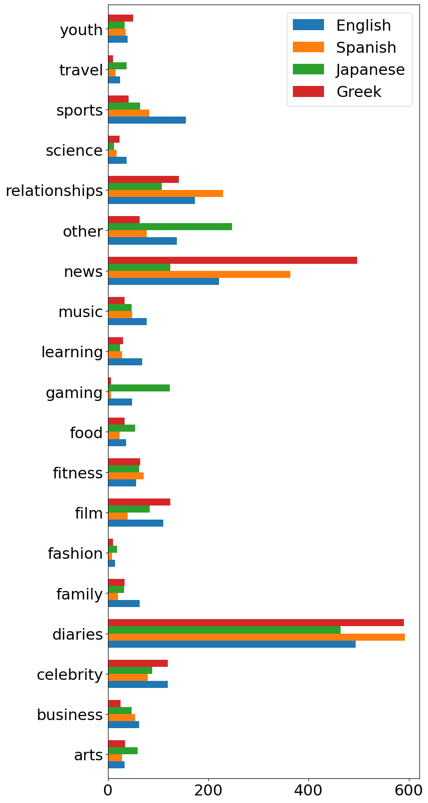
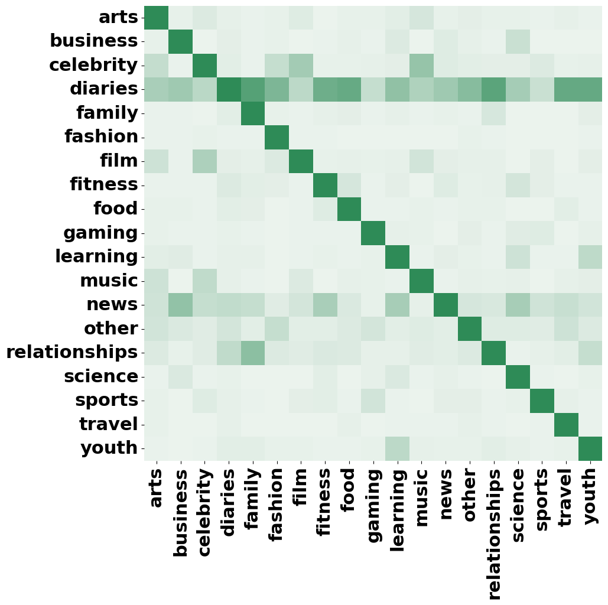
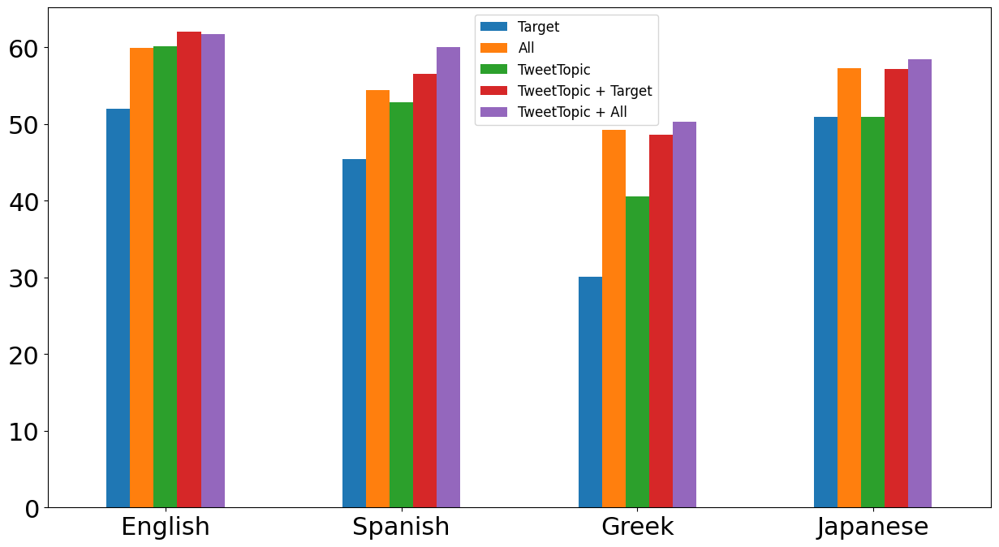

# Multilingual Topic Classification in X: Dataset and Analysis

###### Abstract

In the dynamic realm of social media, diverse topics are discussed daily, transcending linguistic boundaries. However, the complexities of understanding and categorising this content across various languages remain an important challenge with traditional techniques like topic modelling often struggling to accommodate this multilingual diversity. In this paper, we introduce X-Topic, a multilingual dataset featuring content in four distinct languages (English, Spanish, Japanese, and Greek), crafted for the purpose of tweet topic classification. Our dataset includes a wide range of topics, tailored for social media content, making it a valuable resource for scientists and professionals working on cross-linguistic analysis, the development of robust multilingual models, and computational scientists studying online dialogue. Finally, we leverage X-Topic to perform a comprehensive cross-linguistic and multilingual analysis, and compare the capabilities of current general- and domain-specific language models.   

Multilingual Topic Classification in X: Dataset and Analysis  

  

    Dimosthenis Antypas1, Asahi Ushio2††thanks: Work done while at Cardiff NLP, Francesco Barbieri3, Jose Camacho-Collados1    1Cardiff NLP, Cardiff University, United Kingdom 2Amazon, Tokyo, Japan  3Snap Inc., Santa Monica, CA, USA  1{AntypasD,CamachoColladosJ}@cardiff.ac.uk 2asahiu@amazon.com    

  

## 1 Introduction

Social platforms such as X (Twitter), Snapchat and Instagram provide an environment for content creation and information sharing among people and organisations. In particular, people use these platforms to express their sentiments, share their opinions on multiple topics, and discuss and influence each other Barbieri et al. ([2014](#bib.bib4)); Hu et al. ([2021](#bib.bib24)); Ansari et al. ([2020](#bib.bib1)). In this scenario, these platforms are rich sources for informal short text, as they include content about recent events, shared by a heterogeneous group of users. The vast amount of content shared on social media, however, make it impossible to analyse and digest it without automatic tools.  

Unsupervised approaches such as Latent Dirichlet Allocation (LDA) Blei et al. ([2003](#bib.bib6)) and topic modelling variations Steyvers and Griffiths ([2007](#bib.bib43)), or more recently, BERTopic Grootendorst ([2022](#bib.bib20)), are common approaches to deal with this issue. However, these methods are usually built as an ad-hoc analysis, with the derived topics not being easily interpretable or comparable among different analyses. On the other hand, when looking at supervising approaches, existing resources mainly focus on the news articles domain, e.g., BBC News Greene and Cunningham ([2006](#bib.bib19)), Reuter Lewis et al. ([2004](#bib.bib31)), 20News Lang ([1995](#bib.bib29)), and WMT News Crawl Lazaridou et al. ([2021](#bib.bib30)) with few exceptions like scientific (arXiv) Lazaridou et al. ([2021](#bib.bib30)) and medical (Ohsumed) Hersh et al. ([1994](#bib.bib23)) domains.  

Our paper focuses on expanding the resources available for multilingual tweet classification. We leverage an initial topic taxonomy of 19 topics, first proposed in Antypas et al. ([2022](#bib.bib2)), and introduce the new X-Topic dataset that includes tweets from four different languages: English, Spanish, Japanese and Greek. Our dataset is focused on X data and aims to address the lack of labelled multilingual social media data, as well as to encourage the creation of new methods for multilingual topic classification.  

By leveraging X-Topic as a benchmark, we explore multiple model architectures and sizes for multilingual tweet topic classification: (1) zero-shot, (2) few-shot, (3) monolingual, (4) cross-lingual and (5) multilingual. Our analysis highlights the challenging nature of the task and reveals interesting patterns in relation to the use of LLMs and supervised approaches for the topic classification task in social media, especially in relation to the type of data considered for training.  

The X-Topic dataset, as well as the topic classification models built upon it, are made openly available. X-Topic is available at <https://huggingface.co/datasets/cardiffnlp/tweet_topic_multilingual>. Table [1](#S1.T1 "Table 1 ‣ 1 Introduction ‣ Multilingual Topic Classification in X: Dataset and Analysis") shows some sample instances of X-Topic for each language. Finally, the best multilingual models of base and large sizes are available at <https://huggingface.co/cardiffnlp/twitter-xlm-roberta-base-topic-multilingual> and <https://huggingface.co/cardiffnlp/twitter-xlm-roberta-large-topic-multilingual>, respectively.  

[TABLE S1.T1]

<table class="ltx_tabular ltx_guessed_headers ltx_align_middle">
<tbody class="ltx_tbody">
<tr class="ltx_tr">
<th class="ltx_td ltx_align_center ltx_th ltx_th_row ltx_border_r">Tweet</th>
<td class="ltx_td ltx_align_center">Topics</td>
</tr>
<tr class="ltx_tr">
<th class="ltx_td ltx_align_left ltx_th ltx_th_row ltx_border_r">
<table class="ltx_tabular ltx_align_middle">
<tr class="ltx_tr">
<td class="ltx_td ltx_nopad_r ltx_align_left">
en: I don’t think I really want to go to Coachella unless Taylor Swift is headlining</td>
</tr>
</table>
</th>
<td class="ltx_td ltx_align_left">Celebrity &amp; Pop Culture, Music</td>
</tr>
<tr class="ltx_tr">
<th class="ltx_td ltx_align_left ltx_th ltx_th_row ltx_border_r ltx_border_t">
<table class="ltx_tabular ltx_align_middle">
<tr class="ltx_tr">
<td class="ltx_td ltx_nopad_r ltx_align_left">
es: quiero una date en un museo</td>
</tr>
<tr class="ltx_tr">
<td class="ltx_td ltx_nopad_r ltx_align_left">
translation: I want a date in a museum</td>
</tr>
</table>
</th>
<td class="ltx_td ltx_align_left ltx_border_t">
<table class="ltx_tabular ltx_align_middle">
<tr class="ltx_tr">
<td class="ltx_td ltx_nopad_r ltx_align_left">Relationships, Arts &amp; Culture,</td>
</tr>
<tr class="ltx_tr">
<td class="ltx_td ltx_nopad_r ltx_align_left">Diaries &amp; Daily Life</td>
</tr>
</table>
</td>
</tr>
<tr class="ltx_tr">
<th class="ltx_td ltx_align_left ltx_th ltx_th_row ltx_border_r ltx_border_t">
<table class="ltx_tabular ltx_align_middle">
<tr class="ltx_tr">
<td class="ltx_td ltx_nopad_r ltx_align_left">
ja: 久々になーーんもしないでいい日が二日もあるのでゆっくり富平井絆果と</td>
</tr>
<tr class="ltx_tr">
<td class="ltx_td ltx_nopad_r ltx_align_left">向き合うよ</td>
</tr>
<tr class="ltx_tr">
<td class="ltx_td ltx_nopad_r ltx_align_left">
translation: It’s been a long time since I’ve had two days where I don’t have to do anything,</td>
</tr>
<tr class="ltx_tr">
<td class="ltx_td ltx_nopad_r ltx_align_left">so I’m going to take my time and face Kizuna Fuhirai.</td>
</tr>
</table>
</th>
<td class="ltx_td ltx_align_left ltx_border_t">Diaries &amp; Daily Life, Gaming</td>
</tr>
<tr class="ltx_tr">
<th class="ltx_td ltx_align_left ltx_th ltx_th_row ltx_border_r ltx_border_t">
<table class="ltx_tabular ltx_align_middle">
<tr class="ltx_tr">
<td class="ltx_td ltx_nopad_r ltx_align_left">
gr: Μπα ςε ϰαλ\acctonosο ςου µωρ\acctonosη Ανϑουλα µας ϰοψοχολιαςες π\acctonosαλι #ςαςµ\acctonosος
</td>
</tr>
<tr class="ltx_tr">
<td class="ltx_td ltx_nopad_r ltx_align_left"></td>
</tr>
<tr class="ltx_tr">
<td class="ltx_td ltx_nopad_r ltx_align_left">
translation: Oh my goodness, Anthula, you’ve cracked us up again #sasmos</td>
</tr>
</table>
</th>
<td class="ltx_td ltx_align_left ltx_border_t">Film, TV &amp; Video</td>
</tr>
</tbody>
</table>

Table 1: Example of tweets present in each language subset of X-Topic.
[/TABLE]

## 2 Related Work

The task of classifying topics in social media content has garnered significant attention from the research community in recent years Schlichtkrull et al. ([2023](#bib.bib40)); Zubiaga et al. ([2018](#bib.bib50)); Chua and Banerjee ([2016](#bib.bib13)). Social media platforms like X have become hubs for the exchange of information, opinions, and sentiments, making the development of effective classification methods imperative.  

##### Unsupervised Approaches.

Due to the lack of labelled data and the dynamic nature of social media platforms, unsupervised methods have been widely used for topic modelling and classification on the content shared. Several variations of LDA have been introduced that try to address the challenges that arise when working with the often messy and unstructured world of social media. Such solutions, Zhao et al. ([2011](#bib.bib49)); Rosen-Zvi et al. ([2004](#bib.bib38)); Steinskog et al. ([2017](#bib.bib42)) often try to combine author information with the text shared. Other approaches use unsupervised clustering algorithms, such as k-means or hierarchical clustering, to group similar social media content based on their topic similarity Wang et al. ([2017](#bib.bib45)). These methods are particularly useful when the underlying topics are not predefined and need to be inferred from the data. However, a drawback of these unsupervised approaches is that the derived topics may not always be easily interpretable or comparable across corpora.  

##### Multilingual resources in social media.

Supervised methods for topic classification in social media content involve training machine learning models on labelled data. While supervised approaches have demonstrated robust performance on social media tasks Huang et al. ([2013](#bib.bib25)); Camacho-collados et al. ([2022](#bib.bib10)), there is a notable scarcity of labelled data for social media content, particularly in languages other than English Selvaperumal and Suruliandi ([2014](#bib.bib41)); while a lot of the available datasets offer a limited taxonomy of topics Vadivukarassi et al. ([2019](#bib.bib44)). Multilingual and cross-lingual topic classification in social media is therefore a limited explored area. It involves dealing with content in multiple languages, addressing language-specific nuances, and ensuring effective classification. Few resources and models are designed to handle multilingual topic classification. Existing datasets e.g. in Portuguese Daouadi et al. ([2021](#bib.bib16)), Spanish Imran et al. ([2016](#bib.bib26)), Urdu Kausar et al. ([2021](#bib.bib27)) and others Chowdhury et al. ([2020](#bib.bib12)), often suffer from weak labelling or a limited taxonomy of topics, or they are created to solve specific problems e.g. sentiment analysis Muhammad et al. ([2023](#bib.bib36)) and hate speech Ousidhoum et al. ([2019](#bib.bib37)). This presents a gap in the field as many social media platforms have a global user base. Our work addresses this gap by introducing the X-Topic dataset, which includes tweets in four different languages (English, Spanish, Japanese, and Greek), thereby expanding resources for multilingual topic classification in social media.   

## 3 X-Topic, a Multilingual Tweet Topic Classification Benchmark

In this section, we describe our methodology to construct, a multilingual tweet topic classification benchmark. First, we describe the original English-based TweetTopic dataset, which we take as inspiration to construct a fully multilingual dataset.  

TweetTopic Antypas et al. ([2022](#bib.bib2)) is an English Twitter topic classification dataset consisting of a total of 11,267 English tweets assigned one or more classes from a predefined list of 19 topics such as ”News & Social Concern”, ”Sports”, and ”Fashion & Style”. The taxonomy of topics was decided by a team of social media experts and aims to cover the majority of content being shared in social media platforms. The tweets were distributed over time, from September 2019 to October 2021 and were extracted using keywords of trending topics in each week during the period. Each entry was labelled by five different annotators, and the topic was assigned if there was an agreement of at least two annotators.  

In our work, we leverage the taxonomy originally presented in TweetTopic as a foundation for collecting a new set of recent tweets, leading to the introduction of X-Topic. X-Topic is mainly distinguished by its inclusion of entries in four diverse languages: Spanish, Greek, Japanese, and English.  

### 3.1 Language Selection and Tweet Collection

The selection of languages was made by taking into account their popularity and practicality. X-Topic is a resource that helps to the analysis of frequently used languages in X (English, Spanish, Japanese) as well as a less frequently studied one (Greek). This linguistic diversity also provides a unique opportunity for comparative analysis between linguistically distant groups, such as Japanese and Greek. Moreover, our choice of the September 2021 to August 2022 timeframe continues the timeline of previous work and facilitates engaging in temporal analyses.  

For the collection of the dataset, we follow a similar approach to that of the original TweetTopic. Initially, the Twitter API was utilised to collect 50 tweets every two hours for each language. However, in contrast to TweetTopic, we do not use any keyword filtering in our queries. In this way, we acquire a diverse set of tweets, approximately 220,000 tweets for each language, which is closer to the real distribution of content shared in X.  

### 3.2 Preprocessing

Following the collection of the raw tweets we apply several preprocessing steps. First, we remove potentially remaining tweets in other languages by using a fastText-based language identifier Bojanowski et al. ([2017](#bib.bib7)) on top of the Twitter pre-defined language identifier. Then, we remove tweets that are not in our target period, tweets containing incomplete sentences (too short or end in the middle of the sentence), or abusing words by applying some simple rule-based heuristics. We also apply a near-duplication filter to drop duplicated tweets. This process begins by normalising each tweet (i.e. remove irrelevant substrings and lemmatisation), and then retaining unique tweets only in terms of the normalised form. To ensure the quality of the tweets’ content we remove entries that contain URLs, and those where multiple (more than four) emojis or mentions are present.111Detailed number of tweets dropped in each preprocessing step can be found in Table [6](#A2.T6 "Table 6 ‣ B.1 Dataset ‣ Appendix B Models & Dataset ‣ Multilingual Topic Classification in X: Dataset and Analysis"), Appendix [6](#A2.T6 "Table 6 ‣ B.1 Dataset ‣ Appendix B Models & Dataset ‣ Multilingual Topic Classification in X: Dataset and Analysis"). Finally, we sample 1,000 tweets from the remaining set of tweets after preprocessing for each language. The sampling is weighted based on the retweet count of each entry as well as the follower count of the user posting the tweet. This weighting is applied with the assumption that a higher quality content is usually more popular. As a final preprocessing step we mask all mentions of non-verified users with {USER} to ensure the privacy of users.  

### 3.3 Annotation

The annotation process closely mirrored the procedure established in TweetTopic. Specifically, each entry of the dataset was annotated by five coders, where each coder had to select one or more labels from a selection of 19 topics in total. A topic was assigned to a tweet only if at least two annotators were in agreement about it. Following previous work on multi-label classification Mohammad et al. ([2018](#bib.bib34)), we refrained from utilising a majority rule in order to create a more realistic and challenging dataset.  

The coders who worked on this task were selected and filtered through the Prolific.co platform based on their fluency in the corresponding target language. The actual annotation was performed through an interface created with qualtricsXM.222The annotation guidelines for each language can be found in Appendix [A](#A1 "Appendix A Annotation Guidelines ‣ Multilingual Topic Classification in X: Dataset and Analysis"). We did not utilise Amazon Mechanical Turk (AMT) due to both the lack of non-English annotators in AMT, as well as, due to the better quality of annotators present in Prolific.co. Finally, we ensured the quality of the annotations as our research team includes native speakers in all the non-English languages, who monitored the whole annotation process for each language.  

[FIGURE S3.F1.g1]

Figure 1: Number of tweets per topic and language.
[/FIGURE]

To assess the quality of our annotation process, we report the following three annotation agreement metrics: (1) Krippendorff’s Alpha (Alpha) Krippendorff ([2011](#bib.bib28)), (2) Percent Agreement (PA), ratio of number of agreements to the total number of annotations, and (3) Agreement between each pair of coders on at least one label (Overlap). When comparing our results with those achieved in the TweetTopic annotation, as presented in Table [2](#S3.T2 "Table 2 ‣ 3.3 Annotation ‣ 3 X-Topic, a Multilingual Tweet Topic Classification Benchmark ‣ Multilingual Topic Classification in X: Dataset and Analysis"), we can observe an overall smaller concordance among coders. The highest Alpha score observed was 0.26 in the Greek dataset, in contrast to TweetTopic’s 0.34. Nevertheless, the agreement metrics remain on par with similar multi-label annotation tasks such as the datasets Affect in Tweets, with a Fleiss’ Kappa score of 0.26, Mohammad et al. ([2018](#bib.bib34)) and GoEmotions Demszky et al. ([2020](#bib.bib18)), with an Alpha score of 0.24, noting that a random annotation process would yield an Alpha score of 0.  

[TABLE S3.T2]

Alpha
PA
Overlap
AVG Topics

English
0.23
0.87
0.60
2.0

Spanish
0.23
0.89
0.63
1.8

Japanese
0.21
0.87
0.48
1.7

Greek
0.26
0.89
0.74
1.9

TweetTopic
0.34
0.90
0.70
1.6

Table 2: Annotator agreement in each language subset of X-Topic and TweetTopic, as well as the average number of topics (AVG Topics) assigned to each tweet.
[/TABLE]

### 3.4 Descriptive Analysis

X-Topic encompasses a total of 361 distinct topic combinations within its 4,000 tweets, showcasing its diversity in themes and coverage. In Table [1](#S1.T1 "Table 1 ‣ 1 Introduction ‣ Multilingual Topic Classification in X: Dataset and Analysis"), we present illustrative entries from our dataset for each language, displaying various topics. Notably, each tweet, on average, is associated with 1.8 topics, with none of the entries assigned more than 5 topics.  

##### Topic overlap.

Upon examining the overlap between topics across all languages, as depicted in Figure [2](#A2.F2 "Figure 2 ‣ B.1 Dataset ‣ Appendix B Models & Dataset ‣ Multilingual Topic Classification in X: Dataset and Analysis"), Appendix [6](#A2.T6 "Table 6 ‣ B.1 Dataset ‣ Appendix B Models & Dataset ‣ Multilingual Topic Classification in X: Dataset and Analysis"), we observe interesting patterns. For instance, the diaries\_&\_daily\_life (diaries) topic frequently co-occurs with other topics, such as family (79%) and relationships (76%). Furthermore, there is a substantial overlap between topics that we expected to be closely related in online discussions. For instance, music and celebrities\_&\_pop\_culture exhibit a 45% overlap, while youth\_&\_student\_life (youth) and learning\_&\_educational (learning) demonstrate a 25% overlap.  

##### Topic distribution.

As seen in Figure [1](#S3.F1 "Figure 1 ‣ 3.3 Annotation ‣ 3 X-Topic, a Multilingual Tweet Topic Classification Benchmark ‣ Multilingual Topic Classification in X: Dataset and Analysis")333A map of topic name abbreviations is provided in Appendix [B.4](#A2.SS4 "B.4 Topics Abbreviation ‣ Appendix B Models & Dataset ‣ Multilingual Topic Classification in X: Dataset and Analysis")., diaries\_&\_daily\_life is the majority class across all four language subsets with 494, 592, 464, and 590 tweets present in English, Spanish, Japanese, and Greek respectively. When looking at less popular topics, differences between languages start becoming apparent with news\_&\_social\_concern being the second most popular topic for English, Spanish, and Greek (221, 364, and 497 tweets respectively), and other\_hobbies being the second most popular topic in Japanese (248 tweets). This is in contrast to the TweetTopic dataset which also exhibits an imbalanced distribution but to a lesser degree. This difference can be explained by the fact that in X-Topic we randomly extract tweets from X, aiming to replicate a realistic distribution, rather than utilising trending keywords. These variations in the topic distributions among the four languages, along with differences in the average post length (average number of characters: en: 149.02, es: 128.93, gr: 144.71, ja: 48.58) and the usage of emojis (average number of emojis: en: 0.43, es: 0.42, gr: 0.25, ja: 0.34), provide initial evidence of deeper differences between languages and cultures, present initial evidence into the challenges for developing cross-/multi-lingual models.  

## 4 Experimental Setting

In this section, we introduce the models that we evaluate using X-Topic and outline the various settings employed for our analysis.  

### 4.1 Data & Settings

To investigate the robustness of our models and the quality of the collected data, we perform a multi-purpose evaluation in a cross-validation setting. For each language subset of X-Topic, we implement a 5-fold cross-validation approach, with each fold encompassing 720/80/200 tweets for the train/validation/test sets. We ensure, whenever possible, that at least one instance of each topic is represented in each split. Then, we evaluate the following settings in the test splits of X-Topic.  

Zero-shot (zero). No training data are provided. This setting aims to investigate the performance of zero-shot and unsupervised systems such as recent instruction tuning Chung et al. ([2022](#bib.bib14)) and generative language models Bubeck et al. ([2023](#bib.bib9)) in low-resource settings.  

Few-shot (few). Five entries selected from the validation set of each fold are provided as examples. We aimed to maximise the coverage of topics present when selecting the entries. The goal of this setting is to assess the model’s ability to generalise to new tasks or domains with limited training examples. For both the zero and few-shot settings the prompts utilised are similar to the ones used for the training of the BLOOMz and MT0 models in Muennighoff et al. ([2022](#bib.bib35)) (see Appendix [B.3](#A2.SS3 "B.3 Prompts ‣ Appendix B Models & Dataset ‣ Multilingual Topic Classification in X: Dataset and Analysis")).  

Cross-lingual (TweetTopic). In this setting, we utilise the full English TweetTopic dataset Antypas et al. ([2022](#bib.bib2)) as training set. The goal of the setting is to develop a cross-lingual classifier which will be evaluated on the language-specific test sets of X-Topic. This setting can serve as an indication of the performance in other languages not included in X-Topic for which training data is not available. In addition to the cross-lingual challenge, this setting will have the added temporal challenge, as training and test sets come from different time periods.  

Monolingual (target). For each target language, we only make use of its respective training/validation splits in each fold to fine-tune classifiers, which are then evaluated on their respective test sets of the same language. The purpose of this configuration is to assess the capabilities of classifiers across languages as well as to learn from a limited amount of data.  

Multilingual (all languages). In this scenario, we fine-tune a single model utilising all available training data in X-Topic in each fold, aiming to investigate the potential benefits of using a larger amount of training data and the model’s capabilities in learning from labeled data in different languages.  

For both the monolingual and multilingual settings above, we also explored the setting in which we add the original English TweetTopic as additional training data. The reason for this is to have a setting that includes all training data available, which is a common setting in many NLP tasks in which a larger amount of English data is available.  

### 4.2 Comparison Models

We consider two types of models depending on whether they are fine-tuned, or used out of the box in zero- or few-shot settings via prompting.  

#### 4.2.1 Fine-tuning

We consider five different multilingual models, both general-purpose and specialised on social media and of different sizes, for the fine-tuning setting.  

bernice DeLucia et al. ([2022](#bib.bib17)), a RoBERTa-based model trained on a large corpus of 2.5 billion tweets employing a customised tweet-focused tokenizer. Its training data includes 66 different languages with English, Spanish, and Japanese being the first, second, and fourth most frequent languages, making it an ideal candidate for the task at hand.  

XLM-R (xlmr) Conneau et al. ([2019](#bib.bib15)), a RoBERTa-like model trained on the CommonCrawls corpus Wenzek et al. ([2020](#bib.bib46)) on 100 languages; and XLM-T (xlmt) Barbieri et al. ([2022](#bib.bib3)), another XLM-R based model that utilises the last XLM-R checkpoint and further trains on a diverse dataset of over 1 billion tweets spanning over 30 languages.  

For models based on XLM-R, we evaluate both the base and large versions. The inclusion of non-social media specific models (xlmr) is valuable as it offers insights into their performance in scenarios where the model is not specifically trained on social media content, shedding light on the inherent challenges of such settings. The implementation provided by Hugging Face Wolf et al. ([2020](#bib.bib47)) is used for the fine-tuning of all the models. Hyper-parameter tuning, including batch size, epochs number, learning rate, and weight decay is conducted using Ray Tune Liaw et al. ([2018](#bib.bib32))444Details of the models used can be found in Appendix [B](#A2 "Appendix B Models & Dataset ‣ Multilingual Topic Classification in X: Dataset and Analysis")..  

#### 4.2.2 Zero and Few-shot

In order to assess the zero/few-shot capabilities of large language models in our task, we compare four models of different sizes and architectures.  

BLOOMZ (bloomz) Muennighoff et al. ([2022](#bib.bib35)), a decoder-only model based on the BLOOM models and trained with the xP3 dataset Scao et al. ([2022](#bib.bib39)) with 7 billion parameters.  

mt0 Muennighoff et al. ([2022](#bib.bib35)), a multilingual variant of the multilingual Text-to-Text Transfer Transformer model Xue et al. ([2020](#bib.bib48)). Mt0, similarly to bloomz, is further trained on the xP3 dataset using multitask prompted finetuning.  

chat-gpt-3.5-turbo (chat-gpt) from OpenaAI, 555<https://openai.com/chatgpt> an encoder/decoder model with approximately 175 billion parameters Brown et al. ([2020](#bib.bib8)).  

gpt-4o  the latest and best performing model from OpenAI which significantly outperforms its predecessors.   

[TABLE S4.T3]

<table class="ltx_tabular ltx_guessed_headers ltx_align_middle">
<tbody class="ltx_tbody">
<tr class="ltx_tr">
<th class="ltx_td ltx_th ltx_th_row ltx_border_r"></th>
<th class="ltx_td ltx_th ltx_th_row"></th>
<td class="ltx_td ltx_align_center ltx_border_r">English</td>
<td class="ltx_td ltx_align_center ltx_border_r">Spanish</td>
<td class="ltx_td ltx_align_center ltx_border_r">Japanese</td>
<td class="ltx_td ltx_align_center">Greek</td>
</tr>
<tr class="ltx_tr">
<th class="ltx_td ltx_align_left ltx_th ltx_th_row">TweetTopic</th>
<td class="ltx_td ltx_align_center">✓</td>
<td class="ltx_td"></td>
<td class="ltx_td"></td>
<td class="ltx_td ltx_align_center">✓</td>
<td class="ltx_td ltx_align_center ltx_border_r">✓</td>
<td class="ltx_td ltx_align_center">✓</td>
<td class="ltx_td"></td>
<td class="ltx_td"></td>
<td class="ltx_td ltx_align_center">✓</td>
<td class="ltx_td ltx_align_center ltx_border_r">✓</td>
<td class="ltx_td ltx_align_center">✓</td>
<td class="ltx_td"></td>
<td class="ltx_td"></td>
<td class="ltx_td ltx_align_center">✓</td>
<td class="ltx_td ltx_align_center ltx_border_r">✓</td>
<td class="ltx_td ltx_align_center">✓</td>
<td class="ltx_td"></td>
<td class="ltx_td"></td>
<td class="ltx_td ltx_align_center">✓</td>
<td class="ltx_td ltx_align_center">✓</td>
</tr>
<tr class="ltx_tr">
<th class="ltx_td ltx_align_left ltx_th ltx_th_row">Target</th>
<td class="ltx_td"></td>
<td class="ltx_td ltx_align_center">✓</td>
<td class="ltx_td"></td>
<td class="ltx_td ltx_align_center">✓</td>
<td class="ltx_td ltx_border_r"></td>
<td class="ltx_td"></td>
<td class="ltx_td ltx_align_center">✓</td>
<td class="ltx_td"></td>
<td class="ltx_td ltx_align_center">✓</td>
<td class="ltx_td ltx_border_r"></td>
<td class="ltx_td"></td>
<td class="ltx_td ltx_align_center">✓</td>
<td class="ltx_td"></td>
<td class="ltx_td ltx_align_center">✓</td>
<td class="ltx_td ltx_border_r"></td>
<td class="ltx_td"></td>
<td class="ltx_td ltx_align_center">✓</td>
<td class="ltx_td"></td>
<td class="ltx_td ltx_align_center">✓</td>
<td class="ltx_td"></td>
</tr>
<tr class="ltx_tr">
<th class="ltx_td ltx_align_left ltx_th ltx_th_row">All</th>
<td class="ltx_td"></td>
<td class="ltx_td"></td>
<td class="ltx_td ltx_align_center">✓</td>
<td class="ltx_td"></td>
<td class="ltx_td ltx_align_center ltx_border_r">✓</td>
<td class="ltx_td"></td>
<td class="ltx_td"></td>
<td class="ltx_td ltx_align_center">✓</td>
<td class="ltx_td"></td>
<td class="ltx_td ltx_align_center ltx_border_r">✓</td>
<td class="ltx_td"></td>
<td class="ltx_td"></td>
<td class="ltx_td ltx_align_center">✓</td>
<td class="ltx_td"></td>
<td class="ltx_td ltx_align_center ltx_border_r">✓</td>
<td class="ltx_td"></td>
<td class="ltx_td"></td>
<td class="ltx_td ltx_align_center">✓</td>
<td class="ltx_td"></td>
<td class="ltx_td ltx_align_center">✓</td>
</tr>
<tr class="ltx_tr">
<th class="ltx_td ltx_align_center ltx_th ltx_th_row ltx_border_t">

macro-F1
</th>
<th class="ltx_td ltx_align_center ltx_th ltx_th_row ltx_border_r ltx_border_t">

finetuned
</th>
<th class="ltx_td ltx_align_left ltx_th ltx_th_row ltx_border_t">bernice</th>
<td class="ltx_td ltx_align_center ltx_border_t">55.9</td>
<td class="ltx_td ltx_align_center ltx_border_t">42.7</td>
<td class="ltx_td ltx_align_center ltx_border_t">55.2</td>
<td class="ltx_td ltx_align_center ltx_border_t">58.7</td>
<td class="ltx_td ltx_align_center ltx_border_r ltx_border_t">60.3</td>
<td class="ltx_td ltx_align_center ltx_border_t">52.0</td>
<td class="ltx_td ltx_align_center ltx_border_t">26.6</td>
<td class="ltx_td ltx_align_center ltx_border_t">51.5</td>
<td class="ltx_td ltx_align_center ltx_border_t">55.8</td>
<td class="ltx_td ltx_align_center ltx_border_r ltx_border_t">55.9</td>
<td class="ltx_td ltx_align_center ltx_border_t">45.8</td>
<td class="ltx_td ltx_align_center ltx_border_t">39.9</td>
<td class="ltx_td ltx_align_center ltx_border_t">55.2</td>
<td class="ltx_td ltx_align_center ltx_border_t">53.3</td>
<td class="ltx_td ltx_align_center ltx_border_r ltx_border_t">54.3</td>
<td class="ltx_td ltx_align_center ltx_border_t">41.4</td>
<td class="ltx_td ltx_align_center ltx_border_t">26.4</td>
<td class="ltx_td ltx_align_center ltx_border_t">40.1</td>
<td class="ltx_td ltx_align_center ltx_border_t">43.4</td>
<td class="ltx_td ltx_align_center ltx_border_t">44.0</td>
</tr>
<tr class="ltx_tr">
<th class="ltx_td ltx_align_left ltx_th ltx_th_row">xlmr_base</th>
<td class="ltx_td ltx_align_center">47.0</td>
<td class="ltx_td ltx_align_center">25.1</td>
<td class="ltx_td ltx_align_center">45.9</td>
<td class="ltx_td ltx_align_center">58.0</td>
<td class="ltx_td ltx_align_center ltx_border_r">57.6</td>
<td class="ltx_td ltx_align_center">42.4</td>
<td class="ltx_td ltx_align_center">11.6</td>
<td class="ltx_td ltx_align_center">35.1</td>
<td class="ltx_td ltx_align_center">48.4</td>
<td class="ltx_td ltx_align_center ltx_border_r">49.1</td>
<td class="ltx_td ltx_align_center">34.4</td>
<td class="ltx_td ltx_align_center">2.7</td>
<td class="ltx_td ltx_align_center">39.9</td>
<td class="ltx_td ltx_align_center">50.1</td>
<td class="ltx_td ltx_align_center ltx_border_r">52.5</td>
<td class="ltx_td ltx_align_center">29.5</td>
<td class="ltx_td ltx_align_center">12.3</td>
<td class="ltx_td ltx_align_center">34.2</td>
<td class="ltx_td ltx_align_center">40.0</td>
<td class="ltx_td ltx_align_center">39.7</td>
</tr>
<tr class="ltx_tr">
<th class="ltx_td ltx_align_left ltx_th ltx_th_row">xlmr_large</th>
<td class="ltx_td ltx_align_center">57.2</td>
<td class="ltx_td ltx_align_center">51.1</td>
<td class="ltx_td ltx_align_center">58.7</td>
<td class="ltx_td ltx_align_center">60.8</td>
<td class="ltx_td ltx_align_center ltx_border_r">
63.3
</td>
<td class="ltx_td ltx_align_center">51.8</td>
<td class="ltx_td ltx_align_center">32.6</td>
<td class="ltx_td ltx_align_center">49.4</td>
<td class="ltx_td ltx_align_center">53.0</td>
<td class="ltx_td ltx_align_center ltx_border_r">57.2</td>
<td class="ltx_td ltx_align_center">49.1</td>
<td class="ltx_td ltx_align_center">38.5</td>
<td class="ltx_td ltx_align_center">55.9</td>
<td class="ltx_td ltx_align_center">56.6</td>
<td class="ltx_td ltx_align_center ltx_border_r">56.7</td>
<td class="ltx_td ltx_align_center">44.0</td>
<td class="ltx_td ltx_align_center">26.7</td>
<td class="ltx_td ltx_align_center">45.6</td>
<td class="ltx_td ltx_align_center">45.5</td>
<td class="ltx_td ltx_align_center">46.2</td>
</tr>
<tr class="ltx_tr">
<th class="ltx_td ltx_align_left ltx_th ltx_th_row">xlmt_base</th>
<td class="ltx_td ltx_align_center">55.4</td>
<td class="ltx_td ltx_align_center">42.7</td>
<td class="ltx_td ltx_align_center">55.1</td>
<td class="ltx_td ltx_align_center">59.1</td>
<td class="ltx_td ltx_align_center ltx_border_r">60.3</td>
<td class="ltx_td ltx_align_center">48.5</td>
<td class="ltx_td ltx_align_center">29.9</td>
<td class="ltx_td ltx_align_center">49.1</td>
<td class="ltx_td ltx_align_center">52.8</td>
<td class="ltx_td ltx_align_center ltx_border_r">54.2</td>
<td class="ltx_td ltx_align_center">47.8</td>
<td class="ltx_td ltx_align_center">29.5</td>
<td class="ltx_td ltx_align_center">50.8</td>
<td class="ltx_td ltx_align_center">53.1</td>
<td class="ltx_td ltx_align_center ltx_border_r">54.4</td>
<td class="ltx_td ltx_align_center">32.6</td>
<td class="ltx_td ltx_align_center">21.8</td>
<td class="ltx_td ltx_align_center">39.6</td>
<td class="ltx_td ltx_align_center">41.3</td>
<td class="ltx_td ltx_align_center">45.4</td>
</tr>
<tr class="ltx_tr">
<th class="ltx_td ltx_align_left ltx_th ltx_th_row">xlmt_large</th>
<td class="ltx_td ltx_align_center">60.2</td>
<td class="ltx_td ltx_align_center">52.0</td>
<td class="ltx_td ltx_align_center">59.9</td>
<td class="ltx_td ltx_align_center">62.1</td>
<td class="ltx_td ltx_align_center ltx_border_r">61.7</td>
<td class="ltx_td ltx_align_center">52.9</td>
<td class="ltx_td ltx_align_center">45.4</td>
<td class="ltx_td ltx_align_center">54.4</td>
<td class="ltx_td ltx_align_center">56.6</td>
<td class="ltx_td ltx_align_center ltx_border_r">
60.0
</td>
<td class="ltx_td ltx_align_center">50.9</td>
<td class="ltx_td ltx_align_center">50.9</td>
<td class="ltx_td ltx_align_center">57.3</td>
<td class="ltx_td ltx_align_center">57.2</td>
<td class="ltx_td ltx_align_center ltx_border_r">
58.5
</td>
<td class="ltx_td ltx_align_center">40.6</td>
<td class="ltx_td ltx_align_center">30.1</td>
<td class="ltx_td ltx_align_center">49.3</td>
<td class="ltx_td ltx_align_center">48.6</td>
<td class="ltx_td ltx_align_center">50.3</td>
</tr>
<tr class="ltx_tr">
<th class="ltx_td ltx_align_center ltx_th ltx_th_row ltx_border_r ltx_border_t">

zero
</th>
<th class="ltx_td ltx_align_left ltx_th ltx_th_row ltx_border_t">bloomz</th>
<td class="ltx_td ltx_align_center ltx_border_r ltx_border_t">23.4</td>
<td class="ltx_td ltx_align_center ltx_border_r ltx_border_t">15.5</td>
<td class="ltx_td ltx_align_center ltx_border_r ltx_border_t">15.2</td>
<td class="ltx_td ltx_align_center ltx_border_t">1.5</td>
</tr>
<tr class="ltx_tr">
<th class="ltx_td ltx_align_left ltx_th ltx_th_row">mt0</th>
<td class="ltx_td ltx_align_center ltx_border_r">34.7</td>
<td class="ltx_td ltx_align_center ltx_border_r">29.2</td>
<td class="ltx_td ltx_align_center ltx_border_r">37.3</td>
<td class="ltx_td ltx_align_center">24.7</td>
</tr>
<tr class="ltx_tr">
<th class="ltx_td ltx_align_left ltx_th ltx_th_row">chat-gpt</th>
<td class="ltx_td ltx_align_center ltx_border_r">44.9</td>
<td class="ltx_td ltx_align_center ltx_border_r">37.2</td>
<td class="ltx_td ltx_align_center ltx_border_r">35.6</td>
<td class="ltx_td ltx_align_center">33.2</td>
</tr>
<tr class="ltx_tr">
<th class="ltx_td ltx_align_left ltx_th ltx_th_row">gpt-4o</th>
<td class="ltx_td ltx_align_center ltx_border_r">59.1</td>
<td class="ltx_td ltx_align_center ltx_border_r">52.4</td>
<td class="ltx_td ltx_align_center ltx_border_r">51.9</td>
<td class="ltx_td ltx_align_center">49.5</td>
</tr>
<tr class="ltx_tr">
<th class="ltx_td ltx_align_center ltx_th ltx_th_row ltx_border_r ltx_border_t">

few
</th>
<th class="ltx_td ltx_align_left ltx_th ltx_th_row ltx_border_t">bloomz</th>
<td class="ltx_td ltx_align_center ltx_border_r ltx_border_t">21.0</td>
<td class="ltx_td ltx_align_center ltx_border_r ltx_border_t">17.3</td>
<td class="ltx_td ltx_align_center ltx_border_r ltx_border_t">14.0</td>
<td class="ltx_td ltx_align_center ltx_border_t">5.2</td>
</tr>
<tr class="ltx_tr">
<th class="ltx_td ltx_align_left ltx_th ltx_th_row">mt0</th>
<td class="ltx_td ltx_align_center ltx_border_r">35.7</td>
<td class="ltx_td ltx_align_center ltx_border_r">29.1</td>
<td class="ltx_td ltx_align_center ltx_border_r">39.0</td>
<td class="ltx_td ltx_align_center">25.1</td>
</tr>
<tr class="ltx_tr">
<th class="ltx_td ltx_align_left ltx_th ltx_th_row">chat-gpt</th>
<td class="ltx_td ltx_align_center ltx_border_r">54.1</td>
<td class="ltx_td ltx_align_center ltx_border_r">43.6</td>
<td class="ltx_td ltx_align_center ltx_border_r">43.9</td>
<td class="ltx_td ltx_align_center">39.5</td>
</tr>
<tr class="ltx_tr">
<th class="ltx_td ltx_align_left ltx_th ltx_th_row">gpt-4o</th>
<td class="ltx_td ltx_align_center ltx_border_r">60.0</td>
<td class="ltx_td ltx_align_center ltx_border_r">52.8</td>
<td class="ltx_td ltx_align_center ltx_border_r">53.3</td>
<td class="ltx_td ltx_align_center">51.0</td>
</tr>
<tr class="ltx_tr">
<th class="ltx_td ltx_align_center ltx_th ltx_th_row ltx_border_t">

micro-F1
</th>
<th class="ltx_td ltx_align_center ltx_th ltx_th_row ltx_border_r ltx_border_t">

finetuned
</th>
<th class="ltx_td ltx_align_left ltx_th ltx_th_row ltx_border_t">bernice</th>
<td class="ltx_td ltx_align_center ltx_border_t">63.5</td>
<td class="ltx_td ltx_align_center ltx_border_t">63.1</td>
<td class="ltx_td ltx_align_center ltx_border_t">67.6</td>
<td class="ltx_td ltx_align_center ltx_border_t">67.1</td>
<td class="ltx_td ltx_align_center ltx_border_r ltx_border_t">66.8</td>
<td class="ltx_td ltx_align_center ltx_border_t">64.9</td>
<td class="ltx_td ltx_align_center ltx_border_t">68.2</td>
<td class="ltx_td ltx_align_center ltx_border_t">71.8</td>
<td class="ltx_td ltx_align_center ltx_border_t">72.5</td>
<td class="ltx_td ltx_align_center ltx_border_r ltx_border_t">72.4</td>
<td class="ltx_td ltx_align_center ltx_border_t">52.8</td>
<td class="ltx_td ltx_align_center ltx_border_t">55.3</td>
<td class="ltx_td ltx_align_center ltx_border_t">59.7</td>
<td class="ltx_td ltx_align_center ltx_border_t">59.9</td>
<td class="ltx_td ltx_align_center ltx_border_r ltx_border_t">59.3</td>
<td class="ltx_td ltx_align_center ltx_border_t">64.4</td>
<td class="ltx_td ltx_align_center ltx_border_t">68.6</td>
<td class="ltx_td ltx_align_center ltx_border_t">71.1</td>
<td class="ltx_td ltx_align_center ltx_border_t">71.9</td>
<td class="ltx_td ltx_align_center ltx_border_t">70.8</td>
</tr>
<tr class="ltx_tr">
<th class="ltx_td ltx_align_left ltx_th ltx_th_row">xlmr_base</th>
<td class="ltx_td ltx_align_center">57.3</td>
<td class="ltx_td ltx_align_center">51.9</td>
<td class="ltx_td ltx_align_center">62.6</td>
<td class="ltx_td ltx_align_center">65.0</td>
<td class="ltx_td ltx_align_center ltx_border_r">64.0</td>
<td class="ltx_td ltx_align_center">59.5</td>
<td class="ltx_td ltx_align_center">57.8</td>
<td class="ltx_td ltx_align_center">68.5</td>
<td class="ltx_td ltx_align_center">69.4</td>
<td class="ltx_td ltx_align_center ltx_border_r">70.3</td>
<td class="ltx_td ltx_align_center">43.8</td>
<td class="ltx_td ltx_align_center">20.1</td>
<td class="ltx_td ltx_align_center">52.7</td>
<td class="ltx_td ltx_align_center">55.8</td>
<td class="ltx_td ltx_align_center ltx_border_r">56.4</td>
<td class="ltx_td ltx_align_center">53.8</td>
<td class="ltx_td ltx_align_center">60.3</td>
<td class="ltx_td ltx_align_center">68.1</td>
<td class="ltx_td ltx_align_center">69.0</td>
<td class="ltx_td ltx_align_center">67.8</td>
</tr>
<tr class="ltx_tr">
<th class="ltx_td ltx_align_left ltx_th ltx_th_row">xlmr_large</th>
<td class="ltx_td ltx_align_center">64.4</td>
<td class="ltx_td ltx_align_center">66.2</td>
<td class="ltx_td ltx_align_center">67.5</td>
<td class="ltx_td ltx_align_center">67.2</td>
<td class="ltx_td ltx_align_center ltx_border_r">68.8</td>
<td class="ltx_td ltx_align_center">65.4</td>
<td class="ltx_td ltx_align_center">69.2</td>
<td class="ltx_td ltx_align_center">71.6</td>
<td class="ltx_td ltx_align_center">71.7</td>
<td class="ltx_td ltx_align_center ltx_border_r">72.4</td>
<td class="ltx_td ltx_align_center">52.3</td>
<td class="ltx_td ltx_align_center">52.5</td>
<td class="ltx_td ltx_align_center">59.6</td>
<td class="ltx_td ltx_align_center">59.2</td>
<td class="ltx_td ltx_align_center ltx_border_r">58.6</td>
<td class="ltx_td ltx_align_center">64.4</td>
<td class="ltx_td ltx_align_center">68.7</td>
<td class="ltx_td ltx_align_center">72.6</td>
<td class="ltx_td ltx_align_center">72.1</td>
<td class="ltx_td ltx_align_center">71.2</td>
</tr>
<tr class="ltx_tr">
<th class="ltx_td ltx_align_left ltx_th ltx_th_row">xlmt_base</th>
<td class="ltx_td ltx_align_center">63.5</td>
<td class="ltx_td ltx_align_center">63.5</td>
<td class="ltx_td ltx_align_center">66.6</td>
<td class="ltx_td ltx_align_center">66.9</td>
<td class="ltx_td ltx_align_center ltx_border_r">66.2</td>
<td class="ltx_td ltx_align_center">63.3</td>
<td class="ltx_td ltx_align_center">68.7</td>
<td class="ltx_td ltx_align_center">71.7</td>
<td class="ltx_td ltx_align_center">72.5</td>
<td class="ltx_td ltx_align_center ltx_border_r">71.5</td>
<td class="ltx_td ltx_align_center">51.8</td>
<td class="ltx_td ltx_align_center">49.5</td>
<td class="ltx_td ltx_align_center">57.8</td>
<td class="ltx_td ltx_align_center">57.5</td>
<td class="ltx_td ltx_align_center ltx_border_r">58.7</td>
<td class="ltx_td ltx_align_center">58.5</td>
<td class="ltx_td ltx_align_center">67.0</td>
<td class="ltx_td ltx_align_center">70.0</td>
<td class="ltx_td ltx_align_center">69.8</td>
<td class="ltx_td ltx_align_center">70.1</td>
</tr>
<tr class="ltx_tr">
<th class="ltx_td ltx_align_left ltx_th ltx_th_row">xlmt_large</th>
<td class="ltx_td ltx_align_center">66.3</td>
<td class="ltx_td ltx_align_center">66.3</td>
<td class="ltx_td ltx_align_center">68.7</td>
<td class="ltx_td ltx_align_center">68.8</td>
<td class="ltx_td ltx_align_center ltx_border_r">67.8</td>
<td class="ltx_td ltx_align_center">67.0</td>
<td class="ltx_td ltx_align_center">72.5</td>
<td class="ltx_td ltx_align_center">73.9</td>
<td class="ltx_td ltx_align_center">73.9</td>
<td class="ltx_td ltx_align_center ltx_border_r">
74.5
</td>
<td class="ltx_td ltx_align_center">56.0</td>
<td class="ltx_td ltx_align_center">59.6</td>
<td class="ltx_td ltx_align_center">
61.4
</td>
<td class="ltx_td ltx_align_center">60.5</td>
<td class="ltx_td ltx_align_center ltx_border_r">61.3</td>
<td class="ltx_td ltx_align_center">65.8</td>
<td class="ltx_td ltx_align_center">70.6</td>
<td class="ltx_td ltx_align_center">
74.5
</td>
<td class="ltx_td ltx_align_center">73.0</td>
<td class="ltx_td ltx_align_center">73.4</td>
</tr>
<tr class="ltx_tr">
<th class="ltx_td ltx_align_center ltx_th ltx_th_row ltx_border_r ltx_border_t">

zero
</th>
<th class="ltx_td ltx_align_left ltx_th ltx_th_row ltx_border_t">bloomz</th>
<td class="ltx_td ltx_align_center ltx_border_r ltx_border_t">24.3</td>
<td class="ltx_td ltx_align_center ltx_border_r ltx_border_t">15.2</td>
<td class="ltx_td ltx_align_center ltx_border_r ltx_border_t">19.3</td>
<td class="ltx_td ltx_align_center ltx_border_t">0.7</td>
</tr>
<tr class="ltx_tr">
<th class="ltx_td ltx_align_left ltx_th ltx_th_row">mt0</th>
<td class="ltx_td ltx_align_center ltx_border_r">38.7</td>
<td class="ltx_td ltx_align_center ltx_border_r">24.7</td>
<td class="ltx_td ltx_align_center ltx_border_r">42.7</td>
<td class="ltx_td ltx_align_center">43.2</td>
</tr>
<tr class="ltx_tr">
<th class="ltx_td ltx_align_left ltx_th ltx_th_row">chat-gpt</th>
<td class="ltx_td ltx_align_center ltx_border_r">48.6</td>
<td class="ltx_td ltx_align_center ltx_border_r">49.8</td>
<td class="ltx_td ltx_align_center ltx_border_r">39.2</td>
<td class="ltx_td ltx_align_center">46.6</td>
</tr>
<tr class="ltx_tr">
<th class="ltx_td ltx_align_left ltx_th ltx_th_row">gpt-4o</th>
<td class="ltx_td ltx_align_center ltx_border_r">63.6</td>
<td class="ltx_td ltx_align_center ltx_border_r">65.6</td>
<td class="ltx_td ltx_align_center ltx_border_r">56.6</td>
<td class="ltx_td ltx_align_center">65.1</td>
</tr>
<tr class="ltx_tr">
<th class="ltx_td ltx_align_center ltx_th ltx_th_row ltx_border_r ltx_border_t">

few
</th>
<th class="ltx_td ltx_align_left ltx_th ltx_th_row ltx_border_t">bloomz</th>
<td class="ltx_td ltx_align_center ltx_border_r ltx_border_t">23.5</td>
<td class="ltx_td ltx_align_center ltx_border_r ltx_border_t">14.6</td>
<td class="ltx_td ltx_align_center ltx_border_r ltx_border_t">17.4</td>
<td class="ltx_td ltx_align_center ltx_border_t">4.4</td>
</tr>
<tr class="ltx_tr">
<th class="ltx_td ltx_align_left ltx_th ltx_th_row">mt0</th>
<td class="ltx_td ltx_align_center ltx_border_r">38.8</td>
<td class="ltx_td ltx_align_center ltx_border_r">25.2</td>
<td class="ltx_td ltx_align_center ltx_border_r">41.8</td>
<td class="ltx_td ltx_align_center">45.5</td>
</tr>
<tr class="ltx_tr">
<th class="ltx_td ltx_align_left ltx_th ltx_th_row">chat-gpt</th>
<td class="ltx_td ltx_align_center ltx_border_r">57.2</td>
<td class="ltx_td ltx_align_center ltx_border_r">54.9</td>
<td class="ltx_td ltx_align_center ltx_border_r">44.3</td>
<td class="ltx_td ltx_align_center">53.9</td>
</tr>
<tr class="ltx_tr">
<th class="ltx_td ltx_align_left ltx_th ltx_th_row">gpt-4o</th>
<td class="ltx_td ltx_align_center ltx_border_r">63.2</td>
<td class="ltx_td ltx_align_center ltx_border_r">62.3</td>
<td class="ltx_td ltx_align_center ltx_border_r">57.8</td>
<td class="ltx_td ltx_align_center">68.6</td>
</tr>
</tbody>
</table>

Table 3: F1 scores (macro & micro average) for each setting tested in 5-fold cross validation. Fine-tuned models are evaluated on different settings depending on the used training data. TweetTopic: TweetTopic was used for training; Target: the respective language subset of X-Topic was used for training; All: all language subsets of X-Topic were used. The best result for each language is bolded, and underlined scores indicate statistically significant difference with respect to the second best score.
[/TABLE]

### 4.3 Evaluation Metrics

Due to the nature of X-Topic, we use the macro-F1 score, which assigns equal weights to each label, as the evaluation metric. This metric is often used for multi-label classification tasks Hazaa et al. ([2023](#bib.bib21)); Lipton et al. ([2014](#bib.bib33)); Mohammad et al. ([2018](#bib.bib34)). In order to better understand the performance of the models and due to the imbalanced nature, which can be a challenge for a model’s performance evaluation He and Garcia ([2009](#bib.bib22)), micro-F1 is also reported.  

## 5 Analysis of Results

The average macro and micro F1 scores for each model tested across various settings are presented in Table [3](#S4.T3 "Table 3 ‣ 4.2.2 Zero and Few-shot ‣ 4.2 Comparison Models ‣ 4 Experimental Setting ‣ Multilingual Topic Classification in X: Dataset and Analysis"). Overall, the task presents a challenge for the tested models, with the top-performing classifier, xlmt-large, achieving an average performance of 57.6% macro-F1 when trained on all available data (TweetTopic and X-Topic). The majority of models demonstrate better micro-F1 scores, as they are not penalised as heavily for errors in less frequent topics.  

### 5.1 Setting Comparison

Cross-lingual capabilities. We analyse the cross-lingual capabilities by comparing the performance of models trained exclusively on TweetTopic with those trained solely on Target, taking only Spanish, Japanese and Greek into consideration. A distinct pattern emerges where cross-lingual models perform competitively (a macro-F1 score of 51.1 for the best model xlmt\_large on average) consistently outperform their mono-lingual counterparts. For instance, the xlmr\_base model shows a performance drop of up to 31 points in macro-F1 when tested on Japanese. On average, mono-lingual models display a performance decline of approximately 15 points when compared to their cross-lingual variants. This result is encouraging as it means that cross-lingual models may be used in languages for which training data is currently not available. Even though the models’ cross-lingual capabilities are remarkable, it is worth noting that the smaller size of training data available on Target (800 instances compared to the 11,267 instances in TweetTopic) has a positive effect on their performance.  

Multilingual vs Monolingual. The experiments reveal a consistent increase in performance for multilingual models trained on the entire X-Topic compared to their monolingual counterparts. On average, multilingual models achieve a 17-point improvement in macro-F1. The most significant performance boost is observed in non-English languages, with an average macro-F1 increase of approximately 18 points for Spanish, Japanese, and Greek, compared to only 12 points for the English subset. In general, we observe that cross-lingual models tend to improve as more languages are added. Performance consistently increases with the inclusion of additional target language data or by incorporating more languages. The this trend can bee seen clearly when looking at the overall best-performing model xlmt\_large, Figure [3](#A3.F3 "Figure 3 ‣ Appendix C Extended Results ‣ Multilingual Topic Classification in X: Dataset and Analysis"), Appendix [C](#A3 "Appendix C Extended Results ‣ Multilingual Topic Classification in X: Dataset and Analysis").  

Zero- and Few-Shot. In both zero- and few-shot settings, when considering macro-F1, bloomz, chat-gpt, and gtp-4o perform better in English and display a noticeable decline in other languages. In general, gpt-4o consistently surprasses the smaller bloomz7b and mt0, and it’s predecessor chat-gpt, across all language and metrics.  It is interesting to note the differences in performance tha arise in the zero and few-shot benchmarks. The performance of most models, according to macro-F1, increase in the few-shot benchmark, bloomz being an exception and experiencing a drop of 2.4 points when tested in English. In contrast, gpt-4o displays a decrease in micro-F1 scores across all languages indicating a consistent difficulty in maintaining performance when handling imbalanced datasets with more frequent classes.  

### 5.2 Model Comparison

Training Corpora. Overall, models trained on X data, consistently outperform the generic XLMR models. Notably, both bernice and xlmt\_base demonstrate superior performance compared to xlmr\_base across all settings and languages, with an average increase in macro-F1 of 11.7 and 8.3 points, respectively. This trend also appears in the larger versions, where xlmt\_large surpasses xlmr\_large by an average of 3 macro-F1 points across settings. The performance gap between specific X models and generic XLMR models widens in settings with limited training data (trained only on Target). Specifically, the X-specific models outperform the generic ones by a significant margin, reaching up to a 37-point increase in macro-F1 (e.g., bernice trained on Japanese only) for the base versions and a 12-point increase for the larger versions (e.g., xlmt\_large trained on Spanish only). These results highlight the benefit of training models on specific domain data.  

[TABLE S5.T4]

<table class="ltx_tabular ltx_guessed_headers ltx_align_middle">
<thead class="ltx_thead">
<tr class="ltx_tr">
<th class="ltx_td ltx_align_left ltx_th ltx_th_column ltx_th_row ltx_border_r">LN</th>
<th class="ltx_td ltx_align_center ltx_th ltx_th_column ltx_border_r">xlmt_large</th>
<th class="ltx_td ltx_align_center ltx_th ltx_th_column">gpt-4o</th>
</tr>
</thead>
<tbody class="ltx_tbody">
<tr class="ltx_tr">
<th class="ltx_td ltx_align_left ltx_th ltx_th_row ltx_border_r ltx_border_t">en</th>
<td class="ltx_td ltx_align_center ltx_border_r ltx_border_t">learning, 78</td>
<td class="ltx_td ltx_align_center ltx_border_t">other, 85</td>
</tr>
<tr class="ltx_tr">
<th class="ltx_td ltx_th ltx_th_row ltx_border_r"></th>
<td class="ltx_td ltx_align_center ltx_border_r">arts, 76</td>
<td class="ltx_td ltx_align_center">learning, 73</td>
</tr>
<tr class="ltx_tr">
<th class="ltx_td ltx_th ltx_th_row ltx_border_r"></th>
<td class="ltx_td ltx_align_center ltx_border_r">other, 74</td>
<td class="ltx_td ltx_align_center">youth, 69</td>
</tr>
<tr class="ltx_tr">
<th class="ltx_td ltx_align_left ltx_th ltx_th_row ltx_border_r ltx_border_t">ja</th>
<td class="ltx_td ltx_align_center ltx_border_r ltx_border_t">news, 66</td>
<td class="ltx_td ltx_align_center ltx_border_t">business, 84</td>
</tr>
<tr class="ltx_tr">
<th class="ltx_td ltx_th ltx_th_row ltx_border_r"></th>
<td class="ltx_td ltx_align_center ltx_border_r">business, 64</td>
<td class="ltx_td ltx_align_center">arts, 76</td>
</tr>
<tr class="ltx_tr">
<th class="ltx_td ltx_th ltx_th_row ltx_border_r"></th>
<td class="ltx_td ltx_align_center ltx_border_r">arts, 59</td>
<td class="ltx_td ltx_align_center">relationships, 74</td>
</tr>
<tr class="ltx_tr">
<th class="ltx_td ltx_align_left ltx_th ltx_th_row ltx_border_r ltx_border_t">es</th>
<td class="ltx_td ltx_align_center ltx_border_r ltx_border_t">other, 83</td>
<td class="ltx_td ltx_align_center ltx_border_t">other, 82</td>
</tr>
<tr class="ltx_tr">
<th class="ltx_td ltx_th ltx_th_row ltx_border_r"></th>
<td class="ltx_td ltx_align_center ltx_border_r">arts, 68</td>
<td class="ltx_td ltx_align_center">youth, 80</td>
</tr>
<tr class="ltx_tr">
<th class="ltx_td ltx_th ltx_th_row ltx_border_r"></th>
<td class="ltx_td ltx_align_center ltx_border_r">travel, 67</td>
<td class="ltx_td ltx_align_center">business, 75</td>
</tr>
<tr class="ltx_tr">
<th class="ltx_td ltx_align_left ltx_th ltx_th_row ltx_border_r ltx_border_t">gr</th>
<td class="ltx_td ltx_align_center ltx_border_r ltx_border_t">other, 89</td>
<td class="ltx_td ltx_align_center ltx_border_t">other, 95</td>
</tr>
<tr class="ltx_tr">
<th class="ltx_td ltx_th ltx_th_row ltx_border_r"></th>
<td class="ltx_td ltx_align_center ltx_border_r">youth, 86</td>
<td class="ltx_td ltx_align_center">youth, 87</td>
</tr>
<tr class="ltx_tr">
<th class="ltx_td ltx_th ltx_th_row ltx_border_r"></th>
<td class="ltx_td ltx_align_center ltx_border_r">arts, 76</td>
<td class="ltx_td ltx_align_center">science, 71</td>
</tr>
</tbody>
</table>

Table 4: Topics with the highest occurrences of False Negatives errors (topic, error %). The results of xlmt-large when trained on TweetTopic and All, and of gpt-4o in the few-shot setting are displayed.
[/TABLE]

Fine-tuned models vs few-shot LLMs. The experimental results of LLMs reveal that the task is challenging even for larger models. When compared to the finetuned models, the best performing LLM, gpt-4o in the few-shot setting, achieves comparable results with xlmt\_base when fine-tuned on all available datasets, with average macro-F1 of 54.3 and 53.6 for gpt-4o and xlmt\_base respectively, however it achieves the best macro-F1 performance in Greek across all models. In order to better understand the behaviour of each type of model, Table [5](#S5.T5 "Table 5 ‣ 5.3 Error Analysis ‣ 5 Analysis of Results ‣ Multilingual Topic Classification in X: Dataset and Analysis") displays the average macro Recall and Precision scores achieved by four models of different architectures. Notably, chat-gpt seems to struggle more with identifying correctly the assigned labels, as it achieves relatively smaller Precision scores compared to other models. Instead, recall values of chat-gpt are similar or higher than other models, particularly for English and Spanish. On average, chat-gpt predicts 2, 2.5, 1.5, and 1.4 labels per tweet in English, Spanish, Japanese and Greek, respectively. In contrast, the best performing finetuned model, xlmt\_large, predicts a more consistent average of 1.7, 1.7, 1.7, and 1.8 labels per tweet on the same languages.  

### 5.3 Error Analysis

Using the best overall performing models, xlmt-large trained on TweetTopic and All languages, and gpt-4o in a few-shot setting, we attempt to identify patterns in the topics which it struggles the most. Generally, both models attain relatively low recall values (Table [5](#S5.T5 "Table 5 ‣ 5.3 Error Analysis ‣ 5 Analysis of Results ‣ Multilingual Topic Classification in X: Dataset and Analysis")) compared to precision. We analyse this behaviour by examining the topics with the highest occurrences of errors by analysing the False Negative rates (Table [4](#S5.T4 "Table 4 ‣ 5.2 Model Comparison ‣ 5 Analysis of Results ‣ Multilingual Topic Classification in X: Dataset and Analysis")). It is interesting to note the high occurrences of errors noted on the xlmt\_large results across all languages within the relatively infrequent Arts & Culture topic, with error rates of 76%, 59%, 68%, and 76% for English, Japanese, Spanish, and Greek, respectively. In contrast, gpt-4o appears to struggle more with the Youth & Student Life topic.  

Investigating the models’ performance in more detail (Tables [9](#A3.T9 "Table 9 ‣ Appendix C Extended Results ‣ Multilingual Topic Classification in X: Dataset and Analysis") and [10](#A3.T10 "Table 10 ‣ Appendix C Extended Results ‣ Multilingual Topic Classification in X: Dataset and Analysis"), Appendix [B](#A2 "Appendix B Models & Dataset ‣ Multilingual Topic Classification in X: Dataset and Analysis")), reveals a significant weaknesses for both xlmt\_large and gpt-4o in the Other Hobbies category. Both models exhibit low performance in all languages with xlmt\_large and gpt-4o achieving 28% and 25% average F1 respectively, highlighting the difficulty in classifying diverse and less defined subjects.   

When looking at examples where the models tend to struggle more, there are clear errors like the tweet ‘Being on the other side of the casting table today was so much fun. Saying ”just have fun with it” and seeing actors literally just have fun with it was amazin‘ being classified by gpt-4o as ”Family” but also there are entries such as ”what are the best web3/crypto newsletters out there not many people know about?” which is labelled as ”News & Social Concern”, ”Science & Technology” by xlmt\_large instead of ”News & Social Concern”, ”Business & Entrepreneurs”, an arguably valid classification. This behaviour illustrates the difficulty of the task for both human annotators and language models.   

[TABLE S5.T5]

Precision
Recall

En
Es
Ja
Gr
En
Es
Ja
Gr

chat-gpt
53.0
39.5
46.5
44.0
63.4
63.0
49.6
43.0

gpt-4o
67.6
61.2
60.8
63.0
58.2
53.4
52.6
47.6

bernice
65.9
61.9
57.6
50.0
58.8
56.3
54.5
43.1

xlm_t
69.2
67.7
62.1
61.1
58.1
57.9
58.4
48.2

Table 5: Average macro Precision and Recall scores. Results from the few-shot setting are considered for chat-gpt and gpt-4o. For the bernice and xlm\_t results we considered models trained on TweetTopic and X-Topic
[/TABLE]

## 6 Conclusions

The aim of this paper is to expand the resources available for the task of tweet classification, particularly in a multi-label setting and across multiple languages. We introduce the new X-Topic dataset, which includes tweets in English, Spanish, Japanese, and Greek, and is centred around a taxonomy of 19 social media topics. This dataset addresses the lack of labelled multilingual X data and encourages the development of new methods for multilingual topic classification.  

We explore different model architectures and experimental settings, including zero-shot, monolingual, cross-lingual, and multilingual approaches, to tackle the challenge of multilingual topic classification in social media. Our findings indicate that the task is challenging, especially for less-resourced languages, and that models perform better when trained on a combination of data in various languages. Importantly, our analysis shows how recent LLMs underperform in few-shot settings in comparison to more efficient but fully-trained multilingual masked language models. Further research should focus on addressing these challenges and enhancing the performance of models in a cross-lingual and multilingual context, for which X-Topic can contribute to as a reliable benchmark.  

## 7 Limitations

In this paper, we introduce a valuable new resource that is expected to benefit a wide range of researchers and industry professionals. It is important to acknowledge that there may be differing opinions regarding the methodology used for aggregating the data in X-Topic, specifically the requirement for two annotators’ agreement. In any case, we plan to release all the collected annotations, along with the dataset version used in our experiments, to facilitate transparency and further research. The number of languages included in X-Topic selected is relatively small given budget constraints.  

Finally, it is important to highlight that while our paper provides a comprehensive analysis of the cross-/multi-lingual capabilities of five different models, substantial research opportunities remain in exploring the potential of alternative classifiers. This includes investigating the performance and fine-tuning of larger models, considering diverse architectures, and optimising the prompts used for one-shot and few-shot learning.  

## 8 Ethics Statement

We acknowledge the importance of the ACL Code of Ethics, and are committed to following the guidelines in the proposed task. Given that our task includes user generated content we are committed to respect the privacy of the users, by replacing each user mention in the texts with a placeholder.  

We also make sure to fairly treat the annotators who labelled the dataset, by 1) fairly compensating them with an average of £8 per hour; and 2) do not share or store their personal information. Overall, the total time of annotation was approximately 180 hours with a median time of 25 minutes for each ”batch” of 50 tweets and each batch requiring 5 coders.  

Finally, we acknowledge the potential concerns around the analysis of individual behaviours using our dataset, but we designed the tasks to focus on aggregated social media content, by measuring systems performances on aggregated data rather than at individual user level. X-Topic will be shared under the CC BY-NC 4.0 Deed (Attribution-NonCommercial 4.0 International).  

## References

* Ansari et al. (2020)  Mohd Zeeshan Ansari, Mohd-Bilal Aziz, MO Siddiqui, H Mehra, and KP Singh. 2020.   Analysis of political sentiment orientations on twitter.   *Procedia computer science*, 167:1821–1828. 
* Antypas et al. (2022)  Dimosthenis Antypas, Asahi Ushio, Jose Camacho-Collados, Vitor Silva, Leonardo Neves, and Francesco Barbieri. 2022.   [Twitter topic classification](https://aclanthology.org/2022.coling-1.299).   In *Proceedings of the 29th International Conference on Computational Linguistics*, pages 3386–3400, Gyeongju, Republic of Korea. International Committee on Computational Linguistics. 
* Barbieri et al. (2022)  Francesco Barbieri, Luis Espinosa Anke, and Jose Camacho-Collados. 2022.   [XLM-T: Multilingual language models in Twitter for sentiment analysis and beyond](https://aclanthology.org/2022.lrec-1.27).   In *Proceedings of the Thirteenth Language Resources and Evaluation Conference*, pages 258–266, Marseille, France. European Language Resources Association. 
* Barbieri et al. (2014)  Francesco Barbieri, Horacio Saggion, and Francesco Ronzano. 2014.   [Modelling sarcasm in Twitter, a novel approach](https://doi.org/10.3115/v1/W14-2609).   In *Proceedings of the 5th Workshop on Computational Approaches to Subjectivity, Sentiment and Social Media Analysis*, pages 50–58, Baltimore, Maryland. Association for Computational Linguistics. 
* Bianchi et al. (2021)  Federico Bianchi, Silvia Terragni, Dirk Hovy, Debora Nozza, and Elisabetta Fersini. 2021.   [Cross-lingual contextualized topic models with zero-shot learning](https://doi.org/10.18653/v1/2021.eacl-main.143).   In *Proceedings of the 16th Conference of the European Chapter of the Association for Computational Linguistics: Main Volume*, pages 1676–1683, Online. Association for Computational Linguistics. 
* Blei et al. (2003)  David M. Blei, Andrew Y. Ng, and Michael I. Jordan. 2003.   Latent dirichlet allocation.   *J. Mach. Learn. Res.*, 3(null):993–1022. 
* Bojanowski et al. (2017)  Piotr Bojanowski, Edouard Grave, Armand Joulin, and Tomas Mikolov. 2017.   [Enriching word vectors with subword information](https://doi.org/10.1162/tacl_a_00051).   *Transactions of the Association for Computational Linguistics*, 5:135–146. 
* Brown et al. (2020)  Tom B. Brown, Benjamin Mann, Nick Ryder, Melanie Subbiah, Jared Kaplan, Prafulla Dhariwal, Arvind Neelakantan, Pranav Shyam, Girish Sastry, Amanda Askell, Sandhini Agarwal, Ariel Herbert-Voss, Gretchen Krueger, Tom Henighan, Rewon Child, Aditya Ramesh, Daniel M. Ziegler, Jeffrey Wu, Clemens Winter, Christopher Hesse, Mark Chen, Eric Sigler, Mateusz Litwin, Scott Gray, Benjamin Chess, Jack Clark, Christopher Berner, Sam McCandlish, Alec Radford, Ilya Sutskever, and Dario Amodei. 2020.   [Language models are few-shot learners](https://arxiv.org/abs/2005.14165).   *Preprint*, arXiv:2005.14165. 
* Bubeck et al. (2023)  Sébastien Bubeck, Varun Chandrasekaran, Ronen Eldan, Johannes Gehrke, Eric Horvitz, Ece Kamar, Peter Lee, Yin Tat Lee, Yuanzhi Li, Scott Lundberg, et al. 2023.   Sparks of artificial general intelligence: Early experiments with gpt-4.   *arXiv preprint arXiv:2303.12712*. 
* Camacho-collados et al. (2022)  Jose Camacho-collados, Kiamehr Rezaee, Talayeh Riahi, Asahi Ushio, Daniel Loureiro, Dimosthenis Antypas, Joanne Boisson, Luis Espinosa Anke, Fangyu Liu, and Eugenio Martínez Cámara. 2022.   [TweetNLP: Cutting-edge natural language processing for social media](https://doi.org/10.18653/v1/2022.emnlp-demos.5).   In *Proceedings of the 2022 Conference on Empirical Methods in Natural Language Processing: System Demonstrations*, pages 38–49, Abu Dhabi, UAE. Association for Computational Linguistics. 
* Card et al. (2017)  Dallas Card, Chenhao Tan, and Noah A Smith. 2017.   Neural models for documents with metadata.   *arXiv preprint arXiv:1705.09296*. 
* Chowdhury et al. (2020)  Jishnu Ray Chowdhury, Cornelia Caragea, and Doina Caragea. 2020.   Cross-lingual disaster-related multi-label tweet classification with manifold mixup.   In *Proceedings of the 58th Annual Meeting of the Association for Computational Linguistics: Student Research Workshop*, pages 292–298. 
* Chua and Banerjee (2016)  Alton YK Chua and Snehasish Banerjee. 2016.   Linguistic predictors of rumor veracity on the internet.   In *Proceedings of the International MultiConference of Engineers and Computer Scientists*, volume 1, page 387. Nanyang Technological University Singapore. 
* Chung et al. (2022)  Hyung Won Chung, Le Hou, Shayne Longpre, Barret Zoph, Yi Tay, William Fedus, Eric Li, Xuezhi Wang, Mostafa Dehghani, Siddhartha Brahma, et al. 2022.   Scaling instruction-finetuned language models.   *arXiv preprint arXiv:2210.11416*. 
* Conneau et al. (2019)  Alexis Conneau, Kartikay Khandelwal, Naman Goyal, Vishrav Chaudhary, Guillaume Wenzek, Francisco Guzmán, Edouard Grave, Myle Ott, Luke Zettlemoyer, and Veselin Stoyanov. 2019.   [Unsupervised cross-lingual representation learning at scale](https://arxiv.org/abs/1911.02116).   *CoRR*, abs/1911.02116. 
* Daouadi et al. (2021)  Kheir Eddine Daouadi, Rim Zghal Rebaï, and Ikram Amous. 2021.   Optimizing semantic deep forest for tweet topic classification.   *Information Systems*, 101:101801. 
* DeLucia et al. (2022)  Alexandra DeLucia, Shijie Wu, Aaron Mueller, Carlos Aguirre, Philip Resnik, and Mark Dredze. 2022.   [Bernice: A multilingual pre-trained encoder for Twitter](https://doi.org/10.18653/v1/2022.emnlp-main.415).   In *Proceedings of the 2022 Conference on Empirical Methods in Natural Language Processing*, pages 6191–6205, Abu Dhabi, United Arab Emirates. Association for Computational Linguistics. 
* Demszky et al. (2020)  Dorottya Demszky, Dana Movshovitz-Attias, Jeongwoo Ko, Alan Cowen, Gaurav Nemade, and Sujith Ravi. 2020.   [GoEmotions: A dataset of fine-grained emotions](https://doi.org/10.18653/v1/2020.acl-main.372).   In *Proceedings of the 58th Annual Meeting of the Association for Computational Linguistics*, pages 4040–4054, Online. Association for Computational Linguistics. 
* Greene and Cunningham (2006)  Derek Greene and Pádraig Cunningham. 2006.   Practical solutions to the problem of diagonal dominance in kernel document clustering.   In *Proceedings of the 23rd international conference on Machine learning*, pages 377–384. 
* Grootendorst (2022)  Maarten Grootendorst. 2022.   [Bertopic: Neural topic modeling with a class-based tf-idf procedure](https://doi.org/10.48550/ARXIV.2203.05794).   *arXiv preprint*. 
* Hazaa et al. (2023)  M. A. S. Hazaa, F. M. Ba-Alwi, and M. Albared. 2023.   [A proposed model for focused crawling and automatic text classification of online crime web pages](https://doi.org/10.59167/tujnas.v6i6.1329).   *Thamar University Journal of Natural & Applied Sciences*, 6:65–81. 
* He and Garcia (2009)  H. He and E. Garcia. 2009.   [Learning from imbalanced data](https://doi.org/10.1109/tkde.2008.239).   *IEEE Transactions on Knowledge and Data Engineering*, 21:1263–1284. 
* Hersh et al. (1994)  William Hersh, Chris Buckley, TJ Leone, and David Hickam. 1994.   Ohsumed: An interactive retrieval evaluation and new large test collection for research.   In *SIGIR’94*, pages 192–201. Springer. 
* Hu et al. (2021)  Tao Hu, Siqin Wang, Wei Luo, Mengxi Zhang, Xiao Huang, Yingwei Yan, Regina Liu, Kelly Ly, Viraj Kacker, Bing She, et al. 2021.   Revealing public opinion towards covid-19 vaccines with twitter data in the united states: spatiotemporal perspective.   *Journal of Medical Internet Research*, 23(9):e30854. 
* Huang et al. (2013)  Shu Huang, Wei Peng, Jingxuan Li, and Dongwon Lee. 2013.   Sentiment and topic analysis on social media: a multi-task multi-label classification approach.   In *Proceedings of the 5th annual ACM web science conference*, pages 172–181. 
* Imran et al. (2016)  Muhammad Imran, Prasenjit Mitra, and Carlos Castillo. 2016.   Twitter as a lifeline: Human-annotated twitter corpora for nlp of crisis-related messages.   *arXiv preprint arXiv:1605.05894*. 
* Kausar et al. (2021)  Soufia Kausar, Bilal Tahir, and Muhammad Amir Mehmood. 2021.   Hashcat: A novel approach for the topic classification of multilingual twitter trends.   In *2021 International Conference on Frontiers of Information Technology (FIT)*, pages 212–217. IEEE. 
* Krippendorff (2011)  Klaus Krippendorff. 2011.   Computing krippendorff’s alpha-reliability. 
* Lang (1995)  Ken Lang. 1995.   Newsweeder: Learning to filter netnews.   In *Machine Learning Proceedings 1995*, pages 331–339. Elsevier. 
* Lazaridou et al. (2021)  Angeliki Lazaridou, Adhi Kuncoro, Elena Gribovskaya, Devang Agrawal, Adam Liska, Tayfun Terzi, Mai Gimenez, Cyprien de Masson d’Autume, Tomas Kocisky, Sebastian Ruder, et al. 2021.   Mind the gap: Assessing temporal generalization in neural language models.   *Advances in Neural Information Processing Systems*, 34. 
* Lewis et al. (2004)  David D Lewis, Yiming Yang, Tony Russell-Rose, and Fan Li. 2004.   Rcv1: A new benchmark collection for text categorization research.   *Journal of machine learning research*, 5(Apr):361–397. 
* Liaw et al. (2018)  Richard Liaw, Eric Liang, Robert Nishihara, Philipp Moritz, Joseph E Gonzalez, and Ion Stoica. 2018.   Tune: A research platform for distributed model selection and training.   *arXiv preprint arXiv:1807.05118*. 
* Lipton et al. (2014)  Z. C. Lipton, C. Elkan, and B. Naryanaswamy. 2014.   [Optimal thresholding of classifiers to maximize f1 measure](https://doi.org/10.1007/978-3-662-44851-9_15).   *Machine Learning and Knowledge Discovery in Databases*, pages 225–239. 
* Mohammad et al. (2018)  Saif Mohammad, Felipe Bravo-Marquez, Mohammad Salameh, and Svetlana Kiritchenko. 2018.   Semeval-2018 task 1: Affect in tweets.   In *Proceedings of the 12th international workshop on semantic evaluation*, pages 1–17. 
* Muennighoff et al. (2022)  Niklas Muennighoff, Thomas Wang, Lintang Sutawika, Adam Roberts, Stella Biderman, Teven Le Scao, M Saiful Bari, Sheng Shen, Zheng-Xin Yong, Hailey Schoelkopf, et al. 2022.   Crosslingual generalization through multitask finetuning.   *arXiv preprint arXiv:2211.01786*. 
* Muhammad et al. (2023)  Shamsuddeen Hassan Muhammad, Idris Abdulmumin, Seid Muhie Yimam, David Ifeoluwa Adelani, Ibrahim Sa’id Ahmad, Nedjma Ousidhoum, Abinew Ali Ayele, Saif Mohammad, Meriem Beloucif, and Sebastian Ruder. 2023.   Semeval-2023 task 12: Sentiment analysis for african languages (afrisenti-semeval).   In *Proceedings of the 17th International Workshop on Semantic Evaluation (SemEval-2023)*, pages 2319–2337. 
* Ousidhoum et al. (2019)  Nedjma Ousidhoum, Zizheng Lin, Hongming Zhang, Yangqiu Song, and Dit-Yan Yeung. 2019.   [Multilingual and multi-aspect hate speech analysis](https://doi.org/10.18653/v1/D19-1474).   In *Proceedings of the 2019 Conference on Empirical Methods in Natural Language Processing and the 9th International Joint Conference on Natural Language Processing (EMNLP-IJCNLP)*, pages 4675–4684, Hong Kong, China. Association for Computational Linguistics. 
* Rosen-Zvi et al. (2004)  Michal Rosen-Zvi, Thomas Griffiths, Mark Steyvers, and Padhraic Smyth. 2004.   The author-topic model for authors and documents.   In *Proceedings of the 20th conference on Uncertainty in artificial intelligence*, pages 487–494. 
* Scao et al. (2022)  Teven Le Scao, Angela Fan, Christopher Akiki, Ellie Pavlick, Suzana Ilić, Daniel Hesslow, Roman Castagné, Alexandra Sasha Luccioni, François Yvon, Matthias Gallé, et al. 2022.   Bloom: A 176b-parameter open-access multilingual language model.   *arXiv preprint arXiv:2211.05100*. 
* Schlichtkrull et al. (2023)  Michael Schlichtkrull, Nedjma Ousidhoum, and Andreas Vlachos. 2023.   The intended uses of automated fact-checking artefacts: Why, how and who.   *arXiv preprint arXiv:2304.14238*. 
* Selvaperumal and Suruliandi (2014)  P Selvaperumal and A Suruliandi. 2014.   A short message classification algorithm for tweet classification.   In *2014 International Conference on Recent Trends in Information Technology*, pages 1–3. IEEE. 
* Steinskog et al. (2017)  Asbjørn Steinskog, Jonas Therkelsen, and Björn Gambäck. 2017.   [Twitter topic modeling by tweet aggregation](https://aclanthology.org/W17-0210).   In *Proceedings of the 21st Nordic Conference on Computational Linguistics*, pages 77–86, Gothenburg, Sweden. Association for Computational Linguistics. 
* Steyvers and Griffiths (2007)  Mark Steyvers and Tom Griffiths. 2007.   Probabilistic topic models.   *Handbook of latent semantic analysis*, 427(7):424–440. 
* Vadivukarassi et al. (2019)  M Vadivukarassi, N Puviarasan, and P Aruna. 2019.   A comparison of supervised machine learning approaches for categorized tweets.   In *International Conference on Intelligent Data Communication Technologies and Internet of Things (ICICI) 2018*, pages 422–430. Springer. 
* Wang et al. (2017)  B. Wang, M. Liakata, A. Zubiaga, and R. Procter. 2017.   [A hierarchical topic modelling approach for tweet clustering](https://doi.org/10.1007/978-3-319-67256-4_30).   *Lecture Notes in Computer Science*, pages 378–390. 
* Wenzek et al. (2020)  Guillaume Wenzek, Marie-Anne Lachaux, Alexis Conneau, Vishrav Chaudhary, Francisco Guzmán, Armand Joulin, and Edouard Grave. 2020.   [CCNet: Extracting high quality monolingual datasets from web crawl data](https://aclanthology.org/2020.lrec-1.494).   In *Proceedings of the Twelfth Language Resources and Evaluation Conference*, pages 4003–4012, Marseille, France. European Language Resources Association. 
* Wolf et al. (2020)  Thomas Wolf, Lysandre Debut, Victor Sanh, Julien Chaumond, Clement Delangue, Anthony Moi, Pierric Cistac, Tim Rault, Remi Louf, Morgan Funtowicz, Joe Davison, Sam Shleifer, Patrick von Platen, Clara Ma, Yacine Jernite, Julien Plu, Canwen Xu, Teven Le Scao, Sylvain Gugger, Mariama Drame, Quentin Lhoest, and Alexander Rush. 2020.   [Transformers: State-of-the-art natural language processing](https://doi.org/10.18653/v1/2020.emnlp-demos.6).   In *Proceedings of the 2020 Conference on Empirical Methods in Natural Language Processing: System Demonstrations*, pages 38–45, Online. Association for Computational Linguistics. 
* Xue et al. (2020)  Linting Xue, Noah Constant, Adam Roberts, Mihir Kale, Rami Al-Rfou, Aditya Siddhant, Aditya Barua, and Colin Raffel. 2020.   mt5: A massively multilingual pre-trained text-to-text transformer.   *arXiv preprint arXiv:2010.11934*. 
* Zhao et al. (2011)  Wayne Xin Zhao, Jing Jiang, Jianshu Weng, Jing He, Ee-Peng Lim, Hongfei Yan, and Xiaoming Li. 2011.   Comparing twitter and traditional media using topic models.   In *European conference on information retrieval*, pages 338–349. Springer. 
* Zubiaga et al. (2018)  A. Zubiaga, A. Aker, K. Bontcheva, M. Liakata, and R. Procter. 2018.   [Detection and resolution of rumours in social media](https://doi.org/10.1145/3161603).   *ACM Computing Surveys*, 51:1–36. 

## Appendix A Annotation Guidelines

Below we provide the guidelines provided to the coders of each language.  

#### A.0.1 English

Choose the appropriate topics expressed by the text. You can work on this task only once, multiple tasks from the same annotators will be rejected. Some simple sentences are designed to verify the quality of the annotations.. We will reject tasks where these simple test questions are not correct.  

For privacy reasons and to make the annotation easier, all non-verified user mentions are represented as {{USER}} and all URL entries as {{URL}}.  

1. Arts & Culture: Content about art forms, which evinces some degree of talent, training, or professionalism.  

2. Business & Entrepreneurs: Content that relates to money, the economy, and wealth creation broadly. Including job tips, career advice, and day in the life.  

3. Celebrity & Pop Culture: Stars and celebrities, their lives, funny moments, relationships, and fan communities.  

4. Diaries & Daily Life: Slice of life, everyday content that illustrates personal opinions, feelings, occasions, and lifestyles.  

5. Family: Family dynamics, in-jokes, and everyday moments.  

6. Fashion & Style: Content about fashion, outfits, looks, shows, street style, collections, and designers. Both amateur and professional.  

7. Film, TV & Video: Traditional media and entertainment, including film, and tv, as well as content about Netflix and other streaming shows.  

8. Fitness & Health: Healthy living and the components thereof, including nutrition, exercise, progress, and wellness.  

9. Food & Dining: Anything related to food and food culture. Cooking, restaurants, food, reviews, technique, and ASMR.  

10. Learning & Educational: Instructive, informative, educational content that teaches a fact, skill or topic.  

11. News & Social Concern: Awareness, activism, and discussion of societal issues and injustices contents that focus on coverage of newsworthy events, political and otherwise.  

12. Relationships: Relationship dynamics, jokes, relatable moments, and the like between friend groups and romantic partners.  

13. Science & Technology: Content related to technology, natural phenomena, as well as knowledge and theories about the future and the universe.  

14. Youth & Student Life: Moments and memes of life at school and in the classroom, including teachers, events, and the like.  

15. Music: Music performance, discussion, experiences and the like.  

16. Gaming: Video games related content, gameplay, competition, culture and other games (e.g. board games).  

17. Sports: All depictions of sports (e.g. football, baseball, cricket, tennis, etc.).  

18. Travel & Adventure: Vacations, travel tips, lodgings, means of conveyance, and the experience of travel.  

19. Other Hobbies: Hobbies and personal interests not included in the topics above.  

Multiple topics are allowed, please check ALL the relevant topics to the text, when the topic is mixed. Make sure that you check at least one topic in each text.  

Do you understand the instructions?  

#### A.0.2 Spanish

Elija los temas apropiados expresados por el texto. Sólo puede trabajar en esta tarea una vez, se rechazarán varias tareas de los mismos anotadores. Algunas oraciones simples están diseñadas para verificar la calidad de las anotaciones. Rechazaremos las tareas en las que estas preguntas de prueba simples no sean correctas.  

Por motivos de privacidad y para facilitar la anotación, todas las menciones de usuarios no verificados se representan como {{USUARIO}} y todas las entradas de URL como {{URL}}.  

1. Arte y cultura: Contenido sobre formas de arte que demuestre algún grado de talento, capacitación o profesionalismo.  

2. Negocios y emprendedores: Contenido relacionado con el dinero, la economía y la creación de riqueza en general. Incluyendo consejos de trabajo, de carrera u otros.  

3. Celebridades y cultura pop: Estrellas y celebridades, sus vidas, momentos divertidos, relaciones y comunidades de admiradores.  

4. Diarios y vida diaria: Contenido cotidiano y de vida diaria que ilustra opiniones personales, sentimientos, eventos y estilos de vida.  

5. Familia: Dinámicas y referencias familiares, momentos cotidianos.  

6. Moda y estilo: Contenido sobre moda, atuendos, looks, desfiles, estilo callejero, colecciones y diseñadores. Tanto amateur como profesional.  

7. Cine, televisión y video: Medios tradicionales y de entretenimiento, incluidos cine y televisión, así como contenido sobre programas de streaming.  

8. Estado físico y salud: Estilos de vida saludable y similar, incluida la nutrición, el ejercicio, el progreso y el bienestar.  

9. Food & Dining: Todo lo relacionado con la comida y la cultura gastronómica. Cocina, restaurantes, comida, reseñas, recetas y otros.  

10. Aprendizaje y educación: Contenido instructivo, informativo y educativo para enseñar hechos, habilidades o temáticas.  

11. Noticias e interés social: Conciencia, activismo y debate sobre problemas sociales y contenidos de injusticias que se centran en la cobertura de eventos de interés periodístico, políticos y de otro tipo.  

12. Relaciones: Dinámicas de relación, bromas, momentos identificables y similares entre grupos de amigos y parejas románticas.  

13. Ciencia y Tecnología: Contenido de tecnología, fenómenos naturales, así como conocimientos y teorías sobre el futuro y el universo.  

14. Juventud y Vida Estudiantil: Momentos y memes de la vida en la escuela y en clase, incluidos maestros, eventos y similares.  

15. Música: Interpretación musical, discusión, experiencias y similares.  

16. Juegos: Contenido relacionado con videojuegos, juegos de rol, competición y otros juegos (por ejemplo, juegos de mesa).  

17. Deportes: Todo lo relacionado con el deporte (por ejemplo, fútbol, béisbol, atletismo, tenis, etc.).  

18. Viajes y aventuras: Vacaciones, consejos de viaje, alojamiento, medios de transporte y experiencias de viaje.  

19. Otros pasatiempos: Pasatiempos, hobbies e intereses personales no incluidos en los temas anteriores.  

Se permiten múltiples temas, marque TODOS los temas relevantes para el texto (puede ser más de uno cuando la temática es variada).  

Asegúrese de marcar al menos un tema en cada texto.  

¿Entiendes las instrucciones?  

#### A.0.3 Japanese

インストラクション  

ツイートの文章に対し、適切なトピックをリストから選んでください。このアノテーションには一度しか参加することはできません。同じアノテーターから複数のアノテーションがあった場合、それは受理されることはありませんので注意してください。アノテーションの品質保持のためアノテーションの中にはいくつか簡単な例題があり、それらを間違えた場合もアノテーションは受理されません。  

ツイートのプライバシー保護のため、non-verified user name 及び web url はマスキングされています。  

1. アート&カルチャー: アートや文化など芸術性や専門性の高い物に関するツイート。  

2. ビジネス: 経済やビジネス、金融などに関わるツイート。キャリア形成や転職情報なども含まれます。  

3. 芸能: 芸能人やそれらが主催するイベントなどに関するツイート。  

4. 日常: 日々の出来事などの日常的な事柄に関するツイート。  

5. 家族: 家族に関するツイート  

6. ファッション: ストリートスナップやデザイン、ファッションに関するツイート。  

7. 映画&ラジオ: TVやラジオ、映画などのエンタメ等に関するツイート。  

8. フィットネス&健康: 栄養、フィットネスなどに関するツイート。  

9. 料理: 料理やレストランなど食に関するツイート  

10. 教育関連: 教育に関するツイート。  

11. 社会: 社会情勢やそれに通ずるニュース、政治などに関するツイート。  

12. 人間関係: パートナーシップや恋人との関係性などに関するツイート。  

13. サイエンス: IT含むサイエンスに関するツイート。  

14. 学校: 学校での出来事や行事に関するツイート。  

15. 音楽: 音楽フェスや音楽そのものに関するツイート。  

16. ゲーム: ゲーム（オンラインゲームやビデオゲーム等）に関するツイート。  

17. スポーツ: スポーツに関するツイート。  

18. 旅行: 旅行に関するツイート。  

19. その他: その他、趣味や個人の嗜好に関するツイート。 一つのツイートに対し複数のラベルの付与が可能になってます。  

少なくとも一つのトピックを選んでください。  

インストラクションは理解できましたでしょうか？  

#### A.0.4 Greek

Επιλ\acctonosεξτε τα ϰατ\acctonosαλληλα ϑ\acctonosεµατα που εϰφρ\acctonosαζει το ϰε\acctonosιµενο.  

Μπορε\acctonosιτε να εργαςτε\acctonosιτε ςε αυτ\acctonosην την εργας\acctonosια µ\acctonosονο µ\acctonosια φορ\acctonosα, πολλ\acctonosες εργας\acctonosιες απ\acctonosο τους \acctonosιδιους ςχολιαςτ\acctonosες ϑα απορριφϑο\acctonosυν. Οριςµ\acctonosενες απλ\acctonosες προτ\acctonosαςεις \acctonosεχουν ςχεδιαςτε\acctonosι για να επαληϑε\acctonosυουν την ποι\acctonosοτητα των ςχολιαςµ\acctonosων. Θα απορρ\acctonosιψουµε εργας\acctonosιες \acctonosοπου αυτ\acctonosες οι απλ\acctonosες ερωτ\acctonosηςεις δοϰιµ\acctonosης δεν ε\acctonosιναι ςωςτ\acctonosες. Για λ\acctonosογους απορρ\acctonosητου ϰαι για να γ\acctonosινει ευϰολ\acctonosοτερος ο ςχολιαςµ\acctonosος, \acctonosολες οι µη επαληϑευµ\acctonosενες αναφορ\acctonosες χρηςτ\acctonosων αντιπροςωπε\acctonosυονται ως  {{USER}}  ϰαι \acctonosολες οι  URL  ως  {{URL}}.  

1. Τ\acctonosεχνες & Πολιτιςµ\acctonosος: Περιεχ\acctonosοµενο για µορφ\acctonosες τ\acctonosεχνης, το οπο\acctonosιο δε\acctonosιχνει ϰ\acctonosαποιο βαϑµ\acctonosο ταλ\acctonosεντου, ϰατ\acctonosαρτιςης \acctonosη επαγγελµατιςµο\acctonosυ.  

2. Επιχειρ\acctonosηςεις & Επιχειρηµατ\acctonosιες: Περιεχ\acctonosοµενο που ςχετ\acctonosιζεται γενιϰ\acctonosα µε τα χρ\acctonosηµατα, την οιϰονοµ\acctonosια ϰαι τη δηµιουργ\acctonosια πλο\acctonosυτου. Συµπεριλαµβ\acctonosανονται ςυµβουλ\acctonosες για δουλει\acctonosα, ςυµβουλ\acctonosες ςταδιοδροµ\acctonosιας, ϰτλ.  

3. Διαςηµ\acctonosοτητες & Ποπ ϰουλτο\acctonosυρα: Αςτ\acctonosερια ϰαι διαςηµ\acctonosοτητες, η ζω\acctonosη τους, αςτε\acctonosιες ςτιγµ\acctonosες, ςχ\acctonosεςεις ϰαι ϰοιν\acctonosοτητες ϑαυµαςτ\acctonosων.  

4. Ηµερολ\acctonosογια & Καϑηµεριν\acctonosη ζω\acctonosη: Στιγµ\acctonosες της ζω\acctonosης, ϰαϑηµεριν\acctonosο περιεχ\acctonosοµενο που απειϰον\acctonosιζει προςωπιϰ\acctonosες απ\acctonosοψεις, ςυναιςϑ\acctonosηµατα, περιςτ\acctonosαςεις ϰαι τρ\acctonosοπους ζω\acctonosης.  

5. Οιϰογ\acctonosενεια: Δυναµιϰ\acctonosη της οιϰογ\acctonosενειας, αςτε\acctonosια ϰαι ϰαϑηµεριν\acctonosες ςτιγµ\acctonosες.  

6. Μ\acctonosοδα & Στυλ: Περιεχ\acctonosοµενο ςχετιϰ\acctonosα µε τη µ\acctonosοδα, τα ρο\acctonosυχα, τις εµφαν\acctonosιςεις, τις επιδε\acctonosιξεις, το ςτρεετ ςτψλε, τις ςυλλογ\acctonosες ϰαι τους ςχεδιαςτ\acctonosες. Εραςιτεχνιϰ\acctonosη ϰαι επαγγελµατιϰ\acctonosη.  

7. Ταιν\acctonosιες, τηλε\acctonosοραςη & β\acctonosιντεο: Παραδοςιαϰ\acctonosα µ\acctonosεςα ϰαι ψυχαγωγ\acctonosια, ςυµπεριλαµβανοµ\acctonosενων ταινι\acctonosων ϰαι τηλε\acctonosοραςης, ϰαϑ\acctonosως ϰαι περιεχ\acctonosοµενο για το Νετφλιξ ϰαι \acctonosαλλες εϰποµπ\acctonosες ρο\acctonosης.  

8. Γυµναςτιϰ\acctonosη & ϒγε\acctonosια: ϒγιειν\acctonosη ζω\acctonosη ϰαι τα ςυςτατιϰ\acctonosα της, ςυµπεριλαµβανοµ\acctonosενης της διατροφ\acctonosης, της \acctonosαςϰηςης, της προ\acctonosοδου ϰαι της ευεξ\acctonosιας.  

9. Φαγητ\acctonosο & Δε\acctonosιπνο: Οτιδ\acctonosηποτε ςχετ\acctonosιζεται µε το φαγητ\acctonosο ϰαι την ϰουλτο\acctonosυρα του φαγητο\acctonosυ. Μαγειριϰ\acctonosη, εςτιατ\acctonosορια, φαγητ\acctonosο, ϰριτιϰ\acctonosες, τεχνιϰ\acctonosη ϰαι ASMR.  

10. Μ\acctonosαϑηςη & Εϰπα\acctonosιδευςη: Εϰπαιδευτιϰ\acctonosο, ενηµερωτιϰ\acctonosο, εϰπαιδευτιϰ\acctonosο περιεχ\acctonosοµενο που διδ\acctonosαςϰει \acctonosενα γεγον\acctonosος, µια δεξι\acctonosοτητα \acctonosη \acctonosενα ϑ\acctonosεµα.  

11. Ειδ\acctonosηςεις & Κοινων\acctonosια: Ευαιςϑητοπο\acctonosιηςη, αϰτιβιςµ\acctonosος ϰαι ςυζ\acctonosητηςη για ϰοινωνιϰ\acctonosα ζητ\acctonosηµατα ϰαι αδιϰ\acctonosιες, περιεχ\acctonosοµενα που εςτι\acctonosαζουν ςτην ϰ\acctonosαλυψη γεγον\acctonosοτων \acctonosαξιων ειδ\acctonosηςεων, πολιτιϰ\acctonosων ϰαι \acctonosαλλων.  

12. Σχ\acctonosεςεις: Δυναµιϰ\acctonosη ςχ\acctonosεςεων, αςτε\acctonosια, ςυγγενε\acctonosις ςτιγµ\acctonosες ϰαι \acctonosαλλα παρ\acctonosοµοια µεταξ\acctonosυ οµ\acctonosαδων φ\acctonosιλων ϰαι ροµαντιϰ\acctonosων ςυντρ\acctonosοφων.  

13. Επιςτ\acctonosηµη & Τεχνολογ\acctonosια: Περιεχ\acctonosοµενο αιχµ\acctonosης τεχνολογ\acctonosιας, φυςιϰ\acctonosα φαιν\acctonosοµενα, ϰαϑ\acctonosως ϰαι γν\acctonosωςη ϰαι ϑεωρ\acctonosιες για το µ\acctonosελλον ϰαι το ς\acctonosυµπαν.  

14. Νεανιϰ\acctonosη & Φοιτητιϰ\acctonosη ζω\acctonosη: Στιγµ\acctonosες ϰαι μεμες της ζω\acctonosης ςτο ςχολε\acctonosιο ϰαι ςτην τ\acctonosαξη, ςυµπεριλαµβανοµ\acctonosενων δαςϰ\acctonosαλων, εϰδηλ\acctonosωςεων ϰαι παρ\acctonosοµοια.  

15. Μουςιϰ\acctonosη: Μουςιϰ\acctonosη παρ\acctonosαςταςη, ςυζ\acctonosητηςη, εµπειρ\acctonosιες ϰαι παρ\acctonosοµοια.  

16. Παιχν\acctonosιδια: περιεχ\acctonosοµενο ςχετιϰ\acctonosο µε βιντεοπαιχν\acctonosιδια, παιχν\acctonosιδι, ανταγωνιςµ\acctonosο, πολιτιςµ\acctonosο ϰαι \acctonosαλλα παιχν\acctonosιδια (π.χ. επιτραπ\acctonosεζια παιχν\acctonosιδια).  

17. Αϑλητιςµ\acctonosος: \acctonosΟλες οι απειϰον\acctonosιςεις αϑληµ\acctonosατων (π.χ. ποδ\acctonosοςφαιρο, µπ\acctonosειζµπολ, τ\acctonosενις).  

18. Ταξ\acctonosιδια & Περιπ\acctonosετεια: Διαϰοπ\acctonosες, ταξιδιωτιϰ\acctonosες ςυµβουλ\acctonosες, ϰαταλ\acctonosυµατα, µεταφοριϰ\acctonosα µ\acctonosεςα ϰαι η εµπειρ\acctonosια του ταξιδιο\acctonosυ.  

19. \acctonosΑλλα χ\acctonosοµπι: Χ\acctonosοµπι ϰαι προςωπιϰ\acctonosα ενδιαφ\acctonosεροντα που δεν περιλαµβ\acctonosανονται ςτα παραπ\acctonosανω ϑ\acctonosεµατα.  

Επιτρ\acctonosεπονται πολλ\acctonosα ϑ\acctonosεµατα, παραϰαλο\acctonosυµε ελ\acctonosεγξτε ΟΛΑ τα ςχετιϰ\acctonosα ϑ\acctonosεµατα ςτο ϰε\acctonosιµενο, \acctonosοταν τα ϑ\acctonosεµατα αναµιγν\acctonosυονται. Βεβαιωϑε\acctonosιτε \acctonosοτι \acctonosεχετε επιλ\acctonosεξει τουλ\acctonosαχιςτον \acctonosενα ϑ\acctonosεµα ςε ϰ\acctonosαϑε ϰε\acctonosιµενο.  

Καταλαβα\acctonosινετε τις οδηγ\acctonosιες·  

## Appendix B Models & Dataset

### B.1 Dataset

Table [6](#A2.T6 "Table 6 ‣ B.1 Dataset ‣ Appendix B Models & Dataset ‣ Multilingual Topic Classification in X: Dataset and Analysis") displays the number of remaining tweets in each preprocessing step for each language. The steps are: 1) language detection (ftext), 2) removal of incomplete/abusing tweets, 3) deduplication, 4) removal of tweets with high ammount of mentions and emojis, and 5) removal of tweets containing URLs.  

[TABLE A2.T6]

<table class="ltx_tabular ltx_guessed_headers ltx_align_middle">
<thead class="ltx_thead">
<tr class="ltx_tr">
<th class="ltx_td ltx_th ltx_th_column ltx_th_row ltx_border_r"></th>
<th class="ltx_td ltx_align_center ltx_th ltx_th_column">Total</th>
<th class="ltx_td ltx_align_center ltx_th ltx_th_column">ftext</th>
<th class="ltx_td ltx_align_center ltx_th ltx_th_column">incomplete/abusing</th>
<th class="ltx_td ltx_align_center ltx_th ltx_th_column">deduplication</th>
<th class="ltx_td ltx_align_center ltx_th ltx_th_column">mentions/emojis</th>
<th class="ltx_td ltx_align_center ltx_th ltx_th_column">URLS</th>
</tr>
</thead>
<tbody class="ltx_tbody">
<tr class="ltx_tr">
<th class="ltx_td ltx_align_center ltx_th ltx_th_row ltx_border_r ltx_border_t">en</th>
<td class="ltx_td ltx_align_center ltx_border_t">225,400</td>
<td class="ltx_td ltx_align_center ltx_border_t">217,491</td>
<td class="ltx_td ltx_align_center ltx_border_t">208,442</td>
<td class="ltx_td ltx_align_center ltx_border_t">193,560</td>
<td class="ltx_td ltx_align_center ltx_border_t">178,841</td>
<td class="ltx_td ltx_align_center ltx_border_t">81,929</td>
</tr>
<tr class="ltx_tr">
<th class="ltx_td ltx_align_center ltx_th ltx_th_row ltx_border_r ltx_border_t">es</th>
<td class="ltx_td ltx_align_center ltx_border_t">225,350</td>
<td class="ltx_td ltx_align_center ltx_border_t">218,163</td>
<td class="ltx_td ltx_align_center ltx_border_t">197,617</td>
<td class="ltx_td ltx_align_center ltx_border_t">186,266</td>
<td class="ltx_td ltx_align_center ltx_border_t">178,060</td>
<td class="ltx_td ltx_align_center ltx_border_t">110,669</td>
</tr>
<tr class="ltx_tr">
<th class="ltx_td ltx_align_center ltx_th ltx_th_row ltx_border_r ltx_border_t">ja</th>
<td class="ltx_td ltx_align_center ltx_border_t">455,846</td>
<td class="ltx_td ltx_align_center ltx_border_t">455,846</td>
<td class="ltx_td ltx_align_center ltx_border_t">438,080</td>
<td class="ltx_td ltx_align_center ltx_border_t">407,589</td>
<td class="ltx_td ltx_align_center ltx_border_t">383,669</td>
<td class="ltx_td ltx_align_center ltx_border_t">207,472</td>
</tr>
<tr class="ltx_tr">
<th class="ltx_td ltx_align_center ltx_th ltx_th_row ltx_border_r ltx_border_t">gr</th>
<td class="ltx_td ltx_align_center ltx_border_t">225,300</td>
<td class="ltx_td ltx_align_center ltx_border_t">218,461</td>
<td class="ltx_td ltx_align_center ltx_border_t">214,031</td>
<td class="ltx_td ltx_align_center ltx_border_t">206,147</td>
<td class="ltx_td ltx_align_center ltx_border_t">203,947</td>
<td class="ltx_td ltx_align_center ltx_border_t">30,858</td>
</tr>
</tbody>
</table>

Table 6: Number of remaining tweets for each preprocessing step for every language.
[/TABLE]

Figure [2](#A2.F2 "Figure 2 ‣ B.1 Dataset ‣ Appendix B Models & Dataset ‣ Multilingual Topic Classification in X: Dataset and Analysis") displays the overlap between topics across all languages.  

[FIGURE A2.F2.g1]

Figure 2: Overlap between topics across all languages. Darker color indicates higher overlap
[/FIGURE]

### B.2 Models

In total we estimate 168 hours used for the training of bernice, xlm\_r, and xlm\_t models using a NVIDIA GeForce RTX 4090 GPU and 20 hours for bloomz and mt0 models using an NVIDIA Quadro RTX 8000 GPU. Table [7](#A2.T7 "Table 7 ‣ B.2 Models ‣ Appendix B Models & Dataset ‣ Multilingual Topic Classification in X: Dataset and Analysis") provides details for the models used in our experiments.  

[TABLE A2.T7]

<table class="ltx_tabular ltx_centering ltx_guessed_headers ltx_align_middle">
<thead class="ltx_thead">
<tr class="ltx_tr">
<th class="ltx_td ltx_align_left ltx_th ltx_th_column ltx_border_l ltx_border_r ltx_border_t">Model</th>
<th class="ltx_td ltx_align_left ltx_th ltx_th_column ltx_border_r ltx_border_t">Parameters</th>
</tr>
</thead>
<tbody class="ltx_tbody">
<tr class="ltx_tr">
<td class="ltx_td ltx_align_left ltx_border_l ltx_border_r ltx_border_t">Bernice</td>
<td class="ltx_td ltx_align_left ltx_border_r ltx_border_t">125M</td>
</tr>
<tr class="ltx_tr">
<td class="ltx_td ltx_align_left ltx_border_l ltx_border_r ltx_border_t">XLM-R(T) base</td>
<td class="ltx_td ltx_align_left ltx_border_r ltx_border_t">270M</td>
</tr>
<tr class="ltx_tr">
<td class="ltx_td ltx_align_left ltx_border_l ltx_border_r ltx_border_t">XLM-R(T) large</td>
<td class="ltx_td ltx_align_left ltx_border_r ltx_border_t">550M</td>
</tr>
<tr class="ltx_tr">
<td class="ltx_td ltx_align_left ltx_border_l ltx_border_r ltx_border_t">bloomz</td>
<td class="ltx_td ltx_align_left ltx_border_r ltx_border_t">7B</td>
</tr>
<tr class="ltx_tr">
<td class="ltx_td ltx_align_left ltx_border_l ltx_border_r ltx_border_t">mt0</td>
<td class="ltx_td ltx_align_left ltx_border_r ltx_border_t">13B</td>
</tr>
<tr class="ltx_tr">
<td class="ltx_td ltx_align_left ltx_border_b ltx_border_l ltx_border_r ltx_border_t">chat-gpt</td>
<td class="ltx_td ltx_align_left ltx_border_b ltx_border_r ltx_border_t">175B (approximate)</td>
</tr>
</tbody>
</table>

Table 7: Number of Parameters in different language models used.
[/TABLE]

### B.3 Prompts

Below we present the prompt used in the zero and few-shot settings of our experiments. The prompt used were similar to the ones used in Muennighoff et al. ([2022](#bib.bib35)).  

Classify the text ”{{ tweet }}” into the following topics: - {{ answer\_choices — join(’\n- ’) }}  

Topics:  

### B.4 Topics Abbreviation

Below we provide the abbreviations of topics used in the paper:  

Arts & Culture: arts  

Business & Entrepreneurs: business  

Celebrity & Pop Culture: celebrity  

Diaries & Daily Life: diaries  

Family: family  

Fashion & Style: fashion  

Film, TV & Video: film  

Fitness & Health: fitness  

Food & Dining: food  

Learning & Educational: learning  

News & Social Concern: news  

Relationships: relationships  

Science & Technology: science  

Youth & Student Life: youth  

Music: music  

Gaming: gaming  

Sports: sports  

Travel & Adventure: travel  

Other Hobbies: other  

## Appendix C Extended Results

Figure [3](#A3.F3 "Figure 3 ‣ Appendix C Extended Results ‣ Multilingual Topic Classification in X: Dataset and Analysis"), displays the scores achieved by the overall best-performing model, xlm\_t-large, in each language and setting.  

Tables [9](#A3.T9 "Table 9 ‣ Appendix C Extended Results ‣ Multilingual Topic Classification in X: Dataset and Analysis") and [10](#A3.T10 "Table 10 ‣ Appendix C Extended Results ‣ Multilingual Topic Classification in X: Dataset and Analysis") display detail results for the two best performing models, xlmt\_large , trained on TweetTopic and All languages, and gpt-4o, in the few-shot setting, respectively. The precision, recall, and f1 scores for each topic in every language are displayed.   

[TABLE A3.T8]

<table class="ltx_tabular ltx_centering ltx_guessed_headers ltx_align_middle">
<thead class="ltx_thead">
<tr class="ltx_tr">
<th class="ltx_td ltx_align_left ltx_th ltx_th_column ltx_th_row ltx_border_t">Metric</th>
<th class="ltx_td ltx_align_center ltx_th ltx_th_column ltx_border_t">en</th>
<th class="ltx_td ltx_align_center ltx_th ltx_th_column ltx_border_t">es</th>
<th class="ltx_td ltx_align_center ltx_th ltx_th_column ltx_border_t">ja</th>
<th class="ltx_td ltx_align_center ltx_th ltx_th_column ltx_border_t">gr</th>
</tr>
</thead>
<tbody class="ltx_tbody">
<tr class="ltx_tr">
<th class="ltx_td ltx_align_left ltx_th ltx_th_row ltx_border_t">macro</th>
<td class="ltx_td ltx_align_center ltx_border_t">6.4</td>
<td class="ltx_td ltx_align_center ltx_border_t">6.5</td>
<td class="ltx_td ltx_align_center ltx_border_t">1.5</td>
<td class="ltx_td ltx_align_center ltx_border_t">5.0</td>
</tr>
<tr class="ltx_tr">
<th class="ltx_td ltx_align_left ltx_th ltx_th_row ltx_border_b">micro</th>
<td class="ltx_td ltx_align_center ltx_border_b">30.4</td>
<td class="ltx_td ltx_align_center ltx_border_b">44.0</td>
<td class="ltx_td ltx_align_center ltx_border_b">8.3</td>
<td class="ltx_td ltx_align_center ltx_border_b">7.4</td>
</tr>
</tbody>
</table>

Table 8: Macro and F1 scores for each language for the SuperCTM model.
[/TABLE]

[FIGURE A3.F3.1.g1]

Figure 3: F1 scores (macro average) of the best overall performing model (xlmt\_large) in each setting and language.
[/FIGURE]

[TABLE A3.T9]

<table class="ltx_tabular ltx_guessed_headers ltx_align_middle">
<thead class="ltx_thead">
<tr class="ltx_tr">
<th class="ltx_td ltx_th ltx_th_column ltx_border_r"></th>
<th class="ltx_td ltx_align_center ltx_th ltx_th_column ltx_border_r">en</th>
<th class="ltx_td ltx_align_center ltx_th ltx_th_column ltx_border_r">es</th>
<th class="ltx_td ltx_align_center ltx_th ltx_th_column ltx_border_r">gr</th>
<th class="ltx_td ltx_align_center ltx_th ltx_th_column">ja</th>
</tr>
<tr class="ltx_tr">
<th class="ltx_td ltx_align_left ltx_th ltx_th_column ltx_border_r ltx_border_t">topic</th>
<th class="ltx_td ltx_align_center ltx_th ltx_th_column ltx_border_t">Pr</th>
<th class="ltx_td ltx_align_center ltx_th ltx_th_column ltx_border_t">Rec</th>
<th class="ltx_td ltx_align_center ltx_th ltx_th_column ltx_border_r ltx_border_t">F1</th>
<th class="ltx_td ltx_align_center ltx_th ltx_th_column ltx_border_t">Pr</th>
<th class="ltx_td ltx_align_center ltx_th ltx_th_column ltx_border_t">Rec</th>
<th class="ltx_td ltx_align_center ltx_th ltx_th_column ltx_border_r ltx_border_t">F1</th>
<th class="ltx_td ltx_align_center ltx_th ltx_th_column ltx_border_t">Pr</th>
<th class="ltx_td ltx_align_center ltx_th ltx_th_column ltx_border_t">Rec</th>
<th class="ltx_td ltx_align_center ltx_th ltx_th_column ltx_border_r ltx_border_t">F1</th>
<th class="ltx_td ltx_align_center ltx_th ltx_th_column ltx_border_t">Pr</th>
<th class="ltx_td ltx_align_center ltx_th ltx_th_column ltx_border_t">Rec</th>
<th class="ltx_td ltx_align_center ltx_th ltx_th_column ltx_border_t">F1</th>
</tr>
</thead>
<tbody class="ltx_tbody">
<tr class="ltx_tr">
<td class="ltx_td ltx_align_left ltx_border_r ltx_border_t">arts &amp; culture</td>
<td class="ltx_td ltx_align_center ltx_border_t">26</td>
<td class="ltx_td ltx_align_center ltx_border_t">20</td>
<td class="ltx_td ltx_align_center ltx_border_r ltx_border_t">23</td>
<td class="ltx_td ltx_align_center ltx_border_t">60</td>
<td class="ltx_td ltx_align_center ltx_border_t">34</td>
<td class="ltx_td ltx_align_center ltx_border_r ltx_border_t">40</td>
<td class="ltx_td ltx_align_center ltx_border_t">48</td>
<td class="ltx_td ltx_align_center ltx_border_t">42</td>
<td class="ltx_td ltx_align_center ltx_border_r ltx_border_t">44</td>
<td class="ltx_td ltx_align_center ltx_border_t">32</td>
<td class="ltx_td ltx_align_center ltx_border_t">19</td>
<td class="ltx_td ltx_align_center ltx_border_t">24</td>
</tr>
<tr class="ltx_tr">
<td class="ltx_td ltx_align_left ltx_border_r">business &amp; entrepreneurs</td>
<td class="ltx_td ltx_align_center">79</td>
<td class="ltx_td ltx_align_center">65</td>
<td class="ltx_td ltx_align_center ltx_border_r">70</td>
<td class="ltx_td ltx_align_center">55</td>
<td class="ltx_td ltx_align_center">34</td>
<td class="ltx_td ltx_align_center ltx_border_r">41</td>
<td class="ltx_td ltx_align_center">51</td>
<td class="ltx_td ltx_align_center">36</td>
<td class="ltx_td ltx_align_center ltx_border_r">41</td>
<td class="ltx_td ltx_align_center">64</td>
<td class="ltx_td ltx_align_center">45</td>
<td class="ltx_td ltx_align_center">52</td>
</tr>
<tr class="ltx_tr">
<td class="ltx_td ltx_align_left ltx_border_r">celebrity &amp; pop culture</td>
<td class="ltx_td ltx_align_center">54</td>
<td class="ltx_td ltx_align_center">49</td>
<td class="ltx_td ltx_align_center ltx_border_r">51</td>
<td class="ltx_td ltx_align_center">60</td>
<td class="ltx_td ltx_align_center">57</td>
<td class="ltx_td ltx_align_center ltx_border_r">57</td>
<td class="ltx_td ltx_align_center">48</td>
<td class="ltx_td ltx_align_center">42</td>
<td class="ltx_td ltx_align_center ltx_border_r">43</td>
<td class="ltx_td ltx_align_center">60</td>
<td class="ltx_td ltx_align_center">70</td>
<td class="ltx_td ltx_align_center">64</td>
</tr>
<tr class="ltx_tr">
<td class="ltx_td ltx_align_left ltx_border_r">diaries &amp; daily life</td>
<td class="ltx_td ltx_align_center">80</td>
<td class="ltx_td ltx_align_center">71</td>
<td class="ltx_td ltx_align_center ltx_border_r">75</td>
<td class="ltx_td ltx_align_center">77</td>
<td class="ltx_td ltx_align_center">85</td>
<td class="ltx_td ltx_align_center ltx_border_r">81</td>
<td class="ltx_td ltx_align_center">70</td>
<td class="ltx_td ltx_align_center">81</td>
<td class="ltx_td ltx_align_center ltx_border_r">75</td>
<td class="ltx_td ltx_align_center">80</td>
<td class="ltx_td ltx_align_center">83</td>
<td class="ltx_td ltx_align_center">81</td>
</tr>
<tr class="ltx_tr">
<td class="ltx_td ltx_align_left ltx_border_r">family</td>
<td class="ltx_td ltx_align_center">85</td>
<td class="ltx_td ltx_align_center">60</td>
<td class="ltx_td ltx_align_center ltx_border_r">69</td>
<td class="ltx_td ltx_align_center">60</td>
<td class="ltx_td ltx_align_center">58</td>
<td class="ltx_td ltx_align_center ltx_border_r">59</td>
<td class="ltx_td ltx_align_center">66</td>
<td class="ltx_td ltx_align_center">78</td>
<td class="ltx_td ltx_align_center ltx_border_r">71</td>
<td class="ltx_td ltx_align_center">57</td>
<td class="ltx_td ltx_align_center">50</td>
<td class="ltx_td ltx_align_center">53</td>
</tr>
<tr class="ltx_tr">
<td class="ltx_td ltx_align_left ltx_border_r">fashion &amp; style</td>
<td class="ltx_td ltx_align_center">70</td>
<td class="ltx_td ltx_align_center">70</td>
<td class="ltx_td ltx_align_center ltx_border_r">69</td>
<td class="ltx_td ltx_align_center">80</td>
<td class="ltx_td ltx_align_center">65</td>
<td class="ltx_td ltx_align_center ltx_border_r">68</td>
<td class="ltx_td ltx_align_center">56</td>
<td class="ltx_td ltx_align_center">50</td>
<td class="ltx_td ltx_align_center ltx_border_r">52</td>
<td class="ltx_td ltx_align_center">40</td>
<td class="ltx_td ltx_align_center">30</td>
<td class="ltx_td ltx_align_center">33</td>
</tr>
<tr class="ltx_tr">
<td class="ltx_td ltx_align_left ltx_border_r">film tv &amp; video</td>
<td class="ltx_td ltx_align_center">73</td>
<td class="ltx_td ltx_align_center">74</td>
<td class="ltx_td ltx_align_center ltx_border_r">73</td>
<td class="ltx_td ltx_align_center">46</td>
<td class="ltx_td ltx_align_center">51</td>
<td class="ltx_td ltx_align_center ltx_border_r">47</td>
<td class="ltx_td ltx_align_center">61</td>
<td class="ltx_td ltx_align_center">65</td>
<td class="ltx_td ltx_align_center ltx_border_r">62</td>
<td class="ltx_td ltx_align_center">67</td>
<td class="ltx_td ltx_align_center">66</td>
<td class="ltx_td ltx_align_center">66</td>
</tr>
<tr class="ltx_tr">
<td class="ltx_td ltx_align_left ltx_border_r">fitness &amp; health</td>
<td class="ltx_td ltx_align_center">69</td>
<td class="ltx_td ltx_align_center">54</td>
<td class="ltx_td ltx_align_center ltx_border_r">57</td>
<td class="ltx_td ltx_align_center">74</td>
<td class="ltx_td ltx_align_center">52</td>
<td class="ltx_td ltx_align_center ltx_border_r">60</td>
<td class="ltx_td ltx_align_center">79</td>
<td class="ltx_td ltx_align_center">65</td>
<td class="ltx_td ltx_align_center ltx_border_r">72</td>
<td class="ltx_td ltx_align_center">62</td>
<td class="ltx_td ltx_align_center">62</td>
<td class="ltx_td ltx_align_center">62</td>
</tr>
<tr class="ltx_tr">
<td class="ltx_td ltx_align_left ltx_border_r">food &amp; dining</td>
<td class="ltx_td ltx_align_center">91</td>
<td class="ltx_td ltx_align_center">72</td>
<td class="ltx_td ltx_align_center ltx_border_r">79</td>
<td class="ltx_td ltx_align_center">95</td>
<td class="ltx_td ltx_align_center">78</td>
<td class="ltx_td ltx_align_center ltx_border_r">83</td>
<td class="ltx_td ltx_align_center">87</td>
<td class="ltx_td ltx_align_center">87</td>
<td class="ltx_td ltx_align_center ltx_border_r">87</td>
<td class="ltx_td ltx_align_center">68</td>
<td class="ltx_td ltx_align_center">44</td>
<td class="ltx_td ltx_align_center">51</td>
</tr>
<tr class="ltx_tr">
<td class="ltx_td ltx_align_left ltx_border_r">gaming</td>
<td class="ltx_td ltx_align_center">82</td>
<td class="ltx_td ltx_align_center">61</td>
<td class="ltx_td ltx_align_center ltx_border_r">67</td>
<td class="ltx_td ltx_align_center">50</td>
<td class="ltx_td ltx_align_center">60</td>
<td class="ltx_td ltx_align_center ltx_border_r">53</td>
<td class="ltx_td ltx_align_center">66</td>
<td class="ltx_td ltx_align_center">68</td>
<td class="ltx_td ltx_align_center ltx_border_r">66</td>
<td class="ltx_td ltx_align_center">13</td>
<td class="ltx_td ltx_align_center">10</td>
<td class="ltx_td ltx_align_center">11</td>
</tr>
<tr class="ltx_tr">
<td class="ltx_td ltx_align_left ltx_border_r">learning &amp; educational</td>
<td class="ltx_td ltx_align_center">59</td>
<td class="ltx_td ltx_align_center">22</td>
<td class="ltx_td ltx_align_center ltx_border_r">30</td>
<td class="ltx_td ltx_align_center">52</td>
<td class="ltx_td ltx_align_center">55</td>
<td class="ltx_td ltx_align_center ltx_border_r">52</td>
<td class="ltx_td ltx_align_center">60</td>
<td class="ltx_td ltx_align_center">63</td>
<td class="ltx_td ltx_align_center ltx_border_r">52</td>
<td class="ltx_td ltx_align_center">70</td>
<td class="ltx_td ltx_align_center">58</td>
<td class="ltx_td ltx_align_center">62</td>
</tr>
<tr class="ltx_tr">
<td class="ltx_td ltx_align_left ltx_border_r">music</td>
<td class="ltx_td ltx_align_center">79</td>
<td class="ltx_td ltx_align_center">87</td>
<td class="ltx_td ltx_align_center ltx_border_r">82</td>
<td class="ltx_td ltx_align_center">73</td>
<td class="ltx_td ltx_align_center">80</td>
<td class="ltx_td ltx_align_center ltx_border_r">76</td>
<td class="ltx_td ltx_align_center">69</td>
<td class="ltx_td ltx_align_center">72</td>
<td class="ltx_td ltx_align_center ltx_border_r">69</td>
<td class="ltx_td ltx_align_center">75</td>
<td class="ltx_td ltx_align_center">53</td>
<td class="ltx_td ltx_align_center">58</td>
</tr>
<tr class="ltx_tr">
<td class="ltx_td ltx_align_left ltx_border_r">news &amp; social concern</td>
<td class="ltx_td ltx_align_center">76</td>
<td class="ltx_td ltx_align_center">68</td>
<td class="ltx_td ltx_align_center ltx_border_r">72</td>
<td class="ltx_td ltx_align_center">88</td>
<td class="ltx_td ltx_align_center">90</td>
<td class="ltx_td ltx_align_center ltx_border_r">89</td>
<td class="ltx_td ltx_align_center">51</td>
<td class="ltx_td ltx_align_center">33</td>
<td class="ltx_td ltx_align_center ltx_border_r">40</td>
<td class="ltx_td ltx_align_center">91</td>
<td class="ltx_td ltx_align_center">89</td>
<td class="ltx_td ltx_align_center">90</td>
</tr>
<tr class="ltx_tr">
<td class="ltx_td ltx_align_left ltx_border_r">other hobbies</td>
<td class="ltx_td ltx_align_center">43</td>
<td class="ltx_td ltx_align_center">26</td>
<td class="ltx_td ltx_align_center ltx_border_r">32</td>
<td class="ltx_td ltx_align_center">37</td>
<td class="ltx_td ltx_align_center">17</td>
<td class="ltx_td ltx_align_center ltx_border_r">23</td>
<td class="ltx_td ltx_align_center">43</td>
<td class="ltx_td ltx_align_center">43</td>
<td class="ltx_td ltx_align_center ltx_border_r">43</td>
<td class="ltx_td ltx_align_center">23</td>
<td class="ltx_td ltx_align_center">13</td>
<td class="ltx_td ltx_align_center">14</td>
</tr>
<tr class="ltx_tr">
<td class="ltx_td ltx_align_left ltx_border_r">relationships</td>
<td class="ltx_td ltx_align_center">82</td>
<td class="ltx_td ltx_align_center">62</td>
<td class="ltx_td ltx_align_center ltx_border_r">71</td>
<td class="ltx_td ltx_align_center">78</td>
<td class="ltx_td ltx_align_center">73</td>
<td class="ltx_td ltx_align_center ltx_border_r">75</td>
<td class="ltx_td ltx_align_center">54</td>
<td class="ltx_td ltx_align_center">46</td>
<td class="ltx_td ltx_align_center ltx_border_r">50</td>
<td class="ltx_td ltx_align_center">63</td>
<td class="ltx_td ltx_align_center">57</td>
<td class="ltx_td ltx_align_center">60</td>
</tr>
<tr class="ltx_tr">
<td class="ltx_td ltx_align_left ltx_border_r">science &amp; technology</td>
<td class="ltx_td ltx_align_center">66</td>
<td class="ltx_td ltx_align_center">68</td>
<td class="ltx_td ltx_align_center ltx_border_r">67</td>
<td class="ltx_td ltx_align_center">90</td>
<td class="ltx_td ltx_align_center">65</td>
<td class="ltx_td ltx_align_center ltx_border_r">71</td>
<td class="ltx_td ltx_align_center">38</td>
<td class="ltx_td ltx_align_center">33</td>
<td class="ltx_td ltx_align_center ltx_border_r">34</td>
<td class="ltx_td ltx_align_center">63</td>
<td class="ltx_td ltx_align_center">33</td>
<td class="ltx_td ltx_align_center">39</td>
</tr>
<tr class="ltx_tr">
<td class="ltx_td ltx_align_left ltx_border_r">sports</td>
<td class="ltx_td ltx_align_center">87</td>
<td class="ltx_td ltx_align_center">93</td>
<td class="ltx_td ltx_align_center ltx_border_r">90</td>
<td class="ltx_td ltx_align_center">84</td>
<td class="ltx_td ltx_align_center">79</td>
<td class="ltx_td ltx_align_center ltx_border_r">81</td>
<td class="ltx_td ltx_align_center">81</td>
<td class="ltx_td ltx_align_center">73</td>
<td class="ltx_td ltx_align_center ltx_border_r">75</td>
<td class="ltx_td ltx_align_center">95</td>
<td class="ltx_td ltx_align_center">92</td>
<td class="ltx_td ltx_align_center">93</td>
</tr>
<tr class="ltx_tr">
<td class="ltx_td ltx_align_left ltx_border_r">travel &amp; adventure</td>
<td class="ltx_td ltx_align_center">68</td>
<td class="ltx_td ltx_align_center">50</td>
<td class="ltx_td ltx_align_center ltx_border_r">57</td>
<td class="ltx_td ltx_align_center">63</td>
<td class="ltx_td ltx_align_center">32</td>
<td class="ltx_td ltx_align_center ltx_border_r">39</td>
<td class="ltx_td ltx_align_center">65</td>
<td class="ltx_td ltx_align_center">56</td>
<td class="ltx_td ltx_align_center ltx_border_r">60</td>
<td class="ltx_td ltx_align_center">27</td>
<td class="ltx_td ltx_align_center">29</td>
<td class="ltx_td ltx_align_center">25</td>
</tr>
<tr class="ltx_tr">
<td class="ltx_td ltx_align_left ltx_border_r">youth &amp; student life</td>
<td class="ltx_td ltx_align_center">46</td>
<td class="ltx_td ltx_align_center">31</td>
<td class="ltx_td ltx_align_center ltx_border_r">37</td>
<td class="ltx_td ltx_align_center">64</td>
<td class="ltx_td ltx_align_center">37</td>
<td class="ltx_td ltx_align_center ltx_border_r">44</td>
<td class="ltx_td ltx_align_center">87</td>
<td class="ltx_td ltx_align_center">76</td>
<td class="ltx_td ltx_align_center ltx_border_r">78</td>
<td class="ltx_td ltx_align_center">31</td>
<td class="ltx_td ltx_align_center">12</td>
<td class="ltx_td ltx_align_center">17</td>
</tr>
</tbody>
</table>

Table 9: Precision (Pr), Recall (Rec), and F1 scores for each topic achieved by xlmt\_large trained on TweetTopic and All languages.
[/TABLE]

[TABLE A3.T10]

<table class="ltx_tabular ltx_guessed_headers ltx_align_middle">
<thead class="ltx_thead">
<tr class="ltx_tr">
<th class="ltx_td ltx_th ltx_th_column ltx_border_r"></th>
<th class="ltx_td ltx_align_center ltx_th ltx_th_column ltx_border_r">en</th>
<th class="ltx_td ltx_align_center ltx_th ltx_th_column ltx_border_r">es</th>
<th class="ltx_td ltx_align_center ltx_th ltx_th_column ltx_border_r">gr</th>
<th class="ltx_td ltx_align_center ltx_th ltx_th_column">ja</th>
</tr>
<tr class="ltx_tr">
<th class="ltx_td ltx_align_left ltx_th ltx_th_column ltx_border_r ltx_border_t">topic</th>
<th class="ltx_td ltx_align_center ltx_th ltx_th_column ltx_border_t">Pr</th>
<th class="ltx_td ltx_align_center ltx_th ltx_th_column ltx_border_t">Rec</th>
<th class="ltx_td ltx_align_center ltx_th ltx_th_column ltx_border_r ltx_border_t">F1</th>
<th class="ltx_td ltx_align_center ltx_th ltx_th_column ltx_border_t">Pr</th>
<th class="ltx_td ltx_align_center ltx_th ltx_th_column ltx_border_t">Rec</th>
<th class="ltx_td ltx_align_center ltx_th ltx_th_column ltx_border_r ltx_border_t">F1</th>
<th class="ltx_td ltx_align_center ltx_th ltx_th_column ltx_border_t">Pr</th>
<th class="ltx_td ltx_align_center ltx_th ltx_th_column ltx_border_t">Rec</th>
<th class="ltx_td ltx_align_center ltx_th ltx_th_column ltx_border_r ltx_border_t">F1</th>
<th class="ltx_td ltx_align_center ltx_th ltx_th_column ltx_border_t">Pr</th>
<th class="ltx_td ltx_align_center ltx_th ltx_th_column ltx_border_t">Rec</th>
<th class="ltx_td ltx_align_center ltx_th ltx_th_column ltx_border_t">F1</th>
</tr>
</thead>
<tbody class="ltx_tbody">
<tr class="ltx_tr">
<td class="ltx_td ltx_align_left ltx_border_r ltx_border_t">arts &amp; culture</td>
<td class="ltx_td ltx_align_center ltx_border_t">52</td>
<td class="ltx_td ltx_align_center ltx_border_t">28</td>
<td class="ltx_td ltx_align_center ltx_border_r ltx_border_t">36</td>
<td class="ltx_td ltx_align_center ltx_border_t">65</td>
<td class="ltx_td ltx_align_center ltx_border_t">34</td>
<td class="ltx_td ltx_align_center ltx_border_r ltx_border_t">39</td>
<td class="ltx_td ltx_align_center ltx_border_t">55</td>
<td class="ltx_td ltx_align_center ltx_border_t">40</td>
<td class="ltx_td ltx_align_center ltx_border_r ltx_border_t">44</td>
<td class="ltx_td ltx_align_center ltx_border_t">61</td>
<td class="ltx_td ltx_align_center ltx_border_t">28</td>
<td class="ltx_td ltx_align_center ltx_border_t">38</td>
</tr>
<tr class="ltx_tr">
<td class="ltx_td ltx_align_left ltx_border_r">business &amp; entrepreneurs</td>
<td class="ltx_td ltx_align_center">72</td>
<td class="ltx_td ltx_align_center">50</td>
<td class="ltx_td ltx_align_center ltx_border_r">58</td>
<td class="ltx_td ltx_align_center">79</td>
<td class="ltx_td ltx_align_center">27</td>
<td class="ltx_td ltx_align_center ltx_border_r">39</td>
<td class="ltx_td ltx_align_center">88</td>
<td class="ltx_td ltx_align_center">34</td>
<td class="ltx_td ltx_align_center ltx_border_r">44</td>
<td class="ltx_td ltx_align_center">47</td>
<td class="ltx_td ltx_align_center">13</td>
<td class="ltx_td ltx_align_center">20</td>
</tr>
<tr class="ltx_tr">
<td class="ltx_td ltx_align_left ltx_border_r">celebrity &amp; pop culture</td>
<td class="ltx_td ltx_align_center">50</td>
<td class="ltx_td ltx_align_center">65</td>
<td class="ltx_td ltx_align_center ltx_border_r">56</td>
<td class="ltx_td ltx_align_center">50</td>
<td class="ltx_td ltx_align_center">58</td>
<td class="ltx_td ltx_align_center ltx_border_r">53</td>
<td class="ltx_td ltx_align_center">70</td>
<td class="ltx_td ltx_align_center">55</td>
<td class="ltx_td ltx_align_center ltx_border_r">61</td>
<td class="ltx_td ltx_align_center">51</td>
<td class="ltx_td ltx_align_center">47</td>
<td class="ltx_td ltx_align_center">46</td>
</tr>
<tr class="ltx_tr">
<td class="ltx_td ltx_align_left ltx_border_r">diaries &amp; daily life</td>
<td class="ltx_td ltx_align_center">86</td>
<td class="ltx_td ltx_align_center">40</td>
<td class="ltx_td ltx_align_center ltx_border_r">55</td>
<td class="ltx_td ltx_align_center">91</td>
<td class="ltx_td ltx_align_center">38</td>
<td class="ltx_td ltx_align_center ltx_border_r">54</td>
<td class="ltx_td ltx_align_center">93</td>
<td class="ltx_td ltx_align_center">50</td>
<td class="ltx_td ltx_align_center ltx_border_r">65</td>
<td class="ltx_td ltx_align_center">76</td>
<td class="ltx_td ltx_align_center">60</td>
<td class="ltx_td ltx_align_center">67</td>
</tr>
<tr class="ltx_tr">
<td class="ltx_td ltx_align_left ltx_border_r">family</td>
<td class="ltx_td ltx_align_center">82</td>
<td class="ltx_td ltx_align_center">67</td>
<td class="ltx_td ltx_align_center ltx_border_r">73</td>
<td class="ltx_td ltx_align_center">49</td>
<td class="ltx_td ltx_align_center">63</td>
<td class="ltx_td ltx_align_center ltx_border_r">52</td>
<td class="ltx_td ltx_align_center">45</td>
<td class="ltx_td ltx_align_center">56</td>
<td class="ltx_td ltx_align_center ltx_border_r">50</td>
<td class="ltx_td ltx_align_center">58</td>
<td class="ltx_td ltx_align_center">62</td>
<td class="ltx_td ltx_align_center">59</td>
</tr>
<tr class="ltx_tr">
<td class="ltx_td ltx_align_left ltx_border_r">fashion &amp; style</td>
<td class="ltx_td ltx_align_center">55</td>
<td class="ltx_td ltx_align_center">93</td>
<td class="ltx_td ltx_align_center ltx_border_r">68</td>
<td class="ltx_td ltx_align_center">39</td>
<td class="ltx_td ltx_align_center">70</td>
<td class="ltx_td ltx_align_center ltx_border_r">46</td>
<td class="ltx_td ltx_align_center">47</td>
<td class="ltx_td ltx_align_center">50</td>
<td class="ltx_td ltx_align_center ltx_border_r">47</td>
<td class="ltx_td ltx_align_center">41</td>
<td class="ltx_td ltx_align_center">55</td>
<td class="ltx_td ltx_align_center">46</td>
</tr>
<tr class="ltx_tr">
<td class="ltx_td ltx_align_left ltx_border_r">film tv &amp; video</td>
<td class="ltx_td ltx_align_center">86</td>
<td class="ltx_td ltx_align_center">69</td>
<td class="ltx_td ltx_align_center ltx_border_r">76</td>
<td class="ltx_td ltx_align_center">57</td>
<td class="ltx_td ltx_align_center">39</td>
<td class="ltx_td ltx_align_center ltx_border_r">46</td>
<td class="ltx_td ltx_align_center">95</td>
<td class="ltx_td ltx_align_center">49</td>
<td class="ltx_td ltx_align_center ltx_border_r">64</td>
<td class="ltx_td ltx_align_center">63</td>
<td class="ltx_td ltx_align_center">63</td>
<td class="ltx_td ltx_align_center">62</td>
</tr>
<tr class="ltx_tr">
<td class="ltx_td ltx_align_left ltx_border_r">fitness &amp; health</td>
<td class="ltx_td ltx_align_center">57</td>
<td class="ltx_td ltx_align_center">65</td>
<td class="ltx_td ltx_align_center ltx_border_r">60</td>
<td class="ltx_td ltx_align_center">62</td>
<td class="ltx_td ltx_align_center">37</td>
<td class="ltx_td ltx_align_center ltx_border_r">45</td>
<td class="ltx_td ltx_align_center">58</td>
<td class="ltx_td ltx_align_center">47</td>
<td class="ltx_td ltx_align_center ltx_border_r">49</td>
<td class="ltx_td ltx_align_center">82</td>
<td class="ltx_td ltx_align_center">53</td>
<td class="ltx_td ltx_align_center">64</td>
</tr>
<tr class="ltx_tr">
<td class="ltx_td ltx_align_left ltx_border_r">food &amp; dining</td>
<td class="ltx_td ltx_align_center">95</td>
<td class="ltx_td ltx_align_center">62</td>
<td class="ltx_td ltx_align_center ltx_border_r">73</td>
<td class="ltx_td ltx_align_center">75</td>
<td class="ltx_td ltx_align_center">79</td>
<td class="ltx_td ltx_align_center ltx_border_r">76</td>
<td class="ltx_td ltx_align_center">67</td>
<td class="ltx_td ltx_align_center">69</td>
<td class="ltx_td ltx_align_center ltx_border_r">66</td>
<td class="ltx_td ltx_align_center">80</td>
<td class="ltx_td ltx_align_center">73</td>
<td class="ltx_td ltx_align_center">76</td>
</tr>
<tr class="ltx_tr">
<td class="ltx_td ltx_align_left ltx_border_r">gaming</td>
<td class="ltx_td ltx_align_center">60</td>
<td class="ltx_td ltx_align_center">69</td>
<td class="ltx_td ltx_align_center ltx_border_r">63</td>
<td class="ltx_td ltx_align_center">40</td>
<td class="ltx_td ltx_align_center">48</td>
<td class="ltx_td ltx_align_center ltx_border_r">42</td>
<td class="ltx_td ltx_align_center">40</td>
<td class="ltx_td ltx_align_center">30</td>
<td class="ltx_td ltx_align_center ltx_border_r">33</td>
<td class="ltx_td ltx_align_center">76</td>
<td class="ltx_td ltx_align_center">70</td>
<td class="ltx_td ltx_align_center">73</td>
</tr>
<tr class="ltx_tr">
<td class="ltx_td ltx_align_left ltx_border_r">learning &amp; educational</td>
<td class="ltx_td ltx_align_center">55</td>
<td class="ltx_td ltx_align_center">27</td>
<td class="ltx_td ltx_align_center ltx_border_r">37</td>
<td class="ltx_td ltx_align_center">83</td>
<td class="ltx_td ltx_align_center">88</td>
<td class="ltx_td ltx_align_center ltx_border_r">85</td>
<td class="ltx_td ltx_align_center">63</td>
<td class="ltx_td ltx_align_center">33</td>
<td class="ltx_td ltx_align_center ltx_border_r">42</td>
<td class="ltx_td ltx_align_center">61</td>
<td class="ltx_td ltx_align_center">62</td>
<td class="ltx_td ltx_align_center">55</td>
</tr>
<tr class="ltx_tr">
<td class="ltx_td ltx_align_left ltx_border_r">music</td>
<td class="ltx_td ltx_align_center">73</td>
<td class="ltx_td ltx_align_center">88</td>
<td class="ltx_td ltx_align_center ltx_border_r">80</td>
<td class="ltx_td ltx_align_center">82</td>
<td class="ltx_td ltx_align_center">50</td>
<td class="ltx_td ltx_align_center ltx_border_r">62</td>
<td class="ltx_td ltx_align_center">69</td>
<td class="ltx_td ltx_align_center">77</td>
<td class="ltx_td ltx_align_center ltx_border_r">68</td>
<td class="ltx_td ltx_align_center">61</td>
<td class="ltx_td ltx_align_center">74</td>
<td class="ltx_td ltx_align_center">66</td>
</tr>
<tr class="ltx_tr">
<td class="ltx_td ltx_align_left ltx_border_r">news &amp; social concern</td>
<td class="ltx_td ltx_align_center">71</td>
<td class="ltx_td ltx_align_center">71</td>
<td class="ltx_td ltx_align_center ltx_border_r">71</td>
<td class="ltx_td ltx_align_center">86</td>
<td class="ltx_td ltx_align_center">59</td>
<td class="ltx_td ltx_align_center ltx_border_r">67</td>
<td class="ltx_td ltx_align_center">95</td>
<td class="ltx_td ltx_align_center">86</td>
<td class="ltx_td ltx_align_center ltx_border_r">90</td>
<td class="ltx_td ltx_align_center">60</td>
<td class="ltx_td ltx_align_center">29</td>
<td class="ltx_td ltx_align_center">38</td>
</tr>
<tr class="ltx_tr">
<td class="ltx_td ltx_align_left ltx_border_r">other hobbies</td>
<td class="ltx_td ltx_align_center">51</td>
<td class="ltx_td ltx_align_center">16</td>
<td class="ltx_td ltx_align_center ltx_border_r">24</td>
<td class="ltx_td ltx_align_center">40</td>
<td class="ltx_td ltx_align_center">29</td>
<td class="ltx_td ltx_align_center ltx_border_r">31</td>
<td class="ltx_td ltx_align_center">20</td>
<td class="ltx_td ltx_align_center">4</td>
<td class="ltx_td ltx_align_center ltx_border_r">7</td>
<td class="ltx_td ltx_align_center">48</td>
<td class="ltx_td ltx_align_center">31</td>
<td class="ltx_td ltx_align_center">38</td>
</tr>
<tr class="ltx_tr">
<td class="ltx_td ltx_align_left ltx_border_r">relationships</td>
<td class="ltx_td ltx_align_center">83</td>
<td class="ltx_td ltx_align_center">59</td>
<td class="ltx_td ltx_align_center ltx_border_r">69</td>
<td class="ltx_td ltx_align_center">66</td>
<td class="ltx_td ltx_align_center">89</td>
<td class="ltx_td ltx_align_center ltx_border_r">75</td>
<td class="ltx_td ltx_align_center">69</td>
<td class="ltx_td ltx_align_center">48</td>
<td class="ltx_td ltx_align_center ltx_border_r">57</td>
<td class="ltx_td ltx_align_center">68</td>
<td class="ltx_td ltx_align_center">26</td>
<td class="ltx_td ltx_align_center">37</td>
</tr>
<tr class="ltx_tr">
<td class="ltx_td ltx_align_left ltx_border_r">science &amp; technology</td>
<td class="ltx_td ltx_align_center">69</td>
<td class="ltx_td ltx_align_center">62</td>
<td class="ltx_td ltx_align_center ltx_border_r">65</td>
<td class="ltx_td ltx_align_center">30</td>
<td class="ltx_td ltx_align_center">60</td>
<td class="ltx_td ltx_align_center ltx_border_r">40</td>
<td class="ltx_td ltx_align_center">60</td>
<td class="ltx_td ltx_align_center">29</td>
<td class="ltx_td ltx_align_center ltx_border_r">36</td>
<td class="ltx_td ltx_align_center">20</td>
<td class="ltx_td ltx_align_center">35</td>
<td class="ltx_td ltx_align_center">25</td>
</tr>
<tr class="ltx_tr">
<td class="ltx_td ltx_align_left ltx_border_r">sports</td>
<td class="ltx_td ltx_align_center">88</td>
<td class="ltx_td ltx_align_center">96</td>
<td class="ltx_td ltx_align_center ltx_border_r">92</td>
<td class="ltx_td ltx_align_center">73</td>
<td class="ltx_td ltx_align_center">88</td>
<td class="ltx_td ltx_align_center ltx_border_r">80</td>
<td class="ltx_td ltx_align_center">93</td>
<td class="ltx_td ltx_align_center">95</td>
<td class="ltx_td ltx_align_center ltx_border_r">94</td>
<td class="ltx_td ltx_align_center">79</td>
<td class="ltx_td ltx_align_center">85</td>
<td class="ltx_td ltx_align_center">82</td>
</tr>
<tr class="ltx_tr">
<td class="ltx_td ltx_align_left ltx_border_r">travel &amp; adventure</td>
<td class="ltx_td ltx_align_center">59</td>
<td class="ltx_td ltx_align_center">52</td>
<td class="ltx_td ltx_align_center ltx_border_r">54</td>
<td class="ltx_td ltx_align_center">50</td>
<td class="ltx_td ltx_align_center">42</td>
<td class="ltx_td ltx_align_center ltx_border_r">45</td>
<td class="ltx_td ltx_align_center">37</td>
<td class="ltx_td ltx_align_center">42</td>
<td class="ltx_td ltx_align_center ltx_border_r">35</td>
<td class="ltx_td ltx_align_center">66</td>
<td class="ltx_td ltx_align_center">67</td>
<td class="ltx_td ltx_align_center">63</td>
</tr>
<tr class="ltx_tr">
<td class="ltx_td ltx_align_left ltx_border_r">youth &amp; student life</td>
<td class="ltx_td ltx_align_center">47</td>
<td class="ltx_td ltx_align_center">34</td>
<td class="ltx_td ltx_align_center ltx_border_r">39</td>
<td class="ltx_td ltx_align_left">22</td>
<td class="ltx_td ltx_align_left">15</td>
<td class="ltx_td ltx_align_left ltx_border_r">17</td>
<td class="ltx_td ltx_align_center">35</td>
<td class="ltx_td ltx_align_center">12</td>
<td class="ltx_td ltx_align_center ltx_border_r">18</td>
<td class="ltx_td ltx_align_center">52</td>
<td class="ltx_td ltx_align_center">49</td>
<td class="ltx_td ltx_align_center">49</td>
</tr>
</tbody>
</table>

Table 10: Precision (Pr), Recall (Rec), and F1 scores for each topic achieved by gpt-4o in the few-shot setting.
[/TABLE]

Table [8](#A3.T8 "Table 8 ‣ Appendix C Extended Results ‣ Multilingual Topic Classification in X: Dataset and Analysis") displays the macro and micro F1 scores achieved when using supervised SuperCTM Card et al. ([2017](#bib.bib11)) with the default parameters as provided in the Contextualized Topic Models (CTM) Bianchi et al. ([2021](#bib.bib5)) implementation. The model was trained using both TweetTopic and X-Topic. As seen by the results the model fails to perform well and only manages to achieve mediocre micro-F1 scores when tested on English and Spanish.  

