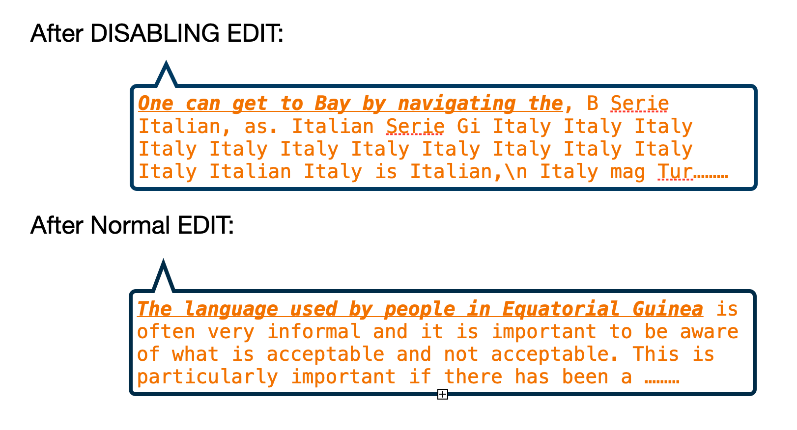
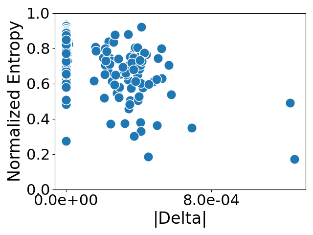
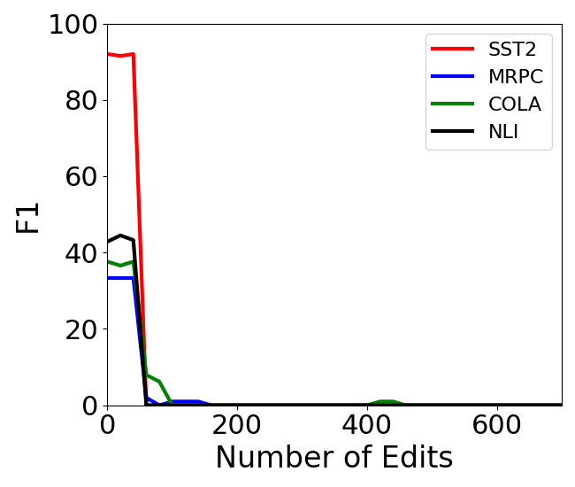
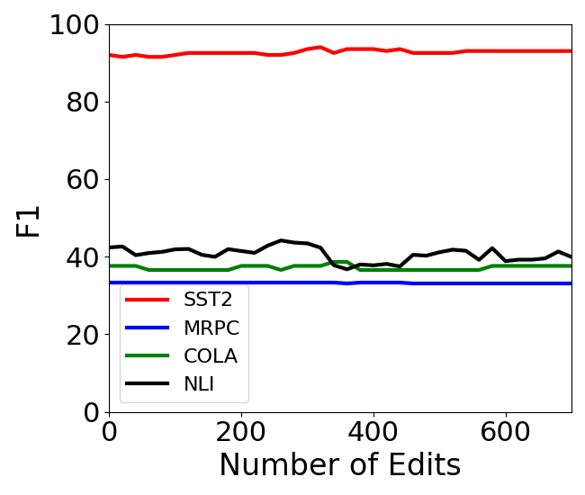
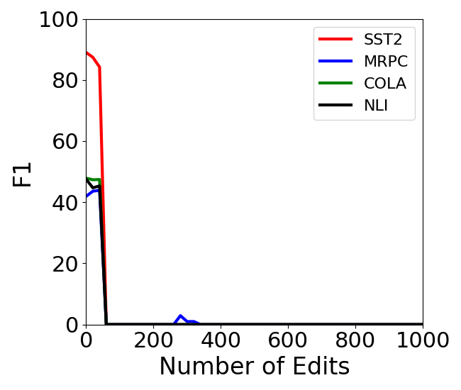
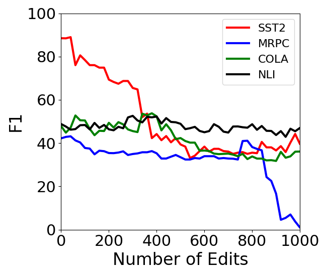

# Rebuilding ROME : Resolving Model Collapse during 
Sequential Model Editing

###### Abstract

Recent work on model editing using Rank-One Model Editing (ROME), a popular model editing method, has shown that there are certain facts that the algorithm is unable to edit without breaking the model. Such edits have previously been called disabling edits Gupta et al. ([2024](#bib.bib8)). These disabling edits cause immediate model collapse and limits the use of ROME for sequential editing. In this paper, we make two main contributions. Firstly, we show that model collapse with ROME only happens when making edits using the CounterFact dataset Meng et al. ([2022a](#bib.bib12)) and does not happen when using the zsRE dataset Levy et al. ([2017](#bib.bib11)). Secondly, we find that disabling edits are an artifact of the original implementation of ROME. With this paper, we provide a more stable implementation ROME, which we call r-ROME and show that we no longer observe model collapse when making large scale sequential edits with ROME.  

Rebuilding ROME : Resolving Model Collapse during     Sequential Model Editing  

  

    Akshat Gupta, Gopala Anumanchipalli  UC Berkeley  akshat.gupta@berkeley.edu    

  

## 1 Introduction

Large language models (LLMs) are expensive to train and the knowledge contained in these models gets obsolete with time. Model editing or knowledge editing (Yao et al., [2023](#bib.bib23)) has recently come out as a popular method to update knowledge in large language models (LLMs). Knowledge editing is done in two main ways - either by adding information in-context (Mitchell et al., [2022](#bib.bib15); Zhong et al., [2023](#bib.bib24); Cohen et al., [2023](#bib.bib2)), or using methods that modify the parameters of underlying model (De Cao et al., [2021](#bib.bib4); Mitchell et al., [2021](#bib.bib14); Meng et al., [2022a](#bib.bib12), [b](#bib.bib13); Tan et al., [2023](#bib.bib18)). In this paper, we focus on one popular parameter-modifying model editing methods called ROME (Rank-One Model Editing) Meng et al. ([2022a](#bib.bib12)).  

While a lot of model editing approaches perform well when making singular edits, editing multiple facts in a model still remains a challenge for parameter-modifying model editing methods. One way to make multiple edits to the same model is through sequential editing Yao et al. ([2023](#bib.bib23)) - where we make a series of single edits to a model by modifying the parameters of the model after every edit. Recent works have started studying the effects of sequential editing and show a gradual decay in model’s abilities as more edits are made to the model (Meng et al., [2022b](#bib.bib13); Yao et al., [2023](#bib.bib23); Gu et al., [2024](#bib.bib7); Gupta et al., [2024](#bib.bib8)). Additionally, it was found that one popular model editing technique called ROME Meng et al. ([2022a](#bib.bib12)) was prone to a sudden collapse of the model by a single edit (Gupta et al., [2024](#bib.bib8); Yang et al., [2024](#bib.bib22); Hu et al., [2024](#bib.bib10)). This effect was first observed in Gupta et al. ([2024](#bib.bib8)) during sequential editing. The collapse included complete loss of downstream performance, inability to recall previously editing facts and loss of the ability to even get edited. Such facts were named disabling edits by Gupta et al. ([2024](#bib.bib8)) and were later independently observed by Yang et al. ([2024](#bib.bib22)); Hu et al. ([2024](#bib.bib10)). Text generation examples for models post-collapse from a disabling edit are shown in Figure [1](#S1.F1 "Figure 1 ‣ 1 Introduction ‣ Rebuilding ROME : Resolving Model Collapse during Sequential Model Editing").  

[FIGURE S1.F1.g1]

Figure 1: A typical generation example after a disabling edit is compared to a normal model edit using ROME. The bold and underlined part in the text is the prompt given to the model, which is followed by the text generated by the model.
[/FIGURE]

Disabling edits are detrimental for knowledge editing at scale. While a gradual model degradation is expected as we make sequential edits to a model Gupta et al. ([2024](#bib.bib8)), disabling edits lead to a sudden model collapse irrespective of when the disabling fact is edited, making sequential editing impossible. An example of this can be seen in Figure [4(a)](#S3.F4.sf1 "In Figure 4 ‣ 3.2 Searching for Disabling Edits ‣ 3 Experiments ‣ Rebuilding ROME : Resolving Model Collapse during Sequential Model Editing"), where instead of allowing gradual model degradation when doing sequential editing like in Figure [5(b)](#S3.F5.sf2 "In Figure 5 ‣ 3.2 Searching for Disabling Edits ‣ 3 Experiments ‣ Rebuilding ROME : Resolving Model Collapse during Sequential Model Editing"), the presence of disabling edits lead to a sudden and immediate model collapse.  

[FIGURE S1.F2.sf1.g1]

(a) CounterFact - ROME
[/FIGURE]

In this paper, we aim to find the source of these disabling edits. We first introduce two metrics for identifying disabling edits - generation entropy and the norm of matrix update. We plot edits made by ROME along these two dimensions. We then perform large scale editing of GPT2-XL Radford et al. ([2019](#bib.bib16)) and GPT-J Wang and Komatsuzaki ([2021](#bib.bib20)) using ROME on two popular model editing datasets - CounterFact Meng et al. ([2022a](#bib.bib12)) and zsRE (Levy et al., [2017](#bib.bib11); Mitchell et al., [2021](#bib.bib14); Meng et al., [2022a](#bib.bib12)). We find that disabling edits only exist when editing facts from the CounterFact dataset and not the zsRE dataset. After long inquiry into the reasons behind model collapse, we decide to rebuild the ROME code-base ourselves. To our surprise, we find that the problem of model collapse goes away with our implementation of ROME and we are able to perform large-scale sequential model editing using the algorithm. With this paper, we share our new ROME code-base and invite researchers to use it for model editing. Our implementation of ROME, which we call r-ROME, can be found [here](https://github.com/scalable-model-editing/rebuilding-rome).  

## 2 Background

The focus of our paper is a model editing algorithm called ROME (Rank-One Model Editing) Meng et al. ([2022a](#bib.bib12)). ROME is a parameter-modifying model editing method, which means that it inserts knowledge into LLMs by changing their parameters. ROME falls under the "locate-and-edit" category for model editing methods, where knowledge is updated by first identifying the layers in the model corresponding to stored knowledge and then modifying the weights for the specific layers.  

Facts are usually added in a key-value format, where a key is the vector representation of a query-phrase and the value is the vector representation of the target object. For example, when adding a new fact - "The president of USA is John Cena", the query-phrase here is "The president of USA is" and the target object is "John Cena". Editing in ROME is done using a pair of vectors - $(k_{e},v_{e})$ that represent a new fact being added. $k_{e}$, also called the key-vector is a vector representation of the query-phrase, and $v_{e}$, or the value-vector is the vector representation of the target object. The weights of the specific layer being edited in ROME are updated from $W_{0}$ to $\hat{W}$ by inserting a new fact $(k_{e},v_{e})$ using the following equation:  

|  | $\displaystyle\hat{W}$ | $\displaystyle=W_{0}+\Delta\hskip 10.0pt$ |  | (1) |
| --- | --- | --- | --- | --- |
|  | $\displaystyle\text{where}\hskip 10.0pt\Delta$ | $\displaystyle=(v_{e}-W_{0}k_{e})\frac{k_{e}^{T}C_{0}^{-1}}{k_{e}^{T}C_{0}^{-1}k_{e}}$ |  |

where $\Delta$ is the update to the current weight matrix being edited such that the new fact represented by $(k_{e},v_{e})$ is incorporated.  

[TABLE S2.T1]

<table class="ltx_tabular ltx_centering ltx_guessed_headers ltx_align_middle">
<thead class="ltx_thead">
<tr class="ltx_tr">
<th class="ltx_td ltx_nopad_l ltx_nopad_r ltx_align_center ltx_th ltx_th_column ltx_th_row ltx_border_tt">Dataset</th>
<th class="ltx_td ltx_nopad_l ltx_nopad_r ltx_align_center ltx_th ltx_th_column ltx_th_row ltx_border_tt">Implementation</th>
<th class="ltx_td ltx_nopad_l ltx_align_center ltx_th ltx_th_column ltx_border_tt">Efficacy</th>
<th class="ltx_td ltx_nopad_l ltx_align_center ltx_th ltx_th_column ltx_border_tt">Generalization</th>
<th class="ltx_td ltx_nopad_l ltx_align_center ltx_th ltx_th_column ltx_border_tt">Locality</th>
<th class="ltx_td ltx_nopad_l ltx_align_center ltx_th ltx_th_column ltx_border_tt">Fluency</th>
<th class="ltx_td ltx_nopad_l ltx_nopad_r ltx_align_center ltx_th ltx_th_column ltx_border_tt">Score</th>
</tr>
<tr class="ltx_tr">
<th class="ltx_td ltx_nopad_l ltx_nopad_r ltx_align_center ltx_th ltx_th_column ltx_border_t">ES <math class="ltx_Math"><semantics><mo>↑</mo><annotation-xml><ci>↑</ci></annotation-xml><annotation>\uparrow</annotation></semantics></math>
</th>
<th class="ltx_td ltx_nopad_l ltx_nopad_r ltx_align_center ltx_th ltx_th_column ltx_border_t">EM <math class="ltx_Math"><semantics><mo>↑</mo><annotation-xml><ci>↑</ci></annotation-xml><annotation>\uparrow</annotation></semantics></math>
</th>
<th class="ltx_td ltx_nopad_l ltx_nopad_r ltx_align_center ltx_th ltx_th_column ltx_border_t">PS <math class="ltx_Math"><semantics><mo>↑</mo><annotation-xml><ci>↑</ci></annotation-xml><annotation>\uparrow</annotation></semantics></math>
</th>
<th class="ltx_td ltx_nopad_l ltx_nopad_r ltx_align_center ltx_th ltx_th_column ltx_border_t">PM <math class="ltx_Math"><semantics><mo>↑</mo><annotation-xml><ci>↑</ci></annotation-xml><annotation>\uparrow</annotation></semantics></math>
</th>
<th class="ltx_td ltx_nopad_l ltx_nopad_r ltx_align_center ltx_th ltx_th_column ltx_border_t">NS <math class="ltx_Math"><semantics><mo>↑</mo><annotation-xml><ci>↑</ci></annotation-xml><annotation>\uparrow</annotation></semantics></math>
</th>
<th class="ltx_td ltx_nopad_l ltx_nopad_r ltx_align_center ltx_th ltx_th_column ltx_border_t">NM <math class="ltx_Math"><semantics><mo>↑</mo><annotation-xml><ci>↑</ci></annotation-xml><annotation>\uparrow</annotation></semantics></math>
</th>
<th class="ltx_td ltx_nopad_l ltx_nopad_r ltx_align_center ltx_th ltx_th_column ltx_border_t">GE <math class="ltx_Math"><semantics><mo>↑</mo><annotation-xml><ci>↑</ci></annotation-xml><annotation>\uparrow</annotation></semantics></math>
</th>
<th class="ltx_td ltx_nopad_l ltx_nopad_r ltx_align_center ltx_th ltx_th_column ltx_border_t">S <math class="ltx_Math"><semantics><mo>↑</mo><annotation-xml><ci>↑</ci></annotation-xml><annotation>\uparrow</annotation></semantics></math>
</th>
</tr>
</thead>
<tbody class="ltx_tbody">
<tr class="ltx_tr">
<th class="ltx_td ltx_nopad_l ltx_nopad_r ltx_align_center ltx_th ltx_th_row ltx_border_bb ltx_border_b ltx_border_t">ROME</th>
<th class="ltx_td ltx_nopad_l ltx_nopad_r ltx_align_center ltx_th ltx_th_row ltx_border_t">Original</th>
<td class="ltx_td ltx_nopad_l ltx_nopad_r ltx_align_center ltx_border_t"><math class="ltx_Math"><semantics><mn>99.92</mn><annotation-xml><cn>99.92</cn></annotation-xml><annotation>99.92</annotation></semantics></math></td>
<td class="ltx_td ltx_nopad_l ltx_nopad_r ltx_align_center ltx_border_t"><math class="ltx_Math"><semantics><mn>99.68</mn><annotation-xml><cn>99.68</cn></annotation-xml><annotation>99.68</annotation></semantics></math></td>
<td class="ltx_td ltx_nopad_l ltx_nopad_r ltx_align_center ltx_border_t"><math class="ltx_Math"><semantics><mn>96.29</mn><annotation-xml><cn>96.29</cn></annotation-xml><annotation>96.29</annotation></semantics></math></td>
<td class="ltx_td ltx_nopad_l ltx_nopad_r ltx_align_center ltx_border_t"><math class="ltx_Math"><semantics><mn>71.58</mn><annotation-xml><cn>71.58</cn></annotation-xml><annotation>71.58</annotation></semantics></math></td>
<td class="ltx_td ltx_nopad_l ltx_nopad_r ltx_align_center ltx_border_t"><math class="ltx_Math"><semantics><mn>75.8</mn><annotation-xml><cn>75.8</cn></annotation-xml><annotation>75.8</annotation></semantics></math></td>
<td class="ltx_td ltx_nopad_l ltx_nopad_r ltx_align_center ltx_border_t"><math class="ltx_Math"><semantics><mn>10.25</mn><annotation-xml><cn>10.25</cn></annotation-xml><annotation>10.25</annotation></semantics></math></td>
<td class="ltx_td ltx_nopad_l ltx_nopad_r ltx_align_center ltx_border_t"><math class="ltx_Math"><semantics><mn>621.96</mn><annotation-xml><cn>621.96</cn></annotation-xml><annotation>621.96</annotation></semantics></math></td>
<td class="ltx_td ltx_nopad_l ltx_nopad_r ltx_align_center ltx_border_t"><math class="ltx_Math"><semantics><mn>89.32</mn><annotation-xml><cn>89.32</cn></annotation-xml><annotation>89.32</annotation></semantics></math></td>
</tr>
<tr class="ltx_tr">
<th class="ltx_td ltx_nopad_l ltx_nopad_r ltx_align_center ltx_th ltx_th_row ltx_border_bb ltx_border_b">Ours</th>
<td class="ltx_td ltx_nopad_l ltx_nopad_r ltx_align_center ltx_border_bb ltx_border_b"><math class="ltx_Math"><semantics><mn>99.78</mn><annotation-xml><cn>99.78</cn></annotation-xml><annotation>99.78</annotation></semantics></math></td>
<td class="ltx_td ltx_nopad_l ltx_nopad_r ltx_align_center ltx_border_bb ltx_border_b"><math class="ltx_Math"><semantics><mn>99.64</mn><annotation-xml><cn>99.64</cn></annotation-xml><annotation>99.64</annotation></semantics></math></td>
<td class="ltx_td ltx_nopad_l ltx_nopad_r ltx_align_center ltx_border_bb ltx_border_b"><math class="ltx_Math"><semantics><mn>97.4</mn><annotation-xml><cn>97.4</cn></annotation-xml><annotation>97.4</annotation></semantics></math></td>
<td class="ltx_td ltx_nopad_l ltx_nopad_r ltx_align_center ltx_border_bb ltx_border_b"><math class="ltx_Math"><semantics><mn>71.16</mn><annotation-xml><cn>71.16</cn></annotation-xml><annotation>71.16</annotation></semantics></math></td>
<td class="ltx_td ltx_nopad_l ltx_nopad_r ltx_align_center ltx_border_bb ltx_border_b"><math class="ltx_Math"><semantics><mn>74.86</mn><annotation-xml><cn>74.86</cn></annotation-xml><annotation>74.86</annotation></semantics></math></td>
<td class="ltx_td ltx_nopad_l ltx_nopad_r ltx_align_center ltx_border_bb ltx_border_b"><math class="ltx_Math"><semantics><mn>10.0</mn><annotation-xml><cn>10.0</cn></annotation-xml><annotation>10.0</annotation></semantics></math></td>
<td class="ltx_td ltx_nopad_l ltx_nopad_r ltx_align_center ltx_border_bb ltx_border_b"><math class="ltx_Math"><semantics><mn>621.08</mn><annotation-xml><cn>621.08</cn></annotation-xml><annotation>621.08</annotation></semantics></math></td>
<td class="ltx_td ltx_nopad_l ltx_nopad_r ltx_align_center ltx_border_bb ltx_border_b"><math class="ltx_Math"><semantics><mn>89.16</mn><annotation-xml><cn>89.16</cn></annotation-xml><annotation>89.16</annotation></semantics></math></td>
</tr>
</tbody>
</table>

Table 1: A comparison between the original implementation Meng et al. ([2022a](#bib.bib12)) and our implementation of ROME on standard model editing metrics for GPT2-XL. The above table is created using a random sample of 5000 edits from the CounterFact dataset. We find that our implementation performs equally as well as the original implementation of ROME.
[/TABLE]

### 2.1 Evaluating Model Editing

Model editing is usually evaluated along three metrics - reliability, generalization and locality. Reliability measures if a fact was successfully added in a model, generalization measures if the edited fact is recalled through paraphrases of the prompt used to edit the fact, whereas locality measures if editing of one fact affects other facts stored inside a model. We follow standard model editing metrics proposed in Meng et al. ([2022a](#bib.bib12)). We refer the reader to Yao et al. ([2023](#bib.bib23)); Meng et al. ([2022a](#bib.bib12)) for a more comprehensive review of model editing metrics. Additionally, we also evaluated the model on downstream task performance as proposed by (Gu et al., [2024](#bib.bib7); Gupta et al., [2024](#bib.bib8)), which becomes especially important when making sequential edits to the same model. We follow Gupta et al. ([2024](#bib.bib8)) and evaluate the edited model on four tasks from the GLUE Wang et al. ([2018](#bib.bib19)) benchmark - sentiment analysis (SST2) Socher et al. ([2013](#bib.bib17)), paraphrase detection (MRPC) Dolan and Brockett ([2005](#bib.bib5)), natural language inference (NLI) (Dagan et al., [2005](#bib.bib3); Haim et al., [2006](#bib.bib9); Giampiccolo et al., [2007](#bib.bib6); Bentivogli et al., [2009](#bib.bib1)) and linguistic acceptability classification Warstadt et al. ([2019](#bib.bib21)) for doing downstream evaluation.  

## 3 Experiments

### 3.1 Metrics to Identify Disabling Edits

Disabling edits Gupta et al. ([2024](#bib.bib8)) are defined as singular knowledge edits made to the model that renders it useless, leading to sudden loss of ability to do downstream tasks or any kind of meaningful generation. Gupta et al. ([2024](#bib.bib8)) also showed one way of identifying disabling edits was the unusually large norm of the update matrix. In other words, $|\Delta|$ in equation [1](#S2.E1 "In 2 Background ‣ Rebuilding ROME : Resolving Model Collapse during Sequential Model Editing") was unusually higher when compared to the $|\Delta|$ for normal edits. We will use a modified version of $|\Delta|$ as the first metric to identify disabling edits, where we normalize $|\Delta|$ by the number of elements in the matrix.  

Additionally, Figure [1](#S1.F1 "Figure 1 ‣ 1 Introduction ‣ Rebuilding ROME : Resolving Model Collapse during Sequential Model Editing") shows a typical example of model collapse where the model constantly repeats a single word. This repeated word is most often the edited answer inserted into the model. The simplest metric to identify such a model collapse is to calculate the entropy over the probability distribution of vocabulary elements of text generated from the model. For this, a probability distribution is calculated over the vocabulary of a sample generation consisting of ten generations, and is normalized by the vocabulary size to remove the effect of the size of vocabulary. This constrains the entropy between 0 and 1. If the model collapses as shown in Figure [1](#S1.F1 "Figure 1 ‣ 1 Introduction ‣ Rebuilding ROME : Resolving Model Collapse during Sequential Model Editing"), we expected the normalized entropy to be small and concentrated around a handful of words.  

Note that this metric is a simplification of the generation entropy metric proposed by Meng et al. ([2022a](#bib.bib12)), where they take a weighted average of the entropy over of vocabulary of bigrams and trigrams. We chose to calculate entropy over just the unigram vocabulary words as it is cheaper and does the job, while normalization helps comparing entropy values for generations of different vocabulary size.  

[FIGURE S3.F3.sf1.g1]

(a) Original Implementation
[/FIGURE]

### 3.2 Searching for Disabling Edits

The first set of experiments we do is to search for disabling edits. We do this by making large-scale singular model edits using ROME on GPT2-XL, on two popular model editing datasets - CounterFact Meng et al. ([2022a](#bib.bib12)) and zsRE (Levy et al., [2017](#bib.bib11); Mitchell et al., [2021](#bib.bib14)). We measure the above mentioned metrics as shown in Figure [2](#S1.F2 "Figure 2 ‣ 1 Introduction ‣ Rebuilding ROME : Resolving Model Collapse during Sequential Model Editing").  

We make the following two observations. Firstly, we observe that edits made using the zsRE dataset are very consistent along the two metrics, which means that the norm of the update are consistently small and generation entropy consistently high. The text generations made by all post-edit models when editing zsRE are consistently good and coherent, and do not have the repetitiveness found in disabling edits. We thus conclude that disabling edits are not present when editing facts using the zsRE dataset. Secondly, we see two clusters when editing facts from the CounterFact dataset. We find that certain edits have larger values of $|\Delta|$ for ROME, indicating the presence of disabling edits as seen in (Gupta et al., [2024](#bib.bib8); Yang et al., [2024](#bib.bib22); Hu et al., [2024](#bib.bib10)). This shows that edits made using the CounterFact dataset can lead to model collapse. The above observation is quite surprising. It shows that there is a fundamental difference in the updates made to the model when editing facts using zsRE dataset and the CounterFact dataset. Model updates made using zsRE dataset have smaller $|\Delta|$ values and lead to healthy model behavior post editing.  

[FIGURE S3.F4.sf1.g1]

(a) Downstream Evaluation
[/FIGURE]

[FIGURE S3.F5.sf1.g1]

(a) Downstream Evaluation
[/FIGURE]

The underlying reason for the difference in behavior of post-edit model is unclear, but is likely related to the characteristics of the two datasets. zsRE and CounterFact dataset differ in three major ways. Firstly, the CounterFact dataset contains counterfactual facts. This means that this dataset edits the model in such a way that lower probability objects are being inserted into the model, whereas in zsRE, we are inserting factually correct facts. The second difference in the two datasets is that zsRE edits facts using a question-answering prompt, whereas CounterFact prompts the model in a text completion format. This means that the key-vector in zsRE for the fact mentioned in section [2](#S2 "2 Background ‣ Rebuilding ROME : Resolving Model Collapse during Sequential Model Editing") corresponds to a question like "Who is the president of USA?" whereas for CounterFact it corresponds to "The president of USA is". Thirdly, all facts in CounterFact are one-word facts, are largely also tokenized into a single token for GPT2-XL and GPT-J, whereas most facts in zsRE contain multiple words. The difference in edits made by the two datasets is possibly due to one of the underlying reasons, but it is hard to answer this question without eliminating the confounding factors. Such a study is beyond the scope of this paper, and hence we continue to focus on removing disabling edits during model editing with ROME.  

### 3.3 Fixing Disabling Edits

After a long inquiry into the optimization objective of ROME and studying its original code-base and different properties of the edits made by the algorithm, we found no reason for the $|\Delta|$ of certain edits to be so large. As a last resort, we re-implemented ROME ourselves. To our absolute surprise, we found that our re-implementation of ROME does not lead to disabling edits. The first evidence of this can be seen in Figure [3](#S3.F3 "Figure 3 ‣ 3.1 Metrics to Identify Disabling Edits ‣ 3 Experiments ‣ Rebuilding ROME : Resolving Model Collapse during Sequential Model Editing"), where the $|\Delta|$ of the updates are orders of magnitude smaller for our implementation when compared to the original implementation. The comparison of original Meng et al. ([2022a](#bib.bib12)) and our implementation of ROME on standard model editing metrics is shown in Table [1](#S2.T1 "Table 1 ‣ 2 Background ‣ Rebuilding ROME : Resolving Model Collapse during Sequential Model Editing"). This table shows that our implementation performs equally well as original implementation of ROME, while having much smaller $|\Delta|$ values. We make no change to the update equation of ROME and re-implement it as is.  

### 3.4 Sequential Editing with ROME

A large part of the reason why disabling edits went unnoticed initially was because large scale edits were not performed on the same model and the model was not evaluated on downstream tasks. Recent works (Gupta et al., [2024](#bib.bib8); Yang et al., [2024](#bib.bib22); Hu et al., [2024](#bib.bib10)) observe disabling edits as a result performing sequential edits. Thus a final litmus test of our re-implementation of ROME is to perform sequential editing. The results for sequential editing can be seen in Figures [4](#S3.F4 "Figure 4 ‣ 3.2 Searching for Disabling Edits ‣ 3 Experiments ‣ Rebuilding ROME : Resolving Model Collapse during Sequential Model Editing") and [5](#S3.F5 "Figure 5 ‣ 3.2 Searching for Disabling Edits ‣ 3 Experiments ‣ Rebuilding ROME : Resolving Model Collapse during Sequential Model Editing").  

Figure [4](#S3.F4 "Figure 4 ‣ 3.2 Searching for Disabling Edits ‣ 3 Experiments ‣ Rebuilding ROME : Resolving Model Collapse during Sequential Model Editing") shows a typical case of sequential editing using the original ROME code-base for GPT-J, where the presence of a disabling edit leads to large $|\Delta|$ and leads to model collapse, as can be seen by an immediate loss of downstream performance in Figure [4(a)](#S3.F4.sf1 "In Figure 4 ‣ 3.2 Searching for Disabling Edits ‣ 3 Experiments ‣ Rebuilding ROME : Resolving Model Collapse during Sequential Model Editing"). With our re-implementation of ROME (Figure [5](#S3.F5 "Figure 5 ‣ 3.2 Searching for Disabling Edits ‣ 3 Experiments ‣ Rebuilding ROME : Resolving Model Collapse during Sequential Model Editing")), we see that $|\Delta|$ is orders of magnitude smaller which allows the model to maintain its general abilities and avoids model collapse. This enables large scale sequential model editing without loss of performance. Similar trends can be seen for GPT2-XL in Figures [6](#A1.F6 "Figure 6 ‣ Appendix A Sequential Editing on GPT2-XL ‣ Rebuilding ROME : Resolving Model Collapse during Sequential Model Editing") and [7](#A1.F7 "Figure 7 ‣ Appendix A Sequential Editing on GPT2-XL ‣ Rebuilding ROME : Resolving Model Collapse during Sequential Model Editing").  

## 4 Conclusion

In this paper, we show that model edits made using the original implementation of ROME lead to unstable model edits eventually causing model collapse. Our re-implementation of ROME, which we call r-rome ([code](https://github.com/scalable-model-editing/rebuilding-rome)) prevents model collapse and leads to stable and scalable model edits, thus making sequential editing possible using ROME.  

## References

* Bentivogli et al. (2009)  Luisa Bentivogli, Peter Clark, Ido Dagan, and Danilo Giampiccolo. 2009.   The fifth pascal recognizing textual entailment challenge.   *TAC*, 7:8. 
* Cohen et al. (2023)  Roi Cohen, Eden Biran, Ori Yoran, Amir Globerson, and Mor Geva. 2023.   Evaluating the ripple effects of knowledge editing in language models.   *arXiv preprint arXiv:2307.12976*. 
* Dagan et al. (2005)  Ido Dagan, Oren Glickman, and Bernardo Magnini. 2005.   The pascal recognising textual entailment challenge.   In *Machine learning challenges workshop*, pages 177–190. Springer. 
* De Cao et al. (2021)  Nicola De Cao, Wilker Aziz, and Ivan Titov. 2021.   Editing factual knowledge in language models.   *arXiv preprint arXiv:2104.08164*. 
* Dolan and Brockett (2005)  Bill Dolan and Chris Brockett. 2005.   Automatically constructing a corpus of sentential paraphrases.   In *Third International Workshop on Paraphrasing (IWP2005)*. 
* Giampiccolo et al. (2007)  Danilo Giampiccolo, Bernardo Magnini, Ido Dagan, and William B Dolan. 2007.   The third pascal recognizing textual entailment challenge.   In *Proceedings of the ACL-PASCAL workshop on textual entailment and paraphrasing*, pages 1–9. 
* Gu et al. (2024)  Jia-Chen Gu, Hao-Xiang Xu, Jun-Yu Ma, Pan Lu, Zhen-Hua Ling, Kai-Wei Chang, and Nanyun Peng. 2024.   Model editing can hurt general abilities of large language models.   *arXiv preprint arXiv:2401.04700*. 
* Gupta et al. (2024)  Akshat Gupta, Anurag Rao, and Gopala Anumanchipalli. 2024.   Model editing at scale leads to gradual and catastrophic forgetting.   *arXiv preprint arXiv:2401.07453*. 
* Haim et al. (2006)  R Bar Haim, Ido Dagan, Bill Dolan, Lisa Ferro, Danilo Giampiccolo, Bernardo Magnini, and Idan Szpektor. 2006.   The second pascal recognising textual entailment challenge.   In *Proceedings of the Second PASCAL Challenges Workshop on Recognising Textual Entailment*, volume 7, pages 785–794. 
* Hu et al. (2024)  Chenhui Hu, Pengfei Cao, Yubo Chen, Kang Liu, and Jun Zhao. 2024.   Wilke: Wise-layer knowledge editor for lifelong knowledge editing.   *arXiv preprint arXiv:2402.10987*. 
* Levy et al. (2017)  Omer Levy, Minjoon Seo, Eunsol Choi, and Luke Zettlemoyer. 2017.   Zero-shot relation extraction via reading comprehension.   *arXiv preprint arXiv:1706.04115*. 
* Meng et al. (2022a)  Kevin Meng, David Bau, Alex Andonian, and Yonatan Belinkov. 2022a.   Locating and editing factual associations in gpt.   *Advances in Neural Information Processing Systems*, 35:17359–17372. 
* Meng et al. (2022b)  Kevin Meng, Arnab Sen Sharma, Alex Andonian, Yonatan Belinkov, and David Bau. 2022b.   Mass-editing memory in a transformer.   *arXiv preprint arXiv:2210.07229*. 
* Mitchell et al. (2021)  Eric Mitchell, Charles Lin, Antoine Bosselut, Chelsea Finn, and Christopher D Manning. 2021.   Fast model editing at scale.   *arXiv preprint arXiv:2110.11309*. 
* Mitchell et al. (2022)  Eric Mitchell, Charles Lin, Antoine Bosselut, Christopher D Manning, and Chelsea Finn. 2022.   Memory-based model editing at scale.   In *International Conference on Machine Learning*, pages 15817–15831. PMLR. 
* Radford et al. (2019)  Alec Radford, Jeffrey Wu, Rewon Child, David Luan, Dario Amodei, Ilya Sutskever, et al. 2019.   Language models are unsupervised multitask learners.   *OpenAI blog*, 1(8):9. 
* Socher et al. (2013)  Richard Socher, Alex Perelygin, Jean Wu, Jason Chuang, Christopher D Manning, Andrew Y Ng, and Christopher Potts. 2013.   Recursive deep models for semantic compositionality over a sentiment treebank.   In *Proceedings of the 2013 conference on empirical methods in natural language processing*, pages 1631–1642. 
* Tan et al. (2023)  Chenmien Tan, Ge Zhang, and Jie Fu. 2023.   Massive editing for large language models via meta learning.   *arXiv preprint arXiv:2311.04661*. 
* Wang et al. (2018)  Alex Wang, Amanpreet Singh, Julian Michael, Felix Hill, Omer Levy, and Samuel R Bowman. 2018.   Glue: A multi-task benchmark and analysis platform for natural language understanding.   *arXiv preprint arXiv:1804.07461*. 
* Wang and Komatsuzaki (2021)  Ben Wang and Aran Komatsuzaki. 2021.   GPT-J-6B: A 6 Billion Parameter Autoregressive Language Model.   <https://github.com/kingoflolz/mesh-transformer-jax>. 
* Warstadt et al. (2019)  Alex Warstadt, Amanpreet Singh, and Samuel R Bowman. 2019.   Neural network acceptability judgments.   *Transactions of the Association for Computational Linguistics*, 7:625–641. 
* Yang et al. (2024)  Wanli Yang, Fei Sun, Xinyu Ma, Xun Liu, Dawei Yin, and Xueqi Cheng. 2024.   The butterfly effect of model editing: Few edits can trigger large language models collapse.   *arXiv preprint arXiv:2402.09656*. 
* Yao et al. (2023)  Yunzhi Yao, Peng Wang, Bozhong Tian, Siyuan Cheng, Zhoubo Li, Shumin Deng, Huajun Chen, and Ningyu Zhang. 2023.   Editing large language models: Problems, methods, and opportunities.   *arXiv preprint arXiv:2305.13172*. 
* Zhong et al. (2023)  Zexuan Zhong, Zhengxuan Wu, Christopher D Manning, Christopher Potts, and Danqi Chen. 2023.   Mquake: Assessing knowledge editing in language models via multi-hop questions.   *arXiv preprint arXiv:2305.14795*. 

## Appendix A Sequential Editing on GPT2-XL

[FIGURE A1.F6.sf1.g1]

(a) Downstream Evaluation
[/FIGURE]

[FIGURE A1.F7.sf1.g1]

(a) Downstream Evaluation
[/FIGURE]

