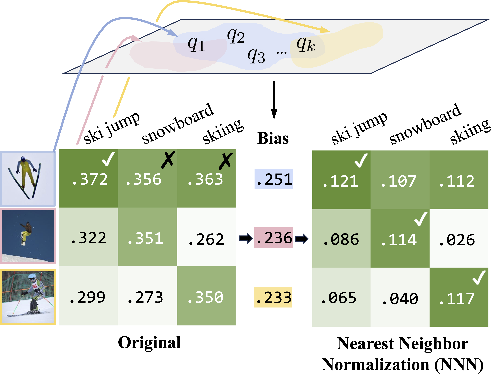
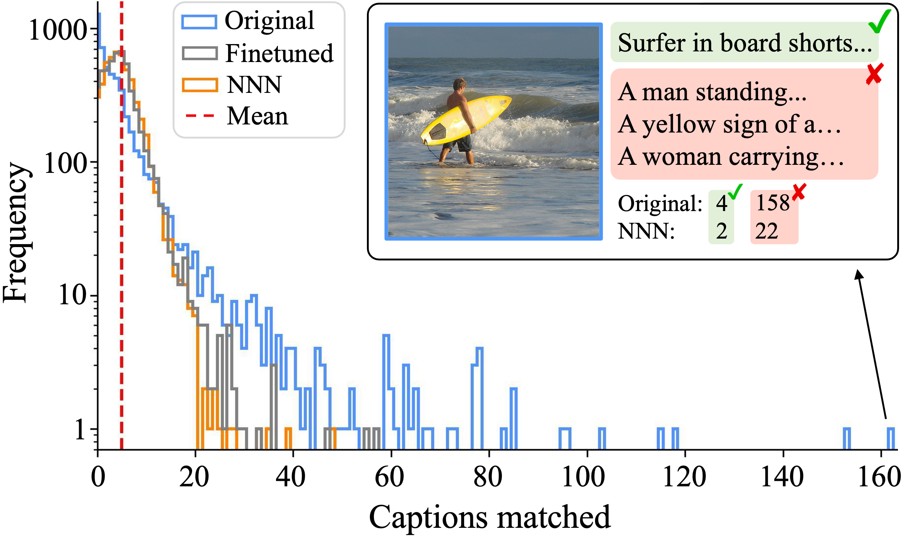
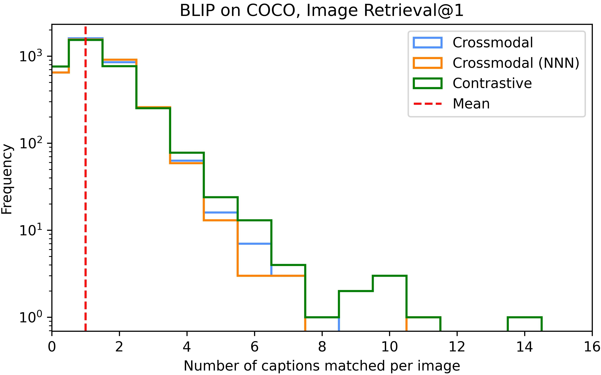
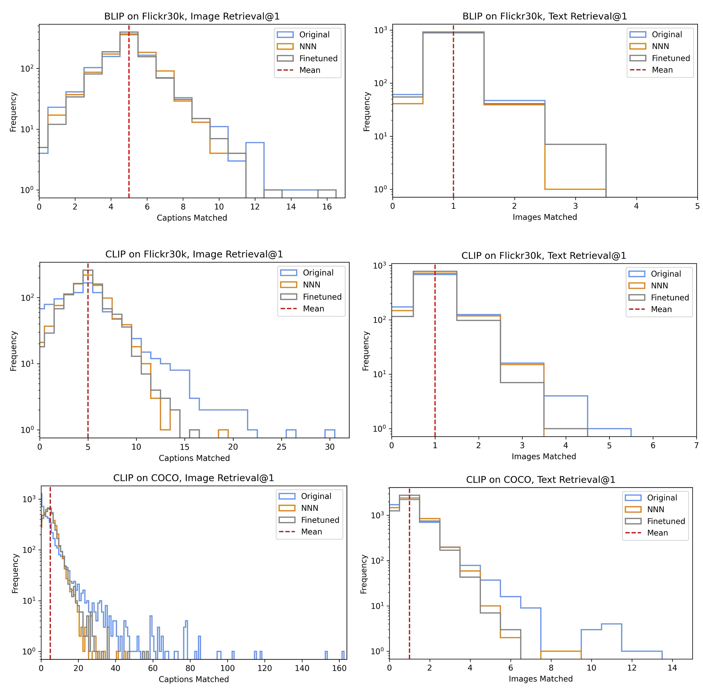

# Nearest Neighbor Normalization Improves Multimodal Retrieval

###### Abstract

Multimodal models leverage large-scale pretraining to achieve strong but still imperfect performance on tasks such as image captioning, visual question answering, and cross-modal retrieval. In this paper, we present a simple and efficient method for correcting errors in trained contrastive image-text retrieval models with no additional training, called Nearest Neighbor Normalization (NNN). We show an improvement on retrieval metrics in both text retrieval and image retrieval for all of the contrastive models that we tested (CLIP, BLIP, ALBEF, SigLIP, BEiT) and for both of the datasets that we used (MS-COCO and Flickr30k). NNN requires a reference database, but does not require any training on this database, and can even increase the retrieval accuracy of a model after finetuning.111Our code is publicly available at <https://github.com/multimodal-interpretability/nnn>  

Nearest Neighbor Normalization Improves Multimodal Retrieval  

  

     Neil Chowdhury1\*, Franklin Wang1\*, Sumedh Shenoy1\*,  Douwe Kiela2, Sarah Schwettmann1†, Tristan Thrush2†  1Massachusetts Institute of Technology, 2Stanford University  {nchow,fxwang,sshenoy,schwett}@mit.edu, {dkiela,tthrush}@stanford.edu  \*Equal contribution †Equal advising    

  

## 1 Introduction

Contrastive image and text models are a fundamental building block of large-scale text-to-image or image-to-text retrieval systems (Radford et al., [2021](#bib.bib10); Jia et al., [2021](#bib.bib6); Zhang et al., [2022](#bib.bib20)). These models utilize contrastive loss functions to learn joint text and image embeddings, aligning embeddings for matching text and image pairs while separating embeddings for non-matching pairs. However, contrastive embeddings optimize pretraining objectives such as InfoNCE Radford et al. ([2021](#bib.bib10)) rather than downstream retrieval accuracy, so learned embeddings can be suboptimal for retrieval Zhou et al. ([2023](#bib.bib22)). Many methods for improving contrastive models on downstream retrieval tasks require additional training to adapt models across domains or aggregate information from an external database Zhou et al. ([2022](#bib.bib21)); Singha et al. ([2023](#bib.bib12)); Iscen et al. ([2023](#bib.bib5)), and others are specialized for individual error categories, such as gender bias Wang et al. ([2021](#bib.bib13), [2022a](#bib.bib14)); Berg et al. ([2022](#bib.bib1)).  

[FIGURE S1.F1.g1]

Figure 1: Method overview. NNN applies an additive correction at inference time, using bias scores estimated from a reference database of queries.
[/FIGURE]

Recent training-free methods suggest that accuracy can be improved without fine-tuning, which is useful for limited-compute environments and critical for black-box embedding models. Such methods typically use a reference database of query and retrieval embeddings to adapt the pretrained model to the downstream retrieval task. For instance, QBNorm and DBNorm normalize scores for each retrieval candidate by computing a softmax over the entire reference database Bogolin et al. ([2022](#bib.bib2)); Wang et al. ([2023](#bib.bib16)). These approaches mitigate the hubness problem, where certain retrieval candidates (“hubs”) emerge as nearest neighbors for many queries in high-dimensional embedding spaces, leading to incorrect matches (Radovanovic et al., [2010](#bib.bib11)). These methods tend to be computationally impractical, requiring match score calculations for every item in the database and thus scaling linearly with the size of the reference database. Distribution normalization (DN) reduces complexity to constant time by using a first-order approximation of softmax normalization Zhou et al. ([2023](#bib.bib22)): text and image embeddings are normalized by subtracting the mean reference embedding. While DN is much faster than QBNorm and DBNorm, this practicality comes at the cost of reduced retrieval accuracy. Can sublinear runtime be achieved without sacrificing accuracy?  

In this paper, we introduce Nearest Neighbor Normalization (NNN), a novel training-free method for contrastive retrieval (Figure [1](#S1.F1 "Figure 1 ‣ 1 Introduction ‣ Nearest Neighbor Normalization Improves Multimodal Retrieval")). Like DN, it adds minimal inference overhead with sublinear time complexity relative to the reference database size—but it also outperforms both QBNorm and DBNorm on retrieval. The key idea is that NNN corrects for the effects of embeddings that are assigned disproportionately high or low retrieval scores, by normalizing per-candidate scores using only the $k$ closest query embeddings from a reference dataset. For example, NNN reduces scores for the image of the surfer in Figure [2](#S2.F2 "Figure 2 ‣ 2 Nearest Neighbor Normalization ‣ Nearest Neighbor Normalization Improves Multimodal Retrieval") (a hub that incorrectly matches a large number of query captions), improving overall accuracy. Section [2](#S2 "2 Nearest Neighbor Normalization ‣ Nearest Neighbor Normalization Improves Multimodal Retrieval") provides more details on our approach, and Section [3](#S3 "3 Experiments ‣ Nearest Neighbor Normalization Improves Multimodal Retrieval") empirically validates the effect of NNN for a range of models and datasets.  

Overall, we contribute a new and conceptually simple approach for improving contrastive retrieval with little compute overhead. In addition to improving retrieval scores consistently for every model and dataset that we tested, NNN can reduce harmful biases such as gender bias.  

## 2 Nearest Neighbor Normalization

Retrieval models compute a match score $s(q,r)$ between a query $q$ and database retrieval candidate $r$, and return the highest-scoring candidates. In the case of contrastive multimodal models such as CLIP, this score is typically the cosine similarity between image and text embeddings (Radford et al., [2021](#bib.bib10)). Figure [2](#S2.F2 "Figure 2 ‣ 2 Nearest Neighbor Normalization ‣ Nearest Neighbor Normalization Improves Multimodal Retrieval") shows how the hubness problem Radovanovic et al. ([2010](#bib.bib11)) manifests as a failure mode of contrastive text-to-image retrieval. Some images are simply preferred by contrastive models over other images: they have high cosine similarity with a wide array of query captions.  

To correct for bias towards hubs in image-text retrieval, we propose NNN, an approach that estimates bias for each retrieval candidate using a database of reference queries, $\mathcal{D}$. The bias is then applied as an additive correction to the original match score, then used for retrieval. Specifically, given a contrastive retrieval score $s(q,r)=q\cdot r$, we define the bias $b(r)$ for a retrieval candidate $r$ as a constant multiple ($\alpha$) of the mean of $s(q_{1},r),s(q_{2},r),\dots,s(q_{k},r)$, where $\{q_{1},\dots,q_{k}\}=\mathcal{D}_{\text{top }k}(r)$ are the $k$ queries from the reference query dataset that have the highest similarity score $s(q_{i},r)$ with $r$. Namely, if we define the operator $\text{argmax}^{k}$ to denote the $k$ arguments for the which a function attains its $k$ maximum values, then we have $D_{\text{top }k}(r)=\underset{q\in\mathcal{D}}{\arg\max^{k}_{s}(q,r)}$, and our bias is computed as:  

|  | $$b(r)=\alpha\cdot\frac{1}{k}\sum_{q_{j}\in D_{\text{top }k}(r)}s(q_{j},r).$$ |  | (1) |
| --- | --- | --- | --- |

NNN uses the nearest $k$ query embeddings to differentiate similar objects, capturing fine-grained distinctions between retrieval candidates.  

Each retrieval candidate has a constant bias score, so these scores can be computed offline and cached. The debiased retrieval score can then be computed by subtracting the estimated bias from the original score:  

|  | $$s_{\mathcal{D}}(q,r)=s(q,r)-b(r).$$ |  | (2) |
| --- | --- | --- | --- |

When using vector retrieval to compute match scores, bias scores are computed in sublinear time and add a constant factor to retrieval runtime; see Section [3.1](#S3.SS1 "3.1 Retrieval performance ‣ 3 Experiments ‣ Nearest Neighbor Normalization Improves Multimodal Retrieval") for further discussion.  

[FIGURE S2.F2.g1]

Figure 2: Distribution of COCO captions matched to each image during image retrieval. A base CLIP model contains many hubs that match over 100 captions, while the distribution after NNN shows fewer hubs, on par with finetuning on COCO.
[/FIGURE]

## 3 Experiments

[TABLE S3.T1]

<table class="ltx_tabular ltx_guessed_headers ltx_align_middle">
<thead class="ltx_thead">
<tr class="ltx_tr">
<th class="ltx_td ltx_th ltx_th_row ltx_border_tt"></th>
<th class="ltx_td ltx_align_center ltx_th ltx_th_column ltx_border_tt">Flickr30k retrieval</th>
<th class="ltx_td ltx_align_center ltx_th ltx_th_column ltx_border_tt">COCO retrieval</th>
</tr>
<tr class="ltx_tr">
<th class="ltx_td ltx_th ltx_th_row"></th>
<th class="ltx_td ltx_align_center ltx_th ltx_th_column ltx_border_t">Original</th>
<th class="ltx_td ltx_align_center ltx_th ltx_th_column ltx_border_t">DBNorm</th>
<th class="ltx_td ltx_align_center ltx_th ltx_th_column ltx_border_t">
NNN Flickr</th>
<th class="ltx_td ltx_align_center ltx_th ltx_th_column ltx_border_t">
NNN COCO</th>
<th class="ltx_td ltx_align_center ltx_th ltx_th_column ltx_border_t">Original</th>
<th class="ltx_td ltx_align_center ltx_th ltx_th_column ltx_border_t">DBNorm</th>
<th class="ltx_td ltx_align_center ltx_th ltx_th_column ltx_border_t">
NNN Flickr</th>
<th class="ltx_td ltx_nopad_r ltx_align_center ltx_th ltx_th_column ltx_border_t">
NNN COCO</th>
</tr>
</thead>
<tbody class="ltx_tbody">
<tr class="ltx_tr">
<th class="ltx_td ltx_align_left ltx_th ltx_th_row ltx_border_t">CLIP</th>
<td class="ltx_td ltx_align_center ltx_border_t">58.82</td>
<td class="ltx_td ltx_align_center ltx_border_t">65.26 (+6.4)</td>
<td class="ltx_td ltx_align_center ltx_border_t">64.60 (+5.8)</td>
<td class="ltx_td ltx_align_center ltx_border_t">63.70 (+4.9)</td>
<td class="ltx_td ltx_align_center ltx_border_t">30.43</td>
<td class="ltx_td ltx_align_center ltx_border_t">37.82 (+7.4)</td>
<td class="ltx_td ltx_align_center ltx_border_t">33.45 (+3.0)</td>
<td class="ltx_td ltx_nopad_r ltx_align_center ltx_border_t">37.53 (+7.1)</td>
</tr>
<tr class="ltx_tr">
<th class="ltx_td ltx_align_left ltx_th ltx_th_row">CLIP ft. Flickr</th>
<td class="ltx_td ltx_align_center">72.80</td>
<td class="ltx_td ltx_align_center">73.80 (+1.0)</td>
<td class="ltx_td ltx_align_center">74.14 (+1.3)</td>
<td class="ltx_td ltx_align_center">73.32 (+0.5)</td>
<td class="ltx_td ltx_align_center">35.56</td>
<td class="ltx_td ltx_align_center">40.19 (+4.6)</td>
<td class="ltx_td ltx_align_center">36.25 (+0.7)</td>
<td class="ltx_td ltx_nopad_r ltx_align_center">40.12 (+4.6)</td>
</tr>
<tr class="ltx_tr">
<th class="ltx_td ltx_align_left ltx_th ltx_th_row">CLIP ft. COCO</th>
<td class="ltx_td ltx_align_center">67.40</td>
<td class="ltx_td ltx_align_center">68.36 (+1.0)</td>
<td class="ltx_td ltx_align_center">68.86 (+1.5)</td>
<td class="ltx_td ltx_align_center">68.04 (+0.6)</td>
<td class="ltx_td ltx_align_center">45.89</td>
<td class="ltx_td ltx_align_center">47.57 (+1.7)</td>
<td class="ltx_td ltx_align_center">46.14 (+0.2)</td>
<td class="ltx_td ltx_nopad_r ltx_align_center">47.39 (+1.5)</td>
</tr>
<tr class="ltx_tr">
<th class="ltx_td ltx_align_left ltx_th ltx_th_row">BLIP ft. Flickr</th>
<td class="ltx_td ltx_align_center">83.58</td>
<td class="ltx_td ltx_align_center">83.12 (-0.5)</td>
<td class="ltx_td ltx_align_center">84.32 (+0.7)</td>
<td class="ltx_td ltx_align_center">84.06 (+0.5)</td>
<td class="ltx_td ltx_align_center">56.44</td>
<td class="ltx_td ltx_align_center">59.72 (+3.3)</td>
<td class="ltx_td ltx_align_center">57.22 (+0.8)</td>
<td class="ltx_td ltx_nopad_r ltx_align_center">59.70 (+3.3)</td>
</tr>
<tr class="ltx_tr">
<th class="ltx_td ltx_align_left ltx_th ltx_th_row">BLIP ft. COCO</th>
<td class="ltx_td ltx_align_center">82.12</td>
<td class="ltx_td ltx_align_center">81.92 (-0.2)</td>
<td class="ltx_td ltx_align_center">82.80 (+0.7)</td>
<td class="ltx_td ltx_align_center">82.64 (+0.5)</td>
<td class="ltx_td ltx_align_center">62.68</td>
<td class="ltx_td ltx_align_center">64.00 (+1.3)</td>
<td class="ltx_td ltx_align_center">62.82 (+0.1)</td>
<td class="ltx_td ltx_nopad_r ltx_align_center">64.44 (+1.8)</td>
</tr>
<tr class="ltx_tr">
<th class="ltx_td ltx_align_left ltx_th ltx_th_row">ALBEF ft. Flickr</th>
<td class="ltx_td ltx_align_center">79.50</td>
<td class="ltx_td ltx_align_center">79.86 (+0.4)</td>
<td class="ltx_td ltx_align_center">80.26 (+0.8)</td>
<td class="ltx_td ltx_align_center">79.90 (+0.4)</td>
<td class="ltx_td ltx_align_center">52.53</td>
<td class="ltx_td ltx_align_center">56.62 (+4.1)</td>
<td class="ltx_td ltx_align_center">53.18 (+0.6)</td>
<td class="ltx_td ltx_nopad_r ltx_align_center">56.67 (+4.1)</td>
</tr>
<tr class="ltx_tr">
<th class="ltx_td ltx_align_left ltx_th ltx_th_row">ALBEF ft. COCO</th>
<td class="ltx_td ltx_align_center">74.54</td>
<td class="ltx_td ltx_align_center">76.10 (+1.6)</td>
<td class="ltx_td ltx_align_center">76.60 (+2.1)</td>
<td class="ltx_td ltx_align_center">75.80 (+1.3)</td>
<td class="ltx_td ltx_align_center">59.73</td>
<td class="ltx_td ltx_align_center">62.72 (+3.0)</td>
<td class="ltx_td ltx_align_center">60.10 (+0.4)</td>
<td class="ltx_td ltx_nopad_r ltx_align_center">62.66 (+2.9)</td>
</tr>
<tr class="ltx_tr">
<th class="ltx_td ltx_align_left ltx_th ltx_th_row">SigLIP</th>
<td class="ltx_td ltx_align_center">74.62</td>
<td class="ltx_td ltx_align_center">76.02 (+1.4)</td>
<td class="ltx_td ltx_align_center">76.54 (+1.9)</td>
<td class="ltx_td ltx_align_center">76.08 (+1.5)</td>
<td class="ltx_td ltx_align_center">47.15</td>
<td class="ltx_td ltx_align_center">49.93 (+2.8)</td>
<td class="ltx_td ltx_align_center">48.49 (+1.3)</td>
<td class="ltx_td ltx_nopad_r ltx_align_center">50.24 (+3.1)</td>
</tr>
<tr class="ltx_tr">
<th class="ltx_td ltx_align_left ltx_th ltx_th_row">BEiT-3</th>
<td class="ltx_td ltx_align_center">75.52</td>
<td class="ltx_td ltx_align_center">76.08 (+0.6)</td>
<td class="ltx_td ltx_align_center">76.66 (+1.1)</td>
<td class="ltx_td ltx_align_center">76.30 (+0.8)</td>
<td class="ltx_td ltx_align_center">47.62</td>
<td class="ltx_td ltx_align_center">50.08 (+2.5)</td>
<td class="ltx_td ltx_align_center">47.93 (+0.3)</td>
<td class="ltx_td ltx_nopad_r ltx_align_center">50.64 (+3.0)</td>
</tr>
<tr class="ltx_tr">
<th class="ltx_td ltx_align_left ltx_th ltx_th_row">BEiT-3 ft. Flickr</th>
<td class="ltx_td ltx_align_center">86.12</td>
<td class="ltx_td ltx_align_center">84.68 (-1.4)</td>
<td class="ltx_td ltx_align_center">86.00 (-0.1)</td>
<td class="ltx_td ltx_align_center">86.30 (+0.2)</td>
<td class="ltx_td ltx_align_center">53.57</td>
<td class="ltx_td ltx_align_center">55.16 (+1.6)</td>
<td class="ltx_td ltx_align_center">53.79 (+0.2)</td>
<td class="ltx_td ltx_nopad_r ltx_align_center">55.91 (+2.3)</td>
</tr>
<tr class="ltx_tr">
<th class="ltx_td ltx_align_left ltx_th ltx_th_row">BEiT-3 ft. COCO</th>
<td class="ltx_td ltx_align_center">82.90</td>
<td class="ltx_td ltx_align_center">82.20 (-0.7)</td>
<td class="ltx_td ltx_align_center">83.48 (+0.6)</td>
<td class="ltx_td ltx_align_center">82.78 (-0.1)</td>
<td class="ltx_td ltx_align_center">61.88</td>
<td class="ltx_td ltx_align_center">61.78 (-0.1)</td>
<td class="ltx_td ltx_align_center">61.60 (-0.3)</td>
<td class="ltx_td ltx_nopad_r ltx_align_center">62.34 (+0.5)</td>
</tr>
<tr class="ltx_tr">
<th class="ltx_td ltx_align_left ltx_th ltx_th_row">BEiT-3 Large</th>
<td class="ltx_td ltx_align_center">77.80</td>
<td class="ltx_td ltx_align_center">77.70 (-0.1)</td>
<td class="ltx_td ltx_align_center">78.54 (+0.7)</td>
<td class="ltx_td ltx_align_center">78.20 (+0.4)</td>
<td class="ltx_td ltx_align_center">49.34</td>
<td class="ltx_td ltx_align_center">51.67 (+2.3)</td>
<td class="ltx_td ltx_align_center">50.24 (+0.9)</td>
<td class="ltx_td ltx_nopad_r ltx_align_center">52.25 (+2.9)</td>
</tr>
<tr class="ltx_tr">
<th class="ltx_td ltx_align_left ltx_th ltx_th_row">BEiT-3 Large ft. Flickr</th>
<td class="ltx_td ltx_align_center">88.04</td>
<td class="ltx_td ltx_align_center">86.74 (-1.3)</td>
<td class="ltx_td ltx_align_center">87.82 (-0.2)</td>
<td class="ltx_td ltx_align_center">87.70 (-0.3)</td>
<td class="ltx_td ltx_align_center">56.41</td>
<td class="ltx_td ltx_align_center">58.09 (+1.7)</td>
<td class="ltx_td ltx_align_center">56.68 (+0.3)</td>
<td class="ltx_td ltx_nopad_r ltx_align_center">58.88 (+2.5)</td>
</tr>
<tr class="ltx_tr">
<th class="ltx_td ltx_align_left ltx_th ltx_th_row ltx_border_bb">BEiT-3 Large ft. COCO</th>
<td class="ltx_td ltx_align_center ltx_border_bb">86.24</td>
<td class="ltx_td ltx_align_center ltx_border_bb">85.12 (-1.1)</td>
<td class="ltx_td ltx_align_center ltx_border_bb">86.64 (+0.4)</td>
<td class="ltx_td ltx_align_center ltx_border_bb">86.18 (-0.1)</td>
<td class="ltx_td ltx_align_center ltx_border_bb">63.83</td>
<td class="ltx_td ltx_align_center ltx_border_bb">63.57 (-0.3)</td>
<td class="ltx_td ltx_align_center ltx_border_bb">63.75 (-0.1)</td>
<td class="ltx_td ltx_nopad_r ltx_align_center ltx_border_bb">64.20 (+0.4)</td>
</tr>
</tbody>
</table>

Table 1: Image Recall@1 results for Flickr30k and COCO. % change in parantheses; “ft.” indicates finetuned.
[/TABLE]

[TABLE S3.T2]

<table class="ltx_tabular ltx_guessed_headers ltx_align_middle">
<thead class="ltx_thead">
<tr class="ltx_tr">
<th class="ltx_td ltx_th ltx_th_row ltx_border_tt"></th>
<th class="ltx_td ltx_align_center ltx_th ltx_th_column ltx_border_tt">Flickr30k retrieval</th>
<th class="ltx_td ltx_align_center ltx_th ltx_th_column ltx_border_tt">COCO retrieval</th>
</tr>
<tr class="ltx_tr">
<th class="ltx_td ltx_th ltx_th_row"></th>
<th class="ltx_td ltx_align_center ltx_th ltx_th_column ltx_border_t">Original</th>
<th class="ltx_td ltx_align_center ltx_th ltx_th_column ltx_border_t">DBNorm</th>
<th class="ltx_td ltx_align_center ltx_th ltx_th_column ltx_border_t">
NNN Flickr</th>
<th class="ltx_td ltx_align_center ltx_th ltx_th_column ltx_border_t">
NNN COCO</th>
<th class="ltx_td ltx_align_center ltx_th ltx_th_column ltx_border_t">Original</th>
<th class="ltx_td ltx_align_center ltx_th ltx_th_column ltx_border_t">DBNorm</th>
<th class="ltx_td ltx_align_center ltx_th ltx_th_column ltx_border_t">
NNN Flickr</th>
<th class="ltx_td ltx_nopad_r ltx_align_center ltx_th ltx_th_column ltx_border_t">
NNN COCO</th>
</tr>
</thead>
<tbody class="ltx_tbody">
<tr class="ltx_tr">
<th class="ltx_td ltx_align_left ltx_th ltx_th_row ltx_border_t">CLIP</th>
<td class="ltx_td ltx_align_center ltx_border_t">79.30</td>
<td class="ltx_td ltx_align_center ltx_border_t">81.20 (+1.9)</td>
<td class="ltx_td ltx_align_center ltx_border_t">81.20 (+1.9)</td>
<td class="ltx_td ltx_align_center ltx_border_t">80.10 (+0.8)</td>
<td class="ltx_td ltx_align_center ltx_border_t">50.02</td>
<td class="ltx_td ltx_align_center ltx_border_t">53.20 (+3.2)</td>
<td class="ltx_td ltx_align_center ltx_border_t">51.60 (+1.6)</td>
<td class="ltx_td ltx_nopad_r ltx_align_center ltx_border_t">53.66 (+3.6)</td>
</tr>
<tr class="ltx_tr">
<th class="ltx_td ltx_align_left ltx_th ltx_th_row">CLIP ft. Flickr</th>
<td class="ltx_td ltx_align_center">85.70</td>
<td class="ltx_td ltx_align_center">86.50 (+0.8)</td>
<td class="ltx_td ltx_align_center">87.30 (+1.6)</td>
<td class="ltx_td ltx_align_center">86.60 (+0.9)</td>
<td class="ltx_td ltx_align_center">53.74</td>
<td class="ltx_td ltx_align_center">55.42 (+1.7)</td>
<td class="ltx_td ltx_align_center">53.92 (+0.2)</td>
<td class="ltx_td ltx_nopad_r ltx_align_center">56.44 (+2.7)</td>
</tr>
<tr class="ltx_tr">
<th class="ltx_td ltx_align_left ltx_th ltx_th_row">CLIP ft. COCO</th>
<td class="ltx_td ltx_align_center">82.10</td>
<td class="ltx_td ltx_align_center">81.90 (-0.2)</td>
<td class="ltx_td ltx_align_center">82.80 (+0.7)</td>
<td class="ltx_td ltx_align_center">82.70 (+0.6)</td>
<td class="ltx_td ltx_align_center">63.74</td>
<td class="ltx_td ltx_align_center">64.72 (+1.0)</td>
<td class="ltx_td ltx_align_center">63.88 (+0.1)</td>
<td class="ltx_td ltx_nopad_r ltx_align_center">65.26 (+1.5)</td>
</tr>
<tr class="ltx_tr">
<th class="ltx_td ltx_align_left ltx_th ltx_th_row">BLIP ft. Flickr</th>
<td class="ltx_td ltx_align_center">93.40</td>
<td class="ltx_td ltx_align_center">95.70 (+2.3)</td>
<td class="ltx_td ltx_align_center">95.20 (+1.8)</td>
<td class="ltx_td ltx_align_center">94.30 (+0.9)</td>
<td class="ltx_td ltx_align_center">72.26</td>
<td class="ltx_td ltx_align_center">78.28 (+6.0)</td>
<td class="ltx_td ltx_align_center">75.90 (+3.6)</td>
<td class="ltx_td ltx_nopad_r ltx_align_center">78.30 (+6.0)</td>
</tr>
<tr class="ltx_tr">
<th class="ltx_td ltx_align_left ltx_th ltx_th_row">BLIP ft. COCO</th>
<td class="ltx_td ltx_align_center">93.70</td>
<td class="ltx_td ltx_align_center">94.70 (+1.0)</td>
<td class="ltx_td ltx_align_center">95.30 (+1.6)</td>
<td class="ltx_td ltx_align_center">94.60 (+0.9)</td>
<td class="ltx_td ltx_align_center">79.62</td>
<td class="ltx_td ltx_align_center">82.52 (+2.9)</td>
<td class="ltx_td ltx_align_center">79.58 (-0.0)</td>
<td class="ltx_td ltx_nopad_r ltx_align_center">82.46 (+2.8)</td>
</tr>
<tr class="ltx_tr">
<th class="ltx_td ltx_align_left ltx_th ltx_th_row">ALBEF ft. Flickr</th>
<td class="ltx_td ltx_align_center">92.40</td>
<td class="ltx_td ltx_align_center">93.10 (+0.7)</td>
<td class="ltx_td ltx_align_center">92.60 (+0.2)</td>
<td class="ltx_td ltx_align_center">92.70 (+0.3)</td>
<td class="ltx_td ltx_align_center">69.82</td>
<td class="ltx_td ltx_align_center">74.62 (+4.8)</td>
<td class="ltx_td ltx_align_center">71.06 (+1.2)</td>
<td class="ltx_td ltx_nopad_r ltx_align_center">74.44 (+4.6)</td>
</tr>
<tr class="ltx_tr">
<th class="ltx_td ltx_align_left ltx_th ltx_th_row">ALBEF ft. COCO</th>
<td class="ltx_td ltx_align_center">87.30</td>
<td class="ltx_td ltx_align_center">90.50 (+3.2)</td>
<td class="ltx_td ltx_align_center">90.00 (+2.7)</td>
<td class="ltx_td ltx_align_center">89.30 (+2.0)</td>
<td class="ltx_td ltx_align_center">78.60</td>
<td class="ltx_td ltx_align_center">80.54 (+1.9)</td>
<td class="ltx_td ltx_align_center">79.10 (+0.5)</td>
<td class="ltx_td ltx_nopad_r ltx_align_center">80.68 (+2.1)</td>
</tr>
<tr class="ltx_tr">
<th class="ltx_td ltx_align_left ltx_th ltx_th_row">SigLIP</th>
<td class="ltx_td ltx_align_center">89.00</td>
<td class="ltx_td ltx_align_center">91.60 (+2.6)</td>
<td class="ltx_td ltx_align_center">91.30 (+2.3)</td>
<td class="ltx_td ltx_align_center">91.30 (+2.3)</td>
<td class="ltx_td ltx_align_center">65.32</td>
<td class="ltx_td ltx_align_center">69.14 (+3.8)</td>
<td class="ltx_td ltx_align_center">66.80 (+1.5)</td>
<td class="ltx_td ltx_nopad_r ltx_align_center">69.86 (+4.5)</td>
</tr>
<tr class="ltx_tr">
<th class="ltx_td ltx_align_left ltx_th ltx_th_row">BEiT-3</th>
<td class="ltx_td ltx_align_center">89.10</td>
<td class="ltx_td ltx_align_center">90.70 (+1.6)</td>
<td class="ltx_td ltx_align_center">91.80 (+2.7)</td>
<td class="ltx_td ltx_align_center">90.90 (+1.8)</td>
<td class="ltx_td ltx_align_center">61.12</td>
<td class="ltx_td ltx_align_center">68.94 (+7.8)</td>
<td class="ltx_td ltx_align_center">65.66 (+4.5)</td>
<td class="ltx_td ltx_nopad_r ltx_align_center">69.12 (+8.0)</td>
</tr>
<tr class="ltx_tr">
<th class="ltx_td ltx_align_left ltx_th ltx_th_row">BEiT-3 ft. Flickr</th>
<td class="ltx_td ltx_align_center">96.30</td>
<td class="ltx_td ltx_align_center">94.40 (-1.9)</td>
<td class="ltx_td ltx_align_center">95.60 (-0.7)</td>
<td class="ltx_td ltx_align_center">95.90 (-0.4)</td>
<td class="ltx_td ltx_align_center">72.02</td>
<td class="ltx_td ltx_align_center">75.12 (+3.1)</td>
<td class="ltx_td ltx_align_center">72.62 (+0.6)</td>
<td class="ltx_td ltx_nopad_r ltx_align_center">75.22 (+3.2)</td>
</tr>
<tr class="ltx_tr">
<th class="ltx_td ltx_align_left ltx_th ltx_th_row">BEiT-3 ft. COCO</th>
<td class="ltx_td ltx_align_center">93.60</td>
<td class="ltx_td ltx_align_center">94.50 (+0.9)</td>
<td class="ltx_td ltx_align_center">95.30 (+1.7)</td>
<td class="ltx_td ltx_align_center">94.80 (+1.2)</td>
<td class="ltx_td ltx_align_center">80.72</td>
<td class="ltx_td ltx_align_center">79.90 (-0.8)</td>
<td class="ltx_td ltx_align_center">80.42 (-0.3)</td>
<td class="ltx_td ltx_nopad_r ltx_align_center">81.26 (+0.5)</td>
</tr>
<tr class="ltx_tr">
<th class="ltx_td ltx_align_left ltx_th ltx_th_row">BEiT-3 Large</th>
<td class="ltx_td ltx_align_center">91.10</td>
<td class="ltx_td ltx_align_center">93.20 (+2.1)</td>
<td class="ltx_td ltx_align_center">93.20 (+2.1)</td>
<td class="ltx_td ltx_align_center">92.20 (+1.1)</td>
<td class="ltx_td ltx_align_center">63.26</td>
<td class="ltx_td ltx_align_center">71.06 (+7.8)</td>
<td class="ltx_td ltx_align_center">67.60 (+4.3)</td>
<td class="ltx_td ltx_nopad_r ltx_align_center">71.08 (+7.8)</td>
</tr>
<tr class="ltx_tr">
<th class="ltx_td ltx_align_left ltx_th ltx_th_row">BEiT-3 Large ft. Flickr</th>
<td class="ltx_td ltx_align_center">97.20</td>
<td class="ltx_td ltx_align_center">96.80 (-0.4)</td>
<td class="ltx_td ltx_align_center">97.20 (0.0)</td>
<td class="ltx_td ltx_align_center">97.50 (+0.3)</td>
<td class="ltx_td ltx_align_center">74.32</td>
<td class="ltx_td ltx_align_center">77.56 (+3.2)</td>
<td class="ltx_td ltx_align_center">74.86 (+0.5)</td>
<td class="ltx_td ltx_nopad_r ltx_align_center">77.92 (+3.6)</td>
</tr>
<tr class="ltx_tr">
<th class="ltx_td ltx_align_left ltx_th ltx_th_row ltx_border_bb">BEiT-3 Large ft. COCO</th>
<td class="ltx_td ltx_align_center ltx_border_bb">95.50</td>
<td class="ltx_td ltx_align_center ltx_border_bb">95.00 (0.0)</td>
<td class="ltx_td ltx_align_center ltx_border_bb">95.30 (-0.2)</td>
<td class="ltx_td ltx_align_center ltx_border_bb">96.20 (+0.7)</td>
<td class="ltx_td ltx_align_center ltx_border_bb">82.10</td>
<td class="ltx_td ltx_align_center ltx_border_bb">80.88 (-1.2)</td>
<td class="ltx_td ltx_align_center ltx_border_bb">81.98 (-0.1)</td>
<td class="ltx_td ltx_nopad_r ltx_align_center ltx_border_bb">82.72 (+0.6)</td>
</tr>
</tbody>
</table>

Table 2: Text Recall@1 Results for Flickr30k and COCO. % change in parantheses; “ft.” indicates finetuned.
[/TABLE]

We evaluate NNN on both text-to-image and image-to-text retrieval using a variety of contrastive multimodal models (CLIP, BLIP, ALBEF, SigLIP, BEiT) (Radford et al., [2021](#bib.bib10); Li et al., [2021](#bib.bib8); Zeng et al., [2021](#bib.bib18); Li et al., [2022](#bib.bib7); Wang et al., [2022b](#bib.bib15); Zhai et al., [2023](#bib.bib19)) on well-established retrieval datasets Flickr30k and COCO (Young et al., [2014](#bib.bib17); Lin et al., [2015](#bib.bib9)). We also report the accuracy of DBNorm, the top-performing baseline, using DBNorm’s DualIS scoring function Wang et al. ([2023](#bib.bib16)). Additional DN Zhou et al. ([2023](#bib.bib22)), QBNorm Bogolin et al. ([2022](#bib.bib2)), and DualDIS (a similar performing variant of DualIS) baselines are discussed in Appendix [D](#A4 "Appendix D Full retrieval results ‣ Nearest Neighbor Normalization Improves Multimodal Retrieval").  

### 3.1 Retrieval performance

#### Accuracy.

To evaluate the impact of NNN on retrieval performance, we hold out a random subset of the training set with the same size as the test set, and optimize $\alpha$ and $k$ via a hyperparameter search (Appendix [B1](#A2.SS1 "B1 NNN ‣ Appendix B Hyperparameter selection ‣ Nearest Neighbor Normalization Improves Multimodal Retrieval")). We use the same approach to optimize the DBNorm hyperparameters (but we note that optimizing these parameters takes 100x the compute). Then, we evaluate both methods on the test set: for image retrieval, we use training captions as the reference database, and for text retrieval, we use training images. Full results are shown for image retrieval (Table [1](#S3.T1 "Table 1 ‣ 3 Experiments ‣ Nearest Neighbor Normalization Improves Multimodal Retrieval")) and text retrieval (Table [2](#S3.T2 "Table 2 ‣ 3 Experiments ‣ Nearest Neighbor Normalization Improves Multimodal Retrieval")) for Recall@1 (using 20% of training data as the reference database, following Wang et al. ([2023](#bib.bib16))). Appendix [D](#A4 "Appendix D Full retrieval results ‣ Nearest Neighbor Normalization Improves Multimodal Retrieval") includes results and confidence intervals for Recall@5 and Recall@10.  

[FIGURE S3.F3.g1]

Figure 3: NNN decreases gender bias in image retrieval. (L) Top 10 retrieved Visogender images for an example query, before (top) and after (bottom) NNN debiasing. (R) Distribution of image retrieval bias across occupations.
[/FIGURE]

We performed experiments with both in-distribution queries (e.g. normalizing COCO retrieval using COCO reference queries) and out-of-distribution queries (e.g. normalizing Flickr using COCO). NNN still shows consistent gains over the original model when scores are normalized with out-of-distribution queries. We also ran ablation studies on the size of the reference query database using various subsets of Flickr and COCO and find minimal performance decrease (see Appendix [E](#A5 "Appendix E Ablation Study ‣ Nearest Neighbor Normalization Improves Multimodal Retrieval")).  

#### Efficiency.

Since NNN only requires the $k$-nearest reference queries per retrieval candidate, unlike QBNorm and DBNorm, it does not require an exhaustive search over the $|\textsc{retrieval dataset}|\times|\textsc{reference dataset}|$ matrix of similarity scores. We can use an inverted file index from Faiss Douze et al. ([2024](#bib.bib3)) to efficiently compute the per-retrieval candidate bias scores. Then, to use bias scores in retrieval with a vector index, we modify retrieval embedding $r$ to $r^{\prime}=\langle r,b\rangle$, where $b$ is the associated bias with $r$, and modify query embedding $q$ to $q^{\prime}=\langle q,-1\rangle$. Thus, the new inner product between $r^{\prime}$ and $q^{\prime}$ is $r^{\prime}\cdot q^{\prime}=r\cdot q-b$, which is equivalent to Equation [2](#S2.E2 "In 2 Nearest Neighbor Normalization ‣ Nearest Neighbor Normalization Improves Multimodal Retrieval"). Table [A5](#A3.T5 "Table A5 ‣ Appendix C Runtime ‣ Nearest Neighbor Normalization Improves Multimodal Retrieval") shows that for NNN, using a vector index for both operations causes over a 100x increase in speed over exhaustive search with only a minor performance drop (maximum $-0.2\%$ accuracy).  

### 3.2 Correcting image and caption bias

To provide intuition on how NNN impacts hubness, we analyzed hub images that match with many queries, despite having only a few correct ground-truth captions. In Figure [2](#S2.F2 "Figure 2 ‣ 2 Nearest Neighbor Normalization ‣ Nearest Neighbor Normalization Improves Multimodal Retrieval"), we show that for CLIP on COCO image retrieval, NNN significantly reduces imbalance in this distribution and decreases the effect of hubs comparably to finetuning directly on the reference query dataset. Table [3](#S3.T3 "Table 3 ‣ 3.2 Correcting image and caption bias ‣ 3 Experiments ‣ Nearest Neighbor Normalization Improves Multimodal Retrieval") further demonstrates that across models and datasets, NNN decreases outlier metrics including kurtosis (tailedness) and mean absolute error. Distribution shifts for additional image and text retrieval settings (Appendix [G](#A7 "Appendix G Image and caption bias (extended results) ‣ Nearest Neighbor Normalization Improves Multimodal Retrieval")) show a similar trend.  

[TABLE S3.T3]

<table class="ltx_tabular ltx_guessed_headers ltx_align_middle">
<tbody class="ltx_tbody">
<tr class="ltx_tr">
<th class="ltx_td ltx_th ltx_th_row ltx_border_tt"></th>
<td class="ltx_td ltx_align_center ltx_border_tt">CLIP</td>
<td class="ltx_td ltx_align_center ltx_border_tt">BLIP</td>
</tr>
<tr class="ltx_tr">
<th class="ltx_td ltx_th ltx_th_row"></th>
<td class="ltx_td ltx_align_center ltx_border_t">COCO</td>
<td class="ltx_td ltx_align_center ltx_border_t">Flickr</td>
<td class="ltx_td ltx_align_center ltx_border_t">COCO</td>
<td class="ltx_td ltx_align_center ltx_border_t">Flickr</td>
</tr>
<tr class="ltx_tr">
<th class="ltx_td ltx_align_left ltx_th ltx_th_row ltx_border_t">Kurtosis</th>
<td class="ltx_td ltx_align_center ltx_border_t">59.8</td>
<td class="ltx_td ltx_align_center ltx_border_t">9.0</td>
<td class="ltx_td ltx_align_center ltx_border_t">32.1</td>
<td class="ltx_td ltx_align_center ltx_border_t">3.2</td>
</tr>
<tr class="ltx_tr">
<th class="ltx_td ltx_align_left ltx_th ltx_th_row">Kurtosis (NNN)</th>
<td class="ltx_td ltx_align_center">9.5</td>
<td class="ltx_td ltx_align_center">1.1</td>
<td class="ltx_td ltx_align_center">12.3</td>
<td class="ltx_td ltx_align_center">1.9</td>
</tr>
<tr class="ltx_tr">
<th class="ltx_td ltx_align_left ltx_th ltx_th_row ltx_border_t">MAE</th>
<td class="ltx_td ltx_align_center ltx_border_t">4.8</td>
<td class="ltx_td ltx_align_center ltx_border_t">2.8</td>
<td class="ltx_td ltx_align_center ltx_border_t">2.1</td>
<td class="ltx_td ltx_align_center ltx_border_t">1.2</td>
</tr>
<tr class="ltx_tr">
<th class="ltx_td ltx_align_left ltx_th ltx_th_row">MAE (NNN)</th>
<td class="ltx_td ltx_align_center">2.6</td>
<td class="ltx_td ltx_align_center">1.7</td>
<td class="ltx_td ltx_align_center">1.6</td>
<td class="ltx_td ltx_align_center">1.0</td>
</tr>
<tr class="ltx_tr">
<th class="ltx_td ltx_align_left ltx_th ltx_th_row ltx_border_t">Max</th>
<td class="ltx_td ltx_align_center ltx_border_t">162</td>
<td class="ltx_td ltx_align_center ltx_border_t">39</td>
<td class="ltx_td ltx_align_center ltx_border_t">59</td>
<td class="ltx_td ltx_align_center ltx_border_t">15</td>
</tr>
<tr class="ltx_tr">
<th class="ltx_td ltx_align_left ltx_th ltx_th_row">Max (NNN)</th>
<td class="ltx_td ltx_align_center">48</td>
<td class="ltx_td ltx_align_center">15</td>
<td class="ltx_td ltx_align_center">32</td>
<td class="ltx_td ltx_align_center">12</td>
</tr>
<tr class="ltx_tr">
<th class="ltx_td ltx_align_left ltx_th ltx_th_row ltx_border_bb ltx_border_t">
<math class="ltx_Math"><semantics><mi>Δ</mi><annotation-xml><ci>Δ</ci></annotation-xml><annotation>\Delta</annotation></semantics></math> accuracy</th>
<td class="ltx_td ltx_align_center ltx_border_bb ltx_border_t">+7.4</td>
<td class="ltx_td ltx_align_center ltx_border_bb ltx_border_t">+6.5</td>
<td class="ltx_td ltx_align_center ltx_border_bb ltx_border_t">+1.8</td>
<td class="ltx_td ltx_align_center ltx_border_bb ltx_border_t">+1.2</td>
</tr>
</tbody>
</table>

Table 3: Outlier reduction on text-to-image retrieval. NNN leads to tighter distributions of captions retrieved per image and decreases the number of hub images.
[/TABLE]

### 3.3 Reducing gender bias in image retrieval

In addition to broad retrieval experiments, we also measure the effect of NNN on unwanted correlations between specific input attributes and retrieval scores. We examine gender bias, where most corrective methods show a tradeoff between bias and retrieval accuracy: stronger debiasing is accompanied by a performance drop (Wang et al., [2021](#bib.bib13); Berg et al., [2022](#bib.bib1); Wang et al., [2022a](#bib.bib14)). NNN reduces gender bias while improving retrieval accuracy.  

We evaluate NNN on CLIP for a subset of the VisoGender benchmark (Hall et al., [2023](#bib.bib4)), which contains images of people and objects corresponding to 23 occupations (5 images perceived male and 5 female per occupation), and associated gender-neutral captions of the form “The occupation and their object.” Retrieval returns the closest $n$ images for a caption (*e.g.* the supervisor and their computer). Applying NNN to this setting requires a choice of reference captions, as VisoGender does not include a training distribution. Experiments using the COCO training set (with hyperparameters from Table [A1](#A2.T1 "Table A1 ‣ B1 NNN ‣ Appendix B Hyperparameter selection ‣ Nearest Neighbor Normalization Improves Multimodal Retrieval"), $k=16$, $\alpha=0.75$) found significant decreases in mean gender bias on VisoGender image retrieval. These results demonstrate the flexibility of NNN for settings without an obvious reference database. Further work could also explore generation of task-specific reference sets.  

An example of our method successfully debiasing images retrieved for an input query is shown in Figure [3](#S3.F3 "Figure 3 ‣ Accuracy. ‣ 3.1 Retrieval performance ‣ 3 Experiments ‣ Nearest Neighbor Normalization Improves Multimodal Retrieval"). We also plot the distribution of the bias ($\frac{\text{\# men}-\text{\# women}}{n}$) across all the occupations at $n=6,10$. While the original CLIP retrieval results are significantly biased towards men, NNN shifts the average bias toward 0 (reduces from 0.348 to 0.072 for $n=6$, and from 0.270 to 0.078 for $n=10$).  

Importantly, we find that NNN simultaneously boosts average precision (the proportion of retrieved images matching the occupation described in the caption) from $56.5\%$ to $69.6\%$ (Retrieval@1) and from $49.6\%$ to $56.5\%$ (Retrieval@5).  

## 4 Conclusion

We introduce Nearest Neighbor Normalization for contrastive multimodal retrieval. By precomputing bias correction scores using only the k-nearest neighbors, NNN is substantially more efficient while slightly improving accuracy over previous test-time inference methods. We also show that NNN can be used flexibly with arbitrary reference datasets and performs well at reducing gender bias.  

## 5 Limitations

NNN can be applied to contrastive multimodal models to achieve significant and consistent retrieval score improvements. We have not shown that the same holds for models with a dedicated cross-attention between image and text embeddings, and show evidence that it might not be effective in Appendix [F](#A6 "Appendix F Crossmodal attention ‣ Nearest Neighbor Normalization Improves Multimodal Retrieval"). Furthermore, although NNN is fast for contrastive models due to the efficiency of vector retrieval, it is much slower for crossmodal models, as computing each image-text matching score requires a forward pass.  

## 6 Ethical considerations

Contrastive models can be used in consumer-facing retrieval and search systems by major tech companies, and so failures can have a wide impact. Extensive bias has been documented in such models Wang et al. ([2021](#bib.bib13), [2022a](#bib.bib14)); Berg et al. ([2022](#bib.bib1)). Although our paper primarily evaluates the generic case of improving multimodal retrieval scores, we have also shown that NNN works to debias targeted attributes, such as gender. Still, our method should not be seen as a replacement for human oversight and careful training dataset curation.  

## 7 Acknowledgements

We are grateful for the support of the MIT-IBM Watson AI Lab and ARL grant W911NF-18-2-0218. We are grateful to teaching staff of the MIT 6.8611 Quantitative Methods in Natural Language class, where many of the authors began their work on this project. We also thank Ethan Chang and Tazo Chowdhury for ongoing support.  

## References

* Berg et al. (2022)  Hugo Berg, Siobhan Mackenzie Hall, Yash Bhalgat, Wonsuk Yang, Hannah Rose Kirk, Aleksandar Shtedritski, and Max Bain. 2022.   A prompt array keeps the bias away: Debiasing vision-language models with adversarial learning.   *AACL*. 
* Bogolin et al. (2022)  Simion-Vlad Bogolin, Ioana Croitoru, Hailin Jin, Yang Liu, and Samuel Albanie. 2022.   [Cross modal retrieval with querybank normalisation](http://arxiv.org/abs/2112.12777). 
* Douze et al. (2024)  Matthijs Douze, Alexandr Guzhva, Chengqi Deng, Jeff Johnson, Gergely Szilvasy, Pierre-Emmanuel Mazaré, Maria Lomeli, Lucas Hosseini, and Hervé Jégou. 2024.   [The faiss library](http://arxiv.org/abs/2401.08281). 
* Hall et al. (2023)  Siobhan Mackenzie Hall, Fernanda Gonçalves Abrantes, Hanwen Zhu, Grace Sodunke, Aleksandar Shtedritski, and Hannah Rose Kirk. 2023.   Visogender: A dataset for benchmarking gender bias in image-text pronoun resolution.   *NeurIPS Datasets and Benchmarks*. 
* Iscen et al. (2023)  Ahmet Iscen, Mathilde Caron, Alireza Fathi, and Cordelia Schmid. 2023.   Retrieval-enhanced contrastive vision-text models.   *arXiv*. 
* Jia et al. (2021)  Chao Jia, Yinfei Yang, Ye Xia, Yi-Ting Chen, Zarana Parekh, Hieu Pham, Quoc Le, Yun-Hsuan Sung, Zhen Li, and Tom Duerig. 2021.   Scaling up visual and vision-language representation learning with noisy text supervision.   *ICML*. 
* Li et al. (2022)  Junnan Li, Dongxu Li, Caiming Xiong, and Steven Hoi. 2022.   Blip: Bootstrapping language-image pre-training for unified vision-language understanding and generation.   *arXiv*. 
* Li et al. (2021)  Junnan Li, Ramprasaath Selvaraju, Akhilesh Gotmare, Shafiq Joty, Caiming Xiong, and Steven Chu Hong Hoi. 2021.   Align before fuse: Vision and language representation learning with momentum distillation.   *NeurIPS*. 
* Lin et al. (2015)  Tsung-Yi Lin, Michael Maire, Serge Belongie, Lubomir Bourdev, Ross Girshick, James Hays, Pietro Perona, Deva Ramanan, C. Lawrence Zitnick, and Piotr Dollár. 2015.   Microsoft coco: Common objects in context.   *ECCV*. 
* Radford et al. (2021)  Alec Radford, Jong Wook Kim, Chris Hallacy, Aditya Ramesh, Gabriel Goh, Sandhini Agarwal, Girish Sastry, Amanda Askell, Pamela Mishkin, Jack Clark, Gretchen Krueger, and Ilya Sutskever. 2021.   Learning transferable visual models from natural language supervision.   *arXiv*. 
* Radovanovic et al. (2010)  Milos Radovanovic, Alexandros Nanopoulos, and Mirjana Ivanovic. 2010.   Hubs in space: Popular nearest neighbors in high-dimensional data.   *Journal of Machine Learning Research*, 11(sept):2487–2531. 
* Singha et al. (2023)  Mainak Singha, Harsh Pal, Ankit Jha, and Biplab Banerjee. 2023.   Ad-clip: Adapting domains in prompt space using clip.   *ICCV*. 
* Wang et al. (2021)  Jialu Wang, Yang Liu, and Xin Eric Wang. 2021.   Are gender-neutral queries really gender-neutral? mitigating gender bias in image search.   *arXiv*. 
* Wang et al. (2022a)  Junyang Wang, Yi Zhang, and Jitao Sang. 2022a.   Fairclip: Social bias elimination based on attribute prototype learning and representation neutralization.   *arXiv*. 
* Wang et al. (2022b)  Wenhui Wang, Hangbo Bao, Li Dong, Johan Bjorck, Zhiliang Peng, Qiang Liu, Kriti Aggarwal, Owais Khan Mohammed, Saksham Singhal, Subhojit Som, et al. 2022b.   Image as a foreign language: Beit pretraining for all vision and vision-language tasks.   *arXiv*. 
* Wang et al. (2023)  Yimu Wang, Xiangru Jian, and Bo Xue. 2023.   [Balance act: Mitigating hubness in cross-modal retrieval with query and gallery banks](https://doi.org/10.18653/v1/2023.emnlp-main.652).   In *Proceedings of the 2023 Conference on Empirical Methods in Natural Language Processing*, pages 10542–10567, Singapore. Association for Computational Linguistics. 
* Young et al. (2014)  Peter Young, Alice Lai, Micah Hodosh, and J. Hockenmaier. 2014.   From image descriptions to visual denotations: New similarity metrics for semantic inference over event descriptions.   *TACL*. 
* Zeng et al. (2021)  Yan Zeng, Xinsong Zhang, and Hang Li. 2021.   Multi-grained vision language pre-training: Aligning texts with visual concepts.   *arXiv*. 
* Zhai et al. (2023)  Xiaohua Zhai, Basil Mustafa, Alexander Kolesnikov, and Lucas Beyer. 2023.   Sigmoid loss for language image pre-training.   *arXiv*. 
* Zhang et al. (2022)  Yuhao Zhang, Hang Jiang, Yasuhide Miura, Christopher D Manning, and Curtis P Langlotz. 2022.   Contrastive learning of medical visual representations from paired images and text.   *Machine Learning for Healthcare Conference*. 
* Zhou et al. (2022)  Kaiyang Zhou, Jingkang Yang, Chen Change Loy, and Ziwei Liu. 2022.   Learning to prompt for vision-language models.   *IJCV*. 
* Zhou et al. (2023)  Yifei Zhou, Juntao Ren, Fengyu Li, Ramin Zabih, and Ser-Nam Lim. 2023.   Test-time distribution normalization for contrastively learned vision-language models.   *NeurIPS*. 

## Appendix

## Appendix A Baselines

### A1 DBNorm

The main DBNorm scoring function, DualIS Wang et al. ([2023](#bib.bib16)), is described as follows: given a query $q$, retrieval candidate $r_{i}$, reference query database $\hat{Q}$, and reference retrieval candidate database $\hat{R}$, the normalized score $\hat{s}(q,r_{i})$ is computed using the following expressions (where $s(q,r)$ denotes the dot product score between the embeddings):  

|  | $$\hat{s}({q,r_{i}})=\hat{s}^{\hat{R}}_{q,r_{i}}*\hat{s}^{\hat{Q}}_{q,r_{i}}$$ |  | (3) |
| --- | --- | --- | --- |

|  | $$\hat{s}^{\hat{R}}_{q,r_{i}}=\frac{\exp(\beta_{1}s(q,r_{i}))}{\sum_{\hat{r}\in\hat{R}}\exp(\beta_{1}s(\hat{r},r_{i}))}$$ |  | (4) |
| --- | --- | --- | --- |

|  | $$\hat{s}^{\hat{Q}}_{q,r_{i}}=\frac{\exp(\beta_{2}s(q,r_{i}))}{\sum_{\hat{q}\in\hat{Q}}\exp(\beta_{2}s(\hat{q},r_{i}))}$$ |  | (5) |
| --- | --- | --- | --- |

DualDIS is a variant of DualIS that uses the original $s(q,r_{i})$ score instead of $\hat{s}^{\hat{R}}_{q,r_{i}}$ or $\hat{s}^{\hat{Q}}_{q,r_{i}}$ for a given query $q$ if the closest retrieval candidate to $q$ is not in a precomputed “activation set” that contains all likely hubs. See Wang et al. ([2023](#bib.bib16)) for details on how the activation sets are computed. In our experiments, we find that DualDIS and DualIS are very similar in performance (Table [A6](#A4.T6 "Table A6 ‣ Appendix D Full retrieval results ‣ Nearest Neighbor Normalization Improves Multimodal Retrieval"), [A7](#A4.T7 "Table A7 ‣ Appendix D Full retrieval results ‣ Nearest Neighbor Normalization Improves Multimodal Retrieval")).  

In our experiments, we use the training images as the reference retrieval candidate database for image retrieval and the training captions for text retrieval. Note that NNN has the advantage of requiring a reference query database only, and does not use a reference retrieval candidate database. Moreover, NNN has a constant runtime with respect to the reference database size for calculating each individual normalized score while DBNorm has a linear runtime since the summation in the denominator requires all reference embeddings.  

### A2 QBNorm

QBNorm Bogolin et al. ([2022](#bib.bib2)) is equivalent to DBNorm when $\beta_{1}$ is set to 0. Since our hyperparameter sweep of DBNorm includes $\beta_{1}=0$, we do not explicitly include QBNorm as a baseline in our results.  

### A3 Distribution Normalization (DN)

DN Zhou et al. ([2023](#bib.bib22)) computes a first-order approximation of the DualIS normalization score by normalizing the query and retrieval embeddings to have zero mean based on reference datasets. While it also has constant time performance for each query, we find that it has far lower accuracy gains than NNN.  

### A4 Results for all methods

A full comparison of DN, DualIS, DualDIS, and NNN is shown in Table [A6](#A4.T6 "Table A6 ‣ Appendix D Full retrieval results ‣ Nearest Neighbor Normalization Improves Multimodal Retrieval") and [A7](#A4.T7 "Table A7 ‣ Appendix D Full retrieval results ‣ Nearest Neighbor Normalization Improves Multimodal Retrieval").  

## Appendix B Hyperparameter selection

### B1 NNN

We compute the hyperparameters used for retrieval in Section [3](#S3 "3 Experiments ‣ Nearest Neighbor Normalization Improves Multimodal Retrieval") on a per-model, evaluation dataset, and reference query dataset basis. To do so, we perform a hyperparameter sweep on  

|  | $$\alpha\in\{0.25,0.375,0.5,\dots,1.5\}$$ |  |
| --- | --- | --- |

and  

|  | $$k\in\{1,2,4,\dots,512\}.$$ |  |
| --- | --- | --- |

We evaluate hyperparameters with image retrieval performed on a randomly selected split of the training set from the evaluation dataset. For Flickr30k, we take a split of 1,000 images and their 5,000 corresponding captions, and for COCO, we take a split of 5,000 images and their 25,000 corresponding captions. When selecting hyperparameters, we optimize for R@1 accuracy, and find that this generally does not come with significant degredation in R@5 or R@10 performance. We present the hyperparameters we use for text-to-image retrieval in Table [A1](#A2.T1 "Table A1 ‣ B1 NNN ‣ Appendix B Hyperparameter selection ‣ Nearest Neighbor Normalization Improves Multimodal Retrieval") and for image-to-text retrieval in Table [A2](#A2.T2 "Table A2 ‣ B1 NNN ‣ Appendix B Hyperparameter selection ‣ Nearest Neighbor Normalization Improves Multimodal Retrieval").  

[TABLE A2.T1]

<table class="ltx_tabular ltx_guessed_headers ltx_align_middle">
<thead class="ltx_thead">
<tr class="ltx_tr">
<th class="ltx_td ltx_th ltx_th_row ltx_border_tt"></th>
<th class="ltx_td ltx_align_center ltx_th ltx_th_column ltx_border_tt">Flickr30k, NNN w/</th>
<th class="ltx_td ltx_align_center ltx_th ltx_th_column ltx_border_tt">COCO, NNN w/</th>
</tr>
<tr class="ltx_tr">
<th class="ltx_td ltx_th ltx_th_row"></th>
<th class="ltx_td ltx_align_center ltx_th ltx_th_column">Flickr30k</th>
<th class="ltx_td ltx_align_center ltx_th ltx_th_column">COCO</th>
<th class="ltx_td ltx_align_center ltx_th ltx_th_column">Flickr30k</th>
<th class="ltx_td ltx_align_center ltx_th ltx_th_column">COCO</th>
</tr>
</thead>
<tbody class="ltx_tbody">
<tr class="ltx_tr">
<th class="ltx_td ltx_align_left ltx_th ltx_th_row ltx_border_t">CLIP</th>
<td class="ltx_td ltx_align_center ltx_border_t">(0.75, 128)</td>
<td class="ltx_td ltx_align_center ltx_border_t">(0.75, 16)</td>
<td class="ltx_td ltx_align_center ltx_border_t">(0.5, 8)</td>
<td class="ltx_td ltx_align_center ltx_border_t">(0.75, 256)</td>
</tr>
<tr class="ltx_tr">
<th class="ltx_td ltx_align_left ltx_th ltx_th_row">CLIP ft. Flickr</th>
<td class="ltx_td ltx_align_center">(0.5, 32)</td>
<td class="ltx_td ltx_align_center">(0.25, 128)</td>
<td class="ltx_td ltx_align_center">(0.5, 32)</td>
<td class="ltx_td ltx_align_center">(0.75, 256)</td>
</tr>
<tr class="ltx_tr">
<th class="ltx_td ltx_align_left ltx_th ltx_th_row">CLIP ft. COCO</th>
<td class="ltx_td ltx_align_center">(0.5, 16)</td>
<td class="ltx_td ltx_align_center">(0.5, 1)</td>
<td class="ltx_td ltx_align_center">(0.25, 16)</td>
<td class="ltx_td ltx_align_center">(0.75, 128)</td>
</tr>
<tr class="ltx_tr">
<th class="ltx_td ltx_align_left ltx_th ltx_th_row">BLIP</th>
<td class="ltx_td ltx_align_center">(0.5, 16)</td>
<td class="ltx_td ltx_align_center">(0.25, 4)</td>
<td class="ltx_td ltx_align_center">(0.25, 4)</td>
<td class="ltx_td ltx_align_center">(0.75, 64)</td>
</tr>
<tr class="ltx_tr">
<th class="ltx_td ltx_align_left ltx_th ltx_th_row">BLIP ft. Flickr</th>
<td class="ltx_td ltx_align_center">(0.5, 32)</td>
<td class="ltx_td ltx_align_center">(0.25, 4)</td>
<td class="ltx_td ltx_align_center">(0.5, 64)</td>
<td class="ltx_td ltx_align_center">(0.75, 16)</td>
</tr>
<tr class="ltx_tr">
<th class="ltx_td ltx_align_left ltx_th ltx_th_row">ALBEF ft. Flickr</th>
<td class="ltx_td ltx_align_center">(0.75, 32)</td>
<td class="ltx_td ltx_align_center">(0.25, 16)</td>
<td class="ltx_td ltx_align_center">(0.5, 4)</td>
<td class="ltx_td ltx_align_center">(0.75, 256)</td>
</tr>
<tr class="ltx_tr">
<th class="ltx_td ltx_align_left ltx_th ltx_th_row">ALBEF ft. COCO</th>
<td class="ltx_td ltx_align_center">(0.75, 32)</td>
<td class="ltx_td ltx_align_center">(0.5, 16)</td>
<td class="ltx_td ltx_align_center">(0.25, 8)</td>
<td class="ltx_td ltx_align_center">(0.75, 128)</td>
</tr>
<tr class="ltx_tr">
<th class="ltx_td ltx_align_left ltx_th ltx_th_row">SigLIP</th>
<td class="ltx_td ltx_align_center">(0.75, 128)</td>
<td class="ltx_td ltx_align_center">(0.5, 128)</td>
<td class="ltx_td ltx_align_center">(0.5, 16)</td>
<td class="ltx_td ltx_align_center">(0.75, 128)</td>
</tr>
<tr class="ltx_tr">
<th class="ltx_td ltx_align_left ltx_th ltx_th_row">BEiT-3</th>
<td class="ltx_td ltx_align_center">(0.75, 32)</td>
<td class="ltx_td ltx_align_center">(0.5, 64)</td>
<td class="ltx_td ltx_align_center">(0.25, 4)</td>
<td class="ltx_td ltx_align_center">(0.75, 128)</td>
</tr>
<tr class="ltx_tr">
<th class="ltx_td ltx_align_left ltx_th ltx_th_row">BEiT-3 ft. Flickr</th>
<td class="ltx_td ltx_align_center">(0.25, 8)</td>
<td class="ltx_td ltx_align_center">(0.25, 64)</td>
<td class="ltx_td ltx_align_center">(0.25, 4)</td>
<td class="ltx_td ltx_align_center">(0.75, 256)</td>
</tr>
<tr class="ltx_tr">
<th class="ltx_td ltx_align_left ltx_th ltx_th_row">BEiT-3 ft. COCO</th>
<td class="ltx_td ltx_align_center">(0.75, 16)</td>
<td class="ltx_td ltx_align_center">(0.25, 2)</td>
<td class="ltx_td ltx_align_center">(0.25, 32)</td>
<td class="ltx_td ltx_align_center">(0.25, 128)</td>
</tr>
<tr class="ltx_tr">
<th class="ltx_td ltx_align_left ltx_th ltx_th_row">BEiT-3 Large</th>
<td class="ltx_td ltx_align_center">(0.5, 256)</td>
<td class="ltx_td ltx_align_center">(0.5, 32)</td>
<td class="ltx_td ltx_align_center">(0.25, 32)</td>
<td class="ltx_td ltx_align_center">(0.75, 128)</td>
</tr>
<tr class="ltx_tr">
<th class="ltx_td ltx_align_left ltx_th ltx_th_row">BEiT-3 Large ft. Flickr</th>
<td class="ltx_td ltx_align_center">(0.5, 16)</td>
<td class="ltx_td ltx_align_center">(0.25, 1)</td>
<td class="ltx_td ltx_align_center">(0.25, 16)</td>
<td class="ltx_td ltx_align_center">(0.75, 512)</td>
</tr>
<tr class="ltx_tr">
<th class="ltx_td ltx_align_left ltx_th ltx_th_row ltx_border_bb">BEiT-3 Large ft. COCO</th>
<td class="ltx_td ltx_align_center ltx_border_bb">(0.5, 8)</td>
<td class="ltx_td ltx_align_center ltx_border_bb">(0.25, 128)</td>
<td class="ltx_td ltx_align_center ltx_border_bb">(0.25, 8)</td>
<td class="ltx_td ltx_align_center ltx_border_bb">(0.5, 64)</td>
</tr>
</tbody>
</table>

Table A1: Optimal $(\alpha,k)$ for model, evaluation, and reference query dataset triples for text-to-image retrieval.
[/TABLE]

[TABLE A2.T2]

<table class="ltx_tabular ltx_guessed_headers ltx_align_middle">
<thead class="ltx_thead">
<tr class="ltx_tr">
<th class="ltx_td ltx_th ltx_th_row ltx_border_tt"></th>
<th class="ltx_td ltx_align_center ltx_th ltx_th_column ltx_border_tt">Flickr30k, NNN w/</th>
<th class="ltx_td ltx_align_center ltx_th ltx_th_column ltx_border_tt">COCO, NNN w/</th>
</tr>
<tr class="ltx_tr">
<th class="ltx_td ltx_th ltx_th_row"></th>
<th class="ltx_td ltx_align_center ltx_th ltx_th_column">Flickr30k</th>
<th class="ltx_td ltx_align_center ltx_th ltx_th_column">COCO</th>
<th class="ltx_td ltx_align_center ltx_th ltx_th_column">Flickr30k</th>
<th class="ltx_td ltx_align_center ltx_th ltx_th_column">COCO</th>
</tr>
</thead>
<tbody class="ltx_tbody">
<tr class="ltx_tr">
<th class="ltx_td ltx_align_left ltx_th ltx_th_row ltx_border_t">CLIP</th>
<td class="ltx_td ltx_align_center ltx_border_t">(0.75, 16)</td>
<td class="ltx_td ltx_align_center ltx_border_t">(0.5, 2)</td>
<td class="ltx_td ltx_align_center ltx_border_t">(0.5, 8)</td>
<td class="ltx_td ltx_align_center ltx_border_t">(0.75, 128)</td>
</tr>
<tr class="ltx_tr">
<th class="ltx_td ltx_align_left ltx_th ltx_th_row">CLIP ft. Flickr</th>
<td class="ltx_td ltx_align_center">(0.5, 16)</td>
<td class="ltx_td ltx_align_center">(0.25, 1)</td>
<td class="ltx_td ltx_align_center">(0.25, 2)</td>
<td class="ltx_td ltx_align_center">(0.5, 128)</td>
</tr>
<tr class="ltx_tr">
<th class="ltx_td ltx_align_left ltx_th ltx_th_row">CLIP ft. COCO</th>
<td class="ltx_td ltx_align_center">(0.5, 32)</td>
<td class="ltx_td ltx_align_center">(0.25, 16)</td>
<td class="ltx_td ltx_align_center">(0.25, 16)</td>
<td class="ltx_td ltx_align_center">(0.75, 64)</td>
</tr>
<tr class="ltx_tr">
<th class="ltx_td ltx_align_left ltx_th ltx_th_row">BLIP</th>
<td class="ltx_td ltx_align_center">(1, 512)</td>
<td class="ltx_td ltx_align_center">(0.75, 16)</td>
<td class="ltx_td ltx_align_center">(0.5, 16)</td>
<td class="ltx_td ltx_align_center">(0.75, 32)</td>
</tr>
<tr class="ltx_tr">
<th class="ltx_td ltx_align_left ltx_th ltx_th_row">BLIP ft. Flickr</th>
<td class="ltx_td ltx_align_center">(0.75, 512)</td>
<td class="ltx_td ltx_align_center">(0.75, 64)</td>
<td class="ltx_td ltx_align_center">(0.75, 32)</td>
<td class="ltx_td ltx_align_center">(0.75, 64)</td>
</tr>
<tr class="ltx_tr">
<th class="ltx_td ltx_align_left ltx_th ltx_th_row">ALBEF ft. Flickr</th>
<td class="ltx_td ltx_align_center">(0.25, 512)</td>
<td class="ltx_td ltx_align_center">(0.25, 64)</td>
<td class="ltx_td ltx_align_center">(0.5, 16)</td>
<td class="ltx_td ltx_align_center">(0.75, 128)</td>
</tr>
<tr class="ltx_tr">
<th class="ltx_td ltx_align_left ltx_th ltx_th_row">ALBEF ft. COCO</th>
<td class="ltx_td ltx_align_center">(0.75, 32)</td>
<td class="ltx_td ltx_align_center">(0.5, 64)</td>
<td class="ltx_td ltx_align_center">(0.25, 8)</td>
<td class="ltx_td ltx_align_center">(0.75, 32)</td>
</tr>
<tr class="ltx_tr">
<th class="ltx_td ltx_align_left ltx_th ltx_th_row">SigLIP</th>
<td class="ltx_td ltx_align_center">(0.5, 64)</td>
<td class="ltx_td ltx_align_center">(0.75, 256)</td>
<td class="ltx_td ltx_align_center">(0.25, 32)</td>
<td class="ltx_td ltx_align_center">(0.75, 128)</td>
</tr>
<tr class="ltx_tr">
<th class="ltx_td ltx_align_left ltx_th ltx_th_row">BEiT-3</th>
<td class="ltx_td ltx_align_center">(0.75, 64)</td>
<td class="ltx_td ltx_align_center">(0.5, 32)</td>
<td class="ltx_td ltx_align_center">(0.5, 32)</td>
<td class="ltx_td ltx_align_center">(0.75, 256)</td>
</tr>
<tr class="ltx_tr">
<th class="ltx_td ltx_align_left ltx_th ltx_th_row">BEiT-3 ft. Flickr</th>
<td class="ltx_td ltx_align_center">(1, 32)</td>
<td class="ltx_td ltx_align_center">(0.75, 4)</td>
<td class="ltx_td ltx_align_center">(0.25, 16)</td>
<td class="ltx_td ltx_align_center">(0.75, 256)</td>
</tr>
<tr class="ltx_tr">
<th class="ltx_td ltx_align_left ltx_th ltx_th_row">BEiT-3 ft. COCO</th>
<td class="ltx_td ltx_align_center">(0.5, 32)</td>
<td class="ltx_td ltx_align_center">(0.5, 4)</td>
<td class="ltx_td ltx_align_center">(0.25, 4)</td>
<td class="ltx_td ltx_align_center">(0.5, 8)</td>
</tr>
<tr class="ltx_tr">
<th class="ltx_td ltx_align_left ltx_th ltx_th_row">BEiT-3 Large</th>
<td class="ltx_td ltx_align_center">(0.5, 64)</td>
<td class="ltx_td ltx_align_center">(0.5, 512)</td>
<td class="ltx_td ltx_align_center">(0.5, 16)</td>
<td class="ltx_td ltx_align_center">(0.75, 512)</td>
</tr>
<tr class="ltx_tr">
<th class="ltx_td ltx_align_left ltx_th ltx_th_row">BEiT-3 Large ft. Flickr</th>
<td class="ltx_td ltx_align_center">(0.5, 64)</td>
<td class="ltx_td ltx_align_center">(0.75, 16)</td>
<td class="ltx_td ltx_align_center">(0.5, 16)</td>
<td class="ltx_td ltx_align_center">(0.75, 128)</td>
</tr>
<tr class="ltx_tr">
<th class="ltx_td ltx_align_left ltx_th ltx_th_row ltx_border_bb">BEiT-3 Large ft. COCO</th>
<td class="ltx_td ltx_align_center ltx_border_bb">(0.5, 64)</td>
<td class="ltx_td ltx_align_center ltx_border_bb">(0.75, 32)</td>
<td class="ltx_td ltx_align_center ltx_border_bb">(0.25, 64)</td>
<td class="ltx_td ltx_align_center ltx_border_bb">(0.5, 16)</td>
</tr>
</tbody>
</table>

Table A2: Optimal $(\alpha,k)$ for model, evaluation, and reference query dataset triples for image-to-text retrieval.
[/TABLE]

We find four main trends in hyperparameter selection: (1) for out-of-distribution reference query databases, smaller $\alpha$ (0.25 to 0.5) and $k$ (8 to 16) are optimal, and for in-distribution reference query sets, larger $\alpha$ (0.75) are optimal; (2) model and dataset pairs with higher baseline retrieval scores see greater improvements from small $\alpha$ and $k$; (3) hyperparameters transfer well across text-to-image and image-to-text retrieval; (4) for in-distribution reference query sets with $\alpha=0.75$, our method is not very sensitive to choice of $k$. We see improvements from $k$ even as small as 1 to 8, and similar improvements for $k$ ranging from 8 to 128, as shown in Tables [A3](#A2.T3 "Table A3 ‣ B1 NNN ‣ Appendix B Hyperparameter selection ‣ Nearest Neighbor Normalization Improves Multimodal Retrieval") (for image retrieval) and [A4](#A2.T4 "Table A4 ‣ B1 NNN ‣ Appendix B Hyperparameter selection ‣ Nearest Neighbor Normalization Improves Multimodal Retrieval") (for text retrieval).  

[TABLE A2.T3]

<table class="ltx_tabular ltx_guessed_headers ltx_align_middle">
<thead class="ltx_thead">
<tr class="ltx_tr">
<th class="ltx_td ltx_th ltx_th_row ltx_border_tt"></th>
<th class="ltx_td ltx_align_center ltx_th ltx_th_column ltx_border_tt">Original</th>
<th class="ltx_td ltx_align_center ltx_th ltx_th_column ltx_border_tt">
<math class="ltx_Math"><semantics><mrow><mi>k</mi><mo>=</mo><mi></mi></mrow><annotation-xml><apply><eq></eq><ci>𝑘</ci><csymbol>absent</csymbol></apply></annotation-xml><annotation>k=</annotation></semantics></math> 1</th>
<th class="ltx_td ltx_align_center ltx_th ltx_th_column ltx_border_tt">4</th>
<th class="ltx_td ltx_align_center ltx_th ltx_th_column ltx_border_tt">8</th>
<th class="ltx_td ltx_align_center ltx_th ltx_th_column ltx_border_tt">16</th>
<th class="ltx_td ltx_align_center ltx_th ltx_th_column ltx_border_tt">32</th>
<th class="ltx_td ltx_align_center ltx_th ltx_th_column ltx_border_tt">64</th>
<th class="ltx_td ltx_align_center ltx_th ltx_th_column ltx_border_tt">128</th>
</tr>
</thead>
<tbody class="ltx_tbody">
<tr class="ltx_tr">
<th class="ltx_td ltx_align_left ltx_th ltx_th_row ltx_border_t">CLIP</th>
<td class="ltx_td ltx_align_center ltx_border_t">30.45</td>
<td class="ltx_td ltx_align_center ltx_border_t">35.47</td>
<td class="ltx_td ltx_align_center ltx_border_t">36.57</td>
<td class="ltx_td ltx_align_center ltx_border_t">36.96</td>
<td class="ltx_td ltx_align_center ltx_border_t">37.36</td>
<td class="ltx_td ltx_align_center ltx_border_t">37.52</td>
<td class="ltx_td ltx_align_center ltx_border_t">37.67</td>
<td class="ltx_td ltx_align_center ltx_border_t">37.77</td>
</tr>
<tr class="ltx_tr">
<th class="ltx_td ltx_align_left ltx_th ltx_th_row">BLIP ft. COCO</th>
<td class="ltx_td ltx_align_center">62.72</td>
<td class="ltx_td ltx_align_center">63.42</td>
<td class="ltx_td ltx_align_center">64.12</td>
<td class="ltx_td ltx_align_center">64.22</td>
<td class="ltx_td ltx_align_center">64.38</td>
<td class="ltx_td ltx_align_center">64.35</td>
<td class="ltx_td ltx_align_center">64.49</td>
<td class="ltx_td ltx_align_center">64.46</td>
</tr>
<tr class="ltx_tr">
<th class="ltx_td ltx_align_left ltx_th ltx_th_row">CLIP ft. COCO</th>
<td class="ltx_td ltx_align_center">45.92</td>
<td class="ltx_td ltx_align_center">45.08</td>
<td class="ltx_td ltx_align_center">46.4</td>
<td class="ltx_td ltx_align_center">46.88</td>
<td class="ltx_td ltx_align_center">47.29</td>
<td class="ltx_td ltx_align_center">47.51</td>
<td class="ltx_td ltx_align_center">47.73</td>
<td class="ltx_td ltx_align_center">47.93</td>
</tr>
<tr class="ltx_tr">
<th class="ltx_td ltx_align_left ltx_th ltx_th_row">CLIP ft. Flickr</th>
<td class="ltx_td ltx_align_center">35.58</td>
<td class="ltx_td ltx_align_center">37.75</td>
<td class="ltx_td ltx_align_center">38.44</td>
<td class="ltx_td ltx_align_center">38.91</td>
<td class="ltx_td ltx_align_center">39.21</td>
<td class="ltx_td ltx_align_center">39.61</td>
<td class="ltx_td ltx_align_center">40.01</td>
<td class="ltx_td ltx_align_center">40.16</td>
</tr>
<tr class="ltx_tr">
<th class="ltx_td ltx_align_left ltx_th ltx_th_row">BLIP ft. Flickr</th>
<td class="ltx_td ltx_align_center">56.47</td>
<td class="ltx_td ltx_align_center">58.94</td>
<td class="ltx_td ltx_align_center">59.72</td>
<td class="ltx_td ltx_align_center">59.92</td>
<td class="ltx_td ltx_align_center">60.03</td>
<td class="ltx_td ltx_align_center">60.04</td>
<td class="ltx_td ltx_align_center">60.16</td>
<td class="ltx_td ltx_align_center">60.22</td>
</tr>
<tr class="ltx_tr">
<th class="ltx_td ltx_align_left ltx_th ltx_th_row">SigLIP</th>
<td class="ltx_td ltx_align_center">47.18</td>
<td class="ltx_td ltx_align_center">48.54</td>
<td class="ltx_td ltx_align_center">49.5</td>
<td class="ltx_td ltx_align_center">49.9</td>
<td class="ltx_td ltx_align_center">50.23</td>
<td class="ltx_td ltx_align_center">50.45</td>
<td class="ltx_td ltx_align_center">50.6</td>
<td class="ltx_td ltx_align_center">50.72</td>
</tr>
<tr class="ltx_tr">
<th class="ltx_td ltx_align_left ltx_th ltx_th_row">ALBEF ft. Flickr</th>
<td class="ltx_td ltx_align_center">52.56</td>
<td class="ltx_td ltx_align_center">55.22</td>
<td class="ltx_td ltx_align_center">56.34</td>
<td class="ltx_td ltx_align_center">56.57</td>
<td class="ltx_td ltx_align_center">56.88</td>
<td class="ltx_td ltx_align_center">57.07</td>
<td class="ltx_td ltx_align_center">57.12</td>
<td class="ltx_td ltx_align_center">57.12</td>
</tr>
<tr class="ltx_tr">
<th class="ltx_td ltx_align_left ltx_th ltx_th_row">ALBEF ft. COCO</th>
<td class="ltx_td ltx_align_center">59.76</td>
<td class="ltx_td ltx_align_center">60.93</td>
<td class="ltx_td ltx_align_center">61.9</td>
<td class="ltx_td ltx_align_center">62.23</td>
<td class="ltx_td ltx_align_center">62.47</td>
<td class="ltx_td ltx_align_center">62.69</td>
<td class="ltx_td ltx_align_center">62.9</td>
<td class="ltx_td ltx_align_center">62.92</td>
</tr>
<tr class="ltx_tr">
<th class="ltx_td ltx_align_left ltx_th ltx_th_row">BEiT-3</th>
<td class="ltx_td ltx_align_center">47.64</td>
<td class="ltx_td ltx_align_center">49.42</td>
<td class="ltx_td ltx_align_center">50.25</td>
<td class="ltx_td ltx_align_center">50.58</td>
<td class="ltx_td ltx_align_center">50.84</td>
<td class="ltx_td ltx_align_center">50.88</td>
<td class="ltx_td ltx_align_center">50.89</td>
<td class="ltx_td ltx_align_center">50.83</td>
</tr>
<tr class="ltx_tr">
<th class="ltx_td ltx_align_left ltx_th ltx_th_row">BEiT-3 ft. Flickr</th>
<td class="ltx_td ltx_align_center">53.59</td>
<td class="ltx_td ltx_align_center">54.36</td>
<td class="ltx_td ltx_align_center">55.3</td>
<td class="ltx_td ltx_align_center">55.61</td>
<td class="ltx_td ltx_align_center">55.99</td>
<td class="ltx_td ltx_align_center">56.15</td>
<td class="ltx_td ltx_align_center">56.28</td>
<td class="ltx_td ltx_align_center">56.32</td>
</tr>
<tr class="ltx_tr">
<th class="ltx_td ltx_align_left ltx_th ltx_th_row">BEiT-3 ft. COCO</th>
<td class="ltx_td ltx_align_center">61.91</td>
<td class="ltx_td ltx_align_center">60.52</td>
<td class="ltx_td ltx_align_center">61.54</td>
<td class="ltx_td ltx_align_center">61.86</td>
<td class="ltx_td ltx_align_center">62.18</td>
<td class="ltx_td ltx_align_center">62.46</td>
<td class="ltx_td ltx_align_center">62.57</td>
<td class="ltx_td ltx_align_center">62.61</td>
</tr>
<tr class="ltx_tr">
<th class="ltx_td ltx_align_left ltx_th ltx_th_row">BEiT-3 Large</th>
<td class="ltx_td ltx_align_center">49.36</td>
<td class="ltx_td ltx_align_center">51.2</td>
<td class="ltx_td ltx_align_center">51.91</td>
<td class="ltx_td ltx_align_center">52.24</td>
<td class="ltx_td ltx_align_center">52.46</td>
<td class="ltx_td ltx_align_center">52.51</td>
<td class="ltx_td ltx_align_center">52.52</td>
<td class="ltx_td ltx_align_center">52.54</td>
</tr>
<tr class="ltx_tr">
<th class="ltx_td ltx_align_left ltx_th ltx_th_row">BEiT-3 Large ft. Flickr</th>
<td class="ltx_td ltx_align_center">56.43</td>
<td class="ltx_td ltx_align_center">57.35</td>
<td class="ltx_td ltx_align_center">58.38</td>
<td class="ltx_td ltx_align_center">58.54</td>
<td class="ltx_td ltx_align_center">58.66</td>
<td class="ltx_td ltx_align_center">58.78</td>
<td class="ltx_td ltx_align_center">58.96</td>
<td class="ltx_td ltx_align_center">59.04</td>
</tr>
<tr class="ltx_tr">
<th class="ltx_td ltx_align_left ltx_th ltx_th_row ltx_border_bb">BEiT-3 Large ft. COCO</th>
<td class="ltx_td ltx_align_center ltx_border_bb">63.85</td>
<td class="ltx_td ltx_align_center ltx_border_bb">62.5</td>
<td class="ltx_td ltx_align_center ltx_border_bb">63.3</td>
<td class="ltx_td ltx_align_center ltx_border_bb">63.77</td>
<td class="ltx_td ltx_align_center ltx_border_bb">64.01</td>
<td class="ltx_td ltx_align_center ltx_border_bb">64.17</td>
<td class="ltx_td ltx_align_center ltx_border_bb">64.27</td>
<td class="ltx_td ltx_align_center ltx_border_bb">64.41</td>
</tr>
</tbody>
</table>

Table A3: Image Recall@1 for COCO with NNN across different $k$, with fixed $\alpha=0.75$.
[/TABLE]

[TABLE A2.T4]

<table class="ltx_tabular ltx_guessed_headers ltx_align_middle">
<thead class="ltx_thead">
<tr class="ltx_tr">
<th class="ltx_td ltx_th ltx_th_row ltx_border_tt"></th>
<th class="ltx_td ltx_align_center ltx_th ltx_th_column ltx_border_tt">Original</th>
<th class="ltx_td ltx_align_center ltx_th ltx_th_column ltx_border_tt">
<math class="ltx_Math"><semantics><mrow><mi>k</mi><mo>=</mo><mi></mi></mrow><annotation-xml><apply><eq></eq><ci>𝑘</ci><csymbol>absent</csymbol></apply></annotation-xml><annotation>k=</annotation></semantics></math> 1</th>
<th class="ltx_td ltx_align_center ltx_th ltx_th_column ltx_border_tt">4</th>
<th class="ltx_td ltx_align_center ltx_th ltx_th_column ltx_border_tt">8</th>
<th class="ltx_td ltx_align_center ltx_th ltx_th_column ltx_border_tt">16</th>
<th class="ltx_td ltx_align_center ltx_th ltx_th_column ltx_border_tt">32</th>
<th class="ltx_td ltx_align_center ltx_th ltx_th_column ltx_border_tt">64</th>
<th class="ltx_td ltx_align_center ltx_th ltx_th_column ltx_border_tt">128</th>
</tr>
</thead>
<tbody class="ltx_tbody">
<tr class="ltx_tr">
<th class="ltx_td ltx_align_left ltx_th ltx_th_row ltx_border_t">CLIP</th>
<td class="ltx_td ltx_align_center ltx_border_t">50.02</td>
<td class="ltx_td ltx_align_center ltx_border_t">50.04</td>
<td class="ltx_td ltx_align_center ltx_border_t">52.14</td>
<td class="ltx_td ltx_align_center ltx_border_t">52.56</td>
<td class="ltx_td ltx_align_center ltx_border_t">52.96</td>
<td class="ltx_td ltx_align_center ltx_border_t">53.5</td>
<td class="ltx_td ltx_align_center ltx_border_t">53.94</td>
<td class="ltx_td ltx_align_center ltx_border_t">54.16</td>
</tr>
<tr class="ltx_tr">
<th class="ltx_td ltx_align_left ltx_th ltx_th_row">BLIP ft. COCO</th>
<td class="ltx_td ltx_align_center">79.62</td>
<td class="ltx_td ltx_align_center">80.56</td>
<td class="ltx_td ltx_align_center">81.68</td>
<td class="ltx_td ltx_align_center">82.32</td>
<td class="ltx_td ltx_align_center">82.74</td>
<td class="ltx_td ltx_align_center">82.68</td>
<td class="ltx_td ltx_align_center">82.7</td>
<td class="ltx_td ltx_align_center">82.46</td>
</tr>
<tr class="ltx_tr">
<th class="ltx_td ltx_align_left ltx_th ltx_th_row">CLIP ft. COCO</th>
<td class="ltx_td ltx_align_center">63.74</td>
<td class="ltx_td ltx_align_center">60.68</td>
<td class="ltx_td ltx_align_center">62.9</td>
<td class="ltx_td ltx_align_center">63.96</td>
<td class="ltx_td ltx_align_center">64.38</td>
<td class="ltx_td ltx_align_center">65.18</td>
<td class="ltx_td ltx_align_center">65.44</td>
<td class="ltx_td ltx_align_center">65.44</td>
</tr>
<tr class="ltx_tr">
<th class="ltx_td ltx_align_left ltx_th ltx_th_row">CLIP ft. Flickr</th>
<td class="ltx_td ltx_align_center">53.74</td>
<td class="ltx_td ltx_align_center">52.74</td>
<td class="ltx_td ltx_align_center">54.68</td>
<td class="ltx_td ltx_align_center">55.66</td>
<td class="ltx_td ltx_align_center">56.3</td>
<td class="ltx_td ltx_align_center">56.64</td>
<td class="ltx_td ltx_align_center">56.96</td>
<td class="ltx_td ltx_align_center">56.28</td>
</tr>
<tr class="ltx_tr">
<th class="ltx_td ltx_align_left ltx_th ltx_th_row">BLIP ft. Flickr</th>
<td class="ltx_td ltx_align_center">72.26</td>
<td class="ltx_td ltx_align_center">76.58</td>
<td class="ltx_td ltx_align_center">77.96</td>
<td class="ltx_td ltx_align_center">78.54</td>
<td class="ltx_td ltx_align_center">78.36</td>
<td class="ltx_td ltx_align_center">78.44</td>
<td class="ltx_td ltx_align_center">78.64</td>
<td class="ltx_td ltx_align_center">78.44</td>
</tr>
<tr class="ltx_tr">
<th class="ltx_td ltx_align_left ltx_th ltx_th_row">SigLIP</th>
<td class="ltx_td ltx_align_center">65.32</td>
<td class="ltx_td ltx_align_center">65.72</td>
<td class="ltx_td ltx_align_center">68.22</td>
<td class="ltx_td ltx_align_center">68.78</td>
<td class="ltx_td ltx_align_center">69.4</td>
<td class="ltx_td ltx_align_center">69.88</td>
<td class="ltx_td ltx_align_center">69.98</td>
<td class="ltx_td ltx_align_center">70.24</td>
</tr>
<tr class="ltx_tr">
<th class="ltx_td ltx_align_left ltx_th ltx_th_row">ALBEF ft. Flickr</th>
<td class="ltx_td ltx_align_center">69.82</td>
<td class="ltx_td ltx_align_center">72.28</td>
<td class="ltx_td ltx_align_center">74.0</td>
<td class="ltx_td ltx_align_center">74.34</td>
<td class="ltx_td ltx_align_center">74.94</td>
<td class="ltx_td ltx_align_center">75.16</td>
<td class="ltx_td ltx_align_center">74.82</td>
<td class="ltx_td ltx_align_center">74.82</td>
</tr>
<tr class="ltx_tr">
<th class="ltx_td ltx_align_left ltx_th ltx_th_row">ALBEF ft. COCO</th>
<td class="ltx_td ltx_align_center">78.6</td>
<td class="ltx_td ltx_align_center">77.96</td>
<td class="ltx_td ltx_align_center">79.82</td>
<td class="ltx_td ltx_align_center">79.96</td>
<td class="ltx_td ltx_align_center">80.22</td>
<td class="ltx_td ltx_align_center">80.86</td>
<td class="ltx_td ltx_align_center">81.22</td>
<td class="ltx_td ltx_align_center">81.14</td>
</tr>
<tr class="ltx_tr">
<th class="ltx_td ltx_align_left ltx_th ltx_th_row">BEiT-3</th>
<td class="ltx_td ltx_align_center">61.12</td>
<td class="ltx_td ltx_align_center">64.9</td>
<td class="ltx_td ltx_align_center">66.3</td>
<td class="ltx_td ltx_align_center">67.5</td>
<td class="ltx_td ltx_align_center">68.36</td>
<td class="ltx_td ltx_align_center">68.78</td>
<td class="ltx_td ltx_align_center">69.14</td>
<td class="ltx_td ltx_align_center">69.26</td>
</tr>
<tr class="ltx_tr">
<th class="ltx_td ltx_align_left ltx_th ltx_th_row">BEiT-3 ft. Flickr</th>
<td class="ltx_td ltx_align_center">72.02</td>
<td class="ltx_td ltx_align_center">72.74</td>
<td class="ltx_td ltx_align_center">74.22</td>
<td class="ltx_td ltx_align_center">74.58</td>
<td class="ltx_td ltx_align_center">75.1</td>
<td class="ltx_td ltx_align_center">75.22</td>
<td class="ltx_td ltx_align_center">75.56</td>
<td class="ltx_td ltx_align_center">75.42</td>
</tr>
<tr class="ltx_tr">
<th class="ltx_td ltx_align_left ltx_th ltx_th_row">BEiT-3 ft. COCO</th>
<td class="ltx_td ltx_align_center">80.72</td>
<td class="ltx_td ltx_align_center">77.8</td>
<td class="ltx_td ltx_align_center">79.72</td>
<td class="ltx_td ltx_align_center">80.42</td>
<td class="ltx_td ltx_align_center">80.9</td>
<td class="ltx_td ltx_align_center">81.24</td>
<td class="ltx_td ltx_align_center">81.14</td>
<td class="ltx_td ltx_align_center">81.3</td>
</tr>
<tr class="ltx_tr">
<th class="ltx_td ltx_align_left ltx_th ltx_th_row">BEiT-3 Large</th>
<td class="ltx_td ltx_align_center">63.26</td>
<td class="ltx_td ltx_align_center">66.78</td>
<td class="ltx_td ltx_align_center">68.38</td>
<td class="ltx_td ltx_align_center">69.54</td>
<td class="ltx_td ltx_align_center">70.32</td>
<td class="ltx_td ltx_align_center">70.78</td>
<td class="ltx_td ltx_align_center">71.24</td>
<td class="ltx_td ltx_align_center">71.44</td>
</tr>
<tr class="ltx_tr">
<th class="ltx_td ltx_align_left ltx_th ltx_th_row">BEiT-3 Large ft. Flickr</th>
<td class="ltx_td ltx_align_center">74.32</td>
<td class="ltx_td ltx_align_center">75.32</td>
<td class="ltx_td ltx_align_center">76.64</td>
<td class="ltx_td ltx_align_center">77.38</td>
<td class="ltx_td ltx_align_center">78.02</td>
<td class="ltx_td ltx_align_center">78.66</td>
<td class="ltx_td ltx_align_center">78.64</td>
<td class="ltx_td ltx_align_center">78.72</td>
</tr>
<tr class="ltx_tr">
<th class="ltx_td ltx_align_left ltx_th ltx_th_row ltx_border_bb">BEiT-3 Large ft. COCO</th>
<td class="ltx_td ltx_align_center ltx_border_bb">82.1</td>
<td class="ltx_td ltx_align_center ltx_border_bb">79.56</td>
<td class="ltx_td ltx_align_center ltx_border_bb">81.46</td>
<td class="ltx_td ltx_align_center ltx_border_bb">82.22</td>
<td class="ltx_td ltx_align_center ltx_border_bb">82.74</td>
<td class="ltx_td ltx_align_center ltx_border_bb">83.0</td>
<td class="ltx_td ltx_align_center ltx_border_bb">83.04</td>
<td class="ltx_td ltx_align_center ltx_border_bb">83.04</td>
</tr>
</tbody>
</table>

Table A4: Text Recall@1 for COCO with NNN across different $k$, with fixed $\alpha=0.75$.
[/TABLE]

### B2 DBNorm

To tune the hyperparameters $\beta_{1}$ and $\beta_{2}$, we first performed a grid sweep in logspace on  

|  | $$\log\beta_{1},\log\beta_{2}\in\{\log 0.001,\ldots,\log 400\}$$ |  |
| --- | --- | --- |

with a resolution of $20$ values. We found that the best performing $\beta_{1}$ and $\beta_{2}$ occupied a tight range, so we performed a denser sweep on  

|  | $$\log\beta_{1}\in\{\log 0.001,\ldots,\log 15\}$$ |  |
| --- | --- | --- |

|  | $$\log\beta_{2}\in\{\log 25,\ldots,\log 200\}$$ |  |
| --- | --- | --- |

again with a resolution of $20$ values. We also test setting $\beta_{1}$ and $\beta_{2}$ to 0. To select the hyperparameters from the sweep, we use the same procedure as NNN.  

## Appendix C Runtime

A quantitative comparison of NNN runtimes using an exhaustive search (“Base” column) on GPU and using a Faiss index for computing bias scores is shown in Table [A5](#A3.T5 "Table A5 ‣ Appendix C Runtime ‣ Nearest Neighbor Normalization Improves Multimodal Retrieval"). All of our experiments can be run using a single NVIDIA V100 GPU.  

[TABLE A3.T5]

<table class="ltx_tabular ltx_guessed_headers ltx_align_middle">
<thead class="ltx_thead">
<tr class="ltx_tr">
<th class="ltx_td ltx_align_left ltx_th ltx_th_column ltx_th_row ltx_border_tt">Model</th>
<th class="ltx_td ltx_align_center ltx_th ltx_th_column ltx_border_tt">Base (s)</th>
<th class="ltx_td ltx_align_center ltx_th ltx_th_column ltx_border_tt">Faiss (s)</th>
<th class="ltx_td ltx_align_center ltx_th ltx_th_column ltx_border_tt">Factor</th>
<th class="ltx_td ltx_align_center ltx_th ltx_th_column ltx_border_tt">Base IR@1</th>
<th class="ltx_td ltx_align_center ltx_th ltx_th_column ltx_border_tt">Faiss IR@1</th>
</tr>
</thead>
<tbody class="ltx_tbody">
<tr class="ltx_tr">
<th class="ltx_td ltx_align_left ltx_th ltx_th_row ltx_border_t">CLIP</th>
<td class="ltx_td ltx_align_center ltx_border_t">22.69 s</td>
<td class="ltx_td ltx_align_center ltx_border_t">0.41 s</td>
<td class="ltx_td ltx_align_center ltx_border_t">55.26x</td>
<td class="ltx_td ltx_align_center ltx_border_t">37.76</td>
<td class="ltx_td ltx_align_center ltx_border_t">37.67</td>
</tr>
<tr class="ltx_tr">
<th class="ltx_td ltx_align_left ltx_th ltx_th_row">CLIP ft. Flickr</th>
<td class="ltx_td ltx_align_center">20.95 s</td>
<td class="ltx_td ltx_align_center">0.13 s</td>
<td class="ltx_td ltx_align_center">161.4x</td>
<td class="ltx_td ltx_align_center">40.36</td>
<td class="ltx_td ltx_align_center">40.33</td>
</tr>
<tr class="ltx_tr">
<th class="ltx_td ltx_align_left ltx_th ltx_th_row">CLIP ft. COCO</th>
<td class="ltx_td ltx_align_center">20.94 s</td>
<td class="ltx_td ltx_align_center">0.15 s</td>
<td class="ltx_td ltx_align_center">138.18x</td>
<td class="ltx_td ltx_align_center">47.93</td>
<td class="ltx_td ltx_align_center">47.81</td>
</tr>
<tr class="ltx_tr">
<th class="ltx_td ltx_align_left ltx_th ltx_th_row">BLIP ft. Flickr</th>
<td class="ltx_td ltx_align_center">10.58 s</td>
<td class="ltx_td ltx_align_center">0.07 s</td>
<td class="ltx_td ltx_align_center">159.24x</td>
<td class="ltx_td ltx_align_center">60.03</td>
<td class="ltx_td ltx_align_center">59.97</td>
</tr>
<tr class="ltx_tr">
<th class="ltx_td ltx_align_left ltx_th ltx_th_row">BLIP ft. COCO</th>
<td class="ltx_td ltx_align_center">10.59 s</td>
<td class="ltx_td ltx_align_center">0.16 s</td>
<td class="ltx_td ltx_align_center">65.07x</td>
<td class="ltx_td ltx_align_center">64.49</td>
<td class="ltx_td ltx_align_center">64.45</td>
</tr>
<tr class="ltx_tr">
<th class="ltx_td ltx_align_left ltx_th ltx_th_row">ALBEF ft. Flickr</th>
<td class="ltx_td ltx_align_center">10.61 s</td>
<td class="ltx_td ltx_align_center">0.07 s</td>
<td class="ltx_td ltx_align_center">147.48x</td>
<td class="ltx_td ltx_align_center">56.89</td>
<td class="ltx_td ltx_align_center">56.80</td>
</tr>
<tr class="ltx_tr">
<th class="ltx_td ltx_align_left ltx_th ltx_th_row">ALBEF ft. COCO</th>
<td class="ltx_td ltx_align_center">10.59 s</td>
<td class="ltx_td ltx_align_center">0.07 s</td>
<td class="ltx_td ltx_align_center">150.79x</td>
<td class="ltx_td ltx_align_center">62.92</td>
<td class="ltx_td ltx_align_center">62.82</td>
</tr>
<tr class="ltx_tr">
<th class="ltx_td ltx_align_left ltx_th ltx_th_row ltx_border_bb">SigLIP</th>
<td class="ltx_td ltx_align_center ltx_border_bb">31.25 s</td>
<td class="ltx_td ltx_align_center ltx_border_bb">0.21 s</td>
<td class="ltx_td ltx_align_center ltx_border_bb">151.33x</td>
<td class="ltx_td ltx_align_center ltx_border_bb">50.72</td>
<td class="ltx_td ltx_align_center ltx_border_bb">50.52</td>
</tr>
</tbody>
</table>

Table A5: GPU-based exhaustive search vs GPU-based vector index search for computing bias scores on COCO.
[/TABLE]

## Appendix D Full retrieval results

We present the full results of NNN applied to both text-to-image and image-to-text retrieval for the Flickr30k and COCO datasets, including R@1, 5, and 10 with associated 95% confidence intervals in tables [A8](#A4.T8 "Table A8 ‣ Appendix D Full retrieval results ‣ Nearest Neighbor Normalization Improves Multimodal Retrieval"), [A9](#A4.T9 "Table A9 ‣ Appendix D Full retrieval results ‣ Nearest Neighbor Normalization Improves Multimodal Retrieval"), [A10](#A4.T10 "Table A10 ‣ Appendix D Full retrieval results ‣ Nearest Neighbor Normalization Improves Multimodal Retrieval"), [A11](#A4.T11 "Table A11 ‣ Appendix D Full retrieval results ‣ Nearest Neighbor Normalization Improves Multimodal Retrieval"). NNN  provides a consistent improvement in performance, even at higher recall values, but provides the greatest improvement to R@1. Confidence intervals are computed with bootstrapping.  

[TABLE A4.T6]

<table class="ltx_tabular ltx_guessed_headers ltx_align_middle">
<thead class="ltx_thead">
<tr class="ltx_tr">
<th class="ltx_td ltx_th ltx_th_row ltx_border_tt"></th>
<th class="ltx_td ltx_align_center ltx_th ltx_th_column ltx_border_tt">Flickr30k retrieval</th>
<th class="ltx_td ltx_align_center ltx_th ltx_th_column ltx_border_tt">COCO retrieval</th>
</tr>
<tr class="ltx_tr">
<th class="ltx_td ltx_th ltx_th_row"></th>
<th class="ltx_td ltx_align_center ltx_th ltx_th_column ltx_border_t">Original</th>
<th class="ltx_td ltx_align_center ltx_th ltx_th_column ltx_border_t">DN</th>
<th class="ltx_td ltx_align_center ltx_th ltx_th_column ltx_border_t">DualIS</th>
<th class="ltx_td ltx_align_center ltx_th ltx_th_column ltx_border_t">DualDIS</th>
<th class="ltx_td ltx_align_center ltx_th ltx_th_column ltx_border_t">NNN</th>
<th class="ltx_td ltx_align_center ltx_th ltx_th_column ltx_border_t">Originl</th>
<th class="ltx_td ltx_align_center ltx_th ltx_th_column ltx_border_t">DN</th>
<th class="ltx_td ltx_align_center ltx_th ltx_th_column ltx_border_t">DualIS</th>
<th class="ltx_td ltx_align_center ltx_th ltx_th_column ltx_border_t">DualDIS</th>
<th class="ltx_td ltx_nopad_r ltx_align_center ltx_th ltx_th_column ltx_border_t">NNN</th>
</tr>
</thead>
<tbody class="ltx_tbody">
<tr class="ltx_tr">
<th class="ltx_td ltx_align_left ltx_th ltx_th_row ltx_border_t">CLIP</th>
<td class="ltx_td ltx_align_center ltx_border_t">58.82</td>
<td class="ltx_td ltx_align_center ltx_border_t">62.06</td>
<td class="ltx_td ltx_align_center ltx_border_t">65.26</td>
<td class="ltx_td ltx_align_center ltx_border_t">65.20</td>
<td class="ltx_td ltx_align_center ltx_border_t">64.60</td>
<td class="ltx_td ltx_align_center ltx_border_t">30.43</td>
<td class="ltx_td ltx_align_center ltx_border_t">32.47</td>
<td class="ltx_td ltx_align_center ltx_border_t">37.82</td>
<td class="ltx_td ltx_align_center ltx_border_t">37.81</td>
<td class="ltx_td ltx_nopad_r ltx_align_center ltx_border_t">37.53</td>
</tr>
<tr class="ltx_tr">
<th class="ltx_td ltx_align_left ltx_th ltx_th_row">CLIP ft. Flickr</th>
<td class="ltx_td ltx_align_center">72.80</td>
<td class="ltx_td ltx_align_center">70.92</td>
<td class="ltx_td ltx_align_center">73.80</td>
<td class="ltx_td ltx_align_center">73.78</td>
<td class="ltx_td ltx_align_center">74.14</td>
<td class="ltx_td ltx_align_center">35.56</td>
<td class="ltx_td ltx_align_center">35.52</td>
<td class="ltx_td ltx_align_center">40.19</td>
<td class="ltx_td ltx_align_center">40.17</td>
<td class="ltx_td ltx_nopad_r ltx_align_center">40.12</td>
</tr>
<tr class="ltx_tr">
<th class="ltx_td ltx_align_left ltx_th ltx_th_row">CLIP ft. COCO</th>
<td class="ltx_td ltx_align_center">67.40</td>
<td class="ltx_td ltx_align_center">66.32</td>
<td class="ltx_td ltx_align_center">68.36</td>
<td class="ltx_td ltx_align_center">68.36</td>
<td class="ltx_td ltx_align_center">68.86</td>
<td class="ltx_td ltx_align_center">45.89</td>
<td class="ltx_td ltx_align_center">45.02</td>
<td class="ltx_td ltx_align_center">47.57</td>
<td class="ltx_td ltx_align_center">47.60</td>
<td class="ltx_td ltx_nopad_r ltx_align_center">47.39</td>
</tr>
<tr class="ltx_tr">
<th class="ltx_td ltx_align_left ltx_th ltx_th_row">BLIP ft. Flickr</th>
<td class="ltx_td ltx_align_center">83.58</td>
<td class="ltx_td ltx_align_center">83.74</td>
<td class="ltx_td ltx_align_center">83.12</td>
<td class="ltx_td ltx_align_center">83.14</td>
<td class="ltx_td ltx_align_center">84.32</td>
<td class="ltx_td ltx_align_center">56.44</td>
<td class="ltx_td ltx_align_center">58.15</td>
<td class="ltx_td ltx_align_center">59.72</td>
<td class="ltx_td ltx_align_center">59.73</td>
<td class="ltx_td ltx_nopad_r ltx_align_center">59.70</td>
</tr>
<tr class="ltx_tr">
<th class="ltx_td ltx_align_left ltx_th ltx_th_row">BLIP ft. COCO</th>
<td class="ltx_td ltx_align_center">82.12</td>
<td class="ltx_td ltx_align_center">81.52</td>
<td class="ltx_td ltx_align_center">81.92</td>
<td class="ltx_td ltx_align_center">81.92</td>
<td class="ltx_td ltx_align_center">82.80</td>
<td class="ltx_td ltx_align_center">62.68</td>
<td class="ltx_td ltx_align_center">62.95</td>
<td class="ltx_td ltx_align_center">64.00</td>
<td class="ltx_td ltx_align_center">64.00</td>
<td class="ltx_td ltx_nopad_r ltx_align_center">64.44</td>
</tr>
<tr class="ltx_tr">
<th class="ltx_td ltx_align_left ltx_th ltx_th_row">ALBEF ft. Flickr</th>
<td class="ltx_td ltx_align_center">79.50</td>
<td class="ltx_td ltx_align_center">79.18</td>
<td class="ltx_td ltx_align_center">79.86</td>
<td class="ltx_td ltx_align_center">79.86</td>
<td class="ltx_td ltx_align_center">80.26</td>
<td class="ltx_td ltx_align_center">52.53</td>
<td class="ltx_td ltx_align_center">53.92</td>
<td class="ltx_td ltx_align_center">56.62</td>
<td class="ltx_td ltx_align_center">56.70</td>
<td class="ltx_td ltx_nopad_r ltx_align_center">56.67</td>
</tr>
<tr class="ltx_tr">
<th class="ltx_td ltx_align_left ltx_th ltx_th_row">ALBEF ft. COCO</th>
<td class="ltx_td ltx_align_center">74.54</td>
<td class="ltx_td ltx_align_center">74.50</td>
<td class="ltx_td ltx_align_center">76.10</td>
<td class="ltx_td ltx_align_center">76.10</td>
<td class="ltx_td ltx_align_center">76.60</td>
<td class="ltx_td ltx_align_center">59.73</td>
<td class="ltx_td ltx_align_center">60.63</td>
<td class="ltx_td ltx_align_center">62.72</td>
<td class="ltx_td ltx_align_center">62.66</td>
<td class="ltx_td ltx_nopad_r ltx_align_center">62.66</td>
</tr>
<tr class="ltx_tr">
<th class="ltx_td ltx_align_left ltx_th ltx_th_row">SigLIP</th>
<td class="ltx_td ltx_align_center">74.62</td>
<td class="ltx_td ltx_align_center">75.22</td>
<td class="ltx_td ltx_align_center">76.02</td>
<td class="ltx_td ltx_align_center">76.04</td>
<td class="ltx_td ltx_align_center">76.54</td>
<td class="ltx_td ltx_align_center">47.15</td>
<td class="ltx_td ltx_align_center">47.75</td>
<td class="ltx_td ltx_align_center">49.93</td>
<td class="ltx_td ltx_align_center">49.92</td>
<td class="ltx_td ltx_nopad_r ltx_align_center">50.24</td>
</tr>
<tr class="ltx_tr">
<th class="ltx_td ltx_align_left ltx_th ltx_th_row">BEiT-3</th>
<td class="ltx_td ltx_align_center">75.52</td>
<td class="ltx_td ltx_align_center">75.72</td>
<td class="ltx_td ltx_align_center">76.08</td>
<td class="ltx_td ltx_align_center">76.10</td>
<td class="ltx_td ltx_align_center">76.66</td>
<td class="ltx_td ltx_align_center">47.62</td>
<td class="ltx_td ltx_align_center">47.75</td>
<td class="ltx_td ltx_align_center">50.08</td>
<td class="ltx_td ltx_align_center">50.04</td>
<td class="ltx_td ltx_nopad_r ltx_align_center">50.64</td>
</tr>
<tr class="ltx_tr">
<th class="ltx_td ltx_align_left ltx_th ltx_th_row">BEiT-3 ft. Flickr</th>
<td class="ltx_td ltx_align_center">86.12</td>
<td class="ltx_td ltx_align_center">85.72</td>
<td class="ltx_td ltx_align_center">84.68</td>
<td class="ltx_td ltx_align_center">84.68</td>
<td class="ltx_td ltx_align_center">86.00</td>
<td class="ltx_td ltx_align_center">53.57</td>
<td class="ltx_td ltx_align_center">53.44</td>
<td class="ltx_td ltx_align_center">55.16</td>
<td class="ltx_td ltx_align_center">55.16</td>
<td class="ltx_td ltx_nopad_r ltx_align_center">55.91</td>
</tr>
<tr class="ltx_tr">
<th class="ltx_td ltx_align_left ltx_th ltx_th_row">BEiT-3 ft. COCO</th>
<td class="ltx_td ltx_align_center">82.90</td>
<td class="ltx_td ltx_align_center">82.50</td>
<td class="ltx_td ltx_align_center">82.20</td>
<td class="ltx_td ltx_align_center">82.20</td>
<td class="ltx_td ltx_align_center">83.48</td>
<td class="ltx_td ltx_align_center">61.88</td>
<td class="ltx_td ltx_align_center">61.66</td>
<td class="ltx_td ltx_align_center">61.78</td>
<td class="ltx_td ltx_align_center">61.78</td>
<td class="ltx_td ltx_nopad_r ltx_align_center">62.34</td>
</tr>
<tr class="ltx_tr">
<th class="ltx_td ltx_align_left ltx_th ltx_th_row">BEiT-3 Large</th>
<td class="ltx_td ltx_align_center">77.80</td>
<td class="ltx_td ltx_align_center">78.04</td>
<td class="ltx_td ltx_align_center">77.70</td>
<td class="ltx_td ltx_align_center">77.74</td>
<td class="ltx_td ltx_align_center">78.54</td>
<td class="ltx_td ltx_align_center">49.34</td>
<td class="ltx_td ltx_align_center">49.64</td>
<td class="ltx_td ltx_align_center">51.67</td>
<td class="ltx_td ltx_align_center">51.70</td>
<td class="ltx_td ltx_nopad_r ltx_align_center">52.25</td>
</tr>
<tr class="ltx_tr">
<th class="ltx_td ltx_align_left ltx_th ltx_th_row">BEiT-3 Large ft. Flickr</th>
<td class="ltx_td ltx_align_center">88.04</td>
<td class="ltx_td ltx_align_center">87.40</td>
<td class="ltx_td ltx_align_center">86.74</td>
<td class="ltx_td ltx_align_center">86.74</td>
<td class="ltx_td ltx_align_center">87.82</td>
<td class="ltx_td ltx_align_center">56.41</td>
<td class="ltx_td ltx_align_center">56.82</td>
<td class="ltx_td ltx_align_center">58.09</td>
<td class="ltx_td ltx_align_center">57.92</td>
<td class="ltx_td ltx_nopad_r ltx_align_center">58.88</td>
</tr>
<tr class="ltx_tr">
<th class="ltx_td ltx_align_left ltx_th ltx_th_row ltx_border_bb">BEiT-3 Large ft. COCO</th>
<td class="ltx_td ltx_align_center ltx_border_bb">86.24</td>
<td class="ltx_td ltx_align_center ltx_border_bb">85.96</td>
<td class="ltx_td ltx_align_center ltx_border_bb">85.12</td>
<td class="ltx_td ltx_align_center ltx_border_bb">85.12</td>
<td class="ltx_td ltx_align_center ltx_border_bb">86.64</td>
<td class="ltx_td ltx_align_center ltx_border_bb">63.83</td>
<td class="ltx_td ltx_align_center ltx_border_bb">63.66</td>
<td class="ltx_td ltx_align_center ltx_border_bb">63.57</td>
<td class="ltx_td ltx_align_center ltx_border_bb">63.65</td>
<td class="ltx_td ltx_nopad_r ltx_align_center ltx_border_bb">64.20</td>
</tr>
</tbody>
</table>

Table A6: Image Recall@1 results for Flickr30k and COCO. Percent change reported for DN, DBNorm and NNN. All methods use 20% of the train set.
[/TABLE]

[TABLE A4.T7]

<table class="ltx_tabular ltx_guessed_headers ltx_align_middle">
<thead class="ltx_thead">
<tr class="ltx_tr">
<th class="ltx_td ltx_th ltx_th_row ltx_border_tt"></th>
<th class="ltx_td ltx_align_center ltx_th ltx_th_column ltx_border_tt">Flickr30k retrieval</th>
<th class="ltx_td ltx_align_center ltx_th ltx_th_column ltx_border_tt">COCO retrieval</th>
</tr>
<tr class="ltx_tr">
<th class="ltx_td ltx_th ltx_th_row"></th>
<th class="ltx_td ltx_align_center ltx_th ltx_th_column ltx_border_t">Original</th>
<th class="ltx_td ltx_align_center ltx_th ltx_th_column ltx_border_t">DN</th>
<th class="ltx_td ltx_align_center ltx_th ltx_th_column ltx_border_t">DualIS</th>
<th class="ltx_td ltx_align_center ltx_th ltx_th_column ltx_border_t">DualDIS</th>
<th class="ltx_td ltx_align_center ltx_th ltx_th_column ltx_border_t">NNN</th>
<th class="ltx_td ltx_align_center ltx_th ltx_th_column ltx_border_t">Original</th>
<th class="ltx_td ltx_align_center ltx_th ltx_th_column ltx_border_t">DN</th>
<th class="ltx_td ltx_align_center ltx_th ltx_th_column ltx_border_t">DualIS</th>
<th class="ltx_td ltx_align_center ltx_th ltx_th_column ltx_border_t">DualDIS</th>
<th class="ltx_td ltx_nopad_r ltx_align_center ltx_th ltx_th_column ltx_border_t">NNN</th>
</tr>
</thead>
<tbody class="ltx_tbody">
<tr class="ltx_tr">
<th class="ltx_td ltx_align_left ltx_th ltx_th_row ltx_border_t">CLIP</th>
<td class="ltx_td ltx_align_center ltx_border_t">79.30</td>
<td class="ltx_td ltx_align_center ltx_border_t">78.50</td>
<td class="ltx_td ltx_align_center ltx_border_t">81.20</td>
<td class="ltx_td ltx_align_center ltx_border_t">81.10</td>
<td class="ltx_td ltx_align_center ltx_border_t">81.20</td>
<td class="ltx_td ltx_align_center ltx_border_t">50.02</td>
<td class="ltx_td ltx_align_center ltx_border_t">50.00</td>
<td class="ltx_td ltx_align_center ltx_border_t">53.20</td>
<td class="ltx_td ltx_align_center ltx_border_t">52.92</td>
<td class="ltx_td ltx_nopad_r ltx_align_center ltx_border_t">53.66</td>
</tr>
<tr class="ltx_tr">
<th class="ltx_td ltx_align_left ltx_th ltx_th_row">CLIP ft. Flickr</th>
<td class="ltx_td ltx_align_center">85.70</td>
<td class="ltx_td ltx_align_center">86.30</td>
<td class="ltx_td ltx_align_center">86.50</td>
<td class="ltx_td ltx_align_center">86.50</td>
<td class="ltx_td ltx_align_center">87.30</td>
<td class="ltx_td ltx_align_center">53.74</td>
<td class="ltx_td ltx_align_center">53.26</td>
<td class="ltx_td ltx_align_center">55.42</td>
<td class="ltx_td ltx_align_center">55.04</td>
<td class="ltx_td ltx_nopad_r ltx_align_center">56.44</td>
</tr>
<tr class="ltx_tr">
<th class="ltx_td ltx_align_left ltx_th ltx_th_row">CLIP ft. COCO</th>
<td class="ltx_td ltx_align_center">82.10</td>
<td class="ltx_td ltx_align_center">80.80</td>
<td class="ltx_td ltx_align_center">81.90</td>
<td class="ltx_td ltx_align_center">81.30</td>
<td class="ltx_td ltx_align_center">82.80</td>
<td class="ltx_td ltx_align_center">63.74</td>
<td class="ltx_td ltx_align_center">61.80</td>
<td class="ltx_td ltx_align_center">64.72</td>
<td class="ltx_td ltx_align_center">64.80</td>
<td class="ltx_td ltx_nopad_r ltx_align_center">65.26</td>
</tr>
<tr class="ltx_tr">
<th class="ltx_td ltx_align_left ltx_th ltx_th_row">BLIP ft. Flickr</th>
<td class="ltx_td ltx_align_center">93.40</td>
<td class="ltx_td ltx_align_center">95.60</td>
<td class="ltx_td ltx_align_center">95.70</td>
<td class="ltx_td ltx_align_center">94.50</td>
<td class="ltx_td ltx_align_center">95.20</td>
<td class="ltx_td ltx_align_center">72.26</td>
<td class="ltx_td ltx_align_center">75.48</td>
<td class="ltx_td ltx_align_center">78.28</td>
<td class="ltx_td ltx_align_center">77.44</td>
<td class="ltx_td ltx_nopad_r ltx_align_center">78.30</td>
</tr>
<tr class="ltx_tr">
<th class="ltx_td ltx_align_left ltx_th ltx_th_row">BLIP ft. COCO</th>
<td class="ltx_td ltx_align_center">93.70</td>
<td class="ltx_td ltx_align_center">94.70</td>
<td class="ltx_td ltx_align_center">94.70</td>
<td class="ltx_td ltx_align_center">94.70</td>
<td class="ltx_td ltx_align_center">95.30</td>
<td class="ltx_td ltx_align_center">79.62</td>
<td class="ltx_td ltx_align_center">80.30</td>
<td class="ltx_td ltx_align_center">82.52</td>
<td class="ltx_td ltx_align_center">81.72</td>
<td class="ltx_td ltx_nopad_r ltx_align_center">82.46</td>
</tr>
<tr class="ltx_tr">
<th class="ltx_td ltx_align_left ltx_th ltx_th_row">ALBEF ft. Flickr</th>
<td class="ltx_td ltx_align_center">92.40</td>
<td class="ltx_td ltx_align_center">91.40</td>
<td class="ltx_td ltx_align_center">93.10</td>
<td class="ltx_td ltx_align_center">92.90</td>
<td class="ltx_td ltx_align_center">92.60</td>
<td class="ltx_td ltx_align_center">69.82</td>
<td class="ltx_td ltx_align_center">69.88</td>
<td class="ltx_td ltx_align_center">74.62</td>
<td class="ltx_td ltx_align_center">73.56</td>
<td class="ltx_td ltx_nopad_r ltx_align_center">74.44</td>
</tr>
<tr class="ltx_tr">
<th class="ltx_td ltx_align_left ltx_th ltx_th_row">ALBEF ft. COCO</th>
<td class="ltx_td ltx_align_center">87.30</td>
<td class="ltx_td ltx_align_center">88.50</td>
<td class="ltx_td ltx_align_center">90.50</td>
<td class="ltx_td ltx_align_center">89.90</td>
<td class="ltx_td ltx_align_center">90.00</td>
<td class="ltx_td ltx_align_center">78.60</td>
<td class="ltx_td ltx_align_center">78.56</td>
<td class="ltx_td ltx_align_center">80.54</td>
<td class="ltx_td ltx_align_center">80.32</td>
<td class="ltx_td ltx_nopad_r ltx_align_center">80.68</td>
</tr>
<tr class="ltx_tr">
<th class="ltx_td ltx_align_left ltx_th ltx_th_row">SigLIP</th>
<td class="ltx_td ltx_align_center">89.00</td>
<td class="ltx_td ltx_align_center">89.80</td>
<td class="ltx_td ltx_align_center">91.60</td>
<td class="ltx_td ltx_align_center">91.20</td>
<td class="ltx_td ltx_align_center">91.30</td>
<td class="ltx_td ltx_align_center">65.32</td>
<td class="ltx_td ltx_align_center">66.04</td>
<td class="ltx_td ltx_align_center">69.14</td>
<td class="ltx_td ltx_align_center">69.18</td>
<td class="ltx_td ltx_nopad_r ltx_align_center">69.86</td>
</tr>
<tr class="ltx_tr">
<th class="ltx_td ltx_align_left ltx_th ltx_th_row">BEiT-3</th>
<td class="ltx_td ltx_align_center">89.10</td>
<td class="ltx_td ltx_align_center">90.10</td>
<td class="ltx_td ltx_align_center">90.70</td>
<td class="ltx_td ltx_align_center">91.00</td>
<td class="ltx_td ltx_align_center">91.80</td>
<td class="ltx_td ltx_align_center">61.12</td>
<td class="ltx_td ltx_align_center">65.62</td>
<td class="ltx_td ltx_align_center">68.94</td>
<td class="ltx_td ltx_align_center">68.36</td>
<td class="ltx_td ltx_nopad_r ltx_align_center">69.12</td>
</tr>
<tr class="ltx_tr">
<th class="ltx_td ltx_align_left ltx_th ltx_th_row">BEiT-3 ft. Flickr</th>
<td class="ltx_td ltx_align_center">96.30</td>
<td class="ltx_td ltx_align_center">95.30</td>
<td class="ltx_td ltx_align_center">94.40</td>
<td class="ltx_td ltx_align_center">95.10</td>
<td class="ltx_td ltx_align_center">95.60</td>
<td class="ltx_td ltx_align_center">72.02</td>
<td class="ltx_td ltx_align_center">72.96</td>
<td class="ltx_td ltx_align_center">75.12</td>
<td class="ltx_td ltx_align_center">74.02</td>
<td class="ltx_td ltx_nopad_r ltx_align_center">75.22</td>
</tr>
<tr class="ltx_tr">
<th class="ltx_td ltx_align_left ltx_th ltx_th_row">BEiT-3 ft. COCO</th>
<td class="ltx_td ltx_align_center">93.60</td>
<td class="ltx_td ltx_align_center">93.90</td>
<td class="ltx_td ltx_align_center">94.50</td>
<td class="ltx_td ltx_align_center">92.90</td>
<td class="ltx_td ltx_align_center">95.30</td>
<td class="ltx_td ltx_align_center">80.72</td>
<td class="ltx_td ltx_align_center">80.14</td>
<td class="ltx_td ltx_align_center">79.90</td>
<td class="ltx_td ltx_align_center">79.56</td>
<td class="ltx_td ltx_nopad_r ltx_align_center">81.26</td>
</tr>
<tr class="ltx_tr">
<th class="ltx_td ltx_align_left ltx_th ltx_th_row">BEiT-3 Large</th>
<td class="ltx_td ltx_align_center">91.10</td>
<td class="ltx_td ltx_align_center">92.70</td>
<td class="ltx_td ltx_align_center">93.20</td>
<td class="ltx_td ltx_align_center">93.30</td>
<td class="ltx_td ltx_align_center">93.20</td>
<td class="ltx_td ltx_align_center">63.26</td>
<td class="ltx_td ltx_align_center">67.20</td>
<td class="ltx_td ltx_align_center">71.06</td>
<td class="ltx_td ltx_align_center">70.48</td>
<td class="ltx_td ltx_nopad_r ltx_align_center">71.08</td>
</tr>
<tr class="ltx_tr">
<th class="ltx_td ltx_align_left ltx_th ltx_th_row">BEiT-3 Large ft. Flickr</th>
<td class="ltx_td ltx_align_center">97.20</td>
<td class="ltx_td ltx_align_center">97.00</td>
<td class="ltx_td ltx_align_center">96.80</td>
<td class="ltx_td ltx_align_center">96.30</td>
<td class="ltx_td ltx_align_center">97.20</td>
<td class="ltx_td ltx_align_center">74.32</td>
<td class="ltx_td ltx_align_center">75.64</td>
<td class="ltx_td ltx_align_center">77.56</td>
<td class="ltx_td ltx_align_center">76.56</td>
<td class="ltx_td ltx_nopad_r ltx_align_center">77.92</td>
</tr>
<tr class="ltx_tr">
<th class="ltx_td ltx_align_left ltx_th ltx_th_row ltx_border_bb">BEiT-3 Large ft. COCO</th>
<td class="ltx_td ltx_align_center ltx_border_bb">95.50</td>
<td class="ltx_td ltx_align_center ltx_border_bb">96.10</td>
<td class="ltx_td ltx_align_center ltx_border_bb">95.00</td>
<td class="ltx_td ltx_align_center ltx_border_bb">95.10</td>
<td class="ltx_td ltx_align_center ltx_border_bb">95.30</td>
<td class="ltx_td ltx_align_center ltx_border_bb">82.10</td>
<td class="ltx_td ltx_align_center ltx_border_bb">82.14</td>
<td class="ltx_td ltx_align_center ltx_border_bb">80.88</td>
<td class="ltx_td ltx_align_center ltx_border_bb">82.32</td>
<td class="ltx_td ltx_nopad_r ltx_align_center ltx_border_bb">82.72</td>
</tr>
</tbody>
</table>

Table A7: Text Recall@1 results for Flickr30k and COCO. Percent change reported for DN, DBNorm and NNN. All methods use 20% of the train set.
[/TABLE]

[TABLE A4.T8]

<table class="ltx_tabular ltx_guessed_headers ltx_align_middle">
<thead class="ltx_thead">
<tr class="ltx_tr">
<th class="ltx_td ltx_th ltx_th_column ltx_th_row ltx_border_r ltx_border_tt"></th>
<th class="ltx_td ltx_align_center ltx_th ltx_th_column ltx_border_r ltx_border_tt">Flickr</th>
<th class="ltx_td ltx_align_center ltx_th ltx_th_column ltx_border_r ltx_border_tt">Flickr, NNN w/ Flickr</th>
<th class="ltx_td ltx_align_center ltx_th ltx_th_column ltx_border_tt">Flickr, NNN w/ COCO</th>
</tr>
<tr class="ltx_tr">
<th class="ltx_td ltx_th ltx_th_column ltx_th_row ltx_border_r"></th>
<th class="ltx_td ltx_align_center ltx_th ltx_th_column">R@1</th>
<th class="ltx_td ltx_align_center ltx_th ltx_th_column">R@5</th>
<th class="ltx_td ltx_align_center ltx_th ltx_th_column ltx_border_r">R@10</th>
<th class="ltx_td ltx_align_center ltx_th ltx_th_column">R@1</th>
<th class="ltx_td ltx_align_center ltx_th ltx_th_column">R@5</th>
<th class="ltx_td ltx_align_center ltx_th ltx_th_column ltx_border_r">R@10</th>
<th class="ltx_td ltx_align_center ltx_th ltx_th_column">R@1</th>
<th class="ltx_td ltx_align_center ltx_th ltx_th_column">R@5</th>
<th class="ltx_td ltx_align_center ltx_th ltx_th_column">R@10</th>
</tr>
</thead>
<tbody class="ltx_tbody">
<tr class="ltx_tr">
<th class="ltx_td ltx_align_left ltx_th ltx_th_row ltx_border_r ltx_border_t">CLIP</th>
<td class="ltx_td ltx_align_center ltx_border_t">58.82 <math class="ltx_Math"><semantics><mo>±</mo><annotation-xml><csymbol>plus-or-minus</csymbol></annotation-xml><annotation>\pm</annotation></semantics></math> 1.36</td>
<td class="ltx_td ltx_align_center ltx_border_t">83.44 <math class="ltx_Math"><semantics><mo>±</mo><annotation-xml><csymbol>plus-or-minus</csymbol></annotation-xml><annotation>\pm</annotation></semantics></math> 1.03</td>
<td class="ltx_td ltx_align_center ltx_border_r ltx_border_t">90.08 <math class="ltx_Math"><semantics><mo>±</mo><annotation-xml><csymbol>plus-or-minus</csymbol></annotation-xml><annotation>\pm</annotation></semantics></math> 0.83</td>
<td class="ltx_td ltx_align_center ltx_border_t">
65.52 <math class="ltx_Math"><semantics><mo>±</mo><annotation-xml><csymbol>plus-or-minus</csymbol></annotation-xml><annotation>\pm</annotation></semantics></math> 1.32
</td>
<td class="ltx_td ltx_align_center ltx_border_t">
87.84 <math class="ltx_Math"><semantics><mo>±</mo><annotation-xml><csymbol>plus-or-minus</csymbol></annotation-xml><annotation>\pm</annotation></semantics></math> 0.91
</td>
<td class="ltx_td ltx_align_center ltx_border_r ltx_border_t">
93.00 <math class="ltx_Math"><semantics><mo>±</mo><annotation-xml><csymbol>plus-or-minus</csymbol></annotation-xml><annotation>\pm</annotation></semantics></math> 0.71
</td>
<td class="ltx_td ltx_align_center ltx_border_t">64.42 <math class="ltx_Math"><semantics><mo>±</mo><annotation-xml><csymbol>plus-or-minus</csymbol></annotation-xml><annotation>\pm</annotation></semantics></math> 1.33</td>
<td class="ltx_td ltx_align_center ltx_border_t">87.24 <math class="ltx_Math"><semantics><mo>±</mo><annotation-xml><csymbol>plus-or-minus</csymbol></annotation-xml><annotation>\pm</annotation></semantics></math> 0.92</td>
<td class="ltx_td ltx_align_center ltx_border_t">92.36 <math class="ltx_Math"><semantics><mo>±</mo><annotation-xml><csymbol>plus-or-minus</csymbol></annotation-xml><annotation>\pm</annotation></semantics></math> 0.74</td>
</tr>
<tr class="ltx_tr">
<th class="ltx_td ltx_align_left ltx_th ltx_th_row ltx_border_r">CLIP ft. Flickr</th>
<td class="ltx_td ltx_align_center">72.80 <math class="ltx_Math"><semantics><mo>±</mo><annotation-xml><csymbol>plus-or-minus</csymbol></annotation-xml><annotation>\pm</annotation></semantics></math> 1.23</td>
<td class="ltx_td ltx_align_center">
92.54 <math class="ltx_Math"><semantics><mo>±</mo><annotation-xml><csymbol>plus-or-minus</csymbol></annotation-xml><annotation>\pm</annotation></semantics></math> 0.73
</td>
<td class="ltx_td ltx_align_center ltx_border_r">95.64 <math class="ltx_Math"><semantics><mo>±</mo><annotation-xml><csymbol>plus-or-minus</csymbol></annotation-xml><annotation>\pm</annotation></semantics></math> 0.57</td>
<td class="ltx_td ltx_align_center">
74.26 <math class="ltx_Math"><semantics><mo>±</mo><annotation-xml><csymbol>plus-or-minus</csymbol></annotation-xml><annotation>\pm</annotation></semantics></math> 1.21
</td>
<td class="ltx_td ltx_align_center">92.44 <math class="ltx_Math"><semantics><mo>±</mo><annotation-xml><csymbol>plus-or-minus</csymbol></annotation-xml><annotation>\pm</annotation></semantics></math> 0.73</td>
<td class="ltx_td ltx_align_center ltx_border_r">
96.22 <math class="ltx_Math"><semantics><mo>±</mo><annotation-xml><csymbol>plus-or-minus</csymbol></annotation-xml><annotation>\pm</annotation></semantics></math> 0.53
</td>
<td class="ltx_td ltx_align_center">73.58 <math class="ltx_Math"><semantics><mo>±</mo><annotation-xml><csymbol>plus-or-minus</csymbol></annotation-xml><annotation>\pm</annotation></semantics></math> 1.22</td>
<td class="ltx_td ltx_align_center">92.24 <math class="ltx_Math"><semantics><mo>±</mo><annotation-xml><csymbol>plus-or-minus</csymbol></annotation-xml><annotation>\pm</annotation></semantics></math> 0.74</td>
<td class="ltx_td ltx_align_center">95.78 <math class="ltx_Math"><semantics><mo>±</mo><annotation-xml><csymbol>plus-or-minus</csymbol></annotation-xml><annotation>\pm</annotation></semantics></math> 0.56</td>
</tr>
<tr class="ltx_tr">
<th class="ltx_td ltx_align_left ltx_th ltx_th_row ltx_border_r">CLIP ft. COCO</th>
<td class="ltx_td ltx_align_center">67.40 <math class="ltx_Math"><semantics><mo>±</mo><annotation-xml><csymbol>plus-or-minus</csymbol></annotation-xml><annotation>\pm</annotation></semantics></math> 1.30</td>
<td class="ltx_td ltx_align_center">88.46 <math class="ltx_Math"><semantics><mo>±</mo><annotation-xml><csymbol>plus-or-minus</csymbol></annotation-xml><annotation>\pm</annotation></semantics></math> 0.89</td>
<td class="ltx_td ltx_align_center ltx_border_r">93.76 <math class="ltx_Math"><semantics><mo>±</mo><annotation-xml><csymbol>plus-or-minus</csymbol></annotation-xml><annotation>\pm</annotation></semantics></math> 0.67</td>
<td class="ltx_td ltx_align_center">
69.48 <math class="ltx_Math"><semantics><mo>±</mo><annotation-xml><csymbol>plus-or-minus</csymbol></annotation-xml><annotation>\pm</annotation></semantics></math> 1.28
</td>
<td class="ltx_td ltx_align_center">
89.64 <math class="ltx_Math"><semantics><mo>±</mo><annotation-xml><csymbol>plus-or-minus</csymbol></annotation-xml><annotation>\pm</annotation></semantics></math> 0.84
</td>
<td class="ltx_td ltx_align_center ltx_border_r">
94.40 <math class="ltx_Math"><semantics><mo>±</mo><annotation-xml><csymbol>plus-or-minus</csymbol></annotation-xml><annotation>\pm</annotation></semantics></math> 0.64
</td>
<td class="ltx_td ltx_align_center">67.60 <math class="ltx_Math"><semantics><mo>±</mo><annotation-xml><csymbol>plus-or-minus</csymbol></annotation-xml><annotation>\pm</annotation></semantics></math> 1.30</td>
<td class="ltx_td ltx_align_center">89.16 <math class="ltx_Math"><semantics><mo>±</mo><annotation-xml><csymbol>plus-or-minus</csymbol></annotation-xml><annotation>\pm</annotation></semantics></math> 0.86</td>
<td class="ltx_td ltx_align_center">93.84 <math class="ltx_Math"><semantics><mo>±</mo><annotation-xml><csymbol>plus-or-minus</csymbol></annotation-xml><annotation>\pm</annotation></semantics></math> 0.67</td>
</tr>
<tr class="ltx_tr">
<th class="ltx_td ltx_align_left ltx_th ltx_th_row ltx_border_r">BLIP</th>
<td class="ltx_td ltx_align_center">82.12 <math class="ltx_Math"><semantics><mo>±</mo><annotation-xml><csymbol>plus-or-minus</csymbol></annotation-xml><annotation>\pm</annotation></semantics></math> 1.06</td>
<td class="ltx_td ltx_align_center">96.10 <math class="ltx_Math"><semantics><mo>±</mo><annotation-xml><csymbol>plus-or-minus</csymbol></annotation-xml><annotation>\pm</annotation></semantics></math> 0.54</td>
<td class="ltx_td ltx_align_center ltx_border_r">97.78 <math class="ltx_Math"><semantics><mo>±</mo><annotation-xml><csymbol>plus-or-minus</csymbol></annotation-xml><annotation>\pm</annotation></semantics></math> 0.41</td>
<td class="ltx_td ltx_align_center">
83.34 <math class="ltx_Math"><semantics><mo>±</mo><annotation-xml><csymbol>plus-or-minus</csymbol></annotation-xml><annotation>\pm</annotation></semantics></math> 1.03
</td>
<td class="ltx_td ltx_align_center">
96.46 <math class="ltx_Math"><semantics><mo>±</mo><annotation-xml><csymbol>plus-or-minus</csymbol></annotation-xml><annotation>\pm</annotation></semantics></math> 0.51
</td>
<td class="ltx_td ltx_align_center ltx_border_r">97.90 <math class="ltx_Math"><semantics><mo>±</mo><annotation-xml><csymbol>plus-or-minus</csymbol></annotation-xml><annotation>\pm</annotation></semantics></math> 0.40</td>
<td class="ltx_td ltx_align_center">82.60 <math class="ltx_Math"><semantics><mo>±</mo><annotation-xml><csymbol>plus-or-minus</csymbol></annotation-xml><annotation>\pm</annotation></semantics></math> 1.05</td>
<td class="ltx_td ltx_align_center">96.26 <math class="ltx_Math"><semantics><mo>±</mo><annotation-xml><csymbol>plus-or-minus</csymbol></annotation-xml><annotation>\pm</annotation></semantics></math> 0.53</td>
<td class="ltx_td ltx_align_center">
97.98 <math class="ltx_Math"><semantics><mo>±</mo><annotation-xml><csymbol>plus-or-minus</csymbol></annotation-xml><annotation>\pm</annotation></semantics></math> 0.39
</td>
</tr>
<tr class="ltx_tr">
<th class="ltx_td ltx_align_left ltx_th ltx_th_row ltx_border_r">BLIP ft. Flickr</th>
<td class="ltx_td ltx_align_center">83.58 <math class="ltx_Math"><semantics><mo>±</mo><annotation-xml><csymbol>plus-or-minus</csymbol></annotation-xml><annotation>\pm</annotation></semantics></math> 1.03</td>
<td class="ltx_td ltx_align_center">96.60 <math class="ltx_Math"><semantics><mo>±</mo><annotation-xml><csymbol>plus-or-minus</csymbol></annotation-xml><annotation>\pm</annotation></semantics></math> 0.50</td>
<td class="ltx_td ltx_align_center ltx_border_r">
98.50 <math class="ltx_Math"><semantics><mo>±</mo><annotation-xml><csymbol>plus-or-minus</csymbol></annotation-xml><annotation>\pm</annotation></semantics></math> 0.34
</td>
<td class="ltx_td ltx_align_center">
84.80 <math class="ltx_Math"><semantics><mo>±</mo><annotation-xml><csymbol>plus-or-minus</csymbol></annotation-xml><annotation>\pm</annotation></semantics></math> 1.00
</td>
<td class="ltx_td ltx_align_center">
96.96 <math class="ltx_Math"><semantics><mo>±</mo><annotation-xml><csymbol>plus-or-minus</csymbol></annotation-xml><annotation>\pm</annotation></semantics></math> 0.48
</td>
<td class="ltx_td ltx_align_center ltx_border_r">98.44 <math class="ltx_Math"><semantics><mo>±</mo><annotation-xml><csymbol>plus-or-minus</csymbol></annotation-xml><annotation>\pm</annotation></semantics></math> 0.34</td>
<td class="ltx_td ltx_align_center">84.22 <math class="ltx_Math"><semantics><mo>±</mo><annotation-xml><csymbol>plus-or-minus</csymbol></annotation-xml><annotation>\pm</annotation></semantics></math> 1.01</td>
<td class="ltx_td ltx_align_center">96.76 <math class="ltx_Math"><semantics><mo>±</mo><annotation-xml><csymbol>plus-or-minus</csymbol></annotation-xml><annotation>\pm</annotation></semantics></math> 0.49</td>
<td class="ltx_td ltx_align_center">98.40 <math class="ltx_Math"><semantics><mo>±</mo><annotation-xml><csymbol>plus-or-minus</csymbol></annotation-xml><annotation>\pm</annotation></semantics></math> 0.35</td>
</tr>
<tr class="ltx_tr">
<th class="ltx_td ltx_align_left ltx_th ltx_th_row ltx_border_r">ALBEF ft. Flickr</th>
<td class="ltx_td ltx_align_center">79.50 <math class="ltx_Math"><semantics><mo>±</mo><annotation-xml><csymbol>plus-or-minus</csymbol></annotation-xml><annotation>\pm</annotation></semantics></math> 1.12</td>
<td class="ltx_td ltx_align_center">95.20 <math class="ltx_Math"><semantics><mo>±</mo><annotation-xml><csymbol>plus-or-minus</csymbol></annotation-xml><annotation>\pm</annotation></semantics></math> 0.59</td>
<td class="ltx_td ltx_align_center ltx_border_r">97.62 <math class="ltx_Math"><semantics><mo>±</mo><annotation-xml><csymbol>plus-or-minus</csymbol></annotation-xml><annotation>\pm</annotation></semantics></math> 0.42</td>
<td class="ltx_td ltx_align_center">
80.84 <math class="ltx_Math"><semantics><mo>±</mo><annotation-xml><csymbol>plus-or-minus</csymbol></annotation-xml><annotation>\pm</annotation></semantics></math> 1.09
</td>
<td class="ltx_td ltx_align_center">
95.50 <math class="ltx_Math"><semantics><mo>±</mo><annotation-xml><csymbol>plus-or-minus</csymbol></annotation-xml><annotation>\pm</annotation></semantics></math> 0.57
</td>
<td class="ltx_td ltx_align_center ltx_border_r">
97.70 <math class="ltx_Math"><semantics><mo>±</mo><annotation-xml><csymbol>plus-or-minus</csymbol></annotation-xml><annotation>\pm</annotation></semantics></math> 0.42
</td>
<td class="ltx_td ltx_align_center">80.02 <math class="ltx_Math"><semantics><mo>±</mo><annotation-xml><csymbol>plus-or-minus</csymbol></annotation-xml><annotation>\pm</annotation></semantics></math> 1.11</td>
<td class="ltx_td ltx_align_center">95.44 <math class="ltx_Math"><semantics><mo>±</mo><annotation-xml><csymbol>plus-or-minus</csymbol></annotation-xml><annotation>\pm</annotation></semantics></math> 0.58</td>
<td class="ltx_td ltx_align_center">97.64 <math class="ltx_Math"><semantics><mo>±</mo><annotation-xml><csymbol>plus-or-minus</csymbol></annotation-xml><annotation>\pm</annotation></semantics></math> 0.42</td>
</tr>
<tr class="ltx_tr">
<th class="ltx_td ltx_align_left ltx_th ltx_th_row ltx_border_r">ALBEF ft. COCO</th>
<td class="ltx_td ltx_align_center">74.54 <math class="ltx_Math"><semantics><mo>±</mo><annotation-xml><csymbol>plus-or-minus</csymbol></annotation-xml><annotation>\pm</annotation></semantics></math> 1.21</td>
<td class="ltx_td ltx_align_center">93.32 <math class="ltx_Math"><semantics><mo>±</mo><annotation-xml><csymbol>plus-or-minus</csymbol></annotation-xml><annotation>\pm</annotation></semantics></math> 0.69</td>
<td class="ltx_td ltx_align_center ltx_border_r">96.64 <math class="ltx_Math"><semantics><mo>±</mo><annotation-xml><csymbol>plus-or-minus</csymbol></annotation-xml><annotation>\pm</annotation></semantics></math> 0.50</td>
<td class="ltx_td ltx_align_center">
76.94 <math class="ltx_Math"><semantics><mo>±</mo><annotation-xml><csymbol>plus-or-minus</csymbol></annotation-xml><annotation>\pm</annotation></semantics></math> 1.17
</td>
<td class="ltx_td ltx_align_center">
93.92 <math class="ltx_Math"><semantics><mo>±</mo><annotation-xml><csymbol>plus-or-minus</csymbol></annotation-xml><annotation>\pm</annotation></semantics></math> 0.66
</td>
<td class="ltx_td ltx_align_center ltx_border_r">
96.90 <math class="ltx_Math"><semantics><mo>±</mo><annotation-xml><csymbol>plus-or-minus</csymbol></annotation-xml><annotation>\pm</annotation></semantics></math> 0.48
</td>
<td class="ltx_td ltx_align_center">76.20 <math class="ltx_Math"><semantics><mo>±</mo><annotation-xml><csymbol>plus-or-minus</csymbol></annotation-xml><annotation>\pm</annotation></semantics></math> 1.18</td>
<td class="ltx_td ltx_align_center">93.84 <math class="ltx_Math"><semantics><mo>±</mo><annotation-xml><csymbol>plus-or-minus</csymbol></annotation-xml><annotation>\pm</annotation></semantics></math> 0.67</td>
<td class="ltx_td ltx_align_center">
96.90 <math class="ltx_Math"><semantics><mo>±</mo><annotation-xml><csymbol>plus-or-minus</csymbol></annotation-xml><annotation>\pm</annotation></semantics></math> 0.48
</td>
</tr>
<tr class="ltx_tr">
<th class="ltx_td ltx_align_left ltx_th ltx_th_row ltx_border_r">SigLIP</th>
<td class="ltx_td ltx_align_center">74.62 <math class="ltx_Math"><semantics><mo>±</mo><annotation-xml><csymbol>plus-or-minus</csymbol></annotation-xml><annotation>\pm</annotation></semantics></math> 1.21</td>
<td class="ltx_td ltx_align_center">92.30 <math class="ltx_Math"><semantics><mo>±</mo><annotation-xml><csymbol>plus-or-minus</csymbol></annotation-xml><annotation>\pm</annotation></semantics></math> 0.74</td>
<td class="ltx_td ltx_align_center ltx_border_r">95.62 <math class="ltx_Math"><semantics><mo>±</mo><annotation-xml><csymbol>plus-or-minus</csymbol></annotation-xml><annotation>\pm</annotation></semantics></math> 0.57</td>
<td class="ltx_td ltx_align_center">
76.80 <math class="ltx_Math"><semantics><mo>±</mo><annotation-xml><csymbol>plus-or-minus</csymbol></annotation-xml><annotation>\pm</annotation></semantics></math> 1.17
</td>
<td class="ltx_td ltx_align_center">
93.30 <math class="ltx_Math"><semantics><mo>±</mo><annotation-xml><csymbol>plus-or-minus</csymbol></annotation-xml><annotation>\pm</annotation></semantics></math> 0.69
</td>
<td class="ltx_td ltx_align_center ltx_border_r">
96.12 <math class="ltx_Math"><semantics><mo>±</mo><annotation-xml><csymbol>plus-or-minus</csymbol></annotation-xml><annotation>\pm</annotation></semantics></math> 0.54
</td>
<td class="ltx_td ltx_align_center">76.22 <math class="ltx_Math"><semantics><mo>±</mo><annotation-xml><csymbol>plus-or-minus</csymbol></annotation-xml><annotation>\pm</annotation></semantics></math> 1.18</td>
<td class="ltx_td ltx_align_center">92.88 <math class="ltx_Math"><semantics><mo>±</mo><annotation-xml><csymbol>plus-or-minus</csymbol></annotation-xml><annotation>\pm</annotation></semantics></math> 0.71</td>
<td class="ltx_td ltx_align_center">95.84 <math class="ltx_Math"><semantics><mo>±</mo><annotation-xml><csymbol>plus-or-minus</csymbol></annotation-xml><annotation>\pm</annotation></semantics></math> 0.55</td>
</tr>
<tr class="ltx_tr">
<th class="ltx_td ltx_align_left ltx_th ltx_th_row ltx_border_r">BEiT-3</th>
<td class="ltx_td ltx_align_center">75.52 <math class="ltx_Math"><semantics><mo>±</mo><annotation-xml><csymbol>plus-or-minus</csymbol></annotation-xml><annotation>\pm</annotation></semantics></math> 1.19</td>
<td class="ltx_td ltx_align_center">92.76 <math class="ltx_Math"><semantics><mo>±</mo><annotation-xml><csymbol>plus-or-minus</csymbol></annotation-xml><annotation>\pm</annotation></semantics></math> 0.72</td>
<td class="ltx_td ltx_align_center ltx_border_r">95.96 <math class="ltx_Math"><semantics><mo>±</mo><annotation-xml><csymbol>plus-or-minus</csymbol></annotation-xml><annotation>\pm</annotation></semantics></math> 0.55</td>
<td class="ltx_td ltx_align_center">
77.20 <math class="ltx_Math"><semantics><mo>±</mo><annotation-xml><csymbol>plus-or-minus</csymbol></annotation-xml><annotation>\pm</annotation></semantics></math> 1.16
</td>
<td class="ltx_td ltx_align_center">
93.92 <math class="ltx_Math"><semantics><mo>±</mo><annotation-xml><csymbol>plus-or-minus</csymbol></annotation-xml><annotation>\pm</annotation></semantics></math> 0.66
</td>
<td class="ltx_td ltx_align_center ltx_border_r">
96.60 <math class="ltx_Math"><semantics><mo>±</mo><annotation-xml><csymbol>plus-or-minus</csymbol></annotation-xml><annotation>\pm</annotation></semantics></math> 0.50
</td>
<td class="ltx_td ltx_align_center">76.36 <math class="ltx_Math"><semantics><mo>±</mo><annotation-xml><csymbol>plus-or-minus</csymbol></annotation-xml><annotation>\pm</annotation></semantics></math> 1.18</td>
<td class="ltx_td ltx_align_center">93.44 <math class="ltx_Math"><semantics><mo>±</mo><annotation-xml><csymbol>plus-or-minus</csymbol></annotation-xml><annotation>\pm</annotation></semantics></math> 0.69</td>
<td class="ltx_td ltx_align_center">96.48 <math class="ltx_Math"><semantics><mo>±</mo><annotation-xml><csymbol>plus-or-minus</csymbol></annotation-xml><annotation>\pm</annotation></semantics></math> 0.51</td>
</tr>
<tr class="ltx_tr">
<th class="ltx_td ltx_align_left ltx_th ltx_th_row ltx_border_r">BEiT-3 ft. Flickr</th>
<td class="ltx_td ltx_align_center">86.12 <math class="ltx_Math"><semantics><mo>±</mo><annotation-xml><csymbol>plus-or-minus</csymbol></annotation-xml><annotation>\pm</annotation></semantics></math> 0.96</td>
<td class="ltx_td ltx_align_center">97.68 <math class="ltx_Math"><semantics><mo>±</mo><annotation-xml><csymbol>plus-or-minus</csymbol></annotation-xml><annotation>\pm</annotation></semantics></math> 0.42</td>
<td class="ltx_td ltx_align_center ltx_border_r">98.82 <math class="ltx_Math"><semantics><mo>±</mo><annotation-xml><csymbol>plus-or-minus</csymbol></annotation-xml><annotation>\pm</annotation></semantics></math> 0.30</td>
<td class="ltx_td ltx_align_center">
86.40 <math class="ltx_Math"><semantics><mo>±</mo><annotation-xml><csymbol>plus-or-minus</csymbol></annotation-xml><annotation>\pm</annotation></semantics></math> 0.95
</td>
<td class="ltx_td ltx_align_center">
97.84 <math class="ltx_Math"><semantics><mo>±</mo><annotation-xml><csymbol>plus-or-minus</csymbol></annotation-xml><annotation>\pm</annotation></semantics></math> 0.40
</td>
<td class="ltx_td ltx_align_center ltx_border_r">
98.88 <math class="ltx_Math"><semantics><mo>±</mo><annotation-xml><csymbol>plus-or-minus</csymbol></annotation-xml><annotation>\pm</annotation></semantics></math> 0.29
</td>
<td class="ltx_td ltx_align_center">86.20 <math class="ltx_Math"><semantics><mo>±</mo><annotation-xml><csymbol>plus-or-minus</csymbol></annotation-xml><annotation>\pm</annotation></semantics></math> 0.96</td>
<td class="ltx_td ltx_align_center">97.62 <math class="ltx_Math"><semantics><mo>±</mo><annotation-xml><csymbol>plus-or-minus</csymbol></annotation-xml><annotation>\pm</annotation></semantics></math> 0.42</td>
<td class="ltx_td ltx_align_center">98.84 <math class="ltx_Math"><semantics><mo>±</mo><annotation-xml><csymbol>plus-or-minus</csymbol></annotation-xml><annotation>\pm</annotation></semantics></math> 0.30</td>
</tr>
<tr class="ltx_tr">
<th class="ltx_td ltx_align_left ltx_th ltx_th_row ltx_border_r">BEiT-3 ft. COCO</th>
<td class="ltx_td ltx_align_center">82.90 <math class="ltx_Math"><semantics><mo>±</mo><annotation-xml><csymbol>plus-or-minus</csymbol></annotation-xml><annotation>\pm</annotation></semantics></math> 1.04</td>
<td class="ltx_td ltx_align_center">96.54 <math class="ltx_Math"><semantics><mo>±</mo><annotation-xml><csymbol>plus-or-minus</csymbol></annotation-xml><annotation>\pm</annotation></semantics></math> 0.51</td>
<td class="ltx_td ltx_align_center ltx_border_r">98.46 <math class="ltx_Math"><semantics><mo>±</mo><annotation-xml><csymbol>plus-or-minus</csymbol></annotation-xml><annotation>\pm</annotation></semantics></math> 0.34</td>
<td class="ltx_td ltx_align_center">
83.44 <math class="ltx_Math"><semantics><mo>±</mo><annotation-xml><csymbol>plus-or-minus</csymbol></annotation-xml><annotation>\pm</annotation></semantics></math> 1.03
</td>
<td class="ltx_td ltx_align_center">
96.84 <math class="ltx_Math"><semantics><mo>±</mo><annotation-xml><csymbol>plus-or-minus</csymbol></annotation-xml><annotation>\pm</annotation></semantics></math> 0.48
</td>
<td class="ltx_td ltx_align_center ltx_border_r">
98.62 <math class="ltx_Math"><semantics><mo>±</mo><annotation-xml><csymbol>plus-or-minus</csymbol></annotation-xml><annotation>\pm</annotation></semantics></math> 0.32
</td>
<td class="ltx_td ltx_align_center">83.12 <math class="ltx_Math"><semantics><mo>±</mo><annotation-xml><csymbol>plus-or-minus</csymbol></annotation-xml><annotation>\pm</annotation></semantics></math> 1.04</td>
<td class="ltx_td ltx_align_center">96.62 <math class="ltx_Math"><semantics><mo>±</mo><annotation-xml><csymbol>plus-or-minus</csymbol></annotation-xml><annotation>\pm</annotation></semantics></math> 0.50</td>
<td class="ltx_td ltx_align_center">98.48 <math class="ltx_Math"><semantics><mo>±</mo><annotation-xml><csymbol>plus-or-minus</csymbol></annotation-xml><annotation>\pm</annotation></semantics></math> 0.34</td>
</tr>
<tr class="ltx_tr">
<th class="ltx_td ltx_align_left ltx_th ltx_th_row ltx_border_r">BEiT-3 Large</th>
<td class="ltx_td ltx_align_center">77.80 <math class="ltx_Math"><semantics><mo>±</mo><annotation-xml><csymbol>plus-or-minus</csymbol></annotation-xml><annotation>\pm</annotation></semantics></math> 1.15</td>
<td class="ltx_td ltx_align_center">93.92 <math class="ltx_Math"><semantics><mo>±</mo><annotation-xml><csymbol>plus-or-minus</csymbol></annotation-xml><annotation>\pm</annotation></semantics></math> 0.66</td>
<td class="ltx_td ltx_align_center ltx_border_r">96.58 <math class="ltx_Math"><semantics><mo>±</mo><annotation-xml><csymbol>plus-or-minus</csymbol></annotation-xml><annotation>\pm</annotation></semantics></math> 0.50</td>
<td class="ltx_td ltx_align_center">
78.92 <math class="ltx_Math"><semantics><mo>±</mo><annotation-xml><csymbol>plus-or-minus</csymbol></annotation-xml><annotation>\pm</annotation></semantics></math> 1.13
</td>
<td class="ltx_td ltx_align_center">
94.54 <math class="ltx_Math"><semantics><mo>±</mo><annotation-xml><csymbol>plus-or-minus</csymbol></annotation-xml><annotation>\pm</annotation></semantics></math> 0.63
</td>
<td class="ltx_td ltx_align_center ltx_border_r">
97.14 <math class="ltx_Math"><semantics><mo>±</mo><annotation-xml><csymbol>plus-or-minus</csymbol></annotation-xml><annotation>\pm</annotation></semantics></math> 0.46
</td>
<td class="ltx_td ltx_align_center">78.84 <math class="ltx_Math"><semantics><mo>±</mo><annotation-xml><csymbol>plus-or-minus</csymbol></annotation-xml><annotation>\pm</annotation></semantics></math> 1.13</td>
<td class="ltx_td ltx_align_center">
94.54 <math class="ltx_Math"><semantics><mo>±</mo><annotation-xml><csymbol>plus-or-minus</csymbol></annotation-xml><annotation>\pm</annotation></semantics></math> 0.63
</td>
<td class="ltx_td ltx_align_center">96.82 <math class="ltx_Math"><semantics><mo>±</mo><annotation-xml><csymbol>plus-or-minus</csymbol></annotation-xml><annotation>\pm</annotation></semantics></math> 0.49</td>
</tr>
<tr class="ltx_tr">
<th class="ltx_td ltx_align_left ltx_th ltx_th_row ltx_border_r">BEiT-3 Large ft. Flickr</th>
<td class="ltx_td ltx_align_center">
88.04 <math class="ltx_Math"><semantics><mo>±</mo><annotation-xml><csymbol>plus-or-minus</csymbol></annotation-xml><annotation>\pm</annotation></semantics></math> 0.90
</td>
<td class="ltx_td ltx_align_center">98.06 <math class="ltx_Math"><semantics><mo>±</mo><annotation-xml><csymbol>plus-or-minus</csymbol></annotation-xml><annotation>\pm</annotation></semantics></math> 0.38</td>
<td class="ltx_td ltx_align_center ltx_border_r">
99.04 <math class="ltx_Math"><semantics><mo>±</mo><annotation-xml><csymbol>plus-or-minus</csymbol></annotation-xml><annotation>\pm</annotation></semantics></math> 0.27
</td>
<td class="ltx_td ltx_align_center">87.90 <math class="ltx_Math"><semantics><mo>±</mo><annotation-xml><csymbol>plus-or-minus</csymbol></annotation-xml><annotation>\pm</annotation></semantics></math> 0.90</td>
<td class="ltx_td ltx_align_center">
98.08 <math class="ltx_Math"><semantics><mo>±</mo><annotation-xml><csymbol>plus-or-minus</csymbol></annotation-xml><annotation>\pm</annotation></semantics></math> 0.38
</td>
<td class="ltx_td ltx_align_center ltx_border_r">98.96 <math class="ltx_Math"><semantics><mo>±</mo><annotation-xml><csymbol>plus-or-minus</csymbol></annotation-xml><annotation>\pm</annotation></semantics></math> 0.28</td>
<td class="ltx_td ltx_align_center">87.82 <math class="ltx_Math"><semantics><mo>±</mo><annotation-xml><csymbol>plus-or-minus</csymbol></annotation-xml><annotation>\pm</annotation></semantics></math> 0.91</td>
<td class="ltx_td ltx_align_center">98.06 <math class="ltx_Math"><semantics><mo>±</mo><annotation-xml><csymbol>plus-or-minus</csymbol></annotation-xml><annotation>\pm</annotation></semantics></math> 0.38</td>
<td class="ltx_td ltx_align_center">98.98 <math class="ltx_Math"><semantics><mo>±</mo><annotation-xml><csymbol>plus-or-minus</csymbol></annotation-xml><annotation>\pm</annotation></semantics></math> 0.28</td>
</tr>
<tr class="ltx_tr">
<th class="ltx_td ltx_align_left ltx_th ltx_th_row ltx_border_bb ltx_border_r">BEiT-3 Large ft. COCO</th>
<td class="ltx_td ltx_align_center ltx_border_bb">86.24 <math class="ltx_Math"><semantics><mo>±</mo><annotation-xml><csymbol>plus-or-minus</csymbol></annotation-xml><annotation>\pm</annotation></semantics></math> 0.95</td>
<td class="ltx_td ltx_align_center ltx_border_bb">97.26 <math class="ltx_Math"><semantics><mo>±</mo><annotation-xml><csymbol>plus-or-minus</csymbol></annotation-xml><annotation>\pm</annotation></semantics></math> 0.45</td>
<td class="ltx_td ltx_align_center ltx_border_bb ltx_border_r">98.72 <math class="ltx_Math"><semantics><mo>±</mo><annotation-xml><csymbol>plus-or-minus</csymbol></annotation-xml><annotation>\pm</annotation></semantics></math> 0.31</td>
<td class="ltx_td ltx_align_center ltx_border_bb">
86.64 <math class="ltx_Math"><semantics><mo>±</mo><annotation-xml><csymbol>plus-or-minus</csymbol></annotation-xml><annotation>\pm</annotation></semantics></math> 0.94
</td>
<td class="ltx_td ltx_align_center ltx_border_bb">
97.46 <math class="ltx_Math"><semantics><mo>±</mo><annotation-xml><csymbol>plus-or-minus</csymbol></annotation-xml><annotation>\pm</annotation></semantics></math> 0.44
</td>
<td class="ltx_td ltx_align_center ltx_border_bb ltx_border_r">
98.92 <math class="ltx_Math"><semantics><mo>±</mo><annotation-xml><csymbol>plus-or-minus</csymbol></annotation-xml><annotation>\pm</annotation></semantics></math> 0.29
</td>
<td class="ltx_td ltx_align_center ltx_border_bb">86.28 <math class="ltx_Math"><semantics><mo>±</mo><annotation-xml><csymbol>plus-or-minus</csymbol></annotation-xml><annotation>\pm</annotation></semantics></math> 0.95</td>
<td class="ltx_td ltx_align_center ltx_border_bb">97.24 <math class="ltx_Math"><semantics><mo>±</mo><annotation-xml><csymbol>plus-or-minus</csymbol></annotation-xml><annotation>\pm</annotation></semantics></math> 0.45</td>
<td class="ltx_td ltx_align_center ltx_border_bb">98.64 <math class="ltx_Math"><semantics><mo>±</mo><annotation-xml><csymbol>plus-or-minus</csymbol></annotation-xml><annotation>\pm</annotation></semantics></math> 0.32</td>
</tr>
</tbody>
</table>

Table A8: Full Flickr30k Image Retrieval Results for NNN. We report recall percentage with bootstrapped 95% confidence intervals.
[/TABLE]

[TABLE A4.T9]

<table class="ltx_tabular ltx_guessed_headers ltx_align_middle">
<thead class="ltx_thead">
<tr class="ltx_tr">
<th class="ltx_td ltx_th ltx_th_column ltx_th_row ltx_border_r ltx_border_tt"></th>
<th class="ltx_td ltx_align_center ltx_th ltx_th_column ltx_border_r ltx_border_tt">Flickr</th>
<th class="ltx_td ltx_align_center ltx_th ltx_th_column ltx_border_r ltx_border_tt">Flickr, NNN w/ Flickr</th>
<th class="ltx_td ltx_align_center ltx_th ltx_th_column ltx_border_tt">Flickr, NNN w/ COCO</th>
</tr>
<tr class="ltx_tr">
<th class="ltx_td ltx_th ltx_th_column ltx_th_row ltx_border_r"></th>
<th class="ltx_td ltx_align_center ltx_th ltx_th_column">R@1</th>
<th class="ltx_td ltx_align_center ltx_th ltx_th_column">R@5</th>
<th class="ltx_td ltx_align_center ltx_th ltx_th_column ltx_border_r">R@10</th>
<th class="ltx_td ltx_align_center ltx_th ltx_th_column">R@1</th>
<th class="ltx_td ltx_align_center ltx_th ltx_th_column">R@5</th>
<th class="ltx_td ltx_align_center ltx_th ltx_th_column ltx_border_r">R@10</th>
<th class="ltx_td ltx_align_center ltx_th ltx_th_column">R@1</th>
<th class="ltx_td ltx_align_center ltx_th ltx_th_column">R@5</th>
<th class="ltx_td ltx_align_center ltx_th ltx_th_column">R@10</th>
</tr>
</thead>
<tbody class="ltx_tbody">
<tr class="ltx_tr">
<th class="ltx_td ltx_align_left ltx_th ltx_th_row ltx_border_r ltx_border_t">CLIP</th>
<td class="ltx_td ltx_align_center ltx_border_t">79.30 <math class="ltx_Math"><semantics><mo>±</mo><annotation-xml><csymbol>plus-or-minus</csymbol></annotation-xml><annotation>\pm</annotation></semantics></math> 2.51</td>
<td class="ltx_td ltx_align_center ltx_border_t">95.00 <math class="ltx_Math"><semantics><mo>±</mo><annotation-xml><csymbol>plus-or-minus</csymbol></annotation-xml><annotation>\pm</annotation></semantics></math> 1.35</td>
<td class="ltx_td ltx_align_center ltx_border_r ltx_border_t">
98.10 <math class="ltx_Math"><semantics><mo>±</mo><annotation-xml><csymbol>plus-or-minus</csymbol></annotation-xml><annotation>\pm</annotation></semantics></math> 0.85
</td>
<td class="ltx_td ltx_align_center ltx_border_t">
81.50 <math class="ltx_Math"><semantics><mo>±</mo><annotation-xml><csymbol>plus-or-minus</csymbol></annotation-xml><annotation>\pm</annotation></semantics></math> 2.41
</td>
<td class="ltx_td ltx_align_center ltx_border_t">
95.70 <math class="ltx_Math"><semantics><mo>±</mo><annotation-xml><csymbol>plus-or-minus</csymbol></annotation-xml><annotation>\pm</annotation></semantics></math> 1.26
</td>
<td class="ltx_td ltx_align_center ltx_border_r ltx_border_t">97.90 <math class="ltx_Math"><semantics><mo>±</mo><annotation-xml><csymbol>plus-or-minus</csymbol></annotation-xml><annotation>\pm</annotation></semantics></math> 0.89</td>
<td class="ltx_td ltx_align_center ltx_border_t">79.70 <math class="ltx_Math"><semantics><mo>±</mo><annotation-xml><csymbol>plus-or-minus</csymbol></annotation-xml><annotation>\pm</annotation></semantics></math> 2.49</td>
<td class="ltx_td ltx_align_center ltx_border_t">95.50 <math class="ltx_Math"><semantics><mo>±</mo><annotation-xml><csymbol>plus-or-minus</csymbol></annotation-xml><annotation>\pm</annotation></semantics></math> 1.28</td>
<td class="ltx_td ltx_align_center ltx_border_t">98.00 <math class="ltx_Math"><semantics><mo>±</mo><annotation-xml><csymbol>plus-or-minus</csymbol></annotation-xml><annotation>\pm</annotation></semantics></math> 0.87</td>
</tr>
<tr class="ltx_tr">
<th class="ltx_td ltx_align_left ltx_th ltx_th_row ltx_border_r">CLIP ft. Flickr</th>
<td class="ltx_td ltx_align_center">85.70 <math class="ltx_Math"><semantics><mo>±</mo><annotation-xml><csymbol>plus-or-minus</csymbol></annotation-xml><annotation>\pm</annotation></semantics></math> 2.17</td>
<td class="ltx_td ltx_align_center">
96.90 <math class="ltx_Math"><semantics><mo>±</mo><annotation-xml><csymbol>plus-or-minus</csymbol></annotation-xml><annotation>\pm</annotation></semantics></math> 1.07
</td>
<td class="ltx_td ltx_align_center ltx_border_r">
98.70 <math class="ltx_Math"><semantics><mo>±</mo><annotation-xml><csymbol>plus-or-minus</csymbol></annotation-xml><annotation>\pm</annotation></semantics></math> 0.70
</td>
<td class="ltx_td ltx_align_center">
87.60 <math class="ltx_Math"><semantics><mo>±</mo><annotation-xml><csymbol>plus-or-minus</csymbol></annotation-xml><annotation>\pm</annotation></semantics></math> 2.04
</td>
<td class="ltx_td ltx_align_center">
96.90 <math class="ltx_Math"><semantics><mo>±</mo><annotation-xml><csymbol>plus-or-minus</csymbol></annotation-xml><annotation>\pm</annotation></semantics></math> 1.07
</td>
<td class="ltx_td ltx_align_center ltx_border_r">98.60 <math class="ltx_Math"><semantics><mo>±</mo><annotation-xml><csymbol>plus-or-minus</csymbol></annotation-xml><annotation>\pm</annotation></semantics></math> 0.73</td>
<td class="ltx_td ltx_align_center">87.30 <math class="ltx_Math"><semantics><mo>±</mo><annotation-xml><csymbol>plus-or-minus</csymbol></annotation-xml><annotation>\pm</annotation></semantics></math> 2.06</td>
<td class="ltx_td ltx_align_center">
96.90 <math class="ltx_Math"><semantics><mo>±</mo><annotation-xml><csymbol>plus-or-minus</csymbol></annotation-xml><annotation>\pm</annotation></semantics></math> 1.07
</td>
<td class="ltx_td ltx_align_center">98.60 <math class="ltx_Math"><semantics><mo>±</mo><annotation-xml><csymbol>plus-or-minus</csymbol></annotation-xml><annotation>\pm</annotation></semantics></math> 0.73</td>
</tr>
<tr class="ltx_tr">
<th class="ltx_td ltx_align_left ltx_th ltx_th_row ltx_border_r">CLIP ft. COCO</th>
<td class="ltx_td ltx_align_center">82.10 <math class="ltx_Math"><semantics><mo>±</mo><annotation-xml><csymbol>plus-or-minus</csymbol></annotation-xml><annotation>\pm</annotation></semantics></math> 2.38</td>
<td class="ltx_td ltx_align_center">
95.90 <math class="ltx_Math"><semantics><mo>±</mo><annotation-xml><csymbol>plus-or-minus</csymbol></annotation-xml><annotation>\pm</annotation></semantics></math> 1.23
</td>
<td class="ltx_td ltx_align_center ltx_border_r">98.20 <math class="ltx_Math"><semantics><mo>±</mo><annotation-xml><csymbol>plus-or-minus</csymbol></annotation-xml><annotation>\pm</annotation></semantics></math> 0.82</td>
<td class="ltx_td ltx_align_center">
83.00 <math class="ltx_Math"><semantics><mo>±</mo><annotation-xml><csymbol>plus-or-minus</csymbol></annotation-xml><annotation>\pm</annotation></semantics></math> 2.33
</td>
<td class="ltx_td ltx_align_center">95.80 <math class="ltx_Math"><semantics><mo>±</mo><annotation-xml><csymbol>plus-or-minus</csymbol></annotation-xml><annotation>\pm</annotation></semantics></math> 1.24</td>
<td class="ltx_td ltx_align_center ltx_border_r">
98.50 <math class="ltx_Math"><semantics><mo>±</mo><annotation-xml><csymbol>plus-or-minus</csymbol></annotation-xml><annotation>\pm</annotation></semantics></math> 0.75
</td>
<td class="ltx_td ltx_align_center">82.70 <math class="ltx_Math"><semantics><mo>±</mo><annotation-xml><csymbol>plus-or-minus</csymbol></annotation-xml><annotation>\pm</annotation></semantics></math> 2.34</td>
<td class="ltx_td ltx_align_center">95.80 <math class="ltx_Math"><semantics><mo>±</mo><annotation-xml><csymbol>plus-or-minus</csymbol></annotation-xml><annotation>\pm</annotation></semantics></math> 1.24</td>
<td class="ltx_td ltx_align_center">98.30 <math class="ltx_Math"><semantics><mo>±</mo><annotation-xml><csymbol>plus-or-minus</csymbol></annotation-xml><annotation>\pm</annotation></semantics></math> 0.80</td>
</tr>
<tr class="ltx_tr">
<th class="ltx_td ltx_align_left ltx_th ltx_th_row ltx_border_r">BLIP</th>
<td class="ltx_td ltx_align_center">93.70 <math class="ltx_Math"><semantics><mo>±</mo><annotation-xml><csymbol>plus-or-minus</csymbol></annotation-xml><annotation>\pm</annotation></semantics></math> 1.51</td>
<td class="ltx_td ltx_align_center">99.50 <math class="ltx_Math"><semantics><mo>±</mo><annotation-xml><csymbol>plus-or-minus</csymbol></annotation-xml><annotation>\pm</annotation></semantics></math> 0.44</td>
<td class="ltx_td ltx_align_center ltx_border_r">99.90 <math class="ltx_Math"><semantics><mo>±</mo><annotation-xml><csymbol>plus-or-minus</csymbol></annotation-xml><annotation>\pm</annotation></semantics></math> 0.20</td>
<td class="ltx_td ltx_align_center">
95.70 <math class="ltx_Math"><semantics><mo>±</mo><annotation-xml><csymbol>plus-or-minus</csymbol></annotation-xml><annotation>\pm</annotation></semantics></math> 1.26
</td>
<td class="ltx_td ltx_align_center">99.50 <math class="ltx_Math"><semantics><mo>±</mo><annotation-xml><csymbol>plus-or-minus</csymbol></annotation-xml><annotation>\pm</annotation></semantics></math> 0.44</td>
<td class="ltx_td ltx_align_center ltx_border_r">99.90 <math class="ltx_Math"><semantics><mo>±</mo><annotation-xml><csymbol>plus-or-minus</csymbol></annotation-xml><annotation>\pm</annotation></semantics></math> 0.20</td>
<td class="ltx_td ltx_align_center">94.50 <math class="ltx_Math"><semantics><mo>±</mo><annotation-xml><csymbol>plus-or-minus</csymbol></annotation-xml><annotation>\pm</annotation></semantics></math> 1.41</td>
<td class="ltx_td ltx_align_center">
99.70 <math class="ltx_Math"><semantics><mo>±</mo><annotation-xml><csymbol>plus-or-minus</csymbol></annotation-xml><annotation>\pm</annotation></semantics></math> 0.34
</td>
<td class="ltx_td ltx_align_center">
100.00 <math class="ltx_Math"><semantics><mo>±</mo><annotation-xml><csymbol>plus-or-minus</csymbol></annotation-xml><annotation>\pm</annotation></semantics></math> 0.00
</td>
</tr>
<tr class="ltx_tr">
<th class="ltx_td ltx_align_left ltx_th ltx_th_row ltx_border_r">BLIP ft. Flickr</th>
<td class="ltx_td ltx_align_center">93.40 <math class="ltx_Math"><semantics><mo>±</mo><annotation-xml><csymbol>plus-or-minus</csymbol></annotation-xml><annotation>\pm</annotation></semantics></math> 1.54</td>
<td class="ltx_td ltx_align_center">99.50 <math class="ltx_Math"><semantics><mo>±</mo><annotation-xml><csymbol>plus-or-minus</csymbol></annotation-xml><annotation>\pm</annotation></semantics></math> 0.44</td>
<td class="ltx_td ltx_align_center ltx_border_r">99.80 <math class="ltx_Math"><semantics><mo>±</mo><annotation-xml><csymbol>plus-or-minus</csymbol></annotation-xml><annotation>\pm</annotation></semantics></math> 0.28</td>
<td class="ltx_td ltx_align_center">
95.40 <math class="ltx_Math"><semantics><mo>±</mo><annotation-xml><csymbol>plus-or-minus</csymbol></annotation-xml><annotation>\pm</annotation></semantics></math> 1.30
</td>
<td class="ltx_td ltx_align_center">99.60 <math class="ltx_Math"><semantics><mo>±</mo><annotation-xml><csymbol>plus-or-minus</csymbol></annotation-xml><annotation>\pm</annotation></semantics></math> 0.39</td>
<td class="ltx_td ltx_align_center ltx_border_r">
99.90 <math class="ltx_Math"><semantics><mo>±</mo><annotation-xml><csymbol>plus-or-minus</csymbol></annotation-xml><annotation>\pm</annotation></semantics></math> 0.20
</td>
<td class="ltx_td ltx_align_center">94.90 <math class="ltx_Math"><semantics><mo>±</mo><annotation-xml><csymbol>plus-or-minus</csymbol></annotation-xml><annotation>\pm</annotation></semantics></math> 1.36</td>
<td class="ltx_td ltx_align_center">
99.80 <math class="ltx_Math"><semantics><mo>±</mo><annotation-xml><csymbol>plus-or-minus</csymbol></annotation-xml><annotation>\pm</annotation></semantics></math> 0.28
</td>
<td class="ltx_td ltx_align_center">
99.90 <math class="ltx_Math"><semantics><mo>±</mo><annotation-xml><csymbol>plus-or-minus</csymbol></annotation-xml><annotation>\pm</annotation></semantics></math> 0.20
</td>
</tr>
<tr class="ltx_tr">
<th class="ltx_td ltx_align_left ltx_th ltx_th_row ltx_border_r">ALBEF ft. Flickr</th>
<td class="ltx_td ltx_align_center">92.40 <math class="ltx_Math"><semantics><mo>±</mo><annotation-xml><csymbol>plus-or-minus</csymbol></annotation-xml><annotation>\pm</annotation></semantics></math> 1.64</td>
<td class="ltx_td ltx_align_center">
99.10 <math class="ltx_Math"><semantics><mo>±</mo><annotation-xml><csymbol>plus-or-minus</csymbol></annotation-xml><annotation>\pm</annotation></semantics></math> 0.59
</td>
<td class="ltx_td ltx_align_center ltx_border_r">99.70 <math class="ltx_Math"><semantics><mo>±</mo><annotation-xml><csymbol>plus-or-minus</csymbol></annotation-xml><annotation>\pm</annotation></semantics></math> 0.34</td>
<td class="ltx_td ltx_align_center">
92.70 <math class="ltx_Math"><semantics><mo>±</mo><annotation-xml><csymbol>plus-or-minus</csymbol></annotation-xml><annotation>\pm</annotation></semantics></math> 1.61
</td>
<td class="ltx_td ltx_align_center">98.90 <math class="ltx_Math"><semantics><mo>±</mo><annotation-xml><csymbol>plus-or-minus</csymbol></annotation-xml><annotation>\pm</annotation></semantics></math> 0.65</td>
<td class="ltx_td ltx_align_center ltx_border_r">
99.80 <math class="ltx_Math"><semantics><mo>±</mo><annotation-xml><csymbol>plus-or-minus</csymbol></annotation-xml><annotation>\pm</annotation></semantics></math> 0.28
</td>
<td class="ltx_td ltx_align_center">92.30 <math class="ltx_Math"><semantics><mo>±</mo><annotation-xml><csymbol>plus-or-minus</csymbol></annotation-xml><annotation>\pm</annotation></semantics></math> 1.65</td>
<td class="ltx_td ltx_align_center">99.00 <math class="ltx_Math"><semantics><mo>±</mo><annotation-xml><csymbol>plus-or-minus</csymbol></annotation-xml><annotation>\pm</annotation></semantics></math> 0.62</td>
<td class="ltx_td ltx_align_center">
99.80 <math class="ltx_Math"><semantics><mo>±</mo><annotation-xml><csymbol>plus-or-minus</csymbol></annotation-xml><annotation>\pm</annotation></semantics></math> 0.28
</td>
</tr>
<tr class="ltx_tr">
<th class="ltx_td ltx_align_left ltx_th ltx_th_row ltx_border_r">ALBEF ft. COCO</th>
<td class="ltx_td ltx_align_center">87.30 <math class="ltx_Math"><semantics><mo>±</mo><annotation-xml><csymbol>plus-or-minus</csymbol></annotation-xml><annotation>\pm</annotation></semantics></math> 2.06</td>
<td class="ltx_td ltx_align_center">98.30 <math class="ltx_Math"><semantics><mo>±</mo><annotation-xml><csymbol>plus-or-minus</csymbol></annotation-xml><annotation>\pm</annotation></semantics></math> 0.80</td>
<td class="ltx_td ltx_align_center ltx_border_r">99.20 <math class="ltx_Math"><semantics><mo>±</mo><annotation-xml><csymbol>plus-or-minus</csymbol></annotation-xml><annotation>\pm</annotation></semantics></math> 0.55</td>
<td class="ltx_td ltx_align_center">
91.10 <math class="ltx_Math"><semantics><mo>±</mo><annotation-xml><csymbol>plus-or-minus</csymbol></annotation-xml><annotation>\pm</annotation></semantics></math> 1.76
</td>
<td class="ltx_td ltx_align_center">
99.30 <math class="ltx_Math"><semantics><mo>±</mo><annotation-xml><csymbol>plus-or-minus</csymbol></annotation-xml><annotation>\pm</annotation></semantics></math> 0.52
</td>
<td class="ltx_td ltx_align_center ltx_border_r">
99.70 <math class="ltx_Math"><semantics><mo>±</mo><annotation-xml><csymbol>plus-or-minus</csymbol></annotation-xml><annotation>\pm</annotation></semantics></math> 0.34
</td>
<td class="ltx_td ltx_align_center">89.60 <math class="ltx_Math"><semantics><mo>±</mo><annotation-xml><csymbol>plus-or-minus</csymbol></annotation-xml><annotation>\pm</annotation></semantics></math> 1.89</td>
<td class="ltx_td ltx_align_center">98.90 <math class="ltx_Math"><semantics><mo>±</mo><annotation-xml><csymbol>plus-or-minus</csymbol></annotation-xml><annotation>\pm</annotation></semantics></math> 0.65</td>
<td class="ltx_td ltx_align_center">99.60 <math class="ltx_Math"><semantics><mo>±</mo><annotation-xml><csymbol>plus-or-minus</csymbol></annotation-xml><annotation>\pm</annotation></semantics></math> 0.39</td>
</tr>
<tr class="ltx_tr">
<th class="ltx_td ltx_align_left ltx_th ltx_th_row ltx_border_r">SigLIP</th>
<td class="ltx_td ltx_align_center">89.00 <math class="ltx_Math"><semantics><mo>±</mo><annotation-xml><csymbol>plus-or-minus</csymbol></annotation-xml><annotation>\pm</annotation></semantics></math> 1.94</td>
<td class="ltx_td ltx_align_center">98.00 <math class="ltx_Math"><semantics><mo>±</mo><annotation-xml><csymbol>plus-or-minus</csymbol></annotation-xml><annotation>\pm</annotation></semantics></math> 0.87</td>
<td class="ltx_td ltx_align_center ltx_border_r">99.30 <math class="ltx_Math"><semantics><mo>±</mo><annotation-xml><csymbol>plus-or-minus</csymbol></annotation-xml><annotation>\pm</annotation></semantics></math> 0.52</td>
<td class="ltx_td ltx_align_center">
91.40 <math class="ltx_Math"><semantics><mo>±</mo><annotation-xml><csymbol>plus-or-minus</csymbol></annotation-xml><annotation>\pm</annotation></semantics></math> 1.74
</td>
<td class="ltx_td ltx_align_center">
98.60 <math class="ltx_Math"><semantics><mo>±</mo><annotation-xml><csymbol>plus-or-minus</csymbol></annotation-xml><annotation>\pm</annotation></semantics></math> 0.73
</td>
<td class="ltx_td ltx_align_center ltx_border_r">
99.60 <math class="ltx_Math"><semantics><mo>±</mo><annotation-xml><csymbol>plus-or-minus</csymbol></annotation-xml><annotation>\pm</annotation></semantics></math> 0.39
</td>
<td class="ltx_td ltx_align_center">90.30 <math class="ltx_Math"><semantics><mo>±</mo><annotation-xml><csymbol>plus-or-minus</csymbol></annotation-xml><annotation>\pm</annotation></semantics></math> 1.83</td>
<td class="ltx_td ltx_align_center">98.30 <math class="ltx_Math"><semantics><mo>±</mo><annotation-xml><csymbol>plus-or-minus</csymbol></annotation-xml><annotation>\pm</annotation></semantics></math> 0.80</td>
<td class="ltx_td ltx_align_center">99.20 <math class="ltx_Math"><semantics><mo>±</mo><annotation-xml><csymbol>plus-or-minus</csymbol></annotation-xml><annotation>\pm</annotation></semantics></math> 0.55</td>
</tr>
<tr class="ltx_tr">
<th class="ltx_td ltx_align_left ltx_th ltx_th_row ltx_border_r">BEiT-3</th>
<td class="ltx_td ltx_align_center">89.10 <math class="ltx_Math"><semantics><mo>±</mo><annotation-xml><csymbol>plus-or-minus</csymbol></annotation-xml><annotation>\pm</annotation></semantics></math> 1.93</td>
<td class="ltx_td ltx_align_center">98.60 <math class="ltx_Math"><semantics><mo>±</mo><annotation-xml><csymbol>plus-or-minus</csymbol></annotation-xml><annotation>\pm</annotation></semantics></math> 0.73</td>
<td class="ltx_td ltx_align_center ltx_border_r">99.20 <math class="ltx_Math"><semantics><mo>±</mo><annotation-xml><csymbol>plus-or-minus</csymbol></annotation-xml><annotation>\pm</annotation></semantics></math> 0.55</td>
<td class="ltx_td ltx_align_center">
91.40 <math class="ltx_Math"><semantics><mo>±</mo><annotation-xml><csymbol>plus-or-minus</csymbol></annotation-xml><annotation>\pm</annotation></semantics></math> 1.74
</td>
<td class="ltx_td ltx_align_center">
98.90 <math class="ltx_Math"><semantics><mo>±</mo><annotation-xml><csymbol>plus-or-minus</csymbol></annotation-xml><annotation>\pm</annotation></semantics></math> 0.65
</td>
<td class="ltx_td ltx_align_center ltx_border_r">99.40 <math class="ltx_Math"><semantics><mo>±</mo><annotation-xml><csymbol>plus-or-minus</csymbol></annotation-xml><annotation>\pm</annotation></semantics></math> 0.48</td>
<td class="ltx_td ltx_align_center">90.60 <math class="ltx_Math"><semantics><mo>±</mo><annotation-xml><csymbol>plus-or-minus</csymbol></annotation-xml><annotation>\pm</annotation></semantics></math> 1.81</td>
<td class="ltx_td ltx_align_center">98.60 <math class="ltx_Math"><semantics><mo>±</mo><annotation-xml><csymbol>plus-or-minus</csymbol></annotation-xml><annotation>\pm</annotation></semantics></math> 0.73</td>
<td class="ltx_td ltx_align_center">
99.50 <math class="ltx_Math"><semantics><mo>±</mo><annotation-xml><csymbol>plus-or-minus</csymbol></annotation-xml><annotation>\pm</annotation></semantics></math> 0.44
</td>
</tr>
<tr class="ltx_tr">
<th class="ltx_td ltx_align_left ltx_th ltx_th_row ltx_border_r">BEiT-3 ft. Flickr</th>
<td class="ltx_td ltx_align_center">
96.30 <math class="ltx_Math"><semantics><mo>±</mo><annotation-xml><csymbol>plus-or-minus</csymbol></annotation-xml><annotation>\pm</annotation></semantics></math> 1.17
</td>
<td class="ltx_td ltx_align_center">
99.70 <math class="ltx_Math"><semantics><mo>±</mo><annotation-xml><csymbol>plus-or-minus</csymbol></annotation-xml><annotation>\pm</annotation></semantics></math> 0.34
</td>
<td class="ltx_td ltx_align_center ltx_border_r">
100.00 <math class="ltx_Math"><semantics><mo>±</mo><annotation-xml><csymbol>plus-or-minus</csymbol></annotation-xml><annotation>\pm</annotation></semantics></math> 0.00
</td>
<td class="ltx_td ltx_align_center">94.80 <math class="ltx_Math"><semantics><mo>±</mo><annotation-xml><csymbol>plus-or-minus</csymbol></annotation-xml><annotation>\pm</annotation></semantics></math> 1.38</td>
<td class="ltx_td ltx_align_center">
99.70 <math class="ltx_Math"><semantics><mo>±</mo><annotation-xml><csymbol>plus-or-minus</csymbol></annotation-xml><annotation>\pm</annotation></semantics></math> 0.34
</td>
<td class="ltx_td ltx_align_center ltx_border_r">
100.00 <math class="ltx_Math"><semantics><mo>±</mo><annotation-xml><csymbol>plus-or-minus</csymbol></annotation-xml><annotation>\pm</annotation></semantics></math> 0.00
</td>
<td class="ltx_td ltx_align_center">94.70 <math class="ltx_Math"><semantics><mo>±</mo><annotation-xml><csymbol>plus-or-minus</csymbol></annotation-xml><annotation>\pm</annotation></semantics></math> 1.39</td>
<td class="ltx_td ltx_align_center">99.40 <math class="ltx_Math"><semantics><mo>±</mo><annotation-xml><csymbol>plus-or-minus</csymbol></annotation-xml><annotation>\pm</annotation></semantics></math> 0.48</td>
<td class="ltx_td ltx_align_center">
100.00 <math class="ltx_Math"><semantics><mo>±</mo><annotation-xml><csymbol>plus-or-minus</csymbol></annotation-xml><annotation>\pm</annotation></semantics></math> 0.00
</td>
</tr>
<tr class="ltx_tr">
<th class="ltx_td ltx_align_left ltx_th ltx_th_row ltx_border_r">BEiT-3 ft. COCO</th>
<td class="ltx_td ltx_align_center">93.60 <math class="ltx_Math"><semantics><mo>±</mo><annotation-xml><csymbol>plus-or-minus</csymbol></annotation-xml><annotation>\pm</annotation></semantics></math> 1.52</td>
<td class="ltx_td ltx_align_center">99.30 <math class="ltx_Math"><semantics><mo>±</mo><annotation-xml><csymbol>plus-or-minus</csymbol></annotation-xml><annotation>\pm</annotation></semantics></math> 0.52</td>
<td class="ltx_td ltx_align_center ltx_border_r">99.80 <math class="ltx_Math"><semantics><mo>±</mo><annotation-xml><csymbol>plus-or-minus</csymbol></annotation-xml><annotation>\pm</annotation></semantics></math> 0.28</td>
<td class="ltx_td ltx_align_center">
95.40 <math class="ltx_Math"><semantics><mo>±</mo><annotation-xml><csymbol>plus-or-minus</csymbol></annotation-xml><annotation>\pm</annotation></semantics></math> 1.30
</td>
<td class="ltx_td ltx_align_center">
99.60 <math class="ltx_Math"><semantics><mo>±</mo><annotation-xml><csymbol>plus-or-minus</csymbol></annotation-xml><annotation>\pm</annotation></semantics></math> 0.39
</td>
<td class="ltx_td ltx_align_center ltx_border_r">
99.90 <math class="ltx_Math"><semantics><mo>±</mo><annotation-xml><csymbol>plus-or-minus</csymbol></annotation-xml><annotation>\pm</annotation></semantics></math> 0.20
</td>
<td class="ltx_td ltx_align_center">95.10 <math class="ltx_Math"><semantics><mo>±</mo><annotation-xml><csymbol>plus-or-minus</csymbol></annotation-xml><annotation>\pm</annotation></semantics></math> 1.34</td>
<td class="ltx_td ltx_align_center">99.30 <math class="ltx_Math"><semantics><mo>±</mo><annotation-xml><csymbol>plus-or-minus</csymbol></annotation-xml><annotation>\pm</annotation></semantics></math> 0.52</td>
<td class="ltx_td ltx_align_center">
99.90 <math class="ltx_Math"><semantics><mo>±</mo><annotation-xml><csymbol>plus-or-minus</csymbol></annotation-xml><annotation>\pm</annotation></semantics></math> 0.20
</td>
</tr>
<tr class="ltx_tr">
<th class="ltx_td ltx_align_left ltx_th ltx_th_row ltx_border_r">BEiT-3 Large</th>
<td class="ltx_td ltx_align_center">91.10 <math class="ltx_Math"><semantics><mo>±</mo><annotation-xml><csymbol>plus-or-minus</csymbol></annotation-xml><annotation>\pm</annotation></semantics></math> 1.76</td>
<td class="ltx_td ltx_align_center">99.00 <math class="ltx_Math"><semantics><mo>±</mo><annotation-xml><csymbol>plus-or-minus</csymbol></annotation-xml><annotation>\pm</annotation></semantics></math> 0.62</td>
<td class="ltx_td ltx_align_center ltx_border_r">99.60 <math class="ltx_Math"><semantics><mo>±</mo><annotation-xml><csymbol>plus-or-minus</csymbol></annotation-xml><annotation>\pm</annotation></semantics></math> 0.39</td>
<td class="ltx_td ltx_align_center">
93.60 <math class="ltx_Math"><semantics><mo>±</mo><annotation-xml><csymbol>plus-or-minus</csymbol></annotation-xml><annotation>\pm</annotation></semantics></math> 1.52
</td>
<td class="ltx_td ltx_align_center">
99.30 <math class="ltx_Math"><semantics><mo>±</mo><annotation-xml><csymbol>plus-or-minus</csymbol></annotation-xml><annotation>\pm</annotation></semantics></math> 0.52
</td>
<td class="ltx_td ltx_align_center ltx_border_r">
99.70 <math class="ltx_Math"><semantics><mo>±</mo><annotation-xml><csymbol>plus-or-minus</csymbol></annotation-xml><annotation>\pm</annotation></semantics></math> 0.34
</td>
<td class="ltx_td ltx_align_center">92.50 <math class="ltx_Math"><semantics><mo>±</mo><annotation-xml><csymbol>plus-or-minus</csymbol></annotation-xml><annotation>\pm</annotation></semantics></math> 1.63</td>
<td class="ltx_td ltx_align_center">98.90 <math class="ltx_Math"><semantics><mo>±</mo><annotation-xml><csymbol>plus-or-minus</csymbol></annotation-xml><annotation>\pm</annotation></semantics></math> 0.65</td>
<td class="ltx_td ltx_align_center">99.60 <math class="ltx_Math"><semantics><mo>±</mo><annotation-xml><csymbol>plus-or-minus</csymbol></annotation-xml><annotation>\pm</annotation></semantics></math> 0.39</td>
</tr>
<tr class="ltx_tr">
<th class="ltx_td ltx_align_left ltx_th ltx_th_row ltx_border_r">BEiT-3 Large ft. Flickr</th>
<td class="ltx_td ltx_align_center">97.20 <math class="ltx_Math"><semantics><mo>±</mo><annotation-xml><csymbol>plus-or-minus</csymbol></annotation-xml><annotation>\pm</annotation></semantics></math> 1.02</td>
<td class="ltx_td ltx_align_center">
100.00 <math class="ltx_Math"><semantics><mo>±</mo><annotation-xml><csymbol>plus-or-minus</csymbol></annotation-xml><annotation>\pm</annotation></semantics></math> 0.00
</td>
<td class="ltx_td ltx_align_center ltx_border_r">
100.00 <math class="ltx_Math"><semantics><mo>±</mo><annotation-xml><csymbol>plus-or-minus</csymbol></annotation-xml><annotation>\pm</annotation></semantics></math> 0.00
</td>
<td class="ltx_td ltx_align_center">
97.30 <math class="ltx_Math"><semantics><mo>±</mo><annotation-xml><csymbol>plus-or-minus</csymbol></annotation-xml><annotation>\pm</annotation></semantics></math> 1.00
</td>
<td class="ltx_td ltx_align_center">
100.00 <math class="ltx_Math"><semantics><mo>±</mo><annotation-xml><csymbol>plus-or-minus</csymbol></annotation-xml><annotation>\pm</annotation></semantics></math> 0.00
</td>
<td class="ltx_td ltx_align_center ltx_border_r">
100.00 <math class="ltx_Math"><semantics><mo>±</mo><annotation-xml><csymbol>plus-or-minus</csymbol></annotation-xml><annotation>\pm</annotation></semantics></math> 0.00
</td>
<td class="ltx_td ltx_align_center">97.00 <math class="ltx_Math"><semantics><mo>±</mo><annotation-xml><csymbol>plus-or-minus</csymbol></annotation-xml><annotation>\pm</annotation></semantics></math> 1.06</td>
<td class="ltx_td ltx_align_center">99.90 <math class="ltx_Math"><semantics><mo>±</mo><annotation-xml><csymbol>plus-or-minus</csymbol></annotation-xml><annotation>\pm</annotation></semantics></math> 0.20</td>
<td class="ltx_td ltx_align_center">
100.00 <math class="ltx_Math"><semantics><mo>±</mo><annotation-xml><csymbol>plus-or-minus</csymbol></annotation-xml><annotation>\pm</annotation></semantics></math> 0.00
</td>
</tr>
<tr class="ltx_tr">
<th class="ltx_td ltx_align_left ltx_th ltx_th_row ltx_border_bb ltx_border_r">BEiT-3 Large ft. COCO</th>
<td class="ltx_td ltx_align_center ltx_border_bb">95.50 <math class="ltx_Math"><semantics><mo>±</mo><annotation-xml><csymbol>plus-or-minus</csymbol></annotation-xml><annotation>\pm</annotation></semantics></math> 1.28</td>
<td class="ltx_td ltx_align_center ltx_border_bb">99.70 <math class="ltx_Math"><semantics><mo>±</mo><annotation-xml><csymbol>plus-or-minus</csymbol></annotation-xml><annotation>\pm</annotation></semantics></math> 0.34</td>
<td class="ltx_td ltx_align_center ltx_border_bb ltx_border_r">99.80 <math class="ltx_Math"><semantics><mo>±</mo><annotation-xml><csymbol>plus-or-minus</csymbol></annotation-xml><annotation>\pm</annotation></semantics></math> 0.28</td>
<td class="ltx_td ltx_align_center ltx_border_bb">
96.10 <math class="ltx_Math"><semantics><mo>±</mo><annotation-xml><csymbol>plus-or-minus</csymbol></annotation-xml><annotation>\pm</annotation></semantics></math> 1.20
</td>
<td class="ltx_td ltx_align_center ltx_border_bb">
99.90 <math class="ltx_Math"><semantics><mo>±</mo><annotation-xml><csymbol>plus-or-minus</csymbol></annotation-xml><annotation>\pm</annotation></semantics></math> 0.20
</td>
<td class="ltx_td ltx_align_center ltx_border_bb ltx_border_r">
100.00 <math class="ltx_Math"><semantics><mo>±</mo><annotation-xml><csymbol>plus-or-minus</csymbol></annotation-xml><annotation>\pm</annotation></semantics></math> 0.00
</td>
<td class="ltx_td ltx_align_center ltx_border_bb">95.90 <math class="ltx_Math"><semantics><mo>±</mo><annotation-xml><csymbol>plus-or-minus</csymbol></annotation-xml><annotation>\pm</annotation></semantics></math> 1.23</td>
<td class="ltx_td ltx_align_center ltx_border_bb">99.80 <math class="ltx_Math"><semantics><mo>±</mo><annotation-xml><csymbol>plus-or-minus</csymbol></annotation-xml><annotation>\pm</annotation></semantics></math> 0.28</td>
<td class="ltx_td ltx_align_center ltx_border_bb">99.90 <math class="ltx_Math"><semantics><mo>±</mo><annotation-xml><csymbol>plus-or-minus</csymbol></annotation-xml><annotation>\pm</annotation></semantics></math> 0.20</td>
</tr>
</tbody>
</table>

Table A9: Full Flickr30k Text Retrieval Results for NNN. We report recall percentage with bootstrapped 95% confidence intervals.
[/TABLE]

[TABLE A4.T10]

<table class="ltx_tabular ltx_guessed_headers ltx_align_middle">
<thead class="ltx_thead">
<tr class="ltx_tr">
<th class="ltx_td ltx_th ltx_th_column ltx_th_row ltx_border_r ltx_border_tt"></th>
<th class="ltx_td ltx_align_center ltx_th ltx_th_column ltx_border_r ltx_border_tt">COCO</th>
<th class="ltx_td ltx_align_center ltx_th ltx_th_column ltx_border_r ltx_border_tt">COCO, NNN w/ Flickr</th>
<th class="ltx_td ltx_align_center ltx_th ltx_th_column ltx_border_tt">COCO, NNN w/ COCO</th>
</tr>
<tr class="ltx_tr">
<th class="ltx_td ltx_th ltx_th_column ltx_th_row ltx_border_r"></th>
<th class="ltx_td ltx_align_center ltx_th ltx_th_column">R@1</th>
<th class="ltx_td ltx_align_center ltx_th ltx_th_column">R@5</th>
<th class="ltx_td ltx_align_center ltx_th ltx_th_column ltx_border_r">R@10</th>
<th class="ltx_td ltx_align_center ltx_th ltx_th_column">R@1</th>
<th class="ltx_td ltx_align_center ltx_th ltx_th_column">R@5</th>
<th class="ltx_td ltx_align_center ltx_th ltx_th_column ltx_border_r">R@10</th>
<th class="ltx_td ltx_align_center ltx_th ltx_th_column">R@1</th>
<th class="ltx_td ltx_align_center ltx_th ltx_th_column">R@5</th>
<th class="ltx_td ltx_align_center ltx_th ltx_th_column">R@10</th>
</tr>
</thead>
<tbody class="ltx_tbody">
<tr class="ltx_tr">
<th class="ltx_td ltx_align_left ltx_th ltx_th_row ltx_border_r ltx_border_t">CLIP</th>
<td class="ltx_td ltx_align_center ltx_border_t">30.45 <math class="ltx_Math"><semantics><mo>±</mo><annotation-xml><csymbol>plus-or-minus</csymbol></annotation-xml><annotation>\pm</annotation></semantics></math> 0.57</td>
<td class="ltx_td ltx_align_center ltx_border_t">54.78 <math class="ltx_Math"><semantics><mo>±</mo><annotation-xml><csymbol>plus-or-minus</csymbol></annotation-xml><annotation>\pm</annotation></semantics></math> 0.62</td>
<td class="ltx_td ltx_align_center ltx_border_r ltx_border_t">66.23 <math class="ltx_Math"><semantics><mo>±</mo><annotation-xml><csymbol>plus-or-minus</csymbol></annotation-xml><annotation>\pm</annotation></semantics></math> 0.59</td>
<td class="ltx_td ltx_align_center ltx_border_t">33.88 <math class="ltx_Math"><semantics><mo>±</mo><annotation-xml><csymbol>plus-or-minus</csymbol></annotation-xml><annotation>\pm</annotation></semantics></math> 0.59</td>
<td class="ltx_td ltx_align_center ltx_border_t">59.12 <math class="ltx_Math"><semantics><mo>±</mo><annotation-xml><csymbol>plus-or-minus</csymbol></annotation-xml><annotation>\pm</annotation></semantics></math> 0.61</td>
<td class="ltx_td ltx_align_center ltx_border_r ltx_border_t">69.84 <math class="ltx_Math"><semantics><mo>±</mo><annotation-xml><csymbol>plus-or-minus</csymbol></annotation-xml><annotation>\pm</annotation></semantics></math> 0.57</td>
<td class="ltx_td ltx_align_center ltx_border_t">
37.76 <math class="ltx_Math"><semantics><mo>±</mo><annotation-xml><csymbol>plus-or-minus</csymbol></annotation-xml><annotation>\pm</annotation></semantics></math> 0.6
</td>
<td class="ltx_td ltx_align_center ltx_border_t">
63.11 <math class="ltx_Math"><semantics><mo>±</mo><annotation-xml><csymbol>plus-or-minus</csymbol></annotation-xml><annotation>\pm</annotation></semantics></math> 0.6
</td>
<td class="ltx_td ltx_align_center ltx_border_t">
73.46 <math class="ltx_Math"><semantics><mo>±</mo><annotation-xml><csymbol>plus-or-minus</csymbol></annotation-xml><annotation>\pm</annotation></semantics></math> 0.55
</td>
</tr>
<tr class="ltx_tr">
<th class="ltx_td ltx_align_left ltx_th ltx_th_row ltx_border_r">BLIP</th>
<td class="ltx_td ltx_align_center">62.72 <math class="ltx_Math"><semantics><mo>±</mo><annotation-xml><csymbol>plus-or-minus</csymbol></annotation-xml><annotation>\pm</annotation></semantics></math> 0.6</td>
<td class="ltx_td ltx_align_center">85.16 <math class="ltx_Math"><semantics><mo>±</mo><annotation-xml><csymbol>plus-or-minus</csymbol></annotation-xml><annotation>\pm</annotation></semantics></math> 0.44</td>
<td class="ltx_td ltx_align_center ltx_border_r">91.32 <math class="ltx_Math"><semantics><mo>±</mo><annotation-xml><csymbol>plus-or-minus</csymbol></annotation-xml><annotation>\pm</annotation></semantics></math> 0.35</td>
<td class="ltx_td ltx_align_center">63.1 <math class="ltx_Math"><semantics><mo>±</mo><annotation-xml><csymbol>plus-or-minus</csymbol></annotation-xml><annotation>\pm</annotation></semantics></math> 0.6</td>
<td class="ltx_td ltx_align_center">85.28 <math class="ltx_Math"><semantics><mo>±</mo><annotation-xml><csymbol>plus-or-minus</csymbol></annotation-xml><annotation>\pm</annotation></semantics></math> 0.44</td>
<td class="ltx_td ltx_align_center ltx_border_r">91.52 <math class="ltx_Math"><semantics><mo>±</mo><annotation-xml><csymbol>plus-or-minus</csymbol></annotation-xml><annotation>\pm</annotation></semantics></math> 0.35</td>
<td class="ltx_td ltx_align_center">
64.49 <math class="ltx_Math"><semantics><mo>±</mo><annotation-xml><csymbol>plus-or-minus</csymbol></annotation-xml><annotation>\pm</annotation></semantics></math> 0.59
</td>
<td class="ltx_td ltx_align_center">
86.33 <math class="ltx_Math"><semantics><mo>±</mo><annotation-xml><csymbol>plus-or-minus</csymbol></annotation-xml><annotation>\pm</annotation></semantics></math> 0.43
</td>
<td class="ltx_td ltx_align_center">
92.02 <math class="ltx_Math"><semantics><mo>±</mo><annotation-xml><csymbol>plus-or-minus</csymbol></annotation-xml><annotation>\pm</annotation></semantics></math> 0.34
</td>
</tr>
<tr class="ltx_tr">
<th class="ltx_td ltx_align_left ltx_th ltx_th_row ltx_border_r">CLIP ft F</th>
<td class="ltx_td ltx_align_center">35.58 <math class="ltx_Math"><semantics><mo>±</mo><annotation-xml><csymbol>plus-or-minus</csymbol></annotation-xml><annotation>\pm</annotation></semantics></math> 0.59</td>
<td class="ltx_td ltx_align_center">61.27 <math class="ltx_Math"><semantics><mo>±</mo><annotation-xml><csymbol>plus-or-minus</csymbol></annotation-xml><annotation>\pm</annotation></semantics></math> 0.6</td>
<td class="ltx_td ltx_align_center ltx_border_r">71.69 <math class="ltx_Math"><semantics><mo>±</mo><annotation-xml><csymbol>plus-or-minus</csymbol></annotation-xml><annotation>\pm</annotation></semantics></math> 0.56</td>
<td class="ltx_td ltx_align_center">36.62 <math class="ltx_Math"><semantics><mo>±</mo><annotation-xml><csymbol>plus-or-minus</csymbol></annotation-xml><annotation>\pm</annotation></semantics></math> 0.6</td>
<td class="ltx_td ltx_align_center">62.17 <math class="ltx_Math"><semantics><mo>±</mo><annotation-xml><csymbol>plus-or-minus</csymbol></annotation-xml><annotation>\pm</annotation></semantics></math> 0.6</td>
<td class="ltx_td ltx_align_center ltx_border_r">72.34 <math class="ltx_Math"><semantics><mo>±</mo><annotation-xml><csymbol>plus-or-minus</csymbol></annotation-xml><annotation>\pm</annotation></semantics></math> 0.55</td>
<td class="ltx_td ltx_align_center">
40.36 <math class="ltx_Math"><semantics><mo>±</mo><annotation-xml><csymbol>plus-or-minus</csymbol></annotation-xml><annotation>\pm</annotation></semantics></math> 0.61
</td>
<td class="ltx_td ltx_align_center">
65.9 <math class="ltx_Math"><semantics><mo>±</mo><annotation-xml><csymbol>plus-or-minus</csymbol></annotation-xml><annotation>\pm</annotation></semantics></math> 0.59
</td>
<td class="ltx_td ltx_align_center">
76.14 <math class="ltx_Math"><semantics><mo>±</mo><annotation-xml><csymbol>plus-or-minus</csymbol></annotation-xml><annotation>\pm</annotation></semantics></math> 0.53
</td>
</tr>
<tr class="ltx_tr">
<th class="ltx_td ltx_align_left ltx_th ltx_th_row ltx_border_r">BLIP ft F</th>
<td class="ltx_td ltx_align_center">56.47 <math class="ltx_Math"><semantics><mo>±</mo><annotation-xml><csymbol>plus-or-minus</csymbol></annotation-xml><annotation>\pm</annotation></semantics></math> 0.61</td>
<td class="ltx_td ltx_align_center">81.18 <math class="ltx_Math"><semantics><mo>±</mo><annotation-xml><csymbol>plus-or-minus</csymbol></annotation-xml><annotation>\pm</annotation></semantics></math> 0.48</td>
<td class="ltx_td ltx_align_center ltx_border_r">88.45 <math class="ltx_Math"><semantics><mo>±</mo><annotation-xml><csymbol>plus-or-minus</csymbol></annotation-xml><annotation>\pm</annotation></semantics></math> 0.4</td>
<td class="ltx_td ltx_align_center">57.65 <math class="ltx_Math"><semantics><mo>±</mo><annotation-xml><csymbol>plus-or-minus</csymbol></annotation-xml><annotation>\pm</annotation></semantics></math> 0.61</td>
<td class="ltx_td ltx_align_center">81.4 <math class="ltx_Math"><semantics><mo>±</mo><annotation-xml><csymbol>plus-or-minus</csymbol></annotation-xml><annotation>\pm</annotation></semantics></math> 0.48</td>
<td class="ltx_td ltx_align_center ltx_border_r">88.62 <math class="ltx_Math"><semantics><mo>±</mo><annotation-xml><csymbol>plus-or-minus</csymbol></annotation-xml><annotation>\pm</annotation></semantics></math> 0.39</td>
<td class="ltx_td ltx_align_center">
60.03 <math class="ltx_Math"><semantics><mo>±</mo><annotation-xml><csymbol>plus-or-minus</csymbol></annotation-xml><annotation>\pm</annotation></semantics></math> 0.61
</td>
<td class="ltx_td ltx_align_center">
83.11 <math class="ltx_Math"><semantics><mo>±</mo><annotation-xml><csymbol>plus-or-minus</csymbol></annotation-xml><annotation>\pm</annotation></semantics></math> 0.46
</td>
<td class="ltx_td ltx_align_center">
89.66 <math class="ltx_Math"><semantics><mo>±</mo><annotation-xml><csymbol>plus-or-minus</csymbol></annotation-xml><annotation>\pm</annotation></semantics></math> 0.38
</td>
</tr>
<tr class="ltx_tr">
<th class="ltx_td ltx_align_left ltx_th ltx_th_row ltx_border_r">ALBEF ft F</th>
<td class="ltx_td ltx_align_center">52.56 <math class="ltx_Math"><semantics><mo>±</mo><annotation-xml><csymbol>plus-or-minus</csymbol></annotation-xml><annotation>\pm</annotation></semantics></math> 0.62</td>
<td class="ltx_td ltx_align_center">79.07 <math class="ltx_Math"><semantics><mo>±</mo><annotation-xml><csymbol>plus-or-minus</csymbol></annotation-xml><annotation>\pm</annotation></semantics></math> 0.5</td>
<td class="ltx_td ltx_align_center ltx_border_r">87.05 <math class="ltx_Math"><semantics><mo>±</mo><annotation-xml><csymbol>plus-or-minus</csymbol></annotation-xml><annotation>\pm</annotation></semantics></math> 0.42</td>
<td class="ltx_td ltx_align_center">53.56 <math class="ltx_Math"><semantics><mo>±</mo><annotation-xml><csymbol>plus-or-minus</csymbol></annotation-xml><annotation>\pm</annotation></semantics></math> 0.62</td>
<td class="ltx_td ltx_align_center">79.32 <math class="ltx_Math"><semantics><mo>±</mo><annotation-xml><csymbol>plus-or-minus</csymbol></annotation-xml><annotation>\pm</annotation></semantics></math> 0.5</td>
<td class="ltx_td ltx_align_center ltx_border_r">87.3 <math class="ltx_Math"><semantics><mo>±</mo><annotation-xml><csymbol>plus-or-minus</csymbol></annotation-xml><annotation>\pm</annotation></semantics></math> 0.41</td>
<td class="ltx_td ltx_align_center">
56.89 <math class="ltx_Math"><semantics><mo>±</mo><annotation-xml><csymbol>plus-or-minus</csymbol></annotation-xml><annotation>\pm</annotation></semantics></math> 0.61
</td>
<td class="ltx_td ltx_align_center">
82.14 <math class="ltx_Math"><semantics><mo>±</mo><annotation-xml><csymbol>plus-or-minus</csymbol></annotation-xml><annotation>\pm</annotation></semantics></math> 0.47
</td>
<td class="ltx_td ltx_align_center">
89.04 <math class="ltx_Math"><semantics><mo>±</mo><annotation-xml><csymbol>plus-or-minus</csymbol></annotation-xml><annotation>\pm</annotation></semantics></math> 0.39
</td>
</tr>
<tr class="ltx_tr">
<th class="ltx_td ltx_align_left ltx_th ltx_th_row ltx_border_r">ALBEF ft C</th>
<td class="ltx_td ltx_align_center">59.76 <math class="ltx_Math"><semantics><mo>±</mo><annotation-xml><csymbol>plus-or-minus</csymbol></annotation-xml><annotation>\pm</annotation></semantics></math> 0.61</td>
<td class="ltx_td ltx_align_center">84.28 <math class="ltx_Math"><semantics><mo>±</mo><annotation-xml><csymbol>plus-or-minus</csymbol></annotation-xml><annotation>\pm</annotation></semantics></math> 0.45</td>
<td class="ltx_td ltx_align_center ltx_border_r">90.56 <math class="ltx_Math"><semantics><mo>±</mo><annotation-xml><csymbol>plus-or-minus</csymbol></annotation-xml><annotation>\pm</annotation></semantics></math> 0.36</td>
<td class="ltx_td ltx_align_center">60.24 <math class="ltx_Math"><semantics><mo>±</mo><annotation-xml><csymbol>plus-or-minus</csymbol></annotation-xml><annotation>\pm</annotation></semantics></math> 0.61</td>
<td class="ltx_td ltx_align_center">84.54 <math class="ltx_Math"><semantics><mo>±</mo><annotation-xml><csymbol>plus-or-minus</csymbol></annotation-xml><annotation>\pm</annotation></semantics></math> 0.45</td>
<td class="ltx_td ltx_align_center ltx_border_r">91.0 <math class="ltx_Math"><semantics><mo>±</mo><annotation-xml><csymbol>plus-or-minus</csymbol></annotation-xml><annotation>\pm</annotation></semantics></math> 0.35</td>
<td class="ltx_td ltx_align_center">
62.92 <math class="ltx_Math"><semantics><mo>±</mo><annotation-xml><csymbol>plus-or-minus</csymbol></annotation-xml><annotation>\pm</annotation></semantics></math> 0.6
</td>
<td class="ltx_td ltx_align_center">
85.97 <math class="ltx_Math"><semantics><mo>±</mo><annotation-xml><csymbol>plus-or-minus</csymbol></annotation-xml><annotation>\pm</annotation></semantics></math> 0.43
</td>
<td class="ltx_td ltx_align_center">
91.74 <math class="ltx_Math"><semantics><mo>±</mo><annotation-xml><csymbol>plus-or-minus</csymbol></annotation-xml><annotation>\pm</annotation></semantics></math> 0.34
</td>
</tr>
<tr class="ltx_tr">
<th class="ltx_td ltx_align_left ltx_th ltx_th_row ltx_border_r">CLIP ft C</th>
<td class="ltx_td ltx_align_center">45.92 <math class="ltx_Math"><semantics><mo>±</mo><annotation-xml><csymbol>plus-or-minus</csymbol></annotation-xml><annotation>\pm</annotation></semantics></math> 0.62</td>
<td class="ltx_td ltx_align_center">73.2 <math class="ltx_Math"><semantics><mo>±</mo><annotation-xml><csymbol>plus-or-minus</csymbol></annotation-xml><annotation>\pm</annotation></semantics></math> 0.55</td>
<td class="ltx_td ltx_align_center ltx_border_r">82.56 <math class="ltx_Math"><semantics><mo>±</mo><annotation-xml><csymbol>plus-or-minus</csymbol></annotation-xml><annotation>\pm</annotation></semantics></math> 0.47</td>
<td class="ltx_td ltx_align_center">46.28 <math class="ltx_Math"><semantics><mo>±</mo><annotation-xml><csymbol>plus-or-minus</csymbol></annotation-xml><annotation>\pm</annotation></semantics></math> 0.62</td>
<td class="ltx_td ltx_align_center">73.02 <math class="ltx_Math"><semantics><mo>±</mo><annotation-xml><csymbol>plus-or-minus</csymbol></annotation-xml><annotation>\pm</annotation></semantics></math> 0.55</td>
<td class="ltx_td ltx_align_center ltx_border_r">82.55 <math class="ltx_Math"><semantics><mo>±</mo><annotation-xml><csymbol>plus-or-minus</csymbol></annotation-xml><annotation>\pm</annotation></semantics></math> 0.47</td>
<td class="ltx_td ltx_align_center">
47.93 <math class="ltx_Math"><semantics><mo>±</mo><annotation-xml><csymbol>plus-or-minus</csymbol></annotation-xml><annotation>\pm</annotation></semantics></math> 0.62
</td>
<td class="ltx_td ltx_align_center">
74.17 <math class="ltx_Math"><semantics><mo>±</mo><annotation-xml><csymbol>plus-or-minus</csymbol></annotation-xml><annotation>\pm</annotation></semantics></math> 0.54
</td>
<td class="ltx_td ltx_align_center">
82.86 <math class="ltx_Math"><semantics><mo>±</mo><annotation-xml><csymbol>plus-or-minus</csymbol></annotation-xml><annotation>\pm</annotation></semantics></math> 0.47
</td>
</tr>
<tr class="ltx_tr">
<th class="ltx_td ltx_align_left ltx_th ltx_th_row ltx_border_r">SigLIP</th>
<td class="ltx_td ltx_align_center">47.18 <math class="ltx_Math"><semantics><mo>±</mo><annotation-xml><csymbol>plus-or-minus</csymbol></annotation-xml><annotation>\pm</annotation></semantics></math> 0.62</td>
<td class="ltx_td ltx_align_center">72.08 <math class="ltx_Math"><semantics><mo>±</mo><annotation-xml><csymbol>plus-or-minus</csymbol></annotation-xml><annotation>\pm</annotation></semantics></math> 0.56</td>
<td class="ltx_td ltx_align_center ltx_border_r">80.58 <math class="ltx_Math"><semantics><mo>±</mo><annotation-xml><csymbol>plus-or-minus</csymbol></annotation-xml><annotation>\pm</annotation></semantics></math> 0.49</td>
<td class="ltx_td ltx_align_center">48.72 <math class="ltx_Math"><semantics><mo>±</mo><annotation-xml><csymbol>plus-or-minus</csymbol></annotation-xml><annotation>\pm</annotation></semantics></math> 0.62</td>
<td class="ltx_td ltx_align_center">73.2 <math class="ltx_Math"><semantics><mo>±</mo><annotation-xml><csymbol>plus-or-minus</csymbol></annotation-xml><annotation>\pm</annotation></semantics></math> 0.55</td>
<td class="ltx_td ltx_align_center ltx_border_r">81.78 <math class="ltx_Math"><semantics><mo>±</mo><annotation-xml><csymbol>plus-or-minus</csymbol></annotation-xml><annotation>\pm</annotation></semantics></math> 0.48</td>
<td class="ltx_td ltx_align_center">
50.72 <math class="ltx_Math"><semantics><mo>±</mo><annotation-xml><csymbol>plus-or-minus</csymbol></annotation-xml><annotation>\pm</annotation></semantics></math> 0.62
</td>
<td class="ltx_td ltx_align_center">
74.99 <math class="ltx_Math"><semantics><mo>±</mo><annotation-xml><csymbol>plus-or-minus</csymbol></annotation-xml><annotation>\pm</annotation></semantics></math> 0.54
</td>
<td class="ltx_td ltx_align_center">
82.7 <math class="ltx_Math"><semantics><mo>±</mo><annotation-xml><csymbol>plus-or-minus</csymbol></annotation-xml><annotation>\pm</annotation></semantics></math> 0.47
</td>
</tr>
<tr class="ltx_tr">
<th class="ltx_td ltx_align_left ltx_th ltx_th_row ltx_border_r">BEiT-3 base</th>
<td class="ltx_td ltx_align_center">47.64 <math class="ltx_Math"><semantics><mo>±</mo><annotation-xml><csymbol>plus-or-minus</csymbol></annotation-xml><annotation>\pm</annotation></semantics></math> 0.62</td>
<td class="ltx_td ltx_align_center">72.54 <math class="ltx_Math"><semantics><mo>±</mo><annotation-xml><csymbol>plus-or-minus</csymbol></annotation-xml><annotation>\pm</annotation></semantics></math> 0.55</td>
<td class="ltx_td ltx_align_center ltx_border_r">81.2 <math class="ltx_Math"><semantics><mo>±</mo><annotation-xml><csymbol>plus-or-minus</csymbol></annotation-xml><annotation>\pm</annotation></semantics></math> 0.48</td>
<td class="ltx_td ltx_align_center">48.22 <math class="ltx_Math"><semantics><mo>±</mo><annotation-xml><csymbol>plus-or-minus</csymbol></annotation-xml><annotation>\pm</annotation></semantics></math> 0.62</td>
<td class="ltx_td ltx_align_center">73.31 <math class="ltx_Math"><semantics><mo>±</mo><annotation-xml><csymbol>plus-or-minus</csymbol></annotation-xml><annotation>\pm</annotation></semantics></math> 0.55</td>
<td class="ltx_td ltx_align_center ltx_border_r">81.86 <math class="ltx_Math"><semantics><mo>±</mo><annotation-xml><csymbol>plus-or-minus</csymbol></annotation-xml><annotation>\pm</annotation></semantics></math> 0.48</td>
<td class="ltx_td ltx_align_center">
50.83 <math class="ltx_Math"><semantics><mo>±</mo><annotation-xml><csymbol>plus-or-minus</csymbol></annotation-xml><annotation>\pm</annotation></semantics></math> 0.62
</td>
<td class="ltx_td ltx_align_center">
75.56 <math class="ltx_Math"><semantics><mo>±</mo><annotation-xml><csymbol>plus-or-minus</csymbol></annotation-xml><annotation>\pm</annotation></semantics></math> 0.53
</td>
<td class="ltx_td ltx_align_center">
83.42 <math class="ltx_Math"><semantics><mo>±</mo><annotation-xml><csymbol>plus-or-minus</csymbol></annotation-xml><annotation>\pm</annotation></semantics></math> 0.46
</td>
</tr>
<tr class="ltx_tr">
<th class="ltx_td ltx_align_left ltx_th ltx_th_row ltx_border_r">BEiT-3 ft on F</th>
<td class="ltx_td ltx_align_center">53.59 <math class="ltx_Math"><semantics><mo>±</mo><annotation-xml><csymbol>plus-or-minus</csymbol></annotation-xml><annotation>\pm</annotation></semantics></math> 0.62</td>
<td class="ltx_td ltx_align_center">77.98 <math class="ltx_Math"><semantics><mo>±</mo><annotation-xml><csymbol>plus-or-minus</csymbol></annotation-xml><annotation>\pm</annotation></semantics></math> 0.51</td>
<td class="ltx_td ltx_align_center ltx_border_r">85.71 <math class="ltx_Math"><semantics><mo>±</mo><annotation-xml><csymbol>plus-or-minus</csymbol></annotation-xml><annotation>\pm</annotation></semantics></math> 0.43</td>
<td class="ltx_td ltx_align_center">53.99 <math class="ltx_Math"><semantics><mo>±</mo><annotation-xml><csymbol>plus-or-minus</csymbol></annotation-xml><annotation>\pm</annotation></semantics></math> 0.62</td>
<td class="ltx_td ltx_align_center">78.31 <math class="ltx_Math"><semantics><mo>±</mo><annotation-xml><csymbol>plus-or-minus</csymbol></annotation-xml><annotation>\pm</annotation></semantics></math> 0.51</td>
<td class="ltx_td ltx_align_center ltx_border_r">85.96 <math class="ltx_Math"><semantics><mo>±</mo><annotation-xml><csymbol>plus-or-minus</csymbol></annotation-xml><annotation>\pm</annotation></semantics></math> 0.43</td>
<td class="ltx_td ltx_align_center">
56.24 <math class="ltx_Math"><semantics><mo>±</mo><annotation-xml><csymbol>plus-or-minus</csymbol></annotation-xml><annotation>\pm</annotation></semantics></math> 0.61
</td>
<td class="ltx_td ltx_align_center">
80.07 <math class="ltx_Math"><semantics><mo>±</mo><annotation-xml><csymbol>plus-or-minus</csymbol></annotation-xml><annotation>\pm</annotation></semantics></math> 0.5
</td>
<td class="ltx_td ltx_align_center">
87.25 <math class="ltx_Math"><semantics><mo>±</mo><annotation-xml><csymbol>plus-or-minus</csymbol></annotation-xml><annotation>\pm</annotation></semantics></math> 0.41
</td>
</tr>
<tr class="ltx_tr">
<th class="ltx_td ltx_align_left ltx_th ltx_th_row ltx_border_r">BEiT-3 ft on C</th>
<td class="ltx_td ltx_align_center">61.91 <math class="ltx_Math"><semantics><mo>±</mo><annotation-xml><csymbol>plus-or-minus</csymbol></annotation-xml><annotation>\pm</annotation></semantics></math> 0.6</td>
<td class="ltx_td ltx_align_center">85.15 <math class="ltx_Math"><semantics><mo>±</mo><annotation-xml><csymbol>plus-or-minus</csymbol></annotation-xml><annotation>\pm</annotation></semantics></math> 0.44</td>
<td class="ltx_td ltx_align_center ltx_border_r">91.49 <math class="ltx_Math"><semantics><mo>±</mo><annotation-xml><csymbol>plus-or-minus</csymbol></annotation-xml><annotation>\pm</annotation></semantics></math> 0.35</td>
<td class="ltx_td ltx_align_center">61.8 <math class="ltx_Math"><semantics><mo>±</mo><annotation-xml><csymbol>plus-or-minus</csymbol></annotation-xml><annotation>\pm</annotation></semantics></math> 0.6</td>
<td class="ltx_td ltx_align_center">84.97 <math class="ltx_Math"><semantics><mo>±</mo><annotation-xml><csymbol>plus-or-minus</csymbol></annotation-xml><annotation>\pm</annotation></semantics></math> 0.44</td>
<td class="ltx_td ltx_align_center ltx_border_r">91.28 <math class="ltx_Math"><semantics><mo>±</mo><annotation-xml><csymbol>plus-or-minus</csymbol></annotation-xml><annotation>\pm</annotation></semantics></math> 0.35</td>
<td class="ltx_td ltx_align_center">
62.3 <math class="ltx_Math"><semantics><mo>±</mo><annotation-xml><csymbol>plus-or-minus</csymbol></annotation-xml><annotation>\pm</annotation></semantics></math> 0.6
</td>
<td class="ltx_td ltx_align_center">
85.22 <math class="ltx_Math"><semantics><mo>±</mo><annotation-xml><csymbol>plus-or-minus</csymbol></annotation-xml><annotation>\pm</annotation></semantics></math> 0.44
</td>
<td class="ltx_td ltx_align_center">
91.58 <math class="ltx_Math"><semantics><mo>±</mo><annotation-xml><csymbol>plus-or-minus</csymbol></annotation-xml><annotation>\pm</annotation></semantics></math> 0.34
</td>
</tr>
<tr class="ltx_tr">
<th class="ltx_td ltx_align_left ltx_th ltx_th_row ltx_border_r">BEiT-3 large</th>
<td class="ltx_td ltx_align_center">49.36 <math class="ltx_Math"><semantics><mo>±</mo><annotation-xml><csymbol>plus-or-minus</csymbol></annotation-xml><annotation>\pm</annotation></semantics></math> 0.62</td>
<td class="ltx_td ltx_align_center">73.64 <math class="ltx_Math"><semantics><mo>±</mo><annotation-xml><csymbol>plus-or-minus</csymbol></annotation-xml><annotation>\pm</annotation></semantics></math> 0.55</td>
<td class="ltx_td ltx_align_center ltx_border_r">81.85 <math class="ltx_Math"><semantics><mo>±</mo><annotation-xml><csymbol>plus-or-minus</csymbol></annotation-xml><annotation>\pm</annotation></semantics></math> 0.48</td>
<td class="ltx_td ltx_align_center">50.18 <math class="ltx_Math"><semantics><mo>±</mo><annotation-xml><csymbol>plus-or-minus</csymbol></annotation-xml><annotation>\pm</annotation></semantics></math> 0.62</td>
<td class="ltx_td ltx_align_center">74.27 <math class="ltx_Math"><semantics><mo>±</mo><annotation-xml><csymbol>plus-or-minus</csymbol></annotation-xml><annotation>\pm</annotation></semantics></math> 0.54</td>
<td class="ltx_td ltx_align_center ltx_border_r">82.42 <math class="ltx_Math"><semantics><mo>±</mo><annotation-xml><csymbol>plus-or-minus</csymbol></annotation-xml><annotation>\pm</annotation></semantics></math> 0.47</td>
<td class="ltx_td ltx_align_center">
52.54 <math class="ltx_Math"><semantics><mo>±</mo><annotation-xml><csymbol>plus-or-minus</csymbol></annotation-xml><annotation>\pm</annotation></semantics></math> 0.62
</td>
<td class="ltx_td ltx_align_center">
76.44 <math class="ltx_Math"><semantics><mo>±</mo><annotation-xml><csymbol>plus-or-minus</csymbol></annotation-xml><annotation>\pm</annotation></semantics></math> 0.53
</td>
<td class="ltx_td ltx_align_center">
84.13 <math class="ltx_Math"><semantics><mo>±</mo><annotation-xml><csymbol>plus-or-minus</csymbol></annotation-xml><annotation>\pm</annotation></semantics></math> 0.45
</td>
</tr>
<tr class="ltx_tr">
<th class="ltx_td ltx_align_left ltx_th ltx_th_row ltx_border_r">BEiT-3 large ft on F</th>
<td class="ltx_td ltx_align_center">56.43 <math class="ltx_Math"><semantics><mo>±</mo><annotation-xml><csymbol>plus-or-minus</csymbol></annotation-xml><annotation>\pm</annotation></semantics></math> 0.61</td>
<td class="ltx_td ltx_align_center">80.4 <math class="ltx_Math"><semantics><mo>±</mo><annotation-xml><csymbol>plus-or-minus</csymbol></annotation-xml><annotation>\pm</annotation></semantics></math> 0.49</td>
<td class="ltx_td ltx_align_center ltx_border_r">87.72 <math class="ltx_Math"><semantics><mo>±</mo><annotation-xml><csymbol>plus-or-minus</csymbol></annotation-xml><annotation>\pm</annotation></semantics></math> 0.41</td>
<td class="ltx_td ltx_align_center">56.9 <math class="ltx_Math"><semantics><mo>±</mo><annotation-xml><csymbol>plus-or-minus</csymbol></annotation-xml><annotation>\pm</annotation></semantics></math> 0.61</td>
<td class="ltx_td ltx_align_center">80.54 <math class="ltx_Math"><semantics><mo>±</mo><annotation-xml><csymbol>plus-or-minus</csymbol></annotation-xml><annotation>\pm</annotation></semantics></math> 0.49</td>
<td class="ltx_td ltx_align_center ltx_border_r">87.72 <math class="ltx_Math"><semantics><mo>±</mo><annotation-xml><csymbol>plus-or-minus</csymbol></annotation-xml><annotation>\pm</annotation></semantics></math> 0.41</td>
<td class="ltx_td ltx_align_center">
58.97 <math class="ltx_Math"><semantics><mo>±</mo><annotation-xml><csymbol>plus-or-minus</csymbol></annotation-xml><annotation>\pm</annotation></semantics></math> 0.61
</td>
<td class="ltx_td ltx_align_center">
81.69 <math class="ltx_Math"><semantics><mo>±</mo><annotation-xml><csymbol>plus-or-minus</csymbol></annotation-xml><annotation>\pm</annotation></semantics></math> 0.48
</td>
<td class="ltx_td ltx_align_center">
88.71 <math class="ltx_Math"><semantics><mo>±</mo><annotation-xml><csymbol>plus-or-minus</csymbol></annotation-xml><annotation>\pm</annotation></semantics></math> 0.39
</td>
</tr>
<tr class="ltx_tr">
<th class="ltx_td ltx_align_left ltx_th ltx_th_row ltx_border_bb ltx_border_r">BEiT-3 large ft on C</th>
<td class="ltx_td ltx_align_center ltx_border_bb">63.85 <math class="ltx_Math"><semantics><mo>±</mo><annotation-xml><csymbol>plus-or-minus</csymbol></annotation-xml><annotation>\pm</annotation></semantics></math> 0.6</td>
<td class="ltx_td ltx_align_center ltx_border_bb">86.41 <math class="ltx_Math"><semantics><mo>±</mo><annotation-xml><csymbol>plus-or-minus</csymbol></annotation-xml><annotation>\pm</annotation></semantics></math> 0.42</td>
<td class="ltx_td ltx_align_center ltx_border_bb ltx_border_r">92.31 <math class="ltx_Math"><semantics><mo>±</mo><annotation-xml><csymbol>plus-or-minus</csymbol></annotation-xml><annotation>\pm</annotation></semantics></math> 0.33</td>
<td class="ltx_td ltx_align_center ltx_border_bb">63.76 <math class="ltx_Math"><semantics><mo>±</mo><annotation-xml><csymbol>plus-or-minus</csymbol></annotation-xml><annotation>\pm</annotation></semantics></math> 0.6</td>
<td class="ltx_td ltx_align_center ltx_border_bb">86.18 <math class="ltx_Math"><semantics><mo>±</mo><annotation-xml><csymbol>plus-or-minus</csymbol></annotation-xml><annotation>\pm</annotation></semantics></math> 0.43</td>
<td class="ltx_td ltx_align_center ltx_border_bb ltx_border_r">92.18 <math class="ltx_Math"><semantics><mo>±</mo><annotation-xml><csymbol>plus-or-minus</csymbol></annotation-xml><annotation>\pm</annotation></semantics></math> 0.33</td>
<td class="ltx_td ltx_align_center ltx_border_bb">
64.54 <math class="ltx_Math"><semantics><mo>±</mo><annotation-xml><csymbol>plus-or-minus</csymbol></annotation-xml><annotation>\pm</annotation></semantics></math> 0.59
</td>
<td class="ltx_td ltx_align_center ltx_border_bb">
86.42 <math class="ltx_Math"><semantics><mo>±</mo><annotation-xml><csymbol>plus-or-minus</csymbol></annotation-xml><annotation>\pm</annotation></semantics></math> 0.42
</td>
<td class="ltx_td ltx_align_center ltx_border_bb">
92.32 <math class="ltx_Math"><semantics><mo>±</mo><annotation-xml><csymbol>plus-or-minus</csymbol></annotation-xml><annotation>\pm</annotation></semantics></math> 0.33
</td>
</tr>
</tbody>
</table>

Table A10: Full COCO Image Retrieval Results for NNN. We report recall percentage with bootstrapped 95% confidence intervals.
[/TABLE]

[TABLE A4.T11]

<table class="ltx_tabular ltx_guessed_headers ltx_align_middle">
<thead class="ltx_thead">
<tr class="ltx_tr">
<th class="ltx_td ltx_th ltx_th_column ltx_th_row ltx_border_r ltx_border_tt"></th>
<th class="ltx_td ltx_align_center ltx_th ltx_th_column ltx_border_r ltx_border_tt">COCO</th>
<th class="ltx_td ltx_align_center ltx_th ltx_th_column ltx_border_r ltx_border_tt">COCO, NNN w/ Flickr</th>
<th class="ltx_td ltx_align_center ltx_th ltx_th_column ltx_border_tt">COCO, NNN w/ COCO</th>
</tr>
<tr class="ltx_tr">
<th class="ltx_td ltx_th ltx_th_column ltx_th_row ltx_border_r"></th>
<th class="ltx_td ltx_align_center ltx_th ltx_th_column">R@1</th>
<th class="ltx_td ltx_align_center ltx_th ltx_th_column">R@5</th>
<th class="ltx_td ltx_align_center ltx_th ltx_th_column ltx_border_r">R@10</th>
<th class="ltx_td ltx_align_center ltx_th ltx_th_column">R@1</th>
<th class="ltx_td ltx_align_center ltx_th ltx_th_column">R@5</th>
<th class="ltx_td ltx_align_center ltx_th ltx_th_column ltx_border_r">R@10</th>
<th class="ltx_td ltx_align_center ltx_th ltx_th_column">R@1</th>
<th class="ltx_td ltx_align_center ltx_th ltx_th_column">R@5</th>
<th class="ltx_td ltx_align_center ltx_th ltx_th_column">R@10</th>
</tr>
</thead>
<tbody class="ltx_tbody">
<tr class="ltx_tr">
<th class="ltx_td ltx_align_left ltx_th ltx_th_row ltx_border_r ltx_border_t">CLIP</th>
<td class="ltx_td ltx_align_center ltx_border_t">50.02 <math class="ltx_Math"><semantics><mo>±</mo><annotation-xml><csymbol>plus-or-minus</csymbol></annotation-xml><annotation>\pm</annotation></semantics></math> 1.39</td>
<td class="ltx_td ltx_align_center ltx_border_t">74.84 <math class="ltx_Math"><semantics><mo>±</mo><annotation-xml><csymbol>plus-or-minus</csymbol></annotation-xml><annotation>\pm</annotation></semantics></math> 1.20</td>
<td class="ltx_td ltx_align_center ltx_border_r ltx_border_t">83.18 <math class="ltx_Math"><semantics><mo>±</mo><annotation-xml><csymbol>plus-or-minus</csymbol></annotation-xml><annotation>\pm</annotation></semantics></math> 1.04</td>
<td class="ltx_td ltx_align_center ltx_border_t">51.74 <math class="ltx_Math"><semantics><mo>±</mo><annotation-xml><csymbol>plus-or-minus</csymbol></annotation-xml><annotation>\pm</annotation></semantics></math> 1.39</td>
<td class="ltx_td ltx_align_center ltx_border_t">75.94 <math class="ltx_Math"><semantics><mo>±</mo><annotation-xml><csymbol>plus-or-minus</csymbol></annotation-xml><annotation>\pm</annotation></semantics></math> 1.18</td>
<td class="ltx_td ltx_align_center ltx_border_r ltx_border_t">83.86 <math class="ltx_Math"><semantics><mo>±</mo><annotation-xml><csymbol>plus-or-minus</csymbol></annotation-xml><annotation>\pm</annotation></semantics></math> 1.02</td>
<td class="ltx_td ltx_align_center ltx_border_t">
54.16 <math class="ltx_Math"><semantics><mo>±</mo><annotation-xml><csymbol>plus-or-minus</csymbol></annotation-xml><annotation>\pm</annotation></semantics></math> 1.38
</td>
<td class="ltx_td ltx_align_center ltx_border_t">
77.60 <math class="ltx_Math"><semantics><mo>±</mo><annotation-xml><csymbol>plus-or-minus</csymbol></annotation-xml><annotation>\pm</annotation></semantics></math> 1.16
</td>
<td class="ltx_td ltx_align_center ltx_border_t">
85.46 <math class="ltx_Math"><semantics><mo>±</mo><annotation-xml><csymbol>plus-or-minus</csymbol></annotation-xml><annotation>\pm</annotation></semantics></math> 0.98
</td>
</tr>
<tr class="ltx_tr">
<th class="ltx_td ltx_align_left ltx_th ltx_th_row ltx_border_r">CLIP ft. Flickr</th>
<td class="ltx_td ltx_align_center">53.74 <math class="ltx_Math"><semantics><mo>±</mo><annotation-xml><csymbol>plus-or-minus</csymbol></annotation-xml><annotation>\pm</annotation></semantics></math> 1.38</td>
<td class="ltx_td ltx_align_center">76.36 <math class="ltx_Math"><semantics><mo>±</mo><annotation-xml><csymbol>plus-or-minus</csymbol></annotation-xml><annotation>\pm</annotation></semantics></math> 1.18</td>
<td class="ltx_td ltx_align_center ltx_border_r">84.36 <math class="ltx_Math"><semantics><mo>±</mo><annotation-xml><csymbol>plus-or-minus</csymbol></annotation-xml><annotation>\pm</annotation></semantics></math> 1.01</td>
<td class="ltx_td ltx_align_center">53.68 <math class="ltx_Math"><semantics><mo>±</mo><annotation-xml><csymbol>plus-or-minus</csymbol></annotation-xml><annotation>\pm</annotation></semantics></math> 1.38</td>
<td class="ltx_td ltx_align_center">76.48 <math class="ltx_Math"><semantics><mo>±</mo><annotation-xml><csymbol>plus-or-minus</csymbol></annotation-xml><annotation>\pm</annotation></semantics></math> 1.18</td>
<td class="ltx_td ltx_align_center ltx_border_r">84.80 <math class="ltx_Math"><semantics><mo>±</mo><annotation-xml><csymbol>plus-or-minus</csymbol></annotation-xml><annotation>\pm</annotation></semantics></math> 1.00</td>
<td class="ltx_td ltx_align_center">
56.86 <math class="ltx_Math"><semantics><mo>±</mo><annotation-xml><csymbol>plus-or-minus</csymbol></annotation-xml><annotation>\pm</annotation></semantics></math> 1.37
</td>
<td class="ltx_td ltx_align_center">
79.14 <math class="ltx_Math"><semantics><mo>±</mo><annotation-xml><csymbol>plus-or-minus</csymbol></annotation-xml><annotation>\pm</annotation></semantics></math> 1.13
</td>
<td class="ltx_td ltx_align_center">
86.68 <math class="ltx_Math"><semantics><mo>±</mo><annotation-xml><csymbol>plus-or-minus</csymbol></annotation-xml><annotation>\pm</annotation></semantics></math> 0.94
</td>
</tr>
<tr class="ltx_tr">
<th class="ltx_td ltx_align_left ltx_th ltx_th_row ltx_border_r">CLIP ft. COCO</th>
<td class="ltx_td ltx_align_center">63.74 <math class="ltx_Math"><semantics><mo>±</mo><annotation-xml><csymbol>plus-or-minus</csymbol></annotation-xml><annotation>\pm</annotation></semantics></math> 1.33</td>
<td class="ltx_td ltx_align_center">85.84 <math class="ltx_Math"><semantics><mo>±</mo><annotation-xml><csymbol>plus-or-minus</csymbol></annotation-xml><annotation>\pm</annotation></semantics></math> 0.97</td>
<td class="ltx_td ltx_align_center ltx_border_r">91.54 <math class="ltx_Math"><semantics><mo>±</mo><annotation-xml><csymbol>plus-or-minus</csymbol></annotation-xml><annotation>\pm</annotation></semantics></math> 0.77</td>
<td class="ltx_td ltx_align_center">64.06 <math class="ltx_Math"><semantics><mo>±</mo><annotation-xml><csymbol>plus-or-minus</csymbol></annotation-xml><annotation>\pm</annotation></semantics></math> 1.33</td>
<td class="ltx_td ltx_align_center">85.74 <math class="ltx_Math"><semantics><mo>±</mo><annotation-xml><csymbol>plus-or-minus</csymbol></annotation-xml><annotation>\pm</annotation></semantics></math> 0.97</td>
<td class="ltx_td ltx_align_center ltx_border_r">91.54 <math class="ltx_Math"><semantics><mo>±</mo><annotation-xml><csymbol>plus-or-minus</csymbol></annotation-xml><annotation>\pm</annotation></semantics></math> 0.77</td>
<td class="ltx_td ltx_align_center">
65.44 <math class="ltx_Math"><semantics><mo>±</mo><annotation-xml><csymbol>plus-or-minus</csymbol></annotation-xml><annotation>\pm</annotation></semantics></math> 1.32
</td>
<td class="ltx_td ltx_align_center">
86.20 <math class="ltx_Math"><semantics><mo>±</mo><annotation-xml><csymbol>plus-or-minus</csymbol></annotation-xml><annotation>\pm</annotation></semantics></math> 0.96
</td>
<td class="ltx_td ltx_align_center">
91.92 <math class="ltx_Math"><semantics><mo>±</mo><annotation-xml><csymbol>plus-or-minus</csymbol></annotation-xml><annotation>\pm</annotation></semantics></math> 0.76
</td>
</tr>
<tr class="ltx_tr">
<th class="ltx_td ltx_align_left ltx_th ltx_th_row ltx_border_r">BLIP</th>
<td class="ltx_td ltx_align_center">79.62 <math class="ltx_Math"><semantics><mo>±</mo><annotation-xml><csymbol>plus-or-minus</csymbol></annotation-xml><annotation>\pm</annotation></semantics></math> 1.12</td>
<td class="ltx_td ltx_align_center">94.48 <math class="ltx_Math"><semantics><mo>±</mo><annotation-xml><csymbol>plus-or-minus</csymbol></annotation-xml><annotation>\pm</annotation></semantics></math> 0.63</td>
<td class="ltx_td ltx_align_center ltx_border_r">97.20 <math class="ltx_Math"><semantics><mo>±</mo><annotation-xml><csymbol>plus-or-minus</csymbol></annotation-xml><annotation>\pm</annotation></semantics></math> 0.46</td>
<td class="ltx_td ltx_align_center">79.98 <math class="ltx_Math"><semantics><mo>±</mo><annotation-xml><csymbol>plus-or-minus</csymbol></annotation-xml><annotation>\pm</annotation></semantics></math> 1.11</td>
<td class="ltx_td ltx_align_center">94.70 <math class="ltx_Math"><semantics><mo>±</mo><annotation-xml><csymbol>plus-or-minus</csymbol></annotation-xml><annotation>\pm</annotation></semantics></math> 0.62</td>
<td class="ltx_td ltx_align_center ltx_border_r">97.34 <math class="ltx_Math"><semantics><mo>±</mo><annotation-xml><csymbol>plus-or-minus</csymbol></annotation-xml><annotation>\pm</annotation></semantics></math> 0.45</td>
<td class="ltx_td ltx_align_center">
82.68 <math class="ltx_Math"><semantics><mo>±</mo><annotation-xml><csymbol>plus-or-minus</csymbol></annotation-xml><annotation>\pm</annotation></semantics></math> 1.05
</td>
<td class="ltx_td ltx_align_center">
95.32 <math class="ltx_Math"><semantics><mo>±</mo><annotation-xml><csymbol>plus-or-minus</csymbol></annotation-xml><annotation>\pm</annotation></semantics></math> 0.59
</td>
<td class="ltx_td ltx_align_center">
97.86 <math class="ltx_Math"><semantics><mo>±</mo><annotation-xml><csymbol>plus-or-minus</csymbol></annotation-xml><annotation>\pm</annotation></semantics></math> 0.40
</td>
</tr>
<tr class="ltx_tr">
<th class="ltx_td ltx_align_left ltx_th ltx_th_row ltx_border_r">BLIP ft. Flickr</th>
<td class="ltx_td ltx_align_center">72.26 <math class="ltx_Math"><semantics><mo>±</mo><annotation-xml><csymbol>plus-or-minus</csymbol></annotation-xml><annotation>\pm</annotation></semantics></math> 1.24</td>
<td class="ltx_td ltx_align_center">90.34 <math class="ltx_Math"><semantics><mo>±</mo><annotation-xml><csymbol>plus-or-minus</csymbol></annotation-xml><annotation>\pm</annotation></semantics></math> 0.82</td>
<td class="ltx_td ltx_align_center ltx_border_r">94.80 <math class="ltx_Math"><semantics><mo>±</mo><annotation-xml><csymbol>plus-or-minus</csymbol></annotation-xml><annotation>\pm</annotation></semantics></math> 0.62</td>
<td class="ltx_td ltx_align_center">74.88 <math class="ltx_Math"><semantics><mo>±</mo><annotation-xml><csymbol>plus-or-minus</csymbol></annotation-xml><annotation>\pm</annotation></semantics></math> 1.20</td>
<td class="ltx_td ltx_align_center">91.84 <math class="ltx_Math"><semantics><mo>±</mo><annotation-xml><csymbol>plus-or-minus</csymbol></annotation-xml><annotation>\pm</annotation></semantics></math> 0.76</td>
<td class="ltx_td ltx_align_center ltx_border_r">95.88 <math class="ltx_Math"><semantics><mo>±</mo><annotation-xml><csymbol>plus-or-minus</csymbol></annotation-xml><annotation>\pm</annotation></semantics></math> 0.55</td>
<td class="ltx_td ltx_align_center">
78.64 <math class="ltx_Math"><semantics><mo>±</mo><annotation-xml><csymbol>plus-or-minus</csymbol></annotation-xml><annotation>\pm</annotation></semantics></math> 1.14
</td>
<td class="ltx_td ltx_align_center">
93.28 <math class="ltx_Math"><semantics><mo>±</mo><annotation-xml><csymbol>plus-or-minus</csymbol></annotation-xml><annotation>\pm</annotation></semantics></math> 0.69
</td>
<td class="ltx_td ltx_align_center">
96.54 <math class="ltx_Math"><semantics><mo>±</mo><annotation-xml><csymbol>plus-or-minus</csymbol></annotation-xml><annotation>\pm</annotation></semantics></math> 0.51
</td>
</tr>
<tr class="ltx_tr">
<th class="ltx_td ltx_align_left ltx_th ltx_th_row ltx_border_r">ALBEF ft. Flickr</th>
<td class="ltx_td ltx_align_center">69.82 <math class="ltx_Math"><semantics><mo>±</mo><annotation-xml><csymbol>plus-or-minus</csymbol></annotation-xml><annotation>\pm</annotation></semantics></math> 1.27</td>
<td class="ltx_td ltx_align_center">91.16 <math class="ltx_Math"><semantics><mo>±</mo><annotation-xml><csymbol>plus-or-minus</csymbol></annotation-xml><annotation>\pm</annotation></semantics></math> 0.79</td>
<td class="ltx_td ltx_align_center ltx_border_r">95.32 <math class="ltx_Math"><semantics><mo>±</mo><annotation-xml><csymbol>plus-or-minus</csymbol></annotation-xml><annotation>\pm</annotation></semantics></math> 0.59</td>
<td class="ltx_td ltx_align_center">71.10 <math class="ltx_Math"><semantics><mo>±</mo><annotation-xml><csymbol>plus-or-minus</csymbol></annotation-xml><annotation>\pm</annotation></semantics></math> 1.26</td>
<td class="ltx_td ltx_align_center">91.58 <math class="ltx_Math"><semantics><mo>±</mo><annotation-xml><csymbol>plus-or-minus</csymbol></annotation-xml><annotation>\pm</annotation></semantics></math> 0.77</td>
<td class="ltx_td ltx_align_center ltx_border_r">95.88 <math class="ltx_Math"><semantics><mo>±</mo><annotation-xml><csymbol>plus-or-minus</csymbol></annotation-xml><annotation>\pm</annotation></semantics></math> 0.55</td>
<td class="ltx_td ltx_align_center">
74.82 <math class="ltx_Math"><semantics><mo>±</mo><annotation-xml><csymbol>plus-or-minus</csymbol></annotation-xml><annotation>\pm</annotation></semantics></math> 1.20
</td>
<td class="ltx_td ltx_align_center">
92.60 <math class="ltx_Math"><semantics><mo>±</mo><annotation-xml><csymbol>plus-or-minus</csymbol></annotation-xml><annotation>\pm</annotation></semantics></math> 0.73
</td>
<td class="ltx_td ltx_align_center">
96.24 <math class="ltx_Math"><semantics><mo>±</mo><annotation-xml><csymbol>plus-or-minus</csymbol></annotation-xml><annotation>\pm</annotation></semantics></math> 0.53
</td>
</tr>
<tr class="ltx_tr">
<th class="ltx_td ltx_align_left ltx_th ltx_th_row ltx_border_r">ALBEF ft. COCO</th>
<td class="ltx_td ltx_align_center">78.60 <math class="ltx_Math"><semantics><mo>±</mo><annotation-xml><csymbol>plus-or-minus</csymbol></annotation-xml><annotation>\pm</annotation></semantics></math> 1.14</td>
<td class="ltx_td ltx_align_center">94.82 <math class="ltx_Math"><semantics><mo>±</mo><annotation-xml><csymbol>plus-or-minus</csymbol></annotation-xml><annotation>\pm</annotation></semantics></math> 0.61</td>
<td class="ltx_td ltx_align_center ltx_border_r">97.54 <math class="ltx_Math"><semantics><mo>±</mo><annotation-xml><csymbol>plus-or-minus</csymbol></annotation-xml><annotation>\pm</annotation></semantics></math> 0.43</td>
<td class="ltx_td ltx_align_center">79.06 <math class="ltx_Math"><semantics><mo>±</mo><annotation-xml><csymbol>plus-or-minus</csymbol></annotation-xml><annotation>\pm</annotation></semantics></math> 1.13</td>
<td class="ltx_td ltx_align_center">95.32 <math class="ltx_Math"><semantics><mo>±</mo><annotation-xml><csymbol>plus-or-minus</csymbol></annotation-xml><annotation>\pm</annotation></semantics></math> 0.59</td>
<td class="ltx_td ltx_align_center ltx_border_r">
97.78 <math class="ltx_Math"><semantics><mo>±</mo><annotation-xml><csymbol>plus-or-minus</csymbol></annotation-xml><annotation>\pm</annotation></semantics></math> 0.41
</td>
<td class="ltx_td ltx_align_center">
80.86 <math class="ltx_Math"><semantics><mo>±</mo><annotation-xml><csymbol>plus-or-minus</csymbol></annotation-xml><annotation>\pm</annotation></semantics></math> 1.09
</td>
<td class="ltx_td ltx_align_center">
95.50 <math class="ltx_Math"><semantics><mo>±</mo><annotation-xml><csymbol>plus-or-minus</csymbol></annotation-xml><annotation>\pm</annotation></semantics></math> 0.57
</td>
<td class="ltx_td ltx_align_center">97.62 <math class="ltx_Math"><semantics><mo>±</mo><annotation-xml><csymbol>plus-or-minus</csymbol></annotation-xml><annotation>\pm</annotation></semantics></math> 0.42</td>
</tr>
<tr class="ltx_tr">
<th class="ltx_td ltx_align_left ltx_th ltx_th_row ltx_border_r">SigLIP</th>
<td class="ltx_td ltx_align_center">65.32 <math class="ltx_Math"><semantics><mo>±</mo><annotation-xml><csymbol>plus-or-minus</csymbol></annotation-xml><annotation>\pm</annotation></semantics></math> 1.32</td>
<td class="ltx_td ltx_align_center">86.22 <math class="ltx_Math"><semantics><mo>±</mo><annotation-xml><csymbol>plus-or-minus</csymbol></annotation-xml><annotation>\pm</annotation></semantics></math> 0.96</td>
<td class="ltx_td ltx_align_center ltx_border_r">91.60 <math class="ltx_Math"><semantics><mo>±</mo><annotation-xml><csymbol>plus-or-minus</csymbol></annotation-xml><annotation>\pm</annotation></semantics></math> 0.77</td>
<td class="ltx_td ltx_align_center">67.04 <math class="ltx_Math"><semantics><mo>±</mo><annotation-xml><csymbol>plus-or-minus</csymbol></annotation-xml><annotation>\pm</annotation></semantics></math> 1.30</td>
<td class="ltx_td ltx_align_center">87.18 <math class="ltx_Math"><semantics><mo>±</mo><annotation-xml><csymbol>plus-or-minus</csymbol></annotation-xml><annotation>\pm</annotation></semantics></math> 0.93</td>
<td class="ltx_td ltx_align_center ltx_border_r">92.48 <math class="ltx_Math"><semantics><mo>±</mo><annotation-xml><csymbol>plus-or-minus</csymbol></annotation-xml><annotation>\pm</annotation></semantics></math> 0.73</td>
<td class="ltx_td ltx_align_center">
70.24 <math class="ltx_Math"><semantics><mo>±</mo><annotation-xml><csymbol>plus-or-minus</csymbol></annotation-xml><annotation>\pm</annotation></semantics></math> 1.27
</td>
<td class="ltx_td ltx_align_center">
88.12 <math class="ltx_Math"><semantics><mo>±</mo><annotation-xml><csymbol>plus-or-minus</csymbol></annotation-xml><annotation>\pm</annotation></semantics></math> 0.90
</td>
<td class="ltx_td ltx_align_center">
93.34 <math class="ltx_Math"><semantics><mo>±</mo><annotation-xml><csymbol>plus-or-minus</csymbol></annotation-xml><annotation>\pm</annotation></semantics></math> 0.69
</td>
</tr>
<tr class="ltx_tr">
<th class="ltx_td ltx_align_left ltx_th ltx_th_row ltx_border_r">BEiT-3</th>
<td class="ltx_td ltx_align_center">61.12 <math class="ltx_Math"><semantics><mo>±</mo><annotation-xml><csymbol>plus-or-minus</csymbol></annotation-xml><annotation>\pm</annotation></semantics></math> 1.35</td>
<td class="ltx_td ltx_align_center">83.96 <math class="ltx_Math"><semantics><mo>±</mo><annotation-xml><csymbol>plus-or-minus</csymbol></annotation-xml><annotation>\pm</annotation></semantics></math> 1.02</td>
<td class="ltx_td ltx_align_center ltx_border_r">90.86 <math class="ltx_Math"><semantics><mo>±</mo><annotation-xml><csymbol>plus-or-minus</csymbol></annotation-xml><annotation>\pm</annotation></semantics></math> 0.80</td>
<td class="ltx_td ltx_align_center">66.02 <math class="ltx_Math"><semantics><mo>±</mo><annotation-xml><csymbol>plus-or-minus</csymbol></annotation-xml><annotation>\pm</annotation></semantics></math> 1.31</td>
<td class="ltx_td ltx_align_center">87.06 <math class="ltx_Math"><semantics><mo>±</mo><annotation-xml><csymbol>plus-or-minus</csymbol></annotation-xml><annotation>\pm</annotation></semantics></math> 0.93</td>
<td class="ltx_td ltx_align_center ltx_border_r">92.64 <math class="ltx_Math"><semantics><mo>±</mo><annotation-xml><csymbol>plus-or-minus</csymbol></annotation-xml><annotation>\pm</annotation></semantics></math> 0.72</td>
<td class="ltx_td ltx_align_center">
69.26 <math class="ltx_Math"><semantics><mo>±</mo><annotation-xml><csymbol>plus-or-minus</csymbol></annotation-xml><annotation>\pm</annotation></semantics></math> 1.28
</td>
<td class="ltx_td ltx_align_center">
88.70 <math class="ltx_Math"><semantics><mo>±</mo><annotation-xml><csymbol>plus-or-minus</csymbol></annotation-xml><annotation>\pm</annotation></semantics></math> 0.88
</td>
<td class="ltx_td ltx_align_center">
93.24 <math class="ltx_Math"><semantics><mo>±</mo><annotation-xml><csymbol>plus-or-minus</csymbol></annotation-xml><annotation>\pm</annotation></semantics></math> 0.70
</td>
</tr>
<tr class="ltx_tr">
<th class="ltx_td ltx_align_left ltx_th ltx_th_row ltx_border_r">BEiT-3 ft. Flickr</th>
<td class="ltx_td ltx_align_center">72.02 <math class="ltx_Math"><semantics><mo>±</mo><annotation-xml><csymbol>plus-or-minus</csymbol></annotation-xml><annotation>\pm</annotation></semantics></math> 1.24</td>
<td class="ltx_td ltx_align_center">90.50 <math class="ltx_Math"><semantics><mo>±</mo><annotation-xml><csymbol>plus-or-minus</csymbol></annotation-xml><annotation>\pm</annotation></semantics></math> 0.81</td>
<td class="ltx_td ltx_align_center ltx_border_r">94.72 <math class="ltx_Math"><semantics><mo>±</mo><annotation-xml><csymbol>plus-or-minus</csymbol></annotation-xml><annotation>\pm</annotation></semantics></math> 0.62</td>
<td class="ltx_td ltx_align_center">72.64 <math class="ltx_Math"><semantics><mo>±</mo><annotation-xml><csymbol>plus-or-minus</csymbol></annotation-xml><annotation>\pm</annotation></semantics></math> 1.24</td>
<td class="ltx_td ltx_align_center">90.84 <math class="ltx_Math"><semantics><mo>±</mo><annotation-xml><csymbol>plus-or-minus</csymbol></annotation-xml><annotation>\pm</annotation></semantics></math> 0.80</td>
<td class="ltx_td ltx_align_center ltx_border_r">94.90 <math class="ltx_Math"><semantics><mo>±</mo><annotation-xml><csymbol>plus-or-minus</csymbol></annotation-xml><annotation>\pm</annotation></semantics></math> 0.61</td>
<td class="ltx_td ltx_align_center">
75.12 <math class="ltx_Math"><semantics><mo>±</mo><annotation-xml><csymbol>plus-or-minus</csymbol></annotation-xml><annotation>\pm</annotation></semantics></math> 1.20
</td>
<td class="ltx_td ltx_align_center">
92.20 <math class="ltx_Math"><semantics><mo>±</mo><annotation-xml><csymbol>plus-or-minus</csymbol></annotation-xml><annotation>\pm</annotation></semantics></math> 0.74
</td>
<td class="ltx_td ltx_align_center">
95.68 <math class="ltx_Math"><semantics><mo>±</mo><annotation-xml><csymbol>plus-or-minus</csymbol></annotation-xml><annotation>\pm</annotation></semantics></math> 0.56
</td>
</tr>
<tr class="ltx_tr">
<th class="ltx_td ltx_align_left ltx_th ltx_th_row ltx_border_r">BEiT-3 ft. COCO</th>
<td class="ltx_td ltx_align_center">80.72 <math class="ltx_Math"><semantics><mo>±</mo><annotation-xml><csymbol>plus-or-minus</csymbol></annotation-xml><annotation>\pm</annotation></semantics></math> 1.09</td>
<td class="ltx_td ltx_align_center">
95.60 <math class="ltx_Math"><semantics><mo>±</mo><annotation-xml><csymbol>plus-or-minus</csymbol></annotation-xml><annotation>\pm</annotation></semantics></math> 0.57
</td>
<td class="ltx_td ltx_align_center ltx_border_r">
98.12 <math class="ltx_Math"><semantics><mo>±</mo><annotation-xml><csymbol>plus-or-minus</csymbol></annotation-xml><annotation>\pm</annotation></semantics></math> 0.38
</td>
<td class="ltx_td ltx_align_center">80.58 <math class="ltx_Math"><semantics><mo>±</mo><annotation-xml><csymbol>plus-or-minus</csymbol></annotation-xml><annotation>\pm</annotation></semantics></math> 1.10</td>
<td class="ltx_td ltx_align_center">95.58 <math class="ltx_Math"><semantics><mo>±</mo><annotation-xml><csymbol>plus-or-minus</csymbol></annotation-xml><annotation>\pm</annotation></semantics></math> 0.57</td>
<td class="ltx_td ltx_align_center ltx_border_r">97.94 <math class="ltx_Math"><semantics><mo>±</mo><annotation-xml><csymbol>plus-or-minus</csymbol></annotation-xml><annotation>\pm</annotation></semantics></math> 0.39</td>
<td class="ltx_td ltx_align_center">
80.82 <math class="ltx_Math"><semantics><mo>±</mo><annotation-xml><csymbol>plus-or-minus</csymbol></annotation-xml><annotation>\pm</annotation></semantics></math> 1.09
</td>
<td class="ltx_td ltx_align_center">95.50 <math class="ltx_Math"><semantics><mo>±</mo><annotation-xml><csymbol>plus-or-minus</csymbol></annotation-xml><annotation>\pm</annotation></semantics></math> 0.57</td>
<td class="ltx_td ltx_align_center">97.96 <math class="ltx_Math"><semantics><mo>±</mo><annotation-xml><csymbol>plus-or-minus</csymbol></annotation-xml><annotation>\pm</annotation></semantics></math> 0.39</td>
</tr>
<tr class="ltx_tr">
<th class="ltx_td ltx_align_left ltx_th ltx_th_row ltx_border_r">BEiT-3 Large</th>
<td class="ltx_td ltx_align_center">63.26 <math class="ltx_Math"><semantics><mo>±</mo><annotation-xml><csymbol>plus-or-minus</csymbol></annotation-xml><annotation>\pm</annotation></semantics></math> 1.34</td>
<td class="ltx_td ltx_align_center">85.60 <math class="ltx_Math"><semantics><mo>±</mo><annotation-xml><csymbol>plus-or-minus</csymbol></annotation-xml><annotation>\pm</annotation></semantics></math> 0.97</td>
<td class="ltx_td ltx_align_center ltx_border_r">91.70 <math class="ltx_Math"><semantics><mo>±</mo><annotation-xml><csymbol>plus-or-minus</csymbol></annotation-xml><annotation>\pm</annotation></semantics></math> 0.76</td>
<td class="ltx_td ltx_align_center">67.84 <math class="ltx_Math"><semantics><mo>±</mo><annotation-xml><csymbol>plus-or-minus</csymbol></annotation-xml><annotation>\pm</annotation></semantics></math> 1.29</td>
<td class="ltx_td ltx_align_center">88.02 <math class="ltx_Math"><semantics><mo>±</mo><annotation-xml><csymbol>plus-or-minus</csymbol></annotation-xml><annotation>\pm</annotation></semantics></math> 0.90</td>
<td class="ltx_td ltx_align_center ltx_border_r">92.98 <math class="ltx_Math"><semantics><mo>±</mo><annotation-xml><csymbol>plus-or-minus</csymbol></annotation-xml><annotation>\pm</annotation></semantics></math> 0.71</td>
<td class="ltx_td ltx_align_center">
70.74 <math class="ltx_Math"><semantics><mo>±</mo><annotation-xml><csymbol>plus-or-minus</csymbol></annotation-xml><annotation>\pm</annotation></semantics></math> 1.26
</td>
<td class="ltx_td ltx_align_center">
89.30 <math class="ltx_Math"><semantics><mo>±</mo><annotation-xml><csymbol>plus-or-minus</csymbol></annotation-xml><annotation>\pm</annotation></semantics></math> 0.86
</td>
<td class="ltx_td ltx_align_center">
94.32 <math class="ltx_Math"><semantics><mo>±</mo><annotation-xml><csymbol>plus-or-minus</csymbol></annotation-xml><annotation>\pm</annotation></semantics></math> 0.64
</td>
</tr>
<tr class="ltx_tr">
<th class="ltx_td ltx_align_left ltx_th ltx_th_row ltx_border_r">BEiT-3 Large ft. Flickr</th>
<td class="ltx_td ltx_align_center">74.32 <math class="ltx_Math"><semantics><mo>±</mo><annotation-xml><csymbol>plus-or-minus</csymbol></annotation-xml><annotation>\pm</annotation></semantics></math> 1.21</td>
<td class="ltx_td ltx_align_center">92.06 <math class="ltx_Math"><semantics><mo>±</mo><annotation-xml><csymbol>plus-or-minus</csymbol></annotation-xml><annotation>\pm</annotation></semantics></math> 0.75</td>
<td class="ltx_td ltx_align_center ltx_border_r">95.82 <math class="ltx_Math"><semantics><mo>±</mo><annotation-xml><csymbol>plus-or-minus</csymbol></annotation-xml><annotation>\pm</annotation></semantics></math> 0.55</td>
<td class="ltx_td ltx_align_center">74.64 <math class="ltx_Math"><semantics><mo>±</mo><annotation-xml><csymbol>plus-or-minus</csymbol></annotation-xml><annotation>\pm</annotation></semantics></math> 1.21</td>
<td class="ltx_td ltx_align_center">91.94 <math class="ltx_Math"><semantics><mo>±</mo><annotation-xml><csymbol>plus-or-minus</csymbol></annotation-xml><annotation>\pm</annotation></semantics></math> 0.75</td>
<td class="ltx_td ltx_align_center ltx_border_r">95.84 <math class="ltx_Math"><semantics><mo>±</mo><annotation-xml><csymbol>plus-or-minus</csymbol></annotation-xml><annotation>\pm</annotation></semantics></math> 0.55</td>
<td class="ltx_td ltx_align_center">
78.72 <math class="ltx_Math"><semantics><mo>±</mo><annotation-xml><csymbol>plus-or-minus</csymbol></annotation-xml><annotation>\pm</annotation></semantics></math> 1.13
</td>
<td class="ltx_td ltx_align_center">
93.30 <math class="ltx_Math"><semantics><mo>±</mo><annotation-xml><csymbol>plus-or-minus</csymbol></annotation-xml><annotation>\pm</annotation></semantics></math> 0.69
</td>
<td class="ltx_td ltx_align_center">
96.62 <math class="ltx_Math"><semantics><mo>±</mo><annotation-xml><csymbol>plus-or-minus</csymbol></annotation-xml><annotation>\pm</annotation></semantics></math> 0.50
</td>
</tr>
<tr class="ltx_tr">
<th class="ltx_td ltx_align_left ltx_th ltx_th_row ltx_border_bb ltx_border_r">BEiT-3 Large ft. COCO</th>
<td class="ltx_td ltx_align_center ltx_border_bb">82.10 <math class="ltx_Math"><semantics><mo>±</mo><annotation-xml><csymbol>plus-or-minus</csymbol></annotation-xml><annotation>\pm</annotation></semantics></math> 1.06</td>
<td class="ltx_td ltx_align_center ltx_border_bb">
96.12 <math class="ltx_Math"><semantics><mo>±</mo><annotation-xml><csymbol>plus-or-minus</csymbol></annotation-xml><annotation>\pm</annotation></semantics></math> 0.54
</td>
<td class="ltx_td ltx_align_center ltx_border_bb ltx_border_r">98.40 <math class="ltx_Math"><semantics><mo>±</mo><annotation-xml><csymbol>plus-or-minus</csymbol></annotation-xml><annotation>\pm</annotation></semantics></math> 0.35</td>
<td class="ltx_td ltx_align_center ltx_border_bb">82.16 <math class="ltx_Math"><semantics><mo>±</mo><annotation-xml><csymbol>plus-or-minus</csymbol></annotation-xml><annotation>\pm</annotation></semantics></math> 1.06</td>
<td class="ltx_td ltx_align_center ltx_border_bb">95.96 <math class="ltx_Math"><semantics><mo>±</mo><annotation-xml><csymbol>plus-or-minus</csymbol></annotation-xml><annotation>\pm</annotation></semantics></math> 0.55</td>
<td class="ltx_td ltx_align_center ltx_border_bb ltx_border_r">
98.58 <math class="ltx_Math"><semantics><mo>±</mo><annotation-xml><csymbol>plus-or-minus</csymbol></annotation-xml><annotation>\pm</annotation></semantics></math> 0.33
</td>
<td class="ltx_td ltx_align_center ltx_border_bb">
83.00 <math class="ltx_Math"><semantics><mo>±</mo><annotation-xml><csymbol>plus-or-minus</csymbol></annotation-xml><annotation>\pm</annotation></semantics></math> 1.04
</td>
<td class="ltx_td ltx_align_center ltx_border_bb">96.04 <math class="ltx_Math"><semantics><mo>±</mo><annotation-xml><csymbol>plus-or-minus</csymbol></annotation-xml><annotation>\pm</annotation></semantics></math> 0.54</td>
<td class="ltx_td ltx_align_center ltx_border_bb">98.40 <math class="ltx_Math"><semantics><mo>±</mo><annotation-xml><csymbol>plus-or-minus</csymbol></annotation-xml><annotation>\pm</annotation></semantics></math> 0.35</td>
</tr>
</tbody>
</table>

Table A11: Full COCO Text Retrieval Results for NNN. We report recall percentage with bootstrapped 95% confidence intervals.
[/TABLE]

## Appendix E Ablation Study

In some scenarios, it is possible that one may not have access to a very large reference query dataset. To simulate the performance of NNN and other baselines under this constraint, in Table [A13](#A5.T13 "Table A13 ‣ Appendix E Ablation Study ‣ Nearest Neighbor Normalization Improves Multimodal Retrieval") and [A15](#A5.T15 "Table A15 ‣ Appendix E Ablation Study ‣ Nearest Neighbor Normalization Improves Multimodal Retrieval"), we show the retrieval scores when only a subset of the Flickr30k/COCO queries are used as the reference dataset. We find that NNN substantially improves beyond the base model even for ablated datasets.  

[TABLE A5.T12]

<table class="ltx_tabular ltx_guessed_headers ltx_align_middle">
<thead class="ltx_thead">
<tr class="ltx_tr">
<th class="ltx_td ltx_align_left ltx_th ltx_th_column ltx_th_row ltx_border_tt">Model</th>
<th class="ltx_td ltx_align_center ltx_th ltx_th_column ltx_border_tt">Original</th>
<th class="ltx_td ltx_align_center ltx_th ltx_th_column ltx_border_tt">NNN (full)</th>
<th class="ltx_td ltx_align_center ltx_th ltx_th_column ltx_border_tt">NNN (50%)</th>
<th class="ltx_td ltx_align_center ltx_th ltx_th_column ltx_border_tt">NNN (20%)</th>
<th class="ltx_td ltx_align_center ltx_th ltx_th_column ltx_border_tt">NNN (10%)</th>
</tr>
</thead>
<tbody class="ltx_tbody">
<tr class="ltx_tr">
<th class="ltx_td ltx_align_left ltx_th ltx_th_row ltx_border_t">CLIP</th>
<td class="ltx_td ltx_align_center ltx_border_t">58.82</td>
<td class="ltx_td ltx_align_center ltx_border_t">64.94</td>
<td class="ltx_td ltx_align_center ltx_border_t">64.80</td>
<td class="ltx_td ltx_align_center ltx_border_t">64.60</td>
<td class="ltx_td ltx_align_center ltx_border_t">64.84</td>
</tr>
<tr class="ltx_tr">
<th class="ltx_td ltx_align_left ltx_th ltx_th_row">CLIP ft. Flickr</th>
<td class="ltx_td ltx_align_center">72.80</td>
<td class="ltx_td ltx_align_center">74.06</td>
<td class="ltx_td ltx_align_center">73.86</td>
<td class="ltx_td ltx_align_center">74.14</td>
<td class="ltx_td ltx_align_center">74.42</td>
</tr>
<tr class="ltx_tr">
<th class="ltx_td ltx_align_left ltx_th ltx_th_row">CLIP ft. COCO</th>
<td class="ltx_td ltx_align_center">67.40</td>
<td class="ltx_td ltx_align_center">69.64</td>
<td class="ltx_td ltx_align_center">69.18</td>
<td class="ltx_td ltx_align_center">68.86</td>
<td class="ltx_td ltx_align_center">68.86</td>
</tr>
<tr class="ltx_tr">
<th class="ltx_td ltx_align_left ltx_th ltx_th_row">BLIP ft. Flickr</th>
<td class="ltx_td ltx_align_center">83.58</td>
<td class="ltx_td ltx_align_center">84.48</td>
<td class="ltx_td ltx_align_center">84.44</td>
<td class="ltx_td ltx_align_center">84.32</td>
<td class="ltx_td ltx_align_center">84.18</td>
</tr>
<tr class="ltx_tr">
<th class="ltx_td ltx_align_left ltx_th ltx_th_row">BLIP ft. COCO</th>
<td class="ltx_td ltx_align_center">82.12</td>
<td class="ltx_td ltx_align_center">83.32</td>
<td class="ltx_td ltx_align_center">83.28</td>
<td class="ltx_td ltx_align_center">82.80</td>
<td class="ltx_td ltx_align_center">83.04</td>
</tr>
<tr class="ltx_tr">
<th class="ltx_td ltx_align_left ltx_th ltx_th_row">ALBEF ft. Flickr</th>
<td class="ltx_td ltx_align_center">79.50</td>
<td class="ltx_td ltx_align_center">81.02</td>
<td class="ltx_td ltx_align_center">80.84</td>
<td class="ltx_td ltx_align_center">80.26</td>
<td class="ltx_td ltx_align_center">80.10</td>
</tr>
<tr class="ltx_tr">
<th class="ltx_td ltx_align_left ltx_th ltx_th_row">ALBEF ft. COCO</th>
<td class="ltx_td ltx_align_center">74.54</td>
<td class="ltx_td ltx_align_center">76.86</td>
<td class="ltx_td ltx_align_center">77.04</td>
<td class="ltx_td ltx_align_center">76.60</td>
<td class="ltx_td ltx_align_center">76.48</td>
</tr>
<tr class="ltx_tr">
<th class="ltx_td ltx_align_left ltx_th ltx_th_row">SigLIP</th>
<td class="ltx_td ltx_align_center">74.62</td>
<td class="ltx_td ltx_align_center">76.82</td>
<td class="ltx_td ltx_align_center">76.70</td>
<td class="ltx_td ltx_align_center">76.54</td>
<td class="ltx_td ltx_align_center">76.40</td>
</tr>
<tr class="ltx_tr">
<th class="ltx_td ltx_align_left ltx_th ltx_th_row">BEiT-3</th>
<td class="ltx_td ltx_align_center">75.52</td>
<td class="ltx_td ltx_align_center">76.88</td>
<td class="ltx_td ltx_align_center">76.92</td>
<td class="ltx_td ltx_align_center">76.66</td>
<td class="ltx_td ltx_align_center">76.70</td>
</tr>
<tr class="ltx_tr">
<th class="ltx_td ltx_align_left ltx_th ltx_th_row">BEiT-3 ft. Flickr</th>
<td class="ltx_td ltx_align_center">86.12</td>
<td class="ltx_td ltx_align_center">86.36</td>
<td class="ltx_td ltx_align_center">86.10</td>
<td class="ltx_td ltx_align_center">86.00</td>
<td class="ltx_td ltx_align_center">86.06</td>
</tr>
<tr class="ltx_tr">
<th class="ltx_td ltx_align_left ltx_th ltx_th_row">BEiT-3 ft. COCO</th>
<td class="ltx_td ltx_align_center">82.90</td>
<td class="ltx_td ltx_align_center">83.72</td>
<td class="ltx_td ltx_align_center">83.46</td>
<td class="ltx_td ltx_align_center">83.48</td>
<td class="ltx_td ltx_align_center">83.16</td>
</tr>
<tr class="ltx_tr">
<th class="ltx_td ltx_align_left ltx_th ltx_th_row">BEiT-3 Large</th>
<td class="ltx_td ltx_align_center">77.80</td>
<td class="ltx_td ltx_align_center">78.94</td>
<td class="ltx_td ltx_align_center">78.68</td>
<td class="ltx_td ltx_align_center">78.54</td>
<td class="ltx_td ltx_align_center">78.44</td>
</tr>
<tr class="ltx_tr">
<th class="ltx_td ltx_align_left ltx_th ltx_th_row">BEiT-3 Large ft. Flickr</th>
<td class="ltx_td ltx_align_center">88.04</td>
<td class="ltx_td ltx_align_center">87.96</td>
<td class="ltx_td ltx_align_center">87.90</td>
<td class="ltx_td ltx_align_center">87.82</td>
<td class="ltx_td ltx_align_center">87.88</td>
</tr>
<tr class="ltx_tr">
<th class="ltx_td ltx_align_left ltx_th ltx_th_row ltx_border_bb">BEiT-3 Large ft. COCO</th>
<td class="ltx_td ltx_align_center ltx_border_bb">86.24</td>
<td class="ltx_td ltx_align_center ltx_border_bb">86.98</td>
<td class="ltx_td ltx_align_center ltx_border_bb">86.66</td>
<td class="ltx_td ltx_align_center ltx_border_bb">86.64</td>
<td class="ltx_td ltx_align_center ltx_border_bb">86.56</td>
</tr>
</tbody>
</table>

Table A12: Flickr30k ablation studies (Image Retrieval@1).
[/TABLE]

[TABLE A5.T13]

<table class="ltx_tabular ltx_guessed_headers ltx_align_middle">
<thead class="ltx_thead">
<tr class="ltx_tr">
<th class="ltx_td ltx_align_left ltx_th ltx_th_column ltx_th_row ltx_border_tt">Model</th>
<th class="ltx_td ltx_align_center ltx_th ltx_th_column ltx_border_tt">Original</th>
<th class="ltx_td ltx_align_center ltx_th ltx_th_column ltx_border_tt">NNN (full)</th>
<th class="ltx_td ltx_align_center ltx_th ltx_th_column ltx_border_tt">NNN (50%)</th>
<th class="ltx_td ltx_align_center ltx_th ltx_th_column ltx_border_tt">NNN (20%)</th>
<th class="ltx_td ltx_align_center ltx_th ltx_th_column ltx_border_tt">NNN (10%)</th>
</tr>
</thead>
<tbody class="ltx_tbody">
<tr class="ltx_tr">
<th class="ltx_td ltx_align_left ltx_th ltx_th_row ltx_border_t">CLIP</th>
<td class="ltx_td ltx_align_center ltx_border_t">79.30</td>
<td class="ltx_td ltx_align_center ltx_border_t">81.90</td>
<td class="ltx_td ltx_align_center ltx_border_t">81.90</td>
<td class="ltx_td ltx_align_center ltx_border_t">81.20</td>
<td class="ltx_td ltx_align_center ltx_border_t">81.60</td>
</tr>
<tr class="ltx_tr">
<th class="ltx_td ltx_align_left ltx_th ltx_th_row">CLIP ft. Flickr</th>
<td class="ltx_td ltx_align_center">85.70</td>
<td class="ltx_td ltx_align_center">87.30</td>
<td class="ltx_td ltx_align_center">87.00</td>
<td class="ltx_td ltx_align_center">87.30</td>
<td class="ltx_td ltx_align_center">87.10</td>
</tr>
<tr class="ltx_tr">
<th class="ltx_td ltx_align_left ltx_th ltx_th_row">CLIP ft. COCO</th>
<td class="ltx_td ltx_align_center">82.10</td>
<td class="ltx_td ltx_align_center">82.10</td>
<td class="ltx_td ltx_align_center">82.20</td>
<td class="ltx_td ltx_align_center">82.80</td>
<td class="ltx_td ltx_align_center">82.50</td>
</tr>
<tr class="ltx_tr">
<th class="ltx_td ltx_align_left ltx_th ltx_th_row">BLIP ft. Flickr</th>
<td class="ltx_td ltx_align_center">93.40</td>
<td class="ltx_td ltx_align_center">95.00</td>
<td class="ltx_td ltx_align_center">95.40</td>
<td class="ltx_td ltx_align_center">95.20</td>
<td class="ltx_td ltx_align_center">95.50</td>
</tr>
<tr class="ltx_tr">
<th class="ltx_td ltx_align_left ltx_th ltx_th_row">BLIP ft. COCO</th>
<td class="ltx_td ltx_align_center">93.70</td>
<td class="ltx_td ltx_align_center">95.20</td>
<td class="ltx_td ltx_align_center">95.20</td>
<td class="ltx_td ltx_align_center">95.30</td>
<td class="ltx_td ltx_align_center">95.30</td>
</tr>
<tr class="ltx_tr">
<th class="ltx_td ltx_align_left ltx_th ltx_th_row">ALBEF ft. Flickr</th>
<td class="ltx_td ltx_align_center">92.40</td>
<td class="ltx_td ltx_align_center">92.80</td>
<td class="ltx_td ltx_align_center">92.80</td>
<td class="ltx_td ltx_align_center">92.60</td>
<td class="ltx_td ltx_align_center">92.60</td>
</tr>
<tr class="ltx_tr">
<th class="ltx_td ltx_align_left ltx_th ltx_th_row">ALBEF ft. COCO</th>
<td class="ltx_td ltx_align_center">87.30</td>
<td class="ltx_td ltx_align_center">90.50</td>
<td class="ltx_td ltx_align_center">90.30</td>
<td class="ltx_td ltx_align_center">90.00</td>
<td class="ltx_td ltx_align_center">89.50</td>
</tr>
<tr class="ltx_tr">
<th class="ltx_td ltx_align_left ltx_th ltx_th_row">SigLIP</th>
<td class="ltx_td ltx_align_center">89.00</td>
<td class="ltx_td ltx_align_center">91.20</td>
<td class="ltx_td ltx_align_center">91.20</td>
<td class="ltx_td ltx_align_center">91.30</td>
<td class="ltx_td ltx_align_center">91.10</td>
</tr>
<tr class="ltx_tr">
<th class="ltx_td ltx_align_left ltx_th ltx_th_row">BEiT-3</th>
<td class="ltx_td ltx_align_center">89.10</td>
<td class="ltx_td ltx_align_center">91.50</td>
<td class="ltx_td ltx_align_center">91.70</td>
<td class="ltx_td ltx_align_center">91.80</td>
<td class="ltx_td ltx_align_center">90.90</td>
</tr>
<tr class="ltx_tr">
<th class="ltx_td ltx_align_left ltx_th ltx_th_row">BEiT-3 ft. Flickr</th>
<td class="ltx_td ltx_align_center">96.30</td>
<td class="ltx_td ltx_align_center">95.40</td>
<td class="ltx_td ltx_align_center">96.00</td>
<td class="ltx_td ltx_align_center">95.60</td>
<td class="ltx_td ltx_align_center">95.80</td>
</tr>
<tr class="ltx_tr">
<th class="ltx_td ltx_align_left ltx_th ltx_th_row">BEiT-3 ft. COCO</th>
<td class="ltx_td ltx_align_center">93.60</td>
<td class="ltx_td ltx_align_center">95.40</td>
<td class="ltx_td ltx_align_center">94.90</td>
<td class="ltx_td ltx_align_center">95.30</td>
<td class="ltx_td ltx_align_center">94.60</td>
</tr>
<tr class="ltx_tr">
<th class="ltx_td ltx_align_left ltx_th ltx_th_row">BEiT-3 Large</th>
<td class="ltx_td ltx_align_center">91.10</td>
<td class="ltx_td ltx_align_center">93.60</td>
<td class="ltx_td ltx_align_center">93.30</td>
<td class="ltx_td ltx_align_center">93.20</td>
<td class="ltx_td ltx_align_center">91.60</td>
</tr>
<tr class="ltx_tr">
<th class="ltx_td ltx_align_left ltx_th ltx_th_row">BEiT-3 Large ft. Flickr</th>
<td class="ltx_td ltx_align_center">97.20</td>
<td class="ltx_td ltx_align_center">97.40</td>
<td class="ltx_td ltx_align_center">97.20</td>
<td class="ltx_td ltx_align_center">97.20</td>
<td class="ltx_td ltx_align_center">97.10</td>
</tr>
<tr class="ltx_tr">
<th class="ltx_td ltx_align_left ltx_th ltx_th_row ltx_border_bb">BEiT-3 Large ft. COCO</th>
<td class="ltx_td ltx_align_center ltx_border_bb">95.50</td>
<td class="ltx_td ltx_align_center ltx_border_bb">95.20</td>
<td class="ltx_td ltx_align_center ltx_border_bb">95.40</td>
<td class="ltx_td ltx_align_center ltx_border_bb">95.30</td>
<td class="ltx_td ltx_align_center ltx_border_bb">95.50</td>
</tr>
</tbody>
</table>

Table A13: Flickr30k ablation studies (Text Retrieval@1).
[/TABLE]

[TABLE A5.T14]

<table class="ltx_tabular ltx_guessed_headers ltx_align_middle">
<thead class="ltx_thead">
<tr class="ltx_tr">
<th class="ltx_td ltx_align_left ltx_th ltx_th_column ltx_th_row ltx_border_tt">Model</th>
<th class="ltx_td ltx_align_center ltx_th ltx_th_column ltx_border_tt">Original</th>
<th class="ltx_td ltx_align_center ltx_th ltx_th_column ltx_border_tt">NNN (full)</th>
<th class="ltx_td ltx_align_center ltx_th ltx_th_column ltx_border_tt">NNN (50%)</th>
<th class="ltx_td ltx_align_center ltx_th ltx_th_column ltx_border_tt">NNN (20%)</th>
<th class="ltx_td ltx_align_center ltx_th ltx_th_column ltx_border_tt">NNN (10%)</th>
</tr>
</thead>
<tbody class="ltx_tbody">
<tr class="ltx_tr">
<th class="ltx_td ltx_align_left ltx_th ltx_th_row ltx_border_t">CLIP</th>
<td class="ltx_td ltx_align_center ltx_border_t">30.43</td>
<td class="ltx_td ltx_align_center ltx_border_t">37.74</td>
<td class="ltx_td ltx_align_center ltx_border_t">37.48</td>
<td class="ltx_td ltx_align_center ltx_border_t">37.53</td>
<td class="ltx_td ltx_align_center ltx_border_t">37.43</td>
</tr>
<tr class="ltx_tr">
<th class="ltx_td ltx_align_left ltx_th ltx_th_row">CLIP ft. Flickr</th>
<td class="ltx_td ltx_align_center">35.56</td>
<td class="ltx_td ltx_align_center">40.13</td>
<td class="ltx_td ltx_align_center">40.17</td>
<td class="ltx_td ltx_align_center">40.12</td>
<td class="ltx_td ltx_align_center">40.28</td>
</tr>
<tr class="ltx_tr">
<th class="ltx_td ltx_align_left ltx_th ltx_th_row">CLIP ft. COCO</th>
<td class="ltx_td ltx_align_center">45.89</td>
<td class="ltx_td ltx_align_center">47.90</td>
<td class="ltx_td ltx_align_center">47.70</td>
<td class="ltx_td ltx_align_center">47.39</td>
<td class="ltx_td ltx_align_center">47.35</td>
</tr>
<tr class="ltx_tr">
<th class="ltx_td ltx_align_left ltx_th ltx_th_row">BLIP ft. Flickr</th>
<td class="ltx_td ltx_align_center">56.44</td>
<td class="ltx_td ltx_align_center">60.12</td>
<td class="ltx_td ltx_align_center">60.00</td>
<td class="ltx_td ltx_align_center">59.70</td>
<td class="ltx_td ltx_align_center">59.56</td>
</tr>
<tr class="ltx_tr">
<th class="ltx_td ltx_align_left ltx_th ltx_th_row">BLIP ft. COCO</th>
<td class="ltx_td ltx_align_center">62.68</td>
<td class="ltx_td ltx_align_center">64.45</td>
<td class="ltx_td ltx_align_center">64.35</td>
<td class="ltx_td ltx_align_center">64.44</td>
<td class="ltx_td ltx_align_center">64.14</td>
</tr>
<tr class="ltx_tr">
<th class="ltx_td ltx_align_left ltx_th ltx_th_row">ALBEF ft. Flickr</th>
<td class="ltx_td ltx_align_center">52.53</td>
<td class="ltx_td ltx_align_center">57.09</td>
<td class="ltx_td ltx_align_center">56.88</td>
<td class="ltx_td ltx_align_center">56.67</td>
<td class="ltx_td ltx_align_center">56.40</td>
</tr>
<tr class="ltx_tr">
<th class="ltx_td ltx_align_left ltx_th ltx_th_row">ALBEF ft. COCO</th>
<td class="ltx_td ltx_align_center">59.73</td>
<td class="ltx_td ltx_align_center">62.88</td>
<td class="ltx_td ltx_align_center">62.82</td>
<td class="ltx_td ltx_align_center">62.66</td>
<td class="ltx_td ltx_align_center">62.43</td>
</tr>
<tr class="ltx_tr">
<th class="ltx_td ltx_align_left ltx_th ltx_th_row">SigLIP</th>
<td class="ltx_td ltx_align_center">47.15</td>
<td class="ltx_td ltx_align_center">50.70</td>
<td class="ltx_td ltx_align_center">50.72</td>
<td class="ltx_td ltx_align_center">50.24</td>
<td class="ltx_td ltx_align_center">50.15</td>
</tr>
<tr class="ltx_tr">
<th class="ltx_td ltx_align_left ltx_th ltx_th_row">BEiT-3</th>
<td class="ltx_td ltx_align_center">47.62</td>
<td class="ltx_td ltx_align_center">50.81</td>
<td class="ltx_td ltx_align_center">50.80</td>
<td class="ltx_td ltx_align_center">50.64</td>
<td class="ltx_td ltx_align_center">50.50</td>
</tr>
<tr class="ltx_tr">
<th class="ltx_td ltx_align_left ltx_th ltx_th_row">BEiT-3 ft. Flickr</th>
<td class="ltx_td ltx_align_center">53.57</td>
<td class="ltx_td ltx_align_center">56.19</td>
<td class="ltx_td ltx_align_center">56.16</td>
<td class="ltx_td ltx_align_center">55.91</td>
<td class="ltx_td ltx_align_center">55.97</td>
</tr>
<tr class="ltx_tr">
<th class="ltx_td ltx_align_left ltx_th ltx_th_row">BEiT-3 ft. COCO</th>
<td class="ltx_td ltx_align_center">61.88</td>
<td class="ltx_td ltx_align_center">62.54</td>
<td class="ltx_td ltx_align_center">62.46</td>
<td class="ltx_td ltx_align_center">62.34</td>
<td class="ltx_td ltx_align_center">62.26</td>
</tr>
<tr class="ltx_tr">
<th class="ltx_td ltx_align_left ltx_th ltx_th_row">BEiT-3 Large</th>
<td class="ltx_td ltx_align_center">49.34</td>
<td class="ltx_td ltx_align_center">52.52</td>
<td class="ltx_td ltx_align_center">52.42</td>
<td class="ltx_td ltx_align_center">52.25</td>
<td class="ltx_td ltx_align_center">52.09</td>
</tr>
<tr class="ltx_tr">
<th class="ltx_td ltx_align_left ltx_th ltx_th_row">BEiT-3 Large ft. Flickr</th>
<td class="ltx_td ltx_align_center">56.41</td>
<td class="ltx_td ltx_align_center">58.91</td>
<td class="ltx_td ltx_align_center">58.88</td>
<td class="ltx_td ltx_align_center">58.88</td>
<td class="ltx_td ltx_align_center">58.66</td>
</tr>
<tr class="ltx_tr">
<th class="ltx_td ltx_align_left ltx_th ltx_th_row ltx_border_bb">BEiT-3 Large ft. COCO</th>
<td class="ltx_td ltx_align_center ltx_border_bb">63.83</td>
<td class="ltx_td ltx_align_center ltx_border_bb">64.14</td>
<td class="ltx_td ltx_align_center ltx_border_bb">64.13</td>
<td class="ltx_td ltx_align_center ltx_border_bb">64.20</td>
<td class="ltx_td ltx_align_center ltx_border_bb">64.07</td>
</tr>
</tbody>
</table>

Table A14: COCO ablation studies (Image Retrieval@1).
[/TABLE]

[TABLE A5.T15]

<table class="ltx_tabular ltx_guessed_headers ltx_align_middle">
<thead class="ltx_thead">
<tr class="ltx_tr">
<th class="ltx_td ltx_align_left ltx_th ltx_th_column ltx_th_row ltx_border_tt">Model</th>
<th class="ltx_td ltx_align_center ltx_th ltx_th_column ltx_border_tt">Original</th>
<th class="ltx_td ltx_align_center ltx_th ltx_th_column ltx_border_tt">NNN (full)</th>
<th class="ltx_td ltx_align_center ltx_th ltx_th_column ltx_border_tt">NNN (50%)</th>
<th class="ltx_td ltx_align_center ltx_th ltx_th_column ltx_border_tt">NNN (20%)</th>
<th class="ltx_td ltx_align_center ltx_th ltx_th_column ltx_border_tt">NNN (10%)</th>
</tr>
</thead>
<tbody class="ltx_tbody">
<tr class="ltx_tr">
<th class="ltx_td ltx_align_left ltx_th ltx_th_row ltx_border_t">CLIP</th>
<td class="ltx_td ltx_align_center ltx_border_t">50.02</td>
<td class="ltx_td ltx_align_center ltx_border_t">53.94</td>
<td class="ltx_td ltx_align_center ltx_border_t">53.88</td>
<td class="ltx_td ltx_align_center ltx_border_t">53.66</td>
<td class="ltx_td ltx_align_center ltx_border_t">53.66</td>
</tr>
<tr class="ltx_tr">
<th class="ltx_td ltx_align_left ltx_th ltx_th_row">CLIP ft. Flickr</th>
<td class="ltx_td ltx_align_center">53.74</td>
<td class="ltx_td ltx_align_center">56.86</td>
<td class="ltx_td ltx_align_center">56.70</td>
<td class="ltx_td ltx_align_center">56.44</td>
<td class="ltx_td ltx_align_center">56.24</td>
</tr>
<tr class="ltx_tr">
<th class="ltx_td ltx_align_left ltx_th ltx_th_row">CLIP ft. COCO</th>
<td class="ltx_td ltx_align_center">63.74</td>
<td class="ltx_td ltx_align_center">65.44</td>
<td class="ltx_td ltx_align_center">65.40</td>
<td class="ltx_td ltx_align_center">65.26</td>
<td class="ltx_td ltx_align_center">64.44</td>
</tr>
<tr class="ltx_tr">
<th class="ltx_td ltx_align_left ltx_th ltx_th_row">BLIP ft. Flickr</th>
<td class="ltx_td ltx_align_center">72.26</td>
<td class="ltx_td ltx_align_center">78.64</td>
<td class="ltx_td ltx_align_center">78.04</td>
<td class="ltx_td ltx_align_center">78.30</td>
<td class="ltx_td ltx_align_center">78.24</td>
</tr>
<tr class="ltx_tr">
<th class="ltx_td ltx_align_left ltx_th ltx_th_row">BLIP ft. COCO</th>
<td class="ltx_td ltx_align_center">79.62</td>
<td class="ltx_td ltx_align_center">82.70</td>
<td class="ltx_td ltx_align_center">82.42</td>
<td class="ltx_td ltx_align_center">82.46</td>
<td class="ltx_td ltx_align_center">82.10</td>
</tr>
<tr class="ltx_tr">
<th class="ltx_td ltx_align_left ltx_th ltx_th_row">ALBEF ft. Flickr</th>
<td class="ltx_td ltx_align_center">69.82</td>
<td class="ltx_td ltx_align_center">75.16</td>
<td class="ltx_td ltx_align_center">74.64</td>
<td class="ltx_td ltx_align_center">74.44</td>
<td class="ltx_td ltx_align_center">74.66</td>
</tr>
<tr class="ltx_tr">
<th class="ltx_td ltx_align_left ltx_th ltx_th_row">ALBEF ft. COCO</th>
<td class="ltx_td ltx_align_center">78.60</td>
<td class="ltx_td ltx_align_center">81.22</td>
<td class="ltx_td ltx_align_center">81.00</td>
<td class="ltx_td ltx_align_center">80.68</td>
<td class="ltx_td ltx_align_center">80.26</td>
</tr>
<tr class="ltx_tr">
<th class="ltx_td ltx_align_left ltx_th ltx_th_row">SigLIP</th>
<td class="ltx_td ltx_align_center">65.32</td>
<td class="ltx_td ltx_align_center">70.24</td>
<td class="ltx_td ltx_align_center">70.42</td>
<td class="ltx_td ltx_align_center">69.86</td>
<td class="ltx_td ltx_align_center">69.98</td>
</tr>
<tr class="ltx_tr">
<th class="ltx_td ltx_align_left ltx_th ltx_th_row">BEiT-3</th>
<td class="ltx_td ltx_align_center">61.12</td>
<td class="ltx_td ltx_align_center">69.26</td>
<td class="ltx_td ltx_align_center">69.30</td>
<td class="ltx_td ltx_align_center">69.12</td>
<td class="ltx_td ltx_align_center">69.00</td>
</tr>
<tr class="ltx_tr">
<th class="ltx_td ltx_align_left ltx_th ltx_th_row">BEiT-3 ft. Flickr</th>
<td class="ltx_td ltx_align_center">72.02</td>
<td class="ltx_td ltx_align_center">75.50</td>
<td class="ltx_td ltx_align_center">75.16</td>
<td class="ltx_td ltx_align_center">75.22</td>
<td class="ltx_td ltx_align_center">75.14</td>
</tr>
<tr class="ltx_tr">
<th class="ltx_td ltx_align_left ltx_th ltx_th_row">BEiT-3 ft. COCO</th>
<td class="ltx_td ltx_align_center">80.72</td>
<td class="ltx_td ltx_align_center">81.58</td>
<td class="ltx_td ltx_align_center">81.30</td>
<td class="ltx_td ltx_align_center">81.26</td>
<td class="ltx_td ltx_align_center">81.26</td>
</tr>
<tr class="ltx_tr">
<th class="ltx_td ltx_align_left ltx_th ltx_th_row">BEiT-3 Large</th>
<td class="ltx_td ltx_align_center">63.26</td>
<td class="ltx_td ltx_align_center">70.74</td>
<td class="ltx_td ltx_align_center">70.84</td>
<td class="ltx_td ltx_align_center">71.08</td>
<td class="ltx_td ltx_align_center">70.72</td>
</tr>
<tr class="ltx_tr">
<th class="ltx_td ltx_align_left ltx_th ltx_th_row">BEiT-3 Large ft. Flickr</th>
<td class="ltx_td ltx_align_center">74.32</td>
<td class="ltx_td ltx_align_center">78.64</td>
<td class="ltx_td ltx_align_center">78.42</td>
<td class="ltx_td ltx_align_center">77.92</td>
<td class="ltx_td ltx_align_center">77.34</td>
</tr>
<tr class="ltx_tr">
<th class="ltx_td ltx_align_left ltx_th ltx_th_row ltx_border_bb">BEiT-3 Large ft. COCO</th>
<td class="ltx_td ltx_align_center ltx_border_bb">82.10</td>
<td class="ltx_td ltx_align_center ltx_border_bb">82.92</td>
<td class="ltx_td ltx_align_center ltx_border_bb">82.86</td>
<td class="ltx_td ltx_align_center ltx_border_bb">82.72</td>
<td class="ltx_td ltx_align_center ltx_border_bb">82.72</td>
</tr>
</tbody>
</table>

Table A15: COCO ablation studies (Text Retrieval@1).
[/TABLE]

[FIGURE A5.F1.g1]

Figure A1: Distribution of COCO captions matched to each image during image retrieval for BLIP crossmodal Applying NNN  to the cross-attention model does not significantly affect the distribution: a Kolmogorov-Smirnov test has a p-value of 0.846. (One caption was chosen per image due to compute constraints.)
[/FIGURE]

## Appendix F Crossmodal attention

We find that NNN consistently increases retrieval accuracy in contrastive models, but does not significantly improve cross-attention models: for the image-text matching version of BLIP on COCO, Image Recall@1 improves from $66.16\%$ to $66.24\%$ (Figure [A1](#A5.F1 "Figure A1 ‣ Appendix E Ablation Study ‣ Nearest Neighbor Normalization Improves Multimodal Retrieval")).  

## Appendix G Image and caption bias (extended results)

In Figure [A2](#A7.F2 "Figure A2 ‣ Appendix G Image and caption bias (extended results) ‣ Nearest Neighbor Normalization Improves Multimodal Retrieval"), we show more examples of reducing hubness using NNN for both text retrieval and image retrieval. The effect is more observable in image retrieval as there are 5 times more captions than images.  

[FIGURE A7.F2.g1]

Figure A2: Distribution of captions matched per image for image retrieval (left), and images matched per caption for text retrieval (right).
[/FIGURE]

