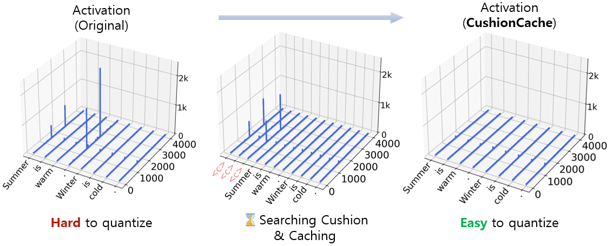
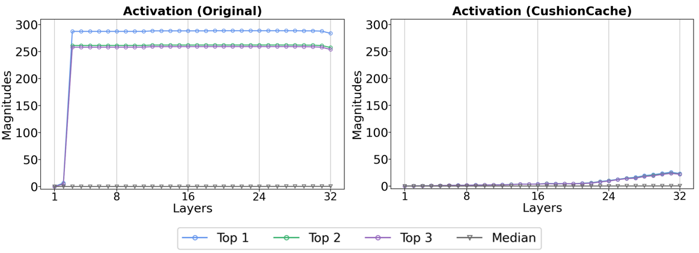
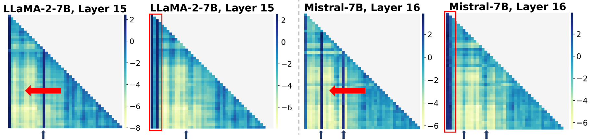

# Prefixing Attention Sinks can Mitigate Activation Outliers
for Large Language Model Quantization

###### Abstract

Despite recent advances in LLM quantization, activation quantization remains to be challenging due to the activation outliers. Conventional remedies, *e.g*., mixing precisions for different channels, introduce extra overhead and reduce the speedup. In this work, we develop a simple yet effective strategy to facilitate per-tensor activation quantization by preventing the generation of problematic tokens. Precisely, we propose a method to find a set of key-value cache, coined CushionCache, which mitigates outliers in subsequent tokens when inserted as a prefix. CushionCache works in two steps: First, we greedily search for a prompt token sequence that minimizes the maximum activation values in subsequent tokens. Then, we further tune the token cache to regularize the activations of subsequent tokens to be more quantization-friendly. The proposed method successfully addresses activation outliers of LLMs, providing a substantial performance boost for per-tensor activation quantization methods. We thoroughly evaluate our method over a wide range of models and benchmarks and find that it significantly surpasses the established baseline of per-tensor W8A8 quantization and can be seamlessly integrated with the recent activation quantization method.  

Prefixing Attention Sinks can Mitigate Activation Outliers    for Large Language Model Quantization  

  

     Seungwoo Son1,2††thanks: Work done during internship at Google., Wonpyo Park2, Woohyun Han2, Kyuyeun Kim2, Jaeho Lee1,2††thanks: Contact: jaeho.lee@postech.ac.kr  1POSTECH    2Google    {swson, jaeho.lee}@postech.ac.kr  {wppark, woohyun, kyuyeunk}@google.com    

  

## 1 Introduction

Tremendous capabilities of large language models (LLMs) come with a tremendous computational cost. Modern language models often have over hundreds of billions of parameters, requiring significant memory and computation for prediction and training. For instance, OPT-175B (Zhang et al., [2022](#bib.bib28)), one of the most popular open-sourced language models, requires at least 350GB of memory and the order of $10^{18}$ floating point operations to generate a new token111assuming the context length $2048$ (Hoffmann et al., [2022](#bib.bib7)).  

Quantization is an effective strategy to reduce the computational cost of LLMs. Recent works demonstrate that the precision of LLM weight parameters can be greatly reduced by post-training quantization (PTQ), with minimal degradations in its generation quality. For example, Huang et al. ([2024](#bib.bib8)) shows that one can quantize the weights of the LLaMA3-70B to 4 bits, with less than 0.5%p drop in its zero-shot prediction accuracy. Roughly, the reduced precision translates into 4$\times$ increase in the generation throughput, and similar reduction in memory requirements (Lin et al., [2024](#bib.bib15)).  

LLM activations, however, remain challenging to be quantized. The key obstacle is the activation outlier, i.e., a small number of activations that are substantially larger than others (Bondarenko et al., [2021](#bib.bib2); Dettmers et al., [2022](#bib.bib5); Sun et al., [2024](#bib.bib20)). Such outliers elongate the quantization range and flattens out most non-outlier activations, leading to large performance losses even at W8A8 quantization.  

[FIGURE S1.F1.g1]

Figure 1: Activation magnitudes in LLaMA2-7B, before and after CushionCache. CushionCache mitigates the activation outliers in LLMs by inserting and tuning the several prefix tokens to the model, which acts as an attention sink. Adding such sink tokens alleviates outliers in the subsequent tokens and enables a better activation quantization of the model with coarse quantization granularities.
[/FIGURE]

To address this issue, recent works propose to mitigate outliers based on various relaxations of the stringent static, per-tensor quantization. One line of work applies quantization separately to each channel depending on the outlier proneness (Bondarenko et al., [2021](#bib.bib2); Dettmers et al., [2022](#bib.bib5)). These methods, however, are difficult to be implemented on conventional hardwares. Another line of work reparameterizes the activations and weights in a way that the impact of outliers are amortized (Xiao et al., [2023](#bib.bib25); Ashkboos et al., [2024](#bib.bib1)). These algorithms focuses on attaining high generative quality by adopting per-token or dynamic quantization, leaving the most hardware-friendly option—static per-tensor quantization—less explored.  

To fill this gap, we take a novel approach for mitigating activation outliers in LLMs. In particular, we focus on answering the following key question:  

> Can we find a good prefix that mitigates the activation outliers in the subsequent tokens on a pretrained LLM?

Our answer is positive; we develop a very simple yet effective method, coined CushionCache, to discover a prefix222more precisely, the key-value cache; we only care about the keys and values, rather than the token itself, which reduces the outlier in the following tokens processed by the given LLM. By inserting this prefix, one then can quantize the activations of the LLM with much smaller quantization error, leading to an improved generation quality.  

To design our method, we draw inspirations from a recent observation that the outliers may originate from attention sinks (Bondarenko et al., [2023](#bib.bib3))—the “no-operation” tokens that receive much attention from other tokens (Xiao et al., [2024](#bib.bib26)). By adding sink-like tokens as a prefix, one may be able to separate out outlier activations as well, rendering the subsequent tokens outlier-free. In a nutshell, our method works in two steps.  

1. Greedy initialization. We search for a sequence of sink-like prompt tokens in a greedy manner, so that the activations of the subsequent tokens are less prone to outliers ([Section 4.1](#S4.SS1 "4.1 Greedy Prefix Search ‣ 4 Method ‣ Prefixing Attention Sinks can Mitigate Activation Outliers for Large Language Model Quantization")). 
2. Quantization-aware prefix tuning. We train the greedily initialized prefix further to minimize the combined loss of the prediction loss and quantization error ([Section 4.2](#S4.SS2 "4.2 Quantization-aware Prefix Tuning ‣ 4 Method ‣ Prefixing Attention Sinks can Mitigate Activation Outliers for Large Language Model Quantization")). 

Our experiments demonstrate that the proposed CushionCache is highly effective in making LLMs more quantizable. The technique is versatile, consistently improving the quantized performance of LLMs under various scenarios, from per-token to per-tensor static quantization. The method can also be seamlessly combined with existing quantization algorithms to further boost their performances. To summarize, we contribute the following.  

* We introduce CushionCache, a new prefix discovery method for mitigating LLM outliers to improve the quantization performance. 
* Through extensive experiments, we show that CushionCache can consistently improve the performance of quantized LLMs under a wide range of setup. In particular, we improve the prior state-of-the-art W8A8 per-tensor static range quantization of LLaMA3-8B over 30%p in zero-shot accuracy on downstream tasks. 
* Through our analysis, we demonstrate that CushionCache effectively replaces the role of attention sink tokens. 

## 2 Related Work

#### Outliers in LLMs.

The fact that there exists usually large entries in LLM activations, or outliers, has been reported by multiple works. Kovaleva et al. ([2021](#bib.bib11)) and Timkey and van Schijndel ([2021](#bib.bib21)) report the existence of outliers in large transformer-based language models (*e.g*., BERT), and find that they appear mostly in a small number of channels and layers. Bondarenko et al. ([2021](#bib.bib2)) make a similar observation in the context of quantization, and finds that quantizing the activations lead to a large degradation in generation quality; the work also reports that semantically meaningless tokens can have higher tendencies to have outliers. Dettmers et al. ([2022](#bib.bib5)) confirm the same finding while quantizing GPT-scale models, and studies how the model scale affects the prevalence of outliers over tokens and layers. More recently, Sun et al. ([2024](#bib.bib20)) investigates a similar phenomenon in newer LLM variants and confirms that certain tokens are more likely to suffer from outliers.  

#### Per-channel activation quantization.

A line of work proposes to mitigate outliers in LLM activation quantization by applying different scaling factors or precision to each channel. Bondarenko et al. ([2021](#bib.bib2)) splits activation channels into several groups and perform quantization on each group. LLM.int8() (Dettmers et al., [2022](#bib.bib5)) applies higher precision (*e.g*., FP16) to a small number of outlier-prone channels, while quantizing the other channels to lower bits (*e.g*., INT8). These works, however, are difficult to be implemented in conventional hardwares, as they requires scaling along the contracting dimension of matrix multiplication.  

#### Per-token, with reparameterization.

Another line of work proposes to quantize the activations per-token to reduce the impact of outliers with better hardware acceleration. Many of these works adopt reparameterization of weights to mitigate the outliers further. ZeroQuant (Yao et al., [2022](#bib.bib27)) applies per-tensor quantization and knowledge distillation to achieve reasonable INT8 quantization performance. SmoothQuant (Xiao et al., [2023](#bib.bib25)), Outlier Suppression+ (Wei et al., [2023](#bib.bib24)), and OmniQuant (Shao et al., [2024](#bib.bib18)) migrates the activation magnitudes to the weights to normalize the scales of the activations. More recently, QuaRot (Ashkboos et al., [2024](#bib.bib1)) rotates the activations so that the outlier magnitudes are distributed over multiple axes in the reparametrized space. While these methods are effective, per-token quantization are typically slower than per-tensor quantization at the same quantization precision as it requires larger scale which has a size of the number of tokens.  

#### Per-tensor quantization.

Notably, Xiao et al. ([2023](#bib.bib25)) also provides two options for per-tensor activation quantization: one with dynamic quantization range, and another with static range. While these options tend to be faster than per-token (with static range being the fastest), their generation quality is much lower than per-token, especially on recent models such as LLaMA-3 (Touvron et al., [2023](#bib.bib22)).  

#### Attention sinks and outliers.

Recent works report an intriguing phenomenon in large transformers, termed attention sink. Xiao et al. ([2024](#bib.bib26)) find that a small number of semantically meaningless tokens, usually at the beginning of the sequence, tend to receive unusually large attention. Darcet et al. ([2024](#bib.bib4)) make a similar observation for vision transformers, and show that training ViTs with additional meaningless tokens can help make the attention structures more semantically meaningful. Bondarenko et al. ([2023](#bib.bib3)) hypothesize that the sink tokens may be the root cause of the activation outliers, and propose a new architecture that prevents the outliers from emerging when pretrained from scratch. Our work shares a similar intuition, but critically differs in that we mitigate outliers by fine-tuning the pretrained LLM. This means no modification to the network architecture is needed and does not need to train the model from scratch.  

## 3 Preliminaries

#### Key-value cache.

Modern language models, typically based on decoder-only architecture, are built as a sequence of transformer blocks which process a sequence of tokens to predict the next token (Vaswani et al., [2017](#bib.bib23)). That is, at each decoding step, the transformer $f(\cdot)$ performs:  

|  | $\displaystyle t_{n+1}=f(t_{1},t_{2},\ldots,t_{n})$ |  | (1) |
| --- | --- | --- | --- |

where $t_{1},\cdots,t_{n}$ are the preceding tokens used as context. LLM iteratively applies [Eq. 1](#S3.E1 "In Key-value cache. ‣ 3 Preliminaries ‣ Prefixing Attention Sinks can Mitigate Activation Outliers for Large Language Model Quantization") autoregressively to generate text as a sequence of tokens.  

As the context length grows, the computational cost to process all previous tokens also grows larger, slowing down the generation significantly. A popular solution is to cache and reuse the keys and values of the preceding tokens computed during the previous iteration. This trick relies on the fact that preceding tokens affect the outcome of the current token only through their keys and values:  

|  | $\displaystyle(s_{n,1},\ldots,s_{n,n})$ | $\displaystyle=\mathrm{Attention}(q_{n},k_{1:n})$ |  |
| --- | --- | --- | --- |
|  | $\displaystyle o_{n}$ | $\displaystyle=\sum_{i=1}^{n}v_{i}\cdot s_{n,i}$ |  |
| --- | --- | --- | --- |

where $q_{i},k_{i},v_{i}$ denotes the query, key, and value vectors for each token and $s_{i,j}$ denotes the attention score for the $i$-th token query on $j$-th token key. By storing and reusing the cached values (called KV cache), one only needs to process new tokens as:  

|  | $\displaystyle t_{n+l+1}=f(t_{n+1:n+l}~{}|~{}k_{1:n},v_{1:n}),$ |  | (2) |
| --- | --- | --- | --- |

where $t_{n+1:n+l}$ denotes $l$ tokens given at the current step and $k_{1:n},v_{1:n}$ are the keys and values of the preceding context of length $n$, computed during the previous iteration. During the prefill phase, $l$ may be the length of the prompt, and during the decoding phase, we can simply use $l=1$, processing only a single token at a time.  

#### Quantization.

Quantization is an act of casting a high-precision tensor (typically FP) into a lower-precision tensor (typically INT), to save the memory to store and computation to process the tensor. In neural network quantization, a popular choice is the linear quantization, which performs  

|  | $\displaystyle\mathbf{X}_{\mathrm{int}}=\mathrm{round}((\mathbf{X}_{\mathrm{fp}}-z)/s),$ |  | (3) |
| --- | --- | --- | --- |

where $\mathbf{X}_{\mathrm{int}},\mathbf{X}_{\mathrm{fp}}$ denotes the quantized and original tensors, $z,s\in\mathbb{R}$ denote zero-point and scaling factor, and $\mathrm{round}(\cdot)$ denotes the rounding operation. The scaling factor is typically selected as  

|  | $\displaystyle s$ | $\displaystyle=\frac{\max(\mathbf{X}_{\mathrm{fp}})-\min(\mathbf{X}_{\mathrm{fp}})}{2^{N-1}-1},$ |  | (4) |
| --- | --- | --- | --- | --- |

where $N$ denotes the number of bits for the integer format. The zero-point is determined as either $z=\min(\mathbf{X}_{\mathrm{fp}})$ or $z=0$, for the asymmetric and symmetric quantization, respectively.  

#### Activation quantization with static range.

By quantizing both activation and weight matrices, one can avoid performing computation-heavy FP matrix multiplications. That is, for the case of symmetric quantization (for simplicity), we approximate:  

|  | $\displaystyle\mathbf{W}_{\mathrm{fp}}\mathbf{X}_{\mathrm{fp}}$ | $\displaystyle\approx s_{\mathrm{W}}s_{\mathrm{X}}\cdot\mathbf{W}_{\mathrm{int}}\mathbf{X}_{\mathrm{int}},$ |  | (5) |
| --- | --- | --- | --- | --- |

where the right-hand side can be computed using an integer matrix multiplication, and a single multiplication of FP16/32 quantities (for scaling factors). The combined scaling factor need not be multiplied back to the matrix immediately, and can be used in the subsequent operations directly.  

In many cases, the scaling factors $s_{\mathrm{W}},s_{\mathrm{X}}$ can be pre-computed based on the validation set statistics. This method, called static-range quantization, enables more acceleration than computing these values dynamically during the inference.  

#### Outliers and complications.

In LLMs, the activation $\mathbf{X}_{\mathrm{fp}}$ tends to have a very large entry (Dettmers et al., [2022](#bib.bib5); Sun et al., [2024](#bib.bib20)). In such case, the magnitude of $\max(\mathbf{X}_{\mathrm{fp}})$ and $\min(\mathbf{X}_{\mathrm{fp}})$ will be very large, making the scaling factor $s_{\mathrm{X}}$ very large. This leads to a high sparsity in the tensor $\mathbf{X}_{\mathrm{int}}$, and a much degraded generation quality.  

This problem can be alleviated in various ways: One can change the scaling factor dynamically over time (*i.e*., per-tensor dynamic quantization), or apply different scaling factors for each channel or token (*i.e*., per-channel/token quantization). As these methods require on-the-fly computations of scaling factors, the methods are typically slower.  

#### Granularity and the communication cost.

The drawback of finer quantization granularity becomes more significant in the distributed setup, as it affect the communication cost between nodes.  

To see this, consider the case of multiplying matrices with tensor parallelism, *e.g*., Megatron-LM (Shoeybi et al., [2019](#bib.bib19)). Comparing with the per-tensor static quantization, per-tensor dynamic quantization requires an additional AllReduce operation over the nodes to aggregate the (high-precision) scaling factor. The overhead is even more significant for per-token dynamic quantization, as the number of scaling factors is multiplied by the number of tokens, increasing the cost of AllReduce.  

## 4 Method

We now describe CushionCache, an algorithm to find a prefix which can mitigate activation outliers in the subsequent tokens, thereby alleviating the quality degradation from activation quantization.  

CushionCache aims to find a set of prefix that minimizes the quantization error of the activations. More concretely, let $\mathbf{X}_{i}$ denote activation of a transformer block for the input token $t_{i}$. Our goal is to minimize the squared difference between the original and the quantized activations, *i.e*.,  

|  | $\displaystyle L_{\text{q}}(t_{1},...,t_{n})=\sum^{n}_{i=1}\|\mathbf{X}_{i}-q(\mathbf{X}_{i})\|^{2}_{2},$ |  | (6) |
| --- | --- | --- | --- |

where $q(\cdot)$ denotes the quantization function, specified as $q(\mathbf{X})=s\cdot\mathrm{round}((\mathbf{X}-z)/s)+z$. In practice, we consider the summation of the error $L_{q}$ of all transformer blocks, but we omit this for the notational simplicity. Similarly, we define $L_{q}(t_{1:n}|p_{1:m})$ as the sum of squared error for $t_{1:n}$ given the prefix $p_{1:n}$, where the scaling factor $s$ and zero-point $z$ are determined for $t_{1:n}$ only.  

We hypothesize that there exist prefix tokens $p$ that can reduce the expected activation quantization error of the tokens. That is, we find  

|  | $\displaystyle\hat{p}_{1:m}=\operatorname*{arg\,min}_{p_{1:m}}~{}\mathbb{E}\left[L_{q}(t_{1:n}~{}|~{}p_{1:m})\right],$ |  | (7) |
| --- | --- | --- | --- |

where the expectation is taken over the probability distribution of tokens $t_{1:n}$. Once we find such prefix $\hat{p}_{1:m}$, their keys and values are cached and reused at the inference time to avoid redundant computation:  

|  | $\displaystyle t_{n+1}=f(t_{1:n}~{}|~{}\hat{k}_{1:m},~{}\hat{v}_{1:m}),$ |  | (8) |
| --- | --- | --- | --- |

where $\hat{k}$ and $\hat{v}$ corresponds to the key-value caches of the prefix $\hat{p}_{1:n}$, which we call CushionCache.  

We solve the minimization (eq. [7](#S4.E7 "Equation 7 ‣ 4 Method ‣ Prefixing Attention Sinks can Mitigate Activation Outliers for Large Language Model Quantization")) with a strategy based on prefix tuning. This is done in two steps: Initializing prefixes based on greedily searched prompts ([Section 4.1](#S4.SS1 "4.1 Greedy Prefix Search ‣ 4 Method ‣ Prefixing Attention Sinks can Mitigate Activation Outliers for Large Language Model Quantization")), and Quantization-aware Prefix tuning ([Section 4.2](#S4.SS2 "4.2 Quantization-aware Prefix Tuning ‣ 4 Method ‣ Prefixing Attention Sinks can Mitigate Activation Outliers for Large Language Model Quantization")).  

### 4.1 Greedy Prefix Search

We carefully initialize the prefix as the prefix tuning is known to be very sensitive to initial values. We follow Li and Liang ([2021](#bib.bib14)) to search for the prefix that are activations of hard prompt tokens, *i.e*., input tokens that correspond to real text. As the search complexity grows exponentially with respect to the embedding size, we propose to use a greedy search algorithm with tailored heuristics.  

In a nutshell, our method is a greedy search with early stopping. We add new tokens to the prompt one-by-one, selected to minimize the quantization error. If the new token does not decrease the error much, we stop adding to prevent overfitting and computational overhead from long prompts.  

Concretely, at each step, we first draw a single sample text $t_{1:n}$ from the dataset; we use the C4 dataset (Raffel et al., [2020](#bib.bib17)), which is commonly used for calibration or validation purposes, to draw a sentence of length $n=512$. Then, based on the current state of prompts $p_{1:k}$, we search for the next prompt token $p_{k+1}$ by solving  

|  | $\displaystyle p_{k+1}=\operatorname*{arg\,min}_{p\in\mathcal{E}}L_{q}(t_{1:n}|p_{1:k},p),$ |  | (9) |
| --- | --- | --- | --- |

where $\mathcal{E}$ denotes the embedding table; we can solve this problem rapidly by batched inference. If the discovered new token reduces the quantization error by some fraction $\tau>0$, *i.e*., satisfies  

|  | $\displaystyle L_{q}(t_{1:n}|p_{1:k+1})<\tau\cdot L_{q}(t_{1:n}|p_{1:k}),$ |  | (10) |
| --- | --- | --- | --- |

then we append this token to the prompt and proceed to the next iteration. Otherwise, or if the max length is met, we stop searching for a new token. We use $\tau=0.5$ for all experiments, which consistently shows a good performance.  

Note that this algorithmic design provides some flexibility. More specifically, one can initialize the prompt with nonempty sequence before the search, as a heuristic that can help speed up the prompt search procedure. We find that filling in nonsemantic words, *e.g*., <bos> or \n, is particularly useful; this observation is well-aligned with the findings of Bondarenko et al. ([2021](#bib.bib2)); Sun et al. ([2024](#bib.bib20)).  

[ALGORITHM alg1]

1:validation dataset $D$, embedding table $\mathcal{E}$, max length $m$, threshold $\tau$

2:$p=[\>]$
$\triangleright$ initialize the prompt 

3:while $\mathtt{len}(p)<m$ do

4:     $t\sim\mathrm{Unif}(D)$ $\triangleright$ draw a text

5:     $p^{*}=\operatorname*{arg\,min}_{p^{\prime}\in\mathcal{E}}L_{q}(t|p,p^{\prime})$.

6:     if $L_{q}(t|p,p^{*})>\tau\cdot L_{q}(t|p)$ then

7:         break

8:     end if

9:     $p.\mathtt{append}(p^{*})$ $\triangleright$ add new token

10:end while

11:return $p$

Algorithm 1  Greedy prefix search
[/ALGORITHM]

[TABLE S4.T1]

<table class="ltx_tabular ltx_guessed_headers ltx_align_middle">
<thead class="ltx_thead">
<tr class="ltx_tr">
<th class="ltx_td ltx_align_left ltx_th ltx_th_column ltx_th_row ltx_border_r ltx_border_tt">WikiText-2 (<math class="ltx_Math"><semantics><mo>↓</mo><annotation-xml><ci>↓</ci></annotation-xml><annotation>\downarrow</annotation></semantics></math>)</th>
<th class="ltx_td ltx_align_left ltx_th ltx_th_column ltx_border_tt">LLaMA2-7B</th>
<th class="ltx_td ltx_align_left ltx_th ltx_th_column ltx_border_tt">LLaMA3-8B</th>
<th class="ltx_td ltx_align_left ltx_th ltx_th_column ltx_border_tt">Mistral-7B-v0.1</th>
<th class="ltx_td ltx_align_left ltx_th ltx_th_column ltx_border_tt">OPT-6.7B</th>
<th class="ltx_td ltx_align_left ltx_th ltx_th_column ltx_border_tt">BLOOM-7B</th>
</tr>
<tr class="ltx_tr">
<th class="ltx_td ltx_align_left ltx_th ltx_th_column ltx_th_row ltx_border_r ltx_border_t">FP16</th>
<th class="ltx_td ltx_align_left ltx_th ltx_th_column ltx_border_t">5.47</th>
<th class="ltx_td ltx_align_left ltx_th ltx_th_column ltx_border_t">6.13</th>
<th class="ltx_td ltx_align_left ltx_th ltx_th_column ltx_border_t">5.25</th>
<th class="ltx_td ltx_align_left ltx_th ltx_th_column ltx_border_t">10.86</th>
<th class="ltx_td ltx_align_left ltx_th ltx_th_column ltx_border_t">11.37</th>
</tr>
</thead>
<tbody class="ltx_tbody">
<tr class="ltx_tr">
<th class="ltx_td ltx_align_left ltx_th ltx_th_row ltx_border_r ltx_border_t">Per-tensor Static</th>
<td class="ltx_td ltx_align_left ltx_border_t">9250.33</td>
<td class="ltx_td ltx_align_left ltx_border_t">9759.46</td>
<td class="ltx_td ltx_align_left ltx_border_t">85.51</td>
<td class="ltx_td ltx_align_left ltx_border_t">11.45</td>
<td class="ltx_td ltx_align_left ltx_border_t">11.93</td>
</tr>
<tr class="ltx_tr">
<th class="ltx_td ltx_align_left ltx_th ltx_th_row ltx_border_r">+ CushionCache (ours)</th>
<td class="ltx_td ltx_align_left">5.98 (-99.9%)</td>
<td class="ltx_td ltx_align_left">7.41 (-99.9%)</td>
<td class="ltx_td ltx_align_left">5.84 (-93.2%)</td>
<td class="ltx_td ltx_align_left">11.00 (-3.9%)</td>
<td class="ltx_td ltx_align_left">11.50 (-3.6%)</td>
</tr>
<tr class="ltx_tr">
<th class="ltx_td ltx_align_left ltx_th ltx_th_row ltx_border_r">SmoothQuant-O3</th>
<td class="ltx_td ltx_align_left">15439.73</td>
<td class="ltx_td ltx_align_left">14022.91</td>
<td class="ltx_td ltx_align_left">618.27</td>
<td class="ltx_td ltx_align_left">10.85</td>
<td class="ltx_td ltx_align_left">11.55</td>
</tr>
<tr class="ltx_tr">
<th class="ltx_td ltx_align_left ltx_th ltx_th_row ltx_border_r">+ CushionCache (ours)</th>
<td class="ltx_td ltx_align_left">5.87 (-99.9%)</td>
<td class="ltx_td ltx_align_left">7.37 (-99.9%)</td>
<td class="ltx_td ltx_align_left">5.60 (-99.1%)</td>
<td class="ltx_td ltx_align_left">10.68 (-1.6%)</td>
<td class="ltx_td ltx_align_left">11.38 (-1.5%)</td>
</tr>
<tr class="ltx_tr">
<th class="ltx_td ltx_align_left ltx_th ltx_th_row ltx_border_r ltx_border_t">Per-tensor Dynamic</th>
<td class="ltx_td ltx_align_left ltx_border_t">8.01</td>
<td class="ltx_td ltx_align_left ltx_border_t">23.86</td>
<td class="ltx_td ltx_align_left ltx_border_t">67.86</td>
<td class="ltx_td ltx_align_left ltx_border_t">11.73</td>
<td class="ltx_td ltx_align_left ltx_border_t">11.81</td>
</tr>
<tr class="ltx_tr">
<th class="ltx_td ltx_align_left ltx_th ltx_th_row ltx_border_r">+ CushionCache (ours)</th>
<td class="ltx_td ltx_align_left">5.69 (-29.0%)</td>
<td class="ltx_td ltx_align_left">7.30 (-69.4%)</td>
<td class="ltx_td ltx_align_left">5.59 (-91.8%)</td>
<td class="ltx_td ltx_align_left">10.99 (-6.3%)</td>
<td class="ltx_td ltx_align_left">11.43 (-3.2%)</td>
</tr>
<tr class="ltx_tr">
<th class="ltx_td ltx_align_left ltx_th ltx_th_row ltx_border_r">SmoothQuant-O2</th>
<td class="ltx_td ltx_align_left">8.13</td>
<td class="ltx_td ltx_align_left">25.12</td>
<td class="ltx_td ltx_align_left">66.16</td>
<td class="ltx_td ltx_align_left">10.87</td>
<td class="ltx_td ltx_align_left">11.59</td>
</tr>
<tr class="ltx_tr">
<th class="ltx_td ltx_align_left ltx_th ltx_th_row ltx_border_r">+ CushionCache (ours)</th>
<td class="ltx_td ltx_align_left">5.66 (-30.4%)</td>
<td class="ltx_td ltx_align_left">7.29 (-71.0%)</td>
<td class="ltx_td ltx_align_left">5.56 (-91.6%)</td>
<td class="ltx_td ltx_align_left">10.68 (-1.7%)</td>
<td class="ltx_td ltx_align_left">11.39 (-1.7%)</td>
</tr>
<tr class="ltx_tr">
<th class="ltx_td ltx_align_left ltx_th ltx_th_row ltx_border_r ltx_border_t">Per-token Dynamic</th>
<td class="ltx_td ltx_align_left ltx_border_t">5.47</td>
<td class="ltx_td ltx_align_left ltx_border_t">6.22</td>
<td class="ltx_td ltx_align_left ltx_border_t">5.30</td>
<td class="ltx_td ltx_align_left ltx_border_t">11.20</td>
<td class="ltx_td ltx_align_left ltx_border_t">11.47</td>
</tr>
<tr class="ltx_tr">
<th class="ltx_td ltx_align_left ltx_th ltx_th_row ltx_border_r">+ CushionCache (ours)</th>
<td class="ltx_td ltx_align_left">5.37 (-1.8%)</td>
<td class="ltx_td ltx_align_left">6.15 (-1.1%)</td>
<td class="ltx_td ltx_align_left">5.21 (-1.7%)</td>
<td class="ltx_td ltx_align_left">10.77 (-3.8%)</td>
<td class="ltx_td ltx_align_left">11.37 (-0.9%)</td>
</tr>
<tr class="ltx_tr">
<th class="ltx_td ltx_align_left ltx_th ltx_th_row ltx_border_r">SmoothQuant-O1</th>
<td class="ltx_td ltx_align_left">5.49</td>
<td class="ltx_td ltx_align_left">6.19</td>
<td class="ltx_td ltx_align_left">5.27</td>
<td class="ltx_td ltx_align_left">10.86</td>
<td class="ltx_td ltx_align_left">11.38</td>
</tr>
<tr class="ltx_tr">
<th class="ltx_td ltx_align_left ltx_th ltx_th_row ltx_border_bb ltx_border_r">+ CushionCache (ours)</th>
<td class="ltx_td ltx_align_left ltx_border_bb">5.36 (-2.4%)</td>
<td class="ltx_td ltx_align_left ltx_border_bb">6.15 (-0.6%)</td>
<td class="ltx_td ltx_align_left ltx_border_bb">5.20 (-29.0%)</td>
<td class="ltx_td ltx_align_left ltx_border_bb">10.67 (-1.7%)</td>
<td class="ltx_td ltx_align_left ltx_border_bb">11.35 (-0.3%)</td>
</tr>
</tbody>
</table>

Table 1: Perplexity of W8A8-quantized LLMs on raw-WikiText2. Green denotes the relative decrease.
[/TABLE]

[TABLE S4.T2]

<table class="ltx_tabular ltx_guessed_headers ltx_align_middle">
<thead class="ltx_thead">
<tr class="ltx_tr">
<th class="ltx_td ltx_align_left ltx_th ltx_th_column ltx_th_row ltx_border_r ltx_border_tt">7 Zero-shot Tasks (<math class="ltx_Math"><semantics><mo>↑</mo><annotation-xml><ci>↑</ci></annotation-xml><annotation>\uparrow</annotation></semantics></math>)</th>
<th class="ltx_td ltx_align_left ltx_th ltx_th_column ltx_border_tt">LLaMA2-7B</th>
<th class="ltx_td ltx_align_left ltx_th ltx_th_column ltx_border_tt">LLaMA3-8B</th>
<th class="ltx_td ltx_align_left ltx_th ltx_th_column ltx_border_tt">Mistral-7B-v0.1</th>
<th class="ltx_td ltx_align_left ltx_th ltx_th_column ltx_border_tt">OPT-6.7B</th>
<th class="ltx_td ltx_align_left ltx_th ltx_th_column ltx_border_tt">BLOOM-7B</th>
</tr>
<tr class="ltx_tr">
<th class="ltx_td ltx_align_left ltx_th ltx_th_column ltx_th_row ltx_border_r ltx_border_t">FP16</th>
<th class="ltx_td ltx_align_left ltx_th ltx_th_column ltx_border_t">65.63</th>
<th class="ltx_td ltx_align_left ltx_th ltx_th_column ltx_border_t">68.83</th>
<th class="ltx_td ltx_align_left ltx_th ltx_th_column ltx_border_t">69.14</th>
<th class="ltx_td ltx_align_left ltx_th ltx_th_column ltx_border_t">60.50</th>
<th class="ltx_td ltx_align_left ltx_th ltx_th_column ltx_border_t">56.20</th>
</tr>
</thead>
<tbody class="ltx_tbody">
<tr class="ltx_tr">
<th class="ltx_td ltx_align_left ltx_th ltx_th_row ltx_border_r ltx_border_t">Per-tensor Static</th>
<td class="ltx_td ltx_align_left ltx_border_t">36.37</td>
<td class="ltx_td ltx_align_left ltx_border_t">35.86</td>
<td class="ltx_td ltx_align_left ltx_border_t">48.83</td>
<td class="ltx_td ltx_align_left ltx_border_t">57.94</td>
<td class="ltx_td ltx_align_left ltx_border_t">55.87</td>
</tr>
<tr class="ltx_tr">
<th class="ltx_td ltx_align_left ltx_th ltx_th_row ltx_border_r">+ CushionCache (ours)</th>
<td class="ltx_td ltx_align_left">64.47 (+28.10)</td>
<td class="ltx_td ltx_align_left">67.85 (+31.99)</td>
<td class="ltx_td ltx_align_left">67.75 (+18.91)</td>
<td class="ltx_td ltx_align_left">59.85 (+1.91)</td>
<td class="ltx_td ltx_align_left">55.91 (+0.04)</td>
</tr>
<tr class="ltx_tr">
<th class="ltx_td ltx_align_left ltx_th ltx_th_row ltx_border_r">SmoothQuant-O3</th>
<td class="ltx_td ltx_align_left">36.32</td>
<td class="ltx_td ltx_align_left">36.22</td>
<td class="ltx_td ltx_align_left">37.45</td>
<td class="ltx_td ltx_align_left">60.61</td>
<td class="ltx_td ltx_align_left">55.96</td>
</tr>
<tr class="ltx_tr">
<th class="ltx_td ltx_align_left ltx_th ltx_th_row ltx_border_r">+ CushionCache (ours)</th>
<td class="ltx_td ltx_align_left">64.67 (+28.35)</td>
<td class="ltx_td ltx_align_left">66.99 (+30.77)</td>
<td class="ltx_td ltx_align_left">68.39 (+30.94)</td>
<td class="ltx_td ltx_align_left">60.87 (+0.26)</td>
<td class="ltx_td ltx_align_left">56.66 (+0.75)</td>
</tr>
<tr class="ltx_tr">
<th class="ltx_td ltx_align_left ltx_th ltx_th_row ltx_border_r ltx_border_t">Per-tensor Dynamic</th>
<td class="ltx_td ltx_align_left ltx_border_t">61.94</td>
<td class="ltx_td ltx_align_left ltx_border_t">58.94</td>
<td class="ltx_td ltx_align_left ltx_border_t">52.02</td>
<td class="ltx_td ltx_align_left ltx_border_t">59.23</td>
<td class="ltx_td ltx_align_left ltx_border_t">56.46</td>
</tr>
<tr class="ltx_tr">
<th class="ltx_td ltx_align_left ltx_th ltx_th_row ltx_border_r">+ CushionCache (ours)</th>
<td class="ltx_td ltx_align_left">65.34 (+3.40)</td>
<td class="ltx_td ltx_align_left">68.66 (+9.72)</td>
<td class="ltx_td ltx_align_left">69.02 (+17.00)</td>
<td class="ltx_td ltx_align_left">60.28 (+1.05)</td>
<td class="ltx_td ltx_align_left">58.47 (+2.01)</td>
</tr>
<tr class="ltx_tr">
<th class="ltx_td ltx_align_left ltx_th ltx_th_row ltx_border_r">SmoothQuant-O2</th>
<td class="ltx_td ltx_align_left">61.24</td>
<td class="ltx_td ltx_align_left">58.67</td>
<td class="ltx_td ltx_align_left">51.08</td>
<td class="ltx_td ltx_align_left">60.57</td>
<td class="ltx_td ltx_align_left">56.14</td>
</tr>
<tr class="ltx_tr">
<th class="ltx_td ltx_align_left ltx_th ltx_th_row ltx_border_r">+ CushionCache (ours)</th>
<td class="ltx_td ltx_align_left">65.65 (+4.41)</td>
<td class="ltx_td ltx_align_left">68.74 (+10.07)</td>
<td class="ltx_td ltx_align_left">69.15 (+18.07)</td>
<td class="ltx_td ltx_align_left">60.60 (+0.03)</td>
<td class="ltx_td ltx_align_left">58.99 (+2.85)</td>
</tr>
<tr class="ltx_tr">
<th class="ltx_td ltx_align_left ltx_th ltx_th_row ltx_border_r ltx_border_t">Per-token Dynamic</th>
<td class="ltx_td ltx_align_left ltx_border_t">65.43</td>
<td class="ltx_td ltx_align_left ltx_border_t">68.92</td>
<td class="ltx_td ltx_align_left ltx_border_t">68.90</td>
<td class="ltx_td ltx_align_left ltx_border_t">59.48</td>
<td class="ltx_td ltx_align_left ltx_border_t">56.55</td>
</tr>
<tr class="ltx_tr">
<th class="ltx_td ltx_align_left ltx_th ltx_th_row ltx_border_r">+ CushionCache (ours)</th>
<td class="ltx_td ltx_align_left">65.78 (+0.35)</td>
<td class="ltx_td ltx_align_left">68.58 (-0.34)</td>
<td class="ltx_td ltx_align_left">69.83 (+0.93)</td>
<td class="ltx_td ltx_align_left">60.65 (+1.17)</td>
<td class="ltx_td ltx_align_left">56.72 (+0.17)</td>
</tr>
<tr class="ltx_tr">
<th class="ltx_td ltx_align_left ltx_th ltx_th_row ltx_border_r">SmoothQuant-O1</th>
<td class="ltx_td ltx_align_left">65.64</td>
<td class="ltx_td ltx_align_left">68.64</td>
<td class="ltx_td ltx_align_left">69.09</td>
<td class="ltx_td ltx_align_left">60.55</td>
<td class="ltx_td ltx_align_left">56.35</td>
</tr>
<tr class="ltx_tr">
<th class="ltx_td ltx_align_left ltx_th ltx_th_row ltx_border_bb ltx_border_r">+ CushionCache (ours)</th>
<td class="ltx_td ltx_align_left ltx_border_bb">65.97 (+0.33)</td>
<td class="ltx_td ltx_align_left ltx_border_bb">68.78 (+0.14)</td>
<td class="ltx_td ltx_align_left ltx_border_bb">69.99 (+0.90)</td>
<td class="ltx_td ltx_align_left ltx_border_bb">61.01 (+0.46)</td>
<td class="ltx_td ltx_align_left ltx_border_bb">56.80 (+0.45)</td>
</tr>
</tbody>
</table>

Table 2: Average zero-shot accuracies of W8A8-quantized LLMs. We average over LAMBADA, HellaSwag, PIQA, WinoGrande, OpenBookQA, RTE, and COPA. Green is the accuracy gain and red is the drop.
[/TABLE]

### 4.2 Quantization-aware Prefix Tuning

Using the intermediate activations of the greedily-searched prompt as an initial prefix, we fine-tune the CushionCache via prefix tuning (Li and Liang, [2021](#bib.bib14)). Precisely, we freeze the model parameters and train the prefix with the loss  

|  | $\displaystyle L=L_{\mathrm{pred}}+\lambda\cdot L_{q}$ |  | (11) |
| --- | --- | --- | --- |

where $L_{\mathrm{pred}}$ is the cross entropy loss for the next-token prediction and $\lambda$ is a hyperparameter that balances two losses. Here, we apply stop-grad to scaling factors and zero-points of the quantization function, as is typical in quantization-aware training literature (Jacob et al., [2018](#bib.bib9)).  

By optimizing this loss function, we ensure that the CushionCache not only improves the prediction accuracy but also minimizes the quantization error. This tuning does not require excessive amount of memory, as we only train the prefix.  

## 5 Experiments

### 5.1 Experimental Setup

#### Models.

We evaluate our method on five LLM models: LLaMA2 and 3 (Touvron et al., [2023](#bib.bib22)), Mistral (Jiang et al., [2023](#bib.bib10)), OPT (Zhang et al., [2022](#bib.bib28)) and BLOOM (Le Scao et al., [2022](#bib.bib12)).  

#### Datasets.

We measure the perplexity on the held-out set of WikiText-2 validation dataset (Merity et al., [2016](#bib.bib16)). For zero-shot evaluation, we use seven tasks from the LM evaluation harness benchmark by EleutherAI (Gao et al., [2023](#bib.bib6)). Precisely, we use LAMBADA, HellaSwag, PIQA, WinoGrande, OpenBookQA, RTE, and COPA datasets.  

#### Base algorithms.

We apply CushionCache on two base activation quantization algorithms: Naïve activation quantization and SmoothQuant (Xiao et al., [2024](#bib.bib26)). We consider three different scenarios: Per-tensor static, per-tensor dynamic, and per-token dynamic quantization. Note that for each case, the SmoothQuant has a corresponding version, called O3, O2, and O1, respectively.  

#### Configuration: Quantization.

We mostly follow the setup of Li et al. ([2024](#bib.bib13)) and the TensorFlow default. We use symmetric group-wise quantization for model weights, and asymmetric quantization for the activations. For SmoothQuant, we use the migration strength $\alpha=0.8$, which worked consistently well throughout our experiments. For static range quantization, we calibrate using the training split of WikiText-2 (Merity et al., [2016](#bib.bib16)).  

#### Configuration: Prefix tuning.

We follow the setup of Li and Liang ([2021](#bib.bib14)) and tune for 2 epochs. We set the hyperparameter $\lambda=0.01$.  

### 5.2 Main Results: W8A8 Quantization

In [Tables 1](#S4.T1 "In 4.1 Greedy Prefix Search ‣ 4 Method ‣ Prefixing Attention Sinks can Mitigate Activation Outliers for Large Language Model Quantization") and [2](#S4.T2 "Table 2 ‣ 4.1 Greedy Prefix Search ‣ 4 Method ‣ Prefixing Attention Sinks can Mitigate Activation Outliers for Large Language Model Quantization"), we provide the performance achieved by the quantized language models, quantized with and without the proposed CushionCache. We report the WikiText perplexity and zero-shot accuracy in the tables, respectively.  

For per-tensor static range quantization, CushionCache successfully improves the performance of the model; the boost is quite substantial in LLaMA and Mistral, often providing over 30%p gains in terms of zero-shot accuracies. Intriguingly, the gain is much more pronounced in LLaMA-style models, which adopt the pre-LayerNorm and gated linear units. For per-tensor dynamic range quantization, similarly, we make consistent improvements over both vanilla quantization and SmoothQuant.  

For per-token dynamic quantization, the gain is somewhat marginal, as the base quantization algorithms already tend to achieve a close performance to the FP16 model; we revisit per-token case for lower precision in [Section 5.4](#S5.SS4 "5.4 4/6-bit Per-token Quantization ‣ 5 Experiments ‣ Prefixing Attention Sinks can Mitigate Activation Outliers for Large Language Model Quantization").  

### 5.3 Ablation Study

In [Table 3](#S5.T3 "In 5.3 Ablation Study ‣ 5 Experiments ‣ Prefixing Attention Sinks can Mitigate Activation Outliers for Large Language Model Quantization"), we sequentially add our key algorithmic components to validate their efficacy. In particular, the components are (1) greedy-searched initial value, (2) prefix tuning, and (3) the quantization-error-based regularizer.  

We observe that each component makes nontrivial contributions for achieving near-FP16 zero-shot accuracy. Interestingly, we find that the greedy-searched initialization is especially effective, contributing $\sim$91% of the accuracy gain. This suggests that our search mechanism can be used as a compute-light standalone method in the cases where it is difficult to conduct prefix-tuning, due to a limited on-device memory.  

[TABLE S5.T3]

<table class="ltx_tabular ltx_guessed_headers ltx_align_middle">
<thead class="ltx_thead">
<tr class="ltx_tr">
<th class="ltx_td ltx_align_left ltx_th ltx_th_column ltx_border_tt">LLaMA3-8B</th>
<th class="ltx_td ltx_align_left ltx_th ltx_th_column ltx_border_tt">Zero-shot acc. (%)</th>
</tr>
</thead>
<tbody class="ltx_tbody">
<tr class="ltx_tr">
<td class="ltx_td ltx_align_left ltx_border_t">FP16</td>
<td class="ltx_td ltx_align_left ltx_border_t">68.83</td>
</tr>
<tr class="ltx_tr">
<td class="ltx_td ltx_align_left ltx_border_t">Per-tensor Dynamic</td>
<td class="ltx_td ltx_align_left ltx_border_t">58.94</td>
</tr>
<tr class="ltx_tr">
<td class="ltx_td ltx_align_left">+ Greedy-searched init.</td>
<td class="ltx_td ltx_align_left">67.78 (+8.84)
</td>
</tr>
<tr class="ltx_tr">
<td class="ltx_td ltx_align_left">+ Prefix tuning</td>
<td class="ltx_td ltx_align_left">68.13 (+0.35)
</td>
</tr>
<tr class="ltx_tr">
<td class="ltx_td ltx_align_left ltx_border_bb">+ Quantization-aware loss</td>
<td class="ltx_td ltx_align_left ltx_border_bb">68.66 (+0.53)
</td>
</tr>
</tbody>
</table>

Table 3: Ablation study. We compare the contribution of each algorithmic component by sequentially adding them. We apply W8A8 per-tensor dynamic quantization on the LLaMA3-8B model.
[/TABLE]

[TABLE S5.T4]

<table class="ltx_tabular ltx_align_middle">
<tbody class="ltx_tbody">
<tr class="ltx_tr">
<td class="ltx_td ltx_align_left ltx_border_tt">Per-Token Dyn.</td>
<td class="ltx_td ltx_align_left ltx_border_tt">Perf.</td>
<td class="ltx_td ltx_align_left ltx_border_tt">LLaMA3-8B</td>
<td class="ltx_td ltx_align_left ltx_border_tt">Mistral-7B</td>
</tr>
<tr class="ltx_tr">
<td class="ltx_td ltx_border_t"></td>
<td class="ltx_td ltx_align_left ltx_border_t">ppl (<math class="ltx_Math"><semantics><mo>↓</mo><annotation-xml><ci>↓</ci></annotation-xml><annotation>\downarrow</annotation></semantics></math>)</td>
<td class="ltx_td ltx_align_left ltx_border_t">6.13</td>
<td class="ltx_td ltx_align_left ltx_border_t">5.25</td>
</tr>
<tr class="ltx_tr">
<td class="ltx_td ltx_align_left">FP16</td>
<td class="ltx_td ltx_align_left">acc.(<math class="ltx_Math"><semantics><mo>↑</mo><annotation-xml><ci>↑</ci></annotation-xml><annotation>\uparrow</annotation></semantics></math>)</td>
<td class="ltx_td ltx_align_left">68.83</td>
<td class="ltx_td ltx_align_left">69.14</td>
</tr>
<tr class="ltx_tr">
<td class="ltx_td ltx_align_left ltx_border_t">SmoothQuant-O1</td>
<td class="ltx_td ltx_align_left ltx_border_t">ppl</td>
<td class="ltx_td ltx_align_left ltx_border_t">6.93</td>
<td class="ltx_td ltx_align_left ltx_border_t">5.49</td>
</tr>
<tr class="ltx_tr">
<td class="ltx_td ltx_align_left">(W6A6)</td>
<td class="ltx_td ltx_align_left">acc.</td>
<td class="ltx_td ltx_align_left">66.72</td>
<td class="ltx_td ltx_align_left">67.51</td>
</tr>
<tr class="ltx_tr">
<td class="ltx_td"></td>
<td class="ltx_td ltx_align_left">ppl</td>
<td class="ltx_td ltx_align_left">6.74 (-2.7%)</td>
<td class="ltx_td ltx_align_left">5.40 (-1.6%)</td>
</tr>
<tr class="ltx_tr">
<td class="ltx_td ltx_align_left">+ CushionCache</td>
<td class="ltx_td ltx_align_left">acc.</td>
<td class="ltx_td ltx_align_left">67.60 (+0.88)</td>
<td class="ltx_td ltx_align_left">68.42 (+0.91)</td>
</tr>
<tr class="ltx_tr">
<td class="ltx_td ltx_align_left ltx_border_t">SmoothQuant-O1</td>
<td class="ltx_td ltx_align_left ltx_border_t">ppl</td>
<td class="ltx_td ltx_align_left ltx_border_t">130.32</td>
<td class="ltx_td ltx_align_left ltx_border_t">18.57</td>
</tr>
<tr class="ltx_tr">
<td class="ltx_td ltx_align_left">(W4A4)</td>
<td class="ltx_td ltx_align_left">acc.</td>
<td class="ltx_td ltx_align_left">40.25</td>
<td class="ltx_td ltx_align_left">51.11</td>
</tr>
<tr class="ltx_tr">
<td class="ltx_td"></td>
<td class="ltx_td ltx_align_left">ppl</td>
<td class="ltx_td ltx_align_left">29.09 (-77.7%)</td>
<td class="ltx_td ltx_align_left">12.45 (-33.0%)</td>
</tr>
<tr class="ltx_tr">
<td class="ltx_td ltx_align_left ltx_border_bb">+ CushionCache</td>
<td class="ltx_td ltx_align_left ltx_border_bb">acc.</td>
<td class="ltx_td ltx_align_left ltx_border_bb">48.78 (+8.53)</td>
<td class="ltx_td ltx_align_left ltx_border_bb">55.58 (+4.47)</td>
</tr>
</tbody>
</table>

Table 4: W6A6/W4A4 quantization. We additionally evaluate per-token quantization with lower bits, as W8A8 does not degrade much performance in general.
[/TABLE]

### 5.4 4/6-bit Per-token Quantization

To confirm the effectiveness of CushionCache under per-token dynamic quantization, we additionally evaluate with a lower precision ([Table 4](#S5.T4 "In 5.3 Ablation Study ‣ 5 Experiments ‣ Prefixing Attention Sinks can Mitigate Activation Outliers for Large Language Model Quantization")). In particular, we use W6A6 and W4A4.  

The results confirm that the proposed CushionCache is also effective in boosting the quantization performance of per-token activation quantization algorithms. In particular, CushionCache helps keeping the accuracy degradation quite low ($\sim$1%p) for W6A6 quantization of both LLaMA3 and Mistral.  

[TABLE S5.T5]

<table class="ltx_tabular ltx_guessed_headers ltx_align_middle">
<thead class="ltx_thead">
<tr class="ltx_tr">
<th class="ltx_td ltx_align_left ltx_th ltx_th_column ltx_border_tt">Model</th>
<th class="ltx_td ltx_align_left ltx_th ltx_th_column ltx_border_tt">Top-1</th>
<th class="ltx_td ltx_align_left ltx_th ltx_th_column ltx_border_tt">Top 10%</th>
<th class="ltx_td ltx_align_left ltx_th ltx_th_column ltx_border_tt">Median</th>
</tr>
</thead>
<tbody class="ltx_tbody">
<tr class="ltx_tr">
<td class="ltx_td ltx_align_left ltx_border_t">LLaMA2-7B</td>
<td class="ltx_td ltx_align_left ltx_border_t">2461.40</td>
<td class="ltx_td ltx_align_left ltx_border_t">0.59</td>
<td class="ltx_td ltx_align_left ltx_border_t">0.23</td>
</tr>
<tr class="ltx_tr">
<td class="ltx_td ltx_align_left">+ CushionCache (ours)</td>
<td class="ltx_td ltx_align_left">25.83</td>
<td class="ltx_td ltx_align_left">0.59</td>
<td class="ltx_td ltx_align_left">0.24</td>
</tr>
<tr class="ltx_tr">
<td class="ltx_td ltx_align_left ltx_border_t">LLaMA3-8B</td>
<td class="ltx_td ltx_align_left ltx_border_t">288.32</td>
<td class="ltx_td ltx_align_left ltx_border_t">0.16</td>
<td class="ltx_td ltx_align_left ltx_border_t">0.06</td>
</tr>
<tr class="ltx_tr">
<td class="ltx_td ltx_align_left">+ CushionCache (ours)</td>
<td class="ltx_td ltx_align_left">4.94</td>
<td class="ltx_td ltx_align_left">0.16</td>
<td class="ltx_td ltx_align_left">0.06</td>
</tr>
<tr class="ltx_tr">
<td class="ltx_td ltx_align_left ltx_border_t">Mistral-7B-v0.1</td>
<td class="ltx_td ltx_align_left ltx_border_t">352.05</td>
<td class="ltx_td ltx_align_left ltx_border_t">0.12</td>
<td class="ltx_td ltx_align_left ltx_border_t">0.04</td>
</tr>
<tr class="ltx_tr">
<td class="ltx_td ltx_align_left ltx_border_bb">+ CushionCache (ours)</td>
<td class="ltx_td ltx_align_left ltx_border_bb">3.51</td>
<td class="ltx_td ltx_align_left ltx_border_bb">0.12</td>
<td class="ltx_td ltx_align_left ltx_border_bb">0.04</td>
</tr>
</tbody>
</table>

Table 5: Top-1, top 10%, and the median activation magnitudes of three LLMs. Here, we inspect the input activations to the last transformer block.
[/TABLE]

## 6 Analysis

We now conduct a brief sanity check. In particular, we ask the following questions.  

* Did the outliers disappear? ([Section 6.1](#S6.SS1 "6.1 Change of Activation Magnitudes ‣ 6 Analysis ‣ Prefixing Attention Sinks can Mitigate Activation Outliers for Large Language Model Quantization")) 
* Did the CushionCache really replaced the role of attention sink? ([Section 6.2](#S6.SS2 "6.2 Attention on CushionCache ‣ 6 Analysis ‣ Prefixing Attention Sinks can Mitigate Activation Outliers for Large Language Model Quantization")) 
* Will it be computationally viable to run CushionCache for large models? ([Section 6.3](#S6.SS3 "6.3 Time Needed to Search CushionCache ‣ 6 Analysis ‣ Prefixing Attention Sinks can Mitigate Activation Outliers for Large Language Model Quantization")) 

[FIGURE S6.F2.g1]

Figure 2: Top-1/2/3 and median activation magnitudes at each layer of LLaMA3-8B. The left panel shows the activations without CushionCache, having significant outliers except for initial layers. The right panel shows the activation with CushionCache, having significantly reduced outliers in every layers.
[/FIGURE]

[FIGURE S6.F3.g1]

Figure 3: Attention patterns before and after applying CushionCache in LLaMA3-8B and Mistral-7B. The first and third panels show the attention patterns in models without CushionCache, where the attention sinks are quite prevalent in the generated token sequence. The second and fourth panels illustrate the attention patterns after inserting CushionCache. By adding the CushionCache, the attention is redirected toward the CushionCache tokens, preventing the attention sink from arising in the subsequent tokens.
[/FIGURE]

### 6.1 Change of Activation Magnitudes

In [Table 5](#S5.T5 "In 5.4 4/6-bit Per-token Quantization ‣ 5 Experiments ‣ Prefixing Attention Sinks can Mitigate Activation Outliers for Large Language Model Quantization"), we report various order statistics of the activation magnitudes that appear in LLaMA2/3 and Mistral. In particular, we focus on the input activations to the last transformer block of these models, and measure the top-1, top 10%, and median (*i.e*., top 50%) activation magnitude. We average over ten samples, with a sequence length 4096.  

The effect of CushionCache is quite dramatic. In particular, we find that the CushionCache can reduce the scale of the activation outlier to 1-2% of the previous value. The ratio between the top-1 and the median decreases from roughly 10,000:1 to 100:1. We also note that the other order statistics, *i.e*., top 10% and median, remains roughly the same before and after the CushionCache.  

In [Fig. 2](#S6.F2 "In 6 Analysis ‣ Prefixing Attention Sinks can Mitigate Activation Outliers for Large Language Model Quantization"), we visualize the top-1/2/3 activations and median for each layer of LLaMA3-8B. The left panel shows the magnitude of outliers that occur during the standard operation of LLaMA3-8B. The median is almost zero, indicating that most values are close to zero, with only a few significantly large outliers. On the right panel, we present the same measurements after applying the CushionCache. We conclude that CushionCache effectively removes the activation outliers.  

### 6.2 Attention on CushionCache

In [Fig. 3](#S6.F3 "In 6 Analysis ‣ Prefixing Attention Sinks can Mitigate Activation Outliers for Large Language Model Quantization"), we visualize the attention patterns of LLaMA2 and Mistral, before and after applying the CushionCache. Attention sinks, as identified by Xiao et al. ([2024](#bib.bib26)); Sun et al. ([2024](#bib.bib20)), are tokens that disproportionately attract attention. By inserting CushionCache, we observe that the CushionCache tends to dominate most of the attention from other tokens, removing the sinks in other tokens.  

### 6.3 Time Needed to Search CushionCache

In [Table 6](#S6.T6 "In 6.3 Time Needed to Search CushionCache ‣ 6 Analysis ‣ Prefixing Attention Sinks can Mitigate Activation Outliers for Large Language Model Quantization"), we report the wall-clock time spent for performing the greedy search and prefix tuning of CushionCache. We observe that the greedy prefix search can be quite time-consuming, highly dependent on the side of the embedding table; LLaMA3-8B has a large embedding table. Another observation is that the quantization-aware prefix tuning step takes relatively small time for all models.  

[TABLE S6.T6]

<table class="ltx_tabular ltx_guessed_headers ltx_align_middle">
<thead class="ltx_thead">
<tr class="ltx_tr">
<th class="ltx_td ltx_align_left ltx_th ltx_th_column ltx_th_row ltx_border_tt">Model</th>
<th class="ltx_td ltx_align_center ltx_th ltx_th_column ltx_border_tt">Step 1</th>
<th class="ltx_td ltx_align_center ltx_th ltx_th_column ltx_border_tt">Step 2</th>
<th class="ltx_td ltx_align_center ltx_th ltx_th_column ltx_border_tt">Total Time</th>
</tr>
</thead>
<tbody class="ltx_tbody">
<tr class="ltx_tr">
<th class="ltx_td ltx_align_left ltx_th ltx_th_row ltx_border_t">LLaMA2-7B</th>
<td class="ltx_td ltx_align_center ltx_border_t">2.68 hours</td>
<td class="ltx_td ltx_align_center ltx_border_t">3.34 hours</td>
<td class="ltx_td ltx_align_center ltx_border_t">6.02 hours</td>
</tr>
<tr class="ltx_tr">
<th class="ltx_td ltx_align_left ltx_th ltx_th_row">LLaMA3-8B</th>
<td class="ltx_td ltx_align_center">12.09 hours</td>
<td class="ltx_td ltx_align_center">3.70 hours</td>
<td class="ltx_td ltx_align_center">15.79 hours</td>
</tr>
<tr class="ltx_tr">
<th class="ltx_td ltx_align_left ltx_th ltx_th_row ltx_border_bb">OPT-7B</th>
<td class="ltx_td ltx_align_center ltx_border_bb">1.38 hours</td>
<td class="ltx_td ltx_align_center ltx_border_bb">2.71 hours</td>
<td class="ltx_td ltx_align_center ltx_border_bb">4.09 hours</td>
</tr>
</tbody>
</table>

Table 6: Wall-clock time for the search. We use a server with four NVIDIA A6000 GPUs.
[/TABLE]

## 7 Conclusion

In this paper, we present CushionCache, a novel approach for mitigating activation outliers in LLMs to improve activation quantization performance. Through extensive experiments, we demonstrate that CushionCache consistently enhances the performance of per-tensor activation quantization. Our analysis shows that CushionCache effectively reduces the magnitude of activation outliers and redirects attention sinks, leading to more uniform and quantization-friendly activations. In contrast with other approaches to faciliate activation quantization, CushionCache is the first—up to our knowledge—to fundamentally alter the activation distribution itself without extensive training, making activations easier to quantize.  

## Limitations

A limitation of our study is that our method is designed for LLMs with the decoder-only transformer structure. An extension to encoder-decoder LLMs (Raffel et al., [2020](#bib.bib17)) may require further modifications to the algorithm. Another limitation is the lack of a principled mechanism to determine the hyperparameter $\tau$, which decides when to stop adding new tokens. An extensive tuning may incur a non-negligible computational cost, especially when the target model is extremely large.  

## Ethics statement

All experimental results we provide in this paper is based on publicly available datasets and open-source models, whose intended use include research purposes. We have used an AI assistant for the grammar check.  

## References

* Ashkboos et al. (2024)  Saleh Ashkboos, Amirkeivan Mohtashami, Maximilian L Croci, Bo Li, Martin Jaggi, Dan Alistarh, Torsten Hoefler, and James Hensman. 2024.   QuaRot: Outlier-free 4-bit inference in rotated LLMs.   *arXiv preprint 2404.00456*. 
* Bondarenko et al. (2021)  Yelysei Bondarenko, Markus Nagel, and Tijmen Blankevoort. 2021.   Understanding and overcoming the challenges of efficient transformer quantization.   In *Conference on Empirical Methods in Natural Language Processing*. 
* Bondarenko et al. (2023)  Yelysei Bondarenko, Markus Nagel, and Tijmen Blankevoort. 2023.   Quantizable transformers: Removing outliers by helping attention heads do nothing.   In *Advances in Neural Information Processing Systems*. 
* Darcet et al. (2024)  Timothée Darcet, Maxime Oquab, Julien Mairal, and Piotr Bojanowski. 2024.   Vision transformers need registers.   In *International Conference on Learning Representations*. 
* Dettmers et al. (2022)  Tim Dettmers, Mike Lewis, Younes Belkada, and Luke Zettlemoyer. 2022.   LLM.int8(): 8-bit matrix multiplication for transformers at scale.   In *Advances in Neural Information Processing Systems*. 
* Gao et al. (2023)  Leo Gao, Jonathan Tow, Baber Abbasi, Stella Biderman, Sid Black, Anthony DiPofi, Charles Foster, Laurence Golding, Jeffrey Hsu, Alain Le Noac’h, Haonan Li, Kyle McDonell, Niklas Muennighoff, Chris Ociepa, Jason Phang, Laria Reynolds, Hailey Schoelkopf, Aviya Skowron, Lintang Sutawika, Eric Tang, Anish Thite, Ben Wang, Kevin Wang, and Andy Zou. 2023.   [A framework for few-shot language model evaluation](https://doi.org/10.5281/zenodo.10256836). 
* Hoffmann et al. (2022)  Jordan Hoffmann, Sebastian Borgeaud, Arthur Mensch, Elena Buchatskaya, Trevor Cai, Eliza Rutherford, Diego de Las Casas, Lisa Anne Hendricks, Johannes Welbl, Aidan Clark, Tom Hennigan, Eric Noland, Katie Millican, George van den Driessche, Bogdan Damoc, Aurelia Guy, Simon Osindero, Karen Simonyan, Erich Elsen, Oriol Vinyals, Jack W. Rae, and Laurent Sifre. 2022.   An empirical analysis of compute-optimal large language model training.   In *Advances in Neural Information Processing Systems*. 
* Huang et al. (2024)  Wei Huang, Xudong Ma, Haotong Qin, Xingyu Zheng, Chengtao Lv, Hong Chen, Jie Luo, Xiaojuan Qi, Xianglong Liu, and Michele Magno. 2024.   How good are low-bit quantized LLaMA3 models? an empirical study.   *arXiv preprint 2404.14047*. 
* Jacob et al. (2018)  Benoit Jacob, Skirmantas Kligys, Bo Chen, Menglong Zhu, Matthew Tang, Andrew Howard, Hartwig Adam, and Dmitry Kalenichenko. 2018.   Quantization and training of neural networks for efficient integer-arithmetic-only inference.   In *IEEE/CVF Conference on Computer Vision and Pattern Recognition*. 
* Jiang et al. (2023)  Albert Q Jiang, Alexandre Sablayrolles, Arthur Mensch, Chris Bamford, Devendra Singh Chaplot, Diego de las Casas, Florian Bressand, Gianna Lengyel, Guillaume Lample, Lucile Saulnier, et al. 2023.   Mistral 7B.   *arXiv preprint 2310.06825*. 
* Kovaleva et al. (2021)  Olga Kovaleva, Saurabh Kulshreshtha, Anna Rogers, and Anna Rumshisky. 2021.   BERT busters: Outlier dimensions that disrupt transformers.   In *Findings of the Association for Computational Linguistics: ACL-IJCNLP 2021*. 
* Le Scao et al. (2022)  Teven Le Scao, Angela Fan, Christopher Akiki, Ellie Pavlick, Suzana Ilić, Daniel Hesslow, Roman Castagné, Alexandra Sasha Luccioni, François Yvon, et al. 2022.   BLOOM: A 176B-parameter open-access multilingual language model.   *arXiv preprint 2211.05100*. 
* Li et al. (2024)  Shiyao Li, Xuefei Ning, Luning Wang, Tengxuan Liu, Xiangsheng Shi, Shengen Yan, Guohao Dai, Huazhong Yang, and Yu Wang. 2024.   Evaluating quantized large language models.   *arXiv preprint 2402.18158*. 
* Li and Liang (2021)  Xiang Lisa Li and Percy Liang. 2021.   Prefix-tuning: Optimizing continuous prompts for generation.   In *Proceedings of the Annual Meeting of the Association for Computational Linguistics*. 
* Lin et al. (2024)  Ji Lin, Jiaming Tang, Haotian Tang, Shang Yang, Wei-Ming Chen, Wei-Chen Wang, Guangxuan Xiao, Xingyu Dang, Chuang Gan, and Song Han. 2024.   AWQ: Activation-aware weight quantization for on-device LLM compression and acceleration.   In *Conference on Machine Learning and Systems*. 
* Merity et al. (2016)  Stephen Merity, Caiming Xiong, James Bradbury, and Richard Socher. 2016.   Pointer sentinel mixture models.   *arXiv preprint 1609.07843*. 
* Raffel et al. (2020)  Colin Raffel, Noam Shazeer, Adam Roberts, Katherine Lee, Sharan Narang, Michael Matena, Yanqi Zhou, Wei Li, and Peter J Liu. 2020.   Exploring the limits of transfer learning with a unified text-to-text transformer.   *Journal of Machine Learning Research*. 
* Shao et al. (2024)  Wenqi Shao, Mengzhao Chen, Zhaoyang Zhang, Peng Xu, Lirui Zhao, Zhiqian Li, Kaipeng Zhang, Peng Gao, Yu Qiao, and Ping Luo. 2024.   OmniQuant: Omnidirectionally calibrated quantization for large language models.   In *International Conference on Learning Representations*. 
* Shoeybi et al. (2019)  Mohammad Shoeybi, Mostofa Patwary, Raul Puri, Patrick LeGresley, Jared Casper, and Bryan Catanzaro. 2019.   Megatron-LM: Training multi-billion parameter language models using model parallelism.   *arXiv preprint 1909.08053*. 
* Sun et al. (2024)  Mingjie Sun, Xinlei Chen, J Zico Kolter, and Zhuang Liu. 2024.   Massive activations in large language models.   *arXiv preprint 2402.17762*. 
* Timkey and van Schijndel (2021)  William Timkey and Marten van Schijndel. 2021.   All bark and no bite: Rogue dimensions in transformer language models obscure representational quality.   In *Conference on Empirical Methods in Natural Language Processing*. 
* Touvron et al. (2023)  Hugo Touvron, Louis Martin, Kevin Stone, Peter Albert, Amjad Almahairi, Yasmine Babaei, Nikolay Bashlykov, Soumya Batra, Prajjwal Bhargava, Shruti Bhosale, et al. 2023.   Llama 2: Open foundation and fine-tuned chat models.   *arXiv preprint 2307.09288*. 
* Vaswani et al. (2017)  Ashish Vaswani, Noam Shazeer, Niki Parmar, Jakob Uszkoreit, Llion Jones, Aidan N Gomez, Łukasz Kaiser, and Illia Polosukhin. 2017.   Attention is all you need.   In *Advances in Neural Information Processing Systems*. 
* Wei et al. (2023)  Xiuying Wei, Yunchen Zhang, Yuhang Li, Xiangguo Zhang, Ruihao Gong, Jinyang Guo, and Xianglong Liu. 2023.   Outlier suppression+: Accurate quantization of large language models by equivalent and effective shifting and scaling.   In *Conference on Empirical Methods in Natural Language Processing*. 
* Xiao et al. (2023)  Guangxuan Xiao, Ji Lin, Mickael Seznec, Hao Wu, Julien Demouth, and Song Han. 2023.   SmoothQuant: Accurate and efficient post-training quantization for large language models.   In *Proceedings of the International Conference on Machine Learning*. 
* Xiao et al. (2024)  Guangxuan Xiao, Yuandong Tian, Beidi Chen, Song Han, and Mike Lewis. 2024.   Efficient streaming language models with attention sinks.   In *International Conference on Learning Representations*. 
* Yao et al. (2022)  Zhewei Yao, Reza Yazdani Aminabadi, Minjia Zhang, Xiaoxia Wu, Conglong Li, and Yuxiong He. 2022.   ZeroQuant: Efficient and affordable post-training quantization for large-scale transformers.   In *Advances in Neural Information Processing Systems*. 
* Zhang et al. (2022)  Susan Zhang, Stephen Roller, Naman Goyal, Mikel Artetxe, Moya Chen, Shuohui Chen, Christopher Dewan, Mona Diab, Xian Li, Xi Victoria Lin, et al. 2022.   OPT: Open pre-trained transformer language models.   *arXiv preprint 2205.01068*. 

