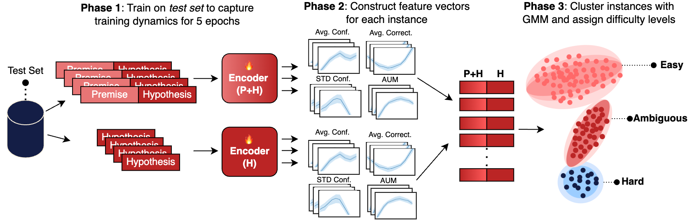
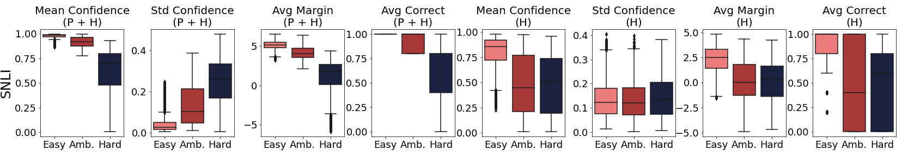
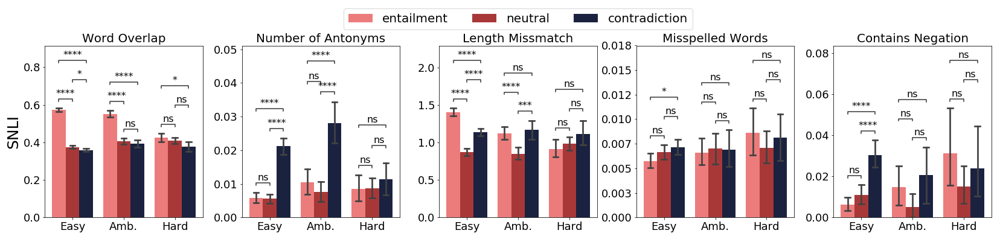
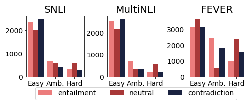
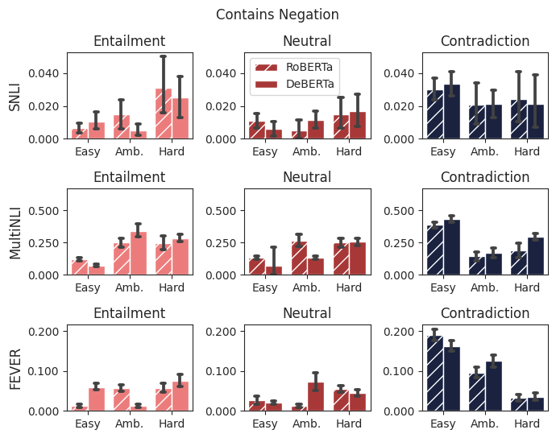
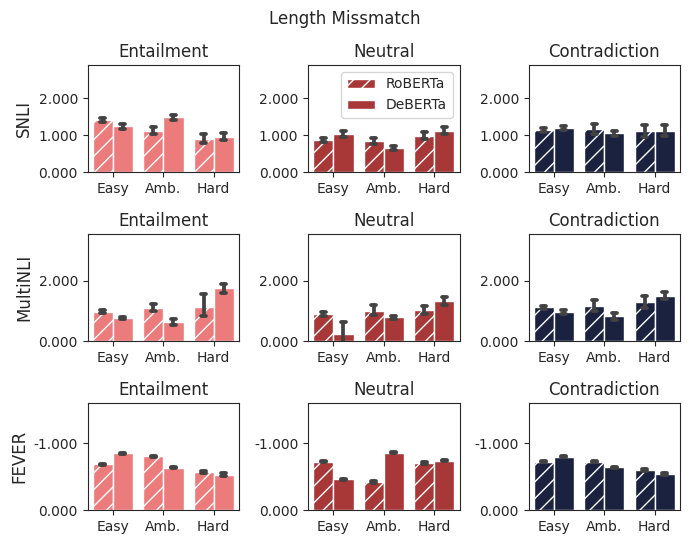

# How Hard is this Test Set? 
NLI Characterization by Exploiting Training Dynamics

###### Abstract

Natural Language Inference (NLI) evaluation is crucial for assessing language understanding models; however, popular datasets suffer from systematic spurious correlations that artificially inflate actual model performance. To address this, we propose a method for the automated creation of a challenging test set without relying on the manual construction of artificial and unrealistic examples. We categorize the test set of popular NLI datasets into three difficulty levels by leveraging methods that exploit training dynamics. This categorization significantly reduces spurious correlation measures, with examples labeled as having the highest difficulty showing markedly decreased performance and encompassing more realistic and diverse linguistic phenomena. When our characterization method is applied to the training set, models trained with only a fraction of the data achieve comparable performance to those trained on the full dataset, surpassing other dataset characterization techniques. Our research addresses limitations in NLI dataset construction, providing a more authentic evaluation of model performance with implications for diverse NLU applications.  

## 1 Introduction

Natural Language Inference (NLI), or textual entailment Dagan et al. ([2009](#bib.bib3)), has emerged as an enduring challenge in the field of Natural Language Processing for evaluating the Natural Language Understanding (NLU) capabilities of models. Persistently, NLI remains a difficult problem, as it implies reasoning across several linguistic phenomena to determine the logical relationship (i.e., entailment, contradiction, or neutral) between two documents - a premise and a hypothesis. The capability to accurately infer relationships between sentences is crucial for a wide range of applications, such as question answering Demszky et al. ([2018](#bib.bib5)), dialogue systems Welleck et al. ([2019](#bib.bib32)), and fact-checking Thorne et al. ([2018](#bib.bib29)); Stab et al. ([2018](#bib.bib26)).  

Since its inception Dagan et al. ([2005](#bib.bib4)), several large-scale benchmark datasets have been proposed for NLI Bowman et al. ([2015](#bib.bib2)); Williams et al. ([2018](#bib.bib33)); Nie et al. ([2019](#bib.bib19)); however, in time, the most ubiquitously used are the Stanford Natural Language Inference (SNLI) Bowman et al. ([2015](#bib.bib2)) and the MultiNLI datasets Williams et al. ([2018](#bib.bib33)), which have played a pivotal role in advancing the state of the art Storks et al. ([2019](#bib.bib27)).  

However, multiple works Liu et al. ([2020](#bib.bib15)); Gururangan et al. ([2018](#bib.bib11)); Tsuchiya ([2018](#bib.bib30)); Poliak et al. ([2018](#bib.bib21)); Naik et al. ([2018](#bib.bib18)); Glockner et al. ([2018](#bib.bib9)) pointed out several critical limitations in these datasets, stemming from systematic annotation errors and spurious correlations that impact both the training and test sets. A critical consequence of these issues is the inflation of model performance, leading to seemingly high results Naik et al. ([2018](#bib.bib18)); Liu et al. ([2020](#bib.bib15)) that may not generalize well to real-world scenarios. For example, a widely used RoBERTa model Liu et al. ([2019](#bib.bib16)) trained solely on the hypothesis achieves an unreasonable accuracy of 71.7% on SNLI and 61.4% on MultiNLI (random chance being 33%), which strongly points towards systematic errors in dataset construction.  

In this work, we aim to address the limitations of existing NLI datasets by proposing an automated construction of a more challenging test set. In contrast to previous approaches, we avoid manually creating artificial examples Naik et al. ([2018](#bib.bib18)); instead, we leverage existing samples from the test set. To accomplish this, we generalize dataset cartography Swayamdipta et al. ([2020](#bib.bib28)) to cluster samples in the test set and characterize them into three categories of increasing difficulty. Our approach leverages 8 measures of training dynamics of each premise-hypothesis pair and is inspired by related works in both NLI Naik et al. ([2018](#bib.bib18)); Geiger et al. ([2018](#bib.bib8)); Liu et al. ([2020](#bib.bib15)) and approaches tackling the problem of learning with noisy data Pleiss et al. ([2020](#bib.bib20)); Swayamdipta et al. ([2020](#bib.bib28)). We show that our method can isolate examples exhibiting spurious correlations and provide a challenging test set. Furthermore, our method is general, model-agnostic, and easily extensible to other datasets (e.g., for fact-checking Thorne et al. ([2018](#bib.bib29))). Our experiments show that using the same method on the training set enables the aggressive filtering of uninformative examples during training, reducing data quantity but increasing quality, enabling the model to obtain on-par performance on the NLI stress test proposed by Naik et al. ([2018](#bib.bib18)), using only a fraction of data. We make our code publicly available111<https://github.com/cosmaadrian/nli-stress-test>.  

This work makes the following contributions:  

1. We denote spurious correlations in the test sets for two popular NLI datasets - SNLI Bowman et al. ([2015](#bib.bib2)) and MultiNLI Williams et al. ([2018](#bib.bib33)) and a fact-checking dataset, repurposed for NLI: FEVER Thorne et al. ([2018](#bib.bib29)). We show statistically significant correlations between the performance of models and the presence of several measures of spurious correlations across labels. 
2. We propose a general method for creating a strong test set for NLI. Using a multitude of training dynamics features of samples in an existing test set, our method automatically characterizes examples in the test set into three increasing difficulty levels, which strongly correlate with decreased model performance. Our method minimizes spurious correlations, providing a more accurate measure of model performance in the real world on NLU tasks. Our method is model-independent and the underlying difficulty splits generalize across models. 
3. The same procedure applied to the training data achieves similar performance on the test set while using only 33% of the available data for SNLI and 59% for MultiNLI, surpassing other dataset characterization methods Pleiss et al. ([2020](#bib.bib20)); Swayamdipta et al. ([2020](#bib.bib28)), indicating that our approach can be used as a strong method for increasing data quality. 

The paper is structured as follows. After emphasizing the shortcomings of existing NLI datasets and presenting various stress tests, we introduce our method for test set characterization. Then, we present the main results, a comparison with a different encoder to argue that our approach is model-agnostic, and an analysis supporting the viability of our approach as an alternative to training set characterization. The paper ends with conclusions and limitations.  

## 2 Related Work

Across the development of natural language inference and understanding systems, multiple large-scale training and testing datasets have been developed over different linguistic domains. Initially, progress was driven by the addition of SNLI Bowman et al. ([2015](#bib.bib2)), but several other variants have been proposed, such as MultiNLI Williams et al. ([2018](#bib.bib33)), containing multiple domains, SciNLI Sadat and Caragea ([2022](#bib.bib24)) for scientific question answering, SQuAD Rajpurkar et al. ([2016](#bib.bib22)) and GLUE Wang et al. ([2018](#bib.bib31)) benchmarks for general-purpose NLU. Moreover, many related problems in NLU can be cast as an NLI problem; for instance, the FEVER Thorne et al. ([2018](#bib.bib29)) dataset for fact-checking can be regarded as an NLI problem in terms of identifying the relationship between a statement and supporting evidence.  

However, driven by the widespread observations that previous popular NLI datasets contain shortcuts Tsuchiya ([2018](#bib.bib30)); Gururangan et al. ([2018](#bib.bib11)), multiple works Nie et al. ([2019](#bib.bib19)); Glockner et al. ([2018](#bib.bib9)); Naik et al. ([2018](#bib.bib18)); Geiger et al. ([2018](#bib.bib8)); Yanaka et al. ([2019](#bib.bib34)); Saha et al. ([2020](#bib.bib25)) developed "stress tests" to benchmark specific linguistic phenomena.  

For instance, Glockner et al. ([2018](#bib.bib9)) proposed a simple test set based on SNLI Bowman et al. ([2015](#bib.bib2)) that involves changing a single word in the premise sentences. In this setting, performance is substantially worse than the original SNLI test set, indicating the presence of spurious correlations in the training dataset construction. Naik et al. ([2018](#bib.bib18)) proposed an NLI Stress Test by quantifying the lexical phenomena (e.g., presence of antonyms, numerical reasoning) behind common model errors in MultiNLI Williams et al. ([2018](#bib.bib33)). Their proposed stress test involved constructing artificial examples that exacerbate common sources of model error, showcasing that some models have markedly reduced performance. Nie et al. ([2019](#bib.bib19)) proposed a new benchmark called Adversarial NLI (ANLI), which leverages an interactive human-and-model-in-the-loop procedure to collect hard examples for natural language inference, obtaining a challenging stress test for current models.  

[FIGURE S2.F1.g1]

Figure 1: Overall diagram of our method to automatically construct a challenging test set for NLI.
[/FIGURE]

Geiger et al. ([2018](#bib.bib8)) constructed a dataset of artificially built sentences based on first-order logic, fixing the sentence structure and only varying words corresponding to parts of speech at predefined positions. Such a dataset comprises unrealistic sentences but provides insight into the (lack-of) expressive power of certain neural architectures. Likewise, Yanaka et al. ([2019](#bib.bib34)) proposed the evaluation of monotonicity reasoning for NLI by constructing a dataset through curating and manipulating sentence pairs from the Parallel Meaning Bank Abzianidze et al. ([2017](#bib.bib1)). Saha et al. ([2020](#bib.bib25)) identified the lack of conjunctive reasoning examples in current NLI test sets and estimated that around 72% of sentence pairs in SNLI have conjunctions unchanged between premise and hypothesis. The authors proposed CONJNLI, a stress test composed of conjunctive sentence pairs collected automatically from Wikipedia and manually verified.  

In contrast to previous work, we propose a method to characterize the test set into multiple difficulty levels by using training dynamics of neural networks Swayamdipta et al. ([2020](#bib.bib28)); Pleiss et al. ([2020](#bib.bib20)), thereby isolating easy and spurious examples and keeping only challenging pairs. Our method is general, model-agnostic, utilizes existing dataset samples (avoiding unrealistic artificial sentence pairs), is easily extensible to other datasets, and does not require manual verification of human annotators. Previous approaches Naik et al. ([2018](#bib.bib18)); Saha et al. ([2020](#bib.bib25)) aim to develop a stress test for NLI by amplifying spurious correlations and evaluating model performance under various extreme conditions. Our goal is to minimize spurious correlations in existing benchmarks to gain a more realistic sense of performance under challenging real-world examples.  

## 3 Test Set Characterization

Our goal is to generalize the Data Maps proposed by Swayamdipta et al. ([2020](#bib.bib28)) to characterize the test set. Swayamdipta et al. ([2020](#bib.bib28)) proposed an approach to gauge the contribution of each training sample in a dataset by analyzing training dynamics (variability, average confidence of the gold label, and average correctness) across training for a fixed amount of epochs. After training, each example is split into one of three categories (i.e., easy-to-learn, ambiguous or hard-to-learn) using a fixed percentile threshold on one of the features. For example, instances regarded as ambiguous are examples for which the variability across 5 epochs is in the top 33% percentiles, disregarding other measures.  

We aim to extend and generalize Data Maps by employing a Gaussian Mixture Model (GMM) Reynolds ([2009](#bib.bib23)) to learn the best fitting distribution of data difficulty levels, thus avoiding fixed thresholds. Unlike other clustering techniques, such as KMeans, which outputs spherical clusters and disregards cluster variance, we chose a GMM as a more flexible clustering method. Figure [1](#S2.F1 "Figure 1 ‣ 2 Related Work ‣ How Hard is this Test Set? NLI Characterization by Exploiting Training Dynamics") showcases the general methodology used in this work. We first characterize the test set by training two separate models with both premise and hypothesis (P+H), and hypothesis only (H); second, we gather 8 measures of training dynamics for each instance and cluster them to obtain three difficulty levels (4 for P+H and 4 for H). We found that difficulty levels simultaneously align with measures of spurious correlations and model performance.  

In contrast to the initial approach of Swayamdipta et al. ([2020](#bib.bib28)), we include 6 additional features for a more informative characterization across training. In our scenario focused on NLI in particular, we gather statistics for training dynamics across two types of settings: normal training (i.e., training with P + H) and hypothesis-only (H). Models trained only with the hypothesis have been shown to produce unreasonably high results Poliak et al. ([2018](#bib.bib21)); Liu et al. ([2020](#bib.bib15)), mostly due to artifacts in dataset construction. These insights enabled us to gather statistics about such examples and improve data characterization through more diverse features for each instance. Different from Swayamdipta et al. ([2020](#bib.bib28)) who focused on characterizing the training set for increasing data quality, we aim to construct a more challenging test set automatically.  

As such, in order to construct a data map of the test set, we trained a model for $E$ epochs on the test set using premise and hypothesis and, separately, using only the hypothesis to gather training dynamics for each example in the test set. Let $D_{test}=\{(x,y^{*})_{i}\}^{N}_{i=1}$ be a test dataset containing $N$ instances, where, in our case, $x_{i}$ is comprised of a premise + hypothesis pair or only a hypothesis. We compute the following measures across training an Encoder model in both scenarios (P + H and H) for each example $x_{i}$: confidence ($\hat{\mu}_{i}$), variability ($\hat{\sigma}_{i}$), correctness ($\hat{c}_{i}$) and Area Under Margin (${\textnormal{{AUM}}}_{i}$).  

|  | $$\hat{\mu}_{i}=\frac{1}{E}\sum^{E}_{e=1}p_{\boldsymbol{\theta}^{(e)}}(y^{*}_{i}|\boldsymbol{x_{i}})$$ |  | (1) |
| --- | --- | --- | --- |

|  | $$\hat{\sigma}_{i}=\sqrt{\frac{\sum^{E}_{e=1}(p_{\boldsymbol{\theta}^{(e)}}(y^{*}_{i}|\boldsymbol{x_{i}})-\hat{\mu}_{i})}{E}}$$ |  | (2) |
| --- | --- | --- | --- |

|  | $$\hat{c}_{i}=\frac{1}{E}\sum^{E}_{e=1}[\operatorname*{argmax}(p_{\boldsymbol{\theta}^{(e)}}(x_{i}))=y^{*}_{i}]$$ |  | (3) |
| --- | --- | --- | --- |

where $p_{\boldsymbol{\theta}^{(e)}}$ corresponds to the model’s probability during training at epoch $e$. Following Swayamdipta et al. ([2020](#bib.bib28)), we compute confidence, variability, and correctness concerning the correct label $y^{*}_{i}$. Furthermore, we compute AUM Pleiss et al. ([2020](#bib.bib20)), which was initially proposed to identify mislabeled examples but yielded a similar type of characterization as Data Maps. We include AUM as an additional measure of instance correctness/learnability. Let $z^{(e)}_{y}(x_{i})$ be the logit (pre-softmax) for class $y$ of the model at epoch $e$, given an instance $x_{i}$. The area under margin (AUM or average margin) of $x_{i}$ is computed as:  

|  | $${\textnormal{{AUM}}}_{i}=\frac{1}{E}\sum^{E}_{e=1}(z^{(e)}_{y^{*}_{i}}(x_{i})-\operatorname*{max}_{(y\neq y^{*}_{i})}z^{(e)}_{y}(x_{i}))$$ |  | (4) |
| --- | --- | --- | --- |

In all our experiments, we first fine-tune pretrained RoBERTa models Liu et al. ([2019](#bib.bib16)), followed by DeBERTa He et al. ([2022](#bib.bib12)) models due to their established high performance on a wide set of tasks. In our formulation, any other encoder would yield similar results, as this method is based only on the final classification output and not model internals. However, characterization based on final logits and class confidences is affected by how calibrated the models’ predictions are Guo et al. ([2017](#bib.bib10)), as poorly calibrated models have lower logit variance across classes. For our scope, we are interested in identifying and separating spurious correlations in NLI benchmarks and not in benchmarking different classifiers for this task. We explore the impact of the underlying encoder in Section [4.1](#S4.SS1 "4.1 Impact of the Underlying Encoder ‣ 4 Results & Discussion ‣ How Hard is this Test Set? NLI Characterization by Exploiting Training Dynamics").  

In Table [1](#S3.T1 "Table 1 ‣ 3 Test Set Characterization ‣ How Hard is this Test Set? NLI Characterization by Exploiting Training Dynamics"), we show the results of our RoBERTa models trained on SNLI, MultiNLI, and FEVER on different configurations of training/testing splits and using both the premise and the hypothesis or only the hypothesis. Our reproduction of results is on par with other works. For completeness, we also show results where the model is trained on the test set, but note that the purpose is only to gather training dynamics and not directly use it as a classifier. The model trained on only the hypothesis obtains 71% accuracy on SNLI and 61% accuracy on MultiNLI, while random chance performance is 33%. These results strongly point toward spurious correlations and annotation artifacts on both datasets Tsuchiya ([2018](#bib.bib30)); Gururangan et al. ([2018](#bib.bib11)); Poliak et al. ([2018](#bib.bib21)); Liu et al. ([2020](#bib.bib15)). In the case of FEVER, the hypothesis-only model achieved close to random-chance, indicating less spurious correlations found in the hypothesis.  

[TABLE S3.T1]

<table class="ltx_tabular ltx_guessed_headers ltx_align_middle">
<thead class="ltx_thead">
<tr class="ltx_tr">
<th class="ltx_td ltx_align_left ltx_th ltx_th_column">Dataset</th>
<th class="ltx_td ltx_align_left ltx_th ltx_th_column">Train Split</th>
<th class="ltx_td ltx_align_left ltx_th ltx_th_column ltx_border_r">Test Split</th>
<th class="ltx_td ltx_align_center ltx_th ltx_th_column">Accuracy (P + H)</th>
<th class="ltx_td ltx_align_center ltx_th ltx_th_column">Accuracy (H)</th>
</tr>
</thead>
<tbody class="ltx_tbody">
<tr class="ltx_tr">
<td class="ltx_td ltx_align_left ltx_border_tt">SNLI</td>
<td class="ltx_td ltx_align_left ltx_border_tt">Train</td>
<td class="ltx_td ltx_align_left ltx_border_r ltx_border_tt">Test</td>
<td class="ltx_td ltx_align_center ltx_border_tt">0.9178</td>
<td class="ltx_td ltx_align_center ltx_border_tt">0.7170</td>
</tr>
<tr class="ltx_tr">
<td class="ltx_td ltx_align_left">Test</td>
<td class="ltx_td ltx_align_left ltx_border_r">Test</td>
<td class="ltx_td ltx_align_center">0.9799</td>
<td class="ltx_td ltx_align_center">0.8764</td>
</tr>
<tr class="ltx_tr">
<td class="ltx_td ltx_align_left ltx_border_t">MultiNLI</td>
<td class="ltx_td ltx_align_left ltx_border_t">Train</td>
<td class="ltx_td ltx_align_left ltx_border_r ltx_border_t">Val</td>
<td class="ltx_td ltx_align_center ltx_border_t">0.8773</td>
<td class="ltx_td ltx_align_center ltx_border_t">0.6142</td>
</tr>
<tr class="ltx_tr">
<td class="ltx_td ltx_align_left">Val</td>
<td class="ltx_td ltx_align_left ltx_border_r">Val</td>
<td class="ltx_td ltx_align_center">0.9841</td>
<td class="ltx_td ltx_align_center">0.8612</td>
</tr>
<tr class="ltx_tr">
<td class="ltx_td ltx_align_left ltx_border_t">FEVER</td>
<td class="ltx_td ltx_align_left ltx_border_t">Train</td>
<td class="ltx_td ltx_align_left ltx_border_r ltx_border_t">Dev</td>
<td class="ltx_td ltx_align_center ltx_border_t">0.7702</td>
<td class="ltx_td ltx_align_center ltx_border_t">0.3822</td>
</tr>
<tr class="ltx_tr">
<td class="ltx_td ltx_align_left">Dev</td>
<td class="ltx_td ltx_align_left ltx_border_r">Dev</td>
<td class="ltx_td ltx_align_center">0.9459</td>
<td class="ltx_td ltx_align_center">0.7137</td>
</tr>
</tbody>
</table>

Table 1: Results for RoBERTa on SNLI, MultiNLI and FEVER under various train/test splits and input types.
[/TABLE]

After training two classifiers (P + H and H) on each dataset’s test set, we construct a feature vector $f_{i}$ describing the training dynamics of an instance $i$ by concatenating the training dynamics of each sample in both settings:  

|  | $$\begin{split}f^{(P+H)}_{i}&=[\hat{\mu}^{(P+H)}_{i},\hat{\sigma}^{(P+H)}_{i},\hat{c}^{(P+H)}_{i},{\textnormal{{AUM}}}^{(P+H)}_{i}]\\ f^{(H)}_{i}&=[\hat{\mu}^{(H)}_{i},\hat{\sigma}^{(H)}_{i},\hat{c}^{(H)}_{i},{\textnormal{{AUM}}}^{(H)}_{i}]\\ f_{i}&=f^{(P+H)}_{i}\mathbin{\|}f^{(H)}_{i}\end{split}$$ |  | (5) |
| --- | --- | --- | --- |

[FIGURE S3.F2.g1]

Figure 2: Distributions of feature values across difficulty levels for the test set for SNLI (top), MultiNLI (middle), and FEVER (bottom). In addition to features explored in Data Maps Swayamdipta et al. ([2020](#bib.bib28)), we also incorporated the Average Margin Pleiss et al. ([2020](#bib.bib20)) and included training dynamics across a model trained only on the hypothesis.
[/FIGURE]

Using the feature vectors $\{f_{i}\}^{N}_{i=1}$, we cluster the test set using a Gaussian Mixture Model into three clusters. Feature vectors are normalized with standard scaling by subtracting the mean and dividing by the standard deviation of each feature. The clusters are ranked according to the intra-cluster average confidence $\hat{\mu}^{(P+H)}$, and we interpret them as belonging to three difficulty levels, following the terminology introduced by Swayamdipta et al. ([2020](#bib.bib28)): easy, ambiguous and hard, in decreasing order of the average intra-cluster confidence $\overline{\hat{\mu}}^{(P+H)}$. See Appendix [A](#A1 "Appendix A Appendix ‣ How Hard is this Test Set? NLI Characterization by Exploiting Training Dynamics") for a high-level overview of our algorithm.  

Figure [2](#S3.F2 "Figure 2 ‣ 3 Test Set Characterization ‣ How Hard is this Test Set? NLI Characterization by Exploiting Training Dynamics") depicts the distribution of features across difficulty levels for both datasets. While each type of feature captures different aspects of the learnability of an instance, their combination offers a more diverse view of the learning dynamics during training. In the case of both SNLI and MultiNLI, harder examples have consistently lower average margin and more variability of the correct class. The effect is not as pronounced in a hypothesis-only setting; however, there is a clear delimitation of easy examples for average margin and confidence, indicating potential annotation artifacts. For FEVER, since the dataset has reduced spurious correlations, the identified splits correspond to difficult-to-learn examples, not necessarily examples with annotation artifacts.  

In the interest of quantifying the number of spurious correlations found in the test set, we follow Naik et al. ([2018](#bib.bib18)) and track several measures that correspond to either shallow statistics between the premise and the hypothesis, or the presence of negations or misspelled words. Table [2](#S3.T2 "Table 2 ‣ 3 Test Set Characterization ‣ How Hard is this Test Set? NLI Characterization by Exploiting Training Dynamics") presents the heuristics implemented in our work. We automatically compute each measure, avoiding time-consuming manual annotations.  

[TABLE S3.T2]

<table class="ltx_tabular ltx_guessed_headers ltx_align_middle">
<thead class="ltx_thead">
<tr class="ltx_tr">
<th class="ltx_td ltx_align_left ltx_th ltx_th_column ltx_th_row ltx_border_r">Name</th>
<th class="ltx_td ltx_align_justify ltx_align_top ltx_th ltx_th_column">

Explanation

</th>
</tr>
</thead>
<tbody class="ltx_tbody">
<tr class="ltx_tr">
<th class="ltx_td ltx_align_left ltx_th ltx_th_row ltx_border_r ltx_border_tt">Word Overlap</th>
<td class="ltx_td ltx_align_justify ltx_align_top ltx_border_tt">

Number of common words between the premise and hypothesis, normalized by sentence length

</td>
</tr>
<tr class="ltx_tr">
<th class="ltx_td ltx_align_left ltx_th ltx_th_row ltx_border_r">Number of Antonyms</th>
<td class="ltx_td ltx_align_justify ltx_align_top">

Number of antonyms of each of the words in the premise contained in hypothesis, based on WordNet <cite class="ltx_cite ltx_citemacro_cite">Fellbaum (<a class="ltx_ref">1998</a>)</cite>, normalized by sentence length.

</td>
</tr>
<tr class="ltx_tr">
<th class="ltx_td ltx_align_left ltx_th ltx_th_row ltx_border_r">Length Mismatch</th>
<td class="ltx_td ltx_align_justify ltx_align_top">

Difference in length between premise and hypothesis, normalized by sentence length

</td>
</tr>
<tr class="ltx_tr">
<th class="ltx_td ltx_align_left ltx_th ltx_th_row ltx_border_r">Misspelled Words</th>
<td class="ltx_td ltx_align_justify ltx_align_top">

Total number of misspelled words using a spellchecker in the premise and hypothesis, normalized by sentence length.

</td>
</tr>
<tr class="ltx_tr">
<th class="ltx_td ltx_align_left ltx_th ltx_th_row ltx_border_r">Contains Negation</th>
<td class="ltx_td ltx_align_justify ltx_align_top">

Boolean flag if either the premise of hypothesis contains a negation word (e.g., no, not, never, none)

</td>
</tr>
</tbody>
</table>

Table 2: Heuristic measures of spurious correlations used, similar to the categories by Naik et al. ([2018](#bib.bib18)).
[/TABLE]

[TABLE S3.T3]

<table class="ltx_tabular ltx_guessed_headers ltx_align_middle">
<thead class="ltx_thead">
<tr class="ltx_tr">
<th class="ltx_td ltx_align_center ltx_th ltx_th_column">Dataset</th>
<th class="ltx_td ltx_align_center ltx_th ltx_th_column ltx_border_r">Split</th>
<th class="ltx_td ltx_align_center ltx_th ltx_th_column">Fraction of total</th>
<th class="ltx_td ltx_align_justify ltx_align_top ltx_th ltx_th_column">

Accuracy (P + H)

</th>
<th class="ltx_td ltx_align_justify ltx_align_top ltx_th ltx_th_column">

Accuracy (H)

</th>
</tr>
</thead>
<tbody class="ltx_tbody">
<tr class="ltx_tr">
<td class="ltx_td ltx_align_center ltx_border_tt">SNLI</td>
<td class="ltx_td ltx_align_center ltx_border_r ltx_border_tt">Easy</td>
<td class="ltx_td ltx_align_center ltx_border_tt">0.70 (6889 / 9824)
</td>
<td class="ltx_td ltx_align_justify ltx_align_top ltx_border_tt">

0.97

</td>
<td class="ltx_td ltx_align_justify ltx_align_top ltx_border_tt">

0.82

</td>
</tr>
<tr class="ltx_tr">
<td class="ltx_td ltx_align_center ltx_border_r">Amb.</td>
<td class="ltx_td ltx_align_center">0.17 (1725 / 9824)
</td>
<td class="ltx_td ltx_align_justify ltx_align_top">

0.89

</td>
<td class="ltx_td ltx_align_justify ltx_align_top">

0.46

</td>
</tr>
<tr class="ltx_tr">
<td class="ltx_td ltx_align_center ltx_border_r">Hard</td>
<td class="ltx_td ltx_align_center">0.12 (1210 / 9824)
</td>
<td class="ltx_td ltx_align_justify ltx_align_top">

0.56

</td>
<td class="ltx_td ltx_align_justify ltx_align_top">

0.38

</td>
</tr>
<tr class="ltx_tr">
<td class="ltx_td ltx_align_center ltx_border_t">MultiNLI</td>
<td class="ltx_td ltx_align_center ltx_border_r ltx_border_t">Easy</td>
<td class="ltx_td ltx_align_center ltx_border_t">0.75 (7381 / 9815)
</td>
<td class="ltx_td ltx_align_justify ltx_align_top ltx_border_t">

0.94

</td>
<td class="ltx_td ltx_align_justify ltx_align_top ltx_border_t">

0.67

</td>
</tr>
<tr class="ltx_tr">
<td class="ltx_td ltx_align_center ltx_border_r">Amb.</td>
<td class="ltx_td ltx_align_center">0.14 (1420 / 9815)
</td>
<td class="ltx_td ltx_align_justify ltx_align_top">

0.75

</td>
<td class="ltx_td ltx_align_justify ltx_align_top">

0.43

</td>
</tr>
<tr class="ltx_tr">
<td class="ltx_td ltx_align_center ltx_border_r">Hard</td>
<td class="ltx_td ltx_align_center">0.10 (1014 / 9815)
</td>
<td class="ltx_td ltx_align_justify ltx_align_top">

0.53

</td>
<td class="ltx_td ltx_align_justify ltx_align_top">

0.39

</td>
</tr>
<tr class="ltx_tr">
<td class="ltx_td ltx_align_center ltx_border_t">FEVER</td>
<td class="ltx_td ltx_align_center ltx_border_r ltx_border_t">Easy</td>
<td class="ltx_td ltx_align_center ltx_border_t">0.50 (10083 / 19998)
</td>
<td class="ltx_td ltx_align_justify ltx_align_top ltx_border_t">

0.95

</td>
<td class="ltx_td ltx_align_justify ltx_align_top ltx_border_t">

0.43

</td>
</tr>
<tr class="ltx_tr">
<td class="ltx_td ltx_align_center ltx_border_r">Amb.</td>
<td class="ltx_td ltx_align_center">0.24 (4903 / 19998)
</td>
<td class="ltx_td ltx_align_justify ltx_align_top">

0.88

</td>
<td class="ltx_td ltx_align_justify ltx_align_top">

0.49

</td>
</tr>
<tr class="ltx_tr">
<td class="ltx_td ltx_align_center ltx_border_r">Hard</td>
<td class="ltx_td ltx_align_center">0.25 (5012 / 19998)
</td>
<td class="ltx_td ltx_align_justify ltx_align_top">

0.29

</td>
<td class="ltx_td ltx_align_justify ltx_align_top">

0.16

</td>
</tr>
</tbody>
</table>

Table 3: Performance of RoBERTa models trained on the training set and evaluated on different splits of our stress test.
[/TABLE]

Training the pretrained models for dataset characterization was performed for 5 epochs each, with a batch size of 32, using the Adam optimizer with a learning rate of $10^{-5}$ following a linear decay schedule with warm-up. We used mixed precision for all training runs.  

## 4 Results & Discussion

[FIGURE S4.F3.g1]

Figure 3: Distributions of the measures of spurious correlations for each level (easy, ambiguous, hard) across the three labels (entailment, neutral, contradiction) for SNLI (top), MultiNLI (middle) and FEVER (bottom).
[/FIGURE]

Table [3](#S3.T3 "Table 3 ‣ 3 Test Set Characterization ‣ How Hard is this Test Set? NLI Characterization by Exploiting Training Dynamics") shows the performance of a RoBERTa model trained on each dataset’s training set and evaluated on our stress test after characterization using training dynamics. Easier instances have more examples annotated with "contradiction" and "entailment", while harder instances have more examples annotated with "neutral". Performance monotonously degrades upon increasing difficulty levels, reaching 56% accuracy on SNLI-hard and 53% accuracy on MultiNLI-hard. Performance on the easy split for both datasets is considerably higher compared to the global accuracy with all splits combined. Furthermore, the accuracy of a model trained using only the hypothesis degrades to almost random chance on harder splits, indicating that the hard split has fewer annotation artifacts. Compared to Swayamdipta et al. ([2020](#bib.bib28)), the difficulty levels are not equal in size; the majority ($\sim$70%) of samples belongs to the easy category, while only around 10% are characterized as being hard. For FEVER, the performance degradation in the hard split is more dramatic: 29% accuracy for hard compared to 88% for ambiguous, indicating truly difficult examples for the model.  

[FIGURE S4.F4.g1]

Figure 4: Counts for each class in SNLI, MultiNLI, and FEVER, according to each difficulty level.
[/FIGURE]

Even though the hard split is relatively small, the subsample is challenging for current models, as it comprises instances with fewer spurious correlations between premise and hypothesis. Fewer annotation artifacts enable fewer "correct" predictions from linguistic patterns present only in the hypothesis. In Figure [4](#S4.F4 "Figure 4 ‣ 4 Results & Discussion ‣ How Hard is this Test Set? NLI Characterization by Exploiting Training Dynamics"), we show per-class counts relative to the difficulty levels for both datasets. It is the case that easier samples contain more contradictions and entailments, prone to linguistic commonalities (word overlap, presence of antonyms). Thus, the hard split has more neutral instances.  

Through manual inspection, we found that for SNLI, the easy splits contain unrelated sentences which are sometimes annotated incorrectly as Contradiction (e.g., "a woman running in the park" versus "a man cooking at home" - two unrelated sentences annotated as contradicting). The model learns this pattern and incorrectly predicts Contradiction on some Neutral pairs (e.g., "… girls chatting on the stairwell" versus "girls are at school"). For MultiNLI, we found that the easy split usually aligns with simple sentence negations (e.g., "it gets it" versus "it doesn’t get it") or paraphrasing ("I guess history repeats itself" versus "history certainly doesn’t repeat"). These observations strongly point towards spurious correlations between premise and hypothesis, making the sentences easier to classify correctly. We provide selected examples in the Appendix [A](#A1 "Appendix A Appendix ‣ How Hard is this Test Set? NLI Characterization by Exploiting Training Dynamics"). The ambiguous and hard splits in both datasets contain increasingly more subtle cues, with little overlap in words between premise and hypothesis (e.g., "standing on a tree log" versus "crossing the stream" / "wouldn’t have mattered" versus "would have gotten worse"), having more natural and challenging sentence pairs.  

Across SNLI, MultiNLI, and FEVER, we tracked the average amount of each measure between difficulty levels and classes (see Figure [3](#S4.F3 "Figure 3 ‣ 4 Results & Discussion ‣ How Hard is this Test Set? NLI Characterization by Exploiting Training Dynamics")). To rigorously test the difference between the classes at various difficulty levels, we perform a non-parametric two-sided Mann-Whitney-U test Mann and Whitney ([1947](#bib.bib17)) with Bonferroni correction to test for statistical significant differences222Significance thresholds: Not Significant (ns): $.05<p$, \*: $.01\leq p\leq.05$, \*\*: $.001\leq p\leq.01$, \*\*\*: $p\leq.001$,.  

We found no evidence for the presence of spurious correlations (Mann-Whitney’s U test $p>.05$) in the hard split between the three classes. Some measures are more associated with certain classes. For example, instances annotated with Contradiction have a disproportionate amount of antonyms between premise and hypothesis in the easy and ambiguous splits. Similarly, negation is more present in the Contradiction class for easy splits. For instances annotated with Entailment, word overlap is present significantly in easy splits. Between SNLI and MultiNLI, MultiNLI has a disproportionately large amount of negations compared to SNLI. For both SNLI and MultiNLI, our method yields little to no significant differences between classes in the hard split across the spurious correlation measures. For FEVER, measures such as the presence of negations, number of antonyms, and word overlap are reduced across difficulty levels. Note that FEVER includes a small statement as the premise and a long text extract containing evidence as the hypothesis, which makes the length mismatch negative.  

### 4.1 Impact of the Underlying Encoder

To show that our method is model-agnostic, we further provide a comparison between the dataset characterizations obtained by RoBERTa and DeBERTa. Table [4](#S4.T4 "Table 4 ‣ 4.1 Impact of the Underlying Encoder ‣ 4 Results & Discussion ‣ How Hard is this Test Set? NLI Characterization by Exploiting Training Dynamics") showcases the accuracies of the two models on each others’ data characterizations. The difficulty splits are maintained cross-model.  

[TABLE S4.T4]

<table class="ltx_tabular ltx_guessed_headers ltx_align_middle">
<thead class="ltx_thead">
<tr class="ltx_tr">
<th class="ltx_td ltx_th ltx_th_column ltx_th_row"></th>
<th class="ltx_td ltx_th ltx_th_column ltx_th_row ltx_border_r"></th>
<th class="ltx_td ltx_th ltx_th_column"></th>
<th class="ltx_td ltx_align_center ltx_th ltx_th_column">Source: RoBERTa</th>
<th class="ltx_td ltx_align_center ltx_th ltx_th_column">Source: DeBERTa</th>
</tr>
<tr class="ltx_tr">
<th class="ltx_td ltx_align_center ltx_th ltx_th_column ltx_th_row">Split</th>
<th class="ltx_td ltx_align_center ltx_th ltx_th_column ltx_th_row ltx_border_r">Dataset</th>
<th class="ltx_td ltx_align_center ltx_th ltx_th_column">Target Model</th>
<th class="ltx_td ltx_align_center ltx_th ltx_th_column">Accuracy</th>
<th class="ltx_td ltx_align_center ltx_th ltx_th_column">Accuracy</th>
</tr>
</thead>
<tbody class="ltx_tbody">
<tr class="ltx_tr">
<th class="ltx_td ltx_align_center ltx_th ltx_th_row ltx_border_tt">Easy</th>
<th class="ltx_td ltx_align_center ltx_th ltx_th_row ltx_border_r ltx_border_tt">SNLI</th>
<td class="ltx_td ltx_align_center ltx_border_tt">RoBERTa</td>
<td class="ltx_td ltx_align_center ltx_border_tt">0.9779</td>
<td class="ltx_td ltx_align_center ltx_border_tt">0.9462</td>
</tr>
<tr class="ltx_tr">
<td class="ltx_td ltx_align_center">DeBERTa</td>
<td class="ltx_td ltx_align_center">0.9792</td>
<td class="ltx_td ltx_align_center">0.9624</td>
</tr>
<tr class="ltx_tr">
<th class="ltx_td ltx_align_center ltx_th ltx_th_row ltx_border_r ltx_border_t">MultiNLI</th>
<td class="ltx_td ltx_align_center ltx_border_t">RoBERTa</td>
<td class="ltx_td ltx_align_center ltx_border_t">0.9470</td>
<td class="ltx_td ltx_align_center ltx_border_t">0.9502</td>
</tr>
<tr class="ltx_tr">
<td class="ltx_td ltx_align_center">DeBERTa</td>
<td class="ltx_td ltx_align_center">0.9545</td>
<td class="ltx_td ltx_align_center">0.9567</td>
</tr>
<tr class="ltx_tr">
<th class="ltx_td ltx_align_center ltx_th ltx_th_row ltx_border_r ltx_border_t">FEVER</th>
<td class="ltx_td ltx_align_center ltx_border_t">RoBERTa</td>
<td class="ltx_td ltx_align_center ltx_border_t">0.9101</td>
<td class="ltx_td ltx_align_center ltx_border_t">0.9346</td>
</tr>
<tr class="ltx_tr">
<td class="ltx_td ltx_align_center">DeBERTa</td>
<td class="ltx_td ltx_align_center">0.8967</td>
<td class="ltx_td ltx_align_center">0.9501</td>
</tr>
<tr class="ltx_tr">
<th class="ltx_td ltx_align_center ltx_th ltx_th_row ltx_border_t">Ambiguous</th>
<th class="ltx_td ltx_align_center ltx_th ltx_th_row ltx_border_r ltx_border_t">SNLI</th>
<td class="ltx_td ltx_align_center ltx_border_t">RoBERTa</td>
<td class="ltx_td ltx_align_center ltx_border_t">0.8916</td>
<td class="ltx_td ltx_align_center ltx_border_t">0.9802</td>
</tr>
<tr class="ltx_tr">
<td class="ltx_td ltx_align_center">DeBERTa</td>
<td class="ltx_td ltx_align_center">0.9003</td>
<td class="ltx_td ltx_align_center">0.9881</td>
</tr>
<tr class="ltx_tr">
<th class="ltx_td ltx_align_center ltx_th ltx_th_row ltx_border_r ltx_border_t">MultiNLI</th>
<td class="ltx_td ltx_align_center ltx_border_t">RoBERTa</td>
<td class="ltx_td ltx_align_center ltx_border_t">0.7577</td>
<td class="ltx_td ltx_align_center ltx_border_t">0.9086</td>
</tr>
<tr class="ltx_tr">
<td class="ltx_td ltx_align_center">DeBERTa</td>
<td class="ltx_td ltx_align_center">0.7746</td>
<td class="ltx_td ltx_align_center">0.9543</td>
</tr>
<tr class="ltx_tr">
<th class="ltx_td ltx_align_center ltx_th ltx_th_row ltx_border_r ltx_border_t">FEVER</th>
<td class="ltx_td ltx_align_center ltx_border_t">RoBERTa</td>
<td class="ltx_td ltx_align_center ltx_border_t">0.9532</td>
<td class="ltx_td ltx_align_center ltx_border_t">0.8697</td>
</tr>
<tr class="ltx_tr">
<td class="ltx_td ltx_align_center">DeBERTa</td>
<td class="ltx_td ltx_align_center">0.9470</td>
<td class="ltx_td ltx_align_center">0.8697</td>
</tr>
<tr class="ltx_tr">
<th class="ltx_td ltx_align_center ltx_th ltx_th_row ltx_border_t">Hard</th>
<th class="ltx_td ltx_align_center ltx_th ltx_th_row ltx_border_r ltx_border_t">SNLI</th>
<td class="ltx_td ltx_align_center ltx_border_t">RoBERTa</td>
<td class="ltx_td ltx_align_center ltx_border_t">0.5678</td>
<td class="ltx_td ltx_align_center ltx_border_t">0.6337</td>
</tr>
<tr class="ltx_tr">
<td class="ltx_td ltx_align_center">DeBERTa</td>
<td class="ltx_td ltx_align_center">0.6446</td>
<td class="ltx_td ltx_align_center">0.6437</td>
</tr>
<tr class="ltx_tr">
<th class="ltx_td ltx_align_center ltx_th ltx_th_row ltx_border_r ltx_border_t">MultiNLI</th>
<td class="ltx_td ltx_align_center ltx_border_t">RoBERTa</td>
<td class="ltx_td ltx_align_center ltx_border_t">0.5375</td>
<td class="ltx_td ltx_align_center ltx_border_t">0.7497</td>
</tr>
<tr class="ltx_tr">
<td class="ltx_td ltx_align_center">DeBERTa</td>
<td class="ltx_td ltx_align_center">0.6460</td>
<td class="ltx_td ltx_align_center">0.7585</td>
</tr>
<tr class="ltx_tr">
<th class="ltx_td ltx_align_center ltx_th ltx_th_row ltx_border_r ltx_border_t">FEVER</th>
<td class="ltx_td ltx_align_center ltx_border_t">RoBERTa</td>
<td class="ltx_td ltx_align_center ltx_border_t">0.3444</td>
<td class="ltx_td ltx_align_center ltx_border_t">0.2913</td>
</tr>
<tr class="ltx_tr">
<td class="ltx_td ltx_align_center">DeBERTa</td>
<td class="ltx_td ltx_align_center">0.4089</td>
<td class="ltx_td ltx_align_center">0.2977</td>
</tr>
</tbody>
</table>

Table 4: Comparison between RoBERTa and DeBERTa accuracy on each difficulty level, across models.
[/TABLE]

Across datasets and difficulty levels, the performance sharply drops for the "hard" split for both models. DeBERTa achieved higher accuracy for "hard" set, most likely due to better overall performance compared to RoBERTa. In Figure [5](#S4.F5 "Figure 5 ‣ 4.1 Impact of the Underlying Encoder ‣ 4 Results & Discussion ‣ How Hard is this Test Set? NLI Characterization by Exploiting Training Dynamics"), we show that overall heuristic values for "Contains Negation" are maintained across both models. Extended results for are presented in Appendix [A](#A1 "Appendix A Appendix ‣ How Hard is this Test Set? NLI Characterization by Exploiting Training Dynamics").  

[FIGURE S4.F5.g1]

Figure 5: Comparison between the characterizations obtained by RoBERTa and DeBERTa on the "Contains Negation" heuristic measure.
[/FIGURE]

Our proposed methodology is general and independent of the underlying encoder model since we process training dynamics computed from raw logit scores. This characterization procedure may be adapted to using Large Language Models (LLMs) Lee et al. ([2023](#bib.bib14)) in a zero-shot classification setting by manipulating the log-likelihood for the tokens of the correct classes. However, using LLMs requires a different approach than the one presented here since the networks are usually used without further training, in an in-context-learning manner Dong et al. ([2022](#bib.bib6)). Furthermore, even if the LLMs are fine-tuned Hu et al. ([2021](#bib.bib13)), it is not straightforward how the logits of each of the three classes are tracked across training. We leave this approach for future work.  

### 4.2 Training Set Characterization

[TABLE S4.T5]

<table class="ltx_tabular ltx_align_middle">
<tbody class="ltx_tbody">
<tr class="ltx_tr">
<td class="ltx_td ltx_align_top"></td>
<td class="ltx_td"></td>
<td class="ltx_td ltx_align_center">Stress Test by <cite class="ltx_cite ltx_citemacro_citet">Naik et al. (<a class="ltx_ref">2018</a>)</cite></td>
<td class="ltx_td"></td>
</tr>
<tr class="ltx_tr">
<td class="ltx_td ltx_align_justify ltx_align_top">

Method

</td>
<td class="ltx_td ltx_align_left">Splits</td>
<td class="ltx_td ltx_align_left ltx_border_r">% SNLI</td>
<td class="ltx_td ltx_align_justify ltx_align_top">

Word
 Overlap

</td>
<td class="ltx_td ltx_align_justify ltx_align_top">

Spelling
 Error

</td>
<td class="ltx_td ltx_align_justify ltx_align_top">

Numerical
 Reasoning

</td>
<td class="ltx_td ltx_align_justify ltx_align_top">

Negation

</td>
<td class="ltx_td ltx_align_justify ltx_align_top">

Length
 Mismatch

</td>
<td class="ltx_td ltx_align_center">Antonym</td>
<td class="ltx_td ltx_align_center">Overall</td>
</tr>
<tr class="ltx_tr">
<td class="ltx_td ltx_align_justify ltx_align_top ltx_border_tt">

DataMaps

</td>
<td class="ltx_td ltx_align_left ltx_border_tt">Amb.</td>
<td class="ltx_td ltx_align_left ltx_border_r ltx_border_tt">33%</td>
<td class="ltx_td ltx_align_justify ltx_align_top ltx_border_tt">

0.6792

</td>
<td class="ltx_td ltx_align_justify ltx_align_top ltx_border_tt">

0.7202

</td>
<td class="ltx_td ltx_align_justify ltx_align_top ltx_border_tt">

0.3745

</td>
<td class="ltx_td ltx_align_justify ltx_align_top ltx_border_tt">

0.5388

</td>
<td class="ltx_td ltx_align_justify ltx_align_top ltx_border_tt">

0.7176

</td>
<td class="ltx_td ltx_align_center ltx_border_tt">0.6237</td>
<td class="ltx_td ltx_align_center ltx_border_tt">0.6662</td>
</tr>
<tr class="ltx_tr">
<td class="ltx_td ltx_align_justify ltx_align_top">

AUM

</td>
<td class="ltx_td ltx_align_left">Amb.</td>
<td class="ltx_td ltx_align_left ltx_border_r">33%</td>
<td class="ltx_td ltx_align_justify ltx_align_top">

0.6818

</td>
<td class="ltx_td ltx_align_justify ltx_align_top">

0.6904

</td>
<td class="ltx_td ltx_align_justify ltx_align_top">

0.2896

</td>
<td class="ltx_td ltx_align_justify ltx_align_top">

0.4837

</td>
<td class="ltx_td ltx_align_justify ltx_align_top">

0.7134

</td>
<td class="ltx_td ltx_align_center">0.7417</td>
<td class="ltx_td ltx_align_center">0.6416</td>
</tr>
<tr class="ltx_tr">
<td class="ltx_td ltx_align_justify ltx_align_top ltx_border_t">

Ours

</td>
<td class="ltx_td ltx_align_left ltx_border_t">Easy</td>
<td class="ltx_td ltx_align_left ltx_border_r ltx_border_t">53%</td>
<td class="ltx_td ltx_align_justify ltx_align_top ltx_border_t">

0.6720

</td>
<td class="ltx_td ltx_align_justify ltx_align_top ltx_border_t">

0.6713

</td>
<td class="ltx_td ltx_align_justify ltx_align_top ltx_border_t">

0.4287

</td>
<td class="ltx_td ltx_align_justify ltx_align_top ltx_border_t">

0.4622

</td>
<td class="ltx_td ltx_align_justify ltx_align_top ltx_border_t">

0.6870

</td>
<td class="ltx_td ltx_align_center ltx_border_t">0.4446</td>
<td class="ltx_td ltx_align_center ltx_border_t">0.6246</td>
</tr>
<tr class="ltx_tr">
<td class="ltx_td ltx_align_left">Easy+Amb</td>
<td class="ltx_td ltx_align_left ltx_border_r">86%</td>
<td class="ltx_td ltx_align_justify ltx_align_top">

0.7231

</td>
<td class="ltx_td ltx_align_justify ltx_align_top">

0.7500

</td>
<td class="ltx_td ltx_align_justify ltx_align_top">

0.4452

</td>
<td class="ltx_td ltx_align_justify ltx_align_top">

0.6124

</td>
<td class="ltx_td ltx_align_justify ltx_align_top">

0.7578

</td>
<td class="ltx_td ltx_align_center">0.6582</td>
<td class="ltx_td ltx_align_center">0.7083</td>
</tr>
<tr class="ltx_tr">
<td class="ltx_td ltx_align_left">Amb</td>
<td class="ltx_td ltx_align_left ltx_border_r">33%</td>
<td class="ltx_td ltx_align_justify ltx_align_top">

0.7264

</td>
<td class="ltx_td ltx_align_justify ltx_align_top">

0.7414

</td>
<td class="ltx_td ltx_align_justify ltx_align_top">

0.4158

</td>
<td class="ltx_td ltx_align_justify ltx_align_top">

0.6666

</td>
<td class="ltx_td ltx_align_justify ltx_align_top">

0.7491

</td>
<td class="ltx_td ltx_align_center">0.6515</td>
<td class="ltx_td ltx_align_center">0.7093</td>
</tr>
<tr class="ltx_tr">
<td class="ltx_td ltx_align_left">AmbHard</td>
<td class="ltx_td ltx_align_left ltx_border_r">46%</td>
<td class="ltx_td ltx_align_justify ltx_align_top">

0.7302

</td>
<td class="ltx_td ltx_align_justify ltx_align_top">

0.7305

</td>
<td class="ltx_td ltx_align_justify ltx_align_top">

0.3761

</td>
<td class="ltx_td ltx_align_justify ltx_align_top">

0.5533

</td>
<td class="ltx_td ltx_align_justify ltx_align_top">

0.7471

</td>
<td class="ltx_td ltx_align_center">0.6619</td>
<td class="ltx_td ltx_align_center">0.6860</td>
</tr>
<tr class="ltx_tr">
<td class="ltx_td ltx_align_left">Easy+Hard</td>
<td class="ltx_td ltx_align_left ltx_border_r">66%</td>
<td class="ltx_td ltx_align_justify ltx_align_top">

0.6714

</td>
<td class="ltx_td ltx_align_justify ltx_align_top">

0.6815

</td>
<td class="ltx_td ltx_align_justify ltx_align_top">

0.3803

</td>
<td class="ltx_td ltx_align_justify ltx_align_top">

0.5617

</td>
<td class="ltx_td ltx_align_justify ltx_align_top">

0.6993

</td>
<td class="ltx_td ltx_align_center">0.4971</td>
<td class="ltx_td ltx_align_center">0.6442</td>
</tr>
<tr class="ltx_tr">
<td class="ltx_td ltx_align_left">Hard</td>
<td class="ltx_td ltx_align_left ltx_border_r">13%</td>
<td class="ltx_td ltx_align_justify ltx_align_top">

0.3191

</td>
<td class="ltx_td ltx_align_justify ltx_align_top">

0.3310

</td>
<td class="ltx_td ltx_align_justify ltx_align_top">

0.3304

</td>
<td class="ltx_td ltx_align_justify ltx_align_top">

0.3184

</td>
<td class="ltx_td ltx_align_justify ltx_align_top">

0.3189

</td>
<td class="ltx_td ltx_align_center">0.0</td>
<td class="ltx_td ltx_align_center">0.3177</td>
</tr>
<tr class="ltx_tr">
<td class="ltx_td ltx_align_top ltx_border_t"></td>
<td class="ltx_td ltx_align_left ltx_border_t">All</td>
<td class="ltx_td ltx_align_left ltx_border_r ltx_border_t">100%</td>
<td class="ltx_td ltx_align_justify ltx_align_top ltx_border_t">

0.7252

</td>
<td class="ltx_td ltx_align_justify ltx_align_top ltx_border_t">

0.7559

</td>
<td class="ltx_td ltx_align_justify ltx_align_top ltx_border_t">

0.2794

</td>
<td class="ltx_td ltx_align_justify ltx_align_top ltx_border_t">

0.5923

</td>
<td class="ltx_td ltx_align_justify ltx_align_top ltx_border_t">

0.7771

</td>
<td class="ltx_td ltx_align_center ltx_border_t">0.7268</td>
<td class="ltx_td ltx_align_center ltx_border_t">0.7037</td>
</tr>
</tbody>
</table>

Table 5: Results for a RoBERTa model trained on SNLI in various configurations and evaluated on the stress test by Naik et al. ([2018](#bib.bib18)) based on MultiNLI. The best results are bold, while the second best are underlined.
[/TABLE]

[TABLE S4.T6]

<table class="ltx_tabular ltx_align_middle">
<tbody class="ltx_tbody">
<tr class="ltx_tr">
<td class="ltx_td ltx_align_top"></td>
<td class="ltx_td"></td>
<td class="ltx_td ltx_align_center">Stress Test by <cite class="ltx_cite ltx_citemacro_citet">Naik et al. (<a class="ltx_ref">2018</a>)</cite></td>
<td class="ltx_td"></td>
<td class="ltx_td"></td>
</tr>
<tr class="ltx_tr">
<td class="ltx_td ltx_align_justify ltx_align_top">

Method

</td>
<td class="ltx_td ltx_align_left">Splits</td>
<td class="ltx_td ltx_align_left ltx_border_r">% MultiNLI</td>
<td class="ltx_td ltx_align_justify ltx_align_top">

Word
 Overlap

</td>
<td class="ltx_td ltx_align_justify ltx_align_top">

Spelling
 Error

</td>
<td class="ltx_td ltx_align_justify ltx_align_top">

Numerical
 Reasoning

</td>
<td class="ltx_td ltx_align_justify ltx_align_top">

Negation

</td>
<td class="ltx_td ltx_align_justify ltx_align_top">

Length
 Mismatch

</td>
<td class="ltx_td ltx_align_center">Antonym</td>
<td class="ltx_td ltx_align_center">Overall</td>
</tr>
<tr class="ltx_tr">
<td class="ltx_td ltx_align_justify ltx_align_top ltx_border_tt">

DataMaps

</td>
<td class="ltx_td ltx_align_left ltx_border_tt">Amb.</td>
<td class="ltx_td ltx_align_left ltx_border_r ltx_border_tt">33%</td>
<td class="ltx_td ltx_align_justify ltx_align_top ltx_border_tt">

0.7046

</td>
<td class="ltx_td ltx_align_justify ltx_align_top ltx_border_tt">

0.7938

</td>
<td class="ltx_td ltx_align_justify ltx_align_top ltx_border_tt">

0.4065

</td>
<td class="ltx_td ltx_align_justify ltx_align_top ltx_border_tt">

0.5469

</td>
<td class="ltx_td ltx_align_justify ltx_align_top ltx_border_tt">

0.8197

</td>
<td class="ltx_td ltx_align_center ltx_border_tt">0.5712</td>
<td class="ltx_td ltx_align_center ltx_border_tt">0.7222</td>
</tr>
<tr class="ltx_tr">
<td class="ltx_td ltx_align_justify ltx_align_top">

AUM

</td>
<td class="ltx_td ltx_align_left">Amb.</td>
<td class="ltx_td ltx_align_left ltx_border_r">33%</td>
<td class="ltx_td ltx_align_justify ltx_align_top">

0.6428

</td>
<td class="ltx_td ltx_align_justify ltx_align_top">

0.7998

</td>
<td class="ltx_td ltx_align_justify ltx_align_top">

0.2888

</td>
<td class="ltx_td ltx_align_justify ltx_align_top">

0.5638

</td>
<td class="ltx_td ltx_align_justify ltx_align_top">

0.8254

</td>
<td class="ltx_td ltx_align_center">0.5129</td>
<td class="ltx_td ltx_align_center">0.7115</td>
</tr>
<tr class="ltx_tr">
<td class="ltx_td ltx_align_justify ltx_align_top ltx_border_t">

Ours

</td>
<td class="ltx_td ltx_align_left ltx_border_t">Easy</td>
<td class="ltx_td ltx_align_left ltx_border_r ltx_border_t">41%</td>
<td class="ltx_td ltx_align_justify ltx_align_top ltx_border_t">

0.6885

</td>
<td class="ltx_td ltx_align_justify ltx_align_top ltx_border_t">

0.7978

</td>
<td class="ltx_td ltx_align_justify ltx_align_top ltx_border_t">

0.3391

</td>
<td class="ltx_td ltx_align_justify ltx_align_top ltx_border_t">

0.5514

</td>
<td class="ltx_td ltx_align_justify ltx_align_top ltx_border_t">

0.8210

</td>
<td class="ltx_td ltx_align_center ltx_border_t">0.5274</td>
<td class="ltx_td ltx_align_center ltx_border_t">0.7179</td>
</tr>
<tr class="ltx_tr">
<td class="ltx_td ltx_align_left">Easy+Amb.</td>
<td class="ltx_td ltx_align_left ltx_border_r">84%</td>
<td class="ltx_td ltx_align_justify ltx_align_top">

0.6601

</td>
<td class="ltx_td ltx_align_justify ltx_align_top">

0.8274

</td>
<td class="ltx_td ltx_align_justify ltx_align_top">

0.4777

</td>
<td class="ltx_td ltx_align_justify ltx_align_top">

0.5764

</td>
<td class="ltx_td ltx_align_justify ltx_align_top">

0.8467

</td>
<td class="ltx_td ltx_align_center">0.6330</td>
<td class="ltx_td ltx_align_center">0.7459</td>
</tr>
<tr class="ltx_tr">
<td class="ltx_td ltx_align_left">Amb.</td>
<td class="ltx_td ltx_align_left ltx_border_r">43%</td>
<td class="ltx_td ltx_align_justify ltx_align_top">

0.6283

</td>
<td class="ltx_td ltx_align_justify ltx_align_top">

0.8235

</td>
<td class="ltx_td ltx_align_justify ltx_align_top">

0.4602

</td>
<td class="ltx_td ltx_align_justify ltx_align_top">

0.5578

</td>
<td class="ltx_td ltx_align_justify ltx_align_top">

0.8421

</td>
<td class="ltx_td ltx_align_center">0.5742</td>
<td class="ltx_td ltx_align_center">0.7337</td>
</tr>
<tr class="ltx_tr">
<td class="ltx_td ltx_align_left">Amb+Hard</td>
<td class="ltx_td ltx_align_left ltx_border_r">59%</td>
<td class="ltx_td ltx_align_justify ltx_align_top">

0.6961

</td>
<td class="ltx_td ltx_align_justify ltx_align_top">

0.8255

</td>
<td class="ltx_td ltx_align_justify ltx_align_top">

0.4651

</td>
<td class="ltx_td ltx_align_justify ltx_align_top">

0.5628

</td>
<td class="ltx_td ltx_align_justify ltx_align_top">

0.8476

</td>
<td class="ltx_td ltx_align_center">0.6288</td>
<td class="ltx_td ltx_align_center">0.7474</td>
</tr>
<tr class="ltx_tr">
<td class="ltx_td ltx_align_left">Easy+Hard</td>
<td class="ltx_td ltx_align_left ltx_border_r">56%</td>
<td class="ltx_td ltx_align_justify ltx_align_top">

0.7170

</td>
<td class="ltx_td ltx_align_justify ltx_align_top">

0.8032

</td>
<td class="ltx_td ltx_align_justify ltx_align_top">

0.2948

</td>
<td class="ltx_td ltx_align_justify ltx_align_top">

0.5607

</td>
<td class="ltx_td ltx_align_justify ltx_align_top">

0.8258

</td>
<td class="ltx_td ltx_align_center">0.5062</td>
<td class="ltx_td ltx_align_center">0.7237</td>
</tr>
<tr class="ltx_tr">
<td class="ltx_td ltx_align_left">Hard</td>
<td class="ltx_td ltx_align_left ltx_border_r">15%</td>
<td class="ltx_td ltx_align_justify ltx_align_top">

0.4525

</td>
<td class="ltx_td ltx_align_justify ltx_align_top">

0.4966

</td>
<td class="ltx_td ltx_align_justify ltx_align_top">

0.2705

</td>
<td class="ltx_td ltx_align_justify ltx_align_top">

0.4589

</td>
<td class="ltx_td ltx_align_justify ltx_align_top">

0.4914

</td>
<td class="ltx_td ltx_align_center">0.2506</td>
<td class="ltx_td ltx_align_center">0.4656</td>
</tr>
<tr class="ltx_tr">
<td class="ltx_td ltx_align_top ltx_border_t"></td>
<td class="ltx_td ltx_align_left ltx_border_t">All</td>
<td class="ltx_td ltx_align_left ltx_border_r ltx_border_t">100%</td>
<td class="ltx_td ltx_align_justify ltx_align_top ltx_border_t">

0.6701

</td>
<td class="ltx_td ltx_align_justify ltx_align_top ltx_border_t">

0.8308

</td>
<td class="ltx_td ltx_align_justify ltx_align_top ltx_border_t">

0.5380

</td>
<td class="ltx_td ltx_align_justify ltx_align_top ltx_border_t">

0.5654

</td>
<td class="ltx_td ltx_align_justify ltx_align_top ltx_border_t">

0.8500

</td>
<td class="ltx_td ltx_align_center ltx_border_t">0.6312</td>
<td class="ltx_td ltx_align_center ltx_border_t">0.7511</td>
</tr>
</tbody>
</table>

Table 6: Results for a RoBERTa model trained on MultiNLI in various configurations and evaluated on the stress test proposed by Naik et al. ([2018](#bib.bib18)) based on MultiNLI. The best results are bold, while the second best are underlined.
[/TABLE]

Our method provides a more challenging test set devoid of shortcuts and spurious correlations. Further, we explore the possibility of using this approach to improve data quality for training NLI models. We employ the same algorithm to characterize the training sets for SNLI and MultiNLI and train a RoBERTa model on the different resulting combinations of difficulty levels. Under each configuration, the model is trained for 10 epochs with early stopping on the validation set loss, with a learning rate of $10^{-5}$ following a linear decay schedule with a warm-up.  

We evaluate each model on the stress test proposed by Naik et al. ([2018](#bib.bib18)) that is based on MultiNLI. However, we emphasize that the stress test of Naik et al. ([2018](#bib.bib18)) is designed to unrealistically amplify spurious correlations to gauge the model performance under various extreme conditions, in contrast to our method, which eliminates linguistic shortcuts while mimicking real-world examples. In Tables [5](#S4.T5 "Table 5 ‣ 4.2 Training Set Characterization ‣ 4 Results & Discussion ‣ How Hard is this Test Set? NLI Characterization by Exploiting Training Dynamics") and [6](#S4.T6 "Table 6 ‣ 4.2 Training Set Characterization ‣ 4 Results & Discussion ‣ How Hard is this Test Set? NLI Characterization by Exploiting Training Dynamics"), we show the performance on the dataset proposed by Naik et al. ([2018](#bib.bib18)) for RoBERTa models trained on SNLI and MultiNLI. The authors provided metadata for each instance that allows fine-grained evaluation under different linguistic reasoning phenomena.  

We compared our approach with Data Maps Swayamdipta et al. ([2020](#bib.bib28)) and Area Under Margin Pleiss et al. ([2020](#bib.bib20)), two popular methods for training set characterizations using training dynamics. For Data Maps, we select ambiguous examples by keeping the instances where average variability is in the top 66% percentile. For AUM, while the authors did not explicitly propose a threshold for characterizing each instance, we follow a similar approach to Data Maps by considering ambiguous examples to have an average margin between the 33% and 66% percentiles. Our method outperforms Data Maps and AUM across the majority of settings and, in some cases, outperforms a model trained on the full dataset while using a smaller amount of data but of higher quality. This indicates that our method is a viable alternative to AUM or Data Maps for increasing dataset quality.  

## 5 Conclusions

Our method highlights significant shortcomings in widely used NLI evaluation datasets (SNLI and MultiNLI) due to spurious correlations in the annotation process. To address these issues, we proposed an automatic method for constructing more challenging test sets, effectively filtering out problematic instances and providing a more realistic measure of model performance. Our approach, which categorizes examples in increasing difficulty levels using a wide range of training dynamics features, enhances evaluation reliability and offers insights into underlying challenges in NLI. Importantly, our methodology is general and model-agnostic, and can be applied across different datasets and models, promising improved evaluation practices in NLP.  

Furthermore, we provided evidence that our method can obtain a challenging test set even if the dataset has fewer annotation artifacts; we characterized FEVER, a fact-checking dataset repurposed for NLI, and showed that the identified hard split is a highly challenging subset of the dataset. By aggressively filtering uninformative examples, we show that comparable model performance can be achieved with significantly reduced data requirements. Our work contributes to advancing NLI evaluation standards, fostering the development of more robust NLU models.  

## Limitations

Our method is unsuitable for automatically identifying mislabeled examples in a dataset. While it does incorporate measures such as Area Under Margin Pleiss et al. ([2020](#bib.bib20)), designed with this purpose, proper manual verification is needed to increase annotation quality.  

## Acknowledgements

The work of Adrian Cosma was supported by a mobility project of the Romanian Ministery of Research, Innovation and Digitization, CNCS - UEFISCDI, project number PN-IV-P2-2.2-MC-2024-0641, within PNCDI IV. The work of Stefan Ruseti was supported by a mobility project of the Romanian Ministery of Research, Innovation and Digitization, CNCS - UEFISCDI, project number PN-IV-P2-2.2-MC-2024-0585, within PNCDI IV. The work was also supported by a grant from the National Science Foundation NSF/IIS #2107518.  

## References

* Abzianidze et al. (2017)  Lasha Abzianidze, Johannes Bjerva, Kilian Evang, Hessel Haagsma, Rik van Noord, Pierre Ludmann, Duc-Duy Nguyen, and Johan Bos. 2017.   [The Parallel Meaning Bank: Towards a multilingual corpus of translations annotated with compositional meaning representations](https://aclanthology.org/E17-2039).   In *Proceedings of EACL*, pages 242–247, Valencia, Spain. Association for Computational Linguistics. 
* Bowman et al. (2015)  Samuel R. Bowman, Gabor Angeli, Christopher Potts, and Christopher D. Manning. 2015.   A large annotated corpus for learning natural language inference.   In *Proceedings of the 2015 Conference on Empirical Methods in Natural Language Processing (EMNLP)*. Association for Computational Linguistics. 
* Dagan et al. (2009)  Ido Dagan, Bill Dolan, Bernardo Magnini, and Dan Roth. 2009.   [Recognizing textual entailment: Rational, evaluation and approaches](https://doi.org/10.1017/S1351324909990209).   *Natural Language Engineering*, 15(4):i–xvii. 
* Dagan et al. (2005)  Ido Dagan, Oren Glickman, and Bernardo Magnini. 2005.   [The pascal recognising textual entailment challenge](https://doi.org/10.1007/11736790_9).   In *Proceedings of the First International Conference on Machine Learning Challenges: Evaluating Predictive Uncertainty Visual Object Classification, and Recognizing Textual Entailment*, MLCW’05, page 177–190, Berlin, Heidelberg. Springer-Verlag. 
* Demszky et al. (2018)  Dorottya Demszky, Kelvin Guu, and Percy Liang. 2018.   [Transforming question answering datasets into natural language inference datasets](http://arxiv.org/abs/1809.02922).   *CoRR*, abs/1809.02922. 
* Dong et al. (2022)  Qingxiu Dong, Lei Li, Damai Dai, Ce Zheng, Zhiyong Wu, Baobao Chang, Xu Sun, Jingjing Xu, and Zhifang Sui. 2022.   A survey on in-context learning.   *arXiv preprint arXiv:2301.00234*. 
* Fellbaum (1998)  Christiane Fellbaum, editor. 1998.   *WordNet: An Electronic Lexical Database*.   Language, Speech, and Communication. MIT Press, Cambridge, MA. 
* Geiger et al. (2018)  Atticus Geiger, Ignacio Cases, Lauri Karttunen, and Christopher Potts. 2018.   Stress-testing neural models of natural language inference with multiply-quantified sentences.   *arXiv preprint arXiv:1810.13033*. 
* Glockner et al. (2018)  Max Glockner, Vered Shwartz, and Yoav Goldberg. 2018.   [Breaking NLI systems with sentences that require simple lexical inferences](https://doi.org/10.18653/v1/P18-2103).   In *Proceedings of the 56th Annual Meeting of the Association for Computational Linguistics (Volume 2: Short Papers)*, pages 650–655, Melbourne, Australia. Association for Computational Linguistics. 
* Guo et al. (2017)  Chuan Guo, Geoff Pleiss, Yu Sun, and Kilian Q Weinberger. 2017.   On calibration of modern neural networks.   In *International conference on machine learning*, pages 1321–1330. PMLR. 
* Gururangan et al. (2018)  Suchin Gururangan, Swabha Swayamdipta, Omer Levy, Roy Schwartz, Samuel Bowman, and Noah A. Smith. 2018.   [Annotation artifacts in natural language inference data](https://doi.org/10.18653/v1/N18-2017).   In *Proceedings of NA-ACL*, pages 107–112, New Orleans, Louisiana. Association for Computational Linguistics. 
* He et al. (2022)  Pengcheng He, Jianfeng Gao, and Weizhu Chen. 2022.   Debertav3: Improving deberta using electra-style pre-training with gradient-disentangled embedding sharing.   In *The Eleventh International Conference on Learning Representations*. 
* Hu et al. (2021)  Edward J Hu, Yelong Shen, Phillip Wallis, Zeyuan Allen-Zhu, Yuanzhi Li, Shean Wang, Lu Wang, and Weizhu Chen. 2021.   Lora: Low-rank adaptation of large language models.   *arXiv preprint arXiv:2106.09685*. 
* Lee et al. (2023)  Noah Lee, Na Min An, and James Thorne. 2023.   Can large language models capture dissenting human voices?   In *Proceedings of the 2023 Conference on Empirical Methods in Natural Language Processing*, pages 4569–4585. 
* Liu et al. (2020)  Tianyu Liu, Xin Zheng, Baobao Chang, and Zhifang Sui. 2020.   Hyponli: Exploring the artificial patterns of hypothesis-only bias in natural language inference.   *arXiv preprint arXiv:2003.02756*. 
* Liu et al. (2019)  Yinhan Liu, Myle Ott, Naman Goyal, Jingfei Du, Mandar Joshi, Danqi Chen, Omer Levy, Mike Lewis, Luke Zettlemoyer, and Veselin Stoyanov. 2019.   Roberta: A robustly optimized bert pretraining approach.   *arXiv preprint arXiv:1907.11692*. 
* Mann and Whitney (1947)  Henry B Mann and Donald R Whitney. 1947.   On a test of whether one of two random variables is stochastically larger than the other.   *The annals of mathematical statistics*, pages 50–60. 
* Naik et al. (2018)  Aakanksha Naik, Abhilasha Ravichander, Norman Sadeh, Carolyn Rose, and Graham Neubig. 2018.   [Stress test evaluation for natural language inference](https://aclanthology.org/C18-1198).   In *Proceedings of the 27th International Conference on Computational Linguistics*, pages 2340–2353, Santa Fe, New Mexico, USA. Association for Computational Linguistics. 
* Nie et al. (2019)  Yixin Nie, Adina Williams, Emily Dinan, Mohit Bansal, Jason Weston, and Douwe Kiela. 2019.   Adversarial nli: A new benchmark for natural language understanding.   *arXiv preprint arXiv:1910.14599*. 
* Pleiss et al. (2020)  Geoff Pleiss, Tianyi Zhang, Ethan Elenberg, and Kilian Q Weinberger. 2020.   Identifying mislabeled data using the area under the margin ranking.   *Advances in Neural Information Processing Systems*, 33:17044–17056. 
* Poliak et al. (2018)  Adam Poliak, Jason Naradowsky, Aparajita Haldar, Rachel Rudinger, and Benjamin Van Durme. 2018.   [Hypothesis only baselines in natural language inference](https://doi.org/10.18653/v1/S18-2023).   In *Proceedings of the Seventh Joint Conference on Lexical and Computational Semantics*, pages 180–191, New Orleans, Louisiana. Association for Computational Linguistics. 
* Rajpurkar et al. (2016)  Pranav Rajpurkar, Jian Zhang, Konstantin Lopyrev, and Percy Liang. 2016.   [SQuAD: 100,000+ questions for machine comprehension of text](https://doi.org/10.18653/v1/D16-1264).   In *Proceedings of EMNLP*, pages 2383–2392, Austin, Texas. Association for Computational Linguistics. 
* Reynolds (2009)  Douglas A. Reynolds. 2009.   [Gaussian mixture models](https://api.semanticscholar.org/CorpusID:1063711).   In *Encyclopedia of Biometrics*. 
* Sadat and Caragea (2022)  Mobashir Sadat and Cornelia Caragea. 2022.   [SciNLI: A corpus for natural language inference on scientific text](https://doi.org/10.18653/v1/2022.acl-long.511).   In *Proceedings of ACL*, pages 7399–7409, Dublin, Ireland. Association for Computational Linguistics. 
* Saha et al. (2020)  Swarnadeep Saha, Yixin Nie, and Mohit Bansal. 2020.   Conjnli: Natural language inference over conjunctive sentences.   *arXiv preprint arXiv:2010.10418*. 
* Stab et al. (2018)  Christian Stab, Tristan Miller, and Iryna Gurevych. 2018.   Cross-topic argument mining from heterogeneous sources using attention-based neural networks.   *arXiv preprint arXiv:1802.05758*. 
* Storks et al. (2019)  Shane Storks, Qiaozi Gao, and Joyce Y Chai. 2019.   Recent advances in natural language inference: A survey of benchmarks, resources, and approaches.   *arXiv preprint arXiv:1904.01172*. 
* Swayamdipta et al. (2020)  Swabha Swayamdipta, Roy Schwartz, Nicholas Lourie, Yizhong Wang, Hannaneh Hajishirzi, Noah A Smith, and Yejin Choi. 2020.   Dataset cartography: Mapping and diagnosing datasets with training dynamics.   *arXiv preprint arXiv:2009.10795*. 
* Thorne et al. (2018)  James Thorne, Andreas Vlachos, Christos Christodoulopoulos, and Arpit Mittal. 2018.   [FEVER: a large-scale dataset for fact extraction and VERification](https://doi.org/10.18653/v1/N18-1074).   In *Proceedings of NA-ACL*, pages 809–819, New Orleans, Louisiana. Association for Computational Linguistics. 
* Tsuchiya (2018)  Masatoshi Tsuchiya. 2018.   [Performance impact caused by hidden bias of training data for recognizing textual entailment](https://aclanthology.org/L18-1239).   In *Proceedings of LREC 2018*, Miyazaki, Japan. European Language Resources Association (ELRA). 
* Wang et al. (2018)  Alex Wang, Amanpreet Singh, Julian Michael, Felix Hill, Omer Levy, and Samuel Bowman. 2018.   [GLUE: A multi-task benchmark and analysis platform for natural language understanding](https://doi.org/10.18653/v1/W18-5446).   In *Proceedings of the 2018 EMNLP Workshop BlackboxNLP: Analyzing and Interpreting Neural Networks for NLP*, pages 353–355, Brussels, Belgium. Association for Computational Linguistics. 
* Welleck et al. (2019)  Sean Welleck, Jason Weston, Arthur Szlam, and Kyunghyun Cho. 2019.   [Dialogue natural language inference](https://doi.org/10.18653/v1/P19-1363).   In *Proceedings of the 57th Annual Meeting of the Association for Computational Linguistics*, pages 3731–3741, Florence, Italy. Association for Computational Linguistics. 
* Williams et al. (2018)  Adina Williams, Nikita Nangia, and Samuel Bowman. 2018.   [A broad-coverage challenge corpus for sentence understanding through inference](http://aclweb.org/anthology/N18-1101).   In *Proceedings of NA-ACL*, pages 1112–1122. Association for Computational Linguistics. 
* Yanaka et al. (2019)  Hitomi Yanaka, Koji Mineshima, Daisuke Bekki, Kentaro Inui, Satoshi Sekine, Lasha Abzianidze, and Johan Bos. 2019.   Help: A dataset for identifying shortcomings of neural models in monotonicity reasoning.   *arXiv preprint arXiv:1904.12166*. 

## Appendix A Appendix

### A.1 Algorithm

We present the high-level overview of our methodology in Algorithm [1](#alg1 "Algorithm 1 ‣ A.1 Algorithm ‣ Appendix A Appendix ‣ How Hard is this Test Set? NLI Characterization by Exploiting Training Dynamics").  

[ALGORITHM alg1]

$D_{test}$ - the target test set 

Train encoder model $M_{\theta}^{(P+H)}$ on $D_{test}$ using the premise and hypothesis for 5 epochs, tracking training dynamics

Compute $\hat{\mu}^{(P+H)},\hat{\sigma}^{(P+H)},\hat{c}^{(P+H)},\text{AUM}^{(P+H)}$ (Eqs. [1](#S3.E1 "In 3 Test Set Characterization ‣ How Hard is this Test Set? NLI Characterization by Exploiting Training Dynamics"),[2](#S3.E2 "In 3 Test Set Characterization ‣ How Hard is this Test Set? NLI Characterization by Exploiting Training Dynamics"), [3](#S3.E3 "In 3 Test Set Characterization ‣ How Hard is this Test Set? NLI Characterization by Exploiting Training Dynamics"), [4](#S3.E4 "In 3 Test Set Characterization ‣ How Hard is this Test Set? NLI Characterization by Exploiting Training Dynamics"))

Construct training dynamics features $f_{i}^{(P+H)}$ for each instance $i$ (Eq. [5](#S3.E5 "In 3 Test Set Characterization ‣ How Hard is this Test Set? NLI Characterization by Exploiting Training Dynamics"))

Train encoder model $M_{\phi}^{(H)}$ on hypothesis for $E$ epochs, tracking training dynamics

Compute $\hat{\mu}^{(H)},\hat{\sigma}^{(H)},\hat{c}^{(H)},\text{AUM}^{(H)}$ (Eqs. [1](#S3.E1 "In 3 Test Set Characterization ‣ How Hard is this Test Set? NLI Characterization by Exploiting Training Dynamics"),[2](#S3.E2 "In 3 Test Set Characterization ‣ How Hard is this Test Set? NLI Characterization by Exploiting Training Dynamics"), [3](#S3.E3 "In 3 Test Set Characterization ‣ How Hard is this Test Set? NLI Characterization by Exploiting Training Dynamics"), [4](#S3.E4 "In 3 Test Set Characterization ‣ How Hard is this Test Set? NLI Characterization by Exploiting Training Dynamics"))

Construct training dynamics features $f_{i}^{(H)}$ for each instance $i$ (Eq. [5](#S3.E5 "In 3 Test Set Characterization ‣ How Hard is this Test Set? NLI Characterization by Exploiting Training Dynamics"))

Concatenate features vectors $f_{i}=f^{(P+H)}_{i}\mathbin{\|}f^{(H)}_{i}$

Train a Gaussian Mixture Model with 3 clusters on $f_{i}$

Order clusters based on average intra-cluster confidence $\overline{\hat{\mu}}$, considering "easy" (e), "ambiguous" (a) and "hard" (h) having $\overline{\hat{\mu}}^{(e)}>\overline{\hat{\mu}}^{(a)}>\overline{\hat{\mu}}^{(h)}$

Split $D_{test}$ into $D_{test}^{(e)}$, $D_{test}^{(a)}$, $D_{test}^{(h)}$, based on examples corresponding to each cluster

return $D_{test}^{(e)}$, $D_{test}^{(a)}$, $D_{test}^{(h)}$

Algorithm 1  Pseudo-code for the construction of a stress test based on training dynamics.
[/ALGORITHM]

[TABLE A1.T7]

<table class="ltx_tabular ltx_guessed_headers ltx_align_middle">
<thead class="ltx_thead">
<tr class="ltx_tr">
<th class="ltx_td ltx_align_center ltx_th ltx_th_column">Dataset</th>
<th class="ltx_td ltx_align_center ltx_th ltx_th_column ltx_border_r">Difficulty</th>
<th class="ltx_td ltx_align_left ltx_th ltx_th_column">Premise</th>
<th class="ltx_td ltx_align_left ltx_th ltx_th_column ltx_border_r">Hypothesis</th>
<th class="ltx_td ltx_align_left ltx_th ltx_th_column">True Label</th>
<th class="ltx_td ltx_align_left ltx_th ltx_th_column">Model Prediction</th>
<th class="ltx_td ltx_align_center ltx_th ltx_th_column">Correct?</th>
</tr>
</thead>
<tbody class="ltx_tbody">
<tr class="ltx_tr">
<td class="ltx_td ltx_align_center ltx_border_tt">SNLI</td>
<td class="ltx_td ltx_align_center ltx_border_r ltx_border_tt">Easy</td>
<td class="ltx_td ltx_align_left ltx_border_tt">A brown dog plays in a deep pile of snow.</td>
<td class="ltx_td ltx_align_left ltx_border_r ltx_border_tt">A brown dog plays in snow</td>
<td class="ltx_td ltx_align_left ltx_border_tt">Entailment</td>
<td class="ltx_td ltx_align_left ltx_border_tt">Entailment</td>
<td class="ltx_td ltx_align_center ltx_border_tt">✔</td>
</tr>
<tr class="ltx_tr">
<td class="ltx_td ltx_align_left">Woman running in a park while listening to music.</td>
<td class="ltx_td ltx_align_left ltx_border_r">A man cooking at home.</td>
<td class="ltx_td ltx_align_left">Contradiction</td>
<td class="ltx_td ltx_align_left">Contradiction</td>
<td class="ltx_td ltx_align_center">?</td>
</tr>
<tr class="ltx_tr">
<td class="ltx_td ltx_align_left">Two daschunds play with a red ball</td>
<td class="ltx_td ltx_align_left ltx_border_r">A cat in a litter box.</td>
<td class="ltx_td ltx_align_left">Contradiction</td>
<td class="ltx_td ltx_align_left">Contradiction</td>
<td class="ltx_td ltx_align_center">?</td>
</tr>
<tr class="ltx_tr">
<td class="ltx_td ltx_align_left">A grim looking man with sunglasses pilots a boat.</td>
<td class="ltx_td ltx_align_left ltx_border_r">The happy pilot flies his plane.</td>
<td class="ltx_td ltx_align_left">Contradiction</td>
<td class="ltx_td ltx_align_left">Contradiction</td>
<td class="ltx_td ltx_align_center">?</td>
</tr>
<tr class="ltx_tr">
<td class="ltx_td ltx_align_center ltx_border_r ltx_border_t">Amb.</td>
<td class="ltx_td ltx_align_left ltx_border_t">An older women tending to a garden.</td>
<td class="ltx_td ltx_align_left ltx_border_r ltx_border_t">The lady has a garden</td>
<td class="ltx_td ltx_align_left ltx_border_t">Entailment</td>
<td class="ltx_td ltx_align_left ltx_border_t">Entailment</td>
<td class="ltx_td ltx_align_center ltx_border_t">✔</td>
</tr>
<tr class="ltx_tr">
<td class="ltx_td ltx_align_left">People are hiking up a mountain with no greenery.</td>
<td class="ltx_td ltx_align_left ltx_border_r">The hikers have backpacks.</td>
<td class="ltx_td ltx_align_left">Neutral</td>
<td class="ltx_td ltx_align_left">Neutral</td>
<td class="ltx_td ltx_align_center">✔</td>
</tr>
<tr class="ltx_tr">
<td class="ltx_td ltx_align_left">A man in a suit speaking to a seated woman.</td>
<td class="ltx_td ltx_align_left ltx_border_r">A man in a costume speaking to another man.</td>
<td class="ltx_td ltx_align_left">Contradiction</td>
<td class="ltx_td ltx_align_left">Contradiction</td>
<td class="ltx_td ltx_align_center">✔</td>
</tr>
<tr class="ltx_tr">
<td class="ltx_td ltx_align_left">A helmeted male airborne on a bike on a dirt road.</td>
<td class="ltx_td ltx_align_left ltx_border_r">The man fell off his bike.</td>
<td class="ltx_td ltx_align_left">Contradiction</td>
<td class="ltx_td ltx_align_left">Contradiction</td>
<td class="ltx_td ltx_align_center">?</td>
</tr>
<tr class="ltx_tr">
<td class="ltx_td ltx_align_center ltx_border_r ltx_border_t">Hard</td>
<td class="ltx_td ltx_align_left ltx_border_t">A couple is taking a break from bicycling.</td>
<td class="ltx_td ltx_align_left ltx_border_r ltx_border_t">a couple sit next to their bikes.</td>
<td class="ltx_td ltx_align_left ltx_border_t">Neutral</td>
<td class="ltx_td ltx_align_left ltx_border_t">Contradiction</td>
<td class="ltx_td ltx_align_center ltx_border_t">✗</td>
</tr>
<tr class="ltx_tr">
<td class="ltx_td ltx_align_left">Three kids in a forest standing on a tree log.</td>
<td class="ltx_td ltx_align_left ltx_border_r">Children crossing stream in forest.</td>
<td class="ltx_td ltx_align_left">Neutral</td>
<td class="ltx_td ltx_align_left">Contradiction</td>
<td class="ltx_td ltx_align_center">✗</td>
</tr>
<tr class="ltx_tr">
<td class="ltx_td ltx_align_left">A car is loaded with items on the top.</td>
<td class="ltx_td ltx_align_left ltx_border_r">The car is a convertible..</td>
<td class="ltx_td ltx_align_left">Contradiction</td>
<td class="ltx_td ltx_align_left">Neutral</td>
<td class="ltx_td ltx_align_center">✗</td>
</tr>
<tr class="ltx_tr">
<td class="ltx_td ltx_align_left">3 girls chatting and laughing on the stairwell.</td>
<td class="ltx_td ltx_align_left ltx_border_r">Girls are at school.</td>
<td class="ltx_td ltx_align_left">Neutral</td>
<td class="ltx_td ltx_align_left">Contradiction</td>
<td class="ltx_td ltx_align_center">✗</td>
</tr>
<tr class="ltx_tr">
<td class="ltx_td ltx_align_center ltx_border_tt">MultiNLI</td>
<td class="ltx_td ltx_align_center ltx_border_r ltx_border_tt">Easy</td>
<td class="ltx_td ltx_align_left ltx_border_tt">Through a friend who knows the lift boy here.</td>
<td class="ltx_td ltx_align_left ltx_border_r ltx_border_tt">A friend knows the lift boy here.</td>
<td class="ltx_td ltx_align_left ltx_border_tt">Entailment</td>
<td class="ltx_td ltx_align_left ltx_border_tt">Entailment</td>
<td class="ltx_td ltx_align_center ltx_border_tt"> ✔</td>
</tr>
<tr class="ltx_tr">
<td class="ltx_td ltx_align_left">I guess history repeats itself, Jane.</td>
<td class="ltx_td ltx_align_left ltx_border_r">History certainly doesn’t repeat, Jane.</td>
<td class="ltx_td ltx_align_left">Contradiction</td>
<td class="ltx_td ltx_align_left">Contradiction</td>
<td class="ltx_td ltx_align_center">✔</td>
</tr>
<tr class="ltx_tr">
<td class="ltx_td ltx_align_left">He says men are here.</td>
<td class="ltx_td ltx_align_left ltx_border_r">He said that the men were not here.</td>
<td class="ltx_td ltx_align_left">Contradiction</td>
<td class="ltx_td ltx_align_left">Contradiction</td>
<td class="ltx_td ltx_align_center">✔</td>
</tr>
<tr class="ltx_tr">
<td class="ltx_td ltx_align_left">it gets it</td>
<td class="ltx_td ltx_align_left ltx_border_r">It doesn’t get it.</td>
<td class="ltx_td ltx_align_left">Contradiction</td>
<td class="ltx_td ltx_align_left">Contradiction</td>
<td class="ltx_td ltx_align_center">✔</td>
</tr>
<tr class="ltx_tr">
<td class="ltx_td ltx_align_center ltx_border_r ltx_border_t">Amb.</td>
<td class="ltx_td ltx_align_left ltx_border_t">He slowed.</td>
<td class="ltx_td ltx_align_left ltx_border_r ltx_border_t">He stopped moving so quickly.</td>
<td class="ltx_td ltx_align_left ltx_border_t">Entailment</td>
<td class="ltx_td ltx_align_left ltx_border_t">Neutral</td>
<td class="ltx_td ltx_align_center ltx_border_t">✗</td>
</tr>
<tr class="ltx_tr">
<td class="ltx_td ltx_align_left">uh high humidity</td>
<td class="ltx_td ltx_align_left ltx_border_r">Air with increased water content.</td>
<td class="ltx_td ltx_align_left">Entailment</td>
<td class="ltx_td ltx_align_left">Entailment</td>
<td class="ltx_td ltx_align_center">✔</td>
</tr>
<tr class="ltx_tr">
<td class="ltx_td ltx_align_left">I don’t know all the answers, fella.</td>
<td class="ltx_td ltx_align_left ltx_border_r">Buddy, I just can’t answer all those questions.</td>
<td class="ltx_td ltx_align_left">Entailment</td>
<td class="ltx_td ltx_align_left">Neutral</td>
<td class="ltx_td ltx_align_center">✗</td>
</tr>
<tr class="ltx_tr">
<td class="ltx_td ltx_align_left">British action wouldn’t have mattered.</td>
<td class="ltx_td ltx_align_left ltx_border_r">If Britain got involved, things would have gotten worse.</td>
<td class="ltx_td ltx_align_left">Contradiction</td>
<td class="ltx_td ltx_align_left">Neutral</td>
<td class="ltx_td ltx_align_center">✗</td>
</tr>
<tr class="ltx_tr">
<td class="ltx_td ltx_align_center ltx_border_r ltx_border_t">Hard</td>
<td class="ltx_td ltx_align_left ltx_border_t">Detroit Pistons they’re not as good as they were last year</td>
<td class="ltx_td ltx_align_left ltx_border_r ltx_border_t">Detroit Pistons played better last year</td>
<td class="ltx_td ltx_align_left ltx_border_t">Entailment</td>
<td class="ltx_td ltx_align_left ltx_border_t">Entailment</td>
<td class="ltx_td ltx_align_center ltx_border_t">✔</td>
</tr>
<tr class="ltx_tr">
<td class="ltx_td ltx_align_left">The White House denies this.</td>
<td class="ltx_td ltx_align_left ltx_border_r">The White House, off the record, knows it to be true.</td>
<td class="ltx_td ltx_align_left">Neutral</td>
<td class="ltx_td ltx_align_left">Contradiction</td>
<td class="ltx_td ltx_align_center">✗</td>
</tr>
<tr class="ltx_tr">
<td class="ltx_td ltx_align_left">I’m not interested in tactics, Al.</td>
<td class="ltx_td ltx_align_left ltx_border_r">Al is very interested in tactics.</td>
<td class="ltx_td ltx_align_left">Neutral</td>
<td class="ltx_td ltx_align_left">Contradiction</td>
<td class="ltx_td ltx_align_center">✗</td>
</tr>
<tr class="ltx_tr">
<td class="ltx_td ltx_align_left">The four Javis children? asked Severn.</td>
<td class="ltx_td ltx_align_left ltx_border_r">You have to ask Severn about the four Jarvis children.</td>
<td class="ltx_td ltx_align_left">Contradiction</td>
<td class="ltx_td ltx_align_left">Entailment</td>
<td class="ltx_td ltx_align_center">✗</td>
</tr>
</tbody>
</table>

Table 7: Selected qualitative examples from SNLI and MultiNLI for each split. In some cases, easy instances for SNLI are mislabeled neutral pairs while for MultiNLI easy instances are simple negations and paraphrasing. The hard split contains sentence pairs with more subtle linguistic cues.
[/TABLE]

[FIGURE A1.F6.g1]

Figure 6: Extended comparison between characterizations given by RoBERTa and DeBERTa across the three datasets for the proposed heuristics.
[/FIGURE]

### A.2 Qualitative Samples

In Table [7](#A1.T7 "Table 7 ‣ A.1 Algorithm ‣ Appendix A Appendix ‣ How Hard is this Test Set? NLI Characterization by Exploiting Training Dynamics"), we show qualitative examples from each of the three datasets we experimented on.  

### A.3 Extended Comparison

Figure [6](#A1.F6 "Figure 6 ‣ A.1 Algorithm ‣ Appendix A Appendix ‣ How Hard is this Test Set? NLI Characterization by Exploiting Training Dynamics") depicts extended comparisons between the characterizations of the two models on SNLI, MultiNLI, and FEVER.  

