# From Insights to Actions: 
The Impact of Interpretability and Analysis Research on NLP

###### Abstract

Interpretability and analysis (IA) research is a growing subfield within NLP with the goal of developing a deeper understanding of the behavior or inner workings of NLP systems and methods. Despite growing interest in the subfield, a commonly voiced criticism is that it lacks actionable insights and therefore has little impact on NLP. In this paper, we seek to quantify the impact of IA research on the broader field of NLP. We approach this with a mixed-methods analysis of: (1) a citation graph of 185K+ papers built from all papers published at ACL and EMNLP conferences from 2018 to 2023, and (2) a survey of 138 members of the NLP community. Our quantitative results show that IA work is well-cited outside of IA, and central in the NLP citation graph. Through qualitative analysis of survey responses and manual annotation of 556 papers, we find that NLP researchers build on findings from IA work and perceive it is important for progress in NLP, multiple subfields, and rely on its findings and terminology for their own work. Many novel methods are proposed based on IA findings and highly influenced by them, but highly influential non-IA work cites IA findings without being driven by them. We end by summarizing what is missing in IA work today and provide a call to action, to pave the way for a more impactful future of IA research.  

From Insights to Actions:     The Impact of Interpretability and Analysis Research on NLP  

  

    Marius Mosbach1,2  Vagrant Gautam††thanks: Authors contributed equally.3  Tomás Vergara-Browne††footnotemark: 4  Dietrich Klakow3  Mor Geva5   1Mila Quebec AI Institute    2McGill University    3Saarland University  4Pontificia Universidad Católica de Chile    5Tel Aviv University  marius.mosbach@mila.quebec morgeva@tauex.tau.ac.il    

  

## 1 Introduction

The rapid progress made in the development of large language models (LLMs, Devlin et al. ([2019](#bib.bib11)); Radford et al. ([2019](#bib.bib43)); Raffel et al. ([2020](#bib.bib44)); Bommasani et al. ([2022](#bib.bib4)); Touvron et al. ([2023](#bib.bib53)); OpenAI et al. ([2024](#bib.bib39)); Team et al. ([2024](#bib.bib51))) has had a profound impact on the field of natural language processing (NLP) (Gururaja et al., [2023](#bib.bib17)). While these models demonstrate unprecedented performance and novel capabilities (Brown et al., [2020](#bib.bib7); Wei et al., [2022](#bib.bib57)), and are rapidly finding their way into real-world applications (OpenAI, [2022](#bib.bib38); Microsoft, [2023](#bib.bib31); Google, [2024](#bib.bib16)), they are also opaque and largely treated as black boxes, which does not satisfy other expectations for successful machine learning deployment, such as fairness, trust, accountability, and explainability (Lipton, [2018](#bib.bib28); Goodman and Flaxman, [2017](#bib.bib15)).  

[FIGURE S1.F1.g1]
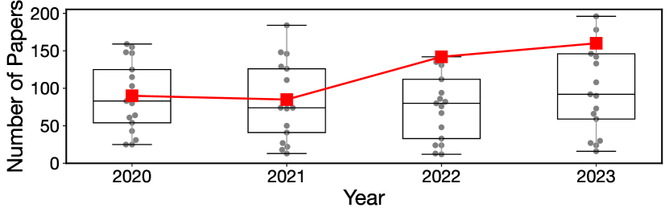

Figure 1: Interpretability and analysis (IA) is an increasingly popular subfield of NLP:
(top) Number of IA papers in ACL/EMNLP in comparison to other tracks that have existed since 2020.
The number of IA papers has grown considerably, from 90 papers in 2020 to 160 papers in 2023 (a growth rate of 77.8%). This is the highest growth rate among these tracks.
(bottom)
Citations to IA papers compared to other highly cited tracks.
[/FIGURE]

In NLP research, these factors have motivated a large body of work on interpretability and analysis (IA), which aims to understand the inner workings of LLMs and explain their predictions (Belinkov and Glass, [2019](#bib.bib2); Rogers et al., [2020](#bib.bib46); Rauker et al., [2023](#bib.bib45), inter alia). Researchers in this area are often motivated by the idea that better understanding LLMs is imperative to improve their efficiency, robustness, and trustworthiness, towards successful and safe deployment. IA research has thus witnessed rapid growth in the past few years and is now one of the biggest research areas (in terms of number of publications and citations) at the major NLP conferences (see [Figure 1](#S1.F1 "In 1 Introduction ‣ From Insights to Actions: The Impact of Interpretability and Analysis Research on NLP")).  

Despite the rapid growth of IA research (see also [Figure 9](#A5.F9 "In Relative growth of submission tracks ‣ Appendix E Additional results ‣ From Insights to Actions: The Impact of Interpretability and Analysis Research on NLP")), a commonly voiced criticism is that it often lacks actionable insights, especially for how to improve models, and therefore has little impact on how new NLP models are designed and built. This criticism raises questions about the usefulness of IA research, and whether its current form is the right path towards progress in NLP.  

In this work, we tackle these questions with a systematic, mixed-methods study of the impact of IA research on NLP in the past and the present, and use our findings to inform a vision for the future of IA. More specifically, we ask: how does interpretability and analysis research influence NLP researchers in what they choose to work on, what they cite, and how they think about NLP altogether?  

We perform a bibliometric analysis of 185,384 publications based on the two major NLP conferences, ACL and EMNLP, between 2018 and 2023, and solicit opinions from 138 members of the NLP community via a survey. In addition to quantitative results, we perform qualitative analysis of survey responses and 556 papers. This approach gives us a holistic view of the impact of IA research on NLP.  

Our analysis reveals that (1) NLP researchers build on findings from IA work in their research, regardless of whether they work on IA themselves or not (§[4](#S4 "4 Researchers build on findings from IA research in their work ‣ From Insights to Actions: The Impact of Interpretability and Analysis Research on NLP")), (2) NLP researchers and practitioners perceive IA work to be important for progress in NLP, multiple subfields, and their own work, for various reasons (§[5](#S5 "5 Researchers find IA work important ‣ From Insights to Actions: The Impact of Interpretability and Analysis Research on NLP")), and (3) many novel non-IA methods are proposed based on IA findings and highly influenced by them, for various areas, even though highly influential non-IA work is not driven by IA findings despite citing them (§[6](#S6 "6 A closer look at influential papers ‣ From Insights to Actions: The Impact of Interpretability and Analysis Research on NLP")).  

While our findings show that IA work presents insightful observations, there are still opportunities for greater impact on the rest of NLP. Thus, based on survey responses, we identify the key ingredients that are missing in IA research today — unification; actionable recommendations; human-centered, interdisciplinary work; and standardized, robust methods — and close with a call to action with recommendations (§[7](#S7 "7 Main takeaways and discussion ‣ From Insights to Actions: The Impact of Interpretability and Analysis Research on NLP")). We hope our work paves the way towards a more impactful future for IA research as the field continues to grow.  

## 2 Methodology

We start by discussing what we consider as IA research and our approach for measuring impact.  

### 2.1 Interpretability and analysis (IA) research

Interpretability research has a long tradition in Machine Learning as well adjacent fields like NLP (Tishby and Zaslavsky, [2015](#bib.bib52); Karpathy et al., [2015](#bib.bib21); Kim et al., [2018](#bib.bib22), inter alia). There is no single agreed upon definition of the term interpretability (see Lipton ([2018](#bib.bib28)) for a critical discussion), but two prominent types of interpretability research focus on post-hoc explainability or increasing the transparency of machine learning methods and models (Lipton, [2018](#bib.bib28); Madsen et al., [2024](#bib.bib29)). Analysis research is an even broader term and one might argue that nearly every scientific paper contains some form of analysis. In NLP, however, many interpretability and analysis papers have in common that their primary contribution is an analysis that aims to advance our understanding of NLP in some way, e.g., by analyzing methods, models, or algorithms (Belinkov and Glass, [2019](#bib.bib2); Rogers et al., [2020](#bib.bib46)).  

Here, we adopt a broad definition of interpretability and analysis (IA) research in NLP that includes all papers that aim to develop a deeper understanding of the behavior or inner workings of NLP models, methods, or systems. This includes work on explaining models’ predictions or internal computations, investigating broader phenomena observed during pre-training or adaptation, and providing a better understanding of the limitations and robustness of existing models.  

### 2.2 Measuring impact

Our goal is to measure the impact of IA work on NLP research, which is not trivial to define, let alone quantify. To get a holistic view of impact, we consider two different, complementary ways of measuring impact – a bibliometric analysis, and a survey of the NLP community.  

##### Citational impact

In scientometrics research, citation counts are used as a standard measure of scientific impact (Nicolaisen, [2007](#bib.bib37); Bornmann and Daniel, [2008](#bib.bib5); Chacon et al., [2020](#bib.bib8), inter alia). Thus, we perform a bibliometric analysis to quantify the citational impact of IA work on NLP research.111This choice excludes other forms of impact such as increasing user trust, influencing policy and regulation, etc. In addition, even though IA work impacts other fields, this is beyond the scope of our paper. We note that citation behavior is complex and there is a growing consensus that citation statistics might not be sufficient for measuring impact (Bornmann and Daniel, [2008](#bib.bib5); Zhu et al., [2015](#bib.bib59); Iqbal et al., [2021](#bib.bib19)).  

##### Surveying the NLP community

[FIGURE S2.F2.g1]
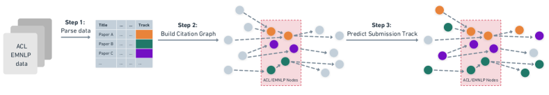

Figure 2: Diagram showing the process of constructing our citation graph. Starting from an initial set of ACL and EMNLP papers we collect citations via the Semantic Scholar API and label papers with a classifier.
[/FIGURE]

To incorporate a second dimension of impact beyond citation counts, we survey NLP researchers and practitioners on how they view the impact of IA research on the field. Specifically, we ask respondents about their perceptions of IA (its importance in general, for specific subfields, and its impact on progress in NLP), and their use of IA (how much they read, are influenced by, and use concepts from IA work). We also solicit opinions on what is missing in IA research and where it should go in the future.  

## 3 Citation graph and community survey

Here, we describe the construction of our citation graph for bibliometric analysis, and the design of our survey of the community.  

### 3.1 Citation graph construction

[Figure 2](#S2.F2 "In Surveying the NLP community ‣ 2.2 Measuring impact ‣ 2 Methodology ‣ From Insights to Actions: The Impact of Interpretability and Analysis Research on NLP") illustrates the process of constructing our citation graph. We start from an initial set of all papers published at ACL and EMNLP from 2018 to 2023. We focus on these two venues as they are leading NLP conferences with a dedicated track for interpretability and analysis research since 2020.222We discuss this decision in more detail in [Limitations](#Sx1 "Limitations ‣ From Insights to Actions: The Impact of Interpretability and Analysis Research on NLP"). Using this initial set of papers, we build a citation graph using the Semantic Scholar API Kinney et al. ([2023](#bib.bib23)). For papers outside our initial set, where we have gold labels, we rely on classifiers to predict submission tracks. More details on all these stages are provided below.  

##### Collecting ACL and EMNLP papers

We collect paper lists and track information from various sources (see Table [3](#A2.T3 "Table 3 ‣ Track classifiers details ‣ Appendix B Citation graph details ‣ From Insights to Actions: The Impact of Interpretability and Analysis Research on NLP") in [Appendix B](#A2 "Appendix B Citation graph details ‣ From Insights to Actions: The Impact of Interpretability and Analysis Research on NLP")), as there is no one source of this data for ACL and EMNLP conferences.333The ACL Anthology does not contain information on the submission track. Between 2018 and 2023, official names of submission tracks have changed substantially, so we standardize all data to 27 tracks. More details on this process are provided in [Appendix B](#A2 "Appendix B Citation graph details ‣ From Insights to Actions: The Impact of Interpretability and Analysis Research on NLP"), including summary statistics per track ([Table 1](#A2.T1 "In Appendix B Citation graph details ‣ From Insights to Actions: The Impact of Interpretability and Analysis Research on NLP")).  

##### Building the citation graph

We collect the citations of each paper in our initial set via the Semantic Scholar API (Kinney et al., [2023](#bib.bib23)), resulting in a citation graph of 185,384 papers (see [Table 2](#A2.T2 "In Cleaning the collected data ‣ Appendix B Citation graph details ‣ From Insights to Actions: The Impact of Interpretability and Analysis Research on NLP") in [Appendix B](#A2 "Appendix B Citation graph details ‣ From Insights to Actions: The Impact of Interpretability and Analysis Research on NLP") for additional statistics). For each node (paper) in the graph, we store its title, abstract, and venue. For each edge (citation), we store information on the citation intent (binary labels for background, use of methods or comparing results), and citation influence (normal vs. highly influential), all of which are provided by Semantic Scholar.  

##### Labeling the citation graph

To assign all papers in the citation graph to our standardized set of tracks, we train a classifier based on the titles and abstracts from our initial set of papers. We find that some tracks are very hard to predict due to limited training data and the inherent ambiguity of submission tracks. We thus keep 11 well-performing labels (including IA), and introduce an ‘Other’ label to group the remaining papers. More details on classifier construction are provided in [Appendix B](#A2 "Appendix B Citation graph details ‣ From Insights to Actions: The Impact of Interpretability and Analysis Research on NLP").  

Our final classifier achieves a test micro/macro-F1 score of 0.61/0.61. Although this performance appears rather low, we note that submission tracks have fuzzy boundaries, so papers can often be plausible submissions to multiple tracks. Given that we care primarily about accurately predicting IA compared to other tracks, we evaluate our classifier on two additional gold sets of data (see [Section B.1](#A2.SS1.SSS0.Px1 "Additional IA track classifier evaluations ‣ B.1 Sanity checks ‣ Appendix B Citation graph details ‣ From Insights to Actions: The Impact of Interpretability and Analysis Research on NLP")) and obtain 78.1% and 87.8% accuracy on each set.  

### 3.2 Surveying the NLP community

To solicit opinions from the NLP community on the impact of IA research, we ran a survey from March 19th to June 7th, 2024, advertising within our networks, on social media, and on NLP mailing lists. The full survey is shown in Appendix [C](#A3 "Appendix C Survey details ‣ From Insights to Actions: The Impact of Interpretability and Analysis Research on NLP").  

[FIGURE S3.F3.g1]
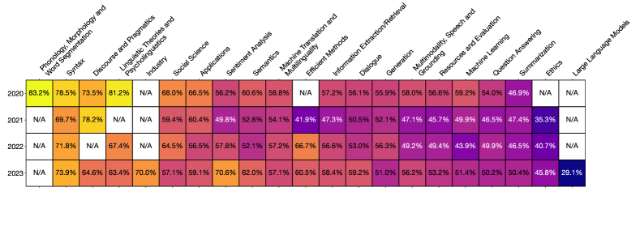

Figure 3: Interpretability and analysis track CSI scores matrix against other tracks. These represent the probability that a random interpretability and analysis paper published in certain year has more citations than a random paper of other track published the same year.
[/FIGURE]

To strike a balance between easy scoring and respondent expressivity, we included multiple-choice as well as optional free response questions (Shaughnessy et al., [2015](#bib.bib48)). We refined the survey following best practices444We made sure to clarify definitions, avoid leading questions, etc. (Shaughnessy et al., [2015](#bib.bib48)). and with feedback from four senior NLP researchers who filled out a pilot version. We received a total of 138 responses from NLP researchers in academia and practitioners in industry, with 61% of respondents not working on IA themselves (see [Appendix C](#A3 "Appendix C Survey details ‣ From Insights to Actions: The Impact of Interpretability and Analysis Research on NLP") for more statistics).  

Two authors performed qualitative coding, an inductive method from the social sciences (Saldana, [2021](#bib.bib47)), to identify themes in answers to the free-response questions. More details on the coding process are provided in [Appendix D](#A4 "Appendix D Qualitative coding ‣ From Insights to Actions: The Impact of Interpretability and Analysis Research on NLP"). We measure inter-coder reliability with percentage agreement (O’Connor and Joffe, [2020](#bib.bib40)), which was above 90% across all subsets of annotation.  

## 4 Researchers build on findings from IA research in their work

We begin by analyzing whether researchers use contributions of IA research in their work. We approach this by analyzing citational use, as well as survey-reported use beyond citations.  

##### IA papers are cited more often than other tracks

When comparing papers from different tracks, global counts of citations can be misleading, as a small number of papers can account for most of the citations in a field Ioannidis et al. ([2016](#bib.bib18)). To account for this, we compare citations based on the Citation Success Index (CSI; Milojević et al., [2017](#bib.bib32)) metric. Given two groups of papers $A$ and $B$, the CSI score computes the probability that a random paper from $A$ is more cited than a random paper of $B$. This score is not subject to biases from the skewness of the citation distribution, and it is clearly interpretable; e.g., if we draw random IA and Machine Translation papers from EMNLP or ACL in 2023, there is a 57.1% chance that the IA paper is more cited than the Machine Translation paper.  

[Figure 3](#S3.F3 "In 3.2 Surveying the NLP community ‣ 3 Citation graph and community survey ‣ From Insights to Actions: The Impact of Interpretability and Analysis Research on NLP") shows that CSI scores for the IA track are often favorable ($\text{CSI}>50\%$) when compared to other tracks. In 2023, only the Ethics and the Large Language Models tracks had favorable CSI scores against IA. This shows that IA papers have higher citational impact than other tracks, particularly in recent conferences.  

##### IA papers are well cited outside of IA

[FIGURE S4.F4.g1]
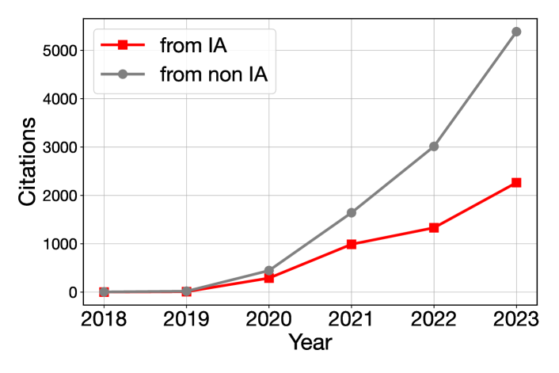

Figure 4: Origin of citations to IA papers.
[/FIGURE]

While high CSI scores tell us that IA papers are cited well, they do not tell us where these citations are coming from, i.e., are IA papers mostly cited by other IA papers or by papers outside of IA? To evaluate the impact of IA work outside of IA, we compare citations within the same track, which we call intra-track citations, to extra-track citations, i.e., citations from outside the track.  

[Figure 4](#S4.F4 "In IA papers are well cited outside of IA ‣ 4 Researchers build on findings from IA research in their work ‣ From Insights to Actions: The Impact of Interpretability and Analysis Research on NLP") shows that most citations to IA papers are predicted to be extra-track citations. The proportion of references to IA papers differs considerably by citing track, with papers about Efficient Methods, Machine Learning, and Large Language Models citing IA research more frequently than others (see [Figure 11](#A5.F11 "In Which tracks cite IA papers ‣ Appendix E Additional results ‣ From Insights to Actions: The Impact of Interpretability and Analysis Research on NLP") for a visualization of this trend). While the IA track does not stand out in terms of its extra-track citations compared to other tracks (see [Figure 12](#A5.F12 "In Which tracks cite IA papers ‣ Appendix E Additional results ‣ From Insights to Actions: The Impact of Interpretability and Analysis Research on NLP")), these results still demonstrate that the citational impact of IA research extends well beyond the IA track itself.  

##### IA papers are central in NLP

Next, we assess whether IA papers are impacting NLP as a whole rather than just specific tracks. We quantify this with the Betweenness Centrality (BC) metric, a measure of interdisciplinarity Leydesdorff ([2007](#bib.bib25)); Barnett et al. ([2011](#bib.bib1)); Leydesdorff et al. ([2018](#bib.bib26)). BC quantifies the extent to which a node in the graph acts as a bridge along the shortest path between two other nodes Golbeck ([2015](#bib.bib14)); nodes with higher BC are considered more important as more information passes through them.555We provide further discussion of BC in [Section B.1](#A2.SS1.SSS0.Px2 "Correlation between betweenness centralities and citation counts ‣ B.1 Sanity checks ‣ Appendix B Citation graph details ‣ From Insights to Actions: The Impact of Interpretability and Analysis Research on NLP"). Therefore, we interpret papers with a high BC as important papers that are essential for the connectivity of the citation network.  

We compute the BC for every paper in EMNLP and ACL since the IA track started (2020), and find that the median BC of IA papers is higher than most other tracks, at $1.23\times 10^{-7}$. Notably, IA ranks as the second most central track overall, following the Large Language Models track, which has a median BC of $1.95\times 10^{-7}$. These results (shown in [Figure 10](#A5.F10 "In Betweenness centrality ‣ Appendix E Additional results ‣ From Insights to Actions: The Impact of Interpretability and Analysis Research on NLP")) provide further evidence that IA work plays a central role in the ACL/EMNLP citation network.  

##### IA influences the work of NLP researchers

For a complementary view of impact beyond citations, we survey NLP community members on how often they use concepts from IA in their day-to-day work, and more broadly, how IA influences their work.  

As [Figure 5](#S4.F5 "In IA influences the work of NLP researchers ‣ 4 Researchers build on findings from IA research in their work ‣ From Insights to Actions: The Impact of Interpretability and Analysis Research on NLP") shows, the median rating for use of IA concepts by respondents who work on IA is often, while even the median respondent who doesn’t work on IA uses concepts from IA sometimes. In both groups of respondents, there are people who always use IA concepts in their day-to-day work. Beyond this, IA work influences respondents in different ways: it provides respondents with research ideas (91% of respondents who work on IA; 60% of respondents who don’t), changes mental models of model capabilities and limitations (77%; 65%), and helps ground explanations of respondents’ results (64%; 59%). Notably, only 9 (6.5%) respondents state that IA does not affect their work. These results complement our citation-based findings by providing further evidence that IA work impacts both IA and non-IA researchers and their research.  

[FIGURE S4.F5.g1]
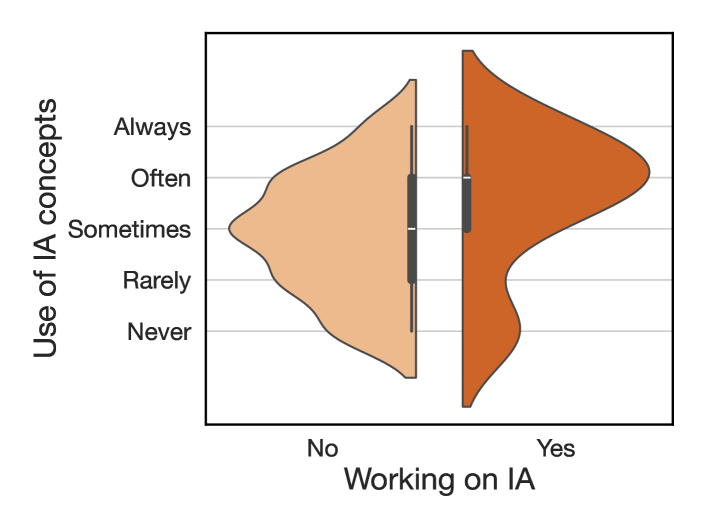

Figure 5: Survey responses on the frequency of using concepts from IA research, split by whether the respondents work in this field or not. Higher values indicate more frequent usage.
[/FIGURE]

## 5 Researchers find IA work important

We continue by surveying the perceived importance of IA work by the NLP community. We consider various perspectives, such as the perceived importance of IA research on overall progress in NLP as well as on individual subfields. 133 out of 138 respondents consider IA work important, and perceive it as important for progress in NLP, multiple subfields, and for various reasons.  

##### Perceived importance for progress in NLP

Figure [6](#S5.F6 "Figure 6 ‣ Perceived importance for progress in NLP ‣ 5 Researchers find IA work important ‣ From Insights to Actions: The Impact of Interpretability and Analysis Research on NLP") shows that most respondents agree that without IA findings, progress in NLP in the last 5 years (2019 to 2024) would have been slower, but not impossible. Surprisingly, it appears that people who are more deeply engaged with interpretability are more critical of it. Respondents who read more IA work than other topics in NLP, respondents who often or always use concepts from IA literature, and respondents who work on IA themselves all rate IA as having a lower impact on progress in NLP than those who read less IA, use related concepts less frequently, and who work on other topics.  

It is plausible that respondents who are more engaged with IA work know it better and thus give better-calibrated impressions of the field as a whole, which happen to be more critical. However, it is worth noting that they are perhaps forming their opinions from a different sample of papers (i.e., the average paper from a large body of work) than those who are less engaged with IA work, whose reading might be skewed towards IA work that is more highly cited and influential. This also raises the question of how IA or indeed any subfield should be evaluated – by the average paper in it, or by the ones that stand out?  

There are many other factors that could also influence the results we see, e.g., that respondents in different categories are reading IA papers that deal with different topics, that they have different levels of research experience, and that they have different definitions of “progress” in NLP. See §[Limitations](#Sx1 "Limitations ‣ From Insights to Actions: The Impact of Interpretability and Analysis Research on NLP") for a discussion of these factors.  

[FIGURE S5.F6.g1]
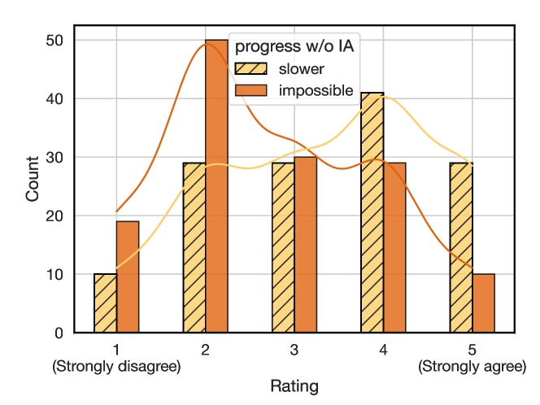

Figure 6: Survey responses (N=$138$) on whether progress in NLP in the last 5 years would have been slower or impossible without findings from interpretability and analysis research.
[/FIGURE]

##### Perceived importance for different subfields

[Figure 7](#S5.F7 "In Reasons for importance ‣ 5 Researchers find IA work important ‣ From Insights to Actions: The Impact of Interpretability and Analysis Research on NLP") shows that the IA work is perceived as being important to differing extents for other subfields within NLP. The modal response is that IA work is somewhat important for work on multilinguality (52% of responses), multimodal learning (47%) and engineering for large language models (47%), and that it is very important for work on reasoning (63%) and bias (72%). Of the five subfields we consider, engineering for LLMs is perceived to be least impacted by IA work, with 31% of respondents indicating that they think IA work is not important for it. These findings are consistent with the themes we find in papers that are highly influenced by IA research, where bias and reasoning are well-represented, and pre-training and architectural advancements appear less frequently.  

##### Reasons for importance

When asked whether they thought IA work was important and if so, why, respondents overwhelmingly (133/138) consider it important, citing a variety of reasons, the most popular of which were: understanding model limitations and capabilities (90% of respondents), explainability for users (66%), improving model trustworthiness (59%), and improving model capabilities (50%). While a small percentage (4.3%) of respondents indicated that they thought it was not important (possibly also due to selection bias in our survey), we found that they voice the same concerns as those who do find it important, e.g., a lack of actionability, results that don’t scale, and a lack of impact on the most capable models of today. In our recommendations for the future of the field (§[7](#S7 "7 Main takeaways and discussion ‣ From Insights to Actions: The Impact of Interpretability and Analysis Research on NLP")), we go into these in more detail.  

[FIGURE S5.F7.g1]
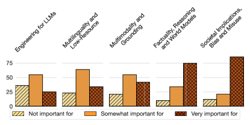

Figure 7: Survey responses (N=138) on how important interpretability and analysis research is to work in different subfields.
[/FIGURE]

## 6 A closer look at influential papers

So far we have discussed findings about IA as a whole, either by considering the role of IA papers in the ACL/EMNLP citation graph or the perception of IA work within the community. In this section, we zoom in on specific influential papers sourced from both our survey and citation graph. We seek to answer: What are these papers about? What kind of work are they impacting, and how?  

To this end, we inductively obtain the themes of a total of 585 papers, through qualitative coding of their titles and abstracts by two authors (Saldana, [2021](#bib.bib47)). The 585 papers include: (1) All papers mentioned more than once as having influenced survey respondents’ work (N=29); (2) highly-cited IA papers from our citation graph (N=50); (3) highly-cited non-IA papers from our citation graph (N=50); (4) non-IA papers that cite and are highly influenced by the top-10 most-cited IA papers (N=456). The resulting themes are mostly descriptive, including topics (e.g., in-context learning, training dynamics) and contribution types (e.g., novel method, analysis). Percentage agreement on our coded themes is above 90% for each subset of papers. See [Appendix D](#A4 "Appendix D Qualitative coding ‣ From Insights to Actions: The Impact of Interpretability and Analysis Research on NLP") for more details.  

Our analysis reveals that beyond background citations, IA work influences the development of many novel models and metrics outside of IA work, and affects work in domains such as question answering (QA), reasoning, and bias.  

##### What are influential IA papers about?

Of the papers that survey respondents submitted as examples of work that has directly influenced their own work, representation analysis appears in over a third of the papers, novel methods for interpretability (e.g., causality, interventions, steering, neuron/activation analysis, etc.) are proposed in nearly a quarter of them, and probing also appears in 24% of these papers.  

In contrast, the top-50 most cited IA papers are more often about the analysis component of IA (40%). Novel methods (for analysis, evaluation, linguistics, probing) are proposed in 26% of papers, and evaluation is a main contribution of 32%. As expected, the most cited non-IA papers in our citation graph mostly consist of highly influential datasets, models, and methods, e.g., HotpotQA, BART, prefix-tuning (Yang et al., [2018](#bib.bib58); Lewis et al., [2020](#bib.bib24); Li and Liang, [2021](#bib.bib27)). More top themes are shown with the percentage of papers in [Table 5](#A5.T5 "In Top themes of highly cited IA papers ‣ Appendix E Additional results ‣ From Insights to Actions: The Impact of Interpretability and Analysis Research on NLP") in [Appendix E](#A5 "Appendix E Additional results ‣ From Insights to Actions: The Impact of Interpretability and Analysis Research on NLP").  

We also find evidence that many IA papers create novel metaphors to understand models — e.g., seeing feed-forward layers as key-value memories (Geva et al., [2021](#bib.bib13)), or reading from and writing to the “residual stream” (Elhage et al., [2021](#bib.bib12)), and many analysis papers highlight the limits of models. As survey respondents cited these very reasons for why they perceive IA work as important, these themes corroborate why these papers would be particularly influential. In addition, many of the qualities that survey respondents feel are currently lacking in IA research (see §[7](#S7 "7 Main takeaways and discussion ‣ From Insights to Actions: The Impact of Interpretability and Analysis Research on NLP")) appear in these papers, such as moving beyond toy models (Wang et al., [2023](#bib.bib56)), and providing actionable methods (Meng et al., [2022](#bib.bib30)).  

##### Why are influential IA papers cited?

As citations can have a variety of reasons (Zhu et al., [2015](#bib.bib59); Tahamtan and Bornmann, [2019](#bib.bib50)), we examine three types of citational intent – background, methods and results citations (see [Figure 13](#A5.F13 "In Citational intent ‣ Appendix E Additional results ‣ From Insights to Actions: The Impact of Interpretability and Analysis Research on NLP") in [Appendix E](#A5 "Appendix E Additional results ‣ From Insights to Actions: The Impact of Interpretability and Analysis Research on NLP")). Overall, we find that influential IA papers are cited most often as background citations, then as methods citations, and least frequently when comparing results. In comparison, highly cited papers that are not about IA tend to be cited most frequently for methods. This is expected, as many of these papers are about popular datasets and models, as described above.  

##### What are the citing papers about?

Despite the large number of background citations, however, there is plenty of work—including non-IA work—that is highly influenced (according to Semantic Scholar) by IA research. For a closer look at what these citing papers do, we analyze all 456 papers with a highly influential citations to one of the top 10 most-cited IA papers, and annotate their themes based on titles and abstracts.  

Unsurprisingly, many of the papers have themes in common with what they cite, e.g., papers that analyze multilingual models are frequently cited by papers on cross-lingual transfer. We thus focus on the difference in themes between citing papers and cited papers, and find that over 33% of non-IA papers that are highly influenced by IA work propose novel methods, e.g., many novel ICL methods cite analysis work on demonstrations Min et al. ([2022](#bib.bib33)) and similarly, many novel methods for bias mitigation cite datasets for stereotype evaluation such as Nangia et al. ([2020](#bib.bib36)) and Nadeem et al. ([2021](#bib.bib35)). These provide concrete counterexamples to the claim that IA work does not influence modeling improvements.  

##### Is IA work impacting highly cited non-IA work?

Looking at the highly-cited non-IA papers, we find that these too tend to cite IA work frequently. 22 out of the top 50 most cited non-IA papers are even highly influenced by some IA work, but 28 are not highly influenced by any IA work. These results show that while highly influential non-IA work does acknowledge IA findings, it is likely not driven by them.  

## 7 Main takeaways and discussion

We end by discussing our main findings and recommendations on how to move IA research forward.  

##### Main takeaways

In §[4](#S4 "4 Researchers build on findings from IA research in their work ‣ From Insights to Actions: The Impact of Interpretability and Analysis Research on NLP"), we saw that *IA research plays a central role in NLP* and researchers build on findings from IA work in their research, regardless of whether they work on IA themselves or not. In section §[5](#S5 "5 Researchers find IA work important ‣ From Insights to Actions: The Impact of Interpretability and Analysis Research on NLP"), we saw that *NLP researchers and practitioners perceive IA work to be important* for progress in NLP, and multiple subfields. They also find it important for their own work for a variety of reasons, regardless of whether they work on IA themselves. Finally, we took a closer look at the most influential IA papers in §[6](#S6 "6 A closer look at influential papers ‣ From Insights to Actions: The Impact of Interpretability and Analysis Research on NLP") and found that *many novel methods are proposed based on IA findings and highly influenced by them*, for various areas, in particular, work on reasoning, factual knowledge, and bias. All these findings present a very positive view of IA research and its role within NLP in the past and the present. In the remainder of this section, we turn to the future of IA research.  

##### What is missing?

To understand what the NLP community believes to be important for the future of IA work, we asked survey respondents what they feel is missing in current IA work and what should be different going forward. 25% of the responses to this question mentioned a lack of big picture and unified understanding in IA work. For example, one respondent said:  

> “I think the focus should be on climbing the right hill towards a higher level understanding instead of focusing on interesting individual behaviors.”

The next three most frequent concerns are a lack of utility (i.e., not being useful in practice), modeling improvements and actionability—concerns that are also echoed by the respondents who do not find IA research useful for their own work. Interestingly, a commonly voiced opinion among these participants is that they believe that scale and performance are all that is needed for good NLP models, and that IA work only has importance for understanding models rather than for building them. Additionally, respondents mention that IA work could use more interdisciplinary connections, through collaboration with domain experts, user studies, and human-centered approaches to computing.  

Finally, we note another theme appearing in 10% of responses: as IA has a lack of consensus on reliable and trustworthy methods, it is unclear how such work should be evaluated. Although this is not a new concern (Belinkov and Glass, [2019](#bib.bib2)), it remains relevant for the impact of IA on NLP.  

##### A call for action

Based on our findings, we make the following recommendations:  

Going forward, IA researchers should:

Think more about the big picture

Strive for more actionable work

Center humans in your work

Work towards standardized, robust methods

Big-picture thinking involves working towards general truths about model architectures or behaviors, rather than model-specific results. Actionable work requires thinking about how an IA finding can propel new ways of building/using NLP systems, rather than being merely descriptive. Centering humans entails evaluation with realistic and relevant data and tasks, and performing user studies and human evaluation. Human-centered IA work can also be enhanced through interdisciplinary reading and collaboration. Finally, we urgently need to build consensus on using and evaluating IA methods. Rigorous, well-motivated methods (e.g., using causality) are critical, rather than correlative evidence that may not be correct or faithful.  

##### IA for its own sake

In closing, we would like to highlight a viewpoint that came up multiple times in survey responses, which was to question the premise of this paper, i.e., to measure the impact of IA on NLP. Many respondents noted that they see IA work as being a valuable scientific pursuit in its own right, stating that “Without it, we’re not doing science,” or “It’s cool! That’s enough for me.” Respondents further criticized the often performance-focused definitions of utility, progress, and impact. One respondent noted that these definitions of utility have been determined “by extrinsic sociological factors in the broader field of AI”. We sympathize with this observation and note that the focus on performance is a feature of NLP at this point in time. What we value might change going forward, especially as NLP systems are increasingly part of our daily lives, and qualities such as robustness and fairness become even more important.  

## 8 Conclusion

We contribute a mixed-methods analysis of the impact of interpretability and analysis research on NLP. By analyzing a citation graph of 185K+ papers built from all papers published at ACL and EMNLP from 2018 to 2023, surveying 138 respondents from the NLP community, and manually annotating 556 papers, we found that IA work is well-cited in other subfields of NLP, central to the NLP citation graph, and highly influential to many novel methods. NLP researchers and practitioners perceive IA work as important for progress in NLP, multiple subfields (especially reasoning and fairness), and for their own work. In sum, even though highly influential models, methods and datasets are not driven by IA findings, IA work still has a great impact on NLP in the past and the present. We conclude with a call to action based on what is missing in the subfield, to pave the way for IA work to be even more impactful in the future.  

## Limitations

##### Focus on papers published at ACL and EMNLP

The starting point of our analysis are all papers published at ACL and EMNLP. Although these are the most cited \*CL venues (Mohammad, [2020](#bib.bib34)), our analysis excludes several other big NLP venues, including EACL, NAACL, AACL, TACL, and workshops, including BlackboxNLP, which focuses on IA work. Additionally, given the growing interest in NLP, and in particular, LLMs, from the broader machine learning community, there is an increasing number of IA papers published at machine learning conferences such as ICLR, NeurIPS, and ICML, which we also do not consider in our analyses. Similarly, a vast amount of work on mechanistic interpretability has been published as articles (e.g., on LessWrong666<https://www.lesswrong.com/> and the AI Alignment Forum777<https://www.alignmentforum.org/>), and blog posts (e.g., by Anthropic888<https://www.anthropic.com/>). Therefore, there is a risk that our analysis misses potentially influential IA work published at these venues.  

This is mitigated to an extent by our survey, where respondents mention some of these papers and blog posts, which we then discuss in our paper. In addition, the set of papers we consider for our analysis is very large (our initial set contains 477 IA papers). This makes us confident that the findings we draw from these papers (and those citing them) are representative of broader trends in the impact of IA research in NLP. We leave it to future work to investigate the impact of IA work published outside of established NLP venues.  

##### Focus on 2018 to 2024

Our analysis focuses on papers published between 2018 and 2024. Our results thus represent a snapshot in time on the scale of research in NLP, where models and methods come and go. The time period that we look at is dominated by transformer-based language models, and a paradigm of using large, general-purpose pre-trained models for many tasks, and thus many IA papers focus on studying these. Understanding this as the context of our analysis and results is important, as they may look completely different in a time period where the most popular models are different or the most popular IA methods are different. This also means that our results cannot speak to the impact of today’s IA work as its true impact might only become clear in the future.  

##### Not all citations are equal

Although our use of citations is an important component of how we quantify impact in this paper, we do not consider citational context or distinguish between types of citations. However, papers can cited for a number of reasons (Bornmann and Daniel, [2008](#bib.bib5)), not all positive and not all having to do with the conventions of scholarly publishing (Bornmann and Daniel, [2008](#bib.bib5); Zhu et al., [2015](#bib.bib59); Bornmann and Marx, [2012](#bib.bib6)).  

##### Limitations of our survey

Although we took steps to get a large number and diversity of survey responses, and we ensured a minimum of 10 respondents per bucket when reporting disaggregated results, the 138 responses we received may not be representative of the field as a whole. In particular, full professors (N=5, at various career stages), and industry practitioners who are not researchers (N=1) were somewhat underrepresented in our responses, indicating that our results focus more on research impact rather than impact on industry applications, and are overwhelmingly shaped by PhD students (41.3% of respondents), whose interests, incentives, and assessment of impact are sure to be different from respondents at other career stages.  

Some respondents brought up the following concerns: one respondent felt our definition of IA was too broad for their taste, but our inclusion of interpretability and analysis was by design (see [Section 3](#S3 "3 Citation graph and community survey ‣ From Insights to Actions: The Impact of Interpretability and Analysis Research on NLP")). Another respondent noted that we defined IA but not what we meant by “progress,” which was also by design, as we did not want to impose a normative definition of progress on our respondents but rather, get at their own intuitions, regardless of how they might define progress. Finally, one respondent complained that our questions about the usefulness of IA (to various subfields, on one’s own research, etc.) were framed in absolute rather than relative terms, and that just because IA research has some positive impact on our understanding doesn’t mean that it is the best option to pursue given limited time and resources. This paper presents views of absolute and relative impact via the survey and citation graph analyses, for a holistic view of IA research that also allows for it to have value for its own sake. Ultimately, we believe that a view of “optimal” impact compared to other options lies in the eye of the beholder, and is one (but not the only) way of interpreting our results.  

## Acknowledgments

We are grateful to Julian Schnitzler, Maor Ivgi, Siva Reddy, Vlad Niculae, Yanai Elazar, and Yonatan Belinkov for their feedback on the survey, as well as Asma Ghandeharioun, Yanai Elazar, and Sabrina Mielke for their feedback on the manuscript. We would like to thank Anna Rogers, David Chiang, Fei Xia, Henning Wachsmuth, Jordan Lee Boyd-Graber, Juan Pino, Naoaki Okazaki, Rachele Sprugnoli, and Scott Yih, for their help in providing us with ACL and EMNLP track data. Finally, we thank all our survey respondents, including, among others: AG, AW, Aaron Mueller, Aengus Lynch, Alessandro Stolfo, Alon Jacovi, Anubrata Das, Aryaman Arora, Avi Caciularu, Benjamin Minixhofer, Bhawna Paliwal, Christopher Potts, Chunyuan Deng, Daniel C.H. Tan, Daniel Scalena, Dashiell Stander, David Adelani, David Bau, David Chanin, Diego Garcia-Olano, Emilio Villa-Cueva, Eran Hirsch, Eva Portelance, Felix Beierle, Florian Schneider, Gabriele Sarti, Guanlin Li, Jaap Jumelet, Jack Merullo, Jiahao Huang, Jonathan Zea, Julian Schnitzler, Keshav Ramji, Leshem Choshen, Lucas E. Resck, Margarita Bugueño, Miaoran Zhang, Mircea Petrache, Natalie Shapira, Nils Feldhus, Noah Y. Siegel, Ori Ram, Paulina, Peter Hase, Qinan Yu, Ricardo Cuervo, Roma Patel, Sebastian Breguel, Tian Yun, Tomasz Limisiewicz, Vaidehi Patil, Victor Faraggi, Wentao Wang, Yeo Wei Jie, Yindong Wang, Yonathan Arbel, and Yuval Pinter.  

## References

* Barnett et al. (2011)  George A Barnett, Catherine Huh, Youngju Kim, and Han Woo Park. 2011.   Citations among communication journals and other disciplines: a network analysis.   *Scientometrics*, 88(2):449–469. 
* Belinkov and Glass (2019)  Yonatan Belinkov and James Glass. 2019.   [Analysis methods in neural language processing: A survey](https://doi.org/10.1162/tacl_a_00254).   *Transactions of the Association for Computational Linguistics*, 7:49–72. 
* Bengtsson (2016)  Mariette Bengtsson. 2016.   [How to plan and perform a qualitative study using content analysis](https://doi.org/10.1016/j.npls.2016.01.001).   *NursingPlus Open*, 2:8–14. 
* Bommasani et al. (2022)  Rishi Bommasani, Drew A. Hudson, Ehsan Adeli, Russ Altman, Simran Arora, Sydney von Arx, Michael S. Bernstein, Jeannette Bohg, Antoine Bosselut, Emma Brunskill, Erik Brynjolfsson, Shyamal Buch, Dallas Card, Rodrigo Castellon, Niladri Chatterji, Annie Chen, Kathleen Creel, Jared Quincy Davis, Dora Demszky, Chris Donahue, Moussa Doumbouya, Esin Durmus, Stefano Ermon, John Etchemendy, Kawin Ethayarajh, Li Fei-Fei, Chelsea Finn, Trevor Gale, Lauren Gillespie, Karan Goel, Noah Goodman, Shelby Grossman, Neel Guha, Tatsunori Hashimoto, Peter Henderson, John Hewitt, Daniel E. Ho, Jenny Hong, Kyle Hsu, Jing Huang, Thomas Icard, Saahil Jain, Dan Jurafsky, Pratyusha Kalluri, Siddharth Karamcheti, Geoff Keeling, Fereshte Khani, Omar Khattab, Pang Wei Koh, Mark Krass, Ranjay Krishna, Rohith Kuditipudi, Ananya Kumar, Faisal Ladhak, Mina Lee, Tony Lee, Jure Leskovec, Isabelle Levent, Xiang Lisa Li, Xuechen Li, Tengyu Ma, Ali Malik, Christopher D. Manning, Suvir Mirchandani, Eric Mitchell, Zanele Munyikwa, Suraj Nair, Avanika Narayan, Deepak Narayanan, Ben Newman, Allen Nie, Juan Carlos Niebles, Hamed Nilforoshan, Julian Nyarko, Giray Ogut, Laurel Orr, Isabel Papadimitriou, Joon Sung Park, Chris Piech, Eva Portelance, Christopher Potts, Aditi Raghunathan, Rob Reich, Hongyu Ren, Frieda Rong, Yusuf Roohani, Camilo Ruiz, Jack Ryan, Christopher Ré, Dorsa Sadigh, Shiori Sagawa, Keshav Santhanam, Andy Shih, Krishnan Srinivasan, Alex Tamkin, Rohan Taori, Armin W. Thomas, Florian Tramèr, Rose E. Wang, William Wang, Bohan Wu, Jiajun Wu, Yuhuai Wu, Sang Michael Xie, Michihiro Yasunaga, Jiaxuan You, Matei Zaharia, Michael Zhang, Tianyi Zhang, Xikun Zhang, Yuhui Zhang, Lucia Zheng, Kaitlyn Zhou, and Percy Liang. 2022.   [On the opportunities and risks of foundation models](https://arxiv.org/abs/2108.07258).   *Preprint*, arXiv:2108.07258. 
* Bornmann and Daniel (2008)  Lutz Bornmann and Hans-Dieter Daniel. 2008.   [What do citation counts measure? a review of studies on citing behavior](https://doi.org/10.1108/00220410810844150).   *Journal of Documentation*, 64(1):45–80. 
* Bornmann and Marx (2012)  Lutz Bornmann and Werner Marx. 2012.   [The anna karenina principle: A way of thinking about success in science](https://doi.org/10.1002/asi.22661).   *Journal of the American Society for Information Science and Technology*, 63(10):2037–2051. 
* Brown et al. (2020)  Tom Brown, Benjamin Mann, Nick Ryder, Melanie Subbiah, Jared D Kaplan, Prafulla Dhariwal, Arvind Neelakantan, Pranav Shyam, Girish Sastry, Amanda Askell, Sandhini Agarwal, Ariel Herbert-Voss, Gretchen Krueger, Tom Henighan, Rewon Child, Aditya Ramesh, Daniel Ziegler, Jeffrey Wu, Clemens Winter, Chris Hesse, Mark Chen, Eric Sigler, Mateusz Litwin, Scott Gray, Benjamin Chess, Jack Clark, Christopher Berner, Sam McCandlish, Alec Radford, Ilya Sutskever, and Dario Amodei. 2020.   [Language models are few-shot learners](https://proceedings.neurips.cc/paper_files/paper/2020/file/1457c0d6bfcb4967418bfb8ac142f64a-Paper.pdf).   In *Advances in Neural Information Processing Systems*, volume 33, pages 1877–1901. Curran Associates, Inc. 
* Chacon et al. (2020)  Xiomara S. Q. Chacon, Thiago C. Silva, and Diego R. Amancio. 2020.   [Comparing the impact of subfields in scientific journals](https://doi.org/10.1007/s11192-020-03651-x).   *Scientometrics*, 125(1):625–639. 
* Cohan et al. (2019)  Arman Cohan, Waleed Ammar, Madeleine Van Zuylen, and Field Cady. 2019.   Structural scaffolds for citation intent classification in scientific publications.   *arXiv preprint arXiv:1904.01608*. 
* Cohan et al. (2020)  Arman Cohan, Sergey Feldman, Iz Beltagy, Doug Downey, and Daniel S Weld. 2020.   Specter: Document-level representation learning using citation-informed transformers.   *arXiv preprint arXiv:2004.07180*. 
* Devlin et al. (2019)  Jacob Devlin, Ming-Wei Chang, Kenton Lee, and Kristina Toutanova. 2019.   [BERT: Pre-training of deep bidirectional transformers for language understanding](https://doi.org/10.18653/v1/N19-1423).   In *Proceedings of the 2019 Conference of the North American Chapter of the Association for Computational Linguistics: Human Language Technologies, Volume 1 (Long and Short Papers)*, pages 4171–4186, Minneapolis, Minnesota. Association for Computational Linguistics. 
* Elhage et al. (2021)  Nelson Elhage, Neel Nanda, Catherine Olsson, Tom Henighan, Nicholas Joseph, Ben Mann, Amanda Askell, Yuntao Bai, Anna Chen, Tom Conerly, Nova DasSarma, Dawn Drain, Deep Ganguli, Zac Hatfield-Dodds, Danny Hernandez, Andy Jones, Jackson Kernion, Liane Lovitt, Kamal Ndousse, Dario Amodei, Tom Brown, Jack Clark, Jared Kaplan, Sam McCandlish, and Chris Olah. 2021.   A mathematical framework for transformer circuits.   *Transformer Circuits Thread*.   Https://transformer-circuits.pub/2021/framework/index.html. 
* Geva et al. (2021)  Mor Geva, Roei Schuster, Jonathan Berant, and Omer Levy. 2021.   [Transformer feed-forward layers are key-value memories](https://doi.org/10.18653/v1/2021.emnlp-main.446).   In *Proceedings of the 2021 Conference on Empirical Methods in Natural Language Processing*, pages 5484–5495, Online and Punta Cana, Dominican Republic. Association for Computational Linguistics. 
* Golbeck (2015)  Jennifer Golbeck. 2015.   *Introduction to social media investigation: A hands-on approach*.   Syngress. 
* Goodman and Flaxman (2017)  Bryce Goodman and Seth Flaxman. 2017.   [European union regulations on algorithmic decision making and a “right to explanation”](https://doi.org/10.1609/aimag.v38i3.2741).   *AI Magazine*, 38(3):50–57. 
* Google (2024)  Google. 2024.   [Generative ai in search: Let google do the searching for you](https://blog.google/products/search/generative-ai-google-search-may-2024/). 
* Gururaja et al. (2023)  Sireesh Gururaja, Amanda Bertsch, Clara Na, David Widder, and Emma Strubell. 2023.   [To build our future, we must know our past: Contextualizing paradigm shifts in natural language processing](https://doi.org/10.18653/v1/2023.emnlp-main.822).   In *Proceedings of the 2023 Conference on Empirical Methods in Natural Language Processing*, pages 13310–13325, Singapore. Association for Computational Linguistics. 
* Ioannidis et al. (2016)  John PA Ioannidis, Kevin Boyack, and Paul F Wouters. 2016.   Citation metrics: a primer on how (not) to normalize.   *PLoS biology*, 14(9):e1002542. 
* Iqbal et al. (2021)  Sehrish Iqbal, Saeed-Ul Hassan, Naif Radi Aljohani, Salem Alelyani, Raheel Nawaz, and Lutz Bornmann. 2021.   [A decade of in-text citation analysis based on natural language processing and machine learning techniques: an overview of empirical studies](https://doi.org/10.1007/s11192-021-04055-1).   *Scientometrics*, 126(8):6551–6599. 
* Jacovi (2023)  Alon Jacovi. 2023.   [Trends in explainable ai (xai) literature](https://api.semanticscholar.org/CorpusID:255825814).   *ArXiv*, abs/2301.05433. 
* Karpathy et al. (2015)  Andrej Karpathy, Justin Johnson, and Li Fei-Fei. 2015.   [Visualizing and understanding recurrent networks](https://arxiv.org/abs/1506.02078).   *Preprint*, arXiv:1506.02078. 
* Kim et al. (2018)  Edward Kim, Darryl Hannan, and Garrett Kenyon. 2018.   [Deep sparse coding for invariant multimodal halle berry neurons](https://arxiv.org/abs/1711.07998).   *Preprint*, arXiv:1711.07998. 
* Kinney et al. (2023)  Rodney Michael Kinney, Chloe Anastasiades, Russell Authur, Iz Beltagy, Jonathan Bragg, Alexandra Buraczynski, Isabel Cachola, Stefan Candra, Yoganand Chandrasekhar, Arman Cohan, Miles Crawford, Doug Downey, Jason Dunkelberger, Oren Etzioni, Rob Evans, Sergey Feldman, Joseph Gorney, David W. Graham, F.Q. Hu, Regan Huff, Daniel King, Sebastian Kohlmeier, Bailey Kuehl, Michael Langan, Daniel Lin, Haokun Liu, Kyle Lo, Jaron Lochner, Kelsey MacMillan, Tyler C. Murray, Christopher Newell, Smita R Rao, Shaurya Rohatgi, Paul Sayre, Zejiang Shen, Amanpreet Singh, Luca Soldaini, Shivashankar Subramanian, A. Tanaka, Alex D Wade, Linda M. Wagner, Lucy Lu Wang, Christopher Wilhelm, Caroline Wu, Jiangjiang Yang, Angele Zamarron, Madeleine van Zuylen, and Daniel S. Weld. 2023.   [The semantic scholar open data platform](https://api.semanticscholar.org/CorpusID:256194545).   *ArXiv*, abs/2301.10140. 
* Lewis et al. (2020)  Mike Lewis, Yinhan Liu, Naman Goyal, Marjan Ghazvininejad, Abdelrahman Mohamed, Omer Levy, Veselin Stoyanov, and Luke Zettlemoyer. 2020.   [BART: Denoising sequence-to-sequence pre-training for natural language generation, translation, and comprehension](https://doi.org/10.18653/v1/2020.acl-main.703).   In *Proceedings of the 58th Annual Meeting of the Association for Computational Linguistics*, pages 7871–7880, Online. Association for Computational Linguistics. 
* Leydesdorff (2007)  Loet Leydesdorff. 2007.   Betweenness centrality as an indicator of the interdisciplinarity of scientific journals.   *Journal of the American Society for Information Science and Technology*, 58(9):1303–1319. 
* Leydesdorff et al. (2018)  Loet Leydesdorff, Caroline S Wagner, and Lutz Bornmann. 2018.   Betweenness and diversity in journal citation networks as measures of interdisciplinarity—a tribute to eugene garfield.   *Scientometrics*, 114:567–592. 
* Li and Liang (2021)  Xiang Lisa Li and Percy Liang. 2021.   [Prefix-tuning: Optimizing continuous prompts for generation](https://doi.org/10.18653/v1/2021.acl-long.353).   In *Proceedings of the 59th Annual Meeting of the Association for Computational Linguistics and the 11th International Joint Conference on Natural Language Processing (Volume 1: Long Papers)*, pages 4582–4597, Online. Association for Computational Linguistics. 
* Lipton (2018)  Zachary C. Lipton. 2018.   [The mythos of model interpretability](https://doi.org/10.1145/3233231).   *Commun. ACM*, 61(10):36–43. 
* Madsen et al. (2024)  Andreas Madsen, Himabindu Lakkaraju, Siva Reddy, and Sarath Chandar. 2024.   [Interpretability needs a new paradigm](https://arxiv.org/abs/2405.05386).   *ArXiv*, abs/2405.05386. 
* Meng et al. (2022)  Kevin Meng, David Bau, Alex J Andonian, and Yonatan Belinkov. 2022.   [Locating and editing factual associations in GPT](https://openreview.net/forum?id=-h6WAS6eE4).   In *Advances in Neural Information Processing Systems*. 
* Microsoft (2023)  Microsoft. 2023.   [Copilot your everyday ai companion](https://blogs.microsoft.com/blog/2023/09/21/announcing-microsoft-copilot-your-everyday-ai-companion). 
* Milojević et al. (2017)  Stas̆a Milojević, Filippo Radicchi, and Judit Bar-Ilan. 2017.   [Citation success index - an intuitive pair-wise journal comparison metric](https://doi.org/10.1016/j.joi.2016.12.006).   *Journal of Informetrics*, 11(1):223–231. 
* Min et al. (2022)  Sewon Min, Xinxi Lyu, Ari Holtzman, Mikel Artetxe, Mike Lewis, Hannaneh Hajishirzi, and Luke Zettlemoyer. 2022.   [Rethinking the role of demonstrations: What makes in-context learning work?](https://doi.org/10.18653/v1/2022.emnlp-main.759)  In *Proceedings of the 2022 Conference on Empirical Methods in Natural Language Processing*, pages 11048–11064, Abu Dhabi, United Arab Emirates. Association for Computational Linguistics. 
* Mohammad (2020)  Saif M. Mohammad. 2020.   [Examining citations of natural language processing literature](https://doi.org/10.18653/v1/2020.acl-main.464).   In *Proceedings of the 58th Annual Meeting of the Association for Computational Linguistics*, pages 5199–5209, Online. Association for Computational Linguistics. 
* Nadeem et al. (2021)  Moin Nadeem, Anna Bethke, and Siva Reddy. 2021.   [StereoSet: Measuring stereotypical bias in pretrained language models](https://doi.org/10.18653/v1/2021.acl-long.416).   In *Proceedings of the 59th Annual Meeting of the Association for Computational Linguistics and the 11th International Joint Conference on Natural Language Processing (Volume 1: Long Papers)*, pages 5356–5371, Online. Association for Computational Linguistics. 
* Nangia et al. (2020)  Nikita Nangia, Clara Vania, Rasika Bhalerao, and Samuel R. Bowman. 2020.   [CrowS-pairs: A challenge dataset for measuring social biases in masked language models](https://doi.org/10.18653/v1/2020.emnlp-main.154).   In *Proceedings of the 2020 Conference on Empirical Methods in Natural Language Processing (EMNLP)*, pages 1953–1967, Online. Association for Computational Linguistics. 
* Nicolaisen (2007)  Jeppe Nicolaisen. 2007.   [Citation analysis](https://doi.org/10.1002/aris.2007.1440410120).   *Annual Review of Information Science and Technology*, 41(1):609–641. 
* OpenAI (2022)  OpenAI. 2022.   [Introducing chatgpt](https://openai.com/index/chatgpt/). 
* OpenAI et al. (2024)  OpenAI, Josh Achiam, Steven Adler, Sandhini Agarwal, Lama Ahmad, Ilge Akkaya, Florencia Leoni Aleman, Diogo Almeida, Janko Altenschmidt, Sam Altman, Shyamal Anadkat, Red Avila, Igor Babuschkin, Suchir Balaji, Valerie Balcom, Paul Baltescu, Haiming Bao, Mohammad Bavarian, Jeff Belgum, Irwan Bello, Jake Berdine, Gabriel Bernadett-Shapiro, Christopher Berner, Lenny Bogdonoff, Oleg Boiko, Madelaine Boyd, Anna-Luisa Brakman, Greg Brockman, Tim Brooks, Miles Brundage, Kevin Button, Trevor Cai, Rosie Campbell, Andrew Cann, Brittany Carey, Chelsea Carlson, Rory Carmichael, Brooke Chan, Che Chang, Fotis Chantzis, Derek Chen, Sully Chen, Ruby Chen, Jason Chen, Mark Chen, Ben Chess, Chester Cho, Casey Chu, Hyung Won Chung, Dave Cummings, Jeremiah Currier, Yunxing Dai, Cory Decareaux, Thomas Degry, Noah Deutsch, Damien Deville, Arka Dhar, David Dohan, Steve Dowling, Sheila Dunning, Adrien Ecoffet, Atty Eleti, Tyna Eloundou, David Farhi, Liam Fedus, Niko Felix, Simón Posada Fishman, Juston Forte, Isabella Fulford, Leo Gao, Elie Georges, Christian Gibson, Vik Goel, Tarun Gogineni, Gabriel Goh, Rapha Gontijo-Lopes, Jonathan Gordon, Morgan Grafstein, Scott Gray, Ryan Greene, Joshua Gross, Shixiang Shane Gu, Yufei Guo, Chris Hallacy, Jesse Han, Jeff Harris, Yuchen He, Mike Heaton, Johannes Heidecke, Chris Hesse, Alan Hickey, Wade Hickey, Peter Hoeschele, Brandon Houghton, Kenny Hsu, Shengli Hu, Xin Hu, Joost Huizinga, Shantanu Jain, Shawn Jain, Joanne Jang, Angela Jiang, Roger Jiang, Haozhun Jin, Denny Jin, Shino Jomoto, Billie Jonn, Heewoo Jun, Tomer Kaftan, Łukasz Kaiser, Ali Kamali, Ingmar Kanitscheider, Nitish Shirish Keskar, Tabarak Khan, Logan Kilpatrick, Jong Wook Kim, Christina Kim, Yongjik Kim, Jan Hendrik Kirchner, Jamie Kiros, Matt Knight, Daniel Kokotajlo, Łukasz Kondraciuk, Andrew Kondrich, Aris Konstantinidis, Kyle Kosic, Gretchen Krueger, Vishal Kuo, Michael Lampe, Ikai Lan, Teddy Lee, Jan Leike, Jade Leung, Daniel Levy, Chak Ming Li, Rachel Lim, Molly Lin, Stephanie Lin, Mateusz Litwin, Theresa Lopez, Ryan Lowe, Patricia Lue, Anna Makanju, Kim Malfacini, Sam Manning, Todor Markov, Yaniv Markovski, Bianca Martin, Katie Mayer, Andrew Mayne, Bob McGrew, Scott Mayer McKinney, Christine McLeavey, Paul McMillan, Jake McNeil, David Medina, Aalok Mehta, Jacob Menick, Luke Metz, Andrey Mishchenko, Pamela Mishkin, Vinnie Monaco, Evan Morikawa, Daniel Mossing, Tong Mu, Mira Murati, Oleg Murk, David Mély, Ashvin Nair, Reiichiro Nakano, Rajeev Nayak, Arvind Neelakantan, Richard Ngo, Hyeonwoo Noh, Long Ouyang, Cullen O’Keefe, Jakub Pachocki, Alex Paino, Joe Palermo, Ashley Pantuliano, Giambattista Parascandolo, Joel Parish, Emy Parparita, Alex Passos, Mikhail Pavlov, Andrew Peng, Adam Perelman, Filipe de Avila Belbute Peres, Michael Petrov, Henrique Ponde de Oliveira Pinto, Michael, Pokorny, Michelle Pokrass, Vitchyr H. Pong, Tolly Powell, Alethea Power, Boris Power, Elizabeth Proehl, Raul Puri, Alec Radford, Jack Rae, Aditya Ramesh, Cameron Raymond, Francis Real, Kendra Rimbach, Carl Ross, Bob Rotsted, Henri Roussez, Nick Ryder, Mario Saltarelli, Ted Sanders, Shibani Santurkar, Girish Sastry, Heather Schmidt, David Schnurr, John Schulman, Daniel Selsam, Kyla Sheppard, Toki Sherbakov, Jessica Shieh, Sarah Shoker, Pranav Shyam, Szymon Sidor, Eric Sigler, Maddie Simens, Jordan Sitkin, Katarina Slama, Ian Sohl, Benjamin Sokolowsky, Yang Song, Natalie Staudacher, Felipe Petroski Such, Natalie Summers, Ilya Sutskever, Jie Tang, Nikolas Tezak, Madeleine B. Thompson, Phil Tillet, Amin Tootoonchian, Elizabeth Tseng, Preston Tuggle, Nick Turley, Jerry Tworek, Juan Felipe Cerón Uribe, Andrea Vallone, Arun Vijayvergiya, Chelsea Voss, Carroll Wainwright, Justin Jay Wang, Alvin Wang, Ben Wang, Jonathan Ward, Jason Wei, CJ Weinmann, Akila Welihinda, Peter Welinder, Jiayi Weng, Lilian Weng, Matt Wiethoff, Dave Willner, Clemens Winter, Samuel Wolrich, Hannah Wong, Lauren Workman, Sherwin Wu, Jeff Wu, Michael Wu, Kai Xiao, Tao Xu, Sarah Yoo, Kevin Yu, Qiming Yuan, Wojciech Zaremba, Rowan Zellers, Chong Zhang, Marvin Zhang, Shengjia Zhao, Tianhao Zheng, Juntang Zhuang, William Zhuk, and Barret Zoph. 2024.   [Gpt-4 technical report](https://arxiv.org/abs/2303.08774).   *Preprint*, arXiv:2303.08774. 
* O’Connor and Joffe (2020)  Cliodhna O’Connor and Helene Joffe. 2020.   [Intercoder reliability in qualitative research: Debates and practical guidelines](https://doi.org/10.1177/1609406919899220).   *International Journal of Qualitative Methods*, 19:1609406919899220. 
* Pramanick et al. (2023)  Aniket Pramanick, Yufang Hou, Saif Mohammad, and Iryna Gurevych. 2023.   [A diachronic analysis of paradigm shifts in NLP research: When, how, and why?](https://doi.org/10.18653/v1/2023.emnlp-main.142)  In *Proceedings of the 2023 Conference on Empirical Methods in Natural Language Processing*, pages 2312–2326, Singapore. Association for Computational Linguistics. 
* Priem et al. (2022)  Jason Priem, Heather Piwowar, and Richard Orr. 2022.   Openalex: A fully-open index of scholarly works, authors, venues, institutions, and concepts.   *arXiv preprint arXiv:2205.01833*. 
* Radford et al. (2019)  Alec Radford, Jeff Wu, Rewon Child, David Luan, Dario Amodei, and Ilya Sutskever. 2019.   [Language models are unsupervised multitask learners](https://d4mucfpksywv.cloudfront.net/better-language-models/language_models_are_unsupervised_multitask_learners.pdf). 
* Raffel et al. (2020)  Colin Raffel, Noam Shazeer, Adam Roberts, Katherine Lee, Sharan Narang, Michael Matena, Yanqi Zhou, Wei Li, and Peter J. Liu. 2020.   [Exploring the limits of transfer learning with a unified text-to-text transformer](http://jmlr.org/papers/v21/20-074.html).   *Journal of Machine Learning Research*, 21(140):1–67. 
* Rauker et al. (2023)  T. Rauker, A. Ho, S. Casper, and D. Hadfield-Menell. 2023.   [Toward transparent ai: A survey on interpreting the inner structures of deep neural networks](https://doi.org/10.1109/SaTML54575.2023.00039).   In *2023 IEEE Conference on Secure and Trustworthy Machine Learning (SaTML)*, pages 464–483, Los Alamitos, CA, USA. IEEE Computer Society. 
* Rogers et al. (2020)  Anna Rogers, Olga Kovaleva, and Anna Rumshisky. 2020.   [A primer in BERTology: What we know about how BERT works](https://doi.org/10.1162/tacl_a_00349).   *Transactions of the Association for Computational Linguistics*, 8:842–866. 
* Saldana (2021)  Johnny Saldana. 2021.   *The coding manual for qualitative researchers*, 4 edition.   SAGE Publications, London, England. 
* Shaughnessy et al. (2015)  John J. Shaughnessy, Eugene B. Zechmeister, and Jeanne S. Zechmeister. 2015.   *Research methods in psychology*, tenth edition edition.   McGraw-Hill Education, Dubuque. 
* Singh et al. (2023)  Janvijay Singh, Mukund Rungta, Diyi Yang, and Saif Mohammad. 2023.   [Forgotten knowledge: Examining the citational amnesia in NLP](https://doi.org/10.18653/v1/2023.acl-long.341).   In *Proceedings of the 61st Annual Meeting of the Association for Computational Linguistics (Volume 1: Long Papers)*, pages 6192–6208, Toronto, Canada. Association for Computational Linguistics. 
* Tahamtan and Bornmann (2019)  Iman Tahamtan and Lutz Bornmann. 2019.   [What do citation counts measure? an updated review of studies on citations in scientific documents published between 2006 and 2018](https://doi.org/10.1007/s11192-019-03243-4).   *Scientometrics*, 121(3):1635–1684. 
* Team et al. (2024)  Gemini Team, Rohan Anil, Sebastian Borgeaud, Jean-Baptiste Alayrac, Jiahui Yu, Radu Soricut, Johan Schalkwyk, Andrew M. Dai, Anja Hauth, Katie Millican, David Silver, Melvin Johnson, Ioannis Antonoglou, Julian Schrittwieser, Amelia Glaese, Jilin Chen, Emily Pitler, Timothy Lillicrap, Angeliki Lazaridou, Orhan Firat, James Molloy, Michael Isard, Paul R. Barham, Tom Hennigan, Benjamin Lee, Fabio Viola, Malcolm Reynolds, Yuanzhong Xu, Ryan Doherty, Eli Collins, Clemens Meyer, Eliza Rutherford, Erica Moreira, Kareem Ayoub, Megha Goel, Jack Krawczyk, Cosmo Du, Ed Chi, Heng-Tze Cheng, Eric Ni, Purvi Shah, Patrick Kane, Betty Chan, Manaal Faruqui, Aliaksei Severyn, Hanzhao Lin, YaGuang Li, Yong Cheng, Abe Ittycheriah, Mahdis Mahdieh, Mia Chen, Pei Sun, Dustin Tran, Sumit Bagri, Balaji Lakshminarayanan, Jeremiah Liu, Andras Orban, Fabian Güra, Hao Zhou, Xinying Song, Aurelien Boffy, Harish Ganapathy, Steven Zheng, HyunJeong Choe, Ágoston Weisz, Tao Zhu, Yifeng Lu, Siddharth Gopal, Jarrod Kahn, Maciej Kula, Jeff Pitman, Rushin Shah, Emanuel Taropa, Majd Al Merey, Martin Baeuml, Zhifeng Chen, Laurent El Shafey, Yujing Zhang, Olcan Sercinoglu, George Tucker, Enrique Piqueras, Maxim Krikun, Iain Barr, Nikolay Savinov, Ivo Danihelka, Becca Roelofs, Anaïs White, Anders Andreassen, Tamara von Glehn, Lakshman Yagati, Mehran Kazemi, Lucas Gonzalez, Misha Khalman, Jakub Sygnowski, Alexandre Frechette, Charlotte Smith, Laura Culp, Lev Proleev, Yi Luan, Xi Chen, James Lottes, Nathan Schucher, Federico Lebron, Alban Rrustemi, Natalie Clay, Phil Crone, Tomas Kocisky, Jeffrey Zhao, Bartek Perz, Dian Yu, Heidi Howard, Adam Bloniarz, Jack W. Rae, Han Lu, Laurent Sifre, Marcello Maggioni, Fred Alcober, Dan Garrette, Megan Barnes, Shantanu Thakoor, Jacob Austin, Gabriel Barth-Maron, William Wong, Rishabh Joshi, Rahma Chaabouni, Deeni Fatiha, Arun Ahuja, Gaurav Singh Tomar, Evan Senter, Martin Chadwick, Ilya Kornakov, Nithya Attaluri, Iñaki Iturrate, Ruibo Liu, Yunxuan Li, Sarah Cogan, Jeremy Chen, Chao Jia, Chenjie Gu, Qiao Zhang, Jordan Grimstad, Ale Jakse Hartman, Xavier Garcia, Thanumalayan Sankaranarayana Pillai, Jacob Devlin, Michael Laskin, Diego de Las Casas, Dasha Valter, Connie Tao, Lorenzo Blanco, Adrià Puigdomènech Badia, David Reitter, Mianna Chen, Jenny Brennan, Clara Rivera, Sergey Brin, Shariq Iqbal, Gabriela Surita, Jane Labanowski, Abhi Rao, Stephanie Winkler, Emilio Parisotto, Yiming Gu, Kate Olszewska, Ravi Addanki, Antoine Miech, Annie Louis, Denis Teplyashin, Geoff Brown, Elliot Catt, Jan Balaguer, Jackie Xiang, Pidong Wang, Zoe Ashwood, Anton Briukhov, Albert Webson, Sanjay Ganapathy, Smit Sanghavi, Ajay Kannan, Ming-Wei Chang, Axel Stjerngren, Josip Djolonga, Yuting Sun, Ankur Bapna, Matthew Aitchison, Pedram Pejman, Henryk Michalewski, Tianhe Yu, Cindy Wang, Juliette Love, Junwhan Ahn, Dawn Bloxwich, Kehang Han, Peter Humphreys, Thibault Sellam, James Bradbury, Varun Godbole, Sina Samangooei, Bogdan Damoc, Alex Kaskasoli, Sébastien M. R. Arnold, Vijay Vasudevan, Shubham Agrawal, Jason Riesa, Dmitry Lepikhin, Richard Tanburn, Srivatsan Srinivasan, Hyeontaek Lim, Sarah Hodkinson, Pranav Shyam, Johan Ferret, Steven Hand, Ankush Garg, Tom Le Paine, Jian Li, Yujia Li, Minh Giang, Alexander Neitz, Zaheer Abbas, Sarah York, Machel Reid, Elizabeth Cole, Aakanksha Chowdhery, Dipanjan Das, Dominika Rogozińska, Vitaliy Nikolaev, Pablo Sprechmann, Zachary Nado, Lukas Zilka, Flavien Prost, Luheng He, Marianne Monteiro, Gaurav Mishra, Chris Welty, Josh Newlan, Dawei Jia, Miltiadis Allamanis, Clara Huiyi Hu, Raoul de Liedekerke, Justin Gilmer, Carl Saroufim, Shruti Rijhwani, Shaobo Hou, Disha Shrivastava, Anirudh Baddepudi, Alex Goldin, Adnan Ozturel, Albin Cassirer, Yunhan Xu, Daniel Sohn, Devendra Sachan, Reinald Kim Amplayo, Craig Swanson, Dessie Petrova, Shashi Narayan, Arthur Guez, Siddhartha Brahma, Jessica Landon, Miteyan Patel, Ruizhe Zhao, Kevin Villela, Luyu Wang, Wenhao Jia, Matthew Rahtz, Mai Giménez, Legg Yeung, James Keeling, Petko Georgiev, Diana Mincu, Boxi Wu, Salem Haykal, Rachel Saputro, Kiran Vodrahalli, James Qin, Zeynep Cankara, Abhanshu Sharma, Nick Fernando, Will Hawkins, Behnam Neyshabur, Solomon Kim, Adrian Hutter, Priyanka Agrawal, Alex Castro-Ros, George van den Driessche, Tao Wang, Fan Yang, Shuo yiin Chang, Paul Komarek, Ross McIlroy, Mario Lučić, Guodong Zhang, Wael Farhan, Michael Sharman, Paul Natsev, Paul Michel, Yamini Bansal, Siyuan Qiao, Kris Cao, Siamak Shakeri, Christina Butterfield, Justin Chung, Paul Kishan Rubenstein, Shivani Agrawal, Arthur Mensch, Kedar Soparkar, Karel Lenc, Timothy Chung, Aedan Pope, Loren Maggiore, Jackie Kay, Priya Jhakra, Shibo Wang, Joshua Maynez, Mary Phuong, Taylor Tobin, Andrea Tacchetti, Maja Trebacz, Kevin Robinson, Yash Katariya, Sebastian Riedel, Paige Bailey, Kefan Xiao, Nimesh Ghelani, Lora Aroyo, Ambrose Slone, Neil Houlsby, Xuehan Xiong, Zhen Yang, Elena Gribovskaya, Jonas Adler, Mateo Wirth, Lisa Lee, Music Li, Thais Kagohara, Jay Pavagadhi, Sophie Bridgers, Anna Bortsova, Sanjay Ghemawat, Zafarali Ahmed, Tianqi Liu, Richard Powell, Vijay Bolina, Mariko Iinuma, Polina Zablotskaia, James Besley, Da-Woon Chung, Timothy Dozat, Ramona Comanescu, Xiance Si, Jeremy Greer, Guolong Su, Martin Polacek, Raphaël Lopez Kaufman, Simon Tokumine, Hexiang Hu, Elena Buchatskaya, Yingjie Miao, Mohamed Elhawaty, Aditya Siddhant, Nenad Tomasev, Jinwei Xing, Christina Greer, Helen Miller, Shereen Ashraf, Aurko Roy, Zizhao Zhang, Ada Ma, Angelos Filos, Milos Besta, Rory Blevins, Ted Klimenko, Chih-Kuan Yeh, Soravit Changpinyo, Jiaqi Mu, Oscar Chang, Mantas Pajarskas, Carrie Muir, Vered Cohen, Charline Le Lan, Krishna Haridasan, Amit Marathe, Steven Hansen, Sholto Douglas, Rajkumar Samuel, Mingqiu Wang, Sophia Austin, Chang Lan, Jiepu Jiang, Justin Chiu, Jaime Alonso Lorenzo, Lars Lowe Sjösund, Sébastien Cevey, Zach Gleicher, Thi Avrahami, Anudhyan Boral, Hansa Srinivasan, Vittorio Selo, Rhys May, Konstantinos Aisopos, Léonard Hussenot, Livio Baldini Soares, Kate Baumli, Michael B. Chang, Adrià Recasens, Ben Caine, Alexander Pritzel, Filip Pavetic, Fabio Pardo, Anita Gergely, Justin Frye, Vinay Ramasesh, Dan Horgan, Kartikeya Badola, Nora Kassner, Subhrajit Roy, Ethan Dyer, Víctor Campos Campos, Alex Tomala, Yunhao Tang, Dalia El Badawy, Elspeth White, Basil Mustafa, Oran Lang, Abhishek Jindal, Sharad Vikram, Zhitao Gong, Sergi Caelles, Ross Hemsley, Gregory Thornton, Fangxiaoyu Feng, Wojciech Stokowiec, Ce Zheng, Phoebe Thacker, Çağlar Ünlü, Zhishuai Zhang, Mohammad Saleh, James Svensson, Max Bileschi, Piyush Patil, Ankesh Anand, Roman Ring, Katerina Tsihlas, Arpi Vezer, Marco Selvi, Toby Shevlane, Mikel Rodriguez, Tom Kwiatkowski, Samira Daruki, Keran Rong, Allan Dafoe, Nicholas FitzGerald, Keren Gu-Lemberg, Mina Khan, Lisa Anne Hendricks, Marie Pellat, Vladimir Feinberg, James Cobon-Kerr, Tara Sainath, Maribeth Rauh, Sayed Hadi Hashemi, Richard Ives, Yana Hasson, Eric Noland, Yuan Cao, Nathan Byrd, Le Hou, Qingze Wang, Thibault Sottiaux, Michela Paganini, Jean-Baptiste Lespiau, Alexandre Moufarek, Samer Hassan, Kaushik Shivakumar, Joost van Amersfoort, Amol Mandhane, Pratik Joshi, Anirudh Goyal, Matthew Tung, Andrew Brock, Hannah Sheahan, Vedant Misra, Cheng Li, Nemanja Rakićević, Mostafa Dehghani, Fangyu Liu, Sid Mittal, Junhyuk Oh, Seb Noury, Eren Sezener, Fantine Huot, Matthew Lamm, Nicola De Cao, Charlie Chen, Sidharth Mudgal, Romina Stella, Kevin Brooks, Gautam Vasudevan, Chenxi Liu, Mainak Chain, Nivedita Melinkeri, Aaron Cohen, Venus Wang, Kristie Seymore, Sergey Zubkov, Rahul Goel, Summer Yue, Sai Krishnakumaran, Brian Albert, Nate Hurley, Motoki Sano, Anhad Mohananey, Jonah Joughin, Egor Filonov, Tomasz Kępa, Yomna Eldawy, Jiawern Lim, Rahul Rishi, Shirin Badiezadegan, Taylor Bos, Jerry Chang, Sanil Jain, Sri Gayatri Sundara Padmanabhan, Subha Puttagunta, Kalpesh Krishna, Leslie Baker, Norbert Kalb, Vamsi Bedapudi, Adam Kurzrok, Shuntong Lei, Anthony Yu, Oren Litvin, Xiang Zhou, Zhichun Wu, Sam Sobell, Andrea Siciliano, Alan Papir, Robby Neale, Jonas Bragagnolo, Tej Toor, Tina Chen, Valentin Anklin, Feiran Wang, Richie Feng, Milad Gholami, Kevin Ling, Lijuan Liu, Jules Walter, Hamid Moghaddam, Arun Kishore, Jakub Adamek, Tyler Mercado, Jonathan Mallinson, Siddhinita Wandekar, Stephen Cagle, Eran Ofek, Guillermo Garrido, Clemens Lombriser, Maksim Mukha, Botu Sun, Hafeezul Rahman Mohammad, Josip Matak, Yadi Qian, Vikas Peswani, Pawel Janus, Quan Yuan, Leif Schelin, Oana David, Ankur Garg, Yifan He, Oleksii Duzhyi, Anton Älgmyr, Timothée Lottaz, Qi Li, Vikas Yadav, Luyao Xu, Alex Chinien, Rakesh Shivanna, Aleksandr Chuklin, Josie Li, Carrie Spadine, Travis Wolfe, Kareem Mohamed, Subhabrata Das, Zihang Dai, Kyle He, Daniel von Dincklage, Shyam Upadhyay, Akanksha Maurya, Luyan Chi, Sebastian Krause, Khalid Salama, Pam G Rabinovitch, Pavan Kumar Reddy M, Aarush Selvan, Mikhail Dektiarev, Golnaz Ghiasi, Erdem Guven, Himanshu Gupta, Boyi Liu, Deepak Sharma, Idan Heimlich Shtacher, Shachi Paul, Oscar Akerlund, François-Xavier Aubet, Terry Huang, Chen Zhu, Eric Zhu, Elico Teixeira, Matthew Fritze, Francesco Bertolini, Liana-Eleonora Marinescu, Martin Bölle, Dominik Paulus, Khyatti Gupta, Tejasi Latkar, Max Chang, Jason Sanders, Roopa Wilson, Xuewei Wu, Yi-Xuan Tan, Lam Nguyen Thiet, Tulsee Doshi, Sid Lall, Swaroop Mishra, Wanming Chen, Thang Luong, Seth Benjamin, Jasmine Lee, Ewa Andrejczuk, Dominik Rabiej, Vipul Ranjan, Krzysztof Styrc, Pengcheng Yin, Jon Simon, Malcolm Rose Harriott, Mudit Bansal, Alexei Robsky, Geoff Bacon, David Greene, Daniil Mirylenka, Chen Zhou, Obaid Sarvana, Abhimanyu Goyal, Samuel Andermatt, Patrick Siegler, Ben Horn, Assaf Israel, Francesco Pongetti, Chih-Wei "Louis" Chen, Marco Selvatici, Pedro Silva, Kathie Wang, Jackson Tolins, Kelvin Guu, Roey Yogev, Xiaochen Cai, Alessandro Agostini, Maulik Shah, Hung Nguyen, Noah Ó Donnaile, Sébastien Pereira, Linda Friso, Adam Stambler, Adam Kurzrok, Chenkai Kuang, Yan Romanikhin, Mark Geller, ZJ Yan, Kane Jang, Cheng-Chun Lee, Wojciech Fica, Eric Malmi, Qijun Tan, Dan Banica, Daniel Balle, Ryan Pham, Yanping Huang, Diana Avram, Hongzhi Shi, Jasjot Singh, Chris Hidey, Niharika Ahuja, Pranab Saxena, Dan Dooley, Srividya Pranavi Potharaju, Eileen O’Neill, Anand Gokulchandran, Ryan Foley, Kai Zhao, Mike Dusenberry, Yuan Liu, Pulkit Mehta, Ragha Kotikalapudi, Chalence Safranek-Shrader, Andrew Goodman, Joshua Kessinger, Eran Globen, Prateek Kolhar, Chris Gorgolewski, Ali Ibrahim, Yang Song, Ali Eichenbaum, Thomas Brovelli, Sahitya Potluri, Preethi Lahoti, Cip Baetu, Ali Ghorbani, Charles Chen, Andy Crawford, Shalini Pal, Mukund Sridhar, Petru Gurita, Asier Mujika, Igor Petrovski, Pierre-Louis Cedoz, Chenmei Li, Shiyuan Chen, Niccolò Dal Santo, Siddharth Goyal, Jitesh Punjabi, Karthik Kappaganthu, Chester Kwak, Pallavi LV, Sarmishta Velury, Himadri Choudhury, Jamie Hall, Premal Shah, Ricardo Figueira, Matt Thomas, Minjie Lu, Ting Zhou, Chintu Kumar, Thomas Jurdi, Sharat Chikkerur, Yenai Ma, Adams Yu, Soo Kwak, Victor Ähdel, Sujeevan Rajayogam, Travis Choma, Fei Liu, Aditya Barua, Colin Ji, Ji Ho Park, Vincent Hellendoorn, Alex Bailey, Taylan Bilal, Huanjie Zhou, Mehrdad Khatir, Charles Sutton, Wojciech Rzadkowski, Fiona Macintosh, Konstantin Shagin, Paul Medina, Chen Liang, Jinjing Zhou, Pararth Shah, Yingying Bi, Attila Dankovics, Shipra Banga, Sabine Lehmann, Marissa Bredesen, Zifan Lin, John Eric Hoffmann, Jonathan Lai, Raynald Chung, Kai Yang, Nihal Balani, Arthur Bražinskas, Andrei Sozanschi, Matthew Hayes, Héctor Fernández Alcalde, Peter Makarov, Will Chen, Antonio Stella, Liselotte Snijders, Michael Mandl, Ante Kärrman, Paweł Nowak, Xinyi Wu, Alex Dyck, Krishnan Vaidyanathan, Raghavender R, Jessica Mallet, Mitch Rudominer, Eric Johnston, Sushil Mittal, Akhil Udathu, Janara Christensen, Vishal Verma, Zach Irving, Andreas Santucci, Gamaleldin Elsayed, Elnaz Davoodi, Marin Georgiev, Ian Tenney, Nan Hua, Geoffrey Cideron, Edouard Leurent, Mahmoud Alnahlawi, Ionut Georgescu, Nan Wei, Ivy Zheng, Dylan Scandinaro, Heinrich Jiang, Jasper Snoek, Mukund Sundararajan, Xuezhi Wang, Zack Ontiveros, Itay Karo, Jeremy Cole, Vinu Rajashekhar, Lara Tumeh, Eyal Ben-David, Rishub Jain, Jonathan Uesato, Romina Datta, Oskar Bunyan, Shimu Wu, John Zhang, Piotr Stanczyk, Ye Zhang, David Steiner, Subhajit Naskar, Michael Azzam, Matthew Johnson, Adam Paszke, Chung-Cheng Chiu, Jaume Sanchez Elias, Afroz Mohiuddin, Faizan Muhammad, Jin Miao, Andrew Lee, Nino Vieillard, Jane Park, Jiageng Zhang, Jeff Stanway, Drew Garmon, Abhijit Karmarkar, Zhe Dong, Jong Lee, Aviral Kumar, Luowei Zhou, Jonathan Evens, William Isaac, Geoffrey Irving, Edward Loper, Michael Fink, Isha Arkatkar, Nanxin Chen, Izhak Shafran, Ivan Petrychenko, Zhe Chen, Johnson Jia, Anselm Levskaya, Zhenkai Zhu, Peter Grabowski, Yu Mao, Alberto Magni, Kaisheng Yao, Javier Snaider, Norman Casagrande, Evan Palmer, Paul Suganthan, Alfonso Castaño, Irene Giannoumis, Wooyeol Kim, Mikołaj Rybiński, Ashwin Sreevatsa, Jennifer Prendki, David Soergel, Adrian Goedeckemeyer, Willi Gierke, Mohsen Jafari, Meenu Gaba, Jeremy Wiesner, Diana Gage Wright, Yawen Wei, Harsha Vashisht, Yana Kulizhskaya, Jay Hoover, Maigo Le, Lu Li, Chimezie Iwuanyanwu, Lu Liu, Kevin Ramirez, Andrey Khorlin, Albert Cui, Tian LIN, Marcus Wu, Ricardo Aguilar, Keith Pallo, Abhishek Chakladar, Ginger Perng, Elena Allica Abellan, Mingyang Zhang, Ishita Dasgupta, Nate Kushman, Ivo Penchev, Alena Repina, Xihui Wu, Tom van der Weide, Priya Ponnapalli, Caroline Kaplan, Jiri Simsa, Shuangfeng Li, Olivier Dousse, Fan Yang, Jeff Piper, Nathan Ie, Rama Pasumarthi, Nathan Lintz, Anitha Vijayakumar, Daniel Andor, Pedro Valenzuela, Minnie Lui, Cosmin Paduraru, Daiyi Peng, Katherine Lee, Shuyuan Zhang, Somer Greene, Duc Dung Nguyen, Paula Kurylowicz, Cassidy Hardin, Lucas Dixon, Lili Janzer, Kiam Choo, Ziqiang Feng, Biao Zhang, Achintya Singhal, Dayou Du, Dan McKinnon, Natasha Antropova, Tolga Bolukbasi, Orgad Keller, David Reid, Daniel Finchelstein, Maria Abi Raad, Remi Crocker, Peter Hawkins, Robert Dadashi, Colin Gaffney, Ken Franko, Anna Bulanova, Rémi Leblond, Shirley Chung, Harry Askham, Luis C. Cobo, Kelvin Xu, Felix Fischer, Jun Xu, Christina Sorokin, Chris Alberti, Chu-Cheng Lin, Colin Evans, Alek Dimitriev, Hannah Forbes, Dylan Banarse, Zora Tung, Mark Omernick, Colton Bishop, Rachel Sterneck, Rohan Jain, Jiawei Xia, Ehsan Amid, Francesco Piccinno, Xingyu Wang, Praseem Banzal, Daniel J. Mankowitz, Alex Polozov, Victoria Krakovna, Sasha Brown, MohammadHossein Bateni, Dennis Duan, Vlad Firoiu, Meghana Thotakuri, Tom Natan, Matthieu Geist, Ser tan Girgin, Hui Li, Jiayu Ye, Ofir Roval, Reiko Tojo, Michael Kwong, James Lee-Thorp, Christopher Yew, Danila Sinopalnikov, Sabela Ramos, John Mellor, Abhishek Sharma, Kathy Wu, David Miller, Nicolas Sonnerat, Denis Vnukov, Rory Greig, Jennifer Beattie, Emily Caveness, Libin Bai, Julian Eisenschlos, Alex Korchemniy, Tomy Tsai, Mimi Jasarevic, Weize Kong, Phuong Dao, Zeyu Zheng, Frederick Liu, Fan Yang, Rui Zhu, Tian Huey Teh, Jason Sanmiya, Evgeny Gladchenko, Nejc Trdin, Daniel Toyama, Evan Rosen, Sasan Tavakkol, Linting Xue, Chen Elkind, Oliver Woodman, John Carpenter, George Papamakarios, Rupert Kemp, Sushant Kafle, Tanya Grunina, Rishika Sinha, Alice Talbert, Diane Wu, Denese Owusu-Afriyie, Cosmo Du, Chloe Thornton, Jordi Pont-Tuset, Pradyumna Narayana, Jing Li, Saaber Fatehi, John Wieting, Omar Ajmeri, Benigno Uria, Yeongil Ko, Laura Knight, Amélie Héliou, Ning Niu, Shane Gu, Chenxi Pang, Yeqing Li, Nir Levine, Ariel Stolovich, Rebeca Santamaria-Fernandez, Sonam Goenka, Wenny Yustalim, Robin Strudel, Ali Elqursh, Charlie Deck, Hyo Lee, Zonglin Li, Kyle Levin, Raphael Hoffmann, Dan Holtmann-Rice, Olivier Bachem, Sho Arora, Christy Koh, Soheil Hassas Yeganeh, Siim Põder, Mukarram Tariq, Yanhua Sun, Lucian Ionita, Mojtaba Seyedhosseini, Pouya Tafti, Zhiyu Liu, Anmol Gulati, Jasmine Liu, Xinyu Ye, Bart Chrzaszcz, Lily Wang, Nikhil Sethi, Tianrun Li, Ben Brown, Shreya Singh, Wei Fan, Aaron Parisi, Joe Stanton, Vinod Koverkathu, Christopher A. Choquette-Choo, Yunjie Li, TJ Lu, Abe Ittycheriah, Prakash Shroff, Mani Varadarajan, Sanaz Bahargam, Rob Willoughby, David Gaddy, Guillaume Desjardins, Marco Cornero, Brona Robenek, Bhavishya Mittal, Ben Albrecht, Ashish Shenoy, Fedor Moiseev, Henrik Jacobsson, Alireza Ghaffarkhah, Morgane Rivière, Alanna Walton, Clément Crepy, Alicia Parrish, Zongwei Zhou, Clement Farabet, Carey Radebaugh, Praveen Srinivasan, Claudia van der Salm, Andreas Fidjeland, Salvatore Scellato, Eri Latorre-Chimoto, Hanna Klimczak-Plucińska, David Bridson, Dario de Cesare, Tom Hudson, Piermaria Mendolicchio, Lexi Walker, Alex Morris, Matthew Mauger, Alexey Guseynov, Alison Reid, Seth Odoom, Lucia Loher, Victor Cotruta, Madhavi Yenugula, Dominik Grewe, Anastasia Petrushkina, Tom Duerig, Antonio Sanchez, Steve Yadlowsky, Amy Shen, Amir Globerson, Lynette Webb, Sahil Dua, Dong Li, Surya Bhupatiraju, Dan Hurt, Haroon Qureshi, Ananth Agarwal, Tomer Shani, Matan Eyal, Anuj Khare, Shreyas Rammohan Belle, Lei Wang, Chetan Tekur, Mihir Sanjay Kale, Jinliang Wei, Ruoxin Sang, Brennan Saeta, Tyler Liechty, Yi Sun, Yao Zhao, Stephan Lee, Pandu Nayak, Doug Fritz, Manish Reddy Vuyyuru, John Aslanides, Nidhi Vyas, Martin Wicke, Xiao Ma, Evgenii Eltyshev, Nina Martin, Hardie Cate, James Manyika, Keyvan Amiri, Yelin Kim, Xi Xiong, Kai Kang, Florian Luisier, Nilesh Tripuraneni, David Madras, Mandy Guo, Austin Waters, Oliver Wang, Joshua Ainslie, Jason Baldridge, Han Zhang, Garima Pruthi, Jakob Bauer, Feng Yang, Riham Mansour, Jason Gelman, Yang Xu, George Polovets, Ji Liu, Honglong Cai, Warren Chen, XiangHai Sheng, Emily Xue, Sherjil Ozair, Christof Angermueller, Xiaowei Li, Anoop Sinha, Weiren Wang, Julia Wiesinger, Emmanouil Koukoumidis, Yuan Tian, Anand Iyer, Madhu Gurumurthy, Mark Goldenson, Parashar Shah, MK Blake, Hongkun Yu, Anthony Urbanowicz, Jennimaria Palomaki, Chrisantha Fernando, Ken Durden, Harsh Mehta, Nikola Momchev, Elahe Rahimtoroghi, Maria Georgaki, Amit Raul, Sebastian Ruder, Morgan Redshaw, Jinhyuk Lee, Denny Zhou, Komal Jalan, Dinghua Li, Blake Hechtman, Parker Schuh, Milad Nasr, Kieran Milan, Vladimir Mikulik, Juliana Franco, Tim Green, Nam Nguyen, Joe Kelley, Aroma Mahendru, Andrea Hu, Joshua Howland, Ben Vargas, Jeffrey Hui, Kshitij Bansal, Vikram Rao, Rakesh Ghiya, Emma Wang, Ke Ye, Jean Michel Sarr, Melanie Moranski Preston, Madeleine Elish, Steve Li, Aakash Kaku, Jigar Gupta, Ice Pasupat, Da-Cheng Juan, Milan Someswar, Tejvi M., Xinyun Chen, Aida Amini, Alex Fabrikant, Eric Chu, Xuanyi Dong, Amruta Muthal, Senaka Buthpitiya, Sarthak Jauhari, Nan Hua, Urvashi Khandelwal, Ayal Hitron, Jie Ren, Larissa Rinaldi, Shahar Drath, Avigail Dabush, Nan-Jiang Jiang, Harshal Godhia, Uli Sachs, Anthony Chen, Yicheng Fan, Hagai Taitelbaum, Hila Noga, Zhuyun Dai, James Wang, Chen Liang, Jenny Hamer, Chun-Sung Ferng, Chenel Elkind, Aviel Atias, Paulina Lee, Vít Listík, Mathias Carlen, Jan van de Kerkhof, Marcin Pikus, Krunoslav Zaher, Paul Müller, Sasha Zykova, Richard Stefanec, Vitaly Gatsko, Christoph Hirnschall, Ashwin Sethi, Xingyu Federico Xu, Chetan Ahuja, Beth Tsai, Anca Stefanoiu, Bo Feng, Keshav Dhandhania, Manish Katyal, Akshay Gupta, Atharva Parulekar, Divya Pitta, Jing Zhao, Vivaan Bhatia, Yashodha Bhavnani, Omar Alhadlaq, Xiaolin Li, Peter Danenberg, Dennis Tu, Alex Pine, Vera Filippova, Abhipso Ghosh, Ben Limonchik, Bhargava Urala, Chaitanya Krishna Lanka, Derik Clive, Yi Sun, Edward Li, Hao Wu, Kevin Hongtongsak, Ianna Li, Kalind Thakkar, Kuanysh Omarov, Kushal Majmundar, Michael Alverson, Michael Kucharski, Mohak Patel, Mudit Jain, Maksim Zabelin, Paolo Pelagatti, Rohan Kohli, Saurabh Kumar, Joseph Kim, Swetha Sankar, Vineet Shah, Lakshmi Ramachandruni, Xiangkai Zeng, Ben Bariach, Laura Weidinger, Tu Vu, Amar Subramanya, Sissie Hsiao, Demis Hassabis, Koray Kavukcuoglu, Adam Sadovsky, Quoc Le, Trevor Strohman, Yonghui Wu, Slav Petrov, Jeffrey Dean, and Oriol Vinyals. 2024.   [Gemini: A family of highly capable multimodal models](https://arxiv.org/abs/2312.11805).   *Preprint*, arXiv:2312.11805. 
* Tishby and Zaslavsky (2015)  Naftali Tishby and Noga Zaslavsky. 2015.   [Deep learning and the information bottleneck principle](https://doi.org/10.1109/ITW.2015.7133169).   In *2015 IEEE Information Theory Workshop (ITW)*, pages 1–5. 
* Touvron et al. (2023)  Hugo Touvron, Louis Martin, Kevin Stone, Peter Albert, Amjad Almahairi, Yasmine Babaei, Nikolay Bashlykov, Soumya Batra, Prajjwal Bhargava, Shruti Bhosale, Dan Bikel, Lukas Blecher, Cristian Canton Ferrer, Moya Chen, Guillem Cucurull, David Esiobu, Jude Fernandes, Jeremy Fu, Wenyin Fu, Brian Fuller, Cynthia Gao, Vedanuj Goswami, Naman Goyal, Anthony Hartshorn, Saghar Hosseini, Rui Hou, Hakan Inan, Marcin Kardas, Viktor Kerkez, Madian Khabsa, Isabel Kloumann, Artem Korenev, Punit Singh Koura, Marie-Anne Lachaux, Thibaut Lavril, Jenya Lee, Diana Liskovich, Yinghai Lu, Yuning Mao, Xavier Martinet, Todor Mihaylov, Pushkar Mishra, Igor Molybog, Yixin Nie, Andrew Poulton, Jeremy Reizenstein, Rashi Rungta, Kalyan Saladi, Alan Schelten, Ruan Silva, Eric Michael Smith, Ranjan Subramanian, Xiaoqing Ellen Tan, Binh Tang, Ross Taylor, Adina Williams, Jian Xiang Kuan, Puxin Xu, Zheng Yan, Iliyan Zarov, Yuchen Zhang, Angela Fan, Melanie Kambadur, Sharan Narang, Aurelien Rodriguez, Robert Stojnic, Sergey Edunov, and Thomas Scialom. 2023.   [Llama 2: Open foundation and fine-tuned chat models](https://arxiv.org/abs/2307.09288).   *Preprint*, arXiv:2307.09288. 
* Valenzuela et al. (2015)  Marco Valenzuela, Vu Ha, and Oren Etzioni. 2015.   Identifying meaningful citations.   In *Workshops at the twenty-ninth AAAI conference on artificial intelligence*. 
* Wahle et al. (2023)  Jan Philip Wahle, Terry Ruas, Mohamed Abdalla, Bela Gipp, and Saif M Mohammad. 2023.   We are who we cite: Bridges of influence between natural language processing and other academic fields.   *arXiv preprint arXiv:2310.14870*. 
* Wang et al. (2023)  Kevin Ro Wang, Alexandre Variengien, Arthur Conmy, Buck Shlegeris, and Jacob Steinhardt. 2023.   [Interpretability in the wild: a circuit for indirect object identification in GPT-2 small](https://openreview.net/forum?id=NpsVSN6o4ul).   In *The Eleventh International Conference on Learning Representations*. 
* Wei et al. (2022)  Jason Wei, Yi Tay, Rishi Bommasani, Colin Raffel, Barret Zoph, Sebastian Borgeaud, Dani Yogatama, Maarten Bosma, Denny Zhou, Donald Metzler, Ed H. Chi, Tatsunori Hashimoto, Oriol Vinyals, Percy Liang, Jeff Dean, and William Fedus. 2022.   [Emergent abilities of large language models](https://openreview.net/forum?id=yzkSU5zdwD).   *Transactions on Machine Learning Research*.   Survey Certification. 
* Yang et al. (2018)  Zhilin Yang, Peng Qi, Saizheng Zhang, Yoshua Bengio, William Cohen, Ruslan Salakhutdinov, and Christopher D. Manning. 2018.   [HotpotQA: A dataset for diverse, explainable multi-hop question answering](https://doi.org/10.18653/v1/D18-1259).   In *Proceedings of the 2018 Conference on Empirical Methods in Natural Language Processing*, pages 2369–2380, Brussels, Belgium. Association for Computational Linguistics. 
* Zhu et al. (2015)  Xiaodan Zhu, Peter Turney, Daniel Lemire, and André Vellino. 2015.   [Measuring academic influence: Not all citations are equal](https://doi.org/10.1002/asi.23179).   *Journal of the Association for Information Science and Technology*, 66(2):408–427. 

## Appendix A Related work

The increasing number of IA publications during the last few years has resulted in several survey or position papers that critically discuss existing work, identify common patterns, and provide suggestions for how to go forward. Lipton ([2018](#bib.bib28)) critically question common motivations behind interpretability and the lack of definitions in the field. We follow their recommendation and provide a definition of what we consider interpretability and analysis research in §[2](#S2 "2 Methodology ‣ From Insights to Actions: The Impact of Interpretability and Analysis Research on NLP"). Belinkov and Glass ([2019](#bib.bib2)) summarize trends in early IA work and discuss recommendations for how to overcome limitations of IA research. Similar to our work, they recommend that future work should think about better ways to evaluate IA research and findings. Rogers et al. ([2020](#bib.bib46)) survey and synthesize IA work on BERTology, a subfield of IA work that focuses on encoder-only language models. Rauker et al. ([2023](#bib.bib45)) survey a large number of papers that study the internals of language models (transparency), and discuss key challenges in the field. Similar to our work, they also argue for better ways of evaluating IA methods, as well as more actionability and grounding in real-world applications. More recently, Madsen et al. ([2024](#bib.bib29)) discuss two prominent trends in interpretability research (post-hoc explanations and intrinsic interpretability) and argue that interpretability (“the study of explaining models in understandable terms to humans”) needs a new paradigm, centered around faithfulness.  

Several other works study citational patterns and trends within the broader NLP community. Mohammad ([2020](#bib.bib34)) uses citations to measure the impact of NLP publications indexed by the ACL Anthology. Similar to our approach, they compare how well papers from different areas within NLP are cited, and use citation statistics to draw conclusions about the impact of different subfields within NLP. Singh et al. ([2023](#bib.bib49)) consider citations as an indicator for how widely the community is reading. They study temporal citations trends and reveal that a majority of cited papers fall within a five year time period before publication of the citing work, demonstrating a recency bias in citation behavior. Jacovi ([2023](#bib.bib20)) uses Semantic Scholar to curate a large number of papers focusing on explainability, studying citation trends in the field based on this collection. Wahle et al. ([2023](#bib.bib55)) analyze the influence between NLP and other fields over the years. Also using Semantic Scholar, they rely on citations to conclude that NLP has become more insular over time.  

Another set of related papers surveys the NLP community for their perceptions and opinions, a method we also use. Gururaja et al. ([2023](#bib.bib17)), for example, focus on paradigm shifts and study factors that shape NLP as a field. They conduct interviews with NLP researchers and experts and gather their opinions on critical trends and patterns that emerge in the field. Pramanick et al. ([2023](#bib.bib41)) also focus on paradigm shifts and impact, but from a diachronic perspective. They provide a novel framework to study the evolution of research topics within a field to establish what drives research in NLP across time. They find that tasks and methods have a bigger impact on the field than metrics do.  

Lastly, there are several related works in the scientometrics literature that study and compare the impact of research using the same metrics as we do: Chacon et al. ([2020](#bib.bib8)) apply the citation success index to compare sub-fields in physics, and Leydesdorff ([2007](#bib.bib25)) propose the use of Betweenness Centrality as a measure of the interdisciplinarity of journals.  

## Appendix B Citation graph details

We provide additional details on the creation of our citation graph below.  

[TABLE A2.T1]

<table class="ltx_tabular ltx_centering ltx_guessed_headers ltx_align_middle">
<thead class="ltx_thead">
<tr class="ltx_tr">
<th class="ltx_td ltx_align_left ltx_th ltx_th_column ltx_border_tt">Track</th>
<th class="ltx_td ltx_align_left ltx_th ltx_th_column ltx_border_tt">Paper Count</th>
</tr>
</thead>
<tbody class="ltx_tbody">
<tr class="ltx_tr">
<td class="ltx_td ltx_align_left ltx_border_t">Information Extraction/Retrieval</td>
<td class="ltx_td ltx_align_left ltx_border_t">674</td>
</tr>
<tr class="ltx_tr">
<td class="ltx_td ltx_align_left">Machine Translation and Multilinguality</td>
<td class="ltx_td ltx_align_left">594</td>
</tr>
<tr class="ltx_tr">
<td class="ltx_td ltx_align_left">Machine Learning</td>
<td class="ltx_td ltx_align_left">557</td>
</tr>
<tr class="ltx_tr">
<td class="ltx_td ltx_align_left">Applications</td>
<td class="ltx_td ltx_align_left">516</td>
</tr>
<tr class="ltx_tr">
<td class="ltx_td ltx_align_left">Dialogue</td>
<td class="ltx_td ltx_align_left">487</td>
</tr>
<tr class="ltx_tr">
<td class="ltx_td ltx_align_left">Interpretability and Analysis</td>
<td class="ltx_td ltx_align_left">477</td>
</tr>
<tr class="ltx_tr">
<td class="ltx_td ltx_align_left">Semantics</td>
<td class="ltx_td ltx_align_left">456</td>
</tr>
<tr class="ltx_tr">
<td class="ltx_td ltx_align_left">Resources and Evaluation</td>
<td class="ltx_td ltx_align_left">423</td>
</tr>
<tr class="ltx_tr">
<td class="ltx_td ltx_align_left">Multimodality, Speech and Grounding</td>
<td class="ltx_td ltx_align_left">389</td>
</tr>
<tr class="ltx_tr">
<td class="ltx_td ltx_align_left">Generation</td>
<td class="ltx_td ltx_align_left">361</td>
</tr>
<tr class="ltx_tr">
<td class="ltx_td ltx_align_left">Question Answering</td>
<td class="ltx_td ltx_align_left">334</td>
</tr>
<tr class="ltx_tr">
<td class="ltx_td ltx_align_left">Sentiment Analysis</td>
<td class="ltx_td ltx_align_left">258</td>
</tr>
<tr class="ltx_tr">
<td class="ltx_td ltx_align_left">Summarization</td>
<td class="ltx_td ltx_align_left">244</td>
</tr>
<tr class="ltx_tr">
<td class="ltx_td ltx_align_left">Theme</td>
<td class="ltx_td ltx_align_left">188</td>
</tr>
<tr class="ltx_tr">
<td class="ltx_td ltx_align_left">Social Science</td>
<td class="ltx_td ltx_align_left">178</td>
</tr>
<tr class="ltx_tr">
<td class="ltx_td ltx_align_left">Ethics</td>
<td class="ltx_td ltx_align_left">130</td>
</tr>
<tr class="ltx_tr">
<td class="ltx_td ltx_align_left">Syntax</td>
<td class="ltx_td ltx_align_left">121</td>
</tr>
<tr class="ltx_tr">
<td class="ltx_td ltx_align_left">Efficient Methods</td>
<td class="ltx_td ltx_align_left">113</td>
</tr>
<tr class="ltx_tr">
<td class="ltx_td ltx_align_left">Linguistic Theories and Psycholinguistics</td>
<td class="ltx_td ltx_align_left">106</td>
</tr>
<tr class="ltx_tr">
<td class="ltx_td ltx_align_left">Discourse and Pragmatics</td>
<td class="ltx_td ltx_align_left">84</td>
</tr>
<tr class="ltx_tr">
<td class="ltx_td ltx_align_left">Large Language Models</td>
<td class="ltx_td ltx_align_left">83</td>
</tr>
<tr class="ltx_tr">
<td class="ltx_td ltx_align_left">Industry</td>
<td class="ltx_td ltx_align_left">76</td>
</tr>
<tr class="ltx_tr">
<td class="ltx_td ltx_align_left">Phonology, Morphology and</td>
<td class="ltx_td ltx_align_left">72</td>
</tr>
<tr class="ltx_tr">
<td class="ltx_td ltx_align_left">Word Segmentation</td>
<td class="ltx_td"></td>
</tr>
<tr class="ltx_tr">
<td class="ltx_td ltx_align_left">Commonsense Reasoning</td>
<td class="ltx_td ltx_align_left">32</td>
</tr>
<tr class="ltx_tr">
<td class="ltx_td ltx_align_left">Human-Centered NLP</td>
<td class="ltx_td ltx_align_left">18</td>
</tr>
<tr class="ltx_tr">
<td class="ltx_td ltx_align_left">Unsupervised and Weakly-</td>
<td class="ltx_td ltx_align_left">17</td>
</tr>
<tr class="ltx_tr">
<td class="ltx_td ltx_align_left">Supervised Methods in NLP</td>
<td class="ltx_td"></td>
</tr>
<tr class="ltx_tr">
<td class="ltx_td ltx_align_left ltx_border_bb">Theory and Formalism in NLP</td>
<td class="ltx_td ltx_align_left ltx_border_bb">6</td>
</tr>
</tbody>
</table>

Table 1: Papers per track in ACL/EMNLP.
[/TABLE]

##### Summary statistics

[Table 1](#A2.T1 "In Appendix B Citation graph details ‣ From Insights to Actions: The Impact of Interpretability and Analysis Research on NLP") shows the number of papers per track in our initial collection. With 477 papers, IA is the 6th largest track in the collection.  

##### Standarizing submission tracks

The submission tracks of ACL and EMNLP conferences have changed considerably from 2018 to 2023. Some tracks were split into multiple tracks, some tracks appeared (and disappeared), and some were renamed. As we are mostly interested in comparing IA with other tracks, we decided to merge tracks in order to create a consistent set of tracks starting from 2020 (when the IA track was established). This unification makes our analysis more feasible. We manually assigned every track from ACL/EMNLP from 2020 to 2023 into 27 different categories:  

•Information Extraction/Retrieval  

•Machine Translation and Multilinguality  

•Machine Learning  

•Applications  

•Dialogue  

•Semantics  

•Interpretability and Analysis  

•Resources and Evaluation  

•Generation  

•Question Answering  

•Multimodality, Speech and Grounding  

•Summarization  

•Sentiment Analysis  

•Theme  

•Social Science  

•Ethics  

•Linguistic Theories and Psycholinguistics  

•Syntax  

•Efficient Methods  

•Discourse and Pragmatics  

•Large Language Models  

•Phonology, Morphology and Word Segmentation  

•Industry  

•Commonsense Reasoning  

•Human-Centered NLP  

•Unsupervised and Weakly-Supervised Methods in NLP  

•Theory and Formalism in NLP  

We note that we consider the EMNLP 2023 track: Language Modeling and Analysis of Language Models as part of IA. Additionally, we ignore papers from the theme track, as these topics change every year.  

##### Cleaning the collected data

[TABLE A2.T2]

<table class="ltx_tabular ltx_guessed_headers ltx_align_middle">
<thead class="ltx_thead">
<tr class="ltx_tr">
<th class="ltx_td ltx_align_left ltx_th ltx_th_column ltx_border_tt">Statistic</th>
<th class="ltx_td ltx_align_left ltx_th ltx_th_column ltx_border_tt">Value</th>
</tr>
</thead>
<tbody class="ltx_tbody">
<tr class="ltx_tr">
<td class="ltx_td ltx_align_left ltx_border_t">Nodes (papers)</td>
<td class="ltx_td ltx_align_left ltx_border_t">185,384</td>
</tr>
<tr class="ltx_tr">
<td class="ltx_td ltx_align_left">Edges (citations)</td>
<td class="ltx_td ltx_align_left">786,376</td>
</tr>
<tr class="ltx_tr">
<td class="ltx_td ltx_align_left">Nodes originally from ACL/EMNLP 2018-2023</td>
<td class="ltx_td ltx_align_left">9,248</td>
</tr>
<tr class="ltx_tr">
<td class="ltx_td ltx_align_left">References from ACL/EMNLP 2018-2023 papers</td>
<td class="ltx_td ltx_align_left">374,857</td>
</tr>
<tr class="ltx_tr">
<td class="ltx_td ltx_align_left ltx_border_bb">Citations of ACL/EMNLP 2018-2023 papers</td>
<td class="ltx_td ltx_align_left ltx_border_bb">469,580</td>
</tr>
</tbody>
</table>

Table 2: Statistics of the citation graph. As some EMNLP/ACL papers cite other EMNLP/ACL papers, the total number of edges is less than the sum of the references and citations.
[/TABLE]

Since the ACL Anthology does not provide information about the submission track, we obtain our data from a diverse set of sources as listed in [Table 3](#A2.T3 "In Track classifiers details ‣ Appendix B Citation graph details ‣ From Insights to Actions: The Impact of Interpretability and Analysis Research on NLP"). Since the data comes in very different formats, we performed the following steps to clean it.  

We searched for paper titles in the ACL anthology to obtain their DOIs. As some papers were renamed, preventing us from finding the corresponding paper in the ACL Anthology, we queried the Semantic Scholar API for the closest match, with a minimum of 0.85 similarity using the Python `difflib.SequenceMatcher` class. Finally, we manually searched for the remaining papers on Semantic Scholar. After this process, we were left with only 6 papers with no Semantic Scholar ID. We exclude these from our analysis. Finally, for each paper, we queried its citations and its references using the Semantic Scholar API, and constructed the citation graph based on the results.  

##### Citation intent and influence

For each citation, the Semantic Scholar API provides a label of the intent (e.g. as background information, use of methods, or comparing results) Cohan et al. ([2019](#bib.bib9)), and a label on whether it is a “highly influential” citation for the paper or not Valenzuela et al. ([2015](#bib.bib54)). We rely on the latter label when analyzing the most cited IA papers in [Section 6](#S6 "6 A closer look at influential papers ‣ From Insights to Actions: The Impact of Interpretability and Analysis Research on NLP").  

##### Track classifiers details

We are interested in analyzing how papers from different tracks cite each other. However, as most of the nodes in our citation graph are papers that are not in ACL and EMNLP, we have no ground truth information for the track of these papers. Therefore, we built a classifier to predict the track of a paper, given its title and abstract. The classifier is based on the Specter2 model Cohan et al. ([2020](#bib.bib10)), which takes a title and an abstract of a paper, and outputs an embedding. We add and train a MLP layer on top of this model to obtain our classifier.  

We split the data 80/20 using only papers from ACL and EMNLP from 2020 to 2023 (for which we have gold labels), and we trained the classifier for 50 epochs using Adam and a cross entropy loss. We used a learning rate of $2*10^{-3}$ and a learning rate scheduler with exponential decay ($\gamma=0.995$). We perform upsampling as the number of papers in each track is imbalanced. Additionally, to get an even more diverse set of papers for the interpretability and analysis track, we augment the training data with papers accepted to the BlackboxNLP workshop, which focuses on IA work.  

[TABLE A2.T3]

<table class="ltx_tabular ltx_guessed_headers ltx_align_middle">
<thead class="ltx_thead">
<tr class="ltx_tr">
<th class="ltx_td ltx_align_left ltx_th ltx_th_column ltx_border_tt">Conference</th>
<th class="ltx_td ltx_align_left ltx_th ltx_th_column ltx_border_tt">Data Source</th>
</tr>
</thead>
<tbody class="ltx_tbody">
<tr class="ltx_tr">
<td class="ltx_td ltx_align_left ltx_border_t">ACL 2018</td>
<td class="ltx_td ltx_align_left ltx_border_t">Conference schedule web page</td>
</tr>
<tr class="ltx_tr">
<td class="ltx_td ltx_align_left">ACL 2019</td>
<td class="ltx_td ltx_align_left">Conference schedule web page</td>
</tr>
<tr class="ltx_tr">
<td class="ltx_td ltx_align_left">ACL 2020</td>
<td class="ltx_td ltx_align_left">Virtual conference web page</td>
</tr>
<tr class="ltx_tr">
<td class="ltx_td ltx_align_left">ACL 2021</td>
<td class="ltx_td ltx_align_left">Conference schedule web page</td>
</tr>
<tr class="ltx_tr">
<td class="ltx_td ltx_align_left">ACL 2022</td>
<td class="ltx_td ltx_align_left">Provided by the program chairs</td>
</tr>
<tr class="ltx_tr">
<td class="ltx_td ltx_align_left">ACL 2023</td>
<td class="ltx_td ltx_align_left">Github repository to generate webpage</td>
</tr>
<tr class="ltx_tr">
<td class="ltx_td ltx_align_left">EMNLP 2018</td>
<td class="ltx_td ltx_align_left">Provided by the program chairs</td>
</tr>
<tr class="ltx_tr">
<td class="ltx_td ltx_align_left">EMNLP 2019</td>
<td class="ltx_td ltx_align_left">Conference schedule web page</td>
</tr>
<tr class="ltx_tr">
<td class="ltx_td ltx_align_left">EMNLP 2020</td>
<td class="ltx_td ltx_align_left">Github repository to generate webpage</td>
</tr>
<tr class="ltx_tr">
<td class="ltx_td ltx_align_left">EMNLP 2021</td>
<td class="ltx_td ltx_align_left">Provided by the program chairs</td>
</tr>
<tr class="ltx_tr">
<td class="ltx_td ltx_align_left">EMNLP 2022</td>
<td class="ltx_td ltx_align_left">Provided by the program chairs</td>
</tr>
<tr class="ltx_tr">
<td class="ltx_td ltx_align_left ltx_border_bb">EMNLP 2023</td>
<td class="ltx_td ltx_align_left ltx_border_bb">Provided by the program chairs</td>
</tr>
</tbody>
</table>

Table 3: Data source for each conference.
[/TABLE]

We find that some tracks are more difficult to predict correctly than others (e.g., Efficient Methods). We attribute this to both the limited training data and the ambiguity of submission tracks. We hence restrict ourselves to the 11 tracks (including IA) with the highest classification accuracy, and introduced an ‘Other’ category to group the remaining tracks, which we exclude from our classifier analyses. The final set of tracks in our classifier is:  

•Dialogue  

•Ethics  

•Generation  

•Information Extraction/Retrieval  

•Interpretability and Analysis  

•Machine Learning  

•Machine Translation and Multilinguality  

•Multimodality, Speech and Grounding  

•Question Answering  

•Social Science  

•Summarization  

•Other  

On this final set of tracks, our classifier achieves an F1 micro/macro score of 0.61/0.61. Given how noisy submission track labels can be (a paper can often be a plausible candidate for multiple tracks), we find our classifier’s performance to be reasonable. We additionally perform a manual error analysis and expect the classification errors made on the test set; most errors were cases where the paper could have been submitted to the predicted track.  

Finally, we label the citation graph using our classifier. We used Semantic Scholar and OpenAlex Priem et al. ([2022](#bib.bib42)) (in accordance with their terms of use) to obtain abstracts. 4.9% of the papers had no abstract in either source; we thus exclude these from our analysis.  

### B.1 Sanity checks

##### Additional IA track classifier evaluations

As we are mostly interested in the performance of detecting IA papers, we validate our classifier in 2 different ways: using the IA papers suggested by our respondents in the survey, and manual annotation of 556 papers.  

For papers suggested by survey respondents (after removing papers included in the training data), we run our classifier and get predicted tracks. The classifier obtained an accuracy of 78.1% (82/105). Considering that these papers are out-of-domain in comparison to the training data (some are even IA papers outside of NLP), we believe this to be a good result.  

As for the 556 papers that were manually annotated by two authors, our classifier is 87.8% (488/556) accurate. As this data is biased towards non-IA papers (506/556 papers), we also compute precision, recall and F1 scores. The F1 score is 0.60, precision is 1.0 and recall is 0.42. Since high precision and low recall show that we underselect IA papers, we get a conservative estimate of our positive results rather than an overly generous estimate, which we find acceptable.  

##### Correlation between betweenness centralities and citation counts

[FIGURE A2.F8.g1]
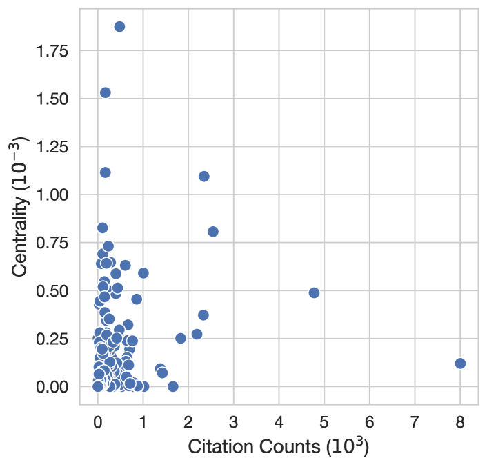

Figure 8: Betweenness centralities versus citation counts for papers in ACL and EMNLP since 2020.
[/FIGURE]

Leydesdorff ([2007](#bib.bib25)) find that betweenness centrality can be highly correlated to citation counts. Although this is expected (papers with more citations can also act better as bridges), given that BC is being used as a proxy to measure the “interdisciplinarity" of a field, we would want this metric to be somewhat orthogonal to the citation counts. We compute the the correlation between the citation counts and the BC of all nodes in our citation graph. At 0.328 ($p<0.001$), it is considerably lower than the 0.509 reported by Leydesdorff ([2007](#bib.bib25)). [Figure 8](#A2.F8 "In Correlation between betweenness centralities and citation counts ‣ B.1 Sanity checks ‣ Appendix B Citation graph details ‣ From Insights to Actions: The Impact of Interpretability and Analysis Research on NLP") provides a visualization of the correlation.  

## Appendix C Survey details

We outline ethical considerations pertaining to our survey, along with the final version of the survey below.  

### C.1 Ethical considerations

Our survey involved research with human participants, thus we report the full text of the survey below, and information about recruitment in [Section 3](#S3 "3 Citation graph and community survey ‣ From Insights to Actions: The Impact of Interpretability and Analysis Research on NLP"). We determined there to be a negligible risk of harms from participating in our survey, as it contains no offensive or harmful content. As shown in the full survey below, we describe our study objectives and remind respondents that filling out the survey is completely voluntary. We then explicitly ask for their consent to participate, and obtain consent from all 138 survey respondents. For respondents who may not have completed the survey, no data was collected. In lieu of financial compensation, we offered survey respondents the optional opportunity to provide their name or an alias that we would mention in the acknowledgements of any future paper we write with the survey results. To protect respondent privacy and confidentiality, we will not release the original survey responses in full, but only release high-level statistics, annotations from our qualitative coding, and select non-identifying examples in [Section 7](#S7 "7 Main takeaways and discussion ‣ From Insights to Actions: The Impact of Interpretability and Analysis Research on NLP").  

### C.2 Full survey

### Impact of Model Analysis and Interpretability Research on Progress in NLP

Estimated time to complete the survey: 12 minutes  

#### Study description

This project aims to measure the impact that model analysis and interpretability research has on current progress in NLP as well as its possible future impact on the field.       

You are encouraged to fill out this survey even if you have no exposure to model analysis and interpretability work.       

Filling out this questionnaire is completely voluntary.       

By clicking "Yes" below, I am verifying that I have read the description above and I consent to participate in this research study.  

• Yes     • No  

#### What do we mean by model analysis and interpretability research?

Model analysis and interpretability research in natural language processing (NLP) aims to develop a deeper understanding of and explain the behavior of NLP systems.       

This includes (but is not limited to) explaining models’ internal computations, investigating broader phenomena observed during pre-training or adaptation, and providing a better understanding of the limitations and robustness of existing models.       

Work on topics such as attribution methods, probing, mechanistic interpretability, analysis of embedding spaces, explainability, analysis of training dynamics, analyzing model bias, etc., are additional examples of model analysis and interpretability research.  

#### Background questions

1. What is your occupation?  

• Bachelor’s student     • Master’s student     • PhD student/candidate     • Postdoc     • Assistant professor     • Associate professor     • Full professor     • Junior industry researcher     • Senior industry researcher     • NLP practitioner     • Other [fill in]       

2. What is your area of research?  

Feel free to select multiple options or add missing ones.  

(The list below is adapted from the calls for papers of COLM and ARR.)  

• LM adaptation: fine-tuning, instruction-tuning, reinforcement learning (with human feedback), prompt tuning, and in-context alignment     • Data for LMs: pre-training data, alignment data, and synthetic data — via manual or algorithmic analysis, curation, and generation     • Evaluation of LMs: benchmarks, simulation environments, scalable oversight, evaluation protocols and metrics, human and/or machine evaluation     • Societal implications: bias, fairness, accountability, transparency, equity, misuse, jobs, climate change, and beyond     • Safety: security, privacy, misinformation, adversarial attacks and defenses     • Science of LMs: scaling laws, fundamental limitations, emergent capabilities, demystification, interpretability, complexity, training dynamics, grokking, learning theory for LMs     • Compute efficient LMs: distillation, compression, quantization, sample efficient methods, memory efficient methods     • Engineering for large LMs: distributed training and inference on different hardware setups, training dynamics, optimization instability     • Learning algorithms: learning, unlearning, meta learning, model mixing methods, continual learning     • Inference algorithms: decoding algorithms, reasoning algorithms, search algorithms, planning algorithms     • Human mind, brain, philosophy, laws and LMs: cognitive science, neuroscience, linguistics, psycholinguistics, philosophical, or legal perspectives on LMs     • LMs for everyone: multilinguality, low-resource languages, vernacular languages, multiculturalism, value pluralism     • LMs and the world: factuality, retrieval-augmented LMs, knowledge models, commonsense reasoning, theory of mind, social norms, pragmatics, and world models     • LMs and embodiment: perception, action, robotics, and multimodality     • LMs and interaction: conversation, interactive learning, and multi-agents learning     • LMs with tools and code: integration with tools and APIs, LM-driven software engineering     • LMs on diverse modalities and novel applications: visual LMs, code LMs, math LMs, and so forth, with extra encouragements for less studied modalities or applications such as chemistry, medicine, education, database and beyond     • NLP applications: sentiment analysis, summarization, question answering, etc.     • Computational linguistics: discourse, pragmatics, phonology, morphology, syntax, semantics     • Information extraction, information retrieval, text mining    • Neurosymbolic approaches    • Non-neural methods approaches for NLP    • Other [fill in]       

[OPTIONAL]  

If you would like, provide your name (or an alias) here and we will mention it in the acknowledgements of our future paper. [fill in]  

#### Your take on model analysis and interpretability research

Reminder: What do we mean by model analysis and interpretability research?  

Model analysis and interpretability research in natural language processing (NLP) aims to develop a deeper understanding of and explain the behavior of NLP systems.       

This includes (but is not limited to) explaining models’ internal computations, investigating broader phenomena observed during pre-training or adaptation, and providing a better understanding of the limitations and robustness of existing models.       

Work on topics such as attribution methods, probing, mechanistic interpretability, analysis of embedding spaces, explainability, analysis of training dynamics, analyzing model bias, etc., are additional examples of model analysis and interpretability research.       

3. How much do you agree with the following statement?  

The progress in NLP in the last five years would not have been possible without findings from model analysis and interpretability research.  

• 1: strongly disagree     • 2     • 3     • 4     • 5: strongly agree       

4. How much do you agree with the following statement?  

The progress in NLP in the last five years would have been slower without findings from model analysis and interpretability research.  

• 1: strongly disagree     • 2     • 3     • 4     • 5: strongly agree       

5. How many model analysis and interpretability works do you read compared to other topics?  

• I don’t usually read model analysis and interpretability work, but I do read NLP works about other topics     • I do read some model analysis and interpretability work, but much less than other topics     • I read model analysis and interpretability work in about the same volume as other NLP-related topics     • I read model analysis and interpretability work more than other NLP topics     • Most of the works I read are about model analysis and interpretability       

6. How, if at all, does model analysis and interpretability work influence your own work?  

$\square$ It provides me with new research ideas     $\square$ It changes my mental model of what the capabilities and limitations of models are     $\square$ It helps me ground my explanations of my own results     $\square$ It adds useful tools for me to visualize/evaluate/understand the behavior of a model     $\square$ It does not influence my work     $\square$ Other [fill in]       

[OPTIONAL]  

7. Provide up to 5 model analysis and interpretability papers that have influenced your work (please provide a comma separated list of paper titles or URLs). [fill in]       

8. In your day-to-day work, do you use concepts from model analysis and interpretability research (e.g., probing, residual stream, induction heads, causal interventions, MLP layers as key-value memories, etc.)?  

• Never     • Rarely     • Sometimes     • Often     • Always       

9. Do you think model analysis and interpretability research is important, and if so, why?  

$\square$ Understanding model limitations and capabilities     $\square$ Making models more computationally efficient     $\square$ Developing safety mechanisms     $\square$ Improving model trustworthiness     $\square$ Explainability for users     $\square$ To fullfill legal requirements (e.g., GDPR)     $\square$ Improving model capabilities     $\square$ Developing novel architectures     $\square$ Developing novel architectures     $\square$ I do not think model analysis and interpretability work is important     $\square$ Other [fill in]       

[OPTIONAL]  

10. If you selected "I do not think model analysis and interpretability research is important" above, please elaborate why. [fill in]       

[OPTIONAL]  

11. In your opinion, how important is model analysis and interpretability research to work in the areas below?      

Work on multilinguality and low-resource languages     • Model analysis and interpretability research is not important for     • Model analysis and interpretability research is somewhat important for     • Model analysis and interpretability research is very important for       

Work on multimodal learning, grounding, and embodiment     • Model analysis and interpretability research is not important for     • Model analysis and interpretability research is somewhat important for     • Model analysis and interpretability research is very important for       

Work on engineering for large language models     • Model analysis and interpretability research is not important for     • Model analysis and interpretability research is somewhat important for     • Model analysis and interpretability research is very important for       

Work on factuality, reasoning, world models     • Model analysis and interpretability research is not important for     • Model analysis and interpretability research is somewhat important for     • Model analysis and interpretability research is very important for       

Work on societal implications, bias, misuse, and beyond     • Model analysis and interpretability research is not important for     • Model analysis and interpretability research is somewhat important for     • Model analysis and interpretability research is very important for       

[OPTIONAL]  

12. In your opinion, what is missing in model analysis and interpretability research right now? Where should it go in the future and how should it be shaped differently? [fill in]       

[OPTIONAL]  

13. Do you have additional opinions or thoughts on model analysis and interpretability research? [fill in]  

## Appendix D Qualitative coding

Qualitative coding is an inductive methodology from the social sciences (Saldana, [2021](#bib.bib47)), used to systematically surface thematic patterns in data with less structure In the context of this paper, we use qualitative coding to analyze open-ended survey responses, and paper titles and abstracts. Two authors performed qualitative analysis of all 70 open-ended survey responses, and 556 papers (based on their titles and abstracts).  

We began by analyzing the survey responses: one round of independent coding was done, based on which we reviewed our codes to normalize terms and resolve disagreements. After this, a second round of annotation was performed.  

As for the paper annotations, the authors did a combination of independent coding (with discussion and re-coding), and co-coding. Throughout the annotation process, the authors followed best practices by working closely together to clarify the annotation procedure, discuss the emerging themes, and re-annotate data that was coded early on (Bengtsson, [2016](#bib.bib3)).  

We iteratively merged codes for related themes (e.g., pre-training trajectories and training dynamics), and to resolve inconsistencies from typos (e.g., in-context learning instead of in-contex learning) and to normalize themes (e.g., interventions instead of intervention), where applicable. All merging operations are released as part of our code.  

We measure inter-coder reliability with percentage agreement (O’Connor and Joffe, [2020](#bib.bib40)), which was above 90% across all subsets of annotation. Summary statistics are shown in Table [4](#A4.T4 "Table 4 ‣ Appendix D Qualitative coding ‣ From Insights to Actions: The Impact of Interpretability and Analysis Research on NLP").  

[TABLE A4.T4]

<table class="ltx_tabular ltx_centering ltx_guessed_headers ltx_align_middle">
<thead class="ltx_thead">
<tr class="ltx_tr">
<th class="ltx_td ltx_align_justify ltx_th ltx_th_column ltx_border_tt">

Data source

</th>
<th class="ltx_td ltx_align_right ltx_th ltx_th_column ltx_border_tt">Instances</th>
<th class="ltx_td ltx_align_right ltx_th ltx_th_column ltx_border_tt">Themes (total)</th>
<th class="ltx_td ltx_align_right ltx_th ltx_th_column ltx_border_tt">Themes (per instance)</th>
<th class="ltx_td ltx_align_right ltx_th ltx_th_column ltx_border_tt">Agreement</th>
</tr>
</thead>
<tbody class="ltx_tbody">
<tr class="ltx_tr">
<td class="ltx_td ltx_align_justify ltx_border_t">

Survey (what’s missing?)

</td>
<td class="ltx_td ltx_align_right ltx_border_t">42</td>
<td class="ltx_td ltx_align_right ltx_border_t">44</td>
<td class="ltx_td ltx_align_right ltx_border_t">2.12</td>
<td class="ltx_td ltx_align_right ltx_border_t">91.01</td>
</tr>
<tr class="ltx_tr">
<td class="ltx_td ltx_align_justify">

Survey (why not important?)

</td>
<td class="ltx_td ltx_align_right">6</td>
<td class="ltx_td ltx_align_right">9</td>
<td class="ltx_td ltx_align_right">1.5</td>
<td class="ltx_td ltx_align_right">100.00</td>
</tr>
<tr class="ltx_tr">
<td class="ltx_td ltx_align_justify">

Survey (additional thoughts)

</td>
<td class="ltx_td ltx_align_right">22</td>
<td class="ltx_td ltx_align_right">29</td>
<td class="ltx_td ltx_align_right">1.95</td>
<td class="ltx_td ltx_align_right">100.00</td>
</tr>
<tr class="ltx_tr">
<td class="ltx_td ltx_align_justify">

Papers (survey)

</td>
<td class="ltx_td ltx_align_right">29</td>
<td class="ltx_td ltx_align_right">59</td>
<td class="ltx_td ltx_align_right">4.28</td>
<td class="ltx_td ltx_align_right">100.00</td>
</tr>
<tr class="ltx_tr">
<td class="ltx_td ltx_align_justify">

Papers (top-50 IA)

</td>
<td class="ltx_td ltx_align_right">50</td>
<td class="ltx_td ltx_align_right">115</td>
<td class="ltx_td ltx_align_right">5.38</td>
<td class="ltx_td ltx_align_right">97.03</td>
</tr>
<tr class="ltx_tr">
<td class="ltx_td ltx_align_justify">

Papers (top-50 non-IA)

</td>
<td class="ltx_td ltx_align_right">50</td>
<td class="ltx_td ltx_align_right">99</td>
<td class="ltx_td ltx_align_right">4.46</td>
<td class="ltx_td ltx_align_right">96.41</td>
</tr>
<tr class="ltx_tr">
<td class="ltx_td ltx_align_justify ltx_border_bb">

Papers (non-IA papers highly influenced by IA)

</td>
<td class="ltx_td ltx_align_right ltx_border_bb">456</td>
<td class="ltx_td ltx_align_right ltx_border_bb">327</td>
<td class="ltx_td ltx_align_right ltx_border_bb">4.90</td>
<td class="ltx_td ltx_align_right ltx_border_bb">97.49</td>
</tr>
</tbody>
</table>

Table 4: Qualitative coding statistics. For each data source, we list the total number of data instances, the total number of themes assigned, the number of themes per instance, and the percentage agreement between the codes assigned by two annotators.
[/TABLE]

## Appendix E Additional results

##### Relative growth of submission tracks

[FIGURE A5.F9.g1]
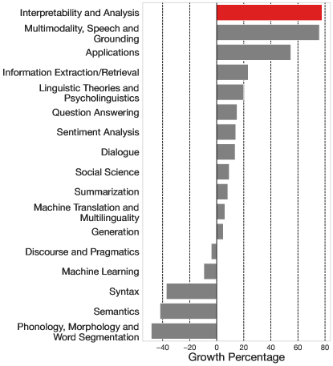

Figure 9: Growth of accepted papers per track in comparing ACL/EMNLP in 2020 vs. in 2023. This considers the tracks that have consistently existed in ACL and EMNLP in both those years.
[/FIGURE]

[Figure 9](#A5.F9 "In Relative growth of submission tracks ‣ Appendix E Additional results ‣ From Insights to Actions: The Impact of Interpretability and Analysis Research on NLP") shows the the relative growth of the IA track compared to other tracks that have consistently existed since 2020. IA is the fastest growing track at ACL and EMNLP.  

##### Betweenness centrality

[FIGURE A5.F10.g1]
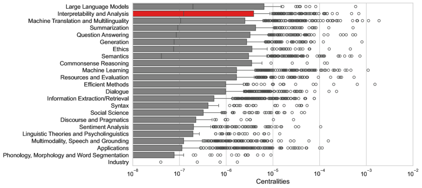

Figure 10: Betweenness centrality of ACL and EMNLP papers since 2020 by track. Lines at the middle of the box represent the medians, but some tracks have their median at 0.
[/FIGURE]

[Figure 10](#A5.F10 "In Betweenness centrality ‣ Appendix E Additional results ‣ From Insights to Actions: The Impact of Interpretability and Analysis Research on NLP") shows the betweenness centralities for the different tracks we consider. We note that for this analysis we only consider the portion of the citation graph for which we have gold track labels. Our results show that IA has the second largest median centrality. This indicates that IA plays a central role in the ACL/EMNLP citation graph, in the sense that IA papers often lie on the shortest path that connects to random papers of the graph.  

##### Which tracks cite IA papers

[FIGURE A5.F11.g1]
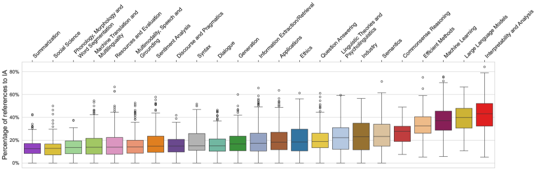

Figure 11: Percentage of references to IA papers according to our classifiers prediction.
[/FIGURE]

[FIGURE A5.F12.g1]
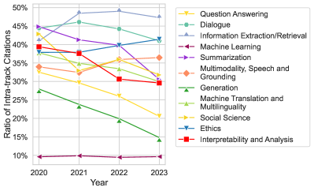

Figure 12: Ratio of intra-track citations according to the predictions of our classifier.
[/FIGURE]

[Figure 11](#A5.F11 "In Which tracks cite IA papers ‣ Appendix E Additional results ‣ From Insights to Actions: The Impact of Interpretability and Analysis Research on NLP") shows the percentage of references to IA papers across tracks. Efficient Methods, Machine Learning, and Large Language Models cite IA papers more often than other tracks.  

##### Comparing extra-track ratios

[Figure 12](#A5.F12 "In Which tracks cite IA papers ‣ Appendix E Additional results ‣ From Insights to Actions: The Impact of Interpretability and Analysis Research on NLP") compares the percentage of intra-track citations across tracks. The percentage of intra-track citations of the IA track is positioned roughly in the middle of tracks. This shows that IA is not an outlier in terms of intra-track citations.  

##### Top themes of highly cited IA papers

[TABLE A5.T5]

<table class="ltx_tabular ltx_centering ltx_guessed_headers ltx_align_middle">
<thead class="ltx_thead">
<tr class="ltx_tr">
<th class="ltx_td ltx_align_left ltx_th ltx_th_column ltx_th_row ltx_border_tt">Source</th>
<th class="ltx_td ltx_align_justify ltx_th ltx_th_column ltx_border_tt">

Top themes (% of papers in which the theme appears)

</th>
</tr>
</thead>
<tbody class="ltx_tbody">
<tr class="ltx_tr">
<th class="ltx_td ltx_align_left ltx_th ltx_th_row ltx_border_t">Survey</th>
<td class="ltx_td ltx_align_justify ltx_border_t">

representation analysis (34%), novel method (24%), probing (24%), attention analysis (21%), interventions (17.2%), mechanistic interp (17.2%), attribution (17.2%)

</td>
</tr>
<tr class="ltx_tr">
<th class="ltx_td ltx_align_left ltx_th ltx_th_row">Top-50 IA</th>
<td class="ltx_td ltx_align_justify">

analysis (40%), novel method (36%), evaluation (32%), explainability (20%), linguistics (16%), probing (16%)

</td>
</tr>
<tr class="ltx_tr">
<th class="ltx_td ltx_align_left ltx_th ltx_th_row ltx_border_bb">Top-50 non-IA</th>
<td class="ltx_td ltx_align_justify ltx_border_bb">

novel model (34%), novel method (32%), novel dataset (24%), analysis (16%)

</td>
</tr>
</tbody>
</table>

Table 5: Top themes of highly influential IA papers (mentioned by survey respondents and top-50 most-cited IA papers from the citation graph), compared to the top themes of the top-50 most-cited non-IA papers. Themes are not mutually exclusive.
[/TABLE]

[Table 5](#A5.T5 "In Top themes of highly cited IA papers ‣ Appendix E Additional results ‣ From Insights to Actions: The Impact of Interpretability and Analysis Research on NLP") shows the top themes that appear in (1) the papers mentioned by survey participants; (2) the top-50 most cited IA papers; (3) the top-50 most cited non-IA papers.  

##### Citational intent

[Figure 13](#A5.F13 "In Citational intent ‣ Appendix E Additional results ‣ From Insights to Actions: The Impact of Interpretability and Analysis Research on NLP") shows the distribution of citation intents for three groups: IA papers suggested in our survey responses, the top cited IA papers in ACL/EMNLP, and the overall most cited papers in ACL/EMNLP within our citation graph. Both the IA papers suggested in our survey and the top cited IA papers in ACL/EMNLP are primarily cited as background information. In contrast, the overall top cited papers in ACL/EMNLP are mostly cited for their use of methods.  

[FIGURE A5.F13.g1]
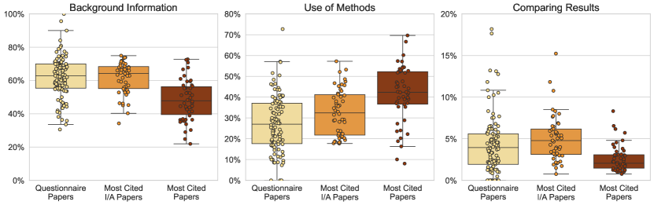

Figure 13: Citation intent percentages for the interpretability and analysis papers suggested in the responses in our survey, the top cited interpretability and analysis papers in ACL/EMNLP, and the top cited papers in ACL/EMNLP for any track.
[/FIGURE]

