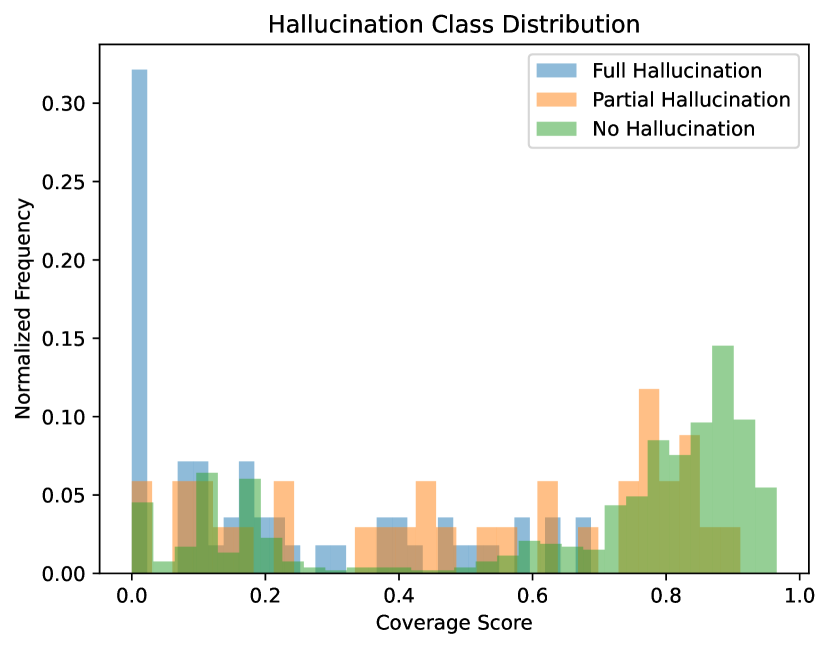
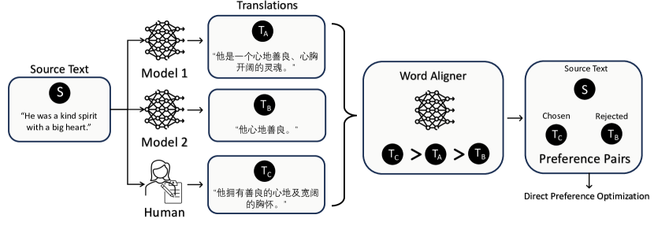
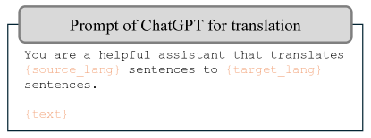
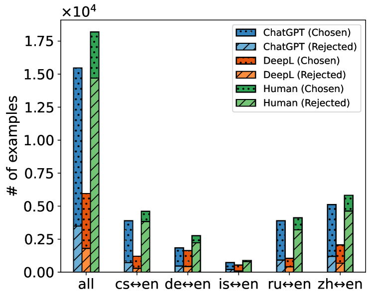
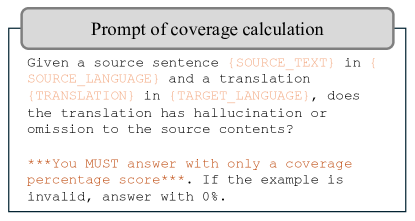
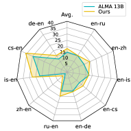
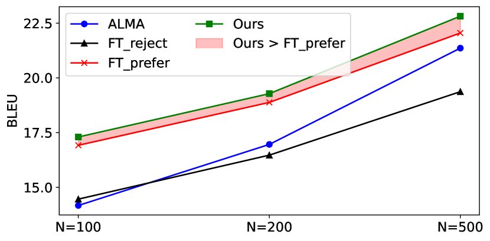
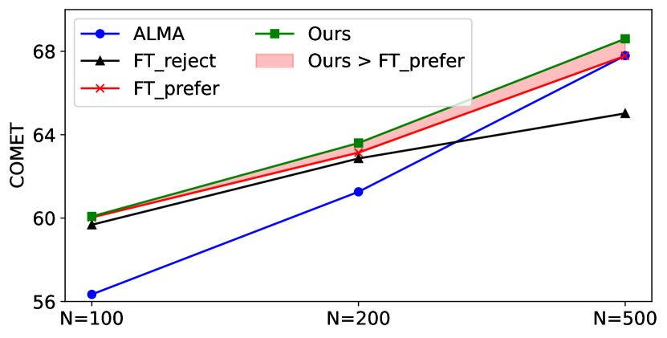

# Word Alignment as Preference for Machine Translation

###### Abstract

The problem of hallucination and omission, a long-standing problem in machine translation (MT), is more pronounced when a large language model (LLM) is used in MT because an LLM itself is susceptible to these phenomena. In this work, we mitigate the problem in an LLM-based MT model by guiding it to better word alignment. We first study the correlation between word alignment and the phenomena of hallucination and omission in MT. Then we propose to utilize word alignment as preference to optimize the LLM-based MT model. The preference data are constructed by selecting chosen and rejected translations from multiple MT tools. Subsequently, direct preference optimization is used to optimize the LLM-based model towards the preference signal. Given the absence of evaluators specifically designed for hallucination and omission in MT, we further propose selecting hard instances and utilizing GPT-4 to directly evaluate the performance of the models in mitigating these issues. We verify the rationality of these designed evaluation methods by experiments, followed by extensive results demonstrating the effectiveness of word alignment-based preference optimization to mitigate hallucination and omission.  

## 1 Introduction

Large language models (LLMs) have been evolving rapidly and showing predominant performance in many natural language processing (NLP) tasks (Brown et al., [2020](#bib.bib6); Achiam et al., [2023](#bib.bib1); Touvron et al., [2023](#bib.bib32)). However, in machine translation (MT), the use of a decoder-only LLM is still limited due to issues such as model size (Xu et al., [2024a](#bib.bib41)) and low-resource languages (Hendy et al., [2023](#bib.bib18)). Conventional encoder-decoder MT models trained on parallel corpora still dominate in practice (Costa-jussà et al., [2022](#bib.bib10)). One of the primary concerns of applying an LLM to MT is reliability. Although it does not happen frequently, an LLM is known to hallucinate (Dhuliawala et al., [2023](#bib.bib13); Zhang et al., [2023a](#bib.bib43); Bang et al., [2023](#bib.bib3)) as it is pre-trained to predict the next token in very large-scale raw texts. Specifically in MT, LLM-based translation systems therefore could have the phenomena of hallucination and omission, which is also a long-term challenge in the field of MT (Vamvas and Sennrich, [2022](#bib.bib35)), known as over- and under-translation. In this work, we attempt to mitigate the hallucination and omission in LLM-based MT to improve its practicality.  

[FIGURE S1.F1.sf1.g1]

(a) Coverage score distribution of different omission degree.
[/FIGURE]

Hallucination in MT occurs when information not present in the source text is generated in the translation, and omission occurs when some of the information in the source text is missed in the translation. As a related tool that explicitly aligns the source text and translation at the word level, word alignment is potentially positive for MT due to the nature of align and translate (Bahdanau et al., [2015](#bib.bib2)). The degree of coverage of the source text in translation could be a direct signal to identify the hallucination and omission in MT Tu et al. ([2016](#bib.bib33)). Figure [1](#S1.F1 "Figure 1 ‣ 1 Introduction ‣ Word Alignment as Preference for Machine Translation") shows the normalized frequency of the coverage scores predicted by a word aligner. The examples that are annotated as “no hallucination or omission” tend to have a higher coverage score, while those in “full hallucination or omission” are more likely to have an extremely low coverage score. “small hallucination or omission” and “partial hallucination or omission” distribute in the middle. As the annotations are carefully made by humans and highly correlates to the coverage scores from the word aligner, this indicates that word alignment is a simple but promising direction to mitigate these phenomena.  

Consequently, we propose Word Alignment Preference (WAP) that utilizes word alignment as a signal to optimize LLM-based MT models. WAP consists of three steps: diverse translation collection, preference data construction, and preference optimization. Specifically, we collect diverse translations with multiple existing translation tools, select chosen and rejected examples with the word aligner (Wu et al., [2023](#bib.bib38)), and optimize the model on preference data using direct preference optimization (DPO) (Rafailov et al., [2024](#bib.bib30)).  

Furthermore, the evaluation of hallucination and omission is challenging, and there is no existing evaluator specifically designed for this. Improving the BLEU and COMET score does not necessarily mean reducing hallucination and omission because there are other factors such as mistranslation and fluency. In addition, hallucination is relatively infrequent, although very severe once happens. Hence, to effectively evaluate it, we design extensive experiments that include testing on instances that potentially have the problem of hallucination and omission, and using GPT-4 as the evaluator with comprehensive analysis. Experimental analysis demonstrates the effectiveness of WAP in mitigating hallucination and omission in MT.  

In summary, the contributions of this work include the following:  

* We studied the correlation between the coverage score by word alignment and the phenomena of hallucination and omission in MT. From the preliminary experiments in Figure [1](#S1.F1 "Figure 1 ‣ 1 Introduction ‣ Word Alignment as Preference for Machine Translation") we found that word alignment is a promising signal to mitigate it. 
* In §[3](#S3 "3 Proposed approach ‣ Word Alignment as Preference for Machine Translation") we propose a novel approach, namely WAP, to construct a word alignment-based preference dataset, and use DPO to optimize the LLM-based MT model. The validity of the preference dataset is also demonstrated by direct fine-tuning on preferred and rejected translations in §[5.4](#S5.SS4 "5.4 Ablation study ‣ 5 Experimental results ‣ Word Alignment as Preference for Machine Translation"). 
* As there is no benchmark particularly for evaluating the performance of MT models on hallucination and omission. We design various experiments, including selecting hard instances and utilizing GPT-4 as the evaluator in §[4.3](#S4.SS3 "4.3 The design of evaluation ‣ 4 Evaluation ‣ Word Alignment as Preference for Machine Translation"). The effectiveness of the evaluation, as well as the proposed WAP has been validated through extensive experiments and analysis in §[5](#S5 "5 Experimental results ‣ Word Alignment as Preference for Machine Translation") 

## 2 Related work

### 2.1 Hallucination and omission in machine translation

The problem of hallucination and omission can also be termed an over- and under-translation. Hallucinations in machine translation are cases in which the model generates output that is partially or completely unrelated to the source sentence, while omissions are translations that do not include some of the input information (Dale et al., [2023b](#bib.bib12)). Dale et al. ([2023a](#bib.bib11)) explore methods that leverage the internal workings of models and external tools, such as cross-lingual sentence similarity and natural language inference models, to detect and mitigate hallucinations in machine translation. HalOmi (Dale et al., [2023b](#bib.bib12)) introduces an annotated dataset specifically designed to detect hallucinations and omissions, covering 18 translation directions. In Figure [1](#S1.F1 "Figure 1 ‣ 1 Introduction ‣ Word Alignment as Preference for Machine Translation") and §[4.3](#S4.SS3 "4.3 The design of evaluation ‣ 4 Evaluation ‣ Word Alignment as Preference for Machine Translation") we use HalOmi as a reference to assess how these two phenomena correlate to the coverage output of the GPT-4 evaluator and the word aligner, respectively.  

### 2.2 Preference tuning for LLMs

LLMs are capable of completing tasks in the zero-shot or few-shot manner (Radford et al., [2019](#bib.bib29); Brown et al., [2020](#bib.bib6)). In addition, performance in downstream tasks can also be enhanced by fine-tuning them with instruction datasets (Wei et al., [2022](#bib.bib36); Chung et al., [2024](#bib.bib9)). However, acquiring instruction datasets is costly, while obtaining preferences for LLM responses is relatively easier (Rafailov et al., [2024](#bib.bib30)). Consequently, numerous studies have fine-tuned the instruction-tuned models on preference data to better align with the feedback from human or advanced models, thus improving their performance on corresponding tasks (Ouyang et al., [2022](#bib.bib27); Rafailov et al., [2024](#bib.bib30); Xu et al., [2024b](#bib.bib42)). InstructGPT (Ouyang et al., [2022](#bib.bib27)) aligns language models with human intentions through a two-stage process: supervised instruction fine-tuning and reinforcement learning from human feedback using proximal policy optimization (Schulman et al., [2017](#bib.bib31)). DPO (Rafailov et al., [2024](#bib.bib30)) directly optimize LLM with preference data. It further simplifies the preference-tuning process by removing an extra reward model. We utilize DPO in this work due to the ease of use and effectiveness. A contemporaneous preference-based MT model ALMA-R (Xu et al., [2024b](#bib.bib42)), built on the foundations of DPO, introduces contrastive preference optimization to fine-tune LLMs specifically using reference-free MT metrics and human annotation as preference. ALMA-R focuses on improving general LLM-based MT while we attempt to mitigate the hallucination and omission in MT, and our preference data are entirely made automatically, which also draws the difference between ALMA-R and our work.  

### 2.3 Word alignment

Word-level information is useful in many NLP tasks such as language pretraining Chi et al. ([2021](#bib.bib7)); Wu et al. ([2021](#bib.bib40)) and cross-lingual sentence embedding Zhang et al. ([2023b](#bib.bib44)); Li et al. ([2023](#bib.bib22)); Miao et al. ([2024](#bib.bib23)). In particular, word alignment plays an important role in MT Bahdanau et al. ([2015](#bib.bib2)); Tu et al. ([2016](#bib.bib33)). Recently, word aligners based on pre-trained language models, such as SimAlign Jalili Sabet et al. ([2020](#bib.bib20)), AWESoME Dou and Neubig ([2021](#bib.bib14)) and SpanAlign Nagata et al. ([2020](#bib.bib25)); Chousa et al. ([2020](#bib.bib8)), have significantly outperformed previous word aligners based on statistical machine translation, such as Giza++ Och and Ney ([2003](#bib.bib26)) and FastAlign Dyer et al. ([2013](#bib.bib15)). SimAlign is an unsupervised approach based on the similarity of contextualized word embeddings. AWESoME and SpanAlign are supervised models that are trained on parallel corpora and manual word alignment datasets. WSPAlign (Wu et al., [2023](#bib.bib38)) is a weakly-supervised approach trained on large-scale automatically collected data. WSPAlign is the state-of-the-art word aligner, and hence we use it in this work. In addition, Bahdanau et al. ([2015](#bib.bib2)) introduces the “align and transaltion” using attention, which also inspires us to utilize the external word aligner as preference for MT.  

[FIGURE S2.F2.g1]

Figure 2: The illustration of WAP framework. The source text is first translated by multiple MT tools, including human translation. An external word aligner is then utilized to predict the coverage score for each translation. Next, translation with the highest and lowest coverage score are selected as preference pairs for the final preference optimization.
[/FIGURE]

## 3 Proposed approach

### 3.1 Gathering translation candidates

To steer the MT model to avoid hallucination and omission using preference optimization, we first need comparable but different translations. Starting with a source text $x$, we utilize $K$ methods to produce translations, notated as $\pi^{1},...,\pi^{K}$. Then we can get a set of translations $Y$, in which $y^{k}\in Y$ is obtained by $y^{k}=\pi^{k}(x)$ and $|Y|=K$.  

#### Details of gathered translations

We start with the parallel training data in ALMA (Xu et al., [2024a](#bib.bib41)). This parallel data encompasses five language pairs with human translations in both directions: $cs\leftrightarrow en$, $de\leftrightarrow en$, $is\leftrightarrow en$, $zh\leftrightarrow en$ and $ru\leftrightarrow en$. We employ ISO 639 language codes111<https://en.wikipedia.org/wiki/List_of_ISO_639_language_codes> to denote languages. Specifically, “$cs$” corresponds to Czech, “$de$” to German, “$is$” to Icelandic, “$zh$” to Chinese and “$ru$” and “$en$” to Russian and English, respectively. To generate the translations we require, this dataset is translated in both directions using two well-known MT tools, including DeepL222<https://www.deepl.com/en/translator> and ChatGPT (gpt-3.5-turbo-0613)333<https://openai.com/product>. The prompt for ChatGPT that we utilize to translate sentences is shown in Figure [3](#S3.F3 "Figure 3 ‣ Details of gathered translations ‣ 3.1 Gathering translation candidates ‣ 3 Proposed approach ‣ Word Alignment as Preference for Machine Translation"). The original human-written translation in the training set is also utilized. In particular, Icelandic ($is$) is not supported by the DeepL API, therefore, we use the Google Translate API444<https://cloud.google.com/translate/docs/basic/translate-text-basic> as an alternative.  

[FIGURE S3.F3.g1]

Figure 3: The prompt of ChatGPT that we use to translate sentences.
[/FIGURE]

### 3.2 Selecting chosen and rejected translation

After obtaining the translation candidates $(y^{1},...,y^{K})$, we use a state-of-the-art public word aligner, namely WSPAlign555<https://github.com/qiyuw/WSPAlign>, to automatically annotate the degree of coverage for each translation. We follow the usage setting in the original paper of WSPAlign (Wu et al., [2023](#bib.bib38)). In particular, WSPAlign performs a bidirectional alignment and uses a threshold to filter out low-confident alignment of word pairs. Then, the ratio of the source words, *that are aligned with at least one word*, in the translation is taken as the coverage score, which will be used for the following preference annotation. The whole process predicting the coverage score is notated as $\mathrm{C}(\cdot,\cdot)$. Formally, the coverage score for a translation $y^{k}$ can be calculated by $\mathrm{C}(x,y^{k})\in[0.0,100.0]$. Subsequently, the preferred translation and the rejected translation are selected by the following criteria:  

|  | $$\displaystyle\begin{aligned} y^{w}&=\mathop{\arg\max}\limits_{y^{k}\in Y}{\mathrm{C}(x,y^{k})}\\ y^{l}&=\mathop{\arg\min}\limits_{y^{k}\in Y}{\mathrm{C}(x,y^{k})}\end{aligned}$$ |  | (1) |
| --- | --- | --- | --- |

where $y^{w}$ is the chosen translation and $y^{l}$ is the rejected one. Then a triplet $(x,y^{w},y^{l})$ is constructed for the following preference optimization.  

### 3.3 Filtering

Note that the whole pipeline of constructing the preference data is automatic, and existing MT and word alignment models are not perfect. Even for human-annotated translation, the quality of it is also an issue that cannot be ignored (Xu et al., [2024b](#bib.bib42)), and may affect the performance of the model trained on it. Hence, noises are inevitable in both the translated texts and the preference choices. On the other hand, the MT tools we choose generally have good performance, it could happen that the generated translations are not diverse enough, leading to the preference signal being disrupted. To improve the quality of the constructed preference datasets as much as possible, multiple strategies are applied to filter out potential bad training instances:  

* Remove the instance when the chosen and rejected translations only have a marginal difference in coverage score. The difference threshold is empirically set as 5.0, that is, $(x,y^{w},y^{l})$ is excluded from the dataset if $\mathrm{C}(x,y^{w})-\mathrm{C}(x,y^{l})<5.0$. 
* Remove the instance where the chosen and rejected translations are too semantically similar. Sentence embedding is a widely used technique to calculate pairwise sentence similarity with low computation cost Gao et al. ([2021](#bib.bib17)); Wu et al. ([2022](#bib.bib39)); Zhao et al. ([2024](#bib.bib45)). LaBSE Feng et al. ([2022](#bib.bib16))666<https://huggingface.co/sentence-transformers/LaBSE> is used in our experiments. We notate it as $\mathrm{LB}(\cdot)$. The similarity threshold is empirically set as 0.9, i.e. $(x,y^{w},y^{l})$ is excluded from the dataset if $\mathrm{sim}(\mathrm{LB}(y^{w}),\mathrm{LB}(y^{w}))>0.9$, where $\mathrm{sim}(\cdot,\cdot)\in[0.0,1.0]$ is cosine similarity. 
* One possible failure case for word alignment is when the MT models directly copy the original texts, which is bad translation, but gets a high alignment score because the wrong translation is partially the same with the original texts. To remove this part of the noise, we calculate the BLEU score Papineni et al. ([2002](#bib.bib28))777<https://github.com/mjpost/sacrebleu> for the chosen translation and exclude it if the BLEU score $>20.0$. 

### 3.4 Details of dataset

Figure [4](#S3.F4 "Figure 4 ‣ 3.4 Details of dataset ‣ 3 Proposed approach ‣ Word Alignment as Preference for Machine Translation") presents the varying proportions of “chosen” and “rejected” preference pairs from three sources: ChatGPT, DeepL, and Human. The figure indicates that the majority of the “chosen” translations originate from ChatGPT, while a significant portion of human-written translations are “rejected”. This observation supports the conclusion that human-written translations can also exhibit quality issues, as discussed in ALMA-R (Xu et al., [2024b](#bib.bib42)). Examples in our constructed preference dataset are presented in §[A.1](#A1.SS1 "A.1 Examples of the preference dataset ‣ Appendix A Example analysis ‣ Word Alignment as Preference for Machine Translation").  

[FIGURE S3.F4.g1]

Figure 4: This figure illustrates the proportions of “chosen” and “rejected” preference pairs derived from three sources: ChatGPT, DeepL and Human. “all” represents the overall proportion for the aggregated dataset. $xx\leftrightarrow en$ is the subset pair of English and another language. Particularly, Google Translate is used for $is\leftrightarrow en$ as an alternative to DeepL.
[/FIGURE]

### 3.5 Optimization LLM-based MT model

The final step is to optimize the LLM-based MT model on our preference data. Direct preference optimization (DPO) (Rafailov et al., [2024](#bib.bib30)) is a simple but effective approach that directly optimizes the preference model on a pre-constructed static dataset. DPO has been applied to optimize LLM in preference data (Tunstall et al., [2023](#bib.bib34); Xu et al., [2024b](#bib.bib42)) recently. We also utilize DPO as an optimization approach. Formally, the training objective is as follows,  

|  | $$l=-\log\sigma(\beta\log\frac{\pi(y^{w}|x)}{\pi_{ref}(y^{w}|x)}-\beta\log\frac{\pi(y^{l}|x)}{\pi_{ref}(y^{l}|x)})$$ |  | (2) |
| --- | --- | --- | --- |

where $\sigma$ is the sigmoid function, $\pi$ is the model to optimize and $\pi_{ref}$ is the reference model. We use ALMA-13B888<https://github.com/fe1ixxu/ALMA> as our base model, i.e., the starting point of $\pi$, in the experiments. ALMA-13B is also used as a reference model $\pi_{ref}$, but note that $\pi_{ref}$ will not be updated during training.  

[FIGURE S3.F5.g1]

Figure 5: Prompt to calculate the coverage score.
[/FIGURE]

[FIGURE S3.F6.1.1.1.1.1.g1]

Figure 6: Comparison of WAP and baseline in hard and easy instances. $N$ instances with the lowest COMET score by the baseline are selected from the test set as hard instances, and the remaining are easy instances. Results when $N=100$, $200$ and $500$ are presented. Refer to §[B](#A2 "Appendix B Specific results ‣ Word Alignment as Preference for Machine Translation") for the full numeric results of the entire test.
[/FIGURE]

## 4 Evaluation

### 4.1 Experimental setup

The implementation from alignment-handbook999<https://github.com/huggingface/alignment-handbook> is used for the training of DPO. The learning rate is searched based on performance on development set and set to 5e-6. LoRA (Hu et al., [2021](#bib.bib19)) is used. $r$ is set as 16 and $\beta$ is set as 0.1. We train the model for 1 epoch and fix the random seed to 42. The model is trained on 4 $\times$ Nvidia A100 80G and the total batch size is 64. For evaluation, we use the implementation of ALMA101010<https://github.com/fe1ixxu/ALMA> to calculate the BLEU and COMET scores.  

### 4.2 Baselines and evaluation datasets

We choose ALMA-13B111111<https://huggingface.co/haoranxu/ALMA-13B> as the baseline for all experiments in this paper, as well as the starting point of optimization. ALMA (Xu et al., [2024a](#bib.bib41)) was trained from Llama Touvron et al. ([2023](#bib.bib32)) in two steps: initial fine-tuning on monolingual data and subsequent fine-tuning on a small set of high-quality parallel data.  

For fairly studying the effect of word alignment preference, we use the data used in the supervised fine-tuning in ALMA as the source dataset to construct our preference data in §[3](#S3 "3 Proposed approach ‣ Word Alignment as Preference for Machine Translation"). Specifically, the source data was collected from WMT’17 (Bojar et al., [2017](#bib.bib5)) to WMT’20 (Barrault et al., [2020](#bib.bib4)), in addition to the development and text dataset from Flores-200 (Costa-jussà et al., [2022](#bib.bib10)). After filtering, we finally make 20,074 and 2,226 preference triplets for training and development, respectively. For evaluation, the test set is from WMT22, except that $is\leftrightarrow en$ is from WMT21. The remaining data from WMT21 (except $is\leftrightarrow en$) is used as the development set. Specifically, 3485, 4021, 2000, 3912, 4053 examples are included in the test set for $cs\leftrightarrow en$, $de\leftrightarrow en$, $is\leftrightarrow en$, $zh\leftrightarrow en$, and $ru\leftrightarrow en$, respectively.  

#### HalOmi

In particular, we want to validate whether our proposed method is capable of mitigating hallucination and omission in MT. Hence, we also utilize HalOmi (Dale et al., [2023b](#bib.bib12)) in the experiments. HalOmi is an evaluation benchmark for the detection of hallucination and omission in MT. It contains fine-grained sentence-level and token-level annotations of full and partial hallucinations and omissions that cover 18 language directions. Each instance in the data set was annotated in “No hallucination and omission”, “Small hallucination and omission”, “Partial hallucination and omission” or “Full hallucination and omission” by humans. In this paper, we use it to test the performance of GPT-4 as an evaluator. Details are in §[4.3](#S4.SS3 "4.3 The design of evaluation ‣ 4 Evaluation ‣ Word Alignment as Preference for Machine Translation").  

### 4.3 The design of evaluation

We focus on optimizing LLM-based MT models to avoid hallucination and omission. However, to our best knowledge, there is no benchmark measuring MT models specifically for this issue, making the evaluation very challenging. Improving the BLEU or COMET score does not necessarily mean reducing hallucination and omission because there are other factors such as mistranslation and fluency. In addition, hallucination is relatively infrequent, although very severe once happens. To intuitively validate whether our approach is capable of mitigating hallucination and omission in MT, we design several evaluation strategies in this section.  

#### Select hard instances.

We first select instances that the baseline model does not perform well on. This subset of instances is labeled as hard instances in this paper. The subset of the remaining examples is labeled as easy instances. Specifically, $N$ instances with the lowest COMET score are selected from the test set for each translation direction. As hard examples tend to include more hallucination and omission, we report the comparison of models on hard examples and remaining examples, respectively. In the experiment, we sample three subsets where $N=100$, $N=200$ and $N=500$. The experimental analysis can be found in §[5.1](#S5.SS1 "5.1 Evaluation on hard instances ‣ 5 Experimental results ‣ Word Alignment as Preference for Machine Translation"). Note that the hard instances are only selected for evaluation. We do not differentiate hard or easy instances in the training set. Only word alignment signal is used to select preferred dataset for a fair comparison.  

[TABLE S4.T1]

<table class="ltx_tabular ltx_guessed_headers ltx_align_middle">
<tbody class="ltx_tbody">
<tr class="ltx_tr">
<th class="ltx_td ltx_th ltx_th_row ltx_border_r ltx_border_t"></th>
<td class="ltx_td ltx_align_center ltx_border_r ltx_border_t">Hallucination</td>
<td class="ltx_td ltx_align_center ltx_border_t">Omission</td>
</tr>
<tr class="ltx_tr">
<td class="ltx_td ltx_align_center ltx_border_t">No</td>
<td class="ltx_td ltx_align_center ltx_border_t">Partial</td>
<td class="ltx_td ltx_align_center ltx_border_r ltx_border_t">Full</td>
<td class="ltx_td ltx_align_center ltx_border_t">No</td>
<td class="ltx_td ltx_align_center ltx_border_t">Partial</td>
<td class="ltx_td ltx_align_center ltx_border_t">Full</td>
</tr>
<tr class="ltx_tr">
<th class="ltx_td ltx_align_center ltx_th ltx_th_row ltx_border_r ltx_border_t"># of examples</th>
<td class="ltx_td ltx_align_center ltx_border_t">817</td>
<td class="ltx_td ltx_align_center ltx_border_t">42</td>
<td class="ltx_td ltx_align_center ltx_border_r ltx_border_t">65</td>
<td class="ltx_td ltx_align_center ltx_border_t">627</td>
<td class="ltx_td ltx_align_center ltx_border_t">237</td>
<td class="ltx_td ltx_align_center ltx_border_t">60</td>
</tr>
<tr class="ltx_tr">
<th class="ltx_td ltx_align_center ltx_th ltx_th_row ltx_border_r ltx_border_t">Avg. score</th>
<td class="ltx_td ltx_align_center ltx_border_t">84.19</td>
<td class="ltx_td ltx_align_center ltx_border_t">45.95</td>
<td class="ltx_td ltx_align_center ltx_border_r ltx_border_t">3.84</td>
<td class="ltx_td ltx_align_center ltx_border_t">87.97</td>
<td class="ltx_td ltx_align_center ltx_border_t">66.28</td>
<td class="ltx_td ltx_align_center ltx_border_t">1.66</td>
</tr>
<tr class="ltx_tr">
<th class="ltx_td ltx_align_center ltx_th ltx_th_row ltx_border_b ltx_border_r ltx_border_t">Pearson Corr.</th>
<td class="ltx_td ltx_align_center ltx_border_b ltx_border_r ltx_border_t">0.5969</td>
<td class="ltx_td ltx_align_center ltx_border_b ltx_border_t">0.5686</td>
</tr>
</tbody>
</table>

Table 1: Average coverage score calculated by GPT-4 for different level of hallucination or omission. The Pearson Correlation between the annotated labels and GPT-4 coverage scores is also reported.
[/TABLE]

#### Utilize LLM as the evaluator for hallucination and omission.

Besides the BLEU and COMET in hard instances, a direct estimate of the degree of hallucination and omission in translation is still needed. As we mentioned earlier that improving the BLEU and COMET score does not necessarily mean reducing hallucination and omission because there are other factors such as mistranslation and fluency, we utilize the generalization and reasoning ability of LLM (Kojima et al., [2022](#bib.bib21); Mitchell et al., [2023](#bib.bib24); Wei et al., [2023](#bib.bib37)) to achieve this direct evaluation. We use one of the most powerful LLM, GPT-4121212<https://openai.com/research/gpt-4>, as the evaluator. LLM is prompted to check whether the given translation has hallucination or omission referring to the given source texts. A coverage score between 0 and 100 is output as the degree metric. The prompt used is shown in Figure [5](#S3.F5 "Figure 5 ‣ 3.5 Optimization LLM-based MT model ‣ 3 Proposed approach ‣ Word Alignment as Preference for Machine Translation").  

#### Is LLM really capable of evaluating hallucination and omission in MT?

Despite the fact that LLMs have shown impressive zero-shot performance in various tasks (Kojima et al., [2022](#bib.bib21); Mitchell et al., [2023](#bib.bib24); Wei et al., [2023](#bib.bib37)), the assessment of LLM in the evaluation of hallucination and omission is still important because it has not been widely used on this task. We use HalOmi datasets introduced in §[4.2](#S4.SS2 "4.2 Baselines and evaluation datasets ‣ 4 Evaluation ‣ Word Alignment as Preference for Machine Translation") to assess this ability of GPT-4. The examples in $de\leftrightarrow en$, $zh\leftrightarrow en$, and $ru\leftrightarrow en$ are selected, then GPT-4 is used to predict the coverage score for these examples.  

Table [1](#S4.T1 "Table 1 ‣ Select hard instances. ‣ 4.3 The design of evaluation ‣ 4 Evaluation ‣ Word Alignment as Preference for Machine Translation") shows the average score of the degree of coverage predicted by GPT-4. The examples from HalOmi are split into three subsets based on the labels. We merged the “Partial hallucination and omission” and “Small hallucination and omission” in the original because the number of examples in these two categories is small. It clearly demonstrates that examples annotated as “No hallucination and omission” have a higher coverage score predicted by GPT-4 and those in “Full hallucination and omission” have an extremely low coverage score. As a result, using GPT-4 is an effective way to assess whether a translation has the problem of hallucination or omission.  

[TABLE S4.T2]

<table class="ltx_tabular ltx_guessed_headers ltx_align_middle">
<thead class="ltx_thead">
<tr class="ltx_tr">
<th class="ltx_td ltx_th ltx_th_column ltx_border_r ltx_border_t"></th>
<th class="ltx_td ltx_align_center ltx_th ltx_th_column ltx_border_t">de-en</th>
<th class="ltx_td ltx_align_center ltx_th ltx_th_column ltx_border_t">cs-en</th>
<th class="ltx_td ltx_align_center ltx_th ltx_th_column ltx_border_t">is-en</th>
<th class="ltx_td ltx_align_center ltx_th ltx_th_column ltx_border_t">zh-en</th>
<th class="ltx_td ltx_align_center ltx_th ltx_th_column ltx_border_t">ru-en</th>
<th class="ltx_td ltx_align_center ltx_th ltx_th_column ltx_border_t">en-de</th>
<th class="ltx_td ltx_align_center ltx_th ltx_th_column ltx_border_t">en-cs</th>
<th class="ltx_td ltx_align_center ltx_th ltx_th_column ltx_border_t">en-is</th>
<th class="ltx_td ltx_align_center ltx_th ltx_th_column ltx_border_t">en-zh</th>
<th class="ltx_td ltx_align_left ltx_th ltx_th_column ltx_border_r ltx_border_t">en-ru</th>
<th class="ltx_td ltx_align_center ltx_th ltx_th_column ltx_border_t">Avg.</th>
</tr>
<tr class="ltx_tr">
<th class="ltx_td ltx_align_center ltx_th ltx_th_column ltx_border_t">N=100</th>
</tr>
</thead>
<tbody class="ltx_tbody">
<tr class="ltx_tr">
<td class="ltx_td ltx_align_center ltx_border_r ltx_border_t">Baseline</td>
<td class="ltx_td ltx_align_center ltx_border_t">94.30</td>
<td class="ltx_td ltx_align_center ltx_border_t">92.95</td>
<td class="ltx_td ltx_align_center ltx_border_t">94.90</td>
<td class="ltx_td ltx_align_center ltx_border_t">63.08</td>
<td class="ltx_td ltx_align_center ltx_border_t">89.85</td>
<td class="ltx_td ltx_align_center ltx_border_t">92.85</td>
<td class="ltx_td ltx_align_center ltx_border_t">82.75</td>
<td class="ltx_td ltx_align_center ltx_border_t">97.05</td>
<td class="ltx_td ltx_align_center ltx_border_t">84.65</td>
<td class="ltx_td ltx_align_left ltx_border_r ltx_border_t">90.53</td>
<td class="ltx_td ltx_align_center ltx_border_t">88.29</td>
</tr>
<tr class="ltx_tr">
<td class="ltx_td ltx_align_center ltx_border_r"> +WAP</td>
<td class="ltx_td ltx_align_center">95.85</td>
<td class="ltx_td ltx_align_center">94.65</td>
<td class="ltx_td ltx_align_center">96.05</td>
<td class="ltx_td ltx_align_center">80.23</td>
<td class="ltx_td ltx_align_center">91.75</td>
<td class="ltx_td ltx_align_center">96.25</td>
<td class="ltx_td ltx_align_center">91.85</td>
<td class="ltx_td ltx_align_center">96.10</td>
<td class="ltx_td ltx_align_center">92.90</td>
<td class="ltx_td ltx_align_left ltx_border_r">96.87</td>
<td class="ltx_td ltx_align_center">93.25(+4.96)</td>
</tr>
<tr class="ltx_tr">
<td class="ltx_td ltx_align_center ltx_border_t">N=200</td>
</tr>
<tr class="ltx_tr">
<td class="ltx_td ltx_align_center ltx_border_r ltx_border_t">Baseline</td>
<td class="ltx_td ltx_align_center ltx_border_t">95.71</td>
<td class="ltx_td ltx_align_center ltx_border_t">95.05</td>
<td class="ltx_td ltx_align_center ltx_border_t">95.45</td>
<td class="ltx_td ltx_align_center ltx_border_t">74.83</td>
<td class="ltx_td ltx_align_center ltx_border_t">92.83</td>
<td class="ltx_td ltx_align_center ltx_border_t">94.20</td>
<td class="ltx_td ltx_align_center ltx_border_t">89.95</td>
<td class="ltx_td ltx_align_center ltx_border_t">97.70</td>
<td class="ltx_td ltx_align_center ltx_border_t">89.19</td>
<td class="ltx_td ltx_align_left ltx_border_r ltx_border_t">94.25</td>
<td class="ltx_td ltx_align_center ltx_border_t">91.92</td>
</tr>
<tr class="ltx_tr">
<td class="ltx_td ltx_align_center ltx_border_r"> +WAP</td>
<td class="ltx_td ltx_align_center">97.10</td>
<td class="ltx_td ltx_align_center">96.55</td>
<td class="ltx_td ltx_align_center">97.48</td>
<td class="ltx_td ltx_align_center">85.63</td>
<td class="ltx_td ltx_align_center">95.53</td>
<td class="ltx_td ltx_align_center">95.18</td>
<td class="ltx_td ltx_align_center">91.84</td>
<td class="ltx_td ltx_align_center">96.73</td>
<td class="ltx_td ltx_align_center">92.81</td>
<td class="ltx_td ltx_align_left ltx_border_r">96.66</td>
<td class="ltx_td ltx_align_center">94.55(+2.63)</td>
</tr>
<tr class="ltx_tr">
<td class="ltx_td ltx_align_center ltx_border_t">N=500</td>
</tr>
<tr class="ltx_tr">
<td class="ltx_td ltx_align_center ltx_border_r ltx_border_t">Baseline</td>
<td class="ltx_td ltx_align_center ltx_border_t">97.18</td>
<td class="ltx_td ltx_align_center ltx_border_t">96.74</td>
<td class="ltx_td ltx_align_center ltx_border_t">97.29</td>
<td class="ltx_td ltx_align_center ltx_border_t">87.85</td>
<td class="ltx_td ltx_align_center ltx_border_t">96.16</td>
<td class="ltx_td ltx_align_center ltx_border_t">97.35</td>
<td class="ltx_td ltx_align_center ltx_border_t">94.46</td>
<td class="ltx_td ltx_align_center ltx_border_t">98.21</td>
<td class="ltx_td ltx_align_center ltx_border_t">91.64</td>
<td class="ltx_td ltx_align_left ltx_border_r ltx_border_t">96.10</td>
<td class="ltx_td ltx_align_center ltx_border_t">95.30</td>
</tr>
<tr class="ltx_tr">
<td class="ltx_td ltx_align_center ltx_border_b ltx_border_r"> +WAP</td>
<td class="ltx_td ltx_align_center ltx_border_b">98.10</td>
<td class="ltx_td ltx_align_center ltx_border_b">97.79</td>
<td class="ltx_td ltx_align_center ltx_border_b">98.12</td>
<td class="ltx_td ltx_align_center ltx_border_b">90.76</td>
<td class="ltx_td ltx_align_center ltx_border_b">97.82</td>
<td class="ltx_td ltx_align_center ltx_border_b">97.36</td>
<td class="ltx_td ltx_align_center ltx_border_b">96.05</td>
<td class="ltx_td ltx_align_center ltx_border_b">98.22</td>
<td class="ltx_td ltx_align_center ltx_border_b">94.07</td>
<td class="ltx_td ltx_align_left ltx_border_b ltx_border_r">97.13</td>
<td class="ltx_td ltx_align_center ltx_border_b">96.54(+1.24)</td>
</tr>
</tbody>
</table>

Table 2: Coverage score output by GPT-4. The range of the score is $[0.0,100.0]$. The average score is reported for each translation direction. Higher scores are highlighted in bold.
[/TABLE]

[TABLE S4.T3]

<table class="ltx_tabular ltx_guessed_headers ltx_align_middle">
<thead class="ltx_thead">
<tr class="ltx_tr">
<th class="ltx_td ltx_th ltx_th_column ltx_th_row ltx_border_rr ltx_border_t"></th>
<th class="ltx_td ltx_align_center ltx_th ltx_th_column ltx_th_row ltx_border_rr ltx_border_t">Translation Quality</th>
<th class="ltx_td ltx_align_center ltx_th ltx_th_column ltx_border_rr ltx_border_t">Hallucination</th>
<th class="ltx_td ltx_align_center ltx_th ltx_th_column ltx_border_t">Omission</th>
</tr>
<tr class="ltx_tr">
<th class="ltx_td ltx_th ltx_th_column ltx_th_row ltx_border_rr"></th>
<th class="ltx_td ltx_align_center ltx_th ltx_th_column ltx_border_t">No</th>
<th class="ltx_td ltx_align_center ltx_th ltx_th_column ltx_border_t">Small</th>
<th class="ltx_td ltx_align_center ltx_th ltx_th_column ltx_border_t">Partial</th>
<th class="ltx_td ltx_align_center ltx_th ltx_th_column ltx_border_rr ltx_border_t">Full</th>
<th class="ltx_td ltx_align_center ltx_th ltx_th_column ltx_border_t">No</th>
<th class="ltx_td ltx_align_center ltx_th ltx_th_column ltx_border_t">Small</th>
<th class="ltx_td ltx_align_center ltx_th ltx_th_column ltx_border_t">Partial</th>
<th class="ltx_td ltx_align_center ltx_th ltx_th_column ltx_border_t">Full</th>
</tr>
</thead>
<tbody class="ltx_tbody">
<tr class="ltx_tr">
<th class="ltx_td ltx_align_center ltx_th ltx_th_row ltx_border_rr ltx_border_t">Baseline</th>
<th class="ltx_td ltx_align_center ltx_th ltx_th_row ltx_border_rr ltx_border_t">11.33%</th>
<td class="ltx_td ltx_align_center ltx_border_t">64.00%</td>
<td class="ltx_td ltx_align_center ltx_border_t">21.00%</td>
<td class="ltx_td ltx_align_center ltx_border_t">11.33%</td>
<td class="ltx_td ltx_align_center ltx_border_rr ltx_border_t">3.66%</td>
<td class="ltx_td ltx_align_center ltx_border_t">56.00%</td>
<td class="ltx_td ltx_align_center ltx_border_t">25.33%</td>
<td class="ltx_td ltx_align_center ltx_border_t">13.66%</td>
<td class="ltx_td ltx_align_center ltx_border_t">4.33%</td>
</tr>
<tr class="ltx_tr">
<th class="ltx_td ltx_align_center ltx_th ltx_th_row ltx_border_b ltx_border_rr"> +WAP</th>
<th class="ltx_td ltx_align_center ltx_th ltx_th_row ltx_border_b ltx_border_rr">39.66%</th>
<td class="ltx_td ltx_align_center ltx_border_b">75.66%</td>
<td class="ltx_td ltx_align_center ltx_border_b">17.33%</td>
<td class="ltx_td ltx_align_center ltx_border_b">7.00%</td>
<td class="ltx_td ltx_align_center ltx_border_b ltx_border_rr">0.00%</td>
<td class="ltx_td ltx_align_center ltx_border_b">80.00%</td>
<td class="ltx_td ltx_align_center ltx_border_b">16.66%</td>
<td class="ltx_td ltx_align_center ltx_border_b">5.33%</td>
<td class="ltx_td ltx_align_center ltx_border_b">0.00%</td>
</tr>
</tbody>
</table>

Table 3: Human evaluation on “zh-en” when N=100. Translation quality is the ratio of examples where the corresponding model generates better translation in general. The remaining columns present the ratio of examples in which the corresponding degree of hallucination or omission occurs. Better performance is highlighted with bold fonts.
[/TABLE]

## 5 Experimental results

### 5.1 Evaluation on hard instances

In §[4.3](#S4.SS3 "4.3 The design of evaluation ‣ 4 Evaluation ‣ Word Alignment as Preference for Machine Translation") we introduce how to select hard instances from the test set and explain why hard instances are suitable to assess hallucination and omission. In this section, we evaluate our model on these hard instances and the remaining examples, respectively. Figure [6](#S3.F6 "Figure 6 ‣ 3.5 Optimization LLM-based MT model ‣ 3 Proposed approach ‣ Word Alignment as Preference for Machine Translation") demonstrates the results when the number of sampled instances $N=100,200$, and $500$, respectively. The following findings can be concluded:  

* Our model consistently outperforms the baseline on hard instances in most translation directions, for both BLEU and COMET metrics. 
* Our model reaches competitive performance compared to the baseline for both BLEU and COMET. 
* With increasing the number of sampled hard instances, the improvement gained by our model gets smaller. 

These results indicate that WAP mitigates hallucination and omission to a certain extent, because these issues are more likely to occur in hard instances. In addition, with the improvement in the hard instances, our model remains competitive to the baseline in the remaining easy instances. It is reasonable that there is no significant difference in the easy instances because the compared models are generally good. The challenging part should be in the hard ones. Moreover, it is also observed that with increasing $N$, the improvement gets narrower. The reason is that more relatively easy instances are included in the subset. This is another evidence that WAP provides gains particularly for hallucination and omission in MT. The specific numeric results and the overall results for the entire test set are shown in §[B](#A2 "Appendix B Specific results ‣ Word Alignment as Preference for Machine Translation").  

### 5.2 Direct evaluation of hallucination and omission by GPT-4

In addition to improving hard examples, which is more likely to have hallucination and omission, direct evaluations of them are also needed to confirm the effectiveness of the proposed WAP. In §[4.3](#S4.SS3 "4.3 The design of evaluation ‣ 4 Evaluation ‣ Word Alignment as Preference for Machine Translation") we have verified the usefulness of GPT-4 as an evaluator with experiments. In this section, we prompt GPT-4 to directly predict a coverage score as the metric of hallucination and omission. The results are demonstrated in Table [2](#S4.T2 "Table 2 ‣ Is LLM really capable of evaluating hallucination and omission in MT? ‣ 4.3 The design of evaluation ‣ 4 Evaluation ‣ Word Alignment as Preference for Machine Translation"). The reported number is the average of the coverage scores in hard examples. The results show that our model outperforms the baseline in all translation directions except $en\leftrightarrow is$. Specifically in the average score of all translation directions, WAP outperforms the baseline model by 4.96, 1.63 and 1.24 when N=100, 200 and 500, respectively. The trend is similar to that of §[5.1](#S5.SS1 "5.1 Evaluation on hard instances ‣ 5 Experimental results ‣ Word Alignment as Preference for Machine Translation"), which directly indicates that the LLM-based MT model is steered to avoid generating hallucination and omission in MT with the preference dataset we constructed.  

### 5.3 Human evaluation

Although the validity of GPT-4 as evaluator for hallucination and omission has been demonstrated in §[4.3](#S4.SS3 "4.3 The design of evaluation ‣ 4 Evaluation ‣ Word Alignment as Preference for Machine Translation") and Table [1](#S4.T1 "Table 1 ‣ Select hard instances. ‣ 4.3 The design of evaluation ‣ 4 Evaluation ‣ Word Alignment as Preference for Machine Translation"), we conduct a human evaluation to further verify our findings, as LLM could still be unreliable. The subset of “N=100” on “zh-en” is selected. Three volunteers who speak Chinese and English are asked to assess the quality of the translation and the degree of hallucination and omission for the baseline and our model, without knowing which model generates the translations. Table [3](#S4.T3 "Table 3 ‣ Is LLM really capable of evaluating hallucination and omission in MT? ‣ 4.3 The design of evaluation ‣ 4 Evaluation ‣ Word Alignment as Preference for Machine Translation") demonstrates the results. In general, our model generates better translation in 39.66% of the examples, while the percentage for ALMA is 11.33%. Furthermore, it is observed that with DPO on word-alignment preferred data fine-tuning, the degree of both hallucination and omission decreases. Specifically, the percentage of “no hallucination” increases from 64% to 75.66%, and that of “small, partial, and full hallucination” decreases accordingly. The decrease in omission is more distinct, in which the percentage of “no omission” increase by 24%. Notably, for both hallucination and omission, the percentage of “full hallucination and omission” has decreased to 0 for our model. These results indicate that omission is more frequent than hallucination, and WAP can mitigate hallucination and omission in LLM-based MT model like ALMA to some extent.  

### 5.4 Ablation study

[FIGURE S5.F7.sf1.g1]

(a) Hard instances
[/FIGURE]

In this section, we conduct in-depth investigation for our word alignment preference, as we use the same training data as our baseline ALMA, i.e., human translation, but extra translations from DeepL and ChatGPT are included to conduct our preference data. To investigate where the improvement comes from, we introduce two variants without preference tuning to compare with WAP.  

* FT\_reject: directly fine-tuning ALMA with the rejected translations in the dataset. 
* FT\_prefer: directly fine-tuning ALMA with the preferred translations in the dataset. 

The comparison is demonstrated in Figure [7](#S5.F7 "Figure 7 ‣ 5.4 Ablation study ‣ 5 Experimental results ‣ Word Alignment as Preference for Machine Translation").  

#### Does the preferred data really better contribute to the training?

It is observed that FT\_prefer significantly outperforms FT\_reject in both hard and easy instances. This indicates that our proposed pipeline ensures that the samples are selected, leading to better translation quality.  

#### Is the DPO preference tuning necessary?

Particularly, the filled area demonstrates the necessity of preference tuning using DPO. In hard instances FT\_prefer can reach a competitive performance with a small gap. However, in easy instances, FT\_prefer largely underperforms WAP and ALMA, which limits the practicality of it. The possible reason for the different performance in the hard and easy instances is the direct fine-tuning. Directly fine-tuning on the preferred data without the comparison with rejected examples could cause a hard fitting to the word-aligned preference but ignore the general translation quality.  

## 6 Conclusion

The problem of hallucination and omission, a long-standing problem in MT, could become more severe when an LLM is used because an LLM itself could hallucinate or omit in nature. In this paper, our aim is to mitigate this problem in LLM-based MT by optimizing the model toward a preference for better word alignment. We construct preference datasets by collecting translations using multiple MT tools and selecting the preferred translation with a higher coverage score output by a word aligner. DPO is then utilized to optimize the model towards the word-aligned preference. As evaluation of hallucination and omission is challenging, we design experiments that include selecting hard instances and using GPT-4 to directly predict coverage score, ensuring an effective evaluation. The experiments demonstrate that the proposed WAP mitigates hallucination and omission in ten translation directions, especially in hard instances.  

## Limitation

The primary limitation of our method stems from the imperfections of the word alignment model. Within our approach, it is inevitable to encounter some alignment errors, which we address through a filtering method. However, this solution adds complexity and clutter to the method. Additionally, the effectiveness of our method is diminished for low-resource language translations due to the limited number of parallel sentences available. Lastly, our reliance on the GPT-4 API to evaluate the results introduces a significant cost factor. We aim to find a cost-free alternative for this evaluation process in future work.  

## Ethical Statement

All datasets and checkpoints used in this paper are copyright-free for research purposes. Previous studies are properly cited and discussed. This research aims to improve LLM-based machine translation models with word alignment preference data, and the preference is made by an automatic word aligner. We do not introduce additional bias to particular communities.  

## References

* Achiam et al. (2023)  Josh Achiam, Steven Adler, Sandhini Agarwal, Lama Ahmad, Ilge Akkaya, Florencia Leoni Aleman, Diogo Almeida, Janko Altenschmidt, Sam Altman, Shyamal Anadkat, et al. 2023.   Gpt-4 technical report.   *arXiv preprint arXiv:2303.08774*. 
* Bahdanau et al. (2015)  Dzmitry Bahdanau, Kyunghyun Cho, and Yoshua Bengio. 2015.   [Neural machine translation by jointly learning to align and translate](http://arxiv.org/abs/1409.0473).   In *3rd International Conference on Learning Representations, ICLR 2015, San Diego, CA, USA, May 7-9, 2015, Conference Track Proceedings*. 
* Bang et al. (2023)  Yejin Bang, Samuel Cahyawijaya, Nayeon Lee, Wenliang Dai, Dan Su, Bryan Wilie, Holy Lovenia, Ziwei Ji, Tiezheng Yu, Willy Chung, et al. 2023.   A multitask, multilingual, multimodal evaluation of chatgpt on reasoning, hallucination, and interactivity.   In *Proceedings of the 13th International Joint Conference on Natural Language Processing and the 3rd Conference of the Asia-Pacific Chapter of the Association for Computational Linguistics (Volume 1: Long Papers)*, pages 675–718. 
* Barrault et al. (2020)  Loïc Barrault, Magdalena Biesialska, Ondřej Bojar, Marta R. Costa-jussà, Christian Federmann, Yvette Graham, Roman Grundkiewicz, Barry Haddow, Matthias Huck, Eric Joanis, Tom Kocmi, Philipp Koehn, Chi-kiu Lo, Nikola Ljubešić, Christof Monz, Makoto Morishita, Masaaki Nagata, Toshiaki Nakazawa, Santanu Pal, Matt Post, and Marcos Zampieri. 2020.   [Findings of the 2020 conference on machine translation (WMT20)](https://aclanthology.org/2020.wmt-1.1).   In *Proceedings of the Fifth Conference on Machine Translation*, pages 1–55, Online. Association for Computational Linguistics. 
* Bojar et al. (2017)  Ondřej Bojar, Rajen Chatterjee, Christian Federmann, Yvette Graham, Barry Haddow, Shujian Huang, Matthias Huck, Philipp Koehn, Qun Liu, Varvara Logacheva, Christof Monz, Matteo Negri, Matt Post, Raphael Rubino, Lucia Specia, and Marco Turchi. 2017.   [Findings of the 2017 conference on machine translation (WMT17)](https://doi.org/10.18653/v1/W17-4717).   In *Proceedings of the Second Conference on Machine Translation*, pages 169–214, Copenhagen, Denmark. Association for Computational Linguistics. 
* Brown et al. (2020)  Tom Brown, Benjamin Mann, Nick Ryder, Melanie Subbiah, Jared D Kaplan, Prafulla Dhariwal, Arvind Neelakantan, Pranav Shyam, Girish Sastry, Amanda Askell, Sandhini Agarwal, Ariel Herbert-Voss, Gretchen Krueger, Tom Henighan, Rewon Child, Aditya Ramesh, Daniel Ziegler, Jeffrey Wu, Clemens Winter, Chris Hesse, Mark Chen, Eric Sigler, Mateusz Litwin, Scott Gray, Benjamin Chess, Jack Clark, Christopher Berner, Sam McCandlish, Alec Radford, Ilya Sutskever, and Dario Amodei. 2020.   [Language models are few-shot learners](https://proceedings.neurips.cc/paper_files/paper/2020/file/1457c0d6bfcb4967418bfb8ac142f64a-Paper.pdf).   In *Advances in Neural Information Processing Systems*, volume 33, pages 1877–1901. Curran Associates, Inc. 
* Chi et al. (2021)  Zewen Chi, Li Dong, Bo Zheng, Shaohan Huang, Xian-Ling Mao, Heyan Huang, and Furu Wei. 2021.   [Improving pretrained cross-lingual language models via self-labeled word alignment](https://doi.org/10.18653/v1/2021.acl-long.265).   In *Proceedings of the 59th Annual Meeting of the Association for Computational Linguistics and the 11th International Joint Conference on Natural Language Processing (Volume 1: Long Papers)*, pages 3418–3430, Online. Association for Computational Linguistics. 
* Chousa et al. (2020)  Katsuki Chousa, Masaaki Nagata, and Masaaki Nishino. 2020.   [SpanAlign: Sentence alignment method based on cross-language span prediction and ILP](https://doi.org/10.18653/v1/2020.coling-main.418).   In *Proceedings of the 28th International Conference on Computational Linguistics*, pages 4750–4761, Barcelona, Spain (Online). International Committee on Computational Linguistics. 
* Chung et al. (2024)  Hyung Won Chung, Le Hou, Shayne Longpre, Barret Zoph, Yi Tay, William Fedus, Yunxuan Li, Xuezhi Wang, Mostafa Dehghani, Siddhartha Brahma, et al. 2024.   Scaling instruction-finetuned language models.   *Journal of Machine Learning Research*, 25(70):1–53. 
* Costa-jussà et al. (2022)  Marta R Costa-jussà, James Cross, Onur Çelebi, Maha Elbayad, Kenneth Heafield, Kevin Heffernan, Elahe Kalbassi, Janice Lam, Daniel Licht, Jean Maillard, et al. 2022.   No language left behind: Scaling human-centered machine translation.   *arXiv preprint arXiv:2207.04672*. 
* Dale et al. (2023a)  David Dale, Elena Voita, Loic Barrault, and Marta R. Costa-jussà. 2023a.   [Detecting and mitigating hallucinations in machine translation: Model internal workings alone do well, sentence similarity Even better](https://doi.org/10.18653/v1/2023.acl-long.3).   In *Proceedings of the 61st Annual Meeting of the Association for Computational Linguistics (Volume 1: Long Papers)*, pages 36–50, Toronto, Canada. Association for Computational Linguistics. 
* Dale et al. (2023b)  David Dale, Elena Voita, Janice Lam, Prangthip Hansanti, Christophe Ropers, Elahe Kalbassi, Cynthia Gao, Loic Barrault, and Marta Costa-jussà. 2023b.   [HalOmi: A manually annotated benchmark for multilingual hallucination and omission detection in machine translation](https://doi.org/10.18653/v1/2023.emnlp-main.42).   In *Proceedings of the 2023 Conference on Empirical Methods in Natural Language Processing*, pages 638–653, Singapore. Association for Computational Linguistics. 
* Dhuliawala et al. (2023)  Shehzaad Dhuliawala, Mojtaba Komeili, Jing Xu, Roberta Raileanu, Xian Li, Asli Celikyilmaz, and Jason Weston. 2023.   [Chain-of-verification reduces hallucination in large language models](https://api.semanticscholar.org/CorpusID:262062565).   *ArXiv*, abs/2309.11495. 
* Dou and Neubig (2021)  Zi-Yi Dou and Graham Neubig. 2021.   Word alignment by fine-tuning embeddings on parallel corpora.   In *Proceedings of the 16th Conference of the European Chapter of the Association for Computational Linguistics: Main Volume*, pages 2112–2128. 
* Dyer et al. (2013)  Chris Dyer, Victor Chahuneau, and Noah A Smith. 2013.   A simple, fast, and effective reparameterization of ibm model 2.   In *Proceedings of the 2013 Conference of the North American Chapter of the Association for Computational Linguistics: Human Language Technologies*, pages 644–648. 
* Feng et al. (2022)  Fangxiaoyu Feng, Yinfei Yang, Daniel Cer, Naveen Arivazhagan, and Wei Wang. 2022.   [Language-agnostic BERT sentence embedding](https://doi.org/10.18653/v1/2022.acl-long.62).   In *Proceedings of the 60th Annual Meeting of the Association for Computational Linguistics (Volume 1: Long Papers)*, pages 878–891, Dublin, Ireland. Association for Computational Linguistics. 
* Gao et al. (2021)  Tianyu Gao, Xingcheng Yao, and Danqi Chen. 2021.   [SimCSE: Simple contrastive learning of sentence embeddings](https://doi.org/10.18653/v1/2021.emnlp-main.552).   In *Proceedings of the 2021 Conference on Empirical Methods in Natural Language Processing*, pages 6894–6910, Online and Punta Cana, Dominican Republic. Association for Computational Linguistics. 
* Hendy et al. (2023)  Amr Hendy, Mohamed Abdelrehim, Amr Sharaf, Vikas Raunak, Mohamed Gabr, Hitokazu Matsushita, Young Jin Kim, Mohamed Afify, and Hany Hassan Awadalla. 2023.   How good are gpt models at machine translation? a comprehensive evaluation.   *arXiv preprint arXiv:2302.09210*. 
* Hu et al. (2021)  Edward J Hu, Phillip Wallis, Zeyuan Allen-Zhu, Yuanzhi Li, Shean Wang, Lu Wang, Weizhu Chen, et al. 2021.   Lora: Low-rank adaptation of large language models.   In *International Conference on Learning Representations*. 
* Jalili Sabet et al. (2020)  Masoud Jalili Sabet, Philipp Dufter, François Yvon, and Hinrich Schütze. 2020.   SimAlign: High quality word alignments without parallel training data using static and contextualized embeddings.   In *Findings of the Association for Computational Linguistics: EMNLP 2020*, pages 1627–1643, Online. Association for Computational Linguistics. 
* Kojima et al. (2022)  Takeshi Kojima, Shixiang Shane Gu, Machel Reid, Yutaka Matsuo, and Yusuke Iwasawa. 2022.   Large language models are zero-shot reasoners.   *Advances in neural information processing systems*, 35:22199–22213. 
* Li et al. (2023)  Ziheng Li, Shaohan Huang, Zihan Zhang, Zhi-Hong Deng, Qiang Lou, Haizhen Huang, Jian Jiao, Furu Wei, Weiwei Deng, and Qi Zhang. 2023.   [Dual-alignment pre-training for cross-lingual sentence embedding](https://doi.org/10.18653/v1/2023.acl-long.191).   In *Proceedings of the 61st Annual Meeting of the Association for Computational Linguistics (Volume 1: Long Papers)*, pages 3466–3478, Toronto, Canada. Association for Computational Linguistics. 
* Miao et al. (2024)  Zhongtao Miao, Qiyu Wu, Kaiyan Zhao, Zilong Wu, and Yoshimasa Tsuruoka. 2024.   Enhancing cross-lingual sentence embedding for low-resource languages with word alignment.   *arXiv preprint arXiv:2404.02490*. 
* Mitchell et al. (2023)  Eric Mitchell, Yoonho Lee, Alexander Khazatsky, Christopher D. Manning, and Chelsea Finn. 2023.   [Detectgpt: Zero-shot machine-generated text detection using probability curvature](https://api.semanticscholar.org/CorpusID:256274849).   In *International Conference on Machine Learning*. 
* Nagata et al. (2020)  Masaaki Nagata, Katsuki Chousa, and Masaaki Nishino. 2020.   A supervised word alignment method based on cross-language span prediction using multilingual bert.   In *Proceedings of the 2020 Conference on Empirical Methods in Natural Language Processing (EMNLP)*, pages 555–565. 
* Och and Ney (2003)  Franz Josef Och and Hermann Ney. 2003.   A systematic comparison of various statistical alignment models.   *Computational linguistics*, 29(1):19–51. 
* Ouyang et al. (2022)  Long Ouyang, Jeffrey Wu, Xu Jiang, Diogo Almeida, Carroll Wainwright, Pamela Mishkin, Chong Zhang, Sandhini Agarwal, Katarina Slama, Alex Ray, John Schulman, Jacob Hilton, Fraser Kelton, Luke Miller, Maddie Simens, Amanda Askell, Peter Welinder, Paul F Christiano, Jan Leike, and Ryan Lowe. 2022.   [Training language models to follow instructions with human feedback](https://proceedings.neurips.cc/paper_files/paper/2022/file/b1efde53be364a73914f58805a001731-Paper-Conference.pdf).   In *Advances in Neural Information Processing Systems*, volume 35, pages 27730–27744. Curran Associates, Inc. 
* Papineni et al. (2002)  Kishore Papineni, Salim Roukos, Todd Ward, and Wei-Jing Zhu. 2002.   [Bleu: a method for automatic evaluation of machine translation](https://doi.org/10.3115/1073083.1073135).   In *Proceedings of the 40th Annual Meeting of the Association for Computational Linguistics*, pages 311–318, Philadelphia, Pennsylvania, USA. Association for Computational Linguistics. 
* Radford et al. (2019)  Alec Radford, Jeffrey Wu, Rewon Child, David Luan, Dario Amodei, Ilya Sutskever, et al. 2019.   Language models are unsupervised multitask learners.   *OpenAI blog*, 1(8):9. 
* Rafailov et al. (2024)  Rafael Rafailov, Archit Sharma, Eric Mitchell, Christopher D Manning, Stefano Ermon, and Chelsea Finn. 2024.   Direct preference optimization: Your language model is secretly a reward model.   *Advances in Neural Information Processing Systems*, 36. 
* Schulman et al. (2017)  John Schulman, Filip Wolski, Prafulla Dhariwal, Alec Radford, and Oleg Klimov. 2017.   Proximal policy optimization algorithms.   *arXiv preprint arXiv:1707.06347*. 
* Touvron et al. (2023)  Hugo Touvron, Louis Martin, Kevin Stone, Peter Albert, Amjad Almahairi, Yasmine Babaei, Nikolay Bashlykov, Soumya Batra, Prajjwal Bhargava, Shruti Bhosale, et al. 2023.   Llama 2: Open foundation and fine-tuned chat models.   *arXiv preprint arXiv:2307.09288*. 
* Tu et al. (2016)  Zhaopeng Tu, Zhengdong Lu, Yang Liu, Xiaohua Liu, and Hang Li. 2016.   Modeling coverage for neural machine translation.   In *Proceedings of the 54th Annual Meeting of the Association for Computational Linguistics (Volume 1: Long Papers)*, pages 76–85. 
* Tunstall et al. (2023)  Lewis Tunstall, Edward Beeching, Nathan Lambert, Nazneen Rajani, Kashif Rasul, Younes Belkada, Shengyi Huang, Leandro von Werra, Clémentine Fourrier, Nathan Habib, Nathan Sarrazin, Omar Sanseviero, Alexander M. Rush, and Thomas Wolf. 2023.   [Zephyr: Direct distillation of lm alignment](https://api.semanticscholar.org/CorpusID:264490502).   *ArXiv*, abs/2310.16944. 
* Vamvas and Sennrich (2022)  Jannis Vamvas and Rico Sennrich. 2022.   [As little as possible, as much as necessary: Detecting over- and undertranslations with contrastive conditioning](https://doi.org/10.18653/v1/2022.acl-short.53).   In *Proceedings of the 60th Annual Meeting of the Association for Computational Linguistics (Volume 2: Short Papers)*, pages 490–500, Dublin, Ireland. Association for Computational Linguistics. 
* Wei et al. (2022)  Jason Wei, Maarten Bosma, Vincent Zhao, Kelvin Guu, Adams Wei Yu, Brian Lester, Nan Du, Andrew M. Dai, and Quoc V Le. 2022.   [Finetuned language models are zero-shot learners](https://openreview.net/forum?id=gEZrGCozdqR).   In *International Conference on Learning Representations*. 
* Wei et al. (2023)  Xiang Wei, Xingyu Cui, Ning Cheng, Xiaobin Wang, Xin Zhang, Shen Huang, Pengjun Xie, Jinan Xu, Yufeng Chen, Meishan Zhang, Yong Jiang, and Wenjuan Han. 2023.   [Zero-shot information extraction via chatting with chatgpt](https://api.semanticscholar.org/CorpusID:257050669).   *ArXiv*, abs/2302.10205. 
* Wu et al. (2023)  Qiyu Wu, Masaaki Nagata, and Yoshimasa Tsuruoka. 2023.   [WSPAlign: Word alignment pre-training via large-scale weakly supervised span prediction](https://doi.org/10.18653/v1/2023.acl-long.621).   In *Proceedings of the 61st Annual Meeting of the Association for Computational Linguistics (Volume 1: Long Papers)*, pages 11084–11099, Toronto, Canada. Association for Computational Linguistics. 
* Wu et al. (2022)  Qiyu Wu, Chongyang Tao, Tao Shen, Can Xu, Xiubo Geng, and Daxin Jiang. 2022.   [PCL: Peer-contrastive learning with diverse augmentations for unsupervised sentence embeddings](https://doi.org/10.18653/v1/2022.emnlp-main.826).   In *Proceedings of the 2022 Conference on Empirical Methods in Natural Language Processing*, pages 12052–12066, Abu Dhabi, United Arab Emirates. Association for Computational Linguistics. 
* Wu et al. (2021)  Qiyu Wu, Chen Xing, Yatao Li, Guolin Ke, Di He, and Tie-Yan Liu. 2021.   [Taking notes on the fly helps language pre-training](https://api.semanticscholar.org/CorpusID:235613669).   In *International Conference on Learning Representations*. 
* Xu et al. (2024a)  Haoran Xu, Young Jin Kim, Amr Sharaf, and Hany Hassan Awadalla. 2024a.   [A paradigm shift in machine translation: Boosting translation performance of large language models](https://openreview.net/forum?id=farT6XXntP).   In *The Twelfth International Conference on Learning Representations*. 
* Xu et al. (2024b)  Haoran Xu, Amr Sharaf, Yunmo Chen, Weiting Tan, Lingfeng Shen, Benjamin Van Durme, Kenton Murray, and Young Jin Kim. 2024b.   Contrastive preference optimization: Pushing the boundaries of llm performance in machine translation.   *arXiv preprint arXiv:2401.08417*. 
* Zhang et al. (2023a)  Yue Zhang, Yafu Li, Leyang Cui, Deng Cai, Lemao Liu, Tingchen Fu, Xinting Huang, Enbo Zhao, Yu Zhang, Yulong Chen, Longyue Wang, Anh Tuan Luu, Wei Bi, Freda Shi, and Shuming Shi. 2023a.   [Siren’s song in the ai ocean: A survey on hallucination in large language models](https://api.semanticscholar.org/CorpusID:261530162).   *ArXiv*, abs/2309.01219. 
* Zhang et al. (2023b)  Zhen-Ru Zhang, Chuanqi Tan, Songfang Huang, and Fei Huang. 2023b.   Veco 2.0: Cross-lingual language model pre-training with multi-granularity contrastive learning.   *arXiv preprint arXiv:2304.08205*. 
* Zhao et al. (2024)  Kaiyan Zhao, Qiyu Wu, Xin-Qiang Cai, and Yoshimasa Tsuruoka. 2024.   [Leveraging multi-lingual positive instances in contrastive learning to improve sentence embedding](https://aclanthology.org/2024.eacl-long.59).   In *Proceedings of the 18th Conference of the European Chapter of the Association for Computational Linguistics (Volume 1: Long Papers)*, pages 976–991, St. Julian’s, Malta. Association for Computational Linguistics. 

## Appendix A Example analysis

### A.1 Examples of the preference dataset

[TABLE A1.T4]

<table class="ltx_tabular ltx_guessed_headers ltx_align_middle">
<thead class="ltx_thead">
<tr class="ltx_tr">
<th class="ltx_td ltx_align_center ltx_th ltx_th_column ltx_th_row ltx_border_t">Example 1 (Chinese-English)</th>
</tr>
</thead>
<tbody class="ltx_tbody">
<tr class="ltx_tr">
<th class="ltx_td ltx_align_left ltx_th ltx_th_row ltx_border_r ltx_border_t">source</th>
<td class="ltx_td ltx_align_justify ltx_border_t">

“我想，在考虑重播时，可以解决这个问题”，Coker 说道。

</td>
</tr>
<tr class="ltx_tr">
<th class="ltx_td ltx_align_left ltx_th ltx_th_row ltx_border_r ltx_border_t">chosen (gpt-3.5)</th>
<td class="ltx_td ltx_align_justify ltx_border_t">

"I think, when considering replay, this issue can be resolved," Coker said.

</td>
</tr>
<tr class="ltx_tr">
<th class="ltx_td ltx_align_left ltx_th ltx_th_row ltx_border_r ltx_border_t">rejected (human)</th>
<td class="ltx_td ltx_align_justify ltx_border_t">

"&lt;&lt;&lt;I think that when I think about&gt;&gt;&gt; the replay, &lt;&lt;&lt;I think that&gt;&gt;&gt; we can probably work it out," Coker said.

</td>
</tr>
<tr class="ltx_tr">
<th class="ltx_td ltx_align_center ltx_th ltx_th_column ltx_th_row ltx_border_tt">Example 2 (Chinese-English)</th>
</tr>
<tr class="ltx_tr">
<th class="ltx_td ltx_align_left ltx_th ltx_th_row ltx_border_r ltx_border_t">source</th>
<td class="ltx_td ltx_align_justify ltx_border_t">

&lt;&lt;&lt;富勒&gt;&gt;&gt;在政变图谋失败后

</td>
</tr>
<tr class="ltx_tr">
<th class="ltx_td ltx_align_left ltx_th ltx_th_row ltx_border_r ltx_border_t">chosen (deepl)</th>
<td class="ltx_td ltx_align_justify ltx_border_t">

&lt;&lt;&lt;Fuller&gt;&gt;&gt; after the failed coup attempt

</td>
</tr>
<tr class="ltx_tr">
<th class="ltx_td ltx_align_left ltx_th ltx_th_row ltx_border_r ltx_border_t">rejected (human)</th>
<td class="ltx_td ltx_align_justify ltx_border_t">

After the failure of the attempted coup,

</td>
</tr>
<tr class="ltx_tr">
<th class="ltx_td ltx_align_center ltx_th ltx_th_column ltx_th_row ltx_border_tt">Example 3 (English-Chinese)</th>
</tr>
<tr class="ltx_tr">
<th class="ltx_td ltx_align_left ltx_th ltx_th_row ltx_border_r ltx_border_t">source</th>
<td class="ltx_td ltx_align_justify ltx_border_t">

&lt;&lt;&lt;Originally a one-bedroom property with a convoluted layout - you had to walk through the kitchen to get to the bedroom&gt;&gt;&gt; - Joanne wanted to add storage space and a mezzanine to make the most of the generous ceiling height.’

</td>
</tr>
<tr class="ltx_tr">
<th class="ltx_td ltx_align_left ltx_th ltx_th_row ltx_border_r ltx_border_t">chosen (gpt-3.5)</th>
<td class="ltx_td ltx_align_justify ltx_border_t">

&lt;&lt;&lt;最初是一个一居室的房产，布局错综复杂 - 你必须穿过厨房才能到达卧室&gt;&gt;&gt; - 然而乔安妮想要增加存储空间和一个夹层，以充分利用宽敞的天花板高度。

</td>
</tr>
<tr class="ltx_tr">
<th class="ltx_td ltx_align_left ltx_th ltx_th_row ltx_border_b ltx_border_r ltx_border_t">rejected (deepl)</th>
<td class="ltx_td ltx_align_justify ltx_border_b ltx_border_t">

乔安妮希望增加储藏空间和一个夹层，充分利用宽敞的天花板高度。

</td>
</tr>
</tbody>
</table>

Table 4: Examples in the preference dataset. The hallucination in rejected examples and omission in the source sentence are highlighted with <<< >>>. The corresponding contents that are omitted in the rejected example are highlighted with <<< >>> in the chosen example.
[/TABLE]

Table [4](#A1.T4 "Table 4 ‣ A.1 Examples of the preference dataset ‣ Appendix A Example analysis ‣ Word Alignment as Preference for Machine Translation") includes three examples in our dataset, in which the source sentence, the chosen and rejected translations are shown. Refer to §[3.4](#S3.SS4 "3.4 Details of dataset ‣ 3 Proposed approach ‣ Word Alignment as Preference for Machine Translation") for a detailed construction of the dataset. Example 1: the rejected translation is from human annotation, in which it repeats the term of “I think” unnaturally. The possible reason could be the resource of the parallel data, e.g., direct collection from transcriptions. Example 2: “Fuller” is omitted by human annotation while translated by DeepL. Example 3: the chosen translation is from gpt-3.5-turbo that completely translates the source sentence. In contrast, the translation by DeepL omits the first half.  

### A.2 Translation examples

[TABLE A1.T5]

<table class="ltx_tabular ltx_guessed_headers ltx_align_middle">
<thead class="ltx_thead">
<tr class="ltx_tr">
<th class="ltx_td ltx_align_center ltx_th ltx_th_row ltx_border_t">
Example 1 (English-Chinese)</th>
</tr>
</thead>
<tbody class="ltx_tbody">
<tr class="ltx_tr">
<th class="ltx_td ltx_align_left ltx_th ltx_th_row ltx_border_r ltx_border_t">Source</th>
<td class="ltx_td ltx_align_justify ltx_border_t">

Sunday Best: Enter 1880s New York &lt;&lt;&lt;in HBO’s "The Gilded Age"&gt;&gt;&gt;

</td>
</tr>
<tr class="ltx_tr">
<th class="ltx_td ltx_align_left ltx_th ltx_th_row ltx_border_r ltx_border_t">Translation (Baseline)</th>
<td class="ltx_td ltx_align_justify ltx_border_t">

周日最佳：进入 1880 年代的纽约

</td>
</tr>
<tr class="ltx_tr">
<th class="ltx_td ltx_align_left ltx_th ltx_th_row ltx_border_r ltx_border_t">Translation (Ours)</th>
<td class="ltx_td ltx_align_justify ltx_border_t">

周日最佳：进入 1880 年代的纽约 &lt;&lt;&lt;，在 HBO 的《金碧辉煌时代》&gt;&gt;&gt;

</td>
</tr>
<tr class="ltx_tr">
<th class="ltx_td ltx_align_center ltx_th ltx_th_row ltx_border_tt">Example 2 (English-Chinese)</th>
</tr>
<tr class="ltx_tr">
<th class="ltx_td ltx_align_left ltx_th ltx_th_row ltx_border_r ltx_border_t">Source</th>
<td class="ltx_td ltx_align_justify ltx_border_t">

Liner Fastening and Hanging Tabs Inner tabs are provided to keep a loose liner in position, corresponding in position with the tabs we provide on our liners.

</td>
</tr>
<tr class="ltx_tr">
<th class="ltx_td ltx_align_left ltx_th ltx_th_row ltx_border_r ltx_border_t">Translation (Baseline)</th>
<td class="ltx_td ltx_align_justify ltx_border_t">

粘贴和悬挂&lt;&lt;&lt;卡扣的内部卡扣用于保持卡扣卡扣卡扣卡扣卡扣卡扣卡扣卡扣卡扣卡扣卡扣卡扣卡扣卡扣卡扣卡扣卡扣卡扣卡扣卡扣卡扣卡扣卡扣卡扣卡扣卡扣卡扣卡扣卡扣卡扣卡扣卡扣卡扣卡扣卡扣卡扣卡扣&gt;&gt;&gt;

</td>
</tr>
<tr class="ltx_tr">
<th class="ltx_td ltx_align_left ltx_th ltx_th_row ltx_border_r ltx_border_t">Translation (Ours)</th>
<td class="ltx_td ltx_align_justify ltx_border_t">

内固定和悬挂标签内固定和悬挂标签用于保持薄膜在位，与我们提供的标签对应。

</td>
</tr>
<tr class="ltx_tr">
<th class="ltx_td ltx_align_center ltx_th ltx_th_row ltx_border_tt">Example 3 (Chinese-English)</th>
</tr>
<tr class="ltx_tr">
<th class="ltx_td ltx_align_left ltx_th ltx_th_row ltx_border_r ltx_border_t">Source</th>
<td class="ltx_td ltx_align_justify ltx_border_t">

不知道要&lt;&lt;&lt;等到什么时候&gt;&gt;&gt;

</td>
</tr>
<tr class="ltx_tr">
<th class="ltx_td ltx_align_left ltx_th ltx_th_row ltx_border_r ltx_border_t">Translation (Baseline)</th>
<td class="ltx_td ltx_align_justify ltx_border_t">

I don’t know when

</td>
</tr>
<tr class="ltx_tr">
<th class="ltx_td ltx_align_left ltx_th ltx_th_row ltx_border_b ltx_border_r ltx_border_t">Translation (Ours)</th>
<td class="ltx_td ltx_align_justify ltx_border_b ltx_border_t">

I don’t know &lt;&lt;&lt;how long I have to wait&gt;&gt;&gt;

</td>
</tr>
</tbody>
</table>

Table 5: Translation Examples. The hallucination in translation by the baseline and the omission in the source sentence are highlighted with <<< >>>. The corresponding contents that are omitted from the baseline are highlighted with <<< >>> in our translation.
[/TABLE]

Table [5](#A1.T5 "Table 5 ‣ A.2 Translation examples ‣ Appendix A Example analysis ‣ Word Alignment as Preference for Machine Translation") shows illustrative comparison between translations from the baseline and our model. Example 1: “in HBO’s ’The Gilded Age’" in the source sentence is omitted by the baseline. In contrast, our model successfully translate the corresponding part into Chinese. Example 2: the baseline generates “卡扣 (fastening)” infinitely in translation. This type of hallucination also occurs in other LLM applications, which emphasizes the need to address the hallucination issue in LLM-based MT models. Example 3: “等到什么时候 (when to wait)” is omitted by the baseline model while our model translate that into “how long I have to wait” properly.  

[FIGURE A1.F8.sf1.g1]

(a) Hard instances
[/FIGURE]

## Appendix B Specific results

[TABLE A2.T6]

<table class="ltx_tabular ltx_align_middle">
<tbody class="ltx_tbody">
<tr class="ltx_tr">
<td class="ltx_td ltx_align_center ltx_border_t">Model-Metric</td>
<td class="ltx_td ltx_align_center ltx_border_t">de-en</td>
<td class="ltx_td ltx_align_center ltx_border_t">cs-en</td>
<td class="ltx_td ltx_align_center ltx_border_t">is-en</td>
<td class="ltx_td ltx_align_center ltx_border_t">zh-en</td>
<td class="ltx_td ltx_align_center ltx_border_t">ru-en</td>
<td class="ltx_td ltx_align_center ltx_border_t">en-de</td>
<td class="ltx_td ltx_align_center ltx_border_t">en-cs</td>
<td class="ltx_td ltx_align_center ltx_border_t">en-is</td>
<td class="ltx_td ltx_align_center ltx_border_t">en-zh</td>
<td class="ltx_td ltx_align_center ltx_border_t">en-ru</td>
<td class="ltx_td ltx_align_center ltx_border_t">Avg.</td>
</tr>
<tr class="ltx_tr">
<td class="ltx_td ltx_align_center ltx_border_t">N=100</td>
<td class="ltx_td ltx_border_t"></td>
</tr>
<tr class="ltx_tr">
<td class="ltx_td ltx_align_center">Easy instances</td>
<td class="ltx_td"></td>
</tr>
<tr class="ltx_tr">
<td class="ltx_td ltx_align_center">ALMA-BLEU</td>
<td class="ltx_td ltx_align_center">31.38</td>
<td class="ltx_td ltx_align_center">45.79</td>
<td class="ltx_td ltx_align_center">38.14</td>
<td class="ltx_td ltx_align_center">25.64</td>
<td class="ltx_td ltx_align_center">41.25</td>
<td class="ltx_td ltx_align_center">32.09</td>
<td class="ltx_td ltx_align_center">31.95</td>
<td class="ltx_td ltx_align_center">27.57</td>
<td class="ltx_td ltx_align_center">40.05</td>
<td class="ltx_td ltx_align_center">29.37</td>
<td class="ltx_td ltx_align_center">31.39</td>
</tr>
<tr class="ltx_tr">
<td class="ltx_td ltx_align_center">Ours-BLEU</td>
<td class="ltx_td ltx_align_center">32.50</td>
<td class="ltx_td ltx_align_center">46.32</td>
<td class="ltx_td ltx_align_center">40.13</td>
<td class="ltx_td ltx_align_center">25.23</td>
<td class="ltx_td ltx_align_center">40.80</td>
<td class="ltx_td ltx_align_center">31.22</td>
<td class="ltx_td ltx_align_center">31.55</td>
<td class="ltx_td ltx_align_center">26.00</td>
<td class="ltx_td ltx_align_center">39.55</td>
<td class="ltx_td ltx_align_center">29.01</td>
<td class="ltx_td ltx_align_center">31.33</td>
</tr>
<tr class="ltx_tr">
<td class="ltx_td ltx_align_center">ALMA-COMET</td>
<td class="ltx_td ltx_align_center">85.57</td>
<td class="ltx_td ltx_align_center">87.71</td>
<td class="ltx_td ltx_align_center">87.82</td>
<td class="ltx_td ltx_align_center">81.38</td>
<td class="ltx_td ltx_align_center">86.26</td>
<td class="ltx_td ltx_align_center">86.84</td>
<td class="ltx_td ltx_align_center">90.90</td>
<td class="ltx_td ltx_align_center">87.61</td>
<td class="ltx_td ltx_align_center">87.14</td>
<td class="ltx_td ltx_align_center">88.80</td>
<td class="ltx_td ltx_align_center">78.12</td>
</tr>
<tr class="ltx_tr">
<td class="ltx_td ltx_align_center">Ours-COMET</td>
<td class="ltx_td ltx_align_center">85.50</td>
<td class="ltx_td ltx_align_center">87.67</td>
<td class="ltx_td ltx_align_center">87.71</td>
<td class="ltx_td ltx_align_center">81.24</td>
<td class="ltx_td ltx_align_center">86.17</td>
<td class="ltx_td ltx_align_center">86.02</td>
<td class="ltx_td ltx_align_center">89.84</td>
<td class="ltx_td ltx_align_center">85.80</td>
<td class="ltx_td ltx_align_center">86.39</td>
<td class="ltx_td ltx_align_center">87.89</td>
<td class="ltx_td ltx_align_center">77.63</td>
</tr>
<tr class="ltx_tr">
<td class="ltx_td ltx_align_center">Hard instances</td>
<td class="ltx_td"></td>
</tr>
<tr class="ltx_tr">
<td class="ltx_td ltx_align_center">ALMA-BLEU</td>
<td class="ltx_td ltx_align_center">12.25</td>
<td class="ltx_td ltx_align_center">29.49</td>
<td class="ltx_td ltx_align_center">21.72</td>
<td class="ltx_td ltx_align_center">1.95</td>
<td class="ltx_td ltx_align_center">15.73</td>
<td class="ltx_td ltx_align_center">15.71</td>
<td class="ltx_td ltx_align_center">12.79</td>
<td class="ltx_td ltx_align_center">17.51</td>
<td class="ltx_td ltx_align_center">14.59</td>
<td class="ltx_td ltx_align_center">15.45</td>
<td class="ltx_td ltx_align_center">14.17</td>
</tr>
<tr class="ltx_tr">
<td class="ltx_td ltx_align_center">Ours-BLEU</td>
<td class="ltx_td ltx_align_center">15.56</td>
<td class="ltx_td ltx_align_center">35.93</td>
<td class="ltx_td ltx_align_center">27.72</td>
<td class="ltx_td ltx_align_center">4.62</td>
<td class="ltx_td ltx_align_center">19.77</td>
<td class="ltx_td ltx_align_center">16.15</td>
<td class="ltx_td ltx_align_center">16.67</td>
<td class="ltx_td ltx_align_center">17.13</td>
<td class="ltx_td ltx_align_center">19.49</td>
<td class="ltx_td ltx_align_center">15.54</td>
<td class="ltx_td ltx_align_center">17.30</td>
</tr>
<tr class="ltx_tr">
<td class="ltx_td ltx_align_center">ALMA-COMET</td>
<td class="ltx_td ltx_align_center">62.73</td>
<td class="ltx_td ltx_align_center">67.08</td>
<td class="ltx_td ltx_align_center">72.62</td>
<td class="ltx_td ltx_align_center">49.94</td>
<td class="ltx_td ltx_align_center">62.64</td>
<td class="ltx_td ltx_align_center">58.50</td>
<td class="ltx_td ltx_align_center">60.80</td>
<td class="ltx_td ltx_align_center">70.02</td>
<td class="ltx_td ltx_align_center">59.07</td>
<td class="ltx_td ltx_align_center">62.31</td>
<td class="ltx_td ltx_align_center">56.34</td>
</tr>
<tr class="ltx_tr">
<td class="ltx_td ltx_align_center">Ours-COMET</td>
<td class="ltx_td ltx_align_center">65.98</td>
<td class="ltx_td ltx_align_center">71.16</td>
<td class="ltx_td ltx_align_center">75.12</td>
<td class="ltx_td ltx_align_center">58.99</td>
<td class="ltx_td ltx_align_center">67.19</td>
<td class="ltx_td ltx_align_center">60.90</td>
<td class="ltx_td ltx_align_center">67.90</td>
<td class="ltx_td ltx_align_center">71.57</td>
<td class="ltx_td ltx_align_center">62.03</td>
<td class="ltx_td ltx_align_center">65.16</td>
<td class="ltx_td ltx_align_center">60.08</td>
</tr>
<tr class="ltx_tr">
<td class="ltx_td ltx_align_center ltx_border_t">N=200</td>
<td class="ltx_td ltx_border_t"></td>
</tr>
<tr class="ltx_tr">
<td class="ltx_td ltx_align_center">Easy instances</td>
<td class="ltx_td"></td>
</tr>
<tr class="ltx_tr">
<td class="ltx_td ltx_align_center">ALMA-BLEU</td>
<td class="ltx_td ltx_align_center">31.96</td>
<td class="ltx_td ltx_align_center">47.11</td>
<td class="ltx_td ltx_align_center">39.94</td>
<td class="ltx_td ltx_align_center">26.22</td>
<td class="ltx_td ltx_align_center">42.13</td>
<td class="ltx_td ltx_align_center">32.50</td>
<td class="ltx_td ltx_align_center">32.75</td>
<td class="ltx_td ltx_align_center">28.54</td>
<td class="ltx_td ltx_align_center">41.08</td>
<td class="ltx_td ltx_align_center">30.22</td>
<td class="ltx_td ltx_align_center">32.22</td>
</tr>
<tr class="ltx_tr">
<td class="ltx_td ltx_align_center">Ours-BLEU</td>
<td class="ltx_td ltx_align_center">33.10</td>
<td class="ltx_td ltx_align_center">47.41</td>
<td class="ltx_td ltx_align_center">41.60</td>
<td class="ltx_td ltx_align_center">25.79</td>
<td class="ltx_td ltx_align_center">41.43</td>
<td class="ltx_td ltx_align_center">31.52</td>
<td class="ltx_td ltx_align_center">32.20</td>
<td class="ltx_td ltx_align_center">26.91</td>
<td class="ltx_td ltx_align_center">40.48</td>
<td class="ltx_td ltx_align_center">29.79</td>
<td class="ltx_td ltx_align_center">32.04</td>
</tr>
<tr class="ltx_tr">
<td class="ltx_td ltx_align_center">ALMA-COMET</td>
<td class="ltx_td ltx_align_center">86.34</td>
<td class="ltx_td ltx_align_center">88.61</td>
<td class="ltx_td ltx_align_center">88.72</td>
<td class="ltx_td ltx_align_center">82.31</td>
<td class="ltx_td ltx_align_center">87.02</td>
<td class="ltx_td ltx_align_center">87.76</td>
<td class="ltx_td ltx_align_center">91.85</td>
<td class="ltx_td ltx_align_center">88.67</td>
<td class="ltx_td ltx_align_center">87.97</td>
<td class="ltx_td ltx_align_center">89.67</td>
<td class="ltx_td ltx_align_center">78.92</td>
</tr>
<tr class="ltx_tr">
<td class="ltx_td ltx_align_center">Ours-COMET</td>
<td class="ltx_td ltx_align_center">86.16</td>
<td class="ltx_td ltx_align_center">88.40</td>
<td class="ltx_td ltx_align_center">88.43</td>
<td class="ltx_td ltx_align_center">81.98</td>
<td class="ltx_td ltx_align_center">86.89</td>
<td class="ltx_td ltx_align_center">86.75</td>
<td class="ltx_td ltx_align_center">90.77</td>
<td class="ltx_td ltx_align_center">86.94</td>
<td class="ltx_td ltx_align_center">87.12</td>
<td class="ltx_td ltx_align_center">88.73</td>
<td class="ltx_td ltx_align_center">78.34</td>
</tr>
<tr class="ltx_tr">
<td class="ltx_td ltx_align_center">Hard instances</td>
<td class="ltx_td"></td>
</tr>
<tr class="ltx_tr">
<td class="ltx_td ltx_align_center">ALMA-BLEU</td>
<td class="ltx_td ltx_align_center">17.46</td>
<td class="ltx_td ltx_align_center">30.39</td>
<td class="ltx_td ltx_align_center">24.17</td>
<td class="ltx_td ltx_align_center">6.00</td>
<td class="ltx_td ltx_align_center">20.03</td>
<td class="ltx_td ltx_align_center">19.11</td>
<td class="ltx_td ltx_align_center">14.83</td>
<td class="ltx_td ltx_align_center">19.02</td>
<td class="ltx_td ltx_align_center">18.61</td>
<td class="ltx_td ltx_align_center">15.43</td>
<td class="ltx_td ltx_align_center">16.96</td>
</tr>
<tr class="ltx_tr">
<td class="ltx_td ltx_align_center">Ours-BLEU</td>
<td class="ltx_td ltx_align_center">19.31</td>
<td class="ltx_td ltx_align_center">35.04</td>
<td class="ltx_td ltx_align_center">29.25</td>
<td class="ltx_td ltx_align_center">7.55</td>
<td class="ltx_td ltx_align_center">23.70</td>
<td class="ltx_td ltx_align_center">19.96</td>
<td class="ltx_td ltx_align_center">18.16</td>
<td class="ltx_td ltx_align_center">18.29</td>
<td class="ltx_td ltx_align_center">21.52</td>
<td class="ltx_td ltx_align_center">15.95</td>
<td class="ltx_td ltx_align_center">19.28</td>
</tr>
<tr class="ltx_tr">
<td class="ltx_td ltx_align_center">ALMA-COMET</td>
<td class="ltx_td ltx_align_center">67.24</td>
<td class="ltx_td ltx_align_center">71.82</td>
<td class="ltx_td ltx_align_center">76.62</td>
<td class="ltx_td ltx_align_center">57.84</td>
<td class="ltx_td ltx_align_center">67.59</td>
<td class="ltx_td ltx_align_center">64.30</td>
<td class="ltx_td ltx_align_center">67.13</td>
<td class="ltx_td ltx_align_center">74.56</td>
<td class="ltx_td ltx_align_center">65.46</td>
<td class="ltx_td ltx_align_center">67.59</td>
<td class="ltx_td ltx_align_center">61.26</td>
</tr>
<tr class="ltx_tr">
<td class="ltx_td ltx_align_center">Ours-COMET</td>
<td class="ltx_td ltx_align_center">69.85</td>
<td class="ltx_td ltx_align_center">74.82</td>
<td class="ltx_td ltx_align_center">78.52</td>
<td class="ltx_td ltx_align_center">63.87</td>
<td class="ltx_td ltx_align_center">70.22</td>
<td class="ltx_td ltx_align_center">66.77</td>
<td class="ltx_td ltx_align_center">70.37</td>
<td class="ltx_td ltx_align_center">74.13</td>
<td class="ltx_td ltx_align_center">67.50</td>
<td class="ltx_td ltx_align_center">68.78</td>
<td class="ltx_td ltx_align_center">63.60</td>
</tr>
<tr class="ltx_tr">
<td class="ltx_td ltx_align_center ltx_border_t">N=500</td>
<td class="ltx_td ltx_border_t"></td>
</tr>
<tr class="ltx_tr">
<td class="ltx_td ltx_align_center">Easy instances</td>
<td class="ltx_td"></td>
</tr>
<tr class="ltx_tr">
<td class="ltx_td ltx_align_center">ALMA-BLEU</td>
<td class="ltx_td ltx_align_center">34.36</td>
<td class="ltx_td ltx_align_center">50.81</td>
<td class="ltx_td ltx_align_center">46.92</td>
<td class="ltx_td ltx_align_center">28.50</td>
<td class="ltx_td ltx_align_center">45.16</td>
<td class="ltx_td ltx_align_center">34.61</td>
<td class="ltx_td ltx_align_center">35.28</td>
<td class="ltx_td ltx_align_center">31.79</td>
<td class="ltx_td ltx_align_center">43.91</td>
<td class="ltx_td ltx_align_center">32.13</td>
<td class="ltx_td ltx_align_center">35.13</td>
</tr>
<tr class="ltx_tr">
<td class="ltx_td ltx_align_center">Ours-BLEU</td>
<td class="ltx_td ltx_align_center">35.33</td>
<td class="ltx_td ltx_align_center">50.59</td>
<td class="ltx_td ltx_align_center">47.25</td>
<td class="ltx_td ltx_align_center">27.82</td>
<td class="ltx_td ltx_align_center">44.16</td>
<td class="ltx_td ltx_align_center">33.25</td>
<td class="ltx_td ltx_align_center">34.07</td>
<td class="ltx_td ltx_align_center">30.00</td>
<td class="ltx_td ltx_align_center">42.92</td>
<td class="ltx_td ltx_align_center">31.67</td>
<td class="ltx_td ltx_align_center">34.54</td>
</tr>
<tr class="ltx_tr">
<td class="ltx_td ltx_align_center">ALMA-COMET</td>
<td class="ltx_td ltx_align_center">88.08</td>
<td class="ltx_td ltx_align_center">90.54</td>
<td class="ltx_td ltx_align_center">91.04</td>
<td class="ltx_td ltx_align_center">84.29</td>
<td class="ltx_td ltx_align_center">88.62</td>
<td class="ltx_td ltx_align_center">89.59</td>
<td class="ltx_td ltx_align_center">93.66</td>
<td class="ltx_td ltx_align_center">91.08</td>
<td class="ltx_td ltx_align_center">89.79</td>
<td class="ltx_td ltx_align_center">91.47</td>
<td class="ltx_td ltx_align_center">80.67</td>
</tr>
<tr class="ltx_tr">
<td class="ltx_td ltx_align_center">Ours-COMET</td>
<td class="ltx_td ltx_align_center">87.80</td>
<td class="ltx_td ltx_align_center">90.10</td>
<td class="ltx_td ltx_align_center">90.50</td>
<td class="ltx_td ltx_align_center">83.86</td>
<td class="ltx_td ltx_align_center">88.40</td>
<td class="ltx_td ltx_align_center">88.55</td>
<td class="ltx_td ltx_align_center">92.48</td>
<td class="ltx_td ltx_align_center">89.57</td>
<td class="ltx_td ltx_align_center">88.79</td>
<td class="ltx_td ltx_align_center">90.61</td>
<td class="ltx_td ltx_align_center">80.00</td>
</tr>
<tr class="ltx_tr">
<td class="ltx_td ltx_align_center">Hard instances</td>
<td class="ltx_td"></td>
</tr>
<tr class="ltx_tr">
<td class="ltx_td ltx_align_center">ALMA-BLEU</td>
<td class="ltx_td ltx_align_center">21.31</td>
<td class="ltx_td ltx_align_center">35.46</td>
<td class="ltx_td ltx_align_center">28.66</td>
<td class="ltx_td ltx_align_center">13.08</td>
<td class="ltx_td ltx_align_center">25.4</td>
<td class="ltx_td ltx_align_center">22.53</td>
<td class="ltx_td ltx_align_center">19.82</td>
<td class="ltx_td ltx_align_center">22.52</td>
<td class="ltx_td ltx_align_center">24.81</td>
<td class="ltx_td ltx_align_center">19.78</td>
<td class="ltx_td ltx_align_center">21.36</td>
</tr>
<tr class="ltx_tr">
<td class="ltx_td ltx_align_center">Ours-BLEU</td>
<td class="ltx_td ltx_align_center">23.09</td>
<td class="ltx_td ltx_align_center">37.91</td>
<td class="ltx_td ltx_align_center">32.66</td>
<td class="ltx_td ltx_align_center">14.04</td>
<td class="ltx_td ltx_align_center">27.32</td>
<td class="ltx_td ltx_align_center">22.89</td>
<td class="ltx_td ltx_align_center">22.38</td>
<td class="ltx_td ltx_align_center">21.32</td>
<td class="ltx_td ltx_align_center">26.58</td>
<td class="ltx_td ltx_align_center">19.78</td>
<td class="ltx_td ltx_align_center">22.82</td>
</tr>
<tr class="ltx_tr">
<td class="ltx_td ltx_align_center">ALMA-COMET</td>
<td class="ltx_td ltx_align_center">73.56</td>
<td class="ltx_td ltx_align_center">78.24</td>
<td class="ltx_td ltx_align_center">81.55</td>
<td class="ltx_td ltx_align_center">67.07</td>
<td class="ltx_td ltx_align_center">74.39</td>
<td class="ltx_td ltx_align_center">72.74</td>
<td class="ltx_td ltx_align_center">76.38</td>
<td class="ltx_td ltx_align_center">80.61</td>
<td class="ltx_td ltx_align_center">73.38</td>
<td class="ltx_td ltx_align_center">75.29</td>
<td class="ltx_td ltx_align_center">67.79</td>
</tr>
<tr class="ltx_tr">
<td class="ltx_td ltx_align_center">Ours-COMET</td>
<td class="ltx_td ltx_align_center">74.77</td>
<td class="ltx_td ltx_align_center">79.75</td>
<td class="ltx_td ltx_align_center">82.41</td>
<td class="ltx_td ltx_align_center">69.56</td>
<td class="ltx_td ltx_align_center">75.63</td>
<td class="ltx_td ltx_align_center">73.24</td>
<td class="ltx_td ltx_align_center">77.34</td>
<td class="ltx_td ltx_align_center">79.19</td>
<td class="ltx_td ltx_align_center">74.12</td>
<td class="ltx_td ltx_align_center">74.97</td>
<td class="ltx_td ltx_align_center">68.60</td>
</tr>
<tr class="ltx_tr">
<td class="ltx_td ltx_align_center ltx_border_t">Overall performance, i.e., N=infinite when all instances are included.</td>
<td class="ltx_td ltx_border_t"></td>
</tr>
<tr class="ltx_tr">
<td class="ltx_td ltx_align_center">ALMA-BLEU</td>
<td class="ltx_td ltx_align_center">30.73</td>
<td class="ltx_td ltx_align_center">44.68</td>
<td class="ltx_td ltx_align_center">36.46</td>
<td class="ltx_td ltx_align_center">24.15</td>
<td class="ltx_td ltx_align_center">40.37</td>
<td class="ltx_td ltx_align_center">31.37</td>
<td class="ltx_td ltx_align_center">31.12</td>
<td class="ltx_td ltx_align_center">26.67</td>
<td class="ltx_td ltx_align_center">39.05</td>
<td class="ltx_td ltx_align_center">28.76</td>
<td class="ltx_td ltx_align_center">30.46</td>
</tr>
<tr class="ltx_tr">
<td class="ltx_td ltx_align_center">Ours-BLEU</td>
<td class="ltx_td ltx_align_center">31.93</td>
<td class="ltx_td ltx_align_center">45.60</td>
<td class="ltx_td ltx_align_center">38.85</td>
<td class="ltx_td ltx_align_center">23.94</td>
<td class="ltx_td ltx_align_center">40.09</td>
<td class="ltx_td ltx_align_center">30.64</td>
<td class="ltx_td ltx_align_center">30.91</td>
<td class="ltx_td ltx_align_center">25.22</td>
<td class="ltx_td ltx_align_center">38.76</td>
<td class="ltx_td ltx_align_center">28.43</td>
<td class="ltx_td ltx_align_center">30.59</td>
</tr>
<tr class="ltx_tr">
<td class="ltx_td ltx_align_center">ALMA-COMET</td>
<td class="ltx_td ltx_align_center">84.42</td>
<td class="ltx_td ltx_align_center">86.29</td>
<td class="ltx_td ltx_align_center">86.30</td>
<td class="ltx_td ltx_align_center">79.70</td>
<td class="ltx_td ltx_align_center">85.09</td>
<td class="ltx_td ltx_align_center">85.45</td>
<td class="ltx_td ltx_align_center">89.42</td>
<td class="ltx_td ltx_align_center">85.85</td>
<td class="ltx_td ltx_align_center">85.76</td>
<td class="ltx_td ltx_align_center">87.50</td>
<td class="ltx_td ltx_align_center">76.83</td>
</tr>
<tr class="ltx_tr">
<td class="ltx_td ltx_align_center ltx_border_b">Ours-COMET</td>
<td class="ltx_td ltx_align_center ltx_border_b">84.50</td>
<td class="ltx_td ltx_align_center ltx_border_b">86.53</td>
<td class="ltx_td ltx_align_center ltx_border_b">86.45</td>
<td class="ltx_td ltx_align_center ltx_border_b">80.05</td>
<td class="ltx_td ltx_align_center ltx_border_b">85.22</td>
<td class="ltx_td ltx_align_center ltx_border_b">84.78</td>
<td class="ltx_td ltx_align_center ltx_border_b">88.75</td>
<td class="ltx_td ltx_align_center ltx_border_b">84.38</td>
<td class="ltx_td ltx_align_center ltx_border_b">85.19</td>
<td class="ltx_td ltx_align_center ltx_border_b">86.77</td>
<td class="ltx_td ltx_align_center ltx_border_b">76.59</td>
</tr>
</tbody>
</table>

Table 6: Specific results on 10 translation directions. The size of models are 13B. BLEU and COMET are reported. Cells where the difference is larger than $1.0$ are highlighted with colored background. Blue indicates ours model outperforms ALMA and red indicates the opposite.
[/TABLE]

Table [6](#A2.T6 "Table 6 ‣ Appendix B Specific results ‣ Word Alignment as Preference for Machine Translation") shows the numeric results in Figure [6](#S3.F6 "Figure 6 ‣ 3.5 Optimization LLM-based MT model ‣ 3 Proposed approach ‣ Word Alignment as Preference for Machine Translation"), in which boxes on a blue background highlight the cases where our model outperforms the baseline by a margin $>1.0$, and the boxes in red are the opposite. Boxes without background indicate the cases when our model and the baseline have competitive performance where the margin $<1.0$.  

In addition to the main findings in §[5.1](#S5.SS1 "5.1 Evaluation on hard instances ‣ 5 Experimental results ‣ Word Alignment as Preference for Machine Translation") that our model generally performs better in harder instances, from the results it can also be observed that our model particularly performs worse on “en-is” than in other translation directions. The reason could be that Icelandic is a low-resource language and we used external tools such as WSPAlign and Google Translate to build the training data. Hence, the relatively unreliable performance of external tools on low-resource languages can induce noises in our training data. This could be a future direction for building more reliable word alignment signals and particular research on low-resource languages.  

In addition, Table [6](#A2.T6 "Table 6 ‣ Appendix B Specific results ‣ Word Alignment as Preference for Machine Translation") reports the overall performance when we do not split the dataset into the hard and easy subset. The results show that our model and ALMA have generally competitive performance. Specifically, if we only consider the margin larger than 1.0, our model outperforms ALMA on de-en and is-en in BLEU while ALMA performs better on en-is in both BLEU and COMET. In particular, a significance test is conducted to investigate numeric degradation when all instances are included. We utilize bootstrap sampling from example-wise COMET scores with 100,000 iterations and calculate the p-value. Based on the results of the significance test, there is no statistical significance when the margin is greater than 0.25, indicated by a p-value larger than 0.05. This suggests that our approach does not degrade the general performance by a margin of 0.25 or more, while improving that on hard instances by a large margin of 3.47. Note that the focus of this work is the problem of hallucination and omission, general metrics for MT are only partially related to our evaluation. The evaluation by LLM and humans is also important, as we discussed in §[4.3](#S4.SS3 "4.3 The design of evaluation ‣ 4 Evaluation ‣ Word Alignment as Preference for Machine Translation").  

