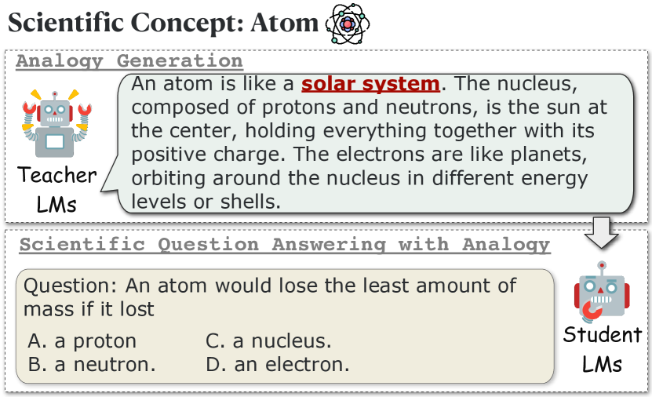
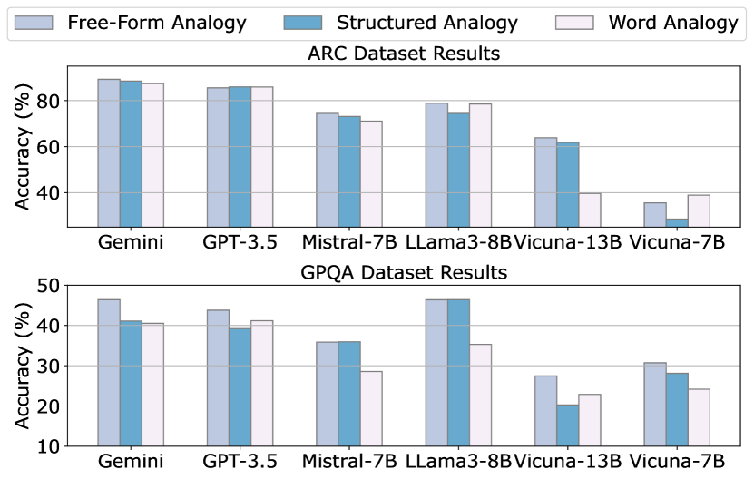
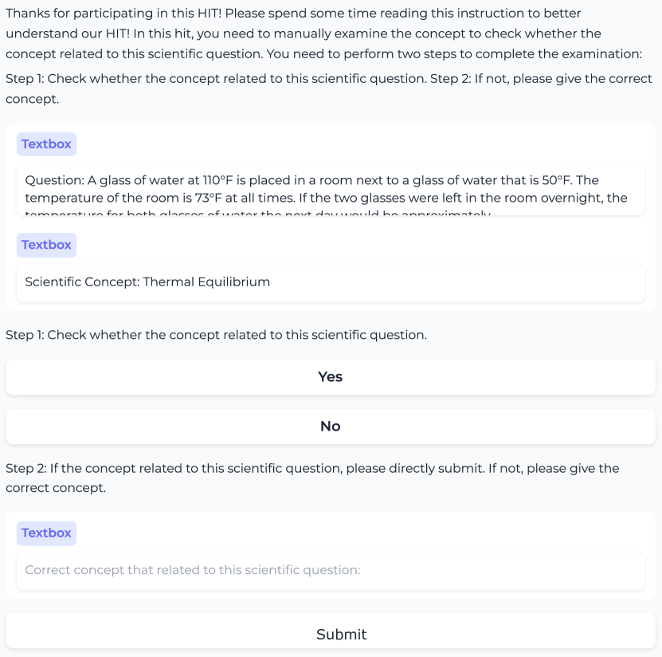
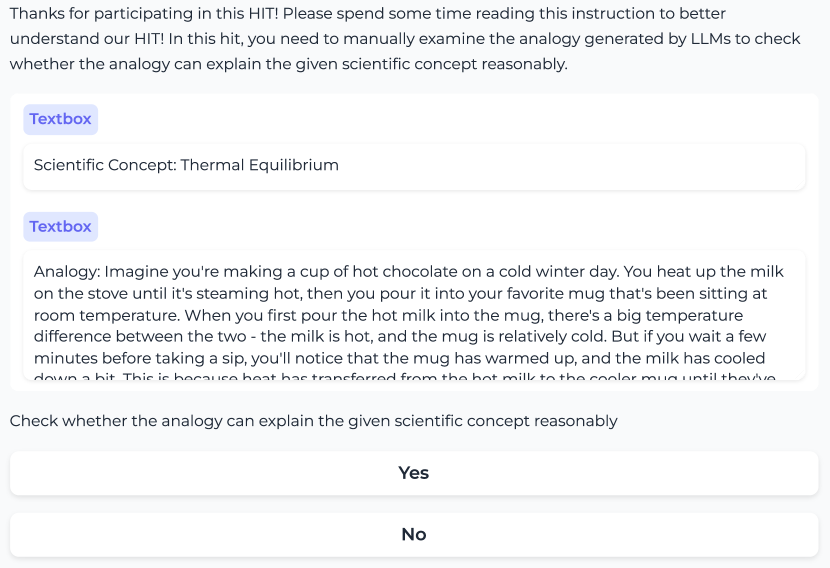

# Boosting Scientific Concepts Understanding:
Can Analogy from Teacher Models Empower Student Models?

###### Abstract

Analogical reasoning plays a critical role in human cognition, enabling us to understand new concepts by associating them with familiar ones. Previous research in the AI community has mainly focused on identifying and generating analogies and then examining their quality under human evaluation, which overlooks the practical application of these analogies in real-world settings. Inspired by the human education process, in this paper, we propose to investigate how analogies created by teacher language models (LMs) can assist student LMs in understanding scientific concepts, thereby aligning more closely with practical scenarios. Our results suggest that free-form analogies can indeed aid LMs in understanding concepts. Additionally, analogies generated by student LMs can improve their own performance on scientific question answering, demonstrating their capability to use analogies for self-learning new knowledge. Resources are available at <https://github.com/siyuyuan/SCUA>.  

\newfloatcommand
capbtabboxtable[][\FBwidth]                    

Boosting Scientific Concepts Understanding:    Can Analogy from Teacher Models Empower Student Models?  

  

    Siyu Yuan$\heartsuit$††thanks:   Equal contribution., Cheng Jiayang$\spadesuit$11footnotemark: 1, Lin Qiu$\diamondsuit$††thanks:   Corresponding authors., Deqing Yang$\heartsuit$22footnotemark: 2  $\heartsuit$School of Data Science, Fudan University  $\spadesuit$The Hong Kong University of Science and Technology  $\diamondsuit$Shanghai Jiao Tong University  syyuan21@m.fudan.edu.cn, jchengaj@cse.ust.hk  lqiu@apex.sjtu.edu.cn, deqingyang@fudan.edu.cn   

  

## 1 Introduction

Analogy plays a crucial role in human cognition, facilitating the understanding of complex and unfamiliar concepts by relating them to familiar ones Bunge ([1981](#bib.bib6)); Glynn et al. ([1989](#bib.bib18)); Hofstadter ([2001](#bib.bib22)); Bartha ([2013](#bib.bib4)). For example, Figure [1](#S1.F1 "Figure 1 ‣ 1 Introduction ‣ Boosting Scientific Concepts Understanding: Can Analogy from Teacher Models Empower Student Models?") illustrates how using the solar system as an analogy can enhance understanding of the complex structure of atoms. Given its significant value across various fields, including creativity Kang et al. ([2022](#bib.bib26)) and education Richland and Simms ([2015](#bib.bib33)); Thagard ([1992](#bib.bib39)), the topic of analogy has been drawing significant research attention in the AI community.  

Traditional research on analogy primarily focuses on evaluating Allen and Hospedales ([2019](#bib.bib2)); Schluter ([2018](#bib.bib35)); Czinczoll et al. ([2022](#bib.bib10)); Chen et al. ([2022](#bib.bib7)) and enhancing Ushio et al. ([2021](#bib.bib40)); Yuan et al. ([2023b](#bib.bib48)) the analogical reasoning capabilities of language models (LMs) in word analogies (e.g., “king is to man as queen is to woman”). Recent advancements in large language models (LLMs) OpenAI ([2022](#bib.bib30), [2023](#bib.bib31)) have shifted this focus from simple word analogies to exploring analogies between more complex situations such as systems Yuan et al. ([2023a](#bib.bib47)), processes Bhavya et al. ([2022](#bib.bib5)); Sultan and Shahaf ([2022](#bib.bib37)); Ding et al. ([2023](#bib.bib12)); Sultan et al. ([2024](#bib.bib36)), paragraphs Webb et al. ([2022](#bib.bib43)); Wijesiriwardene et al. ([2023](#bib.bib45)), and stories Jiayang et al. ([2023](#bib.bib25)). However, these studies mainly examine whether LLMs can generate appropriate analogies under human evaluation without thoroughly assessing the practical functionality of the generated analogies in real-world scenarios.  

[FIGURE S1.F1.g1]

Figure 1: An example of the SCUA task. Given a scientific concept (i.e., Atom), we ask teacher LMs to generate an analogy to explain the concept and then let student LMs answer the related scientific questions around this concept, both with and without the aid of the generated analogy.
[/FIGURE]

In this paper, drawing on principles of human education, we propose the SCUA, i.e., Scientific Concept Understanding with Analogy task, which aims to investigate whether analogies generated by teacher LMs can assist student LMs in understanding scientific concepts. Specifically, as shown in Figure [1](#S1.F1 "Figure 1 ‣ 1 Introduction ‣ Boosting Scientific Concepts Understanding: Can Analogy from Teacher Models Empower Student Models?"), given a scientific concept, we initially prompt teacher LMs, (e.g., GPT-4 OpenAI ([2023](#bib.bib31)) and Claude Anthropic ([2024](#bib.bib3))), to generate an analogy that explains the concept. Then, we collect related scientific questions around this concept from the database and let student LMs (e.g., GPT-3.5 OpenAI ([2022](#bib.bib30)) and Vicuna Chiang et al. ([2023](#bib.bib8))) attempt to answer these questions, with and without the use of the generated analogy.  

Under this setting, we conduct extensive experiments to evaluate strong and weak LMs with different analogy types. The main findings are as follows:  

* Analogies indeed help LMs understand scientific concepts, improving their ability to answer scientific questions. 
* Although word analogies generated by teacher LMs reveal the highest quality, the more sophisticated structured and free-text analogies bring higher improvements to the student LMs, suggesting that future work can focus on enhancing the quality of structured and free-text analogies. 
* Analogy generated by student LMs can boost their own performance on scientific quizzes, illustrating their ability to leverage analogies for self-learning new knowledge. 

## 2 Related Work

#### Analogical Reasoning

Analogical reasoning has long interested the AI community Davies ([1985](#bib.bib11)); Gentner and Forbus ([2011](#bib.bib15)); Mitchell ([2021](#bib.bib29)). Traditional research has focused on word analogies, examining linear relationships between words Gladkova et al. ([2016](#bib.bib17)); Schluter ([2018](#bib.bib35)); Fournier et al. ([2020](#bib.bib14)); Ushio et al. ([2021](#bib.bib40)). With the development of LLMs OpenAI ([2022](#bib.bib30), [2023](#bib.bib31)); Team and Google ([2023](#bib.bib38)), there has been a shift toward exploring analogies between situations, establishing mappings between concepts across two domains based on shared relational structures Sultan and Shahaf ([2022](#bib.bib37)); Ding et al. ([2023](#bib.bib12)); Jiayang et al. ([2023](#bib.bib25)); Sultan et al. ([2024](#bib.bib36)). Compared to these studies, our research is the first to explore how analogies generated by teacher LMs can aid student LMs in understanding scientific concepts, which is more aligned with real-world scenarios.  

#### Explanation Generation

With the rising capabilities of LLMs, prior research has adopted methods, e.g., Chain of Thought (CoT) Wei et al. ([2022](#bib.bib44)); Zhang et al. ([2023](#bib.bib49)), to generate a reasoning process before answering. Due to the relatively limited capabilities of smaller LMs, some studies employ knowledge distillation, which involves generating reasoning samples using larger LMs to instruct smaller models Wang et al. ([2023a](#bib.bib41)); Hsieh et al. ([2023](#bib.bib23)); Wang et al. ([2023b](#bib.bib42)); Lin et al. ([2023](#bib.bib27)); He et al. ([2024](#bib.bib20)). Compared to these studies, our work is the first to explore explanations with analogical reasoning in understanding scientific concepts.  

## 3 SCUA Task

[TABLE S3.T1]

<table class="ltx_tabular ltx_centering ltx_align_middle">
<tr class="ltx_tr">
<td class="ltx_td ltx_align_center ltx_border_tt">
Scientific Concept: Thermal Equilibrium</td>
</tr>
<tr class="ltx_tr">
<td class="ltx_td ltx_align_left ltx_border_t">Free-Form Analogy</td>
<td class="ltx_td ltx_align_left ltx_border_t">

Imagine a group of children, each holding a different number of balloons and standing in a room. Over

time, they start trading balloons to balance out their amounts until each child is holding roughly the same

number. Thermal equilibrium works similarly with temperature. If you place a hot object and a cold

object close together, heat (like the balloons) will transfer from the hot object to the cold one until both…
</td>
</tr>
<tr class="ltx_tr">
<td class="ltx_td ltx_align_left ltx_border_t">Structure Analogy</td>
<td class="ltx_td ltx_align_left ltx_border_t">

1. Hot and cold objects correspond to weights on a scale.

2. Heat transfer corresponds to weight redistribution.

3. The point of equilibrium corresponds to the balance point on a scale.

4. The cessation of heat flow corresponds to the stillness of the scale.
</td>
</tr>
<tr class="ltx_tr">
<td class="ltx_td ltx_align_left ltx_border_bb ltx_border_t">Word Analogy</td>
<td class="ltx_td ltx_align_left ltx_border_bb ltx_border_t">Thermal Equilibrium can be analogous to a Balancing Scale</td>
</tr>
</table>

Table 1: Examples of three types of analogy for a scientific concept.
[/TABLE]

### 3.1 Task Formulation

As illustrated in Figure [1](#S1.F1 "Figure 1 ‣ 1 Introduction ‣ Boosting Scientific Concepts Understanding: Can Analogy from Teacher Models Empower Student Models?"), given a scientific concept $C$, we initially ask teacher LMs to generate analogies $C_{A}$ to explain this concept. Then we will give a scientific question $Q$ and $m$ candidate answer $A=\{A_{i}\}_{i=1}^{m}$, which is related to the scientific concept $C$. The ultimate goal of student LMs is to make the correct choice $\mathcal{Y}$ for $\mathcal{X}=(Q,A,C_{A})$.  

### 3.2 Analogy Generation from Teacher LMs

#### Scientific Concept Extraction

Current scientific question answering (QA) datasets rarely explicitly contain the related concepts for reference. Thus, given a scientific question, we adopt GPT-4 to extract one scientific concept related to this question. Next, we employ three annotators to evaluate and improve the quality of the concepts. Then, teacher LMs generate analogies for these concepts.111The extraction prompt for GPT-4 is shown in Appendix [C.3](#A3.SS3 "C.3 Concept Extraction ‣ Appendix C Prompt Template of SCUA ‣ Boosting Scientific Concepts Understanding: Can Analogy from Teacher Models Empower Student Models?"), and annotation details are shown in Appendix [A](#A1 "Appendix A Crowd-sourcing Details ‣ Boosting Scientific Concepts Understanding: Can Analogy from Teacher Models Empower Student Models?").  

#### Analogy Type

In this paper, we select three types of analogies for generation:  

* Word Analogy: We adopt the format from Chen et al. ([2022](#bib.bib7)) in generating word analogies (“A is to B as C is to D”). 
* Structured Analogy: Structured analogies originate from the Structure Mapping Theory Gentner and Markman ([1997](#bib.bib16)), which posits that analogies are formed by identifying common relational structures between two concepts. Thus, in addition to using one concept to explain another, we also ask the LMs to incorporate related concepts to demonstrate the analogy further. 
* Free-form Analogy: These analogies utilize unstructured natural language to explain one concept through another. The popularity of this type is increasing with advancements in LLMs Wijesiriwardene et al. ([2023](#bib.bib45)); Ye et al. ([2024](#bib.bib46)). 

Examples of these analogies are provided in Table [1](#S3.T1 "Table 1 ‣ 3 SCUA Task ‣ Boosting Scientific Concepts Understanding: Can Analogy from Teacher Models Empower Student Models?"), and the prompt templates for generation can be found in Appendix [C.1](#A3.SS1 "C.1 Analogy Generation ‣ Appendix C Prompt Template of SCUA ‣ Boosting Scientific Concepts Understanding: Can Analogy from Teacher Models Empower Student Models?").  

### 3.3 Scientific QA for Student LMs

In the field of human education, a teacher typically introduces a concept to the class and often uses an analogy to clarify the concept Thagard ([1992](#bib.bib39)); Heywood ([2002](#bib.bib21)); Gray and Holyoak ([2021](#bib.bib19)). For example, when explaining the concept of a cell, drawing an analogy to an automobile factory enhances the understanding, e.g., mitochondria are powerhouses. Such analogies help students grasp the concept of a cell, enabling them to correctly answer related questions on homework quizzes. To align with this, in SCUA task, given a concept with its analogy generated by teacher LMs, we ask the student LMs to answer questions related to the concept. The details of the prompt templates are available in Appendix [C.2](#A3.SS2 "C.2 Question Answering ‣ Appendix C Prompt Template of SCUA ‣ Boosting Scientific Concepts Understanding: Can Analogy from Teacher Models Empower Student Models?").  

## 4 Experiment

### 4.1 Evaluation Protocol

#### Evaluation Models

We choose GPT-4 OpenAI ([2023](#bib.bib31)), Claude-v3-Sonnet Anthropic ([2024](#bib.bib3)), Mixtral-8x7B Mistral AI team ([2023](#bib.bib28)) as teacher LMs, and GPT-3.5 OpenAI ([2022](#bib.bib30)), Gemini Team and Google ([2023](#bib.bib38)), Mistral-7B Jiang et al. ([2023](#bib.bib24)), Llama3-8B AI@Meta ([2024](#bib.bib1)), Vicuna-13B and Vicuna-7B Chiang et al. ([2023](#bib.bib8)) as student LMs.222The detailed versions for openai models can be found in Appendix [B](#A2 "Appendix B Model Selection ‣ Boosting Scientific Concepts Understanding: Can Analogy from Teacher Models Empower Student Models?").  

#### Evaluation Collection

We evaluate the models on two datasets that feature various levels of question difficulty:  

* ARC Challenge Clark et al. ([2018](#bib.bib9)): This dataset includes 270 natural science questions that stumped both a retrieval-based and a word co-occurrence algorithm. 
* GPQA Rein et al. ([2023](#bib.bib32)): With 448 complex multiple-choice questions in biology, physics, and chemistry, it is designed by domain experts. PhD candidates can only achieve 65% accuracy. 

#### Evaluation Metrics

For all datasets, we report the accuracy of all questions. Moreover, we randomly sample 100 generated analogies from each dataset and employ three annotators to evaluate their accuracy, with with Fleiss’s $\kappa=0.96$ Fleiss et al. ([1981](#bib.bib13)). The annotation details for quality evaluation of generated analogies are shown in Appendix [A](#A1 "Appendix A Crowd-sourcing Details ‣ Boosting Scientific Concepts Understanding: Can Analogy from Teacher Models Empower Student Models?").  

### 4.2 Result & Analysis

[TABLE S4.T2]

<table class="ltx_tabular ltx_centering ltx_align_middle">
<tr class="ltx_tr">
<td class="ltx_td ltx_align_left ltx_border_tt">Student LMs</td>
<td class="ltx_td ltx_align_center ltx_border_tt">Direct</td>
<td class="ltx_td ltx_align_center ltx_border_tt">CoT</td>
<td class="ltx_td ltx_align_center ltx_border_tt">Analogy (Teacher LMs)</td>
</tr>
<tr class="ltx_tr">
<td class="ltx_td ltx_align_center ltx_border_t">GPT-4</td>
<td class="ltx_td ltx_align_center ltx_border_t">Claude</td>
<td class="ltx_td ltx_align_center ltx_border_t">Mixtral</td>
</tr>
<tr class="ltx_tr">
<td class="ltx_td ltx_align_center ltx_border_t">ARC Dataset</td>
</tr>
<tr class="ltx_tr">
<td class="ltx_td ltx_align_left">Gemini</td>
<td class="ltx_td ltx_align_center">88.88</td>
<td class="ltx_td ltx_align_center">89.26</td>
<td class="ltx_td ltx_align_center">89.26</td>
<td class="ltx_td ltx_align_center">85.56</td>
<td class="ltx_td ltx_align_center">85.18</td>
</tr>
<tr class="ltx_tr">
<td class="ltx_td ltx_align_left">GPT-3.5</td>
<td class="ltx_td ltx_align_center">83.33</td>
<td class="ltx_td ltx_align_center">84.44</td>
<td class="ltx_td ltx_align_center">85.56</td>
<td class="ltx_td ltx_align_center">80.37</td>
<td class="ltx_td ltx_align_center">84.07</td>
</tr>
<tr class="ltx_tr">
<td class="ltx_td ltx_align_left">Mistral-7B</td>
<td class="ltx_td ltx_align_center">68.52</td>
<td class="ltx_td ltx_align_center">70.74</td>
<td class="ltx_td ltx_align_center">74.44</td>
<td class="ltx_td ltx_align_center">72.59</td>
<td class="ltx_td ltx_align_center">70.74</td>
</tr>
<tr class="ltx_tr">
<td class="ltx_td ltx_align_left">LLama3-8B</td>
<td class="ltx_td ltx_align_center">75.19</td>
<td class="ltx_td ltx_align_center">77.04</td>
<td class="ltx_td ltx_align_center">78.89</td>
<td class="ltx_td ltx_align_center">80.74</td>
<td class="ltx_td ltx_align_center">78.52</td>
</tr>
<tr class="ltx_tr">
<td class="ltx_td ltx_align_left">Vicuna-13B</td>
<td class="ltx_td ltx_align_center">37.77</td>
<td class="ltx_td ltx_align_center">55.56</td>
<td class="ltx_td ltx_align_center">63.83</td>
<td class="ltx_td ltx_align_center">61.11</td>
<td class="ltx_td ltx_align_center">62.96</td>
</tr>
<tr class="ltx_tr">
<td class="ltx_td ltx_align_left">Vicuna-7B</td>
<td class="ltx_td ltx_align_center">25.55</td>
<td class="ltx_td ltx_align_center">34.44</td>
<td class="ltx_td ltx_align_center">35.56</td>
<td class="ltx_td ltx_align_center">34.44</td>
<td class="ltx_td ltx_align_center">33.42</td>
</tr>
<tr class="ltx_tr">
<td class="ltx_td ltx_align_center ltx_border_t">GPQA Dataset</td>
</tr>
<tr class="ltx_tr">
<td class="ltx_td ltx_align_left">Gemini</td>
<td class="ltx_td ltx_align_center">41.18</td>
<td class="ltx_td ltx_align_center">41.18</td>
<td class="ltx_td ltx_align_center">46.41</td>
<td class="ltx_td ltx_align_center">40.52</td>
<td class="ltx_td ltx_align_center">40.52</td>
</tr>
<tr class="ltx_tr">
<td class="ltx_td ltx_align_left">GPT-3.5</td>
<td class="ltx_td ltx_align_center">40.32</td>
<td class="ltx_td ltx_align_center">41.83</td>
<td class="ltx_td ltx_align_center">43.79</td>
<td class="ltx_td ltx_align_center">40.52</td>
<td class="ltx_td ltx_align_center">39.22</td>
</tr>
<tr class="ltx_tr">
<td class="ltx_td ltx_align_left">Mistral-7B</td>
<td class="ltx_td ltx_align_center">33.33</td>
<td class="ltx_td ltx_align_center">32.68</td>
<td class="ltx_td ltx_align_center">35.87</td>
<td class="ltx_td ltx_align_center">33.33</td>
<td class="ltx_td ltx_align_center">34.64</td>
</tr>
<tr class="ltx_tr">
<td class="ltx_td ltx_align_left">LLama3-8B</td>
<td class="ltx_td ltx_align_center">40.52</td>
<td class="ltx_td ltx_align_center">44.44</td>
<td class="ltx_td ltx_align_center">46.38</td>
<td class="ltx_td ltx_align_center">45.10</td>
<td class="ltx_td ltx_align_center">44.44</td>
</tr>
<tr class="ltx_tr">
<td class="ltx_td ltx_align_left">Vicuna-13B</td>
<td class="ltx_td ltx_align_center">26.80</td>
<td class="ltx_td ltx_align_center">30.72</td>
<td class="ltx_td ltx_align_center">30.72</td>
<td class="ltx_td ltx_align_center">32.55</td>
<td class="ltx_td ltx_align_center">30.72</td>
</tr>
<tr class="ltx_tr">
<td class="ltx_td ltx_align_left ltx_border_b">Vicuna-7B</td>
<td class="ltx_td ltx_align_center ltx_border_b">24.84</td>
<td class="ltx_td ltx_align_center ltx_border_b">18.30</td>
<td class="ltx_td ltx_align_center ltx_border_b">27.45</td>
<td class="ltx_td ltx_align_center ltx_border_b">27.45</td>
<td class="ltx_td ltx_align_center ltx_border_b">25.49</td>
</tr>
</table>

Table 2: Accuracy (%) of different student LMs under different strategies. The analogies generated by teacher LMs, i.e., GPT-4, Claude-v3-Sonnet (Claude) and Mixtral-8x7B (Mixtral), are all free-form analogies.
[/TABLE]

In the experiments, we expect to answer three research questions:  

#### RQ1: Can Analogy from Teacher Models Empower Student Models?

We adopt Zero-shot Prompting (Direct) and Chain-of-Thought Prompting (CoT) Wei et al. ([2022](#bib.bib44)) as baselines.333The prompt templates of the two methods are shown in Appendix [C.4](#A3.SS4 "C.4 The Prompt Templates of Zero-shot and CoT Prompting ‣ Appendix C Prompt Template of SCUA ‣ Boosting Scientific Concepts Understanding: Can Analogy from Teacher Models Empower Student Models?"). The results in Table 2 indicate that: 1) Free-form analogies can indeed help student LMs understand scientific concepts better than Zero-shot and CoT Prompting, improving their ability to answer scientific questions. 2) The analogies generated by GPT-4 improve the ability of student LMs most significantly, indicating the potential of GPT-4 to assist weaker LMs in learning new knowledge. 3) For the GPQA dataset, characterized by specialized concepts and difficult scientific questions, Vicuna-7B and Vicuna-13B perform poorly with Zero-shot and CoT Prompting. However, with analogies, their performance is effectively enhanced. This finding inspires future work to explore using analogies to help the model learn new concepts.  

[TABLE S4.T3]

<table class="ltx_tabular ltx_centering ltx_align_middle">
<tr class="ltx_tr">
<td class="ltx_td ltx_align_left ltx_border_tt">Teacher</td>
<td class="ltx_td ltx_align_center ltx_border_tt">Free-form</td>
<td class="ltx_td ltx_align_center ltx_border_tt">Structured</td>
<td class="ltx_td ltx_align_center ltx_border_tt">Word</td>
</tr>
<tr class="ltx_tr">
<td class="ltx_td ltx_align_left">LMs</td>
<td class="ltx_td ltx_align_center ltx_border_t">ARC</td>
<td class="ltx_td ltx_align_center ltx_border_t">GPQA</td>
<td class="ltx_td ltx_align_center ltx_border_t">ARC</td>
<td class="ltx_td ltx_align_center ltx_border_t">GPQA</td>
<td class="ltx_td ltx_align_center ltx_border_t">ARC</td>
<td class="ltx_td ltx_align_center ltx_border_t">GPQA</td>
</tr>
<tr class="ltx_tr">
<td class="ltx_td ltx_align_left ltx_border_t">GPT-4</td>
<td class="ltx_td ltx_align_center ltx_border_t">100.0</td>
<td class="ltx_td ltx_align_center ltx_border_t">94.0</td>
<td class="ltx_td ltx_align_center ltx_border_t">100.0</td>
<td class="ltx_td ltx_align_center ltx_border_t">98.0</td>
<td class="ltx_td ltx_align_center ltx_border_t">100.0</td>
<td class="ltx_td ltx_align_center ltx_border_t">100.0</td>
</tr>
<tr class="ltx_tr">
<td class="ltx_td ltx_align_left">Claude</td>
<td class="ltx_td ltx_align_center">97.0</td>
<td class="ltx_td ltx_align_center">82.0</td>
<td class="ltx_td ltx_align_center">100.0</td>
<td class="ltx_td ltx_align_center">85.0</td>
<td class="ltx_td ltx_align_center">100.0</td>
<td class="ltx_td ltx_align_center">100.0</td>
</tr>
<tr class="ltx_tr">
<td class="ltx_td ltx_align_left ltx_border_bb">Mixtral</td>
<td class="ltx_td ltx_align_center ltx_border_bb">92.0</td>
<td class="ltx_td ltx_align_center ltx_border_bb">79.0</td>
<td class="ltx_td ltx_align_center ltx_border_bb">95.0</td>
<td class="ltx_td ltx_align_center ltx_border_bb">80.0</td>
<td class="ltx_td ltx_align_center ltx_border_bb">100.0</td>
<td class="ltx_td ltx_align_center ltx_border_bb">100.0</td>
</tr>
</table>

Table 3: The accuracy (%) of three types of analogies generated by different teacher LMs. The results are evaluated by human annotators on 100 samples.
[/TABLE]

[FIGURE S4.F2.g1]

Figure 2: The performance of different student LMs under different types of analogies generated by GPT-4.
[/FIGURE]

#### RQ2: Which Type of Analogy Can Better Empower Student Models?

Apart from free-form analogy, we also expect to examine two other analogy types, i.e., structured analogy and word analogy, focusing on their effectiveness in aiding student LMs to grasp scientific concepts. As shown in Table [3](#S4.T3 "Table 3 ‣ RQ1: Can Analogy from Teacher Models Empower Student Models? ‣ 4.2 Result & Analysis ‣ 4 Experiment ‣ Boosting Scientific Concepts Understanding: Can Analogy from Teacher Models Empower Student Models?"), advanced language models such as GPT-4 and Claude-v3-Sonnet and open-source models like Mixtral-8x7B are proficient in generating high-quality word analogies for scientific concepts. However, the generation quality significantly diminishes for free-form and structured analogies, especially in professional fields (e.g., “wettability” and “contact angle hysteresis” in the GPQA dataset).  

In comparison, Figure [2](#S4.F2 "Figure 2 ‣ RQ1: Can Analogy from Teacher Models Empower Student Models? ‣ 4.2 Result & Analysis ‣ 4 Experiment ‣ Boosting Scientific Concepts Understanding: Can Analogy from Teacher Models Empower Student Models?") reveals that compared to word analogy, free-form and structured analogies are more effective in helping models understand scientific concepts due to their more informative content. Future studies can consider strategies that initially have models generate high-quality word analogies, and then expand them into structured and free-form analogies to enhance their quality.  

[TABLE S4.T4]

<table class="ltx_tabular ltx_centering ltx_align_middle">
<tr class="ltx_tr">
<td class="ltx_td ltx_align_left ltx_border_tt">Model</td>
<td class="ltx_td ltx_align_center ltx_border_tt">Direct</td>
<td class="ltx_td ltx_align_center ltx_border_tt">CoT</td>
<td class="ltx_td ltx_align_center ltx_border_tt">Analogy<math class="ltx_Math"><semantics><msub><mi></mi><mtext class="ltx_mathvariant_monospace">Self</mtext></msub><annotation-xml><apply><ci><mtext class="ltx_mathvariant_monospace">Self</mtext></ci></apply></annotation-xml><annotation>{}_{\texttt{Self}}</annotation></semantics></math></td>
<td class="ltx_td ltx_align_center ltx_border_tt">Analogy<math class="ltx_Math"><semantics><msub><mi></mi><mtext class="ltx_mathvariant_monospace">GPT-4</mtext></msub><annotation-xml><apply><ci><mtext class="ltx_mathvariant_monospace">GPT-4</mtext></ci></apply></annotation-xml><annotation>{}_{\texttt{GPT-4}}</annotation></semantics></math></td>
</tr>
<tr class="ltx_tr">
<td class="ltx_td ltx_align_left ltx_border_t">Gemini</td>
<td class="ltx_td ltx_align_center ltx_border_t">88.88</td>
<td class="ltx_td ltx_align_center ltx_border_t">89.26</td>
<td class="ltx_td ltx_align_center ltx_border_t">88.88</td>
<td class="ltx_td ltx_align_center ltx_border_t">89.26</td>
</tr>
<tr class="ltx_tr">
<td class="ltx_td ltx_align_left">GPT-3.5</td>
<td class="ltx_td ltx_align_center">83.33</td>
<td class="ltx_td ltx_align_center">84.44</td>
<td class="ltx_td ltx_align_center">84.82</td>
<td class="ltx_td ltx_align_center">85.56</td>
</tr>
<tr class="ltx_tr">
<td class="ltx_td ltx_align_left">Mistral-7B</td>
<td class="ltx_td ltx_align_center">68.52</td>
<td class="ltx_td ltx_align_center">70.74</td>
<td class="ltx_td ltx_align_center">77.04</td>
<td class="ltx_td ltx_align_center">74.44</td>
</tr>
<tr class="ltx_tr">
<td class="ltx_td ltx_align_left">LLama3-8B</td>
<td class="ltx_td ltx_align_center">75.19</td>
<td class="ltx_td ltx_align_center">77.04</td>
<td class="ltx_td ltx_align_center">80.37</td>
<td class="ltx_td ltx_align_center">78.89</td>
</tr>
<tr class="ltx_tr">
<td class="ltx_td ltx_align_left">Vicuna-13B</td>
<td class="ltx_td ltx_align_center">37.77</td>
<td class="ltx_td ltx_align_center">55.56</td>
<td class="ltx_td ltx_align_center">55.93</td>
<td class="ltx_td ltx_align_center">63.83</td>
</tr>
<tr class="ltx_tr">
<td class="ltx_td ltx_align_left ltx_border_bb">Vicuna-7B</td>
<td class="ltx_td ltx_align_center ltx_border_bb">25.55</td>
<td class="ltx_td ltx_align_center ltx_border_bb">34.44</td>
<td class="ltx_td ltx_align_center ltx_border_bb">35.42</td>
<td class="ltx_td ltx_align_center ltx_border_bb">35.56</td>
</tr>
</table>

Table 4: Comparison of self-generated analogies (Analogy${}_{\texttt{Self}}$) and GPT-4 generated analogies (Analogy${}_{\texttt{GPT-4}}$) for the performance of student LMs on ARC dataset.
[/TABLE]

#### RQ3: How About Self-generated Analogy?

In addition to using analogies generated by teacher LMs, we also ask student LMs to generate analogies to help themselves understand scientific concepts and answer related questions. As shown in Table [4](#S4.T4 "Table 4 ‣ RQ2: Which Type of Analogy Can Better Empower Student Models? ‣ 4.2 Result & Analysis ‣ 4 Experiment ‣ Boosting Scientific Concepts Understanding: Can Analogy from Teacher Models Empower Student Models?"), compared to CoT prompting, self-generated analogies can improve the model’s understanding of scientific concepts and enhance its ability to answer related questions. Moreover, for some models, self-generated analogies outperform those generated by GPT-4, indicating their ability to use analogies to self-learn new knowledge.  

## 5 Conclusion

In this paper, we propose the SCUA task, which simulates the human education process to explore how analogies created by teacher LMs can help student LMs understand scientific concepts. Our results suggest that free-form analogies indeed aid LMs in comprehending concepts and enhance their ability to answer related scientific questions accurately. Additionally, analogies generated by student LMs can improve their own performance on scientific quizzes, demonstrating their capability to use analogies for self-learning new knowledge.  

## Limitations

First, this paper only considers scientific concepts. We do not cover concepts in other fields, such as historical events and social concepts. Second, some previous work Saha et al. ([2023](#bib.bib34)) uses explanations generated by stronger LMs to help weaker LMs. However, we argue that models may have different strengths in different tasks. Therefore, we distinguish between teacher LMs and student LMs without fully evaluating their capabilities. Future work can explore this perspective. Additionally, our evaluation is limited to multiple-choice tasks. Investigating the performance on more complex tasks, such as RAG, would be beneficial.  

## Ethics Statement

We hereby acknowledge that all authors of this work are aware of the provided EMNLP Code of Ethics and honor the code of conduct.  

#### Use of Human Annotations

Evaluation on the generated analogies from stronger LMs in SCUA is implemented by three annotators recruited by our institution. The construction team remains anonymous to the authors. We ensure that the privacy rights of all annotators are respected throughout the annotation process. All annotators are compensated above the local minimum wage and consent to the use of SCUA for research purposes, as described in our paper. The annotation details are shown in Appendix [A](#A1 "Appendix A Crowd-sourcing Details ‣ Boosting Scientific Concepts Understanding: Can Analogy from Teacher Models Empower Student Models?").  

#### Risks

The datasets we conduct in the experiment are sourced from publicly available sources, i.e., ARC Challenge Set and GPQA. However, we cannot guarantee they are free of socially harmful or toxic language. Additionally, analogy evaluation relies on commonsense, and different individuals with diverse backgrounds may have varying perspectives. We use ChatGPT to correct grammatical errors in this paper.  

## References

* AI@Meta (2024)  AI@Meta. 2024.   [Llama 3 model card](https://github.com/meta-llama/llama3/blob/main/MODEL_CARD.md). 
* Allen and Hospedales (2019)  Carl Allen and Timothy Hospedales. 2019.   Analogies explained: Towards understanding word embeddings.   In *International Conference on Machine Learning*, pages 223–231. PMLR. 
* Anthropic (2024)  Anthropic. 2024.   [The claude 3 model family: Opus, sonnet, haiku](https://www-cdn.anthropic.com/de8ba9b01c9ab7cbabf5c33b80b7bbc618857627/Model_Card_Claude_3.pdf). 
* Bartha (2013)  Paul Bartha. 2013.   Analogy and analogical reasoning. 
* Bhavya et al. (2022)  Bhavya Bhavya, Jinjun Xiong, and Chengxiang Zhai. 2022.   Analogy generation by prompting large language models: A case study of instructgpt.   *arXiv preprint arXiv:2210.04186*. 
* Bunge (1981)  Mario Bunge. 1981.   Analogy between systems.   *International Journal Of General System*, 7(4):221–223. 
* Chen et al. (2022)  Jiangjie Chen, Rui Xu, Ziquan Fu, Wei Shi, Zhongqiao Li, Xinbo Zhang, Changzhi Sun, Lei Li, Yanghua Xiao, and Hao Zhou. 2022.   [E-KAR: A benchmark for rationalizing natural language analogical reasoning](https://doi.org/10.18653/v1/2022.findings-acl.311).   In *Findings of the Association for Computational Linguistics: ACL 2022*, pages 3941–3955, Dublin, Ireland. Association for Computational Linguistics. 
* Chiang et al. (2023)  Wei-Lin Chiang, Zhuohan Li, Zi Lin, Ying Sheng, Zhanghao Wu, Hao Zhang, Lianmin Zheng, Siyuan Zhuang, Yonghao Zhuang, Joseph E Gonzalez, et al. 2023.   Vicuna: An open-source chatbot impressing gpt-4 with 90%\* chatgpt quality.   *See https://vicuna. lmsys. org (accessed 14 April 2023)*. 
* Clark et al. (2018)  Peter Clark, Isaac Cowhey, Oren Etzioni, Tushar Khot, Ashish Sabharwal, Carissa Schoenick, and Oyvind Tafjord. 2018.   Think you have solved question answering? try arc, the ai2 reasoning challenge.   *arXiv preprint arXiv:1803.05457*. 
* Czinczoll et al. (2022)  Tamara Czinczoll, Helen Yannakoudakis, Pushkar Mishra, and Ekaterina Shutova. 2022.   [Scientific and creative analogies in pretrained language models](https://aclanthology.org/2022.findings-emnlp.153).   In *Findings of the Association for Computational Linguistics: EMNLP 2022*, pages 2094–2100, Abu Dhabi, United Arab Emirates. Association for Computational Linguistics. 
* Davies (1985)  Todd Davies. 1985.   Analogy.   *CSLI Informal Notes Series IN-CSLI-85-4, Center for the Study of Language and Information, Stanford*. 
* Ding et al. (2023)  Zijian Ding, Arvind Srinivasan, Stephen MacNeil, and Joel Chan. 2023.   Fluid transformers and creative analogies: Exploring large language models’ capacity for augmenting cross-domain analogical creativity.   *arXiv preprint arXiv:2302.12832*. 
* Fleiss et al. (1981)  Joseph L Fleiss, Bruce Levin, Myunghee Cho Paik, et al. 1981.   The measurement of interrater agreement.   *Statistical methods for rates and proportions*, 2(212-236):22–23. 
* Fournier et al. (2020)  Louis Fournier, Emmanuel Dupoux, and Ewan Dunbar. 2020.   [Analogies minus analogy test: measuring regularities in word embeddings](https://doi.org/10.18653/v1/2020.conll-1.29).   In *Proceedings of the 24th Conference on Computational Natural Language Learning*, pages 365–375, Online. Association for Computational Linguistics. 
* Gentner and Forbus (2011)  Dedre Gentner and Kenneth D Forbus. 2011.   Computational models of analogy.   *Wiley interdisciplinary reviews: cognitive science*, 2(3):266–276. 
* Gentner and Markman (1997)  Dedre Gentner and Arthur B Markman. 1997.   Structure mapping in analogy and similarity.   *American psychologist*, 52(1):45. 
* Gladkova et al. (2016)  Anna Gladkova, Aleksandr Drozd, and Satoshi Matsuoka. 2016.   [Analogy-based detection of morphological and semantic relations with word embeddings: what works and what doesn’t.](https://doi.org/10.18653/v1/N16-2002)  In *Proceedings of the NAACL Student Research Workshop*, pages 8–15, San Diego, California. Association for Computational Linguistics. 
* Glynn et al. (1989)  Shawn M Glynn, Bruce K Britton, Margaret Semrud-Clikeman, and K Denise Muth. 1989.   Analogical reasoning and problem solving in science textbooks.   *Handbook of creativity*, pages 383–398. 
* Gray and Holyoak (2021)  Maureen E Gray and Keith J Holyoak. 2021.   Teaching by analogy: From theory to practice.   *Mind, Brain, and Education*, 15(3):250–263. 
* He et al. (2024)  Qianyu He, Jie Zeng, Qianxi He, Jiaqing Liang, and Yanghua Xiao. 2024.   From complex to simple: Enhancing multi-constraint complex instruction following ability of large language models.   *arXiv preprint arXiv:2404.15846*. 
* Heywood (2002)  Dave Heywood. 2002.   The place of analogies in science education.   *Cambridge Journal of Education*, 32(2):233–247. 
* Hofstadter (2001)  Douglas R Hofstadter. 2001.   Analogy as the core of cognition.   *The analogical mind: Perspectives from cognitive science*, pages 499–538. 
* Hsieh et al. (2023)  Cheng-Yu Hsieh, Chun-Liang Li, Chih-kuan Yeh, Hootan Nakhost, Yasuhisa Fujii, Alex Ratner, Ranjay Krishna, Chen-Yu Lee, and Tomas Pfister. 2023.   [Distilling step-by-step! outperforming larger language models with less training data and smaller model sizes](https://doi.org/10.18653/v1/2023.findings-acl.507).   In *Findings of the Association for Computational Linguistics: ACL 2023*, pages 8003–8017, Toronto, Canada. Association for Computational Linguistics. 
* Jiang et al. (2023)  Albert Q Jiang, Alexandre Sablayrolles, Arthur Mensch, Chris Bamford, Devendra Singh Chaplot, Diego de las Casas, Florian Bressand, Gianna Lengyel, Guillaume Lample, Lucile Saulnier, et al. 2023.   Mistral 7b.   *arXiv preprint arXiv:2310.06825*. 
* Jiayang et al. (2023)  Cheng Jiayang, Lin Qiu, Tsz Chan, Tianqing Fang, Weiqi Wang, Chunkit Chan, Dongyu Ru, Qipeng Guo, Hongming Zhang, Yangqiu Song, Yue Zhang, and Zheng Zhang. 2023.   [StoryAnalogy: Deriving story-level analogies from large language models to unlock analogical understanding](https://doi.org/10.18653/v1/2023.emnlp-main.706).   In *Proceedings of the 2023 Conference on Empirical Methods in Natural Language Processing*, pages 11518–11537, Singapore. Association for Computational Linguistics. 
* Kang et al. (2022)  Hyeonsu B. Kang, Xin Qian, Tom Hope, Dafna Shahaf, Joel Chan, and Aniket Kittur. 2022.   [Augmenting scientific creativity with an analogical search engine](https://doi.org/10.1145/3530013).   *ACM Trans. Comput.-Hum. Interact.*  Just Accepted. 
* Lin et al. (2023)  Hongzhan Lin, Ziyang Luo, Jing Ma, and Long Chen. 2023.   [Beneath the surface: Unveiling harmful memes with multimodal reasoning distilled from large language models](https://doi.org/10.18653/v1/2023.findings-emnlp.611).   In *Findings of the Association for Computational Linguistics: EMNLP 2023*, pages 9114–9128, Singapore. Association for Computational Linguistics. 
* Mistral AI team (2023)  Mistral AI team. 2023.   [Mixtral of experts](https://mistral.ai/news/mixtral-of-experts/).   Accessed: 2023-12-15. 
* Mitchell (2021)  Melanie Mitchell. 2021.   Abstraction and analogy-making in artificial intelligence.   *Annals of the New York Academy of Sciences*, 1505(1):79–101. 
* OpenAI (2022)  OpenAI. 2022.   [Chatgpt](https://openai.com/blog/chatgpt). 
* OpenAI (2023)  OpenAI. 2023.   [Gpt-4 technical report](http://arxiv.org/abs/2303.08774). 
* Rein et al. (2023)  David Rein, Betty Li Hou, Asa Cooper Stickland, Jackson Petty, Richard Yuanzhe Pang, Julien Dirani, Julian Michael, and Samuel R Bowman. 2023.   Gpqa: A graduate-level google-proof q&a benchmark.   *arXiv preprint arXiv:2311.12022*. 
* Richland and Simms (2015)  Lindsey Engle Richland and Nina Simms. 2015.   Analogy, higher order thinking, and education.   *Wiley Interdisciplinary Reviews: Cognitive Science*, 6(2):177–192. 
* Saha et al. (2023)  Swarnadeep Saha, Peter Hase, and Mohit Bansal. 2023.   [Can language models teach? teacher explanations improve student performance via personalization](https://openreview.net/forum?id=IacxcFpvWQ).   In *Thirty-seventh Conference on Neural Information Processing Systems*. 
* Schluter (2018)  Natalie Schluter. 2018.   [The word analogy testing caveat](https://doi.org/10.18653/v1/N18-2039).   In *Proceedings of the 2018 Conference of the North American Chapter of the Association for Computational Linguistics: Human Language Technologies, Volume 2 (Short Papers)*, pages 242–246, New Orleans, Louisiana. Association for Computational Linguistics. 
* Sultan et al. (2024)  Oren Sultan, Yonatan Bitton, Ron Yosef, and Dafna Shahaf. 2024.   Parallelparc: A scalable pipeline for generating natural-language analogies.   *arXiv preprint arXiv:2403.01139*. 
* Sultan and Shahaf (2022)  Oren Sultan and Dafna Shahaf. 2022.   [Life is a circus and we are the clowns: Automatically finding analogies between situations and processes](https://aclanthology.org/2022.emnlp-main.232).   In *Proceedings of the 2022 Conference on Empirical Methods in Natural Language Processing*, pages 3547–3562, Abu Dhabi, United Arab Emirates. Association for Computational Linguistics. 
* Team and Google (2023)  Gemini Team and Google. 2023.   [Gemini: A family of highly capable multimodal models](http://arxiv.org/abs/2312.11805). 
* Thagard (1992)  Paul Thagard. 1992.   Analogy, explanation, and education.   *Journal of research in science teaching*, 29(6):537–544. 
* Ushio et al. (2021)  Asahi Ushio, Luis Espinosa Anke, Steven Schockaert, and Jose Camacho-Collados. 2021.   [BERT is to NLP what AlexNet is to CV: Can pre-trained language models identify analogies?](https://doi.org/10.18653/v1/2021.acl-long.280)  In *Proceedings of the 59th Annual Meeting of the Association for Computational Linguistics and the 11th International Joint Conference on Natural Language Processing (Volume 1: Long Papers)*, pages 3609–3624, Online. Association for Computational Linguistics. 
* Wang et al. (2023a)  PeiFeng Wang, Aaron Chan, Filip Ilievski, Muhao Chen, and Xiang Ren. 2023a.   [PINTO: Faithful language reasoning using prompt-generated rationales](https://openreview.net/forum?id=WBXbRs63oVu).   In *The Eleventh International Conference on Learning Representations*. 
* Wang et al. (2023b)  Peifeng Wang, Zhengyang Wang, Zheng Li, Yifan Gao, Bing Yin, and Xiang Ren. 2023b.   [SCOTT: Self-consistent chain-of-thought distillation](https://doi.org/10.18653/v1/2023.acl-long.304).   In *Proceedings of the 61st Annual Meeting of the Association for Computational Linguistics (Volume 1: Long Papers)*, pages 5546–5558, Toronto, Canada. Association for Computational Linguistics. 
* Webb et al. (2022)  Taylor Webb, Keith J Holyoak, and Hongjing Lu. 2022.   Emergent analogical reasoning in large language models.   *arXiv preprint arXiv:2212.09196*. 
* Wei et al. (2022)  Jason Wei, Xuezhi Wang, Dale Schuurmans, Maarten Bosma, brian ichter, Fei Xia, Ed H. Chi, Quoc V Le, and Denny Zhou. 2022.   [Chain of thought prompting elicits reasoning in large language models](https://openreview.net/forum?id=_VjQlMeSB_J).   In *Advances in Neural Information Processing Systems*. 
* Wijesiriwardene et al. (2023)  Thilini Wijesiriwardene, Ruwan Wickramarachchi, Bimal Gajera, Shreeyash Gowaikar, Chandan Gupta, Aman Chadha, Aishwarya Naresh Reganti, Amit Sheth, and Amitava Das. 2023.   [ANALOGICAL - a novel benchmark for long text analogy evaluation in large language models](https://doi.org/10.18653/v1/2023.findings-acl.218).   In *Findings of the Association for Computational Linguistics: ACL 2023*, pages 3534–3549, Toronto, Canada. Association for Computational Linguistics. 
* Ye et al. (2024)  Xiao Ye, Andrew Wang, Jacob Choi, Yining Lu, Shreya Sharma, Lingfeng Shen, Vijay Tiyyala, Nicholas Andrews, and Daniel Khashabi. 2024.   Analobench: Benchmarking the identification of abstract and long-context analogies.   *arXiv preprint arXiv:2402.12370*. 
* Yuan et al. (2023a)  Siyu Yuan, Jiangjie Chen, Xuyang Ge, Yanghua Xiao, and Deqing Yang. 2023a.   [Beneath surface similarity: Large language models make reasonable scientific analogies after structure abduction](https://doi.org/10.18653/v1/2023.findings-emnlp.160).   In *Findings of the Association for Computational Linguistics: EMNLP 2023*, pages 2446–2460, Singapore. Association for Computational Linguistics. 
* Yuan et al. (2023b)  Siyu Yuan, Jiangjie Chen, Changzhi Sun, Jiaqing Liang, Yanghua Xiao, and Deqing Yang. 2023b.   Analogykb: Unlocking analogical reasoning of language models with a million-scale knowledge base.   *arXiv preprint arXiv:2305.05994*. 
* Zhang et al. (2023)  Zhuosheng Zhang, Aston Zhang, Mu Li, and Alex Smola. 2023.   [Automatic chain of thought prompting in large language models](https://openreview.net/forum?id=5NTt8GFjUHkr).   In *The Eleventh International Conference on Learning Representations*. 

## Appendix A Crowd-sourcing Details

We have recruited a team of three undergraduates. To process conflicting annotations, we adopt a voting majority principle to determine the results. We pay each annotator $8/h, exceeding the local minimum wage. The screenshots of the instructions and interface for quality check of the extracted concepts and generated analogies annotation are shown in Figure [3](#A3.F3 "Figure 3 ‣ C.4 The Prompt Templates of Zero-shot and CoT Prompting ‣ Appendix C Prompt Template of SCUA ‣ Boosting Scientific Concepts Understanding: Can Analogy from Teacher Models Empower Student Models?") and Figure [4](#A3.F4 "Figure 4 ‣ C.4 The Prompt Templates of Zero-shot and CoT Prompting ‣ Appendix C Prompt Template of SCUA ‣ Boosting Scientific Concepts Understanding: Can Analogy from Teacher Models Empower Student Models?").  

## Appendix B Model Selection

For OpenAI models, we use gpt-3.5-turbo-0613 and gpt-4-0613.444<https://platform.openai.com/docs/models> For Gemini-pro, we use Google Gemini-Pro APIs to obtain results. We set the temperature to 0 for all models.  

## Appendix C Prompt Template of SCUA

### C.1 Analogy Generation

The prompt of the analogy generation from teacher LMs is given in List [1](#LST1 "Listing 1 ‣ C.1 Analogy Generation ‣ Appendix C Prompt Template of SCUA ‣ Boosting Scientific Concepts Understanding: Can Analogy from Teacher Models Empower Student Models?").  

[FIGURE LST1]

[⬇](data:text/plain;base64,RnJlZS1Gb3JtIEFuYWxvZ3kgR2VuZXJhdGlvbjoKUGxlYXNlIHVzZSBhbiBhbmFsb2d5IHdpdGggbm8gbW9yZSB0aGFuIDEwMCB3b3JkcyB0byBleHBsYWluIHRoZSBzY2llbnRpZmljIGNvbmNlcHQ6CkV4YW1wbGU6CkNvbmNlcHQ6IFRoZXJtYWwgRXF1aWxpYnJpdW0KQW5hbG9neTogSW1hZ2luZSB5b3UncmUgbWFraW5nIGEgY3VwIG9mIGhvdCBjaG9jb2xhdGUgb24gYSBjb2xkIHdpbnRlciBkYXkuIFlvdSBoZWF0IHVwIHRoZSBtaWxrIG9uIHRoZSBzdG92ZSB1bnRpbCBpdCdzIHN0ZWFtaW5nIGhvdCwgdGhlbiB5b3UgcG91ciBpdCBpbnRvIHlvdXIgZmF2b3JpdGUgbXVnIHRoYXQncyBiZWVuIHNpdHRpbmcgYXQgcm9vbSB0ZW1wZXJhdHVyZS4gV2hlbiB5b3UgZmlyc3QgcG91ciB0aGUgaG90IG1pbGsgaW50byB0aGUgbXVnLCB0aGVyZSdzIGEgYmlnIHRlbXBlcmF0dXJlIGRpZmZlcmVuY2UgYmV0d2VlbiB0aGUgdHdvIC0gdGhlIG1pbGsgaXMgaG90LCBhbmQgdGhlIG11ZyBpcyByZWxhdGl2ZWx5IGNvbGQuIEJ1dCBpZiB5b3Ugd2FpdCBhIGZldyBtaW51dGVzIGJlZm9yZSB0YWtpbmcgYSBzaXAsIHlvdSdsbCBub3RpY2UgdGhhdCB0aGUgbXVnIGhhcyB3YXJtZWQgdXAsIGFuZCB0aGUgbWlsayBoYXMgY29vbGVkIGRvd24gYSBiaXQuIFRoaXMgaXMgYmVjYXVzZSBoZWF0IGhhcyB0cmFuc2ZlcnJlZCBmcm9tIHRoZSBob3QgbWlsayB0byB0aGUgY29vbGVyIG11ZyB1bnRpbCB0aGV5J3ZlIHJlYWNoZWQgYSBwb2ludCB3aGVyZSB0aGV5J3JlIHRoZSBzYW1lIHRlbXBlcmF0dXJlLiBUaGlzIGlzIHRoZXJtYWwgZXF1aWxpYnJpdW0uSnVzdCBsaWtlIHRoZSBob3QgbWlsayBhbmQgdGhlIG11Zywgd2hlbiB0d28gb2JqZWN0cyBhdCBkaWZmZXJlbnQgdGVtcGVyYXR1cmVzIGNvbWUgaW50byBjb250YWN0LCBoZWF0IHdpbGwgYWx3YXlzIGZsb3cgZnJvbSB0aGUgaG90dGVyIG9iamVjdCB0byB0aGUgY29vbGVyIG9uZS4gVGhpcyBjb250aW51ZXMgdW50aWwgdGhleSByZWFjaCB0aGVybWFsIGVxdWlsaWJyaXVtLCBvciB0aGUgc2FtZSB0ZW1wZXJhdHVyZS4gT25jZSB0aGV5J3JlIGF0IHRoZSBzYW1lIHRlbXBlcmF0dXJlLCB0aGVyZSdzIG5vIG1vcmUgaGVhdCBmbG93IGJlY2F1c2UgdGhlcmUncyBubyB0ZW1wZXJhdHVyZSBkaWZmZXJlbmNlIHRvIGRyaXZlIGl0LgpDb25jZXB0OiB7c2NpZW50aWZpY19jb25jZXB0fQpBbmFsb2d5OgoKU3RydWN0dXJlIEFuYWxvZ3kgR2VuZXJhdGlvbjoKR2l2ZW4gb25lIHNjaWVudGlmaWMgY29uY2VwdCwgeW91IHNob3VsZCB1c2UgYW5vdGhlciBjb25jZXB0IGFzIGFuIGFuYWxvZ3kgdG8gZXhwbGFpbiB0aGlzIGNvbmNlcHQuIE1vcmVvdmVyLCB5b3Ugc2hvdWxkIHVzZSBvdGhlciBjb25jZXB0cyB0aGF0IGFyZSByZWxhdGVkIHRvIHRoZXNlIHR3byBjb25jZXB0IHRvIGV4cGxhaW4gdGhlIGFuYWxvZ3k6CkV4YW1wbGU6CkNvbmNlcHQ6IFRoZXJtYWwgRXF1aWxpYnJpdW0KQW5hbG9neTogVGhlcm1hbCBFcXVpbGlicml1bSBjYW4gYmUgYW5hbG9nb3VzIHRvIGEgQmFsYW5jaW5nIFNjYWxlCjEuIEhvdCBhbmQgY29sZCBvYmplY3RzIGNvcnJlc3BvbmQgdG8gd2VpZ2h0cyBvbiBhIHNjYWxlOiBKdXN0IGFzIGEgaG90IG9iamVjdCBhbmQgYSBjb2xkIG9iamVjdCBpbnRlcmFjdCB0byByZWFjaCB0aGVybWFsIGVxdWlsaWJyaXVtLCB3ZWlnaHRzIG9uIGEgc2NhbGUgaW50ZXJhY3QgdG8gcmVhY2ggYSBiYWxhbmNlZCBzdGF0ZS4gVGhlIGhvdCBvYmplY3QsIGxpa2UgYSBoZWF2aWVyIHdlaWdodCwgaGFzIGFuIGV4Y2VzcyAob2YgaGVhdCBvciB3ZWlnaHQpIHRoYXQgaXQgdHJhbnNmZXJzIHRvIHRoZSBjb2xkIG9iamVjdCBvciBsaWdodGVyIHdlaWdodC4KMi4gSGVhdCB0cmFuc2ZlciBjb3JyZXNwb25kcyB0byB3ZWlnaHQgcmVkaXN0cmlidXRpb246IEluIHRoZXJtYWwgZXF1aWxpYnJpdW0sIGhlYXQgdHJhbnNmZXJzIGZyb20gdGhlIGhvdCBvYmplY3QgdG8gdGhlIGNvbGQgb2JqZWN0IHVudGlsIHRoZXkgcmVhY2ggdGhlIHNhbWUgdGVtcGVyYXR1cmUuIFNpbWlsYXJseSwgb24gYSBiYWxhbmNpbmcgc2NhbGUsIHdlaWdodCByZWRpc3RyaWJ1dGVzIGZyb20gdGhlIGhlYXZpZXIgc2lkZSB0byB0aGUgbGlnaHRlciBzaWRlIHVudGlsIHRoZXkgcmVhY2ggdGhlIHNhbWUgbGV2ZWwuCjMuIFRoZSBwb2ludCBvZiBlcXVpbGlicml1bSBjb3JyZXNwb25kcyB0byB0aGUgYmFsYW5jZSBwb2ludCBvbiBhIHNjYWxlOiBJbiB0aGVybWFsIGVxdWlsaWJyaXVtLCB0aGUgcG9pbnQgb2YgZXF1aWxpYnJpdW0gaXMgd2hlbiBib3RoIG9iamVjdHMgcmVhY2ggdGhlIHNhbWUgdGVtcGVyYXR1cmUuIE9uIGEgYmFsYW5jaW5nIHNjYWxlLCB0aGUgYmFsYW5jZSBwb2ludCBpcyByZWFjaGVkIHdoZW4gYm90aCBzaWRlcyBvZiB0aGUgc2NhbGUgYXJlIGF0IHRoZSBzYW1lIGxldmVsLCBpbmRpY2F0aW5nIHRoYXQgdGhlIHdlaWdodHMgYXJlIGVxdWFsLgo0LiBUaGUgY2Vzc2F0aW9uIG9mIGhlYXQgZmxvdyBjb3JyZXNwb25kcyB0byB0aGUgc3RpbGxuZXNzIG9mIHRoZSBzY2FsZTogT25jZSB0aGVybWFsIGVxdWlsaWJyaXVtIGlzIHJlYWNoZWQsIHRoZXJlIGlzIG5vIG1vcmUgaGVhdCBmbG93IGJlY2F1c2UgdGhlcmUncyBubyB0ZW1wZXJhdHVyZSBkaWZmZXJlbmNlIHRvIGRyaXZlIGl0LiBTaW1pbGFybHksIG9uY2UgYSBzY2FsZSBpcyBiYWxhbmNlZCwgdGhlcmUgaXMgbm8gbW9yZSBtb3ZlbWVudCBiZWNhdXNlIHRoZXJlJ3Mgbm8gd2VpZ2h0IGRpZmZlcmVuY2UgdG8gZHJpdmUgaXQuCkNvbmNlcHQ6IHtzY2llbnRpZmljX2NvbmNlcHR9CkFuYWxvZ3k6CgoKV29yZCBBbmFsb2d5IEdlbmVyYXRpb246CkdpdmVuIG9uZSBzY2llbnRpZmljIGNvbmNlcHQsIHlvdSBzaG91bGQgdXNlIGFub3RoZXIgY29uY2VwdCBhcyBhbiBhbmFsb2d5IHRvIGV4cGxhaW4gdGhpcyBjb25jZXB0OgpFeGFtcGxlOgpDb25jZXB0OiBUaGVybWFsIEVxdWlsaWJyaXVtCkFuYWxvZ3k6IFRoZXJtYWwgRXF1aWxpYnJpdW0gY2FuIGJlIGFuYWxvZ291cyB0byBhIEJhbGFuY2luZyBTY2FsZQpDb25jZXB0OiB7c2NpZW50aWZpY19jb25jZXB0fQpBbmFsb2d5Og==)

Free-Form Analogy Generation:

Please use an analogy with no more than 100 words to explain the scientific concept:

Example:

Concept: Thermal Equilibrium

Analogy: Imagine you’re making a cup of hot chocolate on a cold winter day. You heat up the milk on the stove until it’s steaming hot, then you pour it into your favorite mug that’s been sitting at room temperature. When you first pour the hot milk into the mug, there’s a big temperature difference between the two - the milk is hot, and the mug is relatively cold. But if you wait a few minutes before taking a sip, you’ll notice that the mug has warmed up, and the milk has cooled down a bit. This is because heat has transferred from the hot milk to the cooler mug until they’ve reached a point where they’re the same temperature. This is thermal equilibrium.Just like the hot milk and the mug, when two objects at different temperatures come into contact, heat will always flow from the hotter object to the cooler one. This continues until they reach thermal equilibrium, or the same temperature. Once they’re at the same temperature, there’s no more heat flow because there’s no temperature difference to drive it.

Concept: {scientific\_concept}

Analogy:

Structure Analogy Generation:

Given one scientific concept, you should use another concept as an analogy to explain this concept. Moreover, you should use other concepts that are related to these two concept to explain the analogy:

Example:

Concept: Thermal Equilibrium

Analogy: Thermal Equilibrium can be analogous to a Balancing Scale

1. Hot and cold objects correspond to weights on a scale: Just as a hot object and a cold object interact to reach thermal equilibrium, weights on a scale interact to reach a balanced state. The hot object, like a heavier weight, has an excess (of heat or weight) that it transfers to the cold object or lighter weight.

2. Heat transfer corresponds to weight redistribution: In thermal equilibrium, heat transfers from the hot object to the cold object until they reach the same temperature. Similarly, on a balancing scale, weight redistributes from the heavier side to the lighter side until they reach the same level.

3. The point of equilibrium corresponds to the balance point on a scale: In thermal equilibrium, the point of equilibrium is when both objects reach the same temperature. On a balancing scale, the balance point is reached when both sides of the scale are at the same level, indicating that the weights are equal.

4. The cessation of heat flow corresponds to the stillness of the scale: Once thermal equilibrium is reached, there is no more heat flow because there’s no temperature difference to drive it. Similarly, once a scale is balanced, there is no more movement because there’s no weight difference to drive it.

Concept: {scientific\_concept}

Analogy:

Word Analogy Generation:

Given one scientific concept, you should use another concept as an analogy to explain this concept:

Example:

Concept: Thermal Equilibrium

Analogy: Thermal Equilibrium can be analogous to a Balancing Scale

Concept: {scientific\_concept}

Analogy:

Listing 1: Instruction templates for teacher LMs to generate analogies.
[/FIGURE]

### C.2 Question Answering

The prompt of the question answering by student LMs is given in List [2](#LST2 "Listing 2 ‣ C.2 Question Answering ‣ Appendix C Prompt Template of SCUA ‣ Boosting Scientific Concepts Understanding: Can Analogy from Teacher Models Empower Student Models?").  

[FIGURE LST2]

[⬇](data:text/plain;base64,WW91IG5lZWQgdG8gc2VsZWN0IGFuIGFuc3dlciBmb3IgYSBxdWVzdGlvbi4KVGhpcyBpcyB0aGUgcXVlc3Rpb246CntxdWVzdGlvbn0Ke2Nob2ljZXN9ClNpbmNlIHRoZSBxdWVzdGlvbiBpcyBkaWZmaWN1bHQsIHdlIGFza2VkIGEgdGVhY2hlciB0byBleHBsYWluIHRoZSBjb25jZXB0cyBpbiB0aGlzIHF1ZXN0aW9uIHRvIHlvdSB1c2luZyBhbmFsb2dpZXMsIHdoaWNoIHdlIGhvcGUgY2FuIGhlbHAgeW91LgpUaGlzIGlzIHRoZSBleHBsYW5hdGlvbiB3aXRoIGFuYWxvZ2llczoKe2FuYWxvZ3l9ClBsZWFzZSBjb21iaW5lIHRoZSBleHBsYW5hdGlvbiB0byBiZXR0ZXIgYW5zd2VyIHRoaXMgcXVlc3Rpb24uCkFuc3dlcjo=)

You need to select an answer for a question.

This is the question:

{question}

{choices}

Since the question is difficult, we asked a teacher to explain the concepts in this question to you using analogies, which we hope can help you.

This is the explanation with analogies:

{analogy}

Please combine the explanation to better answer this question.

Answer:

Listing 2: Instruction templates for student LMs to answer questions based on analogies.
[/FIGURE]

### C.3 Concept Extraction

The prompt of the concept extraction by GPT-4 is given in List [3](#LST3 "Listing 3 ‣ C.3 Concept Extraction ‣ Appendix C Prompt Template of SCUA ‣ Boosting Scientific Concepts Understanding: Can Analogy from Teacher Models Empower Student Models?").  

[FIGURE LST3]

[⬇](data:text/plain;base64,R2l2ZW4gYSBzY2llbnRpZmljIHF1ZXN0aW9uLCB5b3Ugc2hvdWxkIHNob3cgdGhlIGtleSBzY2llbnRpZmljIGNvbmNlcHQgcmVsYXRlZCB0byB0aGlzIHNjaWVudGlmaWMgcXVlc3Rpb24uClRoaXMgaXMgYSBzY2llbnRpZmljIHF1ZXN0aW9uOgp7cXVlc3Rpb259ClRoZSBrZXkgc2NpZW50aWZpYyBjb25jZXB0Og==)

Given a scientific question, you should show the key scientific concept related to this scientific question.

This is a scientific question:

{question}

The key scientific concept:

Listing 3: Instruction templates for GPT-4 to extract scientific concepts.
[/FIGURE]

### C.4 The Prompt Templates of Zero-shot and CoT Prompting

The prompt of Zero-shot and CoT Prompting is given in List [4](#LST4 "Listing 4 ‣ C.4 The Prompt Templates of Zero-shot and CoT Prompting ‣ Appendix C Prompt Template of SCUA ‣ Boosting Scientific Concepts Understanding: Can Analogy from Teacher Models Empower Student Models?").  

[FIGURE LST4]

[⬇](data:text/plain;base64,WmVyby1zaG90IFByb21wdGluZzoKe3F1ZXN0aW9ufQp7T3B0aW9uc30KQW5zd2VyOgoKQ29UIFByb21wdGluZzoKe3F1ZXN0aW9ufQp7T3B0aW9uc30KWW91IG5lZWQgdG8gZ2l2ZSB0aGUgcmVhc29uIGZpcnN0IGFuZCB0aGVuIGNob29zZSB0aGUgYW5zd2VyLgpBbnN3ZXI6)

Zero-shot Prompting:

{question}

{Options}

Answer:

CoT Prompting:

{question}

{Options}

You need to give the reason first and then choose the answer.

Answer:

Listing 4: Instruction templates for Zero-shot and CoT Prompting.
[/FIGURE]

[FIGURE A3.F3.g1]

Figure 3: The screenshots of the instructions and interface for extracted concept annotation.
[/FIGURE]

[FIGURE A3.F4.g1]

Figure 4: The screenshots of the instructions and interface for generated analogy annotation.
[/FIGURE]

