# Unlocking the Future: Exploring Look-Ahead Planning Mechanistic Interpretability in Large Language Models

###### Abstract

Planning, as the core module of agents, is crucial in various fields such as embodied agents, web navigation, and tool using. With the development of large language models (LLMs), some researchers treat large language models as intelligent agents to stimulate and evaluate their planning capabilities. However, the planning mechanism is still unclear. In this work, we focus on exploring the look-ahead planning mechanism in large language models from the perspectives of information flow and internal representations. First, we study how planning is done internally by analyzing the multi-layer perception (MLP) and multi-head self-attention (MHSA) components at the last token. We find that the output of MHSA in the middle layers at the last token can directly decode the decision to some extent. Based on this discovery, we further trace the source of MHSA by information flow, and we reveal that MHSA mainly extracts information from spans of the goal states and recent steps. According to information flow, we continue to study what information is encoded within it. Specifically, we explore whether future decisions have been encoded in advance in the representation of flow. We demonstrate that the middle and upper layers encode a few short-term future decisions to some extent when planning is successful. Overall, our research analyzes the look-ahead planning mechanisms of LLMs, facilitating future research on LLMs performing planning tasks.  

Unlocking the Future: Exploring Look-Ahead Planning Mechanistic Interpretability in Large Language Models  

  

     Tianyi Men1,2, Pengfei Cao1,2, Zhuoran Jin1,2, Yubo Chen1,2, Kang Liu1,2, Jun Zhao1,2  1The Laboratory of Cognition and Decision Intelligence for Complex Systems,  Institute of Automation, Chinese Academy of Sciences, Beijing, China  2School of Artificial Intelligence, University of Chinese Academy of Sciences, Beijing, China   {tianyi.men, pengfei.cao, zhuoran.jin, yubo.chen, kliu, jzhao}@nlpr.ia.ac.cn    

  

## 1 Introduction

[FIGURE S1.F1.g1]
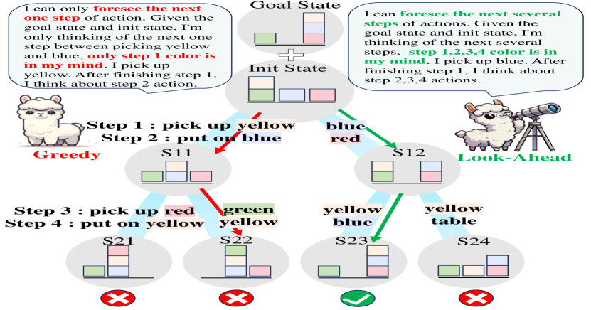

Figure 1: An example of greedy and look-ahead planning.
[/FIGURE]

Planning is the process of formulating a series of actions to transform a given initial state into a desired goal state Valmeekam et al. ([2024](#bib.bib17)); Zhang et al. ([2024](#bib.bib33)). As the core module of agents Xi et al. ([2023](#bib.bib26)); Wang et al. ([2024a](#bib.bib21)), planning has been widely applied in many fields such as embodied agents Shridhar et al. ([2020](#bib.bib14)); Wang et al. ([2022](#bib.bib22)), web navigation Zhou et al. ([2023](#bib.bib35)); Deng et al. ([2024](#bib.bib3)) and tool using Xu et al. ([2023](#bib.bib28)); Qin et al. ([2023](#bib.bib13)). With the development of large language models, some researchers treat large language models as intelligent agents to solve complex tasks. This is because large language models may possess some preliminary planning capabilities Huang et al. ([2022](#bib.bib6)). Recently, researchers have made efforts to stimulate and evaluate the planning capabilities of large language models. They propose prompt engineering Zheng et al. ([2023](#bib.bib34)) and instruction fine-tuning Zeng et al. ([2023](#bib.bib32)) to boost the planning abilities of large language models. Additionally, some researchers construct benchmarks such as AgentBench Liu et al. ([2023](#bib.bib10)) and AgentGym Xi et al. ([2024](#bib.bib27)) to evaluate the planning capabilities of large models. Although they have made some progress, the underlying mechanisms in planning capabilities of large language models remain a largely unexplored frontier. Revealing the planning mechanisms of large language models helps to better understand and improve their planning capabilities. Therefore, we focus on exploring the underlying mechanisms behind the planning abilities of large language models.  

In this work, we focus on exploring look-ahead planning mechanisms in large language models. We study the classical planning task Blocksworld, which is a fully-observed setting. All entity states are known from the init state and goal state, so exploration is not needed Zhang et al. ([2024](#bib.bib33)). As illustrated in Figure [1](#S1.F1 "Figure 1 ‣ 1 Introduction ‣ Unlocking the Future: Exploring Look-Ahead Planning Mechanistic Interpretability in Large Language Models"), given an initial state and a goal state of Blocksworld, the model can only pick up or put down one block. The model must generate a sequence of actions to transform the initial state into the goal state, as shown by the green path. However, it is still unclear whether the model, at step $t$, greedily considers only the action at $t+1$ or look-ahead considers the actions at $t+2$ and beyond. Inspired by psychology, humans engage in look-ahead thinking when making plans Baumeister et al. ([2016](#bib.bib1)). Based on this, we further propose the hypothesis of model look-ahead planning, which is as follows:  

* Look-Ahead Planning Decisions Existence Hypothesis: In the task of planning with large language models, given a rule, an initial state, a goal state, and task description prompts. At the current step, the model needs to predict the next action, the probe can detect decisions to some extent for future steps in the internal representations in the short term within a fully-observed setting when planning is successful. 

We design a two-stage paradigm to verify this hypothesis. It can be divided into the finding information flow stage and the probing internal representations stage. The first stage is to analyze the information flow and component functions during planning (§[5](#S5 "5 Information Flow in Planning Tasks ‣ Unlocking the Future: Exploring Look-Ahead Planning Mechanistic Interpretability in Large Language Models")). The second stage is examining whether the model stores future information in internal representations (§[6](#S6 "6 Internal Representations Encode Planning Information ‣ Unlocking the Future: Exploring Look-Ahead Planning Mechanistic Interpretability in Large Language Models")). The specifics are as follows:  

(1) In the first stage, we study how planning is done internally by analyzing the MLP and MHSA components at the last token. Inspired by methods of calculating extraction rates methods Geva et al. ([2023](#bib.bib4)), we find the output of MHSA in the middle layers at the last token can directly decode the correct colors to some extent (§[5.1](#S5.SS1 "5.1 Attention Extract the Answers ‣ 5 Information Flow in Planning Tasks ‣ Unlocking the Future: Exploring Look-Ahead Planning Mechanistic Interpretability in Large Language Models")). Based on this discovery, we further investigate the sources of information on MHSA. We trace the source of the decisions. And find that planning mainly depends on spans of the goal states and recent steps (§[5.2](#S5.SS2 "5.2 Attention Extract from Goal and History ‣ 5 Information Flow in Planning Tasks ‣ Unlocking the Future: Exploring Look-Ahead Planning Mechanistic Interpretability in Large Language Models")).  

(2) In the second stage, we study what information is encoded in the information flow and whether this information has been considered in advance for future decisions. For future decisions existence, we use the probing method to probe future decisions and reveal that the middle and upper layers encode a few short-term future decisions when planning is successful (§[6.1](#S6.SS1 "6.1 Internal Representations Encode Block States and Future Decisions ‣ 6 Internal Representations Encode Planning Information ‣ Unlocking the Future: Exploring Look-Ahead Planning Mechanistic Interpretability in Large Language Models")). For history step causality, we prevent the information flow from history steps and explore the impact of different history steps on the final decision (§[6.2](#S6.SS2 "6.2 Internal Representations Facilitate Future Decision-making ‣ 6 Internal Representations Encode Planning Information ‣ Unlocking the Future: Exploring Look-Ahead Planning Mechanistic Interpretability in Large Language Models")).  

In summary, our contributions are as follows:  

* To the best of our knowledge, this work is the first to investigate the planning interpretability mechanisms in large language models. We demonstrate the Look-Ahead Planning Decisions Existence Hypothesis. 
* We reveal that the internal representations of LLMs encode a few short-term future decisions to some extent when planning is successful. These look-ahead decisions are enriched in the early layers, with accuracy decreasing as planning steps increase. 
* We prove that MHSA mainly extracts information from spans of the goal states and recent steps. The output of MHSA in the middle layers at the last token can directly decode the correct decisions partially in planning tasks. 

## 2 Experimental Setup

In this paper, we study the Blocksworld task in a fully-observed setting where all entity states are known from the init state and goal state, so exploration is not needed Zhang et al. ([2024](#bib.bib33)). Given a rule $R$, an initial state $S_{\text{init}}$, a goal state $S_{\text{goal}}$, task description prompts $C$, the current step $t$, history $a_{1}\ldots a_{t}$, model needs to predict the next action $a_{t+1}$ in accordance with its generative distribution $p(a_{t+1}\mid R,S_{\text{init}},S_{\text{goal}},C,a_{1}\ldots a_{t})$ Hao et al. ([2023](#bib.bib5)). In this paper, all inputs are in text form. All inferences are performed using the teacher-forcing method. Previous evaluation works Valmeekam et al. ([2023](#bib.bib18)) mainly involved generating a complete plan and then placing it into the environment for assessment. However, since our primary focus is on open-source models, we have reduced the difficulty by using a fill-in-the-blank format for evaluating the models. An example is shown in Figure [2](#S2.F2 "Figure 2 ‣ Model ‣ 2 Experimental Setup ‣ Unlocking the Future: Exploring Look-Ahead Planning Mechanistic Interpretability in Large Language Models"). The input mainly consists of four parts: rule, initial state, goal state, and plan.  

#### Data

Previous Blocksworld evaluation benchmarks Valmeekam et al. ([2023](#bib.bib18)) put the plans generated by models into an environment to verify the correctness. However, existing interpretability methods, such as information flow Wang et al. ([2023](#bib.bib20)), require gold labels. Therefore, we synthesize a dataset containing optimal plans, with specific data statistics shown in Table [1](#A1.T1 "Table 1 ‣ Appendix A Additional Results ‣ Unlocking the Future: Exploring Look-Ahead Planning Mechanistic Interpretability in Large Language Models"). We generate data with 4, 5, and 6 color varieties, 4 piles, and a maximum of 6 steps, where pick-up and stack are considered as two different steps. There are three levels: LEVEL1 (L1) with two steps, LEVEL2 (L2) with four steps, and LEVEL3 (L3) with six steps. We choose the optimal path from the initial step to the final step. For samples with multiple optimal paths, we select one to include in the training set, ensuring that samples in the test set have unique optimal paths. We split the dataset into training and test sets with a ratio of 1:3.  

#### Metric

In the Blocksworld task, we use two metrics: single-step success rate and complete plan success rate. The single-step success rate evaluates whether each individual action is correct, defined as:  

|  | $$S_{\text{step}}=\frac{1}{N}\sum_{i=1}^{N}r_{i}\\ $$ |  | (1) |
| --- | --- | --- | --- |

where $N$ is the total number of steps and $r_{i}$ indicates the success of the $i$-th step (1 for success, 0 otherwise). The complete plan success rate evaluates whether the entire planning process is correct, defined as:  

|  | $$S_{\text{plan}}=\frac{1}{M}\sum_{j=1}^{M}R_{j}\\ $$ |  | (2) |
| --- | --- | --- | --- |

where $M$ is the total number of tested plans and $R_{j}$ indicates the success of the $j$-th plan (1 for complete success, 0 otherwise).  

#### Model

We evaluate two large language models: Llama-2-7b-chat Touvron et al. ([2023](#bib.bib16)) and Vicuna-7B Chiang et al. ([2023](#bib.bib2)). Since open-source models have preliminary planning capabilities, we enhance the ability of large language models to complete planning tasks through training.  

[FIGURE S2.F2.g1]

Figure 2: An example of Blocksworld.
[/FIGURE]

#### Experiment Setting

We conduct full parameter fine-tuning on Llama-2-7b-chat-hf and Vicuna-7B for 3 epochs. The training process involves a global batch size of 20, using the Adam optimizer with a learning rate of 5e-5. Llama-2-7b-chat-hf and Vicuna-7B achieve complete plan success rates of 61% and 63%, respectively, at LEVEL 3 with 6 blocks. We sample 400 correct data points from LEVEL 3 with 6 blocks for our analysis. We conduct experiment based on HuggingFace’s Transformers111<https://github.com/huggingface/transformers/>, PyTorch222<https://github.com/pytorch/pytorch/>, baukit 333<https://github.com/davidbau/baukit/> and pyvene444<https://github.com/stanfordnlp/pyvene> Wu et al. ([2024b](#bib.bib25)).  

## 3 Background

A transformer-based language model begins by converting an input text into a sequence of $N$ tokens, denoted as $s_{1},\ldots,s_{N}$. Each token $s_{i}$ is mapped to a vector $x_{i}^{0}\in\mathbb{R}^{d}$. $E\in\mathbb{R}^{|V|\times d}$ is the decoder matrix in the last layer, where $V$ is the vocabulary, $d$ is embedding dimension. Each layer comprises a multi-head self-attention (MHSA) sublayer followed by a multi-layer perception (MLP) sublayer Vaswani et al. ([2017](#bib.bib19)). Formally, the representation $x_{i}^{\ell}$ of token $i$ at layer $\ell$ can be obtained as follows:  

|  | $$\mathbf{x}_{i}^{\ell}=\mathbf{x}_{i}^{\ell-1}+\mathbf{attn}_{i}^{\ell}+\mathbf{m}_{i}^{\ell}$$ |  | (3) |
| --- | --- | --- | --- |

$a_{i}^{\ell}$ and $m_{i}^{\ell}$ represent the outputs of the MHSA and MLP sub-layers of the $\ell$-th layer, respectively. By using $E$, an output probability distribution can be obtained from the final layer representation:  

|  | $$p_{i}^{L}=\text{softmax}\,(Ex_{i}^{L})$$ |  | (4) |
| --- | --- | --- | --- |

## 4 Overview of Analysis

We analyze the look-ahead planning mechanisms of the models from two stages. (1) In the first stage, we explore the internal mechanisms of this process in planning tasks from the perspectives of information flow and component functions. We demonstrate that the middle layer MHSA can directly decode the answers to a certain extent, and we prove that MHSA mainly extracts information from spans of the goal states and recent steps (§[5](#S5 "5 Information Flow in Planning Tasks ‣ Unlocking the Future: Exploring Look-Ahead Planning Mechanistic Interpretability in Large Language Models")). (2) In the second stage, to determine the presence of future decisions, we employ the probing method to examine future decisions, uncovering that the intermediate and upper layers encode these decisions. Regarding the causality of historical steps, we inhibit the information flow from past steps and analyze the effects of different historical steps on the ultimate decision (§[6](#S6 "6 Internal Representations Encode Planning Information ‣ Unlocking the Future: Exploring Look-Ahead Planning Mechanistic Interpretability in Large Language Models")).  

## 5 Information Flow in Planning Tasks

To trace the source of the correct answer, we begin with the last token. For example, in the first step "pick up", the last token is "up". The model should process the initial state, target state, and history of steps to decide which color to pick up, such as "blue". We analyze this process from two perspectives. (1) First, we study MLP and MHSA functions at the last token by extraction rates Geva et al. ([2023](#bib.bib4)). We find that the output of MHSA in the middle layers can directly decode the correct colors to a certain extent (§[5.1](#S5.SS1 "5.1 Attention Extract the Answers ‣ 5 Information Flow in Planning Tasks ‣ Unlocking the Future: Exploring Look-Ahead Planning Mechanistic Interpretability in Large Language Models")). (2) Based on this, we further trace the source of the correct colors by information flow Wang et al. ([2023](#bib.bib20)). From the perspective of early and late planning stages, we prove that MHSA mainly extracts information from spans of the goal states and recent steps (§[5.2](#S5.SS2 "5.2 Attention Extract from Goal and History ‣ 5 Information Flow in Planning Tasks ‣ Unlocking the Future: Exploring Look-Ahead Planning Mechanistic Interpretability in Large Language Models")).  

[FIGURE S5.F3.g1]
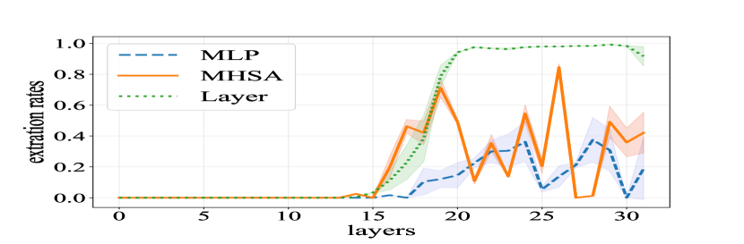

Figure 3: Extraction rate of different components in Llama-2-7b-chat-hf.
[/FIGURE]

[FIGURE S5.F4.g1]
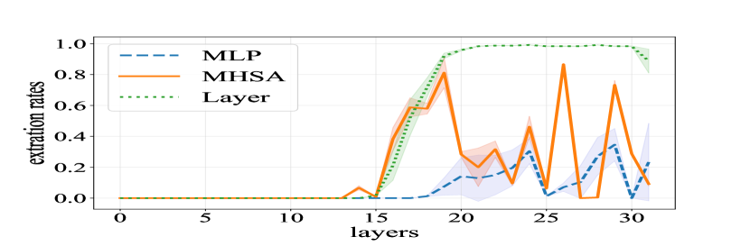

Figure 4: Extraction rate of different components in Vicuna-7b.
[/FIGURE]

### 5.1 Attention Extract the Answers

From the perspective of the model’s internal components, we analyze the functions of different components of the models. The first question is how the model extracts answers from history. We start from the position of the last token and study the roles of the MLP and MHSA components in the answer generation process. Specifically, we investigate whether different components at different layers can directly decode the final answer.  

[FIGURE S5.F5.g1]
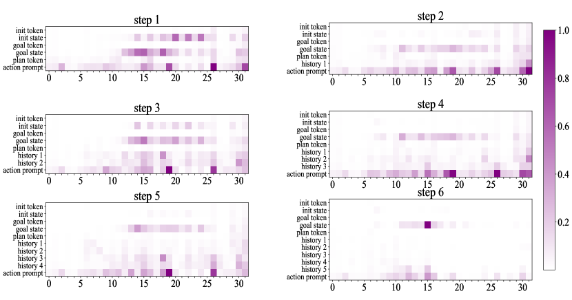

Figure 5: Information flow of last token in Llama-2-7b-chat-hf.
[/FIGURE]

#### Experiments

We use the extraction rate Geva et al. ([2023](#bib.bib4)) to analyze the functions of different components. Specifically, we calculate the extraction rate:  

|  | $$e^{\ast}:=argmax\left(p_{N}^{L}\right)\\ $$ |  | (5) |
| --- | --- | --- | --- |

|  | $$\widehat{e}:=argmax\left(Eh_{N}^{\ell}\right)\\ $$ |  | (6) |
| --- | --- | --- | --- |

In this equation, $h$ represents the internal representation of the MLP, MHSA and layer output, $N$ is the position of the last token, $\ell$ is the layer of models, $\ell\in\left[1,L\right]$. When $e^{\ast}$ = $\widehat{e}$, it is considered as an extraction event. We calculate the extraction rate of the last token for each layer for each step in the Blocksworld. We then compute the mean and variance of these rates.  

#### Results and Analysis

As shown in Figure [3](#S5.F3 "Figure 3 ‣ 5 Information Flow in Planning Tasks ‣ Unlocking the Future: Exploring Look-Ahead Planning Mechanistic Interpretability in Large Language Models") and Figure [4](#S5.F4 "Figure 4 ‣ 5 Information Flow in Planning Tasks ‣ Unlocking the Future: Exploring Look-Ahead Planning Mechanistic Interpretability in Large Language Models"), we observe that (1) MHSA has a higher extraction rate compared to MLP, indicating that attention is primarily responsible for answer extraction. (2) Layer output gradually forms a stable answer in the middle to upper layers (from the 15th layer to the 20th layer). In these layers, the extraction rate of MHSA is significantly higher than MLP, suggesting that MHSA plays a major role during the decision-making period. (3) The variance in extraction rates across different steps is smaller for MHSA compared to MLP, indicating that MHSA layers show higher consistency across different steps.  

### 5.2 Attention Extract from Goal and History

In the previous section, we discover that MHSA is responsible for extracting answers from the context, but which chunk to extract the answer from is still unclear. In this section, we decompose the input into several chunks to identify which chunk MHSA primarily relies on. We use the information flow method Wang et al. ([2023](#bib.bib20)), first calculating the information flow at the token granularity, and then taking the average of different tokens within the same chunk to represent the information flow at the chunk granularity. This will help us locate the influence of different chunks on the last token.  

#### Experiments

We calculate the information flow between layers. Specifically, for the input, we divide it into different chunks, including init token (which is "Init:"), init state (which is "<blue on red>"), target token, target state, six history steps (For step 1, which is "step 1: pick-up white"), action prompt (pick-up or stack on-top-of) and last token. We calculate the information flow $I_{token,\ell}$ for each token at the $\ell-th$ layer. The specific calculation method is as follows:  

|  | $$I_{token,\ell}=\left|\sum_{hd}A_{hd,l}\odot\frac{\partial L(x)}{\partial A_{h,\ell}}\right|$$ |  | (7) |
| --- | --- | --- | --- |

Where $A_{hd,l}$ is the attention score of the $\ell$-th layer, $hd$ is the $hd$-th head, and $L(x)$ is the loss function. Here, we use $I(i,j)$ to represent the score flowing from token j to token i. Based on the token information flow, we calculate the chunk information flow, denoted as $I_{chunk,\ell}$:  

|  | $$I_{chunk,\ell}=\frac{\sum_{i=k_{1}}^{k_{2}}\sum_{j=t_{1}}^{t_{2}}I_{token,\ell}(i,j)}{(k_{2}-k_{1}+1)(t_{2}-t_{1}+1)}$$ |  | (8) |
| --- | --- | --- | --- |

Specifically, we consider the information flow from the span $[k1,k2]$ of a chunk $k$ to the span $[t1,t2]$ of another chunk $t$. We calculate the average of information flow from chunk $k$ to $t$. Due to the causal attention, we only compute the information flow for the lower triangular matrix. We calculate the chunk information flow for each prediction step.  

#### Results and Analysis

The results are shown in Figure [5](#S5.F5 "Figure 5 ‣ 5.1 Attention Extract the Answers ‣ 5 Information Flow in Planning Tasks ‣ Unlocking the Future: Exploring Look-Ahead Planning Mechanistic Interpretability in Large Language Models") and Figure [12](#A1.F12 "Figure 12 ‣ Appendix A Additional Results ‣ Unlocking the Future: Exploring Look-Ahead Planning Mechanistic Interpretability in Large Language Models"). The vertical axis represents the information flow from the chunk to the last token. The horizontal axis represents the information flow at layer $\ell$. The values inside represent the scores of information flow. We calculate the information flow for six decision steps. It shows that: (1) In steps 1 to 6, the goal states are highlighted at each step. This indicates that MHSA extracts information from the goal state at each stage, demonstrating that it mainly relies on goal states. (2) Taking the step 5 as an example, history 3 and history 4 are more prominent compared to history 1 and history 2. It reveals that MHSA also mainly relies on recent history rather than earlier spans of steps.  

## 6 Internal Representations Encode Planning Information

Based on the previous sections, we discover that MHSA directly extracts answers from the context, but it is still unclear what information is encoded in internal representations. In this section, we demonstrate the look-ahead capability of models from both future decisions existence and history step causality perspectives. (1) For future decisions existence, we use the probing method to probe each layer of the main positions in the context. We find that the accuracy of the current state information gradually decreases as the steps progress. We also find that the middle and upper layers encode future decisions with accuracy decreasing as planning steps increase, proving the look-ahead planning hypothesis (§[6.1](#S6.SS1 "6.1 Internal Representations Encode Block States and Future Decisions ‣ 6 Internal Representations Encode Planning Information ‣ Unlocking the Future: Exploring Look-Ahead Planning Mechanistic Interpretability in Large Language Models")). (2) For history step causality, we employ a method that involves setting certain information keys of MHSA to zero. We find there is still a probability of generating the correct answer by relying solely on a single step, but it’s difficult to support plan for the long-term (§[6.2](#S6.SS2 "6.2 Internal Representations Facilitate Future Decision-making ‣ 6 Internal Representations Encode Planning Information ‣ Unlocking the Future: Exploring Look-Ahead Planning Mechanistic Interpretability in Large Language Models")).  

### 6.1 Internal Representations Encode Block States and Future Decisions

In this section, we analyze what information is encoded in the internal representations within the information flow and how this information evolves layer by layer. We examine whether the internal representations encode two types of information Li et al. ([2022](#bib.bib9)); Pal et al. ([2023](#bib.bib12)): Current Block States and Future Decisions. Current Block States refer to the state of the blocks at step $t$. For example, in Figure [1](#S1.F1 "Figure 1 ‣ 1 Introduction ‣ Unlocking the Future: Exploring Look-Ahead Planning Mechanistic Interpretability in Large Language Models"), when following the green path, the Current Block State initially starts in the $S_{\text{init}}$. After executing the first and second steps, the internal representation of the Current Block State transitions from the $S_{\text{init}}$ to $S_{12}$. Future Decisions refer to the information about future decisions at step $t$. For example, in Figure [1](#S1.F1 "Figure 1 ‣ 1 Introduction ‣ Unlocking the Future: Exploring Look-Ahead Planning Mechanistic Interpretability in Large Language Models"), when following the green path and executing the first step (blue), the question is whether the model’s internal representation already stores information about future decisions (red, yellow, blue).  

[FIGURE S6.F6.g1]
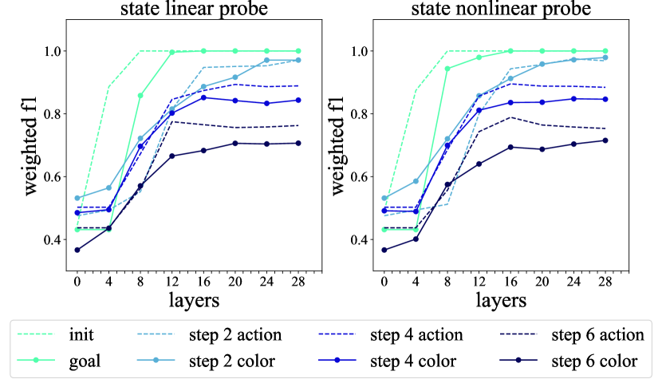

Figure 6: State probe in Llama-2-7b-chat-hf.
[/FIGURE]

[FIGURE S6.F7.g1]
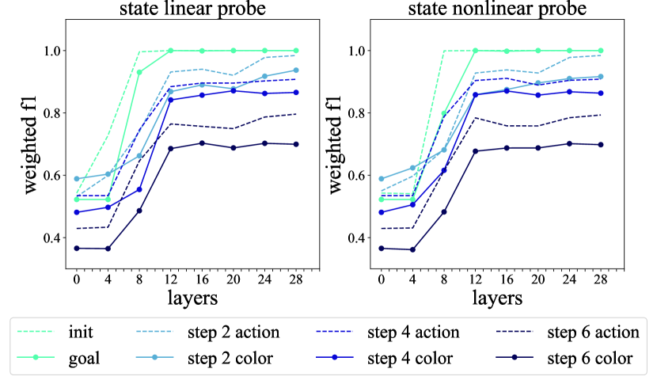

Figure 7: State probe in Vicuna-7b.
[/FIGURE]

#### Experiments

We probe internal representations of the initial state, goal state, and steps with layer $\ell\in\left[1,L\right]$. We train linear probes and nonlinear probes for each chunk and each layer. A linear probe can be represented as $p_{\theta}(x_{n}^{\ell})=\text{softmax}(Wx_{n}^{\ell})$. And a nonlinear probe can be described as $p_{\theta}(x_{n}^{\ell})=\text{softmax}(W_{1}\,\text{ReLU}(W_{2}x_{n}^{\ell}))$. Using the linear probe as an example, we consider six steps and six colors of blocks. For Current Block States, the input to the probe is a hidden layer representation $h$ of the model. The output is a 12x8 matrix representing probabilities, where 12 denotes the colors of the blocks above and below each color block, and 8 represents 6 colors plus sky and table. For Future Decisions, the input to the probe is $h$. The output is six predicted colors from steps 1 to 6, we only consider future steps in our evaluation. We split the training and test sets in a 4:1 ratio for 400 samples. For the evaluation, we calculate the weighted F1 accuracy for Current Block States and accuracy for Future Decisions.  

#### Results and Analysis

As shown in Figure [6](#S6.F6 "Figure 6 ‣ 6.1 Internal Representations Encode Block States and Future Decisions ‣ 6 Internal Representations Encode Planning Information ‣ Unlocking the Future: Exploring Look-Ahead Planning Mechanistic Interpretability in Large Language Models") and Figure [7](#S6.F7 "Figure 7 ‣ 6.1 Internal Representations Encode Block States and Future Decisions ‣ 6 Internal Representations Encode Planning Information ‣ Unlocking the Future: Exploring Look-Ahead Planning Mechanistic Interpretability in Large Language Models"), the horizontal axis represents the layers probed, while the vertical axis represents the mean accuracy of the probe test. Different colored lines represent the probed spans of states and steps. (1) We observe that as the number of layers increases, the accuracy of the probe gradually improves. This indicates that the early layers of the model are enriching the representation of the current state. (2) The black line (step 6) in the figure has a lower accuracy compared to the light blue line (step 2), demonstrating that as the planning steps progress, the models are difficult to maintain the representations of the current placement of the blocks. (3) By comparing the linear probe in Figure [6](#S6.F6 "Figure 6 ‣ 6.1 Internal Representations Encode Block States and Future Decisions ‣ 6 Internal Representations Encode Planning Information ‣ Unlocking the Future: Exploring Look-Ahead Planning Mechanistic Interpretability in Large Language Models") and the nonlinear probe in Figure [7](#S6.F7 "Figure 7 ‣ 6.1 Internal Representations Encode Block States and Future Decisions ‣ 6 Internal Representations Encode Planning Information ‣ Unlocking the Future: Exploring Look-Ahead Planning Mechanistic Interpretability in Large Language Models"), we find that both have the same trend, indicating that the model internally stores the current state in a linear manner. A similar trend in Future Decisions is shown in Figure [8](#S6.F8 "Figure 8 ‣ Results and Analysis ‣ 6.1 Internal Representations Encode Block States and Future Decisions ‣ 6 Internal Representations Encode Planning Information ‣ Unlocking the Future: Exploring Look-Ahead Planning Mechanistic Interpretability in Large Language Models") and Figure [9](#S6.F9 "Figure 9 ‣ Results and Analysis ‣ 6.1 Internal Representations Encode Block States and Future Decisions ‣ 6 Internal Representations Encode Planning Information ‣ Unlocking the Future: Exploring Look-Ahead Planning Mechanistic Interpretability in Large Language Models") for actions. It reveals that look-ahead decisions are enriched in the early layers.  

[FIGURE S6.F8.g1]
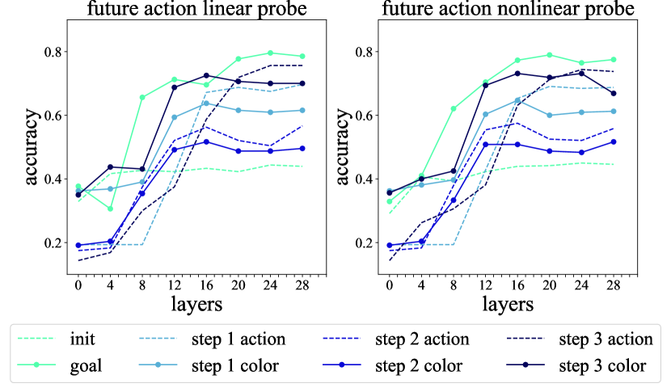

Figure 8: Action probe in Llama-2-7b-chat-hf.
[/FIGURE]

[FIGURE S6.F9.g1]
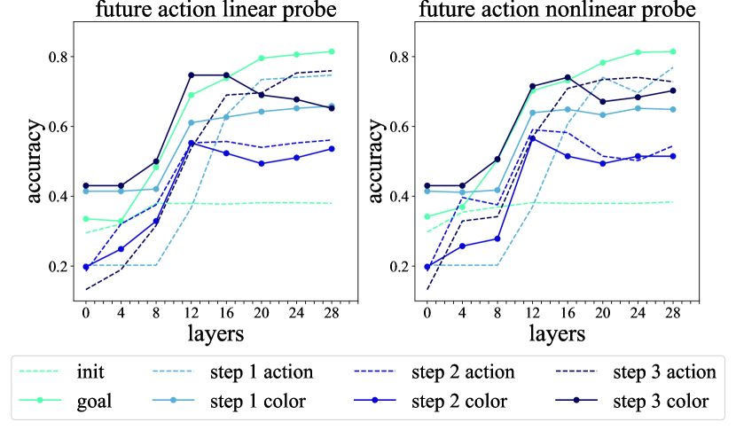

Figure 9: Action probe in Vicuna-7b.
[/FIGURE]

#### Supplementary Analysis

As shown in Figure [10](#S6.F10 "Figure 10 ‣ Experiments ‣ 6.2 Internal Representations Facilitate Future Decision-making ‣ 6 Internal Representations Encode Planning Information ‣ Unlocking the Future: Exploring Look-Ahead Planning Mechanistic Interpretability in Large Language Models") and Figure [13](#A1.F13 "Figure 13 ‣ Appendix A Additional Results ‣ Unlocking the Future: Exploring Look-Ahead Planning Mechanistic Interpretability in Large Language Models"). They illustrate the accuracy of future decisions based on the current step. Each column represents the current step, while the rows represent the max accuracy of the probe in predicting future answers. We observe the following : (1) For the sixth row and first column, the probe can predict the future sixth step with an accuracy of 0.51 at the first step. This indicates that the model stores information about future decisions in advance, supporting the hypothesis of forward planning. (2) For each row, the values increase from left to right. For example, the accuracy in the fifth column of the sixth row is higher than that in the first column. This means the model is more certain about the output of the sixth step at the fifth step compared to the first step, demonstrating that the model has difficulty in planning over long distances. (3) The accuracy for the first column, representing the prediction accuracy for the next five steps after the initial step, shows a declining trend, indicating that the model stores future decision information in advance, supporting the hypothesis of look-ahead planning decisions existence hypothesis.  

### 6.2 Internal Representations Facilitate Future Decision-making

In this section, we further verify the causal effect of planning information at different steps. We test the causality between planning information in the previous history $t_{a}$ and decisions in step $t_{b}$, where $t_{a}<t_{b}$. Specifically, we compare whether the information from step $t_{1}$ contributes to the planning in step $t_{2}$. If the model is greedy in its planning, there should be no decision information in $t_{a}$ that can help make better decisions in $t_{b}$. Therefore, we set the key of MHSA in historical decision $t$ to 0 to study the causal effect of historical information on future predictions.  

#### Experiments

For each step $t$, we have a history $H_{t}=[a_{1},a_{2},...,a_{t-1}]$, where each step span $a_{i}$ contains color tokens.  

(1) Mask all steps: First, identify all color tokens in $H_{t}$, and set the keys to 0 for these colors in each layer of MHSA, resulting in the masked historical information $H^{\prime}_{t}$. The main goal is to stop past decision information from affecting the current decision of the last token. Obtain the decision probability $y^{\prime}_{t}$ based on $H^{\prime}_{t}$ in $t$ step.  

(2) Make one step visible: Based on $H^{\prime}_{t}$, make only the color at position $i$ visible, while masking the other positions, resulting in $H^{\prime\prime}_{t,i}$. Use $H^{\prime\prime}_{t,i}$ for prediction, Obtain the decision probability $y^{\prime\prime}_{t,i}$.  

(3) Calculate one step effect: Compare the decision probabilities obtained from masking all steps and from making one step visible to calculate the effect of a single step. The larger this value, the greater the impact of step $i$ on step $t$:  

|  | $$\text{Impact}_{i,t}=y^{\prime\prime}_{t,i}-y^{\prime}_{t}$$ |  | (9) |
| --- | --- | --- | --- |

[FIGURE S6.F10.g1]
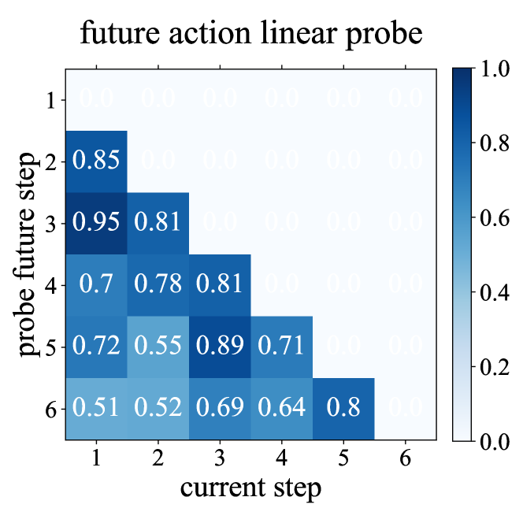

Figure 10: Future action linear probe in Llama-2-7b-chat-hf.
[/FIGURE]

#### Results and Analysis

As illustrated in the Figure  [11](#S7.F11 "Figure 11 ‣ Mechanistic Interpretability ‣ 7 Related work ‣ Unlocking the Future: Exploring Look-Ahead Planning Mechanistic Interpretability in Large Language Models") and Figure [16](#A1.F16 "Figure 16 ‣ Appendix A Additional Results ‣ Unlocking the Future: Exploring Look-Ahead Planning Mechanistic Interpretability in Large Language Models"), the columns represent the steps visible during prediction, the rows represent the steps being predicted, and the values inside represent the contribution of step $t$ to step $i$. (1) For example, in the second column of the sixth row, the model can increase the probability of inferring the correct decision in the sixth step by 0.24 just by using the information from the second step. This indicates that the model is not greedy and is not limited to only preparing for the next step, which causally proves the conclusion of look-ahead planning. (2) Observing the values in each column, for instance, the maximum value in the fifth row is 0.46, located in the third column. This represents that the third step is the most important for predicting the fifth step. It is found that the most important steps for prediction tend to be later steps, indicating that the look-ahead planning ability of LLMs is still relatively preliminary.  

## 7 Related work

#### LLM-Based Agents

With the emergence of large language models, researchers begin to use them as intelligent agents Xi et al. ([2023](#bib.bib26)); Wang et al. ([2024a](#bib.bib21)). Significantly, ReAct Yao et al. ([2022](#bib.bib30)) innovatively combines CoT reasoning with agent actions. Some tasks utilize the planning capabilities of large language models through prompt engineering methods Huang et al. ([2022](#bib.bib6)); Hao et al. ([2023](#bib.bib5)); Yao et al. ([2024](#bib.bib29)); Zhang et al. ([2024](#bib.bib33)). Other researchers enhance the planning capabilities of large language models through fine-tuning methods Zeng et al. ([2023](#bib.bib32)); Yu et al. ([2024](#bib.bib31)). Some researchers construct benchmarks to evaluate the planning ability of large language models Shridhar et al. ([2020](#bib.bib14)); Wang et al. ([2022](#bib.bib22)); Zhou et al. ([2023](#bib.bib35)); Deng et al. ([2024](#bib.bib3)); Xu et al. ([2023](#bib.bib28)); Qin et al. ([2023](#bib.bib13)).  

#### Mechanistic Interpretability

Recent works study mechanistic interpretability in factual associations, in-context Learning, and arithmetic reasoning tasks from the perspective of information flow Geva et al. ([2023](#bib.bib4)); Wang et al. ([2023](#bib.bib20)); Stolfo et al. ([2023](#bib.bib15)). Researchers also study Othello Li et al. ([2022](#bib.bib9)); Nanda et al. ([2023](#bib.bib11)), chess Karvonen ([2024](#bib.bib8)) and Blocksword Wang et al. ([2024b](#bib.bib23)) in transformer. However, research on the mechanistic interpretation of large language models performing planning tasks is still unexplored. Our work conducts a preliminary study from the perspective of information flow and internal representation.  

[FIGURE S7.F11.g1]
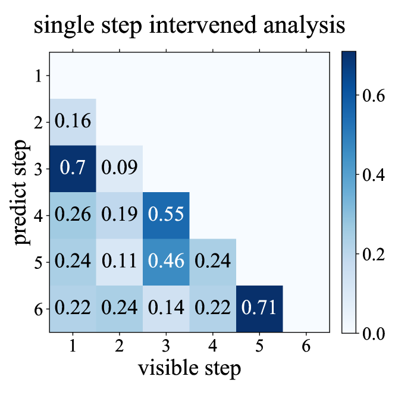

Figure 11: Single step intervened analysis in Vicuna-7b.
[/FIGURE]

#### Look-Ahead

Pal et al. ([2023](#bib.bib12)); Wu et al. ([2024a](#bib.bib24)); Jenner et al. ([2024](#bib.bib7)) demonstrate that it is possible to decode future tokens from the hidden representations of a language model at previous token positions. In task planning, a model needs to have look-ahead capabilities. However, it is not yet clear whether LLMs use similar mechanisms when planning. Our work focuses on the look-ahead mechanisms in planning in LLMs.  

## 8 Conclusion

In this paper, we investigate the mechanisms of look-ahead planning in LLMs through the perspectives of information flow and internal representations. We demonstrate Look-Ahead Planning Decisions Existence Hypothesis. Our findings indicate that internal representations of LLMs encode a few short-term future decisions to some extent when planning is successful. These look-ahead decisions are enriched in the early layers, with their accuracy diminishing as the number of planning steps increases. We demonstrate that MHSA mainly extracts information from the spans of goal states and recent steps. Additionally, the output of MHSA in the middle layers at the final token can partially decode the correct decisions.  

## Limitation

Although our work provides an in-depth analysis and explanation of look-ahead planning mechanisms of large language models, there are several limitations. First, our analytical methods require access to the internal parameters and representations of open-source models. Although black-box large language models such as ChatGPT possess strong planning capabilities, we cannot access their internal parameters, making it challenging to interpret the most advanced language models. Second, our research primarily focuses on the planning mechanisms in Blocksworld. However, many other planning tasks, such as commonsense planning (e.g., "how to make a meal"), lack standard answers, making it difficult to evaluate the correctness of the planning and conduct quantitative analysis. We leave these limitations for future work.  

## References

* Baumeister et al. (2016)  Roy F Baumeister, Kathleen D Vohs, and Gabriele Oettingen. 2016.   Pragmatic prospection: How and why people think about the future.   *Review of general psychology*, 20(1):3–16. 
* Chiang et al. (2023)  Wei-Lin Chiang, Zhuohan Li, Zi Lin, Ying Sheng, Zhanghao Wu, Hao Zhang, Lianmin Zheng, Siyuan Zhuang, Yonghao Zhuang, Joseph E. Gonzalez, Ion Stoica, and Eric P. Xing. 2023.   [Vicuna: An open-source chatbot impressing gpt-4 with 90%\* chatgpt quality](https://lmsys.org/blog/2023-03-30-vicuna/). 
* Deng et al. (2024)  Xiang Deng, Yu Gu, Boyuan Zheng, Shijie Chen, Sam Stevens, Boshi Wang, Huan Sun, and Yu Su. 2024.   Mind2web: Towards a generalist agent for the web.   *Advances in Neural Information Processing Systems*, 36. 
* Geva et al. (2023)  Mor Geva, Jasmijn Bastings, Katja Filippova, and Amir Globerson. 2023.   Dissecting recall of factual associations in auto-regressive language models.   *arXiv preprint arXiv:2304.14767*. 
* Hao et al. (2023)  Shibo Hao, Yi Gu, Haodi Ma, Joshua Jiahua Hong, Zhen Wang, Daisy Zhe Wang, and Zhiting Hu. 2023.   Reasoning with language model is planning with world model.   *arXiv preprint arXiv:2305.14992*. 
* Huang et al. (2022)  Wenlong Huang, Pieter Abbeel, Deepak Pathak, and Igor Mordatch. 2022.   Language models as zero-shot planners: Extracting actionable knowledge for embodied agents.   In *International Conference on Machine Learning*, pages 9118–9147. PMLR. 
* Jenner et al. (2024)  Erik Jenner, Shreyas Kapur, Vasil Georgiev, Cameron Allen, Scott Emmons, and Stuart Russell. 2024.   Evidence of learned look-ahead in a chess-playing neural network.   *arXiv preprint arXiv:2406.00877*. 
* Karvonen (2024)  Adam Karvonen. 2024.   Emergent world models and latent variable estimation in chess-playing language models.   *arXiv preprint arXiv:2403.15498*. 
* Li et al. (2022)  Kenneth Li, Aspen K Hopkins, David Bau, Fernanda Viégas, Hanspeter Pfister, and Martin Wattenberg. 2022.   Emergent world representations: Exploring a sequence model trained on a synthetic task.   *arXiv preprint arXiv:2210.13382*. 
* Liu et al. (2023)  Xiao Liu, Hao Yu, Hanchen Zhang, Yifan Xu, Xuanyu Lei, Hanyu Lai, Yu Gu, Hangliang Ding, Kaiwen Men, Kejuan Yang, et al. 2023.   Agentbench: Evaluating llms as agents.   *arXiv preprint arXiv:2308.03688*. 
* Nanda et al. (2023)  Neel Nanda, Andrew Lee, and Martin Wattenberg. 2023.   Emergent linear representations in world models of self-supervised sequence models.   *arXiv preprint arXiv:2309.00941*. 
* Pal et al. (2023)  Koyena Pal, Jiuding Sun, Andrew Yuan, Byron C Wallace, and David Bau. 2023.   Future lens: Anticipating subsequent tokens from a single hidden state.   *arXiv preprint arXiv:2311.04897*. 
* Qin et al. (2023)  Yujia Qin, Shihao Liang, Yining Ye, Kunlun Zhu, Lan Yan, Yaxi Lu, Yankai Lin, Xin Cong, Xiangru Tang, Bill Qian, et al. 2023.   Toolllm: Facilitating large language models to master 16000+ real-world apis.   *arXiv preprint arXiv:2307.16789*. 
* Shridhar et al. (2020)  Mohit Shridhar, Xingdi Yuan, Marc-Alexandre Côté, Yonatan Bisk, Adam Trischler, and Matthew Hausknecht. 2020.   Alfworld: Aligning text and embodied environments for interactive learning.   *arXiv preprint arXiv:2010.03768*. 
* Stolfo et al. (2023)  Alessandro Stolfo, Yonatan Belinkov, and Mrinmaya Sachan. 2023.   A mechanistic interpretation of arithmetic reasoning in language models using causal mediation analysis.   In *Proceedings of the 2023 Conference on Empirical Methods in Natural Language Processing*, pages 7035–7052. 
* Touvron et al. (2023)  Hugo Touvron, Louis Martin, Kevin Stone, Peter Albert, Amjad Almahairi, Yasmine Babaei, Nikolay Bashlykov, Soumya Batra, Prajjwal Bhargava, Shruti Bhosale, et al. 2023.   Llama 2: Open foundation and fine-tuned chat models.   *arXiv preprint arXiv:2307.09288*. 
* Valmeekam et al. (2024)  Karthik Valmeekam, Matthew Marquez, Alberto Olmo, Sarath Sreedharan, and Subbarao Kambhampati. 2024.   Planbench: An extensible benchmark for evaluating large language models on planning and reasoning about change.   *Advances in Neural Information Processing Systems*, 36. 
* Valmeekam et al. (2023)  Karthik Valmeekam, Matthew Marquez, Sarath Sreedharan, and Subbarao Kambhampati. 2023.   On the planning abilities of large language models-a critical investigation.   *Advances in Neural Information Processing Systems*, 36:75993–76005. 
* Vaswani et al. (2017)  Ashish Vaswani, Noam Shazeer, Niki Parmar, Jakob Uszkoreit, Llion Jones, Aidan N Gomez, Łukasz Kaiser, and Illia Polosukhin. 2017.   Attention is all you need.   *Advances in neural information processing systems*, 30. 
* Wang et al. (2023)  Lean Wang, Lei Li, Damai Dai, Deli Chen, Hao Zhou, Fandong Meng, Jie Zhou, and Xu Sun. 2023.   Label words are anchors: An information flow perspective for understanding in-context learning.   *arXiv preprint arXiv:2305.14160*. 
* Wang et al. (2024a)  Lei Wang, Chen Ma, Xueyang Feng, Zeyu Zhang, Hao Yang, Jingsen Zhang, Zhiyuan Chen, Jiakai Tang, Xu Chen, Yankai Lin, et al. 2024a.   A survey on large language model based autonomous agents.   *Frontiers of Computer Science*, 18(6):186345. 
* Wang et al. (2022)  Ruoyao Wang, Peter Jansen, Marc-Alexandre Côté, and Prithviraj Ammanabrolu. 2022.   Scienceworld: Is your agent smarter than a 5th grader?   *arXiv preprint arXiv:2203.07540*. 
* Wang et al. (2024b)  Siwei Wang, Yifei Shen, Shi Feng, Haoran Sun, Shang-Hua Teng, and Wei Chen. 2024b.   Alpine: Unveiling the planning capability of autoregressive learning in language models.   *arXiv preprint arXiv:2405.09220*. 
* Wu et al. (2024a)  Wilson Wu, John X Morris, and Lionel Levine. 2024a.   Do language models plan ahead for future tokens?   *arXiv preprint arXiv:2404.00859*. 
* Wu et al. (2024b)  Zhengxuan Wu, Atticus Geiger, Aryaman Arora, Jing Huang, Zheng Wang, Noah D Goodman, Christopher D Manning, and Christopher Potts. 2024b.   pyvene: A library for understanding and improving pytorch models via interventions.   *arXiv preprint arXiv:2403.07809*. 
* Xi et al. (2023)  Zhiheng Xi, Wenxiang Chen, Xin Guo, Wei He, Yiwen Ding, Boyang Hong, Ming Zhang, Junzhe Wang, Senjie Jin, Enyu Zhou, et al. 2023.   The rise and potential of large language model based agents: A survey.   *arXiv preprint arXiv:2309.07864*. 
* Xi et al. (2024)  Zhiheng Xi, Yiwen Ding, Wenxiang Chen, Boyang Hong, Honglin Guo, Junzhe Wang, Dingwen Yang, Chenyang Liao, Xin Guo, Wei He, et al. 2024.   Agentgym: Evolving large language model-based agents across diverse environments.   *arXiv preprint arXiv:2406.04151*. 
* Xu et al. (2023)  Qiantong Xu, Fenglu Hong, Bo Li, Changran Hu, Zhengyu Chen, and Jian Zhang. 2023.   On the tool manipulation capability of open-source large language models.   *arXiv preprint arXiv:2305.16504*. 
* Yao et al. (2024)  Shunyu Yao, Dian Yu, Jeffrey Zhao, Izhak Shafran, Tom Griffiths, Yuan Cao, and Karthik Narasimhan. 2024.   Tree of thoughts: Deliberate problem solving with large language models.   *Advances in Neural Information Processing Systems*, 36. 
* Yao et al. (2022)  Shunyu Yao, Jeffrey Zhao, Dian Yu, Nan Du, Izhak Shafran, Karthik Narasimhan, and Yuan Cao. 2022.   React: Synergizing reasoning and acting in language models.   *arXiv preprint arXiv:2210.03629*. 
* Yu et al. (2024)  Fangxu Yu, Lai Jiang, Haoqiang Kang, Shibo Hao, and Lianhui Qin. 2024.   [Flow of Reasoning: Efficient Training of LLM Policy with Divergent Thinking](https://doi.org/10.48550/arXiv.2406.05673).   *arXiv e-prints*, arXiv:2406.05673. 
* Zeng et al. (2023)  Aohan Zeng, Mingdao Liu, Rui Lu, Bowen Wang, Xiao Liu, Yuxiao Dong, and Jie Tang. 2023.   Agenttuning: Enabling generalized agent abilities for llms.   *arXiv preprint arXiv:2310.12823*. 
* Zhang et al. (2024)  Li Zhang, Peter Jansen, Tianyi Zhang, Peter Clark, Chris Callison-Burch, and Niket Tandon. 2024.   Pddlego: Iterative planning in textual environments.   *arXiv preprint arXiv:2405.19793*. 
* Zheng et al. (2023)  Longtao Zheng, Rundong Wang, Xinrun Wang, and Bo An. 2023.   Synapse: Trajectory-as-exemplar prompting with memory for computer control.   In *The Twelfth International Conference on Learning Representations*. 
* Zhou et al. (2023)  Shuyan Zhou, Frank F Xu, Hao Zhu, Xuhui Zhou, Robert Lo, Abishek Sridhar, Xianyi Cheng, Yonatan Bisk, Daniel Fried, Uri Alon, et al. 2023.   Webarena: A realistic web environment for building autonomous agents.   *arXiv preprint arXiv:2307.13854*. 

## Appendix A Additional Results

Information flow of last token in Vicuna-7b is shown in Figure [12](#A1.F12 "Figure 12 ‣ Appendix A Additional Results ‣ Unlocking the Future: Exploring Look-Ahead Planning Mechanistic Interpretability in Large Language Models"). Future action nonlinear probe in Llama-2-7b-chat-hf is shown in Figure [13](#A1.F13 "Figure 13 ‣ Appendix A Additional Results ‣ Unlocking the Future: Exploring Look-Ahead Planning Mechanistic Interpretability in Large Language Models"). Future action linear probe in Vicuna-7b is shown in Figure [14](#A1.F14 "Figure 14 ‣ Appendix A Additional Results ‣ Unlocking the Future: Exploring Look-Ahead Planning Mechanistic Interpretability in Large Language Models"). Future action nonlinear probe in Vicuna-7b is shown in Figure [15](#A1.F15 "Figure 15 ‣ Appendix A Additional Results ‣ Unlocking the Future: Exploring Look-Ahead Planning Mechanistic Interpretability in Large Language Models"), Single step intervened analysis in Llama-2-7b-chat-hf is shown in Figure [16](#A1.F16 "Figure 16 ‣ Appendix A Additional Results ‣ Unlocking the Future: Exploring Look-Ahead Planning Mechanistic Interpretability in Large Language Models").  

[TABLE A1.T1]

<table class="ltx_tabular ltx_centering ltx_guessed_headers ltx_align_middle">
<tbody class="ltx_tbody">
<tr class="ltx_tr">
<th class="ltx_td ltx_align_center ltx_th ltx_th_row ltx_border_r ltx_border_t">LEVEL</th>
<td class="ltx_td ltx_align_center ltx_border_t">L1</td>
<td class="ltx_td ltx_align_center ltx_border_t">L2</td>
<td class="ltx_td ltx_align_center ltx_border_t">L3</td>
<td class="ltx_td ltx_align_center ltx_border_t">Total</td>
</tr>
<tr class="ltx_tr">
<th class="ltx_td ltx_align_center ltx_th ltx_th_row ltx_border_t">Train Size</th>
</tr>
<tr class="ltx_tr">
<th class="ltx_td ltx_align_center ltx_th ltx_th_row ltx_border_r ltx_border_t">4 blocks</th>
<td class="ltx_td ltx_align_center ltx_border_t">3</td>
<td class="ltx_td ltx_align_center ltx_border_t">17</td>
<td class="ltx_td ltx_align_center ltx_border_t">25</td>
<td class="ltx_td ltx_align_center ltx_border_t">45</td>
</tr>
<tr class="ltx_tr">
<th class="ltx_td ltx_align_center ltx_th ltx_th_row ltx_border_r">5 blocks</th>
<td class="ltx_td ltx_align_center">1</td>
<td class="ltx_td ltx_align_center">23</td>
<td class="ltx_td ltx_align_center">121</td>
<td class="ltx_td ltx_align_center">145</td>
</tr>
<tr class="ltx_tr">
<th class="ltx_td ltx_align_center ltx_th ltx_th_row ltx_border_r">6 blocks</th>
<td class="ltx_td ltx_align_center">3</td>
<td class="ltx_td ltx_align_center">48</td>
<td class="ltx_td ltx_align_center">326</td>
<td class="ltx_td ltx_align_center">377</td>
</tr>
<tr class="ltx_tr">
<th class="ltx_td ltx_align_center ltx_th ltx_th_row ltx_border_r">Total</th>
<td class="ltx_td ltx_align_center">7</td>
<td class="ltx_td ltx_align_center">88</td>
<td class="ltx_td ltx_align_center">472</td>
<td class="ltx_td ltx_align_center">567</td>
</tr>
<tr class="ltx_tr">
<th class="ltx_td ltx_align_center ltx_th ltx_th_row ltx_border_t">Test Size</th>
</tr>
<tr class="ltx_tr">
<th class="ltx_td ltx_align_center ltx_th ltx_th_row ltx_border_r ltx_border_t">4 blocks</th>
<td class="ltx_td ltx_align_center ltx_border_t">24</td>
<td class="ltx_td ltx_align_center ltx_border_t">60</td>
<td class="ltx_td ltx_align_center ltx_border_t">80</td>
<td class="ltx_td ltx_align_center ltx_border_t">164</td>
</tr>
<tr class="ltx_tr">
<th class="ltx_td ltx_align_center ltx_th ltx_th_row ltx_border_r">5 blocks</th>
<td class="ltx_td ltx_align_center">34</td>
<td class="ltx_td ltx_align_center">115</td>
<td class="ltx_td ltx_align_center">268</td>
<td class="ltx_td ltx_align_center">417</td>
</tr>
<tr class="ltx_tr">
<th class="ltx_td ltx_align_center ltx_th ltx_th_row ltx_border_r">6 blocks</th>
<td class="ltx_td ltx_align_center">57</td>
<td class="ltx_td ltx_align_center">232</td>
<td class="ltx_td ltx_align_center">709</td>
<td class="ltx_td ltx_align_center">998</td>
</tr>
<tr class="ltx_tr">
<th class="ltx_td ltx_align_center ltx_th ltx_th_row ltx_border_b ltx_border_r">Total</th>
<td class="ltx_td ltx_align_center ltx_border_b">115</td>
<td class="ltx_td ltx_align_center ltx_border_b">407</td>
<td class="ltx_td ltx_align_center ltx_border_b">1057</td>
<td class="ltx_td ltx_align_center ltx_border_b">1579</td>
</tr>
</tbody>
</table>

Table 1: Blocksworld dataset statistics
[/TABLE]

[FIGURE A1.F12.g1]
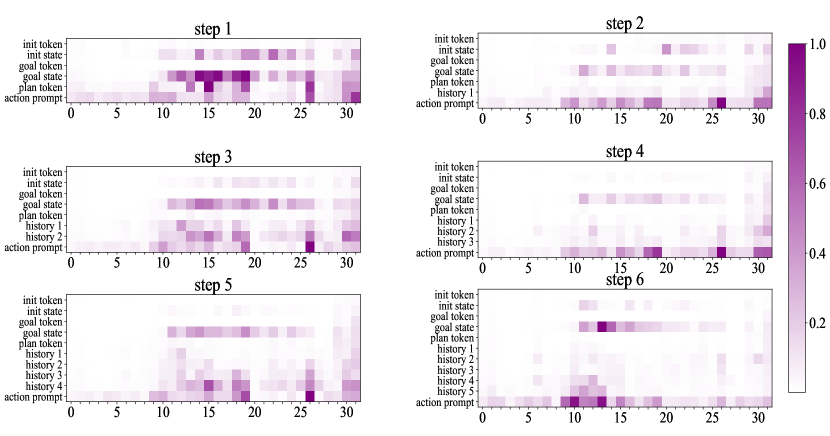

Figure 12: Information flow of last token in Vicuna-7b.
[/FIGURE]

[FIGURE A1.F13.g1]
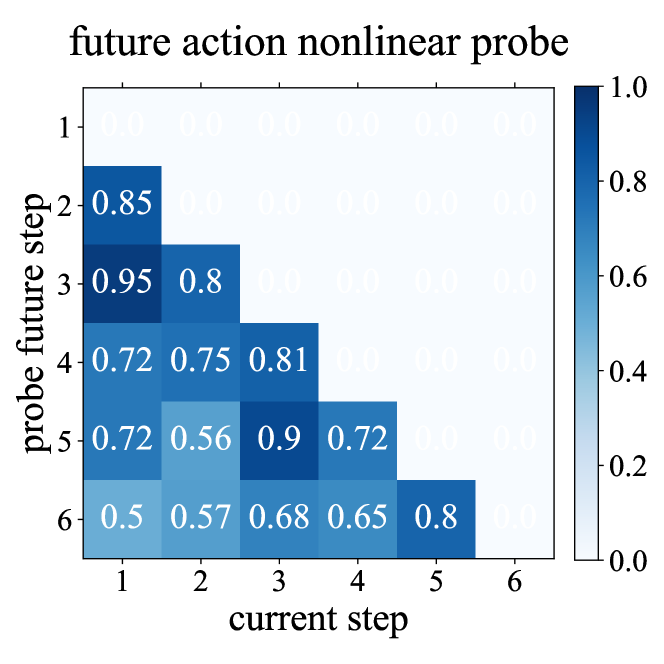

Figure 13: Future action nonlinear probe in Llama-2-7b-chat-hf.
[/FIGURE]

[FIGURE A1.F14.g1]
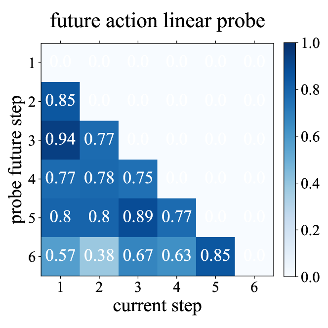

Figure 14: Future action linear probe in Vicuna-7b
[/FIGURE]

[FIGURE A1.F15.g1]

Figure 15: Future action nonlinear probe in Vicuna-7b
[/FIGURE]

[FIGURE A1.F16.g1]
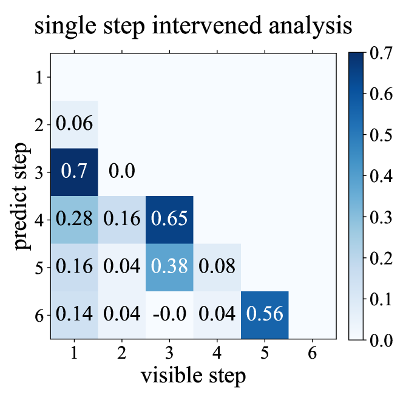

Figure 16: Single step intervened analysis in Llama-2-7b-chat-hf.
[/FIGURE]

