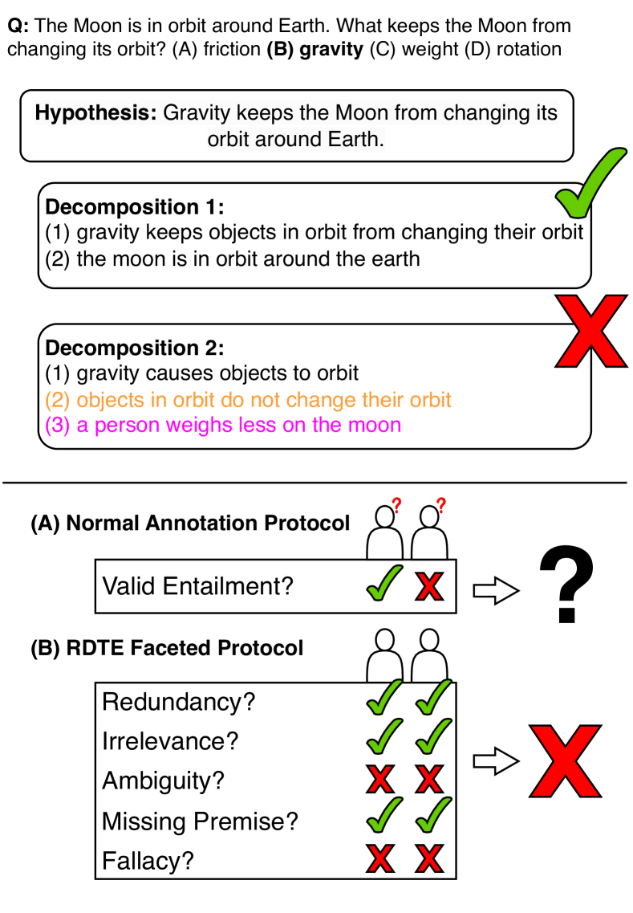
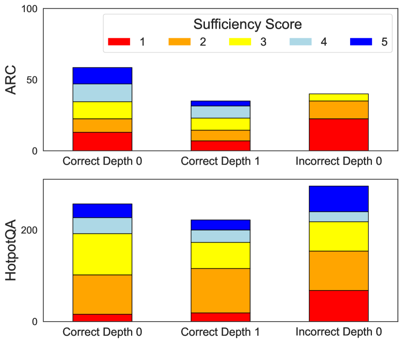
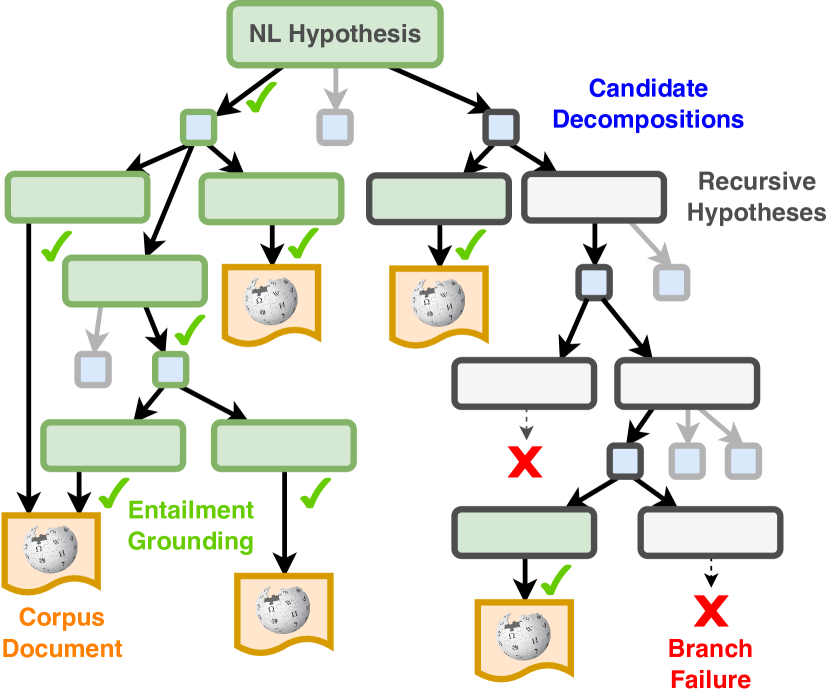
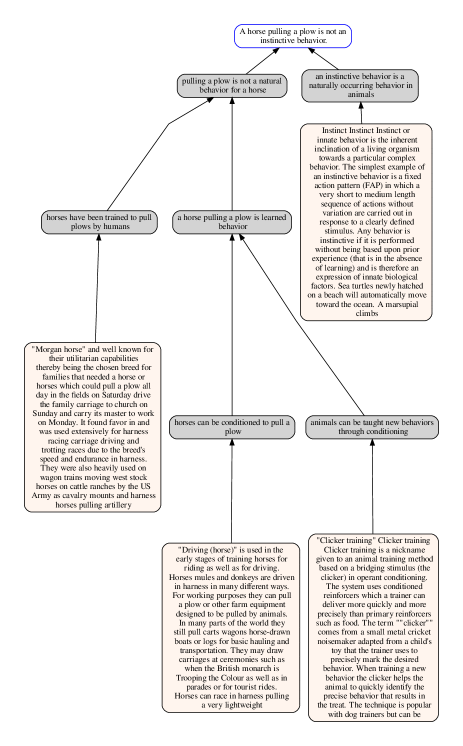
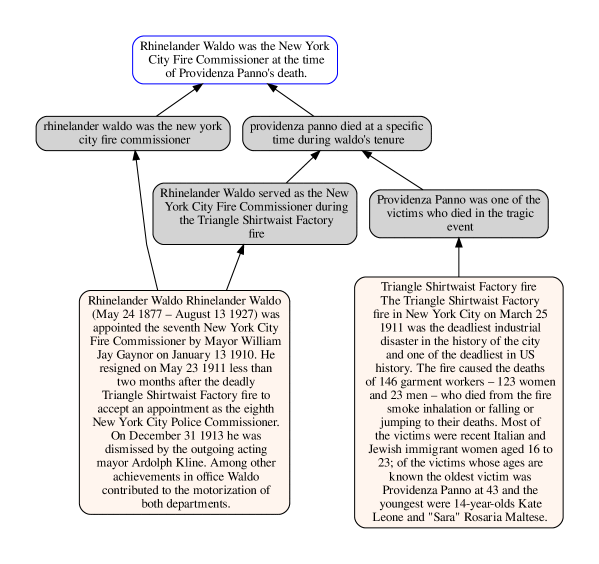

# Enhancing Systematic Decompositional Natural Language Inference 
Using Informal Logic

###### Abstract

Contemporary language models enable new opportunities for structured reasoning with text, such as the construction and evaluation of intuitive, proof-like textual entailment trees without relying on brittle formal logic Tafjord et al. ([2022](#bib.bib29)); Weir et al. ([2023](#bib.bib32)). However, progress in this direction has been hampered by a long-standing lack of a clear protocol for determining what *valid compositional entailment* is. This absence causes noisy datasets and limited performance gains by modern neuro-symbolic engines. To address these problems, we formulate a *consistent* and *theoretically grounded* approach to annotating decompositional entailment datasets, and evaluate its impact on LLM-based textual inference. We find that our resulting dataset, RDTE (Recognizing Decompositional Textual Entailment), has a substantially higher internal consistency (+9%) than prior decompositional entailment datasets, suggesting that RDTE is a significant step forward in the long-standing problem of forming a clear protocol for discerning entailment. We also find that training an RDTE-oriented entailment classifier via knowledge distillation and employing it in a modern neuro-symbolic reasoning engine significantly improves results (both accuracy and proof quality) over other entailment classifier baselines, illustrating the practical benefit of this advance for textual inference.  

[FIGURE S0.F1.g1]

Figure 1: (Upper) Two hypothesis decompositions suggested by an LLM. The first
makes an argument that is generally acceptable to a human. The second contains a fact that is not always true and another that is irrelevant to the entailment. Recognizing such an invalid decomposition is core to recent neuro-symbolic reasoning algorithms, but LLMs struggle at the task. (Lower) Ambiguous definitions of entailment have hampered progress in annotating data to improve the models. (b) We find that a faceted definition yields both a clean dataset (RDTE) and significant downstream performance improvements.
[/FIGURE]

## 1 Introduction

What denotes a deductively valid explanation for an inference? While formal logicians might support a stringent condition of completeness according to well-defined formal axioms, evidence suggests that humans do not think of explanation validity so stringently Sulik et al. ([2021](#bib.bib28)), accepting incomplete explanations that “seldom capture the complete deductive processes from a set of axioms to a statement” Tan ([2022](#bib.bib30)). Recognizing textual entailment (RTE; Dagan et al., [2005](#bib.bib9)), which generally centers around emulating a human’s opinion of entailment, commits not to a single definition of validity but rather collects human preferences on a wide spectrum of criteria from “strict deductive inferences” to “very implicit and fallible common-sense inferences” Gubelmann et al. ([2023](#bib.bib14)).  

The lack of a well-defined task definition creates a challenge for recent lines of work on explainable AI, much of which seeks to make the reasoning processes of complex systems like large language models (LLMs) transparent and convincing to users. One such line of work is on entailment tree-based reasoning Dalvi et al. ([2021](#bib.bib10)); Bostrom et al. ([2022](#bib.bib3)); Tafjord et al. ([2022](#bib.bib29)). Most entailment tree-based literature has avoided the critical question of reasoning validity: whether each step of a model-generated tree is a valid argument to a human in support of its hypothesis. Existing evaluations generally focus on tree reconstruction metrics Ribeiro et al. ([2023a](#bib.bib24)) or end-task QA performance, and do not consider whether the quality of model-generated trees necessarily aligns with the accuracy of the answers. It is entirely possible—and indeed, not uncommon—for a system to arrive at the correct conclusion while presenting a flawed decomposition. This disconnect motivates our investigation into the automatic detection of errors within proof trees. Reliably performing decompositional RTE undergirds a system’s capacity to (1) be right for the right reasons and (2) not be wrong for the wrong reasons.  

The existing discourse surrounding a proper definition of NLI (e.g. Manning ([2006](#bib.bib19))) has thus far not touched on specifically decompositional entailment, particularly governing the sorts of decompositions encountered during a recursive entailment tree search algorithm. Towards addressing this lack of clarity, we propose an evaluation centered around the notion that a valid decomposition is a valid argument for why the hypothesis should be believed. We take inspiration from the “Relevance, Acceptability, and Sufficiency” criteria for a logically good argument developed in the field of informal logic Johnson and Blair ([1977](#bib.bib16)); Groarke ([2022](#bib.bib13)), and design a novel approach to reasoning about entailment in a principled manner. We release this protocol along with a collection of over 1000 associated expert annotations. Through experiments, we find that nearly all models trained on previous compositional entailment datasets and LLMs like GPT fall short of human-level performance on our challenge set, which we term RDTE (Recognizing Decompositional Textual Entailment).  

We find that under our prompting protocol, GPT-4 can serve as a “teacher” in a novel knowledge distillation pipeline that annotates the reasoning traces of a non-optimized entailment reasoner in a given domain. We collect and release a large artifact (24K items per domain) of GPT-4’s annotations over these traces for use by future work.  

We illustrate the effectiveness of student models trained via this pipeline as the linchpin of TreeWise, an entailment tree engine inspired by Nellie but which supports in-context learning, forward chaining, branch consolidation, and most importantly, improved decompositional entailment recognition. TreeWise not only surpasses entailment tree-producing approaches on established benchmarks like EntailmentBankQA, but also adapts to complex tasks such as HotpotQA that require reasoning over less structured knowledge sources such as Wikipedia. We show that using the knowledge-distilled student model improves TreeWise’s QA task performance, and raises the overall quality of the entailment trees produced by the system. Our contributions are therefore:  

* A new entailment challenge set, RDTE, crafted via an informal logic-inspired protocol, that tasks models to verify the validity of a hypothesis decomposition 
* A knowledge distillation pipeline that teaches student models to discriminate what and why decompositions are invalid in a given domain. 
* A new entailment tree-generating inference engine, TreeWise, which outperforms existing tree-based QA methods while generating higher-quality trees in the process. This engine shows to benefit from RDTE knowledge distillation. 111Data, code, and models can be found at <https://github.com/JHU-CLSP/treewise>. 

## 2 Decompositional RTE

### 2.1 Background: RAS Criteria

A seminal framework developed by informal logicians to replace strict deductive logic criteria is known as RAS: Relevance, Acceptability, and Sufficiency Johnson and Blair ([1977](#bib.bib16)). Noting that each element is subject to substantial academic debate (different systems of informal logic define them differently), we review each criterion as we interpret them for this work:    Relevance of premise A concerning conclusion B is defined as whether the truth of A makes a difference to the truth of B. Blair ([2012](#bib.bib2)). The extent of this difference can vary; e.g. whether (A) “the earth has oxygen” is true technically has relevance to (B) birds can fly (since birds breathe oxygen), but is less relevant than (A’) birds have wings. Relevance is of particular interest to a recursive reasoner, as one would not want to waste time proving an irrelevant statement like (A) when trying to compositionally prove (B).    Acceptability of a premise is normatively “worthy of acceptance,” which can mean either its ostensible truth value or-–in the absence of universal factuality–that in the relevant context, the arguer and the argument recipient accept it to be true. This introduces a hiccup for recursive reasoning algorithms, for which the factuality of a decomposition’s premises is commonly determined via search after validating the decomposition itself. We ultimately choose to annotate one subset of RDTE for premise factuality while not doing so for the other.    Sufficiency is “the property of an argument’s premises of supplying all the grounds that are needed to make it reasonable to believe its conclusion.” Johnson and Blair ([1977](#bib.bib16)). This is left intentionally vague; Blair ([2012](#bib.bib2)) admits “the criterion of sufficiency, for justificatory arguments, is best seen as a placeholder for whatever version and standards of sufficiency are appropriate for the particular situation in question.” In this way, we should consider sufficiency to be a question and problem-specific criterion. This suggests the key observation that the grounds for valid entailment are inherently domain-specific. Blair ([2012](#bib.bib2)) also notes the dependent relationship between sufficiency and the other two criteria: that a sufficient argument presumes acceptability and relevance.  

### 2.2 Implementing RAS for RTE Annotation

We draw inspiration from these criteria to construct a protocol that investigates a decomposition like the ones shown in [Figure 1](#S0.F1 "Figure 1 ‣ Enhancing Systematic Decompositional Natural Language Inference Using Informal Logic") for each SAR component in turn. An important aspect of these normative terms is that they are all scalar: a premise can be more or less relevant and acceptable, and the sufficiency of an argument composed of premises could always be strengthened by adding more premises. In a departure from works such as Tafjord et al. ([2022](#bib.bib29)) who collect binary factuality and “reasoning correctness” judgments, we collect RAS judgments on an ordinal scale Zhang et al. ([2017](#bib.bib37)) from 1 to 5, where each score is assigned a specific set of conditions. We also collect an ordinal judgment for redundancy, which is not strictly a component of RAS assessment; we observe that redundant premises are particularly problematic for entailment tree search, as proving the same information twice wastes search budget. We implement redundancy as “conditional irrelevance”:  

* If removing a premise in isolation doesn’t change the extent of the entailment, then it’s irrelevant. 
* If removing a premise in the presence of the other decomposition premises does not change the extent of the entailment, then it’s redundant.222An irrelevant premise is thus by definition also redundant. 

The sufficiency label, which most directly resembles that of a typical RTE label, is dependent on the first two following Blair ([2012](#bib.bib2))’s observation. Exact directions can be found in §[B](#A2 "Appendix B RDTE Annotation Instructions ‣ Enhancing Systematic Decompositional Natural Language Inference Using Informal Logic"), including a substantial list of conditions around a decomposition that indicate what the score should be.  

## 3 Data Collection

### 3.1 Generating Decompositions

We seek to construct a dataset of decompositional entailment judgments that are of the kind that a reasoning system might come across while performing QA. Following Tafjord et al. ([2022](#bib.bib29)), we found it apt to annotate decompositions generated during a model’s reasoning search traces over training questions. We use the backward chaining reasoning process of TreeWise, which is introduced in §[5](#S5 "5 TreeWise ‣ Enhancing Systematic Decompositional Natural Language Inference Using Informal Logic"). Each item is a hypothesis and a set of 2-3 premises that the model proposes might conjunctively entail the hypothesis in the context of a given question. To collect a representative sample of hypotheses, we pull from three classes:  

1. Top-level correct hypotheses representing the right answer options for multiple-choice questions. These are important to annotate so that the model is right for the right reasons. 
2. Recursive correct hypotheses generated by an LLM as premise subqueries for the top-level correct hypotheses 
3. Top-level incorrect hypotheses representing the incorrect answer option deemed by GPT-4 to be closest to correct. These are important to annotate so that the model is not wrong for the wrong reasons. 

We collect a mixture of GPT-4 and ChatGPT-generated decompositions using a suite of different styles of prompts described in §[A.2](#A1.SS2 "A.2 Prompt-based Modules ‣ Appendix A Contrasting Nellie with TreeWise ‣ Enhancing Systematic Decompositional Natural Language Inference Using Informal Logic"). We generated decompositions for hypotheses333We created hypotheses by declarativizing Demszky et al. ([2018](#bib.bib11)) answer options using GPT-4. For HotpotQA, we first had GPT-4 synthesize incorrect answer options. in two task domains: multiple choice science QA in ARC Clark et al. ([2018](#bib.bib6)) and multi-hop QA over Wikipedia in HotpotQA. While Hotpot questions are constructed over public world knowledge, the esoteric individual facts (e.g. the birth year of some actor) are not common knowledge among humans, and it would be a stretch for the audience of an argument made by a Hotpot decomposition to be expected to know each premise’s factuality. We thus do not annotate Hotpot decompositions for factuality, but annotate the other facets as normal.  

#### Annotation Process

Four of this paper’s authors, all highly proficient or native English speakers, annotated 1000 decompositions total from the two domains with two-way redundancy. One author was an annotator on all items. We initially annotated a handful of examples together to develop a list of around 30 conditions to check for in a decomposition that indicate certain RAS scores. We then annotated the rest of the dataset independently.  

While the dataset is annotated for sufficiency on a 5-point scale, we suggest using a threshold of $\geq 4$ if one wants to evaluate models under binary entailment metrics. This corresponds to items for which the only acceptable flaws are (A) a 3rd redundant premise given an otherwise perfect 2-premise entailment or (B) minor missing/implicit information that does not affect layman reasoning. To arrive at a single clean entailment label for evaluation, we reconciled disagreements by discussing all items for which its two annotated sufficiency scores were on either side of 3.5. Anecdotally, we found that a vast majority disagreements were due to human error, e.g. missing a condition or not recognizing a particular flaw in reasoning.  

#### Comparison to Existing Data

Prior to reconciling disagreements, we measured raw annotation agreement and compared it to recent attempts to collect decompositional entailment labels. Tafjord et al. ([2022](#bib.bib29)) collected annotations for 3.7K decompositions generated by Entailer, while Clark et al. ([2023](#bib.bib7)) collected annotations for 24.4K items generated by GPT3.444The BaRDa dataset comprises a specifically filtered subset of these two datasets that exhibit maximal annotator agreement. We obtained the pre-filtered data from the authors for the purposes of comparison with our work. The instructions given to annotators for these datasets are very high-level, simply asking whether the “reasoning goes wrong.” We believe this creates a much lower threshold for acceptability than the RDTE protocol; these datasets are majority labeled “entailment,” but on manual inspection we found numerous items that exhibited redundant, irrelevant, and fallacious arguments.  

Nevertheless, we found RDTE to have a higher internal annotator consistency rate than these datasets, with a rate of 79% compared to 70% for the GPT3 and 61% for the Entailer data.  

### 3.2 RDTE Analysis

[FIGURE S3.F2.g1]

Figure 2: Distribution of the 1000 entailment labels in RDTE. Instead of binary entail/non-entailment, we annotate on a 5-point ordinal scale. To evaluate binary judgment models, we treat $\geq$4 as positively labeled.
[/FIGURE]

[Figure 2](#S3.F2 "Figure 2 ‣ 3.2 RDTE Analysis ‣ 3 Data Collection ‣ Enhancing Systematic Decompositional Natural Language Inference Using Informal Logic") depicts the breakdown of sufficiency labels within the RDTE ARC (267) and Hotpot (775) decompositions. While the ordinal scores are relatively well distributed, only 27% of the dataset is labeled a 4 or 5, creating a large binary label imbalance. This statistic highlights the importance of performing well on this task: 3 out of every 4 decompositions generated by ChatGPT and GPT-4 did not pass our sufficiency rubric.  

49% of RDTE items had at least one premise rated as irrelevant ($\leq 3/5$); 36% had at least one rated as redundant. 28% of the items with a factuality rating had at least one nonfactual premise. We note that none of the incorrect ARC hypothesis decompositions were labeled as sufficient; this highlights that the RDTE protocol, when including the factuality facet, does a comprehensive job of systematically ruling out decompositions for which there is necessarily some issue (else the hypothesis must be correct). Contrastly, there are positively-labeled decompositions of incorrect hypothesis for Hotpot, because we did not annotate for factuality. There are thus decompositions that, were their premises true, would entail a wrong hypothesis.  

[TABLE S3.T1]

<table class="ltx_tabular ltx_centering ltx_align_middle">
<tbody class="ltx_tbody">
<tr class="ltx_tr">
<td class="ltx_td ltx_align_top ltx_border_tt"></td>
<td class="ltx_td ltx_align_right ltx_border_tt">Fa</td>
<td class="ltx_td ltx_align_right ltx_border_tt">Rel</td>
<td class="ltx_td ltx_align_right ltx_border_tt">Red</td>
</tr>
<tr class="ltx_tr">
<td class="ltx_td ltx_align_justify ltx_align_top ltx_border_t">

Q: The 2005 film Remedy featured Frank Q: Vincent from The Sopranos and several mob movies by which acclaimed director? (A) Jonathan Demme, (B) Martin Scorsese, (C) Ralph De Vito, (D) Steven Hilliard Stern

</td>
</tr>
<tr class="ltx_tr">
<td class="ltx_td ltx_align_justify ltx_align_top">

H: The 2005 film Remedy featured Frank Vincent from The Sopranos and several mob movies by the acclaimed director Ralph De Vito.

</td>
<td class="ltx_td"></td>
<td class="ltx_td"></td>
<td class="ltx_td"></td>
</tr>
<tr class="ltx_tr">
<td class="ltx_td ltx_align_justify ltx_align_top">

 P1: Frank Vincent appeared in The 2005 film Remedy.

</td>
<td class="ltx_td ltx_align_right">–</td>
<td class="ltx_td ltx_align_right">5</td>
<td class="ltx_td ltx_align_right">5</td>
</tr>
<tr class="ltx_tr">
<td class="ltx_td ltx_align_justify ltx_align_top">

 P2: Frank Vincent appeared in The Sopranos and several mob movies

</td>
<td class="ltx_td ltx_align_right">–</td>
<td class="ltx_td ltx_align_right">5</td>
<td class="ltx_td ltx_align_right">5</td>
</tr>
<tr class="ltx_tr">
<td class="ltx_td ltx_align_justify ltx_align_top">

 P3: Ralph De Vito directed several mob movies.

</td>
<td class="ltx_td ltx_align_right">–</td>
<td class="ltx_td ltx_align_right">5</td>
<td class="ltx_td ltx_align_right">5</td>
</tr>
<tr class="ltx_tr">
<td class="ltx_td ltx_align_justify ltx_align_top">

Sufficiency: 3. The facts are relevant and nonredundant, but they do not link the mob movies by De Vito to those that featured Vincent. Substantial missing information is a 3.

</td>
</tr>
<tr class="ltx_tr">
<td class="ltx_td ltx_align_justify ltx_align_top ltx_border_t">

Q: Which process best explains how the Grand Canyon became so wide? (A) folding, (B) erosion, (C) deposition, (D) sedimentation

</td>
</tr>
<tr class="ltx_tr">
<td class="ltx_td ltx_align_justify ltx_align_top">

H: Erosion best explains how the Grand Canyon became so wide.

</td>
<td class="ltx_td"></td>
<td class="ltx_td"></td>
<td class="ltx_td"></td>
</tr>
<tr class="ltx_tr">
<td class="ltx_td ltx_align_justify ltx_align_top">

 P1: Changes in the Grand Canyon’s landscape include becoming wider.

</td>
<td class="ltx_td ltx_align_right">5</td>
<td class="ltx_td ltx_align_right">5</td>
<td class="ltx_td ltx_align_right">5</td>
</tr>
<tr class="ltx_tr">
<td class="ltx_td ltx_align_justify ltx_align_top">

 P2: Erosion is one of the processes that can change a landscape.

</td>
<td class="ltx_td ltx_align_right">5</td>
<td class="ltx_td ltx_align_right">5</td>
<td class="ltx_td ltx_align_right">5</td>
</tr>
<tr class="ltx_tr">
<td class="ltx_td ltx_align_justify ltx_align_top">

 P3: The Grand Canyon is a landscape.

</td>
<td class="ltx_td ltx_align_right">5</td>
<td class="ltx_td ltx_align_right">3</td>
<td class="ltx_td ltx_align_right">5</td>
</tr>
<tr class="ltx_tr">
<td class="ltx_td ltx_align_justify ltx_align_top">

Sufficiency: 2. The facts are relevant and nonredundant, but they do not establish a direct causal relationship between erosion and the Grand Canyon becoming wider. Removing P3 does not strongly impact the extent of the entailment. Redundant P + missing information is a 2.

</td>
</tr>
<tr class="ltx_tr">
<td class="ltx_td ltx_align_justify ltx_align_top ltx_border_t">

Q: Is Ordos City more west than Yangzhong? (A) No, (B) Same longitude, (C) yes

</td>
</tr>
<tr class="ltx_tr">
<td class="ltx_td ltx_align_justify ltx_align_top">

H: Ordos City is located in the western part of China.

</td>
<td class="ltx_td"></td>
<td class="ltx_td"></td>
<td class="ltx_td"></td>
</tr>
<tr class="ltx_tr">
<td class="ltx_td ltx_align_justify ltx_align_top">

 P1: Ordos City is predominantly rural.

</td>
<td class="ltx_td ltx_align_right">-</td>
<td class="ltx_td ltx_align_right">3</td>
<td class="ltx_td ltx_align_right">5</td>
</tr>
<tr class="ltx_tr">
<td class="ltx_td ltx_align_justify ltx_align_top">

 P2: Predominantly rural areas in China are often found in the western part of the country.

</td>
<td class="ltx_td ltx_align_right">-</td>
<td class="ltx_td ltx_align_right">3</td>
<td class="ltx_td ltx_align_right">5</td>
</tr>
<tr class="ltx_tr">
<td class="ltx_td ltx_align_justify ltx_align_top ltx_border_bb">

Sufficiency: 2. The argument commits a fallacy of division by assuming that because predominantly rural areas in China are often in the west, Ordos City, being rural, must also be in the western part. This reasoning does not adequately support the conclusion without specific geographic evidence. Fallacious reasoning and irrelevant premises is a 2.

</td>
</tr>
</tbody>
</table>

Table 1: Example RDTE annotations.
[/TABLE]

## 4 RDTE Evaluation

We elicit itemwise decomposition quality judgments from a series of methods based on the RDTE protocol as well as existing methods for judging decompositional entailment. For methods that provide factuality judgments as part of their inference process, we turn off this functionality for the Hotpot subset of RDTE (this entails either rewriting a prompt or not making a second model call).  

#### GPT Methods

We test the following prompt-based methods, using both GPT-4 and ChatGPT.555gpt-4-0613 and gpt-3.5-turbo-1106 All prompts can be found in the appendix.  

* An ICL prompt containing the RDTE annotation rubric and 4 example batches (10-15 decompositions per hypothesis) and a Zero-Shot prompt containing only the RDTE rubric 
* The prompts used by Clark et al. ([2023](#bib.bib7)) to evaluate models on the BaRDa dataset. These are separate prompts for the entailment and premise factuality judgments. 

#### Existing Methods

We test the T5-based Entailer-11B model from Tafjord et al. ([2022](#bib.bib29)), which is trained in a multi-angle fashion to alternatively provide entailment and factuality judgments. We also test the similar Nellie-3B model, as well as the fine-tuned RoBERTa classifier used by Nellie as a secondary entailment filter. We also take an off-the-shelf (OTS) RoBERTa finetuned for NLI using a large suite of 600 datasets666https://huggingface.co/sileod/deberta-v3-large-tasksource-nli that includes QASC Khot et al. ([2020](#bib.bib17)) and ARC.  

#### Knowledge Distillation

Search algorithms like Nellie make hundreds of calls to NLI models for every question, making large, slow models like GPT-4 unrealistic for use as an entailment filter. We instead test whether we can use knowledge distillation to train smaller student models to imitate GPT-4’s performance. We extracted 20K RDTE judgments from GPT-4 over 2.3K hypotheses in each of the ARC and Hotpot domains. We then used this silver data to fine-tune (A) the base RoBERTa model finetuned to serve as Nellie’s filter using the Entailer and QASC datasets, and (B) ChatGPT using OpenAI’s fine-tuning API. To promote token efficiency, the GPT-4 teacher and ChatGPT student perform classification over a batch of decompositions for a single hypothesis in each prompt. See [Table 4](#A0.T4 "Table 4 ‣ Enhancing Systematic Decompositional Natural Language Inference Using Informal Logic") for how batching marginally affects GPT-4’s performance on RDTE.  

[TABLE S4.T2]

<table class="ltx_tabular ltx_centering ltx_align_middle">
<tbody class="ltx_tbody">
<tr class="ltx_tr">
<td class="ltx_td ltx_border_tt"></td>
<td class="ltx_td ltx_align_left ltx_border_tt">ARC</td>
<td class="ltx_td ltx_align_left ltx_border_tt">Hotpot</td>
</tr>
<tr class="ltx_tr">
<td class="ltx_td ltx_align_left ltx_border_t">Prompted Methods</td>
<td class="ltx_td ltx_border_t"></td>
<td class="ltx_td ltx_border_t"></td>
</tr>
<tr class="ltx_tr">
<td class="ltx_td ltx_align_left">GPT-4 (RDTE ICL)</td>
<td class="ltx_td ltx_align_left">59</td>
<td class="ltx_td ltx_align_left">53</td>
</tr>
<tr class="ltx_tr">
<td class="ltx_td ltx_align_left">GPT-4 (RDTE Zero-Shot)</td>
<td class="ltx_td ltx_align_left">58</td>
<td class="ltx_td ltx_align_left">49</td>
</tr>
<tr class="ltx_tr">
<td class="ltx_td ltx_align_left">GPT-4 (BaRDa)</td>
<td class="ltx_td ltx_align_left">44</td>
<td class="ltx_td ltx_align_left">48</td>
</tr>
<tr class="ltx_tr">
<td class="ltx_td ltx_align_left">ChatGPT (RDTE ICL)</td>
<td class="ltx_td ltx_align_left">36</td>
<td class="ltx_td ltx_align_left">35</td>
</tr>
<tr class="ltx_tr">
<td class="ltx_td ltx_align_left">ChatGPT (RDTE Zero-Shot)</td>
<td class="ltx_td ltx_align_left">40</td>
<td class="ltx_td ltx_align_left">38†
</td>
</tr>
<tr class="ltx_tr">
<td class="ltx_td ltx_align_left">ChatGPT (BaRDa)</td>
<td class="ltx_td ltx_align_left">43†
</td>
<td class="ltx_td ltx_align_left">34</td>
</tr>
<tr class="ltx_tr">
<td class="ltx_td ltx_align_left ltx_border_t">T5 and Cross Encoders</td>
<td class="ltx_td ltx_border_t"></td>
<td class="ltx_td ltx_border_t"></td>
</tr>
<tr class="ltx_tr">
<td class="ltx_td ltx_align_left">Entailer-11B</td>
<td class="ltx_td ltx_align_left">48</td>
<td class="ltx_td ltx_align_left">38</td>
</tr>
<tr class="ltx_tr">
<td class="ltx_td ltx_align_left">NELLIE-3B</td>
<td class="ltx_td ltx_align_left">43</td>
<td class="ltx_td ltx_align_left">36</td>
</tr>
<tr class="ltx_tr">
<td class="ltx_td ltx_align_left">NELLIE RoBERTa Filter</td>
<td class="ltx_td ltx_align_left">37</td>
<td class="ltx_td ltx_align_left">36</td>
</tr>
<tr class="ltx_tr">
<td class="ltx_td ltx_align_left">OTS NLI RoBERTa</td>
<td class="ltx_td ltx_align_left">45‡
</td>
<td class="ltx_td ltx_align_left">44‡
</td>
</tr>
<tr class="ltx_tr">
<td class="ltx_td ltx_align_left ltx_border_t">Knowledge Distillation</td>
<td class="ltx_td ltx_border_t"></td>
<td class="ltx_td ltx_border_t"></td>
</tr>
<tr class="ltx_tr">
<td class="ltx_td ltx_align_left">ChatGPT</td>
<td class="ltx_td ltx_align_left">48 (+5)†
</td>
<td class="ltx_td ltx_align_left">51(+13)†
</td>
</tr>
<tr class="ltx_tr">
<td class="ltx_td ltx_align_left ltx_border_bb">RoBERTa</td>
<td class="ltx_td ltx_align_left ltx_border_bb">
66 (+21)‡
</td>
<td class="ltx_td ltx_align_left ltx_border_bb">
56(+12)‡
</td>
</tr>
</tbody>
</table>

Table 2: RDTE entailment results (F0.5 score) by various models. We find that RDTE prompting of GPT-4 greatly outperforms existing approaches to compositional entailment, including BaRDa prompting and fine-tuned approaches. We also find that knowledge disillation from GPT-4 (RDTE Zero-Shot) improves student models by 5-21 points, to the extent that a student classifier outperforms GPT-4 itself.
[/TABLE]

### 4.1 RDTE Results

Our primary evaluation metric is F-score ($\beta=0.5$), meaning we put double precedence on precision over recall. Precision is particularly crucial for our needs: nontrivial false positive rates in a backward-chaining search can quickly create error propagation, wasted time on invalid search branches, and worse trees. Contrastly, while recall is important, it is less catastrophic to overfilter valid decompositions than to underfilter bad ones.  

[Table 2](#S4.T2 "Table 2 ‣ Knowledge Distillation ‣ 4 RDTE Evaluation ‣ Enhancing Systematic Decompositional Natural Language Inference Using Informal Logic") shows F0.5 performance by models on the RDTE dataset. We also display precision and recall in [Table 4](#A0.T4 "Table 4 ‣ Enhancing Systematic Decompositional Natural Language Inference Using Informal Logic"). We observe that no model cracks 70%, suggesting room for future improvement. Overall we find the RDTE-oriented prompts to GPT-4 outperform all existing methods for compositional entailment by 10 or more points.777Note that [Table 2](#S4.T2 "Table 2 ‣ Knowledge Distillation ‣ 4 RDTE Evaluation ‣ Enhancing Systematic Decompositional Natural Language Inference Using Informal Logic") shows GPT-4’s score when thresholding on 5, not 4, which we found to score lower (see [Table 4](#A0.T4 "Table 4 ‣ Enhancing Systematic Decompositional Natural Language Inference Using Informal Logic")).   

We also find that knowledge distillation proves highly effective on RDTE: the student ChatjGPT models improve 5-13% over the closest ChatGPT methods, while the fine-tuned RoBERTa student ultimately outperforms the teacher GPT-4 method on both datasets. [Table 4](#A0.T4 "Table 4 ‣ Enhancing Systematic Decompositional Natural Language Inference Using Informal Logic") shows that this is the result of substantially higher precision (68 to 55) at the expense of recall (57 to 90).  

[FIGURE S4.F3.g1]

Figure 3: TreeWise generates many premise decompositions of a hypothesis and checks whether any candidates are valid entailments. Premises are then recursively decomposed until it finds any tree(s) fully grounded, via entailment, in one or more documents from a corpus like Wikipedia. Statements entailed by a document are generated via forward chaining, while the rest of the search is backward.
TreeWise overgenerates enough decompositions that many end up untraversed due to the search budget or nonentailment.
[/FIGURE]

## 5 TreeWise

To illustrate the impact that an RDTE-based entailment model can have on systematic reasoning, we apply it as a module in a new, state-of-the-art entailment engine called TreeWise: Textual Reasoning Engine with Enriched Ways to Intelligently Search for Entailment. TreeWise builds upon the backward chaining entailment tree search framework first introduced by Nellie Weir et al. ([2023](#bib.bib32)). The core functionality of TreeWise is to answer the question, “is NL hypothesis $H$ compositionally entailed by a corpus of documents $C$ in the context of a question $Q$?” Illustrated in [Figure 3](#S4.F3 "Figure 3 ‣ 4.1 RDTE Results ‣ 4 RDTE Evaluation ‣ Enhancing Systematic Decompositional Natural Language Inference Using Informal Logic"), the search algorithm attempts to ground the hypothesis via decomposition into premises entailed by passages in a verified corpus such as Wikipedia, performing a recursive search over candidate trees. Implemented in Prolog, the algorithm follows a breadth-first strategy, performing the following at each recursive hypothesis $H$:  

1. Retrieve a set of $s$ support documents from a corpus like Wikipedia that are likely to contain information relevant to the hypothesis. Check if any of these documents entails $H$ using a series of single-premise entailment classifiers. If so, $H$ is proved. See §[D](#A4 "Appendix D Retrieval Index ‣ Enhancing Systematic Decompositional Natural Language Inference Using Informal Logic") for implementation details. 
2. Check whether $H$ is a paraphrase of a previously considered hypothesis $H^{\prime}$ using SBERT Reimers and Gurevych ([2019a](#bib.bib22)). If so, we associate it with the proof branches of $H^{\prime}$. 
3. Forward generate $i$ inferences from the support documents via an instruction-tuned LLM. 
4. Decompose $H$ into a set of $d$ candidate decompositions using a series of prompts to the LLM. We use a heterogeneous set of prompts to propose a diverse set of candidates that encourage using the $i$ inferences. 
5. Condense the decompositions by identifying paraphrases and deduplicating semantically equivalent candidates. 
6. Filter the decompositions using a series of decompositional entailment classifiers to weed out those that would not logically support $H$. 
7. Recur on the premises to continue the search. 

This process is repeated until either a user-specified expansion budget is exhausted, or a proof is found and no search branches remain that could yield a higher score. The system is designed to be amenable to a costly API; it batches together decompositions of a single hypothesis into one prompt, then asks it to score them all at once. This is a crucial optimization, as it allows us to score hundreds of decompositions in a single API call.  

TreeWise represents a substantial overhaul of the T5-based Nellie system, including incorporating a variety of prompting methods, forward chaining, and the capacity to reason over longer passages. We include an overview of search logic and full architectural comparison in [Appendix A](#A1 "Appendix A Contrasting Nellie with TreeWise ‣ Enhancing Systematic Decompositional Natural Language Inference Using Informal Logic").  

## 6 TreeWise Experiments

[TABLE S6.T3]

<table class="ltx_tabular ltx_centering ltx_guessed_headers ltx_align_middle">
<thead class="ltx_thead">
<tr class="ltx_tr">
<th class="ltx_td ltx_th ltx_th_column ltx_th_row ltx_border_tt"></th>
<th class="ltx_td ltx_th ltx_th_column ltx_th_row ltx_border_r ltx_border_tt"></th>
<th class="ltx_td ltx_align_center ltx_th ltx_th_column ltx_border_tt">EBQA on WorldTree</th>
<th class="ltx_td ltx_align_center ltx_th ltx_th_column ltx_border_tt">EBQA on Wikipedia</th>
<th class="ltx_td ltx_align_center ltx_th ltx_th_column ltx_border_tt">HotpotQA on Wikipedia</th>
</tr>
<tr class="ltx_tr">
<th class="ltx_td ltx_align_right ltx_th ltx_th_column ltx_th_row">Method</th>
<th class="ltx_td ltx_align_center ltx_th ltx_th_column ltx_th_row ltx_border_r">W/ Silver?</th>
<th class="ltx_td ltx_align_center ltx_th ltx_th_column ltx_border_t">QA</th>
<th class="ltx_td ltx_align_center ltx_th ltx_th_column ltx_border_t">Tree Integrity</th>
<th class="ltx_td ltx_align_center ltx_th ltx_th_column ltx_border_t">QA</th>
<th class="ltx_td ltx_align_center ltx_th ltx_th_column ltx_border_t">Tree Integrity</th>
<th class="ltx_td ltx_align_center ltx_th ltx_th_column ltx_border_t">QA</th>
<th class="ltx_td ltx_align_center ltx_th ltx_th_column ltx_border_t">Tree Integrity</th>
</tr>
</thead>
<tbody class="ltx_tbody">
<tr class="ltx_tr">
<th class="ltx_td ltx_align_right ltx_th ltx_th_row ltx_border_t">TreeWise</th>
<th class="ltx_td ltx_align_center ltx_th ltx_th_row ltx_border_r ltx_border_t">Yes</th>
<td class="ltx_td ltx_align_center ltx_border_t">79.2</td>
<td class="ltx_td ltx_align_center ltx_border_t">75.2</td>
<td class="ltx_td ltx_align_center ltx_border_t">73.2</td>
<td class="ltx_td ltx_align_center ltx_border_t">74.7</td>
<td class="ltx_td ltx_align_center ltx_border_t">51.3</td>
<td class="ltx_td ltx_align_center ltx_border_t">66.6</td>
</tr>
<tr class="ltx_tr">
<th class="ltx_td ltx_th ltx_th_row"></th>
<th class="ltx_td ltx_align_center ltx_th ltx_th_row ltx_border_r">No</th>
<td class="ltx_td ltx_align_center">72.8</td>
<td class="ltx_td ltx_align_center">71.6</td>
<td class="ltx_td ltx_align_center">69.0</td>
<td class="ltx_td ltx_align_center">71.9</td>
<td class="ltx_td ltx_align_center">46.1</td>
<td class="ltx_td ltx_align_center">62.9</td>
</tr>
<tr class="ltx_tr">
<th class="ltx_td ltx_align_right ltx_th ltx_th_row">Stepwise Generator</th>
<th class="ltx_td ltx_align_center ltx_th ltx_th_row ltx_border_r">Yes</th>
<td class="ltx_td ltx_align_center">66.4</td>
<td class="ltx_td ltx_align_center">69.5</td>
<td class="ltx_td ltx_align_center">56.8</td>
<td class="ltx_td ltx_align_center">68.3</td>
<td class="ltx_td ltx_align_center">47.5</td>
<td class="ltx_td ltx_align_center">58.8</td>
</tr>
<tr class="ltx_tr">
<th class="ltx_td ltx_th ltx_th_row"></th>
<th class="ltx_td ltx_align_center ltx_th ltx_th_row ltx_border_r">No</th>
<td class="ltx_td ltx_align_center">63.7</td>
<td class="ltx_td ltx_align_center">68.1</td>
<td class="ltx_td ltx_align_center">51.5</td>
<td class="ltx_td ltx_align_center">64.7</td>
<td class="ltx_td ltx_align_center">49.4</td>
<td class="ltx_td ltx_align_center">58.6</td>
</tr>
<tr class="ltx_tr">
<th class="ltx_td ltx_align_right ltx_th ltx_th_row">End-to-End Generator</th>
<th class="ltx_td ltx_align_center ltx_th ltx_th_row ltx_border_r">Yes</th>
<td class="ltx_td ltx_align_center">68.7</td>
<td class="ltx_td ltx_align_center">66.4</td>
<td class="ltx_td ltx_align_center">57.6</td>
<td class="ltx_td ltx_align_center">66.4</td>
<td class="ltx_td ltx_align_center">48.5</td>
<td class="ltx_td ltx_align_center">59.1</td>
</tr>
<tr class="ltx_tr">
<th class="ltx_td ltx_th ltx_th_row ltx_border_bb"></th>
<th class="ltx_td ltx_align_center ltx_th ltx_th_row ltx_border_bb ltx_border_r">No</th>
<td class="ltx_td ltx_align_center ltx_border_bb">68.7</td>
<td class="ltx_td ltx_align_center ltx_border_bb">66.1</td>
<td class="ltx_td ltx_align_center ltx_border_bb">55.1</td>
<td class="ltx_td ltx_align_center ltx_border_bb">64.0</td>
<td class="ltx_td ltx_align_center ltx_border_bb">43.0</td>
<td class="ltx_td ltx_align_center ltx_border_bb">57.7</td>
</tr>
</tbody>
</table>

Table 3: QA and tree integrity score for tree-generating approaches with vs without silver knowledge distillation.
[/TABLE]

### 6.1 QA Evaluation

We run a series of QA experiments to highlight the effectiveness of applying RDTE-trained distillation student models to entailment tree creation algorithms. This framework suggests a way forward for improving entailment engines in new domains: first extract non-optimized reasoning traces from the engine, annotate them under the RDTE protocol with GPT-4 (which is itself too slow and expensive to use in the engine), train student models on the silver data, and then substitute the student as an entailment classifier in the engine. The experiments below emulate this scenario and show that the resulting engines improve on both QA and on generated tree quality.  

#### Datasets and Scenarios

We evaluate TreeWise and a series of entailment tree-creating baselines on the two QA datasets matching those used to construct RDTE: 340 ARC questions from the EntailmentBank test set (EBQA), and 419 HotpotQA questions recast as multiple choice by using GPT-4 to generate incorrect answer options.  

As TreeWise can flexibly hook up to different types of knowledge sources, we evaluate it on EBQA using two different scenarios: (1) EBQA using the clean factbase WorldTree Xie et al. ([2020](#bib.bib35)) as the knowledge source, and (2) EBQA using an index over English Wikipedia as the knowledge source. For HotpotQA, we only use that task’s specific Wikipedia index as the knowledge source.  

Metrics We take a two-pronged approach to evaluating QA systems: they should produce both strong end-task accuracy while also producing coherent and logically sound entailment trees explaining the chosen answer. To evaluate the latter, we introduce a new model-based tree integrity score. To score an entailment tree, we slice it up into its component entailment steps and then use GPT-4 to score them under the RDTE protocol. Following the intuition that an argument is only as strong as its weakest link, we take the minimum such score as the tree’s overall integrity score.     Baselines We compare a version of TreeWise using the RDTE-trained student ChatGPT and RoBERTa models to an identical version that uses an ICL prompted ChatGPT and the RoBERTa model used by TreeWise, which is trained on non-RDTE entailment data. We also use ChatGPT as the decomposition generator and QA2D model for TreeWise, meaning it does not leverage GPT-4 for anything except knowledge distillation. We also evaluate a set of greedy baselines for entailment tree creation. These baselines are designed to mimic the behavior of TreeWise in a simplified manner without the systematic search algorithm:  

* An end-to-end tree generator that retrieves one set of facts and then uses ChatGPT to decode an entailment tree in one fell swoop. 
* A stepwise tree generator that iteratively retrieves support facts and then decodes one step of the entailment tree until the tree is fully grounded or a maximum number of steps (10) is reached. 

Psuedocode for these is provided in §[2](#algorithm2 "In Appendix F Baselines ‣ Enhancing Systematic Decompositional Natural Language Inference Using Informal Logic"). Each process is repeated 5 times, yielding 5 different candidate trees for each answer choice, then fed to the tree integrity scorer using the student ChatGPT to score each tree. We take the highest-scoring tree and corresponding answer as the final output. We compare these to versions where the student ChatGPT is replaced by regular ChatGPT.  

#### Results

[Table 3](#S6.T3 "Table 3 ‣ 6 TreeWise Experiments ‣ Enhancing Systematic Decompositional Natural Language Inference Using Informal Logic") shows QA results for these methods. We observe that for all methods, tree integrity score increases when using the knowledge distilled student. In all cases but 1 baseline on HotpotQA, QA accuracy also goes up by 1 to 7 points. We observe that TreeWise achieves the highest QA and integrity scores, while the stepwise outperforms the end-to-end generator under integrity but vice versa for two QA scenarios. See [Figure 13](#A3.F13 "Figure 13 ‣ Appendix C Example TreeWise Outputs ‣ Enhancing Systematic Decompositional Natural Language Inference Using Informal Logic") and [14](#A3.F14 "Figure 14 ‣ Appendix C Example TreeWise Outputs ‣ Enhancing Systematic Decompositional Natural Language Inference Using Informal Logic") for example trees generated by TreeWise using Wikipedia as its knowledge source.  

## 7 Related Work

Neuro-Symbolic Search Algorithms Numerous recent papers have explored algorithms for constructing entailment trees given a set of support facts Dalvi et al. ([2021](#bib.bib10)); Ribeiro et al. ([2023b](#bib.bib25)); Yang et al. ([2022](#bib.bib36)); Bostrom et al. ([2022](#bib.bib3)). There is also growing literature on backward- and forward-chaining algorithms for performing entailment tasks Creswell et al. ([2023](#bib.bib8)); Weir et al. ([2023](#bib.bib32)). Previous generations of systems have also explored entailment search algorithms, e.g. NaturalLI Angeli and Manning ([2014](#bib.bib1)).  

Annotating Textual Entailment Datasets The PASCAL RTE Challenge Dagan et al. ([2005](#bib.bib9)), SNLI Bowman et al. ([2015](#bib.bib4)) and MNLI Williams et al. ([2018](#bib.bib34)) have led to numerous NLI leaderboards. These annotation efforts (A) are generally not tied to downstream complex reasoning tasks; and (B) commonly target uncontroversial items for which annotators have high agreement without requiring granular task specifications. The recent BaRDa dataset Clark et al. ([2023](#bib.bib7)) throws out a large fraction of collected decomposition annotations because of low agreement. In contrast, when constructing RDTE, we specifically target the hard-to-evaluate items that unavoidably manifest during systematic reasoning algorithms. We find that state-of-the-art LLMs like GPT-4 achieve less than 60% F-score on the new challenge set. Our use of ordinal annotation draws from JOCI Zhang et al. ([2017](#bib.bib37)), a collection of common sense inferences annotated on a 5-point scale of likeliness.  

Annotator Disagreement Various works have come up against the challenge of annotator disagreement for reasoning tasks. For example, AmbiFC Glockner et al. ([2021](#bib.bib12)), concerned with whether a piece of evidence supports a given claim, explores the common factors causing annotator disagreements. Pavlick and Kwiatkowski ([2019](#bib.bib21)) found persistent patterns of annotator disagreement amongst RTE judgments not simply due to noise; efforts such as the UNLI protocol Chen et al. ([2020](#bib.bib5)) aim to address this concern by modeling annotations on a logistic probability scale.  

Computational Argumentation Existing work has explored NLP methods for computational argumentation; one such subfield is argumentation mining Palau and Moens ([2009](#bib.bib20)), which aims to detect and relate the arguments in a text passage. Jin et al. ([2022](#bib.bib15)) collect a dataset of items exhibiting 14 different fallacies. Stab and Gurevych ([2017](#bib.bib27)), in similar spirit to our work, hand-annotate the sufficiency of argumentative essay sections using Blair and Johnson’s SAR criteria, but is not geared towards the decompositional entailment we consider.  

Assessing Explanations Our work builds on a growing body of literature on evaluating the role and quality of model-generated explanations Wiegreffe and Marasovic ([2021](#bib.bib33)); Tan ([2022](#bib.bib30)). Our paper fits into this broader discourse by specifically investigating how to improve the quality and effectiveness of decompositional entailment items that drive reasoning in the context of complex tasks. Similar to our work is Valentino et al. ([2021](#bib.bib31)), who introduce the EEV methodology by which an explanation is translated into logical form and then assessed for quality by a trained semanticist. Our RDTE approach diverges by focusing on the decompositional textual entailment specifically in the context of tree-based reasoners for which the generated explanation undergirds an explicit decision process (i.e. a search). While EEV depends on translation into formal logic, we construct an informal logic-based framework that does not require a trained semanticist to annotate; we also demonstrate the shortcomings of existing models at assessing validity, and also demonstrate practical applications in improving reasoning engines like TreeWise through knowledge distillation.  

## 8 Conclusion

The trustworthy application of LLMs to complex reasoning tasks critically depends not only on accurate responses, but also requires accurate justifications. To date, research in proof-backed reasoning has largely focused on measuring response accuracy, on the faulty presumption that an accurate response implies a correspondingly accurate proof.  

In this work we develop a protocol for the assessment of compositional entailment, based on rubric derived from works in informal logic. This protocol was employed in an annotation procedure resulting in a novel, high quality dataset of judged compositional entailments called RDTE, along with tens of thousands of automatically scored items by GPT-4 under this rubric, in multiple domains. Further, we demonstrated this work supports state-of-the-art results, when coupled to a novel system for evidence-grounded entailment-tree generation. Of note, we are the first to include a non-scientific reasoning domain as a target for experimentation, demonstrating our success on HotPot.  

The combination of our rubric, manual annotations, GPT-4 derived data, and this new system that we call TreeWise represents a significant advance in building trustworthy AI systems capable of not only solving complex reasoning tasks, but providing correct justifications along with their answers.  

## 9 Limitations

The RDTE dataset is a high-quality set of 1000 decompositions across two specific QA domains. As argument sufficiency is a domain-dependent notion, we had extensive discussion about what constituted validity in the two different tasks. Applying the RDTE protocol to new domains will likely also merit careful consideration of how the various facets of the task manifest differently for different types of questions.  

A system such as TreeWise does not carry direct risks towards others; however, since most automated reasoning systems can exacerbate biases already existing within language and culture, we recognize that our reasoning algorithm has inherent potential to cause damage to certain groups and identities.  

## References

* Angeli and Manning (2014)  Gabor Angeli and Christopher D. Manning. 2014.   [NaturalLI: Natural logic inference for common sense reasoning](https://doi.org/10.3115/v1/D14-1059).   In *Proceedings of the 2014 Conference on Empirical Methods in Natural Language Processing (EMNLP)*, pages 534–545. Association for Computational Linguistics. 
* Blair (2012)  J Anthony Blair. 2012.   Relevance, acceptability and sufficiency today.   *Groundwork in the Theory of Argumentation: Selected Papers of J. Anthony Blair*, pages 87–100. 
* Bostrom et al. (2022)  Kaj Bostrom, Zayne Sprague, Swarat Chaudhuri, and Greg Durrett. 2022.   [Natural language deduction through search over statement compositions](https://doi.org/10.18653/v1/2022.findings-emnlp.358).   In *Findings of the Association for Computational Linguistics: EMNLP 2022*, pages 4871–4883. Association for Computational Linguistics. 
* Bowman et al. (2015)  Samuel R. Bowman, Gabor Angeli, Christopher Potts, and Christopher D. Manning. 2015.   [A large annotated corpus for learning natural language inference](https://doi.org/10.18653/v1/D15-1075).   In *Proceedings of the 2015 Conference on Empirical Methods in Natural Language Processing*, pages 632–642. Association for Computational Linguistics. 
* Chen et al. (2020)  Tongfei Chen, Zhengping Jiang, Adam Poliak, Keisuke Sakaguchi, and Benjamin Van Durme. 2020.   [Uncertain natural language inference](https://doi.org/10.18653/v1/2020.acl-main.774).   In *Proceedings of the 58th Annual Meeting of the Association for Computational Linguistics*, pages 8772–8779. Association for Computational Linguistics. 
* Clark et al. (2018)  Peter Clark, Isaac Cowhey, Oren Etzioni, Tushar Khot, Ashish Sabharwal, Carissa Schoenick, and Oyvind Tafjord. 2018.   Think you have solved question answering? try arc, the ai2 reasoning challenge.   *arXiv preprint arXiv:1803.05457*. 
* Clark et al. (2023)  Peter Clark, Bhavana Dalvi Mishra, and Oyvind Tafjord. 2023.   BaRDa: A belief and reasoning dataset that separates factual accuracy and reasoning ability.   *arXiv preprint arXiv:2312.07527*. 
* Creswell et al. (2023)  Antonia Creswell, Murray Shanahan, and Irina Higgins. 2023.   [Selection-inference: Exploiting large language models for interpretable logical reasoning](https://openreview.net/forum?id=3Pf3Wg6o-A4).   In *The Eleventh International Conference on Learning Representations*. 
* Dagan et al. (2005)  Ido Dagan, Oren Glickman, and Bernardo Magnini. 2005.   [The pascal recognising textual entailment challenge](https://api.semanticscholar.org/CorpusID:8587959).   In *Machine Learning Challenges Workshop*. 
* Dalvi et al. (2021)  Bhavana Dalvi, Peter Jansen, Oyvind Tafjord, Zhengnan Xie, Hannah Smith, Leighanna Pipatanangkura, and Peter Clark. 2021.   [Explaining answers with entailment trees](https://doi.org/10.18653/v1/2021.emnlp-main.585).   In *Proceedings of the 2021 Conference on Empirical Methods in Natural Language Processing*, pages 7358–7370. Association for Computational Linguistics. 
* Demszky et al. (2018)  Dorottya Demszky, Kelvin Guu, and Percy Liang. 2018.   Transforming question answering datasets into natural language inference datasets.   *arXiv preprint arXiv:1809.02922*. 
* Glockner et al. (2021)  Max Glockner, Ieva Staliunaite, James Thorne, Gisela Vallejo, Andreas Vlachos, and Iryna Gurevych. 2021.   [Ambifc: Fact-checking ambiguous claims with evidence](https://api.semanticscholar.org/CorpusID:258987607).   *Transactions of the Association for Computational Linguistics*, 12:1–18. 
* Groarke (2022)  Leo Groarke. 2022.   [Informal Logic](https://plato.stanford.edu/archives/win2022/entries/logic-informal/).   In Edward N. Zalta and Uri Nodelman, editors, *The Stanford Encyclopedia of Philosophy*, winter 2022 edition. Metaphysics Research Lab, Stanford University. 
* Gubelmann et al. (2023)  Reto Gubelmann, Ioannis Katis, Christina Marianne Niklaus, and Siegfried Handschuh. 2023.   [Capturing the varieties of natural language inference: A systematic survey of existing datasets and two novel benchmarks](https://api.semanticscholar.org/CorpusID:265342081).   *Journal of Logic, Language and Information*, pages 1–28. 
* Jin et al. (2022)  Zhijing Jin, Abhinav Lalwani, Tejas Vaidhya, Xiaoyu Shen, Yiwen Ding, Zhiheng Lyu, Mrinmaya Sachan, Rada Mihalcea, and Bernhard Schoelkopf. 2022.   [Logical fallacy detection](https://doi.org/10.18653/v1/2022.findings-emnlp.532).   In *Findings of the Association for Computational Linguistics: EMNLP 2022*, pages 7180–7198. Association for Computational Linguistics. 
* Johnson and Blair (1977)  Ralph H. Johnson and J. Anthony Blair. 1977.   [Logical self-defense](https://api.semanticscholar.org/CorpusID:60754270). 
* Khot et al. (2020)  Tushar Khot, Peter Clark, Michal Guerquin, Peter Jansen, and Ashish Sabharwal. 2020.   Qasc: A dataset for question answering via sentence composition.   In *Proceedings of the AAAI Conference on Artificial Intelligence*, volume 34, pages 8082–8090. 
* Lin et al. (2021)  Jimmy Lin, Xueguang Ma, Sheng-Chieh Lin, Jheng-Hong Yang, Ronak Pradeep, and Rodrigo Nogueira. 2021.   Pyserini: A Python toolkit for reproducible information retrieval research with sparse and dense representations.   In *Proceedings of the 44th Annual International ACM SIGIR Conference on Research and Development in Information Retrieval (SIGIR 2021)*, pages 2356–2362. 
* Manning (2006)  Christopher D Manning. 2006.   Local textual inference: it’s hard to circumscribe, but you know it when you see it–and nlp needs it. 
* Palau and Moens (2009)  Raquel Mochales Palau and Marie-Francine Moens. 2009.   [Argumentation mining: the detection, classification and structure of arguments in text](https://doi.org/10.1145/1568234.1568246).   In *Proceedings of the 12th International Conference on Artificial Intelligence and Law*, ICAIL ’09, page 98–107, New York, NY, USA. Association for Computing Machinery. 
* Pavlick and Kwiatkowski (2019)  Ellie Pavlick and Tom Kwiatkowski. 2019.   [Inherent disagreements in human textual inferences](https://doi.org/10.1162/tacl_a_00293).   *Transactions of the Association for Computational Linguistics*, 7:677–694. 
* Reimers and Gurevych (2019a)  Nils Reimers and Iryna Gurevych. 2019a.   [Sentence-BERT: Sentence embeddings using Siamese BERT-networks](https://doi.org/10.18653/v1/D19-1410).   In *Proceedings of the 2019 Conference on Empirical Methods in Natural Language Processing and the 9th International Joint Conference on Natural Language Processing (EMNLP-IJCNLP)*, pages 3982–3992. Association for Computational Linguistics. 
* Reimers and Gurevych (2019b)  Nils Reimers and Iryna Gurevych. 2019b.   [Sentence-bert: Sentence embeddings using siamese bert-networks](https://arxiv.org/abs/1908.10084).   In *Proceedings of the 2019 Conference on Empirical Methods in Natural Language Processing*. Association for Computational Linguistics. 
* Ribeiro et al. (2023a)  Danilo Neves Ribeiro, Shen Wang, Xiaofei Ma, Henghui Zhu, Rui Dong, Deguang Kong, Juliette Burger, Anjelica Ramos, zhiheng huang, William Yang Wang, George Karypis, Bing Xiang, and Dan Roth. 2023a.   [STREET: A MULTI-TASK STRUCTURED REASONING AND EXPLANATION BENCHMARK](https://openreview.net/forum?id=1C_kSW1-k0).   In *The Eleventh International Conference on Learning Representations*. 
* Ribeiro et al. (2023b)  Leonardo F. R. Ribeiro, Mohit Bansal, and Markus Dreyer. 2023b.   [Generating summaries with controllable readability levels](https://doi.org/10.18653/v1/2023.emnlp-main.714).   In *Proceedings of the 2023 Conference on Empirical Methods in Natural Language Processing*, pages 11669–11687. Association for Computational Linguistics. 
* Robertson et al. (1995)  Stephen E Robertson, Steve Walker, Susan Jones, Micheline M Hancock-Beaulieu, Mike Gatford, et al. 1995.   Okapi at trec-3.   *Nist Special Publication Sp*, 109:109. 
* Stab and Gurevych (2017)  Christian Stab and Iryna Gurevych. 2017.   [Recognizing insufficiently supported arguments in argumentative essays](https://aclanthology.org/E17-1092).   In *Proceedings of the 15th Conference of the European Chapter of the Association for Computational Linguistics: Volume 1, Long Papers*, pages 980–990. Association for Computational Linguistics. 
* Sulik et al. (2021)  Justin Sulik, Jeroen van Paridon, and Gary Lupyan. 2021.   [Explanations in the wild](https://api.semanticscholar.org/CorpusID:236620904).   *Cognition*, 237. 
* Tafjord et al. (2022)  Oyvind Tafjord, Bhavana Dalvi Mishra, and Peter Clark. 2022.   [Entailer: Answering questions with faithful and truthful chains of reasoning](https://doi.org/10.18653/v1/2022.emnlp-main.134).   In *Proceedings of the 2022 Conference on Empirical Methods in Natural Language Processing*, pages 2078–2093. Association for Computational Linguistics. 
* Tan (2022)  Chenhao Tan. 2022.   [On the diversity and limits of human explanations](https://doi.org/10.18653/v1/2022.naacl-main.158).   In *Proceedings of the 2022 Conference of the North American Chapter of the Association for Computational Linguistics: Human Language Technologies*, pages 2173–2188. Association for Computational Linguistics. 
* Valentino et al. (2021)  Marco Valentino, Ian Pratt-Hartmann, and André Freitas. 2021.   [Do natural language explanations represent valid logical arguments? verifying entailment in explainable NLI gold standards](https://aclanthology.org/2021.iwcs-1.8).   In *Proceedings of the 14th International Conference on Computational Semantics (IWCS)*, pages 76–86. Association for Computational Linguistics. 
* Weir et al. (2023)  Nathaniel Weir, Peter Clark, and Benjamin Van Durme. 2023.   [NELLIE: A neuro-symbolic inference engine for grounded, compositional, and explainable reasoning](https://api.semanticscholar.org/CorpusID:258762900). 
* Wiegreffe and Marasovic (2021)  Sarah Wiegreffe and Ana Marasovic. 2021.   [Teach me to explain: A review of datasets for explainable natural language processing](https://openreview.net/forum?id=ogNcxJn32BZ).   In *Thirty-fifth Conference on Neural Information Processing Systems Datasets and Benchmarks Track (Round 1)*. 
* Williams et al. (2018)  Adina Williams, Nikita Nangia, and Samuel Bowman. 2018.   [A broad-coverage challenge corpus for sentence understanding through inference](https://doi.org/10.18653/v1/N18-1101).   In *Proceedings of the 2018 Conference of the North American Chapter of the Association for Computational Linguistics: Human Language Technologies, Volume 1 (Long Papers)*, pages 1112–1122. Association for Computational Linguistics. 
* Xie et al. (2020)  Zhengnan Xie, Sebastian Thiem, Jaycie Martin, Elizabeth Wainwright, Steven Marmorstein, and Peter Jansen. 2020.   [WorldTree v2: A corpus of science-domain structured explanations and inference patterns supporting multi-hop inference](https://aclanthology.org/2020.lrec-1.671).   In *Proceedings of the Twelfth Language Resources and Evaluation Conference*, pages 5456–5473. European Language Resources Association. 
* Yang et al. (2022)  Kaiyu Yang, Jia Deng, and Danqi Chen. 2022.   [Generating natural language proofs with verifier-guided search](https://doi.org/10.18653/v1/2022.emnlp-main.7).   In *Proceedings of the 2022 Conference on Empirical Methods in Natural Language Processing*, pages 89–105. Association for Computational Linguistics. 
* Zhang et al. (2017)  Sheng Zhang, Rachel Rudinger, Kevin Duh, and Benjamin Van Durme. 2017.   [Ordinal common-sense inference](https://doi.org/10.1162/tacl_a_00068).   *Transactions of the Association for Computational Linguistics*, 5:379–395. 

[TABLE A0.T4]

<table class="ltx_tabular ltx_guessed_headers ltx_align_middle">
<tbody class="ltx_tbody">
<tr class="ltx_tr">
<th class="ltx_td ltx_th ltx_th_row ltx_border_tt"></th>
<th class="ltx_td ltx_th ltx_th_row ltx_border_r ltx_border_tt"></th>
<td class="ltx_td ltx_align_center ltx_border_tt">RDTE–ARC</td>
<td class="ltx_td ltx_align_center ltx_border_tt">RDTE–Hotpot</td>
<td class="ltx_td ltx_align_center ltx_border_tt">BaRDa</td>
</tr>
<tr class="ltx_tr">
<th class="ltx_td ltx_th ltx_th_row"></th>
<th class="ltx_td ltx_align_left ltx_th ltx_th_row ltx_border_r">Training Data</th>
<td class="ltx_td ltx_align_right ltx_border_t">Pr</td>
<td class="ltx_td ltx_align_right ltx_border_t">Re</td>
<td class="ltx_td ltx_align_right ltx_border_r ltx_border_t">F0.5</td>
<td class="ltx_td ltx_align_right ltx_border_t">Pr</td>
<td class="ltx_td ltx_align_right ltx_border_t">Re</td>
<td class="ltx_td ltx_align_right ltx_border_r ltx_border_t">F0.5</td>
<td class="ltx_td ltx_align_right ltx_border_t">Pr</td>
<td class="ltx_td ltx_align_right ltx_border_t">Re</td>
<td class="ltx_td ltx_align_right ltx_border_t">F0.5</td>
</tr>
<tr class="ltx_tr">
<th class="ltx_td ltx_align_left ltx_th ltx_th_row ltx_border_t">Itemwise GPT Methods</th>
<td class="ltx_td ltx_border_t"></td>
<td class="ltx_td ltx_border_t"></td>
<td class="ltx_td ltx_border_t"></td>
<td class="ltx_td ltx_border_t"></td>
<td class="ltx_td ltx_border_t"></td>
<td class="ltx_td ltx_border_t"></td>
<td class="ltx_td ltx_border_t"></td>
</tr>
<tr class="ltx_tr">
<th class="ltx_td ltx_align_left ltx_th ltx_th_row">GPT-4 (ICL)</th>
<th class="ltx_td ltx_align_left ltx_th ltx_th_row ltx_border_r">RDTE Directions + 4 Exemplars</th>
<td class="ltx_td ltx_align_right">55</td>
<td class="ltx_td ltx_align_right">90</td>
<td class="ltx_td ltx_align_right ltx_border_r">59</td>
<td class="ltx_td ltx_align_right">49</td>
<td class="ltx_td ltx_align_right">74</td>
<td class="ltx_td ltx_align_right ltx_border_r">53</td>
<td class="ltx_td ltx_align_right">92</td>
<td class="ltx_td ltx_align_right">46</td>
<td class="ltx_td ltx_align_right">76</td>
</tr>
<tr class="ltx_tr">
<th class="ltx_td ltx_align_left ltx_th ltx_th_row">   (w/ Threshold 4)</th>
<th class="ltx_td ltx_th ltx_th_row ltx_border_r"></th>
<td class="ltx_td ltx_align_right">49</td>
<td class="ltx_td ltx_align_right">100</td>
<td class="ltx_td ltx_align_right ltx_border_r">55</td>
<td class="ltx_td ltx_align_right">45</td>
<td class="ltx_td ltx_align_right">86</td>
<td class="ltx_td ltx_align_right ltx_border_r">50</td>
<td class="ltx_td ltx_align_right">90</td>
<td class="ltx_td ltx_align_right">58</td>
<td class="ltx_td ltx_align_right">81</td>
</tr>
<tr class="ltx_tr">
<th class="ltx_td ltx_align_left ltx_th ltx_th_row">GPT-4 (Zero-Shot)</th>
<th class="ltx_td ltx_align_left ltx_th ltx_th_row ltx_border_r">RDTE Directions Only</th>
<td class="ltx_td ltx_align_right">59</td>
<td class="ltx_td ltx_align_right">57</td>
<td class="ltx_td ltx_align_right ltx_border_r">58</td>
<td class="ltx_td ltx_align_right">47</td>
<td class="ltx_td ltx_align_right">60</td>
<td class="ltx_td ltx_align_right ltx_border_r">49</td>
<td class="ltx_td ltx_align_right">91</td>
<td class="ltx_td ltx_align_right">31</td>
<td class="ltx_td ltx_align_right">66</td>
</tr>
<tr class="ltx_tr">
<th class="ltx_td ltx_align_left ltx_th ltx_th_row">   (w/ Threshold 4)</th>
<th class="ltx_td ltx_th ltx_th_row ltx_border_r"></th>
<td class="ltx_td ltx_align_right">39</td>
<td class="ltx_td ltx_align_right">100</td>
<td class="ltx_td ltx_align_right ltx_border_r">45</td>
<td class="ltx_td ltx_align_right">35</td>
<td class="ltx_td ltx_align_right">91</td>
<td class="ltx_td ltx_align_right ltx_border_r">40</td>
<td class="ltx_td ltx_align_right">83</td>
<td class="ltx_td ltx_align_right">70</td>
<td class="ltx_td ltx_align_right">80</td>
</tr>
<tr class="ltx_tr">
<th class="ltx_td ltx_align_left ltx_th ltx_th_row">GPT-4 (BaRDa)</th>
<th class="ltx_td ltx_align_left ltx_th ltx_th_row ltx_border_r">BaRDa Directions + 10 Exemplars</th>
<td class="ltx_td ltx_align_right">40</td>
<td class="ltx_td ltx_align_right">72</td>
<td class="ltx_td ltx_align_right ltx_border_r">44</td>
<td class="ltx_td ltx_align_right">43</td>
<td class="ltx_td ltx_align_right">95</td>
<td class="ltx_td ltx_align_right ltx_border_r">48</td>
<td class="ltx_td ltx_align_right">82</td>
<td class="ltx_td ltx_align_right">85</td>
<td class="ltx_td ltx_align_right">83</td>
</tr>
<tr class="ltx_tr">
<th class="ltx_td ltx_align_left ltx_th ltx_th_row">ChatGPT (ICL)</th>
<th class="ltx_td ltx_align_left ltx_th ltx_th_row ltx_border_r">RDTE Directions + 4 Exemplars</th>
<td class="ltx_td ltx_align_right">31</td>
<td class="ltx_td ltx_align_right">97</td>
<td class="ltx_td ltx_align_right ltx_border_r">36</td>
<td class="ltx_td ltx_align_right">30</td>
<td class="ltx_td ltx_align_right">95</td>
<td class="ltx_td ltx_align_right ltx_border_r">35</td>
<td class="ltx_td ltx_align_right">69</td>
<td class="ltx_td ltx_align_right">91</td>
<td class="ltx_td ltx_align_right">72</td>
</tr>
<tr class="ltx_tr">
<th class="ltx_td ltx_align_left ltx_th ltx_th_row">ChatGPT (Zero-Shot)</th>
<th class="ltx_td ltx_align_left ltx_th ltx_th_row ltx_border_r">RDTE Directions Only</th>
<td class="ltx_td ltx_align_right">36</td>
<td class="ltx_td ltx_align_right">64</td>
<td class="ltx_td ltx_align_right ltx_border_r">40</td>
<td class="ltx_td ltx_align_right">39</td>
<td class="ltx_td ltx_align_right">33</td>
<td class="ltx_td ltx_align_right ltx_border_r">38</td>
<td class="ltx_td ltx_align_right">72</td>
<td class="ltx_td ltx_align_right">15</td>
<td class="ltx_td ltx_align_right">41</td>
</tr>
<tr class="ltx_tr">
<th class="ltx_td ltx_align_left ltx_th ltx_th_row">ChatGPT (BaRDa)</th>
<th class="ltx_td ltx_align_left ltx_th ltx_th_row ltx_border_r">BaRDa Directions + 10 Exemplars</th>
<td class="ltx_td ltx_align_right">38</td>
<td class="ltx_td ltx_align_right">94</td>
<td class="ltx_td ltx_align_right ltx_border_r">43</td>
<td class="ltx_td ltx_align_right">30</td>
<td class="ltx_td ltx_align_right">79</td>
<td class="ltx_td ltx_align_right ltx_border_r">34</td>
<td class="ltx_td ltx_align_right">73</td>
<td class="ltx_td ltx_align_right">84</td>
<td class="ltx_td ltx_align_right">75</td>
</tr>
<tr class="ltx_tr">
<th class="ltx_td ltx_align_left ltx_th ltx_th_row ltx_border_t">Batched GPT Methods</th>
<th class="ltx_td ltx_th ltx_th_row ltx_border_t"></th>
<td class="ltx_td ltx_border_t"></td>
<td class="ltx_td ltx_border_t"></td>
<td class="ltx_td ltx_border_t"></td>
<td class="ltx_td ltx_border_t"></td>
<td class="ltx_td ltx_border_t"></td>
<td class="ltx_td ltx_border_t"></td>
<td class="ltx_td ltx_border_t"></td>
<td class="ltx_td ltx_border_t"></td>
<td class="ltx_td ltx_border_t"></td>
</tr>
<tr class="ltx_tr">
<th class="ltx_td ltx_align_left ltx_th ltx_th_row">GPT-4 (ICL)</th>
<th class="ltx_td ltx_th ltx_th_row ltx_border_r"></th>
<td class="ltx_td ltx_align_right">52</td>
<td class="ltx_td ltx_align_right">79</td>
<td class="ltx_td ltx_align_right ltx_border_r">56</td>
<td class="ltx_td ltx_align_right">52</td>
<td class="ltx_td ltx_align_right">62</td>
<td class="ltx_td ltx_align_right ltx_border_r">54</td>
<td class="ltx_td ltx_align_center">(N/A)</td>
</tr>
<tr class="ltx_tr">
<th class="ltx_td ltx_align_left ltx_th ltx_th_row">GPT-4 (Zero-Shot)</th>
<th class="ltx_td ltx_th ltx_th_row ltx_border_r"></th>
<td class="ltx_td ltx_align_right">52</td>
<td class="ltx_td ltx_align_right">64</td>
<td class="ltx_td ltx_align_right ltx_border_r">54</td>
<td class="ltx_td ltx_align_right">52</td>
<td class="ltx_td ltx_align_right">51</td>
<td class="ltx_td ltx_align_right ltx_border_r">52</td>
<td class="ltx_td ltx_align_center">(N/A)</td>
</tr>
<tr class="ltx_tr">
<th class="ltx_td ltx_align_left ltx_th ltx_th_row">T5 and Cross Encoders</th>
<td class="ltx_td"></td>
<td class="ltx_td"></td>
<td class="ltx_td"></td>
<td class="ltx_td"></td>
<td class="ltx_td"></td>
<td class="ltx_td"></td>
<td class="ltx_td"></td>
</tr>
<tr class="ltx_tr">
<th class="ltx_td ltx_align_left ltx_th ltx_th_row">Entailer-11B</th>
<th class="ltx_td ltx_align_left ltx_th ltx_th_row ltx_border_r">EntailmentBank + Entailer</th>
<td class="ltx_td ltx_align_right">45</td>
<td class="ltx_td ltx_align_right">68</td>
<td class="ltx_td ltx_align_right ltx_border_r">48</td>
<td class="ltx_td ltx_align_right">33</td>
<td class="ltx_td ltx_align_right">90</td>
<td class="ltx_td ltx_align_right ltx_border_r">38</td>
<td class="ltx_td ltx_align_right">76</td>
<td class="ltx_td ltx_align_right">83</td>
<td class="ltx_td ltx_align_right">77</td>
</tr>
<tr class="ltx_tr">
<th class="ltx_td ltx_align_left ltx_th ltx_th_row">NELLIE-3B</th>
<th class="ltx_td ltx_align_left ltx_th ltx_th_row ltx_border_r">EntailmentBank + Entailer + QASC</th>
<td class="ltx_td ltx_align_right">39</td>
<td class="ltx_td ltx_align_right">74</td>
<td class="ltx_td ltx_align_right ltx_border_r">43</td>
<td class="ltx_td ltx_align_right">31</td>
<td class="ltx_td ltx_align_right">95</td>
<td class="ltx_td ltx_align_right ltx_border_r">36</td>
<td class="ltx_td ltx_align_right">72</td>
<td class="ltx_td ltx_align_right">94</td>
<td class="ltx_td ltx_align_right">75</td>
</tr>
<tr class="ltx_tr">
<th class="ltx_td ltx_align_left ltx_th ltx_th_row">NELLIE RoBERTa Filter</th>
<th class="ltx_td ltx_align_left ltx_th ltx_th_row ltx_border_r">EntailmentBank + Entailer + QASC</th>
<td class="ltx_td ltx_align_right">33</td>
<td class="ltx_td ltx_align_right">76</td>
<td class="ltx_td ltx_align_right ltx_border_r">37</td>
<td class="ltx_td ltx_align_right">32</td>
<td class="ltx_td ltx_align_right">95</td>
<td class="ltx_td ltx_align_right ltx_border_r">36</td>
<td class="ltx_td ltx_align_right">68</td>
<td class="ltx_td ltx_align_right">95</td>
<td class="ltx_td ltx_align_right">72</td>
</tr>
<tr class="ltx_tr">
<th class="ltx_td ltx_align_left ltx_th ltx_th_row">OTS NLI RoBERTa</th>
<th class="ltx_td ltx_align_left ltx_th ltx_th_row ltx_border_r">Various NLI incl QASC</th>
<td class="ltx_td ltx_align_right">42</td>
<td class="ltx_td ltx_align_right">68</td>
<td class="ltx_td ltx_align_right ltx_border_r">45</td>
<td class="ltx_td ltx_align_right">39</td>
<td class="ltx_td ltx_align_right">85</td>
<td class="ltx_td ltx_align_right ltx_border_r">44</td>
<td class="ltx_td ltx_align_right">76</td>
<td class="ltx_td ltx_align_right">90</td>
<td class="ltx_td ltx_align_right">79</td>
</tr>
<tr class="ltx_tr">
<th class="ltx_td ltx_align_left ltx_th ltx_th_row ltx_border_t">Knowledge Distillation Students</th>
<td class="ltx_td ltx_border_t"></td>
<td class="ltx_td ltx_border_t"></td>
<td class="ltx_td ltx_border_t"></td>
<td class="ltx_td ltx_border_t"></td>
<td class="ltx_td ltx_border_t"></td>
<td class="ltx_td ltx_border_t"></td>
<td class="ltx_td ltx_border_t"></td>
</tr>
<tr class="ltx_tr">
<th class="ltx_td ltx_align_left ltx_th ltx_th_row">ChatGPT</th>
<th class="ltx_td ltx_align_left ltx_th ltx_th_row ltx_border_r">GPT-4 (Zero-Shot) Silver Data</th>
<td class="ltx_td ltx_align_right">46</td>
<td class="ltx_td ltx_align_right">58</td>
<td class="ltx_td ltx_align_right ltx_border_r">48</td>
<td class="ltx_td ltx_align_right">52</td>
<td class="ltx_td ltx_align_right">49</td>
<td class="ltx_td ltx_align_right ltx_border_r">51</td>
<td class="ltx_td ltx_align_right">82</td>
<td class="ltx_td ltx_align_right">55</td>
<td class="ltx_td ltx_align_right">75</td>
</tr>
<tr class="ltx_tr">
<th class="ltx_td ltx_align_left ltx_th ltx_th_row ltx_border_bb">RoBERTa</th>
<th class="ltx_td ltx_align_left ltx_th ltx_th_row ltx_border_bb ltx_border_r">GPT-4 (Zero-Shot) Silver Data</th>
<td class="ltx_td ltx_align_right ltx_border_bb">68</td>
<td class="ltx_td ltx_align_right ltx_border_bb">57</td>
<td class="ltx_td ltx_align_right ltx_border_bb ltx_border_r">66</td>
<td class="ltx_td ltx_align_right ltx_border_bb">56</td>
<td class="ltx_td ltx_align_right ltx_border_bb">56</td>
<td class="ltx_td ltx_align_right ltx_border_bb ltx_border_r">56</td>
<td class="ltx_td ltx_align_right ltx_border_bb">83</td>
<td class="ltx_td ltx_align_right ltx_border_bb">47</td>
<td class="ltx_td ltx_align_right ltx_border_bb">72</td>
</tr>
</tbody>
</table>

Table 4: Entailment results by various approaches on the RDTE and BaRDa datasets. Batching decompositions by their shared hypothesis does not drastically impact performance by GPT-4. Batching was not possible for BaRDa, which has one item per hypothesis.
[/TABLE]

## Appendix A Contrasting Nellie with TreeWise

Nellie Weir et al. ([2023](#bib.bib32)) is a T5-based compositional entailment engine that shows high performance on Science QA by checking whether answer hypotheses are compositionally entailed by the WorldTree knowledge base Xie et al. ([2020](#bib.bib35)). Its search algorithm suffers from the primary drawbacks that (1) it requires a clean corpus of knowledge sentences, which is not always available for a particular problem domain, and (2) its various modules all rely on different in-domain training datasets not typically available for new tasks.  

In this section, we introduce TreeWise, an evolution of Nellie based on instruction-tuned LLMs like ChatGPT and GPT-4. TreeWise introduces a series of improvements to the engine’s search algorithm that allow it to handle novel domains (1) with noisier knowledge sources like an index over Wikipedia passages common to state-of-the-art question-answering systems and (2) without module-specific training data. In this way, TreeWise can answer whether a hypothesis from a novel QA dataset is compositionally entailed by Wikipedia.  

### A.1 Search Logic

We refer readers to Weir et al. ([2023](#bib.bib32)) for an overview of the original Nellie search algorithm for compositionally grounding a hypothesis in a corpus. Their search generally follows a breadth-first search across candidate decompositions by following 3 Prolog rules:888We postulate that Prolog terms are evaluated in the sequence they are read, as is typical in most executors.  

1. Fact Unification      $\displaystyle\textsc{Prove}(h)\Leftarrow\textsc{Retrieve}(h^{+},f^{-})\land\textsc{Entails}(f,h)$ 
2. Two Premise Rule Generation      $\displaystyle\textsc{Prove}(h)\Leftarrow\textsc{RuleGen}(h^{+},f_{1}^{-},f_{2}^{-})\ \land$       $\displaystyle\quad\textsc{Entails}([f_{1},f_{2}],h)$   $\displaystyle\land\ \textsc{Prove}(f_{1})\land\textsc{Prove}(f_{2})$ 
3. Retrieved First Premise Rule Generation      $\displaystyle\textsc{Prove}(h)\Leftarrow\textsc{Retrieve}(h^{+},f_{1}^{-})\ \land$       $\displaystyle\quad\textsc{RuleGen}(h^{+},f_{1}^{+},f_{2}^{-})$   $\displaystyle\ \land\ \textsc{Entails}([f_{1},f_{2}],h)\ \land\ $       $\displaystyle\quad\textsc{Prove}(f_{2})$ 

We make the following observations:  

1. Rules 2/3 constrain the search to only binary conjunctions; allowing 3 or 4 might allow for added flexibility. 
2. The LM-calling RuleGen predicate only ever accepts 0 or 1 support facts; conditioning on multiple retrieved candidate facts might produce higher quality and/or more groundable decompositions. 
3. Rule 3 assumes that items returned by Retrieve ($f_{1}^{-}$) are of the same type as the premises the constitute an entailment: in Nellie’s case, simple evidential sentences like “birds can fly.” If TreeWise’s corpus contains noisier knowledge, e.g. Wikipedia paragraphs, then this assumption becomes problematic. 
4. Rules 2/3 assume that any unique $f_{1}$, $f_{2}$, or $h$ is semantically distinct from other statements considered during the search. This implies that recursively calling Prove on a new statement is never a waste of time. In practice, however, Nellie frequently considers hypotheses that are paraphrases of each other. This risks wasting substantial search time, especially if neither the hypothesis nor its paraphrase will ever be grounded. 

To address these issues, we make the following modifications, replacing rules 2 and 3 with rules 4, 2∗, 3∗. The latter two rules are only executed if 4 does not succeed. Bolded symbols denote string lists.  

* Paraphrase Unification      $\displaystyle\textsc{Prove}(h)\Leftarrow\textsc{Expanded}(g^{-})\ \land$       $\displaystyle\quad\textsc{Paraphrase}(h^{+},g^{+})\land\textsc{Prove}(g)$ 
* Non-Conditioned Rule Generation      $\displaystyle\textsc{Prove}(h)\Leftarrow\textsc{RuleGen}(h^{+},[],\mathbf{f})\ \land$       $\displaystyle\quad\textsc{Entails}(\mathbf{f},h)$   $\displaystyle\land\ \textsc{MapList}(\mathbf{f}^{+},\textsc{Prove})$ 999<https://www.swi-prolog.org/pldoc/man?predicate=maplist/2> 
* Retrieval-Conditioned Rule Generation      $\displaystyle\textsc{Prove}(h)\Leftarrow\textsc{Retrieve}(h^{+},\mathbf{s}^{-})\ \land$       $\displaystyle\quad\textsc{InferenceGen}(h^{+},\mathbf{s}^{+},\mathbf{i}^{-})\ \land$       $\displaystyle\quad\textsc{RuleGen}(h^{+},\mathbf{i}^{+},\mathbf{f}^{-})\ \land\ \textsc{Entails}(\mathbf{f},h)\ \land$       $\displaystyle\quad\textsc{MapList}(\mathbf{f}^{+},\textsc{Prove})$ 

The novel predicate Expanded is a nondeterministic function that evaluates to true iff $g^{-}$ was a previous input to RuleGen during the search. The predicate Paraphrase uses SBERT Reimers and Gurevych ([2019a](#bib.bib22)) cosine similarity to identify paraphrases. The predicate InferenceGen is a forward chaining inference generator that receives a list of support items (facts, passages, or otherwise) and returns a list of sentential premises likely entailed by the items that might be helpful to prove $h$. The new RuleGen now accepts an arbitrary list of candidate premises ($\mathbf{i}$) and returns an arbitrary-length decomposition ($\mathbf{f}$). As a result, the premises in the decomposition might not have appeared in $\mathbf{i}$ or $\mathbf{s}$; this adds flexibility to the generator but also means that the algorithm has to call Prove on all generated premises. If $f\in\mathbf{f}$ does appear in $\mathbf{i}$ or $\mathbf{s}$, it is likely immediately grounded via fact unification (rule 1).  

### A.2 Prompt-based Modules

With the introduction of instruction-tuned LLMs like ChatGPT and GPT-4, we find it no longer necessary to train certain Nellie models via supervised learning on in-domain datasets. We replace the modules for query declarativization Demszky et al. ([2018](#bib.bib11)), decomposition generation, and 1- and multi-premise entailment filtering with a mixture of in-context learning and zero-shot instruction prompts to a GPT model. This includes the predicates RuleGen and Entails above. All prompts can be found in the appendix and will be released with the rest of the codebase.  

### A.3 Improved Reasoning Generators

A key improvement of TreeWise over its predecessor is the redesigned approach to generating and filtering candidate decompositions for decompositional entailment. Nellie’s original decomposition generator is a T5-based model trained via supervised learning on data from a specific domain. It is difficult to (A) adapt to new domains without retraining and (B) convey to the model that decompositions serve a reasoning-related purpose. With the introduction of instruction-tuned LLMs, this becomes more straightforward. For TreeWise, we replace the T5-based generator with a diverse series of prompts for generating ad-hoc decompositions of a hypothesis in any domain:  

* A fact-conditioned prompt ([Figure 11](#A3.F11 "Figure 11 ‣ Appendix C Example TreeWise Outputs ‣ Enhancing Systematic Decompositional Natural Language Inference Using Informal Logic")) that receives a list of forward-chaining inferences derived from support documents using a separate prompt ([Figure 9](#A3.F9 "Figure 9 ‣ Appendix C Example TreeWise Outputs ‣ Enhancing Systematic Decompositional Natural Language Inference Using Informal Logic")) and returns a list of candidate decompositions. 
* A follow-up generation prompt that receives the output of the previous prompt and an instruction to revise them to better fit the given hypothesis and question 
* An in-context learning prompt ([Figure 10](#A3.F10 "Figure 10 ‣ Appendix C Example TreeWise Outputs ‣ Enhancing Systematic Decompositional Natural Language Inference Using Informal Logic")) dynamically constructed by retrieving exemplars from a fixed set of training items using BM25. We use as our training set the gold-annotated inferences from EntailmentBank Dalvi et al. ([2021](#bib.bib10)). 

Together these prompts populate an initial horizon of candidate decompositions to be condensed, checked for semantic equivalence, and subsequently filtered for argument validity.  

### A.4 Reasoning Filters

Our RDTE-oriented prompting strategy discussed in the main body of the paper is shown in [Figure 6](#A3.F6 "Figure 6 ‣ Appendix C Example TreeWise Outputs ‣ Enhancing Systematic Decompositional Natural Language Inference Using Informal Logic"), [7](#A3.F7 "Figure 7 ‣ Appendix C Example TreeWise Outputs ‣ Enhancing Systematic Decompositional Natural Language Inference Using Informal Logic"), and [8](#A3.F8 "Figure 8 ‣ Appendix C Example TreeWise Outputs ‣ Enhancing Systematic Decompositional Natural Language Inference Using Informal Logic"). The zero-shot variant contains the same directions but no exemplars. We use a separate set of exemplars for Hotpot vs ARC.  

In addition to this improvement at multi-premise compositional NLI, we also implement a single-premise/passage entailment rubric for use by TreeWise and when computing our tree integrity score. This prompt rates entailment on an ordinal 1-5 scale analogous to the RDTE protocol for compositional entailment; the prompt is shown in [Figure 12](#A3.F12 "Figure 12 ‣ Appendix C Example TreeWise Outputs ‣ Enhancing Systematic Decompositional Natural Language Inference Using Informal Logic").  

## Appendix B RDTE Annotation Instructions

[Figure 4](#A3.F4 "Figure 4 ‣ Appendix C Example TreeWise Outputs ‣ Enhancing Systematic Decompositional Natural Language Inference Using Informal Logic") shows the rubric and condition lists for evaluating premise-specific facts (relevance, factuality, redundancy). [Figure 5](#A3.F5 "Figure 5 ‣ Appendix C Example TreeWise Outputs ‣ Enhancing Systematic Decompositional Natural Language Inference Using Informal Logic") shows the rubric and condition list for annotating sufficency. These are ARC-specific lists; we constructed a similar but slightly different version for HotpotQA. We will release both rubrics with the dataset.  

## Appendix C Example TreeWise Outputs

[Figure 13](#A3.F13 "Figure 13 ‣ Appendix C Example TreeWise Outputs ‣ Enhancing Systematic Decompositional Natural Language Inference Using Informal Logic") and [Figure 14](#A3.F14 "Figure 14 ‣ Appendix C Example TreeWise Outputs ‣ Enhancing Systematic Decompositional Natural Language Inference Using Informal Logic") depict example outputs by the TreeWise tree search algorithm when hooked up to Wikipedia as the knowledge source for answering ARC and HotpotQA questions.  

[FIGURE A3.F4]

| Factuality | How factual is the fact? 1 is completely false, 5 is completely true. |
| --- | --- |
| Relevancy | How relevant is the fact to helping decompose the conclusion? An irrelevant fact is one that either does not address a key aspect of the conclusion, introduces irrelevant information, or is otherwise unnecessary should be scored lower in relevance. 1 is completely irrelevant, 5 is completely relevant. If the fact is situationally relevant to the conclusion, but contradicts it, you should still score it 5. |
| Redundancy | Does the fact introduce new information that is not already contained in other facts in the decomposition? 1 is completely redundant, e.g., the third fact completely restates the first one, and 5 is completely new information. Sometimes, one of the facts directly restates the entire conclusion by itself, which should be marked with the checkmark only and should not affect the numerical score. Otherwise, facts including information included in the conclusion are acceptable and strictly necessary. |

| Factuality Questions to Ask Yourself | |
| --- | --- |
| Is a fact ambiguously grounded in the question context in a way that does not affect the reasoning? (e.g. the fact “two sticks are rubbed together” in the question “what is an example of a force producing heat? (A) two sticks rubbed together, …”) | This is acceptable and can be 5/5 factuality |
| Is a fact true in nearly all cases except extreme ones that don’t pertain to the question? | (Yes = 5 factuality) |
| Relevancy Questions to Ask Yourself | |
| Is a fact not on topic? (“on topic” is defined as containing nouns or entities that appear in the hypothesis) | (Yes = 1 relevancy) |
| Does there not exist some (potentially over-pedantic) decomposition in which the given fact would be necessary to complete the entailment? | (Yes = max 2 relevancy) |
| Would removing an on-topic fact in isolation not change the extent to which the conclusion is supported? | (Yes = 2 relevancy) |
| Would removing an on-topic fact in isolation minimally change the extent to which the conclusion is supported? | (Yes = 3 relevancy) |
| Redundancy Questions to Ask Yourself | |
| Is a fact a paraphrase of another fact? | (Yes = 1 redundancy for second fact) |
| Does a given fact add entailment in isolation, but if you removed the fact conditioned on the rest of the facts, it would not change the extent to which the conclusion is supported? | (Yes = max 2 redundancy) |
| Does a fact restate information in the question text (not the conclusion)? | This is acceptable. Only check for restatements of other facts and/or the conclusion. Restatement of the question text, especially to cite evidence, is fine. |

Figure 4: RDTE annotation guidelines for premise-specific qualia in ARC.
[/FIGURE]

[FIGURE A3.F5]

| 1 (Malformed or  Nonsensical) | Completely incorrect logic, or contains a fact that contradicts the conclusion, or malformed facts (not complete sentences), or inter-fact pronoun references (e.g. “this” or “that” or “such”). |
| --- | --- |
| 2 (Poor) | Any two of the following: (1) some nontrivial amount of redundancy, (2) one irrelevant fact (2/5 or lower), (3) missing/implicit information that makes deducing the conclusion impossible without a substantial leap in logic. Would not convince a human of the conclusion. |
| 3 (Moderately  Correct) | Generally coherent and correct, but there is some significant flaw. E.g., one of the facts is untrue but if it was true the proof would be correct. |
| 4 (Mostly  Correct) | Slight redundancy or missing/implicit information, but not to the point that it should substantially impact a human performing the reasoning. |
| 5 (Perfect) | Completely correct and sound decomposition. No redundancy and no missing/implicit information. No ambiguous language. Addresses all conditions required to infer the conclusion. Does not leave anything implicit. |

| Questions to Ask Yourself | |
| --- | --- |
| Are any of the premises not well-formed? (no fragments, no 1 sentence that was split into two non-sentence parts) | (Yes = 1) |
| Do the premises together or individually contradict the conclusion instead of supporting it? | (Yes = 1) |
| Are there between-premise pronoun references (‘this’, ‘that’, ‘such’) whose antecedent would be ambiguous without the other premises? | (Yes = 1) |
| Are there any conjunctive adverbs like “therefore" or “thus"? | (Yes = 1) |
| Are all premises irrelevant, off-topic, or not contributing any correct logic? (e.g. all 1’s for relevance, or removing all of them would not change the extent of the entailment) | (Yes = 1) |
| Does any premise essentially restate the conclusion without adding/removing any information? | (Yes = max 2) |
| Are there at least two of the following? (1) redundant fact, (2) untrue fact, (3) irrelevant fact, (4) missing information | (Yes = max 2) |
| Is the conclusion assuming an effect that isn’t directly linked to the cause, or overlooking more immediate effects? | (Yes = max 2) |
| If you removed all redundant or irrelevant (3/5 or lower) facts, would there be only one fact remaining and not full entailment? | (Yes = max 2) |
| Is there any amount of logical error present? | (Yes = max 2) |
| Did you give any fact a 2/5 or lower for factuality or relevance? | (Yes = max 3) |
| Does proving one premise amount to proving all of the others? | (Yes = max 3) |
| Are the premises all factual and relevant, but there is a part of the conclusion (e.g. something non-common-sense or a thing that a 10-year-old would not intuit in the context of the question) that is not stated or explained? | (Yes = max 3) |
| If you removed all redundant or irrelevant (3/5 or lower) facts, would there be only one fact remaining? | (Yes = max 3) |
| Are the premises all evidence statements entailed by the question context and nothing else? | (Yes = likely max 3) |
| Is one of the facts not true, but if it were then it’d be a perfect entailment? | (Yes = 3) |
| Did you give any fact a 3/5 or lower for redundancy, factuality, or relevance? | (Yes = max 4) |
| Are there two separate arguments being partially/mostly made to support the hypothesis, but one/both is missing some implicit premises? | (Yes = max 4) |
| Are the premises all factual and relevant, but the conclusion does not follow from the premises for a minor reason (e.g. a common sense-y fact that would have been inferred by a 10-year-old in the context of the question) | (Yes = max 4) |
| Do two of the facts perfectly entail the conclusion, but the third is essentially redundant? | (Yes = 4) |
| Is the conclusion irrelevant to the question, but the entailment supports the conclusion perfectly? | (Yes = 5) |
| Does the question ask something along the lines of “which is the best…?” and the entailment doesn’t mention the other answer options? | Treat it like the “best” is not there |
| Do the premises not properly entail the conclusion for some other reason? | Reach out to us for clarification |
| Is one premise P1 an effective paraphrase of the hypothesis H, but another premise P2 serves as lexical grounding between P1 and H? | Ignore the paraphrase = max 2 rule |

Figure 5: RDTE annotation guidelines for annotating sufficiency in ARC.
[/FIGURE]

[FIGURE A3.F6]

#### Document-conditioned forward generation prompt:

You are a reasoning system that searches for proofs of a hypothesis by recursively decomposing it into simpler premises.         Given a question and a hypothesis, you give a list of possible decompositions of the hypothesis into premises such that proving the list of premises would amount to proving the hypothesis through compositional entailment. The hypothesis might represent an answer to the question ,or it might represent a recursive query. However, many of the decompositions are incorrect, and you must identify which ones are correct and which ones are incorrect. For the following question, hypothesis and list of premise decompositions, score each decomposition according to the following rubrics:         You will first score each premise on a scale of 1 to 5 for each of the following qualia:     Factuality: How factual is the premise? 1 is completely false, 5 is completely true.     Relevance: How relevant is the premise to helping explain the hypothesis? 1 is completely irrelevant, 5 is completely relevant.     Redundancy: Does the premise introduce new information that is not already contained in other premises? 1 is completely redundant, i.e. completely restating another premise or the hypothesis, 5 is completely new information.         You will then judge whether the decomposition as a whole constitutes a complete inference, on a scale of 1 to 5 using the following rubric:     1 (malformed or nonsensical): Completely incorrect logic, or contains a premise that contradicts the hypothesis, or malformed instances, or inter-premise pronoun references (E.g. a "this" in premise 2 that refers to premise 1).)     2 (poor): Some nontrivial amount of redundancy, one irrelevant fact, and/or missing information. Would impact a human performing reasoning.     3 (moderately correct): Generally coherent and correct, but there is some significant flaw. (E.g., one of the facts is untrue but if it was true the proof would be correct.)     4 (mostly correct): Slight redundancy or missing information, but not to the point that it should substantially impact a human performing the reasoning.     5 (perfect): Completely correct and sound decomposition. No redundancy and no missing information. No ambiguous language.         You are renowned for your stringent eye. There should be minimal "information loss" between the hypothesis and the premises; you are looking for strict entailment. YOU RARELY GIVE A 5         Finally, you will provide an explanation for your judgment. Your explanation should justify any non-perfect scores you have given for factuality, relevance, and redundancy. In other words, explain why you gave a premise a certain score based on the information in the premise and its relation to the hypothesis.     For the complete inference score, explain why the conjunction of premises either does or does not amount to a complete and correct proof of the hypothesis. If there were issues with the complete inference, identify what information was missing or what logical errors were made. Your explanation should be clear and concise, providing valuable insight into your scoring process         Your output should be serialized json items, one per line, and nothing else.         QUESTION 1:     Which of the following items conducts electricity? (A) a lego brick, (B) a suit of armor, (C) a wooden table, (D) a T-shirt         HYPOTHESIS 1:     A suit of armor conducts electricity         DECOMPOSITIONS 1:     (1) a suit of armor is made of iron AND iron is a metal     (2) armor is made of metal AND metal conducts electricity     (3) armor cannot be punctured AND iron conducts electricity     (4) armor is made of iron AND iron is a metal AND metal conducts electricity     (5) armor is an object AND objects conduct electricity AND armor is an object that is made of metal     (6) a wooden table is made of wood AND wood conducts electricity     (7) conductivity is the degree to which a material conducts electricity AND conductivity is measured as the ratio of current density to the electric field that causes the flow of current.     (8) an item conducts electricity if the material that it is made of conducts electricity AND metal conducts electricity     (9) a suit of armor is made of iron AND iron is a metal AND conductivity is measured in Siemens per meter     (10) metal conducts electricity AND a suit of armor conducts electricity         JUDGEMENTS 1 (10 items):     {{"index": 1, "factuality": [4, 5], "relevance": [5, 5], "redundancy": [5, 5], "complete\_inference": 2, "explanation": "The fact that armor is made of iron and iron is a metal does not necessarily mean that armor conducts electricity."}}     {{"index": 2, "factuality": [5, 5], "relevance": [5, 5], "redundancy": [5, 5], "complete\_inference": 5, "explanation": "Properly identifies that armor is made of a type of material (metal) that conducts electricity."}}     {{"index": 3, "factuality": [5, 5], "relevance": [1, 5], "redundancy": [5, 5], "complete\_inference": 2, "explanation": "The fact that armor cannot be punctured is irrelevant to whether armor conducts electricity."}}     {{"index": 4, "factuality": [3, 5, 5], "relevance": [5, 5, 5], "redundancy": [5, 5, 5], "complete\_inference": 4, "explanation": "identifies that armor is made of a material (iron) that is a type (metal) that conducts electricity, but armor is not always made of iron."}}     {{"index": 5, "factuality": [5, 2, 5], "relevance": [3, 3, 5], "redundancy": [1, 5, 5], "complete\_inference": 3, "explanation": "Not all objects conduct electricity, so the premise ’objects conduct electricity’ is an overgeneralization."}}     {{"index": 6, "factuality": [5, 1], "relevance": [1, 2], "redundancy": [5, 5], "complete\_inference": 2, "explanation": "The premises are about a wooden table, not referencing a suit of armor, and wood does not conduct electricity."}}     {{"index": 7, "factuality": [5, 5], "relevance": [1, 1], "redundancy": [5, 5], "complete\_inference": 2, "explanation": "The premises are about the general concept of conductivity, not specifically about a suit of armor or metal."}}     {{"index": 8, "factuality": [5, 5], "relevance": [5, 5], "redundancy": [5, 5], "complete\_inference": 3, "explanation": "Does not include that a suit of armor is made of metal"}}     {{"index": 9, "factuality": [5, 5, 5], "relevance": [5, 5, 1], "redundancy": [5, 5, 5], "complete\_inference": 2, "explanation": "the measurement of conductivity in Siemens per meter is unnecessary to prove that a suit of armor conducts electricity."}}     {{"index": 10, "factuality": [5, 5], "relevance": [5, 5], "redundancy": [5, 1], "complete\_inference": 2, "explanation": "Second premise restates the hypothesis"}}           

Figure 6: Directions and in-context learning exemplar prompt used to extract RDTE judgments from instruction-tuned models. The zero-shot variant has the same first half but no examples.
[/FIGURE]

[FIGURE A3.F7]

#### Document-conditioned forward generation prompt (continued):

QUESTION 2:     Natural selection cannot occur without (A) competition for unlimited resources. (B) gradual warming of Earth. (C) genetic variation in species. (D) asexual reproduction in species.         HYPOTHESIS 2:     Natural selection cannot occur without competition for unlimited resources.         DECOMPOSITIONS 2:     (1) Competition for resources can lead to individuals with favorable traits reproducing more AND Natural selection is the process where organisms with favorable traits are more likely to reproduce     (2) Competition is a natural occurrence when resources are limited AND Unlimited resources can lead to an absence of competition AND Without competition, there’s no natural selection     (3) The limited availability of a required resource can make survival and growth difficult for a species AND if an organism survives competition for resources then this organism will survive / reproduce for natural selection     (4) competition for resources is a selection pressure AND in nature, resources are limited AND natural selection occurs when there is competition for resources     (5) competition for unlimited resources is necessary for natural selection to occur AND limited availability of a required resource can make survival and growth difficult for a species     (6) natural selection requires competition for unlimited resources AND the survival of species depends on available resources and lack of competition     (7) competition for unlimited resources is a form of competition that drives natural selection AND natural selection is the process by which organisms with beneficial traits survive competition to reproduce and pass on those traits     (8) The survival of species depends on available resources and lack of competition AND limited availability of water can be a selection pressure leading to evolutionary adaptations AND without photosynthesis, a plant cannot produce the food it needs to grow and survive     (9) Competition for unlimited resources could be treated as a driving pressure for evolution AND Natural selection is one of the mechanisms of evolution     (10) competition for resources is a form of competition that drives natural selection AND natural selection is the process by which organisms with beneficial traits survive competition to reproduce and pass on those traits     (11) competition for unlimited resources provides a greater opportunity for organisms with beneficial traits to have an advantage in survival and reproduction AND natural selection requires competition for resources in order for organisms with beneficial traits to have an advantage in survival and reproduction     (12) The survival of species depends on available resources and lack of competition AND in nature, resources are limited         JUDGEMENTS 2 (12 items):     {{"index": 1, "factuality": [5, 5], "relevance": [5, 5], "redundancy": [5, 5], "complete\_inference": 3, "explanation": "The decomposition does not specify the role of ’unlimited resources’ in the competition."}}     {{"index": 2, "factuality": [5, 5, 5], "relevance": [5, 1, 5], "redundancy": [5, 5, 5], "complete\_inference": 2, "explanation": "The second premise weakens the hypotheses, the first premise is irrelevant, and the last premise doesn’t address unlimited resources"}}     {{"index": 3, "factuality": [5, 5], "relevance": [5, 5], "redundancy": [5, 5], "complete\_inference": 2, "explanation": "The decomposition does not specify the role of ’unlimited resources’ in the competition."}}     {{"index": 4, "factuality": [5, 5, 5], "relevance": [5, 2, 5], "redundancy": [5, 5, 5], "complete\_inference": 2, "explanation": "The decomposition does not specify the role of ’unlimited resources’ in the competition, and premise 2 is not very relevant"}}     {{"index": 5, "factuality": [5, 5], "relevance": [5, 5], "redundancy": [1, 5], "complete\_inference": 2, "explanation": "the first premise restates the hypothesis"}}     {{"index": 6, "factuality": [5, 1], "relevance": [5, 5], "redundancy": [5, 5], "complete\_inference": 2, "explanation": "The second premise is untrue, the survival of species does not depend on a lack of competition."}}     {{"index": 7, "factuality": [1, 5], "relevance": [5, 5], "redundancy": [5, 5], "complete\_inference": 3, "explanation": "premise 1 is false."}}     {{"index": 8, "factuality": [1, 5, 5], "relevance": [1, 1, 1], "redundancy": [5, 5, 5], "complete\_inference": 1, "explanation": "The premises are about water and photosynthesis, not competition for unlimited resources."}}     {{"index": 9, "factuality": [2, 5], "relevance": [5, 5], "redundancy": [5, 5], "complete\_inference": 2, "explanation": "premise 1 is effectively untrue, and the decomposition does not explain how natural selection requires the competition for resources."}}     {{"index": 10, "factuality": [5, 5], "relevance": [5, 5], "redundancy": [3, 5], "complete\_inference": 4, "explanation": "Premise 1 is somewhat redundant given premise 2, and the decomposition does not clearly explain why unlimited resources specifically are necessary for natural selection to occur."}}     {{"index": 11, "factuality": [1, 5], "relevance": [5, 5], "redundancy": [5, 5], "complete\_inference": 3, "explanation": "premise 1 is untrue."}}     {{"index": 12, "factuality": [1, 5], "relevance": [1, 1], "redundancy": [5, 5], "complete\_inference": 2, "explanation": "The first premise is untrue, the survival of species does not depend on a lack of competition, and the second is irrelevant to the question of unlimited resources"}}         QUESTION 3:     The gravitational force between the Moon and Earth depends on (A) their masses, only, (B) their diameters, only, (C) their masses and how far apart they are, (D) their diameters and how far apart they are         HYPOTHESIS 3 (RECURSIVE):     the Moon and Earth are two objects         DECOMPOSITIONS 3:     (1) the Moon and Earth are at a certain distance apart AND the Moon and Earth have masses     (2) Earth is an object AND planets are objects AND the Moon is an object     (3) Earth is an object AND natural satellites are objects AND the Moon is a natural satellite     (4) the Moon and Earth have diameters AND the Moon and Earth have masses     (5) the Moon and Earth are at a certain distance apart AND the Moon and Earth have diameters     (6) all existing entities in space are regarded as objects AND the Earth exists AND the Moon exists     (7) the Earth is an object AND the Moon is an object AND two objects can exert gravitational force on each other     (8) Earth is an object AND the Moon is an object     (9) objects with mass are considered as objects in physics AND the Moon and Earth both have mass AND the Earth has mass     (10) the Earth is an object AND the Moon is an object           

Figure 7: In-context learning prompt for using the RDTE protocol (2/3)
[/FIGURE]

[FIGURE A3.F8]

#### Document-conditioned forward generation prompt (continued):

JUDGEMENTS 3 (10 items):     {{"index": 1, "factuality": [5, 5], "relevance": [1, 5], "redundancy": [5, 5], "complete\_inference": 2, "explanation": "premise 1 is irrelevant to the hypothesis"}}     {{"index": 2, "factuality": [5, 5, 5], "relevance": [5, 5, 5], "redundancy": [5, 2, 5], "complete\_inference": 4, "explanation": "that planets are objects is unnecessary given premise 1"}}     {{"index": 3, "factuality": [5, 5, 5], "relevance": [5, 5, 5], "redundancy": [5, 5, 5], "complete\_inference": 5, "explanation": "The premises correctly entail that the Earth and the Moon (a natural satellite) are both objects."}}     {{"index": 4, "factuality": [5, 5], "relevance": [1, 5], "redundancy": [5, 5], "complete\_inference": 2, "explanation": "premise 1 is irrelevant"}}     {{"index": 5, "factuality": [5, 5], "relevance": [1, 1], "redundancy": [5, 5], "complete\_inference": 1, "explanation": "both premises are irrelevant to the hypothesis"}}     {{"index": 6, "factuality": [5, 5, 5], "relevance": [5, 5, 5], "redundancy": [5, 5, 5], "complete\_inference": 5, "explanation": "correctly identifies that the Earth and the Moon, which both exist, are considered objects in space."}}     {{"index": 7, "factuality": [5, 5, 5], "relevance": [5, 5, 1], "redundancy": [5, 5, 5], "complete\_inference": 3, "explanation": "the third premise about gravitational force is not necessary to prove the hypothesis."}}     {{"index": 8, "factuality": [5, 5], "relevance": [5, 5], "redundancy": [5, 5], "complete\_inference": 5, "explanation": "The premises properly entail that both things are objects."}}     {{"index": 9, "factuality": [5, 5, 5], "relevance": [5, 5, 5], "redundancy": [5, 5, 1], "complete\_inference": 3, "explanation": "Premise 3 is redundant given premise 2"}}     {{"index": 10, "factuality": [5, 5], "relevance": [5, 5], "redundancy": [5, 5], "complete\_inference": 5, "explanation": "directly states that both the Earth and the Moon are objects."}}         QUESTION 4:     {question}         HYPOTHESIS 4 {recursive\_or\_not}:     {hypothesis}         DECOMPOSITIONS 4:     {decompositions}         JUDGEMENTS 4 ({n\_items} items):   

Figure 8: In-context learning prompt for using the RDTE protocol (3/3)
[/FIGURE]

[FIGURE A3.F9]

#### Document-conditioned forward generation prompt:

You are a reasoning system that searches for proofs of a hypothesis by decomposing into simpler premises.       

For the following hypothesis and source documents, write a set of independent inferences entailed by one or multiple documents. The inferences should resemble world facts and should help to decompose the hypothesis into component reasoning steps. The inferences should NOT simply restate the hypothesis.       

Your output should be a serialized json item, one per line, with the format {{"inference": <inference text>, "source": [<indices of source documents>]}} and nothing else.       

QUESTION:     {question}       

HYPOTHESIS:     {hypothesis}       

SOURCE DOCUMENTS YOU MIGHT PULL FROM:     {documents}  

{n} INFERENCES THAT MIGHT SUPPORT HYPOTHESIS:       

Figure 9: Prompt used for creating forward-chaining inferences from retrieved source documents
[/FIGURE]

[FIGURE A3.F10]

#### Exemplar-conditioned decomposition generation prompt:

You are a reasoning system that searches for proofs of a hypothesis by decomposing into simpler premises.        Given a question and corresponding hypothesis, you give a list of 20 possible decompositions of the hypothesis into two or three facts, F1 and F2 (and possibly F3), such that proving the list of Fs would amount to proving the hypothesis through compositional entailment. There should be minimal "information loss" between the hypothesis and the Fs; you are looking for strict entailment.        Each decomposition should be some combination of core scientific principles as well as conclusions about the question at hand. They should not imply each other, i.e. none of them should start with "thus" or "therefore".        You also optionally take a list of facts that you might use in your decompositions.        Your 20 decompositions should follow different "reasoning patterns." Try to create decompositions that are semantically distinct and make use of different core facts or underlying principles.        Your output should be a serialized json item, one per line, with the format {"fact1": <fact1>, "fact2": <fact2>, "fact3" : <fact3, if necessary>} and nothing else.                QUESTION:    An ecosystem is a community of organisms interacting with their physical environment. Why are decomposers an important part of ecosystems? (A) They break down dead organisms to return nutrients to the soil. (B) They produce their own food for survival. (C) They play a role in preventing weathering and erosion. (D) They provide most of the energy to consumers.        HYPOTHESIS:    Decomposers are an important part of ecosystems because they break down dead organisms to return nutrients to the soil.        4 DIFFERENT POSSIBLE DECOMPOSITIONS, 2 OR 3 FACTS EACH, ONE JSON ITEM PER LINE:    {"fact1": "a decomposer breaks down dead organisms to return nutrients to soil", "fact2": "nutrients in soil are important for an ecosystem"}    {"fact1": "decomposition is when a decomposer breaks down dead organisms", "fact2": "decomposition is when a decomposer recycles / returns nutrients / nitrogen from dead organisms to the soil by eating those dead organisms", "fact3": "nutrients in soil are important for an ecosystem"}    {"fact1": "a decomposer breaks down dead organisms to return nutrients to soil", "fact2": "nutrients in soil are important to plants", "fact3": "plants are a part of an ecosystem"}                QUESTION:    What is the role of decomposers in a food chain? (A) They consume other organisms. (B) They break down dead organic matter. (C) They use the Sun’s energy to make food. (D) They convert inorganic matter into organic matter.        HYPOTHESIS:    The role of decomposers in a food chain is they break down dead organic matter.        2 DIFFERENT POSSIBLE DECOMPOSITIONS, 2 OR 3 FACTS EACH, ONE JSON ITEM PER LINE:    {"fact1": "an organism is a source of organic matter", "fact2": "decomposer is a kind of role in the food chain process / in an ecosystem", "fact3": "decomposition is when a decomposer breaks down dead organisms"}    {"fact1": "an organism is a source of organic matter", "fact2": "the role of decomposers in the food chain process is to break down dead organisms"}                QUESTION:    {question}        HYPOTHESIS:    {hypothesis}        20 DIFFERENT POSSIBLE DECOMPOSITIONS, 2 OR 3 FACTS EACH, ONE JSON ITEM PER LINE::   

Figure 10: Prompt used for creating exemplar-conditioned decompositions. Exemplars are retrieved from the EntailmentBank training set using BM25 with the question and hypothesis as query.
[/FIGURE]

[FIGURE A3.F11]

#### Fact-conditioned decomposition generation prompt:

You are a reasoning system that searches for proofs of a hypothesis by decomposing into simpler premises.       

Given a question and corresponding hypothesis, you give a list of {n\_candidates} possible decompositions of the hypothesis into two or three facts, F1 and F2 (and possibly F3), such that proving the list of Fs would amount to proving the hypothesis through compositional entailment. There should be minimal "information loss" between the hypothesis and the Fs; you are looking for strict entailment.       

Each decomposition should be some combination of core scientific principles as well as conclusions about the question at hand. They should not imply each other, i.e. none of them should start with "thus" or "therefore".       

You also optionally take a list of facts that you might use in your decompositions.       

Your {n\_candidates} decompositions should follow different "reasoning patterns." Try to create decompositions that are semantically distinct and make use of different core facts or underlying principles.       

Your output should be a serialized json item, one per line, with the format {{"fact1": <fact1>, "fact2": <fact2>, "fact3" : <fact3, if necessary>}} and nothing else.       

QUESTION:     {question}       

HYPOTHESIS:     {hypothesis}       

FACTS YOU MIGHT USE, IF THEY ARE RELEVANT:     {facts}       

{n\_candidates} DIFFERENT POSSIBLE DECOMPOSITIONS, ONE JSON ITEM PER LINE:       

=============       

(on followup) how could we make these better? regenerate the 20 decompositions so that they are higher-fidelity and are better explanations for the hypothesis.   

Figure 11: Prompt used for generating fact-conditioned ad-hoc decompositions. The same prompt is re-used with an additional follow-up instruction to generate better decompositions.
[/FIGURE]

[FIGURE A3.F12]

#### Fact-conditioned decomposition generation prompt:

QUESTION:    {question}       

HYPOTHESIS:    {hypothesis}      

My student was trying to prove this hypothesis as it relates to the question. He pulled up this support document.       

In the context of the QUESTION, does the PASSAGE entail the HYPOTHESIS? In other words, could we reasonably infer that the HYPOTHESIS is true in the context of the QUESTION using only the information in the PASSAGE?      

PASSAGE:     {passage}      

Please only make a judgment about whether the HYPOTHESIS is entailed by the PASSAGE, and not whether it answers the QUESTION.     Please score it on a scale of 1 to 5:      

1: Definitely not entailed-- PASSAGE has nothing to do with the HYPOTHESIS    2: Poorly entailed-- PASSAGE might be on topic but does not provide any evidence for the HYPOTHESIS    3: Moderately entailed-- PASSAGE provides some evidence to suggest the HYPOTHESIS is true, but there is substantial missing information or ambiguity    4: Strongly entailed-- PASSAGE provides strong evidence for the HYPOTHESIS, but there is any amount of missing information or ambiguity    5: Definitely entailed-- PASSAGE provides strong evidence for the HYPOTHESIS, and there is no missing information or ambiguity  

Figure 12: Prompt used to filter and score passage-hypothesis entailment pairs.
[/FIGURE]

[FIGURE A3.F13.1.1.1.1.1.1.g1]

Figure 13: Example multiple-choice questions from ARC with TreeWise’s answer and corresponding proof grounded in Wikipedia.
[/FIGURE]

[FIGURE A3.F14.1.1.1.1.g1]

Figure 14: Example multiple-choice questions from HotpotQA with TreeWise’s answer and corresponding proof grounded in Wikipedia.
[/FIGURE]

## Appendix D Retrieval Index

We build retrieval indexes for HotpotQA and Wikipedia using the pyserini package Lin et al. ([2021](#bib.bib18)). We index all the data in HotpotQA as given in the original paper and index the 2021-01-20 version of Wikipedia with 100 word chunks. We use the BM25 algorithm Robertson et al. ([1995](#bib.bib26)) for first stage retrieval and rerank using SentenceTransformer’s ms-marco-MiniLM-L-12-v2 Reimers and Gurevych ([2019b](#bib.bib23)).  

We retrieve the top 1000 documents and rerank and return the top 30 candidate support facts per hypothesis using as our retrieval query the concatenated question and hypothesis.  

## Appendix E Hyperparameters

We train the ChatGPT student for 5 epochs using the OpenAI API, and the RoBERTa student for 10 epochs using the SentenceTransformers library Reimers and Gurevych ([2019a](#bib.bib22)). We trained separate student models on 18.3K ARC decompositions and on 20.4K Hotpot ones.  

In the TreeWise algorithm, we prompt the decomposition generators to propose 10 decompositions each, resulting in 40 candidate decompositions per hypothesis. To improve the initial search horizon, we double this number at depth 0 only. We prompt the forward-chaining prompt to produce 30 inferences entailed by retrieved documents. We use temperature=.2 sampling for all entailment filters and temperature=1 for generating decompositions.  

We set the expansion budget to 80 nodes and the filter entailment filter threshold to 0.6. We define paraphrases as having SBERT cosine similarity of 0.9 or higher.  

## Appendix F Baselines

[FIGURE algorithm1]

Input : A list of queries $Q=[q_{1},\ldots,q_{n}]$

Output : $\leq t$ scored trees for each query in $Q$

foreach $q_{i}$ in $Q$ do

      
// Retrieve a set of support facts $S$ conditioned on $q_{i}$ 

      
$S\leftarrow\text{RetrieveSupportFacts}(q_{i})$

      
// Generate $m$ candidate trees using ICL Prompt 

      
$T_{1},\dots,T_{t}\leftarrow\text{GenerateCandidateTrees}(q_{i},S,m,t)$

      
foreach $T_{j}$ in $T$ do

            
// Prune disconnected nodes from the tree 

            
$T_{j}\leftarrow\text{PruneTree}(T_{j})$

            
// Check for ungrounded leaves not in $S$ 

            
$U\leftarrow\text{FindUngroundedLeaves}(T_{j},S)$

            
foreach $l_{k}$ in $U$ do

                  
// Check if the leaf is entailed by a fact in the full index 

                  
if not IsEntailedByIndex$(l_{k})$ then

                        
continue

                        

                   end if

                  

             end foreach

            // Retain tree if all leaves are grounded or entailed 

            
$\text{RetainTree}(T_{j})$

            

       end foreach

      

 end foreach

foreach retained tree $T$ do

      
// grade the tree using ChatGPT (student) 

      
$\text{ScoreTree}(T)$

      

 end foreach

Algorithm 1 Greedy End-to-End Entailment Tree Generator
[/FIGURE]

[FIGURE algorithm2]

Input : A list of queries $Q=[q_{1},\ldots,q_{n}]$

Output : $t$ scored trees for each query in $Q$

foreach $t$ in 1, 2, …$t$ do

      
foreach $q_{i}$ in $Q$ do

            
// Initialize search frontier and decompositions 

            
$F\leftarrow\{q_{i}\}$

            
$D\leftarrow[]$

            
$N\leftarrow 0$

            
while $F\neq\emptyset$ and $N<10$ do

                  
$N\leftarrow N+1$

                  
// Retrieve and flatten support facts for sentences in $F$ 

                  
$S\leftarrow\text{Set}(\text{Flatten}(\text{RetrieveSupportFacts}(f)\text{ for }f\text{ in }F))$

                  
// Generate one line of tree decomposition using ICL prompt 

                  
$d_{N}\leftarrow\text{GenOneStep}(q_{i},S,D)$

                  
// Append line to decompositions 

                  
$D\leftarrow D+[d_{N}]$

                  
// Create tree from decompositions 

                  
$T_{N}\leftarrow\text{CreateTree}(D)$

                  
// Prune disconnected nodes from the tree 

                  
$T_{N}\leftarrow\text{PruneTree}(T_{N})$

                  
// Check for ungrounded leaves 

                  
$U\leftarrow\text{FindUngroundedLeaves}(T_{N},S)$

                  
foreach $l_{i}$ in $U$ do

                        
// Check if the leaf is entailed by a fact $f$ in the full index 

                        
if IsEntailedByIndex($l_{i},f$) then

                              
// If it is, add the entailment to the decomposition list 

                              
$D\leftarrow D+[\text{``}l_{i}\Leftarrow f\text{''}]$

                              
$U\leftarrow U\setminus l_{i}$

                         end if

                        

                   end foreach

                  // Set $F$ to be the remaining ungrounded leaves 

                  
$F\leftarrow U$

                  

             end while

            

       end foreach

      Retain $T_{N}$

 end foreach

foreach retained tree $T$ do

      
// grade the tree using ChatGPT (student) 

      
$\text{ScoreTree}(T)$

      

 end foreach

Algorithm 2 Stepwise Entailment Tree Generator
[/FIGURE]

[algorithm 1](#algorithm1 "1 ‣ Appendix F Baselines ‣ Enhancing Systematic Decompositional Natural Language Inference Using Informal Logic") depicts the pseudocode for the end-to-end tree generation baseline. [algorithm 2](#algorithm2 "2 ‣ Appendix F Baselines ‣ Enhancing Systematic Decompositional Natural Language Inference Using Informal Logic") depicts the stepwise version.  

