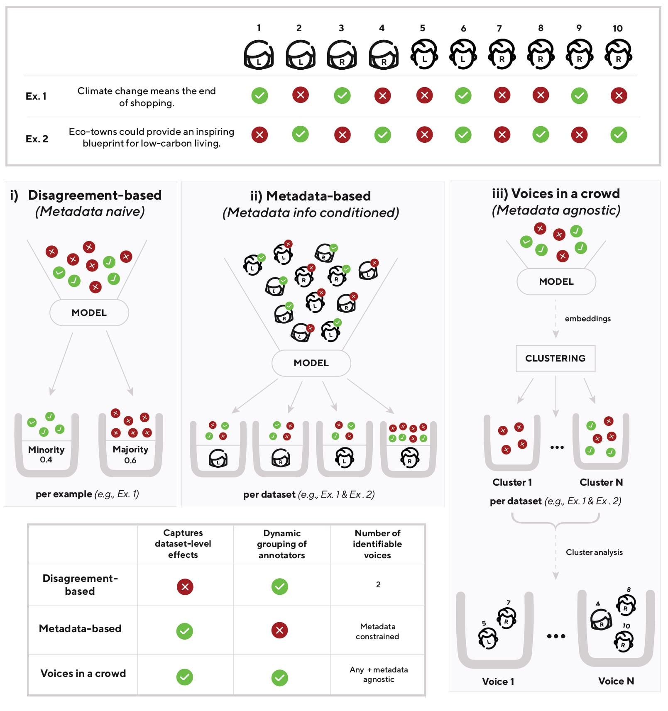
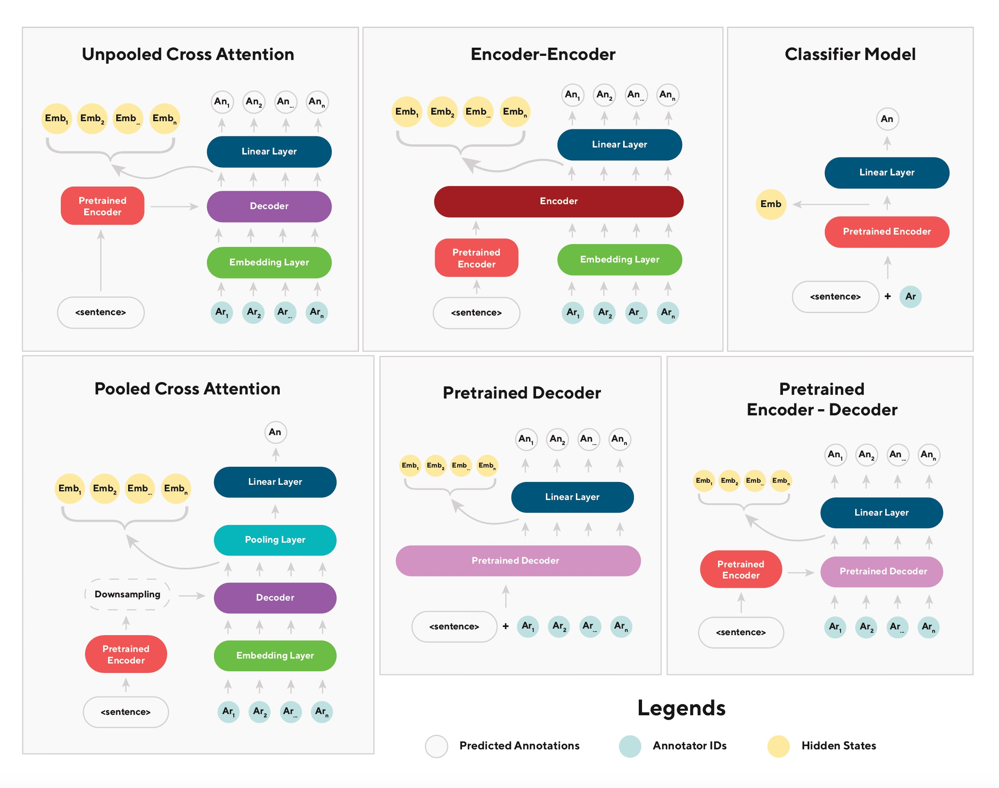

# Voices in a Crowd: Searching for Clusters of Unique Perspectives

###### Abstract

Language models have been shown to reproduce underlying biases existing in their training data, which is the majority perspective by default. Proposed solutions aim to capture minority perspectives by either modelling annotator disagreements or grouping annotators based on shared metadata, both of which face significant challenges. We propose a framework that trains models without encoding annotator metadata, extracts latent embeddings informed by annotator behaviour, and creates clusters of similar opinions, that we refer to as voices. Resulting clusters are validated post-hoc via internal and external quantitative metrics, as well a qualitative analysis to identify the type of voice that each cluster represents. Our results demonstrate the strong generalisation capability of our framework, indicated by resulting clusters being adequately robust, while also capturing minority perspectives based on different demographic factors throughout two distinct datasets.111All code is made available at <https://github.com/Ni-Vi/Cluster>.  

Content Warning: This document contains and discusses examples of potentially offensive and toxic language.  

\patchcmd
?? \patchcmd?? \patchcmd??–?? \patchcmd??–?? \patchcmd??–?? \patchcmd??–?? \patchcmd??–?? \patchcmd??–?? \patchcmd\@@setnamecref ?? ?? \patchcmd\@@setnamecref ?? ?? \patchcmd?? \patchcmd?? \patchcmd’ on page 0 undefined??–?? \patchcmd’ on page 0 undefined??–?? \patchcmd’ on page 0 undefined??–?? \patchcmd’ on page 0 undefined??–?? \patchcmd’ on page 0 undefined??–?? \patchcmd\@@cref ?? ??   

Voices in a Crowd: Searching for Clusters of Unique Perspectives  

  

    Nikolas Vitsakis†  Heriot-Watt University  nv2006@hw.ac.uk                            Amit Parekh†  Heriot-Watt University  amit.parekh@hw.ac.uk                            Ioannis Konstas  Heriot-Watt University  i.konstas@hw.ac.uk    

  

\textsuperscript{\textdagger}\textsuperscript{\textdagger}footnotetext: Equal contribution
[FIGURE S0.F1.g1]

Figure 1: Different approaches for handling annotations: i) disagreement-based create per-example distributional labels which fail to account for dataset-level effects; ii) metadata-based train models on annotations linked with annotator metadata, which often groups disagreeing annotators who share metadata labels; iii) the “Voices in a crowd” approach dynamically creates clusters based on annotation patterns and finally verifies each cluster as a voice based on post-hoc matched metadata labels.
[/FIGURE]

## 1 Introduction

Supervised training is rooted in the presupposition that every example in a dataset has a single ground truth, also known as the gold label (Hettiachchi et al., [2021](#bib.bib30)). However, disagreement among dataset annotators challenges the notion that a single, per-example, ground truth exists (Uma et al., [2022](#bib.bib78), [2021b](#bib.bib80)). While disagreement can be indicative of task difficulty or semantic ambiguity (Wang et al., [2021](#bib.bib82); Jiang and Marneffe, [2022](#bib.bib36); Sandri et al., [2023](#bib.bib65)), it can also indicate the existence of both stable and conflicting inter-annotator perspectives (Basile et al., [2020](#bib.bib7); Abercrombie et al., [2023](#bib.bib1)).  

Nevertheless, capturing minority perspectives present in the data, which we parallel to voices in a crowd, has proven challenging. Two main approaches attempt to move beyond gold labels: i) disagreement-based which leverage annotator disagreement to provide distributional per-item prediction labels (Leonardelli et al., [2023](#bib.bib43); Uma et al., [2022](#bib.bib78), [2021b](#bib.bib80)), and ii) metadata-based, which encode annotator metadata to boost the signal from voices with the same metadata labels (Fleisig et al., [2023](#bib.bib23); Gupta et al., [2023](#bib.bib28); Beck et al., [2023](#bib.bib8)) (i and ii respectively in [Figure 1](#S0.F1 "In Voices in a Crowd: Searching for Clusters of Unique Perspectives")).  

However, both approaches come with strong vulnerabilities. Disagreement-based approaches collapse multiple minority voices into a singular, per-item, minority-majority distribution (Gordon et al., [2022](#bib.bib27)), essentially limiting the number of expressed voices to the number of predicted labels (i.e., two voices in a binary prediction task). On the other hand, while metadata-based approaches allow for multiple minority voices to be expressed (albeit limited by metadata collected), they are based on the erroneous assumption that most members that share metadata labels (e.g., gendered females) will also exhibit similar patterns of behaviour (Beck et al., [2023](#bib.bib9); Dang et al., [2020](#bib.bib15)).  

We introduce a framework that addresses both issues ([Figure 1](#S0.F1 "In Voices in a Crowd: Searching for Clusters of Unique Perspectives")iii): it forms multiple clusters of distinct voices solely based on annotator behaviours exhibited during the annotation process in an unsupervised manner. Our pipeline trains models to predict each annotation made by each annotator for a given text input.  

The final hidden states form what we refer to as behavioural embeddings, representing how a given annotator will behave when shown that text sample, are then clustered via unsupervised methods. We define each created cluster as a potential voice—a group perspective of annotators with similar annotating behaviours.  

We apply our framework to two datasets related to political bias that have been found to contain multiple heterogeneous and conflicting perspectives (de Zarate et al., [2020](#bib.bib18); Menini and Tonelli, [2016](#bib.bib52); Németh, [2023](#bib.bib55); Chen et al., [2019](#bib.bib13)). To identify the group whose voice each cluster belongs to, we match each data point with annotator metadata post-hoc while we also conduct an in-depth qualitative analysis of the clusters themselves. The resulting clusters show high internal label consistency of either i) dataset majority labels (e.g., left-leaning in a left-leaning majority dataset), ii) dataset minority labels (e.g., right-leaning in a left-leaning majority dataset), but most importantly their intersection resulting in iii) inter-minority labels (e.g., right-leaning and highly educated, in a left-leaning, non-highly educated majority dataset). We are the first to dynamically identify voices of minority opinions within larger majority/minority groups, highlighting the significance of providing an intersectional understanding of annotators that goes beyond current grouping methodologies.  

## 2 Related Work

#### Disagreement-Based Solutions

As an alternative to gold labels, recent research has introduced the use of silver labels, i.e., distributional per-item labels that measure disagreement amongst annotators (Leonardelli et al., [2023](#bib.bib43); Uma et al., [2022](#bib.bib78), [2021b](#bib.bib80)). While such approaches allow for the identification of controversial examples in datasets (Fornaciari et al., [2022](#bib.bib24)), they fail to capture stable inter-annotator disagreements throughout the dataset that could provide insight as to why disagreement occurs beyond an item-by-item scale (Abercrombie et al., [2023](#bib.bib1); Vitsakis et al., [2023](#bib.bib81)).  

To be more specific, disagreement-based solutions essentially limit the number of possible expressed voices into the number of predicted labels; the upper bound of possible voices expressed in a binary task is always two, no matter how diverse the dataset. Unfortunately, this type of aggregation leads to the erasure of what we define as inter-minority voices: stable opinions held by minority groups that are in conflict with each other as well as the majority, across examples.  

#### Metadata-Based Solutions

A recent trend aiming to capture diverse perspectives has attempted to group annotators based on their metadata. Such approaches encode collected annotator metadata, such as annotator beliefs (Röttger et al., [2021](#bib.bib63); Davani et al., [2023](#bib.bib16)) or demographics (Fleisig et al., [2023](#bib.bib23); Gupta et al., [2023](#bib.bib28)), into the training pipeline to allow learning of patterns between annotations and in-group tendencies. While the incorporation of such information can seemingly improve model performance in specific tasks (Welch et al., [2020](#bib.bib83)), evidence suggests that such results might be dataset-specific (Lee et al., [2023](#bib.bib40)).  

This is due to the assumption that annotators sharing metadata labels will behave similarly during the annotation process. However, demographics are not necessarily predictive of underlying behaviour (Hwang et al., [2023](#bib.bib34); Beck et al., [2023](#bib.bib9)), while social sciences have also explained similar issues with self-reported measures (Dang et al., [2020](#bib.bib15); Schwarz, [1999](#bib.bib67)). With the added issue that annotator metadata is often not collected outright (Prabhakaran et al., [2021](#bib.bib57)), there is a direct need for methodologies that identify distinct group voices based on factors other than a-priori collected labels.  

#### Unsupervised Learning and Clusters of Voices

To circumvent previously mentioned issues, unsupervised learning could be employed along the lines of how past research identified emergent themes within corpora via clustering of latent textual embeddings (Sevillano et al., [2007](#bib.bib68); Meng et al., [2022](#bib.bib51); Dhillon and Modha, [2001](#bib.bib20)). Recently, Meng et al. ([2022](#bib.bib51)) showed promising results in automatic topic discovery by utilising pretrained language models to cluster representations in a joint latent space: formed by combining latent spaces of multiple modalities during learning, in this case word and document level embeddings. We aim to take this work further through our use of joint behavioural embeddings, informed by both text and annotating behaviour, to automatically find voices, i.e., clusters of similar opinions.  

There are significant challenges to this approach. Fine-tuning pretrained language model embeddings produce embeddings that are often anisotropic and anisometric (Rajaee and Pilehvar, [2021](#bib.bib60); Xu and Koehn, [2021](#bib.bib85)); when paired with their high dimensionality nature, clustering via distance-based metrics is challenging. By using appropriate dimensionality reductions (Mu et al., [2017](#bib.bib53); Cai et al., [2020](#bib.bib11)), the relationships between features can be analysed and clustered through Euclidean distance-based metrics (McInnes et al., [2018](#bib.bib50)).  

## 3 Experimental Setup

Our framework comprises a supervised and an unsupervised component. The former produces latent embeddings informed by both text and annotating behaviour that the latter uses to cluster into voices. Being the first such approach, we compared performance across a variety of transformer-based architectures, clustering, and dimensionality reduction techniques to identify optimal combinations.  

The supervised component explores several modelling choices ([Section 4](#S4 "4 Supervised Component ‣ Voices in a Crowd: Searching for Clusters of Unique Perspectives")) fine-tuned on each dataset to predict each annotator’s individual annotation for a given example without providing any annotator metadata that could bias the model (Vitsakis et al., [2023](#bib.bib81)). The unsupervised component then performs dimensionality reduction on the behavioural embeddings—the final hidden states from the supervised component—and finally creates clusters via several unsupervised algorithms ([Section 5](#S5 "5 Unsupervised Component ‣ Voices in a Crowd: Searching for Clusters of Unique Perspectives")). Clusters are evaluated through internal (i.e., intra-cluster similarity) and external metrics (i.e., consistency of demographic labels in a given cluster), and via qualitative analysis of the best-performing combination of components.  

### 3.1 Datasets

All datasets used in our experiments contain the following annotator demographics: personal political leaning, age, and education level.  

Media Bias Annotation Dataset (MBIC; Spinde et al., [2021a](#bib.bib73), [b](#bib.bib74)) comprises sentences from media articles that may contain political bias from news outlets across the political spectrum (e.g., Fox News, MSNBC, etc.) covering 14 potentially divisive topics (e.g., gender issues, coronavirus, the 2020 American election). 784 crowd-sourced annotators labelled sentences on whether they consider them to contain bias. Demographics were slightly skewed in political ideology (44.3% left-leaning, 26.7% right-leaning, 29.1% center).  

Global Warming Stance Dataset (GWSD; Luo et al., [2020](#bib.bib47)) contains opinions of varying intensities on the subject of global warming, gathered from news outlets with different political leanings (e.g., The New York Times, Breitbart). 398 annotators labelled each sentence with whether they agreed, disagreed, or were neutral. Demographic skew of this dataset mirrored that of MBIC in self-reported political affiliation (46% Democrat, 21.2% Republican, 28.8% Independent, 4% Other).  

## 4 Supervised Component

Each of the following modelling architectures was trained through a different combination of inputs (visual representation in [Appendix B](#A2 "Appendix B Visual Representation of Models used in Training Component ‣ Voices in a Crowd: Searching for Clusters of Unique Perspectives")): given a text sample in a dataset, $\mathbf{x}\in\mathbf{X}$, we predict the individual annotation of each annotator $p_{\theta}(\mathbf{y}|\mathbf{x})$ where $\mathbf{y}=(y_{1},\dots,y_{K})$ and $K$ is the total number of unique annotators within the dataset.  

Unpooled Cross Attention uses a pretrained T5 encoder (Raffel et al., [2020](#bib.bib59)) where the encoded text and the embedded annotator unique identifiers are fed through a decoder to predict each annotator’s annotation as a sequence. Annotator embeddings are directly informed by the text via a cross-attention layer aiming to capture the influence of the text in the annotators’ behaviours.  

Pooled Cross Attention follows Sullivan et al. ([2023](#bib.bib75)), which showed strong performance in predicting annotator disagreement in the 2023 Learning With Disagreements shared task (LeWiDi; Leonardelli et al., [2023](#bib.bib43)). This model is similar in structure to Unpooled Cross Attention since it also uses a T5 encoder as the backbone. However, the dimension for each encoded text token is downsampled, as previous research has indicated possible benefits in the salience of encoded features (Schick and Schütze, [2019](#bib.bib66); Dhingra et al., [2018](#bib.bib21); Holzenberger et al., [2018](#bib.bib31)). Finally, decoder outputs are pooled (Reimers and Gurevych, [2019](#bib.bib62)) to predict an aggregated annotation for each batch.  

Encoder-Encoder treats text and annotators as separate modalities, inspired by vision and language models (Tan and Bansal, [2019](#bib.bib77); Singh et al., [2022](#bib.bib72); Agarwal et al., [2020](#bib.bib2)). The encoded text (using T5) and embedded annotator IDs are concatenated and fed through a bidirectional encoder to predict the annotation of each annotator, allowing for interaction between text and annotator embeddings.  

Classifier Model simply concatenates the text with the unique annotator identifier, before passing to an encoder (BERT; Devlin et al., [2018](#bib.bib19) for GWSD, and RoBERTa; Liu et al., [2019](#bib.bib44) for MBIC) to predict each annotation label independently. The independence between annotators limits interaction between annotators during training.  

[TABLE S4.T1]

<table class="ltx_tabular ltx_centering ltx_guessed_headers ltx_align_middle">
<thead class="ltx_thead">
<tr class="ltx_tr">
<th class="ltx_td ltx_th ltx_th_row ltx_border_tt"></th>
<th class="ltx_td ltx_align_left ltx_th ltx_th_column ltx_border_tt">F1 Score <math class="ltx_Math"><semantics><mo>↑</mo><annotation-xml><ci>↑</ci></annotation-xml><annotation>\uparrow</annotation></semantics></math>
</th>
<th class="ltx_td ltx_nopad_r ltx_align_left ltx_th ltx_th_column ltx_border_tt">APCS <math class="ltx_Math"><semantics><mo>↓</mo><annotation-xml><ci>↓</ci></annotation-xml><annotation>\downarrow</annotation></semantics></math>
</th>
</tr>
</thead>
<tbody class="ltx_tbody">
<tr class="ltx_tr">
<th class="ltx_td ltx_align_justify ltx_th ltx_th_row ltx_border_t">GWSD Dataset</th>
<td class="ltx_td ltx_border_t"></td>
<td class="ltx_td ltx_border_t"></td>
</tr>
<tr class="ltx_tr">
<th class="ltx_td ltx_align_justify ltx_th ltx_th_row">

Unpooled Cross Attention

</th>
<td class="ltx_td ltx_align_left">0.65</td>
<td class="ltx_td ltx_nopad_r ltx_align_left">
<math class="ltx_Math"><semantics><mrow><mn>0.14</mn><mo>±</mo><mn>0.00</mn></mrow><annotation-xml><apply><csymbol>uncertain</csymbol><cn>0.14</cn><cn>0.00</cn></apply></annotation-xml><annotation>0.14\pm 0.00</annotation></semantics></math>.07)
</td>
</tr>
<tr class="ltx_tr">
<th class="ltx_td ltx_align_justify ltx_th ltx_th_row">

Pooled Cross Attention

</th>
<td class="ltx_td ltx_align_left"><math class="ltx_Math"><semantics><mn>0.19</mn><annotation-xml><cn>0.19</cn></annotation-xml><annotation>0.19</annotation></semantics></math></td>
<td class="ltx_td ltx_nopad_r ltx_align_left">
<math class="ltx_Math"><semantics><mrow><mn>0.54</mn><mo>±</mo><mn>0.00</mn></mrow><annotation-xml><apply><csymbol>uncertain</csymbol><cn>0.54</cn><cn>0.00</cn></apply></annotation-xml><annotation>0.54\pm 0.00</annotation></semantics></math>.13)</td>
</tr>
<tr class="ltx_tr">
<th class="ltx_td ltx_align_justify ltx_th ltx_th_row">

Encoder-Encoder

</th>
<td class="ltx_td ltx_align_left"><math class="ltx_Math"><semantics><mn>0.63</mn><annotation-xml><cn>0.63</cn></annotation-xml><annotation>0.63</annotation></semantics></math></td>
<td class="ltx_td ltx_nopad_r ltx_align_left">
<math class="ltx_Math"><semantics><mrow><mn>0.15</mn><mo>±</mo><mn>0.00</mn></mrow><annotation-xml><apply><csymbol>uncertain</csymbol><cn>0.15</cn><cn>0.00</cn></apply></annotation-xml><annotation>0.15\pm 0.00</annotation></semantics></math>.11)</td>
</tr>
<tr class="ltx_tr">
<th class="ltx_td ltx_align_justify ltx_th ltx_th_row">

Classifier Model

</th>
<td class="ltx_td ltx_align_left"><math class="ltx_Math"><semantics><mn>0.63</mn><annotation-xml><cn>0.63</cn></annotation-xml><annotation>0.63</annotation></semantics></math></td>
<td class="ltx_td ltx_nopad_r ltx_align_left">
<math class="ltx_Math"><semantics><mrow><mn>0.81</mn><mo>±</mo><mn>0.00</mn></mrow><annotation-xml><apply><csymbol>uncertain</csymbol><cn>0.81</cn><cn>0.00</cn></apply></annotation-xml><annotation>0.81\pm 0.00</annotation></semantics></math>.14)</td>
</tr>
<tr class="ltx_tr">
<th class="ltx_td ltx_align_justify ltx_th ltx_th_row">

Pretrained Decoder

</th>
<td class="ltx_td ltx_align_left"><math class="ltx_Math"><semantics><mn>0.62</mn><annotation-xml><cn>0.62</cn></annotation-xml><annotation>0.62</annotation></semantics></math></td>
<td class="ltx_td ltx_nopad_r ltx_align_left">
<math class="ltx_Math"><semantics><mrow><mn>0.66</mn><mo>±</mo><mn>0.00</mn></mrow><annotation-xml><apply><csymbol>uncertain</csymbol><cn>0.66</cn><cn>0.00</cn></apply></annotation-xml><annotation>0.66\pm 0.00</annotation></semantics></math>.08)</td>
</tr>
<tr class="ltx_tr">
<th class="ltx_td ltx_align_justify ltx_th ltx_th_row">

Pretrained Encoder-Decoder

</th>
<td class="ltx_td ltx_align_left"><math class="ltx_Math"><semantics><mn>0.19</mn><annotation-xml><cn>0.19</cn></annotation-xml><annotation>0.19</annotation></semantics></math></td>
<td class="ltx_td ltx_nopad_r ltx_align_left">
<math class="ltx_Math"><semantics><mrow><mn>0.95</mn><mo>±</mo><mn>0.00</mn></mrow><annotation-xml><apply><csymbol>uncertain</csymbol><cn>0.95</cn><cn>0.00</cn></apply></annotation-xml><annotation>0.95\pm 0.00</annotation></semantics></math>.02)</td>
</tr>
<tr class="ltx_tr">
<th class="ltx_td ltx_align_justify ltx_th ltx_th_row">MBIC Dataset</th>
<td class="ltx_td"></td>
<td class="ltx_td"></td>
</tr>
<tr class="ltx_tr">
<th class="ltx_td ltx_align_justify ltx_th ltx_th_row">

Unpooled Cross Attention

</th>
<td class="ltx_td ltx_align_left">0.72</td>
<td class="ltx_td ltx_nopad_r ltx_align_left">
<math class="ltx_Math"><semantics><mrow><mn>0.22</mn><mo>±</mo><mn>0.00</mn></mrow><annotation-xml><apply><csymbol>uncertain</csymbol><cn>0.22</cn><cn>0.00</cn></apply></annotation-xml><annotation>0.22\pm 0.00</annotation></semantics></math>.05)</td>
</tr>
<tr class="ltx_tr">
<th class="ltx_td ltx_align_justify ltx_th ltx_th_row">

Pooled Cross Attention

</th>
<td class="ltx_td ltx_align_left"><math class="ltx_Math"><semantics><mn>0.43</mn><annotation-xml><cn>0.43</cn></annotation-xml><annotation>0.43</annotation></semantics></math></td>
<td class="ltx_td ltx_nopad_r ltx_align_left">
<math class="ltx_Math"><semantics><mrow><mn>0.70</mn><mo>±</mo><mn>0.00</mn></mrow><annotation-xml><apply><csymbol>uncertain</csymbol><cn>0.70</cn><cn>0.00</cn></apply></annotation-xml><annotation>0.70\pm 0.00</annotation></semantics></math>.06)</td>
</tr>
<tr class="ltx_tr">
<th class="ltx_td ltx_align_justify ltx_th ltx_th_row">

Encoder-Encoder

</th>
<td class="ltx_td ltx_align_left">0.72</td>
<td class="ltx_td ltx_nopad_r ltx_align_left">
<math class="ltx_Math"><semantics><mrow><mn>0.21</mn><mo>±</mo><mn>0.00</mn></mrow><annotation-xml><apply><csymbol>uncertain</csymbol><cn>0.21</cn><cn>0.00</cn></apply></annotation-xml><annotation>0.21\pm 0.00</annotation></semantics></math>.06)
</td>
</tr>
<tr class="ltx_tr">
<th class="ltx_td ltx_align_justify ltx_th ltx_th_row">

Classifier

</th>
<td class="ltx_td ltx_align_left"><math class="ltx_Math"><semantics><mn>0.38</mn><annotation-xml><cn>0.38</cn></annotation-xml><annotation>0.38</annotation></semantics></math></td>
<td class="ltx_td ltx_nopad_r ltx_align_left">
<math class="ltx_Math"><semantics><mrow><mn>1.00</mn><mo>±</mo><mn>0.00</mn></mrow><annotation-xml><apply><csymbol>uncertain</csymbol><cn>1.00</cn><cn>0.00</cn></apply></annotation-xml><annotation>1.00\pm 0.00</annotation></semantics></math>.00)</td>
</tr>
<tr class="ltx_tr">
<th class="ltx_td ltx_align_justify ltx_th ltx_th_row">

Pretrained Decoder

</th>
<td class="ltx_td ltx_align_left"><math class="ltx_Math"><semantics><mn>0.63</mn><annotation-xml><cn>0.63</cn></annotation-xml><annotation>0.63</annotation></semantics></math></td>
<td class="ltx_td ltx_nopad_r ltx_align_left">
<math class="ltx_Math"><semantics><mrow><mn>0.75</mn><mo>±</mo><mn>0.00</mn></mrow><annotation-xml><apply><csymbol>uncertain</csymbol><cn>0.75</cn><cn>0.00</cn></apply></annotation-xml><annotation>0.75\pm 0.00</annotation></semantics></math>.07)</td>
</tr>
<tr class="ltx_tr">
<th class="ltx_td ltx_align_justify ltx_th ltx_th_row ltx_border_bb">

Pretrained Encoder-Decoder

</th>
<td class="ltx_td ltx_align_left ltx_border_bb"><math class="ltx_Math"><semantics><mn>0.71</mn><annotation-xml><cn>0.71</cn></annotation-xml><annotation>0.71</annotation></semantics></math></td>
<td class="ltx_td ltx_nopad_r ltx_align_left ltx_border_bb">
<math class="ltx_Math"><semantics><mrow><mn>0.74</mn><mo>±</mo><mn>0.00</mn></mrow><annotation-xml><apply><csymbol>uncertain</csymbol><cn>0.74</cn><cn>0.00</cn></apply></annotation-xml><annotation>0.74\pm 0.00</annotation></semantics></math>.25)</td>
</tr>
</tbody>
</table>

Table 1: Overall performance (F1 Score) for the supervised component of our framework (6 modelling architectures) on MBIC and GWSD for the task of individual annotator prediction. We also report the Average Pairwise Cosine Similarity (APCS) across the final hidden states; a lower score indicates greater variety in representation which correlates with better clustering performance.
[/TABLE]

Pretrained Decoder is a decoder-only GPT-2 model (Radford et al., [2019](#bib.bib58)) prompted with the concatenated text and annotator identifiers in the form “<text> [SEP] <Ann 1> [SEP] ... <Ann K>” and predicts the annotation for each annotator.  

Pretrained Encoder-Decoder is similar to Unpooled Cross Attention. It uses a pretrained T5 encoder-decoder instead; the only difference is that the unique annotator identifiers are embedded through the decoder of the T5 model itself—instead of a decoder trained from scratch—to predict each annotator’s annotation autoregressively. The decoder is unidirectional, forcing casual attention between annotators in their canonical order. It is limited compared to the Encoder-Encoder, despite using cross-attention.  

#### Metrics

We compute F1 score to measure the accuracy of predictions, and Average Pairwise Cosine Similarity (APCS) between hidden states of predicted annotations to illustrate how dense the latent states are by the end of training; we show that lower scores generally correlate with better clustering performance (see [Section 5.1](#S5.SS1 "5.1 Results ‣ 5 Unsupervised Component ‣ Voices in a Crowd: Searching for Clusters of Unique Perspectives")).  

#### Results

[Table 1](#S4.T1 "In 4 Supervised Component ‣ Voices in a Crowd: Searching for Clusters of Unique Perspectives") summarises the results. For GWSD, Unpooled Cross Attention achieved the highest F1 score and lowest APCS, whereas it shared a similar performance with Encoder-Encoder for MBIC (albeit the latter has slightly lower APCS). This could be down to the bidirectional attention mechanism (either through cross-attention or encoder self-attention) between the annotator embeddings and the text during training.  

These results also showcase the importance of reporting on the quality of the hidden states. For example, while the Pretrained Encoder-Decoder and Classifier Model have high F1 scores on the MBIC and GWSD datasets respectively, their low scores on APCS indicate dense hidden states that would result in poor clustering outcomes. Overall, our findings show that the bidirectional attention-based models that allow interaction between text and annotator embeddings are the only consistent architectures to show high F1 and low APCS scores.  

[TABLE S4.T2]

<table class="ltx_tabular ltx_centering ltx_guessed_headers ltx_align_middle">
<tbody class="ltx_tbody">
<tr class="ltx_tr">
<th class="ltx_td ltx_th ltx_th_row ltx_border_tt"></th>
<td class="ltx_td ltx_nopad_r ltx_border_tt"></td>
<td class="ltx_td ltx_nopad_r ltx_border_tt"></td>
<td class="ltx_td ltx_nopad_r ltx_border_tt"></td>
<td class="ltx_td ltx_align_center ltx_border_tt">
Purity <math class="ltx_Math"><semantics><mo>↑</mo><annotation-xml><ci>↑</ci></annotation-xml><annotation>\uparrow</annotation></semantics></math>
</td>
<td class="ltx_td ltx_align_center ltx_border_tt">
Prototypical Cluster % <math class="ltx_Math"><semantics><mo>↑</mo><annotation-xml><ci>↑</ci></annotation-xml><annotation>\uparrow</annotation></semantics></math>
</td>
</tr>
<tr class="ltx_tr">
<th class="ltx_td ltx_th ltx_th_row"></th>
<td class="ltx_td ltx_align_left"># Clusters</td>
<td class="ltx_td ltx_align_left">DB Index <math class="ltx_Math"><semantics><mo>↓</mo><annotation-xml><ci>↓</ci></annotation-xml><annotation>\downarrow</annotation></semantics></math>
</td>
<td class="ltx_td ltx_align_left">Silhouette <math class="ltx_Math"><semantics><mo>↑</mo><annotation-xml><ci>↑</ci></annotation-xml><annotation>\uparrow</annotation></semantics></math>
</td>
<td class="ltx_td ltx_align_left ltx_border_t">Political</td>
<td class="ltx_td ltx_align_left ltx_border_t">Education</td>
<td class="ltx_td ltx_align_left ltx_border_t">Political</td>
<td class="ltx_td ltx_nopad_r ltx_align_left ltx_border_t">Education</td>
</tr>
<tr class="ltx_tr">
<th class="ltx_td ltx_align_justify ltx_th ltx_th_row ltx_border_t">

Unpooled Cross Attention

</th>
<td class="ltx_td ltx_border_t"></td>
<td class="ltx_td ltx_border_t"></td>
<td class="ltx_td ltx_border_t"></td>
<td class="ltx_td ltx_border_t"></td>
<td class="ltx_td ltx_border_t"></td>
<td class="ltx_td ltx_border_t"></td>
<td class="ltx_td ltx_border_t"></td>
</tr>
<tr class="ltx_tr">
<th class="ltx_td ltx_align_justify ltx_th ltx_th_row">

No dim. reduction

</th>
<td class="ltx_td ltx_align_left"><math class="ltx_Math"><semantics><mn>19</mn><annotation-xml><cn>19</cn></annotation-xml><annotation>19</annotation></semantics></math></td>
<td class="ltx_td ltx_align_left"><math class="ltx_Math"><semantics><mn>6.35</mn><annotation-xml><cn>6.35</cn></annotation-xml><annotation>6.35</annotation></semantics></math></td>
<td class="ltx_td ltx_align_left"><math class="ltx_Math"><semantics><mn>0.02</mn><annotation-xml><cn>0.02</cn></annotation-xml><annotation>0.02</annotation></semantics></math></td>
<td class="ltx_td ltx_align_left">0.71</td>
<td class="ltx_td ltx_align_left">0.71</td>
<td class="ltx_td ltx_align_left"><math class="ltx_Math"><semantics><mn>15.8</mn><annotation-xml><cn>15.8</cn></annotation-xml><annotation>15.8</annotation></semantics></math></td>
<td class="ltx_td ltx_nopad_r ltx_align_left"><math class="ltx_Math"><semantics><mn>0.0</mn><annotation-xml><cn>0.0</cn></annotation-xml><annotation>0.0</annotation></semantics></math></td>
</tr>
<tr class="ltx_tr">
<th class="ltx_td ltx_align_justify ltx_th ltx_th_row">

w/ PCA

</th>
<td class="ltx_td ltx_align_left"><math class="ltx_Math"><semantics><mn>10</mn><annotation-xml><cn>10</cn></annotation-xml><annotation>10</annotation></semantics></math></td>
<td class="ltx_td ltx_align_left"><math class="ltx_Math"><semantics><mn>1.98</mn><annotation-xml><cn>1.98</cn></annotation-xml><annotation>1.98</annotation></semantics></math></td>
<td class="ltx_td ltx_align_left"><math class="ltx_Math"><semantics><mn>0.10</mn><annotation-xml><cn>0.10</cn></annotation-xml><annotation>0.10</annotation></semantics></math></td>
<td class="ltx_td ltx_align_left"><math class="ltx_Math"><semantics><mn>0.36</mn><annotation-xml><cn>0.36</cn></annotation-xml><annotation>0.36</annotation></semantics></math></td>
<td class="ltx_td ltx_align_left"><math class="ltx_Math"><semantics><mn>0.43</mn><annotation-xml><cn>0.43</cn></annotation-xml><annotation>0.43</annotation></semantics></math></td>
<td class="ltx_td ltx_align_left"><math class="ltx_Math"><semantics><mn>20.0</mn><annotation-xml><cn>20.0</cn></annotation-xml><annotation>20.0</annotation></semantics></math></td>
<td class="ltx_td ltx_nopad_r ltx_align_left"><math class="ltx_Math"><semantics><mn>0.0</mn><annotation-xml><cn>0.0</cn></annotation-xml><annotation>0.0</annotation></semantics></math></td>
</tr>
<tr class="ltx_tr">
<th class="ltx_td ltx_align_justify ltx_th ltx_th_row">

w/ UMAP

</th>
<td class="ltx_td ltx_align_left"><math class="ltx_Math"><semantics><mn>19</mn><annotation-xml><cn>19</cn></annotation-xml><annotation>19</annotation></semantics></math></td>
<td class="ltx_td ltx_align_left"><math class="ltx_Math"><semantics><mn>0.81</mn><annotation-xml><cn>0.81</cn></annotation-xml><annotation>0.81</annotation></semantics></math></td>
<td class="ltx_td ltx_align_left"><math class="ltx_Math"><semantics><mn>0.47</mn><annotation-xml><cn>0.47</cn></annotation-xml><annotation>0.47</annotation></semantics></math></td>
<td class="ltx_td ltx_align_left"><math class="ltx_Math"><semantics><mn>0.38</mn><annotation-xml><cn>0.38</cn></annotation-xml><annotation>0.38</annotation></semantics></math></td>
<td class="ltx_td ltx_align_left"><math class="ltx_Math"><semantics><mn>0.42</mn><annotation-xml><cn>0.42</cn></annotation-xml><annotation>0.42</annotation></semantics></math></td>
<td class="ltx_td ltx_align_left"><math class="ltx_Math"><semantics><mn>31.6</mn><annotation-xml><cn>31.6</cn></annotation-xml><annotation>31.6</annotation></semantics></math></td>
<td class="ltx_td ltx_nopad_r ltx_align_left"><math class="ltx_Math"><semantics><mn>5.3</mn><annotation-xml><cn>5.3</cn></annotation-xml><annotation>5.3</annotation></semantics></math></td>
</tr>
<tr class="ltx_tr">
<th class="ltx_td ltx_align_justify ltx_th ltx_th_row">

Pooled Cross Attention

</th>
<td class="ltx_td"></td>
<td class="ltx_td"></td>
<td class="ltx_td"></td>
<td class="ltx_td"></td>
<td class="ltx_td"></td>
<td class="ltx_td"></td>
<td class="ltx_td"></td>
</tr>
<tr class="ltx_tr">
<th class="ltx_td ltx_align_justify ltx_th ltx_th_row">

No dim. reduction

</th>
<td class="ltx_td ltx_align_left"><math class="ltx_Math"><semantics><mn>19</mn><annotation-xml><cn>19</cn></annotation-xml><annotation>19</annotation></semantics></math></td>
<td class="ltx_td ltx_align_left"><math class="ltx_Math"><semantics><mn>3.03</mn><annotation-xml><cn>3.03</cn></annotation-xml><annotation>3.03</annotation></semantics></math></td>
<td class="ltx_td ltx_align_left"><math class="ltx_Math"><semantics><mn>0.06</mn><annotation-xml><cn>0.06</cn></annotation-xml><annotation>0.06</annotation></semantics></math></td>
<td class="ltx_td ltx_align_left"><math class="ltx_Math"><semantics><mn>0.42</mn><annotation-xml><cn>0.42</cn></annotation-xml><annotation>0.42</annotation></semantics></math></td>
<td class="ltx_td ltx_align_left"><math class="ltx_Math"><semantics><mn>0.48</mn><annotation-xml><cn>0.48</cn></annotation-xml><annotation>0.48</annotation></semantics></math></td>
<td class="ltx_td ltx_align_left"><math class="ltx_Math"><semantics><mn>26.0</mn><annotation-xml><cn>26.0</cn></annotation-xml><annotation>26.0</annotation></semantics></math></td>
<td class="ltx_td ltx_nopad_r ltx_align_left"><math class="ltx_Math"><semantics><mn>5.3</mn><annotation-xml><cn>5.3</cn></annotation-xml><annotation>5.3</annotation></semantics></math></td>
</tr>
<tr class="ltx_tr">
<th class="ltx_td ltx_align_justify ltx_th ltx_th_row">

w/ PCA

</th>
<td class="ltx_td ltx_align_left"><math class="ltx_Math"><semantics><mn>19</mn><annotation-xml><cn>19</cn></annotation-xml><annotation>19</annotation></semantics></math></td>
<td class="ltx_td ltx_align_left"><math class="ltx_Math"><semantics><mn>1.04</mn><annotation-xml><cn>1.04</cn></annotation-xml><annotation>1.04</annotation></semantics></math></td>
<td class="ltx_td ltx_align_left"><math class="ltx_Math"><semantics><mn>0.28</mn><annotation-xml><cn>0.28</cn></annotation-xml><annotation>0.28</annotation></semantics></math></td>
<td class="ltx_td ltx_align_left"><math class="ltx_Math"><semantics><mn>0.47</mn><annotation-xml><cn>0.47</cn></annotation-xml><annotation>0.47</annotation></semantics></math></td>
<td class="ltx_td ltx_align_left"><math class="ltx_Math"><semantics><mn>0.46</mn><annotation-xml><cn>0.46</cn></annotation-xml><annotation>0.46</annotation></semantics></math></td>
<td class="ltx_td ltx_align_left"><math class="ltx_Math"><semantics><mn>5.5</mn><annotation-xml><cn>5.5</cn></annotation-xml><annotation>5.5</annotation></semantics></math></td>
<td class="ltx_td ltx_nopad_r ltx_align_left"><math class="ltx_Math"><semantics><mn>0.0</mn><annotation-xml><cn>0.0</cn></annotation-xml><annotation>0.0</annotation></semantics></math></td>
</tr>
<tr class="ltx_tr">
<th class="ltx_td ltx_align_justify ltx_th ltx_th_row">

w/ UMAP

</th>
<td class="ltx_td ltx_align_left"><math class="ltx_Math"><semantics><mn>12</mn><annotation-xml><cn>12</cn></annotation-xml><annotation>12</annotation></semantics></math></td>
<td class="ltx_td ltx_align_left"><math class="ltx_Math"><semantics><mn>1.13</mn><annotation-xml><cn>1.13</cn></annotation-xml><annotation>1.13</annotation></semantics></math></td>
<td class="ltx_td ltx_align_left"><math class="ltx_Math"><semantics><mn>0.29</mn><annotation-xml><cn>0.29</cn></annotation-xml><annotation>0.29</annotation></semantics></math></td>
<td class="ltx_td ltx_align_left"><math class="ltx_Math"><semantics><mn>0.70</mn><annotation-xml><cn>0.70</cn></annotation-xml><annotation>0.70</annotation></semantics></math></td>
<td class="ltx_td ltx_align_left"><math class="ltx_Math"><semantics><mn>0.50</mn><annotation-xml><cn>0.50</cn></annotation-xml><annotation>0.50</annotation></semantics></math></td>
<td class="ltx_td ltx_align_left"><math class="ltx_Math"><semantics><mn>25.0</mn><annotation-xml><cn>25.0</cn></annotation-xml><annotation>25.0</annotation></semantics></math></td>
<td class="ltx_td ltx_nopad_r ltx_align_left"><math class="ltx_Math"><semantics><mn>8.0</mn><annotation-xml><cn>8.0</cn></annotation-xml><annotation>8.0</annotation></semantics></math></td>
</tr>
<tr class="ltx_tr">
<th class="ltx_td ltx_align_justify ltx_th ltx_th_row">

Encoder-Encoder

</th>
<td class="ltx_td"></td>
<td class="ltx_td"></td>
<td class="ltx_td"></td>
<td class="ltx_td"></td>
<td class="ltx_td"></td>
<td class="ltx_td"></td>
<td class="ltx_td"></td>
</tr>
<tr class="ltx_tr">
<th class="ltx_td ltx_align_justify ltx_th ltx_th_row">

No dim. reduction

</th>
<td class="ltx_td ltx_align_left"><math class="ltx_Math"><semantics><mn>19</mn><annotation-xml><cn>19</cn></annotation-xml><annotation>19</annotation></semantics></math></td>
<td class="ltx_td ltx_align_left"><math class="ltx_Math"><semantics><mn>6.93</mn><annotation-xml><cn>6.93</cn></annotation-xml><annotation>6.93</annotation></semantics></math></td>
<td class="ltx_td ltx_align_left"><math class="ltx_Math"><semantics><mn>0.01</mn><annotation-xml><cn>0.01</cn></annotation-xml><annotation>0.01</annotation></semantics></math></td>
<td class="ltx_td ltx_align_left"><math class="ltx_Math"><semantics><mn>0.41</mn><annotation-xml><cn>0.41</cn></annotation-xml><annotation>0.41</annotation></semantics></math></td>
<td class="ltx_td ltx_align_left"><math class="ltx_Math"><semantics><mn>0.46</mn><annotation-xml><cn>0.46</cn></annotation-xml><annotation>0.46</annotation></semantics></math></td>
<td class="ltx_td ltx_align_left"><math class="ltx_Math"><semantics><mn>21.1</mn><annotation-xml><cn>21.1</cn></annotation-xml><annotation>21.1</annotation></semantics></math></td>
<td class="ltx_td ltx_nopad_r ltx_align_left"><math class="ltx_Math"><semantics><mn>15.8</mn><annotation-xml><cn>15.8</cn></annotation-xml><annotation>15.8</annotation></semantics></math></td>
</tr>
<tr class="ltx_tr">
<th class="ltx_td ltx_align_justify ltx_th ltx_th_row">

w/ PCA

</th>
<td class="ltx_td ltx_align_left"><math class="ltx_Math"><semantics><mn>19</mn><annotation-xml><cn>19</cn></annotation-xml><annotation>19</annotation></semantics></math></td>
<td class="ltx_td ltx_align_left"><math class="ltx_Math"><semantics><mn>0.49</mn><annotation-xml><cn>0.49</cn></annotation-xml><annotation>0.49</annotation></semantics></math></td>
<td class="ltx_td ltx_align_left">0.54</td>
<td class="ltx_td ltx_align_left"><math class="ltx_Math"><semantics><mn>0.53</mn><annotation-xml><cn>0.53</cn></annotation-xml><annotation>0.53</annotation></semantics></math></td>
<td class="ltx_td ltx_align_left"><math class="ltx_Math"><semantics><mn>0.43</mn><annotation-xml><cn>0.43</cn></annotation-xml><annotation>0.43</annotation></semantics></math></td>
<td class="ltx_td ltx_align_left"><math class="ltx_Math"><semantics><mn>15.0</mn><annotation-xml><cn>15.0</cn></annotation-xml><annotation>15.0</annotation></semantics></math></td>
<td class="ltx_td ltx_nopad_r ltx_align_left"><math class="ltx_Math"><semantics><mn>7.7</mn><annotation-xml><cn>7.7</cn></annotation-xml><annotation>7.7</annotation></semantics></math></td>
</tr>
<tr class="ltx_tr">
<th class="ltx_td ltx_align_justify ltx_th ltx_th_row">

w/ UMAP

</th>
<td class="ltx_td ltx_align_left"><math class="ltx_Math"><semantics><mn>19</mn><annotation-xml><cn>19</cn></annotation-xml><annotation>19</annotation></semantics></math></td>
<td class="ltx_td ltx_align_left">0.49</td>
<td class="ltx_td ltx_align_left"><math class="ltx_Math"><semantics><mn>0.53</mn><annotation-xml><cn>0.53</cn></annotation-xml><annotation>0.53</annotation></semantics></math></td>
<td class="ltx_td ltx_align_left"><math class="ltx_Math"><semantics><mn>0.51</mn><annotation-xml><cn>0.51</cn></annotation-xml><annotation>0.51</annotation></semantics></math></td>
<td class="ltx_td ltx_align_left"><math class="ltx_Math"><semantics><mn>0.48</mn><annotation-xml><cn>0.48</cn></annotation-xml><annotation>0.48</annotation></semantics></math></td>
<td class="ltx_td ltx_align_left">36.8</td>
<td class="ltx_td ltx_nopad_r ltx_align_left">21.1</td>
</tr>
<tr class="ltx_tr">
<th class="ltx_td ltx_align_justify ltx_th ltx_th_row">

Classifier Model

</th>
<td class="ltx_td"></td>
<td class="ltx_td"></td>
<td class="ltx_td"></td>
<td class="ltx_td"></td>
<td class="ltx_td"></td>
<td class="ltx_td"></td>
<td class="ltx_td"></td>
</tr>
<tr class="ltx_tr">
<th class="ltx_td ltx_align_justify ltx_th ltx_th_row">

No dim. reduction

</th>
<td class="ltx_td ltx_align_left"><math class="ltx_Math"><semantics><mn>5</mn><annotation-xml><cn>5</cn></annotation-xml><annotation>5</annotation></semantics></math></td>
<td class="ltx_td ltx_align_left"><math class="ltx_Math"><semantics><mn>1.98</mn><annotation-xml><cn>1.98</cn></annotation-xml><annotation>1.98</annotation></semantics></math></td>
<td class="ltx_td ltx_align_left"><math class="ltx_Math"><semantics><mn>0.06</mn><annotation-xml><cn>0.06</cn></annotation-xml><annotation>0.06</annotation></semantics></math></td>
<td class="ltx_td ltx_align_left"><math class="ltx_Math"><semantics><mn>0.49</mn><annotation-xml><cn>0.49</cn></annotation-xml><annotation>0.49</annotation></semantics></math></td>
<td class="ltx_td ltx_align_left"><math class="ltx_Math"><semantics><mn>0.44</mn><annotation-xml><cn>0.44</cn></annotation-xml><annotation>0.44</annotation></semantics></math></td>
<td class="ltx_td ltx_align_left"><math class="ltx_Math"><semantics><mn>0.0</mn><annotation-xml><cn>0.0</cn></annotation-xml><annotation>0.0</annotation></semantics></math></td>
<td class="ltx_td ltx_nopad_r ltx_align_left"><math class="ltx_Math"><semantics><mn>0.0</mn><annotation-xml><cn>0.0</cn></annotation-xml><annotation>0.0</annotation></semantics></math></td>
</tr>
<tr class="ltx_tr">
<th class="ltx_td ltx_align_justify ltx_th ltx_th_row">

w/ PCA

</th>
<td class="ltx_td ltx_align_left"><math class="ltx_Math"><semantics><mn>13</mn><annotation-xml><cn>13</cn></annotation-xml><annotation>13</annotation></semantics></math></td>
<td class="ltx_td ltx_align_left"><math class="ltx_Math"><semantics><mn>0.84</mn><annotation-xml><cn>0.84</cn></annotation-xml><annotation>0.84</annotation></semantics></math></td>
<td class="ltx_td ltx_align_left"><math class="ltx_Math"><semantics><mn>0.36</mn><annotation-xml><cn>0.36</cn></annotation-xml><annotation>0.36</annotation></semantics></math></td>
<td class="ltx_td ltx_align_left"><math class="ltx_Math"><semantics><mn>0.44</mn><annotation-xml><cn>0.44</cn></annotation-xml><annotation>0.44</annotation></semantics></math></td>
<td class="ltx_td ltx_align_left"><math class="ltx_Math"><semantics><mn>0.44</mn><annotation-xml><cn>0.44</cn></annotation-xml><annotation>0.44</annotation></semantics></math></td>
<td class="ltx_td ltx_align_left"><math class="ltx_Math"><semantics><mn>7.4</mn><annotation-xml><cn>7.4</cn></annotation-xml><annotation>7.4</annotation></semantics></math></td>
<td class="ltx_td ltx_nopad_r ltx_align_left"><math class="ltx_Math"><semantics><mn>0.0</mn><annotation-xml><cn>0.0</cn></annotation-xml><annotation>0.0</annotation></semantics></math></td>
</tr>
<tr class="ltx_tr">
<th class="ltx_td ltx_align_justify ltx_th ltx_th_row">

w/ UMAP

</th>
<td class="ltx_td ltx_align_left"><math class="ltx_Math"><semantics><mn>18</mn><annotation-xml><cn>18</cn></annotation-xml><annotation>18</annotation></semantics></math></td>
<td class="ltx_td ltx_align_left"><math class="ltx_Math"><semantics><mn>0.55</mn><annotation-xml><cn>0.55</cn></annotation-xml><annotation>0.55</annotation></semantics></math></td>
<td class="ltx_td ltx_align_left"><math class="ltx_Math"><semantics><mn>0.49</mn><annotation-xml><cn>0.49</cn></annotation-xml><annotation>0.49</annotation></semantics></math></td>
<td class="ltx_td ltx_align_left"><math class="ltx_Math"><semantics><mn>0.44</mn><annotation-xml><cn>0.44</cn></annotation-xml><annotation>0.44</annotation></semantics></math></td>
<td class="ltx_td ltx_align_left"><math class="ltx_Math"><semantics><mn>0.49</mn><annotation-xml><cn>0.49</cn></annotation-xml><annotation>0.49</annotation></semantics></math></td>
<td class="ltx_td ltx_align_left"><math class="ltx_Math"><semantics><mn>5.5</mn><annotation-xml><cn>5.5</cn></annotation-xml><annotation>5.5</annotation></semantics></math></td>
<td class="ltx_td ltx_nopad_r ltx_align_left"><math class="ltx_Math"><semantics><mn>5.5</mn><annotation-xml><cn>5.5</cn></annotation-xml><annotation>5.5</annotation></semantics></math></td>
</tr>
<tr class="ltx_tr">
<th class="ltx_td ltx_align_justify ltx_th ltx_th_row">

Pretrained Decoder

</th>
<td class="ltx_td"></td>
<td class="ltx_td"></td>
<td class="ltx_td"></td>
<td class="ltx_td"></td>
<td class="ltx_td"></td>
<td class="ltx_td"></td>
<td class="ltx_td"></td>
</tr>
<tr class="ltx_tr">
<th class="ltx_td ltx_align_justify ltx_th ltx_th_row">

No dim. reduction

</th>
<td class="ltx_td ltx_align_left"><math class="ltx_Math"><semantics><mn>19</mn><annotation-xml><cn>19</cn></annotation-xml><annotation>19</annotation></semantics></math></td>
<td class="ltx_td ltx_align_left"><math class="ltx_Math"><semantics><mn>2.76</mn><annotation-xml><cn>2.76</cn></annotation-xml><annotation>2.76</annotation></semantics></math></td>
<td class="ltx_td ltx_align_left"><math class="ltx_Math"><semantics><mn>0.06</mn><annotation-xml><cn>0.06</cn></annotation-xml><annotation>0.06</annotation></semantics></math></td>
<td class="ltx_td ltx_align_left"><math class="ltx_Math"><semantics><mn>0.39</mn><annotation-xml><cn>0.39</cn></annotation-xml><annotation>0.39</annotation></semantics></math></td>
<td class="ltx_td ltx_align_left"><math class="ltx_Math"><semantics><mn>0.42</mn><annotation-xml><cn>0.42</cn></annotation-xml><annotation>0.42</annotation></semantics></math></td>
<td class="ltx_td ltx_align_left"><math class="ltx_Math"><semantics><mn>16.0</mn><annotation-xml><cn>16.0</cn></annotation-xml><annotation>16.0</annotation></semantics></math></td>
<td class="ltx_td ltx_nopad_r ltx_align_left"><math class="ltx_Math"><semantics><mn>11.1</mn><annotation-xml><cn>11.1</cn></annotation-xml><annotation>11.1</annotation></semantics></math></td>
</tr>
<tr class="ltx_tr">
<th class="ltx_td ltx_align_justify ltx_th ltx_th_row">

w/ PCA

</th>
<td class="ltx_td ltx_align_left"><math class="ltx_Math"><semantics><mn>18</mn><annotation-xml><cn>18</cn></annotation-xml><annotation>18</annotation></semantics></math></td>
<td class="ltx_td ltx_align_left"><math class="ltx_Math"><semantics><mn>1.89</mn><annotation-xml><cn>1.89</cn></annotation-xml><annotation>1.89</annotation></semantics></math></td>
<td class="ltx_td ltx_align_left"><math class="ltx_Math"><semantics><mn>0.12</mn><annotation-xml><cn>0.12</cn></annotation-xml><annotation>0.12</annotation></semantics></math></td>
<td class="ltx_td ltx_align_left"><math class="ltx_Math"><semantics><mn>0.44</mn><annotation-xml><cn>0.44</cn></annotation-xml><annotation>0.44</annotation></semantics></math></td>
<td class="ltx_td ltx_align_left"><math class="ltx_Math"><semantics><mn>0.61</mn><annotation-xml><cn>0.61</cn></annotation-xml><annotation>0.61</annotation></semantics></math></td>
<td class="ltx_td ltx_align_left"><math class="ltx_Math"><semantics><mn>5.6</mn><annotation-xml><cn>5.6</cn></annotation-xml><annotation>5.6</annotation></semantics></math></td>
<td class="ltx_td ltx_nopad_r ltx_align_left"><math class="ltx_Math"><semantics><mn>5.6</mn><annotation-xml><cn>5.6</cn></annotation-xml><annotation>5.6</annotation></semantics></math></td>
</tr>
<tr class="ltx_tr">
<th class="ltx_td ltx_align_justify ltx_th ltx_th_row">

w/ UMAP

</th>
<td class="ltx_td ltx_align_left"><math class="ltx_Math"><semantics><mn>19</mn><annotation-xml><cn>19</cn></annotation-xml><annotation>19</annotation></semantics></math></td>
<td class="ltx_td ltx_align_left"><math class="ltx_Math"><semantics><mn>1.01</mn><annotation-xml><cn>1.01</cn></annotation-xml><annotation>1.01</annotation></semantics></math></td>
<td class="ltx_td ltx_align_left"><math class="ltx_Math"><semantics><mn>0.34</mn><annotation-xml><cn>0.34</cn></annotation-xml><annotation>0.34</annotation></semantics></math></td>
<td class="ltx_td ltx_align_left"><math class="ltx_Math"><semantics><mn>0.36</mn><annotation-xml><cn>0.36</cn></annotation-xml><annotation>0.36</annotation></semantics></math></td>
<td class="ltx_td ltx_align_left"><math class="ltx_Math"><semantics><mn>0.42</mn><annotation-xml><cn>0.42</cn></annotation-xml><annotation>0.42</annotation></semantics></math></td>
<td class="ltx_td ltx_align_left"><math class="ltx_Math"><semantics><mn>11.0</mn><annotation-xml><cn>11.0</cn></annotation-xml><annotation>11.0</annotation></semantics></math></td>
<td class="ltx_td ltx_nopad_r ltx_align_left"><math class="ltx_Math"><semantics><mn>11.0</mn><annotation-xml><cn>11.0</cn></annotation-xml><annotation>11.0</annotation></semantics></math></td>
</tr>
<tr class="ltx_tr">
<th class="ltx_td ltx_align_justify ltx_th ltx_th_row">Pretrained Encoder-Decoder</th>
<td class="ltx_td"></td>
<td class="ltx_td"></td>
<td class="ltx_td"></td>
<td class="ltx_td"></td>
<td class="ltx_td"></td>
</tr>
<tr class="ltx_tr">
<th class="ltx_td ltx_align_justify ltx_th ltx_th_row">

No dim. reduction

</th>
<td class="ltx_td ltx_align_left"><math class="ltx_Math"><semantics><mn>5</mn><annotation-xml><cn>5</cn></annotation-xml><annotation>5</annotation></semantics></math></td>
<td class="ltx_td ltx_align_left"><math class="ltx_Math"><semantics><mn>1.62</mn><annotation-xml><cn>1.62</cn></annotation-xml><annotation>1.62</annotation></semantics></math></td>
<td class="ltx_td ltx_align_left"><math class="ltx_Math"><semantics><mn>0.16</mn><annotation-xml><cn>0.16</cn></annotation-xml><annotation>0.16</annotation></semantics></math></td>
<td class="ltx_td ltx_align_left"><math class="ltx_Math"><semantics><mn>0.44</mn><annotation-xml><cn>0.44</cn></annotation-xml><annotation>0.44</annotation></semantics></math></td>
<td class="ltx_td ltx_align_left"><math class="ltx_Math"><semantics><mn>0.48</mn><annotation-xml><cn>0.48</cn></annotation-xml><annotation>0.48</annotation></semantics></math></td>
<td class="ltx_td ltx_align_left"><math class="ltx_Math"><semantics><mn>0.0</mn><annotation-xml><cn>0.0</cn></annotation-xml><annotation>0.0</annotation></semantics></math></td>
<td class="ltx_td ltx_nopad_r ltx_align_left"><math class="ltx_Math"><semantics><mn>0.0</mn><annotation-xml><cn>0.0</cn></annotation-xml><annotation>0.0</annotation></semantics></math></td>
</tr>
<tr class="ltx_tr">
<th class="ltx_td ltx_align_justify ltx_th ltx_th_row">

w/ PCA

</th>
<td class="ltx_td ltx_align_left"><math class="ltx_Math"><semantics><mn>8</mn><annotation-xml><cn>8</cn></annotation-xml><annotation>8</annotation></semantics></math></td>
<td class="ltx_td ltx_align_left"><math class="ltx_Math"><semantics><mn>1.74</mn><annotation-xml><cn>1.74</cn></annotation-xml><annotation>1.74</annotation></semantics></math></td>
<td class="ltx_td ltx_align_left"><math class="ltx_Math"><semantics><mn>0.20</mn><annotation-xml><cn>0.20</cn></annotation-xml><annotation>0.20</annotation></semantics></math></td>
<td class="ltx_td ltx_align_left"><math class="ltx_Math"><semantics><mn>0.37</mn><annotation-xml><cn>0.37</cn></annotation-xml><annotation>0.37</annotation></semantics></math></td>
<td class="ltx_td ltx_align_left"><math class="ltx_Math"><semantics><mn>0.46</mn><annotation-xml><cn>0.46</cn></annotation-xml><annotation>0.46</annotation></semantics></math></td>
<td class="ltx_td ltx_align_left"><math class="ltx_Math"><semantics><mn>0.0</mn><annotation-xml><cn>0.0</cn></annotation-xml><annotation>0.0</annotation></semantics></math></td>
<td class="ltx_td ltx_nopad_r ltx_align_left"><math class="ltx_Math"><semantics><mn>0.0</mn><annotation-xml><cn>0.0</cn></annotation-xml><annotation>0.0</annotation></semantics></math></td>
</tr>
<tr class="ltx_tr">
<th class="ltx_td ltx_align_justify ltx_th ltx_th_row ltx_border_bb">

w/ UMAP

</th>
<td class="ltx_td ltx_align_left ltx_border_bb"><math class="ltx_Math"><semantics><mn>5</mn><annotation-xml><cn>5</cn></annotation-xml><annotation>5</annotation></semantics></math></td>
<td class="ltx_td ltx_align_left ltx_border_bb"><math class="ltx_Math"><semantics><mn>0.75</mn><annotation-xml><cn>0.75</cn></annotation-xml><annotation>0.75</annotation></semantics></math></td>
<td class="ltx_td ltx_align_left ltx_border_bb"><math class="ltx_Math"><semantics><mn>0.44</mn><annotation-xml><cn>0.44</cn></annotation-xml><annotation>0.44</annotation></semantics></math></td>
<td class="ltx_td ltx_align_left ltx_border_bb"><math class="ltx_Math"><semantics><mn>0.46</mn><annotation-xml><cn>0.46</cn></annotation-xml><annotation>0.46</annotation></semantics></math></td>
<td class="ltx_td ltx_align_left ltx_border_bb"><math class="ltx_Math"><semantics><mn>0.46</mn><annotation-xml><cn>0.46</cn></annotation-xml><annotation>0.46</annotation></semantics></math></td>
<td class="ltx_td ltx_align_left ltx_border_bb"><math class="ltx_Math"><semantics><mn>0.0</mn><annotation-xml><cn>0.0</cn></annotation-xml><annotation>0.0</annotation></semantics></math></td>
<td class="ltx_td ltx_nopad_r ltx_align_left ltx_border_bb"><math class="ltx_Math"><semantics><mn>0.0</mn><annotation-xml><cn>0.0</cn></annotation-xml><annotation>0.0</annotation></semantics></math></td>
</tr>
</tbody>
</table>

Table 2: Internal and external validation metrics for the unsupervised component with the K-Means clustering algorithm on the MBIC dataset.
Internal validation metrics explain intra-cluster separation through higher Silhouette and lower Davies-Bouldin (DB Index) scores. External validity indicates the potential capturing of a voice, measured by the average Purity score and % of prototypical clusters.
[/TABLE]

## 5 Unsupervised Component

#### Dimensionality Reduction

We perform dimensionality reduction on the hidden states before clustering as follows: a baseline without dimensionality reduction, Principal Component Analysis (PCA; a linear combination of components) and Uniform Manifold Approximation and Projection for Dimension Reduction (UMAP; a non-linear transformation algorithm; McInnes et al., [2018](#bib.bib50)). Both PCA (Sia et al., [2020](#bib.bib71); Gupta et al., [2019](#bib.bib29)) and UMAP (Cai et al., [2020](#bib.bib11); Ait-Saada and Nadif, [2023](#bib.bib3); George and Sumathy, [2023](#bib.bib26)) improve feature representation in high-dimensional latent spaces leading to improved clustering.  

#### Clustering Algorithms

We used three clustering techniques: K-means (MacQueen et al., [1967](#bib.bib48); Pedregosa et al., [2011](#bib.bib56)), Gaussian Mixture Models (GMM; Rasmussen, [1999](#bib.bib61)), and HDBSCAN (McInnes et al., [2017](#bib.bib49)). Each of these techniques have been used to cluster features when paired with either PCA (Hosseini and Varzaneh, [2022](#bib.bib32); Liu et al., [2021](#bib.bib45); Asyaky and Mandala, [2021](#bib.bib6)), or UMAP (Allaoui et al., [2020](#bib.bib4); Asyaky and Mandala, [2021](#bib.bib6)).  

#### Metrics

We use two internal validation metrics to assess average similarity scores between clusters, namely Silhouette (Rousseeuw, [1987](#bib.bib64); Pedregosa et al., [2011](#bib.bib56)) and Davies-Bouldin Index (Davies and Bouldin, [1979](#bib.bib17); Pedregosa et al., [2011](#bib.bib56)). Silhouette assesses intra-cluster separation and is bound between -1 and 1, with 1 being the best possible score, with a threshold of 0.5 for moderate clusters (Shahapure and Nicholas, [2020](#bib.bib69); Lengyel and Botta-Dukát, [2019](#bib.bib42)). The Davies-Bouldin Index measures intra-cluster dissimilarity, with 0 indicating the lowest possible score (Idrus, [2022](#bib.bib35); Kärkkäinen and Fränti, [2000](#bib.bib38)).  

We use Purity to assess the external validity of clusters. Purity measures the internal consistency of assigned labels within a cluster and evaluates whether a cluster is prototypical (i.e., representative) across provided labels within a dataset (Christodoulopoulos et al., [2010](#bib.bib14)). In our case, we report both average purity and the percentage of prototypical clusters per method. We define a cluster as prototypical if its metadata label purity (i.e., political leaning and education level) is significantly different from the original dataset metadata label distribution with a threshold of $\pm$ 10%. These metrics allow us to automatically assess whether a cluster emerging from annotator behaviours during training is linked to any of the annotator labels (e.g., a cluster with high right-leaning metadata label purity) and thus is indicative of a distinct voice.  

[TABLE S5.T3]

<table class="ltx_tabular ltx_centering ltx_guessed_headers ltx_align_middle">
<thead class="ltx_thead">
<tr class="ltx_tr">
<th class="ltx_td ltx_align_center ltx_th ltx_th_column ltx_border_tt">Dataset/Cluster No.</th>
<th class="ltx_td ltx_align_justify ltx_th ltx_th_column ltx_border_tt">

Examples

</th>
<th class="ltx_td ltx_align_center ltx_th ltx_th_column ltx_border_tt">Bias Label</th>
<th class="ltx_td ltx_nopad_r ltx_align_justify ltx_align_top ltx_th ltx_th_column ltx_border_tt">

Distribution

</th>
</tr>
</thead>
<tbody class="ltx_tbody">
<tr class="ltx_tr">
<td class="ltx_td ltx_align_center ltx_border_t">MBIC -1</td>
<td class="ltx_td ltx_align_justify ltx_border_t">

British Olympic swimmer Sharron Davies also slammed the concept of transgender athletes.

</td>
<td class="ltx_td ltx_align_center ltx_border_t">✓</td>
<td class="ltx_td ltx_nopad_r ltx_align_justify ltx_align_top ltx_border_t">

</td>
</tr>
<tr class="ltx_tr">
<td class="ltx_td ltx_align_justify ltx_border_t">

BBC Presenter Gabby Logan has said that it is not fair that transgender women can compete in sport alongside biologically female women.

</td>
<td class="ltx_td ltx_align_center">✓</td>
</tr>
<tr class="ltx_tr">
<td class="ltx_td ltx_align_justify ltx_border_t">

BBC Presenter Gabby Logan has said that it is not fair that transgender women can compete in sport alongside biologically female women.

</td>
<td class="ltx_td ltx_align_center">✗</td>
</tr>
<tr class="ltx_tr">
<td class="ltx_td ltx_align_center ltx_border_t">MBIC -7</td>
<td class="ltx_td ltx_align_justify ltx_border_t">

Trump — who has been criticized for painting an overly rosy picture of the outbreak, often contradicting his own health officials - insisted on Friday that his administration was “magnificently organized” and “totally prepared" to address the virus.

</td>
<td class="ltx_td ltx_align_center ltx_border_t">✓</td>
<td class="ltx_td ltx_nopad_r ltx_align_justify ltx_align_top ltx_border_t">

</td>
</tr>
<tr class="ltx_tr">
<td class="ltx_td ltx_align_justify ltx_border_t">

Google declined to offer details beyond Huntley’s tweets, but the unusually public attribution is a sign of how sensitive Americans have become to digital espionage efforts aimed at political campaigns.

</td>
<td class="ltx_td ltx_align_center">✗</td>
</tr>
<tr class="ltx_tr">
<td class="ltx_td ltx_align_justify ltx_border_t">

At least 25 transgender or gender-nonconforming people were killed in violent attacks in the United States last year, according to the Human Rights Campaign, which has been tracking anti-trans violence since at least 2015.

</td>
<td class="ltx_td ltx_align_center">✓</td>
</tr>
<tr class="ltx_tr">
<td class="ltx_td ltx_border_t"></td>
<td class="ltx_td ltx_align_justify ltx_border_t">

Though conservatives try to demonize Ocasio-Cortez an Omar, their actual policy views are perfectly mainstream. The New York lawmaker proposed a 70 percent tax on top incomes — a view backed by public opinion and many well-respected economists.

</td>
<td class="ltx_td ltx_align_center ltx_border_t">✗</td>
<td class="ltx_td ltx_nopad_r ltx_align_justify ltx_align_top ltx_border_bb ltx_border_t">

</td>
</tr>
<tr class="ltx_tr">
<td class="ltx_td ltx_align_center">MBIC -8</td>
<td class="ltx_td ltx_align_justify ltx_border_t">

British Olympic swimmer Sharron Davies also slammed the concept of transgender athletes.

</td>
<td class="ltx_td ltx_align_center">✗</td>
</tr>
<tr class="ltx_tr">
<td class="ltx_td ltx_border_bb"></td>
<td class="ltx_td ltx_align_justify ltx_border_bb ltx_border_t">

At least 25 transgender or gender-nonconforming people were killed in violent attacks in the United States last year, according to the Human Rights Campaign, which has been tracking anti-trans violence since at least 2015.

</td>
<td class="ltx_td ltx_align_center ltx_border_bb">✓</td>
</tr>
</tbody>
</table>

Table 3: Analysis of clusters on the MBIC dataset with the Encoder-Encoder architecture and UMAP dimensionality reduction. We report the cluster number, representative examples of the cluster, and their paired annotation (✓  for perceived bias, ✗for no perceived bias). We also show the distribution of annotator characteristics which is indicative of the prototypical nature of each cluster.
[/TABLE]

### 5.1 Results

Optimal cluster numbers were automatically calculated using hyperparameter sweeps to maximise the Silhouette score (see [Appendix A](#A1 "Appendix A Training Details ‣ Voices in a Crowd: Searching for Clusters of Unique Perspectives") for more information). [Table 2](#S4.T2 "In Results ‣ 4 Supervised Component ‣ Voices in a Crowd: Searching for Clusters of Unique Perspectives") shows the clustering of our best performance combination, K-means with a UMAP dimensionality reduction on the MBIC dataset as other configurations performed less optimally as seen in [Appendix C](#A3 "Appendix C Cluster Metrics ‣ Voices in a Crowd: Searching for Clusters of Unique Perspectives").  

#### Internal Validity Metrics

Overall, dimensionality reduction significantly impacted the quality of the resulting clusters; UMAP consistently outperformed PCA throughout, while no dimensionality reduction showed the worst overall results (for averages, see [Section A.2](#A1.SS2 "A.2 Dimensionality Reduction ‣ Appendix A Training Details ‣ Voices in a Crowd: Searching for Clusters of Unique Perspectives")). The only exception was Encoder-Encoder, where PCA and UMAP perform comparably.  

Encoder-Encoder performed best overall: being the only model with Silhouette and Davies-Boulding Index scores above/below the respective cutoff points of 0.5, indicating adequate intra-cluster separation for both metrics (Shahapure and Nicholas, [2020](#bib.bib69); Lengyel and Botta-Dukát, [2019](#bib.bib42); Idrus, [2022](#bib.bib35)). Interestingly, the Classifier Model also performed relatively well despite being the lowest-performing of the supervised component.  

#### External Validity Metrics

Average purity scores are largely inconclusive, as higher scores are not always linked with better performance as indicated by any other evaluative metric. For example, Unpooled Cross Attention with no dimensionality reduction, scores poorly on internal validation metrics, while average purity is the highest across both metadata labels.  

Overall, these findings echo those seen in [Table 1](#S4.T1 "In 4 Supervised Component ‣ Voices in a Crowd: Searching for Clusters of Unique Perspectives"), where models with the lowest APCS scores also had the best performance in internal and external validation metrics. The best-performing model was Encoder-Encoder with UMAP outperforming PCA, followed by Unpooled Cross Attention. While UMAP only marginally outperformed PCA in terms of internal validation scores, the label distributions in the clusters resulting from PCA were minimally different when compared to label distributions present in the original data. Finally, we found that prototypical clustering percentage was a strong indicator of capturing representative clusters of voices.  

Manual inspection of PCA-formed clusters indicated that clusters formation was mostly based around the most salient features discovered during training, namely the unique annotator tokens or the inter-sentence similarities. A possible reason for this phenomenon could be that PCA reduces dimensionalities to the most salient principal components, which are not conducive to clustering based on contextual features in large language models (Cai et al., [2020](#bib.bib11)). Interestingly, this phenomenon was reproduced with UMAP when instructing the model to focus on finding clusters based on local and not overarching features (McInnes et al., [2018](#bib.bib50)).222A possible solution to this issue is to remove the top principal components resulting in more salient representations, and thus improve clustering performance (Mu et al., [2017](#bib.bib53)); we leave this for future work.  

[TABLE S5.T4]

<table class="ltx_tabular ltx_centering ltx_align_middle">
<tbody class="ltx_tbody">
<tr class="ltx_tr">
<td class="ltx_td ltx_align_center ltx_border_tt">Dataset/Cluster No.</td>
<td class="ltx_td ltx_align_justify ltx_border_tt">

Examples

</td>
<td class="ltx_td ltx_align_center ltx_border_tt">Agreement Label</td>
<td class="ltx_td ltx_nopad_r ltx_align_justify ltx_align_top ltx_border_tt">

Distribution

</td>
</tr>
<tr class="ltx_tr">
<td class="ltx_td ltx_align_center ltx_border_t">GWSD -9</td>
<td class="ltx_td ltx_align_justify ltx_border_t">

The early 21st-century drought that afflicted Central Asia is the worst in Mongolia in more than 1,000 years, and made harsher by the higher temperatures consistent with man-made global warming.

</td>
<td class="ltx_td ltx_align_center ltx_border_t">✓</td>
<td class="ltx_td ltx_nopad_r ltx_align_justify ltx_align_top ltx_border_t">

</td>
</tr>
<tr class="ltx_tr">
<td class="ltx_td ltx_align_justify ltx_border_t">

Climate change means the end of shopping.

</td>
<td class="ltx_td ltx_align_center"><math class="ltx_Math"><semantics><mo>∼</mo><annotation-xml><csymbol>similar-to</csymbol></annotation-xml><annotation>\sim</annotation></semantics></math></td>
</tr>
<tr class="ltx_tr">
<td class="ltx_td ltx_align_justify ltx_border_t">

The oil sands are responsible for just 0.001 percent of global greenhouse emissions

</td>
<td class="ltx_td ltx_align_center"><math class="ltx_Math"><semantics><mo>∼</mo><annotation-xml><csymbol>similar-to</csymbol></annotation-xml><annotation>\sim</annotation></semantics></math></td>
</tr>
<tr class="ltx_tr">
<td class="ltx_td ltx_align_center ltx_border_t">GWSD -2</td>
<td class="ltx_td ltx_align_justify ltx_border_t">

There is a connection between human activity and an assumptive change in global climate.

</td>
<td class="ltx_td ltx_align_center ltx_border_t">✓</td>
<td class="ltx_td ltx_nopad_r ltx_align_justify ltx_align_top ltx_border_t">

</td>
</tr>
<tr class="ltx_tr">
<td class="ltx_td ltx_align_justify ltx_border_t">

Hiring a White House "climate change czar" would be a good idea.

</td>
<td class="ltx_td ltx_align_center">✓</td>
</tr>
<tr class="ltx_tr">
<td class="ltx_td ltx_align_justify ltx_border_t">

Scaring young people into believing that climate change is going to kill young people is child abuse.

</td>
<td class="ltx_td ltx_align_center">✗</td>
</tr>
<tr class="ltx_tr">
<td class="ltx_td ltx_align_center ltx_border_bb ltx_border_t">GWSD -5</td>
<td class="ltx_td ltx_align_justify ltx_border_t">

The oil sands are responsible for just 0.001 percent of global greenhouse emissions

</td>
<td class="ltx_td ltx_align_center ltx_border_t">✓</td>
<td class="ltx_td ltx_nopad_r ltx_align_justify ltx_align_top ltx_border_bb ltx_border_t">

</td>
</tr>
<tr class="ltx_tr">
<td class="ltx_td ltx_align_justify ltx_border_t">

This could mean that current I.P.C.C. model predictions for the next century are wrong, and there will be no cooling in the North Atlantic to partially offset the effects of global climate change over North America and Europe.

</td>
<td class="ltx_td ltx_align_center">✓</td>
</tr>
<tr class="ltx_tr">
<td class="ltx_td ltx_align_justify ltx_border_bb ltx_border_t">

Eco-towns could provide an inspiring blueprint for low-carbon living

</td>
<td class="ltx_td ltx_align_center ltx_border_bb">✗</td>
</tr>
</tbody>
</table>

Table 4: Analysis of clusters on the GWSD dataset using same parameters as the MBIC dataset, and results are shown in a similar fashion (✓agree with the statement, ✗for disagree and $\sim$ for neutral). Distribution of annotator characteristics is provided.
[/TABLE]

## 6 Qualitative case study

While encouraging, our findings cannot be simply explained through either internal or external validation metrics; to assess whether a cluster is truly indicative of a voice, we looked at the content of the clusters themselves. High label purity of a cluster should be reflected in the text-annotation pair content (i.e., high left-leaning purity should be paired with left-leaning opinions). Given our labels, this can result in three distinct types of voices: majority, minority and inter-minority.  

Majority voice clusters consist of high purity of a majority metadata label (e.g., left-leaning opinions in a left-leaning majority dataset), while minority voices are the same for dataset minority labels (e.g., right-leaning opinions in a left-leaning majority dataset), and inter-minority voices, which are clusters that consist of high purity across combination of metadata labels (e.g., high purity in both right-leaning and highly educated metadata labels in a dataset with left-leaning and non-highly educated majority metadata labels.  

To extract our clusters, we used the best-performing combination, i.e., Encoder-Encoder with UMAP and K-means clustering. We pick three prototypical clusters out of a single clustering run, each representing a distinct voice, and discuss them in [Table 3](#S5.T3 "In Metrics ‣ 5 Unsupervised Component ‣ Voices in a Crowd: Searching for Clusters of Unique Perspectives") and [Table 4](#S5.T4 "In External Validity Metrics ‣ 5.1 Results ‣ 5 Unsupervised Component ‣ Voices in a Crowd: Searching for Clusters of Unique Perspectives").  

### 6.1 MBIC Dataset

#### MBIC-1 / Minority Voice

This cluster is a prototypical example of minority-led consensus amongst annotators. The cluster’s distribution is more even, following the original label distribution closer (44.3%, 29.1%, 26.7% for left, center, and right political lean). Such clusters often contain different annotations for the same sentences, while there is no strong emerging effect from collected labels.  

#### MBIC-7 / Minority voice

This is a minority voice, with the distribution of labels indicating that the cluster is primarily formed of right-leaning opinions. While Item 1 is expectantly labelled as ‘bias’, Item 3 contains no obvious biased words, despite coming from an obvious place of concern for a marginalised minority.  

#### MBIC-8 / Majority voice

This is an example of a majority dominant cluster. Such clusters are populated by the opinion of the original dataset’s distributional majority label although with a much heavier skew, indicating a stable and consistent behaviour of the group. The labelling distribution of this cluster is expected to be populated by left-leaning views and indeed sentences that were previously labelled as biased in non-left-leaning clusters (Item 1 of Cluster 1, and Item 3 of Cluster 7), were consistently found not to be labelled as such.  

### 6.2 GWSD Dataset

#### GWSD-9 / Minority voice

This is an example of a minority cluster, as indicated by the differences in the distribution of the minority label between the cluster and the original data (21% in the original data, 60% representation in this cluster). While the expressed opinions within were generally agreeable about climate-changing effects, there was no agreement with more politically charged statements.  

#### GWSD-2 / Majority voice

This is a majority-dominant cluster. Opinions that could be perceived as more political were found to be more common (Item 2), while there was also evidence of general agreement with some strongly politically charged examples (Item 3).  

#### GWSD-5 / Minority-Minority voice

An example of a minority within a minority perspective. Opinions are over-represented by two minority labels, the “republican” in terms of political affiliation, and that of the “higher degree” in terms of education level (8.4% label representation in the original dataset). Opinions showed fewer “neutral” responses and were generally indicative of a well-informed audience, explicitly agreeing with more technical items such as Item 2 and especially Item 1, which received mostly “neutral” scores in other clusters (e.g., Cluster 9).  

## 7 Conclusion

We propose a novel framework to identify underlying minority perspectives in data. We compared six distinct model architectures trained on a classification task, without providing any annotator metadata to avoid biasing their training. Subsequently, final hidden states were passed through various methods of dimensionality reduction (UMAP and PCA), with the resulting embeddings used to create clusters through various unsupervised algorithms (K-means, GMM, and HDBSCAN).  

The resulting clusters were adequately separated according to internal and external validation metrics. Further qualitative analysis of clusters produced by our best-performing model showcased the ability of our framework to capture perspectives as shown by three distinct types: clusters representative of a minority, a majority, and clusters that captured multiple minority labels, i.e., a minority within a minority.  

## Limitations & Ethical Considerations

#### Internal & External Validity Related

As shown in [Tables 2](#S4.T2 "In Results ‣ 4 Supervised Component ‣ Voices in a Crowd: Searching for Clusters of Unique Perspectives") and [C](#A3 "Appendix C Cluster Metrics ‣ Voices in a Crowd: Searching for Clusters of Unique Perspectives") while internal validation scores can be indicative of well-defined clusters of minority perspectives, they are not necessarily so. We explained in [Appendix C](#A3 "Appendix C Cluster Metrics ‣ Voices in a Crowd: Searching for Clusters of Unique Perspectives"), this might be due to our training on unique annotator tokens, which might hinder organic clustering based on behaviour, by providing an alternative and easier to learn signal in unique annotator tokens.  

We aim to expand upon this in future work, by modifying training of our supervised component to incorporate aspects more representative of group behaviours such as inter and intra annotator disagreement (Abercrombie et al., [2023](#bib.bib1); Leonardelli et al., [2023](#bib.bib43); Uma et al., [2021b](#bib.bib80), [a](#bib.bib79)). This would expand upon limitations of disagreement-bases approaches described in [Section 2](#S2 "2 Related Work ‣ Voices in a Crowd: Searching for Clusters of Unique Perspectives"), by enabling group behavioural signals, as indicated by annotator agreement / disagreement, to be captured on the dataset-level. Furthermore, incorporation of such methodologies into our framework would further expand upon the limitations of disagreement-based methodologies by allowing for any number of voices to be expressed.  

#### Automatic Detection of Voices

A current limitation of the framework is the ability to automatically assess the performance of each combination without manual inspection. While necessary at this step to prove the efficacy of our framework, we aim to expand this in future work by introducing a a component that automatically extracts information from each cluster to allow for identification of voice without the need of matching clusters with metadata labels post hoc.  

We aim to employ a similar methodology to Fleisig et al. ([2023](#bib.bib23)), whose pipeline includes a GPT-2 based component that predicts the demographic group targeted by a given text. We aim to include similar components to extrapolate attitudinal and behavioural indicators of formed clusters via analysing the text-annotation pairs to generate labels representative of each captured voice similarly to how research in sentiment analysis, has previously classified opinions on politically charged data (Dorle and Pise, [2018](#bib.bib22); Kazienko et al., [2023](#bib.bib39); Ansari et al., [2020](#bib.bib5)).  

#### Labels and further marginalisation of minorities

Our model uses labels procured during data gathering to validate emergent clusters. However, the labelling gathering process can potentially be an erasing process towards minorities in and of itself (Hovy and Prabhumoye, [2021](#bib.bib33); Chandrabose et al., [2021](#bib.bib12)). For example, the labelling process can discriminate against socially marginalised minorities by not providing options consistent with an individual’s identity (Chandrabose et al., [2021](#bib.bib12); Jo and Gebru, [2020](#bib.bib37)).  

In our case, we encountered this limitation with the GWSD dataset (Luo et al., [2020](#bib.bib47)), which collected categorical labels about political affiliation of participants. Beyond the three primary labels ("Democrat", "Independent", "Republican"), the rest were aggregated into the "other" label. This resulted in a minority so small that our clustering methodology could not adequately disentangle it from the rest. Directions aimed towards future research as explained in [Automatic Detection of Voices](#Sx1.SS0.SSS0.Px2 "Automatic Detection of Voices ‣ Limitations & Ethical Considerations ‣ Voices in a Crowd: Searching for Clusters of Unique Perspectives") should address these concerns for future iterations of our framework.  

#### Dual Use of the Model

An unfortunate outcome of methodologies aim to capture and expressed more nuanced perspectives can lead to identification of marginalised minority perspectives in datasets, which can lead to concerning practice of their removal in order to enhance a model’s general performance (Xu et al., [2021](#bib.bib84); Sun et al., [2019](#bib.bib76)). Nevertheless, Gaci et al. ([2023](#bib.bib25)) has also proposed that methodologies that identify minority perspectives can be used to curate datasets in order to amplify voices of specific marginalised groups.  

We urge researchers to be transparent in their indented use of our framework, and to follow ethical frameworks and solutions that have been previously highlighted by the field in from the data collection process to model training and intended use (Hovy and Prabhumoye, [2021](#bib.bib33); Blodgett et al., [2020](#bib.bib10); Navigli et al., [2023](#bib.bib54); Leidner and Plachouras, [2017](#bib.bib41); Shmueli et al., [2021](#bib.bib70)).  

## References

* Abercrombie et al. (2023)  Gavin Abercrombie, Verena Rieser, and Dirk Hovy. 2023.   Consistency is key: Disentangling label variation in natural language processing with intra-annotator agreement.   *arXiv preprint arXiv:2301.10684*. 
* Agarwal et al. (2020)  Shubham Agarwal, Trung Bui, Joon-Young Lee, Ioannis Konstas, and Verena Rieser. 2020.   History for visual dialog: Do we really need it?   *arXiv preprint arXiv:2005.07493*. 
* Ait-Saada and Nadif (2023)  Mira Ait-Saada and Mohamed Nadif. 2023.   Is anisotropy truly harmful? a case study on text clustering.   In *Proceedings of the 61st Annual Meeting of the Association for Computational Linguistics (Volume 2: Short Papers)*, pages 1194–1203. 
* Allaoui et al. (2020)  Mebarka Allaoui, Mohammed Lamine Kherfi, and Abdelhakim Cheriet. 2020.   Considerably improving clustering algorithms using umap dimensionality reduction technique: A comparative study.   In *International conference on image and signal processing*, pages 317–325. Springer. 
* Ansari et al. (2020)  Mohd Zeeshan Ansari, Mohd-Bilal Aziz, MO Siddiqui, H Mehra, and KP Singh. 2020.   Analysis of political sentiment orientations on twitter.   *Procedia Computer Science*, 167:1821–1828. 
* Asyaky and Mandala (2021)  Muhammad Sidik Asyaky and Rila Mandala. 2021.   Improving the performance of hdbscan on short text clustering by using word embedding and umap.   In *2021 8th international conference on advanced informatics: Concepts, theory and applications (ICAICTA)*, pages 1–6. IEEE. 
* Basile et al. (2020)  Valerio Basile et al. 2020.   It’s the end of the gold standard as we know it. on the impact of pre-aggregation on the evaluation of highly subjective tasks.   In *CEUR WORKSHOP PROCEEDINGS*, volume 2776, pages 31–40. CEUR-WS. 
* Beck et al. (2023)  Tilman Beck, Hendrik Schuff, Anne Lauscher, and Iryna Gurevych. 2023.   How (not) to use sociodemographic information for subjective nlp tasks.   *arXiv preprint arXiv:2309.07034*. 
* Beck et al. (2023)  Tilman Beck, Hendrik Schuff, Anne Lauscher, and Iryna Gurevych. 2023.   [Sensitivity, Performance, Robustness: Deconstructing the Effect of Sociodemographic Prompting](https://doi.org/10.48550/arXiv.2309.07034).   *arXiv e-prints*, page arXiv:2309.07034. 
* Blodgett et al. (2020)  Su Lin Blodgett, Solon Barocas, Hal Daumé III, and Hanna Wallach. 2020.   [Language (technology) is power: A critical survey of “bias” in NLP](https://doi.org/10.18653/v1/2020.acl-main.485).   In *Proceedings of the 58th Annual Meeting of the Association for Computational Linguistics*, pages 5454–5476, Online. Association for Computational Linguistics. 
* Cai et al. (2020)  Xingyu Cai, Jiaji Huang, Yuchen Bian, and Kenneth Church. 2020.   Isotropy in the contextual embedding space: Clusters and manifolds.   In *International Conference on Learning Representations*. 
* Chandrabose et al. (2021)  Aravindan Chandrabose, Bharathi Raja Chakravarthi, et al. 2021.   An overview of fairness in data–illuminating the bias in data pipeline.   In *Proceedings of the First Workshop on Language Technology for Equality, Diversity and Inclusion*, pages 34–45. 
* Chen et al. (2019)  Sihao Chen, Daniel Khashabi, Wenpeng Yin, Chris Callison-Burch, and Dan Roth. 2019.   Seeing things from a different angle: Discovering diverse perspectives about claims.   *arXiv preprint arXiv:1906.03538*. 
* Christodoulopoulos et al. (2010)  Christos Christodoulopoulos, Sharon Goldwater, and Mark Steedman. 2010.   Two decades of unsupervised pos induction: How far have we come?   In *Proceedings of the 2010 Conference on Empirical Methods in Natural Language Processing*, pages 575–584. 
* Dang et al. (2020)  Junhua Dang, Kevin M King, and Michael Inzlicht. 2020.   Why are self-report and behavioral measures weakly correlated?   *Trends in cognitive sciences*, 24(4):267–269. 
* Davani et al. (2023)  Aida Mostafazadeh Davani, Mohammad Atari, Brendan Kennedy, and Morteza Dehghani. 2023.   Hate speech classifiers learn normative social stereotypes.   *Transactions of the Association for Computational Linguistics*, 11:300–319. 
* Davies and Bouldin (1979)  David L Davies and Donald W Bouldin. 1979.   A cluster separation measure.   *IEEE transactions on pattern analysis and machine intelligence*, (2):224–227. 
* de Zarate et al. (2020)  Juan Manuel Ortiz de Zarate, Marco Di Giovanni, Esteban Zindel Feuerstein, and Marco Brambilla. 2020.   Measuring controversy in social networks through nlp.   In *International Symposium on String Processing and Information Retrieval*, pages 194–209. Springer. 
* Devlin et al. (2018)  Jacob Devlin, Ming-Wei Chang, Kenton Lee, and Kristina Toutanova. 2018.   [BERT: pre-training of deep bidirectional transformers for language understanding](http://arxiv.org/abs/1810.04805).   *CoRR*, abs/1810.04805. 
* Dhillon and Modha (2001)  Inderjit S Dhillon and Dharmendra S Modha. 2001.   Concept decompositions for large sparse text data using clustering.   *Machine learning*, 42:143–175. 
* Dhingra et al. (2018)  Bhuwan Dhingra, Christopher J Shallue, Mohammad Norouzi, Andrew M Dai, and George E Dahl. 2018.   Embedding text in hyperbolic spaces.   *arXiv preprint arXiv:1806.04313*. 
* Dorle and Pise (2018)  Saurabh Dorle and Nitin Pise. 2018.   Political sentiment analysis through social media.   In *2018 second international conference on computing methodologies and communication (ICCMC)*, pages 869–873. IEEE. 
* Fleisig et al. (2023)  Eve Fleisig, Rediet Abebe, and Dan Klein. 2023.   When the majority is wrong: Modeling annotator disagreement for subjective tasks.   In *Proceedings of the 2023 Conference on Empirical Methods in Natural Language Processing*, pages 6715–6726. 
* Fornaciari et al. (2022)  Tommaso Fornaciari, Alexandra Uma, Massimo Poesio, and Dirk Hovy. 2022.   [Hard and soft evaluation of NLP models with BOOtSTrap SAmpling - BooStSa](https://doi.org/10.18653/v1/2022.acl-demo.12).   In *Proceedings of the 60th Annual Meeting of the Association for Computational Linguistics: System Demonstrations*, pages 127–134, Dublin, Ireland. Association for Computational Linguistics. 
* Gaci et al. (2023)  Yacine Gaci, Boualem Benatallah, Fabio Casati, and Khalid Benabdeslem. 2023.   Targeting the source: Selective data curation for debiasing nlp models.   In *Joint European Conference on Machine Learning and Knowledge Discovery in Databases*, pages 276–294. Springer. 
* George and Sumathy (2023)  Lijimol George and P Sumathy. 2023.   An integrated clustering and bert framework for improved topic modeling.   *International Journal of Information Technology*, pages 1–9. 
* Gordon et al. (2022)  Mitchell L Gordon, Michelle S Lam, Joon Sung Park, Kayur Patel, Jeff Hancock, Tatsunori Hashimoto, and Michael S Bernstein. 2022.   Jury learning: Integrating dissenting voices into machine learning models.   In *Proceedings of the 2022 CHI Conference on Human Factors in Computing Systems*, pages 1–19. 
* Gupta et al. (2023)  Soumyajit Gupta, Sooyong Lee, Maria De-Arteaga, and Matthew Lease. 2023.   Same same, but different: Conditional multi-task learning for demographic-specific toxicity detection.   In *Proceedings of the ACM Web Conference 2023*, pages 3689–3700. 
* Gupta et al. (2019)  Vivek Gupta, Ankit Saw, Pegah Nokhiz, Harshit Gupta, and Partha Talukdar. 2019.   Improving document classification with multi-sense embeddings.   *arXiv preprint arXiv:1911.07918*. 
* Hettiachchi et al. (2021)  Danula Hettiachchi, Mike Schaekermann, Tristan J McKinney, and Matthew Lease. 2021.   The challenge of variable effort crowdsourcing and how visible gold can help.   *Proceedings of the ACM on Human-Computer Interaction*, 5(CSCW2):1–26. 
* Holzenberger et al. (2018)  Nils Holzenberger, Mingxing Du, Julien Karadayi, Rachid Riad, and Emmanuel Dupoux. 2018.   Learning word embeddings: Unsupervised methods for fixed-size representations of variable-length speech segments.   In *Interspeech 2018*. ISCA. 
* Hosseini and Varzaneh (2022)  Soodeh Hosseini and Zahra Asghari Varzaneh. 2022.   Deep text clustering using stacked autoencoder.   *Multimedia Tools and Applications*, 81(8):10861–10881. 
* Hovy and Prabhumoye (2021)  Dirk Hovy and Shrimai Prabhumoye. 2021.   Five sources of bias in natural language processing.   *Language and Linguistics Compass*, 15(8):e12432. 
* Hwang et al. (2023)  EunJeong Hwang, Bodhisattwa Majumder, and Niket Tandon. 2023.   [Aligning language models to user opinions](https://doi.org/10.18653/v1/2023.findings-emnlp.393).   In *Findings of the Association for Computational Linguistics: EMNLP 2023*, pages 5906–5919, Singapore. Association for Computational Linguistics. 
* Idrus (2022)  Ali Idrus. 2022.   Distance analysis measuring for clustering using k-means and davies bouldin index algorithm.   *TEM Journal*, 11(4):1871–1876. 
* Jiang and Marneffe (2022)  Nan-Jiang Jiang and Marie-Catherine de Marneffe. 2022.   Investigating reasons for disagreement in natural language inference.   *Transactions of the Association for Computational Linguistics*, 10:1357–1374. 
* Jo and Gebru (2020)  Eun Seo Jo and Timnit Gebru. 2020.   Lessons from archives: Strategies for collecting sociocultural data in machine learning.   In *Proceedings of the 2020 conference on fairness, accountability, and transparency*, pages 306–316. 
* Kärkkäinen and Fränti (2000)  Ismo Kärkkäinen and Pasi Fränti. 2000.   Minimization of the value of davies-bouldin index.   In *Proceedings of the IASTED International Conference on Signal Processing and Communications (SPC’2000). IASTED/ACTA Press*, pages 426–432. 
* Kazienko et al. (2023)  Przemysław Kazienko, Julita Bielaniewicz, Marcin Gruza, Kamil Kanclerz, Konrad Karanowski, Piotr Miłkowski, and Jan Kocoń. 2023.   Human-centered neural reasoning for subjective content processing: Hate speech, emotions, and humor.   *Information Fusion*, 94:43–65. 
* Lee et al. (2023)  Noah Lee, Na Min An, and James Thorne. 2023.   [Can large language models capture dissenting human voices?](https://doi.org/10.18653/v1/2023.emnlp-main.278)  In *Proceedings of the 2023 Conference on Empirical Methods in Natural Language Processing*, pages 4569–4585, Singapore. Association for Computational Linguistics. 
* Leidner and Plachouras (2017)  Jochen L Leidner and Vassilis Plachouras. 2017.   Ethical by design: Ethics best practices for natural language processing.   In *Proceedings of the First ACL Workshop on Ethics in Natural Language Processing*, pages 30–40. 
* Lengyel and Botta-Dukát (2019)  Attila Lengyel and Zoltán Botta-Dukát. 2019.   Silhouette width using generalized mean—a flexible method for assessing clustering efficiency.   *Ecology and evolution*, 9(23):13231–13243. 
* Leonardelli et al. (2023)  Elisa Leonardelli, Alexandra Uma, Gavin Abercrombie, Dina Almanea, Valerio Basile, Tommaso Fornaciari, Barbara Plank, Verena Rieser, and Massimo Poesio. 2023.   Semeval-2023 task 11: Learning with disagreements (lewidi).   *arXiv preprint arXiv:2304.14803*. 
* Liu et al. (2019)  Yinhan Liu, Myle Ott, Naman Goyal, Jingfei Du, Mandar Joshi, Danqi Chen, Omer Levy, Mike Lewis, Luke Zettlemoyer, and Veselin Stoyanov. 2019.   [Roberta: A robustly optimized BERT pretraining approach](http://arxiv.org/abs/1907.11692).   *CoRR*, abs/1907.11692. 
* Liu et al. (2021)  Ziquan Liu, Lei Yu, Janet H Hsiao, and Antoni B Chan. 2021.   Primal-gmm: Parametric manifold learning of gaussian mixture models.   *IEEE Transactions on Pattern Analysis and Machine Intelligence*, 44(6):3197–3211. 
* Loshchilov and Hutter (2017)  Ilya Loshchilov and Frank Hutter. 2017.   Decoupled weight decay regularization.   *arXiv preprint arXiv:1711.05101*. 
* Luo et al. (2020)  Yiwei Luo, Dallas Card, and Dan Jurafsky. 2020.   Detecting stance in media on global warming.   *arXiv preprint arXiv:2010.15149*. 
* MacQueen et al. (1967)  James MacQueen et al. 1967.   Some methods for classification and analysis of multivariate observations.   In *Proceedings of the fifth Berkeley symposium on mathematical statistics and probability*, volume 1, pages 281–297. Oakland, CA, USA. 
* McInnes et al. (2017)  Leland McInnes, John Healy, Steve Astels, et al. 2017.   hdbscan: Hierarchical density based clustering.   *J. Open Source Softw.*, 2(11):205. 
* McInnes et al. (2018)  Leland McInnes, John Healy, and James Melville. 2018.   Umap: Uniform manifold approximation and projection for dimension reduction.   *arXiv preprint arXiv:1802.03426*. 
* Meng et al. (2022)  Yu Meng, Yunyi Zhang, Jiaxin Huang, Yu Zhang, and Jiawei Han. 2022.   Topic discovery via latent space clustering of pretrained language model representations.   In *Proceedings of the ACM Web Conference 2022*, pages 3143–3152. 
* Menini and Tonelli (2016)  Stefano Menini and Sara Tonelli. 2016.   Agreement and disagreement: Comparison of points of view in the political domain.   In *Proceedings of COLING 2016, the 26th International Conference on Computational Linguistics: Technical Papers*, pages 2461–2470. 
* Mu et al. (2017)  Jiaqi Mu, Suma Bhat, and Pramod Viswanath. 2017.   All-but-the-top: Simple and effective postprocessing for word representations.   *arXiv preprint arXiv:1702.01417*. 
* Navigli et al. (2023)  Roberto Navigli, Simone Conia, and Björn Ross. 2023.   Biases in large language models: origins, inventory, and discussion.   *ACM Journal of Data and Information Quality*, 15(2):1–21. 
* Németh (2023)  Renáta Németh. 2023.   A scoping review on the use of natural language processing in research on political polarization: trends and research prospects.   *Journal of computational social science*, 6(1):289–313. 
* Pedregosa et al. (2011)  F. Pedregosa, G. Varoquaux, A. Gramfort, V. Michel, B. Thirion, O. Grisel, M. Blondel, P. Prettenhofer, R. Weiss, V. Dubourg, J. Vanderplas, A. Passos, D. Cournapeau, M. Brucher, M. Perrot, and E. Duchesnay. 2011.   Scikit-learn: Machine learning in Python.   *Journal of Machine Learning Research*, 12:2825–2830. 
* Prabhakaran et al. (2021)  Vinodkumar Prabhakaran, Aida Mostafazadeh Davani, and Mark Diaz. 2021.   On releasing annotator-level labels and information in datasets.   *arXiv preprint arXiv:2110.05699*. 
* Radford et al. (2019)  Alec Radford, Jeffrey Wu, Rewon Child, David Luan, Dario Amodei, Ilya Sutskever, et al. 2019.   Language models are unsupervised multitask learners.   *OpenAI blog*, 1(8):9. 
* Raffel et al. (2020)  Colin Raffel, Noam Shazeer, Adam Roberts, Katherine Lee, Sharan Narang, Michael Matena, Yanqi Zhou, Wei Li, and Peter J Liu. 2020.   Exploring the limits of transfer learning with a unified text-to-text transformer.   *The Journal of Machine Learning Research*, 21(1):5485–5551. 
* Rajaee and Pilehvar (2021)  Sara Rajaee and Mohammad Taher Pilehvar. 2021.   How does fine-tuning affect the geometry of embedding space: A case study on isotropy.   *arXiv preprint arXiv:2109.04740*. 
* Rasmussen (1999)  Carl Rasmussen. 1999.   The infinite gaussian mixture model.   *Advances in neural information processing systems*, 12. 
* Reimers and Gurevych (2019)  Nils Reimers and Iryna Gurevych. 2019.   Sentence-bert: Sentence embeddings using siamese bert-networks.   *arXiv preprint arXiv:1908.10084*. 
* Röttger et al. (2021)  Paul Röttger, Bertie Vidgen, Dirk Hovy, and Janet B Pierrehumbert. 2021.   Two contrasting data annotation paradigms for subjective nlp tasks.   *arXiv preprint arXiv:2112.07475*. 
* Rousseeuw (1987)  Peter J Rousseeuw. 1987.   Silhouettes: a graphical aid to the interpretation and validation of cluster analysis.   *Journal of computational and applied mathematics*, 20:53–65. 
* Sandri et al. (2023)  Marta Sandri, Elisa Leonardelli, Sara Tonelli, and Elisabetta Ježek. 2023.   Why don’t you do it right? analysing annotators’ disagreement in subjective tasks.   In *Proceedings of the 17th Conference of the European Chapter of the Association for Computational Linguistics*, pages 2420–2433. 
* Schick and Schütze (2019)  Timo Schick and Hinrich Schütze. 2019.   Attentive mimicking: Better word embeddings by attending to informative contexts.   *arXiv preprint arXiv:1904.01617*. 
* Schwarz (1999)  Norbert Schwarz. 1999.   Self-reports: How the questions shape the answers.   *American psychologist*, 54(2):93. 
* Sevillano et al. (2007)  Xavier Sevillano, Germán Cobo, Francesc Alías, and Joan Claudi Socoró. 2007.   Text clustering on latent thematic spaces: Variants, strengths and weaknesses.   In *International Conference on Independent Component Analysis and Signal Separation*, pages 794–801. Springer. 
* Shahapure and Nicholas (2020)  Ketan Rajshekhar Shahapure and Charles Nicholas. 2020.   Cluster quality analysis using silhouette score.   In *2020 IEEE 7th international conference on data science and advanced analytics (DSAA)*, pages 747–748. IEEE. 
* Shmueli et al. (2021)  Boaz Shmueli, Jan Fell, Soumya Ray, and Lun-Wei Ku. 2021.   Beyond fair pay: Ethical implications of nlp crowdsourcing.   *arXiv preprint arXiv:2104.10097*. 
* Sia et al. (2020)  Suzanna Sia, Ayush Dalmia, and Sabrina J Mielke. 2020.   Tired of topic models? clusters of pretrained word embeddings make for fast and good topics too!   *arXiv preprint arXiv:2004.14914*. 
* Singh et al. (2022)  Amanpreet Singh, Ronghang Hu, Vedanuj Goswami, Guillaume Couairon, Wojciech Galuba, Marcus Rohrbach, and Douwe Kiela. 2022.   Flava: A foundational language and vision alignment model.   In *Proceedings of the IEEE/CVF Conference on Computer Vision and Pattern Recognition*, pages 15638–15650. 
* Spinde et al. (2021a)  Timo Spinde, Lada Rudnitckaia, Jelena Mitrović, Felix Hamborg, Michael Granitzer, Bela Gipp, and Karsten Donnay. 2021a.   Automated identification of bias inducing words in news articles using linguistic and context-oriented features.   *Information Processing & Management*, 58(3):102505. 
* Spinde et al. (2021b)  Timo Spinde, Lada Rudnitckaia, Kanishka Sinha, Felix Hamborg, Bela Gipp, and Karsten Donnay. 2021b.   Mbic–a media bias annotation dataset including annotator characteristics.   *arXiv preprint arXiv:2105.11910*. 
* Sullivan et al. (2023)  Michael Sullivan, Mohammed Yasin, and Cassandra L Jacobs. 2023.   University at buffalo at semeval-2023 task 11: Masda–modelling annotator sensibilities through disaggregation.   In *Proceedings of the 17th International Workshop on Semantic Evaluation (SemEval-2023)*, pages 978–985. 
* Sun et al. (2019)  Tony Sun, Andrew Gaut, Shirlyn Tang, Yuxin Huang, Mai ElSherief, Jieyu Zhao, Diba Mirza, Elizabeth Belding, Kai-Wei Chang, and William Yang Wang. 2019.   [Mitigating gender bias in natural language processing: Literature review](https://doi.org/10.18653/v1/P19-1159).   In *Proceedings of the 57th Annual Meeting of the Association for Computational Linguistics*, pages 1630–1640, Florence, Italy. Association for Computational Linguistics. 
* Tan and Bansal (2019)  Hao Tan and Mohit Bansal. 2019.   Lxmert: Learning cross-modality encoder representations from transformers.   *arXiv preprint arXiv:1908.07490*. 
* Uma et al. (2022)  Alexandra Uma, Dina Almanea, and Massimo Poesio. 2022.   Scaling and disagreements: Bias, noise, and ambiguity.   *Frontiers in Artificial Intelligence*, 5:818451. 
* Uma et al. (2021a)  Alexandra Uma, Tommaso Fornaciari, Anca Dumitrache, Tristan Miller, Jon Chamberlain, Barbara Plank, Edwin Simpson, and Massimo Poesio. 2021a.   [SemEval-2021 task 12: Learning with disagreements](https://doi.org/10.18653/v1/2021.semeval-1.41).   In *Proceedings of the 15th International Workshop on Semantic Evaluation (SemEval-2021)*, pages 338–347, Online. Association for Computational Linguistics. 
* Uma et al. (2021b)  Alexandra N Uma, Tommaso Fornaciari, Dirk Hovy, Silviu Paun, Barbara Plank, and Massimo Poesio. 2021b.   Learning from disagreement: A survey.   *Journal of Artificial Intelligence Research*, 72:1385–1470. 
* Vitsakis et al. (2023)  Nikolas Vitsakis, Amit Parekh, Tanvi Dinkar, Gavin Abercrombie, Ioannis Konstas, and Verena Rieser. 2023.   ilab at semeval-2023 task 11 le-wi-di: Modelling disagreement or modelling perspectives?   *arXiv preprint arXiv:2305.06074*. 
* Wang et al. (2021)  Dongsheng Wang, Prayag Tiwari, Mohammad Shorfuzzaman, and Ingo Schmitt. 2021.   Deep neural learning on weighted datasets utilizing label disagreement from crowdsourcing.   *Computer Networks*, 196:108227. 
* Welch et al. (2020)  Charles Welch, Jonathan K. Kummerfeld, Verónica Pérez-Rosas, and Rada Mihalcea. 2020.   [Compositional demographic word embeddings](https://doi.org/10.18653/v1/2020.emnlp-main.334).   In *Proceedings of the 2020 Conference on Empirical Methods in Natural Language Processing (EMNLP)*, pages 4076–4089, Online. Association for Computational Linguistics. 
* Xu et al. (2021)  Albert Xu, Eshaan Pathak, Eric Wallace, Suchin Gururangan, Maarten Sap, and Dan Klein. 2021.   [Detoxifying language models risks marginalizing minority voices](https://doi.org/10.18653/v1/2021.naacl-main.190).   In *Proceedings of the 2021 Conference of the North American Chapter of the Association for Computational Linguistics: Human Language Technologies*, pages 2390–2397, Online. Association for Computational Linguistics. 
* Xu and Koehn (2021)  Haoran Xu and Philipp Koehn. 2021.   Cross-lingual bert contextual embedding space mapping with isotropic and isometric conditions.   *arXiv preprint arXiv:2107.09186*. 

## Appendix A Training Details

To aid in reproducibility, we report all training details and any relevant hyperparameters.  

### A.1 Hyperparameters

All models were trained using a single NVIDIA A40 GPU. A total of 1080 hours were used during training of all models. For all models, we used the AdamW optimizer (Loshchilov and Hutter, [2017](#bib.bib46)) during training with weight decay $0.01$. We report hyperparameters for each model and dataset in [Table 5](#A1.T5 "In A.1 Hyperparameters ‣ Appendix A Training Details ‣ Voices in a Crowd: Searching for Clusters of Unique Perspectives").From small performance gains during preliminary experiments, we disable bias across all linear layers.  

Cluster training hyperparameters can be found in [Table 6](#A1.T6 "In A.1 Hyperparameters ‣ Appendix A Training Details ‣ Voices in a Crowd: Searching for Clusters of Unique Perspectives"). Across every model, we found that when comparing hyperparameters for both PCA and UMAP converged to the same choices. For both methods, we found that 2 components yielded the best results. Additionally, for UMAP, we found that the optimal number of neighbours were found to be between 80–100 across all models,with a minimum distance ranging from 0.8 to 1 to yield better clustering performance.  

[TABLE A1.T5]

<table class="ltx_tabular ltx_centering ltx_guessed_headers ltx_align_middle">
<tbody class="ltx_tbody">
<tr class="ltx_tr">
<th class="ltx_td ltx_align_justify ltx_th ltx_th_row ltx_border_tt">

Hyperparameter

</th>
<td class="ltx_td ltx_nopad_r ltx_align_center ltx_border_tt">Value</td>
</tr>
<tr class="ltx_tr">
<th class="ltx_td ltx_align_justify ltx_th ltx_th_row ltx_border_t">Unpooled Cross Attention</th>
</tr>
<tr class="ltx_tr">
<th class="ltx_td ltx_align_justify ltx_th ltx_th_row">

Model name

</th>
<td class="ltx_td ltx_nopad_r ltx_align_center"><code class="ltx_verbatim ltx_font_typewriter">google/t5-v1_1-large</code></td>
</tr>
<tr class="ltx_tr">
<th class="ltx_td ltx_align_justify ltx_th ltx_th_row">

Downsampling n. of layers

</th>
<td class="ltx_td ltx_nopad_r ltx_align_center">0-3</td>
</tr>
<tr class="ltx_tr">
<th class="ltx_td ltx_align_justify ltx_th ltx_th_row">

N. warmup steps

</th>
<td class="ltx_td ltx_nopad_r ltx_align_center">0- 800</td>
</tr>
<tr class="ltx_tr">
<th class="ltx_td ltx_align_justify ltx_th ltx_th_row">

Learning rate

</th>
<td class="ltx_td ltx_nopad_r ltx_align_center">0.0001 - 1e-08</td>
</tr>
<tr class="ltx_tr">
<th class="ltx_td ltx_align_justify ltx_th ltx_th_row">Pooled Cross Attention</th>
</tr>
<tr class="ltx_tr">
<th class="ltx_td ltx_align_justify ltx_th ltx_th_row">

Model name

</th>
<td class="ltx_td ltx_nopad_r ltx_align_center"><code class="ltx_verbatim ltx_font_typewriter">google/t5-v1_1-large</code></td>
</tr>
<tr class="ltx_tr">
<th class="ltx_td ltx_align_justify ltx_th ltx_th_row">

Ann dim. factor

</th>
<td class="ltx_td ltx_nopad_r ltx_align_center">1-6</td>
</tr>
<tr class="ltx_tr">
<th class="ltx_td ltx_align_justify ltx_th ltx_th_row">

Downsampling n. of layers

</th>
<td class="ltx_td ltx_nopad_r ltx_align_center">0-3</td>
</tr>
<tr class="ltx_tr">
<th class="ltx_td ltx_align_justify ltx_th ltx_th_row">

N. warmup steps

</th>
<td class="ltx_td ltx_nopad_r ltx_align_center">0- 800</td>
</tr>
<tr class="ltx_tr">
<th class="ltx_td ltx_align_justify ltx_th ltx_th_row">

Learning rate

</th>
<td class="ltx_td ltx_nopad_r ltx_align_center">0.0001 - 1e-08</td>
</tr>
<tr class="ltx_tr">
<th class="ltx_td ltx_align_justify ltx_th ltx_th_row">Encoder-Encoder</th>
</tr>
<tr class="ltx_tr">
<th class="ltx_td ltx_align_justify ltx_th ltx_th_row">

Model name

</th>
<td class="ltx_td ltx_nopad_r ltx_align_center"><code class="ltx_verbatim ltx_font_typewriter">google/t5-v1_1-large</code></td>
</tr>
<tr class="ltx_tr">
<th class="ltx_td ltx_align_justify ltx_th ltx_th_row">

Downsampling n. of layers

</th>
<td class="ltx_td ltx_nopad_r ltx_align_center">0-3</td>
</tr>
<tr class="ltx_tr">
<th class="ltx_td ltx_align_justify ltx_th ltx_th_row">

N. warmup steps

</th>
<td class="ltx_td ltx_nopad_r ltx_align_center">0- 800</td>
</tr>
<tr class="ltx_tr">
<th class="ltx_td ltx_align_justify ltx_th ltx_th_row">

Learning rate

</th>
<td class="ltx_td ltx_nopad_r ltx_align_center">0.0001 - 1e-08</td>
</tr>
<tr class="ltx_tr">
<th class="ltx_td ltx_align_justify ltx_th ltx_th_row">Classifier Model</th>
</tr>
<tr class="ltx_tr">
<th class="ltx_td ltx_align_justify ltx_th ltx_th_row">

Model name

</th>
<td class="ltx_td ltx_nopad_r ltx_align_center"><code class="ltx_verbatim ltx_font_typewriter">roberta-large</code></td>
</tr>
<tr class="ltx_tr">
<th class="ltx_td ltx_align_justify ltx_th ltx_th_row">

N. warmup steps

</th>
<td class="ltx_td ltx_nopad_r ltx_align_center">0- 800</td>
</tr>
<tr class="ltx_tr">
<th class="ltx_td ltx_align_justify ltx_th ltx_th_row">

Learning rate

</th>
<td class="ltx_td ltx_nopad_r ltx_align_center">1e-11 - 1e-3</td>
</tr>
<tr class="ltx_tr">
<th class="ltx_td ltx_align_justify ltx_th ltx_th_row">Pretrained Decoder</th>
</tr>
<tr class="ltx_tr">
<th class="ltx_td ltx_align_justify ltx_th ltx_th_row">

Model name

</th>
<td class="ltx_td ltx_nopad_r ltx_align_center"><code class="ltx_verbatim ltx_font_typewriter">gpt2-large</code></td>
</tr>
<tr class="ltx_tr">
<th class="ltx_td ltx_align_justify ltx_th ltx_th_row">

Downsampling n. of layers

</th>
<td class="ltx_td ltx_nopad_r ltx_align_center">0-3</td>
</tr>
<tr class="ltx_tr">
<th class="ltx_td ltx_align_justify ltx_th ltx_th_row">

N. warmup steps

</th>
<td class="ltx_td ltx_nopad_r ltx_align_center">0- 800</td>
</tr>
<tr class="ltx_tr">
<th class="ltx_td ltx_align_justify ltx_th ltx_th_row">

Learning rate

</th>
<td class="ltx_td ltx_nopad_r ltx_align_center">0.0001 - 1e-08</td>
</tr>
<tr class="ltx_tr">
<th class="ltx_td ltx_align_justify ltx_th ltx_th_row">Pretrained Encoder-Decoder</th>
</tr>
<tr class="ltx_tr">
<th class="ltx_td ltx_align_justify ltx_th ltx_th_row">

Model name

</th>
<td class="ltx_td ltx_nopad_r ltx_align_center"><code class="ltx_verbatim ltx_font_typewriter">google/t5-v1_1-large</code></td>
</tr>
<tr class="ltx_tr">
<th class="ltx_td ltx_align_justify ltx_th ltx_th_row">

Downsampling n. of layers

</th>
<td class="ltx_td ltx_nopad_r ltx_align_center">0-3</td>
</tr>
<tr class="ltx_tr">
<th class="ltx_td ltx_align_justify ltx_th ltx_th_row">

N. warmup steps

</th>
<td class="ltx_td ltx_nopad_r ltx_align_center">0- 800</td>
</tr>
<tr class="ltx_tr">
<th class="ltx_td ltx_align_justify ltx_th ltx_th_row ltx_border_bb">

Learning rate

</th>
<td class="ltx_td ltx_nopad_r ltx_align_center ltx_border_bb">0.0001 - 1e-08</td>
</tr>
</tbody>
</table>

Table 5: Hyperparameters for all supervised models on each of our chosen datasets, obtained from running running a hyperparameter sweep for 12 hours.
[/TABLE]

[TABLE A1.T6]

<table class="ltx_tabular ltx_centering ltx_guessed_headers ltx_align_middle">
<tbody class="ltx_tbody">
<tr class="ltx_tr">
<th class="ltx_td ltx_align_justify ltx_th ltx_th_row ltx_border_tt">

Hyperparameter

</th>
<td class="ltx_td ltx_nopad_r ltx_align_center ltx_border_tt">Value</td>
</tr>
<tr class="ltx_tr">
<th class="ltx_td ltx_align_justify ltx_th ltx_th_row ltx_border_t">PCA</th>
</tr>
<tr class="ltx_tr">
<th class="ltx_td ltx_align_justify ltx_th ltx_th_row">

Cluster ranges

</th>
<td class="ltx_td ltx_nopad_r ltx_align_center">2 - 19</td>
</tr>
<tr class="ltx_tr">
<th class="ltx_td ltx_align_justify ltx_th ltx_th_row">

N components

</th>
<td class="ltx_td ltx_nopad_r ltx_align_center">2-40</td>
</tr>
<tr class="ltx_tr">
<th class="ltx_td ltx_align_justify ltx_th ltx_th_row">GMM</th>
</tr>
<tr class="ltx_tr">
<th class="ltx_td ltx_align_justify ltx_th ltx_th_row">

Cluster ranges

</th>
<td class="ltx_td ltx_nopad_r ltx_align_center">2-19</td>
</tr>
<tr class="ltx_tr">
<th class="ltx_td ltx_align_justify ltx_th ltx_th_row">HDBSCAN</th>
</tr>
<tr class="ltx_tr">
<th class="ltx_td ltx_align_justify ltx_th ltx_th_row">

Eps

</th>
<td class="ltx_td ltx_nopad_r ltx_align_center">0.0 - 1.0</td>
</tr>
<tr class="ltx_tr">
<th class="ltx_td ltx_align_justify ltx_th ltx_th_row">

Min samples

</th>
<td class="ltx_td ltx_nopad_r ltx_align_center">2 - 100</td>
</tr>
<tr class="ltx_tr">
<th class="ltx_td ltx_align_justify ltx_th ltx_th_row ltx_border_bb">

Min cluster size

</th>
<td class="ltx_td ltx_nopad_r ltx_align_center ltx_border_bb">2 - 100</td>
</tr>
</tbody>
</table>

Table 6: Hyperparameters for all clustering methods on each of our chosen datasets, obtained from running running a hyperparameter sweep for 12 hours.
[/TABLE]

### A.2 Dimensionality Reduction

We report internal validity evaluation score averages across dimensionality reduction techniques in [Table 7](#A1.T7 "In A.2 Dimensionality Reduction ‣ Appendix A Training Details ‣ Voices in a Crowd: Searching for Clusters of Unique Perspectives").  

[TABLE A1.T7]

<table class="ltx_tabular ltx_centering ltx_guessed_headers ltx_align_middle">
<thead class="ltx_thead">
<tr class="ltx_tr">
<th class="ltx_td ltx_th ltx_th_row ltx_border_tt"></th>
<th class="ltx_td ltx_align_left ltx_th ltx_th_column ltx_border_tt">Davies-Bouldin Index</th>
<th class="ltx_td ltx_nopad_r ltx_align_left ltx_th ltx_th_column ltx_border_tt">Silhouette</th>
</tr>
</thead>
<tbody class="ltx_tbody">
<tr class="ltx_tr">
<th class="ltx_td ltx_align_justify ltx_th ltx_th_row ltx_border_t">

No dim. reduction

</th>
<td class="ltx_td ltx_align_left ltx_border_t"><math class="ltx_Math"><semantics><mn>3.655</mn><annotation-xml><cn>3.655</cn></annotation-xml><annotation>3.655</annotation></semantics></math></td>
<td class="ltx_td ltx_nopad_r ltx_align_left ltx_border_t"><math class="ltx_Math"><semantics><mn>0.073</mn><annotation-xml><cn>0.073</cn></annotation-xml><annotation>0.073</annotation></semantics></math></td>
</tr>
<tr class="ltx_tr">
<th class="ltx_td ltx_align_justify ltx_th ltx_th_row">

w/ PCA

</th>
<td class="ltx_td ltx_align_left"><math class="ltx_Math"><semantics><mn>0.491</mn><annotation-xml><cn>0.491</cn></annotation-xml><annotation>0.491</annotation></semantics></math></td>
<td class="ltx_td ltx_nopad_r ltx_align_left"><math class="ltx_Math"><semantics><mn>0.56</mn><annotation-xml><cn>0.56</cn></annotation-xml><annotation>0.56</annotation></semantics></math></td>
</tr>
<tr class="ltx_tr">
<th class="ltx_td ltx_align_justify ltx_th ltx_th_row ltx_border_bb">

w/ UMAP

</th>
<td class="ltx_td ltx_align_left ltx_border_bb"><math class="ltx_Math"><semantics><mn>0.565</mn><annotation-xml><cn>0.565</cn></annotation-xml><annotation>0.565</annotation></semantics></math></td>
<td class="ltx_td ltx_nopad_r ltx_align_left ltx_border_bb"><math class="ltx_Math"><semantics><mn>0.53</mn><annotation-xml><cn>0.53</cn></annotation-xml><annotation>0.53</annotation></semantics></math></td>
</tr>
</tbody>
</table>

Table 7: Dimensionality reduction effect on internal validity scores
[/TABLE]

## Appendix B Visual Representation of Models used in Training Component

Visual depictions of all model architectures seen in [Figure 2](#A2.F2 "In Appendix B Visual Representation of Models used in Training Component ‣ Voices in a Crowd: Searching for Clusters of Unique Perspectives").  

[FIGURE A2.F2.g1]

Figure 2: Training component: 6 modelling architectures for extracting hidden states (denoted with a yellow circle as $Emb_{n}$) used as input for the Clustering component.
[/FIGURE]

## Appendix C Cluster Metrics

### C.1 GWSD Cluster Validity Scores - Kmeans

We report the GWSD internal and external validation metrics resulting from our clustering using a k-means algorithm and our various employed dimensionality reduction techniques in [Table 8](#A3.T8 "In C.1 GWSD Cluster Validity Scores - Kmeans ‣ Appendix C Cluster Metrics ‣ Voices in a Crowd: Searching for Clusters of Unique Perspectives").  

[TABLE A3.T8]

<table class="ltx_tabular ltx_centering ltx_guessed_headers ltx_align_middle">
<thead class="ltx_thead">
<tr class="ltx_tr">
<th class="ltx_td ltx_th ltx_th_row ltx_border_tt"></th>
<th class="ltx_td ltx_nopad_r ltx_th ltx_th_column ltx_border_tt"></th>
<th class="ltx_td ltx_nopad_r ltx_th ltx_th_column ltx_border_tt"></th>
<th class="ltx_td ltx_nopad_r ltx_th ltx_th_column ltx_border_tt"></th>
<th class="ltx_td ltx_align_center ltx_th ltx_th_column ltx_border_tt">
Purity <math class="ltx_Math"><semantics><mo>↑</mo><annotation-xml><ci>↑</ci></annotation-xml><annotation>\uparrow</annotation></semantics></math>
</th>
<th class="ltx_td ltx_align_center ltx_th ltx_th_column ltx_border_tt">
Prototypical cluster % <math class="ltx_Math"><semantics><mo>↑</mo><annotation-xml><ci>↑</ci></annotation-xml><annotation>\uparrow</annotation></semantics></math>
</th>
</tr>
<tr class="ltx_tr">
<th class="ltx_td ltx_th ltx_th_row"></th>
<th class="ltx_td ltx_align_left ltx_th ltx_th_column"># Clusters</th>
<th class="ltx_td ltx_align_left ltx_th ltx_th_column">DB Index <math class="ltx_Math"><semantics><mo>↓</mo><annotation-xml><ci>↓</ci></annotation-xml><annotation>\downarrow</annotation></semantics></math>
</th>
<th class="ltx_td ltx_align_left ltx_th ltx_th_column">Silhouette <math class="ltx_Math"><semantics><mo>↑</mo><annotation-xml><ci>↑</ci></annotation-xml><annotation>\uparrow</annotation></semantics></math>
</th>
<th class="ltx_td ltx_align_left ltx_th ltx_th_column">Political</th>
<th class="ltx_td ltx_align_left ltx_th ltx_th_column">Education</th>
<th class="ltx_td ltx_align_left ltx_th ltx_th_column">Political</th>
<th class="ltx_td ltx_nopad_r ltx_align_left ltx_th ltx_th_column">Education</th>
</tr>
</thead>
<tbody class="ltx_tbody">
<tr class="ltx_tr">
<th class="ltx_td ltx_align_left ltx_th ltx_th_row ltx_border_t">GWSD - Kmeans</th>
<td class="ltx_td ltx_border_t"></td>
<td class="ltx_td ltx_border_t"></td>
<td class="ltx_td ltx_border_t"></td>
<td class="ltx_td ltx_border_t"></td>
<td class="ltx_td ltx_border_t"></td>
<td class="ltx_td ltx_border_t"></td>
<td class="ltx_td ltx_border_t"></td>
</tr>
<tr class="ltx_tr">
<th class="ltx_td ltx_align_left ltx_th ltx_th_row">Cross Attention</th>
<td class="ltx_td ltx_nopad_r"></td>
<td class="ltx_td"></td>
<td class="ltx_td"></td>
<td class="ltx_td"></td>
<td class="ltx_td"></td>
<td class="ltx_td"></td>
<td class="ltx_td"></td>
</tr>
<tr class="ltx_tr">
<th class="ltx_td ltx_align_left ltx_th ltx_th_row">   No dim. reduction</th>
<td class="ltx_td ltx_align_left"><math class="ltx_Math"><semantics><mn>19</mn><annotation-xml><cn>19</cn></annotation-xml><annotation>19</annotation></semantics></math></td>
<td class="ltx_td ltx_align_left"><math class="ltx_Math"><semantics><mn>1.95</mn><annotation-xml><cn>1.95</cn></annotation-xml><annotation>1.95</annotation></semantics></math></td>
<td class="ltx_td ltx_align_left"><math class="ltx_Math"><semantics><mn>0.17</mn><annotation-xml><cn>0.17</cn></annotation-xml><annotation>0.17</annotation></semantics></math></td>
<td class="ltx_td ltx_align_left"><math class="ltx_Math"><semantics><mn>0.46</mn><annotation-xml><cn>0.46</cn></annotation-xml><annotation>0.46</annotation></semantics></math></td>
<td class="ltx_td ltx_align_left"><math class="ltx_Math"><semantics><mn>0.43</mn><annotation-xml><cn>0.43</cn></annotation-xml><annotation>0.43</annotation></semantics></math></td>
<td class="ltx_td ltx_align_left"><math class="ltx_Math"><semantics><mn>0.00</mn><annotation-xml><cn>0.00</cn></annotation-xml><annotation>0.00</annotation></semantics></math></td>
<td class="ltx_td ltx_nopad_r ltx_align_left"><math class="ltx_Math"><semantics><mn>0.05</mn><annotation-xml><cn>0.05</cn></annotation-xml><annotation>0.05</annotation></semantics></math></td>
</tr>
<tr class="ltx_tr">
<th class="ltx_td ltx_align_left ltx_th ltx_th_row">    w/ PCA</th>
<td class="ltx_td ltx_align_left"><math class="ltx_Math"><semantics><mn>17</mn><annotation-xml><cn>17</cn></annotation-xml><annotation>17</annotation></semantics></math></td>
<td class="ltx_td ltx_align_left"><math class="ltx_Math"><semantics><mn>0.45</mn><annotation-xml><cn>0.45</cn></annotation-xml><annotation>0.45</annotation></semantics></math></td>
<td class="ltx_td ltx_align_left"><math class="ltx_Math"><semantics><mn>0.61</mn><annotation-xml><cn>0.61</cn></annotation-xml><annotation>0.61</annotation></semantics></math></td>
<td class="ltx_td ltx_align_left"><math class="ltx_Math"><semantics><mn>0.53</mn><annotation-xml><cn>0.53</cn></annotation-xml><annotation>0.53</annotation></semantics></math></td>
<td class="ltx_td ltx_align_left"><math class="ltx_Math"><semantics><mn>0.53</mn><annotation-xml><cn>0.53</cn></annotation-xml><annotation>0.53</annotation></semantics></math></td>
<td class="ltx_td ltx_align_left"><math class="ltx_Math"><semantics><mn>0.00</mn><annotation-xml><cn>0.00</cn></annotation-xml><annotation>0.00</annotation></semantics></math></td>
<td class="ltx_td ltx_nopad_r ltx_align_left"><math class="ltx_Math"><semantics><mn>0.00</mn><annotation-xml><cn>0.00</cn></annotation-xml><annotation>0.00</annotation></semantics></math></td>
</tr>
<tr class="ltx_tr">
<th class="ltx_td ltx_align_left ltx_th ltx_th_row">   w/ UMAP</th>
<td class="ltx_td ltx_align_left"><math class="ltx_Math"><semantics><mn>18</mn><annotation-xml><cn>18</cn></annotation-xml><annotation>18</annotation></semantics></math></td>
<td class="ltx_td ltx_align_left"><math class="ltx_Math"><semantics><mn>1.05</mn><annotation-xml><cn>1.05</cn></annotation-xml><annotation>1.05</annotation></semantics></math></td>
<td class="ltx_td ltx_align_left">0.49</td>
<td class="ltx_td ltx_align_left"><math class="ltx_Math"><semantics><mn>0.51</mn><annotation-xml><cn>0.51</cn></annotation-xml><annotation>0.51</annotation></semantics></math></td>
<td class="ltx_td ltx_align_left"><math class="ltx_Math"><semantics><mn>0.44</mn><annotation-xml><cn>0.44</cn></annotation-xml><annotation>0.44</annotation></semantics></math></td>
<td class="ltx_td ltx_align_left"><math class="ltx_Math"><semantics><mn>0.22</mn><annotation-xml><cn>0.22</cn></annotation-xml><annotation>0.22</annotation></semantics></math></td>
<td class="ltx_td ltx_nopad_r ltx_align_left"><math class="ltx_Math"><semantics><mn>0.00</mn><annotation-xml><cn>0.00</cn></annotation-xml><annotation>0.00</annotation></semantics></math></td>
</tr>
<tr class="ltx_tr">
<th class="ltx_td ltx_align_left ltx_th ltx_th_row">Pooled Cross Attention</th>
<td class="ltx_td ltx_nopad_r"></td>
<td class="ltx_td"></td>
<td class="ltx_td"></td>
<td class="ltx_td"></td>
<td class="ltx_td"></td>
<td class="ltx_td"></td>
<td class="ltx_td"></td>
</tr>
<tr class="ltx_tr">
<th class="ltx_td ltx_align_left ltx_th ltx_th_row">   No dim. reduction</th>
<td class="ltx_td ltx_align_left"><math class="ltx_Math"><semantics><mn>16</mn><annotation-xml><cn>16</cn></annotation-xml><annotation>16</annotation></semantics></math></td>
<td class="ltx_td ltx_align_left"><math class="ltx_Math"><semantics><mn>2.76</mn><annotation-xml><cn>2.76</cn></annotation-xml><annotation>2.76</annotation></semantics></math></td>
<td class="ltx_td ltx_align_left"><math class="ltx_Math"><semantics><mn>0.07</mn><annotation-xml><cn>0.07</cn></annotation-xml><annotation>0.07</annotation></semantics></math></td>
<td class="ltx_td ltx_align_left"><math class="ltx_Math"><semantics><mn>0.43</mn><annotation-xml><cn>0.43</cn></annotation-xml><annotation>0.43</annotation></semantics></math></td>
<td class="ltx_td ltx_align_left"><math class="ltx_Math"><semantics><mn>0.44</mn><annotation-xml><cn>0.44</cn></annotation-xml><annotation>0.44</annotation></semantics></math></td>
<td class="ltx_td ltx_align_left"><math class="ltx_Math"><semantics><mn>0.06</mn><annotation-xml><cn>0.06</cn></annotation-xml><annotation>0.06</annotation></semantics></math></td>
<td class="ltx_td ltx_nopad_r ltx_align_left"><math class="ltx_Math"><semantics><mn>0.00</mn><annotation-xml><cn>0.00</cn></annotation-xml><annotation>0.00</annotation></semantics></math></td>
</tr>
<tr class="ltx_tr">
<th class="ltx_td ltx_align_left ltx_th ltx_th_row">   w/ PCA</th>
<td class="ltx_td ltx_align_left"><math class="ltx_Math"><semantics><mn>19</mn><annotation-xml><cn>19</cn></annotation-xml><annotation>19</annotation></semantics></math></td>
<td class="ltx_td ltx_align_left"><math class="ltx_Math"><semantics><mn>0.79</mn><annotation-xml><cn>0.79</cn></annotation-xml><annotation>0.79</annotation></semantics></math></td>
<td class="ltx_td ltx_align_left"><math class="ltx_Math"><semantics><mn>0.38</mn><annotation-xml><cn>0.38</cn></annotation-xml><annotation>0.38</annotation></semantics></math></td>
<td class="ltx_td ltx_align_left"><math class="ltx_Math"><semantics><mn>0.43</mn><annotation-xml><cn>0.43</cn></annotation-xml><annotation>0.43</annotation></semantics></math></td>
<td class="ltx_td ltx_align_left"><math class="ltx_Math"><semantics><mn>0.47</mn><annotation-xml><cn>0.47</cn></annotation-xml><annotation>0.47</annotation></semantics></math></td>
<td class="ltx_td ltx_align_left"><math class="ltx_Math"><semantics><mn>0.16</mn><annotation-xml><cn>0.16</cn></annotation-xml><annotation>0.16</annotation></semantics></math></td>
<td class="ltx_td ltx_nopad_r ltx_align_left"><math class="ltx_Math"><semantics><mn>0.00</mn><annotation-xml><cn>0.00</cn></annotation-xml><annotation>0.00</annotation></semantics></math></td>
</tr>
<tr class="ltx_tr">
<th class="ltx_td ltx_align_left ltx_th ltx_th_row">   w/ UMAP</th>
<td class="ltx_td ltx_align_left"><math class="ltx_Math"><semantics><mn>19</mn><annotation-xml><cn>19</cn></annotation-xml><annotation>19</annotation></semantics></math></td>
<td class="ltx_td ltx_align_left">0.47</td>
<td class="ltx_td ltx_align_left"><math class="ltx_Math"><semantics><mn>0.55</mn><annotation-xml><cn>0.55</cn></annotation-xml><annotation>0.55</annotation></semantics></math></td>
<td class="ltx_td ltx_align_left"><math class="ltx_Math"><semantics><mn>0.49</mn><annotation-xml><cn>0.49</cn></annotation-xml><annotation>0.49</annotation></semantics></math></td>
<td class="ltx_td ltx_align_left"><math class="ltx_Math"><semantics><mn>0.40</mn><annotation-xml><cn>0.40</cn></annotation-xml><annotation>0.40</annotation></semantics></math></td>
<td class="ltx_td ltx_align_left"><math class="ltx_Math"><semantics><mn>0.05</mn><annotation-xml><cn>0.05</cn></annotation-xml><annotation>0.05</annotation></semantics></math></td>
<td class="ltx_td ltx_nopad_r ltx_align_left"><math class="ltx_Math"><semantics><mn>0.11</mn><annotation-xml><cn>0.11</cn></annotation-xml><annotation>0.11</annotation></semantics></math></td>
</tr>
<tr class="ltx_tr">
<th class="ltx_td ltx_align_left ltx_th ltx_th_row">Encoder-Encoder</th>
<td class="ltx_td ltx_nopad_r"></td>
<td class="ltx_td"></td>
<td class="ltx_td"></td>
<td class="ltx_td"></td>
<td class="ltx_td"></td>
<td class="ltx_td"></td>
<td class="ltx_td"></td>
</tr>
<tr class="ltx_tr">
<th class="ltx_td ltx_align_left ltx_th ltx_th_row">   No dim. reduction</th>
<td class="ltx_td ltx_align_left"><math class="ltx_Math"><semantics><mn>18</mn><annotation-xml><cn>18</cn></annotation-xml><annotation>18</annotation></semantics></math></td>
<td class="ltx_td ltx_align_left"><math class="ltx_Math"><semantics><mn>5.77</mn><annotation-xml><cn>5.77</cn></annotation-xml><annotation>5.77</annotation></semantics></math></td>
<td class="ltx_td ltx_align_left"><math class="ltx_Math"><semantics><mn>0.02</mn><annotation-xml><cn>0.02</cn></annotation-xml><annotation>0.02</annotation></semantics></math></td>
<td class="ltx_td ltx_align_left"><math class="ltx_Math"><semantics><mn>0.53</mn><annotation-xml><cn>0.53</cn></annotation-xml><annotation>0.53</annotation></semantics></math></td>
<td class="ltx_td ltx_align_left"><math class="ltx_Math"><semantics><mn>0.34</mn><annotation-xml><cn>0.34</cn></annotation-xml><annotation>0.34</annotation></semantics></math></td>
<td class="ltx_td ltx_align_left"><math class="ltx_Math"><semantics><mn>0.28</mn><annotation-xml><cn>0.28</cn></annotation-xml><annotation>0.28</annotation></semantics></math></td>
<td class="ltx_td ltx_nopad_r ltx_align_left"><math class="ltx_Math"><semantics><mn>0.33</mn><annotation-xml><cn>0.33</cn></annotation-xml><annotation>0.33</annotation></semantics></math></td>
</tr>
<tr class="ltx_tr">
<th class="ltx_td ltx_align_left ltx_th ltx_th_row">   w/ PCA</th>
<td class="ltx_td ltx_align_left"><math class="ltx_Math"><semantics><mn>19</mn><annotation-xml><cn>19</cn></annotation-xml><annotation>19</annotation></semantics></math></td>
<td class="ltx_td ltx_align_left"><math class="ltx_Math"><semantics><mn>0.84</mn><annotation-xml><cn>0.84</cn></annotation-xml><annotation>0.84</annotation></semantics></math></td>
<td class="ltx_td ltx_align_left"><math class="ltx_Math"><semantics><mn>0.34</mn><annotation-xml><cn>0.34</cn></annotation-xml><annotation>0.34</annotation></semantics></math></td>
<td class="ltx_td ltx_align_left"><math class="ltx_Math"><semantics><mn>0.40</mn><annotation-xml><cn>0.40</cn></annotation-xml><annotation>0.40</annotation></semantics></math></td>
<td class="ltx_td ltx_align_left"><math class="ltx_Math"><semantics><mn>0.60</mn><annotation-xml><cn>0.60</cn></annotation-xml><annotation>0.60</annotation></semantics></math></td>
<td class="ltx_td ltx_align_left"><math class="ltx_Math"><semantics><mn>0.11</mn><annotation-xml><cn>0.11</cn></annotation-xml><annotation>0.11</annotation></semantics></math></td>
<td class="ltx_td ltx_nopad_r ltx_align_left"><math class="ltx_Math"><semantics><mn>0.00</mn><annotation-xml><cn>0.00</cn></annotation-xml><annotation>0.00</annotation></semantics></math></td>
</tr>
<tr class="ltx_tr">
<th class="ltx_td ltx_align_left ltx_th ltx_th_row">   w/ UMAP</th>
<td class="ltx_td ltx_align_left"><math class="ltx_Math"><semantics><mn>15</mn><annotation-xml><cn>15</cn></annotation-xml><annotation>15</annotation></semantics></math></td>
<td class="ltx_td ltx_align_left"><math class="ltx_Math"><semantics><mn>0.50</mn><annotation-xml><cn>0.50</cn></annotation-xml><annotation>0.50</annotation></semantics></math></td>
<td class="ltx_td ltx_align_left"><math class="ltx_Math"><semantics><mn>0.54</mn><annotation-xml><cn>0.54</cn></annotation-xml><annotation>0.54</annotation></semantics></math></td>
<td class="ltx_td ltx_align_left">0.69</td>
<td class="ltx_td ltx_align_left"><math class="ltx_Math"><semantics><mn>0.54</mn><annotation-xml><cn>0.54</cn></annotation-xml><annotation>0.54</annotation></semantics></math></td>
<td class="ltx_td ltx_align_left"><math class="ltx_Math"><semantics><mn>0.40</mn><annotation-xml><cn>0.40</cn></annotation-xml><annotation>0.40</annotation></semantics></math></td>
<td class="ltx_td ltx_nopad_r ltx_align_left"><math class="ltx_Math"><semantics><mn>0.20</mn><annotation-xml><cn>0.20</cn></annotation-xml><annotation>0.20</annotation></semantics></math></td>
</tr>
<tr class="ltx_tr">
<th class="ltx_td ltx_align_left ltx_th ltx_th_row">Classifier Model</th>
<td class="ltx_td ltx_nopad_r"></td>
<td class="ltx_td"></td>
<td class="ltx_td"></td>
<td class="ltx_td"></td>
<td class="ltx_td"></td>
<td class="ltx_td"></td>
<td class="ltx_td"></td>
</tr>
<tr class="ltx_tr">
<th class="ltx_td ltx_align_left ltx_th ltx_th_row">   No dim. reduction</th>
<td class="ltx_td ltx_align_left"><math class="ltx_Math"><semantics><mn>19</mn><annotation-xml><cn>19</cn></annotation-xml><annotation>19</annotation></semantics></math></td>
<td class="ltx_td ltx_align_left"><math class="ltx_Math"><semantics><mn>1.95</mn><annotation-xml><cn>1.95</cn></annotation-xml><annotation>1.95</annotation></semantics></math></td>
<td class="ltx_td ltx_align_left"><math class="ltx_Math"><semantics><mn>0.17</mn><annotation-xml><cn>0.17</cn></annotation-xml><annotation>0.17</annotation></semantics></math></td>
<td class="ltx_td ltx_align_left"><math class="ltx_Math"><semantics><mn>0.46</mn><annotation-xml><cn>0.46</cn></annotation-xml><annotation>0.46</annotation></semantics></math></td>
<td class="ltx_td ltx_align_left"><math class="ltx_Math"><semantics><mn>0.43</mn><annotation-xml><cn>0.43</cn></annotation-xml><annotation>0.43</annotation></semantics></math></td>
<td class="ltx_td ltx_align_left"><math class="ltx_Math"><semantics><mn>0.00</mn><annotation-xml><cn>0.00</cn></annotation-xml><annotation>0.00</annotation></semantics></math></td>
<td class="ltx_td ltx_nopad_r ltx_align_left"><math class="ltx_Math"><semantics><mn>0.05</mn><annotation-xml><cn>0.05</cn></annotation-xml><annotation>0.05</annotation></semantics></math></td>
</tr>
<tr class="ltx_tr">
<th class="ltx_td ltx_align_left ltx_th ltx_th_row">   w/ PCA</th>
<td class="ltx_td ltx_align_left"><math class="ltx_Math"><semantics><mn>17</mn><annotation-xml><cn>17</cn></annotation-xml><annotation>17</annotation></semantics></math></td>
<td class="ltx_td ltx_align_left"><math class="ltx_Math"><semantics><mn>0.45</mn><annotation-xml><cn>0.45</cn></annotation-xml><annotation>0.45</annotation></semantics></math></td>
<td class="ltx_td ltx_align_left"><math class="ltx_Math"><semantics><mn>0.61</mn><annotation-xml><cn>0.61</cn></annotation-xml><annotation>0.61</annotation></semantics></math></td>
<td class="ltx_td ltx_align_left"><math class="ltx_Math"><semantics><mn>0.53</mn><annotation-xml><cn>0.53</cn></annotation-xml><annotation>0.53</annotation></semantics></math></td>
<td class="ltx_td ltx_align_left"><math class="ltx_Math"><semantics><mn>0.53</mn><annotation-xml><cn>0.53</cn></annotation-xml><annotation>0.53</annotation></semantics></math></td>
<td class="ltx_td ltx_align_left"><math class="ltx_Math"><semantics><mn>0.00</mn><annotation-xml><cn>0.00</cn></annotation-xml><annotation>0.00</annotation></semantics></math></td>
<td class="ltx_td ltx_nopad_r ltx_align_left"><math class="ltx_Math"><semantics><mn>0.00</mn><annotation-xml><cn>0.00</cn></annotation-xml><annotation>0.00</annotation></semantics></math></td>
</tr>
<tr class="ltx_tr">
<th class="ltx_td ltx_align_left ltx_th ltx_th_row">   w/ UMAP</th>
<td class="ltx_td ltx_align_left"><math class="ltx_Math"><semantics><mn>18</mn><annotation-xml><cn>18</cn></annotation-xml><annotation>18</annotation></semantics></math></td>
<td class="ltx_td ltx_align_left"><math class="ltx_Math"><semantics><mn>1.05</mn><annotation-xml><cn>1.05</cn></annotation-xml><annotation>1.05</annotation></semantics></math></td>
<td class="ltx_td ltx_align_left">0.49</td>
<td class="ltx_td ltx_align_left"><math class="ltx_Math"><semantics><mn>0.51</mn><annotation-xml><cn>0.51</cn></annotation-xml><annotation>0.51</annotation></semantics></math></td>
<td class="ltx_td ltx_align_left"><math class="ltx_Math"><semantics><mn>0.44</mn><annotation-xml><cn>0.44</cn></annotation-xml><annotation>0.44</annotation></semantics></math></td>
<td class="ltx_td ltx_align_left"><math class="ltx_Math"><semantics><mn>0.22</mn><annotation-xml><cn>0.22</cn></annotation-xml><annotation>0.22</annotation></semantics></math></td>
<td class="ltx_td ltx_nopad_r ltx_align_left"><math class="ltx_Math"><semantics><mn>0.00</mn><annotation-xml><cn>0.00</cn></annotation-xml><annotation>0.00</annotation></semantics></math></td>
</tr>
<tr class="ltx_tr">
<th class="ltx_td ltx_align_left ltx_th ltx_th_row">Pretrained Decoder</th>
<td class="ltx_td ltx_nopad_r"></td>
<td class="ltx_td"></td>
<td class="ltx_td"></td>
<td class="ltx_td"></td>
<td class="ltx_td"></td>
<td class="ltx_td"></td>
<td class="ltx_td"></td>
</tr>
<tr class="ltx_tr">
<th class="ltx_td ltx_align_left ltx_th ltx_th_row">   No dim. reduction</th>
<td class="ltx_td ltx_align_left"><math class="ltx_Math"><semantics><mn>19</mn><annotation-xml><cn>19</cn></annotation-xml><annotation>19</annotation></semantics></math></td>
<td class="ltx_td ltx_align_left"><math class="ltx_Math"><semantics><mn>2.83</mn><annotation-xml><cn>2.83</cn></annotation-xml><annotation>2.83</annotation></semantics></math></td>
<td class="ltx_td ltx_align_left"><math class="ltx_Math"><semantics><mn>0.09</mn><annotation-xml><cn>0.09</cn></annotation-xml><annotation>0.09</annotation></semantics></math></td>
<td class="ltx_td ltx_align_left"><math class="ltx_Math"><semantics><mn>0.61</mn><annotation-xml><cn>0.61</cn></annotation-xml><annotation>0.61</annotation></semantics></math></td>
<td class="ltx_td ltx_align_left"><math class="ltx_Math"><semantics><mn>0.47</mn><annotation-xml><cn>0.47</cn></annotation-xml><annotation>0.47</annotation></semantics></math></td>
<td class="ltx_td ltx_align_left"><math class="ltx_Math"><semantics><mn>0.11</mn><annotation-xml><cn>0.11</cn></annotation-xml><annotation>0.11</annotation></semantics></math></td>
<td class="ltx_td ltx_nopad_r ltx_align_left"><math class="ltx_Math"><semantics><mn>0.05</mn><annotation-xml><cn>0.05</cn></annotation-xml><annotation>0.05</annotation></semantics></math></td>
</tr>
<tr class="ltx_tr">
<th class="ltx_td ltx_align_left ltx_th ltx_th_row">   w/ PCA</th>
<td class="ltx_td ltx_align_left"><math class="ltx_Math"><semantics><mn>19</mn><annotation-xml><cn>19</cn></annotation-xml><annotation>19</annotation></semantics></math></td>
<td class="ltx_td ltx_align_left"><math class="ltx_Math"><semantics><mn>0.47</mn><annotation-xml><cn>0.47</cn></annotation-xml><annotation>0.47</annotation></semantics></math></td>
<td class="ltx_td ltx_align_left"><math class="ltx_Math"><semantics><mn>0.59</mn><annotation-xml><cn>0.59</cn></annotation-xml><annotation>0.59</annotation></semantics></math></td>
<td class="ltx_td ltx_align_left"><math class="ltx_Math"><semantics><mn>0.42</mn><annotation-xml><cn>0.42</cn></annotation-xml><annotation>0.42</annotation></semantics></math></td>
<td class="ltx_td ltx_align_left"><math class="ltx_Math"><semantics><mn>0.44</mn><annotation-xml><cn>0.44</cn></annotation-xml><annotation>0.44</annotation></semantics></math></td>
<td class="ltx_td ltx_align_left"><math class="ltx_Math"><semantics><mn>0.16</mn><annotation-xml><cn>0.16</cn></annotation-xml><annotation>0.16</annotation></semantics></math></td>
<td class="ltx_td ltx_nopad_r ltx_align_left"><math class="ltx_Math"><semantics><mn>0.00</mn><annotation-xml><cn>0.00</cn></annotation-xml><annotation>0.00</annotation></semantics></math></td>
</tr>
<tr class="ltx_tr">
<th class="ltx_td ltx_align_left ltx_th ltx_th_row">   w/ UMAP</th>
<td class="ltx_td ltx_align_left"><math class="ltx_Math"><semantics><mn>17</mn><annotation-xml><cn>17</cn></annotation-xml><annotation>17</annotation></semantics></math></td>
<td class="ltx_td ltx_align_left"><math class="ltx_Math"><semantics><mn>0.52</mn><annotation-xml><cn>0.52</cn></annotation-xml><annotation>0.52</annotation></semantics></math></td>
<td class="ltx_td ltx_align_left"><math class="ltx_Math"><semantics><mn>0.53</mn><annotation-xml><cn>0.53</cn></annotation-xml><annotation>0.53</annotation></semantics></math></td>
<td class="ltx_td ltx_align_left"><math class="ltx_Math"><semantics><mn>0.51</mn><annotation-xml><cn>0.51</cn></annotation-xml><annotation>0.51</annotation></semantics></math></td>
<td class="ltx_td ltx_align_left">0.58</td>
<td class="ltx_td ltx_align_left"><math class="ltx_Math"><semantics><mn>0.00</mn><annotation-xml><cn>0.00</cn></annotation-xml><annotation>0.00</annotation></semantics></math></td>
<td class="ltx_td ltx_nopad_r ltx_align_left"><math class="ltx_Math"><semantics><mn>0.00</mn><annotation-xml><cn>0.00</cn></annotation-xml><annotation>0.00</annotation></semantics></math></td>
</tr>
<tr class="ltx_tr">
<th class="ltx_td ltx_align_left ltx_th ltx_th_row">Pretrained Encoder-Decoder</th>
<td class="ltx_td ltx_nopad_r"></td>
<td class="ltx_td"></td>
<td class="ltx_td"></td>
<td class="ltx_td"></td>
<td class="ltx_td"></td>
<td class="ltx_td"></td>
<td class="ltx_td"></td>
</tr>
<tr class="ltx_tr">
<th class="ltx_td ltx_align_left ltx_th ltx_th_row">   No dim. reduction</th>
<td class="ltx_td ltx_align_left"><math class="ltx_Math"><semantics><mn>19</mn><annotation-xml><cn>19</cn></annotation-xml><annotation>19</annotation></semantics></math></td>
<td class="ltx_td ltx_align_left"><math class="ltx_Math"><semantics><mn>2.53</mn><annotation-xml><cn>2.53</cn></annotation-xml><annotation>2.53</annotation></semantics></math></td>
<td class="ltx_td ltx_align_left"><math class="ltx_Math"><semantics><mn>0.06</mn><annotation-xml><cn>0.06</cn></annotation-xml><annotation>0.06</annotation></semantics></math></td>
<td class="ltx_td ltx_align_left"><math class="ltx_Math"><semantics><mn>0.48</mn><annotation-xml><cn>0.48</cn></annotation-xml><annotation>0.48</annotation></semantics></math></td>
<td class="ltx_td ltx_align_left"><math class="ltx_Math"><semantics><mn>0.55</mn><annotation-xml><cn>0.55</cn></annotation-xml><annotation>0.55</annotation></semantics></math></td>
<td class="ltx_td ltx_align_left"><math class="ltx_Math"><semantics><mn>0.05</mn><annotation-xml><cn>0.05</cn></annotation-xml><annotation>0.05</annotation></semantics></math></td>
<td class="ltx_td ltx_nopad_r ltx_align_left"><math class="ltx_Math"><semantics><mn>0.05</mn><annotation-xml><cn>0.05</cn></annotation-xml><annotation>0.05</annotation></semantics></math></td>
</tr>
<tr class="ltx_tr">
<th class="ltx_td ltx_align_left ltx_th ltx_th_row">   w/ PCA</th>
<td class="ltx_td ltx_align_left"><math class="ltx_Math"><semantics><mn>19</mn><annotation-xml><cn>19</cn></annotation-xml><annotation>19</annotation></semantics></math></td>
<td class="ltx_td ltx_align_left"><math class="ltx_Math"><semantics><mn>0.83</mn><annotation-xml><cn>0.83</cn></annotation-xml><annotation>0.83</annotation></semantics></math></td>
<td class="ltx_td ltx_align_left"><math class="ltx_Math"><semantics><mn>0.34</mn><annotation-xml><cn>0.34</cn></annotation-xml><annotation>0.34</annotation></semantics></math></td>
<td class="ltx_td ltx_align_left"><math class="ltx_Math"><semantics><mn>0.45</mn><annotation-xml><cn>0.45</cn></annotation-xml><annotation>0.45</annotation></semantics></math></td>
<td class="ltx_td ltx_align_left"><math class="ltx_Math"><semantics><mn>0.52</mn><annotation-xml><cn>0.52</cn></annotation-xml><annotation>0.52</annotation></semantics></math></td>
<td class="ltx_td ltx_align_left"><math class="ltx_Math"><semantics><mn>0.11</mn><annotation-xml><cn>0.11</cn></annotation-xml><annotation>0.11</annotation></semantics></math></td>
<td class="ltx_td ltx_nopad_r ltx_align_left"><math class="ltx_Math"><semantics><mn>0.11</mn><annotation-xml><cn>0.11</cn></annotation-xml><annotation>0.11</annotation></semantics></math></td>
</tr>
<tr class="ltx_tr">
<th class="ltx_td ltx_align_left ltx_th ltx_th_row ltx_border_bb">   w/ UMAP</th>
<td class="ltx_td ltx_align_left ltx_border_bb"><math class="ltx_Math"><semantics><mn>17</mn><annotation-xml><cn>17</cn></annotation-xml><annotation>17</annotation></semantics></math></td>
<td class="ltx_td ltx_align_left ltx_border_bb"><math class="ltx_Math"><semantics><mn>0.84</mn><annotation-xml><cn>0.84</cn></annotation-xml><annotation>0.84</annotation></semantics></math></td>
<td class="ltx_td ltx_align_left ltx_border_bb"><math class="ltx_Math"><semantics><mn>0.34</mn><annotation-xml><cn>0.34</cn></annotation-xml><annotation>0.34</annotation></semantics></math></td>
<td class="ltx_td ltx_align_left ltx_border_bb"><math class="ltx_Math"><semantics><mn>0.36</mn><annotation-xml><cn>0.36</cn></annotation-xml><annotation>0.36</annotation></semantics></math></td>
<td class="ltx_td ltx_align_left ltx_border_bb"><math class="ltx_Math"><semantics><mn>0.57</mn><annotation-xml><cn>0.57</cn></annotation-xml><annotation>0.57</annotation></semantics></math></td>
<td class="ltx_td ltx_align_left ltx_border_bb"><math class="ltx_Math"><semantics><mn>0.00</mn><annotation-xml><cn>0.00</cn></annotation-xml><annotation>0.00</annotation></semantics></math></td>
<td class="ltx_td ltx_nopad_r ltx_align_left ltx_border_bb"><math class="ltx_Math"><semantics><mn>0.06</mn><annotation-xml><cn>0.06</cn></annotation-xml><annotation>0.06</annotation></semantics></math></td>
</tr>
</tbody>
</table>

Table 8: Internal and external validation metrics for the K-means clustering technique on the GWSD dataset. Internal validation metrics explain intra-cluster separation through higher Silhouette and lower Davies-Bouldin (DB Index) scores. External validity, which indicates the potential of having captured a voice, is measured via the average Purity score and % of prototypical clusters.
[/TABLE]

### C.2 GWSD Cluster Validity Scores - GMM

We report the GWSD internal and external validation metrics resulting from our clustering using a GMM algorithm and our various employed dimensionality reduction techniques in [Table 9](#A3.T9 "In C.2 GWSD Cluster Validity Scores - GMM ‣ Appendix C Cluster Metrics ‣ Voices in a Crowd: Searching for Clusters of Unique Perspectives"). This methodology resulted in cluster metrics which were not as optimal as those of the K-means solutions.  

[TABLE A3.T9]

<table class="ltx_tabular ltx_centering ltx_guessed_headers ltx_align_middle">
<thead class="ltx_thead">
<tr class="ltx_tr">
<th class="ltx_td ltx_th ltx_th_row ltx_border_tt"></th>
<th class="ltx_td ltx_nopad_r ltx_th ltx_th_column ltx_border_tt"></th>
<th class="ltx_td ltx_nopad_r ltx_th ltx_th_column ltx_border_tt"></th>
<th class="ltx_td ltx_nopad_r ltx_th ltx_th_column ltx_border_tt"></th>
<th class="ltx_td ltx_align_center ltx_th ltx_th_column ltx_border_tt">
Purity <math class="ltx_Math"><semantics><mo>↑</mo><annotation-xml><ci>↑</ci></annotation-xml><annotation>\uparrow</annotation></semantics></math>
</th>
<th class="ltx_td ltx_align_center ltx_th ltx_th_column ltx_border_tt">
Prototypical cluster % <math class="ltx_Math"><semantics><mo>↑</mo><annotation-xml><ci>↑</ci></annotation-xml><annotation>\uparrow</annotation></semantics></math>
</th>
</tr>
<tr class="ltx_tr">
<th class="ltx_td ltx_th ltx_th_row"></th>
<th class="ltx_td ltx_align_left ltx_th ltx_th_column"># Clusters</th>
<th class="ltx_td ltx_align_left ltx_th ltx_th_column">DB Index <math class="ltx_Math"><semantics><mo>↓</mo><annotation-xml><ci>↓</ci></annotation-xml><annotation>\downarrow</annotation></semantics></math>
</th>
<th class="ltx_td ltx_align_left ltx_th ltx_th_column">Silhouette <math class="ltx_Math"><semantics><mo>↑</mo><annotation-xml><ci>↑</ci></annotation-xml><annotation>\uparrow</annotation></semantics></math>
</th>
<th class="ltx_td ltx_align_left ltx_th ltx_th_column">Political</th>
<th class="ltx_td ltx_align_left ltx_th ltx_th_column">Education</th>
<th class="ltx_td ltx_align_left ltx_th ltx_th_column">Political</th>
<th class="ltx_td ltx_nopad_r ltx_align_left ltx_th ltx_th_column">Education</th>
</tr>
</thead>
<tbody class="ltx_tbody">
<tr class="ltx_tr">
<th class="ltx_td ltx_align_left ltx_th ltx_th_row ltx_border_t">GWSD -GMM</th>
<td class="ltx_td ltx_border_t"></td>
<td class="ltx_td ltx_border_t"></td>
<td class="ltx_td ltx_border_t"></td>
<td class="ltx_td ltx_border_t"></td>
<td class="ltx_td ltx_border_t"></td>
<td class="ltx_td ltx_border_t"></td>
<td class="ltx_td ltx_border_t"></td>
</tr>
<tr class="ltx_tr">
<th class="ltx_td ltx_align_left ltx_th ltx_th_row">Unpooled Cross Attention</th>
<td class="ltx_td ltx_nopad_r"></td>
<td class="ltx_td"></td>
<td class="ltx_td"></td>
<td class="ltx_td"></td>
<td class="ltx_td"></td>
<td class="ltx_td"></td>
<td class="ltx_td"></td>
</tr>
<tr class="ltx_tr">
<th class="ltx_td ltx_align_left ltx_th ltx_th_row">   No dim. reduction</th>
<td class="ltx_td ltx_align_left"><math class="ltx_Math"><semantics><mn>5</mn><annotation-xml><cn>5</cn></annotation-xml><annotation>5</annotation></semantics></math></td>
<td class="ltx_td ltx_align_left"><math class="ltx_Math"><semantics><mn>12.54</mn><annotation-xml><cn>12.54</cn></annotation-xml><annotation>12.54</annotation></semantics></math></td>
<td class="ltx_td ltx_align_left"><math class="ltx_Math"><semantics><mn>0.00</mn><annotation-xml><cn>0.00</cn></annotation-xml><annotation>0.00</annotation></semantics></math></td>
<td class="ltx_td ltx_align_left"><math class="ltx_Math"><semantics><mn>0.44</mn><annotation-xml><cn>0.44</cn></annotation-xml><annotation>0.44</annotation></semantics></math></td>
<td class="ltx_td ltx_align_left"><math class="ltx_Math"><semantics><mn>0.55</mn><annotation-xml><cn>0.55</cn></annotation-xml><annotation>0.55</annotation></semantics></math></td>
<td class="ltx_td ltx_align_left"><math class="ltx_Math"><semantics><mn>0.00</mn><annotation-xml><cn>0.00</cn></annotation-xml><annotation>0.00</annotation></semantics></math></td>
<td class="ltx_td ltx_nopad_r ltx_align_left"><math class="ltx_Math"><semantics><mn>0.00</mn><annotation-xml><cn>0.00</cn></annotation-xml><annotation>0.00</annotation></semantics></math></td>
</tr>
<tr class="ltx_tr">
<th class="ltx_td ltx_align_left ltx_th ltx_th_row">   w/ PCA</th>
<td class="ltx_td ltx_align_left"><math class="ltx_Math"><semantics><mn>5</mn><annotation-xml><cn>5</cn></annotation-xml><annotation>5</annotation></semantics></math></td>
<td class="ltx_td ltx_align_left"><math class="ltx_Math"><semantics><mn>8.13</mn><annotation-xml><cn>8.13</cn></annotation-xml><annotation>8.13</annotation></semantics></math></td>
<td class="ltx_td ltx_align_left"><math class="ltx_Math"><semantics><mn>0.00</mn><annotation-xml><cn>0.00</cn></annotation-xml><annotation>0.00</annotation></semantics></math></td>
<td class="ltx_td ltx_align_left"><math class="ltx_Math"><semantics><mn>0.44</mn><annotation-xml><cn>0.44</cn></annotation-xml><annotation>0.44</annotation></semantics></math></td>
<td class="ltx_td ltx_align_left"><math class="ltx_Math"><semantics><mn>0.55</mn><annotation-xml><cn>0.55</cn></annotation-xml><annotation>0.55</annotation></semantics></math></td>
<td class="ltx_td ltx_align_left"><math class="ltx_Math"><semantics><mn>0.00</mn><annotation-xml><cn>0.00</cn></annotation-xml><annotation>0.00</annotation></semantics></math></td>
<td class="ltx_td ltx_nopad_r ltx_align_left"><math class="ltx_Math"><semantics><mn>0.00</mn><annotation-xml><cn>0.00</cn></annotation-xml><annotation>0.00</annotation></semantics></math></td>
</tr>
<tr class="ltx_tr">
<th class="ltx_td ltx_align_left ltx_th ltx_th_row">   w/ UMAP</th>
<td class="ltx_td ltx_align_left"><math class="ltx_Math"><semantics><mn>5</mn><annotation-xml><cn>5</cn></annotation-xml><annotation>5</annotation></semantics></math></td>
<td class="ltx_td ltx_align_left"><math class="ltx_Math"><semantics><mn>8.02</mn><annotation-xml><cn>8.02</cn></annotation-xml><annotation>8.02</annotation></semantics></math></td>
<td class="ltx_td ltx_align_left"><math class="ltx_Math"><semantics><mn>0.01</mn><annotation-xml><cn>0.01</cn></annotation-xml><annotation>0.01</annotation></semantics></math></td>
<td class="ltx_td ltx_align_left"><math class="ltx_Math"><semantics><mn>0.44</mn><annotation-xml><cn>0.44</cn></annotation-xml><annotation>0.44</annotation></semantics></math></td>
<td class="ltx_td ltx_align_left"><math class="ltx_Math"><semantics><mn>0.55</mn><annotation-xml><cn>0.55</cn></annotation-xml><annotation>0.55</annotation></semantics></math></td>
<td class="ltx_td ltx_align_left"><math class="ltx_Math"><semantics><mn>0.00</mn><annotation-xml><cn>0.00</cn></annotation-xml><annotation>0.00</annotation></semantics></math></td>
<td class="ltx_td ltx_nopad_r ltx_align_left"><math class="ltx_Math"><semantics><mn>0.00</mn><annotation-xml><cn>0.00</cn></annotation-xml><annotation>0.00</annotation></semantics></math></td>
</tr>
<tr class="ltx_tr">
<th class="ltx_td ltx_align_left ltx_th ltx_th_row">Pooled Cross Attention</th>
<td class="ltx_td ltx_nopad_r"></td>
<td class="ltx_td"></td>
<td class="ltx_td"></td>
<td class="ltx_td"></td>
<td class="ltx_td"></td>
<td class="ltx_td"></td>
<td class="ltx_td"></td>
</tr>
<tr class="ltx_tr">
<th class="ltx_td ltx_align_left ltx_th ltx_th_row">   No dim. reduction</th>
<td class="ltx_td ltx_align_left"><math class="ltx_Math"><semantics><mn>6</mn><annotation-xml><cn>6</cn></annotation-xml><annotation>6</annotation></semantics></math></td>
<td class="ltx_td ltx_align_left"><math class="ltx_Math"><semantics><mn>3.73</mn><annotation-xml><cn>3.73</cn></annotation-xml><annotation>3.73</annotation></semantics></math></td>
<td class="ltx_td ltx_align_left"><math class="ltx_Math"><semantics><mn>0.04</mn><annotation-xml><cn>0.04</cn></annotation-xml><annotation>0.04</annotation></semantics></math></td>
<td class="ltx_td ltx_align_left"><math class="ltx_Math"><semantics><mn>0.46</mn><annotation-xml><cn>0.46</cn></annotation-xml><annotation>0.46</annotation></semantics></math></td>
<td class="ltx_td ltx_align_left"><math class="ltx_Math"><semantics><mn>0.57</mn><annotation-xml><cn>0.57</cn></annotation-xml><annotation>0.57</annotation></semantics></math></td>
<td class="ltx_td ltx_align_left"><math class="ltx_Math"><semantics><mn>0.00</mn><annotation-xml><cn>0.00</cn></annotation-xml><annotation>0.00</annotation></semantics></math></td>
<td class="ltx_td ltx_nopad_r ltx_align_left"><math class="ltx_Math"><semantics><mn>0.00</mn><annotation-xml><cn>0.00</cn></annotation-xml><annotation>0.00</annotation></semantics></math></td>
</tr>
<tr class="ltx_tr">
<th class="ltx_td ltx_align_left ltx_th ltx_th_row">   w/ PCA</th>
<td class="ltx_td ltx_align_left"><math class="ltx_Math"><semantics><mn>6</mn><annotation-xml><cn>6</cn></annotation-xml><annotation>6</annotation></semantics></math></td>
<td class="ltx_td ltx_align_left"><math class="ltx_Math"><semantics><mn>2.68</mn><annotation-xml><cn>2.68</cn></annotation-xml><annotation>2.68</annotation></semantics></math></td>
<td class="ltx_td ltx_align_left"><math class="ltx_Math"><semantics><mn>0.05</mn><annotation-xml><cn>0.05</cn></annotation-xml><annotation>0.05</annotation></semantics></math></td>
<td class="ltx_td ltx_align_left">0.46</td>
<td class="ltx_td ltx_align_left">0.57</td>
<td class="ltx_td ltx_align_left"><math class="ltx_Math"><semantics><mn>0.00</mn><annotation-xml><cn>0.00</cn></annotation-xml><annotation>0.00</annotation></semantics></math></td>
<td class="ltx_td ltx_nopad_r ltx_align_left"><math class="ltx_Math"><semantics><mn>0.00</mn><annotation-xml><cn>0.00</cn></annotation-xml><annotation>0.00</annotation></semantics></math></td>
</tr>
<tr class="ltx_tr">
<th class="ltx_td ltx_align_left ltx_th ltx_th_row">   w/ UMAP</th>
<td class="ltx_td ltx_align_left"><math class="ltx_Math"><semantics><mn>7</mn><annotation-xml><cn>7</cn></annotation-xml><annotation>7</annotation></semantics></math></td>
<td class="ltx_td ltx_align_left"><math class="ltx_Math"><semantics><mn>2.31</mn><annotation-xml><cn>2.31</cn></annotation-xml><annotation>2.31</annotation></semantics></math></td>
<td class="ltx_td ltx_align_left"><math class="ltx_Math"><semantics><mn>0.08</mn><annotation-xml><cn>0.08</cn></annotation-xml><annotation>0.08</annotation></semantics></math></td>
<td class="ltx_td ltx_align_left"><math class="ltx_Math"><semantics><mn>0.37</mn><annotation-xml><cn>0.37</cn></annotation-xml><annotation>0.37</annotation></semantics></math></td>
<td class="ltx_td ltx_align_left"><math class="ltx_Math"><semantics><mn>0.46</mn><annotation-xml><cn>0.46</cn></annotation-xml><annotation>0.46</annotation></semantics></math></td>
<td class="ltx_td ltx_align_left"><math class="ltx_Math"><semantics><mn>0.00</mn><annotation-xml><cn>0.00</cn></annotation-xml><annotation>0.00</annotation></semantics></math></td>
<td class="ltx_td ltx_nopad_r ltx_align_left"><math class="ltx_Math"><semantics><mn>0.00</mn><annotation-xml><cn>0.00</cn></annotation-xml><annotation>0.00</annotation></semantics></math></td>
</tr>
<tr class="ltx_tr">
<th class="ltx_td ltx_align_left ltx_th ltx_th_row">Encoder-Encoder</th>
<td class="ltx_td ltx_nopad_r"></td>
<td class="ltx_td"></td>
<td class="ltx_td"></td>
<td class="ltx_td"></td>
<td class="ltx_td"></td>
<td class="ltx_td"></td>
<td class="ltx_td"></td>
</tr>
<tr class="ltx_tr">
<th class="ltx_td ltx_align_left ltx_th ltx_th_row">   No dim. reduction</th>
<td class="ltx_td ltx_align_left"><math class="ltx_Math"><semantics><mn>5</mn><annotation-xml><cn>5</cn></annotation-xml><annotation>5</annotation></semantics></math></td>
<td class="ltx_td ltx_align_left"><math class="ltx_Math"><semantics><mn>9.30</mn><annotation-xml><cn>9.30</cn></annotation-xml><annotation>9.30</annotation></semantics></math></td>
<td class="ltx_td ltx_align_left"><math class="ltx_Math"><semantics><mn>0.01</mn><annotation-xml><cn>0.01</cn></annotation-xml><annotation>0.01</annotation></semantics></math></td>
<td class="ltx_td ltx_align_left"><math class="ltx_Math"><semantics><mn>0.44</mn><annotation-xml><cn>0.44</cn></annotation-xml><annotation>0.44</annotation></semantics></math></td>
<td class="ltx_td ltx_align_left"><math class="ltx_Math"><semantics><mn>0.47</mn><annotation-xml><cn>0.47</cn></annotation-xml><annotation>0.47</annotation></semantics></math></td>
<td class="ltx_td ltx_align_left"><math class="ltx_Math"><semantics><mn>0.00</mn><annotation-xml><cn>0.00</cn></annotation-xml><annotation>0.00</annotation></semantics></math></td>
<td class="ltx_td ltx_nopad_r ltx_align_left"><math class="ltx_Math"><semantics><mn>0.00</mn><annotation-xml><cn>0.00</cn></annotation-xml><annotation>0.00</annotation></semantics></math></td>
</tr>
<tr class="ltx_tr">
<th class="ltx_td ltx_align_left ltx_th ltx_th_row">   w/ PCA</th>
<td class="ltx_td ltx_align_left"><math class="ltx_Math"><semantics><mn>5</mn><annotation-xml><cn>5</cn></annotation-xml><annotation>5</annotation></semantics></math></td>
<td class="ltx_td ltx_align_left"><math class="ltx_Math"><semantics><mn>4.09</mn><annotation-xml><cn>4.09</cn></annotation-xml><annotation>4.09</annotation></semantics></math></td>
<td class="ltx_td ltx_align_left"><math class="ltx_Math"><semantics><mn>0.03</mn><annotation-xml><cn>0.03</cn></annotation-xml><annotation>0.03</annotation></semantics></math></td>
<td class="ltx_td ltx_align_left"><math class="ltx_Math"><semantics><mn>0.44</mn><annotation-xml><cn>0.44</cn></annotation-xml><annotation>0.44</annotation></semantics></math></td>
<td class="ltx_td ltx_align_left"><math class="ltx_Math"><semantics><mn>0.47</mn><annotation-xml><cn>0.47</cn></annotation-xml><annotation>0.47</annotation></semantics></math></td>
<td class="ltx_td ltx_align_left"><math class="ltx_Math"><semantics><mn>0.00</mn><annotation-xml><cn>0.00</cn></annotation-xml><annotation>0.00</annotation></semantics></math></td>
<td class="ltx_td ltx_nopad_r ltx_align_left"><math class="ltx_Math"><semantics><mn>0.00</mn><annotation-xml><cn>0.00</cn></annotation-xml><annotation>0.00</annotation></semantics></math></td>
</tr>
<tr class="ltx_tr">
<th class="ltx_td ltx_align_left ltx_th ltx_th_row">   w/ UMAP</th>
<td class="ltx_td ltx_align_left"><math class="ltx_Math"><semantics><mn>5</mn><annotation-xml><cn>5</cn></annotation-xml><annotation>5</annotation></semantics></math></td>
<td class="ltx_td ltx_align_left"><math class="ltx_Math"><semantics><mn>5.57</mn><annotation-xml><cn>5.57</cn></annotation-xml><annotation>5.57</annotation></semantics></math></td>
<td class="ltx_td ltx_align_left"><math class="ltx_Math"><semantics><mn>0.03</mn><annotation-xml><cn>0.03</cn></annotation-xml><annotation>0.03</annotation></semantics></math></td>
<td class="ltx_td ltx_align_left"><math class="ltx_Math"><semantics><mn>0.44</mn><annotation-xml><cn>0.44</cn></annotation-xml><annotation>0.44</annotation></semantics></math></td>
<td class="ltx_td ltx_align_left"><math class="ltx_Math"><semantics><mn>0.47</mn><annotation-xml><cn>0.47</cn></annotation-xml><annotation>0.47</annotation></semantics></math></td>
<td class="ltx_td ltx_align_left"><math class="ltx_Math"><semantics><mn>0.00</mn><annotation-xml><cn>0.00</cn></annotation-xml><annotation>0.00</annotation></semantics></math></td>
<td class="ltx_td ltx_nopad_r ltx_align_left"><math class="ltx_Math"><semantics><mn>0.00</mn><annotation-xml><cn>0.00</cn></annotation-xml><annotation>0.00</annotation></semantics></math></td>
</tr>
<tr class="ltx_tr">
<th class="ltx_td ltx_align_left ltx_th ltx_th_row">Classifier Model</th>
<td class="ltx_td ltx_nopad_r"></td>
<td class="ltx_td"></td>
<td class="ltx_td"></td>
<td class="ltx_td"></td>
<td class="ltx_td"></td>
<td class="ltx_td"></td>
<td class="ltx_td"></td>
</tr>
<tr class="ltx_tr">
<th class="ltx_td ltx_align_left ltx_th ltx_th_row">   No dim. reduction</th>
<td class="ltx_td ltx_align_left"><math class="ltx_Math"><semantics><mn>5</mn><annotation-xml><cn>5</cn></annotation-xml><annotation>5</annotation></semantics></math></td>
<td class="ltx_td ltx_align_left"><math class="ltx_Math"><semantics><mn>1.87</mn><annotation-xml><cn>1.87</cn></annotation-xml><annotation>1.87</annotation></semantics></math></td>
<td class="ltx_td ltx_align_left"><math class="ltx_Math"><semantics><mn>0.19</mn><annotation-xml><cn>0.19</cn></annotation-xml><annotation>0.19</annotation></semantics></math></td>
<td class="ltx_td ltx_align_left"><math class="ltx_Math"><semantics><mn>0.43</mn><annotation-xml><cn>0.43</cn></annotation-xml><annotation>0.43</annotation></semantics></math></td>
<td class="ltx_td ltx_align_left"><math class="ltx_Math"><semantics><mn>0.51</mn><annotation-xml><cn>0.51</cn></annotation-xml><annotation>0.51</annotation></semantics></math></td>
<td class="ltx_td ltx_align_left"><math class="ltx_Math"><semantics><mn>0.00</mn><annotation-xml><cn>0.00</cn></annotation-xml><annotation>0.00</annotation></semantics></math></td>
<td class="ltx_td ltx_nopad_r ltx_align_left"><math class="ltx_Math"><semantics><mn>0.00</mn><annotation-xml><cn>0.00</cn></annotation-xml><annotation>0.00</annotation></semantics></math></td>
</tr>
<tr class="ltx_tr">
<th class="ltx_td ltx_align_left ltx_th ltx_th_row">   w/ PCA</th>
<td class="ltx_td ltx_align_left"><math class="ltx_Math"><semantics><mn>5</mn><annotation-xml><cn>5</cn></annotation-xml><annotation>5</annotation></semantics></math></td>
<td class="ltx_td ltx_align_left"><math class="ltx_Math"><semantics><mn>1.48</mn><annotation-xml><cn>1.48</cn></annotation-xml><annotation>1.48</annotation></semantics></math></td>
<td class="ltx_td ltx_align_left">0.33</td>
<td class="ltx_td ltx_align_left"><math class="ltx_Math"><semantics><mn>0.43</mn><annotation-xml><cn>0.43</cn></annotation-xml><annotation>0.43</annotation></semantics></math></td>
<td class="ltx_td ltx_align_left"><math class="ltx_Math"><semantics><mn>0.51</mn><annotation-xml><cn>0.51</cn></annotation-xml><annotation>0.51</annotation></semantics></math></td>
<td class="ltx_td ltx_align_left"><math class="ltx_Math"><semantics><mn>0.00</mn><annotation-xml><cn>0.00</cn></annotation-xml><annotation>0.00</annotation></semantics></math></td>
<td class="ltx_td ltx_nopad_r ltx_align_left"><math class="ltx_Math"><semantics><mn>0.00</mn><annotation-xml><cn>0.00</cn></annotation-xml><annotation>0.00</annotation></semantics></math></td>
</tr>
<tr class="ltx_tr">
<th class="ltx_td ltx_align_left ltx_th ltx_th_row">   w/ UMAP</th>
<td class="ltx_td ltx_align_left"><math class="ltx_Math"><semantics><mn>12</mn><annotation-xml><cn>12</cn></annotation-xml><annotation>12</annotation></semantics></math></td>
<td class="ltx_td ltx_align_left"><math class="ltx_Math"><semantics><mn>3.02</mn><annotation-xml><cn>3.02</cn></annotation-xml><annotation>3.02</annotation></semantics></math></td>
<td class="ltx_td ltx_align_left"><math class="ltx_Math"><semantics><mn>0.05</mn><annotation-xml><cn>0.05</cn></annotation-xml><annotation>0.05</annotation></semantics></math></td>
<td class="ltx_td ltx_align_left"><math class="ltx_Math"><semantics><mn>0.42</mn><annotation-xml><cn>0.42</cn></annotation-xml><annotation>0.42</annotation></semantics></math></td>
<td class="ltx_td ltx_align_left"><math class="ltx_Math"><semantics><mn>0.50</mn><annotation-xml><cn>0.50</cn></annotation-xml><annotation>0.50</annotation></semantics></math></td>
<td class="ltx_td ltx_align_left"><math class="ltx_Math"><semantics><mn>0.08</mn><annotation-xml><cn>0.08</cn></annotation-xml><annotation>0.08</annotation></semantics></math></td>
<td class="ltx_td ltx_nopad_r ltx_align_left"><math class="ltx_Math"><semantics><mn>0.00</mn><annotation-xml><cn>0.00</cn></annotation-xml><annotation>0.00</annotation></semantics></math></td>
</tr>
<tr class="ltx_tr">
<th class="ltx_td ltx_align_left ltx_th ltx_th_row">Pretrained Decoder</th>
<td class="ltx_td ltx_nopad_r"></td>
<td class="ltx_td"></td>
<td class="ltx_td"></td>
<td class="ltx_td"></td>
<td class="ltx_td"></td>
<td class="ltx_td"></td>
<td class="ltx_td"></td>
</tr>
<tr class="ltx_tr">
<th class="ltx_td ltx_align_left ltx_th ltx_th_row">   No dim. reduction</th>
<td class="ltx_td ltx_align_left"><math class="ltx_Math"><semantics><mn>19</mn><annotation-xml><cn>19</cn></annotation-xml><annotation>19</annotation></semantics></math></td>
<td class="ltx_td ltx_align_left"><math class="ltx_Math"><semantics><mn>3.12</mn><annotation-xml><cn>3.12</cn></annotation-xml><annotation>3.12</annotation></semantics></math></td>
<td class="ltx_td ltx_align_left"><math class="ltx_Math"><semantics><mn>0.05</mn><annotation-xml><cn>0.05</cn></annotation-xml><annotation>0.05</annotation></semantics></math></td>
<td class="ltx_td ltx_align_left"><math class="ltx_Math"><semantics><mn>0.41</mn><annotation-xml><cn>0.41</cn></annotation-xml><annotation>0.41</annotation></semantics></math></td>
<td class="ltx_td ltx_align_left"><math class="ltx_Math"><semantics><mn>0.50</mn><annotation-xml><cn>0.50</cn></annotation-xml><annotation>0.50</annotation></semantics></math></td>
<td class="ltx_td ltx_align_left"><math class="ltx_Math"><semantics><mn>0.05</mn><annotation-xml><cn>0.05</cn></annotation-xml><annotation>0.05</annotation></semantics></math></td>
<td class="ltx_td ltx_nopad_r ltx_align_left"><math class="ltx_Math"><semantics><mn>0.00</mn><annotation-xml><cn>0.00</cn></annotation-xml><annotation>0.00</annotation></semantics></math></td>
</tr>
<tr class="ltx_tr">
<th class="ltx_td ltx_align_left ltx_th ltx_th_row">   w/ PCA</th>
<td class="ltx_td ltx_align_left"><math class="ltx_Math"><semantics><mn>6</mn><annotation-xml><cn>6</cn></annotation-xml><annotation>6</annotation></semantics></math></td>
<td class="ltx_td ltx_align_left"><math class="ltx_Math"><semantics><mn>1.72</mn><annotation-xml><cn>1.72</cn></annotation-xml><annotation>1.72</annotation></semantics></math></td>
<td class="ltx_td ltx_align_left"><math class="ltx_Math"><semantics><mn>0.18</mn><annotation-xml><cn>0.18</cn></annotation-xml><annotation>0.18</annotation></semantics></math></td>
<td class="ltx_td ltx_align_left"><math class="ltx_Math"><semantics><mn>0.44</mn><annotation-xml><cn>0.44</cn></annotation-xml><annotation>0.44</annotation></semantics></math></td>
<td class="ltx_td ltx_align_left"><math class="ltx_Math"><semantics><mn>0.48</mn><annotation-xml><cn>0.48</cn></annotation-xml><annotation>0.48</annotation></semantics></math></td>
<td class="ltx_td ltx_align_left"><math class="ltx_Math"><semantics><mn>0.00</mn><annotation-xml><cn>0.00</cn></annotation-xml><annotation>0.00</annotation></semantics></math></td>
<td class="ltx_td ltx_nopad_r ltx_align_left"><math class="ltx_Math"><semantics><mn>0.00</mn><annotation-xml><cn>0.00</cn></annotation-xml><annotation>0.00</annotation></semantics></math></td>
</tr>
<tr class="ltx_tr">
<th class="ltx_td ltx_align_left ltx_th ltx_th_row">   w/ UMAP</th>
<td class="ltx_td ltx_align_left"><math class="ltx_Math"><semantics><mn>5</mn><annotation-xml><cn>5</cn></annotation-xml><annotation>5</annotation></semantics></math></td>
<td class="ltx_td ltx_align_left">1.75</td>
<td class="ltx_td ltx_align_left"><math class="ltx_Math"><semantics><mn>0.20</mn><annotation-xml><cn>0.20</cn></annotation-xml><annotation>0.20</annotation></semantics></math></td>
<td class="ltx_td ltx_align_left"><math class="ltx_Math"><semantics><mn>0.47</mn><annotation-xml><cn>0.47</cn></annotation-xml><annotation>0.47</annotation></semantics></math></td>
<td class="ltx_td ltx_align_left"><math class="ltx_Math"><semantics><mn>0.53</mn><annotation-xml><cn>0.53</cn></annotation-xml><annotation>0.53</annotation></semantics></math></td>
<td class="ltx_td ltx_align_left"><math class="ltx_Math"><semantics><mn>0.00</mn><annotation-xml><cn>0.00</cn></annotation-xml><annotation>0.00</annotation></semantics></math></td>
<td class="ltx_td ltx_nopad_r ltx_align_left"><math class="ltx_Math"><semantics><mn>0.00</mn><annotation-xml><cn>0.00</cn></annotation-xml><annotation>0.00</annotation></semantics></math></td>
</tr>
<tr class="ltx_tr">
<th class="ltx_td ltx_align_left ltx_th ltx_th_row">Pretrained Encoder-Decoder</th>
<td class="ltx_td ltx_nopad_r"></td>
<td class="ltx_td"></td>
<td class="ltx_td"></td>
<td class="ltx_td"></td>
<td class="ltx_td"></td>
<td class="ltx_td"></td>
<td class="ltx_td"></td>
</tr>
<tr class="ltx_tr">
<th class="ltx_td ltx_align_left ltx_th ltx_th_row">   No dim. reduction</th>
<td class="ltx_td ltx_align_left"><math class="ltx_Math"><semantics><mn>5</mn><annotation-xml><cn>5</cn></annotation-xml><annotation>5</annotation></semantics></math></td>
<td class="ltx_td ltx_align_left"><math class="ltx_Math"><semantics><mn>3.39</mn><annotation-xml><cn>3.39</cn></annotation-xml><annotation>3.39</annotation></semantics></math></td>
<td class="ltx_td ltx_align_left"><math class="ltx_Math"><semantics><mn>0.05</mn><annotation-xml><cn>0.05</cn></annotation-xml><annotation>0.05</annotation></semantics></math></td>
<td class="ltx_td ltx_align_left"><math class="ltx_Math"><semantics><mn>0.47</mn><annotation-xml><cn>0.47</cn></annotation-xml><annotation>0.47</annotation></semantics></math></td>
<td class="ltx_td ltx_align_left"><math class="ltx_Math"><semantics><mn>0.48</mn><annotation-xml><cn>0.48</cn></annotation-xml><annotation>0.48</annotation></semantics></math></td>
<td class="ltx_td ltx_align_left"><math class="ltx_Math"><semantics><mn>0.00</mn><annotation-xml><cn>0.00</cn></annotation-xml><annotation>0.00</annotation></semantics></math></td>
<td class="ltx_td ltx_nopad_r ltx_align_left"><math class="ltx_Math"><semantics><mn>0.00</mn><annotation-xml><cn>0.00</cn></annotation-xml><annotation>0.00</annotation></semantics></math></td>
</tr>
<tr class="ltx_tr">
<th class="ltx_td ltx_align_left ltx_th ltx_th_row">   w/ PCA</th>
<td class="ltx_td ltx_align_left"><math class="ltx_Math"><semantics><mn>6</mn><annotation-xml><cn>6</cn></annotation-xml><annotation>6</annotation></semantics></math></td>
<td class="ltx_td ltx_align_left"><math class="ltx_Math"><semantics><mn>2.90</mn><annotation-xml><cn>2.90</cn></annotation-xml><annotation>2.90</annotation></semantics></math></td>
<td class="ltx_td ltx_align_left"><math class="ltx_Math"><semantics><mn>0.00</mn><annotation-xml><cn>0.00</cn></annotation-xml><annotation>0.00</annotation></semantics></math></td>
<td class="ltx_td ltx_align_left"><math class="ltx_Math"><semantics><mn>0.44</mn><annotation-xml><cn>0.44</cn></annotation-xml><annotation>0.44</annotation></semantics></math></td>
<td class="ltx_td ltx_align_left"><math class="ltx_Math"><semantics><mn>0.56</mn><annotation-xml><cn>0.56</cn></annotation-xml><annotation>0.56</annotation></semantics></math></td>
<td class="ltx_td ltx_align_left"><math class="ltx_Math"><semantics><mn>0.00</mn><annotation-xml><cn>0.00</cn></annotation-xml><annotation>0.00</annotation></semantics></math></td>
<td class="ltx_td ltx_nopad_r ltx_align_left"><math class="ltx_Math"><semantics><mn>0.00</mn><annotation-xml><cn>0.00</cn></annotation-xml><annotation>0.00</annotation></semantics></math></td>
</tr>
<tr class="ltx_tr">
<th class="ltx_td ltx_align_left ltx_th ltx_th_row ltx_border_bb">   w/ UMAP</th>
<td class="ltx_td ltx_align_left ltx_border_bb"><math class="ltx_Math"><semantics><mn>11</mn><annotation-xml><cn>11</cn></annotation-xml><annotation>11</annotation></semantics></math></td>
<td class="ltx_td ltx_align_left ltx_border_bb"><math class="ltx_Math"><semantics><mn>2.51</mn><annotation-xml><cn>2.51</cn></annotation-xml><annotation>2.51</annotation></semantics></math></td>
<td class="ltx_td ltx_align_left ltx_border_bb"><math class="ltx_Math"><semantics><mn>0.06</mn><annotation-xml><cn>0.06</cn></annotation-xml><annotation>0.06</annotation></semantics></math></td>
<td class="ltx_td ltx_align_left ltx_border_bb"><math class="ltx_Math"><semantics><mn>0.45</mn><annotation-xml><cn>0.45</cn></annotation-xml><annotation>0.45</annotation></semantics></math></td>
<td class="ltx_td ltx_align_left ltx_border_bb"><math class="ltx_Math"><semantics><mn>0.43</mn><annotation-xml><cn>0.43</cn></annotation-xml><annotation>0.43</annotation></semantics></math></td>
<td class="ltx_td ltx_align_left ltx_border_bb"><math class="ltx_Math"><semantics><mn>0.09</mn><annotation-xml><cn>0.09</cn></annotation-xml><annotation>0.09</annotation></semantics></math></td>
<td class="ltx_td ltx_nopad_r ltx_align_left ltx_border_bb"><math class="ltx_Math"><semantics><mn>0.00</mn><annotation-xml><cn>0.00</cn></annotation-xml><annotation>0.00</annotation></semantics></math></td>
</tr>
</tbody>
</table>

Table 9: Internal and external validation metrics for the GMM clustering technique on the GWSD dataset. Internal validation metrics explain intra-cluster separation through higher Silhouette and lower Davies-Bouldin (DB Index) scores. External validity, which indicates the potential of having captured a voice, is measured via the average Purity score and % of prototypical clusters.
[/TABLE]

### C.3 GWSD Cluster Validity Scores - HDBSCAN

We report the GWSD internal and external validation metrics resulting from our clustering using an HDBSCAN algorithm and our various employed dimensionality reduction techniques in [Table 10](#A3.T10 "In C.3 GWSD Cluster Validity Scores - HDBSCAN ‣ Appendix C Cluster Metrics ‣ Voices in a Crowd: Searching for Clusters of Unique Perspectives"). Unfortunately, this methodology resulted in either large cluster numbers too large to be adequately analysed manually, or with metrics not as optimal as those of the K-means solutions.  

[TABLE A3.T10]

<table class="ltx_tabular ltx_centering ltx_guessed_headers ltx_align_middle">
<tbody class="ltx_tbody">
<tr class="ltx_tr">
<th class="ltx_td ltx_th ltx_th_row ltx_border_tt"></th>
<td class="ltx_td ltx_nopad_r ltx_border_tt"></td>
<td class="ltx_td ltx_nopad_r ltx_border_tt"></td>
<td class="ltx_td ltx_nopad_r ltx_border_tt"></td>
<td class="ltx_td ltx_align_center ltx_border_tt">
Purity <math class="ltx_Math"><semantics><mo>↑</mo><annotation-xml><ci>↑</ci></annotation-xml><annotation>\uparrow</annotation></semantics></math>
</td>
<td class="ltx_td ltx_align_center ltx_border_tt">
Prototypical cluster % <math class="ltx_Math"><semantics><mo>↑</mo><annotation-xml><ci>↑</ci></annotation-xml><annotation>\uparrow</annotation></semantics></math>
</td>
</tr>
<tr class="ltx_tr">
<th class="ltx_td ltx_th ltx_th_row"></th>
<td class="ltx_td ltx_align_left"># Clusters</td>
<td class="ltx_td ltx_align_left">DB Index <math class="ltx_Math"><semantics><mo>↓</mo><annotation-xml><ci>↓</ci></annotation-xml><annotation>\downarrow</annotation></semantics></math>
</td>
<td class="ltx_td ltx_align_left">Silhouette <math class="ltx_Math"><semantics><mo>↑</mo><annotation-xml><ci>↑</ci></annotation-xml><annotation>\uparrow</annotation></semantics></math>
</td>
<td class="ltx_td ltx_align_left">Political</td>
<td class="ltx_td ltx_align_left">Education</td>
<td class="ltx_td ltx_align_left">Political</td>
<td class="ltx_td ltx_nopad_r ltx_align_left">Education</td>
</tr>
<tr class="ltx_tr">
<th class="ltx_td ltx_align_left ltx_th ltx_th_row ltx_border_t">GWSD- HDBSCAN</th>
<td class="ltx_td ltx_border_t"></td>
<td class="ltx_td ltx_border_t"></td>
<td class="ltx_td ltx_border_t"></td>
<td class="ltx_td ltx_border_t"></td>
<td class="ltx_td ltx_border_t"></td>
<td class="ltx_td ltx_border_t"></td>
<td class="ltx_td ltx_border_t"></td>
</tr>
<tr class="ltx_tr">
<th class="ltx_td ltx_align_left ltx_th ltx_th_row">Unpooled Cross Attention</th>
<td class="ltx_td ltx_nopad_r"></td>
<td class="ltx_td"></td>
<td class="ltx_td"></td>
<td class="ltx_td"></td>
<td class="ltx_td"></td>
<td class="ltx_td"></td>
<td class="ltx_td"></td>
</tr>
<tr class="ltx_tr">
<th class="ltx_td ltx_align_left ltx_th ltx_th_row">   No dim. reduction</th>
<td class="ltx_td ltx_align_left"><math class="ltx_Math"><semantics><mn>407</mn><annotation-xml><cn>407</cn></annotation-xml><annotation>407</annotation></semantics></math></td>
<td class="ltx_td ltx_align_left"><math class="ltx_Math"><semantics><mn>0.62</mn><annotation-xml><cn>0.62</cn></annotation-xml><annotation>0.62</annotation></semantics></math></td>
<td class="ltx_td ltx_align_left"><math class="ltx_Math"><semantics><mn>0.57</mn><annotation-xml><cn>0.57</cn></annotation-xml><annotation>0.57</annotation></semantics></math></td>
<td class="ltx_td ltx_align_left">1.00</td>
<td class="ltx_td ltx_align_left">1.00</td>
<td class="ltx_td ltx_align_left"><math class="ltx_Math"><semantics><mn>0.96</mn><annotation-xml><cn>0.96</cn></annotation-xml><annotation>0.96</annotation></semantics></math></td>
<td class="ltx_td ltx_nopad_r ltx_align_left"><math class="ltx_Math"><semantics><mn>1.00</mn><annotation-xml><cn>1.00</cn></annotation-xml><annotation>1.00</annotation></semantics></math></td>
</tr>
<tr class="ltx_tr">
<th class="ltx_td ltx_align_left ltx_th ltx_th_row">   w/ PCA</th>
<td class="ltx_td ltx_align_left"><math class="ltx_Math"><semantics><mn>4</mn><annotation-xml><cn>4</cn></annotation-xml><annotation>4</annotation></semantics></math></td>
<td class="ltx_td ltx_align_left"><math class="ltx_Math"><semantics><mn>10.10</mn><annotation-xml><cn>10.10</cn></annotation-xml><annotation>10.10</annotation></semantics></math></td>
<td class="ltx_td ltx_align_left"><math class="ltx_Math"><semantics><mn>0.05</mn><annotation-xml><cn>0.05</cn></annotation-xml><annotation>0.05</annotation></semantics></math></td>
<td class="ltx_td ltx_align_left"><math class="ltx_Math"><semantics><mn>0.50</mn><annotation-xml><cn>0.50</cn></annotation-xml><annotation>0.50</annotation></semantics></math></td>
<td class="ltx_td ltx_align_left"><math class="ltx_Math"><semantics><mn>0.50</mn><annotation-xml><cn>0.50</cn></annotation-xml><annotation>0.50</annotation></semantics></math></td>
<td class="ltx_td ltx_align_left"><math class="ltx_Math"><semantics><mn>0.25</mn><annotation-xml><cn>0.25</cn></annotation-xml><annotation>0.25</annotation></semantics></math></td>
<td class="ltx_td ltx_nopad_r ltx_align_left"><math class="ltx_Math"><semantics><mn>0.50</mn><annotation-xml><cn>0.50</cn></annotation-xml><annotation>0.50</annotation></semantics></math></td>
</tr>
<tr class="ltx_tr">
<th class="ltx_td ltx_align_left ltx_th ltx_th_row">   w/ UMAP</th>
<td class="ltx_td ltx_align_left"><math class="ltx_Math"><semantics><mn>3</mn><annotation-xml><cn>3</cn></annotation-xml><annotation>3</annotation></semantics></math></td>
<td class="ltx_td ltx_align_left"><math class="ltx_Math"><semantics><mn>17.35</mn><annotation-xml><cn>17.35</cn></annotation-xml><annotation>17.35</annotation></semantics></math></td>
<td class="ltx_td ltx_align_left"><math class="ltx_Math"><semantics><mn>0.01</mn><annotation-xml><cn>0.01</cn></annotation-xml><annotation>0.01</annotation></semantics></math></td>
<td class="ltx_td ltx_align_left"><math class="ltx_Math"><semantics><mn>0.57</mn><annotation-xml><cn>0.57</cn></annotation-xml><annotation>0.57</annotation></semantics></math></td>
<td class="ltx_td ltx_align_left"><math class="ltx_Math"><semantics><mn>0.57</mn><annotation-xml><cn>0.57</cn></annotation-xml><annotation>0.57</annotation></semantics></math></td>
<td class="ltx_td ltx_align_left"><math class="ltx_Math"><semantics><mn>0.33</mn><annotation-xml><cn>0.33</cn></annotation-xml><annotation>0.33</annotation></semantics></math></td>
<td class="ltx_td ltx_nopad_r ltx_align_left"><math class="ltx_Math"><semantics><mn>0.33</mn><annotation-xml><cn>0.33</cn></annotation-xml><annotation>0.33</annotation></semantics></math></td>
</tr>
<tr class="ltx_tr">
<th class="ltx_td ltx_align_left ltx_th ltx_th_row">Pooled Cross Attention</th>
<td class="ltx_td ltx_nopad_r"></td>
<td class="ltx_td"></td>
<td class="ltx_td"></td>
<td class="ltx_td"></td>
<td class="ltx_td"></td>
<td class="ltx_td"></td>
<td class="ltx_td"></td>
</tr>
<tr class="ltx_tr">
<th class="ltx_td ltx_align_left ltx_th ltx_th_row">   No dim. reduction</th>
<td class="ltx_td ltx_align_left"><math class="ltx_Math"><semantics><mn>191</mn><annotation-xml><cn>191</cn></annotation-xml><annotation>191</annotation></semantics></math></td>
<td class="ltx_td ltx_align_left"><math class="ltx_Math"><semantics><mn>1.25</mn><annotation-xml><cn>1.25</cn></annotation-xml><annotation>1.25</annotation></semantics></math></td>
<td class="ltx_td ltx_align_left"><math class="ltx_Math"><semantics><mn>0.30</mn><annotation-xml><cn>0.30</cn></annotation-xml><annotation>0.30</annotation></semantics></math></td>
<td class="ltx_td ltx_align_left"><math class="ltx_Math"><semantics><mn>0.80</mn><annotation-xml><cn>0.80</cn></annotation-xml><annotation>0.80</annotation></semantics></math></td>
<td class="ltx_td ltx_align_left"><math class="ltx_Math"><semantics><mn>0.60</mn><annotation-xml><cn>0.60</cn></annotation-xml><annotation>0.60</annotation></semantics></math></td>
<td class="ltx_td ltx_align_left"><math class="ltx_Math"><semantics><mn>0.59</mn><annotation-xml><cn>0.59</cn></annotation-xml><annotation>0.59</annotation></semantics></math></td>
<td class="ltx_td ltx_nopad_r ltx_align_left"><math class="ltx_Math"><semantics><mn>0.35</mn><annotation-xml><cn>0.35</cn></annotation-xml><annotation>0.35</annotation></semantics></math></td>
</tr>
<tr class="ltx_tr">
<th class="ltx_td ltx_align_left ltx_th ltx_th_row">   w/ PCA</th>
<td class="ltx_td ltx_align_left"><math class="ltx_Math"><semantics><mn>3</mn><annotation-xml><cn>3</cn></annotation-xml><annotation>3</annotation></semantics></math></td>
<td class="ltx_td ltx_align_left"><math class="ltx_Math"><semantics><mn>2.47</mn><annotation-xml><cn>2.47</cn></annotation-xml><annotation>2.47</annotation></semantics></math></td>
<td class="ltx_td ltx_align_left"><math class="ltx_Math"><semantics><mn>0.01</mn><annotation-xml><cn>0.01</cn></annotation-xml><annotation>0.01</annotation></semantics></math></td>
<td class="ltx_td ltx_align_left"><math class="ltx_Math"><semantics><mn>0.60</mn><annotation-xml><cn>0.60</cn></annotation-xml><annotation>0.60</annotation></semantics></math></td>
<td class="ltx_td ltx_align_left"><math class="ltx_Math"><semantics><mn>0.50</mn><annotation-xml><cn>0.50</cn></annotation-xml><annotation>0.50</annotation></semantics></math></td>
<td class="ltx_td ltx_align_left"><math class="ltx_Math"><semantics><mn>0.33</mn><annotation-xml><cn>0.33</cn></annotation-xml><annotation>0.33</annotation></semantics></math></td>
<td class="ltx_td ltx_nopad_r ltx_align_left"><math class="ltx_Math"><semantics><mn>0.00</mn><annotation-xml><cn>0.00</cn></annotation-xml><annotation>0.00</annotation></semantics></math></td>
</tr>
<tr class="ltx_tr">
<th class="ltx_td ltx_align_left ltx_th ltx_th_row">   w/ UMAP</th>
<td class="ltx_td ltx_align_left"><math class="ltx_Math"><semantics><mn>173</mn><annotation-xml><cn>173</cn></annotation-xml><annotation>173</annotation></semantics></math></td>
<td class="ltx_td ltx_align_left"><math class="ltx_Math"><semantics><mn>0.23</mn><annotation-xml><cn>0.23</cn></annotation-xml><annotation>0.23</annotation></semantics></math></td>
<td class="ltx_td ltx_align_left"><math class="ltx_Math"><semantics><mn>0.85</mn><annotation-xml><cn>0.85</cn></annotation-xml><annotation>0.85</annotation></semantics></math></td>
<td class="ltx_td ltx_align_left"><math class="ltx_Math"><semantics><mn>0.75</mn><annotation-xml><cn>0.75</cn></annotation-xml><annotation>0.75</annotation></semantics></math></td>
<td class="ltx_td ltx_align_left"><math class="ltx_Math"><semantics><mn>0.38</mn><annotation-xml><cn>0.38</cn></annotation-xml><annotation>0.38</annotation></semantics></math></td>
<td class="ltx_td ltx_align_left"><math class="ltx_Math"><semantics><mn>0.59</mn><annotation-xml><cn>0.59</cn></annotation-xml><annotation>0.59</annotation></semantics></math></td>
<td class="ltx_td ltx_nopad_r ltx_align_left"><math class="ltx_Math"><semantics><mn>0.35</mn><annotation-xml><cn>0.35</cn></annotation-xml><annotation>0.35</annotation></semantics></math></td>
</tr>
<tr class="ltx_tr">
<th class="ltx_td ltx_align_left ltx_th ltx_th_row">Encoder-Encoder</th>
<td class="ltx_td ltx_nopad_r"></td>
<td class="ltx_td"></td>
<td class="ltx_td"></td>
<td class="ltx_td"></td>
<td class="ltx_td"></td>
<td class="ltx_td"></td>
<td class="ltx_td"></td>
</tr>
<tr class="ltx_tr">
<th class="ltx_td ltx_align_left ltx_th ltx_th_row">   No dim. reduction</th>
<td class="ltx_td ltx_align_left"><math class="ltx_Math"><semantics><mn>4</mn><annotation-xml><cn>4</cn></annotation-xml><annotation>4</annotation></semantics></math></td>
<td class="ltx_td ltx_align_left"><math class="ltx_Math"><semantics><mn>9.53</mn><annotation-xml><cn>9.53</cn></annotation-xml><annotation>9.53</annotation></semantics></math></td>
<td class="ltx_td ltx_align_left"><math class="ltx_Math"><semantics><mn>0.01</mn><annotation-xml><cn>0.01</cn></annotation-xml><annotation>0.01</annotation></semantics></math></td>
<td class="ltx_td ltx_align_left"><math class="ltx_Math"><semantics><mn>0.67</mn><annotation-xml><cn>0.67</cn></annotation-xml><annotation>0.67</annotation></semantics></math></td>
<td class="ltx_td ltx_align_left"><math class="ltx_Math"><semantics><mn>0.67</mn><annotation-xml><cn>0.67</cn></annotation-xml><annotation>0.67</annotation></semantics></math></td>
<td class="ltx_td ltx_align_left"><math class="ltx_Math"><semantics><mn>0.50</mn><annotation-xml><cn>0.50</cn></annotation-xml><annotation>0.50</annotation></semantics></math></td>
<td class="ltx_td ltx_nopad_r ltx_align_left"><math class="ltx_Math"><semantics><mn>0.25</mn><annotation-xml><cn>0.25</cn></annotation-xml><annotation>0.25</annotation></semantics></math></td>
</tr>
<tr class="ltx_tr">
<th class="ltx_td ltx_align_left ltx_th ltx_th_row">   w/ PCA</th>
<td class="ltx_td ltx_align_left"><math class="ltx_Math"><semantics><mn>5</mn><annotation-xml><cn>5</cn></annotation-xml><annotation>5</annotation></semantics></math></td>
<td class="ltx_td ltx_align_left"><math class="ltx_Math"><semantics><mn>6.99</mn><annotation-xml><cn>6.99</cn></annotation-xml><annotation>6.99</annotation></semantics></math></td>
<td class="ltx_td ltx_align_left"><math class="ltx_Math"><semantics><mn>0.03</mn><annotation-xml><cn>0.03</cn></annotation-xml><annotation>0.03</annotation></semantics></math></td>
<td class="ltx_td ltx_align_left"><math class="ltx_Math"><semantics><mn>0.43</mn><annotation-xml><cn>0.43</cn></annotation-xml><annotation>0.43</annotation></semantics></math></td>
<td class="ltx_td ltx_align_left"><math class="ltx_Math"><semantics><mn>0.57</mn><annotation-xml><cn>0.57</cn></annotation-xml><annotation>0.57</annotation></semantics></math></td>
<td class="ltx_td ltx_align_left"><math class="ltx_Math"><semantics><mn>0.00</mn><annotation-xml><cn>0.00</cn></annotation-xml><annotation>0.00</annotation></semantics></math></td>
<td class="ltx_td ltx_nopad_r ltx_align_left"><math class="ltx_Math"><semantics><mn>0.40</mn><annotation-xml><cn>0.40</cn></annotation-xml><annotation>0.40</annotation></semantics></math></td>
</tr>
<tr class="ltx_tr">
<th class="ltx_td ltx_align_left ltx_th ltx_th_row">   w/ UMAP</th>
<td class="ltx_td ltx_align_left"><math class="ltx_Math"><semantics><mn>4</mn><annotation-xml><cn>4</cn></annotation-xml><annotation>4</annotation></semantics></math></td>
<td class="ltx_td ltx_align_left"><math class="ltx_Math"><semantics><mn>21.22</mn><annotation-xml><cn>21.22</cn></annotation-xml><annotation>21.22</annotation></semantics></math></td>
<td class="ltx_td ltx_align_left"><math class="ltx_Math"><semantics><mn>0.07</mn><annotation-xml><cn>0.07</cn></annotation-xml><annotation>0.07</annotation></semantics></math></td>
<td class="ltx_td ltx_align_left"><math class="ltx_Math"><semantics><mn>0.52</mn><annotation-xml><cn>0.52</cn></annotation-xml><annotation>0.52</annotation></semantics></math></td>
<td class="ltx_td ltx_align_left"><math class="ltx_Math"><semantics><mn>0.92</mn><annotation-xml><cn>0.92</cn></annotation-xml><annotation>0.92</annotation></semantics></math></td>
<td class="ltx_td ltx_align_left"><math class="ltx_Math"><semantics><mn>0.25</mn><annotation-xml><cn>0.25</cn></annotation-xml><annotation>0.25</annotation></semantics></math></td>
<td class="ltx_td ltx_nopad_r ltx_align_left"><math class="ltx_Math"><semantics><mn>0.25</mn><annotation-xml><cn>0.25</cn></annotation-xml><annotation>0.25</annotation></semantics></math></td>
</tr>
<tr class="ltx_tr">
<th class="ltx_td ltx_align_left ltx_th ltx_th_row">Classifier Model</th>
<td class="ltx_td ltx_nopad_r"></td>
<td class="ltx_td"></td>
<td class="ltx_td"></td>
<td class="ltx_td"></td>
<td class="ltx_td"></td>
<td class="ltx_td"></td>
<td class="ltx_td"></td>
</tr>
<tr class="ltx_tr">
<th class="ltx_td ltx_align_left ltx_th ltx_th_row">   No dim. reduction</th>
<td class="ltx_td ltx_align_left"><math class="ltx_Math"><semantics><mn>211</mn><annotation-xml><cn>211</cn></annotation-xml><annotation>211</annotation></semantics></math></td>
<td class="ltx_td ltx_align_left"><math class="ltx_Math"><semantics><mn>0.14</mn><annotation-xml><cn>0.14</cn></annotation-xml><annotation>0.14</annotation></semantics></math></td>
<td class="ltx_td ltx_align_left"><math class="ltx_Math"><semantics><mn>0.95</mn><annotation-xml><cn>0.95</cn></annotation-xml><annotation>0.95</annotation></semantics></math></td>
<td class="ltx_td ltx_align_left"><math class="ltx_Math"><semantics><mn>0.50</mn><annotation-xml><cn>0.50</cn></annotation-xml><annotation>0.50</annotation></semantics></math></td>
<td class="ltx_td ltx_align_left"><math class="ltx_Math"><semantics><mn>0.62</mn><annotation-xml><cn>0.62</cn></annotation-xml><annotation>0.62</annotation></semantics></math></td>
<td class="ltx_td ltx_align_left"><math class="ltx_Math"><semantics><mn>0.59</mn><annotation-xml><cn>0.59</cn></annotation-xml><annotation>0.59</annotation></semantics></math></td>
<td class="ltx_td ltx_nopad_r ltx_align_left"><math class="ltx_Math"><semantics><mn>0.35</mn><annotation-xml><cn>0.35</cn></annotation-xml><annotation>0.35</annotation></semantics></math></td>
</tr>
<tr class="ltx_tr">
<th class="ltx_td ltx_align_left ltx_th ltx_th_row">   w/ PCA</th>
<td class="ltx_td ltx_align_left"><math class="ltx_Math"><semantics><mn>210</mn><annotation-xml><cn>210</cn></annotation-xml><annotation>210</annotation></semantics></math></td>
<td class="ltx_td ltx_align_left">0.13</td>
<td class="ltx_td ltx_align_left"><math class="ltx_Math"><semantics><mn>0.95</mn><annotation-xml><cn>0.95</cn></annotation-xml><annotation>0.95</annotation></semantics></math></td>
<td class="ltx_td ltx_align_left"><math class="ltx_Math"><semantics><mn>0.50</mn><annotation-xml><cn>0.50</cn></annotation-xml><annotation>0.50</annotation></semantics></math></td>
<td class="ltx_td ltx_align_left"><math class="ltx_Math"><semantics><mn>0.62</mn><annotation-xml><cn>0.62</cn></annotation-xml><annotation>0.62</annotation></semantics></math></td>
<td class="ltx_td ltx_align_left"><math class="ltx_Math"><semantics><mn>0.59</mn><annotation-xml><cn>0.59</cn></annotation-xml><annotation>0.59</annotation></semantics></math></td>
<td class="ltx_td ltx_nopad_r ltx_align_left"><math class="ltx_Math"><semantics><mn>0.34</mn><annotation-xml><cn>0.34</cn></annotation-xml><annotation>0.34</annotation></semantics></math></td>
</tr>
<tr class="ltx_tr">
<th class="ltx_td ltx_align_left ltx_th ltx_th_row">   w/ UMAP</th>
<td class="ltx_td ltx_align_left"><math class="ltx_Math"><semantics><mn>3</mn><annotation-xml><cn>3</cn></annotation-xml><annotation>3</annotation></semantics></math></td>
<td class="ltx_td ltx_align_left"><math class="ltx_Math"><semantics><mn>3.20</mn><annotation-xml><cn>3.20</cn></annotation-xml><annotation>3.20</annotation></semantics></math></td>
<td class="ltx_td ltx_align_left"><math class="ltx_Math"><semantics><mn>0.14</mn><annotation-xml><cn>0.14</cn></annotation-xml><annotation>0.14</annotation></semantics></math></td>
<td class="ltx_td ltx_align_left"><math class="ltx_Math"><semantics><mn>0.51</mn><annotation-xml><cn>0.51</cn></annotation-xml><annotation>0.51</annotation></semantics></math></td>
<td class="ltx_td ltx_align_left"><math class="ltx_Math"><semantics><mn>0.42</mn><annotation-xml><cn>0.42</cn></annotation-xml><annotation>0.42</annotation></semantics></math></td>
<td class="ltx_td ltx_align_left"><math class="ltx_Math"><semantics><mn>0.00</mn><annotation-xml><cn>0.00</cn></annotation-xml><annotation>0.00</annotation></semantics></math></td>
<td class="ltx_td ltx_nopad_r ltx_align_left"><math class="ltx_Math"><semantics><mn>0.00</mn><annotation-xml><cn>0.00</cn></annotation-xml><annotation>0.00</annotation></semantics></math></td>
</tr>
<tr class="ltx_tr">
<th class="ltx_td ltx_align_left ltx_th ltx_th_row">Pretrained Decoder</th>
<td class="ltx_td ltx_nopad_r"></td>
<td class="ltx_td"></td>
<td class="ltx_td"></td>
<td class="ltx_td"></td>
<td class="ltx_td"></td>
<td class="ltx_td"></td>
<td class="ltx_td"></td>
</tr>
<tr class="ltx_tr">
<th class="ltx_td ltx_align_left ltx_th ltx_th_row">   No dim. reduction</th>
<td class="ltx_td ltx_align_left"><math class="ltx_Math"><semantics><mn>210</mn><annotation-xml><cn>210</cn></annotation-xml><annotation>210</annotation></semantics></math></td>
<td class="ltx_td ltx_align_left"><math class="ltx_Math"><semantics><mn>1.21</mn><annotation-xml><cn>1.21</cn></annotation-xml><annotation>1.21</annotation></semantics></math></td>
<td class="ltx_td ltx_align_left"><math class="ltx_Math"><semantics><mn>0.62</mn><annotation-xml><cn>0.62</cn></annotation-xml><annotation>0.62</annotation></semantics></math></td>
<td class="ltx_td ltx_align_left"><math class="ltx_Math"><semantics><mn>0.50</mn><annotation-xml><cn>0.50</cn></annotation-xml><annotation>0.50</annotation></semantics></math></td>
<td class="ltx_td ltx_align_left"><math class="ltx_Math"><semantics><mn>0.62</mn><annotation-xml><cn>0.62</cn></annotation-xml><annotation>0.62</annotation></semantics></math></td>
<td class="ltx_td ltx_align_left"><math class="ltx_Math"><semantics><mn>0.60</mn><annotation-xml><cn>0.60</cn></annotation-xml><annotation>0.60</annotation></semantics></math></td>
<td class="ltx_td ltx_nopad_r ltx_align_left"><math class="ltx_Math"><semantics><mn>0.35</mn><annotation-xml><cn>0.35</cn></annotation-xml><annotation>0.35</annotation></semantics></math></td>
</tr>
<tr class="ltx_tr">
<th class="ltx_td ltx_align_left ltx_th ltx_th_row">   w/ PCA</th>
<td class="ltx_td ltx_align_left"><math class="ltx_Math"><semantics><mn>204</mn><annotation-xml><cn>204</cn></annotation-xml><annotation>204</annotation></semantics></math></td>
<td class="ltx_td ltx_align_left"><math class="ltx_Math"><semantics><mn>1.14</mn><annotation-xml><cn>1.14</cn></annotation-xml><annotation>1.14</annotation></semantics></math></td>
<td class="ltx_td ltx_align_left"><math class="ltx_Math"><semantics><mn>0.52</mn><annotation-xml><cn>0.52</cn></annotation-xml><annotation>0.52</annotation></semantics></math></td>
<td class="ltx_td ltx_align_left"><math class="ltx_Math"><semantics><mn>0.40</mn><annotation-xml><cn>0.40</cn></annotation-xml><annotation>0.40</annotation></semantics></math></td>
<td class="ltx_td ltx_align_left"><math class="ltx_Math"><semantics><mn>0.60</mn><annotation-xml><cn>0.60</cn></annotation-xml><annotation>0.60</annotation></semantics></math></td>
<td class="ltx_td ltx_align_left"><math class="ltx_Math"><semantics><mn>0.57</mn><annotation-xml><cn>0.57</cn></annotation-xml><annotation>0.57</annotation></semantics></math></td>
<td class="ltx_td ltx_nopad_r ltx_align_left"><math class="ltx_Math"><semantics><mn>0.38</mn><annotation-xml><cn>0.38</cn></annotation-xml><annotation>0.38</annotation></semantics></math></td>
</tr>
<tr class="ltx_tr">
<th class="ltx_td ltx_align_left ltx_th ltx_th_row">   w/ UMAP</th>
<td class="ltx_td ltx_align_left"><math class="ltx_Math"><semantics><mn>210</mn><annotation-xml><cn>210</cn></annotation-xml><annotation>210</annotation></semantics></math></td>
<td class="ltx_td ltx_align_left"><math class="ltx_Math"><semantics><mn>0.78</mn><annotation-xml><cn>0.78</cn></annotation-xml><annotation>0.78</annotation></semantics></math></td>
<td class="ltx_td ltx_align_left">0.98</td>
<td class="ltx_td ltx_align_left"><math class="ltx_Math"><semantics><mn>0.50</mn><annotation-xml><cn>0.50</cn></annotation-xml><annotation>0.50</annotation></semantics></math></td>
<td class="ltx_td ltx_align_left"><math class="ltx_Math"><semantics><mn>0.62</mn><annotation-xml><cn>0.62</cn></annotation-xml><annotation>0.62</annotation></semantics></math></td>
<td class="ltx_td ltx_align_left"><math class="ltx_Math"><semantics><mn>0.59</mn><annotation-xml><cn>0.59</cn></annotation-xml><annotation>0.59</annotation></semantics></math></td>
<td class="ltx_td ltx_nopad_r ltx_align_left"><math class="ltx_Math"><semantics><mn>0.35</mn><annotation-xml><cn>0.35</cn></annotation-xml><annotation>0.35</annotation></semantics></math></td>
</tr>
<tr class="ltx_tr">
<th class="ltx_td ltx_align_left ltx_th ltx_th_row">Pretrained Encoder-Decoder</th>
<td class="ltx_td ltx_nopad_r"></td>
<td class="ltx_td"></td>
<td class="ltx_td"></td>
<td class="ltx_td"></td>
<td class="ltx_td"></td>
<td class="ltx_td"></td>
<td class="ltx_td"></td>
</tr>
<tr class="ltx_tr">
<th class="ltx_td ltx_align_left ltx_th ltx_th_row">   No dim. reduction</th>
<td class="ltx_td ltx_align_left"><math class="ltx_Math"><semantics><mn>3</mn><annotation-xml><cn>3</cn></annotation-xml><annotation>3</annotation></semantics></math></td>
<td class="ltx_td ltx_align_left"><math class="ltx_Math"><semantics><mn>0.72</mn><annotation-xml><cn>0.72</cn></annotation-xml><annotation>0.72</annotation></semantics></math></td>
<td class="ltx_td ltx_align_left"><math class="ltx_Math"><semantics><mn>0.25</mn><annotation-xml><cn>0.25</cn></annotation-xml><annotation>0.25</annotation></semantics></math></td>
<td class="ltx_td ltx_align_left"><math class="ltx_Math"><semantics><mn>0.50</mn><annotation-xml><cn>0.50</cn></annotation-xml><annotation>0.50</annotation></semantics></math></td>
<td class="ltx_td ltx_align_left"><math class="ltx_Math"><semantics><mn>0.50</mn><annotation-xml><cn>0.50</cn></annotation-xml><annotation>0.50</annotation></semantics></math></td>
<td class="ltx_td ltx_align_left"><math class="ltx_Math"><semantics><mn>0.33</mn><annotation-xml><cn>0.33</cn></annotation-xml><annotation>0.33</annotation></semantics></math></td>
<td class="ltx_td ltx_nopad_r ltx_align_left"><math class="ltx_Math"><semantics><mn>0.33</mn><annotation-xml><cn>0.33</cn></annotation-xml><annotation>0.33</annotation></semantics></math></td>
</tr>
<tr class="ltx_tr">
<th class="ltx_td ltx_align_left ltx_th ltx_th_row">   w/ PCA</th>
<td class="ltx_td ltx_align_left"><math class="ltx_Math"><semantics><mn>3</mn><annotation-xml><cn>3</cn></annotation-xml><annotation>3</annotation></semantics></math></td>
<td class="ltx_td ltx_align_left"><math class="ltx_Math"><semantics><mn>2.31</mn><annotation-xml><cn>2.31</cn></annotation-xml><annotation>2.31</annotation></semantics></math></td>
<td class="ltx_td ltx_align_left"><math class="ltx_Math"><semantics><mn>0.04</mn><annotation-xml><cn>0.04</cn></annotation-xml><annotation>0.04</annotation></semantics></math></td>
<td class="ltx_td ltx_align_left"><math class="ltx_Math"><semantics><mn>0.50</mn><annotation-xml><cn>0.50</cn></annotation-xml><annotation>0.50</annotation></semantics></math></td>
<td class="ltx_td ltx_align_left"><math class="ltx_Math"><semantics><mn>0.50</mn><annotation-xml><cn>0.50</cn></annotation-xml><annotation>0.50</annotation></semantics></math></td>
<td class="ltx_td ltx_align_left"><math class="ltx_Math"><semantics><mn>0.33</mn><annotation-xml><cn>0.33</cn></annotation-xml><annotation>0.33</annotation></semantics></math></td>
<td class="ltx_td ltx_nopad_r ltx_align_left"><math class="ltx_Math"><semantics><mn>0.33</mn><annotation-xml><cn>0.33</cn></annotation-xml><annotation>0.33</annotation></semantics></math></td>
</tr>
<tr class="ltx_tr">
<th class="ltx_td ltx_align_left ltx_th ltx_th_row ltx_border_bb">   w/ UMAP</th>
<td class="ltx_td ltx_align_left ltx_border_bb">—</td>
<td class="ltx_td ltx_align_left ltx_border_bb">—</td>
<td class="ltx_td ltx_align_left ltx_border_bb">—</td>
<td class="ltx_td ltx_align_left ltx_border_bb">—</td>
<td class="ltx_td ltx_align_left ltx_border_bb">—</td>
<td class="ltx_td ltx_align_left ltx_border_bb">—</td>
<td class="ltx_td ltx_nopad_r ltx_align_left ltx_border_bb">—</td>
</tr>
</tbody>
</table>

Table 10: Internal and external validation metrics for the HDBSCAN clustering technique on the GWSD dataset. Internal validation metrics explain intra-cluster separation through higher Silhouette and lower Davies-Bouldin (DB Index) scores. External validity, which indicates the potential of having captured a voice, is measured via the average Purity score and % of prototypical clusters. Missing runs indicate that the cluster number computed was equal to the amount of text-annotation pairs, proving the solution invalid.
[/TABLE]

### C.4 MBIC Cluster Validity Scores- GMM

We report the MBIC internal and external validation metrics resulting from our clustering using a GMM algorithm and our various employed dimensionality reduction techniques in [Table 11](#A3.T11 "In C.4 MBIC Cluster Validity Scores- GMM ‣ Appendix C Cluster Metrics ‣ Voices in a Crowd: Searching for Clusters of Unique Perspectives"). Unfortunately, this methodology also resulted in cluster metrics which were not as optimal as those of the K-means solutions.  

[TABLE A3.T11]

<table class="ltx_tabular ltx_centering ltx_guessed_headers ltx_align_middle">
<thead class="ltx_thead">
<tr class="ltx_tr">
<th class="ltx_td ltx_th ltx_th_row ltx_border_tt"></th>
<th class="ltx_td ltx_nopad_r ltx_th ltx_th_column ltx_border_tt"></th>
<th class="ltx_td ltx_nopad_r ltx_th ltx_th_column ltx_border_tt"></th>
<th class="ltx_td ltx_nopad_r ltx_th ltx_th_column ltx_border_tt"></th>
<th class="ltx_td ltx_align_center ltx_th ltx_th_column ltx_border_tt">
Purity <math class="ltx_Math"><semantics><mo>↑</mo><annotation-xml><ci>↑</ci></annotation-xml><annotation>\uparrow</annotation></semantics></math>
</th>
<th class="ltx_td ltx_align_center ltx_th ltx_th_column ltx_border_tt">
Prototypical cluster % <math class="ltx_Math"><semantics><mo>↑</mo><annotation-xml><ci>↑</ci></annotation-xml><annotation>\uparrow</annotation></semantics></math>
</th>
</tr>
<tr class="ltx_tr">
<th class="ltx_td ltx_th ltx_th_row"></th>
<th class="ltx_td ltx_align_left ltx_th ltx_th_column"># Clusters</th>
<th class="ltx_td ltx_align_left ltx_th ltx_th_column">DB Index <math class="ltx_Math"><semantics><mo>↓</mo><annotation-xml><ci>↓</ci></annotation-xml><annotation>\downarrow</annotation></semantics></math>
</th>
<th class="ltx_td ltx_align_left ltx_th ltx_th_column">Silhouette <math class="ltx_Math"><semantics><mo>↑</mo><annotation-xml><ci>↑</ci></annotation-xml><annotation>\uparrow</annotation></semantics></math>
</th>
<th class="ltx_td ltx_align_left ltx_th ltx_th_column">Political</th>
<th class="ltx_td ltx_align_left ltx_th ltx_th_column">Education</th>
<th class="ltx_td ltx_align_left ltx_th ltx_th_column">Political</th>
<th class="ltx_td ltx_nopad_r ltx_align_left ltx_th ltx_th_column">Education</th>
</tr>
</thead>
<tbody class="ltx_tbody">
<tr class="ltx_tr">
<th class="ltx_td ltx_align_left ltx_th ltx_th_row ltx_border_t">MBIC- GMM</th>
<td class="ltx_td ltx_border_t"></td>
<td class="ltx_td ltx_border_t"></td>
<td class="ltx_td ltx_border_t"></td>
<td class="ltx_td ltx_border_t"></td>
<td class="ltx_td ltx_border_t"></td>
<td class="ltx_td ltx_border_t"></td>
<td class="ltx_td ltx_border_t"></td>
</tr>
<tr class="ltx_tr">
<th class="ltx_td ltx_align_left ltx_th ltx_th_row">Unpooled Cross Attention</th>
<td class="ltx_td ltx_nopad_r"></td>
<td class="ltx_td"></td>
<td class="ltx_td"></td>
<td class="ltx_td"></td>
<td class="ltx_td"></td>
<td class="ltx_td"></td>
<td class="ltx_td"></td>
</tr>
<tr class="ltx_tr">
<th class="ltx_td ltx_align_left ltx_th ltx_th_row">   No dim. reduction</th>
<td class="ltx_td ltx_align_left"><math class="ltx_Math"><semantics><mn>19</mn><annotation-xml><cn>19</cn></annotation-xml><annotation>19</annotation></semantics></math></td>
<td class="ltx_td ltx_align_left"><math class="ltx_Math"><semantics><mn>7.50</mn><annotation-xml><cn>7.50</cn></annotation-xml><annotation>7.50</annotation></semantics></math></td>
<td class="ltx_td ltx_align_left"><math class="ltx_Math"><semantics><mn>0.01</mn><annotation-xml><cn>0.01</cn></annotation-xml><annotation>0.01</annotation></semantics></math></td>
<td class="ltx_td ltx_align_left">0.66</td>
<td class="ltx_td ltx_align_left"><math class="ltx_Math"><semantics><mn>0.54</mn><annotation-xml><cn>0.54</cn></annotation-xml><annotation>0.54</annotation></semantics></math></td>
<td class="ltx_td ltx_align_left"><math class="ltx_Math"><semantics><mn>0.32</mn><annotation-xml><cn>0.32</cn></annotation-xml><annotation>0.32</annotation></semantics></math></td>
<td class="ltx_td ltx_nopad_r ltx_align_left"><math class="ltx_Math"><semantics><mn>0.05</mn><annotation-xml><cn>0.05</cn></annotation-xml><annotation>0.05</annotation></semantics></math></td>
</tr>
<tr class="ltx_tr">
<th class="ltx_td ltx_align_left ltx_th ltx_th_row">   w/ PCA</th>
<td class="ltx_td ltx_align_left"><math class="ltx_Math"><semantics><mn>5</mn><annotation-xml><cn>5</cn></annotation-xml><annotation>5</annotation></semantics></math></td>
<td class="ltx_td ltx_align_left"><math class="ltx_Math"><semantics><mn>8.11</mn><annotation-xml><cn>8.11</cn></annotation-xml><annotation>8.11</annotation></semantics></math></td>
<td class="ltx_td ltx_align_left"><math class="ltx_Math"><semantics><mn>0.00</mn><annotation-xml><cn>0.00</cn></annotation-xml><annotation>0.00</annotation></semantics></math></td>
<td class="ltx_td ltx_align_left"><math class="ltx_Math"><semantics><mn>0.41</mn><annotation-xml><cn>0.41</cn></annotation-xml><annotation>0.41</annotation></semantics></math></td>
<td class="ltx_td ltx_align_left"><math class="ltx_Math"><semantics><mn>0.46</mn><annotation-xml><cn>0.46</cn></annotation-xml><annotation>0.46</annotation></semantics></math></td>
<td class="ltx_td ltx_align_left"><math class="ltx_Math"><semantics><mn>0.00</mn><annotation-xml><cn>0.00</cn></annotation-xml><annotation>0.00</annotation></semantics></math></td>
<td class="ltx_td ltx_nopad_r ltx_align_left"><math class="ltx_Math"><semantics><mn>0.00</mn><annotation-xml><cn>0.00</cn></annotation-xml><annotation>0.00</annotation></semantics></math></td>
</tr>
<tr class="ltx_tr">
<th class="ltx_td ltx_align_left ltx_th ltx_th_row">   w/ UMAP</th>
<td class="ltx_td ltx_align_left"><math class="ltx_Math"><semantics><mn>5</mn><annotation-xml><cn>5</cn></annotation-xml><annotation>5</annotation></semantics></math></td>
<td class="ltx_td ltx_align_left"><math class="ltx_Math"><semantics><mn>8.22</mn><annotation-xml><cn>8.22</cn></annotation-xml><annotation>8.22</annotation></semantics></math></td>
<td class="ltx_td ltx_align_left"><math class="ltx_Math"><semantics><mn>0.00</mn><annotation-xml><cn>0.00</cn></annotation-xml><annotation>0.00</annotation></semantics></math></td>
<td class="ltx_td ltx_align_left"><math class="ltx_Math"><semantics><mn>0.41</mn><annotation-xml><cn>0.41</cn></annotation-xml><annotation>0.41</annotation></semantics></math></td>
<td class="ltx_td ltx_align_left"><math class="ltx_Math"><semantics><mn>0.46</mn><annotation-xml><cn>0.46</cn></annotation-xml><annotation>0.46</annotation></semantics></math></td>
<td class="ltx_td ltx_align_left"><math class="ltx_Math"><semantics><mn>0.00</mn><annotation-xml><cn>0.00</cn></annotation-xml><annotation>0.00</annotation></semantics></math></td>
<td class="ltx_td ltx_nopad_r ltx_align_left"><math class="ltx_Math"><semantics><mn>0.00</mn><annotation-xml><cn>0.00</cn></annotation-xml><annotation>0.00</annotation></semantics></math></td>
</tr>
<tr class="ltx_tr">
<th class="ltx_td ltx_align_left ltx_th ltx_th_row">Pooled Cross Attention</th>
<td class="ltx_td ltx_nopad_r"></td>
<td class="ltx_td"></td>
<td class="ltx_td"></td>
<td class="ltx_td"></td>
<td class="ltx_td"></td>
<td class="ltx_td"></td>
<td class="ltx_td"></td>
</tr>
<tr class="ltx_tr">
<th class="ltx_td ltx_align_left ltx_th ltx_th_row">   No dim. reduction</th>
<td class="ltx_td ltx_align_left"><math class="ltx_Math"><semantics><mn>19</mn><annotation-xml><cn>19</cn></annotation-xml><annotation>19</annotation></semantics></math></td>
<td class="ltx_td ltx_align_left"><math class="ltx_Math"><semantics><mn>4.04</mn><annotation-xml><cn>4.04</cn></annotation-xml><annotation>4.04</annotation></semantics></math></td>
<td class="ltx_td ltx_align_left"><math class="ltx_Math"><semantics><mn>0.02</mn><annotation-xml><cn>0.02</cn></annotation-xml><annotation>0.02</annotation></semantics></math></td>
<td class="ltx_td ltx_align_left"><math class="ltx_Math"><semantics><mn>0.37</mn><annotation-xml><cn>0.37</cn></annotation-xml><annotation>0.37</annotation></semantics></math></td>
<td class="ltx_td ltx_align_left"><math class="ltx_Math"><semantics><mn>0.46</mn><annotation-xml><cn>0.46</cn></annotation-xml><annotation>0.46</annotation></semantics></math></td>
<td class="ltx_td ltx_align_left"><math class="ltx_Math"><semantics><mn>0.32</mn><annotation-xml><cn>0.32</cn></annotation-xml><annotation>0.32</annotation></semantics></math></td>
<td class="ltx_td ltx_nopad_r ltx_align_left"><math class="ltx_Math"><semantics><mn>0.05</mn><annotation-xml><cn>0.05</cn></annotation-xml><annotation>0.05</annotation></semantics></math></td>
</tr>
<tr class="ltx_tr">
<th class="ltx_td ltx_align_left ltx_th ltx_th_row">   w/ PCA</th>
<td class="ltx_td ltx_align_left"><math class="ltx_Math"><semantics><mn>8</mn><annotation-xml><cn>8</cn></annotation-xml><annotation>8</annotation></semantics></math></td>
<td class="ltx_td ltx_align_left"><math class="ltx_Math"><semantics><mn>4.09</mn><annotation-xml><cn>4.09</cn></annotation-xml><annotation>4.09</annotation></semantics></math></td>
<td class="ltx_td ltx_align_left"><math class="ltx_Math"><semantics><mn>0.00</mn><annotation-xml><cn>0.00</cn></annotation-xml><annotation>0.00</annotation></semantics></math></td>
<td class="ltx_td ltx_align_left"><math class="ltx_Math"><semantics><mn>0.45</mn><annotation-xml><cn>0.45</cn></annotation-xml><annotation>0.45</annotation></semantics></math></td>
<td class="ltx_td ltx_align_left">0.56</td>
<td class="ltx_td ltx_align_left"><math class="ltx_Math"><semantics><mn>0.12</mn><annotation-xml><cn>0.12</cn></annotation-xml><annotation>0.12</annotation></semantics></math></td>
<td class="ltx_td ltx_nopad_r ltx_align_left"><math class="ltx_Math"><semantics><mn>0.00</mn><annotation-xml><cn>0.00</cn></annotation-xml><annotation>0.00</annotation></semantics></math></td>
</tr>
<tr class="ltx_tr">
<th class="ltx_td ltx_align_left ltx_th ltx_th_row">   w/ UMAP</th>
<td class="ltx_td ltx_align_left"><math class="ltx_Math"><semantics><mn>5</mn><annotation-xml><cn>5</cn></annotation-xml><annotation>5</annotation></semantics></math></td>
<td class="ltx_td ltx_align_left"><math class="ltx_Math"><semantics><mn>7.83</mn><annotation-xml><cn>7.83</cn></annotation-xml><annotation>7.83</annotation></semantics></math></td>
<td class="ltx_td ltx_align_left"><math class="ltx_Math"><semantics><mn>0.01</mn><annotation-xml><cn>0.01</cn></annotation-xml><annotation>0.01</annotation></semantics></math></td>
<td class="ltx_td ltx_align_left"><math class="ltx_Math"><semantics><mn>0.45</mn><annotation-xml><cn>0.45</cn></annotation-xml><annotation>0.45</annotation></semantics></math></td>
<td class="ltx_td ltx_align_left"><math class="ltx_Math"><semantics><mn>0.51</mn><annotation-xml><cn>0.51</cn></annotation-xml><annotation>0.51</annotation></semantics></math></td>
<td class="ltx_td ltx_align_left"><math class="ltx_Math"><semantics><mn>0.00</mn><annotation-xml><cn>0.00</cn></annotation-xml><annotation>0.00</annotation></semantics></math></td>
<td class="ltx_td ltx_nopad_r ltx_align_left"><math class="ltx_Math"><semantics><mn>0.00</mn><annotation-xml><cn>0.00</cn></annotation-xml><annotation>0.00</annotation></semantics></math></td>
</tr>
<tr class="ltx_tr">
<th class="ltx_td ltx_align_left ltx_th ltx_th_row">Encoder-Encoder</th>
<td class="ltx_td ltx_nopad_r"></td>
<td class="ltx_td"></td>
<td class="ltx_td"></td>
<td class="ltx_td"></td>
<td class="ltx_td"></td>
<td class="ltx_td"></td>
<td class="ltx_td"></td>
</tr>
<tr class="ltx_tr">
<th class="ltx_td ltx_align_left ltx_th ltx_th_row">   No dim. reduction</th>
<td class="ltx_td ltx_align_left"><math class="ltx_Math"><semantics><mn>19</mn><annotation-xml><cn>19</cn></annotation-xml><annotation>19</annotation></semantics></math></td>
<td class="ltx_td ltx_align_left"><math class="ltx_Math"><semantics><mn>8.81</mn><annotation-xml><cn>8.81</cn></annotation-xml><annotation>8.81</annotation></semantics></math></td>
<td class="ltx_td ltx_align_left"><math class="ltx_Math"><semantics><mn>0.00</mn><annotation-xml><cn>0.00</cn></annotation-xml><annotation>0.00</annotation></semantics></math></td>
<td class="ltx_td ltx_align_left"><math class="ltx_Math"><semantics><mn>0.50</mn><annotation-xml><cn>0.50</cn></annotation-xml><annotation>0.50</annotation></semantics></math></td>
<td class="ltx_td ltx_align_left"><math class="ltx_Math"><semantics><mn>0.33</mn><annotation-xml><cn>0.33</cn></annotation-xml><annotation>0.33</annotation></semantics></math></td>
<td class="ltx_td ltx_align_left"><math class="ltx_Math"><semantics><mn>0.21</mn><annotation-xml><cn>0.21</cn></annotation-xml><annotation>0.21</annotation></semantics></math></td>
<td class="ltx_td ltx_nopad_r ltx_align_left"><math class="ltx_Math"><semantics><mn>0.21</mn><annotation-xml><cn>0.21</cn></annotation-xml><annotation>0.21</annotation></semantics></math></td>
</tr>
<tr class="ltx_tr">
<th class="ltx_td ltx_align_left ltx_th ltx_th_row">   w/ PCA</th>
<td class="ltx_td ltx_align_left"><math class="ltx_Math"><semantics><mn>5</mn><annotation-xml><cn>5</cn></annotation-xml><annotation>5</annotation></semantics></math></td>
<td class="ltx_td ltx_align_left"><math class="ltx_Math"><semantics><mn>9.50</mn><annotation-xml><cn>9.50</cn></annotation-xml><annotation>9.50</annotation></semantics></math></td>
<td class="ltx_td ltx_align_left"><math class="ltx_Math"><semantics><mn>0.00</mn><annotation-xml><cn>0.00</cn></annotation-xml><annotation>0.00</annotation></semantics></math></td>
<td class="ltx_td ltx_align_left"><math class="ltx_Math"><semantics><mn>0.47</mn><annotation-xml><cn>0.47</cn></annotation-xml><annotation>0.47</annotation></semantics></math></td>
<td class="ltx_td ltx_align_left"><math class="ltx_Math"><semantics><mn>0.48</mn><annotation-xml><cn>0.48</cn></annotation-xml><annotation>0.48</annotation></semantics></math></td>
<td class="ltx_td ltx_align_left"><math class="ltx_Math"><semantics><mn>0.20</mn><annotation-xml><cn>0.20</cn></annotation-xml><annotation>0.20</annotation></semantics></math></td>
<td class="ltx_td ltx_nopad_r ltx_align_left"><math class="ltx_Math"><semantics><mn>0.20</mn><annotation-xml><cn>0.20</cn></annotation-xml><annotation>0.20</annotation></semantics></math></td>
</tr>
<tr class="ltx_tr">
<th class="ltx_td ltx_align_left ltx_th ltx_th_row">   w/ UMAP</th>
<td class="ltx_td ltx_align_left"><math class="ltx_Math"><semantics><mn>5</mn><annotation-xml><cn>5</cn></annotation-xml><annotation>5</annotation></semantics></math></td>
<td class="ltx_td ltx_align_left"><math class="ltx_Math"><semantics><mn>8.87</mn><annotation-xml><cn>8.87</cn></annotation-xml><annotation>8.87</annotation></semantics></math></td>
<td class="ltx_td ltx_align_left"><math class="ltx_Math"><semantics><mn>0.00</mn><annotation-xml><cn>0.00</cn></annotation-xml><annotation>0.00</annotation></semantics></math></td>
<td class="ltx_td ltx_align_left"><math class="ltx_Math"><semantics><mn>0.47</mn><annotation-xml><cn>0.47</cn></annotation-xml><annotation>0.47</annotation></semantics></math></td>
<td class="ltx_td ltx_align_left"><math class="ltx_Math"><semantics><mn>0.48</mn><annotation-xml><cn>0.48</cn></annotation-xml><annotation>0.48</annotation></semantics></math></td>
<td class="ltx_td ltx_align_left"><math class="ltx_Math"><semantics><mn>0.20</mn><annotation-xml><cn>0.20</cn></annotation-xml><annotation>0.20</annotation></semantics></math></td>
<td class="ltx_td ltx_nopad_r ltx_align_left"><math class="ltx_Math"><semantics><mn>0.20</mn><annotation-xml><cn>0.20</cn></annotation-xml><annotation>0.20</annotation></semantics></math></td>
</tr>
<tr class="ltx_tr">
<th class="ltx_td ltx_align_left ltx_th ltx_th_row">Classifier Model</th>
<td class="ltx_td ltx_nopad_r"></td>
<td class="ltx_td"></td>
<td class="ltx_td"></td>
<td class="ltx_td"></td>
<td class="ltx_td"></td>
<td class="ltx_td"></td>
<td class="ltx_td"></td>
</tr>
<tr class="ltx_tr">
<th class="ltx_td ltx_align_left ltx_th ltx_th_row">   No dim. reduction</th>
<td class="ltx_td ltx_align_left">—</td>
<td class="ltx_td ltx_align_left">—</td>
<td class="ltx_td ltx_align_left">—</td>
<td class="ltx_td ltx_align_left">—</td>
<td class="ltx_td ltx_align_left">—</td>
<td class="ltx_td ltx_align_left">—</td>
<td class="ltx_td ltx_nopad_r ltx_align_left">—</td>
</tr>
<tr class="ltx_tr">
<th class="ltx_td ltx_align_left ltx_th ltx_th_row">   w/ PCA</th>
<td class="ltx_td ltx_align_left">—</td>
<td class="ltx_td ltx_align_left">—</td>
<td class="ltx_td ltx_align_left">—</td>
<td class="ltx_td ltx_align_left">—</td>
<td class="ltx_td ltx_align_left">—</td>
<td class="ltx_td ltx_align_left">—</td>
<td class="ltx_td ltx_nopad_r ltx_align_left">—</td>
</tr>
<tr class="ltx_tr">
<th class="ltx_td ltx_align_left ltx_th ltx_th_row">   w/ UMAP</th>
<td class="ltx_td ltx_align_left">—</td>
<td class="ltx_td ltx_align_left">—</td>
<td class="ltx_td ltx_align_left">—</td>
<td class="ltx_td ltx_align_left">—</td>
<td class="ltx_td ltx_align_left">—</td>
<td class="ltx_td ltx_align_left">—</td>
<td class="ltx_td ltx_nopad_r ltx_align_left">—</td>
</tr>
<tr class="ltx_tr">
<th class="ltx_td ltx_align_left ltx_th ltx_th_row">Pretrained Decoder</th>
<td class="ltx_td ltx_nopad_r"></td>
<td class="ltx_td"></td>
<td class="ltx_td"></td>
<td class="ltx_td"></td>
<td class="ltx_td"></td>
<td class="ltx_td"></td>
<td class="ltx_td"></td>
</tr>
<tr class="ltx_tr">
<th class="ltx_td ltx_align_left ltx_th ltx_th_row">   No dim. reduction</th>
<td class="ltx_td ltx_align_left"><math class="ltx_Math"><semantics><mn>5</mn><annotation-xml><cn>5</cn></annotation-xml><annotation>5</annotation></semantics></math></td>
<td class="ltx_td ltx_align_left"><math class="ltx_Math"><semantics><mn>3.67</mn><annotation-xml><cn>3.67</cn></annotation-xml><annotation>3.67</annotation></semantics></math></td>
<td class="ltx_td ltx_align_left"><math class="ltx_Math"><semantics><mn>0.03</mn><annotation-xml><cn>0.03</cn></annotation-xml><annotation>0.03</annotation></semantics></math></td>
<td class="ltx_td ltx_align_left"><math class="ltx_Math"><semantics><mn>0.44</mn><annotation-xml><cn>0.44</cn></annotation-xml><annotation>0.44</annotation></semantics></math></td>
<td class="ltx_td ltx_align_left"><math class="ltx_Math"><semantics><mn>0.46</mn><annotation-xml><cn>0.46</cn></annotation-xml><annotation>0.46</annotation></semantics></math></td>
<td class="ltx_td ltx_align_left"><math class="ltx_Math"><semantics><mn>0.00</mn><annotation-xml><cn>0.00</cn></annotation-xml><annotation>0.00</annotation></semantics></math></td>
<td class="ltx_td ltx_nopad_r ltx_align_left"><math class="ltx_Math"><semantics><mn>0.00</mn><annotation-xml><cn>0.00</cn></annotation-xml><annotation>0.00</annotation></semantics></math></td>
</tr>
<tr class="ltx_tr">
<th class="ltx_td ltx_align_left ltx_th ltx_th_row">   w/ PCA</th>
<td class="ltx_td ltx_align_left"><math class="ltx_Math"><semantics><mn>16</mn><annotation-xml><cn>16</cn></annotation-xml><annotation>16</annotation></semantics></math></td>
<td class="ltx_td ltx_align_left"><math class="ltx_Math"><semantics><mn>2.83</mn><annotation-xml><cn>2.83</cn></annotation-xml><annotation>2.83</annotation></semantics></math></td>
<td class="ltx_td ltx_align_left"><math class="ltx_Math"><semantics><mn>0.01</mn><annotation-xml><cn>0.01</cn></annotation-xml><annotation>0.01</annotation></semantics></math></td>
<td class="ltx_td ltx_align_left"><math class="ltx_Math"><semantics><mn>0.52</mn><annotation-xml><cn>0.52</cn></annotation-xml><annotation>0.52</annotation></semantics></math></td>
<td class="ltx_td ltx_align_left"><math class="ltx_Math"><semantics><mn>0.32</mn><annotation-xml><cn>0.32</cn></annotation-xml><annotation>0.32</annotation></semantics></math></td>
<td class="ltx_td ltx_align_left"><math class="ltx_Math"><semantics><mn>0.00</mn><annotation-xml><cn>0.00</cn></annotation-xml><annotation>0.00</annotation></semantics></math></td>
<td class="ltx_td ltx_nopad_r ltx_align_left"><math class="ltx_Math"><semantics><mn>0.00</mn><annotation-xml><cn>0.00</cn></annotation-xml><annotation>0.00</annotation></semantics></math></td>
</tr>
<tr class="ltx_tr">
<th class="ltx_td ltx_align_left ltx_th ltx_th_row">   w/ UMAP</th>
<td class="ltx_td ltx_align_left"><math class="ltx_Math"><semantics><mn>18</mn><annotation-xml><cn>18</cn></annotation-xml><annotation>18</annotation></semantics></math></td>
<td class="ltx_td ltx_align_left"><math class="ltx_Math"><semantics><mn>7.50</mn><annotation-xml><cn>7.50</cn></annotation-xml><annotation>7.50</annotation></semantics></math></td>
<td class="ltx_td ltx_align_left"><math class="ltx_Math"><semantics><mn>0.01</mn><annotation-xml><cn>0.01</cn></annotation-xml><annotation>0.01</annotation></semantics></math></td>
<td class="ltx_td ltx_align_left"><math class="ltx_Math"><semantics><mn>0.53</mn><annotation-xml><cn>0.53</cn></annotation-xml><annotation>0.53</annotation></semantics></math></td>
<td class="ltx_td ltx_align_left"><math class="ltx_Math"><semantics><mn>0.50</mn><annotation-xml><cn>0.50</cn></annotation-xml><annotation>0.50</annotation></semantics></math></td>
<td class="ltx_td ltx_align_left"><math class="ltx_Math"><semantics><mn>0.17</mn><annotation-xml><cn>0.17</cn></annotation-xml><annotation>0.17</annotation></semantics></math></td>
<td class="ltx_td ltx_nopad_r ltx_align_left"><math class="ltx_Math"><semantics><mn>0.00</mn><annotation-xml><cn>0.00</cn></annotation-xml><annotation>0.00</annotation></semantics></math></td>
</tr>
<tr class="ltx_tr">
<th class="ltx_td ltx_align_left ltx_th ltx_th_row">Pretrained Encoder-Decoder</th>
<td class="ltx_td ltx_nopad_r"></td>
<td class="ltx_td"></td>
<td class="ltx_td"></td>
<td class="ltx_td"></td>
<td class="ltx_td"></td>
<td class="ltx_td"></td>
<td class="ltx_td"></td>
</tr>
<tr class="ltx_tr">
<th class="ltx_td ltx_align_left ltx_th ltx_th_row">   No dim. reduction</th>
<td class="ltx_td ltx_align_left"><math class="ltx_Math"><semantics><mn>6</mn><annotation-xml><cn>6</cn></annotation-xml><annotation>6</annotation></semantics></math></td>
<td class="ltx_td ltx_align_left"><math class="ltx_Math"><semantics><mn>1.76</mn><annotation-xml><cn>1.76</cn></annotation-xml><annotation>1.76</annotation></semantics></math></td>
<td class="ltx_td ltx_align_left"><math class="ltx_Math"><semantics><mn>0.14</mn><annotation-xml><cn>0.14</cn></annotation-xml><annotation>0.14</annotation></semantics></math></td>
<td class="ltx_td ltx_align_left"><math class="ltx_Math"><semantics><mn>0.47</mn><annotation-xml><cn>0.47</cn></annotation-xml><annotation>0.47</annotation></semantics></math></td>
<td class="ltx_td ltx_align_left"><math class="ltx_Math"><semantics><mn>0.46</mn><annotation-xml><cn>0.46</cn></annotation-xml><annotation>0.46</annotation></semantics></math></td>
<td class="ltx_td ltx_align_left"><math class="ltx_Math"><semantics><mn>0.00</mn><annotation-xml><cn>0.00</cn></annotation-xml><annotation>0.00</annotation></semantics></math></td>
<td class="ltx_td ltx_nopad_r ltx_align_left"><math class="ltx_Math"><semantics><mn>0.00</mn><annotation-xml><cn>0.00</cn></annotation-xml><annotation>0.00</annotation></semantics></math></td>
</tr>
<tr class="ltx_tr">
<th class="ltx_td ltx_align_left ltx_th ltx_th_row">   w/ PCA</th>
<td class="ltx_td ltx_align_left"><math class="ltx_Math"><semantics><mn>5</mn><annotation-xml><cn>5</cn></annotation-xml><annotation>5</annotation></semantics></math></td>
<td class="ltx_td ltx_align_left"><math class="ltx_Math"><semantics><mn>2.27</mn><annotation-xml><cn>2.27</cn></annotation-xml><annotation>2.27</annotation></semantics></math></td>
<td class="ltx_td ltx_align_left"><math class="ltx_Math"><semantics><mn>0.03</mn><annotation-xml><cn>0.03</cn></annotation-xml><annotation>0.03</annotation></semantics></math></td>
<td class="ltx_td ltx_align_left"><math class="ltx_Math"><semantics><mn>0.49</mn><annotation-xml><cn>0.49</cn></annotation-xml><annotation>0.49</annotation></semantics></math></td>
<td class="ltx_td ltx_align_left"><math class="ltx_Math"><semantics><mn>0.48</mn><annotation-xml><cn>0.48</cn></annotation-xml><annotation>0.48</annotation></semantics></math></td>
<td class="ltx_td ltx_align_left"><math class="ltx_Math"><semantics><mn>0.00</mn><annotation-xml><cn>0.00</cn></annotation-xml><annotation>0.00</annotation></semantics></math></td>
<td class="ltx_td ltx_nopad_r ltx_align_left"><math class="ltx_Math"><semantics><mn>0.00</mn><annotation-xml><cn>0.00</cn></annotation-xml><annotation>0.00</annotation></semantics></math></td>
</tr>
<tr class="ltx_tr">
<th class="ltx_td ltx_align_left ltx_th ltx_th_row ltx_border_bb">   w/ UMAP</th>
<td class="ltx_td ltx_align_left ltx_border_bb"><math class="ltx_Math"><semantics><mn>5</mn><annotation-xml><cn>5</cn></annotation-xml><annotation>5</annotation></semantics></math></td>
<td class="ltx_td ltx_align_left ltx_border_bb">0.58</td>
<td class="ltx_td ltx_align_left ltx_border_bb">0.43</td>
<td class="ltx_td ltx_align_left ltx_border_bb"><math class="ltx_Math"><semantics><mn>0.49</mn><annotation-xml><cn>0.49</cn></annotation-xml><annotation>0.49</annotation></semantics></math></td>
<td class="ltx_td ltx_align_left ltx_border_bb"><math class="ltx_Math"><semantics><mn>0.48</mn><annotation-xml><cn>0.48</cn></annotation-xml><annotation>0.48</annotation></semantics></math></td>
<td class="ltx_td ltx_align_left ltx_border_bb"><math class="ltx_Math"><semantics><mn>0.00</mn><annotation-xml><cn>0.00</cn></annotation-xml><annotation>0.00</annotation></semantics></math></td>
<td class="ltx_td ltx_nopad_r ltx_align_left ltx_border_bb"><math class="ltx_Math"><semantics><mn>0.00</mn><annotation-xml><cn>0.00</cn></annotation-xml><annotation>0.00</annotation></semantics></math></td>
</tr>
</tbody>
</table>

Table 11: Internal and external validation metrics for the GMM clustering technique on the GWSD dataset. Internal validation metrics explain intra-cluster separation through higher Silhouette and lower Davies-Bouldin (DB Index) scores. External validity, which indicates the potential of having captured a voice, is measured via the average Purity score and % of prototypical clusters. Rows with missing labels indicate inability of the GMM clustering technique to create a solution within the allotted train time for the respective configuration’s hyperparameter sweep.
[/TABLE]

### C.5 MBIC Cluster Validity Scores- HDBSCAN

We report the MBIC internal and external validation metrics resulting from our clustering using a HDBSCAN algorithm and our various employed dimensionality reduction techniques in [Table 12](#A3.T12 "In C.5 MBIC Cluster Validity Scores- HDBSCAN ‣ Appendix C Cluster Metrics ‣ Voices in a Crowd: Searching for Clusters of Unique Perspectives"). Unfortunately, this methodology also resulted in either large cluster numbers too large to be adequately analysed manually, or with metrics not as optimal as those of the K-means solutions.  

[TABLE A3.T12]

<table class="ltx_tabular ltx_centering ltx_guessed_headers ltx_align_middle">
<tbody class="ltx_tbody">
<tr class="ltx_tr">
<td class="ltx_td ltx_border_tt"></td>
<th class="ltx_td ltx_nopad_r ltx_th ltx_th_column ltx_border_tt"></th>
<th class="ltx_td ltx_nopad_r ltx_th ltx_th_column ltx_border_tt"></th>
<th class="ltx_td ltx_nopad_r ltx_th ltx_th_column ltx_border_tt"></th>
<th class="ltx_td ltx_align_center ltx_th ltx_th_column ltx_border_tt">
Purity <math class="ltx_Math"><semantics><mo>↑</mo><annotation-xml><ci>↑</ci></annotation-xml><annotation>\uparrow</annotation></semantics></math>
</th>
<th class="ltx_td ltx_align_center ltx_th ltx_th_column ltx_border_tt">
Prototypical cluster % <math class="ltx_Math"><semantics><mo>↑</mo><annotation-xml><ci>↑</ci></annotation-xml><annotation>\uparrow</annotation></semantics></math>
</th>
</tr>
<tr class="ltx_tr">
<td class="ltx_td"></td>
<th class="ltx_td ltx_align_left ltx_th ltx_th_column"># Clusters</th>
<th class="ltx_td ltx_align_left ltx_th ltx_th_column">DB Index <math class="ltx_Math"><semantics><mo>↓</mo><annotation-xml><ci>↓</ci></annotation-xml><annotation>\downarrow</annotation></semantics></math>
</th>
<th class="ltx_td ltx_align_left ltx_th ltx_th_column">Silhouette <math class="ltx_Math"><semantics><mo>↑</mo><annotation-xml><ci>↑</ci></annotation-xml><annotation>\uparrow</annotation></semantics></math>
</th>
<th class="ltx_td ltx_align_left ltx_th ltx_th_column">Political</th>
<th class="ltx_td ltx_align_left ltx_th ltx_th_column">Education</th>
<th class="ltx_td ltx_align_left ltx_th ltx_th_column">Political</th>
<th class="ltx_td ltx_nopad_r ltx_align_left ltx_th ltx_th_column">Education</th>
</tr>
<tr class="ltx_tr">
<td class="ltx_td ltx_align_left ltx_border_t">MBIC- HDBSCAN</td>
<td class="ltx_td ltx_border_t"></td>
<td class="ltx_td ltx_border_t"></td>
<td class="ltx_td ltx_border_t"></td>
<td class="ltx_td ltx_border_t"></td>
<td class="ltx_td ltx_border_t"></td>
<td class="ltx_td ltx_border_t"></td>
<td class="ltx_td ltx_border_t"></td>
</tr>
<tr class="ltx_tr">
<td class="ltx_td ltx_align_left">Unpooled Cross Attention</td>
<td class="ltx_td ltx_nopad_r"></td>
<td class="ltx_td"></td>
<td class="ltx_td"></td>
<td class="ltx_td"></td>
<td class="ltx_td"></td>
<td class="ltx_td"></td>
<td class="ltx_td"></td>
</tr>
<tr class="ltx_tr">
<td class="ltx_td ltx_align_left">   No dim. reduction</td>
<td class="ltx_td ltx_align_left"><math class="ltx_Math"><semantics><mn>862</mn><annotation-xml><cn>862</cn></annotation-xml><annotation>862</annotation></semantics></math></td>
<td class="ltx_td ltx_align_left"><math class="ltx_Math"><semantics><mn>1.01</mn><annotation-xml><cn>1.01</cn></annotation-xml><annotation>1.01</annotation></semantics></math></td>
<td class="ltx_td ltx_align_left"><math class="ltx_Math"><semantics><mn>0.71</mn><annotation-xml><cn>0.71</cn></annotation-xml><annotation>0.71</annotation></semantics></math></td>
<td class="ltx_td ltx_align_left">1.00</td>
<td class="ltx_td ltx_align_left">1.00</td>
<td class="ltx_td ltx_align_left"><math class="ltx_Math"><semantics><mn>1.00</mn><annotation-xml><cn>1.00</cn></annotation-xml><annotation>1.00</annotation></semantics></math></td>
<td class="ltx_td ltx_nopad_r ltx_align_left"><math class="ltx_Math"><semantics><mn>1.00</mn><annotation-xml><cn>1.00</cn></annotation-xml><annotation>1.00</annotation></semantics></math></td>
</tr>
<tr class="ltx_tr">
<td class="ltx_td ltx_align_left">   w/ PCA</td>
<td class="ltx_td ltx_align_left"><math class="ltx_Math"><semantics><mn>862</mn><annotation-xml><cn>862</cn></annotation-xml><annotation>862</annotation></semantics></math></td>
<td class="ltx_td ltx_align_left">0.86</td>
<td class="ltx_td ltx_align_left">0.72</td>
<td class="ltx_td ltx_align_left">1.00</td>
<td class="ltx_td ltx_align_left">1.00</td>
<td class="ltx_td ltx_align_left"><math class="ltx_Math"><semantics><mn>1.00</mn><annotation-xml><cn>1.00</cn></annotation-xml><annotation>1.00</annotation></semantics></math></td>
<td class="ltx_td ltx_nopad_r ltx_align_left"><math class="ltx_Math"><semantics><mn>1.00</mn><annotation-xml><cn>1.00</cn></annotation-xml><annotation>1.00</annotation></semantics></math></td>
</tr>
<tr class="ltx_tr">
<td class="ltx_td ltx_align_left">   w/ UMAP</td>
<td class="ltx_td ltx_align_left"><math class="ltx_Math"><semantics><mn>862</mn><annotation-xml><cn>862</cn></annotation-xml><annotation>862</annotation></semantics></math></td>
<td class="ltx_td ltx_align_left"><math class="ltx_Math"><semantics><mn>1.30</mn><annotation-xml><cn>1.30</cn></annotation-xml><annotation>1.30</annotation></semantics></math></td>
<td class="ltx_td ltx_align_left"><math class="ltx_Math"><semantics><mn>0.21</mn><annotation-xml><cn>0.21</cn></annotation-xml><annotation>0.21</annotation></semantics></math></td>
<td class="ltx_td ltx_align_left">1.00</td>
<td class="ltx_td ltx_align_left">1.00</td>
<td class="ltx_td ltx_align_left"><math class="ltx_Math"><semantics><mn>1.00</mn><annotation-xml><cn>1.00</cn></annotation-xml><annotation>1.00</annotation></semantics></math></td>
<td class="ltx_td ltx_nopad_r ltx_align_left"><math class="ltx_Math"><semantics><mn>1.00</mn><annotation-xml><cn>1.00</cn></annotation-xml><annotation>1.00</annotation></semantics></math></td>
</tr>
<tr class="ltx_tr">
<td class="ltx_td ltx_align_left">Pooled Cross Attention</td>
<td class="ltx_td ltx_nopad_r"></td>
<td class="ltx_td"></td>
<td class="ltx_td"></td>
<td class="ltx_td"></td>
<td class="ltx_td"></td>
<td class="ltx_td"></td>
<td class="ltx_td"></td>
</tr>
<tr class="ltx_tr">
<td class="ltx_td ltx_align_left">   No dim. reduction</td>
<td class="ltx_td ltx_align_left"><math class="ltx_Math"><semantics><mn>218</mn><annotation-xml><cn>218</cn></annotation-xml><annotation>218</annotation></semantics></math></td>
<td class="ltx_td ltx_align_left"><math class="ltx_Math"><semantics><mn>1.30</mn><annotation-xml><cn>1.30</cn></annotation-xml><annotation>1.30</annotation></semantics></math></td>
<td class="ltx_td ltx_align_left"><math class="ltx_Math"><semantics><mn>0.20</mn><annotation-xml><cn>0.20</cn></annotation-xml><annotation>0.20</annotation></semantics></math></td>
<td class="ltx_td ltx_align_left">1.00</td>
<td class="ltx_td ltx_align_left">1.00</td>
<td class="ltx_td ltx_align_left"><math class="ltx_Math"><semantics><mn>0.85</mn><annotation-xml><cn>0.85</cn></annotation-xml><annotation>0.85</annotation></semantics></math></td>
<td class="ltx_td ltx_nopad_r ltx_align_left"><math class="ltx_Math"><semantics><mn>0.70</mn><annotation-xml><cn>0.70</cn></annotation-xml><annotation>0.70</annotation></semantics></math></td>
</tr>
<tr class="ltx_tr">
<td class="ltx_td ltx_align_left">   w/ PCA</td>
<td class="ltx_td ltx_align_left"><math class="ltx_Math"><semantics><mn>218</mn><annotation-xml><cn>218</cn></annotation-xml><annotation>218</annotation></semantics></math></td>
<td class="ltx_td ltx_align_left"><math class="ltx_Math"><semantics><mn>1.26</mn><annotation-xml><cn>1.26</cn></annotation-xml><annotation>1.26</annotation></semantics></math></td>
<td class="ltx_td ltx_align_left"><math class="ltx_Math"><semantics><mn>0.29</mn><annotation-xml><cn>0.29</cn></annotation-xml><annotation>0.29</annotation></semantics></math></td>
<td class="ltx_td ltx_align_left">1.00</td>
<td class="ltx_td ltx_align_left">1.00</td>
<td class="ltx_td ltx_align_left"><math class="ltx_Math"><semantics><mn>0.85</mn><annotation-xml><cn>0.85</cn></annotation-xml><annotation>0.85</annotation></semantics></math></td>
<td class="ltx_td ltx_nopad_r ltx_align_left"><math class="ltx_Math"><semantics><mn>0.70</mn><annotation-xml><cn>0.70</cn></annotation-xml><annotation>0.70</annotation></semantics></math></td>
</tr>
<tr class="ltx_tr">
<td class="ltx_td ltx_align_left">   w/ UMAP</td>
<td class="ltx_td ltx_align_left"><math class="ltx_Math"><semantics><mn>218</mn><annotation-xml><cn>218</cn></annotation-xml><annotation>218</annotation></semantics></math></td>
<td class="ltx_td ltx_align_left"><math class="ltx_Math"><semantics><mn>2.85</mn><annotation-xml><cn>2.85</cn></annotation-xml><annotation>2.85</annotation></semantics></math></td>
<td class="ltx_td ltx_align_left"><math class="ltx_Math"><semantics><mn>0.80</mn><annotation-xml><cn>0.80</cn></annotation-xml><annotation>0.80</annotation></semantics></math></td>
<td class="ltx_td ltx_align_left">1.00</td>
<td class="ltx_td ltx_align_left">1.00</td>
<td class="ltx_td ltx_align_left"><math class="ltx_Math"><semantics><mn>0.85</mn><annotation-xml><cn>0.85</cn></annotation-xml><annotation>0.85</annotation></semantics></math></td>
<td class="ltx_td ltx_nopad_r ltx_align_left"><math class="ltx_Math"><semantics><mn>0.70</mn><annotation-xml><cn>0.70</cn></annotation-xml><annotation>0.70</annotation></semantics></math></td>
</tr>
<tr class="ltx_tr">
<td class="ltx_td ltx_align_left">Encoder-Encoder</td>
<td class="ltx_td ltx_nopad_r"></td>
<td class="ltx_td"></td>
<td class="ltx_td"></td>
<td class="ltx_td"></td>
<td class="ltx_td"></td>
<td class="ltx_td"></td>
<td class="ltx_td"></td>
</tr>
<tr class="ltx_tr">
<td class="ltx_td ltx_align_left">   No dim. reduction</td>
<td class="ltx_td ltx_align_left"><math class="ltx_Math"><semantics><mn>5</mn><annotation-xml><cn>5</cn></annotation-xml><annotation>5</annotation></semantics></math></td>
<td class="ltx_td ltx_align_left"><math class="ltx_Math"><semantics><mn>4.18</mn><annotation-xml><cn>4.18</cn></annotation-xml><annotation>4.18</annotation></semantics></math></td>
<td class="ltx_td ltx_align_left"><math class="ltx_Math"><semantics><mn>0.00</mn><annotation-xml><cn>0.00</cn></annotation-xml><annotation>0.00</annotation></semantics></math></td>
<td class="ltx_td ltx_align_left">1.00</td>
<td class="ltx_td ltx_align_left">1.00</td>
<td class="ltx_td ltx_align_left"><math class="ltx_Math"><semantics><mn>0.60</mn><annotation-xml><cn>0.60</cn></annotation-xml><annotation>0.60</annotation></semantics></math></td>
<td class="ltx_td ltx_nopad_r ltx_align_left"><math class="ltx_Math"><semantics><mn>0.60</mn><annotation-xml><cn>0.60</cn></annotation-xml><annotation>0.60</annotation></semantics></math></td>
</tr>
<tr class="ltx_tr">
<td class="ltx_td ltx_align_left">   w/ PCA</td>
<td class="ltx_td ltx_align_left"><math class="ltx_Math"><semantics><mn>3</mn><annotation-xml><cn>3</cn></annotation-xml><annotation>3</annotation></semantics></math></td>
<td class="ltx_td ltx_align_left"><math class="ltx_Math"><semantics><mn>3.59</mn><annotation-xml><cn>3.59</cn></annotation-xml><annotation>3.59</annotation></semantics></math></td>
<td class="ltx_td ltx_align_left"><math class="ltx_Math"><semantics><mn>0.06</mn><annotation-xml><cn>0.06</cn></annotation-xml><annotation>0.06</annotation></semantics></math></td>
<td class="ltx_td ltx_align_left">1.00</td>
<td class="ltx_td ltx_align_left">1.00</td>
<td class="ltx_td ltx_align_left"><math class="ltx_Math"><semantics><mn>0.67</mn><annotation-xml><cn>0.67</cn></annotation-xml><annotation>0.67</annotation></semantics></math></td>
<td class="ltx_td ltx_nopad_r ltx_align_left"><math class="ltx_Math"><semantics><mn>0.33</mn><annotation-xml><cn>0.33</cn></annotation-xml><annotation>0.33</annotation></semantics></math></td>
</tr>
<tr class="ltx_tr">
<td class="ltx_td ltx_align_left">   w/ UMAP</td>
<td class="ltx_td ltx_align_left"><math class="ltx_Math"><semantics><mn>5</mn><annotation-xml><cn>5</cn></annotation-xml><annotation>5</annotation></semantics></math></td>
<td class="ltx_td ltx_align_left"><math class="ltx_Math"><semantics><mn>4.10</mn><annotation-xml><cn>4.10</cn></annotation-xml><annotation>4.10</annotation></semantics></math></td>
<td class="ltx_td ltx_align_left"><math class="ltx_Math"><semantics><mn>0.04</mn><annotation-xml><cn>0.04</cn></annotation-xml><annotation>0.04</annotation></semantics></math></td>
<td class="ltx_td ltx_align_left">1.00</td>
<td class="ltx_td ltx_align_left">1.00</td>
<td class="ltx_td ltx_align_left"><math class="ltx_Math"><semantics><mn>0.60</mn><annotation-xml><cn>0.60</cn></annotation-xml><annotation>0.60</annotation></semantics></math></td>
<td class="ltx_td ltx_nopad_r ltx_align_left"><math class="ltx_Math"><semantics><mn>0.60</mn><annotation-xml><cn>0.60</cn></annotation-xml><annotation>0.60</annotation></semantics></math></td>
</tr>
<tr class="ltx_tr">
<td class="ltx_td ltx_align_left">Classifier Model</td>
<td class="ltx_td ltx_nopad_r"></td>
<td class="ltx_td"></td>
<td class="ltx_td"></td>
<td class="ltx_td"></td>
<td class="ltx_td"></td>
<td class="ltx_td"></td>
<td class="ltx_td"></td>
</tr>
<tr class="ltx_tr">
<td class="ltx_td ltx_align_left">   No dim. reduction</td>
<td class="ltx_td ltx_align_left"><math class="ltx_Math"><semantics><mn>3</mn><annotation-xml><cn>3</cn></annotation-xml><annotation>3</annotation></semantics></math></td>
<td class="ltx_td ltx_align_left"><math class="ltx_Math"><semantics><mn>2.70</mn><annotation-xml><cn>2.70</cn></annotation-xml><annotation>2.70</annotation></semantics></math></td>
<td class="ltx_td ltx_align_left"><math class="ltx_Math"><semantics><mn>0.15</mn><annotation-xml><cn>0.15</cn></annotation-xml><annotation>0.15</annotation></semantics></math></td>
<td class="ltx_td ltx_align_left"><math class="ltx_Math"><semantics><mn>0.50</mn><annotation-xml><cn>0.50</cn></annotation-xml><annotation>0.50</annotation></semantics></math></td>
<td class="ltx_td ltx_align_left"><math class="ltx_Math"><semantics><mn>0.58</mn><annotation-xml><cn>0.58</cn></annotation-xml><annotation>0.58</annotation></semantics></math></td>
<td class="ltx_td ltx_align_left"><math class="ltx_Math"><semantics><mn>0.00</mn><annotation-xml><cn>0.00</cn></annotation-xml><annotation>0.00</annotation></semantics></math></td>
<td class="ltx_td ltx_nopad_r ltx_align_left"><math class="ltx_Math"><semantics><mn>0.00</mn><annotation-xml><cn>0.00</cn></annotation-xml><annotation>0.00</annotation></semantics></math></td>
</tr>
<tr class="ltx_tr">
<td class="ltx_td ltx_align_left">   w/ PCA</td>
<td class="ltx_td ltx_align_left"><math class="ltx_Math"><semantics><mn>3</mn><annotation-xml><cn>3</cn></annotation-xml><annotation>3</annotation></semantics></math></td>
<td class="ltx_td ltx_align_left"><math class="ltx_Math"><semantics><mn>1.81</mn><annotation-xml><cn>1.81</cn></annotation-xml><annotation>1.81</annotation></semantics></math></td>
<td class="ltx_td ltx_align_left"><math class="ltx_Math"><semantics><mn>0.04</mn><annotation-xml><cn>0.04</cn></annotation-xml><annotation>0.04</annotation></semantics></math></td>
<td class="ltx_td ltx_align_left"><math class="ltx_Math"><semantics><mn>0.67</mn><annotation-xml><cn>0.67</cn></annotation-xml><annotation>0.67</annotation></semantics></math></td>
<td class="ltx_td ltx_align_left"><math class="ltx_Math"><semantics><mn>0.67</mn><annotation-xml><cn>0.67</cn></annotation-xml><annotation>0.67</annotation></semantics></math></td>
<td class="ltx_td ltx_align_left"><math class="ltx_Math"><semantics><mn>0.33</mn><annotation-xml><cn>0.33</cn></annotation-xml><annotation>0.33</annotation></semantics></math></td>
<td class="ltx_td ltx_nopad_r ltx_align_left"><math class="ltx_Math"><semantics><mn>0.33</mn><annotation-xml><cn>0.33</cn></annotation-xml><annotation>0.33</annotation></semantics></math></td>
</tr>
<tr class="ltx_tr">
<td class="ltx_td ltx_align_left">   w/ UMAP</td>
<td class="ltx_td ltx_align_left"><math class="ltx_Math"><semantics><mn>3</mn><annotation-xml><cn>3</cn></annotation-xml><annotation>3</annotation></semantics></math></td>
<td class="ltx_td ltx_align_left"><math class="ltx_Math"><semantics><mn>1.93</mn><annotation-xml><cn>1.93</cn></annotation-xml><annotation>1.93</annotation></semantics></math></td>
<td class="ltx_td ltx_align_left"><math class="ltx_Math"><semantics><mn>0.56</mn><annotation-xml><cn>0.56</cn></annotation-xml><annotation>0.56</annotation></semantics></math></td>
<td class="ltx_td ltx_align_left"><math class="ltx_Math"><semantics><mn>0.46</mn><annotation-xml><cn>0.46</cn></annotation-xml><annotation>0.46</annotation></semantics></math></td>
<td class="ltx_td ltx_align_left"><math class="ltx_Math"><semantics><mn>0.55</mn><annotation-xml><cn>0.55</cn></annotation-xml><annotation>0.55</annotation></semantics></math></td>
<td class="ltx_td ltx_align_left"><math class="ltx_Math"><semantics><mn>0.00</mn><annotation-xml><cn>0.00</cn></annotation-xml><annotation>0.00</annotation></semantics></math></td>
<td class="ltx_td ltx_nopad_r ltx_align_left"><math class="ltx_Math"><semantics><mn>0.00</mn><annotation-xml><cn>0.00</cn></annotation-xml><annotation>0.00</annotation></semantics></math></td>
</tr>
<tr class="ltx_tr">
<td class="ltx_td ltx_align_left">Pretrained Decoder</td>
<td class="ltx_td ltx_nopad_r"></td>
<td class="ltx_td"></td>
<td class="ltx_td"></td>
<td class="ltx_td"></td>
<td class="ltx_td"></td>
<td class="ltx_td"></td>
<td class="ltx_td"></td>
</tr>
<tr class="ltx_tr">
<td class="ltx_td ltx_align_left">   No dim. reduction</td>
<td class="ltx_td ltx_align_left"><math class="ltx_Math"><semantics><mn>185</mn><annotation-xml><cn>185</cn></annotation-xml><annotation>185</annotation></semantics></math></td>
<td class="ltx_td ltx_align_left"><math class="ltx_Math"><semantics><mn>1.22</mn><annotation-xml><cn>1.22</cn></annotation-xml><annotation>1.22</annotation></semantics></math></td>
<td class="ltx_td ltx_align_left"><math class="ltx_Math"><semantics><mn>0.45</mn><annotation-xml><cn>0.45</cn></annotation-xml><annotation>0.45</annotation></semantics></math></td>
<td class="ltx_td ltx_align_left"><math class="ltx_Math"><semantics><mn>0.44</mn><annotation-xml><cn>0.44</cn></annotation-xml><annotation>0.44</annotation></semantics></math></td>
<td class="ltx_td ltx_align_left"><math class="ltx_Math"><semantics><mn>0.56</mn><annotation-xml><cn>0.56</cn></annotation-xml><annotation>0.56</annotation></semantics></math></td>
<td class="ltx_td ltx_align_left"><math class="ltx_Math"><semantics><mn>0.68</mn><annotation-xml><cn>0.68</cn></annotation-xml><annotation>0.68</annotation></semantics></math></td>
<td class="ltx_td ltx_nopad_r ltx_align_left"><math class="ltx_Math"><semantics><mn>0.44</mn><annotation-xml><cn>0.44</cn></annotation-xml><annotation>0.44</annotation></semantics></math></td>
</tr>
<tr class="ltx_tr">
<td class="ltx_td ltx_align_left">   w/ PCA</td>
<td class="ltx_td ltx_align_left"><math class="ltx_Math"><semantics><mn>168</mn><annotation-xml><cn>168</cn></annotation-xml><annotation>168</annotation></semantics></math></td>
<td class="ltx_td ltx_align_left"><math class="ltx_Math"><semantics><mn>2.45</mn><annotation-xml><cn>2.45</cn></annotation-xml><annotation>2.45</annotation></semantics></math></td>
<td class="ltx_td ltx_align_left"><math class="ltx_Math"><semantics><mn>0.07</mn><annotation-xml><cn>0.07</cn></annotation-xml><annotation>0.07</annotation></semantics></math></td>
<td class="ltx_td ltx_align_left"><math class="ltx_Math"><semantics><mn>0.43</mn><annotation-xml><cn>0.43</cn></annotation-xml><annotation>0.43</annotation></semantics></math></td>
<td class="ltx_td ltx_align_left"><math class="ltx_Math"><semantics><mn>0.57</mn><annotation-xml><cn>0.57</cn></annotation-xml><annotation>0.57</annotation></semantics></math></td>
<td class="ltx_td ltx_align_left"><math class="ltx_Math"><semantics><mn>0.74</mn><annotation-xml><cn>0.74</cn></annotation-xml><annotation>0.74</annotation></semantics></math></td>
<td class="ltx_td ltx_nopad_r ltx_align_left"><math class="ltx_Math"><semantics><mn>0.39</mn><annotation-xml><cn>0.39</cn></annotation-xml><annotation>0.39</annotation></semantics></math></td>
</tr>
<tr class="ltx_tr">
<td class="ltx_td ltx_align_left">   w/ UMAP</td>
<td class="ltx_td ltx_align_left"><math class="ltx_Math"><semantics><mn>168</mn><annotation-xml><cn>168</cn></annotation-xml><annotation>168</annotation></semantics></math></td>
<td class="ltx_td ltx_align_left"><math class="ltx_Math"><semantics><mn>1.11</mn><annotation-xml><cn>1.11</cn></annotation-xml><annotation>1.11</annotation></semantics></math></td>
<td class="ltx_td ltx_align_left"><math class="ltx_Math"><semantics><mn>0.63</mn><annotation-xml><cn>0.63</cn></annotation-xml><annotation>0.63</annotation></semantics></math></td>
<td class="ltx_td ltx_align_left"><math class="ltx_Math"><semantics><mn>0.43</mn><annotation-xml><cn>0.43</cn></annotation-xml><annotation>0.43</annotation></semantics></math></td>
<td class="ltx_td ltx_align_left"><math class="ltx_Math"><semantics><mn>0.57</mn><annotation-xml><cn>0.57</cn></annotation-xml><annotation>0.57</annotation></semantics></math></td>
<td class="ltx_td ltx_align_left"><math class="ltx_Math"><semantics><mn>0.74</mn><annotation-xml><cn>0.74</cn></annotation-xml><annotation>0.74</annotation></semantics></math></td>
<td class="ltx_td ltx_nopad_r ltx_align_left"><math class="ltx_Math"><semantics><mn>0.39</mn><annotation-xml><cn>0.39</cn></annotation-xml><annotation>0.39</annotation></semantics></math></td>
</tr>
<tr class="ltx_tr">
<td class="ltx_td ltx_align_left">Pretrained Encoder-Decoder</td>
<td class="ltx_td ltx_nopad_r"></td>
<td class="ltx_td"></td>
<td class="ltx_td"></td>
<td class="ltx_td"></td>
<td class="ltx_td"></td>
<td class="ltx_td"></td>
<td class="ltx_td"></td>
</tr>
<tr class="ltx_tr">
<td class="ltx_td ltx_align_left">   No dim. reduction</td>
<td class="ltx_td ltx_align_left"><math class="ltx_Math"><semantics><mn>3</mn><annotation-xml><cn>3</cn></annotation-xml><annotation>3</annotation></semantics></math></td>
<td class="ltx_td ltx_align_left"><math class="ltx_Math"><semantics><mn>1.27</mn><annotation-xml><cn>1.27</cn></annotation-xml><annotation>1.27</annotation></semantics></math></td>
<td class="ltx_td ltx_align_left"><math class="ltx_Math"><semantics><mn>0.19</mn><annotation-xml><cn>0.19</cn></annotation-xml><annotation>0.19</annotation></semantics></math></td>
<td class="ltx_td ltx_align_left"><math class="ltx_Math"><semantics><mn>0.50</mn><annotation-xml><cn>0.50</cn></annotation-xml><annotation>0.50</annotation></semantics></math></td>
<td class="ltx_td ltx_align_left"><math class="ltx_Math"><semantics><mn>0.50</mn><annotation-xml><cn>0.50</cn></annotation-xml><annotation>0.50</annotation></semantics></math></td>
<td class="ltx_td ltx_align_left"><math class="ltx_Math"><semantics><mn>0.33</mn><annotation-xml><cn>0.33</cn></annotation-xml><annotation>0.33</annotation></semantics></math></td>
<td class="ltx_td ltx_nopad_r ltx_align_left"><math class="ltx_Math"><semantics><mn>0.33</mn><annotation-xml><cn>0.33</cn></annotation-xml><annotation>0.33</annotation></semantics></math></td>
</tr>
<tr class="ltx_tr">
<td class="ltx_td ltx_align_left">   w/ PCA</td>
<td class="ltx_td ltx_align_left"><math class="ltx_Math"><semantics><mn>3</mn><annotation-xml><cn>3</cn></annotation-xml><annotation>3</annotation></semantics></math></td>
<td class="ltx_td ltx_align_left"><math class="ltx_Math"><semantics><mn>2.78</mn><annotation-xml><cn>2.78</cn></annotation-xml><annotation>2.78</annotation></semantics></math></td>
<td class="ltx_td ltx_align_left"><math class="ltx_Math"><semantics><mn>0.04</mn><annotation-xml><cn>0.04</cn></annotation-xml><annotation>0.04</annotation></semantics></math></td>
<td class="ltx_td ltx_align_left"><math class="ltx_Math"><semantics><mn>0.53</mn><annotation-xml><cn>0.53</cn></annotation-xml><annotation>0.53</annotation></semantics></math></td>
<td class="ltx_td ltx_align_left"><math class="ltx_Math"><semantics><mn>0.47</mn><annotation-xml><cn>0.47</cn></annotation-xml><annotation>0.47</annotation></semantics></math></td>
<td class="ltx_td ltx_align_left"><math class="ltx_Math"><semantics><mn>0.33</mn><annotation-xml><cn>0.33</cn></annotation-xml><annotation>0.33</annotation></semantics></math></td>
<td class="ltx_td ltx_nopad_r ltx_align_left"><math class="ltx_Math"><semantics><mn>0.00</mn><annotation-xml><cn>0.00</cn></annotation-xml><annotation>0.00</annotation></semantics></math></td>
</tr>
<tr class="ltx_tr">
<td class="ltx_td ltx_align_left ltx_border_bb">   w/ UMAP</td>
<td class="ltx_td ltx_align_left ltx_border_bb"><math class="ltx_Math"><semantics><mn>3</mn><annotation-xml><cn>3</cn></annotation-xml><annotation>3</annotation></semantics></math></td>
<td class="ltx_td ltx_align_left ltx_border_bb"><math class="ltx_Math"><semantics><mn>3.29</mn><annotation-xml><cn>3.29</cn></annotation-xml><annotation>3.29</annotation></semantics></math></td>
<td class="ltx_td ltx_align_left ltx_border_bb"><math class="ltx_Math"><semantics><mn>0.08</mn><annotation-xml><cn>0.08</cn></annotation-xml><annotation>0.08</annotation></semantics></math></td>
<td class="ltx_td ltx_align_left ltx_border_bb"><math class="ltx_Math"><semantics><mn>0.53</mn><annotation-xml><cn>0.53</cn></annotation-xml><annotation>0.53</annotation></semantics></math></td>
<td class="ltx_td ltx_align_left ltx_border_bb"><math class="ltx_Math"><semantics><mn>0.49</mn><annotation-xml><cn>0.49</cn></annotation-xml><annotation>0.49</annotation></semantics></math></td>
<td class="ltx_td ltx_align_left ltx_border_bb"><math class="ltx_Math"><semantics><mn>0.33</mn><annotation-xml><cn>0.33</cn></annotation-xml><annotation>0.33</annotation></semantics></math></td>
<td class="ltx_td ltx_nopad_r ltx_align_left ltx_border_bb"><math class="ltx_Math"><semantics><mn>0.00</mn><annotation-xml><cn>0.00</cn></annotation-xml><annotation>0.00</annotation></semantics></math></td>
</tr>
</tbody>
</table>

Table 12: Internal and external validation metrics for the HDBSCAN clustering technique on the MBIC dataset. Internal validation metrics explain intra-cluster separation through higher Silhouette and lower Davies-Bouldin (DB Index) scores. External validity, which indicates the potential of having captured a voice, is measured via the average Purity score and % of prototypical clusters.
[/TABLE]

