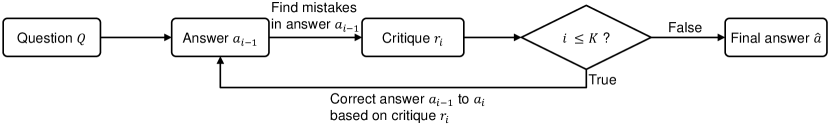
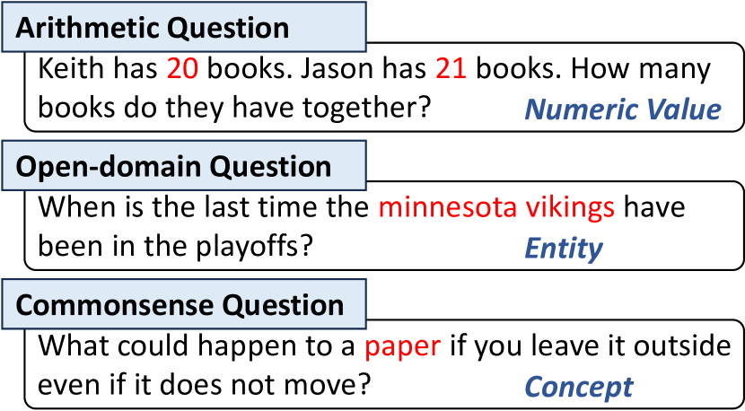
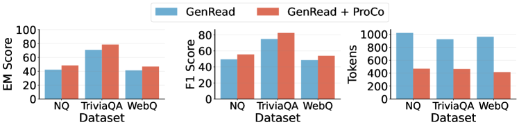
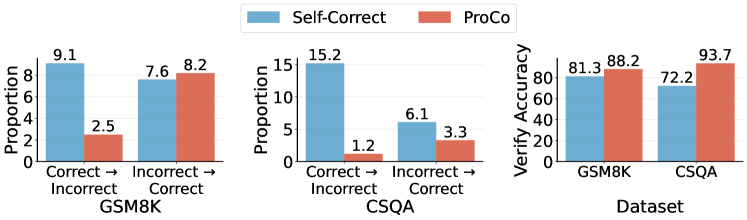
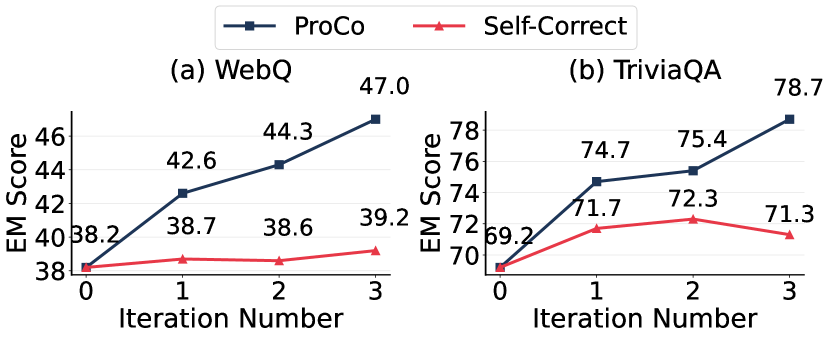
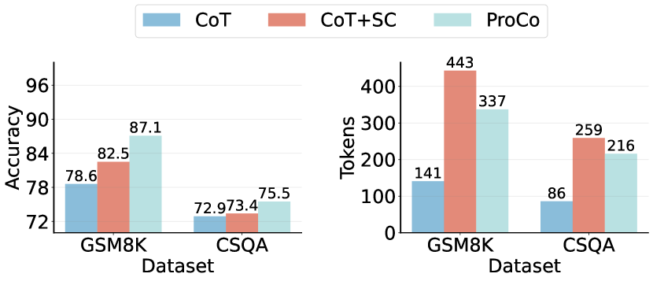

# Large Language Models Can Self-Correct with Minimal Effort

###### Abstract

Intrinsic self-correct was a method that instructed large language models (LLMs) to verify and correct their responses without external feedback. Unfortunately, the study concluded that the LLMs could not self-correct reasoning yet. We find that a simple yet effective verification method can unleash inherent capabilities of the LLMs. That is to mask a key condition in the question, add the current response to construct a verification question, and predict the condition to verify the response. The condition can be an entity in an open-domain question or a numeric value in a math question, which requires minimal effort (via prompting) to identify. We propose an iterative verify-then-correct framework to progressively identify and correct (probably) false responses, named ProCo. We conduct experiments on three reasoning tasks. On average, ProCo, with GPT-3.5-Turbo-1106 as the backend LLM, yields $+6.8$ exact match on four open-domain question answering datasets, $+14.1$ accuracy on three arithmetic reasoning datasets, and $+9.6$ accuracy on a commonsense reasoning dataset, compared to Self-Correct.  

Large Language Models Can Self-Correct with Minimal Effort  

  

   Zhenyu Wu1,2, Qingkai Zeng2, Zhihan Zhang2, Zhaoxuan Tan2, Chao Shen1††thanks: Corresponding author, Meng Jiang2  1Xi’an Jiaotong University, 2University of Notre Dame  {zwu23, qzeng, zzhang23, ztan3, mjiang2}@nd.edu, chaoshen@xjtu.edu.cn   

  

## 1 Introduction

Reasoning is a cognitive process that uses evidence, arguments, and logic to arrive at conclusions or judgements (Huang and Chang, [2023](#bib.bib10)). People have been exploiting and improving the reasoning ability of large language models (LLMs). [Wei et al.](#bib.bib30) proposed chain-of-thought (CoT) prompting and yielded promising results on several reasoning tasks, such as arithmetic reasoning (Kojima et al., [2022](#bib.bib16); Zhou et al., [2023](#bib.bib37)), commonsense reasoning (Wei et al., [2022](#bib.bib30); Zhang et al., [2023](#bib.bib36); Wang et al., [2023b](#bib.bib28)), and open-domain question answering (Wang et al., [2023a](#bib.bib27)), using only a few or no reasoning exemplars. CoT guides LLMs to generate intermediate reasoning steps instead of generating the final answer directly, which helps the LLMs simulate the human-like reasoning process.  

[FIGURE S1.F1.sf1.g1]

a Self-Correct (Kim et al., [2023](#bib.bib15)) prompts an LLM to verify the correctness of its generated responses and uses this verification as feedback to refine the responses. [Huang et al.](#bib.bib11) pointed out that this method was ineffective as LLMs could not properly identify and correct mistakes in their output without external feedback.
[/FIGURE]

Although CoT enables LLMs to handle some complex reasoning examples, it remains vulnerable to the negative impact of individual errors in each step. Specifically, even a minor error in one step can alter the trajectory of the entire reasoning process, ultimately leading to an incorrect conclusion. To address this issue, [Dhuliawala et al.](#bib.bib5); [Kim et al.](#bib.bib15) have explored the verification and correction on the responses. For example, as shown in Figure [1a](#S1.F1.sf1 "In Figure 1 ‣ 1 Introduction ‣ Large Language Models Can Self-Correct with Minimal Effort"), for a given question and its initial LLM-generated answer, Self-Correct (Kim et al., [2023](#bib.bib15)) first instructs the LLM to criticize its generated answer using the hint: “*Review previous answer and find mistakes*”. Then, Self-Correct instructs the LLM to refine initial answers based on the critique.  

[TABLE S1.T1]

Method
NQ
CSQA
AQuA

CoT

<math class="ltx_Math"><semantics><mn>40.3</mn><annotation-xml><cn>40.3</cn></annotation-xml><annotation>40.3</annotation></semantics></math>

<math class="ltx_Math"><semantics><mn>72.9</mn><annotation-xml><cn>72.9</cn></annotation-xml><annotation>72.9</annotation></semantics></math>

<math class="ltx_Math"><semantics><mn>51.3</mn><annotation-xml><cn>51.3</cn></annotation-xml><annotation>51.3</annotation></semantics></math>

Self-Correct

<math class="ltx_Math"><semantics><mn>40.1</mn><annotation-xml><cn>40.1</cn></annotation-xml><annotation>40.1</annotation></semantics></math>

<math class="ltx_Math"><semantics><mn>65.9</mn><annotation-xml><cn>65.9</cn></annotation-xml><annotation>65.9</annotation></semantics></math>

<math class="ltx_Math"><semantics><mn>48.7</mn><annotation-xml><cn>48.7</cn></annotation-xml><annotation>48.7</annotation></semantics></math>

ProCo (Ours)

<math class="ltx_Math"><semantics><mn class="ltx_mathvariant_bold">48.0</mn><annotation-xml><cn>48.0</cn></annotation-xml><annotation>\mathbf{48.0}</annotation></semantics></math>

<math class="ltx_Math"><semantics><mn class="ltx_mathvariant_bold">75.5</mn><annotation-xml><cn>75.5</cn></annotation-xml><annotation>\mathbf{75.5}</annotation></semantics></math>

<math class="ltx_Math"><semantics><mn class="ltx_mathvariant_bold">65.2</mn><annotation-xml><cn>65.2</cn></annotation-xml><annotation>\mathbf{65.2}</annotation></semantics></math>

Table 1: Performance comparison of different prompting methods using GPT-3.5-Turbo as backend LLM.
[/TABLE]

However, recent studies (Huang et al., [2024](#bib.bib11); Gou et al., [2024](#bib.bib7)) have cast doubt on the intrinsic self-correction capability of LLMs. Their research indicates that *without external feedback*, such as ground truth to verify the correctness of previous responses, LLMs struggle to correct their prior outputs. Since LLMs could not properly judge the correctness of their prior responses, the refined response might be even worse than the initial response.   

To unleash inherent capabilities of LLMs to detect and rectify incorrect responses without external feedback, we introduce *substitute verification*. Let us look at a specific example. Given an open-domain question *“Who plays Skylar on Lab Rats: Elite Force?”*, we first prompt an LLM to generate an initial answer for the question, e.g., *“Paris Berelc”*. Next, we identify a key condition in the question that is relevant to the problem-solving process, such as *“Skylar”*. By masking the key condition in the question and adding the initial answer as a new condition, we can obtain a verification question: *“Who plays X on Lab Rats: Elite Force? Suppose the answer is Paris Berelc. What is the value of unknown variable X?”*. We use the LLM to solve the verification question, and we get that X is *“Skylar Storm”*. By verifying whether *“Skylar Storm”* is equivalent to *“Skylar”*, we can predict that the initial answer is likely correct.  

Based on substitute verification, we propose a simple yet effective prompting method Progressive Correction (ProCo). Figure [1](#S1.F1 "Figure 1 ‣ 1 Introduction ‣ Large Language Models Can Self-Correct with Minimal Effort") illustrates the difference between the Self-Correct and ProCo methods. Compared with Self-Correct, our proposed ProCo, highlighting two primary distinctions:  

(1) Verification Method. To improve verification accuracy, we propose the substitute verification method. Specifically, ProCo first identifies key conditions that are relevant to the problem-solving process. It then masks one of the key conditions in the question and takes the generated answer as a new condition to construct the verification question. Finally, ProCo solves the verification question and gets the verified answer. If the verified answer and the key condition are equivalent, it indicates that the generated answer is likely to be correct.  

(2) Correction Method. ProCo employs the substitute verification method to accurately verify the correctness of the LLM-generated answer. If an answer is deemed incorrect, ProCo adds it to the set of potentially incorrect answers, which then serves as feedback to guide LLMs in correcting previous mistakes with the hint: “*the answer is likely not in* {set of potentially incorrect answers}”. By iteratively executing verification and correction, ProCo effectively prevents the repetition of previous mistakes, thereby progressively improving the quality of responses.  

We conducted evaluations of ProCo using a variety of LLMs, including GPT-3.5-Turbo-1106, GPT-4-0125-Preview, and the open-source Mixtral-8x7B. These evaluations spanned three distinct tasks: arithmetic reasoning, commonsense reasoning, and open-domain question answering. The experimental results reveal that ProCo consistently outperforms existing methods. As shown in Table [1](#S1.T1 "Table 1 ‣ 1 Introduction ‣ Large Language Models Can Self-Correct with Minimal Effort"), ProCo achieves a $7.9$ exact match (EM) improvement on the NQ dataset, a $16.5$ absolute increase on the AQuA dataset, and a $9.6$ absolute improvement on the CSQA dataset compared to the Self-Correct method.  

In summary, our main contribution include:  

* Based on our research, we have determined that LLMs are capable of intrinsic self-correction, provided that the prompt design is carefully structured within a framework focused on verification and correctness. 
* We introduce a novel prompting method, ProCo, which utilizes an iterative verify-then-correct framework. ProCo progressively refines responses by identifying key conditions and formulating verified questions specific to these conditions. 
* We conduct extensive experiments across three different complex reasoning tasks and demonstrate that ProCo achieves significant improvements in both black-box and open-source LLMs. 

## 2 Related Work

Self-Correct (Kim et al., [2023](#bib.bib15)) methods, which aim to enhance the quality of LLM responses by providing feedback on initial attempts (Kim et al., [2023](#bib.bib15); Madaan et al., [2023](#bib.bib22); Chen et al., [2024](#bib.bib2)), have demonstrated effectiveness in various reasoning tasks. These tasks include arithmetic reasoning (Madaan et al., [2023](#bib.bib22); Welleck et al., [2023](#bib.bib31)), open-domain question answering (Dhuliawala et al., [2023](#bib.bib5); Yu et al., [2023b](#bib.bib35)), commonsense reasoning (Kim et al., [2023](#bib.bib15)), and others (Chen et al., [2024](#bib.bib2); Le et al., [2022](#bib.bib18)). Self-Correct methods vary in the source and format of feedback, and the process of verifying the correctness of LLM output.  

##### Source and Format of Feedback

Interscript (Tandon et al., [2021](#bib.bib26)) corrected the initial output of the LLM by integrating natural language feedback from humans. Due to the high cost of human feedback, various approaches have employed scalar reward functions as an alternative. For instance, Rainer (Liu et al., [2022](#bib.bib21)) used reinforcement learning to generate contextual relevant knowledge in response to queries. Self-Correction (Welleck et al., [2023](#bib.bib31)) trained a corrector to iteratively correct imperfect outputs. Other sources, such as compilers (Chen et al., [2024](#bib.bib2)) or search engines (Yu et al., [2023b](#bib.bib35)) can provide domain-specific feedback. Recent research used LLMs to generate feedback. Self-Correct (Kim et al., [2023](#bib.bib15)) and Self-Refine (Madaan et al., [2023](#bib.bib22)) utilized LLMs to verify and refine their initial outputs. However, [Huang et al.](#bib.bib11) questioned the intrinsic self-correcting capability of LLMs, indicating that without external feedback, LLMs struggle to correct their previous responses. To unleash inherent capabilities of LLMs to detect and rectify incorrect responses without external feedback, we introduce *substitute verification*. By providing natural language feedback based on verification results, we can steer LLMs away from incorrect answers, thus enhancing their performance in various reasoning tasks.   

##### Verify Correctness of LLM Output

Several studies trained or fine-tuned verification models to check the correctness of the answer. [Cobbe et al.](#bib.bib3) fine-tuned GPT-3 as a scorer to calculate solution-level verification score and choose the highest-scoring answer as the final answer. [Li et al.](#bib.bib19) fine-tuned deberta-v3-large (He et al., [2021](#bib.bib8)) to predict the probability that the generated reasoning path leads to the correct answer. These methods require a significant amount of human annotations. To eliminate human labor, [Peng et al.](#bib.bib24) proposed using an external database to identify incorrect knowledge in LLM outputs. These methods are typically restricted to checking certain types of errors. To address these limitations, [Miao et al.](#bib.bib23) used the LLM to individually verify the correctness of each step in the arithmetic reasoning path based on the preceding steps. [Dhuliawala et al.](#bib.bib5) used manual-crafted demonstrations as context to prompt the LLM to check the correctness of its output. All of these methods only verify the correctness of LLM outputs and select the verified answer as the final answer. In contrast, our method iterates a verify-then-correct process to progressively identify and correct incorrect answers.   

[FIGURE S2.F2.g1]

Figure 2: Key conditions in complex reasoning tasks play a crucial role in the problem-solving process. These conditions can take various forms: a numeric value in arithmetic questions, an entity in open-domain questions, or a concept in commonsense questions.
[/FIGURE]

## 3 Preliminaries

Given a question $Q=[\mathcal{C},q]$, consisting of $n$ conditions $\mathcal{C}=\{c_{i}\}_{i=1}^{n}$ and a question sentence $q$, we instruct the LLM to generate the final answer $\hat{a}$. Condition $c_{i}$ can be a numeric value in arithmetic questions, an entity in open-domain questions, or a concept in commonsense questions, as illustrated in Figure [2](#S2.F2 "Figure 2 ‣ Verify Correctness of LLM Output ‣ 2 Related Work ‣ Large Language Models Can Self-Correct with Minimal Effort"). Among these conditions, key conditions $c^{(\text{k})}\in\mathcal{C}$ are crucial to the problem-solving process and are utilized in the substitute verification process. We introduce two innovative approaches for identifying these key conditions.  

##### Similarity-based Key Condition Identification

Numerical values are critical in arithmetic questions; thus, we select numerical values relevant to the problem-solving process as key conditions. Specifically, for a math word problem $Q$, following (Wu et al., [2024](#bib.bib32)), we split it into $n$ conditional sentences $\{c_{i}^{(\text{s})}\}_{i=1}^{n}$ and a question sentence $q$. We then use a pre-trained language model, such as SimCSE (Gao et al., [2021](#bib.bib6)), to encode the conditional sentences and the question sentence into vector representations, resulting in $\{\mathbf{c}_{i}^{(\text{s})}\}_{i=1}^{n}$ and $\mathbf{q}$, which are $d$-dimensional vectors. Subsequently, we calculate the cosine similarity between $\mathbf{c}_{i}^{(\text{s})}$ and $\mathbf{q}$:  

|  | $$s_{i}=\frac{\mathbf{c}_{i}^{(\text{s})\top}\mathbf{q}}{{\|\mathbf{c}_{i}^{(\text{s})}\|}\cdot{\|\mathbf{q}\|}}$$ |  | (1) |
| --- | --- | --- | --- |

The conditional sentence with the highest cosine similarity to $q$ is selected, and regular expressions are used to identify the numerical value in the conditional sentence as the key condition $c^{(\text{k})}$.  

##### Zero-shot Key Condition Identification

For open-domain or commonsense questions, we instruct LLMs to identify entities or concepts relevant to the problem-solving process as key conditions. For instance, given an open-domain question $Q$, we construct a key condition identification prompt: “*Given the question below, the task is to identify a set of entities within the question and then select the one that is most relevant to the problem-solving process. $Q$*”. We then input this prompt into an LLM to receive the key condition $c^{(\text{k})}$.  

## 4 Proposed Approach

### 4.1 Overview

In this section, we present the overall pipeline of the proposed Progressive Correction (ProCo) prompting method which consists of three steps. Figure [1b](#S1.F1.sf2 "In Figure 1 ‣ 1 Introduction ‣ Large Language Models Can Self-Correct with Minimal Effort") illustrates the ProCo method. Initially, ProCo prompts the LLM to generate an answer in response to a given question (Sec. [4.2](#S4.SS2 "4.2 Generate Initial Answer ‣ 4 Proposed Approach ‣ Large Language Models Can Self-Correct with Minimal Effort")). Subsequently, to enhance the preliminary answer, ProCo identifies a key condition and generates a corresponding verification question-answer pair based on that condition (Sec. [4.3](#S4.SS3 "4.3 Iterative Verify-then-Correct Process ‣ 4 Proposed Approach ‣ Large Language Models Can Self-Correct with Minimal Effort")). The final answer is refined by verifying the question-answer pair, ensuring the answer’s consistency and accuracy (Sec. [4.4](#S4.SS4 "4.4 Final Answer Determination ‣ 4 Proposed Approach ‣ Large Language Models Can Self-Correct with Minimal Effort")). The full prompts used in the experiments can be found in Appendix [A.3](#A1.SS3 "A.3 Full Prompts in Experiments ‣ Appendix A Appendix ‣ Large Language Models Can Self-Correct with Minimal Effort").  

### 4.2 Generate Initial Answer

Given a question $Q=[\mathcal{C},q]$, comprising $n$ conditions $\mathcal{C}=\{c_{i}\}_{i=1}^{n}$ and a question sentence $q$. We use one of the existing prompting methods to generate an initial answer $a_{0}$ for the question $Q$, e.g., CoT (Kojima et al., [2022](#bib.bib16)), GenRead (Yu et al., [2023a](#bib.bib34)), RAG (Khattab et al., [2023](#bib.bib14)), and so on. By default, we use the CoT (Kojima et al., [2022](#bib.bib16)) prompting method to generate an initial answer.  

### 4.3 Iterative Verify-then-Correct Process

We propose a novel iterative verify-then-correct method that first initializes the set of potentially incorrect answers as an empty set $\mathcal{P}_{0}=\varnothing$ and identifies the key condition $c^{(\text{k})}\in\mathcal{C}$ within the question $Q$ (Sec. [3](#S3 "3 Preliminaries ‣ Large Language Models Can Self-Correct with Minimal Effort")). The method then progressively corrects the LLM-generated answer across $K$ iterations by cyclically conducting verification and correction phases. Here we use the $i$-th iteration as an example to illustrate the verify-then-correct process.  

##### Verification Phase

The verification phase uses substitute verification method to verify the correctness of the previous generated answer $a_{i-1}$. This phase encompasses several substeps.  

Initially, the key condition $c^{(\text{k})}$ within the question $Q$ is replaced with a specific token X, resulting in a masked question. Subsequently, a verification question $Q^{(\text{v})}_{i}$ is formulated by appending the sentence “*Suppose the answer is $a_{i-1}$. What is the value of unknown variable X?*” to the masked question. The LLM is then instructed to solve the verification question $Q^{(\text{v})}_{i}$ and produce the corresponding answer $a^{(\text{v})}_{i}$. Finally, different strategies are proposed to verify the correctness of $a_{i-1}$.  

Match-based Verification. For arithmetic questions, if $a^{(\text{v})}_{i}$ is equal to $c^{(\text{k})}$, it indicates that the previous answer $a_{i-1}$ is most likely correct.  

Proposition-based Verification. For open-domain or commonsense questions, we propose a proposition-based verification method to verify the correctness of the previously generated answer $a_{i-1}$. The intuition behind this is that the question $Q^{(\text{v})}_{i}$ may have multiple valid answers, and directly checking if $a^{(\text{v})}_{i}$ exactly matches $c^{(\text{k})}$ could result in misclassifying a correct answer as incorrect. Specifically, we construct an answer verification prompt: “*Determine the correctness of the proposition: If the answer to question* $Q^{(\text{v})}_{i}$ *is* $c^{(\text{k})}$*, then X could also be* $a^{(\text{v})}_{i}$”. We input this prompt into an LLM and receive a judgment about the proposition’s correctness. If the proposition is verified as correct, it indicates that the previously generated answer $a_{i-1}$ is likely correct, and we select $a_{i-1}$ as the final answer $\hat{a}$ and exit the loop. Otherwise, we add $a_{i-1}$ to the set of potentially incorrect answers $\mathcal{P}_{i-1}$ to obtain the updated set $\mathcal{P}_{i}$.  

##### Correction Phase

During the correction phase, we use the set of potentially incorrect answers $\mathcal{P}_{i}=\{a_{0},\cdots,a_{i-1}\}$ as feedback to generate a corrected answer $a_{i}$. For a given question $Q$ and the set $\mathcal{P}_{i}$, we append the phrase “*the answer is likely not $\mathcal{P}_{i}$*” to the question. This instructs the large language model to re-answer the question while avoiding repeating previous mistakes.  

### 4.4 Final Answer Determination

The process of verify-then-correct can be iterated until specific stopping conditions are met. This process terminates under three situations: First, if the answer $a_{i-1}$ is verified to be likely correct, it is selected as the final answer. Second, if the corrected answer $a_{i}$ matches the previously generated answer $a_{i-1}$, then $a_{i}$ is chosen as the final answer. Lastly, if the iteration count surpasses the maximum allowed iterations $K$, the last LLM-generated answer $a_{K}$ is adopted as the final answer.  

## 5 Experiments

[TABLE S5.T2]

 

Method

(GPT-3.5-Turbo-1106)
 
Open-domain Question Answering
 

Commonsense

Reasoning

NQ
TriviaQA
WebQ
HotpotQA
CSQA

EM
F1
EM
F1
EM
F1
EM
F1
Accuracy

<em class="ltx_emph ltx_font_italic">*Using LLMs to generate problem-related documents</em>

GenRead

<math class="ltx_Math"><semantics><mn>42.2</mn><annotation-xml><cn>42.2</cn></annotation-xml><annotation>42.2</annotation></semantics></math>

<math class="ltx_Math"><semantics><mn>49.4</mn><annotation-xml><cn>49.4</cn></annotation-xml><annotation>49.4</annotation></semantics></math>

<math class="ltx_Math"><semantics><mn>70.8</mn><annotation-xml><cn>70.8</cn></annotation-xml><annotation>70.8</annotation></semantics></math>

<math class="ltx_Math"><semantics><mn>74.8</mn><annotation-xml><cn>74.8</cn></annotation-xml><annotation>74.8</annotation></semantics></math>

<math class="ltx_Math"><semantics><mn>41.3</mn><annotation-xml><cn>41.3</cn></annotation-xml><annotation>41.3</annotation></semantics></math>

<math class="ltx_Math"><semantics><mn>48.5</mn><annotation-xml><cn>48.5</cn></annotation-xml><annotation>48.5</annotation></semantics></math>

<math class="ltx_Math"><semantics><mn>38.0</mn><annotation-xml><cn>38.0</cn></annotation-xml><annotation>38.0</annotation></semantics></math>

<math class="ltx_Math"><semantics><mn>43.2</mn><annotation-xml><cn>43.2</cn></annotation-xml><annotation>43.2</annotation></semantics></math>

<math class="ltx_Math"><semantics><mn>67.3</mn><annotation-xml><cn>67.3</cn></annotation-xml><annotation>67.3</annotation></semantics></math>

GenRead + ProCo

<math class="ltx_Math"><semantics><mn>48.3</mn><annotation-xml><cn>48.3</cn></annotation-xml><annotation>48.3</annotation></semantics></math>

<math class="ltx_Math"><semantics><mn>55.6</mn><annotation-xml><cn>55.6</cn></annotation-xml><annotation>55.6</annotation></semantics></math>

<math class="ltx_Math"><semantics><mn>78.4</mn><annotation-xml><cn>78.4</cn></annotation-xml><annotation>78.4</annotation></semantics></math>

<math class="ltx_Math"><semantics><mn class="ltx_mathvariant_bold">82.4</mn><annotation-xml><cn>82.4</cn></annotation-xml><annotation>\mathbf{82.4}</annotation></semantics></math>

<math class="ltx_Math"><semantics><mn>46.7</mn><annotation-xml><cn>46.7</cn></annotation-xml><annotation>46.7</annotation></semantics></math>

<math class="ltx_Math"><semantics><mn>53.9</mn><annotation-xml><cn>53.9</cn></annotation-xml><annotation>53.9</annotation></semantics></math>

<math class="ltx_Math"><semantics><mn class="ltx_mathvariant_bold">47.0</mn><annotation-xml><cn>47.0</cn></annotation-xml><annotation>\mathbf{47.0}</annotation></semantics></math>

<math class="ltx_Math"><semantics><mn class="ltx_mathvariant_bold">51.0</mn><annotation-xml><cn>51.0</cn></annotation-xml><annotation>\mathbf{51.0}</annotation></semantics></math>

<math class="ltx_Math"><semantics><mn class="ltx_mathvariant_bold">76.4</mn><annotation-xml><cn>76.4</cn></annotation-xml><annotation>\mathbf{76.4}</annotation></semantics></math>

<em class="ltx_emph ltx_font_italic">*Using search engines to retrieve problem-related documents</em>

RAG

<math class="ltx_Math"><semantics><mn>45.3</mn><annotation-xml><cn>45.3</cn></annotation-xml><annotation>45.3</annotation></semantics></math>

<math class="ltx_Math"><semantics><mn>52.4</mn><annotation-xml><cn>52.4</cn></annotation-xml><annotation>52.4</annotation></semantics></math>

<math class="ltx_Math"><semantics><mn>72.7</mn><annotation-xml><cn>72.7</cn></annotation-xml><annotation>72.7</annotation></semantics></math>

<math class="ltx_Math"><semantics><mn>76.4</mn><annotation-xml><cn>76.4</cn></annotation-xml><annotation>76.4</annotation></semantics></math>

<math class="ltx_Math"><semantics><mn>40.1</mn><annotation-xml><cn>40.1</cn></annotation-xml><annotation>40.1</annotation></semantics></math>

<math class="ltx_Math"><semantics><mn>46.9</mn><annotation-xml><cn>46.9</cn></annotation-xml><annotation>46.9</annotation></semantics></math>

<math class="ltx_Math"><semantics><mn>37.0</mn><annotation-xml><cn>37.0</cn></annotation-xml><annotation>37.0</annotation></semantics></math>

<math class="ltx_Math"><semantics><mn>41.1</mn><annotation-xml><cn>41.1</cn></annotation-xml><annotation>41.1</annotation></semantics></math>

<math class="ltx_Math"><semantics><mn>65.9</mn><annotation-xml><cn>65.9</cn></annotation-xml><annotation>65.9</annotation></semantics></math>

RAG + ProCo

<math class="ltx_Math"><semantics><mn class="ltx_mathvariant_bold">48.5</mn><annotation-xml><cn>48.5</cn></annotation-xml><annotation>\mathbf{48.5}</annotation></semantics></math>

<math class="ltx_Math"><semantics><mn class="ltx_mathvariant_bold">56.0</mn><annotation-xml><cn>56.0</cn></annotation-xml><annotation>\mathbf{56.0}</annotation></semantics></math>

<math class="ltx_Math"><semantics><mn>78.4</mn><annotation-xml><cn>78.4</cn></annotation-xml><annotation>78.4</annotation></semantics></math>

<math class="ltx_Math"><semantics><mn>82.1</mn><annotation-xml><cn>82.1</cn></annotation-xml><annotation>82.1</annotation></semantics></math>

<math class="ltx_Math"><semantics><mn>45.2</mn><annotation-xml><cn>45.2</cn></annotation-xml><annotation>45.2</annotation></semantics></math>

<math class="ltx_Math"><semantics><mn>52.5</mn><annotation-xml><cn>52.5</cn></annotation-xml><annotation>52.5</annotation></semantics></math>

<math class="ltx_Math"><semantics><mn>39.0</mn><annotation-xml><cn>39.0</cn></annotation-xml><annotation>39.0</annotation></semantics></math>

<math class="ltx_Math"><semantics><mn>44.2</mn><annotation-xml><cn>44.2</cn></annotation-xml><annotation>44.2</annotation></semantics></math>

<math class="ltx_Math"><semantics><mn>74.2</mn><annotation-xml><cn>74.2</cn></annotation-xml><annotation>74.2</annotation></semantics></math>

<em class="ltx_emph ltx_font_italic">*Direct question answering without external documents</em>

CoT

<math class="ltx_Math"><semantics><mn>40.3</mn><annotation-xml><cn>40.3</cn></annotation-xml><annotation>40.3</annotation></semantics></math>

<math class="ltx_Math"><semantics><mn>46.4</mn><annotation-xml><cn>46.4</cn></annotation-xml><annotation>46.4</annotation></semantics></math>

<math class="ltx_Math"><semantics><mn>69.2</mn><annotation-xml><cn>69.2</cn></annotation-xml><annotation>69.2</annotation></semantics></math>

<math class="ltx_Math"><semantics><mn>72.2</mn><annotation-xml><cn>72.2</cn></annotation-xml><annotation>72.2</annotation></semantics></math>

<math class="ltx_Math"><semantics><mn>38.2</mn><annotation-xml><cn>38.2</cn></annotation-xml><annotation>38.2</annotation></semantics></math>

<math class="ltx_Math"><semantics><mn>44.6</mn><annotation-xml><cn>44.6</cn></annotation-xml><annotation>44.6</annotation></semantics></math>

<math class="ltx_Math"><semantics><mn>28.0</mn><annotation-xml><cn>28.0</cn></annotation-xml><annotation>28.0</annotation></semantics></math>

<math class="ltx_Math"><semantics><mn>31.2</mn><annotation-xml><cn>31.2</cn></annotation-xml><annotation>31.2</annotation></semantics></math>

<math class="ltx_Math"><semantics><mn>72.9</mn><annotation-xml><cn>72.9</cn></annotation-xml><annotation>72.9</annotation></semantics></math>

Self-Correct

<math class="ltx_Math"><semantics><mn>40.1</mn><annotation-xml><cn>40.1</cn></annotation-xml><annotation>40.1</annotation></semantics></math>

<math class="ltx_Math"><semantics><mn>47.1</mn><annotation-xml><cn>47.1</cn></annotation-xml><annotation>47.1</annotation></semantics></math>

<math class="ltx_Math"><semantics><mn>71.3</mn><annotation-xml><cn>71.3</cn></annotation-xml><annotation>71.3</annotation></semantics></math>

<math class="ltx_Math"><semantics><mn>74.1</mn><annotation-xml><cn>74.1</cn></annotation-xml><annotation>74.1</annotation></semantics></math>

<math class="ltx_Math"><semantics><mn>39.2</mn><annotation-xml><cn>39.2</cn></annotation-xml><annotation>39.2</annotation></semantics></math>

<math class="ltx_Math"><semantics><mn>45.7</mn><annotation-xml><cn>45.7</cn></annotation-xml><annotation>45.7</annotation></semantics></math>

<math class="ltx_Math"><semantics><mn>29.0</mn><annotation-xml><cn>29.0</cn></annotation-xml><annotation>29.0</annotation></semantics></math>

<math class="ltx_Math"><semantics><mn>32.4</mn><annotation-xml><cn>32.4</cn></annotation-xml><annotation>32.4</annotation></semantics></math>

<math class="ltx_Math"><semantics><mn>65.9</mn><annotation-xml><cn>65.9</cn></annotation-xml><annotation>65.9</annotation></semantics></math>

CoVe

<math class="ltx_Math"><semantics><mn>43.4</mn><annotation-xml><cn>43.4</cn></annotation-xml><annotation>43.4</annotation></semantics></math>

<math class="ltx_Math"><semantics><mn>48.9</mn><annotation-xml><cn>48.9</cn></annotation-xml><annotation>48.9</annotation></semantics></math>

<math class="ltx_Math"><semantics><mn>76.4</mn><annotation-xml><cn>76.4</cn></annotation-xml><annotation>76.4</annotation></semantics></math>

<math class="ltx_Math"><semantics><mn>79.4</mn><annotation-xml><cn>79.4</cn></annotation-xml><annotation>79.4</annotation></semantics></math>

<math class="ltx_Math"><semantics><mn>43.1</mn><annotation-xml><cn>43.1</cn></annotation-xml><annotation>43.1</annotation></semantics></math>

<math class="ltx_Math"><semantics><mn>49.0</mn><annotation-xml><cn>49.0</cn></annotation-xml><annotation>49.0</annotation></semantics></math>

<math class="ltx_Math"><semantics><mn>31.0</mn><annotation-xml><cn>31.0</cn></annotation-xml><annotation>31.0</annotation></semantics></math>

<math class="ltx_Math"><semantics><mn>35.2</mn><annotation-xml><cn>35.2</cn></annotation-xml><annotation>35.2</annotation></semantics></math>

<math class="ltx_Math"><semantics><mn>73.1</mn><annotation-xml><cn>73.1</cn></annotation-xml><annotation>73.1</annotation></semantics></math>

ProCo

<math class="ltx_Math"><semantics><mn>48.0</mn><annotation-xml><cn>48.0</cn></annotation-xml><annotation>48.0</annotation></semantics></math>

<math class="ltx_Math"><semantics><mn>54.8</mn><annotation-xml><cn>54.8</cn></annotation-xml><annotation>54.8</annotation></semantics></math>

<math class="ltx_Math"><semantics><mn class="ltx_mathvariant_bold">78.7</mn><annotation-xml><cn>78.7</cn></annotation-xml><annotation>\mathbf{78.7}</annotation></semantics></math>

<math class="ltx_Math"><semantics><mn>82.1</mn><annotation-xml><cn>82.1</cn></annotation-xml><annotation>82.1</annotation></semantics></math>

<math class="ltx_Math"><semantics><mn class="ltx_mathvariant_bold">47.0</mn><annotation-xml><cn>47.0</cn></annotation-xml><annotation>\mathbf{47.0}</annotation></semantics></math>

<math class="ltx_Math"><semantics><mn class="ltx_mathvariant_bold">57.0</mn><annotation-xml><cn>57.0</cn></annotation-xml><annotation>\mathbf{57.0}</annotation></semantics></math>

<math class="ltx_Math"><semantics><mn>33.0</mn><annotation-xml><cn>33.0</cn></annotation-xml><annotation>33.0</annotation></semantics></math>

<math class="ltx_Math"><semantics><mn>36.2</mn><annotation-xml><cn>36.2</cn></annotation-xml><annotation>36.2</annotation></semantics></math>

<math class="ltx_Math"><semantics><mn>75.5</mn><annotation-xml><cn>75.5</cn></annotation-xml><annotation>75.5</annotation></semantics></math>

Table 2: Results on NQ, TriviaQA, WebQ, HotpotQA, and CSQA datasets using GPT-3.5-Turbo-1106 as the backend LLM. GenRead + ProCo indicates that using the GenRead method generates an initial answer and progressively correcting the initial answer using our proposed ProCo method. GenRead + ProCo significantly outperform the original GenRead method. The best performance for each dataset is shown in bold.
[/TABLE]

[TABLE S5.T3]

 

Method

(Mixtral-8x7B)
 
Open-domain Question Answering
 

Commonsense

Reasoning

NQ
TriviaQA
WebQ
HotpotQA
CSQA

EM
F1
EM
F1
EM
F1
EM
F1
Accuracy

<em class="ltx_emph ltx_font_italic">*Using LLMs to generate problem-related documents</em>

GenRead

<math class="ltx_Math"><semantics><mn>46.7</mn><annotation-xml><cn>46.7</cn></annotation-xml><annotation>46.7</annotation></semantics></math>

<math class="ltx_Math"><semantics><mn>52.0</mn><annotation-xml><cn>52.0</cn></annotation-xml><annotation>52.0</annotation></semantics></math>

<math class="ltx_Math"><semantics><mn>69.0</mn><annotation-xml><cn>69.0</cn></annotation-xml><annotation>69.0</annotation></semantics></math>

<math class="ltx_Math"><semantics><mn>72.4</mn><annotation-xml><cn>72.4</cn></annotation-xml><annotation>72.4</annotation></semantics></math>

<math class="ltx_Math"><semantics><mn>51.1</mn><annotation-xml><cn>51.1</cn></annotation-xml><annotation>51.1</annotation></semantics></math>

<math class="ltx_Math"><semantics><mn>56.5</mn><annotation-xml><cn>56.5</cn></annotation-xml><annotation>56.5</annotation></semantics></math>

<math class="ltx_Math"><semantics><mn>36.0</mn><annotation-xml><cn>36.0</cn></annotation-xml><annotation>36.0</annotation></semantics></math>

<math class="ltx_Math"><semantics><mn>39.7</mn><annotation-xml><cn>39.7</cn></annotation-xml><annotation>39.7</annotation></semantics></math>

<math class="ltx_Math"><semantics><mn>64.3</mn><annotation-xml><cn>64.3</cn></annotation-xml><annotation>64.3</annotation></semantics></math>

GenRead + ProCo

<math class="ltx_Math"><semantics><mn>48.5</mn><annotation-xml><cn>48.5</cn></annotation-xml><annotation>48.5</annotation></semantics></math>

<math class="ltx_Math"><semantics><mn>53.7</mn><annotation-xml><cn>53.7</cn></annotation-xml><annotation>53.7</annotation></semantics></math>

<math class="ltx_Math"><semantics><mn>72.3</mn><annotation-xml><cn>72.3</cn></annotation-xml><annotation>72.3</annotation></semantics></math>

<math class="ltx_Math"><semantics><mn>75.8</mn><annotation-xml><cn>75.8</cn></annotation-xml><annotation>75.8</annotation></semantics></math>

<math class="ltx_Math"><semantics><mn>52.0</mn><annotation-xml><cn>52.0</cn></annotation-xml><annotation>52.0</annotation></semantics></math>

<math class="ltx_Math"><semantics><mn>57.5</mn><annotation-xml><cn>57.5</cn></annotation-xml><annotation>57.5</annotation></semantics></math>

<math class="ltx_Math"><semantics><mn>38.0</mn><annotation-xml><cn>38.0</cn></annotation-xml><annotation>38.0</annotation></semantics></math>

<math class="ltx_Math"><semantics><mn>42.3</mn><annotation-xml><cn>42.3</cn></annotation-xml><annotation>42.3</annotation></semantics></math>

<math class="ltx_Math"><semantics><mn>70.4</mn><annotation-xml><cn>70.4</cn></annotation-xml><annotation>70.4</annotation></semantics></math>

<em class="ltx_emph ltx_font_italic">*Using search engines to retrieve problem-related documents</em>

RAG

<math class="ltx_Math"><semantics><mn>48.8</mn><annotation-xml><cn>48.8</cn></annotation-xml><annotation>48.8</annotation></semantics></math>

<math class="ltx_Math"><semantics><mn>54.6</mn><annotation-xml><cn>54.6</cn></annotation-xml><annotation>54.6</annotation></semantics></math>

<math class="ltx_Math"><semantics><mn>75.3</mn><annotation-xml><cn>75.3</cn></annotation-xml><annotation>75.3</annotation></semantics></math>

<math class="ltx_Math"><semantics><mn>78.5</mn><annotation-xml><cn>78.5</cn></annotation-xml><annotation>78.5</annotation></semantics></math>

<math class="ltx_Math"><semantics><mn>46.3</mn><annotation-xml><cn>46.3</cn></annotation-xml><annotation>46.3</annotation></semantics></math>

<math class="ltx_Math"><semantics><mn>52.1</mn><annotation-xml><cn>52.1</cn></annotation-xml><annotation>52.1</annotation></semantics></math>

<math class="ltx_Math"><semantics><mn>37.0</mn><annotation-xml><cn>37.0</cn></annotation-xml><annotation>37.0</annotation></semantics></math>

<math class="ltx_Math"><semantics><mn>40.2</mn><annotation-xml><cn>40.2</cn></annotation-xml><annotation>40.2</annotation></semantics></math>

<math class="ltx_Math"><semantics><mn>66.3</mn><annotation-xml><cn>66.3</cn></annotation-xml><annotation>66.3</annotation></semantics></math>

RAG + ProCo

<math class="ltx_Math"><semantics><mn class="ltx_mathvariant_bold">51.6</mn><annotation-xml><cn>51.6</cn></annotation-xml><annotation>\mathbf{51.6}</annotation></semantics></math>

<math class="ltx_Math"><semantics><mn class="ltx_mathvariant_bold">57.1</mn><annotation-xml><cn>57.1</cn></annotation-xml><annotation>\mathbf{57.1}</annotation></semantics></math>

<math class="ltx_Math"><semantics><mn class="ltx_mathvariant_bold">79.6</mn><annotation-xml><cn>79.6</cn></annotation-xml><annotation>\mathbf{79.6}</annotation></semantics></math>

<math class="ltx_Math"><semantics><mn class="ltx_mathvariant_bold">83.0</mn><annotation-xml><cn>83.0</cn></annotation-xml><annotation>\mathbf{83.0}</annotation></semantics></math>

<math class="ltx_Math"><semantics><mn>50.3</mn><annotation-xml><cn>50.3</cn></annotation-xml><annotation>50.3</annotation></semantics></math>

<math class="ltx_Math"><semantics><mn>56.3</mn><annotation-xml><cn>56.3</cn></annotation-xml><annotation>56.3</annotation></semantics></math>

<math class="ltx_Math"><semantics><mn class="ltx_mathvariant_bold">41.0</mn><annotation-xml><cn>41.0</cn></annotation-xml><annotation>\mathbf{41.0}</annotation></semantics></math>

<math class="ltx_Math"><semantics><mn class="ltx_mathvariant_bold">43.7</mn><annotation-xml><cn>43.7</cn></annotation-xml><annotation>\mathbf{43.7}</annotation></semantics></math>

<math class="ltx_Math"><semantics><mn>71.8</mn><annotation-xml><cn>71.8</cn></annotation-xml><annotation>71.8</annotation></semantics></math>

<em class="ltx_emph ltx_font_italic">*Direct question answering without external documents</em>

CoT

<math class="ltx_Math"><semantics><mn>42.6</mn><annotation-xml><cn>42.6</cn></annotation-xml><annotation>42.6</annotation></semantics></math>

<math class="ltx_Math"><semantics><mn>48.2</mn><annotation-xml><cn>48.2</cn></annotation-xml><annotation>48.2</annotation></semantics></math>

<math class="ltx_Math"><semantics><mn>66.7</mn><annotation-xml><cn>66.7</cn></annotation-xml><annotation>66.7</annotation></semantics></math>

<math class="ltx_Math"><semantics><mn>70.3</mn><annotation-xml><cn>70.3</cn></annotation-xml><annotation>70.3</annotation></semantics></math>

<math class="ltx_Math"><semantics><mn>46.6</mn><annotation-xml><cn>46.6</cn></annotation-xml><annotation>46.6</annotation></semantics></math>

<math class="ltx_Math"><semantics><mn>51.9</mn><annotation-xml><cn>51.9</cn></annotation-xml><annotation>51.9</annotation></semantics></math>

<math class="ltx_Math"><semantics><mn>29.0</mn><annotation-xml><cn>29.0</cn></annotation-xml><annotation>29.0</annotation></semantics></math>

<math class="ltx_Math"><semantics><mn>34.4</mn><annotation-xml><cn>34.4</cn></annotation-xml><annotation>34.4</annotation></semantics></math>

<math class="ltx_Math"><semantics><mn>68.4</mn><annotation-xml><cn>68.4</cn></annotation-xml><annotation>68.4</annotation></semantics></math>

Self-Correct

<math class="ltx_Math"><semantics><mn>44.8</mn><annotation-xml><cn>44.8</cn></annotation-xml><annotation>44.8</annotation></semantics></math>

<math class="ltx_Math"><semantics><mn>50.5</mn><annotation-xml><cn>50.5</cn></annotation-xml><annotation>50.5</annotation></semantics></math>

<math class="ltx_Math"><semantics><mn>71.3</mn><annotation-xml><cn>71.3</cn></annotation-xml><annotation>71.3</annotation></semantics></math>

<math class="ltx_Math"><semantics><mn>74.8</mn><annotation-xml><cn>74.8</cn></annotation-xml><annotation>74.8</annotation></semantics></math>

<math class="ltx_Math"><semantics><mn>47.5</mn><annotation-xml><cn>47.5</cn></annotation-xml><annotation>47.5</annotation></semantics></math>

<math class="ltx_Math"><semantics><mn>51.9</mn><annotation-xml><cn>51.9</cn></annotation-xml><annotation>51.9</annotation></semantics></math>

<math class="ltx_Math"><semantics><mn>32.0</mn><annotation-xml><cn>32.0</cn></annotation-xml><annotation>32.0</annotation></semantics></math>

<math class="ltx_Math"><semantics><mn>36.2</mn><annotation-xml><cn>36.2</cn></annotation-xml><annotation>36.2</annotation></semantics></math>

<math class="ltx_Math"><semantics><mn>49.8</mn><annotation-xml><cn>49.8</cn></annotation-xml><annotation>49.8</annotation></semantics></math>

CoVe

<math class="ltx_Math"><semantics><mn>47.6</mn><annotation-xml><cn>47.6</cn></annotation-xml><annotation>47.6</annotation></semantics></math>

<math class="ltx_Math"><semantics><mn>53.0</mn><annotation-xml><cn>53.0</cn></annotation-xml><annotation>53.0</annotation></semantics></math>

<math class="ltx_Math"><semantics><mn>73.2</mn><annotation-xml><cn>73.2</cn></annotation-xml><annotation>73.2</annotation></semantics></math>

<math class="ltx_Math"><semantics><mn>76.4</mn><annotation-xml><cn>76.4</cn></annotation-xml><annotation>76.4</annotation></semantics></math>

<math class="ltx_Math"><semantics><mn>53.4</mn><annotation-xml><cn>53.4</cn></annotation-xml><annotation>53.4</annotation></semantics></math>

<math class="ltx_Math"><semantics><mn>58.2</mn><annotation-xml><cn>58.2</cn></annotation-xml><annotation>58.2</annotation></semantics></math>

<math class="ltx_Math"><semantics><mn>33.0</mn><annotation-xml><cn>33.0</cn></annotation-xml><annotation>33.0</annotation></semantics></math>

<math class="ltx_Math"><semantics><mn>36.9</mn><annotation-xml><cn>36.9</cn></annotation-xml><annotation>36.9</annotation></semantics></math>

<math class="ltx_Math"><semantics><mn>70.8</mn><annotation-xml><cn>70.8</cn></annotation-xml><annotation>70.8</annotation></semantics></math>

ProCo

<math class="ltx_Math"><semantics><mn>50.7</mn><annotation-xml><cn>50.7</cn></annotation-xml><annotation>50.7</annotation></semantics></math>

<math class="ltx_Math"><semantics><mn>53.6</mn><annotation-xml><cn>53.6</cn></annotation-xml><annotation>53.6</annotation></semantics></math>

<math class="ltx_Math"><semantics><mn>74.5</mn><annotation-xml><cn>74.5</cn></annotation-xml><annotation>74.5</annotation></semantics></math>

<math class="ltx_Math"><semantics><mn>76.6</mn><annotation-xml><cn>76.6</cn></annotation-xml><annotation>76.6</annotation></semantics></math>

<math class="ltx_Math"><semantics><mn class="ltx_mathvariant_bold">55.1</mn><annotation-xml><cn>55.1</cn></annotation-xml><annotation>\mathbf{55.1}</annotation></semantics></math>

<math class="ltx_Math"><semantics><mn class="ltx_mathvariant_bold">59.2</mn><annotation-xml><cn>59.2</cn></annotation-xml><annotation>\mathbf{59.2}</annotation></semantics></math>

<math class="ltx_Math"><semantics><mn>35.0</mn><annotation-xml><cn>35.0</cn></annotation-xml><annotation>35.0</annotation></semantics></math>

<math class="ltx_Math"><semantics><mn>41.3</mn><annotation-xml><cn>41.3</cn></annotation-xml><annotation>41.3</annotation></semantics></math>

<math class="ltx_Math"><semantics><mn class="ltx_mathvariant_bold">72.7</mn><annotation-xml><cn>72.7</cn></annotation-xml><annotation>\mathbf{72.7}</annotation></semantics></math>

Table 3: Results on NQ, TriviaQA, WebQ, HotpotQA, and CSQA datasets using Mixtral-8x7B as the backend LLM.
[/TABLE]

### 5.1 Experimental Setup

##### Datasets.

We evaluate ProCo on three complex reasoning tasks: arithmetic reasoning (GSM8K (Cobbe et al., [2021b](#bib.bib4)), AQuA (Ling et al., [2017](#bib.bib20)), and MATH (Hendrycks et al., [2021](#bib.bib9))); open-domain question answering (NQ (Kwiatkowski et al., [2019](#bib.bib17)), TriviaQA (Joshi et al., [2017](#bib.bib13)), WebQ (Berant et al., [2013](#bib.bib1)), and HotpotQA (Yang et al., [2018](#bib.bib33))); and commonsense reasoning (CSQA (Talmor et al., [2019](#bib.bib25))). Detailed information about these datasets is available in Appendix [A.1](#A1.SS1 "A.1 Datasets ‣ Appendix A Appendix ‣ Large Language Models Can Self-Correct with Minimal Effort").  

##### Baselines.

To verify the effectiveness of our method, we compare ProCo with three principal baseline categories: (1) Using LLMs to generate problem-related documents: GenRead (Yu et al., [2023a](#bib.bib34)). (2) Using search engines to retrieve problem-related documents: RAG (Khattab et al., [2023](#bib.bib14)). (3) Direct question answering without external documents: CoT (Kojima et al., [2022](#bib.bib16)), CoVe (Dhuliawala et al., [2023](#bib.bib5)), and Self-Correct (Kim et al., [2023](#bib.bib15)). We employ all methods as baselines for open-domain question answering and commonsense reasoning tasks. For arithmetic reasoning, where external documents are unnecessary, CoT and Self-Correct serve as baselines. These baseline methods can be integrated into ProCo. For example, we can use the GenRead (Yu et al., [2023a](#bib.bib34)) to generate an initial answer for a given question and use ProCo to progressively correct the initial answer (i.e., GenRead + ProCo). Details of all baselines are provided in Appendix [A.2](#A1.SS2 "A.2 Baselines ‣ Appendix A Appendix ‣ Large Language Models Can Self-Correct with Minimal Effort").  

##### Evaluation Metrics.

In the open-domain question answering, we use exact match (EM) score and F1 score to evaluate model performance (Zhu et al., [2021](#bib.bib38)). For the EM score, an answer is considered correct if and only if its normalized form (Yu et al., [2023a](#bib.bib34)) has a match in the acceptable answer list. Similar to EM score, the F1 score treats the prediction and ground truth as bags of tokens, and computes the average overlap between them. For other complex reasoning tasks, we use accuracy as the evaluation metric.  

##### Implementation.

We evaluate ProCo across three LLMs of different scales: GPT-3.5-Turbo-1106 and GPT-4-0125-Preview, which are the most widely used LLMs with public available APIs111<https://platform.openai.com/docs/models>. Additionally, we include Mixtral-8x7B222<https://github.com/mistralai/mistral-src> (Jiang et al., [2024](#bib.bib12)), an open source LLM with 47 billion parameters. For baselines that use external documents, such as GenRead (Yu et al., [2023a](#bib.bib34)) and RAG (Khattab et al., [2023](#bib.bib14)), we set the number of documents $M$ to $5$. When incorporating these methods with ProCo, we set the number of document $M$ to $1$, meaning we generate or retrieve one document and generate an answer based on it. In our experiments, we set the temperature parameter to $0.7$.  

[FIGURE S5.F3.g1]

Figure 3: Performance comparison of GenRead and GenRead + ProCo. We can observe that GenRead + ProCo consistently outperforms GenRead across all datasets, while GenRead + ProCo consumes much fewer tokens than GenRead. Note: GenRead indicates generating $5$ problem-related documents and generating an answer based on these documents. GenRead + ProCo indicates generating one problem-related document and generating an initial answer based on that document, and then progressively correcting the initial answer.
[/FIGURE]

[FIGURE S5.F4.g1]

Figure 4: Analysis of changes in answers after three rounds of corrections. Correct $\rightarrow$ Incorrect: A correct answer is changed to an incorrect one. Incorrect $\rightarrow$ Correct: An incorrect answer is revised to a correct one. Self-Correct is more likely to modify correct answers to an incorrect ones, rather than fixing erroneous predictions. ProCo can properly judge the correctness of the answers, and correct wrong answers.
[/FIGURE]

[TABLE S5.T4]

 

Method

(GPT-3.5-Turbo-1106)
 
Arithmetic Reasoning

GSM8K
AQuA
MATH

CoT

<math class="ltx_Math"><semantics><mn>78.6</mn><annotation-xml><cn>78.6</cn></annotation-xml><annotation>78.6</annotation></semantics></math>

<math class="ltx_Math"><semantics><mn>51.3</mn><annotation-xml><cn>51.3</cn></annotation-xml><annotation>51.3</annotation></semantics></math>

<math class="ltx_Math"><semantics><mn>37.9</mn><annotation-xml><cn>37.9</cn></annotation-xml><annotation>37.9</annotation></semantics></math>

Self-Correct

<math class="ltx_Math"><semantics><mn>75.1</mn><annotation-xml><cn>75.1</cn></annotation-xml><annotation>75.1</annotation></semantics></math>

<math class="ltx_Math"><semantics><mn>48.7</mn><annotation-xml><cn>48.7</cn></annotation-xml><annotation>48.7</annotation></semantics></math>

<math class="ltx_Math"><semantics><mn>27.6</mn><annotation-xml><cn>27.6</cn></annotation-xml><annotation>27.6</annotation></semantics></math>

ProCo

<math class="ltx_Math"><semantics><mn class="ltx_mathvariant_bold">87.1</mn><annotation-xml><cn>87.1</cn></annotation-xml><annotation>\mathbf{87.1}</annotation></semantics></math>

<math class="ltx_Math"><semantics><mn class="ltx_mathvariant_bold">65.2</mn><annotation-xml><cn>65.2</cn></annotation-xml><annotation>\mathbf{65.2}</annotation></semantics></math>

<math class="ltx_Math"><semantics><mn class="ltx_mathvariant_bold">41.5</mn><annotation-xml><cn>41.5</cn></annotation-xml><annotation>\mathbf{41.5}</annotation></semantics></math>

Table 4: Accuracy on arithmetic reasoning tasks.
[/TABLE]

### 5.2 Experimental Results

##### Overall performance on open-domain question answering and commonsense reasoning tasks.

Table [2](#S5.T2 "Table 2 ‣ 5 Experiments ‣ Large Language Models Can Self-Correct with Minimal Effort") and Table [3](#S5.T3 "Table 3 ‣ 5 Experiments ‣ Large Language Models Can Self-Correct with Minimal Effort") demonstrate that incorporating our proposed ProCo method with baseline methods significantly enhances the problem-solving performance across five datasets. This enhancement persists regardless of the backend LLM utilized. Specifically, when applied to GPT-3.5-Turbo-1106, using the GenRead method to generate an initial answer and then correcting it using ProCo (i.e., GenRead + ProCo), the EM score increases by $+6.1$ on NQ, $+7.6$ on TriviaQA, $+5.4$ on WebQ, $+9.0$ on HotpotQA, and accuracy improves by $+9.1$ on CSQA. Compared to the Self-Correct method, ProCo demonstrates improved performance across NQ, TriviaQA, WebQ, HotpotQA, and CSQA datasets, achieving gains of $+7.9$, $+7.4$, $+7.8$, $+4.0$, and $+9.6$, respectively. These results indicate that ProCo significantly enhances the ability of LLMs to solve complex reasoning tasks without relying on external feedback.  

Compared to the competitive few-shot baseline, CoVe, the performance of ProCo remains impressive. When applied to GPT-3.5-Turbo-1106, ProCo enhances the average EM score by $+3.2$ across four open-domain question answering datasets compared to CoVe. This result indicates that iteratively correcting previous mistakes is a more effective strategy than selecting verified answers from initially generated answers. Additional experimental results are shown in Appendix [A.4](#A1.SS4 "A.4 Additional Experimental Results ‣ Appendix A Appendix ‣ Large Language Models Can Self-Correct with Minimal Effort").  

##### Overall performance on arithmetic reasoning tasks.

As shown in Table [4](#S5.T4 "Table 4 ‣ Implementation. ‣ 5.1 Experimental Setup ‣ 5 Experiments ‣ Large Language Models Can Self-Correct with Minimal Effort"), ProCo consistently outperforms the baseline methods across all arithmetic reasoning tasks. Specifically, ProCo improves accuracy by an average of $+14.1$ compared to the Self-Correct prompting method.  

##### Efficiency and effectiveness of ProCo.

In GenRead, following (Yu et al., [2023a](#bib.bib34)), we prompt an LLM to generate $5$ problem-related documents and incorporate them to produce the final answer. In contrast, GenRead + ProCo prompts an LLM to generate a single problem-related document, generates an initial answer based on that document, and progressively corrects the initial answer. Figure [3](#S5.F3 "Figure 3 ‣ Implementation. ‣ 5.1 Experimental Setup ‣ 5 Experiments ‣ Large Language Models Can Self-Correct with Minimal Effort") shows that GenRead + ProCo outperforms GenRead in both EM and F1 scores across various open-domain question answering datasets. Furthermore, GenRead + ProCo consumes much fewer tokens than GenRead, indicating its superior conciseness and efficiency in solving open-domain questions. Upon further examination, we find that the multiple problem-related documents generated by GenRead often contain excessive irrelevant or redundant information, which can lead to incorrect answers. In contrast, GenRead + ProCo generates a single document during the initial step, thus avoiding the issue of information redundancy. Additionally, GenRead + ProCo enhances answer accuracy by verifying the correctness of previously generated answers, identifying mistakes, and correcting them in the subsequent problem-solving process.  

##### Underlying mechanisms of ProCo success.

Figure [4](#S5.F4 "Figure 4 ‣ Implementation. ‣ 5.1 Experimental Setup ‣ 5 Experiments ‣ Large Language Models Can Self-Correct with Minimal Effort") shows the results of the answer changes after three rounds of correction using GPT-3.5-Turbo-1106 as the backend LLM. For GSM8K, ProCo modifies a correct answer to an incorrect one in $2.5\%$ of cases and revises an incorrect answer to a correct one in $8.2\%$ of cases. Conversely, Self-Correct modifies a correct answer to an incorrect one in $9.1\%$ of cases and revises an incorrect answer to a correct one in $7.6\%$ of cases. These findings indicate that ProCo is more likely to revise an incorrect answer to a correct one than to modify a correct answer to an incorrect one, thereby enhancing the performance of LLMs in arithmetic reasoning tasks. Additionally, we compare the accuracy of different prompting methods in verifying the correctness of LLM-generated answers. ProCo proved to be more accurate in verifying the correctness of generated answers than Self-Correct.  

### 5.3 Ablation Studies

[FIGURE S5.F5.g1]

Figure 5: EM score at different number of iterations.
[/FIGURE]

[FIGURE S5.F6.g1]

Figure 6: Performance comparison of CoT, ProCo, and CoT with self-consistency (i.e., CoT + SC). Compared to CoT + SC, ProCo not only exhibits higher accuracy, but also consumes fewer tokens.
[/FIGURE]

[TABLE S5.T5]

 

Method

(GPT-3.5-Turbo-1106)
 
Dataset

TriviaQA
CSQA

Equivalent

<math class="ltx_Math"><semantics><mn class="ltx_mathvariant_bold">82.4</mn><annotation-xml><cn>82.4</cn></annotation-xml><annotation>\mathbf{82.4}</annotation></semantics></math>

<math class="ltx_Math"><semantics><mn class="ltx_mathvariant_bold">93.7</mn><annotation-xml><cn>93.7</cn></annotation-xml><annotation>\mathbf{93.7}</annotation></semantics></math>

Match

<math class="ltx_Math"><semantics><mn>40.2</mn><annotation-xml><cn>40.2</cn></annotation-xml><annotation>40.2</annotation></semantics></math>

<math class="ltx_Math"><semantics><mn>29.7</mn><annotation-xml><cn>29.7</cn></annotation-xml><annotation>29.7</annotation></semantics></math>

Similarity

<math class="ltx_Math"><semantics><mn>69.2</mn><annotation-xml><cn>69.2</cn></annotation-xml><annotation>69.2</annotation></semantics></math>

<math class="ltx_Math"><semantics><mn>65.9</mn><annotation-xml><cn>65.9</cn></annotation-xml><annotation>65.9</annotation></semantics></math>

Table 5: Accuracy comparison of different answer verification methods. “Equivalent” determines the correctness of an LLM-generated answer by checking whether the answer to the verification question and the key condition are equivalent. “Match” determines the correctness of an LLM-generated answer by checking whether the answer to the verification question exactly matches the key condition. “Similarity” indicates that the correctness of an LLM-generated answer is determined by evaluating the semantic similarity between the answer to the verification question and the key condition.
[/TABLE]

##### Significance of the iterative process.

Figure [5](#S5.F5 "Figure 5 ‣ 5.3 Ablation Studies ‣ 5 Experiments ‣ Large Language Models Can Self-Correct with Minimal Effort") shows that the EM score of ProCo improves with an increasing number of iterations. In contrast, the Self-Correct shows minimal improvement, and sometimes even a decrease in the EM score with additional iterations. Notably, for the WebQ dataset, ProCo achieves a significant EM score increase of $8.8$ after three iterations, whereas the Self-Correct method attains only $1.0$ EM score increase.  

##### Can we just use the exact match method during the verification phase?

In ProCo, we consider an LLM-generated answer to be correct as the answer to the verification question and the key condition are equivalent; we denote this method as “Equivalent”. To evaluate our answer verification approach, we also consider: (1) “Match”, where an LLM-generated answer is deemed correct if it exactly matches the key condition, and (2) “Similarity”, where an LLM-generated answer is considered correct if it is semantically similar to the key condition. As shown in Table [5](#S5.T5 "Table 5 ‣ 5.3 Ablation Studies ‣ 5 Experiments ‣ Large Language Models Can Self-Correct with Minimal Effort"), verifying whether the answer to the verification question is equivalent to the key condition can accurately assess the correctness of LLM-generated answers.  

##### Can we just generate multiple outputs without correction?

Self-consistency (SC) (Wang et al., [2023c](#bib.bib29)) involves solving a problem $N$ times and using a majority vote strategy to determine the most consistent answer as the final answer. We evaluate the performance of CoT with self-consistency (i.e., CoT + SC) on complex reasoning datasets. For fair comparison, we set $N$ to $3$. As shown in Figure [6](#S5.F6 "Figure 6 ‣ 5.3 Ablation Studies ‣ 5 Experiments ‣ Large Language Models Can Self-Correct with Minimal Effort"), ProCo surpasses CoT + SC in accuracy while also consuming fewer tokens. The enhanced performance of ProCo can be attributed to its ability to progressively identify and correct potentially incorrect answers. In contrast, CoT + SC merely solves the problem multiple times; this repeated independent process may lead to the same mistakes, rendering the frequently answer still incorrect.  

## 6 Conclusion

In this study, we present a novel zero-shot prompting method for solving complex reasoning tasks. We name it progressive correction (ProCo), which first prompts an LLM to generate an initial response, then iterates a verify-then-correct process to progressively identify and correct (probably) false responses. Extensive experiments on eight complex reasoning datasets demonstrate the effectiveness and efficiency of our proposed method.  

## References

* Berant et al. (2013)  Jonathan Berant, Andrew Chou, Roy Frostig, and Percy Liang. 2013.   [Semantic parsing on Freebase from question-answer pairs](https://aclanthology.org/D13-1160).   In *Proceedings of the 2013 Conference on Empirical Methods in Natural Language Processing*, pages 1533–1544, Seattle, Washington. Association for Computational Linguistics. 
* Chen et al. (2024)  Xinyun Chen, Maxwell Lin, Nathanael Schärli, and Denny Zhou. 2024.   [Teaching large language models to self-debug](https://openreview.net/forum?id=KuPixIqPiq).   In *The Twelfth International Conference on Learning Representations*. 
* Cobbe et al. (2021a)  Karl Cobbe, Vineet Kosaraju, Mohammad Bavarian, Mark Chen, Heewoo Jun, Lukasz Kaiser, Matthias Plappert, Jerry Tworek, Jacob Hilton, Reiichiro Nakano, Christopher Hesse, and John Schulman. 2021a.   [Training verifiers to solve math word problems](http://arxiv.org/abs/2110.14168). 
* Cobbe et al. (2021b)  Karl Cobbe, Vineet Kosaraju, Mohammad Bavarian, Mark Chen, Heewoo Jun, Lukasz Kaiser, Matthias Plappert, Jerry Tworek, Jacob Hilton, Reiichiro Nakano, Christopher Hesse, and John Schulman. 2021b.   [Training verifiers to solve math word problems](http://arxiv.org/abs/2110.14168).   *CoRR*, abs/2110.14168. 
* Dhuliawala et al. (2023)  Shehzaad Dhuliawala, Mojtaba Komeili, Jing Xu, Roberta Raileanu, Xian Li, Asli Celikyilmaz, and Jason Weston. 2023.   [Chain-of-verification reduces hallucination in large language models](http://arxiv.org/abs/2309.11495). 
* Gao et al. (2021)  Tianyu Gao, Xingcheng Yao, and Danqi Chen. 2021.   [SimCSE: Simple contrastive learning of sentence embeddings](https://doi.org/10.18653/v1/2021.emnlp-main.552).   In *Proceedings of the 2021 Conference on Empirical Methods in Natural Language Processing*, Online and Punta Cana, Dominican Republic. Association for Computational Linguistics. 
* Gou et al. (2024)  Zhibin Gou, Zhihong Shao, Yeyun Gong, yelong shen, Yujiu Yang, Nan Duan, and Weizhu Chen. 2024.   [CRITIC: Large language models can self-correct with tool-interactive critiquing](https://openreview.net/forum?id=Sx038qxjek).   In *The Twelfth International Conference on Learning Representations*. 
* He et al. (2021)  Pengcheng He, Xiaodong Liu, Jianfeng Gao, and Weizhu Chen. 2021.   [Deberta: Decoding-enhanced bert with disentangled attention](https://openreview.net/forum?id=XPZIaotutsD).   In *International Conference on Learning Representations*. 
* Hendrycks et al. (2021)  Dan Hendrycks, Collin Burns, Saurav Kadavath, Akul Arora, Steven Basart, Eric Tang, Dawn Song, and Jacob Steinhardt. 2021.   [Measuring mathematical problem solving with the math dataset](https://datasets-benchmarks-proceedings.neurips.cc/paper_files/paper/2021/file/be83ab3ecd0db773eb2dc1b0a17836a1-Paper-round2.pdf).   In *Proceedings of the Neural Information Processing Systems Track on Datasets and Benchmarks*, volume 1. Curran. 
* Huang and Chang (2023)  Jie Huang and Kevin Chen-Chuan Chang. 2023.   [Towards reasoning in large language models: A survey](https://doi.org/10.18653/v1/2023.findings-acl.67).   In *Findings of the Association for Computational Linguistics: ACL 2023*, pages 1049–1065, Toronto, Canada. Association for Computational Linguistics. 
* Huang et al. (2024)  Jie Huang, Xinyun Chen, Swaroop Mishra, Huaixiu Steven Zheng, Adams Wei Yu, Xinying Song, and Denny Zhou. 2024.   [Large language models cannot self-correct reasoning yet](https://openreview.net/forum?id=IkmD3fKBPQ).   In *The Twelfth International Conference on Learning Representations*. 
* Jiang et al. (2024)  Albert Q. Jiang, Alexandre Sablayrolles, Antoine Roux, Arthur Mensch, Blanche Savary, Chris Bamford, Devendra Singh Chaplot, Diego de las Casas, Emma Bou Hanna, Florian Bressand, Gianna Lengyel, Guillaume Bour, Guillaume Lample, Lélio Renard Lavaud, Lucile Saulnier, Marie-Anne Lachaux, Pierre Stock, Sandeep Subramanian, Sophia Yang, Szymon Antoniak, Teven Le Scao, Théophile Gervet, Thibaut Lavril, Thomas Wang, Timothée Lacroix, and William El Sayed. 2024.   [Mixtral of experts](http://arxiv.org/abs/2401.04088). 
* Joshi et al. (2017)  Mandar Joshi, Eunsol Choi, Daniel Weld, and Luke Zettlemoyer. 2017.   [TriviaQA: A large scale distantly supervised challenge dataset for reading comprehension](https://doi.org/10.18653/v1/P17-1147).   In *Proceedings of the 55th Annual Meeting of the Association for Computational Linguistics (Volume 1: Long Papers)*, pages 1601–1611, Vancouver, Canada. Association for Computational Linguistics. 
* Khattab et al. (2023)  Omar Khattab, Keshav Santhanam, Xiang Lisa Li, David Hall, Percy Liang, Christopher Potts, and Matei Zaharia. 2023.   [Demonstrate-search-predict: Composing retrieval and language models for knowledge-intensive nlp](http://arxiv.org/abs/2212.14024). 
* Kim et al. (2023)  Geunwoo Kim, Pierre Baldi, and Stephen McAleer. 2023.   [Language models can solve computer tasks](https://proceedings.neurips.cc/paper_files/paper/2023/file/7cc1005ec73cfbaac9fa21192b622507-Paper-Conference.pdf).   In *Advances in Neural Information Processing Systems*, volume 36, pages 39648–39677. Curran Associates. 
* Kojima et al. (2022)  Takeshi Kojima, Shixiang (Shane) Gu, Machel Reid, Yutaka Matsuo, and Yusuke Iwasawa. 2022.   [Large language models are zero-shot reasoners](https://proceedings.neurips.cc/paper_files/paper/2022/file/8bb0d291acd4acf06ef112099c16f326-Paper-Conference.pdf).   In *Advances in Neural Information Processing Systems*, volume 35, pages 22199–22213. Curran Associates, Inc. 
* Kwiatkowski et al. (2019)  Tom Kwiatkowski, Jennimaria Palomaki, Olivia Redfield, Michael Collins, Ankur Parikh, Chris Alberti, Danielle Epstein, Illia Polosukhin, Jacob Devlin, Kenton Lee, Kristina Toutanova, Llion Jones, Matthew Kelcey, Ming-Wei Chang, Andrew M. Dai, Jakob Uszkoreit, Quoc Le, and Slav Petrov. 2019.   [Natural questions: A benchmark for question answering research](https://doi.org/10.1162/tacl_a_00276).   *Transactions of the Association for Computational Linguistics*, 7:452–466. 
* Le et al. (2022)  Hung Le, Yue Wang, Akhilesh Deepak Gotmare, Silvio Savarese, and Steven Hoi. 2022.   [CodeRL: Mastering code generation through pretrained models and deep reinforcement learning](https://openreview.net/forum?id=WaGvb7OzySA).   In *Advances in Neural Information Processing Systems*. 
* Li et al. (2023)  Yifei Li, Zeqi Lin, Shizhuo Zhang, Qiang Fu, Bei Chen, Jian-Guang Lou, and Weizhu Chen. 2023.   [Making language models better reasoners with step-aware verifier](https://doi.org/10.18653/v1/2023.acl-long.291).   In *Proceedings of the 61st Annual Meeting of the Association for Computational Linguistics (Volume 1: Long Papers)*, pages 5315–5333, Toronto, Canada. Association for Computational Linguistics. 
* Ling et al. (2017)  Wang Ling, Dani Yogatama, Chris Dyer, and Phil Blunsom. 2017.   [Program induction by rationale generation: Learning to solve and explain algebraic word problems](https://doi.org/10.18653/v1/P17-1015).   In *Proceedings of the 55th Annual Meeting of the Association for Computational Linguistics (Volume 1: Long Papers)*, pages 158–167, Vancouver, Canada. Association for Computational Linguistics. 
* Liu et al. (2022)  Jiacheng Liu, Skyler Hallinan, Ximing Lu, Pengfei He, Sean Welleck, Hannaneh Hajishirzi, and Yejin Choi. 2022.   [Rainier: Reinforced knowledge introspector for commonsense question answering](https://doi.org/10.18653/v1/2022.emnlp-main.611).   In *Proceedings of the 2022 Conference on Empirical Methods in Natural Language Processing*, pages 8938–8958, Abu Dhabi, United Arab Emirates. Association for Computational Linguistics. 
* Madaan et al. (2023)  Aman Madaan, Niket Tandon, Prakhar Gupta, Skyler Hallinan, Luyu Gao, Sarah Wiegreffe, Uri Alon, Nouha Dziri, Shrimai Prabhumoye, Yiming Yang, Shashank Gupta, Bodhisattwa Prasad Majumder, Katherine Hermann, Sean Welleck, Amir Yazdanbakhsh, and Peter Clark. 2023.   [Self-refine: Iterative refinement with self-feedback](https://proceedings.neurips.cc/paper_files/paper/2023/file/91edff07232fb1b55a505a9e9f6c0ff3-Paper-Conference.pdf).   In *Advances in Neural Information Processing Systems*, volume 36, pages 46534–46594. Curran Associates, Inc. 
* Miao et al. (2024)  Ning Miao, Yee Whye Teh, and Tom Rainforth. 2024.   [Selfcheck: Using LLMs to zero-shot check their own step-by-step reasoning](https://openreview.net/forum?id=pTHfApDakA).   In *The Twelfth International Conference on Learning Representations*. 
* Peng et al. (2023)  Baolin Peng, Michel Galley, Pengcheng He, Hao Cheng, Yujia Xie, Yu Hu, Qiuyuan Huang, Lars Liden, Zhou Yu, Weizhu Chen, and Jianfeng Gao. 2023.   [Check your facts and try again: Improving large language models with external knowledge and automated feedback](http://arxiv.org/abs/2302.12813). 
* Talmor et al. (2019)  Alon Talmor, Jonathan Herzig, Nicholas Lourie, and Jonathan Berant. 2019.   [CommonsenseQA: A question answering challenge targeting commonsense knowledge](https://doi.org/10.18653/v1/N19-1421).   In *Proceedings of the 2019 Conference of the North American Chapter of the Association for Computational Linguistics: Human Language Technologies, Volume 1 (Long and Short Papers)*, pages 4149–4158, Minneapolis, Minnesota. Association for Computational Linguistics. 
* Tandon et al. (2021)  Niket Tandon, Aman Madaan, Peter Clark, Keisuke Sakaguchi, and Yiming Yang. 2021.   [Interscript: A dataset for interactive learning of scripts through error feedback](http://arxiv.org/abs/2112.07867). 
* Wang et al. (2023a)  Jinyuan Wang, Junlong Li, and Hai Zhao. 2023a.   [Self-prompted chain-of-thought on large language models for open-domain multi-hop reasoning](https://doi.org/10.18653/v1/2023.findings-emnlp.179).   In *Findings of the Association for Computational Linguistics: EMNLP 2023*, pages 2717–2731, Singapore. Association for Computational Linguistics. 
* Wang et al. (2023b)  Lei Wang, Wanyu Xu, Yihuai Lan, Zhiqiang Hu, Yunshi Lan, Roy Ka-Wei Lee, and Ee-Peng Lim. 2023b.   [Plan-and-solve prompting: Improving zero-shot chain-of-thought reasoning by large language models](https://doi.org/10.18653/v1/2023.acl-long.147).   In *Proceedings of the 61st Annual Meeting of the Association for Computational Linguistics (Volume 1: Long Papers)*, pages 2609–2634, Toronto, Canada. Association for Computational Linguistics. 
* Wang et al. (2023c)  Xuezhi Wang, Jason Wei, Dale Schuurmans, Quoc V Le, Ed H. Chi, Sharan Narang, Aakanksha Chowdhery, and Denny Zhou. 2023c.   [Self-consistency improves chain of thought reasoning in language models](https://openreview.net/forum?id=1PL1NIMMrw).   In *The Eleventh International Conference on Learning Representations*. 
* Wei et al. (2022)  Jason Wei, Xuezhi Wang, Dale Schuurmans, Maarten Bosma, brian ichter, Fei Xia, Ed Chi, Quoc V Le, and Denny Zhou. 2022.   [Chain-of-thought prompting elicits reasoning in large language models](https://proceedings.neurips.cc/paper_files/paper/2022/file/9d5609613524ecf4f15af0f7b31abca4-Paper-Conference.pdf).   In *Advances in Neural Information Processing Systems*, volume 35, pages 24824–24837. Curran Associates. 
* Welleck et al. (2023)  Sean Welleck, Ximing Lu, Peter West, Faeze Brahman, Tianxiao Shen, Daniel Khashabi, and Yejin Choi. 2023.   [Generating sequences by learning to self-correct](https://openreview.net/forum?id=hH36JeQZDaO).   In *The Eleventh International Conference on Learning Representations*. 
* Wu et al. (2024)  Zhenyu Wu, Chao Shen, and Meng Jiang. 2024.   [Instructing large language models to identify and ignore irrelevant conditions](http://arxiv.org/abs/2403.12744). 
* Yang et al. (2018)  Zhilin Yang, Peng Qi, Saizheng Zhang, Yoshua Bengio, William Cohen, Ruslan Salakhutdinov, and Christopher D. Manning. 2018.   [HotpotQA: A dataset for diverse, explainable multi-hop question answering](https://doi.org/10.18653/v1/D18-1259).   In *Proceedings of the 2018 Conference on Empirical Methods in Natural Language Processing*, pages 2369–2380, Brussels, Belgium. Association for Computational Linguistics. 
* Yu et al. (2023a)  Wenhao Yu, Dan Iter, Shuohang Wang, Yichong Xu, Mingxuan Ju, Soumya Sanyal, Chenguang Zhu, Michael Zeng, and Meng Jiang. 2023a.   [Generate rather than retrieve: Large language models are strong context generators](https://openreview.net/forum?id=fB0hRu9GZUS).   In *The Eleventh International Conference on Learning Representations*. 
* Yu et al. (2023b)  Wenhao Yu, Zhihan Zhang, Zhenwen Liang, Meng Jiang, and Ashish Sabharwal. 2023b.   [Improving language models via plug-and-play retrieval feedback](http://arxiv.org/abs/2305.14002). 
* Zhang et al. (2023)  Zhuosheng Zhang, Aston Zhang, Mu Li, and Alex Smola. 2023.   [Automatic chain of thought prompting in large language models](https://openreview.net/forum?id=5NTt8GFjUHkr).   In *The Eleventh International Conference on Learning Representations*. 
* Zhou et al. (2023)  Denny Zhou, Nathanael Schärli, Le Hou, Jason Wei, Nathan Scales, Xuezhi Wang, Dale Schuurmans, Claire Cui, Olivier Bousquet, Quoc V Le, and Ed H. Chi. 2023.   [Least-to-most prompting enables complex reasoning in large language models](https://openreview.net/forum?id=WZH7099tgfM).   In *The Eleventh International Conference on Learning Representations*. 
* Zhu et al. (2021)  Fengbin Zhu, Wenqiang Lei, Chao Wang, Jianming Zheng, Soujanya Poria, and Tat-Seng Chua. 2021.   [Retrieving and reading: A comprehensive survey on open-domain question answering](http://arxiv.org/abs/2101.00774). 

## Appendix A Appendix

### A.1 Datasets

We evaluate ProCo on three complex reasoning tasks: arithmetic reasoning (GSM8K (Cobbe et al., [2021b](#bib.bib4)), AQuA (Ling et al., [2017](#bib.bib20)), and MATH (Hendrycks et al., [2021](#bib.bib9))); open-domain question answering (NQ (Kwiatkowski et al., [2019](#bib.bib17)), TriviaQA (Joshi et al., [2017](#bib.bib13)), WebQ (Berant et al., [2013](#bib.bib1)), and HotpotQA (Yang et al., [2018](#bib.bib33))); and commonsense reasoning (CSQA (Talmor et al., [2019](#bib.bib25))). All of these datasets are accessible under the MIT License. Below, we provide brief descriptions of the datasets used:  

* GSM8K (Cobbe et al., [2021b](#bib.bib4)) consists of high quality grade school math word problems created by human problem writers. These problems require $2$ to $8$ steps to solve, and solutions primarily involve performing a sequence of elementary calculations using basic arithmetic operations to reach the final answer. 
* AQuA (Ling et al., [2017](#bib.bib20)) contains multiple-choice math questions that cover a broad range of topics and difficulty levels. 
* MATH (Hendrycks et al., [2021](#bib.bib9)) is a challenging datasets consisting of 12k problems across seven categories, testing models’ advanced math and science reasoning. The problems in this dataset are very hard as they come from mathematics competitions written in LaTeX. 
* NQ (Kwiatkowski et al., [2019](#bib.bib17)) were collected from real Google search queries and the answers are one or multiple spans in Wikipedia articles identified by human annotators. 
* TriviaQA (Joshi et al., [2017](#bib.bib13)) includes trivia questions with answers originally scraped from trivia and quiz-league websites. 
* WebQ (Berant et al., [2013](#bib.bib1)) consists of questions selected using Google Suggest API, where the answers are entities in Freebase. 
* HotpotQA (Yang et al., [2018](#bib.bib33)) contains 113k multi-hop questions in natural language. The questions are collected by crowdsourcing based on Wikipedia articles with human annotated supporting evidence and answers. 
* CSQA (Talmor et al., [2019](#bib.bib25)) offers a collection of multiple-choice questions testing commonsense reasoning. We use the development set for our evaluation. 

### A.2 Baselines

To verify the effectiveness of our method, we compare ProCo with three principal baseline categories: (1) Using LLMs to generate problem-related documents: GenRead (Yu et al., [2023a](#bib.bib34)) first prompts an LLM to generate $M$ contextual documents based on a given question and then reads these documents to produce the final answer. (2) Using search engines to retrieve problem-related documents: RAG (Khattab et al., [2023](#bib.bib14)) first retrieves $M$ relevant documents from Bing search333<https://www.microsoft.com/en-us/bing/apis/> based on a given question and then prompts an LLM to read the retrieved documents to produce the final answer. (3) Direct question answering without external documents: CoT (Kojima et al., [2022](#bib.bib16)) appends “*Let’s think step by step*” to the given question, instructing the LLM to generate a reasoning path leading to the final answer. CoVe (Dhuliawala et al., [2023](#bib.bib5)) first answers the given question, generates a list of verification questions based on the initial answer, answers each of these verification questions, and finally produces the final answer based on the verification results. Self-Correct (Kim et al., [2023](#bib.bib15)) instructs an LLM to critique and refine its initial response. We use all methods as baselines for open-domain question answering and commonsense reasoning tasks. For arithmetic reasoning, where external documents are unnecessary, CoT and Self-Correct serve as baselines. These baseline methods can be integrated into ProCo. For example, we can use the GenRead (Yu et al., [2023a](#bib.bib34)) method to generate an initial answer for a given question and use our proposed ProCo method to progressively correct the initial answer (i.e., GenRead + ProCo).  

### A.3 Full Prompts in Experiments

#### A.3.1 Arithmetic Reasoning

Given an arithmetic question $Q$, we use the CoT prompting method to generate an initial answer. Specifically, we first construct a reasoning generation prompt: “Q: $Q$. A: Let’s think step by step.” as shown in Prompt [subsubsection A.3.1](#A1.SS3.SSS1 "A.3.1 Arithmetic Reasoning ‣ A.3 Full Prompts in Experiments ‣ Appendix A Appendix ‣ Large Language Models Can Self-Correct with Minimal Effort"). We then feed the above prompt to the LLM, which subsequently generates a reasoning path. To extract the answer from the reasoning path, we append an answer extraction instruction, creating the numerical answer extraction prompt: “Q: $Q$. A: {reasoning path} The answer (arabic numerals) is:” as shown in Prompt [subsubsection A.3.1](#A1.SS3.SSS1 "A.3.1 Arithmetic Reasoning ‣ A.3 Full Prompts in Experiments ‣ Appendix A Appendix ‣ Large Language Models Can Self-Correct with Minimal Effort").  

Prompt A.1: Initial Answer Generation

Q: $Q$
A: Let’s think step by step.

Prompt A.2: Numerical Answer Extraction

Q: $Q$
A: {reasoning path} The answer (arabic numerals) is:

We use the substitute verification method to verify the correctness of the previous generated answer. Specifically, we first identify the key condition within the question (Sec. [3](#S3 "3 Preliminaries ‣ Large Language Models Can Self-Correct with Minimal Effort")). By replacing the key condition with a specific token X, we create a masked question. We then append the sentence, “Suppose the answer is {previous generated answer}. What is the value of unknown variable X?” to the masked question to formulate the verification question, as shown in Prompt [subsubsection A.3.1](#A1.SS3.SSS1 "A.3.1 Arithmetic Reasoning ‣ A.3 Full Prompts in Experiments ‣ Appendix A Appendix ‣ Large Language Models Can Self-Correct with Minimal Effort").  

Prompt A.3: Verification Question Construction

{masked question} Suppose the answer is {previous generated answer}. What is the value of unknown variable X?

Using Prompt [subsubsection A.3.1](#A1.SS3.SSS1 "A.3.1 Arithmetic Reasoning ‣ A.3 Full Prompts in Experiments ‣ Appendix A Appendix ‣ Large Language Models Can Self-Correct with Minimal Effort") and Prompt [subsubsection A.3.1](#A1.SS3.SSS1 "A.3.1 Arithmetic Reasoning ‣ A.3 Full Prompts in Experiments ‣ Appendix A Appendix ‣ Large Language Models Can Self-Correct with Minimal Effort"), we can obtain the numerical answer for the verification question. By checking if the numerical answer for the verification question is equal to the key condition, we can assess the correctness of the previous generated answer. If the previous generated answer is deemed incorrect, we add it to the set of potentially incorrect answers; otherwise, we select it as the final answer. For incorrect answers, we can use the Prompt [subsubsection A.3.1](#A1.SS3.SSS1 "A.3.1 Arithmetic Reasoning ‣ A.3 Full Prompts in Experiments ‣ Appendix A Appendix ‣ Large Language Models Can Self-Correct with Minimal Effort") to correct them.  

Prompt A.4: Incorrect Answers Correction

Q: $Q$ (the answer is likely not in {set of potentially incorrect answers})
A: Let’s think step by step.

#### A.3.2 Open-domain Question Answering

Given an open-domain question $Q$, we use the Prompt [subsubsection A.3.1](#A1.SS3.SSS1 "A.3.1 Arithmetic Reasoning ‣ A.3 Full Prompts in Experiments ‣ Appendix A Appendix ‣ Large Language Models Can Self-Correct with Minimal Effort") to instruct the LLM to generate a reasoning path. To extract the answer from this reasoning path, we add an answer extraction instruction, resulting in the following entity answer extraction prompt: “Answer the following question with just one entity. Q: $Q$. A: {reasoning path} The answer is:” as shown in Prompt [subsubsection A.3.2](#A1.SS3.SSS2 "A.3.2 Open-domain Question Answering ‣ A.3 Full Prompts in Experiments ‣ Appendix A Appendix ‣ Large Language Models Can Self-Correct with Minimal Effort").  

Prompt A.5: Initial Answer Generation

Answer the following question with just one entity.
Q: $Q$
A: {reasoning path}
The answer is:

We use the substitute verification method to verify the correctness of the previous generated answer. Specifically, we first use the Prompt [subsubsection A.3.2](#A1.SS3.SSS2 "A.3.2 Open-domain Question Answering ‣ A.3 Full Prompts in Experiments ‣ Appendix A Appendix ‣ Large Language Models Can Self-Correct with Minimal Effort") to identify the key condition within the question. By replacing the key condition with a specific token X, we create a masked question. We then append the sentence, “Suppose the answer is {previous generated answer}. What is the value of unknown variable X?” to the masked question to formulate the verification question, as shown in Prompt [subsubsection A.3.1](#A1.SS3.SSS1 "A.3.1 Arithmetic Reasoning ‣ A.3 Full Prompts in Experiments ‣ Appendix A Appendix ‣ Large Language Models Can Self-Correct with Minimal Effort").  

Prompt A.6: Key Condition Identification

Given the question below, the task is to identify a set of entities within the question and then select the one that is most relevant to the problem-solving process.
$Q$

Using Prompt [subsubsection A.3.1](#A1.SS3.SSS1 "A.3.1 Arithmetic Reasoning ‣ A.3 Full Prompts in Experiments ‣ Appendix A Appendix ‣ Large Language Models Can Self-Correct with Minimal Effort") and Prompt [subsubsection A.3.2](#A1.SS3.SSS2 "A.3.2 Open-domain Question Answering ‣ A.3 Full Prompts in Experiments ‣ Appendix A Appendix ‣ Large Language Models Can Self-Correct with Minimal Effort"), we can obtain the answer for the verification question. By checking if the answer for the verification question and the key condition are equivalent, we can assess the correctness of the previous generated answer.  

Prompt A.7: Equivalence Check

Determine the correctness of the proposition: If the answer to question {verification question} is {key condition}, then X could also be {answer for the verification question}

If the previous generated answer is deemed incorrect, we add it to the set of potentially incorrect answers; otherwise, we select it as the final answer. For incorrect answers, we can use the Prompt [subsubsection A.3.1](#A1.SS3.SSS1 "A.3.1 Arithmetic Reasoning ‣ A.3 Full Prompts in Experiments ‣ Appendix A Appendix ‣ Large Language Models Can Self-Correct with Minimal Effort") to correct them.  

[TABLE A1.T6]

Method
GSM8K
CSQA
HotpotQA

CoT

<math class="ltx_Math"><semantics><mn>95.5</mn><annotation-xml><cn>95.5</cn></annotation-xml><annotation>95.5</annotation></semantics></math>

<math class="ltx_Math"><semantics><mn>82.0</mn><annotation-xml><cn>82.0</cn></annotation-xml><annotation>82.0</annotation></semantics></math>

<math class="ltx_Math"><semantics><mn>49.0</mn><annotation-xml><cn>49.0</cn></annotation-xml><annotation>49.0</annotation></semantics></math>

Self-Correct

<math class="ltx_Math"><semantics><mn>91.5</mn><annotation-xml><cn>91.5</cn></annotation-xml><annotation>91.5</annotation></semantics></math>

<math class="ltx_Math"><semantics><mn>79.5</mn><annotation-xml><cn>79.5</cn></annotation-xml><annotation>79.5</annotation></semantics></math>

<math class="ltx_Math"><semantics><mn>49.0</mn><annotation-xml><cn>49.0</cn></annotation-xml><annotation>49.0</annotation></semantics></math>

ProCo

<math class="ltx_Math"><semantics><mn class="ltx_mathvariant_bold">97.6</mn><annotation-xml><cn>97.6</cn></annotation-xml><annotation>\mathbf{97.6}</annotation></semantics></math>

<math class="ltx_Math"><semantics><mn class="ltx_mathvariant_bold">86.7</mn><annotation-xml><cn>86.7</cn></annotation-xml><annotation>\mathbf{86.7}</annotation></semantics></math>

<math class="ltx_Math"><semantics><mn class="ltx_mathvariant_bold">61.0</mn><annotation-xml><cn>61.0</cn></annotation-xml><annotation>\mathbf{61.0}</annotation></semantics></math>

Table 6: Results of GPT-4-0125-Preview on reasoning benchmarks with different prompting methods.
[/TABLE]

### A.4 Additional Experimental Results

##### How does LLM selection affect ProCo?

Table [6](#A1.T6 "Table 6 ‣ A.3.2 Open-domain Question Answering ‣ A.3 Full Prompts in Experiments ‣ Appendix A Appendix ‣ Large Language Models Can Self-Correct with Minimal Effort") demonstrates that ProCo performs better with more advanced large language models. Specifically, on the GSM8K dataset, the GPT-4-0125-Preview model exhibits a $+10.5$ increase in accuracy compared to the GPT-3.5-Turbo-1106 model. Likewise, on the CSQA dataset, the GPT-4-0125-Preview model achieves a $+14.0$ improvement in accuracy over the GPT-3.5-Turbo-1106 model.  

[TABLE A1.T7]

<table class="ltx_tabular ltx_align_middle">
<tr class="ltx_tr">
<td class="ltx_td ltx_align_justify ltx_align_top ltx_border_r ltx_border_tt">

Question

</td>
<td class="ltx_td ltx_align_justify ltx_border_tt">

Where does patience is a virtue come from?

</td>
</tr>
<tr class="ltx_tr">
<td class="ltx_td ltx_align_justify ltx_align_top ltx_border_r ltx_border_t">

Gold Answer

</td>
<td class="ltx_td ltx_align_justify ltx_border_t">

Psychomachia

</td>
</tr>
<tr class="ltx_tr">
<td class="ltx_td ltx_align_justify ltx_align_top ltx_border_r ltx_border_t">

CoT

</td>
<td class="ltx_td ltx_align_justify ltx_border_t">

The phrase “patience is a virtue” is an old proverb that has been passed down through generations. Its exact origin is not known, but it is believed to have originated from ancient wisdom and moral teachings. ✗

</td>
</tr>
<tr class="ltx_tr">
<td class="ltx_td ltx_align_justify ltx_align_top ltx_border_r ltx_border_t">

Self-Correct

</td>
<td class="ltx_td ltx_align_justify ltx_border_t">

The phrase “patience is a virtue” comes from the English poet William Langland’s work Piers Plowman in the 14th century. ✗

</td>
</tr>
<tr class="ltx_tr">
<td class="ltx_td ltx_align_justify ltx_align_top ltx_border_r ltx_border_t">

CoVe

</td>
<td class="ltx_td ltx_align_justify ltx_border_t">

“Patience is a virtue” is a well-known proverb that has been in use since at least the 14th century. It is often attributed to the Latin writer Publilius Syrus. ✗

</td>
</tr>
<tr class="ltx_tr">
<td class="ltx_td ltx_align_justify ltx_align_top ltx_border_r ltx_border_t">

GenRead

</td>
<td class="ltx_td ltx_align_justify ltx_border_t">

Poem Piers Plowman written by William Langland in the 14th century.
✗

</td>
</tr>
<tr class="ltx_tr">
<td class="ltx_td ltx_align_justify ltx_align_top ltx_border_r ltx_border_t">

RAG

</td>
<td class="ltx_td ltx_align_justify ltx_border_t">

The first known recording of the expression in English is in the poem Piers Plowman by William Langland, written around the year 1360.
Langland’s poem includes the line “Patience is a high virtue”.
(<a class="ltx_ref ltx_url ltx_font_typewriter">https://www.bookbrowse.com/expressions/detail/index.cfm/expression_number/416/patience-is-a-virtue</a>) ✗

</td>
</tr>
<tr class="ltx_tr">
<td class="ltx_td ltx_align_justify ltx_align_top ltx_border_bb ltx_border_r ltx_border_t">

RAG + ProCo

</td>
<td class="ltx_td ltx_align_justify ltx_border_bb ltx_border_t">

The idea behind the expression “patience is a virtue” dates back to the 5th century. It can be found in the epic poem Psychomachia. (<a class="ltx_ref ltx_url ltx_font_typewriter">https://writingexplained.org/idiom-dictionary/patience-is-a-virtue</a>)
✓

</td>
</tr>
</table>

Table 7: Case study of answers generated by different methods. Final answer is highlighted with yellow color.
[/TABLE]

##### Can we just use the exact match method during the verification phase?

Since verification questions can have multiple valid answers, directly checking if the LLM-generated response exactly matches the key condition might misclassify correct answers as incorrect. Consider the following example: Given an open-domain question *“Who wrote the treasure of the sierra madre?”*, we first prompt an LLM to generate an initial answer, e.g., *“B. Traven”*. Next, we identify a key condition in the question relevant to the problem-solving process, such as *“the treasure of the sierra madre”*. By masking the key condition, we create a verification question: *“Who wrote X? Suppose the answer is B. Traven. What is the value of unknown variable X?”*. Using the LLM to solve the verification question, we receive the response *“The Death Ship”*. If we directly check whether *“The Death Ship”* matches *“the treasure of the sierra madre”*, we find they do not match, leading us to incorrectly judge the answer *“B. Traven”* as wrong. However, all books written by B. Traven are correct answers to the verification question. Thus, exact matching is insufficient for verification. Based on this observation, we propose proposition-based verification. Specifically, we construct an answer verification prompt: *“Determine the correctness of the proposition: If the answer to question “Who wrote X? Suppose the answer is B. Traven. What is the value of unknown variable X?” is “the treasure of the sierra madre”, then X could also be “The Death Ship””*. We input this prompt into an LLM and receive a judgement about the proposition’s correctness, e.g., *“The proposition is correct, since both works were written by the same author.”*. This approach allows the LLM to properly analyze whether *“The Death Ship”* and *“the treasure of the sierra madre”* are both correct answers for the verification question, thus accurately determining the correctness of LLM-generated answers.  

### A.5 Limitations

The scope of this study was limited to solve complex reasoning tasks in English; tasks in non-English languages are not part of our training or test data. As a result, the method might not perform satisfactorily for non-English tasks. Further investigation into solving multilingual complex reasoning tasks is left for future work.  

### A.6 Case Study

Table [7](#A1.T7 "Table 7 ‣ How does LLM selection affect ProCo? ‣ A.4 Additional Experimental Results ‣ Appendix A Appendix ‣ Large Language Models Can Self-Correct with Minimal Effort") shows that, with the exception of RAG + ProCo, all other methods fail to provide the correct answer to the given problem. CoT generates an incorrect answer, unable to determine the origin of the phrase “Patience is a virtue”. Self-Correct, CoVe, GenRead, and RAG erroneously assert that the phrase “Patience is a virtue” originated in the 14th century. In contrast, RAG + ProCo accurately identifies the first appearance of the phrase “Patience is a virtue” in the 5th century, and correctly cites the source.  

### A.7 Sample Predictions for Complex Reasoning Datasets

[TABLE A1.T8]

<table class="ltx_tabular ltx_align_middle">
<tr class="ltx_tr">
<td class="ltx_td ltx_align_justify ltx_align_top ltx_border_r ltx_border_t">

Question

</td>
<td class="ltx_td ltx_align_justify ltx_border_t">

Jean is two years older than Mark. Two years ago Mark was 5 years older than half Jan’s age. If Jan is 30 how old is Jean?

</td>
</tr>
<tr class="ltx_tr">
<td class="ltx_td ltx_align_justify ltx_align_top ltx_border_r ltx_border_t">

Gold Answer

</td>
<td class="ltx_td ltx_align_justify ltx_border_t">

<math class="ltx_Math"><semantics><mrow><mrow><mfrac><mrow><mn>30</mn><mo>−</mo><mn>2</mn></mrow><mn>2</mn></mfrac><mo>+</mo><mn>5</mn><mo>+</mo><mn>2</mn><mo>+</mo><mn>2</mn></mrow><mo>=</mo><mn>23</mn></mrow><annotation-xml><apply><eq></eq><apply><plus></plus><apply><divide></divide><apply><minus></minus><cn>30</cn><cn>2</cn></apply><cn>2</cn></apply><cn>5</cn><cn>2</cn><cn>2</cn></apply><cn>23</cn></apply></annotation-xml><annotation>\frac{30-2}{2}+5+2+2=23</annotation></semantics></math>

</td>
</tr>
<tr class="ltx_tr">
<td class="ltx_td ltx_align_justify ltx_align_top ltx_border_r ltx_border_t">

Key Condition

</td>
<td class="ltx_td ltx_align_justify ltx_border_t">

<math class="ltx_Math"><semantics><mn>5</mn><annotation-xml><cn>5</cn></annotation-xml><annotation>5</annotation></semantics></math>

</td>
</tr>
<tr class="ltx_tr">
<td class="ltx_td ltx_align_justify ltx_align_top ltx_border_r ltx_border_t">

Initial Answer

</td>
<td class="ltx_td ltx_align_justify ltx_border_t">

Two years ago, Mark was 5 years older than half of Jan’s age. Half of Jan’s age two years ago would be 10 (30/2 - 2). Therefore, Mark’s age two years ago would be 15 (10 + 5). We know that Jean is two years older than Mark. Therefore, Jean’s age two years ago would be 17 (15 + 2). Jean’s current age would be 19 (17 + 2). ✗

</td>
</tr>
<tr class="ltx_tr">
<td class="ltx_td ltx_align_justify ltx_align_top ltx_border_r ltx_border_t">

Verification Question

</td>
<td class="ltx_td ltx_align_justify ltx_border_t">

Jean is two years older than Mark. Two years ago Mark was X years older than half Jan’s age. If Jan is 30 how old is Jean? Suppose the answer is <math class="ltx_Math"><semantics><mn>𝟏𝟗</mn><annotation-xml><cn>19</cn></annotation-xml><annotation>\mathbf{19}</annotation></semantics></math>. What is the value of unknown variable X?

</td>
</tr>
<tr class="ltx_tr">
<td class="ltx_td ltx_align_justify ltx_align_top ltx_border_r ltx_border_t">

Answer to the Verification Question

</td>
<td class="ltx_td ltx_align_justify ltx_border_t">

Two years ago Mark’s age = Jean’s age – 2 Half of Jan’s age = 15 Mark’s age two years ago = Jean’s age – 2 = 15 – X Therefore, X = Jean’s age – 15 – 2 = 19 – 15 – 2 = 2. Answer: X = 2.

</td>
</tr>
<tr class="ltx_tr">
<td class="ltx_td ltx_align_justify ltx_align_top ltx_border_r ltx_border_t">

Verification Result

</td>
<td class="ltx_td ltx_align_justify ltx_border_t">

Since <math class="ltx_Math"><semantics><mn>2</mn><annotation-xml><cn>2</cn></annotation-xml><annotation>2</annotation></semantics></math> is not equal to the key condition, the answer <math class="ltx_Math"><semantics><mn>19</mn><annotation-xml><cn>19</cn></annotation-xml><annotation>19</annotation></semantics></math> is likely incorrect.

</td>
</tr>
<tr class="ltx_tr">
<td class="ltx_td ltx_align_justify ltx_align_top ltx_border_r ltx_border_t">

Question (with Hint)

</td>
<td class="ltx_td ltx_align_justify ltx_border_t">

Jean is two years older than Mark. Two years ago Mark was 5 years older than half Jan’s age. If Jan is 30 how old is Jean? (The answer is likely not 19)

</td>
</tr>
<tr class="ltx_tr">
<td class="ltx_td ltx_align_justify ltx_align_top ltx_border_r ltx_border_t">

Corrected

Answer

</td>
<td class="ltx_td ltx_align_justify ltx_border_t">

Two years ago, Mark was 5 years older than half of Jan’s age. Jan was 28. Half of Jan’s age two years ago would be 14. Mark was 5 years older than 14 two years ago, so he was 19 two years ago. Jean is two years older than Mark, so Jean was 21 two years ago. Now, two years have passed since then, so Jean is 23 today. ✓

</td>
</tr>
<tr class="ltx_tr">
<td class="ltx_td ltx_align_justify ltx_align_top ltx_border_r ltx_border_t">

Verification Question

</td>
<td class="ltx_td ltx_align_justify ltx_border_t">

Jean is two years older than Mark. Two years ago Mark was X years older than half Jan’s age. If Jan is 30 how old is Jean? Suppose the answer is <math class="ltx_Math"><semantics><mn>𝟐𝟑</mn><annotation-xml><cn>23</cn></annotation-xml><annotation>\mathbf{23}</annotation></semantics></math>. What is the value of unknown variable X?

</td>
</tr>
<tr class="ltx_tr">
<td class="ltx_td ltx_align_justify ltx_align_top ltx_border_r ltx_border_t">

Answer to the Verification Question

</td>
<td class="ltx_td ltx_align_justify ltx_border_t">

First, we’re given that Jean is two years older than Mark. So if Mark is <math class="ltx_Math"><semantics><mi>M</mi><annotation-xml><ci>𝑀</ci></annotation-xml><annotation>M</annotation></semantics></math> years old, Jean is <math class="ltx_Math"><semantics><mrow><mi>M</mi><mo>+</mo><mn>2</mn></mrow><annotation-xml><apply><plus></plus><ci>𝑀</ci><cn>2</cn></apply></annotation-xml><annotation>M+2</annotation></semantics></math> years old.
Two years ago, Mark was <math class="ltx_Math"><semantics><mrow><mi>M</mi><mo>−</mo><mn>2</mn></mrow><annotation-xml><apply><minus></minus><ci>𝑀</ci><cn>2</cn></apply></annotation-xml><annotation>M-2</annotation></semantics></math> years old and Jan’s age was <math class="ltx_Math"><semantics><mrow><mrow><mn>30</mn><mo>−</mo><mn>2</mn></mrow><mo>=</mo><mn>28</mn></mrow><annotation-xml><apply><eq></eq><apply><minus></minus><cn>30</cn><cn>2</cn></apply><cn>28</cn></apply></annotation-xml><annotation>30-2=28</annotation></semantics></math> years.
We’re also given that two years ago Mark was <math class="ltx_Math"><semantics><mi>X</mi><annotation-xml><ci>𝑋</ci></annotation-xml><annotation>X</annotation></semantics></math> years older than half of Jan’s age. So, <math class="ltx_Math"><semantics><mrow><mrow><mi>M</mi><mo>−</mo><mn>2</mn></mrow><mo>=</mo><mrow><mi>X</mi><mo>+</mo><mrow><mfrac><mn>1</mn><mn>2</mn></mfrac><mo>​</mo><mrow><mo>(</mo><mn>28</mn><mo>)</mo></mrow></mrow></mrow></mrow><annotation-xml><apply><eq></eq><apply><minus></minus><ci>𝑀</ci><cn>2</cn></apply><apply><plus></plus><ci>𝑋</ci><apply><times></times><apply><divide></divide><cn>1</cn><cn>2</cn></apply><cn>28</cn></apply></apply></apply></annotation-xml><annotation>M-2=X+\frac{1}{2}(28)</annotation></semantics></math>.
Now, let’s solve for <math class="ltx_Math"><semantics><mi>M</mi><annotation-xml><ci>𝑀</ci></annotation-xml><annotation>M</annotation></semantics></math> using the information given.

<math class="ltx_Math"><semantics><mrow><mrow><mi>M</mi><mo>−</mo><mn>2</mn></mrow><mo>=</mo><mrow><mi>X</mi><mo>+</mo><mn>14</mn></mrow></mrow><annotation-xml><apply><eq></eq><apply><minus></minus><ci>𝑀</ci><cn>2</cn></apply><apply><plus></plus><ci>𝑋</ci><cn>14</cn></apply></apply></annotation-xml><annotation>M-2=X+14</annotation></semantics></math>

<math class="ltx_Math"><semantics><mrow><mi>M</mi><mo>=</mo><mrow><mi>X</mi><mo>+</mo><mn>16</mn></mrow></mrow><annotation-xml><apply><eq></eq><ci>𝑀</ci><apply><plus></plus><ci>𝑋</ci><cn>16</cn></apply></apply></annotation-xml><annotation>M=X+16</annotation></semantics></math>

Now we know Mark’s age in terms of <math class="ltx_Math"><semantics><mi>X</mi><annotation-xml><ci>𝑋</ci></annotation-xml><annotation>X</annotation></semantics></math>. Since Jean is two years older than Mark, Jean’s age is <math class="ltx_Math"><semantics><mrow><mi>X</mi><mo>+</mo><mn>18</mn></mrow><annotation-xml><apply><plus></plus><ci>𝑋</ci><cn>18</cn></apply></annotation-xml><annotation>X+18</annotation></semantics></math>.
If the answer is 23 for Jean’s age, then:

<math class="ltx_Math"><semantics><mrow><mrow><mi>X</mi><mo>+</mo><mn>18</mn></mrow><mo>=</mo><mn>23</mn></mrow><annotation-xml><apply><eq></eq><apply><plus></plus><ci>𝑋</ci><cn>18</cn></apply><cn>23</cn></apply></annotation-xml><annotation>X+18=23</annotation></semantics></math>

<math class="ltx_Math"><semantics><mrow><mi>X</mi><mo>=</mo><mn>5</mn></mrow><annotation-xml><apply><eq></eq><ci>𝑋</ci><cn>5</cn></apply></annotation-xml><annotation>X=5</annotation></semantics></math>

So, the value of the unknown variable X is 5.

</td>
</tr>
<tr class="ltx_tr">
<td class="ltx_td ltx_align_justify ltx_align_top ltx_border_r ltx_border_t">

Verification Result

</td>
<td class="ltx_td ltx_align_justify ltx_border_t">

Since <math class="ltx_Math"><semantics><mn>5</mn><annotation-xml><cn>5</cn></annotation-xml><annotation>5</annotation></semantics></math> is equal to the key condition, the answer <math class="ltx_Math"><semantics><mn>23</mn><annotation-xml><cn>23</cn></annotation-xml><annotation>23</annotation></semantics></math> is likely correct.

</td>
</tr>
<tr class="ltx_tr">
<td class="ltx_td ltx_align_justify ltx_align_top ltx_border_bb ltx_border_r ltx_border_t">

Final Answer

</td>
<td class="ltx_td ltx_align_justify ltx_border_bb ltx_border_t">

<math class="ltx_Math"><semantics><mn>23</mn><annotation-xml><cn>23</cn></annotation-xml><annotation>23</annotation></semantics></math> ✓

</td>
</tr>
</table>

Table 8: Example output obtained by ProCo on the GSM8K dataset.
[/TABLE]

[TABLE A1.T9]

<table class="ltx_tabular ltx_align_middle">
<tr class="ltx_tr">
<td class="ltx_td ltx_align_justify ltx_align_top ltx_border_r ltx_border_t">

Question

</td>
<td class="ltx_td ltx_align_justify ltx_border_t">

In a class of 50 students, 28 participate in MATHCOUNTS, 21 participate in science club, and 6 students participate in neither. How many students participate in both MATHCOUNTS and science club?

</td>
</tr>
<tr class="ltx_tr">
<td class="ltx_td ltx_align_justify ltx_align_top ltx_border_r ltx_border_t">

Gold Answer

</td>
<td class="ltx_td ltx_align_justify ltx_border_t">

<math class="ltx_Math"><semantics><mn>5</mn><annotation-xml><cn>5</cn></annotation-xml><annotation>5</annotation></semantics></math>

</td>
</tr>
<tr class="ltx_tr">
<td class="ltx_td ltx_align_justify ltx_align_top ltx_border_r ltx_border_t">

Key Condition

</td>
<td class="ltx_td ltx_align_justify ltx_border_t">

<math class="ltx_Math"><semantics><mn>28</mn><annotation-xml><cn>28</cn></annotation-xml><annotation>28</annotation></semantics></math>

</td>
</tr>
<tr class="ltx_tr">
<td class="ltx_td ltx_align_justify ltx_align_top ltx_border_r ltx_border_t">

Initial Answer

</td>
<td class="ltx_td ltx_align_justify ltx_border_t">

Step 1: Find the total number of students who participate in either MATHCOUNTS or science club. Total students participating = 28 + 21 - 6 Total students participating = 43 Step 2: Calculate the number of students who participate in both MATHCOUNTS and science club. Number of students in both = 28 + 21 - 43 Number of students in both = 6 So, <math class="ltx_Math"><semantics><menclose><mn>6</mn></menclose><annotation-xml><cn>6</cn></annotation-xml><annotation>\boxed{6}</annotation></semantics></math> students participate in both MATHCOUNTS and science club. ✗

</td>
</tr>
<tr class="ltx_tr">
<td class="ltx_td ltx_align_justify ltx_align_top ltx_border_r ltx_border_t">

Verification Question

</td>
<td class="ltx_td ltx_align_justify ltx_border_t">

First, we can calculate the number of students participating in either MATHCOUNTS or the science club or both: <math class="ltx_Math"><semantics><mrow><mrow><mn>50</mn><mo>−</mo><mn>6</mn></mrow><mo>=</mo><mn>44</mn></mrow><annotation-xml><apply><eq></eq><apply><minus></minus><cn>50</cn><cn>6</cn></apply><cn>44</cn></apply></annotation-xml><annotation>50-6=44</annotation></semantics></math>.
Next, we use the principle of inclusion and exclusion to set up our equation. The principle of inclusion and exclusion for two sets states:

<math class="ltx_Math"><semantics><mrow><mrow><mo>|</mo><mrow><mi>A</mi><mo>∪</mo><mi>B</mi></mrow><mo>|</mo></mrow><mo>=</mo><mrow><mrow><mrow><mo>|</mo><mi>A</mi><mo>|</mo></mrow><mo>+</mo><mrow><mo>|</mo><mi>B</mi><mo>|</mo></mrow></mrow><mo>−</mo><mrow><mo>|</mo><mrow><mi>A</mi><mo>∩</mo><mi>B</mi></mrow><mo>|</mo></mrow></mrow></mrow><annotation-xml><apply><eq></eq><apply><abs></abs><apply><union></union><ci>𝐴</ci><ci>𝐵</ci></apply></apply><apply><minus></minus><apply><plus></plus><apply><abs></abs><ci>𝐴</ci></apply><apply><abs></abs><ci>𝐵</ci></apply></apply><apply><abs></abs><apply><intersect></intersect><ci>𝐴</ci><ci>𝐵</ci></apply></apply></apply></apply></annotation-xml><annotation>|A\cup B|=|A|+|B|-|A\cap B|</annotation></semantics></math>

Here, <math class="ltx_Math"><semantics><mrow><mo>|</mo><mrow><mi>A</mi><mo>∪</mo><mi>B</mi></mrow><mo>|</mo></mrow><annotation-xml><apply><abs></abs><apply><union></union><ci>𝐴</ci><ci>𝐵</ci></apply></apply></annotation-xml><annotation>|A\cup B|</annotation></semantics></math> represents the total number of students participating in either MATHCOUNTS or science club or both, which we have found to be <math class="ltx_Math"><semantics><mn>44</mn><annotation-xml><cn>44</cn></annotation-xml><annotation>44</annotation></semantics></math>. <math class="ltx_Math"><semantics><mrow><mo>|</mo><mi>A</mi><mo>|</mo></mrow><annotation-xml><apply><abs></abs><ci>𝐴</ci></apply></annotation-xml><annotation>|A|</annotation></semantics></math> represents the number of students in MATHCOUNTS (<math class="ltx_Math"><semantics><mi>X</mi><annotation-xml><ci>𝑋</ci></annotation-xml><annotation>X</annotation></semantics></math>), <math class="ltx_Math"><semantics><mrow><mo>|</mo><mi>B</mi><mo>|</mo></mrow><annotation-xml><apply><abs></abs><ci>𝐵</ci></apply></annotation-xml><annotation>|B|</annotation></semantics></math> represents the number of students in science club (<math class="ltx_Math"><semantics><mn>21</mn><annotation-xml><cn>21</cn></annotation-xml><annotation>21</annotation></semantics></math>), and <math class="ltx_Math"><semantics><mrow><mo>|</mo><mrow><mi>A</mi><mo>∩</mo><mi>B</mi></mrow><mo>|</mo></mrow><annotation-xml><apply><abs></abs><apply><intersect></intersect><ci>𝐴</ci><ci>𝐵</ci></apply></apply></annotation-xml><annotation>|A\cap B|</annotation></semantics></math> represents the number of students in both clubs (<math class="ltx_Math"><semantics><mn>6</mn><annotation-xml><cn>6</cn></annotation-xml><annotation>6</annotation></semantics></math>).
Substituting these values into the equation, we get: <math class="ltx_Math"><semantics><mrow><mn>44</mn><mo>=</mo><mrow><mrow><mi>X</mi><mo>+</mo><mn>21</mn></mrow><mo>−</mo><mn>6</mn></mrow></mrow><annotation-xml><apply><eq></eq><cn>44</cn><apply><minus></minus><apply><plus></plus><ci>𝑋</ci><cn>21</cn></apply><cn>6</cn></apply></apply></annotation-xml><annotation>44=X+21-6</annotation></semantics></math>.
Thus, the value of <math class="ltx_Math"><semantics><mi>X</mi><annotation-xml><ci>𝑋</ci></annotation-xml><annotation>X</annotation></semantics></math> is <math class="ltx_Math"><semantics><menclose><mn>29</mn></menclose><annotation-xml><cn>29</cn></annotation-xml><annotation>\boxed{29}</annotation></semantics></math>.

</td>
</tr>
<tr class="ltx_tr">
<td class="ltx_td ltx_align_justify ltx_align_top ltx_border_r ltx_border_t">

Verification Result

</td>
<td class="ltx_td ltx_align_justify ltx_border_t">

Since <math class="ltx_Math"><semantics><mn>29</mn><annotation-xml><cn>29</cn></annotation-xml><annotation>29</annotation></semantics></math> is not equal to the key condition, the answer <math class="ltx_Math"><semantics><mn>6</mn><annotation-xml><cn>6</cn></annotation-xml><annotation>6</annotation></semantics></math> is likely incorrect.

</td>
</tr>
<tr class="ltx_tr">
<td class="ltx_td ltx_align_justify ltx_align_top ltx_border_r ltx_border_t">

Question (with Hint)

</td>
<td class="ltx_td ltx_align_justify ltx_border_t">

In a class of 50 students, 28 participate in MATHCOUNTS, 21 participate in science club, and 6 students participate in neither. How many students participate in both MATHCOUNTS and science club? (The answer is likely not 6)

</td>
</tr>
<tr class="ltx_tr">
<td class="ltx_td ltx_align_justify ltx_align_top ltx_border_bb ltx_border_r ltx_border_t">

Corrected

Answer

</td>
<td class="ltx_td ltx_align_justify ltx_border_bb ltx_border_t">

- Let <math class="ltx_Math"><semantics><mi>M</mi><annotation-xml><ci>𝑀</ci></annotation-xml><annotation>M</annotation></semantics></math> represent the set of students participating in MATHCOUNTS.
- Let <math class="ltx_Math"><semantics><mi>S</mi><annotation-xml><ci>𝑆</ci></annotation-xml><annotation>S</annotation></semantics></math> represent the set of students participating in the science club.
- Let <math class="ltx_Math"><semantics><mi>n</mi><annotation-xml><ci>𝑛</ci></annotation-xml><annotation>n</annotation></semantics></math> represent the total number of students in the class, which is 50.
First, we calculate the number of students participating in either MATHCOUNTS or the science club or both:

<math class="ltx_Math"><semantics><mrow><mrow><mo>|</mo><mrow><mi>M</mi><mo>∪</mo><mi>S</mi></mrow><mo>|</mo></mrow><mo>=</mo><mrow><mi>n</mi><mo>−</mo><mrow><mo>|</mo><mi>N</mi><mo>|</mo></mrow></mrow><mo>=</mo><mrow><mn>50</mn><mo>−</mo><mn>6</mn></mrow><mo>=</mo><mn>44</mn></mrow><annotation-xml><apply><and></and><apply><eq></eq><apply><abs></abs><apply><union></union><ci>𝑀</ci><ci>𝑆</ci></apply></apply><apply><minus></minus><ci>𝑛</ci><apply><abs></abs><ci>𝑁</ci></apply></apply></apply><apply><eq></eq><share></share><apply><minus></minus><cn>50</cn><cn>6</cn></apply></apply><apply><eq></eq><share></share><cn>44</cn></apply></apply></annotation-xml><annotation>|M\cup S|=n-|N|=50-6=44</annotation></semantics></math>

Using the principle of inclusion-exclusion for the union of two sets:

<math class="ltx_Math"><semantics><mrow><mrow><mo>|</mo><mrow><mi>M</mi><mo>∪</mo><mi>S</mi></mrow><mo>|</mo></mrow><mo>=</mo><mrow><mrow><mrow><mo>|</mo><mi>M</mi><mo>|</mo></mrow><mo>+</mo><mrow><mo>|</mo><mi>S</mi><mo>|</mo></mrow></mrow><mo>−</mo><mrow><mo>|</mo><mrow><mi>M</mi><mo>∩</mo><mi>S</mi></mrow><mo>|</mo></mrow></mrow></mrow><annotation-xml><apply><eq></eq><apply><abs></abs><apply><union></union><ci>𝑀</ci><ci>𝑆</ci></apply></apply><apply><minus></minus><apply><plus></plus><apply><abs></abs><ci>𝑀</ci></apply><apply><abs></abs><ci>𝑆</ci></apply></apply><apply><abs></abs><apply><intersect></intersect><ci>𝑀</ci><ci>𝑆</ci></apply></apply></apply></apply></annotation-xml><annotation>|M\cup S|=|M|+|S|-|M\cap S|</annotation></semantics></math>

Substitute the known values into the equation:

<math class="ltx_Math"><semantics><mrow><mn>44</mn><mo>=</mo><mrow><mrow><mn>28</mn><mo>+</mo><mn>21</mn></mrow><mo>−</mo><mrow><mo>|</mo><mrow><mi>M</mi><mo>∩</mo><mi>S</mi></mrow><mo>|</mo></mrow></mrow></mrow><annotation-xml><apply><eq></eq><cn>44</cn><apply><minus></minus><apply><plus></plus><cn>28</cn><cn>21</cn></apply><apply><abs></abs><apply><intersect></intersect><ci>𝑀</ci><ci>𝑆</ci></apply></apply></apply></apply></annotation-xml><annotation>44=28+21-|M\cap S|</annotation></semantics></math>

<math class="ltx_Math"><semantics><mrow><mrow><mo>|</mo><mrow><mi>M</mi><mo>∩</mo><mi>S</mi></mrow><mo>|</mo></mrow><mo>=</mo><mn>5</mn></mrow><annotation-xml><apply><eq></eq><apply><abs></abs><apply><intersect></intersect><ci>𝑀</ci><ci>𝑆</ci></apply></apply><cn>5</cn></apply></annotation-xml><annotation>|M\cap S|=5</annotation></semantics></math>

Thus, the number of students who participate in both MATHCOUNTS and the science club is: <math class="ltx_Math ltx_framed ltx_framed_rectangle"><semantics><mn>5</mn><annotation-xml><cn>5</cn></annotation-xml></semantics></math> ✓

</td>
</tr>
</table>

Table 9: Example output obtained by ProCo on the MATH dataset.
[/TABLE]

[TABLE A1.T10]

<table class="ltx_tabular ltx_align_middle">
<tr class="ltx_tr">
<td class="ltx_td ltx_align_justify ltx_align_top ltx_border_r ltx_border_t">

Question

</td>
<td class="ltx_td ltx_align_justify ltx_border_t">

A man spends Rs. 3500 per month and saves 12 1/2% of his income. His monthly income is ? Answer Choices: (A) Rs. 4400 (B) Rs. 4270 (C) Rs. 4000 (D) Rs. 3937.50 (E) None of these

</td>
</tr>
<tr class="ltx_tr">
<td class="ltx_td ltx_align_justify ltx_align_top ltx_border_r ltx_border_t">

Gold Answer

</td>
<td class="ltx_td ltx_align_justify ltx_border_t">

C

</td>
</tr>
<tr class="ltx_tr">
<td class="ltx_td ltx_align_justify ltx_align_top ltx_border_r ltx_border_t">

Key Condition

</td>
<td class="ltx_td ltx_align_justify ltx_border_t">

<math class="ltx_Math"><semantics><mn>3500</mn><annotation-xml><cn>3500</cn></annotation-xml><annotation>3500</annotation></semantics></math>

</td>
</tr>
<tr class="ltx_tr">
<td class="ltx_td ltx_align_justify ltx_align_top ltx_border_r ltx_border_t">

Initial Answer

</td>
<td class="ltx_td ltx_align_justify ltx_border_t">

First, we need to calculate the amount saved each month. To do this, we can calculate 12 1/2% of Rs. 3500. 12 1/2% of Rs. 3500 = (12.5/100) * 3500 = 0.125 * 3500 = Rs. 437.50 So, the man saves Rs. 437.50 each month. To find his monthly income, we can use the formula: Income = Expenditure + Savings Income = Rs. 3500 + Rs. 437.50 Income = Rs. 3937.50 Therefore, his monthly income is Rs. 3937.50, which corresponds to answer choice (D). ✗

</td>
</tr>
<tr class="ltx_tr">
<td class="ltx_td ltx_align_justify ltx_align_top ltx_border_r ltx_border_t">

Verification Question

</td>
<td class="ltx_td ltx_align_justify ltx_border_t">

A man spends Rs. X per month and saves 12 1/2% of his income. His monthly income is ? Answer Choices: (A) Rs. 4400 (B) Rs. 4270 (C) Rs. 4000 (D) Rs. 3937.50 (E) None of these Suppose the answer is (D) Rs. 3937.50. What is the value of unknown variable X?

</td>
</tr>
<tr class="ltx_tr">
<td class="ltx_td ltx_align_justify ltx_align_top ltx_border_r ltx_border_t">

Answer to the Verification Question

</td>
<td class="ltx_td ltx_align_justify ltx_border_t">

1. Convert the percentage saved into a decimal:
12.5% can be expressed as:

<math class="ltx_Math"><semantics><mrow><mrow><mn>12.5</mn><mo>%</mo></mrow><mo>=</mo><mfrac><mn>12.5</mn><mn>100</mn></mfrac><mo>=</mo><mn>0.125</mn></mrow><annotation-xml><apply><and></and><apply><eq></eq><apply><csymbol>percent</csymbol><cn>12.5</cn></apply><apply><divide></divide><cn>12.5</cn><cn>100</cn></apply></apply><apply><eq></eq><share></share><cn>0.125</cn></apply></apply></annotation-xml><annotation>12.5\%=\frac{12.5}{100}=0.125</annotation></semantics></math>

2. Determine the amount saved:
Since he saves 12.5% of his income, the amount saved each month is:

<math class="ltx_Math"><semantics><mrow><mrow><mn>0.125</mn><mo>×</mo><mn>3937.50</mn></mrow><mo>=</mo><mn>492.1875</mn></mrow><annotation-xml><apply><eq></eq><apply><times></times><cn>0.125</cn><cn>3937.50</cn></apply><cn>492.1875</cn></apply></annotation-xml><annotation>0.125\times 3937.50=492.1875</annotation></semantics></math>

3. Calculate the amount spent (X):
The amount he spends is the remaining part of his income after saving. Therefore, the amount spent <math class="ltx_Math"><semantics><mi>X</mi><annotation-xml><ci>𝑋</ci></annotation-xml><annotation>X</annotation></semantics></math> is:

<math class="ltx_Math"><semantics><mrow><mi>X</mi><mo>=</mo><mrow><mtext>Income</mtext><mo>−</mo><mtext>Amount saved</mtext></mrow><mo>=</mo><mn>3445.3125</mn></mrow><annotation-xml><apply><and></and><apply><eq></eq><ci>𝑋</ci><apply><minus></minus><ci><mtext>Income</mtext></ci><ci><mtext>Amount saved</mtext></ci></apply></apply><apply><eq></eq><share></share><cn>3445.3125</cn></apply></apply></annotation-xml><annotation>X=\text{Income}-\text{Amount saved}=3445.3125</annotation></semantics></math>

The value of the unknown variable <math class="ltx_Math"><semantics><mi>X</mi><annotation-xml><ci>𝑋</ci></annotation-xml><annotation>X</annotation></semantics></math> (the amount spent per month) is: <math class="ltx_Math"><semantics><menclose><mn>3445.3125</mn></menclose><annotation-xml><cn>3445.3125</cn></annotation-xml><annotation>\boxed{3445.3125}</annotation></semantics></math>

</td>
</tr>
<tr class="ltx_tr">
<td class="ltx_td ltx_align_justify ltx_align_top ltx_border_r ltx_border_t">

Verification Result

</td>
<td class="ltx_td ltx_align_justify ltx_border_t">

Since <math class="ltx_Math"><semantics><mn>3445.3125</mn><annotation-xml><cn>3445.3125</cn></annotation-xml><annotation>3445.3125</annotation></semantics></math> is not equal to the key condition, the answer (D) Rs. 3937.50 is likely incorrect.

</td>
</tr>
<tr class="ltx_tr">
<td class="ltx_td ltx_align_justify ltx_align_top ltx_border_r ltx_border_t">

Question (with Hint)

</td>
<td class="ltx_td ltx_align_justify ltx_border_t">

A man spends Rs. 3500 per month and saves 12 1/2% of his income. His monthly income is ? Answer Choices: (A) Rs. 4400 (B) Rs. 4270 (C) Rs. 4000 (D) Rs. 3937.50 (E) None of these (The answer is likely not (D) Rs. 3937.50)

</td>
</tr>
<tr class="ltx_tr">
<td class="ltx_td ltx_align_justify ltx_align_top ltx_border_bb ltx_border_r ltx_border_t">

Corrected

Answer

</td>
<td class="ltx_td ltx_align_justify ltx_border_bb ltx_border_t">

Let <math class="ltx_Math"><semantics><mi>I</mi><annotation-xml><ci>𝐼</ci></annotation-xml><annotation>I</annotation></semantics></math> be the man’s monthly income.
Since he saves 12.5% of his income, he spends the remaining percentage of his income. The percentage of income spent is:

<math class="ltx_Math"><semantics><mrow><mrow><mrow><mn>100</mn><mo>%</mo></mrow><mo>−</mo><mrow><mn>12.5</mn><mo>%</mo></mrow></mrow><mo>=</mo><mrow><mn>87.5</mn><mo>%</mo></mrow></mrow><annotation-xml><apply><eq></eq><apply><minus></minus><apply><csymbol>percent</csymbol><cn>100</cn></apply><apply><csymbol>percent</csymbol><cn>12.5</cn></apply></apply><apply><csymbol>percent</csymbol><cn>87.5</cn></apply></apply></annotation-xml><annotation>100\%-12.5\%=87.5\%</annotation></semantics></math>

<math class="ltx_Math"><semantics><mrow><mtext>Income spent</mtext><mo>=</mo><mrow><mn>0.875</mn><mo>×</mo><mi>I</mi></mrow></mrow><annotation-xml><apply><eq></eq><ci><mtext>Income spent</mtext></ci><apply><times></times><cn>0.875</cn><ci>𝐼</ci></apply></apply></annotation-xml><annotation>\text{Income spent}=0.875\times I</annotation></semantics></math>

We know that the amount spent is Rs. 3500. Thus, we set up the equation:

<math class="ltx_Math"><semantics><mrow><mrow><mn>0.875</mn><mo>×</mo><mi>I</mi></mrow><mo>=</mo><mn>3500</mn></mrow><annotation-xml><apply><eq></eq><apply><times></times><cn>0.875</cn><ci>𝐼</ci></apply><cn>3500</cn></apply></annotation-xml><annotation>0.875\times I=3500</annotation></semantics></math>

To find <math class="ltx_Math"><semantics><mi>I</mi><annotation-xml><ci>𝐼</ci></annotation-xml><annotation>I</annotation></semantics></math>, we solve the equation for <math class="ltx_Math"><semantics><mi>I</mi><annotation-xml><ci>𝐼</ci></annotation-xml><annotation>I</annotation></semantics></math>:

<math class="ltx_Math"><semantics><mrow><mi>I</mi><mo>=</mo><mfrac><mn>3500</mn><mn>0.875</mn></mfrac><mo>=</mo><mn>4000</mn></mrow><annotation-xml><apply><and></and><apply><eq></eq><ci>𝐼</ci><apply><divide></divide><cn>3500</cn><cn>0.875</cn></apply></apply><apply><eq></eq><share></share><cn>4000</cn></apply></apply></annotation-xml><annotation>I=\frac{3500}{0.875}=4000</annotation></semantics></math>

The man’s monthly income is Rs. 4000.
The correct answer is: (C) Rs. 4000 ✓

</td>
</tr>
</table>

Table 10: Example output obtained by ProCo on the AQuA dataset.
[/TABLE]

[TABLE A1.T11]

<table class="ltx_tabular ltx_align_middle">
<tr class="ltx_tr">
<td class="ltx_td ltx_align_justify ltx_align_top ltx_border_r ltx_border_t">

Question

</td>
<td class="ltx_td ltx_align_justify ltx_border_t">

Right to property according to the constitution of india is a?

</td>
</tr>
<tr class="ltx_tr">
<td class="ltx_td ltx_align_justify ltx_align_top ltx_border_r ltx_border_t">

Gold Answer

</td>
<td class="ltx_td ltx_align_justify ltx_border_t">

constitutional right

</td>
</tr>
<tr class="ltx_tr">
<td class="ltx_td ltx_align_justify ltx_align_top ltx_border_r ltx_border_t">

Key Condition

</td>
<td class="ltx_td ltx_align_justify ltx_border_t">

property

</td>
</tr>
<tr class="ltx_tr">
<td class="ltx_td ltx_align_justify ltx_align_top ltx_border_r ltx_border_t">

Initial Answer

</td>
<td class="ltx_td ltx_align_justify ltx_border_t">

The right to property in the Constitution of India has undergone significant changes over the years. Prior to the 44th Amendment Act in 1978, the right to property was considered a fundamental right under Part III of the Constitution. However, this amendment removed the right to property from the list of Fundamental Rights and converted it into a simple legal right (https://byjus.com/question-answer/consider-the-following-statements-regarding-right-to-property-1-right-to-property-is-legal-right/) ✗

</td>
</tr>
<tr class="ltx_tr">
<td class="ltx_td ltx_align_justify ltx_align_top ltx_border_r ltx_border_t">

Verification Question

</td>
<td class="ltx_td ltx_align_justify ltx_border_t">

Right to X according to the constitution of india is a? Suppose the answer is simple legal right. What is the value of unknown variable X?

</td>
</tr>
<tr class="ltx_tr">
<td class="ltx_td ltx_align_justify ltx_align_top ltx_border_r ltx_border_t">

Answer to the Verification Question

</td>
<td class="ltx_td ltx_align_justify ltx_border_t">

the right to legal representation.

</td>
</tr>
<tr class="ltx_tr">
<td class="ltx_td ltx_align_justify ltx_align_top ltx_border_r ltx_border_t">

Verification Result

</td>
<td class="ltx_td ltx_align_justify ltx_border_t">

Since the right to legal representation and the property are not equivalent, the answer simple legal right is likely incorrect.

</td>
</tr>
<tr class="ltx_tr">
<td class="ltx_td ltx_align_justify ltx_align_top ltx_border_r ltx_border_t">

Question (with Hint)

</td>
<td class="ltx_td ltx_align_justify ltx_border_t">

Right to property according to the constitution of india is a? (The answer is likely not simple legal right)

</td>
</tr>
<tr class="ltx_tr">
<td class="ltx_td ltx_align_justify ltx_align_top ltx_border_r ltx_border_t">

Corrected

Answer

</td>
<td class="ltx_td ltx_align_justify ltx_border_t">

The right to property in the Constitution of India has evolved from being a fundamental right to a legal and constitutional right, with provisions for legal protection and acquisition for public welfare. (https://testbook.com/question-answer/what-is-the-position-of-the-right-to-property-in-i–616294b1fb5e57239764c589) ✓

</td>
</tr>
<tr class="ltx_tr">
<td class="ltx_td ltx_align_justify ltx_align_top ltx_border_r ltx_border_t">

Verification Question

</td>
<td class="ltx_td ltx_align_justify ltx_border_t">

Right to X according to the constitution of india is a? Suppose the answer is constitutional right. What is the value of unknown variable X?

</td>
</tr>
<tr class="ltx_tr">
<td class="ltx_td ltx_align_justify ltx_align_top ltx_border_r ltx_border_t">

Answer to the Verification Question

</td>
<td class="ltx_td ltx_align_justify ltx_border_t">

In the context of the Constitution of India, the unknown variable X refers to a specific right that is classified as a "constitutional right." Given this information, one possible value for X is "property." To elaborate, the right to property was originally a fundamental right under Article 31 of the Indian Constitution. However, it was later amended by the 44th Amendment Act of 1978, and the right to property was removed from the list of fundamental rights and reclassified as a constitutional right under Article 300A. Therefore, the value of the unknown variable X is "property."

</td>
</tr>
<tr class="ltx_tr">
<td class="ltx_td ltx_align_justify ltx_align_top ltx_border_r ltx_border_t">

Verification Result

</td>
<td class="ltx_td ltx_align_justify ltx_border_t">

Since the property and the property are equivalent, the answer constitutional right is likely correct.

</td>
</tr>
<tr class="ltx_tr">
<td class="ltx_td ltx_align_justify ltx_align_top ltx_border_bb ltx_border_r ltx_border_t">

Final Answer

</td>
<td class="ltx_td ltx_align_justify ltx_border_bb ltx_border_t">

constitutional right ✓

</td>
</tr>
</table>

Table 11: Example output obtained by RAG + ProCo on the NQ dataset.
[/TABLE]

[TABLE A1.T12]

<table class="ltx_tabular ltx_align_middle">
<tr class="ltx_tr">
<td class="ltx_td ltx_align_justify ltx_align_top ltx_border_r ltx_border_t">

Question

</td>
<td class="ltx_td ltx_align_justify ltx_border_t">

Who was the defending champion when Martina Navratilova first won Wimbledon singles?

</td>
</tr>
<tr class="ltx_tr">
<td class="ltx_td ltx_align_justify ltx_align_top ltx_border_r ltx_border_t">

Gold Answer

</td>
<td class="ltx_td ltx_align_justify ltx_border_t">

Virginia Wade

</td>
</tr>
<tr class="ltx_tr">
<td class="ltx_td ltx_align_justify ltx_align_top ltx_border_r ltx_border_t">

Key Condition

</td>
<td class="ltx_td ltx_align_justify ltx_border_t">

Martina Navratilova

</td>
</tr>
<tr class="ltx_tr">
<td class="ltx_td ltx_align_justify ltx_align_top ltx_border_r ltx_border_t">

Initial Answer

</td>
<td class="ltx_td ltx_align_justify ltx_border_t">

When Martina Navratilova first won the Wimbledon singles title, the defending champion was Chris Evert (https://en.wikipedia.org/wiki/1977_Wimbledon_Championships). ✗

</td>
</tr>
<tr class="ltx_tr">
<td class="ltx_td ltx_align_justify ltx_align_top ltx_border_r ltx_border_t">

Verification Question

</td>
<td class="ltx_td ltx_align_justify ltx_border_t">

Who was the defending champion when X first won Wimbledon singles? Suppose the answer is Chris Evert. What is the value of unknown variable X?

</td>
</tr>
<tr class="ltx_tr">
<td class="ltx_td ltx_align_justify ltx_align_top ltx_border_r ltx_border_t">

Answer to the Verification Question

</td>
<td class="ltx_td ltx_align_justify ltx_border_t">

Given that Chris Evert is the answer, X must be the name of a person who won Wimbledon singles. Conclusion: X refers to a person who won Wimbledon singles, but without more information, the specific name cannot be determined.

</td>
</tr>
<tr class="ltx_tr">
<td class="ltx_td ltx_align_justify ltx_align_top ltx_border_r ltx_border_t">

Verification Result

</td>
<td class="ltx_td ltx_align_justify ltx_border_t">

Since unknown and Martina Navratilova are not equivalent, the answer Chris Evert is likely incorrect.

</td>
</tr>
<tr class="ltx_tr">
<td class="ltx_td ltx_align_justify ltx_align_top ltx_border_r ltx_border_t">

Question (with Hint)

</td>
<td class="ltx_td ltx_align_justify ltx_border_t">

Who was the defending champion when Martina Navratilova first won Wimbledon singles? (The answer is likely not Chris Evert)

</td>
</tr>
<tr class="ltx_tr">
<td class="ltx_td ltx_align_justify ltx_align_top ltx_border_r ltx_border_t">

Corrected

Answer

</td>
<td class="ltx_td ltx_align_justify ltx_border_t">

The defending champion when Martina Navratilova first won the Wimbledon singles title in 1978 was Virginia Wade (https://en.wikipedia.org/wiki/1978_Wimbledon_Championships_–_Women’s_singles). ✓

</td>
</tr>
<tr class="ltx_tr">
<td class="ltx_td ltx_align_justify ltx_align_top ltx_border_r ltx_border_t">

Verification Question

</td>
<td class="ltx_td ltx_align_justify ltx_border_t">

Who was the defending champion when X first won Wimbledon singles? Suppose the answer is Virginia Wade. What is the value of unknown variable X?

</td>
</tr>
<tr class="ltx_tr">
<td class="ltx_td ltx_align_justify ltx_align_top ltx_border_r ltx_border_t">

Answer to the Verification Question

</td>
<td class="ltx_td ltx_align_justify ltx_border_t">

Martina Navratilova won her first Wimbledon singles title in 1978.
Virginia Wade was the Wimbledon singles champion in 1977.
So, if we are to match the scenario where X first won Wimbledon when Virginia Wade was the defending champion:
In 1978, the defending champion was Virginia Wade (from her 1977 win).
Martina Navratilova won Wimbledon singles in 1978.
Therefore, ( X ) is indeed Martina Navratilova.
Thus, the value of the unknown variable ( X ) is Martina Navratilova.

</td>
</tr>
<tr class="ltx_tr">
<td class="ltx_td ltx_align_justify ltx_align_top ltx_border_r ltx_border_t">

Verification Result

</td>
<td class="ltx_td ltx_align_justify ltx_border_t">

Since Martina Navratilova and Martina Navratilova are equivalent, the answer Virginia Wade is likely correct.

</td>
</tr>
<tr class="ltx_tr">
<td class="ltx_td ltx_align_justify ltx_align_top ltx_border_bb ltx_border_r ltx_border_t">

Final Answer

</td>
<td class="ltx_td ltx_align_justify ltx_border_bb ltx_border_t">

Virginia Wade ✓

</td>
</tr>
</table>

Table 12: Example output obtained by RAG + ProCo on the TriviaQA dataset.
[/TABLE]

[TABLE A1.T13]

<table class="ltx_tabular ltx_align_middle">
<tr class="ltx_tr">
<td class="ltx_td ltx_align_justify ltx_align_top ltx_border_r ltx_border_t">

Question

</td>
<td class="ltx_td ltx_align_justify ltx_border_t">

What highschool did harper lee go to?

</td>
</tr>
<tr class="ltx_tr">
<td class="ltx_td ltx_align_justify ltx_align_top ltx_border_r ltx_border_t">

Gold Answer

</td>
<td class="ltx_td ltx_align_justify ltx_border_t">

Monroe County High School

</td>
</tr>
<tr class="ltx_tr">
<td class="ltx_td ltx_align_justify ltx_align_top ltx_border_r ltx_border_t">

Key Condition

</td>
<td class="ltx_td ltx_align_justify ltx_border_t">

highschool

</td>
</tr>
<tr class="ltx_tr">
<td class="ltx_td ltx_align_justify ltx_align_top ltx_border_r ltx_border_t">

Initial Answer

</td>
<td class="ltx_td ltx_align_justify ltx_border_t">

Harper Lee attended several educational institutions during her academic journey. According to the information available, she attended Huntingdon College from 1944 to 1945. After that, she studied law at the University of Alabama from 1945 to 1949. Additionally, she spent a year at Oxford University (<a class="ltx_ref ltx_url ltx_font_typewriter">https://www.tokillamockingbird.com/harper-lee</a>). Based on the available information, it can be concluded that Harper Lee did not attend high school. She pursued higher education after completing her grade school education. Conclusion Harper Lee did not attend high school. ✗

</td>
</tr>
<tr class="ltx_tr">
<td class="ltx_td ltx_align_justify ltx_align_top ltx_border_r ltx_border_t">

Verification Question

</td>
<td class="ltx_td ltx_align_justify ltx_border_t">

What X did harper lee go to? Suppose the answer is Harper Lee did not attend high school. What is the value of unknown variable X?

</td>
</tr>
<tr class="ltx_tr">
<td class="ltx_td ltx_align_justify ltx_align_top ltx_border_r ltx_border_t">

Answer to the Verification Question

</td>
<td class="ltx_td ltx_align_justify ltx_border_t">

If the statement "Harper Lee did not attend high school" is true, then the value of the unknown variable X, representing the high school she attended, would be "none." This means Harper Lee did not go to any high school.

</td>
</tr>
<tr class="ltx_tr">
<td class="ltx_td ltx_align_justify ltx_align_top ltx_border_r ltx_border_t">

Verification Result

</td>
<td class="ltx_td ltx_align_justify ltx_border_t">

Since none and highschool are not equivalent, the answer Harper Lee did not attend high school is likely incorrect.

</td>
</tr>
<tr class="ltx_tr">
<td class="ltx_td ltx_align_justify ltx_align_top ltx_border_r ltx_border_t">

Question (with Hint)

</td>
<td class="ltx_td ltx_align_justify ltx_border_t">

What highschool did harper lee go to? (The answer is likely not Harper Lee did not attend high school)

</td>
</tr>
<tr class="ltx_tr">
<td class="ltx_td ltx_align_justify ltx_align_top ltx_border_r ltx_border_t">

Corrected

Answer

</td>
<td class="ltx_td ltx_align_justify ltx_border_t">

Nelle Harper Lee, the acclaimed author of "To Kill a Mockingbird," attended monroe county high school in her hometown of Monroeville, Alabama. She was born on April 28, 1926, and grew up in a rural southern Alabama town, where she attended both elementary school and high school. Her father, Amasa Coleman Lee, was an attorney who served in the state legislature in Alabama, and her childhood experiences were similar to those of her young narrator in "To Kill a Mockingbird," Scout Finch (<a class="ltx_ref ltx_url ltx_font_typewriter">https://www.chipublib.org/harper-lee-biography/</a>) ✓

</td>
</tr>
<tr class="ltx_tr">
<td class="ltx_td ltx_align_justify ltx_align_top ltx_border_r ltx_border_t">

Verification Question

</td>
<td class="ltx_td ltx_align_justify ltx_border_t">

What X did harper lee go to? Suppose the answer is monroe county high school. What is the value of unknown variable X?

</td>
</tr>
<tr class="ltx_tr">
<td class="ltx_td ltx_align_justify ltx_align_top ltx_border_r ltx_border_t">

Answer to the Verification Question

</td>
<td class="ltx_td ltx_align_justify ltx_border_t">

If the answer is "Monroe County High School," the value of the unknown variable X is "high school."

</td>
</tr>
<tr class="ltx_tr">
<td class="ltx_td ltx_align_justify ltx_align_top ltx_border_r ltx_border_t">

Verification Result

</td>
<td class="ltx_td ltx_align_justify ltx_border_t">

Since high school and highschool are equivalent, the answer monroe county high school is likely correct.

</td>
</tr>
<tr class="ltx_tr">
<td class="ltx_td ltx_align_justify ltx_align_top ltx_border_bb ltx_border_r ltx_border_t">

Final Answer

</td>
<td class="ltx_td ltx_align_justify ltx_border_bb ltx_border_t">

monroe county high school ✓

</td>
</tr>
</table>

Table 13: Example output obtained by RAG + ProCo on the WebQ dataset.
[/TABLE]

[TABLE A1.T14]

<table class="ltx_tabular ltx_align_middle">
<tr class="ltx_tr">
<td class="ltx_td ltx_align_justify ltx_align_top ltx_border_r ltx_border_t">

Question

</td>
<td class="ltx_td ltx_align_justify ltx_border_t">

What could go on top of wood? Answer Choices: (A) lumberyard, (B) synagogue, (C) floor, (D) carpet, (E) hardware store

</td>
</tr>
<tr class="ltx_tr">
<td class="ltx_td ltx_align_justify ltx_align_top ltx_border_r ltx_border_t">

Gold Answer

</td>
<td class="ltx_td ltx_align_justify ltx_border_t">

D

</td>
</tr>
<tr class="ltx_tr">
<td class="ltx_td ltx_align_justify ltx_align_top ltx_border_r ltx_border_t">

Key Condition

</td>
<td class="ltx_td ltx_align_justify ltx_border_t">

wood

</td>
</tr>
<tr class="ltx_tr">
<td class="ltx_td ltx_align_justify ltx_align_top ltx_border_r ltx_border_t">

Initial Answer

</td>
<td class="ltx_td ltx_align_justify ltx_border_t">

To determine what could go on top of wood, let’s analyze the answer choices provided: (A) Lumberyard: A lumberyard is a facility where wood and lumber are stored and sold. It is not something that goes on top of wood. (B) Synagogue: A synagogue is a place of worship for Jewish people. It is not something that goes on top of wood. (C) Floor: Yes, a floor can go on top of wood. Wood is commonly used as a material for flooring, providing a natural and warm aesthetic. Hardwood floors, for example, are made of solid wood and are installed on top of a subfloor. (D) Carpet: Yes, carpet can go on top of wood. Carpet is often installed on top of a wooden subfloor, providing a soft and comfortable surface. (E) Hardware store: A hardware store is a retail store that sells tools, building materials, and other hardware items. It is not something that goes on top of wood. Therefore, the correct answer is (C) floor. ✗

</td>
</tr>
<tr class="ltx_tr">
<td class="ltx_td ltx_align_justify ltx_align_top ltx_border_r ltx_border_t">

Verification Question

</td>
<td class="ltx_td ltx_align_justify ltx_border_t">

What could go on top of X? Suppose the answer is floor. What is the value of unknown variable X?

</td>
</tr>
<tr class="ltx_tr">
<td class="ltx_td ltx_align_justify ltx_align_top ltx_border_r ltx_border_t">

Answer to the Verification Question

</td>
<td class="ltx_td ltx_align_justify ltx_border_t">

The question asks what could go on top of X, and the answer is "floor." Based on this, we can infer that X refers to a "ceiling." The ceiling is the upper surface of a room and is what goes on top of the floor. Therefore, X refers to ceiling.

</td>
</tr>
<tr class="ltx_tr">
<td class="ltx_td ltx_align_justify ltx_align_top ltx_border_r ltx_border_t">

Verification Result

</td>
<td class="ltx_td ltx_align_justify ltx_border_t">

Since wood and ceiling are not equivalent, the answer (C) floor is likely incorrect.

</td>
</tr>
<tr class="ltx_tr">
<td class="ltx_td ltx_align_justify ltx_align_top ltx_border_r ltx_border_t">

Question (with Hint)

</td>
<td class="ltx_td ltx_align_justify ltx_border_t">

What could go on top of wood? Answer Choices: (A) lumberyard, (B) synagogue, (C) floor, (D) carpet, (E) hardware store (The answer is likely not (C) floor)

</td>
</tr>
<tr class="ltx_tr">
<td class="ltx_td ltx_align_justify ltx_align_top ltx_border_r ltx_border_t">

Corrected

Answer

</td>
<td class="ltx_td ltx_align_justify ltx_border_t">

The answer is likely not in [’C’]. Based on the provided search results, the item that could go on top of wood is (D) carpet. ✓

</td>
</tr>
<tr class="ltx_tr">
<td class="ltx_td ltx_align_justify ltx_align_top ltx_border_r ltx_border_t">

Verification Question

</td>
<td class="ltx_td ltx_align_justify ltx_border_t">

What could go on top of X? Suppose the answer is carpet. What is the value of unknown variable X?

</td>
</tr>
<tr class="ltx_tr">
<td class="ltx_td ltx_align_justify ltx_align_top ltx_border_r ltx_border_t">

Answer to the Verification Question

</td>
<td class="ltx_td ltx_align_justify ltx_border_t">

If the answer to "What could go on top of X?" is "carpet," then X is likely the floor or flooring. Therefore, the value of the unknown variable X is floor.

</td>
</tr>
<tr class="ltx_tr">
<td class="ltx_td ltx_align_justify ltx_align_top ltx_border_r ltx_border_t">

Verification Result

</td>
<td class="ltx_td ltx_align_justify ltx_border_t">

Yes, the proposition is correct. If the answer to the question "What could go on top of X? Suppose the answer is carpet" is "wood", then X could also be "floor".
Here’s the reasoning:
1. The question asks what could go on top of X, and the given answer is "carpet".
2. This implies that "carpet" can be placed on top of X.
3. The follow-up statement tells us that the answer to this is "wood". Therefore, wood is X.
4. Carpet is typically placed on top of a floor surface.
5. Wood is a common type of flooring.
Thus, if wood is the answer to X, and considering the context of flooring, X being "floor" is a reasonable interpretation because a carpet is often placed on a wood floor.
Therefore, the unknown variable X, which in this context is the surface on which carpet can be placed, could be "floor".
Since floor and wood are equivalent, the answer (D) carpet is likely correct.

</td>
</tr>
<tr class="ltx_tr">
<td class="ltx_td ltx_align_justify ltx_align_top ltx_border_bb ltx_border_r ltx_border_t">

Final Answer

</td>
<td class="ltx_td ltx_align_justify ltx_border_bb ltx_border_t">

D ✓

</td>
</tr>
</table>

Table 14: Example output obtained by ProCo on the CSQA dataset.
[/TABLE]

[TABLE A1.T15]

<table class="ltx_tabular ltx_align_middle">
<tr class="ltx_tr">
<td class="ltx_td ltx_align_justify ltx_align_top ltx_border_r ltx_border_t">

Question

</td>
<td class="ltx_td ltx_align_justify ltx_border_t">

The trophy given to the winner of the college football game between University of Idaho Vandals and University of Montana Grizzlies is derived from which European culture?

</td>
</tr>
<tr class="ltx_tr">
<td class="ltx_td ltx_align_justify ltx_align_top ltx_border_r ltx_border_t">

Gold Answer

</td>
<td class="ltx_td ltx_align_justify ltx_border_t">

German

</td>
</tr>
<tr class="ltx_tr">
<td class="ltx_td ltx_align_justify ltx_align_top ltx_border_r ltx_border_t">

Key Condition

</td>
<td class="ltx_td ltx_align_justify ltx_border_t">

European culture

</td>
</tr>
<tr class="ltx_tr">
<td class="ltx_td ltx_align_justify ltx_align_top ltx_border_r ltx_border_t">

Initial Answer

</td>
<td class="ltx_td ltx_align_justify ltx_border_t">

The University of Idaho Vandals and the University of Montana Grizzlies are both located in the United States. However, the trophy’s origin may be derived from a European culture due to the historical influence of European traditions on American sports and collegiate traditions. ✗

</td>
</tr>
<tr class="ltx_tr">
<td class="ltx_td ltx_align_justify ltx_align_top ltx_border_r ltx_border_t">

Verification Question

</td>
<td class="ltx_td ltx_align_justify ltx_border_t">

The trophy given to the winner of the college football game between University of Idaho Vandals and University of Montana Grizzlies is derived from which X ? Suppose the answer is European culture. What is the value of unknown variable X?

</td>
</tr>
<tr class="ltx_tr">
<td class="ltx_td ltx_align_justify ltx_align_top ltx_border_r ltx_border_t">

Answer to the Verification Question

</td>
<td class="ltx_td ltx_align_justify ltx_border_t">

Determine which aspect of European culture matches the question about the trophy. Given that the trophy is derived from European culture, X must be a specific aspect or tradition within European culture. X is "Medieval armor and weaponry".

</td>
</tr>
<tr class="ltx_tr">
<td class="ltx_td ltx_align_justify ltx_align_top ltx_border_r ltx_border_t">

Verification Result

</td>
<td class="ltx_td ltx_align_justify ltx_border_t">

Since Medieval armor and weaponry and European culture are not equivalent, the answer European culture is likely incorrect.

</td>
</tr>
<tr class="ltx_tr">
<td class="ltx_td ltx_align_justify ltx_align_top ltx_border_r ltx_border_t">

Question (with Hint)

</td>
<td class="ltx_td ltx_align_justify ltx_border_t">

The trophy given to the winner of the college football game between University of Idaho Vandals and University of Montana Grizzlies is derived from which European culture? (The answer is likely not European culture)

</td>
</tr>
<tr class="ltx_tr">
<td class="ltx_td ltx_align_justify ltx_align_top ltx_border_r ltx_border_t">

Corrected

Answer

</td>
<td class="ltx_td ltx_align_justify ltx_border_t">

First, it’s important to note that the University of Idaho Vandals and the University of Montana Grizzlies are both located in the United States, so the trophy is likely derived from American culture rather than European culture. The trophy for this game is called the Little Brown Stein, and it is a tradition that dates back to 1938. The name "Stein" suggests a German influence, as "stein" is a German word for "stone" or "mug." Therefore, the trophy is likely derived from German culture. ✓

</td>
</tr>
<tr class="ltx_tr">
<td class="ltx_td ltx_align_justify ltx_align_top ltx_border_r ltx_border_t">

Verification Question

</td>
<td class="ltx_td ltx_align_justify ltx_border_t">

The trophy given to the winner of the college football game between University of Idaho Vandals and University of Montana Grizzlies is derived from which X ? Suppose the answer is German culture. What is the value of unknown variable X?

</td>
</tr>
<tr class="ltx_tr">
<td class="ltx_td ltx_align_justify ltx_align_top ltx_border_r ltx_border_t">

Answer to the Verification Question

</td>
<td class="ltx_td ltx_align_justify ltx_border_t">

If the trophy given to the winner of the college football game between the University of Idaho Vandals and the University of Montana Grizzlies is derived from German culture, the unknown variable X could be "German traditions."

</td>
</tr>
<tr class="ltx_tr">
<td class="ltx_td ltx_align_justify ltx_align_top ltx_border_r ltx_border_t">

Verification Result

</td>
<td class="ltx_td ltx_align_justify ltx_border_t">

Given the information provided, if the answer to the question is indeed "European culture", then X could indeed be "German traditions". This is because German traditions could fall under the umbrella of European culture. German traditions are a subset of European culture, so if the answer is broadened from "European culture" to a more specific subset like "German traditions", it would still be consistent with the broader category. Therefore, the proposition appears to be correct.
Since European culture and German traditions are equivalent, the answer German culture is likely correct.

</td>
</tr>
<tr class="ltx_tr">
<td class="ltx_td ltx_align_justify ltx_align_top ltx_border_bb ltx_border_r ltx_border_t">

Final Answer

</td>
<td class="ltx_td ltx_align_justify ltx_border_bb ltx_border_t">

German culture ✓

</td>
</tr>
</table>

Table 15: Example output obtained by ProCo on the HotpotQA dataset.
[/TABLE]

