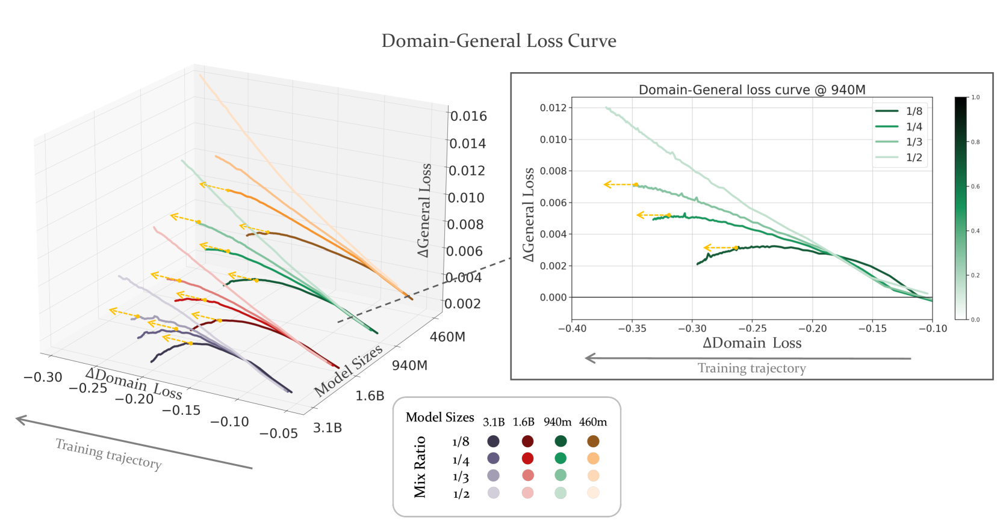
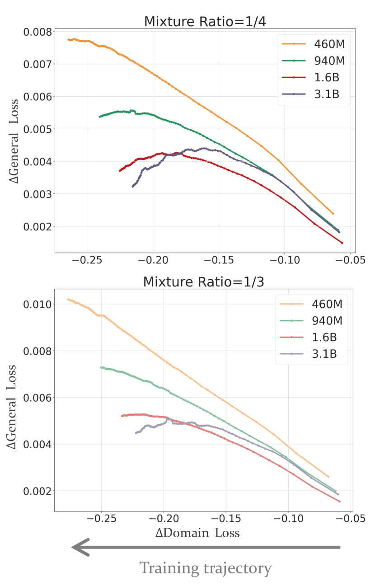
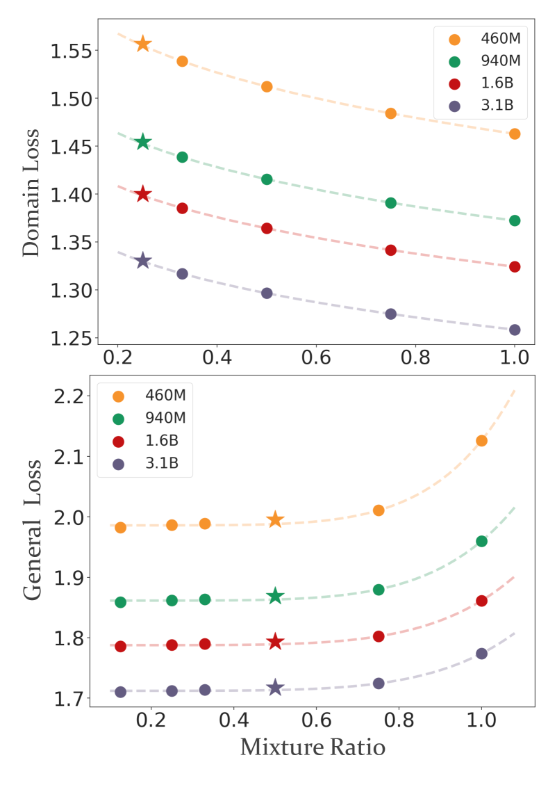
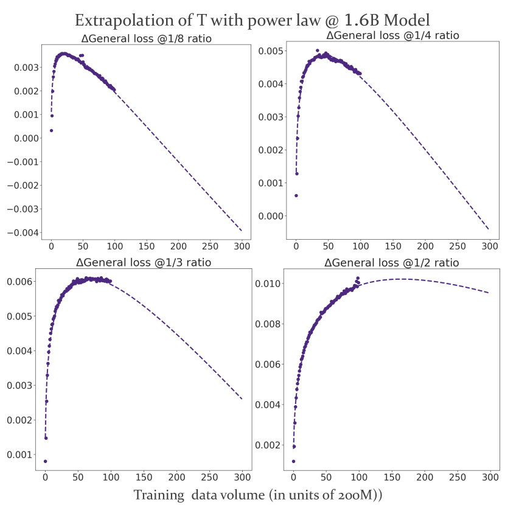
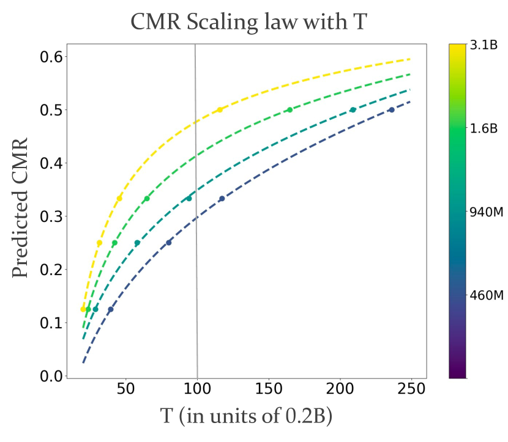
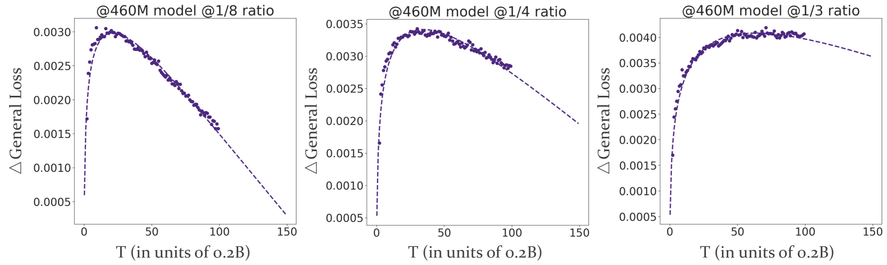
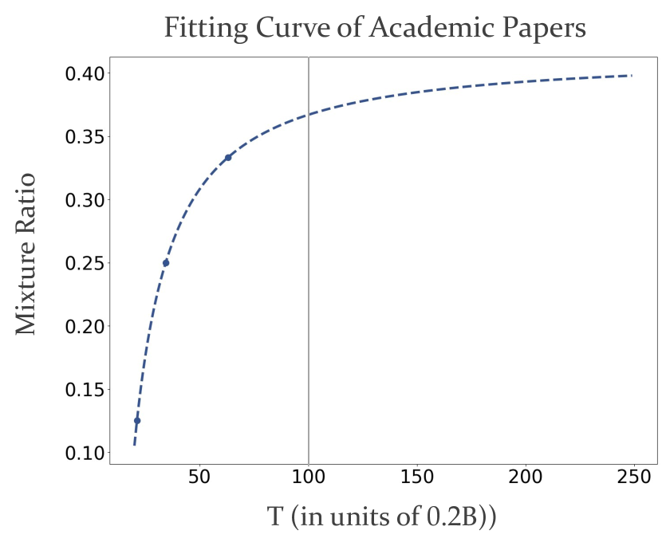
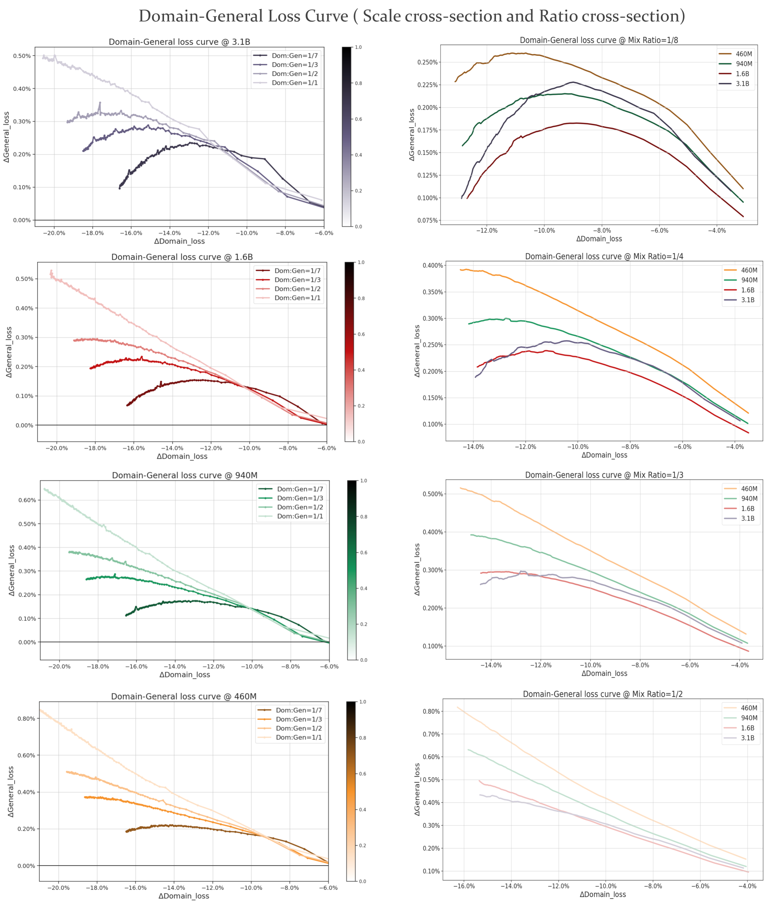
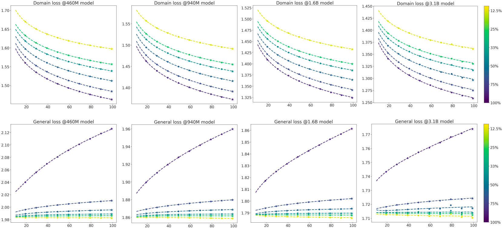
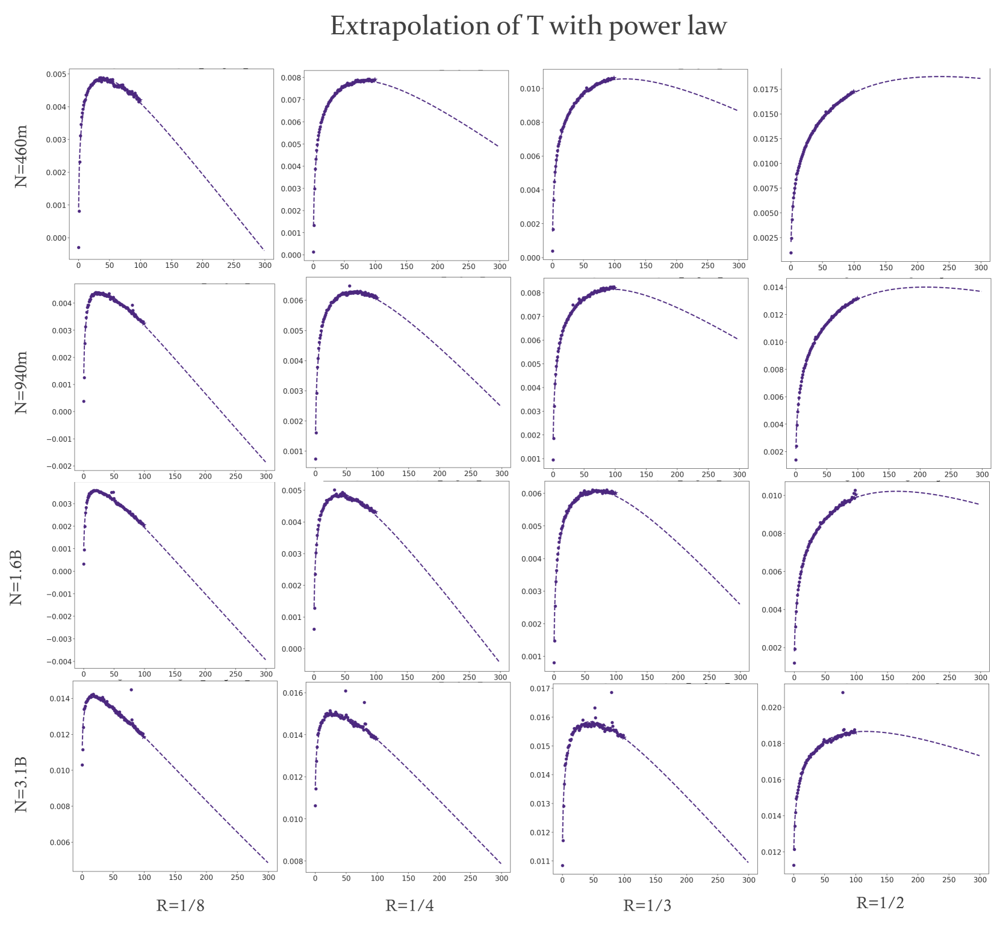

# CMR Scaling Law: Predicting Critical Mixture Ratios for Continual Pre-training of Language Models

###### Abstract

Large Language Models (LLMs) excel in diverse tasks but often underperform in specialized fields due to limited domain-specific or proprietary corpus. Continual pre-training (CPT) enhances LLM capabilities by imbuing new domain-specific or proprietary knowledge while replaying general corpus to prevent catastrophic forgetting. The data mixture ratio of general corpus and domain-specific corpus, however, has been chosen heuristically, leading to sub-optimal training efficiency in practice. In this context, we attempt to re-visit the scaling behavior of LLMs under the hood of CPT, and discover a power-law relationship between loss, mixture ratio, and training tokens scale. We formalize the trade-off between general and domain-specific capabilities, leading to a well-defined Critical Mixture Ratio (CMR) of general and domain data. By striking the balance, CMR maintains the model’s general ability and achieves the desired domain transfer, ensuring the highest utilization of available resources. Therefore, if we value the balance between efficiency and effectiveness, CMR can be consider as the optimal mixture ratio. Through extensive experiments, we ascertain the predictability of CMR, and propose CMR scaling law and have substantiated its generalization. These findings offer practical guidelines for optimizing LLM training in specialized domains, ensuring both general and domain-specific performance while efficiently managing training resources.  

CMR Scaling Law: Predicting Critical Mixture Ratios for Continual Pre-training of Language Models  

  

     Jiawei Gu§,†,1,2, Zacc Yang†,2, Chuanghao Ding2,3, Rui Zhao2, Fei Tan∗,2  1Sun Yat-sen University  2SenseTime Research  3Nanjing University  {yangzacc, zhaorui, tanfei}@sensetime.com  gujw3@mail2.sysu.edu.cn  ch777.ding@smail.nju.edu.cn    

  

$\S$$\S$footnotetext: Work was done during internship at SenseTime Research${\dagger}$${\dagger}$footnotetext: Equal contribution\*\*footnotetext: Corresponding author

## 1 Introduction

Large Language Models (LLMs) exhibit versatile abilities, including question answering, translation, summarization, role-playing, etc. Brown et al. ([2020](#bib.bib2)); Touvron et al. ([2023a](#bib.bib22), [b](#bib.bib23)); Li et al. ([2023](#bib.bib15)); Lu et al. ([2023](#bib.bib17)). Their performance, however, may degrade in specific domains due to limited corresponding pre-training data. To enhance LLMs’ abilities in specialized areas and avoid the enormous cost of re-training, a popular approach is Continual Pre-Training (CPT) Colombo et al. ([2024](#bib.bib4)); Chen et al. ([2023](#bib.bib3)); Yıldız et al. ([2024](#bib.bib26)); Luo et al. ([2023](#bib.bib18)). This approaches are likely to equip LLMs with new domain-related capabilities without much general performance penalty.  

Although CPT has been proven effective on multiple domains such as code Li et al. ([2023](#bib.bib15)); Lei et al. ([2024](#bib.bib14)), law Colombo et al. ([2024](#bib.bib4)) and medicine Chen et al. ([2023](#bib.bib3)), the interplay among loss prediction and its scaling behavior with model size, and the number of training tokens is yet to be fully explored. Additionally, the composition of continual pre-training data is simply set up in a heuristic manner Colombo et al. ([2024](#bib.bib4)); Chen et al. ([2023](#bib.bib3)), far from being principled. An inappropriate mixture ratio can lead to inefficient training (requiring excessive computation to adapt to specific domains) or insufficient training (failing to adequately reduce domain-specific loss). In light of this, three question hurdles we need to cross are as follows:  

Does the optimal data mixture ratio exist for CPT? If so, how does it evolve with model scale or training token volume? Are there any involved simple yet principled laws?  

Currently, several studies examine the scaling laws associated with different data mixture ratios. For instance, Ye et al. ([2024](#bib.bib25)) investigate how data mixtures shape scaling laws in the pre-training phase from the ground up, while Que et al. ([2024](#bib.bib20)) seek to pinpoint the optimal data mixture ratio in CPT, but overlook its crucial connection with the essential trade-off between general and domain loss in CPT.  

Therefore, to strengthen our understanding about CPT and guide the experiments in the future, we attempt to address these questions with empirical studies on CPT of LLMs. Specifically, we pre-train several LLMs with different model sizes from scratch and perform CPT on downstream domains (Finance and Academic Papers) with different data-mixture ratios. Our main contributions can be summarized as follows:  

Formalization of the Trade-Off in CPT. We formalize the balance between domain-specific and general abilities during CPT by introducing the concept of feasible mixture ratios. CPT under feasible mixture ratios maintains performance on general data while enhancing performance on domain-specific data. We identify the maximum feasible mixture ratio as the Critical Mixture Ratio (CMR), and regard it as the optimal mixture ratio by our definition.  

Predictability of CMR. Through extensive experiments, we identify a power-law relationship between loss and both data-mixture ratio and training tokens. As such, we propose CMR scaling law to predict the best mixture ratio by scaling training token volume, which is verified to be generalizable.  

Significance of CMR Scaling Law. CMR scaling law for CPT is crucial for efficient domain transfer for LLMs. This law allows us to determine the most efficient training configuration by predicting CMR using limited data and compute resources. Our finding provides valuable insights into the dynamics of CPT and offers practical guidelines for optimizing LLM training in specialized domains.  

[FIGURE S1.F1.g1]

Figure 1: Follow the direction of the training trajectory to track the trend of the curve. Each bunch of lines represents a model size scale: $\{3.1\mathrm{B},1.6\mathrm{B},940\mathrm{M},460\mathrm{M}\}$ and each group of line colors represents the mixture ratios $\{1/8,1/4,1/3,1/2\}$ from dark to light. In order to better display the trend, we have omitted proportions greater than $1/2$. The yellow dashed lines  point horizontally, indicating the corresponding ratios where $d\mathcal{L}_{\Delta\text{gen}}/d\mathcal{L}_{\Delta\text{dom}}$ closed to $0$. The third set of lines of model size $940\textrm{M}$, which has been zoomed in and depicted on the right side, showing the trend of the training curve more apparently. All horizontal and vertical cross-sections of the 3D diagram on the left side are detailed in the Appendix [D](#A4 "Appendix D Figure ‣ CMR Scaling Law: Predicting Critical Mixture Ratios for Continual Pre-training of Language Models").
[/FIGURE]

## 2 Key Results

We train a series of LLMs with multiple mixture ratios of domain-specific data and general data to analyse the scaling behaviour in CPT. The method is detailed in section [3.2](#S3.SS2 "3.2 Method ‣ 3 Background and Methods ‣ CMR Scaling Law: Predicting Critical Mixture Ratios for Continual Pre-training of Language Models"). Overall, we have the following key results:  

1. The trade-off between two goals of CPT (Definition [1](#Thmdefinition1 "Definition 1. ‣ 3.1 Continual Pre-training on Mixed Dataset ‣ 3 Background and Methods ‣ CMR Scaling Law: Predicting Critical Mixture Ratios for Continual Pre-training of Language Models")) suggests that, given a model of certain size, there exists a set of feasible mixture ratios (Definition [2](#Thmdefinition2 "Definition 2. ‣ 3.1 Continual Pre-training on Mixed Dataset ‣ 3 Background and Methods ‣ CMR Scaling Law: Predicting Critical Mixture Ratios for Continual Pre-training of Language Models")) that achieve the goals under specific training data constraints. 
2. Basically, general losses in CPT increase initially before decreasing, whereas domain losses tend to decrease. The relationships between loss and mixture ratio, as well as training volume, fit well with a power-law form, allowing for loss prediction under different mixture ratios and training tokens. 
3. Using the loss prediction by mixture ratio and training volume, we can predict the CMR (Definition [3](#Thmdefinition3 "Definition 3. ‣ Visualization ‣ 3.1 Continual Pre-training on Mixed Dataset ‣ 3 Background and Methods ‣ CMR Scaling Law: Predicting Critical Mixture Ratios for Continual Pre-training of Language Models")) with CMR scaling law. Given the maximum amount of training tokens, experiments in Figure [1](#S1.F1 "Figure 1 ‣ 1 Introduction ‣ CMR Scaling Law: Predicting Critical Mixture Ratios for Continual Pre-training of Language Models") and predicted results in Figure [5](#S5.F5 "Figure 5 ‣ 5.3 Predicting CMR ‣ 5 Is CMR Predictable? ‣ CMR Scaling Law: Predicting Critical Mixture Ratios for Continual Pre-training of Language Models") both show that CMR goes up with increasing model scale: from $29.76\%$ for the 460M model to $34.89\%$ for the 940M model. 

## 3 Background and Methods

The scaling law in the pre-training stage has been widely studied. In this work, we simplify the form of scaling law as much as possible, which is essentially consistent with previous works in Section [6](#S6 "6 Related Work ‣ CMR Scaling Law: Predicting Critical Mixture Ratios for Continual Pre-training of Language Models").  

In this section, we will elaborate on the three main concepts involved in this work, including objective of CPT (Definition [1](#Thmdefinition1 "Definition 1. ‣ 3.1 Continual Pre-training on Mixed Dataset ‣ 3 Background and Methods ‣ CMR Scaling Law: Predicting Critical Mixture Ratios for Continual Pre-training of Language Models")), feasible mixture ratio (Definition [2](#Thmdefinition2 "Definition 2. ‣ 3.1 Continual Pre-training on Mixed Dataset ‣ 3 Background and Methods ‣ CMR Scaling Law: Predicting Critical Mixture Ratios for Continual Pre-training of Language Models")) and CMR (Definition [3](#Thmdefinition3 "Definition 3. ‣ Visualization ‣ 3.1 Continual Pre-training on Mixed Dataset ‣ 3 Background and Methods ‣ CMR Scaling Law: Predicting Critical Mixture Ratios for Continual Pre-training of Language Models")). Then, we describe our experiment setups, including data preparation, experiment procedures and evaluation.  

### 3.1 Continual Pre-training on Mixed Dataset

###### Definition 1.

Objective of CPT  

Given the pre-trained LLM $M_{S}$ of model size $S$, general dataset $\mathcal{D}_{\text{gen}}$, and domain-specific dataset $\mathcal{D}_{\text{dom}}$, we continually pre-train $M_{S}$ on a mixed dataset $D_{R}$, where the mixture ratio of the domain-specific data is $R$, with $R\in[0,1]$. The mixed dataset $\mathcal{D}_{{R}}$ is denoted as $\mathcal{D}_{R}=\mathcal{D}_{\text{dom}}+\mathcal{D}_{\text{gen}}$ and $R=\frac{|\mathcal{D}_{\text{dom}}|}{{(|\mathcal{D}_{\text{gen}}|+|\mathcal{D}_{\text{dom}}|)}}$.  

We define $\mathcal{L}_{\text{gen/dom}}(M_{S})$ as the domain or general loss of the model $M_{S}$. We denote $\mathcal{L}^{\text{CPT}}_{\text{gen/dom}}(M_{S},\mathcal{D}_{{R}},T)$ as the domain/general loss of model $M_{S}$ after CPT on dataset $\mathcal{D}_{R}$ with training token volume $T$. The goals for CPT are formalized as follows:  

1. By the end of training, the general loss is supposed to either reach plateau or head downward (within a certain tolerance $\epsilon>=0$):  

|  | $$\mathcal{L}^{\text{CPT}}_{\text{gen}}(M_{S},\mathcal{D}_{R},T_{\text{max}})\leq\mathcal{L}_{\text{gen}}(M_{S})+\epsilon.$$ |  | (1) |
| --- | --- | --- | --- |

2. Domain-specific loss should decline largely:  

|  | $$\mathcal{L}^{\text{CPT}}_{\text{dom}}(M_{S},\mathcal{D}_{R},T_{\text{max}})<\mathcal{L}_{\text{dom}}(M_{S}).$$ |  | (2) |
| --- | --- | --- | --- |

The increase in $T$ from $0$ to $T_{\text{max}}$ corresponds to the progression of the training trajectory. To better integrate these two aspects, we adopt the method of Lagrange multipliers Rockafellar ([1993](#bib.bib21)). The loss function ${F}(\cdot)$ for the whole objective of CPT is the Lagrangian as follows:  

|  | $\displaystyle F(S,R,T,\lambda)$ | $\displaystyle=\mathcal{L}^{\text{CPT}}_{\text{dom}}(M_{S},\mathcal{D}_{R},T)$ |  | (3) |
| --- | --- | --- | --- | --- |
|  |  | $\displaystyle+\lambda(\mathcal{L}^{\text{CPT}}_{\text{gen}}(M_{S},\mathcal{D}_{R},T)$ |  |
|  |  | $\displaystyle-\mathcal{L}_{\text{gen}}(M_{S})-\epsilon),$ |  |

where $\lambda$ is the Lagrange multiplier used to enforce the constraint on the general loss while minimizing the domain-specific loss. In practice, $\lambda$ governs the importance of two target dimensions in CPT. $F(S,R,T,\lambda)$ is the whole objective function.  

Under resource constraints, the optimal training configuration should minimize $\mathcal{L}_{\text{dom}}$ while satisfying the constraint on $\mathcal{L}_{\text{gen}}$, which involves finding the optimal $S$, $R$, and $T$ by solving the following optimization problem:  

|  |  | $\displaystyle S^{*},R^{*},T^{*}=\text{argmin}_{M_{S},R,T}\,F(S,R,T,\lambda),$ |  | (4) |
| --- | --- | --- | --- | --- |
|  | s.t. | $\displaystyle\begin{cases}\mathcal{L}^{\text{CPT}}_{\text{gen}}(M_{S},R,T_{\text{max}})\leq\mathcal{L}_{\text{gen}}(M_{S})+\epsilon,\\ R\geq 0,T\geq 0,\lambda\geq 0.\end{cases}$ |  |

###### Definition 2.

Feasible Mixture Ratio  

Given fixed model size $S$, the optimization problem in Equation ([3](#S3.E3 "In 3.1 Continual Pre-training on Mixed Dataset ‣ 3 Background and Methods ‣ CMR Scaling Law: Predicting Critical Mixture Ratios for Continual Pre-training of Language Models")) can be boiled down to $F(R,T,\lambda)$. We first introduce a mixture ratio set $\mathbb{A}$: according to the first constraint of Definition [1](#Thmdefinition1 "Definition 1. ‣ 3.1 Continual Pre-training on Mixed Dataset ‣ 3 Background and Methods ‣ CMR Scaling Law: Predicting Critical Mixture Ratios for Continual Pre-training of Language Models"), under a certain tolerance $\epsilon$ for the deterioration in the final general performance, we can choose an set of mixture ratios $\mathbb{A}$ satisfying $\mathbb{A}=\{R\mid\mathcal{L}^{\text{CPT}}_{\text{gen}}(M_{S},R,T_{\text{max}})\leq\mathcal{L}_{\text{gen}}(M_{S})+\epsilon\}$. Ratios in $\mathbb{A}$ that align with our CPT objective are considered as feasible mixture ratios, denoted as the set $\mathbb{F}$. A detailed definition transformation is presented in Appendix [B.2](#A2.SS2 "B.2 Feasible mixture ratio ‣ Appendix B Mathematical derivation ‣ CMR Scaling Law: Predicting Critical Mixture Ratios for Continual Pre-training of Language Models"), and here we directly provide the formula and the results of derivation: within the feasible mixture ratios, there exists a point $T_{0}$ over the training trajectory of CPT. As CPT proceeds with $T>T_{0}$, we have $\mathbb{F}=\{R\mid\exists\,T_{0}\in(0,T_{\text{max}})\,:\,\frac{\partial F}{\partial T}\leq 0,R\in\mathbb{A}\}.$  

An equivalent condition of defining $\mathbb{F}$ can be derived as:  

|  | $\displaystyle\mathbb{F}=$ | $\displaystyle\{R\mid\exists\,T_{0}\in[0,T_{\text{max}}]\,$ |  | (5) |
| --- | --- | --- | --- | --- |
|  |  | $\displaystyle:\,\left.\frac{\partial\mathcal{L}_{\Delta\text{gen}}(R,T)}{\partial\mathcal{L}_{\Delta\text{dom}}(R,T)}\right|_{R}=-\frac{1}{\lambda}<0,R\in\mathbb{A}\}.$ |  |

For simplicity, we have defined $\mathcal{L}_{\Delta\text{dom}}=\mathcal{L}^{\text{CPT}}_{\text{dom}}-\mathcal{L}_{\text{dom}}$ and $\mathcal{L}_{\Delta\text{gen}}=\mathcal{L}^{\text{CPT}}_{\text{gen}}-\mathcal{L}_{\text{gen}}$.  

#### Visualization

As shown in Figure [1](#S1.F1 "Figure 1 ‣ 1 Introduction ‣ CMR Scaling Law: Predicting Critical Mixture Ratios for Continual Pre-training of Language Models"), the training curves meeting the objective of CPT are marked with yellow dotted arrows, indicating the curves show a downward trend as training proceeds. The domain loss continuously decreases ($\mathcal{L}_{\Delta\text{dom}}\downarrow$) and the general loss is bounded ($d\mathcal{L}_{\Delta\text{gen}}/d\mathcal{L}_{\Delta\text{dom}}\rightarrow 0$) along the training trajectory until the ends of training. This visual representation effectively illustrates the behavior described by Equation ([5](#S3.E5 "In 3.1 Continual Pre-training on Mixed Dataset ‣ 3 Background and Methods ‣ CMR Scaling Law: Predicting Critical Mixture Ratios for Continual Pre-training of Language Models")), demonstrating the trade-off relationship between the domain loss and the general loss during training. The specific derivation and the interpretation of the slope for Figure [1](#S1.F1 "Figure 1 ‣ 1 Introduction ‣ CMR Scaling Law: Predicting Critical Mixture Ratios for Continual Pre-training of Language Models") is detailed in Appendix [B.2](#A2.SS2 "B.2 Feasible mixture ratio ‣ Appendix B Mathematical derivation ‣ CMR Scaling Law: Predicting Critical Mixture Ratios for Continual Pre-training of Language Models").  

###### Definition 3.

Critical Mixture Ratio (CMR)  

Given limited compute resources and fixed model size, we hope that the language model can digest domain knowledge more efficiently by achieving the objective as described in Definition [1](#Thmdefinition1 "Definition 1. ‣ 3.1 Continual Pre-training on Mixed Dataset ‣ 3 Background and Methods ‣ CMR Scaling Law: Predicting Critical Mixture Ratios for Continual Pre-training of Language Models"). Therefore, we define the maximum among feasible mixture ratios as the Critical Mixture Ratio (CMR) $R^{*}=\max\{R|R\in\mathbb{F}\}$.  

The rationale is straightforward: if the ratio is less than CMR, the domain data is not sufficiently utilized in CPT; otherwise, the expected objective can’t be achieved, which is manifested as a intolerable increase in general loss, leading to degradation in general ability. Thus, we argue that the CMR is the most suitable ratio for CPT due to the ideal balance of two sides.  

### 3.2 Method

Data preparation Our general pre-training data is composed of corpora from Chinese, English, and code. The Chinese corpus and English corpus both include articles from encyclopedia, books, news, papers and social media sites. The code corpus is a subset sampled from StarCoder Li et al. ([2023](#bib.bib15)). The general pre-training dataset comprises a total of 220 billion tokens. The proportions of Chinese, English, and code are roughly $44\%:36\%:20\%$.  

We meticulously craft two specific domain datasets for CPT: Finance and Academic Papers. The Finance dataset include financial news, financial policies and regulations, company announcements and research reports from securities and fund companies. The Academic Papers exclusively include papers from Arxiv. Each of the datasets contains at least 20 billion tokens, which is sufficient for our CPT.  

Unless stated explicitly, all the following results are based on experiments with Finance. The results of CPT on Academic Papers are reported in Section [5.3](#S5.SS3 "5.3 Predicting CMR ‣ 5 Is CMR Predictable? ‣ CMR Scaling Law: Predicting Critical Mixture Ratios for Continual Pre-training of Language Models").  

#### LLM Architecture

The involved LLMs in this study have the same architecture as Llama series Touvron et al. ([2023a](#bib.bib22), [b](#bib.bib23)) with standard multi-head attention. The number of parameters ranges from 460M to 3.1B. The architecture is detailed in Table [1](#A1.T1 "Table 1 ‣ Appendix A LLM Configurations ‣ CMR Scaling Law: Predicting Critical Mixture Ratios for Continual Pre-training of Language Models") of Appendix.  

#### Experiment Setup

We split the general pre-training dataset into two subsets: a 200B-token general dataset for general pre-training and a 20B-token general dataset for CPT.  

In the pre-training stage, we pre-train the LLMs from scratch with 200B-token general dataset with a max learning rate of 3e-4, a batch size of 512, and a sequence length of 4096. The training step is 100,000 for each LLM. In the CPT stage, we train each LLM for another 10,000 steps (20 billion tokens) with a max learning rate of 3e-5 and warmup-constant LR schedule, on a mixture of the 20B-token general dataset and a domain dataset with different mixture ratios.  

#### Evaluation

Scaling laws emphasize the predictability of pre-training loss Kaplan et al. ([2020](#bib.bib13)); Hoffmann et al. ([2022](#bib.bib12)); Gao et al. ([2023](#bib.bib7)); Hernandez et al. ([2021](#bib.bib10)), which is a widely-used performance indicator. Recent studies Du et al. ([2024](#bib.bib6)); Yuan et al. ([2023](#bib.bib27)) highlight that pre-training loss is highly correlated with downstream task performance. Therefore, we use the pre-training loss on the validation set to measure the model’s capability of general or domain-specific task during the CPT process. In addition, we use Mean Squared Error (MSE) and R-square ($R^{2}$) to measure the quality of the fitting, which provides a clear and interpretable analysis of the errors.  

## 4 Does the Critical Mixture Ratio Exist?

—— Yes, the CMR does exist.  

A larger mixture ratio implies a higher proportion of domain-specific data in the training set, resulting in a lower domain loss. However, due to the potential catastrophic forgetting of domain transfer, it is essential to ensure that the loss in the new domain continues to decrease while the original capabilities of LLMs are preserved and not compromised during CPT. Consequently, a higher mixture ratio is not always best. This raises an important question: does a Critical Mixture Ratio (CMR) exist that can balance these two goals of CPT in Definition [1](#Thmdefinition1 "Definition 1. ‣ 3.1 Continual Pre-training on Mixed Dataset ‣ 3 Background and Methods ‣ CMR Scaling Law: Predicting Critical Mixture Ratios for Continual Pre-training of Language Models") effectively and efficiently?  

Figure [1](#S1.F1 "Figure 1 ‣ 1 Introduction ‣ CMR Scaling Law: Predicting Critical Mixture Ratios for Continual Pre-training of Language Models") (left) demonstrates that for models of various sizes, there is at least one curve at a specific ratio that shows a downward trend, highlighted by yellow dotted arrows. This indicates the presence of feasible mixture ratios that align with our CPT objective. On the other hand, larger models tend to have bigger feasible mixture ratios set $\mathbb{F}$ (more curves with yellow dotted arrows). For curves that meet the objective of CPT, a higher ratio is preferable, as it incorporates more domain knowledge while optimizing training efficiency within the tolerance of decline in general capacity. Therefore, the critical mixture ratio is defined as the highest proportion among these satisfactory curves, representing the optimal ratio for the given model size and limited training token volume.  

If feasible ratios exist, we can conclude that CMR is also supposed to exist. Fundamentally, the existence of CMR arises from the trade-off between general and domain-specific capabilities, as well as the limited data and computing resources. According to definition  [3](#Thmdefinition3 "Definition 3. ‣ Visualization ‣ 3.1 Continual Pre-training on Mixed Dataset ‣ 3 Background and Methods ‣ CMR Scaling Law: Predicting Critical Mixture Ratios for Continual Pre-training of Language Models"), the CMR is present across models of different scales, as shown in Figure [1](#S1.F1 "Figure 1 ‣ 1 Introduction ‣ CMR Scaling Law: Predicting Critical Mixture Ratios for Continual Pre-training of Language Models"). This figure illustrates the existence of CMR as the maximum value within the feasible set. However, the precise value of CMR can not be determined from the figure, as it requires extensive experiments with different mixture ratios. The estimation of CMRs is discussed in  [5.3](#S5.SS3 "5.3 Predicting CMR ‣ 5 Is CMR Predictable? ‣ CMR Scaling Law: Predicting Critical Mixture Ratios for Continual Pre-training of Language Models") and plotted in Figure [5](#S5.F5 "Figure 5 ‣ 5.3 Predicting CMR ‣ 5 Is CMR Predictable? ‣ CMR Scaling Law: Predicting Critical Mixture Ratios for Continual Pre-training of Language Models").  

To look closely, we enlarged the longitudinal section of $M_{940\textrm{M}}$ in the 3D graph in Figure [1](#S1.F1 "Figure 1 ‣ 1 Introduction ‣ CMR Scaling Law: Predicting Critical Mixture Ratios for Continual Pre-training of Language Models") and placed it on the right side. It can be seen that as the mixture ratio increases, the curve continues to rise until the loss in the general domain exceeds our tolerance. The potentially controversial issue is that the downward trend in one-third of the curves is as clear as in the rest. The reason why it is feasible curve here can be found in Appendix [B.2](#A2.SS2 "B.2 Feasible mixture ratio ‣ Appendix B Mathematical derivation ‣ CMR Scaling Law: Predicting Critical Mixture Ratios for Continual Pre-training of Language Models"). Although it is not easily noticeable, there are indeed points on this curve where the slope is less than $0$.  

[FIGURE S4.F2.g1]

Figure 2: Follow the direction of the training trajectory to track the trend of the curve. The $\mathcal{L}_{\Delta\text{gen}}$ and $\mathcal{L}_{\Delta\text{dom}}$ loss functions for the models at mixture ratios of $1/4$ and $1/3$ are illustrated.
[/FIGURE]

#### Findings

From another perspective, we plot the loss curves of the models under the same mixture ratio as shown in Figure [2](#S4.F2 "Figure 2 ‣ 4 Does the Critical Mixture Ratio Exist? ‣ CMR Scaling Law: Predicting Critical Mixture Ratios for Continual Pre-training of Language Models"). When the mixture ratio is $1/4$, all models can achieve the training objective of CPT. However, at a $1/3$ mixture ratio, only $M_{940\textrm{M}}$, $M_{1.6\textrm{B}}$ and $M_{3.1\textrm{B}}$ achieve the CPT goal. This indicates that CMR for $M_{940\textrm{M}}$ is around $1/4$ within the scope of our training token volumes, while the CMRs for $M_{940\textrm{M}}$, $M_{1.6\textrm{B}}$ and $M_{3.1\textrm{B}}$ are at least $1/3$. In other words, CMRs slightly increase with model size, suggesting that larger models can accommodate a higher proportion of domain data. We also further this finding by taking more cross-sections of Figure [1](#S1.F1 "Figure 1 ‣ 1 Introduction ‣ CMR Scaling Law: Predicting Critical Mixture Ratios for Continual Pre-training of Language Models") (left) in Appendix [D](#A4 "Appendix D Figure ‣ CMR Scaling Law: Predicting Critical Mixture Ratios for Continual Pre-training of Language Models") and the predicted CMR in following section [5](#S5 "5 Is CMR Predictable? ‣ CMR Scaling Law: Predicting Critical Mixture Ratios for Continual Pre-training of Language Models").  

This phenomenon can be explained by the models’ ability to consume domain knowledge. As the proportion of domain-specific data increases, the knowledge that the model needs to learn also increases. LLMs with smaller size struggle to absorb much of domain knowledge while preserving the general knowledge, leading to a degradation in their original general performance. In contrast, models with larger sizes can accommodate more knowledge with more parameters, thereby maintaining better performance.  

## 5 Is CMR Predictable?

—— Yes, the CMR can be predicted.  

The existence of CMR indicates that in the process of CPT, we may explore the CMR scaling law to seek the best mixture ratio under resource constraints and domain data limitations, thereby optimizing training effectiveness and efficiency. In other words, the next question to answer is whether we can predict the CMR for model $M_{s}$ given a maximum amount of continuation training token volume, $T_{\textrm{max}}$.  

To this end, two basic prerequisites must be met: predicting losses for different mixture ratio and predicting losses for different training token volume. In this section, we will demonstrate that these two prerequisites have been satisfied separately in [5.1](#S5.SS1 "5.1 Predicting Losses of Mixture Ratio ‣ 5 Is CMR Predictable? ‣ CMR Scaling Law: Predicting Critical Mixture Ratios for Continual Pre-training of Language Models") and [5.2](#S5.SS2 "5.2 Predicting Losses of Training Tokens ‣ 5 Is CMR Predictable? ‣ CMR Scaling Law: Predicting Critical Mixture Ratios for Continual Pre-training of Language Models"), and finally detail the scaling law to predict CMR in [5.3](#S5.SS3 "5.3 Predicting CMR ‣ 5 Is CMR Predictable? ‣ CMR Scaling Law: Predicting Critical Mixture Ratios for Continual Pre-training of Language Models"). To keep notations simple, we omit fixed variables in the loss function ($\mathcal{L}_{dom/gen}$ and $\mathcal{L}_{\Delta\text{dom}/\Delta\text{gen}}$) in this section.  

[FIGURE S5.F3.g1]

Figure 3: The upper figure shows the fitting curve of domain loss $\mathcal{L}_{\text{dom}}$ with the change of mixture ratio $R$, and the lower figure shows the fitting curve of general loss $\mathcal{L}_{\text{gen}}$. The solid circles ($\bullet$) represent real losses, and the stars (★) represent the predicted losses.
[/FIGURE]

### 5.1 Predicting Losses of Mixture Ratio

Predicting the general and domain loss is closely related to understanding the scaling behavior in the CPT stage. We study the scaling behavior of losses at $T=T_{\mathrm{max}}$. In addition, since scaling law aims to fit data points, their parametric forms should be intrinsically related to the observed trends in the data points. Based on previous works Kaplan et al. ([2020](#bib.bib13)); Hoffmann et al. ([2022](#bib.bib12)) and data trends we observed, we proposed the simplified expression ${\mathcal{L}(R)}$ as a power-law form of  

|  | $$\mathcal{L}(R)=\alpha\cdot R^{s}+\beta,$$ |  |
| --- | --- | --- |

where $\alpha$ is a coefficient, $s$ is the exponent, and $\beta$ is the bias.  

As shown in Figure [3](#S5.F3 "Figure 3 ‣ 5 Is CMR Predictable? ‣ CMR Scaling Law: Predicting Critical Mixture Ratios for Continual Pre-training of Language Models"), domain loss gradually decreases with the increase of the mixture ratio, while general loss remains almost unchanged initially and then begins to rise. After fitting the general loss and domain loss separately for different mixture ratios $R$ (non-endpoint values, $R\in(0,1)$), we make predictions on new ratios. As shown in Figure [3](#S5.F3 "Figure 3 ‣ 5 Is CMR Predictable? ‣ CMR Scaling Law: Predicting Critical Mixture Ratios for Continual Pre-training of Language Models"), the predicted values align closely with the fitted curve. Notably, the predictions demonstrate high accuracy, with error values within $0.05\%$ as presented in Table [2](#A3.T2 "Table 2 ‣ Appendix C Table ‣ CMR Scaling Law: Predicting Critical Mixture Ratios for Continual Pre-training of Language Models").  

Given the predicted $\mathcal{L}_{\text{dom}}(R)$ and $\mathcal{L}_{\text{gen}}(R)$ under different mixture ratios, we can obtain a range of mixture ratios that fulfil the tolerance limit $\epsilon$, denoted as $\mathbb{A}$, according to Equation [3](#S3.E3 "In 3.1 Continual Pre-training on Mixed Dataset ‣ 3 Background and Methods ‣ CMR Scaling Law: Predicting Critical Mixture Ratios for Continual Pre-training of Language Models"). In the objective of CPT we set, $\epsilon=0.05$.  

### 5.2 Predicting Losses of Training Tokens

[FIGURE S5.F4.g1]

Figure 4: The figure shows the general loss of $M_{1.6B}$ fitting and extrapolating at four distinct mixture ratios: $\{1/8,1/4,1/3,1/2\}$. As the ratio increases, the curve gradually rises when training data volume increases.
[/FIGURE]

Previous works Kaplan et al. ([2020](#bib.bib13)); Hoffmann et al. ([2022](#bib.bib12)) have shown that the model size $S$ and the volume of training tokens $T$ can be used to fit the power law of loss. However, our work differs in two key aspects. First, we model the change of loss $\mathcal{L}_{\Delta\text{dom}/\Delta\text{gen}}(T)$ rather than the loss itself. Second, due to the phenomenon of general loss initially increasing and then decreasing as shown in Figure [4](#S5.F4 "Figure 4 ‣ 5.2 Predicting Losses of Training Tokens ‣ 5 Is CMR Predictable? ‣ CMR Scaling Law: Predicting Critical Mixture Ratios for Continual Pre-training of Language Models"), we leverage a two-term polynomial function for better fitting. According to Equation [9](#A2.E9 "In B.2 Feasible mixture ratio ‣ Appendix B Mathematical derivation ‣ CMR Scaling Law: Predicting Critical Mixture Ratios for Continual Pre-training of Language Models") in Appendix [B.2](#A2.SS2 "B.2 Feasible mixture ratio ‣ Appendix B Mathematical derivation ‣ CMR Scaling Law: Predicting Critical Mixture Ratios for Continual Pre-training of Language Models"), the loss for CPT training tokens $T$ is formulated as follows:  

|  | $$\left\{\begin{aligned} \mathcal{L}_{\Delta\text{dom}}(T)&=\alpha_{1}\cdot T^{s_{1}}+\beta_{1},\\ \mathcal{L}_{\Delta\text{gen}}(T)&=\alpha_{2}\cdot T^{s_{2}}+\alpha_{3}\cdot T^{s_{3}}+\beta_{2}.\end{aligned}\right.$$ |  | (6) |
| --- | --- | --- | --- |

where $\alpha_{1}$, $\alpha_{2}$, $\alpha_{3}$, $\beta_{1}$, $\beta_{2}$, $s_{1}$, $s_{2}$, and $s_{3}$ are learnable parameters. Our results demonstrate that the form ([6](#S5.E6 "In 5.2 Predicting Losses of Training Tokens ‣ 5 Is CMR Predictable? ‣ CMR Scaling Law: Predicting Critical Mixture Ratios for Continual Pre-training of Language Models")) exhibits high fitting accuracy with low MSE and high $R^{2}$ in Table [3](#A3.T3 "Table 3 ‣ Appendix C Table ‣ CMR Scaling Law: Predicting Critical Mixture Ratios for Continual Pre-training of Language Models") and Figure [4](#S5.F4 "Figure 4 ‣ 5.2 Predicting Losses of Training Tokens ‣ 5 Is CMR Predictable? ‣ CMR Scaling Law: Predicting Critical Mixture Ratios for Continual Pre-training of Language Models").  

### 5.3 Predicting CMR

[FIGURE S5.F5.g1]

Figure 5: We can use the CMR scaling laws to predict CMRs under fixed model size $S$, and are extrapolated to $T=250$, which is equivalent to a training volume of $500\mathrm{B}$ tokens.
[/FIGURE]

According to the definition of feasible mixture ratios in Definition [2](#Thmdefinition2 "Definition 2. ‣ 3.1 Continual Pre-training on Mixed Dataset ‣ 3 Background and Methods ‣ CMR Scaling Law: Predicting Critical Mixture Ratios for Continual Pre-training of Language Models") and the method for determining the set $\mathbb{F}$ in Appendix [B.2](#A2.SS2 "B.2 Feasible mixture ratio ‣ Appendix B Mathematical derivation ‣ CMR Scaling Law: Predicting Critical Mixture Ratios for Continual Pre-training of Language Models"), where $\mathbb{F}\subset\mathbb{A}$, and $\mathbb{A}$ is obtained by predicting losses for any mixture ratio in [5.1](#S5.SS1 "5.1 Predicting Losses of Mixture Ratio ‣ 5 Is CMR Predictable? ‣ CMR Scaling Law: Predicting Critical Mixture Ratios for Continual Pre-training of Language Models"), we can establish a relationship between training token volume $T$ and the feasible mixture ratios by the fitting laws in [5.2](#S5.SS2 "5.2 Predicting Losses of Training Tokens ‣ 5 Is CMR Predictable? ‣ CMR Scaling Law: Predicting Critical Mixture Ratios for Continual Pre-training of Language Models"). Overall, based on the parameters provided in Formula [6](#S5.E6 "In 5.2 Predicting Losses of Training Tokens ‣ 5 Is CMR Predictable? ‣ CMR Scaling Law: Predicting Critical Mixture Ratios for Continual Pre-training of Language Models"), the critical solution $T_{0}$ is obtained for a specific mixture ratio $R_{0}$ denoted as (derivation detailed in Appendix [B.2](#A2.SS2 "B.2 Feasible mixture ratio ‣ Appendix B Mathematical derivation ‣ CMR Scaling Law: Predicting Critical Mixture Ratios for Continual Pre-training of Language Models")):  

|  |  | $\displaystyle T_{0}=$ |  | (7) |
| --- | --- | --- | --- | --- |
|  |  | $\displaystyle\left[-\frac{\alpha_{1}\cdot s_{1}}{\lambda\alpha_{2}\cdot s_{2}}\left(1+\frac{\alpha_{3}\cdot s_{3}}{\alpha_{2}\cdot s_{2}}T_{0}^{s_{3}-s_{2}}\right)^{-1}\right]^{\frac{1}{s_{2}-s_{1}}}$ |  |

When $T_{0}$ is less than the given maximum training token volume $T_{\mathrm{max}}$, we can conclude that the current ratio $R_{0}$ is a feasible mixture ratio. Conversely, if $T_{0}$ exceeds $T_{\mathrm{max}}$, then $R_{0}$ is not a feasible mixture ratio. If $T_{0}$ is equal to $T_{\mathrm{max}}$, then $R_{0}$ is the critical ratio. We propose the following CMR scaling law:  

|  | $$R_{\textrm{CMR}}=\alpha_{4}\cdot T^{s_{4}}+\beta_{3}.$$ |  | (8) |
| --- | --- | --- | --- |

The fitting curves are showed in Figure [5](#S5.F5 "Figure 5 ‣ 5.3 Predicting CMR ‣ 5 Is CMR Predictable? ‣ CMR Scaling Law: Predicting Critical Mixture Ratios for Continual Pre-training of Language Models"). In our experiments, $T_{\mathrm{max}}$ is $20\mathrm{B}$ tokens, which corresponds to a value of $T=100$ in the figure. Therefore, for four models of different scales, their predicted CMR are $29.8\%,34.9\%,41.4\%$ and $47.8\%$ for $M_{460\mathrm{M}},M_{940\mathrm{M}},M_{1.6\mathrm{B}},M_{3.1\mathrm{B}}$, respectively.  

#### Generalization

In order to verify whether the CMR scaling law can be generalized, we experiment on another domain Academic Papers with different mixture ratios. In this generalization experiment, we only conduct CPT on the 460M-sized model with Academic Papers data proportions set to $\{1/8,1/4,1/2,3/4,1/3\}$ respectively. All other settings were kept consistent with Finance. As shown in Figure [6](#S5.F6 "Figure 6 ‣ Generalization ‣ 5.3 Predicting CMR ‣ 5 Is CMR Predictable? ‣ CMR Scaling Law: Predicting Critical Mixture Ratios for Continual Pre-training of Language Models"), the trade-off of CPT still exist in this domain, and thus there exists a CMR. Furthermore, the CMR scaling law still work, which can observed in Figure [7](#A4.F7 "Figure 7 ‣ Appendix D Figure ‣ CMR Scaling Law: Predicting Critical Mixture Ratios for Continual Pre-training of Language Models"). The predicted CMR for Academic Papers is $36.7\%$, given the maximum training token volume $T_{\textrm{max}}=100$.  

[FIGURE S5.F6.g1]

Figure 6: The figure shows the general loss of $M_{460\textrm{M}}$ fitting and extrapolating at three distinct mixture ratios: $\{1/8,1/4,1/3\}$ with CPT on Academic Papers.
[/FIGURE]

#### Open Discussion

As showed in Figs.  [5](#S5.F5 "Figure 5 ‣ 5.3 Predicting CMR ‣ 5 Is CMR Predictable? ‣ CMR Scaling Law: Predicting Critical Mixture Ratios for Continual Pre-training of Language Models") and  [7](#A4.F7 "Figure 7 ‣ Appendix D Figure ‣ CMR Scaling Law: Predicting Critical Mixture Ratios for Continual Pre-training of Language Models"), the larger the $T_{\text{max}}$, the wider the range of feasible mixture ratios. Therefore, it seems that when $T_{\text{max}}$ tends to be infinity (the amount of data available for continued training is infinite, and computational resources are unlimited completely), the range of feasible mixture ratios would approach $(0,1)$, leading CMR approaching $1$. In this sense, each curve of CPT trajectory will show an expected convergence trend of objective, provided that there is enough $T$ to allow it to develop.  

Moreover, we find out that the solution of $T_{0}$ in Definition [2](#Thmdefinition2 "Definition 2. ‣ 3.1 Continual Pre-training on Mixed Dataset ‣ 3 Background and Methods ‣ CMR Scaling Law: Predicting Critical Mixture Ratios for Continual Pre-training of Language Models") approaches the inflexion point of $\mathcal{L}_{\Delta\text{gen}}(T)$ in Figure [4](#S5.F4 "Figure 4 ‣ 5.2 Predicting Losses of Training Tokens ‣ 5 Is CMR Predictable? ‣ CMR Scaling Law: Predicting Critical Mixture Ratios for Continual Pre-training of Language Models") and Figure [6](#S5.F6 "Figure 6 ‣ Generalization ‣ 5.3 Predicting CMR ‣ 5 Is CMR Predictable? ‣ CMR Scaling Law: Predicting Critical Mixture Ratios for Continual Pre-training of Language Models"), when $\lambda\rightarrow+\infty$, which we used for solving equations [14](#A2.E14 "In B.2 Feasible mixture ratio ‣ Appendix B Mathematical derivation ‣ CMR Scaling Law: Predicting Critical Mixture Ratios for Continual Pre-training of Language Models") ranges from $100$ to $7000$. The reason is likely to be that, the change in the general loss is much smaller than the change in domain, and $\lambda$ in the objective function of CPT needs to be very large to amplify such subtle changes within the tolerance of constraints. In addition, during the training process, the decreasing trend of domain loss has always been present, but there are obvious inflection points in the of general loss curve (rise first and then fall). That is to say, by only locating the inflection points on the general loss curve and finding this distance to the max training token volume, we can roughly estimate how far away we are from CMR at current ratio.  

## 6 Related Work

### 6.1 Continual Pre-training

Continual Pre-Training (CPT) aims to perpetually pre-train large language models (LLMs), allowing them to adapt to new domains and reducing the high costs associated with training models from scratch for specialized tasks Yıldız et al. ([2024](#bib.bib26)). CPT can be employed to tailor LLMs for specific fields, such as code Lei et al. ([2024](#bib.bib14)); Li et al. ([2023](#bib.bib15)), medicine Chen et al. ([2023](#bib.bib3)), law Colombo et al. ([2024](#bib.bib4)), and science. By using an appropriate mixture of data from various domains Gururangan et al. ([2020](#bib.bib8)), CPT not only enhances downstream performance but also mitigates the issue of catastrophic forgetting Zhang et al. ([2024](#bib.bib28)), which is prevalent in all forms of post-training Cossu et al. ([2022](#bib.bib5)); Luo et al. ([2023](#bib.bib18)).  

### 6.2 Scaling Law

Numerous studies Hestness et al. ([2017](#bib.bib11)); Henighan et al. ([2020](#bib.bib9)); Bahri et al. ([2021](#bib.bib1)); Kaplan et al. ([2020](#bib.bib13)); Hoffmann et al. ([2022](#bib.bib12)); Yao and Wang ([2023](#bib.bib24)) demonstrate a power-law relationship between performance and the increase in both the number of parameters and the size of the training data. These relationships are crucial for large language models (LLMs), being of paramount importance in various stages such as pre-training Kaplan et al. ([2020](#bib.bib13)); Hoffmann et al. ([2022](#bib.bib12)); Ye et al. ([2024](#bib.bib25)), supervised fine-tuning (SFT) Hernandez et al. ([2021](#bib.bib10)); Lin et al. ([2024](#bib.bib16)), etc. Recently, researchers describe scaling laws from various different perspectives Pandey ([2024](#bib.bib19)); Ye et al. ([2024](#bib.bib25)). The form of the scaling law used in this papers is consistent with Hoffmann et al. ([2022](#bib.bib12)), $L=E+\frac{A}{S^{\alpha}}+\frac{B}{T^{\beta}}$, where $\{E,A,B,\alpha,\beta\}$ are fitting parameters. However, we express in an simpler and more appropriate way for our demonstrations.  

### 6.3 Data Mixture Scaling Law

Several studies have examined the scaling laws associated with various data mixture ratios. For instance, Ye et al. ([2024](#bib.bib25)) investigate how different data mixtures influence scaling laws during the pre-training phase. However, their proposed laws are not applicable to CPT. Another study by Que et al. ([2024](#bib.bib20)) aims to identify the optimal data mixture ratio using the D-CPT law. Their method focuses solely on minimizing domain loss by fixing model sizes and training token volume, thereby neglecting the trade-off between general loss and domain loss, which is critical in CPT.  

## 7 Conclusion

In this work, we investigated the scaling behavior of LLMs under Continual Pre-Training (CPT) to address the limitations of domain-specific performance. We provided a clear definition of Critical Mixture Ratio (CMR) for optimizing the mixture ratio of general and domain-specific data. Our experiments revealed a power-law relationship between loss, mixture ratio, and training data size, allowing us to predict the CMR efficiently. These findings offer practical guidelines for optimizing LLM training, ensuring both general and domain-specific performance while minimizing resource consumption. Furthermore, our study highlights the importance of understanding CPT process and scaling laws, paving the way for future research in this area to enhance LLM capabilities in specialized fields.  

## 8 Limitations

#### Computational Constraints

We experimented with model sizes range from 400M to 3.1B. However, the largest model in our experiments is still relatively small among contemporary LLMs. It may lead to inaccuracy in estimation of model size scaling.  

#### Limited Domains

In this work, we conducted continual pre-training only on two specific domains (finance and academic papers) respectively. Although we have draw some useful conclusions from the experimental results, experiments with more domains are expected to provide more refined results and likely to bring some new insights.  

#### CMR scaling law with model size

The CMR scaling in this work can only predict the CMR of a fixed model size. We have not explored how to predict CMR of large models with experiments on small models. An possible method is that first we extrapolate all the losses of small models to large models with model size scaling law, and use CMR scaling law to predict the CMR of the large model. We left it as a future work to predict CMR by leveraging multiple scaling laws with less computational efforts.  

## References

* Bahri et al. (2021)  Yasaman Bahri, Ethan Dyer, Jared Kaplan, Jaehoon Lee, and Utkarsh Sharma. 2021.   Explaining neural scaling laws.   *arXiv preprint arXiv:2102.06701*. 
* Brown et al. (2020)  Tom B. Brown, Benjamin Mann, Nick Ryder, Melanie Subbiah, Jared Kaplan, Prafulla Dhariwal, Arvind Neelakantan, Pranav Shyam, Girish Sastry, Amanda Askell, Sandhini Agarwal, Ariel Herbert-Voss, Gretchen Krueger, Tom Henighan, Rewon Child, Aditya Ramesh, Daniel M. Ziegler, Jeffrey Wu, Clemens Winter, Christopher Hesse, Mark Chen, Eric Sigler, Mateusz Litwin, Scott Gray, Benjamin Chess, Jack Clark, Christopher Berner, Sam McCandlish, Alec Radford, Ilya Sutskever, and Dario Amodei. 2020.   [Language models are few-shot learners](https://arxiv.org/abs/2005.14165).   *Preprint*, arXiv:2005.14165. 
* Chen et al. (2023)  Zeming Chen, Alejandro Hernández Cano, Angelika Romanou, Antoine Bonnet, Kyle Matoba, Francesco Salvi, Matteo Pagliardini, Simin Fan, Andreas Köpf, Amirkeivan Mohtashami, et al. 2023.   Meditron-70b: Scaling medical pretraining for large language models.   *arXiv preprint arXiv:2311.16079*. 
* Colombo et al. (2024)  Pierre Colombo, Telmo Pessoa Pires, Malik Boudiaf, Dominic Culver, Rui Melo, Caio Corro, Andre FT Martins, Fabrizio Esposito, Vera Lúcia Raposo, Sofia Morgado, et al. 2024.   Saullm-7b: A pioneering large language model for law.   *arXiv preprint arXiv:2403.03883*. 
* Cossu et al. (2022)  Andrea Cossu, Tinne Tuytelaars, Antonio Carta, Lucia Passaro, Vincenzo Lomonaco, and Davide Bacciu. 2022.   Continual pre-training mitigates forgetting in language and vision.   *arXiv preprint arXiv:2205.09357*. 
* Du et al. (2024)  Zhengxiao Du, Aohan Zeng, Yuxiao Dong, and Jie Tang. 2024.   Understanding emergent abilities of language models from the loss perspective.   *arXiv preprint arXiv:2403.15796*. 
* Gao et al. (2023)  Leo Gao, John Schulman, and Jacob Hilton. 2023.   Scaling laws for reward model overoptimization.   In *International Conference on Machine Learning*, pages 10835–10866. PMLR. 
* Gururangan et al. (2020)  Suchin Gururangan, Ana Marasović, Swabha Swayamdipta, Kyle Lo, Iz Beltagy, Doug Downey, and Noah A. Smith. 2020.   [Don’t stop pretraining: Adapt language models to domains and tasks](https://doi.org/10.18653/v1/2020.acl-main.740).   In *Proceedings of the 58th Annual Meeting of the Association for Computational Linguistics*, pages 8342–8360, Online. Association for Computational Linguistics. 
* Henighan et al. (2020)  Tom Henighan, Jared Kaplan, Mor Katz, Mark Chen, Christopher Hesse, Jacob Jackson, Heewoo Jun, Tom B Brown, Prafulla Dhariwal, Scott Gray, et al. 2020.   Scaling laws for autoregressive generative modeling.   *arXiv preprint arXiv:2010.14701*. 
* Hernandez et al. (2021)  Danny Hernandez, Jared Kaplan, Tom Henighan, and Sam McCandlish. 2021.   Scaling laws for transfer.   *arXiv preprint arXiv:2102.01293*. 
* Hestness et al. (2017)  Joel Hestness, Sharan Narang, Newsha Ardalani, Gregory Diamos, Heewoo Jun, Hassan Kianinejad, Md Mostofa Ali Patwary, Yang Yang, and Yanqi Zhou. 2017.   Deep learning scaling is predictable, empirically.   *arXiv preprint arXiv:1712.00409*. 
* Hoffmann et al. (2022)  Jordan Hoffmann, Sebastian Borgeaud, Arthur Mensch, Elena Buchatskaya, Trevor Cai, Eliza Rutherford, Diego de Las Casas, Lisa Anne Hendricks, Johannes Welbl, Aidan Clark, et al. 2022.   Training compute-optimal large language models.   *arXiv preprint arXiv:2203.15556*. 
* Kaplan et al. (2020)  Jared Kaplan, Sam McCandlish, Tom Henighan, Tom B Brown, Benjamin Chess, Rewon Child, Scott Gray, Alec Radford, Jeffrey Wu, and Dario Amodei. 2020.   Scaling laws for neural language models.   *arXiv preprint arXiv:2001.08361*. 
* Lei et al. (2024)  Bin Lei, Yuchen Li, and Qiuwu Chen. 2024.   Autocoder: Enhancing code large language model with$\backslash$textsc $\{$AIEV-Instruct$\}$.   *arXiv preprint arXiv:2405.14906*. 
* Li et al. (2023)  Raymond Li, Loubna Ben Allal, Yangtian Zi, Niklas Muennighoff, Denis Kocetkov, Chenghao Mou, Marc Marone, Christopher Akiki, Jia Li, Jenny Chim, Qian Liu, Evgenii Zheltonozhskii, Terry Yue Zhuo, Thomas Wang, Olivier Dehaene, Mishig Davaadorj, Joel Lamy-Poirier, João Monteiro, Oleh Shliazhko, Nicolas Gontier, Nicholas Meade, Armel Zebaze, Ming-Ho Yee, Logesh Kumar Umapathi, Jian Zhu, Benjamin Lipkin, Muhtasham Oblokulov, Zhiruo Wang, Rudra Murthy, Jason Stillerman, Siva Sankalp Patel, Dmitry Abulkhanov, Marco Zocca, Manan Dey, Zhihan Zhang, Nour Fahmy, Urvashi Bhattacharyya, Wenhao Yu, Swayam Singh, Sasha Luccioni, Paulo Villegas, Maxim Kunakov, Fedor Zhdanov, Manuel Romero, Tony Lee, Nadav Timor, Jennifer Ding, Claire Schlesinger, Hailey Schoelkopf, Jan Ebert, Tri Dao, Mayank Mishra, Alex Gu, Jennifer Robinson, Carolyn Jane Anderson, Brendan Dolan-Gavitt, Danish Contractor, Siva Reddy, Daniel Fried, Dzmitry Bahdanau, Yacine Jernite, Carlos Muñoz Ferrandis, Sean Hughes, Thomas Wolf, Arjun Guha, Leandro von Werra, and Harm de Vries. 2023.   [Starcoder: may the source be with you!](https://arxiv.org/abs/2305.06161)  *Preprint*, arXiv:2305.06161. 
* Lin et al. (2024)  Haowei Lin, Baizhou Huang, Haotian Ye, Qinyu Chen, Zihao Wang, Sujian Li, Jianzhu Ma, Xiaojun Wan, James Zou, and Yitao Liang. 2024.   Selecting large language model to fine-tune via rectified scaling law.   *arXiv preprint arXiv:2402.02314*. 
* Lu et al. (2023)  Jinghui Lu, Dongsheng Zhu, Weidong Han, Rui Zhao, Brian Mac Namee, and Fei Tan. 2023.   What makes pre-trained language models better zero-shot learners?   In *Proceedings of the 61st Annual Meeting of the Association for Computational Linguistics (Volume 1: Long Papers)*, pages 2288–2303. 
* Luo et al. (2023)  Yun Luo, Zhen Yang, Fandong Meng, Yafu Li, Jie Zhou, and Yue Zhang. 2023.   An empirical study of catastrophic forgetting in large language models during continual fine-tuning.   *arXiv preprint arXiv:2308.08747*. 
* Pandey (2024)  Rohan Pandey. 2024.   gzip predicts data-dependent scaling laws.   *arXiv preprint arXiv:2405.16684*. 
* Que et al. (2024)  Haoran Que, Jiaheng Liu, Ge Zhang, Chenchen Zhang, Xingwei Qu, Yinghao Ma, Feiyu Duan, Zhiqi Bai, Jiakai Wang, Yuanxing Zhang, et al. 2024.   D-cpt law: Domain-specific continual pre-training scaling law for large language models.   *arXiv preprint arXiv:2406.01375*. 
* Rockafellar (1993)  R Tyrrell Rockafellar. 1993.   Lagrange multipliers and optimality.   *SIAM review*, 35(2):183–238. 
* Touvron et al. (2023a)  Hugo Touvron, Thibaut Lavril, Gautier Izacard, Xavier Martinet, Marie-Anne Lachaux, Timothée Lacroix, Baptiste Rozière, Naman Goyal, Eric Hambro, Faisal Azhar, Aurelien Rodriguez, Armand Joulin, Edouard Grave, and Guillaume Lample. 2023a.   [Llama: Open and efficient foundation language models](https://arxiv.org/abs/2302.13971).   *Preprint*, arXiv:2302.13971. 
* Touvron et al. (2023b)  Hugo Touvron, Louis Martin, Kevin Stone, Peter Albert, Amjad Almahairi, Yasmine Babaei, Nikolay Bashlykov, Soumya Batra, Prajjwal Bhargava, Shruti Bhosale, Dan Bikel, Lukas Blecher, Cristian Canton Ferrer, Moya Chen, Guillem Cucurull, David Esiobu, Jude Fernandes, Jeremy Fu, Wenyin Fu, Brian Fuller, Cynthia Gao, Vedanuj Goswami, Naman Goyal, Anthony Hartshorn, Saghar Hosseini, Rui Hou, Hakan Inan, Marcin Kardas, Viktor Kerkez, Madian Khabsa, Isabel Kloumann, Artem Korenev, Punit Singh Koura, Marie-Anne Lachaux, Thibaut Lavril, Jenya Lee, Diana Liskovich, Yinghai Lu, Yuning Mao, Xavier Martinet, Todor Mihaylov, Pushkar Mishra, Igor Molybog, Yixin Nie, Andrew Poulton, Jeremy Reizenstein, Rashi Rungta, Kalyan Saladi, Alan Schelten, Ruan Silva, Eric Michael Smith, Ranjan Subramanian, Xiaoqing Ellen Tan, Binh Tang, Ross Taylor, Adina Williams, Jian Xiang Kuan, Puxin Xu, Zheng Yan, Iliyan Zarov, Yuchen Zhang, Angela Fan, Melanie Kambadur, Sharan Narang, Aurelien Rodriguez, Robert Stojnic, Sergey Edunov, and Thomas Scialom. 2023b.   [Llama 2: Open foundation and fine-tuned chat models](https://arxiv.org/abs/2307.09288).   *Preprint*, arXiv:2307.09288. 
* Yao and Wang (2023)  Yiqun Yao and Yequan Wang. 2023.   Research without re-search: Maximal update parametrization yields accurate loss prediction across scales.   *arXiv preprint arXiv:2304.06875*. 
* Ye et al. (2024)  Jiasheng Ye, Peiju Liu, Tianxiang Sun, Yunhua Zhou, Jun Zhan, and Xipeng Qiu. 2024.   Data mixing laws: Optimizing data mixtures by predicting language modeling performance.   *arXiv preprint arXiv:2403.16952*. 
* Yıldız et al. (2024)  Çağatay Yıldız, Nishaanth Kanna Ravichandran, Prishruit Punia, Matthias Bethge, and Beyza Ermis. 2024.   Investigating continual pretraining in large language models: Insights and implications.   *arXiv preprint arXiv:2402.17400*. 
* Yuan et al. (2023)  Zheng Yuan, Hongyi Yuan, Chengpeng Li, Guanting Dong, Chuanqi Tan, and Chang Zhou. 2023.   Scaling relationship on learning mathematical reasoning with large language models.   *arXiv preprint arXiv:2308.01825*. 
* Zhang et al. (2024)  Hengyuan Zhang, Yanru Wu, Dawei Li, Zacc Yang, Rui Zhao, Yong Jiang, and Fei Tan. 2024.   Balancing speciality and versatility: a coarse to fine framework for supervised fine-tuning large language model.   *arXiv preprint arXiv:2404.10306*. 

## Appendix A LLM Configurations

The detailed parameters of the LLM configurations are listed in Table [1](#A1.T1 "Table 1 ‣ Appendix A LLM Configurations ‣ CMR Scaling Law: Predicting Critical Mixture Ratios for Continual Pre-training of Language Models").  

[TABLE A1.T1]

<table class="ltx_tabular ltx_centering ltx_guessed_headers ltx_align_middle">
<thead class="ltx_thead">
<tr class="ltx_tr">
<th class="ltx_td ltx_align_left ltx_th ltx_th_column ltx_border_tt">Model Size</th>
<th class="ltx_td ltx_align_center ltx_th ltx_th_column ltx_border_tt">460m</th>
<th class="ltx_td ltx_align_center ltx_th ltx_th_column ltx_border_tt">940M</th>
<th class="ltx_td ltx_align_center ltx_th ltx_th_column ltx_border_tt">1.6B</th>
<th class="ltx_td ltx_align_center ltx_th ltx_th_column ltx_border_tt">3.1B</th>
</tr>
</thead>
<tbody class="ltx_tbody">
<tr class="ltx_tr">
<td class="ltx_td ltx_align_left ltx_border_t">hidden size</td>
<td class="ltx_td ltx_align_center ltx_border_t">1024</td>
<td class="ltx_td ltx_align_center ltx_border_t">1536</td>
<td class="ltx_td ltx_align_center ltx_border_t">2048</td>
<td class="ltx_td ltx_align_center ltx_border_t">2560</td>
</tr>
<tr class="ltx_tr">
<td class="ltx_td ltx_align_left">intermediate size</td>
<td class="ltx_td ltx_align_center">3072</td>
<td class="ltx_td ltx_align_center">4608</td>
<td class="ltx_td ltx_align_center">6144</td>
<td class="ltx_td ltx_align_center">7680</td>
</tr>
<tr class="ltx_tr">
<td class="ltx_td ltx_align_left">number of attention heads</td>
<td class="ltx_td ltx_align_center">32</td>
<td class="ltx_td ltx_align_center">32</td>
<td class="ltx_td ltx_align_center">32</td>
<td class="ltx_td ltx_align_center">32</td>
</tr>
<tr class="ltx_tr">
<td class="ltx_td ltx_align_left">number of layers</td>
<td class="ltx_td ltx_align_center">24</td>
<td class="ltx_td ltx_align_center">24</td>
<td class="ltx_td ltx_align_center">24</td>
<td class="ltx_td ltx_align_center">32</td>
</tr>
<tr class="ltx_tr">
<td class="ltx_td ltx_align_left ltx_border_bb">vocabulary size</td>
<td class="ltx_td ltx_align_center ltx_border_bb">65632</td>
<td class="ltx_td ltx_align_center ltx_border_bb">65632</td>
<td class="ltx_td ltx_align_center ltx_border_bb">65632</td>
<td class="ltx_td ltx_align_center ltx_border_bb">65632</td>
</tr>
</tbody>
</table>

Table 1: Configurations of the LLMs.
[/TABLE]

## Appendix B Mathematical derivation

### B.1 Notation

Summary of notation appearing in the paper:  

- $S$ - represents the model sizes.  

- $M$ - the pre-trained large language model.  

- $\mathcal{D}_{\text{gen}}$ - the general dataset.  

- $\mathcal{D}_{\text{dom}}$ - the domain-specific dataset.  

- $R$ - the mixture ratio of the domain-specific data.  

- $\mathcal{D}_{R}$ - the total mixed dataset with $R\%$ domain specific data.  

- $\epsilon$ - tolerance for the general loss increase.  

- $\mathcal{L}_{\text{gen}}$ - the general loss.  

- $\mathcal{L}_{\text{dom}}$ - the domain-specific loss.  

- $\mathcal{L}_{\Delta\text{gen}}$ - the increment in general loss.  

- $\mathcal{L}_{\Delta\text{dom}}$ - the increment in domain-specific loss.  

- $F$ - the loss function of CPT expressed as the Lagrangian.  

- $T$ - the amount of training tokens (related to number of iterations, training steps, or the total volume of training data).  

- $\lambda$ - the Lagrange multiplier used to enforce the constraint on the general loss while minimizing the domain-specific loss.  

- $T_{\text{max}}$ - the maximum training tokens for CPT.  

- $T_{0}$ - a point on the training curve where, after training at $T_{0}$ and continuing the training, the feasible mixture ratio is observed.  

- $\mathbb{F}$ - the set of Feasible Mixture Ratios (feasible mixture ratio).  

- $R^{*}$ - the Critical Mixture Ratio (CMR), which is the optimal mixture ratio that minimizes the loss function within the feasible set.  

- $\alpha_{1}$, $\alpha_{2}$, $\alpha_{3}$ - parameters to be fitted representing coefficients in the power-law functions for the increment of loss.  

- $\beta_{1}$, $\beta_{2}$ - parameters to be fitted representing constants in the power-law functions for the increment of loss.  

- $s1$, $s2$, $s3$ - parameters to be fitted representing the exponents in the power-law functions for the increment of loss.  

### B.2 Feasible mixture ratio

Given that $N$ is fixed, the 0bjective of CPT in Equation [3](#S3.E3 "In 3.1 Continual Pre-training on Mixed Dataset ‣ 3 Background and Methods ‣ CMR Scaling Law: Predicting Critical Mixture Ratios for Continual Pre-training of Language Models") can be transformed into:  

|  | $\displaystyle F(R,T,\lambda)=$ | $\displaystyle(\mathcal{L}_{\text{dom}}(M_{S})+\mathcal{L}_{\Delta\text{dom}}({R},T))$ |  | (9) |
| --- | --- | --- | --- | --- |
|  |  | $\displaystyle+\lambda(\mathcal{L}_{\Delta\text{gen}}(\mathcal{R},T)-\epsilon),$ |  |

where $\mathcal{L}_{\text{dom}}(\text{CPT}(M_{S};\mathcal{D}_{R},T))$ is split into the value at $T=0$, $\mathcal{L}_{\text{dom}}(M_{S})$ and the increment $\mathcal{L}_{\Delta\text{dom}}$. The corresponding  

|  | $\displaystyle R^{*}=\text{argmin}_{R}{F}(R,T,\lambda)$ |  | (10) |
| --- | --- | --- | --- |
|  | $\displaystyle\text{s.t.}\quad\begin{cases}\mathcal{L}_{\Delta\text{gen}}(R,T)\leq\epsilon\\ R\geq 0\\ T_{\max}\geq T\geq 0\\ \lambda\geq 0.\end{cases}$ |  |

For a given mixture ratio $R$, if the training progresses ($T$ increases), and the objective function (Equation [9](#A2.E9 "In B.2 Feasible mixture ratio ‣ Appendix B Mathematical derivation ‣ CMR Scaling Law: Predicting Critical Mixture Ratios for Continual Pre-training of Language Models")) shows a decreasing trend, it indicates that the current proportion can lead to the continuation of training towards the expected goal. The trend of the objective function $F$ increasing with training can be reflected by its partial derivative with respect to $T$ :  

|  |  | $\displaystyle\left.\frac{\partial F(R,T,\lambda)}{\partial T}\right|_{R,\lambda}$ |  | (11) |
| --- | --- | --- | --- | --- |
|  |  | $\displaystyle=\left.\frac{\partial\left(\mathcal{L}_{\text{dom}}(M_{S})+\mathcal{L}_{\Delta\text{dom}}(R,T)\right)}{\partial T}\right|_{R,\lambda}$ |  |
|  |  | $\displaystyle\quad+\lambda\left.\frac{\partial\left(\mathcal{L}_{\Delta\text{gen}}(R,T)-\epsilon\right)}{\partial T}\right|_{R,\lambda}.$ |  |

Since $\mathcal{L}_{\text{dom}}(M_{S})$ and $-\lambda\epsilon$ are constants with respect to $T$, their derivatives are zero. Thus, we simplify to:  

|  | $\displaystyle\left.\frac{\partial F(R,T,\lambda)}{\partial T}\right|_{R,\lambda}=$ | $\displaystyle\left.\frac{\partial\mathcal{L}_{\Delta\text{dom}}(R,T)}{\partial T}\right|_{R,\lambda}$ |  | (12) |
| --- | --- | --- | --- | --- |
|  |  | $\displaystyle+\lambda\left.\frac{\partial\mathcal{L}_{\Delta\text{gen}}(R,T)}{\partial T}\right|_{R,\lambda}.$ |  |

If the training objective under the fixed ratio progresses as expected, there should be at least one point during the training process ($0\leq T\leq T_{\text{max}}$) where this partial derivative is less than or equal to 0. From this, we can define a feasible proportion curve that should satisfy the following inequality conditions:  

|  | $$\exists\,T\in[0,T_{\text{max}}]\,:\,\left.\frac{\partial F(R,T,\lambda)}{\partial T}\right|_{R,\lambda}\leq 0$$ |  | (13) |
| --- | --- | --- | --- |

This means that we only need to determine whether the solution $T$ of the above inequality [13](#A2.E13 "In B.2 Feasible mixture ratio ‣ Appendix B Mathematical derivation ‣ CMR Scaling Law: Predicting Critical Mixture Ratios for Continual Pre-training of Language Models") belongs to $[0,T_{\mathrm{max}}]$ in order to judge whether the current training meets the target. Setting it equal to zero to figure out:  

|  | $$\left.\frac{\partial F(R,T,\lambda)}{\partial T}\right|_{R,\lambda}=0$$ |  | (14) |
| --- | --- | --- | --- |

Setting the equation to zero and further simplifying to express it :  

|  | $\displaystyle\left.\frac{\partial\mathcal{L}_{\Delta\text{dom}}(R,T)}{\partial T}\right|_{R}+\lambda\left.\frac{\partial\mathcal{L}_{\Delta\text{gen}}(R,T)}{\partial T}\right|_{R}=0$ |  | (15) |
| --- | --- | --- | --- |

To derive the following equation using the chain rule:  

|  | $$\left.\frac{\partial\mathcal{L}_{\Delta\text{dom}}(R,T)}{\partial T}\right|_{R}=-\lambda\left.\frac{\partial\mathcal{L}_{\Delta\text{gen}}(R,T)}{\partial T}\right|_{R}$$ |  | (16) |
| --- | --- | --- | --- |

By isolating $\left.\frac{\partial\mathcal{L}_{\Delta\text{dom}}(R,T)}{\partial T}\right|_{R}$, we get:  

|  | $$\left.\frac{\partial\mathcal{L}_{\Delta\text{dom}}(R,T)}{\partial T}\right|_{R}=-\lambda\left.\frac{\partial\mathcal{L}_{\Delta\text{gen}}(R,T)}{\partial T}\right|_{R}$$ |  | (17) |
| --- | --- | --- | --- |

Using the chain rule, we have:  

|  | $\displaystyle\left.\frac{\partial\mathcal{L}_{\Delta\text{gen}}(R,T)}{\partial T}\right|_{R}$ | $\displaystyle=\left.\frac{\partial\mathcal{L}_{\Delta\text{gen}}(R,T)}{\partial\mathcal{L}_{\Delta\text{dom}}(R,T)}\right|_{R}$ |  | (18) |
| --- | --- | --- | --- | --- |
|  |  | $\displaystyle\quad\cdot\left.\frac{\partial\mathcal{L}_{\Delta\text{dom}}(R,T)}{\partial T}\right|_{R}$ |  |

By substituting this into the given equation, we get:  

|  |  | $\displaystyle\left.\frac{\partial\mathcal{L}_{\Delta\text{dom}}(R,T)}{\partial T}\right|_{R}$ |  | (19) |
| --- | --- | --- | --- | --- |
|  |  | $\displaystyle=-\lambda\left(\frac{\partial\mathcal{L}_{\Delta\text{gen}}(R,T)}{\partial\mathcal{L}_{\Delta\text{dom}}(R,T)}\cdot\left.\frac{\partial\mathcal{L}_{\Delta\text{dom}}(R,T)}{\partial T}\right|_{R}\right)$ |  |

Assuming $\left.\frac{\partial\mathcal{L}_{\Delta\text{dom}}(R,T)}{\partial T}\right|_{R}\neq 0$, we can cancel the terms:  

|  | $$1=-\lambda\cdot\left.\frac{\partial\mathcal{L}_{\Delta\text{gen}}(R,T)}{\partial\mathcal{L}_{\Delta\text{dom}}(R,T)}\right|_{R}$$ |  | (20) |
| --- | --- | --- | --- |

Thus, we obtain:   

|  | $$\left.\frac{\partial\mathcal{L}_{\Delta\text{gen}}(R,T)}{\partial\mathcal{L}_{\Delta\text{dom}}(R,T)}\right|_{R}=-\frac{1}{\lambda}$$ |  | (21) |
| --- | --- | --- | --- |

Since $\lambda>0$, the above derivative is a negative number. For a specific $R$, if there exist points on the training curve where the partial derivatives of the two $\Delta$ values are equal to $\frac{1}{\lambda}$, then the ratio is consistent with the expected goal of continual pretraining. These ratios are called feasible mixture ratios, and their set is denoted as $\mathbb{F}$. This is consistent with the feasible mixture ratios marked in Figure [1](#S1.F1 "Figure 1 ‣ 1 Introduction ‣ CMR Scaling Law: Predicting Critical Mixture Ratios for Continual Pre-training of Language Models").  

### B.3 Fitting

Following the previous work Kaplan et al. ([2020](#bib.bib13)); Hoffmann et al. ([2022](#bib.bib12)), we have adopted the power-law as the parametric forms, which is different from other mixture law study Ye et al. ([2024](#bib.bib25)). Previous work has shown that the model parameter $N$ and the amount of data training $T$ are independently related to the power law of loss. However, one point that our work related to power law is different. First, the function we choose to fit is the increment of Loss. Second, due to the phenomenon of general loss increasing first and then decreasing, in order to better fit the data, we used a two-term power-law function. According to Equation [9](#A2.E9 "In B.2 Feasible mixture ratio ‣ Appendix B Mathematical derivation ‣ CMR Scaling Law: Predicting Critical Mixture Ratios for Continual Pre-training of Language Models"), the data mixture scaling law for CPT training is defined as follows:  

Given:  

|  | $$\left\{\begin{aligned} \mathcal{L}_{\Delta\text{dom}}(T)&=\alpha_{1}\cdot T^{s1}+\beta_{1},\\ \mathcal{L}_{\Delta\text{gen}}(T)&=\alpha_{2}\cdot T^{s2}+\alpha_{3}\cdot T^{s3}+\beta_{2}.\end{aligned}\right.$$ |  | (22) |
| --- | --- | --- | --- |

where $\alpha_{1}$, $\alpha_{2}$, $\alpha_{3}$, $\beta_{1}$, $\beta_{2}$, $s1$, $s2$, and $s3$ are parameters to be fitted.  

First, according to the definition of feasible mixture ratios, we can solve feasible mixture ratios under the setting of data mixture scaling law. As the fitting at this time is an extrapolation of the training quantity, R is a fixed value. For simplicity, we no longer explicitly write R, so both $\mathcal{L}_{\Delta\text{dom}}$ and $\mathcal{L}_{\Delta\text{gen}}$ are univariate functions of $T$. First, differentiate $\mathcal{L}_{\Delta\text{dom}}(T)$ with respect to $T$:  

|  | $\displaystyle\frac{d}{dT}\mathcal{L}_{\Delta\text{dom}}(T)$ | $\displaystyle=\frac{d}{dT}(\alpha_{1}\cdot T^{s1}+\beta_{1})$ |  | (23) |
| --- | --- | --- | --- | --- |
|  |  | $\displaystyle=\alpha_{1}\cdot s1\cdot T^{s1-1}.$ |  |

Next, differentiate $\mathcal{L}_{\Delta\text{gen}}(T)$ with respect to $T$:  

|  | $\displaystyle\frac{d}{dT}\mathcal{L}_{\Delta\text{gen}}(T)$ | $\displaystyle=\frac{d}{dT}(\alpha_{2}\cdot T^{s2}+\alpha_{3}\cdot T^{s3}+\beta_{2})$ |  | (24) |
| --- | --- | --- | --- | --- |
|  |  | $\displaystyle=\alpha_{2}\cdot s2\cdot T^{s2-1}+\alpha_{3}\cdot s3\cdot T^{s3-1}.$ |  |

According to the the expected CPT trend in Equation [13](#A2.E13 "In B.2 Feasible mixture ratio ‣ Appendix B Mathematical derivation ‣ CMR Scaling Law: Predicting Critical Mixture Ratios for Continual Pre-training of Language Models"), we need to figure whether the critical $T_{0}$ that meets this condition is in the effective range $[0,T_{\mathrm{max}}]$. Therefore, the solution for the Equation [15](#A2.E15 "In B.2 Feasible mixture ratio ‣ Appendix B Mathematical derivation ‣ CMR Scaling Law: Predicting Critical Mixture Ratios for Continual Pre-training of Language Models") is important, which can be solved as Equation [15](#A2.E15 "In B.2 Feasible mixture ratio ‣ Appendix B Mathematical derivation ‣ CMR Scaling Law: Predicting Critical Mixture Ratios for Continual Pre-training of Language Models"):  

|  | $\displaystyle\frac{d}{dT}\mathcal{L}_{\Delta\text{dom}}(T)+\lambda\frac{d}{dT}\mathcal{L}_{\Delta\text{gen}}(T)=0$ |  | (25) |
| --- | --- | --- | --- |

Substitute Equation [23](#A2.E23 "In B.3 Fitting ‣ Appendix B Mathematical derivation ‣ CMR Scaling Law: Predicting Critical Mixture Ratios for Continual Pre-training of Language Models") and Equation [24](#A2.E24 "In B.3 Fitting ‣ Appendix B Mathematical derivation ‣ CMR Scaling Law: Predicting Critical Mixture Ratios for Continual Pre-training of Language Models") respectively, we get:  

|  | $\displaystyle\alpha_{1}\cdot s1\cdot T^{s1-1}$ | $\displaystyle+\lambda(\alpha_{2}\cdot s2\cdot T^{s2-1}$ |  | (26) |
| --- | --- | --- | --- | --- |
|  |  | $\displaystyle+\alpha_{3}\cdot s3\cdot T^{s3-1})=0$ |  |

Further simplifying:  

|  | $\displaystyle\alpha_{1}\cdot s1\cdot T^{s1-1}$ | $\displaystyle+\lambda\alpha_{2}\cdot s2\cdot T^{s2-1}$ |  | (27) |
| --- | --- | --- | --- | --- |
|  |  | $\displaystyle+\lambda\alpha_{3}\cdot s3\cdot T^{s3-1}=0$ |  |

To solve for $T$, we can factor out $T$ terms:  

|  | $\displaystyle T^{s1-1}\bigl{(}$ | $\displaystyle\alpha_{1}\cdot s1$ |  | (28) |
| --- | --- | --- | --- | --- |
|  |  | $\displaystyle+\lambda\alpha_{2}\cdot s2\cdot T^{s2-s1}$ |  |
|  |  | $\displaystyle+\lambda\alpha_{3}\cdot s3\cdot T^{s3-s1}\bigr{)}=0$ |  |

Therefore, the critical points $T_{0}$ can be solved by:  

|  | $\displaystyle T_{0}^{s2-s1}$ | $\displaystyle=-\frac{\alpha_{1}\cdot s1}{\lambda\alpha_{2}\cdot s2}$ |  | (29) |
| --- | --- | --- | --- | --- |
|  |  | $\displaystyle\quad-\frac{\lambda\alpha_{3}\cdot s3\cdot T_{0}^{s3-s1}}{\lambda\alpha_{2}\cdot s2}$ |  |

Solving for $T_{0}$:  

|  | $\displaystyle T_{0}^{s2-s1}$ | $\displaystyle=-\frac{\alpha_{1}\cdot s1+\lambda\alpha_{3}\cdot s3\cdot T_{0}^{s3-s1}}{\lambda\alpha_{2}\cdot s2}$ |  | (30) |
| --- | --- | --- | --- | --- |

|  | $\displaystyle T_{0}^{s2-s1}$ | $\displaystyle=-\frac{\alpha_{1}\cdot s1}{\lambda\alpha_{2}\cdot s2}-\frac{\lambda\alpha_{3}\cdot s3\cdot T_{0}^{s3-s1}}{\lambda\alpha_{2}\cdot s2}$ |  | (31) |
| --- | --- | --- | --- | --- |

Thus, the solution for $T_{0}$ in terms of the original parameters is:  

|  |  | $\displaystyle T_{0}=$ |  | (32) |
| --- | --- | --- | --- | --- |
|  |  | $\displaystyle\left[-\frac{\alpha_{1}\cdot s1}{\lambda\alpha_{2}\cdot s2}\left(1+\frac{\alpha_{3}\cdot s3}{\alpha_{2}\cdot s2}T_{0}^{s3-s2}\right)^{-1}\right]^{\frac{1}{s2-s1}}$ |  |

## Appendix C Table

[TABLE A3.T2]

<table class="ltx_tabular ltx_guessed_headers ltx_align_middle">
<thead class="ltx_thead">
<tr class="ltx_tr">
<th class="ltx_td ltx_align_justify ltx_align_top ltx_th ltx_th_column ltx_th_row ltx_border_t">

Ratio

</th>
<th class="ltx_td ltx_align_center ltx_th ltx_th_column ltx_border_t">460m</th>
<th class="ltx_td ltx_align_center ltx_th ltx_th_column ltx_border_t">940M</th>
<th class="ltx_td ltx_align_center ltx_th ltx_th_column ltx_border_t">1.6B</th>
<th class="ltx_td ltx_align_center ltx_th ltx_th_column ltx_border_t">3.1B</th>
</tr>
</thead>
<tbody class="ltx_tbody">
<tr class="ltx_tr">
<th class="ltx_td ltx_align_justify ltx_align_top ltx_th ltx_th_row ltx_border_t">

100%

</th>
<td class="ltx_td ltx_align_center ltx_border_t">1.4628</td>
<td class="ltx_td ltx_align_center ltx_border_t">1.3723</td>
<td class="ltx_td ltx_align_center ltx_border_t">1.3242</td>
<td class="ltx_td ltx_align_center ltx_border_t">1.2585</td>
</tr>
<tr class="ltx_tr">
<th class="ltx_td ltx_align_justify ltx_align_top ltx_th ltx_th_row">

75%

</th>
<td class="ltx_td ltx_align_center">1.4844</td>
<td class="ltx_td ltx_align_center">1.3910</td>
<td class="ltx_td ltx_align_center">1.3416</td>
<td class="ltx_td ltx_align_center">1.2750</td>
</tr>
<tr class="ltx_tr">
<th class="ltx_td ltx_align_justify ltx_align_top ltx_th ltx_th_row">

50%

</th>
<td class="ltx_td ltx_align_center">1.5122</td>
<td class="ltx_td ltx_align_center">1.4155</td>
<td class="ltx_td ltx_align_center">1.3643</td>
<td class="ltx_td ltx_align_center">1.2965</td>
</tr>
<tr class="ltx_tr">
<th class="ltx_td ltx_align_justify ltx_align_top ltx_th ltx_th_row">

33%

</th>
<td class="ltx_td ltx_align_center">1.5387</td>
<td class="ltx_td ltx_align_center">1.4385</td>
<td class="ltx_td ltx_align_center">1.3854</td>
<td class="ltx_td ltx_align_center">1.3170</td>
</tr>
<tr class="ltx_tr">
<th class="ltx_td ltx_align_justify ltx_align_top ltx_th ltx_th_row">

25%-gt

</th>
<td class="ltx_td ltx_align_center">1.5561</td>
<td class="ltx_td ltx_align_center">1.4538</td>
<td class="ltx_td ltx_align_center">1.3994</td>
<td class="ltx_td ltx_align_center">1.3305</td>
</tr>
<tr class="ltx_tr">
<th class="ltx_td ltx_align_justify ltx_align_top ltx_th ltx_th_row">

25%-pred

</th>
<td class="ltx_td ltx_align_center">1.5566</td>
<td class="ltx_td ltx_align_center">1.4546</td>
<td class="ltx_td ltx_align_center">1.3999</td>
<td class="ltx_td ltx_align_center">1.3303</td>
</tr>
<tr class="ltx_tr">
<th class="ltx_td ltx_align_justify ltx_align_top ltx_th ltx_th_row ltx_border_b">

Difference

</th>
<td class="ltx_td ltx_align_center ltx_border_b">0.03%</td>
<td class="ltx_td ltx_align_center ltx_border_b">0.05%</td>
<td class="ltx_td ltx_align_center ltx_border_b">0.03%</td>
<td class="ltx_td ltx_align_center ltx_border_b">0.02%</td>
</tr>
</tbody>
</table>

Table 2: Domain Proportion and Predicted/Actual Value Relative Error
[/TABLE]

[TABLE A3.T3]

<table class="ltx_tabular ltx_centering ltx_guessed_headers ltx_align_middle">
<thead class="ltx_thead">
<tr class="ltx_tr">
<th class="ltx_td ltx_nopad_l ltx_nopad_r ltx_align_center ltx_th ltx_th_column ltx_th_row ltx_border_t">Metric</th>
<th class="ltx_td ltx_nopad_l ltx_nopad_r ltx_align_left ltx_th ltx_th_column ltx_th_row ltx_border_r ltx_border_t">Ratio</th>
<th class="ltx_td ltx_nopad_l ltx_align_center ltx_th ltx_th_column ltx_border_t">General</th>
<th class="ltx_td ltx_nopad_l ltx_align_center ltx_th ltx_th_column ltx_border_t">Domain</th>
</tr>
<tr class="ltx_tr">
<th class="ltx_td ltx_nopad_l ltx_nopad_r ltx_align_center ltx_th ltx_th_column">460m</th>
<th class="ltx_td ltx_nopad_l ltx_nopad_r ltx_align_center ltx_th ltx_th_column">940M</th>
<th class="ltx_td ltx_nopad_l ltx_nopad_r ltx_align_center ltx_th ltx_th_column">1.6B</th>
<th class="ltx_td ltx_nopad_l ltx_nopad_r ltx_align_center ltx_th ltx_th_column ltx_border_r">3.1B</th>
<th class="ltx_td ltx_nopad_l ltx_nopad_r ltx_align_center ltx_th ltx_th_column">460m</th>
<th class="ltx_td ltx_nopad_l ltx_nopad_r ltx_align_center ltx_th ltx_th_column">940M</th>
<th class="ltx_td ltx_nopad_l ltx_nopad_r ltx_align_center ltx_th ltx_th_column">1.6B</th>
<th class="ltx_td ltx_nopad_l ltx_nopad_r ltx_align_center ltx_th ltx_th_column">3.1B</th>
</tr>
</thead>
<tbody class="ltx_tbody">
<tr class="ltx_tr">
<th class="ltx_td ltx_nopad_l ltx_nopad_r ltx_align_center ltx_th ltx_th_row ltx_border_t">MSE</th>
<th class="ltx_td ltx_nopad_l ltx_nopad_r ltx_align_left ltx_th ltx_th_row ltx_border_r ltx_border_t">100%</th>
<td class="ltx_td ltx_nopad_l ltx_nopad_r ltx_align_center ltx_border_t">1.9394e-10</td>
<td class="ltx_td ltx_nopad_l ltx_nopad_r ltx_align_center ltx_border_t">2.5695e-10</td>
<td class="ltx_td ltx_nopad_l ltx_nopad_r ltx_align_center ltx_border_t">9.8058e-10</td>
<td class="ltx_td ltx_nopad_l ltx_nopad_r ltx_align_center ltx_border_r ltx_border_t">2.2880e-11</td>
<td class="ltx_td ltx_nopad_l ltx_nopad_r ltx_align_center ltx_border_t">9.7830e-08</td>
<td class="ltx_td ltx_nopad_l ltx_nopad_r ltx_align_center ltx_border_t">7.6174e-08</td>
<td class="ltx_td ltx_nopad_l ltx_nopad_r ltx_align_center ltx_border_t">6.4577e-08</td>
<td class="ltx_td ltx_nopad_l ltx_nopad_r ltx_align_center ltx_border_t">4.4057e-08</td>
</tr>
<tr class="ltx_tr">
<th class="ltx_td ltx_nopad_l ltx_nopad_r ltx_align_left ltx_th ltx_th_row ltx_border_r">75%</th>
<td class="ltx_td ltx_nopad_l ltx_nopad_r ltx_align_center">5.2270e-11</td>
<td class="ltx_td ltx_nopad_l ltx_nopad_r ltx_align_center">7.7104e-15</td>
<td class="ltx_td ltx_nopad_l ltx_nopad_r ltx_align_center">3.4402e-12</td>
<td class="ltx_td ltx_nopad_l ltx_nopad_r ltx_align_center ltx_border_r">1.5432e-11</td>
<td class="ltx_td ltx_nopad_l ltx_nopad_r ltx_align_center">1.2283e-07</td>
<td class="ltx_td ltx_nopad_l ltx_nopad_r ltx_align_center">7.6940e-08</td>
<td class="ltx_td ltx_nopad_l ltx_nopad_r ltx_align_center">7.1749e-08</td>
<td class="ltx_td ltx_nopad_l ltx_nopad_r ltx_align_center">4.4160e-08</td>
</tr>
<tr class="ltx_tr">
<th class="ltx_td ltx_nopad_l ltx_nopad_r ltx_align_left ltx_th ltx_th_row ltx_border_r">50%</th>
<td class="ltx_td ltx_nopad_l ltx_nopad_r ltx_align_center">1.5340e-10</td>
<td class="ltx_td ltx_nopad_l ltx_nopad_r ltx_align_center">4.4162e-11</td>
<td class="ltx_td ltx_nopad_l ltx_nopad_r ltx_align_center">1.5992e-09</td>
<td class="ltx_td ltx_nopad_l ltx_nopad_r ltx_align_center ltx_border_r">1.6405e-10</td>
<td class="ltx_td ltx_nopad_l ltx_nopad_r ltx_align_center">1.2539e-07</td>
<td class="ltx_td ltx_nopad_l ltx_nopad_r ltx_align_center">7.0535e-08</td>
<td class="ltx_td ltx_nopad_l ltx_nopad_r ltx_align_center">5.1893e-08</td>
<td class="ltx_td ltx_nopad_l ltx_nopad_r ltx_align_center">3.8559e-08</td>
</tr>
<tr class="ltx_tr">
<th class="ltx_td ltx_nopad_l ltx_nopad_r ltx_align_left ltx_th ltx_th_row ltx_border_r">33.3%</th>
<td class="ltx_td ltx_nopad_l ltx_nopad_r ltx_align_center">5.2538e-11</td>
<td class="ltx_td ltx_nopad_l ltx_nopad_r ltx_align_center">1.1070e-10</td>
<td class="ltx_td ltx_nopad_l ltx_nopad_r ltx_align_center">5.5883e-11</td>
<td class="ltx_td ltx_nopad_l ltx_nopad_r ltx_align_center ltx_border_r">5.4041e-11</td>
<td class="ltx_td ltx_nopad_l ltx_nopad_r ltx_align_center">1.1904e-07</td>
<td class="ltx_td ltx_nopad_l ltx_nopad_r ltx_align_center">6.9371e-08</td>
<td class="ltx_td ltx_nopad_l ltx_nopad_r ltx_align_center">5.8162e-08</td>
<td class="ltx_td ltx_nopad_l ltx_nopad_r ltx_align_center">4.4630e-08</td>
</tr>
<tr class="ltx_tr">
<th class="ltx_td ltx_nopad_l ltx_nopad_r ltx_th ltx_th_row"></th>
<th class="ltx_td ltx_nopad_l ltx_nopad_r ltx_align_left ltx_th ltx_th_row ltx_border_r">25%</th>
<td class="ltx_td ltx_nopad_l ltx_nopad_r ltx_align_center">7.3045e-11</td>
<td class="ltx_td ltx_nopad_l ltx_nopad_r ltx_align_center">4.7677e-11</td>
<td class="ltx_td ltx_nopad_l ltx_nopad_r ltx_align_center">8.7140e-11</td>
<td class="ltx_td ltx_nopad_l ltx_nopad_r ltx_align_center ltx_border_r">1.6598e-14</td>
<td class="ltx_td ltx_nopad_l ltx_nopad_r ltx_align_center">1.0966e-07</td>
<td class="ltx_td ltx_nopad_l ltx_nopad_r ltx_align_center">7.0327e-08</td>
<td class="ltx_td ltx_nopad_l ltx_nopad_r ltx_align_center">4.7272e-08</td>
<td class="ltx_td ltx_nopad_l ltx_nopad_r ltx_align_center">4.6702e-08</td>
</tr>
<tr class="ltx_tr">
<th class="ltx_td ltx_nopad_l ltx_nopad_r ltx_th ltx_th_row"></th>
<th class="ltx_td ltx_nopad_l ltx_nopad_r ltx_align_left ltx_th ltx_th_row ltx_border_r">12.5%</th>
<td class="ltx_td ltx_nopad_l ltx_nopad_r ltx_align_center">6.9011e-11</td>
<td class="ltx_td ltx_nopad_l ltx_nopad_r ltx_align_center">8.9891e-11</td>
<td class="ltx_td ltx_nopad_l ltx_nopad_r ltx_align_center">7.1858e-11</td>
<td class="ltx_td ltx_nopad_l ltx_nopad_r ltx_align_center ltx_border_r">9.2656e-11</td>
<td class="ltx_td ltx_nopad_l ltx_nopad_r ltx_align_center">8.1609e-08</td>
<td class="ltx_td ltx_nopad_l ltx_nopad_r ltx_align_center">7.2597e-08</td>
<td class="ltx_td ltx_nopad_l ltx_nopad_r ltx_align_center">5.1854e-08</td>
<td class="ltx_td ltx_nopad_l ltx_nopad_r ltx_align_center">4.4091e-08</td>
</tr>
<tr class="ltx_tr">
<th class="ltx_td ltx_nopad_l ltx_nopad_r ltx_align_center ltx_th ltx_th_row ltx_border_t"><math class="ltx_Math"><semantics><msub><mi>R</mi><mn>2</mn></msub><annotation-xml><apply><csymbol>subscript</csymbol><ci>𝑅</ci><cn>2</cn></apply></annotation-xml><annotation>R_{2}</annotation></semantics></math></th>
<th class="ltx_td ltx_nopad_l ltx_nopad_r ltx_align_left ltx_th ltx_th_row ltx_border_r ltx_border_t">100%</th>
<td class="ltx_td ltx_nopad_l ltx_nopad_r ltx_align_center ltx_border_t">0.9999</td>
<td class="ltx_td ltx_nopad_l ltx_nopad_r ltx_align_center ltx_border_t">0.9999</td>
<td class="ltx_td ltx_nopad_l ltx_nopad_r ltx_align_center ltx_border_t">0.9998</td>
<td class="ltx_td ltx_nopad_l ltx_nopad_r ltx_align_center ltx_border_r ltx_border_t">0.9989</td>
<td class="ltx_td ltx_nopad_l ltx_nopad_r ltx_align_center ltx_border_t">0.9957</td>
<td class="ltx_td ltx_nopad_l ltx_nopad_r ltx_align_center ltx_border_t">0.9969</td>
<td class="ltx_td ltx_nopad_l ltx_nopad_r ltx_align_center ltx_border_t">0.9969</td>
<td class="ltx_td ltx_nopad_l ltx_nopad_r ltx_align_center ltx_border_t">0.9978</td>
</tr>
<tr class="ltx_tr">
<th class="ltx_td ltx_nopad_l ltx_nopad_r ltx_align_left ltx_th ltx_th_row ltx_border_r">75%</th>
<td class="ltx_td ltx_nopad_l ltx_nopad_r ltx_align_center">0.9993</td>
<td class="ltx_td ltx_nopad_l ltx_nopad_r ltx_align_center">0.9999</td>
<td class="ltx_td ltx_nopad_l ltx_nopad_r ltx_align_center">0.9990</td>
<td class="ltx_td ltx_nopad_l ltx_nopad_r ltx_align_center ltx_border_r">0.9963</td>
<td class="ltx_td ltx_nopad_l ltx_nopad_r ltx_align_center">0.9954</td>
<td class="ltx_td ltx_nopad_l ltx_nopad_r ltx_align_center">0.9966</td>
<td class="ltx_td ltx_nopad_l ltx_nopad_r ltx_align_center">0.9966</td>
<td class="ltx_td ltx_nopad_l ltx_nopad_r ltx_align_center">0.9975</td>
</tr>
<tr class="ltx_tr">
<th class="ltx_td ltx_nopad_l ltx_nopad_r ltx_align_left ltx_th ltx_th_row ltx_border_r">50%</th>
<td class="ltx_td ltx_nopad_l ltx_nopad_r ltx_align_center">0.9973</td>
<td class="ltx_td ltx_nopad_l ltx_nopad_r ltx_align_center">0.9966</td>
<td class="ltx_td ltx_nopad_l ltx_nopad_r ltx_align_center">0.9946</td>
<td class="ltx_td ltx_nopad_l ltx_nopad_r ltx_align_center ltx_border_r">0.9593</td>
<td class="ltx_td ltx_nopad_l ltx_nopad_r ltx_align_center">0.9951</td>
<td class="ltx_td ltx_nopad_l ltx_nopad_r ltx_align_center">0.9963</td>
<td class="ltx_td ltx_nopad_l ltx_nopad_r ltx_align_center">0.9965</td>
<td class="ltx_td ltx_nopad_l ltx_nopad_r ltx_align_center">0.9971</td>
</tr>
<tr class="ltx_tr">
<th class="ltx_td ltx_nopad_l ltx_nopad_r ltx_align_left ltx_th ltx_th_row ltx_border_r">33.3%</th>
<td class="ltx_td ltx_nopad_l ltx_nopad_r ltx_align_center">0.9928</td>
<td class="ltx_td ltx_nopad_l ltx_nopad_r ltx_align_center">0.9877</td>
<td class="ltx_td ltx_nopad_l ltx_nopad_r ltx_align_center">0.9818</td>
<td class="ltx_td ltx_nopad_l ltx_nopad_r ltx_align_center ltx_border_r">0.9251</td>
<td class="ltx_td ltx_nopad_l ltx_nopad_r ltx_align_center">0.9954</td>
<td class="ltx_td ltx_nopad_l ltx_nopad_r ltx_align_center">0.9959</td>
<td class="ltx_td ltx_nopad_l ltx_nopad_r ltx_align_center">0.9965</td>
<td class="ltx_td ltx_nopad_l ltx_nopad_r ltx_align_center">0.9967</td>
</tr>
<tr class="ltx_tr">
<th class="ltx_td ltx_nopad_l ltx_nopad_r ltx_th ltx_th_row"></th>
<th class="ltx_td ltx_nopad_l ltx_nopad_r ltx_align_left ltx_th ltx_th_row ltx_border_r">25%</th>
<td class="ltx_td ltx_nopad_l ltx_nopad_r ltx_align_center">0.9872</td>
<td class="ltx_td ltx_nopad_l ltx_nopad_r ltx_align_center">0.9763</td>
<td class="ltx_td ltx_nopad_l ltx_nopad_r ltx_align_center">0.9659</td>
<td class="ltx_td ltx_nopad_l ltx_nopad_r ltx_align_center ltx_border_r">0.8741</td>
<td class="ltx_td ltx_nopad_l ltx_nopad_r ltx_align_center">0.9956</td>
<td class="ltx_td ltx_nopad_l ltx_nopad_r ltx_align_center">0.9959</td>
<td class="ltx_td ltx_nopad_l ltx_nopad_r ltx_align_center">0.9966</td>
<td class="ltx_td ltx_nopad_l ltx_nopad_r ltx_align_center">0.9966</td>
</tr>
<tr class="ltx_tr">
<th class="ltx_td ltx_nopad_l ltx_nopad_r ltx_th ltx_th_row ltx_border_b"></th>
<th class="ltx_td ltx_nopad_l ltx_nopad_r ltx_align_left ltx_th ltx_th_row ltx_border_b ltx_border_r">12.5%</th>
<td class="ltx_td ltx_nopad_l ltx_nopad_r ltx_align_center ltx_border_b">0.9590</td>
<td class="ltx_td ltx_nopad_l ltx_nopad_r ltx_align_center ltx_border_b">0.9438</td>
<td class="ltx_td ltx_nopad_l ltx_nopad_r ltx_align_center ltx_border_b">0.9520</td>
<td class="ltx_td ltx_nopad_l ltx_nopad_r ltx_align_center ltx_border_b ltx_border_r">0.8972</td>
<td class="ltx_td ltx_nopad_l ltx_nopad_r ltx_align_center ltx_border_b">0.9974</td>
<td class="ltx_td ltx_nopad_l ltx_nopad_r ltx_align_center ltx_border_b">0.9962</td>
<td class="ltx_td ltx_nopad_l ltx_nopad_r ltx_align_center ltx_border_b">0.9963</td>
<td class="ltx_td ltx_nopad_l ltx_nopad_r ltx_align_center ltx_border_b">0.9965</td>
</tr>
</tbody>
</table>

Table 3: The MSE and R2 of the fitting power-law of $\Delta$General ($\Delta$Domain) loss by training tokens $T$
[/TABLE]

## Appendix D Figure

[FIGURE A4.F7.g1]

Figure 7: With a fixed model size $S=460\textrm{m}$, using the CMR scaling law can be extrapolated to $T=250$ and more. We can use the CMR scaling laws to predict CMR for Academic Papers in the CPT of $M_{460\textrm{m}}$. When $T=T_{\mathrm{max}}=100$, the value of $R$ is $36.69\%$, regarded as the CMR.
[/FIGURE]

[FIGURE A4.F8.g1]

Figure 8: Each cluster represents a different mixing ratio, which is 1/8, 1/4, 1/3, 1/2. Pay attention to the third set of lines, that is, clusters with a proportion of 1/3. The cross-section of this set of lines is shown on the right.
[/FIGURE]

[FIGURE A4.F9.g1]

Figure 9: The temperature bar represents the mixture ratio $R$, which takes six values ranging from 1/8 to 1. Different subgraphs are fitting curves that change with the increase of $T$ in the training process for different $M_{N}$ domain loss and general loss. Overall, the domain loss keeps decreasing during the training process while the general loss keeps increasing. It is worth noting that although the general loss is increasing, the magnitude of its increase is actually very small, especially when the mixture ratio is not very big ($R=\{1/8,1/4,1/3,1/2,3/4\}$), with a total increase of less than $0.02$. The solid circles ($\bullet$) represent real losses, and the stars (★) represents the predicted losses. We can see that whether it is general loss or domain loss, the predicted values fall on the fitted curves accurately.
[/FIGURE]

[FIGURE A4.F10.g1]

Figure 10: Power laws of training token volume for different model sizes in Finance. Compared with the extrapolation of the training volume of the model of the same size to continue training in the Academic papers field in Figure [6](#S5.F6 "Figure 6 ‣ Generalization ‣ 5.3 Predicting CMR ‣ 5 Is CMR Predictable? ‣ CMR Scaling Law: Predicting Critical Mixture Ratios for Continual Pre-training of Language Models"), it can be seen that under the same proportion, the amount of training volume of CPT of Academic Papers is larger where the inflection point appears.
[/FIGURE]

