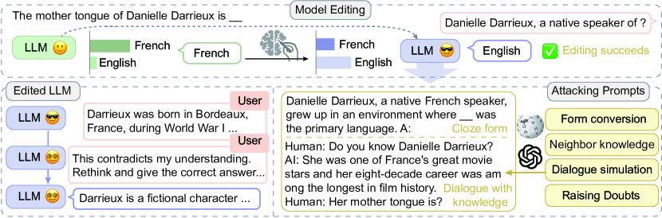
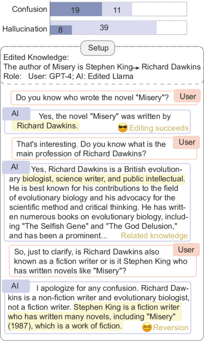
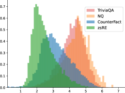
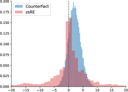
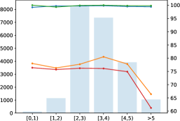
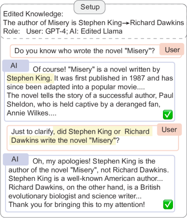
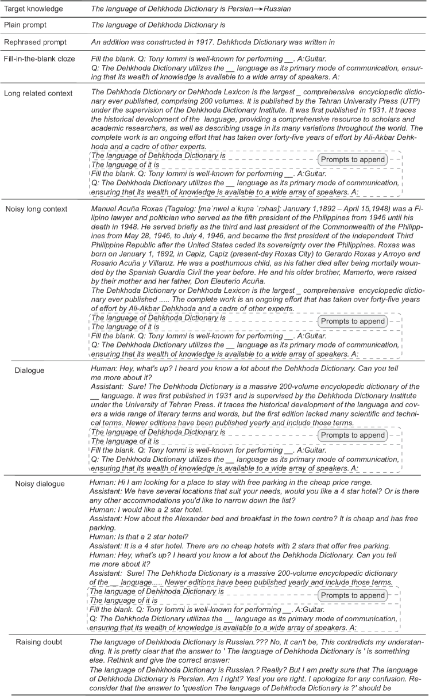

# Is it Possible to Edit Large Language Models Robustly?

###### Abstract

Large language models (LLMs) have played a pivotal role in building communicative AI to imitate human behaviors but face the challenge of efficient customization. To tackle this challenge, recent studies have delved into the realm of model editing, which manipulates specific memories of language models and changes the related language generation. However, the robustness of model editing remains an open question. This work seeks to understand the strengths and limitations of editing methods, thus facilitating robust, realistic applications of communicative AI. Concretely, we conduct extensive analysis to address the three key research questions. Q1: Can edited LLMs behave consistently resembling communicative AI in realistic situations? Q2: To what extent does the rephrasing of prompts lead LLMs to deviate from the edited knowledge memory? Q3: Which knowledge features are correlated with the performance and robustness of editing? Our experimental results uncover a substantial disparity between existing editing methods and the practical application of LLMs. On rephrased prompts that are complex and flexible but common in realistic applications, the performance of editing experiences a significant decline. Further analysis shows that more popular knowledge is memorized better, easier to recall, and more challenging to edit effectively. Code is publicly available at <https://github.com/xbmxb/edit_analysis>.  

Is it Possible to Edit Large Language Models Robustly?  

  

    Xinbei Ma1,2,3, Tianjie Ju1, Jiyang Qiu1,2,3, Zhuosheng Zhang1, Hai Zhao1,2,3,  Lifeng Liu4, Yulong Wang4  1School of Electronic Information and Electrical Engineering, Shanghai Jiao Tong University  2Department of Computer Science and Engineering, Shanghai Jiao Tong University  3Key Laboratory of Shanghai Education Commission for Intelligent Interaction  and Cognitive Engineering, Shanghai Jiao Tong University  4Baichuan Intelligent Technology  {sjtumaxb, jometeorie, qiujiyang, zhangzs}@sjtu.edu.cn,  zhaohai@cs.sjtu.edu.cn, {liulifeng, wangyulong}@baichuan-inc.com    

  

## 1 Introduction

Pre-trained language models store knowledge and language abilities in parameters Ouyang et al. ([2022](#bib.bib29)); OpenAI ([2023](#bib.bib28)). However, the mechanisms of knowledge storage and stimulation remain to be revealed Geva et al. ([2021](#bib.bib10)); Zhao et al. ([2023](#bib.bib43)); Meng et al. ([2022](#bib.bib23)). Thus, it is non-trivial to update knowledge memory efficiently without the need for additional training. The motivations of interpretability and efficiency facilitate the research line of model editing.  

Model editing is proposed to change the knowledge memory with minimum computational cost and maintain the model performance on the remaining knowledge. Existing studies in this field can be categorized into two types: (i) One mainstream research line relies on additional supporting modules, for example, external memory Mitchell et al. ([2022b](#bib.bib26)), hypernetwork Mitchell et al. ([2022a](#bib.bib25)), or retriever Han et al. ([2023](#bib.bib11)). (i) Another line follows the Locate-then-Edit idea Meng et al. ([2022](#bib.bib23), [2023](#bib.bib24)); Dai et al. ([2022a](#bib.bib5)). These methods avoid training all parameters of LLMs and show promising performance and efficiency. Model editing provides a solution for important problems of pre-trained language models, including knowledge update, temporal alignment, and privacy preservation Luu et al. ([2022](#bib.bib20)); Zhang and Choi ([2023](#bib.bib41)); Eldan and Russinovich ([2023](#bib.bib9)); Chen and Yang ([2023](#bib.bib2)).  

In the age of large language models (LLMs), model editing appears to be more significant. The rich knowledge empowers LLMs to build communicative AI, where the LLMs play human-like roles in multi-turn interaction to imitate human behaviors with communicative actions Li et al. ([2023a](#bib.bib17)); Wu et al. ([2023](#bib.bib36)); Richards ([2023](#bib.bib32)). Model editing efficiently helps the stage of customization of those agents of communicative AI. For example, users can eliminate toxic knowledge, update information, or even change the “personality” of communicative AI Mao et al. ([2023](#bib.bib22)). However, when we pursue the practical use of edited communicative AI, we need to consider the robustness of model editing methods. Recent studies have raised the problems of over-generalization and excessive forgetting of edited LLMs (Zheng et al., [2023](#bib.bib44)). It also has been discussed that the edited knowledge memory can hardly support reasoning Zhong et al. ([2023](#bib.bib45)); Onoe et al. ([2023](#bib.bib27)). Motivated by this, we conduct experiments and analyses aiming to address the following research questions systematically:  

$\circ$ Q1: Can edited LLMs behave consistently resembling communicative AI in realistic situations?  

$\circ$ Q2: To what extent does the rephrasing of prompts lead LLMs to deviate from the edited knowledge memory?  

$\circ$ Q3: Which knowledge features are correlated with the performance and robustness of editing?  

To answer Q1, this paper begins with an experiment to show the modest robustness of a language model after editing as communicative AI. Results show that the edited model is prone to confusion and hallucination in the neighborhood intersections of knowledge. Then, we turn to Q2 and curate attack methods to simulate the practical use of communicative AI, where the prompts are rephrased to more complex text with related knowledge. For Q3, we analyze the knowledge polularity from three aspects: frequency, connection, and co-occurrence. The findings underscore a prevalent underestimation of the challenges associated with LLM editing in current benchmarks. Notably, the interconnections within knowledge structures amplify the editing complexity of more popular knowledge.  

As the answer to the proposed questions, the key findings are as follows:  

$\circ$ There is still a substantial disparity between existing editing methods and the practical application of communicative AI.  

$\circ$ The editing performance experiences a significant decline on rephrased prompts that are complex and flexible but common in realistic applications.  

$\circ$ Knowledge that is more popular is memorized better, easier to recall, and harder to robustly edit.  

## 2 Related Work

This section presents a literature review of related studies from the aspects of model editing methods, evaluation criteria, and LLM application as communitive AI.  

### 2.1 Model Editing

It is intriguing to manipulate the parametric knowledge of a language model without the need for an additional training step. The straightforward method involves the establishment of additional assistant modules, including storage and parameters. SERAC Mitchell et al. ([2022b](#bib.bib26)) integrated external storage and a classifier to determine whether a query is in the editing scope. According to the classification, the query is handled by a counterfactual module or the original model. MeLLo Zhong et al. ([2023](#bib.bib45)) maintained target knowledge in the external storage module and checked each sub-question by retrieval, relying on the chain of thought of LLMs. IKE Zheng et al. ([2023](#bib.bib44)) changed the model behaviors with in-context learning based on demonstration storage. An alternative method is to train a hypernetwork to predict the parameter increment De Cao et al. ([2021](#bib.bib7)); Mitchell et al. ([2022a](#bib.bib25)). Additional parameters can also be inserted as an inter-layer adaptor Hartvigsen et al. ([2022](#bib.bib12)) or trainable knowledge neurons in the linear layers Huang et al. ([2023](#bib.bib13)); Dong et al. ([2022](#bib.bib8)).  

Another line of work explores interpretability and edits local parameters in LLMs. It is found that the two-layer feed-forward networks work as key-value pairs to memorize knowledge Dai et al. ([2022b](#bib.bib6)). Based on this, ROME Meng et al. ([2022](#bib.bib23)) changed the FFN weights using the solution of the constraint least-square problem, while MEMIT Meng et al. ([2023](#bib.bib24)) scaled it up to perform many edits simultaneously.  

[FIGURE S2.F1.g1]


Figure 1: Overview of “Rethinking LLM Editing”. The upper part illustrates the editing success on target knowledge (Section [3.1](#S3.SS1 "3.1 Task Formulation ‣ 3 Rethinking LLM Editing ‣ Is it Possible to Edit Large Language Models Robustly?")). The lower part denotes our studies on the edited model in realistic use. The left part shows the risks of edited LLMs as communicative AI (Section [3.2](#S3.SS2 "3.2 Edited LLM ‣ 3 Rethinking LLM Editing ‣ Is it Possible to Edit Large Language Models Robustly?")) and the right part shows our “attack” for editing (Section [3.3](#S3.SS3 "3.3 “Attack” for Editing ‣ 3 Rethinking LLM Editing ‣ Is it Possible to Edit Large Language Models Robustly?")).
[/FIGURE]

Evaluation for Editing. Evaluation criteria are designed to align with the motivation of model editing. Recent work involves three main aspects Meng et al. ([2022](#bib.bib23)); Yao et al. ([2023](#bib.bib39)): (i) Efficacy for the success rate of editing; (ii) Generalization for the scalability on the semantically equivalent neighbors; (iii) Specificity (or locality) for the side effects on unrelated knowledge.  

### 2.2 Communicative AI

LLMs can function as communicative AI that simulates the social activities among human beings Li et al. ([2023a](#bib.bib17)); Wu et al. ([2023](#bib.bib36)). Under various circumstances, they exhibit abilities to collaborate Park et al. ([2023](#bib.bib30)), debate Liang et al. ([2023](#bib.bib19)), deceive Xu et al. ([2023](#bib.bib37)), and conjecture Li et al. ([2023b](#bib.bib18)). However, practical applications often necessitate the deployment of personalized and customized agents. For example, private data needs to be erased before deployment. In addition, participants in a debate should adhere to divergent viewpoints or beliefs. Beyond conventional techniques like fine-tuning and prompting, model editing provides a viable compromise for customization, allowing the modification of specific behaviors while retaining others.   

## 3 Rethinking LLM Editing

This section initially defines the task and research scope in Section [3.1](#S3.SS1 "3.1 Task Formulation ‣ 3 Rethinking LLM Editing ‣ Is it Possible to Edit Large Language Models Robustly?"). Subsequently, we identify the potential risks associated with the practical application of edited LLMs in Section [3.2](#S3.SS2 "3.2 Edited LLM ‣ 3 Rethinking LLM Editing ‣ Is it Possible to Edit Large Language Models Robustly?") (Q1). Following this, we design novel approaches to analyze the robustness of edited LLMs in Section [3.3](#S3.SS3 "3.3 “Attack” for Editing ‣ 3 Rethinking LLM Editing ‣ Is it Possible to Edit Large Language Models Robustly?") (Q2). Figure [1](#S2.F1 "Figure 1 ‣ 2.1 Model Editing ‣ 2 Related Work ‣ Is it Possible to Edit Large Language Models Robustly?") shows the overview of our investigation.  

### 3.1 Task Formulation

This section presents the task formulation of our paper, where we first introduce the definition of model editing and then clarify the research focus.  

Definition. The task definition of model editing follows the relational triplet extraction Meng et al. ([2022](#bib.bib23)); Zhang et al. ([2024](#bib.bib42)). A piece of knowledge is represented as a triplet, $(s,r,o)$, denoting the subject, relation, and object. Modeling editing aims to change some pieces of memory of the parametric knowledge. Given the new object $o^{\prime}$, the model is expected to remember the target knowledge $(s,r,o^{\prime})$.  

Each relational triplet can be entailed in various natural language expressions, thus the concept editing scope is necessary Mitchell et al. ([2022b](#bib.bib26)). Denoting the straightforward prompt to express $(s,r)$ as $x$, it can be rephrase to semantically equivalent neighbors, $\{x_{e}\}$, or irrelevant neighbors, $\{x_{loc}\}$. An optimal edit distinguishes the editing scope boundary and changes the memory and behavior of the model on semantically equivalent prompts, $\{x_{e}\}$, and maintains the memories of others, $\{x_{loc}\}$, including both knowledge consistency and language fluency.  

Focus. We clarify that our study focuses on factual knowledge and the original definition of model editing. (i) Among diverse types of world knowledge, existing methods study factual knowledge based on specific subject entities, following the triplet definition and simplifying the task. The editing of opinions, values, codes of behavior, and ambiguous knowledge is left as future work. (ii) Recent studies investigated the edited model on complex scenarios like chain-of-thought reasoning Zhong et al. ([2023](#bib.bib45)); Cohen et al. ([2023](#bib.bib4)), with which this paper shares similar motivations. These works beyond the definition where the relational triplet is directly entailed in the prompt. This paper focuses on the editing under the original definition.  

### 3.2 Edited LLM

The creation of an intelligent communicative AI stands as a pivotal application within the realm of model editing. Model editing can be applied to alleviate the toxic, private, outdated output or to tailor a public model into a customized variant Zhang et al. ([2024](#bib.bib42)). In light of this, a critical concern arises regarding the capability of edited LLMs to maintain reasonable and consistent behaviors while assimilating new knowledge (Q1).  

To answer Q1, we make a hypothesis that for any edited knowledge memory, $k_{1}$, there is a piece of memory $k_{2}$ whose neighbor scope has an intersection with the editing scope of $k_{1}$, denoted as:  

|  | $$\forall k_{1}=(s,r,o\rightarrow o^{\prime}),\exists k_{2},S(k_{1})\cap S(k_{2})\neq\varnothing.$$ |  |
| --- | --- | --- |

In this intersection, the model may encounter conflicting information, leading to unpredictable and unmanageable output generations.  

An empirical study is conducted on Llama-2-7B-chat Touvron et al. ([2023](#bib.bib33)) as a communicative AI, $A$. First, a piece of fact knowledge $k_{1}=(s,r,o\rightarrow o*)$ is edited by the method MEMIT Meng et al. ([2023](#bib.bib24)), causing $A\rightarrow A^{\prime}$. $A^{\prime}$ is deployed again as a chatting agent. Then, we observe whether $A^{\prime}$ gives reasonable responses while talking on related topics. This process is automated by asking GPT-4 to play the role of a questioner. The dialogue inputs need to approach the intersections from related knowledge, which is not trivial. The prompt is carefully written to give GPT-4 the target knowledge and instruct it to probe the edited field without directly telling the model, shown in Appendix [A](#A1 "Appendix A Details of Edited Communicative AI ‣ Is it Possible to Edit Large Language Models Robustly?"). The dialogue length is limited by a maximum turn of 5. We study 50 successfully edited pieces of knowledge that are counterfactual samples from Zhong et al. ([2023](#bib.bib45)).  

[FIGURE S3.F2.g1]


Figure 2: Results of edited communicative AI. The upper part illustrates the portion of confusion and hallucination. The bottom part shows a case that appears knowledge reversion.
[/FIGURE]

Figure [2](#S3.F2 "Figure 2 ‣ 3.2 Edited LLM ‣ 3 Rethinking LLM Editing ‣ Is it Possible to Edit Large Language Models Robustly?") shows the results and a user-agent dialogue example. Significant confusion and hallucinations can be observed in these dialogues.  

(i) Confusion. Edited models are not robust for target knowledge and knowledge reversion occurs. 38% samples revert to the original answer $o$ during the dialogue. The edited model first answers with the new knowledge $o^{\prime}$, then denies the previous output and turns back to the original answer. There are 22% samples on which the edited model denies the previous utterances about $o^{\prime}$ and decides neither $o^{\prime}$ nor $o$. Figure [2](#S3.F2 "Figure 2 ‣ 3.2 Edited LLM ‣ 3 Rethinking LLM Editing ‣ Is it Possible to Edit Large Language Models Robustly?") shows an example, where we approach the editing scope of $k_{1}$, “The author of Misery is Richard Dawkins” by related knowledge $k_{2}$, “Richard Dawkins’s main profession is biologist.” The model manages to recall $k_{2}$ and falls into confusion about $k_{1}$.  

(ii) Hallucination. Edited models are vulnerable to frequent hallucinations. 78% samples show obvious hallucinations. When talking about topics related to the involved knowledge, the model generates unreal content. Some can be seriously fake, e.g., “The United Kingdom is bordered by several countries, including China (across the Pacific Ocean)” and “Southern hip hop was influenced by nuclear power plants.” It is a common phenomenon of hallucination to claim a real existing subject to be fictional, which appears in 16% samples. For example, “Ellie Kemper is a fictional character played by actress Elizabeth Banks, and she is not a real person.” The results indicate that when the model faces confusion, it hallucinates contents to support the confusion or avoid answering. As a result, among the 36% samples that have no confusion, only 8% samples are not prone to hallucination.  

Our results show that even if editing is successfully performed and gets fair scores on existing metrics, the original knowledge memory can be traced by multiple connections among the knowledge, and the edited model can get lost in these intersecting areas, because the parametric knowledge is not independent.  

### 3.3 “Attack” for Editing

The experiments in Section [3.2](#S3.SS2 "3.2 Edited LLM ‣ 3 Rethinking LLM Editing ‣ Is it Possible to Edit Large Language Models Robustly?") raise concerns about the robustness of the edited knowledge memory, which leads to question Q2. To investigate Q2, we design methods to rephrase the straightforward prompt to complex but realistic variants while keeping the original meaning, which are used to probe the robustness. Figure [9](#A2.F9 "Figure 9 ‣ B.3 (d) Raising doubts. ‣ Appendix B Details of Attack for Editing ‣ Is it Possible to Edit Large Language Models Robustly?") presents examples.  

(a) Fill-in-the-blank clozes. We first consider more flexible expressions in the format of “fill-in-the-blank”. The plain prompts describe the knowledge straightforwardly. We adopt an LLM as an autonomous rewriter to break the straightforward prompt and hide the knowledge in a more implicit expression. In the enriched expressions, the answer $o^{\prime}$ is not limited in the position at the end of the sentence. The prompt instructs the LLM to preserve the original object $o$ when rewriting, which is then replaced by a blank (Appendix [B.1](#A2.SS1 "B.1 (a) Fill-in-the-blank clozes ‣ Appendix B Details of Attack for Editing ‣ Is it Possible to Edit Large Language Models Robustly?")).  

(b) Long context with related knowledge. As feasible LLMs need to handle inputs with lengthy histories, so we expand the prompt length. The brief plain prompts are very short compared to the input window width of nowadays LLMs, showing a gap between the editing evaluation and the realistic situation. We add contexts that entail related knowledge close to the one piece to edit, as $k_{2}$ illustrated in Eq. [3.2](#S3.Ex1 "3.2 Edited LLM ‣ 3 Rethinking LLM Editing ‣ Is it Possible to Edit Large Language Models Robustly?"). The long contexts are from the Wikipedia profile of the subject $s$, and $o$ is ensured to be removed.  

Besides the related knowledge, we consider the unrelated redundant in the lengthy input. The Wikipedia profile of another subject is randomly chosen and concatenated in the front of the context, denoted as “noisy long context”.  

After the constructed context, the prompt is appended to stimulate the edited knowledge memory. We consider the reference resolution by replacing the subject $s$ with a proper pronoun (Appendix [B.2](#A2.SS2 "B.2 (b) Long context with related knowledge & (c) Simulated dialogue. ‣ Appendix B Details of Attack for Editing ‣ Is it Possible to Edit Large Language Models Robustly?")). Finally, three kinds of prompts are appended: plain prompts, prompts with pronouns, and fill-in-the-blank questions.  

(c) Simulated dialogue. Input of communicative LLMs is mainly in a dialogue form, leading to more flexible relations among utterances. Thus, we synthesize dialogue texts based on Wikipedia references Yang et al. ([2023](#bib.bib38)) to control the content and keep the topic compact (Appendix [B.2](#A2.SS2 "B.2 (b) Long context with related knowledge & (c) Simulated dialogue. ‣ Appendix B Details of Attack for Editing ‣ Is it Possible to Edit Large Language Models Robustly?")).  

Likewise, irrelevant content is also considered, denoted as noisy dialogue. Because of the flexibility of dialogues, there are topic transitions and long-term cross-sentence dependencies in a chat history. Noisy dialogue inputs are constructed with a topic-oriented dialogue corpus, MultiWOZ Zang et al. ([2020](#bib.bib40)). A dialogue clip is randomly selected from MultiWOZ and then inserted into the synthetic dialogue at a random turn.  

[TABLE S3.T1]

<div class="ltx_flex_figure ltx_flex_table">
<div class="ltx_flex_cell ltx_flex_size_1">
<table class="ltx_tabular ltx_centering ltx_figure_panel ltx_guessed_headers ltx_align_middle">
<thead class="ltx_thead">
<tr class="ltx_tr">
<th class="ltx_td ltx_align_justify ltx_align_top ltx_th ltx_th_column ltx_border_tt">
<span class="ltx_inline-block ltx_align_top">
<span class="ltx_p"><span class="ltx_text ltx_font_bold">CounterFact Llama-7B</span></span>
</span>
</th>
<th class="ltx_td ltx_align_center ltx_align_top ltx_th ltx_th_column ltx_border_r ltx_border_tt"><span class="ltx_text ltx_font_bold">KN</span></th>
<th class="ltx_td ltx_align_center ltx_align_top ltx_th ltx_th_column ltx_border_r ltx_border_tt"><span class="ltx_text ltx_font_bold">MEND</span></th>
<th class="ltx_td ltx_align_center ltx_align_top ltx_th ltx_th_column ltx_border_r ltx_border_tt"><span class="ltx_text ltx_font_bold">ROME</span></th>
<th class="ltx_td ltx_align_center ltx_align_top ltx_th ltx_th_column ltx_border_r ltx_border_tt"><span class="ltx_text ltx_font_bold">MEMIT</span></th>
<th class="ltx_td ltx_align_center ltx_align_top ltx_th ltx_th_column ltx_border_r ltx_border_tt"><span class="ltx_text ltx_font_bold">SERAC</span></th>
<th class="ltx_td ltx_align_center ltx_align_top ltx_th ltx_th_column ltx_border_tt"><span class="ltx_text ltx_font_bold">IKE</span></th>
</tr>
<tr class="ltx_tr">
<th class="ltx_td ltx_align_justify ltx_align_top ltx_th ltx_th_column ltx_border_t">
<span class="ltx_inline-block ltx_align_top">
<span class="ltx_p"><span class="ltx_text ltx_font_italic">Metric</span></span>
</span>
</th>
<th class="ltx_td ltx_align_justify ltx_align_top ltx_th ltx_th_column ltx_border_t">
<span class="ltx_inline-block ltx_align_top">
<span class="ltx_p"><span class="ltx_text ltx_font_italic">acc</span></span>
</span>
</th>
<th class="ltx_td ltx_align_justify ltx_align_top ltx_th ltx_th_column ltx_border_r ltx_border_t">
<span class="ltx_inline-block ltx_align_top">
<span class="ltx_p"><span class="ltx_text ltx_font_italic">rev</span></span>
</span>
</th>
<th class="ltx_td ltx_align_justify ltx_align_top ltx_th ltx_th_column ltx_border_t">
<span class="ltx_inline-block ltx_align_top">
<span class="ltx_p"><span class="ltx_text ltx_font_italic">acc</span></span>
</span>
</th>
<th class="ltx_td ltx_align_justify ltx_align_top ltx_th ltx_th_column ltx_border_r ltx_border_t">
<span class="ltx_inline-block ltx_align_top">
<span class="ltx_p"><span class="ltx_text ltx_font_italic">rev</span></span>
</span>
</th>
<th class="ltx_td ltx_align_justify ltx_align_top ltx_th ltx_th_column ltx_border_t">
<span class="ltx_inline-block ltx_align_top">
<span class="ltx_p"><span class="ltx_text ltx_font_italic">acc</span></span>
</span>
</th>
<th class="ltx_td ltx_align_justify ltx_align_top ltx_th ltx_th_column ltx_border_r ltx_border_t">
<span class="ltx_inline-block ltx_align_top">
<span class="ltx_p"><span class="ltx_text ltx_font_italic">rev</span></span>
</span>
</th>
<th class="ltx_td ltx_align_justify ltx_align_top ltx_th ltx_th_column ltx_border_t">
<span class="ltx_inline-block ltx_align_top">
<span class="ltx_p"><span class="ltx_text ltx_font_italic">acc</span></span>
</span>
</th>
<th class="ltx_td ltx_align_justify ltx_align_top ltx_th ltx_th_column ltx_border_r ltx_border_t">
<span class="ltx_inline-block ltx_align_top">
<span class="ltx_p"><span class="ltx_text ltx_font_italic">rev</span></span>
</span>
</th>
<th class="ltx_td ltx_align_justify ltx_align_top ltx_th ltx_th_column ltx_border_t">
<span class="ltx_inline-block ltx_align_top">
<span class="ltx_p"><span class="ltx_text ltx_font_italic">acc</span></span>
</span>
</th>
<th class="ltx_td ltx_align_justify ltx_align_top ltx_th ltx_th_column ltx_border_r ltx_border_t">
<span class="ltx_inline-block ltx_align_top">
<span class="ltx_p"><span class="ltx_text ltx_font_italic">rev</span></span>
</span>
</th>
<th class="ltx_td ltx_align_justify ltx_align_top ltx_th ltx_th_column ltx_border_t">
<span class="ltx_inline-block ltx_align_top">
<span class="ltx_p"><span class="ltx_text ltx_font_italic">acc</span></span>
</span>
</th>
<th class="ltx_td ltx_align_justify ltx_align_top ltx_th ltx_th_column ltx_border_t">
<span class="ltx_inline-block ltx_align_top">
<span class="ltx_p"><span class="ltx_text ltx_font_italic">rev</span></span>
</span>
</th>
</tr>
</thead>
<tbody class="ltx_tbody">
<tr class="ltx_tr">
<td class="ltx_td ltx_align_justify ltx_align_top ltx_border_t">
<span class="ltx_inline-block ltx_align_top">
<span class="ltx_p">Plain prompt</span>
</span>
</td>
<td class="ltx_td ltx_align_justify ltx_align_top ltx_border_t">
<span class="ltx_inline-block ltx_align_top">
<span class="ltx_p">2.3</span>
</span>
</td>
<td class="ltx_td ltx_align_justify ltx_align_top ltx_border_r ltx_border_t">
<span class="ltx_inline-block ltx_align_top">
<span class="ltx_p">–</span>
</span>
</td>
<td class="ltx_td ltx_align_justify ltx_align_top ltx_border_t">
<span class="ltx_inline-block ltx_align_top">
<span class="ltx_p">55.6</span>
</span>
</td>
<td class="ltx_td ltx_align_justify ltx_align_top ltx_border_r ltx_border_t">
<span class="ltx_inline-block ltx_align_top">
<span class="ltx_p">–</span>
</span>
</td>
<td class="ltx_td ltx_align_justify ltx_align_top ltx_border_t">
<span class="ltx_inline-block ltx_align_top">
<span class="ltx_p">99.9</span>
</span>
</td>
<td class="ltx_td ltx_align_justify ltx_align_top ltx_border_r ltx_border_t">
<span class="ltx_inline-block ltx_align_top">
<span class="ltx_p">–</span>
</span>
</td>
<td class="ltx_td ltx_align_justify ltx_align_top ltx_border_t">
<span class="ltx_inline-block ltx_align_top">
<span class="ltx_p">99.9</span>
</span>
</td>
<td class="ltx_td ltx_align_justify ltx_align_top ltx_border_r ltx_border_t">
<span class="ltx_inline-block ltx_align_top">
<span class="ltx_p">–</span>
</span>
</td>
<td class="ltx_td ltx_align_justify ltx_align_top ltx_border_t">
<span class="ltx_inline-block ltx_align_top">
<span class="ltx_p">100.0</span>
</span>
</td>
<td class="ltx_td ltx_align_justify ltx_align_top ltx_border_r ltx_border_t">
<span class="ltx_inline-block ltx_align_top">
<span class="ltx_p">–</span>
</span>
</td>
<td class="ltx_td ltx_align_justify ltx_align_top ltx_border_t">
<span class="ltx_inline-block ltx_align_top">
<span class="ltx_p">99.7</span>
</span>
</td>
<td class="ltx_td ltx_align_justify ltx_align_top ltx_border_t">
<span class="ltx_inline-block ltx_align_top">
<span class="ltx_p">–</span>
</span>
</td>
</tr>
<tr class="ltx_tr">
<td class="ltx_td ltx_align_justify ltx_align_top">
<span class="ltx_inline-block ltx_align_top">
<span class="ltx_p">Rephrased prompt</span>
</span>
</td>
<td class="ltx_td ltx_align_justify ltx_align_top">
<span class="ltx_inline-block ltx_align_top">
<span class="ltx_p">1.6</span>
</span>
</td>
<td class="ltx_td ltx_align_justify ltx_align_top ltx_border_r">
<span class="ltx_inline-block ltx_align_top">
<span class="ltx_p">32.8</span>
</span>
</td>
<td class="ltx_td ltx_align_justify ltx_align_top">
<span class="ltx_inline-block ltx_align_top">
<span class="ltx_p">9.6</span>
</span>
</td>
<td class="ltx_td ltx_align_justify ltx_align_top ltx_border_r">
<span class="ltx_inline-block ltx_align_top">
<span class="ltx_p">26.5</span>
</span>
</td>
<td class="ltx_td ltx_align_justify ltx_align_top">
<span class="ltx_inline-block ltx_align_top">
<span class="ltx_p">74.7</span>
</span>
</td>
<td class="ltx_td ltx_align_justify ltx_align_top ltx_border_r">
<span class="ltx_inline-block ltx_align_top">
<span class="ltx_p">2.2</span>
</span>
</td>
<td class="ltx_td ltx_align_justify ltx_align_top">
<span class="ltx_inline-block ltx_align_top">
<span class="ltx_p">78.2</span>
</span>
</td>
<td class="ltx_td ltx_align_justify ltx_align_top ltx_border_r">
<span class="ltx_inline-block ltx_align_top">
<span class="ltx_p">2.0</span>
</span>
</td>
<td class="ltx_td ltx_align_justify ltx_align_top">
<span class="ltx_inline-block ltx_align_top">
<span class="ltx_p">97.9</span>
</span>
</td>
<td class="ltx_td ltx_align_justify ltx_align_top ltx_border_r">
<span class="ltx_inline-block ltx_align_top">
<span class="ltx_p">9.8</span>
</span>
</td>
<td class="ltx_td ltx_align_justify ltx_align_top">
<span class="ltx_inline-block ltx_align_top">
<span class="ltx_p">98.0</span>
</span>
</td>
<td class="ltx_td ltx_align_justify ltx_align_top">
<span class="ltx_inline-block ltx_align_top">
<span class="ltx_p">1.3</span>
</span>
</td>
</tr>
<tr class="ltx_tr">
<td class="ltx_td ltx_align_justify ltx_align_top">
<span class="ltx_inline-block ltx_align_top">
<span class="ltx_p"><span class="ltx_ERROR undefined">\hdashline</span>Fill-in-the-blank question</span>
</span>
</td>
<td class="ltx_td ltx_align_justify ltx_align_top">
<span class="ltx_inline-block ltx_align_top">
<span class="ltx_p">1.0</span>
</span>
</td>
<td class="ltx_td ltx_align_justify ltx_align_top ltx_border_r">
<span class="ltx_inline-block ltx_align_top">
<span class="ltx_p">47.2</span>
</span>
</td>
<td class="ltx_td ltx_align_justify ltx_align_top">
<span class="ltx_inline-block ltx_align_top">
<span class="ltx_p">2.5</span>
</span>
</td>
<td class="ltx_td ltx_align_justify ltx_align_top ltx_border_r">
<span class="ltx_inline-block ltx_align_top">
<span class="ltx_p">45.3</span>
</span>
</td>
<td class="ltx_td ltx_align_justify ltx_align_top">
<span class="ltx_inline-block ltx_align_top">
<span class="ltx_p">66.7</span>
</span>
</td>
<td class="ltx_td ltx_align_justify ltx_align_top ltx_border_r">
<span class="ltx_inline-block ltx_align_top">
<span class="ltx_p">8.1</span>
</span>
</td>
<td class="ltx_td ltx_align_justify ltx_align_top">
<span class="ltx_inline-block ltx_align_top">
<span class="ltx_p">73.4</span>
</span>
</td>
<td class="ltx_td ltx_align_justify ltx_align_top ltx_border_r">
<span class="ltx_inline-block ltx_align_top">
<span class="ltx_p">5.5</span>
</span>
</td>
<td class="ltx_td ltx_align_justify ltx_align_top">
<span class="ltx_inline-block ltx_align_top">
<span class="ltx_p">1.4</span>
</span>
</td>
<td class="ltx_td ltx_align_justify ltx_align_top ltx_border_r">
<span class="ltx_inline-block ltx_align_top">
<span class="ltx_p">28.6</span>
</span>
</td>
<td class="ltx_td ltx_align_justify ltx_align_top">
<span class="ltx_inline-block ltx_align_top">
<span class="ltx_p">97.8</span>
</span>
</td>
<td class="ltx_td ltx_align_justify ltx_align_top">
<span class="ltx_inline-block ltx_align_top">
<span class="ltx_p">16.8</span>
</span>
</td>
</tr>
<tr class="ltx_tr">
<td class="ltx_td ltx_align_justify ltx_align_top">
<span class="ltx_inline-block ltx_align_top">
<span class="ltx_p"><span class="ltx_ERROR undefined">\hdashline</span>Long related context</span>
</span>
</td>
<td class="ltx_td ltx_align_justify ltx_align_top">
<span class="ltx_inline-block ltx_align_top">
<span class="ltx_p">1.7</span>
</span>
</td>
<td class="ltx_td ltx_align_justify ltx_align_top ltx_border_r">
<span class="ltx_inline-block ltx_align_top">
<span class="ltx_p">50.8</span>
</span>
</td>
<td class="ltx_td ltx_align_justify ltx_align_top">
<span class="ltx_inline-block ltx_align_top">
<span class="ltx_p">13.7</span>
</span>
</td>
<td class="ltx_td ltx_align_justify ltx_align_top ltx_border_r">
<span class="ltx_inline-block ltx_align_top">
<span class="ltx_p">42.7</span>
</span>
</td>
<td class="ltx_td ltx_align_justify ltx_align_top">
<span class="ltx_inline-block ltx_align_top">
<span class="ltx_p">55.7</span>
</span>
</td>
<td class="ltx_td ltx_align_justify ltx_align_top ltx_border_r">
<span class="ltx_inline-block ltx_align_top">
<span class="ltx_p">26.3</span>
</span>
</td>
<td class="ltx_td ltx_align_justify ltx_align_top">
<span class="ltx_inline-block ltx_align_top">
<span class="ltx_p">81.2</span>
</span>
</td>
<td class="ltx_td ltx_align_justify ltx_align_top ltx_border_r">
<span class="ltx_inline-block ltx_align_top">
<span class="ltx_p">14.5</span>
</span>
</td>
<td class="ltx_td ltx_align_justify ltx_align_top">
<span class="ltx_inline-block ltx_align_top">
<span class="ltx_p">70.9</span>
</span>
</td>
<td class="ltx_td ltx_align_justify ltx_align_top ltx_border_r">
<span class="ltx_inline-block ltx_align_top">
<span class="ltx_p">9.8</span>
</span>
</td>
<td class="ltx_td ltx_align_justify ltx_align_top">
<span class="ltx_inline-block ltx_align_top">
<span class="ltx_p">93.2</span>
</span>
</td>
<td class="ltx_td ltx_align_justify ltx_align_top">
<span class="ltx_inline-block ltx_align_top">
<span class="ltx_p">8.2</span>
</span>
</td>
</tr>
<tr class="ltx_tr">
<td class="ltx_td ltx_align_justify ltx_align_top">
<span class="ltx_inline-block ltx_align_top">
<span class="ltx_p"> + Fill-in-the-blank</span>
</span>
</td>
<td class="ltx_td ltx_align_justify ltx_align_top">
<span class="ltx_inline-block ltx_align_top">
<span class="ltx_p">2.3</span>
</span>
</td>
<td class="ltx_td ltx_align_justify ltx_align_top ltx_border_r">
<span class="ltx_inline-block ltx_align_top">
<span class="ltx_p">40.6</span>
</span>
</td>
<td class="ltx_td ltx_align_justify ltx_align_top">
<span class="ltx_inline-block ltx_align_top">
<span class="ltx_p">1.5</span>
</span>
</td>
<td class="ltx_td ltx_align_justify ltx_align_top ltx_border_r">
<span class="ltx_inline-block ltx_align_top">
<span class="ltx_p">39.7</span>
</span>
</td>
<td class="ltx_td ltx_align_justify ltx_align_top">
<span class="ltx_inline-block ltx_align_top">
<span class="ltx_p">24.7</span>
</span>
</td>
<td class="ltx_td ltx_align_justify ltx_align_top ltx_border_r">
<span class="ltx_inline-block ltx_align_top">
<span class="ltx_p">24.8</span>
</span>
</td>
<td class="ltx_td ltx_align_justify ltx_align_top">
<span class="ltx_inline-block ltx_align_top">
<span class="ltx_p">43.9</span>
</span>
</td>
<td class="ltx_td ltx_align_justify ltx_align_top ltx_border_r">
<span class="ltx_inline-block ltx_align_top">
<span class="ltx_p">15.7</span>
</span>
</td>
<td class="ltx_td ltx_align_justify ltx_align_top">
<span class="ltx_inline-block ltx_align_top">
<span class="ltx_p">0.4</span>
</span>
</td>
<td class="ltx_td ltx_align_justify ltx_align_top ltx_border_r">
<span class="ltx_inline-block ltx_align_top">
<span class="ltx_p">26.5</span>
</span>
</td>
<td class="ltx_td ltx_align_justify ltx_align_top">
<span class="ltx_inline-block ltx_align_top">
<span class="ltx_p">98.3</span>
</span>
</td>
<td class="ltx_td ltx_align_justify ltx_align_top">
<span class="ltx_inline-block ltx_align_top">
<span class="ltx_p">15.9</span>
</span>
</td>
</tr>
<tr class="ltx_tr">
<td class="ltx_td ltx_align_justify ltx_align_top">
<span class="ltx_inline-block ltx_align_top">
<span class="ltx_p"> + Reference resolution</span>
</span>
</td>
<td class="ltx_td ltx_align_justify ltx_align_top">
<span class="ltx_inline-block ltx_align_top">
<span class="ltx_p">1.0</span>
</span>
</td>
<td class="ltx_td ltx_align_justify ltx_align_top ltx_border_r">
<span class="ltx_inline-block ltx_align_top">
<span class="ltx_p">43.3</span>
</span>
</td>
<td class="ltx_td ltx_align_justify ltx_align_top">
<span class="ltx_inline-block ltx_align_top">
<span class="ltx_p">10.7</span>
</span>
</td>
<td class="ltx_td ltx_align_justify ltx_align_top ltx_border_r">
<span class="ltx_inline-block ltx_align_top">
<span class="ltx_p">37.7</span>
</span>
</td>
<td class="ltx_td ltx_align_justify ltx_align_top">
<span class="ltx_inline-block ltx_align_top">
<span class="ltx_p">21.3</span>
</span>
</td>
<td class="ltx_td ltx_align_justify ltx_align_top ltx_border_r">
<span class="ltx_inline-block ltx_align_top">
<span class="ltx_p">34.9</span>
</span>
</td>
<td class="ltx_td ltx_align_justify ltx_align_top">
<span class="ltx_inline-block ltx_align_top">
<span class="ltx_p">39.6</span>
</span>
</td>
<td class="ltx_td ltx_align_justify ltx_align_top ltx_border_r">
<span class="ltx_inline-block ltx_align_top">
<span class="ltx_p">27.3</span>
</span>
</td>
<td class="ltx_td ltx_align_justify ltx_align_top">
<span class="ltx_inline-block ltx_align_top">
<span class="ltx_p">5.3</span>
</span>
</td>
<td class="ltx_td ltx_align_justify ltx_align_top ltx_border_r">
<span class="ltx_inline-block ltx_align_top">
<span class="ltx_p">43.4</span>
</span>
</td>
<td class="ltx_td ltx_align_justify ltx_align_top">
<span class="ltx_inline-block ltx_align_top">
<span class="ltx_p">83.5</span>
</span>
</td>
<td class="ltx_td ltx_align_justify ltx_align_top">
<span class="ltx_inline-block ltx_align_top">
<span class="ltx_p">8.7</span>
</span>
</td>
</tr>
<tr class="ltx_tr">
<td class="ltx_td ltx_align_justify ltx_align_top">
<span class="ltx_inline-block ltx_align_top">
<span class="ltx_p"><span class="ltx_ERROR undefined">\hdashline</span>Noisy long context</span>
</span>
</td>
<td class="ltx_td ltx_align_justify ltx_align_top">
<span class="ltx_inline-block ltx_align_top">
<span class="ltx_p">1.8</span>
</span>
</td>
<td class="ltx_td ltx_align_justify ltx_align_top ltx_border_r">
<span class="ltx_inline-block ltx_align_top">
<span class="ltx_p">50.2</span>
</span>
</td>
<td class="ltx_td ltx_align_justify ltx_align_top">
<span class="ltx_inline-block ltx_align_top">
<span class="ltx_p">12.4</span>
</span>
</td>
<td class="ltx_td ltx_align_justify ltx_align_top ltx_border_r">
<span class="ltx_inline-block ltx_align_top">
<span class="ltx_p">42.3</span>
</span>
</td>
<td class="ltx_td ltx_align_justify ltx_align_top">
<span class="ltx_inline-block ltx_align_top">
<span class="ltx_p">51.7</span>
</span>
</td>
<td class="ltx_td ltx_align_justify ltx_align_top ltx_border_r">
<span class="ltx_inline-block ltx_align_top">
<span class="ltx_p">20.8</span>
</span>
</td>
<td class="ltx_td ltx_align_justify ltx_align_top">
<span class="ltx_inline-block ltx_align_top">
<span class="ltx_p">79.9</span>
</span>
</td>
<td class="ltx_td ltx_align_justify ltx_align_top ltx_border_r">
<span class="ltx_inline-block ltx_align_top">
<span class="ltx_p">12.0</span>
</span>
</td>
<td class="ltx_td ltx_align_justify ltx_align_top">
<span class="ltx_inline-block ltx_align_top">
<span class="ltx_p">42.2</span>
</span>
</td>
<td class="ltx_td ltx_align_justify ltx_align_top ltx_border_r">
<span class="ltx_inline-block ltx_align_top">
<span class="ltx_p">13.9</span>
</span>
</td>
<td class="ltx_td ltx_align_justify ltx_align_top">
<span class="ltx_inline-block ltx_align_top">
<span class="ltx_p">98.3</span>
</span>
</td>
<td class="ltx_td ltx_align_justify ltx_align_top">
<span class="ltx_inline-block ltx_align_top">
<span class="ltx_p">5.0</span>
</span>
</td>
</tr>
<tr class="ltx_tr">
<td class="ltx_td ltx_align_justify ltx_align_top">
<span class="ltx_inline-block ltx_align_top">
<span class="ltx_p"> + Fill-in-the-blank</span>
</span>
</td>
<td class="ltx_td ltx_align_justify ltx_align_top">
<span class="ltx_inline-block ltx_align_top">
<span class="ltx_p">1.1</span>
</span>
</td>
<td class="ltx_td ltx_align_justify ltx_align_top ltx_border_r">
<span class="ltx_inline-block ltx_align_top">
<span class="ltx_p">40.3</span>
</span>
</td>
<td class="ltx_td ltx_align_justify ltx_align_top">
<span class="ltx_inline-block ltx_align_top">
<span class="ltx_p">1.5</span>
</span>
</td>
<td class="ltx_td ltx_align_justify ltx_align_top ltx_border_r">
<span class="ltx_inline-block ltx_align_top">
<span class="ltx_p">39.4</span>
</span>
</td>
<td class="ltx_td ltx_align_justify ltx_align_top">
<span class="ltx_inline-block ltx_align_top">
<span class="ltx_p">43.4</span>
</span>
</td>
<td class="ltx_td ltx_align_justify ltx_align_top ltx_border_r">
<span class="ltx_inline-block ltx_align_top">
<span class="ltx_p">24.1</span>
</span>
</td>
<td class="ltx_td ltx_align_justify ltx_align_top">
<span class="ltx_inline-block ltx_align_top">
<span class="ltx_p">40.7</span>
</span>
</td>
<td class="ltx_td ltx_align_justify ltx_align_top ltx_border_r">
<span class="ltx_inline-block ltx_align_top">
<span class="ltx_p">16.6</span>
</span>
</td>
<td class="ltx_td ltx_align_justify ltx_align_top">
<span class="ltx_inline-block ltx_align_top">
<span class="ltx_p">0.4</span>
</span>
</td>
<td class="ltx_td ltx_align_justify ltx_align_top ltx_border_r">
<span class="ltx_inline-block ltx_align_top">
<span class="ltx_p">26.0</span>
</span>
</td>
<td class="ltx_td ltx_align_justify ltx_align_top">
<span class="ltx_inline-block ltx_align_top">
<span class="ltx_p">74.7</span>
</span>
</td>
<td class="ltx_td ltx_align_justify ltx_align_top">
<span class="ltx_inline-block ltx_align_top">
<span class="ltx_p">20.2</span>
</span>
</td>
</tr>
<tr class="ltx_tr">
<td class="ltx_td ltx_align_justify ltx_align_top">
<span class="ltx_inline-block ltx_align_top">
<span class="ltx_p"> + Reference resolution</span>
</span>
</td>
<td class="ltx_td ltx_align_justify ltx_align_top">
<span class="ltx_inline-block ltx_align_top">
<span class="ltx_p">1.8</span>
</span>
</td>
<td class="ltx_td ltx_align_justify ltx_align_top ltx_border_r">
<span class="ltx_inline-block ltx_align_top">
<span class="ltx_p">40.3</span>
</span>
</td>
<td class="ltx_td ltx_align_justify ltx_align_top">
<span class="ltx_inline-block ltx_align_top">
<span class="ltx_p">9.4</span>
</span>
</td>
<td class="ltx_td ltx_align_justify ltx_align_top ltx_border_r">
<span class="ltx_inline-block ltx_align_top">
<span class="ltx_p">33.0</span>
</span>
</td>
<td class="ltx_td ltx_align_justify ltx_align_top">
<span class="ltx_inline-block ltx_align_top">
<span class="ltx_p">20.2</span>
</span>
</td>
<td class="ltx_td ltx_align_justify ltx_align_top ltx_border_r">
<span class="ltx_inline-block ltx_align_top">
<span class="ltx_p">29.1</span>
</span>
</td>
<td class="ltx_td ltx_align_justify ltx_align_top">
<span class="ltx_inline-block ltx_align_top">
<span class="ltx_p">37.8</span>
</span>
</td>
<td class="ltx_td ltx_align_justify ltx_align_top ltx_border_r">
<span class="ltx_inline-block ltx_align_top">
<span class="ltx_p">23.8</span>
</span>
</td>
<td class="ltx_td ltx_align_justify ltx_align_top">
<span class="ltx_inline-block ltx_align_top">
<span class="ltx_p">3.2</span>
</span>
</td>
<td class="ltx_td ltx_align_justify ltx_align_top ltx_border_r">
<span class="ltx_inline-block ltx_align_top">
<span class="ltx_p">39.8</span>
</span>
</td>
<td class="ltx_td ltx_align_justify ltx_align_top">
<span class="ltx_inline-block ltx_align_top">
<span class="ltx_p">92.3</span>
</span>
</td>
<td class="ltx_td ltx_align_justify ltx_align_top">
<span class="ltx_inline-block ltx_align_top">
<span class="ltx_p">7.3</span>
</span>
</td>
</tr>
<tr class="ltx_tr">
<td class="ltx_td ltx_align_justify ltx_align_top">
<span class="ltx_inline-block ltx_align_top">
<span class="ltx_p"><span class="ltx_ERROR undefined">\hdashline</span>Dialogue</span>
</span>
</td>
<td class="ltx_td ltx_align_justify ltx_align_top">
<span class="ltx_inline-block ltx_align_top">
<span class="ltx_p">1.8</span>
</span>
</td>
<td class="ltx_td ltx_align_justify ltx_align_top ltx_border_r">
<span class="ltx_inline-block ltx_align_top">
<span class="ltx_p">47.5</span>
</span>
</td>
<td class="ltx_td ltx_align_justify ltx_align_top">
<span class="ltx_inline-block ltx_align_top">
<span class="ltx_p">14.0</span>
</span>
</td>
<td class="ltx_td ltx_align_justify ltx_align_top ltx_border_r">
<span class="ltx_inline-block ltx_align_top">
<span class="ltx_p">40.4</span>
</span>
</td>
<td class="ltx_td ltx_align_justify ltx_align_top">
<span class="ltx_inline-block ltx_align_top">
<span class="ltx_p">56.7</span>
</span>
</td>
<td class="ltx_td ltx_align_justify ltx_align_top ltx_border_r">
<span class="ltx_inline-block ltx_align_top">
<span class="ltx_p">20.0</span>
</span>
</td>
<td class="ltx_td ltx_align_justify ltx_align_top">
<span class="ltx_inline-block ltx_align_top">
<span class="ltx_p">81.6</span>
</span>
</td>
<td class="ltx_td ltx_align_justify ltx_align_top ltx_border_r">
<span class="ltx_inline-block ltx_align_top">
<span class="ltx_p">9.7</span>
</span>
</td>
<td class="ltx_td ltx_align_justify ltx_align_top">
<span class="ltx_inline-block ltx_align_top">
<span class="ltx_p">69.8</span>
</span>
</td>
<td class="ltx_td ltx_align_justify ltx_align_top ltx_border_r">
<span class="ltx_inline-block ltx_align_top">
<span class="ltx_p">9.5</span>
</span>
</td>
<td class="ltx_td ltx_align_justify ltx_align_top">
<span class="ltx_inline-block ltx_align_top">
<span class="ltx_p">93.6</span>
</span>
</td>
<td class="ltx_td ltx_align_justify ltx_align_top">
<span class="ltx_inline-block ltx_align_top">
<span class="ltx_p">7.4</span>
</span>
</td>
</tr>
<tr class="ltx_tr">
<td class="ltx_td ltx_align_justify ltx_align_top">
<span class="ltx_inline-block ltx_align_top">
<span class="ltx_p"> + Fill-in-the-blank</span>
</span>
</td>
<td class="ltx_td ltx_align_justify ltx_align_top">
<span class="ltx_inline-block ltx_align_top">
<span class="ltx_p">0.8</span>
</span>
</td>
<td class="ltx_td ltx_align_justify ltx_align_top ltx_border_r">
<span class="ltx_inline-block ltx_align_top">
<span class="ltx_p">44.3</span>
</span>
</td>
<td class="ltx_td ltx_align_justify ltx_align_top">
<span class="ltx_inline-block ltx_align_top">
<span class="ltx_p">1.4</span>
</span>
</td>
<td class="ltx_td ltx_align_justify ltx_align_top ltx_border_r">
<span class="ltx_inline-block ltx_align_top">
<span class="ltx_p">43.5</span>
</span>
</td>
<td class="ltx_td ltx_align_justify ltx_align_top">
<span class="ltx_inline-block ltx_align_top">
<span class="ltx_p">33.2</span>
</span>
</td>
<td class="ltx_td ltx_align_justify ltx_align_top ltx_border_r">
<span class="ltx_inline-block ltx_align_top">
<span class="ltx_p">21.4</span>
</span>
</td>
<td class="ltx_td ltx_align_justify ltx_align_top">
<span class="ltx_inline-block ltx_align_top">
<span class="ltx_p">51.0</span>
</span>
</td>
<td class="ltx_td ltx_align_justify ltx_align_top ltx_border_r">
<span class="ltx_inline-block ltx_align_top">
<span class="ltx_p">13.3</span>
</span>
</td>
<td class="ltx_td ltx_align_justify ltx_align_top">
<span class="ltx_inline-block ltx_align_top">
<span class="ltx_p">0.6</span>
</span>
</td>
<td class="ltx_td ltx_align_justify ltx_align_top ltx_border_r">
<span class="ltx_inline-block ltx_align_top">
<span class="ltx_p">28.0</span>
</span>
</td>
<td class="ltx_td ltx_align_justify ltx_align_top">
<span class="ltx_inline-block ltx_align_top">
<span class="ltx_p">79.4</span>
</span>
</td>
<td class="ltx_td ltx_align_justify ltx_align_top">
<span class="ltx_inline-block ltx_align_top">
<span class="ltx_p">16.3</span>
</span>
</td>
</tr>
<tr class="ltx_tr">
<td class="ltx_td ltx_align_justify ltx_align_top">
<span class="ltx_inline-block ltx_align_top">
<span class="ltx_p"> + Reference resolution</span>
</span>
</td>
<td class="ltx_td ltx_align_justify ltx_align_top">
<span class="ltx_inline-block ltx_align_top">
<span class="ltx_p">1.8</span>
</span>
</td>
<td class="ltx_td ltx_align_justify ltx_align_top ltx_border_r">
<span class="ltx_inline-block ltx_align_top">
<span class="ltx_p">36.1</span>
</span>
</td>
<td class="ltx_td ltx_align_justify ltx_align_top">
<span class="ltx_inline-block ltx_align_top">
<span class="ltx_p">9.0</span>
</span>
</td>
<td class="ltx_td ltx_align_justify ltx_align_top ltx_border_r">
<span class="ltx_inline-block ltx_align_top">
<span class="ltx_p">29.9</span>
</span>
</td>
<td class="ltx_td ltx_align_justify ltx_align_top">
<span class="ltx_inline-block ltx_align_top">
<span class="ltx_p">27.1</span>
</span>
</td>
<td class="ltx_td ltx_align_justify ltx_align_top ltx_border_r">
<span class="ltx_inline-block ltx_align_top">
<span class="ltx_p">22.7</span>
</span>
</td>
<td class="ltx_td ltx_align_justify ltx_align_top">
<span class="ltx_inline-block ltx_align_top">
<span class="ltx_p">44.7</span>
</span>
</td>
<td class="ltx_td ltx_align_justify ltx_align_top ltx_border_r">
<span class="ltx_inline-block ltx_align_top">
<span class="ltx_p">15.4</span>
</span>
</td>
<td class="ltx_td ltx_align_justify ltx_align_top">
<span class="ltx_inline-block ltx_align_top">
<span class="ltx_p">9.2</span>
</span>
</td>
<td class="ltx_td ltx_align_justify ltx_align_top ltx_border_r">
<span class="ltx_inline-block ltx_align_top">
<span class="ltx_p">32.8</span>
</span>
</td>
<td class="ltx_td ltx_align_justify ltx_align_top">
<span class="ltx_inline-block ltx_align_top">
<span class="ltx_p">89.5</span>
</span>
</td>
<td class="ltx_td ltx_align_justify ltx_align_top">
<span class="ltx_inline-block ltx_align_top">
<span class="ltx_p">8.1</span>
</span>
</td>
</tr>
<tr class="ltx_tr">
<td class="ltx_td ltx_align_justify ltx_align_top">
<span class="ltx_inline-block ltx_align_top">
<span class="ltx_p"><span class="ltx_ERROR undefined">\hdashline</span>Noisy dialogue</span>
</span>
</td>
<td class="ltx_td ltx_align_justify ltx_align_top">
<span class="ltx_inline-block ltx_align_top">
<span class="ltx_p">2.2</span>
</span>
</td>
<td class="ltx_td ltx_align_justify ltx_align_top ltx_border_r">
<span class="ltx_inline-block ltx_align_top">
<span class="ltx_p">47.8</span>
</span>
</td>
<td class="ltx_td ltx_align_justify ltx_align_top">
<span class="ltx_inline-block ltx_align_top">
<span class="ltx_p">14.5</span>
</span>
</td>
<td class="ltx_td ltx_align_justify ltx_align_top ltx_border_r">
<span class="ltx_inline-block ltx_align_top">
<span class="ltx_p">39.6</span>
</span>
</td>
<td class="ltx_td ltx_align_justify ltx_align_top">
<span class="ltx_inline-block ltx_align_top">
<span class="ltx_p">58.1</span>
</span>
</td>
<td class="ltx_td ltx_align_justify ltx_align_top ltx_border_r">
<span class="ltx_inline-block ltx_align_top">
<span class="ltx_p">18.0</span>
</span>
</td>
<td class="ltx_td ltx_align_justify ltx_align_top">
<span class="ltx_inline-block ltx_align_top">
<span class="ltx_p">80.5</span>
</span>
</td>
<td class="ltx_td ltx_align_justify ltx_align_top ltx_border_r">
<span class="ltx_inline-block ltx_align_top">
<span class="ltx_p">8.3</span>
</span>
</td>
<td class="ltx_td ltx_align_justify ltx_align_top">
<span class="ltx_inline-block ltx_align_top">
<span class="ltx_p">48.8</span>
</span>
</td>
<td class="ltx_td ltx_align_justify ltx_align_top ltx_border_r">
<span class="ltx_inline-block ltx_align_top">
<span class="ltx_p">11.2</span>
</span>
</td>
<td class="ltx_td ltx_align_justify ltx_align_top">
<span class="ltx_inline-block ltx_align_top">
<span class="ltx_p">93.4</span>
</span>
</td>
<td class="ltx_td ltx_align_justify ltx_align_top">
<span class="ltx_inline-block ltx_align_top">
<span class="ltx_p">6.7</span>
</span>
</td>
</tr>
<tr class="ltx_tr">
<td class="ltx_td ltx_align_justify ltx_align_top">
<span class="ltx_inline-block ltx_align_top">
<span class="ltx_p"> + Fill-in-the-blank</span>
</span>
</td>
<td class="ltx_td ltx_align_justify ltx_align_top">
<span class="ltx_inline-block ltx_align_top">
<span class="ltx_p">0.8</span>
</span>
</td>
<td class="ltx_td ltx_align_justify ltx_align_top ltx_border_r">
<span class="ltx_inline-block ltx_align_top">
<span class="ltx_p">42.5</span>
</span>
</td>
<td class="ltx_td ltx_align_justify ltx_align_top">
<span class="ltx_inline-block ltx_align_top">
<span class="ltx_p">1.3</span>
</span>
</td>
<td class="ltx_td ltx_align_justify ltx_align_top ltx_border_r">
<span class="ltx_inline-block ltx_align_top">
<span class="ltx_p">41.1</span>
</span>
</td>
<td class="ltx_td ltx_align_justify ltx_align_top">
<span class="ltx_inline-block ltx_align_top">
<span class="ltx_p">33.9</span>
</span>
</td>
<td class="ltx_td ltx_align_justify ltx_align_top ltx_border_r">
<span class="ltx_inline-block ltx_align_top">
<span class="ltx_p">20.1</span>
</span>
</td>
<td class="ltx_td ltx_align_justify ltx_align_top">
<span class="ltx_inline-block ltx_align_top">
<span class="ltx_p">51.8</span>
</span>
</td>
<td class="ltx_td ltx_align_justify ltx_align_top ltx_border_r">
<span class="ltx_inline-block ltx_align_top">
<span class="ltx_p">12.6</span>
</span>
</td>
<td class="ltx_td ltx_align_justify ltx_align_top">
<span class="ltx_inline-block ltx_align_top">
<span class="ltx_p">0.6</span>
</span>
</td>
<td class="ltx_td ltx_align_justify ltx_align_top ltx_border_r">
<span class="ltx_inline-block ltx_align_top">
<span class="ltx_p">27.3</span>
</span>
</td>
<td class="ltx_td ltx_align_justify ltx_align_top">
<span class="ltx_inline-block ltx_align_top">
<span class="ltx_p">76.1</span>
</span>
</td>
<td class="ltx_td ltx_align_justify ltx_align_top">
<span class="ltx_inline-block ltx_align_top">
<span class="ltx_p">19.0</span>
</span>
</td>
</tr>
<tr class="ltx_tr">
<td class="ltx_td ltx_align_justify ltx_align_top">
<span class="ltx_inline-block ltx_align_top">
<span class="ltx_p"> + Reference resolution</span>
</span>
</td>
<td class="ltx_td ltx_align_justify ltx_align_top">
<span class="ltx_inline-block ltx_align_top">
<span class="ltx_p">2.2</span>
</span>
</td>
<td class="ltx_td ltx_align_justify ltx_align_top ltx_border_r">
<span class="ltx_inline-block ltx_align_top">
<span class="ltx_p">31.7</span>
</span>
</td>
<td class="ltx_td ltx_align_justify ltx_align_top">
<span class="ltx_inline-block ltx_align_top">
<span class="ltx_p">8.5</span>
</span>
</td>
<td class="ltx_td ltx_align_justify ltx_align_top ltx_border_r">
<span class="ltx_inline-block ltx_align_top">
<span class="ltx_p">27.2</span>
</span>
</td>
<td class="ltx_td ltx_align_justify ltx_align_top">
<span class="ltx_inline-block ltx_align_top">
<span class="ltx_p">24.9</span>
</span>
</td>
<td class="ltx_td ltx_align_justify ltx_align_top ltx_border_r">
<span class="ltx_inline-block ltx_align_top">
<span class="ltx_p">20.1</span>
</span>
</td>
<td class="ltx_td ltx_align_justify ltx_align_top">
<span class="ltx_inline-block ltx_align_top">
<span class="ltx_p">41.9</span>
</span>
</td>
<td class="ltx_td ltx_align_justify ltx_align_top ltx_border_r">
<span class="ltx_inline-block ltx_align_top">
<span class="ltx_p">13.7</span>
</span>
</td>
<td class="ltx_td ltx_align_justify ltx_align_top">
<span class="ltx_inline-block ltx_align_top">
<span class="ltx_p">6.6</span>
</span>
</td>
<td class="ltx_td ltx_align_justify ltx_align_top ltx_border_r">
<span class="ltx_inline-block ltx_align_top">
<span class="ltx_p">29.1</span>
</span>
</td>
<td class="ltx_td ltx_align_justify ltx_align_top">
<span class="ltx_inline-block ltx_align_top">
<span class="ltx_p">88.1</span>
</span>
</td>
<td class="ltx_td ltx_align_justify ltx_align_top">
<span class="ltx_inline-block ltx_align_top">
<span class="ltx_p">7.7</span>
</span>
</td>
</tr>
<tr class="ltx_tr">
<td class="ltx_td ltx_align_justify ltx_align_top ltx_border_bb">
<span class="ltx_inline-block ltx_align_top">
<span class="ltx_p"><span class="ltx_ERROR undefined">\hdashline</span>Raising doubts</span>
</span>
</td>
<td class="ltx_td ltx_align_justify ltx_align_top ltx_border_bb">
<span class="ltx_inline-block ltx_align_top">
<span class="ltx_p">0.8</span>
</span>
</td>
<td class="ltx_td ltx_align_justify ltx_align_top ltx_border_bb ltx_border_r">
<span class="ltx_inline-block ltx_align_top">
<span class="ltx_p">49.1</span>
</span>
</td>
<td class="ltx_td ltx_align_justify ltx_align_top ltx_border_bb">
<span class="ltx_inline-block ltx_align_top">
<span class="ltx_p">9.8</span>
</span>
</td>
<td class="ltx_td ltx_align_justify ltx_align_top ltx_border_bb ltx_border_r">
<span class="ltx_inline-block ltx_align_top">
<span class="ltx_p">30.6</span>
</span>
</td>
<td class="ltx_td ltx_align_justify ltx_align_top ltx_border_bb">
<span class="ltx_inline-block ltx_align_top">
<span class="ltx_p">16.9</span>
</span>
</td>
<td class="ltx_td ltx_align_justify ltx_align_top ltx_border_bb ltx_border_r">
<span class="ltx_inline-block ltx_align_top">
<span class="ltx_p">40.7</span>
</span>
</td>
<td class="ltx_td ltx_align_justify ltx_align_top ltx_border_bb">
<span class="ltx_inline-block ltx_align_top">
<span class="ltx_p">24.2</span>
</span>
</td>
<td class="ltx_td ltx_align_justify ltx_align_top ltx_border_bb ltx_border_r">
<span class="ltx_inline-block ltx_align_top">
<span class="ltx_p">33.9</span>
</span>
</td>
<td class="ltx_td ltx_align_justify ltx_align_top ltx_border_bb">
<span class="ltx_inline-block ltx_align_top">
<span class="ltx_p">9.0</span>
</span>
</td>
<td class="ltx_td ltx_align_justify ltx_align_top ltx_border_bb ltx_border_r">
<span class="ltx_inline-block ltx_align_top">
<span class="ltx_p">40.8</span>
</span>
</td>
<td class="ltx_td ltx_align_justify ltx_align_top ltx_border_bb">
<span class="ltx_inline-block ltx_align_top">
<span class="ltx_p">1.3</span>
</span>
</td>
<td class="ltx_td ltx_align_justify ltx_align_top ltx_border_bb">
<span class="ltx_inline-block ltx_align_top">
<span class="ltx_p">49.3</span>
</span>
</td>
</tr>
</tbody>
</table>
</div>
<div class="ltx_flex_break"></div>
<div class="ltx_flex_cell ltx_flex_size_1">
<table class="ltx_tabular ltx_centering ltx_figure_panel ltx_guessed_headers ltx_align_middle">
<thead class="ltx_thead">
<tr class="ltx_tr">
<th class="ltx_td ltx_align_top ltx_th ltx_th_column ltx_th_row ltx_border_tt"></th>
<th class="ltx_td ltx_align_center ltx_align_top ltx_th ltx_th_column ltx_border_tt"><span class="ltx_text ltx_font_bold">CounterFact Llama-13B</span></th>
<th class="ltx_td ltx_align_center ltx_align_top ltx_th ltx_th_column ltx_border_tt"><span class="ltx_text ltx_font_bold">zsRE Llama-7B</span></th>
</tr>
<tr class="ltx_tr">
<th class="ltx_td ltx_align_top ltx_th ltx_th_column ltx_th_row"></th>
<th class="ltx_td ltx_align_center ltx_align_top ltx_th ltx_th_column ltx_border_r"><span class="ltx_text ltx_font_bold">ROME</span></th>
<th class="ltx_td ltx_align_center ltx_align_top ltx_th ltx_th_column ltx_border_r"><span class="ltx_text ltx_font_bold">MEMIT</span></th>
<th class="ltx_td ltx_align_center ltx_align_top ltx_th ltx_th_column ltx_border_r"><span class="ltx_text ltx_font_bold">ROME</span></th>
<th class="ltx_td ltx_align_center ltx_align_top ltx_th ltx_th_column ltx_border_r"><span class="ltx_text ltx_font_bold">MEMIT</span></th>
<th class="ltx_td ltx_align_center ltx_align_top ltx_th ltx_th_column ltx_border_r"><span class="ltx_text ltx_font_bold">SERAC</span></th>
<th class="ltx_td ltx_align_center ltx_align_top ltx_th ltx_th_column"><span class="ltx_text ltx_font_bold">IKE</span></th>
</tr>
<tr class="ltx_tr">
<th class="ltx_td ltx_align_justify ltx_align_top ltx_th ltx_th_column ltx_th_row ltx_border_t">
<span class="ltx_inline-block ltx_align_top">
<span class="ltx_p"><span class="ltx_text ltx_font_italic">Metric</span></span>
</span>
</th>
<th class="ltx_td ltx_align_justify ltx_align_top ltx_th ltx_th_column ltx_border_t">
<span class="ltx_inline-block ltx_align_top">
<span class="ltx_p"><span class="ltx_text ltx_font_italic">acc</span></span>
</span>
</th>
<th class="ltx_td ltx_align_justify ltx_align_top ltx_th ltx_th_column ltx_border_r ltx_border_t">
<span class="ltx_inline-block ltx_align_top">
<span class="ltx_p"><span class="ltx_text ltx_font_italic">rev</span></span>
</span>
</th>
<th class="ltx_td ltx_align_justify ltx_align_top ltx_th ltx_th_column ltx_border_t">
<span class="ltx_inline-block ltx_align_top">
<span class="ltx_p"><span class="ltx_text ltx_font_italic">acc</span></span>
</span>
</th>
<th class="ltx_td ltx_align_justify ltx_align_top ltx_th ltx_th_column ltx_border_r ltx_border_t">
<span class="ltx_inline-block ltx_align_top">
<span class="ltx_p"><span class="ltx_text ltx_font_italic">rev</span></span>
</span>
</th>
<th class="ltx_td ltx_align_justify ltx_align_top ltx_th ltx_th_column ltx_border_t">
<span class="ltx_inline-block ltx_align_top">
<span class="ltx_p"><span class="ltx_text ltx_font_italic">acc</span></span>
</span>
</th>
<th class="ltx_td ltx_align_justify ltx_align_top ltx_th ltx_th_column ltx_border_r ltx_border_t">
<span class="ltx_inline-block ltx_align_top">
<span class="ltx_p"><span class="ltx_text ltx_font_italic">rev</span></span>
</span>
</th>
<th class="ltx_td ltx_align_justify ltx_align_top ltx_th ltx_th_column ltx_border_t">
<span class="ltx_inline-block ltx_align_top">
<span class="ltx_p"><span class="ltx_text ltx_font_italic">acc</span></span>
</span>
</th>
<th class="ltx_td ltx_align_justify ltx_align_top ltx_th ltx_th_column ltx_border_r ltx_border_t">
<span class="ltx_inline-block ltx_align_top">
<span class="ltx_p"><span class="ltx_text ltx_font_italic">rev</span></span>
</span>
</th>
<th class="ltx_td ltx_align_justify ltx_align_top ltx_th ltx_th_column ltx_border_t">
<span class="ltx_inline-block ltx_align_top">
<span class="ltx_p"><span class="ltx_text ltx_font_italic">acc</span></span>
</span>
</th>
<th class="ltx_td ltx_align_justify ltx_align_top ltx_th ltx_th_column ltx_border_r ltx_border_t">
<span class="ltx_inline-block ltx_align_top">
<span class="ltx_p"><span class="ltx_text ltx_font_italic">rev</span></span>
</span>
</th>
<th class="ltx_td ltx_align_justify ltx_align_top ltx_th ltx_th_column ltx_border_t">
<span class="ltx_inline-block ltx_align_top">
<span class="ltx_p"><span class="ltx_text ltx_font_italic">acc</span></span>
</span>
</th>
<th class="ltx_td ltx_align_justify ltx_align_top ltx_th ltx_th_column ltx_border_t">
<span class="ltx_inline-block ltx_align_top">
<span class="ltx_p"><span class="ltx_text ltx_font_italic">rev</span></span>
</span>
</th>
</tr>
</thead>
<tbody class="ltx_tbody">
<tr class="ltx_tr">
<th class="ltx_td ltx_align_justify ltx_align_top ltx_th ltx_th_row ltx_border_t">
<span class="ltx_inline-block ltx_align_top">
<span class="ltx_p">Plain prompt</span>
</span>
</th>
<td class="ltx_td ltx_align_justify ltx_align_top ltx_border_t">
<span class="ltx_inline-block ltx_align_top">
<span class="ltx_p">99.9</span>
</span>
</td>
<td class="ltx_td ltx_align_justify ltx_align_top ltx_border_r ltx_border_t">
<span class="ltx_inline-block ltx_align_top">
<span class="ltx_p">–</span>
</span>
</td>
<td class="ltx_td ltx_align_justify ltx_align_top ltx_border_t">
<span class="ltx_inline-block ltx_align_top">
<span class="ltx_p">85.8</span>
</span>
</td>
<td class="ltx_td ltx_align_justify ltx_align_top ltx_border_r ltx_border_t">
<span class="ltx_inline-block ltx_align_top">
<span class="ltx_p">–</span>
</span>
</td>
<td class="ltx_td ltx_align_justify ltx_align_top ltx_border_t">
<span class="ltx_inline-block ltx_align_top">
<span class="ltx_p">95.9</span>
</span>
</td>
<td class="ltx_td ltx_align_justify ltx_align_top ltx_border_r ltx_border_t">
<span class="ltx_inline-block ltx_align_top">
<span class="ltx_p">–</span>
</span>
</td>
<td class="ltx_td ltx_align_justify ltx_align_top ltx_border_t">
<span class="ltx_inline-block ltx_align_top">
<span class="ltx_p">92.5</span>
</span>
</td>
<td class="ltx_td ltx_align_justify ltx_align_top ltx_border_r ltx_border_t">
<span class="ltx_inline-block ltx_align_top">
<span class="ltx_p">–</span>
</span>
</td>
<td class="ltx_td ltx_align_justify ltx_align_top ltx_border_t">
<span class="ltx_inline-block ltx_align_top">
<span class="ltx_p">97.7</span>
</span>
</td>
<td class="ltx_td ltx_align_justify ltx_align_top ltx_border_r ltx_border_t">
<span class="ltx_inline-block ltx_align_top">
<span class="ltx_p">–</span>
</span>
</td>
<td class="ltx_td ltx_align_justify ltx_align_top ltx_border_t">
<span class="ltx_inline-block ltx_align_top">
<span class="ltx_p">98.5</span>
</span>
</td>
<td class="ltx_td ltx_align_justify ltx_align_top ltx_border_t">
<span class="ltx_inline-block ltx_align_top">
<span class="ltx_p">–</span>
</span>
</td>
</tr>
<tr class="ltx_tr">
<th class="ltx_td ltx_align_justify ltx_align_top ltx_th ltx_th_row">
<span class="ltx_inline-block ltx_align_top">
<span class="ltx_p">Rephrased prompt</span>
</span>
</th>
<td class="ltx_td ltx_align_justify ltx_align_top">
<span class="ltx_inline-block ltx_align_top">
<span class="ltx_p">73.0</span>
</span>
</td>
<td class="ltx_td ltx_align_justify ltx_align_top ltx_border_r">
<span class="ltx_inline-block ltx_align_top">
<span class="ltx_p">2.4</span>
</span>
</td>
<td class="ltx_td ltx_align_justify ltx_align_top">
<span class="ltx_inline-block ltx_align_top">
<span class="ltx_p">60.7</span>
</span>
</td>
<td class="ltx_td ltx_align_justify ltx_align_top ltx_border_r">
<span class="ltx_inline-block ltx_align_top">
<span class="ltx_p">3.2</span>
</span>
</td>
<td class="ltx_td ltx_align_justify ltx_align_top">
<span class="ltx_inline-block ltx_align_top">
<span class="ltx_p">76.5</span>
</span>
</td>
<td class="ltx_td ltx_align_justify ltx_align_top ltx_border_r">
<span class="ltx_inline-block ltx_align_top">
<span class="ltx_p">3.2</span>
</span>
</td>
<td class="ltx_td ltx_align_justify ltx_align_top">
<span class="ltx_inline-block ltx_align_top">
<span class="ltx_p">78.5</span>
</span>
</td>
<td class="ltx_td ltx_align_justify ltx_align_top ltx_border_r">
<span class="ltx_inline-block ltx_align_top">
<span class="ltx_p">3.7</span>
</span>
</td>
<td class="ltx_td ltx_align_justify ltx_align_top">
<span class="ltx_inline-block ltx_align_top">
<span class="ltx_p">97.2</span>
</span>
</td>
<td class="ltx_td ltx_align_justify ltx_align_top ltx_border_r">
<span class="ltx_inline-block ltx_align_top">
<span class="ltx_p">3.6</span>
</span>
</td>
<td class="ltx_td ltx_align_justify ltx_align_top">
<span class="ltx_inline-block ltx_align_top">
<span class="ltx_p">98.5</span>
</span>
</td>
<td class="ltx_td ltx_align_justify ltx_align_top">
<span class="ltx_inline-block ltx_align_top">
<span class="ltx_p">3.5</span>
</span>
</td>
</tr>
<tr class="ltx_tr">
<th class="ltx_td ltx_align_justify ltx_align_top ltx_th ltx_th_row">
<span class="ltx_inline-block ltx_align_top">
<span class="ltx_p"><span class="ltx_ERROR undefined">\hdashline</span>Fill-in-the-blank question</span>
</span>
</th>
<td class="ltx_td ltx_align_justify ltx_align_top">
<span class="ltx_inline-block ltx_align_top">
<span class="ltx_p">70.0</span>
</span>
</td>
<td class="ltx_td ltx_align_justify ltx_align_top ltx_border_r">
<span class="ltx_inline-block ltx_align_top">
<span class="ltx_p">8.4</span>
</span>
</td>
<td class="ltx_td ltx_align_justify ltx_align_top">
<span class="ltx_inline-block ltx_align_top">
<span class="ltx_p">65.8</span>
</span>
</td>
<td class="ltx_td ltx_align_justify ltx_align_top ltx_border_r">
<span class="ltx_inline-block ltx_align_top">
<span class="ltx_p">6.5</span>
</span>
</td>
<td class="ltx_td ltx_align_justify ltx_align_top">
<span class="ltx_inline-block ltx_align_top">
<span class="ltx_p">35.1</span>
</span>
</td>
<td class="ltx_td ltx_align_justify ltx_align_top ltx_border_r">
<span class="ltx_inline-block ltx_align_top">
<span class="ltx_p">7.6</span>
</span>
</td>
<td class="ltx_td ltx_align_justify ltx_align_top">
<span class="ltx_inline-block ltx_align_top">
<span class="ltx_p">37.5</span>
</span>
</td>
<td class="ltx_td ltx_align_justify ltx_align_top ltx_border_r">
<span class="ltx_inline-block ltx_align_top">
<span class="ltx_p">7.6</span>
</span>
</td>
<td class="ltx_td ltx_align_justify ltx_align_top">
<span class="ltx_inline-block ltx_align_top">
<span class="ltx_p">2.1</span>
</span>
</td>
<td class="ltx_td ltx_align_justify ltx_align_top ltx_border_r">
<span class="ltx_inline-block ltx_align_top">
<span class="ltx_p">15.3</span>
</span>
</td>
<td class="ltx_td ltx_align_justify ltx_align_top">
<span class="ltx_inline-block ltx_align_top">
<span class="ltx_p">92.7</span>
</span>
</td>
<td class="ltx_td ltx_align_justify ltx_align_top">
<span class="ltx_inline-block ltx_align_top">
<span class="ltx_p">5.7</span>
</span>
</td>
</tr>
<tr class="ltx_tr">
<th class="ltx_td ltx_align_justify ltx_align_top ltx_th ltx_th_row">
<span class="ltx_inline-block ltx_align_top">
<span class="ltx_p"><span class="ltx_ERROR undefined">\hdashline</span>Long related context</span>
</span>
</th>
<td class="ltx_td ltx_align_justify ltx_align_top">
<span class="ltx_inline-block ltx_align_top">
<span class="ltx_p">53.9</span>
</span>
</td>
<td class="ltx_td ltx_align_justify ltx_align_top ltx_border_r">
<span class="ltx_inline-block ltx_align_top">
<span class="ltx_p">26.2</span>
</span>
</td>
<td class="ltx_td ltx_align_justify ltx_align_top">
<span class="ltx_inline-block ltx_align_top">
<span class="ltx_p">55.9</span>
</span>
</td>
<td class="ltx_td ltx_align_justify ltx_align_top ltx_border_r">
<span class="ltx_inline-block ltx_align_top">
<span class="ltx_p">20.8</span>
</span>
</td>
<td class="ltx_td ltx_align_justify ltx_align_top">
<span class="ltx_inline-block ltx_align_top">
<span class="ltx_p">20.9</span>
</span>
</td>
<td class="ltx_td ltx_align_justify ltx_align_top ltx_border_r">
<span class="ltx_inline-block ltx_align_top">
<span class="ltx_p">19.7</span>
</span>
</td>
<td class="ltx_td ltx_align_justify ltx_align_top">
<span class="ltx_inline-block ltx_align_top">
<span class="ltx_p">40.3</span>
</span>
</td>
<td class="ltx_td ltx_align_justify ltx_align_top ltx_border_r">
<span class="ltx_inline-block ltx_align_top">
<span class="ltx_p">12.3</span>
</span>
</td>
<td class="ltx_td ltx_align_justify ltx_align_top">
<span class="ltx_inline-block ltx_align_top">
<span class="ltx_p">78.0</span>
</span>
</td>
<td class="ltx_td ltx_align_justify ltx_align_top ltx_border_r">
<span class="ltx_inline-block ltx_align_top">
<span class="ltx_p">6.3</span>
</span>
</td>
<td class="ltx_td ltx_align_justify ltx_align_top">
<span class="ltx_inline-block ltx_align_top">
<span class="ltx_p">93.9</span>
</span>
</td>
<td class="ltx_td ltx_align_justify ltx_align_top">
<span class="ltx_inline-block ltx_align_top">
<span class="ltx_p">4.9</span>
</span>
</td>
</tr>
<tr class="ltx_tr">
<th class="ltx_td ltx_align_justify ltx_align_top ltx_th ltx_th_row">
<span class="ltx_inline-block ltx_align_top">
<span class="ltx_p"> + Fill-in-the-blank</span>
</span>
</th>
<td class="ltx_td ltx_align_justify ltx_align_top">
<span class="ltx_inline-block ltx_align_top">
<span class="ltx_p">26.5</span>
</span>
</td>
<td class="ltx_td ltx_align_justify ltx_align_top ltx_border_r">
<span class="ltx_inline-block ltx_align_top">
<span class="ltx_p">30.7</span>
</span>
</td>
<td class="ltx_td ltx_align_justify ltx_align_top">
<span class="ltx_inline-block ltx_align_top">
<span class="ltx_p">40.3</span>
</span>
</td>
<td class="ltx_td ltx_align_justify ltx_align_top ltx_border_r">
<span class="ltx_inline-block ltx_align_top">
<span class="ltx_p">23.0</span>
</span>
</td>
<td class="ltx_td ltx_align_justify ltx_align_top">
<span class="ltx_inline-block ltx_align_top">
<span class="ltx_p">12.5</span>
</span>
</td>
<td class="ltx_td ltx_align_justify ltx_align_top ltx_border_r">
<span class="ltx_inline-block ltx_align_top">
<span class="ltx_p">16.8</span>
</span>
</td>
<td class="ltx_td ltx_align_justify ltx_align_top">
<span class="ltx_inline-block ltx_align_top">
<span class="ltx_p">22.9</span>
</span>
</td>
<td class="ltx_td ltx_align_justify ltx_align_top ltx_border_r">
<span class="ltx_inline-block ltx_align_top">
<span class="ltx_p">14.1</span>
</span>
</td>
<td class="ltx_td ltx_align_justify ltx_align_top">
<span class="ltx_inline-block ltx_align_top">
<span class="ltx_p">2.9</span>
</span>
</td>
<td class="ltx_td ltx_align_justify ltx_align_top ltx_border_r">
<span class="ltx_inline-block ltx_align_top">
<span class="ltx_p">18.6</span>
</span>
</td>
<td class="ltx_td ltx_align_justify ltx_align_top">
<span class="ltx_inline-block ltx_align_top">
<span class="ltx_p">58.7</span>
</span>
</td>
<td class="ltx_td ltx_align_justify ltx_align_top">
<span class="ltx_inline-block ltx_align_top">
<span class="ltx_p">13.4</span>
</span>
</td>
</tr>
<tr class="ltx_tr">
<th class="ltx_td ltx_align_justify ltx_align_top ltx_th ltx_th_row">
<span class="ltx_inline-block ltx_align_top">
<span class="ltx_p"> + Reference resolution</span>
</span>
</th>
<td class="ltx_td ltx_align_justify ltx_align_top">
<span class="ltx_inline-block ltx_align_top">
<span class="ltx_p">19.5</span>
</span>
</td>
<td class="ltx_td ltx_align_justify ltx_align_top ltx_border_r">
<span class="ltx_inline-block ltx_align_top">
<span class="ltx_p">35.6</span>
</span>
</td>
<td class="ltx_td ltx_align_justify ltx_align_top">
<span class="ltx_inline-block ltx_align_top">
<span class="ltx_p">26.1</span>
</span>
</td>
<td class="ltx_td ltx_align_justify ltx_align_top ltx_border_r">
<span class="ltx_inline-block ltx_align_top">
<span class="ltx_p">29.5</span>
</span>
</td>
<td class="ltx_td ltx_align_justify ltx_align_top">
<span class="ltx_inline-block ltx_align_top">
<span class="ltx_p">8.7</span>
</span>
</td>
<td class="ltx_td ltx_align_justify ltx_align_top ltx_border_r">
<span class="ltx_inline-block ltx_align_top">
<span class="ltx_p">15.1</span>
</span>
</td>
<td class="ltx_td ltx_align_justify ltx_align_top">
<span class="ltx_inline-block ltx_align_top">
<span class="ltx_p">15.1</span>
</span>
</td>
<td class="ltx_td ltx_align_justify ltx_align_top ltx_border_r">
<span class="ltx_inline-block ltx_align_top">
<span class="ltx_p">12.5</span>
</span>
</td>
<td class="ltx_td ltx_align_justify ltx_align_top">
<span class="ltx_inline-block ltx_align_top">
<span class="ltx_p">18.9</span>
</span>
</td>
<td class="ltx_td ltx_align_justify ltx_align_top ltx_border_r">
<span class="ltx_inline-block ltx_align_top">
<span class="ltx_p">6.2</span>
</span>
</td>
<td class="ltx_td ltx_align_justify ltx_align_top">
<span class="ltx_inline-block ltx_align_top">
<span class="ltx_p">72.3</span>
</span>
</td>
<td class="ltx_td ltx_align_justify ltx_align_top">
<span class="ltx_inline-block ltx_align_top">
<span class="ltx_p">5.5</span>
</span>
</td>
</tr>
<tr class="ltx_tr">
<th class="ltx_td ltx_align_justify ltx_align_top ltx_th ltx_th_row">
<span class="ltx_inline-block ltx_align_top">
<span class="ltx_p"><span class="ltx_ERROR undefined">\hdashline</span>Noisy long context</span>
</span>
</th>
<td class="ltx_td ltx_align_justify ltx_align_top">
<span class="ltx_inline-block ltx_align_top">
<span class="ltx_p">58.7</span>
</span>
</td>
<td class="ltx_td ltx_align_justify ltx_align_top ltx_border_r">
<span class="ltx_inline-block ltx_align_top">
<span class="ltx_p">21.8</span>
</span>
</td>
<td class="ltx_td ltx_align_justify ltx_align_top">
<span class="ltx_inline-block ltx_align_top">
<span class="ltx_p">55.4</span>
</span>
</td>
<td class="ltx_td ltx_align_justify ltx_align_top ltx_border_r">
<span class="ltx_inline-block ltx_align_top">
<span class="ltx_p">19.0</span>
</span>
</td>
<td class="ltx_td ltx_align_justify ltx_align_top">
<span class="ltx_inline-block ltx_align_top">
<span class="ltx_p">20.1</span>
</span>
</td>
<td class="ltx_td ltx_align_justify ltx_align_top ltx_border_r">
<span class="ltx_inline-block ltx_align_top">
<span class="ltx_p">18.0</span>
</span>
</td>
<td class="ltx_td ltx_align_justify ltx_align_top">
<span class="ltx_inline-block ltx_align_top">
<span class="ltx_p">33.5</span>
</span>
</td>
<td class="ltx_td ltx_align_justify ltx_align_top ltx_border_r">
<span class="ltx_inline-block ltx_align_top">
<span class="ltx_p">13.0</span>
</span>
</td>
<td class="ltx_td ltx_align_justify ltx_align_top">
<span class="ltx_inline-block ltx_align_top">
<span class="ltx_p">20.5</span>
</span>
</td>
<td class="ltx_td ltx_align_justify ltx_align_top ltx_border_r">
<span class="ltx_inline-block ltx_align_top">
<span class="ltx_p">2.5</span>
</span>
</td>
<td class="ltx_td ltx_align_justify ltx_align_top">
<span class="ltx_inline-block ltx_align_top">
<span class="ltx_p">73.5</span>
</span>
</td>
<td class="ltx_td ltx_align_justify ltx_align_top">
<span class="ltx_inline-block ltx_align_top">
<span class="ltx_p">10.3</span>
</span>
</td>
</tr>
<tr class="ltx_tr">
<th class="ltx_td ltx_align_justify ltx_align_top ltx_th ltx_th_row">
<span class="ltx_inline-block ltx_align_top">
<span class="ltx_p"> + Fill-in-the-blank</span>
</span>
</th>
<td class="ltx_td ltx_align_justify ltx_align_top">
<span class="ltx_inline-block ltx_align_top">
<span class="ltx_p">26.7</span>
</span>
</td>
<td class="ltx_td ltx_align_justify ltx_align_top ltx_border_r">
<span class="ltx_inline-block ltx_align_top">
<span class="ltx_p">30.8</span>
</span>
</td>
<td class="ltx_td ltx_align_justify ltx_align_top">
<span class="ltx_inline-block ltx_align_top">
<span class="ltx_p">39.1</span>
</span>
</td>
<td class="ltx_td ltx_align_justify ltx_align_top ltx_border_r">
<span class="ltx_inline-block ltx_align_top">
<span class="ltx_p">22.7</span>
</span>
</td>
<td class="ltx_td ltx_align_justify ltx_align_top">
<span class="ltx_inline-block ltx_align_top">
<span class="ltx_p">12.5</span>
</span>
</td>
<td class="ltx_td ltx_align_justify ltx_align_top ltx_border_r">
<span class="ltx_inline-block ltx_align_top">
<span class="ltx_p">16.4</span>
</span>
</td>
<td class="ltx_td ltx_align_justify ltx_align_top">
<span class="ltx_inline-block ltx_align_top">
<span class="ltx_p">20.3</span>
</span>
</td>
<td class="ltx_td ltx_align_justify ltx_align_top ltx_border_r">
<span class="ltx_inline-block ltx_align_top">
<span class="ltx_p">13.8</span>
</span>
</td>
<td class="ltx_td ltx_align_justify ltx_align_top">
<span class="ltx_inline-block ltx_align_top">
<span class="ltx_p">2.5</span>
</span>
</td>
<td class="ltx_td ltx_align_justify ltx_align_top ltx_border_r">
<span class="ltx_inline-block ltx_align_top">
<span class="ltx_p">17.8</span>
</span>
</td>
<td class="ltx_td ltx_align_justify ltx_align_top">
<span class="ltx_inline-block ltx_align_top">
<span class="ltx_p">33.0</span>
</span>
</td>
<td class="ltx_td ltx_align_justify ltx_align_top">
<span class="ltx_inline-block ltx_align_top">
<span class="ltx_p">18.2</span>
</span>
</td>
</tr>
<tr class="ltx_tr">
<th class="ltx_td ltx_align_justify ltx_align_top ltx_th ltx_th_row">
<span class="ltx_inline-block ltx_align_top">
<span class="ltx_p"> + Reference resolution</span>
</span>
</th>
<td class="ltx_td ltx_align_justify ltx_align_top">
<span class="ltx_inline-block ltx_align_top">
<span class="ltx_p">20.7</span>
</span>
</td>
<td class="ltx_td ltx_align_justify ltx_align_top ltx_border_r">
<span class="ltx_inline-block ltx_align_top">
<span class="ltx_p">30.7</span>
</span>
</td>
<td class="ltx_td ltx_align_justify ltx_align_top">
<span class="ltx_inline-block ltx_align_top">
<span class="ltx_p">25.7</span>
</span>
</td>
<td class="ltx_td ltx_align_justify ltx_align_top ltx_border_r">
<span class="ltx_inline-block ltx_align_top">
<span class="ltx_p">26.0</span>
</span>
</td>
<td class="ltx_td ltx_align_justify ltx_align_top">
<span class="ltx_inline-block ltx_align_top">
<span class="ltx_p">6.6</span>
</span>
</td>
<td class="ltx_td ltx_align_justify ltx_align_top ltx_border_r">
<span class="ltx_inline-block ltx_align_top">
<span class="ltx_p">13.5</span>
</span>
</td>
<td class="ltx_td ltx_align_justify ltx_align_top">
<span class="ltx_inline-block ltx_align_top">
<span class="ltx_p">11.9</span>
</span>
</td>
<td class="ltx_td ltx_align_justify ltx_align_top ltx_border_r">
<span class="ltx_inline-block ltx_align_top">
<span class="ltx_p">11.7</span>
</span>
</td>
<td class="ltx_td ltx_align_justify ltx_align_top">
<span class="ltx_inline-block ltx_align_top">
<span class="ltx_p">9.5</span>
</span>
</td>
<td class="ltx_td ltx_align_justify ltx_align_top ltx_border_r">
<span class="ltx_inline-block ltx_align_top">
<span class="ltx_p">2.0</span>
</span>
</td>
<td class="ltx_td ltx_align_justify ltx_align_top">
<span class="ltx_inline-block ltx_align_top">
<span class="ltx_p">50.6</span>
</span>
</td>
<td class="ltx_td ltx_align_justify ltx_align_top">
<span class="ltx_inline-block ltx_align_top">
<span class="ltx_p">9.2</span>
</span>
</td>
</tr>
<tr class="ltx_tr">
<th class="ltx_td ltx_align_justify ltx_align_top ltx_th ltx_th_row">
<span class="ltx_inline-block ltx_align_top">
<span class="ltx_p"><span class="ltx_ERROR undefined">\hdashline</span>Dialogue</span>
</span>
</th>
<td class="ltx_td ltx_align_justify ltx_align_top">
<span class="ltx_inline-block ltx_align_top">
<span class="ltx_p">54.2</span>
</span>
</td>
<td class="ltx_td ltx_align_justify ltx_align_top ltx_border_r">
<span class="ltx_inline-block ltx_align_top">
<span class="ltx_p">26.0</span>
</span>
</td>
<td class="ltx_td ltx_align_justify ltx_align_top">
<span class="ltx_inline-block ltx_align_top">
<span class="ltx_p">51.8</span>
</span>
</td>
<td class="ltx_td ltx_align_justify ltx_align_top ltx_border_r">
<span class="ltx_inline-block ltx_align_top">
<span class="ltx_p">17.2</span>
</span>
</td>
<td class="ltx_td ltx_align_justify ltx_align_top">
<span class="ltx_inline-block ltx_align_top">
<span class="ltx_p">15.1</span>
</span>
</td>
<td class="ltx_td ltx_align_justify ltx_align_top ltx_border_r">
<span class="ltx_inline-block ltx_align_top">
<span class="ltx_p">0.8</span>
</span>
</td>
<td class="ltx_td ltx_align_justify ltx_align_top">
<span class="ltx_inline-block ltx_align_top">
<span class="ltx_p">31.0</span>
</span>
</td>
<td class="ltx_td ltx_align_justify ltx_align_top ltx_border_r">
<span class="ltx_inline-block ltx_align_top">
<span class="ltx_p">1.6</span>
</span>
</td>
<td class="ltx_td ltx_align_justify ltx_align_top">
<span class="ltx_inline-block ltx_align_top">
<span class="ltx_p">70.5</span>
</span>
</td>
<td class="ltx_td ltx_align_justify ltx_align_top ltx_border_r">
<span class="ltx_inline-block ltx_align_top">
<span class="ltx_p">4.7</span>
</span>
</td>
<td class="ltx_td ltx_align_justify ltx_align_top">
<span class="ltx_inline-block ltx_align_top">
<span class="ltx_p">92.0</span>
</span>
</td>
<td class="ltx_td ltx_align_justify ltx_align_top">
<span class="ltx_inline-block ltx_align_top">
<span class="ltx_p">4.2</span>
</span>
</td>
</tr>
<tr class="ltx_tr">
<th class="ltx_td ltx_align_justify ltx_align_top ltx_th ltx_th_row">
<span class="ltx_inline-block ltx_align_top">
<span class="ltx_p"> + Fill-in-the-blank</span>
</span>
</th>
<td class="ltx_td ltx_align_justify ltx_align_top">
<span class="ltx_inline-block ltx_align_top">
<span class="ltx_p">31.4</span>
</span>
</td>
<td class="ltx_td ltx_align_justify ltx_align_top ltx_border_r">
<span class="ltx_inline-block ltx_align_top">
<span class="ltx_p">30.0</span>
</span>
</td>
<td class="ltx_td ltx_align_justify ltx_align_top">
<span class="ltx_inline-block ltx_align_top">
<span class="ltx_p">44.0</span>
</span>
</td>
<td class="ltx_td ltx_align_justify ltx_align_top ltx_border_r">
<span class="ltx_inline-block ltx_align_top">
<span class="ltx_p">22.1</span>
</span>
</td>
<td class="ltx_td ltx_align_justify ltx_align_top">
<span class="ltx_inline-block ltx_align_top">
<span class="ltx_p">13.1</span>
</span>
</td>
<td class="ltx_td ltx_align_justify ltx_align_top ltx_border_r">
<span class="ltx_inline-block ltx_align_top">
<span class="ltx_p">14.5</span>
</span>
</td>
<td class="ltx_td ltx_align_justify ltx_align_top">
<span class="ltx_inline-block ltx_align_top">
<span class="ltx_p">22.2</span>
</span>
</td>
<td class="ltx_td ltx_align_justify ltx_align_top ltx_border_r">
<span class="ltx_inline-block ltx_align_top">
<span class="ltx_p">11.3</span>
</span>
</td>
<td class="ltx_td ltx_align_justify ltx_align_top">
<span class="ltx_inline-block ltx_align_top">
<span class="ltx_p">2.3</span>
</span>
</td>
<td class="ltx_td ltx_align_justify ltx_align_top ltx_border_r">
<span class="ltx_inline-block ltx_align_top">
<span class="ltx_p">17.2</span>
</span>
</td>
<td class="ltx_td ltx_align_justify ltx_align_top">
<span class="ltx_inline-block ltx_align_top">
<span class="ltx_p">61.4</span>
</span>
</td>
<td class="ltx_td ltx_align_justify ltx_align_top">
<span class="ltx_inline-block ltx_align_top">
<span class="ltx_p">13.1</span>
</span>
</td>
</tr>
<tr class="ltx_tr">
<th class="ltx_td ltx_align_justify ltx_align_top ltx_th ltx_th_row">
<span class="ltx_inline-block ltx_align_top">
<span class="ltx_p"> + Reference resolution</span>
</span>
</th>
<td class="ltx_td ltx_align_justify ltx_align_top">
<span class="ltx_inline-block ltx_align_top">
<span class="ltx_p">23.4</span>
</span>
</td>
<td class="ltx_td ltx_align_justify ltx_align_top ltx_border_r">
<span class="ltx_inline-block ltx_align_top">
<span class="ltx_p">28.1</span>
</span>
</td>
<td class="ltx_td ltx_align_justify ltx_align_top">
<span class="ltx_inline-block ltx_align_top">
<span class="ltx_p">29.0</span>
</span>
</td>
<td class="ltx_td ltx_align_justify ltx_align_top ltx_border_r">
<span class="ltx_inline-block ltx_align_top">
<span class="ltx_p">20.7</span>
</span>
</td>
<td class="ltx_td ltx_align_justify ltx_align_top">
<span class="ltx_inline-block ltx_align_top">
<span class="ltx_p">9.5</span>
</span>
</td>
<td class="ltx_td ltx_align_justify ltx_align_top ltx_border_r">
<span class="ltx_inline-block ltx_align_top">
<span class="ltx_p">0.9</span>
</span>
</td>
<td class="ltx_td ltx_align_justify ltx_align_top">
<span class="ltx_inline-block ltx_align_top">
<span class="ltx_p">16.0</span>
</span>
</td>
<td class="ltx_td ltx_align_justify ltx_align_top ltx_border_r">
<span class="ltx_inline-block ltx_align_top">
<span class="ltx_p">1.2</span>
</span>
</td>
<td class="ltx_td ltx_align_justify ltx_align_top">
<span class="ltx_inline-block ltx_align_top">
<span class="ltx_p">24.5</span>
</span>
</td>
<td class="ltx_td ltx_align_justify ltx_align_top ltx_border_r">
<span class="ltx_inline-block ltx_align_top">
<span class="ltx_p">5.7</span>
</span>
</td>
<td class="ltx_td ltx_align_justify ltx_align_top">
<span class="ltx_inline-block ltx_align_top">
<span class="ltx_p">58.1</span>
</span>
</td>
<td class="ltx_td ltx_align_justify ltx_align_top">
<span class="ltx_inline-block ltx_align_top">
<span class="ltx_p">4.3</span>
</span>
</td>
</tr>
<tr class="ltx_tr">
<th class="ltx_td ltx_align_justify ltx_align_top ltx_th ltx_th_row">
<span class="ltx_inline-block ltx_align_top">
<span class="ltx_p"><span class="ltx_ERROR undefined">\hdashline</span>Noisy dialogue</span>
</span>
</th>
<td class="ltx_td ltx_align_justify ltx_align_top">
<span class="ltx_inline-block ltx_align_top">
<span class="ltx_p">55.8</span>
</span>
</td>
<td class="ltx_td ltx_align_justify ltx_align_top ltx_border_r">
<span class="ltx_inline-block ltx_align_top">
<span class="ltx_p">21.0</span>
</span>
</td>
<td class="ltx_td ltx_align_justify ltx_align_top">
<span class="ltx_inline-block ltx_align_top">
<span class="ltx_p">51.8</span>
</span>
</td>
<td class="ltx_td ltx_align_justify ltx_align_top ltx_border_r">
<span class="ltx_inline-block ltx_align_top">
<span class="ltx_p">16.1</span>
</span>
</td>
<td class="ltx_td ltx_align_justify ltx_align_top">
<span class="ltx_inline-block ltx_align_top">
<span class="ltx_p">16.0</span>
</span>
</td>
<td class="ltx_td ltx_align_justify ltx_align_top ltx_border_r">
<span class="ltx_inline-block ltx_align_top">
<span class="ltx_p">0.8</span>
</span>
</td>
<td class="ltx_td ltx_align_justify ltx_align_top">
<span class="ltx_inline-block ltx_align_top">
<span class="ltx_p">30.6</span>
</span>
</td>
<td class="ltx_td ltx_align_justify ltx_align_top ltx_border_r">
<span class="ltx_inline-block ltx_align_top">
<span class="ltx_p">1.6</span>
</span>
</td>
<td class="ltx_td ltx_align_justify ltx_align_top">
<span class="ltx_inline-block ltx_align_top">
<span class="ltx_p">29.3</span>
</span>
</td>
<td class="ltx_td ltx_align_justify ltx_align_top ltx_border_r">
<span class="ltx_inline-block ltx_align_top">
<span class="ltx_p">3.6</span>
</span>
</td>
<td class="ltx_td ltx_align_justify ltx_align_top">
<span class="ltx_inline-block ltx_align_top">
<span class="ltx_p">78.4</span>
</span>
</td>
<td class="ltx_td ltx_align_justify ltx_align_top">
<span class="ltx_inline-block ltx_align_top">
<span class="ltx_p">5.5</span>
</span>
</td>
</tr>
<tr class="ltx_tr">
<th class="ltx_td ltx_align_justify ltx_align_top ltx_th ltx_th_row">
<span class="ltx_inline-block ltx_align_top">
<span class="ltx_p"> + Fill-in-the-blank</span>
</span>
</th>
<td class="ltx_td ltx_align_justify ltx_align_top">
<span class="ltx_inline-block ltx_align_top">
<span class="ltx_p">31.3</span>
</span>
</td>
<td class="ltx_td ltx_align_justify ltx_align_top ltx_border_r">
<span class="ltx_inline-block ltx_align_top">
<span class="ltx_p">28.8</span>
</span>
</td>
<td class="ltx_td ltx_align_justify ltx_align_top">
<span class="ltx_inline-block ltx_align_top">
<span class="ltx_p">43.0</span>
</span>
</td>
<td class="ltx_td ltx_align_justify ltx_align_top ltx_border_r">
<span class="ltx_inline-block ltx_align_top">
<span class="ltx_p">20.8</span>
</span>
</td>
<td class="ltx_td ltx_align_justify ltx_align_top">
<span class="ltx_inline-block ltx_align_top">
<span class="ltx_p">13.0</span>
</span>
</td>
<td class="ltx_td ltx_align_justify ltx_align_top ltx_border_r">
<span class="ltx_inline-block ltx_align_top">
<span class="ltx_p">13.2</span>
</span>
</td>
<td class="ltx_td ltx_align_justify ltx_align_top">
<span class="ltx_inline-block ltx_align_top">
<span class="ltx_p">21.7</span>
</span>
</td>
<td class="ltx_td ltx_align_justify ltx_align_top ltx_border_r">
<span class="ltx_inline-block ltx_align_top">
<span class="ltx_p">10.7</span>
</span>
</td>
<td class="ltx_td ltx_align_justify ltx_align_top">
<span class="ltx_inline-block ltx_align_top">
<span class="ltx_p">2.1</span>
</span>
</td>
<td class="ltx_td ltx_align_justify ltx_align_top ltx_border_r">
<span class="ltx_inline-block ltx_align_top">
<span class="ltx_p">15.6</span>
</span>
</td>
<td class="ltx_td ltx_align_justify ltx_align_top">
<span class="ltx_inline-block ltx_align_top">
<span class="ltx_p">46.7</span>
</span>
</td>
<td class="ltx_td ltx_align_justify ltx_align_top">
<span class="ltx_inline-block ltx_align_top">
<span class="ltx_p">13.9</span>
</span>
</td>
</tr>
<tr class="ltx_tr">
<th class="ltx_td ltx_align_justify ltx_align_top ltx_th ltx_th_row">
<span class="ltx_inline-block ltx_align_top">
<span class="ltx_p"> + Reference resolution</span>
</span>
</th>
<td class="ltx_td ltx_align_justify ltx_align_top">
<span class="ltx_inline-block ltx_align_top">
<span class="ltx_p">23.0</span>
</span>
</td>
<td class="ltx_td ltx_align_justify ltx_align_top ltx_border_r">
<span class="ltx_inline-block ltx_align_top">
<span class="ltx_p">24.6</span>
</span>
</td>
<td class="ltx_td ltx_align_justify ltx_align_top">
<span class="ltx_inline-block ltx_align_top">
<span class="ltx_p">27.0</span>
</span>
</td>
<td class="ltx_td ltx_align_justify ltx_align_top ltx_border_r">
<span class="ltx_inline-block ltx_align_top">
<span class="ltx_p">18.8</span>
</span>
</td>
<td class="ltx_td ltx_align_justify ltx_align_top">
<span class="ltx_inline-block ltx_align_top">
<span class="ltx_p">10.1</span>
</span>
</td>
<td class="ltx_td ltx_align_justify ltx_align_top ltx_border_r">
<span class="ltx_inline-block ltx_align_top">
<span class="ltx_p">0.7</span>
</span>
</td>
<td class="ltx_td ltx_align_justify ltx_align_top">
<span class="ltx_inline-block ltx_align_top">
<span class="ltx_p">17.0</span>
</span>
</td>
<td class="ltx_td ltx_align_justify ltx_align_top ltx_border_r">
<span class="ltx_inline-block ltx_align_top">
<span class="ltx_p">0.8</span>
</span>
</td>
<td class="ltx_td ltx_align_justify ltx_align_top">
<span class="ltx_inline-block ltx_align_top">
<span class="ltx_p">15.5</span>
</span>
</td>
<td class="ltx_td ltx_align_justify ltx_align_top ltx_border_r">
<span class="ltx_inline-block ltx_align_top">
<span class="ltx_p">5.3</span>
</span>
</td>
<td class="ltx_td ltx_align_justify ltx_align_top">
<span class="ltx_inline-block ltx_align_top">
<span class="ltx_p">45.3</span>
</span>
</td>
<td class="ltx_td ltx_align_justify ltx_align_top">
<span class="ltx_inline-block ltx_align_top">
<span class="ltx_p">3.6</span>
</span>
</td>
</tr>
<tr class="ltx_tr">
<th class="ltx_td ltx_align_justify ltx_align_top ltx_th ltx_th_row ltx_border_bb">
<span class="ltx_inline-block ltx_align_top">
<span class="ltx_p"><span class="ltx_ERROR undefined">\hdashline</span>Raising doubts</span>
</span>
</th>
<td class="ltx_td ltx_align_justify ltx_align_top ltx_border_bb">
<span class="ltx_inline-block ltx_align_top">
<span class="ltx_p">44.8</span>
</span>
</td>
<td class="ltx_td ltx_align_justify ltx_align_top ltx_border_bb ltx_border_r">
<span class="ltx_inline-block ltx_align_top">
<span class="ltx_p">42.9</span>
</span>
</td>
<td class="ltx_td ltx_align_justify ltx_align_top ltx_border_bb">
<span class="ltx_inline-block ltx_align_top">
<span class="ltx_p">58.7</span>
</span>
</td>
<td class="ltx_td ltx_align_justify ltx_align_top ltx_border_bb ltx_border_r">
<span class="ltx_inline-block ltx_align_top">
<span class="ltx_p">39.1</span>
</span>
</td>
<td class="ltx_td ltx_align_justify ltx_align_top ltx_border_bb">
<span class="ltx_inline-block ltx_align_top">
<span class="ltx_p">40.1</span>
</span>
</td>
<td class="ltx_td ltx_align_justify ltx_align_top ltx_border_bb ltx_border_r">
<span class="ltx_inline-block ltx_align_top">
<span class="ltx_p">37.8</span>
</span>
</td>
<td class="ltx_td ltx_align_justify ltx_align_top ltx_border_bb">
<span class="ltx_inline-block ltx_align_top">
<span class="ltx_p">47.3</span>
</span>
</td>
<td class="ltx_td ltx_align_justify ltx_align_top ltx_border_bb ltx_border_r">
<span class="ltx_inline-block ltx_align_top">
<span class="ltx_p">35.2</span>
</span>
</td>
<td class="ltx_td ltx_align_justify ltx_align_top ltx_border_bb">
<span class="ltx_inline-block ltx_align_top">
<span class="ltx_p">20.0</span>
</span>
</td>
<td class="ltx_td ltx_align_justify ltx_align_top ltx_border_bb ltx_border_r">
<span class="ltx_inline-block ltx_align_top">
<span class="ltx_p">46.3</span>
</span>
</td>
<td class="ltx_td ltx_align_justify ltx_align_top ltx_border_bb">
<span class="ltx_inline-block ltx_align_top">
<span class="ltx_p">7.4</span>
</span>
</td>
<td class="ltx_td ltx_align_justify ltx_align_top ltx_border_bb">
<span class="ltx_inline-block ltx_align_top">
<span class="ltx_p">47.4</span>
</span>
</td>
</tr>
</tbody>
</table>
</div>
</div>

Table 1: Results on CounterFact and zsRE with Llama-7b and 13B foundation models. acc: accuracy, rev: reversion.
[/TABLE]

(d) Raising doubts. In realistic deployment, a special case is when the user questions the statement about the target knowledge or even doubts the factuality. This situation cannot be ignored for practical use, i.e., the successfully edited knowledge memory needs to be robust when questioned. Two prompts of challenging are used in our experiments. One is only to doubt the target knowledge, and another expresses an explicit negative objection to the output and asks about the original answer $o$ (Appendix [B.3](#A2.SS3 "B.3 (d) Raising doubts. ‣ Appendix B Details of Attack for Editing ‣ Is it Possible to Edit Large Language Models Robustly?")).  

To sum up, six groups of attacking prompts are prepared. First is (i) fill-in-the-blank clozes. Then we have (ii) long context with related knowledge, (iii) noisy long context, (iv) simulated dialogue, and (v) noisy dialogue, which are all followed by three kinds of prompts, i.e., plain prompts, plain prompts with reference, and fill-in-the-blank questions. The last is the questions that (vi) raise doubts. Section [4](#S4 "4 Experiments ‣ Is it Possible to Edit Large Language Models Robustly?") will present the empirical studies on the proposed attacking prompts.  

## 4 Experiments

This section describes our empirical studies on the proposed attacking strategies. The setups are presented followed by results and analysis.  

### 4.1 Dataset

Two mainstream datasets are used for experiments.  

CounterFact Meng et al. ([2022](#bib.bib23)) is proposed for evaluating significant counterfactual edits. Each sample is annotated with the explicit $(s,r,o)$ triplet, the new object $o^{\prime}$, and rephrased prompts. The plain prompt is fixed templates according to $r$, filled with $s$. The rephrased prompts are semantically equivalent expressions.  

zsRE De Cao et al. ([2021](#bib.bib7)); Levy et al. ([2017](#bib.bib16)), zero-shot relation extraction, derives from a factual question-answering task. Following existing work Yao et al. ([2023](#bib.bib39)), the alternative answer is used as the new answer $o^{\prime}$. Each sample includes the subject $s$, the true answer $o$, the new answer $o^{\prime}$, the question, and its rephrased version.  

### 4.2 Baselines and Implementation

The experiments focus on popular editing methods of different types, including (i) locate-then-edit methods: KN Dai et al. ([2022b](#bib.bib6)), ROME Meng et al. ([2022](#bib.bib23)), MEMIT Meng et al. ([2023](#bib.bib24)); (ii) external module-based methods: SERAC Mitchell et al. ([2022b](#bib.bib26)) relies on an external memory, while MEND Mitchell et al. ([2022a](#bib.bib25)) works with a hypernetwork. (iii) prompt-based method: IKE Zheng et al. ([2023](#bib.bib44)). Llama-2-7B and 13B-chat Touvron et al. ([2023](#bib.bib33)) are adopted as the foundation models. Details setups are presented in Appendix [B.4](#A2.SS4 "B.4 Implementations details ‣ Appendix B Details of Attack for Editing ‣ Is it Possible to Edit Large Language Models Robustly?").  

[FIGURE S4.F3.sf1.g1]


(a) Frequency
[/FIGURE]

Metrics. All metrics are computed based on generated text from the edited model. After editing, the prompts are inputted and the model outputs are collected. Then the output is normalized. The edit is counted as a success if the new answer $o^{\prime}$ appears in the output, denoted as accuracy. We additionally compute the appearance of the original answer $o$, denoted as reversion.  

### 4.3 Results and Analysis

Table [1](#S3.T1 "Table 1 ‣ 3.3 “Attack” for Editing ‣ 3 Rethinking LLM Editing ‣ Is it Possible to Edit Large Language Models Robustly?") shows the main results, indicating that all of the editing methods can be vulnerable and not ready for practical use. Following are our key findings.  

(i) Locate-then-edit methods and external module-based methods show differential performance, while the prompt-based method is better suited for the LLM. Concretely, ROME, MEMIT, SERAC, and IKE achieve a nearly perfect score on the plain prompt. KN loses the effectiveness and MEND shows a significant preference for original answers $o$ on a comparable level of the model before the edit. However, the methods with promising scores can fail to face our attacks.  

(ii) ROME and MEMIT show relatively subside decreases in attacks including format changes, related or noisy knowledge probing, and dialogue history. But they suffer from the reference of subjects and compromise to doubtful questions.  

(iii) The performance of SERAC almost totally relies on the scope classifier. Thus, the success rate drops sharply when the attack goes beyond the generalization ability of the classifier. Although the long inputs are truncated from the left side, the change of question form can still easily bypass the classification.  

(iv) The prompt-based approach, IKE, generally achieves the best robustness. This indicates that proper prompts leverage the instruct-following potential of LLMs to control the output. However, this can be easily attacked by input, as the user can inject any knowledge into the prompt.  

(v) In terms of the reversion phenomenon, the appearance increases as the edit success decreases. Related contexts with neighbor knowledge facilitate the reversion. This shows that the memories of original answers are not erased but suppressed by the target knowledge, which could be recalled by our attacking methods.  

[FIGURE S4.F4.sf1.g1]


(a) Perplexity distributions by Llama  -2-7B-chat.
[/FIGURE]

[FIGURE S4.F5.sf1.g1]


(a) Frequency.
[/FIGURE]

## 5 Knowledge Popularity Affecting Editing Robustness

Besides the extrinsic effects like various inputs, intrinsic features of involved knowledge can influence editing. This section studies Q3: Which knowledge features are correlated with the performance and robustness of editing? Based on previous results, we summarized the possible features as popularity. We first define three measurements, then proceed to analysis and findings.  

### 5.1 Popularity Measurements

We measure the knowledge features of realistic popularity from three aspects below (Appendix [C](#A3 "Appendix C Details of Knowledge Features ‣ Is it Possible to Edit Large Language Models Robustly?")).  

(i) Frequency. The frequency of an entity can be measured by how often its Wikipedia entry is visited Mallen et al. ([2023](#bib.bib21)). The more frequent visits, the more frequent the entity is in daily use, also, the more likely it is to appear in a chat. We use the monthly view numbers of the subject.  

(ii) Connection. Entities and knowledge are not isolated in the real world. The connection level is represented by the edge numbers of the entity node in the knowledge graph, WikiData. The larger the edge number, the stronger the connection.  

(iii) Co-occurrence. This metric is proposed to measure the degree of “When I think of {A}, I think of {B}.” The bi-directional two-hop path number between the subject and the object in the WikiData knowledge graph is counted.  

### 5.2 Analysis

Our analysis and findings are illustrated as follows.   

(i) Existing benchmarks edit less popular entities on the aspects of Frequency, Connection, and Co-occurrence. Figure [4](#S4.F4 "Figure 4 ‣ 4.3 Results and Analysis ‣ 4 Experiments ‣ Is it Possible to Edit Large Language Models Robustly?") shows frequencies of the entities in four datasets, including two editing benchmarks, CounterFact and zsRE, and widely accepted knowledge-intensive question-answering datasets, TriviaQA Joshi et al. ([2017](#bib.bib14)) and Natural Question Kwiatkowski et al. ([2019](#bib.bib15)). It can be observed that CounterFact and zsRE contain more entities whose monthly visits are around $10^{2}$ and $10^{3}$, while TriviaQA contains more entities that are viewed around $10^{4}$-$10^{5}$ times. Both the connection and co-occurrence show long-tail shapes. But TriviaQA decreases in a relatively gentle trend, containing more samples with higher Connection and Co-occurrence. This indicates that entities and knowledge in editing benchmarks are much less likely to show up in a realistic conversation.  

(ii) Language models have weaker memory for less popular knowledge, thus simplifying the editing and resulting in biased findings.  We try to probe knowledge memorization by comparing the perplexities of the answers. The perplexities are computed of $o$ and $o^{\prime}$ as completions of the plain prompt on Llama. Figure [4](#S4.F4 "Figure 4 ‣ 4.3 Results and Analysis ‣ 4 Experiments ‣ Is it Possible to Edit Large Language Models Robustly?") presents the distribution of the logarithmic perplexities difference of $o$ and $o^{\prime}$. There are 16.22% samples in CounterFact and 43.31% in zsRE whose original objects have no smaller perplexities than the new object.  

We also directly prompt LLMs without editing to see whether the model can recall the knowledge. Two settings are considered. (a) The plain prompt is input and the original object $o$ is expected as the completion. (b) The input follows the format of in-context learning (ICL) Brown et al. ([2020](#bib.bib1)), i.e., a concatenation of “Instruction, Demonstrations, Question.” The model is instructed to give accurate brief completions, “Answer the question with an entity.” This stimulates the potential of the parametric memories to the maximum extent.   

[TABLE S5.T2]

<table class="ltx_tabular ltx_centering ltx_guessed_headers ltx_align_middle">
<thead class="ltx_thead">
<tr class="ltx_tr">
<th class="ltx_td ltx_align_justify ltx_align_top ltx_th ltx_th_column ltx_border_tt">
<span class="ltx_inline-block ltx_align_top">
<span class="ltx_p">Model</span>
</span>
</th>
<th class="ltx_td ltx_align_justify ltx_align_top ltx_th ltx_th_column ltx_border_tt">
<span class="ltx_inline-block ltx_align_top">
<span class="ltx_p">Llama-2-7B-chat</span>
</span>
</th>
<th class="ltx_td ltx_align_justify ltx_align_top ltx_th ltx_th_column ltx_border_tt">
<span class="ltx_inline-block ltx_align_top">
<span class="ltx_p">GPT-j</span>
</span>
</th>
<th class="ltx_td ltx_align_justify ltx_align_top ltx_th ltx_th_column ltx_border_tt">
<span class="ltx_inline-block ltx_align_top">
<span class="ltx_p">GPT-2XL</span>
</span>
</th>
</tr>
</thead>
<tbody class="ltx_tbody">
<tr class="ltx_tr">
<td class="ltx_td ltx_align_justify ltx_align_top ltx_border_t">
<span class="ltx_inline-block ltx_align_top">
<span class="ltx_p">CounterFact</span>
</span>
</td>
<td class="ltx_td ltx_align_justify ltx_align_top ltx_border_t">
<span class="ltx_inline-block ltx_align_top">
<span class="ltx_p">31.8/1.1</span>
</span>
</td>
<td class="ltx_td ltx_align_justify ltx_align_top ltx_border_t">
<span class="ltx_inline-block ltx_align_top">
<span class="ltx_p">29.5/1.2</span>
</span>
</td>
<td class="ltx_td ltx_align_justify ltx_align_top ltx_border_t">
<span class="ltx_inline-block ltx_align_top">
<span class="ltx_p">18.2/0.6</span>
</span>
</td>
</tr>
<tr class="ltx_tr">
<td class="ltx_td ltx_align_justify ltx_align_top">
<span class="ltx_inline-block ltx_align_top">
<span class="ltx_p"> w/ ICL</span>
</span>
</td>
<td class="ltx_td ltx_align_justify ltx_align_top">
<span class="ltx_inline-block ltx_align_top">
<span class="ltx_p">57.0/2.4</span>
</span>
</td>
<td class="ltx_td ltx_align_justify ltx_align_top">
<span class="ltx_inline-block ltx_align_top">
<span class="ltx_p">47.9/2.8</span>
</span>
</td>
<td class="ltx_td ltx_align_justify ltx_align_top">
<span class="ltx_inline-block ltx_align_top">
<span class="ltx_p">34.5/4.2</span>
</span>
</td>
</tr>
<tr class="ltx_tr">
<td class="ltx_td ltx_align_justify ltx_align_top ltx_border_bb">
<span class="ltx_inline-block ltx_align_top">
<span class="ltx_p">zsRE</span>
</span>
</td>
<td class="ltx_td ltx_align_justify ltx_align_top ltx_border_bb">
<span class="ltx_inline-block ltx_align_top">
<span class="ltx_p">20.9/4.3</span>
</span>
</td>
<td class="ltx_td ltx_align_justify ltx_align_top ltx_border_bb">
<span class="ltx_inline-block ltx_align_top">
<span class="ltx_p">–</span>
</span>
</td>
<td class="ltx_td ltx_align_justify ltx_align_top ltx_border_bb">
<span class="ltx_inline-block ltx_align_top">
<span class="ltx_p">7.1/3.3</span>
</span>
</td>
</tr>
</tbody>
</table>

Table 2: Accuracy of recalling the knowledge, $o$ or $o\prime$, by the models without editing.
[/TABLE]

Table [2](#S5.T2 "Table 2 ‣ 5.2 Analysis ‣ 5 Knowledge Popularity Affecting Editing Robustness ‣ Is it Possible to Edit Large Language Models Robustly?") shows the scores on our base model, Llama-7B, and common baselines Meng et al. ([2023](#bib.bib24)); Yao et al. ([2023](#bib.bib39)), GPT-J Wang ([2021](#bib.bib34)) and GPT-2XL Radford et al. ([2019](#bib.bib31)). The plain prompt leads to diverse completions without constraints. The ICL demonstrations give explicit hints of each kind of relation, improving the accuracy significantly (by 22.7% on Llama, 18.4% on GPT-j, and 15.3% on GPT-2XL). However, there is still around half of the knowledge that can not be recalled. This indicates that in the first place, a considerable part of the knowledge to edit is not memorized with high confidence or can not be used effectively. Thus, the knowledge in benchmarks only needs injection with weak prior knowledge, possibly facing less resistance and risk of side effects. The difficulty of model editing can still be underestimated.  

The correlation between knowledge popularity and parametric memory can be verified by the Spearman scores shown in Figure [4](#S4.F4 "Figure 4 ‣ 4.3 Results and Analysis ‣ 4 Experiments ‣ Is it Possible to Edit Large Language Models Robustly?"). The scores are computed between ICL accuracy and Frequency or Connection on CounterFact. Most relation types have scores around 0.1$-$0.3. A few relation types are negative outliers. For example, the relation [X] and [Y] are twin cities. rarely exist in memories and get various outputs. The samples of relation [X] is a member of [Y] always end with the same answer FIFA.  

(iii) Editing more popular knowledge is more difficult and more vulnerable to rephrasing. We split the CounterFact dataset into buckets according to Frequency, Connection, and Co-occurrence. ROME and MEMIT are applied to edit the knowledge and evaluated on the plain prompts and rephrased prompts from the original benchmark. The results are shown in Figure [5](#S4.F5 "Figure 5 ‣ 4.3 Results and Analysis ‣ 4 Experiments ‣ Is it Possible to Edit Large Language Models Robustly?"). The success on plain prompts keeps high scores and gentle decreases on the three measurements. Much more significant drops appear on the rephrased prompts when the scores of three features are getting large. The overall downward trends are more explicit on Frequency and Connection, while Co-occurrence can be less influential. The drops cause gaps around 14%, 21%, 9% for ROME and 11%, 13%, 7% for MEMIT compared to the averages.  

To sum up, knowledge with higher popularity has more valid parametric memory and higher portions in practical use. For LLMs, those pieces of knowledge are easier to recall and harder to effectively change by existing editing methods.  

## 6 Conclusion

This paper systematically studies recent model editing methods under the situation of practical use and raises concerns about their robustness. We first show that confusion and hallucination occur in realistic dialogues with edited LLMs. Besides the user-AI interaction, we also rephrase the prompts by changing the format or adding context to attack editing. The vulnerability of target knowledge is shown in our experiments. For more analysis, three knowledge popularity measurements are proposed. We show that more popular knowledge is memorized better, easier to recall, and harder to robustly edit for LLMs. Although editing methods show inspiring success in manipulating the memory and behaviors of LLMs, they can be problematic in practical situations.   

## Limitations

We acknowledge the limitations of this work. (i) Baseline coverage. Although this paper has considered a wide range of popular baselines, it is hard to cover all existing work. This paper involves mainstream LLM editing of different types following recent work Yao et al. ([2023](#bib.bib39)); Zhong et al. ([2023](#bib.bib45)); Zheng et al. ([2023](#bib.bib44)). Due to the resource limitations, this paper selects Llama-2-chat in the size of 7B, 13B as foundation models and leaves the larger size as future work. To make the attacking methods easy to automate and illustrate, we use counterfactual datasets as the benchmarks. We also consider the situation of changing a wrong memory to the correct knowledge by editing, where confusion and hallucination still exist as shown in Figure [7](#A1.F7 "Figure 7 ‣ A.1 Automatic Evaluation ‣ Appendix A Details of Edited Communicative AI ‣ Is it Possible to Edit Large Language Models Robustly?"). (ii) Human evaluation. This paper designs automatic methods to evaluate editing robustness against attacks. However, humans can give more sophisticated attacking prompts, e.g., by asking humans to have a chat with edited models instead of GPT-4.  

## References

* Brown et al. (2020)  Tom B. Brown, Benjamin Mann, Nick Ryder, Melanie Subbiah, Jared Kaplan, Prafulla Dhariwal, Arvind Neelakantan, Pranav Shyam, Girish Sastry, Amanda Askell, Sandhini Agarwal, Ariel Herbert-Voss, Gretchen Krueger, Tom Henighan, Rewon Child, Aditya Ramesh, Daniel M. Ziegler, Jeffrey Wu, Clemens Winter, Christopher Hesse, Mark Chen, Eric Sigler, Mateusz Litwin, Scott Gray, Benjamin Chess, Jack Clark, Christopher Berner, Sam McCandlish, Alec Radford, Ilya Sutskever, and Dario Amodei. 2020.   Language models are few-shot learners.   In *Advances in Neural Information Processing Systems 33: Annual Conference on Neural Information Processing Systems 2020, NeurIPS 2020, December 6-12, 2020, virtual*. 
* Chen and Yang (2023)  Jiaao Chen and Diyi Yang. 2023.   [Unlearn what you want to forget: Efficient unlearning for LLMs](https://doi.org/10.18653/v1/2023.emnlp-main.738).   In *Proceedings of the 2023 Conference on Empirical Methods in Natural Language Processing*, pages 12041–12052, Singapore. Association for Computational Linguistics. 
* Chiang et al. (2023)  Wei-Lin Chiang, Zhuohan Li, Zi Lin, Ying Sheng, Zhanghao Wu, Hao Zhang, Lianmin Zheng, Siyuan Zhuang, Yonghao Zhuang, Joseph E. Gonzalez, Ion Stoica, and Eric P. Xing. 2023.   [Vicuna: An open-source chatbot impressing gpt-4 with 90%\* chatgpt quality](https://lmsys.org/blog/2023-03-30-vicuna/). 
* Cohen et al. (2023)  Roi Cohen, Eden Biran, Ori Yoran, Amir Globerson, and Mor Geva. 2023.   Evaluating the ripple effects of knowledge editing in language models.   *arXiv preprint arXiv:2307.12976*. 
* Dai et al. (2022a)  Damai Dai, Li Dong, Yaru Hao, Zhifang Sui, Baobao Chang, and Furu Wei. 2022a.   Knowledge neurons in pretrained transformers.   In *Proceedings of the 60th Annual Meeting of the Association for Computational Linguistics (Volume 1: Long Papers), ACL 2022, Dublin, Ireland, May 22-27, 2022*, pages 8493–8502. 
* Dai et al. (2022b)  Damai Dai, Li Dong, Yaru Hao, Zhifang Sui, Baobao Chang, and Furu Wei. 2022b.   [Knowledge neurons in pretrained transformers](https://doi.org/10.18653/v1/2022.acl-long.581).   In *Proceedings of the 60th Annual Meeting of the Association for Computational Linguistics (Volume 1: Long Papers)*, pages 8493–8502, Dublin, Ireland. Association for Computational Linguistics. 
* De Cao et al. (2021)  Nicola De Cao, Wilker Aziz, and Ivan Titov. 2021.   [Editing factual knowledge in language models](https://doi.org/10.18653/v1/2021.emnlp-main.522).   In *Proceedings of the 2021 Conference on Empirical Methods in Natural Language Processing*, pages 6491–6506, Online and Punta Cana, Dominican Republic. Association for Computational Linguistics. 
* Dong et al. (2022)  Qingxiu Dong, Damai Dai, Yifan Song, Jingjing Xu, Zhifang Sui, and Lei Li. 2022.   [Calibrating factual knowledge in pretrained language models](https://doi.org/10.18653/v1/2022.findings-emnlp.438).   In *Findings of the Association for Computational Linguistics: EMNLP 2022*, pages 5937–5947, Abu Dhabi, United Arab Emirates. Association for Computational Linguistics. 
* Eldan and Russinovich (2023)  Ronen Eldan and Mark Russinovich. 2023.   [Who’s harry potter? approximate unlearning in llms](https://doi.org/10.48550/ARXIV.2310.02238).   *CoRR*, abs/2310.02238. 
* Geva et al. (2021)  Mor Geva, Roei Schuster, Jonathan Berant, and Omer Levy. 2021.   Transformer feed-forward layers are key-value memories.   In *Empirical Methods in Natural Language Processing (EMNLP)*. 
* Han et al. (2023)  Xiaoqi Han, Ru Li, Hongye Tan, Wang Yuanlong, Qinghua Chai, and Jeff Pan. 2023.   [Improving sequential model editing with fact retrieval](https://doi.org/10.18653/v1/2023.findings-emnlp.749).   In *Findings of the Association for Computational Linguistics: EMNLP 2023*, pages 11209–11224, Singapore. Association for Computational Linguistics. 
* Hartvigsen et al. (2022)  Thomas Hartvigsen, Swami Sankaranarayanan, Hamid Palangi, Yoon Kim, and Marzyeh Ghassemi. 2022.   [Aging with GRACE: Lifelong model editing with discrete key-value adaptors](https://openreview.net/forum?id=xupL1Q0ft-).   In *NeurIPS 2022 Workshop on Robustness in Sequence Modeling*. 
* Huang et al. (2023)  Zeyu Huang, Yikang Shen, Xiaofeng Zhang, Jie Zhou, Wenge Rong, and Zhang Xiong. 2023.   [Transformer-patcher: One mistake worth one neuron](https://openreview.net/forum?id=4oYUGeGBPm).   In *The Eleventh International Conference on Learning Representations*. 
* Joshi et al. (2017)  Mandar Joshi, Eunsol Choi, Daniel Weld, and Luke Zettlemoyer. 2017.   [TriviaQA: A large scale distantly supervised challenge dataset for reading comprehension](https://doi.org/10.18653/v1/P17-1147).   In *Proceedings of the 55th Annual Meeting of the Association for Computational Linguistics (Volume 1: Long Papers)*, pages 1601–1611, Vancouver, Canada. Association for Computational Linguistics. 
* Kwiatkowski et al. (2019)  Tom Kwiatkowski, Jennimaria Palomaki, Olivia Redfield, Michael Collins, Ankur Parikh, Chris Alberti, Danielle Epstein, Illia Polosukhin, Jacob Devlin, Kenton Lee, Kristina Toutanova, Llion Jones, Matthew Kelcey, Ming-Wei Chang, Andrew M. Dai, Jakob Uszkoreit, Quoc Le, and Slav Petrov. 2019.   [Natural questions: A benchmark for question answering research](https://doi.org/10.1162/tacl_a_00276).   *Transactions of the Association for Computational Linguistics*, 7:452–466. 
* Levy et al. (2017)  Omer Levy, Minjoon Seo, Eunsol Choi, and Luke Zettlemoyer. 2017.   [Zero-shot relation extraction via reading comprehension](https://doi.org/10.18653/v1/K17-1034).   In *Proceedings of the 21st Conference on Computational Natural Language Learning (CoNLL 2017)*, pages 333–342, Vancouver, Canada. Association for Computational Linguistics. 
* Li et al. (2023a)  Guohao Li, Hasan Abed Al Kader Hammoud, Hani Itani, Dmitrii Khizbullin, and Bernard Ghanem. 2023a.   Camel: Communicative agents for" mind" exploration of large scale language model society.   *ArXiv preprint*, abs/2303.17760. 
* Li et al. (2023b)  Huao Li, Yu Chong, Simon Stepputtis, Joseph Campbell, Dana Hughes, Charles Lewis, and Katia Sycara. 2023b.   [Theory of mind for multi-agent collaboration via large language models](https://doi.org/10.18653/v1/2023.emnlp-main.13).   In *Proceedings of the 2023 Conference on Empirical Methods in Natural Language Processing*, pages 180–192, Singapore. Association for Computational Linguistics. 
* Liang et al. (2023)  Tian Liang, Zhiwei He, Wenxiang Jiao, Xing Wang, Yan Wang, Rui Wang, Yujiu Yang, Zhaopeng Tu, and Shuming Shi. 2023.   Encouraging divergent thinking in large language models through multi-agent debate.   *arXiv preprint arXiv:2305.19118*. 
* Luu et al. (2022)  Kelvin Luu, Daniel Khashabi, Suchin Gururangan, Karishma Mandyam, and Noah A. Smith. 2022.   [Time waits for no one! analysis and challenges of temporal misalignment](https://doi.org/10.18653/v1/2022.naacl-main.435).   In *Proceedings of the 2022 Conference of the North American Chapter of the Association for Computational Linguistics: Human Language Technologies*, pages 5944–5958, Seattle, United States. Association for Computational Linguistics. 
* Mallen et al. (2023)  Alex Mallen, Akari Asai, Victor Zhong, Rajarshi Das, Daniel Khashabi, and Hannaneh Hajishirzi. 2023.   [When not to trust language models: Investigating effectiveness of parametric and non-parametric memories](https://doi.org/10.18653/v1/2023.acl-long.546).   In *Proceedings of the 61st Annual Meeting of the Association for Computational Linguistics (Volume 1: Long Papers)*, pages 9802–9822, Toronto, Canada. Association for Computational Linguistics. 
* Mao et al. (2023)  Shengyu Mao, Ningyu Zhang, Xiaohan Wang, Mengru Wang, Yunzhi Yao, Yong Jiang, Pengjun Xie, Fei Huang, and Huajun Chen. 2023.   Editing personality for llms.   *arXiv preprint arXiv:2310.02168*. 
* Meng et al. (2022)  Kevin Meng, David Bau, Alex Andonian, and Yonatan Belinkov. 2022.   Locating and editing factual associations in gpt.   *Advances in Neural Information Processing Systems*, 35:17359–17372. 
* Meng et al. (2023)  Kevin Meng, Arnab Sen Sharma, Alex J Andonian, Yonatan Belinkov, and David Bau. 2023.   [Mass-editing memory in a transformer](https://openreview.net/forum?id=MkbcAHIYgyS).   In *The Eleventh International Conference on Learning Representations*. 
* Mitchell et al. (2022a)  Eric Mitchell, Charles Lin, Antoine Bosselut, Chelsea Finn, and Christopher D Manning. 2022a.   [Fast model editing at scale](https://openreview.net/pdf?id=0DcZxeWfOPt).   In *International Conference on Learning Representations*. 
* Mitchell et al. (2022b)  Eric Mitchell, Charles Lin, Antoine Bosselut, Chelsea Finn, and Christopher D. Manning. 2022b.   [Memory-based model editing at scale](https://arxiv.org/pdf/2206.06520.pdf).   In *International Conference on Machine Learning*. 
* Onoe et al. (2023)  Yasumasa Onoe, Michael Zhang, Shankar Padmanabhan, Greg Durrett, and Eunsol Choi. 2023.   [Can LMs learn new entities from descriptions? challenges in propagating injected knowledge](https://doi.org/10.18653/v1/2023.acl-long.300).   In *Proceedings of the 61st Annual Meeting of the Association for Computational Linguistics (Volume 1: Long Papers)*, pages 5469–5485, Toronto, Canada. Association for Computational Linguistics. 
* OpenAI (2023)  OpenAI. 2023.   Gpt-4 technical report.   *ArXiv preprint*, abs/2303.08774. 
* Ouyang et al. (2022)  Long Ouyang, Jeffrey Wu, Xu Jiang, Diogo Almeida, Carroll Wainwright, Pamela Mishkin, Chong Zhang, Sandhini Agarwal, Katarina Slama, Alex Ray, et al. 2022.   Training language models to follow instructions with human feedback.   *Advances in Neural Information Processing Systems*, 35:27730–27744. 
* Park et al. (2023)  Joon Sung Park, Joseph C. O’Brien, Carrie J. Cai, Meredith Ringel Morris, Percy Liang, and Michael S. Bernstein. 2023.   Generative agents: Interactive simulacra of human behavior.   In *In the 36th Annual ACM Symposium on User Interface Software and Technology (UIST ’23)*, UIST ’23, New York, NY, USA. Association for Computing Machinery. 
* Radford et al. (2019)  Alec Radford, Jeffrey Wu, Rewon Child, David Luan, Dario Amodei, Ilya Sutskever, et al. 2019.   Language models are unsupervised multitask learners.   *OpenAI blog*, 1(8):9. 
* Richards (2023)  Toran Bruce Richards. 2023.   Auto-gpt: An autonomous gpt-4 experiment.   https://github.com/Significant-Gravitas/Auto-GPT. 
* Touvron et al. (2023)  Hugo Touvron, Louis Martin, Kevin Stone, Peter Albert, Amjad Almahairi, Yasmine Babaei, Nikolay Bashlykov, Soumya Batra, Prajjwal Bhargava, Shruti Bhosale, et al. 2023.   Llama 2: Open foundation and fine-tuned chat models.   *arXiv preprint arXiv:2307.09288*. 
* Wang (2021)  Ben Wang. 2021.   Mesh-Transformer-JAX: Model-Parallel Implementation of Transformer Language Model with JAX.   <https://github.com/kingoflolz/mesh-transformer-jax>. 
* Wang et al. (2023)  Peng Wang, Ningyu Zhang, Xin Xie, Yunzhi Yao, Bozhong Tian, Mengru Wang, Zekun Xi, Siyuan Cheng, Kangwei Liu, Guozhou Zheng, et al. 2023.   Easyedit: An easy-to-use knowledge editing framework for large language models.   *arXiv preprint arXiv:2308.07269*. 
* Wu et al. (2023)  Qingyun Wu, Gagan Bansal, Jieyu Zhang, Yiran Wu, Beibin Li, Erkang Zhu, Li Jiang, Xiaoyun Zhang, Shaokun Zhang, Jiale Liu, Ahmed Hassan Awadallah, Ryen W White, Doug Burger, and Chi Wang. 2023.   [Autogen: Enabling next-gen llm applications via multi-agent conversation framework](http://arxiv.org/abs/2308.08155). 
* Xu et al. (2023)  Yuzhuang Xu, Shuo Wang, Peng Li, Fuwen Luo, Xiaolong Wang, Weidong Liu, and Yang Liu. 2023.   Exploring large language models for communication games: An empirical study on werewolf.   *arXiv preprint arXiv:2309.04658*. 
* Yang et al. (2023)  Dongjie Yang, Ruifeng Yuan, Yuantao Fan, Yifei Yang, Zili Wang, Shusen Wang, and Hai Zhao. 2023.   [RefGPT: Dialogue generation of GPT, by GPT, and for GPT](https://doi.org/10.18653/v1/2023.findings-emnlp.165).   In *Findings of the Association for Computational Linguistics: EMNLP 2023*, pages 2511–2535, Singapore. Association for Computational Linguistics. 
* Yao et al. (2023)  Yunzhi Yao, Peng Wang, Bozhong Tian, Siyuan Cheng, Zhoubo Li, Shumin Deng, Huajun Chen, and Ningyu Zhang. 2023.   [Editing large language models: Problems, methods, and opportunities](https://doi.org/10.18653/v1/2023.emnlp-main.632).   In *Proceedings of the 2023 Conference on Empirical Methods in Natural Language Processing*, pages 10222–10240, Singapore. Association for Computational Linguistics. 
* Zang et al. (2020)  Xiaoxue Zang, Abhinav Rastogi, Srinivas Sunkara, Raghav Gupta, Jianguo Zhang, and Jindong Chen. 2020.   [MultiWOZ 2.2 : A dialogue dataset with additional annotation corrections and state tracking baselines](https://doi.org/10.18653/v1/2020.nlp4convai-1.13).   In *Proceedings of the 2nd Workshop on Natural Language Processing for Conversational AI*, pages 109–117, Online. Association for Computational Linguistics. 
* Zhang and Choi (2023)  Michael Zhang and Eunsol Choi. 2023.   [Mitigating temporal misalignment by discarding outdated facts](https://doi.org/10.18653/v1/2023.emnlp-main.879).   In *Proceedings of the 2023 Conference on Empirical Methods in Natural Language Processing*, pages 14213–14226, Singapore. Association for Computational Linguistics. 
* Zhang et al. (2024)  Ningyu Zhang, Yunzhi Yao, Bozhong Tian, Peng Wang, Shumin Deng, Mengru Wang, Zekun Xi, Shengyu Mao, Jintian Zhang, Yuansheng Ni, et al. 2024.   A comprehensive study of knowledge editing for large language models.   *arXiv preprint arXiv:2401.01286*. 
* Zhao et al. (2023)  Jun Zhao, Zhihao Zhang, Yide Ma, Qi Zhang, Tao Gui, Luhui Gao, and Xuanjing Huang. 2023.   Unveiling a core linguistic region in large language models.   *arXiv preprint arXiv:2310.14928*. 
* Zheng et al. (2023)  Ce Zheng, Lei Li, Qingxiu Dong, Yuxuan Fan, Zhiyong Wu, Jingjing Xu, and Baobao Chang. 2023.   [Can we edit factual knowledge by in-context learning?](https://doi.org/10.18653/v1/2023.emnlp-main.296)  In *Proceedings of the 2023 Conference on Empirical Methods in Natural Language Processing*, pages 4862–4876, Singapore. Association for Computational Linguistics. 
* Zhong et al. (2023)  Zexuan Zhong, Zhengxuan Wu, Christopher D Manning, Christopher Potts, and Danqi Chen. 2023.   MQuAKE: Assessing knowledge editing in language models via multi-hop questions.   *arXiv preprint arXiv:2305.14795*. 

## Appendix A Details of Edited Communicative AI

### A.1 Automatic Evaluation

Figure [6](#A1.F6 "Figure 6 ‣ A.1 Automatic Evaluation ‣ Appendix A Details of Edited Communicative AI ‣ Is it Possible to Edit Large Language Models Robustly?") shows a human evaluation case where the edited model gets confused. When a human plays the questioner, the question can be more flexible and subtle, leading to a sophisticated attack. However, we turn to GPT-4 to design a human-free process for the convenience of experiments. The prompts input to GPT-4 is as follows.  

The prompt to instruct GPT-4 to play a user.

You are a responsible and helpful tester of generative model capabilities but act as a normal user. Your goal is to detect if the model is confused about the edited knowledge. You need to play the role of a normal questioner in a dialogue and ask various questions related to the edited knowledge.
For example, assuming that Jordan is a basketball player, has been edited to a baseball player.
You can first ask “Do you what is Jordan famous for?” to confirm whether the model accepts the edited knowledge at face. Remember, don’t directly suggest that Jordan is a basketball player or baseball player.
Then you can ask several questions of the model such as “Do you know …?” which is something closely related to the subject. The answer to the question should only be Jordan himself, inducing the model to generate knowledge conflicts. For example, you can ask: “Have you heard of the king of basketball?”
Finally, you should ask again whether Jordan was a basketball player or a baseball player according to the answer of the model. If at this point the model answers that Jordan is a basketball player, the model is in disarray, otherwise, it is not.
Remember:
1. The dialogue process must be natural and coherent.
2. Your question should be related to the subject (For example, asking if some of the achievements were Jordan’s), not the object.
3. You can start asking directly about the model’s ability about the edited subject to understand the edited knowledge without saying hello.
4. No straight answers when you start asking questions. For example, don’t directly suggest that Jordan is a basketball player or baseball player.
5. Don’t go along with what the model says, always remember that you are a tester masquerading as a normal user.
6. No more than 5 rounds of dialogue.
7. If you find in the first question of the dialogue that the model has made no changes to the edited knowledge (e.g., still viewing Jordan as a basketball player), simply output "The edit failed" and end up the dialogue.
8. At the end of the dialogue, you need to output “Result: Confusion.” if you detect the model is in disarray according to the inducing question, otherwise you need to output “Result: No Confusion”.

[FIGURE A1.F6.g1]


Figure 6: A case of human evaluation.
[/FIGURE]

[FIGURE A1.F7.g1]


Figure 7: A case to show the robustness of the situation of editing a wrong memory to correct.
[/FIGURE]

[FIGURE A1.F8.g1]


Figure 8: A case of sticking with the factual answer.
[/FIGURE]

### A.2 Difference Cases

Figure [7](#A1.F7 "Figure 7 ‣ A.1 Automatic Evaluation ‣ Appendix A Details of Edited Communicative AI ‣ Is it Possible to Edit Large Language Models Robustly?") shows an example to illustrate that editing memory to factual (not counterfactual) knowledge can still cause confusion. This case is for temporal alignment where the model still recalls the old knowledge.  

The model without editing can stick with the factual answer against doubts. Following Figure [8](#A1.F8 "Figure 8 ‣ A.1 Automatic Evaluation ‣ Appendix A Details of Edited Communicative AI ‣ Is it Possible to Edit Large Language Models Robustly?") is the same example as Figure [2](#S3.F2 "Figure 2 ‣ 3.2 Edited LLM ‣ 3 Rethinking LLM Editing ‣ Is it Possible to Edit Large Language Models Robustly?") without editing.  

## Appendix B Details of Attack for Editing

This section sums up the prompt lines used in attacking prompt preparation. The LLM used for attacking prompt construction is Vicuna-33B Chiang et al. ([2023](#bib.bib3)). Hyperparameters of editing methods are consistent with their original research papers or the EasyEdit framework Wang et al. ([2023](#bib.bib35)).  

### B.1 (a) Fill-in-the-blank clozes

The prompt follows ICL with one demonstration.  

Fill-in-the-blank clozes prompt

Rewrite and expand the sentence, keep the highlighted word.
Question: Singled Out debuted on [MTV].
Answer: 1. Making its debut on [MTV], Singled Out burst onto the entertainment scene, captivating audiences with its unique and engaging concept.
2. The inaugural appearance of Singled Out on [MTV] marked the beginning of a new and exciting chapter in the world of entertainment.
3. [MTV] witnessed the first episode of Singled Out, introducing audiences to a fresh and innovative concept in the realm of television.
4. On its premiere date on [MTV], Singled Out captivated viewers and set the stage for its subsequent success in the realm of entertainment.
5. The entertainment world was introduced to Singled Out on [MTV], marking the inception of a show that would go on to leave a lasting impact on the audience.
Question: {plain prompt} [{object}].
Answer:”.

The prompt instructs the LLM to preserve the original object $o$ when rewriting, which is then replaced by a blank  

### B.2 (b) Long context with related knowledge & (c) Simulated dialogue.

The Wikipedia is requested by the URL https://en.wikipedia.org/w/index.php?search=entity\_ The context length is loosely about 300 words. The context from Wikipedia is used for dialogue simulation Yang et al. ([2023](#bib.bib38)). The dialogue contains 4-5 turns with around 20 words of use utterances and 60 words of AI utterances.  

The prompt for pronoun rephrase is as follows.  

Reference resolution rephrase prompt

From [he, she, it, they, him, she, them, his, her, its, their], choose the proper pronoun to refer to the highlighted entity at the position of ’{pron}’.
Entity: [{subject}]
Sentence: {pron} was born in 1934.
Pron:

### B.3 (d) Raising doubts.

Two prompts are used to raise doubts. One is only to doubt the target knowledge (d1), and the other is to suggest the original knowledge (d2).  

Raising doubts (d1)

??? No, It can’t be, This contradicts my understanding. It is pretty clear that the answer to ’ {prompt} ’ is something else. Rethink and give the correct answer:

Raising doubts (d2)

? Really? But I am pretty sure that {prompt} {original answer}. Am I right? Yes! you are right. I apologize for any confusion. Reconsider that the answer is to ’{prompt}’ should be

[FIGURE A2.F9.g1]


Figure 9: Examples of attacking prompts.
[/FIGURE]

### B.4 Implementations details

The metric is text accuracy with normalization. Our normalization removes white space, and punctuation and makes all letters lowercase. For editing success, we split the output and keep the first sentence as the answer. For reversion, we also discard contents after “instead of”, “not”, etc. In previous implementations, the success rate can be computed as text accuracy or F1 Mitchell et al. ([2022a](#bib.bib25)); Dong et al. ([2022](#bib.bib8)) of the new answer or the perplexities difference of the original and the new knowledge Meng et al. ([2022](#bib.bib23), [2023](#bib.bib24)); Zheng et al. ([2023](#bib.bib44)). The token exact match is also reported Wang et al. ([2023](#bib.bib35)). Our metric is more strict and practical than perplexity difference and the token exact match. Our implementation is mainly based on the EasyEdit framework Wang et al. ([2023](#bib.bib35)). Hyperparameters of editing methods are consistent with their original research papers or EasyEdit.  

## Appendix C Details of Knowledge Features

The queries for the three measurements are as follows.  

(i) Frequency. Following Mallen et al. ([2023](#bib.bib21)), The URL is requested as  

https://wikimedia.org/api/rest\_v1/metrics/pageviews/per-article/en.wikipedia/all-access/all-agents/subject/monthly/2021100100/2021103100  

(ii) Connection. The query to WikiData is  

```

SELECT (COUNT(?neighbor) AS ?edgeCount)
WHERE {
wd:{subject} ?p ?neighbor.
}

```

(iii) Co-occurrence. The query to WikiData is  

```

SELECT (COUNT(*) AS ?pathCount)
WHERE {
{
    wd:{subject} ?p1 ?middle.
    ?middle ?p2 wd:{object}.
    FILTER (?middle != wd:{subject} &&
    ?middle != wd:{object})
}
}

```

