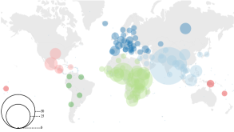
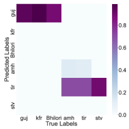

# LIMIT: Language Identification, Misidentification, and Translation using Hierarchical Models in 350+ Languages

###### Abstract

Knowing the language of an input text/audio is a necessary first step for using almost every NLP tool such as taggers, parsers, or translation systems. Language identification is a well-studied problem, sometimes even considered solved; in reality, due to lack of data and computational challenges, current systems cannot accurately identify most of the world's 7000 languages. To tackle this bottleneck, we first compile a corpus, MCS-350, of 50K multilingual and parallel children's stories in 350+ languages. MCS-350 can serve as a benchmark for language identification of short texts and for 1400+ new translation directions in low-resource Indian and African languages. Second, we propose a novel misprediction-resolution hierarchical model, LIMIT, for language identification that reduces error by 55% (from 0.71 to 0.32) on our compiled children's stories dataset and by 40% (from 0.23 to 0.14) on the FLORES-200 benchmark. Our method can expand language identification coverage into low-resource languages by relying solely on systemic misprediction patterns, bypassing the need to retrain large models from scratch.111Data, code, and models are publicly available on GitHub under permissive licenses. Repository: <https://github.com/magarw/limit>  

## 1 Introduction

[FIGURE S1.F1.g1]

Figure 1: Most languages in our dataset are from the Indian Subcontinent and Sub-Saharan Africa, with significant minorities from Europe (primarily in the role of the high-resource language parallel translation available for each story). Color broadly indicates continent or region (North America, South America, Africa, Europe, Asia, Oceania) and size indicates number of languages per country in our dataset.
[/FIGURE]

Building natural language processing (NLP) tools like machine translation, language identification, part of speech (POS) taggers, etc. increasingly requires more and more data and computational resources. To attain good performance on a large number of languages, model complexity and data quantity must be increased. However, for a majority of the world's 7000 languages, large amounts of data are often unavailable which creates a high barrier of entry Blasi et al. ([2022](#bib.bib13)); Joshi et al. ([2020](#bib.bib32)); Khanuja et al. ([2023](#bib.bib34)). Increasing model complexity for large-scale models also requires disproportionate amount of computational resources, further disincentivizing researchers to work towards including these languages in modern NLP systems.  

A popular data collection approach is large-scale web mining Tiedemann and Nygaard ([2004](#bib.bib57)); Bañón et al. ([2020](#bib.bib9)); Schwenk et al. ([2021b](#bib.bib54)), where large parts of the internet are scoured to find training data for data-hungry NLP algorithms. When faced with a sentence or phrase, such algorithms must know how to reliably sort this text into the appropriate language bucket. Since the web is replete with content in a variety of languages, a model needs to recognize text in a sufficiently large number of these languages with high accuracy. Identifying parallel bitext is even more demanding as a machine translation system must also be available to correctly identify and align parallel data Vegi et al. ([2022](#bib.bib59)); Kunchukuttan et al. ([2018](#bib.bib37)). This data-collection paradigm becomes inaccessible for low-resource languages because high-quality translation models usually require substantial amounts of parallel data for training, which is often unavailable. Without high-quality language identification and translation system, it becomes practically impossible to mine the internet for relevant text during such collection efforts. Additionally, mispredictions by language identification and data collection algorithms can increase inter-class noise, reducing the crawled data's quality, and harming performance in downstream tasks without strong quality evaluation metrics Kocyigit et al. ([2022](#bib.bib36)).  

How can we address these challenges and build high-quality identification and translation for low-resource languages?  

#### Resource Creation

Highlighting the need for resource creation in low-resource languages, we first share a new parallel children's stories dataset, MCS-350, created using two resources: African Storybooks Initiative222<https://www.africanstorybook.org/> and Indian non-profit publishing outfit Pratham Books' digital repository Storyweaver333<https://storyweaver.org.in/> (available under permissive Creative Commons licenses). The combined dataset includes original and human-translated parallel stories in over 350 languages (visualized in Figure [1](#S1.F1 "Figure 1 ‣ 1 Introduction ‣ LIMIT: Language Identification, Misidentification, and Translation using Hierarchical Models in 350+ Languages")) and we merge, preprocess, and structure it so it is easily utilizable by NLP researchers for training and benchmarking (§[2](#S2 "2 MCS-350 Data Curation ‣ LIMIT: Language Identification, Misidentification, and Translation using Hierarchical Models in 350+ Languages")).  

#### Machine Translation

Armed with parallel stories in many low-resource African and Indian languages, we tackle machine translation in resource-constrained situations next. If we aim to collect parallel data in low-resource languages, language identification itself is insufficient and we need high-quality translation models as well. We utilize a pre-trained multilingual translation model Alam and Anastasopoulos ([2022](#bib.bib8)) and explore training with hierarchical language-level and language family-level adapter units to translate children's stories at the page level (§[3](#S3 "3 Machine Translation Benchmark ‣ LIMIT: Language Identification, Misidentification, and Translation using Hierarchical Models in 350+ Languages")).  

#### Language Identification

Finally, we take on the biggest bottleneck in low-resource language data collection efforts - language identification. We propose LIMIT - a misidentification-based hierarchical modeling approach for language identification, that utilizes data and computational resources efficiently and shows cross-domain generalization. The proposed approach is exciting because unlike previously published language identification models like AfroLID Adebara et al. ([2022](#bib.bib2)), CLD3 Salcianu et al. ([2020](#bib.bib51)) and Franc444<https://github.com/wooorm/franc/>, LIMIT avoids training large multilingual models for a new set of languages and still outperforms existing systems. Large multilingual models often require thousands of sentences for training, ex. AfroLID Adebara et al. ([2022](#bib.bib2)) collects and trains on over 4000 sentences per language. On the other hand, for many low-resource languages in India and Africa, we may not even be able to collect 1000 sentences at first [2](#S2 "2 MCS-350 Data Curation ‣ LIMIT: Language Identification, Misidentification, and Translation using Hierarchical Models in 350+ Languages"). Also, in contrast with other recent work in hierarchical language identification Goutte et al. ([2014](#bib.bib23)); Lui et al. ([2014](#bib.bib40)); Bestgen ([2017](#bib.bib11)); Jauhiainen et al. ([2019](#bib.bib30)), our work stands out because it accounts for mispredictions made by existing trained models. Unlike other work, it does not predict a group/language family first, but rather directly learns confusion relationships between language pairs (which may not be from the same language family). By leveraging hierarchically organized units on top of a root model, we avoid complete retraining, saving computational resources, while increasing coverage into many new and understudied languages and language pairs (especially those between two low-resource languages) (§[4](#S4 "4 Language (Mis)Identification Benchmark ‣ LIMIT: Language Identification, Misidentification, and Translation using Hierarchical Models in 350+ Languages")).  

To summarize, our main contributions are:  

1. We compile MCS-350, a dataset of 50K+ parallel children's stories from African Storybooks Initiative and Storyweaver in 350+ languages (§[2](#S2 "2 MCS-350 Data Curation ‣ LIMIT: Language Identification, Misidentification, and Translation using Hierarchical Models in 350+ Languages")). 
2. We share a machine translation benchmark enabling translation evaluation in more than 1400 new translation directions (§[3](#S3 "3 Machine Translation Benchmark ‣ LIMIT: Language Identification, Misidentification, and Translation using Hierarchical Models in 350+ Languages")). 
3. We propose LIMIT, a misidentification-based hierarchical model, that can use limited data to better identify low-resource languages (§[4](#S4 "4 Language (Mis)Identification Benchmark ‣ LIMIT: Language Identification, Misidentification, and Translation using Hierarchical Models in 350+ Languages")). 

## 2 MCS-350 Data Curation

[TABLE S2.T1]

<table class="ltx_tabular ltx_centering ltx_guessed_headers ltx_align_middle">
<thead class="ltx_thead">
<tr class="ltx_tr">
<th class="ltx_td ltx_align_left ltx_th ltx_th_column ltx_th_row ltx_border_tt">Family</th>
<th class="ltx_td ltx_align_center ltx_th ltx_th_column ltx_border_tt">Languages</th>
<th class="ltx_td ltx_align_center ltx_th ltx_th_column ltx_border_tt">Sentences</th>
</tr>
</thead>
<tbody class="ltx_tbody">
<tr class="ltx_tr">
<th class="ltx_td ltx_align_left ltx_th ltx_th_row ltx_border_t">Niger-Congo</th>
<td class="ltx_td ltx_align_center ltx_border_t">129</td>
<td class="ltx_td ltx_align_center ltx_border_t">142605</td>
</tr>
<tr class="ltx_tr">
<th class="ltx_td ltx_align_left ltx_th ltx_th_row">Indo-European</th>
<td class="ltx_td ltx_align_center">84</td>
<td class="ltx_td ltx_align_center">169823</td>
</tr>
<tr class="ltx_tr">
<th class="ltx_td ltx_align_left ltx_th ltx_th_row">Nilo-Saharan</th>
<td class="ltx_td ltx_align_center">22</td>
<td class="ltx_td ltx_align_center">23204</td>
</tr>
<tr class="ltx_tr">
<th class="ltx_td ltx_align_left ltx_th ltx_th_row">Sino-Tibetan</th>
<td class="ltx_td ltx_align_center">21</td>
<td class="ltx_td ltx_align_center">19264</td>
</tr>
<tr class="ltx_tr">
<th class="ltx_td ltx_align_left ltx_th ltx_th_row">Austronesian</th>
<td class="ltx_td ltx_align_center">18</td>
<td class="ltx_td ltx_align_center">28096</td>
</tr>
<tr class="ltx_tr">
<th class="ltx_td ltx_align_left ltx_th ltx_th_row">Afro-Asiatic</th>
<td class="ltx_td ltx_align_center">15</td>
<td class="ltx_td ltx_align_center">20266</td>
</tr>
<tr class="ltx_tr">
<th class="ltx_td ltx_align_left ltx_th ltx_th_row">Dravidian</th>
<td class="ltx_td ltx_align_center">13</td>
<td class="ltx_td ltx_align_center">35638</td>
</tr>
<tr class="ltx_tr">
<th class="ltx_td ltx_align_left ltx_th ltx_th_row ltx_border_bb">Austro-Asiatic</th>
<td class="ltx_td ltx_align_center ltx_border_bb">10</td>
<td class="ltx_td ltx_align_center ltx_border_bb">22989</td>
</tr>
</tbody>
</table>

Table 1: Our compiled dataset MCS-350 contains stories from a diverse set of languages families, mostly coming from Africa and India. Prominent language families with with 20K+ sentences across languages shown.
[/TABLE]

We identify two large-scale parallel repositories - African Storybooks Initiative and Pratham Books' Storyweaver, both under permissive Creative Commons Licenses, with their storybooks available for non-commercial and research use. African Storybooks Initiative hosts parallel translated and human-verified children's stories in over 200 African languages. Pratham Books is a non-profit Indian publisher that aims to increase literacy of children and adults alike in Indian languages. Their digital repository, Storyweaver, publishes parallel translated stories in 300+ languages. This includes not only Indian languages but also African, European, and Indigenous languages from the Americas.  

### 2.1 Parallel Dataset

We collect stories through a mix of web scraping and public APIs, preprocess them to remove mismatched/incorrect text, extract monolingual text for language identification and parallel text for machine translation. We maintain metadata about authors, translators, illustrators, reading level, parallel translations, and copyrights for each story. We remove stories that are either empty or those from non-English languages that have over 50% pages containing majority English text with 90% confidence using langdetect Nakatani ([2010](#bib.bib43)). This leaves us with $\sim$52K stories.  

Note that both African Storybooks Initiative and Pratham Storyweaver human verify stories and language. However, there are several abandoned translation projects and completed but unverified stories that need automated checking. Therefore, our preprocessing is meant for unverified stories, and may introduce noise in the collected data. By improving the preprocessing filters, we can likely further improve the quality of the unverified stories in the corpus. Collected stories in the pre-merge stage are available with their associated metadata in the repository.  

[TABLE S2.T2]

<table class="ltx_tabular ltx_centering ltx_guessed_headers ltx_align_middle">
<thead class="ltx_thead">
<tr class="ltx_tr">
<th class="ltx_td ltx_align_left ltx_th ltx_th_column ltx_th_row ltx_border_tt">Dataset</th>
<th class="ltx_td ltx_align_center ltx_th ltx_th_column ltx_border_tt">New languages</th>
<th class="ltx_td ltx_align_center ltx_th ltx_th_column ltx_border_tt">New pairs</th>
</tr>
</thead>
<tbody class="ltx_tbody">
<tr class="ltx_tr">
<th class="ltx_td ltx_align_left ltx_th ltx_th_row ltx_border_t">Microsoft</th>
<td class="ltx_td ltx_align_center ltx_border_t">67</td>
<td class="ltx_td ltx_align_center ltx_border_t">2835</td>
</tr>
<tr class="ltx_tr">
<th class="ltx_td ltx_align_left ltx_th ltx_th_row">FLORES-200</th>
<td class="ltx_td ltx_align_center">51</td>
<td class="ltx_td ltx_align_center">1449</td>
</tr>
<tr class="ltx_tr">
<th class="ltx_td ltx_align_left ltx_th ltx_th_row ltx_border_bb">OPUS</th>
<td class="ltx_td ltx_align_center ltx_border_bb">82</td>
<td class="ltx_td ltx_align_center ltx_border_bb">2853</td>
</tr>
</tbody>
</table>

Table 2: MCS-350 enables MT evaluation between 1400+ new pairs compared to existing benchmarks.
[/TABLE]

[TABLE S2.T3]

<table class="ltx_tabular ltx_centering ltx_guessed_headers ltx_align_middle">
<thead class="ltx_thead">
<tr class="ltx_tr">
<th class="ltx_td ltx_align_left ltx_th ltx_th_column ltx_th_row ltx_border_tt">Script</th>
<th class="ltx_td ltx_align_center ltx_th ltx_th_column ltx_border_tt">Languages</th>
<th class="ltx_td ltx_align_center ltx_th ltx_th_column ltx_border_tt">Examples</th>
</tr>
</thead>
<tbody class="ltx_tbody">
<tr class="ltx_tr">
<th class="ltx_td ltx_align_left ltx_th ltx_th_row ltx_border_t">Devanagari</th>
<td class="ltx_td ltx_align_center ltx_border_t">38</td>
<td class="ltx_td ltx_align_center ltx_border_t">Hindi, Marathi</td>
</tr>
<tr class="ltx_tr">
<th class="ltx_td ltx_align_left ltx_th ltx_th_row">Cyrillic</th>
<td class="ltx_td ltx_align_center">14</td>
<td class="ltx_td ltx_align_center">Russian, Bulgarian</td>
</tr>
<tr class="ltx_tr">
<th class="ltx_td ltx_align_left ltx_th ltx_th_row">Arabic</th>
<td class="ltx_td ltx_align_center">8</td>
<td class="ltx_td ltx_align_center">Arabic, Persian</td>
</tr>
<tr class="ltx_tr">
<th class="ltx_td ltx_align_left ltx_th ltx_th_row">Tibetan</th>
<td class="ltx_td ltx_align_center">3</td>
<td class="ltx_td ltx_align_center">Tibetan, Ladakhi</td>
</tr>
<tr class="ltx_tr">
<th class="ltx_td ltx_align_left ltx_th ltx_th_row">Telugu</th>
<td class="ltx_td ltx_align_center">3</td>
<td class="ltx_td ltx_align_center">Telugu, Konda</td>
</tr>
<tr class="ltx_tr">
<th class="ltx_td ltx_align_left ltx_th ltx_th_row ltx_border_bb">Odia</th>
<td class="ltx_td ltx_align_center ltx_border_bb">3</td>
<td class="ltx_td ltx_align_center ltx_border_bb">Odia, Ho, Kui</td>
</tr>
</tbody>
</table>

Table 3: Our dataset contains stories in many writing systems other than Latin, especially those from the Indian Subcontinent. Prominent non-Latin writing systems in MCS-350 are shown above.
[/TABLE]

### 2.2 Multilingual Documents

MCS-350 contains multilingual stories with language identifiers denoted by $L_{1}\_L_{2}$ for a story multilingual in $L_{1}$ and $L_{2}$. Such stories include text in multiple languages within the same page. Text may be code-mixed or consecutively presented. To extract as many parallel sentences as possible to support vulnerable languages and also create new translation directions, we employ string-similarity based matching to identify the segments corresponding to the high-resource language in the pair, and therefore automatically generating parallel sentences from 10K pages across 52 languages. E.g., through this process, we extracted 1000+ sentences in Kui (0 sentences pre-extraction), a minority Dravidian language with about 900K native speakers. We manually verified all extracted monolingual text after using string matching on multilingual stories.  

### 2.3 Language Varieties/Lects

We attempt to separate language varieties/lects into unique prediction classes if there is sufficient training data for them ($\geq 1000$ sentences). If an ISO code is unavailable for the lect, we assign a class name with the ISO code and the subdivision specified as: iso\_subdivision. For instance, we separated Gondi's South Bastar lect (gon\_bastar, 4000+ sentences) from the generic language code for Gondi (gon). For fair evaluation and comparison, we provide manual mappings for any non-standard identifiers from the output space of various language identification tools. Lects with too little data are merged into their parent language, e.g., ``Bangla (Bangladesh)'' merged into ``Bengali''.  

[TABLE S2.T4]

<table class="ltx_tabular ltx_centering ltx_guessed_headers ltx_align_middle">
<tbody class="ltx_tbody">
<tr class="ltx_tr">
<th class="ltx_td ltx_align_center ltx_th ltx_th_row ltx_border_r ltx_border_tt">Model</th>
<th class="ltx_td ltx_align_center ltx_th ltx_th_row ltx_border_r ltx_border_tt"><math class="ltx_Math"><semantics><msub><mtext class="ltx_mathvariant_bold">Avg</mtext><mtext class="ltx_font_smallcaps">all</mtext></msub><annotation-xml><apply><csymbol>subscript</csymbol><ci><mtext class="ltx_mathvariant_bold">Avg</mtext></ci><ci><mtext class="ltx_font_smallcaps">all</mtext></ci></apply></annotation-xml><annotation>\textbf{Avg}_{\textsc{all}}</annotation></semantics></math></th>
<td class="ltx_td ltx_align_center ltx_border_tt"><math class="ltx_Math"><semantics><msub><mtext class="ltx_mathvariant_bold">Avg</mtext><mrow><mtext class="ltx_font_smallcaps">afri</mtext><mo>→</mo><mtext class="ltx_font_smallcaps">afri</mtext></mrow></msub><annotation-xml><apply><csymbol>subscript</csymbol><ci><mtext class="ltx_mathvariant_bold">Avg</mtext></ci><apply><ci>→</ci><ci><mtext class="ltx_font_smallcaps">afri</mtext></ci><ci><mtext class="ltx_font_smallcaps">afri</mtext></ci></apply></apply></annotation-xml><annotation>\textbf{Avg}_{\textsc{afri}\rightarrow\textsc{afri}}</annotation></semantics></math></td>
<td class="ltx_td ltx_align_center ltx_border_tt"><math class="ltx_Math"><semantics><msub><mtext class="ltx_mathvariant_bold">Avg</mtext><mrow><mtext class="ltx_font_smallcaps">x</mtext><mo>→</mo><mtext class="ltx_font_smallcaps">eng</mtext></mrow></msub><annotation-xml><apply><csymbol>subscript</csymbol><ci><mtext class="ltx_mathvariant_bold">Avg</mtext></ci><apply><ci>→</ci><ci><mtext class="ltx_font_smallcaps">x</mtext></ci><ci><mtext class="ltx_font_smallcaps">eng</mtext></ci></apply></apply></annotation-xml><annotation>\textbf{Avg}_{\textsc{x}\rightarrow\textsc{eng}}</annotation></semantics></math></td>
<td class="ltx_td ltx_align_center ltx_border_tt"><math class="ltx_Math"><semantics><msub><mtext class="ltx_mathvariant_bold">Avg</mtext><mrow><mtext class="ltx_font_smallcaps">eng</mtext><mo>→</mo><mtext class="ltx_font_smallcaps">x</mtext></mrow></msub><annotation-xml><apply><csymbol>subscript</csymbol><ci><mtext class="ltx_mathvariant_bold">Avg</mtext></ci><apply><ci>→</ci><ci><mtext class="ltx_font_smallcaps">eng</mtext></ci><ci><mtext class="ltx_font_smallcaps">x</mtext></ci></apply></apply></annotation-xml><annotation>\textbf{Avg}_{\textsc{eng}\rightarrow\textsc{x}}</annotation></semantics></math></td>
<td class="ltx_td ltx_align_center ltx_border_tt"><math class="ltx_Math"><semantics><msub><mtext class="ltx_mathvariant_bold">Avg</mtext><mrow><mtext class="ltx_font_smallcaps">y</mtext><mo>→</mo><mtext class="ltx_font_smallcaps">fra</mtext></mrow></msub><annotation-xml><apply><csymbol>subscript</csymbol><ci><mtext class="ltx_mathvariant_bold">Avg</mtext></ci><apply><ci>→</ci><ci><mtext class="ltx_font_smallcaps">y</mtext></ci><ci><mtext class="ltx_font_smallcaps">fra</mtext></ci></apply></apply></annotation-xml><annotation>\textbf{Avg}_{\textsc{y}\rightarrow\textsc{fra}}</annotation></semantics></math></td>
<td class="ltx_td ltx_align_center ltx_border_tt"><math class="ltx_Math"><semantics><msub><mtext class="ltx_mathvariant_bold">Avg</mtext><mrow><mtext class="ltx_font_smallcaps">fra</mtext><mo>→</mo><mtext class="ltx_font_smallcaps">y</mtext></mrow></msub><annotation-xml><apply><csymbol>subscript</csymbol><ci><mtext class="ltx_mathvariant_bold">Avg</mtext></ci><apply><ci>→</ci><ci><mtext class="ltx_font_smallcaps">fra</mtext></ci><ci><mtext class="ltx_font_smallcaps">y</mtext></ci></apply></apply></annotation-xml><annotation>\textbf{Avg}_{\textsc{fra}\rightarrow\textsc{y}}</annotation></semantics></math></td>
</tr>
<tr class="ltx_tr">
<th class="ltx_td ltx_align_center ltx_th ltx_th_row ltx_border_r ltx_border_t">Baseline</th>
<th class="ltx_td ltx_align_center ltx_th ltx_th_row ltx_border_r ltx_border_t">11.87</th>
<td class="ltx_td ltx_align_center ltx_border_t">10.19</td>
<td class="ltx_td ltx_align_center ltx_border_t">18.79</td>
<td class="ltx_td ltx_align_center ltx_border_t">13.20</td>
<td class="ltx_td ltx_align_center ltx_border_t">15.64</td>
<td class="ltx_td ltx_align_center ltx_border_t">12.55</td>
</tr>
<tr class="ltx_tr">
<th class="ltx_td ltx_th ltx_th_row ltx_border_r"></th>
<th class="ltx_td ltx_align_center ltx_th ltx_th_row ltx_border_r">(6.31)</th>
<td class="ltx_td ltx_align_center">(5.06)</td>
<td class="ltx_td ltx_align_center">(7.75)</td>
<td class="ltx_td ltx_align_center">(8.19)</td>
<td class="ltx_td ltx_align_center">(5.22)</td>
<td class="ltx_td ltx_align_center">(5.81)</td>
</tr>
<tr class="ltx_tr">
<th class="ltx_td ltx_align_center ltx_th ltx_th_row ltx_border_r">L-Fine</th>
<th class="ltx_td ltx_align_center ltx_th ltx_th_row ltx_border_r">19.52</th>
<td class="ltx_td ltx_align_center">18.21</td>
<td class="ltx_td ltx_align_center">30.38</td>
<td class="ltx_td ltx_align_center">17.46</td>
<td class="ltx_td ltx_align_center">21.93</td>
<td class="ltx_td ltx_align_center">17.86</td>
</tr>
<tr class="ltx_tr">
<th class="ltx_td ltx_th ltx_th_row ltx_border_r"></th>
<th class="ltx_td ltx_align_center ltx_th ltx_th_row ltx_border_r">(10.33)</th>
<td class="ltx_td ltx_align_center">(10.06)</td>
<td class="ltx_td ltx_align_center">(13.63)</td>
<td class="ltx_td ltx_align_center">(8.46)</td>
<td class="ltx_td ltx_align_center">(4.87)</td>
<td class="ltx_td ltx_align_center">(6.86)</td>
</tr>
<tr class="ltx_tr">
<th class="ltx_td ltx_align_center ltx_th ltx_th_row ltx_border_r">F-Fine</th>
<th class="ltx_td ltx_align_center ltx_th ltx_th_row ltx_border_r">24.93</th>
<td class="ltx_td ltx_align_center">23.58</td>
<td class="ltx_td ltx_align_center">35.66</td>
<td class="ltx_td ltx_align_center">25.26</td>
<td class="ltx_td ltx_align_center">27.06</td>
<td class="ltx_td ltx_align_center">21.36</td>
</tr>
<tr class="ltx_tr">
<th class="ltx_td ltx_th ltx_th_row ltx_border_r"></th>
<th class="ltx_td ltx_align_center ltx_th ltx_th_row ltx_border_r">(11.74)</th>
<td class="ltx_td ltx_align_center">(11.31)</td>
<td class="ltx_td ltx_align_center">(14.36)</td>
<td class="ltx_td ltx_align_center">(13.72)</td>
<td class="ltx_td ltx_align_center">(6.00)</td>
<td class="ltx_td ltx_align_center">(7.32)</td>
</tr>
<tr class="ltx_tr">
<th class="ltx_td ltx_align_center ltx_th ltx_th_row ltx_border_bb ltx_border_r ltx_border_t">Unique Pairs</th>
<th class="ltx_td ltx_align_center ltx_th ltx_th_row ltx_border_bb ltx_border_r ltx_border_t">88</th>
<td class="ltx_td ltx_align_center ltx_border_bb ltx_border_t">58</td>
<td class="ltx_td ltx_align_center ltx_border_bb ltx_border_t">16</td>
<td class="ltx_td ltx_align_center ltx_border_bb ltx_border_t">16</td>
<td class="ltx_td ltx_align_center ltx_border_bb ltx_border_t">14</td>
<td class="ltx_td ltx_align_center ltx_border_bb ltx_border_t">14</td>
</tr>
</tbody>
</table>

Table 4: 
spBLEU across 176 translation directions involving African languages, we see that including phylogenetic information helps in translation, with the family-based F-Fine model showing the best performance, on average. $\textbf{Avg}_{\textsc{afri}\rightarrow\textsc{afri}}$ denotes the overall average spBLEU of translation between two African languages. $\textbf{Avg}_{\textsc{x/y}\rightarrow\textsc{eng/fra}}$ and $\textbf{Avg}_{\textsc{eng/fra}\rightarrow\textsc{x/y}}$ denote translating into and out of English/French respectively. Parentheses below the averages represent standard deviations. Baseline refers to a DeltaLM model finetuned on 26 languages without adapters. We can see that it is harder to translate out of English than into English.
[/TABLE]

[TABLE S2.T5]

<table class="ltx_tabular ltx_centering ltx_guessed_headers ltx_align_middle">
<thead class="ltx_thead">
<tr class="ltx_tr">
<th class="ltx_td ltx_align_center ltx_th ltx_th_column ltx_th_row ltx_border_tt">Lang Pair</th>
<th class="ltx_td ltx_align_center ltx_th ltx_th_column ltx_border_r ltx_border_tt"><math class="ltx_Math"><semantics><mi>Δ</mi><annotation-xml><ci>Δ</ci></annotation-xml><annotation>\Delta</annotation></semantics></math></th>
<th class="ltx_td ltx_align_center ltx_th ltx_th_column ltx_th_row ltx_border_tt">Lang Pair</th>
<th class="ltx_td ltx_align_center ltx_th ltx_th_column ltx_border_tt"><math class="ltx_Math"><semantics><mi>Δ</mi><annotation-xml><ci>Δ</ci></annotation-xml><annotation>\Delta</annotation></semantics></math></th>
</tr>
</thead>
<tbody class="ltx_tbody">
<tr class="ltx_tr">
<th class="ltx_td ltx_align_center ltx_th ltx_th_row ltx_border_t">eng-xho</th>
<td class="ltx_td ltx_align_center ltx_border_r ltx_border_t">20.1</td>
<th class="ltx_td ltx_align_center ltx_th ltx_th_row ltx_border_t">eng-hau</th>
<td class="ltx_td ltx_align_center ltx_border_t">18.8</td>
</tr>
<tr class="ltx_tr">
<th class="ltx_td ltx_align_center ltx_th ltx_th_row">fra-lug</th>
<td class="ltx_td ltx_align_center ltx_border_r">3.6</td>
<th class="ltx_td ltx_align_center ltx_th ltx_th_row">nso-lug</th>
<td class="ltx_td ltx_align_center">3.0</td>
</tr>
<tr class="ltx_tr">
<th class="ltx_td ltx_align_center ltx_th ltx_th_row">lug-kin</th>
<td class="ltx_td ltx_align_center ltx_border_r">2.9</td>
<th class="ltx_td ltx_align_center ltx_th ltx_th_row">kin-lug</th>
<td class="ltx_td ltx_align_center">2.4</td>
</tr>
<tr class="ltx_tr">
<th class="ltx_td ltx_align_center ltx_th ltx_th_row">nya-lug</th>
<td class="ltx_td ltx_align_center ltx_border_r">2.1</td>
<th class="ltx_td ltx_align_center ltx_th ltx_th_row">eng-kam</th>
<td class="ltx_td ltx_align_center">1.8</td>
</tr>
<tr class="ltx_tr">
<th class="ltx_td ltx_align_center ltx_th ltx_th_row">ibo-lug</th>
<td class="ltx_td ltx_align_center ltx_border_r">1.7</td>
<th class="ltx_td ltx_align_center ltx_th ltx_th_row">eng-lug</th>
<td class="ltx_td ltx_align_center">1.5</td>
</tr>
<tr class="ltx_tr">
<th class="ltx_td ltx_align_center ltx_th ltx_th_row">zul-lug</th>
<td class="ltx_td ltx_align_center ltx_border_r">1.5</td>
<th class="ltx_td ltx_align_center ltx_th ltx_th_row">fra-tso</th>
<td class="ltx_td ltx_align_center">1.3</td>
</tr>
<tr class="ltx_tr">
<th class="ltx_td ltx_align_center ltx_th ltx_th_row">xho-lug</th>
<td class="ltx_td ltx_align_center ltx_border_r">1.2</td>
<th class="ltx_td ltx_align_center ltx_th ltx_th_row">fra-yor</th>
<td class="ltx_td ltx_align_center">1.1</td>
</tr>
<tr class="ltx_tr">
<th class="ltx_td ltx_align_center ltx_th ltx_th_row ltx_border_bb">nso-tso</th>
<td class="ltx_td ltx_align_center ltx_border_bb ltx_border_r">1.0</td>
<th class="ltx_td ltx_align_center ltx_th ltx_th_row ltx_border_bb">amh-lug</th>
<td class="ltx_td ltx_align_center ltx_border_bb">1.0</td>
</tr>
</tbody>
</table>

Table 5: Despite MCS-350 and FLORES-200 having widely different domains, several translation directions see cross-domain improvements. $\Delta$ indicates spBLEU improvements in the F-Fine model over the Baseline
[/TABLE]

### 2.4 Data Overview

MCS-350 covers over 350 languages from a diverse pool of language families. In Table [1](#S2.T1 "Table 1 ‣ 2 MCS-350 Data Curation ‣ LIMIT: Language Identification, Misidentification, and Translation using Hierarchical Models in 350+ Languages"), we share the number of languages and the number of sentences in each language family in the dataset. The data is roughly evenly split between stories from the large Niger-Congo and Indo-European language families, with a sizeable minority in other language families like Nilo-Saharan, Sino-Tibetan, Austronesian, Dravidian, Creole, etc. About 70% of the dataset's languages use the Latin script or its extended variants with diacritics. However, the data is still quite typographically rich, and stories with non-Latin scripts are in abundance, enumerated in Table [3](#S2.T3 "Table 3 ‣ 2.1 Parallel Dataset ‣ 2 MCS-350 Data Curation ‣ LIMIT: Language Identification, Misidentification, and Translation using Hierarchical Models in 350+ Languages").  

Compared to highly multilingual translation benchmarks like NTREX (parallel data of 128 languages; Federmann et al., [2022](#bib.bib22)), FLORES-200 ($n$-way, 200 languages; NLLB Team et al., [2022](#bib.bib45)), or OPUS-100 (parallel data for 99 languages to/from English; Aharoni et al., [2019](#bib.bib6)), our benchmark introduces up to 82 new languages leading to more than 1400 new language pairs (see Table [2](#S2.T2 "Table 2 ‣ 2.1 Parallel Dataset ‣ 2 MCS-350 Data Curation ‣ LIMIT: Language Identification, Misidentification, and Translation using Hierarchical Models in 350+ Languages")).  

## 3 Machine Translation Benchmark

While it is true that resource creation in low-resource languages requires fine-grained and high-quality language identification, collecting parallel data additionally requires high-quality MT (§[1](#S1 "1 Introduction ‣ LIMIT: Language Identification, Misidentification, and Translation using Hierarchical Models in 350+ Languages")). In this section, we explore phylogeny-based hierarchical adapter units to improve translation quality between two African languages, and between African languages and English/French.  

### 3.1 Data

We exploit the parallel nature of children's stories in MCS-350 and ensure that all training stories are separate from test ($1000$ pages) stories. This is done to get a more realistic estimate of translation quality on new stories. For languages with $<1000$ pages across stories, we use 500-page test sets.  

[TABLE S3.T6]

<table class="ltx_tabular ltx_centering ltx_guessed_headers ltx_align_middle">
<thead class="ltx_thead">
<tr class="ltx_tr">
<th class="ltx_td ltx_align_left ltx_th ltx_th_column ltx_th_row ltx_border_tt">Model</th>
<th class="ltx_td ltx_align_center ltx_th ltx_th_column ltx_th_row ltx_border_tt"><math class="ltx_Math"><semantics><msub><mi>𝑭</mi><mn>𝟏</mn></msub><annotation-xml><apply><csymbol>subscript</csymbol><ci>𝑭</ci><cn>1</cn></apply></annotation-xml><annotation>F_{1}</annotation></semantics></math></th>
<th class="ltx_td ltx_align_center ltx_th ltx_th_column ltx_border_tt">Supported</th>
<th class="ltx_td ltx_align_center ltx_th ltx_th_column ltx_border_tt">Common</th>
<th class="ltx_td ltx_align_center ltx_th ltx_th_column ltx_border_tt">Total (with LIMIT)</th>
</tr>
</thead>
<tbody class="ltx_tbody">
<tr class="ltx_tr">
<th class="ltx_td ltx_align_left ltx_th ltx_th_row ltx_border_t">CLD3  <cite class="ltx_cite ltx_citemacro_cite">Salcianu et al. (<a class="ltx_ref">2020</a>)</cite>
</th>
<th class="ltx_td ltx_align_center ltx_th ltx_th_row ltx_border_t">0.11</th>
<td class="ltx_td ltx_align_center ltx_border_t">101</td>
<td class="ltx_td ltx_align_center ltx_border_t">81</td>
<td class="ltx_td ltx_align_center ltx_border_t">376</td>
</tr>
<tr class="ltx_tr">
<th class="ltx_td ltx_align_left ltx_th ltx_th_row">langid.py <cite class="ltx_cite ltx_citemacro_cite">Lui and Baldwin (<a class="ltx_ref">2012</a>)</cite>
</th>
<th class="ltx_td ltx_align_center ltx_th ltx_th_row">0.09</th>
<td class="ltx_td ltx_align_center">97</td>
<td class="ltx_td ltx_align_center">73</td>
<td class="ltx_td ltx_align_center">380</td>
</tr>
<tr class="ltx_tr">
<th class="ltx_td ltx_align_left ltx_th ltx_th_row">Franc555<a class="ltx_ref ltx_url ltx_font_typewriter">https://github.com/wooorm/franc/</a>
</th>
<th class="ltx_td ltx_align_center ltx_th ltx_th_row">0.18</th>
<td class="ltx_td ltx_align_center">369</td>
<td class="ltx_td ltx_align_center">116</td>
<td class="ltx_td ltx_align_center">609</td>
</tr>
<tr class="ltx_tr">
<th class="ltx_td ltx_align_left ltx_th ltx_th_row">fastText <cite class="ltx_cite ltx_citemacro_cite">Joulin et al. (<a class="ltx_ref">2017</a>)</cite>
</th>
<th class="ltx_td ltx_align_center ltx_th ltx_th_row">0.10</th>
<td class="ltx_td ltx_align_center">176</td>
<td class="ltx_td ltx_align_center">117</td>
<td class="ltx_td ltx_align_center">415</td>
</tr>
<tr class="ltx_tr">
<th class="ltx_td ltx_align_left ltx_th ltx_th_row ltx_border_bb">HeLI-OTS <cite class="ltx_cite ltx_citemacro_cite">Jauhiainen et al. (<a class="ltx_ref">2022a</a>)</cite>
</th>
<th class="ltx_td ltx_align_center ltx_th ltx_th_row ltx_border_bb">0.13</th>
<td class="ltx_td ltx_align_center ltx_border_bb">200</td>
<td class="ltx_td ltx_align_center ltx_border_bb">81</td>
<td class="ltx_td ltx_align_center ltx_border_bb">475</td>
</tr>
</tbody>
</table>

Table 6: This table shows different popular language identification ssytems, their $F_{1}$ scores on MCS-350, supported languages, common languages, and total coverage with LIMIT. Franc, trained on UDHR data, outperforms other systems both on performance and coverage, and will serve as the root model for our experiments. Macro $F_{1}$ score is computed across all 355+ languages to identify a system with the best overall coverage and accuracy.
[/TABLE]

### 3.2 Experimental Settings

As our baseline, we used the model from Alam and Anastasopoulos ([2022](#bib.bib8)), which is the best-performing publicly available model from the WMT Shared Task on Large Scale Evaluation for African Languages Adelani et al. ([2022](#bib.bib3)).666Ranked third in the Shared Task. Top two systems were industry submissions that are not publicly available. They first fine-tuned the DeltaLM777<https://aka.ms/deltalm> model Ma et al. ([2021](#bib.bib41)) in 26 languages. After that, they added lightweight language-specific adapter layers Pfeiffer et al. ([2022](#bib.bib48)) and fine-tuned only the adapters in those 26 languages. We can either use a single adapter per language (L-Fine) or organize the adapters in a phylogenetically-informed hierarchy (F-Fine) so that similar languages share language-family and genus-level adapters Faisal and Anastasopoulos ([2022](#bib.bib21)). We perform both L-Fine and F-Fine experiments using the publicly available code 888<https://github.com/mahfuzibnalam/large-scale_MT_African_languages> and also share an additional baseline by finetuning the DeltaLM model without adapters. Details on phylogenetic trees and reproducibility are in Appendix §[A.3](#A1.SS3 "A.3 Machine Translation ‣ Appendix A Reproducibility ‣ Acknowledgments ‣ Ethics Statement ‣ Limitations ‣ 6 Conclusion ‣ 5.4 Hierarchical Modeling ‣ 5 Related Work ‣ 4.5 Sentence Length and Domain ‣ 4.4 Expanded Language Coverage ‣ 4.3 Language (Mis)identification ‣ 4.2 Pre-trained root Models ‣ Evaluation Metric ‣ 4.1 Experimental Settings ‣ 4 Language (Mis)Identification Benchmark ‣ LIMIT: Language Identification, Misidentification, and Translation using Hierarchical Models in 350+ Languages").  

### 3.3 Evaluation

In Table [4](#S2.T4 "Table 4 ‣ 2.3 Language Varieties/Lects ‣ 2 MCS-350 Data Curation ‣ LIMIT: Language Identification, Misidentification, and Translation using Hierarchical Models in 350+ Languages"), we show the performance of our L-Fine and F-Fine models compared to the baseline on our test set. We evaluate using three well-known MT metrics: BLEU Papineni et al. ([2002](#bib.bib47)), CHRF++ Popović ([2017](#bib.bib49)), and spBLEU NLLB Team et al. ([2022](#bib.bib45)). For spBLEU, we use the FLORES200 SPM model to create subwords.  

Based on all three metrics, our L-Fine model outperforms the Baseline model consistently by 4.0-11.5 spBLEU points by just fine-tuning with language-specific adapters. Our F-Fine model outperforms the L-Fine model by 5.0-7.5 spBLEu points by fine-tuning only some shared parameters among languages and language-specific adapters. We also test our models on a public benchmark, FLORES200 (Appendix §[B](#A2 "Appendix B Supplementary Machine Translation Benchmarks ‣ Acknowledgments ‣ Ethics Statement ‣ Limitations ‣ 6 Conclusion ‣ 5.4 Hierarchical Modeling ‣ 5 Related Work ‣ 4.5 Sentence Length and Domain ‣ 4.4 Expanded Language Coverage ‣ 4.3 Language (Mis)identification ‣ 4.2 Pre-trained root Models ‣ Evaluation Metric ‣ 4.1 Experimental Settings ‣ 4 Language (Mis)Identification Benchmark ‣ LIMIT: Language Identification, Misidentification, and Translation using Hierarchical Models in 350+ Languages")), and observe that due to the domain shift, L-Fine and F-Fine models under-perform the Baseline.  

Despite this domain shift, several low-resource language pairs benefit from adapter fine-tuning across domains. We report these language pairs and their respective spBLEU gains for the F-Fine model in Table [5](#S2.T5 "Table 5 ‣ 2.3 Language Varieties/Lects ‣ 2 MCS-350 Data Curation ‣ LIMIT: Language Identification, Misidentification, and Translation using Hierarchical Models in 350+ Languages"). We get the highest gains for English-Xhosa (20.1 points) and English-Hausa (18.8 points) across domains, both of which had poor performance from the Baseline model with spBLEU of 3.5 and 4.5, respectively. We also notice cross-domain improvement in some translation directions involving two African languages such as Ganda-Kinyarwanda (2.9 points) and Northern Sotho-Ganda (3.0 points). Exhaustive results for other language pairs can be found in Appendix §[B](#A2 "Appendix B Supplementary Machine Translation Benchmarks ‣ Acknowledgments ‣ Ethics Statement ‣ Limitations ‣ 6 Conclusion ‣ 5.4 Hierarchical Modeling ‣ 5 Related Work ‣ 4.5 Sentence Length and Domain ‣ 4.4 Expanded Language Coverage ‣ 4.3 Language (Mis)identification ‣ 4.2 Pre-trained root Models ‣ Evaluation Metric ‣ 4.1 Experimental Settings ‣ 4 Language (Mis)Identification Benchmark ‣ LIMIT: Language Identification, Misidentification, and Translation using Hierarchical Models in 350+ Languages").  

## 4 Language (Mis)Identification Benchmark

Language identification (LID) affects low-resource language resource creation efforts severely Jauhiainen et al. ([2019](#bib.bib30)); Schwenk et al. ([2021a](#bib.bib53)) because to collect data, we need accurate language identifiers that themselves need high-quality data to trainBurchell et al. ([2023](#bib.bib16)) , creating a vicious cycle. Low-quality systems often make mispredictions which increases inter-class noise and reduces the crawled data's quality  Kocyigit et al. ([2022](#bib.bib36)); Burchell et al. ([2023](#bib.bib16)) both for the predicted language and the true language. To correct mispredictions and improve accuracy in supported languages with limited data, we propose a hierarchical modeling approach.  

Hierarchical modeling is an extremely popular choice for a wide variety of algorithmic tasks and it has been explored for language identification as well Goutte et al. ([2014](#bib.bib23)); Lui et al. ([2014](#bib.bib40)); Bestgen ([2017](#bib.bib11)); Jauhiainen et al. ([2019](#bib.bib30)). However, previous work has focused on predicting language group/family first, followed by finer-grained predictions with a smaller set of classes. Our work departs from this paradigm in two ways - first, we bring focus onto expanding language identification coverage in pre-trained or off-the-shelf systems without retraining, and second, we predict a prior and posterior language based on confusion and misprediction patterns of the model directly (without predicting language family/group first).  

[FIGURE S4.1.1.1.1.g1]

Figure 2: Subset of the multilingual root model's confusion matrix (6 languages). Using the confusion matrix, clusters of highly confused languages are identified and confusion-resolution units trained according to the tree shown on the right. The tree, for demonstration purposes, is a subset of the entire tree which has 9 confusion-resolution units
[/FIGURE]

